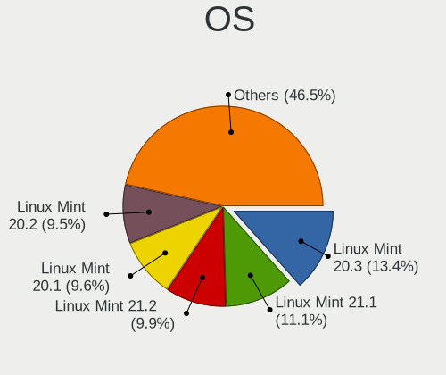
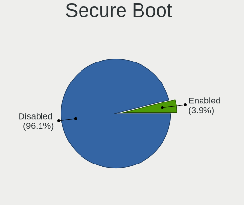
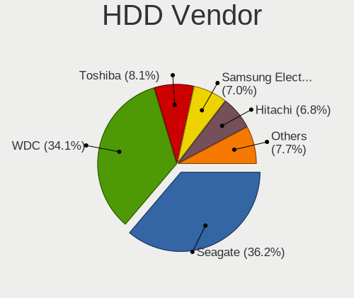
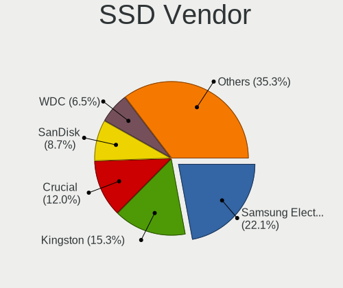
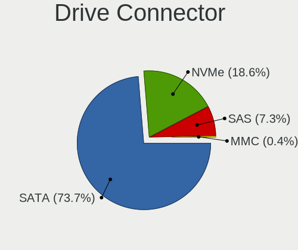
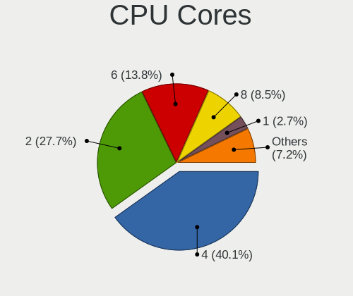
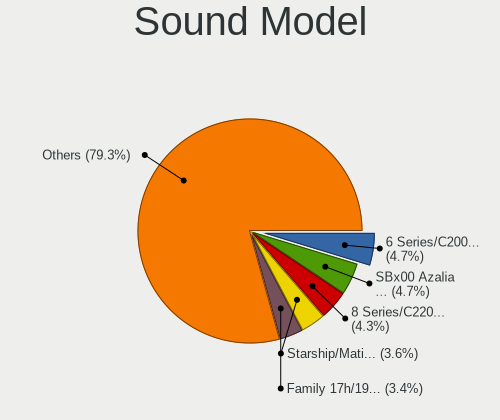
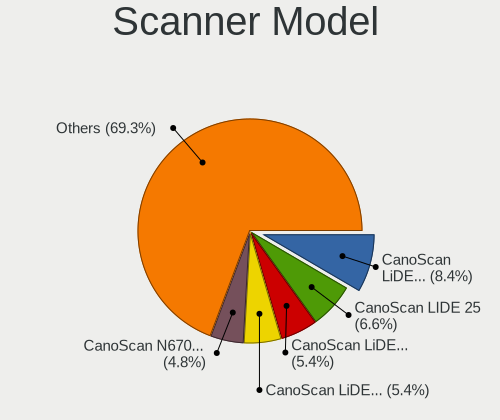

Linux Mint - Tested Hardware & Statistics (Desktops)
----------------------------------------------------

A project to collect tested hardware configurations for Linux Mint.

Anyone can contribute to this report by the [hw-probe](https://github.com/linuxhw/hw-probe) tool:

    sudo -E hw-probe -all -upload

Please contribute! Especially if your hardware is rare.

Contents
--------

* [ Test Cases ](#test-cases)

* [ System ](#system)
  - [ OS                       ](#os)
  - [ OS Family                ](#os-family)
  - [ Kernel                   ](#kernel)
  - [ Kernel Family            ](#kernel-family)
  - [ Kernel Major Ver.        ](#kernel-major-ver)
  - [ Arch                     ](#arch)
  - [ DE                       ](#de)
  - [ Display Server           ](#display-server)
  - [ Display Manager          ](#display-manager)
  - [ OS Lang                  ](#os-lang)
  - [ Boot Mode                ](#boot-mode)
  - [ Filesystem               ](#filesystem)
  - [ Part. scheme             ](#part-scheme)
  - [ Dual Boot with Linux/BSD ](#dual-boot-with-linuxbsd)
  - [ Dual Boot (Win)          ](#dual-boot-win)

* [ Board ](#board)
  - [ Vendor                   ](#vendor)
  - [ Model                    ](#model)
  - [ Model Family             ](#model-family)
  - [ MFG Year                 ](#mfg-year)
  - [ Form Factor              ](#form-factor)
  - [ Secure Boot              ](#secure-boot)
  - [ Coreboot                 ](#coreboot)
  - [ RAM Size                 ](#ram-size)
  - [ RAM Used                 ](#ram-used)
  - [ Total Drives             ](#total-drives)
  - [ Has CD-ROM               ](#has-cd-rom)
  - [ Has Ethernet             ](#has-ethernet)
  - [ Has WiFi                 ](#has-wifi)
  - [ Has Bluetooth            ](#has-bluetooth)

* [ Location ](#location)
  - [ Country                  ](#country)
  - [ City                     ](#city)

* [ Drives ](#drives)
  - [ Drive Vendor             ](#drive-vendor)
  - [ Drive Model              ](#drive-model)
  - [ HDD Vendor               ](#hdd-vendor)
  - [ SSD Vendor               ](#ssd-vendor)
  - [ Drive Kind               ](#drive-kind)
  - [ Drive Connector          ](#drive-connector)
  - [ Drive Size               ](#drive-size)
  - [ Space Total              ](#space-total)
  - [ Space Used               ](#space-used)
  - [ Malfunc. Drives          ](#malfunc-drives)
  - [ Malfunc. Drive Vendor    ](#malfunc-drive-vendor)
  - [ Malfunc. HDD Vendor      ](#malfunc-hdd-vendor)
  - [ Malfunc. Drive Kind      ](#malfunc-drive-kind)
  - [ Failed Drives            ](#failed-drives)
  - [ Failed Drive Vendor      ](#failed-drive-vendor)
  - [ Drive Status             ](#drive-status)

* [ Storage controller ](#storage-controller)
  - [ Storage Vendor           ](#storage-vendor)
  - [ Storage Model            ](#storage-model)
  - [ Storage Kind             ](#storage-kind)

* [ Processor ](#processor)
  - [ CPU Vendor               ](#cpu-vendor)
  - [ CPU Model                ](#cpu-model)
  - [ CPU Model Family         ](#cpu-model-family)
  - [ CPU Cores                ](#cpu-cores)
  - [ CPU Sockets              ](#cpu-sockets)
  - [ CPU Threads              ](#cpu-threads)
  - [ CPU Op-Modes             ](#cpu-op-modes)
  - [ CPU Microcode            ](#cpu-microcode)
  - [ CPU Microarch            ](#cpu-microarch)

* [ Graphics ](#graphics)
  - [ GPU Vendor               ](#gpu-vendor)
  - [ GPU Model                ](#gpu-model)
  - [ GPU Combo                ](#gpu-combo)
  - [ GPU Driver               ](#gpu-driver)
  - [ GPU Memory               ](#gpu-memory)

* [ Monitor ](#monitor)
  - [ Monitor Vendor           ](#monitor-vendor)
  - [ Monitor Model            ](#monitor-model)
  - [ Monitor Resolution       ](#monitor-resolution)
  - [ Monitor Diagonal         ](#monitor-diagonal)
  - [ Monitor Width            ](#monitor-width)
  - [ Aspect Ratio             ](#aspect-ratio)
  - [ Monitor Area             ](#monitor-area)
  - [ Pixel Density            ](#pixel-density)
  - [ Multiple Monitors        ](#multiple-monitors)

* [ Network ](#network)
  - [ Net Controller Vendor    ](#net-controller-vendor)
  - [ Net Controller Model     ](#net-controller-model)
  - [ Wireless Vendor          ](#wireless-vendor)
  - [ Wireless Model           ](#wireless-model)
  - [ Ethernet Vendor          ](#ethernet-vendor)
  - [ Ethernet Model           ](#ethernet-model)
  - [ Net Controller Kind      ](#net-controller-kind)
  - [ Used Controller          ](#used-controller)
  - [ NICs                     ](#nics)
  - [ IPv6                     ](#ipv6)

* [ Bluetooth ](#bluetooth)
  - [ Bluetooth Vendor         ](#bluetooth-vendor)
  - [ Bluetooth Model          ](#bluetooth-model)

* [ Sound ](#sound)
  - [ Sound Vendor             ](#sound-vendor)
  - [ Sound Model              ](#sound-model)

* [ Memory ](#memory)
  - [ Memory Vendor            ](#memory-vendor)
  - [ Memory Model             ](#memory-model)
  - [ Memory Kind              ](#memory-kind)
  - [ Memory Form Factor       ](#memory-form-factor)
  - [ Memory Size              ](#memory-size)
  - [ Memory Speed             ](#memory-speed)

* [ Printers & scanners ](#printers--scanners)
  - [ Printer Vendor           ](#printer-vendor)
  - [ Printer Model            ](#printer-model)
  - [ Scanner Vendor           ](#scanner-vendor)
  - [ Scanner Model            ](#scanner-model)

* [ Camera ](#camera)
  - [ Camera Vendor            ](#camera-vendor)
  - [ Camera Model             ](#camera-model)

* [ Security ](#security)
  - [ Fingerprint Vendor       ](#fingerprint-vendor)
  - [ Fingerprint Model        ](#fingerprint-model)
  - [ Chipcard Vendor          ](#chipcard-vendor)
  - [ Chipcard Model           ](#chipcard-model)

* [ Unsupported ](#unsupported)
  - [ Unsupported Devices      ](#unsupported-devices)
  - [ Unsupported Device Types ](#unsupported-device-types)

Test Cases
----------

Total: 10393

| Vendor        | Model                       | Probe                                                      | Date         |
|---------------|-----------------------------|------------------------------------------------------------|--------------|
| Gigabyte      | H57M-USB3                   | [91b1655f60](https://linux-hardware.org/?probe=91b1655f60) | Jun 10, 2023 |
| ASRock        | H61M-DGS R2.0               | [cc206f52b1](https://linux-hardware.org/?probe=cc206f52b1) | Jun 10, 2023 |
| ASUSTek       | P8H61-M LX                  | [9d9872a84a](https://linux-hardware.org/?probe=9d9872a84a) | Jun 10, 2023 |
| ASUSTek       | P8H61-M LX                  | [bd22edfae7](https://linux-hardware.org/?probe=bd22edfae7) | Jun 09, 2023 |
| MSI           | MPG X570 GAMING EDGE WIF... | [0e34d2ee28](https://linux-hardware.org/?probe=0e34d2ee28) | Jun 09, 2023 |
| ASUSTek       | ROG STRIX Z690-A GAMING ... | [afa2a30d75](https://linux-hardware.org/?probe=afa2a30d75) | Jun 09, 2023 |
| ASRock        | H61M-DGS R2.0               | [37c25e136f](https://linux-hardware.org/?probe=37c25e136f) | Jun 09, 2023 |
| Lenovo        | ThinkStation E20 422237U    | [2756905647](https://linux-hardware.org/?probe=2756905647) | Jun 09, 2023 |
| Dell          | 0YXT71 A00                  | [477afe615b](https://linux-hardware.org/?probe=477afe615b) | Jun 09, 2023 |
| Dell          | 0YXT71 A00                  | [463dfa5d83](https://linux-hardware.org/?probe=463dfa5d83) | Jun 09, 2023 |
| Biostar       | A68N-2100K                  | [9ac86a512d](https://linux-hardware.org/?probe=9ac86a512d) | Jun 09, 2023 |
| ASUSTek       | PRIME A320M-K               | [2dfd2a0844](https://linux-hardware.org/?probe=2dfd2a0844) | Jun 08, 2023 |
| ASUSTek       | H81M-R                      | [10d01671ad](https://linux-hardware.org/?probe=10d01671ad) | Jun 08, 2023 |
| MSI           | Z87-G43                     | [554f8ea405](https://linux-hardware.org/?probe=554f8ea405) | Jun 08, 2023 |
| MSI           | X58M                        | [7f0ef36058](https://linux-hardware.org/?probe=7f0ef36058) | Jun 08, 2023 |
| MSI           | H510M-A PRO                 | [86dfe28c7a](https://linux-hardware.org/?probe=86dfe28c7a) | Jun 08, 2023 |
| HP            | 1494                        | [7e431c0351](https://linux-hardware.org/?probe=7e431c0351) | Jun 08, 2023 |
| ASRock        | M3A770DE                    | [aa9ddf538e](https://linux-hardware.org/?probe=aa9ddf538e) | Jun 08, 2023 |
| Gigabyte      | B450 AORUS ELITE            | [1d84d556bf](https://linux-hardware.org/?probe=1d84d556bf) | Jun 07, 2023 |
| ASUSTek       | STRIX Z270I GAMING          | [f836a7d0ff](https://linux-hardware.org/?probe=f836a7d0ff) | Jun 07, 2023 |
| HP            | 1494                        | [0f032c101b](https://linux-hardware.org/?probe=0f032c101b) | Jun 07, 2023 |
| Gigabyte      | B250M-D3H-CF                | [14016f0f6f](https://linux-hardware.org/?probe=14016f0f6f) | Jun 07, 2023 |
| MSI           | MS-7513                     | [ed69341f3c](https://linux-hardware.org/?probe=ed69341f3c) | Jun 07, 2023 |
| HP            | 0A60h                       | [f0498c1a54](https://linux-hardware.org/?probe=f0498c1a54) | Jun 07, 2023 |
| Fujitsu Si... | D2811-A1 S26361-D2811-A1    | [bcb9105121](https://linux-hardware.org/?probe=bcb9105121) | Jun 06, 2023 |
| Gigabyte      | Z68P-DS3                    | [3371099509](https://linux-hardware.org/?probe=3371099509) | Jun 06, 2023 |
| HP            | 8643 SMVB                   | [0fd8af3392](https://linux-hardware.org/?probe=0fd8af3392) | Jun 06, 2023 |
| Gigabyte      | H61M-S2PV                   | [a34c3550be](https://linux-hardware.org/?probe=a34c3550be) | Jun 06, 2023 |
| Unknown       | Unknown                     | [e8df83921f](https://linux-hardware.org/?probe=e8df83921f) | Jun 06, 2023 |
| Dell          | 0Y2K8N A01                  | [13a93fdc21](https://linux-hardware.org/?probe=13a93fdc21) | Jun 05, 2023 |
| ASUSTek       | CROSSHAIR VI HERO           | [9286154198](https://linux-hardware.org/?probe=9286154198) | Jun 05, 2023 |
| ASUSTek       | M5A88-M                     | [bb29b433c0](https://linux-hardware.org/?probe=bb29b433c0) | Jun 05, 2023 |
| AMI           | Intel                       | [7990e6561b](https://linux-hardware.org/?probe=7990e6561b) | Jun 05, 2023 |
| ASUSTek       | ROG Maximus XI HERO         | [8ba3a60a93](https://linux-hardware.org/?probe=8ba3a60a93) | Jun 05, 2023 |
| Dell          | 0KWVT8 A03                  | [e974c8cdcd](https://linux-hardware.org/?probe=e974c8cdcd) | Jun 05, 2023 |
| MSI           | B450-A PRO MAX              | [202c4ee201](https://linux-hardware.org/?probe=202c4ee201) | Jun 04, 2023 |
| AMI           | Intel                       | [966c93cbdb](https://linux-hardware.org/?probe=966c93cbdb) | Jun 04, 2023 |
| ASUSTek       | M5A88-M                     | [e750392f99](https://linux-hardware.org/?probe=e750392f99) | Jun 04, 2023 |
| Gigabyte      | Z87-HD3                     | [228a46e465](https://linux-hardware.org/?probe=228a46e465) | Jun 04, 2023 |
| Gigabyte      | G33M-S2                     | [17ed1704c5](https://linux-hardware.org/?probe=17ed1704c5) | Jun 04, 2023 |
| HP            | 1493                        | [b7432a020a](https://linux-hardware.org/?probe=b7432a020a) | Jun 04, 2023 |
| Gigabyte      | G33M-S2                     | [82bab4dd6d](https://linux-hardware.org/?probe=82bab4dd6d) | Jun 04, 2023 |
| Unknown       | Unknown                     | [77d585fa03](https://linux-hardware.org/?probe=77d585fa03) | Jun 04, 2023 |
| Biostar       | B350GT5                     | [18e1da8cce](https://linux-hardware.org/?probe=18e1da8cce) | Jun 04, 2023 |
| ASUSTek       | M5A78L-M PLUS/USB3          | [6167898a10](https://linux-hardware.org/?probe=6167898a10) | Jun 04, 2023 |
| Biostar       | B350GT5                     | [123beb390f](https://linux-hardware.org/?probe=123beb390f) | Jun 04, 2023 |
| ASUSTek       | P5G41T-M                    | [8706eff580](https://linux-hardware.org/?probe=8706eff580) | Jun 04, 2023 |
| MSI           | H81M-P32                    | [f2423b3ef9](https://linux-hardware.org/?probe=f2423b3ef9) | Jun 04, 2023 |
| MSI           | H81M-P32                    | [f1d0b1d487](https://linux-hardware.org/?probe=f1d0b1d487) | Jun 04, 2023 |
| HP            | 2AE5 A01                    | [ab3ab74fb6](https://linux-hardware.org/?probe=ab3ab74fb6) | Jun 04, 2023 |
| ASUSTek       | PRIME H310M-A R2.0          | [60749b6e47](https://linux-hardware.org/?probe=60749b6e47) | Jun 04, 2023 |
| MSI           | P55-CD53                    | [88efe4b48c](https://linux-hardware.org/?probe=88efe4b48c) | Jun 04, 2023 |
| HP            | 2B43                        | [d66cd5f48e](https://linux-hardware.org/?probe=d66cd5f48e) | Jun 04, 2023 |
| Dell          | 0KWVT8 A03                  | [2250609446](https://linux-hardware.org/?probe=2250609446) | Jun 04, 2023 |
| Gigabyte      | B250M-D3H-CF                | [d8f9165fec](https://linux-hardware.org/?probe=d8f9165fec) | Jun 04, 2023 |
| Dell          | 0KWVT8 A03                  | [7f73996b8e](https://linux-hardware.org/?probe=7f73996b8e) | Jun 04, 2023 |
| ASRock        | Z590 Phantom Gaming 4       | [1e9eef0102](https://linux-hardware.org/?probe=1e9eef0102) | Jun 03, 2023 |
| Gigabyte      | Z690 AORUS ULTRA            | [50cdb8a60a](https://linux-hardware.org/?probe=50cdb8a60a) | Jun 03, 2023 |
| MSI           | B550M PRO-VDH               | [d09ba05086](https://linux-hardware.org/?probe=d09ba05086) | Jun 03, 2023 |
| ASUSTek       | P8B75-M LE                  | [640faccae0](https://linux-hardware.org/?probe=640faccae0) | Jun 03, 2023 |
| MSI           | B550M PRO-VDH               | [9f13a5184c](https://linux-hardware.org/?probe=9f13a5184c) | Jun 03, 2023 |
| MSI           | PRO B760M-A WIFI DDR4       | [4d24b9b7d5](https://linux-hardware.org/?probe=4d24b9b7d5) | Jun 03, 2023 |
| Acer          | Veriton M2631 V:1.0         | [e64369d2ec](https://linux-hardware.org/?probe=e64369d2ec) | Jun 03, 2023 |
| Gigabyte      | X79-UP4                     | [e3fd506f5e](https://linux-hardware.org/?probe=e3fd506f5e) | Jun 03, 2023 |
| ASUSTek       | PRIME Z390-P                | [64c321d474](https://linux-hardware.org/?probe=64c321d474) | Jun 03, 2023 |
| ASUSTek       | TUF Gaming B550M-PLUS       | [7b513e678c](https://linux-hardware.org/?probe=7b513e678c) | Jun 03, 2023 |
| Gigabyte      | B450 AORUS ELITE            | [8e46a969c7](https://linux-hardware.org/?probe=8e46a969c7) | Jun 03, 2023 |
| Gigabyte      | B550 AORUS MASTER           | [80e9681888](https://linux-hardware.org/?probe=80e9681888) | Jun 03, 2023 |
| Positivo      | POS-EINM70CS POS            | [80260b495c](https://linux-hardware.org/?probe=80260b495c) | Jun 03, 2023 |
| MSI           | MPG Z790 EDGE WIFI          | [dae8469b17](https://linux-hardware.org/?probe=dae8469b17) | Jun 02, 2023 |
| MSI           | B450M PRO-VDH PLUS          | [9a0f40789b](https://linux-hardware.org/?probe=9a0f40789b) | Jun 02, 2023 |
| HP            | 2AE5 A01                    | [c37afc3b8a](https://linux-hardware.org/?probe=c37afc3b8a) | Jun 02, 2023 |
| Gigabyte      | A320M-S2H-CF                | [914fa73266](https://linux-hardware.org/?probe=914fa73266) | Jun 02, 2023 |
| ASUSTek       | ROG STRIX B550-A GAMING     | [25721b28d3](https://linux-hardware.org/?probe=25721b28d3) | Jun 02, 2023 |
| Gigabyte      | H81M-S2H                    | [2604bac5a5](https://linux-hardware.org/?probe=2604bac5a5) | Jun 02, 2023 |
| ECS           | Nettle2                     | [6fe297e475](https://linux-hardware.org/?probe=6fe297e475) | Jun 02, 2023 |
| ASUSTek       | M4A89GTD-PRO/USB3           | [7a83a98e37](https://linux-hardware.org/?probe=7a83a98e37) | Jun 02, 2023 |
| ASUSTek       | M4A89GTD-PRO/USB3           | [a78aee5f7f](https://linux-hardware.org/?probe=a78aee5f7f) | Jun 02, 2023 |
| MSI           | P55-CD53                    | [4f87990649](https://linux-hardware.org/?probe=4f87990649) | Jun 02, 2023 |
| HP            | 1497                        | [9ce66d3e2e](https://linux-hardware.org/?probe=9ce66d3e2e) | Jun 02, 2023 |
| Acer          | Aspire XC-780               | [7789b12750](https://linux-hardware.org/?probe=7789b12750) | Jun 02, 2023 |
| MSI           | X470 GAMING PLUS MAX        | [5430a83fca](https://linux-hardware.org/?probe=5430a83fca) | Jun 01, 2023 |
| MSI           | PRO B650-P WIFI             | [53d24a5962](https://linux-hardware.org/?probe=53d24a5962) | Jun 01, 2023 |
| MSI           | PRO B760M-A WIFI DDR4       | [e98b2555d7](https://linux-hardware.org/?probe=e98b2555d7) | Jun 01, 2023 |
| MSI           | PRO B650-P WIFI             | [0143308fee](https://linux-hardware.org/?probe=0143308fee) | Jun 01, 2023 |
| MSI           | H81M-E33                    | [50f664d550](https://linux-hardware.org/?probe=50f664d550) | Jun 01, 2023 |
| MSI           | H81M-E33                    | [eb2a33204c](https://linux-hardware.org/?probe=eb2a33204c) | Jun 01, 2023 |
| Portwell      | CAPB-3000VR                 | [53558af2be](https://linux-hardware.org/?probe=53558af2be) | Jun 01, 2023 |
| ASUSTek       | Z97-P                       | [b819db60d1](https://linux-hardware.org/?probe=b819db60d1) | Jun 01, 2023 |
| Gigabyte      | EP45T-DS3                   | [0dd3baa28d](https://linux-hardware.org/?probe=0dd3baa28d) | Jun 01, 2023 |
| ASUSTek       | M3A78-T                     | [e59673dcf2](https://linux-hardware.org/?probe=e59673dcf2) | Jun 01, 2023 |
| HP            | 1497                        | [cc138de04b](https://linux-hardware.org/?probe=cc138de04b) | May 31, 2023 |
| ASRock        | 970M Pro3                   | [58b09c521b](https://linux-hardware.org/?probe=58b09c521b) | May 31, 2023 |
| ASRock        | H81M-HDS R2.0               | [810f6b35ea](https://linux-hardware.org/?probe=810f6b35ea) | May 31, 2023 |
| ECS           | A890GXM-A2                  | [c207b5f41c](https://linux-hardware.org/?probe=c207b5f41c) | May 31, 2023 |
| Fujitsu Si... | D2811-A1 S26361-D2811-A1    | [c0ff761729](https://linux-hardware.org/?probe=c0ff761729) | May 31, 2023 |
| HP            | 158A                        | [39d4ab7307](https://linux-hardware.org/?probe=39d4ab7307) | May 31, 2023 |
| ASUSTek       | TUF Gaming X570-PLUS        | [d1f02a3055](https://linux-hardware.org/?probe=d1f02a3055) | May 31, 2023 |
| HP            | 8648                        | [11e777087a](https://linux-hardware.org/?probe=11e777087a) | May 31, 2023 |
| Gigabyte      | X570 AORUS ULTRA            | [9d3023fd1d](https://linux-hardware.org/?probe=9d3023fd1d) | May 31, 2023 |
| ASRock        | Q1900B-ITX                  | [88e4924fa2](https://linux-hardware.org/?probe=88e4924fa2) | May 30, 2023 |
| Gigabyte      | Z97-HD3                     | [8505864d45](https://linux-hardware.org/?probe=8505864d45) | May 30, 2023 |
| Biostar       | B450MH                      | [36947ca7e1](https://linux-hardware.org/?probe=36947ca7e1) | May 30, 2023 |
| Gigabyte      | Z170-HD3P-CF                | [e51651a755](https://linux-hardware.org/?probe=e51651a755) | May 30, 2023 |
| ASUSTek       | ROG STRIX B550-F GAMING     | [c2d144c313](https://linux-hardware.org/?probe=c2d144c313) | May 30, 2023 |
| ASUSTek       | ROG STRIX B550-F GAMING     | [4d7ccd868f](https://linux-hardware.org/?probe=4d7ccd868f) | May 30, 2023 |
| MSI           | A68HM-E33 V2                | [24775c04a5](https://linux-hardware.org/?probe=24775c04a5) | May 30, 2023 |
| MSI           | A68HM-E33 V2                | [d6a2216b0f](https://linux-hardware.org/?probe=d6a2216b0f) | May 30, 2023 |
| Fujitsu       | D3233-A1 S26361-D3233-A1    | [4679a6e565](https://linux-hardware.org/?probe=4679a6e565) | May 29, 2023 |
| Fujitsu       | D3233-A1 S26361-D3233-A1    | [ec89dcb694](https://linux-hardware.org/?probe=ec89dcb694) | May 29, 2023 |
| MSI           | Z170A MPOWER GAMING TITA... | [0e9239c5f7](https://linux-hardware.org/?probe=0e9239c5f7) | May 29, 2023 |
| MSI           | 970A-G46                    | [180eb351d7](https://linux-hardware.org/?probe=180eb351d7) | May 29, 2023 |
| Gigabyte      | Z77X-UD5H                   | [e947dd7da1](https://linux-hardware.org/?probe=e947dd7da1) | May 29, 2023 |
| ASUSTek       | M5A97 R2.0                  | [f4a8ca4825](https://linux-hardware.org/?probe=f4a8ca4825) | May 29, 2023 |
| ASUSTek       | H81M-R                      | [1a69603cc6](https://linux-hardware.org/?probe=1a69603cc6) | May 28, 2023 |
| MSI           | Z390-A PRO                  | [cf1c884051](https://linux-hardware.org/?probe=cf1c884051) | May 28, 2023 |
| Pegatron      | NARRA3                      | [5c016d4faf](https://linux-hardware.org/?probe=5c016d4faf) | May 28, 2023 |
| MSI           | Z390-A PRO                  | [6b863cd4a3](https://linux-hardware.org/?probe=6b863cd4a3) | May 28, 2023 |
| ASUSTek       | TUF Gaming B650-PLUS WIF... | [8fe1188fd8](https://linux-hardware.org/?probe=8fe1188fd8) | May 28, 2023 |
| Dell          | 0WR7PY A02                  | [b5aa372117](https://linux-hardware.org/?probe=b5aa372117) | May 28, 2023 |
| ASUSTek       | M4A88TD-V EVO/USB3          | [8d008658ce](https://linux-hardware.org/?probe=8d008658ce) | May 28, 2023 |
| ASRock        | A320M-HDV R4.0              | [e2e38da09f](https://linux-hardware.org/?probe=e2e38da09f) | May 28, 2023 |
| ASUSTek       | ROG STRIX B550-F GAMING ... | [6465343084](https://linux-hardware.org/?probe=6465343084) | May 27, 2023 |
| ASRock        | B550 Pro4                   | [741e0e805b](https://linux-hardware.org/?probe=741e0e805b) | May 27, 2023 |
| Gigabyte      | B450M DS3H-CF               | [0149ec9c81](https://linux-hardware.org/?probe=0149ec9c81) | May 27, 2023 |
| Gigabyte      | GA-MA785GM-US2H             | [7284c23b76](https://linux-hardware.org/?probe=7284c23b76) | May 27, 2023 |
| Lenovo        | 3716 SDK0T76461 WIN 3422... | [2f3952dcfe](https://linux-hardware.org/?probe=2f3952dcfe) | May 27, 2023 |
| ASUSTek       | H81M-R                      | [8edf21a203](https://linux-hardware.org/?probe=8edf21a203) | May 27, 2023 |
| PCChips       | P17G ECS                    | [0518fce589](https://linux-hardware.org/?probe=0518fce589) | May 27, 2023 |
| ASUSTek       | M4A785-M                    | [ff2e86c530](https://linux-hardware.org/?probe=ff2e86c530) | May 27, 2023 |
| ASUSTek       | Z170M-PLUS                  | [0577b02521](https://linux-hardware.org/?probe=0577b02521) | May 27, 2023 |
| Lenovo        | 3716 SDK0R32862 WIN 3258... | [d3137742ae](https://linux-hardware.org/?probe=d3137742ae) | May 27, 2023 |
| Dell          | 00V62H A01                  | [0d8c590c8d](https://linux-hardware.org/?probe=0d8c590c8d) | May 27, 2023 |
| HP            | 0B4Ch D                     | [0f593c947e](https://linux-hardware.org/?probe=0f593c947e) | May 27, 2023 |
| HP            | 0B4Ch D                     | [e7a8d68439](https://linux-hardware.org/?probe=e7a8d68439) | May 27, 2023 |
| Dell          | 0TP406                      | [c7300f35f4](https://linux-hardware.org/?probe=c7300f35f4) | May 26, 2023 |
| MSI           | B550M PRO-VDH               | [f7fddb36e8](https://linux-hardware.org/?probe=f7fddb36e8) | May 26, 2023 |
| ASUSTek       | PRIME B450M-GAMING/BR       | [1cbedc352f](https://linux-hardware.org/?probe=1cbedc352f) | May 26, 2023 |
| ASUSTek       | M5A78L-M PLUS/USB3          | [6bcf3cf056](https://linux-hardware.org/?probe=6bcf3cf056) | May 26, 2023 |
| Gigabyte      | B450 AORUS M                | [40af2d79f9](https://linux-hardware.org/?probe=40af2d79f9) | May 26, 2023 |
| ASRock        | AB350 Pro4                  | [53db1863ab](https://linux-hardware.org/?probe=53db1863ab) | May 25, 2023 |
| Foxconn       | 2ABF                        | [a764ae9f3c](https://linux-hardware.org/?probe=a764ae9f3c) | May 25, 2023 |
| Fujitsu       | D3227-A1 S26361-D3227-A1    | [769f5c0d23](https://linux-hardware.org/?probe=769f5c0d23) | May 25, 2023 |
| HP            | 21D0                        | [4cac4f8654](https://linux-hardware.org/?probe=4cac4f8654) | May 25, 2023 |
| HP            | 21D0                        | [589c780060](https://linux-hardware.org/?probe=589c780060) | May 25, 2023 |
| Biostar       | A68MHE                      | [d1ef52da36](https://linux-hardware.org/?probe=d1ef52da36) | May 25, 2023 |
| Biostar       | A68MHE                      | [e2244a8ed0](https://linux-hardware.org/?probe=e2244a8ed0) | May 25, 2023 |
| Foxconn       | 2ABF                        | [9fbeb26e54](https://linux-hardware.org/?probe=9fbeb26e54) | May 24, 2023 |
| Lenovo        | SHARKBAY 0B98401 WIN        | [1523787171](https://linux-hardware.org/?probe=1523787171) | May 24, 2023 |
| Lenovo        | SHARKBAY 0B98401 PRO        | [89d040ffaf](https://linux-hardware.org/?probe=89d040ffaf) | May 24, 2023 |
| Gigabyte      | B650 AORUS ELITE AX         | [ddfad3653a](https://linux-hardware.org/?probe=ddfad3653a) | May 24, 2023 |
| Lenovo        | SHARKBAY 0B98401 WIN        | [0a2dc161fe](https://linux-hardware.org/?probe=0a2dc161fe) | May 24, 2023 |
| ASUSTek       | ROG STRIX X399-E GAMING     | [647a30ff09](https://linux-hardware.org/?probe=647a30ff09) | May 24, 2023 |
| MSI           | B550-A PRO                  | [f77697fdd0](https://linux-hardware.org/?probe=f77697fdd0) | May 24, 2023 |
| ASRock        | B85M-HDS                    | [fc128a2474](https://linux-hardware.org/?probe=fc128a2474) | May 24, 2023 |
| Lenovo        | SKYBAY SDK0J40705 WIN 34... | [3a26097c6a](https://linux-hardware.org/?probe=3a26097c6a) | May 24, 2023 |
| ASRock        | A320M-HDV R4.0              | [deff44e62e](https://linux-hardware.org/?probe=deff44e62e) | May 24, 2023 |
| MSI           | 970 GAMING                  | [2bed616680](https://linux-hardware.org/?probe=2bed616680) | May 23, 2023 |
| ASRock        | AB350M Pro4                 | [9f7d80df58](https://linux-hardware.org/?probe=9f7d80df58) | May 23, 2023 |
| ASUSTek       | ROG STRIX X399-E GAMING     | [fcefb35b05](https://linux-hardware.org/?probe=fcefb35b05) | May 23, 2023 |
| ASUSTek       | B85M-G                      | [49bd7863b7](https://linux-hardware.org/?probe=49bd7863b7) | May 23, 2023 |
| Gigabyte      | A320M-S2H-CF SE1            | [61ede8f95d](https://linux-hardware.org/?probe=61ede8f95d) | May 23, 2023 |
| ASUSTek       | TUF X299 MARK 1             | [89b378457d](https://linux-hardware.org/?probe=89b378457d) | May 23, 2023 |
| HP            | 1495                        | [200cab3da9](https://linux-hardware.org/?probe=200cab3da9) | May 23, 2023 |
| MSI           | 970 GAMING                  | [785f4bad86](https://linux-hardware.org/?probe=785f4bad86) | May 23, 2023 |
| ASUSTek       | TUF X299 MARK 1             | [2f194363a7](https://linux-hardware.org/?probe=2f194363a7) | May 23, 2023 |
| MSI           | B550-A PRO                  | [1ec3710265](https://linux-hardware.org/?probe=1ec3710265) | May 23, 2023 |
| Unknown       | Unknown                     | [de52b8f296](https://linux-hardware.org/?probe=de52b8f296) | May 22, 2023 |
| MSI           | MS-7A66                     | [9be9117e62](https://linux-hardware.org/?probe=9be9117e62) | May 22, 2023 |
| MSI           | B550-A PRO                  | [0a952bd502](https://linux-hardware.org/?probe=0a952bd502) | May 22, 2023 |
| Gigabyte      | GA-78LMT-S2                 | [3c708a54f5](https://linux-hardware.org/?probe=3c708a54f5) | May 22, 2023 |
| ASUSTek       | M4A785TD-V EVO              | [692ba9d18f](https://linux-hardware.org/?probe=692ba9d18f) | May 22, 2023 |
| Lenovo        | 36C8 SDK0J40700 WIN 3258... | [7e8b42ab5f](https://linux-hardware.org/?probe=7e8b42ab5f) | May 22, 2023 |
| MSI           | B360M PRO-VDH               | [93a41eca5e](https://linux-hardware.org/?probe=93a41eca5e) | May 22, 2023 |
| MSI           | PRO Z690-A DDR4             | [b3fb445705](https://linux-hardware.org/?probe=b3fb445705) | May 22, 2023 |
| Pegatron      | Benicia                     | [bcfa2151fc](https://linux-hardware.org/?probe=bcfa2151fc) | May 22, 2023 |
| MSI           | 760GMA-P34                  | [de97b76fed](https://linux-hardware.org/?probe=de97b76fed) | May 22, 2023 |
| Alienware     | 0H869M A00                  | [0bac54e4b2](https://linux-hardware.org/?probe=0bac54e4b2) | May 22, 2023 |
| HP            | 805D                        | [2ac4992bcd](https://linux-hardware.org/?probe=2ac4992bcd) | May 22, 2023 |
| HP            | 2B5E                        | [a221629f4d](https://linux-hardware.org/?probe=a221629f4d) | May 21, 2023 |
| MSI           | B550M PRO-VDH               | [3f5a6968d4](https://linux-hardware.org/?probe=3f5a6968d4) | May 21, 2023 |
| Gigabyte      | GA-78LMT-S2PT               | [04ea462ce6](https://linux-hardware.org/?probe=04ea462ce6) | May 21, 2023 |
| ASRock        | 775Dual-VSTA                | [2eb8cdff34](https://linux-hardware.org/?probe=2eb8cdff34) | May 21, 2023 |
| Gigabyte      | B450M DS3H-CF               | [b344b7ea03](https://linux-hardware.org/?probe=b344b7ea03) | May 21, 2023 |
| ASUSTek       | M5A99FX PRO R2.0            | [8dcb326301](https://linux-hardware.org/?probe=8dcb326301) | May 21, 2023 |
| Gigabyte      | B450 AORUS M                | [71a87fa176](https://linux-hardware.org/?probe=71a87fa176) | May 20, 2023 |
| ASRock        | H670M Pro RS                | [5e17710256](https://linux-hardware.org/?probe=5e17710256) | May 20, 2023 |
| ASRock        | H670M Pro RS                | [d217d78446](https://linux-hardware.org/?probe=d217d78446) | May 20, 2023 |
| ASUSTek       | SABERTOOTH 990FX R2.0       | [7aef6229db](https://linux-hardware.org/?probe=7aef6229db) | May 20, 2023 |
| ASUSTek       | ROG STRIX B550-A GAMING     | [0c87a87d33](https://linux-hardware.org/?probe=0c87a87d33) | May 20, 2023 |
| Foxconn       | 2A92                        | [225fee02ae](https://linux-hardware.org/?probe=225fee02ae) | May 20, 2023 |
| Gigabyte      | EP45T-UD3R                  | [848d0db1b2](https://linux-hardware.org/?probe=848d0db1b2) | May 19, 2023 |
| ASRock        | A320M-HDV R4.0              | [b07192ce16](https://linux-hardware.org/?probe=b07192ce16) | May 19, 2023 |
| HP            | 21B4 A01                    | [b57059fe59](https://linux-hardware.org/?probe=b57059fe59) | May 19, 2023 |
| Fujitsu       | D3161-A1 S26361-D3161-A1    | [76a17acffb](https://linux-hardware.org/?probe=76a17acffb) | May 19, 2023 |
| ASRock        | Z77 Extreme4                | [2ecf8b48ab](https://linux-hardware.org/?probe=2ecf8b48ab) | May 19, 2023 |
| Dell          | 0KWVT8 A01                  | [2159a4cc95](https://linux-hardware.org/?probe=2159a4cc95) | May 18, 2023 |
| ASUSTek       | P5B                         | [9d815bcd44](https://linux-hardware.org/?probe=9d815bcd44) | May 18, 2023 |
| ASUSTek       | P5B                         | [70be41e795](https://linux-hardware.org/?probe=70be41e795) | May 18, 2023 |
| ASUSTek       | PRIME B460-PLUS             | [97149ea35b](https://linux-hardware.org/?probe=97149ea35b) | May 18, 2023 |
| Megaware      | MW-H61M-2H v1.3 - 17/07/... | [72303201a3](https://linux-hardware.org/?probe=72303201a3) | May 18, 2023 |
| ASRock        | FM2A68M-DG3+                | [ca3fda27b5](https://linux-hardware.org/?probe=ca3fda27b5) | May 18, 2023 |
| Acer          | Veriton M2610G              | [001e547ddf](https://linux-hardware.org/?probe=001e547ddf) | May 18, 2023 |
| Gigabyte      | B450M DS3H V2               | [c9f5da779c](https://linux-hardware.org/?probe=c9f5da779c) | May 18, 2023 |
| HP            | 3398                        | [a49cbc797b](https://linux-hardware.org/?probe=a49cbc797b) | May 18, 2023 |
| HP            | 18E9                        | [2128541eb5](https://linux-hardware.org/?probe=2128541eb5) | May 18, 2023 |
| ASUSTek       | PRIME Z270-A                | [790c5137ba](https://linux-hardware.org/?probe=790c5137ba) | May 18, 2023 |
| Gigabyte      | X570 AORUS XTREME           | [fac077457d](https://linux-hardware.org/?probe=fac077457d) | May 18, 2023 |
| Unknown       | T100                        | [c4a7218b7b](https://linux-hardware.org/?probe=c4a7218b7b) | May 18, 2023 |
| Dell          | 0GXM1W A00                  | [908f915724](https://linux-hardware.org/?probe=908f915724) | May 17, 2023 |
| Intel         | DH57JG AAE70930-304         | [925438abbb](https://linux-hardware.org/?probe=925438abbb) | May 17, 2023 |
| ASUSTek       | CROSSHAIR VI HERO           | [bb4c9d6b4c](https://linux-hardware.org/?probe=bb4c9d6b4c) | May 17, 2023 |
| ASUSTek       | P5G41T-M                    | [89d938fcef](https://linux-hardware.org/?probe=89d938fcef) | May 17, 2023 |
| MSI           | B550-A PRO                  | [bc68a82a48](https://linux-hardware.org/?probe=bc68a82a48) | May 17, 2023 |
| Lenovo        | 317E SDK0J40700 WIN 3258... | [281042ebf0](https://linux-hardware.org/?probe=281042ebf0) | May 17, 2023 |
| ASUSTek       | PRIME B365M-A               | [e0fb89fec8](https://linux-hardware.org/?probe=e0fb89fec8) | May 17, 2023 |
| Dell          | 048DY8 A00                  | [1456bc7f66](https://linux-hardware.org/?probe=1456bc7f66) | May 17, 2023 |
| Gigabyte      | B450M DS3H-CF               | [87a75f9dd9](https://linux-hardware.org/?probe=87a75f9dd9) | May 16, 2023 |
| Intel         | SHARKBAY                    | [03b576ccc8](https://linux-hardware.org/?probe=03b576ccc8) | May 16, 2023 |
| Unknown       | Unknown                     | [baa2041a25](https://linux-hardware.org/?probe=baa2041a25) | May 16, 2023 |
| ASUSTek       | H170-PRO/USB                | [2cefbf1505](https://linux-hardware.org/?probe=2cefbf1505) | May 16, 2023 |
| MSI           | MS-7369                     | [4a083f89af](https://linux-hardware.org/?probe=4a083f89af) | May 16, 2023 |
| ASRock        | X370 Killer SLI/ac          | [353c940897](https://linux-hardware.org/?probe=353c940897) | May 15, 2023 |
| Unknown       | Unknown                     | [39f109f45a](https://linux-hardware.org/?probe=39f109f45a) | May 15, 2023 |
| ASRock        | X370 Killer SLI/ac          | [fea0d3465f](https://linux-hardware.org/?probe=fea0d3465f) | May 15, 2023 |
| HP            | 18E9                        | [59a47f84ec](https://linux-hardware.org/?probe=59a47f84ec) | May 15, 2023 |
| HP            | 3398                        | [858590e655](https://linux-hardware.org/?probe=858590e655) | May 15, 2023 |
| ASUSTek       | M4A89GTD-PRO/USB3           | [5c97b405b5](https://linux-hardware.org/?probe=5c97b405b5) | May 15, 2023 |
| HP            | 339A                        | [35fdefb4eb](https://linux-hardware.org/?probe=35fdefb4eb) | May 15, 2023 |
| Gigabyte      | Z77X-D3H                    | [2e2744285f](https://linux-hardware.org/?probe=2e2744285f) | May 15, 2023 |
| ASUSTek       | TUF Gaming X570-PLUS        | [aa218c643d](https://linux-hardware.org/?probe=aa218c643d) | May 14, 2023 |
| MSI           | B550-A PRO                  | [c226d29f06](https://linux-hardware.org/?probe=c226d29f06) | May 14, 2023 |
| Gigabyte      | X570 AORUS XTREME           | [408344938a](https://linux-hardware.org/?probe=408344938a) | May 14, 2023 |
| Foxconn       | 2ADA                        | [6392906ad5](https://linux-hardware.org/?probe=6392906ad5) | May 14, 2023 |
| ASUSTek       | ROG STRIX B450-F GAMING     | [41dee90f85](https://linux-hardware.org/?probe=41dee90f85) | May 14, 2023 |
| ASRock        | B650E PG Riptide WiFi       | [9243456914](https://linux-hardware.org/?probe=9243456914) | May 14, 2023 |
| HP            | 829D                        | [a9358c228a](https://linux-hardware.org/?probe=a9358c228a) | May 14, 2023 |
| Unknown       | T100                        | [977cdddeb1](https://linux-hardware.org/?probe=977cdddeb1) | May 14, 2023 |
| ASRock        | H110M-HDV PS                | [ba4344ac6e](https://linux-hardware.org/?probe=ba4344ac6e) | May 14, 2023 |
| HP            | 3397                        | [c6f97f09f1](https://linux-hardware.org/?probe=c6f97f09f1) | May 13, 2023 |
| ASUSTek       | P5N-E SLI                   | [56783f77b9](https://linux-hardware.org/?probe=56783f77b9) | May 13, 2023 |
| ASUSTek       | Z170M-PLUS                  | [2d1acb409a](https://linux-hardware.org/?probe=2d1acb409a) | May 13, 2023 |
| Gigabyte      | X570 AORUS ULTRA            | [8318e2ea17](https://linux-hardware.org/?probe=8318e2ea17) | May 13, 2023 |
| Dell          | 0C2XKD A01                  | [abffd54472](https://linux-hardware.org/?probe=abffd54472) | May 13, 2023 |
| MSI           | MEG X399 CREATION           | [7f11045d3f](https://linux-hardware.org/?probe=7f11045d3f) | May 13, 2023 |
| ASUSTek       | PRIME A520M-K               | [d266be713a](https://linux-hardware.org/?probe=d266be713a) | May 13, 2023 |
| Gigabyte      | AB350-Gaming 3-CF           | [405a45c188](https://linux-hardware.org/?probe=405a45c188) | May 13, 2023 |
| ASRock        | B365M Pro4                  | [264720475a](https://linux-hardware.org/?probe=264720475a) | May 13, 2023 |
| Lenovo        | ThinkCentre A57 9702AB7     | [f045709958](https://linux-hardware.org/?probe=f045709958) | May 12, 2023 |
| Gigabyte      | B450M AORUS ELITE           | [3a0e10e849](https://linux-hardware.org/?probe=3a0e10e849) | May 12, 2023 |
| Lenovo        | 3708 SDK0T76465 WIN 3422... | [daf667dad2](https://linux-hardware.org/?probe=daf667dad2) | May 12, 2023 |
| ASRock        | 775Dual-VSTA                | [4e603c1756](https://linux-hardware.org/?probe=4e603c1756) | May 12, 2023 |
| ASUSTek       | H110-PLUS                   | [c0db0f99d2](https://linux-hardware.org/?probe=c0db0f99d2) | May 12, 2023 |
| ASRock        | 775Dual-VSTA                | [5379481e09](https://linux-hardware.org/?probe=5379481e09) | May 12, 2023 |
| Lenovo        | ThinkCentre M58 7373A5G     | [4318c51164](https://linux-hardware.org/?probe=4318c51164) | May 12, 2023 |
| ASRock        | Z270 Killer SLI/ac          | [0953c12312](https://linux-hardware.org/?probe=0953c12312) | May 12, 2023 |
| Intel         | H55AD17                     | [7d393c3814](https://linux-hardware.org/?probe=7d393c3814) | May 11, 2023 |
| Gigabyte      | X570 AORUS ULTRA            | [db82b23476](https://linux-hardware.org/?probe=db82b23476) | May 11, 2023 |
| Gigabyte      | B550 AORUS ELITE V2         | [64159d4a10](https://linux-hardware.org/?probe=64159d4a10) | May 11, 2023 |
| Gigabyte      | B550 AORUS ELITE V2         | [68caa87cfd](https://linux-hardware.org/?probe=68caa87cfd) | May 11, 2023 |
| MSI           | B150M PRO-VDH               | [59efd46e1c](https://linux-hardware.org/?probe=59efd46e1c) | May 11, 2023 |
| ASUSTek       | ProArt Z790-CREATOR WIFI    | [525c91648c](https://linux-hardware.org/?probe=525c91648c) | May 11, 2023 |
| ASUSTek       | ProArt Z790-CREATOR WIFI    | [18a732cf40](https://linux-hardware.org/?probe=18a732cf40) | May 11, 2023 |
| MSI           | MAG Z590 TOMAHAWK WIFI      | [ec1f5e50b8](https://linux-hardware.org/?probe=ec1f5e50b8) | May 11, 2023 |
| MSI           | K9N6PGM2-V2                 | [a011c93e5a](https://linux-hardware.org/?probe=a011c93e5a) | May 11, 2023 |
| MSI           | K9N6PGM2-V2                 | [175c8a6b39](https://linux-hardware.org/?probe=175c8a6b39) | May 11, 2023 |
| MSI           | A75MA-P35                   | [18b29879dd](https://linux-hardware.org/?probe=18b29879dd) | May 11, 2023 |
| MSI           | A75MA-P35                   | [abcfdbcbfc](https://linux-hardware.org/?probe=abcfdbcbfc) | May 11, 2023 |
| Medion        | MS-7848                     | [e5e1e75529](https://linux-hardware.org/?probe=e5e1e75529) | May 11, 2023 |
| Gigabyte      | P67A-D3-B3                  | [41d9417c57](https://linux-hardware.org/?probe=41d9417c57) | May 11, 2023 |
| ASRock        | J4125M                      | [bf3fa2ddd3](https://linux-hardware.org/?probe=bf3fa2ddd3) | May 10, 2023 |
| MSI           | MS-7513                     | [1e14e5d3e6](https://linux-hardware.org/?probe=1e14e5d3e6) | May 10, 2023 |
| Gigabyte      | F2A55M-HD2                  | [efca4bf9af](https://linux-hardware.org/?probe=efca4bf9af) | May 10, 2023 |
| ASUSTek       | PRIME H310M-R R2.0          | [6dab6243c2](https://linux-hardware.org/?probe=6dab6243c2) | May 10, 2023 |
| ASUSTek       | PRIME H310M-R R2.0          | [aa5ebc6727](https://linux-hardware.org/?probe=aa5ebc6727) | May 10, 2023 |
| HP            | 2ADE                        | [ef4aa64bd5](https://linux-hardware.org/?probe=ef4aa64bd5) | May 10, 2023 |
| ASUSTek       | ROG STRIX B550-F GAMING     | [8e2913d24f](https://linux-hardware.org/?probe=8e2913d24f) | May 10, 2023 |
| ASUSTek       | ROG STRIX B550-F GAMING     | [7fb3092ad1](https://linux-hardware.org/?probe=7fb3092ad1) | May 10, 2023 |
| ASUSTek       | TUF Gaming X570-PLUS        | [2ae1b4ca54](https://linux-hardware.org/?probe=2ae1b4ca54) | May 10, 2023 |
| ASUSTek       | TUF Gaming X570-PLUS        | [02db88a814](https://linux-hardware.org/?probe=02db88a814) | May 10, 2023 |
| ASUSTek       | ROG STRIX B550-A GAMING     | [f2f9e06eaf](https://linux-hardware.org/?probe=f2f9e06eaf) | May 09, 2023 |
| Lenovo        | 3743 SDK0T76463 WIN 3422... | [434f1425a4](https://linux-hardware.org/?probe=434f1425a4) | May 09, 2023 |
| Lenovo        | 3743 SDK0T76463 WIN 3422... | [9a4e4763d4](https://linux-hardware.org/?probe=9a4e4763d4) | May 09, 2023 |
| ASUSTek       | M5A78L-M LX3                | [7a623e22fc](https://linux-hardware.org/?probe=7a623e22fc) | May 09, 2023 |
| ASUSTek       | PRIME B450M-A II            | [aee249559e](https://linux-hardware.org/?probe=aee249559e) | May 09, 2023 |
| ASRock        | A55M-DGS                    | [528232ffb1](https://linux-hardware.org/?probe=528232ffb1) | May 09, 2023 |
| Gigabyte      | B550 GAMING X V2            | [666c071a8b](https://linux-hardware.org/?probe=666c071a8b) | May 09, 2023 |
| ASUSTek       | H110M-K                     | [c4a2b98dc5](https://linux-hardware.org/?probe=c4a2b98dc5) | May 09, 2023 |
| MSI           | B85-G43                     | [461e3ed4bc](https://linux-hardware.org/?probe=461e3ed4bc) | May 09, 2023 |
| ASRock        | AB350 Pro4                  | [baa9914fa3](https://linux-hardware.org/?probe=baa9914fa3) | May 09, 2023 |
| Gigabyte      | A320M-S2H-CF                | [4a5b6f3528](https://linux-hardware.org/?probe=4a5b6f3528) | May 09, 2023 |
| Gigabyte      | A320M-S2H-CF                | [3ba2cf5123](https://linux-hardware.org/?probe=3ba2cf5123) | May 09, 2023 |
| MSI           | MS-7502 Fab D               | [ca5881d77e](https://linux-hardware.org/?probe=ca5881d77e) | May 09, 2023 |
| ASRock        | N68-VS3 FX                  | [974c00cb61](https://linux-hardware.org/?probe=974c00cb61) | May 09, 2023 |
| HP            | 0AA8h                       | [684ffd20f9](https://linux-hardware.org/?probe=684ffd20f9) | May 08, 2023 |
| HP            | 2ADE                        | [bb8ee11580](https://linux-hardware.org/?probe=bb8ee11580) | May 08, 2023 |
| Acer          | Aspire M1930                | [712a246ce4](https://linux-hardware.org/?probe=712a246ce4) | May 08, 2023 |
| HP            | ProLiant MicroServer        | [8e4cbc4837](https://linux-hardware.org/?probe=8e4cbc4837) | May 08, 2023 |
| ASUSTek       | TUF Gaming X570-PLUS        | [4e424e0ad2](https://linux-hardware.org/?probe=4e424e0ad2) | May 08, 2023 |
| ASUSTek       | M5A99X EVO                  | [f5499886e9](https://linux-hardware.org/?probe=f5499886e9) | May 08, 2023 |
| ASUSTek       | M5A78L LE                   | [e3dc27eee1](https://linux-hardware.org/?probe=e3dc27eee1) | May 08, 2023 |
| Gigabyte      | F2A68HM-H                   | [97986b63ad](https://linux-hardware.org/?probe=97986b63ad) | May 08, 2023 |
| MSI           | B450 GAMING PRO CARBON M... | [b2782d28f7](https://linux-hardware.org/?probe=b2782d28f7) | May 08, 2023 |
| ASUSTek       | ROG STRIX X570-F GAMING     | [36f1aa431d](https://linux-hardware.org/?probe=36f1aa431d) | May 08, 2023 |
| Dell          | 00V62H A01                  | [758eb60fa3](https://linux-hardware.org/?probe=758eb60fa3) | May 07, 2023 |
| ASRock        | Z690M-ITX/ax                | [1f232288d7](https://linux-hardware.org/?probe=1f232288d7) | May 07, 2023 |
| Gigabyte      | P35-DS4                     | [fd830a3568](https://linux-hardware.org/?probe=fd830a3568) | May 07, 2023 |
| Lenovo        | 364F SDK0J40700 WIN 3258... | [3ac194e77a](https://linux-hardware.org/?probe=3ac194e77a) | May 07, 2023 |
| Gigabyte      | B450M DS3H-CF               | [2a09fb1d81](https://linux-hardware.org/?probe=2a09fb1d81) | May 07, 2023 |
| Lenovo        | 364F SDK0J40700 WIN 3258... | [1c84c61678](https://linux-hardware.org/?probe=1c84c61678) | May 07, 2023 |
| Medion        | MS-7797                     | [590e39bef4](https://linux-hardware.org/?probe=590e39bef4) | May 07, 2023 |
| ASUSTek       | M5A78L-M PLUS/USB3          | [31123c256d](https://linux-hardware.org/?probe=31123c256d) | May 07, 2023 |
| ASUSTek       | M5A78L-M PLUS/USB3          | [1e62d5884b](https://linux-hardware.org/?probe=1e62d5884b) | May 07, 2023 |
| ASUSTek       | PRIME A320M-K               | [369bf3dc68](https://linux-hardware.org/?probe=369bf3dc68) | May 07, 2023 |
| ASUSTek       | PRIME B550M-K               | [c0ade7c98e](https://linux-hardware.org/?probe=c0ade7c98e) | May 07, 2023 |
| Medion        | MS-7797                     | [d7eb2caa26](https://linux-hardware.org/?probe=d7eb2caa26) | May 07, 2023 |
| ASRock        | B650E PG Riptide WiFi       | [ed03df615e](https://linux-hardware.org/?probe=ed03df615e) | May 07, 2023 |
| ASUSTek       | M4N68T-M LE                 | [0c3f2af7ad](https://linux-hardware.org/?probe=0c3f2af7ad) | May 07, 2023 |
| ASUSTek       | WS X299 SAGE                | [1c9e5ee2a6](https://linux-hardware.org/?probe=1c9e5ee2a6) | May 07, 2023 |
| Dell          | 0XC7MM A01                  | [ed36a220c4](https://linux-hardware.org/?probe=ed36a220c4) | May 06, 2023 |
| MSI           | H310M PRO-VD                | [33b7a6ba7c](https://linux-hardware.org/?probe=33b7a6ba7c) | May 06, 2023 |
| Gigabyte      | A320M-S2H-CF                | [42a38fb30a](https://linux-hardware.org/?probe=42a38fb30a) | May 06, 2023 |
| Acer          | Predator PO3-640            | [6417de34e5](https://linux-hardware.org/?probe=6417de34e5) | May 06, 2023 |
| MSI           | MS-7502 Fab D               | [9b80139aca](https://linux-hardware.org/?probe=9b80139aca) | May 06, 2023 |
| Lenovo        | SHARKBAY 0B98401 PRO        | [f4e56e51d7](https://linux-hardware.org/?probe=f4e56e51d7) | May 06, 2023 |
| Gigabyte      | B550M DS3H                  | [ae040331e6](https://linux-hardware.org/?probe=ae040331e6) | May 06, 2023 |
| Medion        | MS-7621                     | [83c862da24](https://linux-hardware.org/?probe=83c862da24) | May 06, 2023 |
| Pegatron      | Benicia                     | [ff6049b22e](https://linux-hardware.org/?probe=ff6049b22e) | May 06, 2023 |
| Gigabyte      | EX58-UD5                    | [1f8f3c96a5](https://linux-hardware.org/?probe=1f8f3c96a5) | May 05, 2023 |
| Gigabyte      | EX58-UD5                    | [43f32e7ed8](https://linux-hardware.org/?probe=43f32e7ed8) | May 05, 2023 |
| Dell          | 0F896N A03                  | [39ad7c90c7](https://linux-hardware.org/?probe=39ad7c90c7) | May 05, 2023 |
| ASUSTek       | P8B75-M LE                  | [f839b22217](https://linux-hardware.org/?probe=f839b22217) | May 05, 2023 |
| MSI           | X299 SLI PLUS               | [db983da641](https://linux-hardware.org/?probe=db983da641) | May 04, 2023 |
| MouseCompu... | B75M-D3V-JP                 | [a72531bd2d](https://linux-hardware.org/?probe=a72531bd2d) | May 04, 2023 |
| ASUSTek       | Z170I PRO GAMING            | [da8be5a40f](https://linux-hardware.org/?probe=da8be5a40f) | May 04, 2023 |
| Medion        | MS-7848                     | [ab7b4e658f](https://linux-hardware.org/?probe=ab7b4e658f) | May 03, 2023 |
| ASUSTek       | PRIME B550-PLUS             | [caf5cbc634](https://linux-hardware.org/?probe=caf5cbc634) | May 03, 2023 |
| Gigabyte      | B650 AORUS PRO AX           | [92747af7e1](https://linux-hardware.org/?probe=92747af7e1) | May 03, 2023 |
| ASUSTek       | SABERTOOTH 990FX R2.0       | [d0df4d195a](https://linux-hardware.org/?probe=d0df4d195a) | May 03, 2023 |
| Dell          | 00V62H A01                  | [a8d6e3cb45](https://linux-hardware.org/?probe=a8d6e3cb45) | May 03, 2023 |
| MACHINIST     | E5 MR9A PRO MAX V1.1        | [7a44b651f4](https://linux-hardware.org/?probe=7a44b651f4) | May 03, 2023 |
| ASUSTek       | PRIME H310I-PLUS            | [4e928c0b98](https://linux-hardware.org/?probe=4e928c0b98) | May 03, 2023 |
| ASUSTek       | P8H67-M PRO                 | [ee72f0090b](https://linux-hardware.org/?probe=ee72f0090b) | May 03, 2023 |
| Gigabyte      | B560M AORUS ELITE           | [f4678817a9](https://linux-hardware.org/?probe=f4678817a9) | May 03, 2023 |
| ASUSTek       | ROG CROSSHAIR VIII HERO     | [e055c16455](https://linux-hardware.org/?probe=e055c16455) | May 03, 2023 |
| Gigabyte      | X670E AORUS MASTER          | [f115308631](https://linux-hardware.org/?probe=f115308631) | May 03, 2023 |
| HP            | 83E2                        | [7facfe6465](https://linux-hardware.org/?probe=7facfe6465) | May 02, 2023 |
| ASUSTek       | ROG STRIX B650E-E GAMING... | [9bb83ed0d4](https://linux-hardware.org/?probe=9bb83ed0d4) | May 02, 2023 |
| Dell          | 0GM819                      | [568f7928b2](https://linux-hardware.org/?probe=568f7928b2) | May 02, 2023 |
| MSI           | B550-A PRO                  | [97620ac3e7](https://linux-hardware.org/?probe=97620ac3e7) | May 02, 2023 |
| ECS           | H81H3-WM                    | [187ab29e36](https://linux-hardware.org/?probe=187ab29e36) | May 02, 2023 |
| MSI           | K9N6PGM2-V2                 | [d7c60c4667](https://linux-hardware.org/?probe=d7c60c4667) | May 02, 2023 |
| MSI           | G41M-P28                    | [797731b58b](https://linux-hardware.org/?probe=797731b58b) | May 02, 2023 |
| ASUSTek       | A55M-E                      | [927efc8106](https://linux-hardware.org/?probe=927efc8106) | May 02, 2023 |
| Acer          | H11H4-AI V:1.0              | [12d9338aba](https://linux-hardware.org/?probe=12d9338aba) | May 02, 2023 |
| Acer          | H11H4-AI V:1.0              | [eaa909b055](https://linux-hardware.org/?probe=eaa909b055) | May 02, 2023 |
| MSI           | A320M-A PRO MAX             | [6bfbb6bee6](https://linux-hardware.org/?probe=6bfbb6bee6) | May 01, 2023 |
| ASUSTek       | ROG STRIX Z690-F GAMING ... | [a720d9d42e](https://linux-hardware.org/?probe=a720d9d42e) | May 01, 2023 |
| ASUSTek       | PRIME H410M-A               | [147006a71f](https://linux-hardware.org/?probe=147006a71f) | May 01, 2023 |
| Gigabyte      | B660M DS3H DDR4             | [ab48e66c38](https://linux-hardware.org/?probe=ab48e66c38) | May 01, 2023 |
| Gigabyte      | B660M DS3H DDR4             | [0e035d415e](https://linux-hardware.org/?probe=0e035d415e) | May 01, 2023 |
| Dell          | 0WR7PY A01                  | [dfe07c7749](https://linux-hardware.org/?probe=dfe07c7749) | May 01, 2023 |
| Gigabyte      | AB350M-DS3H-CF              | [e0fb1006d4](https://linux-hardware.org/?probe=e0fb1006d4) | May 01, 2023 |
| MSI           | MPG X570 GAMING PLUS        | [cae5c89e4d](https://linux-hardware.org/?probe=cae5c89e4d) | May 01, 2023 |
| Unknown       | Unknown                     | [31f41f9646](https://linux-hardware.org/?probe=31f41f9646) | May 01, 2023 |
| MSI           | Z77A-G43                    | [02c2bfee54](https://linux-hardware.org/?probe=02c2bfee54) | May 01, 2023 |
| ASUSTek       | A55M-E                      | [ee1054dc5c](https://linux-hardware.org/?probe=ee1054dc5c) | May 01, 2023 |
| ASUSTek       | PRIME J4005I-C              | [611ed4a200](https://linux-hardware.org/?probe=611ed4a200) | May 01, 2023 |
| ASRock        | Z170 Gaming K4              | [a38bf561f7](https://linux-hardware.org/?probe=a38bf561f7) | May 01, 2023 |
| ASRock        | Z170 Gaming K4              | [b5ce5ff271](https://linux-hardware.org/?probe=b5ce5ff271) | May 01, 2023 |
| MSI           | X570-A PRO                  | [4d31b88bbf](https://linux-hardware.org/?probe=4d31b88bbf) | Apr 30, 2023 |
| MSI           | X570-A PRO                  | [47a253784a](https://linux-hardware.org/?probe=47a253784a) | Apr 30, 2023 |
| Dell          | 0YF8P5 A00                  | [4f5262d2c9](https://linux-hardware.org/?probe=4f5262d2c9) | Apr 30, 2023 |
| MSI           | 760GM-P23                   | [4ac55a6bbe](https://linux-hardware.org/?probe=4ac55a6bbe) | Apr 30, 2023 |
| Gigabyte      | P75-D3                      | [4f6987c722](https://linux-hardware.org/?probe=4f6987c722) | Apr 30, 2023 |
| ASUSTek       | TUF Gaming B550M-PLUS       | [c83cb7e3ec](https://linux-hardware.org/?probe=c83cb7e3ec) | Apr 30, 2023 |
| MSI           | H310M PRO-VD                | [c2e2e1d130](https://linux-hardware.org/?probe=c2e2e1d130) | Apr 30, 2023 |
| ASUSTek       | PRIME H410M-E               | [44a08af32f](https://linux-hardware.org/?probe=44a08af32f) | Apr 29, 2023 |
| Gigabyte      | B450 AORUS M                | [ccc2fbf8a9](https://linux-hardware.org/?probe=ccc2fbf8a9) | Apr 29, 2023 |
| Dell          | 0WR7PY A01                  | [e585f66f17](https://linux-hardware.org/?probe=e585f66f17) | Apr 29, 2023 |
| Gigabyte      | GA-MA790FXT-UD5P            | [910d4a6ad8](https://linux-hardware.org/?probe=910d4a6ad8) | Apr 29, 2023 |
| ASRock        | Z370 Gaming K6              | [a5ff738639](https://linux-hardware.org/?probe=a5ff738639) | Apr 29, 2023 |
| MSI           | B85M-E45                    | [db824980e5](https://linux-hardware.org/?probe=db824980e5) | Apr 29, 2023 |
| MSI           | B85M-E45                    | [42703e0a76](https://linux-hardware.org/?probe=42703e0a76) | Apr 29, 2023 |
| ASUSTek       | TUF B450M-PRO GAMING        | [081551c776](https://linux-hardware.org/?probe=081551c776) | Apr 29, 2023 |
| ASRock        | Z370 Extreme4               | [0f126ade53](https://linux-hardware.org/?probe=0f126ade53) | Apr 29, 2023 |
| ASUSTek       | P8H61-M LE/BR               | [425f1a3e08](https://linux-hardware.org/?probe=425f1a3e08) | Apr 29, 2023 |
| ASUSTek       | H170I-PRO                   | [b166ca425b](https://linux-hardware.org/?probe=b166ca425b) | Apr 29, 2023 |
| Gigabyte      | H410M H V2                  | [8a23a0fef0](https://linux-hardware.org/?probe=8a23a0fef0) | Apr 28, 2023 |
| ASRock        | Z790 Steel Legend WiFi      | [36175223a5](https://linux-hardware.org/?probe=36175223a5) | Apr 28, 2023 |
| HP            | 339A                        | [4f9a0b2661](https://linux-hardware.org/?probe=4f9a0b2661) | Apr 28, 2023 |
| ASUSTek       | TUF Gaming X570-PLUS        | [278ed4fdd2](https://linux-hardware.org/?probe=278ed4fdd2) | Apr 28, 2023 |
| MSI           | MPG X570S CARBON MAX WIF... | [d472fb0a32](https://linux-hardware.org/?probe=d472fb0a32) | Apr 28, 2023 |
| Foxconn       | H67MP-S/-V/H67MP            | [c8fe6ab042](https://linux-hardware.org/?probe=c8fe6ab042) | Apr 28, 2023 |
| MSI           | B450-A PRO                  | [9f88a0a110](https://linux-hardware.org/?probe=9f88a0a110) | Apr 28, 2023 |
| HP            | ProLiant ML350e Gen8 v2     | [968f941e2d](https://linux-hardware.org/?probe=968f941e2d) | Apr 28, 2023 |
| Dell          | 040DDP A01                  | [9d7528d062](https://linux-hardware.org/?probe=9d7528d062) | Apr 28, 2023 |
| Dell          | 051FJ8 A00                  | [f2b702b631](https://linux-hardware.org/?probe=f2b702b631) | Apr 28, 2023 |
| Dell          | 0XCR8D A01                  | [2e228e1b38](https://linux-hardware.org/?probe=2e228e1b38) | Apr 28, 2023 |
| Dell          | 0XCR8D A01                  | [395e698d44](https://linux-hardware.org/?probe=395e698d44) | Apr 27, 2023 |
| ASUSTek       | P8H67-M                     | [7bed835979](https://linux-hardware.org/?probe=7bed835979) | Apr 26, 2023 |
| ASUSTek       | P8H61-M LX3 PLUS R2.0       | [a89604dccd](https://linux-hardware.org/?probe=a89604dccd) | Apr 26, 2023 |
| ASUSTek       | M5A97 LE R2.0               | [64b15b4b1d](https://linux-hardware.org/?probe=64b15b4b1d) | Apr 26, 2023 |
| ASRock        | Z690M-ITX/ax                | [76674fb178](https://linux-hardware.org/?probe=76674fb178) | Apr 26, 2023 |
| Inventec      | Z CLASS A02                 | [44b6a5142e](https://linux-hardware.org/?probe=44b6a5142e) | Apr 25, 2023 |
| ASUSTek       | PRIME X570-P                | [7967ed6e8f](https://linux-hardware.org/?probe=7967ed6e8f) | Apr 25, 2023 |
| Dell          | 03NVJ6 A02                  | [74a0632f6e](https://linux-hardware.org/?probe=74a0632f6e) | Apr 25, 2023 |
| Dell          | 073MMW A02                  | [890ea0fd78](https://linux-hardware.org/?probe=890ea0fd78) | Apr 25, 2023 |
| MSI           | B560M PRO-VDH               | [61cdcbbe0c](https://linux-hardware.org/?probe=61cdcbbe0c) | Apr 25, 2023 |
| Gigabyte      | H61M-S2-B3                  | [cd95f8ec71](https://linux-hardware.org/?probe=cd95f8ec71) | Apr 25, 2023 |
| ASUSTek       | B85M-E                      | [135216cc27](https://linux-hardware.org/?probe=135216cc27) | Apr 25, 2023 |
| ASUSTek       | PRIME B550M-A               | [e4c737a64d](https://linux-hardware.org/?probe=e4c737a64d) | Apr 25, 2023 |
| AMD           | Inagua CRB                  | [085d0aa051](https://linux-hardware.org/?probe=085d0aa051) | Apr 24, 2023 |
| Foxconn       | ALOE                        | [f92a9cc141](https://linux-hardware.org/?probe=f92a9cc141) | Apr 24, 2023 |
| ASUSTek       | B85M-G                      | [4819635121](https://linux-hardware.org/?probe=4819635121) | Apr 24, 2023 |
| Dell          | 0VHRW1 A03                  | [6316886f98](https://linux-hardware.org/?probe=6316886f98) | Apr 24, 2023 |
| Dell          | 0D6H9T A00                  | [fa6f088b8d](https://linux-hardware.org/?probe=fa6f088b8d) | Apr 24, 2023 |
| Huanan        | X99-8M-F V1.1               | [0621d00b73](https://linux-hardware.org/?probe=0621d00b73) | Apr 24, 2023 |
| MSI           | MPG X570 GAMING PLUS        | [075afa12ed](https://linux-hardware.org/?probe=075afa12ed) | Apr 23, 2023 |
| MSI           | MEG X570S ACE MAX           | [b7ab5c207b](https://linux-hardware.org/?probe=b7ab5c207b) | Apr 23, 2023 |
| HP            | 339A                        | [aa81655af9](https://linux-hardware.org/?probe=aa81655af9) | Apr 23, 2023 |
| Dell          | 09KPNV A00                  | [0ba7a36003](https://linux-hardware.org/?probe=0ba7a36003) | Apr 23, 2023 |
| Dell          | 09KPNV A00                  | [a99600dad6](https://linux-hardware.org/?probe=a99600dad6) | Apr 23, 2023 |
| Pegatron      | IPMH61P1                    | [b71d5b1a48](https://linux-hardware.org/?probe=b71d5b1a48) | Apr 23, 2023 |
| HP            | 0AA8h                       | [071191ddf3](https://linux-hardware.org/?probe=071191ddf3) | Apr 23, 2023 |
| Gigabyte      | VM900M Rev2.0               | [284ada7211](https://linux-hardware.org/?probe=284ada7211) | Apr 23, 2023 |
| PCWare        | IPX1800G2                   | [f63cf0fe51](https://linux-hardware.org/?probe=f63cf0fe51) | Apr 23, 2023 |
| ASUSTek       | B85M-E                      | [9a0f95336c](https://linux-hardware.org/?probe=9a0f95336c) | Apr 23, 2023 |
| ASUSTek       | ROG STRIX X570-F GAMING     | [fb4c86b0c4](https://linux-hardware.org/?probe=fb4c86b0c4) | Apr 23, 2023 |
| HP            | 0A60h                       | [e705150840](https://linux-hardware.org/?probe=e705150840) | Apr 22, 2023 |
| ASUSTek       | ROG STRIX X670E-E GAMING... | [ea9dd842c0](https://linux-hardware.org/?probe=ea9dd842c0) | Apr 22, 2023 |
| Gigabyte      | B560M AORUS ELITE           | [ea8fb664a3](https://linux-hardware.org/?probe=ea8fb664a3) | Apr 22, 2023 |
| ASUSTek       | H81M-K                      | [5aa26aea52](https://linux-hardware.org/?probe=5aa26aea52) | Apr 22, 2023 |
| MSI           | P55-GD65                    | [90cc53b6dd](https://linux-hardware.org/?probe=90cc53b6dd) | Apr 22, 2023 |
| Gigabyte      | EX58-UD5                    | [1ffb09ff2a](https://linux-hardware.org/?probe=1ffb09ff2a) | Apr 22, 2023 |
| ASUSTek       | TUF Gaming B550M-PLUS       | [bb520ff82e](https://linux-hardware.org/?probe=bb520ff82e) | Apr 21, 2023 |
| Medion        | MS-7621                     | [efb8293786](https://linux-hardware.org/?probe=efb8293786) | Apr 21, 2023 |
| ASUSTek       | P5B-MX                      | [3770e032b4](https://linux-hardware.org/?probe=3770e032b4) | Apr 21, 2023 |
| Intel         | D54250WYK H13922-305        | [a7ef0d6dad](https://linux-hardware.org/?probe=a7ef0d6dad) | Apr 21, 2023 |
| ASUSTek       | M5A97 R2.0                  | [1c0e6f85fe](https://linux-hardware.org/?probe=1c0e6f85fe) | Apr 21, 2023 |
| MSI           | Z97 PC Mate                 | [f1345bd185](https://linux-hardware.org/?probe=f1345bd185) | Apr 21, 2023 |
| Gigabyte      | P55A-UD7                    | [59f8c4d262](https://linux-hardware.org/?probe=59f8c4d262) | Apr 20, 2023 |
| HP            | 2215                        | [27b339efe1](https://linux-hardware.org/?probe=27b339efe1) | Apr 20, 2023 |
| Gigabyte      | AB350-Gaming 3-CF           | [374f586992](https://linux-hardware.org/?probe=374f586992) | Apr 20, 2023 |
| Lenovo        | ThinkCentre M90p 3282B5G    | [9741f7bd1e](https://linux-hardware.org/?probe=9741f7bd1e) | Apr 20, 2023 |
| MSI           | MPG B550 GAMING PLUS        | [69e2175961](https://linux-hardware.org/?probe=69e2175961) | Apr 20, 2023 |
| ASUSTek       | PRIME Z370-A                | [4e45f9c51f](https://linux-hardware.org/?probe=4e45f9c51f) | Apr 20, 2023 |
| ASUSTek       | ROG STRIX Z790-F GAMING ... | [adb291235a](https://linux-hardware.org/?probe=adb291235a) | Apr 20, 2023 |
| ASRock        | Z97X Killer                 | [d258d06b23](https://linux-hardware.org/?probe=d258d06b23) | Apr 19, 2023 |
| ASUSTek       | TUF Gaming B450-PLUS II     | [8858427eed](https://linux-hardware.org/?probe=8858427eed) | Apr 19, 2023 |
| ASUSTek       | PRIME B350M-A               | [c6cd36eaed](https://linux-hardware.org/?probe=c6cd36eaed) | Apr 19, 2023 |
| ASUSTek       | M5A78L-M PLUS/USB3          | [8afed7ed9c](https://linux-hardware.org/?probe=8afed7ed9c) | Apr 19, 2023 |
| Gigabyte      | H81M-S2H                    | [ff7225c921](https://linux-hardware.org/?probe=ff7225c921) | Apr 19, 2023 |
| Gigabyte      | H81M-S2H                    | [a70cdf4848](https://linux-hardware.org/?probe=a70cdf4848) | Apr 19, 2023 |
| ASUSTek       | B85M-E                      | [748e08d7c7](https://linux-hardware.org/?probe=748e08d7c7) | Apr 19, 2023 |
| MSI           | A320M-A PRO MAX             | [630a9718a0](https://linux-hardware.org/?probe=630a9718a0) | Apr 18, 2023 |
| Dell          | 0XCR8D A01                  | [c242edb3d0](https://linux-hardware.org/?probe=c242edb3d0) | Apr 18, 2023 |
| AMD           | Inagua CRB                  | [8d2ce37fca](https://linux-hardware.org/?probe=8d2ce37fca) | Apr 18, 2023 |
| Lenovo        | 3106 SDK0J40709 WIN 3259... | [878d249691](https://linux-hardware.org/?probe=878d249691) | Apr 18, 2023 |
| Gigabyte      | X570 GAMING X               | [f9f95d964c](https://linux-hardware.org/?probe=f9f95d964c) | Apr 18, 2023 |
| Lenovo        | 364F SDK0J40700 WIN 3258... | [b45a30f071](https://linux-hardware.org/?probe=b45a30f071) | Apr 18, 2023 |
| HP            | 0A98h                       | [db84ca1038](https://linux-hardware.org/?probe=db84ca1038) | Apr 18, 2023 |
| ASUSTek       | Z170-A                      | [622b7348d0](https://linux-hardware.org/?probe=622b7348d0) | Apr 18, 2023 |
| ASUSTek       | TUF Gaming X570-PLUS        | [a3f477ce4a](https://linux-hardware.org/?probe=a3f477ce4a) | Apr 18, 2023 |
| ASUSTek       | B85M-G                      | [8f5803697f](https://linux-hardware.org/?probe=8f5803697f) | Apr 17, 2023 |
| Dell          | 03NVJ6 A02                  | [2b0ef62ec7](https://linux-hardware.org/?probe=2b0ef62ec7) | Apr 17, 2023 |
| ASUSTek       | PRIME B450-PLUS             | [c5ceac2597](https://linux-hardware.org/?probe=c5ceac2597) | Apr 17, 2023 |
| ASUSTek       | TUF B450M-PLUS GAMING       | [9df377aaf2](https://linux-hardware.org/?probe=9df377aaf2) | Apr 17, 2023 |
| ASUSTek       | P6T DELUXE                  | [dc155ce308](https://linux-hardware.org/?probe=dc155ce308) | Apr 17, 2023 |
| ASUSTek       | P6T DELUXE                  | [aaff05d28f](https://linux-hardware.org/?probe=aaff05d28f) | Apr 17, 2023 |
| MSI           | X570-A PRO                  | [65d3714b3b](https://linux-hardware.org/?probe=65d3714b3b) | Apr 17, 2023 |
| Biostar       | TA880GU3+                   | [ee629553e7](https://linux-hardware.org/?probe=ee629553e7) | Apr 17, 2023 |
| Biostar       | TA880GU3+                   | [3553ce4185](https://linux-hardware.org/?probe=3553ce4185) | Apr 17, 2023 |
| ASUSTek       | P5Q DELUXE                  | [ebd62c0513](https://linux-hardware.org/?probe=ebd62c0513) | Apr 16, 2023 |
| ASUSTek       | CROSSHAIR VI HERO           | [67ce5b3ab1](https://linux-hardware.org/?probe=67ce5b3ab1) | Apr 16, 2023 |
| Gigabyte      | Z170-Gaming K3              | [c31465c0a1](https://linux-hardware.org/?probe=c31465c0a1) | Apr 16, 2023 |
| Dell          | 0GM819                      | [b462ba5afe](https://linux-hardware.org/?probe=b462ba5afe) | Apr 16, 2023 |
| Gigabyte      | B550 AORUS ELITE V2         | [fec4fc20a6](https://linux-hardware.org/?probe=fec4fc20a6) | Apr 16, 2023 |
| AZW           | Speed S                     | [7cf5e54f5b](https://linux-hardware.org/?probe=7cf5e54f5b) | Apr 16, 2023 |
| MSI           | PRO H610M-B DDR4            | [65b2e4afa9](https://linux-hardware.org/?probe=65b2e4afa9) | Apr 16, 2023 |
| Intel         | DH61WW AAG23116-204         | [6c62f23970](https://linux-hardware.org/?probe=6c62f23970) | Apr 16, 2023 |
| ASRock        | Z270 Extreme4               | [c388675553](https://linux-hardware.org/?probe=c388675553) | Apr 16, 2023 |
| Gigabyte      | AB350-Gaming 3-CF           | [41cef8b51c](https://linux-hardware.org/?probe=41cef8b51c) | Apr 16, 2023 |
| HP            | 212B                        | [343f1f5eba](https://linux-hardware.org/?probe=343f1f5eba) | Apr 16, 2023 |
| ASUSTek       | ROG STRIX B550-A GAMING     | [3fb8069a1b](https://linux-hardware.org/?probe=3fb8069a1b) | Apr 16, 2023 |
| HP            | 8055                        | [7e5328ded9](https://linux-hardware.org/?probe=7e5328ded9) | Apr 15, 2023 |
| ASUSTek       | TUF Gaming B550M-PLUS       | [76db4c685b](https://linux-hardware.org/?probe=76db4c685b) | Apr 15, 2023 |
| Gigabyte      | H97-Gaming 3                | [d7d0bcde76](https://linux-hardware.org/?probe=d7d0bcde76) | Apr 15, 2023 |
| HP            | 3048h                       | [c771c0b0a7](https://linux-hardware.org/?probe=c771c0b0a7) | Apr 15, 2023 |
| AMD           | A88F2EKS                    | [48cef621bd](https://linux-hardware.org/?probe=48cef621bd) | Apr 15, 2023 |
| ASUSTek       | PRIME Z490-A                | [17c0e1e6e4](https://linux-hardware.org/?probe=17c0e1e6e4) | Apr 15, 2023 |
| ASUSTek       | M4A785TD-M EVO              | [dd2d3443a9](https://linux-hardware.org/?probe=dd2d3443a9) | Apr 15, 2023 |
| MSI           | MPG B550 GAMING EDGE WIF... | [00ee6cd73f](https://linux-hardware.org/?probe=00ee6cd73f) | Apr 15, 2023 |
| Dell          | 0KWVT8 A01                  | [38d4552d7e](https://linux-hardware.org/?probe=38d4552d7e) | Apr 15, 2023 |
| Gigabyte      | B365 HD3                    | [9d18bebcd7](https://linux-hardware.org/?probe=9d18bebcd7) | Apr 15, 2023 |
| MSI           | B450 GAMING PLUS MAX        | [21091d13e4](https://linux-hardware.org/?probe=21091d13e4) | Apr 15, 2023 |
| Gigabyte      | B365 HD3                    | [921a57413c](https://linux-hardware.org/?probe=921a57413c) | Apr 15, 2023 |
| ASRock        | A320M-HDV R4.0              | [d78a3541af](https://linux-hardware.org/?probe=d78a3541af) | Apr 14, 2023 |
| Gigabyte      | B550 AORUS ELITE V2         | [e5b11f4136](https://linux-hardware.org/?probe=e5b11f4136) | Apr 14, 2023 |
| Dell          | 00V62H A01                  | [a06e8fe70f](https://linux-hardware.org/?probe=a06e8fe70f) | Apr 14, 2023 |
| Gateway       | FX6860                      | [b3de61f1b3](https://linux-hardware.org/?probe=b3de61f1b3) | Apr 14, 2023 |
| Medion        | MS-7857                     | [5d04997966](https://linux-hardware.org/?probe=5d04997966) | Apr 14, 2023 |
| Gigabyte      | Z97X-Gaming 3               | [3c77a2b081](https://linux-hardware.org/?probe=3c77a2b081) | Apr 14, 2023 |
| PCWare        | IPMH61R3                    | [776a2824c5](https://linux-hardware.org/?probe=776a2824c5) | Apr 14, 2023 |
| ASUSTek       | P9X79                       | [7f4d0d2d91](https://linux-hardware.org/?probe=7f4d0d2d91) | Apr 14, 2023 |
| ASUSTek       | P9X79                       | [f3114cd0d7](https://linux-hardware.org/?probe=f3114cd0d7) | Apr 14, 2023 |
| OEM           | H110                        | [60e8c50cdd](https://linux-hardware.org/?probe=60e8c50cdd) | Apr 14, 2023 |
| ASUSTek       | PRIME B450M-K II            | [9055d69d2f](https://linux-hardware.org/?probe=9055d69d2f) | Apr 14, 2023 |
| MSI           | A320M-A PRO MAX             | [3a30c05322](https://linux-hardware.org/?probe=3a30c05322) | Apr 13, 2023 |
| Cincoze       | DX-1000.01.001              | [fa2c48478a](https://linux-hardware.org/?probe=fa2c48478a) | Apr 13, 2023 |
| ASUSTek       | SABERTOOTH 990FX R2.0       | [3aaeeb54ca](https://linux-hardware.org/?probe=3aaeeb54ca) | Apr 13, 2023 |
| ASUSTek       | A68HM-K                     | [5586a15d29](https://linux-hardware.org/?probe=5586a15d29) | Apr 13, 2023 |
| Shuttle       | FH67                        | [daa2f39981](https://linux-hardware.org/?probe=daa2f39981) | Apr 13, 2023 |
| OEM           | Intel H81                   | [1a73452d73](https://linux-hardware.org/?probe=1a73452d73) | Apr 13, 2023 |
| Lenovo        | SHARKBAY 0B98401 WIN        | [eecb8d6e08](https://linux-hardware.org/?probe=eecb8d6e08) | Apr 13, 2023 |
| ASUSTek       | M2N68-AM SE2                | [e9b6076df4](https://linux-hardware.org/?probe=e9b6076df4) | Apr 13, 2023 |
| MSI           | B550M PRO-VDH               | [0d0a704eae](https://linux-hardware.org/?probe=0d0a704eae) | Apr 12, 2023 |
| ASUSTek       | M4A87TD EVO                 | [695de52123](https://linux-hardware.org/?probe=695de52123) | Apr 12, 2023 |
| HP            | 843B                        | [90de5c4ff1](https://linux-hardware.org/?probe=90de5c4ff1) | Apr 12, 2023 |
| MSI           | B550-A PRO                  | [87d43c1f1d](https://linux-hardware.org/?probe=87d43c1f1d) | Apr 12, 2023 |
| MSI           | B550-A PRO                  | [a291f82fe3](https://linux-hardware.org/?probe=a291f82fe3) | Apr 12, 2023 |
| ASRock        | A320M-HDV R4.0              | [8eaf410d51](https://linux-hardware.org/?probe=8eaf410d51) | Apr 11, 2023 |
| Gigabyte      | GA-870A-UD3                 | [38d6c9f7ab](https://linux-hardware.org/?probe=38d6c9f7ab) | Apr 11, 2023 |
| Gigabyte      | X570S AORUS ELITE AX        | [fcb884a8aa](https://linux-hardware.org/?probe=fcb884a8aa) | Apr 11, 2023 |
| Gigabyte      | B75-D3V                     | [fe025c9491](https://linux-hardware.org/?probe=fe025c9491) | Apr 11, 2023 |
| ASRock        | B550M-HDV                   | [b10bf3690e](https://linux-hardware.org/?probe=b10bf3690e) | Apr 11, 2023 |
| HP            | 2AF7                        | [e9621d5a9c](https://linux-hardware.org/?probe=e9621d5a9c) | Apr 11, 2023 |
| HP            | 2AF7                        | [b187733415](https://linux-hardware.org/?probe=b187733415) | Apr 11, 2023 |
| MSI           | MEG X570S ACE MAX           | [22e5416847](https://linux-hardware.org/?probe=22e5416847) | Apr 11, 2023 |
| Lenovo        | 364F SDK0J40700 WIN 3258... | [7ddf3af042](https://linux-hardware.org/?probe=7ddf3af042) | Apr 11, 2023 |
| Gigabyte      | B450 AORUS M                | [e6f7aa90ab](https://linux-hardware.org/?probe=e6f7aa90ab) | Apr 11, 2023 |
| HP            | 18E4                        | [73b6760737](https://linux-hardware.org/?probe=73b6760737) | Apr 11, 2023 |
| Gigabyte      | X570 GAMING X               | [761450c579](https://linux-hardware.org/?probe=761450c579) | Apr 10, 2023 |
| ASUSTek       | PRIME B450M-A II            | [1a470a3b5a](https://linux-hardware.org/?probe=1a470a3b5a) | Apr 10, 2023 |
| MSI           | X470 GAMING PLUS MAX        | [cd7d44fb7f](https://linux-hardware.org/?probe=cd7d44fb7f) | Apr 10, 2023 |
| Gigabyte      | A520I AC                    | [32867fa30e](https://linux-hardware.org/?probe=32867fa30e) | Apr 09, 2023 |
| Gigabyte      | F2A68HM-H                   | [249b3e78ed](https://linux-hardware.org/?probe=249b3e78ed) | Apr 09, 2023 |
| Gigabyte      | F2A68HM-H                   | [8d36d0bfeb](https://linux-hardware.org/?probe=8d36d0bfeb) | Apr 09, 2023 |
| ASUSTek       | P7P55D-E                    | [1f8dc6aa3d](https://linux-hardware.org/?probe=1f8dc6aa3d) | Apr 09, 2023 |
| ASUSTek       | P7P55D-E                    | [ff595db737](https://linux-hardware.org/?probe=ff595db737) | Apr 09, 2023 |
| AMI           | Cherry Trail CR             | [58dea5f209](https://linux-hardware.org/?probe=58dea5f209) | Apr 08, 2023 |
| ASUSTek       | P8H77-M PRO                 | [c8b30dba27](https://linux-hardware.org/?probe=c8b30dba27) | Apr 08, 2023 |
| OEM           | X99-Turbo                   | [52723223af](https://linux-hardware.org/?probe=52723223af) | Apr 08, 2023 |
| ASUSTek       | M5A78L-M LX3                | [5125228dd1](https://linux-hardware.org/?probe=5125228dd1) | Apr 08, 2023 |
| ASRock        | X79 Extreme6                | [2b3f00ac79](https://linux-hardware.org/?probe=2b3f00ac79) | Apr 08, 2023 |
| Gigabyte      | B660 DS3H DDR4              | [269e742eb7](https://linux-hardware.org/?probe=269e742eb7) | Apr 08, 2023 |
| Acer          | Aspire XC-895 V:1.0         | [ef0fbbe0aa](https://linux-hardware.org/?probe=ef0fbbe0aa) | Apr 08, 2023 |
| Dell          | 096JG8 A01                  | [9f5a3611b8](https://linux-hardware.org/?probe=9f5a3611b8) | Apr 07, 2023 |
| Dell          | 0P01GV A03                  | [5dc44169d0](https://linux-hardware.org/?probe=5dc44169d0) | Apr 07, 2023 |
| Gigabyte      | GA-MA785GM-US2H             | [11edc2be88](https://linux-hardware.org/?probe=11edc2be88) | Apr 06, 2023 |
| Acer          | Aspire M1930                | [2bc158bf57](https://linux-hardware.org/?probe=2bc158bf57) | Apr 06, 2023 |
| MSI           | B350M MORTAR                | [d066d75bd5](https://linux-hardware.org/?probe=d066d75bd5) | Apr 06, 2023 |
| MSI           | B350M MORTAR                | [6248298b60](https://linux-hardware.org/?probe=6248298b60) | Apr 06, 2023 |
| MSI           | MEG X570S ACE MAX           | [57505ad220](https://linux-hardware.org/?probe=57505ad220) | Apr 06, 2023 |
| MSI           | MEG X570S ACE MAX           | [f3703c6b73](https://linux-hardware.org/?probe=f3703c6b73) | Apr 06, 2023 |
| Lenovo        | 3111 NOK                    | [4553102bca](https://linux-hardware.org/?probe=4553102bca) | Apr 06, 2023 |
| Lenovo        | 364F SDK0J40700 WIN 3258... | [a0c75732ae](https://linux-hardware.org/?probe=a0c75732ae) | Apr 06, 2023 |
| AZW           | Green G3                    | [8e35f00a16](https://linux-hardware.org/?probe=8e35f00a16) | Apr 05, 2023 |
| Gigabyte      | X570 AORUS ULTRA            | [d8d9dd75ba](https://linux-hardware.org/?probe=d8d9dd75ba) | Apr 05, 2023 |
| ASUSTek       | PRIME B560M-A               | [171e39cdb6](https://linux-hardware.org/?probe=171e39cdb6) | Apr 05, 2023 |
| BESSTAR Te... | UM350                       | [ccff8e1838](https://linux-hardware.org/?probe=ccff8e1838) | Apr 05, 2023 |
| ASUSTek       | B150 PRO GAMING D3          | [dd17fef419](https://linux-hardware.org/?probe=dd17fef419) | Apr 05, 2023 |
| Shenzhen M... | F7BFC                       | [41f564b960](https://linux-hardware.org/?probe=41f564b960) | Apr 05, 2023 |
| Gigabyte      | B550 AORUS ELITE V2         | [01f2e4a69f](https://linux-hardware.org/?probe=01f2e4a69f) | Apr 05, 2023 |
| Gigabyte      | AB350-Gaming-CF             | [45bcedba86](https://linux-hardware.org/?probe=45bcedba86) | Apr 05, 2023 |
| Gigabyte      | AB350-Gaming-CF             | [f08ea6ee04](https://linux-hardware.org/?probe=f08ea6ee04) | Apr 04, 2023 |
| HP            | 8455                        | [a52e3d086a](https://linux-hardware.org/?probe=a52e3d086a) | Apr 04, 2023 |
| MSI           | B450 TOMAHAWK MAX II        | [3588278a4b](https://linux-hardware.org/?probe=3588278a4b) | Apr 04, 2023 |
| MSI           | B450 TOMAHAWK MAX II        | [b48fc24a31](https://linux-hardware.org/?probe=b48fc24a31) | Apr 04, 2023 |
| Dell          | 0VHWTR A02                  | [64ca43bef0](https://linux-hardware.org/?probe=64ca43bef0) | Apr 04, 2023 |
| Dell          | 0VHWTR A02                  | [ac36b6f948](https://linux-hardware.org/?probe=ac36b6f948) | Apr 04, 2023 |
| Dell          | 0GX297                      | [5d1513fb01](https://linux-hardware.org/?probe=5d1513fb01) | Apr 04, 2023 |
| Dell          | 0D6H9T A00                  | [2bedb15c21](https://linux-hardware.org/?probe=2bedb15c21) | Apr 04, 2023 |
| Gateway       | SX2803                      | [63c99108ee](https://linux-hardware.org/?probe=63c99108ee) | Apr 04, 2023 |
| Dell          | 0GX297                      | [80c6b0b4f3](https://linux-hardware.org/?probe=80c6b0b4f3) | Apr 04, 2023 |
| HP            | 843B                        | [aa679005d3](https://linux-hardware.org/?probe=aa679005d3) | Apr 04, 2023 |
| HP            | 843B                        | [ba686ac542](https://linux-hardware.org/?probe=ba686ac542) | Apr 04, 2023 |
| ASUSTek       | TUF B450-PLUS GAMING        | [60f7987af4](https://linux-hardware.org/?probe=60f7987af4) | Apr 04, 2023 |
| ASUSTek       | H110M-C                     | [5995f1c96e](https://linux-hardware.org/?probe=5995f1c96e) | Apr 03, 2023 |
| ASUSTek       | H110M-C                     | [b9f944ed6e](https://linux-hardware.org/?probe=b9f944ed6e) | Apr 03, 2023 |
| ASUSTek       | TUF Gaming B550M-PLUS       | [7c95c976a9](https://linux-hardware.org/?probe=7c95c976a9) | Apr 03, 2023 |
| HP            | 81B4                        | [fc738fe6b9](https://linux-hardware.org/?probe=fc738fe6b9) | Apr 03, 2023 |
| MSI           | A68HM-E33 V2                | [49b2ac9ff5](https://linux-hardware.org/?probe=49b2ac9ff5) | Apr 03, 2023 |
| ASUSTek       | TUF Gaming B550M-PLUS       | [e33abdae24](https://linux-hardware.org/?probe=e33abdae24) | Apr 03, 2023 |
| ASUSTek       | TUF Gaming B550M-PLUS       | [9f9f72230c](https://linux-hardware.org/?probe=9f9f72230c) | Apr 03, 2023 |
| MSI           | MPG Z690 EDGE WIFI DDR4     | [73c4ac4e04](https://linux-hardware.org/?probe=73c4ac4e04) | Apr 03, 2023 |
| Intel         | DG41TY AAE47335-302         | [ecd1f451f0](https://linux-hardware.org/?probe=ecd1f451f0) | Apr 03, 2023 |
| Gigabyte      | B450M DS3H-CF               | [fb4f4da720](https://linux-hardware.org/?probe=fb4f4da720) | Apr 03, 2023 |
| Dell          | 055H3G A01                  | [d2f5e578ee](https://linux-hardware.org/?probe=d2f5e578ee) | Apr 03, 2023 |
| ASUSTek       | M5A78L-M PLUS/USB3          | [a225e27910](https://linux-hardware.org/?probe=a225e27910) | Apr 03, 2023 |
| ASUSTek       | SABERTOOTH 990FX R2.0       | [4f7c23a4ef](https://linux-hardware.org/?probe=4f7c23a4ef) | Apr 02, 2023 |
| MSI           | PRO Z690-A DDR4             | [1e43e50ed5](https://linux-hardware.org/?probe=1e43e50ed5) | Apr 02, 2023 |
| Lenovo        | 30D0 SDK0J40705 WIN 3425... | [6bac6aa095](https://linux-hardware.org/?probe=6bac6aa095) | Apr 02, 2023 |
| Gigabyte      | GA-78LMT-USB3               | [77b1f3bc3e](https://linux-hardware.org/?probe=77b1f3bc3e) | Apr 02, 2023 |
| MSI           | A320M PRO-VD/S V2           | [5380352186](https://linux-hardware.org/?probe=5380352186) | Apr 02, 2023 |
| HP            | 843F                        | [1b656afe5b](https://linux-hardware.org/?probe=1b656afe5b) | Apr 02, 2023 |
| ASRock        | FM2A55M-DGS                 | [250384a794](https://linux-hardware.org/?probe=250384a794) | Apr 02, 2023 |
| Gigabyte      | EP45T-DS3                   | [9639c79ad5](https://linux-hardware.org/?probe=9639c79ad5) | Apr 02, 2023 |
| ASUSTek       | H110M-R                     | [589fd53791](https://linux-hardware.org/?probe=589fd53791) | Apr 02, 2023 |
| Gigabyte      | Z97-HD3                     | [eaa3b673a1](https://linux-hardware.org/?probe=eaa3b673a1) | Apr 01, 2023 |
| Unknown       | Unknown                     | [fdd5cd8cd8](https://linux-hardware.org/?probe=fdd5cd8cd8) | Apr 01, 2023 |
| Gigabyte      | X570 AORUS ULTRA            | [c56a58c833](https://linux-hardware.org/?probe=c56a58c833) | Apr 01, 2023 |
| MSI           | 970A-G46                    | [92ee520881](https://linux-hardware.org/?probe=92ee520881) | Apr 01, 2023 |
| ASUSTek       | P8Z77-V LX                  | [ecd633a350](https://linux-hardware.org/?probe=ecd633a350) | Apr 01, 2023 |
| Biostar       | A740G M2+                   | [182d84f68a](https://linux-hardware.org/?probe=182d84f68a) | Apr 01, 2023 |
| Acer          | H11H4-AI V:1.0              | [d5337ce0e3](https://linux-hardware.org/?probe=d5337ce0e3) | Apr 01, 2023 |
| AZW           | Green G3                    | [a987d9a5c1](https://linux-hardware.org/?probe=a987d9a5c1) | Apr 01, 2023 |
| ASRock        | H470M-STX                   | [c1f349f579](https://linux-hardware.org/?probe=c1f349f579) | Apr 01, 2023 |
| Gigabyte      | GA-MA785GM-US2H             | [e9fe5cb307](https://linux-hardware.org/?probe=e9fe5cb307) | Apr 01, 2023 |
| ASUSTek       | SABERTOOTH 990FX R2.0       | [d80d075b91](https://linux-hardware.org/?probe=d80d075b91) | Apr 01, 2023 |
| HP            | 18E7                        | [98319f4504](https://linux-hardware.org/?probe=98319f4504) | Apr 01, 2023 |
| Dell          | 0GY6Y8 A03                  | [7754565ec1](https://linux-hardware.org/?probe=7754565ec1) | Apr 01, 2023 |
| MSI           | Z170A KRAIT GAMING 3X       | [672242513c](https://linux-hardware.org/?probe=672242513c) | Mar 31, 2023 |
| ASUSTek       | A58M-A/BR                   | [90724dc86e](https://linux-hardware.org/?probe=90724dc86e) | Mar 31, 2023 |
| MSI           | B450 TOMAHAWK MAX II        | [a89c429c84](https://linux-hardware.org/?probe=a89c429c84) | Mar 31, 2023 |
| Gigabyte      | X570 I AORUS PRO WIFI       | [871b458080](https://linux-hardware.org/?probe=871b458080) | Mar 31, 2023 |
| Gigabyte      | B450 GAMING X               | [495c58a5c6](https://linux-hardware.org/?probe=495c58a5c6) | Mar 31, 2023 |
| Gigabyte      | A320M-S2H-CF                | [1c982255fa](https://linux-hardware.org/?probe=1c982255fa) | Mar 31, 2023 |
| ASRock        | FM2A55M-DGS                 | [3ab2e2c720](https://linux-hardware.org/?probe=3ab2e2c720) | Mar 31, 2023 |
| Gigabyte      | B460M AORUS ELITE           | [87145cd4b2](https://linux-hardware.org/?probe=87145cd4b2) | Mar 31, 2023 |
| ASRock        | A320M-HDV R4.0              | [f5e2675cdd](https://linux-hardware.org/?probe=f5e2675cdd) | Mar 30, 2023 |
| HP            | 339A                        | [8f484ab259](https://linux-hardware.org/?probe=8f484ab259) | Mar 30, 2023 |
| Foxconn       | ETON                        | [52e92b5803](https://linux-hardware.org/?probe=52e92b5803) | Mar 30, 2023 |
| ECS           | H81H3-WM                    | [cbf3d55d63](https://linux-hardware.org/?probe=cbf3d55d63) | Mar 30, 2023 |
| MSI           | Z97 PC Mate                 | [1e3ec03234](https://linux-hardware.org/?probe=1e3ec03234) | Mar 30, 2023 |
| MSI           | Z97 PC Mate                 | [fe068bd78d](https://linux-hardware.org/?probe=fe068bd78d) | Mar 30, 2023 |
| Lenovo        | SKYBAY SDK0J40705 WIN 34... | [936e8b10c5](https://linux-hardware.org/?probe=936e8b10c5) | Mar 30, 2023 |
| MSI           | B550-A PRO                  | [b4a4247459](https://linux-hardware.org/?probe=b4a4247459) | Mar 29, 2023 |
| ASUSTek       | M4A79 Deluxe                | [59c5a88b80](https://linux-hardware.org/?probe=59c5a88b80) | Mar 29, 2023 |
| ASUSTek       | M5A97 R2.0                  | [7483952d78](https://linux-hardware.org/?probe=7483952d78) | Mar 29, 2023 |
| Lenovo        | 3111 NOK                    | [f6004f6817](https://linux-hardware.org/?probe=f6004f6817) | Mar 29, 2023 |
| ASUSTek       | P7P55D-E                    | [3db646f782](https://linux-hardware.org/?probe=3db646f782) | Mar 29, 2023 |
| ASRock        | B550M Pro4                  | [a78f53a6b4](https://linux-hardware.org/?probe=a78f53a6b4) | Mar 29, 2023 |
| ASRock        | B550M Pro4                  | [a4c3b109dc](https://linux-hardware.org/?probe=a4c3b109dc) | Mar 29, 2023 |
| HP            | 806A                        | [477b1e2d83](https://linux-hardware.org/?probe=477b1e2d83) | Mar 29, 2023 |
| Daten Tecn... | DQ77PRO                     | [86885bfc03](https://linux-hardware.org/?probe=86885bfc03) | Mar 29, 2023 |
| Lenovo        | 3111 NOK                    | [6ef94ade27](https://linux-hardware.org/?probe=6ef94ade27) | Mar 29, 2023 |
| HOUTER        | IPMH61R1                    | [bcabc2573c](https://linux-hardware.org/?probe=bcabc2573c) | Mar 29, 2023 |
| Gigabyte      | GA-MA790FXT-UD5P            | [452a3fa4a8](https://linux-hardware.org/?probe=452a3fa4a8) | Mar 29, 2023 |
| Acer          | H11H4-AI V:1.0              | [4266c0287d](https://linux-hardware.org/?probe=4266c0287d) | Mar 29, 2023 |
| HP            | 3398                        | [ed9f84a231](https://linux-hardware.org/?probe=ed9f84a231) | Mar 28, 2023 |
| HP            | 0AACh                       | [43dbfddd1b](https://linux-hardware.org/?probe=43dbfddd1b) | Mar 28, 2023 |
| Gigabyte      | X58A-UD3R                   | [74d9c5e704](https://linux-hardware.org/?probe=74d9c5e704) | Mar 28, 2023 |
| ASUSTek       | A88XM-A                     | [405e95a907](https://linux-hardware.org/?probe=405e95a907) | Mar 28, 2023 |
| Gigabyte      | X470 AORUS GAMING 7 WIFI... | [9c9e155f84](https://linux-hardware.org/?probe=9c9e155f84) | Mar 28, 2023 |
| ASUSTek       | ROG STRIX Z390-F GAMING     | [611b42e6fd](https://linux-hardware.org/?probe=611b42e6fd) | Mar 28, 2023 |
| MSI           | MPG B550 GAMING PLUS        | [011d1b8bf7](https://linux-hardware.org/?probe=011d1b8bf7) | Mar 27, 2023 |
| ASUSTek       | H110-PLUS                   | [b108ebc14f](https://linux-hardware.org/?probe=b108ebc14f) | Mar 27, 2023 |
| Dell          | 0200DY A02                  | [4f8515b9ed](https://linux-hardware.org/?probe=4f8515b9ed) | Mar 27, 2023 |
| ASUSTek       | M5A97 EVO R2.0              | [9f3138d8d5](https://linux-hardware.org/?probe=9f3138d8d5) | Mar 27, 2023 |
| ASRock        | AM1B-ITX                    | [e5dc5f70ac](https://linux-hardware.org/?probe=e5dc5f70ac) | Mar 27, 2023 |
| ASUSTek       | N3150I-C                    | [6c977806a1](https://linux-hardware.org/?probe=6c977806a1) | Mar 27, 2023 |
| MSI           | PRO B660-A DDR4             | [6a882b7826](https://linux-hardware.org/?probe=6a882b7826) | Mar 27, 2023 |
| Gigabyte      | GA-970A-UD3                 | [8a713b663d](https://linux-hardware.org/?probe=8a713b663d) | Mar 27, 2023 |
| Huanan        | X99-F8 GAMING V5.0          | [922d8a7941](https://linux-hardware.org/?probe=922d8a7941) | Mar 26, 2023 |
| Gigabyte      | MRHM3AP                     | [27ac802035](https://linux-hardware.org/?probe=27ac802035) | Mar 26, 2023 |
| Gigabyte      | H67MA-USB3-B3               | [ae3d30a042](https://linux-hardware.org/?probe=ae3d30a042) | Mar 26, 2023 |
| Gigabyte      | H67MA-USB3-B3               | [b31a6f01f6](https://linux-hardware.org/?probe=b31a6f01f6) | Mar 26, 2023 |
| MSI           | A68HM-E33 V2                | [1531761af6](https://linux-hardware.org/?probe=1531761af6) | Mar 26, 2023 |
| Dell          | 0VHRW1 A03                  | [9aa3215de8](https://linux-hardware.org/?probe=9aa3215de8) | Mar 26, 2023 |
| ASUSTek       | M2N68-AM Plus               | [e274c03773](https://linux-hardware.org/?probe=e274c03773) | Mar 26, 2023 |
| Lenovo        | SHARKBAY NOK                | [74cf067852](https://linux-hardware.org/?probe=74cf067852) | Mar 26, 2023 |
| Dell          | 0VHRW1 A03                  | [129c2be9aa](https://linux-hardware.org/?probe=129c2be9aa) | Mar 26, 2023 |
| ASUSTek       | PRIME B365M-A               | [83fb0eaf6e](https://linux-hardware.org/?probe=83fb0eaf6e) | Mar 26, 2023 |
| HP            | 0B54h D                     | [3edc678017](https://linux-hardware.org/?probe=3edc678017) | Mar 26, 2023 |
| Shenzhen M... | HX90G                       | [b6bd6cab94](https://linux-hardware.org/?probe=b6bd6cab94) | Mar 26, 2023 |
| ASUSTek       | Maximus VIII GENE           | [71ba42d727](https://linux-hardware.org/?probe=71ba42d727) | Mar 25, 2023 |
| ASUSTek       | Maximus VIII GENE           | [33ba03aebe](https://linux-hardware.org/?probe=33ba03aebe) | Mar 25, 2023 |
| ASUSTek       | P5G41T-M LX2/GB             | [8f04388ab5](https://linux-hardware.org/?probe=8f04388ab5) | Mar 25, 2023 |
| Fujitsu       | D3220-A1 S26361-D3220-A1    | [cb325c06e8](https://linux-hardware.org/?probe=cb325c06e8) | Mar 25, 2023 |
| MSI           | H81M-P33                    | [0944bc82b9](https://linux-hardware.org/?probe=0944bc82b9) | Mar 25, 2023 |
| MSI           | PRO B660-A DDR4             | [ef9408ce57](https://linux-hardware.org/?probe=ef9408ce57) | Mar 25, 2023 |
| Intel         | D2700DC AAG32420-602        | [0d20e81321](https://linux-hardware.org/?probe=0d20e81321) | Mar 25, 2023 |
| Lenovo        | SHARKBAY NOK                | [df8f872445](https://linux-hardware.org/?probe=df8f872445) | Mar 25, 2023 |
| MSI           | MEG X570S ACE MAX           | [3a32e79b17](https://linux-hardware.org/?probe=3a32e79b17) | Mar 25, 2023 |
| ASUSTek       | SABERTOOTH Z77              | [d5d190db2f](https://linux-hardware.org/?probe=d5d190db2f) | Mar 25, 2023 |
| AZW           | Green G3                    | [a0789502ab](https://linux-hardware.org/?probe=a0789502ab) | Mar 25, 2023 |
| ASRock        | X99 Professional Gaming ... | [1cafadad17](https://linux-hardware.org/?probe=1cafadad17) | Mar 25, 2023 |
| ASRock        | X99 Professional Gaming ... | [38cead30d5](https://linux-hardware.org/?probe=38cead30d5) | Mar 25, 2023 |
| AZW           | Green G3                    | [7dcacb9c15](https://linux-hardware.org/?probe=7dcacb9c15) | Mar 24, 2023 |
| HP            | 0AACh                       | [2a1f96ca8d](https://linux-hardware.org/?probe=2a1f96ca8d) | Mar 24, 2023 |
| ASUSTek       | M4A78T-E                    | [a820ffe411](https://linux-hardware.org/?probe=a820ffe411) | Mar 24, 2023 |
| Dell          | 040DDP A01                  | [0d62bf0ea8](https://linux-hardware.org/?probe=0d62bf0ea8) | Mar 24, 2023 |
| Gigabyte      | GA-890FXA-UD5               | [5fccdb098d](https://linux-hardware.org/?probe=5fccdb098d) | Mar 24, 2023 |
| Gigabyte      | H170-D3H-CF                 | [0bcd7ee5e8](https://linux-hardware.org/?probe=0bcd7ee5e8) | Mar 24, 2023 |
| HP            | 304Ah                       | [43990fede2](https://linux-hardware.org/?probe=43990fede2) | Mar 24, 2023 |
| ASUSTek       | H110M-E/M.2                 | [177089e2e0](https://linux-hardware.org/?probe=177089e2e0) | Mar 24, 2023 |
| Gigabyte      | B450M DS3H-CF               | [81273bd2b0](https://linux-hardware.org/?probe=81273bd2b0) | Mar 24, 2023 |
| Gigabyte      | B450M DS3H-CF               | [2db2fb4a5a](https://linux-hardware.org/?probe=2db2fb4a5a) | Mar 24, 2023 |
| Gigabyte      | B450M DS3H-CF               | [79cbdbc9c1](https://linux-hardware.org/?probe=79cbdbc9c1) | Mar 24, 2023 |
| ASUSTek       | ROG STRIX Z390-F GAMING     | [ec6fdc917b](https://linux-hardware.org/?probe=ec6fdc917b) | Mar 24, 2023 |
| ASUSTek       | ROG STRIX B650E-I GAMING... | [1e549ae67e](https://linux-hardware.org/?probe=1e549ae67e) | Mar 24, 2023 |
| Gigabyte      | Z97X-UD5H-BK                | [9d4137f8ea](https://linux-hardware.org/?probe=9d4137f8ea) | Mar 23, 2023 |
| Dell          | 0P01GV A03                  | [e4d1155524](https://linux-hardware.org/?probe=e4d1155524) | Mar 23, 2023 |
| MSI           | A68HM-E33 V2                | [973daceeaa](https://linux-hardware.org/?probe=973daceeaa) | Mar 23, 2023 |
| Intel         | DH87RL AAG74240-401         | [3465e562e8](https://linux-hardware.org/?probe=3465e562e8) | Mar 23, 2023 |
| ASUSTek       | P5KC                        | [3c4c536325](https://linux-hardware.org/?probe=3c4c536325) | Mar 23, 2023 |
| ASUSTek       | PRIME H510M-E               | [fc5894dcb4](https://linux-hardware.org/?probe=fc5894dcb4) | Mar 23, 2023 |
| Gigabyte      | G1.Sniper A88X-CF           | [ea6d900647](https://linux-hardware.org/?probe=ea6d900647) | Mar 23, 2023 |
| Gigabyte      | G1.Sniper A88X-CF           | [86d12b640c](https://linux-hardware.org/?probe=86d12b640c) | Mar 23, 2023 |
| MSI           | MEG X570S ACE MAX           | [528ed2d3af](https://linux-hardware.org/?probe=528ed2d3af) | Mar 23, 2023 |
| MSI           | A68HM-E33 V2                | [2b00f56890](https://linux-hardware.org/?probe=2b00f56890) | Mar 23, 2023 |
| ASUSTek       | H110M-E/M.2                 | [78b4f9cbbd](https://linux-hardware.org/?probe=78b4f9cbbd) | Mar 22, 2023 |
| ASUSTek       | ROG STRIX B550-A GAMING     | [0c587f1f7f](https://linux-hardware.org/?probe=0c587f1f7f) | Mar 22, 2023 |
| Acer          | Aspire M1930                | [228747d646](https://linux-hardware.org/?probe=228747d646) | Mar 22, 2023 |
| Lenovo        | ThinkStation S20 4157E92    | [db2bde56b1](https://linux-hardware.org/?probe=db2bde56b1) | Mar 22, 2023 |
| Unknown       | Unknown                     | [de1dd4e459](https://linux-hardware.org/?probe=de1dd4e459) | Mar 22, 2023 |
| Unknown       | Unknown                     | [33ebf18165](https://linux-hardware.org/?probe=33ebf18165) | Mar 22, 2023 |
| MSI           | MEG X570 ACE                | [c2bab115eb](https://linux-hardware.org/?probe=c2bab115eb) | Mar 22, 2023 |
| Gigabyte      | B150M-D3H-CF                | [866008d461](https://linux-hardware.org/?probe=866008d461) | Mar 22, 2023 |
| Gigabyte      | A320M-S2H-CF                | [2e6307252f](https://linux-hardware.org/?probe=2e6307252f) | Mar 22, 2023 |
| ASUSTek       | M5A99FX PRO R2.0            | [8c50d5ae87](https://linux-hardware.org/?probe=8c50d5ae87) | Mar 21, 2023 |
| Dell          | 0XCR8D A00                  | [e86eb83730](https://linux-hardware.org/?probe=e86eb83730) | Mar 21, 2023 |
| Gigabyte      | Z77X-D3H                    | [aab84f14ed](https://linux-hardware.org/?probe=aab84f14ed) | Mar 21, 2023 |
| ASUSTek       | A68HM-K                     | [7c5033ad07](https://linux-hardware.org/?probe=7c5033ad07) | Mar 20, 2023 |
| Dell          | 03NVJ6 A01                  | [2060b57720](https://linux-hardware.org/?probe=2060b57720) | Mar 20, 2023 |
| Medion        | MS-7797                     | [180b0242e8](https://linux-hardware.org/?probe=180b0242e8) | Mar 20, 2023 |
| Gigabyte      | B360 AORUS GAMING 3 WIFI... | [e897657a4e](https://linux-hardware.org/?probe=e897657a4e) | Mar 20, 2023 |
| Gigabyte      | B450M DS3H-CF               | [1bad88b80e](https://linux-hardware.org/?probe=1bad88b80e) | Mar 20, 2023 |
| Dell          | 0KWVT8 A00                  | [b15061e252](https://linux-hardware.org/?probe=b15061e252) | Mar 20, 2023 |
| HP            | 18E9                        | [2cc6071591](https://linux-hardware.org/?probe=2cc6071591) | Mar 20, 2023 |
| ASRock        | A320M-HDV R4.0              | [db7d70cd41](https://linux-hardware.org/?probe=db7d70cd41) | Mar 20, 2023 |
| ASUSTek       | Maximus Extreme             | [c6215ec2f3](https://linux-hardware.org/?probe=c6215ec2f3) | Mar 20, 2023 |
| ASUSTek       | CROSSHAIR VI HERO           | [42290142fb](https://linux-hardware.org/?probe=42290142fb) | Mar 19, 2023 |
| HP            | 806A                        | [573fdc1908](https://linux-hardware.org/?probe=573fdc1908) | Mar 19, 2023 |
| ASUSTek       | ROG STRIX Z590-F GAMING ... | [3500d84a8e](https://linux-hardware.org/?probe=3500d84a8e) | Mar 19, 2023 |
| ASRock        | B450M Pro4                  | [81e36f47be](https://linux-hardware.org/?probe=81e36f47be) | Mar 19, 2023 |
| MSI           | PRO B660M-A DDR4            | [149e050820](https://linux-hardware.org/?probe=149e050820) | Mar 19, 2023 |
| ASUSTek       | M5A78L-M LX3                | [fdedfdf220](https://linux-hardware.org/?probe=fdedfdf220) | Mar 19, 2023 |
| Dell          | 0HY9JP A00                  | [3d56af3ce1](https://linux-hardware.org/?probe=3d56af3ce1) | Mar 19, 2023 |
| HP            | 0AA8h                       | [fecbec6708](https://linux-hardware.org/?probe=fecbec6708) | Mar 19, 2023 |
| Dell          | 0KWVT8 A03                  | [06cc7499e0](https://linux-hardware.org/?probe=06cc7499e0) | Mar 19, 2023 |
| Gigabyte      | Z270M-D3H-CF                | [6e6c326058](https://linux-hardware.org/?probe=6e6c326058) | Mar 18, 2023 |
| Gigabyte      | Z270M-D3H-CF                | [1a93d601d7](https://linux-hardware.org/?probe=1a93d601d7) | Mar 18, 2023 |
| Gigabyte      | 990FXA-UD7                  | [faab19eb56](https://linux-hardware.org/?probe=faab19eb56) | Mar 18, 2023 |
| Intel         | DP55WB AAE64798-205         | [a76d46bf92](https://linux-hardware.org/?probe=a76d46bf92) | Mar 18, 2023 |
| ASUSTek       | PRIME A320M-K               | [fda0ab85e6](https://linux-hardware.org/?probe=fda0ab85e6) | Mar 18, 2023 |
| Foxconn       | ALOE                        | [5b3b117c06](https://linux-hardware.org/?probe=5b3b117c06) | Mar 18, 2023 |
| Gigabyte      | GB-BRR7H-4800               | [5a70cf923e](https://linux-hardware.org/?probe=5a70cf923e) | Mar 18, 2023 |
| ASUSTek       | ROG STRIX B650-A GAMING ... | [d7d5c10d9b](https://linux-hardware.org/?probe=d7d5c10d9b) | Mar 18, 2023 |
| Lenovo        | MAHOBAY NOK                 | [04ba5a6790](https://linux-hardware.org/?probe=04ba5a6790) | Mar 18, 2023 |
| Lenovo        | MAHOBAY NOK                 | [fcbb054633](https://linux-hardware.org/?probe=fcbb054633) | Mar 18, 2023 |
| AZW           | U59                         | [76be282df9](https://linux-hardware.org/?probe=76be282df9) | Mar 18, 2023 |
| ASUSTek       | M5A97 R2.0                  | [cd8dd26e2d](https://linux-hardware.org/?probe=cd8dd26e2d) | Mar 17, 2023 |
| Gigabyte      | B450 AORUS M                | [79a285d86b](https://linux-hardware.org/?probe=79a285d86b) | Mar 17, 2023 |
| MSI           | MPG Z490 GAMING EDGE WIF... | [4f8bd2d95e](https://linux-hardware.org/?probe=4f8bd2d95e) | Mar 17, 2023 |
| ASUSTek       | P5G41T-M LX2/GB             | [d9ac37a2da](https://linux-hardware.org/?probe=d9ac37a2da) | Mar 17, 2023 |
| Positivo      | POS-EIH61CE SIM             | [19a69ab150](https://linux-hardware.org/?probe=19a69ab150) | Mar 17, 2023 |
| AMI           | Intel                       | [491d2cca9d](https://linux-hardware.org/?probe=491d2cca9d) | Mar 17, 2023 |
| Gigabyte      | Z68A-D3H-B3                 | [dfd6e0e620](https://linux-hardware.org/?probe=dfd6e0e620) | Mar 17, 2023 |
| Dell          | 0T10XW A00                  | [ba56245418](https://linux-hardware.org/?probe=ba56245418) | Mar 17, 2023 |
| AZW           | Green G3                    | [cabe11ead0](https://linux-hardware.org/?probe=cabe11ead0) | Mar 17, 2023 |
| ASRock        | FM2A88X+ BTC                | [a9b10b44a8](https://linux-hardware.org/?probe=a9b10b44a8) | Mar 17, 2023 |
| ASRock        | FM2A88X+ BTC                | [45c8edfa30](https://linux-hardware.org/?probe=45c8edfa30) | Mar 17, 2023 |
| ASRock        | B450M Pro4                  | [a0fd9e4138](https://linux-hardware.org/?probe=a0fd9e4138) | Mar 16, 2023 |
| Inventec      | D CLASS A02                 | [6b0555ac0f](https://linux-hardware.org/?probe=6b0555ac0f) | Mar 16, 2023 |
| HP            | 805A                        | [fd97efb317](https://linux-hardware.org/?probe=fd97efb317) | Mar 16, 2023 |
| Intel         | X99 V1.0                    | [1e1b3b6542](https://linux-hardware.org/?probe=1e1b3b6542) | Mar 16, 2023 |
| Pegatron      | 2AB5                        | [09fdb4daa2](https://linux-hardware.org/?probe=09fdb4daa2) | Mar 16, 2023 |
| Acer          | FX58M                       | [ffc55de046](https://linux-hardware.org/?probe=ffc55de046) | Mar 16, 2023 |
| Acer          | Predator PO3-630            | [07ac5c2647](https://linux-hardware.org/?probe=07ac5c2647) | Mar 16, 2023 |
| Foxconn       | 2AB1                        | [ca561adb8b](https://linux-hardware.org/?probe=ca561adb8b) | Mar 16, 2023 |
| ASRock        | N68C-S UCC                  | [9fcdcbd033](https://linux-hardware.org/?probe=9fcdcbd033) | Mar 15, 2023 |
| ASRock        | N68C-S UCC                  | [a2630bc693](https://linux-hardware.org/?probe=a2630bc693) | Mar 15, 2023 |
| Gigabyte      | Z68A-D3H-B3                 | [13234c0f6d](https://linux-hardware.org/?probe=13234c0f6d) | Mar 15, 2023 |
| Dell          | 03NVJ6 A02                  | [b5281b4ba4](https://linux-hardware.org/?probe=b5281b4ba4) | Mar 15, 2023 |
| ASUSTek       | TUF Gaming X570-PLUS        | [dfe0b34f8b](https://linux-hardware.org/?probe=dfe0b34f8b) | Mar 15, 2023 |
| Intel         | JSL MRD                     | [c381bdf142](https://linux-hardware.org/?probe=c381bdf142) | Mar 15, 2023 |
| MSI           | Z97 PC Mate                 | [5b00c07288](https://linux-hardware.org/?probe=5b00c07288) | Mar 15, 2023 |
| HP            | 21D0                        | [9b7d2f0a4f](https://linux-hardware.org/?probe=9b7d2f0a4f) | Mar 15, 2023 |
| ASRock        | X470 Master SLI             | [06141a871e](https://linux-hardware.org/?probe=06141a871e) | Mar 15, 2023 |
| BESSTAR Te... | JB9                         | [169b9f8bab](https://linux-hardware.org/?probe=169b9f8bab) | Mar 15, 2023 |
| MSI           | B550-A PRO                  | [117ca7e4ef](https://linux-hardware.org/?probe=117ca7e4ef) | Mar 15, 2023 |
| Lenovo        | ThinkCentre M58 7360C12     | [04ef67f0f8](https://linux-hardware.org/?probe=04ef67f0f8) | Mar 15, 2023 |
| Lenovo        | ThinkCentre M58 7360C12     | [82c42e8e76](https://linux-hardware.org/?probe=82c42e8e76) | Mar 15, 2023 |
| Gigabyte      | Z68XP-UD4                   | [404f1199e2](https://linux-hardware.org/?probe=404f1199e2) | Mar 15, 2023 |
| ASUSTek       | PRIME Z270-A                | [1451ae2f05](https://linux-hardware.org/?probe=1451ae2f05) | Mar 15, 2023 |
| ASUSTek       | PRIME Z270-A                | [26971576bb](https://linux-hardware.org/?probe=26971576bb) | Mar 14, 2023 |
| MSI           | X370 GAMING PRO CARBON      | [867aa61b78](https://linux-hardware.org/?probe=867aa61b78) | Mar 14, 2023 |
| MSI           | B450M PRO-VDH V2            | [342fc7ec97](https://linux-hardware.org/?probe=342fc7ec97) | Mar 14, 2023 |
| ECS           | A55F-M4                     | [eaee63c0f9](https://linux-hardware.org/?probe=eaee63c0f9) | Mar 14, 2023 |
| MSI           | B450M PRO-VDH V2            | [056353c290](https://linux-hardware.org/?probe=056353c290) | Mar 14, 2023 |
| ECS           | A55F-M4                     | [667ab38865](https://linux-hardware.org/?probe=667ab38865) | Mar 14, 2023 |
| Dell          | 042P49 A00                  | [8912f590e3](https://linux-hardware.org/?probe=8912f590e3) | Mar 14, 2023 |
| BESSTAR Te... | JB9                         | [8e1a662f53](https://linux-hardware.org/?probe=8e1a662f53) | Mar 14, 2023 |
| MSI           | MAG B560M MORTAR WIFI       | [942d1f4c2c](https://linux-hardware.org/?probe=942d1f4c2c) | Mar 14, 2023 |
| ASUSTek       | CROSSHAIR VI HERO           | [e836500efa](https://linux-hardware.org/?probe=e836500efa) | Mar 14, 2023 |
| MSI           | MAG B560M MORTAR WIFI       | [3222c6ea63](https://linux-hardware.org/?probe=3222c6ea63) | Mar 14, 2023 |
| Gigabyte      | A320M-S2H-CF                | [4b0af487e9](https://linux-hardware.org/?probe=4b0af487e9) | Mar 14, 2023 |
| Gigabyte      | A320M-S2H-CF                | [729bfdc60d](https://linux-hardware.org/?probe=729bfdc60d) | Mar 14, 2023 |
| ASUSTek       | ROG STRIX B550-A GAMING     | [cd389d99a0](https://linux-hardware.org/?probe=cd389d99a0) | Mar 14, 2023 |
| Lenovo        | MAHOBAY Win8 Pro DPK TPG    | [631e225bab](https://linux-hardware.org/?probe=631e225bab) | Mar 14, 2023 |
| ASRock        | B550M-HDV                   | [2b942e22c2](https://linux-hardware.org/?probe=2b942e22c2) | Mar 13, 2023 |
| ASRock        | B550M-HDV                   | [e2379c1008](https://linux-hardware.org/?probe=e2379c1008) | Mar 13, 2023 |
| ASUSTek       | Z87-K                       | [4edc1a61c3](https://linux-hardware.org/?probe=4edc1a61c3) | Mar 13, 2023 |
| Acer          | EM61SM/EM61PM               | [9c746ee546](https://linux-hardware.org/?probe=9c746ee546) | Mar 13, 2023 |
| ASUSTek       | M3N-HT DELUXE               | [daa247b93e](https://linux-hardware.org/?probe=daa247b93e) | Mar 13, 2023 |
| ASUSTek       | M3A78-CM                    | [7271007b96](https://linux-hardware.org/?probe=7271007b96) | Mar 13, 2023 |
| Gigabyte      | X670E AORUS MASTER          | [73d5ba11c5](https://linux-hardware.org/?probe=73d5ba11c5) | Mar 13, 2023 |
| Gigabyte      | B450 AORUS M                | [94a2a9b97a](https://linux-hardware.org/?probe=94a2a9b97a) | Mar 13, 2023 |
| Shenzhen M... | F7BFC                       | [cf05b7a6e7](https://linux-hardware.org/?probe=cf05b7a6e7) | Mar 13, 2023 |
| Intel         | DH55TC AAE70932-302         | [1ca0e70d0e](https://linux-hardware.org/?probe=1ca0e70d0e) | Mar 13, 2023 |
| Dell          | 0Y2MRG A00                  | [12120178de](https://linux-hardware.org/?probe=12120178de) | Mar 13, 2023 |
| AZW           | Green G3                    | [6f19e0234a](https://linux-hardware.org/?probe=6f19e0234a) | Mar 13, 2023 |
| Gigabyte      | F2A78M-DS2                  | [659e2861d9](https://linux-hardware.org/?probe=659e2861d9) | Mar 13, 2023 |
| Fujitsu       | D2912-A1 S26361-D2912-A1    | [a7105953c2](https://linux-hardware.org/?probe=a7105953c2) | Mar 12, 2023 |
| ASUSTek       | ROG STRIX B550-A GAMING     | [1e0274aed9](https://linux-hardware.org/?probe=1e0274aed9) | Mar 12, 2023 |
| ASUSTek       | ROG STRIX B550-A GAMING     | [8efb3d3950](https://linux-hardware.org/?probe=8efb3d3950) | Mar 12, 2023 |
| ASUSTek       | Maximus V FORMULA           | [9aecd96100](https://linux-hardware.org/?probe=9aecd96100) | Mar 12, 2023 |
| ASUSTek       | PRIME H510M-E               | [cf5cbabe11](https://linux-hardware.org/?probe=cf5cbabe11) | Mar 12, 2023 |
| Acer          | FX58M                       | [5974103b03](https://linux-hardware.org/?probe=5974103b03) | Mar 12, 2023 |
| Gigabyte      | Q87M-D2H                    | [0c699c2214](https://linux-hardware.org/?probe=0c699c2214) | Mar 12, 2023 |
| ASUSTek       | P8B75-M LE                  | [cb6d3a8371](https://linux-hardware.org/?probe=cb6d3a8371) | Mar 12, 2023 |
| ASUSTek       | CROSSHAIR VI HERO           | [17431ae177](https://linux-hardware.org/?probe=17431ae177) | Mar 12, 2023 |
| Acer          | E946GZ                      | [9b79cd2b84](https://linux-hardware.org/?probe=9b79cd2b84) | Mar 12, 2023 |
| ASUSTek       | PRIME A320M-K               | [2a40386fb8](https://linux-hardware.org/?probe=2a40386fb8) | Mar 11, 2023 |
| Lenovo        | ThinkStation S30 056847U    | [c63ba2d1d4](https://linux-hardware.org/?probe=c63ba2d1d4) | Mar 11, 2023 |
| Intel         | DH55TC AAE70932-302         | [5c2b9bb8b7](https://linux-hardware.org/?probe=5c2b9bb8b7) | Mar 11, 2023 |
| ASUSTek       | M2N-E                       | [9e3eabb730](https://linux-hardware.org/?probe=9e3eabb730) | Mar 11, 2023 |
| MSI           | 2AE0                        | [dba335076c](https://linux-hardware.org/?probe=dba335076c) | Mar 11, 2023 |
| Intel         | H61                         | [0a38ec61cc](https://linux-hardware.org/?probe=0a38ec61cc) | Mar 11, 2023 |
| ASUSTek       | CROSSHAIR VI HERO           | [278b9e10a7](https://linux-hardware.org/?probe=278b9e10a7) | Mar 11, 2023 |
| HP            | 18E5                        | [d94d167f13](https://linux-hardware.org/?probe=d94d167f13) | Mar 11, 2023 |
| Gigabyte      | Q87M-D2H                    | [ca2f0853bf](https://linux-hardware.org/?probe=ca2f0853bf) | Mar 11, 2023 |
| HP            | 2215                        | [08b781f792](https://linux-hardware.org/?probe=08b781f792) | Mar 11, 2023 |
| HP            | 2215                        | [4690f4f17a](https://linux-hardware.org/?probe=4690f4f17a) | Mar 11, 2023 |
| Gigabyte      | Z590 AORUS ELITE            | [790a51e99f](https://linux-hardware.org/?probe=790a51e99f) | Mar 11, 2023 |
| HP            | 2B52                        | [c705beb5ae](https://linux-hardware.org/?probe=c705beb5ae) | Mar 11, 2023 |
| Acer          | Aspire M5400                | [39dde8de71](https://linux-hardware.org/?probe=39dde8de71) | Mar 11, 2023 |
| Intel         | X99H                        | [a89ad204c8](https://linux-hardware.org/?probe=a89ad204c8) | Mar 11, 2023 |
| ASUSTek       | H110M-R                     | [2409dc15b4](https://linux-hardware.org/?probe=2409dc15b4) | Mar 10, 2023 |
| Positivo      | POS-PIB150DT                | [0842fc186b](https://linux-hardware.org/?probe=0842fc186b) | Mar 10, 2023 |
| Lenovo        | ThinkStation S30 056851U    | [290eb98bed](https://linux-hardware.org/?probe=290eb98bed) | Mar 10, 2023 |
| AZW           | Green G3                    | [340a0549d8](https://linux-hardware.org/?probe=340a0549d8) | Mar 10, 2023 |
| ASRock        | 960GM-GS3 FX                | [0ff4f2d904](https://linux-hardware.org/?probe=0ff4f2d904) | Mar 10, 2023 |
| Gigabyte      | X470 AORUS ULTRA GAMING-... | [c59f1b8832](https://linux-hardware.org/?probe=c59f1b8832) | Mar 10, 2023 |
| Acer          | Aspire M5400                | [09984fa907](https://linux-hardware.org/?probe=09984fa907) | Mar 10, 2023 |
| ASUSTek       | P5K                         | [e936aa1681](https://linux-hardware.org/?probe=e936aa1681) | Mar 10, 2023 |
| Dell          | 0XR1GT A00                  | [c8ee51395b](https://linux-hardware.org/?probe=c8ee51395b) | Mar 10, 2023 |
| Gigabyte      | Z370N WIFI-CF               | [0fb1309bff](https://linux-hardware.org/?probe=0fb1309bff) | Mar 10, 2023 |
| ASUSTek       | TUF Gaming X570-PRO         | [87c282ab21](https://linux-hardware.org/?probe=87c282ab21) | Mar 09, 2023 |
| Dell          | 0XR1GT A00                  | [97a24bc755](https://linux-hardware.org/?probe=97a24bc755) | Mar 09, 2023 |
| Gigabyte      | Z97X-UD5H-BK                | [ac703f5ade](https://linux-hardware.org/?probe=ac703f5ade) | Mar 09, 2023 |
| ASRock        | H87M Pro4                   | [49a012cecd](https://linux-hardware.org/?probe=49a012cecd) | Mar 09, 2023 |
| HP            | 802F                        | [8dc424549c](https://linux-hardware.org/?probe=8dc424549c) | Mar 09, 2023 |
| Gigabyte      | Z370M D3H-CF                | [69f4444885](https://linux-hardware.org/?probe=69f4444885) | Mar 09, 2023 |
| AZW           | GTR V02                     | [06b17c5206](https://linux-hardware.org/?probe=06b17c5206) | Mar 09, 2023 |
| HP            | 3396                        | [276cd0de54](https://linux-hardware.org/?probe=276cd0de54) | Mar 09, 2023 |
| Lenovo        | SHARKBAY 0B98401 WIN        | [7d43250ce4](https://linux-hardware.org/?probe=7d43250ce4) | Mar 09, 2023 |
| Lenovo        | SHARKBAY 0B98401 WIN        | [dfc8681a45](https://linux-hardware.org/?probe=dfc8681a45) | Mar 09, 2023 |
| Lenovo        | SHARKBAY 0B98401 WIN        | [b7f03a8a6d](https://linux-hardware.org/?probe=b7f03a8a6d) | Mar 09, 2023 |
| ASUSTek       | TUF Gaming B550-PLUS WIF... | [6328a68180](https://linux-hardware.org/?probe=6328a68180) | Mar 09, 2023 |
| Dell          | 018D1Y A00                  | [fbb65f4a4e](https://linux-hardware.org/?probe=fbb65f4a4e) | Mar 09, 2023 |
| Gigabyte      | 990FXA-UD7                  | [b88a423e30](https://linux-hardware.org/?probe=b88a423e30) | Mar 09, 2023 |
| ASUSTek       | A68HM-K                     | [12fa2455f7](https://linux-hardware.org/?probe=12fa2455f7) | Mar 08, 2023 |
| HP            | 8433 11                     | [95f33803c0](https://linux-hardware.org/?probe=95f33803c0) | Mar 08, 2023 |
| Dell          | 0N826N A03                  | [b411046bb4](https://linux-hardware.org/?probe=b411046bb4) | Mar 08, 2023 |
| MSI           | MAG Z690 TOMAHAWK WIFI D... | [519310d05f](https://linux-hardware.org/?probe=519310d05f) | Mar 08, 2023 |
| Dell          | 0N826N A03                  | [d4d9bac596](https://linux-hardware.org/?probe=d4d9bac596) | Mar 08, 2023 |
| ASUSTek       | H110M-K                     | [f69aaa84ed](https://linux-hardware.org/?probe=f69aaa84ed) | Mar 08, 2023 |
| Fujitsu       | D2679-B1 S26361-D2679-Bx... | [79459b8b4b](https://linux-hardware.org/?probe=79459b8b4b) | Mar 08, 2023 |
| AZW           | Green G3                    | [1151601daa](https://linux-hardware.org/?probe=1151601daa) | Mar 08, 2023 |
| Lenovo        | ThinkCentre M91p 4524CB9    | [a56b16b410](https://linux-hardware.org/?probe=a56b16b410) | Mar 08, 2023 |
| Dell          | 03NVJ6 A02                  | [34696138fe](https://linux-hardware.org/?probe=34696138fe) | Mar 08, 2023 |
| Gigabyte      | 970A-DS3P FX                | [1ef5bb11d6](https://linux-hardware.org/?probe=1ef5bb11d6) | Mar 08, 2023 |
| Gigabyte      | 970A-DS3P FX                | [0bad20c48c](https://linux-hardware.org/?probe=0bad20c48c) | Mar 08, 2023 |
| Fujitsu       | D3162-A1 S26361-D3162-A1    | [43bdb7e444](https://linux-hardware.org/?probe=43bdb7e444) | Mar 08, 2023 |
| ASUSTek       | ROG Maximus X HERO          | [d52a175b61](https://linux-hardware.org/?probe=d52a175b61) | Mar 07, 2023 |
| Lenovo        | ThinkCentre M91p 4524B61    | [ed46b4c885](https://linux-hardware.org/?probe=ed46b4c885) | Mar 07, 2023 |
| Lenovo        | ThinkCentre M91p 4524B61    | [87a3321cf9](https://linux-hardware.org/?probe=87a3321cf9) | Mar 07, 2023 |
| Fujitsu       | D3183-A1 S26361-D3183-A1    | [781f2a13a2](https://linux-hardware.org/?probe=781f2a13a2) | Mar 07, 2023 |
| HP            | 0AA8h                       | [6552e8b371](https://linux-hardware.org/?probe=6552e8b371) | Mar 07, 2023 |
| Gigabyte      | Q87M-D2H                    | [e6a1c90404](https://linux-hardware.org/?probe=e6a1c90404) | Mar 07, 2023 |
| Dell          | 0FP406 A03                  | [66bc551d35](https://linux-hardware.org/?probe=66bc551d35) | Mar 07, 2023 |
| Dell          | 0D441T A03                  | [1563e26ae3](https://linux-hardware.org/?probe=1563e26ae3) | Mar 07, 2023 |
| Dell          | 0D441T A03                  | [44b690055c](https://linux-hardware.org/?probe=44b690055c) | Mar 07, 2023 |
| Gigabyte      | Z690 GAMING X               | [b8dc3dd82b](https://linux-hardware.org/?probe=b8dc3dd82b) | Mar 07, 2023 |
| Acer          | H11H4-AI V:1.0              | [ff1a57749f](https://linux-hardware.org/?probe=ff1a57749f) | Mar 07, 2023 |
| Acer          | H11H4-AI V:1.0              | [37f7cabb58](https://linux-hardware.org/?probe=37f7cabb58) | Mar 07, 2023 |
| ASUSTek       | M4A785TD-V EVO              | [0763378218](https://linux-hardware.org/?probe=0763378218) | Mar 06, 2023 |
| ASUSTek       | Maximus V GENE              | [f06cb79be8](https://linux-hardware.org/?probe=f06cb79be8) | Mar 06, 2023 |
| ASUSTek       | Z97-A                       | [6bc7428949](https://linux-hardware.org/?probe=6bc7428949) | Mar 06, 2023 |
| MSI           | B450 TOMAHAWK MAX           | [0d202dc031](https://linux-hardware.org/?probe=0d202dc031) | Mar 06, 2023 |
| Dell          | 0Y2K8N A01                  | [a7a9f81898](https://linux-hardware.org/?probe=a7a9f81898) | Mar 06, 2023 |
| Gigabyte      | Q87M-D2H                    | [f7c65531a7](https://linux-hardware.org/?probe=f7c65531a7) | Mar 06, 2023 |
| ASUSTek       | SABERTOOTH 990FX R2.0       | [896ab1f527](https://linux-hardware.org/?probe=896ab1f527) | Mar 06, 2023 |
| ASUSTek       | SABERTOOTH 990FX R2.0       | [0328fa718e](https://linux-hardware.org/?probe=0328fa718e) | Mar 06, 2023 |
| AZW           | Green G3                    | [7c139adb84](https://linux-hardware.org/?probe=7c139adb84) | Mar 05, 2023 |
| Packard Be... | FIH57                       | [06cd872d9b](https://linux-hardware.org/?probe=06cd872d9b) | Mar 05, 2023 |
| ASRock        | 970M Pro3                   | [2728efea53](https://linux-hardware.org/?probe=2728efea53) | Mar 05, 2023 |
| ASRock        | 970M Pro3                   | [7235211822](https://linux-hardware.org/?probe=7235211822) | Mar 05, 2023 |
| Dell          | 03NVJ6 A02                  | [80e769b994](https://linux-hardware.org/?probe=80e769b994) | Mar 05, 2023 |
| Gigabyte      | P41-ES3G                    | [ae657140ba](https://linux-hardware.org/?probe=ae657140ba) | Mar 05, 2023 |
| Gigabyte      | H370M D3H GSM-CF            | [3f37f83f5a](https://linux-hardware.org/?probe=3f37f83f5a) | Mar 05, 2023 |
| Inventec      | Z CLASS A02                 | [7b5d4c040b](https://linux-hardware.org/?probe=7b5d4c040b) | Mar 05, 2023 |
| Fujitsu       | D3161-A1 S26361-D3161-A1    | [984e6241f5](https://linux-hardware.org/?probe=984e6241f5) | Mar 05, 2023 |
| Acer          | Nitro N50-600 V:1.1         | [1e09dd1123](https://linux-hardware.org/?probe=1e09dd1123) | Mar 04, 2023 |
| Dell          | 0P01GV A03                  | [b53bbf2061](https://linux-hardware.org/?probe=b53bbf2061) | Mar 04, 2023 |
| Lenovo        | MAHOBAY                     | [ce017b1c51](https://linux-hardware.org/?probe=ce017b1c51) | Mar 04, 2023 |
| Lenovo        | MAHOBAY                     | [03f1de3c62](https://linux-hardware.org/?probe=03f1de3c62) | Mar 04, 2023 |
| ASUSTek       | A8V-X                       | [f821079a04](https://linux-hardware.org/?probe=f821079a04) | Mar 04, 2023 |
| HP            | 0AA0h                       | [657f888891](https://linux-hardware.org/?probe=657f888891) | Mar 04, 2023 |
| ASRock        | G41M-GS3                    | [388f28c258](https://linux-hardware.org/?probe=388f28c258) | Mar 04, 2023 |
| ASRock        | B75 Pro3-M                  | [3574e6c0f8](https://linux-hardware.org/?probe=3574e6c0f8) | Mar 04, 2023 |
| ASUSTek       | PRIME A320M-K               | [f725604d9b](https://linux-hardware.org/?probe=f725604d9b) | Mar 04, 2023 |
| ASUSTek       | P5G41-M LX2/GB              | [b00bb9faf9](https://linux-hardware.org/?probe=b00bb9faf9) | Mar 04, 2023 |
| ASUSTek       | ROG STRIX B550-F GAMING     | [9627dbdadf](https://linux-hardware.org/?probe=9627dbdadf) | Mar 04, 2023 |
| Gigabyte      | Z77P-D3                     | [8c0488a140](https://linux-hardware.org/?probe=8c0488a140) | Mar 04, 2023 |
| ASUSTek       | M5A97 R2.0                  | [a04a4550d5](https://linux-hardware.org/?probe=a04a4550d5) | Mar 04, 2023 |
| Gigabyte      | Z77P-D3                     | [6258e45123](https://linux-hardware.org/?probe=6258e45123) | Mar 04, 2023 |
| ASUSTek       | P8B75-M LE                  | [b5b5f89ca1](https://linux-hardware.org/?probe=b5b5f89ca1) | Mar 04, 2023 |
| ASRock        | N68-VS3 FX                  | [abb62fe86f](https://linux-hardware.org/?probe=abb62fe86f) | Mar 04, 2023 |
| ASRock        | N68-VS3 FX                  | [3c2ed7f053](https://linux-hardware.org/?probe=3c2ed7f053) | Mar 04, 2023 |
| Alienware     | 07W25T A00                  | [6f86fcca87](https://linux-hardware.org/?probe=6f86fcca87) | Mar 04, 2023 |
| Gigabyte      | P41-ES3G                    | [dfd94da97c](https://linux-hardware.org/?probe=dfd94da97c) | Mar 03, 2023 |
| Gigabyte      | B450 AORUS M                | [3603a535a3](https://linux-hardware.org/?probe=3603a535a3) | Mar 03, 2023 |
| Gigabyte      | B450 AORUS M                | [b43557ffd3](https://linux-hardware.org/?probe=b43557ffd3) | Mar 03, 2023 |
| Gigabyte      | Q87M-D2H                    | [d647248880](https://linux-hardware.org/?probe=d647248880) | Mar 03, 2023 |
| ASUSTek       | STRIX H270I GAMING          | [2ff7fe6634](https://linux-hardware.org/?probe=2ff7fe6634) | Mar 03, 2023 |
| Gigabyte      | Q87M-D2H                    | [d5940a6492](https://linux-hardware.org/?probe=d5940a6492) | Mar 03, 2023 |
| Gigabyte      | 970A-DS3P                   | [fc28c47011](https://linux-hardware.org/?probe=fc28c47011) | Mar 03, 2023 |
| HP            | 8265                        | [a48871b59c](https://linux-hardware.org/?probe=a48871b59c) | Mar 03, 2023 |
| Gigabyte      | Z77P-D3                     | [3cabf6cbe4](https://linux-hardware.org/?probe=3cabf6cbe4) | Mar 03, 2023 |
| NEWSMAY       | Unknown                     | [6f978c3a04](https://linux-hardware.org/?probe=6f978c3a04) | Mar 02, 2023 |
| Dell          | 018D1Y A00                  | [5af7b05e04](https://linux-hardware.org/?probe=5af7b05e04) | Mar 02, 2023 |
| MSI           | MS-7250                     | [5127fbfef5](https://linux-hardware.org/?probe=5127fbfef5) | Mar 02, 2023 |
| Dell          | 0T656F A01                  | [189bea23b3](https://linux-hardware.org/?probe=189bea23b3) | Mar 02, 2023 |
| MSI           | PRO H610M-G DDR4            | [8ecbea06f8](https://linux-hardware.org/?probe=8ecbea06f8) | Mar 02, 2023 |
| Supermicro    | X7SPA-H                     | [819c636b52](https://linux-hardware.org/?probe=819c636b52) | Mar 01, 2023 |
| ASRock        | Q1900M Pro3                 | [ef9e90045e](https://linux-hardware.org/?probe=ef9e90045e) | Mar 01, 2023 |
| BESSTAR Te... | UM700                       | [5f8e33221f](https://linux-hardware.org/?probe=5f8e33221f) | Mar 01, 2023 |
| HP            | 0AACh                       | [96cfb59fc8](https://linux-hardware.org/?probe=96cfb59fc8) | Mar 01, 2023 |
| Gigabyte      | B450M S2H                   | [37b9893751](https://linux-hardware.org/?probe=37b9893751) | Mar 01, 2023 |
| Gigabyte      | Z590 GAMING X               | [7b8fea51fd](https://linux-hardware.org/?probe=7b8fea51fd) | Mar 01, 2023 |
| Gigabyte      | GB-BRR7H-4800               | [07743ae087](https://linux-hardware.org/?probe=07743ae087) | Mar 01, 2023 |
| AZW           | Green G3                    | [a61945bed4](https://linux-hardware.org/?probe=a61945bed4) | Mar 01, 2023 |
| AZW           | Green G3                    | [594d9a8b54](https://linux-hardware.org/?probe=594d9a8b54) | Mar 01, 2023 |
| Gigabyte      | Q87M-D2H                    | [f0134fccab](https://linux-hardware.org/?probe=f0134fccab) | Mar 01, 2023 |
| ASUSTek       | PRIME Z270-A                | [25c46b6f70](https://linux-hardware.org/?probe=25c46b6f70) | Mar 01, 2023 |
| MSI           | H110M PRO-VH                | [9b0b5b79f0](https://linux-hardware.org/?probe=9b0b5b79f0) | Mar 01, 2023 |
| Gigabyte      | B450M DS3H-CF               | [52522a762d](https://linux-hardware.org/?probe=52522a762d) | Feb 28, 2023 |
| ASUSTek       | P8H61-M LX3 PLUS R2.0       | [2b434f0b1d](https://linux-hardware.org/?probe=2b434f0b1d) | Feb 28, 2023 |
| AZW           | Speed S                     | [e44ff0faf0](https://linux-hardware.org/?probe=e44ff0faf0) | Feb 28, 2023 |
| ASUSTek       | P8H61-M LX                  | [5721cbc403](https://linux-hardware.org/?probe=5721cbc403) | Feb 28, 2023 |
| BESSTAR Te... | UM250 V1.0                  | [2ef76c6dff](https://linux-hardware.org/?probe=2ef76c6dff) | Feb 28, 2023 |
| Biostar       | H81MLV3                     | [ccba1a8217](https://linux-hardware.org/?probe=ccba1a8217) | Feb 28, 2023 |
| Gigabyte      | Q87M-D2H                    | [c2eff23772](https://linux-hardware.org/?probe=c2eff23772) | Feb 28, 2023 |
| ASRock        | Z97 Pro3                    | [506d56faff](https://linux-hardware.org/?probe=506d56faff) | Feb 28, 2023 |
| Foxconn       | 2ABF                        | [ad46fcc88d](https://linux-hardware.org/?probe=ad46fcc88d) | Feb 28, 2023 |
| Gigabyte      | H61M-S1                     | [ee8e20d95e](https://linux-hardware.org/?probe=ee8e20d95e) | Feb 27, 2023 |
| PCWare        | IPMH61R2                    | [52a17bf9c1](https://linux-hardware.org/?probe=52a17bf9c1) | Feb 27, 2023 |
| HP            | 3047h                       | [db6be92c4f](https://linux-hardware.org/?probe=db6be92c4f) | Feb 27, 2023 |
| Dell          | 0D6H9T A00                  | [70bdf485da](https://linux-hardware.org/?probe=70bdf485da) | Feb 27, 2023 |
| ASRock        | Z97 Pro3                    | [626e67df35](https://linux-hardware.org/?probe=626e67df35) | Feb 27, 2023 |
| Cincoze       | DX-1000.01.001              | [64496d4ab7](https://linux-hardware.org/?probe=64496d4ab7) | Feb 27, 2023 |
| Gigabyte      | H97-HD3                     | [bb2cac1486](https://linux-hardware.org/?probe=bb2cac1486) | Feb 27, 2023 |
| Dell          | 0XHGV1 A00                  | [75249be116](https://linux-hardware.org/?probe=75249be116) | Feb 27, 2023 |
| Gigabyte      | H87M-D3H                    | [3c50af5218](https://linux-hardware.org/?probe=3c50af5218) | Feb 27, 2023 |
| Gigabyte      | B650 GAMING X AX            | [c2b3e01a45](https://linux-hardware.org/?probe=c2b3e01a45) | Feb 27, 2023 |
| Gigabyte      | G41MT-S2                    | [7f72d6bba7](https://linux-hardware.org/?probe=7f72d6bba7) | Feb 26, 2023 |
| Cincoze       | DX-1000.01.001              | [7923f1dc21](https://linux-hardware.org/?probe=7923f1dc21) | Feb 26, 2023 |
| Gigabyte      | X670E AORUS MASTER          | [589b06afc1](https://linux-hardware.org/?probe=589b06afc1) | Feb 26, 2023 |
| ASUSTek       | TUF Gaming B550M-PLUS WI... | [9b2a57b7d2](https://linux-hardware.org/?probe=9b2a57b7d2) | Feb 26, 2023 |
| Lenovo        | MAHOBAY NO DPK              | [310a65baea](https://linux-hardware.org/?probe=310a65baea) | Feb 26, 2023 |
| HP            | 8643 SMVB                   | [4f36e23485](https://linux-hardware.org/?probe=4f36e23485) | Feb 26, 2023 |
| HP            | 3397                        | [a1840ee53d](https://linux-hardware.org/?probe=a1840ee53d) | Feb 26, 2023 |
| Gigabyte      | Q87M-D2H                    | [ee31b8fa71](https://linux-hardware.org/?probe=ee31b8fa71) | Feb 26, 2023 |
| ASUSTek       | M5A97 R2.0                  | [a758475e11](https://linux-hardware.org/?probe=a758475e11) | Feb 26, 2023 |
| Dell          | 0NKW6Y A01                  | [62e7760c7a](https://linux-hardware.org/?probe=62e7760c7a) | Feb 26, 2023 |
| FIC           | PTM33 PCB                   | [b70b076cda](https://linux-hardware.org/?probe=b70b076cda) | Feb 26, 2023 |
| ASRock        | H61M-DGS R2.0               | [630c0e41b1](https://linux-hardware.org/?probe=630c0e41b1) | Feb 25, 2023 |
| Gigabyte      | B250M-D3H-CF                | [de180bd339](https://linux-hardware.org/?probe=de180bd339) | Feb 25, 2023 |
| MSI           | X570-A PRO                  | [922ba2355e](https://linux-hardware.org/?probe=922ba2355e) | Feb 25, 2023 |
| Gigabyte      | GA-78LMT-USB3 R2 sex        | [585e02a6dc](https://linux-hardware.org/?probe=585e02a6dc) | Feb 25, 2023 |
| ASUSTek       | PRIME A520M-A II            | [8e913f4c3e](https://linux-hardware.org/?probe=8e913f4c3e) | Feb 25, 2023 |
| HP            | 3047h                       | [8f7d5acf1f](https://linux-hardware.org/?probe=8f7d5acf1f) | Feb 25, 2023 |
| ASUSTek       | PRIME H610M-R D4            | [3f2e38e322](https://linux-hardware.org/?probe=3f2e38e322) | Feb 25, 2023 |
| Lenovo        | SHARKBAY SDK0E50510 WIN     | [32453b16fb](https://linux-hardware.org/?probe=32453b16fb) | Feb 25, 2023 |
| Gigabyte      | B75M-HD3                    | [29b1432f2c](https://linux-hardware.org/?probe=29b1432f2c) | Feb 25, 2023 |
| HP            | 2AA2                        | [b9411eadb7](https://linux-hardware.org/?probe=b9411eadb7) | Feb 25, 2023 |
| Gigabyte      | G41MT-S2                    | [d81c35b55b](https://linux-hardware.org/?probe=d81c35b55b) | Feb 25, 2023 |
| ASUSTek       | A88XM-A                     | [dff66700c0](https://linux-hardware.org/?probe=dff66700c0) | Feb 25, 2023 |
| ASRock        | N68-GS4 FX R2.0             | [6d03ea4905](https://linux-hardware.org/?probe=6d03ea4905) | Feb 24, 2023 |
| Dell          | 08HPGT A02                  | [69288a8011](https://linux-hardware.org/?probe=69288a8011) | Feb 24, 2023 |
| Lenovo        | SHARKBAY SDK0E50510 WIN     | [cbadc857a2](https://linux-hardware.org/?probe=cbadc857a2) | Feb 24, 2023 |
| PCWare        | IPMH61R2                    | [eda674b9a5](https://linux-hardware.org/?probe=eda674b9a5) | Feb 24, 2023 |
| ASRock        | H670M Pro RS                | [91bcaa987c](https://linux-hardware.org/?probe=91bcaa987c) | Feb 24, 2023 |
| ASRock        | Q1900-ITX                   | [4ed48d952c](https://linux-hardware.org/?probe=4ed48d952c) | Feb 24, 2023 |
| HP            | ProLiant MicroServer        | [f91140d700](https://linux-hardware.org/?probe=f91140d700) | Feb 24, 2023 |
| MSI           | PRO B660M-A DDR4            | [66b104fc61](https://linux-hardware.org/?probe=66b104fc61) | Feb 24, 2023 |
| HP            | ProLiant MicroServer        | [7233b168b4](https://linux-hardware.org/?probe=7233b168b4) | Feb 24, 2023 |
| Gigabyte      | Q87M-D2H                    | [dde739ae8a](https://linux-hardware.org/?probe=dde739ae8a) | Feb 24, 2023 |
| MSI           | PRO B660M-A DDR4            | [9398719812](https://linux-hardware.org/?probe=9398719812) | Feb 24, 2023 |
| ASUSTek       | M5A97 R2.0                  | [c34909b191](https://linux-hardware.org/?probe=c34909b191) | Feb 24, 2023 |
| HP            | 1497                        | [478a5730f6](https://linux-hardware.org/?probe=478a5730f6) | Feb 23, 2023 |
| ASUSTek       | PRIME B450-PLUS             | [d93c7d5661](https://linux-hardware.org/?probe=d93c7d5661) | Feb 23, 2023 |
| ASUSTek       | PRIME B450-PLUS             | [7cdbd101a4](https://linux-hardware.org/?probe=7cdbd101a4) | Feb 23, 2023 |
| ASUSTek       | ROG STRIX B450-F GAMING     | [142a12ded0](https://linux-hardware.org/?probe=142a12ded0) | Feb 23, 2023 |
| ASUSTek       | SABERTOOTH 990FX R2.0       | [455b0e1401](https://linux-hardware.org/?probe=455b0e1401) | Feb 23, 2023 |
| Gigabyte      | H81M-S2H                    | [c3d9b18f7c](https://linux-hardware.org/?probe=c3d9b18f7c) | Feb 23, 2023 |
| HP            | 18E6                        | [294fa26b04](https://linux-hardware.org/?probe=294fa26b04) | Feb 23, 2023 |

...

See full list of test cases in the file [Test_Cases.md](</Dist/Linux_Mint/Desktop/Test_Cases.md>).

System
------

OS
--

Installed operating systems

| Name            | Desktops | Percent |
|-----------------|----------|---------|
| Linux Mint 20.3 | 1186     | 16.97%  |
| Linux Mint 20.1 | 913      | 13.06%  |
| Linux Mint 20.2 | 903      | 12.92%  |
| Linux Mint 19.3 | 863      | 12.35%  |
| Linux Mint 21.1 | 793      | 11.34%  |
| Linux Mint 20   | 792      | 11.33%  |
| Linux Mint 21   | 463      | 6.62%   |
| Linux Mint 19.1 | 403      | 5.77%   |
| Linux Mint 19.2 | 323      | 4.62%   |
| Linux Mint 19   | 154      | 2.2%    |
| Linux Mint 18.3 | 136      | 1.95%   |
| Linux Mint 18.2 | 31       | 0.44%   |
| Linux Mint 18.1 | 12       | 0.17%   |
| Linux Mint 18   | 10       | 0.14%   |
| Linux Mint 17.3 | 5        | 0.07%   |
| Linux Mint 17.1 | 2        | 0.03%   |
| Linux Mint 13   | 1        | 0.01%   |

OS Family
---------

OS without a version

| Name       | Desktops | Percent |
|------------|----------|---------|
| Linux Mint | 6446     | 100%    |

Kernel
------

Version of the Linux kernel

| Version           | Desktops | Percent |
|-------------------|----------|---------|
| 5.4.0-91-generic  | 237      | 2.99%   |
| 5.4.0-58-generic  | 209      | 2.64%   |
| 5.15.0-56-generic | 199      | 2.51%   |
| 5.4.0-74-generic  | 149      | 1.88%   |
| 5.4.0-42-generic  | 149      | 1.88%   |
| 5.4.0-65-generic  | 148      | 1.87%   |
| 5.15.0-58-generic | 135      | 1.7%    |
| 5.4.0-77-generic  | 132      | 1.67%   |
| 5.15.0-67-generic | 127      | 1.6%    |
| 5.15.0-60-generic | 123      | 1.55%   |
| 5.4.0-81-generic  | 115      | 1.45%   |
| 5.0.0-32-generic  | 114      | 1.44%   |
| 5.4.0-72-generic  | 113      | 1.43%   |
| 5.4.0-66-generic  | 112      | 1.41%   |
| 5.4.0-88-generic  | 111      | 1.4%    |
| 4.15.0-54-generic | 109      | 1.38%   |
| 5.4.0-90-generic  | 105      | 1.33%   |
| 5.4.0-70-generic  | 105      | 1.33%   |
| 5.4.0-122-generic | 105      | 1.33%   |
| 5.4.0-107-generic | 104      | 1.31%   |
| 5.4.0-73-generic  | 102      | 1.29%   |
| 4.15.0-20-generic | 102      | 1.29%   |
| 5.4.0-80-generic  | 98       | 1.24%   |
| 5.15.0-69-generic | 98       | 1.24%   |
| 5.4.0-89-generic  | 91       | 1.15%   |
| 5.15.0-71-generic | 90       | 1.14%   |
| 5.15.0-52-generic | 90       | 1.14%   |
| 5.4.0-100-generic | 89       | 1.12%   |
| 5.4.0-26-generic  | 84       | 1.06%   |
| 5.4.0-109-generic | 80       | 1.01%   |
| 5.4.0-48-generic  | 76       | 0.96%   |
| 5.4.0-121-generic | 75       | 0.95%   |
| 4.15.0-46-generic | 70       | 0.88%   |
| 5.15.0-41-generic | 69       | 0.87%   |
| 5.15.0-48-generic | 64       | 0.81%   |
| 5.4.0-52-generic  | 63       | 0.8%    |
| 5.4.0-96-generic  | 62       | 0.78%   |
| 5.15.0-72-generic | 61       | 0.77%   |
| 5.4.0-84-generic  | 58       | 0.73%   |
| 5.4.0-104-generic | 58       | 0.73%   |

Kernel Family
-------------

Linux kernel without a distro release

| Version | Desktops | Percent |
|---------|----------|---------|
| 5.4.0   | 3486     | 50.82%  |
| 5.15.0  | 1227     | 17.89%  |
| 4.15.0  | 899      | 13.11%  |
| 5.3.0   | 355      | 5.18%   |
| 5.0.0   | 190      | 2.77%   |
| 5.13.0  | 125      | 1.82%   |
| 5.8.0   | 99       | 1.44%   |
| 5.11.0  | 71       | 1.04%   |
| 5.19.0  | 64       | 0.93%   |
| 4.4.0   | 36       | 0.52%   |
| 4.10.0  | 36       | 0.52%   |
| 4.13.0  | 26       | 0.38%   |
| 4.18.0  | 23       | 0.34%   |
| 4.8.0   | 16       | 0.23%   |
| 5.14.0  | 12       | 0.17%   |
| 6.1.0   | 8        | 0.12%   |
| 6.0.0   | 8        | 0.12%   |
| 5.17.0  | 6        | 0.09%   |
| 5.9.0   | 5        | 0.07%   |
| 5.10.0  | 5        | 0.07%   |
| 5.3.6   | 4        | 0.06%   |
| 6.2.0   | 3        | 0.04%   |
| 5.4.1   | 3        | 0.04%   |
| 5.16.0  | 3        | 0.04%   |
| 5.12.0  | 3        | 0.04%   |
| 5.0.9   | 3        | 0.04%   |
| 4.20.17 | 3        | 0.04%   |
| 4.11.0  | 3        | 0.04%   |
| 6.3.4   | 2        | 0.03%   |
| 6.2.8   | 2        | 0.03%   |
| 6.2.13  | 2        | 0.03%   |
| 6.2.12  | 2        | 0.03%   |
| 6.1.4   | 2        | 0.03%   |
| 5.8.18  | 2        | 0.03%   |
| 5.7.19  | 2        | 0.03%   |
| 5.7.0   | 2        | 0.03%   |
| 5.18.12 | 2        | 0.03%   |
| 5.17.9  | 2        | 0.03%   |
| 5.15.5  | 2        | 0.03%   |
| 5.15.10 | 2        | 0.03%   |

Kernel Major Ver.
-----------------

Linux kernel major version

| Version | Desktops | Percent |
|---------|----------|---------|
| 5.4     | 3492     | 50.94%  |
| 5.15    | 1237     | 18.05%  |
| 4.15    | 900      | 13.13%  |
| 5.3     | 361      | 5.27%   |
| 5.0     | 201      | 2.93%   |
| 5.13    | 128      | 1.87%   |
| 5.8     | 103      | 1.5%    |
| 5.11    | 77       | 1.12%   |
| 5.19    | 67       | 0.98%   |
| 4.4     | 36       | 0.53%   |
| 4.10    | 36       | 0.53%   |
| 4.13    | 27       | 0.39%   |
| 4.18    | 24       | 0.35%   |
| 4.8     | 16       | 0.23%   |
| 6.1     | 15       | 0.22%   |
| 6.2     | 14       | 0.2%    |
| 5.10    | 14       | 0.2%    |
| 5.17    | 13       | 0.19%   |
| 5.14    | 13       | 0.19%   |
| 6.0     | 11       | 0.16%   |
| 5.9     | 8        | 0.12%   |
| 5.7     | 8        | 0.12%   |
| 4.20    | 8        | 0.12%   |
| 5.16    | 6        | 0.09%   |
| 5.12    | 5        | 0.07%   |
| 5.18    | 4        | 0.06%   |
| 6.3     | 3        | 0.04%   |
| 5.6     | 3        | 0.04%   |
| 5.5     | 3        | 0.04%   |
| 5.2     | 3        | 0.04%   |
| 4.14    | 3        | 0.04%   |
| 4.11    | 3        | 0.04%   |
| 4.19    | 2        | 0.03%   |
| 4.16    | 2        | 0.03%   |
| 4.12    | 2        | 0.03%   |
| 3.19    | 2        | 0.03%   |
| 3.13    | 2        | 0.03%   |
| 4.17    | 1        | 0.01%   |
| 3.2     | 1        | 0.01%   |
| Unknown | 1        | 0.01%   |

Arch
----

OS architecture (x86_64, i586, etc.)

| Name   | Desktops | Percent |
|--------|----------|---------|
| x86_64 | 6260     | 97.02%  |
| i686   | 192      | 2.98%   |

DE
--

Desktop Environment

| Name            | Desktops | Percent |
|-----------------|----------|---------|
| X-Cinnamon      | 3950     | 59.46%  |
| MATE            | 836      | 12.58%  |
| XFCE            | 570      | 8.58%   |
| Cinnamon        | 563      | 8.48%   |
| Unknown         | 532      | 8.01%   |
| GNOME           | 122      | 1.84%   |
| KDE5            | 27       | 0.41%   |
| KDE             | 21       | 0.32%   |
| LXDE            | 7        | 0.11%   |
| Pantheon        | 2        | 0.03%   |
| KDE4            | 2        | 0.03%   |
| i3              | 2        | 0.03%   |
| Budgie          | 2        | 0.03%   |
| Trinity         | 1        | 0.02%   |
| qtile           | 1        | 0.02%   |
| LXQt            | 1        | 0.02%   |
| ICEWM           | 1        | 0.02%   |
| GNOME Flashback | 1        | 0.02%   |
| GNOME Classic   | 1        | 0.02%   |
| enlightenment   | 1        | 0.02%   |

Display Server
--------------

X11 or Wayland

| Name    | Desktops | Percent |
|---------|----------|---------|
| X11     | 6402     | 99.19%  |
| Tty     | 37       | 0.57%   |
| Wayland | 12       | 0.19%   |
| Unknown | 3        | 0.05%   |

Display Manager
---------------

SDDM, LightDM, etc.

| Name    | Desktops | Percent |
|---------|----------|---------|
| Unknown | 4162     | 63.46%  |
| LightDM | 1535     | 23.41%  |
| TDM     | 775      | 11.82%  |
| MDM     | 42       | 0.64%   |
| SDDM    | 25       | 0.38%   |
| GDM     | 15       | 0.23%   |
| LXDM    | 2        | 0.03%   |
| GDM3    | 2        | 0.03%   |

OS Lang
-------

Language

| Lang    | Desktops | Percent |
|---------|----------|---------|
| en_US   | 1688     | 25.79%  |
| de_DE   | 935      | 14.28%  |
| Unknown | 684      | 10.45%  |
| pt_BR   | 496      | 7.58%   |
| fr_FR   | 287      | 4.38%   |
| ru_RU   | 281      | 4.29%   |
| en_GB   | 273      | 4.17%   |
| it_IT   | 190      | 2.9%    |
| en_CA   | 169      | 2.58%   |
| C       | 159      | 2.43%   |
| es_ES   | 152      | 2.32%   |
| en_AU   | 126      | 1.92%   |
| pl_PL   | 118      | 1.8%    |
| nl_NL   | 84       | 1.28%   |
| es_AR   | 67       | 1.02%   |
| cs_CZ   | 47       | 0.72%   |
| pt_PT   | 44       | 0.67%   |
| hu_HU   | 40       | 0.61%   |
| es_MX   | 39       | 0.6%    |
| de_AT   | 38       | 0.58%   |
| ru_UA   | 37       | 0.57%   |
| en_IN   | 34       | 0.52%   |
| en_ZA   | 32       | 0.49%   |
| de_CH   | 31       | 0.47%   |
| fi_FI   | 30       | 0.46%   |
| sk_SK   | 29       | 0.44%   |
| sv_SE   | 26       | 0.4%    |
| fr_CA   | 25       | 0.38%   |
| en_NZ   | 25       | 0.38%   |
| fr_BE   | 21       | 0.32%   |
| uk_UA   | 19       | 0.29%   |
| tr_TR   | 17       | 0.26%   |
| es_VE   | 17       | 0.26%   |
| en_IE   | 17       | 0.26%   |
| el_GR   | 17       | 0.26%   |
| es_CO   | 16       | 0.24%   |
| es_CL   | 16       | 0.24%   |
| nl_BE   | 15       | 0.23%   |
| ja_JP   | 14       | 0.21%   |
| es_PE   | 14       | 0.21%   |

Boot Mode
---------

EFI or BIOS

| Mode | Desktops | Percent |
|------|----------|---------|
| BIOS | 3910     | 59.69%  |
| EFI  | 2641     | 40.31%  |

Filesystem
----------

Type of filesystem

| Type    | Desktops | Percent |
|---------|----------|---------|
| Ext4    | 5685     | 86.85%  |
| Unknown | 512      | 7.82%   |
| Overlay | 134      | 2.05%   |
| Btrfs   | 130      | 1.99%   |
| Xfs     | 25       | 0.38%   |
| Zfs     | 18       | 0.27%   |
| Ext2    | 18       | 0.27%   |
| Ext3    | 14       | 0.21%   |
| Tmpfs   | 6        | 0.09%   |
| Jfs     | 2        | 0.03%   |
| Aufs    | 2        | 0.03%   |

Part. scheme
------------

Scheme of partitioning

| Type    | Desktops | Percent |
|---------|----------|---------|
| Unknown | 4240     | 64.82%  |
| GPT     | 1494     | 22.84%  |
| MBR     | 807      | 12.34%  |

Dual Boot with Linux/BSD
------------------------

Hosting more than one Linux/BSD

| Dual boot | Desktops | Percent |
|-----------|----------|---------|
| No        | 5876     | 90.22%  |
| Yes       | 637      | 9.78%   |

Dual Boot (Win)
---------------

Hosting Linux and Windows

| Dual boot | Desktops | Percent |
|-----------|----------|---------|
| No        | 5204     | 79.74%  |
| Yes       | 1322     | 20.26%  |

Board
-----

Vendor
------

Motherboard manufacturer

| Name                | Desktops | Percent |
|---------------------|----------|---------|
| ASUSTek Computer    | 1570     | 24.36%  |
| Gigabyte Technology | 1098     | 17.03%  |
| MSI                 | 677      | 10.5%   |
| ASRock              | 599      | 9.29%   |
| Dell                | 532      | 8.25%   |
| Hewlett-Packard     | 504      | 7.82%   |
| Lenovo              | 222      | 3.44%   |
| Intel               | 182      | 2.82%   |
| Acer                | 122      | 1.89%   |
| Pegatron            | 100      | 1.55%   |
| Unknown             | 82       | 1.27%   |
| Foxconn             | 79       | 1.23%   |
| Biostar             | 74       | 1.15%   |
| ECS                 | 63       | 0.98%   |
| Fujitsu             | 62       | 0.96%   |
| Medion              | 53       | 0.82%   |
| Positivo            | 34       | 0.53%   |
| Fujitsu Siemens     | 27       | 0.42%   |
| PCWare              | 21       | 0.33%   |
| Apple               | 18       | 0.28%   |
| AZW                 | 17       | 0.26%   |
| Gateway             | 16       | 0.25%   |
| Shuttle             | 15       | 0.23%   |
| Packard Bell        | 13       | 0.2%    |
| OEM                 | 13       | 0.2%    |
| BESSTAR Tech        | 13       | 0.2%    |
| AMI                 | 13       | 0.2%    |
| Semp Toshiba        | 12       | 0.19%   |
| eMachines           | 12       | 0.19%   |
| Inventec            | 11       | 0.17%   |
| Huanan              | 11       | 0.17%   |
| AMD                 | 11       | 0.17%   |
| Alienware           | 10       | 0.16%   |
| Supermicro          | 8        | 0.12%   |
| Itautec             | 8        | 0.12%   |
| PCChips             | 5        | 0.08%   |
| Megaware            | 5        | 0.08%   |
| ABIT                | 5        | 0.08%   |
| Wistron             | 4        | 0.06%   |
| TYAN Computer       | 4        | 0.06%   |

Model
-----

Motherboard model

| Name                         | Desktops | Percent |
|------------------------------|----------|---------|
| ASUS All Series              | 135      | 2.09%   |
| Unknown                      | 94       | 1.46%   |
| Gigabyte B450M DS3H          | 32       | 0.5%    |
| Dell OptiPlex 7010           | 32       | 0.5%    |
| Dell OptiPlex 790            | 31       | 0.48%   |
| Dell OptiPlex 780            | 31       | 0.48%   |
| MSI MS-7693                  | 29       | 0.45%   |
| ASUS TUF Gaming X570-PLUS    | 28       | 0.43%   |
| ASUS M5A78L-M/USB3           | 28       | 0.43%   |
| ASUS PRIME A320M-K           | 26       | 0.4%    |
| MSI MS-7C56                  | 25       | 0.39%   |
| MSI MS-7C37                  | 25       | 0.39%   |
| MSI MS-7C02                  | 23       | 0.36%   |
| MSI MS-7817                  | 23       | 0.36%   |
| MSI MS-7B86                  | 22       | 0.34%   |
| MSI MS-7721                  | 22       | 0.34%   |
| Dell OptiPlex 3020           | 22       | 0.34%   |
| Dell OptiPlex 9020           | 21       | 0.33%   |
| Dell OptiPlex 755            | 21       | 0.33%   |
| HP Compaq Elite 8300 SFF     | 20       | 0.31%   |
| Dell OptiPlex 3010           | 19       | 0.29%   |
| ASUS ROG STRIX B450-F GAMING | 19       | 0.29%   |
| Dell OptiPlex 990            | 18       | 0.28%   |
| Dell OptiPlex 390            | 18       | 0.28%   |
| ASUS M5A97 R2.0              | 18       | 0.28%   |
| MSI MS-7641                  | 17       | 0.26%   |
| HP Compaq 8200 Elite SFF PC  | 17       | 0.26%   |
| Gigabyte A320M-S2H           | 17       | 0.26%   |
| Gigabyte 970A-DS3P           | 17       | 0.26%   |
| ASUS M5A78L-M PLUS/USB3      | 17       | 0.26%   |
| Intel H61                    | 16       | 0.25%   |
| HP EliteDesk 800 G1 SFF      | 16       | 0.25%   |
| ASUS SABERTOOTH 990FX R2.0   | 16       | 0.25%   |
| MSI MS-7C91                  | 15       | 0.23%   |
| MSI MS-7B79                  | 15       | 0.23%   |
| HP Compaq Pro 6300 SFF       | 14       | 0.22%   |
| Gigabyte GA-78LMT-USB3       | 14       | 0.22%   |
| Gigabyte G31M-ES2L           | 14       | 0.22%   |
| Gigabyte B450 AORUS ELITE    | 14       | 0.22%   |
| Dell OptiPlex 745            | 14       | 0.22%   |

Model Family
------------

Motherboard model prefix

| Name                   | Desktops | Percent |
|------------------------|----------|---------|
| Dell OptiPlex          | 327      | 5.07%   |
| ASUS PRIME             | 241      | 3.74%   |
| HP Compaq              | 225      | 3.49%   |
| Lenovo ThinkCentre     | 145      | 2.25%   |
| ASUS All               | 135      | 2.09%   |
| ASUS ROG               | 120      | 1.86%   |
| ASUS TUF               | 101      | 1.57%   |
| Unknown                | 94       | 1.46%   |
| Acer Aspire            | 81       | 1.26%   |
| Dell Inspiron          | 73       | 1.13%   |
| ASUS M5A78L-M          | 73       | 1.13%   |
| HP EliteDesk           | 58       | 0.9%    |
| Dell Precision         | 58       | 0.9%    |
| HP ProDesk             | 45       | 0.7%    |
| Gigabyte B450M         | 45       | 0.7%    |
| Fujitsu ESPRIMO        | 44       | 0.68%   |
| ASUS P8H61-M           | 42       | 0.65%   |
| Gigabyte B450          | 40       | 0.62%   |
| ASUS M5A97             | 40       | 0.62%   |
| Gigabyte GA-78LMT-USB3 | 34       | 0.53%   |
| ASUS SABERTOOTH        | 33       | 0.51%   |
| ASRock B450M           | 30       | 0.47%   |
| MSI MS-7693            | 29       | 0.45%   |
| Gigabyte X570          | 29       | 0.45%   |
| Lenovo IdeaCentre      | 28       | 0.43%   |
| HP Pavilion            | 27       | 0.42%   |
| Gigabyte B550          | 26       | 0.4%    |
| Acer Veriton           | 26       | 0.4%    |
| MSI MS-7C56            | 25       | 0.39%   |
| MSI MS-7C37            | 25       | 0.39%   |
| Gigabyte A320M-S2H     | 24       | 0.37%   |
| MSI MS-7C02            | 23       | 0.36%   |
| MSI MS-7817            | 23       | 0.36%   |
| MSI MS-7B86            | 22       | 0.34%   |
| MSI MS-7721            | 22       | 0.34%   |
| Dell XPS               | 22       | 0.34%   |
| Dell Vostro            | 21       | 0.33%   |
| ASUS P5G41T-M          | 21       | 0.33%   |
| Gigabyte Z390          | 20       | 0.31%   |
| Gigabyte 970A-DS3P     | 19       | 0.29%   |

MFG Year
--------

Motherboard manufacture year

| Year    | Desktops | Percent |
|---------|----------|---------|
| 2012    | 706      | 10.95%  |
| 2011    | 583      | 9.04%   |
| 2018    | 562      | 8.72%   |
| 2013    | 558      | 8.66%   |
| 2009    | 438      | 6.79%   |
| 2010    | 423      | 6.56%   |
| 2014    | 416      | 6.45%   |
| 2020    | 402      | 6.24%   |
| 2019    | 365      | 5.66%   |
| 2017    | 351      | 5.45%   |
| 2008    | 322      | 5%      |
| 2015    | 279      | 4.33%   |
| 2007    | 271      | 4.2%    |
| 2016    | 264      | 4.1%    |
| 2021    | 221      | 3.43%   |
| 2006    | 124      | 1.92%   |
| 2022    | 87       | 1.35%   |
| 2005    | 33       | 0.51%   |
| 2004    | 14       | 0.22%   |
| 2023    | 11       | 0.17%   |
| 2003    | 11       | 0.17%   |
| 2002    | 3        | 0.05%   |
| Unknown | 2        | 0.03%   |

Form Factor
-----------

Physical design of the computer

| Name    | Desktops | Percent |
|---------|----------|---------|
| Desktop | 6446     | 100%    |

Secure Boot
-----------

Enabled or disabled

| State    | Desktops | Percent |
|----------|----------|---------|
| Disabled | 6250     | 96.64%  |
| Enabled  | 217      | 3.36%   |

Coreboot
--------

Have coreboot on board

| Used | Desktops | Percent |
|------|----------|---------|
| No   | 6443     | 99.95%  |
| Yes  | 3        | 0.05%   |

RAM Size
--------

Total RAM memory

| Size in GB      | Desktops | Percent |
|-----------------|----------|---------|
| 16.01-24.0      | 1525     | 23.19%  |
| 8.01-16.0       | 1359     | 20.67%  |
| 3.01-4.0        | 1178     | 17.91%  |
| 4.01-8.0        | 1076     | 16.36%  |
| 32.01-64.0      | 734      | 11.16%  |
| 1.01-2.0        | 259      | 3.94%   |
| 64.01-256.0     | 183      | 2.78%   |
| 24.01-32.0      | 119      | 1.81%   |
| 2.01-3.0        | 108      | 1.64%   |
| 0.51-1.0        | 32       | 0.49%   |
| More than 256.0 | 2        | 0.03%   |
| 0.01-0.5        | 1        | 0.02%   |

RAM Used
--------

Used RAM memory

| Used GB    | Desktops | Percent |
|------------|----------|---------|
| 1.01-2.0   | 2768     | 38.11%  |
| 2.01-3.0   | 1919     | 26.42%  |
| 4.01-8.0   | 890      | 12.25%  |
| 3.01-4.0   | 864      | 11.9%   |
| 0.51-1.0   | 532      | 7.32%   |
| 8.01-16.0  | 221      | 3.04%   |
| 16.01-24.0 | 28       | 0.39%   |
| 0.01-0.5   | 22       | 0.3%    |
| 24.01-32.0 | 13       | 0.18%   |
| 32.01-64.0 | 3        | 0.04%   |
| Unknown    | 3        | 0.04%   |

Total Drives
------------

Number of drives on board

| Drives  | Desktops | Percent |
|---------|----------|---------|
| 1       | 2670     | 39.7%   |
| 2       | 1973     | 29.33%  |
| 3       | 1059     | 15.74%  |
| 4       | 545      | 8.1%    |
| 5       | 250      | 3.72%   |
| 6       | 102      | 1.52%   |
| 7       | 52       | 0.77%   |
| 0       | 32       | 0.48%   |
| 8       | 24       | 0.36%   |
| 9       | 10       | 0.15%   |
| 10      | 4        | 0.06%   |
| 14      | 2        | 0.03%   |
| 28      | 1        | 0.01%   |
| 22      | 1        | 0.01%   |
| Unknown | 1        | 0.01%   |

Has CD-ROM
----------

Has CD-ROM on board

| Presented | Desktops | Percent |
|-----------|----------|---------|
| Yes       | 3666     | 56.19%  |
| No        | 2858     | 43.81%  |

Has Ethernet
------------

Has Ethernet on board

| Presented | Desktops | Percent |
|-----------|----------|---------|
| Yes       | 6369     | 98.77%  |
| No        | 79       | 1.23%   |

Has WiFi
--------

Has WiFi module

| Presented | Desktops | Percent |
|-----------|----------|---------|
| No        | 3733     | 57.05%  |
| Yes       | 2810     | 42.95%  |

Has Bluetooth
-------------

Has Bluetooth module

| Presented | Desktops | Percent |
|-----------|----------|---------|
| No        | 4794     | 73.12%  |
| Yes       | 1762     | 26.88%  |

Location
--------

Country
-------

Geographic location (country)

| Country      | Desktops | Percent |
|--------------|----------|---------|
| USA          | 1154     | 17.82%  |
| Germany      | 1046     | 16.15%  |
| Brazil       | 704      | 10.87%  |
| Russia       | 410      | 6.33%   |
| France       | 307      | 4.74%   |
| UK           | 269      | 4.15%   |
| Canada       | 232      | 3.58%   |
| Italy        | 217      | 3.35%   |
| Spain        | 181      | 2.79%   |
| Netherlands  | 144      | 2.22%   |
| Poland       | 143      | 2.21%   |
| Australia    | 142      | 2.19%   |
| Ukraine      | 112      | 1.73%   |
| Argentina    | 76       | 1.17%   |
| Switzerland  | 70       | 1.08%   |
| Austria      | 64       | 0.99%   |
| Czechia      | 62       | 0.96%   |
| Belgium      | 62       | 0.96%   |
| Sweden       | 56       | 0.86%   |
| Mexico       | 54       | 0.83%   |
| Hungary      | 53       | 0.82%   |
| Portugal     | 47       | 0.73%   |
| India        | 42       | 0.65%   |
| Finland      | 42       | 0.65%   |
| South Africa | 39       | 0.6%    |
| Greece       | 39       | 0.6%    |
| Romania      | 34       | 0.52%   |
| Slovakia     | 33       | 0.51%   |
| Denmark      | 32       | 0.49%   |
| Turkey       | 31       | 0.48%   |
| New Zealand  | 28       | 0.43%   |
| Colombia     | 28       | 0.43%   |
| Belarus      | 27       | 0.42%   |
| Japan        | 26       | 0.4%    |
| Serbia       | 22       | 0.34%   |
| Norway       | 22       | 0.34%   |
| Bulgaria     | 22       | 0.34%   |
| Venezuela    | 20       | 0.31%   |
| Ireland      | 20       | 0.31%   |
| Chile        | 20       | 0.31%   |

City
----

Geographic location (city)

| City              | Desktops | Percent |
|-------------------|----------|---------|
| Sao Paulo         | 81       | 1.18%   |
| Moscow            | 77       | 1.12%   |
| Berlin            | 70       | 1.02%   |
| Hamburg           | 48       | 0.7%    |
| Rio de Janeiro    | 44       | 0.64%   |
| Vienna            | 40       | 0.58%   |
| Munich            | 36       | 0.52%   |
| St Petersburg     | 35       | 0.51%   |
| Paris             | 34       | 0.49%   |
| Frankfurt am Main | 33       | 0.48%   |
| Amsterdam         | 33       | 0.48%   |
| Sydney            | 32       | 0.46%   |
| Madrid            | 31       | 0.45%   |
| Montreal          | 29       | 0.42%   |
| Warsaw            | 28       | 0.41%   |
| Rome              | 28       | 0.41%   |
| London            | 27       | 0.39%   |
| Kyiv              | 25       | 0.36%   |
| Cologne           | 25       | 0.36%   |
| Chicago           | 23       | 0.33%   |
| Brisbane          | 23       | 0.33%   |
| Budapest          | 22       | 0.32%   |
| Melbourne         | 21       | 0.3%    |
| Braslia         | 21       | 0.3%    |
| Perth             | 20       | 0.29%   |
| Vancouver         | 19       | 0.28%   |
| Toronto           | 19       | 0.28%   |
| New York          | 19       | 0.28%   |
| Leipzig           | 19       | 0.28%   |
| Athens            | 19       | 0.28%   |
| Stockholm         | 17       | 0.25%   |
| Helsinki          | 17       | 0.25%   |
| Dresden           | 17       | 0.25%   |
| Belgrade          | 17       | 0.25%   |
| Barcelona         | 17       | 0.25%   |
| Porto Alegre      | 16       | 0.23%   |
| Milan             | 16       | 0.23%   |
| Dsseldorf       | 16       | 0.23%   |
| Zurich            | 15       | 0.22%   |
| Minsk             | 15       | 0.22%   |

Drives
------

Drive Vendor
------------

Hard drive vendors

| Vendor                    | Desktops | Drives | Percent |
|---------------------------|----------|--------|---------|
| WDC                       | 2398     | 4071   | 20.64%  |
| Seagate                   | 2353     | 3882   | 20.25%  |
| Samsung Electronics       | 1658     | 2697   | 14.27%  |
| Kingston                  | 723      | 1006   | 6.22%   |
| Toshiba                   | 541      | 737    | 4.66%   |
| Crucial                   | 490      | 691    | 4.22%   |
| SanDisk                   | 485      | 681    | 4.17%   |
| Hitachi                   | 473      | 630    | 4.07%   |
| A-DATA Technology         | 168      | 227    | 1.45%   |
| Intel                     | 139      | 194    | 1.2%    |
| China                     | 139      | 167    | 1.2%    |
| Maxtor                    | 133      | 182    | 1.14%   |
| Unknown                   | 121      | 204    | 1.04%   |
| HGST                      | 115      | 165    | 0.99%   |
| Intenso                   | 99       | 136    | 0.85%   |
| PNY                       | 76       | 97     | 0.65%   |
| Phison                    | 74       | 106    | 0.64%   |
| SPCC                      | 71       | 95     | 0.61%   |
| OCZ                       | 69       | 89     | 0.59%   |
| Patriot                   | 67       | 80     | 0.58%   |
| Corsair                   | 58       | 69     | 0.5%    |
| Silicon Motion            | 55       | 83     | 0.47%   |
| Transcend                 | 49       | 74     | 0.42%   |
| SK hynix                  | 49       | 61     | 0.42%   |
| Micron Technology         | 47       | 57     | 0.4%    |
| Micron/Crucial Technology | 42       | 64     | 0.36%   |
| GOODRAM                   | 40       | 53     | 0.34%   |
| JMicron Technology        | 36       | 48     | 0.31%   |
| XPG                       | 30       | 42     | 0.26%   |
| Team                      | 30       | 43     | 0.26%   |
| Apacer                    | 30       | 36     | 0.26%   |
| Unknown                   | 28       | 40     | 0.24%   |
| Plextor                   | 27       | 36     | 0.23%   |
| Lexar                     | 26       | 32     | 0.22%   |
| Fujitsu                   | 26       | 36     | 0.22%   |
| Realtek Semiconductor     | 22       | 28     | 0.19%   |
| ASMT                      | 22       | 33     | 0.19%   |
| KingSpec                  | 21       | 34     | 0.18%   |
| Phison Electronics        | 20       | 27     | 0.17%   |
| Hewlett-Packard           | 19       | 22     | 0.16%   |

Drive Model
-----------

Hard drive models

| Model                                               | Desktops | Percent |
|-----------------------------------------------------|----------|---------|
| Seagate ST500DM002-1BD142 500GB                     | 198      | 1.47%   |
| Kingston SA400S37240G 240GB SSD                     | 181      | 1.34%   |
| Seagate ST1000DM010-2EP102 1TB                      | 135      | 1%      |
| Samsung SSD 850 EVO 250GB                           | 135      | 1%      |
| Toshiba DT01ACA100 1TB                              | 130      | 0.97%   |
| Samsung SSD 860 EVO 500GB                           | 109      | 0.81%   |
| Seagate ST2000DM008-2FR102 2TB                      | 101      | 0.75%   |
| WDC WD10EZEX-08WN4A0 1TB                            | 99       | 0.74%   |
| Kingston SA400S37120G 120GB SSD                     | 99       | 0.74%   |
| Seagate ST1000DM003-1CH162 1TB                      | 95       | 0.71%   |
| Seagate ST3500418AS 500GB                           | 91       | 0.68%   |
| Kingston SV300S37A120G 120GB SSD                    | 85       | 0.63%   |
| Samsung SSD 850 EVO 500GB                           | 83       | 0.62%   |
| Seagate ST1000DM003-1ER162 1TB                      | 82       | 0.61%   |
| Samsung SSD 860 EVO 1TB                             | 75       | 0.56%   |
| Kingston SA400S37480G 480GB SSD                     | 72       | 0.53%   |
| Crucial CT240BX500SSD1 240GB                        | 72       | 0.53%   |
| Crucial CT1000MX500SSD1 1TB                         | 70       | 0.52%   |
| Samsung SSD 860 EVO 250GB                           | 68       | 0.51%   |
| Seagate ST2000DM006-2DM164 2TB                      | 67       | 0.5%    |
| WDC WD10EZEX-00BN5A0 1TB                            | 66       | 0.49%   |
| Crucial CT500MX500SSD1 500GB                        | 66       | 0.49%   |
| Seagate ST31000528AS 1TB                            | 61       | 0.45%   |
| Toshiba HDWD110 1TB                                 | 59       | 0.44%   |
| Seagate ST31000524AS 1TB                            | 59       | 0.44%   |
| Seagate ST2000DM001-1ER164 2TB                      | 57       | 0.42%   |
| Samsung NVMe SSD Drive 500GB                        | 57       | 0.42%   |
| Seagate Expansion 1TB                               | 55       | 0.41%   |
| Samsung NVMe SSD Controller SM981/PM981/PM983 256GB | 55       | 0.41%   |
| WDC WDS240G2G0A-00JH30 240GB SSD                    | 50       | 0.37%   |
| WDC WD20EZRZ-00Z5HB0 2TB                            | 50       | 0.37%   |
| Toshiba DT01ACA200 2TB                              | 50       | 0.37%   |
| Unknown SD/MMC/MS PRO 64GB                          | 49       | 0.36%   |
| Seagate ST2000DM001-1CH164 2TB                      | 49       | 0.36%   |
| Seagate ST3500413AS 500GB                           | 48       | 0.36%   |
| Toshiba DT01ACA050 500GB                            | 47       | 0.35%   |
| Seagate ST4000DM004-2CV104 4TB                      | 47       | 0.35%   |
| SanDisk SSD PLUS 240GB                              | 46       | 0.34%   |
| SanDisk SDSSDA240G 240GB                            | 44       | 0.33%   |
| Seagate ST1000DM003-1SB102 1TB                      | 42       | 0.31%   |

HDD Vendor
----------

Hard disk drive vendors

| Vendor              | Desktops | Drives | Percent |
|---------------------|----------|--------|---------|
| Seagate             | 2313     | 3776   | 36.19%  |
| WDC                 | 2156     | 3631   | 33.73%  |
| Toshiba             | 504      | 680    | 7.89%   |
| Samsung Electronics | 495      | 714    | 7.75%   |
| Hitachi             | 473      | 630    | 7.4%    |
| Maxtor              | 130      | 179    | 2.03%   |
| HGST                | 115      | 165    | 1.8%    |
| Unknown             | 58       | 76     | 0.91%   |
| Fujitsu             | 25       | 35     | 0.39%   |
| Intenso             | 14       | 17     | 0.22%   |
| ASMT                | 10       | 18     | 0.16%   |
| ASMedia             | 9        | 11     | 0.14%   |
| ExcelStor           | 7        | 9      | 0.11%   |
| WD MediaMax         | 6        | 14     | 0.09%   |
| JMicron Technology  | 6        | 14     | 0.09%   |
| Hewlett-Packard     | 6        | 7      | 0.09%   |
| External            | 6        | 6      | 0.09%   |
| USB3.0              | 4        | 4      | 0.06%   |
| Pioneer             | 4        | 5      | 0.06%   |
| Apple               | 4        | 4      | 0.06%   |
| Maxone              | 3        | 3      | 0.05%   |
| HPE                 | 3        | 4      | 0.05%   |
| HGST HTS            | 3        | 4      | 0.05%   |
| ASMT109x            | 3        | 3      | 0.05%   |
| SAGE                | 2        | 2      | 0.03%   |
| SABRENT             | 2        | 2      | 0.03%   |
| RSH-319             | 2        | 2      | 0.03%   |
| PHD 3.0             | 2        | 3      | 0.03%   |
| Maxtor 6            | 2        | 3      | 0.03%   |
| LaCie               | 2        | 2      | 0.03%   |
| KESU                | 2        | 3      | 0.03%   |
| Unknown             | 2        | 4      | 0.03%   |
| USB 3.0             | 1        | 4      | 0.02%   |
| USB                 | 1        | 1      | 0.02%   |
| TANDBERG            | 1        | 1      | 0.02%   |
| Synology            | 1        | 1      | 0.02%   |
| Storeva             | 1        | 1      | 0.02%   |
| SSK                 | 1        | 1      | 0.02%   |
| Quantum             | 1        | 1      | 0.02%   |
| MaxDigital          | 1        | 1      | 0.02%   |

SSD Vendor
----------

Solid state drive vendors

| Vendor              | Desktops | Drives | Percent |
|---------------------|----------|--------|---------|
| Samsung Electronics | 871      | 1340   | 21.69%  |
| Kingston            | 632      | 873    | 15.74%  |
| Crucial             | 452      | 637    | 11.25%  |
| SanDisk             | 380      | 529    | 9.46%   |
| WDC                 | 271      | 366    | 6.75%   |
| China               | 137      | 165    | 3.41%   |
| A-DATA Technology   | 137      | 185    | 3.41%   |
| Intel               | 77       | 101    | 1.92%   |
| Intenso             | 71       | 97     | 1.77%   |
| PNY                 | 69       | 89     | 1.72%   |
| OCZ                 | 68       | 87     | 1.69%   |
| SPCC                | 66       | 90     | 1.64%   |
| Patriot             | 64       | 77     | 1.59%   |
| Transcend           | 44       | 61     | 1.1%    |
| GOODRAM             | 39       | 52     | 0.97%   |
| Corsair             | 39       | 46     | 0.97%   |
| Toshiba             | 36       | 47     | 0.9%    |
| Micron Technology   | 32       | 40     | 0.8%    |
| Team                | 28       | 41     | 0.7%    |
| Apacer              | 27       | 33     | 0.67%   |
| Plextor             | 24       | 30     | 0.6%    |
| Lexar               | 24       | 30     | 0.6%    |
| SK hynix            | 21       | 25     | 0.52%   |
| KingSpec            | 20       | 33     | 0.5%    |
| Unknown             | 19       | 28     | 0.47%   |
| JMicron Technology  | 17       | 20     | 0.42%   |
| Seagate             | 16       | 28     | 0.4%    |
| LITEON              | 16       | 18     | 0.4%    |
| TO Exter            | 14       | 20     | 0.35%   |
| SABRENT             | 13       | 14     | 0.32%   |
| KingDian            | 11       | 14     | 0.27%   |
| ASMT                | 11       | 14     | 0.27%   |
| AMD                 | 11       | 12     | 0.27%   |
| LITEONIT            | 10       | 10     | 0.25%   |
| Leven               | 10       | 10     | 0.25%   |
| Hewlett-Packard     | 10       | 12     | 0.25%   |
| Verbatim            | 9        | 11     | 0.22%   |
| Smartbuy            | 9        | 13     | 0.22%   |
| Netac               | 8        | 14     | 0.2%    |
| Mushkin             | 8        | 11     | 0.2%    |

Drive Kind
----------

HDD or SSD

| Kind    | Desktops | Drives | Percent |
|---------|----------|--------|---------|
| HDD     | 4825     | 10053  | 50.44%  |
| SSD     | 3345     | 5570   | 34.97%  |
| NVMe    | 1170     | 1777   | 12.23%  |
| Unknown | 191      | 291    | 2%      |
| MMC     | 34       | 48     | 0.36%   |

Drive Connector
---------------

SATA, SAS, NVMe, etc.

| Type | Desktops | Drives | Percent |
|------|----------|--------|---------|
| SATA | 6069     | 15077  | 77.81%  |
| NVMe | 1170     | 1772   | 15%     |
| SAS  | 527      | 842    | 6.76%   |
| MMC  | 34       | 48     | 0.44%   |

Drive Size
----------

Size of hard drive

| Size in TB | Desktops | Drives | Percent |
|------------|----------|--------|---------|
| 0.01-0.5   | 4653     | 8613   | 52.25%  |
| 0.51-1.0   | 2528     | 4074   | 28.39%  |
| 1.01-2.0   | 960      | 1636   | 10.78%  |
| 3.01-4.0   | 309      | 548    | 3.47%   |
| 2.01-3.0   | 240      | 382    | 2.7%    |
| 4.01-10.0  | 170      | 278    | 1.91%   |
| 10.01-20.0 | 43       | 90     | 0.48%   |
| 0          | 2        | 2      | 0.02%   |

Space Total
-----------

Amount of disk space available on the file system

| Size in GB     | Desktops | Percent |
|----------------|----------|---------|
| 101-250        | 1702     | 24.8%   |
| 251-500        | 1348     | 19.64%  |
| 501-1000       | 1129     | 16.45%  |
| 1001-2000      | 853      | 12.43%  |
| More than 3000 | 693      | 10.1%   |
| 2001-3000      | 414      | 6.03%   |
| 51-100         | 384      | 5.6%    |
| 21-50          | 165      | 2.4%    |
| 1-20           | 130      | 1.89%   |
| Unknown        | 45       | 0.66%   |

Space Used
----------

Amount of used disk space

| Used GB        | Desktops | Percent |
|----------------|----------|---------|
| 1-20           | 1537     | 21.45%  |
| 21-50          | 1341     | 18.71%  |
| 101-250        | 1039     | 14.5%   |
| 51-100         | 942      | 13.15%  |
| 251-500        | 679      | 9.48%   |
| 501-1000       | 665      | 9.28%   |
| 1001-2000      | 448      | 6.25%   |
| More than 3000 | 276      | 3.85%   |
| 2001-3000      | 194      | 2.71%   |
| Unknown        | 45       | 0.63%   |

Malfunc. Drives
---------------

Drive models with a malfunction

| Model                                 | Desktops | Drives | Percent |
|---------------------------------------|----------|--------|---------|
| Seagate ST500DM002-1BD142 500GB       | 27       | 28     | 3.34%   |
| Seagate ST3500418AS 500GB             | 17       | 19     | 2.1%    |
| Seagate ST31000528AS 1TB              | 10       | 12     | 1.24%   |
| WDC WD10EARS-00Y5B1 1TB               | 7        | 7      | 0.87%   |
| Seagate ST3500320AS 500GB             | 7        | 9      | 0.87%   |
| Seagate ST1000DM003-9YN162 1TB        | 7        | 8      | 0.87%   |
| Seagate ST31000524AS 1TB              | 6        | 7      | 0.74%   |
| Crucial CT525MX300SSD1 528GB          | 6        | 6      | 0.74%   |
| WDC WD5000AAKX-001CA0 500GB           | 5        | 6      | 0.62%   |
| WDC WD10EZEX-00BN5A0 1TB              | 5        | 6      | 0.62%   |
| Toshiba DT01ACA100 1TB                | 5        | 6      | 0.62%   |
| Seagate ST3250318AS 250GB             | 5        | 6      | 0.62%   |
| Seagate ST2000DM001-9YN164 2TB        | 5        | 5      | 0.62%   |
| Seagate ST2000DM001-1CH164 2TB        | 5        | 5      | 0.62%   |
| Seagate ST1500DL003-9VT16L 1TB        | 5        | 5      | 0.62%   |
| Seagate ST1000DM003-1ER162 1TB        | 5        | 6      | 0.62%   |
| Seagate ST1000DM003-1CH162 1TB        | 5        | 6      | 0.62%   |
| Samsung Electronics HD502HI 500GB     | 5        | 5      | 0.62%   |
| Samsung Electronics HD322HJ 320GB     | 5        | 11     | 0.62%   |
| WDC WDS240G2G0A-00JH30 240GB SSD      | 4        | 4      | 0.49%   |
| WDC WD5000AAKS-00A7B0 500GB           | 4        | 4      | 0.49%   |
| WDC WD3200AAJS-00L7A0 320GB           | 4        | 4      | 0.49%   |
| WDC WD20EFRX-68EUZN0 2TB              | 4        | 7      | 0.49%   |
| Seagate ST9500325AS 500GB             | 4        | 4      | 0.49%   |
| Seagate ST500LM012 HN-M500MBB 500GB   | 4        | 4      | 0.49%   |
| Seagate ST3500413AS 500GB             | 4        | 6      | 0.49%   |
| Seagate ST320LT012-1DG14C 320GB       | 4        | 4      | 0.49%   |
| Seagate ST31500341AS 1TB              | 4        | 5      | 0.49%   |
| Seagate ST31000333AS 1TB              | 4        | 4      | 0.49%   |
| Seagate ST2000DM008-2FR102 2TB        | 4        | 5      | 0.49%   |
| Seagate ST2000DM006-2DM164 2TB        | 4        | 4      | 0.49%   |
| Seagate ST2000DL003-9VT166 2TB        | 4        | 5      | 0.49%   |
| Samsung Electronics SSD 970 EVO 500GB | 4        | 5      | 0.49%   |
| Samsung Electronics HD501LJ 500GB     | 4        | 8      | 0.49%   |
| Samsung Electronics HD161HJ 160GB     | 4        | 4      | 0.49%   |
| Samsung Electronics HD103UJ 1TB       | 4        | 4      | 0.49%   |
| Maxtor STM3250310AS 250GB             | 4        | 5      | 0.49%   |
| Hitachi HDS721010CLA332 1TB           | 4        | 4      | 0.49%   |
| WDC WD5000AAKX-60U6AA0 500GB          | 3        | 3      | 0.37%   |
| WDC WD5000AAKX-003CA0 500GB           | 3        | 3      | 0.37%   |

Malfunc. Drive Vendor
---------------------

Vendors of faulty drives

| Vendor              | Desktops | Drives | Percent |
|---------------------|----------|--------|---------|
| Seagate             | 240      | 289    | 31.41%  |
| WDC                 | 212      | 270    | 27.75%  |
| Samsung Electronics | 83       | 103    | 10.86%  |
| Hitachi             | 57       | 67     | 7.46%   |
| Toshiba             | 25       | 26     | 3.27%   |
| Maxtor              | 22       | 28     | 2.88%   |
| Crucial             | 19       | 20     | 2.49%   |
| SanDisk             | 16       | 18     | 2.09%   |
| Kingston            | 16       | 18     | 2.09%   |
| Intel               | 8        | 8      | 1.05%   |
| Corsair             | 6        | 9      | 0.79%   |
| OCZ                 | 5        | 6      | 0.65%   |
| HGST                | 5        | 5      | 0.65%   |
| China               | 5        | 6      | 0.65%   |
| A-DATA Technology   | 5        | 5      | 0.65%   |
| SPCC                | 3        | 4      | 0.39%   |
| Intenso             | 3        | 3      | 0.39%   |
| XPG                 | 2        | 3      | 0.26%   |
| Transcend           | 2        | 2      | 0.26%   |
| SK hynix            | 2        | 2      | 0.26%   |
| Plextor             | 2        | 2      | 0.26%   |
| Micron Technology   | 2        | 3      | 0.26%   |
| LITEONIT            | 2        | 2      | 0.26%   |
| Leven               | 2        | 2      | 0.26%   |
| LDLC                | 2        | 2      | 0.26%   |
| Kingmax             | 2        | 2      | 0.26%   |
| USB3.0              | 1        | 1      | 0.13%   |
| Unknown             | 1        | 1      | 0.13%   |
| Team                | 1        | 1      | 0.13%   |
| s60                 | 1        | 1      | 0.13%   |
| Patriot             | 1        | 1      | 0.13%   |
| Neo                 | 1        | 1      | 0.13%   |
| Mushkin             | 1        | 1      | 0.13%   |
| LITEON              | 1        | 1      | 0.13%   |
| HS-SSD-E100         | 1        | 1      | 0.13%   |
| Hewlett-Packard     | 1        | 1      | 0.13%   |
| G.Skill             | 1        | 1      | 0.13%   |
| Fujitsu             | 1        | 2      | 0.13%   |
| FEASSO              | 1        | 2      | 0.13%   |
| ExcelStor           | 1        | 1      | 0.13%   |

Malfunc. HDD Vendor
-------------------

Vendors of faulty HDD drives

| Vendor              | Desktops | Drives | Percent |
|---------------------|----------|--------|---------|
| Seagate             | 240      | 289    | 38.46%  |
| WDC                 | 205      | 260    | 32.85%  |
| Samsung Electronics | 62       | 80     | 9.94%   |
| Hitachi             | 57       | 67     | 9.13%   |
| Toshiba             | 25       | 26     | 4.01%   |
| Maxtor              | 22       | 28     | 3.53%   |
| HGST                | 5        | 5      | 0.8%    |
| USB3.0              | 1        | 1      | 0.16%   |
| Unknown             | 1        | 1      | 0.16%   |
| Hewlett-Packard     | 1        | 1      | 0.16%   |
| Fujitsu             | 1        | 2      | 0.16%   |
| FEASSO              | 1        | 2      | 0.16%   |
| ExcelStor           | 1        | 1      | 0.16%   |
| ASMedia             | 1        | 1      | 0.16%   |
| Unknown             | 1        | 2      | 0.16%   |

Malfunc. Drive Kind
-------------------

Kinds of faulty drives

| Kind | Desktops | Drives | Percent |
|------|----------|--------|---------|
| HDD  | 564      | 766    | 80.11%  |
| SSD  | 120      | 135    | 17.05%  |
| NVMe | 20       | 23     | 2.84%   |

Failed Drives
-------------

Failed drive models

| Model                             | Desktops | Drives | Percent |
|-----------------------------------|----------|--------|---------|
| Toshiba DT01ACA100 1TB            | 2        | 2      | 25%     |
| Samsung Electronics HD252HJ 250GB | 2        | 2      | 25%     |
| Samsung Electronics SSD 980 1TB   | 1        | 1      | 12.5%   |
| Samsung Electronics HD322GJ 320GB | 1        | 1      | 12.5%   |
| Hitachi HDS721050DLE630 500GB     | 1        | 1      | 12.5%   |
| Hitachi HDS721050CLA362 500GB     | 1        | 1      | 12.5%   |

Failed Drive Vendor
-------------------

Failed drive vendors

| Vendor              | Desktops | Drives | Percent |
|---------------------|----------|--------|---------|
| Samsung Electronics | 4        | 4      | 50%     |
| Toshiba             | 2        | 2      | 25%     |
| Hitachi             | 2        | 2      | 25%     |

Drive Status
------------

Number of failed and malfunc. drives

| Status   | Desktops | Drives | Percent |
|----------|----------|--------|---------|
| Detected | 4378     | 12175  | 61.03%  |
| Works    | 2105     | 4632   | 29.35%  |
| Malfunc  | 682      | 924    | 9.51%   |
| Failed   | 8        | 8      | 0.11%   |

Storage controller
------------------

Storage Vendor
--------------

Storage controller vendors

| Vendor                           | Desktops | Percent |
|----------------------------------|----------|---------|
| Intel                            | 4075     | 47.58%  |
| AMD                              | 2020     | 23.58%  |
| Samsung Electronics              | 462      | 5.39%   |
| Nvidia                           | 283      | 3.3%    |
| ASMedia Technology               | 282      | 3.29%   |
| JMicron Technology               | 234      | 2.73%   |
| Marvell Technology Group         | 230      | 2.69%   |
| SanDisk                          | 180      | 2.1%    |
| Phison Electronics               | 138      | 1.61%   |
| Kingston Technology Company      | 112      | 1.31%   |
| Micron/Crucial Technology        | 86       | 1%      |
| VIA Technologies                 | 82       | 0.96%   |
| Silicon Motion                   | 75       | 0.88%   |
| ADATA Technology                 | 57       | 0.67%   |
| Realtek Semiconductor            | 36       | 0.42%   |
| SK hynix                         | 26       | 0.3%    |
| LSI Logic / Symbios Logic        | 23       | 0.27%   |
| Silicon Image                    | 22       | 0.26%   |
| Adaptec                          | 18       | 0.21%   |
| Micron Technology                | 16       | 0.19%   |
| Broadcom / LSI                   | 13       | 0.15%   |
| Toshiba America Info Systems     | 11       | 0.13%   |
| Silicon Integrated Systems [SiS] | 10       | 0.12%   |
| Seagate Technology               | 9        | 0.11%   |
| Lite-On Technology               | 9        | 0.11%   |
| MAXIO Technology (Hangzhou)      | 7        | 0.08%   |
| KIOXIA                           | 7        | 0.08%   |
| Integrated Technology Express    | 7        | 0.08%   |
| Transcend                        | 4        | 0.05%   |
| Shenzhen Longsys Electronics     | 4        | 0.05%   |
| HighPoint Technologies           | 4        | 0.05%   |
| Union Memory (Shenzhen)          | 3        | 0.04%   |
| ULi Electronics                  | 3        | 0.04%   |
| OCZ Technology Group             | 2        | 0.02%   |
| Lite-On IT Corp. / Plextor       | 2        | 0.02%   |
| INNOGRIT                         | 2        | 0.02%   |
| Hewlett-Packard                  | 2        | 0.02%   |
| TenaFe                           | 1        | 0.01%   |
| Sony                             | 1        | 0.01%   |
| Solid State Storage Technology   | 1        | 0.01%   |

Storage Model
-------------

Storage controller models

| Model                                                                                   | Desktops | Percent |
|-----------------------------------------------------------------------------------------|----------|---------|
| AMD FCH SATA Controller [AHCI mode]                                                     | 978      | 8.66%   |
| Intel 8 Series/C220 Series Chipset Family 6-port SATA Controller 1 [AHCI mode]          | 474      | 4.2%    |
| AMD SB7x0/SB8x0/SB9x0 IDE Controller                                                    | 436      | 3.86%   |
| Intel 6 Series/C200 Series Chipset Family 6 port Desktop SATA AHCI Controller           | 405      | 3.59%   |
| Intel NM10/ICH7 Family SATA Controller [IDE mode]                                       | 371      | 3.28%   |
| AMD 400 Series Chipset SATA Controller                                                  | 361      | 3.2%    |
| AMD SB7x0/SB8x0/SB9x0 SATA Controller [AHCI mode]                                       | 359      | 3.18%   |
| Intel 7 Series/C210 Series Chipset Family 6-port SATA Controller [AHCI mode]            | 300      | 2.66%   |
| AMD SB7x0/SB8x0/SB9x0 SATA Controller [IDE mode]                                        | 295      | 2.61%   |
| Intel Q170/Q150/B150/H170/H110/Z170/CM236 Chipset SATA Controller [AHCI Mode]           | 288      | 2.55%   |
| Samsung NVMe SSD Controller SM981/PM981/PM983                                           | 286      | 2.53%   |
| Intel 82801G (ICH7 Family) IDE Controller                                               | 284      | 2.51%   |
| ASMedia ASM1062 Serial ATA Controller                                                   | 253      | 2.24%   |
| Intel 200 Series PCH SATA controller [AHCI mode]                                        | 238      | 2.11%   |
| Intel SATA Controller [RAID mode]                                                       | 218      | 1.93%   |
| AMD 500 Series Chipset SATA Controller                                                  | 215      | 1.9%    |
| Intel 6 Series/C200 Series Chipset Family Desktop SATA Controller (IDE mode, ports 4-5) | 213      | 1.89%   |
| Intel 6 Series/C200 Series Chipset Family Desktop SATA Controller (IDE mode, ports 0-3) | 213      | 1.89%   |
| Nvidia MCP61 SATA Controller                                                            | 170      | 1.5%    |
| Intel Cannon Lake PCH SATA AHCI Controller                                              | 151      | 1.34%   |
| Nvidia MCP61 IDE                                                                        | 137      | 1.21%   |
| JMicron JMB363 SATA/IDE Controller                                                      | 122      | 1.08%   |
| AMD FCH SATA Controller D                                                               | 120      | 1.06%   |
| Intel 9 Series Chipset Family SATA Controller [AHCI Mode]                               | 112      | 0.99%   |
| AMD 300 Series Chipset SATA Controller                                                  | 102      | 0.9%    |
| Intel 82801I (ICH9 Family) 2 port SATA Controller [IDE mode]                            | 97       | 0.86%   |
| Intel 4 Series Chipset PT IDER Controller                                               | 96       | 0.85%   |
| Intel 5 Series/3400 Series Chipset 6 port SATA AHCI Controller                          | 90       | 0.8%    |
| Intel 5 Series/3400 Series Chipset 4 port SATA IDE Controller                           | 83       | 0.73%   |
| Intel 82801JI (ICH10 Family) 4 port SATA IDE Controller #1                              | 82       | 0.73%   |
| Intel 82801JI (ICH10 Family) SATA AHCI Controller                                       | 79       | 0.7%    |
| Intel 5 Series/3400 Series Chipset 2 port SATA IDE Controller                           | 77       | 0.68%   |
| Intel 82801JI (ICH10 Family) 2 port SATA IDE Controller #2                              | 76       | 0.67%   |
| Intel 500 Series Chipset Family SATA AHCI Controller                                    | 75       | 0.66%   |
| Phison E12 NVMe Controller                                                              | 69       | 0.61%   |
| JMicron JMB368 IDE controller                                                           | 69       | 0.61%   |
| Intel 82801IR/IO/IH (ICH9R/DO/DH) 4 port SATA Controller [IDE mode]                     | 69       | 0.61%   |
| Samsung NVMe SSD Controller PM9A1/PM9A3/980PRO                                          | 68       | 0.6%    |
| AMD FCH IDE Controller                                                                  | 68       | 0.6%    |
| Intel 82801JD/DO (ICH10 Family) SATA AHCI Controller                                    | 66       | 0.58%   |

Storage Kind
------------

Kind of storage controller (IDE, SATA, NVMe, SAS, ...)

| Kind | Desktops | Percent |
|------|----------|---------|
| SATA | 4837     | 55.96%  |
| IDE  | 2185     | 25.28%  |
| NVMe | 1182     | 13.68%  |
| RAID | 372      | 4.3%    |
| SAS  | 35       | 0.4%    |
| SCSI | 32       | 0.37%   |

Processor
---------

CPU Vendor
----------

Processor vendors

| Vendor       | Desktops | Percent |
|--------------|----------|---------|
| Intel        | 4170     | 64.69%  |
| AMD          | 2274     | 35.28%  |
| CentaurHauls | 2        | 0.03%   |

CPU Model
---------

Processor models

| Model                                       | Desktops | Percent |
|---------------------------------------------|----------|---------|
| Intel Core i5-3470 CPU @ 3.20GHz            | 101      | 1.56%   |
| AMD Ryzen 5 3600 6-Core Processor           | 97       | 1.5%    |
| AMD FX-8350 Eight-Core Processor            | 90       | 1.39%   |
| Intel Core i5-2400 CPU @ 3.10GHz            | 86       | 1.33%   |
| Intel Core i7-3770 CPU @ 3.40GHz            | 76       | 1.17%   |
| Intel Core i7-2600 CPU @ 3.40GHz            | 74       | 1.14%   |
| AMD Ryzen 7 3700X 8-Core Processor          | 74       | 1.14%   |
| Intel Core i3-2120 CPU @ 3.30GHz            | 72       | 1.11%   |
| AMD FX-6300 Six-Core Processor              | 71       | 1.1%    |
| Intel Core 2 Duo CPU E8400 @ 3.00GHz        | 70       | 1.08%   |
| Intel Core i7-4790 CPU @ 3.60GHz            | 60       | 0.93%   |
| AMD Ryzen 5 1600 Six-Core Processor         | 60       | 0.93%   |
| Intel Core 2 Quad CPU Q6600 @ 2.40GHz       | 57       | 0.88%   |
| Intel Core i3-3220 CPU @ 3.30GHz            | 56       | 0.86%   |
| Intel Core i5-4570 CPU @ 3.20GHz            | 54       | 0.83%   |
| Intel Core 2 Duo CPU E7500 @ 2.93GHz        | 54       | 0.83%   |
| Intel Core i3-2100 CPU @ 3.10GHz            | 52       | 0.8%    |
| Intel Core i5 CPU 650 @ 3.20GHz             | 51       | 0.79%   |
| AMD Ryzen 5 2600 Six-Core Processor         | 50       | 0.77%   |
| Intel Core i5-4590 CPU @ 3.30GHz            | 49       | 0.76%   |
| Intel Core i5-6500 CPU @ 3.20GHz            | 48       | 0.74%   |
| AMD Ryzen 3 2200G with Radeon Vega Graphics | 44       | 0.68%   |
| Intel Core i7-4770 CPU @ 3.40GHz            | 41       | 0.63%   |
| AMD Ryzen 7 2700X Eight-Core Processor      | 41       | 0.63%   |
| AMD Ryzen 5 5600X 6-Core Processor          | 41       | 0.63%   |
| AMD Ryzen 5 5600G with Radeon Graphics      | 41       | 0.63%   |
| Intel Core i7-4790K CPU @ 4.00GHz           | 40       | 0.62%   |
| Intel Core i7-6700 CPU @ 3.40GHz            | 38       | 0.59%   |
| AMD Ryzen 3 3200G with Radeon Vega Graphics | 38       | 0.59%   |
| AMD Ryzen 7 5800X 8-Core Processor          | 37       | 0.57%   |
| AMD Ryzen 5 3400G with Radeon Vega Graphics | 35       | 0.54%   |
| Intel Core i7-6700K CPU @ 4.00GHz           | 34       | 0.52%   |
| Intel Core i5-4460 CPU @ 3.20GHz            | 34       | 0.52%   |
| Intel Core i7-8700 CPU @ 3.20GHz            | 33       | 0.51%   |
| Intel Core i5-4440 CPU @ 3.10GHz            | 32       | 0.49%   |
| AMD Ryzen 9 3900X 12-Core Processor         | 32       | 0.49%   |
| AMD Athlon II X2 250 Processor              | 31       | 0.48%   |
| Intel Core i7-7700K CPU @ 4.20GHz           | 30       | 0.46%   |
| Intel Core i5-3570 CPU @ 3.40GHz            | 30       | 0.46%   |
| Intel Core i3-4130 CPU @ 3.40GHz            | 30       | 0.46%   |

CPU Model Family
----------------

Processor model prefix

| Model                   | Desktops | Percent |
|-------------------------|----------|---------|
| Intel Core i5           | 1163     | 17.98%  |
| Intel Core i7           | 764      | 11.81%  |
| Intel Core i3           | 478      | 7.39%   |
| AMD Ryzen 5             | 463      | 7.16%   |
| AMD FX                  | 354      | 5.47%   |
| AMD Ryzen 7             | 290      | 4.48%   |
| Intel Core 2 Duo        | 286      | 4.42%   |
| Intel Xeon              | 271      | 4.19%   |
| Intel Core 2 Quad       | 199      | 3.08%   |
| Intel Celeron           | 199      | 3.08%   |
| Intel Pentium           | 189      | 2.92%   |
| Intel Pentium Dual-Core | 155      | 2.4%    |
| Other                   | 135      | 2.09%   |
| AMD Ryzen 3             | 120      | 1.86%   |
| AMD Phenom II X4        | 110      | 1.7%    |
| AMD Ryzen 9             | 97       | 1.5%    |
| AMD Athlon II X2        | 97       | 1.5%    |
| AMD Athlon 64 X2        | 94       | 1.45%   |
| AMD A8                  | 75       | 1.16%   |
| Intel Pentium Dual      | 62       | 0.96%   |
| AMD Athlon II X4        | 62       | 0.96%   |
| AMD A10                 | 57       | 0.88%   |
| Intel Core 2            | 55       | 0.85%   |
| AMD A4                  | 54       | 0.83%   |
| Intel Pentium 4         | 53       | 0.82%   |
| Intel Atom              | 53       | 0.82%   |
| AMD A6                  | 49       | 0.76%   |
| Intel Core i9           | 48       | 0.74%   |
| Intel Pentium D         | 43       | 0.66%   |
| AMD Phenom II X6        | 40       | 0.62%   |
| AMD Athlon              | 38       | 0.59%   |
| AMD Phenom              | 28       | 0.43%   |
| AMD Sempron             | 27       | 0.42%   |
| AMD Athlon II X3        | 24       | 0.37%   |
| AMD Athlon X4           | 23       | 0.36%   |
| Intel Pentium Gold      | 21       | 0.32%   |
| AMD Ryzen 5 PRO         | 20       | 0.31%   |
| AMD Ryzen Threadripper  | 16       | 0.25%   |
| AMD Phenom II X2        | 16       | 0.25%   |
| AMD Athlon 64           | 12       | 0.19%   |

CPU Cores
---------

Number of processor cores

| Number  | Desktops | Percent |
|---------|----------|---------|
| 4       | 2631     | 40.62%  |
| 2       | 1994     | 30.79%  |
| 6       | 795      | 12.27%  |
| 8       | 452      | 6.98%   |
| 1       | 220      | 3.4%    |
| 3       | 147      | 2.27%   |
| 12      | 121      | 1.87%   |
| 16      | 51       | 0.79%   |
| 10      | 34       | 0.52%   |
| Unknown | 9        | 0.14%   |
| 24      | 6        | 0.09%   |
| 18      | 5        | 0.08%   |
| 14      | 5        | 0.08%   |
| 20      | 3        | 0.05%   |
| 32      | 2        | 0.03%   |
| 64      | 1        | 0.02%   |
| 5       | 1        | 0.02%   |

CPU Sockets
-----------

Number of sockets

| Number | Desktops | Percent |
|--------|----------|---------|
| 1      | 6388     | 99.1%   |
| 2      | 58       | 0.9%    |

CPU Threads
-----------

Threads per core (Hyper-Threading)

| Number  | Desktops | Percent |
|---------|----------|---------|
| 1       | 3257     | 50.37%  |
| 2       | 3199     | 49.47%  |
| Unknown | 9        | 0.14%   |
| 8       | 1        | 0.02%   |

CPU Op-Modes
------------

CPU Operation Modes (32-bit, 64-bit)

| Op mode        | Desktops | Percent |
|----------------|----------|---------|
| 32-bit, 64-bit | 6069     | 93.21%  |
| Unknown        | 408      | 6.27%   |
| 32-bit         | 34       | 0.52%   |

CPU Microcode
-------------

Microcode number

| Number     | Desktops | Percent |
|------------|----------|---------|
| Unknown    | 679      | 10.25%  |
| 0x306c3    | 590      | 8.9%    |
| 0x206a7    | 486      | 7.33%   |
| 0x306a9    | 454      | 6.85%   |
| 0x1067a    | 414      | 6.25%   |
| 0x06000852 | 252      | 3.8%    |
| 0x506e3    | 234      | 3.53%   |
| 0x08701021 | 194      | 2.93%   |
| 0x010000c8 | 193      | 2.91%   |
| 0x906e9    | 170      | 2.57%   |
| 0x906ea    | 161      | 2.43%   |
| 0x0800820d | 151      | 2.28%   |
| 0x6fb      | 107      | 1.61%   |
| 0x06001119 | 103      | 1.55%   |
| 0x6fd      | 102      | 1.54%   |
| 0x08108109 | 79       | 1.19%   |
| 0x10676    | 73       | 1.1%    |
| 0x08701013 | 72       | 1.09%   |
| 0x106e5    | 70       | 1.06%   |
| 0xa0655    | 69       | 1.04%   |
| 0x010000db | 67       | 1.01%   |
| 0x0600063e | 64       | 0.97%   |
| 0x20655    | 61       | 0.92%   |
| 0x08001138 | 53       | 0.8%    |
| 0xa0653    | 52       | 0.78%   |
| 0x906ed    | 50       | 0.75%   |
| 0x06003106 | 50       | 0.75%   |
| 0xa0671    | 49       | 0.74%   |
| 0x20652    | 47       | 0.71%   |
| 0x306f2    | 46       | 0.69%   |
| 0x0a201016 | 44       | 0.66%   |
| 0x08001137 | 43       | 0.65%   |
| 0x90672    | 41       | 0.62%   |
| 0x0a50000c | 40       | 0.6%    |
| 0x206c2    | 39       | 0.59%   |
| 0x08101016 | 39       | 0.59%   |
| 0x03000027 | 38       | 0.57%   |
| 0x010000dc | 38       | 0.57%   |
| 0x106a5    | 37       | 0.56%   |
| 0x0600611a | 37       | 0.56%   |

CPU Microarch
-------------

Microarchitecture

| Name             | Desktops | Percent |
|------------------|----------|---------|
| Haswell          | 685      | 10.6%   |
| SandyBridge      | 552      | 8.54%   |
| Penryn           | 543      | 8.4%    |
| IvyBridge        | 523      | 8.09%   |
| KabyLake         | 476      | 7.36%   |
| K10              | 421      | 6.51%   |
| Piledriver       | 394      | 6.09%   |
| Zen 2            | 322      | 4.98%   |
| Core             | 298      | 4.61%   |
| Skylake          | 272      | 4.21%   |
| Zen+             | 267      | 4.13%   |
| Zen              | 217      | 3.36%   |
| Zen 3            | 205      | 3.17%   |
| Westmere         | 155      | 2.4%    |
| K8 Hammer        | 134      | 2.07%   |
| CometLake        | 132      | 2.04%   |
| Nehalem          | 122      | 1.89%   |
| NetBurst         | 112      | 1.73%   |
| Unknown          | 80       | 1.24%   |
| Bulldozer        | 72       | 1.11%   |
| Steamroller      | 66       | 1.02%   |
| Silvermont       | 60       | 0.93%   |
| Excavator        | 53       | 0.82%   |
| Alderlake Hybrid | 46       | 0.71%   |
| K10 Llano        | 41       | 0.63%   |
| Goldmont plus    | 37       | 0.57%   |
| Bonnell          | 37       | 0.57%   |
| Bobcat           | 35       | 0.54%   |
| Icelake          | 24       | 0.37%   |
| Goldmont         | 21       | 0.32%   |
| Jaguar           | 20       | 0.31%   |
| Broadwell        | 14       | 0.22%   |
| Tremont          | 11       | 0.17%   |
| Puma             | 9        | 0.14%   |
| TigerLake        | 4        | 0.06%   |
| K6               | 4        | 0.06%   |
| Gracemont        | 1        | 0.02%   |

Graphics
--------

GPU Vendor
----------

Vendors of graphics cards

| Vendor                                       | Desktops | Percent |
|----------------------------------------------|----------|---------|
| Nvidia                                       | 2667     | 39.04%  |
| Intel                                        | 2089     | 30.58%  |
| AMD                                          | 2023     | 29.61%  |
| VIA Technologies                             | 19       | 0.28%   |
| Matrox Electronics Systems                   | 14       | 0.2%    |
| Silicon Integrated Systems [SiS]             | 7        | 0.1%    |
| ATI Technologies                             | 5        | 0.07%   |
| S3 Graphics                                  | 3        | 0.04%   |
| XGI Technology (eXtreme Graphics Innovation) | 2        | 0.03%   |
| ASPEED Technology                            | 2        | 0.03%   |

GPU Model
---------

Graphics card models

| Model                                                                       | Desktops | Percent |
|-----------------------------------------------------------------------------|----------|---------|
| Intel Xeon E3-1200 v3/4th Gen Core Processor Integrated Graphics Controller | 303      | 4.31%   |
| Intel 2nd Generation Core Processor Family Integrated Graphics Controller   | 285      | 4.05%   |
| AMD Ellesmere [Radeon RX 470/480/570/570X/580/580X/590]                     | 224      | 3.19%   |
| Intel Xeon E3-1200 v2/3rd Gen Core processor Graphics Controller            | 208      | 2.96%   |
| Nvidia GK208B [GeForce GT 710]                                              | 178      | 2.53%   |
| Intel 4 Series Chipset Integrated Graphics Controller                       | 167      | 2.38%   |
| Nvidia GP107 [GeForce GTX 1050 Ti]                                          | 161      | 2.29%   |
| Intel HD Graphics 530                                                       | 141      | 2.01%   |
| Nvidia GT218 [GeForce 210]                                                  | 118      | 1.68%   |
| Nvidia GP108 [GeForce GT 1030]                                              | 108      | 1.54%   |
| Intel CoffeeLake-S GT2 [UHD Graphics 630]                                   | 103      | 1.47%   |
| AMD Cedar [Radeon HD 5000/6000/7350/8350 Series]                            | 102      | 1.45%   |
| Nvidia GP106 [GeForce GTX 1060 6GB]                                         | 99       | 1.41%   |
| Intel 82G33/G31 Express Integrated Graphics Controller                      | 97       | 1.38%   |
| AMD Caicos [Radeon HD 6450/7450/8450 / R5 230 OEM]                          | 83       | 1.18%   |
| Intel HD Graphics 630                                                       | 80       | 1.14%   |
| AMD Picasso/Raven 2 [Radeon Vega Series / Radeon Vega Mobile Series]        | 79       | 1.12%   |
| AMD RS780L [Radeon 3000]                                                    | 71       | 1.01%   |
| Intel Core Processor Integrated Graphics Controller                         | 69       | 0.98%   |
| AMD Raven Ridge [Radeon Vega Series / Radeon Vega Mobile Series]            | 68       | 0.97%   |
| Nvidia GM107 [GeForce GTX 750 Ti]                                           | 65       | 0.92%   |
| Nvidia GM206 [GeForce GTX 960]                                              | 63       | 0.9%    |
| AMD Cezanne [Radeon Vega Series / Radeon Vega Mobile Series]                | 61       | 0.87%   |
| Nvidia GK208B [GeForce GT 730]                                              | 60       | 0.85%   |
| Intel 4th Generation Core Processor Family Integrated Graphics Controller   | 59       | 0.84%   |
| Intel IvyBridge GT2 [HD Graphics 4000]                                      | 55       | 0.78%   |
| Intel CometLake-S GT2 [UHD Graphics 630]                                    | 55       | 0.78%   |
| Nvidia GP104 [GeForce GTX 1070]                                             | 54       | 0.77%   |
| Nvidia GM204 [GeForce GTX 970]                                              | 54       | 0.77%   |
| Nvidia GF119 [GeForce GT 610]                                               | 54       | 0.77%   |
| Intel 82945G/GZ Integrated Graphics Controller                              | 50       | 0.71%   |
| Nvidia TU117 [GeForce GTX 1650]                                             | 49       | 0.7%    |
| Nvidia GP107 [GeForce GTX 1050]                                             | 49       | 0.7%    |
| Nvidia TU116 [GeForce GTX 1660 SUPER]                                       | 45       | 0.64%   |
| AMD Navi 10 [Radeon RX 5600 OEM/5600 XT / 5700/5700 XT]                     | 44       | 0.63%   |
| Nvidia C61 [GeForce 7025 / nForce 630a]                                     | 41       | 0.58%   |
| Nvidia GP104 [GeForce GTX 1080]                                             | 39       | 0.55%   |
| Nvidia G96C [GeForce 9500 GT]                                               | 38       | 0.54%   |
| AMD Lexa PRO [Radeon 540/540X/550/550X / RX 540X/550/550X]                  | 38       | 0.54%   |
| Nvidia GF116 [GeForce GTX 550 Ti]                                           | 36       | 0.51%   |

GPU Combo
---------

Combinations of graphics cards

| Name                | Desktops | Percent |
|---------------------|----------|---------|
| 1 x Nvidia          | 2516     | 38.59%  |
| 1 x AMD             | 1858     | 28.5%   |
| 1 x Intel           | 1836     | 28.16%  |
| 2 x AMD             | 85       | 1.3%    |
| Intel + Nvidia      | 63       | 0.97%   |
| AMD + Nvidia        | 47       | 0.72%   |
| Intel + AMD         | 33       | 0.51%   |
| 2 x Nvidia          | 30       | 0.46%   |
| 1 x VIA             | 19       | 0.29%   |
| 1 x Matrox          | 14       | 0.21%   |
| 1 x SiS             | 7        | 0.11%   |
| 3 x AMD             | 4        | 0.06%   |
| 1 x S3 Graphics     | 2        | 0.03%   |
| Nvidia + XGI        | 2        | 0.03%   |
| Nvidia + ASPEED     | 2        | 0.03%   |
| Intel + 2 x Nvidia  | 1        | 0.02%   |
| Intel + S3 Graphics | 1        | 0.02%   |

GPU Driver
----------

Free vs proprietary

| Driver      | Desktops | Percent |
|-------------|----------|---------|
| Free        | 4325     | 65.77%  |
| Proprietary | 1957     | 29.76%  |
| Unknown     | 294      | 4.47%   |

GPU Memory
----------

Total video memory

| Size in GB | Desktops | Percent |
|------------|----------|---------|
| Unknown    | 2074     | 31.18%  |
| 1.01-2.0   | 1198     | 18.01%  |
| 0.51-1.0   | 953      | 14.33%  |
| 0.01-0.5   | 905      | 13.61%  |
| 3.01-4.0   | 607      | 9.13%   |
| 7.01-8.0   | 442      | 6.65%   |
| 5.01-6.0   | 247      | 3.71%   |
| 8.01-16.0  | 120      | 1.8%    |
| 2.01-3.0   | 90       | 1.35%   |
| 16.01-24.0 | 13       | 0.2%    |
| 4.01-5.0   | 2        | 0.03%   |

Monitor
-------

Monitor Vendor
--------------

Monitor vendors

| Vendor               | Desktops | Percent |
|----------------------|----------|---------|
| Samsung Electronics  | 1110     | 16.62%  |
| Goldstar             | 700      | 10.48%  |
| Dell                 | 608      | 9.11%   |
| Acer                 | 507      | 7.59%   |
| Hewlett-Packard      | 456      | 6.83%   |
| AOC                  | 351      | 5.26%   |
| Ancor Communications | 320      | 4.79%   |
| BenQ                 | 298      | 4.46%   |
| Philips              | 283      | 4.24%   |
| LG Electronics       | 175      | 2.62%   |
| Unknown              | 143      | 2.14%   |
| ViewSonic            | 135      | 2.02%   |
| Iiyama               | 126      | 1.89%   |
| ASUSTek Computer     | 88       | 1.32%   |
| Sony                 | 80       | 1.2%    |
| Lenovo               | 71       | 1.06%   |
| Eizo                 | 70       | 1.05%   |
| NEC Computers        | 61       | 0.91%   |
| Fujitsu Siemens      | 59       | 0.88%   |
| HannStar             | 48       | 0.72%   |
| Vizio                | 41       | 0.61%   |
| Unknown              | 37       | 0.55%   |
| Medion               | 35       | 0.52%   |
| Toshiba              | 32       | 0.48%   |
| Sceptre Tech         | 31       | 0.46%   |
| Panasonic            | 27       | 0.4%    |
| MSI                  | 24       | 0.36%   |
| Idek Iiyama          | 23       | 0.34%   |
| Vestel Elektronik    | 22       | 0.33%   |
| Sharp                | 20       | 0.3%    |
| AUS                  | 20       | 0.3%    |
| Hitachi              | 17       | 0.25%   |
| FUS                  | 17       | 0.25%   |
| Packard Bell         | 15       | 0.22%   |
| Insignia             | 14       | 0.21%   |
| HannStar Display     | 14       | 0.21%   |
| Gateway              | 14       | 0.21%   |
| Plain Tree Systems   | 13       | 0.19%   |
| Lenovo Group Limited | 13       | 0.19%   |
| VIZ                  | 12       | 0.18%   |

Monitor Model
-------------

Monitor models

| Model                                                                 | Desktops | Percent |
|-----------------------------------------------------------------------|----------|---------|
| Unknown                                                               | 37       | 0.52%   |
| Goldstar FULL HD GSM5B55 1920x1080 480x270mm 21.7-inch                | 34       | 0.48%   |
| Goldstar ULTRAWIDE GSM59F1 2560x1080 673x284mm 28.8-inch              | 27       | 0.38%   |
| Samsung Electronics C24F390 SAM0D2C 1920x1080 521x293mm 23.5-inch     | 23       | 0.32%   |
| Vestel Elektronik 43UHD_LCD_TV VES3700 3840x2160 950x540mm 43.0-inch  | 22       | 0.31%   |
| Samsung Electronics C27F390 SAM0D32 1920x1080 598x336mm 27.0-inch     | 20       | 0.28%   |
| Goldstar IPS FULLHD GSM5AB8 1920x1080 480x270mm 21.7-inch             | 20       | 0.28%   |
| Ancor Communications ASUS VS247 ACI249A 1920x1080 521x293mm 23.5-inch | 19       | 0.27%   |
| Dell U2412M DELA07A 1920x1200 518x324mm 24.1-inch                     | 17       | 0.24%   |
| Goldstar HD GSM5ACB 1366x768 410x230mm 18.5-inch                      | 16       | 0.22%   |
| Goldstar W1943 GSM4BAD 1360x768 406x229mm 18.4-inch                   | 15       | 0.21%   |
| Ancor Communications VS248 ACI2498 1920x1080 531x299mm 24.0-inch      | 13       | 0.18%   |
| Ancor Communications ASUS VS228 ACI22FD 1920x1080 476x268mm 21.5-inch | 13       | 0.18%   |
| Unknown LCD Monitor SAMSUNG 1920x1080                                 | 12       | 0.17%   |
| Samsung Electronics S24F350 SAM0D20 1920x1080 521x293mm 23.5-inch     | 12       | 0.17%   |
| Philips PHL 243V7 PHLC155 1920x1080 527x296mm 23.8-inch               | 12       | 0.17%   |
| BenQ GW2480 BNQ78E7 1920x1080 527x296mm 23.8-inch                     | 12       | 0.17%   |
| Unknown LCD Monitor SAMSUNG                                           | 11       | 0.15%   |
| Philips PHL 243V5 PHLC0D1 1920x1080 521x293mm 23.5-inch               | 11       | 0.15%   |
| LG Electronics LCD Monitor LG ULTRAWIDE 2560x1080                     | 11       | 0.15%   |
| Goldstar IPS FULLHD GSM5AB6 1920x1080 480x270mm 21.7-inch             | 11       | 0.15%   |
| Goldstar HDR WFHD GSM7714 2560x1080 798x334mm 34.1-inch               | 11       | 0.15%   |
| Ancor Communications ASUS VP228 ACI22C3 1920x1080 476x268mm 21.5-inch | 11       | 0.15%   |
| Samsung Electronics SyncMaster SAM0598 1360x768 410x230mm 18.5-inch   | 10       | 0.14%   |
| Samsung Electronics SyncMaster SAM03E5 1680x1050 474x296mm 22.0-inch  | 10       | 0.14%   |
| Samsung Electronics SyncMaster SAM0364 1360x768 344x194mm 15.5-inch   | 10       | 0.14%   |
| Samsung Electronics S22D300 SAM0B3F 1920x1080 477x268mm 21.5-inch     | 10       | 0.14%   |
| Samsung Electronics LCD Monitor SyncMaster                            | 10       | 0.14%   |
| LG Electronics LCD Monitor LG TV 1920x1080                            | 10       | 0.14%   |
| Goldstar ULTRAWIDE GSM76F9 2560x1080 531x298mm 24.0-inch              | 10       | 0.14%   |
| BenQ GL2450H BNQ78A7 1920x1080 531x298mm 24.0-inch                    | 10       | 0.14%   |
| AOC F19 AOC1900 1366x768 410x230mm 18.5-inch                          | 10       | 0.14%   |
| Samsung Electronics SyncMaster SAM027F 1680x1050 474x296mm 22.0-inch  | 9        | 0.13%   |
| Samsung Electronics S24F350 SAM0D21 1920x1080 521x293mm 23.5-inch     | 9        | 0.13%   |
| Samsung Electronics S24D330 SAM0D92 1920x1080 531x299mm 24.0-inch     | 9        | 0.13%   |
| Samsung Electronics LCD Monitor SyncMaster 1680x1050                  | 9        | 0.13%   |
| Philips LCD Monitor FTV 1920x1080                                     | 9        | 0.13%   |
| Goldstar 2D FHD TV GSM59C6 1920x1080 509x286mm 23.0-inch              | 9        | 0.13%   |
| AOC 24B2W1G5 AOC2402 1920x1080 527x296mm 23.8-inch                    | 9        | 0.13%   |
| AOC 24B1W1 AOC2401 1920x1080 527x296mm 23.8-inch                      | 9        | 0.13%   |

Monitor Resolution
------------------

Monitor screen resolution

| Resolution         | Desktops | Percent |
|--------------------|----------|---------|
| 1920x1080 (FHD)    | 2842     | 42.89%  |
| 1280x1024 (SXGA)   | 532      | 8.03%   |
| 3840x2160 (4K)     | 428      | 6.46%   |
| 1680x1050 (WSXGA+) | 418      | 6.31%   |
| 1366x768 (WXGA)    | 332      | 5.01%   |
| 2560x1440 (QHD)    | 310      | 4.68%   |
| 1440x900 (WXGA+)   | 282      | 4.26%   |
| Unknown            | 255      | 3.85%   |
| 1600x900 (HD+)     | 222      | 3.35%   |
| 1920x1200 (WUXGA)  | 195      | 2.94%   |
| 1360x768           | 156      | 2.35%   |
| 2560x1080          | 93       | 1.4%    |
| 3840x1080          | 89       | 1.34%   |
| 1024x768 (XGA)     | 62       | 0.94%   |
| 3440x1440          | 60       | 0.91%   |
| 1600x1200          | 45       | 0.68%   |
| 1920x540           | 36       | 0.54%   |
| 1280x720 (HD)      | 23       | 0.35%   |
| 3200x1080          | 19       | 0.29%   |
| 3600x1080          | 15       | 0.23%   |
| 3840x1200          | 14       | 0.21%   |
| 5760x1080          | 10       | 0.15%   |
| 2560x1600          | 10       | 0.15%   |
| 4480x1440          | 9        | 0.14%   |
| 1280x960           | 9        | 0.14%   |
| 5120x1440          | 7        | 0.11%   |
| 3840x1600          | 7        | 0.11%   |
| 3520x1080          | 7        | 0.11%   |
| 3360x1050          | 7        | 0.11%   |
| 1152x864           | 7        | 0.11%   |
| 3286x1080          | 6        | 0.09%   |
| 2288x1287          | 6        | 0.09%   |
| 2048x1152          | 6        | 0.09%   |
| 1280x768           | 6        | 0.09%   |
| 5120x1080          | 5        | 0.08%   |
| 3280x1080          | 5        | 0.08%   |
| 3120x1050          | 4        | 0.06%   |
| 2960x1050          | 4        | 0.06%   |
| 2560x1024          | 4        | 0.06%   |
| 1280x800 (WXGA)    | 4        | 0.06%   |

Monitor Diagonal
----------------

Diagonal size in inches

| Inches  | Desktops | Percent |
|---------|----------|---------|
| Unknown | 1138     | 17.24%  |
| 24      | 745      | 11.29%  |
| 23      | 717      | 10.86%  |
| 27      | 662      | 10.03%  |
| 21      | 651      | 9.86%   |
| 19      | 461      | 6.98%   |
| 18      | 331      | 5.01%   |
| 22      | 272      | 4.12%   |
| 20      | 265      | 4.01%   |
| 17      | 251      | 3.8%    |
| 31      | 205      | 3.11%   |
| 34      | 122      | 1.85%   |
| 15      | 117      | 1.77%   |
| 84      | 80       | 1.21%   |
| 40      | 65       | 0.98%   |
| 32      | 62       | 0.94%   |
| 72      | 60       | 0.91%   |
| 54      | 51       | 0.77%   |
| 25      | 39       | 0.59%   |
| 26      | 25       | 0.38%   |
| 16      | 21       | 0.32%   |
| 46      | 20       | 0.3%    |
| 52      | 16       | 0.24%   |
| 48      | 15       | 0.23%   |
| 37      | 15       | 0.23%   |
| 28      | 15       | 0.23%   |
| 65      | 13       | 0.2%    |
| 47      | 13       | 0.2%    |
| 36      | 12       | 0.18%   |
| 39      | 11       | 0.17%   |
| 33      | 11       | 0.17%   |
| 12      | 11       | 0.17%   |
| 29      | 10       | 0.15%   |
| 42      | 9        | 0.14%   |
| 55      | 8        | 0.12%   |
| 13      | 8        | 0.12%   |
| 74      | 7        | 0.11%   |
| 60      | 7        | 0.11%   |
| 35      | 7        | 0.11%   |
| 38      | 6        | 0.09%   |

Monitor Width
-------------

Physical width

| Width in mm    | Desktops | Percent |
|----------------|----------|---------|
| 501-600        | 1998     | 30.99%  |
| 401-500        | 1687     | 26.17%  |
| Unknown        | 1138     | 17.65%  |
| 301-350        | 347      | 5.38%   |
| 601-700        | 305      | 4.73%   |
| 351-400        | 303      | 4.7%    |
| 701-800        | 206      | 3.2%    |
| 1001-1500      | 161      | 2.5%    |
| 1501-2000      | 154      | 2.39%   |
| 801-900        | 105      | 1.63%   |
| 201-300        | 24       | 0.37%   |
| 901-1000       | 16       | 0.25%   |
| More than 2000 | 3        | 0.05%   |

Aspect Ratio
------------

Proportional relationship between the width and the height

| Ratio   | Desktops | Percent |
|---------|----------|---------|
| 16/9    | 3561     | 57.16%  |
| Unknown | 1040     | 16.69%  |
| 16/10   | 813      | 13.05%  |
| 5/4     | 459      | 7.37%   |
| 4/3     | 139      | 2.23%   |
| 21/9    | 136      | 2.18%   |
| 3/2     | 35       | 0.56%   |
| 6/5     | 21       | 0.34%   |
| 32/9    | 15       | 0.24%   |
| 1.96    | 4        | 0.06%   |
| 1.00    | 4        | 0.06%   |
| 3.20    | 1        | 0.02%   |
| 2.00    | 1        | 0.02%   |
| 11/10   | 1        | 0.02%   |

Monitor Area
------------

Area in inch

| Area in inch | Desktops | Percent |
|----------------|----------|---------|
| 201-250        | 1928     | 29.7%   |
| Unknown        | 1138     | 17.53%  |
| 151-200        | 931      | 14.34%  |
| 301-350        | 676      | 10.41%  |
| 141-150        | 483      | 7.44%   |
| 351-500        | 427      | 6.58%   |
| 251-300        | 279      | 4.3%    |
| More than 1000 | 267      | 4.11%   |
| 501-1000       | 171      | 2.63%   |
| 101-110        | 102      | 1.57%   |
| 131-140        | 36       | 0.55%   |
| 111-120        | 23       | 0.35%   |
| 71-80          | 12       | 0.18%   |
| 121-130        | 7        | 0.11%   |
| 81-90          | 6        | 0.09%   |
| 91-100         | 5        | 0.08%   |

Pixel Density
-------------

Pixels per inch

| Density | Desktops | Percent |
|---------|----------|---------|
| 51-100  | 3687     | 58.95%  |
| Unknown | 1138     | 18.2%   |
| 101-120 | 934      | 14.93%  |
| 1-50    | 277      | 4.43%   |
| 121-160 | 152      | 2.43%   |
| 161-240 | 66       | 1.06%   |

Multiple Monitors
-----------------

Total monitors connected

| Total | Desktops | Percent |
|-------|----------|---------|
| 1     | 5283     | 80.42%  |
| 2     | 894      | 13.61%  |
| 0     | 298      | 4.54%   |
| 3     | 86       | 1.31%   |
| 4     | 7        | 0.11%   |
| 5     | 1        | 0.02%   |

Network
-------

Net Controller Vendor
---------------------

Controller vendors

| Vendor                                 | Desktops | Percent |
|----------------------------------------|----------|---------|
| Realtek Semiconductor                  | 4088     | 44.52%  |
| Intel                                  | 2199     | 23.95%  |
| Qualcomm Atheros                       | 611      | 6.65%   |
| Ralink Technology                      | 309      | 3.37%   |
| Broadcom                               | 272      | 2.96%   |
| Nvidia                                 | 227      | 2.47%   |
| TP-Link                                | 209      | 2.28%   |
| Ralink                                 | 153      | 1.67%   |
| Marvell Technology Group               | 85       | 0.93%   |
| Qualcomm Atheros Communications        | 77       | 0.84%   |
| MediaTek                               | 70       | 0.76%   |
| Broadcom Limited                       | 70       | 0.76%   |
| NetGear                                | 59       | 0.64%   |
| D-Link System                          | 57       | 0.62%   |
| Samsung Electronics                    | 56       | 0.61%   |
| D-Link                                 | 51       | 0.56%   |
| ASUSTek Computer                       | 48       | 0.52%   |
| VIA Technologies                       | 44       | 0.48%   |
| Xiaomi                                 | 36       | 0.39%   |
| Microsoft                              | 30       | 0.33%   |
| ASIX Electronics                       | 27       | 0.29%   |
| Linksys                                | 26       | 0.28%   |
| Huawei Technologies                    | 26       | 0.28%   |
| IMC Networks                           | 25       | 0.27%   |
| Aquantia                               | 24       | 0.26%   |
| Belkin Components                      | 23       | 0.25%   |
| Edimax Technology                      | 20       | 0.22%   |
| Motorola PCS                           | 15       | 0.16%   |
| AVM                                    | 14       | 0.15%   |
| Qualcomm                               | 13       | 0.14%   |
| Sundance Technology Inc / IC Plus      | 11       | 0.12%   |
| Sitecom Europe                         | 9        | 0.1%    |
| Realtek                                | 7        | 0.08%   |
| OPPO Electronics                       | 7        | 0.08%   |
| DisplayLink                            | 7        | 0.08%   |
| Sony Ericsson Mobile Communications AB | 6        | 0.07%   |
| Silicon Integrated Systems [SiS]       | 6        | 0.07%   |
| Microchip Technology                   | 6        | 0.07%   |
| Gemtek                                 | 6        | 0.07%   |
| ZyDAS                                  | 5        | 0.05%   |

Net Controller Model
--------------------

Controller models

| Model                                                             | Desktops | Percent |
|-------------------------------------------------------------------|----------|---------|
| Realtek RTL8111/8168/8411 PCI Express Gigabit Ethernet Controller | 3255     | 31.86%  |
| Intel 82579LM Gigabit Network Connection (Lewisville)             | 317      | 3.1%    |
| Intel Ethernet Connection (2) I219-V                              | 215      | 2.1%    |
| Intel I211 Gigabit Network Connection                             | 208      | 2.04%   |
| Realtek RTL8125 2.5GbE Controller                                 | 199      | 1.95%   |
| Realtek RTL810xE PCI Express Fast Ethernet controller             | 199      | 1.95%   |
| Intel Wi-Fi 6 AX200                                               | 199      | 1.95%   |
| Nvidia MCP61 Ethernet                                             | 142      | 1.39%   |
| Ralink MT7601U Wireless Adapter                                   | 133      | 1.3%    |
| Intel Ethernet Connection I217-LM                                 | 129      | 1.26%   |
| Intel 82567LM-3 Gigabit Network Connection                        | 106      | 1.04%   |
| Intel Ethernet Controller I225-V                                  | 102      | 1%      |
| Realtek 802.11ac NIC                                              | 101      | 0.99%   |
| Realtek RTL-8100/8101L/8139 PCI Fast Ethernet Adapter             | 99       | 0.97%   |
| Intel Ethernet Connection (7) I219-V                              | 94       | 0.92%   |
| Intel 82579V Gigabit Network Connection                           | 94       | 0.92%   |
| Realtek RTL88x2bu [AC1200 Techkey]                                | 92       | 0.9%    |
| Realtek RTL8188EUS 802.11n Wireless Network Adapter               | 87       | 0.85%   |
| Intel Dual Band Wireless-AC 3168NGW [Stone Peak]                  | 82       | 0.8%    |
| Intel Ethernet Connection I217-V                                  | 77       | 0.75%   |
| Intel Ethernet Connection (2) I218-V                              | 64       | 0.63%   |
| Qualcomm Atheros AR9271 802.11n                                   | 60       | 0.59%   |
| Qualcomm Atheros AR9485 Wireless Network Adapter                  | 59       | 0.58%   |
| Realtek RTL8821CE 802.11ac PCIe Wireless Network Adapter          | 58       | 0.57%   |
| Intel Wireless-AC 9260                                            | 57       | 0.56%   |
| Ralink RT5370 Wireless Adapter                                    | 53       | 0.52%   |
| Ralink RT2870/RT3070 Wireless Adapter                             | 53       | 0.52%   |
| Qualcomm Atheros AR8151 v2.0 Gigabit Ethernet                     | 52       | 0.51%   |
| Qualcomm Atheros Killer E220x Gigabit Ethernet Controller         | 51       | 0.5%    |
| Intel 82574L Gigabit Network Connection                           | 50       | 0.49%   |
| Realtek RTL8192CU 802.11n WLAN Adapter                            | 49       | 0.48%   |
| Marvell Group 88E8056 PCI-E Gigabit Ethernet Controller           | 48       | 0.47%   |
| Intel Ethernet Connection (2) I219-LM                             | 48       | 0.47%   |
| TP-Link TL-WN823N v2/v3 [Realtek RTL8192EU]                       | 47       | 0.46%   |
| Intel Wi-Fi 6 AX210/AX211/AX411 160MHz                            | 47       | 0.46%   |
| Intel 82566DM-2 Gigabit Network Connection                        | 44       | 0.43%   |
| Samsung Galaxy series, misc. (tethering mode)                     | 43       | 0.42%   |
| Realtek RTL8188FTV 802.11b/g/n 1T1R 2.4G WLAN Adapter             | 43       | 0.42%   |
| Intel Wireless 3165                                               | 42       | 0.41%   |
| Realtek RTL8192EU 802.11b/g/n WLAN Adapter                        | 39       | 0.38%   |

Wireless Vendor
---------------

Wireless vendors

| Vendor                                | Desktops | Percent |
|---------------------------------------|----------|---------|
| Realtek Semiconductor                 | 786      | 25.65%  |
| Intel                                 | 677      | 22.1%   |
| Ralink Technology                     | 309      | 10.08%  |
| Qualcomm Atheros                      | 304      | 9.92%   |
| TP-Link                               | 194      | 6.33%   |
| Ralink                                | 153      | 4.99%   |
| Broadcom                              | 92       | 3%      |
| Qualcomm Atheros Communications       | 77       | 2.51%   |
| NetGear                               | 59       | 1.93%   |
| MediaTek                              | 54       | 1.76%   |
| D-Link                                | 50       | 1.63%   |
| ASUSTek Computer                      | 48       | 1.57%   |
| D-Link System                         | 36       | 1.17%   |
| Microsoft                             | 30       | 0.98%   |
| Linksys                               | 26       | 0.85%   |
| IMC Networks                          | 25       | 0.82%   |
| Belkin Components                     | 21       | 0.69%   |
| Edimax Technology                     | 20       | 0.65%   |
| AVM                                   | 14       | 0.46%   |
| Broadcom Limited                      | 13       | 0.42%   |
| Sitecom Europe                        | 9        | 0.29%   |
| Realtek                               | 7        | 0.23%   |
| Gemtek                                | 6        | 0.2%    |
| ZyDAS                                 | 5        | 0.16%   |
| Texas Instruments                     | 5        | 0.16%   |
| 802.11g Adapter [Linksys WUSB54GC v3] | 5        | 0.16%   |
| Accton Technology                     | 4        | 0.13%   |
| ZyXEL Communications                  | 3        | 0.1%    |
| TRENDnet                              | 3        | 0.1%    |
| Marvell Technology Group              | 3        | 0.1%    |
| Z-Com                                 | 2        | 0.07%   |
| Wacom                                 | 2        | 0.07%   |
| VIA Technologies                      | 2        | 0.07%   |
| Samsung Electronics                   | 2        | 0.07%   |
| Micro Star International              | 2        | 0.07%   |
| Mercucys                              | 2        | 0.07%   |
| Guillemot                             | 2        | 0.07%   |
| Xiaomi                                | 1        | 0.03%   |
| Sagem                                 | 1        | 0.03%   |
| PLANEX                                | 1        | 0.03%   |

Wireless Model
--------------

Wireless models

| Model                                                          | Desktops | Percent |
|----------------------------------------------------------------|----------|---------|
| Intel Wi-Fi 6 AX200                                            | 199      | 6.39%   |
| Ralink MT7601U Wireless Adapter                                | 133      | 4.27%   |
| Realtek 802.11ac NIC                                           | 101      | 3.24%   |
| Realtek RTL88x2bu [AC1200 Techkey]                             | 92       | 2.96%   |
| Realtek RTL8188EUS 802.11n Wireless Network Adapter            | 87       | 2.79%   |
| Intel Dual Band Wireless-AC 3168NGW [Stone Peak]               | 82       | 2.63%   |
| Qualcomm Atheros AR9271 802.11n                                | 60       | 1.93%   |
| Qualcomm Atheros AR9485 Wireless Network Adapter               | 59       | 1.9%    |
| Realtek RTL8821CE 802.11ac PCIe Wireless Network Adapter       | 58       | 1.86%   |
| Intel Wireless-AC 9260                                         | 57       | 1.83%   |
| Ralink RT5370 Wireless Adapter                                 | 53       | 1.7%    |
| Ralink RT2870/RT3070 Wireless Adapter                          | 53       | 1.7%    |
| Realtek RTL8192CU 802.11n WLAN Adapter                         | 49       | 1.57%   |
| TP-Link TL-WN823N v2/v3 [Realtek RTL8192EU]                    | 47       | 1.51%   |
| Intel Wi-Fi 6 AX210/AX211/AX411 160MHz                         | 47       | 1.51%   |
| Realtek RTL8188FTV 802.11b/g/n 1T1R 2.4G WLAN Adapter          | 43       | 1.38%   |
| Intel Wireless 3165                                            | 42       | 1.35%   |
| Realtek RTL8192EU 802.11b/g/n WLAN Adapter                     | 39       | 1.25%   |
| Intel Cannon Lake PCH CNVi WiFi                                | 39       | 1.25%   |
| Broadcom BCM4360 802.11ac Wireless Network Adapter             | 37       | 1.19%   |
| Realtek RTL8188CUS 802.11n WLAN Adapter                        | 35       | 1.12%   |
| Qualcomm Atheros AR93xx Wireless Network Adapter               | 33       | 1.06%   |
| Qualcomm Atheros AR9287 Wireless Network Adapter (PCI-Express) | 31       | 1%      |
| Intel Wireless 7260                                            | 31       | 1%      |
| Intel Wireless 7265                                            | 30       | 0.96%   |
| TP-Link TL-WN722N v2/v3 [Realtek RTL8188EUS]                   | 28       | 0.9%    |
| Ralink RT2561/RT61 802.11g PCI                                 | 27       | 0.87%   |
| Intel Wireless 8260                                            | 27       | 0.87%   |
| Intel Alder Lake-S PCH CNVi WiFi                               | 25       | 0.8%    |
| Qualcomm Atheros AR9285 Wireless Network Adapter (PCI-Express) | 24       | 0.77%   |
| Realtek RTL8812AE 802.11ac PCIe Wireless Network Adapter       | 23       | 0.74%   |
| Realtek RTL8192CE PCIe Wireless Network Adapter                | 23       | 0.74%   |
| Ralink RT5390 Wireless 802.11n 1T/1R PCIe                      | 23       | 0.74%   |
| Realtek RTL8821AE 802.11ac PCIe Wireless Network Adapter       | 22       | 0.71%   |
| Realtek RTL8188CE 802.11b/g/n WiFi Adapter                     | 22       | 0.71%   |
| Qualcomm Atheros AR9462 Wireless Network Adapter               | 22       | 0.71%   |
| Qualcomm Atheros AR5212/5213/2414 Wireless Network Adapter     | 22       | 0.71%   |
| TP-Link Archer T4U ver.3                                       | 21       | 0.67%   |
| Microsoft Xbox 360 Wireless Adapter                            | 21       | 0.67%   |
| Realtek RTL8192EE PCIe Wireless Network Adapter                | 20       | 0.64%   |

Ethernet Vendor
---------------

Ethernet vendors

| Vendor                                 | Desktops | Percent |
|----------------------------------------|----------|---------|
| Realtek Semiconductor                  | 3794     | 55.48%  |
| Intel                                  | 1820     | 26.62%  |
| Qualcomm Atheros                       | 328      | 4.8%    |
| Nvidia                                 | 227      | 3.32%   |
| Broadcom                               | 181      | 2.65%   |
| Marvell Technology Group               | 82       | 1.2%    |
| Broadcom Limited                       | 57       | 0.83%   |
| Samsung Electronics                    | 43       | 0.63%   |
| VIA Technologies                       | 41       | 0.6%    |
| Xiaomi                                 | 35       | 0.51%   |
| ASIX Electronics                       | 27       | 0.39%   |
| Aquantia                               | 24       | 0.35%   |
| D-Link System                          | 21       | 0.31%   |
| MediaTek                               | 16       | 0.23%   |
| TP-Link                                | 15       | 0.22%   |
| Huawei Technologies                    | 15       | 0.22%   |
| Sundance Technology Inc / IC Plus      | 11       | 0.16%   |
| Qualcomm                               | 11       | 0.16%   |
| Motorola PCS                           | 10       | 0.15%   |
| OPPO Electronics                       | 7        | 0.1%    |
| DisplayLink                            | 7        | 0.1%    |
| Silicon Integrated Systems [SiS]       | 6        | 0.09%   |
| Google                                 | 5        | 0.07%   |
| ZTE WCDMA Technologies MSM             | 4        | 0.06%   |
| Sony Ericsson Mobile Communications AB | 4        | 0.06%   |
| LG Electronics                         | 4        | 0.06%   |
| JMicron Technology                     | 3        | 0.04%   |
| Apple                                  | 3        | 0.04%   |
| 3Com                                   | 3        | 0.04%   |
| Spreadtrum Communications              | 2        | 0.03%   |
| OnePlus Technology (Shenzhen)          | 2        | 0.03%   |
| Microchip Technology                   | 2        | 0.03%   |
| Mellanox Technologies                  | 2        | 0.03%   |
| ICS Advent                             | 2        | 0.03%   |
| HTC (High Tech Computer)               | 2        | 0.03%   |
| ADMtek                                 | 2        | 0.03%   |
| vivo                                   | 1        | 0.01%   |
| ULi Electronics                        | 1        | 0.01%   |
| Trendchip Technologies                 | 1        | 0.01%   |
| Tehuti Networks                        | 1        | 0.01%   |

Ethernet Model
--------------

Ethernet models

| Model                                                             | Desktops | Percent |
|-------------------------------------------------------------------|----------|---------|
| Realtek RTL8111/8168/8411 PCI Express Gigabit Ethernet Controller | 3255     | 46.47%  |
| Intel 82579LM Gigabit Network Connection (Lewisville)             | 317      | 4.53%   |
| Intel Ethernet Connection (2) I219-V                              | 215      | 3.07%   |
| Intel I211 Gigabit Network Connection                             | 208      | 2.97%   |
| Realtek RTL8125 2.5GbE Controller                                 | 199      | 2.84%   |
| Realtek RTL810xE PCI Express Fast Ethernet controller             | 199      | 2.84%   |
| Nvidia MCP61 Ethernet                                             | 142      | 2.03%   |
| Intel Ethernet Connection I217-LM                                 | 129      | 1.84%   |
| Intel 82567LM-3 Gigabit Network Connection                        | 106      | 1.51%   |
| Intel Ethernet Controller I225-V                                  | 102      | 1.46%   |
| Realtek RTL-8100/8101L/8139 PCI Fast Ethernet Adapter             | 99       | 1.41%   |
| Intel Ethernet Connection (7) I219-V                              | 94       | 1.34%   |
| Intel 82579V Gigabit Network Connection                           | 94       | 1.34%   |
| Intel Ethernet Connection I217-V                                  | 77       | 1.1%    |
| Intel Ethernet Connection (2) I218-V                              | 64       | 0.91%   |
| Qualcomm Atheros AR8151 v2.0 Gigabit Ethernet                     | 52       | 0.74%   |
| Qualcomm Atheros Killer E220x Gigabit Ethernet Controller         | 51       | 0.73%   |
| Intel 82574L Gigabit Network Connection                           | 50       | 0.71%   |
| Marvell Group 88E8056 PCI-E Gigabit Ethernet Controller           | 48       | 0.69%   |
| Intel Ethernet Connection (2) I219-LM                             | 48       | 0.69%   |
| Intel 82566DM-2 Gigabit Network Connection                        | 44       | 0.63%   |
| Samsung Galaxy series, misc. (tethering mode)                     | 43       | 0.61%   |
| Realtek RTL8169 PCI Gigabit Ethernet Controller                   | 39       | 0.56%   |
| Intel 82578DM Gigabit Network Connection                          | 39       | 0.56%   |
| Qualcomm Atheros AR8161 Gigabit Ethernet                          | 37       | 0.53%   |
| Qualcomm Atheros AR8121/AR8113/AR8114 Gigabit or Fast Ethernet    | 36       | 0.51%   |
| Realtek RTL8153 Gigabit Ethernet Adapter                          | 33       | 0.47%   |
| Broadcom NetXtreme BCM5761 Gigabit Ethernet PCIe                  | 33       | 0.47%   |
| Broadcom NetXtreme BCM5754 Gigabit Ethernet PCI Express           | 30       | 0.43%   |
| Xiaomi Mi/Redmi series (RNDIS)                                    | 27       | 0.39%   |
| VIA VT6102/VT6103 [Rhine-II]                                      | 27       | 0.39%   |
| Qualcomm Atheros AR8131 Gigabit Ethernet                          | 24       | 0.34%   |
| Qualcomm Atheros Attansic L1 Gigabit Ethernet                     | 23       | 0.33%   |
| Realtek RTL-8110SC/8169SC Gigabit Ethernet                        | 22       | 0.31%   |
| Qualcomm Atheros AR8152 v2.0 Fast Ethernet                        | 22       | 0.31%   |
| Qualcomm Atheros QCA8171 Gigabit Ethernet                         | 21       | 0.3%    |
| Nvidia MCP77 Ethernet                                             | 20       | 0.29%   |
| Intel 82578DC Gigabit Network Connection                          | 20       | 0.29%   |
| Intel 82562V-2 10/100 Network Connection                          | 20       | 0.29%   |
| Qualcomm Atheros Killer E2500 Gigabit Ethernet Controller         | 19       | 0.27%   |

Net Controller Kind
-------------------

Ethernet, WiFi or modem

| Kind     | Desktops | Percent |
|----------|----------|---------|
| Ethernet | 6370     | 68.69%  |
| WiFi     | 2805     | 30.25%  |
| Modem    | 71       | 0.77%   |
| Unknown  | 27       | 0.29%   |

Used Controller
---------------

Currently used network controller

| Kind     | Desktops | Percent |
|----------|----------|---------|
| Ethernet | 4985     | 74.25%  |
| WiFi     | 1720     | 25.62%  |
| Modem    | 5        | 0.07%   |
| Unknown  | 4        | 0.06%   |

NICs
----

Total network controllers on board

| Total | Desktops | Percent |
|-------|----------|---------|
| 1     | 4540     | 70.02%  |
| 2     | 1701     | 26.23%  |
| 3     | 155      | 2.39%   |
| 0     | 63       | 0.97%   |
| 4     | 14       | 0.22%   |
| 5     | 7        | 0.11%   |
| 7     | 2        | 0.03%   |
| 10    | 1        | 0.02%   |
| 6     | 1        | 0.02%   |

IPv6
----

IPv6 vs IPv4

| Used    | Desktops | Percent |
|---------|----------|---------|
| No      | 5183     | 79.11%  |
| Yes     | 1368     | 20.88%  |
| Unknown | 1        | 0.02%   |

Bluetooth
---------

Bluetooth Vendor
----------------

Controller vendors

| Vendor                          | Desktops | Percent |
|---------------------------------|----------|---------|
| Intel                           | 608      | 33.67%  |
| Cambridge Silicon Radio         | 561      | 31.06%  |
| Realtek Semiconductor           | 149      | 8.25%   |
| Broadcom                        | 127      | 7.03%   |
| ASUSTek Computer                | 107      | 5.92%   |
| Qualcomm Atheros Communications | 59       | 3.27%   |
| IMC Networks                    | 35       | 1.94%   |
| MediaTek                        | 24       | 1.33%   |
| Lite-On Technology              | 20       | 1.11%   |
| Apple                           | 18       | 1%      |
| Integrated System Solution      | 17       | 0.94%   |
| TP-Link                         | 16       | 0.89%   |
| Belkin Components               | 9        | 0.5%    |
| Edimax Technology               | 6        | 0.33%   |
| Ralink                          | 5        | 0.28%   |
| Dell                            | 5        | 0.28%   |
| Conwise Technology              | 5        | 0.28%   |
| Micro Star International        | 4        | 0.22%   |
| Foxconn / Hon Hai               | 4        | 0.22%   |
| Dynex                           | 4        | 0.22%   |
| Logitech                        | 3        | 0.17%   |
| Unknown                         | 3        | 0.17%   |
| Motorola PCS                    | 2        | 0.11%   |
| Hewlett-Packard                 | 2        | 0.11%   |
| Sitecom Europe                  | 1        | 0.06%   |
| SINO WEALTH                     | 1        | 0.06%   |
| Roper                           | 1        | 0.06%   |
| Realtek                         | 1        | 0.06%   |
| Primax Electronics              | 1        | 0.06%   |
| Plugable                        | 1        | 0.06%   |
| Microsoft                       | 1        | 0.06%   |
| Kensington                      | 1        | 0.06%   |
| HTC (High Tech Computer)        | 1        | 0.06%   |
| Fujitsu Siemens Computers       | 1        | 0.06%   |
| D-Link System                   | 1        | 0.06%   |
| D-Link                          | 1        | 0.06%   |
| Cypress Semiconductor           | 1        | 0.06%   |

Bluetooth Model
---------------

Controller models

| Model                                                 | Desktops | Percent |
|-------------------------------------------------------|----------|---------|
| Cambridge Silicon Radio Bluetooth Dongle (HCI mode)   | 560      | 30.91%  |
| Intel AX200 Bluetooth                                 | 176      | 9.71%   |
| Intel Bluetooth wireless interface                    | 141      | 7.78%   |
| Realtek Bluetooth Radio                               | 106      | 5.85%   |
| Intel Wireless-AC 3168 Bluetooth                      | 78       | 4.3%    |
| Broadcom BCM20702A0 Bluetooth 4.0                     | 74       | 4.08%   |
| Intel Wireless-AC 9260 Bluetooth Adapter              | 56       | 3.09%   |
| Intel Bluetooth 9460/9560 Jefferson Peak (JfP)        | 46       | 2.54%   |
| Intel AX201 Bluetooth                                 | 46       | 2.54%   |
| Intel AX210 Bluetooth                                 | 45       | 2.48%   |
| ASUS Broadcom BCM20702A0 Bluetooth                    | 45       | 2.48%   |
| Realtek  Bluetooth 4.2 Adapter                        | 32       | 1.77%   |
| MediaTek Wireless_Device                              | 24       | 1.32%   |
| Qualcomm Atheros AR3011 Bluetooth                     | 19       | 1.05%   |
| ASUS ASUS USB-BT500                                   | 19       | 1.05%   |
| IMC Networks Bluetooth Radio                          | 18       | 0.99%   |
| TP-Link UB500 Adapter                                 | 16       | 0.88%   |
| Qualcomm Atheros  Bluetooth Device                    | 14       | 0.77%   |
| Intel Centrino Bluetooth Wireless Transceiver         | 14       | 0.77%   |
| ASUS BCM20702A0                                       | 13       | 0.72%   |
| Lite-On Bluetooth Device                              | 12       | 0.66%   |
| Integrated System Solution KY-BT100 Bluetooth Adapter | 11       | 0.61%   |
| Broadcom BCM2045 Bluetooth                            | 11       | 0.61%   |
| ASUS Bluetooth Radio                                  | 10       | 0.55%   |
| Qualcomm Atheros Bluetooth USB Host Controller        | 9        | 0.5%    |
| Realtek RTL8821A Bluetooth                            | 8        | 0.44%   |
| Qualcomm Atheros AR9462 Bluetooth                     | 8        | 0.44%   |
| Intel Bluetooth Device                                | 8        | 0.44%   |
| ASUS Qualcomm Bluetooth 4.1                           | 8        | 0.44%   |
| Broadcom BCM92046DG-CL1ROM Bluetooth 2.1 Adapter      | 7        | 0.39%   |
| Qualcomm Atheros QCA61x4 Bluetooth 4.0                | 6        | 0.33%   |
| Lite-On Qualcomm Atheros QCA9377 Bluetooth            | 6        | 0.33%   |
| Integrated System Solution Bluetooth Device           | 6        | 0.33%   |
| IMC Networks Wireless_Device                          | 6        | 0.33%   |
| IMC Networks Bluetooth Device                         | 6        | 0.33%   |
| Apple Built-in Bluetooth 2.0+EDR HCI                  | 6        | 0.33%   |
| Ralink RT3290 Bluetooth                               | 5        | 0.28%   |
| Conwise CW6622                                        | 5        | 0.28%   |
| Broadcom HP Bluethunder                               | 5        | 0.28%   |
| ASUS Broadcom BCM20702 Single-Chip Bluetooth 4.0 + LE | 5        | 0.28%   |

Sound
-----

Sound Vendor
------------

Sound card vendors

| Vendor                           | Desktops | Percent |
|----------------------------------|----------|---------|
| Intel                            | 3947     | 37.75%  |
| AMD                              | 2694     | 25.77%  |
| Nvidia                           | 2451     | 23.44%  |
| C-Media Electronics              | 280      | 2.68%   |
| Creative Labs                    | 168      | 1.61%   |
| Logitech                         | 106      | 1.01%   |
| Texas Instruments                | 60       | 0.57%   |
| VIA Technologies                 | 59       | 0.56%   |
| Generalplus Technology           | 49       | 0.47%   |
| JMTek                            | 43       | 0.41%   |
| Kingston Technology              | 39       | 0.37%   |
| Creative Technology              | 32       | 0.31%   |
| GN Netcom                        | 31       | 0.3%    |
| Razer USA                        | 25       | 0.24%   |
| ASUSTek Computer                 | 25       | 0.24%   |
| Focusrite-Novation               | 22       | 0.21%   |
| SteelSeries ApS                  | 19       | 0.18%   |
| Corsair                          | 19       | 0.18%   |
| Plantronics                      | 17       | 0.16%   |
| Tenx Technology                  | 15       | 0.14%   |
| Samson Technologies              | 14       | 0.13%   |
| Realtek Semiconductor            | 11       | 0.11%   |
| M-Audio                          | 11       | 0.11%   |
| DSEA A/S                         | 11       | 0.11%   |
| Silicon Integrated Systems [SiS] | 10       | 0.1%    |
| Micro Star International         | 10       | 0.1%    |
| XMOS                             | 9        | 0.09%   |
| Microsoft                        | 8        | 0.08%   |
| Ensoniq                          | 8        | 0.08%   |
| Dell                             | 8        | 0.08%   |
| Blue Microphones                 | 8        | 0.08%   |
| BEHRINGER International          | 8        | 0.08%   |
| Yamaha                           | 7        | 0.07%   |
| KTMicro                          | 7        | 0.07%   |
| SAVITECH                         | 6        | 0.06%   |
| Asahi Kasei Microsystems         | 6        | 0.06%   |
| Trust                            | 5        | 0.05%   |
| Syntek                           | 5        | 0.05%   |
| Sony                             | 5        | 0.05%   |
| Sennheiser Communications        | 5        | 0.05%   |

Sound Model
-----------

Sound card models

| Model                                                                             | Desktops | Percent |
|-----------------------------------------------------------------------------------|----------|---------|
| AMD SBx00 Azalia (Intel HDA)                                                      | 653      | 5.4%    |
| Intel 6 Series/C200 Series Chipset Family High Definition Audio Controller        | 629      | 5.2%    |
| Intel 8 Series/C220 Series Chipset High Definition Audio Controller               | 508      | 4.2%    |
| AMD Starship/Matisse HD Audio Controller                                          | 403      | 3.33%   |
| Intel NM10/ICH7 Family High Definition Audio Controller                           | 376      | 3.11%   |
| Intel 7 Series/C216 Chipset Family High Definition Audio Controller               | 363      | 3%      |
| Intel Xeon E3-1200 v3/4th Gen Core Processor HD Audio Controller                  | 324      | 2.68%   |
| AMD Family 17h (Models 00h-0fh) HD Audio Controller                               | 303      | 2.51%   |
| AMD Family 17h/19h HD Audio Controller                                            | 297      | 2.46%   |
| Intel 100 Series/C230 Series Chipset Family HD Audio Controller                   | 294      | 2.43%   |
| Nvidia GK208 HDMI/DP Audio Controller                                             | 263      | 2.18%   |
| AMD FCH Azalia Controller                                                         | 257      | 2.13%   |
| Intel 200 Series PCH HD Audio                                                     | 252      | 2.09%   |
| AMD Ellesmere HDMI Audio [Radeon RX 470/480 / 570/580/590]                        | 233      | 1.93%   |
| Nvidia GP107GL High Definition Audio Controller                                   | 208      | 1.72%   |
| AMD Oland/Hainan/Cape Verde/Pitcairn HDMI Audio [Radeon HD 7000 Series]           | 208      | 1.72%   |
| Intel 5 Series/3400 Series Chipset High Definition Audio                          | 180      | 1.49%   |
| Intel 82801JI (ICH10 Family) HD Audio Controller                                  | 173      | 1.43%   |
| Nvidia MCP61 High Definition Audio                                                | 165      | 1.37%   |
| Nvidia High Definition Audio Controller                                           | 165      | 1.37%   |
| Intel Cannon Lake PCH cAVS                                                        | 164      | 1.36%   |
| Intel 82801I (ICH9 Family) HD Audio Controller                                    | 162      | 1.34%   |
| AMD Raven/Raven2/Fenghuang HDMI/DP Audio Controller                               | 147      | 1.22%   |
| Nvidia GP106 High Definition Audio Controller                                     | 136      | 1.13%   |
| AMD Caicos HDMI Audio [Radeon HD 6450 / 7450/8450/8490 OEM / R5 230/235/235X OEM] | 123      | 1.02%   |
| Intel 82801JD/DO (ICH10 Family) HD Audio Controller                               | 120      | 0.99%   |
| Nvidia GF108 High Definition Audio Controller                                     | 118      | 0.98%   |
| Nvidia TU116 High Definition Audio Controller                                     | 116      | 0.96%   |
| AMD Baffin HDMI/DP Audio [Radeon RX 550 640SP / RX 560/560X]                      | 115      | 0.95%   |
| Intel 9 Series Chipset Family HD Audio Controller                                 | 114      | 0.94%   |
| AMD Cedar HDMI Audio [Radeon HD 5400/6300/7300 Series]                            | 114      | 0.94%   |
| Nvidia GP104 High Definition Audio Controller                                     | 112      | 0.93%   |
| Nvidia GP108 High Definition Audio Controller                                     | 108      | 0.89%   |
| Nvidia GM107 High Definition Audio Controller [GeForce 940MX]                     | 107      | 0.89%   |
| AMD Renoir Radeon High Definition Audio Controller                                | 107      | 0.89%   |
| Nvidia GK107 HDMI Audio Controller                                                | 86       | 0.71%   |
| Nvidia GF119 HDMI Audio Controller                                                | 83       | 0.69%   |
| Nvidia GM206 High Definition Audio Controller                                     | 80       | 0.66%   |
| AMD Navi 21/23 HDMI/DP Audio Controller                                           | 71       | 0.59%   |
| Nvidia TU106 High Definition Audio Controller                                     | 70       | 0.58%   |

Memory
------

Memory Vendor
-------------

Memory module vendors

| Vendor              | Desktops | Percent |
|---------------------|----------|---------|
| Kingston            | 503      | 16.9%   |
| Unknown             | 492      | 16.53%  |
| Corsair             | 353      | 11.86%  |
| Crucial             | 259      | 8.7%    |
| Samsung Electronics | 258      | 8.67%   |
| SK hynix            | 256      | 8.6%    |
| G.Skill             | 237      | 7.96%   |
| Micron Technology   | 116      | 3.9%    |
| A-DATA Technology   | 59       | 1.98%   |
| Team                | 51       | 1.71%   |
| Nanya Technology    | 45       | 1.51%   |
| Patriot             | 42       | 1.41%   |
| Ramaxel Technology  | 26       | 0.87%   |
| Unknown             | 24       | 0.81%   |
| Elpida              | 22       | 0.74%   |
| GOODRAM             | 19       | 0.64%   |
| AMD                 | 16       | 0.54%   |
| Transcend           | 15       | 0.5%    |
| Unknown (ABCD)      | 13       | 0.44%   |
| Kingmax             | 12       | 0.4%    |
| Unifosa             | 11       | 0.37%   |
| Smart               | 10       | 0.34%   |
| Apacer              | 9        | 0.3%    |
| PNY                 | 8        | 0.27%   |
| GeIL                | 8        | 0.27%   |
| Silicon Power       | 6        | 0.2%    |
| Teikon              | 5        | 0.17%   |
| Sesame              | 5        | 0.17%   |
| Wilk Elektronik     | 4        | 0.13%   |
| OCZ                 | 4        | 0.13%   |
| Multilaser          | 4        | 0.13%   |
| Kllisre             | 4        | 0.13%   |
| Avant               | 4        | 0.13%   |
| Atermiter           | 4        | 0.13%   |
| Unknown (0x8551)    | 3        | 0.1%    |
| TakeMS              | 3        | 0.1%    |
| Ramos Technology    | 3        | 0.1%    |
| Qumo                | 3        | 0.1%    |
| Qimonda             | 3        | 0.1%    |
| KETECH              | 3        | 0.1%    |

Memory Model
------------

Memory module models

| Model                                                          | Desktops | Percent |
|----------------------------------------------------------------|----------|---------|
| Corsair RAM CMK16GX4M2B3200C16 8GB DIMM DDR4 3600MT/s          | 34       | 1.04%   |
| Unknown RAM Module 4096MB DIMM 1333MT/s                        | 32       | 0.98%   |
| Unknown RAM Module 2048MB DIMM DDR2 800MT/s                    | 30       | 0.92%   |
| Unknown                                                        | 24       | 0.74%   |
| Unknown RAM Module 4096MB DIMM DDR3 1333MT/s                   | 23       | 0.71%   |
| Unknown RAM Module 2048MB DIMM SDRAM                           | 21       | 0.64%   |
| Unknown RAM Module 2048MB DIMM 1333MT/s                        | 21       | 0.64%   |
| SK hynix RAM HMT351U6CFR8C-PB 4GB DIMM DDR3 1800MT/s           | 21       | 0.64%   |
| G.Skill RAM F4-3200C16-16GVK 16384MB DIMM DDR4 3600MT/s        | 20       | 0.61%   |
| Corsair RAM CMK16GX4M2B3000C15 8GB DIMM DDR4 3533MT/s          | 20       | 0.61%   |
| Unknown RAM Module 8192MB DIMM DDR3 1600MT/s                   | 17       | 0.52%   |
| Unknown RAM Module 8192MB DIMM DDR3 1333MT/s                   | 17       | 0.52%   |
| Micron RAM 8JTF51264AZ-1G6E1 4GB DIMM DDR3 1600MT/s            | 17       | 0.52%   |
| Kingston RAM KHX3200C16D4/8GX 8GB DIMM DDR4 3600MT/s           | 17       | 0.52%   |
| Kingston RAM KHX1600C10D3/8G 8GB DIMM DDR3 1600MT/s            | 17       | 0.52%   |
| Crucial RAM BLS8G3D1609DS1S00. 8GB DIMM DDR3 1800MT/s          | 17       | 0.52%   |
| Unknown RAM Module 2048MB DIMM 800MT/s                         | 14       | 0.43%   |
| Kingston RAM KHX1866C10D3/8G 8GB DIMM DDR3 2133MT/s            | 14       | 0.43%   |
| Kingston RAM KF3200C16D4/16GX 16GB DIMM DDR4 3200MT/s          | 14       | 0.43%   |
| G.Skill RAM F4-3200C16-8GVKB 8GB DIMM DDR4 3866MT/s            | 14       | 0.43%   |
| Unknown (ABCD) RAM 123456789012345678 2GB DIMM LPDDR4 2400MT/s | 13       | 0.4%    |
| Samsung RAM M378B5273DH0-CH9 4GB DIMM DDR3 2133MT/s            | 13       | 0.4%    |
| Patriot RAM 3200 C16 Series 16GB DIMM DDR4 3266MT/s            | 13       | 0.4%    |
| Kingston RAM KHX1600C9D3/4GX 4GB DIMM DDR3 1600MT/s            | 13       | 0.4%    |
| G.Skill RAM F4-3200C16-8GIS 8GB DIMM DDR4 3200MT/s             | 13       | 0.4%    |
| Unknown RAM Module 4096MB DIMM 1600MT/s                        | 12       | 0.37%   |
| Unknown RAM Module 2048MB DIMM DDR2 667MT/s                    | 12       | 0.37%   |
| SK hynix RAM HMT451U6AFR8C-PB 4GB DIMM DDR3 1600MT/s           | 12       | 0.37%   |
| Samsung RAM M378B5173QH0-CK0 4GB DIMM DDR3 1600MT/s            | 12       | 0.37%   |
| Kingston RAM KHX2666C16/8G 8GB DIMM DDR4 3466MT/s              | 12       | 0.37%   |
| Kingston RAM 99U5584-005.A00LF 4GB DIMM DDR3 1600MT/s          | 12       | 0.37%   |
| Corsair RAM CMZ8GX3M2A1600C9 4GB DIMM DDR3 1600MT/s            | 12       | 0.37%   |
| Unknown RAM Module 4096MB DIMM DDR3 1600MT/s                   | 11       | 0.34%   |
| Unknown RAM Module 2GB DIMM DDR2 800MT/s                       | 11       | 0.34%   |
| Kingston RAM KHX2400C15/8G 8192MB DIMM DDR4 3400MT/s           | 11       | 0.34%   |
| Kingston RAM KHX1866C10D3/4G 4GB DIMM DDR3 1867MT/s            | 11       | 0.34%   |
| Unknown RAM Module 2048MB DIMM DDR 1333MT/s                    | 10       | 0.31%   |
| Unknown RAM Module 2048MB DIMM 667MT/s                         | 10       | 0.31%   |
| Unknown RAM Module 1024MB DIMM SDRAM                           | 10       | 0.31%   |
| Unknown RAM Module 1024MB DIMM DDR2 800MT/s                    | 10       | 0.31%   |

Memory Kind
-----------

Memory module kinds

| Kind         | Desktops | Percent |
|--------------|----------|---------|
| DDR4         | 1069     | 40.8%   |
| DDR3         | 967      | 36.91%  |
| Unknown      | 194      | 7.4%    |
| DDR2         | 181      | 6.91%   |
| SDRAM        | 132      | 5.04%   |
| DDR          | 37       | 1.41%   |
| DDR5         | 21       | 0.8%    |
| LPDDR4       | 16       | 0.61%   |
| DRAM         | 2        | 0.08%   |
| DDR2 FB-DIMM | 1        | 0.04%   |

Memory Form Factor
------------------

Physical design of the memory module

| Name         | Desktops | Percent |
|--------------|----------|---------|
| DIMM         | 2406     | 93.76%  |
| SODIMM       | 149      | 5.81%   |
| FB-DIMM      | 7        | 0.27%   |
| RIMM         | 3        | 0.12%   |
| Row Of Chips | 1        | 0.04%   |

Memory Size
-----------

Memory module size

| Size  | Desktops | Percent |
|-------|----------|---------|
| 8192  | 1007     | 35.58%  |
| 4096  | 730      | 25.8%   |
| 2048  | 502      | 17.74%  |
| 16384 | 342      | 12.08%  |
| 1024  | 127      | 4.49%   |
| 32768 | 98       | 3.46%   |
| 512   | 19       | 0.67%   |
| 1536  | 2        | 0.07%   |
| 256   | 2        | 0.07%   |
| 16    | 1        | 0.04%   |

Memory Speed
------------

Memory module speed

| Speed   | Desktops | Percent |
|---------|----------|---------|
| 1600    | 532      | 18.39%  |
| 1333    | 432      | 14.93%  |
| 3200    | 219      | 7.57%   |
| 3600    | 174      | 6.01%   |
| 2400    | 168      | 5.81%   |
| 800     | 145      | 5.01%   |
| 2133    | 136      | 4.7%    |
| 2667    | 121      | 4.18%   |
| 667     | 92       | 3.18%   |
| Unknown | 70       | 2.42%   |
| 1867    | 64       | 2.21%   |
| 3000    | 57       | 1.97%   |
| 1866    | 51       | 1.76%   |
| 1800    | 51       | 1.76%   |
| 2933    | 45       | 1.56%   |
| 3400    | 39       | 1.35%   |
| 1066    | 32       | 1.11%   |
| 3733    | 29       | 1%      |
| 3800    | 26       | 0.9%    |
| 2666    | 26       | 0.9%    |
| 3266    | 24       | 0.83%   |
| 3866    | 21       | 0.73%   |
| 3533    | 21       | 0.73%   |
| 3466    | 21       | 0.73%   |
| 2800    | 21       | 0.73%   |
| 400     | 19       | 0.66%   |
| 1067    | 17       | 0.59%   |
| 1334    | 14       | 0.48%   |
| 4800    | 12       | 0.41%   |
| 3666    | 12       | 0.41%   |
| 3534    | 11       | 0.38%   |
| 333     | 11       | 0.38%   |
| 2733    | 10       | 0.35%   |
| 1648    | 10       | 0.35%   |
| 2048    | 9        | 0.31%   |
| 2000    | 9        | 0.31%   |
| 1639    | 9        | 0.31%   |
| 3500    | 7        | 0.24%   |
| 3151    | 7        | 0.24%   |
| 533     | 7        | 0.24%   |

Printers & scanners
-------------------

Printer Vendor
--------------

Printer device vendors

| Vendor                   | Desktops | Percent |
|--------------------------|----------|---------|
| Hewlett-Packard          | 174      | 37.02%  |
| Brother Industries       | 102      | 21.7%   |
| Canon                    | 71       | 15.11%  |
| Seiko Epson              | 40       | 8.51%   |
| Samsung Electronics      | 37       | 7.87%   |
| QinHeng Electronics      | 7        | 1.49%   |
| Prolific Technology      | 5        | 1.06%   |
| Dymo-CoStar              | 5        | 1.06%   |
| Xerox                    | 4        | 0.85%   |
| Ricoh                    | 4        | 0.85%   |
| Pantum                   | 3        | 0.64%   |
| Panasonic (Matsushita)   | 3        | 0.64%   |
| Seiko Instruments        | 2        | 0.43%   |
| Lexmark International    | 2        | 0.43%   |
| Kyocera                  | 2        | 0.43%   |
| Dell                     | 2        | 0.43%   |
| Sato                     | 1        | 0.21%   |
| Oki Data                 | 1        | 0.21%   |
| NXP Semiconductors       | 1        | 0.21%   |
| Magic Control Technology | 1        | 0.21%   |
| Fuji Xerox               | 1        | 0.21%   |
| Agere Systems (Lucent)   | 1        | 0.21%   |
| Unknown                  | 1        | 0.21%   |

Printer Model
-------------

Printer device models

| Model                              | Desktops | Percent |
|------------------------------------|----------|---------|
| HP LaserJet 1020                   | 8        | 1.69%   |
| Samsung M2070 Series               | 7        | 1.48%   |
| QinHeng CH340S                     | 7        | 1.48%   |
| HP DeskJet 2600 series             | 7        | 1.48%   |
| Brother Printer                    | 7        | 1.48%   |
| Samsung M2020 Series               | 6        | 1.27%   |
| HP LaserJet Professional P1102w    | 6        | 1.27%   |
| Prolific PL2305 Parallel Port      | 5        | 1.06%   |
| HP OfficeJet 5200 series           | 5        | 1.06%   |
| HP Officejet 4500 G510n-z          | 5        | 1.06%   |
| HP LaserJet P1005                  | 5        | 1.06%   |
| HP LaserJet 1018                   | 5        | 1.06%   |
| Canon LiDE 400                     | 5        | 1.06%   |
| Brother HL-L2360D series           | 5        | 1.06%   |
| Seiko Epson ET-2710 Series         | 4        | 0.85%   |
| Samsung SCX-3400 Series            | 4        | 0.85%   |
| Samsung C48x Series                | 4        | 0.85%   |
| HP Officejet 4620 series           | 4        | 0.85%   |
| HP LaserJet Professional P 1102w   | 4        | 0.85%   |
| HP LaserJet P1102                  | 4        | 0.85%   |
| HP ENVY 5000 series                | 4        | 0.85%   |
| HP DeskJet F4200 series            | 4        | 0.85%   |
| HP Deskjet 2050 J510               | 4        | 0.85%   |
| Brother HL-1210W series            | 4        | 0.85%   |
| Brother DCP-7055 scanner/printer   | 4        | 0.85%   |
| Seiko Epson L210 Series            | 3        | 0.63%   |
| Panasonic (Matsushita) KX-MB1500RU | 3        | 0.63%   |
| HP OfficeJet Pro 8020 series       | 3        | 0.63%   |
| HP OfficeJet Pro 69                | 3        | 0.63%   |
| HP LaserJet P2014                  | 3        | 0.63%   |
| HP ENVY 5540 series                | 3        | 0.63%   |
| HP ENVY 4520 series                | 3        | 0.63%   |
| HP DeskJet 3630 series             | 3        | 0.63%   |
| HP Deskjet 2540 series             | 3        | 0.63%   |
| HP DeskJet 2130 series             | 3        | 0.63%   |
| Canon PIXMA MX530 Series           | 3        | 0.63%   |
| Brother MFC-L8600CDW               | 3        | 0.63%   |
| Brother MFC-J497DW                 | 3        | 0.63%   |
| Brother HL-L2340D series           | 3        | 0.63%   |
| Brother HL-3140CW series           | 3        | 0.63%   |

Scanner Vendor
--------------

Scanner device vendors

| Vendor                      | Desktops | Percent |
|-----------------------------|----------|---------|
| Canon                       | 76       | 58.02%  |
| Seiko Epson                 | 27       | 20.61%  |
| Hewlett-Packard             | 14       | 10.69%  |
| Mustek Systems              | 5        | 3.82%   |
| Ultima Electronics          | 2        | 1.53%   |
| AGFA-Gevaert NV             | 2        | 1.53%   |
| Acer Peripherals (now BenQ) | 2        | 1.53%   |
| UMAX                        | 1        | 0.76%   |
| Salix Technology            | 1        | 0.76%   |
| Microtek International      | 1        | 0.76%   |

Scanner Model
-------------

Scanner device models

| Model                                                                                 | Desktops | Percent |
|---------------------------------------------------------------------------------------|----------|---------|
| Canon CanoScan LiDE 110                                                               | 11       | 8.4%    |
| Canon CanoScan LIDE 25                                                                | 10       | 7.63%   |
| Canon CanoScan N670U/N676U/LiDE 20                                                    | 8        | 6.11%   |
| Canon CanoScan LiDE 120                                                               | 8        | 6.11%   |
| Canon CanoScan LiDE 220                                                               | 6        | 4.58%   |
| Canon CanoScan LiDE 210                                                               | 6        | 4.58%   |
| Seiko Epson GT-F520/GT-F570 [Perfection 3590 PHOTO]                                   | 4        | 3.05%   |
| Canon CanoScan LiDE 700F                                                              | 4        | 3.05%   |
| Canon CanoScan LiDE 60                                                                | 4        | 3.05%   |
| Seiko Epson GT-X820 [Perfection V600 Photo]                                           | 3        | 2.29%   |
| Seiko Epson GT-F500/GT-F550 [Perfection 2480/2580 PHOTO]                              | 3        | 2.29%   |
| Mustek Systems ScanExpress 1200 UB                                                    | 3        | 2.29%   |
| Canon CanoScan LiDE 90                                                                | 3        | 2.29%   |
| Canon CanoScan LiDE 100                                                               | 3        | 2.29%   |
| Ultima Artec Ultima 2000 (GT6801 based)/Lifetec LT9385/ScanMagic 1200 UB Plus Scanner | 2        | 1.53%   |
| Seiko Epson GT-F730 [GT-S630/Perfection V33/V330 Photo]                               | 2        | 1.53%   |
| Seiko Epson GT-6600U [Perfection 610]                                                 | 2        | 1.53%   |
| Seiko Epson ES-D200 [GT-S50]                                                          | 2        | 1.53%   |
| Mustek Systems SNAPSCAN e22                                                           | 2        | 1.53%   |
| HP ScanJet 3800c                                                                      | 2        | 1.53%   |
| HP Scanjet 300                                                                        | 2        | 1.53%   |
| HP ScanJet 2400c                                                                      | 2        | 1.53%   |
| Canon CanoScan N650U/N656U                                                            | 2        | 1.53%   |
| Canon CanoScan N1240U/LiDE 30                                                         | 2        | 1.53%   |
| Canon CanoScan LiDE 50/LiDE 35/LiDE 40                                                | 2        | 1.53%   |
| Canon CanoScan LiDE 200                                                               | 2        | 1.53%   |
| Canon CanoScan 9000F Mark II                                                          | 2        | 1.53%   |
| Acer Peripherals (now BenQ) S2W 3300U/4300U                                           | 2        | 1.53%   |
| UMAX Astra 4400/4450                                                                  | 1        | 0.76%   |
| Seiko Epson Stylus Photo RX500/510                                                    | 1        | 0.76%   |
| Seiko Epson GT-X800 [Perfection 4990 PHOTO]                                           | 1        | 0.76%   |
| Seiko Epson GT-X770 [Perfection V500]                                                 | 1        | 0.76%   |
| Seiko Epson GT-F650 [GT-S600/Perfection V10/V100]                                     | 1        | 0.76%   |
| Seiko Epson GT-F600 [Perfection 4180]                                                 | 1        | 0.76%   |
| Seiko Epson GT-9300UF [Perfection 2400 PHOTO]                                         | 1        | 0.76%   |
| Seiko Epson GT-8400UF [Perfection 1670/1670 PHOTO]                                    | 1        | 0.76%   |
| Seiko Epson GT-8300UF [Perfection 1660 PHOTO]                                         | 1        | 0.76%   |
| Seiko Epson GT-8200U/GT-8200UF [Perfection 1650/1650 PHOTO]                           | 1        | 0.76%   |
| Seiko Epson GT-7400U [Perfection 1270]                                                | 1        | 0.76%   |
| Seiko Epson GT-7300U [Perfection 1260/1260 PHOTO]                                     | 1        | 0.76%   |

Camera
------

Camera Vendor
-------------

Camera device vendors

| Vendor                        | Desktops | Percent |
|-------------------------------|----------|---------|
| Logitech                      | 434      | 34.2%   |
| Microdia                      | 121      | 9.54%   |
| Microsoft                     | 87       | 6.86%   |
| Samsung Electronics           | 68       | 5.36%   |
| Generalplus Technology        | 42       | 3.31%   |
| Chicony Electronics           | 39       | 3.07%   |
| Sunplus Innovation Technology | 37       | 2.92%   |
| Z-Star Microelectronics       | 36       | 2.84%   |
| Creative Technology           | 26       | 2.05%   |
| Realtek Semiconductor         | 25       | 1.97%   |
| KYE Systems (Mouse Systems)   | 25       | 1.97%   |
| GEMBIRD                       | 24       | 1.89%   |
| Apple                         | 23       | 1.81%   |
| ARC International             | 20       | 1.58%   |
| Aveo Technology               | 18       | 1.42%   |
| IMC Networks                  | 15       | 1.18%   |
| Arkmicro Technologies         | 13       | 1.02%   |
| Cubeternet                    | 12       | 0.95%   |
| MacroSilicon                  | 11       | 0.87%   |
| Jieli Technology              | 11       | 0.87%   |
| Sonix Technology              | 9        | 0.71%   |
| LG Electronics                | 9        | 0.71%   |
| Genesys Logic                 | 9        | 0.71%   |
| Alcor Micro                   | 9        | 0.71%   |
| Trust                         | 7        | 0.55%   |
| Philips (or NXP)              | 7        | 0.55%   |
| Guillemot                     | 7        | 0.55%   |
| Sunplus IT                    | 6        | 0.47%   |
| Pixart Imaging                | 6        | 0.47%   |
| Novatek Microelectronics      | 6        | 0.47%   |
| Hewlett-Packard               | 6        | 0.47%   |
| Silicon Motion                | 5        | 0.39%   |
| Huawei Technologies           | 5        | 0.39%   |
| AVerMedia Technologies        | 5        | 0.39%   |
| webcam                        | 4        | 0.32%   |
| HD USB Camera                 | 4        | 0.32%   |
| Asuscom Network               | 4        | 0.32%   |
| Unknown                       | 3        | 0.24%   |
| Syntek                        | 3        | 0.24%   |
| Sony                          | 3        | 0.24%   |

Camera Model
------------

Camera device models

| Model                                             | Desktops | Percent |
|---------------------------------------------------|----------|---------|
| Logitech Webcam C270                              | 106      | 8.33%   |
| Samsung Galaxy series, misc. (MTP mode)           | 68       | 5.34%   |
| Logitech HD Pro Webcam C920                       | 58       | 4.56%   |
| Microsoft LifeCam HD-3000                         | 39       | 3.06%   |
| Microdia Webcam Vitade AF                         | 32       | 2.51%   |
| Generalplus GENERAL WEBCAM                        | 29       | 2.28%   |
| Logitech HD Webcam C525                           | 28       | 2.2%    |
| Logitech Webcam C310                              | 26       | 2.04%   |
| Logitech Webcam C170                              | 25       | 1.96%   |
| Apple iPhone 5/5C/5S/6/SE/7/8/X                   | 23       | 1.81%   |
| Microdia Camera                                   | 21       | 1.65%   |
| ARC International Camera                          | 20       | 1.57%   |
| Microdia CameraA                                  | 18       | 1.41%   |
| Z-Star Venus USB2.0 Camera                        | 16       | 1.26%   |
| Logitech HD Webcam C615                           | 16       | 1.26%   |
| Microdia Sonix USB 2.0 Camera                     | 15       | 1.18%   |
| Logitech Webcam C210                              | 14       | 1.1%    |
| Logitech C922 Pro Stream Webcam                   | 13       | 1.02%   |
| Generalplus 808 Camera #9 (web-cam mode)          | 13       | 1.02%   |
| GEMBIRD Generic UVC 1.00 camera [AppoTech AX2311] | 13       | 1.02%   |
| Sunplus Full HD webcam                            | 12       | 0.94%   |
| Microdia USB 2.0 Camera                           | 12       | 0.94%   |
| Chicony HP High Definition 1MP Webcam             | 12       | 0.94%   |
| Sunplus FHD Camera Microphone                     | 11       | 0.86%   |
| Logitech Webcam C930e                             | 11       | 0.86%   |
| Jieli USB PHY 2.0                                 | 11       | 0.86%   |
| Realtek FULL HD 1080P Webcam                      | 10       | 0.79%   |
| Logitech Webcam C925e                             | 10       | 0.79%   |
| Logitech QuickCam Pro 9000                        | 10       | 0.79%   |
| IMC Networks XHC Camera                           | 10       | 0.79%   |
| Microsoft LifeCam Cinema                          | 9        | 0.71%   |
| Microdia Integrated Camera                        | 9        | 0.71%   |
| Logitech BRIO Ultra HD Webcam                     | 9        | 0.71%   |
| GEMBIRD USB2.0 PC CAMERA                          | 9        | 0.71%   |
| Arkmicro USB2.0 PC CAMERA                         | 9        | 0.71%   |
| Microsoft LifeCam HD-5000                         | 8        | 0.63%   |
| Logitech Webcam C200                              | 8        | 0.63%   |
| Logitech HD Webcam C910                           | 8        | 0.63%   |
| Logitech HD Webcam C510                           | 8        | 0.63%   |
| Aveo UVC camera (Bresser microscope)              | 8        | 0.63%   |

Security
--------

Fingerprint Vendor
------------------

Fingerprint sensor vendors

| Vendor                     | Desktops | Percent |
|----------------------------|----------|---------|
| Elan Microelectronics      | 4        | 30.77%  |
| LighTuning Technology      | 2        | 15.38%  |
| AuthenTec                  | 2        | 15.38%  |
| Upek                       | 1        | 7.69%   |
| Synaptics                  | 1        | 7.69%   |
| STMicroelectronics         | 1        | 7.69%   |
| Shenzhen Goodix Technology | 1        | 7.69%   |
| Microsoft                  | 1        | 7.69%   |

Fingerprint Model
-----------------

Fingerprint sensor models

| Model                                                  | Desktops | Percent |
|--------------------------------------------------------|----------|---------|
| Elan fingerprint sensor [FeinTech FPS00200]            | 4        | 30.77%  |
| LighTuning Fingerprint Sensor                          | 2        | 15.38%  |
| Upek Biometric Touchchip/Touchstrip Fingerprint Sensor | 1        | 7.69%   |
| Synaptics  WBDI Fingerprint Reader - USB 052           | 1        | 7.69%   |
| STMicroelectronics Fingerprint Reader                  | 1        | 7.69%   |
| Shenzhen Goodix  Fingerprint Device                    | 1        | 7.69%   |
| Microsoft Fingerprint Reader                           | 1        | 7.69%   |
| AuthenTec AES2550 Fingerprint Sensor                   | 1        | 7.69%   |
| AuthenTec AES1600                                      | 1        | 7.69%   |

Chipcard Vendor
---------------

Chipcard module vendors

| Vendor                            | Desktops | Percent |
|-----------------------------------|----------|---------|
| Alcor Micro                       | 12       | 28.57%  |
| OmniKey                           | 5        | 11.9%   |
| SCM Microsystems                  | 4        | 9.52%   |
| Gemalto (was Gemplus)             | 4        | 9.52%   |
| Reiner SCT Kartensysteme          | 2        | 4.76%   |
| Realtek Semiconductor             | 2        | 4.76%   |
| Chicony Electronics               | 2        | 4.76%   |
| VASCO Data Security International | 1        | 2.38%   |
| Precise Biometrics                | 1        | 2.38%   |
| In Focus Systems                  | 1        | 2.38%   |
| Hewlett-Packard                   | 1        | 2.38%   |
| Giesecke & Devrient               | 1        | 2.38%   |
| Fujitsu Siemens Computers         | 1        | 2.38%   |
| Bit4id                            | 1        | 2.38%   |
| Aladdin R.D.                      | 1        | 2.38%   |
| Aladdin Knowledge Systems         | 1        | 2.38%   |
| Aktiv                             | 1        | 2.38%   |
| Advanced Card Systems             | 1        | 2.38%   |

Chipcard Model
--------------

Chipcard module models

| Model                                                                      | Desktops | Percent |
|----------------------------------------------------------------------------|----------|---------|
| Alcor Micro Watchdata W 1981                                               | 6        | 14.29%  |
| Alcor Micro AU9540 Smartcard Reader                                        | 6        | 14.29%  |
| Gemalto (was Gemplus) GemPC Twin SmartCard Reader                          | 4        | 9.52%   |
| SCM Microsystems SCR331-LC1 / SCR3310 SmartCard Reader                     | 3        | 7.14%   |
| OmniKey CardMan 3021 / 3121                                                | 3        | 7.14%   |
| Realtek Semiconductor Smart Card Reader Interface                          | 2        | 4.76%   |
| Chicony Electronics HP Skylab USB Smartcard Keyboard                       | 2        | 4.76%   |
| VASCO Data Security International Digipass 905 SmartCard Reader            | 1        | 2.38%   |
| SCM Microsystems SCR331 SmartCard Reader                                   | 1        | 2.38%   |
| Reiner SCT Kartensysteme tanJack USB                                       | 1        | 2.38%   |
| Reiner SCT Kartensysteme cyberJack RFID basis contactless smartcard reader | 1        | 2.38%   |
| Precise Biometrics 200 MC FingerPrint and SmartCard Reader                 | 1        | 2.38%   |
| OmniKey CardMan 3121 (HID Technologies)                                    | 1        | 2.38%   |
| OmniKey CardMan 1021                                                       | 1        | 2.38%   |
| In Focus Systems EMV Smartcard Reader                                      | 1        | 2.38%   |
| Hewlett-Packard SC Keyboard - Apollo (Liteon)                              | 1        | 2.38%   |
| Giesecke & Devrient StarSign CUT                                           | 1        | 2.38%   |
| Fujitsu Siemens Computers SmartCard Reader 2A                              | 1        | 2.38%   |
| Bit4id miniLector-s                                                        | 1        | 2.38%   |
| Aladdin R.D. JaCarta                                                       | 1        | 2.38%   |
| Aladdin Knowledge Systems Token JC                                         | 1        | 2.38%   |
| Aktiv Rutoken lite                                                         | 1        | 2.38%   |
| Advanced Card Systems ACR122U                                              | 1        | 2.38%   |

Unsupported
-----------

Unsupported Devices
-------------------

Total unsupported devices on board

| Total | Desktops | Percent |
|-------|----------|---------|
| 0     | 5420     | 82.08%  |
| 1     | 979      | 14.83%  |
| 2     | 159      | 2.41%   |
| 3     | 28       | 0.42%   |
| 4     | 10       | 0.15%   |
| 5     | 5        | 0.08%   |
| 6     | 2        | 0.03%   |

Unsupported Device Types
------------------------

Types of unsupported devices

| Type                     | Desktops | Percent |
|--------------------------|----------|---------|
| Graphics card            | 435      | 31.75%  |
| Net/wireless             | 391      | 28.54%  |
| Communication controller | 142      | 10.36%  |
| Unassigned class         | 56       | 4.09%   |
| Multimedia controller    | 55       | 4.01%   |
| Sound                    | 46       | 3.36%   |
| Bluetooth                | 34       | 2.48%   |
| Network                  | 32       | 2.34%   |
| Chipcard                 | 28       | 2.04%   |
| Camera                   | 27       | 1.97%   |
| Net/ethernet             | 23       | 1.68%   |
| Storage/raid             | 22       | 1.61%   |
| Card reader              | 20       | 1.46%   |
| Storage/ide              | 17       | 1.24%   |
| Modem                    | 13       | 0.95%   |
| Fingerprint reader       | 11       | 0.8%    |
| Dvb card                 | 7        | 0.51%   |
| Firewire controller      | 3        | 0.22%   |
| Unclassified device      | 2        | 0.15%   |
| Tv card                  | 2        | 0.15%   |
| Storage/nvme             | 2        | 0.15%   |
| Storage/ata              | 2        | 0.15%   |

