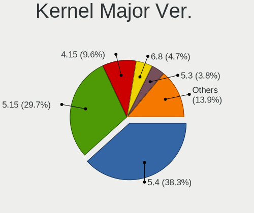
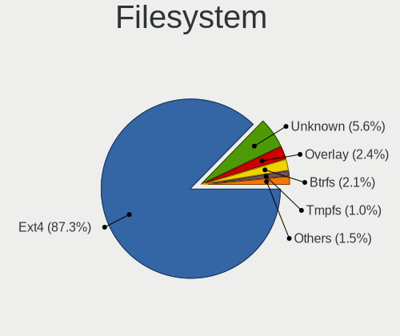
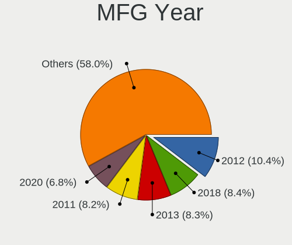
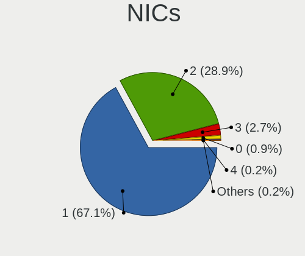

Linux Mint - Tested Hardware & Statistics (Desktops)
----------------------------------------------------

A project to collect tested hardware configurations for Linux Mint.

Anyone can contribute to this report by the [hw-probe](https://github.com/linuxhw/hw-probe) tool:

    sudo -E hw-probe -all -upload

Please contribute! Especially if your hardware is rare.

Contents
--------

* [ Test Cases ](#test-cases)

* [ System ](#system)
  - [ OS                       ](#os)
  - [ OS Family                ](#os-family)
  - [ Kernel                   ](#kernel)
  - [ Kernel Family            ](#kernel-family)
  - [ Kernel Major Ver.        ](#kernel-major-ver)
  - [ Arch                     ](#arch)
  - [ DE                       ](#de)
  - [ Display Server           ](#display-server)
  - [ Display Manager          ](#display-manager)
  - [ OS Lang                  ](#os-lang)
  - [ Boot Mode                ](#boot-mode)
  - [ Filesystem               ](#filesystem)
  - [ Part. scheme             ](#part-scheme)
  - [ Dual Boot with Linux/BSD ](#dual-boot-with-linuxbsd)
  - [ Dual Boot (Win)          ](#dual-boot-win)

* [ Board ](#board)
  - [ Vendor                   ](#vendor)
  - [ Model                    ](#model)
  - [ Model Family             ](#model-family)
  - [ MFG Year                 ](#mfg-year)
  - [ Form Factor              ](#form-factor)
  - [ Secure Boot              ](#secure-boot)
  - [ Coreboot                 ](#coreboot)
  - [ RAM Size                 ](#ram-size)
  - [ RAM Used                 ](#ram-used)
  - [ Total Drives             ](#total-drives)
  - [ Has CD-ROM               ](#has-cd-rom)
  - [ Has Ethernet             ](#has-ethernet)
  - [ Has WiFi                 ](#has-wifi)
  - [ Has Bluetooth            ](#has-bluetooth)

* [ Location ](#location)
  - [ Country                  ](#country)
  - [ City                     ](#city)

* [ Drives ](#drives)
  - [ Drive Vendor             ](#drive-vendor)
  - [ Drive Model              ](#drive-model)
  - [ HDD Vendor               ](#hdd-vendor)
  - [ SSD Vendor               ](#ssd-vendor)
  - [ Drive Kind               ](#drive-kind)
  - [ Drive Connector          ](#drive-connector)
  - [ Drive Size               ](#drive-size)
  - [ Space Total              ](#space-total)
  - [ Space Used               ](#space-used)
  - [ Malfunc. Drives          ](#malfunc-drives)
  - [ Malfunc. Drive Vendor    ](#malfunc-drive-vendor)
  - [ Malfunc. HDD Vendor      ](#malfunc-hdd-vendor)
  - [ Malfunc. Drive Kind      ](#malfunc-drive-kind)
  - [ Failed Drives            ](#failed-drives)
  - [ Failed Drive Vendor      ](#failed-drive-vendor)
  - [ Drive Status             ](#drive-status)

* [ Storage controller ](#storage-controller)
  - [ Storage Vendor           ](#storage-vendor)
  - [ Storage Model            ](#storage-model)
  - [ Storage Kind             ](#storage-kind)

* [ Processor ](#processor)
  - [ CPU Vendor               ](#cpu-vendor)
  - [ CPU Model                ](#cpu-model)
  - [ CPU Model Family         ](#cpu-model-family)
  - [ CPU Cores                ](#cpu-cores)
  - [ CPU Sockets              ](#cpu-sockets)
  - [ CPU Threads              ](#cpu-threads)
  - [ CPU Op-Modes             ](#cpu-op-modes)
  - [ CPU Microcode            ](#cpu-microcode)
  - [ CPU Microarch            ](#cpu-microarch)

* [ Graphics ](#graphics)
  - [ GPU Vendor               ](#gpu-vendor)
  - [ GPU Model                ](#gpu-model)
  - [ GPU Combo                ](#gpu-combo)
  - [ GPU Driver               ](#gpu-driver)
  - [ GPU Memory               ](#gpu-memory)

* [ Monitor ](#monitor)
  - [ Monitor Vendor           ](#monitor-vendor)
  - [ Monitor Model            ](#monitor-model)
  - [ Monitor Resolution       ](#monitor-resolution)
  - [ Monitor Diagonal         ](#monitor-diagonal)
  - [ Monitor Width            ](#monitor-width)
  - [ Aspect Ratio             ](#aspect-ratio)
  - [ Monitor Area             ](#monitor-area)
  - [ Pixel Density            ](#pixel-density)
  - [ Multiple Monitors        ](#multiple-monitors)

* [ Network ](#network)
  - [ Net Controller Vendor    ](#net-controller-vendor)
  - [ Net Controller Model     ](#net-controller-model)
  - [ Wireless Vendor          ](#wireless-vendor)
  - [ Wireless Model           ](#wireless-model)
  - [ Ethernet Vendor          ](#ethernet-vendor)
  - [ Ethernet Model           ](#ethernet-model)
  - [ Net Controller Kind      ](#net-controller-kind)
  - [ Used Controller          ](#used-controller)
  - [ NICs                     ](#nics)
  - [ IPv6                     ](#ipv6)

* [ Bluetooth ](#bluetooth)
  - [ Bluetooth Vendor         ](#bluetooth-vendor)
  - [ Bluetooth Model          ](#bluetooth-model)

* [ Sound ](#sound)
  - [ Sound Vendor             ](#sound-vendor)
  - [ Sound Model              ](#sound-model)

* [ Memory ](#memory)
  - [ Memory Vendor            ](#memory-vendor)
  - [ Memory Model             ](#memory-model)
  - [ Memory Kind              ](#memory-kind)
  - [ Memory Form Factor       ](#memory-form-factor)
  - [ Memory Size              ](#memory-size)
  - [ Memory Speed             ](#memory-speed)

* [ Printers & scanners ](#printers--scanners)
  - [ Printer Vendor           ](#printer-vendor)
  - [ Printer Model            ](#printer-model)
  - [ Scanner Vendor           ](#scanner-vendor)
  - [ Scanner Model            ](#scanner-model)

* [ Camera ](#camera)
  - [ Camera Vendor            ](#camera-vendor)
  - [ Camera Model             ](#camera-model)

* [ Security ](#security)
  - [ Fingerprint Vendor       ](#fingerprint-vendor)
  - [ Fingerprint Model        ](#fingerprint-model)
  - [ Chipcard Vendor          ](#chipcard-vendor)
  - [ Chipcard Model           ](#chipcard-model)

* [ Unsupported ](#unsupported)
  - [ Unsupported Devices      ](#unsupported-devices)
  - [ Unsupported Device Types ](#unsupported-device-types)

Test Cases
----------

Total: 7782

| Vendor        | Model                       | Probe                                                      | Date         |
|---------------|-----------------------------|------------------------------------------------------------|--------------|
| HP            | 1493                        | [2925e7a321](https://linux-hardware.org/?probe=2925e7a321) | Aug 01, 2022 |
| AZW           | Green G2                    | [d2607d160f](https://linux-hardware.org/?probe=d2607d160f) | Aug 01, 2022 |
| MSI           | X370 KRAIT GAMING           | [fe950a68a3](https://linux-hardware.org/?probe=fe950a68a3) | Aug 01, 2022 |
| Acer          | Aspire X3470                | [88ad041430](https://linux-hardware.org/?probe=88ad041430) | Jul 31, 2022 |
| ASRock        | N68-S3 UCC                  | [bcb1d1da28](https://linux-hardware.org/?probe=bcb1d1da28) | Jul 31, 2022 |
| MSI           | Z97 PC Mate                 | [73ebbe2902](https://linux-hardware.org/?probe=73ebbe2902) | Jul 31, 2022 |
| MSI           | Z97 PC Mate                 | [22a32957dc](https://linux-hardware.org/?probe=22a32957dc) | Jul 31, 2022 |
| Gigabyte      | Z87-HD3                     | [83936d3cf0](https://linux-hardware.org/?probe=83936d3cf0) | Jul 31, 2022 |
| Gigabyte      | G33M-S2                     | [219dd022c6](https://linux-hardware.org/?probe=219dd022c6) | Jul 31, 2022 |
| MSI           | Z490-A PRO                  | [054fdc9187](https://linux-hardware.org/?probe=054fdc9187) | Jul 31, 2022 |
| ASUSTek       | PRIME X570-P                | [e962ba603d](https://linux-hardware.org/?probe=e962ba603d) | Jul 31, 2022 |
| ASUSTek       | PRIME Z490-A                | [a1923838e1](https://linux-hardware.org/?probe=a1923838e1) | Jul 31, 2022 |
| MSI           | MAG B550M MORTAR            | [8614c5b8df](https://linux-hardware.org/?probe=8614c5b8df) | Jul 30, 2022 |
| ASUSTek       | ROG STRIX X370-F GAMING     | [b0265ffd70](https://linux-hardware.org/?probe=b0265ffd70) | Jul 30, 2022 |
| ASUSTek       | ROG STRIX X370-F GAMING     | [af062992d8](https://linux-hardware.org/?probe=af062992d8) | Jul 30, 2022 |
| Gigabyte      | G33M-S2                     | [0a96778f7c](https://linux-hardware.org/?probe=0a96778f7c) | Jul 30, 2022 |
| Dell          | 06NWYK A00                  | [1182388bb6](https://linux-hardware.org/?probe=1182388bb6) | Jul 30, 2022 |
| MSI           | A320M-A PRO MAX             | [3249abb411](https://linux-hardware.org/?probe=3249abb411) | Jul 30, 2022 |
| MSI           | A320M-A PRO MAX             | [5a750a1294](https://linux-hardware.org/?probe=5a750a1294) | Jul 30, 2022 |
| HP            | 18E7                        | [3d7c1549eb](https://linux-hardware.org/?probe=3d7c1549eb) | Jul 29, 2022 |
| Gigabyte      | B550 AORUS ELITE AX         | [eee9c60bec](https://linux-hardware.org/?probe=eee9c60bec) | Jul 29, 2022 |
| AZW           | Green G2                    | [755b99362f](https://linux-hardware.org/?probe=755b99362f) | Jul 29, 2022 |
| ASRock        | B85 Pro4                    | [98e02ef2cd](https://linux-hardware.org/?probe=98e02ef2cd) | Jul 29, 2022 |
| ASRock        | B85 Pro4                    | [ec68a40236](https://linux-hardware.org/?probe=ec68a40236) | Jul 29, 2022 |
| Biostar       | A880G+                      | [5f10c78e54](https://linux-hardware.org/?probe=5f10c78e54) | Jul 29, 2022 |
| Gigabyte      | H510M S2H                   | [7c42ac18e4](https://linux-hardware.org/?probe=7c42ac18e4) | Jul 29, 2022 |
| HP            | 339A                        | [fa0d80162a](https://linux-hardware.org/?probe=fa0d80162a) | Jul 29, 2022 |
| MSI           | Z390-A PRO                  | [32c295bae1](https://linux-hardware.org/?probe=32c295bae1) | Jul 29, 2022 |
| ASUSTek       | PRIME B450M-GAMING II       | [0cc1bc9401](https://linux-hardware.org/?probe=0cc1bc9401) | Jul 29, 2022 |
| ASUSTek       | M4N78                       | [870702db59](https://linux-hardware.org/?probe=870702db59) | Jul 29, 2022 |
| Biostar       | B350GTN                     | [75d6302ab0](https://linux-hardware.org/?probe=75d6302ab0) | Jul 29, 2022 |
| ASUSTek       | P8B75-M LX                  | [af972287a0](https://linux-hardware.org/?probe=af972287a0) | Jul 29, 2022 |
| AZW           | Green G2                    | [c3e6905701](https://linux-hardware.org/?probe=c3e6905701) | Jul 29, 2022 |
| AZW           | Green G2                    | [acf3761817](https://linux-hardware.org/?probe=acf3761817) | Jul 29, 2022 |
| ASUSTek       | TUF Gaming B550-PLUS        | [2953cb274f](https://linux-hardware.org/?probe=2953cb274f) | Jul 28, 2022 |
| HP            | 21F5                        | [27cf2d6a42](https://linux-hardware.org/?probe=27cf2d6a42) | Jul 28, 2022 |
| ASUSTek       | ProArt X570-CREATOR WIFI    | [297217baa1](https://linux-hardware.org/?probe=297217baa1) | Jul 28, 2022 |
| Gigabyte      | H410M H                     | [eb92148078](https://linux-hardware.org/?probe=eb92148078) | Jul 28, 2022 |
| MSI           | B550-A PRO                  | [f597d7cc46](https://linux-hardware.org/?probe=f597d7cc46) | Jul 28, 2022 |
| ASUSTek       | G10DK                       | [70a71d84a6](https://linux-hardware.org/?probe=70a71d84a6) | Jul 28, 2022 |
| Positivo      | POS-RIB360EE 11158935       | [1c687dcef7](https://linux-hardware.org/?probe=1c687dcef7) | Jul 28, 2022 |
| MSI           | B550-A PRO                  | [2ae0b5a47a](https://linux-hardware.org/?probe=2ae0b5a47a) | Jul 28, 2022 |
| ASUSTek       | PRIME X470-PRO              | [ce5af45a80](https://linux-hardware.org/?probe=ce5af45a80) | Jul 28, 2022 |
| Lenovo        | Tiger Hill                  | [66597a565e](https://linux-hardware.org/?probe=66597a565e) | Jul 28, 2022 |
| Gigabyte      | Z97X-UD5H                   | [9b3bb82b80](https://linux-hardware.org/?probe=9b3bb82b80) | Jul 28, 2022 |
| ASUSTek       | Z170-A                      | [47f6481e91](https://linux-hardware.org/?probe=47f6481e91) | Jul 28, 2022 |
| Intel         | X99 V1.0                    | [da677f5a3b](https://linux-hardware.org/?probe=da677f5a3b) | Jul 28, 2022 |
| HP            | 806A                        | [6a6df5d868](https://linux-hardware.org/?probe=6a6df5d868) | Jul 28, 2022 |
| Dell          | 06NWYK A00                  | [4f90c96687](https://linux-hardware.org/?probe=4f90c96687) | Jul 27, 2022 |
| ASRock        | H310CM-ITX/ac               | [df9564b6b3](https://linux-hardware.org/?probe=df9564b6b3) | Jul 27, 2022 |
| AZW           | Green G2                    | [16a89e4be5](https://linux-hardware.org/?probe=16a89e4be5) | Jul 27, 2022 |
| ASUSTek       | TUF B450-PRO GAMING         | [cb4bc3fa42](https://linux-hardware.org/?probe=cb4bc3fa42) | Jul 27, 2022 |
| ASUSTek       | TUF B450-PRO GAMING         | [9f5bf108ac](https://linux-hardware.org/?probe=9f5bf108ac) | Jul 27, 2022 |
| MSI           | 970A-G43                    | [9095b31f2f](https://linux-hardware.org/?probe=9095b31f2f) | Jul 26, 2022 |
| ASUSTek       | P5KC                        | [7e9c9d2fc4](https://linux-hardware.org/?probe=7e9c9d2fc4) | Jul 26, 2022 |
| Dell          | 06NWYK A00                  | [effad14bc0](https://linux-hardware.org/?probe=effad14bc0) | Jul 26, 2022 |
| Gigabyte      | EP45-DS3                    | [5b5fe46f75](https://linux-hardware.org/?probe=5b5fe46f75) | Jul 26, 2022 |
| Gigabyte      | Z590 AORUS MASTER           | [300ddea4d6](https://linux-hardware.org/?probe=300ddea4d6) | Jul 26, 2022 |
| ASUSTek       | PRIME B450-PLUS             | [32045fd953](https://linux-hardware.org/?probe=32045fd953) | Jul 26, 2022 |
| Gigabyte      | B85-HD3                     | [9447f1eb98](https://linux-hardware.org/?probe=9447f1eb98) | Jul 26, 2022 |
| Gigabyte      | Z590 GAMING X               | [6701685bb5](https://linux-hardware.org/?probe=6701685bb5) | Jul 26, 2022 |
| Acer          | WMCP78M                     | [fa9866b7e5](https://linux-hardware.org/?probe=fa9866b7e5) | Jul 26, 2022 |
| Gigabyte      | H110M-S2H DDR3-CF           | [e471e3ed10](https://linux-hardware.org/?probe=e471e3ed10) | Jul 26, 2022 |
| Gigabyte      | Z87-D3HP-CF                 | [88b45b1956](https://linux-hardware.org/?probe=88b45b1956) | Jul 26, 2022 |
| MSI           | H510M PRO                   | [07c98d99d5](https://linux-hardware.org/?probe=07c98d99d5) | Jul 25, 2022 |
| MSI           | H510M PRO                   | [e8693a9212](https://linux-hardware.org/?probe=e8693a9212) | Jul 25, 2022 |
| AZW           | SEi                         | [00755b9883](https://linux-hardware.org/?probe=00755b9883) | Jul 25, 2022 |
| AZW           | Green G2                    | [caf6905841](https://linux-hardware.org/?probe=caf6905841) | Jul 24, 2022 |
| Gigabyte      | Z390 M-CF                   | [ae2926d93e](https://linux-hardware.org/?probe=ae2926d93e) | Jul 24, 2022 |
| Intel         | X99                         | [046538e5fc](https://linux-hardware.org/?probe=046538e5fc) | Jul 24, 2022 |
| Dell          | 0WN7Y6 A02                  | [4059b7a331](https://linux-hardware.org/?probe=4059b7a331) | Jul 24, 2022 |
| ASUSTek       | P8H61-MX                    | [6614f30e6a](https://linux-hardware.org/?probe=6614f30e6a) | Jul 24, 2022 |
| ASRock        | X470 Gaming K4              | [4f26f0dbda](https://linux-hardware.org/?probe=4f26f0dbda) | Jul 24, 2022 |
| Gigabyte      | MJPLNAB-00                  | [d414e51a0c](https://linux-hardware.org/?probe=d414e51a0c) | Jul 23, 2022 |
| ASUSTek       | P5E3 PRO                    | [357b10a053](https://linux-hardware.org/?probe=357b10a053) | Jul 23, 2022 |
| Gigabyte      | MJPLNAB-00                  | [9dcb499f3e](https://linux-hardware.org/?probe=9dcb499f3e) | Jul 23, 2022 |
| Minix         | NEO Z83-4 V1.1              | [e8c6448552](https://linux-hardware.org/?probe=e8c6448552) | Jul 23, 2022 |
| MSI           | G31TM-P21                   | [abc0948b06](https://linux-hardware.org/?probe=abc0948b06) | Jul 23, 2022 |
| HP            | 339A                        | [313af629be](https://linux-hardware.org/?probe=313af629be) | Jul 23, 2022 |
| MSI           | 970 GAMING                  | [2814270f24](https://linux-hardware.org/?probe=2814270f24) | Jul 23, 2022 |
| Pegatron      | 2ACD                        | [c8ce65cd26](https://linux-hardware.org/?probe=c8ce65cd26) | Jul 23, 2022 |
| ASRock        | Z270 Professional Gaming... | [c84ebb5a1a](https://linux-hardware.org/?probe=c84ebb5a1a) | Jul 23, 2022 |
| ASUSTek       | P8P67 PRO                   | [54e6e291bd](https://linux-hardware.org/?probe=54e6e291bd) | Jul 22, 2022 |
| Dell          | 0P01GV A03                  | [60b77cc6b5](https://linux-hardware.org/?probe=60b77cc6b5) | Jul 22, 2022 |
| ASUSTek       | P8H61-M LX3 PLUS            | [3c5c67efc0](https://linux-hardware.org/?probe=3c5c67efc0) | Jul 22, 2022 |
| HP            | 08B4h                       | [8ff662507a](https://linux-hardware.org/?probe=8ff662507a) | Jul 22, 2022 |
| Intel         | Z77                         | [c858c41f36](https://linux-hardware.org/?probe=c858c41f36) | Jul 22, 2022 |
| Intel         | Z77                         | [d1f38293b3](https://linux-hardware.org/?probe=d1f38293b3) | Jul 22, 2022 |
| MSI           | Z77A-GD65                   | [f0cf5d1f55](https://linux-hardware.org/?probe=f0cf5d1f55) | Jul 22, 2022 |
| ASUSTek       | ROG STRIX X570-E GAMING ... | [2986a26253](https://linux-hardware.org/?probe=2986a26253) | Jul 22, 2022 |
| MSI           | Z77A-GD65                   | [edfa6cb848](https://linux-hardware.org/?probe=edfa6cb848) | Jul 22, 2022 |
| Lenovo        | NOK                         | [a47a727578](https://linux-hardware.org/?probe=a47a727578) | Jul 22, 2022 |
| HP            | 0AECh D                     | [ca7abdaae0](https://linux-hardware.org/?probe=ca7abdaae0) | Jul 22, 2022 |
| ASUSTek       | P8B75-M LE                  | [f5c169fed7](https://linux-hardware.org/?probe=f5c169fed7) | Jul 22, 2022 |
| ASUSTek       | ROG CROSSHAIR VIII HERO     | [b6fc243a07](https://linux-hardware.org/?probe=b6fc243a07) | Jul 22, 2022 |
| ASUSTek       | PRIME Z390-A                | [83d47fc3dc](https://linux-hardware.org/?probe=83d47fc3dc) | Jul 22, 2022 |
| Gigabyte      | H370 AORUS GAMING 3 WIFI... | [b08505b90e](https://linux-hardware.org/?probe=b08505b90e) | Jul 21, 2022 |
| ASUSTek       | ROG STRIX B550-I GAMING     | [2e97c3de0b](https://linux-hardware.org/?probe=2e97c3de0b) | Jul 21, 2022 |
| ASUSTek       | ROG STRIX B550-I GAMING     | [d567131bf9](https://linux-hardware.org/?probe=d567131bf9) | Jul 21, 2022 |
| Gigabyte      | 970A-DS3P                   | [210b75c48e](https://linux-hardware.org/?probe=210b75c48e) | Jul 21, 2022 |
| Gigabyte      | G41MT-S2PT                  | [b291af1e34](https://linux-hardware.org/?probe=b291af1e34) | Jul 21, 2022 |
| Unknown       | Unknown                     | [752319bda0](https://linux-hardware.org/?probe=752319bda0) | Jul 21, 2022 |
| Apple         | Mac-7BA5B2D9E42DDD94 iMa... | [e80a3e71e2](https://linux-hardware.org/?probe=e80a3e71e2) | Jul 21, 2022 |
| Intel         | STK1AW32SC H91596-307       | [78225ba5b9](https://linux-hardware.org/?probe=78225ba5b9) | Jul 21, 2022 |
| ASUSTek       | A88X-PRO                    | [be81f08ed2](https://linux-hardware.org/?probe=be81f08ed2) | Jul 21, 2022 |
| AZW           | Green G2                    | [3041918dfa](https://linux-hardware.org/?probe=3041918dfa) | Jul 21, 2022 |
| ASUSTek       | M5A78L-M PLUS/USB3          | [6de28040de](https://linux-hardware.org/?probe=6de28040de) | Jul 21, 2022 |
| MSI           | MAG B550 TOMAHAWK           | [06b84340f2](https://linux-hardware.org/?probe=06b84340f2) | Jul 21, 2022 |
| HP            | 2AF7                        | [3791eccf74](https://linux-hardware.org/?probe=3791eccf74) | Jul 20, 2022 |
| HP            | 2AF7                        | [43cc1f3d0a](https://linux-hardware.org/?probe=43cc1f3d0a) | Jul 20, 2022 |
| AZW           | Green G2                    | [d4144bc083](https://linux-hardware.org/?probe=d4144bc083) | Jul 20, 2022 |
| ASUSTek       | Z87M-PLUS                   | [da502f8dfd](https://linux-hardware.org/?probe=da502f8dfd) | Jul 20, 2022 |
| Foxconn       | ETON                        | [1686897e74](https://linux-hardware.org/?probe=1686897e74) | Jul 20, 2022 |
| ASUSTek       | P8Z68-V LX                  | [0de7d2f427](https://linux-hardware.org/?probe=0de7d2f427) | Jul 20, 2022 |
| Gigabyte      | 970A-DS3P                   | [17befc2dd5](https://linux-hardware.org/?probe=17befc2dd5) | Jul 20, 2022 |
| Gigabyte      | H410M H V3                  | [37521f84c8](https://linux-hardware.org/?probe=37521f84c8) | Jul 20, 2022 |
| Lenovo        | SHARKBAY 0B98401 WIN        | [0ce9af7993](https://linux-hardware.org/?probe=0ce9af7993) | Jul 20, 2022 |
| AZW           | Green G2                    | [c12dbe72f1](https://linux-hardware.org/?probe=c12dbe72f1) | Jul 20, 2022 |
| HP            | 1998                        | [08e093657d](https://linux-hardware.org/?probe=08e093657d) | Jul 20, 2022 |
| Gigabyte      | B150M-D3H-CF                | [65fb347b62](https://linux-hardware.org/?probe=65fb347b62) | Jul 19, 2022 |
| Gigabyte      | EP45-UD3P                   | [888e64f06a](https://linux-hardware.org/?probe=888e64f06a) | Jul 19, 2022 |
| ECS           | A990FXM-A                   | [6351c9023d](https://linux-hardware.org/?probe=6351c9023d) | Jul 19, 2022 |
| MSI           | B450-A PRO MAX              | [2e74bdb9aa](https://linux-hardware.org/?probe=2e74bdb9aa) | Jul 19, 2022 |
| Foxconn       | 2ABF                        | [765d75028c](https://linux-hardware.org/?probe=765d75028c) | Jul 19, 2022 |
| MACHINIST     | X79 V2.82H                  | [67faad589b](https://linux-hardware.org/?probe=67faad589b) | Jul 19, 2022 |
| Dell          | 08WKV3 A00                  | [05fb8c3ed5](https://linux-hardware.org/?probe=05fb8c3ed5) | Jul 19, 2022 |
| MSI           | G31M3-L V2                  | [cd6d617e34](https://linux-hardware.org/?probe=cd6d617e34) | Jul 19, 2022 |
| MSI           | G31M3-L V2                  | [aaa3013f66](https://linux-hardware.org/?probe=aaa3013f66) | Jul 18, 2022 |
| Dell          | 0D28YY A00                  | [129009177c](https://linux-hardware.org/?probe=129009177c) | Jul 18, 2022 |
| Dell          | 0D28YY A00                  | [3a633633a2](https://linux-hardware.org/?probe=3a633633a2) | Jul 18, 2022 |
| ASUSTek       | PRIME A320M-K               | [48d9b9f502](https://linux-hardware.org/?probe=48d9b9f502) | Jul 18, 2022 |
| MSI           | B450M MORTAR TITANIUM       | [6aac7a75e7](https://linux-hardware.org/?probe=6aac7a75e7) | Jul 18, 2022 |
| ASUSTek       | PRIME H410M-E               | [db7cb6f32b](https://linux-hardware.org/?probe=db7cb6f32b) | Jul 18, 2022 |
| ASUSTek       | P8B75-M LE                  | [34f50b057e](https://linux-hardware.org/?probe=34f50b057e) | Jul 18, 2022 |
| ASUSTek       | SABERTOOTH Z87              | [64d5fa573d](https://linux-hardware.org/?probe=64d5fa573d) | Jul 18, 2022 |
| ASUSTek       | SABERTOOTH Z77              | [d6c5a9efaf](https://linux-hardware.org/?probe=d6c5a9efaf) | Jul 18, 2022 |
| Pegatron      | 2ACD                        | [2864879f93](https://linux-hardware.org/?probe=2864879f93) | Jul 18, 2022 |
| ASUSTek       | SABERTOOTH Z77              | [24c82034e6](https://linux-hardware.org/?probe=24c82034e6) | Jul 18, 2022 |
| ASUSTek       | PRIME X570-P                | [8c48826e45](https://linux-hardware.org/?probe=8c48826e45) | Jul 17, 2022 |
| ASUSTek       | TUF Gaming X570-PLUS        | [dac8603f3d](https://linux-hardware.org/?probe=dac8603f3d) | Jul 17, 2022 |
| Gigabyte      | G33M-S2                     | [c6c4a561e1](https://linux-hardware.org/?probe=c6c4a561e1) | Jul 17, 2022 |
| Gigabyte      | F2A85XM-D3H                 | [38ebe8f368](https://linux-hardware.org/?probe=38ebe8f368) | Jul 17, 2022 |
| Gigabyte      | F2A85XM-D3H                 | [129bcce64f](https://linux-hardware.org/?probe=129bcce64f) | Jul 17, 2022 |
| Gigabyte      | B560M DS3H V2               | [43d7f05696](https://linux-hardware.org/?probe=43d7f05696) | Jul 17, 2022 |
| HP            | 1998                        | [8aa7e05c70](https://linux-hardware.org/?probe=8aa7e05c70) | Jul 17, 2022 |
| Apple         | Mac-F221BEC8                | [5f5367ebdd](https://linux-hardware.org/?probe=5f5367ebdd) | Jul 17, 2022 |
| ASUSTek       | TUF Gaming Z690-PLUS WIF... | [68d8843883](https://linux-hardware.org/?probe=68d8843883) | Jul 17, 2022 |
| Lenovo        | Bantry CRB NOK              | [0fdca53da8](https://linux-hardware.org/?probe=0fdca53da8) | Jul 17, 2022 |
| BESSTAR Te... | HM90                        | [ee18049d28](https://linux-hardware.org/?probe=ee18049d28) | Jul 17, 2022 |
| ASRock        | H110M-DGS R3.0              | [895550b6d3](https://linux-hardware.org/?probe=895550b6d3) | Jul 17, 2022 |
| Dell          | 08NPPY A00                  | [23d9101cd2](https://linux-hardware.org/?probe=23d9101cd2) | Jul 17, 2022 |
| ASUSTek       | TUF B450-PRO GAMING         | [7142849ed0](https://linux-hardware.org/?probe=7142849ed0) | Jul 17, 2022 |
| ASUSTek       | TUF Gaming Z690-PLUS WIF... | [057b18a904](https://linux-hardware.org/?probe=057b18a904) | Jul 16, 2022 |
| Gigabyte      | M57SLI-S4                   | [288984fb9e](https://linux-hardware.org/?probe=288984fb9e) | Jul 16, 2022 |
| Lenovo        | 3102 SDK0J40697 WIN 3305... | [5b07f65ff5](https://linux-hardware.org/?probe=5b07f65ff5) | Jul 16, 2022 |
| ASUSTek       | CM6870                      | [b52692fd5e](https://linux-hardware.org/?probe=b52692fd5e) | Jul 16, 2022 |
| MSI           | Boston                      | [c1474f9d2f](https://linux-hardware.org/?probe=c1474f9d2f) | Jul 15, 2022 |
| MSI           | MAG Z390 TOMAHAWK           | [75e4cc3704](https://linux-hardware.org/?probe=75e4cc3704) | Jul 15, 2022 |
| Intel         | H61                         | [8865d7959a](https://linux-hardware.org/?probe=8865d7959a) | Jul 15, 2022 |
| ASUSTek       | P5E3 PRO                    | [b4c3e4eeb0](https://linux-hardware.org/?probe=b4c3e4eeb0) | Jul 15, 2022 |
| Lenovo        | 3102 SDK0J40697 WIN 3305... | [cb6916e513](https://linux-hardware.org/?probe=cb6916e513) | Jul 15, 2022 |
| ASUSTek       | H81M-K                      | [1d2991137d](https://linux-hardware.org/?probe=1d2991137d) | Jul 15, 2022 |
| Medion        | MS-7633                     | [35af25c619](https://linux-hardware.org/?probe=35af25c619) | Jul 15, 2022 |
| Gigabyte      | Z390 DESIGNARE-CF           | [a81e48e206](https://linux-hardware.org/?probe=a81e48e206) | Jul 15, 2022 |
| ECS           | H81H3-WM                    | [e38b93a0c9](https://linux-hardware.org/?probe=e38b93a0c9) | Jul 15, 2022 |
| ASUSTek       | ProArt X570-CREATOR WIFI    | [fecf83d1eb](https://linux-hardware.org/?probe=fecf83d1eb) | Jul 14, 2022 |
| ASUSTek       | M4A78 PRO                   | [119c291cd5](https://linux-hardware.org/?probe=119c291cd5) | Jul 14, 2022 |
| ASUSTek       | ProArt X570-CREATOR WIFI    | [0893dc4cc3](https://linux-hardware.org/?probe=0893dc4cc3) | Jul 14, 2022 |
| Dell          | 0MGK50 A02                  | [0c0ac374b4](https://linux-hardware.org/?probe=0c0ac374b4) | Jul 14, 2022 |
| ASUSTek       | TUF B450M-PLUS GAMING       | [9da64b4efa](https://linux-hardware.org/?probe=9da64b4efa) | Jul 14, 2022 |
| Dell          | 0MFHTR A00                  | [2ba698429a](https://linux-hardware.org/?probe=2ba698429a) | Jul 14, 2022 |
| Lenovo        | SHARKBAY 0B98401 PRO        | [386dd1ac4b](https://linux-hardware.org/?probe=386dd1ac4b) | Jul 14, 2022 |
| Gigabyte      | B365 HD3                    | [c40e564503](https://linux-hardware.org/?probe=c40e564503) | Jul 14, 2022 |
| Gigabyte      | B365 HD3                    | [985ec392f9](https://linux-hardware.org/?probe=985ec392f9) | Jul 14, 2022 |
| Lenovo        | MAHOBAY NO DPK              | [3a443e4fcb](https://linux-hardware.org/?probe=3a443e4fcb) | Jul 14, 2022 |
| Gigabyte      | Z490 AORUS ELITE AC         | [050da1ebe6](https://linux-hardware.org/?probe=050da1ebe6) | Jul 13, 2022 |
| MSI           | Z77A-GD65                   | [b2990d4341](https://linux-hardware.org/?probe=b2990d4341) | Jul 13, 2022 |
| MSI           | B365M PRO-VDH               | [7ff6dc5131](https://linux-hardware.org/?probe=7ff6dc5131) | Jul 13, 2022 |
| HP            | 0AE8h C                     | [9e71cf3fbc](https://linux-hardware.org/?probe=9e71cf3fbc) | Jul 13, 2022 |
| MSI           | X370 GAMING M7 ACK          | [df70d8d905](https://linux-hardware.org/?probe=df70d8d905) | Jul 13, 2022 |
| Dell          | 0WR7PY A01                  | [5f479562d2](https://linux-hardware.org/?probe=5f479562d2) | Jul 13, 2022 |
| ASUSTek       | ROG STRIX X370-F GAMING     | [5537dda056](https://linux-hardware.org/?probe=5537dda056) | Jul 13, 2022 |
| ASRock        | B365M Pro4                  | [5701f5019e](https://linux-hardware.org/?probe=5701f5019e) | Jul 13, 2022 |
| PCWare        | IPMH61R3                    | [6d92dfd343](https://linux-hardware.org/?probe=6d92dfd343) | Jul 13, 2022 |
| PCWare        | IPMH61R3                    | [ac21298dd8](https://linux-hardware.org/?probe=ac21298dd8) | Jul 13, 2022 |
| MSI           | MEG B550 UNIFY-X            | [bb5cce0952](https://linux-hardware.org/?probe=bb5cce0952) | Jul 12, 2022 |
| Dell          | 0C27VV A02                  | [d08ca1549c](https://linux-hardware.org/?probe=d08ca1549c) | Jul 12, 2022 |
| Acer          | Aspire X3470                | [61b7216da0](https://linux-hardware.org/?probe=61b7216da0) | Jul 12, 2022 |
| ASUSTek       | ROG Maximus X HERO          | [575388d90b](https://linux-hardware.org/?probe=575388d90b) | Jul 12, 2022 |
| ECS           | H61H2-WM                    | [f0a17960d3](https://linux-hardware.org/?probe=f0a17960d3) | Jul 12, 2022 |
| Lenovo        | MAHOBAY Win8 Pro DPK TPG    | [320a4240ce](https://linux-hardware.org/?probe=320a4240ce) | Jul 12, 2022 |
| Intel         | X99 V1.0                    | [f60857de09](https://linux-hardware.org/?probe=f60857de09) | Jul 12, 2022 |
| Dell          | 0P01GV A03                  | [6b4cd20919](https://linux-hardware.org/?probe=6b4cd20919) | Jul 12, 2022 |
| MSI           | H310M PRO-VDH PLUS          | [aba10c973c](https://linux-hardware.org/?probe=aba10c973c) | Jul 11, 2022 |
| AZW           | Green G2                    | [2940e9d90b](https://linux-hardware.org/?probe=2940e9d90b) | Jul 11, 2022 |
| ASUSTek       | P5E3 PRO                    | [4703d86794](https://linux-hardware.org/?probe=4703d86794) | Jul 11, 2022 |
| Dell          | 0200DY A01                  | [99eacb5700](https://linux-hardware.org/?probe=99eacb5700) | Jul 11, 2022 |
| ASRock        | P43DE                       | [0dbb7293a1](https://linux-hardware.org/?probe=0dbb7293a1) | Jul 11, 2022 |
| Positivo      | POS-MI945AA                 | [ab451b5409](https://linux-hardware.org/?probe=ab451b5409) | Jul 11, 2022 |
| ASUSTek       | TUF Gaming B550-PLUS        | [0e8e13e1f2](https://linux-hardware.org/?probe=0e8e13e1f2) | Jul 10, 2022 |
| Gigabyte      | B450M DS3H-CF               | [c350afe818](https://linux-hardware.org/?probe=c350afe818) | Jul 10, 2022 |
| ASRock        | P43DE                       | [2aa8290d56](https://linux-hardware.org/?probe=2aa8290d56) | Jul 10, 2022 |
| Gigabyte      | B450 AORUS M                | [39e99bec7a](https://linux-hardware.org/?probe=39e99bec7a) | Jul 10, 2022 |
| ASUSTek       | M4A88T-M/USB3               | [abe1c10adf](https://linux-hardware.org/?probe=abe1c10adf) | Jul 09, 2022 |
| MSI           | B450-A PRO MAX              | [00495f3422](https://linux-hardware.org/?probe=00495f3422) | Jul 09, 2022 |
| ASUSTek       | P5E3 PRO                    | [0bc17db2de](https://linux-hardware.org/?probe=0bc17db2de) | Jul 09, 2022 |
| Gigabyte      | M57SLI-S4                   | [938c441bfe](https://linux-hardware.org/?probe=938c441bfe) | Jul 09, 2022 |
| MSI           | B450 GAMING PLUS MAX        | [8434bd1682](https://linux-hardware.org/?probe=8434bd1682) | Jul 09, 2022 |
| Dell          | 0Y2MRG A00                  | [43118c9fc8](https://linux-hardware.org/?probe=43118c9fc8) | Jul 09, 2022 |
| Dell          | 0Y2MRG A00                  | [1a6fd4101e](https://linux-hardware.org/?probe=1a6fd4101e) | Jul 09, 2022 |
| MSI           | B450 GAMING PLUS MAX        | [49cc36caf5](https://linux-hardware.org/?probe=49cc36caf5) | Jul 09, 2022 |
| ASRock        | AMCP7A-ION                  | [5852afeb48](https://linux-hardware.org/?probe=5852afeb48) | Jul 09, 2022 |
| ASUSTek       | TUF Gaming X570-PLUS        | [0c96551a28](https://linux-hardware.org/?probe=0c96551a28) | Jul 09, 2022 |
| AZW           | Green G2                    | [ab0d6161d0](https://linux-hardware.org/?probe=ab0d6161d0) | Jul 09, 2022 |
| Unknown       | HX90                        | [1ae069958c](https://linux-hardware.org/?probe=1ae069958c) | Jul 08, 2022 |
| HP            | 2B2C                        | [0ba46e3565](https://linux-hardware.org/?probe=0ba46e3565) | Jul 07, 2022 |
| Gigabyte      | GA-MA790XT-UD4P             | [46c7d18e75](https://linux-hardware.org/?probe=46c7d18e75) | Jul 07, 2022 |
| Gigabyte      | X570 AORUS PRO WIFI         | [503c38154f](https://linux-hardware.org/?probe=503c38154f) | Jul 07, 2022 |
| Dell          | 0DR845                      | [424649e737](https://linux-hardware.org/?probe=424649e737) | Jul 07, 2022 |
| ASRock        | P67 Pro3                    | [b70f0fde7a](https://linux-hardware.org/?probe=b70f0fde7a) | Jul 07, 2022 |
| ASUSTek       | PRIME X570-P                | [28b43e6c1f](https://linux-hardware.org/?probe=28b43e6c1f) | Jul 06, 2022 |
| Positivo      | POS-MIG31AG                 | [3a03195633](https://linux-hardware.org/?probe=3a03195633) | Jul 06, 2022 |
| Dell          | 0WG864                      | [8ba728c209](https://linux-hardware.org/?probe=8ba728c209) | Jul 06, 2022 |
| ASUSTek       | M2N68-AM SE2                | [602e9ed838](https://linux-hardware.org/?probe=602e9ed838) | Jul 05, 2022 |
| ASUSTek       | P5KPL-AM IN/ROEM/SI         | [aed7de4f94](https://linux-hardware.org/?probe=aed7de4f94) | Jul 05, 2022 |
| Dell          | 09KPNV A00                  | [7eb69e794e](https://linux-hardware.org/?probe=7eb69e794e) | Jul 05, 2022 |
| Medion        | MS-7713                     | [c99970c90f](https://linux-hardware.org/?probe=c99970c90f) | Jul 05, 2022 |
| ASUSTek       | IP4BL-ME_S                  | [63a5ec5213](https://linux-hardware.org/?probe=63a5ec5213) | Jul 05, 2022 |
| MSI           | A88X-G43                    | [c8261ecc77](https://linux-hardware.org/?probe=c8261ecc77) | Jul 05, 2022 |
| ASRock        | X370 Gaming K4              | [f3c391da3b](https://linux-hardware.org/?probe=f3c391da3b) | Jul 05, 2022 |
| ASRock        | X370 Pro4                   | [d77bbb292c](https://linux-hardware.org/?probe=d77bbb292c) | Jul 04, 2022 |
| ASRock        | X370 Pro4                   | [31d8330aaa](https://linux-hardware.org/?probe=31d8330aaa) | Jul 04, 2022 |
| Pegatron      | 2ACD                        | [e5b9545aa4](https://linux-hardware.org/?probe=e5b9545aa4) | Jul 04, 2022 |
| HP            | 3048h                       | [a007a37d76](https://linux-hardware.org/?probe=a007a37d76) | Jul 04, 2022 |
| Biostar       | J3060NH                     | [63d3e6c980](https://linux-hardware.org/?probe=63d3e6c980) | Jul 04, 2022 |
| AZW           | Green G2                    | [8104b2d04e](https://linux-hardware.org/?probe=8104b2d04e) | Jul 04, 2022 |
| ASUSTek       | P5E3 PRO                    | [aed74cd5a2](https://linux-hardware.org/?probe=aed74cd5a2) | Jul 03, 2022 |
| Gigabyte      | B550 AORUS ELITE V2         | [2cabe9acd0](https://linux-hardware.org/?probe=2cabe9acd0) | Jul 03, 2022 |
| HP            | 2AA6 PVT                    | [965700558a](https://linux-hardware.org/?probe=965700558a) | Jul 03, 2022 |
| Dell          | 0MFHTR A00                  | [2967b54913](https://linux-hardware.org/?probe=2967b54913) | Jul 03, 2022 |
| ASRock        | B365M Pro4                  | [8b2e08891d](https://linux-hardware.org/?probe=8b2e08891d) | Jul 03, 2022 |
| ASUSTek       | M4A87TD/USB3                | [537a056c32](https://linux-hardware.org/?probe=537a056c32) | Jul 03, 2022 |
| ASRock        | J4105M                      | [502c01c109](https://linux-hardware.org/?probe=502c01c109) | Jul 03, 2022 |
| Gigabyte      | Z170X-GamingG1              | [3f04cb8ead](https://linux-hardware.org/?probe=3f04cb8ead) | Jul 03, 2022 |
| Pegatron      | 2ACD                        | [caa5c4917c](https://linux-hardware.org/?probe=caa5c4917c) | Jul 03, 2022 |
| ASRock        | X470 Gaming K4              | [4496c249aa](https://linux-hardware.org/?probe=4496c249aa) | Jul 03, 2022 |
| ASRock        | A320M-HDV R4.0              | [a746300279](https://linux-hardware.org/?probe=a746300279) | Jul 03, 2022 |
| Dell          | 042P49 A01                  | [a4042d3acc](https://linux-hardware.org/?probe=a4042d3acc) | Jul 02, 2022 |
| ASRock        | AM1B-M                      | [e0e4a278c9](https://linux-hardware.org/?probe=e0e4a278c9) | Jul 02, 2022 |
| Medion        | MS-7667                     | [22ac257e4a](https://linux-hardware.org/?probe=22ac257e4a) | Jul 02, 2022 |
| Intel         | D2500CC AAG81477-400        | [c9a6658803](https://linux-hardware.org/?probe=c9a6658803) | Jul 02, 2022 |
| ASRock        | P67 Pro3                    | [9f1ed28d62](https://linux-hardware.org/?probe=9f1ed28d62) | Jul 02, 2022 |
| HP            | 0A64h                       | [bb600b4036](https://linux-hardware.org/?probe=bb600b4036) | Jul 02, 2022 |
| Dell          | 0YXT71 A00                  | [4779be3ea5](https://linux-hardware.org/?probe=4779be3ea5) | Jul 02, 2022 |
| Dell          | 0YXT71 A00                  | [c2b1c8f011](https://linux-hardware.org/?probe=c2b1c8f011) | Jul 02, 2022 |
| Dell          | 09KPNV A00                  | [163fad4354](https://linux-hardware.org/?probe=163fad4354) | Jul 02, 2022 |
| Dell          | 054KM3 A01                  | [149f746382](https://linux-hardware.org/?probe=149f746382) | Jul 02, 2022 |
| ASRock        | P67 Pro3                    | [403db88011](https://linux-hardware.org/?probe=403db88011) | Jul 01, 2022 |
| ASRock        | P67 Pro3                    | [4ba5c0b79e](https://linux-hardware.org/?probe=4ba5c0b79e) | Jul 01, 2022 |
| Dell          | 0MFHTR A00                  | [bb4d1c2872](https://linux-hardware.org/?probe=bb4d1c2872) | Jul 01, 2022 |
| ASUSTek       | H81M-K                      | [08ed20d4da](https://linux-hardware.org/?probe=08ed20d4da) | Jul 01, 2022 |
| Dell          | 0P01GV A03                  | [0bbac8ce1f](https://linux-hardware.org/?probe=0bbac8ce1f) | Jul 01, 2022 |
| Biostar       | TA790GX 128M                | [c7021e0b8c](https://linux-hardware.org/?probe=c7021e0b8c) | Jul 01, 2022 |
| Pegatron      | 2ACD                        | [3979af0018](https://linux-hardware.org/?probe=3979af0018) | Jul 01, 2022 |
| ASRock        | P67 Pro3                    | [632dbea587](https://linux-hardware.org/?probe=632dbea587) | Jul 01, 2022 |
| ASUSTek       | K30BF_M32BF                 | [dac4b154d6](https://linux-hardware.org/?probe=dac4b154d6) | Jul 01, 2022 |
| ASRock        | B450M Pro4 R2.0             | [d17c3a2817](https://linux-hardware.org/?probe=d17c3a2817) | Jun 30, 2022 |
| MSI           | Z87 MPOWER                  | [ba26baf84a](https://linux-hardware.org/?probe=ba26baf84a) | Jun 30, 2022 |
| MSI           | MEG X570 ACE                | [6dff126482](https://linux-hardware.org/?probe=6dff126482) | Jun 30, 2022 |
| ASUSTek       | PRIME H310M-E R2.0          | [a40fb66860](https://linux-hardware.org/?probe=a40fb66860) | Jun 30, 2022 |
| ASRock        | 775Dual-VSTA                | [31825f35da](https://linux-hardware.org/?probe=31825f35da) | Jun 30, 2022 |
| ASUSTek       | PRIME X570-P                | [7eeeee6c93](https://linux-hardware.org/?probe=7eeeee6c93) | Jun 30, 2022 |
| ASUSTek       | PRIME X570-P                | [53dac35f18](https://linux-hardware.org/?probe=53dac35f18) | Jun 30, 2022 |
| ASUSTek       | M5A78L-M LX V2              | [c12aa3088a](https://linux-hardware.org/?probe=c12aa3088a) | Jun 30, 2022 |
| ASRock        | P67 Pro3                    | [aaf8589ded](https://linux-hardware.org/?probe=aaf8589ded) | Jun 30, 2022 |
| Gigabyte      | Z87-HD3                     | [8d9a85c7f3](https://linux-hardware.org/?probe=8d9a85c7f3) | Jun 30, 2022 |
| Gigabyte      | B460M D3H                   | [d620225518](https://linux-hardware.org/?probe=d620225518) | Jun 30, 2022 |
| MSI           | A320M-A PRO MAX             | [9a35c1249b](https://linux-hardware.org/?probe=9a35c1249b) | Jun 30, 2022 |
| MSI           | A320M-A PRO MAX             | [c8f0217b26](https://linux-hardware.org/?probe=c8f0217b26) | Jun 29, 2022 |
| MSI           | A320M-A PRO MAX             | [0cafb4009d](https://linux-hardware.org/?probe=0cafb4009d) | Jun 29, 2022 |
| Gigabyte      | GA-78LMT-USB3               | [608388f911](https://linux-hardware.org/?probe=608388f911) | Jun 29, 2022 |
| MSI           | A320M-A PRO MAX             | [68d1c799f2](https://linux-hardware.org/?probe=68d1c799f2) | Jun 29, 2022 |
| MSI           | A320M-A PRO MAX             | [d3af5b938a](https://linux-hardware.org/?probe=d3af5b938a) | Jun 29, 2022 |
| Gigabyte      | X570 AORUS MASTER           | [6b034bb489](https://linux-hardware.org/?probe=6b034bb489) | Jun 29, 2022 |
| PCWare        | IPMH61R3                    | [5622f8ecd0](https://linux-hardware.org/?probe=5622f8ecd0) | Jun 29, 2022 |
| PCWare        | IPMH61R3                    | [492951e8cf](https://linux-hardware.org/?probe=492951e8cf) | Jun 29, 2022 |
| ASRock        | X470 Gaming K4              | [2ec3c19308](https://linux-hardware.org/?probe=2ec3c19308) | Jun 29, 2022 |
| Gigabyte      | GA-870A-UD3                 | [7b07f30b17](https://linux-hardware.org/?probe=7b07f30b17) | Jun 29, 2022 |
| ASRock        | P67 Pro3                    | [bdecafbe1d](https://linux-hardware.org/?probe=bdecafbe1d) | Jun 29, 2022 |
| Gigabyte      | Z87-HD3                     | [e1fbeb3d53](https://linux-hardware.org/?probe=e1fbeb3d53) | Jun 29, 2022 |
| HP            | 8643 SMVB                   | [a0bf95fa0c](https://linux-hardware.org/?probe=a0bf95fa0c) | Jun 29, 2022 |
| MSI           | H310M PRO-VD                | [1aec9e08e9](https://linux-hardware.org/?probe=1aec9e08e9) | Jun 28, 2022 |
| ASRock        | P43DE                       | [f52d106d92](https://linux-hardware.org/?probe=f52d106d92) | Jun 28, 2022 |
| Dell          | 0Y3R3K A01                  | [d6465d0684](https://linux-hardware.org/?probe=d6465d0684) | Jun 28, 2022 |
| ASUSTek       | TUF Gaming H670-PRO WIFI... | [ea4459628e](https://linux-hardware.org/?probe=ea4459628e) | Jun 28, 2022 |
| Gigabyte      | Z87X-D3H-CF                 | [ff60a3cb61](https://linux-hardware.org/?probe=ff60a3cb61) | Jun 28, 2022 |
| MSI           | B450M PRO-VDH MAX           | [291139aa4f](https://linux-hardware.org/?probe=291139aa4f) | Jun 28, 2022 |
| MSI           | B550M PRO-VDH WIFI          | [6ca667e6c4](https://linux-hardware.org/?probe=6ca667e6c4) | Jun 28, 2022 |
| MSI           | B450M PRO-VDH MAX           | [369f504484](https://linux-hardware.org/?probe=369f504484) | Jun 28, 2022 |
| ASUSTek       | A88X-GAMER                  | [b7e193f50c](https://linux-hardware.org/?probe=b7e193f50c) | Jun 28, 2022 |
| MSI           | H310M PRO-VD                | [1812911a41](https://linux-hardware.org/?probe=1812911a41) | Jun 28, 2022 |
| Dell          | 0WN7Y6 A01                  | [a07a657c67](https://linux-hardware.org/?probe=a07a657c67) | Jun 28, 2022 |
| ASRock        | 970M Pro3                   | [f817d55df3](https://linux-hardware.org/?probe=f817d55df3) | Jun 28, 2022 |
| Dell          | 02YYK5 A01                  | [ab6a2f07c6](https://linux-hardware.org/?probe=ab6a2f07c6) | Jun 28, 2022 |
| ASUSTek       | P5KPL-AM                    | [f9a3a492d9](https://linux-hardware.org/?probe=f9a3a492d9) | Jun 27, 2022 |
| Gigabyte      | G33M-S2                     | [1acedf0aa3](https://linux-hardware.org/?probe=1acedf0aa3) | Jun 26, 2022 |
| Dell          | 0P01GV A03                  | [74401fdf8b](https://linux-hardware.org/?probe=74401fdf8b) | Jun 26, 2022 |
| HP            | 82A2                        | [cbc788e1d4](https://linux-hardware.org/?probe=cbc788e1d4) | Jun 26, 2022 |
| ASUSTek       | PRIME Z270-A                | [8c2de24375](https://linux-hardware.org/?probe=8c2de24375) | Jun 26, 2022 |
| HP            | 1496                        | [97616aecd6](https://linux-hardware.org/?probe=97616aecd6) | Jun 26, 2022 |
| MSI           | MAG B550 TOMAHAWK           | [e457a60dd4](https://linux-hardware.org/?probe=e457a60dd4) | Jun 26, 2022 |
| ASUSTek       | TUF B450M-PRO GAMING        | [5047471b41](https://linux-hardware.org/?probe=5047471b41) | Jun 26, 2022 |
| ASRock        | A320M-HDV R4.0              | [547346f0a9](https://linux-hardware.org/?probe=547346f0a9) | Jun 26, 2022 |
| HP            | 1496                        | [3ab73cb742](https://linux-hardware.org/?probe=3ab73cb742) | Jun 26, 2022 |
| Gigabyte      | G31M-ES2L                   | [fc35cfc7f6](https://linux-hardware.org/?probe=fc35cfc7f6) | Jun 25, 2022 |
| ASRock        | Z77 Extreme4                | [8caff7e62e](https://linux-hardware.org/?probe=8caff7e62e) | Jun 25, 2022 |
| Fujitsu       | D3041-A1 S26361-D3041-A1    | [ac7c0c7169](https://linux-hardware.org/?probe=ac7c0c7169) | Jun 25, 2022 |
| Foxconn       | G31MXP/G31MXP-K FAB:1.0     | [1faf7dc08f](https://linux-hardware.org/?probe=1faf7dc08f) | Jun 25, 2022 |
| MSI           | B450 TOMAHAWK MAX II        | [fe8f74c9c1](https://linux-hardware.org/?probe=fe8f74c9c1) | Jun 25, 2022 |
| Dell          | 0XHGV1 A01                  | [9d9ae107c9](https://linux-hardware.org/?probe=9d9ae107c9) | Jun 25, 2022 |
| Intel         | X99 V1.0                    | [17e64443b0](https://linux-hardware.org/?probe=17e64443b0) | Jun 25, 2022 |
| Acer          | Aspire M1470                | [c36091e1c4](https://linux-hardware.org/?probe=c36091e1c4) | Jun 24, 2022 |
| Gigabyte      | G33M-S2                     | [949fb9a5e7](https://linux-hardware.org/?probe=949fb9a5e7) | Jun 24, 2022 |
| ASRock        | P43DE                       | [80f90e4fcd](https://linux-hardware.org/?probe=80f90e4fcd) | Jun 24, 2022 |
| MSI           | B450 TOMAHAWK MAX II        | [6a5e82663e](https://linux-hardware.org/?probe=6a5e82663e) | Jun 24, 2022 |
| HP            | 8265                        | [3de1cae37a](https://linux-hardware.org/?probe=3de1cae37a) | Jun 24, 2022 |
| Foxconn       | G31MXP/G31MXP-K FAB:1.0     | [87e5572caa](https://linux-hardware.org/?probe=87e5572caa) | Jun 24, 2022 |
| MSI           | MAG B550M MORTAR            | [4140ae9d15](https://linux-hardware.org/?probe=4140ae9d15) | Jun 24, 2022 |
| Intel         | D2550MUD2 AAG73892-600      | [3902def32a](https://linux-hardware.org/?probe=3902def32a) | Jun 24, 2022 |
| Dell          | 0XR1GT A00                  | [319b0094a5](https://linux-hardware.org/?probe=319b0094a5) | Jun 24, 2022 |
| Gigabyte      | GA-MA785GM-US2H             | [d9e6c94ff9](https://linux-hardware.org/?probe=d9e6c94ff9) | Jun 24, 2022 |
| Intel         | H61                         | [e5a2c316f3](https://linux-hardware.org/?probe=e5a2c316f3) | Jun 24, 2022 |
| Intel         | H61                         | [d3b87d18d8](https://linux-hardware.org/?probe=d3b87d18d8) | Jun 24, 2022 |
| Intel         | H55                         | [853a94f10d](https://linux-hardware.org/?probe=853a94f10d) | Jun 23, 2022 |
| ASRock        | H97M Anniversary            | [c207afc887](https://linux-hardware.org/?probe=c207afc887) | Jun 23, 2022 |
| Dell          | 0W0CHX A00                  | [874e7081c6](https://linux-hardware.org/?probe=874e7081c6) | Jun 23, 2022 |
| Gigabyte      | Z87-HD3                     | [21d2b9f0fb](https://linux-hardware.org/?probe=21d2b9f0fb) | Jun 23, 2022 |
| MSI           | MAG B550M MORTAR            | [209001317a](https://linux-hardware.org/?probe=209001317a) | Jun 23, 2022 |
| MSI           | X570-A PRO                  | [f23e2ad2eb](https://linux-hardware.org/?probe=f23e2ad2eb) | Jun 23, 2022 |
| Gigabyte      | B450M S2H                   | [6dd752fab5](https://linux-hardware.org/?probe=6dd752fab5) | Jun 23, 2022 |
| ASUSTek       | TUF Gaming B550M-PLUS WI... | [914da7c9a4](https://linux-hardware.org/?probe=914da7c9a4) | Jun 23, 2022 |
| Dell          | 0XHGV1 A01                  | [656f558626](https://linux-hardware.org/?probe=656f558626) | Jun 23, 2022 |
| ASRock        | A320M-HDV R4.0              | [cf4479fbe9](https://linux-hardware.org/?probe=cf4479fbe9) | Jun 22, 2022 |
| Gigabyte      | F2A68HM-S1                  | [3c8fa6df0d](https://linux-hardware.org/?probe=3c8fa6df0d) | Jun 22, 2022 |
| Intel         | DX58SO AAE29331-703         | [edb0ff1a68](https://linux-hardware.org/?probe=edb0ff1a68) | Jun 22, 2022 |
| HP            | 3397                        | [337e956c95](https://linux-hardware.org/?probe=337e956c95) | Jun 22, 2022 |
| Gigabyte      | GA-MA78GM-S2H               | [ca1f97100c](https://linux-hardware.org/?probe=ca1f97100c) | Jun 22, 2022 |
| ASUSTek       | PRIME Z270-A                | [463b7612de](https://linux-hardware.org/?probe=463b7612de) | Jun 22, 2022 |
| Lenovo        | 30C0 SDK0J40705 WIN 3425... | [62aec95456](https://linux-hardware.org/?probe=62aec95456) | Jun 22, 2022 |
| Dell          | 0C7195                      | [de1b3a50c4](https://linux-hardware.org/?probe=de1b3a50c4) | Jun 21, 2022 |
| Dell          | 0C7195                      | [849bd15857](https://linux-hardware.org/?probe=849bd15857) | Jun 21, 2022 |
| Dell          | 0XR1GT A00                  | [9a2a323056](https://linux-hardware.org/?probe=9a2a323056) | Jun 21, 2022 |
| Dell          | 0GY6Y8 A03                  | [d830a11b04](https://linux-hardware.org/?probe=d830a11b04) | Jun 20, 2022 |
| HP            | 1495                        | [23d2147ac4](https://linux-hardware.org/?probe=23d2147ac4) | Jun 20, 2022 |
| Gigabyte      | 970A-D3P                    | [d0b9dab8ea](https://linux-hardware.org/?probe=d0b9dab8ea) | Jun 20, 2022 |
| ASUSTek       | TUF Gaming B550M-PLUS       | [3fad3e1c0b](https://linux-hardware.org/?probe=3fad3e1c0b) | Jun 19, 2022 |
| ASRock        | H55M                        | [980af488d9](https://linux-hardware.org/?probe=980af488d9) | Jun 19, 2022 |
| ASRock        | P67 Pro3                    | [9804004de5](https://linux-hardware.org/?probe=9804004de5) | Jun 18, 2022 |
| ASRock        | X470 Gaming K4              | [cbd28eb0ed](https://linux-hardware.org/?probe=cbd28eb0ed) | Jun 18, 2022 |
| HP            | 1825                        | [493985b52d](https://linux-hardware.org/?probe=493985b52d) | Jun 18, 2022 |
| MSI           | 760GM-P23                   | [7780379c50](https://linux-hardware.org/?probe=7780379c50) | Jun 18, 2022 |
| MSI           | 760GM-P23                   | [77f495e6f2](https://linux-hardware.org/?probe=77f495e6f2) | Jun 18, 2022 |
| ASRock        | P67 Pro3                    | [2c0a807c9c](https://linux-hardware.org/?probe=2c0a807c9c) | Jun 17, 2022 |
| Gigabyte      | B550 AORUS PRO AC           | [4a18a31e47](https://linux-hardware.org/?probe=4a18a31e47) | Jun 17, 2022 |
| Gigabyte      | B550 AORUS PRO AC           | [c8ff6a7094](https://linux-hardware.org/?probe=c8ff6a7094) | Jun 17, 2022 |
| Gigabyte      | H310M S2H x.x               | [1cc4490d99](https://linux-hardware.org/?probe=1cc4490d99) | Jun 17, 2022 |
| HP            | 2B29                        | [a845bb9ffa](https://linux-hardware.org/?probe=a845bb9ffa) | Jun 17, 2022 |
| HP            | 1589                        | [1d686eba5c](https://linux-hardware.org/?probe=1d686eba5c) | Jun 17, 2022 |
| Acer          | Aspire TC-230               | [ac205eb1ec](https://linux-hardware.org/?probe=ac205eb1ec) | Jun 17, 2022 |
| MSI           | H310M PRO-VD                | [6516a467b5](https://linux-hardware.org/?probe=6516a467b5) | Jun 17, 2022 |
| MSI           | 970A-G43                    | [9514e1e2ef](https://linux-hardware.org/?probe=9514e1e2ef) | Jun 16, 2022 |
| Dell          | 0TP412                      | [aa585dda89](https://linux-hardware.org/?probe=aa585dda89) | Jun 16, 2022 |
| ASUSTek       | PRIME X570-P                | [d1c0e8e35c](https://linux-hardware.org/?probe=d1c0e8e35c) | Jun 16, 2022 |
| Dell          | 0C7195                      | [fd059539b2](https://linux-hardware.org/?probe=fd059539b2) | Jun 16, 2022 |
| Dell          | 0C7195                      | [192423f74c](https://linux-hardware.org/?probe=192423f74c) | Jun 16, 2022 |
| MSI           | B550M PRO-VDH WIFI          | [58e8e1ab87](https://linux-hardware.org/?probe=58e8e1ab87) | Jun 16, 2022 |
| AZW           | Gemini T34                  | [553b174ce2](https://linux-hardware.org/?probe=553b174ce2) | Jun 16, 2022 |
| Gigabyte      | Z68X-UD3H-B3                | [bce90f59c8](https://linux-hardware.org/?probe=bce90f59c8) | Jun 16, 2022 |
| ASRock        | H370M-HDV                   | [4d6a88cd74](https://linux-hardware.org/?probe=4d6a88cd74) | Jun 16, 2022 |
| Gigabyte      | Z68X-UD3H-B3                | [6c1c388f3a](https://linux-hardware.org/?probe=6c1c388f3a) | Jun 15, 2022 |
| HP            | 1790                        | [341a6c4c70](https://linux-hardware.org/?probe=341a6c4c70) | Jun 15, 2022 |
| Gigabyte      | GA-990FXA-UD5               | [7803ca2a79](https://linux-hardware.org/?probe=7803ca2a79) | Jun 15, 2022 |
| Acer          | Aspire XC-830               | [bad3539617](https://linux-hardware.org/?probe=bad3539617) | Jun 15, 2022 |
| AMI           | PCHK-Z83 Poslab_ECO         | [cfdb13aaed](https://linux-hardware.org/?probe=cfdb13aaed) | Jun 15, 2022 |
| MSI           | B350M MORTAR ARCTIC         | [57ad2e9147](https://linux-hardware.org/?probe=57ad2e9147) | Jun 15, 2022 |
| Gigabyte      | B85M-D3H                    | [028b64776a](https://linux-hardware.org/?probe=028b64776a) | Jun 15, 2022 |
| ASRock        | H310M-ITX/ac                | [17063e8cc6](https://linux-hardware.org/?probe=17063e8cc6) | Jun 15, 2022 |
| Gigabyte      | B85M-D3H                    | [eef8a87283](https://linux-hardware.org/?probe=eef8a87283) | Jun 15, 2022 |
| HP            | 1589                        | [84975145b5](https://linux-hardware.org/?probe=84975145b5) | Jun 14, 2022 |
| HP            | 1589                        | [d1900e1d60](https://linux-hardware.org/?probe=d1900e1d60) | Jun 14, 2022 |
| Medion        | Cattle24 1M                 | [6d125575d3](https://linux-hardware.org/?probe=6d125575d3) | Jun 14, 2022 |
| ASUSTek       | H110M-R                     | [74d3cc8728](https://linux-hardware.org/?probe=74d3cc8728) | Jun 14, 2022 |
| Dell          | 0KJCC5 A00                  | [334e57a8b2](https://linux-hardware.org/?probe=334e57a8b2) | Jun 14, 2022 |
| ASRock        | P67 Pro3                    | [d56de69a04](https://linux-hardware.org/?probe=d56de69a04) | Jun 14, 2022 |
| Gigabyte      | H110-D3A-CF                 | [aca5883c17](https://linux-hardware.org/?probe=aca5883c17) | Jun 14, 2022 |
| Dell          | 0HD5W2 A00                  | [45014b0ff8](https://linux-hardware.org/?probe=45014b0ff8) | Jun 14, 2022 |
| ASRock        | B85M-HDS                    | [c85e275160](https://linux-hardware.org/?probe=c85e275160) | Jun 14, 2022 |
| Pegatron      | Benicia                     | [393861cd07](https://linux-hardware.org/?probe=393861cd07) | Jun 13, 2022 |
| ASUSTek       | P5KC                        | [489dd3049e](https://linux-hardware.org/?probe=489dd3049e) | Jun 13, 2022 |
| ASRock        | P67 Pro3                    | [48cc60a732](https://linux-hardware.org/?probe=48cc60a732) | Jun 13, 2022 |
| ECS           | IC55H-A                     | [6056b39f07](https://linux-hardware.org/?probe=6056b39f07) | Jun 13, 2022 |
| ASRock        | Z590M Pro4                  | [fc2d03e4a2](https://linux-hardware.org/?probe=fc2d03e4a2) | Jun 13, 2022 |
| ASRock        | Z77 Extreme3                | [ed78c98285](https://linux-hardware.org/?probe=ed78c98285) | Jun 12, 2022 |
| Dell          | 0RW203                      | [d53558bc85](https://linux-hardware.org/?probe=d53558bc85) | Jun 12, 2022 |
| HP            | 1496                        | [d6fba97175](https://linux-hardware.org/?probe=d6fba97175) | Jun 12, 2022 |
| Biostar       | A320MH                      | [f9c8923f35](https://linux-hardware.org/?probe=f9c8923f35) | Jun 12, 2022 |
| HP            | 0AECh D                     | [4710a6a676](https://linux-hardware.org/?probe=4710a6a676) | Jun 12, 2022 |
| Acer          | Aspire TC-391               | [0925911d72](https://linux-hardware.org/?probe=0925911d72) | Jun 12, 2022 |
| Dell          | 0YF8P5 A00                  | [01080c1f01](https://linux-hardware.org/?probe=01080c1f01) | Jun 12, 2022 |
| Gigabyte      | MZBSWAP-00                  | [6999f0da8f](https://linux-hardware.org/?probe=6999f0da8f) | Jun 12, 2022 |
| Dell          | 0P01GV A03                  | [c1e6618ac5](https://linux-hardware.org/?probe=c1e6618ac5) | Jun 12, 2022 |
| ASRock        | X99 Extreme4                | [40b1802c1d](https://linux-hardware.org/?probe=40b1802c1d) | Jun 11, 2022 |
| MSI           | MAG B550 TOMAHAWK           | [8b6be95d65](https://linux-hardware.org/?probe=8b6be95d65) | Jun 11, 2022 |
| Gigabyte      | M57SLI-S4                   | [dda722eb80](https://linux-hardware.org/?probe=dda722eb80) | Jun 11, 2022 |
| MSI           | Z77A-G43                    | [1e309ebe77](https://linux-hardware.org/?probe=1e309ebe77) | Jun 11, 2022 |
| Gigabyte      | Z97-HD3P                    | [9ecc25b156](https://linux-hardware.org/?probe=9ecc25b156) | Jun 11, 2022 |
| MSI           | B450 GAMING PLUS MAX        | [ca6ea930ff](https://linux-hardware.org/?probe=ca6ea930ff) | Jun 11, 2022 |
| Dell          | 0654JC A01                  | [4e2df23454](https://linux-hardware.org/?probe=4e2df23454) | Jun 10, 2022 |
| HP            | 2AF9                        | [005b85e6bb](https://linux-hardware.org/?probe=005b85e6bb) | Jun 10, 2022 |
| ASRock        | B450M Steel Legend          | [9744f09d7e](https://linux-hardware.org/?probe=9744f09d7e) | Jun 09, 2022 |
| ASRock        | B450M Steel Legend          | [75510afde6](https://linux-hardware.org/?probe=75510afde6) | Jun 09, 2022 |
| MSI           | B85M-E45                    | [e2055b48e0](https://linux-hardware.org/?probe=e2055b48e0) | Jun 09, 2022 |
| Biostar       | A320MH                      | [470c22417a](https://linux-hardware.org/?probe=470c22417a) | Jun 09, 2022 |
| ASRock        | 970 Extreme3 R2.0           | [9dc62331f5](https://linux-hardware.org/?probe=9dc62331f5) | Jun 09, 2022 |
| ASUSTek       | PRIME B350-PLUS             | [7cdc9be674](https://linux-hardware.org/?probe=7cdc9be674) | Jun 09, 2022 |
| ASUSTek       | A68HM-K                     | [93096f9e98](https://linux-hardware.org/?probe=93096f9e98) | Jun 09, 2022 |
| Hardkernel    | ODROID-H2                   | [a2a5c1a659](https://linux-hardware.org/?probe=a2a5c1a659) | Jun 09, 2022 |
| ASUSTek       | TUF Gaming X570-PLUS_BR     | [d0fa25e5f0](https://linux-hardware.org/?probe=d0fa25e5f0) | Jun 08, 2022 |
| Shuttle       | FH61V                       | [465dc41fdb](https://linux-hardware.org/?probe=465dc41fdb) | Jun 08, 2022 |
| Apple         | Mac-F221BEC8                | [b56845a5b8](https://linux-hardware.org/?probe=b56845a5b8) | Jun 08, 2022 |
| Lenovo        | SHARKBAY SDK0E50510 WIN     | [576c9acdaa](https://linux-hardware.org/?probe=576c9acdaa) | Jun 08, 2022 |
| Acer          | Aspire XC-830               | [8f2c9a5210](https://linux-hardware.org/?probe=8f2c9a5210) | Jun 07, 2022 |
| Acer          | WG43M                       | [dc4b41b107](https://linux-hardware.org/?probe=dc4b41b107) | Jun 07, 2022 |
| ASUSTek       | ROG STRIX B460-G GAMING     | [03aa0a045a](https://linux-hardware.org/?probe=03aa0a045a) | Jun 07, 2022 |
| Lenovo        | 0B98401 PRO                 | [67cfa56623](https://linux-hardware.org/?probe=67cfa56623) | Jun 07, 2022 |
| HP            | 805D                        | [78c1a75dfd](https://linux-hardware.org/?probe=78c1a75dfd) | Jun 07, 2022 |
| ASRock        | H110M-HG4                   | [a25254d5c3](https://linux-hardware.org/?probe=a25254d5c3) | Jun 07, 2022 |
| ASUSTek       | P7F-X Series                | [282b61400a](https://linux-hardware.org/?probe=282b61400a) | Jun 07, 2022 |
| ASUSTek       | P5B                         | [e9ac251f37](https://linux-hardware.org/?probe=e9ac251f37) | Jun 07, 2022 |
| Gigabyte      | H410M H V3                  | [5f4169a05e](https://linux-hardware.org/?probe=5f4169a05e) | Jun 07, 2022 |
| ASUSTek       | P5KPL-AM SE                 | [179f1f6c84](https://linux-hardware.org/?probe=179f1f6c84) | Jun 06, 2022 |
| ASRock        | 775Dual-VSTA                | [5dca8ae4cb](https://linux-hardware.org/?probe=5dca8ae4cb) | Jun 06, 2022 |
| ASRock        | P67 Pro3                    | [30155bb328](https://linux-hardware.org/?probe=30155bb328) | Jun 06, 2022 |
| ASUSTek       | ROG STRIX H370-I GAMING     | [814967f881](https://linux-hardware.org/?probe=814967f881) | Jun 06, 2022 |
| ASRock        | 775Dual-VSTA                | [b627c94dff](https://linux-hardware.org/?probe=b627c94dff) | Jun 06, 2022 |
| ASUSTek       | H87-PRO                     | [fd496870e4](https://linux-hardware.org/?probe=fd496870e4) | Jun 06, 2022 |
| ASRock        | P67 Pro3                    | [a0cc6d57b8](https://linux-hardware.org/?probe=a0cc6d57b8) | Jun 06, 2022 |
| Gigabyte      | H81M-S1                     | [6a2b3dfc3e](https://linux-hardware.org/?probe=6a2b3dfc3e) | Jun 06, 2022 |
| ASRock        | H55M-GE                     | [7284c6acc2](https://linux-hardware.org/?probe=7284c6acc2) | Jun 06, 2022 |
| HP            | 2215                        | [a61d73aa0c](https://linux-hardware.org/?probe=a61d73aa0c) | Jun 05, 2022 |
| ASUSTek       | TUF Gaming B550-PLUS        | [c076ddaf30](https://linux-hardware.org/?probe=c076ddaf30) | Jun 05, 2022 |
| Lenovo        | ThinkCentre M57p 9088B2U    | [0c3fae8149](https://linux-hardware.org/?probe=0c3fae8149) | Jun 05, 2022 |
| Lenovo        | ThinkCentre M57p 9088B2U    | [b8e8ac24b4](https://linux-hardware.org/?probe=b8e8ac24b4) | Jun 05, 2022 |
| Acer          | Aspire XC-830               | [0976fa3abf](https://linux-hardware.org/?probe=0976fa3abf) | Jun 05, 2022 |
| ASUSTek       | ROG STRIX B550-E GAMING     | [f312ce5167](https://linux-hardware.org/?probe=f312ce5167) | Jun 05, 2022 |
| Gigabyte      | B450 AORUS M                | [bb96d40d38](https://linux-hardware.org/?probe=bb96d40d38) | Jun 03, 2022 |
| Gigabyte      | GA-78LMT-USB3               | [fed2077ec5](https://linux-hardware.org/?probe=fed2077ec5) | Jun 03, 2022 |
| Gigabyte      | GA-78LMT-USB3               | [714b071c59](https://linux-hardware.org/?probe=714b071c59) | Jun 03, 2022 |
| Pegatron      | NARRA5                      | [1111bdbd75](https://linux-hardware.org/?probe=1111bdbd75) | Jun 03, 2022 |
| TPV-INVENT... | 2AD6 A01                    | [f2a54a7cc4](https://linux-hardware.org/?probe=f2a54a7cc4) | Jun 03, 2022 |
| TPV-INVENT... | 2AD6 A01                    | [deed95f1d2](https://linux-hardware.org/?probe=deed95f1d2) | Jun 03, 2022 |
| Acer          | Aspire XC-830               | [5d508f6e59](https://linux-hardware.org/?probe=5d508f6e59) | Jun 03, 2022 |
| ASUSTek       | PRIME Z270-A                | [5b481a2d9f](https://linux-hardware.org/?probe=5b481a2d9f) | Jun 02, 2022 |
| Gigabyte      | B550 AORUS ELITE V2         | [ee38b0dd57](https://linux-hardware.org/?probe=ee38b0dd57) | Jun 02, 2022 |
| Dell          | 0XR1GT A00                  | [45162be5bc](https://linux-hardware.org/?probe=45162be5bc) | Jun 02, 2022 |
| ASRock        | B450 Gaming-ITX/ac          | [0d24b53837](https://linux-hardware.org/?probe=0d24b53837) | Jun 02, 2022 |
| ASUSTek       | PRIME Z270-A                | [d1cd1862cf](https://linux-hardware.org/?probe=d1cd1862cf) | Jun 02, 2022 |
| ASRock        | P67 Pro3                    | [be79ac4787](https://linux-hardware.org/?probe=be79ac4787) | Jun 02, 2022 |
| Dell          | 0WG855                      | [729ea1be7d](https://linux-hardware.org/?probe=729ea1be7d) | Jun 02, 2022 |
| ASUSTek       | ROG STRIX B450-F GAMING     | [d4925f48cb](https://linux-hardware.org/?probe=d4925f48cb) | Jun 02, 2022 |
| HP            | 339A                        | [c3c520f59b](https://linux-hardware.org/?probe=c3c520f59b) | Jun 01, 2022 |
| Dell          | 084J0R A00                  | [2cd23f63f0](https://linux-hardware.org/?probe=2cd23f63f0) | Jun 01, 2022 |
| MSI           | B550M-A PRO                 | [94a496851b](https://linux-hardware.org/?probe=94a496851b) | Jun 01, 2022 |
| HP            | 18E7                        | [9ac6453b0c](https://linux-hardware.org/?probe=9ac6453b0c) | Jun 01, 2022 |
| Intel         | DH55TC AAE70932-206         | [923699ceec](https://linux-hardware.org/?probe=923699ceec) | Jun 01, 2022 |
| ASRock        | P67 Pro3                    | [cd48749015](https://linux-hardware.org/?probe=cd48749015) | Jun 01, 2022 |
| ASUSTek       | P8B75-M LE                  | [8ee7ddfd56](https://linux-hardware.org/?probe=8ee7ddfd56) | Jun 01, 2022 |
| Unknown       | Unknown                     | [2b7ddd025b](https://linux-hardware.org/?probe=2b7ddd025b) | May 31, 2022 |
| ASRock        | P67 Pro3                    | [0494b65f2c](https://linux-hardware.org/?probe=0494b65f2c) | May 31, 2022 |
| ASUSTek       | P7H55-USB3                  | [69107f5575](https://linux-hardware.org/?probe=69107f5575) | May 31, 2022 |
| MSI           | Z370M MORTAR                | [adf569334b](https://linux-hardware.org/?probe=adf569334b) | May 31, 2022 |
| ASUSTek       | H81M-K                      | [512fb81a9b](https://linux-hardware.org/?probe=512fb81a9b) | May 31, 2022 |
| Gigabyte      | B450 AORUS M                | [eec83e91f0](https://linux-hardware.org/?probe=eec83e91f0) | May 31, 2022 |
| ASUSTek       | P5QPL-AM                    | [accc8d064e](https://linux-hardware.org/?probe=accc8d064e) | May 31, 2022 |
| Purism        | Librem Mini v2              | [a0a090240d](https://linux-hardware.org/?probe=a0a090240d) | May 30, 2022 |
| ASRock        | A75M-HVS                    | [8acb02e08e](https://linux-hardware.org/?probe=8acb02e08e) | May 30, 2022 |
| HP            | 2B02                        | [d7c68e4767](https://linux-hardware.org/?probe=d7c68e4767) | May 30, 2022 |
| ASRock        | N68C-GS4 FX                 | [d7db5b0968](https://linux-hardware.org/?probe=d7db5b0968) | May 30, 2022 |
| HP            | 339A                        | [a637c54b40](https://linux-hardware.org/?probe=a637c54b40) | May 30, 2022 |
| HP            | 0AECh D                     | [09438db418](https://linux-hardware.org/?probe=09438db418) | May 30, 2022 |
| MSI           | FM2-A75MA-E35               | [b19d5dd73f](https://linux-hardware.org/?probe=b19d5dd73f) | May 30, 2022 |
| Dell          | 0GDG8Y A00                  | [623aaff733](https://linux-hardware.org/?probe=623aaff733) | May 30, 2022 |
| MSI           | FM2-A75MA-E35               | [586597ee3b](https://linux-hardware.org/?probe=586597ee3b) | May 30, 2022 |
| Lenovo        | SHARKBAY NOK                | [2292ca3341](https://linux-hardware.org/?probe=2292ca3341) | May 30, 2022 |
| Intel         | H61                         | [7f87ff703e](https://linux-hardware.org/?probe=7f87ff703e) | May 30, 2022 |
| HP            | 3398                        | [3ef17274f8](https://linux-hardware.org/?probe=3ef17274f8) | May 30, 2022 |
| MSI           | A68HM-E33 V2                | [c7d90aab1f](https://linux-hardware.org/?probe=c7d90aab1f) | May 30, 2022 |
| ASRock        | P67 Pro3                    | [e01dc9eb3d](https://linux-hardware.org/?probe=e01dc9eb3d) | May 30, 2022 |
| MSI           | A68HM-E33 V2                | [4df785d4ff](https://linux-hardware.org/?probe=4df785d4ff) | May 30, 2022 |
| ASUSTek       | Maximus VII RANGER          | [68103ecbe5](https://linux-hardware.org/?probe=68103ecbe5) | May 29, 2022 |
| Dell          | 0C522T A03                  | [b1323f0c11](https://linux-hardware.org/?probe=b1323f0c11) | May 29, 2022 |
| Biostar       | A960D+V2                    | [e14b3c6b95](https://linux-hardware.org/?probe=e14b3c6b95) | May 29, 2022 |
| Biostar       | A960D+V2                    | [fcf9116768](https://linux-hardware.org/?probe=fcf9116768) | May 29, 2022 |
| Lenovo        | 30C7 SDK0J40688 WIN 3424... | [93ffb95e1a](https://linux-hardware.org/?probe=93ffb95e1a) | May 29, 2022 |
| ASUSTek       | M4A88TD-V EVO/USB3          | [8de22bccc5](https://linux-hardware.org/?probe=8de22bccc5) | May 29, 2022 |
| ASUSTek       | F1A55-M LX                  | [eeeb2c5bfa](https://linux-hardware.org/?probe=eeeb2c5bfa) | May 29, 2022 |
| HP            | 0AECh D                     | [f415a5920f](https://linux-hardware.org/?probe=f415a5920f) | May 29, 2022 |
| Gigabyte      | H81M-S                      | [143b8e7ea9](https://linux-hardware.org/?probe=143b8e7ea9) | May 29, 2022 |
| ASRock        | P67 Pro3                    | [40ac10c85e](https://linux-hardware.org/?probe=40ac10c85e) | May 29, 2022 |
| MSI           | X79A-GD45                   | [16379fe38e](https://linux-hardware.org/?probe=16379fe38e) | May 29, 2022 |
| Gigabyte      | H310M H                     | [60e8f2017c](https://linux-hardware.org/?probe=60e8f2017c) | May 29, 2022 |
| Gigabyte      | B75M-D3V                    | [30be732591](https://linux-hardware.org/?probe=30be732591) | May 29, 2022 |
| ASRock        | P67 Pro3                    | [bd8541bdaa](https://linux-hardware.org/?probe=bd8541bdaa) | May 28, 2022 |
| Pegatron      | 2A73h                       | [c9af41f21f](https://linux-hardware.org/?probe=c9af41f21f) | May 28, 2022 |
| Pegatron      | 2A73h                       | [d09310f985](https://linux-hardware.org/?probe=d09310f985) | May 28, 2022 |
| HP            | 0AECh D                     | [c178fb2398](https://linux-hardware.org/?probe=c178fb2398) | May 28, 2022 |
| MSI           | X570-A PRO                  | [6e231b1970](https://linux-hardware.org/?probe=6e231b1970) | May 28, 2022 |
| ASUSTek       | P5Q DELUXE                  | [65bb3086df](https://linux-hardware.org/?probe=65bb3086df) | May 28, 2022 |
| Dell          | 0NW6H5 A00                  | [b722cdafe4](https://linux-hardware.org/?probe=b722cdafe4) | May 28, 2022 |
| ECS           | G31T-M7                     | [706532d328](https://linux-hardware.org/?probe=706532d328) | May 28, 2022 |
| ASUSTek       | P5Q DELUXE                  | [fcff479318](https://linux-hardware.org/?probe=fcff479318) | May 28, 2022 |
| ASRock        | P67 Pro3                    | [79a9263b65](https://linux-hardware.org/?probe=79a9263b65) | May 28, 2022 |
| Lenovo        | ThinkCentre M81 5049W15     | [df4917e32f](https://linux-hardware.org/?probe=df4917e32f) | May 28, 2022 |
| HP            | 0AECh D                     | [c4db4a5384](https://linux-hardware.org/?probe=c4db4a5384) | May 28, 2022 |
| Dell          | 096JG8 A01                  | [c932e2dd60](https://linux-hardware.org/?probe=c932e2dd60) | May 27, 2022 |
| ASRock        | N68C-GS4 FX                 | [e78421dc9f](https://linux-hardware.org/?probe=e78421dc9f) | May 27, 2022 |
| YANYU         | ITX-N29 VER:1.3             | [b577dd621f](https://linux-hardware.org/?probe=b577dd621f) | May 27, 2022 |
| AMI           | PCHK-Z83 Poslab_ECO         | [a3d73b70b2](https://linux-hardware.org/?probe=a3d73b70b2) | May 27, 2022 |
| Intel         | DX58SO AAE29331-501         | [c574de14a5](https://linux-hardware.org/?probe=c574de14a5) | May 27, 2022 |
| Intel         | DX58SO AAE29331-501         | [7bbcdf39b4](https://linux-hardware.org/?probe=7bbcdf39b4) | May 27, 2022 |
| Dell          | 0GDG8Y A00                  | [6fddb5c0b2](https://linux-hardware.org/?probe=6fddb5c0b2) | May 27, 2022 |
| ASUSTek       | F1A55-M LX                  | [ec77008f63](https://linux-hardware.org/?probe=ec77008f63) | May 26, 2022 |
| ASUSTek       | 970 PRO GAMING/AURA         | [24b4b7cb04](https://linux-hardware.org/?probe=24b4b7cb04) | May 26, 2022 |
| Medion        | MS-7621                     | [185387c178](https://linux-hardware.org/?probe=185387c178) | May 26, 2022 |
| Lenovo        | 11051CS ThinkServer TS13... | [48e6a5501d](https://linux-hardware.org/?probe=48e6a5501d) | May 26, 2022 |
| Dell          | 08NPPY A00                  | [e1e9853d49](https://linux-hardware.org/?probe=e1e9853d49) | May 26, 2022 |
| ASUSTek       | PRIME X570-P                | [db51e7c435](https://linux-hardware.org/?probe=db51e7c435) | May 26, 2022 |
| ASUSTek       | P8B75-M LE                  | [af3a0a674a](https://linux-hardware.org/?probe=af3a0a674a) | May 26, 2022 |
| ASUSTek       | P5KPL/1600                  | [4198598e6f](https://linux-hardware.org/?probe=4198598e6f) | May 26, 2022 |
| ASUSTek       | TUF Gaming B550M-PLUS       | [cca34ae407](https://linux-hardware.org/?probe=cca34ae407) | May 26, 2022 |
| ASUSTek       | TUF Gaming B550M-PLUS       | [d998776096](https://linux-hardware.org/?probe=d998776096) | May 26, 2022 |
| ASUSTek       | M5A97 EVO R2.0              | [257b7363bd](https://linux-hardware.org/?probe=257b7363bd) | May 24, 2022 |
| ASUSTek       | M5A97 EVO R2.0              | [666b9afd8f](https://linux-hardware.org/?probe=666b9afd8f) | May 24, 2022 |
| HP            | 83EE                        | [dba7684d63](https://linux-hardware.org/?probe=dba7684d63) | May 24, 2022 |
| ASUSTek       | PRIME B350-PLUS             | [f87621c475](https://linux-hardware.org/?probe=f87621c475) | May 24, 2022 |
| Dell          | 08NPPY A00                  | [62c1081de8](https://linux-hardware.org/?probe=62c1081de8) | May 23, 2022 |
| Fujitsu       | D3822-A1 S26361-D3822-A1... | [3aa973e069](https://linux-hardware.org/?probe=3aa973e069) | May 23, 2022 |
| Dell          | 0F6X5P A00                  | [506150769b](https://linux-hardware.org/?probe=506150769b) | May 23, 2022 |
| ASUSTek       | TUF Z390-PLUS GAMING        | [192f2ac212](https://linux-hardware.org/?probe=192f2ac212) | May 23, 2022 |
| Dell          | 0KRC95 A00                  | [8b45e8387c](https://linux-hardware.org/?probe=8b45e8387c) | May 23, 2022 |
| MSI           | B350 TOMAHAWK               | [0a640ad729](https://linux-hardware.org/?probe=0a640ad729) | May 22, 2022 |
| Acer          | Aspire XC600 v1.0           | [d3b38962f8](https://linux-hardware.org/?probe=d3b38962f8) | May 22, 2022 |
| AMI           | Cherry Trail CR             | [e3860849ce](https://linux-hardware.org/?probe=e3860849ce) | May 22, 2022 |
| Acer          | Aspire XC600 v1.0           | [15fe2a020b](https://linux-hardware.org/?probe=15fe2a020b) | May 22, 2022 |
| Gigabyte      | H81M-D2W                    | [6c87e24016](https://linux-hardware.org/?probe=6c87e24016) | May 22, 2022 |
| ASRock        | P67 Pro3                    | [6bb8448487](https://linux-hardware.org/?probe=6bb8448487) | May 22, 2022 |
| ASRock        | X570 Pro4                   | [da35dd6295](https://linux-hardware.org/?probe=da35dd6295) | May 22, 2022 |
| ASUSTek       | H81M-CS/BR                  | [d7908e91b2](https://linux-hardware.org/?probe=d7908e91b2) | May 22, 2022 |
| Gigabyte      | B250M-D3H-CF                | [a4275c42f4](https://linux-hardware.org/?probe=a4275c42f4) | May 22, 2022 |
| Intel         | Q3XXG4-P V1.0               | [5f6635f148](https://linux-hardware.org/?probe=5f6635f148) | May 21, 2022 |
| ASRock        | P67 Pro3                    | [855045a0fa](https://linux-hardware.org/?probe=855045a0fa) | May 21, 2022 |
| Gigabyte      | Z690 AORUS ELITE AX DDR4    | [7ba08ba4b5](https://linux-hardware.org/?probe=7ba08ba4b5) | May 21, 2022 |
| Gigabyte      | Z690 AORUS ELITE AX DDR4    | [81aa40219e](https://linux-hardware.org/?probe=81aa40219e) | May 21, 2022 |
| ECS           | IC780M-A2                   | [135f0a4328](https://linux-hardware.org/?probe=135f0a4328) | May 21, 2022 |
| ASRock        | P67 Pro3                    | [1cbf12b67a](https://linux-hardware.org/?probe=1cbf12b67a) | May 21, 2022 |
| Gigabyte      | X99-Designare EX-CF         | [365368c750](https://linux-hardware.org/?probe=365368c750) | May 21, 2022 |
| Packard Be... | MCP73PV                     | [14085bdcf2](https://linux-hardware.org/?probe=14085bdcf2) | May 20, 2022 |
| Gigabyte      | GA-MA770-UD3                | [0861065332](https://linux-hardware.org/?probe=0861065332) | May 20, 2022 |
| Dell          | 0P01GV A03                  | [45fa54c9ff](https://linux-hardware.org/?probe=45fa54c9ff) | May 20, 2022 |
| MSI           | H510M PRO                   | [838a31905c](https://linux-hardware.org/?probe=838a31905c) | May 20, 2022 |
| Gigabyte      | H67MA-USB3-B3               | [8fd26320ef](https://linux-hardware.org/?probe=8fd26320ef) | May 19, 2022 |
| Acer          | Aspire TC-780               | [8392fa13b2](https://linux-hardware.org/?probe=8392fa13b2) | May 19, 2022 |
| ASUSTek       | PRIME Z270-A                | [f11849c880](https://linux-hardware.org/?probe=f11849c880) | May 19, 2022 |
| ASUSTek       | P5K-V                       | [148b64ffd8](https://linux-hardware.org/?probe=148b64ffd8) | May 19, 2022 |
| ASUSTek       | H81M-K                      | [22fb59a94a](https://linux-hardware.org/?probe=22fb59a94a) | May 19, 2022 |
| Gigabyte      | A520M AORUS ELITE           | [959370d8dc](https://linux-hardware.org/?probe=959370d8dc) | May 18, 2022 |
| Gigabyte      | A520M AORUS ELITE           | [3f7443585b](https://linux-hardware.org/?probe=3f7443585b) | May 18, 2022 |
| Gigabyte      | GA-78LMT-USB3               | [b93895e03f](https://linux-hardware.org/?probe=b93895e03f) | May 17, 2022 |
| Gigabyte      | Z170X-Gaming 7              | [813349f89b](https://linux-hardware.org/?probe=813349f89b) | May 17, 2022 |
| Gigabyte      | GA-78LMT-USB3               | [b9f903a680](https://linux-hardware.org/?probe=b9f903a680) | May 17, 2022 |
| HP            | 8704                        | [84fd199efc](https://linux-hardware.org/?probe=84fd199efc) | May 17, 2022 |
| ASUSTek       | TUF Gaming X570-PLUS        | [713dcb3d05](https://linux-hardware.org/?probe=713dcb3d05) | May 17, 2022 |
| MSI           | H310M PRO-VD                | [70a3302b36](https://linux-hardware.org/?probe=70a3302b36) | May 17, 2022 |
| MSI           | H310M PRO-VD                | [a04d3bd332](https://linux-hardware.org/?probe=a04d3bd332) | May 17, 2022 |
| HP            | 8704                        | [863dcbe2ae](https://linux-hardware.org/?probe=863dcbe2ae) | May 17, 2022 |
| Gigabyte      | G31M-ES2L                   | [06d20940b6](https://linux-hardware.org/?probe=06d20940b6) | May 17, 2022 |
| Intel         | DG41KR AAE62839-304         | [d6fa39e82f](https://linux-hardware.org/?probe=d6fa39e82f) | May 16, 2022 |
| Gigabyte      | X48T-DQ6                    | [2953148fae](https://linux-hardware.org/?probe=2953148fae) | May 16, 2022 |
| HP            | 0A98h                       | [9b081ee4ad](https://linux-hardware.org/?probe=9b081ee4ad) | May 16, 2022 |
| MSI           | B550-A PRO                  | [874d108fe3](https://linux-hardware.org/?probe=874d108fe3) | May 16, 2022 |
| ASUSTek       | SABERTOOTH 990FX R2.0       | [a83bed6668](https://linux-hardware.org/?probe=a83bed6668) | May 16, 2022 |
| HP            | 18E7                        | [68a129b7be](https://linux-hardware.org/?probe=68a129b7be) | May 16, 2022 |
| MSI           | MPG B560I GAMING EDGE WI... | [ad085c0d4e](https://linux-hardware.org/?probe=ad085c0d4e) | May 16, 2022 |
| Gigabyte      | Z97-HD3P                    | [930f69def5](https://linux-hardware.org/?probe=930f69def5) | May 15, 2022 |
| HP            | 1497                        | [8e1f6e127f](https://linux-hardware.org/?probe=8e1f6e127f) | May 15, 2022 |
| Lenovo        | 3168 NOK                    | [273ebcdba6](https://linux-hardware.org/?probe=273ebcdba6) | May 15, 2022 |
| HP            | 1589                        | [fb9e076bb8](https://linux-hardware.org/?probe=fb9e076bb8) | May 15, 2022 |
| Lenovo        | 3132 SDK0J40697 WIN 3305... | [903b5a7b61](https://linux-hardware.org/?probe=903b5a7b61) | May 15, 2022 |
| Unknown       | NF-MCP78                    | [0265fc0430](https://linux-hardware.org/?probe=0265fc0430) | May 14, 2022 |
| Gigabyte      | GA-78LMT-USB3               | [baed77fcdc](https://linux-hardware.org/?probe=baed77fcdc) | May 14, 2022 |
| Gigabyte      | GA-78LMT-USB3               | [f39cf5fba1](https://linux-hardware.org/?probe=f39cf5fba1) | May 14, 2022 |
| MSI           | MPG B550 GAMING PLUS        | [a48bb9c613](https://linux-hardware.org/?probe=a48bb9c613) | May 14, 2022 |
| HP            | 0A64h                       | [dfa8e73918](https://linux-hardware.org/?probe=dfa8e73918) | May 14, 2022 |
| MSI           | 970A SLI Krait Edition      | [45a26a9322](https://linux-hardware.org/?probe=45a26a9322) | May 14, 2022 |
| MSI           | 970 GAMING                  | [bb9d221b00](https://linux-hardware.org/?probe=bb9d221b00) | May 14, 2022 |
| ECS           | G41T-R3                     | [ed8d019c1e](https://linux-hardware.org/?probe=ed8d019c1e) | May 14, 2022 |
| ECS           | G41T-R3                     | [1bf10674d0](https://linux-hardware.org/?probe=1bf10674d0) | May 14, 2022 |
| HP            | 8704                        | [979caa0192](https://linux-hardware.org/?probe=979caa0192) | May 13, 2022 |
| ASUSTek       | M5A78L-M/USB3               | [2ac5991afa](https://linux-hardware.org/?probe=2ac5991afa) | May 13, 2022 |
| ASUSTek       | P8Q77-M                     | [e475e77554](https://linux-hardware.org/?probe=e475e77554) | May 13, 2022 |
| Positivo      | POS-PIH77CM POSITIVO        | [8dbd7b8e3a](https://linux-hardware.org/?probe=8dbd7b8e3a) | May 13, 2022 |
| ASUSTek       | TUF Gaming X570-PLUS        | [f2f965ba56](https://linux-hardware.org/?probe=f2f965ba56) | May 13, 2022 |
| Gigabyte      | HA65M-UD3H-B3               | [d368918a0b](https://linux-hardware.org/?probe=d368918a0b) | May 13, 2022 |
| Pegatron      | IPMIP-GS                    | [76783b5ce4](https://linux-hardware.org/?probe=76783b5ce4) | May 12, 2022 |
| Pegatron      | IPMIP-GS                    | [1f60b52d11](https://linux-hardware.org/?probe=1f60b52d11) | May 12, 2022 |
| ASUSTek       | A68HM-PLUS                  | [433432f3ee](https://linux-hardware.org/?probe=433432f3ee) | May 12, 2022 |
| HP            | 8526 MVB, A                 | [50b2aa8de2](https://linux-hardware.org/?probe=50b2aa8de2) | May 12, 2022 |
| HP            | 1495                        | [024e4d36fb](https://linux-hardware.org/?probe=024e4d36fb) | May 12, 2022 |
| ASUSTek       | GA35DX                      | [f604073d1f](https://linux-hardware.org/?probe=f604073d1f) | May 11, 2022 |
| HP            | 2AA6 PVT                    | [18fb552bc2](https://linux-hardware.org/?probe=18fb552bc2) | May 11, 2022 |
| ASUSTek       | Z87-A                       | [62ffc7ab1a](https://linux-hardware.org/?probe=62ffc7ab1a) | May 11, 2022 |
| ASUSTek       | ROG STRIX B350-F GAMING     | [5d59ce5dd7](https://linux-hardware.org/?probe=5d59ce5dd7) | May 11, 2022 |
| ASUSTek       | ROG STRIX B550-F GAMING     | [65c4ec5d82](https://linux-hardware.org/?probe=65c4ec5d82) | May 11, 2022 |
| ASUSTek       | SABERTOOTH 990FX            | [721318ecd3](https://linux-hardware.org/?probe=721318ecd3) | May 10, 2022 |
| ASUSTek       | PRIME Z370-A                | [e930eaf7f8](https://linux-hardware.org/?probe=e930eaf7f8) | May 10, 2022 |
| Intel         | H61                         | [28277b5d5a](https://linux-hardware.org/?probe=28277b5d5a) | May 10, 2022 |
| Lenovo        | 0B98401 WIN                 | [34cb3eed39](https://linux-hardware.org/?probe=34cb3eed39) | May 10, 2022 |
| ASUSTek       | PRIME B350M-E               | [11a6c9f35a](https://linux-hardware.org/?probe=11a6c9f35a) | May 10, 2022 |
| HP            | 1497                        | [f3ec5981f7](https://linux-hardware.org/?probe=f3ec5981f7) | May 09, 2022 |
| MSI           | X370 GAMING PRO CARBON      | [c8eccf75df](https://linux-hardware.org/?probe=c8eccf75df) | May 09, 2022 |
| MSI           | X370 GAMING PRO CARBON      | [ca1de5c6ae](https://linux-hardware.org/?probe=ca1de5c6ae) | May 09, 2022 |
| HP            | 2AF7                        | [57c5e74cb1](https://linux-hardware.org/?probe=57c5e74cb1) | May 09, 2022 |
| Dell          | 07T4MC A06                  | [34e338f194](https://linux-hardware.org/?probe=34e338f194) | May 09, 2022 |
| MSI           | Z87M GAMING                 | [7e95657ad7](https://linux-hardware.org/?probe=7e95657ad7) | May 08, 2022 |
| AMI           | Cherry Trail CR             | [9d60dd629a](https://linux-hardware.org/?probe=9d60dd629a) | May 08, 2022 |
| ASUSTek       | ROG STRIX X470-F GAMING     | [a3e95474a0](https://linux-hardware.org/?probe=a3e95474a0) | May 08, 2022 |
| Gigabyte      | H310M S2P                   | [9c3fe6427a](https://linux-hardware.org/?probe=9c3fe6427a) | May 08, 2022 |
| Dell          | 0Y958C A00                  | [5ae3c49fcd](https://linux-hardware.org/?probe=5ae3c49fcd) | May 08, 2022 |
| ASRock        | N68-GS4 FX                  | [8926d96550](https://linux-hardware.org/?probe=8926d96550) | May 07, 2022 |
| Acer          | F690GVM                     | [4883e77b23](https://linux-hardware.org/?probe=4883e77b23) | May 07, 2022 |
| Gigabyte      | GA-MA770-UD3                | [44e7203a5b](https://linux-hardware.org/?probe=44e7203a5b) | May 07, 2022 |
| Gigabyte      | 970A-DS3P                   | [8e2da684e0](https://linux-hardware.org/?probe=8e2da684e0) | May 07, 2022 |
| Lenovo        | ThinkCentre M81 5049W16     | [56136c4857](https://linux-hardware.org/?probe=56136c4857) | May 07, 2022 |
| ASRock        | 970M Pro3                   | [fcb2ca0b6e](https://linux-hardware.org/?probe=fcb2ca0b6e) | May 07, 2022 |
| ASUSTek       | PRIME A320M-K               | [39beda4841](https://linux-hardware.org/?probe=39beda4841) | May 07, 2022 |
| Dell          | 03NVJ6 A02                  | [9e90322621](https://linux-hardware.org/?probe=9e90322621) | May 06, 2022 |
| MSI           | X370 KRAIT GAMING           | [83101fe031](https://linux-hardware.org/?probe=83101fe031) | May 06, 2022 |
| Lenovo        | MAHOBAY NO DPK              | [d58aad0813](https://linux-hardware.org/?probe=d58aad0813) | May 06, 2022 |
| MSI           | Z370-A PRO                  | [b8cd5b5109](https://linux-hardware.org/?probe=b8cd5b5109) | May 06, 2022 |
| ASRock        | Z390 Taichi Ultimate        | [738ea70d2a](https://linux-hardware.org/?probe=738ea70d2a) | May 06, 2022 |
| ASRock        | Z390 Taichi Ultimate        | [a97d89680b](https://linux-hardware.org/?probe=a97d89680b) | May 06, 2022 |
| ASUSTek       | M5A97 LE R2.0               | [f84e562503](https://linux-hardware.org/?probe=f84e562503) | May 06, 2022 |
| MSI           | H310M PRO-VD                | [5f977ecef6](https://linux-hardware.org/?probe=5f977ecef6) | May 06, 2022 |
| ASUSTek       | M4A78LT-M                   | [2a10a13430](https://linux-hardware.org/?probe=2a10a13430) | May 06, 2022 |
| ASUSTek       | Maximus VI EXTREME          | [21e4e874a2](https://linux-hardware.org/?probe=21e4e874a2) | May 06, 2022 |
| ASUSTek       | Maximus VI EXTREME          | [37e77cbfe5](https://linux-hardware.org/?probe=37e77cbfe5) | May 06, 2022 |
| HP            | 0B4Ch D                     | [47982d615d](https://linux-hardware.org/?probe=47982d615d) | May 05, 2022 |
| Gigabyte      | GA-78LMT-S2P                | [a6fcd090d0](https://linux-hardware.org/?probe=a6fcd090d0) | May 05, 2022 |
| Gigabyte      | GA-78LMT-S2P                | [b2b025fb12](https://linux-hardware.org/?probe=b2b025fb12) | May 05, 2022 |
| Dell          | 0D6H9T A00                  | [9fe037820e](https://linux-hardware.org/?probe=9fe037820e) | May 05, 2022 |
| Dell          | 03NVJ6 A02                  | [08e665f8bf](https://linux-hardware.org/?probe=08e665f8bf) | May 04, 2022 |
| Pegatron      | IPPPV-D3G                   | [bf56539e57](https://linux-hardware.org/?probe=bf56539e57) | May 04, 2022 |
| MSI           | Z77A-GD65                   | [35fda687da](https://linux-hardware.org/?probe=35fda687da) | May 04, 2022 |
| Dell          | 0N4YC8 A00                  | [83ed9adfc1](https://linux-hardware.org/?probe=83ed9adfc1) | May 04, 2022 |
| ASUSTek       | PRIME X570-P                | [246546447c](https://linux-hardware.org/?probe=246546447c) | May 04, 2022 |
| MSI           | Z77A-GD65                   | [b6ddc1be0e](https://linux-hardware.org/?probe=b6ddc1be0e) | May 04, 2022 |
| ASRock        | A320M/ac                    | [297c3bf935](https://linux-hardware.org/?probe=297c3bf935) | May 04, 2022 |
| Gigabyte      | B550M AORUS PRO             | [dd95306834](https://linux-hardware.org/?probe=dd95306834) | May 04, 2022 |
| MSI           | Z87-G45 GAMING              | [c642093ad4](https://linux-hardware.org/?probe=c642093ad4) | May 04, 2022 |
| ASRock        | Z87M Extreme4               | [f07e1c9d1c](https://linux-hardware.org/?probe=f07e1c9d1c) | May 04, 2022 |
| MSI           | Z77A-G43                    | [362ea22fd2](https://linux-hardware.org/?probe=362ea22fd2) | May 04, 2022 |
| MSI           | PRO H610M-G DDR4            | [04b90d62d9](https://linux-hardware.org/?probe=04b90d62d9) | May 03, 2022 |
| MSI           | H97M-G43                    | [498fd4cdca](https://linux-hardware.org/?probe=498fd4cdca) | May 03, 2022 |
| Gigabyte      | B550M AORUS PRO             | [6649f5164e](https://linux-hardware.org/?probe=6649f5164e) | May 03, 2022 |
| Gigabyte      | 970A-DS3P                   | [f337a6103d](https://linux-hardware.org/?probe=f337a6103d) | May 03, 2022 |
| ASUSTek       | H81M-K                      | [77a56428e7](https://linux-hardware.org/?probe=77a56428e7) | May 03, 2022 |
| Dell          | 0200DY A03                  | [116d1b0421](https://linux-hardware.org/?probe=116d1b0421) | May 02, 2022 |
| Lenovo        | ThinkCentre M57e 6176A13    | [c920b52ec3](https://linux-hardware.org/?probe=c920b52ec3) | May 02, 2022 |
| HP            | 1497                        | [16c772cb33](https://linux-hardware.org/?probe=16c772cb33) | May 02, 2022 |
| HP            | 1497                        | [a680758da3](https://linux-hardware.org/?probe=a680758da3) | May 02, 2022 |
| MSI           | PRO H610M-G DDR4            | [152b42c7c6](https://linux-hardware.org/?probe=152b42c7c6) | May 02, 2022 |
| Pegatron      | 2AB5                        | [5ad527dcd2](https://linux-hardware.org/?probe=5ad527dcd2) | May 01, 2022 |
| ASRock        | B450 Pro4                   | [a8e967a378](https://linux-hardware.org/?probe=a8e967a378) | May 01, 2022 |
| HP            | 1850                        | [1a2271c939](https://linux-hardware.org/?probe=1a2271c939) | May 01, 2022 |
| Gigabyte      | B85M-D3H                    | [e00cc77c41](https://linux-hardware.org/?probe=e00cc77c41) | May 01, 2022 |
| Biostar       | A960D+V2                    | [136145a59c](https://linux-hardware.org/?probe=136145a59c) | May 01, 2022 |
| Lenovo        | ThinkCentre M58p 6137E61    | [dbf0d596fc](https://linux-hardware.org/?probe=dbf0d596fc) | May 01, 2022 |
| HP            | 3047h                       | [ce68f3ee8c](https://linux-hardware.org/?probe=ce68f3ee8c) | May 01, 2022 |
| Pegatron      | 2AB5                        | [534476ac99](https://linux-hardware.org/?probe=534476ac99) | Apr 30, 2022 |
| LattePanda    | Alpha                       | [4e0dc573e1](https://linux-hardware.org/?probe=4e0dc573e1) | Apr 30, 2022 |
| MSI           | PRO H610M-G DDR4            | [f7806fa6f0](https://linux-hardware.org/?probe=f7806fa6f0) | Apr 30, 2022 |
| HP            | 0AECh D                     | [89441b750f](https://linux-hardware.org/?probe=89441b750f) | Apr 30, 2022 |
| ASUSTek       | P8H61-M                     | [942f86f88a](https://linux-hardware.org/?probe=942f86f88a) | Apr 30, 2022 |
| ASUSTek       | Lancaster8                  | [912f9bb3f9](https://linux-hardware.org/?probe=912f9bb3f9) | Apr 30, 2022 |
| Medion        | Cattle24 1M                 | [920d1b35ab](https://linux-hardware.org/?probe=920d1b35ab) | Apr 30, 2022 |
| Gigabyte      | GA-970A-UD3                 | [0158bc69ec](https://linux-hardware.org/?probe=0158bc69ec) | Apr 30, 2022 |
| Gigabyte      | B560M DS3H V2               | [c2096251fc](https://linux-hardware.org/?probe=c2096251fc) | Apr 30, 2022 |
| Gigabyte      | GA-MA770-UD3                | [4924979f39](https://linux-hardware.org/?probe=4924979f39) | Apr 29, 2022 |
| Dell          | 0G261D A00                  | [860d883e5b](https://linux-hardware.org/?probe=860d883e5b) | Apr 29, 2022 |
| Dell          | 0GY6Y8 A03                  | [b4946e7399](https://linux-hardware.org/?probe=b4946e7399) | Apr 29, 2022 |
| MSI           | Z390-A PRO                  | [e2f7ad0f81](https://linux-hardware.org/?probe=e2f7ad0f81) | Apr 29, 2022 |
| Intel         | MAHOBAY                     | [ca65be05f0](https://linux-hardware.org/?probe=ca65be05f0) | Apr 28, 2022 |
| ASUSTek       | PRIME B450M-A II            | [21b89b5942](https://linux-hardware.org/?probe=21b89b5942) | Apr 28, 2022 |
| Gigabyte      | B450 AORUS M                | [13f68cfe10](https://linux-hardware.org/?probe=13f68cfe10) | Apr 28, 2022 |
| MSI           | MAG B550M MORTAR WIFI       | [8d8cef9b7d](https://linux-hardware.org/?probe=8d8cef9b7d) | Apr 28, 2022 |
| MSI           | MAG B550M MORTAR WIFI       | [6f320b7fcb](https://linux-hardware.org/?probe=6f320b7fcb) | Apr 28, 2022 |
| ASRock        | B550M Pro4                  | [99b46394bf](https://linux-hardware.org/?probe=99b46394bf) | Apr 27, 2022 |
| HP            | 8437                        | [c9444c57eb](https://linux-hardware.org/?probe=c9444c57eb) | Apr 27, 2022 |
| HP            | 8437                        | [cb1aa84569](https://linux-hardware.org/?probe=cb1aa84569) | Apr 27, 2022 |
| Pegatron      | 2A99                        | [92c0dec6fa](https://linux-hardware.org/?probe=92c0dec6fa) | Apr 27, 2022 |
| Medion        | B360H4-EM V1.0              | [9ed05797b0](https://linux-hardware.org/?probe=9ed05797b0) | Apr 27, 2022 |
| Medion        | B360H4-EM V1.0              | [7a35687e1d](https://linux-hardware.org/?probe=7a35687e1d) | Apr 27, 2022 |
| ASUSTek       | TUF Z390-PLUS GAMING        | [77c2b99e9b](https://linux-hardware.org/?probe=77c2b99e9b) | Apr 27, 2022 |
| Biostar       | G41D3C                      | [a6db6a2cdf](https://linux-hardware.org/?probe=a6db6a2cdf) | Apr 27, 2022 |
| MSI           | MPG X570 GAMING PLUS        | [bd185a521b](https://linux-hardware.org/?probe=bd185a521b) | Apr 27, 2022 |
| MSI           | Z97-G45 GAMING              | [6660cb5133](https://linux-hardware.org/?probe=6660cb5133) | Apr 27, 2022 |
| ASUSTek       | Maximus II Formula          | [66a4342140](https://linux-hardware.org/?probe=66a4342140) | Apr 26, 2022 |
| ASRock        | X300M-STX                   | [35a063e4e9](https://linux-hardware.org/?probe=35a063e4e9) | Apr 26, 2022 |
| Itautec       | NT 2030                     | [ce556d6808](https://linux-hardware.org/?probe=ce556d6808) | Apr 26, 2022 |
| Dell          | 0WMJ54 A01                  | [ff9f82ef2d](https://linux-hardware.org/?probe=ff9f82ef2d) | Apr 26, 2022 |
| ASRock        | H61M-DGS                    | [c8019d43f7](https://linux-hardware.org/?probe=c8019d43f7) | Apr 25, 2022 |
| HP            | 82FE 11                     | [1b7d145108](https://linux-hardware.org/?probe=1b7d145108) | Apr 25, 2022 |
| ASUSTek       | P5G41T-M LX3                | [43adb86887](https://linux-hardware.org/?probe=43adb86887) | Apr 25, 2022 |
| ASUSTek       | P5G41T-M LX3                | [ba9b8d5ac1](https://linux-hardware.org/?probe=ba9b8d5ac1) | Apr 25, 2022 |
| MSI           | MEG X570 ACE                | [6807da5804](https://linux-hardware.org/?probe=6807da5804) | Apr 25, 2022 |
| MSI           | MEG X570 ACE                | [e558893ff0](https://linux-hardware.org/?probe=e558893ff0) | Apr 25, 2022 |
| HP            | 82FE 11                     | [895a0442d0](https://linux-hardware.org/?probe=895a0442d0) | Apr 25, 2022 |
| Gigabyte      | GA-870A-UD3                 | [37314a1343](https://linux-hardware.org/?probe=37314a1343) | Apr 25, 2022 |
| Positivo      | POS-EIBTDB                  | [2b6822eb50](https://linux-hardware.org/?probe=2b6822eb50) | Apr 24, 2022 |
| ASRock        | X300M-STX                   | [096a0bc434](https://linux-hardware.org/?probe=096a0bc434) | Apr 24, 2022 |
| Biostar       | NM70I-1017U                 | [c27061c8f4](https://linux-hardware.org/?probe=c27061c8f4) | Apr 24, 2022 |
| ASRock        | X300M-STX                   | [3e5e1e7137](https://linux-hardware.org/?probe=3e5e1e7137) | Apr 24, 2022 |
| Dell          | 0GY6Y8 A03                  | [58065270dd](https://linux-hardware.org/?probe=58065270dd) | Apr 24, 2022 |
| ASRock        | B550M Pro4                  | [3d46ae9ba9](https://linux-hardware.org/?probe=3d46ae9ba9) | Apr 23, 2022 |
| Pegatron      | IPPPV-D3G                   | [2eea78768b](https://linux-hardware.org/?probe=2eea78768b) | Apr 23, 2022 |
| Gigabyte      | GB-BRR7H-4800               | [475131a6f4](https://linux-hardware.org/?probe=475131a6f4) | Apr 23, 2022 |
| Biostar       | G41D3C                      | [ac5c2d8b54](https://linux-hardware.org/?probe=ac5c2d8b54) | Apr 23, 2022 |
| Biostar       | G41D3C                      | [6fdf919c55](https://linux-hardware.org/?probe=6fdf919c55) | Apr 23, 2022 |
| ASRock        | B85M Pro3                   | [551ea1b91f](https://linux-hardware.org/?probe=551ea1b91f) | Apr 23, 2022 |
| MSI           | H510M PRO                   | [62b9c33cba](https://linux-hardware.org/?probe=62b9c33cba) | Apr 23, 2022 |
| HP            | 0AECh D                     | [5fd33a9a4e](https://linux-hardware.org/?probe=5fd33a9a4e) | Apr 23, 2022 |
| Gigabyte      | B550M DS3H                  | [c668e0d48e](https://linux-hardware.org/?probe=c668e0d48e) | Apr 23, 2022 |
| ASUSTek       | PRIME Z590-A                | [7f7ea99704](https://linux-hardware.org/?probe=7f7ea99704) | Apr 23, 2022 |
| MSI           | 770-G45                     | [5c1bce29f2](https://linux-hardware.org/?probe=5c1bce29f2) | Apr 23, 2022 |
| Dell          | 0XR1GT A00                  | [fb3d31a363](https://linux-hardware.org/?probe=fb3d31a363) | Apr 23, 2022 |
| Dell          | 0XR1GT A00                  | [a0eb199a0c](https://linux-hardware.org/?probe=a0eb199a0c) | Apr 23, 2022 |
| ASUSTek       | ROG STRIX Z390-F GAMING     | [7ad6e17281](https://linux-hardware.org/?probe=7ad6e17281) | Apr 23, 2022 |
| Dell          | 0HY9JP A00                  | [9a884ccaa8](https://linux-hardware.org/?probe=9a884ccaa8) | Apr 23, 2022 |
| Lenovo        | NO DPK                      | [709f4d5f8c](https://linux-hardware.org/?probe=709f4d5f8c) | Apr 22, 2022 |
| ASUSTek       | PRIME X570-P                | [2c7cee55b7](https://linux-hardware.org/?probe=2c7cee55b7) | Apr 22, 2022 |
| Medion        | H110H4-EM                   | [bdbf84afd8](https://linux-hardware.org/?probe=bdbf84afd8) | Apr 22, 2022 |
| Gigabyte      | Z370 HD3-CF                 | [8888cb88d3](https://linux-hardware.org/?probe=8888cb88d3) | Apr 22, 2022 |
| Intel         | X99                         | [f7410bb2fd](https://linux-hardware.org/?probe=f7410bb2fd) | Apr 21, 2022 |
| ASUSTek       | 970 PRO GAMING/AURA         | [9a6d4db5b7](https://linux-hardware.org/?probe=9a6d4db5b7) | Apr 21, 2022 |
| Dell          | 042P49 A02                  | [40c3ccc42c](https://linux-hardware.org/?probe=40c3ccc42c) | Apr 21, 2022 |
| ASUSTek       | ROG STRIX B550-F GAMING     | [ff5e15c4d9](https://linux-hardware.org/?probe=ff5e15c4d9) | Apr 21, 2022 |
| Gigabyte      | B85M-D3H                    | [3e69787ee4](https://linux-hardware.org/?probe=3e69787ee4) | Apr 21, 2022 |
| MSI           | X470 GAMING PLUS            | [54084b1049](https://linux-hardware.org/?probe=54084b1049) | Apr 20, 2022 |
| Dell          | 06D7TR A01                  | [fe1217f09c](https://linux-hardware.org/?probe=fe1217f09c) | Apr 20, 2022 |
| ASRock        | B450M Pro4-F                | [68d9ef89c7](https://linux-hardware.org/?probe=68d9ef89c7) | Apr 19, 2022 |
| Medion        | D3F3-EM2                    | [733df830d1](https://linux-hardware.org/?probe=733df830d1) | Apr 19, 2022 |
| MSI           | B450 TOMAHAWK MAX           | [5d0b8a14f2](https://linux-hardware.org/?probe=5d0b8a14f2) | Apr 18, 2022 |
| ASUSTek       | M4A87TD/USB3                | [bee196bace](https://linux-hardware.org/?probe=bee196bace) | Apr 18, 2022 |
| Dell          | 06D7TR A01                  | [36f481beb4](https://linux-hardware.org/?probe=36f481beb4) | Apr 18, 2022 |
| ASRock        | 970 Pro3 R2.0               | [fefd073d6d](https://linux-hardware.org/?probe=fefd073d6d) | Apr 18, 2022 |
| Gigabyte      | GA-78LMT-USB3 SEx           | [179b76718e](https://linux-hardware.org/?probe=179b76718e) | Apr 18, 2022 |
| ASUSTek       | PRIME Z390-A                | [81d7ace164](https://linux-hardware.org/?probe=81d7ace164) | Apr 18, 2022 |
| Gigabyte      | X570 GAMING X               | [d0cd53048e](https://linux-hardware.org/?probe=d0cd53048e) | Apr 18, 2022 |
| Gigabyte      | X570 GAMING X               | [8436ff452b](https://linux-hardware.org/?probe=8436ff452b) | Apr 18, 2022 |
| MSI           | Z77A-GD65                   | [0350456f3b](https://linux-hardware.org/?probe=0350456f3b) | Apr 17, 2022 |
| Gigabyte      | B550 AORUS ELITE V2         | [b35ed6654a](https://linux-hardware.org/?probe=b35ed6654a) | Apr 17, 2022 |
| HP            | 3396                        | [2c07ec89d4](https://linux-hardware.org/?probe=2c07ec89d4) | Apr 17, 2022 |
| ASRock        | B450 Gaming-ITX/ac          | [063cead5c3](https://linux-hardware.org/?probe=063cead5c3) | Apr 17, 2022 |
| ASUSTek       | P5GC-MX                     | [55cd1e5c8f](https://linux-hardware.org/?probe=55cd1e5c8f) | Apr 17, 2022 |
| MSI           | H510M PRO                   | [a9ce7c295a](https://linux-hardware.org/?probe=a9ce7c295a) | Apr 17, 2022 |
| AZW           | U59                         | [fc7e5f0c5c](https://linux-hardware.org/?probe=fc7e5f0c5c) | Apr 16, 2022 |
| AZW           | U59                         | [377d280037](https://linux-hardware.org/?probe=377d280037) | Apr 16, 2022 |
| ASUSTek       | P6T DELUXE                  | [1ceaddfc92](https://linux-hardware.org/?probe=1ceaddfc92) | Apr 16, 2022 |
| ASUSTek       | A68HM-PLUS                  | [0bfefd6499](https://linux-hardware.org/?probe=0bfefd6499) | Apr 16, 2022 |
| MSI           | B560M-A PRO                 | [c394557d17](https://linux-hardware.org/?probe=c394557d17) | Apr 16, 2022 |
| MSI           | H110M PRO-VD                | [2fc240d0aa](https://linux-hardware.org/?probe=2fc240d0aa) | Apr 16, 2022 |
| ASUSTek       | A88XM-A                     | [427335d90c](https://linux-hardware.org/?probe=427335d90c) | Apr 16, 2022 |
| Dell          | 06D7TR A01                  | [9a21a6c0f4](https://linux-hardware.org/?probe=9a21a6c0f4) | Apr 16, 2022 |
| ASUSTek       | P5VD2-MX                    | [57fec52891](https://linux-hardware.org/?probe=57fec52891) | Apr 16, 2022 |
| Supermicro    | H8QG6                       | [060f1e3d34](https://linux-hardware.org/?probe=060f1e3d34) | Apr 16, 2022 |
| Dell          | 0VYXHD A00                  | [4280de633d](https://linux-hardware.org/?probe=4280de633d) | Apr 16, 2022 |
| ASUSTek       | M5A97 R2.0                  | [6f358d55e7](https://linux-hardware.org/?probe=6f358d55e7) | Apr 16, 2022 |
| Fujitsu Si... | D2750-A2 S26361-D2750-A2    | [44b99daa8e](https://linux-hardware.org/?probe=44b99daa8e) | Apr 16, 2022 |
| ASUSTek       | M5A99FX PRO R2.0            | [d7f72a830c](https://linux-hardware.org/?probe=d7f72a830c) | Apr 15, 2022 |
| Gigabyte      | GA-78LMT-USB3 SEx           | [623024de22](https://linux-hardware.org/?probe=623024de22) | Apr 15, 2022 |
| Gigabyte      | B550I AORUS PRO AX          | [9d2aeecf05](https://linux-hardware.org/?probe=9d2aeecf05) | Apr 15, 2022 |
| Gigabyte      | H370M DS3H-CF               | [c3eadb27ad](https://linux-hardware.org/?probe=c3eadb27ad) | Apr 15, 2022 |
| BESSTAR Te... | TL50                        | [28dba12634](https://linux-hardware.org/?probe=28dba12634) | Apr 15, 2022 |
| ASUSTek       | P8Z77-V LX                  | [997b338c67](https://linux-hardware.org/?probe=997b338c67) | Apr 15, 2022 |
| Dell          | 0P01GV A03                  | [7d156875bb](https://linux-hardware.org/?probe=7d156875bb) | Apr 15, 2022 |
| Dell          | 06X1TJ A00                  | [d92d515d6b](https://linux-hardware.org/?probe=d92d515d6b) | Apr 15, 2022 |
| Dell          | 06X1TJ A00                  | [32b40d296d](https://linux-hardware.org/?probe=32b40d296d) | Apr 15, 2022 |
| ASUSTek       | ROG CROSSHAIR VIII HERO     | [96faf32841](https://linux-hardware.org/?probe=96faf32841) | Apr 15, 2022 |
| Gigabyte      | B85-HD3                     | [89fb08092b](https://linux-hardware.org/?probe=89fb08092b) | Apr 15, 2022 |
| ASUSTek       | P7P55D LE                   | [381477f3e6](https://linux-hardware.org/?probe=381477f3e6) | Apr 15, 2022 |
| Dell          | 0200DY A00                  | [1b0ad4ce13](https://linux-hardware.org/?probe=1b0ad4ce13) | Apr 14, 2022 |
| ASUSTek       | TUF Gaming X570-PLUS        | [b30795783f](https://linux-hardware.org/?probe=b30795783f) | Apr 14, 2022 |
| HP            | 3048h                       | [2d19799047](https://linux-hardware.org/?probe=2d19799047) | Apr 14, 2022 |
| ASUSTek       | PRIME X570-P                | [57a3a5a999](https://linux-hardware.org/?probe=57a3a5a999) | Apr 14, 2022 |
| Biostar       | H61MHV2                     | [e05349d6a0](https://linux-hardware.org/?probe=e05349d6a0) | Apr 14, 2022 |
| ASUSTek       | PRIME X570-P                | [f9b71f206c](https://linux-hardware.org/?probe=f9b71f206c) | Apr 14, 2022 |
| Dell          | 0773VG A00                  | [3f0d544715](https://linux-hardware.org/?probe=3f0d544715) | Apr 14, 2022 |
| ASUSTek       | P8H67-M                     | [ca7dd7880b](https://linux-hardware.org/?probe=ca7dd7880b) | Apr 14, 2022 |
| Dell          | 0D28YY A02                  | [c1ff26008f](https://linux-hardware.org/?probe=c1ff26008f) | Apr 14, 2022 |
| HP            | 18E5                        | [3b4f9e8525](https://linux-hardware.org/?probe=3b4f9e8525) | Apr 13, 2022 |
| MSI           | H81M-E33                    | [460099f77f](https://linux-hardware.org/?probe=460099f77f) | Apr 13, 2022 |
| Dell          | 0773VG A00                  | [e0ebd58f3d](https://linux-hardware.org/?probe=e0ebd58f3d) | Apr 13, 2022 |
| ASUSTek       | X99-A                       | [2ac66bb174](https://linux-hardware.org/?probe=2ac66bb174) | Apr 13, 2022 |
| Dell          | 0GY6Y8 A02                  | [5f2f221d6c](https://linux-hardware.org/?probe=5f2f221d6c) | Apr 13, 2022 |
| ASUSTek       | ROG STRIX B550-I GAMING     | [13ad3d5cb4](https://linux-hardware.org/?probe=13ad3d5cb4) | Apr 13, 2022 |
| Dell          | 0XCR8D A00                  | [d0f55067b0](https://linux-hardware.org/?probe=d0f55067b0) | Apr 13, 2022 |
| Fujitsu       | D3162-C1 S26361-D3162-C1    | [5f4fac95df](https://linux-hardware.org/?probe=5f4fac95df) | Apr 13, 2022 |
| ASRock        | X570 Phantom Gaming 4       | [4a91953dcb](https://linux-hardware.org/?probe=4a91953dcb) | Apr 13, 2022 |
| Gigabyte      | H87M-D3H                    | [f638f9b557](https://linux-hardware.org/?probe=f638f9b557) | Apr 13, 2022 |
| Dell          | 0HY9JP A02                  | [ee1ec3e09d](https://linux-hardware.org/?probe=ee1ec3e09d) | Apr 13, 2022 |
| Dell          | 0YXT71 A01                  | [682a5bc6cc](https://linux-hardware.org/?probe=682a5bc6cc) | Apr 13, 2022 |
| ASUSTek       | PRIME A320M-K               | [7d0cde0bcd](https://linux-hardware.org/?probe=7d0cde0bcd) | Apr 13, 2022 |
| ASUSTek       | ROG STRIX B550-I GAMING     | [f75dc153d0](https://linux-hardware.org/?probe=f75dc153d0) | Apr 13, 2022 |
| ASUSTek       | ROG STRIX B550-I GAMING     | [438f675016](https://linux-hardware.org/?probe=438f675016) | Apr 13, 2022 |
| Gigabyte      | H61M-DS2                    | [af56c63db4](https://linux-hardware.org/?probe=af56c63db4) | Apr 12, 2022 |
| Lenovo        | MAHOBAY 31900005 STD        | [d82d73ba0a](https://linux-hardware.org/?probe=d82d73ba0a) | Apr 12, 2022 |
| ASUSTek       | H110M-R                     | [eaf3d1ac6f](https://linux-hardware.org/?probe=eaf3d1ac6f) | Apr 12, 2022 |
| MSI           | X570-A PRO                  | [5d33b64d12](https://linux-hardware.org/?probe=5d33b64d12) | Apr 12, 2022 |
| MSI           | H510M PRO                   | [19dffc4e17](https://linux-hardware.org/?probe=19dffc4e17) | Apr 12, 2022 |
| MSI           | H510M PRO                   | [c4cd29bb7f](https://linux-hardware.org/?probe=c4cd29bb7f) | Apr 12, 2022 |
| Toshiba       | STI 010433                  | [9eb114e523](https://linux-hardware.org/?probe=9eb114e523) | Apr 12, 2022 |
| ASUSTek       | M5A97 EVO R2.0              | [3930b32e77](https://linux-hardware.org/?probe=3930b32e77) | Apr 12, 2022 |
| ASUSTek       | M5A97 EVO R2.0              | [1e302e1cce](https://linux-hardware.org/?probe=1e302e1cce) | Apr 12, 2022 |
| ASUSTek       | P5KPL-AM-CKD-VISUM-SI       | [f4cb39e804](https://linux-hardware.org/?probe=f4cb39e804) | Apr 12, 2022 |
| ASUSTek       | P5KPL-AM-CKD-VISUM-SI       | [80c51dad27](https://linux-hardware.org/?probe=80c51dad27) | Apr 12, 2022 |
| Dell          | 0HD5W2 A00                  | [ee2c10f4b2](https://linux-hardware.org/?probe=ee2c10f4b2) | Apr 11, 2022 |
| ASUSTek       | P5B                         | [c8191103ef](https://linux-hardware.org/?probe=c8191103ef) | Apr 11, 2022 |
| Lenovo        | ThinkCentre M81 5049W16     | [201076a42a](https://linux-hardware.org/?probe=201076a42a) | Apr 11, 2022 |
| ASUSTek       | Z87-K                       | [c80f104836](https://linux-hardware.org/?probe=c80f104836) | Apr 11, 2022 |
| Gigabyte      | Z97-HD3                     | [0f28cbb37d](https://linux-hardware.org/?probe=0f28cbb37d) | Apr 11, 2022 |
| ASUSTek       | Amberine M                  | [e47a1f2886](https://linux-hardware.org/?probe=e47a1f2886) | Apr 11, 2022 |
| Intel         | DH67BL AAG10189-211         | [e664ba6c5a](https://linux-hardware.org/?probe=e664ba6c5a) | Apr 10, 2022 |
| Dell          | 08NPPY A00                  | [5c2b30a7e1](https://linux-hardware.org/?probe=5c2b30a7e1) | Apr 10, 2022 |
| MSI           | B350I PRO AC                | [8065d41c05](https://linux-hardware.org/?probe=8065d41c05) | Apr 10, 2022 |
| Dell          | 0200DY A00                  | [38488f5c3a](https://linux-hardware.org/?probe=38488f5c3a) | Apr 10, 2022 |
| HP            | 0A64h                       | [45c89ff83d](https://linux-hardware.org/?probe=45c89ff83d) | Apr 10, 2022 |
| ASUSTek       | PRIME B350-PLUS             | [9971d706c5](https://linux-hardware.org/?probe=9971d706c5) | Apr 10, 2022 |
| Fujitsu       | D2912-A1 S26361-D2912-A1    | [c344a9c7b9](https://linux-hardware.org/?probe=c344a9c7b9) | Apr 10, 2022 |
| ASUSTek       | TUF Gaming B560-PLUS WIF... | [0bac47f3e6](https://linux-hardware.org/?probe=0bac47f3e6) | Apr 09, 2022 |
| Acer          | Veriton M6660G V:1.0        | [a41ffdc22b](https://linux-hardware.org/?probe=a41ffdc22b) | Apr 09, 2022 |
| Gigabyte      | B550 AORUS ELITE AX V2      | [59b9f6ab96](https://linux-hardware.org/?probe=59b9f6ab96) | Apr 09, 2022 |
| HP            | 81C9                        | [2eff1b8a02](https://linux-hardware.org/?probe=2eff1b8a02) | Apr 09, 2022 |
| Gigabyte      | B550 AORUS ELITE AX V2      | [27e9b2e124](https://linux-hardware.org/?probe=27e9b2e124) | Apr 09, 2022 |
| ASUSTek       | PRIME B550M-K               | [acff685c08](https://linux-hardware.org/?probe=acff685c08) | Apr 09, 2022 |
| Foxconn       | A7DA 3 series               | [2fc0654e61](https://linux-hardware.org/?probe=2fc0654e61) | Apr 09, 2022 |
| MSI           | X470 GAMING PLUS MAX        | [8d440b5da5](https://linux-hardware.org/?probe=8d440b5da5) | Apr 09, 2022 |
| ASRock        | X299 Gaming K6              | [86fc074c1f](https://linux-hardware.org/?probe=86fc074c1f) | Apr 09, 2022 |
| Dell          | 033FF6 A00                  | [5a96e1cad1](https://linux-hardware.org/?probe=5a96e1cad1) | Apr 09, 2022 |
| Gigabyte      | 970A-DS3P                   | [f45b500a83](https://linux-hardware.org/?probe=f45b500a83) | Apr 09, 2022 |
| MSI           | X470 GAMING PLUS MAX        | [d973a4378b](https://linux-hardware.org/?probe=d973a4378b) | Apr 08, 2022 |
| ASRock        | B450 Pro4                   | [16ac7687a0](https://linux-hardware.org/?probe=16ac7687a0) | Apr 08, 2022 |
| AZW           | U59                         | [d84f7caf26](https://linux-hardware.org/?probe=d84f7caf26) | Apr 08, 2022 |
| ASUSTek       | ROG STRIX B450-F GAMING     | [fc6b27af99](https://linux-hardware.org/?probe=fc6b27af99) | Apr 08, 2022 |
| MSI           | FM2-A75MA-E35               | [5d1a0661c9](https://linux-hardware.org/?probe=5d1a0661c9) | Apr 08, 2022 |
| HP            | 81C9                        | [80ec21f760](https://linux-hardware.org/?probe=80ec21f760) | Apr 07, 2022 |
| Dell          | 042P49 A02                  | [527c75b918](https://linux-hardware.org/?probe=527c75b918) | Apr 07, 2022 |
| ECS           | IC55H-A                     | [932ee208e2](https://linux-hardware.org/?probe=932ee208e2) | Apr 07, 2022 |
| MSI           | FM2-A75MA-E35               | [b691235c0f](https://linux-hardware.org/?probe=b691235c0f) | Apr 07, 2022 |
| ASUSTek       | B85M-G                      | [c58e24cff5](https://linux-hardware.org/?probe=c58e24cff5) | Apr 07, 2022 |
| Dell          | 0TP406                      | [13fa76c1c5](https://linux-hardware.org/?probe=13fa76c1c5) | Apr 07, 2022 |
| ASRock        | H310CM-ITX/ac               | [60948d1473](https://linux-hardware.org/?probe=60948d1473) | Apr 07, 2022 |
| ASUSTek       | TUF Gaming B560-PLUS WIF... | [b9eb04d2d8](https://linux-hardware.org/?probe=b9eb04d2d8) | Apr 07, 2022 |
| Unknown       | K8M800-8237                 | [791e4eeaae](https://linux-hardware.org/?probe=791e4eeaae) | Apr 07, 2022 |
| ASUSTek       | P5Q-E                       | [224591ad3c](https://linux-hardware.org/?probe=224591ad3c) | Apr 07, 2022 |
| ASUSTek       | P5Q-E                       | [93aa02920a](https://linux-hardware.org/?probe=93aa02920a) | Apr 07, 2022 |
| Biostar       | A55ML2                      | [11d2b22b90](https://linux-hardware.org/?probe=11d2b22b90) | Apr 06, 2022 |
| Dell          | 0VNP2H A01                  | [ce01d1704a](https://linux-hardware.org/?probe=ce01d1704a) | Apr 06, 2022 |
| Dell          | 0U880P A01                  | [584ec9a64f](https://linux-hardware.org/?probe=584ec9a64f) | Apr 06, 2022 |
| Dell          | 0U880P A01                  | [54c8306a14](https://linux-hardware.org/?probe=54c8306a14) | Apr 06, 2022 |
| Dell          | 0TP406                      | [28425b209c](https://linux-hardware.org/?probe=28425b209c) | Apr 06, 2022 |
| Gigabyte      | GA-78LMT-USB3 SEx           | [802551fe50](https://linux-hardware.org/?probe=802551fe50) | Apr 06, 2022 |
| Intel         | DH55TC AAE70932-204         | [336fcaa613](https://linux-hardware.org/?probe=336fcaa613) | Apr 05, 2022 |
| ASRock        | X399 Phantom Gaming 6       | [939722b6a7](https://linux-hardware.org/?probe=939722b6a7) | Apr 05, 2022 |
| Dell          | 0T656F A02                  | [260c2183c2](https://linux-hardware.org/?probe=260c2183c2) | Apr 04, 2022 |
| MSI           | H510M PRO                   | [0874882b3f](https://linux-hardware.org/?probe=0874882b3f) | Apr 04, 2022 |
| Dell          | 02YRK5 A03                  | [8f30fb0a3f](https://linux-hardware.org/?probe=8f30fb0a3f) | Apr 04, 2022 |
| Dell          | 02YRK5 A03                  | [4014bf184c](https://linux-hardware.org/?probe=4014bf184c) | Apr 04, 2022 |
| ASRock        | Z270 Killer SLI/ac          | [cd29715a0d](https://linux-hardware.org/?probe=cd29715a0d) | Apr 04, 2022 |
| ECS           | IC55H-A                     | [a0287a7cca](https://linux-hardware.org/?probe=a0287a7cca) | Apr 04, 2022 |
| MSI           | H510M PRO                   | [e11c2453c5](https://linux-hardware.org/?probe=e11c2453c5) | Apr 04, 2022 |
| HP            | 8643 SMVB                   | [f6e3225172](https://linux-hardware.org/?probe=f6e3225172) | Apr 04, 2022 |
| ASUSTek       | H81M-E                      | [2659a11330](https://linux-hardware.org/?probe=2659a11330) | Apr 04, 2022 |
| Gigabyte      | B75M-D3V                    | [16d1981053](https://linux-hardware.org/?probe=16d1981053) | Apr 04, 2022 |
| MSI           | B450 TOMAHAWK               | [4008f4f114](https://linux-hardware.org/?probe=4008f4f114) | Apr 04, 2022 |
| HP            | 1998                        | [d30791d695](https://linux-hardware.org/?probe=d30791d695) | Apr 04, 2022 |
| Gigabyte      | B450M S2H V2                | [f3fde51c72](https://linux-hardware.org/?probe=f3fde51c72) | Apr 03, 2022 |
| ASRock        | 970 Extreme4                | [cc65547e82](https://linux-hardware.org/?probe=cc65547e82) | Apr 03, 2022 |
| ASRock        | H670M-ITX/ax                | [d4dc39b64e](https://linux-hardware.org/?probe=d4dc39b64e) | Apr 03, 2022 |
| Acer          | Predator G3-605             | [7e8eef4976](https://linux-hardware.org/?probe=7e8eef4976) | Apr 03, 2022 |
| HP            | 1790                        | [9b8f0779ab](https://linux-hardware.org/?probe=9b8f0779ab) | Apr 03, 2022 |
| ASRock        | H670M-ITX/ax                | [d97f9a02fe](https://linux-hardware.org/?probe=d97f9a02fe) | Apr 03, 2022 |
| HP            | 1998                        | [4b6628b734](https://linux-hardware.org/?probe=4b6628b734) | Apr 03, 2022 |
| ASRock        | A320M-HDV R4.0              | [73cf5373cf](https://linux-hardware.org/?probe=73cf5373cf) | Apr 03, 2022 |
| ASRock        | A320M-HDV R4.0              | [f76380fdae](https://linux-hardware.org/?probe=f76380fdae) | Apr 03, 2022 |
| MSI           | H510M-A PRO                 | [b3dfc0ae31](https://linux-hardware.org/?probe=b3dfc0ae31) | Apr 02, 2022 |
| Gigabyte      | MZBSWAP-K4                  | [dfcfb79dcb](https://linux-hardware.org/?probe=dfcfb79dcb) | Apr 02, 2022 |
| Gigabyte      | MZBSWAP-K4                  | [78665d8f57](https://linux-hardware.org/?probe=78665d8f57) | Apr 02, 2022 |
| ASUSTek       | PRIME B250M-PLUS            | [77e2c60730](https://linux-hardware.org/?probe=77e2c60730) | Apr 02, 2022 |
| ASRock        | B85M Pro3                   | [8d14068c4b](https://linux-hardware.org/?probe=8d14068c4b) | Apr 02, 2022 |
| ASRock        | B85M-HDS R2.0               | [9a446ac5fd](https://linux-hardware.org/?probe=9a446ac5fd) | Apr 02, 2022 |
| ASUSTek       | P8H67-M LE                  | [01a521b3d1](https://linux-hardware.org/?probe=01a521b3d1) | Apr 02, 2022 |
| Lenovo        | MAHOBAY NOK                 | [ba7b7abd34](https://linux-hardware.org/?probe=ba7b7abd34) | Apr 02, 2022 |
| Gigabyte      | H410M S2H V3                | [0c9c9dd7e9](https://linux-hardware.org/?probe=0c9c9dd7e9) | Apr 02, 2022 |
| MSI           | B450 TOMAHAWK MAX II        | [2d4957c88f](https://linux-hardware.org/?probe=2d4957c88f) | Apr 02, 2022 |
| Toshiba       | STI 010433                  | [daa5ae86bc](https://linux-hardware.org/?probe=daa5ae86bc) | Apr 01, 2022 |
| HP            | 3047h                       | [356fac6a3a](https://linux-hardware.org/?probe=356fac6a3a) | Apr 01, 2022 |
| HP            | 3047h                       | [d4c9852b3c](https://linux-hardware.org/?probe=d4c9852b3c) | Apr 01, 2022 |
| ASUSTek       | M5A78L-M LE/USB3            | [07d499a6f9](https://linux-hardware.org/?probe=07d499a6f9) | Apr 01, 2022 |
| ASRock        | 775Dual-VSTA                | [f5aea8ce64](https://linux-hardware.org/?probe=f5aea8ce64) | Apr 01, 2022 |
| ASUSTek       | M3A78-EMH HDMI              | [4462ffed73](https://linux-hardware.org/?probe=4462ffed73) | Apr 01, 2022 |
| HP            | 1998                        | [23ca5d6703](https://linux-hardware.org/?probe=23ca5d6703) | Apr 01, 2022 |
| Lenovo        | 3717 SDK0J40700 WIN 3258... | [7633664f7f](https://linux-hardware.org/?probe=7633664f7f) | Apr 01, 2022 |
| ASUSTek       | P5KPL/1600                  | [4da992cdb7](https://linux-hardware.org/?probe=4da992cdb7) | Apr 01, 2022 |
| Intel         | D33217GKE G76540-201        | [04874b84db](https://linux-hardware.org/?probe=04874b84db) | Mar 31, 2022 |
| ASRock        | 960GM-GS3 FX                | [2c9c93fcb5](https://linux-hardware.org/?probe=2c9c93fcb5) | Mar 31, 2022 |
| ASUSTek       | ProArt B550-CREATOR         | [a33c598546](https://linux-hardware.org/?probe=a33c598546) | Mar 31, 2022 |
| Gigabyte      | H61M-DS2V                   | [830357fbc8](https://linux-hardware.org/?probe=830357fbc8) | Mar 31, 2022 |
| Gigabyte      | AX370-Gaming K3             | [63f7d865d3](https://linux-hardware.org/?probe=63f7d865d3) | Mar 31, 2022 |
| ASRock        | B75M R2.0                   | [ee7a1d8721](https://linux-hardware.org/?probe=ee7a1d8721) | Mar 30, 2022 |
| ASRock        | B75M-GL R2.0                | [84625838c2](https://linux-hardware.org/?probe=84625838c2) | Mar 30, 2022 |
| Maita         | NUCCF01                     | [ef888d0be5](https://linux-hardware.org/?probe=ef888d0be5) | Mar 29, 2022 |
| Maita         | NUCCF01                     | [c3c283c0f6](https://linux-hardware.org/?probe=c3c283c0f6) | Mar 29, 2022 |
| ASUSTek       | P8H67-M LE                  | [3a33018680](https://linux-hardware.org/?probe=3a33018680) | Mar 29, 2022 |
| ASUSTek       | ET2700I                     | [8379cf3a4a](https://linux-hardware.org/?probe=8379cf3a4a) | Mar 29, 2022 |
| ASRock        | B550M Pro4                  | [6755915c96](https://linux-hardware.org/?probe=6755915c96) | Mar 29, 2022 |
| Dell          | 0K83V0 A00                  | [0428ae1966](https://linux-hardware.org/?probe=0428ae1966) | Mar 29, 2022 |
| Dell          | 0K83V0 A00                  | [ef509c5553](https://linux-hardware.org/?probe=ef509c5553) | Mar 29, 2022 |
| MSI           | Z270 PC MATE                | [8193ff7289](https://linux-hardware.org/?probe=8193ff7289) | Mar 29, 2022 |
| Lenovo        | SHARKBAY SDK0E50510 PRO     | [de17fecb09](https://linux-hardware.org/?probe=de17fecb09) | Mar 28, 2022 |
| ASUSTek       | M5A99FX PRO R2.0            | [9aa5a3401d](https://linux-hardware.org/?probe=9aa5a3401d) | Mar 28, 2022 |
| Dell          | 0C27VV A04                  | [168c917da8](https://linux-hardware.org/?probe=168c917da8) | Mar 28, 2022 |
| ASUSTek       | P8H61-M LX R2.0             | [9688bbdb3f](https://linux-hardware.org/?probe=9688bbdb3f) | Mar 28, 2022 |
| ASUSTek       | H110M-K                     | [4e238835bd](https://linux-hardware.org/?probe=4e238835bd) | Mar 28, 2022 |
| ASUSTek       | ROG STRIX B350-I GAMING     | [36e8a83674](https://linux-hardware.org/?probe=36e8a83674) | Mar 27, 2022 |
| ASUSTek       | PRIME B250M-A               | [1260b540e7](https://linux-hardware.org/?probe=1260b540e7) | Mar 27, 2022 |
| ASRock        | B450 Gaming-ITX/ac          | [a96405351a](https://linux-hardware.org/?probe=a96405351a) | Mar 27, 2022 |
| ASUSTek       | P8Z77 WS                    | [069d2c186e](https://linux-hardware.org/?probe=069d2c186e) | Mar 27, 2022 |
| Gigabyte      | M61VME-S2                   | [4e68853105](https://linux-hardware.org/?probe=4e68853105) | Mar 27, 2022 |
| Lenovo        | 370A SDK0J40697 WIN 3305... | [5efb11c731](https://linux-hardware.org/?probe=5efb11c731) | Mar 27, 2022 |
| Gigabyte      | B450 AORUS M                | [9e095340f3](https://linux-hardware.org/?probe=9e095340f3) | Mar 27, 2022 |
| MSI           | PRO Z690-P DDR4             | [7aac216113](https://linux-hardware.org/?probe=7aac216113) | Mar 26, 2022 |
| Gigabyte      | Z270-Gaming K3              | [fb365f1b1e](https://linux-hardware.org/?probe=fb365f1b1e) | Mar 26, 2022 |
| ASUSTek       | M5A78L-M LE/USB3            | [b31460778c](https://linux-hardware.org/?probe=b31460778c) | Mar 26, 2022 |
| ASUSTek       | H110M-K                     | [14f509aa32](https://linux-hardware.org/?probe=14f509aa32) | Mar 26, 2022 |
| ASUSTek       | H110M-K                     | [31098e4c80](https://linux-hardware.org/?probe=31098e4c80) | Mar 26, 2022 |
| MSI           | B450 TOMAHAWK MAX           | [6ebd5ce185](https://linux-hardware.org/?probe=6ebd5ce185) | Mar 26, 2022 |
| MSI           | MAG Z590 TOMAHAWK WIFI      | [e4526228cd](https://linux-hardware.org/?probe=e4526228cd) | Mar 26, 2022 |
| MSI           | MAG Z590 TOMAHAWK WIFI      | [402c4d5758](https://linux-hardware.org/?probe=402c4d5758) | Mar 26, 2022 |
| ASRock        | P67 Pro3                    | [515f03c954](https://linux-hardware.org/?probe=515f03c954) | Mar 26, 2022 |
| MSI           | B350I PRO AC                | [9d5ead8832](https://linux-hardware.org/?probe=9d5ead8832) | Mar 26, 2022 |
| MSI           | B450 GAMING PLUS MAX        | [02a3f1feaf](https://linux-hardware.org/?probe=02a3f1feaf) | Mar 26, 2022 |
| Gigabyte      | Z270-Gaming K3              | [d8b099aefa](https://linux-hardware.org/?probe=d8b099aefa) | Mar 26, 2022 |
| Dell          | 0TDG4V A01                  | [4df00a11b0](https://linux-hardware.org/?probe=4df00a11b0) | Mar 25, 2022 |
| MSI           | B450 GAMING PLUS MAX        | [243d5352ef](https://linux-hardware.org/?probe=243d5352ef) | Mar 25, 2022 |
| Lenovo        | SHARKBAY 0B98401 WIN        | [023e66a08d](https://linux-hardware.org/?probe=023e66a08d) | Mar 25, 2022 |
| Lenovo        | MAHOBAY Win8 Pro DPK TPG    | [2a333a0767](https://linux-hardware.org/?probe=2a333a0767) | Mar 25, 2022 |
| Gigabyte      | GA-990X-Gaming SLI-CF       | [381e2b1130](https://linux-hardware.org/?probe=381e2b1130) | Mar 25, 2022 |
| Dell          | 0JP3NX A01                  | [60eeaf871f](https://linux-hardware.org/?probe=60eeaf871f) | Mar 25, 2022 |
| ASUSTek       | P9X79 PRO                   | [4f717acbaa](https://linux-hardware.org/?probe=4f717acbaa) | Mar 24, 2022 |
| ASUSTek       | ROG STRIX X470-F GAMING     | [55171208ed](https://linux-hardware.org/?probe=55171208ed) | Mar 24, 2022 |
| Lenovo        | MAHOBAY Win8 STD MM DPK ... | [80fa34cf94](https://linux-hardware.org/?probe=80fa34cf94) | Mar 24, 2022 |
| ASUSTek       | PRIME Z690-P WIFI D4        | [4ce05dd1e2](https://linux-hardware.org/?probe=4ce05dd1e2) | Mar 24, 2022 |
| ASRock        | N68C-S UCC                  | [da1fd40737](https://linux-hardware.org/?probe=da1fd40737) | Mar 24, 2022 |
| Gigabyte      | X570S AORUS ELITE AX        | [090041bea7](https://linux-hardware.org/?probe=090041bea7) | Mar 24, 2022 |
| Dell          | 0M863N A01                  | [c05eaeb499](https://linux-hardware.org/?probe=c05eaeb499) | Mar 24, 2022 |
| HP            | 1998                        | [ec47a4edb9](https://linux-hardware.org/?probe=ec47a4edb9) | Mar 24, 2022 |
| Shuttle       | FH61V                       | [9b18d7b2ed](https://linux-hardware.org/?probe=9b18d7b2ed) | Mar 23, 2022 |
| Gigabyte      | X99-Designare EX-CF         | [868791f75e](https://linux-hardware.org/?probe=868791f75e) | Mar 23, 2022 |
| ASUSTek       | 970 PRO GAMING/AURA         | [39b19d4ecf](https://linux-hardware.org/?probe=39b19d4ecf) | Mar 22, 2022 |
| HP            | 3397                        | [51dd330f09](https://linux-hardware.org/?probe=51dd330f09) | Mar 22, 2022 |
| Biostar       | H61MLV2                     | [1bce4dc771](https://linux-hardware.org/?probe=1bce4dc771) | Mar 22, 2022 |
| Biostar       | H61MLV2                     | [4d97559516](https://linux-hardware.org/?probe=4d97559516) | Mar 22, 2022 |
| Gigabyte      | GA-78LMT-USB3               | [5298f9dcc9](https://linux-hardware.org/?probe=5298f9dcc9) | Mar 22, 2022 |
| Lenovo        | 370A SDK0J40697 WIN 3305... | [d1fd7ebdcc](https://linux-hardware.org/?probe=d1fd7ebdcc) | Mar 22, 2022 |
| ASUSTek       | X99-M WS                    | [5f29519a18](https://linux-hardware.org/?probe=5f29519a18) | Mar 22, 2022 |
| MSI           | 970 GAMING                  | [45c6461d6c](https://linux-hardware.org/?probe=45c6461d6c) | Mar 22, 2022 |
| ASRock        | Z370 Extreme4               | [f39b16204a](https://linux-hardware.org/?probe=f39b16204a) | Mar 22, 2022 |
| Gigabyte      | X470 AORUS GAMING 7 WIFI... | [e3d131ff9a](https://linux-hardware.org/?probe=e3d131ff9a) | Mar 22, 2022 |
| Gigabyte      | 970A-DS3P                   | [012e192ece](https://linux-hardware.org/?probe=012e192ece) | Mar 22, 2022 |
| MSI           | B450 GAMING PLUS MAX        | [4492e433cd](https://linux-hardware.org/?probe=4492e433cd) | Mar 21, 2022 |
| MSI           | MPG B550 GAMING PLUS        | [366258c1f2](https://linux-hardware.org/?probe=366258c1f2) | Mar 21, 2022 |
| MSI           | PRO B660M-A WIFI DDR4       | [dd7543bdb3](https://linux-hardware.org/?probe=dd7543bdb3) | Mar 21, 2022 |
| HP            | 3032h                       | [e57d52908c](https://linux-hardware.org/?probe=e57d52908c) | Mar 21, 2022 |
| ASUSTek       | TUF Gaming B550-PLUS        | [f4552c4008](https://linux-hardware.org/?probe=f4552c4008) | Mar 21, 2022 |
| ASUSTek       | Crosshair IV Formula        | [b379b1157c](https://linux-hardware.org/?probe=b379b1157c) | Mar 21, 2022 |
| Gigabyte      | Z490 VISION D               | [da9773a25d](https://linux-hardware.org/?probe=da9773a25d) | Mar 21, 2022 |
| MSI           | Z87-G45 GAMING              | [a4d8d08ea6](https://linux-hardware.org/?probe=a4d8d08ea6) | Mar 21, 2022 |
| Intel         | DH55TC AAE70932-301         | [e0c4ac33b9](https://linux-hardware.org/?probe=e0c4ac33b9) | Mar 21, 2022 |
| MSI           | X570-A PRO                  | [622384c18e](https://linux-hardware.org/?probe=622384c18e) | Mar 20, 2022 |
| HP            | 3397                        | [60dc930e32](https://linux-hardware.org/?probe=60dc930e32) | Mar 20, 2022 |
| VIA Techno... | KM266-8235                  | [ad3f9e9e12](https://linux-hardware.org/?probe=ad3f9e9e12) | Mar 20, 2022 |
| Dell          | 042P49 A02                  | [1a94f7526c](https://linux-hardware.org/?probe=1a94f7526c) | Mar 20, 2022 |
| Gigabyte      | H510M H                     | [4e555a8efa](https://linux-hardware.org/?probe=4e555a8efa) | Mar 20, 2022 |
| Gigabyte      | G41MT-S2PT                  | [ddc4f4eb12](https://linux-hardware.org/?probe=ddc4f4eb12) | Mar 20, 2022 |
| MSI           | PRO B660M-A WIFI DDR4       | [991793e09e](https://linux-hardware.org/?probe=991793e09e) | Mar 20, 2022 |
| ASRock        | H370M-HDV                   | [9945efc3fa](https://linux-hardware.org/?probe=9945efc3fa) | Mar 20, 2022 |
| Dell          | 0P01GV A03                  | [54c52f2837](https://linux-hardware.org/?probe=54c52f2837) | Mar 19, 2022 |
| ASRock        | A55M-HVS                    | [b10a9e37bb](https://linux-hardware.org/?probe=b10a9e37bb) | Mar 19, 2022 |
| Acer          | Aspire XC600 v1.0           | [4191a185d4](https://linux-hardware.org/?probe=4191a185d4) | Mar 19, 2022 |
| Dell          | 0R6PCT A01                  | [de08cb0741](https://linux-hardware.org/?probe=de08cb0741) | Mar 19, 2022 |
| ECS           | A990FXM-A                   | [32deb5b6a1](https://linux-hardware.org/?probe=32deb5b6a1) | Mar 19, 2022 |
| Unknown       | X79-P3                      | [df0d4ee1a9](https://linux-hardware.org/?probe=df0d4ee1a9) | Mar 19, 2022 |
| Unknown       | X79-P3                      | [ab104fe8c0](https://linux-hardware.org/?probe=ab104fe8c0) | Mar 19, 2022 |
| MSI           | X370 GAMING M7 ACK          | [336e7a8d1d](https://linux-hardware.org/?probe=336e7a8d1d) | Mar 19, 2022 |
| ASUSTek       | TUF Gaming X570-PLUS        | [6dd4a41851](https://linux-hardware.org/?probe=6dd4a41851) | Mar 19, 2022 |
| ASUSTek       | ROG STRIX X470-F GAMING     | [a5d1f1ec32](https://linux-hardware.org/?probe=a5d1f1ec32) | Mar 18, 2022 |
| ASUSTek       | H81M-K                      | [9055c398c9](https://linux-hardware.org/?probe=9055c398c9) | Mar 18, 2022 |
| Dell          | 08WKV3 A00                  | [147bdbc26d](https://linux-hardware.org/?probe=147bdbc26d) | Mar 18, 2022 |
| Gigabyte      | X48T-DQ6                    | [f63c898bc3](https://linux-hardware.org/?probe=f63c898bc3) | Mar 18, 2022 |
| ASUSTek       | M5A78L LE                   | [d50c3e8e85](https://linux-hardware.org/?probe=d50c3e8e85) | Mar 18, 2022 |
| ASRock        | H570M Pro4                  | [b04e0c4c1c](https://linux-hardware.org/?probe=b04e0c4c1c) | Mar 18, 2022 |
| ASRock        | B560M-ITX/ac                | [58d3e7c461](https://linux-hardware.org/?probe=58d3e7c461) | Mar 18, 2022 |
| Dell          | 0Y5DDC A00                  | [ddca79ef25](https://linux-hardware.org/?probe=ddca79ef25) | Mar 17, 2022 |
| Dell          | 0HD5W2 A00                  | [14d41935a3](https://linux-hardware.org/?probe=14d41935a3) | Mar 17, 2022 |
| Fujitsu Si... | D2750-A2 S26361-D2750-A2    | [0a880e2e5c](https://linux-hardware.org/?probe=0a880e2e5c) | Mar 17, 2022 |
| ASUSTek       | Rampage IV FORMULA          | [433ed3c3d7](https://linux-hardware.org/?probe=433ed3c3d7) | Mar 17, 2022 |
| HP            | 1408h                       | [d80307d774](https://linux-hardware.org/?probe=d80307d774) | Mar 17, 2022 |
| Alienware     | 0PGRP5 A02                  | [8a28919b48](https://linux-hardware.org/?probe=8a28919b48) | Mar 17, 2022 |
| Gigabyte      | EX58-UD5                    | [f445174807](https://linux-hardware.org/?probe=f445174807) | Mar 17, 2022 |
| ASUSTek       | PRIME A320M-K               | [cb5c244ae1](https://linux-hardware.org/?probe=cb5c244ae1) | Mar 17, 2022 |
| ASUSTek       | Z87-A                       | [b671affabe](https://linux-hardware.org/?probe=b671affabe) | Mar 16, 2022 |
| Dell          | 0D28YY A02                  | [a00f7419d4](https://linux-hardware.org/?probe=a00f7419d4) | Mar 16, 2022 |
| ASUSTek       | P8H77-M PRO                 | [f7ee97d348](https://linux-hardware.org/?probe=f7ee97d348) | Mar 16, 2022 |
| Intel         | X99 V1.0                    | [3e1b96fe9f](https://linux-hardware.org/?probe=3e1b96fe9f) | Mar 16, 2022 |
| ASUSTek       | TUF Gaming X570-PLUS        | [2f4e37d664](https://linux-hardware.org/?probe=2f4e37d664) | Mar 16, 2022 |
| ASRock        | X470 Gaming K4              | [90eaa170d1](https://linux-hardware.org/?probe=90eaa170d1) | Mar 15, 2022 |
| Dell          | 0P01GV A03                  | [1272dc8512](https://linux-hardware.org/?probe=1272dc8512) | Mar 14, 2022 |
| Positivo      | POS-PIH77CM POSITIVO        | [8420ad7ef2](https://linux-hardware.org/?probe=8420ad7ef2) | Mar 14, 2022 |
| Dell          | 0HD5W2 A00                  | [7284aabd99](https://linux-hardware.org/?probe=7284aabd99) | Mar 14, 2022 |
| MSI           | X99A SLI PLUS               | [3e6960fead](https://linux-hardware.org/?probe=3e6960fead) | Mar 14, 2022 |
| Lenovo        | ThinkStation S20 4157E92    | [a94f68e4dd](https://linux-hardware.org/?probe=a94f68e4dd) | Mar 14, 2022 |
| ASUSTek       | H87-PLUS                    | [41d61ba64b](https://linux-hardware.org/?probe=41d61ba64b) | Mar 14, 2022 |
| Lenovo        | MAHOBAY Win8 STD MM DPK ... | [314443b85b](https://linux-hardware.org/?probe=314443b85b) | Mar 14, 2022 |
| HP            | 1589                        | [41622b6b2d](https://linux-hardware.org/?probe=41622b6b2d) | Mar 14, 2022 |
| ASUSTek       | M5A78L-M/USB3               | [34c10545c2](https://linux-hardware.org/?probe=34c10545c2) | Mar 14, 2022 |
| Lenovo        | MAHOBAY NOK                 | [5c3993ef06](https://linux-hardware.org/?probe=5c3993ef06) | Mar 14, 2022 |
| Biostar       | Hi-Fi H61S3                 | [469edf935f](https://linux-hardware.org/?probe=469edf935f) | Mar 14, 2022 |
| MSI           | B450M BAZOOKA V2            | [3dcd349d64](https://linux-hardware.org/?probe=3dcd349d64) | Mar 14, 2022 |
| Purism        | Librem Mini v2              | [909124577c](https://linux-hardware.org/?probe=909124577c) | Mar 14, 2022 |
| Gigabyte      | B660M AORUS PRO AX DDR4     | [e062006ffe](https://linux-hardware.org/?probe=e062006ffe) | Mar 13, 2022 |
| Dell          | 0GM819                      | [bf94874639](https://linux-hardware.org/?probe=bf94874639) | Mar 13, 2022 |
| MSI           | B360M MORTAR                | [a00a055108](https://linux-hardware.org/?probe=a00a055108) | Mar 13, 2022 |
| HP            | 1589                        | [95af16db2e](https://linux-hardware.org/?probe=95af16db2e) | Mar 13, 2022 |
| ASUSTek       | TUF Gaming X570-PLUS        | [561a945c5a](https://linux-hardware.org/?probe=561a945c5a) | Mar 13, 2022 |
| ASRock        | Q1900M                      | [44eb8c4b87](https://linux-hardware.org/?probe=44eb8c4b87) | Mar 13, 2022 |
| Gigabyte      | B550 AORUS ELITE            | [ee1dd1170b](https://linux-hardware.org/?probe=ee1dd1170b) | Mar 13, 2022 |
| ASUSTek       | M4A87TD                     | [aded9135ae](https://linux-hardware.org/?probe=aded9135ae) | Mar 13, 2022 |
| ASRock        | A320M-HDV R4.0              | [84d1a5e923](https://linux-hardware.org/?probe=84d1a5e923) | Mar 13, 2022 |
| Dell          | 0GM819                      | [acc1399bb2](https://linux-hardware.org/?probe=acc1399bb2) | Mar 13, 2022 |
| Gigabyte      | GA-MA770-UD3                | [7092d99cc8](https://linux-hardware.org/?probe=7092d99cc8) | Mar 13, 2022 |
| ASUSTek       | ROG CROSSHAIR VIII HERO     | [b46a2338a9](https://linux-hardware.org/?probe=b46a2338a9) | Mar 13, 2022 |
| Visum         | A6VMX 0A                    | [82a79d1b3c](https://linux-hardware.org/?probe=82a79d1b3c) | Mar 13, 2022 |
| ASRock        | B85M-ITX                    | [252e96684a](https://linux-hardware.org/?probe=252e96684a) | Mar 13, 2022 |
| Lenovo        | ThinkCentre M90p 5536K6M    | [353245bef3](https://linux-hardware.org/?probe=353245bef3) | Mar 12, 2022 |
| ASUSTek       | TUF Gaming Z690-PLUS WIF... | [f9345bd168](https://linux-hardware.org/?probe=f9345bd168) | Mar 12, 2022 |
| ASUSTek       | TUF Gaming Z690-PLUS WIF... | [84e80f8c56](https://linux-hardware.org/?probe=84e80f8c56) | Mar 12, 2022 |
| Dell          | 0M863N A01                  | [b8bdf93d55](https://linux-hardware.org/?probe=b8bdf93d55) | Mar 12, 2022 |
| Lenovo        | MAHOBAY 0B98401 PRO         | [446c4bf806](https://linux-hardware.org/?probe=446c4bf806) | Mar 12, 2022 |
| ASUSTek       | G11CD-K                     | [f3347643b0](https://linux-hardware.org/?probe=f3347643b0) | Mar 12, 2022 |
| MSI           | 970 GAMING                  | [72e05276c6](https://linux-hardware.org/?probe=72e05276c6) | Mar 12, 2022 |
| MSI           | 970 GAMING                  | [1d740c1027](https://linux-hardware.org/?probe=1d740c1027) | Mar 12, 2022 |
| HP            | 0AECh D                     | [2c677684a5](https://linux-hardware.org/?probe=2c677684a5) | Mar 11, 2022 |
| Gigabyte      | B550I AORUS PRO AX          | [67369297e2](https://linux-hardware.org/?probe=67369297e2) | Mar 11, 2022 |
| HP            | 1497                        | [3c01ac84d3](https://linux-hardware.org/?probe=3c01ac84d3) | Mar 11, 2022 |
| Dell          | 0F6X5P A00                  | [b58520e2a7](https://linux-hardware.org/?probe=b58520e2a7) | Mar 11, 2022 |
| ASUSTek       | P6T WS PRO                  | [4414e91602](https://linux-hardware.org/?probe=4414e91602) | Mar 11, 2022 |
| MSI           | MS-7091                     | [6ff1d651e4](https://linux-hardware.org/?probe=6ff1d651e4) | Mar 11, 2022 |
| MSI           | Z490-A PRO                  | [5e908476ac](https://linux-hardware.org/?probe=5e908476ac) | Mar 11, 2022 |
| Megaware      | MW-H61M-2H                  | [ceb5a251e7](https://linux-hardware.org/?probe=ceb5a251e7) | Mar 10, 2022 |
| ASUSTek       | PRIME Z370-P                | [7a11ca484c](https://linux-hardware.org/?probe=7a11ca484c) | Mar 10, 2022 |
| ASUSTek       | M5A78L-M/USB3               | [7b7cf41624](https://linux-hardware.org/?probe=7b7cf41624) | Mar 10, 2022 |
| ASUSTek       | M5A78L-M/USB3               | [418dc14fe7](https://linux-hardware.org/?probe=418dc14fe7) | Mar 10, 2022 |
| ASUSTek       | P5GC-MX/MEDION/SI           | [2a7edc452e](https://linux-hardware.org/?probe=2a7edc452e) | Mar 09, 2022 |
| ASRock        | N68C-S UCC                  | [28e6a0766d](https://linux-hardware.org/?probe=28e6a0766d) | Mar 09, 2022 |
| ASRock        | N68C-S UCC                  | [8e6ae6265b](https://linux-hardware.org/?probe=8e6ae6265b) | Mar 09, 2022 |
| ASUSTek       | P8B75-M LX                  | [d52d9feb9e](https://linux-hardware.org/?probe=d52d9feb9e) | Mar 09, 2022 |
| ASUSTek       | PRIME B350-PLUS             | [4a89454909](https://linux-hardware.org/?probe=4a89454909) | Mar 09, 2022 |
| Unknown       | Unknown                     | [c9ba6eb4ae](https://linux-hardware.org/?probe=c9ba6eb4ae) | Mar 09, 2022 |
| Dell          | 0M5DCD A02                  | [01cae1bb94](https://linux-hardware.org/?probe=01cae1bb94) | Mar 09, 2022 |
| Gigabyte      | Z97X-Gaming 3               | [5aa4d54781](https://linux-hardware.org/?probe=5aa4d54781) | Mar 09, 2022 |
| HP            | 83E9                        | [3c45f526d3](https://linux-hardware.org/?probe=3c45f526d3) | Mar 09, 2022 |
| Gigabyte      | B450 AORUS M                | [a5c7569f3c](https://linux-hardware.org/?probe=a5c7569f3c) | Mar 09, 2022 |
| MSI           | B450M GAMING PLUS           | [283c6ec3a9](https://linux-hardware.org/?probe=283c6ec3a9) | Mar 08, 2022 |
| Gigabyte      | GA-A75-UD4H                 | [7d31af4995](https://linux-hardware.org/?probe=7d31af4995) | Mar 08, 2022 |
| ASUSTek       | PRIME B360M-A               | [038e9b79ef](https://linux-hardware.org/?probe=038e9b79ef) | Mar 08, 2022 |
| MSI           | H510M-A PRO                 | [bbd0c9e387](https://linux-hardware.org/?probe=bbd0c9e387) | Mar 08, 2022 |
| Fujitsu       | D3162-A1 S26361-D3162-A1    | [bd1f2169bf](https://linux-hardware.org/?probe=bd1f2169bf) | Mar 08, 2022 |
| ASUSTek       | PRIME A320M-K               | [9695618053](https://linux-hardware.org/?probe=9695618053) | Mar 08, 2022 |
| HP            | 1589                        | [eceb34c7fa](https://linux-hardware.org/?probe=eceb34c7fa) | Mar 08, 2022 |
| ASUSTek       | Z170-P                      | [fac84edcf2](https://linux-hardware.org/?probe=fac84edcf2) | Mar 08, 2022 |
| Pegatron      | NARRA5                      | [c2d96b88c5](https://linux-hardware.org/?probe=c2d96b88c5) | Mar 08, 2022 |
| Dell          | 0M5DCD A02                  | [9435c7f3b8](https://linux-hardware.org/?probe=9435c7f3b8) | Mar 08, 2022 |
| Gigabyte      | A520M DS3H                  | [1e28e34bca](https://linux-hardware.org/?probe=1e28e34bca) | Mar 08, 2022 |
| ASUSTek       | P5QPL-AM                    | [5c6c47dafa](https://linux-hardware.org/?probe=5c6c47dafa) | Mar 07, 2022 |
| Gigabyte      | Z97-HD3                     | [9bc2f4ce28](https://linux-hardware.org/?probe=9bc2f4ce28) | Mar 07, 2022 |
| Gigabyte      | B450M DS3H-CF               | [b69a703ea3](https://linux-hardware.org/?probe=b69a703ea3) | Mar 07, 2022 |
| Intel         | DG41RQ AAE54511-205         | [36979f5dde](https://linux-hardware.org/?probe=36979f5dde) | Mar 07, 2022 |
| Gigabyte      | X48T-DQ6                    | [593cb60512](https://linux-hardware.org/?probe=593cb60512) | Mar 06, 2022 |
| ASUSTek       | M5A97 R2.0                  | [3a889dd69f](https://linux-hardware.org/?probe=3a889dd69f) | Mar 06, 2022 |
| MSI           | H61MA-E35                   | [f95f2cdf47](https://linux-hardware.org/?probe=f95f2cdf47) | Mar 06, 2022 |
| ASRock        | B550M Steel Legend          | [d20b4fcfa5](https://linux-hardware.org/?probe=d20b4fcfa5) | Mar 06, 2022 |
| ASRock        | B550M Steel Legend          | [fea067392c](https://linux-hardware.org/?probe=fea067392c) | Mar 06, 2022 |
| ASUSTek       | ROG STRIX X570-E GAMING     | [dff6b97b90](https://linux-hardware.org/?probe=dff6b97b90) | Mar 05, 2022 |
| MSI           | P67A-GD65                   | [b79a915db5](https://linux-hardware.org/?probe=b79a915db5) | Mar 05, 2022 |
| ASUSTek       | K30AD_M31AD_M51AD_M32AD     | [e1090a394c](https://linux-hardware.org/?probe=e1090a394c) | Mar 05, 2022 |
| Foxconn       | A74ML/A74ML-K 3.0 1.0       | [61c50ec77f](https://linux-hardware.org/?probe=61c50ec77f) | Mar 04, 2022 |
| ASUSTek       | M2N-CM DVI                  | [499346b7ab](https://linux-hardware.org/?probe=499346b7ab) | Mar 04, 2022 |
| Lenovo        | SHARKBAY NOK                | [55ba5029ac](https://linux-hardware.org/?probe=55ba5029ac) | Mar 04, 2022 |
| ASUSTek       | M5A78L-M PLUS/USB3          | [1a54683c7c](https://linux-hardware.org/?probe=1a54683c7c) | Mar 04, 2022 |
| Intel         | DH55TC AAE70932-301         | [2780250f97](https://linux-hardware.org/?probe=2780250f97) | Mar 04, 2022 |
| Lenovo        | SHARKBAY 0B98401 WIN        | [1a5f917071](https://linux-hardware.org/?probe=1a5f917071) | Mar 04, 2022 |
| MSI           | B450 GAMING PLUS MAX        | [61ae40f852](https://linux-hardware.org/?probe=61ae40f852) | Mar 04, 2022 |
| Dell          | 0HR330                      | [9e351420b6](https://linux-hardware.org/?probe=9e351420b6) | Mar 04, 2022 |
| HP            | 3031h                       | [52a519941d](https://linux-hardware.org/?probe=52a519941d) | Mar 03, 2022 |
| Kllisre       | B75 V1.1                    | [f29cfed3d4](https://linux-hardware.org/?probe=f29cfed3d4) | Mar 03, 2022 |
| ASUSTek       | P8B75-M LX                  | [8d3f72c54f](https://linux-hardware.org/?probe=8d3f72c54f) | Mar 03, 2022 |
| Gigabyte      | G31M-S2L                    | [dd40993d97](https://linux-hardware.org/?probe=dd40993d97) | Mar 03, 2022 |
| ASRock        | N68C-GS FX                  | [bdba90c583](https://linux-hardware.org/?probe=bdba90c583) | Mar 03, 2022 |
| ASUSTek       | PRIME Z590M-PLUS            | [9e20fdfe99](https://linux-hardware.org/?probe=9e20fdfe99) | Mar 03, 2022 |
| MSI           | A68HM-E33 V2                | [0875be36f0](https://linux-hardware.org/?probe=0875be36f0) | Mar 03, 2022 |
| Dell          | 0XHGV1 A02                  | [768657efd5](https://linux-hardware.org/?probe=768657efd5) | Mar 03, 2022 |
| ASRock        | J5005-ITX                   | [39757e65f1](https://linux-hardware.org/?probe=39757e65f1) | Mar 02, 2022 |
| Biostar       | A75MG                       | [9199cd8e0f](https://linux-hardware.org/?probe=9199cd8e0f) | Mar 02, 2022 |
| ASUSTek       | P8P67 LE                    | [6cc4fbe484](https://linux-hardware.org/?probe=6cc4fbe484) | Mar 02, 2022 |
| Gigabyte      | Z77-DS3H                    | [9ab077cead](https://linux-hardware.org/?probe=9ab077cead) | Mar 02, 2022 |
| MSI           | B350 TOMAHAWK ARCTIC        | [933aecdfff](https://linux-hardware.org/?probe=933aecdfff) | Mar 02, 2022 |
| HP            | 8054                        | [272944ecda](https://linux-hardware.org/?probe=272944ecda) | Mar 02, 2022 |
| ASUSTek       | H81M-K                      | [2789dc5384](https://linux-hardware.org/?probe=2789dc5384) | Mar 02, 2022 |
| Gigabyte      | Z590 UD AC                  | [5e75b405ea](https://linux-hardware.org/?probe=5e75b405ea) | Mar 02, 2022 |
| Gigabyte      | Z590 UD AC                  | [74601a3854](https://linux-hardware.org/?probe=74601a3854) | Mar 02, 2022 |
| Gigabyte      | 970A-DS3P                   | [b6502f1cf3](https://linux-hardware.org/?probe=b6502f1cf3) | Mar 02, 2022 |
| HP            | 2AFB                        | [d2ebb4b0b8](https://linux-hardware.org/?probe=d2ebb4b0b8) | Mar 02, 2022 |
| Gigabyte      | B460M DS3H V2               | [a6f3637be8](https://linux-hardware.org/?probe=a6f3637be8) | Mar 01, 2022 |
| Dell          | 0HR330                      | [7e4c13a9bd](https://linux-hardware.org/?probe=7e4c13a9bd) | Mar 01, 2022 |
| HP            | 0AA8h                       | [e6f96c5f67](https://linux-hardware.org/?probe=e6f96c5f67) | Feb 28, 2022 |
| ASUSTek       | P8Q67-M DO/TPM              | [ee784c0a7e](https://linux-hardware.org/?probe=ee784c0a7e) | Feb 28, 2022 |
| ASRock        | X370 Taichi                 | [9315349aa3](https://linux-hardware.org/?probe=9315349aa3) | Feb 28, 2022 |
| ASRock        | X370 Taichi                 | [4fe10bf579](https://linux-hardware.org/?probe=4fe10bf579) | Feb 28, 2022 |
| Gigabyte      | Z68X-UD3H-B3                | [8f5984b3b6](https://linux-hardware.org/?probe=8f5984b3b6) | Feb 28, 2022 |
| Dell          | 0HY9JP A02                  | [398b45ed60](https://linux-hardware.org/?probe=398b45ed60) | Feb 27, 2022 |
| ASUSTek       | PRIME B450M-A               | [a688333ca8](https://linux-hardware.org/?probe=a688333ca8) | Feb 27, 2022 |
| ASUSTek       | PRIME B450M-A               | [de3e77f3b2](https://linux-hardware.org/?probe=de3e77f3b2) | Feb 27, 2022 |
| Foxconn       | G41MX/G41MX-K 2.0 1.0       | [b1e2e1baa3](https://linux-hardware.org/?probe=b1e2e1baa3) | Feb 27, 2022 |
| Lenovo        | 3704 SDK0R32862 WIN 3258... | [82d65e49e3](https://linux-hardware.org/?probe=82d65e49e3) | Feb 27, 2022 |
| ASUSTek       | P5KPL-AM SE                 | [e79a48e141](https://linux-hardware.org/?probe=e79a48e141) | Feb 27, 2022 |
| EVGA          | 132-CK-NF79 2               | [5fa52d2663](https://linux-hardware.org/?probe=5fa52d2663) | Feb 27, 2022 |
| Lenovo        | Bantry CRB 31900058 STD     | [74057c64c8](https://linux-hardware.org/?probe=74057c64c8) | Feb 27, 2022 |
| ASRock        | H170M Pro4                  | [c86d644cbc](https://linux-hardware.org/?probe=c86d644cbc) | Feb 26, 2022 |
| Gigabyte      | H510M S2H                   | [1cddab051d](https://linux-hardware.org/?probe=1cddab051d) | Feb 26, 2022 |
| ASUSTek       | ROG STRIX Z590-F GAMING ... | [d61754bba9](https://linux-hardware.org/?probe=d61754bba9) | Feb 26, 2022 |
| Gigabyte      | H510M S2H                   | [9773c6c6bd](https://linux-hardware.org/?probe=9773c6c6bd) | Feb 26, 2022 |
| ASUSTek       | ROG STRIX X299-XE GAMING    | [a441cb78ea](https://linux-hardware.org/?probe=a441cb78ea) | Feb 26, 2022 |
| Gateway       | FX6860                      | [ea79bb0df8](https://linux-hardware.org/?probe=ea79bb0df8) | Feb 26, 2022 |
| HP            | 3397                        | [96bb93ffa4](https://linux-hardware.org/?probe=96bb93ffa4) | Feb 25, 2022 |
| MSI           | H81M-E34                    | [af63be0001](https://linux-hardware.org/?probe=af63be0001) | Feb 25, 2022 |
| Dell          | 0FJ030                      | [7a5ba0085b](https://linux-hardware.org/?probe=7a5ba0085b) | Feb 25, 2022 |
| ASUSTek       | H81M-C/BR                   | [7e14c1aa3b](https://linux-hardware.org/?probe=7e14c1aa3b) | Feb 25, 2022 |
| Fujitsu Si... | D2151-A1 S26361-D2151-A1    | [866eeb024c](https://linux-hardware.org/?probe=866eeb024c) | Feb 24, 2022 |
| Fujitsu Si... | D2151-A1 S26361-D2151-A1    | [9e1c3db4b1](https://linux-hardware.org/?probe=9e1c3db4b1) | Feb 24, 2022 |
| Gigabyte      | B85M-HD3                    | [160a1d60b3](https://linux-hardware.org/?probe=160a1d60b3) | Feb 24, 2022 |
| ASUSTek       | ROG STRIX B450-F GAMING     | [5e9d5e778e](https://linux-hardware.org/?probe=5e9d5e778e) | Feb 24, 2022 |
| Dell          | 0GDG8Y A00                  | [2d0234e231](https://linux-hardware.org/?probe=2d0234e231) | Feb 24, 2022 |
| ASRock        | N68C-S UCC                  | [8bff68d779](https://linux-hardware.org/?probe=8bff68d779) | Feb 24, 2022 |
| MSI           | A320M GAMING PRO            | [9cc531a056](https://linux-hardware.org/?probe=9cc531a056) | Feb 24, 2022 |
| Lenovo        | 0B98401 PRO                 | [c332efa9f8](https://linux-hardware.org/?probe=c332efa9f8) | Feb 24, 2022 |
| Lenovo        | Bantry CRB 31900058 STD     | [73de78c7d0](https://linux-hardware.org/?probe=73de78c7d0) | Feb 24, 2022 |
| ASRock        | G31M-S                      | [1ecf0fe3af](https://linux-hardware.org/?probe=1ecf0fe3af) | Feb 24, 2022 |
| Lenovo        | ThinkCentre M58 7637AC6     | [bb3efc6bb4](https://linux-hardware.org/?probe=bb3efc6bb4) | Feb 24, 2022 |
| ASRock        | A320M-DGS                   | [f01c5c6bb8](https://linux-hardware.org/?probe=f01c5c6bb8) | Feb 23, 2022 |
| Intel         | H55                         | [39bf688b34](https://linux-hardware.org/?probe=39bf688b34) | Feb 23, 2022 |
| ASUSTek       | M4N68T-M LE                 | [da3e382cd2](https://linux-hardware.org/?probe=da3e382cd2) | Feb 23, 2022 |
| TYAN Compu... | D1691 S26361-D1691          | [2e2ef200f8](https://linux-hardware.org/?probe=2e2ef200f8) | Feb 23, 2022 |
| TYAN Compu... | D1691 S26361-D1691          | [7d04325630](https://linux-hardware.org/?probe=7d04325630) | Feb 22, 2022 |
| MicroStar ... | MS-7248-030 A-13            | [7316e5c5cf](https://linux-hardware.org/?probe=7316e5c5cf) | Feb 22, 2022 |
| MSI           | MPG X570 GAMING EDGE WIF... | [4a5f73ba98](https://linux-hardware.org/?probe=4a5f73ba98) | Feb 21, 2022 |
| Gigabyte      | F2A88XM-HD3P                | [1c3e6a4af1](https://linux-hardware.org/?probe=1c3e6a4af1) | Feb 21, 2022 |
| ASUSTek       | F1A55-M LX                  | [c032200973](https://linux-hardware.org/?probe=c032200973) | Feb 21, 2022 |
| ASUSTek       | F1A55-M LX                  | [1980619c3c](https://linux-hardware.org/?probe=1980619c3c) | Feb 21, 2022 |
| MicroStar ... | MS-7248-030 A-13            | [912154e93f](https://linux-hardware.org/?probe=912154e93f) | Feb 21, 2022 |
| MicroStar ... | MS-7248-030 A-13            | [27ff75d34a](https://linux-hardware.org/?probe=27ff75d34a) | Feb 21, 2022 |
| ASUSTek       | ROG CROSSHAIR VIII HERO     | [03aa2b6723](https://linux-hardware.org/?probe=03aa2b6723) | Feb 21, 2022 |
| Unknown       | PCWARE APMCP68              | [4a123c183a](https://linux-hardware.org/?probe=4a123c183a) | Feb 21, 2022 |
| Pegatron      | 2AB5                        | [2bb0bac8e9](https://linux-hardware.org/?probe=2bb0bac8e9) | Feb 21, 2022 |
| Gigabyte      | GA-990XA-UD3                | [d24cd3d1e1](https://linux-hardware.org/?probe=d24cd3d1e1) | Feb 21, 2022 |
| Gigabyte      | H370M DS3H-CF               | [c6baf7375d](https://linux-hardware.org/?probe=c6baf7375d) | Feb 21, 2022 |
| Gigabyte      | AB350M-DS3H V2-CF           | [c671dad477](https://linux-hardware.org/?probe=c671dad477) | Feb 21, 2022 |
| Gigabyte      | AB350M-DS3H V2-CF           | [6e37f69275](https://linux-hardware.org/?probe=6e37f69275) | Feb 21, 2022 |
| Gigabyte      | AB350M-DS3H V2-CF           | [5031241166](https://linux-hardware.org/?probe=5031241166) | Feb 21, 2022 |
| ASUSTek       | P5G41T-M LX2/BR             | [d6b6cbe6c9](https://linux-hardware.org/?probe=d6b6cbe6c9) | Feb 21, 2022 |
| ASUSTek       | P5G41T-M LX2/BR             | [5431dfb2ef](https://linux-hardware.org/?probe=5431dfb2ef) | Feb 21, 2022 |
| Gigabyte      | B360N WIFI-CF               | [6fd8316a53](https://linux-hardware.org/?probe=6fd8316a53) | Feb 20, 2022 |
| ASUSTek       | P6X58D-E                    | [c7a12417f1](https://linux-hardware.org/?probe=c7a12417f1) | Feb 20, 2022 |
| Gigabyte      | B460 HD3                    | [ceeb703cf4](https://linux-hardware.org/?probe=ceeb703cf4) | Feb 20, 2022 |
| Unknown       | Unknown                     | [de7189b0d4](https://linux-hardware.org/?probe=de7189b0d4) | Feb 20, 2022 |
| Gigabyte      | X570 AORUS MASTER           | [83ea68c8d9](https://linux-hardware.org/?probe=83ea68c8d9) | Feb 20, 2022 |
| ASUSTek       | Maximus IV GENE-Z/GEN3      | [9244fdd04c](https://linux-hardware.org/?probe=9244fdd04c) | Feb 20, 2022 |
| Intel         | D2550MUD2 AAG73892-600      | [bcae2aafa6](https://linux-hardware.org/?probe=bcae2aafa6) | Feb 20, 2022 |
| ASRock        | H110M-HDV R3.0              | [6fd6345632](https://linux-hardware.org/?probe=6fd6345632) | Feb 20, 2022 |
| ASRock        | H110M-HDV R3.0              | [f9923aebcb](https://linux-hardware.org/?probe=f9923aebcb) | Feb 20, 2022 |
| Dell          | 07N90W A02                  | [caa8d90509](https://linux-hardware.org/?probe=caa8d90509) | Feb 20, 2022 |
| HP            | 2AFA                        | [afbac16eec](https://linux-hardware.org/?probe=afbac16eec) | Feb 20, 2022 |
| Gigabyte      | F2A88XM-HD3P                | [ed1a78c5a6](https://linux-hardware.org/?probe=ed1a78c5a6) | Feb 20, 2022 |
| MSI           | MAG B550 TOMAHAWK           | [803b4d504c](https://linux-hardware.org/?probe=803b4d504c) | Feb 19, 2022 |
| Dell          | 0KV3RP A00                  | [e22b54e00d](https://linux-hardware.org/?probe=e22b54e00d) | Feb 19, 2022 |
| Gigabyte      | B85M-DS3H-A                 | [ce7bffffc0](https://linux-hardware.org/?probe=ce7bffffc0) | Feb 19, 2022 |
| MSI           | B350M MORTAR                | [c27ff0d580](https://linux-hardware.org/?probe=c27ff0d580) | Feb 19, 2022 |
| ASUSTek       | PRIME B350-PLUS             | [e4f6077e95](https://linux-hardware.org/?probe=e4f6077e95) | Feb 19, 2022 |
| HP            | 3397                        | [05cb6a1cf3](https://linux-hardware.org/?probe=05cb6a1cf3) | Feb 19, 2022 |
| MSI           | 970A SLI Krait Edition      | [794369f273](https://linux-hardware.org/?probe=794369f273) | Feb 19, 2022 |
| MSI           | MAG B550 TOMAHAWK           | [70de36a2bb](https://linux-hardware.org/?probe=70de36a2bb) | Feb 19, 2022 |
| Gigabyte      | H77-DS3H                    | [417a759484](https://linux-hardware.org/?probe=417a759484) | Feb 18, 2022 |
| ASRock        | Z68 Extreme4 Gen3           | [91f7933c5b](https://linux-hardware.org/?probe=91f7933c5b) | Feb 18, 2022 |
| Biostar       | A75MG                       | [1e051ea4d2](https://linux-hardware.org/?probe=1e051ea4d2) | Feb 18, 2022 |
| Gigabyte      | X570 AORUS MASTER           | [66024b31ba](https://linux-hardware.org/?probe=66024b31ba) | Feb 18, 2022 |
| Gigabyte      | B450 AORUS ELITE            | [e9ac28286b](https://linux-hardware.org/?probe=e9ac28286b) | Feb 18, 2022 |
| Gigabyte      | B360M H                     | [17959e46ab](https://linux-hardware.org/?probe=17959e46ab) | Feb 18, 2022 |
| ASUSTek       | H81M-E                      | [fd7702ea67](https://linux-hardware.org/?probe=fd7702ea67) | Feb 18, 2022 |
| ASUSTek       | GL10DH                      | [56e2fba743](https://linux-hardware.org/?probe=56e2fba743) | Feb 18, 2022 |
| Lenovo        | NOK                         | [3936474618](https://linux-hardware.org/?probe=3936474618) | Feb 18, 2022 |
| MSI           | PRO Z690-A WIFI DDR4        | [d2088e6244](https://linux-hardware.org/?probe=d2088e6244) | Feb 18, 2022 |
| Gigabyte      | H97M-D3H                    | [da5a6a7160](https://linux-hardware.org/?probe=da5a6a7160) | Feb 17, 2022 |
| Dell          | 0DR845                      | [1dd9b9acaa](https://linux-hardware.org/?probe=1dd9b9acaa) | Feb 17, 2022 |
| Gigabyte      | 970A-DS3P                   | [edbe3bb3bb](https://linux-hardware.org/?probe=edbe3bb3bb) | Feb 17, 2022 |
| Gigabyte      | H81M-HD3                    | [fe34b72551](https://linux-hardware.org/?probe=fe34b72551) | Feb 17, 2022 |
| ASUSTek       | ROG STRIX X570-E GAMING     | [56ca73dc6d](https://linux-hardware.org/?probe=56ca73dc6d) | Feb 17, 2022 |
| HP            | 8433 11                     | [879012c323](https://linux-hardware.org/?probe=879012c323) | Feb 17, 2022 |
| MSI           | MPG X570 GAMING EDGE WIF... | [3c099cd157](https://linux-hardware.org/?probe=3c099cd157) | Feb 17, 2022 |
| MSI           | MPG X570 GAMING PRO CARB... | [9f7425aac2](https://linux-hardware.org/?probe=9f7425aac2) | Feb 17, 2022 |
| Lenovo        | NOK                         | [1236b9a36b](https://linux-hardware.org/?probe=1236b9a36b) | Feb 17, 2022 |
| HP            | 8876 11                     | [4d3b19e49f](https://linux-hardware.org/?probe=4d3b19e49f) | Feb 17, 2022 |
| ASUSTek       | PRIME B350-PLUS             | [5a378e922a](https://linux-hardware.org/?probe=5a378e922a) | Feb 16, 2022 |
| MSI           | H81M-E34                    | [d5d33c5ba1](https://linux-hardware.org/?probe=d5d33c5ba1) | Feb 16, 2022 |
| HP            | 1495                        | [a66b522cfb](https://linux-hardware.org/?probe=a66b522cfb) | Feb 16, 2022 |
| ASUSTek       | PRIME Z370-P II             | [2780adec26](https://linux-hardware.org/?probe=2780adec26) | Feb 16, 2022 |
| ASUSTek       | ROG STRIX X570-E GAMING     | [3bfd2622ae](https://linux-hardware.org/?probe=3bfd2622ae) | Feb 15, 2022 |
| MSI           | 785GTM-E45                  | [b4e9b2e08e](https://linux-hardware.org/?probe=b4e9b2e08e) | Feb 15, 2022 |
| MSI           | MS-7204                     | [5f95f68df7](https://linux-hardware.org/?probe=5f95f68df7) | Feb 15, 2022 |
| MSI           | 970A-G43                    | [ee48ba78a8](https://linux-hardware.org/?probe=ee48ba78a8) | Feb 15, 2022 |
| Gigabyte      | H110M-M2-CF                 | [b36ee90ac0](https://linux-hardware.org/?probe=b36ee90ac0) | Feb 15, 2022 |
| ASUSTek       | P5KPL-AM-CKD-VISUM-SI       | [2504c5ff16](https://linux-hardware.org/?probe=2504c5ff16) | Feb 15, 2022 |
| MSI           | Z270-A PRO                  | [94fca31209](https://linux-hardware.org/?probe=94fca31209) | Feb 15, 2022 |
| ASRock        | B150M Pro4                  | [fc9675169c](https://linux-hardware.org/?probe=fc9675169c) | Feb 14, 2022 |
| MSI           | B450-A PRO MAX              | [142f983ed2](https://linux-hardware.org/?probe=142f983ed2) | Feb 14, 2022 |
| ASUSTek       | F2A55-M LK2                 | [55a7c8230f](https://linux-hardware.org/?probe=55a7c8230f) | Feb 14, 2022 |
| ASRock        | B450 Gaming-ITX/ac          | [efcb060233](https://linux-hardware.org/?probe=efcb060233) | Feb 14, 2022 |
| Gigabyte      | AB350M-D3V-CF               | [8d0cd32859](https://linux-hardware.org/?probe=8d0cd32859) | Feb 14, 2022 |
| Gigabyte      | X58A-UD7                    | [b34c0f52a5](https://linux-hardware.org/?probe=b34c0f52a5) | Feb 14, 2022 |
| Gigabyte      | Z87X-D3H-CF                 | [ba5c642fd0](https://linux-hardware.org/?probe=ba5c642fd0) | Feb 14, 2022 |
| Gigabyte      | 970A-DS3P                   | [543b68fdad](https://linux-hardware.org/?probe=543b68fdad) | Feb 13, 2022 |
| ASUSTek       | P8H61-MX R2.0               | [8bd0ac2f4d](https://linux-hardware.org/?probe=8bd0ac2f4d) | Feb 13, 2022 |
| MSI           | Z97 GAMING 5                | [fa15ba7f8a](https://linux-hardware.org/?probe=fa15ba7f8a) | Feb 13, 2022 |
| Gigabyte      | F2A78M-HD2                  | [e87aaff114](https://linux-hardware.org/?probe=e87aaff114) | Feb 13, 2022 |
| Gigabyte      | F2A78M-HD2                  | [990899de1e](https://linux-hardware.org/?probe=990899de1e) | Feb 13, 2022 |
| ASRock        | B550 Phantom Gaming 4       | [a60918c82b](https://linux-hardware.org/?probe=a60918c82b) | Feb 13, 2022 |
| MSI           | B350 TOMAHAWK ARCTIC        | [b0829a9cb6](https://linux-hardware.org/?probe=b0829a9cb6) | Feb 13, 2022 |
| Foxconn       | 2ADA                        | [64f5921b5b](https://linux-hardware.org/?probe=64f5921b5b) | Feb 13, 2022 |
| Gigabyte      | X58A-UD7                    | [1e9983d9ed](https://linux-hardware.org/?probe=1e9983d9ed) | Feb 13, 2022 |
| Dell          | 0P301D A02                  | [d1d9e8d131](https://linux-hardware.org/?probe=d1d9e8d131) | Feb 13, 2022 |
| Gigabyte      | H81M-D2V                    | [1033adb0bf](https://linux-hardware.org/?probe=1033adb0bf) | Feb 12, 2022 |
| Lenovo        | ThinkCentre A58 7515M6G     | [7b86a1d792](https://linux-hardware.org/?probe=7b86a1d792) | Feb 12, 2022 |
| ASUSTek       | PRIME A320M-K               | [196bd41500](https://linux-hardware.org/?probe=196bd41500) | Feb 12, 2022 |
| Acer          | Aspire M3920                | [8f76b3f28c](https://linux-hardware.org/?probe=8f76b3f28c) | Feb 12, 2022 |
| Shuttle       | FB83V10                     | [f0037e9c4e](https://linux-hardware.org/?probe=f0037e9c4e) | Feb 12, 2022 |
| Acer          | Aspire M3920                | [9f171d548e](https://linux-hardware.org/?probe=9f171d548e) | Feb 12, 2022 |
| MSI           | MPG X570 GAMING EDGE WIF... | [62d94ae03d](https://linux-hardware.org/?probe=62d94ae03d) | Feb 11, 2022 |
| ASRock        | G31M-S                      | [0e52738a23](https://linux-hardware.org/?probe=0e52738a23) | Feb 11, 2022 |
| ASUSTek       | ROG STRIX Z390-F GAMING     | [3f6c7b343f](https://linux-hardware.org/?probe=3f6c7b343f) | Feb 11, 2022 |
| Gigabyte      | H81M-D2V                    | [2146c426fa](https://linux-hardware.org/?probe=2146c426fa) | Feb 11, 2022 |
| Gigabyte      | B250M-DS3H-CF               | [41452f28a6](https://linux-hardware.org/?probe=41452f28a6) | Feb 11, 2022 |
| ASUSTek       | PRO B460M-C                 | [40fe78bb3c](https://linux-hardware.org/?probe=40fe78bb3c) | Feb 11, 2022 |
| ASUSTek       | ROG STRIX Z390-F GAMING     | [bee4fb458f](https://linux-hardware.org/?probe=bee4fb458f) | Feb 11, 2022 |
| Lenovo        | MAHOBAY 0B98401 PRO         | [afc333ef80](https://linux-hardware.org/?probe=afc333ef80) | Feb 11, 2022 |
| Lenovo        | MAHOBAY 0B98401 PRO         | [4f6d622499](https://linux-hardware.org/?probe=4f6d622499) | Feb 11, 2022 |
| Gigabyte      | 970A-DS3P                   | [60f9ecb597](https://linux-hardware.org/?probe=60f9ecb597) | Feb 11, 2022 |
| Dell          | 0XJ8C4 A00                  | [db8c939b5b](https://linux-hardware.org/?probe=db8c939b5b) | Feb 10, 2022 |
| Dell          | 0XJ8C4 A00                  | [f444c246a2](https://linux-hardware.org/?probe=f444c246a2) | Feb 10, 2022 |
| ASUSTek       | P5Q                         | [bc3f44c0b9](https://linux-hardware.org/?probe=bc3f44c0b9) | Feb 10, 2022 |
| Positivo      | POS-EIBTPDC                 | [5b9ae01006](https://linux-hardware.org/?probe=5b9ae01006) | Feb 10, 2022 |
| Gigabyte      | 965P-DS3                    | [1da45b4476](https://linux-hardware.org/?probe=1da45b4476) | Feb 10, 2022 |
| ASUSTek       | M4A785TD-V EVO              | [5469af659b](https://linux-hardware.org/?probe=5469af659b) | Feb 09, 2022 |
| Fujitsu Si... | G31T-M2 V3.02               | [acfc17126b](https://linux-hardware.org/?probe=acfc17126b) | Feb 09, 2022 |
| Apple         | Mac-F221BEC8                | [9196bd025d](https://linux-hardware.org/?probe=9196bd025d) | Feb 09, 2022 |
| MSI           | B450-A PRO MAX              | [da25fcadb3](https://linux-hardware.org/?probe=da25fcadb3) | Feb 09, 2022 |
| Gigabyte      | Z68X-UD3-B3                 | [933f07a2d6](https://linux-hardware.org/?probe=933f07a2d6) | Feb 09, 2022 |
| Gigabyte      | GA-78LMT-USB3               | [0c4ce33bab](https://linux-hardware.org/?probe=0c4ce33bab) | Feb 08, 2022 |
| Gigabyte      | GA-78LMT-USB3               | [691b0d2c8a](https://linux-hardware.org/?probe=691b0d2c8a) | Feb 08, 2022 |
| Medion        | MS-7748                     | [51b6c04c53](https://linux-hardware.org/?probe=51b6c04c53) | Feb 08, 2022 |
| ASUSTek       | M5A97 R2.0                  | [bb826e0f4e](https://linux-hardware.org/?probe=bb826e0f4e) | Feb 08, 2022 |
| ASUSTek       | P8H61-M LX3 R2.0            | [dbfba11836](https://linux-hardware.org/?probe=dbfba11836) | Feb 08, 2022 |
| ASUSTek       | P8H61-M LX3 R2.0            | [b6df9d3243](https://linux-hardware.org/?probe=b6df9d3243) | Feb 08, 2022 |
| ASUSTek       | H110M-R                     | [4ba54a77df](https://linux-hardware.org/?probe=4ba54a77df) | Feb 07, 2022 |
| ASRock        | 980DE3/U3S3                 | [2ee314a231](https://linux-hardware.org/?probe=2ee314a231) | Feb 07, 2022 |
| Dell          | 0TP412                      | [82a52e4923](https://linux-hardware.org/?probe=82a52e4923) | Feb 07, 2022 |
| Intel         | D2550MUD2 AAG73892-600      | [487aa43e66](https://linux-hardware.org/?probe=487aa43e66) | Feb 07, 2022 |
| Intel         | D2550MUD2 AAG73892-600      | [a87409099b](https://linux-hardware.org/?probe=a87409099b) | Feb 07, 2022 |
| Dell          | 0T10XW A01                  | [fd304fc689](https://linux-hardware.org/?probe=fd304fc689) | Feb 07, 2022 |
| Acer          | Predator G3120              | [d002f5e1b6](https://linux-hardware.org/?probe=d002f5e1b6) | Feb 06, 2022 |
| ASRock        | Z77 Extreme4                | [95b7145bd2](https://linux-hardware.org/?probe=95b7145bd2) | Feb 06, 2022 |
| Lenovo        | ThinkCentre M91p 7052A9G    | [0375c86d72](https://linux-hardware.org/?probe=0375c86d72) | Feb 06, 2022 |
| Dell          | 0C2KJT A00                  | [3535228070](https://linux-hardware.org/?probe=3535228070) | Feb 06, 2022 |
| Dell          | 0C2KJT A00                  | [b5b0dbcfa9](https://linux-hardware.org/?probe=b5b0dbcfa9) | Feb 06, 2022 |
| Packard Be... | GA-T671MG                   | [6b8d22e40e](https://linux-hardware.org/?probe=6b8d22e40e) | Feb 06, 2022 |
| ASUSTek       | P8Z77-V LX                  | [db7f189b71](https://linux-hardware.org/?probe=db7f189b71) | Feb 06, 2022 |
| MSI           | A320M-A PRO MAX             | [7a203bf128](https://linux-hardware.org/?probe=7a203bf128) | Feb 06, 2022 |
| MSI           | B450M GAMING PLUS           | [5bcf69d905](https://linux-hardware.org/?probe=5bcf69d905) | Feb 06, 2022 |
| MSI           | MPG B550 GAMING PLUS        | [145ea1361d](https://linux-hardware.org/?probe=145ea1361d) | Feb 06, 2022 |
| Gigabyte      | P55-UD3R                    | [a3398260e2](https://linux-hardware.org/?probe=a3398260e2) | Feb 05, 2022 |
| Lenovo        | 3140 SDK0J40697 WIN 3305... | [23b715cc77](https://linux-hardware.org/?probe=23b715cc77) | Feb 05, 2022 |
| ASUSTek       | PRIME X370-PRO              | [25d529f5d7](https://linux-hardware.org/?probe=25d529f5d7) | Feb 05, 2022 |
| ASUSTek       | P8Z68-V LX                  | [5f2710fb3a](https://linux-hardware.org/?probe=5f2710fb3a) | Feb 05, 2022 |
| ASUSTek       | ROG STRIX Z690-F GAMING ... | [ae06eadc57](https://linux-hardware.org/?probe=ae06eadc57) | Feb 05, 2022 |
| MSI           | MS-7502 Fab D               | [c4bd8c53df](https://linux-hardware.org/?probe=c4bd8c53df) | Feb 05, 2022 |
| MSI           | MS-7502 Fab D               | [01ac407ee8](https://linux-hardware.org/?probe=01ac407ee8) | Feb 05, 2022 |
| Dell          | 0T568R A00                  | [78286bc201](https://linux-hardware.org/?probe=78286bc201) | Feb 05, 2022 |
| Lenovo        | ThinkStation S30 056834G    | [654f88d25b](https://linux-hardware.org/?probe=654f88d25b) | Feb 05, 2022 |
| ASRock        | J4105M                      | [2f9baf0de0](https://linux-hardware.org/?probe=2f9baf0de0) | Feb 05, 2022 |
| MSI           | Z97 GAMING 3                | [b4feb3ee6c](https://linux-hardware.org/?probe=b4feb3ee6c) | Feb 05, 2022 |
| Gateway       | DS71                        | [cefb514e23](https://linux-hardware.org/?probe=cefb514e23) | Feb 05, 2022 |
| HP            | 339A                        | [2a3e077d71](https://linux-hardware.org/?probe=2a3e077d71) | Feb 05, 2022 |
| Gigabyte      | GA-78LMT-S2                 | [c3fe4e8a6e](https://linux-hardware.org/?probe=c3fe4e8a6e) | Feb 05, 2022 |
| Biostar       | A320MH                      | [e024e56329](https://linux-hardware.org/?probe=e024e56329) | Feb 05, 2022 |
| Biostar       | A320MH                      | [9bf3504bc1](https://linux-hardware.org/?probe=9bf3504bc1) | Feb 05, 2022 |
| Gigabyte      | X170-Extreme ECC            | [0ffb32b32d](https://linux-hardware.org/?probe=0ffb32b32d) | Feb 05, 2022 |
| Gigabyte      | B550M AORUS PRO             | [7daee98d24](https://linux-hardware.org/?probe=7daee98d24) | Feb 05, 2022 |
| ASUSTek       | PRIME A320M-K               | [802fcebea6](https://linux-hardware.org/?probe=802fcebea6) | Feb 04, 2022 |
| MSI           | MPG B550 GAMING PLUS        | [d30cab784e](https://linux-hardware.org/?probe=d30cab784e) | Feb 04, 2022 |
| MSI           | MPG B550 GAMING PLUS        | [7f87e3773a](https://linux-hardware.org/?probe=7f87e3773a) | Feb 04, 2022 |
| MSI           | B550-A PRO                  | [091a9c467d](https://linux-hardware.org/?probe=091a9c467d) | Feb 04, 2022 |
| Gigabyte      | H81M-S                      | [2f6399fd27](https://linux-hardware.org/?probe=2f6399fd27) | Feb 04, 2022 |
| MSI           | B550-A PRO                  | [7ff1fc83fc](https://linux-hardware.org/?probe=7ff1fc83fc) | Feb 04, 2022 |
| Gigabyte      | 970A-DS3P                   | [ed2a250420](https://linux-hardware.org/?probe=ed2a250420) | Feb 04, 2022 |
| Dell          | 0KV3RP A00                  | [79440b54e9](https://linux-hardware.org/?probe=79440b54e9) | Feb 04, 2022 |
| Gigabyte      | 970A-DS3P                   | [d598fc04e1](https://linux-hardware.org/?probe=d598fc04e1) | Feb 04, 2022 |
| MSI           | A320M-A PRO MAX             | [6f0d60dffa](https://linux-hardware.org/?probe=6f0d60dffa) | Feb 04, 2022 |
| ASUSTek       | P7P55D-E                    | [22f5b07ac0](https://linux-hardware.org/?probe=22f5b07ac0) | Feb 04, 2022 |
| MSI           | MAG B550M MORTAR            | [06714fad25](https://linux-hardware.org/?probe=06714fad25) | Feb 03, 2022 |
| MSI           | B450M GAMING PLUS           | [0012ac9a3d](https://linux-hardware.org/?probe=0012ac9a3d) | Feb 03, 2022 |
| HC            | HCAR357-MI V1.0             | [37a019edd2](https://linux-hardware.org/?probe=37a019edd2) | Feb 03, 2022 |
| ASRock        | 870 Extreme3                | [6bbf5f06c2](https://linux-hardware.org/?probe=6bbf5f06c2) | Feb 03, 2022 |
| Gigabyte      | B460M DS3H                  | [4524a07e84](https://linux-hardware.org/?probe=4524a07e84) | Feb 03, 2022 |
| MSI           | H81M-E34                    | [0c134a78ad](https://linux-hardware.org/?probe=0c134a78ad) | Feb 03, 2022 |
| ASUSTek       | H81M-PLUS                   | [dde47afaff](https://linux-hardware.org/?probe=dde47afaff) | Feb 03, 2022 |
| Biostar       | H510MH                      | [2058cb6d56](https://linux-hardware.org/?probe=2058cb6d56) | Feb 03, 2022 |
| HP            | 0AECh D                     | [0faad8b8f3](https://linux-hardware.org/?probe=0faad8b8f3) | Feb 03, 2022 |
| Gigabyte      | A520M S2H                   | [08ea66be77](https://linux-hardware.org/?probe=08ea66be77) | Feb 03, 2022 |
| MSI           | 970 GAMING                  | [afccfe35a3](https://linux-hardware.org/?probe=afccfe35a3) | Feb 03, 2022 |
| Gigabyte      | H81M-S2PV                   | [4aece000f1](https://linux-hardware.org/?probe=4aece000f1) | Feb 03, 2022 |
| ASUSTek       | Leonite2                    | [5e707ca97c](https://linux-hardware.org/?probe=5e707ca97c) | Feb 03, 2022 |
| ASUSTek       | SABERTOOTH 990FX            | [4f8d28c7c8](https://linux-hardware.org/?probe=4f8d28c7c8) | Feb 02, 2022 |
| Gigabyte      | A520M S2H                   | [285fd7e214](https://linux-hardware.org/?probe=285fd7e214) | Feb 02, 2022 |
| Gigabyte      | Z87X-UD3H-CF                | [589137e95b](https://linux-hardware.org/?probe=589137e95b) | Feb 02, 2022 |
| ASUSTek       | P8P67                       | [91c6112da4](https://linux-hardware.org/?probe=91c6112da4) | Feb 02, 2022 |
| Gigabyte      | B450M DS3H-CF               | [466673ab1c](https://linux-hardware.org/?probe=466673ab1c) | Feb 02, 2022 |
| Gigabyte      | B75M-D3V                    | [bf085b398d](https://linux-hardware.org/?probe=bf085b398d) | Feb 02, 2022 |
| Gigabyte      | B75M-D3V                    | [020982ee77](https://linux-hardware.org/?probe=020982ee77) | Feb 02, 2022 |
| ASRock        | A320M-HDV                   | [18c74a8966](https://linux-hardware.org/?probe=18c74a8966) | Feb 02, 2022 |
| ASRock        | Z97M Pro4                   | [a496090845](https://linux-hardware.org/?probe=a496090845) | Feb 01, 2022 |
| ASUSTek       | P5QL-CM                     | [dfcb53da8c](https://linux-hardware.org/?probe=dfcb53da8c) | Feb 01, 2022 |
| Lenovo        | NOK                         | [fbc8b16f78](https://linux-hardware.org/?probe=fbc8b16f78) | Feb 01, 2022 |
| Foxconn       | 2ABF                        | [a598d34d8b](https://linux-hardware.org/?probe=a598d34d8b) | Feb 01, 2022 |
| Dell          | 0WPMFG A00                  | [e6fb5684ba](https://linux-hardware.org/?probe=e6fb5684ba) | Feb 01, 2022 |
| MSI           | Z390-A PRO                  | [27f07635df](https://linux-hardware.org/?probe=27f07635df) | Jan 31, 2022 |
| ASUSTek       | PRIME B350-PLUS             | [00314992e5](https://linux-hardware.org/?probe=00314992e5) | Jan 31, 2022 |
| ASUSTek       | P8Z77-M                     | [cb5f618a4b](https://linux-hardware.org/?probe=cb5f618a4b) | Jan 31, 2022 |
| ASUSTek       | P8Z77-M                     | [0c1b8480b6](https://linux-hardware.org/?probe=0c1b8480b6) | Jan 31, 2022 |
| Gigabyte      | H81M-D2V                    | [83d98b94dd](https://linux-hardware.org/?probe=83d98b94dd) | Jan 31, 2022 |
| ASUSTek       | Z87-A                       | [b48601a549](https://linux-hardware.org/?probe=b48601a549) | Jan 31, 2022 |
| Lenovo        | SHARKBAY 0B98401 WIN        | [96e168beb8](https://linux-hardware.org/?probe=96e168beb8) | Jan 31, 2022 |
| ASUSTek       | Z97-A                       | [19d74bd6f0](https://linux-hardware.org/?probe=19d74bd6f0) | Jan 31, 2022 |
| ASRock        | H170M Pro4S                 | [efb4e3254e](https://linux-hardware.org/?probe=efb4e3254e) | Jan 31, 2022 |
| Dell          | 0NX183 A01                  | [54e546f9ae](https://linux-hardware.org/?probe=54e546f9ae) | Jan 31, 2022 |
| Intel         | DH61HO AAG62445-102         | [e0cbedce41](https://linux-hardware.org/?probe=e0cbedce41) | Jan 30, 2022 |
| MSI           | B450-A PRO MAX              | [08a04a280f](https://linux-hardware.org/?probe=08a04a280f) | Jan 30, 2022 |
| ASUSTek       | P6T WS PRO                  | [007b4193a0](https://linux-hardware.org/?probe=007b4193a0) | Jan 30, 2022 |
| Intel         | DG33SXG2 AAD94468-504       | [9bf45b492e](https://linux-hardware.org/?probe=9bf45b492e) | Jan 30, 2022 |
| ASRock        | H510M-HVS                   | [5873b06924](https://linux-hardware.org/?probe=5873b06924) | Jan 30, 2022 |
| ASUSTek       | Z87-A                       | [b62cc09b63](https://linux-hardware.org/?probe=b62cc09b63) | Jan 30, 2022 |
| MSI           | MAG B550M MORTAR WIFI       | [f54779e17e](https://linux-hardware.org/?probe=f54779e17e) | Jan 30, 2022 |
| ASUSTek       | ROG STRIX Z390-E GAMING     | [b4e94f35cb](https://linux-hardware.org/?probe=b4e94f35cb) | Jan 30, 2022 |
| Gigabyte      | Z590 AORUS MASTER           | [b2a956b143](https://linux-hardware.org/?probe=b2a956b143) | Jan 30, 2022 |
| ASUSTek       | P8H61-M LX3 PLUS R2.0       | [ef6879fe39](https://linux-hardware.org/?probe=ef6879fe39) | Jan 30, 2022 |
| MSI           | B450-A PRO MAX              | [8ee3d68631](https://linux-hardware.org/?probe=8ee3d68631) | Jan 30, 2022 |
| Gigabyte      | B250M-D3H-CF                | [5b4a8e5bc4](https://linux-hardware.org/?probe=5b4a8e5bc4) | Jan 29, 2022 |
| Gigabyte      | F2A68HM-H                   | [b3b777135e](https://linux-hardware.org/?probe=b3b777135e) | Jan 29, 2022 |
| ASUSTek       | P8Z68-V PRO                 | [c8c3cf77c4](https://linux-hardware.org/?probe=c8c3cf77c4) | Jan 29, 2022 |
| Gigabyte      | H81M-D2V                    | [5dc80948c0](https://linux-hardware.org/?probe=5dc80948c0) | Jan 29, 2022 |
| HP            | 1494                        | [ffe42400ea](https://linux-hardware.org/?probe=ffe42400ea) | Jan 29, 2022 |
| Acer          | RS740DVF                    | [88322439c0](https://linux-hardware.org/?probe=88322439c0) | Jan 29, 2022 |
| ASUSTek       | P8H61-M LE R2.0             | [d4593f5f1c](https://linux-hardware.org/?probe=d4593f5f1c) | Jan 29, 2022 |
| MSI           | 970A SLI Krait Edition      | [73d451f169](https://linux-hardware.org/?probe=73d451f169) | Jan 29, 2022 |
| Pegatron      | 2ACB                        | [336b313aee](https://linux-hardware.org/?probe=336b313aee) | Jan 28, 2022 |
| Fujitsu Si... | G31T-M2 V3.02               | [1cff880d91](https://linux-hardware.org/?probe=1cff880d91) | Jan 28, 2022 |
| MSI           | A68HM GRENADE               | [ea2a58f958](https://linux-hardware.org/?probe=ea2a58f958) | Jan 28, 2022 |
| MSI           | H87M-E35                    | [0cfdd2b772](https://linux-hardware.org/?probe=0cfdd2b772) | Jan 28, 2022 |
| Intel         | H61                         | [c2f4b3c4d8](https://linux-hardware.org/?probe=c2f4b3c4d8) | Jan 27, 2022 |
| ASUSTek       | PRIME X370-PRO              | [49f803336e](https://linux-hardware.org/?probe=49f803336e) | Jan 27, 2022 |
| ASUSTek       | M2R-FVM                     | [17fd122470](https://linux-hardware.org/?probe=17fd122470) | Jan 27, 2022 |
| Acer          | Aspire X1800                | [913dd4dcac](https://linux-hardware.org/?probe=913dd4dcac) | Jan 27, 2022 |
| MSI           | H81M-E34                    | [fc61aaf589](https://linux-hardware.org/?probe=fc61aaf589) | Jan 27, 2022 |
| ASUSTek       | M2N68-AM Plus               | [6e695b85fb](https://linux-hardware.org/?probe=6e695b85fb) | Jan 27, 2022 |
| Supermicro    | X7DWE                       | [b533d23254](https://linux-hardware.org/?probe=b533d23254) | Jan 27, 2022 |
| Supermicro    | X7DWE                       | [d1d2387327](https://linux-hardware.org/?probe=d1d2387327) | Jan 27, 2022 |
| Dell          | 0NC2VH A01                  | [032133db0a](https://linux-hardware.org/?probe=032133db0a) | Jan 27, 2022 |
| Pegatron      | 2ACB                        | [379fe56c17](https://linux-hardware.org/?probe=379fe56c17) | Jan 27, 2022 |
| Fujitsu       | D3009-A1 S26361-D3009-A1    | [a0aecb00c0](https://linux-hardware.org/?probe=a0aecb00c0) | Jan 26, 2022 |
| Gigabyte      | M61VME-S2                   | [c91d9663e8](https://linux-hardware.org/?probe=c91d9663e8) | Jan 26, 2022 |
| ASUSTek       | A68HM-PLUS                  | [a8678e1dc3](https://linux-hardware.org/?probe=a8678e1dc3) | Jan 26, 2022 |
| Intel         | DG31PR AAD97573-306         | [8b3d53834f](https://linux-hardware.org/?probe=8b3d53834f) | Jan 26, 2022 |
| Intel         | DG31PR AAD97573-306         | [5e11b9b4e3](https://linux-hardware.org/?probe=5e11b9b4e3) | Jan 26, 2022 |
| Intel         | D54250WYK H13922-303        | [8b6b3d70bf](https://linux-hardware.org/?probe=8b6b3d70bf) | Jan 26, 2022 |
| ASUSTek       | M2N68-AM Plus               | [38afcc5ebd](https://linux-hardware.org/?probe=38afcc5ebd) | Jan 26, 2022 |
| Intel         | H81                         | [1f7ff2e980](https://linux-hardware.org/?probe=1f7ff2e980) | Jan 26, 2022 |
| ASRock        | H170M Pro4S                 | [0c900f67d0](https://linux-hardware.org/?probe=0c900f67d0) | Jan 26, 2022 |
| ASUSTek       | M2N68-AM Plus               | [e2a82eff7e](https://linux-hardware.org/?probe=e2a82eff7e) | Jan 26, 2022 |
| Foxconn       | 2A92                        | [affed2d377](https://linux-hardware.org/?probe=affed2d377) | Jan 26, 2022 |
| ASUSTek       | K30AD_M31AD_M51AD_M32AD     | [03af126d6b](https://linux-hardware.org/?probe=03af126d6b) | Jan 26, 2022 |
| ASUSTek       | PRIME Z590M-PLUS            | [e897e9c2a3](https://linux-hardware.org/?probe=e897e9c2a3) | Jan 25, 2022 |
| ASUSTek       | M5A97 LE R2.0               | [2aff79c6af](https://linux-hardware.org/?probe=2aff79c6af) | Jan 25, 2022 |
| Dell          | 07N90W A02                  | [e31441d515](https://linux-hardware.org/?probe=e31441d515) | Jan 25, 2022 |
| Gigabyte      | X570 AORUS ELITE WIFI       | [0156a32982](https://linux-hardware.org/?probe=0156a32982) | Jan 25, 2022 |
| ASUSTek       | P7H55-USB3                  | [1f4b756d04](https://linux-hardware.org/?probe=1f4b756d04) | Jan 25, 2022 |
| Dell          | 051FJ8 A00                  | [4248fcfd47](https://linux-hardware.org/?probe=4248fcfd47) | Jan 24, 2022 |
| ASRock        | AB350M Pro4                 | [cae6b39683](https://linux-hardware.org/?probe=cae6b39683) | Jan 24, 2022 |
| ASRock        | AB350M Pro4                 | [75e0b58fa2](https://linux-hardware.org/?probe=75e0b58fa2) | Jan 24, 2022 |
| Dell          | 0WF810                      | [254dc6cb82](https://linux-hardware.org/?probe=254dc6cb82) | Jan 24, 2022 |
| Gigabyte      | B85-HD3                     | [148043b8a4](https://linux-hardware.org/?probe=148043b8a4) | Jan 23, 2022 |
| Intel         | H61                         | [aa29a62d0d](https://linux-hardware.org/?probe=aa29a62d0d) | Jan 23, 2022 |
| ASRock        | Z77 Extreme4                | [1d9246a4f9](https://linux-hardware.org/?probe=1d9246a4f9) | Jan 23, 2022 |
| Dell          | 0HY9JP A00                  | [57d9a51438](https://linux-hardware.org/?probe=57d9a51438) | Jan 23, 2022 |
| MSI           | Z170A GAMING M3             | [3913d07acf](https://linux-hardware.org/?probe=3913d07acf) | Jan 23, 2022 |
| ASUSTek       | PRIME Z590-A                | [4b69ead66e](https://linux-hardware.org/?probe=4b69ead66e) | Jan 23, 2022 |
| ASUSTek       | PRIME H310M-K R2.0          | [157ee8c8d9](https://linux-hardware.org/?probe=157ee8c8d9) | Jan 23, 2022 |
| ASUSTek       | A68HM-PLUS                  | [e477b84aa1](https://linux-hardware.org/?probe=e477b84aa1) | Jan 22, 2022 |
| MSI           | MAG Z590 TOMAHAWK WIFI      | [2aa2fc8ed9](https://linux-hardware.org/?probe=2aa2fc8ed9) | Jan 22, 2022 |
| Lenovo        | Win8 STD MM DPK IPG         | [fd86396422](https://linux-hardware.org/?probe=fd86396422) | Jan 22, 2022 |
| Lenovo        | MAHOBAY NO DPK              | [9eaa5ec16f](https://linux-hardware.org/?probe=9eaa5ec16f) | Jan 22, 2022 |
| Lenovo        | MAHOBAY NO DPK              | [dc2fed01f8](https://linux-hardware.org/?probe=dc2fed01f8) | Jan 22, 2022 |
| ASRock        | B450 Steel Legend           | [5858d7a395](https://linux-hardware.org/?probe=5858d7a395) | Jan 22, 2022 |
| ASRock        | B450 Steel Legend           | [2359e355dd](https://linux-hardware.org/?probe=2359e355dd) | Jan 22, 2022 |
| Gigabyte      | F2A68HM-H                   | [87f489f402](https://linux-hardware.org/?probe=87f489f402) | Jan 22, 2022 |
| ASRock        | H310CM-HDV                  | [39cfe3259d](https://linux-hardware.org/?probe=39cfe3259d) | Jan 22, 2022 |
| ASRock        | H310CM-HDV                  | [2bae4483c9](https://linux-hardware.org/?probe=2bae4483c9) | Jan 21, 2022 |
| Medion        | Cattle24 1M                 | [328e103a74](https://linux-hardware.org/?probe=328e103a74) | Jan 21, 2022 |
| ASRock        | Z170 Extreme4               | [1484d8fbb7](https://linux-hardware.org/?probe=1484d8fbb7) | Jan 21, 2022 |
| ASUSTek       | M2N68-AM Plus               | [42f09fd170](https://linux-hardware.org/?probe=42f09fd170) | Jan 21, 2022 |
| HP            | 2B34                        | [d9288a73fc](https://linux-hardware.org/?probe=d9288a73fc) | Jan 21, 2022 |
| Medion        | MS-7748                     | [4f7fd0ee2a](https://linux-hardware.org/?probe=4f7fd0ee2a) | Jan 21, 2022 |
| Kllisre       | X79 V1.2                    | [84bd3ccecf](https://linux-hardware.org/?probe=84bd3ccecf) | Jan 21, 2022 |
| ECS           | H61H2-A                     | [90c26876b2](https://linux-hardware.org/?probe=90c26876b2) | Jan 21, 2022 |
| ASUSTek       | PRIME H310M-E/BR            | [56c6a8b68d](https://linux-hardware.org/?probe=56c6a8b68d) | Jan 21, 2022 |
| Gigabyte      | GA-78LMT-USB3 R2 sex        | [684fb39914](https://linux-hardware.org/?probe=684fb39914) | Jan 21, 2022 |
| ASUSTek       | P8H67-M                     | [a69dd56657](https://linux-hardware.org/?probe=a69dd56657) | Jan 21, 2022 |
| ASRock        | N68-GS4 FX R2.0             | [14d9303d1d](https://linux-hardware.org/?probe=14d9303d1d) | Jan 20, 2022 |
| Acer          | Veriton X2640G V:1.0        | [8e5707f020](https://linux-hardware.org/?probe=8e5707f020) | Jan 20, 2022 |
| MSI           | PRO Z690-A DDR4             | [b69ed1da65](https://linux-hardware.org/?probe=b69ed1da65) | Jan 20, 2022 |
| Dell          | 0D28YY A01                  | [f427224d76](https://linux-hardware.org/?probe=f427224d76) | Jan 20, 2022 |
| Gigabyte      | B460M D3H                   | [d64f06fd5a](https://linux-hardware.org/?probe=d64f06fd5a) | Jan 20, 2022 |
| Toshiba       | STI 014348                  | [91c7d3cbf1](https://linux-hardware.org/?probe=91c7d3cbf1) | Jan 20, 2022 |
| MSI           | FM2-A75MA-E35               | [309ca3f321](https://linux-hardware.org/?probe=309ca3f321) | Jan 20, 2022 |
| ASUSTek       | PRIME X570-PRO              | [4eeedfe547](https://linux-hardware.org/?probe=4eeedfe547) | Jan 20, 2022 |
| Gigabyte      | B550 AORUS ELITE V2         | [9af982ddf0](https://linux-hardware.org/?probe=9af982ddf0) | Jan 19, 2022 |
| Lenovo        | MAHOBAY Win8 Pro DPK TPG    | [cbc94c270d](https://linux-hardware.org/?probe=cbc94c270d) | Jan 19, 2022 |
| Gigabyte      | GA-990FXA-UD3               | [630c1a087a](https://linux-hardware.org/?probe=630c1a087a) | Jan 19, 2022 |
| ASRock        | B85M-HDS                    | [08a10e8f68](https://linux-hardware.org/?probe=08a10e8f68) | Jan 19, 2022 |
| Gigabyte      | GA-990FXA-UD3               | [e90aff774e](https://linux-hardware.org/?probe=e90aff774e) | Jan 19, 2022 |
| Lenovo        | MAHOBAY Win8 Pro DPK TPG    | [62c465d499](https://linux-hardware.org/?probe=62c465d499) | Jan 19, 2022 |
| Gigabyte      | AB350M-Gaming 3-CF          | [bddb19b4e9](https://linux-hardware.org/?probe=bddb19b4e9) | Jan 19, 2022 |
| Gigabyte      | B560M H                     | [8d57aad6be](https://linux-hardware.org/?probe=8d57aad6be) | Jan 19, 2022 |
| ASUSTek       | Amberine M                  | [95ac0d05c4](https://linux-hardware.org/?probe=95ac0d05c4) | Jan 19, 2022 |
| Gigabyte      | GA-78LMT-USB3 R2 sex        | [baa38b7dbe](https://linux-hardware.org/?probe=baa38b7dbe) | Jan 19, 2022 |
| ASRock        | B450M Steel Legend          | [11d9077e60](https://linux-hardware.org/?probe=11d9077e60) | Jan 19, 2022 |
| ASUSTek       | SABERTOOTH Z77              | [48375f6e86](https://linux-hardware.org/?probe=48375f6e86) | Jan 19, 2022 |
| ASUSTek       | SABERTOOTH Z77              | [bb3105de31](https://linux-hardware.org/?probe=bb3105de31) | Jan 18, 2022 |
| MSI           | FM2-A75MA-E35               | [6dc490c1c0](https://linux-hardware.org/?probe=6dc490c1c0) | Jan 18, 2022 |
| MSI           | FM2-A75MA-E35               | [0ef1094698](https://linux-hardware.org/?probe=0ef1094698) | Jan 18, 2022 |
| MSI           | H510M PRO                   | [80761af465](https://linux-hardware.org/?probe=80761af465) | Jan 18, 2022 |
| Shuttle       | FH61V                       | [6d6980d0bb](https://linux-hardware.org/?probe=6d6980d0bb) | Jan 18, 2022 |
| Gigabyte      | GA-78LMT-S2P                | [ca37e4f3e0](https://linux-hardware.org/?probe=ca37e4f3e0) | Jan 18, 2022 |
| DFI           | LP 925X-T2                  | [7c615bd7de](https://linux-hardware.org/?probe=7c615bd7de) | Jan 18, 2022 |
| ASUSTek       | M5A97 PLUS                  | [7f28b8e845](https://linux-hardware.org/?probe=7f28b8e845) | Jan 18, 2022 |
| HP            | 1495                        | [f67a5913e3](https://linux-hardware.org/?probe=f67a5913e3) | Jan 17, 2022 |
| ASUSTek       | P8H67-M                     | [1568252a07](https://linux-hardware.org/?probe=1568252a07) | Jan 17, 2022 |
| ASUSTek       | B85M-G R2.0                 | [a6302c118b](https://linux-hardware.org/?probe=a6302c118b) | Jan 17, 2022 |
| ASUSTek       | B85M-G R2.0                 | [8a0c194baa](https://linux-hardware.org/?probe=8a0c194baa) | Jan 17, 2022 |
| Dell          | 0XR1GT A00                  | [1ef5ed62fe](https://linux-hardware.org/?probe=1ef5ed62fe) | Jan 17, 2022 |
| Gigabyte      | A320MA-M.2-CF               | [3dacdab227](https://linux-hardware.org/?probe=3dacdab227) | Jan 17, 2022 |
| ASUSTek       | Z87-A                       | [b6d5a58347](https://linux-hardware.org/?probe=b6d5a58347) | Jan 17, 2022 |
| ASRock        | 970 Pro3 R2.0               | [8442ae3661](https://linux-hardware.org/?probe=8442ae3661) | Jan 16, 2022 |
| Gigabyte      | Z370 HD3-CF                 | [00dc05487b](https://linux-hardware.org/?probe=00dc05487b) | Jan 16, 2022 |
| Gigabyte      | GA-78LMT-USB3 x.x           | [91d1d727ec](https://linux-hardware.org/?probe=91d1d727ec) | Jan 16, 2022 |
| MediaVue      | MV-890GX V1.2               | [201163da2f](https://linux-hardware.org/?probe=201163da2f) | Jan 16, 2022 |
| Dell          | 030VXY A02                  | [f733f4f3ef](https://linux-hardware.org/?probe=f733f4f3ef) | Jan 16, 2022 |
| HP            | 1497                        | [47f5df0da8](https://linux-hardware.org/?probe=47f5df0da8) | Jan 16, 2022 |
| Dell          | 0M5DCD A02                  | [46114605ad](https://linux-hardware.org/?probe=46114605ad) | Jan 16, 2022 |
| Gigabyte      | B550M DS3H                  | [446a16b532](https://linux-hardware.org/?probe=446a16b532) | Jan 15, 2022 |
| Dell          | 0D6H9T A00                  | [cd0c65171a](https://linux-hardware.org/?probe=cd0c65171a) | Jan 15, 2022 |
| Dell          | 0D6H9T A00                  | [77239f8808](https://linux-hardware.org/?probe=77239f8808) | Jan 15, 2022 |
| ASRock        | FM2A88X Pro3+               | [3b7ba9382f](https://linux-hardware.org/?probe=3b7ba9382f) | Jan 15, 2022 |
| Pegatron      | EVE                         | [d21708f0ed](https://linux-hardware.org/?probe=d21708f0ed) | Jan 14, 2022 |
| Intel         | DG45ID AAE46743-302         | [ab40e8dd7d](https://linux-hardware.org/?probe=ab40e8dd7d) | Jan 14, 2022 |
| ASUSTek       | NARRA3                      | [a220440e03](https://linux-hardware.org/?probe=a220440e03) | Jan 14, 2022 |
| ASUSTek       | P5G41T-M LX2/GB             | [ae9f25c32f](https://linux-hardware.org/?probe=ae9f25c32f) | Jan 14, 2022 |
| MSI           | B450-A PRO MAX              | [8b83c9806c](https://linux-hardware.org/?probe=8b83c9806c) | Jan 13, 2022 |
| MSI           | Z77A-GD65                   | [6b97a34c09](https://linux-hardware.org/?probe=6b97a34c09) | Jan 13, 2022 |
| Lenovo        | SHARKBAY SDK0E50512 STD     | [92f528e80b](https://linux-hardware.org/?probe=92f528e80b) | Jan 13, 2022 |
| Gigabyte      | H55M-USB3                   | [88396d099b](https://linux-hardware.org/?probe=88396d099b) | Jan 13, 2022 |
| Apple         | Mac-F221BEC8                | [70fcd71bb8](https://linux-hardware.org/?probe=70fcd71bb8) | Jan 13, 2022 |
| MSI           | B550-A PRO                  | [f07e46deec](https://linux-hardware.org/?probe=f07e46deec) | Jan 13, 2022 |
| Packard Be... | IMEDIA S1360                | [93a8fdf43c](https://linux-hardware.org/?probe=93a8fdf43c) | Jan 13, 2022 |
| ASUSTek       | P5G41T-M LX2/GB             | [766bd5092b](https://linux-hardware.org/?probe=766bd5092b) | Jan 13, 2022 |
| ECS           | H61H2-A                     | [518e31fcb0](https://linux-hardware.org/?probe=518e31fcb0) | Jan 13, 2022 |
| Gigabyte      | GA-970A-UD3                 | [bb65153cf2](https://linux-hardware.org/?probe=bb65153cf2) | Jan 12, 2022 |
| AURES         | W-TOUCH                     | [adc4279e12](https://linux-hardware.org/?probe=adc4279e12) | Jan 12, 2022 |
| HP            | 1998                        | [2ab7c2ca99](https://linux-hardware.org/?probe=2ab7c2ca99) | Jan 12, 2022 |
| MSI           | GF615M-P33                  | [b214018b58](https://linux-hardware.org/?probe=b214018b58) | Jan 12, 2022 |
| Positivo      | POS-MIG31AG                 | [bd893c6368](https://linux-hardware.org/?probe=bd893c6368) | Jan 12, 2022 |
| MSI           | A320M-A PRO MAX             | [8428db012e](https://linux-hardware.org/?probe=8428db012e) | Jan 12, 2022 |
| Dell          | 0D28YY A01                  | [34b3a0e6e7](https://linux-hardware.org/?probe=34b3a0e6e7) | Jan 12, 2022 |
| ASUSTek       | P8Z77-M                     | [3ab1711306](https://linux-hardware.org/?probe=3ab1711306) | Jan 12, 2022 |
| Pegatron      | Maureen                     | [14450aab2c](https://linux-hardware.org/?probe=14450aab2c) | Jan 12, 2022 |
| ASRock        | A320M-HDV R4.0              | [88ef58f2e7](https://linux-hardware.org/?probe=88ef58f2e7) | Jan 11, 2022 |
| Positivo      | POS-PIH81DI                 | [0bbfacaaea](https://linux-hardware.org/?probe=0bbfacaaea) | Jan 11, 2022 |
| ASRock        | G41M-VS3                    | [8709398c0f](https://linux-hardware.org/?probe=8709398c0f) | Jan 11, 2022 |
| ASRock        | G41M-VS3                    | [9915e534b9](https://linux-hardware.org/?probe=9915e534b9) | Jan 11, 2022 |
| Gigabyte      | GA-880GM-D2H                | [140f1ced79](https://linux-hardware.org/?probe=140f1ced79) | Jan 11, 2022 |
| Gigabyte      | GA-880GM-D2H                | [f63fbfe3b2](https://linux-hardware.org/?probe=f63fbfe3b2) | Jan 11, 2022 |
| ASRock        | P67 Pro3                    | [12708e4124](https://linux-hardware.org/?probe=12708e4124) | Jan 11, 2022 |
| ECS           | H61H2-M2                    | [21704ab656](https://linux-hardware.org/?probe=21704ab656) | Jan 10, 2022 |
| MSI           | 2AE0                        | [ae5c421eef](https://linux-hardware.org/?probe=ae5c421eef) | Jan 10, 2022 |
| ASUSTek       | Z97-P                       | [9683b70727](https://linux-hardware.org/?probe=9683b70727) | Jan 10, 2022 |
| Dell          | 0XR1GT A00                  | [1c534662b8](https://linux-hardware.org/?probe=1c534662b8) | Jan 10, 2022 |
| Lenovo        | ThinkCentre M90 5485W45     | [1da9aea182](https://linux-hardware.org/?probe=1da9aea182) | Jan 10, 2022 |
| ASRock        | H81M-DG4                    | [8e9dcd2eae](https://linux-hardware.org/?probe=8e9dcd2eae) | Jan 10, 2022 |
| ASUSTek       | M5A78L-M PLUS/USB3          | [70ba3d0f9d](https://linux-hardware.org/?probe=70ba3d0f9d) | Jan 10, 2022 |
| MSI           | MAG X570 TOMAHAWK WIFI      | [e4b074e70c](https://linux-hardware.org/?probe=e4b074e70c) | Jan 10, 2022 |
| HP            | 18E7                        | [0a1687e6fa](https://linux-hardware.org/?probe=0a1687e6fa) | Jan 09, 2022 |
| Gigabyte      | B450 AORUS PRO-CF           | [cba57c7cfe](https://linux-hardware.org/?probe=cba57c7cfe) | Jan 09, 2022 |
| HP            | 0B54h D                     | [ac4cda5f96](https://linux-hardware.org/?probe=ac4cda5f96) | Jan 09, 2022 |
| Dell          | 02YYK5 A00                  | [bda3d22eee](https://linux-hardware.org/?probe=bda3d22eee) | Jan 09, 2022 |
| Gigabyte      | H110M-D2P-WG-CF             | [74c908ffe6](https://linux-hardware.org/?probe=74c908ffe6) | Jan 09, 2022 |
| Kllisre       | X79 V1.2                    | [239547a419](https://linux-hardware.org/?probe=239547a419) | Jan 09, 2022 |
| Dell          | 0D6H9T A01                  | [8bc2b6cc7c](https://linux-hardware.org/?probe=8bc2b6cc7c) | Jan 09, 2022 |
| HP            | 0B54h D                     | [753fc0ec27](https://linux-hardware.org/?probe=753fc0ec27) | Jan 09, 2022 |
| Dell          | 0WR7PY A03                  | [dc2e38d1ed](https://linux-hardware.org/?probe=dc2e38d1ed) | Jan 09, 2022 |
| Gigabyte      | B550M DS3H                  | [8e5e7a9260](https://linux-hardware.org/?probe=8e5e7a9260) | Jan 09, 2022 |
| ASRock        | AB350 Pro4                  | [881da9fb53](https://linux-hardware.org/?probe=881da9fb53) | Jan 09, 2022 |
| ASUSTek       | P5B-VM SE                   | [70d1a7ddc8](https://linux-hardware.org/?probe=70d1a7ddc8) | Jan 09, 2022 |
| Fujitsu Si... | D2156-A1 S26361-D2156-A1    | [dcc677848e](https://linux-hardware.org/?probe=dcc677848e) | Jan 09, 2022 |
| ASUSTek       | ROG STRIX X470-F GAMING     | [b4f5f6f8da](https://linux-hardware.org/?probe=b4f5f6f8da) | Jan 08, 2022 |
| ASUSTek       | M5A97 R2.0                  | [f48dc8b412](https://linux-hardware.org/?probe=f48dc8b412) | Jan 08, 2022 |
| Gigabyte      | X570 AORUS MASTER           | [0f8c9310ee](https://linux-hardware.org/?probe=0f8c9310ee) | Jan 08, 2022 |
| ASUSTek       | P5B-VM SE                   | [6a043eb515](https://linux-hardware.org/?probe=6a043eb515) | Jan 08, 2022 |
| Acer          | F672CR R01-A4               | [a2fa0bacec](https://linux-hardware.org/?probe=a2fa0bacec) | Jan 08, 2022 |
| Acer          | F672CR R01-A4               | [6c449b4b3c](https://linux-hardware.org/?probe=6c449b4b3c) | Jan 08, 2022 |
| ASUSTek       | P5K Deluxe                  | [4d2a0c8d41](https://linux-hardware.org/?probe=4d2a0c8d41) | Jan 08, 2022 |
| Gigabyte      | H55M-USB3                   | [aad9837ee4](https://linux-hardware.org/?probe=aad9837ee4) | Jan 08, 2022 |
| HP            | 3398                        | [b36bba1dac](https://linux-hardware.org/?probe=b36bba1dac) | Jan 08, 2022 |
| HP            | 3646h                       | [85edd0c1bf](https://linux-hardware.org/?probe=85edd0c1bf) | Jan 08, 2022 |
| HP            | 3646h                       | [616a0acd31](https://linux-hardware.org/?probe=616a0acd31) | Jan 08, 2022 |
| Dell          | 0WR7PY A01                  | [31dca40457](https://linux-hardware.org/?probe=31dca40457) | Jan 08, 2022 |
| HP            | 3398                        | [9f6575f374](https://linux-hardware.org/?probe=9f6575f374) | Jan 08, 2022 |
| ASRock        | Z270 Professional Gaming... | [30fc217d75](https://linux-hardware.org/?probe=30fc217d75) | Jan 08, 2022 |
| Gigabyte      | Z68X-UD3-B3                 | [46932917d4](https://linux-hardware.org/?probe=46932917d4) | Jan 08, 2022 |
| HP            | 3048h                       | [8580cdd56f](https://linux-hardware.org/?probe=8580cdd56f) | Jan 08, 2022 |
| HP            | 8643 SMVB                   | [0ab2fce296](https://linux-hardware.org/?probe=0ab2fce296) | Jan 08, 2022 |
| Gigabyte      | 990FXA-UD3                  | [38fcad709c](https://linux-hardware.org/?probe=38fcad709c) | Jan 07, 2022 |
| Intel         | H61                         | [aceeadad0e](https://linux-hardware.org/?probe=aceeadad0e) | Jan 07, 2022 |
| MSI           | H110M ECO                   | [c056a2eafa](https://linux-hardware.org/?probe=c056a2eafa) | Jan 07, 2022 |
| Lenovo        | ThinkCentre M90 5485W45     | [6f8a6d74e4](https://linux-hardware.org/?probe=6f8a6d74e4) | Jan 07, 2022 |
| Gigabyte      | B460M DS3H V2               | [1667660cbf](https://linux-hardware.org/?probe=1667660cbf) | Jan 07, 2022 |
| ASRock        | H61iCafe                    | [a3b1d70f6a](https://linux-hardware.org/?probe=a3b1d70f6a) | Jan 07, 2022 |
| ASUSTek       | P5G41T-M LE                 | [711a037e72](https://linux-hardware.org/?probe=711a037e72) | Jan 07, 2022 |
| ASRock        | H61iCafe                    | [c13275f37b](https://linux-hardware.org/?probe=c13275f37b) | Jan 07, 2022 |
| HP            | 2AA6 PVT                    | [ebf581be9f](https://linux-hardware.org/?probe=ebf581be9f) | Jan 07, 2022 |
| HP            | 18E7                        | [b9844ec9ca](https://linux-hardware.org/?probe=b9844ec9ca) | Jan 06, 2022 |
| Unknown       | NF-MCP78                    | [b1cca5c515](https://linux-hardware.org/?probe=b1cca5c515) | Jan 06, 2022 |
| Biostar       | TB250-BTC+                  | [ef57a01461](https://linux-hardware.org/?probe=ef57a01461) | Jan 06, 2022 |
| BESSTAR Te... | HM50                        | [1ca6712001](https://linux-hardware.org/?probe=1ca6712001) | Jan 06, 2022 |
| Gigabyte      | Z390 GAMING SLI-CF          | [affb3b3f70](https://linux-hardware.org/?probe=affb3b3f70) | Jan 06, 2022 |
| ASRock        | P67 Pro3                    | [db27d8ec7a](https://linux-hardware.org/?probe=db27d8ec7a) | Jan 06, 2022 |
| ECS           | H61H2-A                     | [47fb5347c0](https://linux-hardware.org/?probe=47fb5347c0) | Jan 06, 2022 |
| ECS           | H61H2-A                     | [fa589d8ed4](https://linux-hardware.org/?probe=fa589d8ed4) | Jan 06, 2022 |
| ASRock        | A320M-HD                    | [610072e219](https://linux-hardware.org/?probe=610072e219) | Jan 06, 2022 |
| Positivo      | POS-PQ45AU                  | [9293dfdb4d](https://linux-hardware.org/?probe=9293dfdb4d) | Jan 06, 2022 |
| ASRock        | N68-S3 UCC                  | [13caf15327](https://linux-hardware.org/?probe=13caf15327) | Jan 05, 2022 |
| Acer          | Aspire TC-605               | [14c214290f](https://linux-hardware.org/?probe=14c214290f) | Jan 05, 2022 |
| Gigabyte      | H67MA-USB3-B3               | [aae3c5234f](https://linux-hardware.org/?probe=aae3c5234f) | Jan 05, 2022 |
| Gigabyte      | M57SLI-S4                   | [ec63d82626](https://linux-hardware.org/?probe=ec63d82626) | Jan 05, 2022 |
| AMD           | A88K                        | [9c664dd81f](https://linux-hardware.org/?probe=9c664dd81f) | Jan 05, 2022 |
| Medion        | MS-7728                     | [c450aeb1bf](https://linux-hardware.org/?probe=c450aeb1bf) | Jan 05, 2022 |
| Lenovo        | ThinkCentre M81 5049W16     | [09727504a3](https://linux-hardware.org/?probe=09727504a3) | Jan 05, 2022 |
| ASUSTek       | H110M-R                     | [8b6fab3f89](https://linux-hardware.org/?probe=8b6fab3f89) | Jan 05, 2022 |
| Medion        | Cattle24 1M                 | [9980b9fb17](https://linux-hardware.org/?probe=9980b9fb17) | Jan 04, 2022 |
| Lenovo        | 30D2 SDK0J40705 WIN 3425... | [c778e8e570](https://linux-hardware.org/?probe=c778e8e570) | Jan 04, 2022 |
| ASUSTek       | PRIME Z370-A                | [9150e92f84](https://linux-hardware.org/?probe=9150e92f84) | Jan 04, 2022 |
| Dell          | 0HHV7N A00                  | [6f7dc1c21a](https://linux-hardware.org/?probe=6f7dc1c21a) | Jan 04, 2022 |
| Gigabyte      | H57M-USB3                   | [71d90e1797](https://linux-hardware.org/?probe=71d90e1797) | Jan 04, 2022 |
| ASRock        | B85 Pro4                    | [e568726216](https://linux-hardware.org/?probe=e568726216) | Jan 04, 2022 |
| Intel         | H55                         | [aa361d5399](https://linux-hardware.org/?probe=aa361d5399) | Jan 03, 2022 |
| Alienware     | 0C92D0 A00                  | [baa822af3d](https://linux-hardware.org/?probe=baa822af3d) | Jan 03, 2022 |
| Gateway       | FX6860                      | [5c580708d7](https://linux-hardware.org/?probe=5c580708d7) | Jan 03, 2022 |
| Biostar       | H81MHV3                     | [897c4f4fa5](https://linux-hardware.org/?probe=897c4f4fa5) | Jan 03, 2022 |
| Gigabyte      | X470 AORUS GAMING 5 WIFI... | [df695a7747](https://linux-hardware.org/?probe=df695a7747) | Jan 03, 2022 |
| ASUSTek       | Z97-P                       | [f159c9804a](https://linux-hardware.org/?probe=f159c9804a) | Jan 03, 2022 |
| MSI           | H110M PRO-VH PLUS           | [35c962a07f](https://linux-hardware.org/?probe=35c962a07f) | Jan 02, 2022 |
| ASUSTek       | PRIME A320M-K               | [9d1d46c08a](https://linux-hardware.org/?probe=9d1d46c08a) | Jan 02, 2022 |
| MSI           | B450M-A PRO MAX             | [e6a4a21d5c](https://linux-hardware.org/?probe=e6a4a21d5c) | Jan 02, 2022 |
| Acer          | RS880M05                    | [6d398453c9](https://linux-hardware.org/?probe=6d398453c9) | Jan 02, 2022 |
| ECS           | H61H2-A                     | [ff162b6454](https://linux-hardware.org/?probe=ff162b6454) | Jan 02, 2022 |
| Intel         | DQ45CB AAE30148-207         | [2b3e1be22b](https://linux-hardware.org/?probe=2b3e1be22b) | Jan 02, 2022 |
| ASUSTek       | ROG CROSSHAIR VIII HERO     | [afab84fd36](https://linux-hardware.org/?probe=afab84fd36) | Jan 02, 2022 |
| Acer          | FMCP7AM                     | [cd1463cb99](https://linux-hardware.org/?probe=cd1463cb99) | Jan 02, 2022 |
| Gigabyte      | Z370 AORUS Gaming 5-CF      | [190d8738ba](https://linux-hardware.org/?probe=190d8738ba) | Jan 02, 2022 |
| ASRock        | H61iCafe                    | [5b2ee0f6e0](https://linux-hardware.org/?probe=5b2ee0f6e0) | Jan 02, 2022 |
| Gigabyte      | H57M-USB3                   | [60b9497731](https://linux-hardware.org/?probe=60b9497731) | Jan 01, 2022 |
| Gigabyte      | F2A68HM-H                   | [31a612967f](https://linux-hardware.org/?probe=31a612967f) | Jan 01, 2022 |
| Fujitsu       | D3221-A1 S26361-D3221-A1    | [ab62777cb6](https://linux-hardware.org/?probe=ab62777cb6) | Jan 01, 2022 |
| ASRock        | H61iCafe                    | [edd51e57c1](https://linux-hardware.org/?probe=edd51e57c1) | Jan 01, 2022 |
| MSI           | 760GM-P23                   | [96ce7a909b](https://linux-hardware.org/?probe=96ce7a909b) | Jan 01, 2022 |
| Gigabyte      | F2A68HM-H                   | [2371b7d590](https://linux-hardware.org/?probe=2371b7d590) | Dec 31, 2021 |
| MSI           | MEG Z490 UNIFY              | [5a14bee075](https://linux-hardware.org/?probe=5a14bee075) | Dec 31, 2021 |
| Biostar       | Hi-Fi H61S3                 | [6d68cbf5a2](https://linux-hardware.org/?probe=6d68cbf5a2) | Dec 31, 2021 |
| Gigabyte      | H97N-WIFI                   | [3350bd017d](https://linux-hardware.org/?probe=3350bd017d) | Dec 31, 2021 |
| Intel         | H61                         | [9743103ac6](https://linux-hardware.org/?probe=9743103ac6) | Dec 31, 2021 |
| Huanan        | X79 INTEL (INTEL Xeon E5... | [d7b37cd814](https://linux-hardware.org/?probe=d7b37cd814) | Dec 31, 2021 |
| ASRock        | X570 Pro4                   | [0396ef9c72](https://linux-hardware.org/?probe=0396ef9c72) | Dec 30, 2021 |
| Dell          | 0CU409                      | [088b0eb64c](https://linux-hardware.org/?probe=088b0eb64c) | Dec 30, 2021 |
| ASUSTek       | TUF Z390-PLUS GAMING        | [4161b37157](https://linux-hardware.org/?probe=4161b37157) | Dec 30, 2021 |
| Dell          | 051FJ8 A02                  | [8cc53ce548](https://linux-hardware.org/?probe=8cc53ce548) | Dec 30, 2021 |
| Gigabyte      | Z690 UD AX DDR4             | [9158036ed3](https://linux-hardware.org/?probe=9158036ed3) | Dec 30, 2021 |
| Dell          | 0J3C2F A01                  | [9a738c2a3c](https://linux-hardware.org/?probe=9a738c2a3c) | Dec 30, 2021 |
| ASUSTek       | P7H55-USB3                  | [da1ccbe603](https://linux-hardware.org/?probe=da1ccbe603) | Dec 29, 2021 |
| Pegatron      | IPMIP-GS                    | [0fe3445de4](https://linux-hardware.org/?probe=0fe3445de4) | Dec 29, 2021 |
| ASUSTek       | M5A78L-M/USB3               | [03802bfda7](https://linux-hardware.org/?probe=03802bfda7) | Dec 29, 2021 |
| Dell          | 0G919G A00                  | [afdc58ebbb](https://linux-hardware.org/?probe=afdc58ebbb) | Dec 29, 2021 |
| ASUSTek       | H170M-PLUS                  | [997c8caab6](https://linux-hardware.org/?probe=997c8caab6) | Dec 29, 2021 |
| HP            | 2AF7                        | [646ae9f001](https://linux-hardware.org/?probe=646ae9f001) | Dec 29, 2021 |
| ECS           | H61H2-M2                    | [6f3d8856df](https://linux-hardware.org/?probe=6f3d8856df) | Dec 29, 2021 |
| Gigabyte      | GA-880GMA-UD2H              | [ca7b20563b](https://linux-hardware.org/?probe=ca7b20563b) | Dec 28, 2021 |
| Gigabyte      | H55M-USB3                   | [6ae95f862e](https://linux-hardware.org/?probe=6ae95f862e) | Dec 28, 2021 |
| ASRock        | AB350M Pro4                 | [4b2031d0f5](https://linux-hardware.org/?probe=4b2031d0f5) | Dec 28, 2021 |
| Pegatron      | Benicia                     | [2edd5769d6](https://linux-hardware.org/?probe=2edd5769d6) | Dec 28, 2021 |
| Apple         | Mac-F221BEC8                | [4cce063737](https://linux-hardware.org/?probe=4cce063737) | Dec 28, 2021 |
| Gigabyte      | M61VME-S2                   | [c8f8be20da](https://linux-hardware.org/?probe=c8f8be20da) | Dec 28, 2021 |
| ASUSTek       | Z170-A                      | [41738d6e6a](https://linux-hardware.org/?probe=41738d6e6a) | Dec 28, 2021 |
| ASUSTek       | TUF Gaming B550M-E WIFI     | [40a793e129](https://linux-hardware.org/?probe=40a793e129) | Dec 27, 2021 |
| Gigabyte      | B460M DS3H V2               | [7b222b01c6](https://linux-hardware.org/?probe=7b222b01c6) | Dec 27, 2021 |
| HP            | 21EF                        | [952572f778](https://linux-hardware.org/?probe=952572f778) | Dec 27, 2021 |
| HP            | 21EF                        | [1dd061783f](https://linux-hardware.org/?probe=1dd061783f) | Dec 27, 2021 |
| MSI           | Z390-A PRO                  | [b8d518ea38](https://linux-hardware.org/?probe=b8d518ea38) | Dec 27, 2021 |
| ASRock        | M3A770DE                    | [92b50bf0b6](https://linux-hardware.org/?probe=92b50bf0b6) | Dec 27, 2021 |
| Gigabyte      | B450 AORUS PRO-CF           | [32842c33b7](https://linux-hardware.org/?probe=32842c33b7) | Dec 27, 2021 |
| MSI           | MEG X570 ACE                | [a36352a738](https://linux-hardware.org/?probe=a36352a738) | Dec 27, 2021 |
| ASUSTek       | M3N78-EMH HDMI              | [9c23b50b11](https://linux-hardware.org/?probe=9c23b50b11) | Dec 26, 2021 |
| Dell          | 0XR1GT A00                  | [23524d928e](https://linux-hardware.org/?probe=23524d928e) | Dec 26, 2021 |
| HPE           | ProLiant ML30 Gen10         | [44203f3cd5](https://linux-hardware.org/?probe=44203f3cd5) | Dec 26, 2021 |
| ASUSTek       | PRIME Z270-A                | [9f25d765b2](https://linux-hardware.org/?probe=9f25d765b2) | Dec 26, 2021 |
| ASRock        | M3A770DE                    | [47fa1e385d](https://linux-hardware.org/?probe=47fa1e385d) | Dec 26, 2021 |
| ASRock        | B75M R2.0                   | [8e4a08a77a](https://linux-hardware.org/?probe=8e4a08a77a) | Dec 26, 2021 |
| Intel         | DG965WH AAD41692-304        | [e53228af1f](https://linux-hardware.org/?probe=e53228af1f) | Dec 25, 2021 |
| Lenovo        | SHARKBAY SDK0E50510 WIN     | [ea9ed3625a](https://linux-hardware.org/?probe=ea9ed3625a) | Dec 25, 2021 |
| Lenovo        | ThinkCentre M57e 9439WHV    | [a9b2163945](https://linux-hardware.org/?probe=a9b2163945) | Dec 25, 2021 |
| MSI           | H97M-G43                    | [9befbf0087](https://linux-hardware.org/?probe=9befbf0087) | Dec 25, 2021 |
| ASRock        | Z97 Pro4                    | [11450cbfa0](https://linux-hardware.org/?probe=11450cbfa0) | Dec 25, 2021 |
| ASUSTek       | ROG STRIX X470-F GAMING     | [7adc0ed4ef](https://linux-hardware.org/?probe=7adc0ed4ef) | Dec 24, 2021 |
| ASUSTek       | ROG STRIX B360-G GAMING     | [ee1cb83947](https://linux-hardware.org/?probe=ee1cb83947) | Dec 24, 2021 |
| HP            | 198E                        | [5f951aac2a](https://linux-hardware.org/?probe=5f951aac2a) | Dec 24, 2021 |
| ECS           | H61H2-M6                    | [da70905a9d](https://linux-hardware.org/?probe=da70905a9d) | Dec 24, 2021 |
| ASUSTek       | ROG STRIX Z370-F GAMING     | [5b9e6ac08e](https://linux-hardware.org/?probe=5b9e6ac08e) | Dec 24, 2021 |
| Dell          | 0WF810                      | [77db7ecb38](https://linux-hardware.org/?probe=77db7ecb38) | Dec 23, 2021 |
| ASUSTek       | ROG STRIX X470-F GAMING     | [180954acf2](https://linux-hardware.org/?probe=180954acf2) | Dec 23, 2021 |
| Gigabyte      | GA-870A-UD3                 | [0d9b8b9c3b](https://linux-hardware.org/?probe=0d9b8b9c3b) | Dec 23, 2021 |
| Huanan        | X79 249PC V2.2              | [2ed1172293](https://linux-hardware.org/?probe=2ed1172293) | Dec 23, 2021 |
| ASRock        | 870 Extreme3                | [d202f241ee](https://linux-hardware.org/?probe=d202f241ee) | Dec 23, 2021 |
| ASUSTek       | P8Z77-V LX                  | [7444ed296c](https://linux-hardware.org/?probe=7444ed296c) | Dec 23, 2021 |
| ASRock        | 970 Pro3 R2.0               | [4658d07ba2](https://linux-hardware.org/?probe=4658d07ba2) | Dec 23, 2021 |
| Apple         | Mac-F221BEC8                | [737ca0661c](https://linux-hardware.org/?probe=737ca0661c) | Dec 23, 2021 |
| Dell          | 0T10XW A01                  | [863fb7b65d](https://linux-hardware.org/?probe=863fb7b65d) | Dec 23, 2021 |
| ASUSTek       | Z170-K                      | [1535d91deb](https://linux-hardware.org/?probe=1535d91deb) | Dec 23, 2021 |
| Dell          | 0J3C2F A00                  | [17a48a66b9](https://linux-hardware.org/?probe=17a48a66b9) | Dec 22, 2021 |
| Gigabyte      | GA-870A-UD3                 | [cb63a0c016](https://linux-hardware.org/?probe=cb63a0c016) | Dec 22, 2021 |
| ASRock        | B450M Steel Legend          | [b8ff289917](https://linux-hardware.org/?probe=b8ff289917) | Dec 22, 2021 |
| ASRock        | 970A-G                      | [2fe7ad63d1](https://linux-hardware.org/?probe=2fe7ad63d1) | Dec 22, 2021 |
| Acer          | Aspire TC-780               | [5dc2b71ca6](https://linux-hardware.org/?probe=5dc2b71ca6) | Dec 21, 2021 |
| Acer          | Aspire TC-780               | [9f8df596ea](https://linux-hardware.org/?probe=9f8df596ea) | Dec 21, 2021 |
| HP            | 2820h                       | [3e0046043f](https://linux-hardware.org/?probe=3e0046043f) | Dec 21, 2021 |
| Lenovo        | 31900058 STD                | [0d85603510](https://linux-hardware.org/?probe=0d85603510) | Dec 21, 2021 |
| ASRock        | APL-NUC/J3455               | [5b97bc8891](https://linux-hardware.org/?probe=5b97bc8891) | Dec 21, 2021 |
| HP            | 18E7                        | [7e72b63f96](https://linux-hardware.org/?probe=7e72b63f96) | Dec 21, 2021 |
| ASRock        | B365M Pro4                  | [96a31c2b3c](https://linux-hardware.org/?probe=96a31c2b3c) | Dec 21, 2021 |
| ASUSTek       | M5A99X EVO R2.0             | [9813973b1b](https://linux-hardware.org/?probe=9813973b1b) | Dec 20, 2021 |
| Gigabyte      | B450M DS3H-CF               | [296af779e4](https://linux-hardware.org/?probe=296af779e4) | Dec 20, 2021 |
| Lenovo        | ThinkCentre M58p 7479AA3    | [a9a33efb46](https://linux-hardware.org/?probe=a9a33efb46) | Dec 20, 2021 |
| MSI           | X470 GAMING PRO             | [21ba13efd9](https://linux-hardware.org/?probe=21ba13efd9) | Dec 20, 2021 |
| ASRock        | H170M Pro4S                 | [bcd4acf346](https://linux-hardware.org/?probe=bcd4acf346) | Dec 20, 2021 |
| Gigabyte      | 990FXA-UD3                  | [ae37650ddb](https://linux-hardware.org/?probe=ae37650ddb) | Dec 20, 2021 |
| MSI           | MEG Z390 GODLIKE            | [96ba2cef20](https://linux-hardware.org/?probe=96ba2cef20) | Dec 20, 2021 |
| Gigabyte      | H55M-S2HP                   | [24bb32f99c](https://linux-hardware.org/?probe=24bb32f99c) | Dec 20, 2021 |
| ASUSTek       | K30BF_M32BF                 | [cf315ce3d1](https://linux-hardware.org/?probe=cf315ce3d1) | Dec 20, 2021 |
| MSI           | H310M PRO-VD                | [8d882031dc](https://linux-hardware.org/?probe=8d882031dc) | Dec 20, 2021 |
| MSI           | H310M PRO-VD                | [b1e22517f3](https://linux-hardware.org/?probe=b1e22517f3) | Dec 19, 2021 |
| ASRock        | AM1B-ITX                    | [50d68d9e27](https://linux-hardware.org/?probe=50d68d9e27) | Dec 19, 2021 |
| MSI           | MEG B550 UNIFY-X            | [4371d24300](https://linux-hardware.org/?probe=4371d24300) | Dec 19, 2021 |
| ASUSTek       | Maximus VII HERO            | [d13d9d333c](https://linux-hardware.org/?probe=d13d9d333c) | Dec 19, 2021 |
| ASUSTek       | M51BC                       | [cc33b3c3de](https://linux-hardware.org/?probe=cc33b3c3de) | Dec 19, 2021 |
| ASRock        | Z68 Extreme4 Gen3           | [8e9f7296a1](https://linux-hardware.org/?probe=8e9f7296a1) | Dec 19, 2021 |
| ASRock        | Z68 Extreme4 Gen3           | [6732863f05](https://linux-hardware.org/?probe=6732863f05) | Dec 19, 2021 |
| Fujitsu       | D3221-A1 S26361-D3221-A1    | [2a8ce98dc1](https://linux-hardware.org/?probe=2a8ce98dc1) | Dec 19, 2021 |
| Unknown       | Unknown                     | [66758e1d27](https://linux-hardware.org/?probe=66758e1d27) | Dec 18, 2021 |
| ASUSTek       | PRIME B450M-A               | [efd600293e](https://linux-hardware.org/?probe=efd600293e) | Dec 18, 2021 |
| Medion        | MS-7707                     | [7df27b874f](https://linux-hardware.org/?probe=7df27b874f) | Dec 18, 2021 |
| ASRock        | 775Dual-VSTA                | [ab1b144f72](https://linux-hardware.org/?probe=ab1b144f72) | Dec 18, 2021 |
| ASUSTek       | SABERTOOTH Z77              | [1e14543dfd](https://linux-hardware.org/?probe=1e14543dfd) | Dec 18, 2021 |
| ASUSTek       | H170M-PLUS                  | [3e25d6dd20](https://linux-hardware.org/?probe=3e25d6dd20) | Dec 18, 2021 |
| Intel         | DH61CR AAG14064-204         | [13c79f41a6](https://linux-hardware.org/?probe=13c79f41a6) | Dec 18, 2021 |
| MSI           | Z170-A PRO                  | [71409aa774](https://linux-hardware.org/?probe=71409aa774) | Dec 18, 2021 |
| Gigabyte      | H61M-DS2 DVI                | [1252e4adb0](https://linux-hardware.org/?probe=1252e4adb0) | Dec 18, 2021 |
| Dell          | 0J3C2F A00                  | [6a5d19d886](https://linux-hardware.org/?probe=6a5d19d886) | Dec 18, 2021 |
| MSI           | B450M PRO-VDH MAX           | [3879747d77](https://linux-hardware.org/?probe=3879747d77) | Dec 18, 2021 |
| ASUSTek       | P8H61-M LE                  | [b8be0cdaef](https://linux-hardware.org/?probe=b8be0cdaef) | Dec 17, 2021 |
| ASUSTek       | PRIME Z590-P                | [653951ef3c](https://linux-hardware.org/?probe=653951ef3c) | Dec 17, 2021 |
| BESSTAR Te... | HM50                        | [f83d953bf8](https://linux-hardware.org/?probe=f83d953bf8) | Dec 17, 2021 |
| MSI           | Z390-A PRO                  | [c1a35b5a0c](https://linux-hardware.org/?probe=c1a35b5a0c) | Dec 17, 2021 |
| ASRock        | AB350M Pro4                 | [4738ccac47](https://linux-hardware.org/?probe=4738ccac47) | Dec 16, 2021 |
| ASRock        | AB350M Pro4                 | [5e55084c3e](https://linux-hardware.org/?probe=5e55084c3e) | Dec 16, 2021 |
| MSI           | H81M-P33                    | [cd3905cb0a](https://linux-hardware.org/?probe=cd3905cb0a) | Dec 16, 2021 |
| ASUSTek       | M2N68-AM SE2                | [0b7832c8d4](https://linux-hardware.org/?probe=0b7832c8d4) | Dec 16, 2021 |
| Intel         | DH61CR AAG14064-204         | [dbc555c5ad](https://linux-hardware.org/?probe=dbc555c5ad) | Dec 16, 2021 |
| Dell          | 0Y2MRG A00                  | [dfb598a85c](https://linux-hardware.org/?probe=dfb598a85c) | Dec 16, 2021 |
| MSI           | B450M PRO-VDH MAX           | [4995f4578e](https://linux-hardware.org/?probe=4995f4578e) | Dec 16, 2021 |
| HP            | 3032h                       | [b835cd4718](https://linux-hardware.org/?probe=b835cd4718) | Dec 16, 2021 |
| Gigabyte      | Z68X-UD3H-B3                | [100a29da37](https://linux-hardware.org/?probe=100a29da37) | Dec 16, 2021 |
| ASUSTek       | P5QD TURBO                  | [eab6a0aed6](https://linux-hardware.org/?probe=eab6a0aed6) | Dec 16, 2021 |
| Dell          | 0GM819                      | [809fc591dd](https://linux-hardware.org/?probe=809fc591dd) | Dec 16, 2021 |
| Lenovo        | MAHOBAY                     | [734f764d4b](https://linux-hardware.org/?probe=734f764d4b) | Dec 15, 2021 |
| Gigabyte      | B550 AORUS ELITE            | [830b8475ac](https://linux-hardware.org/?probe=830b8475ac) | Dec 15, 2021 |
| ASUSTek       | SABERTOOTH P67              | [af2732b8a5](https://linux-hardware.org/?probe=af2732b8a5) | Dec 15, 2021 |
| HP            | 2AA6 PVT                    | [e2c989bfdb](https://linux-hardware.org/?probe=e2c989bfdb) | Dec 15, 2021 |
| BESSTAR Te... | HM50                        | [cb2d53c616](https://linux-hardware.org/?probe=cb2d53c616) | Dec 15, 2021 |
| ASUSTek       | Rampage Formula             | [1c224f9f9a](https://linux-hardware.org/?probe=1c224f9f9a) | Dec 15, 2021 |
| Dell          | 0PU052                      | [280cb1ef78](https://linux-hardware.org/?probe=280cb1ef78) | Dec 14, 2021 |
| Biostar       | Hi-Fi H61S3                 | [e1362b0ad2](https://linux-hardware.org/?probe=e1362b0ad2) | Dec 14, 2021 |
| MSI           | Z390-A PRO                  | [625e13ab90](https://linux-hardware.org/?probe=625e13ab90) | Dec 14, 2021 |
| Lenovo        | MAHOBAY 0B98401 PRO         | [c38b4574db](https://linux-hardware.org/?probe=c38b4574db) | Dec 14, 2021 |
| Medion        | Cattle24 1M                 | [2d145ac87e](https://linux-hardware.org/?probe=2d145ac87e) | Dec 14, 2021 |
| ASRock        | M3A770DE                    | [15671c0dbe](https://linux-hardware.org/?probe=15671c0dbe) | Dec 14, 2021 |
| Apple         | Mac-F221BEC8                | [44378ec4a5](https://linux-hardware.org/?probe=44378ec4a5) | Dec 14, 2021 |
| Fujitsu Si... | D2724-A1 S26361-D2724-A1    | [3760c1b2c2](https://linux-hardware.org/?probe=3760c1b2c2) | Dec 14, 2021 |
| ASUSTek       | PRIME B450M-A               | [fff0d6956f](https://linux-hardware.org/?probe=fff0d6956f) | Dec 14, 2021 |
| Gigabyte      | G31M-ES2L                   | [f03b1893e9](https://linux-hardware.org/?probe=f03b1893e9) | Dec 14, 2021 |
| MSI           | B450M PRO-VDH MAX           | [99b31d7eec](https://linux-hardware.org/?probe=99b31d7eec) | Dec 14, 2021 |
| MSI           | Z97 GUARD-PRO               | [dcc4b73b5c](https://linux-hardware.org/?probe=dcc4b73b5c) | Dec 14, 2021 |
| HP            | 0A64h                       | [54455563ba](https://linux-hardware.org/?probe=54455563ba) | Dec 14, 2021 |
| Gigabyte      | H110M-H-CF                  | [bc401cc9a6](https://linux-hardware.org/?probe=bc401cc9a6) | Dec 14, 2021 |
| HP            | 2B01                        | [f4cb17bb56](https://linux-hardware.org/?probe=f4cb17bb56) | Dec 14, 2021 |
| ASUSTek       | K30BF_M32BF                 | [d4423ab3b1](https://linux-hardware.org/?probe=d4423ab3b1) | Dec 14, 2021 |
| Shuttle       | FH61V                       | [b4c8a91d0f](https://linux-hardware.org/?probe=b4c8a91d0f) | Dec 13, 2021 |
| HP            | 1495                        | [7566d35441](https://linux-hardware.org/?probe=7566d35441) | Dec 13, 2021 |
| Gigabyte      | B250M-D3H-CF                | [903dfc6f62](https://linux-hardware.org/?probe=903dfc6f62) | Dec 13, 2021 |
| Medion        | Cattle24 1M                 | [4fdfe223e0](https://linux-hardware.org/?probe=4fdfe223e0) | Dec 13, 2021 |
| MSI           | MS-B1831                    | [30448f7ed3](https://linux-hardware.org/?probe=30448f7ed3) | Dec 13, 2021 |
| ASRock        | Z87 Extreme6                | [38f238572c](https://linux-hardware.org/?probe=38f238572c) | Dec 13, 2021 |
| ASRock        | H81M-HDS                    | [010e56531a](https://linux-hardware.org/?probe=010e56531a) | Dec 13, 2021 |
| Lenovo        | 31900058 STD                | [460a4eb80d](https://linux-hardware.org/?probe=460a4eb80d) | Dec 12, 2021 |
| HP            | 339A                        | [14f4f8df69](https://linux-hardware.org/?probe=14f4f8df69) | Dec 12, 2021 |
| Lenovo        | 3106 SDK0J40697 WIN 3305... | [d08ae710bd](https://linux-hardware.org/?probe=d08ae710bd) | Dec 12, 2021 |
| Fujitsu       | D3061-A1 S26361-D3061-A1    | [304e2838c7](https://linux-hardware.org/?probe=304e2838c7) | Dec 12, 2021 |
| ASRock        | 970A-G                      | [b2a7c58757](https://linux-hardware.org/?probe=b2a7c58757) | Dec 12, 2021 |
| Acer          | E415SM                      | [cf0a135e4f](https://linux-hardware.org/?probe=cf0a135e4f) | Dec 12, 2021 |
| ASRock        | A320M-HD                    | [411bdbd3ed](https://linux-hardware.org/?probe=411bdbd3ed) | Dec 12, 2021 |
| Gigabyte      | A320M-S2H V2-CF             | [4a558bf6f1](https://linux-hardware.org/?probe=4a558bf6f1) | Dec 11, 2021 |
| Positivo      | POS-MI945AA                 | [d41df45a2d](https://linux-hardware.org/?probe=d41df45a2d) | Dec 11, 2021 |
| ASUSTek       | Bantry CRB SDK0E50510 WI... | [5dfc7cb81a](https://linux-hardware.org/?probe=5dfc7cb81a) | Dec 11, 2021 |
| ASUSTek       | P5G41T-M LX2/BR             | [e1ad26f0df](https://linux-hardware.org/?probe=e1ad26f0df) | Dec 11, 2021 |
| ASUSTek       | PRIME B550M-A               | [be567b9516](https://linux-hardware.org/?probe=be567b9516) | Dec 11, 2021 |
| Gigabyte      | X470 AORUS ULTRA GAMING-... | [9c363da2d7](https://linux-hardware.org/?probe=9c363da2d7) | Dec 11, 2021 |
| ASUSTek       | M5A78L LE                   | [52573eec91](https://linux-hardware.org/?probe=52573eec91) | Dec 11, 2021 |
| Packard Be... | IMEDIA S3810                | [f8085b1034](https://linux-hardware.org/?probe=f8085b1034) | Dec 11, 2021 |
| ASRockRack    | C236 WS                     | [079f4a8017](https://linux-hardware.org/?probe=079f4a8017) | Dec 11, 2021 |
| Gigabyte      | GA-78LMT-S2P                | [ee015a6612](https://linux-hardware.org/?probe=ee015a6612) | Dec 10, 2021 |
| ASUSTek       | TUF Gaming B550-PLUS        | [a17cc5dc62](https://linux-hardware.org/?probe=a17cc5dc62) | Dec 10, 2021 |
| Medion        | MS-7633                     | [de58cbbfe7](https://linux-hardware.org/?probe=de58cbbfe7) | Dec 10, 2021 |
| Intel         | DH67CL AAG10212-210         | [ce021bf4dc](https://linux-hardware.org/?probe=ce021bf4dc) | Dec 10, 2021 |
| ASUSTek       | EX-B150M-V3                 | [b999617124](https://linux-hardware.org/?probe=b999617124) | Dec 10, 2021 |
| ASRock        | B450M Steel Legend          | [a5c3366e73](https://linux-hardware.org/?probe=a5c3366e73) | Dec 10, 2021 |
| HP            | 2AE3                        | [097cb47ea8](https://linux-hardware.org/?probe=097cb47ea8) | Dec 10, 2021 |
| HP            | 2AE3                        | [751335e09a](https://linux-hardware.org/?probe=751335e09a) | Dec 10, 2021 |
| Pegatron      | Eureka3                     | [de5382fb1e](https://linux-hardware.org/?probe=de5382fb1e) | Dec 09, 2021 |
| ASUSTek       | M2N68-AM SE2                | [623b76cf55](https://linux-hardware.org/?probe=623b76cf55) | Dec 09, 2021 |
| Gigabyte      | Z370 AORUS Gaming 5-CF      | [ac173fd5ba](https://linux-hardware.org/?probe=ac173fd5ba) | Dec 09, 2021 |
| ASRock        | P67 Pro3                    | [7d033ae039](https://linux-hardware.org/?probe=7d033ae039) | Dec 09, 2021 |
| ASUSTek       | P8Z77-V LX                  | [892d6ba035](https://linux-hardware.org/?probe=892d6ba035) | Dec 09, 2021 |
| Dell          | 06D7TR A00                  | [90f509fc24](https://linux-hardware.org/?probe=90f509fc24) | Dec 09, 2021 |
| MSI           | B350 TOMAHAWK               | [664eef2dcd](https://linux-hardware.org/?probe=664eef2dcd) | Dec 09, 2021 |
| Acer          | Veriton N4620G              | [5ae13b415d](https://linux-hardware.org/?probe=5ae13b415d) | Dec 08, 2021 |
| ASUSTek       | PRIME Z390-A                | [e884cd44db](https://linux-hardware.org/?probe=e884cd44db) | Dec 08, 2021 |
| ASUSTek       | P8H61-M LX R2.0             | [d16919abc9](https://linux-hardware.org/?probe=d16919abc9) | Dec 08, 2021 |
| MSI           | MAG B550M BAZOOKA           | [11f31cc288](https://linux-hardware.org/?probe=11f31cc288) | Dec 08, 2021 |
| ASRock        | H55DE3                      | [30f7ecb27c](https://linux-hardware.org/?probe=30f7ecb27c) | Dec 08, 2021 |
| ASRock        | B450M Pro4                  | [032805bb35](https://linux-hardware.org/?probe=032805bb35) | Dec 08, 2021 |
| HP            | 2AE3                        | [a1cc0f1566](https://linux-hardware.org/?probe=a1cc0f1566) | Dec 08, 2021 |
| Fujitsu       | D2990-A3 S26361-D2990-A3    | [b1ff547978](https://linux-hardware.org/?probe=b1ff547978) | Dec 07, 2021 |
| Gigabyte      | GA-970A-UD3                 | [85ffe220e9](https://linux-hardware.org/?probe=85ffe220e9) | Dec 07, 2021 |
| Foxconn       | B75MX                       | [029ee6b952](https://linux-hardware.org/?probe=029ee6b952) | Dec 07, 2021 |
| ASRock        | M3A770DE                    | [f0f197bdf8](https://linux-hardware.org/?probe=f0f197bdf8) | Dec 07, 2021 |
| Dell          | 0D28YY A00                  | [4c043a698b](https://linux-hardware.org/?probe=4c043a698b) | Dec 07, 2021 |
| ASUSTek       | P8B75-M LE                  | [fba5b9a41b](https://linux-hardware.org/?probe=fba5b9a41b) | Dec 07, 2021 |
| ASUSTek       | TUF Gaming B550-PLUS        | [f10c0bd6ce](https://linux-hardware.org/?probe=f10c0bd6ce) | Dec 07, 2021 |
| MSI           | PRO Z690-A DDR4             | [86d4be8f0c](https://linux-hardware.org/?probe=86d4be8f0c) | Dec 06, 2021 |
| Foxconn       | B75MX                       | [4715fec55b](https://linux-hardware.org/?probe=4715fec55b) | Dec 06, 2021 |
| Gigabyte      | GA-78LMT-USB3 x.x           | [3d7d697cd5](https://linux-hardware.org/?probe=3d7d697cd5) | Dec 06, 2021 |
| HP            | 2B01                        | [7c9875bdcf](https://linux-hardware.org/?probe=7c9875bdcf) | Dec 06, 2021 |
| Gigabyte      | MZBSWAP-K4                  | [944d447a7c](https://linux-hardware.org/?probe=944d447a7c) | Dec 06, 2021 |
| Gigabyte      | MZBSWAP-K4                  | [571baeeaa8](https://linux-hardware.org/?probe=571baeeaa8) | Dec 06, 2021 |
| ASUSTek       | B150I PRO GAMING/AURA       | [12182b50f7](https://linux-hardware.org/?probe=12182b50f7) | Dec 05, 2021 |
| Dell          | 0XR1GT A00                  | [1c1487bb5e](https://linux-hardware.org/?probe=1c1487bb5e) | Dec 05, 2021 |
| ASUSTek       | SABERTOOTH Z170 S           | [172ac4b2c9](https://linux-hardware.org/?probe=172ac4b2c9) | Dec 04, 2021 |
| Dell          | 0M863N A01                  | [01a565720c](https://linux-hardware.org/?probe=01a565720c) | Dec 04, 2021 |
| ASUSTek       | PRIME Z270-P                | [dea0e367e1](https://linux-hardware.org/?probe=dea0e367e1) | Dec 04, 2021 |
| Gigabyte      | B550 AORUS ELITE            | [589a80be53](https://linux-hardware.org/?probe=589a80be53) | Dec 04, 2021 |
| Gigabyte      | Z87X-D3H-CF                 | [4c79974ae8](https://linux-hardware.org/?probe=4c79974ae8) | Dec 03, 2021 |
| Gigabyte      | 990FXA-UD3                  | [f211a992b1](https://linux-hardware.org/?probe=f211a992b1) | Dec 03, 2021 |
| HP            | 806A                        | [1cbc4216fb](https://linux-hardware.org/?probe=1cbc4216fb) | Dec 03, 2021 |
| Unknown       | G41                         | [3f29d6f6fe](https://linux-hardware.org/?probe=3f29d6f6fe) | Dec 03, 2021 |
| Acer          | F672CR R01-A4               | [ee1bc7199e](https://linux-hardware.org/?probe=ee1bc7199e) | Dec 03, 2021 |
| ASUSTek       | ROG CROSSHAIR VIII HERO     | [28570df433](https://linux-hardware.org/?probe=28570df433) | Dec 03, 2021 |
| Unknown       | Unknown                     | [0b08c43da5](https://linux-hardware.org/?probe=0b08c43da5) | Dec 03, 2021 |
| Dell          | 0JP3NX A01                  | [b1a639beb6](https://linux-hardware.org/?probe=b1a639beb6) | Dec 02, 2021 |
| HP            | 2B34                        | [38071b922e](https://linux-hardware.org/?probe=38071b922e) | Dec 02, 2021 |
| Unknown       | 1.0                         | [412614529f](https://linux-hardware.org/?probe=412614529f) | Dec 02, 2021 |
| Dell          | 0WF810                      | [d943ed3484](https://linux-hardware.org/?probe=d943ed3484) | Dec 02, 2021 |
| Dell          | 0TP412                      | [b4fffa7540](https://linux-hardware.org/?probe=b4fffa7540) | Dec 02, 2021 |
| MSI           | A320M-A PRO MAX             | [fe9d69185a](https://linux-hardware.org/?probe=fe9d69185a) | Dec 02, 2021 |
| Dell          | 0D8312 A00                  | [806ae8b9e6](https://linux-hardware.org/?probe=806ae8b9e6) | Dec 02, 2021 |
| Lenovo        | ThinkCentre A52 8381W7G     | [3439a0acde](https://linux-hardware.org/?probe=3439a0acde) | Dec 02, 2021 |
| Biostar       | NF61V-M2                    | [0d21d633c9](https://linux-hardware.org/?probe=0d21d633c9) | Dec 02, 2021 |
| MSI           | MAG B550 TOMAHAWK           | [46024c473c](https://linux-hardware.org/?probe=46024c473c) | Dec 01, 2021 |
| MSI           | MAG B550 TOMAHAWK           | [7221613dbc](https://linux-hardware.org/?probe=7221613dbc) | Dec 01, 2021 |
| ASUSTek       | PRIME B450M-A               | [b11c66e0d4](https://linux-hardware.org/?probe=b11c66e0d4) | Dec 01, 2021 |
| ASUSTek       | PRIME B550M-A               | [c0b2c3fff7](https://linux-hardware.org/?probe=c0b2c3fff7) | Dec 01, 2021 |
| HP            | 1998                        | [ffa6c0b239](https://linux-hardware.org/?probe=ffa6c0b239) | Dec 01, 2021 |
| ASUSTek       | P5Q3                        | [ec0154a347](https://linux-hardware.org/?probe=ec0154a347) | Dec 01, 2021 |
| Unknown       | G41                         | [90924fdb20](https://linux-hardware.org/?probe=90924fdb20) | Dec 01, 2021 |
| ASUSTek       | P5Q3                        | [95f0ad6552](https://linux-hardware.org/?probe=95f0ad6552) | Dec 01, 2021 |
| MSI           | Z170-A PRO                  | [c2f7b10891](https://linux-hardware.org/?probe=c2f7b10891) | Dec 01, 2021 |
| MSI           | X470 GAMING PLUS MAX        | [1d6ece4240](https://linux-hardware.org/?probe=1d6ece4240) | Dec 01, 2021 |
| Acer          | Aspire X1420                | [ff2c8a9378](https://linux-hardware.org/?probe=ff2c8a9378) | Dec 01, 2021 |
| Gigabyte      | G31M-ES2L                   | [960a8d5f25](https://linux-hardware.org/?probe=960a8d5f25) | Dec 01, 2021 |
| Foxconn       | 2A8Ch                       | [1eff06a331](https://linux-hardware.org/?probe=1eff06a331) | Nov 30, 2021 |
| ASRock        | 970 Pro3 R2.0               | [20db47125e](https://linux-hardware.org/?probe=20db47125e) | Nov 30, 2021 |
| ASRock        | 970 Pro3 R2.0               | [3ccb9d6a82](https://linux-hardware.org/?probe=3ccb9d6a82) | Nov 30, 2021 |
| Dell          | 0WK833                      | [59fed7d754](https://linux-hardware.org/?probe=59fed7d754) | Nov 30, 2021 |
| Apple         | Mac-F221BEC8                | [b752e7c259](https://linux-hardware.org/?probe=b752e7c259) | Nov 30, 2021 |
| MSI           | IONA                        | [67baa8e7a8](https://linux-hardware.org/?probe=67baa8e7a8) | Nov 30, 2021 |
| ECS           | H61H2-M6                    | [e044b4f23e](https://linux-hardware.org/?probe=e044b4f23e) | Nov 30, 2021 |
| ASRock        | B365 Phantom Gaming 4       | [425797ccc6](https://linux-hardware.org/?probe=425797ccc6) | Nov 30, 2021 |
| ASRock        | B450 Steel Legend           | [c1991967bb](https://linux-hardware.org/?probe=c1991967bb) | Nov 30, 2021 |
| Medion        | H110H4-EM                   | [d5db91e351](https://linux-hardware.org/?probe=d5db91e351) | Nov 30, 2021 |
| Dell          | 0MN1TX A00                  | [2d19165008](https://linux-hardware.org/?probe=2d19165008) | Nov 29, 2021 |
| Huanan        | X99-F8 GAMING V2.0          | [12d13db993](https://linux-hardware.org/?probe=12d13db993) | Nov 29, 2021 |
| ASUSTek       | P8Z77-V PRO                 | [b3f954f0ca](https://linux-hardware.org/?probe=b3f954f0ca) | Nov 29, 2021 |
| ASUSTek       | F1A55-M LK R2.0             | [45faf5c05a](https://linux-hardware.org/?probe=45faf5c05a) | Nov 29, 2021 |
| ASUSTek       | M5A99FX PRO R2.0            | [ce70e58cb7](https://linux-hardware.org/?probe=ce70e58cb7) | Nov 28, 2021 |
| Huanan        | X99-F8 GAMING V2.0          | [44a2f22839](https://linux-hardware.org/?probe=44a2f22839) | Nov 28, 2021 |
| ASUSTek       | H97M-E                      | [4a9ecb83f8](https://linux-hardware.org/?probe=4a9ecb83f8) | Nov 28, 2021 |
| Gigabyte      | EP45C-DS3R                  | [7229f8da38](https://linux-hardware.org/?probe=7229f8da38) | Nov 28, 2021 |
| Gigabyte      | EP45C-DS3R                  | [4d539399e2](https://linux-hardware.org/?probe=4d539399e2) | Nov 28, 2021 |
| Gigabyte      | M57SLI-S4                   | [a9e4e25600](https://linux-hardware.org/?probe=a9e4e25600) | Nov 28, 2021 |
| HP            | 18E7                        | [4e517ee57d](https://linux-hardware.org/?probe=4e517ee57d) | Nov 28, 2021 |
| ASUSTek       | P8Q77-M                     | [8750a82b89](https://linux-hardware.org/?probe=8750a82b89) | Nov 28, 2021 |
| ASUSTek       | PRIME B560M-A               | [e03e498453](https://linux-hardware.org/?probe=e03e498453) | Nov 28, 2021 |
| Gigabyte      | B550M S2H                   | [1b41504caf](https://linux-hardware.org/?probe=1b41504caf) | Nov 28, 2021 |
| Gigabyte      | GA-770T-USB3                | [3ec823c570](https://linux-hardware.org/?probe=3ec823c570) | Nov 28, 2021 |
| Lenovo        | 1730BF8                     | [0c2c4e548a](https://linux-hardware.org/?probe=0c2c4e548a) | Nov 28, 2021 |
| ASRock        | Z77 Extreme6                | [3823cd8f77](https://linux-hardware.org/?probe=3823cd8f77) | Nov 28, 2021 |
| EMAXX TECH... | EMX-A55GT-iCafe V1.0        | [d6d799c3d8](https://linux-hardware.org/?probe=d6d799c3d8) | Nov 28, 2021 |
| ASUSTek       | SABERTOOTH X58              | [5192024675](https://linux-hardware.org/?probe=5192024675) | Nov 28, 2021 |
| Gigabyte      | B560M AORUS ELITE           | [03fbeed10f](https://linux-hardware.org/?probe=03fbeed10f) | Nov 28, 2021 |
| ASUSTek       | ROG STRIX Z490-G GAMING     | [9bbe9ad940](https://linux-hardware.org/?probe=9bbe9ad940) | Nov 27, 2021 |
| HP            | 83EE                        | [19b7dc07a6](https://linux-hardware.org/?probe=19b7dc07a6) | Nov 27, 2021 |
| HP            | 2B52                        | [8b8194b666](https://linux-hardware.org/?probe=8b8194b666) | Nov 27, 2021 |
| ASUSTek       | P8Z77-V PRO                 | [8e8b1fa1d0](https://linux-hardware.org/?probe=8e8b1fa1d0) | Nov 27, 2021 |
| Dell          | 0KC9NP A01                  | [5a3c7dac55](https://linux-hardware.org/?probe=5a3c7dac55) | Nov 27, 2021 |
| HC            | HCAR357-MI V1.0             | [c095de3db5](https://linux-hardware.org/?probe=c095de3db5) | Nov 27, 2021 |
| Dell          | 0WR7PY A02                  | [2f54ed391e](https://linux-hardware.org/?probe=2f54ed391e) | Nov 27, 2021 |
| MSI           | X470 GAMING PLUS MAX        | [feb01c3dfa](https://linux-hardware.org/?probe=feb01c3dfa) | Nov 27, 2021 |
| Gigabyte      | H77M-D3H                    | [8b2be4927b](https://linux-hardware.org/?probe=8b2be4927b) | Nov 27, 2021 |
| Gigabyte      | EP45-DS3                    | [b7cb8d0193](https://linux-hardware.org/?probe=b7cb8d0193) | Nov 27, 2021 |
| ASUSTek       | Z87-K                       | [623d4f0e7d](https://linux-hardware.org/?probe=623d4f0e7d) | Nov 27, 2021 |
| ASUSTek       | SABERTOOTH X58              | [5615c3d1e5](https://linux-hardware.org/?probe=5615c3d1e5) | Nov 27, 2021 |
| Dell          | 0W5363                      | [60dbdd680a](https://linux-hardware.org/?probe=60dbdd680a) | Nov 26, 2021 |
| MSI           | B450M-A PRO MAX             | [602d5d0655](https://linux-hardware.org/?probe=602d5d0655) | Nov 26, 2021 |
| HP            | 8266                        | [ffadccf874](https://linux-hardware.org/?probe=ffadccf874) | Nov 26, 2021 |
| ASRock        | APL-NUC/J3455               | [75a1e66d2a](https://linux-hardware.org/?probe=75a1e66d2a) | Nov 26, 2021 |
| Dell          | 0D28YY A00                  | [2bc32a3aff](https://linux-hardware.org/?probe=2bc32a3aff) | Nov 26, 2021 |
| MSI           | B450M MORTAR MAX            | [cbf00405ff](https://linux-hardware.org/?probe=cbf00405ff) | Nov 26, 2021 |
| Dell          | 0F8101                      | [23d78dfe12](https://linux-hardware.org/?probe=23d78dfe12) | Nov 26, 2021 |
| ASUSTek       | P8Z68-V PRO                 | [72ecba39fa](https://linux-hardware.org/?probe=72ecba39fa) | Nov 26, 2021 |
| Gigabyte      | B550 AORUS ELITE            | [deed540bd4](https://linux-hardware.org/?probe=deed540bd4) | Nov 26, 2021 |
| ASUSTek       | P5QL-VM EPU                 | [1331462ff8](https://linux-hardware.org/?probe=1331462ff8) | Nov 25, 2021 |
| MSI           | Z87-G45 GAMING              | [7c047cfb26](https://linux-hardware.org/?probe=7c047cfb26) | Nov 25, 2021 |
| Unknown       | Unknown                     | [9048aa2348](https://linux-hardware.org/?probe=9048aa2348) | Nov 25, 2021 |
| Dell          | 0HY9JP A02                  | [4b65b967b3](https://linux-hardware.org/?probe=4b65b967b3) | Nov 25, 2021 |
| ASRock        | B450M Pro4-F R2.0           | [34f8237b63](https://linux-hardware.org/?probe=34f8237b63) | Nov 25, 2021 |
| HP            | 3646h                       | [096733a0fa](https://linux-hardware.org/?probe=096733a0fa) | Nov 25, 2021 |
| HP            | 3646h                       | [36b1e0c879](https://linux-hardware.org/?probe=36b1e0c879) | Nov 25, 2021 |
| ASUSTek       | PRIME B360-PLUS             | [515b608f63](https://linux-hardware.org/?probe=515b608f63) | Nov 25, 2021 |
| ASRock        | APL-NUC/J3455               | [3857c5d565](https://linux-hardware.org/?probe=3857c5d565) | Nov 25, 2021 |
| Gateway       | DX4840                      | [c62f7de8fb](https://linux-hardware.org/?probe=c62f7de8fb) | Nov 25, 2021 |
| HP            | 1998                        | [96a848eddc](https://linux-hardware.org/?probe=96a848eddc) | Nov 24, 2021 |
| Acer          | Revo 70                     | [f5cdb95334](https://linux-hardware.org/?probe=f5cdb95334) | Nov 24, 2021 |
| Acer          | Revo 70                     | [4c99b6ac71](https://linux-hardware.org/?probe=4c99b6ac71) | Nov 24, 2021 |
| ASUSTek       | M5A97 LE R2.0               | [11ec96a447](https://linux-hardware.org/?probe=11ec96a447) | Nov 24, 2021 |
| Gigabyte      | B460M DS3H V2               | [2b9c97a79a](https://linux-hardware.org/?probe=2b9c97a79a) | Nov 24, 2021 |
| ASUSTek       | TUF Gaming B550M-PLUS       | [fa956800a1](https://linux-hardware.org/?probe=fa956800a1) | Nov 24, 2021 |
| ASUSTek       | TUF Gaming B550M-PLUS       | [3d27077285](https://linux-hardware.org/?probe=3d27077285) | Nov 24, 2021 |
| Gigabyte      | 970A-DS3P                   | [b718c829fa](https://linux-hardware.org/?probe=b718c829fa) | Nov 24, 2021 |
| Lenovo        | ThinkCentre A52 8381W7G     | [6a0e22157b](https://linux-hardware.org/?probe=6a0e22157b) | Nov 24, 2021 |
| ECS           | H81H3-WM                    | [3d0098dbe6](https://linux-hardware.org/?probe=3d0098dbe6) | Nov 24, 2021 |
| ASRock        | X570 Phantom Gaming 4       | [6534df978c](https://linux-hardware.org/?probe=6534df978c) | Nov 24, 2021 |
| HP            | 2B52                        | [6c454a9414](https://linux-hardware.org/?probe=6c454a9414) | Nov 23, 2021 |
| ASUSTek       | AM1M-A                      | [5114945f73](https://linux-hardware.org/?probe=5114945f73) | Nov 23, 2021 |
| Fujitsu       | D3221-A1 S26361-D3221-A1    | [93a3a6475c](https://linux-hardware.org/?probe=93a3a6475c) | Nov 23, 2021 |
| ASRock        | J3455-ITX                   | [790f5ef7cf](https://linux-hardware.org/?probe=790f5ef7cf) | Nov 23, 2021 |
| Gigabyte      | H61M-S2PV                   | [09b0e5058d](https://linux-hardware.org/?probe=09b0e5058d) | Nov 23, 2021 |
| ASUSTek       | Maximus IX HERO             | [5ac31a5e1f](https://linux-hardware.org/?probe=5ac31a5e1f) | Nov 23, 2021 |
| HP            | 8433 11                     | [e88c3d4a94](https://linux-hardware.org/?probe=e88c3d4a94) | Nov 22, 2021 |
| MSI           | H97M-G43                    | [72386930d0](https://linux-hardware.org/?probe=72386930d0) | Nov 22, 2021 |
| ASRock        | B550 Phantom Gaming 4       | [c158203eef](https://linux-hardware.org/?probe=c158203eef) | Nov 22, 2021 |
| Dell          | 0C522T A03                  | [9d6247f04c](https://linux-hardware.org/?probe=9d6247f04c) | Nov 22, 2021 |
| Lenovo        | 370A SDK0J40697 WIN 3305... | [7aa1a970ed](https://linux-hardware.org/?probe=7aa1a970ed) | Nov 22, 2021 |
| Acer          | Aspire X3995                | [cde003006d](https://linux-hardware.org/?probe=cde003006d) | Nov 22, 2021 |
| Acer          | Aspire X3995                | [2e97d6ef1c](https://linux-hardware.org/?probe=2e97d6ef1c) | Nov 22, 2021 |
| Dell          | 03NVJ6 A02                  | [8996f56926](https://linux-hardware.org/?probe=8996f56926) | Nov 21, 2021 |
| ASUSTek       | NARRA2                      | [65204d2390](https://linux-hardware.org/?probe=65204d2390) | Nov 21, 2021 |
| HP            | 1998                        | [7bc6ddebf4](https://linux-hardware.org/?probe=7bc6ddebf4) | Nov 21, 2021 |
| Apple         | Mac-F4208DC8 PVT            | [d1d161f6ad](https://linux-hardware.org/?probe=d1d161f6ad) | Nov 21, 2021 |
| Unknown       | Intel X79                   | [b272698078](https://linux-hardware.org/?probe=b272698078) | Nov 21, 2021 |
| Gigabyte      | Z97-HD3                     | [352e08654b](https://linux-hardware.org/?probe=352e08654b) | Nov 21, 2021 |
| Dell          | 0PC5F7 A00                  | [d44907c1b9](https://linux-hardware.org/?probe=d44907c1b9) | Nov 21, 2021 |
| HP            | 1497                        | [2fb6eaa182](https://linux-hardware.org/?probe=2fb6eaa182) | Nov 21, 2021 |
| Gigabyte      | B550 AORUS ELITE AX V2      | [e2bb3dc142](https://linux-hardware.org/?probe=e2bb3dc142) | Nov 21, 2021 |
| Gigabyte      | B560M AORUS ELITE           | [cf11451864](https://linux-hardware.org/?probe=cf11451864) | Nov 20, 2021 |
| ASUSTek       | H87M-E                      | [d69611bb86](https://linux-hardware.org/?probe=d69611bb86) | Nov 20, 2021 |
| ASUSTek       | ROG Maximus XI HERO         | [ea4842466c](https://linux-hardware.org/?probe=ea4842466c) | Nov 20, 2021 |
| ASUSTek       | ROG Maximus XI HERO         | [faf9e68f7a](https://linux-hardware.org/?probe=faf9e68f7a) | Nov 20, 2021 |
| Positivo      | POS-EINM70CS POSITIVO       | [54ef64d5fd](https://linux-hardware.org/?probe=54ef64d5fd) | Nov 20, 2021 |
| ASRock        | B75M R2.0                   | [000f6b6f44](https://linux-hardware.org/?probe=000f6b6f44) | Nov 20, 2021 |
| ASUSTek       | Z87-K                       | [53c5559e94](https://linux-hardware.org/?probe=53c5559e94) | Nov 20, 2021 |
| ASUSTek       | PRIME Z390-A                | [2b2ea53377](https://linux-hardware.org/?probe=2b2ea53377) | Nov 20, 2021 |
| ASUSTek       | P8P67 PRO                   | [e797ef583f](https://linux-hardware.org/?probe=e797ef583f) | Nov 19, 2021 |
| ASUSTek       | P5QL-VM EPU                 | [cd70e0831d](https://linux-hardware.org/?probe=cd70e0831d) | Nov 19, 2021 |
| MSI           | B350 PC MATE                | [01874c1e2b](https://linux-hardware.org/?probe=01874c1e2b) | Nov 19, 2021 |
| ASUSTek       | TUF Gaming B550-PLUS        | [03e757d062](https://linux-hardware.org/?probe=03e757d062) | Nov 19, 2021 |
| MSI           | 760GM-P21                   | [60c42a39dc](https://linux-hardware.org/?probe=60c42a39dc) | Nov 19, 2021 |
| OEM           | Unknown                     | [fe641f4c72](https://linux-hardware.org/?probe=fe641f4c72) | Nov 19, 2021 |
| Unknown       | Unknown                     | [c33849e45a](https://linux-hardware.org/?probe=c33849e45a) | Nov 19, 2021 |
| OEM           | Unknown                     | [793c116a8d](https://linux-hardware.org/?probe=793c116a8d) | Nov 19, 2021 |
| ASUSTek       | PRIME Z390-A                | [b4512f4b54](https://linux-hardware.org/?probe=b4512f4b54) | Nov 18, 2021 |
| Dell          | 0C27VV A01                  | [4383599975](https://linux-hardware.org/?probe=4383599975) | Nov 18, 2021 |
| HP            | 18E4                        | [bc3a8efa45](https://linux-hardware.org/?probe=bc3a8efa45) | Nov 18, 2021 |
| HP            | 18E4                        | [cd195fcbd7](https://linux-hardware.org/?probe=cd195fcbd7) | Nov 18, 2021 |
| ASUSTek       | H81M-E                      | [b36ffa7c50](https://linux-hardware.org/?probe=b36ffa7c50) | Nov 17, 2021 |
| Gigabyte      | B550M S2H                   | [a5a05ae5c5](https://linux-hardware.org/?probe=a5a05ae5c5) | Nov 17, 2021 |
| Lenovo        | 0B98401 PRO                 | [1a33c95d3b](https://linux-hardware.org/?probe=1a33c95d3b) | Nov 17, 2021 |
| Gigabyte      | B560M DS3H                  | [5622f1a3b7](https://linux-hardware.org/?probe=5622f1a3b7) | Nov 17, 2021 |
| SZMZ          | X99M-G2                     | [14cf409f74](https://linux-hardware.org/?probe=14cf409f74) | Nov 17, 2021 |
| ASUSTek       | A68HM-PLUS                  | [818e4c91d6](https://linux-hardware.org/?probe=818e4c91d6) | Nov 17, 2021 |
| Fujitsu       | D3062-A1 S26361-D3062-A1    | [cacc4df831](https://linux-hardware.org/?probe=cacc4df831) | Nov 16, 2021 |
| ASRock        | Z77 Extreme6                | [a07794cd1b](https://linux-hardware.org/?probe=a07794cd1b) | Nov 16, 2021 |
| ASUSTek       | M5A78L-M LX/BR              | [8a16729060](https://linux-hardware.org/?probe=8a16729060) | Nov 16, 2021 |
| ASUSTek       | P8H61-MX R2.0               | [75e04ad411](https://linux-hardware.org/?probe=75e04ad411) | Nov 16, 2021 |
| ECS           | H81H3-WM                    | [7c07ea0038](https://linux-hardware.org/?probe=7c07ea0038) | Nov 16, 2021 |
| ASUSTek       | P5Q                         | [f544ee5b12](https://linux-hardware.org/?probe=f544ee5b12) | Nov 16, 2021 |
| Dell          | 0D28YY A00                  | [5565624f6f](https://linux-hardware.org/?probe=5565624f6f) | Nov 15, 2021 |
| Dell          | 0D28YY A00                  | [f7f26d66a5](https://linux-hardware.org/?probe=f7f26d66a5) | Nov 15, 2021 |
| MSI           | 970 GAMING                  | [1515779722](https://linux-hardware.org/?probe=1515779722) | Nov 15, 2021 |
| MSI           | 970 GAMING                  | [b74fb29b9b](https://linux-hardware.org/?probe=b74fb29b9b) | Nov 15, 2021 |
| MSI           | H81M-P32L                   | [85e36b9cfc](https://linux-hardware.org/?probe=85e36b9cfc) | Nov 15, 2021 |
| HP            | 2AF7                        | [7002772c56](https://linux-hardware.org/?probe=7002772c56) | Nov 15, 2021 |
| ASUSTek       | M5A99FX PRO R2.0            | [4859ecd16b](https://linux-hardware.org/?probe=4859ecd16b) | Nov 15, 2021 |
| Fujitsu       | D3221-A1 S26361-D3221-A1    | [bef1d97b7a](https://linux-hardware.org/?probe=bef1d97b7a) | Nov 14, 2021 |
| Gigabyte      | H87M-D3H                    | [2d14af5192](https://linux-hardware.org/?probe=2d14af5192) | Nov 14, 2021 |
| ASRock        | Z590M Phantom Gaming 4      | [f5df2fd431](https://linux-hardware.org/?probe=f5df2fd431) | Nov 14, 2021 |
| MSI           | B75MA-E31                   | [0b8f6946ab](https://linux-hardware.org/?probe=0b8f6946ab) | Nov 14, 2021 |
| Fujitsu       | D3221-A1 S26361-D3221-A1    | [d44f4389ff](https://linux-hardware.org/?probe=d44f4389ff) | Nov 14, 2021 |
| ASUSTek       | P8H61                       | [dac2d8a7ac](https://linux-hardware.org/?probe=dac2d8a7ac) | Nov 14, 2021 |
| ASUSTek       | P8H61                       | [26718af2a1](https://linux-hardware.org/?probe=26718af2a1) | Nov 14, 2021 |
| Gigabyte      | GA-78LMT-USB3 R2 sex        | [71342b9603](https://linux-hardware.org/?probe=71342b9603) | Nov 14, 2021 |
| Gigabyte      | Z97-HD3                     | [95b39df23a](https://linux-hardware.org/?probe=95b39df23a) | Nov 14, 2021 |
| Gigabyte      | G41MT-S2PT                  | [3e5ea61173](https://linux-hardware.org/?probe=3e5ea61173) | Nov 14, 2021 |
| MSI           | H55M-E33                    | [f0786be9c3](https://linux-hardware.org/?probe=f0786be9c3) | Nov 14, 2021 |
| MSI           | MS-6579                     | [7f38d38147](https://linux-hardware.org/?probe=7f38d38147) | Nov 14, 2021 |
| ASUSTek       | TUF Gaming X570-PLUS        | [eb3074bfdc](https://linux-hardware.org/?probe=eb3074bfdc) | Nov 14, 2021 |
| MSI           | D2415 S26361-D2415-A10      | [ca4ad59f24](https://linux-hardware.org/?probe=ca4ad59f24) | Nov 14, 2021 |
| ASUSTek       | Z97-P                       | [5a55005b33](https://linux-hardware.org/?probe=5a55005b33) | Nov 13, 2021 |
| Gigabyte      | Z590 GAMING X               | [fa641b1a7e](https://linux-hardware.org/?probe=fa641b1a7e) | Nov 13, 2021 |
| Acer          | EM61SM/EM61PM               | [6a42469739](https://linux-hardware.org/?probe=6a42469739) | Nov 13, 2021 |
| MSI           | Z87-GD65 GAMING             | [0b7991e172](https://linux-hardware.org/?probe=0b7991e172) | Nov 13, 2021 |
| MSI           | Z87-GD65 GAMING             | [dc1ad476f1](https://linux-hardware.org/?probe=dc1ad476f1) | Nov 13, 2021 |
| Gigabyte      | B450 AORUS ELITE            | [698e22c7f3](https://linux-hardware.org/?probe=698e22c7f3) | Nov 13, 2021 |
| ASUSTek       | M5A78L-M PLUS/USB3          | [7ac3e325dd](https://linux-hardware.org/?probe=7ac3e325dd) | Nov 13, 2021 |
| MSI           | MS-7255                     | [063f5be918](https://linux-hardware.org/?probe=063f5be918) | Nov 13, 2021 |
| Foxconn       | NETBOX nT-435/535 Ver       | [d895c9e2c9](https://linux-hardware.org/?probe=d895c9e2c9) | Nov 13, 2021 |
| Biostar       | A320MH                      | [13ada6f4f0](https://linux-hardware.org/?probe=13ada6f4f0) | Nov 13, 2021 |
| SIMPC         | MS-7621                     | [3f67bd227e](https://linux-hardware.org/?probe=3f67bd227e) | Nov 13, 2021 |
| ASRock        | M3A770DE                    | [be4e2df627](https://linux-hardware.org/?probe=be4e2df627) | Nov 12, 2021 |
| Dell          | 0MN1TX A00                  | [c780a7f8cb](https://linux-hardware.org/?probe=c780a7f8cb) | Nov 12, 2021 |
| Gigabyte      | B560M AORUS ELITE           | [3f3b79ddbd](https://linux-hardware.org/?probe=3f3b79ddbd) | Nov 12, 2021 |
| Gigabyte      | MJPLNAB-00                  | [4a56fc976e](https://linux-hardware.org/?probe=4a56fc976e) | Nov 12, 2021 |
| Positivo      | POS-PIH81DI                 | [4280461eea](https://linux-hardware.org/?probe=4280461eea) | Nov 12, 2021 |
| Positivo      | POS-PIH81DI                 | [0844d91e6b](https://linux-hardware.org/?probe=0844d91e6b) | Nov 12, 2021 |
| Apple         | Mac-F4208DC8 PVT            | [dde2f42474](https://linux-hardware.org/?probe=dde2f42474) | Nov 12, 2021 |
| ASRock        | B450M Pro4-F                | [83ad065463](https://linux-hardware.org/?probe=83ad065463) | Nov 12, 2021 |
| ASRock        | 970M Pro3                   | [5a73f1875a](https://linux-hardware.org/?probe=5a73f1875a) | Nov 12, 2021 |
| Foxconn       | 2AB1                        | [d21a50bb5d](https://linux-hardware.org/?probe=d21a50bb5d) | Nov 11, 2021 |
| Intel         | DH61BF AAG81311-101         | [42b9be4071](https://linux-hardware.org/?probe=42b9be4071) | Nov 11, 2021 |
| Gigabyte      | 8I915ME                     | [51fcf421f8](https://linux-hardware.org/?probe=51fcf421f8) | Nov 11, 2021 |
| MSI           | MS-7276                     | [c3450557eb](https://linux-hardware.org/?probe=c3450557eb) | Nov 11, 2021 |
| MSI           | B75MA-E33                   | [f1c4e10520](https://linux-hardware.org/?probe=f1c4e10520) | Nov 11, 2021 |
| HP            | 83E9                        | [8f07311f26](https://linux-hardware.org/?probe=8f07311f26) | Nov 11, 2021 |
| MSI           | B450M PRO-VDH MAX           | [426b3eb01d](https://linux-hardware.org/?probe=426b3eb01d) | Nov 11, 2021 |
| ASUSTek       | P5QL-VM EPU                 | [91ee92932b](https://linux-hardware.org/?probe=91ee92932b) | Nov 10, 2021 |
| ASUSTek       | H110I-PLUS                  | [9e4827c307](https://linux-hardware.org/?probe=9e4827c307) | Nov 10, 2021 |
| ASUSTek       | M5A99FX PRO R2.0            | [09b9df2ead](https://linux-hardware.org/?probe=09b9df2ead) | Nov 10, 2021 |
| ASRock        | N68-GS4 FX R2.0             | [544e219f00](https://linux-hardware.org/?probe=544e219f00) | Nov 10, 2021 |
| Gigabyte      | H110M-M2-CF                 | [83ce5b471d](https://linux-hardware.org/?probe=83ce5b471d) | Nov 10, 2021 |
| Biostar       | G41D3C                      | [dca74215d7](https://linux-hardware.org/?probe=dca74215d7) | Nov 10, 2021 |
| ASUSTek       | M5A78L-M/USB3               | [98e7d0e41c](https://linux-hardware.org/?probe=98e7d0e41c) | Nov 09, 2021 |
| HP            | 1850                        | [be26330bbe](https://linux-hardware.org/?probe=be26330bbe) | Nov 09, 2021 |
| ASUSTek       | P5Q-PRO                     | [2f4f76e796](https://linux-hardware.org/?probe=2f4f76e796) | Nov 09, 2021 |
| MSI           | MAG B365M MORTAR            | [5e5fefb1b6](https://linux-hardware.org/?probe=5e5fefb1b6) | Nov 09, 2021 |
| MSI           | MPG Z390 GAMING PLUS        | [c75ffcf988](https://linux-hardware.org/?probe=c75ffcf988) | Nov 09, 2021 |
| ASUSTek       | Maximus V EXTREME           | [c0aa47a4a3](https://linux-hardware.org/?probe=c0aa47a4a3) | Nov 09, 2021 |
| HP            | 339A                        | [702ccff1e4](https://linux-hardware.org/?probe=702ccff1e4) | Nov 09, 2021 |
| Dell          | 0HY9JP A02                  | [d3e0c93641](https://linux-hardware.org/?probe=d3e0c93641) | Nov 08, 2021 |
| ASUSTek       | PRIME B550M-K               | [de9d0e2b40](https://linux-hardware.org/?probe=de9d0e2b40) | Nov 08, 2021 |
| ASRock        | B365M Pro4                  | [ed60292a3d](https://linux-hardware.org/?probe=ed60292a3d) | Nov 08, 2021 |
| ASRock        | 970M Pro3                   | [01629df193](https://linux-hardware.org/?probe=01629df193) | Nov 08, 2021 |
| ASRock        | P67 Pro3                    | [093415210f](https://linux-hardware.org/?probe=093415210f) | Nov 07, 2021 |
| Gigabyte      | B250M-DS3H-CF               | [46a1751e4c](https://linux-hardware.org/?probe=46a1751e4c) | Nov 07, 2021 |
| Biostar       | A10N-8800E                  | [6d26dd46b7](https://linux-hardware.org/?probe=6d26dd46b7) | Nov 07, 2021 |
| ASUSTek       | P6T DELUXE                  | [e0d50907c2](https://linux-hardware.org/?probe=e0d50907c2) | Nov 07, 2021 |
| ASRock        | H81M-HDS R2.0               | [1f2905ba63](https://linux-hardware.org/?probe=1f2905ba63) | Nov 07, 2021 |
| ASUSTek       | TUF Z370-PLUS GAMING        | [74d845aae1](https://linux-hardware.org/?probe=74d845aae1) | Nov 07, 2021 |
| Gigabyte      | B550 AORUS ELITE            | [ad95df4422](https://linux-hardware.org/?probe=ad95df4422) | Nov 07, 2021 |
| Lenovo        | 3138 NO DPK                 | [83dcb96c95](https://linux-hardware.org/?probe=83dcb96c95) | Nov 07, 2021 |
| ASUSTek       | PRIME A320M-K               | [68d7274a99](https://linux-hardware.org/?probe=68d7274a99) | Nov 07, 2021 |
| ASUSTek       | P6T DELUXE                  | [e4a203dda2](https://linux-hardware.org/?probe=e4a203dda2) | Nov 07, 2021 |
| ASUSTek       | H81M-C                      | [09306240c7](https://linux-hardware.org/?probe=09306240c7) | Nov 07, 2021 |
| ASUSTek       | H81M-C                      | [707a5aa817](https://linux-hardware.org/?probe=707a5aa817) | Nov 07, 2021 |
| MSI           | Z370-A PRO                  | [5b4e37e135](https://linux-hardware.org/?probe=5b4e37e135) | Nov 06, 2021 |
| Gigabyte      | H410M S2H V3                | [48ffd402a1](https://linux-hardware.org/?probe=48ffd402a1) | Nov 06, 2021 |
| ASRock        | B560M-HDV                   | [0246e9b73a](https://linux-hardware.org/?probe=0246e9b73a) | Nov 06, 2021 |
| Lenovo        | MAHOBAY 0B98401 PRO         | [0e2e55a9ee](https://linux-hardware.org/?probe=0e2e55a9ee) | Nov 06, 2021 |
| ASUSTek       | P5LD2                       | [7fd427c196](https://linux-hardware.org/?probe=7fd427c196) | Nov 06, 2021 |
| MSI           | H55M-E33                    | [3d8c474259](https://linux-hardware.org/?probe=3d8c474259) | Nov 06, 2021 |
| Gigabyte      | H110M-A-CF                  | [0b0629f3b3](https://linux-hardware.org/?probe=0b0629f3b3) | Nov 06, 2021 |
| ASUSTek       | TUF Gaming X570-PLUS        | [cab956de97](https://linux-hardware.org/?probe=cab956de97) | Nov 06, 2021 |
| ASUSTek       | P8Z77-V                     | [7b16da5c58](https://linux-hardware.org/?probe=7b16da5c58) | Nov 06, 2021 |
| ASUSTek       | PRIME B350-PLUS             | [c1b8176c1c](https://linux-hardware.org/?probe=c1b8176c1c) | Nov 06, 2021 |
| Dell          | 0YF8P5 A00                  | [788f56c983](https://linux-hardware.org/?probe=788f56c983) | Nov 05, 2021 |
| Dell          | 0GY6Y8 A03                  | [e77b328e1e](https://linux-hardware.org/?probe=e77b328e1e) | Nov 05, 2021 |
| ASUSTek       | SABERTOOTH 990FX R2.0       | [61cdc704e8](https://linux-hardware.org/?probe=61cdc704e8) | Nov 05, 2021 |
| MSI           | B450M GAMING PLUS           | [af595bb903](https://linux-hardware.org/?probe=af595bb903) | Nov 05, 2021 |
| MSI           | B450M GAMING PLUS           | [0a03433be5](https://linux-hardware.org/?probe=0a03433be5) | Nov 05, 2021 |
| Dell          | 09KPNV A00                  | [2ccec65f9c](https://linux-hardware.org/?probe=2ccec65f9c) | Nov 05, 2021 |
| ASUSTek       | Leonite2                    | [ba705b3f5a](https://linux-hardware.org/?probe=ba705b3f5a) | Nov 05, 2021 |
| MSI           | E350DM-E33                  | [d44e9f05c0](https://linux-hardware.org/?probe=d44e9f05c0) | Nov 04, 2021 |
| ASRock        | H310CM-HG4                  | [89e6c09611](https://linux-hardware.org/?probe=89e6c09611) | Nov 04, 2021 |
| ASRock        | H310CM-HG4                  | [a66f4a5024](https://linux-hardware.org/?probe=a66f4a5024) | Nov 04, 2021 |
| MSI           | B450M MORTAR MAX            | [80cef40751](https://linux-hardware.org/?probe=80cef40751) | Nov 04, 2021 |
| Intel         | H61                         | [062b4c247d](https://linux-hardware.org/?probe=062b4c247d) | Nov 04, 2021 |
| Gigabyte      | Z270X-Gaming K5             | [443126a197](https://linux-hardware.org/?probe=443126a197) | Nov 04, 2021 |
| Gigabyte      | Z270X-Gaming K5             | [5ac710a245](https://linux-hardware.org/?probe=5ac710a245) | Nov 04, 2021 |
| ASUSTek       | P5QL-VM EPU                 | [dff36c2e91](https://linux-hardware.org/?probe=dff36c2e91) | Nov 03, 2021 |
| Dell          | 0Y2MRG A00                  | [80cfec46fc](https://linux-hardware.org/?probe=80cfec46fc) | Nov 03, 2021 |
| HP            | 1494                        | [ef0237e3cf](https://linux-hardware.org/?probe=ef0237e3cf) | Nov 03, 2021 |
| HP            | 18E4                        | [1c3ea795a0](https://linux-hardware.org/?probe=1c3ea795a0) | Nov 03, 2021 |
| HP            | 18E4                        | [4994f5c700](https://linux-hardware.org/?probe=4994f5c700) | Nov 03, 2021 |
| ASRock        | AD2700-ITX                  | [0617894ec9](https://linux-hardware.org/?probe=0617894ec9) | Nov 03, 2021 |
| ASUSTek       | TUF Gaming X570-PLUS        | [b89c97fac7](https://linux-hardware.org/?probe=b89c97fac7) | Nov 03, 2021 |
| Lenovo        | ThinkCentre M81 5049W16     | [1deda52bc2](https://linux-hardware.org/?probe=1deda52bc2) | Nov 03, 2021 |
| ASUSTek       | TUF Gaming X570-PLUS        | [fab384dadb](https://linux-hardware.org/?probe=fab384dadb) | Nov 03, 2021 |
| Dell          | 09KPNV A00                  | [36cb1f25d5](https://linux-hardware.org/?probe=36cb1f25d5) | Nov 03, 2021 |
| ASUSTek       | SABERTOOTH Z77              | [8003a5853a](https://linux-hardware.org/?probe=8003a5853a) | Nov 03, 2021 |
| ASUSTek       | Z87-A                       | [d7cfe9c421](https://linux-hardware.org/?probe=d7cfe9c421) | Nov 03, 2021 |
| HP            | 1998                        | [5f464b262a](https://linux-hardware.org/?probe=5f464b262a) | Nov 02, 2021 |
| Lenovo        | ThinkCentre M58e 7303AZ2    | [3215c2037d](https://linux-hardware.org/?probe=3215c2037d) | Nov 02, 2021 |
| Acer          | Revo RN86                   | [ea82197a5a](https://linux-hardware.org/?probe=ea82197a5a) | Nov 02, 2021 |
| Acer          | Revo RN86                   | [99474dda25](https://linux-hardware.org/?probe=99474dda25) | Nov 02, 2021 |
| HP            | 2AA6 PVT                    | [6e3e85588f](https://linux-hardware.org/?probe=6e3e85588f) | Nov 02, 2021 |
| ASRock        | Z87M Extreme4               | [bf72ad4c7b](https://linux-hardware.org/?probe=bf72ad4c7b) | Nov 02, 2021 |
| ASUSTek       | PRO A320M-R WI-FI           | [a84ed9f4fc](https://linux-hardware.org/?probe=a84ed9f4fc) | Nov 02, 2021 |
| ASUSTek       | PRIME H310M-K               | [a6cafee332](https://linux-hardware.org/?probe=a6cafee332) | Nov 02, 2021 |
| ASUSTek       | A68HM-PLUS                  | [7c916be07e](https://linux-hardware.org/?probe=7c916be07e) | Nov 02, 2021 |
| ECS           | H61H2-M6                    | [703edac8b2](https://linux-hardware.org/?probe=703edac8b2) | Nov 02, 2021 |
| Gigabyte      | GA-78LMT-S2P                | [209a1faa74](https://linux-hardware.org/?probe=209a1faa74) | Nov 02, 2021 |
| MSI           | B250 GAMING M3              | [0d30aebcbf](https://linux-hardware.org/?probe=0d30aebcbf) | Nov 01, 2021 |
| ASUSTek       | PRIME B550M-A               | [68e47ae715](https://linux-hardware.org/?probe=68e47ae715) | Nov 01, 2021 |
| ASUSTek       | M5A97 R2.0                  | [f6efac325c](https://linux-hardware.org/?probe=f6efac325c) | Nov 01, 2021 |
| ASRock        | N68-GS4 FX R2.0             | [c9e815f4f5](https://linux-hardware.org/?probe=c9e815f4f5) | Nov 01, 2021 |
| Shuttle       | XH410G                      | [5c0347ade8](https://linux-hardware.org/?probe=5c0347ade8) | Nov 01, 2021 |
| Foxconn       | H61MXV/H67MXV               | [01a3346d88](https://linux-hardware.org/?probe=01a3346d88) | Nov 01, 2021 |
| HP            | 1497                        | [c0fb875ca5](https://linux-hardware.org/?probe=c0fb875ca5) | Oct 31, 2021 |
| ASUSTek       | M2N68-AM SE2                | [324f6e5fad](https://linux-hardware.org/?probe=324f6e5fad) | Oct 31, 2021 |
| ASUSTek       | M2N68-AM SE2                | [a6574237d6](https://linux-hardware.org/?probe=a6574237d6) | Oct 31, 2021 |
| MSI           | 970 GAMING                  | [dec7ac6a34](https://linux-hardware.org/?probe=dec7ac6a34) | Oct 31, 2021 |
| HP            | 3031h                       | [d05cca1a32](https://linux-hardware.org/?probe=d05cca1a32) | Oct 31, 2021 |
| HP            | 3031h                       | [e163c2a2d3](https://linux-hardware.org/?probe=e163c2a2d3) | Oct 31, 2021 |
| ASUSTek       | P6T DELUXE                  | [6c7ecc284b](https://linux-hardware.org/?probe=6c7ecc284b) | Oct 31, 2021 |
| HP            | 3031h                       | [513927ecf6](https://linux-hardware.org/?probe=513927ecf6) | Oct 31, 2021 |
| ASUSTek       | P6T DELUXE                  | [f35cfefa93](https://linux-hardware.org/?probe=f35cfefa93) | Oct 31, 2021 |
| Gigabyte      | H97M-D3H                    | [5ead0ca3ad](https://linux-hardware.org/?probe=5ead0ca3ad) | Oct 31, 2021 |
| Gigabyte      | H97M-D3H                    | [ef99fc6a0f](https://linux-hardware.org/?probe=ef99fc6a0f) | Oct 31, 2021 |
| ASUSTek       | TUF Gaming X570-PLUS        | [a525c8911b](https://linux-hardware.org/?probe=a525c8911b) | Oct 31, 2021 |
| Gigabyte      | H97-D3H-CF                  | [ce787d81ef](https://linux-hardware.org/?probe=ce787d81ef) | Oct 31, 2021 |
| ASRock        | Z77 Extreme6                | [c5e2e9e4a4](https://linux-hardware.org/?probe=c5e2e9e4a4) | Oct 31, 2021 |
| LattePanda    | Alpha                       | [b5bd43e606](https://linux-hardware.org/?probe=b5bd43e606) | Oct 31, 2021 |
| Intel         | DH77EB AAG39073-304         | [34353c5c01](https://linux-hardware.org/?probe=34353c5c01) | Oct 30, 2021 |
| Dell          | 0HY9JP A02                  | [c5719c54c2](https://linux-hardware.org/?probe=c5719c54c2) | Oct 30, 2021 |
| Intel         | DH77EB AAG39073-304         | [68530fd616](https://linux-hardware.org/?probe=68530fd616) | Oct 30, 2021 |
| MSI           | Z170-A PRO                  | [ecaaa3b66a](https://linux-hardware.org/?probe=ecaaa3b66a) | Oct 30, 2021 |
| Dell          | 08WKV3 A00                  | [827cb9a77a](https://linux-hardware.org/?probe=827cb9a77a) | Oct 30, 2021 |
| Dell          | 07T4MC A06                  | [29f013d2e2](https://linux-hardware.org/?probe=29f013d2e2) | Oct 30, 2021 |
| Lenovo        | MAHOBAY NO DPK              | [d397a37935](https://linux-hardware.org/?probe=d397a37935) | Oct 30, 2021 |
| Lenovo        | ThinkCentre M58e 7303AZ2    | [9bd1a96f2e](https://linux-hardware.org/?probe=9bd1a96f2e) | Oct 30, 2021 |
| Unknown       | Unknown                     | [eecc1408e7](https://linux-hardware.org/?probe=eecc1408e7) | Oct 29, 2021 |
| Gigabyte      | GA-78LMT-S2                 | [9cf8898973](https://linux-hardware.org/?probe=9cf8898973) | Oct 29, 2021 |
| ASUSTek       | H110M-R                     | [07067fe66c](https://linux-hardware.org/?probe=07067fe66c) | Oct 29, 2021 |
| ASUSTek       | H61M-K                      | [f31e6e3dd0](https://linux-hardware.org/?probe=f31e6e3dd0) | Oct 29, 2021 |
| HP            | 1998                        | [f943d839a8](https://linux-hardware.org/?probe=f943d839a8) | Oct 29, 2021 |
| ASUSTek       | B150M-ET M2 SERIES          | [eb594b6eb5](https://linux-hardware.org/?probe=eb594b6eb5) | Oct 29, 2021 |
| ASUSTek       | M2N-SLI                     | [c31d447213](https://linux-hardware.org/?probe=c31d447213) | Oct 29, 2021 |
| Intel         | H61                         | [89c4e2a423](https://linux-hardware.org/?probe=89c4e2a423) | Oct 29, 2021 |
| HP            | 843C                        | [7546295df0](https://linux-hardware.org/?probe=7546295df0) | Oct 29, 2021 |
| Digitron      | G31T-M7                     | [8e02bb30bc](https://linux-hardware.org/?probe=8e02bb30bc) | Oct 29, 2021 |
| ASUSTek       | TUF Z270 MARK 1             | [f60a34fe5c](https://linux-hardware.org/?probe=f60a34fe5c) | Oct 28, 2021 |
| Gigabyte      | G41M-Combo                  | [a9908463d8](https://linux-hardware.org/?probe=a9908463d8) | Oct 28, 2021 |
| ASUSTek       | M11BB                       | [c049f2b753](https://linux-hardware.org/?probe=c049f2b753) | Oct 28, 2021 |
| ASUSTek       | TUF Gaming X570-PLUS        | [3f12d034e3](https://linux-hardware.org/?probe=3f12d034e3) | Oct 28, 2021 |
| HP            | 3647h                       | [2db1dbef9f](https://linux-hardware.org/?probe=2db1dbef9f) | Oct 28, 2021 |
| T-bao         | MINI PC V1.0                | [72ce248d0c](https://linux-hardware.org/?probe=72ce248d0c) | Oct 28, 2021 |
| HP            | 8643 SMVB                   | [ad0e1a0525](https://linux-hardware.org/?probe=ad0e1a0525) | Oct 28, 2021 |
| ASRock        | G31M-GS                     | [17892fbf03](https://linux-hardware.org/?probe=17892fbf03) | Oct 27, 2021 |
| ASRock        | G31M-GS                     | [25e9cd546b](https://linux-hardware.org/?probe=25e9cd546b) | Oct 27, 2021 |
| Lenovo        | MAHOBAY NO DPK              | [e22ee33fef](https://linux-hardware.org/?probe=e22ee33fef) | Oct 27, 2021 |
| Dell          | 06X1TJ A00                  | [511c376041](https://linux-hardware.org/?probe=511c376041) | Oct 27, 2021 |
| Dell          | 07T4MC A11                  | [219a3a234f](https://linux-hardware.org/?probe=219a3a234f) | Oct 27, 2021 |
| Dell          | 07T4MC A11                  | [870145802c](https://linux-hardware.org/?probe=870145802c) | Oct 27, 2021 |
| HP            | 0AA8h                       | [a7dab352d6](https://linux-hardware.org/?probe=a7dab352d6) | Oct 27, 2021 |
| Gigabyte      | G41M-ES2L                   | [24d7bb4df6](https://linux-hardware.org/?probe=24d7bb4df6) | Oct 27, 2021 |
| ASRock        | P67 Pro3                    | [8753243650](https://linux-hardware.org/?probe=8753243650) | Oct 27, 2021 |
| MSI           | MPG X570 GAMING PLUS        | [6b0a992d9f](https://linux-hardware.org/?probe=6b0a992d9f) | Oct 26, 2021 |
| Gigabyte      | 970A-DS3P                   | [c62f9b7a28](https://linux-hardware.org/?probe=c62f9b7a28) | Oct 26, 2021 |
| Gigabyte      | F2A68HM-H                   | [2aed57accc](https://linux-hardware.org/?probe=2aed57accc) | Oct 26, 2021 |
| ASRock        | A320M-ITX                   | [44d0559b06](https://linux-hardware.org/?probe=44d0559b06) | Oct 26, 2021 |
| Intel         | H55                         | [1b80ff1b5a](https://linux-hardware.org/?probe=1b80ff1b5a) | Oct 26, 2021 |
| Dell          | 0D441T A01                  | [51d64c0798](https://linux-hardware.org/?probe=51d64c0798) | Oct 26, 2021 |
| Dell          | 06X1TJ A00                  | [c0591f85ca](https://linux-hardware.org/?probe=c0591f85ca) | Oct 26, 2021 |
| Gigabyte      | 945GZM-S2                   | [f00a0a0903](https://linux-hardware.org/?probe=f00a0a0903) | Oct 26, 2021 |
| Gigabyte      | B450M DS3H-CF               | [3c2298ba3b](https://linux-hardware.org/?probe=3c2298ba3b) | Oct 26, 2021 |
| MSI           | Z370M MORTAR                | [0e04954917](https://linux-hardware.org/?probe=0e04954917) | Oct 26, 2021 |
| MSI           | Z68A-GD55                   | [e83f9dcbbc](https://linux-hardware.org/?probe=e83f9dcbbc) | Oct 25, 2021 |
| ASRock        | P67 Pro3                    | [547cf0429d](https://linux-hardware.org/?probe=547cf0429d) | Oct 25, 2021 |
| ASRock        | 960GM-GS3 FX                | [5ac667365b](https://linux-hardware.org/?probe=5ac667365b) | Oct 25, 2021 |
| Unknown       | K8M800-8237                 | [91468b399e](https://linux-hardware.org/?probe=91468b399e) | Oct 25, 2021 |
| Alienware     | 0VDT73 A00                  | [9cce6740be](https://linux-hardware.org/?probe=9cce6740be) | Oct 25, 2021 |
| ASRock        | 970M Pro3                   | [b6aaef26c3](https://linux-hardware.org/?probe=b6aaef26c3) | Oct 25, 2021 |
| HP            | 1850                        | [b155e888a5](https://linux-hardware.org/?probe=b155e888a5) | Oct 24, 2021 |
| ASUSTek       | ROG STRIX X570-E GAMING     | [cee7d17aff](https://linux-hardware.org/?probe=cee7d17aff) | Oct 24, 2021 |
| Gigabyte      | GA-870A-UD3                 | [b2cbbc04b8](https://linux-hardware.org/?probe=b2cbbc04b8) | Oct 24, 2021 |
| Pegatron      | 2AB5                        | [d19235c3d0](https://linux-hardware.org/?probe=d19235c3d0) | Oct 24, 2021 |
| Dell          | 0T10XW A01                  | [47f345e24c](https://linux-hardware.org/?probe=47f345e24c) | Oct 24, 2021 |
| ASUSTek       | PRIME X570-P                | [f66b710a8a](https://linux-hardware.org/?probe=f66b710a8a) | Oct 24, 2021 |
| ASUSTek       | PRIME A520M-K               | [90283063c6](https://linux-hardware.org/?probe=90283063c6) | Oct 23, 2021 |
| ASUSTek       | A78M-A                      | [33d5096a54](https://linux-hardware.org/?probe=33d5096a54) | Oct 23, 2021 |
| ASUSTek       | PRIME B550M-K               | [d9c192ea8c](https://linux-hardware.org/?probe=d9c192ea8c) | Oct 23, 2021 |
| Dell          | 0H0P0M A00                  | [6f2f7d7453](https://linux-hardware.org/?probe=6f2f7d7453) | Oct 23, 2021 |
| Gigabyte      | B450M DS3H-CF               | [b8967bd2fd](https://linux-hardware.org/?probe=b8967bd2fd) | Oct 23, 2021 |
| MSI           | 970 GAMING                  | [40e6e0ad76](https://linux-hardware.org/?probe=40e6e0ad76) | Oct 23, 2021 |
| ASUSTek       | B85M-E                      | [7a6479dc2d](https://linux-hardware.org/?probe=7a6479dc2d) | Oct 23, 2021 |
| Dell          | 0K240Y A01                  | [cc3925f2e7](https://linux-hardware.org/?probe=cc3925f2e7) | Oct 22, 2021 |
| MSI           | B450M PRO-M2 MAX            | [61823fb44e](https://linux-hardware.org/?probe=61823fb44e) | Oct 22, 2021 |
| Gigabyte      | GA-78LMT-USB3 x.x           | [545dc9a3e0](https://linux-hardware.org/?probe=545dc9a3e0) | Oct 22, 2021 |
| ASUSTek       | TUF Gaming X570-PLUS        | [3f67c7622c](https://linux-hardware.org/?probe=3f67c7622c) | Oct 22, 2021 |
| ASUSTek       | P8Z77-M                     | [5e8e54739e](https://linux-hardware.org/?probe=5e8e54739e) | Oct 22, 2021 |
| Lenovo        | SHARKBAY SDK0E50512 STD     | [a5026c4013](https://linux-hardware.org/?probe=a5026c4013) | Oct 21, 2021 |
| Intel         | H61                         | [2e8854724e](https://linux-hardware.org/?probe=2e8854724e) | Oct 21, 2021 |
| Dell          | 0NC2VH A01                  | [6ced4f2897](https://linux-hardware.org/?probe=6ced4f2897) | Oct 21, 2021 |
| Lenovo        | ThinkCentre M81 5049W16     | [3ebbe97800](https://linux-hardware.org/?probe=3ebbe97800) | Oct 21, 2021 |
| ASUSTek       | STRIX Z270F GAMING          | [2edb67185b](https://linux-hardware.org/?probe=2edb67185b) | Oct 21, 2021 |
| ASRock        | 960GM-GS3 FX                | [9859c22ab8](https://linux-hardware.org/?probe=9859c22ab8) | Oct 21, 2021 |
| Pegatron      | 2AC3                        | [ae8b02d9cb](https://linux-hardware.org/?probe=ae8b02d9cb) | Oct 21, 2021 |
| ASUSTek       | P8Z77-M                     | [407fede3b4](https://linux-hardware.org/?probe=407fede3b4) | Oct 21, 2021 |
| Gigabyte      | Z68X-UD3-B3                 | [e1ddc26c5e](https://linux-hardware.org/?probe=e1ddc26c5e) | Oct 20, 2021 |
| ASUSTek       | PRIME Z270-A                | [a11d4b7c50](https://linux-hardware.org/?probe=a11d4b7c50) | Oct 20, 2021 |
| ASUSTek       | M4N68T-M LE                 | [632f3122a2](https://linux-hardware.org/?probe=632f3122a2) | Oct 20, 2021 |
| Medion        | MS-7728                     | [d730ac701f](https://linux-hardware.org/?probe=d730ac701f) | Oct 19, 2021 |
| ASUSTek       | P8Z77-V                     | [e59d042da2](https://linux-hardware.org/?probe=e59d042da2) | Oct 19, 2021 |
| ASUSTek       | ET2700I                     | [8dfd1c0952](https://linux-hardware.org/?probe=8dfd1c0952) | Oct 19, 2021 |
| ASRock        | B450M Pro4                  | [89569de968](https://linux-hardware.org/?probe=89569de968) | Oct 19, 2021 |
| MSI           | Z370M MORTAR                | [6c4dcb717b](https://linux-hardware.org/?probe=6c4dcb717b) | Oct 19, 2021 |
| Pegatron      | 2A94h                       | [ebd6264587](https://linux-hardware.org/?probe=ebd6264587) | Oct 19, 2021 |
| Dell          | 0T10XW A01                  | [ee63195587](https://linux-hardware.org/?probe=ee63195587) | Oct 18, 2021 |
| ASUSTek       | ET2700I                     | [ca5500d384](https://linux-hardware.org/?probe=ca5500d384) | Oct 18, 2021 |
| Lenovo        | MAHOBAY NO DPK              | [a2d8cc587d](https://linux-hardware.org/?probe=a2d8cc587d) | Oct 18, 2021 |
| Gigabyte      | GA-7VT600                   | [ca657531e4](https://linux-hardware.org/?probe=ca657531e4) | Oct 18, 2021 |
| MSI           | Z590-A PRO                  | [d8a7a695ae](https://linux-hardware.org/?probe=d8a7a695ae) | Oct 18, 2021 |
| ASUSTek       | A88XM-E                     | [82894be7a8](https://linux-hardware.org/?probe=82894be7a8) | Oct 18, 2021 |
| MSI           | MS-7255 V2.0                | [c61d7b8758](https://linux-hardware.org/?probe=c61d7b8758) | Oct 17, 2021 |
| ASRock        | B450M Pro4                  | [20c432ef7d](https://linux-hardware.org/?probe=20c432ef7d) | Oct 17, 2021 |
| Gigabyte      | B450M DS3H-CF               | [a33e68304f](https://linux-hardware.org/?probe=a33e68304f) | Oct 17, 2021 |
| Intel         | DG33BU AAD90159-403         | [a5121e1871](https://linux-hardware.org/?probe=a5121e1871) | Oct 17, 2021 |
| Gigabyte      | H55M-USB3                   | [4f5274c16a](https://linux-hardware.org/?probe=4f5274c16a) | Oct 17, 2021 |
| ASRock        | X399 Taichi Threadripper... | [8ef7556453](https://linux-hardware.org/?probe=8ef7556453) | Oct 17, 2021 |
| ASUSTek       | CM6330_CM6630_CM6730_CM6... | [14acfd829d](https://linux-hardware.org/?probe=14acfd829d) | Oct 17, 2021 |
| ASUSTek       | PRIME Z390-A                | [c0c2de7d52](https://linux-hardware.org/?probe=c0c2de7d52) | Oct 17, 2021 |
| Dell          | 0WMJ54 A01                  | [088da5f604](https://linux-hardware.org/?probe=088da5f604) | Oct 17, 2021 |
| Unknown       | Unknown                     | [7a2742f439](https://linux-hardware.org/?probe=7a2742f439) | Oct 17, 2021 |
| Gigabyte      | B550I AORUS PRO AX          | [3539f57219](https://linux-hardware.org/?probe=3539f57219) | Oct 17, 2021 |
| MSI           | B85M GAMING                 | [55468e657e](https://linux-hardware.org/?probe=55468e657e) | Oct 16, 2021 |
| Gateway       | H57M01                      | [fda18dabd0](https://linux-hardware.org/?probe=fda18dabd0) | Oct 16, 2021 |
| Fujitsu       | D3162-A1 S26361-D3162-A1    | [d56594096c](https://linux-hardware.org/?probe=d56594096c) | Oct 16, 2021 |
| Dell          | 0XPDFK A01                  | [0e66d5fd62](https://linux-hardware.org/?probe=0e66d5fd62) | Oct 16, 2021 |
| Biostar       | P4M90-M7A Ver:1.0           | [d8875918ac](https://linux-hardware.org/?probe=d8875918ac) | Oct 16, 2021 |
| Medion        | MS-7707                     | [26b6148847](https://linux-hardware.org/?probe=26b6148847) | Oct 16, 2021 |
| ASUSTek       | PRIME B450M-GAMING/BR       | [29575a20e2](https://linux-hardware.org/?probe=29575a20e2) | Oct 16, 2021 |
| ASUSTek       | ROG STRIX X470-I GAMING     | [56f27fef6e](https://linux-hardware.org/?probe=56f27fef6e) | Oct 16, 2021 |
| ASUSTek       | ROG STRIX X470-F GAMING     | [d890edb314](https://linux-hardware.org/?probe=d890edb314) | Oct 16, 2021 |
| HP            | 3397                        | [bf9875c5ac](https://linux-hardware.org/?probe=bf9875c5ac) | Oct 16, 2021 |
| Dell          | 0YXG0N A00                  | [26f4f12047](https://linux-hardware.org/?probe=26f4f12047) | Oct 16, 2021 |
| Foxconn       | TPS01                       | [a967246bfb](https://linux-hardware.org/?probe=a967246bfb) | Oct 16, 2021 |
| BESSTAR Te... | HM80                        | [49e132f4e1](https://linux-hardware.org/?probe=49e132f4e1) | Oct 16, 2021 |
| Gigabyte      | H61M-USB3V                  | [37a0658b60](https://linux-hardware.org/?probe=37a0658b60) | Oct 15, 2021 |
| Fujitsu Si... | G31T-M2 V3.02               | [dbe58885fe](https://linux-hardware.org/?probe=dbe58885fe) | Oct 15, 2021 |
| Fujitsu Si... | G31T-M2 V3.02               | [9c93f71903](https://linux-hardware.org/?probe=9c93f71903) | Oct 15, 2021 |
| Gigabyte      | G31M-ES2L                   | [9d1380f4a8](https://linux-hardware.org/?probe=9d1380f4a8) | Oct 15, 2021 |
| ASUSTek       | P5B-Deluxe                  | [a402bb261d](https://linux-hardware.org/?probe=a402bb261d) | Oct 15, 2021 |
| ASUSTek       | M2N-MX SE Plus              | [4e0a74e0b9](https://linux-hardware.org/?probe=4e0a74e0b9) | Oct 15, 2021 |
| HP            | 8643 SMVB                   | [a2b6b46a74](https://linux-hardware.org/?probe=a2b6b46a74) | Oct 15, 2021 |
| ASUSTek       | P8H61-M LE/CSM              | [4f5c2e2452](https://linux-hardware.org/?probe=4f5c2e2452) | Oct 15, 2021 |
| Unknown       | X79-P3                      | [a6e06b8cba](https://linux-hardware.org/?probe=a6e06b8cba) | Oct 15, 2021 |
| HP            | 3047h                       | [f66ec61e22](https://linux-hardware.org/?probe=f66ec61e22) | Oct 14, 2021 |
| Supermicro    | X7SPA-HF                    | [c7c31f9bcf](https://linux-hardware.org/?probe=c7c31f9bcf) | Oct 14, 2021 |
| ASUSTek       | M5A99FX PRO R2.0            | [8e58600b6e](https://linux-hardware.org/?probe=8e58600b6e) | Oct 14, 2021 |
| Intel         | H61                         | [3f8d650142](https://linux-hardware.org/?probe=3f8d650142) | Oct 14, 2021 |
| Foxconn       | Napa HP P/N                 | [bdafb97364](https://linux-hardware.org/?probe=bdafb97364) | Oct 13, 2021 |
| ASUSTek       | Z97-P                       | [9343a7aac0](https://linux-hardware.org/?probe=9343a7aac0) | Oct 13, 2021 |
| ASUSTek       | M5A99FX PRO R2.0            | [c12b538080](https://linux-hardware.org/?probe=c12b538080) | Oct 13, 2021 |
| Dell          | 0GY6Y8 A03                  | [2d3f5cc3d7](https://linux-hardware.org/?probe=2d3f5cc3d7) | Oct 13, 2021 |
| ASUSTek       | M2N-E                       | [7fd3ba10d1](https://linux-hardware.org/?probe=7fd3ba10d1) | Oct 12, 2021 |
| MSI           | 2AE0                        | [eb0924e07d](https://linux-hardware.org/?probe=eb0924e07d) | Oct 12, 2021 |
| Fujitsu       | D3230-A1 S26361-D3230-A1    | [5964c48c2c](https://linux-hardware.org/?probe=5964c48c2c) | Oct 12, 2021 |
| MSI           | 2AE0                        | [e39aeb8c18](https://linux-hardware.org/?probe=e39aeb8c18) | Oct 12, 2021 |
| MSI           | H97M-G43                    | [1bff3500a0](https://linux-hardware.org/?probe=1bff3500a0) | Oct 12, 2021 |
| ASRock        | 970 Extreme4                | [bfb643459a](https://linux-hardware.org/?probe=bfb643459a) | Oct 12, 2021 |
| MSI           | H97M-G43                    | [ccfb78add4](https://linux-hardware.org/?probe=ccfb78add4) | Oct 12, 2021 |
| Dell          | 0WR7PY A02                  | [8e43745e55](https://linux-hardware.org/?probe=8e43745e55) | Oct 12, 2021 |
| Dell          | 0WR7PY A02                  | [f0f228eff1](https://linux-hardware.org/?probe=f0f228eff1) | Oct 12, 2021 |
| HP            | 0B4Ch D                     | [d0b6443f5b](https://linux-hardware.org/?probe=d0b6443f5b) | Oct 12, 2021 |
| ASRock        | Z370 Gaming K6              | [3f995fd287](https://linux-hardware.org/?probe=3f995fd287) | Oct 12, 2021 |
| ASUSTek       | ROG STRIX Z390-F GAMING     | [694de952d2](https://linux-hardware.org/?probe=694de952d2) | Oct 12, 2021 |
| ASUSTek       | ROG STRIX Z390-F GAMING     | [91ba591940](https://linux-hardware.org/?probe=91ba591940) | Oct 12, 2021 |
| HP            | 18E5                        | [6859bb4250](https://linux-hardware.org/?probe=6859bb4250) | Oct 11, 2021 |
| ASRock        | 960GC-GS FX                 | [437c7ad805](https://linux-hardware.org/?probe=437c7ad805) | Oct 11, 2021 |
| ASUSTek       | PRIME Z390M-PLUS            | [38c3e21767](https://linux-hardware.org/?probe=38c3e21767) | Oct 11, 2021 |
| ASUSTek       | M4A87TD EVO                 | [b2aa6b2d66](https://linux-hardware.org/?probe=b2aa6b2d66) | Oct 11, 2021 |
| Gigabyte      | GA-870A-UD3                 | [f781849677](https://linux-hardware.org/?probe=f781849677) | Oct 11, 2021 |
| MSI           | B75MA-P45                   | [a6aa274e8b](https://linux-hardware.org/?probe=a6aa274e8b) | Oct 10, 2021 |
| MSI           | B75MA-P45                   | [eb810bdb07](https://linux-hardware.org/?probe=eb810bdb07) | Oct 10, 2021 |
| ASUSTek       | AM1I-A                      | [b624e54271](https://linux-hardware.org/?probe=b624e54271) | Oct 10, 2021 |
| Dell          | 0PU052                      | [42be865dc0](https://linux-hardware.org/?probe=42be865dc0) | Oct 10, 2021 |
| Dell          | 0PU052                      | [ec8f46ab8b](https://linux-hardware.org/?probe=ec8f46ab8b) | Oct 10, 2021 |
| Biostar       | X470NH                      | [c42f6e5103](https://linux-hardware.org/?probe=c42f6e5103) | Oct 10, 2021 |
| Pegatron      | 2AB5                        | [db6e8fe547](https://linux-hardware.org/?probe=db6e8fe547) | Oct 10, 2021 |
| ASRock        | X300M-STX                   | [6ec6ce5c81](https://linux-hardware.org/?probe=6ec6ce5c81) | Oct 10, 2021 |
| ASUSTek       | TUF Gaming X570-PLUS        | [c9ef1c033f](https://linux-hardware.org/?probe=c9ef1c033f) | Oct 09, 2021 |
| ASRock        | J3455B-ITX                  | [9fd17a6579](https://linux-hardware.org/?probe=9fd17a6579) | Oct 09, 2021 |
| ASRock        | J3455B-ITX                  | [9b4b3c9f77](https://linux-hardware.org/?probe=9b4b3c9f77) | Oct 09, 2021 |
| Intel         | DQ77KB AAG81483-500         | [e686032cff](https://linux-hardware.org/?probe=e686032cff) | Oct 09, 2021 |
| Intel         | DQ77KB AAG81483-500         | [0705a7ff76](https://linux-hardware.org/?probe=0705a7ff76) | Oct 09, 2021 |
| MSI           | 760GM-P23                   | [fba59c709d](https://linux-hardware.org/?probe=fba59c709d) | Oct 09, 2021 |
| HP            | 18E7                        | [9ee94408e4](https://linux-hardware.org/?probe=9ee94408e4) | Oct 09, 2021 |
| ASUSTek       | PRIME H410M-K               | [67ba4012a3](https://linux-hardware.org/?probe=67ba4012a3) | Oct 09, 2021 |
| MSI           | B150M PRO-VDH               | [da329b10c9](https://linux-hardware.org/?probe=da329b10c9) | Oct 08, 2021 |
| MSI           | B150M PRO-VDH               | [13f8e82e6a](https://linux-hardware.org/?probe=13f8e82e6a) | Oct 08, 2021 |
| Dell          | 03NVJ6 A03                  | [a85d258107](https://linux-hardware.org/?probe=a85d258107) | Oct 08, 2021 |
| ASUSTek       | P8P67                       | [271ce3048a](https://linux-hardware.org/?probe=271ce3048a) | Oct 08, 2021 |
| ASRock        | 970 Pro3 R2.0               | [4d11543637](https://linux-hardware.org/?probe=4d11543637) | Oct 08, 2021 |
| Gigabyte      | X170-Extreme ECC            | [c67b0490d7](https://linux-hardware.org/?probe=c67b0490d7) | Oct 08, 2021 |
| Lenovo        | SHARKBAY SDK0E50512 STD     | [d91c23c12c](https://linux-hardware.org/?probe=d91c23c12c) | Oct 08, 2021 |
| ASRock        | FM2A55M-HD+ R2.0            | [2bc0b62213](https://linux-hardware.org/?probe=2bc0b62213) | Oct 08, 2021 |
| ASRock        | 970 Extreme4                | [bcd6396d8e](https://linux-hardware.org/?probe=bcd6396d8e) | Oct 08, 2021 |
| Shuttle       | SX50 V10                    | [8547733d58](https://linux-hardware.org/?probe=8547733d58) | Oct 08, 2021 |
| ASUSTek       | M4N78-AM                    | [9005621271](https://linux-hardware.org/?probe=9005621271) | Oct 08, 2021 |
| Dell          | 096JG8 A01                  | [92f15aeb4d](https://linux-hardware.org/?probe=92f15aeb4d) | Oct 08, 2021 |
| ASUSTek       | PRIME B550M-A               | [c84e12c553](https://linux-hardware.org/?probe=c84e12c553) | Oct 07, 2021 |
| MSI           | H81M-E34                    | [701aaa6b36](https://linux-hardware.org/?probe=701aaa6b36) | Oct 07, 2021 |
| Gigabyte      | X570 AORUS ELITE WIFI       | [0a88ff958d](https://linux-hardware.org/?probe=0a88ff958d) | Oct 07, 2021 |
| ASUSTek       | H81M-A                      | [b73e4dc969](https://linux-hardware.org/?probe=b73e4dc969) | Oct 07, 2021 |
| Intel         | DG31PR AAE58249-301         | [231505c0b0](https://linux-hardware.org/?probe=231505c0b0) | Oct 07, 2021 |
| ASUSTek       | PRIME B550M-K               | [d034cd0b4a](https://linux-hardware.org/?probe=d034cd0b4a) | Oct 07, 2021 |
| ASRock        | M3A790GXH/128M              | [98e0f3b4f7](https://linux-hardware.org/?probe=98e0f3b4f7) | Oct 06, 2021 |
| Unknown       | NF-MCP78                    | [89eef3c1a9](https://linux-hardware.org/?probe=89eef3c1a9) | Oct 06, 2021 |
| TPV-INVENT... | 2AF2 A01                    | [23e967d7f5](https://linux-hardware.org/?probe=23e967d7f5) | Oct 06, 2021 |
| ASRock        | 880GXH/USB3                 | [14d61b5241](https://linux-hardware.org/?probe=14d61b5241) | Oct 06, 2021 |
| ASUSTek       | H110M-D                     | [bdeb7627e2](https://linux-hardware.org/?probe=bdeb7627e2) | Oct 06, 2021 |
| ASRock        | 970M Pro3                   | [8e17c65da0](https://linux-hardware.org/?probe=8e17c65da0) | Oct 05, 2021 |
| HP            | 18E5                        | [60c4e27dcd](https://linux-hardware.org/?probe=60c4e27dcd) | Oct 05, 2021 |
| Gigabyte      | AB350M-Gaming 3-CF          | [2aa911eee8](https://linux-hardware.org/?probe=2aa911eee8) | Oct 05, 2021 |
| Huanan        | X79 249PC V2.2              | [bf8ddbe5b9](https://linux-hardware.org/?probe=bf8ddbe5b9) | Oct 05, 2021 |
| Dell          | 0GY6Y8 A03                  | [0e40ae6fde](https://linux-hardware.org/?probe=0e40ae6fde) | Oct 05, 2021 |
| MSI           | MS-7270                     | [4281e009bb](https://linux-hardware.org/?probe=4281e009bb) | Oct 05, 2021 |
| Gigabyte      | B450M DS3H-CF               | [04123e977f](https://linux-hardware.org/?probe=04123e977f) | Oct 05, 2021 |
| R-StyleCom... | MS-7395                     | [b26ee5a888](https://linux-hardware.org/?probe=b26ee5a888) | Oct 05, 2021 |
| Gigabyte      | H81M-S                      | [c5c52cc683](https://linux-hardware.org/?probe=c5c52cc683) | Oct 05, 2021 |
| HP            | 1589                        | [02326f7ee6](https://linux-hardware.org/?probe=02326f7ee6) | Oct 05, 2021 |
| Gigabyte      | P35-DS3R                    | [26844da013](https://linux-hardware.org/?probe=26844da013) | Oct 05, 2021 |
| ASUSTek       | M3N78                       | [07e2a98918](https://linux-hardware.org/?probe=07e2a98918) | Oct 05, 2021 |
| HP            | 1589                        | [e2834d6df0](https://linux-hardware.org/?probe=e2834d6df0) | Oct 04, 2021 |
| MSI           | B150M PRO-VDH               | [b895ca1b63](https://linux-hardware.org/?probe=b895ca1b63) | Oct 04, 2021 |
| ASUSTek       | B85M-G                      | [3cd657a4b4](https://linux-hardware.org/?probe=3cd657a4b4) | Oct 04, 2021 |
| Lenovo        | ThinkCentre M58p 6234A1G    | [f6518ea548](https://linux-hardware.org/?probe=f6518ea548) | Oct 04, 2021 |
| Unknown       | Unknown                     | [be6cf2d704](https://linux-hardware.org/?probe=be6cf2d704) | Oct 04, 2021 |
| ASRock        | H370M-ITX/ac                | [84ef17b3a6](https://linux-hardware.org/?probe=84ef17b3a6) | Oct 04, 2021 |
| ASUSTek       | Pro WS X570-ACE             | [f89ce83c89](https://linux-hardware.org/?probe=f89ce83c89) | Oct 04, 2021 |
| ASUSTek       | A55BM-E                     | [970153a68c](https://linux-hardware.org/?probe=970153a68c) | Oct 03, 2021 |
| Dell          | 0NGC9J A00                  | [99e8813af4](https://linux-hardware.org/?probe=99e8813af4) | Oct 03, 2021 |
| ASUSTek       | M2N-MX SE Plus              | [cc0e35f480](https://linux-hardware.org/?probe=cc0e35f480) | Oct 03, 2021 |
| Biostar       | A68MHE                      | [672dad98b1](https://linux-hardware.org/?probe=672dad98b1) | Oct 03, 2021 |
| ASUSTek       | A88XM-PLUS                  | [9ced5db194](https://linux-hardware.org/?probe=9ced5db194) | Oct 03, 2021 |
| ASUSTek       | ROG STRIX X470-F GAMING     | [0dbbd996c3](https://linux-hardware.org/?probe=0dbbd996c3) | Oct 03, 2021 |
| Unknown       | NF-MCP78                    | [acd7f5af32](https://linux-hardware.org/?probe=acd7f5af32) | Oct 03, 2021 |
| Biostar       | A68MHE                      | [545c387e6a](https://linux-hardware.org/?probe=545c387e6a) | Oct 03, 2021 |
| ASUSTek       | PRIME X570-P                | [5d22536356](https://linux-hardware.org/?probe=5d22536356) | Oct 03, 2021 |
| Gigabyte      | H81M-S2V                    | [ef8dfe0673](https://linux-hardware.org/?probe=ef8dfe0673) | Oct 02, 2021 |
| Lenovo        | 31900058 STD                | [5b14d08827](https://linux-hardware.org/?probe=5b14d08827) | Oct 02, 2021 |
| Acer          | Aspire TC-605               | [4aa46e7581](https://linux-hardware.org/?probe=4aa46e7581) | Oct 02, 2021 |
| Pegatron      | 2AE2                        | [0309cddc66](https://linux-hardware.org/?probe=0309cddc66) | Oct 02, 2021 |
| Gigabyte      | H310M S2H x.x               | [4f0c804d51](https://linux-hardware.org/?probe=4f0c804d51) | Oct 02, 2021 |
| ASUSTek       | P5K-VM                      | [04c2c920fe](https://linux-hardware.org/?probe=04c2c920fe) | Oct 02, 2021 |
| Gigabyte      | Z97N-WIFI                   | [1ec421714e](https://linux-hardware.org/?probe=1ec421714e) | Oct 02, 2021 |
| ASRock        | B450 Steel Legend           | [de746e220f](https://linux-hardware.org/?probe=de746e220f) | Oct 02, 2021 |
| Gigabyte      | GA-870A-UD3                 | [b469e85985](https://linux-hardware.org/?probe=b469e85985) | Oct 01, 2021 |
| ASUSTek       | PRIME A320M-K               | [14323f4223](https://linux-hardware.org/?probe=14323f4223) | Oct 01, 2021 |
| Gigabyte      | M61VME-S2                   | [51f657f344](https://linux-hardware.org/?probe=51f657f344) | Oct 01, 2021 |
| Gigabyte      | M61VME-S2                   | [a9ce018e0a](https://linux-hardware.org/?probe=a9ce018e0a) | Oct 01, 2021 |
| Acer          | RS780DV                     | [5b85dd12e6](https://linux-hardware.org/?probe=5b85dd12e6) | Oct 01, 2021 |
| Fujitsu       | D3162-A1 S26361-D3162-A1    | [6caa62f0ea](https://linux-hardware.org/?probe=6caa62f0ea) | Sep 30, 2021 |
| Unknown       | Unknown                     | [7b53076230](https://linux-hardware.org/?probe=7b53076230) | Sep 30, 2021 |
| ASRock        | 970 Pro3 R2.0               | [b8751ff1d3](https://linux-hardware.org/?probe=b8751ff1d3) | Sep 30, 2021 |
| MSI           | MAG B460 TORPEDO            | [705e7c6317](https://linux-hardware.org/?probe=705e7c6317) | Sep 30, 2021 |
| Lenovo        | 370A SDK0J40697 WIN 3305... | [31837dab4e](https://linux-hardware.org/?probe=31837dab4e) | Sep 30, 2021 |
| ASUSTek       | M4N68T-M LE                 | [1abb7a2b2a](https://linux-hardware.org/?probe=1abb7a2b2a) | Sep 30, 2021 |
| Gigabyte      | GA-M56S-S3                  | [4502947e1a](https://linux-hardware.org/?probe=4502947e1a) | Sep 30, 2021 |
| HP            | 1589                        | [3aa8308f22](https://linux-hardware.org/?probe=3aa8308f22) | Sep 30, 2021 |
| HP            | 1589                        | [bb74383cbf](https://linux-hardware.org/?probe=bb74383cbf) | Sep 30, 2021 |
| Gigabyte      | M68SM-S2L                   | [9bea72de00](https://linux-hardware.org/?probe=9bea72de00) | Sep 30, 2021 |
| Gigabyte      | M68SM-S2L                   | [66d1af2e80](https://linux-hardware.org/?probe=66d1af2e80) | Sep 30, 2021 |
| HP            | 2AF7                        | [7ee724766a](https://linux-hardware.org/?probe=7ee724766a) | Sep 30, 2021 |
| ASUSTek       | TUF Gaming X570-PLUS        | [8aff06cd5c](https://linux-hardware.org/?probe=8aff06cd5c) | Sep 29, 2021 |
| MSI           | H61M-S20                    | [9669908158](https://linux-hardware.org/?probe=9669908158) | Sep 29, 2021 |
| ASUSTek       | P5KC                        | [c6c9f72f10](https://linux-hardware.org/?probe=c6c9f72f10) | Sep 29, 2021 |
| ASUSTek       | P5Q-PRO                     | [6e7d6bc0e7](https://linux-hardware.org/?probe=6e7d6bc0e7) | Sep 29, 2021 |
| ASUSTek       | K30AD_M31AD_M51AD_M32AD     | [9b7ef00b29](https://linux-hardware.org/?probe=9b7ef00b29) | Sep 29, 2021 |
| ASUSTek       | K30AD_M31AD_M51AD_M32AD     | [e48cd88acc](https://linux-hardware.org/?probe=e48cd88acc) | Sep 29, 2021 |
| Gigabyte      | P35-DS3R                    | [b5c8ba7874](https://linux-hardware.org/?probe=b5c8ba7874) | Sep 29, 2021 |
| Hardkernel    | ODROID-H2                   | [77e5d91462](https://linux-hardware.org/?probe=77e5d91462) | Sep 29, 2021 |
| Lenovo        | Bantry CRB 31900058 STD     | [b2e67684b4](https://linux-hardware.org/?probe=b2e67684b4) | Sep 29, 2021 |
| Pegatron      | NARRA5                      | [929e48a398](https://linux-hardware.org/?probe=929e48a398) | Sep 28, 2021 |
| Gigabyte      | A520M DS3H                  | [228b36fb26](https://linux-hardware.org/?probe=228b36fb26) | Sep 28, 2021 |
| ASUSTek       | M4N68T-M                    | [adaee7ea4e](https://linux-hardware.org/?probe=adaee7ea4e) | Sep 28, 2021 |
| MSI           | H61M-S20                    | [481ecaa854](https://linux-hardware.org/?probe=481ecaa854) | Sep 28, 2021 |
| ASRock        | B85M-HDS                    | [e40d43f794](https://linux-hardware.org/?probe=e40d43f794) | Sep 28, 2021 |
| ASUSTek       | Maximus V FORMULA           | [59c26cd33a](https://linux-hardware.org/?probe=59c26cd33a) | Sep 28, 2021 |
| Lenovo        | Bantry CRB 31900058 STD     | [fe2e26adc3](https://linux-hardware.org/?probe=fe2e26adc3) | Sep 28, 2021 |
| Lenovo        | 30D0 SDK0J40697 WIN 3305... | [22853c3318](https://linux-hardware.org/?probe=22853c3318) | Sep 27, 2021 |
| HP            | 1497                        | [1d45c925f0](https://linux-hardware.org/?probe=1d45c925f0) | Sep 27, 2021 |
| HP            | 1497                        | [fcfd0c8e49](https://linux-hardware.org/?probe=fcfd0c8e49) | Sep 27, 2021 |
| Dell          | 0C2KJT A00                  | [23b6a793b8](https://linux-hardware.org/?probe=23b6a793b8) | Sep 27, 2021 |
| ASRock        | H61M-HVS                    | [66a2255f4a](https://linux-hardware.org/?probe=66a2255f4a) | Sep 27, 2021 |
| MSI           | 970 GAMING                  | [e37786e505](https://linux-hardware.org/?probe=e37786e505) | Sep 27, 2021 |
| Unknown       | Unknown                     | [e604f9120c](https://linux-hardware.org/?probe=e604f9120c) | Sep 27, 2021 |
| ASUSTek       | Pro WS X570-ACE             | [fcb09a46a1](https://linux-hardware.org/?probe=fcb09a46a1) | Sep 27, 2021 |
| Unknown       | Unknown                     | [faf2457b94](https://linux-hardware.org/?probe=faf2457b94) | Sep 26, 2021 |
| MSI           | 970 GAMING                  | [d5cea69bf2](https://linux-hardware.org/?probe=d5cea69bf2) | Sep 26, 2021 |
| ASUSTek       | P5Q-E                       | [39df7a70f9](https://linux-hardware.org/?probe=39df7a70f9) | Sep 26, 2021 |
| ASRock        | N68C-GS FX                  | [bea6762fb6](https://linux-hardware.org/?probe=bea6762fb6) | Sep 26, 2021 |
| MSI           | Z97-G45 GAMING              | [aea6092159](https://linux-hardware.org/?probe=aea6092159) | Sep 26, 2021 |
| Gigabyte      | F2A75M-HD2                  | [e8eb018ec4](https://linux-hardware.org/?probe=e8eb018ec4) | Sep 26, 2021 |
| Dell          | 08NPPY A00                  | [530c4bb80d](https://linux-hardware.org/?probe=530c4bb80d) | Sep 25, 2021 |
| Biostar       | A320MH                      | [85950c5033](https://linux-hardware.org/?probe=85950c5033) | Sep 25, 2021 |
| Biostar       | GF8200C M2+                 | [be977291b5](https://linux-hardware.org/?probe=be977291b5) | Sep 24, 2021 |
| Gigabyte      | EX58-UD5                    | [505c585a78](https://linux-hardware.org/?probe=505c585a78) | Sep 24, 2021 |
| Lenovo        | ThinkCentre M58p 3285W2N    | [d9fae0041a](https://linux-hardware.org/?probe=d9fae0041a) | Sep 24, 2021 |
| ASUSTek       | EX-H310M-V3 R2.0            | [a9a92c303c](https://linux-hardware.org/?probe=a9a92c303c) | Sep 24, 2021 |
| ASUSTek       | M5A99FX PRO R2.0            | [94b85ee028](https://linux-hardware.org/?probe=94b85ee028) | Sep 24, 2021 |
| ASRock        | X370 Gaming X               | [dc795d4f04](https://linux-hardware.org/?probe=dc795d4f04) | Sep 24, 2021 |
| ASUSTek       | PRIME B550M-K               | [b30800b2f9](https://linux-hardware.org/?probe=b30800b2f9) | Sep 24, 2021 |
| Lenovo        | Bantry CRB 31900058 STD     | [c6b6503f6e](https://linux-hardware.org/?probe=c6b6503f6e) | Sep 24, 2021 |
| Huanan        | X79 INTEL (INTEL Xeon E5... | [9e6acff67b](https://linux-hardware.org/?probe=9e6acff67b) | Sep 24, 2021 |
| Gigabyte      | GA-MA770-UD3                | [1db3640529](https://linux-hardware.org/?probe=1db3640529) | Sep 23, 2021 |
| MSI           | B460M PRO-VDH WIFI          | [03b0290469](https://linux-hardware.org/?probe=03b0290469) | Sep 23, 2021 |
| MSI           | B460M PRO-VDH WIFI          | [b4cf3f9692](https://linux-hardware.org/?probe=b4cf3f9692) | Sep 23, 2021 |
| HP            | 3397                        | [a5cffbed73](https://linux-hardware.org/?probe=a5cffbed73) | Sep 23, 2021 |
| ASUSTek       | P8H67-V                     | [ddb22c91d8](https://linux-hardware.org/?probe=ddb22c91d8) | Sep 23, 2021 |
| Pegatron      | Benicia                     | [79f76a3ae8](https://linux-hardware.org/?probe=79f76a3ae8) | Sep 23, 2021 |
| Dell          | 0GXM1W A01                  | [59f9ea6e64](https://linux-hardware.org/?probe=59f9ea6e64) | Sep 23, 2021 |
| ASUSTek       | PRIME B360M-A               | [b39008d274](https://linux-hardware.org/?probe=b39008d274) | Sep 22, 2021 |
| ASUSTek       | PRIME B460-PLUS             | [d76a8245a5](https://linux-hardware.org/?probe=d76a8245a5) | Sep 22, 2021 |
| Dell          | 0GM819                      | [708ca8f58a](https://linux-hardware.org/?probe=708ca8f58a) | Sep 22, 2021 |
| HP            | 3047h                       | [356ad972a7](https://linux-hardware.org/?probe=356ad972a7) | Sep 22, 2021 |
| Lenovo        | 31900058 STD                | [e24cae5c2f](https://linux-hardware.org/?probe=e24cae5c2f) | Sep 22, 2021 |
| MSI           | B460M PRO-VDH WIFI          | [72bba35083](https://linux-hardware.org/?probe=72bba35083) | Sep 22, 2021 |
| ASUSTek       | Z87-C                       | [2ca018510e](https://linux-hardware.org/?probe=2ca018510e) | Sep 22, 2021 |
| Pegatron      | NARRA5                      | [3e823572de](https://linux-hardware.org/?probe=3e823572de) | Sep 22, 2021 |
| ASUSTek       | TUF Gaming B550-PLUS        | [5172a1a665](https://linux-hardware.org/?probe=5172a1a665) | Sep 22, 2021 |
| ASUSTek       | H87-PRO                     | [a3c7c985ff](https://linux-hardware.org/?probe=a3c7c985ff) | Sep 22, 2021 |
| HC            | HCAR357-MI V1.0             | [d4c7126b92](https://linux-hardware.org/?probe=d4c7126b92) | Sep 22, 2021 |
| Gigabyte      | H110M-S2H-CF                | [05eab7ef4b](https://linux-hardware.org/?probe=05eab7ef4b) | Sep 21, 2021 |
| Acer          | Aspire XC-830               | [74bc82899e](https://linux-hardware.org/?probe=74bc82899e) | Sep 21, 2021 |
| MSI           | H270 GAMING M3              | [3cd206163b](https://linux-hardware.org/?probe=3cd206163b) | Sep 21, 2021 |
| Biostar       | AM1ML                       | [dd9c920c24](https://linux-hardware.org/?probe=dd9c920c24) | Sep 21, 2021 |
| MSI           | MPG Z490 GAMING PLUS        | [5422161d82](https://linux-hardware.org/?probe=5422161d82) | Sep 21, 2021 |
| HP            | 18E7                        | [3dfecccb48](https://linux-hardware.org/?probe=3dfecccb48) | Sep 21, 2021 |
| Itautec       | ST 4265 ST-4265 Padrao 0... | [3d75b079f5](https://linux-hardware.org/?probe=3d75b079f5) | Sep 20, 2021 |
| Acer          | Aspire XC-830               | [70c023294e](https://linux-hardware.org/?probe=70c023294e) | Sep 20, 2021 |
| Intel         | DP55WB AAE64798-204         | [d4b171dc3d](https://linux-hardware.org/?probe=d4b171dc3d) | Sep 19, 2021 |
| MSI           | MS-7253                     | [4be11be3f6](https://linux-hardware.org/?probe=4be11be3f6) | Sep 19, 2021 |
| ASUSTek       | A68HM-PLUS                  | [390e0faabf](https://linux-hardware.org/?probe=390e0faabf) | Sep 19, 2021 |
| ASUSTek       | TUF B450-PRO GAMING         | [5b1bf150bb](https://linux-hardware.org/?probe=5b1bf150bb) | Sep 19, 2021 |
| Intel         | DG41WV AAE90316-102         | [c6bfde4b60](https://linux-hardware.org/?probe=c6bfde4b60) | Sep 19, 2021 |
| ASUSTek       | PRIME B450M-A               | [a8d544a8cc](https://linux-hardware.org/?probe=a8d544a8cc) | Sep 19, 2021 |
| ASUSTek       | TUF Gaming X570-PLUS        | [99773cf00e](https://linux-hardware.org/?probe=99773cf00e) | Sep 19, 2021 |
| Fujitsu Si... | D2584-A1 S26361-D2584-A1    | [980a095c0f](https://linux-hardware.org/?probe=980a095c0f) | Sep 19, 2021 |
| Dell          | 0M5DCD A00                  | [1686fecc7f](https://linux-hardware.org/?probe=1686fecc7f) | Sep 18, 2021 |
| ASUSTek       | PRIME B550M-A               | [b5a5e09ef0](https://linux-hardware.org/?probe=b5a5e09ef0) | Sep 18, 2021 |
| Gigabyte      | GA-E7AUM-DS2H               | [879eb33660](https://linux-hardware.org/?probe=879eb33660) | Sep 18, 2021 |
| HP            | 304Ah                       | [ea9dbc3295](https://linux-hardware.org/?probe=ea9dbc3295) | Sep 18, 2021 |
| Gigabyte      | AX370-Gaming 5              | [5608b1aae3](https://linux-hardware.org/?probe=5608b1aae3) | Sep 18, 2021 |
| Gigabyte      | Z170M-D3H-CF                | [726aef28e3](https://linux-hardware.org/?probe=726aef28e3) | Sep 18, 2021 |
| Gigabyte      | 970A-UD3                    | [30775b0fa5](https://linux-hardware.org/?probe=30775b0fa5) | Sep 18, 2021 |
| Gigabyte      | 970A-UD3                    | [0a0586d3e6](https://linux-hardware.org/?probe=0a0586d3e6) | Sep 18, 2021 |
| Dell          | 0PU052                      | [a4220ae695](https://linux-hardware.org/?probe=a4220ae695) | Sep 18, 2021 |
| Gigabyte      | GA-78LMT-USB3 x.x           | [c334d92f91](https://linux-hardware.org/?probe=c334d92f91) | Sep 17, 2021 |
| Foxconn       | 2ADA                        | [f362f192fb](https://linux-hardware.org/?probe=f362f192fb) | Sep 17, 2021 |
| MSI           | 970A-G46                    | [973abacc5d](https://linux-hardware.org/?probe=973abacc5d) | Sep 16, 2021 |
| ASRock        | B365M Pro4                  | [220ff38d46](https://linux-hardware.org/?probe=220ff38d46) | Sep 16, 2021 |
| Acer          | FRS690L                     | [7086f5fe7c](https://linux-hardware.org/?probe=7086f5fe7c) | Sep 16, 2021 |
| Gigabyte      | EP43-DS3                    | [d538e97513](https://linux-hardware.org/?probe=d538e97513) | Sep 16, 2021 |
| HP            | 8703                        | [9d6a019031](https://linux-hardware.org/?probe=9d6a019031) | Sep 16, 2021 |
| Apple         | Mac-F4208DC8 PVT            | [33e36b0623](https://linux-hardware.org/?probe=33e36b0623) | Sep 15, 2021 |
| HP            | 339A                        | [159f7347c2](https://linux-hardware.org/?probe=159f7347c2) | Sep 15, 2021 |
| Lenovo        | 30D9 SDK0J40697 WIN 3305... | [e880de0931](https://linux-hardware.org/?probe=e880de0931) | Sep 15, 2021 |
| HP            | 8056                        | [ddbc83496c](https://linux-hardware.org/?probe=ddbc83496c) | Sep 15, 2021 |
| ASUSTek       | M5A99FX PRO R2.0            | [1cfd95b66e](https://linux-hardware.org/?probe=1cfd95b66e) | Sep 15, 2021 |
| Gigabyte      | GA-E7AUM-DS2H               | [423826edd0](https://linux-hardware.org/?probe=423826edd0) | Sep 14, 2021 |
| Pegatron      | Benicia                     | [d6cab650c7](https://linux-hardware.org/?probe=d6cab650c7) | Sep 14, 2021 |
| Gigabyte      | X99-Gaming 5                | [b057a2965d](https://linux-hardware.org/?probe=b057a2965d) | Sep 14, 2021 |
| ASRock        | B450M Steel Legend          | [cc958e62b8](https://linux-hardware.org/?probe=cc958e62b8) | Sep 14, 2021 |
| ASUSTek       | M4A785TD-V EVO              | [2d457f6ad5](https://linux-hardware.org/?probe=2d457f6ad5) | Sep 14, 2021 |
| ASUSTek       | M4A785TD-V EVO              | [a20a63cb23](https://linux-hardware.org/?probe=a20a63cb23) | Sep 14, 2021 |
| HP            | 8768 A                      | [5888a9be12](https://linux-hardware.org/?probe=5888a9be12) | Sep 14, 2021 |
| MSI           | H61M-P20                    | [5c930b615e](https://linux-hardware.org/?probe=5c930b615e) | Sep 14, 2021 |
| ASUSTek       | M5A78L-M LX3                | [af6ae24a4e](https://linux-hardware.org/?probe=af6ae24a4e) | Sep 14, 2021 |
| ASUSTek       | M5A78L-M LX3                | [e26c0c5591](https://linux-hardware.org/?probe=e26c0c5591) | Sep 14, 2021 |
| Gigabyte      | GA-E7AUM-DS2H               | [c5801cfce8](https://linux-hardware.org/?probe=c5801cfce8) | Sep 14, 2021 |
| Gigabyte      | H61M-S1                     | [3009341c2a](https://linux-hardware.org/?probe=3009341c2a) | Sep 13, 2021 |
| ASRock        | Q77M vPro                   | [4ee80780df](https://linux-hardware.org/?probe=4ee80780df) | Sep 13, 2021 |
| ASRock        | Q77M vPro                   | [11278bcc7d](https://linux-hardware.org/?probe=11278bcc7d) | Sep 13, 2021 |
| ASRock        | APL-NUC/J3455               | [f07dea6e74](https://linux-hardware.org/?probe=f07dea6e74) | Sep 13, 2021 |
| HP            | 87D6 SMVB                   | [0cf3d11620](https://linux-hardware.org/?probe=0cf3d11620) | Sep 13, 2021 |
| Fujitsu Si... | D2584-A1 S26361-D2584-A1    | [93b467da17](https://linux-hardware.org/?probe=93b467da17) | Sep 13, 2021 |
| ASRock        | N68C-S UCC                  | [a44caf0bdc](https://linux-hardware.org/?probe=a44caf0bdc) | Sep 13, 2021 |
| HP            | 87D6 SMVB                   | [f493ff1ea6](https://linux-hardware.org/?probe=f493ff1ea6) | Sep 13, 2021 |
| HP            | 872B                        | [1ad7d53f97](https://linux-hardware.org/?probe=1ad7d53f97) | Sep 13, 2021 |
| MSI           | Z68A-GD55                   | [aae29d0847](https://linux-hardware.org/?probe=aae29d0847) | Sep 13, 2021 |
| MSI           | Z97 GAMING 5                | [9055e63e19](https://linux-hardware.org/?probe=9055e63e19) | Sep 12, 2021 |
| HP            | 82FE 11                     | [65852b4eb5](https://linux-hardware.org/?probe=65852b4eb5) | Sep 12, 2021 |
| Gigabyte      | B450 AORUS ELITE V2         | [10cc07f1c3](https://linux-hardware.org/?probe=10cc07f1c3) | Sep 12, 2021 |
| HP            | 18E6                        | [f8d1e58d06](https://linux-hardware.org/?probe=f8d1e58d06) | Sep 12, 2021 |
| ASUSTek       | PRIME A520M-K               | [1a4b83e8cc](https://linux-hardware.org/?probe=1a4b83e8cc) | Sep 12, 2021 |
| Lenovo        | 370A SDK0J40700 WIN 3258... | [1b82d2d167](https://linux-hardware.org/?probe=1b82d2d167) | Sep 12, 2021 |
| HP            | 339A                        | [d26f3dc453](https://linux-hardware.org/?probe=d26f3dc453) | Sep 11, 2021 |
| ASUSTek       | PRIME A520M-K               | [5c407737c5](https://linux-hardware.org/?probe=5c407737c5) | Sep 11, 2021 |
| MSI           | 970 GAMING                  | [a383aea0a0](https://linux-hardware.org/?probe=a383aea0a0) | Sep 11, 2021 |
| MSI           | 970 GAMING                  | [0dd4ba39fb](https://linux-hardware.org/?probe=0dd4ba39fb) | Sep 11, 2021 |
| Gigabyte      | P35-DS4                     | [ff9057981b](https://linux-hardware.org/?probe=ff9057981b) | Sep 11, 2021 |
| Gigabyte      | P35-DS4                     | [d5cbc70a78](https://linux-hardware.org/?probe=d5cbc70a78) | Sep 11, 2021 |
| HP            | 83EE                        | [2a014fbea5](https://linux-hardware.org/?probe=2a014fbea5) | Sep 11, 2021 |
| Gigabyte      | H61MA-D2V                   | [df2e5620c6](https://linux-hardware.org/?probe=df2e5620c6) | Sep 11, 2021 |
| Dell          | 0X231R A00                  | [83294c0249](https://linux-hardware.org/?probe=83294c0249) | Sep 11, 2021 |
| ASUSTek       | Crosshair V Formula         | [ce9374d120](https://linux-hardware.org/?probe=ce9374d120) | Sep 11, 2021 |
| ASRock        | 990FX Killer                | [f2c21698ce](https://linux-hardware.org/?probe=f2c21698ce) | Sep 11, 2021 |
| Gigabyte      | GA-MA785GM-US2H             | [4036778458](https://linux-hardware.org/?probe=4036778458) | Sep 11, 2021 |
| ASRock        | A320M-HD                    | [9d79dbb85f](https://linux-hardware.org/?probe=9d79dbb85f) | Sep 11, 2021 |
| ASRock        | A320M-HD                    | [72680b877a](https://linux-hardware.org/?probe=72680b877a) | Sep 11, 2021 |
| MSI           | CSM-B85M-E45                | [2d9685c474](https://linux-hardware.org/?probe=2d9685c474) | Sep 11, 2021 |
| ASUSTek       | TUF Gaming X570-PLUS        | [41894dc479](https://linux-hardware.org/?probe=41894dc479) | Sep 10, 2021 |
| HP            | 0A98h                       | [986db869b7](https://linux-hardware.org/?probe=986db869b7) | Sep 10, 2021 |
| ASUSTek       | M5A78L LE                   | [dc65befff1](https://linux-hardware.org/?probe=dc65befff1) | Sep 10, 2021 |
| ASUSTek       | M5A78L LE                   | [46dcdb6184](https://linux-hardware.org/?probe=46dcdb6184) | Sep 10, 2021 |
| ECS           | H61H2-M6                    | [b4a203ac5e](https://linux-hardware.org/?probe=b4a203ac5e) | Sep 10, 2021 |
| MSI           | B350M GAMING PRO            | [052bfbd512](https://linux-hardware.org/?probe=052bfbd512) | Sep 09, 2021 |
| MSI           | B350M GAMING PRO            | [a3b7774236](https://linux-hardware.org/?probe=a3b7774236) | Sep 09, 2021 |
| Gigabyte      | MZBSWAP-K4                  | [8b88d7ab23](https://linux-hardware.org/?probe=8b88d7ab23) | Sep 08, 2021 |
| Gigabyte      | MZBSWAP-K4                  | [ae4295e17e](https://linux-hardware.org/?probe=ae4295e17e) | Sep 08, 2021 |
| ASUSTek       | A88XM-E/USB                 | [9a2d988aba](https://linux-hardware.org/?probe=9a2d988aba) | Sep 08, 2021 |
| ASUSTek       | A88XM-E/USB                 | [ce9a48f4f4](https://linux-hardware.org/?probe=ce9a48f4f4) | Sep 08, 2021 |
| Gigabyte      | X99-UD4-CF                  | [4bb4ecadde](https://linux-hardware.org/?probe=4bb4ecadde) | Sep 08, 2021 |
| ASUSTek       | ROG STRIX B550-F GAMING     | [3e4596b968](https://linux-hardware.org/?probe=3e4596b968) | Sep 08, 2021 |
| ASRock        | 970 Extreme4                | [729d567161](https://linux-hardware.org/?probe=729d567161) | Sep 08, 2021 |
| ASRock        | N68-S3 FX                   | [6cd6e2e46b](https://linux-hardware.org/?probe=6cd6e2e46b) | Sep 08, 2021 |
| Dell          | 0X231R A00                  | [52b9aaf36d](https://linux-hardware.org/?probe=52b9aaf36d) | Sep 07, 2021 |
| Intel         | D945GCLF2D AAE59323-101     | [d6808fecbf](https://linux-hardware.org/?probe=d6808fecbf) | Sep 07, 2021 |
| HP            | 82F1                        | [d7aab7611a](https://linux-hardware.org/?probe=d7aab7611a) | Sep 07, 2021 |
| HP            | 82F1                        | [5f01149ce6](https://linux-hardware.org/?probe=5f01149ce6) | Sep 07, 2021 |
| ASUSTek       | P5E                         | [f2536ac0ff](https://linux-hardware.org/?probe=f2536ac0ff) | Sep 07, 2021 |
| Dell          | 0M5DCD A00                  | [89f806e02f](https://linux-hardware.org/?probe=89f806e02f) | Sep 07, 2021 |
| Dell          | 0D28YY A02                  | [dd3fbea0a7](https://linux-hardware.org/?probe=dd3fbea0a7) | Sep 07, 2021 |
| ASUSTek       | P7P55-M                     | [5c6513527b](https://linux-hardware.org/?probe=5c6513527b) | Sep 07, 2021 |
| Fujitsu Si... | D2451-A2 S26361-D2451-A2    | [7106ac4458](https://linux-hardware.org/?probe=7106ac4458) | Sep 07, 2021 |
| Positivo      | POS-EINM70CS POSITIVO       | [e9b6332a1f](https://linux-hardware.org/?probe=e9b6332a1f) | Sep 07, 2021 |
| ASUSTek       | PRIME Z590M-PLUS            | [3d33efbcb3](https://linux-hardware.org/?probe=3d33efbcb3) | Sep 07, 2021 |
| ASUSTek       | ROG STRIX Z390-F GAMING     | [e0fba8ec14](https://linux-hardware.org/?probe=e0fba8ec14) | Sep 07, 2021 |
| ASRock        | G41M-VS                     | [4895fb4c21](https://linux-hardware.org/?probe=4895fb4c21) | Sep 07, 2021 |
| ASUSTek       | V-P8H67E                    | [a5eb4302d5](https://linux-hardware.org/?probe=a5eb4302d5) | Sep 06, 2021 |
| Dell          | 0C7195                      | [5e8cb420ea](https://linux-hardware.org/?probe=5e8cb420ea) | Sep 06, 2021 |
| ASUSTek       | P8H67-M PRO                 | [fdb16528ab](https://linux-hardware.org/?probe=fdb16528ab) | Sep 06, 2021 |
| MSI           | X570-A PRO                  | [6d486e0e31](https://linux-hardware.org/?probe=6d486e0e31) | Sep 06, 2021 |
| ASUSTek       | Z87-C                       | [d12600995f](https://linux-hardware.org/?probe=d12600995f) | Sep 06, 2021 |
| Dell          | 0J3C2F A02                  | [f4dd0954c8](https://linux-hardware.org/?probe=f4dd0954c8) | Sep 06, 2021 |
| ASUSTek       | Commando                    | [1d1e5c6d7c](https://linux-hardware.org/?probe=1d1e5c6d7c) | Sep 05, 2021 |
| ASUSTek       | PRIME H370-PLUS             | [752964e357](https://linux-hardware.org/?probe=752964e357) | Sep 05, 2021 |
| ASRock        | N68-GS4 FX                  | [b1147fa740](https://linux-hardware.org/?probe=b1147fa740) | Sep 05, 2021 |
| ASRock        | N68-GS4 FX                  | [e33cd98e47](https://linux-hardware.org/?probe=e33cd98e47) | Sep 05, 2021 |
| Dell          | 0YXT71 A03                  | [bb0ef0735f](https://linux-hardware.org/?probe=bb0ef0735f) | Sep 05, 2021 |
| ASUSTek       | TUF Gaming X570-PLUS        | [43ee4267c3](https://linux-hardware.org/?probe=43ee4267c3) | Sep 05, 2021 |
| Dell          | 0J3C2F A02                  | [d6e4dc66a6](https://linux-hardware.org/?probe=d6e4dc66a6) | Sep 04, 2021 |
| ASUSTek       | ROG STRIX X470-F GAMING     | [db5cf19c4f](https://linux-hardware.org/?probe=db5cf19c4f) | Sep 04, 2021 |
| HP            | 339A                        | [2c96fd74fb](https://linux-hardware.org/?probe=2c96fd74fb) | Sep 04, 2021 |
| Intel         | DP55WB AAE64798-204         | [abc17b67fe](https://linux-hardware.org/?probe=abc17b67fe) | Sep 03, 2021 |
| Gigabyte      | B460M DS3H V2               | [95b2a792dc](https://linux-hardware.org/?probe=95b2a792dc) | Sep 03, 2021 |
| ASUSTek       | M5A78L-M/USB3               | [eb63e95eda](https://linux-hardware.org/?probe=eb63e95eda) | Sep 03, 2021 |
| ASRock        | B365M Pro4                  | [dae996e0cd](https://linux-hardware.org/?probe=dae996e0cd) | Sep 03, 2021 |
| Pegatron      | 2AEE                        | [b24886cd7f](https://linux-hardware.org/?probe=b24886cd7f) | Sep 02, 2021 |
| Gigabyte      | B460M DS3H V2               | [f0f618d5a4](https://linux-hardware.org/?probe=f0f618d5a4) | Sep 02, 2021 |
| Foxconn       | M61PMV FAB                  | [9a3fc925aa](https://linux-hardware.org/?probe=9a3fc925aa) | Sep 02, 2021 |
| Foxconn       | M61PMV FAB                  | [880a64fe95](https://linux-hardware.org/?probe=880a64fe95) | Sep 02, 2021 |
| Dell          | 0J3C2F A01                  | [57e7819c28](https://linux-hardware.org/?probe=57e7819c28) | Sep 02, 2021 |
| Biostar       | NM70I-847                   | [f2c9d990c4](https://linux-hardware.org/?probe=f2c9d990c4) | Sep 01, 2021 |
| Dell          | 0T10XW A01                  | [6f7bfa7d4d](https://linux-hardware.org/?probe=6f7bfa7d4d) | Sep 01, 2021 |
| Dell          | 0T10XW A01                  | [359c0c9382](https://linux-hardware.org/?probe=359c0c9382) | Sep 01, 2021 |
| PCWare        | IPMH61R1                    | [2479b1480b](https://linux-hardware.org/?probe=2479b1480b) | Aug 31, 2021 |
| MSI           | E350DM-E33                  | [d1bc30b527](https://linux-hardware.org/?probe=d1bc30b527) | Aug 31, 2021 |
| Dell          | 0N4YC8 A00                  | [7e7b3b3b91](https://linux-hardware.org/?probe=7e7b3b3b91) | Aug 31, 2021 |
| ASRock        | ALiveNF6G-VSTA              | [a78f46a907](https://linux-hardware.org/?probe=a78f46a907) | Aug 31, 2021 |
| ASUSTek       | PRIME B450M-A II            | [4dc49cd752](https://linux-hardware.org/?probe=4dc49cd752) | Aug 31, 2021 |
| Gigabyte      | B450 I AORUS PRO WIFI-CF    | [248d9c8b52](https://linux-hardware.org/?probe=248d9c8b52) | Aug 31, 2021 |
| ASRock        | AB350M Pro4                 | [24de612862](https://linux-hardware.org/?probe=24de612862) | Aug 31, 2021 |
| Medion        | MS-7633                     | [d477f1ff35](https://linux-hardware.org/?probe=d477f1ff35) | Aug 31, 2021 |
| HP            | 1497                        | [78103e94cd](https://linux-hardware.org/?probe=78103e94cd) | Aug 31, 2021 |
| Gigabyte      | GA-78LMT-S2                 | [0aa9eacb6a](https://linux-hardware.org/?probe=0aa9eacb6a) | Aug 31, 2021 |
| Biostar       | NM70I-847                   | [b8abb12f26](https://linux-hardware.org/?probe=b8abb12f26) | Aug 31, 2021 |
| HP            | 1850                        | [3bab0322ec](https://linux-hardware.org/?probe=3bab0322ec) | Aug 30, 2021 |
| Fujitsu       | D3220-A1 S26361-D3220-A1    | [0d80b8eec9](https://linux-hardware.org/?probe=0d80b8eec9) | Aug 30, 2021 |
| Dell          | 0R849J A00                  | [0f128f25a7](https://linux-hardware.org/?probe=0f128f25a7) | Aug 30, 2021 |
| Unknown       | Unknown                     | [6cd64890d8](https://linux-hardware.org/?probe=6cd64890d8) | Aug 30, 2021 |
| ASUSTek       | P8H67-V                     | [954e4881c6](https://linux-hardware.org/?probe=954e4881c6) | Aug 30, 2021 |
| ASUSTek       | PRIME X570-P                | [f185dd7230](https://linux-hardware.org/?probe=f185dd7230) | Aug 30, 2021 |
| ASUSTek       | TUF Gaming B460M-PLUS       | [190ef257e8](https://linux-hardware.org/?probe=190ef257e8) | Aug 30, 2021 |
| MSI           | MS-7360                     | [7b04316091](https://linux-hardware.org/?probe=7b04316091) | Aug 30, 2021 |
| ECS           | G43T-AM                     | [9f51ae221b](https://linux-hardware.org/?probe=9f51ae221b) | Aug 30, 2021 |
| ASRock        | Z270 Killer SLI/ac          | [90d1808d1f](https://linux-hardware.org/?probe=90d1808d1f) | Aug 29, 2021 |
| Acer          | Elena                       | [b215ba0db1](https://linux-hardware.org/?probe=b215ba0db1) | Aug 29, 2021 |
| HP            | 1494                        | [2ead4a4e91](https://linux-hardware.org/?probe=2ead4a4e91) | Aug 29, 2021 |
| Acer          | E946GZ                      | [fd1d491c48](https://linux-hardware.org/?probe=fd1d491c48) | Aug 29, 2021 |
| Foxconn       | 45CMX/45GMX/45CMX-K         | [e7de7df1c7](https://linux-hardware.org/?probe=e7de7df1c7) | Aug 28, 2021 |
| DFI           | LP 925X-T2                  | [a0a96d01d3](https://linux-hardware.org/?probe=a0a96d01d3) | Aug 28, 2021 |
| MSI           | 760GM-E51                   | [d196442e59](https://linux-hardware.org/?probe=d196442e59) | Aug 28, 2021 |
| DFI           | LP 925X-T2                  | [7a45811341](https://linux-hardware.org/?probe=7a45811341) | Aug 28, 2021 |
| ASUSTek       | PRIME X570-P                | [90bb3d1b01](https://linux-hardware.org/?probe=90bb3d1b01) | Aug 28, 2021 |
| ASUSTek       | PRIME X570-P                | [7061106d50](https://linux-hardware.org/?probe=7061106d50) | Aug 28, 2021 |
| ASUSTek       | Q87M-E                      | [588e2a68e5](https://linux-hardware.org/?probe=588e2a68e5) | Aug 28, 2021 |
| ASUSTek       | P6X58D-E                    | [cf4c0a5a4d](https://linux-hardware.org/?probe=cf4c0a5a4d) | Aug 28, 2021 |
| ASUSTek       | Maximus IV Extreme          | [28427b19d7](https://linux-hardware.org/?probe=28427b19d7) | Aug 28, 2021 |
| ASRock        | B450M Steel Legend          | [9b335e87fe](https://linux-hardware.org/?probe=9b335e87fe) | Aug 28, 2021 |
| ASRock        | N68-GS4 FX R2.0             | [2c3f484fc0](https://linux-hardware.org/?probe=2c3f484fc0) | Aug 28, 2021 |
| Dell          | 0C522T A00                  | [61a97623e0](https://linux-hardware.org/?probe=61a97623e0) | Aug 28, 2021 |
| Gigabyte      | B550M AORUS PRO             | [cd8fb61a12](https://linux-hardware.org/?probe=cd8fb61a12) | Aug 27, 2021 |
| HP            | 1497                        | [172fbe6a53](https://linux-hardware.org/?probe=172fbe6a53) | Aug 27, 2021 |
| ASRock        | X570M Pro4                  | [63aa83fa72](https://linux-hardware.org/?probe=63aa83fa72) | Aug 27, 2021 |
| MSI           | B450-A PRO MAX              | [b0f3ea8e48](https://linux-hardware.org/?probe=b0f3ea8e48) | Aug 27, 2021 |
| ASUSTek       | P8B75-M LX                  | [c75a0c0b0d](https://linux-hardware.org/?probe=c75a0c0b0d) | Aug 27, 2021 |
| Packard Be... | WMCP78M                     | [6017a97f3e](https://linux-hardware.org/?probe=6017a97f3e) | Aug 27, 2021 |
| Gigabyte      | GB-BRR7H-4800               | [68da5f41b2](https://linux-hardware.org/?probe=68da5f41b2) | Aug 27, 2021 |
| Packard Be... | WMCP78M                     | [325fbc663c](https://linux-hardware.org/?probe=325fbc663c) | Aug 27, 2021 |
| MSI           | H61M-P20                    | [a4322b4668](https://linux-hardware.org/?probe=a4322b4668) | Aug 27, 2021 |
| HP            | 8056                        | [8eb9cf3f7a](https://linux-hardware.org/?probe=8eb9cf3f7a) | Aug 27, 2021 |
| ASUSTek       | P8B75-M LX                  | [ecf2d90f81](https://linux-hardware.org/?probe=ecf2d90f81) | Aug 26, 2021 |
| ASRock        | Q1900B-ITX                  | [6c231ade42](https://linux-hardware.org/?probe=6c231ade42) | Aug 26, 2021 |
| Gigabyte      | GB-BRR7H-4800               | [d87877599e](https://linux-hardware.org/?probe=d87877599e) | Aug 26, 2021 |
| Intel         | DP55WB AAE64798-204         | [2584a3d10e](https://linux-hardware.org/?probe=2584a3d10e) | Aug 26, 2021 |
| ASUSTek       | H81M-C                      | [83393788bf](https://linux-hardware.org/?probe=83393788bf) | Aug 26, 2021 |
| ASRock        | H410M-ITX/ac                | [36d19d4783](https://linux-hardware.org/?probe=36d19d4783) | Aug 26, 2021 |
| ASRock        | G41M-VS                     | [6d2338d42c](https://linux-hardware.org/?probe=6d2338d42c) | Aug 26, 2021 |
| Apple         | Mac-F4208DC8 PVT            | [0d404bc317](https://linux-hardware.org/?probe=0d404bc317) | Aug 25, 2021 |
| Dell          | 06X1TJ A00                  | [f2e7416585](https://linux-hardware.org/?probe=f2e7416585) | Aug 25, 2021 |
| Fujitsu       | D3544-A1 S26361-D3544-A1... | [524d286fc6](https://linux-hardware.org/?probe=524d286fc6) | Aug 25, 2021 |
| ASUSTek       | PRIME Z390-A                | [f179b89779](https://linux-hardware.org/?probe=f179b89779) | Aug 25, 2021 |
| ASRock        | B550M Pro4                  | [2135d34339](https://linux-hardware.org/?probe=2135d34339) | Aug 25, 2021 |
| Fujitsu       | D3162-A1 S26361-D3162-A1    | [0de7aa005a](https://linux-hardware.org/?probe=0de7aa005a) | Aug 25, 2021 |
| Fujitsu       | D3162-A1 S26361-D3162-A1    | [b2d0f83e64](https://linux-hardware.org/?probe=b2d0f83e64) | Aug 25, 2021 |
| Gigabyte      | H81M-D2V                    | [2d9e510ffb](https://linux-hardware.org/?probe=2d9e510ffb) | Aug 24, 2021 |
| ASUSTek       | F1A75-V PRO                 | [52bfc025ea](https://linux-hardware.org/?probe=52bfc025ea) | Aug 24, 2021 |
| ASUSTek       | F1A75-V PRO                 | [2e19d48879](https://linux-hardware.org/?probe=2e19d48879) | Aug 24, 2021 |
| Gigabyte      | G31M-S2C                    | [15d48710db](https://linux-hardware.org/?probe=15d48710db) | Aug 24, 2021 |
| HP            | 1495                        | [efd819b050](https://linux-hardware.org/?probe=efd819b050) | Aug 24, 2021 |
| Dell          | 0PU052                      | [639d8ed1b3](https://linux-hardware.org/?probe=639d8ed1b3) | Aug 23, 2021 |
| Gigabyte      | Z77X-D3H                    | [a48e5130e8](https://linux-hardware.org/?probe=a48e5130e8) | Aug 23, 2021 |
| HP            | 1589                        | [4d308c9d28](https://linux-hardware.org/?probe=4d308c9d28) | Aug 23, 2021 |
| Dell          | 0VHWTR A01                  | [44a0ff75c4](https://linux-hardware.org/?probe=44a0ff75c4) | Aug 23, 2021 |
| Dell          | 0PU052                      | [7d02b28426](https://linux-hardware.org/?probe=7d02b28426) | Aug 23, 2021 |
| Lenovo        | 31900058 STD                | [fc54dc715f](https://linux-hardware.org/?probe=fc54dc715f) | Aug 23, 2021 |
| Acer          | RS780DV                     | [57b9f12c78](https://linux-hardware.org/?probe=57b9f12c78) | Aug 23, 2021 |
| ASUSTek       | PRIME Z390-A                | [983a472563](https://linux-hardware.org/?probe=983a472563) | Aug 22, 2021 |
| MSI           | E350DM-E33                  | [c1f85a0dd1](https://linux-hardware.org/?probe=c1f85a0dd1) | Aug 22, 2021 |
| Dell          | 0T656F A02                  | [7115ffee65](https://linux-hardware.org/?probe=7115ffee65) | Aug 22, 2021 |
| Alienware     | 07W25T A00                  | [9de02c2502](https://linux-hardware.org/?probe=9de02c2502) | Aug 22, 2021 |
| Alienware     | 07W25T A00                  | [592ec5b28e](https://linux-hardware.org/?probe=592ec5b28e) | Aug 22, 2021 |
| HP            | 08B8h                       | [91726cd422](https://linux-hardware.org/?probe=91726cd422) | Aug 22, 2021 |
| MSI           | Z170-A PRO                  | [6713ee6c8f](https://linux-hardware.org/?probe=6713ee6c8f) | Aug 22, 2021 |
| AMI           | Cherry Trail CR             | [c62a7ba17c](https://linux-hardware.org/?probe=c62a7ba17c) | Aug 22, 2021 |
| AMI           | Cherry Trail CR             | [f6d19ff1d9](https://linux-hardware.org/?probe=f6d19ff1d9) | Aug 22, 2021 |
| ASUSTek       | PRIME Z370-A                | [a6f2aa42c9](https://linux-hardware.org/?probe=a6f2aa42c9) | Aug 22, 2021 |
| ASUSTek       | PRIME Z370-A                | [03826ea2dc](https://linux-hardware.org/?probe=03826ea2dc) | Aug 22, 2021 |
| ASUSTek       | Z170-A                      | [3abd60af90](https://linux-hardware.org/?probe=3abd60af90) | Aug 22, 2021 |
| Gigabyte      | G31M-S2C                    | [a8d5b4ff89](https://linux-hardware.org/?probe=a8d5b4ff89) | Aug 22, 2021 |
| HP            | 3047h                       | [83bcb476ff](https://linux-hardware.org/?probe=83bcb476ff) | Aug 21, 2021 |
| Dell          | 0J37VM A01                  | [d35c6ea078](https://linux-hardware.org/?probe=d35c6ea078) | Aug 21, 2021 |
| ASUSTek       | PRIME B550M-A               | [a7243cb687](https://linux-hardware.org/?probe=a7243cb687) | Aug 21, 2021 |
| Acer          | Aspire X3990                | [e6f9ebd85c](https://linux-hardware.org/?probe=e6f9ebd85c) | Aug 21, 2021 |
| Gigabyte      | MFLP5IP-00                  | [5e56a713fd](https://linux-hardware.org/?probe=5e56a713fd) | Aug 21, 2021 |
| ASUSTek       | M5A78L-M PLUS/USB3          | [37b0da887b](https://linux-hardware.org/?probe=37b0da887b) | Aug 21, 2021 |
| ASRock        | N68-GS4 FX R2.0             | [126b405189](https://linux-hardware.org/?probe=126b405189) | Aug 21, 2021 |
| HP            | 08B8h                       | [85e5a57bef](https://linux-hardware.org/?probe=85e5a57bef) | Aug 21, 2021 |
| ASUSTek       | H110M-E/M.2                 | [3e2b5a80bd](https://linux-hardware.org/?probe=3e2b5a80bd) | Aug 21, 2021 |
| ASUSTek       | H110M-E/M.2                 | [13c3078b8d](https://linux-hardware.org/?probe=13c3078b8d) | Aug 20, 2021 |
| ASUSTek       | Maximus VII HERO            | [1a32dcae22](https://linux-hardware.org/?probe=1a32dcae22) | Aug 20, 2021 |
| Gateway       | FX6860                      | [403139feb5](https://linux-hardware.org/?probe=403139feb5) | Aug 20, 2021 |
| Huanan        | X79 INTEL (INTEL Xeon E5... | [afa56ccf22](https://linux-hardware.org/?probe=afa56ccf22) | Aug 20, 2021 |
| ASUSTek       | M4N68T-M LE                 | [483cf44fcf](https://linux-hardware.org/?probe=483cf44fcf) | Aug 20, 2021 |
| Fujitsu       | D3062-A1 S26361-D3062-A1    | [a12e493c37](https://linux-hardware.org/?probe=a12e493c37) | Aug 20, 2021 |
| ASRock        | P67 Pro3                    | [9d78fc5336](https://linux-hardware.org/?probe=9d78fc5336) | Aug 20, 2021 |
| HP            | 304Ah                       | [8a2d5eb337](https://linux-hardware.org/?probe=8a2d5eb337) | Aug 20, 2021 |
| HP            | 08B8h                       | [57f6552e40](https://linux-hardware.org/?probe=57f6552e40) | Aug 20, 2021 |
| Pegatron      | 2A94                        | [89f32c6f1d](https://linux-hardware.org/?probe=89f32c6f1d) | Aug 19, 2021 |
| ASRock        | H310CM-ITX/ac               | [894b4aa792](https://linux-hardware.org/?probe=894b4aa792) | Aug 19, 2021 |
| ASUSTek       | D520MT_D520SF_D320MT        | [5fb844180b](https://linux-hardware.org/?probe=5fb844180b) | Aug 19, 2021 |
| MSI           | MAG B550 TOMAHAWK           | [4fd0c6f1dc](https://linux-hardware.org/?probe=4fd0c6f1dc) | Aug 19, 2021 |
| ASRock        | X399 Professional Gaming    | [30e51ec830](https://linux-hardware.org/?probe=30e51ec830) | Aug 19, 2021 |
| ECS           | H61H2-M6                    | [89267dacbf](https://linux-hardware.org/?probe=89267dacbf) | Aug 19, 2021 |
| HC            | HCAR357-MI V1.0             | [bbe9348477](https://linux-hardware.org/?probe=bbe9348477) | Aug 19, 2021 |
| Dell          | 0HN7XN A01                  | [b81e6fce87](https://linux-hardware.org/?probe=b81e6fce87) | Aug 18, 2021 |
| ASUSTek       | M5A99FX PRO R2.0            | [20cbedbe02](https://linux-hardware.org/?probe=20cbedbe02) | Aug 18, 2021 |
| HP            | 304Ah                       | [d4463b1cdb](https://linux-hardware.org/?probe=d4463b1cdb) | Aug 18, 2021 |
| Dell          | 0XC7MM A01                  | [1d0b62c228](https://linux-hardware.org/?probe=1d0b62c228) | Aug 18, 2021 |
| Gigabyte      | 2AC8                        | [76b1688580](https://linux-hardware.org/?probe=76b1688580) | Aug 18, 2021 |
| Gigabyte      | H77N-WIFI                   | [7aed6565ee](https://linux-hardware.org/?probe=7aed6565ee) | Aug 17, 2021 |
| ASRock        | Z270 Killer SLI/ac          | [027b87fe35](https://linux-hardware.org/?probe=027b87fe35) | Aug 17, 2021 |
| HP            | 0A64h                       | [4eb285306c](https://linux-hardware.org/?probe=4eb285306c) | Aug 17, 2021 |
| Gigabyte      | F2A88XM-D3H                 | [04d9b1d5ac](https://linux-hardware.org/?probe=04d9b1d5ac) | Aug 17, 2021 |
| Dell          | 0X9680                      | [0753ad51f6](https://linux-hardware.org/?probe=0753ad51f6) | Aug 16, 2021 |
| ASUSTek       | Maximus VII HERO            | [01da0ddee2](https://linux-hardware.org/?probe=01da0ddee2) | Aug 16, 2021 |
| Intel         | DG33BU AAD79951-413         | [9824fedcc4](https://linux-hardware.org/?probe=9824fedcc4) | Aug 16, 2021 |
| Dell          | 0XC7MM A01                  | [64c3170dc8](https://linux-hardware.org/?probe=64c3170dc8) | Aug 16, 2021 |
| Zillion       | Unknown                     | [eca4874a91](https://linux-hardware.org/?probe=eca4874a91) | Aug 16, 2021 |
| ASUSTek       | F1A55-M LK R2.0             | [584c8073a4](https://linux-hardware.org/?probe=584c8073a4) | Aug 16, 2021 |
| Gigabyte      | H81M-S2PH                   | [527a7b3d30](https://linux-hardware.org/?probe=527a7b3d30) | Aug 16, 2021 |
| ASUSTek       | TUF Gaming X570-PLUS_BR     | [fc6cc9b254](https://linux-hardware.org/?probe=fc6cc9b254) | Aug 15, 2021 |
| Gigabyte      | H81M-D2V                    | [21b913316b](https://linux-hardware.org/?probe=21b913316b) | Aug 15, 2021 |
| Acer          | RS780DV                     | [994fc23020](https://linux-hardware.org/?probe=994fc23020) | Aug 15, 2021 |
| ASUSTek       | M5A78L-M LX3                | [16dc0450e2](https://linux-hardware.org/?probe=16dc0450e2) | Aug 15, 2021 |
| ASUSTek       | M5A78L-M LX3                | [48c2b7a173](https://linux-hardware.org/?probe=48c2b7a173) | Aug 15, 2021 |
| ASUSTek       | PRIME X570-P                | [a86f566c6c](https://linux-hardware.org/?probe=a86f566c6c) | Aug 15, 2021 |
| MSI           | B450-A PRO MAX              | [2300e053ca](https://linux-hardware.org/?probe=2300e053ca) | Aug 15, 2021 |
| Medion        | MS-7713                     | [c46b6b5b42](https://linux-hardware.org/?probe=c46b6b5b42) | Aug 15, 2021 |
| Medion        | MS-7713                     | [bc082003f5](https://linux-hardware.org/?probe=bc082003f5) | Aug 15, 2021 |
| Acer          | Aspire E500                 | [90210dde7b](https://linux-hardware.org/?probe=90210dde7b) | Aug 15, 2021 |
| Acer          | Aspire E500                 | [b6d4223ae5](https://linux-hardware.org/?probe=b6d4223ae5) | Aug 15, 2021 |
| HP            | 83E9                        | [325763d5e0](https://linux-hardware.org/?probe=325763d5e0) | Aug 15, 2021 |
| HP            | 83E9                        | [374e9260c0](https://linux-hardware.org/?probe=374e9260c0) | Aug 15, 2021 |
| ASRock        | H370 Performance            | [6f327655e8](https://linux-hardware.org/?probe=6f327655e8) | Aug 15, 2021 |
| ASUSTek       | P8H61-M LX3 PLUS R2.0       | [9ab4399f8c](https://linux-hardware.org/?probe=9ab4399f8c) | Aug 15, 2021 |
| HP            | 304Ah                       | [b5a5924aad](https://linux-hardware.org/?probe=b5a5924aad) | Aug 15, 2021 |
| HP            | 304Ah                       | [3cdb5a799c](https://linux-hardware.org/?probe=3cdb5a799c) | Aug 15, 2021 |
| ASRock        | G31M-S                      | [bb468923e2](https://linux-hardware.org/?probe=bb468923e2) | Aug 15, 2021 |
| ASRock        | X570 Pro4                   | [3f122964da](https://linux-hardware.org/?probe=3f122964da) | Aug 14, 2021 |
| ASUSTek       | Maximus VII GENE            | [400f842023](https://linux-hardware.org/?probe=400f842023) | Aug 14, 2021 |
| MSI           | B450-A PRO MAX              | [a5d64983dc](https://linux-hardware.org/?probe=a5d64983dc) | Aug 14, 2021 |
| ASRock        | X300TM-ITX                  | [7a67243762](https://linux-hardware.org/?probe=7a67243762) | Aug 14, 2021 |
| Gigabyte      | 970A-DS3P                   | [39d403837b](https://linux-hardware.org/?probe=39d403837b) | Aug 14, 2021 |
| ASUSTek       | SABERTOOTH 990FX R2.0       | [02b246850f](https://linux-hardware.org/?probe=02b246850f) | Aug 14, 2021 |
| ASUSTek       | PRIME A320M-K               | [47857ab024](https://linux-hardware.org/?probe=47857ab024) | Aug 14, 2021 |
| PCWare        | IPX1800E2                   | [bf9caf2034](https://linux-hardware.org/?probe=bf9caf2034) | Aug 14, 2021 |
| ASUSTek       | K30AD_M31AD_M51AD_M32AD     | [a19e04efad](https://linux-hardware.org/?probe=a19e04efad) | Aug 13, 2021 |
| Acer          | RS780DV                     | [465919d85b](https://linux-hardware.org/?probe=465919d85b) | Aug 13, 2021 |
| Gigabyte      | 970A-UD3P                   | [1993cb18b6](https://linux-hardware.org/?probe=1993cb18b6) | Aug 13, 2021 |
| Lenovo        | MAHOBAY 0B98401 PRO         | [008db1b6aa](https://linux-hardware.org/?probe=008db1b6aa) | Aug 13, 2021 |
| ASUSTek       | P8H61-MX USB3               | [bfa0d51edf](https://linux-hardware.org/?probe=bfa0d51edf) | Aug 13, 2021 |
| Gigabyte      | H81M-D2V                    | [3f6cd51532](https://linux-hardware.org/?probe=3f6cd51532) | Aug 13, 2021 |
| ASUSTek       | M5A97                       | [886707949b](https://linux-hardware.org/?probe=886707949b) | Aug 13, 2021 |
| Seco          | C40 C                       | [da14eea52c](https://linux-hardware.org/?probe=da14eea52c) | Aug 13, 2021 |
| Gigabyte      | Z87X-D3H-CF                 | [c2c86f701d](https://linux-hardware.org/?probe=c2c86f701d) | Aug 13, 2021 |
| ASUSTek       | ROG STRIX Z490-G GAMING     | [02cfb8f16e](https://linux-hardware.org/?probe=02cfb8f16e) | Aug 12, 2021 |
| HP            | 3048h                       | [28cbe7812e](https://linux-hardware.org/?probe=28cbe7812e) | Aug 12, 2021 |
| Gigabyte      | B450 AORUS ELITE V2         | [704537df18](https://linux-hardware.org/?probe=704537df18) | Aug 12, 2021 |
| Gigabyte      | B450 AORUS ELITE V2         | [470372db2c](https://linux-hardware.org/?probe=470372db2c) | Aug 12, 2021 |
| HP            | 3397                        | [1f5c35a59f](https://linux-hardware.org/?probe=1f5c35a59f) | Aug 12, 2021 |
| ECS           | H81H3-WM                    | [4b6040d70e](https://linux-hardware.org/?probe=4b6040d70e) | Aug 12, 2021 |
| Intel         | DX38BT AAD85848-503         | [d9ea2aa414](https://linux-hardware.org/?probe=d9ea2aa414) | Aug 12, 2021 |
| ECS           | H81H3-WM                    | [8a83164118](https://linux-hardware.org/?probe=8a83164118) | Aug 12, 2021 |
| ASRock        | B450 Steel Legend           | [277bb0afb5](https://linux-hardware.org/?probe=277bb0afb5) | Aug 11, 2021 |
| Dell          | 0YJPT1 A00                  | [df38ee9c55](https://linux-hardware.org/?probe=df38ee9c55) | Aug 11, 2021 |
| ASUSTek       | PRIME B350-PLUS             | [bc618727f4](https://linux-hardware.org/?probe=bc618727f4) | Aug 10, 2021 |
| Gigabyte      | M57SLI-S4                   | [dc6d81f2c5](https://linux-hardware.org/?probe=dc6d81f2c5) | Aug 10, 2021 |
| MSI           | H55M-E33                    | [2c2dda3bfb](https://linux-hardware.org/?probe=2c2dda3bfb) | Aug 10, 2021 |
| MSI           | 970A-G43                    | [6ca4c3466a](https://linux-hardware.org/?probe=6ca4c3466a) | Aug 10, 2021 |
| ASRock        | B550M Pro4                  | [9092457b4b](https://linux-hardware.org/?probe=9092457b4b) | Aug 10, 2021 |
| MSI           | FM2-A55M-P33                | [22ffcc8c10](https://linux-hardware.org/?probe=22ffcc8c10) | Aug 10, 2021 |
| Gigabyte      | F2A88XM-D3H                 | [bf03ae775b](https://linux-hardware.org/?probe=bf03ae775b) | Aug 10, 2021 |
| ASUSTek       | M5A97 LE R2.0               | [9308986f32](https://linux-hardware.org/?probe=9308986f32) | Aug 09, 2021 |
| MSI           | X99A RAIDER                 | [33539a9790](https://linux-hardware.org/?probe=33539a9790) | Aug 09, 2021 |
| ASUSTek       | M5A78L-M/USB3               | [86b3d3acc3](https://linux-hardware.org/?probe=86b3d3acc3) | Aug 09, 2021 |
| Lenovo        | ThinkCentre M58 9728A5G     | [2d1e0a6a1b](https://linux-hardware.org/?probe=2d1e0a6a1b) | Aug 09, 2021 |
| Gigabyte      | B450M DS3H-CF               | [99763e52f1](https://linux-hardware.org/?probe=99763e52f1) | Aug 09, 2021 |
| Intel         | DX38BT AAD85848-503         | [9495ca3432](https://linux-hardware.org/?probe=9495ca3432) | Aug 09, 2021 |
| Positivo      | POS-PIG41BO                 | [58c9411a30](https://linux-hardware.org/?probe=58c9411a30) | Aug 09, 2021 |
| Lenovo        | MAHOBAY NO DPK              | [c7ea2e5f09](https://linux-hardware.org/?probe=c7ea2e5f09) | Aug 09, 2021 |
| ASRock        | B550M Pro4                  | [f883001d8b](https://linux-hardware.org/?probe=f883001d8b) | Aug 09, 2021 |
| ASUSTek       | PRIME Z370-A                | [48f2b29fbb](https://linux-hardware.org/?probe=48f2b29fbb) | Aug 08, 2021 |
| PCChips       | P53G                        | [d5066d6f5b](https://linux-hardware.org/?probe=d5066d6f5b) | Aug 08, 2021 |
| ASUSTek       | P5P43TD PRO                 | [0576757382](https://linux-hardware.org/?probe=0576757382) | Aug 08, 2021 |
| ASUSTek       | ROG STRIX B450-F GAMING     | [44b36ed25b](https://linux-hardware.org/?probe=44b36ed25b) | Aug 08, 2021 |
| MSI           | FM2-A55M-P33                | [5b435fd416](https://linux-hardware.org/?probe=5b435fd416) | Aug 08, 2021 |
| ASRock        | P67 Pro3                    | [3eca7094db](https://linux-hardware.org/?probe=3eca7094db) | Aug 08, 2021 |
| ASRock        | B550M Pro4                  | [7d11767c07](https://linux-hardware.org/?probe=7d11767c07) | Aug 07, 2021 |
| ASUSTek       | B85M-G                      | [46cf7b3378](https://linux-hardware.org/?probe=46cf7b3378) | Aug 07, 2021 |
| ASUSTek       | TUF B450M-PLUS GAMING       | [a7b9f2665c](https://linux-hardware.org/?probe=a7b9f2665c) | Aug 07, 2021 |
| Gigabyte      | Z97MX-Gaming 5              | [51947c0182](https://linux-hardware.org/?probe=51947c0182) | Aug 07, 2021 |
| ASUSTek       | B85M-G                      | [30bbb6c5fe](https://linux-hardware.org/?probe=30bbb6c5fe) | Aug 06, 2021 |
| ASRock        | A785GM-LE                   | [d24d10a97d](https://linux-hardware.org/?probe=d24d10a97d) | Aug 06, 2021 |
| Gigabyte      | Z97P-D3                     | [ae008004cb](https://linux-hardware.org/?probe=ae008004cb) | Aug 06, 2021 |
| Gigabyte      | Z97P-D3                     | [cdc364bde9](https://linux-hardware.org/?probe=cdc364bde9) | Aug 06, 2021 |
| Lenovo        | ThinkCentre M91p 5027A25    | [df033c67a8](https://linux-hardware.org/?probe=df033c67a8) | Aug 06, 2021 |
| ASRock        | X399 Taichi Threadripper... | [25184d24f9](https://linux-hardware.org/?probe=25184d24f9) | Aug 06, 2021 |
| Gigabyte      | GA-78LMT-S2                 | [c9ad48feba](https://linux-hardware.org/?probe=c9ad48feba) | Aug 06, 2021 |
| Gigabyte      | GA-78LMT-S2                 | [2c0d3a0206](https://linux-hardware.org/?probe=2c0d3a0206) | Aug 06, 2021 |
| HP            | 3048h                       | [118dd943bb](https://linux-hardware.org/?probe=118dd943bb) | Aug 06, 2021 |
| ASUSTek       | TUF Gaming H570-PRO         | [990a72e285](https://linux-hardware.org/?probe=990a72e285) | Aug 06, 2021 |
| Lenovo        | 364A SDK0J40709 WIN 3259... | [8a83c9161e](https://linux-hardware.org/?probe=8a83c9161e) | Aug 06, 2021 |
| ASUSTek       | P5N-E SLI                   | [ab314d65be](https://linux-hardware.org/?probe=ab314d65be) | Aug 05, 2021 |
| MSI           | X399 GAMING PRO CARBON A... | [4e0080256a](https://linux-hardware.org/?probe=4e0080256a) | Aug 05, 2021 |
| Gigabyte      | A520 AORUS ELITE            | [1d3167cdf0](https://linux-hardware.org/?probe=1d3167cdf0) | Aug 05, 2021 |
| ASUSTek       | P8H61-M LX3 PLUS R2.0       | [90e7e1e008](https://linux-hardware.org/?probe=90e7e1e008) | Aug 05, 2021 |
| HP            | 0B4Ch D                     | [41314c12cb](https://linux-hardware.org/?probe=41314c12cb) | Aug 05, 2021 |
| ASUSTek       | M5A99X EVO R2.0             | [8ac108e44f](https://linux-hardware.org/?probe=8ac108e44f) | Aug 04, 2021 |
| ASRock        | N68-GS4 FX R2.0             | [9968f2a2cc](https://linux-hardware.org/?probe=9968f2a2cc) | Aug 04, 2021 |
| Pegatron      | 2A94                        | [02959528ba](https://linux-hardware.org/?probe=02959528ba) | Aug 04, 2021 |
| ASRock        | N68-GS4 FX R2.0             | [663d6ee6d1](https://linux-hardware.org/?probe=663d6ee6d1) | Aug 04, 2021 |
| Dell          | 0J3C2F A00                  | [f557538404](https://linux-hardware.org/?probe=f557538404) | Aug 03, 2021 |
| Dell          | 0J3C2F A00                  | [54a72c496f](https://linux-hardware.org/?probe=54a72c496f) | Aug 03, 2021 |
| ASUSTek       | ROG STRIX B550-F GAMING     | [729ae360b5](https://linux-hardware.org/?probe=729ae360b5) | Aug 03, 2021 |
| HP            | 1495                        | [48e893c344](https://linux-hardware.org/?probe=48e893c344) | Aug 03, 2021 |
| ASUSTek       | ROG STRIX Z390-F GAMING     | [f19b657d96](https://linux-hardware.org/?probe=f19b657d96) | Aug 03, 2021 |
| Positivo      | POS-EAA75DEA                | [df6385e8c2](https://linux-hardware.org/?probe=df6385e8c2) | Aug 03, 2021 |
| Pegatron      | 2A94                        | [f8aa38fd3c](https://linux-hardware.org/?probe=f8aa38fd3c) | Aug 03, 2021 |
| Dell          | 0KRC95 A00                  | [f8c48b22e6](https://linux-hardware.org/?probe=f8c48b22e6) | Aug 02, 2021 |
| Pegatron      | 2A99                        | [0b2a250ef5](https://linux-hardware.org/?probe=0b2a250ef5) | Aug 02, 2021 |
| Dell          | 0TY565                      | [e2b168eb4f](https://linux-hardware.org/?probe=e2b168eb4f) | Aug 02, 2021 |
| Dell          | 0CRH6C A02                  | [22b20f112a](https://linux-hardware.org/?probe=22b20f112a) | Aug 02, 2021 |
| Gigabyte      | GA-MA785GT-UD3H             | [dfaac9ebd2](https://linux-hardware.org/?probe=dfaac9ebd2) | Aug 02, 2021 |
| ASUSTek       | PRIME B450M-A               | [dc8f396ad8](https://linux-hardware.org/?probe=dc8f396ad8) | Aug 02, 2021 |
| Fujitsu       | D3162-A1 S26361-D3162-A1    | [50136afddd](https://linux-hardware.org/?probe=50136afddd) | Aug 02, 2021 |
| ASRock        | Z370/OEM                    | [c90b04c55f](https://linux-hardware.org/?probe=c90b04c55f) | Aug 02, 2021 |
| MSI           | H81M-P33                    | [f0164ad102](https://linux-hardware.org/?probe=f0164ad102) | Aug 02, 2021 |
| ASRock        | Z370/OEM                    | [2309a1a720](https://linux-hardware.org/?probe=2309a1a720) | Aug 02, 2021 |
| HP            | 81BB                        | [8de0bb36f6](https://linux-hardware.org/?probe=8de0bb36f6) | Aug 02, 2021 |
| ASUSTek       | Z170-A                      | [e523ad86d2](https://linux-hardware.org/?probe=e523ad86d2) | Aug 02, 2021 |
| HP            | 8860 A                      | [dc4ab2b326](https://linux-hardware.org/?probe=dc4ab2b326) | Aug 02, 2021 |
| ASUSTek       | F2A55-M LK2                 | [b9112336fa](https://linux-hardware.org/?probe=b9112336fa) | Aug 02, 2021 |
| Gigabyte      | GA-78LMT-USB3               | [d7d3f2e504](https://linux-hardware.org/?probe=d7d3f2e504) | Aug 02, 2021 |
| Fujitsu       | D3162-A1 S26361-D3162-A1    | [27e7a22365](https://linux-hardware.org/?probe=27e7a22365) | Aug 02, 2021 |
| Acer          | FQ965M                      | [3b458ed3ee](https://linux-hardware.org/?probe=3b458ed3ee) | Aug 01, 2021 |
| MSI           | Z370M MORTAR                | [503e728a35](https://linux-hardware.org/?probe=503e728a35) | Aug 01, 2021 |
| Gigabyte      | H270-HD3-CF                 | [6e07f08893](https://linux-hardware.org/?probe=6e07f08893) | Jul 31, 2021 |
| HP            | 3648h                       | [b6fa1195a8](https://linux-hardware.org/?probe=b6fa1195a8) | Jul 31, 2021 |
| Gigabyte      | Z170X-UD3-CF                | [43a6598dac](https://linux-hardware.org/?probe=43a6598dac) | Jul 31, 2021 |
| MSI           | MAG X570 TOMAHAWK WIFI      | [f832a4e2bd](https://linux-hardware.org/?probe=f832a4e2bd) | Jul 31, 2021 |
| ASUSTek       | PRIME A320M-K               | [2739cf0097](https://linux-hardware.org/?probe=2739cf0097) | Jul 31, 2021 |
| MSI           | Z170I GAMING PRO AC         | [394526363d](https://linux-hardware.org/?probe=394526363d) | Jul 31, 2021 |
| Fujitsu       | D3223-C1 S26361-D3223-C1    | [5c5afc31a8](https://linux-hardware.org/?probe=5c5afc31a8) | Jul 31, 2021 |
| Lenovo        | ThinkCentre A70 7099H8P     | [c5b678d432](https://linux-hardware.org/?probe=c5b678d432) | Jul 31, 2021 |
| HP            | 3397                        | [2e950b5890](https://linux-hardware.org/?probe=2e950b5890) | Jul 31, 2021 |
| Gigabyte      | Z87X-UD3H-CF                | [d1b088f1ea](https://linux-hardware.org/?probe=d1b088f1ea) | Jul 30, 2021 |
| Foxconn       | G41MXE/G41MXE-K             | [a6df82ec75](https://linux-hardware.org/?probe=a6df82ec75) | Jul 30, 2021 |
| Foxconn       | G41MXE/G41MXE-K             | [b33ddef912](https://linux-hardware.org/?probe=b33ddef912) | Jul 30, 2021 |
| Gigabyte      | MZGLKCP-00                  | [4d9f134679](https://linux-hardware.org/?probe=4d9f134679) | Jul 30, 2021 |
| ASUSTek       | M5A97 R2.0                  | [f9fb928d3e](https://linux-hardware.org/?probe=f9fb928d3e) | Jul 30, 2021 |
| ASUSTek       | M5A97 R2.0                  | [31dec7a129](https://linux-hardware.org/?probe=31dec7a129) | Jul 30, 2021 |
| Pegatron      | NARRA5                      | [3cd4dd3cfb](https://linux-hardware.org/?probe=3cd4dd3cfb) | Jul 30, 2021 |
| Gigabyte      | AB350M-Gaming 3-CF          | [2e4ee891ef](https://linux-hardware.org/?probe=2e4ee891ef) | Jul 30, 2021 |
| Gigabyte      | A320M-S2H-CF                | [b2baf5a1da](https://linux-hardware.org/?probe=b2baf5a1da) | Jul 30, 2021 |
| Gigabyte      | M720-US3                    | [869cada120](https://linux-hardware.org/?probe=869cada120) | Jul 30, 2021 |
| Pegatron      | 2A99                        | [7fd0d73ccb](https://linux-hardware.org/?probe=7fd0d73ccb) | Jul 29, 2021 |
| Lenovo        | ThinkCentre Edge71 1577G... | [cf7f13e31c](https://linux-hardware.org/?probe=cf7f13e31c) | Jul 29, 2021 |
| Wibtek        | TH61G-S                     | [346ae2c85d](https://linux-hardware.org/?probe=346ae2c85d) | Jul 29, 2021 |
| ASUSTek       | M4A785TD-V EVO              | [30deafe351](https://linux-hardware.org/?probe=30deafe351) | Jul 29, 2021 |
| ASRock        | FM2A58M-VG3+ R2.0           | [eaf0b17f45](https://linux-hardware.org/?probe=eaf0b17f45) | Jul 29, 2021 |
| Lenovo        | SHARKBAY SDK0E50510 WIN     | [60b58b4557](https://linux-hardware.org/?probe=60b58b4557) | Jul 28, 2021 |
| ASUSTek       | P6X58D-E                    | [bd3b6b4f35](https://linux-hardware.org/?probe=bd3b6b4f35) | Jul 28, 2021 |
| ASUSTek       | K30AD_M31AD_M51AD_M32AD     | [bc9a454567](https://linux-hardware.org/?probe=bc9a454567) | Jul 28, 2021 |
| ASRock        | P67 Pro3                    | [75da5ecc21](https://linux-hardware.org/?probe=75da5ecc21) | Jul 28, 2021 |
| Gigabyte      | B75M-D3V                    | [22361fb7c3](https://linux-hardware.org/?probe=22361fb7c3) | Jul 28, 2021 |
| MSI           | A320M-A PRO MAX             | [4772eaea38](https://linux-hardware.org/?probe=4772eaea38) | Jul 28, 2021 |
| ASUSTek       | PRIME X570-PRO              | [7fa4a7bf63](https://linux-hardware.org/?probe=7fa4a7bf63) | Jul 28, 2021 |
| Dell          | 0PU052                      | [32e63791d3](https://linux-hardware.org/?probe=32e63791d3) | Jul 27, 2021 |
| MSI           | MPG X570 GAMING PLUS        | [ec43c09d85](https://linux-hardware.org/?probe=ec43c09d85) | Jul 27, 2021 |
| Dell          | 0PU052                      | [dcd01a391b](https://linux-hardware.org/?probe=dcd01a391b) | Jul 27, 2021 |
| ASUSTek       | TUF Gaming X570-PLUS        | [7264a53eae](https://linux-hardware.org/?probe=7264a53eae) | Jul 27, 2021 |
| Medion        | MS-7616                     | [699c5f366b](https://linux-hardware.org/?probe=699c5f366b) | Jul 27, 2021 |
| ASUSTek       | M4A88T-V EVO/USB3           | [30b94a4a43](https://linux-hardware.org/?probe=30b94a4a43) | Jul 27, 2021 |
| Fujitsu       | D3223-C1 S26361-D3223-C1    | [981d5abb8a](https://linux-hardware.org/?probe=981d5abb8a) | Jul 27, 2021 |
| Gigabyte      | GA-78LMT-S2                 | [779731fc55](https://linux-hardware.org/?probe=779731fc55) | Jul 27, 2021 |
| Foxconn       | 2A8C                        | [c545107086](https://linux-hardware.org/?probe=c545107086) | Jul 27, 2021 |
| Gigabyte      | Z87X-UD3H-CF                | [b1bfe26b42](https://linux-hardware.org/?probe=b1bfe26b42) | Jul 27, 2021 |
| Gigabyte      | A320M-S2H-CF                | [a3a628077f](https://linux-hardware.org/?probe=a3a628077f) | Jul 27, 2021 |
| Gigabyte      | H97M-DS3P                   | [5729ed1586](https://linux-hardware.org/?probe=5729ed1586) | Jul 26, 2021 |
| MSI           | Z97 GAMING 3                | [a5cc51aec1](https://linux-hardware.org/?probe=a5cc51aec1) | Jul 26, 2021 |
| HP            | 2B34                        | [ff2d39838e](https://linux-hardware.org/?probe=ff2d39838e) | Jul 26, 2021 |
| ASUSTek       | TUF B450M-PLUS GAMING       | [cd88f96d38](https://linux-hardware.org/?probe=cd88f96d38) | Jul 26, 2021 |
| ASRock        | G41M-VS                     | [fbdfda41ad](https://linux-hardware.org/?probe=fbdfda41ad) | Jul 26, 2021 |
| ASRock        | G41M-VS                     | [e128037a00](https://linux-hardware.org/?probe=e128037a00) | Jul 26, 2021 |
| ASUSTek       | PRIME X570-P                | [edc90bacea](https://linux-hardware.org/?probe=edc90bacea) | Jul 25, 2021 |
| Megaware      | MW-G31T-M7                  | [ec17ba1097](https://linux-hardware.org/?probe=ec17ba1097) | Jul 25, 2021 |
| MSI           | H310M PRO-M2 PLUS           | [8f6e1f1929](https://linux-hardware.org/?probe=8f6e1f1929) | Jul 25, 2021 |
| ASUSTek       | Z87-C                       | [02864b35ef](https://linux-hardware.org/?probe=02864b35ef) | Jul 25, 2021 |
| ASUSTek       | K30AD_M31AD_M51AD_M32AD     | [d8bbd9a390](https://linux-hardware.org/?probe=d8bbd9a390) | Jul 25, 2021 |
| ASUSTek       | K30AD_M31AD_M51AD_M32AD     | [fcc85782f6](https://linux-hardware.org/?probe=fcc85782f6) | Jul 25, 2021 |
| ASUSTek       | ROG STRIX B560-I GAMING ... | [637cd40ba1](https://linux-hardware.org/?probe=637cd40ba1) | Jul 25, 2021 |
| ASRock        | B450M-HDV R4.0              | [0c95ca38e6](https://linux-hardware.org/?probe=0c95ca38e6) | Jul 25, 2021 |
| Megaware      | MW-G31T-M7                  | [eb823ab488](https://linux-hardware.org/?probe=eb823ab488) | Jul 24, 2021 |
| MSI           | H310M PRO-M2 PLUS           | [c992c52bbe](https://linux-hardware.org/?probe=c992c52bbe) | Jul 24, 2021 |
| MSI           | B550-A PRO                  | [5abb0ed3c3](https://linux-hardware.org/?probe=5abb0ed3c3) | Jul 24, 2021 |
| ASRock        | X299 Taichi CLX             | [6a7082a749](https://linux-hardware.org/?probe=6a7082a749) | Jul 24, 2021 |
| Gigabyte      | 970A-DS3P                   | [bf73ea51b4](https://linux-hardware.org/?probe=bf73ea51b4) | Jul 24, 2021 |
| MSI           | B360-A PRO                  | [91540c6fa9](https://linux-hardware.org/?probe=91540c6fa9) | Jul 24, 2021 |
| Gigabyte      | H81M-D2V                    | [7fad6271d8](https://linux-hardware.org/?probe=7fad6271d8) | Jul 24, 2021 |
| ASUSTek       | Z170 PRO GAMING             | [a2263d14f1](https://linux-hardware.org/?probe=a2263d14f1) | Jul 24, 2021 |
| ASUSTek       | P7H55                       | [44103309b6](https://linux-hardware.org/?probe=44103309b6) | Jul 24, 2021 |
| Gigabyte      | A320M-S2H-CF                | [98064b8e44](https://linux-hardware.org/?probe=98064b8e44) | Jul 24, 2021 |
| ASUSTek       | VC68V                       | [b6beb475b5](https://linux-hardware.org/?probe=b6beb475b5) | Jul 23, 2021 |
| ASUSTek       | P8B75-M LE                  | [e71a7fc65b](https://linux-hardware.org/?probe=e71a7fc65b) | Jul 23, 2021 |
| HP            | ProLiant ML350 G5           | [189789f8d5](https://linux-hardware.org/?probe=189789f8d5) | Jul 23, 2021 |
| Gigabyte      | Z68X-UD3H-B3                | [e2953ddd9b](https://linux-hardware.org/?probe=e2953ddd9b) | Jul 23, 2021 |
| ECS           | G41T-M12                    | [bc6dbc46b6](https://linux-hardware.org/?probe=bc6dbc46b6) | Jul 23, 2021 |
| ASUSTek       | M5A78L-M PLUS/USB3          | [85e81471c1](https://linux-hardware.org/?probe=85e81471c1) | Jul 22, 2021 |
| Gigabyte      | Z270X-Gaming K5             | [384c090a20](https://linux-hardware.org/?probe=384c090a20) | Jul 22, 2021 |
| Dell          | 0U880P A00                  | [2b44408767](https://linux-hardware.org/?probe=2b44408767) | Jul 22, 2021 |
| ASUSTek       | PRIME B350M-A               | [ae20cffdb3](https://linux-hardware.org/?probe=ae20cffdb3) | Jul 22, 2021 |
| Gigabyte      | H87M-D3H                    | [176a2484a2](https://linux-hardware.org/?probe=176a2484a2) | Jul 22, 2021 |
| Dell          | 0U880P A00                  | [caa82e88eb](https://linux-hardware.org/?probe=caa82e88eb) | Jul 22, 2021 |
| Gigabyte      | C1037UN-EU                  | [7dd534813a](https://linux-hardware.org/?probe=7dd534813a) | Jul 22, 2021 |
| Gigabyte      | Z390 M GAMING-CF            | [788a72e391](https://linux-hardware.org/?probe=788a72e391) | Jul 22, 2021 |
| ASUSTek       | P7F-X Series                | [1c7f2450cf](https://linux-hardware.org/?probe=1c7f2450cf) | Jul 22, 2021 |
| Gigabyte      | M4HM87P-00                  | [391325a409](https://linux-hardware.org/?probe=391325a409) | Jul 21, 2021 |
| ASUSTek       | CG1330                      | [2b6f11985e](https://linux-hardware.org/?probe=2b6f11985e) | Jul 21, 2021 |
| Itautec       | ST 4265 ST-4265 Padrao 0... | [954356dcd4](https://linux-hardware.org/?probe=954356dcd4) | Jul 21, 2021 |
| Intel         | DH61WW AAG23116-206         | [bdd8ae093d](https://linux-hardware.org/?probe=bdd8ae093d) | Jul 21, 2021 |
| ASUSTek       | PRIME X570-P                | [8556b83d79](https://linux-hardware.org/?probe=8556b83d79) | Jul 21, 2021 |
| HP            | 304Ah                       | [5642b38035](https://linux-hardware.org/?probe=5642b38035) | Jul 21, 2021 |
| Gigabyte      | M4HM87P-00                  | [344ceb47d4](https://linux-hardware.org/?probe=344ceb47d4) | Jul 20, 2021 |
| Foxconn       | H61MXT1/F2/-S/-V            | [cf7ebc455f](https://linux-hardware.org/?probe=cf7ebc455f) | Jul 20, 2021 |
| HP            | 876C SMVB                   | [a6957d7b79](https://linux-hardware.org/?probe=a6957d7b79) | Jul 20, 2021 |
| ASUSTek       | P8H61-M LX3 R2.0            | [07374c75c8](https://linux-hardware.org/?probe=07374c75c8) | Jul 20, 2021 |
| AMI           | Cherry Trail CR             | [a27b2da2b9](https://linux-hardware.org/?probe=a27b2da2b9) | Jul 20, 2021 |
| ASRock        | B560M-ITX/ac                | [9305966b39](https://linux-hardware.org/?probe=9305966b39) | Jul 20, 2021 |
| ASUSTek       | B85-PLUS                    | [a417ccc064](https://linux-hardware.org/?probe=a417ccc064) | Jul 20, 2021 |
| ASRock        | H110M-ITX                   | [7572a3a8a8](https://linux-hardware.org/?probe=7572a3a8a8) | Jul 20, 2021 |
| Gigabyte      | Z390 M GAMING-CF            | [ca12d4a766](https://linux-hardware.org/?probe=ca12d4a766) | Jul 19, 2021 |
| MSI           | G41M-P23                    | [8d936f75c2](https://linux-hardware.org/?probe=8d936f75c2) | Jul 19, 2021 |
| Dell          | 0GM819                      | [4702931d5a](https://linux-hardware.org/?probe=4702931d5a) | Jul 19, 2021 |
| Unknown       | Phitronics H55-M            | [e112ab1467](https://linux-hardware.org/?probe=e112ab1467) | Jul 19, 2021 |
| ASUSTek       | TUF Gaming X570-PLUS        | [c74efec985](https://linux-hardware.org/?probe=c74efec985) | Jul 19, 2021 |
| MSI           | B450 GAMING PLUS MAX        | [f410d6449b](https://linux-hardware.org/?probe=f410d6449b) | Jul 19, 2021 |
| MSI           | H81M-P33                    | [8db8179a0e](https://linux-hardware.org/?probe=8db8179a0e) | Jul 19, 2021 |
| Dell          | 00V62H A00                  | [59e8d7d296](https://linux-hardware.org/?probe=59e8d7d296) | Jul 19, 2021 |
| HP            | 3048h                       | [84d3c8325c](https://linux-hardware.org/?probe=84d3c8325c) | Jul 19, 2021 |
| Dell          | 0KWVT8 A02                  | [fc921e0ff7](https://linux-hardware.org/?probe=fc921e0ff7) | Jul 19, 2021 |
| Gigabyte      | H81M-S2H                    | [b16f7a7008](https://linux-hardware.org/?probe=b16f7a7008) | Jul 18, 2021 |
| HP            | 1495                        | [f2affe9c46](https://linux-hardware.org/?probe=f2affe9c46) | Jul 18, 2021 |
| Gigabyte      | B450 AORUS ELITE V2         | [55114a067a](https://linux-hardware.org/?probe=55114a067a) | Jul 18, 2021 |
| ASUSTek       | M5A78L-M LX                 | [bf2209afbd](https://linux-hardware.org/?probe=bf2209afbd) | Jul 18, 2021 |
| Gigabyte      | A55M-DS2                    | [6144ed6dc1](https://linux-hardware.org/?probe=6144ed6dc1) | Jul 18, 2021 |
| HP            | 3047h                       | [58b480757e](https://linux-hardware.org/?probe=58b480757e) | Jul 18, 2021 |
| HP            | 3047h                       | [40a25f223c](https://linux-hardware.org/?probe=40a25f223c) | Jul 18, 2021 |
| ASRock        | B550M Pro4                  | [dc9d069225](https://linux-hardware.org/?probe=dc9d069225) | Jul 17, 2021 |
| Gigabyte      | A320M-S2H V2-CF             | [c332ee495e](https://linux-hardware.org/?probe=c332ee495e) | Jul 17, 2021 |
| Gigabyte      | Z77X-UD5H                   | [950221d4df](https://linux-hardware.org/?probe=950221d4df) | Jul 17, 2021 |
| Dell          | 04MFRM A02                  | [9d92f05e1c](https://linux-hardware.org/?probe=9d92f05e1c) | Jul 17, 2021 |
| HP            | 0A64h                       | [d4ac71b4a9](https://linux-hardware.org/?probe=d4ac71b4a9) | Jul 17, 2021 |
| Dell          | 04MFRM A02                  | [2b2a31a2f9](https://linux-hardware.org/?probe=2b2a31a2f9) | Jul 17, 2021 |
| ASUSTek       | P8H61-M LX R2.0             | [96c690a9aa](https://linux-hardware.org/?probe=96c690a9aa) | Jul 17, 2021 |
| eMachines     | EL1352                      | [83c494c15a](https://linux-hardware.org/?probe=83c494c15a) | Jul 17, 2021 |
| eMachines     | EL1360G                     | [fbc45e7ee4](https://linux-hardware.org/?probe=fbc45e7ee4) | Jul 16, 2021 |
| Dell          | 0XFWHV A01                  | [eaca4fc677](https://linux-hardware.org/?probe=eaca4fc677) | Jul 16, 2021 |
| Dell          | 0XFWHV A01                  | [ab423517d2](https://linux-hardware.org/?probe=ab423517d2) | Jul 16, 2021 |
| ASRock        | Z170 Gaming K4              | [7cbfec1381](https://linux-hardware.org/?probe=7cbfec1381) | Jul 16, 2021 |
| Gigabyte      | H510M H                     | [70f8b94923](https://linux-hardware.org/?probe=70f8b94923) | Jul 16, 2021 |
| eMachines     | WMCP61M                     | [93d91a0c0f](https://linux-hardware.org/?probe=93d91a0c0f) | Jul 16, 2021 |
| Gigabyte      | Z68X-UD3-B3                 | [0c0d9cc784](https://linux-hardware.org/?probe=0c0d9cc784) | Jul 15, 2021 |
| HP            | 3047h                       | [9e162f2640](https://linux-hardware.org/?probe=9e162f2640) | Jul 15, 2021 |
| Gigabyte      | Z390 M-CF                   | [25bb94e5f8](https://linux-hardware.org/?probe=25bb94e5f8) | Jul 15, 2021 |
| ASRock        | AM1B-ITX                    | [e8ace7a485](https://linux-hardware.org/?probe=e8ace7a485) | Jul 15, 2021 |
| Fujitsu Si... | MS-7504VP-PV                | [08f61af652](https://linux-hardware.org/?probe=08f61af652) | Jul 15, 2021 |
| Fujitsu Si... | MS-7504VP-PV                | [7b4081a5e1](https://linux-hardware.org/?probe=7b4081a5e1) | Jul 15, 2021 |
| ASUSTek       | PRIME B550M-A               | [4ec6b2f316](https://linux-hardware.org/?probe=4ec6b2f316) | Jul 14, 2021 |
| Fujitsu       | D3028-A1 S26361-D3028-A1    | [78c6172b28](https://linux-hardware.org/?probe=78c6172b28) | Jul 14, 2021 |
| ASRock        | A785GM-LE                   | [109e164e89](https://linux-hardware.org/?probe=109e164e89) | Jul 14, 2021 |
| ASRock        | A785GM-LE                   | [b4c578b25e](https://linux-hardware.org/?probe=b4c578b25e) | Jul 14, 2021 |
| ASRock        | A785GM-LE                   | [0b105670a6](https://linux-hardware.org/?probe=0b105670a6) | Jul 14, 2021 |
| Gigabyte      | G31M-ES2L                   | [e7f4574c32](https://linux-hardware.org/?probe=e7f4574c32) | Jul 14, 2021 |
| Dell          | 0PC5F7 A02                  | [22292958a8](https://linux-hardware.org/?probe=22292958a8) | Jul 13, 2021 |
| Intel         | DG31PR AAD97573-306         | [ee8e9f3477](https://linux-hardware.org/?probe=ee8e9f3477) | Jul 13, 2021 |
| Intel         | DG41RQ AAE54511-203         | [eb654e1891](https://linux-hardware.org/?probe=eb654e1891) | Jul 13, 2021 |
| Gigabyte      | Z390 M-CF                   | [43d62b80af](https://linux-hardware.org/?probe=43d62b80af) | Jul 13, 2021 |
| Gigabyte      | B450M S2H                   | [643e83a867](https://linux-hardware.org/?probe=643e83a867) | Jul 13, 2021 |
| Biostar       | GF8200C M2+                 | [a7dfa10668](https://linux-hardware.org/?probe=a7dfa10668) | Jul 13, 2021 |
| ASUSTek       | TUF X299 MARK 2             | [d3f2c6d8d8](https://linux-hardware.org/?probe=d3f2c6d8d8) | Jul 13, 2021 |
| AWOW          | AK41                        | [9957ef3d80](https://linux-hardware.org/?probe=9957ef3d80) | Jul 13, 2021 |
| Intel         | MAHOBAY                     | [26404de5f4](https://linux-hardware.org/?probe=26404de5f4) | Jul 13, 2021 |
| HP            | 8054                        | [0263cc00da](https://linux-hardware.org/?probe=0263cc00da) | Jul 13, 2021 |
| Gigabyte      | M57SLI-S4                   | [456981cfae](https://linux-hardware.org/?probe=456981cfae) | Jul 12, 2021 |
| MSI           | H510M PRO                   | [b7df6ff27a](https://linux-hardware.org/?probe=b7df6ff27a) | Jul 12, 2021 |
| ASUSTek       | PRIME Z490-A                | [6beb6389bd](https://linux-hardware.org/?probe=6beb6389bd) | Jul 12, 2021 |
| MSI           | MPG B550 GAMING PLUS        | [ed898ef0c6](https://linux-hardware.org/?probe=ed898ef0c6) | Jul 12, 2021 |
| ASRock        | B450M Pro4-F                | [b8a9b28642](https://linux-hardware.org/?probe=b8a9b28642) | Jul 11, 2021 |
| Intel         | B75                         | [d1b42d8c46](https://linux-hardware.org/?probe=d1b42d8c46) | Jul 11, 2021 |
| Dell          | 0J3C2F A00                  | [0f3e3f5e8e](https://linux-hardware.org/?probe=0f3e3f5e8e) | Jul 11, 2021 |
| ASRock        | P67 Pro3                    | [f2c66dab20](https://linux-hardware.org/?probe=f2c66dab20) | Jul 11, 2021 |
| Lenovo        | SHARKBAY SDK0E50510 WIN     | [5320824c78](https://linux-hardware.org/?probe=5320824c78) | Jul 11, 2021 |
| Dell          | 0RY007                      | [c49f9f065b](https://linux-hardware.org/?probe=c49f9f065b) | Jul 11, 2021 |
| Acer          | WMCP78M                     | [3c4134e3b4](https://linux-hardware.org/?probe=3c4134e3b4) | Jul 11, 2021 |
| MSI           | H310M PRO-M2 PLUS           | [e2b0276cb9](https://linux-hardware.org/?probe=e2b0276cb9) | Jul 11, 2021 |
| Gigabyte      | AB350M-Gaming 3-CF          | [4b9b3916a7](https://linux-hardware.org/?probe=4b9b3916a7) | Jul 11, 2021 |
| Dell          | 06X1TJ A00                  | [942e69cf0e](https://linux-hardware.org/?probe=942e69cf0e) | Jul 11, 2021 |
| Dell          | 0RY007                      | [e075d2058a](https://linux-hardware.org/?probe=e075d2058a) | Jul 11, 2021 |
| ASUSTek       | PRIME B450M-K II            | [ac44464839](https://linux-hardware.org/?probe=ac44464839) | Jul 10, 2021 |
| ABIT          | AB9/AB9RPO                  | [5a0105e477](https://linux-hardware.org/?probe=5a0105e477) | Jul 10, 2021 |
| ASRock        | FP6D4-P1                    | [39f04ec538](https://linux-hardware.org/?probe=39f04ec538) | Jul 10, 2021 |
| ASUSTek       | PRIME H310M-R R2.0          | [aabd4b96a3](https://linux-hardware.org/?probe=aabd4b96a3) | Jul 10, 2021 |
| ASUSTek       | TUF Gaming X570-PLUS        | [1517e70f66](https://linux-hardware.org/?probe=1517e70f66) | Jul 09, 2021 |
| ASUSTek       | TUF Gaming X570-PLUS        | [9b058a0abc](https://linux-hardware.org/?probe=9b058a0abc) | Jul 09, 2021 |
| ABIT          | AB9/AB9RPO                  | [10757e3d6f](https://linux-hardware.org/?probe=10757e3d6f) | Jul 09, 2021 |
| Seco          | C40 C                       | [ee840f7fd7](https://linux-hardware.org/?probe=ee840f7fd7) | Jul 09, 2021 |
| Fujitsu       | D3062-A1 S26361-D3062-A1    | [36ef771a7b](https://linux-hardware.org/?probe=36ef771a7b) | Jul 09, 2021 |
| Seco          | C40 C                       | [222cca6c0b](https://linux-hardware.org/?probe=222cca6c0b) | Jul 09, 2021 |
| Huanan        | X79 249PC V2.2              | [82d15f27b4](https://linux-hardware.org/?probe=82d15f27b4) | Jul 09, 2021 |
| ASUSTek       | M5A78L-M PLUS/USB3          | [08882d835c](https://linux-hardware.org/?probe=08882d835c) | Jul 09, 2021 |
| Gigabyte      | B75M-D3V                    | [b77857df6b](https://linux-hardware.org/?probe=b77857df6b) | Jul 09, 2021 |
| HP            | 158A                        | [e201a5d028](https://linux-hardware.org/?probe=e201a5d028) | Jul 09, 2021 |
| MSI           | A55M-P33                    | [14d441e76a](https://linux-hardware.org/?probe=14d441e76a) | Jul 09, 2021 |
| ASRock        | B450M-HDV                   | [a642e5421d](https://linux-hardware.org/?probe=a642e5421d) | Jul 08, 2021 |
| Intel         | X79 V2.72B                  | [76de006d28](https://linux-hardware.org/?probe=76de006d28) | Jul 08, 2021 |
| ASRock        | B450M-HDV                   | [5b75337fc1](https://linux-hardware.org/?probe=5b75337fc1) | Jul 08, 2021 |
| Medion        | H81H3-EM2 H81EM2W08.309     | [2f851e91cc](https://linux-hardware.org/?probe=2f851e91cc) | Jul 08, 2021 |
| HP            | 3047h                       | [e78150909f](https://linux-hardware.org/?probe=e78150909f) | Jul 08, 2021 |
| HP            | 212B                        | [150ca5d868](https://linux-hardware.org/?probe=150ca5d868) | Jul 08, 2021 |
| HP            | 2820h                       | [d67ecf5ce3](https://linux-hardware.org/?probe=d67ecf5ce3) | Jul 08, 2021 |
| HP            | 3397                        | [f1a6d10d78](https://linux-hardware.org/?probe=f1a6d10d78) | Jul 08, 2021 |
| HP            | 3397                        | [e087e03e0b](https://linux-hardware.org/?probe=e087e03e0b) | Jul 08, 2021 |
| ASUSTek       | PRIME Z370-P                | [7d52893b40](https://linux-hardware.org/?probe=7d52893b40) | Jul 08, 2021 |
| ASRock        | Z170 Pro4/D3                | [073c40fe0a](https://linux-hardware.org/?probe=073c40fe0a) | Jul 07, 2021 |
| Gigabyte      | 945GCM-S2L                  | [2c711e3bf8](https://linux-hardware.org/?probe=2c711e3bf8) | Jul 07, 2021 |
| Gigabyte      | 945GCM-S2L                  | [1fab2ca125](https://linux-hardware.org/?probe=1fab2ca125) | Jul 07, 2021 |
| MSI           | MPG B550 GAMING EDGE WIF... | [8c62fbb1d6](https://linux-hardware.org/?probe=8c62fbb1d6) | Jul 07, 2021 |
| ASUSTek       | PRIME X370-PRO              | [8c319e19f9](https://linux-hardware.org/?probe=8c319e19f9) | Jul 07, 2021 |
| MSI           | H170 GAMING M3              | [664dcbec03](https://linux-hardware.org/?probe=664dcbec03) | Jul 07, 2021 |
| MSI           | B450 GAMING PLUS MAX        | [e3ee4893c9](https://linux-hardware.org/?probe=e3ee4893c9) | Jul 07, 2021 |
| ASUSTek       | ROG STRIX X570-F GAMING     | [5ecd5863a5](https://linux-hardware.org/?probe=5ecd5863a5) | Jul 07, 2021 |

...

See full list of test cases in the file [Test_Cases.md](</Dist/Linux_Mint/Desktop/Test_Cases.md>).

System
------

OS
--

Installed operating systems

| Name            | Desktops | Percent |
|-----------------|----------|---------|
| Linux Mint 20.1 | 889      | 16.9%   |
| Linux Mint 20.2 | 860      | 16.35%  |
| Linux Mint 20.3 | 846      | 16.08%  |
| Linux Mint 19.3 | 838      | 15.93%  |
| Linux Mint 20   | 768      | 14.6%   |
| Linux Mint 19.1 | 397      | 7.55%   |
| Linux Mint 19.2 | 319      | 6.06%   |
| Linux Mint 19   | 150      | 2.85%   |
| Linux Mint 18.3 | 131      | 2.49%   |
| Linux Mint 18.2 | 30       | 0.57%   |
| Linux Mint 18.1 | 12       | 0.23%   |
| Linux Mint 18   | 9        | 0.17%   |
| Linux Mint 17.3 | 5        | 0.1%    |
| Linux Mint 21   | 4        | 0.08%   |
| Linux Mint 17.1 | 2        | 0.04%   |
| Linux Mint 13   | 1        | 0.02%   |

OS Family
---------

OS without a version

| Name       | Desktops | Percent |
|------------|----------|---------|
| Linux Mint | 4872     | 100%    |

Kernel
------

Version of the Linux kernel

| Version           | Desktops | Percent |
|-------------------|----------|---------|
| 5.4.0-91-generic  | 219      | 3.7%    |
| 5.4.0-58-generic  | 208      | 3.51%   |
| 5.4.0-42-generic  | 149      | 2.52%   |
| 5.4.0-65-generic  | 147      | 2.48%   |
| 5.4.0-74-generic  | 146      | 2.47%   |
| 5.4.0-77-generic  | 131      | 2.21%   |
| 5.4.0-81-generic  | 115      | 1.94%   |
| 5.4.0-72-generic  | 113      | 1.91%   |
| 5.4.0-66-generic  | 112      | 1.89%   |
| 5.0.0-32-generic  | 112      | 1.89%   |
| 5.4.0-88-generic  | 110      | 1.86%   |
| 4.15.0-54-generic | 106      | 1.79%   |
| 5.4.0-90-generic  | 105      | 1.77%   |
| 5.4.0-70-generic  | 105      | 1.77%   |
| 5.4.0-73-generic  | 102      | 1.72%   |
| 5.4.0-107-generic | 101      | 1.71%   |
| 4.15.0-20-generic | 100      | 1.69%   |
| 5.4.0-80-generic  | 97       | 1.64%   |
| 5.4.0-89-generic  | 91       | 1.54%   |
| 5.4.0-100-generic | 88       | 1.49%   |
| 5.4.0-26-generic  | 82       | 1.39%   |
| 5.4.0-122-generic | 77       | 1.3%    |
| 5.4.0-48-generic  | 76       | 1.28%   |
| 5.4.0-109-generic | 76       | 1.28%   |
| 5.4.0-121-generic | 74       | 1.25%   |
| 4.15.0-46-generic | 70       | 1.18%   |
| 5.4.0-52-generic  | 63       | 1.06%   |
| 5.4.0-96-generic  | 62       | 1.05%   |
| 5.4.0-84-generic  | 57       | 0.96%   |
| 5.4.0-104-generic | 57       | 0.96%   |
| 5.3.0-46-generic  | 57       | 0.96%   |
| 5.4.0-113-generic | 55       | 0.93%   |
| 5.4.0-67-generic  | 53       | 0.9%    |
| 5.3.0-40-generic  | 50       | 0.84%   |
| 5.4.0-99-generic  | 49       | 0.83%   |
| 5.4.0-97-generic  | 49       | 0.83%   |
| 5.4.0-92-generic  | 47       | 0.79%   |
| 5.4.0-40-generic  | 47       | 0.79%   |
| 5.3.0-51-generic  | 47       | 0.79%   |
| 5.4.0-47-generic  | 46       | 0.78%   |
| 5.0.0-37-generic  | 46       | 0.78%   |
| 4.15.0-72-generic | 46       | 0.78%   |
| 5.4.0-54-generic  | 45       | 0.76%   |
| 5.3.0-53-generic  | 45       | 0.76%   |
| 5.4.0-64-generic  | 44       | 0.74%   |
| 5.4.0-60-generic  | 44       | 0.74%   |
| 5.4.0-110-generic | 44       | 0.74%   |
| 4.15.0-70-generic | 38       | 0.64%   |
| 4.15.0-65-generic | 36       | 0.61%   |
| 5.4.0-62-generic  | 35       | 0.59%   |
| 5.4.0-56-generic  | 35       | 0.59%   |
| 5.4.0-105-generic | 35       | 0.59%   |
| 4.15.0-58-generic | 35       | 0.59%   |
| 5.3.0-28-generic  | 34       | 0.57%   |
| 4.15.0-55-generic | 34       | 0.57%   |
| 4.15.0-48-generic | 34       | 0.57%   |
| 4.15.0-66-generic | 32       | 0.54%   |
| 5.4.0-94-generic  | 31       | 0.52%   |
| 5.3.0-26-generic  | 29       | 0.49%   |
| 5.3.0-42-generic  | 28       | 0.47%   |

Kernel Family
-------------

Linux kernel without a distro release

| Version | Desktops | Percent |
|---------|----------|---------|
| 5.4.0   | 3127     | 60.66%  |
| 4.15.0  | 880      | 17.07%  |
| 5.3.0   | 355      | 6.89%   |
| 5.0.0   | 185      | 3.59%   |
| 5.13.0  | 122      | 2.37%   |
| 5.8.0   | 99       | 1.92%   |
| 5.11.0  | 69       | 1.34%   |
| 5.15.0  | 38       | 0.74%   |
| 4.4.0   | 35       | 0.68%   |
| 4.10.0  | 34       | 0.66%   |
| 4.13.0  | 26       | 0.5%    |
| 4.18.0  | 22       | 0.43%   |
| 4.8.0   | 14       | 0.27%   |
| 5.14.0  | 7        | 0.14%   |
| 5.9.0   | 5        | 0.1%    |
| 5.3.6   | 4        | 0.08%   |
| 5.10.0  | 4        | 0.08%   |
| 5.4.1   | 3        | 0.06%   |
| 5.17.0  | 3        | 0.06%   |
| 5.16.0  | 3        | 0.06%   |
| 5.12.0  | 3        | 0.06%   |
| 5.0.9   | 3        | 0.06%   |
| 4.20.17 | 3        | 0.06%   |
| 4.11.0  | 3        | 0.06%   |
| 5.8.18  | 2        | 0.04%   |
| 5.7.19  | 2        | 0.04%   |
| 5.7.0   | 2        | 0.04%   |
| 5.18.12 | 2        | 0.04%   |
| 5.15.5  | 2        | 0.04%   |
| 5.15.10 | 2        | 0.04%   |
| 5.13.4  | 2        | 0.04%   |
| 5.12.9  | 2        | 0.04%   |
| 5.11.6  | 2        | 0.04%   |
| 5.10.1  | 2        | 0.04%   |
| 5.0.21  | 2        | 0.04%   |
| 4.20.6  | 2        | 0.04%   |
| 4.16.0  | 2        | 0.04%   |
| 3.19.0  | 2        | 0.04%   |
| 3.13.0  | 2        | 0.04%   |
| 5.9.2   | 1        | 0.02%   |
| 5.9.16  | 1        | 0.02%   |
| 5.9.1   | 1        | 0.02%   |
| 5.8.3   | 1        | 0.02%   |
| 5.8.12  | 1        | 0.02%   |
| 5.7.9   | 1        | 0.02%   |
| 5.7.8   | 1        | 0.02%   |
| 5.7.10  | 1        | 0.02%   |
| 5.7.1   | 1        | 0.02%   |
| 5.6.17  | 1        | 0.02%   |
| 5.6.10  | 1        | 0.02%   |
| 5.6.0   | 1        | 0.02%   |
| 5.5.13  | 1        | 0.02%   |
| 5.5.1   | 1        | 0.02%   |
| 5.5.0   | 1        | 0.02%   |
| 5.4.197 | 1        | 0.02%   |
| 5.4.177 | 1        | 0.02%   |
| 5.4.14  | 1        | 0.02%   |
| 5.3.7   | 1        | 0.02%   |
| 5.3.18  | 1        | 0.02%   |
| 5.2.13  | 1        | 0.02%   |

Kernel Major Ver.
-----------------

Linux kernel major version

| Version | Desktops | Percent |
|---------|----------|---------|
| 5.4     | 3133     | 60.82%  |
| 4.15    | 881      | 17.1%   |
| 5.3     | 361      | 7.01%   |
| 5.0     | 196      | 3.81%   |
| 5.13    | 125      | 2.43%   |
| 5.8     | 103      | 2%      |
| 5.11    | 75       | 1.46%   |
| 5.15    | 47       | 0.91%   |
| 4.4     | 35       | 0.68%   |
| 4.10    | 34       | 0.66%   |
| 4.13    | 27       | 0.52%   |
| 4.18    | 23       | 0.45%   |
| 4.8     | 14       | 0.27%   |
| 5.10    | 13       | 0.25%   |
| 5.17    | 9        | 0.17%   |
| 5.9     | 8        | 0.16%   |
| 5.7     | 8        | 0.16%   |
| 5.14    | 8        | 0.16%   |
| 4.20    | 8        | 0.16%   |
| 5.16    | 6        | 0.12%   |
| 5.12    | 5        | 0.1%    |
| 5.18    | 4        | 0.08%   |
| 5.6     | 3        | 0.06%   |
| 5.5     | 3        | 0.06%   |
| 5.2     | 3        | 0.06%   |
| 4.14    | 3        | 0.06%   |
| 4.11    | 3        | 0.06%   |
| 4.19    | 2        | 0.04%   |
| 4.16    | 2        | 0.04%   |
| 4.12    | 2        | 0.04%   |
| 3.19    | 2        | 0.04%   |
| 3.13    | 2        | 0.04%   |
| 4.17    | 1        | 0.02%   |
| 3.2     | 1        | 0.02%   |
| Unknown | 1        | 0.02%   |

Arch
----

OS architecture (x86_64, i586, etc.)

| Name   | Desktops | Percent |
|--------|----------|---------|
| x86_64 | 4689     | 96.13%  |
| i686   | 189      | 3.87%   |

DE
--

Desktop Environment

| Name            | Desktops | Percent |
|-----------------|----------|---------|
| X-Cinnamon      | 2816     | 55.96%  |
| MATE            | 622      | 12.36%  |
| Unknown         | 522      | 10.37%  |
| Cinnamon        | 508      | 10.1%   |
| XFCE            | 411      | 8.17%   |
| GNOME           | 93       | 1.85%   |
| KDE5            | 21       | 0.42%   |
| KDE             | 20       | 0.4%    |
| LXDE            | 6        | 0.12%   |
| KDE4            | 2        | 0.04%   |
| i3              | 2        | 0.04%   |
| Budgie          | 2        | 0.04%   |
| Trinity         | 1        | 0.02%   |
| qtile           | 1        | 0.02%   |
| Pantheon        | 1        | 0.02%   |
| LXQt            | 1        | 0.02%   |
| GNOME Flashback | 1        | 0.02%   |
| GNOME Classic   | 1        | 0.02%   |
| enlightenment   | 1        | 0.02%   |

Display Server
--------------

X11 or Wayland

| Name    | Desktops | Percent |
|---------|----------|---------|
| X11     | 4840     | 99.24%  |
| Tty     | 27       | 0.55%   |
| Wayland | 7        | 0.14%   |
| Unknown | 3        | 0.06%   |

Display Manager
---------------

SDDM, LightDM, etc.

| Name    | Desktops | Percent |
|---------|----------|---------|
| Unknown | 3285     | 66.27%  |
| LightDM | 824      | 16.62%  |
| TDM     | 775      | 15.63%  |
| MDM     | 41       | 0.83%   |
| SDDM    | 19       | 0.38%   |
| GDM     | 13       | 0.26%   |

OS Lang
-------

Language

| Lang    | Desktops | Percent |
|---------|----------|---------|
| en_US   | 1201     | 24.2%   |
| de_DE   | 701      | 14.12%  |
| Unknown | 679      | 13.68%  |
| pt_BR   | 403      | 8.12%   |
| ru_RU   | 211      | 4.25%   |
| en_GB   | 200      | 4.03%   |
| fr_FR   | 193      | 3.89%   |
| en_CA   | 128      | 2.58%   |
| es_ES   | 113      | 2.28%   |
| C       | 107      | 2.16%   |
| it_IT   | 100      | 2.01%   |
| pl_PL   | 90       | 1.81%   |
| en_AU   | 85       | 1.71%   |
| nl_NL   | 60       | 1.21%   |
| es_AR   | 55       | 1.11%   |
| cs_CZ   | 38       | 0.77%   |
| pt_PT   | 37       | 0.75%   |
| ru_UA   | 36       | 0.73%   |
| hu_HU   | 30       | 0.6%    |
| es_MX   | 28       | 0.56%   |
| en_ZA   | 27       | 0.54%   |
| en_IN   | 26       | 0.52%   |
| de_AT   | 26       | 0.52%   |
| de_CH   | 25       | 0.5%    |
| fi_FI   | 24       | 0.48%   |
| sv_SE   | 21       | 0.42%   |
| fr_CA   | 21       | 0.42%   |
| sk_SK   | 19       | 0.38%   |
| en_NZ   | 17       | 0.34%   |
| uk_UA   | 16       | 0.32%   |
| fr_BE   | 16       | 0.32%   |
| tr_TR   | 15       | 0.3%    |
| es_CL   | 14       | 0.28%   |
| en_IE   | 13       | 0.26%   |
| es_CO   | 12       | 0.24%   |
| el_GR   | 11       | 0.22%   |
| nl_BE   | 10       | 0.2%    |
| es_PE   | 10       | 0.2%    |
| da_DK   | 10       | 0.2%    |
| zh_CN   | 9        | 0.18%   |
| en_PH   | 9        | 0.18%   |
| bg_BG   | 9        | 0.18%   |
| ro_RO   | 8        | 0.16%   |
| ja_JP   | 8        | 0.16%   |
| es_VE   | 8        | 0.16%   |
| fr_CH   | 7        | 0.14%   |
| es_UY   | 7        | 0.14%   |
| hr_HR   | 6        | 0.12%   |
| nb_NO   | 5        | 0.1%    |
| en_IL   | 5        | 0.1%    |
| he_IL   | 4        | 0.08%   |
| ca_ES   | 4        | 0.08%   |
| zh_TW   | 3        | 0.06%   |
| sr_RS   | 3        | 0.06%   |
| lv_LV   | 3        | 0.06%   |
| es_US   | 3        | 0.06%   |
| en_DK   | 3        | 0.06%   |
| sl_SI   | 2        | 0.04%   |
| ko_KR   | 2        | 0.04%   |
| es_CU   | 2        | 0.04%   |

Boot Mode
---------

EFI or BIOS

| Mode | Desktops | Percent |
|------|----------|---------|
| BIOS | 3202     | 64.88%  |
| EFI  | 1733     | 35.12%  |

Filesystem
----------

Type of filesystem

| Type    | Desktops | Percent |
|---------|----------|---------|
| Ext4    | 4215     | 84.95%  |
| Unknown | 512      | 10.32%  |
| Btrfs   | 94       | 1.89%   |
| Overlay | 91       | 1.83%   |
| Xfs     | 17       | 0.34%   |
| Ext3    | 13       | 0.26%   |
| Ext2    | 13       | 0.26%   |
| Zfs     | 2        | 0.04%   |
| Jfs     | 2        | 0.04%   |
| Aufs    | 2        | 0.04%   |
| Tmpfs   | 1        | 0.02%   |

Part. scheme
------------

Scheme of partitioning

| Type    | Desktops | Percent |
|---------|----------|---------|
| Unknown | 3360     | 68.04%  |
| GPT     | 931      | 18.85%  |
| MBR     | 647      | 13.1%   |

Dual Boot with Linux/BSD
------------------------

Hosting more than one Linux/BSD

| Dual boot | Desktops | Percent |
|-----------|----------|---------|
| No        | 4481     | 91.08%  |
| Yes       | 439      | 8.92%   |

Dual Boot (Win)
---------------

Hosting Linux and Windows

| Dual boot | Desktops | Percent |
|-----------|----------|---------|
| No        | 3979     | 80.71%  |
| Yes       | 951      | 19.29%  |

Board
-----

Vendor
------

Motherboard manufacturer

| Name                | Desktops | Percent |
|---------------------|----------|---------|
| ASUSTek Computer    | 1202     | 24.67%  |
| Gigabyte Technology | 818      | 16.79%  |
| MSI                 | 509      | 10.45%  |
| ASRock              | 475      | 9.75%   |
| Dell                | 409      | 8.39%   |
| Hewlett-Packard     | 353      | 7.25%   |
| Lenovo              | 157      | 3.22%   |
| Intel               | 142      | 2.91%   |
| Acer                | 93       | 1.91%   |
| Pegatron            | 83       | 1.7%    |
| Biostar             | 61       | 1.25%   |
| Unknown             | 60       | 1.23%   |
| Foxconn             | 57       | 1.17%   |
| ECS                 | 54       | 1.11%   |
| Fujitsu             | 42       | 0.86%   |
| Medion              | 39       | 0.8%    |
| Positivo            | 29       | 0.6%    |
| Fujitsu Siemens     | 25       | 0.51%   |
| PCWare              | 16       | 0.33%   |
| Apple               | 15       | 0.31%   |
| Gateway             | 13       | 0.27%   |
| Shuttle             | 12       | 0.25%   |
| eMachines           | 12       | 0.25%   |
| Semp Toshiba        | 11       | 0.23%   |
| Packard Bell        | 10       | 0.21%   |
| AZW                 | 9        | 0.18%   |
| Itautec             | 8        | 0.16%   |
| AMI                 | 8        | 0.16%   |
| Alienware           | 8        | 0.16%   |
| OEM                 | 7        | 0.14%   |
| Huanan              | 7        | 0.14%   |
| Supermicro          | 6        | 0.12%   |
| BESSTAR Tech        | 6        | 0.12%   |
| ABIT                | 5        | 0.1%    |
| TYAN Computer       | 4        | 0.08%   |
| PCChips             | 4        | 0.08%   |
| Megaware            | 4        | 0.08%   |
| AMD                 | 4        | 0.08%   |
| ZOTAC               | 3        | 0.06%   |
| Wistron             | 3        | 0.06%   |
| TPV-INVENTA         | 3        | 0.06%   |
| Quanta              | 3        | 0.06%   |
| Minix               | 3        | 0.06%   |
| Login Informatica   | 3        | 0.06%   |
| Hardkernel          | 3        | 0.06%   |
| EVGA                | 3        | 0.06%   |
| Digitron            | 3        | 0.06%   |
| WinFast             | 2        | 0.04%   |
| VS Company          | 2        | 0.04%   |
| SZMZ                | 2        | 0.04%   |
| Philco              | 2        | 0.04%   |
| NEC Computers       | 2        | 0.04%   |
| Kllisre             | 2        | 0.04%   |
| Inventec            | 2        | 0.04%   |
| INTELBRAS           | 2        | 0.04%   |
| IBM                 | 2        | 0.04%   |
| ECS-USA             | 2        | 0.04%   |
| DFI                 | 2        | 0.04%   |
| AWOW                | 2        | 0.04%   |
| ASRockRack          | 2        | 0.04%   |

Model
-----

Motherboard model

| Name                         | Desktops | Percent |
|------------------------------|----------|---------|
| ASUS All Series              | 114      | 2.34%   |
| Unknown                      | 70       | 1.44%   |
| Dell OptiPlex 790            | 26       | 0.53%   |
| MSI MS-7693                  | 25       | 0.51%   |
| Dell OptiPlex 7010           | 25       | 0.51%   |
| Dell OptiPlex 780            | 24       | 0.49%   |
| ASUS M5A78L-M/USB3           | 24       | 0.49%   |
| ASUS PRIME A320M-K           | 21       | 0.43%   |
| ASUS TUF Gaming X570-PLUS    | 20       | 0.41%   |
| Gigabyte B450M DS3H          | 18       | 0.37%   |
| MSI MS-7C37                  | 17       | 0.35%   |
| MSI MS-7C02                  | 17       | 0.35%   |
| MSI MS-7817                  | 17       | 0.35%   |
| MSI MS-7721                  | 17       | 0.35%   |
| Dell OptiPlex 755            | 17       | 0.35%   |
| HP EliteDesk 800 G1 SFF      | 16       | 0.33%   |
| Dell OptiPlex 9020           | 16       | 0.33%   |
| Gigabyte 970A-DS3P           | 15       | 0.31%   |
| Dell OptiPlex 390            | 15       | 0.31%   |
| Dell OptiPlex 3020           | 15       | 0.31%   |
| ASUS M5A78L-M PLUS/USB3      | 15       | 0.31%   |
| MSI MS-7B79                  | 14       | 0.29%   |
| HP Compaq Elite 8300 SFF     | 14       | 0.29%   |
| HP Compaq 8200 Elite SFF PC  | 14       | 0.29%   |
| Gigabyte G31M-ES2L           | 14       | 0.29%   |
| ASUS ROG STRIX B450-F GAMING | 14       | 0.29%   |
| ASUS M5A97 R2.0              | 14       | 0.29%   |
| MSI MS-7C56                  | 13       | 0.27%   |
| MSI MS-7B86                  | 13       | 0.27%   |
| Intel H61                    | 13       | 0.27%   |
| Dell OptiPlex 745            | 13       | 0.27%   |
| MSI MS-7A34                  | 12       | 0.25%   |
| Dell OptiPlex 990            | 12       | 0.25%   |
| ASUS PRIME B350-PLUS         | 12       | 0.25%   |
| ASRock N68C-S UCC            | 12       | 0.25%   |
| ASRock A320M-HD              | 12       | 0.25%   |
| MSI MS-7C91                  | 11       | 0.23%   |
| MSI MS-7641                  | 11       | 0.23%   |
| Intel H55                    | 11       | 0.23%   |
| HP Compaq Pro 6300 SFF       | 11       | 0.23%   |
| Gigabyte GA-78LMT-USB3       | 11       | 0.23%   |
| Dell OptiPlex 3010           | 11       | 0.23%   |
| ASUS SABERTOOTH 990FX R2.0   | 11       | 0.23%   |
| ASUS PRIME B450M-A           | 11       | 0.23%   |
| ASUS M5A97 LE R2.0           | 11       | 0.23%   |
| ASRock B450M Pro4            | 11       | 0.23%   |
| Semp Toshiba STI             | 10       | 0.21%   |
| MSI MS-7C52                  | 10       | 0.21%   |
| Gigabyte GA-970A-UD3         | 10       | 0.21%   |
| Gigabyte GA-78LMT-S2P        | 10       | 0.21%   |
| Gigabyte A320M-S2H           | 10       | 0.21%   |
| MSI MS-7788                  | 9        | 0.18%   |
| HP Z400 Workstation          | 9        | 0.18%   |
| HP Compaq 6005 Pro SFF PC    | 9        | 0.18%   |
| Gigabyte GA-78LMT-USB3 6.0   | 9        | 0.18%   |
| Gigabyte B450 AORUS ELITE    | 9        | 0.18%   |
| Dell OptiPlex 760            | 9        | 0.18%   |
| ASUS P5Q                     | 9        | 0.18%   |
| ASUS M5A99X EVO R2.0         | 9        | 0.18%   |
| ASRock 970M Pro3             | 9        | 0.18%   |

Model Family
------------

Motherboard model prefix

| Name                    | Desktops | Percent |
|-------------------------|----------|---------|
| Dell OptiPlex           | 254      | 5.21%   |
| ASUS PRIME              | 183      | 3.76%   |
| HP Compaq               | 171      | 3.51%   |
| ASUS All                | 114      | 2.34%   |
| Lenovo ThinkCentre      | 104      | 2.13%   |
| ASUS ROG                | 75       | 1.54%   |
| ASUS TUF                | 70       | 1.44%   |
| Unknown                 | 70       | 1.44%   |
| Acer Aspire             | 62       | 1.27%   |
| ASUS M5A78L-M           | 59       | 1.21%   |
| Dell Inspiron           | 56       | 1.15%   |
| HP EliteDesk            | 43       | 0.88%   |
| Dell Precision          | 36       | 0.74%   |
| ASUS P8H61-M            | 36       | 0.74%   |
| ASUS M5A97              | 35       | 0.72%   |
| Fujitsu ESPRIMO         | 29       | 0.6%    |
| Gigabyte B450           | 28       | 0.57%   |
| Gigabyte GA-78LMT-USB3  | 26       | 0.53%   |
| MSI MS-7693             | 25       | 0.51%   |
| ASUS SABERTOOTH         | 25       | 0.51%   |
| ASRock B450M            | 25       | 0.51%   |
| Gigabyte B450M          | 24       | 0.49%   |
| HP ProDesk              | 23       | 0.47%   |
| Acer Veriton            | 22       | 0.45%   |
| Dell Vostro             | 20       | 0.41%   |
| Gigabyte B550           | 19       | 0.39%   |
| MSI MS-7C37             | 17       | 0.35%   |
| MSI MS-7C02             | 17       | 0.35%   |
| MSI MS-7817             | 17       | 0.35%   |
| MSI MS-7721             | 17       | 0.35%   |
| Gigabyte X570           | 17       | 0.35%   |
| ASUS P5KPL-AM           | 17       | 0.35%   |
| Gigabyte Z390           | 16       | 0.33%   |
| Gigabyte A320M-S2H      | 16       | 0.33%   |
| Gigabyte 970A-DS3P      | 16       | 0.33%   |
| Dell XPS                | 16       | 0.33%   |
| ASUS P5G41T-M           | 16       | 0.33%   |
| ASRock 970              | 16       | 0.33%   |
| Lenovo IdeaCentre       | 15       | 0.31%   |
| HP Pavilion             | 15       | 0.31%   |
| Fujitsu Siemens ESPRIMO | 15       | 0.31%   |
| MSI MS-7B79             | 14       | 0.29%   |
| Intel H61               | 14       | 0.29%   |
| Gigabyte G31M-ES2L      | 14       | 0.29%   |
| ASUS P8Z77-V            | 14       | 0.29%   |
| ASUS P5Q                | 14       | 0.29%   |
| ASRock A320M-HDV        | 14       | 0.29%   |
| MSI MS-7C56             | 13       | 0.27%   |
| MSI MS-7B86             | 13       | 0.27%   |
| MSI MS-7A34             | 12       | 0.25%   |
| Lenovo ThinkStation     | 12       | 0.25%   |
| ASUS P8Z68-V            | 12       | 0.25%   |
| ASUS P8B75-M            | 12       | 0.25%   |
| ASUS Maximus            | 12       | 0.25%   |
| ASRock N68C-S           | 12       | 0.25%   |
| ASRock A320M-HD         | 12       | 0.25%   |
| Semp Toshiba STI        | 11       | 0.23%   |
| MSI MS-7C91             | 11       | 0.23%   |
| MSI MS-7641             | 11       | 0.23%   |
| Intel H55               | 11       | 0.23%   |

MFG Year
--------

Motherboard manufacture year

| Year    | Desktops | Percent |
|---------|----------|---------|
| 2012    | 533      | 10.94%  |
| 2011    | 473      | 9.71%   |
| 2013    | 431      | 8.85%   |
| 2018    | 403      | 8.27%   |
| 2009    | 347      | 7.12%   |
| 2010    | 340      | 6.98%   |
| 2014    | 326      | 6.69%   |
| 2019    | 283      | 5.81%   |
| 2017    | 276      | 5.67%   |
| 2020    | 275      | 5.64%   |
| 2008    | 260      | 5.34%   |
| 2007    | 228      | 4.68%   |
| 2015    | 209      | 4.29%   |
| 2016    | 198      | 4.06%   |
| 2021    | 121      | 2.48%   |
| 2006    | 98       | 2.01%   |
| 2005    | 32       | 0.66%   |
| 2004    | 13       | 0.27%   |
| 2003    | 11       | 0.23%   |
| 2022    | 10       | 0.21%   |
| 2002    | 3        | 0.06%   |
| Unknown | 2        | 0.04%   |

Form Factor
-----------

Physical design of the computer

| Name    | Desktops | Percent |
|---------|----------|---------|
| Desktop | 4872     | 100%    |

Secure Boot
-----------

Enabled or disabled

| State    | Desktops | Percent |
|----------|----------|---------|
| Disabled | 4747     | 97.18%  |
| Enabled  | 138      | 2.82%   |

Coreboot
--------

Have coreboot on board

| Used | Desktops | Percent |
|------|----------|---------|
| No   | 4870     | 99.96%  |
| Yes  | 2        | 0.04%   |

RAM Size
--------

Total RAM memory

| Size in GB      | Desktops | Percent |
|-----------------|----------|---------|
| 16.01-24.0      | 1128     | 22.7%   |
| 8.01-16.0       | 1039     | 20.91%  |
| 3.01-4.0        | 970      | 19.52%  |
| 4.01-8.0        | 814      | 16.38%  |
| 32.01-64.0      | 511      | 10.28%  |
| 1.01-2.0        | 220      | 4.43%   |
| 64.01-256.0     | 98       | 1.97%   |
| 2.01-3.0        | 86       | 1.73%   |
| 24.01-32.0      | 71       | 1.43%   |
| 0.51-1.0        | 31       | 0.62%   |
| More than 256.0 | 1        | 0.02%   |
| 0.01-0.5        | 1        | 0.02%   |

RAM Used
--------

Used RAM memory

| Used GB    | Desktops | Percent |
|------------|----------|---------|
| 1.01-2.0   | 2156     | 39.44%  |
| 2.01-3.0   | 1383     | 25.3%   |
| 4.01-8.0   | 630      | 11.53%  |
| 3.01-4.0   | 608      | 11.12%  |
| 0.51-1.0   | 479      | 8.76%   |
| 8.01-16.0  | 155      | 2.84%   |
| 0.01-0.5   | 21       | 0.38%   |
| 16.01-24.0 | 19       | 0.35%   |
| 24.01-32.0 | 10       | 0.18%   |
| Unknown    | 3        | 0.05%   |
| 32.01-64.0 | 2        | 0.04%   |

Total Drives
------------

Number of drives on board

| Drives  | Desktops | Percent |
|---------|----------|---------|
| 1       | 2072     | 40.86%  |
| 2       | 1501     | 29.6%   |
| 3       | 778      | 15.34%  |
| 4       | 389      | 7.67%   |
| 5       | 171      | 3.37%   |
| 6       | 64       | 1.26%   |
| 7       | 36       | 0.71%   |
| 0       | 29       | 0.57%   |
| 8       | 17       | 0.34%   |
| 9       | 7        | 0.14%   |
| 10      | 3        | 0.06%   |
| 14      | 2        | 0.04%   |
| 22      | 1        | 0.02%   |
| Unknown | 1        | 0.02%   |

Has CD-ROM
----------

Has CD-ROM on board

| Presented | Desktops | Percent |
|-----------|----------|---------|
| Yes       | 2864     | 58.16%  |
| No        | 2060     | 41.84%  |

Has Ethernet
------------

Has Ethernet on board

| Presented | Desktops | Percent |
|-----------|----------|---------|
| Yes       | 4813     | 98.75%  |
| No        | 61       | 1.25%   |

Has WiFi
--------

Has WiFi module

| Presented | Desktops | Percent |
|-----------|----------|---------|
| No        | 2903     | 58.69%  |
| Yes       | 2043     | 41.31%  |

Has Bluetooth
-------------

Has Bluetooth module

| Presented | Desktops | Percent |
|-----------|----------|---------|
| No        | 3739     | 75.58%  |
| Yes       | 1208     | 24.42%  |

Location
--------

Country
-------

Geographic location (country)

| Country                | Desktops | Percent |
|------------------------|----------|---------|
| USA                    | 848      | 17.33%  |
| Germany                | 788      | 16.1%   |
| Brazil                 | 589      | 12.04%  |
| Russia                 | 337      | 6.89%   |
| France                 | 214      | 4.37%   |
| UK                     | 204      | 4.17%   |
| Canada                 | 180      | 3.68%   |
| Spain                  | 136      | 2.78%   |
| Italy                  | 112      | 2.29%   |
| Poland                 | 108      | 2.21%   |
| Ukraine                | 105      | 2.15%   |
| Netherlands            | 105      | 2.15%   |
| Australia              | 99       | 2.02%   |
| Argentina              | 60       | 1.23%   |
| Switzerland            | 53       | 1.08%   |
| Austria                | 48       | 0.98%   |
| Czechia                | 46       | 0.94%   |
| Belgium                | 46       | 0.94%   |
| Sweden                 | 43       | 0.88%   |
| Hungary                | 43       | 0.88%   |
| Mexico                 | 41       | 0.84%   |
| Portugal               | 38       | 0.78%   |
| Finland                | 34       | 0.69%   |
| South Africa           | 33       | 0.67%   |
| India                  | 32       | 0.65%   |
| Romania                | 26       | 0.53%   |
| Denmark                | 24       | 0.49%   |
| Slovakia               | 22       | 0.45%   |
| Greece                 | 22       | 0.45%   |
| Belarus                | 22       | 0.45%   |
| Turkey                 | 21       | 0.43%   |
| New Zealand            | 20       | 0.41%   |
| Colombia               | 19       | 0.39%   |
| Japan                  | 18       | 0.37%   |
| Chile                  | 18       | 0.37%   |
| Bulgaria               | 18       | 0.37%   |
| Serbia                 | 17       | 0.35%   |
| Norway                 | 16       | 0.33%   |
| Ireland                | 16       | 0.33%   |
| Indonesia              | 15       | 0.31%   |
| Croatia                | 15       | 0.31%   |
| Israel                 | 12       | 0.25%   |
| Venezuela              | 11       | 0.22%   |
| Latvia                 | 11       | 0.22%   |
| China                  | 11       | 0.22%   |
| Taiwan                 | 10       | 0.2%    |
| Philippines            | 10       | 0.2%    |
| Peru                   | 10       | 0.2%    |
| Malaysia               | 9        | 0.18%   |
| Egypt                  | 9        | 0.18%   |
| Uruguay                | 7        | 0.14%   |
| Thailand               | 7        | 0.14%   |
| South Korea            | 7        | 0.14%   |
| Slovenia               | 7        | 0.14%   |
| Iran                   | 7        | 0.14%   |
| Puerto Rico            | 6        | 0.12%   |
| Lithuania              | 6        | 0.12%   |
| Bosnia and Herzegovina | 6        | 0.12%   |
| Bangladesh             | 6        | 0.12%   |
| Pakistan               | 5        | 0.1%    |

City
----

Geographic location (city)

| City              | Desktops | Percent |
|-------------------|----------|---------|
| Sao Paulo         | 70       | 1.36%   |
| Moscow            | 65       | 1.26%   |
| Berlin            | 54       | 1.05%   |
| Rio de Janeiro    | 35       | 0.68%   |
| Hamburg           | 34       | 0.66%   |
| Vienna            | 31       | 0.6%    |
| Paris             | 29       | 0.56%   |
| Munich            | 25       | 0.48%   |
| Warsaw            | 24       | 0.47%   |
| St Petersburg     | 24       | 0.47%   |
| Montreal          | 24       | 0.47%   |
| Kyiv              | 23       | 0.45%   |
| Madrid            | 22       | 0.43%   |
| Frankfurt am Main | 22       | 0.43%   |
| London            | 21       | 0.41%   |
| Amsterdam         | 20       | 0.39%   |
| Sydney            | 19       | 0.37%   |
| New York          | 19       | 0.37%   |
| Braslia         | 19       | 0.37%   |
| Leipzig           | 18       | 0.35%   |
| Chicago           | 18       | 0.35%   |
| Budapest          | 18       | 0.35%   |
| Cologne           | 17       | 0.33%   |
| Vancouver         | 16       | 0.31%   |
| Toronto           | 15       | 0.29%   |
| Brisbane          | 15       | 0.29%   |
| Perth             | 14       | 0.27%   |
| Melbourne         | 14       | 0.27%   |
| Helsinki          | 14       | 0.27%   |
| Porto Alegre      | 13       | 0.25%   |
| Dresden           | 13       | 0.25%   |
| Curitiba          | 13       | 0.25%   |
| Stuttgart         | 12       | 0.23%   |
| Rome              | 12       | 0.23%   |
| Minsk             | 12       | 0.23%   |
| Mexico City       | 12       | 0.23%   |
| Dsseldorf       | 12       | 0.23%   |
| Barcelona         | 12       | 0.23%   |
| Orlando           | 11       | 0.21%   |
| Nuremberg         | 11       | 0.21%   |
| Milan             | 11       | 0.21%   |
| Dallas            | 11       | 0.21%   |
| Belo Horizonte    | 11       | 0.21%   |
| Belgrade          | 11       | 0.21%   |
| Adelaide          | 11       | 0.21%   |
| Zurich            | 10       | 0.19%   |
| Stockholm         | 10       | 0.19%   |
| Miami             | 10       | 0.19%   |
| Edmonton          | 10       | 0.19%   |
| Buenos Aires      | 10       | 0.19%   |
| Auckland          | 10       | 0.19%   |
| Athens            | 10       | 0.19%   |
| Zagreb            | 9        | 0.17%   |
| Seattle           | 9        | 0.17%   |
| Recife            | 9        | 0.17%   |
| Minneapolis       | 9        | 0.17%   |
| Mannheim          | 9        | 0.17%   |
| Manchester        | 9        | 0.17%   |
| Lisbon            | 9        | 0.17%   |
| Krasnodar         | 9        | 0.17%   |

Drives
------

Drive Vendor
------------

Hard drive vendors

| Vendor                    | Desktops | Drives | Percent |
|---------------------------|----------|--------|---------|
| WDC                       | 1846     | 3094   | 21.52%  |
| Seagate                   | 1806     | 2937   | 21.06%  |
| Samsung Electronics       | 1230     | 1948   | 14.34%  |
| Kingston                  | 535      | 723    | 6.24%   |
| Toshiba                   | 410      | 527    | 4.78%   |
| Hitachi                   | 382      | 516    | 4.45%   |
| SanDisk                   | 336      | 472    | 3.92%   |
| Crucial                   | 327      | 461    | 3.81%   |
| A-DATA Technology         | 127      | 170    | 1.48%   |
| Maxtor                    | 105      | 144    | 1.22%   |
| Intel                     | 100      | 142    | 1.17%   |
| HGST                      | 83       | 122    | 0.97%   |
| Unknown                   | 82       | 123    | 0.96%   |
| China                     | 82       | 98     | 0.96%   |
| Intenso                   | 69       | 92     | 0.8%    |
| Phison                    | 67       | 97     | 0.78%   |
| OCZ                       | 54       | 69     | 0.63%   |
| SPCC                      | 52       | 71     | 0.61%   |
| Patriot                   | 50       | 58     | 0.58%   |
| Corsair                   | 45       | 54     | 0.52%   |
| PNY                       | 44       | 57     | 0.51%   |
| Transcend                 | 38       | 60     | 0.44%   |
| GOODRAM                   | 32       | 38     | 0.37%   |
| Silicon Motion            | 31       | 54     | 0.36%   |
| Micron Technology         | 28       | 34     | 0.33%   |
| SK hynix                  | 27       | 38     | 0.31%   |
| Apacer                    | 25       | 28     | 0.29%   |
| XPG                       | 23       | 33     | 0.27%   |
| Plextor                   | 22       | 30     | 0.26%   |
| JMicron Technology        | 21       | 26     | 0.24%   |
| Micron/Crucial Technology | 20       | 26     | 0.23%   |
| Fujitsu                   | 20       | 27     | 0.23%   |
| Team                      | 19       | 25     | 0.22%   |
| ASMT                      | 18       | 27     | 0.21%   |
| Hewlett-Packard           | 16       | 18     | 0.19%   |
| Lexar                     | 15       | 17     | 0.17%   |
| KingSpec                  | 15       | 28     | 0.17%   |
| Unknown                   | 14       | 22     | 0.16%   |
| LITEON                    | 13       | 14     | 0.15%   |
| Gigabyte Technology       | 13       | 23     | 0.15%   |
| Realtek Semiconductor     | 12       | 15     | 0.14%   |
| WD MediaMax               | 11       | 19     | 0.13%   |
| TO Exter                  | 11       | 14     | 0.13%   |
| SABRENT                   | 11       | 12     | 0.13%   |
| LITEONIT                  | 10       | 10     | 0.12%   |
| AMD                       | 9        | 9      | 0.1%    |
| Smartbuy                  | 8        | 12     | 0.09%   |
| ExcelStor                 | 8        | 10     | 0.09%   |
| ASMedia                   | 8        | 10     | 0.09%   |
| Mushkin                   | 7        | 10     | 0.08%   |
| KingDian                  | 7        | 7      | 0.08%   |
| Verbatim                  | 6        | 7      | 0.07%   |
| Netac                     | 6        | 9      | 0.07%   |
| Emtec                     | 6        | 8      | 0.07%   |
| Pioneer                   | 5        | 6      | 0.06%   |
| Lite-On                   | 5        | 5      | 0.06%   |
| Leven                     | 5        | 5      | 0.06%   |
| External                  | 5        | 5      | 0.06%   |
| USB30                     | 4        | 4      | 0.05%   |
| TCSUNBOW                  | 4        | 5      | 0.05%   |

Drive Model
-----------

Hard drive models

| Model                            | Desktops | Percent |
|----------------------------------|----------|---------|
| Seagate ST500DM002-1BD142 500GB  | 154      | 1.56%   |
| Kingston SA400S37240G 240GB SSD  | 131      | 1.32%   |
| Seagate ST1000DM010-2EP102 1TB   | 107      | 1.08%   |
| Toshiba DT01ACA100 1TB           | 105      | 1.06%   |
| Samsung SSD 850 EVO 250GB        | 94       | 0.95%   |
| Samsung SSD 860 EVO 500GB        | 82       | 0.83%   |
| Kingston SA400S37120G 120GB SSD  | 82       | 0.83%   |
| WDC WD10EZEX-08WN4A0 1TB         | 75       | 0.76%   |
| Seagate ST1000DM003-1CH162 1TB   | 73       | 0.74%   |
| Seagate ST3500418AS 500GB        | 72       | 0.73%   |
| Kingston SV300S37A120G 120GB SSD | 72       | 0.73%   |
| Seagate ST2000DM008-2FR102 2TB   | 66       | 0.67%   |
| Seagate ST1000DM003-1ER162 1TB   | 65       | 0.66%   |
| Samsung SSD 850 EVO 500GB        | 60       | 0.61%   |
| Samsung SSD 860 EVO 1TB          | 57       | 0.58%   |
| Seagate ST2000DM006-2DM164 2TB   | 56       | 0.57%   |
| Samsung SSD 860 EVO 250GB        | 56       | 0.57%   |
| Samsung NVMe SSD Drive 500GB     | 54       | 0.55%   |
| Crucial CT240BX500SSD1 240GB     | 54       | 0.55%   |
| Seagate ST31000524AS 1TB         | 51       | 0.52%   |
| WDC WD10EZEX-00BN5A0 1TB         | 50       | 0.51%   |
| Kingston SA400S37480G 480GB SSD  | 47       | 0.48%   |
| Toshiba HDWD110 1TB              | 46       | 0.46%   |
| Seagate ST31000528AS 1TB         | 46       | 0.46%   |
| Seagate Expansion 1TB            | 45       | 0.45%   |
| Crucial CT500MX500SSD1 500GB     | 43       | 0.43%   |
| Crucial CT1000MX500SSD1 1TB      | 43       | 0.43%   |
| Seagate ST3500413AS 500GB        | 42       | 0.42%   |
| SanDisk SSD PLUS 240GB           | 41       | 0.41%   |
| WDC WD20EZRZ-00Z5HB0 2TB         | 40       | 0.4%    |
| Seagate ST2000DM001-1ER164 2TB   | 39       | 0.39%   |
| WDC WDS240G2G0A-00JH30 240GB SSD | 38       | 0.38%   |
| Seagate ST4000DM004-2CV104 4TB   | 38       | 0.38%   |
| Seagate ST2000DM001-1CH164 2TB   | 38       | 0.38%   |
| SanDisk SDSSDA240G 240GB         | 38       | 0.38%   |
| Toshiba DT01ACA200 2TB           | 35       | 0.35%   |
| Toshiba DT01ACA050 500GB         | 35       | 0.35%   |
| Seagate ST1000DM003-1SB102 1TB   | 35       | 0.35%   |
| Samsung HD502HJ 500GB            | 34       | 0.34%   |
| WDC WD10EARS-00Y5B1 1TB          | 33       | 0.33%   |
| WDC WD5000AAKX-60U6AA0 500GB     | 32       | 0.32%   |
| Unknown SD/MMC/MS PRO 64GB       | 32       | 0.32%   |
| Samsung HD322HJ 320GB            | 32       | 0.32%   |
| WDC WD20EARX-00PASB0 2TB         | 31       | 0.31%   |
| Hitachi HDS721010CLA332 1TB      | 31       | 0.31%   |
| Seagate ST3500312CS 500GB        | 30       | 0.3%    |
| WDC WD10EZEX-00WN4A0 1TB         | 29       | 0.29%   |
| Seagate Expansion Desk 4TB       | 29       | 0.29%   |
| Samsung NVMe SSD Drive 1TB       | 28       | 0.28%   |
| Samsung HD103SJ 1TB              | 28       | 0.28%   |
| Kingston SV300S37A240G 240GB SSD | 28       | 0.28%   |
| Samsung SSD 840 EVO 250GB        | 27       | 0.27%   |
| Samsung HD161HJ 160GB            | 27       | 0.27%   |
| Samsung HD103UJ 1TB              | 27       | 0.27%   |
| Seagate ST3250318AS 250GB        | 26       | 0.26%   |
| Samsung NVMe SSD Drive 250GB     | 26       | 0.26%   |
| Samsung HD502HI 500GB            | 26       | 0.26%   |
| WDC WDS500G2B0A-00SM50 500GB SSD | 25       | 0.25%   |
| WDC WD20EZRX-00D8PB0 2TB         | 25       | 0.25%   |
| Samsung SSD 860 QVO 1TB          | 25       | 0.25%   |

HDD Vendor
----------

Hard disk drive vendors

| Vendor              | Desktops | Drives | Percent |
|---------------------|----------|--------|---------|
| Seagate             | 1777     | 2855   | 35.72%  |
| WDC                 | 1672     | 2788   | 33.61%  |
| Samsung Electronics | 428      | 604    | 8.6%    |
| Hitachi             | 382      | 516    | 7.68%   |
| Toshiba             | 381      | 483    | 7.66%   |
| Maxtor              | 103      | 142    | 2.07%   |
| HGST                | 83       | 122    | 1.67%   |
| Unknown             | 38       | 50     | 0.76%   |
| Fujitsu             | 20       | 27     | 0.4%    |
| ASMT                | 14       | 22     | 0.28%   |
| SABRENT             | 11       | 12     | 0.22%   |
| Intenso             | 10       | 11     | 0.2%    |
| ExcelStor           | 6        | 8      | 0.12%   |
| WD MediaMax         | 5        | 12     | 0.1%    |
| Hewlett-Packard     | 4        | 4      | 0.08%   |
| ASMT109x            | 3        | 3      | 0.06%   |
| ASMedia             | 3        | 3      | 0.06%   |
| Apple               | 3        | 3      | 0.06%   |
| PHD 3.0             | 2        | 3      | 0.04%   |
| Maxtor 6            | 2        | 3      | 0.04%   |
| Maxone              | 2        | 2      | 0.04%   |
| JMicron Technology  | 2        | 4      | 0.04%   |
| HPE                 | 2        | 3      | 0.04%   |
| Unknown             | 2        | 4      | 0.04%   |
| USB3.0              | 1        | 1      | 0.02%   |
| USB 3.0             | 1        | 3      | 0.02%   |
| USB                 | 1        | 1      | 0.02%   |
| TrueNAS             | 1        | 3      | 0.02%   |
| Synology            | 1        | 1      | 0.02%   |
| SATAFIRM            | 1        | 1      | 0.02%   |
| SAGE                | 1        | 1      | 0.02%   |
| Quantum             | 1        | 1      | 0.02%   |
| MaxDigital          | 1        | 1      | 0.02%   |
| MARVELL             | 1        | 1      | 0.02%   |
| Magnetic Data       | 1        | 1      | 0.02%   |
| LaCie               | 1        | 1      | 0.02%   |
| KESU                | 1        | 1      | 0.02%   |
| IB                  | 1        | 2      | 0.02%   |
| HGST HTS            | 1        | 1      | 0.02%   |
| FEASSO              | 1        | 2      | 0.02%   |
| Config              | 1        | 1      | 0.02%   |
| CLOVER              | 1        | 1      | 0.02%   |
| China               | 1        | 1      | 0.02%   |
| Apricorn            | 1        | 1      | 0.02%   |

SSD Vendor
----------

Solid state drive vendors

| Vendor              | Desktops | Drives | Percent |
|---------------------|----------|--------|---------|
| Samsung Electronics | 624      | 949    | 21.79%  |
| Kingston            | 478      | 642    | 16.69%  |
| Crucial             | 307      | 436    | 10.72%  |
| SanDisk             | 283      | 394    | 9.88%   |
| WDC                 | 199      | 264    | 6.95%   |
| A-DATA Technology   | 100      | 137    | 3.49%   |
| China               | 80       | 96     | 2.79%   |
| Intel               | 63       | 83     | 2.2%    |
| OCZ                 | 53       | 67     | 1.85%   |
| SPCC                | 49       | 68     | 1.71%   |
| Intenso             | 49       | 68     | 1.71%   |
| Patriot             | 47       | 55     | 1.64%   |
| PNY                 | 40       | 52     | 1.4%    |
| Transcend           | 34       | 49     | 1.19%   |
| Toshiba             | 32       | 39     | 1.12%   |
| Corsair             | 32       | 37     | 1.12%   |
| Goodram             | 31       | 37     | 1.08%   |
| Micron Technology   | 22       | 28     | 0.77%   |
| Apacer              | 22       | 25     | 0.77%   |
| Plextor             | 19       | 24     | 0.66%   |
| Team                | 18       | 24     | 0.63%   |
| KingSpec            | 15       | 28     | 0.52%   |
| SK hynix            | 14       | 18     | 0.49%   |
| Seagate             | 13       | 23     | 0.45%   |
| Lexar               | 13       | 15     | 0.45%   |
| LITEON              | 12       | 13     | 0.42%   |
| TO Exter            | 11       | 14     | 0.38%   |
| LITEONIT            | 10       | 10     | 0.35%   |
| Hewlett-Packard     | 9        | 11     | 0.31%   |
| Unknown             | 9        | 14     | 0.31%   |
| Gigabyte Technology | 8        | 17     | 0.28%   |
| Unknown             | 7        | 7      | 0.24%   |
| Smartbuy            | 7        | 11     | 0.24%   |
| KingDian            | 7        | 7      | 0.24%   |
| AMD                 | 7        | 7      | 0.24%   |
| Verbatim            | 6        | 7      | 0.21%   |
| Mushkin             | 6        | 9      | 0.21%   |
| Pioneer             | 5        | 6      | 0.17%   |
| Netac               | 5        | 8      | 0.17%   |
| Leven               | 5        | 5      | 0.17%   |
| USB30               | 4        | 4      | 0.14%   |
| NGFF                | 4        | 5      | 0.14%   |
| LDLC                | 4        | 4      | 0.14%   |
| Emtec               | 4        | 5      | 0.14%   |
| Dogfish             | 4        | 4      | 0.14%   |
| ASMedia             | 4        | 5      | 0.14%   |
| Vaseky              | 3        | 4      | 0.1%    |
| TCSUNBOW            | 3        | 4      | 0.1%    |
| KIOXIA-EXCERIA      | 3        | 3      | 0.1%    |
| Kingmax             | 3        | 3      | 0.1%    |
| JMicron Technology  | 3        | 3      | 0.1%    |
| INNOVATION IT       | 3        | 4      | 0.1%    |
| Drevo               | 3        | 3      | 0.1%    |
| BIWIN               | 3        | 3      | 0.1%    |
| ASMT                | 3        | 4      | 0.1%    |
| THU                 | 2        | 2      | 0.07%   |
| Super Talent        | 2        | 2      | 0.07%   |
| Pichau              | 2        | 2      | 0.07%   |
| Maxtor              | 2        | 2      | 0.07%   |
| Lenovo              | 2        | 5      | 0.07%   |

Drive Kind
----------

HDD or SSD

| Kind    | Desktops | Drives | Percent |
|---------|----------|--------|---------|
| HDD     | 3762     | 7710   | 53.25%  |
| SSD     | 2420     | 3937   | 34.25%  |
| NVMe    | 732      | 1090   | 10.36%  |
| Unknown | 132      | 192    | 1.87%   |
| MMC     | 19       | 29     | 0.27%   |

Drive Connector
---------------

SATA, SAS, NVMe, etc.

| Type | Desktops | Drives | Percent |
|------|----------|--------|---------|
| SATA | 4625     | 11266  | 80.43%  |
| NVMe | 725      | 1074   | 12.61%  |
| SAS  | 381      | 589    | 6.63%   |
| MMC  | 19       | 29     | 0.33%   |

Drive Size
----------

Size of hard drive

| Size in TB | Desktops | Drives | Percent |
|------------|----------|--------|---------|
| 0.01-0.5   | 3575     | 6528   | 53.13%  |
| 0.51-1.0   | 1948     | 3087   | 28.95%  |
| 1.01-2.0   | 698      | 1158   | 10.37%  |
| 3.01-4.0   | 234      | 419    | 3.48%   |
| 2.01-3.0   | 169      | 272    | 2.51%   |
| 4.01-10.0  | 88       | 150    | 1.31%   |
| 10.01-20.0 | 15       | 31     | 0.22%   |
| 0          | 2        | 2      | 0.03%   |

Space Total
-----------

Amount of disk space available on the file system

| Size in GB     | Desktops | Percent |
|----------------|----------|---------|
| 101-250        | 1305     | 25.21%  |
| 251-500        | 1012     | 19.55%  |
| 501-1000       | 858      | 16.57%  |
| 1001-2000      | 652      | 12.59%  |
| More than 3000 | 480      | 9.27%   |
| 51-100         | 309      | 5.97%   |
| 2001-3000      | 305      | 5.89%   |
| 21-50          | 133      | 2.57%   |
| 1-20           | 91       | 1.76%   |
| Unknown        | 32       | 0.62%   |

Space Used
----------

Amount of used disk space

| Used GB        | Desktops | Percent |
|----------------|----------|---------|
| 1-20           | 1201     | 22.25%  |
| 21-50          | 1036     | 19.2%   |
| 101-250        | 801      | 14.84%  |
| 51-100         | 693      | 12.84%  |
| 501-1000       | 493      | 9.13%   |
| 251-500        | 489      | 9.06%   |
| 1001-2000      | 340      | 6.3%    |
| More than 3000 | 177      | 3.28%   |
| 2001-3000      | 135      | 2.5%    |
| Unknown        | 32       | 0.59%   |

Malfunc. Drives
---------------

Drive models with a malfunction

| Model                                 | Desktops | Drives | Percent |
|---------------------------------------|----------|--------|---------|
| Seagate ST500DM002-1BD142 500GB       | 23       | 23     | 3.99%   |
| Seagate ST3500418AS 500GB             | 15       | 17     | 2.6%    |
| WDC WD10EARS-00Y5B1 1TB               | 6        | 6      | 1.04%   |
| Seagate ST31000524AS 1TB              | 6        | 7      | 1.04%   |
| Seagate ST1000DM003-9YN162 1TB        | 6        | 6      | 1.04%   |
| WDC WD10EZEX-00BN5A0 1TB              | 5        | 6      | 0.87%   |
| Seagate ST3500320AS 500GB             | 5        | 7      | 0.87%   |
| Seagate ST31000528AS 1TB              | 5        | 5      | 0.87%   |
| Seagate ST1000DM003-1CH162 1TB        | 5        | 6      | 0.87%   |
| Samsung Electronics HD502HI 500GB     | 5        | 5      | 0.87%   |
| Samsung Electronics HD322HJ 320GB     | 5        | 6      | 0.87%   |
| Crucial CT525MX300SSD1 528GB          | 5        | 5      | 0.87%   |
| WDC WD3200AAJS-00L7A0 320GB           | 4        | 4      | 0.69%   |
| Seagate ST500LM012 HN-M500MBB 500GB   | 4        | 4      | 0.69%   |
| Seagate ST3250318AS 250GB             | 4        | 5      | 0.69%   |
| Seagate ST31500341AS 1TB              | 4        | 5      | 0.69%   |
| Seagate ST2000DM001-9YN164 2TB        | 4        | 4      | 0.69%   |
| Samsung Electronics HD501LJ 500GB     | 4        | 5      | 0.69%   |
| Samsung Electronics HD161HJ 160GB     | 4        | 4      | 0.69%   |
| Samsung Electronics HD103UJ 1TB       | 4        | 4      | 0.69%   |
| Maxtor STM3250310AS 250GB             | 4        | 5      | 0.69%   |
| Hitachi HDS721010CLA332 1TB           | 4        | 4      | 0.69%   |
| WDC WD5000AAKX-003CA0 500GB           | 3        | 3      | 0.52%   |
| WDC WD5000AAKX-001CA0 500GB           | 3        | 3      | 0.52%   |
| WDC WD5000AAKS-00A7B0 500GB           | 3        | 3      | 0.52%   |
| WDC WD40EFRX-68WT0N0 4TB              | 3        | 6      | 0.52%   |
| WDC WD3200AAJS-56M0A0 320GB           | 3        | 3      | 0.52%   |
| WDC WD20EZRX-00DC0B0 2TB              | 3        | 7      | 0.52%   |
| Seagate ST9320325AS 320GB             | 3        | 3      | 0.52%   |
| Seagate ST9250315AS 250GB             | 3        | 3      | 0.52%   |
| Seagate ST3500413AS 500GB             | 3        | 5      | 0.52%   |
| Seagate ST3250820AS 250GB             | 3        | 3      | 0.52%   |
| Seagate ST320LT012-1DG14C 320GB       | 3        | 3      | 0.52%   |
| Seagate ST31000333AS 1TB              | 3        | 3      | 0.52%   |
| Seagate ST2000DM001-1CH164 2TB        | 3        | 3      | 0.52%   |
| Seagate ST1500DL003-9VT16L 1TB        | 3        | 3      | 0.52%   |
| Samsung Electronics SSD 970 EVO 500GB | 3        | 4      | 0.52%   |
| Samsung Electronics SP2504C 250GB     | 3        | 3      | 0.52%   |
| Kingston SHFS37A120G 120GB SSD        | 3        | 3      | 0.52%   |
| Hitachi HDS728080PLA380 82GB          | 3        | 4      | 0.52%   |
| Hitachi HDS721050CLA362 500GB         | 3        | 3      | 0.52%   |
| Hitachi HDP725050GLA360 500GB         | 3        | 7      | 0.52%   |
| Corsair Force LS SSD 240GB            | 3        | 6      | 0.52%   |
| WDC WD6401AALS-00L3B2 640GB           | 2        | 3      | 0.35%   |
| WDC WD6400AAKS-22A7B2 640GB           | 2        | 2      | 0.35%   |
| WDC WD5002ABYS-01B1B0 500GB           | 2        | 14     | 0.35%   |
| WDC WD5000AVDS-63U7B1 500GB           | 2        | 2      | 0.35%   |
| WDC WD3200AAJS-60Z0A0 320GB           | 2        | 2      | 0.35%   |
| WDC WD20EFRX-68EUZN0 2TB              | 2        | 3      | 0.35%   |
| WDC WD20EARX-00PASB0 2TB              | 2        | 2      | 0.35%   |
| WDC WD20EARS-00MVWB0 2TB              | 2        | 2      | 0.35%   |
| WDC WD2000JD-00HBB0 200GB             | 2        | 3      | 0.35%   |
| WDC WD1600BEVT-22A23T0 160GB          | 2        | 2      | 0.35%   |
| WDC WD15EARS-00MVWB0 1TB              | 2        | 2      | 0.35%   |
| WDC WD10EZEX-21WN4A0 1TB              | 2        | 2      | 0.35%   |
| WDC WD10EARS-22Y5B1 1TB               | 2        | 2      | 0.35%   |
| WDC WD10EADS-00L5B1 1TB               | 2        | 2      | 0.35%   |
| WDC WD1003FZEX-00MK2A0 1TB            | 2        | 2      | 0.35%   |
| WDC WD1002FAEX-00Z3A0 1TB             | 2        | 2      | 0.35%   |
| Toshiba DT01ACA300 3TB                | 2        | 2      | 0.35%   |

Malfunc. Drive Vendor
---------------------

Vendors of faulty drives

| Vendor              | Desktops | Drives | Percent |
|---------------------|----------|--------|---------|
| Seagate             | 175      | 205    | 32.11%  |
| WDC                 | 150      | 190    | 27.52%  |
| Samsung Electronics | 66       | 78     | 12.11%  |
| Hitachi             | 42       | 50     | 7.71%   |
| Toshiba             | 14       | 14     | 2.57%   |
| Crucial             | 14       | 15     | 2.57%   |
| Maxtor              | 13       | 17     | 2.39%   |
| SanDisk             | 11       | 12     | 2.02%   |
| Kingston            | 11       | 12     | 2.02%   |
| Corsair             | 6        | 9      | 1.1%    |
| Intel               | 5        | 5      | 0.92%   |
| OCZ                 | 4        | 4      | 0.73%   |
| China               | 3        | 4      | 0.55%   |
| A-DATA Technology   | 3        | 3      | 0.55%   |
| SPCC                | 2        | 3      | 0.37%   |
| SK hynix            | 2        | 2      | 0.37%   |
| Plextor             | 2        | 2      | 0.37%   |
| LITEONIT            | 2        | 2      | 0.37%   |
| LDLC                | 2        | 2      | 0.37%   |
| Kingmax             | 2        | 2      | 0.37%   |
| Intenso             | 2        | 2      | 0.37%   |
| HGST                | 2        | 2      | 0.37%   |
| Unknown             | 1        | 1      | 0.18%   |
| Transcend           | 1        | 1      | 0.18%   |
| Mushkin             | 1        | 1      | 0.18%   |
| Micron Technology   | 1        | 2      | 0.18%   |
| Leven               | 1        | 1      | 0.18%   |
| HS-SSD-E100         | 1        | 1      | 0.18%   |
| Hewlett-Packard     | 1        | 1      | 0.18%   |
| Fujitsu             | 1        | 2      | 0.18%   |
| FEASSO              | 1        | 2      | 0.18%   |
| ExcelStor           | 1        | 1      | 0.18%   |
| ASMedia             | 1        | 1      | 0.18%   |
| Unknown             | 1        | 2      | 0.18%   |

Malfunc. HDD Vendor
-------------------

Vendors of faulty HDD drives

| Vendor              | Desktops | Drives | Percent |
|---------------------|----------|--------|---------|
| Seagate             | 175      | 205    | 38.29%  |
| WDC                 | 147      | 187    | 32.17%  |
| Samsung Electronics | 57       | 67     | 12.47%  |
| Hitachi             | 42       | 50     | 9.19%   |
| Toshiba             | 14       | 14     | 3.06%   |
| Maxtor              | 13       | 17     | 2.84%   |
| HGST                | 2        | 2      | 0.44%   |
| Unknown             | 1        | 1      | 0.22%   |
| Hewlett-Packard     | 1        | 1      | 0.22%   |
| Fujitsu             | 1        | 2      | 0.22%   |
| FEASSO              | 1        | 2      | 0.22%   |
| ExcelStor           | 1        | 1      | 0.22%   |
| ASMedia             | 1        | 1      | 0.22%   |
| Unknown             | 1        | 2      | 0.22%   |

Malfunc. Drive Kind
-------------------

Kinds of faulty drives

| Kind | Desktops | Drives | Percent |
|------|----------|--------|---------|
| HDD  | 408      | 552    | 82.42%  |
| SSD  | 79       | 89     | 15.96%  |
| NVMe | 8        | 10     | 1.62%   |

Failed Drives
-------------

Failed drive models

| Model                             | Desktops | Drives | Percent |
|-----------------------------------|----------|--------|---------|
| Samsung Electronics HD252HJ 250GB | 2        | 2      | 40%     |
| Toshiba DT01ACA100 1TB            | 1        | 1      | 20%     |
| Samsung Electronics HD322GJ 320GB | 1        | 1      | 20%     |
| Hitachi HDS721050DLE630 500GB     | 1        | 1      | 20%     |

Failed Drive Vendor
-------------------

Failed drive vendors

| Vendor              | Desktops | Drives | Percent |
|---------------------|----------|--------|---------|
| Samsung Electronics | 3        | 3      | 60%     |
| Toshiba             | 1        | 1      | 20%     |
| Hitachi             | 1        | 1      | 20%     |

Drive Status
------------

Number of failed and malfunc. drives

| Status   | Desktops | Drives | Percent |
|----------|----------|--------|---------|
| Detected | 3403     | 9150   | 63.51%  |
| Works    | 1468     | 3152   | 27.4%   |
| Malfunc  | 482      | 651    | 9%      |
| Failed   | 5        | 5      | 0.09%   |

Storage controller
------------------

Storage Vendor
--------------

Storage controller vendors

| Vendor                           | Desktops | Percent |
|----------------------------------|----------|---------|
| Intel                            | 3095     | 49.26%  |
| AMD                              | 1484     | 23.62%  |
| Samsung Electronics              | 291      | 4.63%   |
| Nvidia                           | 240      | 3.82%   |
| ASMedia Technology               | 195      | 3.1%    |
| JMicron Technology               | 180      | 2.86%   |
| Marvell Technology Group         | 178      | 2.83%   |
| Phison Electronics               | 102      | 1.62%   |
| SanDisk                          | 96       | 1.53%   |
| VIA Technologies                 | 67       | 1.07%   |
| Kingston Technology Company      | 63       | 1%      |
| Silicon Motion                   | 50       | 0.8%    |
| ADATA Technology                 | 43       | 0.68%   |
| Micron/Crucial Technology        | 41       | 0.65%   |
| Realtek Semiconductor            | 20       | 0.32%   |
| Silicon Image                    | 17       | 0.27%   |
| LSI Logic / Symbios Logic        | 17       | 0.27%   |
| SK hynix                         | 13       | 0.21%   |
| Adaptec                          | 11       | 0.18%   |
| Broadcom / LSI                   | 10       | 0.16%   |
| Silicon Integrated Systems [SiS] | 9        | 0.14%   |
| Lite-On Technology               | 9        | 0.14%   |
| Seagate Technology               | 7        | 0.11%   |
| Micron Technology                | 7        | 0.11%   |
| Toshiba America Info Systems     | 6        | 0.1%    |
| Integrated Technology Express    | 6        | 0.1%    |
| ULi Electronics                  | 3        | 0.05%   |
| Shenzhen Longsys Electronics     | 3        | 0.05%   |
| KIOXIA                           | 3        | 0.05%   |
| HighPoint Technologies           | 3        | 0.05%   |
| Unknown                          | 2        | 0.03%   |
| OCZ Technology Group             | 2        | 0.03%   |
| Lite-On IT Corp. / Plextor       | 2        | 0.03%   |
| Union Memory (Shenzhen)          | 1        | 0.02%   |
| Solid State Storage Technology   | 1        | 0.02%   |
| Promise Technology               | 1        | 0.02%   |
| MAXIO Technology (Hangzhou)      | 1        | 0.02%   |
| Hewlett-Packard                  | 1        | 0.02%   |
| Artop Electronic                 | 1        | 0.02%   |
| Apple                            | 1        | 0.02%   |
| 3ware                            | 1        | 0.02%   |

Storage Model
-------------

Storage controller models

| Model                                                                                   | Desktops | Percent |
|-----------------------------------------------------------------------------------------|----------|---------|
| AMD FCH SATA Controller [AHCI mode]                                                     | 717      | 8.51%   |
| Intel 8 Series/C220 Series Chipset Family 6-port SATA Controller 1 [AHCI mode]          | 356      | 4.22%   |
| AMD SB7x0/SB8x0/SB9x0 IDE Controller                                                    | 346      | 4.1%    |
| Intel 6 Series/C200 Series Chipset Family 6 port Desktop SATA AHCI Controller           | 319      | 3.78%   |
| Intel NM10/ICH7 Family SATA Controller [IDE mode]                                       | 315      | 3.74%   |
| AMD SB7x0/SB8x0/SB9x0 SATA Controller [AHCI mode]                                       | 281      | 3.33%   |
| AMD 400 Series Chipset SATA Controller                                                  | 256      | 3.04%   |
| Intel 82801G (ICH7 Family) IDE Controller                                               | 240      | 2.85%   |
| AMD SB7x0/SB8x0/SB9x0 SATA Controller [IDE mode]                                        | 233      | 2.76%   |
| Intel 7 Series/C210 Series Chipset Family 6-port SATA Controller [AHCI mode]            | 227      | 2.69%   |
| Intel Q170/Q150/B150/H170/H110/Z170/CM236 Chipset SATA Controller [AHCI Mode]           | 206      | 2.44%   |
| Samsung NVMe SSD Controller SM981/PM981/PM983                                           | 191      | 2.27%   |
| Intel 200 Series PCH SATA controller [AHCI mode]                                        | 182      | 2.16%   |
| ASMedia ASM1062 Serial ATA Controller                                                   | 181      | 2.15%   |
| Intel 6 Series/C200 Series Chipset Family Desktop SATA Controller (IDE mode, ports 4-5) | 171      | 2.03%   |
| Intel 6 Series/C200 Series Chipset Family Desktop SATA Controller (IDE mode, ports 0-3) | 171      | 2.03%   |
| Intel SATA Controller [RAID mode]                                                       | 169      | 2%      |
| Nvidia MCP61 SATA Controller                                                            | 147      | 1.74%   |
| AMD 500 Series Chipset SATA Controller                                                  | 134      | 1.59%   |
| Nvidia MCP61 IDE                                                                        | 118      | 1.4%    |
| Intel Cannon Lake PCH SATA AHCI Controller                                              | 117      | 1.39%   |
| AMD FCH SATA Controller D                                                               | 92       | 1.09%   |
| JMicron JMB363 SATA/IDE Controller                                                      | 87       | 1.03%   |
| Intel 4 Series Chipset PT IDER Controller                                               | 82       | 0.97%   |
| AMD 300 Series Chipset SATA Controller                                                  | 81       | 0.96%   |
| Intel 9 Series Chipset Family SATA Controller [AHCI Mode]                               | 79       | 0.94%   |
| Intel 82801I (ICH9 Family) 2 port SATA Controller [IDE mode]                            | 74       | 0.88%   |
| Intel 5 Series/3400 Series Chipset 4 port SATA IDE Controller                           | 71       | 0.84%   |
| Intel 5 Series/3400 Series Chipset 6 port SATA AHCI Controller                          | 66       | 0.78%   |
| Intel 5 Series/3400 Series Chipset 2 port SATA IDE Controller                           | 65       | 0.77%   |
| Intel 82801JI (ICH10 Family) 4 port SATA IDE Controller #1                              | 63       | 0.75%   |
| Intel 82801JI (ICH10 Family) SATA AHCI Controller                                       | 58       | 0.69%   |
| Intel 82801JI (ICH10 Family) 2 port SATA IDE Controller #2                              | 58       | 0.69%   |
| JMicron JMB368 IDE controller                                                           | 57       | 0.68%   |
| Intel 82801JD/DO (ICH10 Family) SATA AHCI Controller                                    | 53       | 0.63%   |
| Intel 500 Series Chipset Family SATA AHCI Controller                                    | 53       | 0.63%   |
| AMD FCH IDE Controller                                                                  | 51       | 0.61%   |
| Phison E12 NVMe Controller                                                              | 50       | 0.59%   |
| Intel 82801IR/IO/IH (ICH9R/DO/DH) 4 port SATA Controller [IDE mode]                     | 50       | 0.59%   |
| AMD FCH SATA Controller [IDE mode]                                                      | 45       | 0.53%   |
| Samsung NVMe SSD Controller SM961/PM961/SM963                                           | 44       | 0.52%   |
| ADATA XPG SX8200 Pro PCIe Gen3x4 M.2 2280 Solid State Drive                             | 43       | 0.51%   |
| Marvell Group 88SE9172 SATA 6Gb/s Controller                                            | 38       | 0.45%   |
| Intel Comet Lake SATA AHCI Controller                                                   | 37       | 0.44%   |
| Silicon Motion SM2263EN/SM2263XT SSD Controller                                         | 34       | 0.4%    |
| SanDisk WD Blue SN550 NVMe SSD                                                          | 34       | 0.4%    |
| Intel 82801IR/IO/IH (ICH9R/DO/DH) 6 port SATA Controller [AHCI mode]                    | 34       | 0.4%    |
| Intel 82801JD/DO (ICH10 Family) 2-port SATA IDE Controller                              | 33       | 0.39%   |
| VIA VT82C586A/B/VT82C686/A/B/VT823x/A/C PIPC Bus Master IDE                             | 32       | 0.38%   |
| Marvell Group 88SE6111/6121 SATA II / PATA Controller                                   | 32       | 0.38%   |
| Intel 82801JD/DO (ICH10 Family) 4-port SATA IDE Controller                              | 32       | 0.38%   |
| Intel 82801H (ICH8 Family) 4 port SATA Controller [IDE mode]                            | 32       | 0.38%   |
| Intel 400 Series Chipset Family SATA AHCI Controller                                    | 32       | 0.38%   |
| Samsung NVMe SSD Controller PM9A1/PM9A3/980PRO                                          | 30       | 0.36%   |
| Samsung NVMe SSD Controller 980                                                         | 29       | 0.34%   |
| Intel 7 Series/C210 Series Chipset Family 4-port SATA Controller [IDE mode]             | 29       | 0.34%   |
| Intel 7 Series/C210 Series Chipset Family 2-port SATA Controller [IDE mode]             | 29       | 0.34%   |
| AMD X370 Series Chipset SATA Controller                                                 | 29       | 0.34%   |
| VIA VT6415 PATA IDE Host Controller                                                     | 28       | 0.33%   |
| Phison E16 PCIe4 NVMe Controller                                                        | 28       | 0.33%   |

Storage Kind
------------

Kind of storage controller (IDE, SATA, NVMe, SAS, ...)

| Kind | Desktops | Percent |
|------|----------|---------|
| SATA | 3561     | 55.62%  |
| IDE  | 1784     | 27.87%  |
| NVMe | 735      | 11.48%  |
| RAID | 273      | 4.26%   |
| SCSI | 26       | 0.41%   |
| SAS  | 23       | 0.36%   |

Processor
---------

CPU Vendor
----------

Processor vendors

| Vendor       | Desktops | Percent |
|--------------|----------|---------|
| Intel        | 3176     | 65.19%  |
| AMD          | 1695     | 34.79%  |
| CentaurHauls | 1        | 0.02%   |

CPU Model
---------

Processor models

| Model                                       | Desktops | Percent |
|---------------------------------------------|----------|---------|
| Intel Core i5-3470 CPU @ 3.20GHz            | 73       | 1.49%   |
| AMD Ryzen 5 3600 6-Core Processor           | 73       | 1.49%   |
| AMD FX-8350 Eight-Core Processor            | 69       | 1.41%   |
| Intel Core i5-2400 CPU @ 3.10GHz            | 63       | 1.29%   |
| AMD FX-6300 Six-Core Processor              | 61       | 1.25%   |
| Intel Core i7-2600 CPU @ 3.40GHz            | 58       | 1.19%   |
| Intel Core 2 Duo CPU E8400 @ 3.00GHz        | 58       | 1.19%   |
| Intel Core i7-3770 CPU @ 3.40GHz            | 56       | 1.14%   |
| Intel Core i3-2120 CPU @ 3.30GHz            | 54       | 1.1%    |
| AMD Ryzen 7 3700X 8-Core Processor          | 52       | 1.06%   |
| Intel Core i3-3220 CPU @ 3.30GHz            | 48       | 0.98%   |
| Intel Core 2 Duo CPU E7500 @ 2.93GHz        | 47       | 0.96%   |
| Intel Core 2 Quad CPU Q6600 @ 2.40GHz       | 46       | 0.94%   |
| AMD Ryzen 5 1600 Six-Core Processor         | 46       | 0.94%   |
| Intel Core i5-4570 CPU @ 3.20GHz            | 43       | 0.88%   |
| Intel Core i7-4790 CPU @ 3.60GHz            | 41       | 0.84%   |
| Intel Core i3-2100 CPU @ 3.10GHz            | 41       | 0.84%   |
| Intel Core i5-4590 CPU @ 3.30GHz            | 40       | 0.82%   |
| Intel Core i5 CPU 650 @ 3.20GHz             | 39       | 0.8%    |
| AMD Ryzen 5 2600 Six-Core Processor         | 36       | 0.74%   |
| Intel Core i7-4770 CPU @ 3.40GHz            | 33       | 0.67%   |
| AMD Ryzen 3 2200G with Radeon Vega Graphics | 33       | 0.67%   |
| AMD Ryzen 7 2700X Eight-Core Processor      | 32       | 0.65%   |
| Intel Core i5-6500 CPU @ 3.20GHz            | 30       | 0.61%   |
| AMD Ryzen 3 3200G with Radeon Vega Graphics | 30       | 0.61%   |
| Intel Core i7-4790K CPU @ 4.00GHz           | 29       | 0.59%   |
| Intel Core i7-8700 CPU @ 3.20GHz            | 28       | 0.57%   |
| Intel Core i7-6700 CPU @ 3.40GHz            | 26       | 0.53%   |
| Intel Core i5-2500 CPU @ 3.30GHz            | 26       | 0.53%   |
| AMD Ryzen 9 3900X 12-Core Processor         | 26       | 0.53%   |
| AMD Ryzen 7 2700 Eight-Core Processor       | 26       | 0.53%   |
| AMD Ryzen 5 5600X 6-Core Processor          | 26       | 0.53%   |
| AMD Ryzen 5 3400G with Radeon Vega Graphics | 26       | 0.53%   |
| Intel Core i7-6700K CPU @ 4.00GHz           | 25       | 0.51%   |
| Intel Core i5-4460 CPU @ 3.20GHz            | 25       | 0.51%   |
| AMD Athlon II X2 250 Processor              | 25       | 0.51%   |
| Intel Core i5-7400 CPU @ 3.00GHz            | 24       | 0.49%   |
| Intel Pentium Dual-Core CPU E5400 @ 2.70GHz | 23       | 0.47%   |
| Intel Core i7-7700K CPU @ 4.20GHz           | 23       | 0.47%   |
| Intel Core i5-2500K CPU @ 3.30GHz           | 23       | 0.47%   |
| AMD Ryzen 7 1700 Eight-Core Processor       | 23       | 0.47%   |
| AMD FX-4300 Quad-Core Processor             | 23       | 0.47%   |
| Intel Pentium Dual-Core CPU E5300 @ 2.60GHz | 22       | 0.45%   |
| AMD Phenom II X4 955 Processor              | 22       | 0.45%   |
| AMD FX-8320 Eight-Core Processor            | 22       | 0.45%   |
| Intel Pentium Dual-Core CPU E5200 @ 2.50GHz | 21       | 0.43%   |
| Intel Core i7-4770K CPU @ 3.50GHz           | 21       | 0.43%   |
| Intel Core i5-9400F CPU @ 2.90GHz           | 21       | 0.43%   |
| Intel Core i5-3570 CPU @ 3.40GHz            | 21       | 0.43%   |
| Intel Core i3-4130 CPU @ 3.40GHz            | 21       | 0.43%   |
| Intel Core 2 Quad CPU Q9550 @ 2.83GHz       | 21       | 0.43%   |
| Intel Core 2 Duo CPU E8500 @ 3.16GHz        | 21       | 0.43%   |
| AMD Ryzen 5 3600X 6-Core Processor          | 21       | 0.43%   |
| AMD Phenom II X4 965 Processor              | 21       | 0.43%   |
| AMD FX-8300 Eight-Core Processor            | 21       | 0.43%   |
| Intel Core i5-6400 CPU @ 2.70GHz            | 20       | 0.41%   |
| Intel Core i5-4440 CPU @ 3.10GHz            | 20       | 0.41%   |
| Intel Core i5-3330 CPU @ 3.00GHz            | 20       | 0.41%   |
| Intel Core i7-7700 CPU @ 3.60GHz            | 19       | 0.39%   |
| Intel Pentium Dual-Core CPU E5700 @ 3.00GHz | 18       | 0.37%   |

CPU Model Family
----------------

Processor model prefix

| Model                   | Desktops | Percent |
|-------------------------|----------|---------|
| Intel Core i5           | 868      | 17.76%  |
| Intel Core i7           | 571      | 11.68%  |
| Intel Core i3           | 365      | 7.47%   |
| AMD Ryzen 5             | 318      | 6.51%   |
| AMD FX                  | 289      | 5.91%   |
| Intel Core 2 Duo        | 238      | 4.87%   |
| Intel Xeon              | 199      | 4.07%   |
| AMD Ryzen 7             | 191      | 3.91%   |
| Intel Core 2 Quad       | 162      | 3.31%   |
| Intel Pentium           | 160      | 3.27%   |
| Intel Celeron           | 143      | 2.93%   |
| Intel Pentium Dual-Core | 130      | 2.66%   |
| AMD Ryzen 3             | 90       | 1.84%   |
| AMD Phenom II X4        | 83       | 1.7%    |
| AMD Athlon II X2        | 78       | 1.6%    |
| AMD Athlon 64 X2        | 75       | 1.53%   |
| AMD A8                  | 63       | 1.29%   |
| Other                   | 62       | 1.27%   |
| AMD Ryzen 9             | 54       | 1.1%    |
| AMD Athlon II X4        | 51       | 1.04%   |
| Intel Pentium 4         | 50       | 1.02%   |
| Intel Pentium Dual      | 49       | 1%      |
| Intel Core 2            | 49       | 1%      |
| AMD A4                  | 46       | 0.94%   |
| Intel Atom              | 43       | 0.88%   |
| AMD A10                 | 43       | 0.88%   |
| Intel Core i9           | 36       | 0.74%   |
| Intel Pentium D         | 34       | 0.7%    |
| AMD Athlon              | 33       | 0.68%   |
| AMD A6                  | 33       | 0.68%   |
| AMD Phenom II X6        | 32       | 0.65%   |
| AMD Sempron             | 25       | 0.51%   |
| AMD Phenom              | 24       | 0.49%   |
| AMD Athlon II X3        | 20       | 0.41%   |
| Intel Pentium Gold      | 18       | 0.37%   |
| AMD Athlon X4           | 18       | 0.37%   |
| AMD Ryzen 5 PRO         | 15       | 0.31%   |
| AMD Phenom II X2        | 15       | 0.31%   |
| AMD Athlon 64           | 11       | 0.23%   |
| Intel Genuine           | 9        | 0.18%   |
| AMD Ryzen Threadripper  | 9        | 0.18%   |
| AMD Athlon Dual Core    | 9        | 0.18%   |
| AMD E1                  | 8        | 0.16%   |
| AMD E                   | 8        | 0.16%   |
| Intel Pentium Silver    | 7        | 0.14%   |
| AMD Phenom II X3        | 7        | 0.14%   |
| AMD Ryzen 3 PRO         | 5        | 0.1%    |
| AMD PRO A10             | 5        | 0.1%    |
| AMD E2                  | 5        | 0.1%    |
| AMD Athlon X2           | 4        | 0.08%   |
| AMD A12                 | 4        | 0.08%   |
| AMD Ryzen 7 PRO         | 3        | 0.06%   |
| AMD Athlon XP           | 3        | 0.06%   |
| AMD Opteron             | 2        | 0.04%   |
| AMD G                   | 2        | 0.04%   |
| AMD Athlon II           | 2        | 0.04%   |
| Intel Core m3           | 1        | 0.02%   |
| Intel Core M            | 1        | 0.02%   |
| Intel Core 2 Extreme    | 1        | 0.02%   |
| CentaurHauls VIA Eden   | 1        | 0.02%   |

CPU Cores
---------

Number of processor cores

| Number  | Desktops | Percent |
|---------|----------|---------|
| 4       | 1982     | 40.49%  |
| 2       | 1595     | 32.58%  |
| 6       | 563      | 11.5%   |
| 8       | 309      | 6.31%   |
| 1       | 189      | 3.86%   |
| 3       | 121      | 2.47%   |
| 12      | 70       | 1.43%   |
| 10      | 26       | 0.53%   |
| 16      | 22       | 0.45%   |
| Unknown | 9        | 0.18%   |
| 24      | 4        | 0.08%   |
| 32      | 1        | 0.02%   |
| 20      | 1        | 0.02%   |
| 18      | 1        | 0.02%   |
| 14      | 1        | 0.02%   |
| 5       | 1        | 0.02%   |

CPU Sockets
-----------

Number of sockets

| Number | Desktops | Percent |
|--------|----------|---------|
| 1      | 4827     | 99.08%  |
| 2      | 45       | 0.92%   |

CPU Threads
-----------

Threads per core (Hyper-Threading)

| Number  | Desktops | Percent |
|---------|----------|---------|
| 1       | 2546     | 52.05%  |
| 2       | 2335     | 47.74%  |
| Unknown | 9        | 0.18%   |
| 8       | 1        | 0.02%   |

CPU Op-Modes
------------

CPU Operation Modes (32-bit, 64-bit)

| Op mode        | Desktops | Percent |
|----------------|----------|---------|
| 32-bit, 64-bit | 4495     | 91.07%  |
| Unknown        | 407      | 8.25%   |
| 32-bit         | 34       | 0.69%   |

CPU Microcode
-------------

Microcode number

| Number     | Desktops | Percent |
|------------|----------|---------|
| Unknown    | 515      | 10.31%  |
| 0x306c3    | 444      | 8.89%   |
| 0x206a7    | 393      | 7.87%   |
| 0x1067a    | 343      | 6.87%   |
| 0x306a9    | 334      | 6.69%   |
| 0x06000852 | 206      | 4.12%   |
| 0x506e3    | 160      | 3.2%    |
| 0x010000c8 | 157      | 3.14%   |
| 0x08701021 | 137      | 2.74%   |
| 0x906e9    | 135      | 2.7%    |
| 0x906ea    | 126      | 2.52%   |
| 0x0800820d | 110      | 2.2%    |
| 0x6fb      | 84       | 1.68%   |
| 0x6fd      | 83       | 1.66%   |
| 0x06001119 | 83       | 1.66%   |
| 0x10676    | 61       | 1.22%   |
| 0x08701013 | 61       | 1.22%   |
| 0x08108109 | 60       | 1.2%    |
| 0x106e5    | 57       | 1.14%   |
| 0xa0655    | 53       | 1.06%   |
| 0x010000db | 52       | 1.04%   |
| 0x20655    | 50       | 1%      |
| 0x0600063e | 50       | 1%      |
| 0x08001138 | 40       | 0.8%    |
| 0x06003106 | 39       | 0.78%   |
| 0x20652    | 35       | 0.7%    |
| 0xa0671    | 34       | 0.68%   |
| 0x906ed    | 34       | 0.68%   |
| 0x306f2    | 33       | 0.66%   |
| 0x08001137 | 33       | 0.66%   |
| 0x206c2    | 32       | 0.64%   |
| 0xa0653    | 31       | 0.62%   |
| 0x6f6      | 29       | 0.58%   |
| 0x0600611a | 29       | 0.58%   |
| 0x03000027 | 29       | 0.58%   |
| 0x10677    | 28       | 0.56%   |
| 0x010000dc | 27       | 0.54%   |
| 0x106a5    | 26       | 0.52%   |
| 0x0a50000c | 25       | 0.5%    |
| 0x0810100b | 25       | 0.5%    |
| 0x906eb    | 24       | 0.48%   |
| 0x0a201009 | 24       | 0.48%   |
| 0x08101016 | 24       | 0.48%   |
| 0x6f2      | 23       | 0.46%   |
| 0x010000c7 | 23       | 0.46%   |
| 0x306e4    | 22       | 0.44%   |
| 0x906ec    | 21       | 0.42%   |
| 0x206d7    | 21       | 0.42%   |
| 0x0a201016 | 21       | 0.42%   |
| 0xf65      | 19       | 0.38%   |
| 0x08600106 | 19       | 0.38%   |
| 0x90672    | 16       | 0.32%   |
| 0x706a1    | 16       | 0.32%   |
| 0x05000119 | 16       | 0.32%   |
| 0x01000083 | 16       | 0.32%   |
| 0x30678    | 15       | 0.3%    |
| 0x0800820b | 15       | 0.3%    |
| 0x0700010f | 15       | 0.3%    |
| 0xf41      | 14       | 0.28%   |
| 0xf29      | 14       | 0.28%   |

CPU Microarch
-------------

Microarchitecture

| Name             | Desktops | Percent |
|------------------|----------|---------|
| Haswell          | 516      | 10.58%  |
| Penryn           | 449      | 9.2%    |
| SandyBridge      | 438      | 8.98%   |
| IvyBridge        | 386      | 7.91%   |
| KabyLake         | 372      | 7.63%   |
| K10              | 338      | 6.93%   |
| Piledriver       | 324      | 6.64%   |
| Core             | 244      | 5%      |
| Zen 2            | 234      | 4.8%    |
| Zen+             | 203      | 4.16%   |
| Skylake          | 184      | 3.77%   |
| Zen              | 165      | 3.38%   |
| Westmere         | 124      | 2.54%   |
| K8 Hammer        | 112      | 2.3%    |
| NetBurst         | 100      | 2.05%   |
| Zen 3            | 98       | 2.01%   |
| Nehalem          | 96       | 1.97%   |
| CometLake        | 91       | 1.87%   |
| Bulldozer        | 58       | 1.19%   |
| Steamroller      | 51       | 1.05%   |
| Silvermont       | 44       | 0.9%    |
| Unknown          | 40       | 0.82%   |
| Excavator        | 37       | 0.76%   |
| Bonnell          | 32       | 0.66%   |
| K10 Llano        | 31       | 0.64%   |
| Goldmont plus    | 22       | 0.45%   |
| Bobcat           | 22       | 0.45%   |
| Jaguar           | 15       | 0.31%   |
| Goldmont         | 13       | 0.27%   |
| Broadwell        | 9        | 0.18%   |
| Alderlake Hybrid | 9        | 0.18%   |
| Icelake          | 7        | 0.14%   |
| Puma             | 6        | 0.12%   |
| K6               | 4        | 0.08%   |
| Tremont          | 3        | 0.06%   |
| TigerLake        | 1        | 0.02%   |

Graphics
--------

GPU Vendor
----------

Vendors of graphics cards

| Vendor                                       | Desktops | Percent |
|----------------------------------------------|----------|---------|
| Nvidia                                       | 1994     | 38.73%  |
| Intel                                        | 1587     | 30.82%  |
| AMD                                          | 1524     | 29.6%   |
| VIA Technologies                             | 14       | 0.27%   |
| Matrox Electronics Systems                   | 12       | 0.23%   |
| Silicon Integrated Systems [SiS]             | 7        | 0.14%   |
| ATI Technologies                             | 5        | 0.1%    |
| S3 Graphics                                  | 3        | 0.06%   |
| XGI Technology (eXtreme Graphics Innovation) | 2        | 0.04%   |
| ASPEED Technology                            | 1        | 0.02%   |

GPU Model
---------

Graphics card models

| Model                                                                                    | Desktops | Percent |
|------------------------------------------------------------------------------------------|----------|---------|
| Intel Xeon E3-1200 v3/4th Gen Core Processor Integrated Graphics Controller              | 237      | 4.47%   |
| Intel 2nd Generation Core Processor Family Integrated Graphics Controller                | 232      | 4.38%   |
| AMD Ellesmere [Radeon RX 470/480/570/570X/580/580X/590]                                  | 180      | 3.39%   |
| Intel Xeon E3-1200 v2/3rd Gen Core processor Graphics Controller                         | 158      | 2.98%   |
| Intel 4 Series Chipset Integrated Graphics Controller                                    | 136      | 2.57%   |
| Nvidia GK208B [GeForce GT 710]                                                           | 133      | 2.51%   |
| Nvidia GP107 [GeForce GTX 1050 Ti]                                                       | 121      | 2.28%   |
| Intel HD Graphics 530                                                                    | 95       | 1.79%   |
| Nvidia GT218 [GeForce 210]                                                               | 91       | 1.72%   |
| Intel 82G33/G31 Express Integrated Graphics Controller                                   | 86       | 1.62%   |
| AMD Cedar [Radeon HD 5000/6000/7350/8350 Series]                                         | 83       | 1.57%   |
| Intel CoffeeLake-S GT2 [UHD Graphics 630]                                                | 79       | 1.49%   |
| Nvidia GP106 [GeForce GTX 1060 6GB]                                                      | 73       | 1.38%   |
| Nvidia GP108 [GeForce GT 1030]                                                           | 71       | 1.34%   |
| AMD Caicos [Radeon HD 6450/7450/8450 / R5 230 OEM]                                       | 66       | 1.24%   |
| AMD RS780L [Radeon 3000]                                                                 | 59       | 1.11%   |
| Intel HD Graphics 630                                                                    | 58       | 1.09%   |
| AMD Picasso/Raven 2 [Radeon Vega Series / Radeon Vega Mobile Series]                     | 57       | 1.08%   |
| Intel Core Processor Integrated Graphics Controller                                      | 54       | 1.02%   |
| Nvidia GM107 [GeForce GTX 750 Ti]                                                        | 50       | 0.94%   |
| AMD Raven Ridge [Radeon Vega Series / Radeon Vega Mobile Series]                         | 50       | 0.94%   |
| Nvidia GK208B [GeForce GT 730]                                                           | 48       | 0.91%   |
| Nvidia GP104 [GeForce GTX 1070]                                                          | 45       | 0.85%   |
| Intel 82945G/GZ Integrated Graphics Controller                                           | 45       | 0.85%   |
| Nvidia GM206 [GeForce GTX 960]                                                           | 43       | 0.81%   |
| Nvidia GM204 [GeForce GTX 970]                                                           | 41       | 0.77%   |
| Intel CometLake-S GT2 [UHD Graphics 630]                                                 | 41       | 0.77%   |
| Intel IvyBridge GT2 [HD Graphics 4000]                                                   | 40       | 0.75%   |
| Intel 4th Generation Core Processor Family Integrated Graphics Controller                | 40       | 0.75%   |
| Nvidia GP107 [GeForce GTX 1050]                                                          | 39       | 0.74%   |
| Nvidia GF119 [GeForce GT 610]                                                            | 37       | 0.7%    |
| Nvidia TU117 [GeForce GTX 1650]                                                          | 34       | 0.64%   |
| Nvidia GF116 [GeForce GTX 550 Ti]                                                        | 34       | 0.64%   |
| Nvidia C61 [GeForce 7025 / nForce 630a]                                                  | 34       | 0.64%   |
| Nvidia G96C [GeForce 9500 GT]                                                            | 33       | 0.62%   |
| Nvidia C61 [GeForce 6150SE nForce 430]                                                   | 32       | 0.6%    |
| AMD Navi 10 [Radeon RX 5600 OEM/5600 XT / 5700/5700 XT]                                  | 31       | 0.58%   |
| AMD Baffin [Radeon RX 550 640SP / RX 560/560X]                                           | 31       | 0.58%   |
| Nvidia TU116 [GeForce GTX 1660 SUPER]                                                    | 30       | 0.57%   |
| Nvidia GP104 [GeForce GTX 1080]                                                          | 30       | 0.57%   |
| AMD RV710 [Radeon HD 4350/4550]                                                          | 28       | 0.53%   |
| AMD Kaveri [Radeon R7 Graphics]                                                          | 28       | 0.53%   |
| AMD Oland PRO [Radeon R7 240/340 / Radeon 520]                                           | 27       | 0.51%   |
| AMD Lexa PRO [Radeon 540/540X/550/550X / RX 540X/550/550X]                               | 27       | 0.51%   |
| AMD Cezanne                                                                              | 27       | 0.51%   |
| AMD Baffin [Radeon RX 460/560D / Pro 450/455/460/555/555X/560/560X]                      | 27       | 0.51%   |
| Nvidia GT218 [GeForce 8400 GS Rev. 3]                                                    | 26       | 0.49%   |
| Nvidia GP106 [GeForce GTX 1060 3GB]                                                      | 26       | 0.49%   |
| Nvidia GF108 [GeForce GT 730]                                                            | 26       | 0.49%   |
| Nvidia GK106 [GeForce GTX 660]                                                           | 25       | 0.47%   |
| Nvidia GK107 [GeForce GTX 650]                                                           | 24       | 0.45%   |
| Intel Atom/Celeron/Pentium Processor x5-E8000/J3xxx/N3xxx Integrated Graphics Controller | 24       | 0.45%   |
| AMD Renoir                                                                               | 24       | 0.45%   |
| AMD Oland [Radeon HD 8570 / R5 430 OEM / R7 240/340 / Radeon 520 OEM]                    | 23       | 0.43%   |
| AMD Curacao PRO [Radeon R7 370 / R9 270/370 OEM]                                         | 23       | 0.43%   |
| AMD Wani [Radeon R5/R6/R7 Graphics]                                                      | 22       | 0.41%   |
| Nvidia GM107 [GeForce GTX 750]                                                           | 21       | 0.4%    |
| Nvidia GF108 [GeForce GT 630]                                                            | 20       | 0.38%   |
| Nvidia G98 [GeForce 8400 GS Rev. 2]                                                      | 20       | 0.38%   |
| Intel 82Q35 Express Integrated Graphics Controller                                       | 20       | 0.38%   |

GPU Combo
---------

Combinations of graphics cards

| Name                | Desktops | Percent |
|---------------------|----------|---------|
| 1 x Nvidia          | 1888     | 38.34%  |
| 1 x AMD             | 1412     | 28.68%  |
| 1 x Intel           | 1401     | 28.45%  |
| 2 x AMD             | 60       | 1.22%   |
| Intel + Nvidia      | 46       | 0.93%   |
| AMD + Nvidia        | 26       | 0.53%   |
| Intel + AMD         | 25       | 0.51%   |
| 2 x Nvidia          | 24       | 0.49%   |
| 1 x VIA             | 14       | 0.28%   |
| 1 x Matrox          | 12       | 0.24%   |
| 1 x SiS             | 7        | 0.14%   |
| 3 x AMD             | 2        | 0.04%   |
| 1 x S3 Graphics     | 2        | 0.04%   |
| Nvidia + XGI        | 2        | 0.04%   |
| Nvidia + ASPEED     | 1        | 0.02%   |
| Intel + 2 x Nvidia  | 1        | 0.02%   |
| Intel + S3 Graphics | 1        | 0.02%   |

GPU Driver
----------

Free vs proprietary

| Driver      | Desktops | Percent |
|-------------|----------|---------|
| Free        | 3261     | 65.63%  |
| Proprietary | 1468     | 29.54%  |
| Unknown     | 240      | 4.83%   |

GPU Memory
----------

Total video memory

| Size in GB | Desktops | Percent |
|------------|----------|---------|
| Unknown    | 1524     | 30.35%  |
| 1.01-2.0   | 963      | 19.18%  |
| 0.51-1.0   | 754      | 15.02%  |
| 0.01-0.5   | 736      | 14.66%  |
| 3.01-4.0   | 444      | 8.84%   |
| 7.01-8.0   | 313      | 6.23%   |
| 5.01-6.0   | 170      | 3.39%   |
| 2.01-3.0   | 67       | 1.33%   |
| 8.01-16.0  | 43       | 0.86%   |
| 16.01-24.0 | 6        | 0.12%   |
| 4.01-5.0   | 1        | 0.02%   |

Monitor
-------

Monitor Vendor
--------------

Monitor vendors

| Vendor               | Desktops | Percent |
|----------------------|----------|---------|
| Samsung Electronics  | 844      | 16.8%   |
| Goldstar             | 519      | 10.33%  |
| Dell                 | 457      | 9.09%   |
| Acer                 | 379      | 7.54%   |
| Hewlett-Packard      | 335      | 6.67%   |
| AOC                  | 274      | 5.45%   |
| Ancor Communications | 236      | 4.7%    |
| BenQ                 | 234      | 4.66%   |
| Philips              | 218      | 4.34%   |
| LG Electronics       | 153      | 3.04%   |
| Unknown              | 130      | 2.59%   |
| ViewSonic            | 100      | 1.99%   |
| Iiyama               | 87       | 1.73%   |
| Sony                 | 64       | 1.27%   |
| ASUSTek Computer     | 53       | 1.05%   |
| Eizo                 | 50       | 1%      |
| Fujitsu Siemens      | 47       | 0.94%   |
| NEC Computers        | 46       | 0.92%   |
| Lenovo               | 42       | 0.84%   |
| HannStar             | 36       | 0.72%   |
| Vizio                | 33       | 0.66%   |
| Medion               | 30       | 0.6%    |
| Panasonic            | 24       | 0.48%   |
| Sceptre Tech         | 22       | 0.44%   |
| Toshiba              | 21       | 0.42%   |
| Unknown              | 21       | 0.42%   |
| Idek Iiyama          | 19       | 0.38%   |
| Sharp                | 15       | 0.3%    |
| AUS                  | 15       | 0.3%    |
| FUS                  | 14       | 0.28%   |
| Vestel Elektronik    | 13       | 0.26%   |
| Insignia             | 12       | 0.24%   |
| Hitachi              | 12       | 0.24%   |
| Gateway              | 12       | 0.24%   |
| VIZ                  | 11       | 0.22%   |
| Plain Tree Systems   | 11       | 0.22%   |
| Packard Bell         | 11       | 0.22%   |
| MSI                  | 11       | 0.22%   |
| Lenovo Group Limited | 11       | 0.22%   |
| ___                  | 10       | 0.2%    |
| MStar                | 10       | 0.2%    |
| Vestel               | 8        | 0.16%   |
| Unknown (XXX)        | 8        | 0.16%   |
| HPN                  | 8        | 0.16%   |
| HannStar Display     | 8        | 0.16%   |
| Compal               | 8        | 0.16%   |
| Westinghouse         | 7        | 0.14%   |
| RTK                  | 7        | 0.14%   |
| OEM                  | 7        | 0.14%   |
| JRY                  | 7        | 0.14%   |
| DENON                | 7        | 0.14%   |
| ONN                  | 6        | 0.12%   |
| Microstep            | 6        | 0.12%   |
| KTC                  | 6        | 0.12%   |
| Hyundai ImageQuest   | 6        | 0.12%   |
| eMachines            | 6        | 0.12%   |
| Belinea              | 6        | 0.12%   |
| AGO                  | 6        | 0.12%   |
| Tech Concepts        | 5        | 0.1%    |
| SKY                  | 5        | 0.1%    |

Monitor Model
-------------

Monitor models

| Model                                                                 | Desktops | Percent |
|-----------------------------------------------------------------------|----------|---------|
| Goldstar FULL HD GSM5B55 1920x1080 480x270mm 21.7-inch                | 26       | 0.48%   |
| Unknown                                                               | 21       | 0.39%   |
| Goldstar ULTRAWIDE GSM59F1 2560x1080 673x284mm 28.8-inch              | 19       | 0.35%   |
| Samsung Electronics C27F390 SAM0D32 1920x1080 598x336mm 27.0-inch     | 15       | 0.28%   |
| Samsung Electronics C24F390 SAM0D2C 1920x1080 521x293mm 23.5-inch     | 14       | 0.26%   |
| Goldstar HD GSM5ACB 1366x768 410x230mm 18.5-inch                      | 14       | 0.26%   |
| Vestel Elektronik 39FHD_LCD_TV VES3700 1920x1080 1280x720mm 57.8-inch | 13       | 0.24%   |
| Goldstar W1943 GSM4BAD 1360x768 406x229mm 18.4-inch                   | 13       | 0.24%   |
| Dell U2412M DELA07A 1920x1200 518x324mm 24.1-inch                     | 13       | 0.24%   |
| Ancor Communications ASUS VS247 ACI249A 1920x1080 520x290mm 23.4-inch | 12       | 0.22%   |
| Goldstar IPS FULLHD GSM5AB8 1920x1080 480x270mm 21.7-inch             | 11       | 0.2%    |
| Ancor Communications VS248 ACI2498 1920x1080 531x299mm 24.0-inch      | 11       | 0.2%    |
| Unknown LCD Monitor SAMSUNG                                           | 10       | 0.19%   |
| Philips PHL 243V5 PHLC0D1 1920x1080 521x293mm 23.5-inch               | 10       | 0.19%   |
| LG Electronics LCD Monitor LG TV 1920x1080                            | 10       | 0.19%   |
| Goldstar IPS FULLHD GSM5AB6 1920x1080 480x270mm 21.7-inch             | 10       | 0.19%   |
| Ancor Communications ASUS VS228 ACI22FD 1920x1080 476x268mm 21.5-inch | 10       | 0.19%   |
| Unknown LCD Monitor SAMSUNG 1920x1080                                 | 9        | 0.17%   |
| Samsung Electronics SyncMaster SAM0598 1360x768 410x230mm 18.5-inch   | 9        | 0.17%   |
| Philips LCD Monitor FTV 1920x1080                                     | 9        | 0.17%   |
| LG Electronics LCD Monitor LG ULTRAWIDE 2560x1080                     | 9        | 0.17%   |
| BenQ GL2450H BNQ78A7 1920x1080 530x300mm 24.0-inch                    | 9        | 0.17%   |
| Ancor Communications ASUS VP228 ACI22C3 1920x1080 476x268mm 21.5-inch | 9        | 0.17%   |
| Samsung Electronics SyncMaster SAM03E5 1680x1050 470x300mm 22.0-inch  | 8        | 0.15%   |
| Samsung Electronics SyncMaster SAM0364 1360x768 344x194mm 15.5-inch   | 8        | 0.15%   |
| Goldstar 2D FHD TV GSM59C6 1920x1080 509x286mm 23.0-inch              | 8        | 0.15%   |
| BenQ GW2480 BNQ78E7 1920x1080 527x296mm 23.8-inch                     | 8        | 0.15%   |
| AOC F19 AOC1900 1366x768 410x230mm 18.5-inch                          | 8        | 0.15%   |
| AOC 1950w AOC1950 1366x768 410x230mm 18.5-inch                        | 8        | 0.15%   |
| Samsung Electronics SyncMaster SAM02E3 1440x900 367x229mm 17.0-inch   | 7        | 0.13%   |
| Samsung Electronics SyncMaster SAM027F 1680x1050 474x296mm 22.0-inch  | 7        | 0.13%   |
| Samsung Electronics S22D300 SAM0B3F 1920x1080 477x268mm 21.5-inch     | 7        | 0.13%   |
| Samsung Electronics LCD Monitor SyncMaster 1920x1080                  | 7        | 0.13%   |
| Samsung Electronics LCD Monitor SyncMaster                            | 7        | 0.13%   |
| RTK LCD Monitor RTK1D1A 1920x1080 1020x570mm 46.0-inch                | 7        | 0.13%   |
| Philips PHL 243V7 PHLC155 1920x1080 527x296mm 23.8-inch               | 7        | 0.13%   |
| Panasonic TV MEIA296 1280x1024 698x392mm 31.5-inch                    | 7        | 0.13%   |
| MStar TV MST0030 1920x1080 708x398mm 32.0-inch                        | 7        | 0.13%   |
| Goldstar ULTRAWIDE GSM76F9 2560x1080 531x298mm 24.0-inch              | 7        | 0.13%   |
| Dell 1907FP DEL4015 1280x1024 376x301mm 19.0-inch                     | 7        | 0.13%   |
| BenQ GW2280 BNQ78E8 1920x1080 476x268mm 21.5-inch                     | 7        | 0.13%   |
| AOC 2470W AOC2470 1920x1080 521x293mm 23.5-inch                       | 7        | 0.13%   |
| AOC 1970W AOC1970 1366x768 410x230mm 18.5-inch                        | 7        | 0.13%   |
| Acer P166HQL ACR0280 1366x768 344x194mm 15.5-inch                     | 7        | 0.13%   |
| Samsung Electronics SyncMaster SAM036E 1280x1024 376x301mm 19.0-inch  | 6        | 0.11%   |
| Samsung Electronics SyncMaster SAM027E 1680x1050 470x300mm 22.0-inch  | 6        | 0.11%   |
| Samsung Electronics SMB1930N SAM0632 1366x768 410x230mm 18.5-inch     | 6        | 0.11%   |
| Samsung Electronics S22B300 SAM08AA 1920x1080 477x268mm 21.5-inch     | 6        | 0.11%   |
| Samsung Electronics S22B300 SAM08A9 1600x900 440x250mm 19.9-inch      | 6        | 0.11%   |
| Samsung Electronics LCD Monitor SyncMaster 1280x1024                  | 6        | 0.11%   |
| Samsung Electronics LCD Monitor SAM0900 1366x768 410x230mm 18.5-inch  | 6        | 0.11%   |
| Philips PHL 193V5 PHLC0CD 1366x768 410x230mm 18.5-inch                | 6        | 0.11%   |
| LG Electronics LCD Monitor LG IPS FULLHD 1920x1080                    | 6        | 0.11%   |
| LG Electronics LCD Monitor LG FULL HD 1920x1080                       | 6        | 0.11%   |
| Hewlett-Packard LA2205 HWP2848 1680x1050 473x296mm 22.0-inch          | 6        | 0.11%   |
| Goldstar W2043 GSM4E9D 1600x900 443x249mm 20.0-inch                   | 6        | 0.11%   |
| Goldstar W1752 GSM4490 1440x900 370x232mm 17.2-inch                   | 6        | 0.11%   |
| Goldstar Ultra HD GSM5B09 3840x2160 600x340mm 27.2-inch               | 6        | 0.11%   |
| Goldstar 22MP55 GSM5A26 1920x1080 477x268mm 21.5-inch                 | 6        | 0.11%   |
| Goldstar 20EN33 GSM4EE1 1600x900 443x249mm 20.0-inch                  | 6        | 0.11%   |

Monitor Resolution
------------------

Monitor screen resolution

| Resolution         | Desktops | Percent |
|--------------------|----------|---------|
| 1920x1080 (FHD)    | 2093     | 41.83%  |
| 1280x1024 (SXGA)   | 450      | 8.99%   |
| 1680x1050 (WSXGA+) | 331      | 6.62%   |
| 3840x2160 (4K)     | 285      | 5.7%    |
| 1366x768 (WXGA)    | 269      | 5.38%   |
| 1440x900 (WXGA+)   | 228      | 4.56%   |
| Unknown            | 209      | 4.18%   |
| 2560x1440 (QHD)    | 203      | 4.06%   |
| 1600x900 (HD+)     | 171      | 3.42%   |
| 1920x1200 (WUXGA)  | 151      | 3.02%   |
| 1360x768           | 123      | 2.46%   |
| 3840x1080          | 66       | 1.32%   |
| 2560x1080          | 57       | 1.14%   |
| 1024x768 (XGA)     | 51       | 1.02%   |
| 3440x1440          | 33       | 0.66%   |
| 1600x1200          | 33       | 0.66%   |
| 1920x540           | 26       | 0.52%   |
| 1280x720 (HD)      | 19       | 0.38%   |
| 3200x1080          | 17       | 0.34%   |
| 3600x1080          | 14       | 0.28%   |
| 4480x1440          | 9        | 0.18%   |
| 5760x1080          | 8        | 0.16%   |
| 3840x1200          | 8        | 0.16%   |
| 2560x1600          | 8        | 0.16%   |
| 1280x960           | 8        | 0.16%   |
| 3520x1080          | 7        | 0.14%   |
| 1152x864           | 7        | 0.14%   |
| 5120x1440          | 6        | 0.12%   |
| 3360x1050          | 6        | 0.12%   |
| 3286x1080          | 6        | 0.12%   |
| 5120x1080          | 5        | 0.1%    |
| 1280x768           | 5        | 0.1%    |
| 3840x1600          | 4        | 0.08%   |
| 3280x1080          | 4        | 0.08%   |
| 2960x1050          | 4        | 0.08%   |
| 2560x1024          | 4        | 0.08%   |
| 2944x1080          | 3        | 0.06%   |
| 2288x1287          | 3        | 0.06%   |
| 2048x1152          | 3        | 0.06%   |
| 1280x800 (WXGA)    | 3        | 0.06%   |
| 8960x2160          | 2        | 0.04%   |
| 5200x1200          | 2        | 0.04%   |
| 4480x1080          | 2        | 0.04%   |
| 4000x1440          | 2        | 0.04%   |
| 3360x1080          | 2        | 0.04%   |
| 3280x1200          | 2        | 0.04%   |
| 3200x1200          | 2        | 0.04%   |
| 3120x1050          | 2        | 0.04%   |
| 2720x768           | 2        | 0.04%   |
| 1400x1050          | 2        | 0.04%   |
| 7680x1440          | 1        | 0.02%   |
| 7680x1080          | 1        | 0.02%   |
| 7280x1440          | 1        | 0.02%   |
| 640x480            | 1        | 0.02%   |
| 6400x1440          | 1        | 0.02%   |
| 5760x2160          | 1        | 0.02%   |
| 5520x2160          | 1        | 0.02%   |
| 5520x1080          | 1        | 0.02%   |
| 5206x1080          | 1        | 0.02%   |
| 5200x1080          | 1        | 0.02%   |

Monitor Diagonal
----------------

Diagonal size in inches

| Inches  | Desktops | Percent |
|---------|----------|---------|
| Unknown | 961      | 19.41%  |
| 24      | 522      | 10.55%  |
| 23      | 518      | 10.46%  |
| 21      | 483      | 9.76%   |
| 27      | 443      | 8.95%   |
| 19      | 361      | 7.29%   |
| 18      | 266      | 5.37%   |
| 22      | 213      | 4.3%    |
| 17      | 212      | 4.28%   |
| 20      | 204      | 4.12%   |
| 31      | 137      | 2.77%   |
| 15      | 97       | 1.96%   |
| 34      | 69       | 1.39%   |
| 84      | 55       | 1.11%   |
| 32      | 46       | 0.93%   |
| 72      | 41       | 0.83%   |
| 54      | 40       | 0.81%   |
| 40      | 37       | 0.75%   |
| 25      | 31       | 0.63%   |
| 26      | 20       | 0.4%    |
| 16      | 18       | 0.36%   |
| 46      | 17       | 0.34%   |
| 65      | 11       | 0.22%   |
| 37      | 11       | 0.22%   |
| 52      | 10       | 0.2%    |
| 33      | 10       | 0.2%    |
| 39      | 9        | 0.18%   |
| 12      | 9        | 0.18%   |
| 36      | 8        | 0.16%   |
| 28      | 8        | 0.16%   |
| 13      | 8        | 0.16%   |
| 48      | 7        | 0.14%   |
| 55      | 6        | 0.12%   |
| 47      | 6        | 0.12%   |
| 29      | 6        | 0.12%   |
| 74      | 5        | 0.1%    |
| 60      | 5        | 0.1%    |
| 49      | 5        | 0.1%    |
| 14      | 5        | 0.1%    |
| 44      | 4        | 0.08%   |
| 42      | 4        | 0.08%   |
| 30      | 4        | 0.08%   |
| 69      | 3        | 0.06%   |
| 38      | 3        | 0.06%   |
| 57      | 2        | 0.04%   |
| 50      | 2        | 0.04%   |
| 43      | 2        | 0.04%   |
| 41      | 2        | 0.04%   |
| 35      | 2        | 0.04%   |
| 142     | 1        | 0.02%   |
| 80      | 1        | 0.02%   |

Monitor Width
-------------

Physical width

| Width in mm    | Desktops | Percent |
|----------------|----------|---------|
| 501-600        | 1415     | 29.19%  |
| 401-500        | 1281     | 26.43%  |
| Unknown        | 961      | 19.83%  |
| 301-350        | 289      | 5.96%   |
| 351-400        | 251      | 5.18%   |
| 601-700        | 205      | 4.23%   |
| 701-800        | 133      | 2.74%   |
| 1001-1500      | 110      | 2.27%   |
| 1501-2000      | 105      | 2.17%   |
| 801-900        | 62       | 1.28%   |
| 201-300        | 22       | 0.45%   |
| 901-1000       | 12       | 0.25%   |
| More than 2000 | 1        | 0.02%   |

Aspect Ratio
------------

Proportional relationship between the width and the height

| Ratio   | Desktops | Percent |
|---------|----------|---------|
| 16/9    | 2560     | 54.43%  |
| Unknown | 892      | 18.97%  |
| 16/10   | 625      | 13.29%  |
| 5/4     | 380      | 8.08%   |
| 4/3     | 115      | 2.45%   |
| 21/9    | 74       | 1.57%   |
| 3/2     | 24       | 0.51%   |
| 6/5     | 17       | 0.36%   |
| 32/9    | 8        | 0.17%   |
| 1.96    | 4        | 0.09%   |
| 11/10   | 2        | 0.04%   |
| 1.00    | 2        | 0.04%   |

Monitor Area
------------

Area in inch

| Area in inch | Desktops | Percent |
|----------------|----------|---------|
| 201-250        | 1419     | 29.1%   |
| Unknown        | 961      | 19.71%  |
| 151-200        | 723      | 14.83%  |
| 301-350        | 453      | 9.29%   |
| 141-150        | 390      | 8%      |
| 351-500        | 276      | 5.66%   |
| 251-300        | 200      | 4.1%    |
| More than 1000 | 182      | 3.73%   |
| 501-1000       | 110      | 2.26%   |
| 101-110        | 83       | 1.7%    |
| 131-140        | 31       | 0.64%   |
| 111-120        | 21       | 0.43%   |
| 71-80          | 10       | 0.21%   |
| 121-130        | 7        | 0.14%   |
| 81-90          | 5        | 0.1%    |
| 91-100         | 5        | 0.1%    |

Pixel Density
-------------

Pixels per inch

| Density | Desktops | Percent |
|---------|----------|---------|
| 51-100  | 2724     | 57.85%  |
| Unknown | 961      | 20.41%  |
| 101-120 | 663      | 14.08%  |
| 1-50    | 210      | 4.46%   |
| 121-160 | 97       | 2.06%   |
| 161-240 | 54       | 1.15%   |

Multiple Monitors
-----------------

Total monitors connected

| Total | Desktops | Percent |
|-------|----------|---------|
| 1     | 4003     | 80.84%  |
| 2     | 647      | 13.07%  |
| 0     | 235      | 4.75%   |
| 3     | 61       | 1.23%   |
| 4     | 6        | 0.12%   |

Network
-------

Net Controller Vendor
---------------------

Controller vendors

| Vendor                                 | Desktops | Percent |
|----------------------------------------|----------|---------|
| Realtek Semiconductor                  | 3061     | 44.45%  |
| Intel                                  | 1591     | 23.1%   |
| Qualcomm Atheros                       | 486      | 7.06%   |
| Ralink Technology                      | 241      | 3.5%    |
| Broadcom                               | 212      | 3.08%   |
| Nvidia                                 | 196      | 2.85%   |
| TP-Link                                | 131      | 1.9%    |
| Ralink                                 | 127      | 1.84%   |
| Marvell Technology Group               | 69       | 1%      |
| Qualcomm Atheros Communications        | 64       | 0.93%   |
| Broadcom Limited                       | 58       | 0.84%   |
| NetGear                                | 46       | 0.67%   |
| D-Link System                          | 45       | 0.65%   |
| Samsung Electronics                    | 43       | 0.62%   |
| D-Link                                 | 41       | 0.6%    |
| VIA Technologies                       | 38       | 0.55%   |
| MediaTek                               | 32       | 0.46%   |
| ASUSTek Computer                       | 31       | 0.45%   |
| Xiaomi                                 | 27       | 0.39%   |
| Huawei Technologies                    | 22       | 0.32%   |
| Belkin Components                      | 22       | 0.32%   |
| IMC Networks                           | 21       | 0.3%    |
| Microsoft                              | 20       | 0.29%   |
| Linksys                                | 19       | 0.28%   |
| ASIX Electronics                       | 18       | 0.26%   |
| Aquantia                               | 17       | 0.25%   |
| Edimax Technology                      | 16       | 0.23%   |
| Motorola PCS                           | 11       | 0.16%   |
| AVM                                    | 10       | 0.15%   |
| Sundance Technology Inc / IC Plus      | 9        | 0.13%   |
| Sitecom Europe                         | 9        | 0.13%   |
| Qualcomm                               | 7        | 0.1%    |
| Silicon Integrated Systems [SiS]       | 5        | 0.07%   |
| Motorola                               | 5        | 0.07%   |
| Gemtek                                 | 5        | 0.07%   |
| DisplayLink                            | 5        | 0.07%   |
| 802.11g Adapter [Linksys WUSB54GC v3]  | 5        | 0.07%   |
| ZyDAS                                  | 4        | 0.06%   |
| ZTE WCDMA Technologies MSM             | 4        | 0.06%   |
| OnePlus Technology (Shenzhen)          | 4        | 0.06%   |
| Microchip Technology                   | 4        | 0.06%   |
| LG Electronics                         | 4        | 0.06%   |
| Holtek Semiconductor                   | 4        | 0.06%   |
| Google                                 | 4        | 0.06%   |
| Accton Technology                      | 4        | 0.06%   |
| U-Blox                                 | 3        | 0.04%   |
| TRENDnet                               | 3        | 0.04%   |
| Texas Instruments                      | 3        | 0.04%   |
| STMicroelectronics                     | 3        | 0.04%   |
| Sony Ericsson Mobile Communications AB | 3        | 0.04%   |
| Realtek                                | 3        | 0.04%   |
| Mellanox Technologies                  | 3        | 0.04%   |
| Arduino SA                             | 3        | 0.04%   |
| Apple                                  | 3        | 0.04%   |
| ZyXEL Communications                   | 2        | 0.03%   |
| Wacom                                  | 2        | 0.03%   |
| ULi Electronics                        | 2        | 0.03%   |
| PCTel                                  | 2        | 0.03%   |
| OPPO Electronics                       | 2        | 0.03%   |
| Mercucys                               | 2        | 0.03%   |

Net Controller Model
--------------------

Controller models

| Model                                                             | Desktops | Percent |
|-------------------------------------------------------------------|----------|---------|
| Realtek RTL8111/8168/8411 PCI Express Gigabit Ethernet Controller | 2440     | 32.12%  |
| Intel 82579LM Gigabit Network Connection (Lewisville)             | 233      | 3.07%   |
| Realtek RTL810xE PCI Express Fast Ethernet controller             | 163      | 2.15%   |
| Intel Ethernet Connection (2) I219-V                              | 160      | 2.11%   |
| Intel I211 Gigabit Network Connection                             | 153      | 2.01%   |
| Intel Wi-Fi 6 AX200                                               | 130      | 1.71%   |
| Nvidia MCP61 Ethernet                                             | 122      | 1.61%   |
| Realtek RTL8125 2.5GbE Controller                                 | 120      | 1.58%   |
| Ralink MT7601U Wireless Adapter                                   | 107      | 1.41%   |
| Intel Ethernet Connection I217-LM                                 | 91       | 1.2%    |
| Intel 82567LM-3 Gigabit Network Connection                        | 90       | 1.18%   |
| Realtek RTL-8100/8101L/8139 PCI Fast Ethernet Adapter             | 89       | 1.17%   |
| Intel Ethernet Connection (7) I219-V                              | 77       | 1.01%   |
| Intel 82579V Gigabit Network Connection                           | 76       | 1%      |
| Intel Dual Band Wireless-AC 3168NGW [Stone Peak]                  | 65       | 0.86%   |
| Realtek RTL8188EUS 802.11n Wireless Network Adapter               | 64       | 0.84%   |
| Realtek 802.11ac NIC                                              | 63       | 0.83%   |
| Intel Ethernet Connection I217-V                                  | 62       | 0.82%   |
| Realtek RTL88x2bu [AC1200 Techkey]                                | 57       | 0.75%   |
| Intel Ethernet Connection (2) I218-V                              | 54       | 0.71%   |
| Qualcomm Atheros AR9271 802.11n                                   | 51       | 0.67%   |
| Qualcomm Atheros AR9485 Wireless Network Adapter                  | 49       | 0.65%   |
| Intel Ethernet Controller I225-V                                  | 46       | 0.61%   |
| Ralink RT5370 Wireless Adapter                                    | 44       | 0.58%   |
| Qualcomm Atheros AR8151 v2.0 Gigabit Ethernet                     | 42       | 0.55%   |
| Realtek RTL8192CU 802.11n WLAN Adapter                            | 41       | 0.54%   |
| Ralink RT2870/RT3070 Wireless Adapter                             | 41       | 0.54%   |
| Qualcomm Atheros Killer E220x Gigabit Ethernet Controller         | 39       | 0.51%   |
| Intel Wireless-AC 9260                                            | 39       | 0.51%   |
| Marvell Group 88E8056 PCI-E Gigabit Ethernet Controller           | 36       | 0.47%   |
| Realtek RTL8169 PCI Gigabit Ethernet Controller                   | 34       | 0.45%   |
| Realtek RTL8192EU 802.11b/g/n WLAN Adapter                        | 33       | 0.43%   |
| Intel 82574L Gigabit Network Connection                           | 33       | 0.43%   |
| Samsung Galaxy series, misc. (tethering mode)                     | 31       | 0.41%   |
| Intel Ethernet Connection (2) I219-LM                             | 31       | 0.41%   |
| Intel 82566DM-2 Gigabit Network Connection                        | 31       | 0.41%   |
| Realtek RTL8188FTV 802.11b/g/n 1T1R 2.4G WLAN Adapter             | 30       | 0.39%   |
| Qualcomm Atheros AR8161 Gigabit Ethernet                          | 30       | 0.39%   |
| Qualcomm Atheros AR8121/AR8113/AR8114 Gigabit or Fast Ethernet    | 30       | 0.39%   |
| Intel Wireless 3165                                               | 30       | 0.39%   |
| Intel 82578DM Gigabit Network Connection                          | 30       | 0.39%   |
| TP-Link TL-WN823N v2/v3 [Realtek RTL8192EU]                       | 29       | 0.38%   |
| Intel Cannon Lake PCH CNVi WiFi                                   | 29       | 0.38%   |
| Realtek RTL8821CE 802.11ac PCIe Wireless Network Adapter          | 28       | 0.37%   |
| Realtek RTL8188CUS 802.11n WLAN Adapter                           | 26       | 0.34%   |
| Qualcomm Atheros AR9287 Wireless Network Adapter (PCI-Express)    | 26       | 0.34%   |
| Broadcom NetXtreme BCM5754 Gigabit Ethernet PCI Express           | 26       | 0.34%   |
| Broadcom BCM4360 802.11ac Wireless Network Adapter                | 26       | 0.34%   |
| Intel Wireless 7260                                               | 25       | 0.33%   |
| Ralink RT2561/RT61 802.11g PCI                                    | 24       | 0.32%   |
| Qualcomm Atheros AR93xx Wireless Network Adapter                  | 23       | 0.3%    |
| VIA VT6102/VT6103 [Rhine-II]                                      | 22       | 0.29%   |
| TP-Link 802.11ac NIC                                              | 22       | 0.29%   |
| Qualcomm Atheros AR8131 Gigabit Ethernet                          | 22       | 0.29%   |
| Broadcom NetXtreme BCM5761 Gigabit Ethernet PCIe                  | 22       | 0.29%   |
| Qualcomm Atheros AR8152 v2.0 Fast Ethernet                        | 21       | 0.28%   |
| Qualcomm Atheros AR5212/5213/2414 Wireless Network Adapter        | 21       | 0.28%   |
| Intel Wireless 8260                                               | 21       | 0.28%   |
| Realtek RTL8153 Gigabit Ethernet Adapter                          | 20       | 0.26%   |
| Ralink RT5390 Wireless 802.11n 1T/1R PCIe                         | 20       | 0.26%   |

Wireless Vendor
---------------

Wireless vendors

| Vendor                                | Desktops | Percent |
|---------------------------------------|----------|---------|
| Realtek Semiconductor                 | 552      | 24.94%  |
| Intel                                 | 449      | 20.29%  |
| Ralink Technology                     | 241      | 10.89%  |
| Qualcomm Atheros                      | 234      | 10.57%  |
| TP-Link                               | 131      | 5.92%   |
| Ralink                                | 127      | 5.74%   |
| Broadcom                              | 73       | 3.3%    |
| Qualcomm Atheros Communications       | 64       | 2.89%   |
| NetGear                               | 46       | 2.08%   |
| D-Link                                | 41       | 1.85%   |
| ASUSTek Computer                      | 31       | 1.4%    |
| D-Link System                         | 27       | 1.22%   |
| IMC Networks                          | 21       | 0.95%   |
| Microsoft                             | 20       | 0.9%    |
| MediaTek                              | 20       | 0.9%    |
| Belkin Components                     | 20       | 0.9%    |
| Linksys                               | 19       | 0.86%   |
| Edimax Technology                     | 16       | 0.72%   |
| Broadcom Limited                      | 13       | 0.59%   |
| AVM                                   | 10       | 0.45%   |
| Sitecom Europe                        | 9        | 0.41%   |
| Gemtek                                | 5        | 0.23%   |
| 802.11g Adapter [Linksys WUSB54GC v3] | 5        | 0.23%   |
| ZyDAS                                 | 4        | 0.18%   |
| TRENDnet                              | 3        | 0.14%   |
| Texas Instruments                     | 3        | 0.14%   |
| Realtek                               | 3        | 0.14%   |
| Marvell Technology Group              | 3        | 0.14%   |
| Accton Technology                     | 3        | 0.14%   |
| ZyXEL Communications                  | 2        | 0.09%   |
| Wacom                                 | 2        | 0.09%   |
| Samsung Electronics                   | 2        | 0.09%   |
| Mercucys                              | 2        | 0.09%   |
| Xiaomi                                | 1        | 0.05%   |
| VIA Technologies                      | 1        | 0.05%   |
| Sagem                                 | 1        | 0.05%   |
| PLANEX                                | 1        | 0.05%   |
| Philips (or NXP)                      | 1        | 0.05%   |
| Netopia                               | 1        | 0.05%   |
| Guillemot                             | 1        | 0.05%   |
| Fujitsu Siemens Computers             | 1        | 0.05%   |
| BUFFALO                               | 1        | 0.05%   |
| Atmel                                 | 1        | 0.05%   |
| AirVast                               | 1        | 0.05%   |
| AboCom Systems                        | 1        | 0.05%   |

Wireless Model
--------------

Wireless models

| Model                                                                                         | Desktops | Percent |
|-----------------------------------------------------------------------------------------------|----------|---------|
| Intel Wi-Fi 6 AX200                                                                           | 130      | 5.78%   |
| Ralink MT7601U Wireless Adapter                                                               | 107      | 4.76%   |
| Intel Dual Band Wireless-AC 3168NGW [Stone Peak]                                              | 65       | 2.89%   |
| Realtek RTL8188EUS 802.11n Wireless Network Adapter                                           | 64       | 2.85%   |
| Realtek 802.11ac NIC                                                                          | 63       | 2.8%    |
| Realtek RTL88x2bu [AC1200 Techkey]                                                            | 57       | 2.54%   |
| Qualcomm Atheros AR9271 802.11n                                                               | 51       | 2.27%   |
| Qualcomm Atheros AR9485 Wireless Network Adapter                                              | 49       | 2.18%   |
| Ralink RT5370 Wireless Adapter                                                                | 44       | 1.96%   |
| Realtek RTL8192CU 802.11n WLAN Adapter                                                        | 41       | 1.82%   |
| Ralink RT2870/RT3070 Wireless Adapter                                                         | 41       | 1.82%   |
| Intel Wireless-AC 9260                                                                        | 39       | 1.73%   |
| Realtek RTL8192EU 802.11b/g/n WLAN Adapter                                                    | 33       | 1.47%   |
| Realtek RTL8188FTV 802.11b/g/n 1T1R 2.4G WLAN Adapter                                         | 30       | 1.33%   |
| Intel Wireless 3165                                                                           | 30       | 1.33%   |
| TP-Link TL-WN823N v2/v3 [Realtek RTL8192EU]                                                   | 29       | 1.29%   |
| Intel Cannon Lake PCH CNVi WiFi                                                               | 29       | 1.29%   |
| Realtek RTL8821CE 802.11ac PCIe Wireless Network Adapter                                      | 28       | 1.25%   |
| Realtek RTL8188CUS 802.11n WLAN Adapter                                                       | 26       | 1.16%   |
| Qualcomm Atheros AR9287 Wireless Network Adapter (PCI-Express)                                | 26       | 1.16%   |
| Broadcom BCM4360 802.11ac Wireless Network Adapter                                            | 26       | 1.16%   |
| Intel Wireless 7260                                                                           | 25       | 1.11%   |
| Ralink RT2561/RT61 802.11g PCI                                                                | 24       | 1.07%   |
| Qualcomm Atheros AR93xx Wireless Network Adapter                                              | 23       | 1.02%   |
| TP-Link 802.11ac NIC                                                                          | 22       | 0.98%   |
| Qualcomm Atheros AR5212/5213/2414 Wireless Network Adapter                                    | 21       | 0.93%   |
| Intel Wireless 8260                                                                           | 21       | 0.93%   |
| Ralink RT5390 Wireless 802.11n 1T/1R PCIe                                                     | 20       | 0.89%   |
| Intel Wi-Fi 6 AX210/AX211/AX411 160MHz                                                        | 20       | 0.89%   |
| TP-Link TL-WN722N v2/v3 [Realtek RTL8188EUS]                                                  | 19       | 0.85%   |
| Realtek RTL8192CE PCIe Wireless Network Adapter                                               | 19       | 0.85%   |
| Qualcomm Atheros AR9285 Wireless Network Adapter (PCI-Express)                                | 19       | 0.85%   |
| Intel Wireless 7265                                                                           | 18       | 0.8%    |
| Realtek RTL8812AE 802.11ac PCIe Wireless Network Adapter                                      | 17       | 0.76%   |
| Ralink RT2790 Wireless 802.11n 1T/2R PCIe                                                     | 17       | 0.76%   |
| Realtek RTL8821AE 802.11ac PCIe Wireless Network Adapter                                      | 16       | 0.71%   |
| Realtek RTL8188EE Wireless Network Adapter                                                    | 16       | 0.71%   |
| Qualcomm Atheros AR9462 Wireless Network Adapter                                              | 16       | 0.71%   |
| Microsoft Xbox 360 Wireless Adapter                                                           | 16       | 0.71%   |
| IMC Networks Mediao 802.11n WLAN [Realtek RTL8191SU]                                          | 16       | 0.71%   |
| Realtek RTL8188CE 802.11b/g/n WiFi Adapter                                                    | 15       | 0.67%   |
| Ralink RT3090 Wireless 802.11n 1T/1R PCIe                                                     | 15       | 0.67%   |
| Qualcomm Atheros AR9227 Wireless Network Adapter                                              | 15       | 0.67%   |
| Realtek RTL8811AU 802.11a/b/g/n/ac WLAN Adapter                                               | 14       | 0.62%   |
| TP-Link 802.11ac WLAN Adapter                                                                 | 13       | 0.58%   |
| Realtek RTL8191SU 802.11n WLAN Adapter                                                        | 13       | 0.58%   |
| Realtek Realtek 8812AU/8821AU 802.11ac WLAN Adapter [USB Wireless Dual-Band Adapter 2.4/5Ghz] | 13       | 0.58%   |
| Qualcomm Atheros QCA9565 / AR9565 Wireless Network Adapter                                    | 13       | 0.58%   |
| Realtek RTL8822BE 802.11a/b/g/n/ac WiFi adapter                                               | 12       | 0.53%   |
| Realtek RTL8812AU 802.11a/b/g/n/ac 2T2R DB WLAN Adapter                                       | 12       | 0.53%   |
| TP-Link TL-WN822N Version 4 RTL8192EU                                                         | 11       | 0.49%   |
| TP-Link Archer T2U PLUS [RTL8821AU]                                                           | 11       | 0.49%   |
| Realtek RTL8192EE PCIe Wireless Network Adapter                                               | 11       | 0.49%   |
| Realtek RTL-8185 IEEE 802.11a/b/g Wireless LAN Controller                                     | 11       | 0.49%   |
| Ralink MT7610U ("Archer T2U" 2.4G+5G WLAN Adapter                                             | 11       | 0.49%   |
| Intel Wireless 8265 / 8275                                                                    | 11       | 0.49%   |
| Intel Comet Lake PCH CNVi WiFi                                                                | 11       | 0.49%   |
| Broadcom BCM4352 802.11ac Wireless Network Adapter                                            | 11       | 0.49%   |
| TP-Link TL-WN821N v5/v6 [RTL8192EU]                                                           | 10       | 0.44%   |
| Realtek RTL8188SU 802.11n WLAN Adapter                                                        | 10       | 0.44%   |

Ethernet Vendor
---------------

Ethernet vendors

| Vendor                                 | Desktops | Percent |
|----------------------------------------|----------|---------|
| Realtek Semiconductor                  | 2850     | 55.1%   |
| Intel                                  | 1340     | 25.91%  |
| Qualcomm Atheros                       | 268      | 5.18%   |
| Nvidia                                 | 196      | 3.79%   |
| Broadcom                               | 139      | 2.69%   |
| Marvell Technology Group               | 66       | 1.28%   |
| Broadcom Limited                       | 45       | 0.87%   |
| Samsung Electronics                    | 41       | 0.79%   |
| VIA Technologies                       | 36       | 0.7%    |
| Xiaomi                                 | 26       | 0.5%    |
| D-Link System                          | 18       | 0.35%   |
| ASIX Electronics                       | 18       | 0.35%   |
| Aquantia                               | 17       | 0.33%   |
| Huawei Technologies                    | 13       | 0.25%   |
| MediaTek                               | 12       | 0.23%   |
| Sundance Technology Inc / IC Plus      | 9        | 0.17%   |
| Motorola PCS                           | 8        | 0.15%   |
| Qualcomm                               | 6        | 0.12%   |
| Silicon Integrated Systems [SiS]       | 5        | 0.1%    |
| DisplayLink                            | 5        | 0.1%    |
| ZTE WCDMA Technologies MSM             | 4        | 0.08%   |
| LG Electronics                         | 4        | 0.08%   |
| Google                                 | 4        | 0.08%   |
| Sony Ericsson Mobile Communications AB | 3        | 0.06%   |
| Apple                                  | 3        | 0.06%   |
| OPPO Electronics                       | 2        | 0.04%   |
| OnePlus Technology (Shenzhen)          | 2        | 0.04%   |
| Microchip Technology                   | 2        | 0.04%   |
| Mellanox Technologies                  | 2        | 0.04%   |
| ICS Advent                             | 2        | 0.04%   |
| HTC (High Tech Computer)               | 2        | 0.04%   |
| ADMtek                                 | 2        | 0.04%   |
| 3Com                                   | 2        | 0.04%   |
| vivo                                   | 1        | 0.02%   |
| ULi Electronics                        | 1        | 0.02%   |
| Trendchip Technologies                 | 1        | 0.02%   |
| Tehuti Networks                        | 1        | 0.02%   |
| T & A Mobile Phones                    | 1        | 0.02%   |
| Spreadtrum Communications              | 1        | 0.02%   |
| Novatel Wireless                       | 1        | 0.02%   |
| NetXen Incorporated                    | 1        | 0.02%   |
| Netchip Technology                     | 1        | 0.02%   |
| National Semiconductor                 | 1        | 0.02%   |
| JMicron Technology                     | 1        | 0.02%   |
| IBM                                    | 1        | 0.02%   |
| HMD Global                             | 1        | 0.02%   |
| Emulex                                 | 1        | 0.02%   |
| Digital Equipment                      | 1        | 0.02%   |
| Davicom Semiconductor                  | 1        | 0.02%   |
| Compal Electronics                     | 1        | 0.02%   |
| Belkin Components                      | 1        | 0.02%   |
| Accton Technology                      | 1        | 0.02%   |
| 3DSP                                   | 1        | 0.02%   |

Ethernet Model
--------------

Ethernet models

| Model                                                             | Desktops | Percent |
|-------------------------------------------------------------------|----------|---------|
| Realtek RTL8111/8168/8411 PCI Express Gigabit Ethernet Controller | 2440     | 46.17%  |
| Intel 82579LM Gigabit Network Connection (Lewisville)             | 233      | 4.41%   |
| Realtek RTL810xE PCI Express Fast Ethernet controller             | 163      | 3.08%   |
| Intel Ethernet Connection (2) I219-V                              | 160      | 3.03%   |
| Intel I211 Gigabit Network Connection                             | 153      | 2.89%   |
| Nvidia MCP61 Ethernet                                             | 122      | 2.31%   |
| Realtek RTL8125 2.5GbE Controller                                 | 120      | 2.27%   |
| Intel Ethernet Connection I217-LM                                 | 91       | 1.72%   |
| Intel 82567LM-3 Gigabit Network Connection                        | 90       | 1.7%    |
| Realtek RTL-8100/8101L/8139 PCI Fast Ethernet Adapter             | 89       | 1.68%   |
| Intel Ethernet Connection (7) I219-V                              | 77       | 1.46%   |
| Intel 82579V Gigabit Network Connection                           | 76       | 1.44%   |
| Intel Ethernet Connection I217-V                                  | 62       | 1.17%   |
| Intel Ethernet Connection (2) I218-V                              | 54       | 1.02%   |
| Intel Ethernet Controller I225-V                                  | 46       | 0.87%   |
| Qualcomm Atheros AR8151 v2.0 Gigabit Ethernet                     | 42       | 0.79%   |
| Qualcomm Atheros Killer E220x Gigabit Ethernet Controller         | 39       | 0.74%   |
| Marvell Group 88E8056 PCI-E Gigabit Ethernet Controller           | 36       | 0.68%   |
| Realtek RTL8169 PCI Gigabit Ethernet Controller                   | 34       | 0.64%   |
| Intel 82574L Gigabit Network Connection                           | 33       | 0.62%   |
| Samsung Galaxy series, misc. (tethering mode)                     | 31       | 0.59%   |
| Intel Ethernet Connection (2) I219-LM                             | 31       | 0.59%   |
| Intel 82566DM-2 Gigabit Network Connection                        | 31       | 0.59%   |
| Qualcomm Atheros AR8161 Gigabit Ethernet                          | 30       | 0.57%   |
| Qualcomm Atheros AR8121/AR8113/AR8114 Gigabit or Fast Ethernet    | 30       | 0.57%   |
| Intel 82578DM Gigabit Network Connection                          | 30       | 0.57%   |
| Broadcom NetXtreme BCM5754 Gigabit Ethernet PCI Express           | 26       | 0.49%   |
| VIA VT6102/VT6103 [Rhine-II]                                      | 22       | 0.42%   |
| Qualcomm Atheros AR8131 Gigabit Ethernet                          | 22       | 0.42%   |
| Broadcom NetXtreme BCM5761 Gigabit Ethernet PCIe                  | 22       | 0.42%   |
| Qualcomm Atheros AR8152 v2.0 Fast Ethernet                        | 21       | 0.4%    |
| Realtek RTL8153 Gigabit Ethernet Adapter                          | 20       | 0.38%   |
| Qualcomm Atheros Attansic L1 Gigabit Ethernet                     | 19       | 0.36%   |
| Xiaomi Mi/Redmi series (RNDIS)                                    | 18       | 0.34%   |
| Nvidia MCP77 Ethernet                                             | 18       | 0.34%   |
| Intel 82562V-2 10/100 Network Connection                          | 18       | 0.34%   |
| Realtek RTL-8110SC/8169SC Gigabit Ethernet                        | 17       | 0.32%   |
| Qualcomm Atheros QCA8171 Gigabit Ethernet                         | 16       | 0.3%    |
| Intel 82578DC Gigabit Network Connection                          | 16       | 0.3%    |
| Broadcom NetXtreme BCM5764M Gigabit Ethernet PCIe                 | 16       | 0.3%    |
| Broadcom NetLink BCM57788 Gigabit Ethernet PCIe                   | 16       | 0.3%    |
| Qualcomm Atheros Killer E2500 Gigabit Ethernet Controller         | 15       | 0.28%   |
| Nvidia MCP73 Ethernet                                             | 15       | 0.28%   |
| Broadcom NetLink BCM57781 Gigabit Ethernet PCIe                   | 15       | 0.28%   |
| Qualcomm Atheros Attansic L2 Fast Ethernet                        | 14       | 0.26%   |
| Marvell Group 88E8001 Gigabit Ethernet Controller                 | 14       | 0.26%   |
| Qualcomm Atheros Killer E2400 Gigabit Ethernet Controller         | 13       | 0.25%   |
| Nvidia MCP55 Ethernet                                             | 13       | 0.25%   |
| Broadcom Limited NetXtreme BCM5755 Gigabit Ethernet PCI Express   | 13       | 0.25%   |
| Aquantia AQC107 NBase-T/IEEE 802.3bz Ethernet Controller [AQtion] | 12       | 0.23%   |
| VIA VT6105/VT6106S [Rhine-III]                                    | 11       | 0.21%   |
| MediaTek moto e(6) plus                                           | 11       | 0.21%   |
| Intel Ethernet Connection (7) I219-LM                             | 11       | 0.21%   |
| Intel Ethernet Connection (14) I219-V                             | 11       | 0.21%   |
| Broadcom NetLink BCM57780 Gigabit Ethernet PCIe                   | 11       | 0.21%   |
| Samsung GT-I9070 (network tethering, USB debugging enabled)       | 10       | 0.19%   |
| Intel Ethernet Connection (12) I219-V                             | 10       | 0.19%   |
| Intel 82566DC-2 Gigabit Network Connection                        | 10       | 0.19%   |
| D-Link System DGE-528T Gigabit Ethernet Adapter                   | 10       | 0.19%   |
| ASIX AX88179 Gigabit Ethernet                                     | 10       | 0.19%   |

Net Controller Kind
-------------------

Ethernet, WiFi or modem

| Kind     | Desktops | Percent |
|----------|----------|---------|
| Ethernet | 4814     | 69.59%  |
| WiFi     | 2041     | 29.5%   |
| Modem    | 43       | 0.62%   |
| Unknown  | 20       | 0.29%   |

Used Controller
---------------

Currently used network controller

| Kind     | Desktops | Percent |
|----------|----------|---------|
| Ethernet | 3808     | 75.35%  |
| WiFi     | 1245     | 24.63%  |
| Unknown  | 1        | 0.02%   |

NICs
----

Total network controllers on board

| Total | Desktops | Percent |
|-------|----------|---------|
| 1     | 3514     | 71.74%  |
| 2     | 1212     | 24.74%  |
| 3     | 107      | 2.18%   |
| 0     | 46       | 0.94%   |
| 4     | 12       | 0.24%   |
| 5     | 5        | 0.1%    |
| 7     | 1        | 0.02%   |
| 6     | 1        | 0.02%   |

IPv6
----

IPv6 vs IPv4

| Used    | Desktops | Percent |
|---------|----------|---------|
| No      | 4119     | 83.28%  |
| Yes     | 826      | 16.7%   |
| Unknown | 1        | 0.02%   |

Bluetooth
---------

Bluetooth Vendor
----------------

Controller vendors

| Vendor                          | Desktops | Percent |
|---------------------------------|----------|---------|
| Cambridge Silicon Radio         | 421      | 34.14%  |
| Intel                           | 399      | 32.36%  |
| Broadcom                        | 93       | 7.54%   |
| Realtek Semiconductor           | 82       | 6.65%   |
| ASUSTek Computer                | 77       | 6.24%   |
| Qualcomm Atheros Communications | 42       | 3.41%   |
| IMC Networks                    | 24       | 1.95%   |
| Integrated System Solution      | 14       | 1.14%   |
| Apple                           | 14       | 1.14%   |
| Lite-On Technology              | 11       | 0.89%   |
| MediaTek                        | 7        | 0.57%   |
| Belkin Components               | 7        | 0.57%   |
| Edimax Technology               | 5        | 0.41%   |
| Dell                            | 5        | 0.41%   |
| Conwise Technology              | 5        | 0.41%   |
| Dynex                           | 4        | 0.32%   |
| TP-Link                         | 3        | 0.24%   |
| Ralink                          | 3        | 0.24%   |
| Logitech                        | 3        | 0.24%   |
| Motorola PCS                    | 2        | 0.16%   |
| Micro Star International        | 2        | 0.16%   |
| Hewlett-Packard                 | 2        | 0.16%   |
| Roper                           | 1        | 0.08%   |
| Primax Electronics              | 1        | 0.08%   |
| Microsoft                       | 1        | 0.08%   |
| Kensington                      | 1        | 0.08%   |
| HTC (High Tech Computer)        | 1        | 0.08%   |
| Fujitsu Siemens Computers       | 1        | 0.08%   |
| Foxconn / Hon Hai               | 1        | 0.08%   |
| D-Link                          | 1        | 0.08%   |

Bluetooth Model
---------------

Controller models

| Model                                                    | Desktops | Percent |
|----------------------------------------------------------|----------|---------|
| Cambridge Silicon Radio Bluetooth Dongle (HCI mode)      | 420      | 34.01%  |
| Intel AX200 Bluetooth                                    | 113      | 9.15%   |
| Intel Bluetooth wireless interface                       | 98       | 7.94%   |
| Intel Wireless-AC 3168 Bluetooth                         | 63       | 5.1%    |
| Realtek Bluetooth Radio                                  | 58       | 4.7%    |
| Broadcom BCM20702A0 Bluetooth 4.0                        | 52       | 4.21%   |
| Intel Bluetooth Device                                   | 40       | 3.24%   |
| Intel Bluetooth 9460/9560 Jefferson Peak (JfP)           | 35       | 2.83%   |
| ASUS Broadcom BCM20702A0 Bluetooth                       | 33       | 2.67%   |
| Intel AX201 Bluetooth                                    | 23       | 1.86%   |
| Intel AX210 Bluetooth                                    | 19       | 1.54%   |
| Realtek  Bluetooth 4.2 Adapter                           | 18       | 1.46%   |
| Qualcomm Atheros AR3011 Bluetooth                        | 16       | 1.3%    |
| Qualcomm Atheros  Bluetooth Device                       | 13       | 1.05%   |
| IMC Networks Bluetooth Radio                             | 13       | 1.05%   |
| ASUS BCM20702A0                                          | 12       | 0.97%   |
| Integrated System Solution KY-BT100 Bluetooth Adapter    | 10       | 0.81%   |
| ASUS ASUS USB-BT500                                      | 10       | 0.81%   |
| Lite-On Bluetooth Device                                 | 9        | 0.73%   |
| Intel Centrino Bluetooth Wireless Transceiver            | 9        | 0.73%   |
| MediaTek Wireless_Device                                 | 7        | 0.57%   |
| Broadcom BCM92046DG-CL1ROM Bluetooth 2.1 Adapter         | 7        | 0.57%   |
| ASUS Bluetooth Radio                                     | 7        | 0.57%   |
| Qualcomm Atheros Bluetooth USB Host Controller           | 6        | 0.49%   |
| Qualcomm Atheros AR9462 Bluetooth                        | 5        | 0.4%    |
| Conwise CW6622                                           | 5        | 0.4%    |
| Broadcom BCM2045 Bluetooth                               | 5        | 0.4%    |
| ASUS Qualcomm Bluetooth 4.1                              | 5        | 0.4%    |
| Apple Built-in Bluetooth 2.0+EDR HCI                     | 5        | 0.4%    |
| Apple Bluetooth USB Host Controller                      | 5        | 0.4%    |
| Realtek RTL8821A Bluetooth                               | 4        | 0.32%   |
| Integrated System Solution Bluetooth Device              | 4        | 0.32%   |
| IMC Networks Bluetooth Device                            | 4        | 0.32%   |
| Dynex Bluetooth 4.0 Adapter [Broadcom, 1.12, BCM20702A0] | 4        | 0.32%   |
| Broadcom HP Bluethunder                                  | 4        | 0.32%   |
| Broadcom Bluetooth 3.0 USB Dongle                        | 4        | 0.32%   |
| ASUS Broadcom BCM20702 Single-Chip Bluetooth 4.0 + LE    | 4        | 0.32%   |
| ASUS Bluetooth Adapter                                   | 4        | 0.32%   |
| Apple Bluetooth HCI                                      | 4        | 0.32%   |
| TP-Link TP-hink UB500 Adapter                            | 3        | 0.24%   |
| Ralink RT3290 Bluetooth                                  | 3        | 0.24%   |
| Logitech BT Mini-Receiver (HCI mode)                     | 3        | 0.24%   |
| Edimax Wi-Fi N150 Bluetooth4.0 USB Adapter               | 3        | 0.24%   |
| Dell BT Mini-Receiver                                    | 3        | 0.24%   |
| Broadcom HP Portable Bumble Bee                          | 3        | 0.24%   |
| Broadcom HP Bluetooth Module                             | 3        | 0.24%   |
| Broadcom Bluetooth 2.0+eDR dongle                        | 3        | 0.24%   |
| Belkin Components F8T065BF Mini Bluetooth 4.0 Adapter    | 3        | 0.24%   |
| Realtek Bluetooth 5.1 Radio                              | 2        | 0.16%   |
| Qualcomm Atheros AR3012 Bluetooth 4.0                    | 2        | 0.16%   |
| Motorola PCS Bluetooth Device                            | 2        | 0.16%   |
| IMC Networks Wireless_Device                             | 2        | 0.16%   |
| IMC Networks Bluetooth Module                            | 2        | 0.16%   |
| Edimax Bluetooth Adapter                                 | 2        | 0.16%   |
| Dell Broadcom BCM20702A0 Bluetooth                       | 2        | 0.16%   |
| Broadcom Bluetooth Device                                | 2        | 0.16%   |
| Broadcom BCM43142A0 Bluetooth Device                     | 2        | 0.16%   |
| Broadcom BCM2210 Bluetooth                               | 2        | 0.16%   |
| Broadcom BCM2035 Bluetooth dongle                        | 2        | 0.16%   |
| Belkin Components Bluetooth Mini Dongle                  | 2        | 0.16%   |

Sound
-----

Sound Vendor
------------

Sound card vendors

| Vendor                                          | Desktops | Percent |
|-------------------------------------------------|----------|---------|
| Intel                                           | 2995     | 38.38%  |
| AMD                                             | 2025     | 25.95%  |
| Nvidia                                          | 1821     | 23.34%  |
| C-Media Electronics                             | 206      | 2.64%   |
| Creative Labs                                   | 129      | 1.65%   |
| Logitech                                        | 78       | 1%      |
| VIA Technologies                                | 48       | 0.62%   |
| Texas Instruments                               | 41       | 0.53%   |
| Generalplus Technology                          | 38       | 0.49%   |
| JMTek                                           | 30       | 0.38%   |
| Kingston Technology                             | 25       | 0.32%   |
| Creative Technology                             | 25       | 0.32%   |
| Razer USA                                       | 19       | 0.24%   |
| GN Netcom                                       | 17       | 0.22%   |
| Plantronics                                     | 14       | 0.18%   |
| Corsair                                         | 14       | 0.18%   |
| Tenx Technology                                 | 13       | 0.17%   |
| Focusrite-Novation                              | 13       | 0.17%   |
| SteelSeries ApS                                 | 12       | 0.15%   |
| M-Audio                                         | 10       | 0.13%   |
| Silicon Integrated Systems [SiS]                | 9        | 0.12%   |
| ASUSTek Computer                                | 9        | 0.12%   |
| Sennheiser Communications                       | 8        | 0.1%    |
| Microsoft                                       | 8        | 0.1%    |
| Ensoniq                                         | 7        | 0.09%   |
| Dell                                            | 7        | 0.09%   |
| BEHRINGER International                         | 7        | 0.09%   |
| Yamaha                                          | 6        | 0.08%   |
| Samson Technologies                             | 6        | 0.08%   |
| Asahi Kasei Microsystems                        | 6        | 0.08%   |
| XMOS                                            | 5        | 0.06%   |
| Realtek Semiconductor                           | 5        | 0.06%   |
| Licensed by Sony Computer Entertainment America | 5        | 0.06%   |
| ATI Technologies                                | 5        | 0.06%   |
| Sony                                            | 4        | 0.05%   |
| RODE Microphones                                | 4        | 0.05%   |
| KTMicro                                         | 4        | 0.05%   |
| ULi Electronics                                 | 3        | 0.04%   |
| Turtle Beach                                    | 3        | 0.04%   |
| Microchip Technology                            | 3        | 0.04%   |
| Medeli Electronics                              | 3        | 0.04%   |
| INSIGNIA                                        | 3        | 0.04%   |
| Elite Silicon                                   | 3        | 0.04%   |
| Blue Microphones                                | 3        | 0.04%   |
| AKAI Professional M.I.                          | 3        | 0.04%   |
| A4Tech                                          | 3        | 0.04%   |
| ZOOM                                            | 2        | 0.03%   |
| Trust                                           | 2        | 0.03%   |
| TOWA Electronics                                | 2        | 0.03%   |
| TerraTec Electronic                             | 2        | 0.03%   |
| Tdlasunnic                                      | 2        | 0.03%   |
| Syntek                                          | 2        | 0.03%   |
| SHARKOON Technologies                           | 2        | 0.03%   |
| SAVITECH                                        | 2        | 0.03%   |
| ONN                                             | 2        | 0.03%   |
| Nuforce                                         | 2        | 0.03%   |
| Nordic Semiconductor ASA                        | 2        | 0.03%   |
| Micro Star International                        | 2        | 0.03%   |
| LG Electronics                                  | 2        | 0.03%   |
| Jieli Technology                                | 2        | 0.03%   |

Sound Model
-----------

Sound card models

| Model                                                                             | Desktops | Percent |
|-----------------------------------------------------------------------------------|----------|---------|
| AMD SBx00 Azalia (Intel HDA)                                                      | 518      | 5.76%   |
| Intel 6 Series/C200 Series Chipset Family High Definition Audio Controller        | 501      | 5.57%   |
| Intel 8 Series/C220 Series Chipset High Definition Audio Controller               | 382      | 4.24%   |
| Intel NM10/ICH7 Family High Definition Audio Controller                           | 318      | 3.53%   |
| Intel 7 Series/C216 Chipset Family High Definition Audio Controller               | 266      | 2.96%   |
| AMD Starship/Matisse HD Audio Controller                                          | 266      | 2.96%   |
| Intel Xeon E3-1200 v3/4th Gen Core Processor HD Audio Controller                  | 247      | 2.74%   |
| AMD Family 17h (Models 00h-0fh) HD Audio Controller                               | 234      | 2.6%    |
| Intel 100 Series/C230 Series Chipset Family HD Audio Controller                   | 210      | 2.33%   |
| AMD FCH Azalia Controller                                                         | 204      | 2.27%   |
| Nvidia GK208 HDMI/DP Audio Controller                                             | 200      | 2.22%   |
| Intel 200 Series PCH HD Audio                                                     | 192      | 2.13%   |
| AMD Family 17h/19h HD Audio Controller                                            | 190      | 2.11%   |
| AMD Ellesmere HDMI Audio [Radeon RX 470/480 / 570/580/590]                        | 180      | 2%      |
| AMD Oland/Hainan/Cape Verde/Pitcairn HDMI Audio [Radeon HD 7000 Series]           | 179      | 1.99%   |
| Nvidia GP107GL High Definition Audio Controller                                   | 159      | 1.77%   |
| Intel 5 Series/3400 Series Chipset High Definition Audio                          | 146      | 1.62%   |
| Nvidia MCP61 High Definition Audio                                                | 143      | 1.59%   |
| Nvidia High Definition Audio Controller                                           | 134      | 1.49%   |
| Intel 82801JI (ICH10 Family) HD Audio Controller                                  | 131      | 1.46%   |
| Intel 82801I (ICH9 Family) HD Audio Controller                                    | 127      | 1.41%   |
| Intel Cannon Lake PCH cAVS                                                        | 126      | 1.4%    |
| AMD Raven/Raven2/Fenghuang HDMI/DP Audio Controller                               | 107      | 1.19%   |
| Intel 82801JD/DO (ICH10 Family) HD Audio Controller                               | 102      | 1.13%   |
| Nvidia GP106 High Definition Audio Controller                                     | 99       | 1.1%    |
| AMD Caicos HDMI Audio [Radeon HD 6450 / 7450/8450/8490 OEM / R5 230/235/235X OEM] | 98       | 1.09%   |
| AMD Cedar HDMI Audio [Radeon HD 5400/6300/7300 Series]                            | 94       | 1.04%   |
| Nvidia GF108 High Definition Audio Controller                                     | 93       | 1.03%   |
| Nvidia GP104 High Definition Audio Controller                                     | 90       | 1%      |
| AMD Baffin HDMI/DP Audio [Radeon RX 550 640SP / RX 560/560X]                      | 86       | 0.96%   |
| Nvidia GM107 High Definition Audio Controller [GeForce 940MX]                     | 81       | 0.9%    |
| Intel 9 Series Chipset Family HD Audio Controller                                 | 81       | 0.9%    |
| Nvidia TU116 High Definition Audio Controller                                     | 77       | 0.86%   |
| Nvidia GP108 High Definition Audio Controller                                     | 71       | 0.79%   |
| Nvidia GK107 HDMI Audio Controller                                                | 67       | 0.74%   |
| Nvidia GF119 HDMI Audio Controller                                                | 62       | 0.69%   |
| AMD RV710/730 HDMI Audio [Radeon HD 4000 series]                                  | 62       | 0.69%   |
| AMD Renoir Radeon High Definition Audio Controller                                | 59       | 0.66%   |
| Nvidia GM204 High Definition Audio Controller                                     | 55       | 0.61%   |
| Nvidia GM206 High Definition Audio Controller                                     | 52       | 0.58%   |
| AMD Turks HDMI Audio [Radeon HD 6500/6600 / 6700M Series]                         | 52       | 0.58%   |
| Nvidia GK106 HDMI Audio Controller                                                | 50       | 0.56%   |
| Nvidia GK104 HDMI Audio Controller                                                | 50       | 0.56%   |
| Nvidia TU106 High Definition Audio Controller                                     | 48       | 0.53%   |
| Nvidia GF116 High Definition Audio Controller                                     | 47       | 0.52%   |
| AMD Trinity HDMI Audio Controller                                                 | 46       | 0.51%   |
| Intel 82801H (ICH8 Family) HD Audio Controller                                    | 43       | 0.48%   |
| AMD Navi 10 HDMI Audio                                                            | 43       | 0.48%   |
| Creative Labs Sound Core3D [Sound Blaster Recon3D / Z-Series]                     | 39       | 0.43%   |
| C-Media Electronics CMI8788 [Oxygen HD Audio]                                     | 39       | 0.43%   |
| Intel C610/X99 series chipset HD Audio Controller                                 | 38       | 0.42%   |
| Intel C600/X79 series chipset High Definition Audio Controller                    | 38       | 0.42%   |
| Generalplus Technology USB Audio Device                                           | 37       | 0.41%   |
| AMD Kabini HDMI/DP Audio                                                          | 37       | 0.41%   |
| Nvidia TU104 HD Audio Controller                                                  | 36       | 0.4%    |
| Intel Comet Lake PCH cAVS                                                         | 36       | 0.4%    |
| C-Media Electronics CMI8738/CMI8768 PCI Audio                                     | 35       | 0.39%   |
| Nvidia TU107 GeForce GTX 1650 High Definition Audio Controller                    | 34       | 0.38%   |
| AMD RS780 HDMI Audio [Radeon 3000/3100 / HD 3200/3300]                            | 34       | 0.38%   |
| Intel Comet Lake PCH-V cAVS                                                       | 33       | 0.37%   |

Memory
------

Memory Vendor
-------------

Memory module vendors

| Vendor              | Desktops | Percent |
|---------------------|----------|---------|
| Unknown             | 382      | 17.94%  |
| Kingston            | 373      | 17.52%  |
| Corsair             | 239      | 11.23%  |
| SK hynix            | 180      | 8.45%   |
| Crucial             | 178      | 8.36%   |
| Samsung Electronics | 177      | 8.31%   |
| G.Skill             | 171      | 8.03%   |
| Micron Technology   | 79       | 3.71%   |
| A-DATA Technology   | 43       | 2.02%   |
| Nanya Technology    | 34       | 1.6%    |
| Patriot             | 33       | 1.55%   |
| Team                | 32       | 1.5%    |
| Ramaxel Technology  | 18       | 0.85%   |
| Goodram             | 15       | 0.7%    |
| AMD                 | 14       | 0.66%   |
| Elpida              | 13       | 0.61%   |
| Unknown             | 11       | 0.52%   |
| Transcend           | 9        | 0.42%   |
| Kingmax             | 9        | 0.42%   |
| GeIL                | 8        | 0.38%   |
| Unifosa             | 7        | 0.33%   |
| Smart               | 6        | 0.28%   |
| Teikon              | 5        | 0.23%   |
| Silicon Power       | 5        | 0.23%   |
| Apacer              | 5        | 0.23%   |
| Wilk Elektronik     | 4        | 0.19%   |
| Unknown (ABCD)      | 4        | 0.19%   |
| Sesame              | 4        | 0.19%   |
| OCZ                 | 4        | 0.19%   |
| Multilaser          | 4        | 0.19%   |
| Unknown (0x8551)    | 3        | 0.14%   |
| Ramos Technology    | 3        | 0.14%   |
| PNY                 | 3        | 0.14%   |
| Kllisre             | 3        | 0.14%   |
| KETECH              | 3        | 0.14%   |
| CSX                 | 3        | 0.14%   |
| Avant               | 3        | 0.14%   |
| Wilk                | 2        | 0.09%   |
| V-Color             | 2        | 0.09%   |
| Timetec             | 2        | 0.09%   |
| TakeMS              | 2        | 0.09%   |
| Qumo                | 2        | 0.09%   |
| Qimonda             | 2        | 0.09%   |
| Unknown (0x5846)    | 1        | 0.05%   |
| Unknown (094A)      | 1        | 0.05%   |
| Undefined-000B      | 1        | 0.05%   |
| TwinMOS             | 1        | 0.05%   |
| SemsoTai            | 1        | 0.05%   |
| Qbex                | 1        | 0.05%   |
| PUSKILL             | 1        | 0.05%   |
| Patriot Memory      | 1        | 0.05%   |
| OLOY                | 1        | 0.05%   |
| Mushkin             | 1        | 0.05%   |
| M                   | 1        | 0.05%   |
| Kinlstuo            | 1        | 0.05%   |
| Kimtigo             | 1        | 0.05%   |
| INNOVATION PC       | 1        | 0.05%   |
| Innodisk            | 1        | 0.05%   |
| Hyundai Elect       | 1        | 0.05%   |
| HPE                 | 1        | 0.05%   |

Memory Model
------------

Memory module models

| Model                                                    | Desktops | Percent |
|----------------------------------------------------------|----------|---------|
| Unknown RAM Module 4096MB DIMM 1333MT/s                  | 27       | 1.16%   |
| Unknown RAM Module 2048MB DIMM DDR2 800MT/s              | 25       | 1.07%   |
| Unknown RAM Module 4096MB DIMM DDR3 1333MT/s             | 22       | 0.94%   |
| Unknown RAM Module 2048MB DIMM 1333MT/s                  | 21       | 0.9%    |
| Unknown RAM Module 2048MB DIMM SDRAM                     | 19       | 0.81%   |
| Corsair RAM CMK16GX4M2B3200C16 8GB DIMM DDR4 3600MT/s    | 18       | 0.77%   |
| G.Skill RAM F4-3200C16-16GVK 16GB DIMM DDR4 3600MT/s     | 16       | 0.69%   |
| Unknown RAM Module 8192MB DIMM DDR3 1600MT/s             | 15       | 0.64%   |
| Unknown RAM Module 8192MB DIMM DDR3 1333MT/s             | 15       | 0.64%   |
| Kingston RAM KHX3200C16D4/8GX 8GB DIMM DDR4 3600MT/s     | 15       | 0.64%   |
| Unknown RAM Module 2048MB DIMM 800MT/s                   | 14       | 0.6%    |
| Kingston RAM KHX1600C10D3/8G 4096MB DIMM DDR3 1600MT/s   | 13       | 0.56%   |
| Corsair RAM CMK16GX4M2B3000C15 8GB DIMM DDR4 3000MT/s    | 13       | 0.56%   |
| SK hynix RAM HMT351U6CFR8C-PB 4096MB DIMM DDR3 1800MT/s  | 12       | 0.51%   |
| Micron RAM 8JTF51264AZ-1G6E1 4096MB DIMM DDR3 1600MT/s   | 12       | 0.51%   |
| Kingston RAM KHX1866C10D3/8G 8GB DIMM DDR3 1867MT/s      | 12       | 0.51%   |
| Unknown RAM Module 4096MB DIMM 1600MT/s                  | 11       | 0.47%   |
| Unknown RAM Module 2048MB DIMM DDR2 667MT/s              | 11       | 0.47%   |
| Kingston RAM KHX1600C9D3/4GX 4GB DIMM DDR3 2400MT/s      | 11       | 0.47%   |
| Unknown                                                  | 11       | 0.47%   |
| Unknown RAM Module 4096MB DIMM DDR3 1600MT/s             | 10       | 0.43%   |
| Unknown RAM Module 2048MB DIMM 667MT/s                   | 10       | 0.43%   |
| Unknown RAM Module 1024MB DIMM SDRAM                     | 10       | 0.43%   |
| SK hynix RAM HMT451U6AFR8C-PB 4GB DIMM DDR3 1600MT/s     | 10       | 0.43%   |
| G.Skill RAM F4-3200C16-8GVKB 8GB DIMM DDR4 3200MT/s      | 10       | 0.43%   |
| Crucial RAM BLS8G3D1609DS1S00. 8GB DIMM DDR3 1600MT/s    | 10       | 0.43%   |
| Samsung RAM M378B5173QH0-CK0 4GB DIMM DDR3 1866MT/s      | 9        | 0.39%   |
| Patriot RAM 3200 C16 Series 8GB DIMM DDR4 3200MT/s       | 9        | 0.39%   |
| Kingston RAM KHX2133C14D4/4G 4GB DIMM DDR4 2933MT/s      | 9        | 0.39%   |
| Kingston RAM KHX1866C10D3/4G 4GB DIMM DDR3 1867MT/s      | 9        | 0.39%   |
| Kingston RAM 99U5584-005.A00LF 4GB DIMM DDR3 1600MT/s    | 9        | 0.39%   |
| Corsair RAM CMZ8GX3M2A1600C9 4GB DIMM DDR3 1600MT/s      | 9        | 0.39%   |
| Unknown RAM Module 2048MB DIMM DDR 1333MT/s              | 8        | 0.34%   |
| Unknown RAM Module 1024MB DIMM DDR2 800MT/s              | 8        | 0.34%   |
| Kingston RAM KHX1600C10D3/4G 4GB DIMM DDR3 1866MT/s      | 8        | 0.34%   |
| Unknown RAM Module 8192MB DIMM 1333MT/s                  | 7        | 0.3%    |
| Unknown RAM Module 2048MB DIMM DDR2                      | 7        | 0.3%    |
| Unknown RAM Module 2048MB DIMM DDR 800MT/s               | 7        | 0.3%    |
| Team RAM TEAMGROUP-UD4-3200 8GB DIMM DDR4 3733MT/s       | 7        | 0.3%    |
| SK hynix RAM HMT451U6BFR8A-PB 4GB DIMM DDR3 1600MT/s     | 7        | 0.3%    |
| Samsung RAM M378B5773CH0-CH9 2GB DIMM DDR3 1867MT/s      | 7        | 0.3%    |
| Samsung RAM M378B5673FH0-CH9 2GB DIMM DDR3 1600MT/s      | 7        | 0.3%    |
| Samsung RAM M378B5273DH0-CH9 4096MB DIMM DDR3 2133MT/s   | 7        | 0.3%    |
| Samsung RAM M378B5173DB0-CK0 4GB DIMM DDR3 1600MT/s      | 7        | 0.3%    |
| Samsung RAM M378A1K43CB2-CTD 8GB DIMM DDR4 3200MT/s      | 7        | 0.3%    |
| Kingston RAM KHX2400C15D4/4G 4GB DIMM DDR4 3151MT/s      | 7        | 0.3%    |
| Kingston RAM KHX2400C15/8G 8GB DIMM DDR4 2933MT/s        | 7        | 0.3%    |
| Kingston RAM KHX1600C10D3/8GX 8192MB DIMM DDR3 1600MT/s  | 7        | 0.3%    |
| G.Skill RAM F4-3200C16-8GIS 8GB DIMM DDR4 3200MT/s       | 7        | 0.3%    |
| G.Skill RAM F4-3000C16-8GISB 8GB DIMM DDR4 3200MT/s      | 7        | 0.3%    |
| Corsair RAM CMK16GX4M2A2666C16 8192MB DIMM DDR4 3200MT/s | 7        | 0.3%    |
| Unknown RAM Module 2048MB DIMM 400MT/s                   | 6        | 0.26%   |
| SK hynix RAM HMT351U6EFR8C-PB 4GB DIMM DDR3 1800MT/s     | 6        | 0.26%   |
| Kingston RAM 99U5471-012.A00LF 4GB DIMM DDR3 1600MT/s    | 6        | 0.26%   |
| Corsair RAM CMK32GX4M2E3200C16 16GB DIMM DDR4 3200MT/s   | 6        | 0.26%   |
| Unknown RAM Module 8192MB DIMM 1600MT/s                  | 5        | 0.21%   |
| Unknown RAM Module 4096MB DIMM SDRAM                     | 5        | 0.21%   |
| Unknown RAM Module 4096MB DIMM DDR 1333MT/s              | 5        | 0.21%   |
| Unknown RAM Module 2048MB DIMM DDR3 1333MT/s             | 5        | 0.21%   |
| Unknown RAM Module 2048MB DIMM DDR2 333MT/s              | 5        | 0.21%   |

Memory Kind
-----------

Memory module kinds

| Kind         | Desktops | Percent |
|--------------|----------|---------|
| DDR4         | 726      | 38.76%  |
| DDR3         | 718      | 38.33%  |
| Unknown      | 156      | 8.33%   |
| DDR2         | 135      | 7.21%   |
| SDRAM        | 98       | 5.23%   |
| DDR          | 30       | 1.6%    |
| LPDDR4       | 7        | 0.37%   |
| DRAM         | 2        | 0.11%   |
| DDR2 FB-DIMM | 1        | 0.05%   |

Memory Form Factor
------------------

Physical design of the memory module

| Name         | Desktops | Percent |
|--------------|----------|---------|
| DIMM         | 1733     | 94.39%  |
| SODIMM       | 95       | 5.17%   |
| FB-DIMM      | 5        | 0.27%   |
| RIMM         | 2        | 0.11%   |
| Row Of Chips | 1        | 0.05%   |

Memory Size
-----------

Memory module size

| Size  | Desktops | Percent |
|-------|----------|---------|
| 8192  | 703      | 34.7%   |
| 4096  | 554      | 27.34%  |
| 2048  | 378      | 18.66%  |
| 16384 | 221      | 10.91%  |
| 1024  | 95       | 4.69%   |
| 32768 | 51       | 2.52%   |
| 512   | 19       | 0.94%   |
| 1536  | 2        | 0.1%    |
| 256   | 2        | 0.1%    |
| 16    | 1        | 0.05%   |

Memory Speed
------------

Memory module speed

| Speed   | Desktops | Percent |
|---------|----------|---------|
| 1600    | 403      | 19.65%  |
| 1333    | 329      | 16.04%  |
| 3200    | 162      | 7.9%    |
| 3600    | 120      | 5.85%   |
| 2400    | 119      | 5.8%    |
| 800     | 107      | 5.22%   |
| 2667    | 98       | 4.78%   |
| 2133    | 95       | 4.63%   |
| 667     | 76       | 3.71%   |
| Unknown | 59       | 2.88%   |
| 1867    | 45       | 2.19%   |
| 3000    | 41       | 2%      |
| 1866    | 38       | 1.85%   |
| 2933    | 36       | 1.76%   |
| 3466    | 35       | 1.71%   |
| 1800    | 25       | 1.22%   |
| 2666    | 23       | 1.12%   |
| 1066    | 23       | 1.12%   |
| 3733    | 15       | 0.73%   |
| 3400    | 13       | 0.63%   |
| 400     | 13       | 0.63%   |
| 2800    | 12       | 0.59%   |
| 3800    | 11       | 0.54%   |
| 1067    | 11       | 0.54%   |
| 1334    | 8        | 0.39%   |
| 333     | 8        | 0.39%   |
| 3151    | 7        | 0.34%   |
| 2733    | 7        | 0.34%   |
| 2048    | 6        | 0.29%   |
| 2000    | 6        | 0.29%   |
| 1400    | 6        | 0.29%   |
| 533     | 6        | 0.29%   |
| 3866    | 5        | 0.24%   |
| 3007    | 5        | 0.24%   |
| 1639    | 5        | 0.24%   |
| 49926   | 4        | 0.2%    |
| 3334    | 4        | 0.2%    |
| 3266    | 4        | 0.2%    |
| 3100    | 4        | 0.2%    |
| 4199    | 3        | 0.15%   |
| 3500    | 3        | 0.15%   |
| 3333    | 3        | 0.15%   |
| 2866    | 3        | 0.15%   |
| 2465    | 3        | 0.15%   |
| 2200    | 3        | 0.15%   |
| 2134    | 3        | 0.15%   |
| 2132    | 3        | 0.15%   |
| 4800    | 2        | 0.1%    |
| 4333    | 2        | 0.1%    |
| 4000    | 2        | 0.1%    |
| 3067    | 2        | 0.1%    |
| 3066    | 2        | 0.1%    |
| 266     | 2        | 0.1%    |
| 200     | 2        | 0.1%    |
| 52217   | 1        | 0.05%   |
| 8192    | 1        | 0.05%   |
| 4266    | 1        | 0.05%   |
| 4133    | 1        | 0.05%   |
| 3666    | 1        | 0.05%   |
| 3134    | 1        | 0.05%   |

Printers & scanners
-------------------

Printer Vendor
--------------

Printer device vendors

| Vendor                   | Desktops | Percent |
|--------------------------|----------|---------|
| Hewlett-Packard          | 137      | 37.74%  |
| Brother Industries       | 79       | 21.76%  |
| Canon                    | 55       | 15.15%  |
| Samsung Electronics      | 31       | 8.54%   |
| Seiko Epson              | 28       | 7.71%   |
| QinHeng Electronics      | 6        | 1.65%   |
| Prolific Technology      | 4        | 1.1%    |
| Dymo-CoStar              | 3        | 0.83%   |
| Xerox                    | 2        | 0.55%   |
| Seiko Instruments        | 2        | 0.55%   |
| Pantum                   | 2        | 0.55%   |
| Panasonic (Matsushita)   | 2        | 0.55%   |
| Kyocera                  | 2        | 0.55%   |
| Dell                     | 2        | 0.55%   |
| Sato                     | 1        | 0.28%   |
| Ricoh                    | 1        | 0.28%   |
| Oki Data                 | 1        | 0.28%   |
| NXP Semiconductors       | 1        | 0.28%   |
| Magic Control Technology | 1        | 0.28%   |
| Fuji Xerox               | 1        | 0.28%   |
| Agere Systems (Lucent)   | 1        | 0.28%   |
| Unknown                  | 1        | 0.28%   |

Printer Model
-------------

Printer device models

| Model                                                 | Desktops | Percent |
|-------------------------------------------------------|----------|---------|
| HP LaserJet 1020                                      | 7        | 1.92%   |
| QinHeng CH340S                                        | 6        | 1.65%   |
| Brother Printer                                       | 6        | 1.65%   |
| Samsung M2070 Series                                  | 5        | 1.37%   |
| Samsung M2020 Series                                  | 5        | 1.37%   |
| HP Officejet 4500 G510n-z                             | 5        | 1.37%   |
| HP DeskJet 2620 All-in-One Printer                    | 5        | 1.37%   |
| Brother HL-L2360D series                              | 5        | 1.37%   |
| Samsung SCX-3400 Series                               | 4        | 1.1%    |
| Prolific PL2305 Parallel Port                         | 4        | 1.1%    |
| HP OfficeJet 5200 series                              | 4        | 1.1%    |
| HP LaserJet P1005                                     | 4        | 1.1%    |
| HP LaserJet 1018                                      | 4        | 1.1%    |
| HP DeskJet F4200 series                               | 4        | 1.1%    |
| Seiko Epson L210 Series                               | 3        | 0.82%   |
| Samsung C48x Series Color Laser Multifunction Printer | 3        | 0.82%   |
| HP OfficeJet Pro 69                                   | 3        | 0.82%   |
| HP LaserJet Professional P1102w                       | 3        | 0.82%   |
| HP LaserJet Professional P 1102w                      | 3        | 0.82%   |
| HP ENVY 5540 series                                   | 3        | 0.82%   |
| HP ENVY 4520 series                                   | 3        | 0.82%   |
| HP DeskJet 3630 series                                | 3        | 0.82%   |
| HP Deskjet 2540 series                                | 3        | 0.82%   |
| HP DeskJet 2130 series                                | 3        | 0.82%   |
| Canon LiDE 400                                        | 3        | 0.82%   |
| Brother MFC-L8600CDW                                  | 3        | 0.82%   |
| Brother MFC-J497DW                                    | 3        | 0.82%   |
| Brother HL-2270DW Laser Printer                       | 3        | 0.82%   |
| Brother HL-1210W series                               | 3        | 0.82%   |
| Brother HL-1110 series                                | 3        | 0.82%   |
| Brother DCP-7055 scanner/printer                      | 3        | 0.82%   |
| Seiko Epson Printer                                   | 2        | 0.55%   |
| Seiko Epson L365 Series                               | 2        | 0.55%   |
| Seiko Epson L3150 Series                              | 2        | 0.55%   |
| Seiko Epson L220 Series                               | 2        | 0.55%   |
| Panasonic (Matsushita) KX-MB1500RU                    | 2        | 0.55%   |
| HP OfficeJet Pro 8020 series                          | 2        | 0.55%   |
| HP OfficeJet 6950                                     | 2        | 0.55%   |
| HP OfficeJet 4650 series                              | 2        | 0.55%   |
| HP OfficeJet 3830 series                              | 2        | 0.55%   |
| HP LaserJet P2055 series                              | 2        | 0.55%   |
| HP LaserJet P2014                                     | 2        | 0.55%   |
| HP LaserJet P1102                                     | 2        | 0.55%   |
| HP LaserJet 1200                                      | 2        | 0.55%   |
| HP LaserJet 1010                                      | 2        | 0.55%   |
| HP ENVY 5000 series                                   | 2        | 0.55%   |
| HP Deskjet 4620 series                                | 2        | 0.55%   |
| HP DeskJet 3700 series                                | 2        | 0.55%   |
| HP Deskjet 3520 series                                | 2        | 0.55%   |
| HP Deskjet 3050 J610 series                           | 2        | 0.55%   |
| HP Deskjet 2050 J510                                  | 2        | 0.55%   |
| HP Deskjet 1050 J410                                  | 2        | 0.55%   |
| HP Deskjet 1000 J110 series                           | 2        | 0.55%   |
| HP Color LaserJet CP1215                              | 2        | 0.55%   |
| Canon TR4500 series                                   | 2        | 0.55%   |
| Canon PIXMA MX490 Series                              | 2        | 0.55%   |
| Canon PIXMA MG3500 Series                             | 2        | 0.55%   |
| Canon PIXMA MG3000 series                             | 2        | 0.55%   |
| Canon MF4320-4350                                     | 2        | 0.55%   |
| Canon LBP2900                                         | 2        | 0.55%   |

Scanner Vendor
--------------

Scanner device vendors

| Vendor                      | Desktops | Percent |
|-----------------------------|----------|---------|
| Canon                       | 60       | 58.25%  |
| Seiko Epson                 | 20       | 19.42%  |
| Hewlett-Packard             | 11       | 10.68%  |
| Mustek Systems              | 4        | 3.88%   |
| Ultima Electronics          | 2        | 1.94%   |
| AGFA-Gevaert NV             | 2        | 1.94%   |
| Acer Peripherals (now BenQ) | 2        | 1.94%   |
| UMAX                        | 1        | 0.97%   |
| Microtek International      | 1        | 0.97%   |

Scanner Model
-------------

Scanner device models

| Model                                                                                 | Desktops | Percent |
|---------------------------------------------------------------------------------------|----------|---------|
| Canon CanoScan LIDE 25                                                                | 10       | 9.71%   |
| Canon CanoScan LiDE 110                                                               | 10       | 9.71%   |
| Canon CanoScan N670U/N676U/LiDE 20                                                    | 7        | 6.8%    |
| Canon CanoScan LiDE 120                                                               | 5        | 4.85%   |
| Seiko Epson GT-F520/GT-F570 [Perfection 3590 PHOTO]                                   | 4        | 3.88%   |
| Canon CanoScan LiDE 700F                                                              | 4        | 3.88%   |
| Canon CanoScan LiDE 220                                                               | 4        | 3.88%   |
| Seiko Epson GT-X820 [Perfection V600 Photo]                                           | 3        | 2.91%   |
| Canon CanoScan LiDE 90                                                                | 3        | 2.91%   |
| Canon CanoScan LiDE 60                                                                | 3        | 2.91%   |
| Canon CanoScan LiDE 210                                                               | 3        | 2.91%   |
| Ultima Artec Ultima 2000 (GT6801 based)/Lifetec LT9385/ScanMagic 1200 UB Plus Scanner | 2        | 1.94%   |
| Seiko Epson GT-F730 [GT-S630/Perfection V33/V330 Photo]                               | 2        | 1.94%   |
| Seiko Epson GT-F500/GT-F550 [Perfection 2480/2580 PHOTO]                              | 2        | 1.94%   |
| Mustek Systems SNAPSCAN e22                                                           | 2        | 1.94%   |
| Mustek Systems ScanExpress 1200 UB                                                    | 2        | 1.94%   |
| HP ScanJet 2400c                                                                      | 2        | 1.94%   |
| Canon CanoScan N1240U/LiDE 30                                                         | 2        | 1.94%   |
| Canon CanoScan LiDE 50/LiDE 35/LiDE 40                                                | 2        | 1.94%   |
| Canon CanoScan 9000F Mark II                                                          | 2        | 1.94%   |
| Acer Peripherals (now BenQ) S2W 3300U/4300U                                           | 2        | 1.94%   |
| UMAX Astra 4400/4450                                                                  | 1        | 0.97%   |
| Seiko Epson Stylus Photo RX500/510                                                    | 1        | 0.97%   |
| Seiko Epson GT-X800 [Perfection 4990 PHOTO]                                           | 1        | 0.97%   |
| Seiko Epson GT-X770 [Perfection V500]                                                 | 1        | 0.97%   |
| Seiko Epson GT-F650 [GT-S600/Perfection V10/V100]                                     | 1        | 0.97%   |
| Seiko Epson GT-F600 [Perfection 4180]                                                 | 1        | 0.97%   |
| Seiko Epson GT-9300UF [Perfection 2400 PHOTO]                                         | 1        | 0.97%   |
| Seiko Epson GT-8400UF [Perfection 1670/1670 PHOTO]                                    | 1        | 0.97%   |
| Seiko Epson GT-8300UF [Perfection 1660 PHOTO]                                         | 1        | 0.97%   |
| Seiko Epson GT-7400U [Perfection 1270]                                                | 1        | 0.97%   |
| Microtek International USB1200 Scanner                                                | 1        | 0.97%   |
| HP ScanJet G3010                                                                      | 1        | 0.97%   |
| HP ScanJet 5200c                                                                      | 1        | 0.97%   |
| HP ScanJet 4070 PhotoSmart                                                            | 1        | 0.97%   |
| HP ScanJet 3800c                                                                      | 1        | 0.97%   |
| HP ScanJet 3670                                                                       | 1        | 0.97%   |
| HP Scanjet 300                                                                        | 1        | 0.97%   |
| HP ScanJet 2200c                                                                      | 1        | 0.97%   |
| HP Scanjet 200                                                                        | 1        | 0.97%   |
| HP HP4470C                                                                            | 1        | 0.97%   |
| Canon CanoScan N650U/N656U                                                            | 1        | 0.97%   |
| Canon CanoScan LiDE 200                                                               | 1        | 0.97%   |
| Canon CanoScan LiDE 100                                                               | 1        | 0.97%   |
| Canon CanoScan 8000F                                                                  | 1        | 0.97%   |
| Canon CanoScan                                                                        | 1        | 0.97%   |
| AGFA-Gevaert NV SnapScan 1212U (?)                                                    | 1        | 0.97%   |
| AGFA-Gevaert NV SnapScan 1212U                                                        | 1        | 0.97%   |

Camera
------

Camera Vendor
-------------

Camera device vendors

| Vendor                                 | Desktops | Percent |
|----------------------------------------|----------|---------|
| Logitech                               | 330      | 34.2%   |
| Microdia                               | 87       | 9.02%   |
| Microsoft                              | 66       | 6.84%   |
| Samsung Electronics                    | 53       | 5.49%   |
| Chicony Electronics                    | 33       | 3.42%   |
| Z-Star Microelectronics                | 30       | 3.11%   |
| Generalplus Technology                 | 28       | 2.9%    |
| Sunplus Innovation Technology          | 27       | 2.8%    |
| GEMBIRD                                | 22       | 2.28%   |
| Creative Technology                    | 21       | 2.18%   |
| KYE Systems (Mouse Systems)            | 20       | 2.07%   |
| Realtek Semiconductor                  | 19       | 1.97%   |
| Apple                                  | 18       | 1.87%   |
| Aveo Technology                        | 16       | 1.66%   |
| IMC Networks                           | 13       | 1.35%   |
| ARC International                      | 13       | 1.35%   |
| Arkmicro Technologies                  | 11       | 1.14%   |
| Cubeternet                             | 10       | 1.04%   |
| MacroSilicon                           | 8        | 0.83%   |
| LG Electronics                         | 8        | 0.83%   |
| Jieli Technology                       | 8        | 0.83%   |
| Genesys Logic                          | 8        | 0.83%   |
| Sonix Technology                       | 7        | 0.73%   |
| Alcor Micro                            | 7        | 0.73%   |
| Pixart Imaging                         | 6        | 0.62%   |
| Philips (or NXP)                       | 6        | 0.62%   |
| Novatek Microelectronics               | 6        | 0.62%   |
| Hewlett-Packard                        | 5        | 0.52%   |
| Silicon Motion                         | 4        | 0.41%   |
| Huawei Technologies                    | 4        | 0.41%   |
| AVerMedia Technologies                 | 4        | 0.41%   |
| Asuscom Network                        | 4        | 0.41%   |
| Unknown                                | 3        | 0.31%   |
| Trust                                  | 3        | 0.31%   |
| Syntek                                 | 3        | 0.31%   |
| SJ-180517-N                            | 3        | 0.31%   |
| HD USB Camera                          | 3        | 0.31%   |
| Guillemot                              | 3        | 0.31%   |
| Cheng Uei Precision Industry (Foxlink) | 3        | 0.31%   |
| 2M UVC CAMERA                          | 3        | 0.31%   |
| YGTek                                  | 2        | 0.21%   |
| WaveRider Communications               | 2        | 0.21%   |
| Sunplus Technology                     | 2        | 0.21%   |
| OmniVision Technologies                | 2        | 0.21%   |
| MediaTek                               | 2        | 0.21%   |
| Google                                 | 2        | 0.21%   |
| YJX                                    | 1        | 0.1%    |
| Xiongmai                               | 1        | 0.1%    |
| Xiaomi                                 | 1        | 0.1%    |
| USB3.0 HD Audio Capture                | 1        | 0.1%    |
| TP                                     | 1        | 0.1%    |
| Teslong Camera                         | 1        | 0.1%    |
| T & A Mobile Phones                    | 1        | 0.1%    |
| Spreadtrum Communications              | 1        | 0.1%    |
| Sony                                   | 1        | 0.1%    |
| SHENZHEN EMEET TECHNOLOGY              | 1        | 0.1%    |
| Ruision                                | 1        | 0.1%    |
| Razer USA                              | 1        | 0.1%    |
| PrehKeyTec                             | 1        | 0.1%    |
| OnePlus                                | 1        | 0.1%    |

Camera Model
------------

Camera device models

| Model                                                 | Desktops | Percent |
|-------------------------------------------------------|----------|---------|
| Logitech Webcam C270                                  | 86       | 8.89%   |
| Samsung Galaxy A5 (MTP)                               | 53       | 5.48%   |
| Logitech HD Pro Webcam C920                           | 39       | 4.03%   |
| Microsoft LifeCam HD-3000                             | 29       | 3%      |
| Microdia Amcrest AWC2198 USB Webcam                   | 24       | 2.48%   |
| Logitech Webcam C170                                  | 24       | 2.48%   |
| Logitech HD Webcam C525                               | 24       | 2.48%   |
| Logitech Webcam C310                                  | 19       | 1.96%   |
| Microdia Camera                                       | 18       | 1.86%   |
| Generalplus WEB CAM                                   | 18       | 1.86%   |
| Apple iPhone 5/5C/5S/6/SE                             | 18       | 1.86%   |
| Sunplus Full HD webcam                                | 13       | 1.34%   |
| ARC International Camera                              | 13       | 1.34%   |
| Z-Star Venus USB2.0 Camera                            | 12       | 1.24%   |
| Microdia Sonix USB 2.0 Camera                         | 12       | 1.24%   |
| GEMBIRD Generic UVC 1.00 camera [AppoTech AX2311]     | 11       | 1.14%   |
| Realtek FULL HD 1080P Webcam                          | 10       | 1.03%   |
| Microdia HDP Webcam USB                               | 10       | 1.03%   |
| Logitech Webcam C210                                  | 10       | 1.03%   |
| Logitech HD Webcam C615                               | 10       | 1.03%   |
| Generalplus 808 Camera                                | 10       | 1.03%   |
| Chicony HP High Definition 1MP Webcam                 | 10       | 1.03%   |
| GEMBIRD USB2.0 PC CAMERA                              | 9        | 0.93%   |
| Microdia USB 2.0 Camera                               | 8        | 0.83%   |
| Logitech Webcam C200                                  | 8        | 0.83%   |
| Logitech QuickCam Pro 9000                            | 8        | 0.83%   |
| Jieli USB PHY 2.0                                     | 8        | 0.83%   |
| IMC Networks Integrated Camera                        | 8        | 0.83%   |
| Arkmicro USB2.0 PC CAMERA                             | 8        | 0.83%   |
| Microsoft LifeCam HD-5000                             | 7        | 0.72%   |
| Logitech Webcam C925e                                 | 7        | 0.72%   |
| Logitech HD Webcam C910                               | 7        | 0.72%   |
| Logitech C922 Pro Stream Webcam                       | 7        | 0.72%   |
| Logitech C920 PRO HD Webcam                           | 7        | 0.72%   |
| Creative Live! Cam Chat HD [VF0700]                   | 7        | 0.72%   |
| Aveo USB2.0 Camera                                    | 7        | 0.72%   |
| Microsoft LifeCam Cinema                              | 6        | 0.62%   |
| MacroSilicon USB3.0 HD VIDEO                          | 6        | 0.62%   |
| Logitech HD Webcam C510                               | 6        | 0.62%   |
| Creative Live! Cam Sync HD [VF0770]                   | 6        | 0.62%   |
| Aveo UVC camera (Bresser microscope)                  | 6        | 0.62%   |
| Z-Star Vimicro USB Camera (Altair)                    | 5        | 0.52%   |
| Sunplus Integrated_Webcam_HD                          | 5        | 0.52%   |
| Microdia Integrated Camera                            | 5        | 0.52%   |
| Logitech Webcam C600                                  | 5        | 0.52%   |
| Logitech QuickCam Pro 5000                            | 5        | 0.52%   |
| Cubeternet USB2.0 Camera                              | 5        | 0.52%   |
| Alcor Micro USB 2.0 PC Camera                         | 5        | 0.52%   |
| Z-Star Integrated Camera                              | 4        | 0.41%   |
| Sonix USB Camera                                      | 4        | 0.41%   |
| Realtek HP 1.0MP High Definition Webcam               | 4        | 0.41%   |
| Pixart Imaging GE 1.3 MP MiniCam Pro                  | 4        | 0.41%   |
| Microsoft LifeCam Studio                              | 4        | 0.41%   |
| Logitech Webcam Pro 9000                              | 4        | 0.41%   |
| Logitech Webcam C930e                                 | 4        | 0.41%   |
| Logitech Webcam C110                                  | 4        | 0.41%   |
| Logitech BRIO Ultra HD Webcam                         | 4        | 0.41%   |
| LG LM-X420xxx/G2/G3 Android Phone (MTP/download mode) | 4        | 0.41%   |
| KYE Systems (Mouse Systems) FaceCam 1000X             | 4        | 0.41%   |
| KYE Systems (Mouse Systems) AUKEY PC-LM1E Camera      | 4        | 0.41%   |

Security
--------

Fingerprint Vendor
------------------

Fingerprint sensor vendors

| Vendor                     | Desktops | Percent |
|----------------------------|----------|---------|
| Elan Microelectronics      | 3        | 42.86%  |
| Synaptics                  | 1        | 14.29%  |
| STMicroelectronics         | 1        | 14.29%  |
| Shenzhen Goodix Technology | 1        | 14.29%  |
| AuthenTec                  | 1        | 14.29%  |

Fingerprint Model
-----------------

Fingerprint sensor models

| Model                                        | Desktops | Percent |
|----------------------------------------------|----------|---------|
| Elan ELAN:Fingerprint                        | 3        | 42.86%  |
| Synaptics  WBDI Fingerprint Reader - USB 052 | 1        | 14.29%  |
| STMicroelectronics Fingerprint Reader        | 1        | 14.29%  |
| Shenzhen Goodix  Fingerprint Device          | 1        | 14.29%  |
| AuthenTec AES2550 Fingerprint Sensor         | 1        | 14.29%  |

Chipcard Vendor
---------------

Chipcard module vendors

| Vendor                            | Desktops | Percent |
|-----------------------------------|----------|---------|
| Alcor Micro                       | 8        | 26.67%  |
| SCM Microsystems                  | 3        | 10%     |
| OmniKey                           | 3        | 10%     |
| Realtek Semiconductor             | 2        | 6.67%   |
| Chicony Electronics               | 2        | 6.67%   |
| VASCO Data Security International | 1        | 3.33%   |
| Reiner SCT Kartensysteme          | 1        | 3.33%   |
| In Focus Systems                  | 1        | 3.33%   |
| Hewlett-Packard                   | 1        | 3.33%   |
| Giesecke & Devrient               | 1        | 3.33%   |
| Gemalto (was Gemplus)             | 1        | 3.33%   |
| Fujitsu Siemens Computers         | 1        | 3.33%   |
| BIT4ID                            | 1        | 3.33%   |
| Aladdin R.D.                      | 1        | 3.33%   |
| Aladdin Knowledge Systems         | 1        | 3.33%   |
| Aktiv                             | 1        | 3.33%   |
| Advanced Card Systems             | 1        | 3.33%   |

Chipcard Model
--------------

Chipcard module models

| Model                                                           | Desktops | Percent |
|-----------------------------------------------------------------|----------|---------|
| Alcor Micro Watchdata W 1981                                    | 5        | 16.67%  |
| OmniKey CardMan 3021 / 3121                                     | 3        | 10%     |
| Alcor Micro AU9540 Smartcard Reader                             | 3        | 10%     |
| SCM Microsystems SCR331-LC1 / SCR3310 SmartCard Reader          | 2        | 6.67%   |
| Realtek Semiconductor Smart Card Reader Interface               | 2        | 6.67%   |
| Chicony Electronics HP Skylab USB Smartcard Keyboard            | 2        | 6.67%   |
| VASCO Data Security International Digipass 905 SmartCard Reader | 1        | 3.33%   |
| SCM Microsystems SCR331 SmartCard Reader                        | 1        | 3.33%   |
| Reiner SCT Kartensysteme tanJack USB                            | 1        | 3.33%   |
| In Focus Systems EMV Smartcard Reader                           | 1        | 3.33%   |
| Hewlett-Packard SC Keyboard - Apollo (Liteon)                   | 1        | 3.33%   |
| Giesecke & Devrient StarSign CUT                                | 1        | 3.33%   |
| Gemalto (was Gemplus) GemPC Twin SmartCard Reader               | 1        | 3.33%   |
| Fujitsu Siemens Computers SmartCard Reader 2A                   | 1        | 3.33%   |
| BIT4ID miniLector-S                                             | 1        | 3.33%   |
| Aladdin R.D. JaCarta                                            | 1        | 3.33%   |
| Aladdin Knowledge Systems Token JC                              | 1        | 3.33%   |
| Aktiv Rutoken lite                                              | 1        | 3.33%   |
| Advanced Card Systems ACR122U                                   | 1        | 3.33%   |

Unsupported
-----------

Unsupported Devices
-------------------

Total unsupported devices on board

| Total | Desktops | Percent |
|-------|----------|---------|
| 0     | 4087     | 82.12%  |
| 1     | 733      | 14.73%  |
| 2     | 117      | 2.35%   |
| 3     | 27       | 0.54%   |
| 4     | 8        | 0.16%   |
| 5     | 4        | 0.08%   |
| 6     | 1        | 0.02%   |

Unsupported Device Types
------------------------

Types of unsupported devices

| Type                     | Desktops | Percent |
|--------------------------|----------|---------|
| Graphics card            | 354      | 33.88%  |
| Net/wireless             | 272      | 26.03%  |
| Communication controller | 119      | 11.39%  |
| Unassigned class         | 46       | 4.4%    |
| Multimedia controller    | 44       | 4.21%   |
| Sound                    | 38       | 3.64%   |
| Network                  | 27       | 2.58%   |
| Bluetooth                | 24       | 2.3%    |
| Camera                   | 20       | 1.91%   |
| Chipcard                 | 18       | 1.72%   |
| Net/ethernet             | 15       | 1.44%   |
| Card reader              | 13       | 1.24%   |
| Storage/raid             | 12       | 1.15%   |
| Modem                    | 12       | 1.15%   |
| Storage/ide              | 11       | 1.05%   |
| Dvb card                 | 7        | 0.67%   |
| Fingerprint reader       | 6        | 0.57%   |
| Tv card                  | 2        | 0.19%   |
| Firewire controller      | 2        | 0.19%   |
| Unclassified device      | 1        | 0.1%    |
| Storage/nvme             | 1        | 0.1%    |
| Storage/ata              | 1        | 0.1%    |

