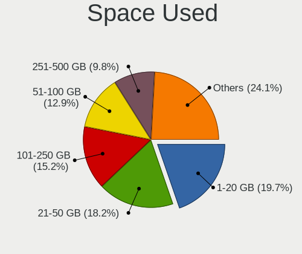
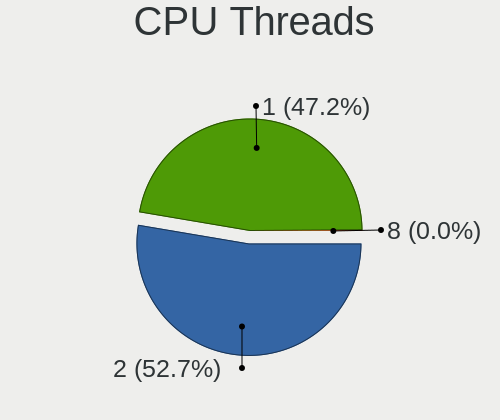
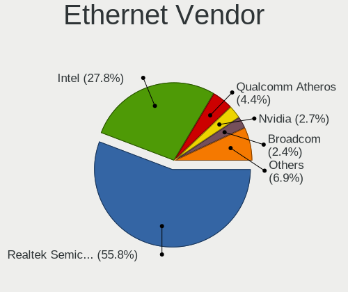
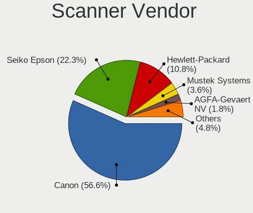

Linux Mint - Tested Hardware & Statistics (Desktops)
----------------------------------------------------

A project to collect tested hardware configurations for Linux Mint.

Anyone can contribute to this report by the [hw-probe](https://github.com/linuxhw/hw-probe) tool:

    sudo -E hw-probe -all -upload

Please contribute! Especially if your hardware is rare.

Contents
--------

* [ Test Cases ](#test-cases)

* [ System ](#system)
  - [ OS                       ](#os)
  - [ OS Family                ](#os-family)
  - [ Kernel                   ](#kernel)
  - [ Kernel Family            ](#kernel-family)
  - [ Kernel Major Ver.        ](#kernel-major-ver)
  - [ Arch                     ](#arch)
  - [ DE                       ](#de)
  - [ Display Server           ](#display-server)
  - [ Display Manager          ](#display-manager)
  - [ OS Lang                  ](#os-lang)
  - [ Boot Mode                ](#boot-mode)
  - [ Filesystem               ](#filesystem)
  - [ Part. scheme             ](#part-scheme)
  - [ Dual Boot with Linux/BSD ](#dual-boot-with-linuxbsd)
  - [ Dual Boot (Win)          ](#dual-boot-win)

* [ Board ](#board)
  - [ Vendor                   ](#vendor)
  - [ Model                    ](#model)
  - [ Model Family             ](#model-family)
  - [ MFG Year                 ](#mfg-year)
  - [ Form Factor              ](#form-factor)
  - [ Secure Boot              ](#secure-boot)
  - [ Coreboot                 ](#coreboot)
  - [ RAM Size                 ](#ram-size)
  - [ RAM Used                 ](#ram-used)
  - [ Total Drives             ](#total-drives)
  - [ Has CD-ROM               ](#has-cd-rom)
  - [ Has Ethernet             ](#has-ethernet)
  - [ Has WiFi                 ](#has-wifi)
  - [ Has Bluetooth            ](#has-bluetooth)

* [ Location ](#location)
  - [ Country                  ](#country)
  - [ City                     ](#city)

* [ Drives ](#drives)
  - [ Drive Vendor             ](#drive-vendor)
  - [ Drive Model              ](#drive-model)
  - [ HDD Vendor               ](#hdd-vendor)
  - [ SSD Vendor               ](#ssd-vendor)
  - [ Drive Kind               ](#drive-kind)
  - [ Drive Connector          ](#drive-connector)
  - [ Drive Size               ](#drive-size)
  - [ Space Total              ](#space-total)
  - [ Space Used               ](#space-used)
  - [ Malfunc. Drives          ](#malfunc-drives)
  - [ Malfunc. Drive Vendor    ](#malfunc-drive-vendor)
  - [ Malfunc. HDD Vendor      ](#malfunc-hdd-vendor)
  - [ Malfunc. Drive Kind      ](#malfunc-drive-kind)
  - [ Failed Drives            ](#failed-drives)
  - [ Failed Drive Vendor      ](#failed-drive-vendor)
  - [ Drive Status             ](#drive-status)

* [ Storage controller ](#storage-controller)
  - [ Storage Vendor           ](#storage-vendor)
  - [ Storage Model            ](#storage-model)
  - [ Storage Kind             ](#storage-kind)

* [ Processor ](#processor)
  - [ CPU Vendor               ](#cpu-vendor)
  - [ CPU Model                ](#cpu-model)
  - [ CPU Model Family         ](#cpu-model-family)
  - [ CPU Cores                ](#cpu-cores)
  - [ CPU Sockets              ](#cpu-sockets)
  - [ CPU Threads              ](#cpu-threads)
  - [ CPU Op-Modes             ](#cpu-op-modes)
  - [ CPU Microcode            ](#cpu-microcode)
  - [ CPU Microarch            ](#cpu-microarch)

* [ Graphics ](#graphics)
  - [ GPU Vendor               ](#gpu-vendor)
  - [ GPU Model                ](#gpu-model)
  - [ GPU Combo                ](#gpu-combo)
  - [ GPU Driver               ](#gpu-driver)
  - [ GPU Memory               ](#gpu-memory)

* [ Monitor ](#monitor)
  - [ Monitor Vendor           ](#monitor-vendor)
  - [ Monitor Model            ](#monitor-model)
  - [ Monitor Resolution       ](#monitor-resolution)
  - [ Monitor Diagonal         ](#monitor-diagonal)
  - [ Monitor Width            ](#monitor-width)
  - [ Aspect Ratio             ](#aspect-ratio)
  - [ Monitor Area             ](#monitor-area)
  - [ Pixel Density            ](#pixel-density)
  - [ Multiple Monitors        ](#multiple-monitors)

* [ Network ](#network)
  - [ Net Controller Vendor    ](#net-controller-vendor)
  - [ Net Controller Model     ](#net-controller-model)
  - [ Wireless Vendor          ](#wireless-vendor)
  - [ Wireless Model           ](#wireless-model)
  - [ Ethernet Vendor          ](#ethernet-vendor)
  - [ Ethernet Model           ](#ethernet-model)
  - [ Net Controller Kind      ](#net-controller-kind)
  - [ Used Controller          ](#used-controller)
  - [ NICs                     ](#nics)
  - [ IPv6                     ](#ipv6)

* [ Bluetooth ](#bluetooth)
  - [ Bluetooth Vendor         ](#bluetooth-vendor)
  - [ Bluetooth Model          ](#bluetooth-model)

* [ Sound ](#sound)
  - [ Sound Vendor             ](#sound-vendor)
  - [ Sound Model              ](#sound-model)

* [ Memory ](#memory)
  - [ Memory Vendor            ](#memory-vendor)
  - [ Memory Model             ](#memory-model)
  - [ Memory Kind              ](#memory-kind)
  - [ Memory Form Factor       ](#memory-form-factor)
  - [ Memory Size              ](#memory-size)
  - [ Memory Speed             ](#memory-speed)

* [ Printers & scanners ](#printers--scanners)
  - [ Printer Vendor           ](#printer-vendor)
  - [ Printer Model            ](#printer-model)
  - [ Scanner Vendor           ](#scanner-vendor)
  - [ Scanner Model            ](#scanner-model)

* [ Camera ](#camera)
  - [ Camera Vendor            ](#camera-vendor)
  - [ Camera Model             ](#camera-model)

* [ Security ](#security)
  - [ Fingerprint Vendor       ](#fingerprint-vendor)
  - [ Fingerprint Model        ](#fingerprint-model)
  - [ Chipcard Vendor          ](#chipcard-vendor)
  - [ Chipcard Model           ](#chipcard-model)

* [ Unsupported ](#unsupported)
  - [ Unsupported Devices      ](#unsupported-devices)
  - [ Unsupported Device Types ](#unsupported-device-types)

Test Cases
----------

Total: 8601

| Vendor        | Model                       | Probe                                                      | Date         |
|---------------|-----------------------------|------------------------------------------------------------|--------------|
| ASUSTek       | A88XM-A                     | [f883ed1fd1](https://linux-hardware.org/?probe=f883ed1fd1) | Dec 01, 2022 |
| ASUSTek       | P8H67                       | [31a7799a34](https://linux-hardware.org/?probe=31a7799a34) | Dec 01, 2022 |
| Gigabyte      | GA-990FXA-UD7               | [e300be2b5e](https://linux-hardware.org/?probe=e300be2b5e) | Dec 01, 2022 |
| HP            | 18E9                        | [9086d1a1e5](https://linux-hardware.org/?probe=9086d1a1e5) | Dec 01, 2022 |
| ECS           | H61H2-WM                    | [9a7a280b58](https://linux-hardware.org/?probe=9a7a280b58) | Dec 01, 2022 |
| MSI           | MAG Z690 TOMAHAWK WIFI D... | [24dd5413fa](https://linux-hardware.org/?probe=24dd5413fa) | Nov 30, 2022 |
| Gigabyte      | Z87-HD3                     | [d9a78cb529](https://linux-hardware.org/?probe=d9a78cb529) | Nov 30, 2022 |
| Dell          | 0M5DCD A00                  | [e9fae02409](https://linux-hardware.org/?probe=e9fae02409) | Nov 30, 2022 |
| Gigabyte      | G33M-S2                     | [3d6a965dd4](https://linux-hardware.org/?probe=3d6a965dd4) | Nov 30, 2022 |
| ASUSTek       | Benicia                     | [e5468e4258](https://linux-hardware.org/?probe=e5468e4258) | Nov 30, 2022 |
| Dell          | 0D28YY A00                  | [4af0b7dc59](https://linux-hardware.org/?probe=4af0b7dc59) | Nov 30, 2022 |
| Dell          | 0D28YY A00                  | [bc8c993489](https://linux-hardware.org/?probe=bc8c993489) | Nov 30, 2022 |
| ASRock        | N68-S3 UCC                  | [ede29d01f8](https://linux-hardware.org/?probe=ede29d01f8) | Nov 30, 2022 |
| ASRock        | AB350 Pro4                  | [de19b92dda](https://linux-hardware.org/?probe=de19b92dda) | Nov 30, 2022 |
| Fujitsu       | D3162-A1 S26361-D3162-A1    | [b38075cef4](https://linux-hardware.org/?probe=b38075cef4) | Nov 29, 2022 |
| HP            | 18E4                        | [39b839e527](https://linux-hardware.org/?probe=39b839e527) | Nov 29, 2022 |
| ASRock        | N68-S3 UCC                  | [fd6f368580](https://linux-hardware.org/?probe=fd6f368580) | Nov 29, 2022 |
| ASUSTek       | P8H77-M                     | [4aafb7e858](https://linux-hardware.org/?probe=4aafb7e858) | Nov 29, 2022 |
| Gigabyte      | 946GMX-S2                   | [6c97b310fb](https://linux-hardware.org/?probe=6c97b310fb) | Nov 29, 2022 |
| HP            | 806A                        | [82128d6a8b](https://linux-hardware.org/?probe=82128d6a8b) | Nov 28, 2022 |
| Gigabyte      | GA-MA770-UD3                | [be98ffe55b](https://linux-hardware.org/?probe=be98ffe55b) | Nov 28, 2022 |
| Dell          | 040DDP A00                  | [6bf43c8793](https://linux-hardware.org/?probe=6bf43c8793) | Nov 28, 2022 |
| MSI           | B450 TOMAHAWK MAX           | [fa5d6f5ca6](https://linux-hardware.org/?probe=fa5d6f5ca6) | Nov 28, 2022 |
| Dell          | 0DR845                      | [57f2ea3914](https://linux-hardware.org/?probe=57f2ea3914) | Nov 27, 2022 |
| Dell          | 0DR845                      | [f28560630d](https://linux-hardware.org/?probe=f28560630d) | Nov 27, 2022 |
| ASUSTek       | M5A78L-M LX                 | [c924457e4b](https://linux-hardware.org/?probe=c924457e4b) | Nov 27, 2022 |
| AMD           | 58514                       | [7558bc36a0](https://linux-hardware.org/?probe=7558bc36a0) | Nov 27, 2022 |
| ASRock        | 970 Pro3 R2.0               | [79cce0ef33](https://linux-hardware.org/?probe=79cce0ef33) | Nov 27, 2022 |
| HP            | 18E4                        | [11c1530767](https://linux-hardware.org/?probe=11c1530767) | Nov 26, 2022 |
| Gigabyte      | F2A78M-HD2                  | [b5260b5609](https://linux-hardware.org/?probe=b5260b5609) | Nov 26, 2022 |
| Gigabyte      | Z390 I AORUS PRO WIFI-CF    | [eb0921d1f6](https://linux-hardware.org/?probe=eb0921d1f6) | Nov 26, 2022 |
| MSI           | 970 GAMING                  | [82a3d83d20](https://linux-hardware.org/?probe=82a3d83d20) | Nov 26, 2022 |
| MSI           | X370 GAMING M7 ACK          | [c2dca9687b](https://linux-hardware.org/?probe=c2dca9687b) | Nov 26, 2022 |
| Gigabyte      | GA-MA770-UD3                | [0f4c0786c2](https://linux-hardware.org/?probe=0f4c0786c2) | Nov 26, 2022 |
| ASRock        | H61M-DGS R2.0               | [189b3c0ea0](https://linux-hardware.org/?probe=189b3c0ea0) | Nov 26, 2022 |
| MSI           | B550-A PRO                  | [8d0b06aa1d](https://linux-hardware.org/?probe=8d0b06aa1d) | Nov 26, 2022 |
| Intel         | H61                         | [76825e4753](https://linux-hardware.org/?probe=76825e4753) | Nov 25, 2022 |
| Intel         | D525MW AAE93082-401         | [d480b7ef56](https://linux-hardware.org/?probe=d480b7ef56) | Nov 25, 2022 |
| Intel         | D525MW AAE93082-401         | [d3b2f8aaf7](https://linux-hardware.org/?probe=d3b2f8aaf7) | Nov 25, 2022 |
| Lenovo        | ThinkCentre A70 7099A5G     | [dad5599996](https://linux-hardware.org/?probe=dad5599996) | Nov 24, 2022 |
| HP            | 339A                        | [52f957ef60](https://linux-hardware.org/?probe=52f957ef60) | Nov 24, 2022 |
| Unknown       | Unknown                     | [0904a442f0](https://linux-hardware.org/?probe=0904a442f0) | Nov 24, 2022 |
| ASRock        | B550M Pro4                  | [3ba26453f1](https://linux-hardware.org/?probe=3ba26453f1) | Nov 24, 2022 |
| ASUSTek       | PRIME Z270-K                | [e311874280](https://linux-hardware.org/?probe=e311874280) | Nov 24, 2022 |
| HP            | 806A                        | [ee8a1db4f4](https://linux-hardware.org/?probe=ee8a1db4f4) | Nov 24, 2022 |
| Gigabyte      | A320M-H-CF                  | [036dcac9fa](https://linux-hardware.org/?probe=036dcac9fa) | Nov 24, 2022 |
| ASUSTek       | B85-PRO GAMER               | [6d87497f34](https://linux-hardware.org/?probe=6d87497f34) | Nov 23, 2022 |
| Medion        | TJ4125                      | [84084e5cdc](https://linux-hardware.org/?probe=84084e5cdc) | Nov 23, 2022 |
| Medion        | TJ4125                      | [810477dfd9](https://linux-hardware.org/?probe=810477dfd9) | Nov 23, 2022 |
| HP            | 18E4                        | [8dd5fdb580](https://linux-hardware.org/?probe=8dd5fdb580) | Nov 23, 2022 |
| Dell          | 0P01GV A03                  | [470e942150](https://linux-hardware.org/?probe=470e942150) | Nov 23, 2022 |
| HP            | 3397                        | [eb8968148c](https://linux-hardware.org/?probe=eb8968148c) | Nov 23, 2022 |
| ASRock        | Q1900B-ITX                  | [7239c46e95](https://linux-hardware.org/?probe=7239c46e95) | Nov 23, 2022 |
| Intel         | B75                         | [24b64d225a](https://linux-hardware.org/?probe=24b64d225a) | Nov 22, 2022 |
| MSI           | Z87-G45 GAMING              | [66383ce902](https://linux-hardware.org/?probe=66383ce902) | Nov 22, 2022 |
| PCWare        | IPMH61R2                    | [93db11744b](https://linux-hardware.org/?probe=93db11744b) | Nov 22, 2022 |
| Gigabyte      | A320M-S2H-CF                | [62048f37d6](https://linux-hardware.org/?probe=62048f37d6) | Nov 22, 2022 |
| ASUSTek       | PRIME B250M-PLUS            | [ba7795ec44](https://linux-hardware.org/?probe=ba7795ec44) | Nov 22, 2022 |
| MSI           | IONA                        | [39bcd0f2d8](https://linux-hardware.org/?probe=39bcd0f2d8) | Nov 22, 2022 |
| ASRock        | H81M-DGS R2.0               | [0354f9cb0e](https://linux-hardware.org/?probe=0354f9cb0e) | Nov 21, 2022 |
| ASUSTek       | M5A78L-M LX PLUS            | [fabd2d4455](https://linux-hardware.org/?probe=fabd2d4455) | Nov 21, 2022 |
| Gigabyte      | GA-MA770-UD3                | [b963fb74e2](https://linux-hardware.org/?probe=b963fb74e2) | Nov 21, 2022 |
| ASUSTek       | M5A78L-M/USB3               | [f4e5d3bd1c](https://linux-hardware.org/?probe=f4e5d3bd1c) | Nov 21, 2022 |
| MSI           | A68HM-E33 V2                | [a93dbf13df](https://linux-hardware.org/?probe=a93dbf13df) | Nov 21, 2022 |
| MSI           | A68HM-E33 V2                | [50ca61403f](https://linux-hardware.org/?probe=50ca61403f) | Nov 21, 2022 |
| HP            | 82B4                        | [c56604f389](https://linux-hardware.org/?probe=c56604f389) | Nov 21, 2022 |
| ASUSTek       | P6T DELUXE                  | [54f10b9d0b](https://linux-hardware.org/?probe=54f10b9d0b) | Nov 21, 2022 |
| ASUSTek       | P6T DELUXE                  | [576ca67a28](https://linux-hardware.org/?probe=576ca67a28) | Nov 21, 2022 |
| Gigabyte      | B450 AORUS M                | [7ccd7842c1](https://linux-hardware.org/?probe=7ccd7842c1) | Nov 21, 2022 |
| ASUSTek       | P8H61-M LX2 R2.0            | [4599b81a6b](https://linux-hardware.org/?probe=4599b81a6b) | Nov 21, 2022 |
| Fujitsu       | D3162-C1 S26361-D3162-C1    | [79403c8f5d](https://linux-hardware.org/?probe=79403c8f5d) | Nov 20, 2022 |
| ASUSTek       | Z97M-PLUS                   | [7ad1a412ae](https://linux-hardware.org/?probe=7ad1a412ae) | Nov 20, 2022 |
| Gigabyte      | Z77X-D3H                    | [1702f14317](https://linux-hardware.org/?probe=1702f14317) | Nov 20, 2022 |
| Gigabyte      | EP45-UD3LR                  | [75a8f2a500](https://linux-hardware.org/?probe=75a8f2a500) | Nov 20, 2022 |
| ASUSTek       | P8H67-M PRO                 | [55bd7957b4](https://linux-hardware.org/?probe=55bd7957b4) | Nov 20, 2022 |
| AZW           | Green G2                    | [85d7c0c54b](https://linux-hardware.org/?probe=85d7c0c54b) | Nov 20, 2022 |
| Gigabyte      | B450 AORUS ELITE            | [35d824783a](https://linux-hardware.org/?probe=35d824783a) | Nov 20, 2022 |
| Gigabyte      | Z490 AORUS PRO AX           | [abe3da973c](https://linux-hardware.org/?probe=abe3da973c) | Nov 19, 2022 |
| Gigabyte      | GA-78LMT-S2P                | [24518f7bf0](https://linux-hardware.org/?probe=24518f7bf0) | Nov 19, 2022 |
| MSI           | B450 TOMAHAWK MAX           | [1cc37489d5](https://linux-hardware.org/?probe=1cc37489d5) | Nov 19, 2022 |
| Gigabyte      | H81M-HD3                    | [d858d2656d](https://linux-hardware.org/?probe=d858d2656d) | Nov 19, 2022 |
| Gigabyte      | H110M-S2H-CF                | [f1724d63d5](https://linux-hardware.org/?probe=f1724d63d5) | Nov 19, 2022 |
| Acer          | Aspire TC-1760              | [a4f03aea9c](https://linux-hardware.org/?probe=a4f03aea9c) | Nov 19, 2022 |
| ASUSTek       | P5KPL/1600                  | [b2e20d7f28](https://linux-hardware.org/?probe=b2e20d7f28) | Nov 19, 2022 |
| ASUSTek       | K30AD_M31AD_M51AD_M32AD     | [a0495a1ea1](https://linux-hardware.org/?probe=a0495a1ea1) | Nov 18, 2022 |
| Gigabyte      | B360 AORUS GAMING 3 WIFI... | [2089ec3efb](https://linux-hardware.org/?probe=2089ec3efb) | Nov 18, 2022 |
| MSI           | B450M MORTAR TITANIUM       | [ea98e803d1](https://linux-hardware.org/?probe=ea98e803d1) | Nov 18, 2022 |
| HP            | 8643 SMVB                   | [fc34170a10](https://linux-hardware.org/?probe=fc34170a10) | Nov 18, 2022 |
| ASUSTek       | M5A78L-M LX V2              | [de3eac26e1](https://linux-hardware.org/?probe=de3eac26e1) | Nov 18, 2022 |
| ASUSTek       | P8B75-V                     | [6f3b172132](https://linux-hardware.org/?probe=6f3b172132) | Nov 18, 2022 |
| HP            | 0A08h                       | [99ca72c75c](https://linux-hardware.org/?probe=99ca72c75c) | Nov 18, 2022 |
| HP            | 0A08h                       | [0e935d58d0](https://linux-hardware.org/?probe=0e935d58d0) | Nov 18, 2022 |
| Gigabyte      | Z97X-UD3H-BK-CF             | [b06d8265c4](https://linux-hardware.org/?probe=b06d8265c4) | Nov 17, 2022 |
| Dell          | 05GD68 A00                  | [d0da497d43](https://linux-hardware.org/?probe=d0da497d43) | Nov 17, 2022 |
| Fujitsu       | D2912-A1 S26361-D2912-A1    | [169294b358](https://linux-hardware.org/?probe=169294b358) | Nov 17, 2022 |
| HP            | 8169                        | [6dd9ea2ef0](https://linux-hardware.org/?probe=6dd9ea2ef0) | Nov 17, 2022 |
| Biostar       | TH67XE                      | [47da767a5a](https://linux-hardware.org/?probe=47da767a5a) | Nov 16, 2022 |
| Mediacom      | M-AO241/64                  | [8312099aa4](https://linux-hardware.org/?probe=8312099aa4) | Nov 16, 2022 |
| MSI           | X370 GAMING M7 ACK          | [6d27500df5](https://linux-hardware.org/?probe=6d27500df5) | Nov 16, 2022 |
| ASRock        | N68-S3 UCC                  | [3f0f992387](https://linux-hardware.org/?probe=3f0f992387) | Nov 16, 2022 |
| Dell          | 0K3CM7 A00                  | [85e5ea1485](https://linux-hardware.org/?probe=85e5ea1485) | Nov 16, 2022 |
| Gigabyte      | H370 AORUS GAMING 3 WIFI... | [e2492ba1c1](https://linux-hardware.org/?probe=e2492ba1c1) | Nov 16, 2022 |
| MSI           | X370 GAMING M7 ACK          | [56a3ecf6d9](https://linux-hardware.org/?probe=56a3ecf6d9) | Nov 16, 2022 |
| Dell          | 0WR7PY A02                  | [feeb9c7afd](https://linux-hardware.org/?probe=feeb9c7afd) | Nov 15, 2022 |
| Acer          | Aspire X3470                | [ccaec6d2cb](https://linux-hardware.org/?probe=ccaec6d2cb) | Nov 15, 2022 |
| ASUSTek       | P5QL-ASUS-SE                | [6dd2bbbe51](https://linux-hardware.org/?probe=6dd2bbbe51) | Nov 15, 2022 |
| AZW           | Green G2                    | [27def57052](https://linux-hardware.org/?probe=27def57052) | Nov 15, 2022 |
| ASRock        | B150M-HDS                   | [032d8f7c3c](https://linux-hardware.org/?probe=032d8f7c3c) | Nov 15, 2022 |
| ASRock        | H81M-DGS R2.0               | [f56f2c6a53](https://linux-hardware.org/?probe=f56f2c6a53) | Nov 14, 2022 |
| Acer          | Aspire TC-780               | [4687e7d178](https://linux-hardware.org/?probe=4687e7d178) | Nov 14, 2022 |
| HP            | 0AA8h                       | [0f88d64eeb](https://linux-hardware.org/?probe=0f88d64eeb) | Nov 14, 2022 |
| ASUSTek       | K30AD_M31AD_M51AD_M32AD     | [21ea41871f](https://linux-hardware.org/?probe=21ea41871f) | Nov 14, 2022 |
| ASUSTek       | PRIME A520M-A II            | [ff1f659f4e](https://linux-hardware.org/?probe=ff1f659f4e) | Nov 14, 2022 |
| ASUSTek       | PRIME A520M-A II            | [a316ed1e2c](https://linux-hardware.org/?probe=a316ed1e2c) | Nov 14, 2022 |
| Huanan        | X99-F8                      | [0e3b4121ea](https://linux-hardware.org/?probe=0e3b4121ea) | Nov 14, 2022 |
| Apple         | Mac-F42C88C8 Proto1         | [00db55919b](https://linux-hardware.org/?probe=00db55919b) | Nov 14, 2022 |
| Acer          | Aspire XC-840               | [fe8db55aac](https://linux-hardware.org/?probe=fe8db55aac) | Nov 14, 2022 |
| Gigabyte      | GA-MA790FXT-UD5P            | [dd28f73303](https://linux-hardware.org/?probe=dd28f73303) | Nov 14, 2022 |
| ASUSTek       | P6T DELUXE                  | [3726e23d23](https://linux-hardware.org/?probe=3726e23d23) | Nov 14, 2022 |
| PCWare        | IPMH61R3                    | [7b7925f93d](https://linux-hardware.org/?probe=7b7925f93d) | Nov 13, 2022 |
| MSI           | B75MA-E33                   | [9db352ce8b](https://linux-hardware.org/?probe=9db352ce8b) | Nov 13, 2022 |
| MSI           | B450 GAMING PLUS            | [2964de32f4](https://linux-hardware.org/?probe=2964de32f4) | Nov 13, 2022 |
| ASRock        | B660M-HDV                   | [eeaa5c82ea](https://linux-hardware.org/?probe=eeaa5c82ea) | Nov 13, 2022 |
| Gigabyte      | Z390 M-CF                   | [047686dabd](https://linux-hardware.org/?probe=047686dabd) | Nov 13, 2022 |
| ASUSTek       | M3N-HT DELUXE               | [081e103f77](https://linux-hardware.org/?probe=081e103f77) | Nov 13, 2022 |
| ASUSTek       | M3N-HT DELUXE               | [1c9bb380ab](https://linux-hardware.org/?probe=1c9bb380ab) | Nov 13, 2022 |
| ASUSTek       | SABERTOOTH Z170 MARK 1      | [f18af41d42](https://linux-hardware.org/?probe=f18af41d42) | Nov 13, 2022 |
| MSI           | ZH77A-G43                   | [a8f49c1ad8](https://linux-hardware.org/?probe=a8f49c1ad8) | Nov 13, 2022 |
| ASRock        | B450M Pro4                  | [11d46f72ea](https://linux-hardware.org/?probe=11d46f72ea) | Nov 13, 2022 |
| Unknown       | Unknown                     | [b89a0c7341](https://linux-hardware.org/?probe=b89a0c7341) | Nov 13, 2022 |
| ASUSTek       | 2A73h                       | [08e4620733](https://linux-hardware.org/?probe=08e4620733) | Nov 13, 2022 |
| HP            | 339A                        | [c995f831b8](https://linux-hardware.org/?probe=c995f831b8) | Nov 13, 2022 |
| ASUSTek       | 2A73h                       | [557fb98d98](https://linux-hardware.org/?probe=557fb98d98) | Nov 13, 2022 |
| Intel         | H55                         | [b3cbb34a98](https://linux-hardware.org/?probe=b3cbb34a98) | Nov 12, 2022 |
| Intel         | H55                         | [c4171c6957](https://linux-hardware.org/?probe=c4171c6957) | Nov 12, 2022 |
| Gigabyte      | GA-78LMT-USB3 SEx           | [3c567aa946](https://linux-hardware.org/?probe=3c567aa946) | Nov 12, 2022 |
| Gigabyte      | Z490 AORUS ELITE AC         | [632037506d](https://linux-hardware.org/?probe=632037506d) | Nov 12, 2022 |
| Gateway       | SX2110GA                    | [10c89cd51a](https://linux-hardware.org/?probe=10c89cd51a) | Nov 12, 2022 |
| Dell          | 051FJ8 A00                  | [374843d786](https://linux-hardware.org/?probe=374843d786) | Nov 11, 2022 |
| Dell          | 051FJ8 A00                  | [a49f180f2d](https://linux-hardware.org/?probe=a49f180f2d) | Nov 11, 2022 |
| Unknown       | Unknown                     | [e0b38a3d54](https://linux-hardware.org/?probe=e0b38a3d54) | Nov 11, 2022 |
| ASUSTek       | TUF B450M-PLUS GAMING       | [4fddb7605a](https://linux-hardware.org/?probe=4fddb7605a) | Nov 11, 2022 |
| ASUSTek       | TUF B450M-PLUS GAMING       | [779188af6a](https://linux-hardware.org/?probe=779188af6a) | Nov 11, 2022 |
| Gigabyte      | MZBSWAP-K4                  | [902fafd6cd](https://linux-hardware.org/?probe=902fafd6cd) | Nov 11, 2022 |
| ASUSTek       | Benicia                     | [03ce113379](https://linux-hardware.org/?probe=03ce113379) | Nov 11, 2022 |
| Intel         | DG41WV AAE90316-102         | [517598326a](https://linux-hardware.org/?probe=517598326a) | Nov 10, 2022 |
| Gigabyte      | X58A-UD3R                   | [14afa89833](https://linux-hardware.org/?probe=14afa89833) | Nov 10, 2022 |
| Lenovo        | ThinkCentre M58p 9728W47    | [48e81f1349](https://linux-hardware.org/?probe=48e81f1349) | Nov 10, 2022 |
| AZW           | Green G2                    | [265221b91d](https://linux-hardware.org/?probe=265221b91d) | Nov 10, 2022 |
| ASUSTek       | P5K/EPU                     | [4bd9a2de61](https://linux-hardware.org/?probe=4bd9a2de61) | Nov 10, 2022 |
| Dell          | 00V62H A01                  | [d5f5f32529](https://linux-hardware.org/?probe=d5f5f32529) | Nov 10, 2022 |
| Gigabyte      | H55M-S2H                    | [8af42c3646](https://linux-hardware.org/?probe=8af42c3646) | Nov 10, 2022 |
| ASUSTek       | P5K/EPU                     | [cd3706107a](https://linux-hardware.org/?probe=cd3706107a) | Nov 10, 2022 |
| Gigabyte      | H55M-S2H                    | [18d013bbc8](https://linux-hardware.org/?probe=18d013bbc8) | Nov 10, 2022 |
| ASUSTek       | Leonite2                    | [67db8fec5f](https://linux-hardware.org/?probe=67db8fec5f) | Nov 10, 2022 |
| Dell          | 02YYK5 A01                  | [8fdc8aaeae](https://linux-hardware.org/?probe=8fdc8aaeae) | Nov 10, 2022 |
| Dell          | 02YYK5 A01                  | [95df3e5e22](https://linux-hardware.org/?probe=95df3e5e22) | Nov 10, 2022 |
| Gigabyte      | Z690 GAMING X DDR4          | [ddbdf3da0f](https://linux-hardware.org/?probe=ddbdf3da0f) | Nov 10, 2022 |
| Gigabyte      | Z390 GAMING X-CF            | [4b5ec389d9](https://linux-hardware.org/?probe=4b5ec389d9) | Nov 09, 2022 |
| MSI           | PRO B660M-A WIFI DDR4       | [292caf8ccf](https://linux-hardware.org/?probe=292caf8ccf) | Nov 09, 2022 |
| ASUSTek       | PRIME B350-PLUS             | [b2d88e2356](https://linux-hardware.org/?probe=b2d88e2356) | Nov 09, 2022 |
| QIYIDA        | X99-H9 V2.0                 | [3ffeeccb58](https://linux-hardware.org/?probe=3ffeeccb58) | Nov 08, 2022 |
| Gigabyte      | Z77X-D3H                    | [09e3734a06](https://linux-hardware.org/?probe=09e3734a06) | Nov 08, 2022 |
| Intel         | H61                         | [67af788bd9](https://linux-hardware.org/?probe=67af788bd9) | Nov 08, 2022 |
| Gigabyte      | Z170X-Gaming 7              | [4ae32a2dcc](https://linux-hardware.org/?probe=4ae32a2dcc) | Nov 08, 2022 |
| Gigabyte      | B550I AORUS PRO AX          | [c90eda7941](https://linux-hardware.org/?probe=c90eda7941) | Nov 08, 2022 |
| MSI           | Z77A-G43                    | [6dd1e1dc43](https://linux-hardware.org/?probe=6dd1e1dc43) | Nov 07, 2022 |
| MSI           | PRO B660M-A WIFI DDR4       | [0aad7f7578](https://linux-hardware.org/?probe=0aad7f7578) | Nov 07, 2022 |
| Unknown       | Unknown                     | [dc375c11c7](https://linux-hardware.org/?probe=dc375c11c7) | Nov 07, 2022 |
| Dell          | 0DF42J A00                  | [67928f8921](https://linux-hardware.org/?probe=67928f8921) | Nov 07, 2022 |
| ASRock        | H97M Pro4                   | [4714142eaf](https://linux-hardware.org/?probe=4714142eaf) | Nov 07, 2022 |
| ASRock        | H97M Pro4                   | [61a1e01bea](https://linux-hardware.org/?probe=61a1e01bea) | Nov 07, 2022 |
| MSI           | MPG B550 GAMING PLUS        | [10343f043a](https://linux-hardware.org/?probe=10343f043a) | Nov 07, 2022 |
| AZW           | Green G2                    | [3ed644a27e](https://linux-hardware.org/?probe=3ed644a27e) | Nov 06, 2022 |
| ASUSTek       | P5GC-MX/1333                | [32bb86a1e6](https://linux-hardware.org/?probe=32bb86a1e6) | Nov 06, 2022 |
| ASUSTek       | P5GC-MX/1333                | [c91e77c03a](https://linux-hardware.org/?probe=c91e77c03a) | Nov 06, 2022 |
| MSI           | Z270 GAMING PRO CARBON      | [07e637210f](https://linux-hardware.org/?probe=07e637210f) | Nov 06, 2022 |
| ASUSTek       | P5K                         | [6085242cc3](https://linux-hardware.org/?probe=6085242cc3) | Nov 06, 2022 |
| ASUSTek       | P5K                         | [7cddfe4e9a](https://linux-hardware.org/?probe=7cddfe4e9a) | Nov 06, 2022 |
| Dell          | 040DDP A00                  | [6179dcf9ae](https://linux-hardware.org/?probe=6179dcf9ae) | Nov 05, 2022 |
| Gigabyte      | 990FXA-UD7                  | [d4d7721821](https://linux-hardware.org/?probe=d4d7721821) | Nov 05, 2022 |
| ASRock        | B450M Steel Legend          | [1534af11b9](https://linux-hardware.org/?probe=1534af11b9) | Nov 05, 2022 |
| HP            | 8053                        | [20c566d4e7](https://linux-hardware.org/?probe=20c566d4e7) | Nov 05, 2022 |
| Gigabyte      | Z170X-Gaming 7              | [be2ceae6ca](https://linux-hardware.org/?probe=be2ceae6ca) | Nov 05, 2022 |
| ASUSTek       | K30AD_M31AD_M51AD_M32AD     | [ffb4ff83fd](https://linux-hardware.org/?probe=ffb4ff83fd) | Nov 05, 2022 |
| ASRock        | M3A770DE                    | [5188bac576](https://linux-hardware.org/?probe=5188bac576) | Nov 04, 2022 |
| Gigabyte      | GA-78LMT-USB3 SEx           | [069116f50a](https://linux-hardware.org/?probe=069116f50a) | Nov 04, 2022 |
| Gigabyte      | GA-78LMT-USB3 SEx           | [2b3848b2cb](https://linux-hardware.org/?probe=2b3848b2cb) | Nov 04, 2022 |
| ASUSTek       | Amberine M                  | [f598d98461](https://linux-hardware.org/?probe=f598d98461) | Nov 04, 2022 |
| HP            | 3396                        | [d6867789ca](https://linux-hardware.org/?probe=d6867789ca) | Nov 04, 2022 |
| Fujitsu Si... | D2312-A3 S26361-D2312-A3    | [14dc45e331](https://linux-hardware.org/?probe=14dc45e331) | Nov 04, 2022 |
| MSI           | B450-A PRO                  | [8ef3469319](https://linux-hardware.org/?probe=8ef3469319) | Nov 04, 2022 |
| Gigabyte      | B550M AORUS PRO-P           | [ee74ab18df](https://linux-hardware.org/?probe=ee74ab18df) | Nov 04, 2022 |
| MSI           | H510M PRO                   | [16980e0782](https://linux-hardware.org/?probe=16980e0782) | Nov 04, 2022 |
| Dell          | 00V62H A01                  | [d2ba0a8916](https://linux-hardware.org/?probe=d2ba0a8916) | Nov 04, 2022 |
| Fujitsu Si... | D2312-A3 S26361-D2312-A3    | [9aa8622017](https://linux-hardware.org/?probe=9aa8622017) | Nov 04, 2022 |
| Dell          | 00V62H A01                  | [57bf24f3da](https://linux-hardware.org/?probe=57bf24f3da) | Nov 04, 2022 |
| MSI           | H510M PRO                   | [646aee082a](https://linux-hardware.org/?probe=646aee082a) | Nov 04, 2022 |
| Intel         | DG33BU AAD79951-407         | [e692849b95](https://linux-hardware.org/?probe=e692849b95) | Nov 04, 2022 |
| ASUSTek       | M3A78 PRO                   | [93b2e9aea5](https://linux-hardware.org/?probe=93b2e9aea5) | Nov 04, 2022 |
| ASUSTek       | ROG STRIX X570-I GAMING     | [411ea09aee](https://linux-hardware.org/?probe=411ea09aee) | Nov 03, 2022 |
| ASUSTek       | M3A78 PRO                   | [5466838c04](https://linux-hardware.org/?probe=5466838c04) | Nov 03, 2022 |
| MSI           | B85M PRO-VD                 | [46a3742fd3](https://linux-hardware.org/?probe=46a3742fd3) | Nov 03, 2022 |
| ASUSTek       | K30AD_M31AD_M51AD_M32AD     | [5ace066925](https://linux-hardware.org/?probe=5ace066925) | Nov 03, 2022 |
| Gigabyte      | Z87M-D3H                    | [f427764e2c](https://linux-hardware.org/?probe=f427764e2c) | Nov 03, 2022 |
| Gigabyte      | H310M H                     | [7a49c87643](https://linux-hardware.org/?probe=7a49c87643) | Nov 02, 2022 |
| Gigabyte      | H310M H                     | [382965c890](https://linux-hardware.org/?probe=382965c890) | Nov 02, 2022 |
| HP            | 3397                        | [24eb596bce](https://linux-hardware.org/?probe=24eb596bce) | Nov 02, 2022 |
| HP            | 1589                        | [81a347a6a7](https://linux-hardware.org/?probe=81a347a6a7) | Nov 02, 2022 |
| Dell          | 02YRK5 A02                  | [2c63ff26e5](https://linux-hardware.org/?probe=2c63ff26e5) | Nov 01, 2022 |
| ASUSTek       | TUF Gaming B550M-PLUS WI... | [d28b33e126](https://linux-hardware.org/?probe=d28b33e126) | Nov 01, 2022 |
| Dell          | 0XR1GT A00                  | [8f551aaa52](https://linux-hardware.org/?probe=8f551aaa52) | Nov 01, 2022 |
| Dell          | 088DT1 A01                  | [efcbf8a2eb](https://linux-hardware.org/?probe=efcbf8a2eb) | Nov 01, 2022 |
| Acer          | Aspire XC-1660G V:1.1       | [a3a55bf3e4](https://linux-hardware.org/?probe=a3a55bf3e4) | Nov 01, 2022 |
| Acer          | Aspire XC-1660G V:1.1       | [8d99f1fb3b](https://linux-hardware.org/?probe=8d99f1fb3b) | Nov 01, 2022 |
| ASUSTek       | B150M-V PLUS                | [a451844625](https://linux-hardware.org/?probe=a451844625) | Nov 01, 2022 |
| HP            | 8054                        | [9e1b99d9bb](https://linux-hardware.org/?probe=9e1b99d9bb) | Nov 01, 2022 |
| Dell          | 040DDP A00                  | [22b1e93203](https://linux-hardware.org/?probe=22b1e93203) | Oct 31, 2022 |
| ASUSTek       | Z87-K                       | [7edc0875ed](https://linux-hardware.org/?probe=7edc0875ed) | Oct 31, 2022 |
| Pegatron      | 2AABh                       | [94dd13992c](https://linux-hardware.org/?probe=94dd13992c) | Oct 31, 2022 |
| MSI           | H110M PRO-VD PLUS           | [ced3229025](https://linux-hardware.org/?probe=ced3229025) | Oct 31, 2022 |
| Gigabyte      | Z270-HD3P-CF                | [e309413fea](https://linux-hardware.org/?probe=e309413fea) | Oct 31, 2022 |
| ASUSTek       | P8H77-M                     | [2ae72e7e22](https://linux-hardware.org/?probe=2ae72e7e22) | Oct 31, 2022 |
| Gigabyte      | GA-MA770-UD3                | [e49d4af683](https://linux-hardware.org/?probe=e49d4af683) | Oct 31, 2022 |
| HP            | 18E4                        | [89b197e8a9](https://linux-hardware.org/?probe=89b197e8a9) | Oct 31, 2022 |
| MSI           | MAG B660M MORTAR DDR4       | [14e8385f99](https://linux-hardware.org/?probe=14e8385f99) | Oct 31, 2022 |
| Gigabyte      | A520M H                     | [0a8043d206](https://linux-hardware.org/?probe=0a8043d206) | Oct 31, 2022 |
| Gigabyte      | B450 AORUS M                | [13741c554f](https://linux-hardware.org/?probe=13741c554f) | Oct 31, 2022 |
| Gigabyte      | B450 AORUS M                | [e6e466cd8f](https://linux-hardware.org/?probe=e6e466cd8f) | Oct 31, 2022 |
| ASRock        | Z97 Extreme3                | [c741e4ffe8](https://linux-hardware.org/?probe=c741e4ffe8) | Oct 31, 2022 |
| MSI           | Z97 GAMING 3                | [cc2d45c3ff](https://linux-hardware.org/?probe=cc2d45c3ff) | Oct 30, 2022 |
| Gigabyte      | X570 GAMING X               | [d6c135685f](https://linux-hardware.org/?probe=d6c135685f) | Oct 30, 2022 |
| MSI           | Z97 GAMING 3                | [c0926e68a0](https://linux-hardware.org/?probe=c0926e68a0) | Oct 30, 2022 |
| Pegatron      | IPMIP-GS                    | [4e46d903ae](https://linux-hardware.org/?probe=4e46d903ae) | Oct 30, 2022 |
| MSI           | A320M PRO-M2 V2             | [d7c699118b](https://linux-hardware.org/?probe=d7c699118b) | Oct 30, 2022 |
| ASUSTek       | A88XM-PLUS                  | [10aa435a0b](https://linux-hardware.org/?probe=10aa435a0b) | Oct 30, 2022 |
| MSI           | Z77A-GD65                   | [a7bc380726](https://linux-hardware.org/?probe=a7bc380726) | Oct 30, 2022 |
| Dell          | 0M5DCD A00                  | [c3049c59a8](https://linux-hardware.org/?probe=c3049c59a8) | Oct 30, 2022 |
| Dell          | 0M5DCD A00                  | [daae18ab91](https://linux-hardware.org/?probe=daae18ab91) | Oct 30, 2022 |
| ASUSTek       | G11CD                       | [2a9d64387c](https://linux-hardware.org/?probe=2a9d64387c) | Oct 29, 2022 |
| ASUSTek       | TUF Gaming X570-PLUS_BR     | [eb71b41aa8](https://linux-hardware.org/?probe=eb71b41aa8) | Oct 29, 2022 |
| HP            | 0AECh D                     | [ee09a01e9e](https://linux-hardware.org/?probe=ee09a01e9e) | Oct 29, 2022 |
| ASUSTek       | M3N-HT DELUXE               | [290f3b115f](https://linux-hardware.org/?probe=290f3b115f) | Oct 29, 2022 |
| ASUSTek       | M3N-HT DELUXE               | [bf841b86f5](https://linux-hardware.org/?probe=bf841b86f5) | Oct 29, 2022 |
| ASUSTek       | M4A785-M                    | [73eae83658](https://linux-hardware.org/?probe=73eae83658) | Oct 29, 2022 |
| MACHINIST     | X99-RS9 V2.0                | [650f1fd648](https://linux-hardware.org/?probe=650f1fd648) | Oct 29, 2022 |
| Gigabyte      | GA-MA770-UD3                | [52a6d45e82](https://linux-hardware.org/?probe=52a6d45e82) | Oct 29, 2022 |
| ASUSTek       | PRIME A320I-K               | [91f4cd151f](https://linux-hardware.org/?probe=91f4cd151f) | Oct 29, 2022 |
| ASRock        | FM2A88X-ITX+                | [00b65eaa83](https://linux-hardware.org/?probe=00b65eaa83) | Oct 29, 2022 |
| Techvision    | TVI7309X B0                 | [65b5280dd1](https://linux-hardware.org/?probe=65b5280dd1) | Oct 29, 2022 |
| ASUSTek       | PRIME H410M-K               | [5a371accfe](https://linux-hardware.org/?probe=5a371accfe) | Oct 29, 2022 |
| ASRock        | B85 Pro4                    | [856d32288b](https://linux-hardware.org/?probe=856d32288b) | Oct 29, 2022 |
| MSI           | MPG B550 GAMING PLUS        | [7d5d2ec0ba](https://linux-hardware.org/?probe=7d5d2ec0ba) | Oct 28, 2022 |
| ASRock        | Z370 Pro4                   | [04e898b2f6](https://linux-hardware.org/?probe=04e898b2f6) | Oct 28, 2022 |
| Lenovo        | 317E SDK0J40700 WIN 3258... | [8c85b7ec2e](https://linux-hardware.org/?probe=8c85b7ec2e) | Oct 28, 2022 |
| Lenovo        | MAHOBAY NOK                 | [267b0a3f94](https://linux-hardware.org/?probe=267b0a3f94) | Oct 28, 2022 |
| Gigabyte      | GA-MA790FX-DQ6              | [8ba31a020c](https://linux-hardware.org/?probe=8ba31a020c) | Oct 28, 2022 |
| HP            | 339A                        | [0fdbd7b1d7](https://linux-hardware.org/?probe=0fdbd7b1d7) | Oct 28, 2022 |
| AZW           | Green G2                    | [628aba3de0](https://linux-hardware.org/?probe=628aba3de0) | Oct 27, 2022 |
| Lenovo        | 0B98401 PRO                 | [99f9bbd5ad](https://linux-hardware.org/?probe=99f9bbd5ad) | Oct 27, 2022 |
| MSI           | H110M PRO-VD PLUS           | [d3c4092754](https://linux-hardware.org/?probe=d3c4092754) | Oct 27, 2022 |
| Gigabyte      | B450 AORUS ELITE            | [81e31b481f](https://linux-hardware.org/?probe=81e31b481f) | Oct 27, 2022 |
| ASRock        | H61M-VG4                    | [25b8826346](https://linux-hardware.org/?probe=25b8826346) | Oct 27, 2022 |
| HP            | 1589                        | [4a15b6de0f](https://linux-hardware.org/?probe=4a15b6de0f) | Oct 27, 2022 |
| QIYIDA        | X99-H9 V2.0                 | [9285fb0d9d](https://linux-hardware.org/?probe=9285fb0d9d) | Oct 27, 2022 |
| Gigabyte      | B450M DS3H-CF               | [4659be383c](https://linux-hardware.org/?probe=4659be383c) | Oct 27, 2022 |
| ASUSTek       | TUF B450M-PLUS GAMING       | [469345600b](https://linux-hardware.org/?probe=469345600b) | Oct 26, 2022 |
| ASUSTek       | TUF Gaming B660M-PLUS D4    | [26c34998ae](https://linux-hardware.org/?probe=26c34998ae) | Oct 26, 2022 |
| Fujitsu       | D3313-A1 S26361-D3313-A1    | [8c97ee418a](https://linux-hardware.org/?probe=8c97ee418a) | Oct 26, 2022 |
| HP            | 1494                        | [fa63090109](https://linux-hardware.org/?probe=fa63090109) | Oct 26, 2022 |
| ASUSTek       | Z87-A                       | [0b4711df41](https://linux-hardware.org/?probe=0b4711df41) | Oct 26, 2022 |
| Gigabyte      | GA-MA770-UD3                | [dbb72f4c00](https://linux-hardware.org/?probe=dbb72f4c00) | Oct 26, 2022 |
| PCWare        | IPMH61R3                    | [9f9410b99d](https://linux-hardware.org/?probe=9f9410b99d) | Oct 25, 2022 |
| ASUSTek       | ROG STRIX B550-F GAMING     | [705e51d33e](https://linux-hardware.org/?probe=705e51d33e) | Oct 25, 2022 |
| ASUSTek       | Z87-PRO                     | [a48316f550](https://linux-hardware.org/?probe=a48316f550) | Oct 25, 2022 |
| ASUSTek       | ROG STRIX B550-F GAMING     | [824eb583d8](https://linux-hardware.org/?probe=824eb583d8) | Oct 25, 2022 |
| Alienware     | 046MHW A00                  | [592883e78e](https://linux-hardware.org/?probe=592883e78e) | Oct 25, 2022 |
| Alienware     | 046MHW A00                  | [734fb9ac8c](https://linux-hardware.org/?probe=734fb9ac8c) | Oct 25, 2022 |
| Gigabyte      | H97M-D3H                    | [72532e08fe](https://linux-hardware.org/?probe=72532e08fe) | Oct 25, 2022 |
| ASRock        | G41C-GS                     | [a38f9baa55](https://linux-hardware.org/?probe=a38f9baa55) | Oct 25, 2022 |
| ASRock        | 4Core1600-GLAN/M            | [33bf20761f](https://linux-hardware.org/?probe=33bf20761f) | Oct 25, 2022 |
| Gigabyte      | 970A-DS3P                   | [995f7abb0c](https://linux-hardware.org/?probe=995f7abb0c) | Oct 25, 2022 |
| HP            | 805F                        | [eaa3994f86](https://linux-hardware.org/?probe=eaa3994f86) | Oct 25, 2022 |
| ASUSTek       | PRIME H370-PLUS             | [ef9fdf5dcd](https://linux-hardware.org/?probe=ef9fdf5dcd) | Oct 25, 2022 |
| Gigabyte      | F2A78M-HD2                  | [6cffc39cfc](https://linux-hardware.org/?probe=6cffc39cfc) | Oct 25, 2022 |
| Gigabyte      | P41T-D3                     | [fa69e3fada](https://linux-hardware.org/?probe=fa69e3fada) | Oct 25, 2022 |
| Gigabyte      | P41T-D3                     | [c96d8030a6](https://linux-hardware.org/?probe=c96d8030a6) | Oct 25, 2022 |
| Gigabyte      | 965P-DS3                    | [18dad8d151](https://linux-hardware.org/?probe=18dad8d151) | Oct 25, 2022 |
| Gigabyte      | Z87-HD3                     | [da7fe35832](https://linux-hardware.org/?probe=da7fe35832) | Oct 25, 2022 |
| Unknown       | SKYBAY                      | [63f22191e8](https://linux-hardware.org/?probe=63f22191e8) | Oct 24, 2022 |
| HP            | 805A                        | [dbe3ff75e8](https://linux-hardware.org/?probe=dbe3ff75e8) | Oct 24, 2022 |
| HP            | 1589                        | [0be048ec45](https://linux-hardware.org/?probe=0be048ec45) | Oct 24, 2022 |
| ASRock        | H61M-VG4                    | [b393d57b17](https://linux-hardware.org/?probe=b393d57b17) | Oct 24, 2022 |
| MSI           | B350M PRO-VD PLUS           | [93068b4cf8](https://linux-hardware.org/?probe=93068b4cf8) | Oct 24, 2022 |
| ASRock        | H61M-VG4                    | [1e80f1de23](https://linux-hardware.org/?probe=1e80f1de23) | Oct 24, 2022 |
| Dell          | 0J3C2F A00                  | [d165241883](https://linux-hardware.org/?probe=d165241883) | Oct 24, 2022 |
| ASUSTek       | P8Z68-V LX                  | [86cff422a6](https://linux-hardware.org/?probe=86cff422a6) | Oct 23, 2022 |
| Biostar       | TH67XE                      | [b523b997f6](https://linux-hardware.org/?probe=b523b997f6) | Oct 23, 2022 |
| ASUSTek       | M3N-HT DELUXE               | [eafcc0b1b0](https://linux-hardware.org/?probe=eafcc0b1b0) | Oct 23, 2022 |
| ASUSTek       | M3N-HT DELUXE               | [b7b190000b](https://linux-hardware.org/?probe=b7b190000b) | Oct 23, 2022 |
| MSI           | A320M PRO-M2 V2             | [1691497b7a](https://linux-hardware.org/?probe=1691497b7a) | Oct 23, 2022 |
| Unknown       | 1.0                         | [2a12c33601](https://linux-hardware.org/?probe=2a12c33601) | Oct 23, 2022 |
| AZW           | Green G2                    | [56ee35acfc](https://linux-hardware.org/?probe=56ee35acfc) | Oct 23, 2022 |
| Gigabyte      | H87-HD3                     | [bdd6e6d3a5](https://linux-hardware.org/?probe=bdd6e6d3a5) | Oct 23, 2022 |
| Lenovo        | ThinkServer TS140           | [6f0f7b249a](https://linux-hardware.org/?probe=6f0f7b249a) | Oct 22, 2022 |
| MSI           | B550-A PRO                  | [52d3513a9c](https://linux-hardware.org/?probe=52d3513a9c) | Oct 22, 2022 |
| Gigabyte      | A520M DS3H                  | [3faf4b3ca9](https://linux-hardware.org/?probe=3faf4b3ca9) | Oct 22, 2022 |
| HP            | 213D A01                    | [c7ffdb8626](https://linux-hardware.org/?probe=c7ffdb8626) | Oct 22, 2022 |
| ASRock        | B450M-HDV R4.0              | [0ec4fb54a6](https://linux-hardware.org/?probe=0ec4fb54a6) | Oct 21, 2022 |
| MSI           | B550-A PRO                  | [d17faed180](https://linux-hardware.org/?probe=d17faed180) | Oct 21, 2022 |
| ASRock        | B450M-HDV R4.0              | [1f659498a2](https://linux-hardware.org/?probe=1f659498a2) | Oct 21, 2022 |
| MSI           | H81M-E34                    | [b036f0d602](https://linux-hardware.org/?probe=b036f0d602) | Oct 21, 2022 |
| MSI           | H81M-P33                    | [4bc1726059](https://linux-hardware.org/?probe=4bc1726059) | Oct 21, 2022 |
| MSI           | Z97 GAMING 3                | [2b5803628a](https://linux-hardware.org/?probe=2b5803628a) | Oct 20, 2022 |
| MSI           | Z97 GAMING 3                | [94c634f9b8](https://linux-hardware.org/?probe=94c634f9b8) | Oct 20, 2022 |
| MSI           | H110M GAMING                | [20689f6175](https://linux-hardware.org/?probe=20689f6175) | Oct 20, 2022 |
| Acer          | Extensa M2610 V:1.0         | [1791236969](https://linux-hardware.org/?probe=1791236969) | Oct 20, 2022 |
| Acer          | Extensa M2610 V:1.0         | [e482e312c8](https://linux-hardware.org/?probe=e482e312c8) | Oct 20, 2022 |
| Dell          | 0J3C2F A00                  | [c97e42e738](https://linux-hardware.org/?probe=c97e42e738) | Oct 20, 2022 |
| ASRock        | X399 Taichi                 | [0c5809902b](https://linux-hardware.org/?probe=0c5809902b) | Oct 20, 2022 |
| HP            | 3047h                       | [1a0f4c46f9](https://linux-hardware.org/?probe=1a0f4c46f9) | Oct 20, 2022 |
| ASRock        | N68C-GS FX                  | [9e0b1677e4](https://linux-hardware.org/?probe=9e0b1677e4) | Oct 20, 2022 |
| ASUSTek       | H170M-PLUS                  | [e34cb7ea31](https://linux-hardware.org/?probe=e34cb7ea31) | Oct 20, 2022 |
| ASUSTek       | ROG Maximus XI FORMULA      | [13830a8b2b](https://linux-hardware.org/?probe=13830a8b2b) | Oct 20, 2022 |
| Dell          | 0PC5F7 A02                  | [1e54b1512b](https://linux-hardware.org/?probe=1e54b1512b) | Oct 20, 2022 |
| ECS           | H61H2-WM                    | [934781c2fb](https://linux-hardware.org/?probe=934781c2fb) | Oct 19, 2022 |
| HP            | 802F                        | [9e51fdba18](https://linux-hardware.org/?probe=9e51fdba18) | Oct 19, 2022 |
| Gigabyte      | X570 AORUS ELITE            | [7f736b0a22](https://linux-hardware.org/?probe=7f736b0a22) | Oct 19, 2022 |
| ASUSTek       | PRIME B660M-A WIFI D4       | [116fff483b](https://linux-hardware.org/?probe=116fff483b) | Oct 19, 2022 |
| ASUSTek       | M3N78-VM                    | [825d6ebf7f](https://linux-hardware.org/?probe=825d6ebf7f) | Oct 18, 2022 |
| Gigabyte      | B450 AORUS ELITE            | [e0b5c85988](https://linux-hardware.org/?probe=e0b5c85988) | Oct 18, 2022 |
| Dell          | 09WH54 A00                  | [b16396bd74](https://linux-hardware.org/?probe=b16396bd74) | Oct 18, 2022 |
| Gigabyte      | B450M GAMING                | [e1eacaa737](https://linux-hardware.org/?probe=e1eacaa737) | Oct 18, 2022 |
| Acer          | Aspire M1930                | [5b9cbd4f58](https://linux-hardware.org/?probe=5b9cbd4f58) | Oct 18, 2022 |
| Dell          | 0XHGV1 A01                  | [fcac80ff4a](https://linux-hardware.org/?probe=fcac80ff4a) | Oct 18, 2022 |
| Gigabyte      | MZBSWAP-K4                  | [ef6d1400a3](https://linux-hardware.org/?probe=ef6d1400a3) | Oct 17, 2022 |
| ASRock        | X300-ITX                    | [a391ce99bf](https://linux-hardware.org/?probe=a391ce99bf) | Oct 17, 2022 |
| ASUSTek       | Maximus IV Extreme          | [d84677af13](https://linux-hardware.org/?probe=d84677af13) | Oct 17, 2022 |
| Dell          | 0J3C2F A02                  | [284e02a5b2](https://linux-hardware.org/?probe=284e02a5b2) | Oct 17, 2022 |
| ASUSTek       | PRIME A520M-A II            | [cbf3a839e2](https://linux-hardware.org/?probe=cbf3a839e2) | Oct 17, 2022 |
| Lenovo        | MAHOBAY Win8 STD MM DPK ... | [2d7d5c19c0](https://linux-hardware.org/?probe=2d7d5c19c0) | Oct 17, 2022 |
| Shuttle       | FS81                        | [61c0ca02f3](https://linux-hardware.org/?probe=61c0ca02f3) | Oct 16, 2022 |
| MSI           | A68HM-E33 V2                | [ff59edf4e0](https://linux-hardware.org/?probe=ff59edf4e0) | Oct 16, 2022 |
| ASUSTek       | PRO B460M-C                 | [eb850e075d](https://linux-hardware.org/?probe=eb850e075d) | Oct 16, 2022 |
| Acer          | Aspire M1930                | [9fa87ae442](https://linux-hardware.org/?probe=9fa87ae442) | Oct 16, 2022 |
| ASUSTek       | PRIME B450M-K II            | [d1d815635a](https://linux-hardware.org/?probe=d1d815635a) | Oct 16, 2022 |
| Dell          | 0D6H9T A00                  | [52dec54de2](https://linux-hardware.org/?probe=52dec54de2) | Oct 16, 2022 |
| AZW           | Green G2                    | [f7a9322b66](https://linux-hardware.org/?probe=f7a9322b66) | Oct 16, 2022 |
| Pegatron      | 2A84h                       | [5b46511238](https://linux-hardware.org/?probe=5b46511238) | Oct 15, 2022 |
| HP            | 8027                        | [9f3d6e24b5](https://linux-hardware.org/?probe=9f3d6e24b5) | Oct 15, 2022 |
| Acer          | Aspire TC-865 V:1.1         | [dd4d81390a](https://linux-hardware.org/?probe=dd4d81390a) | Oct 15, 2022 |
| MSI           | A68HM-E33 V2                | [b2a7c6be3a](https://linux-hardware.org/?probe=b2a7c6be3a) | Oct 15, 2022 |
| Acer          | Aspire TC-865 V:1.1         | [dfe2b3b3bf](https://linux-hardware.org/?probe=dfe2b3b3bf) | Oct 15, 2022 |
| Dell          | 09KPNV A01                  | [5261790ba7](https://linux-hardware.org/?probe=5261790ba7) | Oct 15, 2022 |
| Lenovo        | SHARKBAY 0B98401 WIN        | [3f4c203116](https://linux-hardware.org/?probe=3f4c203116) | Oct 15, 2022 |
| Dell          | 051FJ8 A00                  | [4df6746d88](https://linux-hardware.org/?probe=4df6746d88) | Oct 15, 2022 |
| Dell          | 051FJ8 A00                  | [9008c96170](https://linux-hardware.org/?probe=9008c96170) | Oct 15, 2022 |
| Gigabyte      | P55M-UD2                    | [0e3ba8fdb3](https://linux-hardware.org/?probe=0e3ba8fdb3) | Oct 14, 2022 |
| ASRock        | 970M Pro3                   | [ca8ac557b3](https://linux-hardware.org/?probe=ca8ac557b3) | Oct 14, 2022 |
| Unknown       | Unknown                     | [8a680cbcbe](https://linux-hardware.org/?probe=8a680cbcbe) | Oct 13, 2022 |
| ASUSTek       | P8H67-V                     | [0a4b34dba9](https://linux-hardware.org/?probe=0a4b34dba9) | Oct 13, 2022 |
| Gigabyte      | H81M-S2H                    | [3e38f64c1c](https://linux-hardware.org/?probe=3e38f64c1c) | Oct 13, 2022 |
| ASUSTek       | PRIME A520M-A II            | [736d5cdccc](https://linux-hardware.org/?probe=736d5cdccc) | Oct 13, 2022 |
| MSI           | A320M PRO-M2 V2             | [6c895cb5df](https://linux-hardware.org/?probe=6c895cb5df) | Oct 13, 2022 |
| ASUSTek       | PRIME A520M-K               | [e1bdf49dbf](https://linux-hardware.org/?probe=e1bdf49dbf) | Oct 13, 2022 |
| ASUSTek       | TUF Gaming B560-PLUS WIF... | [3ffa813244](https://linux-hardware.org/?probe=3ffa813244) | Oct 13, 2022 |
| Toshiba       | STI 005492G                 | [e803b9bcf3](https://linux-hardware.org/?probe=e803b9bcf3) | Oct 13, 2022 |
| Acer          | Aspire XC100A               | [6fade2c77f](https://linux-hardware.org/?probe=6fade2c77f) | Oct 13, 2022 |
| Gigabyte      | B450 AORUS PRO-CF           | [e172a9d71b](https://linux-hardware.org/?probe=e172a9d71b) | Oct 13, 2022 |
| Gigabyte      | P55A-UD3                    | [100f7e1b46](https://linux-hardware.org/?probe=100f7e1b46) | Oct 12, 2022 |
| Lenovo        | 3100 SDK0J40700 WIN 3258... | [f7e78e8188](https://linux-hardware.org/?probe=f7e78e8188) | Oct 12, 2022 |
| ASRock        | B550M Phantom Gaming 4      | [9744660229](https://linux-hardware.org/?probe=9744660229) | Oct 12, 2022 |
| Gigabyte      | 946GMX-S2                   | [491d0c69ca](https://linux-hardware.org/?probe=491d0c69ca) | Oct 12, 2022 |
| Gigabyte      | X570S GAMING X              | [e966aea162](https://linux-hardware.org/?probe=e966aea162) | Oct 12, 2022 |
| Gigabyte      | 946GMX-S2                   | [09ee887f3a](https://linux-hardware.org/?probe=09ee887f3a) | Oct 12, 2022 |
| ASUSTek       | B150I PRO GAMING/WIFI/AU... | [f3b5809fc9](https://linux-hardware.org/?probe=f3b5809fc9) | Oct 12, 2022 |
| Lenovo        | 3129 SDK0J40700 WIN 3258... | [1798dba7f1](https://linux-hardware.org/?probe=1798dba7f1) | Oct 12, 2022 |
| ASUSTek       | P8H77-M PRO                 | [16bee4f203](https://linux-hardware.org/?probe=16bee4f203) | Oct 12, 2022 |
| Gigabyte      | X570 AORUS ELITE WIFI       | [f293609698](https://linux-hardware.org/?probe=f293609698) | Oct 12, 2022 |
| Gigabyte      | X570 AORUS ELITE WIFI       | [ca3428ecf2](https://linux-hardware.org/?probe=ca3428ecf2) | Oct 12, 2022 |
| ASUSTek       | P8H67-M LE                  | [4f4f9e3cef](https://linux-hardware.org/?probe=4f4f9e3cef) | Oct 11, 2022 |
| ASUSTek       | P8Z77-V                     | [27b7798784](https://linux-hardware.org/?probe=27b7798784) | Oct 11, 2022 |
| ASUSTek       | PRIME B660M-A WIFI D4       | [0e8d79a9a9](https://linux-hardware.org/?probe=0e8d79a9a9) | Oct 11, 2022 |
| Gigabyte      | X299X DESIGNARE 10G         | [fd590a067e](https://linux-hardware.org/?probe=fd590a067e) | Oct 10, 2022 |
| BESSTAR Te... | T3 MRD                      | [d223d492fe](https://linux-hardware.org/?probe=d223d492fe) | Oct 10, 2022 |
| Dell          | 0RW203                      | [306036aa6f](https://linux-hardware.org/?probe=306036aa6f) | Oct 10, 2022 |
| Gigabyte      | X570S AORUS MASTER          | [9e82633709](https://linux-hardware.org/?probe=9e82633709) | Oct 10, 2022 |
| MSI           | B550M PRO-VDH WIFI          | [dd3d3724d6](https://linux-hardware.org/?probe=dd3d3724d6) | Oct 10, 2022 |
| ASUSTek       | ROG CROSSHAIR VIII HERO     | [2b7e826ffe](https://linux-hardware.org/?probe=2b7e826ffe) | Oct 10, 2022 |
| ASUSTek       | PRIME H310M-E R2.0          | [32d74cab14](https://linux-hardware.org/?probe=32d74cab14) | Oct 10, 2022 |
| ASUSTek       | PRIME H310M-E R2.0          | [abbdbe7e68](https://linux-hardware.org/?probe=abbdbe7e68) | Oct 10, 2022 |
| ASUSTek       | M5A99X EVO R2.0             | [c2193db5fb](https://linux-hardware.org/?probe=c2193db5fb) | Oct 09, 2022 |
| ASUSTek       | P5Q Premium                 | [8c0a201199](https://linux-hardware.org/?probe=8c0a201199) | Oct 09, 2022 |
| ECS           | A890GXM-A2                  | [d6f77b12c2](https://linux-hardware.org/?probe=d6f77b12c2) | Oct 09, 2022 |
| Intel         | DG965LV AAD36275-502        | [e46b9af4cb](https://linux-hardware.org/?probe=e46b9af4cb) | Oct 09, 2022 |
| ASRock        | 970M Pro3                   | [9eaf0bffca](https://linux-hardware.org/?probe=9eaf0bffca) | Oct 09, 2022 |
| ASUSTek       | P8H77-M PRO                 | [ec2b212e33](https://linux-hardware.org/?probe=ec2b212e33) | Oct 09, 2022 |
| Fujitsu       | D3224-A1 S26361-D3224-A1    | [37068529a1](https://linux-hardware.org/?probe=37068529a1) | Oct 09, 2022 |
| Gigabyte      | F2A68HM-S1                  | [379f85dfb3](https://linux-hardware.org/?probe=379f85dfb3) | Oct 09, 2022 |
| Gigabyte      | F2A68HM-S1                  | [f02be8db4c](https://linux-hardware.org/?probe=f02be8db4c) | Oct 09, 2022 |
| Fujitsu       | D3224-A1 S26361-D3224-A1    | [f80d633c86](https://linux-hardware.org/?probe=f80d633c86) | Oct 09, 2022 |
| Gigabyte      | GA-970A-D3                  | [b43b76907b](https://linux-hardware.org/?probe=b43b76907b) | Oct 08, 2022 |
| ASRock        | A320M-HDV R4.0              | [5793d73ce0](https://linux-hardware.org/?probe=5793d73ce0) | Oct 08, 2022 |
| Gigabyte      | B365M D3H-CF                | [2ad7a0c296](https://linux-hardware.org/?probe=2ad7a0c296) | Oct 08, 2022 |
| ASUSTek       | P8H67-M LE                  | [9cd069f242](https://linux-hardware.org/?probe=9cd069f242) | Oct 07, 2022 |
| Fujitsu       | D2990-A3 S26361-D2990-A3    | [8ac874aef9](https://linux-hardware.org/?probe=8ac874aef9) | Oct 07, 2022 |
| ASRock        | B450M Pro4                  | [f1eaa7e9cc](https://linux-hardware.org/?probe=f1eaa7e9cc) | Oct 07, 2022 |
| ASRock        | 970M Pro3                   | [76d2eeb1d0](https://linux-hardware.org/?probe=76d2eeb1d0) | Oct 07, 2022 |
| Lenovo        | MAHOBAY NO DPK              | [b457bc3cd2](https://linux-hardware.org/?probe=b457bc3cd2) | Oct 07, 2022 |
| Inventec      | DQ Class A02                | [08c66f26fe](https://linux-hardware.org/?probe=08c66f26fe) | Oct 07, 2022 |
| HP            | ProLiant ML110 Gen9         | [de23da6c1d](https://linux-hardware.org/?probe=de23da6c1d) | Oct 07, 2022 |
| MSI           | B550-A PRO                  | [364bf92a01](https://linux-hardware.org/?probe=364bf92a01) | Oct 07, 2022 |
| ASRock        | 970M Pro3                   | [9d6e9e9a08](https://linux-hardware.org/?probe=9d6e9e9a08) | Oct 07, 2022 |
| ASUSTek       | M3N78-VM                    | [828ba358e2](https://linux-hardware.org/?probe=828ba358e2) | Oct 06, 2022 |
| ASUSTek       | M3N78-VM                    | [6743600262](https://linux-hardware.org/?probe=6743600262) | Oct 06, 2022 |
| Lenovo        | 3853RN9                     | [4274c2b526](https://linux-hardware.org/?probe=4274c2b526) | Oct 06, 2022 |
| Lenovo        | 3853RN9                     | [41bfe2f107](https://linux-hardware.org/?probe=41bfe2f107) | Oct 06, 2022 |
| Gigabyte      | H87M-D3H                    | [8b9d7f32d1](https://linux-hardware.org/?probe=8b9d7f32d1) | Oct 06, 2022 |
| Dell          | 09KPNV A01                  | [6ad101df29](https://linux-hardware.org/?probe=6ad101df29) | Oct 06, 2022 |
| MSI           | B450M PRO-VDH MAX           | [2423d31aeb](https://linux-hardware.org/?probe=2423d31aeb) | Oct 05, 2022 |
| MSI           | B450-A PRO                  | [5ff1f9c5c3](https://linux-hardware.org/?probe=5ff1f9c5c3) | Oct 05, 2022 |
| ASRock        | H61M-VG4                    | [7fe9bf7f20](https://linux-hardware.org/?probe=7fe9bf7f20) | Oct 05, 2022 |
| Gigabyte      | GA-MA69VM-S2                | [c6dd3eef5d](https://linux-hardware.org/?probe=c6dd3eef5d) | Oct 05, 2022 |
| MSI           | A320M-A PRO                 | [40dd630e96](https://linux-hardware.org/?probe=40dd630e96) | Oct 05, 2022 |
| MSI           | A520M-A PRO                 | [ce78c6c4ee](https://linux-hardware.org/?probe=ce78c6c4ee) | Oct 05, 2022 |
| Dell          | 088DT1 A00                  | [164b0caca9](https://linux-hardware.org/?probe=164b0caca9) | Oct 04, 2022 |
| Dell          | 088DT1 A01                  | [d2f8a7069b](https://linux-hardware.org/?probe=d2f8a7069b) | Oct 04, 2022 |
| MSI           | H81M-E34                    | [ddae6a50ce](https://linux-hardware.org/?probe=ddae6a50ce) | Oct 04, 2022 |
| HP            | 1497                        | [17a2f79f3f](https://linux-hardware.org/?probe=17a2f79f3f) | Oct 04, 2022 |
| HP            | 1497                        | [fab365512a](https://linux-hardware.org/?probe=fab365512a) | Oct 04, 2022 |
| ASUSTek       | G15DK                       | [3c8be02775](https://linux-hardware.org/?probe=3c8be02775) | Oct 04, 2022 |
| Gigabyte      | B450M DS3H-CF               | [9954860560](https://linux-hardware.org/?probe=9954860560) | Oct 04, 2022 |
| Biostar       | A960D+V2                    | [9199dbc3dc](https://linux-hardware.org/?probe=9199dbc3dc) | Oct 03, 2022 |
| ASUSTek       | G15DK                       | [76a03b7071](https://linux-hardware.org/?probe=76a03b7071) | Oct 03, 2022 |
| ASUSTek       | M3N-HT DELUXE               | [b278d1ade6](https://linux-hardware.org/?probe=b278d1ade6) | Oct 03, 2022 |
| ASUSTek       | P8Z68-V LX                  | [42b887e821](https://linux-hardware.org/?probe=42b887e821) | Oct 03, 2022 |
| Lenovo        | 3100 SDK0J40700 WIN 3258... | [44c003007e](https://linux-hardware.org/?probe=44c003007e) | Oct 03, 2022 |
| Lenovo        | ThinkCentre M58p 6209CM1    | [15fb3b5261](https://linux-hardware.org/?probe=15fb3b5261) | Oct 02, 2022 |
| MSI           | X570-A PRO                  | [ba513cf2ee](https://linux-hardware.org/?probe=ba513cf2ee) | Oct 02, 2022 |
| Apple         | Mac-F221BEC8                | [15ed095440](https://linux-hardware.org/?probe=15ed095440) | Oct 02, 2022 |
| MSI           | 970A-G43                    | [c8f6fa5b53](https://linux-hardware.org/?probe=c8f6fa5b53) | Oct 02, 2022 |
| ASUSTek       | C8HM70-I/HDMI               | [7309d377f6](https://linux-hardware.org/?probe=7309d377f6) | Oct 02, 2022 |
| ASUSTek       | C8HM70-I/HDMI               | [aedfaab130](https://linux-hardware.org/?probe=aedfaab130) | Oct 02, 2022 |
| Unknown       | X79-P3                      | [9269fd5ff4](https://linux-hardware.org/?probe=9269fd5ff4) | Oct 01, 2022 |
| ASUSTek       | ROG STRIX X570-F GAMING     | [ff1c77c45a](https://linux-hardware.org/?probe=ff1c77c45a) | Oct 01, 2022 |
| Positivo      | POS-PIH81DL                 | [c17fe23ea7](https://linux-hardware.org/?probe=c17fe23ea7) | Oct 01, 2022 |
| Lenovo        | ThinkCentre M58 9728AHG     | [a2bc7fc88f](https://linux-hardware.org/?probe=a2bc7fc88f) | Oct 01, 2022 |
| Dell          | 0RW203                      | [c8a408311d](https://linux-hardware.org/?probe=c8a408311d) | Oct 01, 2022 |
| ASUSTek       | B75M-A                      | [cbeab03cbd](https://linux-hardware.org/?probe=cbeab03cbd) | Oct 01, 2022 |
| Foxconn       | 2AB1                        | [18971aaf86](https://linux-hardware.org/?probe=18971aaf86) | Oct 01, 2022 |
| Apple         | Mac-F221BEC8                | [ab0a3e1a94](https://linux-hardware.org/?probe=ab0a3e1a94) | Sep 30, 2022 |
| Dell          | 0NK70N A03                  | [9cfa433855](https://linux-hardware.org/?probe=9cfa433855) | Sep 30, 2022 |
| ASUSTek       | P8H67-M                     | [583fe6d90d](https://linux-hardware.org/?probe=583fe6d90d) | Sep 30, 2022 |
| Lenovo        | ThinkCentre M58 9728AHG     | [773ae7f01e](https://linux-hardware.org/?probe=773ae7f01e) | Sep 30, 2022 |
| ASRock        | N68C-S UCC                  | [90d8579454](https://linux-hardware.org/?probe=90d8579454) | Sep 30, 2022 |
| Dell          | 0KJCC5 A00                  | [f9582eb0a8](https://linux-hardware.org/?probe=f9582eb0a8) | Sep 29, 2022 |
| HP            | 158A                        | [151ee8b7d6](https://linux-hardware.org/?probe=151ee8b7d6) | Sep 29, 2022 |
| HP            | 81C9                        | [c92ebd45a9](https://linux-hardware.org/?probe=c92ebd45a9) | Sep 29, 2022 |
| Acer          | Veriton X6610G              | [66733e59e2](https://linux-hardware.org/?probe=66733e59e2) | Sep 29, 2022 |
| Gigabyte      | A320M-H-CF                  | [25e3064dd2](https://linux-hardware.org/?probe=25e3064dd2) | Sep 29, 2022 |
| Dell          | 0NK70N A03                  | [7e2d1b00fd](https://linux-hardware.org/?probe=7e2d1b00fd) | Sep 28, 2022 |
| Dell          | 06D7TR A02                  | [a0d832ff6a](https://linux-hardware.org/?probe=a0d832ff6a) | Sep 28, 2022 |
| MSI           | X299 SLI PLUS               | [1695ba8137](https://linux-hardware.org/?probe=1695ba8137) | Sep 28, 2022 |
| ASUSTek       | PRIME B450M-K               | [262a244d81](https://linux-hardware.org/?probe=262a244d81) | Sep 28, 2022 |
| ASUSTek       | M5A97 R2.0                  | [9b3c73c104](https://linux-hardware.org/?probe=9b3c73c104) | Sep 28, 2022 |
| ASUSTek       | M5A97 R2.0                  | [4cdcef3ebd](https://linux-hardware.org/?probe=4cdcef3ebd) | Sep 28, 2022 |
| MSI           | B550-A PRO                  | [2a5a7aeb95](https://linux-hardware.org/?probe=2a5a7aeb95) | Sep 27, 2022 |
| Gigabyte      | GA-78LMT-USB3 R2 sex        | [63cd838fcc](https://linux-hardware.org/?probe=63cd838fcc) | Sep 27, 2022 |
| Lenovo        | MAHOBAY NO DPK              | [1979013fa2](https://linux-hardware.org/?probe=1979013fa2) | Sep 27, 2022 |
| HP            | 8433 11                     | [a1d424bced](https://linux-hardware.org/?probe=a1d424bced) | Sep 27, 2022 |
| HP            | 802F                        | [12645dcde4](https://linux-hardware.org/?probe=12645dcde4) | Sep 27, 2022 |
| Dell          | 018D1Y A00                  | [744202f733](https://linux-hardware.org/?probe=744202f733) | Sep 26, 2022 |
| Biostar       | TH67XE                      | [24df0079b5](https://linux-hardware.org/?probe=24df0079b5) | Sep 26, 2022 |
| HP            | 1494                        | [aa2bd7da6c](https://linux-hardware.org/?probe=aa2bd7da6c) | Sep 26, 2022 |
| ASUSTek       | P5N7A-VM                    | [e8ac8a9926](https://linux-hardware.org/?probe=e8ac8a9926) | Sep 26, 2022 |
| Gigabyte      | 970A-DS3P                   | [202e51c5d3](https://linux-hardware.org/?probe=202e51c5d3) | Sep 26, 2022 |
| MSI           | A68HM-E33 V2                | [939c0c0a19](https://linux-hardware.org/?probe=939c0c0a19) | Sep 25, 2022 |
| ASUSTek       | B150-PLUS                   | [c64181dd6a](https://linux-hardware.org/?probe=c64181dd6a) | Sep 25, 2022 |
| Gigabyte      | Z97X-UD3H-BK-CF             | [dfdb7b73ae](https://linux-hardware.org/?probe=dfdb7b73ae) | Sep 25, 2022 |
| ASUSTek       | ROG STRIX B550-F GAMING     | [208c7988f7](https://linux-hardware.org/?probe=208c7988f7) | Sep 25, 2022 |
| HP            | 8433 11                     | [dffc61c155](https://linux-hardware.org/?probe=dffc61c155) | Sep 24, 2022 |
| HP            | 802F                        | [2390f9c154](https://linux-hardware.org/?probe=2390f9c154) | Sep 24, 2022 |
| ASUSTek       | Leonite2                    | [f7e1dc7c9d](https://linux-hardware.org/?probe=f7e1dc7c9d) | Sep 24, 2022 |
| ASUSTek       | Leonite2                    | [63d494787f](https://linux-hardware.org/?probe=63d494787f) | Sep 24, 2022 |
| ASRock        | 4CoreDual-SATA2             | [eb0e992df7](https://linux-hardware.org/?probe=eb0e992df7) | Sep 24, 2022 |
| Dell          | 0C7195                      | [9711ab00d7](https://linux-hardware.org/?probe=9711ab00d7) | Sep 24, 2022 |
| Gigabyte      | G31M-S2C                    | [d0aa96a903](https://linux-hardware.org/?probe=d0aa96a903) | Sep 24, 2022 |
| MSI           | H510M PRO                   | [bb7475d072](https://linux-hardware.org/?probe=bb7475d072) | Sep 24, 2022 |
| Lenovo        | NO DPK                      | [7bdaedd0f7](https://linux-hardware.org/?probe=7bdaedd0f7) | Sep 24, 2022 |
| Gateway       | IPISB-VR                    | [21ee50eb69](https://linux-hardware.org/?probe=21ee50eb69) | Sep 24, 2022 |
| ASUSTek       | P8B75-M LE                  | [8975676700](https://linux-hardware.org/?probe=8975676700) | Sep 24, 2022 |
| ASRock        | X399 Taichi                 | [e6de41eac0](https://linux-hardware.org/?probe=e6de41eac0) | Sep 24, 2022 |
| HP            | 8643 SMVB                   | [c2e100d58d](https://linux-hardware.org/?probe=c2e100d58d) | Sep 24, 2022 |
| HP            | 802F                        | [1b25932752](https://linux-hardware.org/?probe=1b25932752) | Sep 23, 2022 |
| HP            | 8055                        | [a45563167c](https://linux-hardware.org/?probe=a45563167c) | Sep 23, 2022 |
| Medion        | B460H6-EM                   | [9ab2a06631](https://linux-hardware.org/?probe=9ab2a06631) | Sep 23, 2022 |
| ASUSTek       | M2N68-AM SE2                | [412f70b76b](https://linux-hardware.org/?probe=412f70b76b) | Sep 23, 2022 |
| Medion        | H110H4-EM                   | [2fa25ddedf](https://linux-hardware.org/?probe=2fa25ddedf) | Sep 23, 2022 |
| Dell          | 0WR7PY A02                  | [0c47cbc25d](https://linux-hardware.org/?probe=0c47cbc25d) | Sep 23, 2022 |
| Medion        | H110H4-EM                   | [8e7d4a7aeb](https://linux-hardware.org/?probe=8e7d4a7aeb) | Sep 23, 2022 |
| Dell          | 0WR7PY A02                  | [53fc678043](https://linux-hardware.org/?probe=53fc678043) | Sep 23, 2022 |
| HP            | 0AA0h                       | [5757039d29](https://linux-hardware.org/?probe=5757039d29) | Sep 23, 2022 |
| MSI           | B350 PC MATE                | [0c4332eead](https://linux-hardware.org/?probe=0c4332eead) | Sep 23, 2022 |
| HP            | 1494                        | [cd3778e7eb](https://linux-hardware.org/?probe=cd3778e7eb) | Sep 22, 2022 |
| MSI           | 760GM-P34                   | [af750add66](https://linux-hardware.org/?probe=af750add66) | Sep 22, 2022 |
| HP            | 1494                        | [4a3ad3e89d](https://linux-hardware.org/?probe=4a3ad3e89d) | Sep 22, 2022 |
| ASUSTek       | M5A78L-M LX3                | [75a6fc3a08](https://linux-hardware.org/?probe=75a6fc3a08) | Sep 22, 2022 |
| Gigabyte      | 945GM-S2                    | [9fcea940e6](https://linux-hardware.org/?probe=9fcea940e6) | Sep 22, 2022 |
| Gigabyte      | 990FXA-UD5                  | [7c8d5609e0](https://linux-hardware.org/?probe=7c8d5609e0) | Sep 22, 2022 |
| ASUSTek       | P5B                         | [f265d37bf5](https://linux-hardware.org/?probe=f265d37bf5) | Sep 22, 2022 |
| ASUSTek       | TUF B450M-PRO GAMING        | [e1af6b9e74](https://linux-hardware.org/?probe=e1af6b9e74) | Sep 22, 2022 |
| OEM           | B75 Ver:1.41                | [e22d2bac17](https://linux-hardware.org/?probe=e22d2bac17) | Sep 22, 2022 |
| HP            | 802F                        | [1f4d3353d2](https://linux-hardware.org/?probe=1f4d3353d2) | Sep 22, 2022 |
| ASUSTek       | PRIME Z390-A                | [5e4d865987](https://linux-hardware.org/?probe=5e4d865987) | Sep 21, 2022 |
| HP            | 1494                        | [5018a8dade](https://linux-hardware.org/?probe=5018a8dade) | Sep 21, 2022 |
| Lenovo        | ThinkCentre M81 5049W16     | [67067bfc09](https://linux-hardware.org/?probe=67067bfc09) | Sep 21, 2022 |
| Gigabyte      | Z590 UD AC                  | [3add13cf6d](https://linux-hardware.org/?probe=3add13cf6d) | Sep 21, 2022 |
| Dell          | 0773VG A02                  | [84f143d4ea](https://linux-hardware.org/?probe=84f143d4ea) | Sep 21, 2022 |
| Dell          | 0D6H9T A00                  | [63b718ac3a](https://linux-hardware.org/?probe=63b718ac3a) | Sep 21, 2022 |
| ASUSTek       | PRIME B450M-A               | [2ac923fd8c](https://linux-hardware.org/?probe=2ac923fd8c) | Sep 21, 2022 |
| Dell          | 0D6H9T A00                  | [90437079a3](https://linux-hardware.org/?probe=90437079a3) | Sep 20, 2022 |
| Digiboard     | NM70-TI                     | [ace83d527c](https://linux-hardware.org/?probe=ace83d527c) | Sep 20, 2022 |
| ASUSTek       | Z97-A                       | [cc9467d0fe](https://linux-hardware.org/?probe=cc9467d0fe) | Sep 20, 2022 |
| ASRock        | X399 Phantom Gaming 6       | [94d45ff789](https://linux-hardware.org/?probe=94d45ff789) | Sep 19, 2022 |
| HP            | 81C9                        | [3795beb1c4](https://linux-hardware.org/?probe=3795beb1c4) | Sep 19, 2022 |
| Intel         | DH61BF AAG81311-101         | [43c2f57807](https://linux-hardware.org/?probe=43c2f57807) | Sep 19, 2022 |
| BESSTAR Te... | UM250 V1.0                  | [aba8915769](https://linux-hardware.org/?probe=aba8915769) | Sep 19, 2022 |
| Intel         | DG33BU AAD79951-407         | [d35104af13](https://linux-hardware.org/?probe=d35104af13) | Sep 19, 2022 |
| Gigabyte      | H97M-D3H                    | [57db36ecc9](https://linux-hardware.org/?probe=57db36ecc9) | Sep 19, 2022 |
| HP            | 0AA8h                       | [3c274fc7f3](https://linux-hardware.org/?probe=3c274fc7f3) | Sep 19, 2022 |
| Wistron       | ProLiant ML110 G6           | [c986542d56](https://linux-hardware.org/?probe=c986542d56) | Sep 18, 2022 |
| Wistron       | ProLiant ML110 G6           | [a17cc62b40](https://linux-hardware.org/?probe=a17cc62b40) | Sep 18, 2022 |
| Gigabyte      | H61M-DS2                    | [3a2c9cfad3](https://linux-hardware.org/?probe=3a2c9cfad3) | Sep 18, 2022 |
| Gigabyte      | F2A88X-D3H                  | [55ab1865a0](https://linux-hardware.org/?probe=55ab1865a0) | Sep 18, 2022 |
| BESSTAR Te... | TH50                        | [916e9d7e5e](https://linux-hardware.org/?probe=916e9d7e5e) | Sep 18, 2022 |
| HP            | 18E7                        | [710a40851e](https://linux-hardware.org/?probe=710a40851e) | Sep 18, 2022 |
| ASUSTek       | P5G41T-M LX                 | [50647a7656](https://linux-hardware.org/?probe=50647a7656) | Sep 17, 2022 |
| Foxconn       | G31MXP FAB:1.1              | [d401319e57](https://linux-hardware.org/?probe=d401319e57) | Sep 17, 2022 |
| Gigabyte      | B450 I AORUS PRO WIFI-CF    | [b3350b3f69](https://linux-hardware.org/?probe=b3350b3f69) | Sep 17, 2022 |
| Intel         | X79M-S                      | [91e75d3183](https://linux-hardware.org/?probe=91e75d3183) | Sep 17, 2022 |
| ASUSTek       | PRIME H310-PLUS             | [b9693eaf7c](https://linux-hardware.org/?probe=b9693eaf7c) | Sep 17, 2022 |
| Intel         | X79M-S                      | [48c5f5ed77](https://linux-hardware.org/?probe=48c5f5ed77) | Sep 17, 2022 |
| ASUSTek       | P5K                         | [4cf17a7b6f](https://linux-hardware.org/?probe=4cf17a7b6f) | Sep 17, 2022 |
| ASUSTek       | P5K                         | [4a3727841e](https://linux-hardware.org/?probe=4a3727841e) | Sep 17, 2022 |
| Dell          | 0F5C5X A00                  | [db1c09a2cc](https://linux-hardware.org/?probe=db1c09a2cc) | Sep 16, 2022 |
| System76      | Thelio Mira thelio-mira-... | [e5e20422fd](https://linux-hardware.org/?probe=e5e20422fd) | Sep 16, 2022 |
| Lenovo        | 3708 SDK0J40700 WIN 3258... | [e6fe8aa148](https://linux-hardware.org/?probe=e6fe8aa148) | Sep 16, 2022 |
| ASUSTek       | P5B                         | [37bf9261b4](https://linux-hardware.org/?probe=37bf9261b4) | Sep 16, 2022 |
| Fujitsu       | D3028-A1 S26361-D3028-A1    | [26699f7431](https://linux-hardware.org/?probe=26699f7431) | Sep 16, 2022 |
| Fujitsu       | D3028-A1 S26361-D3028-A1    | [b8262094b0](https://linux-hardware.org/?probe=b8262094b0) | Sep 16, 2022 |
| Gigabyte      | B450M DS3H-CF               | [c99c4f9785](https://linux-hardware.org/?probe=c99c4f9785) | Sep 15, 2022 |
| AZW           | GK mini                     | [19b8b4dc85](https://linux-hardware.org/?probe=19b8b4dc85) | Sep 15, 2022 |
| ASUSTek       | H81M-K                      | [fe48912653](https://linux-hardware.org/?probe=fe48912653) | Sep 15, 2022 |
| ASUSTek       | H81M-K                      | [a6bc49b4f3](https://linux-hardware.org/?probe=a6bc49b4f3) | Sep 15, 2022 |
| HP            | 18E6                        | [d95bebd7fe](https://linux-hardware.org/?probe=d95bebd7fe) | Sep 15, 2022 |
| HP            | 339A                        | [78e4f67b19](https://linux-hardware.org/?probe=78e4f67b19) | Sep 14, 2022 |
| Gigabyte      | F2A88X-D3H                  | [b05bacb493](https://linux-hardware.org/?probe=b05bacb493) | Sep 14, 2022 |
| Gigabyte      | GA-78LMT-S2                 | [87f0f15c82](https://linux-hardware.org/?probe=87f0f15c82) | Sep 14, 2022 |
| Intel         | DH67BL AAG10189-209         | [3507c0cdb7](https://linux-hardware.org/?probe=3507c0cdb7) | Sep 14, 2022 |
| HP            | 18E6                        | [261f9e8c10](https://linux-hardware.org/?probe=261f9e8c10) | Sep 14, 2022 |
| AZW           | Green G2                    | [b52a17d2b2](https://linux-hardware.org/?probe=b52a17d2b2) | Sep 14, 2022 |
| ASUSTek       | P5B                         | [ae8f6e2ed7](https://linux-hardware.org/?probe=ae8f6e2ed7) | Sep 14, 2022 |
| Gigabyte      | B365M H                     | [20125b1c13](https://linux-hardware.org/?probe=20125b1c13) | Sep 13, 2022 |
| ASUSTek       | PRIME B350M-A               | [47b0975057](https://linux-hardware.org/?probe=47b0975057) | Sep 13, 2022 |
| Gigabyte      | Z690 UD AX DDR4             | [70aa78efc6](https://linux-hardware.org/?probe=70aa78efc6) | Sep 13, 2022 |
| ASUSTek       | H81M-K                      | [19ddc4ed5d](https://linux-hardware.org/?probe=19ddc4ed5d) | Sep 13, 2022 |
| ASRock        | Z77 Pro4-M                  | [38928465ac](https://linux-hardware.org/?probe=38928465ac) | Sep 13, 2022 |
| Dell          | 0P01GV A03                  | [f23afc903c](https://linux-hardware.org/?probe=f23afc903c) | Sep 13, 2022 |
| ASUSTek       | PRIME B550M-A               | [fd2497acae](https://linux-hardware.org/?probe=fd2497acae) | Sep 12, 2022 |
| Gigabyte      | AX370-Gaming K3             | [e3720a691a](https://linux-hardware.org/?probe=e3720a691a) | Sep 12, 2022 |
| MSI           | MAG B550 TOMAHAWK           | [b251a95678](https://linux-hardware.org/?probe=b251a95678) | Sep 12, 2022 |
| Fujitsu       | D3162-A1 S26361-D3162-A1    | [00bca0eeff](https://linux-hardware.org/?probe=00bca0eeff) | Sep 12, 2022 |
| MSI           | MAG B550 TOMAHAWK           | [b3c2018879](https://linux-hardware.org/?probe=b3c2018879) | Sep 12, 2022 |
| PCWare        | IPMH61R3                    | [2312ab0f92](https://linux-hardware.org/?probe=2312ab0f92) | Sep 12, 2022 |
| ASRock        | B450 Gaming K4              | [2391f4673a](https://linux-hardware.org/?probe=2391f4673a) | Sep 12, 2022 |
| ASRock        | B450 Gaming K4              | [89963f6bf1](https://linux-hardware.org/?probe=89963f6bf1) | Sep 12, 2022 |
| Gigabyte      | H61MS                       | [9b10176111](https://linux-hardware.org/?probe=9b10176111) | Sep 12, 2022 |
| Gigabyte      | H81M-D2V                    | [6da1838df1](https://linux-hardware.org/?probe=6da1838df1) | Sep 12, 2022 |
| Unknown       | Unknown                     | [637418c4f3](https://linux-hardware.org/?probe=637418c4f3) | Sep 12, 2022 |
| ASUSTek       | PRIME X370-PRO              | [2228f0dc13](https://linux-hardware.org/?probe=2228f0dc13) | Sep 12, 2022 |
| HP            | 8464                        | [50cb2002e6](https://linux-hardware.org/?probe=50cb2002e6) | Sep 12, 2022 |
| ECS           | G31T-M9                     | [547762d8bf](https://linux-hardware.org/?probe=547762d8bf) | Sep 11, 2022 |
| Dell          | 09KPNV A00                  | [7063a1b842](https://linux-hardware.org/?probe=7063a1b842) | Sep 11, 2022 |
| Dell          | 09KPNV A00                  | [8d243eeb2a](https://linux-hardware.org/?probe=8d243eeb2a) | Sep 11, 2022 |
| Gigabyte      | H61M-DS2                    | [105dae5731](https://linux-hardware.org/?probe=105dae5731) | Sep 11, 2022 |
| Pegatron      | Benicia                     | [1f8dceb256](https://linux-hardware.org/?probe=1f8dceb256) | Sep 11, 2022 |
| Gigabyte      | GB-BRR7H-4800               | [c7eb1fd4ca](https://linux-hardware.org/?probe=c7eb1fd4ca) | Sep 11, 2022 |
| Gigabyte      | A320M-S2H V2-CF             | [4df5d0194d](https://linux-hardware.org/?probe=4df5d0194d) | Sep 11, 2022 |
| Foxconn       | 2AA9                        | [b671b09c1a](https://linux-hardware.org/?probe=b671b09c1a) | Sep 11, 2022 |
| HP            | ProLiant MicroServer        | [a36990dcf7](https://linux-hardware.org/?probe=a36990dcf7) | Sep 10, 2022 |
| ASUSTek       | P5N7A-VM                    | [ac23f75aa7](https://linux-hardware.org/?probe=ac23f75aa7) | Sep 10, 2022 |
| ECS           | H61H2-M6                    | [99f3146843](https://linux-hardware.org/?probe=99f3146843) | Sep 10, 2022 |
| PCWare        | IPMH61R1                    | [d79e449b58](https://linux-hardware.org/?probe=d79e449b58) | Sep 10, 2022 |
| ASUSTek       | M5A78L/USB3                 | [49158d0782](https://linux-hardware.org/?probe=49158d0782) | Sep 10, 2022 |
| MSI           | B550-A PRO                  | [f1bdda02e5](https://linux-hardware.org/?probe=f1bdda02e5) | Sep 10, 2022 |
| ASUSTek       | H81M-E                      | [1a9835fb13](https://linux-hardware.org/?probe=1a9835fb13) | Sep 10, 2022 |
| ASUSTek       | ROG STRIX B450-F GAMING     | [5aa9031e93](https://linux-hardware.org/?probe=5aa9031e93) | Sep 10, 2022 |
| ASUSTek       | ROG STRIX B450-F GAMING     | [81fcfbb095](https://linux-hardware.org/?probe=81fcfbb095) | Sep 10, 2022 |
| PCWare        | IPMH61R1                    | [1d6ec4fb3b](https://linux-hardware.org/?probe=1d6ec4fb3b) | Sep 10, 2022 |
| HP            | ProLiant MicroServer        | [6d58a3f327](https://linux-hardware.org/?probe=6d58a3f327) | Sep 09, 2022 |
| HP            | ProLiant MicroServer        | [08e7851933](https://linux-hardware.org/?probe=08e7851933) | Sep 09, 2022 |
| Gigabyte      | X570 AORUS PRO              | [8d1d861b1c](https://linux-hardware.org/?probe=8d1d861b1c) | Sep 09, 2022 |
| Dell          | 0P01GV A03                  | [d71609c89e](https://linux-hardware.org/?probe=d71609c89e) | Sep 09, 2022 |
| ASUSTek       | M5A78L-M/USB3               | [951a99cc8f](https://linux-hardware.org/?probe=951a99cc8f) | Sep 09, 2022 |
| Dell          | 0C7195                      | [728b74ef0c](https://linux-hardware.org/?probe=728b74ef0c) | Sep 09, 2022 |
| Dell          | 08NPPY A00                  | [55cf772a79](https://linux-hardware.org/?probe=55cf772a79) | Sep 09, 2022 |
| MSI           | MS-7817                     | [99a24afc9e](https://linux-hardware.org/?probe=99a24afc9e) | Sep 09, 2022 |
| Fujitsu Si... | D2811-A1 S26361-D2811-A1    | [2c39df8b9f](https://linux-hardware.org/?probe=2c39df8b9f) | Sep 08, 2022 |
| Acer          | Aspire TC-895 V:1.0         | [246c6ed8a6](https://linux-hardware.org/?probe=246c6ed8a6) | Sep 08, 2022 |
| Packard Be... | IMEDIA S2883                | [c4fe9ee6f0](https://linux-hardware.org/?probe=c4fe9ee6f0) | Sep 08, 2022 |
| Acer          | Aspire TC-895 V:1.0         | [04b2bf9115](https://linux-hardware.org/?probe=04b2bf9115) | Sep 08, 2022 |
| Gigabyte      | H310M S2P                   | [aaab0c5335](https://linux-hardware.org/?probe=aaab0c5335) | Sep 08, 2022 |
| ASUSTek       | PRIME B450M-K II            | [c7a272ed96](https://linux-hardware.org/?probe=c7a272ed96) | Sep 08, 2022 |
| Pegatron      | Benicia                     | [95339a1bdd](https://linux-hardware.org/?probe=95339a1bdd) | Sep 08, 2022 |
| Gigabyte      | M68MT-S2                    | [86af6e4676](https://linux-hardware.org/?probe=86af6e4676) | Sep 08, 2022 |
| ASUSTek       | M4A89GTD-PRO/USB3           | [a355222b61](https://linux-hardware.org/?probe=a355222b61) | Sep 07, 2022 |
| MSI           | MPG B550 GAMING PLUS        | [a45b18c4bb](https://linux-hardware.org/?probe=a45b18c4bb) | Sep 07, 2022 |
| Dell          | 0JCTF8 A00                  | [7a0145000a](https://linux-hardware.org/?probe=7a0145000a) | Sep 07, 2022 |
| Dell          | 0DR845                      | [f945fc3f5e](https://linux-hardware.org/?probe=f945fc3f5e) | Sep 07, 2022 |
| Dell          | 0M863N A01                  | [a353883ee2](https://linux-hardware.org/?probe=a353883ee2) | Sep 07, 2022 |
| MSI           | Z170A GAMING PRO            | [e690f6c747](https://linux-hardware.org/?probe=e690f6c747) | Sep 06, 2022 |
| MSI           | Z97 PC Mate                 | [512c793b51](https://linux-hardware.org/?probe=512c793b51) | Sep 06, 2022 |
| MSI           | 760GM-P21                   | [c3eb52f6ab](https://linux-hardware.org/?probe=c3eb52f6ab) | Sep 06, 2022 |
| HP            | 8265                        | [2b74e032bd](https://linux-hardware.org/?probe=2b74e032bd) | Sep 06, 2022 |
| Gigabyte      | A320M-S2H-CF                | [bcdb385277](https://linux-hardware.org/?probe=bcdb385277) | Sep 06, 2022 |
| ASUSTek       | ROG STRIX X470-F GAMING     | [ab4f06e457](https://linux-hardware.org/?probe=ab4f06e457) | Sep 05, 2022 |
| ASUSTek       | H81M-PLUS                   | [826b486f77](https://linux-hardware.org/?probe=826b486f77) | Sep 05, 2022 |
| HP            | 8265                        | [f7f460fb43](https://linux-hardware.org/?probe=f7f460fb43) | Sep 05, 2022 |
| ASUSTek       | P9X79 DELUXE                | [2aa7ada396](https://linux-hardware.org/?probe=2aa7ada396) | Sep 05, 2022 |
| Gigabyte      | Z690 AERO G DDR4            | [ccd383a106](https://linux-hardware.org/?probe=ccd383a106) | Sep 05, 2022 |
| ASUSTek       | TUF Gaming X570-PLUS        | [2176e4d70f](https://linux-hardware.org/?probe=2176e4d70f) | Sep 05, 2022 |
| ASUSTek       | P5KPL-AM-CKD-VISUM-SI       | [1f5b368c96](https://linux-hardware.org/?probe=1f5b368c96) | Sep 05, 2022 |
| Gigabyte      | GA-M56S-S3                  | [8b8ba6c7f9](https://linux-hardware.org/?probe=8b8ba6c7f9) | Sep 05, 2022 |
| MSI           | B450 GAMING PLUS MAX        | [9cd2bcff37](https://linux-hardware.org/?probe=9cd2bcff37) | Sep 04, 2022 |
| AMI           | Cherry Trail CR             | [63136bf463](https://linux-hardware.org/?probe=63136bf463) | Sep 04, 2022 |
| Lenovo        | SKYBAY SDK0J40709 WIN 32... | [ed16086671](https://linux-hardware.org/?probe=ed16086671) | Sep 04, 2022 |
| Gigabyte      | AB350M-HD3-CF se1           | [0859dbdb1c](https://linux-hardware.org/?probe=0859dbdb1c) | Sep 04, 2022 |
| Gigabyte      | B550 AORUS PRO V2           | [106bdf4d1b](https://linux-hardware.org/?probe=106bdf4d1b) | Sep 04, 2022 |
| Intel         | DQ67SW AAG12527-306         | [9ab6c11be2](https://linux-hardware.org/?probe=9ab6c11be2) | Sep 04, 2022 |
| Gigabyte      | X470 AORUS ULTRA GAMING-... | [312013ef36](https://linux-hardware.org/?probe=312013ef36) | Sep 03, 2022 |
| Gigabyte      | B560 HD3                    | [35c081a440](https://linux-hardware.org/?probe=35c081a440) | Sep 03, 2022 |
| Gigabyte      | GA-880GA-UD3H               | [14af0852b9](https://linux-hardware.org/?probe=14af0852b9) | Sep 03, 2022 |
| Gigabyte      | GA-880GA-UD3H               | [6c80288d39](https://linux-hardware.org/?probe=6c80288d39) | Sep 03, 2022 |
| Gigabyte      | X470 AORUS ULTRA GAMING-... | [709825bde3](https://linux-hardware.org/?probe=709825bde3) | Sep 03, 2022 |
| MSI           | H170 GAMING M3              | [b0d669cf4b](https://linux-hardware.org/?probe=b0d669cf4b) | Sep 03, 2022 |
| Lenovo        | 30D2 SDK0J40705 WIN 3425... | [c13f075f83](https://linux-hardware.org/?probe=c13f075f83) | Sep 03, 2022 |
| ASRock        | 4CoreDual-SATA2             | [c64d84d331](https://linux-hardware.org/?probe=c64d84d331) | Sep 03, 2022 |
| Intel         | X79M-S                      | [a435283f55](https://linux-hardware.org/?probe=a435283f55) | Sep 03, 2022 |
| HP            | 2AF3                        | [58eae39fe2](https://linux-hardware.org/?probe=58eae39fe2) | Sep 03, 2022 |
| ASUSTek       | PRIME Z270-A                | [e742b2e06c](https://linux-hardware.org/?probe=e742b2e06c) | Sep 03, 2022 |
| ASRock        | Q1900-ITX                   | [3f3708d874](https://linux-hardware.org/?probe=3f3708d874) | Sep 02, 2022 |
| ASRock        | A520M-HVS                   | [69253a16ad](https://linux-hardware.org/?probe=69253a16ad) | Sep 02, 2022 |
| ASUSTek       | ROG Maximus XI FORMULA      | [b765d1e662](https://linux-hardware.org/?probe=b765d1e662) | Sep 02, 2022 |
| ASUSTek       | ROG STRIX X470-F GAMING     | [a2878122de](https://linux-hardware.org/?probe=a2878122de) | Sep 01, 2022 |
| Gigabyte      | Z370 HD3-OP-CF              | [55f8dbfb24](https://linux-hardware.org/?probe=55f8dbfb24) | Sep 01, 2022 |
| ASUSTek       | ROG STRIX X470-F GAMING     | [836d60c547](https://linux-hardware.org/?probe=836d60c547) | Sep 01, 2022 |
| Gigabyte      | Z370 HD3-OP-CF              | [ead5d021a7](https://linux-hardware.org/?probe=ead5d021a7) | Sep 01, 2022 |
| Gigabyte      | Z97-HD3                     | [32e71c2905](https://linux-hardware.org/?probe=32e71c2905) | Sep 01, 2022 |
| HP            | 1589                        | [fce9004571](https://linux-hardware.org/?probe=fce9004571) | Sep 01, 2022 |
| MSI           | H110M GAMING                | [2699df47df](https://linux-hardware.org/?probe=2699df47df) | Sep 01, 2022 |
| HP            | 3398                        | [8b5bad68cb](https://linux-hardware.org/?probe=8b5bad68cb) | Sep 01, 2022 |
| Gigabyte      | 990FXA-UD5                  | [e5364d8761](https://linux-hardware.org/?probe=e5364d8761) | Sep 01, 2022 |
| ECS           | H61H2-M2                    | [9735a8ef90](https://linux-hardware.org/?probe=9735a8ef90) | Sep 01, 2022 |
| Unknown       | HX90                        | [71295a28ed](https://linux-hardware.org/?probe=71295a28ed) | Sep 01, 2022 |
| ASRock        | N68-GS4 FX R2.0             | [ea730c9b2d](https://linux-hardware.org/?probe=ea730c9b2d) | Sep 01, 2022 |
| MSI           | MAG X570S TORPEDO MAX       | [d98546fd95](https://linux-hardware.org/?probe=d98546fd95) | Aug 31, 2022 |
| Dell          | 0R092H                      | [1a3a337c23](https://linux-hardware.org/?probe=1a3a337c23) | Aug 31, 2022 |
| JGINYUE       | B85I PLUS V2.1              | [d171691ef3](https://linux-hardware.org/?probe=d171691ef3) | Aug 31, 2022 |
| ASUSTek       | ROG STRIX X570-E GAMING     | [1f8274de5a](https://linux-hardware.org/?probe=1f8274de5a) | Aug 31, 2022 |
| ASUSTek       | ROG STRIX X570-E GAMING     | [567bf4b44a](https://linux-hardware.org/?probe=567bf4b44a) | Aug 31, 2022 |
| ASUSTek       | GL10DH                      | [c197df704f](https://linux-hardware.org/?probe=c197df704f) | Aug 31, 2022 |
| HP            | 805A                        | [477936d851](https://linux-hardware.org/?probe=477936d851) | Aug 30, 2022 |
| ASRock        | N68-S UCC                   | [1d38f1f08e](https://linux-hardware.org/?probe=1d38f1f08e) | Aug 30, 2022 |
| ASUSTek       | M2N-TE                      | [82e7cc26e7](https://linux-hardware.org/?probe=82e7cc26e7) | Aug 30, 2022 |
| Gigabyte      | GA-78LMT-S2                 | [70ee26740a](https://linux-hardware.org/?probe=70ee26740a) | Aug 30, 2022 |
| HP            | 2B36                        | [c6de6225af](https://linux-hardware.org/?probe=c6de6225af) | Aug 29, 2022 |
| OEM           | G41 775 ICH7 8712           | [4225df6517](https://linux-hardware.org/?probe=4225df6517) | Aug 29, 2022 |
| Gigabyte      | B365M D3H-CF                | [4a96f9e792](https://linux-hardware.org/?probe=4a96f9e792) | Aug 29, 2022 |
| Medion        | Cattle24 1M                 | [eb19c533e0](https://linux-hardware.org/?probe=eb19c533e0) | Aug 29, 2022 |
| ASUSTek       | P5KPL-AM SE                 | [7a2c713719](https://linux-hardware.org/?probe=7a2c713719) | Aug 29, 2022 |
| ASRock        | N68-S                       | [9d18792f64](https://linux-hardware.org/?probe=9d18792f64) | Aug 29, 2022 |
| MSI           | MAG B550M MORTAR            | [82ff6d598a](https://linux-hardware.org/?probe=82ff6d598a) | Aug 29, 2022 |
| OEM           | Intel H81                   | [8732ebea02](https://linux-hardware.org/?probe=8732ebea02) | Aug 29, 2022 |
| Gigabyte      | X470 AORUS GAMING 7 WIFI... | [c7ace10271](https://linux-hardware.org/?probe=c7ace10271) | Aug 28, 2022 |
| Gigabyte      | GA-870A-UD3                 | [809a84e36c](https://linux-hardware.org/?probe=809a84e36c) | Aug 28, 2022 |
| Gigabyte      | GA-870A-UD3                 | [d037b5e961](https://linux-hardware.org/?probe=d037b5e961) | Aug 28, 2022 |
| ASUSTek       | P5KPL-AM SE                 | [17e8c1560b](https://linux-hardware.org/?probe=17e8c1560b) | Aug 28, 2022 |
| Acer          | Aspire TC-780               | [eba35d616c](https://linux-hardware.org/?probe=eba35d616c) | Aug 28, 2022 |
| Unknown       | 1.0                         | [38ebf9fce3](https://linux-hardware.org/?probe=38ebf9fce3) | Aug 28, 2022 |
| Shuttle       | XH310V2                     | [375b995195](https://linux-hardware.org/?probe=375b995195) | Aug 28, 2022 |
| Gigabyte      | A320M-S2H-CF                | [b7ebc75f83](https://linux-hardware.org/?probe=b7ebc75f83) | Aug 28, 2022 |
| MSI           | MPG X570 GAMING PLUS        | [942675a80c](https://linux-hardware.org/?probe=942675a80c) | Aug 28, 2022 |
| Gigabyte      | X570 AORUS PRO WIFI         | [273e1c9459](https://linux-hardware.org/?probe=273e1c9459) | Aug 27, 2022 |
| HP            | 2820h                       | [66e45394e9](https://linux-hardware.org/?probe=66e45394e9) | Aug 27, 2022 |
| Gigabyte      | M61PME-S2                   | [8f8107b683](https://linux-hardware.org/?probe=8f8107b683) | Aug 27, 2022 |
| ASUSTek       | Z170-K                      | [137641269c](https://linux-hardware.org/?probe=137641269c) | Aug 27, 2022 |
| Gigabyte      | M61PME-S2                   | [e3b89ab2db](https://linux-hardware.org/?probe=e3b89ab2db) | Aug 27, 2022 |
| Gigabyte      | Z490 UD                     | [a872472b1c](https://linux-hardware.org/?probe=a872472b1c) | Aug 26, 2022 |
| ECS           | H61H2-M2                    | [72ebc08e0c](https://linux-hardware.org/?probe=72ebc08e0c) | Aug 26, 2022 |
| ASUSTek       | M5A78L-M LX                 | [5efc5cdd53](https://linux-hardware.org/?probe=5efc5cdd53) | Aug 25, 2022 |
| ASUSTek       | Benicia                     | [08f930384d](https://linux-hardware.org/?probe=08f930384d) | Aug 25, 2022 |
| ASRock        | FM2A68M-DG3+                | [9076ba4635](https://linux-hardware.org/?probe=9076ba4635) | Aug 25, 2022 |
| ASRock        | FM2A68M-DG3+                | [6190b5c039](https://linux-hardware.org/?probe=6190b5c039) | Aug 25, 2022 |
| Lenovo        | SHARKBAY 0B98405 STD        | [f8f9cd2bfc](https://linux-hardware.org/?probe=f8f9cd2bfc) | Aug 25, 2022 |
| OEM           | Intel H81                   | [cbedace60c](https://linux-hardware.org/?probe=cbedace60c) | Aug 25, 2022 |
| MSI           | MS-7369                     | [3f701de216](https://linux-hardware.org/?probe=3f701de216) | Aug 25, 2022 |
| MSI           | H110M GAMING                | [67b7ccfcb9](https://linux-hardware.org/?probe=67b7ccfcb9) | Aug 25, 2022 |
| HP            | 18E4                        | [13d5c6848a](https://linux-hardware.org/?probe=13d5c6848a) | Aug 24, 2022 |
| ASUSTek       | TUF Gaming B550M-PLUS       | [94446a9884](https://linux-hardware.org/?probe=94446a9884) | Aug 24, 2022 |
| ASRock        | Z87 Extreme4                | [c1c23ef82f](https://linux-hardware.org/?probe=c1c23ef82f) | Aug 24, 2022 |
| ASUSTek       | P5B                         | [27c91a4b60](https://linux-hardware.org/?probe=27c91a4b60) | Aug 24, 2022 |
| HP            | 1906                        | [b26f30eca5](https://linux-hardware.org/?probe=b26f30eca5) | Aug 24, 2022 |
| IBASE Tech... | MI970VFA                    | [27fc0d8773](https://linux-hardware.org/?probe=27fc0d8773) | Aug 24, 2022 |
| Biostar       | P4M90-M7A Ver:1.0           | [b5e5debf66](https://linux-hardware.org/?probe=b5e5debf66) | Aug 24, 2022 |
| Gigabyte      | Z390 GAMING X-CF            | [d396a491c2](https://linux-hardware.org/?probe=d396a491c2) | Aug 23, 2022 |
| ASUSTek       | TUF Gaming B550M-PLUS       | [a8eb4233e8](https://linux-hardware.org/?probe=a8eb4233e8) | Aug 23, 2022 |
| Lenovo        | 1046 SDK0T08861 WIN 3305... | [bb84a4e155](https://linux-hardware.org/?probe=bb84a4e155) | Aug 23, 2022 |
| ASUSTek       | H61M-C                      | [93ac400083](https://linux-hardware.org/?probe=93ac400083) | Aug 23, 2022 |
| ASUSTek       | VC66-C2                     | [f2f42bd538](https://linux-hardware.org/?probe=f2f42bd538) | Aug 23, 2022 |
| ASUSTek       | Z97-P                       | [bcd3bcb389](https://linux-hardware.org/?probe=bcd3bcb389) | Aug 22, 2022 |
| MSI           | P41T-C31                    | [f8487b4fdb](https://linux-hardware.org/?probe=f8487b4fdb) | Aug 22, 2022 |
| ASUSTek       | H110M-A/M.2                 | [dab0f526b0](https://linux-hardware.org/?probe=dab0f526b0) | Aug 22, 2022 |
| ASUSTek       | H61M-C                      | [8d187f0a28](https://linux-hardware.org/?probe=8d187f0a28) | Aug 22, 2022 |
| ASRock        | G41M-VS3                    | [659ccaca6e](https://linux-hardware.org/?probe=659ccaca6e) | Aug 22, 2022 |
| Dell          | 0T10XW A01                  | [30ebde5edc](https://linux-hardware.org/?probe=30ebde5edc) | Aug 21, 2022 |
| HP            | 2B36                        | [9890b96e0e](https://linux-hardware.org/?probe=9890b96e0e) | Aug 21, 2022 |
| MSI           | B550-A PRO                  | [421874f76a](https://linux-hardware.org/?probe=421874f76a) | Aug 21, 2022 |
| ECS           | H61H2-M2                    | [97ec1c67e8](https://linux-hardware.org/?probe=97ec1c67e8) | Aug 21, 2022 |
| MSI           | MAG X570 TOMAHAWK WIFI      | [066815dcef](https://linux-hardware.org/?probe=066815dcef) | Aug 21, 2022 |
| ASUSTek       | ROG STRIX B450-E GAMING     | [aaf726faa0](https://linux-hardware.org/?probe=aaf726faa0) | Aug 20, 2022 |
| MSI           | MAG B550 TOMAHAWK           | [ed2076bba5](https://linux-hardware.org/?probe=ed2076bba5) | Aug 20, 2022 |
| ASRock        | FM2A88X-ITX+                | [44940c79b7](https://linux-hardware.org/?probe=44940c79b7) | Aug 20, 2022 |
| MSI           | MAG X570S TORPEDO MAX       | [d5e91a17b8](https://linux-hardware.org/?probe=d5e91a17b8) | Aug 20, 2022 |
| ASUSTek       | PRIME B450M-K II            | [6b101e9381](https://linux-hardware.org/?probe=6b101e9381) | Aug 19, 2022 |
| HP            | 097Ch                       | [ac391817bc](https://linux-hardware.org/?probe=ac391817bc) | Aug 19, 2022 |
| ASUSTek       | M4A88T-M/USB3               | [2494475fe0](https://linux-hardware.org/?probe=2494475fe0) | Aug 19, 2022 |
| Intel         | DH87RL AAG74240-401         | [ebc0328fe0](https://linux-hardware.org/?probe=ebc0328fe0) | Aug 19, 2022 |
| Acer          | Aspire XC-830               | [b3e0135d65](https://linux-hardware.org/?probe=b3e0135d65) | Aug 19, 2022 |
| MSI           | MS-7528                     | [723f567e19](https://linux-hardware.org/?probe=723f567e19) | Aug 19, 2022 |
| MSI           | MS-7528                     | [4d549f68ce](https://linux-hardware.org/?probe=4d549f68ce) | Aug 19, 2022 |
| ASUSTek       | H81M-E                      | [2b0b66767d](https://linux-hardware.org/?probe=2b0b66767d) | Aug 18, 2022 |
| Gigabyte      | B550 AORUS ELITE AX         | [49943f84c8](https://linux-hardware.org/?probe=49943f84c8) | Aug 18, 2022 |
| MSI           | B350M MORTAR                | [d1c6be49c4](https://linux-hardware.org/?probe=d1c6be49c4) | Aug 18, 2022 |
| Dell          | 05XGC8 A00                  | [43741daa2d](https://linux-hardware.org/?probe=43741daa2d) | Aug 18, 2022 |
| Lenovo        | 30BE SDK0J40705 WIN 3425... | [02f9463f2b](https://linux-hardware.org/?probe=02f9463f2b) | Aug 17, 2022 |
| ASRock        | 775Dual-VSTA                | [89ac2bb6fe](https://linux-hardware.org/?probe=89ac2bb6fe) | Aug 17, 2022 |
| HP            | 872B                        | [466f4962fe](https://linux-hardware.org/?probe=466f4962fe) | Aug 17, 2022 |
| ASUSTek       | P8B75-M LX                  | [1efeb7be2c](https://linux-hardware.org/?probe=1efeb7be2c) | Aug 17, 2022 |
| Intel         | DH87RL AAG74240-401         | [a8c5b732f4](https://linux-hardware.org/?probe=a8c5b732f4) | Aug 17, 2022 |
| Dell          | 0GY6Y8 A02                  | [caf9167ca7](https://linux-hardware.org/?probe=caf9167ca7) | Aug 16, 2022 |
| Dell          | 0GY6Y8 A02                  | [6d1b561c11](https://linux-hardware.org/?probe=6d1b561c11) | Aug 16, 2022 |
| HP            | 0B54h D                     | [2d1764e553](https://linux-hardware.org/?probe=2d1764e553) | Aug 16, 2022 |
| Gigabyte      | H81M-D2V                    | [aa03343ca1](https://linux-hardware.org/?probe=aa03343ca1) | Aug 16, 2022 |
| Huanan        | X79 INTEL (INTEL Xeon E5... | [9e3fd854a1](https://linux-hardware.org/?probe=9e3fd854a1) | Aug 16, 2022 |
| Huanan        | X79 INTEL (INTEL Xeon E5... | [8f472765f9](https://linux-hardware.org/?probe=8f472765f9) | Aug 16, 2022 |
| Gigabyte      | B450M GAMING                | [a3d9fca7aa](https://linux-hardware.org/?probe=a3d9fca7aa) | Aug 16, 2022 |
| AZW           | Green G2                    | [56c93e6508](https://linux-hardware.org/?probe=56c93e6508) | Aug 16, 2022 |
| ECS           | H61H2-WM                    | [64b79fd126](https://linux-hardware.org/?probe=64b79fd126) | Aug 15, 2022 |
| ASUSTek       | P5G41T-M LX3                | [0aefa0613d](https://linux-hardware.org/?probe=0aefa0613d) | Aug 15, 2022 |
| ASUSTek       | P5G41T-M LX3                | [d000ce4d8c](https://linux-hardware.org/?probe=d000ce4d8c) | Aug 15, 2022 |
| MSI           | H61M-P20                    | [9adc2fa427](https://linux-hardware.org/?probe=9adc2fa427) | Aug 15, 2022 |
| ASUSTek       | P7P55D                      | [cd43fbf16a](https://linux-hardware.org/?probe=cd43fbf16a) | Aug 15, 2022 |
| ASUSTek       | SABERTOOTH Z77              | [7ff7caebc5](https://linux-hardware.org/?probe=7ff7caebc5) | Aug 15, 2022 |
| ASUSTek       | P5K SE                      | [59168fc3cb](https://linux-hardware.org/?probe=59168fc3cb) | Aug 14, 2022 |
| ASRock        | FM2A55M-HD+                 | [dc086ed32c](https://linux-hardware.org/?probe=dc086ed32c) | Aug 14, 2022 |
| Gigabyte      | H81M-D2V                    | [76ab505e7c](https://linux-hardware.org/?probe=76ab505e7c) | Aug 14, 2022 |
| ASRock        | J4125B-ITX                  | [81a8491905](https://linux-hardware.org/?probe=81a8491905) | Aug 14, 2022 |
| ASRock        | FM2A55M-HD+                 | [6c7f56d3cd](https://linux-hardware.org/?probe=6c7f56d3cd) | Aug 14, 2022 |
| MSI           | Boston                      | [aa89e501bd](https://linux-hardware.org/?probe=aa89e501bd) | Aug 14, 2022 |
| MSI           | H510M PRO                   | [30a01dd713](https://linux-hardware.org/?probe=30a01dd713) | Aug 14, 2022 |
| ASUSTek       | PRIME B550M-A               | [bd04485397](https://linux-hardware.org/?probe=bd04485397) | Aug 14, 2022 |
| HP            | 8062                        | [0f24b44d56](https://linux-hardware.org/?probe=0f24b44d56) | Aug 14, 2022 |
| ASUSTek       | M2VTVM-VM890                | [8a822a57e8](https://linux-hardware.org/?probe=8a822a57e8) | Aug 13, 2022 |
| ASUSTek       | PRIME B550M-A               | [bd608fb7bc](https://linux-hardware.org/?probe=bd608fb7bc) | Aug 13, 2022 |
| ASUSTek       | ROG Maximus XI HERO         | [5c8d31c692](https://linux-hardware.org/?probe=5c8d31c692) | Aug 13, 2022 |
| HP            | 8906 SMVB                   | [9aeadd926d](https://linux-hardware.org/?probe=9aeadd926d) | Aug 13, 2022 |
| HP            | 8906 SMVB                   | [4f7bbd7462](https://linux-hardware.org/?probe=4f7bbd7462) | Aug 13, 2022 |
| HP            | 805B                        | [188fdd3a56](https://linux-hardware.org/?probe=188fdd3a56) | Aug 13, 2022 |
| MSI           | H61M-P20                    | [acc2520058](https://linux-hardware.org/?probe=acc2520058) | Aug 13, 2022 |
| MSI           | B450-A PRO                  | [e635669620](https://linux-hardware.org/?probe=e635669620) | Aug 13, 2022 |
| MSI           | Boston                      | [890c944be0](https://linux-hardware.org/?probe=890c944be0) | Aug 12, 2022 |
| MSI           | MAG B550M MORTAR            | [baf348cae9](https://linux-hardware.org/?probe=baf348cae9) | Aug 12, 2022 |
| HP            | 18E7                        | [f1c1f9c891](https://linux-hardware.org/?probe=f1c1f9c891) | Aug 12, 2022 |
| ASUSTek       | ROG STRIX X570-E GAMING     | [ba9961565a](https://linux-hardware.org/?probe=ba9961565a) | Aug 12, 2022 |
| Foxconn       | 2ADA                        | [9aae49b54c](https://linux-hardware.org/?probe=9aae49b54c) | Aug 11, 2022 |
| HP            | 805A                        | [c7671a704a](https://linux-hardware.org/?probe=c7671a704a) | Aug 11, 2022 |
| ASRock        | H410M-HVS                   | [4d1acc8488](https://linux-hardware.org/?probe=4d1acc8488) | Aug 11, 2022 |
| ASRock        | B550M-ITX/ac                | [8898e9247d](https://linux-hardware.org/?probe=8898e9247d) | Aug 11, 2022 |
| HP            | 18E7                        | [531c621cdb](https://linux-hardware.org/?probe=531c621cdb) | Aug 11, 2022 |
| ASUSTek       | TUF Gaming X570-PLUS        | [f9efd8697b](https://linux-hardware.org/?probe=f9efd8697b) | Aug 11, 2022 |
| Gigabyte      | Z87M-D3HP                   | [b6612680e2](https://linux-hardware.org/?probe=b6612680e2) | Aug 11, 2022 |
| ASUSTek       | PRIME Z690-P WIFI           | [7792f4471e](https://linux-hardware.org/?probe=7792f4471e) | Aug 10, 2022 |
| Lenovo        | ThinkCentre M81 5049W16     | [5035953069](https://linux-hardware.org/?probe=5035953069) | Aug 10, 2022 |
| Vorke         | V1 Plus                     | [a31728f53e](https://linux-hardware.org/?probe=a31728f53e) | Aug 10, 2022 |
| ASRock        | 990FX Killer                | [cba7d360f1](https://linux-hardware.org/?probe=cba7d360f1) | Aug 10, 2022 |
| ASUSTek       | P8H61-M LE/USB3             | [f3dcea80d5](https://linux-hardware.org/?probe=f3dcea80d5) | Aug 10, 2022 |
| AZW           | Green G2                    | [ef3034c1a3](https://linux-hardware.org/?probe=ef3034c1a3) | Aug 10, 2022 |
| ASUSTek       | VC66-C2                     | [2bf56f453d](https://linux-hardware.org/?probe=2bf56f453d) | Aug 10, 2022 |
| MSI           | B550-A PRO                  | [b9fb53384c](https://linux-hardware.org/?probe=b9fb53384c) | Aug 09, 2022 |
| ASUSTek       | P5VD2-VM                    | [1d8a97ade8](https://linux-hardware.org/?probe=1d8a97ade8) | Aug 09, 2022 |
| Foxconn       | 2ABF                        | [89d9f69018](https://linux-hardware.org/?probe=89d9f69018) | Aug 09, 2022 |
| Pegatron      | 2A99                        | [af5300a24d](https://linux-hardware.org/?probe=af5300a24d) | Aug 08, 2022 |
| MSI           | MPG B550 GAMING PLUS        | [c599bb0199](https://linux-hardware.org/?probe=c599bb0199) | Aug 08, 2022 |
| MSI           | 760GM-P23                   | [68e7d5dbe4](https://linux-hardware.org/?probe=68e7d5dbe4) | Aug 08, 2022 |
| ASUSTek       | Pro WS WRX80E-SAGE SE WI... | [935f3a82af](https://linux-hardware.org/?probe=935f3a82af) | Aug 08, 2022 |
| Lenovo        | MAHOBAY Win8 STD MM DPK ... | [254f5e8412](https://linux-hardware.org/?probe=254f5e8412) | Aug 08, 2022 |
| HP            | 0A98h                       | [e31e5c99a1](https://linux-hardware.org/?probe=e31e5c99a1) | Aug 08, 2022 |
| Foxconn       | 2ABF                        | [ee62b165ef](https://linux-hardware.org/?probe=ee62b165ef) | Aug 08, 2022 |
| Gigabyte      | B550 AORUS ELITE AX V2      | [7ca881aae7](https://linux-hardware.org/?probe=7ca881aae7) | Aug 08, 2022 |
| ASUSTek       | PRIME H310M-E R2.0/BR       | [aada9001dd](https://linux-hardware.org/?probe=aada9001dd) | Aug 08, 2022 |
| ASUSTek       | P8H77-V LE                  | [e221390896](https://linux-hardware.org/?probe=e221390896) | Aug 08, 2022 |
| ASUSTek       | P8H77-V LE                  | [a4df22fe39](https://linux-hardware.org/?probe=a4df22fe39) | Aug 08, 2022 |
| Acer          | Aspire XC-830               | [b4e118e0a5](https://linux-hardware.org/?probe=b4e118e0a5) | Aug 07, 2022 |
| Intel         | D975XBX2 AAD53350-503       | [67f56805b0](https://linux-hardware.org/?probe=67f56805b0) | Aug 07, 2022 |
| HP            | 1589                        | [0827fa8662](https://linux-hardware.org/?probe=0827fa8662) | Aug 07, 2022 |
| Foxconn       | 2ABF                        | [bfa218709f](https://linux-hardware.org/?probe=bfa218709f) | Aug 07, 2022 |
| ASUSTek       | P5Q                         | [f45edaf8a6](https://linux-hardware.org/?probe=f45edaf8a6) | Aug 07, 2022 |
| ASUSTek       | P5Q                         | [e07c48b40d](https://linux-hardware.org/?probe=e07c48b40d) | Aug 07, 2022 |
| HP            | 1497                        | [2fe6cb5b2c](https://linux-hardware.org/?probe=2fe6cb5b2c) | Aug 07, 2022 |
| HP            | 1497                        | [24959f2c80](https://linux-hardware.org/?probe=24959f2c80) | Aug 07, 2022 |
| ASRock        | B450M-HDV R4.0              | [ec538ff66a](https://linux-hardware.org/?probe=ec538ff66a) | Aug 07, 2022 |
| HP            | 1998                        | [1ae818eb7c](https://linux-hardware.org/?probe=1ae818eb7c) | Aug 07, 2022 |
| Biostar       | B550MH                      | [228a44e3f0](https://linux-hardware.org/?probe=228a44e3f0) | Aug 06, 2022 |
| HP            | 3031h                       | [2409514846](https://linux-hardware.org/?probe=2409514846) | Aug 06, 2022 |
| ASRock        | 880GM-LE FX                 | [957edc332a](https://linux-hardware.org/?probe=957edc332a) | Aug 06, 2022 |
| Intel         | 945GCT-M                    | [0481d5180e](https://linux-hardware.org/?probe=0481d5180e) | Aug 06, 2022 |
| HP            | 198E                        | [4327be921d](https://linux-hardware.org/?probe=4327be921d) | Aug 06, 2022 |
| HP            | 198E                        | [284e29b3ea](https://linux-hardware.org/?probe=284e29b3ea) | Aug 06, 2022 |
| Gigabyte      | B660I AORUS PRO DDR4        | [0a0341c481](https://linux-hardware.org/?probe=0a0341c481) | Aug 05, 2022 |
| Gigabyte      | Z690 AORUS ULTRA            | [06d2014c22](https://linux-hardware.org/?probe=06d2014c22) | Aug 05, 2022 |
| ASUSTek       | P9X79                       | [48606f92a6](https://linux-hardware.org/?probe=48606f92a6) | Aug 05, 2022 |
| ASUSTek       | P9X79                       | [c55f1b0a46](https://linux-hardware.org/?probe=c55f1b0a46) | Aug 05, 2022 |
| ASRock        | H61M-HVGS                   | [1c95e4f03d](https://linux-hardware.org/?probe=1c95e4f03d) | Aug 04, 2022 |
| ASUSTek       | PRIME B450M-A               | [3b290b6c0b](https://linux-hardware.org/?probe=3b290b6c0b) | Aug 04, 2022 |
| Positivo      | POS-PIQ77CL POSITIVO        | [2030bc92d7](https://linux-hardware.org/?probe=2030bc92d7) | Aug 04, 2022 |
| MSI           | Z170A GAMING M5             | [37ccdc4cf7](https://linux-hardware.org/?probe=37ccdc4cf7) | Aug 04, 2022 |
| MSI           | 970 GAMING                  | [5eee2883a9](https://linux-hardware.org/?probe=5eee2883a9) | Aug 04, 2022 |
| Standard      | X50-V2                      | [cb09d559a8](https://linux-hardware.org/?probe=cb09d559a8) | Aug 04, 2022 |
| ASRock        | H97M Pro4                   | [c290aae7c6](https://linux-hardware.org/?probe=c290aae7c6) | Aug 04, 2022 |
| MSI           | MEG B550 UNIFY-X            | [7e2cdd3016](https://linux-hardware.org/?probe=7e2cdd3016) | Aug 04, 2022 |
| MSI           | MEG B550 UNIFY-X            | [ced1fc4e4a](https://linux-hardware.org/?probe=ced1fc4e4a) | Aug 04, 2022 |
| ASUSTek       | ROG STRIX X370-F GAMING     | [996ac97066](https://linux-hardware.org/?probe=996ac97066) | Aug 03, 2022 |
| Gigabyte      | X570 AORUS MASTER           | [3342aeb08c](https://linux-hardware.org/?probe=3342aeb08c) | Aug 03, 2022 |
| Biostar       | TA880GU3+                   | [323c68d80f](https://linux-hardware.org/?probe=323c68d80f) | Aug 03, 2022 |
| ASUSTek       | PRIME B250-PLUS             | [dcc08c0fa5](https://linux-hardware.org/?probe=dcc08c0fa5) | Aug 03, 2022 |
| Gigabyte      | G33M-S2                     | [5bd6c356cd](https://linux-hardware.org/?probe=5bd6c356cd) | Aug 03, 2022 |
| Gigabyte      | GA-78LMT-USB3 R2 sex        | [4e6ea804e9](https://linux-hardware.org/?probe=4e6ea804e9) | Aug 02, 2022 |
| HP            | ProLiant ML310e Gen8        | [7a12318176](https://linux-hardware.org/?probe=7a12318176) | Aug 02, 2022 |
| ASRock        | X370 Taichi                 | [7d13857a3a](https://linux-hardware.org/?probe=7d13857a3a) | Aug 02, 2022 |
| Gigabyte      | AX370M-Gaming 3-CF          | [1c92a49cd4](https://linux-hardware.org/?probe=1c92a49cd4) | Aug 01, 2022 |
| HP            | 1493                        | [2925e7a321](https://linux-hardware.org/?probe=2925e7a321) | Aug 01, 2022 |
| MSI           | X370 KRAIT GAMING           | [fe950a68a3](https://linux-hardware.org/?probe=fe950a68a3) | Aug 01, 2022 |
| Acer          | Aspire X3470                | [88ad041430](https://linux-hardware.org/?probe=88ad041430) | Jul 31, 2022 |
| ASRock        | N68-S3 UCC                  | [bcb1d1da28](https://linux-hardware.org/?probe=bcb1d1da28) | Jul 31, 2022 |
| MSI           | Z97 PC Mate                 | [73ebbe2902](https://linux-hardware.org/?probe=73ebbe2902) | Jul 31, 2022 |
| MSI           | Z97 PC Mate                 | [22a32957dc](https://linux-hardware.org/?probe=22a32957dc) | Jul 31, 2022 |
| Gigabyte      | Z87-HD3                     | [83936d3cf0](https://linux-hardware.org/?probe=83936d3cf0) | Jul 31, 2022 |
| MSI           | Z490-A PRO                  | [054fdc9187](https://linux-hardware.org/?probe=054fdc9187) | Jul 31, 2022 |
| ASUSTek       | PRIME X570-P                | [e962ba603d](https://linux-hardware.org/?probe=e962ba603d) | Jul 31, 2022 |
| ASUSTek       | PRIME Z490-A                | [a1923838e1](https://linux-hardware.org/?probe=a1923838e1) | Jul 31, 2022 |
| MSI           | MAG B550M MORTAR            | [8614c5b8df](https://linux-hardware.org/?probe=8614c5b8df) | Jul 30, 2022 |
| ASUSTek       | ROG STRIX X370-F GAMING     | [b0265ffd70](https://linux-hardware.org/?probe=b0265ffd70) | Jul 30, 2022 |
| ASUSTek       | ROG STRIX X370-F GAMING     | [af062992d8](https://linux-hardware.org/?probe=af062992d8) | Jul 30, 2022 |
| Gigabyte      | G33M-S2                     | [0a96778f7c](https://linux-hardware.org/?probe=0a96778f7c) | Jul 30, 2022 |
| Dell          | 06NWYK A00                  | [1182388bb6](https://linux-hardware.org/?probe=1182388bb6) | Jul 30, 2022 |
| MSI           | A320M-A PRO MAX             | [3249abb411](https://linux-hardware.org/?probe=3249abb411) | Jul 30, 2022 |
| MSI           | A320M-A PRO MAX             | [5a750a1294](https://linux-hardware.org/?probe=5a750a1294) | Jul 30, 2022 |
| HP            | 18E7                        | [3d7c1549eb](https://linux-hardware.org/?probe=3d7c1549eb) | Jul 29, 2022 |
| Gigabyte      | B550 AORUS ELITE AX         | [eee9c60bec](https://linux-hardware.org/?probe=eee9c60bec) | Jul 29, 2022 |
| ASRock        | B85 Pro4                    | [98e02ef2cd](https://linux-hardware.org/?probe=98e02ef2cd) | Jul 29, 2022 |
| ASRock        | B85 Pro4                    | [ec68a40236](https://linux-hardware.org/?probe=ec68a40236) | Jul 29, 2022 |
| Biostar       | A880G+                      | [5f10c78e54](https://linux-hardware.org/?probe=5f10c78e54) | Jul 29, 2022 |
| Gigabyte      | H510M S2H                   | [7c42ac18e4](https://linux-hardware.org/?probe=7c42ac18e4) | Jul 29, 2022 |
| HP            | 339A                        | [fa0d80162a](https://linux-hardware.org/?probe=fa0d80162a) | Jul 29, 2022 |
| MSI           | Z390-A PRO                  | [32c295bae1](https://linux-hardware.org/?probe=32c295bae1) | Jul 29, 2022 |
| ASUSTek       | PRIME B450M-GAMING II       | [0cc1bc9401](https://linux-hardware.org/?probe=0cc1bc9401) | Jul 29, 2022 |
| ASUSTek       | M4N78                       | [870702db59](https://linux-hardware.org/?probe=870702db59) | Jul 29, 2022 |
| Biostar       | B350GTN                     | [75d6302ab0](https://linux-hardware.org/?probe=75d6302ab0) | Jul 29, 2022 |
| ASUSTek       | P8B75-M LX                  | [af972287a0](https://linux-hardware.org/?probe=af972287a0) | Jul 29, 2022 |
| AZW           | Green G2                    | [c3e6905701](https://linux-hardware.org/?probe=c3e6905701) | Jul 29, 2022 |
| AZW           | Green G2                    | [acf3761817](https://linux-hardware.org/?probe=acf3761817) | Jul 29, 2022 |
| ASUSTek       | TUF Gaming B550-PLUS        | [2953cb274f](https://linux-hardware.org/?probe=2953cb274f) | Jul 28, 2022 |
| HP            | 21F5                        | [27cf2d6a42](https://linux-hardware.org/?probe=27cf2d6a42) | Jul 28, 2022 |
| ASUSTek       | ProArt X570-CREATOR WIFI    | [297217baa1](https://linux-hardware.org/?probe=297217baa1) | Jul 28, 2022 |
| Gigabyte      | H410M H                     | [eb92148078](https://linux-hardware.org/?probe=eb92148078) | Jul 28, 2022 |
| MSI           | B550-A PRO                  | [f597d7cc46](https://linux-hardware.org/?probe=f597d7cc46) | Jul 28, 2022 |
| ASUSTek       | G10DK                       | [70a71d84a6](https://linux-hardware.org/?probe=70a71d84a6) | Jul 28, 2022 |
| Positivo      | POS-RIB360EE 11158935       | [1c687dcef7](https://linux-hardware.org/?probe=1c687dcef7) | Jul 28, 2022 |
| MSI           | B550-A PRO                  | [2ae0b5a47a](https://linux-hardware.org/?probe=2ae0b5a47a) | Jul 28, 2022 |
| ASUSTek       | PRIME X470-PRO              | [ce5af45a80](https://linux-hardware.org/?probe=ce5af45a80) | Jul 28, 2022 |
| Lenovo        | Tiger Hill                  | [66597a565e](https://linux-hardware.org/?probe=66597a565e) | Jul 28, 2022 |
| Gigabyte      | Z97X-UD5H                   | [9b3bb82b80](https://linux-hardware.org/?probe=9b3bb82b80) | Jul 28, 2022 |
| ASUSTek       | Z170-A                      | [47f6481e91](https://linux-hardware.org/?probe=47f6481e91) | Jul 28, 2022 |
| Intel         | X99 V1.0                    | [da677f5a3b](https://linux-hardware.org/?probe=da677f5a3b) | Jul 28, 2022 |
| HP            | 806A                        | [6a6df5d868](https://linux-hardware.org/?probe=6a6df5d868) | Jul 28, 2022 |
| ASRock        | H310CM-ITX/ac               | [df9564b6b3](https://linux-hardware.org/?probe=df9564b6b3) | Jul 27, 2022 |
| ASUSTek       | TUF B450-PRO GAMING         | [cb4bc3fa42](https://linux-hardware.org/?probe=cb4bc3fa42) | Jul 27, 2022 |
| ASUSTek       | TUF B450-PRO GAMING         | [9f5bf108ac](https://linux-hardware.org/?probe=9f5bf108ac) | Jul 27, 2022 |
| MSI           | 970A-G43                    | [9095b31f2f](https://linux-hardware.org/?probe=9095b31f2f) | Jul 26, 2022 |
| ASUSTek       | P5KC                        | [7e9c9d2fc4](https://linux-hardware.org/?probe=7e9c9d2fc4) | Jul 26, 2022 |
| Dell          | 06NWYK A00                  | [effad14bc0](https://linux-hardware.org/?probe=effad14bc0) | Jul 26, 2022 |
| Gigabyte      | EP45-DS3                    | [5b5fe46f75](https://linux-hardware.org/?probe=5b5fe46f75) | Jul 26, 2022 |
| Gigabyte      | Z590 AORUS MASTER           | [300ddea4d6](https://linux-hardware.org/?probe=300ddea4d6) | Jul 26, 2022 |
| ASUSTek       | PRIME B450-PLUS             | [32045fd953](https://linux-hardware.org/?probe=32045fd953) | Jul 26, 2022 |
| Gigabyte      | B85-HD3                     | [9447f1eb98](https://linux-hardware.org/?probe=9447f1eb98) | Jul 26, 2022 |
| Gigabyte      | Z590 GAMING X               | [6701685bb5](https://linux-hardware.org/?probe=6701685bb5) | Jul 26, 2022 |
| Acer          | WMCP78M                     | [fa9866b7e5](https://linux-hardware.org/?probe=fa9866b7e5) | Jul 26, 2022 |
| Gigabyte      | H110M-S2H DDR3-CF           | [e471e3ed10](https://linux-hardware.org/?probe=e471e3ed10) | Jul 26, 2022 |
| Gigabyte      | Z87-D3HP-CF                 | [88b45b1956](https://linux-hardware.org/?probe=88b45b1956) | Jul 26, 2022 |
| MSI           | H510M PRO                   | [07c98d99d5](https://linux-hardware.org/?probe=07c98d99d5) | Jul 25, 2022 |
| MSI           | H510M PRO                   | [e8693a9212](https://linux-hardware.org/?probe=e8693a9212) | Jul 25, 2022 |
| AZW           | SEi                         | [00755b9883](https://linux-hardware.org/?probe=00755b9883) | Jul 25, 2022 |
| Gigabyte      | Z390 M-CF                   | [ae2926d93e](https://linux-hardware.org/?probe=ae2926d93e) | Jul 24, 2022 |
| Intel         | X99                         | [046538e5fc](https://linux-hardware.org/?probe=046538e5fc) | Jul 24, 2022 |
| Dell          | 0WN7Y6 A02                  | [4059b7a331](https://linux-hardware.org/?probe=4059b7a331) | Jul 24, 2022 |
| ASUSTek       | P8H61-MX                    | [6614f30e6a](https://linux-hardware.org/?probe=6614f30e6a) | Jul 24, 2022 |
| ASRock        | X470 Gaming K4              | [4f26f0dbda](https://linux-hardware.org/?probe=4f26f0dbda) | Jul 24, 2022 |
| Gigabyte      | MJPLNAB-00                  | [d414e51a0c](https://linux-hardware.org/?probe=d414e51a0c) | Jul 23, 2022 |
| ASUSTek       | P5E3 PRO                    | [357b10a053](https://linux-hardware.org/?probe=357b10a053) | Jul 23, 2022 |
| Gigabyte      | MJPLNAB-00                  | [9dcb499f3e](https://linux-hardware.org/?probe=9dcb499f3e) | Jul 23, 2022 |
| Minix         | NEO Z83-4 V1.1              | [e8c6448552](https://linux-hardware.org/?probe=e8c6448552) | Jul 23, 2022 |
| MSI           | G31TM-P21                   | [abc0948b06](https://linux-hardware.org/?probe=abc0948b06) | Jul 23, 2022 |
| HP            | 339A                        | [313af629be](https://linux-hardware.org/?probe=313af629be) | Jul 23, 2022 |
| MSI           | 970 GAMING                  | [2814270f24](https://linux-hardware.org/?probe=2814270f24) | Jul 23, 2022 |
| Pegatron      | 2ACD                        | [c8ce65cd26](https://linux-hardware.org/?probe=c8ce65cd26) | Jul 23, 2022 |
| ASRock        | Z270 Professional Gaming... | [c84ebb5a1a](https://linux-hardware.org/?probe=c84ebb5a1a) | Jul 23, 2022 |
| ASUSTek       | P8P67 PRO                   | [54e6e291bd](https://linux-hardware.org/?probe=54e6e291bd) | Jul 22, 2022 |
| Dell          | 0P01GV A03                  | [60b77cc6b5](https://linux-hardware.org/?probe=60b77cc6b5) | Jul 22, 2022 |
| ASUSTek       | P8H61-M LX3 PLUS            | [3c5c67efc0](https://linux-hardware.org/?probe=3c5c67efc0) | Jul 22, 2022 |
| HP            | 08B4h                       | [8ff662507a](https://linux-hardware.org/?probe=8ff662507a) | Jul 22, 2022 |
| Intel         | Z77                         | [c858c41f36](https://linux-hardware.org/?probe=c858c41f36) | Jul 22, 2022 |
| Intel         | Z77                         | [d1f38293b3](https://linux-hardware.org/?probe=d1f38293b3) | Jul 22, 2022 |
| MSI           | Z77A-GD65                   | [f0cf5d1f55](https://linux-hardware.org/?probe=f0cf5d1f55) | Jul 22, 2022 |
| ASUSTek       | ROG STRIX X570-E GAMING ... | [2986a26253](https://linux-hardware.org/?probe=2986a26253) | Jul 22, 2022 |
| MSI           | Z77A-GD65                   | [edfa6cb848](https://linux-hardware.org/?probe=edfa6cb848) | Jul 22, 2022 |
| Lenovo        | NOK                         | [a47a727578](https://linux-hardware.org/?probe=a47a727578) | Jul 22, 2022 |
| HP            | 0AECh D                     | [ca7abdaae0](https://linux-hardware.org/?probe=ca7abdaae0) | Jul 22, 2022 |
| ASUSTek       | P8B75-M LE                  | [f5c169fed7](https://linux-hardware.org/?probe=f5c169fed7) | Jul 22, 2022 |
| ASUSTek       | ROG CROSSHAIR VIII HERO     | [b6fc243a07](https://linux-hardware.org/?probe=b6fc243a07) | Jul 22, 2022 |
| ASUSTek       | PRIME Z390-A                | [83d47fc3dc](https://linux-hardware.org/?probe=83d47fc3dc) | Jul 22, 2022 |
| Gigabyte      | H370 AORUS GAMING 3 WIFI... | [b08505b90e](https://linux-hardware.org/?probe=b08505b90e) | Jul 21, 2022 |
| ASUSTek       | ROG STRIX B550-I GAMING     | [2e97c3de0b](https://linux-hardware.org/?probe=2e97c3de0b) | Jul 21, 2022 |
| ASUSTek       | ROG STRIX B550-I GAMING     | [d567131bf9](https://linux-hardware.org/?probe=d567131bf9) | Jul 21, 2022 |
| Gigabyte      | 970A-DS3P                   | [210b75c48e](https://linux-hardware.org/?probe=210b75c48e) | Jul 21, 2022 |
| Gigabyte      | G41MT-S2PT                  | [b291af1e34](https://linux-hardware.org/?probe=b291af1e34) | Jul 21, 2022 |
| Unknown       | Unknown                     | [752319bda0](https://linux-hardware.org/?probe=752319bda0) | Jul 21, 2022 |
| Apple         | Mac-7BA5B2D9E42DDD94 iMa... | [e80a3e71e2](https://linux-hardware.org/?probe=e80a3e71e2) | Jul 21, 2022 |
| Intel         | STK1AW32SC H91596-307       | [78225ba5b9](https://linux-hardware.org/?probe=78225ba5b9) | Jul 21, 2022 |
| ASUSTek       | A88X-PRO                    | [be81f08ed2](https://linux-hardware.org/?probe=be81f08ed2) | Jul 21, 2022 |
| ASUSTek       | M5A78L-M PLUS/USB3          | [6de28040de](https://linux-hardware.org/?probe=6de28040de) | Jul 21, 2022 |
| MSI           | MAG B550 TOMAHAWK           | [06b84340f2](https://linux-hardware.org/?probe=06b84340f2) | Jul 21, 2022 |
| HP            | 2AF7                        | [3791eccf74](https://linux-hardware.org/?probe=3791eccf74) | Jul 20, 2022 |
| HP            | 2AF7                        | [43cc1f3d0a](https://linux-hardware.org/?probe=43cc1f3d0a) | Jul 20, 2022 |
| ASUSTek       | Z87M-PLUS                   | [da502f8dfd](https://linux-hardware.org/?probe=da502f8dfd) | Jul 20, 2022 |
| Foxconn       | ETON                        | [1686897e74](https://linux-hardware.org/?probe=1686897e74) | Jul 20, 2022 |
| ASUSTek       | P8Z68-V LX                  | [0de7d2f427](https://linux-hardware.org/?probe=0de7d2f427) | Jul 20, 2022 |
| Gigabyte      | 970A-DS3P                   | [17befc2dd5](https://linux-hardware.org/?probe=17befc2dd5) | Jul 20, 2022 |
| Gigabyte      | H410M H V3                  | [37521f84c8](https://linux-hardware.org/?probe=37521f84c8) | Jul 20, 2022 |
| Lenovo        | SHARKBAY 0B98401 WIN        | [0ce9af7993](https://linux-hardware.org/?probe=0ce9af7993) | Jul 20, 2022 |
| HP            | 1998                        | [08e093657d](https://linux-hardware.org/?probe=08e093657d) | Jul 20, 2022 |
| Gigabyte      | B150M-D3H-CF                | [65fb347b62](https://linux-hardware.org/?probe=65fb347b62) | Jul 19, 2022 |
| Gigabyte      | EP45-UD3P                   | [888e64f06a](https://linux-hardware.org/?probe=888e64f06a) | Jul 19, 2022 |
| ECS           | A990FXM-A                   | [6351c9023d](https://linux-hardware.org/?probe=6351c9023d) | Jul 19, 2022 |
| MSI           | B450-A PRO MAX              | [2e74bdb9aa](https://linux-hardware.org/?probe=2e74bdb9aa) | Jul 19, 2022 |
| Foxconn       | 2ABF                        | [765d75028c](https://linux-hardware.org/?probe=765d75028c) | Jul 19, 2022 |
| MACHINIST     | X79 V2.82H                  | [67faad589b](https://linux-hardware.org/?probe=67faad589b) | Jul 19, 2022 |
| Dell          | 08WKV3 A00                  | [05fb8c3ed5](https://linux-hardware.org/?probe=05fb8c3ed5) | Jul 19, 2022 |
| MSI           | G31M3-L V2                  | [cd6d617e34](https://linux-hardware.org/?probe=cd6d617e34) | Jul 19, 2022 |
| MSI           | G31M3-L V2                  | [aaa3013f66](https://linux-hardware.org/?probe=aaa3013f66) | Jul 18, 2022 |
| Dell          | 0D28YY A00                  | [129009177c](https://linux-hardware.org/?probe=129009177c) | Jul 18, 2022 |
| Dell          | 0D28YY A00                  | [3a633633a2](https://linux-hardware.org/?probe=3a633633a2) | Jul 18, 2022 |
| ASUSTek       | PRIME A320M-K               | [48d9b9f502](https://linux-hardware.org/?probe=48d9b9f502) | Jul 18, 2022 |
| MSI           | B450M MORTAR TITANIUM       | [6aac7a75e7](https://linux-hardware.org/?probe=6aac7a75e7) | Jul 18, 2022 |
| ASUSTek       | PRIME H410M-E               | [db7cb6f32b](https://linux-hardware.org/?probe=db7cb6f32b) | Jul 18, 2022 |
| ASUSTek       | P8B75-M LE                  | [34f50b057e](https://linux-hardware.org/?probe=34f50b057e) | Jul 18, 2022 |
| ASUSTek       | SABERTOOTH Z87              | [64d5fa573d](https://linux-hardware.org/?probe=64d5fa573d) | Jul 18, 2022 |
| ASUSTek       | SABERTOOTH Z77              | [d6c5a9efaf](https://linux-hardware.org/?probe=d6c5a9efaf) | Jul 18, 2022 |
| Pegatron      | 2ACD                        | [2864879f93](https://linux-hardware.org/?probe=2864879f93) | Jul 18, 2022 |
| ASUSTek       | SABERTOOTH Z77              | [24c82034e6](https://linux-hardware.org/?probe=24c82034e6) | Jul 18, 2022 |
| ASUSTek       | PRIME X570-P                | [8c48826e45](https://linux-hardware.org/?probe=8c48826e45) | Jul 17, 2022 |
| ASUSTek       | TUF Gaming X570-PLUS        | [dac8603f3d](https://linux-hardware.org/?probe=dac8603f3d) | Jul 17, 2022 |
| Gigabyte      | G33M-S2                     | [c6c4a561e1](https://linux-hardware.org/?probe=c6c4a561e1) | Jul 17, 2022 |
| Gigabyte      | F2A85XM-D3H                 | [38ebe8f368](https://linux-hardware.org/?probe=38ebe8f368) | Jul 17, 2022 |
| Gigabyte      | F2A85XM-D3H                 | [129bcce64f](https://linux-hardware.org/?probe=129bcce64f) | Jul 17, 2022 |
| Gigabyte      | B560M DS3H V2               | [43d7f05696](https://linux-hardware.org/?probe=43d7f05696) | Jul 17, 2022 |
| HP            | 1998                        | [8aa7e05c70](https://linux-hardware.org/?probe=8aa7e05c70) | Jul 17, 2022 |
| Apple         | Mac-F221BEC8                | [5f5367ebdd](https://linux-hardware.org/?probe=5f5367ebdd) | Jul 17, 2022 |
| ASUSTek       | TUF Gaming Z690-PLUS WIF... | [68d8843883](https://linux-hardware.org/?probe=68d8843883) | Jul 17, 2022 |
| Lenovo        | Bantry CRB NOK              | [0fdca53da8](https://linux-hardware.org/?probe=0fdca53da8) | Jul 17, 2022 |
| BESSTAR Te... | HM90                        | [ee18049d28](https://linux-hardware.org/?probe=ee18049d28) | Jul 17, 2022 |
| ASRock        | H110M-DGS R3.0              | [895550b6d3](https://linux-hardware.org/?probe=895550b6d3) | Jul 17, 2022 |
| Dell          | 08NPPY A00                  | [23d9101cd2](https://linux-hardware.org/?probe=23d9101cd2) | Jul 17, 2022 |
| ASUSTek       | TUF B450-PRO GAMING         | [7142849ed0](https://linux-hardware.org/?probe=7142849ed0) | Jul 17, 2022 |
| ASUSTek       | TUF Gaming Z690-PLUS WIF... | [057b18a904](https://linux-hardware.org/?probe=057b18a904) | Jul 16, 2022 |
| Gigabyte      | M57SLI-S4                   | [288984fb9e](https://linux-hardware.org/?probe=288984fb9e) | Jul 16, 2022 |
| Lenovo        | 3102 SDK0J40697 WIN 3305... | [5b07f65ff5](https://linux-hardware.org/?probe=5b07f65ff5) | Jul 16, 2022 |
| ASUSTek       | CM6870                      | [b52692fd5e](https://linux-hardware.org/?probe=b52692fd5e) | Jul 16, 2022 |
| MSI           | Boston                      | [c1474f9d2f](https://linux-hardware.org/?probe=c1474f9d2f) | Jul 15, 2022 |
| MSI           | MAG Z390 TOMAHAWK           | [75e4cc3704](https://linux-hardware.org/?probe=75e4cc3704) | Jul 15, 2022 |
| Intel         | H61                         | [8865d7959a](https://linux-hardware.org/?probe=8865d7959a) | Jul 15, 2022 |
| ASUSTek       | P5E3 PRO                    | [b4c3e4eeb0](https://linux-hardware.org/?probe=b4c3e4eeb0) | Jul 15, 2022 |

...

See full list of test cases in the file [Test_Cases.md](</Dist/Linux_Mint/Desktop/Test_Cases.md>).

System
------

OS
--

Installed operating systems

| Name            | Desktops | Percent |
|-----------------|----------|---------|
| Linux Mint 20.3 | 1028     | 17.66%  |
| Linux Mint 20.1 | 897      | 15.41%  |
| Linux Mint 20.2 | 880      | 15.12%  |
| Linux Mint 19.3 | 848      | 14.57%  |
| Linux Mint 20   | 779      | 13.38%  |
| Linux Mint 19.1 | 401      | 6.89%   |
| Linux Mint 21   | 324      | 5.57%   |
| Linux Mint 19.2 | 321      | 5.51%   |
| Linux Mint 19   | 151      | 2.59%   |
| Linux Mint 18.3 | 133      | 2.28%   |
| Linux Mint 18.2 | 30       | 0.52%   |
| Linux Mint 18.1 | 12       | 0.21%   |
| Linux Mint 18   | 9        | 0.15%   |
| Linux Mint 17.3 | 5        | 0.09%   |
| Linux Mint 17.1 | 2        | 0.03%   |
| Linux Mint 13   | 1        | 0.02%   |

OS Family
---------

OS without a version

| Name       | Desktops | Percent |
|------------|----------|---------|
| Linux Mint | 5383     | 100%    |

Kernel
------

Version of the Linux kernel

| Version           | Desktops | Percent |
|-------------------|----------|---------|
| 5.4.0-91-generic  | 229      | 3.48%   |
| 5.4.0-58-generic  | 208      | 3.16%   |
| 5.4.0-42-generic  | 149      | 2.27%   |
| 5.4.0-74-generic  | 147      | 2.24%   |
| 5.4.0-65-generic  | 147      | 2.24%   |
| 5.4.0-77-generic  | 131      | 1.99%   |
| 5.4.0-81-generic  | 115      | 1.75%   |
| 5.4.0-72-generic  | 113      | 1.72%   |
| 5.0.0-32-generic  | 113      | 1.72%   |
| 5.4.0-66-generic  | 112      | 1.7%    |
| 5.4.0-88-generic  | 110      | 1.67%   |
| 4.15.0-54-generic | 106      | 1.61%   |
| 5.4.0-90-generic  | 105      | 1.6%    |
| 5.4.0-70-generic  | 105      | 1.6%    |
| 5.4.0-122-generic | 104      | 1.58%   |
| 5.4.0-73-generic  | 102      | 1.55%   |
| 5.4.0-107-generic | 102      | 1.55%   |
| 4.15.0-20-generic | 101      | 1.54%   |
| 5.4.0-80-generic  | 98       | 1.49%   |
| 5.4.0-89-generic  | 91       | 1.38%   |
| 5.4.0-100-generic | 89       | 1.35%   |
| 5.15.0-52-generic | 87       | 1.32%   |
| 5.4.0-26-generic  | 84       | 1.28%   |
| 5.4.0-109-generic | 78       | 1.19%   |
| 5.4.0-48-generic  | 76       | 1.16%   |
| 5.4.0-121-generic | 75       | 1.14%   |
| 4.15.0-46-generic | 70       | 1.07%   |
| 5.4.0-52-generic  | 63       | 0.96%   |
| 5.15.0-48-generic | 63       | 0.96%   |
| 5.4.0-96-generic  | 62       | 0.94%   |
| 5.4.0-104-generic | 58       | 0.88%   |
| 5.4.0-84-generic  | 57       | 0.87%   |
| 5.4.0-113-generic | 57       | 0.87%   |
| 5.3.0-46-generic  | 57       | 0.87%   |
| 5.15.0-47-generic | 57       | 0.87%   |
| 5.4.0-67-generic  | 53       | 0.81%   |
| 5.4.0-125-generic | 52       | 0.79%   |
| 5.4.0-99-generic  | 50       | 0.76%   |
| 5.3.0-40-generic  | 50       | 0.76%   |
| 5.4.0-97-generic  | 49       | 0.75%   |

Kernel Family
-------------

Linux kernel without a distro release

| Version | Desktops | Percent |
|---------|----------|---------|
| 5.4.0   | 3306     | 57.87%  |
| 4.15.0  | 889      | 15.56%  |
| 5.15.0  | 391      | 6.84%   |
| 5.3.0   | 355      | 6.21%   |
| 5.0.0   | 187      | 3.27%   |
| 5.13.0  | 123      | 2.15%   |
| 5.8.0   | 99       | 1.73%   |
| 5.11.0  | 71       | 1.24%   |
| 4.4.0   | 35       | 0.61%   |
| 4.10.0  | 34       | 0.6%    |
| 4.13.0  | 26       | 0.46%   |
| 4.18.0  | 23       | 0.4%    |
| 4.8.0   | 14       | 0.25%   |
| 5.14.0  | 10       | 0.18%   |
| 5.9.0   | 5        | 0.09%   |
| 5.10.0  | 5        | 0.09%   |
| 5.3.6   | 4        | 0.07%   |
| 5.17.0  | 4        | 0.07%   |
| 5.4.1   | 3        | 0.05%   |
| 5.16.0  | 3        | 0.05%   |
| 5.12.0  | 3        | 0.05%   |
| 5.0.9   | 3        | 0.05%   |
| 4.20.17 | 3        | 0.05%   |
| 4.11.0  | 3        | 0.05%   |
| 5.8.18  | 2        | 0.04%   |
| 5.7.19  | 2        | 0.04%   |
| 5.7.0   | 2        | 0.04%   |
| 5.19.0  | 2        | 0.04%   |
| 5.18.12 | 2        | 0.04%   |
| 5.17.9  | 2        | 0.04%   |
| 5.15.5  | 2        | 0.04%   |
| 5.15.10 | 2        | 0.04%   |
| 5.13.4  | 2        | 0.04%   |
| 5.12.9  | 2        | 0.04%   |
| 5.11.6  | 2        | 0.04%   |
| 5.10.1  | 2        | 0.04%   |
| 5.0.21  | 2        | 0.04%   |
| 4.20.6  | 2        | 0.04%   |
| 4.16.0  | 2        | 0.04%   |
| 3.19.0  | 2        | 0.04%   |

Kernel Major Ver.
-----------------

Linux kernel major version

| Version | Desktops | Percent |
|---------|----------|---------|
| 5.4     | 3312     | 58%     |
| 4.15    | 890      | 15.59%  |
| 5.15    | 400      | 7.01%   |
| 5.3     | 361      | 6.32%   |
| 5.0     | 198      | 3.47%   |
| 5.13    | 126      | 2.21%   |
| 5.8     | 103      | 1.8%    |
| 5.11    | 77       | 1.35%   |
| 4.4     | 35       | 0.61%   |
| 4.10    | 34       | 0.6%    |
| 4.13    | 27       | 0.47%   |
| 4.18    | 24       | 0.42%   |
| 5.10    | 14       | 0.25%   |
| 4.8     | 14       | 0.25%   |
| 5.17    | 11       | 0.19%   |
| 5.14    | 11       | 0.19%   |
| 5.9     | 8        | 0.14%   |
| 5.7     | 8        | 0.14%   |
| 4.20    | 8        | 0.14%   |
| 5.16    | 6        | 0.11%   |
| 5.12    | 5        | 0.09%   |
| 6.0     | 4        | 0.07%   |
| 5.18    | 4        | 0.07%   |
| 5.6     | 3        | 0.05%   |
| 5.5     | 3        | 0.05%   |
| 5.2     | 3        | 0.05%   |
| 4.14    | 3        | 0.05%   |
| 4.11    | 3        | 0.05%   |
| 5.19    | 2        | 0.04%   |
| 4.19    | 2        | 0.04%   |
| 4.16    | 2        | 0.04%   |
| 4.12    | 2        | 0.04%   |
| 3.19    | 2        | 0.04%   |
| 3.13    | 2        | 0.04%   |
| 4.17    | 1        | 0.02%   |
| 3.2     | 1        | 0.02%   |
| Unknown | 1        | 0.02%   |

Arch
----

OS architecture (x86_64, i586, etc.)

| Name   | Desktops | Percent |
|--------|----------|---------|
| x86_64 | 5197     | 96.44%  |
| i686   | 192      | 3.56%   |

DE
--

Desktop Environment

| Name            | Desktops | Percent |
|-----------------|----------|---------|
| X-Cinnamon      | 3174     | 57.16%  |
| MATE            | 697      | 12.55%  |
| Cinnamon        | 535      | 9.63%   |
| Unknown         | 526      | 9.47%   |
| XFCE            | 453      | 8.16%   |
| GNOME           | 105      | 1.89%   |
| KDE5            | 23       | 0.41%   |
| KDE             | 20       | 0.36%   |
| LXDE            | 6        | 0.11%   |
| Pantheon        | 2        | 0.04%   |
| KDE4            | 2        | 0.04%   |
| i3              | 2        | 0.04%   |
| Budgie          | 2        | 0.04%   |
| Trinity         | 1        | 0.02%   |
| qtile           | 1        | 0.02%   |
| LXQt            | 1        | 0.02%   |
| GNOME Flashback | 1        | 0.02%   |
| GNOME Classic   | 1        | 0.02%   |
| enlightenment   | 1        | 0.02%   |

Display Server
--------------

X11 or Wayland

| Name    | Desktops | Percent |
|---------|----------|---------|
| X11     | 5346     | 99.18%  |
| Tty     | 31       | 0.58%   |
| Wayland | 10       | 0.19%   |
| Unknown | 3        | 0.06%   |

Display Manager
---------------

SDDM, LightDM, etc.

| Name    | Desktops | Percent |
|---------|----------|---------|
| Unknown | 3565     | 65.08%  |
| LightDM | 1061     | 19.37%  |
| TDM     | 775      | 14.15%  |
| MDM     | 41       | 0.75%   |
| SDDM    | 21       | 0.38%   |
| GDM     | 14       | 0.26%   |
| GDM3    | 1        | 0.02%   |

OS Lang
-------

Language

| Lang    | Desktops | Percent |
|---------|----------|---------|
| en_US   | 1347     | 24.59%  |
| de_DE   | 775      | 14.15%  |
| Unknown | 681      | 12.43%  |
| pt_BR   | 428      | 7.81%   |
| ru_RU   | 238      | 4.35%   |
| en_GB   | 225      | 4.11%   |
| fr_FR   | 223      | 4.07%   |
| it_IT   | 142      | 2.59%   |
| en_CA   | 138      | 2.52%   |
| es_ES   | 124      | 2.26%   |
| C       | 123      | 2.25%   |
| pl_PL   | 99       | 1.81%   |
| en_AU   | 99       | 1.81%   |
| nl_NL   | 69       | 1.26%   |
| es_AR   | 61       | 1.11%   |
| pt_PT   | 40       | 0.73%   |
| cs_CZ   | 39       | 0.71%   |
| ru_UA   | 36       | 0.66%   |
| hu_HU   | 34       | 0.62%   |
| es_MX   | 32       | 0.58%   |
| de_AT   | 30       | 0.55%   |
| en_IN   | 29       | 0.53%   |
| en_ZA   | 28       | 0.51%   |
| fi_FI   | 27       | 0.49%   |
| de_CH   | 26       | 0.47%   |
| fr_CA   | 24       | 0.44%   |
| sv_SE   | 22       | 0.4%    |
| sk_SK   | 21       | 0.38%   |
| en_NZ   | 20       | 0.37%   |
| fr_BE   | 18       | 0.33%   |
| uk_UA   | 16       | 0.29%   |
| tr_TR   | 16       | 0.29%   |
| es_CO   | 15       | 0.27%   |
| es_CL   | 14       | 0.26%   |
| en_IE   | 14       | 0.26%   |
| el_GR   | 13       | 0.24%   |
| nl_BE   | 12       | 0.22%   |
| es_PE   | 11       | 0.2%    |
| da_DK   | 11       | 0.2%    |
| zh_CN   | 10       | 0.18%   |

Boot Mode
---------

EFI or BIOS

| Mode | Desktops | Percent |
|------|----------|---------|
| BIOS | 3460     | 63.35%  |
| EFI  | 2002     | 36.65%  |

Filesystem
----------

Type of filesystem

| Type    | Desktops | Percent |
|---------|----------|---------|
| Ext4    | 4692     | 85.7%   |
| Unknown | 512      | 9.35%   |
| Btrfs   | 107      | 1.95%   |
| Overlay | 105      | 1.92%   |
| Xfs     | 18       | 0.33%   |
| Ext2    | 15       | 0.27%   |
| Ext3    | 14       | 0.26%   |
| Zfs     | 7        | 0.13%   |
| Jfs     | 2        | 0.04%   |
| Aufs    | 2        | 0.04%   |
| Tmpfs   | 1        | 0.02%   |

Part. scheme
------------

Scheme of partitioning

| Type    | Desktops | Percent |
|---------|----------|---------|
| Unknown | 3647     | 66.78%  |
| GPT     | 1110     | 20.33%  |
| MBR     | 704      | 12.89%  |

Dual Boot with Linux/BSD
------------------------

Hosting more than one Linux/BSD

| Dual boot | Desktops | Percent |
|-----------|----------|---------|
| No        | 4934     | 90.73%  |
| Yes       | 504      | 9.27%   |

Dual Boot (Win)
---------------

Hosting Linux and Windows

| Dual boot | Desktops | Percent |
|-----------|----------|---------|
| No        | 4371     | 80.2%   |
| Yes       | 1079     | 19.8%   |

Board
-----

Vendor
------

Motherboard manufacturer

| Name                | Desktops | Percent |
|---------------------|----------|---------|
| ASUSTek Computer    | 1317     | 24.47%  |
| Gigabyte Technology | 920      | 17.09%  |
| MSI                 | 565      | 10.5%   |
| ASRock              | 520      | 9.66%   |
| Dell                | 444      | 8.25%   |
| Hewlett-Packard     | 402      | 7.47%   |
| Lenovo              | 177      | 3.29%   |
| Intel               | 153      | 2.84%   |
| Acer                | 104      | 1.93%   |
| Pegatron            | 87       | 1.62%   |
| Unknown             | 69       | 1.28%   |
| Biostar             | 65       | 1.21%   |
| Foxconn             | 62       | 1.15%   |
| ECS                 | 57       | 1.06%   |
| Fujitsu             | 47       | 0.87%   |
| Medion              | 41       | 0.76%   |
| Positivo            | 31       | 0.58%   |
| Fujitsu Siemens     | 27       | 0.5%    |
| PCWare              | 18       | 0.33%   |
| Apple               | 16       | 0.3%    |
| Gateway             | 15       | 0.28%   |
| Shuttle             | 14       | 0.26%   |
| Semp Toshiba        | 12       | 0.22%   |
| eMachines           | 12       | 0.22%   |
| Packard Bell        | 11       | 0.2%    |
| OEM                 | 10       | 0.19%   |
| AZW                 | 10       | 0.19%   |
| Huanan              | 9        | 0.17%   |
| BESSTAR Tech        | 9        | 0.17%   |
| Itautec             | 8        | 0.15%   |
| AMI                 | 8        | 0.15%   |
| Alienware           | 8        | 0.15%   |
| Supermicro          | 6        | 0.11%   |
| AMD                 | 5        | 0.09%   |
| ABIT                | 5        | 0.09%   |
| Wistron             | 4        | 0.07%   |
| TYAN Computer       | 4        | 0.07%   |
| PCChips             | 4        | 0.07%   |
| Megaware            | 4        | 0.07%   |
| ZOTAC               | 3        | 0.06%   |

Model
-----

Motherboard model

| Name                         | Desktops | Percent |
|------------------------------|----------|---------|
| ASUS All Series              | 121      | 2.25%   |
| Unknown                      | 79       | 1.47%   |
| Dell OptiPlex 790            | 28       | 0.52%   |
| Dell OptiPlex 7010           | 28       | 0.52%   |
| MSI MS-7693                  | 27       | 0.5%    |
| ASUS M5A78L-M/USB3           | 26       | 0.48%   |
| Dell OptiPlex 780            | 24       | 0.45%   |
| Gigabyte B450M DS3H          | 21       | 0.39%   |
| ASUS PRIME A320M-K           | 21       | 0.39%   |
| MSI MS-7721                  | 20       | 0.37%   |
| Dell OptiPlex 755            | 20       | 0.37%   |
| ASUS TUF Gaming X570-PLUS    | 20       | 0.37%   |
| MSI MS-7C37                  | 19       | 0.35%   |
| MSI MS-7C02                  | 19       | 0.35%   |
| MSI MS-7817                  | 19       | 0.35%   |
| MSI MS-7C56                  | 18       | 0.33%   |
| Dell OptiPlex 9020           | 18       | 0.33%   |
| MSI MS-7B86                  | 17       | 0.32%   |
| Dell OptiPlex 390            | 17       | 0.32%   |
| HP EliteDesk 800 G1 SFF      | 16       | 0.3%    |
| HP Compaq Elite 8300 SFF     | 16       | 0.3%    |
| Gigabyte 970A-DS3P           | 16       | 0.3%    |
| Dell OptiPlex 3020           | 16       | 0.3%    |
| Dell OptiPlex 990            | 15       | 0.28%   |
| ASUS ROG STRIX B450-F GAMING | 15       | 0.28%   |
| ASUS M5A97 R2.0              | 15       | 0.28%   |
| ASUS M5A78L-M PLUS/USB3      | 15       | 0.28%   |
| MSI MS-7B79                  | 14       | 0.26%   |
| MSI MS-7641                  | 14       | 0.26%   |
| HP Compaq 8200 Elite SFF PC  | 14       | 0.26%   |
| Gigabyte G31M-ES2L           | 14       | 0.26%   |
| MSI MS-7A34                  | 13       | 0.24%   |
| Intel H61                    | 13       | 0.24%   |
| Dell OptiPlex 745            | 13       | 0.24%   |
| ASUS PRIME B450M-A           | 13       | 0.24%   |
| ASUS PRIME B350-PLUS         | 13       | 0.24%   |
| ASRock N68C-S UCC            | 13       | 0.24%   |
| MSI MS-7C91                  | 12       | 0.22%   |
| Intel H55                    | 12       | 0.22%   |
| HP Compaq Pro 6300 SFF       | 12       | 0.22%   |

Model Family
------------

Motherboard model prefix

| Name                    | Desktops | Percent |
|-------------------------|----------|---------|
| Dell OptiPlex           | 276      | 5.13%   |
| ASUS PRIME              | 202      | 3.75%   |
| HP Compaq               | 184      | 3.42%   |
| ASUS All                | 121      | 2.25%   |
| Lenovo ThinkCentre      | 114      | 2.12%   |
| ASUS ROG                | 87       | 1.62%   |
| Unknown                 | 79       | 1.47%   |
| ASUS TUF                | 76       | 1.41%   |
| Acer Aspire             | 71       | 1.32%   |
| ASUS M5A78L-M           | 65       | 1.21%   |
| Dell Inspiron           | 61       | 1.13%   |
| HP EliteDesk            | 51       | 0.95%   |
| Dell Precision          | 43       | 0.8%    |
| ASUS P8H61-M            | 38       | 0.71%   |
| ASUS M5A97              | 36       | 0.67%   |
| Gigabyte B450           | 34       | 0.63%   |
| HP ProDesk              | 32       | 0.59%   |
| Fujitsu ESPRIMO         | 32       | 0.59%   |
| Gigabyte GA-78LMT-USB3  | 30       | 0.56%   |
| Gigabyte B450M          | 29       | 0.54%   |
| MSI MS-7693             | 27       | 0.5%    |
| ASRock B450M            | 27       | 0.5%    |
| ASUS SABERTOOTH         | 26       | 0.48%   |
| Acer Veriton            | 23       | 0.43%   |
| Gigabyte X570           | 22       | 0.41%   |
| Lenovo IdeaCentre       | 21       | 0.39%   |
| Gigabyte B550           | 21       | 0.39%   |
| MSI MS-7721             | 20       | 0.37%   |
| Dell Vostro             | 20       | 0.37%   |
| MSI MS-7C37             | 19       | 0.35%   |
| MSI MS-7C02             | 19       | 0.35%   |
| MSI MS-7817             | 19       | 0.35%   |
| Gigabyte Z390           | 19       | 0.35%   |
| MSI MS-7C56             | 18       | 0.33%   |
| HP Pavilion             | 18       | 0.33%   |
| Gigabyte A320M-S2H      | 18       | 0.33%   |
| ASUS P5KPL-AM           | 18       | 0.33%   |
| MSI MS-7B86             | 17       | 0.32%   |
| Gigabyte 970A-DS3P      | 17       | 0.32%   |
| Fujitsu Siemens ESPRIMO | 17       | 0.32%   |

MFG Year
--------

Motherboard manufacture year

| Year    | Desktops | Percent |
|---------|----------|---------|
| 2012    | 579      | 10.76%  |
| 2011    | 516      | 9.59%   |
| 2013    | 485      | 9.01%   |
| 2018    | 465      | 8.64%   |
| 2009    | 366      | 6.8%    |
| 2010    | 362      | 6.72%   |
| 2014    | 357      | 6.63%   |
| 2020    | 318      | 5.91%   |
| 2019    | 307      | 5.7%    |
| 2017    | 294      | 5.46%   |
| 2008    | 287      | 5.33%   |
| 2007    | 243      | 4.51%   |
| 2015    | 233      | 4.33%   |
| 2016    | 218      | 4.05%   |
| 2021    | 153      | 2.84%   |
| 2006    | 110      | 2.04%   |
| 2005    | 32       | 0.59%   |
| 2022    | 28       | 0.52%   |
| 2004    | 14       | 0.26%   |
| 2003    | 11       | 0.2%    |
| 2002    | 3        | 0.06%   |
| Unknown | 2        | 0.04%   |

Form Factor
-----------

Physical design of the computer

| Name    | Desktops | Percent |
|---------|----------|---------|
| Desktop | 5383     | 100%    |

Secure Boot
-----------

Enabled or disabled

| State    | Desktops | Percent |
|----------|----------|---------|
| Disabled | 5237     | 97.02%  |
| Enabled  | 161      | 2.98%   |

Coreboot
--------

Have coreboot on board

| Used | Desktops | Percent |
|------|----------|---------|
| No   | 5381     | 99.96%  |
| Yes  | 2        | 0.04%   |

RAM Size
--------

Total RAM memory

| Size in GB      | Desktops | Percent |
|-----------------|----------|---------|
| 16.01-24.0      | 1259     | 22.94%  |
| 8.01-16.0       | 1155     | 21.04%  |
| 3.01-4.0        | 1035     | 18.86%  |
| 4.01-8.0        | 897      | 16.34%  |
| 32.01-64.0      | 576      | 10.49%  |
| 1.01-2.0        | 235      | 4.28%   |
| 64.01-256.0     | 121      | 2.2%    |
| 2.01-3.0        | 92       | 1.68%   |
| 24.01-32.0      | 84       | 1.53%   |
| 0.51-1.0        | 32       | 0.58%   |
| More than 256.0 | 2        | 0.04%   |
| 0.01-0.5        | 1        | 0.02%   |

RAM Used
--------

Used RAM memory

| Used GB    | Desktops | Percent |
|------------|----------|---------|
| 1.01-2.0   | 2367     | 39.04%  |
| 2.01-3.0   | 1557     | 25.68%  |
| 4.01-8.0   | 713      | 11.76%  |
| 3.01-4.0   | 689      | 11.36%  |
| 0.51-1.0   | 501      | 8.26%   |
| 8.01-16.0  | 177      | 2.92%   |
| 0.01-0.5   | 22       | 0.36%   |
| 16.01-24.0 | 21       | 0.35%   |
| 24.01-32.0 | 11       | 0.18%   |
| Unknown    | 3        | 0.05%   |
| 32.01-64.0 | 2        | 0.03%   |

Total Drives
------------

Number of drives on board

| Drives  | Desktops | Percent |
|---------|----------|---------|
| 1       | 2252     | 40.17%  |
| 2       | 1680     | 29.97%  |
| 3       | 865      | 15.43%  |
| 4       | 436      | 7.78%   |
| 5       | 188      | 3.35%   |
| 6       | 80       | 1.43%   |
| 7       | 42       | 0.75%   |
| 0       | 29       | 0.52%   |
| 8       | 18       | 0.32%   |
| 9       | 8        | 0.14%   |
| 10      | 4        | 0.07%   |
| 14      | 2        | 0.04%   |
| 22      | 1        | 0.02%   |
| Unknown | 1        | 0.02%   |

Has CD-ROM
----------

Has CD-ROM on board

| Presented | Desktops | Percent |
|-----------|----------|---------|
| Yes       | 3146     | 57.79%  |
| No        | 2298     | 42.21%  |

Has Ethernet
------------

Has Ethernet on board

| Presented | Desktops | Percent |
|-----------|----------|---------|
| Yes       | 5316     | 98.72%  |
| No        | 69       | 1.28%   |

Has WiFi
--------

Has WiFi module

| Presented | Desktops | Percent |
|-----------|----------|---------|
| No        | 3186     | 58.31%  |
| Yes       | 2278     | 41.69%  |

Has Bluetooth
-------------

Has Bluetooth module

| Presented | Desktops | Percent |
|-----------|----------|---------|
| No        | 4082     | 74.67%  |
| Yes       | 1385     | 25.33%  |

Location
--------

Country
-------

Geographic location (country)

| Country      | Desktops | Percent |
|--------------|----------|---------|
| USA          | 936      | 17.3%   |
| Germany      | 872      | 16.12%  |
| Brazil       | 622      | 11.5%   |
| Russia       | 365      | 6.75%   |
| France       | 244      | 4.51%   |
| UK           | 221      | 4.09%   |
| Canada       | 195      | 3.61%   |
| Italy        | 158      | 2.92%   |
| Spain        | 149      | 2.75%   |
| Poland       | 120      | 2.22%   |
| Netherlands  | 117      | 2.16%   |
| Australia    | 115      | 2.13%   |
| Ukraine      | 107      | 1.98%   |
| Argentina    | 66       | 1.22%   |
| Switzerland  | 56       | 1.04%   |
| Belgium      | 55       | 1.02%   |
| Austria      | 53       | 0.98%   |
| Czechia      | 49       | 0.91%   |
| Mexico       | 47       | 0.87%   |
| Hungary      | 46       | 0.85%   |
| Sweden       | 45       | 0.83%   |
| Portugal     | 41       | 0.76%   |
| Finland      | 38       | 0.7%    |
| India        | 36       | 0.67%   |
| South Africa | 35       | 0.65%   |
| Greece       | 30       | 0.55%   |
| Romania      | 27       | 0.5%    |
| Denmark      | 26       | 0.48%   |
| Turkey       | 25       | 0.46%   |
| Slovakia     | 24       | 0.44%   |
| Belarus      | 24       | 0.44%   |
| New Zealand  | 23       | 0.43%   |
| Colombia     | 23       | 0.43%   |
| Japan        | 20       | 0.37%   |
| Bulgaria     | 20       | 0.37%   |
| Serbia       | 19       | 0.35%   |
| Chile        | 18       | 0.33%   |
| Norway       | 17       | 0.31%   |
| Ireland      | 17       | 0.31%   |
| Indonesia    | 16       | 0.3%    |

City
----

Geographic location (city)

| City              | Desktops | Percent |
|-------------------|----------|---------|
| Sao Paulo         | 77       | 1.35%   |
| Moscow            | 70       | 1.23%   |
| Berlin            | 62       | 1.09%   |
| Rio de Janeiro    | 38       | 0.67%   |
| Hamburg           | 36       | 0.63%   |
| Vienna            | 35       | 0.61%   |
| Paris             | 30       | 0.53%   |
| St Petersburg     | 29       | 0.51%   |
| Munich            | 29       | 0.51%   |
| Montreal          | 26       | 0.46%   |
| Frankfurt am Main | 26       | 0.46%   |
| Warsaw            | 25       | 0.44%   |
| Sydney            | 24       | 0.42%   |
| Madrid            | 24       | 0.42%   |
| Kyiv              | 24       | 0.42%   |
| Amsterdam         | 24       | 0.42%   |
| London            | 21       | 0.37%   |
| Braslia         | 21       | 0.37%   |
| Chicago           | 20       | 0.35%   |
| Rome              | 19       | 0.33%   |
| New York          | 19       | 0.33%   |
| Leipzig           | 19       | 0.33%   |
| Budapest          | 19       | 0.33%   |
| Toronto           | 18       | 0.32%   |
| Cologne           | 18       | 0.32%   |
| Melbourne         | 17       | 0.3%    |
| Brisbane          | 17       | 0.3%    |
| Vancouver         | 16       | 0.28%   |
| Perth             | 16       | 0.28%   |
| Milan             | 16       | 0.28%   |
| Helsinki          | 16       | 0.28%   |
| Porto Alegre      | 14       | 0.25%   |
| Dsseldorf       | 14       | 0.25%   |
| Dresden           | 14       | 0.25%   |
| Barcelona         | 14       | 0.25%   |
| Athens            | 14       | 0.25%   |
| Stuttgart         | 13       | 0.23%   |
| Minsk             | 13       | 0.23%   |
| Mexico City       | 13       | 0.23%   |
| Curitiba          | 13       | 0.23%   |

Drives
------

Drive Vendor
------------

Hard drive vendors

| Vendor                    | Desktops | Drives | Percent |
|---------------------------|----------|--------|---------|
| WDC                       | 2035     | 3409   | 21.28%  |
| Seagate                   | 1994     | 3266   | 20.85%  |
| Samsung Electronics       | 1366     | 2185   | 14.28%  |
| Kingston                  | 599      | 812    | 6.26%   |
| Toshiba                   | 451      | 594    | 4.72%   |
| Hitachi                   | 413      | 555    | 4.32%   |
| Crucial                   | 389      | 543    | 4.07%   |
| SanDisk                   | 371      | 528    | 3.88%   |
| A-DATA Technology         | 141      | 190    | 1.47%   |
| Maxtor                    | 116      | 161    | 1.21%   |
| Intel                     | 113      | 162    | 1.18%   |
| Unknown                   | 95       | 156    | 0.99%   |
| China                     | 94       | 114    | 0.98%   |
| HGST                      | 92       | 133    | 0.96%   |
| Intenso                   | 78       | 107    | 0.82%   |
| Phison                    | 70       | 101    | 0.73%   |
| OCZ                       | 59       | 75     | 0.62%   |
| SPCC                      | 58       | 77     | 0.61%   |
| Patriot                   | 57       | 68     | 0.6%    |
| Corsair                   | 51       | 61     | 0.53%   |
| PNY                       | 49       | 64     | 0.51%   |
| Silicon Motion            | 42       | 67     | 0.44%   |
| Transcend                 | 39       | 61     | 0.41%   |
| Micron Technology         | 37       | 43     | 0.39%   |
| SK hynix                  | 35       | 46     | 0.37%   |
| GOODRAM                   | 34       | 42     | 0.36%   |
| XPG                       | 27       | 38     | 0.28%   |
| Apacer                    | 26       | 30     | 0.27%   |
| Micron/Crucial Technology | 24       | 35     | 0.25%   |
| JMicron Technology        | 23       | 29     | 0.24%   |
| Plextor                   | 22       | 30     | 0.23%   |
| Unknown                   | 22       | 32     | 0.23%   |
| Team                      | 21       | 27     | 0.22%   |
| Fujitsu                   | 21       | 30     | 0.22%   |
| ASMT                      | 20       | 30     | 0.21%   |
| Lexar                     | 19       | 21     | 0.2%    |
| Hewlett-Packard           | 18       | 21     | 0.19%   |
| KingSpec                  | 17       | 30     | 0.18%   |
| LITEON                    | 15       | 16     | 0.16%   |
| Realtek Semiconductor     | 14       | 18     | 0.15%   |

Drive Model
-----------

Hard drive models

| Model                            | Desktops | Percent |
|----------------------------------|----------|---------|
| Seagate ST500DM002-1BD142 500GB  | 170      | 1.54%   |
| Kingston SA400S37240G 240GB SSD  | 143      | 1.3%    |
| Seagate ST1000DM010-2EP102 1TB   | 115      | 1.04%   |
| Toshiba DT01ACA100 1TB           | 112      | 1.01%   |
| Samsung SSD 850 EVO 250GB        | 109      | 0.99%   |
| Samsung SSD 860 EVO 500GB        | 94       | 0.85%   |
| Kingston SA400S37120G 120GB SSD  | 88       | 0.8%    |
| WDC WD10EZEX-08WN4A0 1TB         | 81       | 0.73%   |
| Kingston SV300S37A120G 120GB SSD | 80       | 0.72%   |
| Seagate ST1000DM003-1CH162 1TB   | 79       | 0.72%   |
| Seagate ST2000DM008-2FR102 2TB   | 78       | 0.71%   |
| Seagate ST3500418AS 500GB        | 77       | 0.7%    |
| Seagate ST1000DM003-1ER162 1TB   | 69       | 0.62%   |
| Samsung SSD 850 EVO 500GB        | 68       | 0.62%   |
| Samsung SSD 860 EVO 1TB          | 63       | 0.57%   |
| Crucial CT240BX500SSD1 240GB     | 63       | 0.57%   |
| Samsung SSD 860 EVO 250GB        | 62       | 0.56%   |
| Seagate ST2000DM006-2DM164 2TB   | 60       | 0.54%   |
| Samsung NVMe SSD Drive 500GB     | 57       | 0.52%   |
| WDC WD10EZEX-00BN5A0 1TB         | 56       | 0.51%   |
| Crucial CT1000MX500SSD1 1TB      | 56       | 0.51%   |
| Crucial CT500MX500SSD1 500GB     | 55       | 0.5%    |
| Kingston SA400S37480G 480GB SSD  | 54       | 0.49%   |
| Seagate ST31000524AS 1TB         | 53       | 0.48%   |
| Seagate ST31000528AS 1TB         | 51       | 0.46%   |
| Toshiba HDWD110 1TB              | 50       | 0.45%   |
| Seagate ST2000DM001-1ER164 2TB   | 47       | 0.43%   |
| Seagate Expansion 1TB            | 47       | 0.43%   |
| Seagate ST2000DM001-1CH164 2TB   | 44       | 0.4%    |
| Seagate ST3500413AS 500GB        | 43       | 0.39%   |
| WDC WD20EZRZ-00Z5HB0 2TB         | 42       | 0.38%   |
| SanDisk SSD PLUS 240GB           | 42       | 0.38%   |
| WDC WDS240G2G0A-00JH30 240GB SSD | 40       | 0.36%   |
| Toshiba DT01ACA200 2TB           | 39       | 0.35%   |
| Toshiba DT01ACA050 500GB         | 39       | 0.35%   |
| Seagate ST4000DM004-2CV104 4TB   | 39       | 0.35%   |
| SanDisk SDSSDA240G 240GB         | 39       | 0.35%   |
| Unknown SD/MMC/MS PRO 8GB        | 37       | 0.34%   |
| Seagate ST3500312CS 500GB        | 37       | 0.34%   |
| Seagate ST1000DM003-1SB102 1TB   | 36       | 0.33%   |

HDD Vendor
----------

Hard disk drive vendors

| Vendor              | Desktops | Drives | Percent |
|---------------------|----------|--------|---------|
| Seagate             | 1962     | 3178   | 35.99%  |
| WDC                 | 1839     | 3061   | 33.73%  |
| Samsung Electronics | 448      | 640    | 8.22%   |
| Toshiba             | 420      | 545    | 7.7%    |
| Hitachi             | 413      | 555    | 7.58%   |
| Maxtor              | 114      | 159    | 2.09%   |
| HGST                | 92       | 133    | 1.69%   |
| Unknown             | 45       | 61     | 0.83%   |
| Fujitsu             | 20       | 29     | 0.37%   |
| ASMT                | 18       | 28     | 0.33%   |
| Intenso             | 12       | 13     | 0.22%   |
| ExcelStor           | 7        | 9      | 0.13%   |
| Hewlett-Packard     | 6        | 7      | 0.11%   |
| WD MediaMax         | 5        | 12     | 0.09%   |
| JMicron Technology  | 5        | 7      | 0.09%   |
| ASMT109x            | 3        | 3      | 0.06%   |
| ASMedia             | 3        | 3      | 0.06%   |
| Apple               | 3        | 3      | 0.06%   |
| USB                 | 2        | 2      | 0.04%   |
| SAGE                | 2        | 2      | 0.04%   |
| SABRENT             | 2        | 2      | 0.04%   |
| RSH-319             | 2        | 2      | 0.04%   |
| PHD 3.0             | 2        | 3      | 0.04%   |
| Maxtor 6            | 2        | 3      | 0.04%   |
| Maxone              | 2        | 2      | 0.04%   |
| HPE                 | 2        | 3      | 0.04%   |
| Unknown             | 2        | 4      | 0.04%   |
| USB3.0              | 1        | 1      | 0.02%   |
| USB 3.0             | 1        | 3      | 0.02%   |
| TrueNAS             | 1        | 3      | 0.02%   |
| TANDBERG            | 1        | 1      | 0.02%   |
| Synology            | 1        | 1      | 0.02%   |
| Storeva             | 1        | 1      | 0.02%   |
| Quantum             | 1        | 1      | 0.02%   |
| MaxDigital          | 1        | 1      | 0.02%   |
| MARVELL             | 1        | 1      | 0.02%   |
| Magnetic Data       | 1        | 1      | 0.02%   |
| LaCie               | 1        | 1      | 0.02%   |
| KESU                | 1        | 2      | 0.02%   |
| IB                  | 1        | 2      | 0.02%   |

SSD Vendor
----------

Solid state drive vendors

| Vendor              | Desktops | Drives | Percent |
|---------------------|----------|--------|---------|
| Samsung Electronics | 703      | 1074   | 21.76%  |
| Kingston            | 533      | 714    | 16.5%   |
| Crucial             | 366      | 512    | 11.33%  |
| SanDisk             | 308      | 436    | 9.53%   |
| WDC                 | 222      | 299    | 6.87%   |
| A-DATA Technology   | 112      | 153    | 3.47%   |
| China               | 92       | 112    | 2.85%   |
| Intel               | 67       | 88     | 2.07%   |
| OCZ                 | 58       | 73     | 1.8%    |
| Intenso             | 56       | 79     | 1.73%   |
| SPCC                | 54       | 73     | 1.67%   |
| Patriot             | 54       | 65     | 1.67%   |
| PNY                 | 45       | 59     | 1.39%   |
| Transcend           | 35       | 50     | 1.08%   |
| Corsair             | 35       | 41     | 1.08%   |
| GOODRAM             | 33       | 41     | 1.02%   |
| Toshiba             | 32       | 41     | 0.99%   |
| Micron Technology   | 28       | 34     | 0.87%   |
| Apacer              | 23       | 27     | 0.71%   |
| Team                | 20       | 26     | 0.62%   |
| Plextor             | 19       | 24     | 0.59%   |
| SK hynix            | 18       | 22     | 0.56%   |
| Lexar               | 17       | 19     | 0.53%   |
| KingSpec            | 17       | 30     | 0.53%   |
| LITEON              | 14       | 15     | 0.43%   |
| Unknown             | 14       | 21     | 0.43%   |
| Seagate             | 13       | 23     | 0.4%    |
| TO Exter            | 12       | 17     | 0.37%   |
| LITEONIT            | 10       | 10     | 0.31%   |
| JMicron Technology  | 9        | 11     | 0.28%   |
| Hewlett-Packard     | 9        | 11     | 0.28%   |
| AMD                 | 9        | 9      | 0.28%   |
| KingDian            | 8        | 9      | 0.25%   |
| Gigabyte Technology | 8        | 17     | 0.25%   |
| Unknown             | 7        | 7      | 0.22%   |
| Smartbuy            | 7        | 11     | 0.22%   |
| Mushkin             | 7        | 10     | 0.22%   |
| Leven               | 7        | 7      | 0.22%   |
| Verbatim            | 6        | 7      | 0.19%   |
| Pioneer             | 5        | 6      | 0.15%   |

Drive Kind
----------

HDD or SSD

| Kind    | Desktops | Drives | Percent |
|---------|----------|--------|---------|
| HDD     | 4122     | 8495   | 52.28%  |
| SSD     | 2722     | 4452   | 34.53%  |
| NVMe    | 861      | 1289   | 10.92%  |
| Unknown | 157      | 233    | 1.99%   |
| MMC     | 22       | 34     | 0.28%   |

Drive Connector
---------------

SATA, SAS, NVMe, etc.

| Type | Desktops | Drives | Percent |
|------|----------|--------|---------|
| SATA | 5099     | 12530  | 79.68%  |
| NVMe | 851      | 1267   | 13.3%   |
| SAS  | 427      | 672    | 6.67%   |
| MMC  | 22       | 34     | 0.34%   |

Drive Size
----------

Size of hard drive

| Size in TB | Desktops | Drives | Percent |
|------------|----------|--------|---------|
| 0.01-0.5   | 3950     | 7261   | 52.98%  |
| 0.51-1.0   | 2095     | 3325   | 28.1%   |
| 1.01-2.0   | 800      | 1337   | 10.73%  |
| 3.01-4.0   | 234      | 417    | 3.14%   |
| 2.01-3.0   | 204      | 317    | 2.74%   |
| 4.01-10.0  | 142      | 237    | 1.9%    |
| 10.01-20.0 | 28       | 51     | 0.38%   |
| 0          | 2        | 2      | 0.03%   |

Space Total
-----------

Amount of disk space available on the file system

| Size in GB     | Desktops | Percent |
|----------------|----------|---------|
| 101-250        | 1432     | 25.02%  |
| 251-500        | 1105     | 19.3%   |
| 501-1000       | 953      | 16.65%  |
| 1001-2000      | 712      | 12.44%  |
| More than 3000 | 552      | 9.64%   |
| 2001-3000      | 349      | 6.1%    |
| 51-100         | 335      | 5.85%   |
| 21-50          | 143      | 2.5%    |
| 1-20           | 105      | 1.83%   |
| Unknown        | 38       | 0.66%   |

Space Used
----------

Amount of used disk space

| Used GB        | Desktops | Percent |
|----------------|----------|---------|
| 1-20           | 1318     | 22.06%  |
| 21-50          | 1121     | 18.76%  |
| 101-250        | 883      | 14.78%  |
| 51-100         | 766      | 12.82%  |
| 501-1000       | 554      | 9.27%   |
| 251-500        | 547      | 9.16%   |
| 1001-2000      | 381      | 6.38%   |
| More than 3000 | 210      | 3.52%   |
| 2001-3000      | 156      | 2.61%   |
| Unknown        | 38       | 0.64%   |

Malfunc. Drives
---------------

Drive models with a malfunction

| Model                                 | Desktops | Drives | Percent |
|---------------------------------------|----------|--------|---------|
| Seagate ST500DM002-1BD142 500GB       | 24       | 24     | 3.64%   |
| Seagate ST3500418AS 500GB             | 15       | 17     | 2.27%   |
| Seagate ST31000528AS 1TB              | 8        | 10     | 1.21%   |
| WDC WD10EARS-00Y5B1 1TB               | 6        | 6      | 0.91%   |
| Seagate ST3500320AS 500GB             | 6        | 8      | 0.91%   |
| Seagate ST31000524AS 1TB              | 6        | 7      | 0.91%   |
| Seagate ST1000DM003-9YN162 1TB        | 6        | 6      | 0.91%   |
| WDC WD10EZEX-00BN5A0 1TB              | 5        | 6      | 0.76%   |
| Seagate ST3250318AS 250GB             | 5        | 6      | 0.76%   |
| Seagate ST2000DM001-9YN164 2TB        | 5        | 5      | 0.76%   |
| Seagate ST2000DM001-1CH164 2TB        | 5        | 5      | 0.76%   |
| Seagate ST1000DM003-1CH162 1TB        | 5        | 6      | 0.76%   |
| Samsung Electronics HD502HI 500GB     | 5        | 5      | 0.76%   |
| Samsung Electronics HD322HJ 320GB     | 5        | 8      | 0.76%   |
| Crucial CT525MX300SSD1 528GB          | 5        | 5      | 0.76%   |
| WDC WD5000AAKS-00A7B0 500GB           | 4        | 4      | 0.61%   |
| WDC WD3200AAJS-00L7A0 320GB           | 4        | 4      | 0.61%   |
| Seagate ST500LM012 HN-M500MBB 500GB   | 4        | 4      | 0.61%   |
| Seagate ST31500341AS 1TB              | 4        | 5      | 0.61%   |
| Seagate ST1500DL003-9VT16L 1TB        | 4        | 4      | 0.61%   |
| Samsung Electronics SSD 970 EVO 500GB | 4        | 5      | 0.61%   |
| Samsung Electronics HD501LJ 500GB     | 4        | 7      | 0.61%   |
| Samsung Electronics HD161HJ 160GB     | 4        | 4      | 0.61%   |
| Samsung Electronics HD103UJ 1TB       | 4        | 4      | 0.61%   |
| Maxtor STM3250310AS 250GB             | 4        | 5      | 0.61%   |
| Hitachi HDS721010CLA332 1TB           | 4        | 4      | 0.61%   |
| WDC WD5000AAKX-003CA0 500GB           | 3        | 3      | 0.45%   |
| WDC WD5000AAKX-001CA0 500GB           | 3        | 3      | 0.45%   |
| WDC WD40EFRX-68WT0N0 4TB              | 3        | 6      | 0.45%   |
| WDC WD3200AAJS-56M0A0 320GB           | 3        | 3      | 0.45%   |
| WDC WD20EZRX-00DC0B0 2TB              | 3        | 7      | 0.45%   |
| WDC WD10EADS-00L5B1 1TB               | 3        | 3      | 0.45%   |
| Seagate ST9500325AS 500GB             | 3        | 3      | 0.45%   |
| Seagate ST9320325AS 320GB             | 3        | 3      | 0.45%   |
| Seagate ST9250315AS 250GB             | 3        | 3      | 0.45%   |
| Seagate ST500LT012-1DG142 500GB       | 3        | 3      | 0.45%   |
| Seagate ST3500413AS 500GB             | 3        | 5      | 0.45%   |
| Seagate ST3250820AS 250GB             | 3        | 3      | 0.45%   |
| Seagate ST320LT012-1DG14C 320GB       | 3        | 3      | 0.45%   |
| Seagate ST31000333AS 1TB              | 3        | 3      | 0.45%   |

Malfunc. Drive Vendor
---------------------

Vendors of faulty drives

| Vendor              | Desktops | Drives | Percent |
|---------------------|----------|--------|---------|
| Seagate             | 203      | 246    | 32.48%  |
| WDC                 | 172      | 215    | 27.52%  |
| Samsung Electronics | 71       | 87     | 11.36%  |
| Hitachi             | 47       | 55     | 7.52%   |
| Toshiba             | 17       | 17     | 2.72%   |
| Maxtor              | 17       | 22     | 2.72%   |
| Crucial             | 14       | 15     | 2.24%   |
| SanDisk             | 13       | 14     | 2.08%   |
| Kingston            | 13       | 14     | 2.08%   |
| Intel               | 7        | 7      | 1.12%   |
| Corsair             | 6        | 9      | 0.96%   |
| OCZ                 | 5        | 5      | 0.8%    |
| HGST                | 5        | 5      | 0.8%    |
| China               | 4        | 5      | 0.64%   |
| A-DATA Technology   | 3        | 3      | 0.48%   |
| SPCC                | 2        | 3      | 0.32%   |
| SK hynix            | 2        | 2      | 0.32%   |
| Plextor             | 2        | 2      | 0.32%   |
| Micron Technology   | 2        | 3      | 0.32%   |
| LITEONIT            | 2        | 2      | 0.32%   |
| Leven               | 2        | 2      | 0.32%   |
| LDLC                | 2        | 2      | 0.32%   |
| Kingmax             | 2        | 2      | 0.32%   |
| Intenso             | 2        | 2      | 0.32%   |
| Unknown             | 1        | 1      | 0.16%   |
| Transcend           | 1        | 1      | 0.16%   |
| Mushkin             | 1        | 1      | 0.16%   |
| HS-SSD-E100         | 1        | 1      | 0.16%   |
| Hewlett-Packard     | 1        | 1      | 0.16%   |
| Fujitsu             | 1        | 2      | 0.16%   |
| FEASSO              | 1        | 2      | 0.16%   |
| ExcelStor           | 1        | 1      | 0.16%   |
| ASMedia             | 1        | 1      | 0.16%   |
| Unknown             | 1        | 2      | 0.16%   |

Malfunc. HDD Vendor
-------------------

Vendors of faulty HDD drives

| Vendor              | Desktops | Drives | Percent |
|---------------------|----------|--------|---------|
| Seagate             | 203      | 246    | 38.74%  |
| WDC                 | 168      | 211    | 32.06%  |
| Samsung Electronics | 60       | 74     | 11.45%  |
| Hitachi             | 47       | 55     | 8.97%   |
| Toshiba             | 17       | 17     | 3.24%   |
| Maxtor              | 17       | 22     | 3.24%   |
| HGST                | 5        | 5      | 0.95%   |
| Unknown             | 1        | 1      | 0.19%   |
| Hewlett-Packard     | 1        | 1      | 0.19%   |
| Fujitsu             | 1        | 2      | 0.19%   |
| FEASSO              | 1        | 2      | 0.19%   |
| ExcelStor           | 1        | 1      | 0.19%   |
| ASMedia             | 1        | 1      | 0.19%   |
| Unknown             | 1        | 2      | 0.19%   |

Malfunc. Drive Kind
-------------------

Kinds of faulty drives

| Kind | Desktops | Drives | Percent |
|------|----------|--------|---------|
| HDD  | 469      | 640    | 82.43%  |
| SSD  | 90       | 100    | 15.82%  |
| NVMe | 10       | 12     | 1.76%   |

Failed Drives
-------------

Failed drive models

| Model                             | Desktops | Drives | Percent |
|-----------------------------------|----------|--------|---------|
| Samsung Electronics HD252HJ 250GB | 2        | 2      | 28.57%  |
| Toshiba DT01ACA100 1TB            | 1        | 1      | 14.29%  |
| Samsung Electronics SSD 980 1TB   | 1        | 1      | 14.29%  |
| Samsung Electronics HD322GJ 320GB | 1        | 1      | 14.29%  |
| Hitachi HDS721050DLE630 500GB     | 1        | 1      | 14.29%  |
| Hitachi HDS721050CLA362 500GB     | 1        | 1      | 14.29%  |

Failed Drive Vendor
-------------------

Failed drive vendors

| Vendor              | Desktops | Drives | Percent |
|---------------------|----------|--------|---------|
| Samsung Electronics | 4        | 4      | 57.14%  |
| Hitachi             | 2        | 2      | 28.57%  |
| Toshiba             | 1        | 1      | 14.29%  |

Drive Status
------------

Number of failed and malfunc. drives

| Status   | Desktops | Drives | Percent |
|----------|----------|--------|---------|
| Detected | 3721     | 10117  | 62.44%  |
| Works    | 1676     | 3627   | 28.13%  |
| Malfunc  | 555      | 752    | 9.31%   |
| Failed   | 7        | 7      | 0.12%   |

Storage controller
------------------

Storage Vendor
--------------

Storage controller vendors

| Vendor                           | Desktops | Percent |
|----------------------------------|----------|---------|
| Intel                            | 3414     | 48.79%  |
| AMD                              | 1659     | 23.71%  |
| Samsung Electronics              | 346      | 4.94%   |
| Nvidia                           | 254      | 3.63%   |
| ASMedia Technology               | 220      | 3.14%   |
| JMicron Technology               | 198      | 2.83%   |
| Marvell Technology Group         | 194      | 2.77%   |
| SanDisk                          | 114      | 1.63%   |
| Phison Electronics               | 112      | 1.6%    |
| VIA Technologies                 | 74       | 1.06%   |
| Kingston Technology Company      | 72       | 1.03%   |
| Silicon Motion                   | 61       | 0.87%   |
| Micron/Crucial Technology        | 50       | 0.71%   |
| ADATA Technology                 | 48       | 0.69%   |
| Realtek Semiconductor            | 24       | 0.34%   |
| LSI Logic / Symbios Logic        | 20       | 0.29%   |
| Silicon Image                    | 18       | 0.26%   |
| SK hynix                         | 17       | 0.24%   |
| Broadcom / LSI                   | 12       | 0.17%   |
| Adaptec                          | 12       | 0.17%   |
| Micron Technology                | 10       | 0.14%   |
| Toshiba America Info Systems     | 9        | 0.13%   |
| Silicon Integrated Systems [SiS] | 9        | 0.13%   |
| Lite-On Technology               | 9        | 0.13%   |
| Seagate Technology               | 7        | 0.1%    |
| Integrated Technology Express    | 6        | 0.09%   |
| ULi Electronics                  | 3        | 0.04%   |
| Shenzhen Longsys Electronics     | 3        | 0.04%   |
| KIOXIA                           | 3        | 0.04%   |
| HighPoint Technologies           | 3        | 0.04%   |
| OCZ Technology Group             | 2        | 0.03%   |
| Lite-On IT Corp. / Plextor       | 2        | 0.03%   |
| INNOGRIT                         | 2        | 0.03%   |
| Union Memory (Shenzhen)          | 1        | 0.01%   |
| Transcend                        | 1        | 0.01%   |
| Solid State Storage Technology   | 1        | 0.01%   |
| Promise Technology               | 1        | 0.01%   |
| MAXIO Technology (Hangzhou)      | 1        | 0.01%   |
| Hewlett-Packard                  | 1        | 0.01%   |
| Beijing Starblaze Technology     | 1        | 0.01%   |

Storage Model
-------------

Storage controller models

| Model                                                                                   | Desktops | Percent |
|-----------------------------------------------------------------------------------------|----------|---------|
| AMD FCH SATA Controller [AHCI mode]                                                     | 801      | 8.57%   |
| Intel 8 Series/C220 Series Chipset Family 6-port SATA Controller 1 [AHCI mode]          | 397      | 4.25%   |
| AMD SB7x0/SB8x0/SB9x0 IDE Controller                                                    | 379      | 4.06%   |
| Intel 6 Series/C200 Series Chipset Family 6 port Desktop SATA AHCI Controller           | 347      | 3.71%   |
| Intel NM10/ICH7 Family SATA Controller [IDE mode]                                       | 338      | 3.62%   |
| AMD SB7x0/SB8x0/SB9x0 SATA Controller [AHCI mode]                                       | 306      | 3.27%   |
| AMD 400 Series Chipset SATA Controller                                                  | 292      | 3.12%   |
| Intel 82801G (ICH7 Family) IDE Controller                                               | 254      | 2.72%   |
| AMD SB7x0/SB8x0/SB9x0 SATA Controller [IDE mode]                                        | 253      | 2.71%   |
| Intel 7 Series/C210 Series Chipset Family 6-port SATA Controller [AHCI mode]            | 252      | 2.7%    |
| Intel Q170/Q150/B150/H170/H110/Z170/CM236 Chipset SATA Controller [AHCI Mode]           | 233      | 2.49%   |
| Samsung NVMe SSD Controller SM981/PM981/PM983                                           | 220      | 2.35%   |
| ASMedia ASM1062 Serial ATA Controller                                                   | 202      | 2.16%   |
| Intel 200 Series PCH SATA controller [AHCI mode]                                        | 199      | 2.13%   |
| Intel 6 Series/C200 Series Chipset Family Desktop SATA Controller (IDE mode, ports 4-5) | 186      | 1.99%   |
| Intel 6 Series/C200 Series Chipset Family Desktop SATA Controller (IDE mode, ports 0-3) | 186      | 1.99%   |
| Intel SATA Controller [RAID mode]                                                       | 180      | 1.93%   |
| AMD 500 Series Chipset SATA Controller                                                  | 162      | 1.73%   |
| Nvidia MCP61 SATA Controller                                                            | 155      | 1.66%   |
| Nvidia MCP61 IDE                                                                        | 124      | 1.33%   |
| Intel Cannon Lake PCH SATA AHCI Controller                                              | 124      | 1.33%   |
| JMicron JMB363 SATA/IDE Controller                                                      | 100      | 1.07%   |
| AMD FCH SATA Controller D                                                               | 100      | 1.07%   |
| Intel 9 Series Chipset Family SATA Controller [AHCI Mode]                               | 92       | 0.98%   |
| AMD 300 Series Chipset SATA Controller                                                  | 91       | 0.97%   |
| Intel 4 Series Chipset PT IDER Controller                                               | 88       | 0.94%   |
| Intel 82801I (ICH9 Family) 2 port SATA Controller [IDE mode]                            | 79       | 0.85%   |
| Intel 5 Series/3400 Series Chipset 4 port SATA IDE Controller                           | 73       | 0.78%   |
| Intel 5 Series/3400 Series Chipset 6 port SATA AHCI Controller                          | 71       | 0.76%   |
| Intel 82801JI (ICH10 Family) 4 port SATA IDE Controller #1                              | 69       | 0.74%   |
| Intel 5 Series/3400 Series Chipset 2 port SATA IDE Controller                           | 67       | 0.72%   |
| Intel 82801JI (ICH10 Family) 2 port SATA IDE Controller #2                              | 63       | 0.67%   |
| Intel 82801JI (ICH10 Family) SATA AHCI Controller                                       | 62       | 0.66%   |
| JMicron JMB368 IDE controller                                                           | 61       | 0.65%   |
| Intel 82801JD/DO (ICH10 Family) SATA AHCI Controller                                    | 57       | 0.61%   |
| AMD FCH IDE Controller                                                                  | 57       | 0.61%   |
| Phison E12 NVMe Controller                                                              | 55       | 0.59%   |
| Intel 500 Series Chipset Family SATA AHCI Controller                                    | 55       | 0.59%   |
| Intel 82801IR/IO/IH (ICH9R/DO/DH) 4 port SATA Controller [IDE mode]                     | 52       | 0.56%   |
| AMD FCH SATA Controller [IDE mode]                                                      | 49       | 0.52%   |

Storage Kind
------------

Kind of storage controller (IDE, SATA, NVMe, SAS, ...)

| Kind | Desktops | Percent |
|------|----------|---------|
| SATA | 3970     | 55.77%  |
| IDE  | 1932     | 27.14%  |
| NVMe | 861      | 12.09%  |
| RAID | 301      | 4.23%   |
| SAS  | 28       | 0.39%   |
| SCSI | 27       | 0.38%   |

Processor
---------

CPU Vendor
----------

Processor vendors

| Vendor       | Desktops | Percent |
|--------------|----------|---------|
| Intel        | 3496     | 64.95%  |
| AMD          | 1886     | 35.04%  |
| CentaurHauls | 1        | 0.02%   |

CPU Model
---------

Processor models

| Model                                       | Desktops | Percent |
|---------------------------------------------|----------|---------|
| Intel Core i5-3470 CPU @ 3.20GHz            | 84       | 1.55%   |
| AMD Ryzen 5 3600 6-Core Processor           | 82       | 1.52%   |
| AMD FX-8350 Eight-Core Processor            | 79       | 1.46%   |
| Intel Core i5-2400 CPU @ 3.10GHz            | 71       | 1.31%   |
| Intel Core i7-3770 CPU @ 3.40GHz            | 62       | 1.15%   |
| Intel Core i7-2600 CPU @ 3.40GHz            | 62       | 1.15%   |
| Intel Core 2 Duo CPU E8400 @ 3.00GHz        | 62       | 1.15%   |
| AMD FX-6300 Six-Core Processor              | 62       | 1.15%   |
| Intel Core i3-2120 CPU @ 3.30GHz            | 58       | 1.07%   |
| AMD Ryzen 7 3700X 8-Core Processor          | 56       | 1.04%   |
| Intel Core 2 Quad CPU Q6600 @ 2.40GHz       | 51       | 0.94%   |
| AMD Ryzen 5 1600 Six-Core Processor         | 51       | 0.94%   |
| Intel Core i3-3220 CPU @ 3.30GHz            | 49       | 0.91%   |
| Intel Core 2 Duo CPU E7500 @ 2.93GHz        | 49       | 0.91%   |
| Intel Core i3-2100 CPU @ 3.10GHz            | 46       | 0.85%   |
| Intel Core i5-4570 CPU @ 3.20GHz            | 45       | 0.83%   |
| Intel Core i7-4790 CPU @ 3.60GHz            | 44       | 0.81%   |
| Intel Core i5-4590 CPU @ 3.30GHz            | 43       | 0.8%    |
| Intel Core i5 CPU 650 @ 3.20GHz             | 41       | 0.76%   |
| Intel Core i5-6500 CPU @ 3.20GHz            | 38       | 0.7%    |
| AMD Ryzen 5 2600 Six-Core Processor         | 38       | 0.7%    |
| AMD Ryzen 3 2200G with Radeon Vega Graphics | 38       | 0.7%    |
| Intel Core i7-4770 CPU @ 3.40GHz            | 36       | 0.67%   |
| AMD Ryzen 7 2700X Eight-Core Processor      | 34       | 0.63%   |
| Intel Core i7-6700 CPU @ 3.40GHz            | 33       | 0.61%   |
| Intel Core i7-4790K CPU @ 4.00GHz           | 32       | 0.59%   |
| AMD Ryzen 3 3200G with Radeon Vega Graphics | 32       | 0.59%   |
| AMD Ryzen 5 5600X 6-Core Processor          | 31       | 0.57%   |
| Intel Core i7-8700 CPU @ 3.20GHz            | 30       | 0.55%   |
| Intel Core i5-4460 CPU @ 3.20GHz            | 30       | 0.55%   |
| AMD Ryzen 9 3900X 12-Core Processor         | 30       | 0.55%   |
| AMD Ryzen 5 3400G with Radeon Vega Graphics | 30       | 0.55%   |
| Intel Core i5-2500 CPU @ 3.30GHz            | 29       | 0.54%   |
| AMD Ryzen 5 5600G with Radeon Graphics      | 28       | 0.52%   |
| Intel Core i7-6700K CPU @ 4.00GHz           | 27       | 0.5%    |
| AMD Ryzen 7 2700 Eight-Core Processor       | 26       | 0.48%   |
| AMD FX-4300 Quad-Core Processor             | 26       | 0.48%   |
| AMD Athlon II X2 250 Processor              | 26       | 0.48%   |
| Intel Pentium Dual-Core CPU E5400 @ 2.70GHz | 25       | 0.46%   |
| Intel Core i7-7700K CPU @ 4.20GHz           | 25       | 0.46%   |

CPU Model Family
----------------

Processor model prefix

| Model                   | Desktops | Percent |
|-------------------------|----------|---------|
| Intel Core i5           | 968      | 17.93%  |
| Intel Core i7           | 625      | 11.58%  |
| Intel Core i3           | 400      | 7.41%   |
| AMD Ryzen 5             | 373      | 6.91%   |
| AMD FX                  | 313      | 5.8%    |
| Intel Core 2 Duo        | 254      | 4.7%    |
| Intel Xeon              | 230      | 4.26%   |
| AMD Ryzen 7             | 212      | 3.93%   |
| Intel Core 2 Quad       | 175      | 3.24%   |
| Intel Pentium           | 165      | 3.06%   |
| Intel Celeron           | 165      | 3.06%   |
| Intel Pentium Dual-Core | 136      | 2.52%   |
| AMD Ryzen 3             | 102      | 1.89%   |
| AMD Phenom II X4        | 91       | 1.69%   |
| AMD Athlon 64 X2        | 85       | 1.57%   |
| Other                   | 79       | 1.46%   |
| AMD Athlon II X2        | 79       | 1.46%   |
| AMD Ryzen 9             | 67       | 1.24%   |
| AMD A8                  | 67       | 1.24%   |
| Intel Pentium Dual      | 58       | 1.07%   |
| AMD Athlon II X4        | 57       | 1.06%   |
| Intel Core 2            | 52       | 0.96%   |
| Intel Pentium 4         | 51       | 0.94%   |
| AMD A10                 | 48       | 0.89%   |
| AMD A4                  | 47       | 0.87%   |
| Intel Atom              | 46       | 0.85%   |
| Intel Core i9           | 41       | 0.76%   |
| AMD A6                  | 40       | 0.74%   |
| Intel Pentium D         | 36       | 0.67%   |
| AMD Athlon              | 33       | 0.61%   |
| AMD Phenom II X6        | 32       | 0.59%   |
| AMD Sempron             | 27       | 0.5%    |
| AMD Phenom              | 25       | 0.46%   |
| AMD Athlon II X3        | 21       | 0.39%   |
| Intel Pentium Gold      | 19       | 0.35%   |
| AMD Athlon X4           | 19       | 0.35%   |
| AMD Ryzen 5 PRO         | 16       | 0.3%    |
| AMD Phenom II X2        | 16       | 0.3%    |
| AMD Ryzen Threadripper  | 13       | 0.24%   |
| AMD Athlon 64           | 11       | 0.2%    |

CPU Cores
---------

Number of processor cores

| Number  | Desktops | Percent |
|---------|----------|---------|
| 4       | 2207     | 40.81%  |
| 2       | 1724     | 31.88%  |
| 6       | 635      | 11.74%  |
| 8       | 344      | 6.36%   |
| 1       | 203      | 3.75%   |
| 3       | 126      | 2.33%   |
| 12      | 85       | 1.57%   |
| 16      | 32       | 0.59%   |
| 10      | 30       | 0.55%   |
| Unknown | 9        | 0.17%   |
| 24      | 4        | 0.07%   |
| 18      | 3        | 0.06%   |
| 20      | 2        | 0.04%   |
| 64      | 1        | 0.02%   |
| 32      | 1        | 0.02%   |
| 14      | 1        | 0.02%   |
| 5       | 1        | 0.02%   |

CPU Sockets
-----------

Number of sockets

| Number | Desktops | Percent |
|--------|----------|---------|
| 1      | 5332     | 99.05%  |
| 2      | 51       | 0.95%   |

CPU Threads
-----------

Threads per core (Hyper-Threading)

| Number  | Desktops | Percent |
|---------|----------|---------|
| 1       | 2791     | 51.67%  |
| 2       | 2601     | 48.15%  |
| Unknown | 9        | 0.17%   |
| 8       | 1        | 0.02%   |

CPU Op-Modes
------------

CPU Operation Modes (32-bit, 64-bit)

| Op mode        | Desktops | Percent |
|----------------|----------|---------|
| 32-bit, 64-bit | 5006     | 91.9%   |
| Unknown        | 407      | 7.47%   |
| 32-bit         | 34       | 0.62%   |

CPU Microcode
-------------

Microcode number

| Number     | Desktops | Percent |
|------------|----------|---------|
| Unknown    | 583      | 10.55%  |
| 0x306c3    | 495      | 8.95%   |
| 0x206a7    | 423      | 7.65%   |
| 0x306a9    | 375      | 6.78%   |
| 0x1067a    | 365      | 6.6%    |
| 0x06000852 | 224      | 4.05%   |
| 0x506e3    | 188      | 3.4%    |
| 0x010000c8 | 169      | 3.06%   |
| 0x08701021 | 157      | 2.84%   |
| 0x906e9    | 143      | 2.59%   |
| 0x906ea    | 135      | 2.44%   |
| 0x0800820d | 121      | 2.19%   |
| 0x6fd      | 94       | 1.7%    |
| 0x6fb      | 92       | 1.66%   |
| 0x06001119 | 87       | 1.57%   |
| 0x10676    | 66       | 1.19%   |
| 0x08108109 | 65       | 1.18%   |
| 0x08701013 | 64       | 1.16%   |
| 0x106e5    | 60       | 1.09%   |
| 0xa0655    | 58       | 1.05%   |
| 0x010000db | 58       | 1.05%   |
| 0x0600063e | 56       | 1.01%   |
| 0x20655    | 52       | 0.94%   |
| 0x08001138 | 44       | 0.8%    |
| 0x06003106 | 44       | 0.8%    |
| 0x906ed    | 40       | 0.72%   |
| 0x306f2    | 38       | 0.69%   |
| 0x08001137 | 38       | 0.69%   |
| 0xa0653    | 37       | 0.67%   |
| 0x20652    | 37       | 0.67%   |
| 0xa0671    | 35       | 0.63%   |
| 0x0600611a | 34       | 0.62%   |
| 0x206c2    | 32       | 0.58%   |
| 0x6f6      | 31       | 0.56%   |
| 0x0a50000c | 31       | 0.56%   |
| 0x08101016 | 31       | 0.56%   |
| 0x106a5    | 30       | 0.54%   |
| 0x10677    | 29       | 0.52%   |
| 0x03000027 | 29       | 0.52%   |
| 0x010000dc | 29       | 0.52%   |

CPU Microarch
-------------

Microarchitecture

| Name             | Desktops | Percent |
|------------------|----------|---------|
| Haswell          | 575      | 10.67%  |
| Penryn           | 480      | 8.9%    |
| SandyBridge      | 477      | 8.85%   |
| IvyBridge        | 433      | 8.03%   |
| KabyLake         | 398      | 7.38%   |
| K10              | 362      | 6.71%   |
| Piledriver       | 347      | 6.44%   |
| Core             | 270      | 5.01%   |
| Zen 2            | 264      | 4.9%    |
| Zen+             | 221      | 4.1%    |
| Skylake          | 215      | 3.99%   |
| Zen              | 188      | 3.49%   |
| Zen 3            | 134      | 2.49%   |
| Westmere         | 128      | 2.37%   |
| K8 Hammer        | 123      | 2.28%   |
| NetBurst         | 103      | 1.91%   |
| Nehalem          | 103      | 1.91%   |
| CometLake        | 103      | 1.91%   |
| Bulldozer        | 64       | 1.19%   |
| Steamroller      | 56       | 1.04%   |
| Silvermont       | 48       | 0.89%   |
| Excavator        | 46       | 0.85%   |
| Unknown          | 45       | 0.83%   |
| Bonnell          | 34       | 0.63%   |
| K10 Llano        | 32       | 0.59%   |
| Goldmont plus    | 31       | 0.58%   |
| Bobcat           | 24       | 0.45%   |
| Jaguar           | 18       | 0.33%   |
| Alderlake Hybrid | 18       | 0.33%   |
| Goldmont         | 16       | 0.3%    |
| Broadwell        | 10       | 0.19%   |
| Icelake          | 9        | 0.17%   |
| Puma             | 6        | 0.11%   |
| Tremont          | 4        | 0.07%   |
| K6               | 4        | 0.07%   |
| TigerLake        | 2        | 0.04%   |

Graphics
--------

GPU Vendor
----------

Vendors of graphics cards

| Vendor                                       | Desktops | Percent |
|----------------------------------------------|----------|---------|
| Nvidia                                       | 2218     | 38.98%  |
| Intel                                        | 1737     | 30.53%  |
| AMD                                          | 1687     | 29.65%  |
| VIA Technologies                             | 16       | 0.28%   |
| Matrox Electronics Systems                   | 14       | 0.25%   |
| Silicon Integrated Systems [SiS]             | 7        | 0.12%   |
| ATI Technologies                             | 5        | 0.09%   |
| S3 Graphics                                  | 3        | 0.05%   |
| XGI Technology (eXtreme Graphics Innovation) | 2        | 0.04%   |
| ASPEED Technology                            | 1        | 0.02%   |

GPU Model
---------

Graphics card models

| Model                                                                       | Desktops | Percent |
|-----------------------------------------------------------------------------|----------|---------|
| Intel Xeon E3-1200 v3/4th Gen Core Processor Integrated Graphics Controller | 257      | 4.39%   |
| Intel 2nd Generation Core Processor Family Integrated Graphics Controller   | 247      | 4.22%   |
| AMD Ellesmere [Radeon RX 470/480/570/570X/580/580X/590]                     | 193      | 3.3%    |
| Intel Xeon E3-1200 v2/3rd Gen Core processor Graphics Controller            | 176      | 3.01%   |
| Intel 4 Series Chipset Integrated Graphics Controller                       | 146      | 2.5%    |
| Nvidia GK208B [GeForce GT 710]                                              | 142      | 2.43%   |
| Nvidia GP107 [GeForce GTX 1050 Ti]                                          | 135      | 2.31%   |
| Intel HD Graphics 530                                                       | 109      | 1.86%   |
| Nvidia GT218 [GeForce 210]                                                  | 102      | 1.74%   |
| Intel 82G33/G31 Express Integrated Graphics Controller                      | 92       | 1.57%   |
| AMD Cedar [Radeon HD 5000/6000/7350/8350 Series]                            | 91       | 1.56%   |
| Intel CoffeeLake-S GT2 [UHD Graphics 630]                                   | 85       | 1.45%   |
| Nvidia GP108 [GeForce GT 1030]                                              | 84       | 1.44%   |
| Nvidia GP106 [GeForce GTX 1060 6GB]                                         | 81       | 1.38%   |
| AMD Caicos [Radeon HD 6450/7450/8450 / R5 230 OEM]                          | 73       | 1.25%   |
| AMD Picasso/Raven 2 [Radeon Vega Series / Radeon Vega Mobile Series]        | 64       | 1.09%   |
| AMD RS780L [Radeon 3000]                                                    | 63       | 1.08%   |
| Intel HD Graphics 630                                                       | 62       | 1.06%   |
| AMD Raven Ridge [Radeon Vega Series / Radeon Vega Mobile Series]            | 61       | 1.04%   |
| Intel Core Processor Integrated Graphics Controller                         | 57       | 0.97%   |
| Nvidia GM107 [GeForce GTX 750 Ti]                                           | 53       | 0.91%   |
| Nvidia GK208B [GeForce GT 730]                                              | 52       | 0.89%   |
| Nvidia GP104 [GeForce GTX 1070]                                             | 49       | 0.84%   |
| Nvidia GM206 [GeForce GTX 960]                                              | 49       | 0.84%   |
| Intel 4th Generation Core Processor Family Integrated Graphics Controller   | 49       | 0.84%   |
| Nvidia GM204 [GeForce GTX 970]                                              | 47       | 0.8%    |
| Intel CometLake-S GT2 [UHD Graphics 630]                                    | 47       | 0.8%    |
| Intel 82945G/GZ Integrated Graphics Controller                              | 46       | 0.79%   |
| Intel IvyBridge GT2 [HD Graphics 4000]                                      | 45       | 0.77%   |
| Nvidia GP107 [GeForce GTX 1050]                                             | 43       | 0.73%   |
| Nvidia GF119 [GeForce GT 610]                                               | 40       | 0.68%   |
| AMD Cezanne [Radeon Vega Series / Radeon Vega Mobile Series]                | 40       | 0.68%   |
| Nvidia TU117 [GeForce GTX 1650]                                             | 39       | 0.67%   |
| Nvidia C61 [GeForce 7025 / nForce 630a]                                     | 37       | 0.63%   |
| Nvidia G96C [GeForce 9500 GT]                                               | 36       | 0.62%   |
| Nvidia GF116 [GeForce GTX 550 Ti]                                           | 35       | 0.6%    |
| Nvidia TU116 [GeForce GTX 1660 SUPER]                                       | 34       | 0.58%   |
| AMD Navi 10 [Radeon RX 5600 OEM/5600 XT / 5700/5700 XT]                     | 34       | 0.58%   |
| Nvidia C61 [GeForce 6150SE nForce 430]                                      | 33       | 0.56%   |
| AMD Baffin [Radeon RX 550 640SP / RX 560/560X]                              | 33       | 0.56%   |

GPU Combo
---------

Combinations of graphics cards

| Name                | Desktops | Percent |
|---------------------|----------|---------|
| 1 x Nvidia          | 2100     | 38.59%  |
| 1 x AMD             | 1565     | 28.76%  |
| 1 x Intel           | 1532     | 28.15%  |
| 2 x AMD             | 65       | 1.19%   |
| Intel + Nvidia      | 51       | 0.94%   |
| AMD + Nvidia        | 30       | 0.55%   |
| Intel + AMD         | 27       | 0.5%    |
| 2 x Nvidia          | 26       | 0.48%   |
| 1 x VIA             | 16       | 0.29%   |
| 1 x Matrox          | 14       | 0.26%   |
| 1 x SiS             | 7        | 0.13%   |
| 3 x AMD             | 2        | 0.04%   |
| 1 x S3 Graphics     | 2        | 0.04%   |
| Nvidia + XGI        | 2        | 0.04%   |
| Nvidia + ASPEED     | 1        | 0.02%   |
| Intel + 2 x Nvidia  | 1        | 0.02%   |
| Intel + S3 Graphics | 1        | 0.02%   |

GPU Driver
----------

Free vs proprietary

| Driver      | Desktops | Percent |
|-------------|----------|---------|
| Free        | 3607     | 65.69%  |
| Proprietary | 1623     | 29.56%  |
| Unknown     | 261      | 4.75%   |

GPU Memory
----------

Total video memory

| Size in GB | Desktops | Percent |
|------------|----------|---------|
| Unknown    | 1704     | 30.71%  |
| 1.01-2.0   | 1041     | 18.76%  |
| 0.51-1.0   | 821      | 14.8%   |
| 0.01-0.5   | 794      | 14.31%  |
| 3.01-4.0   | 501      | 9.03%   |
| 7.01-8.0   | 349      | 6.29%   |
| 5.01-6.0   | 195      | 3.51%   |
| 2.01-3.0   | 72       | 1.3%    |
| 8.01-16.0  | 61       | 1.1%    |
| 16.01-24.0 | 8        | 0.14%   |
| 4.01-5.0   | 2        | 0.04%   |

Monitor
-------

Monitor Vendor
--------------

Monitor vendors

| Vendor               | Desktops | Percent |
|----------------------|----------|---------|
| Samsung Electronics  | 943      | 16.93%  |
| Goldstar             | 582      | 10.45%  |
| Dell                 | 505      | 9.07%   |
| Acer                 | 422      | 7.58%   |
| Hewlett-Packard      | 366      | 6.57%   |
| AOC                  | 297      | 5.33%   |
| Ancor Communications | 269      | 4.83%   |
| BenQ                 | 249      | 4.47%   |
| Philips              | 242      | 4.34%   |
| LG Electronics       | 160      | 2.87%   |
| Unknown              | 137      | 2.46%   |
| ViewSonic            | 109      | 1.96%   |
| Iiyama               | 100      | 1.8%    |
| Sony                 | 70       | 1.26%   |
| ASUSTek Computer     | 63       | 1.13%   |
| Eizo                 | 58       | 1.04%   |
| NEC Computers        | 53       | 0.95%   |
| Lenovo               | 49       | 0.88%   |
| Fujitsu Siemens      | 47       | 0.84%   |
| HannStar             | 40       | 0.72%   |
| Vizio                | 36       | 0.65%   |
| Medion               | 33       | 0.59%   |
| Toshiba              | 28       | 0.5%    |
| Sceptre Tech         | 26       | 0.47%   |
| Panasonic            | 26       | 0.47%   |
| Unknown              | 25       | 0.45%   |
| Idek Iiyama          | 20       | 0.36%   |
| Sharp                | 17       | 0.31%   |
| Vestel Elektronik    | 16       | 0.29%   |
| MSI                  | 15       | 0.27%   |
| Hitachi              | 15       | 0.27%   |
| FUS                  | 15       | 0.27%   |
| AUS                  | 15       | 0.27%   |
| Gateway              | 13       | 0.23%   |
| Plain Tree Systems   | 12       | 0.22%   |
| Packard Bell         | 12       | 0.22%   |
| Insignia             | 12       | 0.22%   |
| ___                  | 11       | 0.2%    |
| VIZ                  | 11       | 0.2%    |
| Lenovo Group Limited | 11       | 0.2%    |

Monitor Model
-------------

Monitor models

| Model                                                                  | Desktops | Percent |
|------------------------------------------------------------------------|----------|---------|
| Goldstar FULL HD GSM5B55 1920x1080 480x270mm 21.7-inch                 | 30       | 0.5%    |
| Unknown                                                                | 25       | 0.42%   |
| Goldstar LG ULTRAWIDE GSM59F1 2560x1080 670x280mm 28.6-inch            | 21       | 0.35%   |
| Samsung Electronics C27F390 SAM0D32 1920x1080 598x336mm 27.0-inch      | 18       | 0.3%    |
| Samsung Electronics C24F390 SAM0D2C 1920x1080 520x290mm 23.4-inch      | 18       | 0.3%    |
| Vestel Elektronik 55UHD_LCD_TV VES3700 3840x2160 1872x1053mm 84.6-inch | 16       | 0.27%   |
| Goldstar IPS FULLHD GSM5AB8 1920x1080 480x270mm 21.7-inch              | 16       | 0.27%   |
| Goldstar HD GSM5ACB 1366x768 410x230mm 18.5-inch                       | 15       | 0.25%   |
| Goldstar W1943 GSM4BAD 1360x768 406x229mm 18.4-inch                    | 14       | 0.23%   |
| Dell U2412M DELA07A 1920x1200 518x324mm 24.1-inch                      | 14       | 0.23%   |
| Ancor Communications ASUS VS247 ACI249A 1920x1080 520x290mm 23.4-inch  | 14       | 0.23%   |
| Unknown LCD Monitor SAMSUNG                                            | 11       | 0.18%   |
| Philips PHL 243V5 PHLC0D1 1920x1080 521x293mm 23.5-inch                | 11       | 0.18%   |
| Ancor Communications VS248 ACI2498 1920x1080 530x300mm 24.0-inch       | 11       | 0.18%   |
| Ancor Communications ASUS VS228 ACI22FD 1920x1080 476x268mm 21.5-inch  | 11       | 0.18%   |
| Unknown LCD Monitor SAMSUNG 1920x1080                                  | 10       | 0.17%   |
| Samsung Electronics SyncMaster SAM0598 1360x768 410x230mm 18.5-inch    | 10       | 0.17%   |
| Philips PHL 243V7 PHLC155 1920x1080 527x296mm 23.8-inch                | 10       | 0.17%   |
| LG Electronics LCD Monitor LG ULTRAWIDE 2560x1080                      | 10       | 0.17%   |
| LG Electronics LCD Monitor LG TV 1920x1080                             | 10       | 0.17%   |
| Goldstar IPS FULLHD GSM5AB6 1920x1080 480x270mm 21.7-inch              | 10       | 0.17%   |
| AOC F19 AOC1900 1366x768 410x230mm 18.5-inch                           | 10       | 0.17%   |
| Ancor Communications ASUS VP228 ACI22C3 1920x1080 476x268mm 21.5-inch  | 10       | 0.17%   |
| Samsung Electronics SyncMaster SAM03E5 1680x1050 474x296mm 22.0-inch   | 9        | 0.15%   |
| Samsung Electronics SyncMaster SAM0364 1360x768 344x194mm 15.5-inch    | 9        | 0.15%   |
| Samsung Electronics S22D300 SAM0B3F 1920x1080 477x268mm 21.5-inch      | 9        | 0.15%   |
| Philips LCD Monitor FTV 1920x1080                                      | 9        | 0.15%   |
| BenQ GL2450H BNQ78A7 1920x1080 531x298mm 24.0-inch                     | 9        | 0.15%   |
| AOC 1950w AOC1950 1366x768 410x230mm 18.5-inch                         | 9        | 0.15%   |
| Samsung Electronics S24F350 SAM0D20 1920x1080 521x293mm 23.5-inch      | 8        | 0.13%   |
| Goldstar 2D FHD TV GSM59C6 1920x1080 509x286mm 23.0-inch               | 8        | 0.13%   |
| Dell 1907FP DEL4015 1280x1024 376x301mm 19.0-inch                      | 8        | 0.13%   |
| BenQ GW2480 BNQ78E7 1920x1080 527x296mm 23.8-inch                      | 8        | 0.13%   |
| Samsung Electronics SyncMaster SAM02E3 1440x900 367x229mm 17.0-inch    | 7        | 0.12%   |
| Samsung Electronics SyncMaster SAM02AD 1440x900 410x257mm 19.1-inch    | 7        | 0.12%   |
| Samsung Electronics SyncMaster SAM027F 1680x1050 474x296mm 22.0-inch   | 7        | 0.12%   |
| Samsung Electronics S24F350 SAM0D21 1920x1080 521x293mm 23.5-inch      | 7        | 0.12%   |
| Samsung Electronics S24D330 SAM0D92 1920x1080 531x299mm 24.0-inch      | 7        | 0.12%   |
| Samsung Electronics LCD Monitor SyncMaster 1920x1080                   | 7        | 0.12%   |
| Samsung Electronics LCD Monitor SyncMaster                             | 7        | 0.12%   |

Monitor Resolution
------------------

Monitor screen resolution

| Resolution         | Desktops | Percent |
|--------------------|----------|---------|
| 1920x1080 (FHD)    | 2341     | 42.23%  |
| 1280x1024 (SXGA)   | 482      | 8.7%    |
| 1680x1050 (WSXGA+) | 363      | 6.55%   |
| 3840x2160 (4K)     | 342      | 6.17%   |
| 1366x768 (WXGA)    | 291      | 5.25%   |
| 1440x900 (WXGA+)   | 249      | 4.49%   |
| 2560x1440 (QHD)    | 230      | 4.15%   |
| Unknown            | 217      | 3.91%   |
| 1600x900 (HD+)     | 183      | 3.3%    |
| 1920x1200 (WUXGA)  | 172      | 3.1%    |
| 1360x768           | 137      | 2.47%   |
| 3840x1080          | 72       | 1.3%    |
| 2560x1080          | 68       | 1.23%   |
| 1024x768 (XGA)     | 54       | 0.97%   |
| 3440x1440          | 39       | 0.7%    |
| 1600x1200          | 38       | 0.69%   |
| 1920x540           | 30       | 0.54%   |
| 1280x720 (HD)      | 21       | 0.38%   |
| 3200x1080          | 18       | 0.32%   |
| 3600x1080          | 14       | 0.25%   |
| 2560x1600          | 10       | 0.18%   |
| 4480x1440          | 9        | 0.16%   |
| 5760x1080          | 8        | 0.14%   |
| 3840x1200          | 8        | 0.14%   |
| 1280x960           | 8        | 0.14%   |
| 5120x1440          | 7        | 0.13%   |
| 3520x1080          | 7        | 0.13%   |
| 1152x864           | 7        | 0.13%   |
| 3360x1050          | 6        | 0.11%   |
| 3286x1080          | 6        | 0.11%   |
| 5120x1080          | 5        | 0.09%   |
| 3280x1080          | 5        | 0.09%   |
| 2288x1287          | 5        | 0.09%   |
| 1280x768           | 5        | 0.09%   |
| 3840x1600          | 4        | 0.07%   |
| 2960x1050          | 4        | 0.07%   |
| 2560x1024          | 4        | 0.07%   |
| 2048x1152          | 4        | 0.07%   |
| 2944x1080          | 3        | 0.05%   |
| 1280x800 (WXGA)    | 3        | 0.05%   |

Monitor Diagonal
----------------

Diagonal size in inches

| Inches  | Desktops | Percent |
|---------|----------|---------|
| Unknown | 1009     | 18.35%  |
| 24      | 600      | 10.91%  |
| 23      | 578      | 10.51%  |
| 21      | 544      | 9.89%   |
| 27      | 518      | 9.42%   |
| 19      | 402      | 7.31%   |
| 18      | 291      | 5.29%   |
| 22      | 242      | 4.4%    |
| 17      | 227      | 4.13%   |
| 20      | 217      | 3.95%   |
| 31      | 157      | 2.85%   |
| 15      | 100      | 1.82%   |
| 34      | 82       | 1.49%   |
| 84      | 64       | 1.16%   |
| 32      | 50       | 0.91%   |
| 72      | 49       | 0.89%   |
| 54      | 44       | 0.8%    |
| 40      | 38       | 0.69%   |
| 25      | 36       | 0.65%   |
| 26      | 21       | 0.38%   |
| 16      | 19       | 0.35%   |
| 46      | 18       | 0.33%   |
| 37      | 12       | 0.22%   |
| 65      | 11       | 0.2%    |
| 52      | 11       | 0.2%    |
| 39      | 11       | 0.2%    |
| 33      | 11       | 0.2%    |
| 48      | 9        | 0.16%   |
| 36      | 9        | 0.16%   |
| 28      | 9        | 0.16%   |
| 12      | 9        | 0.16%   |
| 47      | 8        | 0.15%   |
| 29      | 8        | 0.15%   |
| 13      | 8        | 0.15%   |
| 74      | 7        | 0.13%   |
| 60      | 6        | 0.11%   |
| 55      | 6        | 0.11%   |
| 42      | 6        | 0.11%   |
| 49      | 5        | 0.09%   |
| 30      | 5        | 0.09%   |

Monitor Width
-------------

Physical width

| Width in mm    | Desktops | Percent |
|----------------|----------|---------|
| 501-600        | 1615     | 30.02%  |
| 401-500        | 1423     | 26.45%  |
| Unknown        | 1009     | 18.76%  |
| 301-350        | 308      | 5.73%   |
| 351-400        | 271      | 5.04%   |
| 601-700        | 237      | 4.41%   |
| 701-800        | 152      | 2.83%   |
| 1001-1500      | 129      | 2.4%    |
| 1501-2000      | 127      | 2.36%   |
| 801-900        | 68       | 1.26%   |
| 201-300        | 22       | 0.41%   |
| 901-1000       | 15       | 0.28%   |
| More than 2000 | 3        | 0.06%   |

Aspect Ratio
------------

Proportional relationship between the width and the height

| Ratio   | Desktops | Percent |
|---------|----------|---------|
| 16/9    | 2890     | 55.45%  |
| Unknown | 931      | 17.86%  |
| 16/10   | 700      | 13.43%  |
| 5/4     | 414      | 7.94%   |
| 4/3     | 122      | 2.34%   |
| 21/9    | 90       | 1.73%   |
| 3/2     | 27       | 0.52%   |
| 6/5     | 18       | 0.35%   |
| 32/9    | 10       | 0.19%   |
| 1.96    | 4        | 0.08%   |
| 1.00    | 4        | 0.08%   |
| 2.00    | 1        | 0.02%   |
| 11/10   | 1        | 0.02%   |

Monitor Area
------------

Area in inch

| Area in inch | Desktops | Percent |
|----------------|----------|---------|
| 201-250        | 1594     | 29.45%  |
| Unknown        | 1009     | 18.64%  |
| 151-200        | 789      | 14.58%  |
| 301-350        | 528      | 9.75%   |
| 141-150        | 429      | 7.93%   |
| 351-500        | 317      | 5.86%   |
| 251-300        | 237      | 4.38%   |
| More than 1000 | 221      | 4.08%   |
| 501-1000       | 123      | 2.27%   |
| 101-110        | 86       | 1.59%   |
| 131-140        | 32       | 0.59%   |
| 111-120        | 21       | 0.39%   |
| 71-80          | 10       | 0.18%   |
| 121-130        | 7        | 0.13%   |
| 81-90          | 5        | 0.09%   |
| 91-100         | 5        | 0.09%   |

Pixel Density
-------------

Pixels per inch

| Density | Desktops | Percent |
|---------|----------|---------|
| 51-100  | 3050     | 58.38%  |
| Unknown | 1009     | 19.31%  |
| 101-120 | 748      | 14.32%  |
| 1-50    | 238      | 4.56%   |
| 121-160 | 118      | 2.26%   |
| 161-240 | 61       | 1.17%   |

Multiple Monitors
-----------------

Total monitors connected

| Total | Desktops | Percent |
|-------|----------|---------|
| 1     | 4420     | 80.67%  |
| 2     | 734      | 13.4%   |
| 0     | 253      | 4.62%   |
| 3     | 66       | 1.2%    |
| 4     | 6        | 0.11%   |

Network
-------

Net Controller Vendor
---------------------

Controller vendors

| Vendor                                 | Desktops | Percent |
|----------------------------------------|----------|---------|
| Realtek Semiconductor                  | 3400     | 44.59%  |
| Intel                                  | 1789     | 23.46%  |
| Qualcomm Atheros                       | 532      | 6.98%   |
| Ralink Technology                      | 262      | 3.44%   |
| Broadcom                               | 227      | 2.98%   |
| Nvidia                                 | 207      | 2.71%   |
| TP-Link                                | 151      | 1.98%   |
| Ralink                                 | 135      | 1.77%   |
| Marvell Technology Group               | 71       | 0.93%   |
| Qualcomm Atheros Communications        | 64       | 0.84%   |
| Broadcom Limited                       | 63       | 0.83%   |
| D-Link System                          | 51       | 0.67%   |
| NetGear                                | 50       | 0.66%   |
| Samsung Electronics                    | 49       | 0.64%   |
| D-Link                                 | 42       | 0.55%   |
| VIA Technologies                       | 40       | 0.52%   |
| MediaTek                               | 40       | 0.52%   |
| ASUSTek Computer                       | 34       | 0.45%   |
| Xiaomi                                 | 30       | 0.39%   |
| Microsoft                              | 24       | 0.31%   |
| Huawei Technologies                    | 24       | 0.31%   |
| Belkin Components                      | 22       | 0.29%   |
| ASIX Electronics                       | 22       | 0.29%   |
| IMC Networks                           | 21       | 0.28%   |
| Linksys                                | 20       | 0.26%   |
| Aquantia                               | 20       | 0.26%   |
| Edimax Technology                      | 18       | 0.24%   |
| Motorola PCS                           | 13       | 0.17%   |
| AVM                                    | 12       | 0.16%   |
| Sundance Technology Inc / IC Plus      | 10       | 0.13%   |
| Sitecom Europe                         | 9        | 0.12%   |
| Qualcomm                               | 8        | 0.1%    |
| ZyDAS                                  | 5        | 0.07%   |
| U-Blox                                 | 5        | 0.07%   |
| Sony Ericsson Mobile Communications AB | 5        | 0.07%   |
| Silicon Integrated Systems [SiS]       | 5        | 0.07%   |
| Motorola                               | 5        | 0.07%   |
| Microchip Technology                   | 5        | 0.07%   |
| Gemtek                                 | 5        | 0.07%   |
| DisplayLink                            | 5        | 0.07%   |

Net Controller Model
--------------------

Controller models

| Model                                                             | Desktops | Percent |
|-------------------------------------------------------------------|----------|---------|
| Realtek RTL8111/8168/8411 PCI Express Gigabit Ethernet Controller | 2703     | 32.07%  |
| Intel 82579LM Gigabit Network Connection (Lewisville)             | 264      | 3.13%   |
| Intel Ethernet Connection (2) I219-V                              | 177      | 2.1%    |
| Realtek RTL810xE PCI Express Fast Ethernet controller             | 175      | 2.08%   |
| Intel I211 Gigabit Network Connection                             | 173      | 2.05%   |
| Intel Wi-Fi 6 AX200                                               | 158      | 1.87%   |
| Realtek RTL8125 2.5GbE Controller                                 | 142      | 1.68%   |
| Nvidia MCP61 Ethernet                                             | 129      | 1.53%   |
| Ralink MT7601U Wireless Adapter                                   | 113      | 1.34%   |
| Intel Ethernet Connection I217-LM                                 | 104      | 1.23%   |
| Intel 82567LM-3 Gigabit Network Connection                        | 95       | 1.13%   |
| Realtek RTL-8100/8101L/8139 PCI Fast Ethernet Adapter             | 94       | 1.12%   |
| Intel Ethernet Connection (7) I219-V                              | 83       | 0.98%   |
| Intel 82579V Gigabit Network Connection                           | 82       | 0.97%   |
| Realtek 802.11ac NIC                                              | 73       | 0.87%   |
| Realtek RTL88x2bu [AC1200 Techkey]                                | 72       | 0.85%   |
| Realtek RTL8188EUS 802.11n Wireless Network Adapter               | 72       | 0.85%   |
| Intel Dual Band Wireless-AC 3168NGW [Stone Peak]                  | 70       | 0.83%   |
| Intel Ethernet Connection I217-V                                  | 68       | 0.81%   |
| Intel Ethernet Controller I225-V                                  | 62       | 0.74%   |
| Intel Ethernet Connection (2) I218-V                              | 60       | 0.71%   |
| Qualcomm Atheros AR9271 802.11n                                   | 51       | 0.61%   |
| Qualcomm Atheros AR9485 Wireless Network Adapter                  | 50       | 0.59%   |
| Ralink RT2870/RT3070 Wireless Adapter                             | 47       | 0.56%   |
| Ralink RT5370 Wireless Adapter                                    | 46       | 0.55%   |
| Qualcomm Atheros AR8151 v2.0 Gigabit Ethernet                     | 46       | 0.55%   |
| Intel Wireless-AC 9260                                            | 45       | 0.53%   |
| Realtek RTL8192CU 802.11n WLAN Adapter                            | 44       | 0.52%   |
| Qualcomm Atheros Killer E220x Gigabit Ethernet Controller         | 43       | 0.51%   |
| Realtek RTL8821CE 802.11ac PCIe Wireless Network Adapter          | 38       | 0.45%   |
| Realtek 802.11n                                                   | 38       | 0.45%   |
| Marvell Group 88E8056 PCI-E Gigabit Ethernet Controller           | 38       | 0.45%   |
| Intel Ethernet Connection (2) I219-LM                             | 38       | 0.45%   |
| Realtek RTL8169 PCI Gigabit Ethernet Controller                   | 37       | 0.44%   |
| Samsung Galaxy series, misc. (tethering mode)                     | 36       | 0.43%   |
| Realtek RTL8192EU 802.11b/g/n WLAN Adapter                        | 34       | 0.4%    |
| Intel 82574L Gigabit Network Connection                           | 34       | 0.4%    |
| Intel 82566DM-2 Gigabit Network Connection                        | 34       | 0.4%    |
| Intel Wireless 3165                                               | 33       | 0.39%   |
| TP-Link TL-WN823N v2/v3 [Realtek RTL8192EU]                       | 32       | 0.38%   |

Wireless Vendor
---------------

Wireless vendors

| Vendor                                | Desktops | Percent |
|---------------------------------------|----------|---------|
| Realtek Semiconductor                 | 630      | 25.52%  |
| Intel                                 | 520      | 21.06%  |
| Ralink Technology                     | 262      | 10.61%  |
| Qualcomm Atheros                      | 260      | 10.53%  |
| TP-Link                               | 151      | 6.12%   |
| Ralink                                | 135      | 5.47%   |
| Broadcom                              | 76       | 3.08%   |
| Qualcomm Atheros Communications       | 64       | 2.59%   |
| NetGear                               | 50       | 2.03%   |
| D-Link                                | 42       | 1.7%    |
| ASUSTek Computer                      | 34       | 1.38%   |
| D-Link System                         | 30       | 1.22%   |
| MediaTek                              | 25       | 1.01%   |
| Microsoft                             | 24       | 0.97%   |
| IMC Networks                          | 21       | 0.85%   |
| Linksys                               | 20       | 0.81%   |
| Belkin Components                     | 20       | 0.81%   |
| Edimax Technology                     | 18       | 0.73%   |
| Broadcom Limited                      | 13       | 0.53%   |
| AVM                                   | 12       | 0.49%   |
| Sitecom Europe                        | 9        | 0.36%   |
| ZyDAS                                 | 5        | 0.2%    |
| Gemtek                                | 5        | 0.2%    |
| 802.11g Adapter [Linksys WUSB54GC v3] | 5        | 0.2%    |
| Tenda                                 | 4        | 0.16%   |
| ZyXEL Communications                  | 3        | 0.12%   |
| TRENDnet                              | 3        | 0.12%   |
| Texas Instruments                     | 3        | 0.12%   |
| Marvell Technology Group              | 3        | 0.12%   |
| Accton Technology                     | 3        | 0.12%   |
| Wacom                                 | 2        | 0.08%   |
| Samsung Electronics                   | 2        | 0.08%   |
| Mercucys                              | 2        | 0.08%   |
| Xiaomi                                | 1        | 0.04%   |
| VIA Technologies                      | 1        | 0.04%   |
| Sagem                                 | 1        | 0.04%   |
| PLANEX                                | 1        | 0.04%   |
| Philips (or NXP)                      | 1        | 0.04%   |
| Netopia                               | 1        | 0.04%   |
| Micro Star International              | 1        | 0.04%   |

Wireless Model
--------------

Wireless models

| Model                                                          | Desktops | Percent |
|----------------------------------------------------------------|----------|---------|
| Intel Wi-Fi 6 AX200                                            | 158      | 6.29%   |
| Ralink MT7601U Wireless Adapter                                | 113      | 4.5%    |
| Realtek 802.11ac NIC                                           | 73       | 2.91%   |
| Realtek RTL88x2bu [AC1200 Techkey]                             | 72       | 2.87%   |
| Realtek RTL8188EUS 802.11n Wireless Network Adapter            | 72       | 2.87%   |
| Intel Dual Band Wireless-AC 3168NGW [Stone Peak]               | 70       | 2.79%   |
| Qualcomm Atheros AR9271 802.11n                                | 51       | 2.03%   |
| Qualcomm Atheros AR9485 Wireless Network Adapter               | 50       | 1.99%   |
| Ralink RT2870/RT3070 Wireless Adapter                          | 47       | 1.87%   |
| Ralink RT5370 Wireless Adapter                                 | 46       | 1.83%   |
| Intel Wireless-AC 9260                                         | 45       | 1.79%   |
| Realtek RTL8192CU 802.11n WLAN Adapter                         | 44       | 1.75%   |
| Realtek RTL8821CE 802.11ac PCIe Wireless Network Adapter       | 38       | 1.51%   |
| Realtek 802.11n                                                | 38       | 1.51%   |
| Realtek RTL8192EU 802.11b/g/n WLAN Adapter                     | 34       | 1.35%   |
| Intel Wireless 3165                                            | 33       | 1.31%   |
| TP-Link TL-WN823N v2/v3 [Realtek RTL8192EU]                    | 32       | 1.27%   |
| Intel Cannon Lake PCH CNVi WiFi                                | 32       | 1.27%   |
| Realtek RTL8188CUS 802.11n WLAN Adapter                        | 28       | 1.12%   |
| Broadcom BCM4360 802.11ac Wireless Network Adapter             | 28       | 1.12%   |
| Qualcomm Atheros AR9287 Wireless Network Adapter (PCI-Express) | 27       | 1.08%   |
| Intel Wireless 7260                                            | 27       | 1.08%   |
| Ralink RT2561/RT61 802.11g PCI                                 | 25       | 1%      |
| Qualcomm Atheros AR93xx Wireless Network Adapter               | 25       | 1%      |
| TP-Link 802.11ac WLAN Adapter                                  | 24       | 0.96%   |
| Intel Wireless 8260                                            | 23       | 0.92%   |
| Intel Wi-Fi 6 AX210/AX211/AX411 160MHz                         | 23       | 0.92%   |
| Qualcomm Atheros AR5212/5213/2414 Wireless Network Adapter     | 22       | 0.88%   |
| Intel Wireless 7265                                            | 22       | 0.88%   |
| TP-Link TL-WN722N v2/v3 [Realtek RTL8188EUS]                   | 21       | 0.84%   |
| Realtek RTL8192CE PCIe Wireless Network Adapter                | 21       | 0.84%   |
| Qualcomm Atheros AR9285 Wireless Network Adapter (PCI-Express) | 21       | 0.84%   |
| Realtek RTL8821AE 802.11ac PCIe Wireless Network Adapter       | 20       | 0.8%    |
| Ralink RT5390 Wireless 802.11n 1T/1R PCIe                      | 20       | 0.8%    |
| Realtek RTL8812AE 802.11ac PCIe Wireless Network Adapter       | 19       | 0.76%   |
| Ralink RT2790 Wireless 802.11n 1T/2R PCIe                      | 19       | 0.76%   |
| Qualcomm Atheros AR9227 Wireless Network Adapter               | 19       | 0.76%   |
| Ralink RT3090 Wireless 802.11n 1T/1R PCIe                      | 18       | 0.72%   |
| Qualcomm Atheros AR9462 Wireless Network Adapter               | 18       | 0.72%   |
| Microsoft Xbox 360 Wireless Adapter                            | 18       | 0.72%   |

Ethernet Vendor
---------------

Ethernet vendors

| Vendor                                 | Desktops | Percent |
|----------------------------------------|----------|---------|
| Realtek Semiconductor                  | 3155     | 55.19%  |
| Intel                                  | 1493     | 26.12%  |
| Qualcomm Atheros                       | 291      | 5.09%   |
| Nvidia                                 | 207      | 3.62%   |
| Broadcom                               | 151      | 2.64%   |
| Marvell Technology Group               | 68       | 1.19%   |
| Broadcom Limited                       | 50       | 0.87%   |
| Samsung Electronics                    | 47       | 0.82%   |
| VIA Technologies                       | 38       | 0.66%   |
| Xiaomi                                 | 29       | 0.51%   |
| ASIX Electronics                       | 22       | 0.38%   |
| D-Link System                          | 21       | 0.37%   |
| Aquantia                               | 20       | 0.35%   |
| MediaTek                               | 15       | 0.26%   |
| Huawei Technologies                    | 14       | 0.24%   |
| Sundance Technology Inc / IC Plus      | 10       | 0.17%   |
| Motorola PCS                           | 10       | 0.17%   |
| Qualcomm                               | 7        | 0.12%   |
| Silicon Integrated Systems [SiS]       | 5        | 0.09%   |
| DisplayLink                            | 5        | 0.09%   |
| ZTE WCDMA Technologies MSM             | 4        | 0.07%   |
| LG Electronics                         | 4        | 0.07%   |
| Google                                 | 4        | 0.07%   |
| Sony Ericsson Mobile Communications AB | 3        | 0.05%   |
| OPPO Electronics                       | 3        | 0.05%   |
| Apple                                  | 3        | 0.05%   |
| 3Com                                   | 3        | 0.05%   |
| Spreadtrum Communications              | 2        | 0.03%   |
| OnePlus Technology (Shenzhen)          | 2        | 0.03%   |
| Microchip Technology                   | 2        | 0.03%   |
| Mellanox Technologies                  | 2        | 0.03%   |
| JMicron Technology                     | 2        | 0.03%   |
| ICS Advent                             | 2        | 0.03%   |
| HTC (High Tech Computer)               | 2        | 0.03%   |
| ADMtek                                 | 2        | 0.03%   |
| vivo                                   | 1        | 0.02%   |
| ULi Electronics                        | 1        | 0.02%   |
| Trendchip Technologies                 | 1        | 0.02%   |
| Tehuti Networks                        | 1        | 0.02%   |
| T & A Mobile Phones                    | 1        | 0.02%   |

Ethernet Model
--------------

Ethernet models

| Model                                                             | Desktops | Percent |
|-------------------------------------------------------------------|----------|---------|
| Realtek RTL8111/8168/8411 PCI Express Gigabit Ethernet Controller | 2703     | 46.24%  |
| Intel 82579LM Gigabit Network Connection (Lewisville)             | 264      | 4.52%   |
| Intel Ethernet Connection (2) I219-V                              | 177      | 3.03%   |
| Realtek RTL810xE PCI Express Fast Ethernet controller             | 175      | 2.99%   |
| Intel I211 Gigabit Network Connection                             | 173      | 2.96%   |
| Realtek RTL8125 2.5GbE Controller                                 | 142      | 2.43%   |
| Nvidia MCP61 Ethernet                                             | 129      | 2.21%   |
| Intel Ethernet Connection I217-LM                                 | 104      | 1.78%   |
| Intel 82567LM-3 Gigabit Network Connection                        | 95       | 1.63%   |
| Realtek RTL-8100/8101L/8139 PCI Fast Ethernet Adapter             | 94       | 1.61%   |
| Intel Ethernet Connection (7) I219-V                              | 83       | 1.42%   |
| Intel 82579V Gigabit Network Connection                           | 82       | 1.4%    |
| Intel Ethernet Connection I217-V                                  | 68       | 1.16%   |
| Intel Ethernet Controller I225-V                                  | 62       | 1.06%   |
| Intel Ethernet Connection (2) I218-V                              | 60       | 1.03%   |
| Qualcomm Atheros AR8151 v2.0 Gigabit Ethernet                     | 46       | 0.79%   |
| Qualcomm Atheros Killer E220x Gigabit Ethernet Controller         | 43       | 0.74%   |
| Marvell Group 88E8056 PCI-E Gigabit Ethernet Controller           | 38       | 0.65%   |
| Intel Ethernet Connection (2) I219-LM                             | 38       | 0.65%   |
| Realtek RTL8169 PCI Gigabit Ethernet Controller                   | 37       | 0.63%   |
| Samsung Galaxy series, misc. (tethering mode)                     | 36       | 0.62%   |
| Intel 82574L Gigabit Network Connection                           | 34       | 0.58%   |
| Intel 82566DM-2 Gigabit Network Connection                        | 34       | 0.58%   |
| Intel 82578DM Gigabit Network Connection                          | 32       | 0.55%   |
| Qualcomm Atheros AR8161 Gigabit Ethernet                          | 31       | 0.53%   |
| Qualcomm Atheros AR8121/AR8113/AR8114 Gigabit or Fast Ethernet    | 31       | 0.53%   |
| Broadcom NetXtreme BCM5754 Gigabit Ethernet PCI Express           | 28       | 0.48%   |
| Broadcom NetXtreme BCM5761 Gigabit Ethernet PCIe                  | 25       | 0.43%   |
| VIA VT6102/VT6103 [Rhine-II]                                      | 24       | 0.41%   |
| Realtek RTL8153 Gigabit Ethernet Adapter                          | 22       | 0.38%   |
| Realtek RTL-8110SC/8169SC Gigabit Ethernet                        | 22       | 0.38%   |
| Qualcomm Atheros Attansic L1 Gigabit Ethernet                     | 22       | 0.38%   |
| Qualcomm Atheros AR8152 v2.0 Fast Ethernet                        | 22       | 0.38%   |
| Qualcomm Atheros AR8131 Gigabit Ethernet                          | 22       | 0.38%   |
| Xiaomi Mi/Redmi series (RNDIS)                                    | 21       | 0.36%   |
| Qualcomm Atheros QCA8171 Gigabit Ethernet                         | 19       | 0.33%   |
| Nvidia MCP77 Ethernet                                             | 19       | 0.33%   |
| Intel 82562V-2 10/100 Network Connection                          | 18       | 0.31%   |
| Qualcomm Atheros Killer E2400 Gigabit Ethernet Controller         | 17       | 0.29%   |
| Broadcom NetXtreme BCM5764M Gigabit Ethernet PCIe                 | 17       | 0.29%   |

Net Controller Kind
-------------------

Ethernet, WiFi or modem

| Kind     | Desktops | Percent |
|----------|----------|---------|
| Ethernet | 5317     | 69.35%  |
| WiFi     | 2277     | 29.7%   |
| Modem    | 50       | 0.65%   |
| Unknown  | 23       | 0.3%    |

Used Controller
---------------

Currently used network controller

| Kind     | Desktops | Percent |
|----------|----------|---------|
| Ethernet | 4183     | 74.88%  |
| WiFi     | 1400     | 25.06%  |
| Unknown  | 3        | 0.05%   |

NICs
----

Total network controllers on board

| Total | Desktops | Percent |
|-------|----------|---------|
| 1     | 3846     | 71.05%  |
| 2     | 1371     | 25.33%  |
| 3     | 120      | 2.22%   |
| 0     | 53       | 0.98%   |
| 4     | 14       | 0.26%   |
| 5     | 6        | 0.11%   |
| 7     | 2        | 0.04%   |
| 6     | 1        | 0.02%   |

IPv6
----

IPv6 vs IPv4

| Used    | Desktops | Percent |
|---------|----------|---------|
| No      | 4477     | 81.86%  |
| Yes     | 991      | 18.12%  |
| Unknown | 1        | 0.02%   |

Bluetooth
---------

Bluetooth Vendor
----------------

Controller vendors

| Vendor                          | Desktops | Percent |
|---------------------------------|----------|---------|
| Cambridge Silicon Radio         | 471      | 33.33%  |
| Intel                           | 464      | 32.84%  |
| Realtek Semiconductor           | 104      | 7.36%   |
| Broadcom                        | 104      | 7.36%   |
| ASUSTek Computer                | 86       | 6.09%   |
| Qualcomm Atheros Communications | 46       | 3.26%   |
| IMC Networks                    | 29       | 2.05%   |
| Apple                           | 16       | 1.13%   |
| Lite-On Technology              | 15       | 1.06%   |
| Integrated System Solution      | 15       | 1.06%   |
| MediaTek                        | 9        | 0.64%   |
| Belkin Components               | 9        | 0.64%   |
| TP-Link                         | 5        | 0.35%   |
| Edimax Technology               | 5        | 0.35%   |
| Dell                            | 5        | 0.35%   |
| Conwise Technology              | 5        | 0.35%   |
| Dynex                           | 4        | 0.28%   |
| Ralink                          | 3        | 0.21%   |
| Logitech                        | 3        | 0.21%   |
| Motorola PCS                    | 2        | 0.14%   |
| Micro Star International        | 2        | 0.14%   |
| Hewlett-Packard                 | 2        | 0.14%   |
| Roper                           | 1        | 0.07%   |
| Primax Electronics              | 1        | 0.07%   |
| Microsoft                       | 1        | 0.07%   |
| Kensington                      | 1        | 0.07%   |
| HTC (High Tech Computer)        | 1        | 0.07%   |
| Fujitsu Siemens Computers       | 1        | 0.07%   |
| Foxconn / Hon Hai               | 1        | 0.07%   |
| D-Link                          | 1        | 0.07%   |
| Cypress Semiconductor           | 1        | 0.07%   |

Bluetooth Model
---------------

Controller models

| Model                                                    | Desktops | Percent |
|----------------------------------------------------------|----------|---------|
| Cambridge Silicon Radio Bluetooth Dongle (HCI mode)      | 470      | 33.22%  |
| Intel AX200 Bluetooth                                    | 140      | 9.89%   |
| Intel Bluetooth wireless interface                       | 111      | 7.84%   |
| Realtek Bluetooth Radio                                  | 74       | 5.23%   |
| Intel Wireless-AC 3168 Bluetooth                         | 67       | 4.73%   |
| Broadcom BCM20702A0 Bluetooth 4.0                        | 62       | 4.38%   |
| Intel Wireless-AC 9260 Bluetooth Adapter                 | 44       | 3.11%   |
| Intel Bluetooth 9460/9560 Jefferson Peak (JfP)           | 39       | 2.76%   |
| ASUS Broadcom BCM20702A0 Bluetooth                       | 37       | 2.61%   |
| Intel AX201 Bluetooth                                    | 31       | 2.19%   |
| Intel AX210 Bluetooth                                    | 22       | 1.55%   |
| Realtek  Bluetooth 4.2 Adapter                           | 21       | 1.48%   |
| Qualcomm Atheros AR3011 Bluetooth                        | 17       | 1.2%    |
| IMC Networks Bluetooth Radio                             | 15       | 1.06%   |
| ASUS ASUS USB-BT500                                      | 13       | 0.92%   |
| ASUS BCM20702A0                                          | 12       | 0.85%   |
| Qualcomm Atheros  Bluetooth Device                       | 10       | 0.71%   |
| Integrated System Solution KY-BT100 Bluetooth Adapter    | 10       | 0.71%   |
| MediaTek Wireless_Device                                 | 9        | 0.64%   |
| Lite-On Bluetooth Device                                 | 9        | 0.64%   |
| Intel Centrino Bluetooth Wireless Transceiver            | 9        | 0.64%   |
| Realtek RTL8821A Bluetooth                               | 7        | 0.49%   |
| Qualcomm Atheros AR9462 Bluetooth                        | 7        | 0.49%   |
| Broadcom BCM92046DG-CL1ROM Bluetooth 2.1 Adapter         | 7        | 0.49%   |
| ASUS Bluetooth Radio                                     | 7        | 0.49%   |
| Qualcomm Atheros Bluetooth USB Host Controller           | 6        | 0.42%   |
| IMC Networks Bluetooth Device                            | 6        | 0.42%   |
| Broadcom BCM2045 Bluetooth                               | 6        | 0.42%   |
| ASUS Qualcomm Bluetooth 4.1                              | 6        | 0.42%   |
| Apple Bluetooth USB Host Controller                      | 6        | 0.42%   |
| TP-Link UB500 Adapter                                    | 5        | 0.35%   |
| Integrated System Solution Bluetooth Device              | 5        | 0.35%   |
| Conwise CW6622                                           | 5        | 0.35%   |
| Apple Built-in Bluetooth 2.0+EDR HCI                     | 5        | 0.35%   |
| Apple Bluetooth HCI                                      | 5        | 0.35%   |
| Qualcomm Atheros QCA61x4 Bluetooth 4.0                   | 4        | 0.28%   |
| Lite-On Qualcomm Atheros QCA9377 Bluetooth               | 4        | 0.28%   |
| Dynex Bluetooth 4.0 Adapter [Broadcom, 1.12, BCM20702A0] | 4        | 0.28%   |
| Broadcom HP Bluethunder                                  | 4        | 0.28%   |
| Broadcom Bluetooth 3.0 Dongle                            | 4        | 0.28%   |

Sound
-----

Sound Vendor
------------

Sound card vendors

| Vendor                                          | Desktops | Percent |
|-------------------------------------------------|----------|---------|
| Intel                                           | 3301     | 38.06%  |
| AMD                                             | 2248     | 25.92%  |
| Nvidia                                          | 2023     | 23.32%  |
| C-Media Electronics                             | 229      | 2.64%   |
| Creative Labs                                   | 140      | 1.61%   |
| Logitech                                        | 88       | 1.01%   |
| VIA Technologies                                | 52       | 0.6%    |
| Texas Instruments                               | 48       | 0.55%   |
| Generalplus Technology                          | 42       | 0.48%   |
| JMTek                                           | 35       | 0.4%    |
| Kingston Technology                             | 31       | 0.36%   |
| Creative Technology                             | 28       | 0.32%   |
| GN Netcom                                       | 22       | 0.25%   |
| Razer USA                                       | 20       | 0.23%   |
| SteelSeries ApS                                 | 16       | 0.18%   |
| Tenx Technology                                 | 15       | 0.17%   |
| Corsair                                         | 15       | 0.17%   |
| Plantronics                                     | 14       | 0.16%   |
| Focusrite-Novation                              | 14       | 0.16%   |
| Sennheiser Communications                       | 12       | 0.14%   |
| M-Audio                                         | 11       | 0.13%   |
| ASUSTek Computer                                | 11       | 0.13%   |
| Silicon Integrated Systems [SiS]                | 9        | 0.1%    |
| Samson Technologies                             | 9        | 0.1%    |
| Microsoft                                       | 8        | 0.09%   |
| Dell                                            | 8        | 0.09%   |
| Blue Microphones                                | 8        | 0.09%   |
| Yamaha                                          | 7        | 0.08%   |
| Ensoniq                                         | 7        | 0.08%   |
| BEHRINGER International                         | 7        | 0.08%   |
| XMOS                                            | 6        | 0.07%   |
| Realtek Semiconductor                           | 6        | 0.07%   |
| Asahi Kasei Microsystems                        | 6        | 0.07%   |
| Sony                                            | 5        | 0.06%   |
| SAVITECH                                        | 5        | 0.06%   |
| Licensed by Sony Computer Entertainment America | 5        | 0.06%   |
| KTMicro                                         | 5        | 0.06%   |
| ATI Technologies                                | 5        | 0.06%   |
| AKAI Professional M.I.                          | 5        | 0.06%   |
| WL80                                            | 4        | 0.05%   |

Sound Model
-----------

Sound card models

| Model                                                                             | Desktops | Percent |
|-----------------------------------------------------------------------------------|----------|---------|
| AMD SBx00 Azalia (Intel HDA)                                                      | 561      | 5.61%   |
| Intel 6 Series/C200 Series Chipset Family High Definition Audio Controller        | 544      | 5.44%   |
| Intel 8 Series/C220 Series Chipset High Definition Audio Controller               | 424      | 4.24%   |
| Intel NM10/ICH7 Family High Definition Audio Controller                           | 343      | 3.43%   |
| AMD Starship/Matisse HD Audio Controller                                          | 311      | 3.11%   |
| Intel 7 Series/C216 Chipset Family High Definition Audio Controller               | 300      | 3%      |
| Intel Xeon E3-1200 v3/4th Gen Core Processor HD Audio Controller                  | 273      | 2.73%   |
| AMD Family 17h (Models 00h-0fh) HD Audio Controller                               | 257      | 2.57%   |
| Intel 100 Series/C230 Series Chipset Family HD Audio Controller                   | 238      | 2.38%   |
| AMD Family 17h/19h HD Audio Controller                                            | 225      | 2.25%   |
| AMD FCH Azalia Controller                                                         | 220      | 2.2%    |
| Nvidia GK208 HDMI/DP Audio Controller                                             | 214      | 2.14%   |
| Intel 200 Series PCH HD Audio                                                     | 210      | 2.1%    |
| AMD Ellesmere HDMI Audio [Radeon RX 470/480 / 570/580/590]                        | 193      | 1.93%   |
| AMD Oland/Hainan/Cape Verde/Pitcairn HDMI Audio [Radeon HD 7000 Series]           | 188      | 1.88%   |
| Nvidia GP107GL High Definition Audio Controller                                   | 176      | 1.76%   |
| Intel 5 Series/3400 Series Chipset High Definition Audio                          | 152      | 1.52%   |
| Nvidia MCP61 High Definition Audio                                                | 150      | 1.5%    |
| Nvidia High Definition Audio Controller                                           | 149      | 1.49%   |
| Intel 82801I (ICH9 Family) HD Audio Controller                                    | 141      | 1.41%   |
| Intel 82801JI (ICH10 Family) HD Audio Controller                                  | 140      | 1.4%    |
| Intel Cannon Lake PCH cAVS                                                        | 134      | 1.34%   |
| AMD Raven/Raven2/Fenghuang HDMI/DP Audio Controller                               | 125      | 1.25%   |
| Nvidia GP106 High Definition Audio Controller                                     | 109      | 1.09%   |
| Intel 82801JD/DO (ICH10 Family) HD Audio Controller                               | 108      | 1.08%   |
| AMD Caicos HDMI Audio [Radeon HD 6450 / 7450/8450/8490 OEM / R5 230/235/235X OEM] | 107      | 1.07%   |
| AMD Cedar HDMI Audio [Radeon HD 5400/6300/7300 Series]                            | 103      | 1.03%   |
| Nvidia GF108 High Definition Audio Controller                                     | 102      | 1.02%   |
| AMD Baffin HDMI/DP Audio [Radeon RX 550 640SP / RX 560/560X]                      | 99       | 0.99%   |
| Nvidia GP104 High Definition Audio Controller                                     | 97       | 0.97%   |
| Intel 9 Series Chipset Family HD Audio Controller                                 | 93       | 0.93%   |
| Nvidia TU116 High Definition Audio Controller                                     | 91       | 0.91%   |
| Nvidia GM107 High Definition Audio Controller [GeForce 940MX]                     | 89       | 0.89%   |
| Nvidia GP108 High Definition Audio Controller                                     | 84       | 0.84%   |
| AMD Renoir Radeon High Definition Audio Controller                                | 77       | 0.77%   |
| Nvidia GK107 HDMI Audio Controller                                                | 74       | 0.74%   |
| AMD RV710/730 HDMI Audio [Radeon HD 4000 series]                                  | 66       | 0.66%   |
| Nvidia GF119 HDMI Audio Controller                                                | 65       | 0.65%   |
| Nvidia GM204 High Definition Audio Controller                                     | 63       | 0.63%   |
| Nvidia GM206 High Definition Audio Controller                                     | 61       | 0.61%   |

Memory
------

Memory Vendor
-------------

Memory module vendors

| Vendor              | Desktops | Percent |
|---------------------|----------|---------|
| Unknown             | 419      | 17.45%  |
| Kingston            | 417      | 17.37%  |
| Corsair             | 280      | 11.66%  |
| SK hynix            | 206      | 8.58%   |
| Crucial             | 202      | 8.41%   |
| Samsung Electronics | 196      | 8.16%   |
| G.Skill             | 196      | 8.16%   |
| Micron Technology   | 92       | 3.83%   |
| A-DATA Technology   | 46       | 1.92%   |
| Patriot             | 37       | 1.54%   |
| Nanya Technology    | 37       | 1.54%   |
| Team                | 35       | 1.46%   |
| Ramaxel Technology  | 22       | 0.92%   |
| Elpida              | 18       | 0.75%   |
| Goodram             | 15       | 0.62%   |
| AMD                 | 15       | 0.62%   |
| Unknown             | 13       | 0.54%   |
| Transcend           | 9        | 0.37%   |
| Kingmax             | 9        | 0.37%   |
| Unknown (ABCD)      | 8        | 0.33%   |
| GeIL                | 8        | 0.33%   |
| Unifosa             | 7        | 0.29%   |
| Smart               | 7        | 0.29%   |
| Apacer              | 6        | 0.25%   |
| Teikon              | 5        | 0.21%   |
| Silicon Power       | 5        | 0.21%   |
| Wilk Elektronik     | 4        | 0.17%   |
| Sesame              | 4        | 0.17%   |
| PNY                 | 4        | 0.17%   |
| OCZ                 | 4        | 0.17%   |
| Multilaser          | 4        | 0.17%   |
| Kllisre             | 4        | 0.17%   |
| Avant               | 4        | 0.17%   |
| Unknown (0x8551)    | 3        | 0.12%   |
| TakeMS              | 3        | 0.12%   |
| Ramos Technology    | 3        | 0.12%   |
| Qumo                | 3        | 0.12%   |
| KETECH              | 3        | 0.12%   |
| CSX                 | 3        | 0.12%   |
| Wilk                | 2        | 0.08%   |

Memory Model
------------

Memory module models

| Model                                                   | Desktops | Percent |
|---------------------------------------------------------|----------|---------|
| Unknown RAM Module 4096MB DIMM 1333MT/s                 | 31       | 1.18%   |
| Unknown RAM Module 2048MB DIMM DDR2 800MT/s             | 27       | 1.03%   |
| Unknown RAM Module 4096MB DIMM DDR3 1333MT/s            | 22       | 0.84%   |
| Unknown RAM Module 2048MB DIMM SDRAM                    | 21       | 0.8%    |
| Unknown RAM Module 2048MB DIMM 1333MT/s                 | 21       | 0.8%    |
| Corsair RAM CMK16GX4M2B3200C16 8GB DIMM DDR4 3600MT/s   | 20       | 0.76%   |
| SK hynix RAM HMT351U6CFR8C-PB 4096MB DIMM DDR3 1800MT/s | 17       | 0.65%   |
| G.Skill RAM F4-3200C16-16GVK 16GB DIMM DDR4 3600MT/s    | 17       | 0.65%   |
| Unknown RAM Module 8192MB DIMM DDR3 1333MT/s            | 16       | 0.61%   |
| Kingston RAM KHX3200C16D4/8GX 8192MB DIMM DDR4 3600MT/s | 16       | 0.61%   |
| Unknown RAM Module 8192MB DIMM DDR3 1600MT/s            | 15       | 0.57%   |
| Micron RAM 8JTF51264AZ-1G6E1 4GB DIMM DDR3 1600MT/s     | 15       | 0.57%   |
| Unknown RAM Module 2048MB DIMM 800MT/s                  | 14       | 0.53%   |
| Kingston RAM KHX1600C10D3/8G 8192MB DIMM DDR3 1600MT/s  | 14       | 0.53%   |
| Corsair RAM CMK16GX4M2B3000C15 8GB DIMM DDR4 3200MT/s   | 14       | 0.53%   |
| Kingston RAM KHX1600C9D3/4GX 4GB DIMM DDR3 2400MT/s     | 13       | 0.49%   |
| Unknown                                                 | 13       | 0.49%   |
| SK hynix RAM HMT451U6AFR8C-PB 4GB DIMM DDR3 1600MT/s    | 12       | 0.46%   |
| Kingston RAM KHX1866C10D3/8G 8GB DIMM DDR3 2133MT/s     | 12       | 0.46%   |
| Unknown RAM Module 4096MB DIMM 1600MT/s                 | 11       | 0.42%   |
| Unknown RAM Module 2048MB DIMM DDR2 667MT/s             | 11       | 0.42%   |
| Samsung RAM M378B5173QH0-CK0 4096MB DIMM DDR3 1600MT/s  | 11       | 0.42%   |
| Patriot RAM 3200 C16 Series 16GB DIMM DDR4 3200MT/s     | 11       | 0.42%   |
| Kingston RAM 99U5584-005.A00LF 4GB DIMM DDR3 1600MT/s   | 11       | 0.42%   |
| G.Skill RAM F4-3200C16-8GVKB 8GB DIMM DDR4 3866MT/s     | 11       | 0.42%   |
| Crucial RAM BLS8G3D1609DS1S00. 8GB DIMM DDR3 1600MT/s   | 11       | 0.42%   |
| Unknown RAM Module 4096MB DIMM DDR3 1600MT/s            | 10       | 0.38%   |
| Unknown RAM Module 2048MB DIMM 667MT/s                  | 10       | 0.38%   |
| Unknown RAM Module 1024MB DIMM SDRAM                    | 10       | 0.38%   |
| Unknown RAM Module 1024MB DIMM DDR2 800MT/s             | 10       | 0.38%   |
| Samsung RAM M378B5273DH0-CH9 4GB DIMM DDR3 2133MT/s     | 10       | 0.38%   |
| Kingston RAM KHX2400C15/8G 8GB DIMM DDR4 3400MT/s       | 10       | 0.38%   |
| Corsair RAM CMZ8GX3M2A1600C9 4GB DIMM DDR3 1600MT/s     | 10       | 0.38%   |
| Kingston RAM KHX2133C14D4/4G 4GB DIMM DDR4 2933MT/s     | 9        | 0.34%   |
| Kingston RAM KHX1866C10D3/4G 4GB DIMM DDR3 1867MT/s     | 9        | 0.34%   |
| Kingston RAM KHX1600C10D3/4G 4GB DIMM DDR3 1866MT/s     | 9        | 0.34%   |
| G.Skill RAM F4-3200C16-8GIS 8GB DIMM DDR4 3200MT/s      | 9        | 0.34%   |
| G.Skill RAM F4-3000C16-8GISB 8GB DIMM DDR4 3200MT/s     | 9        | 0.34%   |
| Corsair RAM CMK32GX4M2E3200C16 16GB DIMM DDR4 3200MT/s  | 9        | 0.34%   |
| Unknown RAM Module 2048MB DIMM DDR2                     | 8        | 0.3%    |

Memory Kind
-----------

Memory module kinds

| Kind         | Desktops | Percent |
|--------------|----------|---------|
| DDR4         | 839      | 39.71%  |
| DDR3         | 802      | 37.96%  |
| Unknown      | 171      | 8.09%   |
| DDR2         | 148      | 7%      |
| SDRAM        | 107      | 5.06%   |
| DDR          | 31       | 1.47%   |
| LPDDR4       | 11       | 0.52%   |
| DRAM         | 2        | 0.09%   |
| DDR5         | 1        | 0.05%   |
| DDR2 FB-DIMM | 1        | 0.05%   |

Memory Form Factor
------------------

Physical design of the memory module

| Name         | Desktops | Percent |
|--------------|----------|---------|
| DIMM         | 1955     | 94.26%  |
| SODIMM       | 109      | 5.26%   |
| FB-DIMM      | 6        | 0.29%   |
| RIMM         | 3        | 0.14%   |
| Row Of Chips | 1        | 0.05%   |

Memory Size
-----------

Memory module size

| Size  | Desktops | Percent |
|-------|----------|---------|
| 8192  | 797      | 34.89%  |
| 4096  | 622      | 27.23%  |
| 2048  | 411      | 17.99%  |
| 16384 | 255      | 11.16%  |
| 1024  | 107      | 4.68%   |
| 32768 | 68       | 2.98%   |
| 512   | 19       | 0.83%   |
| 1536  | 2        | 0.09%   |
| 256   | 2        | 0.09%   |
| 16    | 1        | 0.04%   |

Memory Speed
------------

Memory module speed

| Speed   | Desktops | Percent |
|---------|----------|---------|
| 1600    | 449      | 19.25%  |
| 1333    | 360      | 15.44%  |
| 3200    | 190      | 8.15%   |
| 2400    | 135      | 5.79%   |
| 3600    | 131      | 5.62%   |
| 800     | 119      | 5.1%    |
| 2667    | 109      | 4.67%   |
| 2133    | 109      | 4.67%   |
| 667     | 82       | 3.52%   |
| Unknown | 65       | 2.79%   |
| 1867    | 55       | 2.36%   |
| 3000    | 48       | 2.06%   |
| 1866    | 42       | 1.8%    |
| 2933    | 35       | 1.5%    |
| 3400    | 34       | 1.46%   |
| 1800    | 30       | 1.29%   |
| 3466    | 29       | 1.24%   |
| 2666    | 25       | 1.07%   |
| 1066    | 25       | 1.07%   |
| 3733    | 21       | 0.9%    |
| 3800    | 18       | 0.77%   |
| 3866    | 17       | 0.73%   |
| 2800    | 15       | 0.64%   |
| 1067    | 14       | 0.6%    |
| 400     | 14       | 0.6%    |
| 1334    | 10       | 0.43%   |
| 1648    | 9        | 0.39%   |
| 333     | 9        | 0.39%   |
| 2733    | 8        | 0.34%   |
| 3151    | 7        | 0.3%    |
| 2048    | 7        | 0.3%    |
| 2000    | 7        | 0.3%    |
| 533     | 6        | 0.26%   |
| 49926   | 5        | 0.21%   |
| 3334    | 5        | 0.21%   |
| 3100    | 5        | 0.21%   |
| 3007    | 5        | 0.21%   |
| 2465    | 5        | 0.21%   |
| 1639    | 5        | 0.21%   |
| 2200    | 4        | 0.17%   |

Printers & scanners
-------------------

Printer Vendor
--------------

Printer device vendors

| Vendor                   | Desktops | Percent |
|--------------------------|----------|---------|
| Hewlett-Packard          | 148      | 37.37%  |
| Brother Industries       | 89       | 22.47%  |
| Canon                    | 58       | 14.65%  |
| Samsung Electronics      | 32       | 8.08%   |
| Seiko Epson              | 31       | 7.83%   |
| QinHeng Electronics      | 6        | 1.52%   |
| Prolific Technology      | 5        | 1.26%   |
| Dymo-CoStar              | 4        | 1.01%   |
| Pantum                   | 3        | 0.76%   |
| Panasonic (Matsushita)   | 3        | 0.76%   |
| Xerox                    | 2        | 0.51%   |
| Seiko Instruments        | 2        | 0.51%   |
| Ricoh                    | 2        | 0.51%   |
| Kyocera                  | 2        | 0.51%   |
| Dell                     | 2        | 0.51%   |
| Sato                     | 1        | 0.25%   |
| Oki Data                 | 1        | 0.25%   |
| NXP Semiconductors       | 1        | 0.25%   |
| Magic Control Technology | 1        | 0.25%   |
| Fuji Xerox               | 1        | 0.25%   |
| Agere Systems (Lucent)   | 1        | 0.25%   |
| Unknown                  | 1        | 0.25%   |

Printer Model
-------------

Printer device models

| Model                              | Desktops | Percent |
|------------------------------------|----------|---------|
| HP LaserJet 1020                   | 7        | 1.75%   |
| QinHeng CH340S                     | 6        | 1.5%    |
| HP LaserJet Professional P1102w    | 6        | 1.5%    |
| HP DeskJet 2620 All-in-One Printer | 6        | 1.5%    |
| Brother Printer                    | 6        | 1.5%    |
| Samsung M2070 Series               | 5        | 1.25%   |
| Samsung M2020 Series               | 5        | 1.25%   |
| Prolific PL2305 Parallel Port      | 5        | 1.25%   |
| HP Officejet 4500 G510n-z          | 5        | 1.25%   |
| HP LaserJet P1005                  | 5        | 1.25%   |
| Brother HL-L2360D series           | 5        | 1.25%   |
| Samsung SCX-3400 Series            | 4        | 1%      |
| Samsung C48x Series                | 4        | 1%      |
| HP OfficeJet 5200 series           | 4        | 1%      |
| HP LaserJet 1018                   | 4        | 1%      |
| HP DeskJet F4200 series            | 4        | 1%      |
| Brother DCP-7055 scanner/printer   | 4        | 1%      |
| Seiko Epson L3150 Series           | 3        | 0.75%   |
| Seiko Epson L210 Series            | 3        | 0.75%   |
| Panasonic (Matsushita) KX-MB1500RU | 3        | 0.75%   |
| HP OfficeJet Pro 8020 series       | 3        | 0.75%   |
| HP OfficeJet Pro 69                | 3        | 0.75%   |
| HP LaserJet Professional P 1102w   | 3        | 0.75%   |
| HP LaserJet P1102                  | 3        | 0.75%   |
| HP ENVY 5540 series                | 3        | 0.75%   |
| HP ENVY 4520 series                | 3        | 0.75%   |
| HP DeskJet 3630 series             | 3        | 0.75%   |
| HP Deskjet 2540 series             | 3        | 0.75%   |
| HP DeskJet 2130 series             | 3        | 0.75%   |
| HP Deskjet 2050 J510               | 3        | 0.75%   |
| Canon LiDE 400                     | 3        | 0.75%   |
| Brother MFC-L8600CDW               | 3        | 0.75%   |
| Brother MFC-J497DW                 | 3        | 0.75%   |
| Brother HL-2270DW Laser Printer    | 3        | 0.75%   |
| Brother HL-1210W series            | 3        | 0.75%   |
| Brother HL-1110 series             | 3        | 0.75%   |
| Seiko Epson Printer                | 2        | 0.5%    |
| Seiko Epson L365 Series            | 2        | 0.5%    |
| Seiko Epson L222 Series            | 2        | 0.5%    |
| HP OfficeJet 6950                  | 2        | 0.5%    |

Scanner Vendor
--------------

Scanner device vendors

| Vendor                      | Desktops | Percent |
|-----------------------------|----------|---------|
| Canon                       | 67       | 60.36%  |
| Seiko Epson                 | 21       | 18.92%  |
| Hewlett-Packard             | 11       | 9.91%   |
| Mustek Systems              | 4        | 3.6%    |
| Ultima Electronics          | 2        | 1.8%    |
| AGFA-Gevaert NV             | 2        | 1.8%    |
| Acer Peripherals (now BenQ) | 2        | 1.8%    |
| UMAX                        | 1        | 0.9%    |
| Microtek International      | 1        | 0.9%    |

Scanner Model
-------------

Scanner device models

| Model                                                                                 | Desktops | Percent |
|---------------------------------------------------------------------------------------|----------|---------|
| Canon CanoScan LIDE 25                                                                | 10       | 9.01%   |
| Canon CanoScan LiDE 110                                                               | 10       | 9.01%   |
| Canon CanoScan N670U/N676U/LiDE 20                                                    | 7        | 6.31%   |
| Canon CanoScan LiDE 120                                                               | 6        | 5.41%   |
| Canon CanoScan LiDE 220                                                               | 5        | 4.5%    |
| Canon CanoScan LiDE 210                                                               | 5        | 4.5%    |
| Seiko Epson GT-F520/GT-F570 [Perfection 3590 PHOTO]                                   | 4        | 3.6%    |
| Canon CanoScan LiDE 700F                                                              | 4        | 3.6%    |
| Seiko Epson GT-X820 [Perfection V600 Photo]                                           | 3        | 2.7%    |
| Seiko Epson GT-F500/GT-F550 [Perfection 2480/2580 PHOTO]                              | 3        | 2.7%    |
| Canon CanoScan LiDE 90                                                                | 3        | 2.7%    |
| Canon CanoScan LiDE 60                                                                | 3        | 2.7%    |
| Ultima Artec Ultima 2000 (GT6801 based)/Lifetec LT9385/ScanMagic 1200 UB Plus Scanner | 2        | 1.8%    |
| Seiko Epson GT-F730 [GT-S630/Perfection V33/V330 Photo]                               | 2        | 1.8%    |
| Mustek Systems SNAPSCAN e22                                                           | 2        | 1.8%    |
| Mustek Systems ScanExpress 1200 UB                                                    | 2        | 1.8%    |
| HP ScanJet 2400c                                                                      | 2        | 1.8%    |
| Canon CanoScan N650U/N656U                                                            | 2        | 1.8%    |
| Canon CanoScan N1240U/LiDE 30                                                         | 2        | 1.8%    |
| Canon CanoScan LiDE 50/LiDE 35/LiDE 40                                                | 2        | 1.8%    |
| Canon CanoScan LiDE 100                                                               | 2        | 1.8%    |
| Canon CanoScan 9000F Mark II                                                          | 2        | 1.8%    |
| Acer Peripherals (now BenQ) S2W 3300U/4300U                                           | 2        | 1.8%    |
| UMAX Astra 4400/4450                                                                  | 1        | 0.9%    |
| Seiko Epson Stylus Photo RX500/510                                                    | 1        | 0.9%    |
| Seiko Epson GT-X800 [Perfection 4990 PHOTO]                                           | 1        | 0.9%    |
| Seiko Epson GT-X770 [Perfection V500]                                                 | 1        | 0.9%    |
| Seiko Epson GT-F650 [GT-S600/Perfection V10/V100]                                     | 1        | 0.9%    |
| Seiko Epson GT-F600 [Perfection 4180]                                                 | 1        | 0.9%    |
| Seiko Epson GT-9300UF [Perfection 2400 PHOTO]                                         | 1        | 0.9%    |
| Seiko Epson GT-8400UF [Perfection 1670/1670 PHOTO]                                    | 1        | 0.9%    |
| Seiko Epson GT-8300UF [Perfection 1660 PHOTO]                                         | 1        | 0.9%    |
| Seiko Epson GT-7400U [Perfection 1270]                                                | 1        | 0.9%    |
| Microtek International USB1200 Scanner                                                | 1        | 0.9%    |
| HP ScanJet G3010                                                                      | 1        | 0.9%    |
| HP ScanJet 5200c                                                                      | 1        | 0.9%    |
| HP ScanJet 4070 PhotoSmart                                                            | 1        | 0.9%    |
| HP ScanJet 3800c                                                                      | 1        | 0.9%    |
| HP ScanJet 3670                                                                       | 1        | 0.9%    |
| HP Scanjet 300                                                                        | 1        | 0.9%    |

Camera
------

Camera Vendor
-------------

Camera device vendors

| Vendor                                 | Desktops | Percent |
|----------------------------------------|----------|---------|
| Logitech                               | 368      | 34.52%  |
| Microdia                               | 101      | 9.47%   |
| Microsoft                              | 75       | 7.04%   |
| Samsung Electronics                    | 57       | 5.35%   |
| Generalplus Technology                 | 36       | 3.38%   |
| Z-Star Microelectronics                | 33       | 3.1%    |
| Chicony Electronics                    | 33       | 3.1%    |
| Sunplus Innovation Technology          | 30       | 2.81%   |
| KYE Systems (Mouse Systems)            | 22       | 2.06%   |
| GEMBIRD                                | 22       | 2.06%   |
| Creative Technology                    | 21       | 1.97%   |
| Realtek Semiconductor                  | 20       | 1.88%   |
| Apple                                  | 19       | 1.78%   |
| Aveo Technology                        | 17       | 1.59%   |
| IMC Networks                           | 15       | 1.41%   |
| ARC International                      | 13       | 1.22%   |
| Arkmicro Technologies                  | 12       | 1.13%   |
| Cubeternet                             | 10       | 0.94%   |
| Genesys Logic                          | 9        | 0.84%   |
| Sonix Technology                       | 8        | 0.75%   |
| MacroSilicon                           | 8        | 0.75%   |
| LG Electronics                         | 8        | 0.75%   |
| Jieli Technology                       | 8        | 0.75%   |
| Philips (or NXP)                       | 7        | 0.66%   |
| Alcor Micro                            | 7        | 0.66%   |
| Pixart Imaging                         | 6        | 0.56%   |
| Novatek Microelectronics               | 6        | 0.56%   |
| Hewlett-Packard                        | 5        | 0.47%   |
| Trust                                  | 4        | 0.38%   |
| SJ-180517-N                            | 4        | 0.38%   |
| Silicon Motion                         | 4        | 0.38%   |
| Huawei Technologies                    | 4        | 0.38%   |
| Guillemot                              | 4        | 0.38%   |
| AVerMedia Technologies                 | 4        | 0.38%   |
| Asuscom Network                        | 4        | 0.38%   |
| Unknown                                | 3        | 0.28%   |
| Syntek                                 | 3        | 0.28%   |
| HD USB Camera                          | 3        | 0.28%   |
| Cheng Uei Precision Industry (Foxlink) | 3        | 0.28%   |
| 2M UVC CAMERA                          | 3        | 0.28%   |

Camera Model
------------

Camera device models

| Model                                             | Desktops | Percent |
|---------------------------------------------------|----------|---------|
| Logitech Webcam C270                              | 91       | 8.52%   |
| Samsung Galaxy series, misc. (MTP mode)           | 57       | 5.34%   |
| Logitech HD Pro Webcam C920                       | 41       | 3.84%   |
| Microsoft LifeCam HD-3000                         | 33       | 3.09%   |
| Microdia Webcam Vitade AF                         | 27       | 2.53%   |
| Logitech HD Webcam C525                           | 26       | 2.43%   |
| Logitech Webcam C170                              | 24       | 2.25%   |
| Logitech Webcam C310                              | 23       | 2.15%   |
| Microdia Camera                                   | 19       | 1.78%   |
| Apple iPhone 5/5C/5S/6/SE                         | 19       | 1.78%   |
| Generalplus GENERAL WEBCAM                        | 17       | 1.59%   |
| Microdia Hy-HD-Camera                             | 14       | 1.31%   |
| Z-Star Venus USB2.0 Camera                        | 13       | 1.22%   |
| Microdia Sonix USB 2.0 Camera                     | 13       | 1.22%   |
| Generalplus 808 Camera                            | 13       | 1.22%   |
| ARC International Camera                          | 13       | 1.22%   |
| Microdia USB 2.0 Camera                           | 12       | 1.12%   |
| Logitech Webcam C210                              | 12       | 1.12%   |
| Sunplus Full HD webcam                            | 11       | 1.03%   |
| Logitech HD Webcam C615                           | 11       | 1.03%   |
| GEMBIRD Generic UVC 1.00 camera [AppoTech AX2311] | 11       | 1.03%   |
| IMC Networks XHC Camera                           | 10       | 0.94%   |
| Chicony HP High Definition 1MP Webcam             | 10       | 0.94%   |
| Realtek HD webcam                                 | 9        | 0.84%   |
| Logitech C920 PRO HD Webcam                       | 9        | 0.84%   |
| GEMBIRD USB2.0 PC CAMERA                          | 9        | 0.84%   |
| Arkmicro USB2.0 PC CAMERA                         | 9        | 0.84%   |
| Microsoft LifeCam Cinema                          | 8        | 0.75%   |
| Logitech Webcam C925e                             | 8        | 0.75%   |
| Logitech Webcam C200                              | 8        | 0.75%   |
| Logitech QuickCam Pro 9000                        | 8        | 0.75%   |
| Logitech HD Webcam C910                           | 8        | 0.75%   |
| Logitech C922 Pro Stream Webcam                   | 8        | 0.75%   |
| Jieli USB PHY 2.0                                 | 8        | 0.75%   |
| Sunplus FHD Camera Microphone                     | 7        | 0.66%   |
| Microsoft LifeCam HD-5000                         | 7        | 0.66%   |
| Logitech HD Webcam C510                           | 7        | 0.66%   |
| Logitech BRIO                                     | 7        | 0.66%   |
| Creative Live! Cam Chat HD [VF0700]               | 7        | 0.66%   |
| Aveo UVC camera (Bresser microscope)              | 7        | 0.66%   |

Security
--------

Fingerprint Vendor
------------------

Fingerprint sensor vendors

| Vendor                     | Desktops | Percent |
|----------------------------|----------|---------|
| Elan Microelectronics      | 4        | 44.44%  |
| Upek                       | 1        | 11.11%  |
| Synaptics                  | 1        | 11.11%  |
| STMicroelectronics         | 1        | 11.11%  |
| Shenzhen Goodix Technology | 1        | 11.11%  |
| AuthenTec                  | 1        | 11.11%  |

Fingerprint Model
-----------------

Fingerprint sensor models

| Model                                                  | Desktops | Percent |
|--------------------------------------------------------|----------|---------|
| Elan fingerprint sensor [FeinTech FPS00200]            | 4        | 44.44%  |
| Upek Biometric Touchchip/Touchstrip Fingerprint Sensor | 1        | 11.11%  |
| Synaptics  WBDI Fingerprint Reader - USB 052           | 1        | 11.11%  |
| STMicroelectronics Fingerprint Reader                  | 1        | 11.11%  |
| Shenzhen Goodix  Fingerprint Device                    | 1        | 11.11%  |
| AuthenTec AES2550 Fingerprint Sensor                   | 1        | 11.11%  |

Chipcard Vendor
---------------

Chipcard module vendors

| Vendor                            | Desktops | Percent |
|-----------------------------------|----------|---------|
| Alcor Micro                       | 8        | 24.24%  |
| OmniKey                           | 4        | 12.12%  |
| SCM Microsystems                  | 3        | 9.09%   |
| Realtek Semiconductor             | 2        | 6.06%   |
| Gemalto (was Gemplus)             | 2        | 6.06%   |
| Chicony Electronics               | 2        | 6.06%   |
| VASCO Data Security International | 1        | 3.03%   |
| Reiner SCT Kartensysteme          | 1        | 3.03%   |
| Precise Biometrics                | 1        | 3.03%   |
| In Focus Systems                  | 1        | 3.03%   |
| Hewlett-Packard                   | 1        | 3.03%   |
| Giesecke & Devrient               | 1        | 3.03%   |
| Fujitsu Siemens Computers         | 1        | 3.03%   |
| BIT4ID                            | 1        | 3.03%   |
| Aladdin R.D.                      | 1        | 3.03%   |
| Aladdin Knowledge Systems         | 1        | 3.03%   |
| Aktiv                             | 1        | 3.03%   |
| Advanced Card Systems             | 1        | 3.03%   |

Chipcard Model
--------------

Chipcard module models

| Model                                                           | Desktops | Percent |
|-----------------------------------------------------------------|----------|---------|
| Alcor Micro Watchdata W 1981                                    | 5        | 15.15%  |
| OmniKey CardMan 3021 / 3121                                     | 3        | 9.09%   |
| Alcor Micro AU9540 Smartcard Reader                             | 3        | 9.09%   |
| SCM Microsystems SCR331-LC1 / SCR3310 SmartCard Reader          | 2        | 6.06%   |
| Realtek Semiconductor Smart Card Reader Interface               | 2        | 6.06%   |
| Gemalto (was Gemplus) GemPC Twin SmartCard Reader               | 2        | 6.06%   |
| Chicony Electronics HP Skylab USB Smartcard Keyboard            | 2        | 6.06%   |
| VASCO Data Security International Digipass 905 SmartCard Reader | 1        | 3.03%   |
| SCM Microsystems SCR331 SmartCard Reader                        | 1        | 3.03%   |
| Reiner SCT Kartensysteme tanJack USB                            | 1        | 3.03%   |
| Precise Biometrics 200 MC FingerPrint and SmartCard Reader      | 1        | 3.03%   |
| OmniKey CardMan 1021                                            | 1        | 3.03%   |
| In Focus Systems EMV Smartcard Reader                           | 1        | 3.03%   |
| Hewlett-Packard SC Keyboard - Apollo (Liteon)                   | 1        | 3.03%   |
| Giesecke & Devrient StarSign CUT                                | 1        | 3.03%   |
| Fujitsu Siemens Computers SmartCard Reader 2A                   | 1        | 3.03%   |
| BIT4ID miniLector-S                                             | 1        | 3.03%   |
| Aladdin R.D. JaCarta                                            | 1        | 3.03%   |
| Aladdin Knowledge Systems Token JC                              | 1        | 3.03%   |
| Aktiv Rutoken lite                                              | 1        | 3.03%   |
| Advanced Card Systems ACR122U                                   | 1        | 3.03%   |

Unsupported
-----------

Unsupported Devices
-------------------

Total unsupported devices on board

| Total | Desktops | Percent |
|-------|----------|---------|
| 0     | 4545     | 82.53%  |
| 1     | 795      | 14.44%  |
| 2     | 127      | 2.31%   |
| 3     | 25       | 0.45%   |
| 4     | 9        | 0.16%   |
| 5     | 5        | 0.09%   |
| 6     | 1        | 0.02%   |

Unsupported Device Types
------------------------

Types of unsupported devices

| Type                     | Desktops | Percent |
|--------------------------|----------|---------|
| Graphics card            | 367      | 32.56%  |
| Net/wireless             | 302      | 26.8%   |
| Communication controller | 127      | 11.27%  |
| Unassigned class         | 50       | 4.44%   |
| Multimedia controller    | 44       | 3.9%    |
| Sound                    | 41       | 3.64%   |
| Network                  | 30       | 2.66%   |
| Bluetooth                | 25       | 2.22%   |
| Camera                   | 23       | 2.04%   |
| Chipcard                 | 20       | 1.77%   |
| Net/ethernet             | 17       | 1.51%   |
| Storage/raid             | 16       | 1.42%   |
| Card reader              | 16       | 1.42%   |
| Storage/ide              | 14       | 1.24%   |
| Modem                    | 13       | 1.15%   |
| Fingerprint reader       | 8        | 0.71%   |
| Dvb card                 | 7        | 0.62%   |
| Tv card                  | 2        | 0.18%   |
| Firewire controller      | 2        | 0.18%   |
| Unclassified device      | 1        | 0.09%   |
| Storage/nvme             | 1        | 0.09%   |
| Storage/ata              | 1        | 0.09%   |

