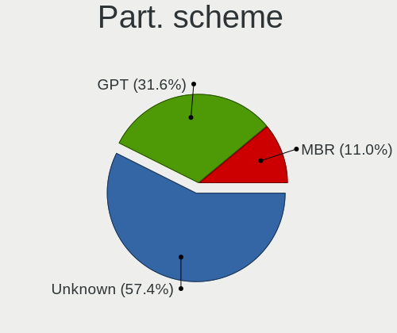
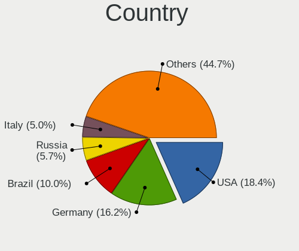
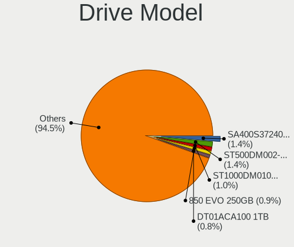
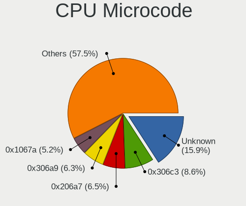
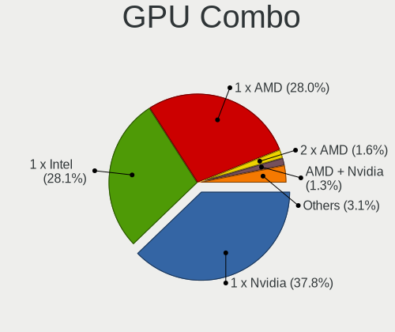
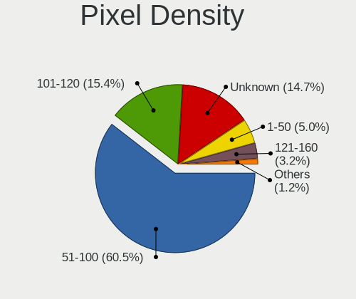
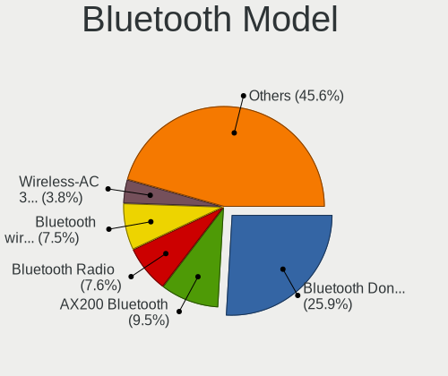

Linux Mint - Tested Hardware & Statistics (Desktops)
----------------------------------------------------

A project to collect tested hardware configurations for Linux Mint.

Anyone can contribute to this report by the [hw-probe](https://github.com/linuxhw/hw-probe) tool:

    sudo -E hw-probe -all -upload

Please contribute! Especially if your hardware is rare.

Contents
--------

* [ Test Cases ](#test-cases)

* [ System ](#system)
  - [ OS                       ](#os)
  - [ OS Family                ](#os-family)
  - [ Kernel                   ](#kernel)
  - [ Kernel Family            ](#kernel-family)
  - [ Kernel Major Ver.        ](#kernel-major-ver)
  - [ Arch                     ](#arch)
  - [ DE                       ](#de)
  - [ Display Server           ](#display-server)
  - [ Display Manager          ](#display-manager)
  - [ OS Lang                  ](#os-lang)
  - [ Boot Mode                ](#boot-mode)
  - [ Filesystem               ](#filesystem)
  - [ Part. scheme             ](#part-scheme)
  - [ Dual Boot with Linux/BSD ](#dual-boot-with-linuxbsd)
  - [ Dual Boot (Win)          ](#dual-boot-win)

* [ Board ](#board)
  - [ Vendor                   ](#vendor)
  - [ Model                    ](#model)
  - [ Model Family             ](#model-family)
  - [ MFG Year                 ](#mfg-year)
  - [ Form Factor              ](#form-factor)
  - [ Secure Boot              ](#secure-boot)
  - [ Coreboot                 ](#coreboot)
  - [ RAM Size                 ](#ram-size)
  - [ RAM Used                 ](#ram-used)
  - [ Total Drives             ](#total-drives)
  - [ Has CD-ROM               ](#has-cd-rom)
  - [ Has Ethernet             ](#has-ethernet)
  - [ Has WiFi                 ](#has-wifi)
  - [ Has Bluetooth            ](#has-bluetooth)

* [ Location ](#location)
  - [ Country                  ](#country)
  - [ City                     ](#city)

* [ Drives ](#drives)
  - [ Drive Vendor             ](#drive-vendor)
  - [ Drive Model              ](#drive-model)
  - [ HDD Vendor               ](#hdd-vendor)
  - [ SSD Vendor               ](#ssd-vendor)
  - [ Drive Kind               ](#drive-kind)
  - [ Drive Connector          ](#drive-connector)
  - [ Drive Size               ](#drive-size)
  - [ Space Total              ](#space-total)
  - [ Space Used               ](#space-used)
  - [ Malfunc. Drives          ](#malfunc-drives)
  - [ Malfunc. Drive Vendor    ](#malfunc-drive-vendor)
  - [ Malfunc. HDD Vendor      ](#malfunc-hdd-vendor)
  - [ Malfunc. Drive Kind      ](#malfunc-drive-kind)
  - [ Failed Drives            ](#failed-drives)
  - [ Failed Drive Vendor      ](#failed-drive-vendor)
  - [ Drive Status             ](#drive-status)

* [ Storage controller ](#storage-controller)
  - [ Storage Vendor           ](#storage-vendor)
  - [ Storage Model            ](#storage-model)
  - [ Storage Kind             ](#storage-kind)

* [ Processor ](#processor)
  - [ CPU Vendor               ](#cpu-vendor)
  - [ CPU Model                ](#cpu-model)
  - [ CPU Model Family         ](#cpu-model-family)
  - [ CPU Cores                ](#cpu-cores)
  - [ CPU Sockets              ](#cpu-sockets)
  - [ CPU Threads              ](#cpu-threads)
  - [ CPU Op-Modes             ](#cpu-op-modes)
  - [ CPU Microcode            ](#cpu-microcode)
  - [ CPU Microarch            ](#cpu-microarch)

* [ Graphics ](#graphics)
  - [ GPU Vendor               ](#gpu-vendor)
  - [ GPU Model                ](#gpu-model)
  - [ GPU Combo                ](#gpu-combo)
  - [ GPU Driver               ](#gpu-driver)
  - [ GPU Memory               ](#gpu-memory)

* [ Monitor ](#monitor)
  - [ Monitor Vendor           ](#monitor-vendor)
  - [ Monitor Model            ](#monitor-model)
  - [ Monitor Resolution       ](#monitor-resolution)
  - [ Monitor Diagonal         ](#monitor-diagonal)
  - [ Monitor Width            ](#monitor-width)
  - [ Aspect Ratio             ](#aspect-ratio)
  - [ Monitor Area             ](#monitor-area)
  - [ Pixel Density            ](#pixel-density)
  - [ Multiple Monitors        ](#multiple-monitors)

* [ Network ](#network)
  - [ Net Controller Vendor    ](#net-controller-vendor)
  - [ Net Controller Model     ](#net-controller-model)
  - [ Wireless Vendor          ](#wireless-vendor)
  - [ Wireless Model           ](#wireless-model)
  - [ Ethernet Vendor          ](#ethernet-vendor)
  - [ Ethernet Model           ](#ethernet-model)
  - [ Net Controller Kind      ](#net-controller-kind)
  - [ Used Controller          ](#used-controller)
  - [ NICs                     ](#nics)
  - [ IPv6                     ](#ipv6)

* [ Bluetooth ](#bluetooth)
  - [ Bluetooth Vendor         ](#bluetooth-vendor)
  - [ Bluetooth Model          ](#bluetooth-model)

* [ Sound ](#sound)
  - [ Sound Vendor             ](#sound-vendor)
  - [ Sound Model              ](#sound-model)

* [ Memory ](#memory)
  - [ Memory Vendor            ](#memory-vendor)
  - [ Memory Model             ](#memory-model)
  - [ Memory Kind              ](#memory-kind)
  - [ Memory Form Factor       ](#memory-form-factor)
  - [ Memory Size              ](#memory-size)
  - [ Memory Speed             ](#memory-speed)

* [ Printers & scanners ](#printers--scanners)
  - [ Printer Vendor           ](#printer-vendor)
  - [ Printer Model            ](#printer-model)
  - [ Scanner Vendor           ](#scanner-vendor)
  - [ Scanner Model            ](#scanner-model)

* [ Camera ](#camera)
  - [ Camera Vendor            ](#camera-vendor)
  - [ Camera Model             ](#camera-model)

* [ Security ](#security)
  - [ Fingerprint Vendor       ](#fingerprint-vendor)
  - [ Fingerprint Model        ](#fingerprint-model)
  - [ Chipcard Vendor          ](#chipcard-vendor)
  - [ Chipcard Model           ](#chipcard-model)

* [ Unsupported ](#unsupported)
  - [ Unsupported Devices      ](#unsupported-devices)
  - [ Unsupported Device Types ](#unsupported-device-types)

Test Cases
----------

Total: 8204

| Vendor        | Model                       | Probe                                                      | Date         |
|---------------|-----------------------------|------------------------------------------------------------|--------------|
| Unknown       | X79-P3                      | [9269fd5ff4](https://linux-hardware.org/?probe=9269fd5ff4) | Oct 01, 2022 |
| ASUSTek       | ROG STRIX X570-F GAMING     | [ff1c77c45a](https://linux-hardware.org/?probe=ff1c77c45a) | Oct 01, 2022 |
| Positivo      | POS-PIH81DL                 | [c17fe23ea7](https://linux-hardware.org/?probe=c17fe23ea7) | Oct 01, 2022 |
| Lenovo        | ThinkCentre M58 9728AHG     | [a2bc7fc88f](https://linux-hardware.org/?probe=a2bc7fc88f) | Oct 01, 2022 |
| Dell          | 0RW203                      | [c8a408311d](https://linux-hardware.org/?probe=c8a408311d) | Oct 01, 2022 |
| ASUSTek       | B75M-A                      | [cbeab03cbd](https://linux-hardware.org/?probe=cbeab03cbd) | Oct 01, 2022 |
| Foxconn       | 2AB1                        | [18971aaf86](https://linux-hardware.org/?probe=18971aaf86) | Oct 01, 2022 |
| Apple         | Mac-F221BEC8                | [ab0a3e1a94](https://linux-hardware.org/?probe=ab0a3e1a94) | Sep 30, 2022 |
| Dell          | 0NK70N A03                  | [9cfa433855](https://linux-hardware.org/?probe=9cfa433855) | Sep 30, 2022 |
| ASUSTek       | P8H67-M                     | [583fe6d90d](https://linux-hardware.org/?probe=583fe6d90d) | Sep 30, 2022 |
| Lenovo        | ThinkCentre M58 9728AHG     | [773ae7f01e](https://linux-hardware.org/?probe=773ae7f01e) | Sep 30, 2022 |
| ASRock        | N68C-S UCC                  | [90d8579454](https://linux-hardware.org/?probe=90d8579454) | Sep 30, 2022 |
| Dell          | 0KJCC5 A00                  | [f9582eb0a8](https://linux-hardware.org/?probe=f9582eb0a8) | Sep 29, 2022 |
| HP            | 158A                        | [151ee8b7d6](https://linux-hardware.org/?probe=151ee8b7d6) | Sep 29, 2022 |
| HP            | 81C9                        | [c92ebd45a9](https://linux-hardware.org/?probe=c92ebd45a9) | Sep 29, 2022 |
| Acer          | Veriton X6610G              | [66733e59e2](https://linux-hardware.org/?probe=66733e59e2) | Sep 29, 2022 |
| Gigabyte      | A320M-H-CF                  | [25e3064dd2](https://linux-hardware.org/?probe=25e3064dd2) | Sep 29, 2022 |
| Dell          | 0NK70N A03                  | [7e2d1b00fd](https://linux-hardware.org/?probe=7e2d1b00fd) | Sep 28, 2022 |
| Dell          | 06D7TR A02                  | [a0d832ff6a](https://linux-hardware.org/?probe=a0d832ff6a) | Sep 28, 2022 |
| MSI           | X299 SLI PLUS               | [1695ba8137](https://linux-hardware.org/?probe=1695ba8137) | Sep 28, 2022 |
| ASUSTek       | PRIME B450M-K               | [262a244d81](https://linux-hardware.org/?probe=262a244d81) | Sep 28, 2022 |
| ASUSTek       | M5A97 R2.0                  | [9b3c73c104](https://linux-hardware.org/?probe=9b3c73c104) | Sep 28, 2022 |
| ASUSTek       | M5A97 R2.0                  | [4cdcef3ebd](https://linux-hardware.org/?probe=4cdcef3ebd) | Sep 28, 2022 |
| MSI           | B550-A PRO                  | [2a5a7aeb95](https://linux-hardware.org/?probe=2a5a7aeb95) | Sep 27, 2022 |
| MSI           | A68HM-E33 V2                | [c5e17e9617](https://linux-hardware.org/?probe=c5e17e9617) | Sep 27, 2022 |
| Gigabyte      | GA-78LMT-USB3 R2 sex        | [63cd838fcc](https://linux-hardware.org/?probe=63cd838fcc) | Sep 27, 2022 |
| Lenovo        | MAHOBAY NO DPK              | [1979013fa2](https://linux-hardware.org/?probe=1979013fa2) | Sep 27, 2022 |
| HP            | 8433 11                     | [a1d424bced](https://linux-hardware.org/?probe=a1d424bced) | Sep 27, 2022 |
| HP            | 802F                        | [12645dcde4](https://linux-hardware.org/?probe=12645dcde4) | Sep 27, 2022 |
| Dell          | 018D1Y A00                  | [744202f733](https://linux-hardware.org/?probe=744202f733) | Sep 26, 2022 |
| Biostar       | TH67XE                      | [24df0079b5](https://linux-hardware.org/?probe=24df0079b5) | Sep 26, 2022 |
| HP            | 1494                        | [aa2bd7da6c](https://linux-hardware.org/?probe=aa2bd7da6c) | Sep 26, 2022 |
| ASUSTek       | P5N7A-VM                    | [e8ac8a9926](https://linux-hardware.org/?probe=e8ac8a9926) | Sep 26, 2022 |
| ASUSTek       | P5N7A-VM                    | [86580fe9f2](https://linux-hardware.org/?probe=86580fe9f2) | Sep 26, 2022 |
| Gigabyte      | 970A-DS3P                   | [202e51c5d3](https://linux-hardware.org/?probe=202e51c5d3) | Sep 26, 2022 |
| AZW           | Green G2                    | [af79cd4332](https://linux-hardware.org/?probe=af79cd4332) | Sep 26, 2022 |
| MSI           | A68HM-E33 V2                | [939c0c0a19](https://linux-hardware.org/?probe=939c0c0a19) | Sep 25, 2022 |
| ASUSTek       | B150-PLUS                   | [c64181dd6a](https://linux-hardware.org/?probe=c64181dd6a) | Sep 25, 2022 |
| Gigabyte      | Z97X-UD3H-BK-CF             | [dfdb7b73ae](https://linux-hardware.org/?probe=dfdb7b73ae) | Sep 25, 2022 |
| ASUSTek       | ROG STRIX B550-F GAMING     | [208c7988f7](https://linux-hardware.org/?probe=208c7988f7) | Sep 25, 2022 |
| HP            | 8433 11                     | [dffc61c155](https://linux-hardware.org/?probe=dffc61c155) | Sep 24, 2022 |
| HP            | 802F                        | [2390f9c154](https://linux-hardware.org/?probe=2390f9c154) | Sep 24, 2022 |
| ECS           | H61H2-WM                    | [6b0f45b0c0](https://linux-hardware.org/?probe=6b0f45b0c0) | Sep 24, 2022 |
| ASUSTek       | Leonite2                    | [f7e1dc7c9d](https://linux-hardware.org/?probe=f7e1dc7c9d) | Sep 24, 2022 |
| ASUSTek       | Leonite2                    | [63d494787f](https://linux-hardware.org/?probe=63d494787f) | Sep 24, 2022 |
| ASRock        | 4CoreDual-SATA2             | [eb0e992df7](https://linux-hardware.org/?probe=eb0e992df7) | Sep 24, 2022 |
| Dell          | 0C7195                      | [9711ab00d7](https://linux-hardware.org/?probe=9711ab00d7) | Sep 24, 2022 |
| Gigabyte      | G31M-S2C                    | [d0aa96a903](https://linux-hardware.org/?probe=d0aa96a903) | Sep 24, 2022 |
| MSI           | H510M PRO                   | [bb7475d072](https://linux-hardware.org/?probe=bb7475d072) | Sep 24, 2022 |
| Lenovo        | NO DPK                      | [7bdaedd0f7](https://linux-hardware.org/?probe=7bdaedd0f7) | Sep 24, 2022 |
| Gateway       | IPISB-VR                    | [21ee50eb69](https://linux-hardware.org/?probe=21ee50eb69) | Sep 24, 2022 |
| ASUSTek       | P8B75-M LE                  | [8975676700](https://linux-hardware.org/?probe=8975676700) | Sep 24, 2022 |
| ASRock        | X399 Taichi                 | [e6de41eac0](https://linux-hardware.org/?probe=e6de41eac0) | Sep 24, 2022 |
| HP            | 8643 SMVB                   | [c2e100d58d](https://linux-hardware.org/?probe=c2e100d58d) | Sep 24, 2022 |
| HP            | 802F                        | [1b25932752](https://linux-hardware.org/?probe=1b25932752) | Sep 23, 2022 |
| HP            | 8055                        | [a45563167c](https://linux-hardware.org/?probe=a45563167c) | Sep 23, 2022 |
| Medion        | B460H6-EM                   | [9ab2a06631](https://linux-hardware.org/?probe=9ab2a06631) | Sep 23, 2022 |
| ASUSTek       | M2N68-AM SE2                | [412f70b76b](https://linux-hardware.org/?probe=412f70b76b) | Sep 23, 2022 |
| Medion        | H110H4-EM                   | [2fa25ddedf](https://linux-hardware.org/?probe=2fa25ddedf) | Sep 23, 2022 |
| Dell          | 0WR7PY A02                  | [0c47cbc25d](https://linux-hardware.org/?probe=0c47cbc25d) | Sep 23, 2022 |
| Medion        | H110H4-EM                   | [8e7d4a7aeb](https://linux-hardware.org/?probe=8e7d4a7aeb) | Sep 23, 2022 |
| Dell          | 0WR7PY A02                  | [53fc678043](https://linux-hardware.org/?probe=53fc678043) | Sep 23, 2022 |
| HP            | 0AA0h                       | [5757039d29](https://linux-hardware.org/?probe=5757039d29) | Sep 23, 2022 |
| MSI           | B350 PC MATE                | [0c4332eead](https://linux-hardware.org/?probe=0c4332eead) | Sep 23, 2022 |
| HP            | 1494                        | [cd3778e7eb](https://linux-hardware.org/?probe=cd3778e7eb) | Sep 22, 2022 |
| MSI           | 760GM-P34                   | [af750add66](https://linux-hardware.org/?probe=af750add66) | Sep 22, 2022 |
| HP            | 1494                        | [4a3ad3e89d](https://linux-hardware.org/?probe=4a3ad3e89d) | Sep 22, 2022 |
| ASUSTek       | M5A78L-M LX3                | [75a6fc3a08](https://linux-hardware.org/?probe=75a6fc3a08) | Sep 22, 2022 |
| Gigabyte      | 945GM-S2                    | [9fcea940e6](https://linux-hardware.org/?probe=9fcea940e6) | Sep 22, 2022 |
| Gigabyte      | 990FXA-UD5                  | [7c8d5609e0](https://linux-hardware.org/?probe=7c8d5609e0) | Sep 22, 2022 |
| ASUSTek       | P5B                         | [f265d37bf5](https://linux-hardware.org/?probe=f265d37bf5) | Sep 22, 2022 |
| ASUSTek       | TUF B450M-PRO GAMING        | [e1af6b9e74](https://linux-hardware.org/?probe=e1af6b9e74) | Sep 22, 2022 |
| OEM           | B75 Ver:1.41                | [e22d2bac17](https://linux-hardware.org/?probe=e22d2bac17) | Sep 22, 2022 |
| HP            | 802F                        | [1f4d3353d2](https://linux-hardware.org/?probe=1f4d3353d2) | Sep 22, 2022 |
| ASUSTek       | PRIME Z390-A                | [5e4d865987](https://linux-hardware.org/?probe=5e4d865987) | Sep 21, 2022 |
| HP            | 1494                        | [5018a8dade](https://linux-hardware.org/?probe=5018a8dade) | Sep 21, 2022 |
| Lenovo        | ThinkCentre M81 5049W16     | [67067bfc09](https://linux-hardware.org/?probe=67067bfc09) | Sep 21, 2022 |
| Gigabyte      | Z590 UD AC                  | [3add13cf6d](https://linux-hardware.org/?probe=3add13cf6d) | Sep 21, 2022 |
| AZW           | Green G2                    | [eecf2ffec4](https://linux-hardware.org/?probe=eecf2ffec4) | Sep 21, 2022 |
| Dell          | 0773VG A02                  | [84f143d4ea](https://linux-hardware.org/?probe=84f143d4ea) | Sep 21, 2022 |
| Dell          | 0D6H9T A00                  | [63b718ac3a](https://linux-hardware.org/?probe=63b718ac3a) | Sep 21, 2022 |
| ASUSTek       | PRIME B450M-A               | [2ac923fd8c](https://linux-hardware.org/?probe=2ac923fd8c) | Sep 21, 2022 |
| Dell          | 0D6H9T A00                  | [90437079a3](https://linux-hardware.org/?probe=90437079a3) | Sep 20, 2022 |
| Digiboard     | NM70-TI                     | [ace83d527c](https://linux-hardware.org/?probe=ace83d527c) | Sep 20, 2022 |
| ASUSTek       | Z97-A                       | [cc9467d0fe](https://linux-hardware.org/?probe=cc9467d0fe) | Sep 20, 2022 |
| ASRock        | X399 Phantom Gaming 6       | [94d45ff789](https://linux-hardware.org/?probe=94d45ff789) | Sep 19, 2022 |
| HP            | 81C9                        | [3795beb1c4](https://linux-hardware.org/?probe=3795beb1c4) | Sep 19, 2022 |
| Intel         | DH61BF AAG81311-101         | [43c2f57807](https://linux-hardware.org/?probe=43c2f57807) | Sep 19, 2022 |
| BESSTAR Te... | UM250 V1.0                  | [aba8915769](https://linux-hardware.org/?probe=aba8915769) | Sep 19, 2022 |
| Intel         | DG33BU AAD79951-407         | [d35104af13](https://linux-hardware.org/?probe=d35104af13) | Sep 19, 2022 |
| Gigabyte      | H97M-D3H                    | [57db36ecc9](https://linux-hardware.org/?probe=57db36ecc9) | Sep 19, 2022 |
| HP            | 0AA8h                       | [3c274fc7f3](https://linux-hardware.org/?probe=3c274fc7f3) | Sep 19, 2022 |
| Wistron       | ProLiant ML110 G6           | [c986542d56](https://linux-hardware.org/?probe=c986542d56) | Sep 18, 2022 |
| Wistron       | ProLiant ML110 G6           | [a17cc62b40](https://linux-hardware.org/?probe=a17cc62b40) | Sep 18, 2022 |
| Gigabyte      | H61M-DS2                    | [3a2c9cfad3](https://linux-hardware.org/?probe=3a2c9cfad3) | Sep 18, 2022 |
| Gigabyte      | F2A88X-D3H                  | [55ab1865a0](https://linux-hardware.org/?probe=55ab1865a0) | Sep 18, 2022 |
| BESSTAR Te... | TH50                        | [916e9d7e5e](https://linux-hardware.org/?probe=916e9d7e5e) | Sep 18, 2022 |
| AZW           | Green G2                    | [f4644ab00d](https://linux-hardware.org/?probe=f4644ab00d) | Sep 18, 2022 |
| HP            | 18E7                        | [710a40851e](https://linux-hardware.org/?probe=710a40851e) | Sep 18, 2022 |
| ASUSTek       | P5G41T-M LX                 | [50647a7656](https://linux-hardware.org/?probe=50647a7656) | Sep 17, 2022 |
| Foxconn       | G31MXP FAB:1.1              | [d401319e57](https://linux-hardware.org/?probe=d401319e57) | Sep 17, 2022 |
| Gigabyte      | B450 I AORUS PRO WIFI-CF    | [b3350b3f69](https://linux-hardware.org/?probe=b3350b3f69) | Sep 17, 2022 |
| Intel         | X79M-S                      | [91e75d3183](https://linux-hardware.org/?probe=91e75d3183) | Sep 17, 2022 |
| ASUSTek       | PRIME H310-PLUS             | [b9693eaf7c](https://linux-hardware.org/?probe=b9693eaf7c) | Sep 17, 2022 |
| Intel         | X79M-S                      | [48c5f5ed77](https://linux-hardware.org/?probe=48c5f5ed77) | Sep 17, 2022 |
| ASUSTek       | P5K                         | [4cf17a7b6f](https://linux-hardware.org/?probe=4cf17a7b6f) | Sep 17, 2022 |
| ASUSTek       | P5K                         | [4a3727841e](https://linux-hardware.org/?probe=4a3727841e) | Sep 17, 2022 |
| Dell          | 0F5C5X A00                  | [db1c09a2cc](https://linux-hardware.org/?probe=db1c09a2cc) | Sep 16, 2022 |
| System76      | Thelio Mira thelio-mira-... | [e5e20422fd](https://linux-hardware.org/?probe=e5e20422fd) | Sep 16, 2022 |
| Lenovo        | 3708 SDK0J40700 WIN 3258... | [e6fe8aa148](https://linux-hardware.org/?probe=e6fe8aa148) | Sep 16, 2022 |
| ASUSTek       | P5B                         | [37bf9261b4](https://linux-hardware.org/?probe=37bf9261b4) | Sep 16, 2022 |
| Fujitsu       | D3028-A1 S26361-D3028-A1    | [26699f7431](https://linux-hardware.org/?probe=26699f7431) | Sep 16, 2022 |
| Fujitsu       | D3028-A1 S26361-D3028-A1    | [b8262094b0](https://linux-hardware.org/?probe=b8262094b0) | Sep 16, 2022 |
| Gigabyte      | B450M DS3H-CF               | [c99c4f9785](https://linux-hardware.org/?probe=c99c4f9785) | Sep 15, 2022 |
| AZW           | GK mini                     | [19b8b4dc85](https://linux-hardware.org/?probe=19b8b4dc85) | Sep 15, 2022 |
| ASUSTek       | H81M-K                      | [fe48912653](https://linux-hardware.org/?probe=fe48912653) | Sep 15, 2022 |
| ASUSTek       | H81M-K                      | [a6bc49b4f3](https://linux-hardware.org/?probe=a6bc49b4f3) | Sep 15, 2022 |
| HP            | 18E6                        | [d95bebd7fe](https://linux-hardware.org/?probe=d95bebd7fe) | Sep 15, 2022 |
| HP            | 339A                        | [78e4f67b19](https://linux-hardware.org/?probe=78e4f67b19) | Sep 14, 2022 |
| Gigabyte      | F2A88X-D3H                  | [b05bacb493](https://linux-hardware.org/?probe=b05bacb493) | Sep 14, 2022 |
| Gigabyte      | GA-78LMT-S2                 | [87f0f15c82](https://linux-hardware.org/?probe=87f0f15c82) | Sep 14, 2022 |
| Intel         | DH67BL AAG10189-209         | [3507c0cdb7](https://linux-hardware.org/?probe=3507c0cdb7) | Sep 14, 2022 |
| HP            | 18E6                        | [261f9e8c10](https://linux-hardware.org/?probe=261f9e8c10) | Sep 14, 2022 |
| AZW           | Green G2                    | [b52a17d2b2](https://linux-hardware.org/?probe=b52a17d2b2) | Sep 14, 2022 |
| ASUSTek       | P5B                         | [ae8f6e2ed7](https://linux-hardware.org/?probe=ae8f6e2ed7) | Sep 14, 2022 |
| Gigabyte      | B365M H                     | [20125b1c13](https://linux-hardware.org/?probe=20125b1c13) | Sep 13, 2022 |
| ASUSTek       | PRIME B350M-A               | [47b0975057](https://linux-hardware.org/?probe=47b0975057) | Sep 13, 2022 |
| Gigabyte      | Z690 UD AX DDR4             | [70aa78efc6](https://linux-hardware.org/?probe=70aa78efc6) | Sep 13, 2022 |
| ASUSTek       | H81M-K                      | [19ddc4ed5d](https://linux-hardware.org/?probe=19ddc4ed5d) | Sep 13, 2022 |
| ASRock        | Z77 Pro4-M                  | [38928465ac](https://linux-hardware.org/?probe=38928465ac) | Sep 13, 2022 |
| Dell          | 0P01GV A03                  | [f23afc903c](https://linux-hardware.org/?probe=f23afc903c) | Sep 13, 2022 |
| ASUSTek       | PRIME B550M-A               | [fd2497acae](https://linux-hardware.org/?probe=fd2497acae) | Sep 12, 2022 |
| Gigabyte      | AX370-Gaming K3             | [e3720a691a](https://linux-hardware.org/?probe=e3720a691a) | Sep 12, 2022 |
| MSI           | MAG B550 TOMAHAWK           | [b251a95678](https://linux-hardware.org/?probe=b251a95678) | Sep 12, 2022 |
| Fujitsu       | D3162-A1 S26361-D3162-A1    | [00bca0eeff](https://linux-hardware.org/?probe=00bca0eeff) | Sep 12, 2022 |
| MSI           | MAG B550 TOMAHAWK           | [b3c2018879](https://linux-hardware.org/?probe=b3c2018879) | Sep 12, 2022 |
| PCWare        | IPMH61R3                    | [2312ab0f92](https://linux-hardware.org/?probe=2312ab0f92) | Sep 12, 2022 |
| ASRock        | B450 Gaming K4              | [2391f4673a](https://linux-hardware.org/?probe=2391f4673a) | Sep 12, 2022 |
| ASRock        | B450 Gaming K4              | [89963f6bf1](https://linux-hardware.org/?probe=89963f6bf1) | Sep 12, 2022 |
| Gigabyte      | H61MS                       | [9b10176111](https://linux-hardware.org/?probe=9b10176111) | Sep 12, 2022 |
| Gigabyte      | H81M-D2V                    | [6da1838df1](https://linux-hardware.org/?probe=6da1838df1) | Sep 12, 2022 |
| Unknown       | Unknown                     | [637418c4f3](https://linux-hardware.org/?probe=637418c4f3) | Sep 12, 2022 |
| ASUSTek       | PRIME X370-PRO              | [2228f0dc13](https://linux-hardware.org/?probe=2228f0dc13) | Sep 12, 2022 |
| HP            | 8464                        | [50cb2002e6](https://linux-hardware.org/?probe=50cb2002e6) | Sep 12, 2022 |
| ECS           | G31T-M9                     | [547762d8bf](https://linux-hardware.org/?probe=547762d8bf) | Sep 11, 2022 |
| Dell          | 09KPNV A00                  | [7063a1b842](https://linux-hardware.org/?probe=7063a1b842) | Sep 11, 2022 |
| Dell          | 09KPNV A00                  | [8d243eeb2a](https://linux-hardware.org/?probe=8d243eeb2a) | Sep 11, 2022 |
| Gigabyte      | H61M-DS2                    | [105dae5731](https://linux-hardware.org/?probe=105dae5731) | Sep 11, 2022 |
| Pegatron      | Benicia                     | [1f8dceb256](https://linux-hardware.org/?probe=1f8dceb256) | Sep 11, 2022 |
| Gigabyte      | GB-BRR7H-4800               | [c7eb1fd4ca](https://linux-hardware.org/?probe=c7eb1fd4ca) | Sep 11, 2022 |
| Gigabyte      | A320M-S2H V2-CF             | [4df5d0194d](https://linux-hardware.org/?probe=4df5d0194d) | Sep 11, 2022 |
| Foxconn       | 2AA9                        | [b671b09c1a](https://linux-hardware.org/?probe=b671b09c1a) | Sep 11, 2022 |
| HP            | ProLiant MicroServer        | [a36990dcf7](https://linux-hardware.org/?probe=a36990dcf7) | Sep 10, 2022 |
| ASUSTek       | P5N7A-VM                    | [ac23f75aa7](https://linux-hardware.org/?probe=ac23f75aa7) | Sep 10, 2022 |
| ECS           | H61H2-M6                    | [99f3146843](https://linux-hardware.org/?probe=99f3146843) | Sep 10, 2022 |
| PCWare        | IPMH61R1                    | [d79e449b58](https://linux-hardware.org/?probe=d79e449b58) | Sep 10, 2022 |
| ASUSTek       | M5A78L/USB3                 | [49158d0782](https://linux-hardware.org/?probe=49158d0782) | Sep 10, 2022 |
| MSI           | B550-A PRO                  | [f1bdda02e5](https://linux-hardware.org/?probe=f1bdda02e5) | Sep 10, 2022 |
| ASUSTek       | H81M-E                      | [1a9835fb13](https://linux-hardware.org/?probe=1a9835fb13) | Sep 10, 2022 |
| ASUSTek       | ROG STRIX B450-F GAMING     | [5aa9031e93](https://linux-hardware.org/?probe=5aa9031e93) | Sep 10, 2022 |
| ASUSTek       | ROG STRIX B450-F GAMING     | [81fcfbb095](https://linux-hardware.org/?probe=81fcfbb095) | Sep 10, 2022 |
| PCWare        | IPMH61R1                    | [1d6ec4fb3b](https://linux-hardware.org/?probe=1d6ec4fb3b) | Sep 10, 2022 |
| HP            | ProLiant MicroServer        | [6d58a3f327](https://linux-hardware.org/?probe=6d58a3f327) | Sep 09, 2022 |
| HP            | ProLiant MicroServer        | [08e7851933](https://linux-hardware.org/?probe=08e7851933) | Sep 09, 2022 |
| Gigabyte      | X570 AORUS PRO              | [8d1d861b1c](https://linux-hardware.org/?probe=8d1d861b1c) | Sep 09, 2022 |
| Dell          | 0P01GV A03                  | [d71609c89e](https://linux-hardware.org/?probe=d71609c89e) | Sep 09, 2022 |
| ASUSTek       | M5A78L-M/USB3               | [951a99cc8f](https://linux-hardware.org/?probe=951a99cc8f) | Sep 09, 2022 |
| Dell          | 0C7195                      | [728b74ef0c](https://linux-hardware.org/?probe=728b74ef0c) | Sep 09, 2022 |
| Dell          | 08NPPY A00                  | [55cf772a79](https://linux-hardware.org/?probe=55cf772a79) | Sep 09, 2022 |
| MSI           | MS-7817                     | [99a24afc9e](https://linux-hardware.org/?probe=99a24afc9e) | Sep 09, 2022 |
| Fujitsu Si... | D2811-A1 S26361-D2811-A1    | [2c39df8b9f](https://linux-hardware.org/?probe=2c39df8b9f) | Sep 08, 2022 |
| Acer          | Aspire TC-895 V:1.0         | [246c6ed8a6](https://linux-hardware.org/?probe=246c6ed8a6) | Sep 08, 2022 |
| Packard Be... | IMEDIA S2883                | [c4fe9ee6f0](https://linux-hardware.org/?probe=c4fe9ee6f0) | Sep 08, 2022 |
| Acer          | Aspire TC-895 V:1.0         | [04b2bf9115](https://linux-hardware.org/?probe=04b2bf9115) | Sep 08, 2022 |
| Gigabyte      | H310M S2P                   | [aaab0c5335](https://linux-hardware.org/?probe=aaab0c5335) | Sep 08, 2022 |
| ASUSTek       | PRIME B450M-K II            | [c7a272ed96](https://linux-hardware.org/?probe=c7a272ed96) | Sep 08, 2022 |
| Pegatron      | Benicia                     | [95339a1bdd](https://linux-hardware.org/?probe=95339a1bdd) | Sep 08, 2022 |
| Gigabyte      | M68MT-S2                    | [86af6e4676](https://linux-hardware.org/?probe=86af6e4676) | Sep 08, 2022 |
| ASUSTek       | M4A89GTD-PRO/USB3           | [a355222b61](https://linux-hardware.org/?probe=a355222b61) | Sep 07, 2022 |
| MSI           | MPG B550 GAMING PLUS        | [a45b18c4bb](https://linux-hardware.org/?probe=a45b18c4bb) | Sep 07, 2022 |
| Dell          | 0JCTF8 A00                  | [7a0145000a](https://linux-hardware.org/?probe=7a0145000a) | Sep 07, 2022 |
| Dell          | 0DR845                      | [f945fc3f5e](https://linux-hardware.org/?probe=f945fc3f5e) | Sep 07, 2022 |
| Dell          | 0M863N A01                  | [a353883ee2](https://linux-hardware.org/?probe=a353883ee2) | Sep 07, 2022 |
| MSI           | Z170A GAMING PRO            | [e690f6c747](https://linux-hardware.org/?probe=e690f6c747) | Sep 06, 2022 |
| MSI           | Z97 PC Mate                 | [512c793b51](https://linux-hardware.org/?probe=512c793b51) | Sep 06, 2022 |
| MSI           | 760GM-P21                   | [c3eb52f6ab](https://linux-hardware.org/?probe=c3eb52f6ab) | Sep 06, 2022 |
| HP            | 8265                        | [2b74e032bd](https://linux-hardware.org/?probe=2b74e032bd) | Sep 06, 2022 |
| Gigabyte      | A320M-S2H-CF                | [bcdb385277](https://linux-hardware.org/?probe=bcdb385277) | Sep 06, 2022 |
| ASUSTek       | ROG STRIX X470-F GAMING     | [ab4f06e457](https://linux-hardware.org/?probe=ab4f06e457) | Sep 05, 2022 |
| ASUSTek       | H81M-PLUS                   | [826b486f77](https://linux-hardware.org/?probe=826b486f77) | Sep 05, 2022 |
| HP            | 8265                        | [f7f460fb43](https://linux-hardware.org/?probe=f7f460fb43) | Sep 05, 2022 |
| ASUSTek       | P9X79 DELUXE                | [2aa7ada396](https://linux-hardware.org/?probe=2aa7ada396) | Sep 05, 2022 |
| Gigabyte      | Z690 AERO G DDR4            | [ccd383a106](https://linux-hardware.org/?probe=ccd383a106) | Sep 05, 2022 |
| ASUSTek       | TUF Gaming X570-PLUS        | [2176e4d70f](https://linux-hardware.org/?probe=2176e4d70f) | Sep 05, 2022 |
| ASUSTek       | P5KPL-AM-CKD-VISUM-SI       | [1f5b368c96](https://linux-hardware.org/?probe=1f5b368c96) | Sep 05, 2022 |
| Gigabyte      | GA-M56S-S3                  | [8b8ba6c7f9](https://linux-hardware.org/?probe=8b8ba6c7f9) | Sep 05, 2022 |
| MSI           | B450 GAMING PLUS MAX        | [9cd2bcff37](https://linux-hardware.org/?probe=9cd2bcff37) | Sep 04, 2022 |
| AMI           | Cherry Trail CR             | [63136bf463](https://linux-hardware.org/?probe=63136bf463) | Sep 04, 2022 |
| Lenovo        | SKYBAY SDK0J40709 WIN 32... | [ed16086671](https://linux-hardware.org/?probe=ed16086671) | Sep 04, 2022 |
| Gigabyte      | AB350M-HD3-CF se1           | [0859dbdb1c](https://linux-hardware.org/?probe=0859dbdb1c) | Sep 04, 2022 |
| Gigabyte      | B550 AORUS PRO V2           | [106bdf4d1b](https://linux-hardware.org/?probe=106bdf4d1b) | Sep 04, 2022 |
| Intel         | DQ67SW AAG12527-306         | [9ab6c11be2](https://linux-hardware.org/?probe=9ab6c11be2) | Sep 04, 2022 |
| Gigabyte      | X470 AORUS ULTRA GAMING-... | [312013ef36](https://linux-hardware.org/?probe=312013ef36) | Sep 03, 2022 |
| Gigabyte      | B560 HD3                    | [35c081a440](https://linux-hardware.org/?probe=35c081a440) | Sep 03, 2022 |
| Gigabyte      | GA-880GA-UD3H               | [14af0852b9](https://linux-hardware.org/?probe=14af0852b9) | Sep 03, 2022 |
| Gigabyte      | GA-880GA-UD3H               | [6c80288d39](https://linux-hardware.org/?probe=6c80288d39) | Sep 03, 2022 |
| Gigabyte      | X470 AORUS ULTRA GAMING-... | [709825bde3](https://linux-hardware.org/?probe=709825bde3) | Sep 03, 2022 |
| MSI           | H170 GAMING M3              | [b0d669cf4b](https://linux-hardware.org/?probe=b0d669cf4b) | Sep 03, 2022 |
| Lenovo        | 30D2 SDK0J40705 WIN 3425... | [c13f075f83](https://linux-hardware.org/?probe=c13f075f83) | Sep 03, 2022 |
| ASRock        | 4CoreDual-SATA2             | [c64d84d331](https://linux-hardware.org/?probe=c64d84d331) | Sep 03, 2022 |
| Intel         | X79M-S                      | [a435283f55](https://linux-hardware.org/?probe=a435283f55) | Sep 03, 2022 |
| HP            | 2AF3                        | [58eae39fe2](https://linux-hardware.org/?probe=58eae39fe2) | Sep 03, 2022 |
| ASUSTek       | PRIME Z270-A                | [e742b2e06c](https://linux-hardware.org/?probe=e742b2e06c) | Sep 03, 2022 |
| ASRock        | Q1900-ITX                   | [3f3708d874](https://linux-hardware.org/?probe=3f3708d874) | Sep 02, 2022 |
| ASRock        | A520M-HVS                   | [69253a16ad](https://linux-hardware.org/?probe=69253a16ad) | Sep 02, 2022 |
| ASUSTek       | ROG Maximus XI FORMULA      | [b765d1e662](https://linux-hardware.org/?probe=b765d1e662) | Sep 02, 2022 |
| ASUSTek       | ROG STRIX X470-F GAMING     | [a2878122de](https://linux-hardware.org/?probe=a2878122de) | Sep 01, 2022 |
| Gigabyte      | Z370 HD3-OP-CF              | [55f8dbfb24](https://linux-hardware.org/?probe=55f8dbfb24) | Sep 01, 2022 |
| ASUSTek       | ROG STRIX X470-F GAMING     | [836d60c547](https://linux-hardware.org/?probe=836d60c547) | Sep 01, 2022 |
| Gigabyte      | Z370 HD3-OP-CF              | [ead5d021a7](https://linux-hardware.org/?probe=ead5d021a7) | Sep 01, 2022 |
| Gigabyte      | Z97-HD3                     | [32e71c2905](https://linux-hardware.org/?probe=32e71c2905) | Sep 01, 2022 |
| HP            | 1589                        | [fce9004571](https://linux-hardware.org/?probe=fce9004571) | Sep 01, 2022 |
| MSI           | H110M GAMING                | [2699df47df](https://linux-hardware.org/?probe=2699df47df) | Sep 01, 2022 |
| HP            | 3398                        | [8b5bad68cb](https://linux-hardware.org/?probe=8b5bad68cb) | Sep 01, 2022 |
| Gigabyte      | 990FXA-UD5                  | [e5364d8761](https://linux-hardware.org/?probe=e5364d8761) | Sep 01, 2022 |
| ECS           | H61H2-M2                    | [9735a8ef90](https://linux-hardware.org/?probe=9735a8ef90) | Sep 01, 2022 |
| Unknown       | HX90                        | [71295a28ed](https://linux-hardware.org/?probe=71295a28ed) | Sep 01, 2022 |
| ASRock        | N68-GS4 FX R2.0             | [ea730c9b2d](https://linux-hardware.org/?probe=ea730c9b2d) | Sep 01, 2022 |
| MSI           | MAG X570S TORPEDO MAX       | [d98546fd95](https://linux-hardware.org/?probe=d98546fd95) | Aug 31, 2022 |
| Dell          | 0R092H                      | [1a3a337c23](https://linux-hardware.org/?probe=1a3a337c23) | Aug 31, 2022 |
| Unknown       | 1.0                         | [8f5cffd54f](https://linux-hardware.org/?probe=8f5cffd54f) | Aug 31, 2022 |
| JGINYUE       | B85I PLUS V2.1              | [d171691ef3](https://linux-hardware.org/?probe=d171691ef3) | Aug 31, 2022 |
| MSI           | B550-A PRO                  | [75a1c786f0](https://linux-hardware.org/?probe=75a1c786f0) | Aug 31, 2022 |
| ASUSTek       | ROG STRIX X570-E GAMING     | [1f8274de5a](https://linux-hardware.org/?probe=1f8274de5a) | Aug 31, 2022 |
| ASUSTek       | ROG STRIX X570-E GAMING     | [567bf4b44a](https://linux-hardware.org/?probe=567bf4b44a) | Aug 31, 2022 |
| ASUSTek       | GL10DH                      | [c197df704f](https://linux-hardware.org/?probe=c197df704f) | Aug 31, 2022 |
| HP            | 805A                        | [477936d851](https://linux-hardware.org/?probe=477936d851) | Aug 30, 2022 |
| ASRock        | N68-S UCC                   | [1d38f1f08e](https://linux-hardware.org/?probe=1d38f1f08e) | Aug 30, 2022 |
| ASUSTek       | M2N-TE                      | [82e7cc26e7](https://linux-hardware.org/?probe=82e7cc26e7) | Aug 30, 2022 |
| Gigabyte      | GA-78LMT-S2                 | [70ee26740a](https://linux-hardware.org/?probe=70ee26740a) | Aug 30, 2022 |
| HP            | 2B36                        | [c6de6225af](https://linux-hardware.org/?probe=c6de6225af) | Aug 29, 2022 |
| OEM           | G41 775 ICH7 8712           | [4225df6517](https://linux-hardware.org/?probe=4225df6517) | Aug 29, 2022 |
| Gigabyte      | B365M D3H-CF                | [4a96f9e792](https://linux-hardware.org/?probe=4a96f9e792) | Aug 29, 2022 |
| Medion        | Cattle24 1M                 | [eb19c533e0](https://linux-hardware.org/?probe=eb19c533e0) | Aug 29, 2022 |
| ASUSTek       | P5KPL-AM SE                 | [7a2c713719](https://linux-hardware.org/?probe=7a2c713719) | Aug 29, 2022 |
| ASRock        | N68-S                       | [9d18792f64](https://linux-hardware.org/?probe=9d18792f64) | Aug 29, 2022 |
| MSI           | MAG B550M MORTAR            | [82ff6d598a](https://linux-hardware.org/?probe=82ff6d598a) | Aug 29, 2022 |
| OEM           | Intel H81                   | [8732ebea02](https://linux-hardware.org/?probe=8732ebea02) | Aug 29, 2022 |
| Gigabyte      | X470 AORUS GAMING 7 WIFI... | [c7ace10271](https://linux-hardware.org/?probe=c7ace10271) | Aug 28, 2022 |
| Gigabyte      | GA-870A-UD3                 | [809a84e36c](https://linux-hardware.org/?probe=809a84e36c) | Aug 28, 2022 |
| Gigabyte      | GA-870A-UD3                 | [d037b5e961](https://linux-hardware.org/?probe=d037b5e961) | Aug 28, 2022 |
| ASUSTek       | P5KPL-AM SE                 | [17e8c1560b](https://linux-hardware.org/?probe=17e8c1560b) | Aug 28, 2022 |
| Acer          | Aspire TC-780               | [eba35d616c](https://linux-hardware.org/?probe=eba35d616c) | Aug 28, 2022 |
| MSI           | B550-A PRO                  | [cb5e9cd1a8](https://linux-hardware.org/?probe=cb5e9cd1a8) | Aug 28, 2022 |
| Unknown       | 1.0                         | [38ebf9fce3](https://linux-hardware.org/?probe=38ebf9fce3) | Aug 28, 2022 |
| Shuttle       | XH310V2                     | [375b995195](https://linux-hardware.org/?probe=375b995195) | Aug 28, 2022 |
| Gigabyte      | A320M-S2H-CF                | [b7ebc75f83](https://linux-hardware.org/?probe=b7ebc75f83) | Aug 28, 2022 |
| MSI           | MPG X570 GAMING PLUS        | [942675a80c](https://linux-hardware.org/?probe=942675a80c) | Aug 28, 2022 |
| Gigabyte      | X570 AORUS PRO WIFI         | [273e1c9459](https://linux-hardware.org/?probe=273e1c9459) | Aug 27, 2022 |
| HP            | 2820h                       | [66e45394e9](https://linux-hardware.org/?probe=66e45394e9) | Aug 27, 2022 |
| Gigabyte      | M61PME-S2                   | [8f8107b683](https://linux-hardware.org/?probe=8f8107b683) | Aug 27, 2022 |
| ASUSTek       | Z170-K                      | [137641269c](https://linux-hardware.org/?probe=137641269c) | Aug 27, 2022 |
| Gigabyte      | M61PME-S2                   | [e3b89ab2db](https://linux-hardware.org/?probe=e3b89ab2db) | Aug 27, 2022 |
| Gigabyte      | Z490 UD                     | [a872472b1c](https://linux-hardware.org/?probe=a872472b1c) | Aug 26, 2022 |
| ECS           | H61H2-M2                    | [72ebc08e0c](https://linux-hardware.org/?probe=72ebc08e0c) | Aug 26, 2022 |
| ASUSTek       | M5A78L-M LX                 | [5efc5cdd53](https://linux-hardware.org/?probe=5efc5cdd53) | Aug 25, 2022 |
| ASUSTek       | Benicia                     | [08f930384d](https://linux-hardware.org/?probe=08f930384d) | Aug 25, 2022 |
| ASRock        | FM2A68M-DG3+                | [9076ba4635](https://linux-hardware.org/?probe=9076ba4635) | Aug 25, 2022 |
| ASRock        | FM2A68M-DG3+                | [6190b5c039](https://linux-hardware.org/?probe=6190b5c039) | Aug 25, 2022 |
| Lenovo        | SHARKBAY 0B98405 STD        | [f8f9cd2bfc](https://linux-hardware.org/?probe=f8f9cd2bfc) | Aug 25, 2022 |
| OEM           | Intel H81                   | [cbedace60c](https://linux-hardware.org/?probe=cbedace60c) | Aug 25, 2022 |
| MSI           | MS-7369                     | [3f701de216](https://linux-hardware.org/?probe=3f701de216) | Aug 25, 2022 |
| MSI           | H110M GAMING                | [67b7ccfcb9](https://linux-hardware.org/?probe=67b7ccfcb9) | Aug 25, 2022 |
| HP            | 18E4                        | [13d5c6848a](https://linux-hardware.org/?probe=13d5c6848a) | Aug 24, 2022 |
| ASUSTek       | TUF Gaming B550M-PLUS       | [94446a9884](https://linux-hardware.org/?probe=94446a9884) | Aug 24, 2022 |
| ASRock        | Z87 Extreme4                | [c1c23ef82f](https://linux-hardware.org/?probe=c1c23ef82f) | Aug 24, 2022 |
| ASUSTek       | P5B                         | [27c91a4b60](https://linux-hardware.org/?probe=27c91a4b60) | Aug 24, 2022 |
| HP            | 1906                        | [b26f30eca5](https://linux-hardware.org/?probe=b26f30eca5) | Aug 24, 2022 |
| IBASE Tech... | MI970VFA                    | [27fc0d8773](https://linux-hardware.org/?probe=27fc0d8773) | Aug 24, 2022 |
| Biostar       | P4M90-M7A Ver:1.0           | [b5e5debf66](https://linux-hardware.org/?probe=b5e5debf66) | Aug 24, 2022 |
| Gigabyte      | Z390 GAMING X-CF            | [d396a491c2](https://linux-hardware.org/?probe=d396a491c2) | Aug 23, 2022 |
| ASUSTek       | TUF Gaming B550M-PLUS       | [a8eb4233e8](https://linux-hardware.org/?probe=a8eb4233e8) | Aug 23, 2022 |
| Lenovo        | 1046 SDK0T08861 WIN 3305... | [bb84a4e155](https://linux-hardware.org/?probe=bb84a4e155) | Aug 23, 2022 |
| ASUSTek       | H61M-C                      | [93ac400083](https://linux-hardware.org/?probe=93ac400083) | Aug 23, 2022 |
| ASUSTek       | VC66-C2                     | [f2f42bd538](https://linux-hardware.org/?probe=f2f42bd538) | Aug 23, 2022 |
| ASUSTek       | VC66-C2                     | [232526f2c2](https://linux-hardware.org/?probe=232526f2c2) | Aug 23, 2022 |
| ASUSTek       | Z97-P                       | [bcd3bcb389](https://linux-hardware.org/?probe=bcd3bcb389) | Aug 22, 2022 |
| MSI           | P41T-C31                    | [f8487b4fdb](https://linux-hardware.org/?probe=f8487b4fdb) | Aug 22, 2022 |
| ASUSTek       | H110M-A/M.2                 | [dab0f526b0](https://linux-hardware.org/?probe=dab0f526b0) | Aug 22, 2022 |
| ASUSTek       | H61M-C                      | [8d187f0a28](https://linux-hardware.org/?probe=8d187f0a28) | Aug 22, 2022 |
| ASRock        | G41M-VS3                    | [659ccaca6e](https://linux-hardware.org/?probe=659ccaca6e) | Aug 22, 2022 |
| Dell          | 0T10XW A01                  | [30ebde5edc](https://linux-hardware.org/?probe=30ebde5edc) | Aug 21, 2022 |
| HP            | 2B36                        | [9890b96e0e](https://linux-hardware.org/?probe=9890b96e0e) | Aug 21, 2022 |
| MSI           | B550-A PRO                  | [421874f76a](https://linux-hardware.org/?probe=421874f76a) | Aug 21, 2022 |
| ECS           | H61H2-M2                    | [97ec1c67e8](https://linux-hardware.org/?probe=97ec1c67e8) | Aug 21, 2022 |
| MSI           | MAG X570 TOMAHAWK WIFI      | [066815dcef](https://linux-hardware.org/?probe=066815dcef) | Aug 21, 2022 |
| ASUSTek       | ROG STRIX B450-E GAMING     | [aaf726faa0](https://linux-hardware.org/?probe=aaf726faa0) | Aug 20, 2022 |
| MSI           | MAG B550 TOMAHAWK           | [ed2076bba5](https://linux-hardware.org/?probe=ed2076bba5) | Aug 20, 2022 |
| ASRock        | FM2A88X-ITX+                | [44940c79b7](https://linux-hardware.org/?probe=44940c79b7) | Aug 20, 2022 |
| MSI           | MAG X570S TORPEDO MAX       | [d5e91a17b8](https://linux-hardware.org/?probe=d5e91a17b8) | Aug 20, 2022 |
| ASUSTek       | PRIME B450M-K II            | [6b101e9381](https://linux-hardware.org/?probe=6b101e9381) | Aug 19, 2022 |
| HP            | 097Ch                       | [ac391817bc](https://linux-hardware.org/?probe=ac391817bc) | Aug 19, 2022 |
| ASUSTek       | M4A88T-M/USB3               | [2494475fe0](https://linux-hardware.org/?probe=2494475fe0) | Aug 19, 2022 |
| Intel         | DH87RL AAG74240-401         | [ebc0328fe0](https://linux-hardware.org/?probe=ebc0328fe0) | Aug 19, 2022 |
| Acer          | Aspire XC-830               | [b3e0135d65](https://linux-hardware.org/?probe=b3e0135d65) | Aug 19, 2022 |
| MSI           | MS-7528                     | [723f567e19](https://linux-hardware.org/?probe=723f567e19) | Aug 19, 2022 |
| MSI           | MS-7528                     | [4d549f68ce](https://linux-hardware.org/?probe=4d549f68ce) | Aug 19, 2022 |
| ASUSTek       | H81M-E                      | [2b0b66767d](https://linux-hardware.org/?probe=2b0b66767d) | Aug 18, 2022 |
| Gigabyte      | B550 AORUS ELITE AX         | [49943f84c8](https://linux-hardware.org/?probe=49943f84c8) | Aug 18, 2022 |
| MSI           | B350M MORTAR                | [d1c6be49c4](https://linux-hardware.org/?probe=d1c6be49c4) | Aug 18, 2022 |
| Dell          | 05XGC8 A00                  | [43741daa2d](https://linux-hardware.org/?probe=43741daa2d) | Aug 18, 2022 |
| Lenovo        | 30BE SDK0J40705 WIN 3425... | [02f9463f2b](https://linux-hardware.org/?probe=02f9463f2b) | Aug 17, 2022 |
| ASRock        | 775Dual-VSTA                | [89ac2bb6fe](https://linux-hardware.org/?probe=89ac2bb6fe) | Aug 17, 2022 |
| HP            | 872B                        | [466f4962fe](https://linux-hardware.org/?probe=466f4962fe) | Aug 17, 2022 |
| ASUSTek       | P8B75-M LX                  | [1efeb7be2c](https://linux-hardware.org/?probe=1efeb7be2c) | Aug 17, 2022 |
| Intel         | DH87RL AAG74240-401         | [a8c5b732f4](https://linux-hardware.org/?probe=a8c5b732f4) | Aug 17, 2022 |
| Dell          | 0GY6Y8 A02                  | [caf9167ca7](https://linux-hardware.org/?probe=caf9167ca7) | Aug 16, 2022 |
| Dell          | 0GY6Y8 A02                  | [6d1b561c11](https://linux-hardware.org/?probe=6d1b561c11) | Aug 16, 2022 |
| HP            | 0B54h D                     | [2d1764e553](https://linux-hardware.org/?probe=2d1764e553) | Aug 16, 2022 |
| Gigabyte      | H81M-D2V                    | [aa03343ca1](https://linux-hardware.org/?probe=aa03343ca1) | Aug 16, 2022 |
| Huanan        | X79 INTEL (INTEL Xeon E5... | [9e3fd854a1](https://linux-hardware.org/?probe=9e3fd854a1) | Aug 16, 2022 |
| Huanan        | X79 INTEL (INTEL Xeon E5... | [8f472765f9](https://linux-hardware.org/?probe=8f472765f9) | Aug 16, 2022 |
| Gigabyte      | B450M GAMING                | [a3d9fca7aa](https://linux-hardware.org/?probe=a3d9fca7aa) | Aug 16, 2022 |
| AZW           | Green G2                    | [56c93e6508](https://linux-hardware.org/?probe=56c93e6508) | Aug 16, 2022 |
| ECS           | H61H2-WM                    | [64b79fd126](https://linux-hardware.org/?probe=64b79fd126) | Aug 15, 2022 |
| ASUSTek       | P5G41T-M LX3                | [0aefa0613d](https://linux-hardware.org/?probe=0aefa0613d) | Aug 15, 2022 |
| ASUSTek       | P5G41T-M LX3                | [d000ce4d8c](https://linux-hardware.org/?probe=d000ce4d8c) | Aug 15, 2022 |
| PCWare        | IPMH61R3                    | [4470bf9f2c](https://linux-hardware.org/?probe=4470bf9f2c) | Aug 15, 2022 |
| MSI           | H61M-P20                    | [9adc2fa427](https://linux-hardware.org/?probe=9adc2fa427) | Aug 15, 2022 |
| ASUSTek       | P7P55D                      | [cd43fbf16a](https://linux-hardware.org/?probe=cd43fbf16a) | Aug 15, 2022 |
| ASUSTek       | SABERTOOTH Z77              | [7ff7caebc5](https://linux-hardware.org/?probe=7ff7caebc5) | Aug 15, 2022 |
| ASUSTek       | P5K SE                      | [59168fc3cb](https://linux-hardware.org/?probe=59168fc3cb) | Aug 14, 2022 |
| ASRock        | FM2A55M-HD+                 | [dc086ed32c](https://linux-hardware.org/?probe=dc086ed32c) | Aug 14, 2022 |
| Gigabyte      | H81M-D2V                    | [76ab505e7c](https://linux-hardware.org/?probe=76ab505e7c) | Aug 14, 2022 |
| ASRock        | J4125B-ITX                  | [81a8491905](https://linux-hardware.org/?probe=81a8491905) | Aug 14, 2022 |
| ASRock        | FM2A55M-HD+                 | [6c7f56d3cd](https://linux-hardware.org/?probe=6c7f56d3cd) | Aug 14, 2022 |
| MSI           | Boston                      | [aa89e501bd](https://linux-hardware.org/?probe=aa89e501bd) | Aug 14, 2022 |
| MSI           | H510M PRO                   | [30a01dd713](https://linux-hardware.org/?probe=30a01dd713) | Aug 14, 2022 |
| ASUSTek       | PRIME B550M-A               | [bd04485397](https://linux-hardware.org/?probe=bd04485397) | Aug 14, 2022 |
| HP            | 8062                        | [0f24b44d56](https://linux-hardware.org/?probe=0f24b44d56) | Aug 14, 2022 |
| ASUSTek       | M2VTVM-VM890                | [8a822a57e8](https://linux-hardware.org/?probe=8a822a57e8) | Aug 13, 2022 |
| ASUSTek       | PRIME B550M-A               | [bd608fb7bc](https://linux-hardware.org/?probe=bd608fb7bc) | Aug 13, 2022 |
| ASUSTek       | ROG Maximus XI HERO         | [5c8d31c692](https://linux-hardware.org/?probe=5c8d31c692) | Aug 13, 2022 |
| HP            | 8906 SMVB                   | [9aeadd926d](https://linux-hardware.org/?probe=9aeadd926d) | Aug 13, 2022 |
| HP            | 8906 SMVB                   | [4f7bbd7462](https://linux-hardware.org/?probe=4f7bbd7462) | Aug 13, 2022 |
| HP            | 805B                        | [188fdd3a56](https://linux-hardware.org/?probe=188fdd3a56) | Aug 13, 2022 |
| MSI           | H61M-P20                    | [acc2520058](https://linux-hardware.org/?probe=acc2520058) | Aug 13, 2022 |
| MSI           | B450-A PRO                  | [e635669620](https://linux-hardware.org/?probe=e635669620) | Aug 13, 2022 |
| MSI           | Boston                      | [890c944be0](https://linux-hardware.org/?probe=890c944be0) | Aug 12, 2022 |
| MSI           | MAG B550M MORTAR            | [baf348cae9](https://linux-hardware.org/?probe=baf348cae9) | Aug 12, 2022 |
| HP            | 18E7                        | [f1c1f9c891](https://linux-hardware.org/?probe=f1c1f9c891) | Aug 12, 2022 |
| ASUSTek       | ROG STRIX X570-E GAMING     | [eef89698a4](https://linux-hardware.org/?probe=eef89698a4) | Aug 12, 2022 |
| ASUSTek       | ROG STRIX X570-E GAMING     | [ba9961565a](https://linux-hardware.org/?probe=ba9961565a) | Aug 12, 2022 |
| Foxconn       | 2ADA                        | [9aae49b54c](https://linux-hardware.org/?probe=9aae49b54c) | Aug 11, 2022 |
| HP            | 805A                        | [c7671a704a](https://linux-hardware.org/?probe=c7671a704a) | Aug 11, 2022 |
| ASRock        | H410M-HVS                   | [4d1acc8488](https://linux-hardware.org/?probe=4d1acc8488) | Aug 11, 2022 |
| ASRock        | B550M-ITX/ac                | [8898e9247d](https://linux-hardware.org/?probe=8898e9247d) | Aug 11, 2022 |
| HP            | 18E7                        | [531c621cdb](https://linux-hardware.org/?probe=531c621cdb) | Aug 11, 2022 |
| ASUSTek       | TUF Gaming X570-PLUS        | [f9efd8697b](https://linux-hardware.org/?probe=f9efd8697b) | Aug 11, 2022 |
| Gigabyte      | Z87M-D3HP                   | [b6612680e2](https://linux-hardware.org/?probe=b6612680e2) | Aug 11, 2022 |
| ASUSTek       | PRIME Z690-P WIFI           | [7792f4471e](https://linux-hardware.org/?probe=7792f4471e) | Aug 10, 2022 |
| Lenovo        | ThinkCentre M81 5049W16     | [5035953069](https://linux-hardware.org/?probe=5035953069) | Aug 10, 2022 |
| Vorke         | V1 Plus                     | [a31728f53e](https://linux-hardware.org/?probe=a31728f53e) | Aug 10, 2022 |
| ASRock        | 990FX Killer                | [cba7d360f1](https://linux-hardware.org/?probe=cba7d360f1) | Aug 10, 2022 |
| ASUSTek       | P8H61-M LE/USB3             | [f3dcea80d5](https://linux-hardware.org/?probe=f3dcea80d5) | Aug 10, 2022 |
| AZW           | Green G2                    | [ef3034c1a3](https://linux-hardware.org/?probe=ef3034c1a3) | Aug 10, 2022 |
| ASUSTek       | VC66-C2                     | [2bf56f453d](https://linux-hardware.org/?probe=2bf56f453d) | Aug 10, 2022 |
| Acer          | Aspire XC-830               | [e01fedb057](https://linux-hardware.org/?probe=e01fedb057) | Aug 10, 2022 |
| MSI           | B550-A PRO                  | [b9fb53384c](https://linux-hardware.org/?probe=b9fb53384c) | Aug 09, 2022 |
| ASUSTek       | P5VD2-VM                    | [1d8a97ade8](https://linux-hardware.org/?probe=1d8a97ade8) | Aug 09, 2022 |
| Foxconn       | 2ABF                        | [89d9f69018](https://linux-hardware.org/?probe=89d9f69018) | Aug 09, 2022 |
| Pegatron      | 2A99                        | [af5300a24d](https://linux-hardware.org/?probe=af5300a24d) | Aug 08, 2022 |
| MSI           | MPG B550 GAMING PLUS        | [c599bb0199](https://linux-hardware.org/?probe=c599bb0199) | Aug 08, 2022 |
| MSI           | 760GM-P23                   | [68e7d5dbe4](https://linux-hardware.org/?probe=68e7d5dbe4) | Aug 08, 2022 |
| ASUSTek       | Pro WS WRX80E-SAGE SE WI... | [935f3a82af](https://linux-hardware.org/?probe=935f3a82af) | Aug 08, 2022 |
| Lenovo        | MAHOBAY Win8 STD MM DPK ... | [254f5e8412](https://linux-hardware.org/?probe=254f5e8412) | Aug 08, 2022 |
| HP            | 0A98h                       | [e31e5c99a1](https://linux-hardware.org/?probe=e31e5c99a1) | Aug 08, 2022 |
| Foxconn       | 2ABF                        | [ee62b165ef](https://linux-hardware.org/?probe=ee62b165ef) | Aug 08, 2022 |
| Gigabyte      | B550 AORUS ELITE AX V2      | [7ca881aae7](https://linux-hardware.org/?probe=7ca881aae7) | Aug 08, 2022 |
| ASUSTek       | PRIME H310M-E R2.0/BR       | [aada9001dd](https://linux-hardware.org/?probe=aada9001dd) | Aug 08, 2022 |
| ASUSTek       | P8H77-V LE                  | [e221390896](https://linux-hardware.org/?probe=e221390896) | Aug 08, 2022 |
| ASUSTek       | P8H77-V LE                  | [a4df22fe39](https://linux-hardware.org/?probe=a4df22fe39) | Aug 08, 2022 |
| Acer          | Aspire XC-830               | [b4e118e0a5](https://linux-hardware.org/?probe=b4e118e0a5) | Aug 07, 2022 |
| Intel         | D975XBX2 AAD53350-503       | [67f56805b0](https://linux-hardware.org/?probe=67f56805b0) | Aug 07, 2022 |
| HP            | 1589                        | [0827fa8662](https://linux-hardware.org/?probe=0827fa8662) | Aug 07, 2022 |
| AZW           | Green G2                    | [1be5caf99f](https://linux-hardware.org/?probe=1be5caf99f) | Aug 07, 2022 |
| Foxconn       | 2ABF                        | [bfa218709f](https://linux-hardware.org/?probe=bfa218709f) | Aug 07, 2022 |
| ASUSTek       | P5Q                         | [f45edaf8a6](https://linux-hardware.org/?probe=f45edaf8a6) | Aug 07, 2022 |
| ASUSTek       | P5Q                         | [e07c48b40d](https://linux-hardware.org/?probe=e07c48b40d) | Aug 07, 2022 |
| HP            | 1497                        | [2fe6cb5b2c](https://linux-hardware.org/?probe=2fe6cb5b2c) | Aug 07, 2022 |
| HP            | 1497                        | [24959f2c80](https://linux-hardware.org/?probe=24959f2c80) | Aug 07, 2022 |
| ASRock        | B450M-HDV R4.0              | [ec538ff66a](https://linux-hardware.org/?probe=ec538ff66a) | Aug 07, 2022 |
| HP            | 1998                        | [1ae818eb7c](https://linux-hardware.org/?probe=1ae818eb7c) | Aug 07, 2022 |
| Biostar       | B550MH                      | [228a44e3f0](https://linux-hardware.org/?probe=228a44e3f0) | Aug 06, 2022 |
| HP            | 3031h                       | [2409514846](https://linux-hardware.org/?probe=2409514846) | Aug 06, 2022 |
| ASRock        | 880GM-LE FX                 | [957edc332a](https://linux-hardware.org/?probe=957edc332a) | Aug 06, 2022 |
| Intel         | 945GCT-M                    | [0481d5180e](https://linux-hardware.org/?probe=0481d5180e) | Aug 06, 2022 |
| HP            | 198E                        | [4327be921d](https://linux-hardware.org/?probe=4327be921d) | Aug 06, 2022 |
| HP            | 198E                        | [284e29b3ea](https://linux-hardware.org/?probe=284e29b3ea) | Aug 06, 2022 |
| Gigabyte      | B660I AORUS PRO DDR4        | [0a0341c481](https://linux-hardware.org/?probe=0a0341c481) | Aug 05, 2022 |
| Gigabyte      | Z690 AORUS ULTRA            | [06d2014c22](https://linux-hardware.org/?probe=06d2014c22) | Aug 05, 2022 |
| ASUSTek       | P9X79                       | [48606f92a6](https://linux-hardware.org/?probe=48606f92a6) | Aug 05, 2022 |
| ASUSTek       | P9X79                       | [c55f1b0a46](https://linux-hardware.org/?probe=c55f1b0a46) | Aug 05, 2022 |
| ASRock        | H61M-HVGS                   | [1c95e4f03d](https://linux-hardware.org/?probe=1c95e4f03d) | Aug 04, 2022 |
| ASUSTek       | PRIME B450M-A               | [3b290b6c0b](https://linux-hardware.org/?probe=3b290b6c0b) | Aug 04, 2022 |
| Positivo      | POS-PIQ77CL POSITIVO        | [2030bc92d7](https://linux-hardware.org/?probe=2030bc92d7) | Aug 04, 2022 |
| MSI           | Z170A GAMING M5             | [37ccdc4cf7](https://linux-hardware.org/?probe=37ccdc4cf7) | Aug 04, 2022 |
| MSI           | 970 GAMING                  | [5eee2883a9](https://linux-hardware.org/?probe=5eee2883a9) | Aug 04, 2022 |
| Standard      | X50-V2                      | [cb09d559a8](https://linux-hardware.org/?probe=cb09d559a8) | Aug 04, 2022 |
| ASRock        | H97M Pro4                   | [c290aae7c6](https://linux-hardware.org/?probe=c290aae7c6) | Aug 04, 2022 |
| MSI           | MEG B550 UNIFY-X            | [7e2cdd3016](https://linux-hardware.org/?probe=7e2cdd3016) | Aug 04, 2022 |
| MSI           | MEG B550 UNIFY-X            | [ced1fc4e4a](https://linux-hardware.org/?probe=ced1fc4e4a) | Aug 04, 2022 |
| ASUSTek       | ROG STRIX X370-F GAMING     | [996ac97066](https://linux-hardware.org/?probe=996ac97066) | Aug 03, 2022 |
| Gigabyte      | X570 AORUS MASTER           | [3342aeb08c](https://linux-hardware.org/?probe=3342aeb08c) | Aug 03, 2022 |
| Biostar       | TA880GU3+                   | [323c68d80f](https://linux-hardware.org/?probe=323c68d80f) | Aug 03, 2022 |
| ASUSTek       | PRIME B250-PLUS             | [dcc08c0fa5](https://linux-hardware.org/?probe=dcc08c0fa5) | Aug 03, 2022 |
| Gigabyte      | G33M-S2                     | [5bd6c356cd](https://linux-hardware.org/?probe=5bd6c356cd) | Aug 03, 2022 |
| Gigabyte      | GA-78LMT-USB3 R2 sex        | [4e6ea804e9](https://linux-hardware.org/?probe=4e6ea804e9) | Aug 02, 2022 |
| HP            | ProLiant ML310e Gen8        | [7a12318176](https://linux-hardware.org/?probe=7a12318176) | Aug 02, 2022 |
| ASRock        | X370 Taichi                 | [7d13857a3a](https://linux-hardware.org/?probe=7d13857a3a) | Aug 02, 2022 |
| Gigabyte      | AX370M-Gaming 3-CF          | [1c92a49cd4](https://linux-hardware.org/?probe=1c92a49cd4) | Aug 01, 2022 |
| AZW           | Green G2                    | [1e8c8b318c](https://linux-hardware.org/?probe=1e8c8b318c) | Aug 01, 2022 |
| HP            | 1493                        | [2925e7a321](https://linux-hardware.org/?probe=2925e7a321) | Aug 01, 2022 |
| AZW           | Green G2                    | [d2607d160f](https://linux-hardware.org/?probe=d2607d160f) | Aug 01, 2022 |
| MSI           | X370 KRAIT GAMING           | [fe950a68a3](https://linux-hardware.org/?probe=fe950a68a3) | Aug 01, 2022 |
| Acer          | Aspire X3470                | [88ad041430](https://linux-hardware.org/?probe=88ad041430) | Jul 31, 2022 |
| ASRock        | N68-S3 UCC                  | [bcb1d1da28](https://linux-hardware.org/?probe=bcb1d1da28) | Jul 31, 2022 |
| MSI           | Z97 PC Mate                 | [73ebbe2902](https://linux-hardware.org/?probe=73ebbe2902) | Jul 31, 2022 |
| MSI           | Z97 PC Mate                 | [22a32957dc](https://linux-hardware.org/?probe=22a32957dc) | Jul 31, 2022 |
| Gigabyte      | Z87-HD3                     | [83936d3cf0](https://linux-hardware.org/?probe=83936d3cf0) | Jul 31, 2022 |
| Gigabyte      | G33M-S2                     | [219dd022c6](https://linux-hardware.org/?probe=219dd022c6) | Jul 31, 2022 |
| MSI           | Z490-A PRO                  | [054fdc9187](https://linux-hardware.org/?probe=054fdc9187) | Jul 31, 2022 |
| ASUSTek       | PRIME X570-P                | [e962ba603d](https://linux-hardware.org/?probe=e962ba603d) | Jul 31, 2022 |
| ASUSTek       | PRIME Z490-A                | [a1923838e1](https://linux-hardware.org/?probe=a1923838e1) | Jul 31, 2022 |
| MSI           | MAG B550M MORTAR            | [8614c5b8df](https://linux-hardware.org/?probe=8614c5b8df) | Jul 30, 2022 |
| ASUSTek       | ROG STRIX X370-F GAMING     | [b0265ffd70](https://linux-hardware.org/?probe=b0265ffd70) | Jul 30, 2022 |
| ASUSTek       | ROG STRIX X370-F GAMING     | [af062992d8](https://linux-hardware.org/?probe=af062992d8) | Jul 30, 2022 |
| Gigabyte      | G33M-S2                     | [0a96778f7c](https://linux-hardware.org/?probe=0a96778f7c) | Jul 30, 2022 |
| Dell          | 06NWYK A00                  | [1182388bb6](https://linux-hardware.org/?probe=1182388bb6) | Jul 30, 2022 |
| MSI           | A320M-A PRO MAX             | [3249abb411](https://linux-hardware.org/?probe=3249abb411) | Jul 30, 2022 |
| MSI           | A320M-A PRO MAX             | [5a750a1294](https://linux-hardware.org/?probe=5a750a1294) | Jul 30, 2022 |
| HP            | 18E7                        | [3d7c1549eb](https://linux-hardware.org/?probe=3d7c1549eb) | Jul 29, 2022 |
| Gigabyte      | B550 AORUS ELITE AX         | [eee9c60bec](https://linux-hardware.org/?probe=eee9c60bec) | Jul 29, 2022 |
| AZW           | Green G2                    | [755b99362f](https://linux-hardware.org/?probe=755b99362f) | Jul 29, 2022 |
| ASRock        | B85 Pro4                    | [98e02ef2cd](https://linux-hardware.org/?probe=98e02ef2cd) | Jul 29, 2022 |
| ASRock        | B85 Pro4                    | [ec68a40236](https://linux-hardware.org/?probe=ec68a40236) | Jul 29, 2022 |
| Biostar       | A880G+                      | [5f10c78e54](https://linux-hardware.org/?probe=5f10c78e54) | Jul 29, 2022 |
| Gigabyte      | H510M S2H                   | [7c42ac18e4](https://linux-hardware.org/?probe=7c42ac18e4) | Jul 29, 2022 |
| HP            | 339A                        | [fa0d80162a](https://linux-hardware.org/?probe=fa0d80162a) | Jul 29, 2022 |
| MSI           | Z390-A PRO                  | [32c295bae1](https://linux-hardware.org/?probe=32c295bae1) | Jul 29, 2022 |
| ASUSTek       | PRIME B450M-GAMING II       | [0cc1bc9401](https://linux-hardware.org/?probe=0cc1bc9401) | Jul 29, 2022 |
| ASUSTek       | M4N78                       | [870702db59](https://linux-hardware.org/?probe=870702db59) | Jul 29, 2022 |
| Biostar       | B350GTN                     | [75d6302ab0](https://linux-hardware.org/?probe=75d6302ab0) | Jul 29, 2022 |
| ASUSTek       | P8B75-M LX                  | [af972287a0](https://linux-hardware.org/?probe=af972287a0) | Jul 29, 2022 |
| AZW           | Green G2                    | [c3e6905701](https://linux-hardware.org/?probe=c3e6905701) | Jul 29, 2022 |
| AZW           | Green G2                    | [acf3761817](https://linux-hardware.org/?probe=acf3761817) | Jul 29, 2022 |
| ASUSTek       | TUF Gaming B550-PLUS        | [2953cb274f](https://linux-hardware.org/?probe=2953cb274f) | Jul 28, 2022 |
| HP            | 21F5                        | [27cf2d6a42](https://linux-hardware.org/?probe=27cf2d6a42) | Jul 28, 2022 |
| ASUSTek       | ProArt X570-CREATOR WIFI    | [297217baa1](https://linux-hardware.org/?probe=297217baa1) | Jul 28, 2022 |
| Gigabyte      | H410M H                     | [eb92148078](https://linux-hardware.org/?probe=eb92148078) | Jul 28, 2022 |
| MSI           | B550-A PRO                  | [f597d7cc46](https://linux-hardware.org/?probe=f597d7cc46) | Jul 28, 2022 |
| ASUSTek       | G10DK                       | [70a71d84a6](https://linux-hardware.org/?probe=70a71d84a6) | Jul 28, 2022 |
| Positivo      | POS-RIB360EE 11158935       | [1c687dcef7](https://linux-hardware.org/?probe=1c687dcef7) | Jul 28, 2022 |
| MSI           | B550-A PRO                  | [2ae0b5a47a](https://linux-hardware.org/?probe=2ae0b5a47a) | Jul 28, 2022 |
| ASUSTek       | PRIME X470-PRO              | [ce5af45a80](https://linux-hardware.org/?probe=ce5af45a80) | Jul 28, 2022 |
| Lenovo        | Tiger Hill                  | [66597a565e](https://linux-hardware.org/?probe=66597a565e) | Jul 28, 2022 |
| Gigabyte      | Z97X-UD5H                   | [9b3bb82b80](https://linux-hardware.org/?probe=9b3bb82b80) | Jul 28, 2022 |
| ASUSTek       | Z170-A                      | [47f6481e91](https://linux-hardware.org/?probe=47f6481e91) | Jul 28, 2022 |
| Intel         | X99 V1.0                    | [da677f5a3b](https://linux-hardware.org/?probe=da677f5a3b) | Jul 28, 2022 |
| HP            | 806A                        | [6a6df5d868](https://linux-hardware.org/?probe=6a6df5d868) | Jul 28, 2022 |
| Dell          | 06NWYK A00                  | [4f90c96687](https://linux-hardware.org/?probe=4f90c96687) | Jul 27, 2022 |
| ASRock        | H310CM-ITX/ac               | [df9564b6b3](https://linux-hardware.org/?probe=df9564b6b3) | Jul 27, 2022 |
| AZW           | Green G2                    | [16a89e4be5](https://linux-hardware.org/?probe=16a89e4be5) | Jul 27, 2022 |
| ASUSTek       | TUF B450-PRO GAMING         | [cb4bc3fa42](https://linux-hardware.org/?probe=cb4bc3fa42) | Jul 27, 2022 |
| ASUSTek       | TUF B450-PRO GAMING         | [9f5bf108ac](https://linux-hardware.org/?probe=9f5bf108ac) | Jul 27, 2022 |
| MSI           | 970A-G43                    | [9095b31f2f](https://linux-hardware.org/?probe=9095b31f2f) | Jul 26, 2022 |
| ASUSTek       | P5KC                        | [7e9c9d2fc4](https://linux-hardware.org/?probe=7e9c9d2fc4) | Jul 26, 2022 |
| Dell          | 06NWYK A00                  | [effad14bc0](https://linux-hardware.org/?probe=effad14bc0) | Jul 26, 2022 |
| Gigabyte      | EP45-DS3                    | [5b5fe46f75](https://linux-hardware.org/?probe=5b5fe46f75) | Jul 26, 2022 |
| Gigabyte      | Z590 AORUS MASTER           | [300ddea4d6](https://linux-hardware.org/?probe=300ddea4d6) | Jul 26, 2022 |
| ASUSTek       | PRIME B450-PLUS             | [32045fd953](https://linux-hardware.org/?probe=32045fd953) | Jul 26, 2022 |
| Gigabyte      | B85-HD3                     | [9447f1eb98](https://linux-hardware.org/?probe=9447f1eb98) | Jul 26, 2022 |
| Gigabyte      | Z590 GAMING X               | [6701685bb5](https://linux-hardware.org/?probe=6701685bb5) | Jul 26, 2022 |
| Acer          | WMCP78M                     | [fa9866b7e5](https://linux-hardware.org/?probe=fa9866b7e5) | Jul 26, 2022 |
| Gigabyte      | H110M-S2H DDR3-CF           | [e471e3ed10](https://linux-hardware.org/?probe=e471e3ed10) | Jul 26, 2022 |
| Gigabyte      | Z87-D3HP-CF                 | [88b45b1956](https://linux-hardware.org/?probe=88b45b1956) | Jul 26, 2022 |
| MSI           | H510M PRO                   | [07c98d99d5](https://linux-hardware.org/?probe=07c98d99d5) | Jul 25, 2022 |
| MSI           | H510M PRO                   | [e8693a9212](https://linux-hardware.org/?probe=e8693a9212) | Jul 25, 2022 |
| AZW           | SEi                         | [00755b9883](https://linux-hardware.org/?probe=00755b9883) | Jul 25, 2022 |
| AZW           | Green G2                    | [caf6905841](https://linux-hardware.org/?probe=caf6905841) | Jul 24, 2022 |
| Gigabyte      | Z390 M-CF                   | [ae2926d93e](https://linux-hardware.org/?probe=ae2926d93e) | Jul 24, 2022 |
| Intel         | X99                         | [046538e5fc](https://linux-hardware.org/?probe=046538e5fc) | Jul 24, 2022 |
| Dell          | 0WN7Y6 A02                  | [4059b7a331](https://linux-hardware.org/?probe=4059b7a331) | Jul 24, 2022 |
| ASUSTek       | P8H61-MX                    | [6614f30e6a](https://linux-hardware.org/?probe=6614f30e6a) | Jul 24, 2022 |
| ASRock        | X470 Gaming K4              | [4f26f0dbda](https://linux-hardware.org/?probe=4f26f0dbda) | Jul 24, 2022 |
| Gigabyte      | MJPLNAB-00                  | [d414e51a0c](https://linux-hardware.org/?probe=d414e51a0c) | Jul 23, 2022 |
| ASUSTek       | P5E3 PRO                    | [357b10a053](https://linux-hardware.org/?probe=357b10a053) | Jul 23, 2022 |
| Gigabyte      | MJPLNAB-00                  | [9dcb499f3e](https://linux-hardware.org/?probe=9dcb499f3e) | Jul 23, 2022 |
| Minix         | NEO Z83-4 V1.1              | [e8c6448552](https://linux-hardware.org/?probe=e8c6448552) | Jul 23, 2022 |
| MSI           | G31TM-P21                   | [abc0948b06](https://linux-hardware.org/?probe=abc0948b06) | Jul 23, 2022 |
| HP            | 339A                        | [313af629be](https://linux-hardware.org/?probe=313af629be) | Jul 23, 2022 |
| MSI           | 970 GAMING                  | [2814270f24](https://linux-hardware.org/?probe=2814270f24) | Jul 23, 2022 |
| Pegatron      | 2ACD                        | [c8ce65cd26](https://linux-hardware.org/?probe=c8ce65cd26) | Jul 23, 2022 |
| ASRock        | Z270 Professional Gaming... | [c84ebb5a1a](https://linux-hardware.org/?probe=c84ebb5a1a) | Jul 23, 2022 |
| ASUSTek       | P8P67 PRO                   | [54e6e291bd](https://linux-hardware.org/?probe=54e6e291bd) | Jul 22, 2022 |
| Dell          | 0P01GV A03                  | [60b77cc6b5](https://linux-hardware.org/?probe=60b77cc6b5) | Jul 22, 2022 |
| ASUSTek       | P8H61-M LX3 PLUS            | [3c5c67efc0](https://linux-hardware.org/?probe=3c5c67efc0) | Jul 22, 2022 |
| HP            | 08B4h                       | [8ff662507a](https://linux-hardware.org/?probe=8ff662507a) | Jul 22, 2022 |
| Intel         | Z77                         | [c858c41f36](https://linux-hardware.org/?probe=c858c41f36) | Jul 22, 2022 |
| Intel         | Z77                         | [d1f38293b3](https://linux-hardware.org/?probe=d1f38293b3) | Jul 22, 2022 |
| MSI           | Z77A-GD65                   | [f0cf5d1f55](https://linux-hardware.org/?probe=f0cf5d1f55) | Jul 22, 2022 |
| ASUSTek       | ROG STRIX X570-E GAMING ... | [2986a26253](https://linux-hardware.org/?probe=2986a26253) | Jul 22, 2022 |
| MSI           | Z77A-GD65                   | [edfa6cb848](https://linux-hardware.org/?probe=edfa6cb848) | Jul 22, 2022 |
| Lenovo        | NOK                         | [a47a727578](https://linux-hardware.org/?probe=a47a727578) | Jul 22, 2022 |
| HP            | 0AECh D                     | [ca7abdaae0](https://linux-hardware.org/?probe=ca7abdaae0) | Jul 22, 2022 |
| ASUSTek       | P8B75-M LE                  | [f5c169fed7](https://linux-hardware.org/?probe=f5c169fed7) | Jul 22, 2022 |
| ASUSTek       | ROG CROSSHAIR VIII HERO     | [b6fc243a07](https://linux-hardware.org/?probe=b6fc243a07) | Jul 22, 2022 |
| ASUSTek       | PRIME Z390-A                | [83d47fc3dc](https://linux-hardware.org/?probe=83d47fc3dc) | Jul 22, 2022 |
| Gigabyte      | H370 AORUS GAMING 3 WIFI... | [b08505b90e](https://linux-hardware.org/?probe=b08505b90e) | Jul 21, 2022 |
| ASUSTek       | ROG STRIX B550-I GAMING     | [2e97c3de0b](https://linux-hardware.org/?probe=2e97c3de0b) | Jul 21, 2022 |
| ASUSTek       | ROG STRIX B550-I GAMING     | [d567131bf9](https://linux-hardware.org/?probe=d567131bf9) | Jul 21, 2022 |
| Gigabyte      | 970A-DS3P                   | [210b75c48e](https://linux-hardware.org/?probe=210b75c48e) | Jul 21, 2022 |
| Gigabyte      | G41MT-S2PT                  | [b291af1e34](https://linux-hardware.org/?probe=b291af1e34) | Jul 21, 2022 |
| Unknown       | Unknown                     | [752319bda0](https://linux-hardware.org/?probe=752319bda0) | Jul 21, 2022 |
| Apple         | Mac-7BA5B2D9E42DDD94 iMa... | [e80a3e71e2](https://linux-hardware.org/?probe=e80a3e71e2) | Jul 21, 2022 |
| Intel         | STK1AW32SC H91596-307       | [78225ba5b9](https://linux-hardware.org/?probe=78225ba5b9) | Jul 21, 2022 |
| ASUSTek       | A88X-PRO                    | [be81f08ed2](https://linux-hardware.org/?probe=be81f08ed2) | Jul 21, 2022 |
| AZW           | Green G2                    | [3041918dfa](https://linux-hardware.org/?probe=3041918dfa) | Jul 21, 2022 |
| ASUSTek       | M5A78L-M PLUS/USB3          | [6de28040de](https://linux-hardware.org/?probe=6de28040de) | Jul 21, 2022 |
| MSI           | MAG B550 TOMAHAWK           | [06b84340f2](https://linux-hardware.org/?probe=06b84340f2) | Jul 21, 2022 |
| HP            | 2AF7                        | [3791eccf74](https://linux-hardware.org/?probe=3791eccf74) | Jul 20, 2022 |
| HP            | 2AF7                        | [43cc1f3d0a](https://linux-hardware.org/?probe=43cc1f3d0a) | Jul 20, 2022 |
| AZW           | Green G2                    | [d4144bc083](https://linux-hardware.org/?probe=d4144bc083) | Jul 20, 2022 |
| ASUSTek       | Z87M-PLUS                   | [da502f8dfd](https://linux-hardware.org/?probe=da502f8dfd) | Jul 20, 2022 |
| Foxconn       | ETON                        | [1686897e74](https://linux-hardware.org/?probe=1686897e74) | Jul 20, 2022 |
| ASUSTek       | P8Z68-V LX                  | [0de7d2f427](https://linux-hardware.org/?probe=0de7d2f427) | Jul 20, 2022 |
| Gigabyte      | 970A-DS3P                   | [17befc2dd5](https://linux-hardware.org/?probe=17befc2dd5) | Jul 20, 2022 |
| Gigabyte      | H410M H V3                  | [37521f84c8](https://linux-hardware.org/?probe=37521f84c8) | Jul 20, 2022 |
| Lenovo        | SHARKBAY 0B98401 WIN        | [0ce9af7993](https://linux-hardware.org/?probe=0ce9af7993) | Jul 20, 2022 |
| AZW           | Green G2                    | [c12dbe72f1](https://linux-hardware.org/?probe=c12dbe72f1) | Jul 20, 2022 |
| HP            | 1998                        | [08e093657d](https://linux-hardware.org/?probe=08e093657d) | Jul 20, 2022 |
| Gigabyte      | B150M-D3H-CF                | [65fb347b62](https://linux-hardware.org/?probe=65fb347b62) | Jul 19, 2022 |
| Gigabyte      | EP45-UD3P                   | [888e64f06a](https://linux-hardware.org/?probe=888e64f06a) | Jul 19, 2022 |
| ECS           | A990FXM-A                   | [6351c9023d](https://linux-hardware.org/?probe=6351c9023d) | Jul 19, 2022 |
| MSI           | B450-A PRO MAX              | [2e74bdb9aa](https://linux-hardware.org/?probe=2e74bdb9aa) | Jul 19, 2022 |
| Foxconn       | 2ABF                        | [765d75028c](https://linux-hardware.org/?probe=765d75028c) | Jul 19, 2022 |
| MACHINIST     | X79 V2.82H                  | [67faad589b](https://linux-hardware.org/?probe=67faad589b) | Jul 19, 2022 |
| Dell          | 08WKV3 A00                  | [05fb8c3ed5](https://linux-hardware.org/?probe=05fb8c3ed5) | Jul 19, 2022 |
| MSI           | G31M3-L V2                  | [cd6d617e34](https://linux-hardware.org/?probe=cd6d617e34) | Jul 19, 2022 |
| MSI           | G31M3-L V2                  | [aaa3013f66](https://linux-hardware.org/?probe=aaa3013f66) | Jul 18, 2022 |
| Dell          | 0D28YY A00                  | [129009177c](https://linux-hardware.org/?probe=129009177c) | Jul 18, 2022 |
| Dell          | 0D28YY A00                  | [3a633633a2](https://linux-hardware.org/?probe=3a633633a2) | Jul 18, 2022 |
| ASUSTek       | PRIME A320M-K               | [48d9b9f502](https://linux-hardware.org/?probe=48d9b9f502) | Jul 18, 2022 |
| MSI           | B450M MORTAR TITANIUM       | [6aac7a75e7](https://linux-hardware.org/?probe=6aac7a75e7) | Jul 18, 2022 |
| ASUSTek       | PRIME H410M-E               | [db7cb6f32b](https://linux-hardware.org/?probe=db7cb6f32b) | Jul 18, 2022 |
| ASUSTek       | P8B75-M LE                  | [34f50b057e](https://linux-hardware.org/?probe=34f50b057e) | Jul 18, 2022 |
| ASUSTek       | SABERTOOTH Z87              | [64d5fa573d](https://linux-hardware.org/?probe=64d5fa573d) | Jul 18, 2022 |
| ASUSTek       | SABERTOOTH Z77              | [d6c5a9efaf](https://linux-hardware.org/?probe=d6c5a9efaf) | Jul 18, 2022 |
| Pegatron      | 2ACD                        | [2864879f93](https://linux-hardware.org/?probe=2864879f93) | Jul 18, 2022 |
| ASUSTek       | SABERTOOTH Z77              | [24c82034e6](https://linux-hardware.org/?probe=24c82034e6) | Jul 18, 2022 |
| ASUSTek       | PRIME X570-P                | [8c48826e45](https://linux-hardware.org/?probe=8c48826e45) | Jul 17, 2022 |
| ASUSTek       | TUF Gaming X570-PLUS        | [dac8603f3d](https://linux-hardware.org/?probe=dac8603f3d) | Jul 17, 2022 |
| Gigabyte      | G33M-S2                     | [c6c4a561e1](https://linux-hardware.org/?probe=c6c4a561e1) | Jul 17, 2022 |
| Gigabyte      | F2A85XM-D3H                 | [38ebe8f368](https://linux-hardware.org/?probe=38ebe8f368) | Jul 17, 2022 |
| Gigabyte      | F2A85XM-D3H                 | [129bcce64f](https://linux-hardware.org/?probe=129bcce64f) | Jul 17, 2022 |
| Gigabyte      | B560M DS3H V2               | [43d7f05696](https://linux-hardware.org/?probe=43d7f05696) | Jul 17, 2022 |
| HP            | 1998                        | [8aa7e05c70](https://linux-hardware.org/?probe=8aa7e05c70) | Jul 17, 2022 |
| Apple         | Mac-F221BEC8                | [5f5367ebdd](https://linux-hardware.org/?probe=5f5367ebdd) | Jul 17, 2022 |
| ASUSTek       | TUF Gaming Z690-PLUS WIF... | [68d8843883](https://linux-hardware.org/?probe=68d8843883) | Jul 17, 2022 |
| Lenovo        | Bantry CRB NOK              | [0fdca53da8](https://linux-hardware.org/?probe=0fdca53da8) | Jul 17, 2022 |
| BESSTAR Te... | HM90                        | [ee18049d28](https://linux-hardware.org/?probe=ee18049d28) | Jul 17, 2022 |
| ASRock        | H110M-DGS R3.0              | [895550b6d3](https://linux-hardware.org/?probe=895550b6d3) | Jul 17, 2022 |
| Dell          | 08NPPY A00                  | [23d9101cd2](https://linux-hardware.org/?probe=23d9101cd2) | Jul 17, 2022 |
| ASUSTek       | TUF B450-PRO GAMING         | [7142849ed0](https://linux-hardware.org/?probe=7142849ed0) | Jul 17, 2022 |
| ASUSTek       | TUF Gaming Z690-PLUS WIF... | [057b18a904](https://linux-hardware.org/?probe=057b18a904) | Jul 16, 2022 |
| Gigabyte      | M57SLI-S4                   | [288984fb9e](https://linux-hardware.org/?probe=288984fb9e) | Jul 16, 2022 |
| Lenovo        | 3102 SDK0J40697 WIN 3305... | [5b07f65ff5](https://linux-hardware.org/?probe=5b07f65ff5) | Jul 16, 2022 |
| ASUSTek       | CM6870                      | [b52692fd5e](https://linux-hardware.org/?probe=b52692fd5e) | Jul 16, 2022 |
| MSI           | Boston                      | [c1474f9d2f](https://linux-hardware.org/?probe=c1474f9d2f) | Jul 15, 2022 |
| MSI           | MAG Z390 TOMAHAWK           | [75e4cc3704](https://linux-hardware.org/?probe=75e4cc3704) | Jul 15, 2022 |
| Intel         | H61                         | [8865d7959a](https://linux-hardware.org/?probe=8865d7959a) | Jul 15, 2022 |
| ASUSTek       | P5E3 PRO                    | [b4c3e4eeb0](https://linux-hardware.org/?probe=b4c3e4eeb0) | Jul 15, 2022 |
| Lenovo        | 3102 SDK0J40697 WIN 3305... | [cb6916e513](https://linux-hardware.org/?probe=cb6916e513) | Jul 15, 2022 |
| ASUSTek       | H81M-K                      | [1d2991137d](https://linux-hardware.org/?probe=1d2991137d) | Jul 15, 2022 |
| Medion        | MS-7633                     | [35af25c619](https://linux-hardware.org/?probe=35af25c619) | Jul 15, 2022 |
| Gigabyte      | Z390 DESIGNARE-CF           | [a81e48e206](https://linux-hardware.org/?probe=a81e48e206) | Jul 15, 2022 |
| ECS           | H81H3-WM                    | [e38b93a0c9](https://linux-hardware.org/?probe=e38b93a0c9) | Jul 15, 2022 |
| ASUSTek       | ProArt X570-CREATOR WIFI    | [fecf83d1eb](https://linux-hardware.org/?probe=fecf83d1eb) | Jul 14, 2022 |
| ASUSTek       | M4A78 PRO                   | [119c291cd5](https://linux-hardware.org/?probe=119c291cd5) | Jul 14, 2022 |
| ASUSTek       | ProArt X570-CREATOR WIFI    | [0893dc4cc3](https://linux-hardware.org/?probe=0893dc4cc3) | Jul 14, 2022 |
| Dell          | 0MGK50 A02                  | [0c0ac374b4](https://linux-hardware.org/?probe=0c0ac374b4) | Jul 14, 2022 |
| ASUSTek       | TUF B450M-PLUS GAMING       | [9da64b4efa](https://linux-hardware.org/?probe=9da64b4efa) | Jul 14, 2022 |
| Dell          | 0MFHTR A00                  | [2ba698429a](https://linux-hardware.org/?probe=2ba698429a) | Jul 14, 2022 |
| Lenovo        | SHARKBAY 0B98401 PRO        | [386dd1ac4b](https://linux-hardware.org/?probe=386dd1ac4b) | Jul 14, 2022 |
| Gigabyte      | B365 HD3                    | [c40e564503](https://linux-hardware.org/?probe=c40e564503) | Jul 14, 2022 |
| Gigabyte      | B365 HD3                    | [985ec392f9](https://linux-hardware.org/?probe=985ec392f9) | Jul 14, 2022 |
| Lenovo        | MAHOBAY NO DPK              | [3a443e4fcb](https://linux-hardware.org/?probe=3a443e4fcb) | Jul 14, 2022 |
| Gigabyte      | Z490 AORUS ELITE AC         | [050da1ebe6](https://linux-hardware.org/?probe=050da1ebe6) | Jul 13, 2022 |
| MSI           | Z77A-GD65                   | [b2990d4341](https://linux-hardware.org/?probe=b2990d4341) | Jul 13, 2022 |
| MSI           | B365M PRO-VDH               | [7ff6dc5131](https://linux-hardware.org/?probe=7ff6dc5131) | Jul 13, 2022 |
| HP            | 0AE8h C                     | [9e71cf3fbc](https://linux-hardware.org/?probe=9e71cf3fbc) | Jul 13, 2022 |
| MSI           | X370 GAMING M7 ACK          | [df70d8d905](https://linux-hardware.org/?probe=df70d8d905) | Jul 13, 2022 |
| Dell          | 0WR7PY A01                  | [5f479562d2](https://linux-hardware.org/?probe=5f479562d2) | Jul 13, 2022 |
| ASUSTek       | ROG STRIX X370-F GAMING     | [5537dda056](https://linux-hardware.org/?probe=5537dda056) | Jul 13, 2022 |
| ASRock        | B365M Pro4                  | [5701f5019e](https://linux-hardware.org/?probe=5701f5019e) | Jul 13, 2022 |
| PCWare        | IPMH61R3                    | [6d92dfd343](https://linux-hardware.org/?probe=6d92dfd343) | Jul 13, 2022 |
| PCWare        | IPMH61R3                    | [ac21298dd8](https://linux-hardware.org/?probe=ac21298dd8) | Jul 13, 2022 |
| MSI           | MEG B550 UNIFY-X            | [bb5cce0952](https://linux-hardware.org/?probe=bb5cce0952) | Jul 12, 2022 |
| Dell          | 0C27VV A02                  | [d08ca1549c](https://linux-hardware.org/?probe=d08ca1549c) | Jul 12, 2022 |
| Acer          | Aspire X3470                | [61b7216da0](https://linux-hardware.org/?probe=61b7216da0) | Jul 12, 2022 |
| ASUSTek       | ROG Maximus X HERO          | [575388d90b](https://linux-hardware.org/?probe=575388d90b) | Jul 12, 2022 |
| ECS           | H61H2-WM                    | [f0a17960d3](https://linux-hardware.org/?probe=f0a17960d3) | Jul 12, 2022 |
| Lenovo        | MAHOBAY Win8 Pro DPK TPG    | [320a4240ce](https://linux-hardware.org/?probe=320a4240ce) | Jul 12, 2022 |
| Intel         | X99 V1.0                    | [f60857de09](https://linux-hardware.org/?probe=f60857de09) | Jul 12, 2022 |
| Dell          | 0P01GV A03                  | [6b4cd20919](https://linux-hardware.org/?probe=6b4cd20919) | Jul 12, 2022 |
| MSI           | H310M PRO-VDH PLUS          | [aba10c973c](https://linux-hardware.org/?probe=aba10c973c) | Jul 11, 2022 |
| AZW           | Green G2                    | [2940e9d90b](https://linux-hardware.org/?probe=2940e9d90b) | Jul 11, 2022 |
| ASUSTek       | P5E3 PRO                    | [4703d86794](https://linux-hardware.org/?probe=4703d86794) | Jul 11, 2022 |
| Dell          | 0200DY A01                  | [99eacb5700](https://linux-hardware.org/?probe=99eacb5700) | Jul 11, 2022 |
| ASRock        | P43DE                       | [0dbb7293a1](https://linux-hardware.org/?probe=0dbb7293a1) | Jul 11, 2022 |
| Positivo      | POS-MI945AA                 | [ab451b5409](https://linux-hardware.org/?probe=ab451b5409) | Jul 11, 2022 |
| ASUSTek       | TUF Gaming B550-PLUS        | [0e8e13e1f2](https://linux-hardware.org/?probe=0e8e13e1f2) | Jul 10, 2022 |
| Gigabyte      | B450M DS3H-CF               | [c350afe818](https://linux-hardware.org/?probe=c350afe818) | Jul 10, 2022 |
| ASRock        | P43DE                       | [2aa8290d56](https://linux-hardware.org/?probe=2aa8290d56) | Jul 10, 2022 |
| Gigabyte      | B450 AORUS M                | [39e99bec7a](https://linux-hardware.org/?probe=39e99bec7a) | Jul 10, 2022 |
| ASUSTek       | M4A88T-M/USB3               | [abe1c10adf](https://linux-hardware.org/?probe=abe1c10adf) | Jul 09, 2022 |
| MSI           | B450-A PRO MAX              | [00495f3422](https://linux-hardware.org/?probe=00495f3422) | Jul 09, 2022 |
| ASUSTek       | P5E3 PRO                    | [0bc17db2de](https://linux-hardware.org/?probe=0bc17db2de) | Jul 09, 2022 |
| Gigabyte      | M57SLI-S4                   | [938c441bfe](https://linux-hardware.org/?probe=938c441bfe) | Jul 09, 2022 |
| MSI           | B450 GAMING PLUS MAX        | [8434bd1682](https://linux-hardware.org/?probe=8434bd1682) | Jul 09, 2022 |
| Dell          | 0Y2MRG A00                  | [43118c9fc8](https://linux-hardware.org/?probe=43118c9fc8) | Jul 09, 2022 |
| Dell          | 0Y2MRG A00                  | [1a6fd4101e](https://linux-hardware.org/?probe=1a6fd4101e) | Jul 09, 2022 |
| MSI           | B450 GAMING PLUS MAX        | [49cc36caf5](https://linux-hardware.org/?probe=49cc36caf5) | Jul 09, 2022 |
| ASRock        | AMCP7A-ION                  | [5852afeb48](https://linux-hardware.org/?probe=5852afeb48) | Jul 09, 2022 |
| ASUSTek       | TUF Gaming X570-PLUS        | [0c96551a28](https://linux-hardware.org/?probe=0c96551a28) | Jul 09, 2022 |
| AZW           | Green G2                    | [ab0d6161d0](https://linux-hardware.org/?probe=ab0d6161d0) | Jul 09, 2022 |
| Unknown       | HX90                        | [1ae069958c](https://linux-hardware.org/?probe=1ae069958c) | Jul 08, 2022 |
| HP            | 2B2C                        | [0ba46e3565](https://linux-hardware.org/?probe=0ba46e3565) | Jul 07, 2022 |
| Gigabyte      | GA-MA790XT-UD4P             | [46c7d18e75](https://linux-hardware.org/?probe=46c7d18e75) | Jul 07, 2022 |
| Gigabyte      | X570 AORUS PRO WIFI         | [503c38154f](https://linux-hardware.org/?probe=503c38154f) | Jul 07, 2022 |
| Dell          | 0DR845                      | [424649e737](https://linux-hardware.org/?probe=424649e737) | Jul 07, 2022 |
| ASRock        | P67 Pro3                    | [b70f0fde7a](https://linux-hardware.org/?probe=b70f0fde7a) | Jul 07, 2022 |
| ASUSTek       | PRIME X570-P                | [28b43e6c1f](https://linux-hardware.org/?probe=28b43e6c1f) | Jul 06, 2022 |
| Positivo      | POS-MIG31AG                 | [3a03195633](https://linux-hardware.org/?probe=3a03195633) | Jul 06, 2022 |
| Dell          | 0WG864                      | [8ba728c209](https://linux-hardware.org/?probe=8ba728c209) | Jul 06, 2022 |
| ASUSTek       | M2N68-AM SE2                | [602e9ed838](https://linux-hardware.org/?probe=602e9ed838) | Jul 05, 2022 |
| ASUSTek       | P5KPL-AM IN/ROEM/SI         | [aed7de4f94](https://linux-hardware.org/?probe=aed7de4f94) | Jul 05, 2022 |
| Dell          | 09KPNV A00                  | [7eb69e794e](https://linux-hardware.org/?probe=7eb69e794e) | Jul 05, 2022 |
| Medion        | MS-7713                     | [c99970c90f](https://linux-hardware.org/?probe=c99970c90f) | Jul 05, 2022 |
| ASUSTek       | IP4BL-ME_S                  | [63a5ec5213](https://linux-hardware.org/?probe=63a5ec5213) | Jul 05, 2022 |
| MSI           | A88X-G43                    | [c8261ecc77](https://linux-hardware.org/?probe=c8261ecc77) | Jul 05, 2022 |
| ASRock        | X370 Gaming K4              | [f3c391da3b](https://linux-hardware.org/?probe=f3c391da3b) | Jul 05, 2022 |
| ASRock        | X370 Pro4                   | [d77bbb292c](https://linux-hardware.org/?probe=d77bbb292c) | Jul 04, 2022 |
| ASRock        | X370 Pro4                   | [31d8330aaa](https://linux-hardware.org/?probe=31d8330aaa) | Jul 04, 2022 |
| Pegatron      | 2ACD                        | [e5b9545aa4](https://linux-hardware.org/?probe=e5b9545aa4) | Jul 04, 2022 |
| HP            | 3048h                       | [a007a37d76](https://linux-hardware.org/?probe=a007a37d76) | Jul 04, 2022 |
| Biostar       | J3060NH                     | [63d3e6c980](https://linux-hardware.org/?probe=63d3e6c980) | Jul 04, 2022 |
| AZW           | Green G2                    | [8104b2d04e](https://linux-hardware.org/?probe=8104b2d04e) | Jul 04, 2022 |
| ASUSTek       | P5E3 PRO                    | [aed74cd5a2](https://linux-hardware.org/?probe=aed74cd5a2) | Jul 03, 2022 |
| Gigabyte      | B550 AORUS ELITE V2         | [2cabe9acd0](https://linux-hardware.org/?probe=2cabe9acd0) | Jul 03, 2022 |
| HP            | 2AA6 PVT                    | [965700558a](https://linux-hardware.org/?probe=965700558a) | Jul 03, 2022 |
| Dell          | 0MFHTR A00                  | [2967b54913](https://linux-hardware.org/?probe=2967b54913) | Jul 03, 2022 |
| ASRock        | B365M Pro4                  | [8b2e08891d](https://linux-hardware.org/?probe=8b2e08891d) | Jul 03, 2022 |
| ASUSTek       | M4A87TD/USB3                | [537a056c32](https://linux-hardware.org/?probe=537a056c32) | Jul 03, 2022 |
| ASRock        | J4105M                      | [502c01c109](https://linux-hardware.org/?probe=502c01c109) | Jul 03, 2022 |
| Gigabyte      | Z170X-GamingG1              | [3f04cb8ead](https://linux-hardware.org/?probe=3f04cb8ead) | Jul 03, 2022 |
| Pegatron      | 2ACD                        | [caa5c4917c](https://linux-hardware.org/?probe=caa5c4917c) | Jul 03, 2022 |
| ASRock        | X470 Gaming K4              | [4496c249aa](https://linux-hardware.org/?probe=4496c249aa) | Jul 03, 2022 |
| ASRock        | A320M-HDV R4.0              | [a746300279](https://linux-hardware.org/?probe=a746300279) | Jul 03, 2022 |
| Dell          | 042P49 A01                  | [a4042d3acc](https://linux-hardware.org/?probe=a4042d3acc) | Jul 02, 2022 |
| ASRock        | AM1B-M                      | [e0e4a278c9](https://linux-hardware.org/?probe=e0e4a278c9) | Jul 02, 2022 |
| Medion        | MS-7667                     | [22ac257e4a](https://linux-hardware.org/?probe=22ac257e4a) | Jul 02, 2022 |
| Intel         | D2500CC AAG81477-400        | [c9a6658803](https://linux-hardware.org/?probe=c9a6658803) | Jul 02, 2022 |
| ASRock        | P67 Pro3                    | [9f1ed28d62](https://linux-hardware.org/?probe=9f1ed28d62) | Jul 02, 2022 |
| HP            | 0A64h                       | [bb600b4036](https://linux-hardware.org/?probe=bb600b4036) | Jul 02, 2022 |
| Dell          | 0YXT71 A00                  | [4779be3ea5](https://linux-hardware.org/?probe=4779be3ea5) | Jul 02, 2022 |
| Dell          | 0YXT71 A00                  | [c2b1c8f011](https://linux-hardware.org/?probe=c2b1c8f011) | Jul 02, 2022 |
| Dell          | 09KPNV A00                  | [163fad4354](https://linux-hardware.org/?probe=163fad4354) | Jul 02, 2022 |
| Dell          | 054KM3 A01                  | [149f746382](https://linux-hardware.org/?probe=149f746382) | Jul 02, 2022 |
| ASRock        | P67 Pro3                    | [403db88011](https://linux-hardware.org/?probe=403db88011) | Jul 01, 2022 |
| ASRock        | P67 Pro3                    | [4ba5c0b79e](https://linux-hardware.org/?probe=4ba5c0b79e) | Jul 01, 2022 |
| Dell          | 0MFHTR A00                  | [bb4d1c2872](https://linux-hardware.org/?probe=bb4d1c2872) | Jul 01, 2022 |
| ASUSTek       | H81M-K                      | [08ed20d4da](https://linux-hardware.org/?probe=08ed20d4da) | Jul 01, 2022 |
| Dell          | 0P01GV A03                  | [0bbac8ce1f](https://linux-hardware.org/?probe=0bbac8ce1f) | Jul 01, 2022 |
| Biostar       | TA790GX 128M                | [c7021e0b8c](https://linux-hardware.org/?probe=c7021e0b8c) | Jul 01, 2022 |
| Pegatron      | 2ACD                        | [3979af0018](https://linux-hardware.org/?probe=3979af0018) | Jul 01, 2022 |
| ASRock        | P67 Pro3                    | [632dbea587](https://linux-hardware.org/?probe=632dbea587) | Jul 01, 2022 |
| ASUSTek       | K30BF_M32BF                 | [dac4b154d6](https://linux-hardware.org/?probe=dac4b154d6) | Jul 01, 2022 |
| ASRock        | B450M Pro4 R2.0             | [d17c3a2817](https://linux-hardware.org/?probe=d17c3a2817) | Jun 30, 2022 |
| MSI           | Z87 MPOWER                  | [ba26baf84a](https://linux-hardware.org/?probe=ba26baf84a) | Jun 30, 2022 |
| MSI           | MEG X570 ACE                | [6dff126482](https://linux-hardware.org/?probe=6dff126482) | Jun 30, 2022 |
| ASUSTek       | PRIME H310M-E R2.0          | [a40fb66860](https://linux-hardware.org/?probe=a40fb66860) | Jun 30, 2022 |
| ASRock        | 775Dual-VSTA                | [31825f35da](https://linux-hardware.org/?probe=31825f35da) | Jun 30, 2022 |
| ASUSTek       | PRIME X570-P                | [7eeeee6c93](https://linux-hardware.org/?probe=7eeeee6c93) | Jun 30, 2022 |
| ASUSTek       | PRIME X570-P                | [53dac35f18](https://linux-hardware.org/?probe=53dac35f18) | Jun 30, 2022 |
| ASUSTek       | M5A78L-M LX V2              | [c12aa3088a](https://linux-hardware.org/?probe=c12aa3088a) | Jun 30, 2022 |
| ASRock        | P67 Pro3                    | [aaf8589ded](https://linux-hardware.org/?probe=aaf8589ded) | Jun 30, 2022 |
| Gigabyte      | Z87-HD3                     | [8d9a85c7f3](https://linux-hardware.org/?probe=8d9a85c7f3) | Jun 30, 2022 |
| Gigabyte      | B460M D3H                   | [d620225518](https://linux-hardware.org/?probe=d620225518) | Jun 30, 2022 |
| MSI           | A320M-A PRO MAX             | [9a35c1249b](https://linux-hardware.org/?probe=9a35c1249b) | Jun 30, 2022 |
| MSI           | A320M-A PRO MAX             | [c8f0217b26](https://linux-hardware.org/?probe=c8f0217b26) | Jun 29, 2022 |
| MSI           | A320M-A PRO MAX             | [0cafb4009d](https://linux-hardware.org/?probe=0cafb4009d) | Jun 29, 2022 |
| Gigabyte      | GA-78LMT-USB3               | [608388f911](https://linux-hardware.org/?probe=608388f911) | Jun 29, 2022 |
| MSI           | A320M-A PRO MAX             | [68d1c799f2](https://linux-hardware.org/?probe=68d1c799f2) | Jun 29, 2022 |
| MSI           | A320M-A PRO MAX             | [d3af5b938a](https://linux-hardware.org/?probe=d3af5b938a) | Jun 29, 2022 |
| Gigabyte      | X570 AORUS MASTER           | [6b034bb489](https://linux-hardware.org/?probe=6b034bb489) | Jun 29, 2022 |
| PCWare        | IPMH61R3                    | [5622f8ecd0](https://linux-hardware.org/?probe=5622f8ecd0) | Jun 29, 2022 |
| PCWare        | IPMH61R3                    | [492951e8cf](https://linux-hardware.org/?probe=492951e8cf) | Jun 29, 2022 |
| ASRock        | X470 Gaming K4              | [2ec3c19308](https://linux-hardware.org/?probe=2ec3c19308) | Jun 29, 2022 |
| Gigabyte      | GA-870A-UD3                 | [7b07f30b17](https://linux-hardware.org/?probe=7b07f30b17) | Jun 29, 2022 |
| ASRock        | P67 Pro3                    | [bdecafbe1d](https://linux-hardware.org/?probe=bdecafbe1d) | Jun 29, 2022 |
| Gigabyte      | Z87-HD3                     | [e1fbeb3d53](https://linux-hardware.org/?probe=e1fbeb3d53) | Jun 29, 2022 |
| HP            | 8643 SMVB                   | [a0bf95fa0c](https://linux-hardware.org/?probe=a0bf95fa0c) | Jun 29, 2022 |
| MSI           | H310M PRO-VD                | [1aec9e08e9](https://linux-hardware.org/?probe=1aec9e08e9) | Jun 28, 2022 |
| ASRock        | P43DE                       | [f52d106d92](https://linux-hardware.org/?probe=f52d106d92) | Jun 28, 2022 |
| Dell          | 0Y3R3K A01                  | [d6465d0684](https://linux-hardware.org/?probe=d6465d0684) | Jun 28, 2022 |
| ASUSTek       | TUF Gaming H670-PRO WIFI... | [ea4459628e](https://linux-hardware.org/?probe=ea4459628e) | Jun 28, 2022 |
| Gigabyte      | Z87X-D3H-CF                 | [ff60a3cb61](https://linux-hardware.org/?probe=ff60a3cb61) | Jun 28, 2022 |
| MSI           | B450M PRO-VDH MAX           | [291139aa4f](https://linux-hardware.org/?probe=291139aa4f) | Jun 28, 2022 |
| MSI           | B550M PRO-VDH WIFI          | [6ca667e6c4](https://linux-hardware.org/?probe=6ca667e6c4) | Jun 28, 2022 |
| MSI           | B450M PRO-VDH MAX           | [369f504484](https://linux-hardware.org/?probe=369f504484) | Jun 28, 2022 |
| ASUSTek       | A88X-GAMER                  | [b7e193f50c](https://linux-hardware.org/?probe=b7e193f50c) | Jun 28, 2022 |
| MSI           | H310M PRO-VD                | [1812911a41](https://linux-hardware.org/?probe=1812911a41) | Jun 28, 2022 |
| Dell          | 0WN7Y6 A01                  | [a07a657c67](https://linux-hardware.org/?probe=a07a657c67) | Jun 28, 2022 |
| ASRock        | 970M Pro3                   | [f817d55df3](https://linux-hardware.org/?probe=f817d55df3) | Jun 28, 2022 |
| Dell          | 02YYK5 A01                  | [ab6a2f07c6](https://linux-hardware.org/?probe=ab6a2f07c6) | Jun 28, 2022 |
| ASUSTek       | P5KPL-AM                    | [f9a3a492d9](https://linux-hardware.org/?probe=f9a3a492d9) | Jun 27, 2022 |
| Gigabyte      | G33M-S2                     | [1acedf0aa3](https://linux-hardware.org/?probe=1acedf0aa3) | Jun 26, 2022 |
| Dell          | 0P01GV A03                  | [74401fdf8b](https://linux-hardware.org/?probe=74401fdf8b) | Jun 26, 2022 |
| HP            | 82A2                        | [cbc788e1d4](https://linux-hardware.org/?probe=cbc788e1d4) | Jun 26, 2022 |
| ASUSTek       | PRIME Z270-A                | [8c2de24375](https://linux-hardware.org/?probe=8c2de24375) | Jun 26, 2022 |
| HP            | 1496                        | [97616aecd6](https://linux-hardware.org/?probe=97616aecd6) | Jun 26, 2022 |
| MSI           | MAG B550 TOMAHAWK           | [e457a60dd4](https://linux-hardware.org/?probe=e457a60dd4) | Jun 26, 2022 |
| ASUSTek       | TUF B450M-PRO GAMING        | [5047471b41](https://linux-hardware.org/?probe=5047471b41) | Jun 26, 2022 |
| ASRock        | A320M-HDV R4.0              | [547346f0a9](https://linux-hardware.org/?probe=547346f0a9) | Jun 26, 2022 |
| HP            | 1496                        | [3ab73cb742](https://linux-hardware.org/?probe=3ab73cb742) | Jun 26, 2022 |
| Gigabyte      | G31M-ES2L                   | [fc35cfc7f6](https://linux-hardware.org/?probe=fc35cfc7f6) | Jun 25, 2022 |
| ASRock        | Z77 Extreme4                | [8caff7e62e](https://linux-hardware.org/?probe=8caff7e62e) | Jun 25, 2022 |
| Fujitsu       | D3041-A1 S26361-D3041-A1    | [ac7c0c7169](https://linux-hardware.org/?probe=ac7c0c7169) | Jun 25, 2022 |
| Foxconn       | G31MXP/G31MXP-K FAB:1.0     | [1faf7dc08f](https://linux-hardware.org/?probe=1faf7dc08f) | Jun 25, 2022 |
| MSI           | B450 TOMAHAWK MAX II        | [fe8f74c9c1](https://linux-hardware.org/?probe=fe8f74c9c1) | Jun 25, 2022 |
| Dell          | 0XHGV1 A01                  | [9d9ae107c9](https://linux-hardware.org/?probe=9d9ae107c9) | Jun 25, 2022 |
| Intel         | X99 V1.0                    | [17e64443b0](https://linux-hardware.org/?probe=17e64443b0) | Jun 25, 2022 |
| Acer          | Aspire M1470                | [c36091e1c4](https://linux-hardware.org/?probe=c36091e1c4) | Jun 24, 2022 |
| Gigabyte      | G33M-S2                     | [949fb9a5e7](https://linux-hardware.org/?probe=949fb9a5e7) | Jun 24, 2022 |
| ASRock        | P43DE                       | [80f90e4fcd](https://linux-hardware.org/?probe=80f90e4fcd) | Jun 24, 2022 |
| MSI           | B450 TOMAHAWK MAX II        | [6a5e82663e](https://linux-hardware.org/?probe=6a5e82663e) | Jun 24, 2022 |
| HP            | 8265                        | [3de1cae37a](https://linux-hardware.org/?probe=3de1cae37a) | Jun 24, 2022 |
| Foxconn       | G31MXP/G31MXP-K FAB:1.0     | [87e5572caa](https://linux-hardware.org/?probe=87e5572caa) | Jun 24, 2022 |
| MSI           | MAG B550M MORTAR            | [4140ae9d15](https://linux-hardware.org/?probe=4140ae9d15) | Jun 24, 2022 |
| Intel         | D2550MUD2 AAG73892-600      | [3902def32a](https://linux-hardware.org/?probe=3902def32a) | Jun 24, 2022 |
| Dell          | 0XR1GT A00                  | [319b0094a5](https://linux-hardware.org/?probe=319b0094a5) | Jun 24, 2022 |
| Gigabyte      | GA-MA785GM-US2H             | [d9e6c94ff9](https://linux-hardware.org/?probe=d9e6c94ff9) | Jun 24, 2022 |
| Intel         | H61                         | [e5a2c316f3](https://linux-hardware.org/?probe=e5a2c316f3) | Jun 24, 2022 |
| Intel         | H61                         | [d3b87d18d8](https://linux-hardware.org/?probe=d3b87d18d8) | Jun 24, 2022 |
| Intel         | H55                         | [853a94f10d](https://linux-hardware.org/?probe=853a94f10d) | Jun 23, 2022 |
| ASRock        | H97M Anniversary            | [c207afc887](https://linux-hardware.org/?probe=c207afc887) | Jun 23, 2022 |
| Dell          | 0W0CHX A00                  | [874e7081c6](https://linux-hardware.org/?probe=874e7081c6) | Jun 23, 2022 |
| Gigabyte      | Z87-HD3                     | [21d2b9f0fb](https://linux-hardware.org/?probe=21d2b9f0fb) | Jun 23, 2022 |
| MSI           | MAG B550M MORTAR            | [209001317a](https://linux-hardware.org/?probe=209001317a) | Jun 23, 2022 |
| MSI           | X570-A PRO                  | [f23e2ad2eb](https://linux-hardware.org/?probe=f23e2ad2eb) | Jun 23, 2022 |
| Gigabyte      | B450M S2H                   | [6dd752fab5](https://linux-hardware.org/?probe=6dd752fab5) | Jun 23, 2022 |
| ASUSTek       | TUF Gaming B550M-PLUS WI... | [914da7c9a4](https://linux-hardware.org/?probe=914da7c9a4) | Jun 23, 2022 |
| Dell          | 0XHGV1 A01                  | [656f558626](https://linux-hardware.org/?probe=656f558626) | Jun 23, 2022 |
| ASRock        | A320M-HDV R4.0              | [cf4479fbe9](https://linux-hardware.org/?probe=cf4479fbe9) | Jun 22, 2022 |
| Gigabyte      | F2A68HM-S1                  | [3c8fa6df0d](https://linux-hardware.org/?probe=3c8fa6df0d) | Jun 22, 2022 |
| Intel         | DX58SO AAE29331-703         | [edb0ff1a68](https://linux-hardware.org/?probe=edb0ff1a68) | Jun 22, 2022 |
| HP            | 3397                        | [337e956c95](https://linux-hardware.org/?probe=337e956c95) | Jun 22, 2022 |
| Gigabyte      | GA-MA78GM-S2H               | [ca1f97100c](https://linux-hardware.org/?probe=ca1f97100c) | Jun 22, 2022 |
| ASUSTek       | PRIME Z270-A                | [463b7612de](https://linux-hardware.org/?probe=463b7612de) | Jun 22, 2022 |
| Lenovo        | 30C0 SDK0J40705 WIN 3425... | [62aec95456](https://linux-hardware.org/?probe=62aec95456) | Jun 22, 2022 |
| Dell          | 0C7195                      | [de1b3a50c4](https://linux-hardware.org/?probe=de1b3a50c4) | Jun 21, 2022 |
| Dell          | 0C7195                      | [849bd15857](https://linux-hardware.org/?probe=849bd15857) | Jun 21, 2022 |
| Dell          | 0XR1GT A00                  | [9a2a323056](https://linux-hardware.org/?probe=9a2a323056) | Jun 21, 2022 |
| Dell          | 0GY6Y8 A03                  | [d830a11b04](https://linux-hardware.org/?probe=d830a11b04) | Jun 20, 2022 |
| HP            | 1495                        | [23d2147ac4](https://linux-hardware.org/?probe=23d2147ac4) | Jun 20, 2022 |
| Gigabyte      | 970A-D3P                    | [d0b9dab8ea](https://linux-hardware.org/?probe=d0b9dab8ea) | Jun 20, 2022 |
| ASUSTek       | TUF Gaming B550M-PLUS       | [3fad3e1c0b](https://linux-hardware.org/?probe=3fad3e1c0b) | Jun 19, 2022 |
| ASRock        | H55M                        | [980af488d9](https://linux-hardware.org/?probe=980af488d9) | Jun 19, 2022 |
| ASRock        | P67 Pro3                    | [9804004de5](https://linux-hardware.org/?probe=9804004de5) | Jun 18, 2022 |
| ASRock        | X470 Gaming K4              | [cbd28eb0ed](https://linux-hardware.org/?probe=cbd28eb0ed) | Jun 18, 2022 |
| HP            | 1825                        | [493985b52d](https://linux-hardware.org/?probe=493985b52d) | Jun 18, 2022 |
| MSI           | 760GM-P23                   | [7780379c50](https://linux-hardware.org/?probe=7780379c50) | Jun 18, 2022 |
| MSI           | 760GM-P23                   | [77f495e6f2](https://linux-hardware.org/?probe=77f495e6f2) | Jun 18, 2022 |
| ASRock        | P67 Pro3                    | [2c0a807c9c](https://linux-hardware.org/?probe=2c0a807c9c) | Jun 17, 2022 |
| Gigabyte      | B550 AORUS PRO AC           | [4a18a31e47](https://linux-hardware.org/?probe=4a18a31e47) | Jun 17, 2022 |
| Gigabyte      | B550 AORUS PRO AC           | [c8ff6a7094](https://linux-hardware.org/?probe=c8ff6a7094) | Jun 17, 2022 |
| Gigabyte      | H310M S2H x.x               | [1cc4490d99](https://linux-hardware.org/?probe=1cc4490d99) | Jun 17, 2022 |
| HP            | 2B29                        | [a845bb9ffa](https://linux-hardware.org/?probe=a845bb9ffa) | Jun 17, 2022 |
| HP            | 1589                        | [1d686eba5c](https://linux-hardware.org/?probe=1d686eba5c) | Jun 17, 2022 |
| Acer          | Aspire TC-230               | [ac205eb1ec](https://linux-hardware.org/?probe=ac205eb1ec) | Jun 17, 2022 |
| MSI           | H310M PRO-VD                | [6516a467b5](https://linux-hardware.org/?probe=6516a467b5) | Jun 17, 2022 |
| MSI           | 970A-G43                    | [9514e1e2ef](https://linux-hardware.org/?probe=9514e1e2ef) | Jun 16, 2022 |
| Dell          | 0TP412                      | [aa585dda89](https://linux-hardware.org/?probe=aa585dda89) | Jun 16, 2022 |
| ASUSTek       | PRIME X570-P                | [d1c0e8e35c](https://linux-hardware.org/?probe=d1c0e8e35c) | Jun 16, 2022 |
| Dell          | 0C7195                      | [fd059539b2](https://linux-hardware.org/?probe=fd059539b2) | Jun 16, 2022 |
| Dell          | 0C7195                      | [192423f74c](https://linux-hardware.org/?probe=192423f74c) | Jun 16, 2022 |
| MSI           | B550M PRO-VDH WIFI          | [58e8e1ab87](https://linux-hardware.org/?probe=58e8e1ab87) | Jun 16, 2022 |
| AZW           | Gemini T34                  | [553b174ce2](https://linux-hardware.org/?probe=553b174ce2) | Jun 16, 2022 |
| Gigabyte      | Z68X-UD3H-B3                | [bce90f59c8](https://linux-hardware.org/?probe=bce90f59c8) | Jun 16, 2022 |
| ASRock        | H370M-HDV                   | [4d6a88cd74](https://linux-hardware.org/?probe=4d6a88cd74) | Jun 16, 2022 |
| Gigabyte      | Z68X-UD3H-B3                | [6c1c388f3a](https://linux-hardware.org/?probe=6c1c388f3a) | Jun 15, 2022 |
| HP            | 1790                        | [341a6c4c70](https://linux-hardware.org/?probe=341a6c4c70) | Jun 15, 2022 |
| Gigabyte      | GA-990FXA-UD5               | [7803ca2a79](https://linux-hardware.org/?probe=7803ca2a79) | Jun 15, 2022 |
| Acer          | Aspire XC-830               | [bad3539617](https://linux-hardware.org/?probe=bad3539617) | Jun 15, 2022 |
| AMI           | PCHK-Z83 Poslab_ECO         | [cfdb13aaed](https://linux-hardware.org/?probe=cfdb13aaed) | Jun 15, 2022 |
| MSI           | B350M MORTAR ARCTIC         | [57ad2e9147](https://linux-hardware.org/?probe=57ad2e9147) | Jun 15, 2022 |
| Gigabyte      | B85M-D3H                    | [028b64776a](https://linux-hardware.org/?probe=028b64776a) | Jun 15, 2022 |
| ASRock        | H310M-ITX/ac                | [17063e8cc6](https://linux-hardware.org/?probe=17063e8cc6) | Jun 15, 2022 |
| Gigabyte      | B85M-D3H                    | [eef8a87283](https://linux-hardware.org/?probe=eef8a87283) | Jun 15, 2022 |
| HP            | 1589                        | [84975145b5](https://linux-hardware.org/?probe=84975145b5) | Jun 14, 2022 |
| HP            | 1589                        | [d1900e1d60](https://linux-hardware.org/?probe=d1900e1d60) | Jun 14, 2022 |
| Medion        | Cattle24 1M                 | [6d125575d3](https://linux-hardware.org/?probe=6d125575d3) | Jun 14, 2022 |
| ASUSTek       | H110M-R                     | [74d3cc8728](https://linux-hardware.org/?probe=74d3cc8728) | Jun 14, 2022 |
| Dell          | 0KJCC5 A00                  | [334e57a8b2](https://linux-hardware.org/?probe=334e57a8b2) | Jun 14, 2022 |
| ASRock        | P67 Pro3                    | [d56de69a04](https://linux-hardware.org/?probe=d56de69a04) | Jun 14, 2022 |
| Gigabyte      | H110-D3A-CF                 | [aca5883c17](https://linux-hardware.org/?probe=aca5883c17) | Jun 14, 2022 |
| Dell          | 0HD5W2 A00                  | [45014b0ff8](https://linux-hardware.org/?probe=45014b0ff8) | Jun 14, 2022 |
| ASRock        | B85M-HDS                    | [c85e275160](https://linux-hardware.org/?probe=c85e275160) | Jun 14, 2022 |
| Pegatron      | Benicia                     | [393861cd07](https://linux-hardware.org/?probe=393861cd07) | Jun 13, 2022 |
| ASUSTek       | P5KC                        | [489dd3049e](https://linux-hardware.org/?probe=489dd3049e) | Jun 13, 2022 |
| ASRock        | P67 Pro3                    | [48cc60a732](https://linux-hardware.org/?probe=48cc60a732) | Jun 13, 2022 |
| ECS           | IC55H-A                     | [6056b39f07](https://linux-hardware.org/?probe=6056b39f07) | Jun 13, 2022 |
| ASRock        | Z590M Pro4                  | [fc2d03e4a2](https://linux-hardware.org/?probe=fc2d03e4a2) | Jun 13, 2022 |
| ASRock        | Z77 Extreme3                | [ed78c98285](https://linux-hardware.org/?probe=ed78c98285) | Jun 12, 2022 |
| Dell          | 0RW203                      | [d53558bc85](https://linux-hardware.org/?probe=d53558bc85) | Jun 12, 2022 |
| HP            | 1496                        | [d6fba97175](https://linux-hardware.org/?probe=d6fba97175) | Jun 12, 2022 |
| Biostar       | A320MH                      | [f9c8923f35](https://linux-hardware.org/?probe=f9c8923f35) | Jun 12, 2022 |
| HP            | 0AECh D                     | [4710a6a676](https://linux-hardware.org/?probe=4710a6a676) | Jun 12, 2022 |
| Acer          | Aspire TC-391               | [0925911d72](https://linux-hardware.org/?probe=0925911d72) | Jun 12, 2022 |
| Dell          | 0YF8P5 A00                  | [01080c1f01](https://linux-hardware.org/?probe=01080c1f01) | Jun 12, 2022 |
| Gigabyte      | MZBSWAP-00                  | [6999f0da8f](https://linux-hardware.org/?probe=6999f0da8f) | Jun 12, 2022 |
| Dell          | 0P01GV A03                  | [c1e6618ac5](https://linux-hardware.org/?probe=c1e6618ac5) | Jun 12, 2022 |
| ASRock        | X99 Extreme4                | [40b1802c1d](https://linux-hardware.org/?probe=40b1802c1d) | Jun 11, 2022 |
| MSI           | MAG B550 TOMAHAWK           | [8b6be95d65](https://linux-hardware.org/?probe=8b6be95d65) | Jun 11, 2022 |
| Gigabyte      | M57SLI-S4                   | [dda722eb80](https://linux-hardware.org/?probe=dda722eb80) | Jun 11, 2022 |
| MSI           | Z77A-G43                    | [1e309ebe77](https://linux-hardware.org/?probe=1e309ebe77) | Jun 11, 2022 |
| Gigabyte      | Z97-HD3P                    | [9ecc25b156](https://linux-hardware.org/?probe=9ecc25b156) | Jun 11, 2022 |
| MSI           | B450 GAMING PLUS MAX        | [ca6ea930ff](https://linux-hardware.org/?probe=ca6ea930ff) | Jun 11, 2022 |
| Dell          | 0654JC A01                  | [4e2df23454](https://linux-hardware.org/?probe=4e2df23454) | Jun 10, 2022 |
| HP            | 2AF9                        | [005b85e6bb](https://linux-hardware.org/?probe=005b85e6bb) | Jun 10, 2022 |
| ASRock        | B450M Steel Legend          | [9744f09d7e](https://linux-hardware.org/?probe=9744f09d7e) | Jun 09, 2022 |
| ASRock        | B450M Steel Legend          | [75510afde6](https://linux-hardware.org/?probe=75510afde6) | Jun 09, 2022 |
| MSI           | B85M-E45                    | [e2055b48e0](https://linux-hardware.org/?probe=e2055b48e0) | Jun 09, 2022 |
| Biostar       | A320MH                      | [470c22417a](https://linux-hardware.org/?probe=470c22417a) | Jun 09, 2022 |
| ASRock        | 970 Extreme3 R2.0           | [9dc62331f5](https://linux-hardware.org/?probe=9dc62331f5) | Jun 09, 2022 |
| ASUSTek       | PRIME B350-PLUS             | [7cdc9be674](https://linux-hardware.org/?probe=7cdc9be674) | Jun 09, 2022 |
| ASUSTek       | A68HM-K                     | [93096f9e98](https://linux-hardware.org/?probe=93096f9e98) | Jun 09, 2022 |
| Hardkernel    | ODROID-H2                   | [a2a5c1a659](https://linux-hardware.org/?probe=a2a5c1a659) | Jun 09, 2022 |
| ASUSTek       | TUF Gaming X570-PLUS_BR     | [d0fa25e5f0](https://linux-hardware.org/?probe=d0fa25e5f0) | Jun 08, 2022 |
| Shuttle       | FH61V                       | [465dc41fdb](https://linux-hardware.org/?probe=465dc41fdb) | Jun 08, 2022 |
| Apple         | Mac-F221BEC8                | [b56845a5b8](https://linux-hardware.org/?probe=b56845a5b8) | Jun 08, 2022 |
| Lenovo        | SHARKBAY SDK0E50510 WIN     | [576c9acdaa](https://linux-hardware.org/?probe=576c9acdaa) | Jun 08, 2022 |
| Acer          | Aspire XC-830               | [8f2c9a5210](https://linux-hardware.org/?probe=8f2c9a5210) | Jun 07, 2022 |
| Acer          | WG43M                       | [dc4b41b107](https://linux-hardware.org/?probe=dc4b41b107) | Jun 07, 2022 |
| ASUSTek       | ROG STRIX B460-G GAMING     | [03aa0a045a](https://linux-hardware.org/?probe=03aa0a045a) | Jun 07, 2022 |
| Lenovo        | 0B98401 PRO                 | [67cfa56623](https://linux-hardware.org/?probe=67cfa56623) | Jun 07, 2022 |
| HP            | 805D                        | [78c1a75dfd](https://linux-hardware.org/?probe=78c1a75dfd) | Jun 07, 2022 |
| ASRock        | H110M-HG4                   | [a25254d5c3](https://linux-hardware.org/?probe=a25254d5c3) | Jun 07, 2022 |
| ASUSTek       | P7F-X Series                | [282b61400a](https://linux-hardware.org/?probe=282b61400a) | Jun 07, 2022 |
| ASUSTek       | P5B                         | [e9ac251f37](https://linux-hardware.org/?probe=e9ac251f37) | Jun 07, 2022 |
| Gigabyte      | H410M H V3                  | [5f4169a05e](https://linux-hardware.org/?probe=5f4169a05e) | Jun 07, 2022 |
| ASUSTek       | P5KPL-AM SE                 | [179f1f6c84](https://linux-hardware.org/?probe=179f1f6c84) | Jun 06, 2022 |
| ASRock        | 775Dual-VSTA                | [5dca8ae4cb](https://linux-hardware.org/?probe=5dca8ae4cb) | Jun 06, 2022 |
| ASRock        | P67 Pro3                    | [30155bb328](https://linux-hardware.org/?probe=30155bb328) | Jun 06, 2022 |
| ASUSTek       | ROG STRIX H370-I GAMING     | [814967f881](https://linux-hardware.org/?probe=814967f881) | Jun 06, 2022 |
| ASRock        | 775Dual-VSTA                | [b627c94dff](https://linux-hardware.org/?probe=b627c94dff) | Jun 06, 2022 |
| ASUSTek       | H87-PRO                     | [fd496870e4](https://linux-hardware.org/?probe=fd496870e4) | Jun 06, 2022 |
| ASRock        | P67 Pro3                    | [a0cc6d57b8](https://linux-hardware.org/?probe=a0cc6d57b8) | Jun 06, 2022 |
| Gigabyte      | H81M-S1                     | [6a2b3dfc3e](https://linux-hardware.org/?probe=6a2b3dfc3e) | Jun 06, 2022 |
| ASRock        | H55M-GE                     | [7284c6acc2](https://linux-hardware.org/?probe=7284c6acc2) | Jun 06, 2022 |
| HP            | 2215                        | [a61d73aa0c](https://linux-hardware.org/?probe=a61d73aa0c) | Jun 05, 2022 |
| ASUSTek       | TUF Gaming B550-PLUS        | [c076ddaf30](https://linux-hardware.org/?probe=c076ddaf30) | Jun 05, 2022 |
| Lenovo        | ThinkCentre M57p 9088B2U    | [0c3fae8149](https://linux-hardware.org/?probe=0c3fae8149) | Jun 05, 2022 |
| Lenovo        | ThinkCentre M57p 9088B2U    | [b8e8ac24b4](https://linux-hardware.org/?probe=b8e8ac24b4) | Jun 05, 2022 |
| Acer          | Aspire XC-830               | [0976fa3abf](https://linux-hardware.org/?probe=0976fa3abf) | Jun 05, 2022 |
| ASUSTek       | ROG STRIX B550-E GAMING     | [f312ce5167](https://linux-hardware.org/?probe=f312ce5167) | Jun 05, 2022 |
| Gigabyte      | B450 AORUS M                | [bb96d40d38](https://linux-hardware.org/?probe=bb96d40d38) | Jun 03, 2022 |
| Gigabyte      | GA-78LMT-USB3               | [fed2077ec5](https://linux-hardware.org/?probe=fed2077ec5) | Jun 03, 2022 |
| Gigabyte      | GA-78LMT-USB3               | [714b071c59](https://linux-hardware.org/?probe=714b071c59) | Jun 03, 2022 |
| Pegatron      | NARRA5                      | [1111bdbd75](https://linux-hardware.org/?probe=1111bdbd75) | Jun 03, 2022 |
| TPV-INVENT... | 2AD6 A01                    | [f2a54a7cc4](https://linux-hardware.org/?probe=f2a54a7cc4) | Jun 03, 2022 |
| TPV-INVENT... | 2AD6 A01                    | [deed95f1d2](https://linux-hardware.org/?probe=deed95f1d2) | Jun 03, 2022 |
| Acer          | Aspire XC-830               | [5d508f6e59](https://linux-hardware.org/?probe=5d508f6e59) | Jun 03, 2022 |
| ASUSTek       | PRIME Z270-A                | [5b481a2d9f](https://linux-hardware.org/?probe=5b481a2d9f) | Jun 02, 2022 |
| Gigabyte      | B550 AORUS ELITE V2         | [ee38b0dd57](https://linux-hardware.org/?probe=ee38b0dd57) | Jun 02, 2022 |
| Dell          | 0XR1GT A00                  | [45162be5bc](https://linux-hardware.org/?probe=45162be5bc) | Jun 02, 2022 |
| ASRock        | B450 Gaming-ITX/ac          | [0d24b53837](https://linux-hardware.org/?probe=0d24b53837) | Jun 02, 2022 |
| ASUSTek       | PRIME Z270-A                | [d1cd1862cf](https://linux-hardware.org/?probe=d1cd1862cf) | Jun 02, 2022 |
| ASRock        | P67 Pro3                    | [be79ac4787](https://linux-hardware.org/?probe=be79ac4787) | Jun 02, 2022 |
| Dell          | 0WG855                      | [729ea1be7d](https://linux-hardware.org/?probe=729ea1be7d) | Jun 02, 2022 |
| ASUSTek       | ROG STRIX B450-F GAMING     | [d4925f48cb](https://linux-hardware.org/?probe=d4925f48cb) | Jun 02, 2022 |
| HP            | 339A                        | [c3c520f59b](https://linux-hardware.org/?probe=c3c520f59b) | Jun 01, 2022 |
| Dell          | 084J0R A00                  | [2cd23f63f0](https://linux-hardware.org/?probe=2cd23f63f0) | Jun 01, 2022 |
| MSI           | B550M-A PRO                 | [94a496851b](https://linux-hardware.org/?probe=94a496851b) | Jun 01, 2022 |
| HP            | 18E7                        | [9ac6453b0c](https://linux-hardware.org/?probe=9ac6453b0c) | Jun 01, 2022 |
| Intel         | DH55TC AAE70932-206         | [923699ceec](https://linux-hardware.org/?probe=923699ceec) | Jun 01, 2022 |
| ASRock        | P67 Pro3                    | [cd48749015](https://linux-hardware.org/?probe=cd48749015) | Jun 01, 2022 |
| ASUSTek       | P8B75-M LE                  | [8ee7ddfd56](https://linux-hardware.org/?probe=8ee7ddfd56) | Jun 01, 2022 |
| Unknown       | Unknown                     | [2b7ddd025b](https://linux-hardware.org/?probe=2b7ddd025b) | May 31, 2022 |
| ASRock        | P67 Pro3                    | [0494b65f2c](https://linux-hardware.org/?probe=0494b65f2c) | May 31, 2022 |
| ASUSTek       | P7H55-USB3                  | [69107f5575](https://linux-hardware.org/?probe=69107f5575) | May 31, 2022 |
| MSI           | Z370M MORTAR                | [adf569334b](https://linux-hardware.org/?probe=adf569334b) | May 31, 2022 |
| ASUSTek       | H81M-K                      | [512fb81a9b](https://linux-hardware.org/?probe=512fb81a9b) | May 31, 2022 |
| Gigabyte      | B450 AORUS M                | [eec83e91f0](https://linux-hardware.org/?probe=eec83e91f0) | May 31, 2022 |
| ASUSTek       | P5QPL-AM                    | [accc8d064e](https://linux-hardware.org/?probe=accc8d064e) | May 31, 2022 |
| Purism        | Librem Mini v2              | [a0a090240d](https://linux-hardware.org/?probe=a0a090240d) | May 30, 2022 |
| ASRock        | A75M-HVS                    | [8acb02e08e](https://linux-hardware.org/?probe=8acb02e08e) | May 30, 2022 |
| HP            | 2B02                        | [d7c68e4767](https://linux-hardware.org/?probe=d7c68e4767) | May 30, 2022 |
| ASRock        | N68C-GS4 FX                 | [d7db5b0968](https://linux-hardware.org/?probe=d7db5b0968) | May 30, 2022 |
| HP            | 339A                        | [a637c54b40](https://linux-hardware.org/?probe=a637c54b40) | May 30, 2022 |
| HP            | 0AECh D                     | [09438db418](https://linux-hardware.org/?probe=09438db418) | May 30, 2022 |
| MSI           | FM2-A75MA-E35               | [b19d5dd73f](https://linux-hardware.org/?probe=b19d5dd73f) | May 30, 2022 |
| Dell          | 0GDG8Y A00                  | [623aaff733](https://linux-hardware.org/?probe=623aaff733) | May 30, 2022 |
| MSI           | FM2-A75MA-E35               | [586597ee3b](https://linux-hardware.org/?probe=586597ee3b) | May 30, 2022 |
| Lenovo        | SHARKBAY NOK                | [2292ca3341](https://linux-hardware.org/?probe=2292ca3341) | May 30, 2022 |
| Intel         | H61                         | [7f87ff703e](https://linux-hardware.org/?probe=7f87ff703e) | May 30, 2022 |
| HP            | 3398                        | [3ef17274f8](https://linux-hardware.org/?probe=3ef17274f8) | May 30, 2022 |
| MSI           | A68HM-E33 V2                | [c7d90aab1f](https://linux-hardware.org/?probe=c7d90aab1f) | May 30, 2022 |
| ASRock        | P67 Pro3                    | [e01dc9eb3d](https://linux-hardware.org/?probe=e01dc9eb3d) | May 30, 2022 |
| MSI           | A68HM-E33 V2                | [4df785d4ff](https://linux-hardware.org/?probe=4df785d4ff) | May 30, 2022 |
| ASUSTek       | Maximus VII RANGER          | [68103ecbe5](https://linux-hardware.org/?probe=68103ecbe5) | May 29, 2022 |
| Dell          | 0C522T A03                  | [b1323f0c11](https://linux-hardware.org/?probe=b1323f0c11) | May 29, 2022 |
| Biostar       | A960D+V2                    | [e14b3c6b95](https://linux-hardware.org/?probe=e14b3c6b95) | May 29, 2022 |
| Biostar       | A960D+V2                    | [fcf9116768](https://linux-hardware.org/?probe=fcf9116768) | May 29, 2022 |
| Lenovo        | 30C7 SDK0J40688 WIN 3424... | [93ffb95e1a](https://linux-hardware.org/?probe=93ffb95e1a) | May 29, 2022 |
| ASUSTek       | M4A88TD-V EVO/USB3          | [8de22bccc5](https://linux-hardware.org/?probe=8de22bccc5) | May 29, 2022 |
| ASUSTek       | F1A55-M LX                  | [eeeb2c5bfa](https://linux-hardware.org/?probe=eeeb2c5bfa) | May 29, 2022 |
| HP            | 0AECh D                     | [f415a5920f](https://linux-hardware.org/?probe=f415a5920f) | May 29, 2022 |
| Gigabyte      | H81M-S                      | [143b8e7ea9](https://linux-hardware.org/?probe=143b8e7ea9) | May 29, 2022 |
| ASRock        | P67 Pro3                    | [40ac10c85e](https://linux-hardware.org/?probe=40ac10c85e) | May 29, 2022 |
| MSI           | X79A-GD45                   | [16379fe38e](https://linux-hardware.org/?probe=16379fe38e) | May 29, 2022 |
| Gigabyte      | H310M H                     | [60e8f2017c](https://linux-hardware.org/?probe=60e8f2017c) | May 29, 2022 |
| Gigabyte      | B75M-D3V                    | [30be732591](https://linux-hardware.org/?probe=30be732591) | May 29, 2022 |
| ASRock        | P67 Pro3                    | [bd8541bdaa](https://linux-hardware.org/?probe=bd8541bdaa) | May 28, 2022 |
| Pegatron      | 2A73h                       | [c9af41f21f](https://linux-hardware.org/?probe=c9af41f21f) | May 28, 2022 |
| Pegatron      | 2A73h                       | [d09310f985](https://linux-hardware.org/?probe=d09310f985) | May 28, 2022 |
| HP            | 0AECh D                     | [c178fb2398](https://linux-hardware.org/?probe=c178fb2398) | May 28, 2022 |
| MSI           | X570-A PRO                  | [6e231b1970](https://linux-hardware.org/?probe=6e231b1970) | May 28, 2022 |
| ASUSTek       | P5Q DELUXE                  | [65bb3086df](https://linux-hardware.org/?probe=65bb3086df) | May 28, 2022 |
| Dell          | 0NW6H5 A00                  | [b722cdafe4](https://linux-hardware.org/?probe=b722cdafe4) | May 28, 2022 |
| ECS           | G31T-M7                     | [706532d328](https://linux-hardware.org/?probe=706532d328) | May 28, 2022 |
| ASUSTek       | P5Q DELUXE                  | [fcff479318](https://linux-hardware.org/?probe=fcff479318) | May 28, 2022 |
| ASRock        | P67 Pro3                    | [79a9263b65](https://linux-hardware.org/?probe=79a9263b65) | May 28, 2022 |
| Lenovo        | ThinkCentre M81 5049W15     | [df4917e32f](https://linux-hardware.org/?probe=df4917e32f) | May 28, 2022 |
| HP            | 0AECh D                     | [c4db4a5384](https://linux-hardware.org/?probe=c4db4a5384) | May 28, 2022 |
| Dell          | 096JG8 A01                  | [c932e2dd60](https://linux-hardware.org/?probe=c932e2dd60) | May 27, 2022 |
| ASRock        | N68C-GS4 FX                 | [e78421dc9f](https://linux-hardware.org/?probe=e78421dc9f) | May 27, 2022 |
| YANYU         | ITX-N29 VER:1.3             | [b577dd621f](https://linux-hardware.org/?probe=b577dd621f) | May 27, 2022 |
| AMI           | PCHK-Z83 Poslab_ECO         | [a3d73b70b2](https://linux-hardware.org/?probe=a3d73b70b2) | May 27, 2022 |
| Intel         | DX58SO AAE29331-501         | [c574de14a5](https://linux-hardware.org/?probe=c574de14a5) | May 27, 2022 |
| Intel         | DX58SO AAE29331-501         | [7bbcdf39b4](https://linux-hardware.org/?probe=7bbcdf39b4) | May 27, 2022 |
| Dell          | 0GDG8Y A00                  | [6fddb5c0b2](https://linux-hardware.org/?probe=6fddb5c0b2) | May 27, 2022 |
| ASUSTek       | F1A55-M LX                  | [ec77008f63](https://linux-hardware.org/?probe=ec77008f63) | May 26, 2022 |
| ASUSTek       | 970 PRO GAMING/AURA         | [24b4b7cb04](https://linux-hardware.org/?probe=24b4b7cb04) | May 26, 2022 |
| Medion        | MS-7621                     | [185387c178](https://linux-hardware.org/?probe=185387c178) | May 26, 2022 |
| Lenovo        | 11051CS ThinkServer TS13... | [48e6a5501d](https://linux-hardware.org/?probe=48e6a5501d) | May 26, 2022 |
| Dell          | 08NPPY A00                  | [e1e9853d49](https://linux-hardware.org/?probe=e1e9853d49) | May 26, 2022 |
| ASUSTek       | PRIME X570-P                | [db51e7c435](https://linux-hardware.org/?probe=db51e7c435) | May 26, 2022 |
| ASUSTek       | P8B75-M LE                  | [af3a0a674a](https://linux-hardware.org/?probe=af3a0a674a) | May 26, 2022 |
| ASUSTek       | P5KPL/1600                  | [4198598e6f](https://linux-hardware.org/?probe=4198598e6f) | May 26, 2022 |
| ASUSTek       | TUF Gaming B550M-PLUS       | [cca34ae407](https://linux-hardware.org/?probe=cca34ae407) | May 26, 2022 |
| ASUSTek       | TUF Gaming B550M-PLUS       | [d998776096](https://linux-hardware.org/?probe=d998776096) | May 26, 2022 |
| ASUSTek       | M5A97 EVO R2.0              | [257b7363bd](https://linux-hardware.org/?probe=257b7363bd) | May 24, 2022 |
| ASUSTek       | M5A97 EVO R2.0              | [666b9afd8f](https://linux-hardware.org/?probe=666b9afd8f) | May 24, 2022 |
| HP            | 83EE                        | [dba7684d63](https://linux-hardware.org/?probe=dba7684d63) | May 24, 2022 |
| ASUSTek       | PRIME B350-PLUS             | [f87621c475](https://linux-hardware.org/?probe=f87621c475) | May 24, 2022 |
| Dell          | 08NPPY A00                  | [62c1081de8](https://linux-hardware.org/?probe=62c1081de8) | May 23, 2022 |
| Fujitsu       | D3822-A1 S26361-D3822-A1... | [3aa973e069](https://linux-hardware.org/?probe=3aa973e069) | May 23, 2022 |
| Dell          | 0F6X5P A00                  | [506150769b](https://linux-hardware.org/?probe=506150769b) | May 23, 2022 |
| ASUSTek       | TUF Z390-PLUS GAMING        | [192f2ac212](https://linux-hardware.org/?probe=192f2ac212) | May 23, 2022 |
| Dell          | 0KRC95 A00                  | [8b45e8387c](https://linux-hardware.org/?probe=8b45e8387c) | May 23, 2022 |
| MSI           | B350 TOMAHAWK               | [0a640ad729](https://linux-hardware.org/?probe=0a640ad729) | May 22, 2022 |
| Acer          | Aspire XC600 v1.0           | [d3b38962f8](https://linux-hardware.org/?probe=d3b38962f8) | May 22, 2022 |
| AMI           | Cherry Trail CR             | [e3860849ce](https://linux-hardware.org/?probe=e3860849ce) | May 22, 2022 |
| Acer          | Aspire XC600 v1.0           | [15fe2a020b](https://linux-hardware.org/?probe=15fe2a020b) | May 22, 2022 |
| Gigabyte      | H81M-D2W                    | [6c87e24016](https://linux-hardware.org/?probe=6c87e24016) | May 22, 2022 |
| ASRock        | P67 Pro3                    | [6bb8448487](https://linux-hardware.org/?probe=6bb8448487) | May 22, 2022 |
| ASRock        | X570 Pro4                   | [da35dd6295](https://linux-hardware.org/?probe=da35dd6295) | May 22, 2022 |
| ASUSTek       | H81M-CS/BR                  | [d7908e91b2](https://linux-hardware.org/?probe=d7908e91b2) | May 22, 2022 |
| Gigabyte      | B250M-D3H-CF                | [a4275c42f4](https://linux-hardware.org/?probe=a4275c42f4) | May 22, 2022 |
| Intel         | Q3XXG4-P V1.0               | [5f6635f148](https://linux-hardware.org/?probe=5f6635f148) | May 21, 2022 |
| ASRock        | P67 Pro3                    | [855045a0fa](https://linux-hardware.org/?probe=855045a0fa) | May 21, 2022 |
| Gigabyte      | Z690 AORUS ELITE AX DDR4    | [7ba08ba4b5](https://linux-hardware.org/?probe=7ba08ba4b5) | May 21, 2022 |
| Gigabyte      | Z690 AORUS ELITE AX DDR4    | [81aa40219e](https://linux-hardware.org/?probe=81aa40219e) | May 21, 2022 |
| ECS           | IC780M-A2                   | [135f0a4328](https://linux-hardware.org/?probe=135f0a4328) | May 21, 2022 |
| ASRock        | P67 Pro3                    | [1cbf12b67a](https://linux-hardware.org/?probe=1cbf12b67a) | May 21, 2022 |
| Gigabyte      | X99-Designare EX-CF         | [365368c750](https://linux-hardware.org/?probe=365368c750) | May 21, 2022 |
| Packard Be... | MCP73PV                     | [14085bdcf2](https://linux-hardware.org/?probe=14085bdcf2) | May 20, 2022 |
| Gigabyte      | GA-MA770-UD3                | [0861065332](https://linux-hardware.org/?probe=0861065332) | May 20, 2022 |
| Dell          | 0P01GV A03                  | [45fa54c9ff](https://linux-hardware.org/?probe=45fa54c9ff) | May 20, 2022 |
| MSI           | H510M PRO                   | [838a31905c](https://linux-hardware.org/?probe=838a31905c) | May 20, 2022 |
| Gigabyte      | H67MA-USB3-B3               | [8fd26320ef](https://linux-hardware.org/?probe=8fd26320ef) | May 19, 2022 |
| Acer          | Aspire TC-780               | [8392fa13b2](https://linux-hardware.org/?probe=8392fa13b2) | May 19, 2022 |
| ASUSTek       | PRIME Z270-A                | [f11849c880](https://linux-hardware.org/?probe=f11849c880) | May 19, 2022 |
| ASUSTek       | P5K-V                       | [148b64ffd8](https://linux-hardware.org/?probe=148b64ffd8) | May 19, 2022 |
| ASUSTek       | H81M-K                      | [22fb59a94a](https://linux-hardware.org/?probe=22fb59a94a) | May 19, 2022 |
| Gigabyte      | A520M AORUS ELITE           | [959370d8dc](https://linux-hardware.org/?probe=959370d8dc) | May 18, 2022 |
| Gigabyte      | A520M AORUS ELITE           | [3f7443585b](https://linux-hardware.org/?probe=3f7443585b) | May 18, 2022 |
| Gigabyte      | GA-78LMT-USB3               | [b93895e03f](https://linux-hardware.org/?probe=b93895e03f) | May 17, 2022 |
| Gigabyte      | Z170X-Gaming 7              | [813349f89b](https://linux-hardware.org/?probe=813349f89b) | May 17, 2022 |

...

See full list of test cases in the file [Test_Cases.md](</Dist/Linux_Mint/Desktop/Test_Cases.md>).

System
------

OS
--

Installed operating systems

| Name            | Desktops | Percent |
|-----------------|----------|---------|
| Linux Mint 20.3 | 943      | 17.02%  |
| Linux Mint 20.1 | 895      | 16.15%  |
| Linux Mint 20.2 | 868      | 15.66%  |
| Linux Mint 19.3 | 844      | 15.23%  |
| Linux Mint 20   | 774      | 13.97%  |
| Linux Mint 19.1 | 400      | 7.22%   |
| Linux Mint 19.2 | 319      | 5.76%   |
| Linux Mint 21   | 158      | 2.85%   |
| Linux Mint 19   | 150      | 2.71%   |
| Linux Mint 18.3 | 132      | 2.38%   |
| Linux Mint 18.2 | 30       | 0.54%   |
| Linux Mint 18.1 | 12       | 0.22%   |
| Linux Mint 18   | 9        | 0.16%   |
| Linux Mint 17.3 | 5        | 0.09%   |
| Linux Mint 17.1 | 2        | 0.04%   |
| Linux Mint 13   | 1        | 0.02%   |

OS Family
---------

OS without a version

| Name       | Desktops | Percent |
|------------|----------|---------|
| Linux Mint | 5128     | 100%    |

Kernel
------

Version of the Linux kernel

| Version           | Desktops | Percent |
|-------------------|----------|---------|
| 5.4.0-91-generic  | 225      | 3.61%   |
| 5.4.0-58-generic  | 208      | 3.33%   |
| 5.4.0-42-generic  | 149      | 2.39%   |
| 5.4.0-65-generic  | 147      | 2.36%   |
| 5.4.0-74-generic  | 146      | 2.34%   |
| 5.4.0-77-generic  | 131      | 2.1%    |
| 5.4.0-81-generic  | 115      | 1.84%   |
| 5.4.0-72-generic  | 113      | 1.81%   |
| 5.4.0-66-generic  | 112      | 1.8%    |
| 5.0.0-32-generic  | 112      | 1.8%    |
| 5.4.0-88-generic  | 110      | 1.76%   |
| 4.15.0-54-generic | 106      | 1.7%    |
| 5.4.0-90-generic  | 105      | 1.68%   |
| 5.4.0-70-generic  | 105      | 1.68%   |
| 5.4.0-73-generic  | 102      | 1.63%   |
| 5.4.0-122-generic | 102      | 1.63%   |
| 5.4.0-107-generic | 101      | 1.62%   |
| 4.15.0-20-generic | 100      | 1.6%    |
| 5.4.0-80-generic  | 97       | 1.55%   |
| 5.4.0-89-generic  | 91       | 1.46%   |
| 5.4.0-100-generic | 88       | 1.41%   |
| 5.4.0-26-generic  | 83       | 1.33%   |
| 5.4.0-109-generic | 77       | 1.23%   |
| 5.4.0-48-generic  | 76       | 1.22%   |
| 5.4.0-121-generic | 74       | 1.19%   |
| 4.15.0-46-generic | 70       | 1.12%   |
| 5.4.0-52-generic  | 63       | 1.01%   |
| 5.4.0-96-generic  | 62       | 0.99%   |
| 5.4.0-84-generic  | 57       | 0.91%   |
| 5.4.0-113-generic | 57       | 0.91%   |
| 5.4.0-104-generic | 57       | 0.91%   |
| 5.3.0-46-generic  | 57       | 0.91%   |
| 5.15.0-47-generic | 54       | 0.87%   |
| 5.4.0-67-generic  | 53       | 0.85%   |
| 5.3.0-40-generic  | 50       | 0.8%    |
| 5.4.0-99-generic  | 49       | 0.79%   |
| 5.4.0-97-generic  | 49       | 0.79%   |
| 5.4.0-125-generic | 48       | 0.77%   |
| 5.4.0-92-generic  | 47       | 0.75%   |
| 5.4.0-40-generic  | 47       | 0.75%   |

Kernel Family
-------------

Linux kernel without a distro release

| Version | Desktops | Percent |
|---------|----------|---------|
| 5.4.0   | 3221     | 59.24%  |
| 4.15.0  | 886      | 16.3%   |
| 5.3.0   | 355      | 6.53%   |
| 5.15.0  | 213      | 3.92%   |
| 5.0.0   | 185      | 3.4%    |
| 5.13.0  | 123      | 2.26%   |
| 5.8.0   | 99       | 1.82%   |
| 5.11.0  | 70       | 1.29%   |
| 4.4.0   | 35       | 0.64%   |
| 4.10.0  | 34       | 0.63%   |
| 4.13.0  | 26       | 0.48%   |
| 4.18.0  | 22       | 0.4%    |
| 4.8.0   | 14       | 0.26%   |
| 5.14.0  | 9        | 0.17%   |
| 5.9.0   | 5        | 0.09%   |
| 5.10.0  | 5        | 0.09%   |
| 5.3.6   | 4        | 0.07%   |
| 5.17.0  | 4        | 0.07%   |
| 5.4.1   | 3        | 0.06%   |
| 5.16.0  | 3        | 0.06%   |
| 5.12.0  | 3        | 0.06%   |
| 5.0.9   | 3        | 0.06%   |
| 4.20.17 | 3        | 0.06%   |
| 4.11.0  | 3        | 0.06%   |
| 5.8.18  | 2        | 0.04%   |
| 5.7.19  | 2        | 0.04%   |
| 5.7.0   | 2        | 0.04%   |
| 5.18.12 | 2        | 0.04%   |
| 5.15.5  | 2        | 0.04%   |
| 5.15.10 | 2        | 0.04%   |
| 5.13.4  | 2        | 0.04%   |
| 5.12.9  | 2        | 0.04%   |
| 5.11.6  | 2        | 0.04%   |
| 5.10.1  | 2        | 0.04%   |
| 5.0.21  | 2        | 0.04%   |
| 4.20.6  | 2        | 0.04%   |
| 4.16.0  | 2        | 0.04%   |
| 3.19.0  | 2        | 0.04%   |
| 3.13.0  | 2        | 0.04%   |
| 5.9.2   | 1        | 0.02%   |

Kernel Major Ver.
-----------------

Linux kernel major version

| Version | Desktops | Percent |
|---------|----------|---------|
| 5.4     | 3227     | 59.4%   |
| 4.15    | 887      | 16.33%  |
| 5.3     | 361      | 6.64%   |
| 5.15    | 222      | 4.09%   |
| 5.0     | 196      | 3.61%   |
| 5.13    | 126      | 2.32%   |
| 5.8     | 103      | 1.9%    |
| 5.11    | 76       | 1.4%    |
| 4.4     | 35       | 0.64%   |
| 4.10    | 34       | 0.63%   |
| 4.13    | 27       | 0.5%    |
| 4.18    | 23       | 0.42%   |
| 5.10    | 14       | 0.26%   |
| 4.8     | 14       | 0.26%   |
| 5.17    | 10       | 0.18%   |
| 5.14    | 10       | 0.18%   |
| 5.9     | 8        | 0.15%   |
| 5.7     | 8        | 0.15%   |
| 4.20    | 8        | 0.15%   |
| 5.16    | 6        | 0.11%   |
| 5.12    | 5        | 0.09%   |
| 5.18    | 4        | 0.07%   |
| 5.6     | 3        | 0.06%   |
| 5.5     | 3        | 0.06%   |
| 5.2     | 3        | 0.06%   |
| 4.14    | 3        | 0.06%   |
| 4.11    | 3        | 0.06%   |
| 4.19    | 2        | 0.04%   |
| 4.16    | 2        | 0.04%   |
| 4.12    | 2        | 0.04%   |
| 3.19    | 2        | 0.04%   |
| 3.13    | 2        | 0.04%   |
| 5.19    | 1        | 0.02%   |
| 4.17    | 1        | 0.02%   |
| 3.2     | 1        | 0.02%   |
| Unknown | 1        | 0.02%   |

Arch
----

OS architecture (x86_64, i586, etc.)

| Name   | Desktops | Percent |
|--------|----------|---------|
| x86_64 | 4943     | 96.28%  |
| i686   | 191      | 3.72%   |

DE
--

Desktop Environment

| Name            | Desktops | Percent |
|-----------------|----------|---------|
| X-Cinnamon      | 2982     | 56.34%  |
| MATE            | 663      | 12.53%  |
| Cinnamon        | 525      | 9.92%   |
| Unknown         | 524      | 9.9%    |
| XFCE            | 438      | 8.28%   |
| GNOME           | 100      | 1.89%   |
| KDE5            | 21       | 0.4%    |
| KDE             | 20       | 0.38%   |
| LXDE            | 6        | 0.11%   |
| Pantheon        | 2        | 0.04%   |
| KDE4            | 2        | 0.04%   |
| i3              | 2        | 0.04%   |
| Budgie          | 2        | 0.04%   |
| Trinity         | 1        | 0.02%   |
| qtile           | 1        | 0.02%   |
| LXQt            | 1        | 0.02%   |
| GNOME Flashback | 1        | 0.02%   |
| GNOME Classic   | 1        | 0.02%   |
| enlightenment   | 1        | 0.02%   |

Display Server
--------------

X11 or Wayland

| Name    | Desktops | Percent |
|---------|----------|---------|
| X11     | 5093     | 99.18%  |
| Tty     | 30       | 0.58%   |
| Wayland | 9        | 0.18%   |
| Unknown | 3        | 0.06%   |

Display Manager
---------------

SDDM, LightDM, etc.

| Name    | Desktops | Percent |
|---------|----------|---------|
| Unknown | 3422     | 65.61%  |
| LightDM | 943      | 18.08%  |
| TDM     | 775      | 14.86%  |
| MDM     | 41       | 0.79%   |
| SDDM    | 20       | 0.38%   |
| GDM     | 14       | 0.27%   |
| GDM3    | 1        | 0.02%   |

OS Lang
-------

Language

| Lang    | Desktops | Percent |
|---------|----------|---------|
| en_US   | 1276     | 24.44%  |
| de_DE   | 738      | 14.14%  |
| Unknown | 679      | 13.01%  |
| pt_BR   | 413      | 7.91%   |
| ru_RU   | 225      | 4.31%   |
| en_GB   | 212      | 4.06%   |
| fr_FR   | 208      | 3.98%   |
| en_CA   | 135      | 2.59%   |
| it_IT   | 119      | 2.28%   |
| es_ES   | 114      | 2.18%   |
| C       | 112      | 2.15%   |
| pl_PL   | 95       | 1.82%   |
| en_AU   | 91       | 1.74%   |
| nl_NL   | 65       | 1.25%   |
| es_AR   | 59       | 1.13%   |
| pt_PT   | 39       | 0.75%   |
| cs_CZ   | 39       | 0.75%   |
| ru_UA   | 36       | 0.69%   |
| hu_HU   | 32       | 0.61%   |
| es_MX   | 31       | 0.59%   |
| de_AT   | 29       | 0.56%   |
| en_ZA   | 28       | 0.54%   |
| en_IN   | 28       | 0.54%   |
| fi_FI   | 26       | 0.5%    |
| de_CH   | 26       | 0.5%    |
| fr_CA   | 24       | 0.46%   |
| sv_SE   | 21       | 0.4%    |
| sk_SK   | 20       | 0.38%   |
| en_NZ   | 19       | 0.36%   |
| fr_BE   | 17       | 0.33%   |
| uk_UA   | 16       | 0.31%   |
| tr_TR   | 15       | 0.29%   |
| es_CO   | 14       | 0.27%   |
| es_CL   | 14       | 0.27%   |
| en_IE   | 14       | 0.27%   |
| el_GR   | 12       | 0.23%   |
| es_PE   | 11       | 0.21%   |
| da_DK   | 11       | 0.21%   |
| zh_CN   | 10       | 0.19%   |
| nl_BE   | 10       | 0.19%   |

Boot Mode
---------

EFI or BIOS

| Mode | Desktops | Percent |
|------|----------|---------|
| BIOS | 3334     | 64.16%  |
| EFI  | 1862     | 35.84%  |

Filesystem
----------

Type of filesystem

| Type    | Desktops | Percent |
|---------|----------|---------|
| Ext4    | 4457     | 85.4%   |
| Unknown | 512      | 9.81%   |
| Btrfs   | 100      | 1.92%   |
| Overlay | 94       | 1.8%    |
| Xfs     | 18       | 0.34%   |
| Ext3    | 14       | 0.27%   |
| Ext2    | 14       | 0.27%   |
| Zfs     | 5        | 0.1%    |
| Jfs     | 2        | 0.04%   |
| Aufs    | 2        | 0.04%   |
| Tmpfs   | 1        | 0.02%   |

Part. scheme
------------

Scheme of partitioning

| Type    | Desktops | Percent |
|---------|----------|---------|
| Unknown | 3505     | 67.46%  |
| GPT     | 1017     | 19.57%  |
| MBR     | 674      | 12.97%  |

Dual Boot with Linux/BSD
------------------------

Hosting more than one Linux/BSD

| Dual boot | Desktops | Percent |
|-----------|----------|---------|
| No        | 4711     | 90.98%  |
| Yes       | 467      | 9.02%   |

Dual Boot (Win)
---------------

Hosting Linux and Windows

| Dual boot | Desktops | Percent |
|-----------|----------|---------|
| No        | 4173     | 80.4%   |
| Yes       | 1017     | 19.6%   |

Board
-----

Vendor
------

Motherboard manufacturer

| Name                | Desktops | Percent |
|---------------------|----------|---------|
| ASUSTek Computer    | 1264     | 24.65%  |
| Gigabyte Technology | 863      | 16.83%  |
| MSI                 | 535      | 10.43%  |
| ASRock              | 496      | 9.67%   |
| Dell                | 425      | 8.29%   |
| Hewlett-Packard     | 382      | 7.45%   |
| Lenovo              | 165      | 3.22%   |
| Intel               | 149      | 2.91%   |
| Acer                | 96       | 1.87%   |
| Pegatron            | 85       | 1.66%   |
| Biostar             | 65       | 1.27%   |
| Unknown             | 63       | 1.23%   |
| Foxconn             | 62       | 1.21%   |
| ECS                 | 56       | 1.09%   |
| Fujitsu             | 43       | 0.84%   |
| Medion              | 41       | 0.8%    |
| Positivo            | 31       | 0.6%    |
| Fujitsu Siemens     | 26       | 0.51%   |
| PCWare              | 17       | 0.33%   |
| Apple               | 15       | 0.29%   |
| Gateway             | 14       | 0.27%   |
| Shuttle             | 13       | 0.25%   |
| eMachines           | 12       | 0.23%   |
| Semp Toshiba        | 11       | 0.21%   |
| Packard Bell        | 11       | 0.21%   |
| OEM                 | 10       | 0.2%    |
| AZW                 | 10       | 0.2%    |
| Itautec             | 8        | 0.16%   |
| Huanan              | 8        | 0.16%   |
| BESSTAR Tech        | 8        | 0.16%   |
| AMI                 | 8        | 0.16%   |
| Alienware           | 8        | 0.16%   |
| Supermicro          | 6        | 0.12%   |
| ABIT                | 5        | 0.1%    |
| Wistron             | 4        | 0.08%   |
| TYAN Computer       | 4        | 0.08%   |
| PCChips             | 4        | 0.08%   |
| Megaware            | 4        | 0.08%   |
| AMD                 | 4        | 0.08%   |
| ZOTAC               | 3        | 0.06%   |

Model
-----

Motherboard model

| Name                         | Desktops | Percent |
|------------------------------|----------|---------|
| ASUS All Series              | 118      | 2.3%    |
| Unknown                      | 73       | 1.42%   |
| Dell OptiPlex 7010           | 28       | 0.55%   |
| MSI MS-7693                  | 26       | 0.51%   |
| Dell OptiPlex 790            | 26       | 0.51%   |
| ASUS M5A78L-M/USB3           | 25       | 0.49%   |
| Dell OptiPlex 780            | 24       | 0.47%   |
| ASUS PRIME A320M-K           | 21       | 0.41%   |
| ASUS TUF Gaming X570-PLUS    | 20       | 0.39%   |
| Gigabyte B450M DS3H          | 19       | 0.37%   |
| Dell OptiPlex 755            | 19       | 0.37%   |
| MSI MS-7C37                  | 18       | 0.35%   |
| MSI MS-7817                  | 18       | 0.35%   |
| MSI MS-7C02                  | 17       | 0.33%   |
| MSI MS-7721                  | 17       | 0.33%   |
| HP EliteDesk 800 G1 SFF      | 16       | 0.31%   |
| Gigabyte 970A-DS3P           | 16       | 0.31%   |
| Dell OptiPlex 9020           | 16       | 0.31%   |
| MSI MS-7C56                  | 15       | 0.29%   |
| MSI MS-7B86                  | 15       | 0.29%   |
| Dell OptiPlex 390            | 15       | 0.29%   |
| Dell OptiPlex 3020           | 15       | 0.29%   |
| ASUS ROG STRIX B450-F GAMING | 15       | 0.29%   |
| ASUS M5A97 R2.0              | 15       | 0.29%   |
| ASUS M5A78L-M PLUS/USB3      | 15       | 0.29%   |
| MSI MS-7B79                  | 14       | 0.27%   |
| MSI MS-7641                  | 14       | 0.27%   |
| HP Compaq Elite 8300 SFF     | 14       | 0.27%   |
| HP Compaq 8200 Elite SFF PC  | 14       | 0.27%   |
| Gigabyte G31M-ES2L           | 14       | 0.27%   |
| Dell OptiPlex 990            | 14       | 0.27%   |
| MSI MS-7A34                  | 13       | 0.25%   |
| Intel H61                    | 13       | 0.25%   |
| Dell OptiPlex 745            | 13       | 0.25%   |
| ASUS PRIME B450M-A           | 13       | 0.25%   |
| ASRock N68C-S UCC            | 13       | 0.25%   |
| MSI MS-7C91                  | 12       | 0.23%   |
| Dell OptiPlex 3010           | 12       | 0.23%   |
| ASUS PRIME B350-PLUS         | 12       | 0.23%   |
| ASRock A320M-HD              | 12       | 0.23%   |

Model Family
------------

Motherboard model prefix

| Name                    | Desktops | Percent |
|-------------------------|----------|---------|
| Dell OptiPlex           | 265      | 5.17%   |
| ASUS PRIME              | 195      | 3.8%    |
| HP Compaq               | 177      | 3.45%   |
| ASUS All                | 118      | 2.3%    |
| Lenovo ThinkCentre      | 109      | 2.13%   |
| ASUS ROG                | 83       | 1.62%   |
| Unknown                 | 73       | 1.42%   |
| ASUS TUF                | 72       | 1.4%    |
| Acer Aspire             | 64       | 1.25%   |
| ASUS M5A78L-M           | 62       | 1.21%   |
| Dell Inspiron           | 57       | 1.11%   |
| HP EliteDesk            | 47       | 0.92%   |
| Dell Precision          | 40       | 0.78%   |
| ASUS P8H61-M            | 37       | 0.72%   |
| ASUS M5A97              | 36       | 0.7%    |
| Gigabyte B450           | 29       | 0.57%   |
| Fujitsu ESPRIMO         | 29       | 0.57%   |
| HP ProDesk              | 28       | 0.55%   |
| Gigabyte GA-78LMT-USB3  | 28       | 0.55%   |
| MSI MS-7693             | 26       | 0.51%   |
| Gigabyte B450M          | 26       | 0.51%   |
| ASUS SABERTOOTH         | 25       | 0.49%   |
| ASRock B450M            | 25       | 0.49%   |
| Acer Veriton            | 23       | 0.45%   |
| Gigabyte B550           | 21       | 0.41%   |
| Dell Vostro             | 20       | 0.39%   |
| Gigabyte X570           | 19       | 0.37%   |
| MSI MS-7C37             | 18       | 0.35%   |
| MSI MS-7817             | 18       | 0.35%   |
| ASUS P5KPL-AM           | 18       | 0.35%   |
| MSI MS-7C02             | 17       | 0.33%   |
| MSI MS-7721             | 17       | 0.33%   |
| Lenovo IdeaCentre       | 17       | 0.33%   |
| HP Pavilion             | 17       | 0.33%   |
| Gigabyte Z390           | 17       | 0.33%   |
| Gigabyte A320M-S2H      | 17       | 0.33%   |
| Gigabyte 970A-DS3P      | 17       | 0.33%   |
| ASUS P5G41T-M           | 17       | 0.33%   |
| Fujitsu Siemens ESPRIMO | 16       | 0.31%   |
| Dell XPS                | 16       | 0.31%   |

MFG Year
--------

Motherboard manufacture year

| Year    | Desktops | Percent |
|---------|----------|---------|
| 2012    | 554      | 10.8%   |
| 2011    | 495      | 9.65%   |
| 2013    | 462      | 9.01%   |
| 2018    | 435      | 8.48%   |
| 2009    | 357      | 6.96%   |
| 2010    | 354      | 6.9%    |
| 2014    | 335      | 6.53%   |
| 2020    | 303      | 5.91%   |
| 2019    | 288      | 5.62%   |
| 2017    | 286      | 5.58%   |
| 2008    | 272      | 5.3%    |
| 2007    | 236      | 4.6%    |
| 2015    | 221      | 4.31%   |
| 2016    | 207      | 4.04%   |
| 2021    | 135      | 2.63%   |
| 2006    | 109      | 2.13%   |
| 2005    | 32       | 0.62%   |
| 2022    | 17       | 0.33%   |
| 2004    | 14       | 0.27%   |
| 2003    | 11       | 0.21%   |
| 2002    | 3        | 0.06%   |
| Unknown | 2        | 0.04%   |

Form Factor
-----------

Physical design of the computer

| Name    | Desktops | Percent |
|---------|----------|---------|
| Desktop | 5128     | 100%    |

Secure Boot
-----------

Enabled or disabled

| State    | Desktops | Percent |
|----------|----------|---------|
| Disabled | 4990     | 97.06%  |
| Enabled  | 151      | 2.94%   |

Coreboot
--------

Have coreboot on board

| Used | Desktops | Percent |
|------|----------|---------|
| No   | 5126     | 99.96%  |
| Yes  | 2        | 0.04%   |

RAM Size
--------

Total RAM memory

| Size in GB      | Desktops | Percent |
|-----------------|----------|---------|
| 16.01-24.0      | 1183     | 22.63%  |
| 8.01-16.0       | 1104     | 21.12%  |
| 3.01-4.0        | 1001     | 19.15%  |
| 4.01-8.0        | 850      | 16.26%  |
| 32.01-64.0      | 540      | 10.33%  |
| 1.01-2.0        | 234      | 4.48%   |
| 64.01-256.0     | 113      | 2.16%   |
| 2.01-3.0        | 91       | 1.74%   |
| 24.01-32.0      | 78       | 1.49%   |
| 0.51-1.0        | 31       | 0.59%   |
| More than 256.0 | 2        | 0.04%   |
| 0.01-0.5        | 1        | 0.02%   |

RAM Used
--------

Used RAM memory

| Used GB    | Desktops | Percent |
|------------|----------|---------|
| 1.01-2.0   | 2263     | 39.3%   |
| 2.01-3.0   | 1470     | 25.53%  |
| 4.01-8.0   | 670      | 11.63%  |
| 3.01-4.0   | 644      | 11.18%  |
| 0.51-1.0   | 490      | 8.51%   |
| 8.01-16.0  | 165      | 2.87%   |
| 0.01-0.5   | 21       | 0.36%   |
| 16.01-24.0 | 20       | 0.35%   |
| 24.01-32.0 | 11       | 0.19%   |
| Unknown    | 3        | 0.05%   |
| 32.01-64.0 | 2        | 0.03%   |

Total Drives
------------

Number of drives on board

| Drives  | Desktops | Percent |
|---------|----------|---------|
| 1       | 2161     | 40.49%  |
| 2       | 1599     | 29.96%  |
| 3       | 810      | 15.18%  |
| 4       | 416      | 7.79%   |
| 5       | 178      | 3.34%   |
| 6       | 73       | 1.37%   |
| 7       | 38       | 0.71%   |
| 0       | 29       | 0.54%   |
| 8       | 17       | 0.32%   |
| 9       | 8        | 0.15%   |
| 10      | 4        | 0.07%   |
| 14      | 2        | 0.04%   |
| 22      | 1        | 0.02%   |
| Unknown | 1        | 0.02%   |

Has CD-ROM
----------

Has CD-ROM on board

| Presented | Desktops | Percent |
|-----------|----------|---------|
| Yes       | 2994     | 57.74%  |
| No        | 2191     | 42.26%  |

Has Ethernet
------------

Has Ethernet on board

| Presented | Desktops | Percent |
|-----------|----------|---------|
| Yes       | 5065     | 98.73%  |
| No        | 65       | 1.27%   |

Has WiFi
--------

Has WiFi module

| Presented | Desktops | Percent |
|-----------|----------|---------|
| No        | 3035     | 58.31%  |
| Yes       | 2170     | 41.69%  |

Has Bluetooth
-------------

Has Bluetooth module

| Presented | Desktops | Percent |
|-----------|----------|---------|
| No        | 3912     | 75.13%  |
| Yes       | 1295     | 24.87%  |

Location
--------

Country
-------

Geographic location (country)

| Country      | Desktops | Percent |
|--------------|----------|---------|
| USA          | 890      | 17.27%  |
| Germany      | 830      | 16.11%  |
| Brazil       | 603      | 11.7%   |
| Russia       | 351      | 6.81%   |
| France       | 228      | 4.42%   |
| UK           | 213      | 4.13%   |
| Canada       | 190      | 3.69%   |
| Spain        | 138      | 2.68%   |
| Italy        | 133      | 2.58%   |
| Poland       | 114      | 2.21%   |
| Netherlands  | 111      | 2.15%   |
| Ukraine      | 106      | 2.06%   |
| Australia    | 106      | 2.06%   |
| Argentina    | 64       | 1.24%   |
| Switzerland  | 56       | 1.09%   |
| Austria      | 52       | 1.01%   |
| Belgium      | 50       | 0.97%   |
| Czechia      | 48       | 0.93%   |
| Mexico       | 45       | 0.87%   |
| Hungary      | 44       | 0.85%   |
| Sweden       | 43       | 0.83%   |
| Portugal     | 40       | 0.78%   |
| Finland      | 37       | 0.72%   |
| South Africa | 35       | 0.68%   |
| India        | 35       | 0.68%   |
| Romania      | 27       | 0.52%   |
| Greece       | 25       | 0.49%   |
| Denmark      | 25       | 0.49%   |
| Belarus      | 24       | 0.47%   |
| Slovakia     | 23       | 0.45%   |
| Turkey       | 22       | 0.43%   |
| New Zealand  | 22       | 0.43%   |
| Colombia     | 22       | 0.43%   |
| Serbia       | 19       | 0.37%   |
| Bulgaria     | 19       | 0.37%   |
| Japan        | 18       | 0.35%   |
| Chile        | 18       | 0.35%   |
| Norway       | 17       | 0.33%   |
| Ireland      | 17       | 0.33%   |
| Indonesia    | 16       | 0.31%   |

City
----

Geographic location (city)

| City              | Desktops | Percent |
|-------------------|----------|---------|
| Sao Paulo         | 72       | 1.33%   |
| Moscow            | 66       | 1.22%   |
| Berlin            | 56       | 1.03%   |
| Rio de Janeiro    | 38       | 0.7%    |
| Hamburg           | 35       | 0.64%   |
| Vienna            | 34       | 0.63%   |
| Paris             | 29       | 0.53%   |
| Munich            | 29       | 0.53%   |
| Warsaw            | 25       | 0.46%   |
| St Petersburg     | 25       | 0.46%   |
| Montreal          | 25       | 0.46%   |
| Kyiv              | 23       | 0.42%   |
| Frankfurt am Main | 23       | 0.42%   |
| Sydney            | 22       | 0.41%   |
| Madrid            | 22       | 0.41%   |
| Amsterdam         | 22       | 0.41%   |
| London            | 21       | 0.39%   |
| Braslia         | 21       | 0.39%   |
| New York          | 19       | 0.35%   |
| Chicago           | 19       | 0.35%   |
| Budapest          | 19       | 0.35%   |
| Leipzig           | 18       | 0.33%   |
| Cologne           | 17       | 0.31%   |
| Vancouver         | 16       | 0.29%   |
| Rome              | 16       | 0.29%   |
| Melbourne         | 16       | 0.29%   |
| Brisbane          | 16       | 0.29%   |
| Toronto           | 15       | 0.28%   |
| Helsinki          | 15       | 0.28%   |
| Porto Alegre      | 14       | 0.26%   |
| Perth             | 14       | 0.26%   |
| Stuttgart         | 13       | 0.24%   |
| Minsk             | 13       | 0.24%   |
| Milan             | 13       | 0.24%   |
| Dresden           | 13       | 0.24%   |
| Curitiba          | 13       | 0.24%   |
| Nuremberg         | 12       | 0.22%   |
| Mexico City       | 12       | 0.22%   |
| Dsseldorf       | 12       | 0.22%   |
| Belgrade          | 12       | 0.22%   |

Drives
------

Drive Vendor
------------

Hard drive vendors

| Vendor                    | Desktops | Drives | Percent |
|---------------------------|----------|--------|---------|
| WDC                       | 1947     | 3256   | 21.48%  |
| Seagate                   | 1895     | 3089   | 20.9%   |
| Samsung Electronics       | 1299     | 2068   | 14.33%  |
| Kingston                  | 566      | 763    | 6.24%   |
| Toshiba                   | 427      | 556    | 4.71%   |
| Hitachi                   | 396      | 534    | 4.37%   |
| Crucial                   | 359      | 501    | 3.96%   |
| SanDisk                   | 350      | 497    | 3.86%   |
| A-DATA Technology         | 136      | 181    | 1.5%    |
| Maxtor                    | 112      | 154    | 1.24%   |
| Intel                     | 107      | 153    | 1.18%   |
| HGST                      | 90       | 131    | 0.99%   |
| Unknown                   | 87       | 139    | 0.96%   |
| China                     | 87       | 107    | 0.96%   |
| Intenso                   | 72       | 95     | 0.79%   |
| Phison                    | 68       | 99     | 0.75%   |
| SPCC                      | 56       | 76     | 0.62%   |
| OCZ                       | 56       | 71     | 0.62%   |
| Patriot                   | 53       | 62     | 0.58%   |
| Corsair                   | 48       | 57     | 0.53%   |
| PNY                       | 47       | 62     | 0.52%   |
| Transcend                 | 39       | 61     | 0.43%   |
| Silicon Motion            | 36       | 60     | 0.4%    |
| Goodram                   | 34       | 41     | 0.38%   |
| SK hynix                  | 32       | 43     | 0.35%   |
| Micron Technology         | 30       | 36     | 0.33%   |
| XPG                       | 26       | 37     | 0.29%   |
| Apacer                    | 26       | 30     | 0.29%   |
| Plextor                   | 22       | 30     | 0.24%   |
| Micron/Crucial Technology | 22       | 32     | 0.24%   |
| JMicron Technology        | 21       | 26     | 0.23%   |
| Team                      | 20       | 26     | 0.22%   |
| Fujitsu                   | 20       | 28     | 0.22%   |
| ASMT                      | 19       | 28     | 0.21%   |
| Lexar                     | 17       | 19     | 0.19%   |
| KingSpec                  | 17       | 30     | 0.19%   |
| Hewlett-Packard           | 17       | 20     | 0.19%   |
| Unknown                   | 17       | 27     | 0.19%   |
| Realtek Semiconductor     | 14       | 18     | 0.15%   |
| LITEON                    | 13       | 14     | 0.14%   |

Drive Model
-----------

Hard drive models

| Model                            | Desktops | Percent |
|----------------------------------|----------|---------|
| Seagate ST500DM002-1BD142 500GB  | 160      | 1.53%   |
| Kingston SA400S37240G 240GB SSD  | 135      | 1.29%   |
| Seagate ST1000DM010-2EP102 1TB   | 109      | 1.04%   |
| Toshiba DT01ACA100 1TB           | 107      | 1.02%   |
| Samsung SSD 850 EVO 250GB        | 98       | 0.94%   |
| Samsung SSD 860 EVO 500GB        | 88       | 0.84%   |
| Kingston SA400S37120G 120GB SSD  | 85       | 0.81%   |
| WDC WD10EZEX-08WN4A0 1TB         | 78       | 0.75%   |
| Kingston SV300S37A120G 120GB SSD | 77       | 0.74%   |
| Seagate ST1000DM003-1CH162 1TB   | 76       | 0.73%   |
| Seagate ST3500418AS 500GB        | 73       | 0.7%    |
| Seagate ST2000DM008-2FR102 2TB   | 72       | 0.69%   |
| Seagate ST1000DM003-1ER162 1TB   | 67       | 0.64%   |
| Samsung SSD 850 EVO 500GB        | 63       | 0.6%    |
| Samsung SSD 860 EVO 250GB        | 61       | 0.58%   |
| Samsung SSD 860 EVO 1TB          | 59       | 0.56%   |
| Crucial CT240BX500SSD1 240GB     | 58       | 0.55%   |
| Seagate ST2000DM006-2DM164 2TB   | 57       | 0.54%   |
| Samsung NVMe SSD Drive 500GB     | 57       | 0.54%   |
| WDC WD10EZEX-00BN5A0 1TB         | 52       | 0.5%    |
| Seagate ST31000524AS 1TB         | 52       | 0.5%    |
| Crucial CT500MX500SSD1 500GB     | 52       | 0.5%    |
| Kingston SA400S37480G 480GB SSD  | 50       | 0.48%   |
| Crucial CT1000MX500SSD1 1TB      | 48       | 0.46%   |
| Toshiba HDWD110 1TB              | 47       | 0.45%   |
| Seagate ST31000528AS 1TB         | 47       | 0.45%   |
| Seagate Expansion 1TB            | 47       | 0.45%   |
| Seagate ST2000DM001-1ER164 2TB   | 46       | 0.44%   |
| Seagate ST3500413AS 500GB        | 42       | 0.4%    |
| Seagate ST2000DM001-1CH164 2TB   | 42       | 0.4%    |
| SanDisk SSD PLUS 240GB           | 42       | 0.4%    |
| WDC WD20EZRZ-00Z5HB0 2TB         | 40       | 0.38%   |
| WDC WDS240G2G0A-00JH30 240GB SSD | 39       | 0.37%   |
| Toshiba DT01ACA050 500GB         | 39       | 0.37%   |
| SanDisk SDSSDA240G 240GB         | 39       | 0.37%   |
| Toshiba DT01ACA200 2TB           | 38       | 0.36%   |
| Seagate ST4000DM004-2CV104 4TB   | 38       | 0.36%   |
| Seagate ST1000DM003-1SB102 1TB   | 35       | 0.33%   |
| Samsung HD502HJ 500GB            | 34       | 0.32%   |
| WDC WD5000AAKX-60U6AA0 500GB     | 33       | 0.32%   |

HDD Vendor
----------

Hard disk drive vendors

| Vendor              | Desktops | Drives | Percent |
|---------------------|----------|--------|---------|
| Seagate             | 1864     | 3004   | 35.83%  |
| WDC                 | 1762     | 2924   | 33.87%  |
| Samsung Electronics | 439      | 622    | 8.44%   |
| Toshiba             | 398      | 511    | 7.65%   |
| Hitachi             | 396      | 534    | 7.61%   |
| Maxtor              | 110      | 152    | 2.11%   |
| HGST                | 90       | 131    | 1.73%   |
| Unknown             | 40       | 54     | 0.77%   |
| Fujitsu             | 20       | 28     | 0.38%   |
| Intenso             | 10       | 11     | 0.19%   |
| ASMT                | 8        | 14     | 0.15%   |
| ExcelStor           | 6        | 8      | 0.12%   |
| WD MediaMax         | 5        | 12     | 0.1%    |
| JMicron Technology  | 5        | 7      | 0.1%    |
| Hewlett-Packard     | 5        | 6      | 0.1%    |
| ASMT109x            | 3        | 3      | 0.06%   |
| ASMedia             | 3        | 3      | 0.06%   |
| Apple               | 3        | 3      | 0.06%   |
| USB3.0              | 2        | 2      | 0.04%   |
| SABRENT             | 2        | 2      | 0.04%   |
| PHD 3.0             | 2        | 3      | 0.04%   |
| Maxtor 6            | 2        | 3      | 0.04%   |
| Maxone              | 2        | 2      | 0.04%   |
| HPE                 | 2        | 3      | 0.04%   |
| Unknown             | 2        | 4      | 0.04%   |
| USB 3.0             | 1        | 3      | 0.02%   |
| USB                 | 1        | 1      | 0.02%   |
| TrueNAS             | 1        | 3      | 0.02%   |
| TANDBERG            | 1        | 1      | 0.02%   |
| Synology            | 1        | 1      | 0.02%   |
| Storeva             | 1        | 1      | 0.02%   |
| SATAFIRM            | 1        | 1      | 0.02%   |
| SAGE                | 1        | 1      | 0.02%   |
| RSH-319             | 1        | 1      | 0.02%   |
| Quantum             | 1        | 1      | 0.02%   |
| MaxDigital          | 1        | 1      | 0.02%   |
| MARVELL             | 1        | 1      | 0.02%   |
| Magnetic Data       | 1        | 1      | 0.02%   |
| LaCie               | 1        | 1      | 0.02%   |
| KESU                | 1        | 2      | 0.02%   |

SSD Vendor
----------

Solid state drive vendors

| Vendor              | Desktops | Drives | Percent |
|---------------------|----------|--------|---------|
| Samsung Electronics | 664      | 1009   | 21.78%  |
| Kingston            | 503      | 670    | 16.5%   |
| Crucial             | 338      | 473    | 11.09%  |
| SanDisk             | 294      | 414    | 9.65%   |
| WDC                 | 211      | 285    | 6.92%   |
| A-DATA Technology   | 107      | 144    | 3.51%   |
| China               | 85       | 105    | 2.79%   |
| Intel               | 65       | 86     | 2.13%   |
| OCZ                 | 55       | 69     | 1.8%    |
| SPCC                | 52       | 72     | 1.71%   |
| Intenso             | 51       | 70     | 1.67%   |
| Patriot             | 50       | 59     | 1.64%   |
| PNY                 | 43       | 57     | 1.41%   |
| Transcend           | 35       | 50     | 1.15%   |
| Corsair             | 34       | 39     | 1.12%   |
| GOODRAM             | 33       | 40     | 1.08%   |
| Toshiba             | 32       | 40     | 1.05%   |
| Micron Technology   | 23       | 29     | 0.75%   |
| Apacer              | 23       | 27     | 0.75%   |
| Team                | 19       | 25     | 0.62%   |
| Plextor             | 19       | 24     | 0.62%   |
| SK hynix            | 17       | 21     | 0.56%   |
| KingSpec            | 17       | 30     | 0.56%   |
| Lexar               | 15       | 17     | 0.49%   |
| Seagate             | 13       | 23     | 0.43%   |
| TO Exter            | 12       | 16     | 0.39%   |
| LITEON              | 12       | 13     | 0.39%   |
| Unknown             | 11       | 18     | 0.36%   |
| LITEONIT            | 10       | 10     | 0.33%   |
| ASMT                | 10       | 13     | 0.33%   |
| Hewlett-Packard     | 9        | 11     | 0.3%    |
| KingDian            | 8        | 9      | 0.26%   |
| Gigabyte Technology | 8        | 17     | 0.26%   |
| AMD                 | 8        | 8      | 0.26%   |
| Unknown             | 7        | 7      | 0.23%   |
| Smartbuy            | 7        | 11     | 0.23%   |
| Mushkin             | 7        | 10     | 0.23%   |
| Verbatim            | 6        | 7      | 0.2%    |
| Pioneer             | 5        | 6      | 0.16%   |
| NGFF                | 5        | 7      | 0.16%   |

Drive Kind
----------

HDD or SSD

| Kind    | Desktops | Drives | Percent |
|---------|----------|--------|---------|
| HDD     | 3945     | 8075   | 52.69%  |
| SSD     | 2571     | 4189   | 34.34%  |
| NVMe    | 805      | 1207   | 10.75%  |
| Unknown | 146      | 213    | 1.95%   |
| MMC     | 20       | 32     | 0.27%   |

Drive Connector
---------------

SATA, SAS, NVMe, etc.

| Type | Desktops | Drives | Percent |
|------|----------|--------|---------|
| SATA | 4864     | 11878  | 80.03%  |
| NVMe | 791      | 1179   | 13.01%  |
| SAS  | 403      | 627    | 6.63%   |
| MMC  | 20       | 32     | 0.33%   |

Drive Size
----------

Size of hard drive

| Size in TB | Desktops | Drives | Percent |
|------------|----------|--------|---------|
| 0.01-0.5   | 3768     | 6911   | 53.27%  |
| 0.51-1.0   | 2000     | 3143   | 28.28%  |
| 1.01-2.0   | 785      | 1315   | 11.1%   |
| 3.01-4.0   | 214      | 395    | 3.03%   |
| 2.01-3.0   | 181      | 291    | 2.56%   |
| 4.01-10.0  | 105      | 168    | 1.48%   |
| 10.01-20.0 | 18       | 39     | 0.25%   |
| 0          | 2        | 2      | 0.03%   |

Space Total
-----------

Amount of disk space available on the file system

| Size in GB     | Desktops | Percent |
|----------------|----------|---------|
| 101-250        | 1375     | 25.24%  |
| 251-500        | 1056     | 19.39%  |
| 501-1000       | 911      | 16.72%  |
| 1001-2000      | 680      | 12.48%  |
| More than 3000 | 513      | 9.42%   |
| 2001-3000      | 325      | 5.97%   |
| 51-100         | 319      | 5.86%   |
| 21-50          | 137      | 2.52%   |
| 1-20           | 96       | 1.76%   |
| Unknown        | 35       | 0.64%   |

Space Used
----------

Amount of used disk space

| Used GB        | Desktops | Percent |
|----------------|----------|---------|
| 1-20           | 1271     | 22.37%  |
| 21-50          | 1075     | 18.92%  |
| 101-250        | 835      | 14.7%   |
| 51-100         | 728      | 12.81%  |
| 501-1000       | 527      | 9.28%   |
| 251-500        | 518      | 9.12%   |
| 1001-2000      | 356      | 6.27%   |
| More than 3000 | 192      | 3.38%   |
| 2001-3000      | 144      | 2.53%   |
| Unknown        | 35       | 0.62%   |

Malfunc. Drives
---------------

Drive models with a malfunction

| Model                                 | Desktops | Drives | Percent |
|---------------------------------------|----------|--------|---------|
| Seagate ST500DM002-1BD142 500GB       | 23       | 23     | 3.75%   |
| Seagate ST3500418AS 500GB             | 15       | 17     | 2.44%   |
| WDC WD10EARS-00Y5B1 1TB               | 6        | 6      | 0.98%   |
| Seagate ST31000524AS 1TB              | 6        | 7      | 0.98%   |
| Seagate ST1000DM003-9YN162 1TB        | 6        | 6      | 0.98%   |
| WDC WD10EZEX-00BN5A0 1TB              | 5        | 6      | 0.81%   |
| Seagate ST3500320AS 500GB             | 5        | 7      | 0.81%   |
| Seagate ST31000528AS 1TB              | 5        | 6      | 0.81%   |
| Seagate ST1000DM003-1CH162 1TB        | 5        | 6      | 0.81%   |
| Samsung Electronics HD502HI 500GB     | 5        | 5      | 0.81%   |
| Samsung Electronics HD322HJ 320GB     | 5        | 8      | 0.81%   |
| Crucial CT525MX300SSD1 528GB          | 5        | 5      | 0.81%   |
| WDC WD5000AAKS-00A7B0 500GB           | 4        | 4      | 0.65%   |
| WDC WD3200AAJS-00L7A0 320GB           | 4        | 4      | 0.65%   |
| Seagate ST500LM012 HN-M500MBB 500GB   | 4        | 4      | 0.65%   |
| Seagate ST3250318AS 250GB             | 4        | 5      | 0.65%   |
| Seagate ST31500341AS 1TB              | 4        | 5      | 0.65%   |
| Seagate ST2000DM001-9YN164 2TB        | 4        | 4      | 0.65%   |
| Seagate ST2000DM001-1CH164 2TB        | 4        | 4      | 0.65%   |
| Seagate ST1500DL003-9VT16L 1TB        | 4        | 4      | 0.65%   |
| Samsung Electronics HD501LJ 500GB     | 4        | 6      | 0.65%   |
| Samsung Electronics HD161HJ 160GB     | 4        | 4      | 0.65%   |
| Samsung Electronics HD103UJ 1TB       | 4        | 4      | 0.65%   |
| Maxtor STM3250310AS 250GB             | 4        | 5      | 0.65%   |
| Hitachi HDS721010CLA332 1TB           | 4        | 4      | 0.65%   |
| WDC WD5000AAKX-003CA0 500GB           | 3        | 3      | 0.49%   |
| WDC WD5000AAKX-001CA0 500GB           | 3        | 3      | 0.49%   |
| WDC WD40EFRX-68WT0N0 4TB              | 3        | 6      | 0.49%   |
| WDC WD3200AAJS-56M0A0 320GB           | 3        | 3      | 0.49%   |
| WDC WD20EZRX-00DC0B0 2TB              | 3        | 7      | 0.49%   |
| Seagate ST9320325AS 320GB             | 3        | 3      | 0.49%   |
| Seagate ST9250315AS 250GB             | 3        | 3      | 0.49%   |
| Seagate ST500LT012-1DG142 500GB       | 3        | 3      | 0.49%   |
| Seagate ST3500413AS 500GB             | 3        | 5      | 0.49%   |
| Seagate ST3250820AS 250GB             | 3        | 3      | 0.49%   |
| Seagate ST320LT012-1DG14C 320GB       | 3        | 3      | 0.49%   |
| Seagate ST31000333AS 1TB              | 3        | 3      | 0.49%   |
| Seagate ST2000DM001-1ER164 2TB        | 3        | 4      | 0.49%   |
| Samsung Electronics SSD 970 EVO 500GB | 3        | 4      | 0.49%   |
| Samsung Electronics SP2504C 250GB     | 3        | 3      | 0.49%   |

Malfunc. Drive Vendor
---------------------

Vendors of faulty drives

| Vendor              | Desktops | Drives | Percent |
|---------------------|----------|--------|---------|
| Seagate             | 185      | 218    | 31.79%  |
| WDC                 | 161      | 204    | 27.66%  |
| Samsung Electronics | 69       | 84     | 11.86%  |
| Hitachi             | 45       | 53     | 7.73%   |
| Toshiba             | 15       | 15     | 2.58%   |
| Maxtor              | 14       | 18     | 2.41%   |
| Crucial             | 14       | 15     | 2.41%   |
| Kingston            | 13       | 14     | 2.23%   |
| SanDisk             | 12       | 13     | 2.06%   |
| Intel               | 6        | 6      | 1.03%   |
| Corsair             | 6        | 9      | 1.03%   |
| OCZ                 | 5        | 5      | 0.86%   |
| HGST                | 4        | 4      | 0.69%   |
| China               | 4        | 7      | 0.69%   |
| A-DATA Technology   | 3        | 3      | 0.52%   |
| SPCC                | 2        | 3      | 0.34%   |
| SK hynix            | 2        | 2      | 0.34%   |
| Plextor             | 2        | 2      | 0.34%   |
| LITEONIT            | 2        | 2      | 0.34%   |
| LDLC                | 2        | 2      | 0.34%   |
| Kingmax             | 2        | 2      | 0.34%   |
| Intenso             | 2        | 2      | 0.34%   |
| Unknown             | 1        | 1      | 0.17%   |
| Transcend           | 1        | 1      | 0.17%   |
| Mushkin             | 1        | 1      | 0.17%   |
| Micron Technology   | 1        | 2      | 0.17%   |
| Leven               | 1        | 1      | 0.17%   |
| HS-SSD-E100         | 1        | 1      | 0.17%   |
| Hewlett-Packard     | 1        | 1      | 0.17%   |
| Fujitsu             | 1        | 2      | 0.17%   |
| FEASSO              | 1        | 2      | 0.17%   |
| ExcelStor           | 1        | 1      | 0.17%   |
| ASMedia             | 1        | 1      | 0.17%   |
| Unknown             | 1        | 2      | 0.17%   |

Malfunc. HDD Vendor
-------------------

Vendors of faulty HDD drives

| Vendor              | Desktops | Drives | Percent |
|---------------------|----------|--------|---------|
| Seagate             | 185      | 218    | 37.99%  |
| WDC                 | 158      | 201    | 32.44%  |
| Samsung Electronics | 59       | 72     | 12.11%  |
| Hitachi             | 45       | 53     | 9.24%   |
| Toshiba             | 15       | 15     | 3.08%   |
| Maxtor              | 14       | 18     | 2.87%   |
| HGST                | 4        | 4      | 0.82%   |
| Unknown             | 1        | 1      | 0.21%   |
| Hewlett-Packard     | 1        | 1      | 0.21%   |
| Fujitsu             | 1        | 2      | 0.21%   |
| FEASSO              | 1        | 2      | 0.21%   |
| ExcelStor           | 1        | 1      | 0.21%   |
| ASMedia             | 1        | 1      | 0.21%   |
| Unknown             | 1        | 2      | 0.21%   |

Malfunc. Drive Kind
-------------------

Kinds of faulty drives

| Kind | Desktops | Drives | Percent |
|------|----------|--------|---------|
| HDD  | 435      | 591    | 82.23%  |
| SSD  | 85       | 97     | 16.07%  |
| NVMe | 9        | 11     | 1.7%    |

Failed Drives
-------------

Failed drive models

| Model                             | Desktops | Drives | Percent |
|-----------------------------------|----------|--------|---------|
| Samsung Electronics HD252HJ 250GB | 2        | 2      | 33.33%  |
| Toshiba DT01ACA100 1TB            | 1        | 1      | 16.67%  |
| Samsung Electronics SSD 980 1TB   | 1        | 1      | 16.67%  |
| Samsung Electronics HD322GJ 320GB | 1        | 1      | 16.67%  |
| Hitachi HDS721050DLE630 500GB     | 1        | 1      | 16.67%  |

Failed Drive Vendor
-------------------

Failed drive vendors

| Vendor              | Desktops | Drives | Percent |
|---------------------|----------|--------|---------|
| Samsung Electronics | 4        | 4      | 66.67%  |
| Toshiba             | 1        | 1      | 16.67%  |
| Hitachi             | 1        | 1      | 16.67%  |

Drive Status
------------

Number of failed and malfunc. drives

| Status   | Desktops | Drives | Percent |
|----------|----------|--------|---------|
| Detected | 3560     | 9629   | 62.94%  |
| Works    | 1574     | 3382   | 27.83%  |
| Malfunc  | 516      | 699    | 9.12%   |
| Failed   | 6        | 6      | 0.11%   |

Storage controller
------------------

Storage Vendor
--------------

Storage controller vendors

| Vendor                           | Desktops | Percent |
|----------------------------------|----------|---------|
| Intel                            | 3252     | 49.02%  |
| AMD                              | 1568     | 23.64%  |
| Samsung Electronics              | 323      | 4.87%   |
| Nvidia                           | 251      | 3.78%   |
| ASMedia Technology               | 205      | 3.09%   |
| JMicron Technology               | 190      | 2.86%   |
| Marvell Technology Group         | 183      | 2.76%   |
| Phison Electronics               | 107      | 1.61%   |
| SanDisk                          | 103      | 1.55%   |
| VIA Technologies                 | 71       | 1.07%   |
| Kingston Technology Company      | 69       | 1.04%   |
| Silicon Motion                   | 55       | 0.83%   |
| Micron/Crucial Technology        | 45       | 0.68%   |
| ADATA Technology                 | 45       | 0.68%   |
| Realtek Semiconductor            | 24       | 0.36%   |
| LSI Logic / Symbios Logic        | 18       | 0.27%   |
| Silicon Image                    | 17       | 0.26%   |
| SK hynix                         | 15       | 0.23%   |
| Broadcom / LSI                   | 11       | 0.17%   |
| Adaptec                          | 11       | 0.17%   |
| Silicon Integrated Systems [SiS] | 9        | 0.14%   |
| Lite-On Technology               | 9        | 0.14%   |
| Micron Technology                | 8        | 0.12%   |
| Seagate Technology               | 7        | 0.11%   |
| Toshiba America Info Systems     | 6        | 0.09%   |
| Integrated Technology Express    | 6        | 0.09%   |
| ULi Electronics                  | 3        | 0.05%   |
| Shenzhen Longsys Electronics     | 3        | 0.05%   |
| KIOXIA                           | 3        | 0.05%   |
| HighPoint Technologies           | 3        | 0.05%   |
| OCZ Technology Group             | 2        | 0.03%   |
| Lite-On IT Corp. / Plextor       | 2        | 0.03%   |
| Unknown                          | 1        | 0.02%   |
| Union Memory (Shenzhen)          | 1        | 0.02%   |
| Transcend                        | 1        | 0.02%   |
| Solid State Storage Technology   | 1        | 0.02%   |
| Promise Technology               | 1        | 0.02%   |
| MAXIO Technology (Hangzhou)      | 1        | 0.02%   |
| Hewlett-Packard                  | 1        | 0.02%   |
| Artop Electronic                 | 1        | 0.02%   |

Storage Model
-------------

Storage controller models

| Model                                                                                   | Desktops | Percent |
|-----------------------------------------------------------------------------------------|----------|---------|
| AMD FCH SATA Controller [AHCI mode]                                                     | 757      | 8.52%   |
| Intel 8 Series/C220 Series Chipset Family 6-port SATA Controller 1 [AHCI mode]          | 371      | 4.17%   |
| AMD SB7x0/SB8x0/SB9x0 IDE Controller                                                    | 362      | 4.07%   |
| Intel 6 Series/C200 Series Chipset Family 6 port Desktop SATA AHCI Controller           | 335      | 3.77%   |
| Intel NM10/ICH7 Family SATA Controller [IDE mode]                                       | 328      | 3.69%   |
| AMD SB7x0/SB8x0/SB9x0 SATA Controller [AHCI mode]                                       | 294      | 3.31%   |
| AMD 400 Series Chipset SATA Controller                                                  | 275      | 3.09%   |
| Intel 82801G (ICH7 Family) IDE Controller                                               | 249      | 2.8%    |
| AMD SB7x0/SB8x0/SB9x0 SATA Controller [IDE mode]                                        | 243      | 2.73%   |
| Intel 7 Series/C210 Series Chipset Family 6-port SATA Controller [AHCI mode]            | 238      | 2.68%   |
| Intel Q170/Q150/B150/H170/H110/Z170/CM236 Chipset SATA Controller [AHCI Mode]           | 220      | 2.48%   |
| Samsung NVMe SSD Controller SM981/PM981/PM983                                           | 206      | 2.32%   |
| ASMedia ASM1062 Serial ATA Controller                                                   | 190      | 2.14%   |
| Intel 200 Series PCH SATA controller [AHCI mode]                                        | 189      | 2.13%   |
| Intel 6 Series/C200 Series Chipset Family Desktop SATA Controller (IDE mode, ports 4-5) | 179      | 2.01%   |
| Intel 6 Series/C200 Series Chipset Family Desktop SATA Controller (IDE mode, ports 0-3) | 179      | 2.01%   |
| Intel SATA Controller [RAID mode]                                                       | 175      | 1.97%   |
| Nvidia MCP61 SATA Controller                                                            | 154      | 1.73%   |
| AMD 500 Series Chipset SATA Controller                                                  | 148      | 1.67%   |
| Nvidia MCP61 IDE                                                                        | 123      | 1.38%   |
| Intel Cannon Lake PCH SATA AHCI Controller                                              | 119      | 1.34%   |
| JMicron JMB363 SATA/IDE Controller                                                      | 95       | 1.07%   |
| AMD FCH SATA Controller D                                                               | 93       | 1.05%   |
| Intel 9 Series Chipset Family SATA Controller [AHCI Mode]                               | 88       | 0.99%   |
| AMD 300 Series Chipset SATA Controller                                                  | 88       | 0.99%   |
| Intel 4 Series Chipset PT IDER Controller                                               | 86       | 0.97%   |
| Intel 82801I (ICH9 Family) 2 port SATA Controller [IDE mode]                            | 77       | 0.87%   |
| Intel 5 Series/3400 Series Chipset 4 port SATA IDE Controller                           | 72       | 0.81%   |
| Intel 5 Series/3400 Series Chipset 6 port SATA AHCI Controller                          | 67       | 0.75%   |
| Intel 5 Series/3400 Series Chipset 2 port SATA IDE Controller                           | 66       | 0.74%   |
| Intel 82801JI (ICH10 Family) 4 port SATA IDE Controller #1                              | 65       | 0.73%   |
| JMicron JMB368 IDE controller                                                           | 59       | 0.66%   |
| Intel 82801JI (ICH10 Family) SATA AHCI Controller                                       | 59       | 0.66%   |
| Intel 82801JI (ICH10 Family) 2 port SATA IDE Controller #2                              | 59       | 0.66%   |
| Intel 82801JD/DO (ICH10 Family) SATA AHCI Controller                                    | 55       | 0.62%   |
| Intel 500 Series Chipset Family SATA AHCI Controller                                    | 55       | 0.62%   |
| Phison E12 NVMe Controller                                                              | 54       | 0.61%   |
| AMD FCH IDE Controller                                                                  | 53       | 0.6%    |
| Intel 82801IR/IO/IH (ICH9R/DO/DH) 4 port SATA Controller [IDE mode]                     | 51       | 0.57%   |
| AMD FCH SATA Controller [IDE mode]                                                      | 46       | 0.52%   |

Storage Kind
------------

Kind of storage controller (IDE, SATA, NVMe, SAS, ...)

| Kind | Desktops | Percent |
|------|----------|---------|
| SATA | 3760     | 55.65%  |
| IDE  | 1864     | 27.59%  |
| NVMe | 801      | 11.85%  |
| RAID | 281      | 4.16%   |
| SCSI | 26       | 0.38%   |
| SAS  | 25       | 0.37%   |

Processor
---------

CPU Vendor
----------

Processor vendors

| Vendor       | Desktops | Percent |
|--------------|----------|---------|
| Intel        | 3335     | 65.04%  |
| AMD          | 1792     | 34.95%  |
| CentaurHauls | 1        | 0.02%   |

CPU Model
---------

Processor models

| Model                                       | Desktops | Percent |
|---------------------------------------------|----------|---------|
| Intel Core i5-3470 CPU @ 3.20GHz            | 80       | 1.55%   |
| AMD Ryzen 5 3600 6-Core Processor           | 77       | 1.5%    |
| AMD FX-8350 Eight-Core Processor            | 75       | 1.46%   |
| Intel Core i5-2400 CPU @ 3.10GHz            | 66       | 1.28%   |
| AMD FX-6300 Six-Core Processor              | 62       | 1.2%    |
| Intel Core i7-2600 CPU @ 3.40GHz            | 61       | 1.18%   |
| Intel Core 2 Duo CPU E8400 @ 3.00GHz        | 60       | 1.17%   |
| Intel Core i7-3770 CPU @ 3.40GHz            | 59       | 1.15%   |
| Intel Core i3-2120 CPU @ 3.30GHz            | 56       | 1.09%   |
| AMD Ryzen 7 3700X 8-Core Processor          | 54       | 1.05%   |
| AMD Ryzen 5 1600 Six-Core Processor         | 50       | 0.97%   |
| Intel Core i3-3220 CPU @ 3.30GHz            | 49       | 0.95%   |
| Intel Core 2 Quad CPU Q6600 @ 2.40GHz       | 48       | 0.93%   |
| Intel Core 2 Duo CPU E7500 @ 2.93GHz        | 48       | 0.93%   |
| Intel Core i5-4570 CPU @ 3.20GHz            | 45       | 0.87%   |
| Intel Core i3-2100 CPU @ 3.10GHz            | 44       | 0.85%   |
| Intel Core i7-4790 CPU @ 3.60GHz            | 43       | 0.84%   |
| Intel Core i5-4590 CPU @ 3.30GHz            | 40       | 0.78%   |
| Intel Core i5 CPU 650 @ 3.20GHz             | 39       | 0.76%   |
| AMD Ryzen 5 2600 Six-Core Processor         | 38       | 0.74%   |
| Intel Core i7-4770 CPU @ 3.40GHz            | 35       | 0.68%   |
| Intel Core i5-6500 CPU @ 3.20GHz            | 35       | 0.68%   |
| AMD Ryzen 3 2200G with Radeon Vega Graphics | 34       | 0.66%   |
| AMD Ryzen 7 2700X Eight-Core Processor      | 32       | 0.62%   |
| Intel Core i7-4790K CPU @ 4.00GHz           | 31       | 0.6%    |
| AMD Ryzen 3 3200G with Radeon Vega Graphics | 30       | 0.58%   |
| AMD Ryzen 5 5600X 6-Core Processor          | 29       | 0.56%   |
| Intel Core i7-8700 CPU @ 3.20GHz            | 28       | 0.54%   |
| Intel Core i7-6700 CPU @ 3.40GHz            | 28       | 0.54%   |
| Intel Core i5-2500 CPU @ 3.30GHz            | 28       | 0.54%   |
| AMD Ryzen 5 3400G with Radeon Vega Graphics | 28       | 0.54%   |
| AMD Ryzen 9 3900X 12-Core Processor         | 27       | 0.52%   |
| Intel Core i7-6700K CPU @ 4.00GHz           | 26       | 0.5%    |
| Intel Core i5-4460 CPU @ 3.20GHz            | 26       | 0.5%    |
| AMD Ryzen 7 2700 Eight-Core Processor       | 26       | 0.5%    |
| AMD Athlon II X2 250 Processor              | 26       | 0.5%    |
| Intel Pentium Dual-Core CPU E5400 @ 2.70GHz | 24       | 0.47%   |
| Intel Core i5-7400 CPU @ 3.00GHz            | 24       | 0.47%   |
| AMD Phenom II X4 965 Processor              | 24       | 0.47%   |
| AMD FX-4300 Quad-Core Processor             | 24       | 0.47%   |

CPU Model Family
----------------

Processor model prefix

| Model                   | Desktops | Percent |
|-------------------------|----------|---------|
| Intel Core i5           | 913      | 17.75%  |
| Intel Core i7           | 596      | 11.59%  |
| Intel Core i3           | 383      | 7.45%   |
| AMD Ryzen 5             | 348      | 6.77%   |
| AMD FX                  | 299      | 5.81%   |
| Intel Core 2 Duo        | 248      | 4.82%   |
| Intel Xeon              | 217      | 4.22%   |
| AMD Ryzen 7             | 200      | 3.89%   |
| Intel Core 2 Quad       | 168      | 3.27%   |
| Intel Pentium           | 162      | 3.15%   |
| Intel Celeron           | 150      | 2.92%   |
| Intel Pentium Dual-Core | 135      | 2.62%   |
| AMD Ryzen 3             | 95       | 1.85%   |
| AMD Phenom II X4        | 88       | 1.71%   |
| AMD Athlon 64 X2        | 80       | 1.56%   |
| AMD Athlon II X2        | 79       | 1.54%   |
| Other                   | 71       | 1.38%   |
| AMD A8                  | 63       | 1.22%   |
| AMD Ryzen 9             | 62       | 1.21%   |
| Intel Pentium Dual      | 55       | 1.07%   |
| AMD Athlon II X4        | 55       | 1.07%   |
| Intel Pentium 4         | 51       | 0.99%   |
| Intel Core 2            | 51       | 0.99%   |
| AMD A4                  | 47       | 0.91%   |
| AMD A10                 | 45       | 0.87%   |
| Intel Atom              | 44       | 0.86%   |
| Intel Core i9           | 39       | 0.76%   |
| Intel Pentium D         | 36       | 0.7%    |
| AMD A6                  | 34       | 0.66%   |
| AMD Athlon              | 33       | 0.64%   |
| AMD Phenom II X6        | 32       | 0.62%   |
| AMD Sempron             | 27       | 0.52%   |
| AMD Phenom              | 25       | 0.49%   |
| AMD Athlon II X3        | 21       | 0.41%   |
| Intel Pentium Gold      | 19       | 0.37%   |
| AMD Athlon X4           | 19       | 0.37%   |
| AMD Ryzen 5 PRO         | 16       | 0.31%   |
| AMD Phenom II X2        | 16       | 0.31%   |
| AMD Ryzen Threadripper  | 12       | 0.23%   |
| AMD Athlon 64           | 11       | 0.21%   |

CPU Cores
---------

Number of processor cores

| Number  | Desktops | Percent |
|---------|----------|---------|
| 4       | 2089     | 40.55%  |
| 2       | 1662     | 32.26%  |
| 6       | 598      | 11.61%  |
| 8       | 327      | 6.35%   |
| 1       | 195      | 3.78%   |
| 3       | 124      | 2.41%   |
| 12      | 76       | 1.48%   |
| 16      | 30       | 0.58%   |
| 10      | 30       | 0.58%   |
| Unknown | 9        | 0.17%   |
| 24      | 4        | 0.08%   |
| 20      | 2        | 0.04%   |
| 18      | 2        | 0.04%   |
| 64      | 1        | 0.02%   |
| 32      | 1        | 0.02%   |
| 14      | 1        | 0.02%   |
| 5       | 1        | 0.02%   |

CPU Sockets
-----------

Number of sockets

| Number | Desktops | Percent |
|--------|----------|---------|
| 1      | 5078     | 99.02%  |
| 2      | 50       | 0.98%   |

CPU Threads
-----------

Threads per core (Hyper-Threading)

| Number  | Desktops | Percent |
|---------|----------|---------|
| 1       | 2671     | 51.89%  |
| 2       | 2466     | 47.91%  |
| Unknown | 9        | 0.17%   |
| 8       | 1        | 0.02%   |

CPU Op-Modes
------------

CPU Operation Modes (32-bit, 64-bit)

| Op mode        | Desktops | Percent |
|----------------|----------|---------|
| 32-bit, 64-bit | 4751     | 91.51%  |
| Unknown        | 407      | 7.84%   |
| 32-bit         | 34       | 0.65%   |

CPU Microcode
-------------

Microcode number

| Number     | Desktops | Percent |
|------------|----------|---------|
| Unknown    | 546      | 10.38%  |
| 0x306c3    | 468      | 8.9%    |
| 0x206a7    | 408      | 7.76%   |
| 0x1067a    | 356      | 6.77%   |
| 0x306a9    | 355      | 6.75%   |
| 0x06000852 | 214      | 4.07%   |
| 0x506e3    | 175      | 3.33%   |
| 0x010000c8 | 167      | 3.17%   |
| 0x08701021 | 145      | 2.76%   |
| 0x906e9    | 137      | 2.6%    |
| 0x906ea    | 129      | 2.45%   |
| 0x0800820d | 119      | 2.26%   |
| 0x6fd      | 90       | 1.71%   |
| 0x6fb      | 88       | 1.67%   |
| 0x06001119 | 84       | 1.6%    |
| 0x10676    | 64       | 1.22%   |
| 0x08701013 | 64       | 1.22%   |
| 0x08108109 | 63       | 1.2%    |
| 0x106e5    | 59       | 1.12%   |
| 0xa0655    | 56       | 1.06%   |
| 0x010000db | 55       | 1.05%   |
| 0x0600063e | 52       | 0.99%   |
| 0x20655    | 50       | 0.95%   |
| 0x08001138 | 41       | 0.78%   |
| 0x06003106 | 41       | 0.78%   |
| 0x906ed    | 37       | 0.7%    |
| 0xa0671    | 35       | 0.67%   |
| 0x20652    | 35       | 0.67%   |
| 0x08001137 | 35       | 0.67%   |
| 0xa0653    | 34       | 0.65%   |
| 0x306f2    | 34       | 0.65%   |
| 0x206c2    | 32       | 0.61%   |
| 0x6f6      | 30       | 0.57%   |
| 0x0600611a | 30       | 0.57%   |
| 0x10677    | 29       | 0.55%   |
| 0x03000027 | 29       | 0.55%   |
| 0x106a5    | 28       | 0.53%   |
| 0x010000dc | 28       | 0.53%   |
| 0x0a50000c | 27       | 0.51%   |
| 0x0810100b | 27       | 0.51%   |

CPU Microarch
-------------

Microarchitecture

| Name             | Desktops | Percent |
|------------------|----------|---------|
| Haswell          | 542      | 10.56%  |
| Penryn           | 468      | 9.11%   |
| SandyBridge      | 459      | 8.94%   |
| IvyBridge        | 410      | 7.98%   |
| KabyLake         | 382      | 7.44%   |
| K10              | 356      | 6.93%   |
| Piledriver       | 334      | 6.5%    |
| Core             | 259      | 5.04%   |
| Zen 2            | 249      | 4.85%   |
| Zen+             | 215      | 4.19%   |
| Skylake          | 200      | 3.89%   |
| Zen              | 176      | 3.43%   |
| Westmere         | 124      | 2.41%   |
| K8 Hammer        | 118      | 2.3%    |
| Zen 3            | 117      | 2.28%   |
| NetBurst         | 103      | 2.01%   |
| Nehalem          | 100      | 1.95%   |
| CometLake        | 97       | 1.89%   |
| Bulldozer        | 60       | 1.17%   |
| Steamroller      | 53       | 1.03%   |
| Silvermont       | 46       | 0.9%    |
| Unknown          | 41       | 0.8%    |
| Excavator        | 39       | 0.76%   |
| Bonnell          | 33       | 0.64%   |
| K10 Llano        | 31       | 0.6%    |
| Goldmont plus    | 25       | 0.49%   |
| Bobcat           | 22       | 0.43%   |
| Jaguar           | 15       | 0.29%   |
| Goldmont         | 15       | 0.29%   |
| Alderlake Hybrid | 13       | 0.25%   |
| Icelake          | 9        | 0.18%   |
| Broadwell        | 9        | 0.18%   |
| Puma             | 6        | 0.12%   |
| K6               | 4        | 0.08%   |
| Tremont          | 3        | 0.06%   |
| TigerLake        | 2        | 0.04%   |

Graphics
--------

GPU Vendor
----------

Vendors of graphics cards

| Vendor                                       | Desktops | Percent |
|----------------------------------------------|----------|---------|
| Nvidia                                       | 2107     | 38.89%  |
| Intel                                        | 1662     | 30.68%  |
| AMD                                          | 1602     | 29.57%  |
| VIA Technologies                             | 16       | 0.3%    |
| Matrox Electronics Systems                   | 13       | 0.24%   |
| Silicon Integrated Systems [SiS]             | 7        | 0.13%   |
| ATI Technologies                             | 5        | 0.09%   |
| S3 Graphics                                  | 3        | 0.06%   |
| XGI Technology (eXtreme Graphics Innovation) | 2        | 0.04%   |
| ASPEED Technology                            | 1        | 0.02%   |

GPU Model
---------

Graphics card models

| Model                                                                       | Desktops | Percent |
|-----------------------------------------------------------------------------|----------|---------|
| Intel Xeon E3-1200 v3/4th Gen Core Processor Integrated Graphics Controller | 245      | 4.4%    |
| Intel 2nd Generation Core Processor Family Integrated Graphics Controller   | 240      | 4.31%   |
| AMD Ellesmere [Radeon RX 470/480/570/570X/580/580X/590]                     | 184      | 3.3%    |
| Intel Xeon E3-1200 v2/3rd Gen Core processor Graphics Controller            | 167      | 3%      |
| Intel 4 Series Chipset Integrated Graphics Controller                       | 143      | 2.57%   |
| Nvidia GK208B [GeForce GT 710]                                              | 137      | 2.46%   |
| Nvidia GP107 [GeForce GTX 1050 Ti]                                          | 127      | 2.28%   |
| Intel HD Graphics 530                                                       | 103      | 1.85%   |
| Nvidia GT218 [GeForce 210]                                                  | 95       | 1.7%    |
| Intel 82G33/G31 Express Integrated Graphics Controller                      | 90       | 1.61%   |
| AMD Cedar [Radeon HD 5000/6000/7350/8350 Series]                            | 86       | 1.54%   |
| Intel CoffeeLake-S GT2 [UHD Graphics 630]                                   | 82       | 1.47%   |
| Nvidia GP108 [GeForce GT 1030]                                              | 77       | 1.38%   |
| Nvidia GP106 [GeForce GTX 1060 6GB]                                         | 76       | 1.36%   |
| AMD Caicos [Radeon HD 6450/7450/8450 / R5 230 OEM]                          | 70       | 1.26%   |
| AMD RS780L [Radeon 3000]                                                    | 62       | 1.11%   |
| Intel HD Graphics 630                                                       | 60       | 1.08%   |
| AMD Picasso/Raven 2 [Radeon Vega Series / Radeon Vega Mobile Series]        | 60       | 1.08%   |
| AMD Raven Ridge [Radeon Vega Series / Radeon Vega Mobile Series]            | 55       | 0.99%   |
| Intel Core Processor Integrated Graphics Controller                         | 54       | 0.97%   |
| Nvidia GM107 [GeForce GTX 750 Ti]                                           | 51       | 0.92%   |
| Nvidia GK208B [GeForce GT 730]                                              | 50       | 0.9%    |
| Nvidia GP104 [GeForce GTX 1070]                                             | 47       | 0.84%   |
| Nvidia GM206 [GeForce GTX 960]                                              | 47       | 0.84%   |
| Intel 82945G/GZ Integrated Graphics Controller                              | 46       | 0.83%   |
| Nvidia GM204 [GeForce GTX 970]                                              | 45       | 0.81%   |
| Intel 4th Generation Core Processor Family Integrated Graphics Controller   | 45       | 0.81%   |
| Intel CometLake-S GT2 [UHD Graphics 630]                                    | 43       | 0.77%   |
| Intel IvyBridge GT2 [HD Graphics 4000]                                      | 42       | 0.75%   |
| Nvidia GP107 [GeForce GTX 1050]                                             | 40       | 0.72%   |
| Nvidia GF119 [GeForce GT 610]                                               | 39       | 0.7%    |
| Nvidia TU117 [GeForce GTX 1650]                                             | 37       | 0.66%   |
| Nvidia C61 [GeForce 7025 / nForce 630a]                                     | 37       | 0.66%   |
| Nvidia GF116 [GeForce GTX 550 Ti]                                           | 35       | 0.63%   |
| Nvidia G96C [GeForce 9500 GT]                                               | 34       | 0.61%   |
| AMD Cezanne                                                                 | 34       | 0.61%   |
| Nvidia C61 [GeForce 6150SE nForce 430]                                      | 33       | 0.59%   |
| AMD Baffin [Radeon RX 550 640SP / RX 560/560X]                              | 33       | 0.59%   |
| Nvidia GP104 [GeForce GTX 1080]                                             | 32       | 0.57%   |
| AMD Navi 10 [Radeon RX 5600 OEM/5600 XT / 5700/5700 XT]                     | 32       | 0.57%   |

GPU Combo
---------

Combinations of graphics cards

| Name                | Desktops | Percent |
|---------------------|----------|---------|
| 1 x Nvidia          | 1997     | 38.54%  |
| 1 x AMD             | 1487     | 28.7%   |
| 1 x Intel           | 1464     | 28.26%  |
| 2 x AMD             | 61       | 1.18%   |
| Intel + Nvidia      | 48       | 0.93%   |
| Intel + AMD         | 27       | 0.52%   |
| 2 x Nvidia          | 26       | 0.5%    |
| AMD + Nvidia        | 26       | 0.5%    |
| 1 x VIA             | 16       | 0.31%   |
| 1 x Matrox          | 13       | 0.25%   |
| 1 x SiS             | 7        | 0.14%   |
| 3 x AMD             | 2        | 0.04%   |
| 1 x S3 Graphics     | 2        | 0.04%   |
| Nvidia + XGI        | 2        | 0.04%   |
| Nvidia + ASPEED     | 1        | 0.02%   |
| Intel + 2 x Nvidia  | 1        | 0.02%   |
| Intel + S3 Graphics | 1        | 0.02%   |

GPU Driver
----------

Free vs proprietary

| Driver      | Desktops | Percent |
|-------------|----------|---------|
| Free        | 3431     | 65.61%  |
| Proprietary | 1545     | 29.55%  |
| Unknown     | 253      | 4.84%   |

GPU Memory
----------

Total video memory

| Size in GB | Desktops | Percent |
|------------|----------|---------|
| Unknown    | 1611     | 30.51%  |
| 1.01-2.0   | 991      | 18.77%  |
| 0.51-1.0   | 790      | 14.96%  |
| 0.01-0.5   | 767      | 14.53%  |
| 3.01-4.0   | 477      | 9.03%   |
| 7.01-8.0   | 330      | 6.25%   |
| 5.01-6.0   | 182      | 3.45%   |
| 2.01-3.0   | 70       | 1.33%   |
| 8.01-16.0  | 53       | 1%      |
| 16.01-24.0 | 7        | 0.13%   |
| 4.01-5.0   | 2        | 0.04%   |

Monitor
-------

Monitor Vendor
--------------

Monitor vendors

| Vendor               | Desktops | Percent |
|----------------------|----------|---------|
| Samsung Electronics  | 894      | 16.9%   |
| Goldstar             | 552      | 10.44%  |
| Dell                 | 481      | 9.09%   |
| Acer                 | 399      | 7.54%   |
| Hewlett-Packard      | 351      | 6.64%   |
| AOC                  | 286      | 5.41%   |
| Ancor Communications | 250      | 4.73%   |
| BenQ                 | 242      | 4.58%   |
| Philips              | 229      | 4.33%   |
| LG Electronics       | 157      | 2.97%   |
| Unknown              | 131      | 2.48%   |
| ViewSonic            | 104      | 1.97%   |
| Iiyama               | 93       | 1.76%   |
| Sony                 | 67       | 1.27%   |
| ASUSTek Computer     | 59       | 1.12%   |
| Eizo                 | 54       | 1.02%   |
| NEC Computers        | 50       | 0.95%   |
| Fujitsu Siemens      | 47       | 0.89%   |
| Lenovo               | 46       | 0.87%   |
| HannStar             | 38       | 0.72%   |
| Vizio                | 34       | 0.64%   |
| Medion               | 31       | 0.59%   |
| Panasonic            | 26       | 0.49%   |
| Toshiba              | 24       | 0.45%   |
| Sceptre Tech         | 23       | 0.43%   |
| Unknown              | 23       | 0.43%   |
| Idek Iiyama          | 19       | 0.36%   |
| Sharp                | 15       | 0.28%   |
| FUS                  | 15       | 0.28%   |
| AUS                  | 15       | 0.28%   |
| Vestel Elektronik    | 14       | 0.26%   |
| Hitachi              | 13       | 0.25%   |
| Gateway              | 13       | 0.25%   |
| Packard Bell         | 12       | 0.23%   |
| MSI                  | 12       | 0.23%   |
| Insignia             | 12       | 0.23%   |
| VIZ                  | 11       | 0.21%   |
| Plain Tree Systems   | 11       | 0.21%   |
| Lenovo Group Limited | 11       | 0.21%   |
| Compal               | 11       | 0.21%   |

Monitor Model
-------------

Monitor models

| Model                                                                 | Desktops | Percent |
|-----------------------------------------------------------------------|----------|---------|
| Goldstar FULL HD GSM5B55 1920x1080 480x270mm 21.7-inch                | 28       | 0.49%   |
| Unknown                                                               | 23       | 0.41%   |
| Goldstar ULTRAWIDE GSM59F1 2560x1080 673x284mm 28.8-inch              | 20       | 0.35%   |
| Samsung Electronics C27F390 SAM0D32 1920x1080 600x340mm 27.2-inch     | 17       | 0.3%    |
| Samsung Electronics C24F390 SAM0D2C 1920x1080 521x293mm 23.5-inch     | 16       | 0.28%   |
| Goldstar IPS FULLHD GSM5AB8 1920x1080 480x270mm 21.7-inch             | 16       | 0.28%   |
| Vestel Elektronik 24W_LCD_TV VES3700 1920x1080 706x398mm 31.9-inch    | 14       | 0.25%   |
| Goldstar W1943 GSM4BAD 1360x768 406x229mm 18.4-inch                   | 14       | 0.25%   |
| Goldstar HD GSM5ACB 1366x768 410x230mm 18.5-inch                      | 14       | 0.25%   |
| Dell U2412M DELA07A 1920x1200 518x324mm 24.1-inch                     | 13       | 0.23%   |
| Ancor Communications ASUS VS247 ACI249A 1920x1080 521x293mm 23.5-inch | 12       | 0.21%   |
| Unknown LCD Monitor SAMSUNG                                           | 11       | 0.19%   |
| Ancor Communications VS248 ACI2498 1920x1080 531x299mm 24.0-inch      | 11       | 0.19%   |
| Unknown LCD Monitor SAMSUNG 1920x1080                                 | 10       | 0.18%   |
| Philips PHL 243V5 PHLC0D1 1920x1080 521x293mm 23.5-inch               | 10       | 0.18%   |
| LG Electronics LCD Monitor LG ULTRAWIDE 2560x1080                     | 10       | 0.18%   |
| LG Electronics LCD Monitor LG TV 1920x1080                            | 10       | 0.18%   |
| Goldstar IPS FULLHD GSM5AB6 1920x1080 480x270mm 21.7-inch             | 10       | 0.18%   |
| Ancor Communications ASUS VS228 ACI22FD 1920x1080 476x268mm 21.5-inch | 10       | 0.18%   |
| Ancor Communications ASUS VP228 ACI22C3 1920x1080 476x268mm 21.5-inch | 10       | 0.18%   |
| Samsung Electronics SyncMaster SAM0598 1360x768 410x230mm 18.5-inch   | 9        | 0.16%   |
| Samsung Electronics SyncMaster SAM0364 1360x768 344x194mm 15.5-inch   | 9        | 0.16%   |
| Philips LCD Monitor FTV 1920x1080                                     | 9        | 0.16%   |
| BenQ GL2450H BNQ78A7 1920x1080 530x300mm 24.0-inch                    | 9        | 0.16%   |
| AOC F19 AOC1900 1366x768 410x230mm 18.5-inch                          | 9        | 0.16%   |
| Samsung Electronics SyncMaster SAM03E5 1680x1050 470x300mm 22.0-inch  | 8        | 0.14%   |
| Samsung Electronics S22D300 SAM0B3F 1920x1080 477x268mm 21.5-inch     | 8        | 0.14%   |
| Goldstar 2D FHD TV GSM59C6 1920x1080 509x286mm 23.0-inch              | 8        | 0.14%   |
| BenQ GW2480 BNQ78E7 1920x1080 527x296mm 23.8-inch                     | 8        | 0.14%   |
| AOC 1950W AOC1950 1366x768 410x230mm 18.5-inch                        | 8        | 0.14%   |
| Samsung Electronics SyncMaster SAM02E3 1440x900 367x229mm 17.0-inch   | 7        | 0.12%   |
| Samsung Electronics SyncMaster SAM027F 1680x1050 474x296mm 22.0-inch  | 7        | 0.12%   |
| Samsung Electronics S24F350 SAM0D20 1920x1080 521x293mm 23.5-inch     | 7        | 0.12%   |
| Samsung Electronics LCD Monitor SyncMaster 1920x1080                  | 7        | 0.12%   |
| Samsung Electronics LCD Monitor SyncMaster                            | 7        | 0.12%   |
| RTK LCD Monitor RTK1D1A 1920x1080 1020x570mm 46.0-inch                | 7        | 0.12%   |
| Philips PHL 243V7 PHLC155 1920x1080 527x296mm 23.8-inch               | 7        | 0.12%   |
| Panasonic TV MEIA296 1920x1080 698x392mm 31.5-inch                    | 7        | 0.12%   |
| MStar Demo MST0030 1920x1080 708x398mm 32.0-inch                      | 7        | 0.12%   |
| LG Electronics LCD Monitor LG IPS FULLHD 1920x1080                    | 7        | 0.12%   |

Monitor Resolution
------------------

Monitor screen resolution

| Resolution         | Desktops | Percent |
|--------------------|----------|---------|
| 1920x1080 (FHD)    | 2207     | 41.91%  |
| 1280x1024 (SXGA)   | 463      | 8.79%   |
| 1680x1050 (WSXGA+) | 346      | 6.57%   |
| 3840x2160 (4K)     | 312      | 5.92%   |
| 1366x768 (WXGA)    | 279      | 5.3%    |
| 1440x900 (WXGA+)   | 242      | 4.6%    |
| 2560x1440 (QHD)    | 219      | 4.16%   |
| Unknown            | 213      | 4.04%   |
| 1600x900 (HD+)     | 177      | 3.36%   |
| 1920x1200 (WUXGA)  | 160      | 3.04%   |
| 1360x768           | 130      | 2.47%   |
| 3840x1080          | 70       | 1.33%   |
| 2560x1080          | 62       | 1.18%   |
| 1024x768 (XGA)     | 54       | 1.03%   |
| 1600x1200          | 38       | 0.72%   |
| 3440x1440          | 35       | 0.66%   |
| 1920x540           | 29       | 0.55%   |
| 1280x720 (HD)      | 21       | 0.4%    |
| 3200x1080          | 17       | 0.32%   |
| 3600x1080          | 14       | 0.27%   |
| 2560x1600          | 10       | 0.19%   |
| 4480x1440          | 9        | 0.17%   |
| 5760x1080          | 8        | 0.15%   |
| 3840x1200          | 8        | 0.15%   |
| 1280x960           | 8        | 0.15%   |
| 3520x1080          | 7        | 0.13%   |
| 1152x864           | 7        | 0.13%   |
| 5120x1440          | 6        | 0.11%   |
| 3360x1050          | 6        | 0.11%   |
| 3286x1080          | 6        | 0.11%   |
| 5120x1080          | 5        | 0.09%   |
| 3280x1080          | 5        | 0.09%   |
| 1280x768           | 5        | 0.09%   |
| 3840x1600          | 4        | 0.08%   |
| 2960x1050          | 4        | 0.08%   |
| 2560x1024          | 4        | 0.08%   |
| 2944x1080          | 3        | 0.06%   |
| 2288x1287          | 3        | 0.06%   |
| 2048x1152          | 3        | 0.06%   |
| 1280x800 (WXGA)    | 3        | 0.06%   |

Monitor Diagonal
----------------

Diagonal size in inches

| Inches  | Desktops | Percent |
|---------|----------|---------|
| Unknown | 981      | 18.8%   |
| 24      | 559      | 10.71%  |
| 23      | 552      | 10.58%  |
| 21      | 513      | 9.83%   |
| 27      | 483      | 9.25%   |
| 19      | 385      | 7.38%   |
| 18      | 275      | 5.27%   |
| 22      | 226      | 4.33%   |
| 17      | 217      | 4.16%   |
| 20      | 212      | 4.06%   |
| 31      | 147      | 2.82%   |
| 15      | 102      | 1.95%   |
| 34      | 74       | 1.42%   |
| 84      | 58       | 1.11%   |
| 32      | 48       | 0.92%   |
| 72      | 43       | 0.82%   |
| 54      | 41       | 0.79%   |
| 40      | 40       | 0.77%   |
| 25      | 33       | 0.63%   |
| 26      | 21       | 0.4%    |
| 16      | 19       | 0.36%   |
| 46      | 17       | 0.33%   |
| 52      | 11       | 0.21%   |
| 37      | 11       | 0.21%   |
| 65      | 10       | 0.19%   |
| 39      | 10       | 0.19%   |
| 33      | 10       | 0.19%   |
| 48      | 9        | 0.17%   |
| 28      | 9        | 0.17%   |
| 12      | 9        | 0.17%   |
| 36      | 8        | 0.15%   |
| 29      | 8        | 0.15%   |
| 13      | 8        | 0.15%   |
| 47      | 7        | 0.13%   |
| 60      | 6        | 0.11%   |
| 55      | 6        | 0.11%   |
| 74      | 5        | 0.1%    |
| 49      | 5        | 0.1%    |
| 14      | 5        | 0.1%    |
| 69      | 4        | 0.08%   |

Monitor Width
-------------

Physical width

| Width in mm    | Desktops | Percent |
|----------------|----------|---------|
| 501-600        | 1520     | 29.76%  |
| 401-500        | 1352     | 26.47%  |
| Unknown        | 981      | 19.21%  |
| 301-350        | 300      | 5.87%   |
| 351-400        | 260      | 5.09%   |
| 601-700        | 222      | 4.35%   |
| 701-800        | 140      | 2.74%   |
| 1001-1500      | 118      | 2.31%   |
| 1501-2000      | 112      | 2.19%   |
| 801-900        | 66       | 1.29%   |
| 201-300        | 22       | 0.43%   |
| 901-1000       | 13       | 0.25%   |
| More than 2000 | 1        | 0.02%   |

Aspect Ratio
------------

Proportional relationship between the width and the height

| Ratio   | Desktops | Percent |
|---------|----------|---------|
| 16/9    | 2719     | 54.9%   |
| Unknown | 910      | 18.37%  |
| 16/10   | 666      | 13.45%  |
| 5/4     | 393      | 7.93%   |
| 4/3     | 123      | 2.48%   |
| 21/9    | 80       | 1.62%   |
| 3/2     | 26       | 0.52%   |
| 6/5     | 18       | 0.36%   |
| 32/9    | 10       | 0.2%    |
| 1.96    | 4        | 0.08%   |
| 1.00    | 2        | 0.04%   |
| 2.00    | 1        | 0.02%   |
| 11/10   | 1        | 0.02%   |

Monitor Area
------------

Area in inch

| Area in inch | Desktops | Percent |
|----------------|----------|---------|
| 201-250        | 1502     | 29.24%  |
| Unknown        | 981      | 19.1%   |
| 151-200        | 761      | 14.81%  |
| 301-350        | 492      | 9.58%   |
| 141-150        | 405      | 7.88%   |
| 351-500        | 295      | 5.74%   |
| 251-300        | 221      | 4.3%    |
| More than 1000 | 195      | 3.8%    |
| 501-1000       | 117      | 2.28%   |
| 101-110        | 88       | 1.71%   |
| 131-140        | 32       | 0.62%   |
| 111-120        | 21       | 0.41%   |
| 71-80          | 10       | 0.19%   |
| 121-130        | 7        | 0.14%   |
| 81-90          | 5        | 0.1%    |
| 91-100         | 5        | 0.1%    |

Pixel Density
-------------

Pixels per inch

| Density | Desktops | Percent |
|---------|----------|---------|
| 51-100  | 2889     | 58.21%  |
| Unknown | 981      | 19.77%  |
| 101-120 | 708      | 14.27%  |
| 1-50    | 220      | 4.43%   |
| 121-160 | 107      | 2.16%   |
| 161-240 | 58       | 1.17%   |

Multiple Monitors
-----------------

Total monitors connected

| Total | Desktops | Percent |
|-------|----------|---------|
| 1     | 4211     | 80.73%  |
| 2     | 691      | 13.25%  |
| 0     | 245      | 4.7%    |
| 3     | 63       | 1.21%   |
| 4     | 6        | 0.12%   |

Network
-------

Net Controller Vendor
---------------------

Controller vendors

| Vendor                                 | Desktops | Percent |
|----------------------------------------|----------|---------|
| Realtek Semiconductor                  | 3222     | 44.34%  |
| Intel                                  | 1695     | 23.32%  |
| Qualcomm Atheros                       | 509      | 7%      |
| Ralink Technology                      | 250      | 3.44%   |
| Broadcom                               | 222      | 3.05%   |
| Nvidia                                 | 205      | 2.82%   |
| TP-Link                                | 144      | 1.98%   |
| Ralink                                 | 133      | 1.83%   |
| Marvell Technology Group               | 69       | 0.95%   |
| Qualcomm Atheros Communications        | 64       | 0.88%   |
| Broadcom Limited                       | 62       | 0.85%   |
| NetGear                                | 50       | 0.69%   |
| D-Link System                          | 47       | 0.65%   |
| Samsung Electronics                    | 45       | 0.62%   |
| D-Link                                 | 41       | 0.56%   |
| VIA Technologies                       | 40       | 0.55%   |
| MediaTek                               | 34       | 0.47%   |
| ASUSTek Computer                       | 31       | 0.43%   |
| Xiaomi                                 | 30       | 0.41%   |
| Huawei Technologies                    | 23       | 0.32%   |
| Belkin Components                      | 22       | 0.3%    |
| IMC Networks                           | 21       | 0.29%   |
| Microsoft                              | 20       | 0.28%   |
| Linksys                                | 20       | 0.28%   |
| ASIX Electronics                       | 20       | 0.28%   |
| Aquantia                               | 20       | 0.28%   |
| Edimax Technology                      | 17       | 0.23%   |
| Motorola PCS                           | 13       | 0.18%   |
| AVM                                    | 12       | 0.17%   |
| Sundance Technology Inc / IC Plus      | 10       | 0.14%   |
| Sitecom Europe                         | 9        | 0.12%   |
| Qualcomm                               | 7        | 0.1%    |
| ZyDAS                                  | 5        | 0.07%   |
| Sony Ericsson Mobile Communications AB | 5        | 0.07%   |
| Silicon Integrated Systems [SiS]       | 5        | 0.07%   |
| Motorola                               | 5        | 0.07%   |
| Microchip Technology                   | 5        | 0.07%   |
| Gemtek                                 | 5        | 0.07%   |
| DisplayLink                            | 5        | 0.07%   |
| 802.11g Adapter [Linksys WUSB54GC v3]  | 5        | 0.07%   |

Net Controller Model
--------------------

Controller models

| Model                                                             | Desktops | Percent |
|-------------------------------------------------------------------|----------|---------|
| Realtek RTL8111/8168/8411 PCI Express Gigabit Ethernet Controller | 2557     | 31.87%  |
| Intel 82579LM Gigabit Network Connection (Lewisville)             | 249      | 3.1%    |
| Realtek RTL810xE PCI Express Fast Ethernet controller             | 174      | 2.17%   |
| Intel I211 Gigabit Network Connection                             | 167      | 2.08%   |
| Intel Ethernet Connection (2) I219-V                              | 167      | 2.08%   |
| Intel Wi-Fi 6 AX200                                               | 152      | 1.89%   |
| Realtek RTL8125 2.5GbE Controller                                 | 132      | 1.65%   |
| Nvidia MCP61 Ethernet                                             | 128      | 1.6%    |
| Realtek 802.11ac NIC                                              | 127      | 1.58%   |
| Ralink MT7601U Wireless Adapter                                   | 112      | 1.4%    |
| Intel Ethernet Connection I217-LM                                 | 99       | 1.23%   |
| Intel 82567LM-3 Gigabit Network Connection                        | 93       | 1.16%   |
| Realtek RTL-8100/8101L/8139 PCI Fast Ethernet Adapter             | 89       | 1.11%   |
| Intel Ethernet Connection (7) I219-V                              | 80       | 1%      |
| Intel 82579V Gigabit Network Connection                           | 79       | 0.98%   |
| Realtek RTL8188EUS 802.11n Wireless Network Adapter               | 69       | 0.86%   |
| Intel Dual Band Wireless-AC 3168NGW [Stone Peak]                  | 67       | 0.84%   |
| Intel Ethernet Connection I217-V                                  | 64       | 0.8%    |
| Intel Ethernet Connection (2) I218-V                              | 57       | 0.71%   |
| Intel Ethernet Controller I225-V                                  | 53       | 0.66%   |
| Qualcomm Atheros AR9271 802.11n                                   | 51       | 0.64%   |
| Qualcomm Atheros AR9485 Wireless Network Adapter                  | 49       | 0.61%   |
| Ralink RT5370 Wireless Adapter                                    | 45       | 0.56%   |
| Qualcomm Atheros AR8151 v2.0 Gigabit Ethernet                     | 44       | 0.55%   |
| Realtek RTL8192CU 802.11n WLAN Adapter                            | 43       | 0.54%   |
| Ralink RT2870/RT3070 Wireless Adapter                             | 43       | 0.54%   |
| Qualcomm Atheros Killer E220x Gigabit Ethernet Controller         | 41       | 0.51%   |
| Intel Wireless-AC 9260                                            | 41       | 0.51%   |
| Realtek RTL8188FTV 802.11b/g/n 1T1R 2.4G WLAN Adapter             | 36       | 0.45%   |
| Marvell Group 88E8056 PCI-E Gigabit Ethernet Controller           | 36       | 0.45%   |
| Realtek RTL8169 PCI Gigabit Ethernet Controller                   | 35       | 0.44%   |
| Intel Ethernet Connection (2) I219-LM                             | 35       | 0.44%   |
| Realtek RTL8192EU 802.11b/g/n WLAN Adapter                        | 34       | 0.42%   |
| Intel 82574L Gigabit Network Connection                           | 34       | 0.42%   |
| Intel 82566DM-2 Gigabit Network Connection                        | 33       | 0.41%   |
| TP-Link TL-WN823N v2/v3 [Realtek RTL8192EU]                       | 32       | 0.4%    |
| Samsung Galaxy series, misc. (tethering mode)                     | 32       | 0.4%    |
| Intel Wireless 3165                                               | 32       | 0.4%    |
| Realtek RTL8821CE 802.11ac PCIe Wireless Network Adapter          | 31       | 0.39%   |
| Qualcomm Atheros AR8121/AR8113/AR8114 Gigabit or Fast Ethernet    | 31       | 0.39%   |

Wireless Vendor
---------------

Wireless vendors

| Vendor                                | Desktops | Percent |
|---------------------------------------|----------|---------|
| Realtek Semiconductor                 | 594      | 25.24%  |
| Intel                                 | 494      | 20.99%  |
| Ralink Technology                     | 250      | 10.62%  |
| Qualcomm Atheros                      | 243      | 10.33%  |
| TP-Link                               | 144      | 6.12%   |
| Ralink                                | 133      | 5.65%   |
| Broadcom                              | 75       | 3.19%   |
| Qualcomm Atheros Communications       | 64       | 2.72%   |
| NetGear                               | 50       | 2.12%   |
| D-Link                                | 41       | 1.74%   |
| ASUSTek Computer                      | 31       | 1.32%   |
| D-Link System                         | 27       | 1.15%   |
| MediaTek                              | 22       | 0.93%   |
| IMC Networks                          | 21       | 0.89%   |
| Microsoft                             | 20       | 0.85%   |
| Linksys                               | 20       | 0.85%   |
| Belkin Components                     | 20       | 0.85%   |
| Edimax Technology                     | 17       | 0.72%   |
| Broadcom Limited                      | 13       | 0.55%   |
| AVM                                   | 12       | 0.51%   |
| Sitecom Europe                        | 9        | 0.38%   |
| ZyDAS                                 | 5        | 0.21%   |
| Gemtek                                | 5        | 0.21%   |
| 802.11g Adapter [Linksys WUSB54GC v3] | 5        | 0.21%   |
| Tenda                                 | 4        | 0.17%   |
| ZyXEL Communications                  | 3        | 0.13%   |
| TRENDnet                              | 3        | 0.13%   |
| Texas Instruments                     | 3        | 0.13%   |
| Marvell Technology Group              | 3        | 0.13%   |
| Accton Technology                     | 3        | 0.13%   |
| Wacom                                 | 2        | 0.08%   |
| Samsung Electronics                   | 2        | 0.08%   |
| Mercucys                              | 2        | 0.08%   |
| Xiaomi                                | 1        | 0.04%   |
| VIA Technologies                      | 1        | 0.04%   |
| Sagem                                 | 1        | 0.04%   |
| PLANEX                                | 1        | 0.04%   |
| Philips (or NXP)                      | 1        | 0.04%   |
| Netopia                               | 1        | 0.04%   |
| Micro Star International              | 1        | 0.04%   |

Wireless Model
--------------

Wireless models

| Model                                                          | Desktops | Percent |
|----------------------------------------------------------------|----------|---------|
| Intel Wi-Fi 6 AX200                                            | 152      | 6.37%   |
| Realtek 802.11ac NIC                                           | 127      | 5.32%   |
| Ralink MT7601U Wireless Adapter                                | 112      | 4.69%   |
| Realtek RTL8188EUS 802.11n Wireless Network Adapter            | 69       | 2.89%   |
| Intel Dual Band Wireless-AC 3168NGW [Stone Peak]               | 67       | 2.81%   |
| Qualcomm Atheros AR9271 802.11n                                | 51       | 2.14%   |
| Qualcomm Atheros AR9485 Wireless Network Adapter               | 49       | 2.05%   |
| Ralink RT5370 Wireless Adapter                                 | 45       | 1.89%   |
| Realtek RTL8192CU 802.11n WLAN Adapter                         | 43       | 1.8%    |
| Ralink RT2870/RT3070 Wireless Adapter                          | 43       | 1.8%    |
| Intel Wireless-AC 9260                                         | 41       | 1.72%   |
| Realtek RTL8188FTV 802.11b/g/n 1T1R 2.4G WLAN Adapter          | 36       | 1.51%   |
| Realtek RTL8192EU 802.11b/g/n WLAN Adapter                     | 34       | 1.42%   |
| TP-Link TL-WN823N v2/v3 [Realtek RTL8192EU]                    | 32       | 1.34%   |
| Intel Wireless 3165                                            | 32       | 1.34%   |
| Realtek RTL8821CE 802.11ac PCIe Wireless Network Adapter       | 31       | 1.3%    |
| Intel Cannon Lake PCH CNVi WiFi                                | 30       | 1.26%   |
| Realtek RTL8188CUS 802.11n WLAN Adapter                        | 28       | 1.17%   |
| Qualcomm Atheros AR9287 Wireless Network Adapter (PCI-Express) | 27       | 1.13%   |
| Broadcom BCM4360 802.11ac Wireless Network Adapter             | 27       | 1.13%   |
| Intel Wireless 7260                                            | 26       | 1.09%   |
| Ralink RT2561/RT61 802.11g PCI                                 | 25       | 1.05%   |
| Qualcomm Atheros AR93xx Wireless Network Adapter               | 23       | 0.96%   |
| Intel Wireless 8260                                            | 23       | 0.96%   |
| Qualcomm Atheros AR5212/5213/2414 Wireless Network Adapter     | 22       | 0.92%   |
| Intel Wi-Fi 6 AX210/AX211/AX411 160MHz                         | 22       | 0.92%   |
| TP-Link TL-WN722N v2/v3 [Realtek RTL8188EUS]                   | 21       | 0.88%   |
| Intel Wireless 7265                                            | 21       | 0.88%   |
| Realtek RTL8192CE PCIe Wireless Network Adapter                | 20       | 0.84%   |
| Ralink RT5390 Wireless 802.11n 1T/1R PCIe                      | 20       | 0.84%   |
| Qualcomm Atheros AR9285 Wireless Network Adapter (PCI-Express) | 20       | 0.84%   |
| Realtek RTL8812AE 802.11ac PCIe Wireless Network Adapter       | 18       | 0.75%   |
| Ralink RT2790 Wireless 802.11n 1T/2R PCIe                      | 18       | 0.75%   |
| Ralink RT3090 Wireless 802.11n 1T/1R PCIe                      | 17       | 0.71%   |
| Qualcomm Atheros AR9227 Wireless Network Adapter               | 17       | 0.71%   |
| Realtek RTL8821AE 802.11ac PCIe Wireless Network Adapter       | 16       | 0.67%   |
| Realtek RTL8188EE Wireless Network Adapter                     | 16       | 0.67%   |
| Realtek RTL8188CE 802.11b/g/n WiFi Adapter                     | 16       | 0.67%   |
| Qualcomm Atheros AR9462 Wireless Network Adapter               | 16       | 0.67%   |
| Microsoft Xbox 360 Wireless Adapter                            | 16       | 0.67%   |

Ethernet Vendor
---------------

Ethernet vendors

| Vendor                                 | Desktops | Percent |
|----------------------------------------|----------|---------|
| Realtek Semiconductor                  | 2993     | 54.96%  |
| Intel                                  | 1416     | 26%     |
| Qualcomm Atheros                       | 282      | 5.18%   |
| Nvidia                                 | 205      | 3.76%   |
| Broadcom                               | 147      | 2.7%    |
| Marvell Technology Group               | 66       | 1.21%   |
| Broadcom Limited                       | 49       | 0.9%    |
| Samsung Electronics                    | 43       | 0.79%   |
| VIA Technologies                       | 38       | 0.7%    |
| Xiaomi                                 | 29       | 0.53%   |
| D-Link System                          | 20       | 0.37%   |
| ASIX Electronics                       | 20       | 0.37%   |
| Aquantia                               | 20       | 0.37%   |
| Huawei Technologies                    | 13       | 0.24%   |
| MediaTek                               | 12       | 0.22%   |
| Sundance Technology Inc / IC Plus      | 10       | 0.18%   |
| Motorola PCS                           | 10       | 0.18%   |
| Qualcomm                               | 6        | 0.11%   |
| Silicon Integrated Systems [SiS]       | 5        | 0.09%   |
| DisplayLink                            | 5        | 0.09%   |
| ZTE WCDMA Technologies MSM             | 4        | 0.07%   |
| LG Electronics                         | 4        | 0.07%   |
| Google                                 | 4        | 0.07%   |
| Sony Ericsson Mobile Communications AB | 3        | 0.06%   |
| OPPO Electronics                       | 3        | 0.06%   |
| Apple                                  | 3        | 0.06%   |
| Spreadtrum Communications              | 2        | 0.04%   |
| OnePlus Technology (Shenzhen)          | 2        | 0.04%   |
| Microchip Technology                   | 2        | 0.04%   |
| Mellanox Technologies                  | 2        | 0.04%   |
| JMicron Technology                     | 2        | 0.04%   |
| ICS Advent                             | 2        | 0.04%   |
| HTC (High Tech Computer)               | 2        | 0.04%   |
| ADMtek                                 | 2        | 0.04%   |
| 3Com                                   | 2        | 0.04%   |
| vivo                                   | 1        | 0.02%   |
| ULi Electronics                        | 1        | 0.02%   |
| Trendchip Technologies                 | 1        | 0.02%   |
| Tehuti Networks                        | 1        | 0.02%   |
| T & A Mobile Phones                    | 1        | 0.02%   |

Ethernet Model
--------------

Ethernet models

| Model                                                             | Desktops | Percent |
|-------------------------------------------------------------------|----------|---------|
| Realtek RTL8111/8168/8411 PCI Express Gigabit Ethernet Controller | 2557     | 45.94%  |
| Intel 82579LM Gigabit Network Connection (Lewisville)             | 249      | 4.47%   |
| Realtek RTL810xE PCI Express Fast Ethernet controller             | 174      | 3.13%   |
| Intel I211 Gigabit Network Connection                             | 167      | 3%      |
| Intel Ethernet Connection (2) I219-V                              | 167      | 3%      |
| Realtek RTL8125 2.5GbE Controller                                 | 132      | 2.37%   |
| Nvidia MCP61 Ethernet                                             | 128      | 2.3%    |
| Intel Ethernet Connection I217-LM                                 | 99       | 1.78%   |
| Intel 82567LM-3 Gigabit Network Connection                        | 93       | 1.67%   |
| Realtek RTL-8100/8101L/8139 PCI Fast Ethernet Adapter             | 89       | 1.6%    |
| Intel Ethernet Connection (7) I219-V                              | 80       | 1.44%   |
| Intel 82579V Gigabit Network Connection                           | 79       | 1.42%   |
| Intel Ethernet Connection I217-V                                  | 64       | 1.15%   |
| Intel Ethernet Connection (2) I218-V                              | 57       | 1.02%   |
| Intel Ethernet Controller I225-V                                  | 53       | 0.95%   |
| Qualcomm Atheros AR8151 v2.0 Gigabit Ethernet                     | 44       | 0.79%   |
| Qualcomm Atheros Killer E220x Gigabit Ethernet Controller         | 41       | 0.74%   |
| Marvell Group 88E8056 PCI-E Gigabit Ethernet Controller           | 36       | 0.65%   |
| Realtek RTL8169 PCI Gigabit Ethernet Controller                   | 35       | 0.63%   |
| Intel Ethernet Connection (2) I219-LM                             | 35       | 0.63%   |
| Intel 82574L Gigabit Network Connection                           | 34       | 0.61%   |
| Intel 82566DM-2 Gigabit Network Connection                        | 33       | 0.59%   |
| Samsung Galaxy series, misc. (tethering mode)                     | 32       | 0.57%   |
| Qualcomm Atheros AR8121/AR8113/AR8114 Gigabit or Fast Ethernet    | 31       | 0.56%   |
| Qualcomm Atheros AR8161 Gigabit Ethernet                          | 30       | 0.54%   |
| Intel 82578DM Gigabit Network Connection                          | 30       | 0.54%   |
| Broadcom NetXtreme BCM5754 Gigabit Ethernet PCI Express           | 27       | 0.49%   |
| VIA VT6102/VT6103 [Rhine-II]                                      | 24       | 0.43%   |
| Broadcom NetXtreme BCM5761 Gigabit Ethernet PCIe                  | 23       | 0.41%   |
| Qualcomm Atheros Attansic L1 Gigabit Ethernet                     | 22       | 0.4%    |
| Qualcomm Atheros AR8152 v2.0 Fast Ethernet                        | 22       | 0.4%    |
| Qualcomm Atheros AR8131 Gigabit Ethernet                          | 22       | 0.4%    |
| Xiaomi Mi/Redmi series (RNDIS)                                    | 21       | 0.38%   |
| Realtek RTL8153 Gigabit Ethernet Adapter                          | 21       | 0.38%   |
| Realtek RTL-8110SC/8169SC Gigabit Ethernet                        | 19       | 0.34%   |
| Qualcomm Atheros QCA8171 Gigabit Ethernet                         | 18       | 0.32%   |
| Nvidia MCP77 Ethernet                                             | 18       | 0.32%   |
| Intel 82562V-2 10/100 Network Connection                          | 18       | 0.32%   |
| Broadcom NetXtreme BCM5764M Gigabit Ethernet PCIe                 | 17       | 0.31%   |
| Qualcomm Atheros Killer E2500 Gigabit Ethernet Controller         | 16       | 0.29%   |

Net Controller Kind
-------------------

Ethernet, WiFi or modem

| Kind     | Desktops | Percent |
|----------|----------|---------|
| Ethernet | 5066     | 69.35%  |
| WiFi     | 2169     | 29.69%  |
| Modem    | 48       | 0.66%   |
| Unknown  | 22       | 0.3%    |

Used Controller
---------------

Currently used network controller

| Kind     | Desktops | Percent |
|----------|----------|---------|
| Ethernet | 3993     | 75.01%  |
| WiFi     | 1327     | 24.93%  |
| Unknown  | 3        | 0.06%   |

NICs
----

Total network controllers on board

| Total | Desktops | Percent |
|-------|----------|---------|
| 1     | 3676     | 71.31%  |
| 2     | 1294     | 25.1%   |
| 3     | 115      | 2.23%   |
| 0     | 50       | 0.97%   |
| 4     | 13       | 0.25%   |
| 5     | 5        | 0.1%    |
| 7     | 1        | 0.02%   |
| 6     | 1        | 0.02%   |

IPv6
----

IPv6 vs IPv4

| Used    | Desktops | Percent |
|---------|----------|---------|
| No      | 4305     | 82.66%  |
| Yes     | 902      | 17.32%  |
| Unknown | 1        | 0.02%   |

Bluetooth
---------

Bluetooth Vendor
----------------

Controller vendors

| Vendor                          | Desktops | Percent |
|---------------------------------|----------|---------|
| Cambridge Silicon Radio         | 442      | 33.41%  |
| Intel                           | 441      | 33.33%  |
| Broadcom                        | 101      | 7.63%   |
| Realtek Semiconductor           | 90       | 6.8%    |
| ASUSTek Computer                | 80       | 6.05%   |
| Qualcomm Atheros Communications | 43       | 3.25%   |
| IMC Networks                    | 25       | 1.89%   |
| Apple                           | 15       | 1.13%   |
| Integrated System Solution      | 14       | 1.06%   |
| Lite-On Technology              | 12       | 0.91%   |
| MediaTek                        | 9        | 0.68%   |
| Belkin Components               | 8        | 0.6%    |
| Edimax Technology               | 5        | 0.38%   |
| Dell                            | 5        | 0.38%   |
| Conwise Technology              | 5        | 0.38%   |
| Dynex                           | 4        | 0.3%    |
| TP-Link                         | 3        | 0.23%   |
| Ralink                          | 3        | 0.23%   |
| Logitech                        | 3        | 0.23%   |
| Motorola PCS                    | 2        | 0.15%   |
| Micro Star International        | 2        | 0.15%   |
| Hewlett-Packard                 | 2        | 0.15%   |
| Roper                           | 1        | 0.08%   |
| Primax Electronics              | 1        | 0.08%   |
| Microsoft                       | 1        | 0.08%   |
| Kensington                      | 1        | 0.08%   |
| HTC (High Tech Computer)        | 1        | 0.08%   |
| Fujitsu Siemens Computers       | 1        | 0.08%   |
| Foxconn / Hon Hai               | 1        | 0.08%   |
| D-Link                          | 1        | 0.08%   |
| Cypress Semiconductor           | 1        | 0.08%   |

Bluetooth Model
---------------

Controller models

| Model                                                 | Desktops | Percent |
|-------------------------------------------------------|----------|---------|
| Cambridge Silicon Radio Bluetooth Dongle (HCI mode)   | 441      | 33.28%  |
| Intel AX200 Bluetooth                                 | 135      | 10.19%  |
| Intel Bluetooth wireless interface                    | 107      | 8.08%   |
| Realtek Bluetooth Radio                               | 70       | 5.28%   |
| Intel Wireless-AC 3168 Bluetooth                      | 64       | 4.83%   |
| Broadcom BCM20702A0 Bluetooth 4.0                     | 59       | 4.45%   |
| Intel Wireless-AC 9260 Bluetooth Adapter              | 40       | 3.02%   |
| Intel Bluetooth 9460/9560 Jefferson Peak (JfP)        | 37       | 2.79%   |
| ASUS Broadcom BCM20702A0 Bluetooth                    | 36       | 2.72%   |
| Intel AX201 Bluetooth                                 | 27       | 2.04%   |
| Intel AX210 Bluetooth                                 | 21       | 1.58%   |
| Realtek  Bluetooth 4.2 Adapter                        | 20       | 1.51%   |
| Qualcomm Atheros AR3011 Bluetooth                     | 17       | 1.28%   |
| IMC Networks Bluetooth Radio                          | 14       | 1.06%   |
| ASUS BCM20702A0                                       | 12       | 0.91%   |
| Qualcomm Atheros  Bluetooth Device                    | 10       | 0.75%   |
| Integrated System Solution KY-BT100 Bluetooth Adapter | 10       | 0.75%   |
| ASUS ASUS USB-BT500                                   | 10       | 0.75%   |
| MediaTek Wireless_Device                              | 9        | 0.68%   |
| Lite-On Bluetooth Device                              | 9        | 0.68%   |
| Intel Centrino Bluetooth Wireless Transceiver         | 9        | 0.68%   |
| Broadcom BCM92046DG-CL1ROM Bluetooth 2.1 Adapter      | 7        | 0.53%   |
| ASUS Bluetooth Radio                                  | 7        | 0.53%   |
| Qualcomm Atheros Bluetooth USB Host Controller        | 6        | 0.45%   |
| Broadcom BCM2045 Bluetooth                            | 6        | 0.45%   |
| Apple Bluetooth USB Host Controller                   | 6        | 0.45%   |
| Qualcomm Atheros AR9462 Bluetooth                     | 5        | 0.38%   |
| Conwise CW6622                                        | 5        | 0.38%   |
| ASUS Qualcomm Bluetooth 4.1                           | 5        | 0.38%   |
| Apple Built-in Bluetooth 2.0+EDR HCI                  | 5        | 0.38%   |
| Integrated System Solution Bluetooth Device           | 4        | 0.3%    |
| IMC Networks Bluetooth Device                         | 4        | 0.3%    |
| Dynex BCM20702A0                                      | 4        | 0.3%    |
| Broadcom HP Bluethunder                               | 4        | 0.3%    |
| Broadcom Bluetooth 3.0 Dongle                         | 4        | 0.3%    |
| ASUS Broadcom BCM20702 Single-Chip Bluetooth 4.0 + LE | 4        | 0.3%    |
| ASUS Bluetooth Adapter                                | 4        | 0.3%    |
| Apple Bluetooth HCI                                   | 4        | 0.3%    |
| TP-Link UB500 Adapter                                 | 3        | 0.23%   |
| Ralink RT3290 Bluetooth                               | 3        | 0.23%   |

Sound
-----

Sound Vendor
------------

Sound card vendors

| Vendor                                          | Desktops | Percent |
|-------------------------------------------------|----------|---------|
| Intel                                           | 3147     | 38.14%  |
| AMD                                             | 2135     | 25.87%  |
| Nvidia                                          | 1924     | 23.32%  |
| C-Media Electronics                             | 222      | 2.69%   |
| Creative Labs                                   | 134      | 1.62%   |
| Logitech                                        | 85       | 1.03%   |
| VIA Technologies                                | 52       | 0.63%   |
| Texas Instruments                               | 46       | 0.56%   |
| Generalplus Technology                          | 40       | 0.48%   |
| JMTek                                           | 33       | 0.4%    |
| Kingston Technology                             | 28       | 0.34%   |
| Creative Technology                             | 25       | 0.3%    |
| Razer USA                                       | 19       | 0.23%   |
| GN Netcom                                       | 18       | 0.22%   |
| SteelSeries ApS                                 | 15       | 0.18%   |
| Corsair                                         | 15       | 0.18%   |
| Plantronics                                     | 14       | 0.17%   |
| Focusrite-Novation                              | 14       | 0.17%   |
| Tenx Technology                                 | 13       | 0.16%   |
| M-Audio                                         | 11       | 0.13%   |
| ASUSTek Computer                                | 10       | 0.12%   |
| Silicon Integrated Systems [SiS]                | 9        | 0.11%   |
| Microsoft                                       | 8        | 0.1%    |
| DSEA A/S                                        | 8        | 0.1%    |
| Dell                                            | 8        | 0.1%    |
| Samson Technologies                             | 7        | 0.08%   |
| Ensoniq                                         | 7        | 0.08%   |
| Blue Microphones                                | 7        | 0.08%   |
| BEHRINGER International                         | 7        | 0.08%   |
| Yamaha                                          | 6        | 0.07%   |
| XMOS                                            | 6        | 0.07%   |
| Realtek Semiconductor                           | 6        | 0.07%   |
| Asahi Kasei Microsystems                        | 6        | 0.07%   |
| Sony                                            | 5        | 0.06%   |
| SAVITECH                                        | 5        | 0.06%   |
| Licensed by Sony Computer Entertainment America | 5        | 0.06%   |
| GHW Micro                                       | 5        | 0.06%   |
| ATI Technologies                                | 5        | 0.06%   |
| RODE Microphones                                | 4        | 0.05%   |
| BR25                                            | 4        | 0.05%   |

Sound Model
-----------

Sound card models

| Model                                                                             | Desktops | Percent |
|-----------------------------------------------------------------------------------|----------|---------|
| AMD SBx00 Azalia (Intel HDA)                                                      | 538      | 5.66%   |
| Intel 6 Series/C200 Series Chipset Family High Definition Audio Controller        | 526      | 5.53%   |
| Intel 8 Series/C220 Series Chipset High Definition Audio Controller               | 398      | 4.19%   |
| Intel NM10/ICH7 Family High Definition Audio Controller                           | 333      | 3.5%    |
| AMD Starship/Matisse HD Audio Controller                                          | 288      | 3.03%   |
| Intel 7 Series/C216 Chipset Family High Definition Audio Controller               | 281      | 2.96%   |
| Intel Xeon E3-1200 v3/4th Gen Core Processor HD Audio Controller                  | 257      | 2.7%    |
| AMD Family 17h (Models 00h-0fh) HD Audio Controller                               | 249      | 2.62%   |
| Intel 100 Series/C230 Series Chipset Family HD Audio Controller                   | 225      | 2.37%   |
| AMD FCH Azalia Controller                                                         | 208      | 2.19%   |
| Nvidia GK208 HDMI/DP Audio Controller                                             | 207      | 2.18%   |
| AMD Family 17h/19h HD Audio Controller                                            | 207      | 2.18%   |
| Intel 200 Series PCH HD Audio                                                     | 199      | 2.09%   |
| AMD Oland/Hainan/Cape Verde/Pitcairn HDMI Audio [Radeon HD 7000 Series]           | 184      | 1.94%   |
| AMD Ellesmere HDMI Audio [Radeon RX 470/480 / 570/580/590]                        | 184      | 1.94%   |
| Nvidia GP107GL High Definition Audio Controller                                   | 166      | 1.75%   |
| Nvidia MCP61 High Definition Audio                                                | 149      | 1.57%   |
| Intel 5 Series/3400 Series Chipset High Definition Audio                          | 147      | 1.55%   |
| Nvidia High Definition Audio Controller                                           | 140      | 1.47%   |
| Intel 82801I (ICH9 Family) HD Audio Controller                                    | 137      | 1.44%   |
| Intel 82801JI (ICH10 Family) HD Audio Controller                                  | 135      | 1.42%   |
| Intel Cannon Lake PCH cAVS                                                        | 129      | 1.36%   |
| AMD Raven/Raven2/Fenghuang HDMI/DP Audio Controller                               | 115      | 1.21%   |
| Intel 82801JD/DO (ICH10 Family) HD Audio Controller                               | 106      | 1.11%   |
| Nvidia GP106 High Definition Audio Controller                                     | 104      | 1.09%   |
| AMD Caicos HDMI Audio [Radeon HD 6450 / 7450/8450/8490 OEM / R5 230/235/235X OEM] | 103      | 1.08%   |
| Nvidia GF108 High Definition Audio Controller                                     | 98       | 1.03%   |
| AMD Cedar HDMI Audio [Radeon HD 5400/6300/7300 Series]                            | 98       | 1.03%   |
| Nvidia GP104 High Definition Audio Controller                                     | 95       | 1%      |
| AMD Baffin HDMI/DP Audio [Radeon RX 550 640SP / RX 560/560X]                      | 93       | 0.98%   |
| Intel 9 Series Chipset Family HD Audio Controller                                 | 89       | 0.94%   |
| Nvidia TU116 High Definition Audio Controller                                     | 83       | 0.87%   |
| Nvidia GM107 High Definition Audio Controller [GeForce 940MX]                     | 83       | 0.87%   |
| Nvidia GP108 High Definition Audio Controller                                     | 77       | 0.81%   |
| Nvidia GK107 HDMI Audio Controller                                                | 71       | 0.75%   |
| AMD Renoir Radeon High Definition Audio Controller                                | 69       | 0.73%   |
| Nvidia GF119 HDMI Audio Controller                                                | 64       | 0.67%   |
| AMD RV710/730 HDMI Audio [Radeon HD 4000 series]                                  | 63       | 0.66%   |
| Nvidia GM204 High Definition Audio Controller                                     | 61       | 0.64%   |
| Nvidia GM206 High Definition Audio Controller                                     | 56       | 0.59%   |

Memory
------

Memory Vendor
-------------

Memory module vendors

| Vendor              | Desktops | Percent |
|---------------------|----------|---------|
| Unknown             | 399      | 17.64%  |
| Kingston            | 392      | 17.33%  |
| Corsair             | 259      | 11.45%  |
| SK hynix            | 194      | 8.58%   |
| Crucial             | 190      | 8.4%    |
| Samsung Electronics | 189      | 8.36%   |
| G.Skill             | 181      | 8%      |
| Micron Technology   | 87       | 3.85%   |
| A-DATA Technology   | 45       | 1.99%   |
| Patriot             | 36       | 1.59%   |
| Nanya Technology    | 35       | 1.55%   |
| Team                | 34       | 1.5%    |
| Ramaxel Technology  | 19       | 0.84%   |
| Elpida              | 16       | 0.71%   |
| GOODRAM             | 15       | 0.66%   |
| AMD                 | 14       | 0.62%   |
| Unknown             | 12       | 0.53%   |
| Transcend           | 9        | 0.4%    |
| Kingmax             | 9        | 0.4%    |
| GeIL                | 8        | 0.35%   |
| Unifosa             | 7        | 0.31%   |
| Smart               | 7        | 0.31%   |
| Unknown (ABCD)      | 5        | 0.22%   |
| Teikon              | 5        | 0.22%   |
| Silicon Power       | 5        | 0.22%   |
| Apacer              | 5        | 0.22%   |
| Wilk Elektronik     | 4        | 0.18%   |
| Sesame              | 4        | 0.18%   |
| PNY                 | 4        | 0.18%   |
| OCZ                 | 4        | 0.18%   |
| Multilaser          | 4        | 0.18%   |
| Kllisre             | 4        | 0.18%   |
| Unknown (0x8551)    | 3        | 0.13%   |
| Ramos Technology    | 3        | 0.13%   |
| Qumo                | 3        | 0.13%   |
| KETECH              | 3        | 0.13%   |
| CSX                 | 3        | 0.13%   |
| Avant               | 3        | 0.13%   |
| Wilk                | 2        | 0.09%   |
| V-Color             | 2        | 0.09%   |

Memory Model
------------

Memory module models

| Model                                                    | Desktops | Percent |
|----------------------------------------------------------|----------|---------|
| Unknown RAM Module 4096MB DIMM 1333MT/s                  | 28       | 1.13%   |
| Unknown RAM Module 2048MB DIMM DDR2 800MT/s              | 25       | 1.01%   |
| Unknown RAM Module 4096MB DIMM DDR3 1333MT/s             | 22       | 0.89%   |
| Unknown RAM Module 2048MB DIMM 1333MT/s                  | 21       | 0.85%   |
| Unknown RAM Module 2048MB DIMM SDRAM                     | 19       | 0.76%   |
| Corsair RAM CMK16GX4M2B3200C16 8GB DIMM DDR4 3600MT/s    | 18       | 0.72%   |
| G.Skill RAM F4-3200C16-16GVK 16GB DIMM DDR4 3600MT/s     | 17       | 0.68%   |
| Unknown RAM Module 8192MB DIMM DDR3 1333MT/s             | 16       | 0.64%   |
| Kingston RAM KHX3200C16D4/8GX 8GB DIMM DDR4 3600MT/s     | 16       | 0.64%   |
| Unknown RAM Module 8192MB DIMM DDR3 1600MT/s             | 15       | 0.6%    |
| Unknown RAM Module 2048MB DIMM 800MT/s                   | 14       | 0.56%   |
| SK hynix RAM HMT351U6CFR8C-PB 4GB DIMM DDR3 1800MT/s     | 14       | 0.56%   |
| Micron RAM 8JTF51264AZ-1G6E1 4GB DIMM DDR3 1600MT/s      | 14       | 0.56%   |
| Corsair RAM CMK16GX4M2B3000C15 8GB DIMM DDR4 3200MT/s    | 14       | 0.56%   |
| Kingston RAM KHX1600C10D3/8G 8GB DIMM DDR3 1600MT/s      | 13       | 0.52%   |
| Kingston RAM KHX1866C10D3/8G 8GB DIMM DDR3 2133MT/s      | 12       | 0.48%   |
| Unknown                                                  | 12       | 0.48%   |
| Unknown RAM Module 4096MB DIMM 1600MT/s                  | 11       | 0.44%   |
| Unknown RAM Module 2048MB DIMM DDR2 667MT/s              | 11       | 0.44%   |
| SK hynix RAM HMT451U6AFR8C-PB 4GB DIMM DDR3 1600MT/s     | 11       | 0.44%   |
| Patriot RAM 3200 C16 Series 8GB DIMM DDR4 3200MT/s       | 11       | 0.44%   |
| Kingston RAM KHX1600C9D3/4GX 4GB DIMM DDR3 2400MT/s      | 11       | 0.44%   |
| Kingston RAM 99U5584-005.A00LF 4096MB DIMM DDR3 1600MT/s | 11       | 0.44%   |
| G.Skill RAM F4-3200C16-8GVKB 8GB DIMM DDR4 3200MT/s      | 11       | 0.44%   |
| Unknown RAM Module 4096MB DIMM DDR3 1600MT/s             | 10       | 0.4%    |
| Unknown RAM Module 2048MB DIMM 667MT/s                   | 10       | 0.4%    |
| Unknown RAM Module 1024MB DIMM SDRAM                     | 10       | 0.4%    |
| Samsung RAM M378B5173QH0-CK0 4GB DIMM DDR3 1866MT/s      | 10       | 0.4%    |
| Crucial RAM BLS8G3D1609DS1S00. 8GB DIMM DDR3 1600MT/s    | 10       | 0.4%    |
| Corsair RAM CMZ8GX3M2A1600C9 4096MB DIMM DDR3 1600MT/s   | 10       | 0.4%    |
| Unknown RAM Module 1024MB DIMM DDR2 800MT/s              | 9        | 0.36%   |
| Kingston RAM KHX2133C14D4/4G 4GB DIMM DDR4 2933MT/s      | 9        | 0.36%   |
| Kingston RAM KHX1866C10D3/4G 4GB DIMM DDR3 1867MT/s      | 9        | 0.36%   |
| Unknown RAM Module 2048MB DIMM DDR2                      | 8        | 0.32%   |
| Unknown RAM Module 2048MB DIMM DDR 1333MT/s              | 8        | 0.32%   |
| Team RAM TEAMGROUP-UD4-3200 8GB DIMM DDR4 3733MT/s       | 8        | 0.32%   |
| Samsung RAM M378B5773CH0-CH9 2GB DIMM DDR3 1867MT/s      | 8        | 0.32%   |
| Samsung RAM M378B5273DH0-CH9 4GB DIMM DDR3 2133MT/s      | 8        | 0.32%   |
| Samsung RAM M378B5173DB0-CK0 4GB DIMM DDR3 1600MT/s      | 8        | 0.32%   |
| Kingston RAM KHX2400C15/8G 8GB DIMM DDR4 2933MT/s        | 8        | 0.32%   |

Memory Kind
-----------

Memory module kinds

| Kind         | Desktops | Percent |
|--------------|----------|---------|
| DDR4         | 788      | 39.56%  |
| DDR3         | 757      | 38%     |
| Unknown      | 163      | 8.18%   |
| DDR2         | 141      | 7.08%   |
| SDRAM        | 101      | 5.07%   |
| DDR          | 31       | 1.56%   |
| LPDDR4       | 8        | 0.4%    |
| DRAM         | 2        | 0.1%    |
| DDR2 FB-DIMM | 1        | 0.05%   |

Memory Form Factor
------------------

Physical design of the memory module

| Name         | Desktops | Percent |
|--------------|----------|---------|
| DIMM         | 1841     | 94.22%  |
| SODIMM       | 104      | 5.32%   |
| FB-DIMM      | 5        | 0.26%   |
| RIMM         | 3        | 0.15%   |
| Row Of Chips | 1        | 0.05%   |

Memory Size
-----------

Memory module size

| Size  | Desktops | Percent |
|-------|----------|---------|
| 8192  | 749      | 34.74%  |
| 4096  | 586      | 27.18%  |
| 2048  | 392      | 18.18%  |
| 16384 | 239      | 11.09%  |
| 1024  | 101      | 4.68%   |
| 32768 | 65       | 3.01%   |
| 512   | 19       | 0.88%   |
| 1536  | 2        | 0.09%   |
| 256   | 2        | 0.09%   |
| 16    | 1        | 0.05%   |

Memory Speed
------------

Memory module speed

| Speed   | Desktops | Percent |
|---------|----------|---------|
| 1600    | 427      | 19.51%  |
| 1333    | 346      | 15.81%  |
| 3200    | 178      | 8.13%   |
| 2400    | 127      | 5.8%    |
| 3600    | 124      | 5.66%   |
| 800     | 112      | 5.12%   |
| 2667    | 104      | 4.75%   |
| 2133    | 100      | 4.57%   |
| 667     | 78       | 3.56%   |
| Unknown | 61       | 2.79%   |
| 1867    | 48       | 2.19%   |
| 3000    | 47       | 2.15%   |
| 1866    | 40       | 1.83%   |
| 2933    | 39       | 1.78%   |
| 3466    | 38       | 1.74%   |
| 1800    | 27       | 1.23%   |
| 2666    | 23       | 1.05%   |
| 1066    | 23       | 1.05%   |
| 3400    | 21       | 0.96%   |
| 3733    | 17       | 0.78%   |
| 400     | 13       | 0.59%   |
| 2800    | 12       | 0.55%   |
| 1067    | 12       | 0.55%   |
| 3800    | 11       | 0.5%    |
| 1334    | 10       | 0.46%   |
| 333     | 9        | 0.41%   |
| 2733    | 8        | 0.37%   |
| 3151    | 7        | 0.32%   |
| 2000    | 7        | 0.32%   |
| 3866    | 6        | 0.27%   |
| 3266    | 6        | 0.27%   |
| 2048    | 6        | 0.27%   |
| 1400    | 6        | 0.27%   |
| 533     | 6        | 0.27%   |
| 49926   | 5        | 0.23%   |
| 3334    | 5        | 0.23%   |
| 3100    | 5        | 0.23%   |
| 3007    | 5        | 0.23%   |
| 2465    | 5        | 0.23%   |
| 1639    | 5        | 0.23%   |

Printers & scanners
-------------------

Printer Vendor
--------------

Printer device vendors

| Vendor                   | Desktops | Percent |
|--------------------------|----------|---------|
| Hewlett-Packard          | 142      | 37.87%  |
| Brother Industries       | 83       | 22.13%  |
| Canon                    | 55       | 14.67%  |
| Samsung Electronics      | 31       | 8.27%   |
| Seiko Epson              | 30       | 8%      |
| QinHeng Electronics      | 6        | 1.6%    |
| Prolific Technology      | 4        | 1.07%   |
| Panasonic (Matsushita)   | 3        | 0.8%    |
| Dymo-CoStar              | 3        | 0.8%    |
| Xerox                    | 2        | 0.53%   |
| Seiko Instruments        | 2        | 0.53%   |
| Pantum                   | 2        | 0.53%   |
| Kyocera                  | 2        | 0.53%   |
| Dell                     | 2        | 0.53%   |
| Sato                     | 1        | 0.27%   |
| Ricoh                    | 1        | 0.27%   |
| Oki Data                 | 1        | 0.27%   |
| NXP Semiconductors       | 1        | 0.27%   |
| Magic Control Technology | 1        | 0.27%   |
| Fuji Xerox               | 1        | 0.27%   |
| Agere Systems (Lucent)   | 1        | 0.27%   |
| Unknown                  | 1        | 0.27%   |

Printer Model
-------------

Printer device models

| Model                                                 | Desktops | Percent |
|-------------------------------------------------------|----------|---------|
| HP LaserJet 1020                                      | 7        | 1.86%   |
| QinHeng CH340S                                        | 6        | 1.6%    |
| Brother Printer                                       | 6        | 1.6%    |
| Samsung M2070 Series                                  | 5        | 1.33%   |
| Samsung M2020 Series                                  | 5        | 1.33%   |
| HP Officejet 4500 G510n-z                             | 5        | 1.33%   |
| HP LaserJet Professional P1102w                       | 5        | 1.33%   |
| HP DeskJet 2620 All-in-One Printer                    | 5        | 1.33%   |
| Brother HL-L2360D series                              | 5        | 1.33%   |
| Samsung SCX-3400 Series                               | 4        | 1.06%   |
| Prolific PL2305 Parallel Port                         | 4        | 1.06%   |
| HP OfficeJet 5200 series                              | 4        | 1.06%   |
| HP LaserJet P1005                                     | 4        | 1.06%   |
| HP LaserJet 1018                                      | 4        | 1.06%   |
| HP DeskJet F4200 series                               | 4        | 1.06%   |
| Brother DCP-7055 scanner/printer                      | 4        | 1.06%   |
| Seiko Epson L210 Series                               | 3        | 0.8%    |
| Samsung C48x Series Color Laser Multifunction Printer | 3        | 0.8%    |
| Panasonic (Matsushita) KX-MB1500RU                    | 3        | 0.8%    |
| HP OfficeJet Pro 8020 series                          | 3        | 0.8%    |
| HP OfficeJet Pro 69                                   | 3        | 0.8%    |
| HP LaserJet Professional P 1102w                      | 3        | 0.8%    |
| HP ENVY 5540 series                                   | 3        | 0.8%    |
| HP ENVY 4520 series                                   | 3        | 0.8%    |
| HP DeskJet 3630 series                                | 3        | 0.8%    |
| HP Deskjet 2540 series                                | 3        | 0.8%    |
| HP DeskJet 2130 series                                | 3        | 0.8%    |
| Canon LiDE 400                                        | 3        | 0.8%    |
| Brother MFC-L8600CDW                                  | 3        | 0.8%    |
| Brother MFC-J497DW                                    | 3        | 0.8%    |
| Brother HL-2270DW Laser Printer                       | 3        | 0.8%    |
| Brother HL-1210W series                               | 3        | 0.8%    |
| Brother HL-1110 series                                | 3        | 0.8%    |
| Seiko Epson Printer                                   | 2        | 0.53%   |
| Seiko Epson L365 Series                               | 2        | 0.53%   |
| Seiko Epson L222 Series                               | 2        | 0.53%   |
| Seiko Epson ET-2710 Series                            | 2        | 0.53%   |
| HP OfficeJet 6950                                     | 2        | 0.53%   |
| HP OfficeJet 4650 series                              | 2        | 0.53%   |
| HP OfficeJet 3830 series                              | 2        | 0.53%   |

Scanner Vendor
--------------

Scanner device vendors

| Vendor                      | Desktops | Percent |
|-----------------------------|----------|---------|
| Canon                       | 62       | 59.05%  |
| Seiko Epson                 | 20       | 19.05%  |
| Hewlett-Packard             | 11       | 10.48%  |
| Mustek Systems              | 4        | 3.81%   |
| Ultima Electronics          | 2        | 1.9%    |
| AGFA-Gevaert NV             | 2        | 1.9%    |
| Acer Peripherals (now BenQ) | 2        | 1.9%    |
| UMAX                        | 1        | 0.95%   |
| Microtek International      | 1        | 0.95%   |

Scanner Model
-------------

Scanner device models

| Model                                                                                 | Desktops | Percent |
|---------------------------------------------------------------------------------------|----------|---------|
| Canon CanoScan LIDE 25                                                                | 10       | 9.52%   |
| Canon CanoScan LiDE 110                                                               | 10       | 9.52%   |
| Canon CanoScan N670U/N676U/LiDE 20                                                    | 7        | 6.67%   |
| Canon CanoScan LiDE 120                                                               | 5        | 4.76%   |
| Seiko Epson GT-F520/GT-F570 [Perfection 3590 PHOTO]                                   | 4        | 3.81%   |
| Canon CanoScan LiDE 700F                                                              | 4        | 3.81%   |
| Canon CanoScan LiDE 220                                                               | 4        | 3.81%   |
| Seiko Epson GT-X820 [Perfection V600 Photo]                                           | 3        | 2.86%   |
| Canon CanoScan LiDE 90                                                                | 3        | 2.86%   |
| Canon CanoScan LiDE 60                                                                | 3        | 2.86%   |
| Canon CanoScan LiDE 210                                                               | 3        | 2.86%   |
| Ultima Artec Ultima 2000 (GT6801 based)/Lifetec LT9385/ScanMagic 1200 UB Plus Scanner | 2        | 1.9%    |
| Seiko Epson GT-F730 [GT-S630/Perfection V33/V330 Photo]                               | 2        | 1.9%    |
| Seiko Epson GT-F500/GT-F550 [Perfection 2480/2580 PHOTO]                              | 2        | 1.9%    |
| Mustek Systems SNAPSCAN e22                                                           | 2        | 1.9%    |
| Mustek Systems ScanExpress 1200 UB                                                    | 2        | 1.9%    |
| HP ScanJet 2400c                                                                      | 2        | 1.9%    |
| Canon CanoScan N1240U/LiDE 30                                                         | 2        | 1.9%    |
| Canon CanoScan LiDE 50/LiDE 35/LiDE 40                                                | 2        | 1.9%    |
| Canon CanoScan LiDE 100                                                               | 2        | 1.9%    |
| Canon CanoScan 9000F Mark II                                                          | 2        | 1.9%    |
| Acer Peripherals (now BenQ) S2W 3300U/4300U                                           | 2        | 1.9%    |
| UMAX Astra 4400/4450                                                                  | 1        | 0.95%   |
| Seiko Epson Stylus Photo RX500/510                                                    | 1        | 0.95%   |
| Seiko Epson GT-X800 [Perfection 4990 PHOTO]                                           | 1        | 0.95%   |
| Seiko Epson GT-X770 [Perfection V500]                                                 | 1        | 0.95%   |
| Seiko Epson GT-F650 [GT-S600/Perfection V10/V100]                                     | 1        | 0.95%   |
| Seiko Epson GT-F600 [Perfection 4180]                                                 | 1        | 0.95%   |
| Seiko Epson GT-9300UF [Perfection 2400 PHOTO]                                         | 1        | 0.95%   |
| Seiko Epson GT-8400UF [Perfection 1670/1670 PHOTO]                                    | 1        | 0.95%   |
| Seiko Epson GT-8300UF [Perfection 1660 PHOTO]                                         | 1        | 0.95%   |
| Seiko Epson GT-7400U [Perfection 1270]                                                | 1        | 0.95%   |
| Microtek International USB1200 Scanner                                                | 1        | 0.95%   |
| HP ScanJet G3010                                                                      | 1        | 0.95%   |
| HP ScanJet 5200c                                                                      | 1        | 0.95%   |
| HP ScanJet 4070 PhotoSmart                                                            | 1        | 0.95%   |
| HP ScanJet 3800c                                                                      | 1        | 0.95%   |
| HP ScanJet 3670                                                                       | 1        | 0.95%   |
| HP Scanjet 300                                                                        | 1        | 0.95%   |
| HP ScanJet 2200c                                                                      | 1        | 0.95%   |

Camera
------

Camera Vendor
-------------

Camera device vendors

| Vendor                                 | Desktops | Percent |
|----------------------------------------|----------|---------|
| Logitech                               | 347      | 34.32%  |
| Microdia                               | 91       | 9%      |
| Microsoft                              | 70       | 6.92%   |
| Samsung Electronics                    | 56       | 5.54%   |
| Generalplus Technology                 | 33       | 3.26%   |
| Chicony Electronics                    | 33       | 3.26%   |
| Z-Star Microelectronics                | 32       | 3.17%   |
| Sunplus Innovation Technology          | 28       | 2.77%   |
| GEMBIRD                                | 22       | 2.18%   |
| KYE Systems (Mouse Systems)            | 21       | 2.08%   |
| Creative Technology                    | 21       | 2.08%   |
| Realtek Semiconductor                  | 19       | 1.88%   |
| Apple                                  | 18       | 1.78%   |
| Aveo Technology                        | 16       | 1.58%   |
| IMC Networks                           | 15       | 1.48%   |
| ARC International                      | 13       | 1.29%   |
| Arkmicro Technologies                  | 11       | 1.09%   |
| Cubeternet                             | 10       | 0.99%   |
| Sonix Technology                       | 8        | 0.79%   |
| MacroSilicon                           | 8        | 0.79%   |
| LG Electronics                         | 8        | 0.79%   |
| Jieli Technology                       | 8        | 0.79%   |
| Genesys Logic                          | 8        | 0.79%   |
| Alcor Micro                            | 7        | 0.69%   |
| Pixart Imaging                         | 6        | 0.59%   |
| Philips (or NXP)                       | 6        | 0.59%   |
| Novatek Microelectronics               | 6        | 0.59%   |
| Hewlett-Packard                        | 5        | 0.49%   |
| Trust                                  | 4        | 0.4%    |
| Silicon Motion                         | 4        | 0.4%    |
| Huawei Technologies                    | 4        | 0.4%    |
| Guillemot                              | 4        | 0.4%    |
| AVerMedia Technologies                 | 4        | 0.4%    |
| Asuscom Network                        | 4        | 0.4%    |
| Unknown                                | 3        | 0.3%    |
| Syntek                                 | 3        | 0.3%    |
| SJ-180517-N                            | 3        | 0.3%    |
| HD USB Camera                          | 3        | 0.3%    |
| Cheng Uei Precision Industry (Foxlink) | 3        | 0.3%    |
| 2M UVC CAMERA                          | 3        | 0.3%    |

Camera Model
------------

Camera device models

| Model                                             | Desktops | Percent |
|---------------------------------------------------|----------|---------|
| Logitech Webcam C270                              | 87       | 8.59%   |
| Samsung Galaxy A5 (MTP)                           | 56       | 5.53%   |
| Logitech HD Pro Webcam C920                       | 40       | 3.95%   |
| Microsoft LifeCam HD-3000                         | 30       | 2.96%   |
| Logitech HD Webcam C525                           | 25       | 2.47%   |
| Microdia Webcam Vitade AF                         | 24       | 2.37%   |
| Logitech Webcam C170                              | 24       | 2.37%   |
| Logitech Webcam C310                              | 23       | 2.27%   |
| Generalplus GENERAL WEBCAM                        | 22       | 2.17%   |
| Microdia Camera                                   | 18       | 1.78%   |
| Apple iPhone5/5C/5S/6                             | 18       | 1.78%   |
| Z-Star Venus USB2.0 Camera                        | 13       | 1.28%   |
| Microdia CameraA                                  | 13       | 1.28%   |
| ARC International Camera                          | 13       | 1.28%   |
| Microdia Sonix USB 2.0 Camera                     | 12       | 1.18%   |
| Sunplus PAPALOOK_229AF                            | 11       | 1.09%   |
| Logitech Webcam C210                              | 11       | 1.09%   |
| Generalplus 808 Camera #9 (web-cam mode)          | 11       | 1.09%   |
| GEMBIRD Generic UVC 1.00 camera [AppoTech AX2311] | 11       | 1.09%   |
| Logitech HD Webcam C615                           | 10       | 0.99%   |
| IMC Networks XHC Camera                           | 10       | 0.99%   |
| Chicony HP High Definition 1MP Webcam             | 10       | 0.99%   |
| Realtek FULL HD 1080P Webcam                      | 9        | 0.89%   |
| GEMBIRD USB2.0 PC CAMERA                          | 9        | 0.89%   |
| Microsoft LifeCam Cinema                          | 8        | 0.79%   |
| Logitech Webcam C200                              | 8        | 0.79%   |
| Logitech QuickCam Pro 9000                        | 8        | 0.79%   |
| Logitech HD Webcam C910                           | 8        | 0.79%   |
| Logitech C920 PRO HD Webcam                       | 8        | 0.79%   |
| Jieli USB PHY 2.0                                 | 8        | 0.79%   |
| Arkmicro USB2.0 PC CAMERA                         | 8        | 0.79%   |
| Microsoft LifeCam HD-5000                         | 7        | 0.69%   |
| Logitech Webcam C925e                             | 7        | 0.69%   |
| Logitech C922 Pro Stream Webcam                   | 7        | 0.69%   |
| Creative Live! Cam Chat HD [VF0700]               | 7        | 0.69%   |
| Aveo USB2.0 Camera                                | 7        | 0.69%   |
| Z-Star A4 TECH USB2.0 PC Camera E                 | 6        | 0.59%   |
| Sunplus HK 1080P K20Pro                           | 6        | 0.59%   |
| MacroSilicon USB Video                            | 6        | 0.59%   |
| Logitech HD Webcam C510                           | 6        | 0.59%   |

Security
--------

Fingerprint Vendor
------------------

Fingerprint sensor vendors

| Vendor                     | Desktops | Percent |
|----------------------------|----------|---------|
| Elan Microelectronics      | 4        | 44.44%  |
| Upek                       | 1        | 11.11%  |
| Synaptics                  | 1        | 11.11%  |
| STMicroelectronics         | 1        | 11.11%  |
| Shenzhen Goodix Technology | 1        | 11.11%  |
| AuthenTec                  | 1        | 11.11%  |

Fingerprint Model
-----------------

Fingerprint sensor models

| Model                                                  | Desktops | Percent |
|--------------------------------------------------------|----------|---------|
| Elan fingerprint sensor [FeinTech FPS00200]            | 4        | 44.44%  |
| Upek Biometric Touchchip/Touchstrip Fingerprint Sensor | 1        | 11.11%  |
| Synaptics  WBDI Fingerprint Reader - USB 052           | 1        | 11.11%  |
| STMicroelectronics Fingerprint Reader                  | 1        | 11.11%  |
| Shenzhen Goodix  Fingerprint Device                    | 1        | 11.11%  |
| AuthenTec AES2550 Fingerprint Sensor                   | 1        | 11.11%  |

Chipcard Vendor
---------------

Chipcard module vendors

| Vendor                            | Desktops | Percent |
|-----------------------------------|----------|---------|
| Alcor Micro                       | 8        | 25.81%  |
| SCM Microsystems                  | 3        | 9.68%   |
| OmniKey                           | 3        | 9.68%   |
| Realtek Semiconductor             | 2        | 6.45%   |
| Chicony Electronics               | 2        | 6.45%   |
| VASCO Data Security International | 1        | 3.23%   |
| Reiner SCT Kartensysteme          | 1        | 3.23%   |
| Precise Biometrics                | 1        | 3.23%   |
| In Focus Systems                  | 1        | 3.23%   |
| Hewlett-Packard                   | 1        | 3.23%   |
| Giesecke & Devrient               | 1        | 3.23%   |
| Gemalto (was Gemplus)             | 1        | 3.23%   |
| Fujitsu Siemens Computers         | 1        | 3.23%   |
| BIT4ID                            | 1        | 3.23%   |
| Aladdin R.D.                      | 1        | 3.23%   |
| Aladdin Knowledge Systems         | 1        | 3.23%   |
| Aktiv                             | 1        | 3.23%   |
| Advanced Card Systems             | 1        | 3.23%   |

Chipcard Model
--------------

Chipcard module models

| Model                                                           | Desktops | Percent |
|-----------------------------------------------------------------|----------|---------|
| Alcor Micro Watchdata W 1981                                    | 5        | 16.13%  |
| OmniKey CardMan 3021 / 3121                                     | 3        | 9.68%   |
| Alcor Micro AU9540 Smartcard Reader                             | 3        | 9.68%   |
| SCM Microsystems SCR331-LC1 / SCR3310 SmartCard Reader          | 2        | 6.45%   |
| Realtek Semiconductor Smart Card Reader Interface               | 2        | 6.45%   |
| Chicony Electronics HP Skylab USB Smartcard Keyboard            | 2        | 6.45%   |
| VASCO Data Security International Digipass 905 SmartCard Reader | 1        | 3.23%   |
| SCM Microsystems SCR331 SmartCard Reader                        | 1        | 3.23%   |
| Reiner SCT Kartensysteme tanJack USB                            | 1        | 3.23%   |
| Precise Biometrics 200 MC FingerPrint and SmartCard Reader      | 1        | 3.23%   |
| In Focus Systems EMV Smartcard Reader                           | 1        | 3.23%   |
| Hewlett-Packard SC Keyboard - Apollo (Liteon)                   | 1        | 3.23%   |
| Giesecke & Devrient StarSign CUT                                | 1        | 3.23%   |
| Gemalto (was Gemplus) GemPC Twin SmartCard Reader               | 1        | 3.23%   |
| Fujitsu Siemens Computers SmartCard Reader 2A                   | 1        | 3.23%   |
| BIT4ID miniLector-S                                             | 1        | 3.23%   |
| Aladdin R.D. JaCarta                                            | 1        | 3.23%   |
| Aladdin Knowledge Systems Token JC                              | 1        | 3.23%   |
| Aktiv Rutoken lite                                              | 1        | 3.23%   |
| Advanced Card Systems ACR122U                                   | 1        | 3.23%   |

Unsupported
-----------

Unsupported Devices
-------------------

Total unsupported devices on board

| Total | Desktops | Percent |
|-------|----------|---------|
| 0     | 4318     | 82.39%  |
| 1     | 764      | 14.58%  |
| 2     | 120      | 2.29%   |
| 3     | 26       | 0.5%    |
| 4     | 8        | 0.15%   |
| 5     | 4        | 0.08%   |
| 6     | 1        | 0.02%   |

Unsupported Device Types
------------------------

Types of unsupported devices

| Type                     | Desktops | Percent |
|--------------------------|----------|---------|
| Graphics card            | 352      | 32.65%  |
| Net/wireless             | 290      | 26.9%   |
| Communication controller | 122      | 11.32%  |
| Unassigned class         | 48       | 4.45%   |
| Multimedia controller    | 44       | 4.08%   |
| Sound                    | 39       | 3.62%   |
| Network                  | 28       | 2.6%    |
| Bluetooth                | 24       | 2.23%   |
| Camera                   | 22       | 2.04%   |
| Chipcard                 | 19       | 1.76%   |
| Net/ethernet             | 15       | 1.39%   |
| Card reader              | 15       | 1.39%   |
| Storage/raid             | 13       | 1.21%   |
| Modem                    | 13       | 1.21%   |
| Storage/ide              | 12       | 1.11%   |
| Fingerprint reader       | 8        | 0.74%   |
| Dvb card                 | 7        | 0.65%   |
| Tv card                  | 2        | 0.19%   |
| Firewire controller      | 2        | 0.19%   |
| Unclassified device      | 1        | 0.09%   |
| Storage/nvme             | 1        | 0.09%   |
| Storage/ata              | 1        | 0.09%   |

