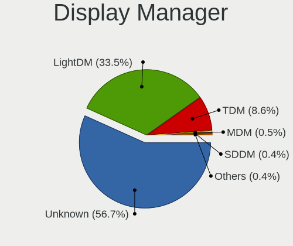
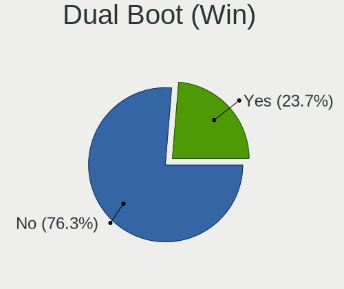
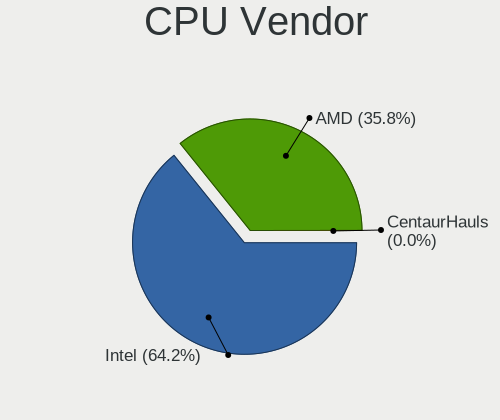
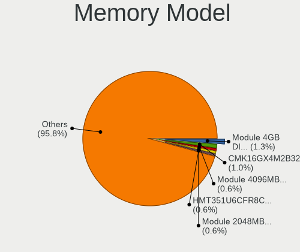
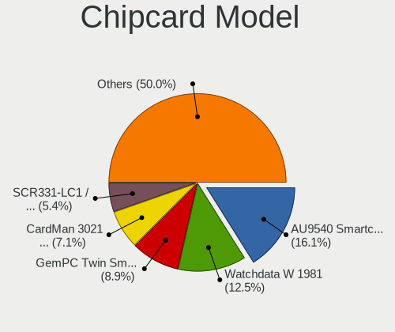

Linux Mint - Tested Hardware & Statistics (Desktops)
----------------------------------------------------

A project to collect tested hardware configurations for Linux Mint.

Anyone can contribute to this report by the [hw-probe](https://github.com/linuxhw/hw-probe) tool:

    sudo -E hw-probe -all -upload

Please contribute! Especially if your hardware is rare.

Contents
--------

* [ Test Cases ](#test-cases)

* [ System ](#system)
  - [ OS                       ](#os)
  - [ OS Family                ](#os-family)
  - [ Kernel                   ](#kernel)
  - [ Kernel Family            ](#kernel-family)
  - [ Kernel Major Ver.        ](#kernel-major-ver)
  - [ Arch                     ](#arch)
  - [ DE                       ](#de)
  - [ Display Server           ](#display-server)
  - [ Display Manager          ](#display-manager)
  - [ OS Lang                  ](#os-lang)
  - [ Boot Mode                ](#boot-mode)
  - [ Filesystem               ](#filesystem)
  - [ Part. scheme             ](#part-scheme)
  - [ Dual Boot with Linux/BSD ](#dual-boot-with-linuxbsd)
  - [ Dual Boot (Win)          ](#dual-boot-win)

* [ Board ](#board)
  - [ Vendor                   ](#vendor)
  - [ Model                    ](#model)
  - [ Model Family             ](#model-family)
  - [ MFG Year                 ](#mfg-year)
  - [ Form Factor              ](#form-factor)
  - [ Secure Boot              ](#secure-boot)
  - [ Coreboot                 ](#coreboot)
  - [ RAM Size                 ](#ram-size)
  - [ RAM Used                 ](#ram-used)
  - [ Total Drives             ](#total-drives)
  - [ Has CD-ROM               ](#has-cd-rom)
  - [ Has Ethernet             ](#has-ethernet)
  - [ Has WiFi                 ](#has-wifi)
  - [ Has Bluetooth            ](#has-bluetooth)

* [ Location ](#location)
  - [ Country                  ](#country)
  - [ City                     ](#city)

* [ Drives ](#drives)
  - [ Drive Vendor             ](#drive-vendor)
  - [ Drive Model              ](#drive-model)
  - [ HDD Vendor               ](#hdd-vendor)
  - [ SSD Vendor               ](#ssd-vendor)
  - [ Drive Kind               ](#drive-kind)
  - [ Drive Connector          ](#drive-connector)
  - [ Drive Size               ](#drive-size)
  - [ Space Total              ](#space-total)
  - [ Space Used               ](#space-used)
  - [ Malfunc. Drives          ](#malfunc-drives)
  - [ Malfunc. Drive Vendor    ](#malfunc-drive-vendor)
  - [ Malfunc. HDD Vendor      ](#malfunc-hdd-vendor)
  - [ Malfunc. Drive Kind      ](#malfunc-drive-kind)
  - [ Failed Drives            ](#failed-drives)
  - [ Failed Drive Vendor      ](#failed-drive-vendor)
  - [ Drive Status             ](#drive-status)

* [ Storage controller ](#storage-controller)
  - [ Storage Vendor           ](#storage-vendor)
  - [ Storage Model            ](#storage-model)
  - [ Storage Kind             ](#storage-kind)

* [ Processor ](#processor)
  - [ CPU Vendor               ](#cpu-vendor)
  - [ CPU Model                ](#cpu-model)
  - [ CPU Model Family         ](#cpu-model-family)
  - [ CPU Cores                ](#cpu-cores)
  - [ CPU Sockets              ](#cpu-sockets)
  - [ CPU Threads              ](#cpu-threads)
  - [ CPU Op-Modes             ](#cpu-op-modes)
  - [ CPU Microcode            ](#cpu-microcode)
  - [ CPU Microarch            ](#cpu-microarch)

* [ Graphics ](#graphics)
  - [ GPU Vendor               ](#gpu-vendor)
  - [ GPU Model                ](#gpu-model)
  - [ GPU Combo                ](#gpu-combo)
  - [ GPU Driver               ](#gpu-driver)
  - [ GPU Memory               ](#gpu-memory)

* [ Monitor ](#monitor)
  - [ Monitor Vendor           ](#monitor-vendor)
  - [ Monitor Model            ](#monitor-model)
  - [ Monitor Resolution       ](#monitor-resolution)
  - [ Monitor Diagonal         ](#monitor-diagonal)
  - [ Monitor Width            ](#monitor-width)
  - [ Aspect Ratio             ](#aspect-ratio)
  - [ Monitor Area             ](#monitor-area)
  - [ Pixel Density            ](#pixel-density)
  - [ Multiple Monitors        ](#multiple-monitors)

* [ Network ](#network)
  - [ Net Controller Vendor    ](#net-controller-vendor)
  - [ Net Controller Model     ](#net-controller-model)
  - [ Wireless Vendor          ](#wireless-vendor)
  - [ Wireless Model           ](#wireless-model)
  - [ Ethernet Vendor          ](#ethernet-vendor)
  - [ Ethernet Model           ](#ethernet-model)
  - [ Net Controller Kind      ](#net-controller-kind)
  - [ Used Controller          ](#used-controller)
  - [ NICs                     ](#nics)
  - [ IPv6                     ](#ipv6)

* [ Bluetooth ](#bluetooth)
  - [ Bluetooth Vendor         ](#bluetooth-vendor)
  - [ Bluetooth Model          ](#bluetooth-model)

* [ Sound ](#sound)
  - [ Sound Vendor             ](#sound-vendor)
  - [ Sound Model              ](#sound-model)

* [ Memory ](#memory)
  - [ Memory Vendor            ](#memory-vendor)
  - [ Memory Model             ](#memory-model)
  - [ Memory Kind              ](#memory-kind)
  - [ Memory Form Factor       ](#memory-form-factor)
  - [ Memory Size              ](#memory-size)
  - [ Memory Speed             ](#memory-speed)

* [ Printers & scanners ](#printers--scanners)
  - [ Printer Vendor           ](#printer-vendor)
  - [ Printer Model            ](#printer-model)
  - [ Scanner Vendor           ](#scanner-vendor)
  - [ Scanner Model            ](#scanner-model)

* [ Camera ](#camera)
  - [ Camera Vendor            ](#camera-vendor)
  - [ Camera Model             ](#camera-model)

* [ Security ](#security)
  - [ Fingerprint Vendor       ](#fingerprint-vendor)
  - [ Fingerprint Model        ](#fingerprint-model)
  - [ Chipcard Vendor          ](#chipcard-vendor)
  - [ Chipcard Model           ](#chipcard-model)

* [ Unsupported ](#unsupported)
  - [ Unsupported Devices      ](#unsupported-devices)
  - [ Unsupported Device Types ](#unsupported-device-types)

Test Cases
----------

Total: 9454

| Vendor        | Model                       | Probe                                                      | Date         |
|---------------|-----------------------------|------------------------------------------------------------|--------------|
| MSI           | H110M PRO-VH                | [9b0b5b79f0](https://linux-hardware.org/?probe=9b0b5b79f0) | Mar 01, 2023 |
| Gigabyte      | B450M DS3H-CF               | [52522a762d](https://linux-hardware.org/?probe=52522a762d) | Feb 28, 2023 |
| ASUSTek       | P8H61-M LX3 PLUS R2.0       | [2b434f0b1d](https://linux-hardware.org/?probe=2b434f0b1d) | Feb 28, 2023 |
| AZW           | Speed S                     | [e44ff0faf0](https://linux-hardware.org/?probe=e44ff0faf0) | Feb 28, 2023 |
| ASUSTek       | P8H61-M LX                  | [5721cbc403](https://linux-hardware.org/?probe=5721cbc403) | Feb 28, 2023 |
| BESSTAR Te... | UM250 V1.0                  | [2ef76c6dff](https://linux-hardware.org/?probe=2ef76c6dff) | Feb 28, 2023 |
| Biostar       | H81MLV3                     | [ccba1a8217](https://linux-hardware.org/?probe=ccba1a8217) | Feb 28, 2023 |
| Gigabyte      | Q87M-D2H                    | [c2eff23772](https://linux-hardware.org/?probe=c2eff23772) | Feb 28, 2023 |
| ASRock        | Z97 Pro3                    | [506d56faff](https://linux-hardware.org/?probe=506d56faff) | Feb 28, 2023 |
| Foxconn       | 2ABF                        | [ad46fcc88d](https://linux-hardware.org/?probe=ad46fcc88d) | Feb 28, 2023 |
| Gigabyte      | H61M-S1                     | [ee8e20d95e](https://linux-hardware.org/?probe=ee8e20d95e) | Feb 27, 2023 |
| PCWare        | IPMH61R2                    | [52a17bf9c1](https://linux-hardware.org/?probe=52a17bf9c1) | Feb 27, 2023 |
| HP            | 3047h                       | [db6be92c4f](https://linux-hardware.org/?probe=db6be92c4f) | Feb 27, 2023 |
| Dell          | 0D6H9T A00                  | [70bdf485da](https://linux-hardware.org/?probe=70bdf485da) | Feb 27, 2023 |
| ASRock        | Z97 Pro3                    | [626e67df35](https://linux-hardware.org/?probe=626e67df35) | Feb 27, 2023 |
| Cincoze       | DX-1000.01.001              | [64496d4ab7](https://linux-hardware.org/?probe=64496d4ab7) | Feb 27, 2023 |
| Gigabyte      | H97-HD3                     | [bb2cac1486](https://linux-hardware.org/?probe=bb2cac1486) | Feb 27, 2023 |
| Dell          | 0XHGV1 A00                  | [75249be116](https://linux-hardware.org/?probe=75249be116) | Feb 27, 2023 |
| Gigabyte      | H87M-D3H                    | [3c50af5218](https://linux-hardware.org/?probe=3c50af5218) | Feb 27, 2023 |
| Gigabyte      | B650 GAMING X AX            | [c2b3e01a45](https://linux-hardware.org/?probe=c2b3e01a45) | Feb 27, 2023 |
| Gigabyte      | G41MT-S2                    | [7f72d6bba7](https://linux-hardware.org/?probe=7f72d6bba7) | Feb 26, 2023 |
| Cincoze       | DX-1000.01.001              | [7923f1dc21](https://linux-hardware.org/?probe=7923f1dc21) | Feb 26, 2023 |
| Gigabyte      | X670E AORUS MASTER          | [589b06afc1](https://linux-hardware.org/?probe=589b06afc1) | Feb 26, 2023 |
| ASUSTek       | TUF Gaming B550M-PLUS WI... | [9b2a57b7d2](https://linux-hardware.org/?probe=9b2a57b7d2) | Feb 26, 2023 |
| Lenovo        | MAHOBAY NO DPK              | [310a65baea](https://linux-hardware.org/?probe=310a65baea) | Feb 26, 2023 |
| HP            | 8643 SMVB                   | [4f36e23485](https://linux-hardware.org/?probe=4f36e23485) | Feb 26, 2023 |
| HP            | 3397                        | [a1840ee53d](https://linux-hardware.org/?probe=a1840ee53d) | Feb 26, 2023 |
| Gigabyte      | Q87M-D2H                    | [ee31b8fa71](https://linux-hardware.org/?probe=ee31b8fa71) | Feb 26, 2023 |
| ASUSTek       | M5A97 R2.0                  | [a758475e11](https://linux-hardware.org/?probe=a758475e11) | Feb 26, 2023 |
| Dell          | 0NKW6Y A01                  | [62e7760c7a](https://linux-hardware.org/?probe=62e7760c7a) | Feb 26, 2023 |
| FIC           | PTM33 PCB                   | [b70b076cda](https://linux-hardware.org/?probe=b70b076cda) | Feb 26, 2023 |
| ASRock        | H61M-DGS R2.0               | [630c0e41b1](https://linux-hardware.org/?probe=630c0e41b1) | Feb 25, 2023 |
| Gigabyte      | B250M-D3H-CF                | [de180bd339](https://linux-hardware.org/?probe=de180bd339) | Feb 25, 2023 |
| MSI           | X570-A PRO                  | [922ba2355e](https://linux-hardware.org/?probe=922ba2355e) | Feb 25, 2023 |
| Gigabyte      | GA-78LMT-USB3 R2 sex        | [585e02a6dc](https://linux-hardware.org/?probe=585e02a6dc) | Feb 25, 2023 |
| ASUSTek       | PRIME A520M-A II            | [8e913f4c3e](https://linux-hardware.org/?probe=8e913f4c3e) | Feb 25, 2023 |
| HP            | 3047h                       | [8f7d5acf1f](https://linux-hardware.org/?probe=8f7d5acf1f) | Feb 25, 2023 |
| ASUSTek       | PRIME H610M-R D4            | [3f2e38e322](https://linux-hardware.org/?probe=3f2e38e322) | Feb 25, 2023 |
| Lenovo        | SHARKBAY SDK0E50510 WIN     | [32453b16fb](https://linux-hardware.org/?probe=32453b16fb) | Feb 25, 2023 |
| Gigabyte      | B75M-HD3                    | [29b1432f2c](https://linux-hardware.org/?probe=29b1432f2c) | Feb 25, 2023 |
| HP            | 2AA2                        | [b9411eadb7](https://linux-hardware.org/?probe=b9411eadb7) | Feb 25, 2023 |
| Gigabyte      | G41MT-S2                    | [d81c35b55b](https://linux-hardware.org/?probe=d81c35b55b) | Feb 25, 2023 |
| ASUSTek       | A88XM-A                     | [dff66700c0](https://linux-hardware.org/?probe=dff66700c0) | Feb 25, 2023 |
| ASRock        | N68-GS4 FX R2.0             | [6d03ea4905](https://linux-hardware.org/?probe=6d03ea4905) | Feb 24, 2023 |
| Dell          | 08HPGT A02                  | [69288a8011](https://linux-hardware.org/?probe=69288a8011) | Feb 24, 2023 |
| Lenovo        | SHARKBAY SDK0E50510 WIN     | [cbadc857a2](https://linux-hardware.org/?probe=cbadc857a2) | Feb 24, 2023 |
| PCWare        | IPMH61R2                    | [eda674b9a5](https://linux-hardware.org/?probe=eda674b9a5) | Feb 24, 2023 |
| ASRock        | H670M Pro RS                | [91bcaa987c](https://linux-hardware.org/?probe=91bcaa987c) | Feb 24, 2023 |
| ASRock        | Q1900-ITX                   | [4ed48d952c](https://linux-hardware.org/?probe=4ed48d952c) | Feb 24, 2023 |
| HP            | ProLiant MicroServer        | [f91140d700](https://linux-hardware.org/?probe=f91140d700) | Feb 24, 2023 |
| MSI           | PRO B660M-A DDR4            | [66b104fc61](https://linux-hardware.org/?probe=66b104fc61) | Feb 24, 2023 |
| HP            | ProLiant MicroServer        | [7233b168b4](https://linux-hardware.org/?probe=7233b168b4) | Feb 24, 2023 |
| Gigabyte      | Q87M-D2H                    | [dde739ae8a](https://linux-hardware.org/?probe=dde739ae8a) | Feb 24, 2023 |
| MSI           | PRO B660M-A DDR4            | [9398719812](https://linux-hardware.org/?probe=9398719812) | Feb 24, 2023 |
| ASUSTek       | M5A97 R2.0                  | [c34909b191](https://linux-hardware.org/?probe=c34909b191) | Feb 24, 2023 |
| HP            | 1497                        | [478a5730f6](https://linux-hardware.org/?probe=478a5730f6) | Feb 23, 2023 |
| ASUSTek       | PRIME B450-PLUS             | [d93c7d5661](https://linux-hardware.org/?probe=d93c7d5661) | Feb 23, 2023 |
| ASUSTek       | PRIME B450-PLUS             | [7cdbd101a4](https://linux-hardware.org/?probe=7cdbd101a4) | Feb 23, 2023 |
| ASUSTek       | ROG STRIX B450-F GAMING     | [142a12ded0](https://linux-hardware.org/?probe=142a12ded0) | Feb 23, 2023 |
| ASUSTek       | SABERTOOTH 990FX R2.0       | [455b0e1401](https://linux-hardware.org/?probe=455b0e1401) | Feb 23, 2023 |
| Gigabyte      | H81M-S2H                    | [c3d9b18f7c](https://linux-hardware.org/?probe=c3d9b18f7c) | Feb 23, 2023 |
| HP            | 18E6                        | [294fa26b04](https://linux-hardware.org/?probe=294fa26b04) | Feb 23, 2023 |
| HP            | 2ADE                        | [b4309c2b06](https://linux-hardware.org/?probe=b4309c2b06) | Feb 23, 2023 |
| ASUSTek       | M3N78-VM                    | [246492391c](https://linux-hardware.org/?probe=246492391c) | Feb 23, 2023 |
| HP            | 0AA8h                       | [8bb60bdebb](https://linux-hardware.org/?probe=8bb60bdebb) | Feb 22, 2023 |
| PCWare        | IPMH61R2                    | [f02c3d5895](https://linux-hardware.org/?probe=f02c3d5895) | Feb 22, 2023 |
| ASUSTek       | ROG STRIX B450-F GAMING     | [06138e952c](https://linux-hardware.org/?probe=06138e952c) | Feb 22, 2023 |
| Dell          | 0WMJ54 A01                  | [e7175cb8fe](https://linux-hardware.org/?probe=e7175cb8fe) | Feb 22, 2023 |
| ASUSTek       | PRIME H610M-R D4            | [2993295e62](https://linux-hardware.org/?probe=2993295e62) | Feb 22, 2023 |
| Foxconn       | Lucknow                     | [3ca9a4f66e](https://linux-hardware.org/?probe=3ca9a4f66e) | Feb 22, 2023 |
| ASRock        | 970A-G                      | [80648218db](https://linux-hardware.org/?probe=80648218db) | Feb 22, 2023 |
| ASUSTek       | ROG STRIX B550-A GAMING     | [0d0a828b39](https://linux-hardware.org/?probe=0d0a828b39) | Feb 22, 2023 |
| ASUSTek       | TUF B450-PLUS GAMING        | [29673d3e8f](https://linux-hardware.org/?probe=29673d3e8f) | Feb 22, 2023 |
| MSI           | PRO B650M-A WIFI            | [cd66af8994](https://linux-hardware.org/?probe=cd66af8994) | Feb 21, 2023 |
| ASUSTek       | PRIME H610M-R D4            | [c23f2f53ed](https://linux-hardware.org/?probe=c23f2f53ed) | Feb 21, 2023 |
| ASRock        | X470 Master SLI/ac          | [9c11797d60](https://linux-hardware.org/?probe=9c11797d60) | Feb 21, 2023 |
| ASUSTek       | PRIME H510M-K               | [5fb951a350](https://linux-hardware.org/?probe=5fb951a350) | Feb 21, 2023 |
| ASUSTek       | TUF Gaming B460M-PLUS       | [ae2e7a22a0](https://linux-hardware.org/?probe=ae2e7a22a0) | Feb 21, 2023 |
| HP            | 339A                        | [d4ee04127e](https://linux-hardware.org/?probe=d4ee04127e) | Feb 21, 2023 |
| ASUSTek       | TUF Gaming B550M-PLUS       | [09c45a0b09](https://linux-hardware.org/?probe=09c45a0b09) | Feb 21, 2023 |
| ASUSTek       | TUF Gaming B550M-PLUS       | [f5a22b7bb9](https://linux-hardware.org/?probe=f5a22b7bb9) | Feb 21, 2023 |
| Dell          | 0M5DCD A00                  | [9bfd5f9a7f](https://linux-hardware.org/?probe=9bfd5f9a7f) | Feb 21, 2023 |
| Dell          | 0M5DCD A00                  | [afd4e480d4](https://linux-hardware.org/?probe=afd4e480d4) | Feb 20, 2023 |
| MSI           | 970A-G43                    | [5fab82df57](https://linux-hardware.org/?probe=5fab82df57) | Feb 20, 2023 |
| Fujitsu       | D3161-A1 S26361-D3161-A1    | [a37ae03564](https://linux-hardware.org/?probe=a37ae03564) | Feb 20, 2023 |
| Fujitsu       | D3161-A1 S26361-D3161-A1    | [c17db0329f](https://linux-hardware.org/?probe=c17db0329f) | Feb 20, 2023 |
| HP            | 3398                        | [3ea3d01398](https://linux-hardware.org/?probe=3ea3d01398) | Feb 20, 2023 |
| HP            | 1497                        | [47ffeac7cf](https://linux-hardware.org/?probe=47ffeac7cf) | Feb 20, 2023 |
| Lenovo        | 30BC SDK0J40697 WIN 3305... | [2a403bdb2b](https://linux-hardware.org/?probe=2a403bdb2b) | Feb 20, 2023 |
| AMD           | A78FX VER                   | [36eb566c26](https://linux-hardware.org/?probe=36eb566c26) | Feb 20, 2023 |
| ASUSTek       | B85M-G                      | [501a95ac36](https://linux-hardware.org/?probe=501a95ac36) | Feb 20, 2023 |
| MSI           | B450M PRO-VDH V2            | [a3124367c3](https://linux-hardware.org/?probe=a3124367c3) | Feb 20, 2023 |
| HP            | 3398                        | [6b616a9a10](https://linux-hardware.org/?probe=6b616a9a10) | Feb 20, 2023 |
| ASUSTek       | TUF B450-PLUS GAMING        | [f75f800bd4](https://linux-hardware.org/?probe=f75f800bd4) | Feb 20, 2023 |
| Gigabyte      | B450M DS3H WIFI-CF          | [a3f2825d3d](https://linux-hardware.org/?probe=a3f2825d3d) | Feb 20, 2023 |
| Gigabyte      | MRHM3AP                     | [9f4978d79f](https://linux-hardware.org/?probe=9f4978d79f) | Feb 19, 2023 |
| Gigabyte      | X570S AORUS ELITE AX        | [7e45218236](https://linux-hardware.org/?probe=7e45218236) | Feb 19, 2023 |
| ASUSTek       | M3N78-VM                    | [c124cec382](https://linux-hardware.org/?probe=c124cec382) | Feb 19, 2023 |
| Gigabyte      | Z270-HD3-CF                 | [e958da375f](https://linux-hardware.org/?probe=e958da375f) | Feb 19, 2023 |
| Gigabyte      | Z270-HD3-CF                 | [e47bb0ee84](https://linux-hardware.org/?probe=e47bb0ee84) | Feb 19, 2023 |
| AZW           | GTi                         | [17bb698441](https://linux-hardware.org/?probe=17bb698441) | Feb 19, 2023 |
| Gigabyte      | GA-MA785GMT-UD2H            | [06c110e6f1](https://linux-hardware.org/?probe=06c110e6f1) | Feb 19, 2023 |
| ASRock        | 970M Pro3                   | [fe75bac6ce](https://linux-hardware.org/?probe=fe75bac6ce) | Feb 19, 2023 |
| ASRock        | 970M Pro3                   | [605089c66c](https://linux-hardware.org/?probe=605089c66c) | Feb 19, 2023 |
| AMD           | 970A-D3                     | [bc2f6d8481](https://linux-hardware.org/?probe=bc2f6d8481) | Feb 19, 2023 |
| ASRock        | B450 Pro4                   | [092f97e245](https://linux-hardware.org/?probe=092f97e245) | Feb 19, 2023 |
| Gigabyte      | B365M D3H-CF                | [aa49c18960](https://linux-hardware.org/?probe=aa49c18960) | Feb 19, 2023 |
| Gigabyte      | F2A68HM-H                   | [6be03ad579](https://linux-hardware.org/?probe=6be03ad579) | Feb 19, 2023 |
| HP            | 0AACh                       | [3ff53d69b2](https://linux-hardware.org/?probe=3ff53d69b2) | Feb 19, 2023 |
| Dell          | 088DT1 A01                  | [4ecc419f83](https://linux-hardware.org/?probe=4ecc419f83) | Feb 18, 2023 |
| Inventec      | VXC Class A02               | [ddea00ed0c](https://linux-hardware.org/?probe=ddea00ed0c) | Feb 18, 2023 |
| Gigabyte      | MRHM3AP                     | [a427da167b](https://linux-hardware.org/?probe=a427da167b) | Feb 18, 2023 |
| MSI           | MPG X570 GAMING PRO CARB... | [eff21e4d65](https://linux-hardware.org/?probe=eff21e4d65) | Feb 18, 2023 |
| Gigabyte      | H81M-H                      | [d773500fcb](https://linux-hardware.org/?probe=d773500fcb) | Feb 18, 2023 |
| MSI           | PRO B650M-A WIFI            | [5857177f10](https://linux-hardware.org/?probe=5857177f10) | Feb 18, 2023 |
| ASUSTek       | M5A97 R2.0                  | [8fb0aec13d](https://linux-hardware.org/?probe=8fb0aec13d) | Feb 18, 2023 |
| ASUSTek       | CM6330_CM6630_CM6730_CM6... | [0428793835](https://linux-hardware.org/?probe=0428793835) | Feb 18, 2023 |
| ASUSTek       | SABERTOOTH Z77              | [af7c933bf3](https://linux-hardware.org/?probe=af7c933bf3) | Feb 17, 2023 |
| Dell          | 0XC7MM A01                  | [93ccca9fdd](https://linux-hardware.org/?probe=93ccca9fdd) | Feb 17, 2023 |
| Dell          | 0T10XW A02                  | [0f6c993491](https://linux-hardware.org/?probe=0f6c993491) | Feb 17, 2023 |
| Dell          | 0200DY A02                  | [fdab522500](https://linux-hardware.org/?probe=fdab522500) | Feb 17, 2023 |
| Dell          | 0200DY A02                  | [dd863b4bdf](https://linux-hardware.org/?probe=dd863b4bdf) | Feb 17, 2023 |
| ASUSTek       | PRIME A320M-K               | [667dc13294](https://linux-hardware.org/?probe=667dc13294) | Feb 17, 2023 |
| AAEON         | PICO-APL3 V1.0              | [4ef4f86a2e](https://linux-hardware.org/?probe=4ef4f86a2e) | Feb 17, 2023 |
| Acer          | Batman A01                  | [d7aaa8f1c8](https://linux-hardware.org/?probe=d7aaa8f1c8) | Feb 17, 2023 |
| Gigabyte      | Z590 AORUS ELITE AX         | [8da7f7cbdc](https://linux-hardware.org/?probe=8da7f7cbdc) | Feb 17, 2023 |
| Dell          | 051FJ8 A00                  | [8de835c5da](https://linux-hardware.org/?probe=8de835c5da) | Feb 17, 2023 |
| Acer          | Aspire XC-230               | [e01d812902](https://linux-hardware.org/?probe=e01d812902) | Feb 17, 2023 |
| Acer          | Aspire XC-230               | [52b4d00a5a](https://linux-hardware.org/?probe=52b4d00a5a) | Feb 17, 2023 |
| MSI           | MPG X570 GAMING PLUS        | [0d5eded653](https://linux-hardware.org/?probe=0d5eded653) | Feb 17, 2023 |
| Dell          | 03NVJ6 A02                  | [5201547dce](https://linux-hardware.org/?probe=5201547dce) | Feb 17, 2023 |
| Dell          | 03NVJ6 A02                  | [a77d2c8a54](https://linux-hardware.org/?probe=a77d2c8a54) | Feb 17, 2023 |
| AZW           | Green G3                    | [ee25777882](https://linux-hardware.org/?probe=ee25777882) | Feb 17, 2023 |
| HP            | 2B36                        | [81833a42d2](https://linux-hardware.org/?probe=81833a42d2) | Feb 17, 2023 |
| MSI           | X470 GAMING PRO CARBON A... | [beec8fdf56](https://linux-hardware.org/?probe=beec8fdf56) | Feb 16, 2023 |
| ASUSTek       | P5Q-PRO                     | [f01a1d6c70](https://linux-hardware.org/?probe=f01a1d6c70) | Feb 16, 2023 |
| Apple         | Mac-F60DEB81FF30ACF6 Mac... | [3b0150685c](https://linux-hardware.org/?probe=3b0150685c) | Feb 16, 2023 |
| Lenovo        | ThinkCentre M58p 9728W47    | [9d197fed1d](https://linux-hardware.org/?probe=9d197fed1d) | Feb 16, 2023 |
| Inventec      | VXC Class A02               | [6e36781784](https://linux-hardware.org/?probe=6e36781784) | Feb 16, 2023 |
| Inventec      | VXC Class A02               | [f85ac5bc8a](https://linux-hardware.org/?probe=f85ac5bc8a) | Feb 16, 2023 |
| Inventec      | VXC Class A02               | [b1266a1e15](https://linux-hardware.org/?probe=b1266a1e15) | Feb 16, 2023 |
| ASRock        | B360M Xtreme                | [c10563291e](https://linux-hardware.org/?probe=c10563291e) | Feb 16, 2023 |
| ASUSTek       | ROG STRIX B350-F GAMING     | [f0105f57bf](https://linux-hardware.org/?probe=f0105f57bf) | Feb 16, 2023 |
| MSI           | PRO B650M-A WIFI            | [38c3a4311b](https://linux-hardware.org/?probe=38c3a4311b) | Feb 16, 2023 |
| HP            | 18E9                        | [e3461fcb74](https://linux-hardware.org/?probe=e3461fcb74) | Feb 16, 2023 |
| Intel         | X79M-S                      | [2d3579e9b7](https://linux-hardware.org/?probe=2d3579e9b7) | Feb 15, 2023 |
| Gigabyte      | H97M-D3H                    | [2ae439ec07](https://linux-hardware.org/?probe=2ae439ec07) | Feb 15, 2023 |
| HP            | 1497                        | [1d55830595](https://linux-hardware.org/?probe=1d55830595) | Feb 15, 2023 |
| Medion        | MS-7616                     | [0655a4e58c](https://linux-hardware.org/?probe=0655a4e58c) | Feb 15, 2023 |
| ASRock        | H61M-DGS                    | [9716d5ed72](https://linux-hardware.org/?probe=9716d5ed72) | Feb 15, 2023 |
| ASUSTek       | V-P7H55E                    | [27ddce20a1](https://linux-hardware.org/?probe=27ddce20a1) | Feb 15, 2023 |
| Gigabyte      | B250M-D3H-CF                | [8689383fea](https://linux-hardware.org/?probe=8689383fea) | Feb 15, 2023 |
| ASUSTek       | PRIME Z590-V                | [4d00371a70](https://linux-hardware.org/?probe=4d00371a70) | Feb 15, 2023 |
| Inventec      | VXC Class A02               | [52b2c70658](https://linux-hardware.org/?probe=52b2c70658) | Feb 14, 2023 |
| ASUSTek       | SABERTOOTH Z77              | [f298c1fc7e](https://linux-hardware.org/?probe=f298c1fc7e) | Feb 14, 2023 |
| Unknown       | Unknown                     | [69c7852df8](https://linux-hardware.org/?probe=69c7852df8) | Feb 14, 2023 |
| ASUSTek       | SABERTOOTH Z77              | [45cfd72091](https://linux-hardware.org/?probe=45cfd72091) | Feb 14, 2023 |
| IBM           | 811328U                     | [dc9536a0f2](https://linux-hardware.org/?probe=dc9536a0f2) | Feb 14, 2023 |
| IBM           | 811328U                     | [6ad9b1f22a](https://linux-hardware.org/?probe=6ad9b1f22a) | Feb 14, 2023 |
| Lenovo        | 312A NOK                    | [0b0a816ecc](https://linux-hardware.org/?probe=0b0a816ecc) | Feb 14, 2023 |
| ASUSTek       | PRIME A320M-K               | [47f61b3037](https://linux-hardware.org/?probe=47f61b3037) | Feb 14, 2023 |
| Pegatron      | Narra6                      | [13f0acba4c](https://linux-hardware.org/?probe=13f0acba4c) | Feb 14, 2023 |
| Intel         | X99 V1.0                    | [0bfbfe2876](https://linux-hardware.org/?probe=0bfbfe2876) | Feb 14, 2023 |
| Gigabyte      | B450 AORUS ELITE            | [1943e44d42](https://linux-hardware.org/?probe=1943e44d42) | Feb 14, 2023 |
| Dell          | 051FJ8 A00                  | [e689bce0ca](https://linux-hardware.org/?probe=e689bce0ca) | Feb 14, 2023 |
| DIEBOLD       | NM70-I                      | [ed4d687c32](https://linux-hardware.org/?probe=ed4d687c32) | Feb 14, 2023 |
| Dell          | 051FJ8 A00                  | [bc1c7ec97f](https://linux-hardware.org/?probe=bc1c7ec97f) | Feb 14, 2023 |
| ASUSTek       | ProArt Z490-CREATOR 10G     | [500a5cf614](https://linux-hardware.org/?probe=500a5cf614) | Feb 14, 2023 |
| Lenovo        | SHARKBAY NOK                | [fea9318890](https://linux-hardware.org/?probe=fea9318890) | Feb 13, 2023 |
| ASRock        | IMB-195                     | [91da0807bb](https://linux-hardware.org/?probe=91da0807bb) | Feb 13, 2023 |
| MSI           | B450M PRO-VDH V2            | [a3a21b9c18](https://linux-hardware.org/?probe=a3a21b9c18) | Feb 13, 2023 |
| ASUSTek       | Rampage IV EXTREME          | [60ddb51b98](https://linux-hardware.org/?probe=60ddb51b98) | Feb 13, 2023 |
| MSI           | Z370 PC PRO                 | [b5744eb259](https://linux-hardware.org/?probe=b5744eb259) | Feb 13, 2023 |
| Apple         | Mac-F60DEB81FF30ACF6 Mac... | [3e54cb20fd](https://linux-hardware.org/?probe=3e54cb20fd) | Feb 13, 2023 |
| Acer          | Aspire M1930                | [3b78f6fb4e](https://linux-hardware.org/?probe=3b78f6fb4e) | Feb 13, 2023 |
| ASRock        | 4Core1600P35-WiFi+          | [7901a0c0ec](https://linux-hardware.org/?probe=7901a0c0ec) | Feb 13, 2023 |
| ASRock        | 4Core1600P35-WiFi+          | [fc5af11584](https://linux-hardware.org/?probe=fc5af11584) | Feb 13, 2023 |
| Dell          | 0YKH50 A01                  | [d2a3255f21](https://linux-hardware.org/?probe=d2a3255f21) | Feb 13, 2023 |
| ASUSTek       | H81M-K                      | [6fe888ea28](https://linux-hardware.org/?probe=6fe888ea28) | Feb 13, 2023 |
| ASUSTek       | TUF Z390M-PRO GAMING        | [ecf4603ab4](https://linux-hardware.org/?probe=ecf4603ab4) | Feb 13, 2023 |
| MSI           | B450M PRO-VDH MAX           | [b45d61318e](https://linux-hardware.org/?probe=b45d61318e) | Feb 13, 2023 |
| MSI           | PRO B650M-A WIFI            | [672b71db3e](https://linux-hardware.org/?probe=672b71db3e) | Feb 12, 2023 |
| Gigabyte      | Q87M-D2H                    | [1788a41484](https://linux-hardware.org/?probe=1788a41484) | Feb 12, 2023 |
| Intel         | H61                         | [f220565e36](https://linux-hardware.org/?probe=f220565e36) | Feb 12, 2023 |
| ASRock        | X570 Phantom Gaming-ITX/... | [4eb6264a20](https://linux-hardware.org/?probe=4eb6264a20) | Feb 12, 2023 |
| Gigabyte      | Q87M-D2H                    | [0742700581](https://linux-hardware.org/?probe=0742700581) | Feb 12, 2023 |
| ASUSTek       | TUF Gaming X570-PLUS        | [09a78143b4](https://linux-hardware.org/?probe=09a78143b4) | Feb 12, 2023 |
| MSI           | Z270 GAMING M3              | [39b7eef9e8](https://linux-hardware.org/?probe=39b7eef9e8) | Feb 12, 2023 |
| ASUSTek       | ROG STRIX B550-A GAMING     | [c9d3e3c1cb](https://linux-hardware.org/?probe=c9d3e3c1cb) | Feb 12, 2023 |
| Unknown       | Unknown                     | [f2f95aef80](https://linux-hardware.org/?probe=f2f95aef80) | Feb 12, 2023 |
| Gigabyte      | B550M AORUS ELITE           | [f6ed3beac1](https://linux-hardware.org/?probe=f6ed3beac1) | Feb 12, 2023 |
| Intel         | H61                         | [7a6e4d8211](https://linux-hardware.org/?probe=7a6e4d8211) | Feb 12, 2023 |
| ASUSTek       | ROG STRIX B450-F GAMING     | [a034121d24](https://linux-hardware.org/?probe=a034121d24) | Feb 12, 2023 |
| Pegatron      | Narra6                      | [77bed4b6f3](https://linux-hardware.org/?probe=77bed4b6f3) | Feb 12, 2023 |
| MSI           | MPG Z490 GAMING PLUS        | [2a8f60a103](https://linux-hardware.org/?probe=2a8f60a103) | Feb 11, 2023 |
| Compaq        | Presario CQ-14              | [515b629bbc](https://linux-hardware.org/?probe=515b629bbc) | Feb 11, 2023 |
| ASUSTek       | CM5571                      | [c58cb005b5](https://linux-hardware.org/?probe=c58cb005b5) | Feb 11, 2023 |
| ASRock        | B450 Pro4                   | [c9a6a6e981](https://linux-hardware.org/?probe=c9a6a6e981) | Feb 11, 2023 |
| Acer          | Aspire TC-1760              | [a0db2f09b6](https://linux-hardware.org/?probe=a0db2f09b6) | Feb 11, 2023 |
| AZW           | Green G3                    | [152433615a](https://linux-hardware.org/?probe=152433615a) | Feb 11, 2023 |
| Gigabyte      | MZBSWAP-K4                  | [325c9ef37b](https://linux-hardware.org/?probe=325c9ef37b) | Feb 11, 2023 |
| HP            | 82A2                        | [fe327d8caa](https://linux-hardware.org/?probe=fe327d8caa) | Feb 11, 2023 |
| ASRock        | 990FX Extreme4              | [4af6878800](https://linux-hardware.org/?probe=4af6878800) | Feb 11, 2023 |
| ASUSTek       | M5A78L-M LX/BR              | [d85a564e73](https://linux-hardware.org/?probe=d85a564e73) | Feb 11, 2023 |
| MSI           | PRO B650M-A WIFI            | [f5a8290d38](https://linux-hardware.org/?probe=f5a8290d38) | Feb 10, 2023 |
| ASRock        | Z170 Extreme6+              | [9b9b84473b](https://linux-hardware.org/?probe=9b9b84473b) | Feb 10, 2023 |
| Biostar       | A68N-5100                   | [4c44b82580](https://linux-hardware.org/?probe=4c44b82580) | Feb 10, 2023 |
| HP            | 8653 A                      | [5854a10eb0](https://linux-hardware.org/?probe=5854a10eb0) | Feb 10, 2023 |
| Intel         | JSL MRD                     | [5a876c1bb0](https://linux-hardware.org/?probe=5a876c1bb0) | Feb 10, 2023 |
| Dell          | 0D28YY A00                  | [ea48b51678](https://linux-hardware.org/?probe=ea48b51678) | Feb 10, 2023 |
| ASRock        | X399 Phantom Gaming 6       | [7b2f03d111](https://linux-hardware.org/?probe=7b2f03d111) | Feb 10, 2023 |
| MSI           | PH61-SP35                   | [ffd100018d](https://linux-hardware.org/?probe=ffd100018d) | Feb 10, 2023 |
| ASUSTek       | PRIME Z270-K                | [298bbec731](https://linux-hardware.org/?probe=298bbec731) | Feb 10, 2023 |
| Gigabyte      | H77N-WIFI                   | [756bc1fc3b](https://linux-hardware.org/?probe=756bc1fc3b) | Feb 10, 2023 |
| Gigabyte      | H77N-WIFI                   | [769b226f8e](https://linux-hardware.org/?probe=769b226f8e) | Feb 10, 2023 |
| Gigabyte      | H410M H V3                  | [1360d3227f](https://linux-hardware.org/?probe=1360d3227f) | Feb 10, 2023 |
| Fujitsu       | D3233-A1 S26361-D3233-A1    | [def22e6194](https://linux-hardware.org/?probe=def22e6194) | Feb 10, 2023 |
| Dell          | 02YYK5 A00                  | [83aeaf3b0e](https://linux-hardware.org/?probe=83aeaf3b0e) | Feb 10, 2023 |
| ASUSTek       | M5A99X EVO                  | [55dd77bf13](https://linux-hardware.org/?probe=55dd77bf13) | Feb 10, 2023 |
| ASUSTek       | M5A99X EVO                  | [09bac39306](https://linux-hardware.org/?probe=09bac39306) | Feb 10, 2023 |
| MSI           | PH61-SP35                   | [579c7bc265](https://linux-hardware.org/?probe=579c7bc265) | Feb 09, 2023 |
| Gigabyte      | Q87M-D2H                    | [b38d2821bf](https://linux-hardware.org/?probe=b38d2821bf) | Feb 09, 2023 |
| Gigabyte      | Q87M-D2H                    | [a26baa69ab](https://linux-hardware.org/?probe=a26baa69ab) | Feb 09, 2023 |
| Medion        | MS-7797                     | [3421cd9be4](https://linux-hardware.org/?probe=3421cd9be4) | Feb 09, 2023 |
| HP            | 2215                        | [68d2f417bf](https://linux-hardware.org/?probe=68d2f417bf) | Feb 09, 2023 |
| Fujitsu       | D3221-A1 S26361-D3221-A1    | [46193e11d4](https://linux-hardware.org/?probe=46193e11d4) | Feb 09, 2023 |
| ASRock        | Z68 Extreme4 Gen3           | [4548de054f](https://linux-hardware.org/?probe=4548de054f) | Feb 09, 2023 |
| ASUSTek       | TUF Gaming B560-PLUS WIF... | [9523b275e8](https://linux-hardware.org/?probe=9523b275e8) | Feb 09, 2023 |
| Gigabyte      | X670E AORUS MASTER          | [ddaad5aa0d](https://linux-hardware.org/?probe=ddaad5aa0d) | Feb 09, 2023 |
| HP            | 2215                        | [a13f0cb4d3](https://linux-hardware.org/?probe=a13f0cb4d3) | Feb 09, 2023 |
| Intel         | DH55TC AAE70932-302         | [efb8f59f69](https://linux-hardware.org/?probe=efb8f59f69) | Feb 09, 2023 |
| Intel         | DH55TC AAE70932-302         | [634fb755fa](https://linux-hardware.org/?probe=634fb755fa) | Feb 09, 2023 |
| HP            | 8459                        | [5e71f95f59](https://linux-hardware.org/?probe=5e71f95f59) | Feb 08, 2023 |
| MSI           | PRO B650M-A WIFI            | [0779ef912a](https://linux-hardware.org/?probe=0779ef912a) | Feb 08, 2023 |
| Lenovo        | 3853RN9                     | [0a5837a556](https://linux-hardware.org/?probe=0a5837a556) | Feb 08, 2023 |
| Gigabyte      | X670E AORUS MASTER          | [2b4bc22652](https://linux-hardware.org/?probe=2b4bc22652) | Feb 08, 2023 |
| Lenovo        | 3741 NOK                    | [eeb2a331be](https://linux-hardware.org/?probe=eeb2a331be) | Feb 08, 2023 |
| Gigabyte      | B660M DS3H DDR4             | [6161d6b31d](https://linux-hardware.org/?probe=6161d6b31d) | Feb 08, 2023 |
| ASUSTek       | P5Q3 DELUXE                 | [16c72d3532](https://linux-hardware.org/?probe=16c72d3532) | Feb 08, 2023 |
| MSI           | X570-A PRO                  | [8193758f55](https://linux-hardware.org/?probe=8193758f55) | Feb 08, 2023 |
| MSI           | B350 TOMAHAWK ARCTIC        | [b853a9ecfc](https://linux-hardware.org/?probe=b853a9ecfc) | Feb 08, 2023 |
| Dell          | 0CRH6C A00                  | [fe0e64b291](https://linux-hardware.org/?probe=fe0e64b291) | Feb 08, 2023 |
| ASRock        | B550M-C                     | [a094d92a80](https://linux-hardware.org/?probe=a094d92a80) | Feb 08, 2023 |
| ASRock        | H310M-STX                   | [faadf8b29c](https://linux-hardware.org/?probe=faadf8b29c) | Feb 08, 2023 |
| Dell          | 0DR845                      | [537252420b](https://linux-hardware.org/?probe=537252420b) | Feb 07, 2023 |
| ASUSTek       | ROG STRIX B450-F GAMING     | [e88f84967d](https://linux-hardware.org/?probe=e88f84967d) | Feb 07, 2023 |
| MSI           | B450 GAMING PLUS MAX        | [0f4be18646](https://linux-hardware.org/?probe=0f4be18646) | Feb 07, 2023 |
| ASUSTek       | PRIME A320M-K               | [69012dacaa](https://linux-hardware.org/?probe=69012dacaa) | Feb 06, 2023 |
| Gigabyte      | X570 AORUS ELITE            | [b4b14d9d66](https://linux-hardware.org/?probe=b4b14d9d66) | Feb 06, 2023 |
| Acer          | Aspire XC-895 V:1.0         | [e553ba2549](https://linux-hardware.org/?probe=e553ba2549) | Feb 06, 2023 |
| Acer          | Aspire XC-895 V:1.0         | [d888ff5291](https://linux-hardware.org/?probe=d888ff5291) | Feb 06, 2023 |
| ASUSTek       | TUF Gaming X570-PLUS_BR     | [cfdb3767fb](https://linux-hardware.org/?probe=cfdb3767fb) | Feb 06, 2023 |
| ASUSTek       | TUF Gaming X570-PLUS_BR     | [f0aa46956b](https://linux-hardware.org/?probe=f0aa46956b) | Feb 06, 2023 |
| Dell          | 0TTDMJ A00                  | [0bd327136a](https://linux-hardware.org/?probe=0bd327136a) | Feb 06, 2023 |
| MSI           | PRO H610M-B DDR4            | [6217fdc070](https://linux-hardware.org/?probe=6217fdc070) | Feb 06, 2023 |
| MSI           | MPG X570 GAMING PLUS        | [e281d5800f](https://linux-hardware.org/?probe=e281d5800f) | Feb 05, 2023 |
| ASUSTek       | M4A78T-E                    | [365f2be75e](https://linux-hardware.org/?probe=365f2be75e) | Feb 05, 2023 |
| ASUSTek       | M3A78-T                     | [fb4c0de8e9](https://linux-hardware.org/?probe=fb4c0de8e9) | Feb 05, 2023 |
| Medion        | Akoya E6240T                | [3707cf7d95](https://linux-hardware.org/?probe=3707cf7d95) | Feb 05, 2023 |
| HP            | 3397                        | [ea72001991](https://linux-hardware.org/?probe=ea72001991) | Feb 05, 2023 |
| ASRock        | 775Dual-VSTA                | [945a366595](https://linux-hardware.org/?probe=945a366595) | Feb 05, 2023 |
| ASUSTek       | M5A99X EVO                  | [2bf0bbb10a](https://linux-hardware.org/?probe=2bf0bbb10a) | Feb 05, 2023 |
| HP            | 3396                        | [96a3376aa0](https://linux-hardware.org/?probe=96a3376aa0) | Feb 05, 2023 |
| Foxconn       | 17A0                        | [1a98ed31ed](https://linux-hardware.org/?probe=1a98ed31ed) | Feb 05, 2023 |
| MSI           | B450 GAMING PLUS MAX        | [2b9cb5eea6](https://linux-hardware.org/?probe=2b9cb5eea6) | Feb 05, 2023 |
| HP            | 8433 11                     | [ccf76a52c8](https://linux-hardware.org/?probe=ccf76a52c8) | Feb 05, 2023 |
| ASUSTek       | H110M-K                     | [9299261af6](https://linux-hardware.org/?probe=9299261af6) | Feb 05, 2023 |
| Gigabyte      | B450M DS3H-CF               | [863b642a91](https://linux-hardware.org/?probe=863b642a91) | Feb 05, 2023 |
| HP            | 84FD                        | [87bd065604](https://linux-hardware.org/?probe=87bd065604) | Feb 04, 2023 |
| Medion        | B660H7-M20                  | [90cdf106b9](https://linux-hardware.org/?probe=90cdf106b9) | Feb 04, 2023 |
| HP            | 0A98h                       | [1d3ae20ff5](https://linux-hardware.org/?probe=1d3ae20ff5) | Feb 04, 2023 |
| ASUSTek       | PRO H410M-C                 | [486f19af99](https://linux-hardware.org/?probe=486f19af99) | Feb 04, 2023 |
| Gigabyte      | H81M-H                      | [5dbc22fda8](https://linux-hardware.org/?probe=5dbc22fda8) | Feb 04, 2023 |
| Gigabyte      | H81M-H                      | [4626133ef2](https://linux-hardware.org/?probe=4626133ef2) | Feb 04, 2023 |
| Gigabyte      | Z87-HD3                     | [d214fb8d55](https://linux-hardware.org/?probe=d214fb8d55) | Feb 04, 2023 |
| Intel         | X99 V1.0                    | [b8de53522e](https://linux-hardware.org/?probe=b8de53522e) | Feb 04, 2023 |
| MSI           | PRO H610M-G DDR4            | [a7ca7dfcd9](https://linux-hardware.org/?probe=a7ca7dfcd9) | Feb 04, 2023 |
| MSI           | Z97 GAMING 7                | [f485f21128](https://linux-hardware.org/?probe=f485f21128) | Feb 04, 2023 |
| HP            | 1496                        | [4464356ef0](https://linux-hardware.org/?probe=4464356ef0) | Feb 04, 2023 |
| ASUSTek       | ROG STRIX B650E-F GAMING... | [bb7b67d9ef](https://linux-hardware.org/?probe=bb7b67d9ef) | Feb 04, 2023 |
| HP            | 3396                        | [3d32b32b4a](https://linux-hardware.org/?probe=3d32b32b4a) | Feb 04, 2023 |
| HP            | 805D                        | [109d9e2356](https://linux-hardware.org/?probe=109d9e2356) | Feb 04, 2023 |
| MSI           | H270 PC MATE                | [dafdc36e54](https://linux-hardware.org/?probe=dafdc36e54) | Feb 03, 2023 |
| Gigabyte      | B450 I AORUS PRO WIFI-CF    | [bb6553a9c3](https://linux-hardware.org/?probe=bb6553a9c3) | Feb 03, 2023 |
| Foxconn       | 2ABF                        | [54a305f83e](https://linux-hardware.org/?probe=54a305f83e) | Feb 03, 2023 |
| HP            | 805D                        | [ed417f3a04](https://linux-hardware.org/?probe=ed417f3a04) | Feb 03, 2023 |
| HP            | 805D                        | [7a8522045b](https://linux-hardware.org/?probe=7a8522045b) | Feb 03, 2023 |
| HP            | 1905                        | [9ddf75323e](https://linux-hardware.org/?probe=9ddf75323e) | Feb 03, 2023 |
| ASRock        | Z370 Gaming K6              | [203d5736d7](https://linux-hardware.org/?probe=203d5736d7) | Feb 03, 2023 |
| Gigabyte      | G1.Sniper 3                 | [f7f587188e](https://linux-hardware.org/?probe=f7f587188e) | Feb 03, 2023 |
| ASRock        | Z97 Killer                  | [6ef63fb3ba](https://linux-hardware.org/?probe=6ef63fb3ba) | Feb 03, 2023 |
| ASUSTek       | M5A99X EVO                  | [a6035b01eb](https://linux-hardware.org/?probe=a6035b01eb) | Feb 02, 2023 |
| ASUSTek       | M5A99X EVO                  | [a84ffe2c81](https://linux-hardware.org/?probe=a84ffe2c81) | Feb 02, 2023 |
| Intel         | SKYBAY                      | [7f8e95e496](https://linux-hardware.org/?probe=7f8e95e496) | Feb 02, 2023 |
| HP            | 212B                        | [cb1e6fa666](https://linux-hardware.org/?probe=cb1e6fa666) | Feb 02, 2023 |
| ASUSTek       | Z170-DELUXE                 | [d0cf3a9d76](https://linux-hardware.org/?probe=d0cf3a9d76) | Feb 02, 2023 |
| HP            | 212B                        | [e3e8d72420](https://linux-hardware.org/?probe=e3e8d72420) | Feb 02, 2023 |
| Pegatron      | 2ACF                        | [03fada2d4c](https://linux-hardware.org/?probe=03fada2d4c) | Feb 02, 2023 |
| PCWare        | IPMH61R3                    | [e296e8530f](https://linux-hardware.org/?probe=e296e8530f) | Feb 02, 2023 |
| ASUSTek       | P5QPL-AM                    | [c8ee9be68c](https://linux-hardware.org/?probe=c8ee9be68c) | Feb 02, 2023 |
| Gigabyte      | GA-MA785GM-US2H             | [d2696b9042](https://linux-hardware.org/?probe=d2696b9042) | Feb 02, 2023 |
| ECS           | A55F-M4                     | [08af507321](https://linux-hardware.org/?probe=08af507321) | Feb 01, 2023 |
| ASUSTek       | ROG STRIX X370-F GAMING     | [899544eff2](https://linux-hardware.org/?probe=899544eff2) | Feb 01, 2023 |
| HP            | 2B47                        | [0e0607c1f2](https://linux-hardware.org/?probe=0e0607c1f2) | Feb 01, 2023 |
| ECS           | G31T-M7                     | [76be6a1404](https://linux-hardware.org/?probe=76be6a1404) | Feb 01, 2023 |
| ASUSTek       | TUF B450-PLUS GAMING        | [d44fb4f702](https://linux-hardware.org/?probe=d44fb4f702) | Feb 01, 2023 |
| Gigabyte      | GA-78LMT-USB3 SEx           | [6aa10285fe](https://linux-hardware.org/?probe=6aa10285fe) | Feb 01, 2023 |
| Lenovo        | 3111 NOK                    | [4f7d6b345c](https://linux-hardware.org/?probe=4f7d6b345c) | Feb 01, 2023 |
| Lenovo        | 3111 NOK                    | [03df681b38](https://linux-hardware.org/?probe=03df681b38) | Feb 01, 2023 |
| ECS           | G31T-M7                     | [9b0f53b46c](https://linux-hardware.org/?probe=9b0f53b46c) | Feb 01, 2023 |
| Gigabyte      | Z170X-Gaming 3              | [b0697611f6](https://linux-hardware.org/?probe=b0697611f6) | Feb 01, 2023 |
| Dell          | 06D7TR A02                  | [b3bb51473f](https://linux-hardware.org/?probe=b3bb51473f) | Feb 01, 2023 |
| Gigabyte      | B550M AORUS ELITE           | [a8f54f681a](https://linux-hardware.org/?probe=a8f54f681a) | Feb 01, 2023 |
| Gigabyte      | H55M-UD2H                   | [9337f49fff](https://linux-hardware.org/?probe=9337f49fff) | Feb 01, 2023 |
| ASUSTek       | PRIME B660-PLUS D4          | [f1a9c37047](https://linux-hardware.org/?probe=f1a9c37047) | Jan 31, 2023 |
| ASUSTek       | PRIME B660-PLUS D4          | [fe2a413caa](https://linux-hardware.org/?probe=fe2a413caa) | Jan 31, 2023 |
| Dell          | 042P49 A01                  | [2791787281](https://linux-hardware.org/?probe=2791787281) | Jan 31, 2023 |
| MSI           | H510M-A PRO                 | [609fc1e9bb](https://linux-hardware.org/?probe=609fc1e9bb) | Jan 31, 2023 |
| ASUSTek       | P5QL PRO                    | [77cc2bd640](https://linux-hardware.org/?probe=77cc2bd640) | Jan 31, 2023 |
| HP            | 18E4                        | [50c68be419](https://linux-hardware.org/?probe=50c68be419) | Jan 31, 2023 |
| HP            | 18E4                        | [d038da9e08](https://linux-hardware.org/?probe=d038da9e08) | Jan 31, 2023 |
| AMD           | Inagua CRB                  | [3f497311dd](https://linux-hardware.org/?probe=3f497311dd) | Jan 31, 2023 |
| Gigabyte      | B560M H                     | [65f58e4e39](https://linux-hardware.org/?probe=65f58e4e39) | Jan 31, 2023 |
| MSI           | B550-A PRO                  | [78ab25ef78](https://linux-hardware.org/?probe=78ab25ef78) | Jan 31, 2023 |
| MSI           | B550-A PRO                  | [2458455037](https://linux-hardware.org/?probe=2458455037) | Jan 31, 2023 |
| ASUSTek       | Z97-PRO GAMER               | [9ce51b923e](https://linux-hardware.org/?probe=9ce51b923e) | Jan 31, 2023 |
| ASUSTek       | P5V800-MX                   | [a8696956aa](https://linux-hardware.org/?probe=a8696956aa) | Jan 31, 2023 |
| Fujitsu       | D3041-A1 S26361-D3041-A1    | [00fcd39954](https://linux-hardware.org/?probe=00fcd39954) | Jan 31, 2023 |
| ASUSTek       | B85M-G                      | [44c2ca8150](https://linux-hardware.org/?probe=44c2ca8150) | Jan 31, 2023 |
| Acer          | MCP73VE NVIDIA MCP73        | [840102fa91](https://linux-hardware.org/?probe=840102fa91) | Jan 31, 2023 |
| MSI           | PRO B650M-A WIFI            | [30a093116e](https://linux-hardware.org/?probe=30a093116e) | Jan 30, 2023 |
| Dell          | 0P01GV A03                  | [b029e941fb](https://linux-hardware.org/?probe=b029e941fb) | Jan 30, 2023 |
| Dell          | 0TP412                      | [5db177340d](https://linux-hardware.org/?probe=5db177340d) | Jan 30, 2023 |
| Lenovo        | 1046 SDK0T08861 WIN 3305... | [fa81cc9dea](https://linux-hardware.org/?probe=fa81cc9dea) | Jan 30, 2023 |
| Gigabyte      | GA-990FXA-UD3               | [78cd3f7f65](https://linux-hardware.org/?probe=78cd3f7f65) | Jan 30, 2023 |
| Gigabyte      | B450M DS3H V2               | [b5f1f3cb42](https://linux-hardware.org/?probe=b5f1f3cb42) | Jan 30, 2023 |
| PCWare        | IPMH110G                    | [95fe94d9f4](https://linux-hardware.org/?probe=95fe94d9f4) | Jan 30, 2023 |
| ASUSTek       | PRIME B450-PLUS             | [4cb7a5f214](https://linux-hardware.org/?probe=4cb7a5f214) | Jan 30, 2023 |
| Dell          | 0D28YY A00                  | [63b753b56e](https://linux-hardware.org/?probe=63b753b56e) | Jan 30, 2023 |
| ASUSTek       | P8Q77-M                     | [be0ebca5cc](https://linux-hardware.org/?probe=be0ebca5cc) | Jan 29, 2023 |
| MSI           | PRO H610M-G DDR4            | [358b908129](https://linux-hardware.org/?probe=358b908129) | Jan 29, 2023 |
| MSI           | X399 SLI PLUS               | [f7008e788b](https://linux-hardware.org/?probe=f7008e788b) | Jan 29, 2023 |
| HP            | 339A                        | [5bd8bab56c](https://linux-hardware.org/?probe=5bd8bab56c) | Jan 29, 2023 |
| HP            | 8643 SMVB                   | [d9047d3c7b](https://linux-hardware.org/?probe=d9047d3c7b) | Jan 29, 2023 |
| MSI           | A68HM GRENADE               | [696581b7b6](https://linux-hardware.org/?probe=696581b7b6) | Jan 28, 2023 |
| Dell          | 0PXWHK A00                  | [1866c91eb9](https://linux-hardware.org/?probe=1866c91eb9) | Jan 28, 2023 |
| ASUSTek       | ROG STRIX B650E-F GAMING... | [2d2e42ae23](https://linux-hardware.org/?probe=2d2e42ae23) | Jan 28, 2023 |
| MSI           | B85M-E45                    | [335cebea8b](https://linux-hardware.org/?probe=335cebea8b) | Jan 28, 2023 |
| MSI           | H410M PRO                   | [d8c1dc4e25](https://linux-hardware.org/?probe=d8c1dc4e25) | Jan 28, 2023 |
| Gigabyte      | AX370-Gaming K7             | [e369c6e5b8](https://linux-hardware.org/?probe=e369c6e5b8) | Jan 28, 2023 |
| AZW           | Gemini M                    | [5534667621](https://linux-hardware.org/?probe=5534667621) | Jan 28, 2023 |
| MSI           | H410M PRO                   | [72f5a735fb](https://linux-hardware.org/?probe=72f5a735fb) | Jan 28, 2023 |
| ASUSTek       | SABERTOOTH Z77              | [b588302693](https://linux-hardware.org/?probe=b588302693) | Jan 28, 2023 |
| MSI           | MS-7513                     | [3953f1b447](https://linux-hardware.org/?probe=3953f1b447) | Jan 28, 2023 |
| ASUSTek       | SABERTOOTH Z77              | [493be38a2b](https://linux-hardware.org/?probe=493be38a2b) | Jan 28, 2023 |
| ASUSTek       | TUF Gaming X570-PLUS        | [c67c5a3cfe](https://linux-hardware.org/?probe=c67c5a3cfe) | Jan 28, 2023 |
| ASUSTek       | TUF Gaming X570-PLUS        | [6cdea948c5](https://linux-hardware.org/?probe=6cdea948c5) | Jan 28, 2023 |
| ASRock        | B550M-HDV                   | [29bdcc85ad](https://linux-hardware.org/?probe=29bdcc85ad) | Jan 27, 2023 |
| ASUSTek       | PRIME H310M-K R2.0          | [b7377ee894](https://linux-hardware.org/?probe=b7377ee894) | Jan 27, 2023 |
| HP            | 805A                        | [b33510966e](https://linux-hardware.org/?probe=b33510966e) | Jan 27, 2023 |
| Gigabyte      | Z170X-UD5 TH-CF             | [0d9491187e](https://linux-hardware.org/?probe=0d9491187e) | Jan 27, 2023 |
| Gigabyte      | G41MT-S2                    | [774f8eb27f](https://linux-hardware.org/?probe=774f8eb27f) | Jan 27, 2023 |
| MSI           | B550M PRO-VDH WIFI          | [eec3afb06e](https://linux-hardware.org/?probe=eec3afb06e) | Jan 27, 2023 |
| HP            | 3397                        | [ab38ecfb97](https://linux-hardware.org/?probe=ab38ecfb97) | Jan 26, 2023 |
| Dell          | 0Y2MRG A00                  | [54ba66711b](https://linux-hardware.org/?probe=54ba66711b) | Jan 26, 2023 |
| Gigabyte      | G41MT-S2                    | [06cd0f5943](https://linux-hardware.org/?probe=06cd0f5943) | Jan 26, 2023 |
| MSI           | X99A SLI PLUS               | [931a186515](https://linux-hardware.org/?probe=931a186515) | Jan 26, 2023 |
| Gigabyte      | GA-78LMT-USB3 SEx           | [90de00d686](https://linux-hardware.org/?probe=90de00d686) | Jan 26, 2023 |
| Lenovo        | SHARKBAY 0B98401 PRO        | [01e47b07a8](https://linux-hardware.org/?probe=01e47b07a8) | Jan 26, 2023 |
| Lenovo        | SHARKBAY 0B98401 PRO        | [4ae098906f](https://linux-hardware.org/?probe=4ae098906f) | Jan 26, 2023 |
| MSI           | B550M PRO-VDH WIFI          | [3ccebf50c2](https://linux-hardware.org/?probe=3ccebf50c2) | Jan 25, 2023 |
| ASUSTek       | P8H67-M LX                  | [b8045702e2](https://linux-hardware.org/?probe=b8045702e2) | Jan 25, 2023 |
| Medion        | MS-7728                     | [76298f7282](https://linux-hardware.org/?probe=76298f7282) | Jan 25, 2023 |
| Intel         | DG31PR AAE58249-306         | [a123c38d76](https://linux-hardware.org/?probe=a123c38d76) | Jan 25, 2023 |
| ASUSTek       | B150M-A/M.2                 | [5c1d469037](https://linux-hardware.org/?probe=5c1d469037) | Jan 25, 2023 |
| Dell          | 06D7TR A02                  | [cd487a22cd](https://linux-hardware.org/?probe=cd487a22cd) | Jan 25, 2023 |
| Medion        | MS-7728                     | [5759a31d8f](https://linux-hardware.org/?probe=5759a31d8f) | Jan 25, 2023 |
| ASUSTek       | TUF Gaming X570-PLUS        | [93a260a42e](https://linux-hardware.org/?probe=93a260a42e) | Jan 25, 2023 |
| MSI           | B550-A PRO                  | [0bbf395806](https://linux-hardware.org/?probe=0bbf395806) | Jan 25, 2023 |
| Dell          | 08HPGT A01                  | [d2482dec3a](https://linux-hardware.org/?probe=d2482dec3a) | Jan 25, 2023 |
| Dell          | 08HPGT A01                  | [69fdb4710d](https://linux-hardware.org/?probe=69fdb4710d) | Jan 24, 2023 |
| ASUSTek       | SABERTOOTH 990FX R2.0       | [68c58308b8](https://linux-hardware.org/?probe=68c58308b8) | Jan 24, 2023 |
| Gigabyte      | B450M DS3H-CF               | [610ffedb4c](https://linux-hardware.org/?probe=610ffedb4c) | Jan 24, 2023 |
| ASUSTek       | PRIME Z690-A                | [ea5c2d01c2](https://linux-hardware.org/?probe=ea5c2d01c2) | Jan 24, 2023 |
| HP            | 339A                        | [a2784a6575](https://linux-hardware.org/?probe=a2784a6575) | Jan 24, 2023 |
| ASUSTek       | H81M-K                      | [cb932accdb](https://linux-hardware.org/?probe=cb932accdb) | Jan 24, 2023 |
| Dell          | 0KV62T A00                  | [6c671720a9](https://linux-hardware.org/?probe=6c671720a9) | Jan 23, 2023 |
| Dell          | 0PXWHK A00                  | [d2e447ffe9](https://linux-hardware.org/?probe=d2e447ffe9) | Jan 23, 2023 |
| Dell          | 0PXWHK A00                  | [e5ea087a6b](https://linux-hardware.org/?probe=e5ea087a6b) | Jan 23, 2023 |
| Packard Be... | EG43M                       | [92810508a2](https://linux-hardware.org/?probe=92810508a2) | Jan 23, 2023 |
| ASRock        | N68-S                       | [aeadf689c9](https://linux-hardware.org/?probe=aeadf689c9) | Jan 23, 2023 |
| MSI           | B550-A PRO                  | [88c03a1f6f](https://linux-hardware.org/?probe=88c03a1f6f) | Jan 23, 2023 |
| Gigabyte      | A520M S2H                   | [08f11b861b](https://linux-hardware.org/?probe=08f11b861b) | Jan 23, 2023 |
| ASUSTek       | P8H61-I R2.0                | [37c4aa5f03](https://linux-hardware.org/?probe=37c4aa5f03) | Jan 23, 2023 |
| Fujitsu       | D3233-A1 S26361-D3233-A1    | [8b280b4152](https://linux-hardware.org/?probe=8b280b4152) | Jan 23, 2023 |
| Dell          | 0TP406                      | [e169f52d32](https://linux-hardware.org/?probe=e169f52d32) | Jan 23, 2023 |
| HP            | 8860 A                      | [ffb17b2c42](https://linux-hardware.org/?probe=ffb17b2c42) | Jan 23, 2023 |
| MSI           | B550-A PRO                  | [683938d28b](https://linux-hardware.org/?probe=683938d28b) | Jan 23, 2023 |
| ASUSTek       | P5Q SE2                     | [8618810acb](https://linux-hardware.org/?probe=8618810acb) | Jan 23, 2023 |
| ASRock        | X99 Professional Gaming ... | [04f06d8d99](https://linux-hardware.org/?probe=04f06d8d99) | Jan 23, 2023 |
| ASRock        | 970A-G                      | [ca1bdf1d74](https://linux-hardware.org/?probe=ca1bdf1d74) | Jan 23, 2023 |
| ECS           | A55F-M4                     | [db65e68855](https://linux-hardware.org/?probe=db65e68855) | Jan 23, 2023 |
| Intel         | DG31PR AAE58249-306         | [885f180987](https://linux-hardware.org/?probe=885f180987) | Jan 23, 2023 |
| HP            | 8433 11                     | [a5c598c4c5](https://linux-hardware.org/?probe=a5c598c4c5) | Jan 22, 2023 |
| MSI           | X470 GAMING PLUS MAX        | [b919144e1c](https://linux-hardware.org/?probe=b919144e1c) | Jan 22, 2023 |
| Gigabyte      | A320M-S2H-CF                | [eb59dcb924](https://linux-hardware.org/?probe=eb59dcb924) | Jan 22, 2023 |
| Pegatron      | 2AD5                        | [88d7926aef](https://linux-hardware.org/?probe=88d7926aef) | Jan 22, 2023 |
| Gigabyte      | B450M DS3H-CF               | [733770beaf](https://linux-hardware.org/?probe=733770beaf) | Jan 22, 2023 |
| ASUSTek       | PRIME H310M-K               | [b066912bf8](https://linux-hardware.org/?probe=b066912bf8) | Jan 21, 2023 |
| Intel         | DG31PR AAE58249-306         | [e5fff0ebe0](https://linux-hardware.org/?probe=e5fff0ebe0) | Jan 21, 2023 |
| Intel         | DG31PR AAE58249-306         | [8a3035382a](https://linux-hardware.org/?probe=8a3035382a) | Jan 21, 2023 |
| HP            | 339A                        | [ceba4dbf16](https://linux-hardware.org/?probe=ceba4dbf16) | Jan 21, 2023 |
| Gigabyte      | 990FXA-UD5 R5               | [869df28b6b](https://linux-hardware.org/?probe=869df28b6b) | Jan 21, 2023 |
| ASRock        | X570 Phantom Gaming-ITX/... | [a7ed4482ca](https://linux-hardware.org/?probe=a7ed4482ca) | Jan 21, 2023 |
| MSI           | B550-A PRO                  | [54b061790b](https://linux-hardware.org/?probe=54b061790b) | Jan 21, 2023 |
| Gigabyte      | F2A88X-D3H                  | [d88f1656dd](https://linux-hardware.org/?probe=d88f1656dd) | Jan 21, 2023 |
| Fujitsu       | D3400-A1 S26361-D3400-A1    | [eb57bb7cd7](https://linux-hardware.org/?probe=eb57bb7cd7) | Jan 21, 2023 |
| MSI           | B550-A PRO                  | [633a1df7d5](https://linux-hardware.org/?probe=633a1df7d5) | Jan 21, 2023 |
| MSI           | MPG B550 GAMING EDGE WIF... | [db131543b4](https://linux-hardware.org/?probe=db131543b4) | Jan 21, 2023 |
| Pegatron      | NARRA5                      | [f31c67dddb](https://linux-hardware.org/?probe=f31c67dddb) | Jan 21, 2023 |
| Gigabyte      | F2A88X-D3H                  | [068fa1b678](https://linux-hardware.org/?probe=068fa1b678) | Jan 20, 2023 |
| ASUSTek       | TUF B450-PLUS GAMING        | [b1dd15e0d8](https://linux-hardware.org/?probe=b1dd15e0d8) | Jan 20, 2023 |
| ASUSTek       | X99-WS/IPMI                 | [21ee6fc910](https://linux-hardware.org/?probe=21ee6fc910) | Jan 20, 2023 |
| Lenovo        | 3730 SDK0T76465 WIN 3422... | [80e51b3319](https://linux-hardware.org/?probe=80e51b3319) | Jan 20, 2023 |
| Gigabyte      | H61M-S1                     | [97987f88e7](https://linux-hardware.org/?probe=97987f88e7) | Jan 20, 2023 |
| MSI           | PH61-SP35                   | [3bdfad797c](https://linux-hardware.org/?probe=3bdfad797c) | Jan 20, 2023 |
| Gigabyte      | H81M-DS2                    | [458bb94702](https://linux-hardware.org/?probe=458bb94702) | Jan 20, 2023 |
| Gigabyte      | H310M S2H                   | [57a7b7d914](https://linux-hardware.org/?probe=57a7b7d914) | Jan 20, 2023 |
| Pegatron      | 2AC2                        | [ae022e5be7](https://linux-hardware.org/?probe=ae022e5be7) | Jan 20, 2023 |
| ASRock        | B450M Pro4                  | [ad81812b67](https://linux-hardware.org/?probe=ad81812b67) | Jan 20, 2023 |
| MSI           | X470 GAMING PLUS MAX        | [2e73bc84e7](https://linux-hardware.org/?probe=2e73bc84e7) | Jan 20, 2023 |
| Gigabyte      | B560M DS3H V2               | [d53ffd975c](https://linux-hardware.org/?probe=d53ffd975c) | Jan 19, 2023 |
| Positivo      | POS-PIQ77CL POSITIVO        | [c2f25e54e6](https://linux-hardware.org/?probe=c2f25e54e6) | Jan 19, 2023 |
| MSI           | B550-A PRO                  | [502749ed41](https://linux-hardware.org/?probe=502749ed41) | Jan 19, 2023 |
| Gigabyte      | B85M-HD3G                   | [f57d881e5f](https://linux-hardware.org/?probe=f57d881e5f) | Jan 19, 2023 |
| Gigabyte      | B85M-HD3G                   | [3d569fc92f](https://linux-hardware.org/?probe=3d569fc92f) | Jan 19, 2023 |
| Biostar       | A68N-5100                   | [22ac73677b](https://linux-hardware.org/?probe=22ac73677b) | Jan 19, 2023 |
| Gigabyte      | F2A88X-D3H                  | [12e184b755](https://linux-hardware.org/?probe=12e184b755) | Jan 19, 2023 |
| Unknown       | Unknown                     | [d4480b6267](https://linux-hardware.org/?probe=d4480b6267) | Jan 19, 2023 |
| ASUSTek       | ROG CROSSHAIR VIII HERO     | [cdbf0a5913](https://linux-hardware.org/?probe=cdbf0a5913) | Jan 19, 2023 |
| ASUSTek       | ROG CROSSHAIR VIII HERO     | [97455e7d0e](https://linux-hardware.org/?probe=97455e7d0e) | Jan 19, 2023 |
| MSI           | B550-A PRO                  | [d061beb5c1](https://linux-hardware.org/?probe=d061beb5c1) | Jan 19, 2023 |
| ASUSTek       | PRIME H610M-R D4            | [2e54ccac4d](https://linux-hardware.org/?probe=2e54ccac4d) | Jan 19, 2023 |
| ASUSTek       | PRIME H610M-R D4            | [763f4cb45f](https://linux-hardware.org/?probe=763f4cb45f) | Jan 18, 2023 |
| ASRock        | H97M Pro4                   | [bb86adb1ed](https://linux-hardware.org/?probe=bb86adb1ed) | Jan 18, 2023 |
| ASUSTek       | PRIME A320M-K               | [dcf9186db1](https://linux-hardware.org/?probe=dcf9186db1) | Jan 18, 2023 |
| Gigabyte      | H61M-S1                     | [80022afba6](https://linux-hardware.org/?probe=80022afba6) | Jan 18, 2023 |
| ASUSTek       | ROG STRIX B660-A GAMING ... | [cb98bcf0b6](https://linux-hardware.org/?probe=cb98bcf0b6) | Jan 18, 2023 |
| ASUSTek       | PRIME X570-P                | [8af55733d7](https://linux-hardware.org/?probe=8af55733d7) | Jan 18, 2023 |
| ASUSTek       | PRIME Z690-A                | [ed9e94399a](https://linux-hardware.org/?probe=ed9e94399a) | Jan 18, 2023 |
| DFI           | LP UT X58                   | [e4545a522c](https://linux-hardware.org/?probe=e4545a522c) | Jan 18, 2023 |
| MSI           | B150M PRO-VDH               | [4e8759fda2](https://linux-hardware.org/?probe=4e8759fda2) | Jan 18, 2023 |
| ASUSTek       | PRIME Z690-P D4             | [d41f3b159f](https://linux-hardware.org/?probe=d41f3b159f) | Jan 18, 2023 |
| Gigabyte      | B650M GAMING X AX           | [fb01eafa41](https://linux-hardware.org/?probe=fb01eafa41) | Jan 18, 2023 |
| HP            | 339A                        | [5166ade723](https://linux-hardware.org/?probe=5166ade723) | Jan 18, 2023 |
| MSI           | B150M PRO-VDH               | [d1310959ea](https://linux-hardware.org/?probe=d1310959ea) | Jan 17, 2023 |
| ASUSTek       | P5G41T-M LX3                | [67dc4c315a](https://linux-hardware.org/?probe=67dc4c315a) | Jan 17, 2023 |
| ASUSTek       | Benicia                     | [c0441ff1e5](https://linux-hardware.org/?probe=c0441ff1e5) | Jan 17, 2023 |
| Gigabyte      | B450M DS3H-CF               | [b9f958e5c4](https://linux-hardware.org/?probe=b9f958e5c4) | Jan 17, 2023 |
| ASUSTek       | PRIME A320M-K/BR            | [0b7d83316f](https://linux-hardware.org/?probe=0b7d83316f) | Jan 17, 2023 |
| Gigabyte      | B450M DS3H-CF               | [d173b719da](https://linux-hardware.org/?probe=d173b719da) | Jan 17, 2023 |
| Gigabyte      | B650 AORUS PRO AX           | [e6685449cf](https://linux-hardware.org/?probe=e6685449cf) | Jan 17, 2023 |
| NEWSMAY       | Unknown                     | [995344cc1f](https://linux-hardware.org/?probe=995344cc1f) | Jan 17, 2023 |
| Unknown       | T3 MRD                      | [df73fafeb7](https://linux-hardware.org/?probe=df73fafeb7) | Jan 17, 2023 |
| Gigabyte      | H61M-S1                     | [a7970f0c50](https://linux-hardware.org/?probe=a7970f0c50) | Jan 16, 2023 |
| Gigabyte      | H61M-S1                     | [bf5d9763f7](https://linux-hardware.org/?probe=bf5d9763f7) | Jan 16, 2023 |
| ASUSTek       | Rampage IV EXTREME          | [4d4b18a5b3](https://linux-hardware.org/?probe=4d4b18a5b3) | Jan 16, 2023 |
| Gigabyte      | A320M-S2H-CF                | [8c8cf26214](https://linux-hardware.org/?probe=8c8cf26214) | Jan 16, 2023 |
| Dell          | 0KRC95 A01                  | [4d39406938](https://linux-hardware.org/?probe=4d39406938) | Jan 16, 2023 |
| Biostar       | A68N-5100                   | [61efb13e43](https://linux-hardware.org/?probe=61efb13e43) | Jan 16, 2023 |
| ASUSTek       | P8H77-V                     | [d136e01384](https://linux-hardware.org/?probe=d136e01384) | Jan 16, 2023 |
| ECS           | Iris8                       | [ed85f79aaa](https://linux-hardware.org/?probe=ed85f79aaa) | Jan 16, 2023 |
| Lenovo        | 3106 SDK0J40697 WIN 3305... | [aaa436e70f](https://linux-hardware.org/?probe=aaa436e70f) | Jan 16, 2023 |
| Gigabyte      | H87M-D3H                    | [e1a275b2ba](https://linux-hardware.org/?probe=e1a275b2ba) | Jan 16, 2023 |
| HP            | 1495                        | [28c3cf967d](https://linux-hardware.org/?probe=28c3cf967d) | Jan 16, 2023 |
| ASRock        | Z77 Pro4-M                  | [4c8f01cfd7](https://linux-hardware.org/?probe=4c8f01cfd7) | Jan 15, 2023 |
| Gigabyte      | Z370P D3-CF                 | [084cfebfdb](https://linux-hardware.org/?probe=084cfebfdb) | Jan 15, 2023 |
| Gigabyte      | Z370P D3-CF                 | [f8c56a73c0](https://linux-hardware.org/?probe=f8c56a73c0) | Jan 15, 2023 |
| Gigabyte      | H87M-D3H                    | [77aea6199c](https://linux-hardware.org/?probe=77aea6199c) | Jan 15, 2023 |
| ASRock        | A320M-HDV R4.0              | [f7422d49df](https://linux-hardware.org/?probe=f7422d49df) | Jan 15, 2023 |
| Gigabyte      | B450 AORUS M                | [ac596694bd](https://linux-hardware.org/?probe=ac596694bd) | Jan 15, 2023 |
| HP            | 0A64h                       | [0bd8226db3](https://linux-hardware.org/?probe=0bd8226db3) | Jan 15, 2023 |
| ASUSTek       | TUF B450-PLUS GAMING        | [7b0f824533](https://linux-hardware.org/?probe=7b0f824533) | Jan 15, 2023 |
| ASRock        | 775Dual-VSTA                | [7b8818c038](https://linux-hardware.org/?probe=7b8818c038) | Jan 15, 2023 |
| Biostar       | A68N-5100                   | [01857de1c8](https://linux-hardware.org/?probe=01857de1c8) | Jan 15, 2023 |
| ASRock        | 775Dual-VSTA                | [74dfb9a261](https://linux-hardware.org/?probe=74dfb9a261) | Jan 15, 2023 |
| ASRock        | B75 Pro3-M                  | [4f28b4be44](https://linux-hardware.org/?probe=4f28b4be44) | Jan 15, 2023 |
| ASUSTek       | Crosshair IV Formula        | [227b58bf8f](https://linux-hardware.org/?probe=227b58bf8f) | Jan 15, 2023 |
| ASUSTek       | Crosshair IV Formula        | [23748f30aa](https://linux-hardware.org/?probe=23748f30aa) | Jan 15, 2023 |
| Gigabyte      | H55M-UD2H                   | [0a323f0cb8](https://linux-hardware.org/?probe=0a323f0cb8) | Jan 15, 2023 |
| Dell          | 0UW457 A04                  | [0c637493cc](https://linux-hardware.org/?probe=0c637493cc) | Jan 15, 2023 |
| Gigabyte      | B450 AORUS M                | [89a3800060](https://linux-hardware.org/?probe=89a3800060) | Jan 15, 2023 |
| Unknown       | Unknown                     | [0579b343cb](https://linux-hardware.org/?probe=0579b343cb) | Jan 15, 2023 |
| ASUSTek       | P5KPL-AM                    | [9d4f877d3d](https://linux-hardware.org/?probe=9d4f877d3d) | Jan 14, 2023 |
| ASRock        | B450M Pro4                  | [39c541e374](https://linux-hardware.org/?probe=39c541e374) | Jan 14, 2023 |
| ASUSTek       | P8H77-M PRO                 | [6b0992e510](https://linux-hardware.org/?probe=6b0992e510) | Jan 14, 2023 |
| ASUSTek       | EB1501G                     | [b53c22c83b](https://linux-hardware.org/?probe=b53c22c83b) | Jan 14, 2023 |
| Gigabyte      | P55A-UD3                    | [af87fe7cb0](https://linux-hardware.org/?probe=af87fe7cb0) | Jan 14, 2023 |
| Gigabyte      | 970A-DS3P                   | [888225e5c7](https://linux-hardware.org/?probe=888225e5c7) | Jan 14, 2023 |
| Lenovo        | 30D2 SDK0J40697 WIN 3305... | [286de51ef8](https://linux-hardware.org/?probe=286de51ef8) | Jan 13, 2023 |
| HP            | 339A                        | [2815b575f3](https://linux-hardware.org/?probe=2815b575f3) | Jan 13, 2023 |
| HP            | 212A                        | [92f32467ec](https://linux-hardware.org/?probe=92f32467ec) | Jan 13, 2023 |
| Gigabyte      | B650E AORUS MASTER          | [7a9514375b](https://linux-hardware.org/?probe=7a9514375b) | Jan 13, 2023 |
| ASRock        | H370M Pro4                  | [af4733abb4](https://linux-hardware.org/?probe=af4733abb4) | Jan 13, 2023 |
| Unknown       | Unknown                     | [0402d5609b](https://linux-hardware.org/?probe=0402d5609b) | Jan 13, 2023 |
| Unknown       | Unknown                     | [287fab2142](https://linux-hardware.org/?probe=287fab2142) | Jan 13, 2023 |
| Intel         | H61                         | [fde46524d3](https://linux-hardware.org/?probe=fde46524d3) | Jan 13, 2023 |
| Dell          | 0UW457 A04                  | [4c5689de9c](https://linux-hardware.org/?probe=4c5689de9c) | Jan 13, 2023 |
| ASUSTek       | A88XM-A                     | [06851118fe](https://linux-hardware.org/?probe=06851118fe) | Jan 13, 2023 |
| ASRock        | H370M Pro4                  | [0a3cc3d3f4](https://linux-hardware.org/?probe=0a3cc3d3f4) | Jan 13, 2023 |
| ASRock        | X670E Steel Legend          | [508efb9c99](https://linux-hardware.org/?probe=508efb9c99) | Jan 12, 2023 |
| ASUSTek       | M4A89GTD-PRO/USB3           | [61a73fa103](https://linux-hardware.org/?probe=61a73fa103) | Jan 12, 2023 |
| Pegatron      | 2ACF                        | [611b2fb2a3](https://linux-hardware.org/?probe=611b2fb2a3) | Jan 12, 2023 |
| ASRock        | H110M-HG4                   | [e14d589500](https://linux-hardware.org/?probe=e14d589500) | Jan 12, 2023 |
| MSI           | B450 TOMAHAWK MAX II        | [5f719b2ac4](https://linux-hardware.org/?probe=5f719b2ac4) | Jan 11, 2023 |
| Gigabyte      | A320M-S2H V2-CF             | [4074262fd3](https://linux-hardware.org/?probe=4074262fd3) | Jan 11, 2023 |
| Gigabyte      | GA-A75M-D2H                 | [72bf3e7a8b](https://linux-hardware.org/?probe=72bf3e7a8b) | Jan 11, 2023 |
| Dell          | 09KPNV A00                  | [1859af08ff](https://linux-hardware.org/?probe=1859af08ff) | Jan 11, 2023 |
| ASUSTek       | M5A97 EVO R2.0              | [b2d69bd762](https://linux-hardware.org/?probe=b2d69bd762) | Jan 11, 2023 |
| MSI           | MAG B550 TOMAHAWK           | [e3254bba28](https://linux-hardware.org/?probe=e3254bba28) | Jan 11, 2023 |
| ASRock        | B75 Pro3-M                  | [4884803279](https://linux-hardware.org/?probe=4884803279) | Jan 10, 2023 |
| ASRock        | B75 Pro3-M                  | [49b7bb70f3](https://linux-hardware.org/?probe=49b7bb70f3) | Jan 10, 2023 |
| ASUSTek       | PRIME A320M-K               | [09b4dd388a](https://linux-hardware.org/?probe=09b4dd388a) | Jan 10, 2023 |
| Gigabyte      | Z97X-UD3H-BK-CF             | [9c91bfe111](https://linux-hardware.org/?probe=9c91bfe111) | Jan 10, 2023 |
| ASUSTek       | H81M-E                      | [a439deec55](https://linux-hardware.org/?probe=a439deec55) | Jan 10, 2023 |
| ASUSTek       | H81M-CS/BR                  | [26747becd2](https://linux-hardware.org/?probe=26747becd2) | Jan 10, 2023 |
| Dell          | 0FDY5C A00                  | [276ca98385](https://linux-hardware.org/?probe=276ca98385) | Jan 10, 2023 |
| ASUSTek       | PRIME B560M-A               | [2b04043ef0](https://linux-hardware.org/?probe=2b04043ef0) | Jan 10, 2023 |
| ASUSTek       | IP4BL-ME_S                  | [5a700a5c81](https://linux-hardware.org/?probe=5a700a5c81) | Jan 10, 2023 |
| ASUSTek       | M5A97 EVO R2.0              | [fbde9a1dba](https://linux-hardware.org/?probe=fbde9a1dba) | Jan 10, 2023 |
| Fujitsu       | D3233-A1 S26361-D3233-A1    | [fe38670c16](https://linux-hardware.org/?probe=fe38670c16) | Jan 10, 2023 |
| ASUSTek       | PRIME Z690-P WIFI           | [0d0a198245](https://linux-hardware.org/?probe=0d0a198245) | Jan 10, 2023 |
| ASUSTek       | M5A97 R2.0                  | [ed29a1c670](https://linux-hardware.org/?probe=ed29a1c670) | Jan 09, 2023 |
| ASUSTek       | Leonite2                    | [cf4fe3c8d7](https://linux-hardware.org/?probe=cf4fe3c8d7) | Jan 09, 2023 |
| Dell          | 0D883F A06                  | [cae316a9ad](https://linux-hardware.org/?probe=cae316a9ad) | Jan 09, 2023 |
| MSI           | B450 GAMING PLUS MAX        | [1375baed6d](https://linux-hardware.org/?probe=1375baed6d) | Jan 09, 2023 |
| Gigabyte      | 990XA-UD3                   | [43e346516e](https://linux-hardware.org/?probe=43e346516e) | Jan 09, 2023 |
| ASRock        | A320M-HDV R3.0              | [cb970f09e6](https://linux-hardware.org/?probe=cb970f09e6) | Jan 09, 2023 |
| HP            | 0AA4h                       | [8d177b0b8d](https://linux-hardware.org/?probe=8d177b0b8d) | Jan 09, 2023 |
| Pyramid       | CPYSKI0002 A                | [0b20d79be6](https://linux-hardware.org/?probe=0b20d79be6) | Jan 09, 2023 |
| Lenovo        | ThinkCentre M58p 9728W47    | [cdf4eb72bb](https://linux-hardware.org/?probe=cdf4eb72bb) | Jan 09, 2023 |
| MSI           | MS-7513                     | [6e63c2139f](https://linux-hardware.org/?probe=6e63c2139f) | Jan 08, 2023 |
| HP            | 8767 A                      | [843c3bff88](https://linux-hardware.org/?probe=843c3bff88) | Jan 08, 2023 |
| AMD           | 990FXA-UD3                  | [182c7db886](https://linux-hardware.org/?probe=182c7db886) | Jan 08, 2023 |
| AZW           | Green G2                    | [c2dcf06c6e](https://linux-hardware.org/?probe=c2dcf06c6e) | Jan 08, 2023 |
| MSI           | B560M-A PRO                 | [af898286d5](https://linux-hardware.org/?probe=af898286d5) | Jan 08, 2023 |
| HP            | 3646h                       | [9baf70c121](https://linux-hardware.org/?probe=9baf70c121) | Jan 08, 2023 |
| ASUSTek       | P6X58D-E                    | [0fdf612101](https://linux-hardware.org/?probe=0fdf612101) | Jan 08, 2023 |
| ASUSTek       | P7H55-M LE                  | [28ca031bfd](https://linux-hardware.org/?probe=28ca031bfd) | Jan 08, 2023 |
| Lenovo        | MAHOBAY Win8 STD MM DPK ... | [9b2082f8fd](https://linux-hardware.org/?probe=9b2082f8fd) | Jan 08, 2023 |
| ASUSTek       | M2N68-AM SE                 | [52a0fe59db](https://linux-hardware.org/?probe=52a0fe59db) | Jan 08, 2023 |
| Gigabyte      | H81M-S2PV                   | [2dfeda8d20](https://linux-hardware.org/?probe=2dfeda8d20) | Jan 08, 2023 |
| HP            | 158A                        | [846cd66f26](https://linux-hardware.org/?probe=846cd66f26) | Jan 08, 2023 |
| Lenovo        | 36C5 SDK0J40700 WIN 3258... | [8e828a69ab](https://linux-hardware.org/?probe=8e828a69ab) | Jan 08, 2023 |
| HP            | 8906 SMVB                   | [890fc3680c](https://linux-hardware.org/?probe=890fc3680c) | Jan 08, 2023 |
| ASUSTek       | P7P55D                      | [d6f1a60435](https://linux-hardware.org/?probe=d6f1a60435) | Jan 07, 2023 |
| Gigabyte      | 990XA-UD3                   | [d23fb14f2e](https://linux-hardware.org/?probe=d23fb14f2e) | Jan 07, 2023 |
| Dell          | 042P49 A00                  | [91c410b89a](https://linux-hardware.org/?probe=91c410b89a) | Jan 07, 2023 |
| Acer          | Aspire XC-885 V:1.1         | [3a51845b72](https://linux-hardware.org/?probe=3a51845b72) | Jan 07, 2023 |
| ASRock        | X570 Pro4                   | [db00fde012](https://linux-hardware.org/?probe=db00fde012) | Jan 07, 2023 |
| Dell          | 0C27VV A00                  | [317f136007](https://linux-hardware.org/?probe=317f136007) | Jan 07, 2023 |
| Biostar       | G31-M7 TE                   | [16dd478d1e](https://linux-hardware.org/?probe=16dd478d1e) | Jan 06, 2023 |
| ASRock        | B450M Pro4-F                | [f489c93a99](https://linux-hardware.org/?probe=f489c93a99) | Jan 06, 2023 |
| Gigabyte      | B450 AORUS ELITE V2         | [7fd8978322](https://linux-hardware.org/?probe=7fd8978322) | Jan 06, 2023 |
| ASRock        | H370M Pro4                  | [69d73f2269](https://linux-hardware.org/?probe=69d73f2269) | Jan 06, 2023 |
| ASUSTek       | TUF Gaming B550-PLUS WIF... | [a1f3b4867f](https://linux-hardware.org/?probe=a1f3b4867f) | Jan 06, 2023 |
| MSI           | MPG B550 GAMING EDGE WIF... | [f9f6df3b14](https://linux-hardware.org/?probe=f9f6df3b14) | Jan 06, 2023 |
| ASUSTek       | P5SD2-VM                    | [46c8437a45](https://linux-hardware.org/?probe=46c8437a45) | Jan 05, 2023 |
| Gigabyte      | X570 GAMING X               | [e3c76a5b82](https://linux-hardware.org/?probe=e3c76a5b82) | Jan 05, 2023 |
| Gigabyte      | 990FXA-UD3                  | [581be1016a](https://linux-hardware.org/?probe=581be1016a) | Jan 05, 2023 |
| Gigabyte      | X570 AORUS PRO WIFI         | [95db7fffba](https://linux-hardware.org/?probe=95db7fffba) | Jan 05, 2023 |
| ASUSTek       | P5WD2-E Premium             | [c97e28eb76](https://linux-hardware.org/?probe=c97e28eb76) | Jan 05, 2023 |
| Intel         | X79 V2.73A                  | [46574d5475](https://linux-hardware.org/?probe=46574d5475) | Jan 05, 2023 |
| ASUSTek       | H81M-E                      | [c854243b33](https://linux-hardware.org/?probe=c854243b33) | Jan 04, 2023 |
| MSI           | B450 TOMAHAWK MAX           | [a24229bc3b](https://linux-hardware.org/?probe=a24229bc3b) | Jan 04, 2023 |
| ASRock        | FM2A85X Extreme4            | [67f24d7bfa](https://linux-hardware.org/?probe=67f24d7bfa) | Jan 04, 2023 |
| Fujitsu       | D3076-S1 S26361-D3076-S1    | [10b0d01482](https://linux-hardware.org/?probe=10b0d01482) | Jan 04, 2023 |
| Gigabyte      | GA-MA790FXT-UD5P            | [b341980e6c](https://linux-hardware.org/?probe=b341980e6c) | Jan 04, 2023 |
| Pegatron      | 2ACF                        | [50da80ab44](https://linux-hardware.org/?probe=50da80ab44) | Jan 04, 2023 |
| Gigabyte      | X570S AORUS MASTER          | [96150fc8a5](https://linux-hardware.org/?probe=96150fc8a5) | Jan 03, 2023 |
| Dell          | 042P49 A00                  | [192e7fac1d](https://linux-hardware.org/?probe=192e7fac1d) | Jan 03, 2023 |
| ASUSTek       | F1A55-V                     | [fec2a24044](https://linux-hardware.org/?probe=fec2a24044) | Jan 03, 2023 |
| ECS           | 945GCT-M3                   | [729abeff1e](https://linux-hardware.org/?probe=729abeff1e) | Jan 03, 2023 |
| Gigabyte      | X58A-UD7                    | [5b07c849cc](https://linux-hardware.org/?probe=5b07c849cc) | Jan 03, 2023 |
| Lenovo        | MAHOBAY No DPK              | [b829ec9d52](https://linux-hardware.org/?probe=b829ec9d52) | Jan 03, 2023 |
| ASUSTek       | B150 PRO GAMING D3          | [e6dbbe9202](https://linux-hardware.org/?probe=e6dbbe9202) | Jan 03, 2023 |
| ASUSTek       | M5A78L-M/USB3               | [636d76f55d](https://linux-hardware.org/?probe=636d76f55d) | Jan 03, 2023 |
| ASUSTek       | M5A78L-M/USB3               | [b2e9e7e99f](https://linux-hardware.org/?probe=b2e9e7e99f) | Jan 03, 2023 |
| HP            | 83F3                        | [d53e207581](https://linux-hardware.org/?probe=d53e207581) | Jan 03, 2023 |
| Pegatron      | Benicia                     | [008e5d125e](https://linux-hardware.org/?probe=008e5d125e) | Jan 03, 2023 |
| Pegatron      | Benicia                     | [0d47a13713](https://linux-hardware.org/?probe=0d47a13713) | Jan 03, 2023 |
| ASUSTek       | P7P55D-E                    | [8f4f98da64](https://linux-hardware.org/?probe=8f4f98da64) | Jan 02, 2023 |
| JGINYUE       | B85I PLUS V2.0              | [28a07cbbe1](https://linux-hardware.org/?probe=28a07cbbe1) | Jan 02, 2023 |
| JGINYUE       | B85I PLUS V2.0              | [3cde9738e7](https://linux-hardware.org/?probe=3cde9738e7) | Jan 02, 2023 |
| ASRock        | 970A-G                      | [67bef4c0c2](https://linux-hardware.org/?probe=67bef4c0c2) | Jan 02, 2023 |
| ASUSTek       | B150 PRO GAMING D3          | [0fe81c5f38](https://linux-hardware.org/?probe=0fe81c5f38) | Jan 02, 2023 |
| ASRock        | B450 Steel Legend           | [b953257b12](https://linux-hardware.org/?probe=b953257b12) | Jan 01, 2023 |
| HP            | 82B4                        | [4e2d86906f](https://linux-hardware.org/?probe=4e2d86906f) | Jan 01, 2023 |
| Gigabyte      | F2A88X-D3H                  | [2a55a0f8c5](https://linux-hardware.org/?probe=2a55a0f8c5) | Jan 01, 2023 |
| Gigabyte      | EP45-DS3L                   | [e818c3c6ed](https://linux-hardware.org/?probe=e818c3c6ed) | Jan 01, 2023 |
| Foxconn       | 2ACA                        | [505262a4b1](https://linux-hardware.org/?probe=505262a4b1) | Jan 01, 2023 |
| HP            | 806A                        | [72e5b78d96](https://linux-hardware.org/?probe=72e5b78d96) | Dec 31, 2022 |
| Lenovo        | ThinkCentre M90 3692X01     | [702838caff](https://linux-hardware.org/?probe=702838caff) | Dec 31, 2022 |
| Dell          | 0JP3NX A01                  | [0749146323](https://linux-hardware.org/?probe=0749146323) | Dec 31, 2022 |
| Gigabyte      | B75M-D3V                    | [ce23d2f7cd](https://linux-hardware.org/?probe=ce23d2f7cd) | Dec 31, 2022 |
| ASRock        | B360M Performance           | [679d25f9be](https://linux-hardware.org/?probe=679d25f9be) | Dec 31, 2022 |
| Lenovo        | ThinkCentre M58p 9728W47    | [68bc291efd](https://linux-hardware.org/?probe=68bc291efd) | Dec 31, 2022 |
| AZW           | Green G2                    | [257948e699](https://linux-hardware.org/?probe=257948e699) | Dec 31, 2022 |
| ASUSTek       | Benicia                     | [9d307c5f2f](https://linux-hardware.org/?probe=9d307c5f2f) | Dec 31, 2022 |
| ASUSTek       | Benicia                     | [bc835cbca9](https://linux-hardware.org/?probe=bc835cbca9) | Dec 31, 2022 |
| Foxconn       | 2ADA                        | [92ce347d5f](https://linux-hardware.org/?probe=92ce347d5f) | Dec 31, 2022 |
| MSI           | Boston                      | [a5fd252dc2](https://linux-hardware.org/?probe=a5fd252dc2) | Dec 30, 2022 |
| Gigabyte      | H55M-USB3                   | [8fdced7ae8](https://linux-hardware.org/?probe=8fdced7ae8) | Dec 30, 2022 |
| Gigabyte      | GA-78LMT-USB3               | [6de26a316e](https://linux-hardware.org/?probe=6de26a316e) | Dec 30, 2022 |
| AZW           | Green G2                    | [33f1a5c1a9](https://linux-hardware.org/?probe=33f1a5c1a9) | Dec 30, 2022 |
| ASRock        | X670E Steel Legend          | [6aa950201f](https://linux-hardware.org/?probe=6aa950201f) | Dec 30, 2022 |
| MSI           | 760GM-P23                   | [06c8e21a6f](https://linux-hardware.org/?probe=06c8e21a6f) | Dec 30, 2022 |
| ASUSTek       | P7P55D-E                    | [f725a0095a](https://linux-hardware.org/?probe=f725a0095a) | Dec 30, 2022 |
| ASRock        | H270 Pro4                   | [669d1fd05e](https://linux-hardware.org/?probe=669d1fd05e) | Dec 30, 2022 |
| HP            | 2B36                        | [4b363628a9](https://linux-hardware.org/?probe=4b363628a9) | Dec 30, 2022 |
| HP            | 2B36                        | [be6670b1ad](https://linux-hardware.org/?probe=be6670b1ad) | Dec 30, 2022 |
| Gigabyte      | H55M-USB3                   | [6621ba66ac](https://linux-hardware.org/?probe=6621ba66ac) | Dec 30, 2022 |
| MSI           | X570-A PRO                  | [7af9125172](https://linux-hardware.org/?probe=7af9125172) | Dec 29, 2022 |
| Dell          | 0UW457 A04                  | [047e7036d4](https://linux-hardware.org/?probe=047e7036d4) | Dec 29, 2022 |
| Gigabyte      | M61SME-S2L                  | [660194090d](https://linux-hardware.org/?probe=660194090d) | Dec 29, 2022 |
| Gigabyte      | M61SME-S2L                  | [7ba365cac3](https://linux-hardware.org/?probe=7ba365cac3) | Dec 29, 2022 |
| ASUSTek       | Z87M-PLUS                   | [6dac0c0943](https://linux-hardware.org/?probe=6dac0c0943) | Dec 29, 2022 |
| ASUSTek       | ROG STRIX B450-F GAMING     | [2d47973101](https://linux-hardware.org/?probe=2d47973101) | Dec 29, 2022 |
| Gigabyte      | Z77M-D3H                    | [f20c6365d3](https://linux-hardware.org/?probe=f20c6365d3) | Dec 28, 2022 |
| Gigabyte      | A320M-H-CF                  | [83608f4248](https://linux-hardware.org/?probe=83608f4248) | Dec 28, 2022 |
| ASUSTek       | PRIME B450-PLUS             | [e9a313bb81](https://linux-hardware.org/?probe=e9a313bb81) | Dec 28, 2022 |
| Gigabyte      | Z370XP SLI-CF               | [be56999d2a](https://linux-hardware.org/?probe=be56999d2a) | Dec 28, 2022 |
| HP            | 339A                        | [eb2bb9bcec](https://linux-hardware.org/?probe=eb2bb9bcec) | Dec 28, 2022 |
| ASUSTek       | M5A78L-M LE/USB3            | [d0969c6a4c](https://linux-hardware.org/?probe=d0969c6a4c) | Dec 28, 2022 |
| ASUSTek       | M5A78L-M LE/USB3            | [8a4dce4662](https://linux-hardware.org/?probe=8a4dce4662) | Dec 28, 2022 |
| Dell          | 0D883F A06                  | [23c5689182](https://linux-hardware.org/?probe=23c5689182) | Dec 28, 2022 |
| Dell          | 0D883F A06                  | [8e9e780028](https://linux-hardware.org/?probe=8e9e780028) | Dec 28, 2022 |
| Dell          | 0JP3NX A01                  | [acbe3ce1ef](https://linux-hardware.org/?probe=acbe3ce1ef) | Dec 28, 2022 |
| Dell          | 0YXT71 A01                  | [ed5e31a6bc](https://linux-hardware.org/?probe=ed5e31a6bc) | Dec 28, 2022 |
| MSI           | MAG B550M MORTAR            | [bf50da5153](https://linux-hardware.org/?probe=bf50da5153) | Dec 28, 2022 |
| ASUSTek       | ROG STRIX B350-F GAMING     | [71bccea2dc](https://linux-hardware.org/?probe=71bccea2dc) | Dec 28, 2022 |
| ASRock        | H270 Pro4                   | [18c67453d3](https://linux-hardware.org/?probe=18c67453d3) | Dec 28, 2022 |
| ASRock        | H270 Pro4                   | [411b246a3f](https://linux-hardware.org/?probe=411b246a3f) | Dec 28, 2022 |
| Apple         | Mac-F221BEC8                | [85730ed1a1](https://linux-hardware.org/?probe=85730ed1a1) | Dec 28, 2022 |
| ASRock        | 4CoreDual-SATA2             | [05ae1afd3f](https://linux-hardware.org/?probe=05ae1afd3f) | Dec 28, 2022 |
| Apple         | Mac-F221BEC8                | [94ae481e51](https://linux-hardware.org/?probe=94ae481e51) | Dec 27, 2022 |
| HP            | 304Bh                       | [d85d0d4017](https://linux-hardware.org/?probe=d85d0d4017) | Dec 27, 2022 |
| MSI           | Z97 PC Mate                 | [defccc0ef1](https://linux-hardware.org/?probe=defccc0ef1) | Dec 27, 2022 |
| Unknown       | Unknown                     | [ccce0caf7e](https://linux-hardware.org/?probe=ccce0caf7e) | Dec 27, 2022 |
| ASUSTek       | PRIME X570-P                | [fba6e6e090](https://linux-hardware.org/?probe=fba6e6e090) | Dec 27, 2022 |
| Megaware      | MW-H61M-2H v1.3 - 17/07/... | [868a87a1f8](https://linux-hardware.org/?probe=868a87a1f8) | Dec 27, 2022 |
| MSI           | MPG Z390 GAMING EDGE AC     | [31f25029c1](https://linux-hardware.org/?probe=31f25029c1) | Dec 27, 2022 |
| Dell          | 040DDP A01                  | [92825b79ee](https://linux-hardware.org/?probe=92825b79ee) | Dec 27, 2022 |
| Gigabyte      | GA-890XA-UD3                | [492719506f](https://linux-hardware.org/?probe=492719506f) | Dec 27, 2022 |
| HP            | 304Bh                       | [02c61d35f2](https://linux-hardware.org/?probe=02c61d35f2) | Dec 27, 2022 |
| ASUSTek       | M4A89GTD-PRO/USB3           | [f51a366bc2](https://linux-hardware.org/?probe=f51a366bc2) | Dec 26, 2022 |
| MSI           | MPG B550 GAMING PLUS        | [305018336b](https://linux-hardware.org/?probe=305018336b) | Dec 26, 2022 |
| ASUSTek       | ROG STRIX B550-E GAMING     | [e8dce940d8](https://linux-hardware.org/?probe=e8dce940d8) | Dec 26, 2022 |
| ASUSTek       | M4A88T-V EVO/USB3           | [05163a2fb9](https://linux-hardware.org/?probe=05163a2fb9) | Dec 26, 2022 |
| ECS           | H81H3-WM                    | [6791862ef9](https://linux-hardware.org/?probe=6791862ef9) | Dec 25, 2022 |
| HP            | 1495                        | [681abdb8a2](https://linux-hardware.org/?probe=681abdb8a2) | Dec 25, 2022 |
| ASUSTek       | F1A55-M LX R2.0             | [177c5ee2a6](https://linux-hardware.org/?probe=177c5ee2a6) | Dec 25, 2022 |
| ASUSTek       | M3N-HT DELUXE               | [cbbfeef21b](https://linux-hardware.org/?probe=cbbfeef21b) | Dec 25, 2022 |
| ASUSTek       | M3N-HT DELUXE               | [30c464408a](https://linux-hardware.org/?probe=30c464408a) | Dec 25, 2022 |
| HP            | 8265                        | [30ff2fbdaa](https://linux-hardware.org/?probe=30ff2fbdaa) | Dec 25, 2022 |
| ASUSTek       | M32CD_A_F_K20CD_K31CD       | [384d09ccdb](https://linux-hardware.org/?probe=384d09ccdb) | Dec 25, 2022 |
| Dell          | 0DN075                      | [9fd08be389](https://linux-hardware.org/?probe=9fd08be389) | Dec 25, 2022 |
| HP            | 8265                        | [188eaf4f00](https://linux-hardware.org/?probe=188eaf4f00) | Dec 24, 2022 |
| ASRock        | FM2A78M-HD+ R2.0            | [ff69d47b58](https://linux-hardware.org/?probe=ff69d47b58) | Dec 24, 2022 |
| ASRock        | FM2A78M-HD+ R2.0            | [696403dae4](https://linux-hardware.org/?probe=696403dae4) | Dec 24, 2022 |
| ASUSTek       | P7P55D-E                    | [a6be229477](https://linux-hardware.org/?probe=a6be229477) | Dec 24, 2022 |
| AMI           | Cherry Trail FFD            | [7070bf387d](https://linux-hardware.org/?probe=7070bf387d) | Dec 24, 2022 |
| Gigabyte      | GA-78LMT-USB3               | [03c35b7588](https://linux-hardware.org/?probe=03c35b7588) | Dec 24, 2022 |
| ASUSTek       | PRIME Z390-A                | [da48bed048](https://linux-hardware.org/?probe=da48bed048) | Dec 24, 2022 |
| HP            | 8061                        | [4427032526](https://linux-hardware.org/?probe=4427032526) | Dec 24, 2022 |
| MiTAC         | PD14RI                      | [eb02828e7c](https://linux-hardware.org/?probe=eb02828e7c) | Dec 24, 2022 |
| MSI           | H61M-P20                    | [07b5fe983c](https://linux-hardware.org/?probe=07b5fe983c) | Dec 24, 2022 |
| MSI           | H61M-P20                    | [e1d50cc8f4](https://linux-hardware.org/?probe=e1d50cc8f4) | Dec 24, 2022 |
| MSI           | B450 TOMAHAWK MAX           | [568df9daf7](https://linux-hardware.org/?probe=568df9daf7) | Dec 23, 2022 |
| ASUSTek       | M2N-SLI DELUXE              | [0836c3b800](https://linux-hardware.org/?probe=0836c3b800) | Dec 23, 2022 |
| ASUSTek       | ROG STRIX Z590-F GAMING ... | [9e19c2db67](https://linux-hardware.org/?probe=9e19c2db67) | Dec 23, 2022 |
| ASUSTek       | 970 PRO GAMING/AURA         | [723811132a](https://linux-hardware.org/?probe=723811132a) | Dec 23, 2022 |
| Gigabyte      | Z170X-Gaming 3              | [3073d2d4e1](https://linux-hardware.org/?probe=3073d2d4e1) | Dec 23, 2022 |
| ASUSTek       | M4A89GTD-PRO/USB3           | [73c8ec2eb1](https://linux-hardware.org/?probe=73c8ec2eb1) | Dec 22, 2022 |
| ASUSTek       | ROG STRIX Z590-F GAMING ... | [ec808658f8](https://linux-hardware.org/?probe=ec808658f8) | Dec 22, 2022 |
| Intel         | X99                         | [24e1c625cb](https://linux-hardware.org/?probe=24e1c625cb) | Dec 22, 2022 |
| Gigabyte      | GA-990FXA-D3                | [30822e6e18](https://linux-hardware.org/?probe=30822e6e18) | Dec 22, 2022 |
| Dell          | 0H4VK7 A01                  | [c2f0c73bec](https://linux-hardware.org/?probe=c2f0c73bec) | Dec 22, 2022 |
| ASUSTek       | Z170-A                      | [9790670c6f](https://linux-hardware.org/?probe=9790670c6f) | Dec 22, 2022 |
| HP            | 8027                        | [752200e795](https://linux-hardware.org/?probe=752200e795) | Dec 22, 2022 |
| ASUSTek       | Z87-K                       | [41fcdb5532](https://linux-hardware.org/?probe=41fcdb5532) | Dec 22, 2022 |
| HP            | 8265                        | [9050546a5b](https://linux-hardware.org/?probe=9050546a5b) | Dec 22, 2022 |
| Dell          | 0T10XW A00                  | [b8f7268dcf](https://linux-hardware.org/?probe=b8f7268dcf) | Dec 22, 2022 |
| ASUSTek       | M5A78L-M/USB3               | [ec54aedcc6](https://linux-hardware.org/?probe=ec54aedcc6) | Dec 21, 2022 |
| Dell          | 0RY007                      | [0cdfef97e7](https://linux-hardware.org/?probe=0cdfef97e7) | Dec 21, 2022 |
| Dell          | 018D1Y A00                  | [d63c07df34](https://linux-hardware.org/?probe=d63c07df34) | Dec 21, 2022 |
| HP            | 339A                        | [77b8b56b9d](https://linux-hardware.org/?probe=77b8b56b9d) | Dec 21, 2022 |
| HP            | 3047h                       | [f5492c4ad4](https://linux-hardware.org/?probe=f5492c4ad4) | Dec 21, 2022 |
| ASUSTek       | P8Z77-M PRO                 | [afc187a5af](https://linux-hardware.org/?probe=afc187a5af) | Dec 21, 2022 |
| Intel         | X99 V1.0                    | [20c96ed6dd](https://linux-hardware.org/?probe=20c96ed6dd) | Dec 21, 2022 |
| Intel         | B75                         | [368e71afd7](https://linux-hardware.org/?probe=368e71afd7) | Dec 21, 2022 |
| Gigabyte      | B85M-D3H                    | [0b63acf3b2](https://linux-hardware.org/?probe=0b63acf3b2) | Dec 20, 2022 |
| Foxconn       | 17A0                        | [58a3486afd](https://linux-hardware.org/?probe=58a3486afd) | Dec 20, 2022 |
| HP            | 806A                        | [2bd948ac57](https://linux-hardware.org/?probe=2bd948ac57) | Dec 20, 2022 |
| ASUSTek       | PRIME B350-PLUS             | [5d3e747abe](https://linux-hardware.org/?probe=5d3e747abe) | Dec 20, 2022 |
| ASUSTek       | M4A89GTD-PRO/USB3           | [a92a6ed3bb](https://linux-hardware.org/?probe=a92a6ed3bb) | Dec 20, 2022 |
| Gigabyte      | GA-MA790FXT-UD5P            | [47397487a7](https://linux-hardware.org/?probe=47397487a7) | Dec 19, 2022 |
| Gigabyte      | GA-MA790FXT-UD5P            | [e954c9ca37](https://linux-hardware.org/?probe=e954c9ca37) | Dec 19, 2022 |
| MSI           | X470 GAMING PLUS MAX        | [831f650b05](https://linux-hardware.org/?probe=831f650b05) | Dec 19, 2022 |
| AMI           | Cherry Trail CR             | [ad74aff6fa](https://linux-hardware.org/?probe=ad74aff6fa) | Dec 19, 2022 |
| HP            | 2AA7 H                      | [4da43e6303](https://linux-hardware.org/?probe=4da43e6303) | Dec 19, 2022 |
| HP            | 2AA7 H                      | [9d33375e52](https://linux-hardware.org/?probe=9d33375e52) | Dec 19, 2022 |
| Intel         | D34010WYK H14771-304        | [c47ff5ba34](https://linux-hardware.org/?probe=c47ff5ba34) | Dec 19, 2022 |
| HP            | 83EF                        | [755cb8dac5](https://linux-hardware.org/?probe=755cb8dac5) | Dec 19, 2022 |
| ASUSTek       | M2N-TE                      | [b67e414d65](https://linux-hardware.org/?probe=b67e414d65) | Dec 19, 2022 |
| Lenovo        | ThinkCentre M70E 0830W4E    | [199c8776ef](https://linux-hardware.org/?probe=199c8776ef) | Dec 18, 2022 |
| Gigabyte      | GA-78LMT-USB3               | [e8b08e9f68](https://linux-hardware.org/?probe=e8b08e9f68) | Dec 18, 2022 |
| Dell          | 018D1Y A00                  | [03db07e80d](https://linux-hardware.org/?probe=03db07e80d) | Dec 18, 2022 |
| ASUSTek       | PRIME B550M-A WIFI II       | [2d5d4c1d6b](https://linux-hardware.org/?probe=2d5d4c1d6b) | Dec 18, 2022 |
| ASRock        | Z77 Extreme4                | [ac3472dcd0](https://linux-hardware.org/?probe=ac3472dcd0) | Dec 18, 2022 |
| ASUSTek       | ROG STRIX X670E-A GAMING... | [39bac65c16](https://linux-hardware.org/?probe=39bac65c16) | Dec 18, 2022 |
| HP            | ProLiant ML350 G6           | [3b242628e4](https://linux-hardware.org/?probe=3b242628e4) | Dec 18, 2022 |
| ASUSTek       | PRIME Z270-A                | [43da35f265](https://linux-hardware.org/?probe=43da35f265) | Dec 18, 2022 |
| ASUSTek       | PRIME Z270-A                | [8044fca8f3](https://linux-hardware.org/?probe=8044fca8f3) | Dec 18, 2022 |
| Dell          | 018D1Y A00                  | [b43ca20e72](https://linux-hardware.org/?probe=b43ca20e72) | Dec 18, 2022 |
| Supermicro    | X9SCL/X9SCM                 | [ff98a90e45](https://linux-hardware.org/?probe=ff98a90e45) | Dec 18, 2022 |
| ASUSTek       | P7H55D-M EVO                | [1e294ecd38](https://linux-hardware.org/?probe=1e294ecd38) | Dec 18, 2022 |
| AZW           | Green G2                    | [a0a0c95e0b](https://linux-hardware.org/?probe=a0a0c95e0b) | Dec 17, 2022 |
| Dell          | 018D1Y A00                  | [d2076f2a7a](https://linux-hardware.org/?probe=d2076f2a7a) | Dec 17, 2022 |
| ASRock        | 960GC-GS FX                 | [a61b5c0129](https://linux-hardware.org/?probe=a61b5c0129) | Dec 17, 2022 |
| HP            | 18E7                        | [31011a35a4](https://linux-hardware.org/?probe=31011a35a4) | Dec 17, 2022 |
| Acer          | Aspire XC-1660 V:1.1        | [88aa1f841a](https://linux-hardware.org/?probe=88aa1f841a) | Dec 17, 2022 |
| ASRock        | Z77 Extreme4                | [84c83fa399](https://linux-hardware.org/?probe=84c83fa399) | Dec 17, 2022 |
| Gigabyte      | Z390 UD                     | [3af8ddb8cc](https://linux-hardware.org/?probe=3af8ddb8cc) | Dec 17, 2022 |
| Foxconn       | 17A0                        | [be57227f43](https://linux-hardware.org/?probe=be57227f43) | Dec 17, 2022 |
| Dell          | 0WR7PY A01                  | [5c1e2b0030](https://linux-hardware.org/?probe=5c1e2b0030) | Dec 17, 2022 |
| HP            | 8027                        | [07834099d5](https://linux-hardware.org/?probe=07834099d5) | Dec 17, 2022 |
| ASUSTek       | TUF Gaming X570-PLUS        | [823a0ca3c4](https://linux-hardware.org/?probe=823a0ca3c4) | Dec 17, 2022 |
| Intel         | H55                         | [c034f3b3db](https://linux-hardware.org/?probe=c034f3b3db) | Dec 16, 2022 |
| Gigabyte      | B85-HD3                     | [d314ce4539](https://linux-hardware.org/?probe=d314ce4539) | Dec 16, 2022 |
| Gigabyte      | B85-HD3                     | [e87a16ee1f](https://linux-hardware.org/?probe=e87a16ee1f) | Dec 16, 2022 |
| HP            | 1998                        | [5c59186efc](https://linux-hardware.org/?probe=5c59186efc) | Dec 16, 2022 |
| ASUSTek       | P5LD2-VM                    | [b2ae663fec](https://linux-hardware.org/?probe=b2ae663fec) | Dec 16, 2022 |
| AZW           | Green G2                    | [2491cf766c](https://linux-hardware.org/?probe=2491cf766c) | Dec 16, 2022 |
| Foxconn       | 17A0                        | [b2185eeab5](https://linux-hardware.org/?probe=b2185eeab5) | Dec 16, 2022 |
| AZW           | Green G2                    | [58411901b6](https://linux-hardware.org/?probe=58411901b6) | Dec 16, 2022 |
| Gigabyte      | GA-M56S-S3                  | [077f863ca3](https://linux-hardware.org/?probe=077f863ca3) | Dec 15, 2022 |
| ASRock        | X570 Steel Legend           | [0de958194e](https://linux-hardware.org/?probe=0de958194e) | Dec 15, 2022 |
| Gigabyte      | B550M DS3H                  | [81092c4ca4](https://linux-hardware.org/?probe=81092c4ca4) | Dec 15, 2022 |
| Dell          | 0M5DCD A00                  | [5357f2124d](https://linux-hardware.org/?probe=5357f2124d) | Dec 14, 2022 |
| HP            | 843C                        | [e647aa1207](https://linux-hardware.org/?probe=e647aa1207) | Dec 14, 2022 |
| Inventec      | D CLASS A02                 | [a607679697](https://linux-hardware.org/?probe=a607679697) | Dec 14, 2022 |
| Inventec      | D CLASS A02                 | [9bd8fecf82](https://linux-hardware.org/?probe=9bd8fecf82) | Dec 14, 2022 |
| Gigabyte      | B75-D3V                     | [f46b869c82](https://linux-hardware.org/?probe=f46b869c82) | Dec 14, 2022 |
| Google        | Panther                     | [a46174ed14](https://linux-hardware.org/?probe=a46174ed14) | Dec 14, 2022 |
| VXL           | M6V90AI-VL                  | [a16094bb41](https://linux-hardware.org/?probe=a16094bb41) | Dec 14, 2022 |
| Gigabyte      | GA-970A-D3                  | [9bc1aec0dc](https://linux-hardware.org/?probe=9bc1aec0dc) | Dec 14, 2022 |
| Intel         | DP67BG AAG10491-401         | [3b1fe2cc85](https://linux-hardware.org/?probe=3b1fe2cc85) | Dec 13, 2022 |
| ECS           | GeForce7050M-M              | [118a28442e](https://linux-hardware.org/?probe=118a28442e) | Dec 13, 2022 |
| Intel         | X79 (INTEL Xeon E5/Corei... | [70506a428c](https://linux-hardware.org/?probe=70506a428c) | Dec 13, 2022 |
| ASRock        | H510M-HDV                   | [16d5f27d87](https://linux-hardware.org/?probe=16d5f27d87) | Dec 13, 2022 |
| MSI           | Z490-A PRO                  | [8fc0ca8378](https://linux-hardware.org/?probe=8fc0ca8378) | Dec 12, 2022 |
| HP            | 1998                        | [358e1a1af1](https://linux-hardware.org/?probe=358e1a1af1) | Dec 12, 2022 |
| AMI           | Cherry Trail CR             | [868f4725db](https://linux-hardware.org/?probe=868f4725db) | Dec 12, 2022 |
| ASUSTek       | M5A99FX PRO R2.0            | [259f85d65b](https://linux-hardware.org/?probe=259f85d65b) | Dec 12, 2022 |
| Biostar       | A960D+V2                    | [6dea2bd72f](https://linux-hardware.org/?probe=6dea2bd72f) | Dec 12, 2022 |
| ASRock        | N68C-S UCC                  | [c405e5bd16](https://linux-hardware.org/?probe=c405e5bd16) | Dec 12, 2022 |
| ASUSTek       | PRIME B660M-A WIFI D4       | [9a73e431ee](https://linux-hardware.org/?probe=9a73e431ee) | Dec 12, 2022 |
| HP            | 339A                        | [63c184fafd](https://linux-hardware.org/?probe=63c184fafd) | Dec 12, 2022 |
| ASRock        | N68C-S UCC                  | [6fa4a67111](https://linux-hardware.org/?probe=6fa4a67111) | Dec 12, 2022 |
| Dell          | 042P49 A01                  | [fc5be35686](https://linux-hardware.org/?probe=fc5be35686) | Dec 12, 2022 |
| HP            | 1998                        | [935ab0a3a2](https://linux-hardware.org/?probe=935ab0a3a2) | Dec 11, 2022 |
| HP            | 1589                        | [4aa31e9d16](https://linux-hardware.org/?probe=4aa31e9d16) | Dec 11, 2022 |
| Gigabyte      | F2A88X-D3H                  | [31cd7cded9](https://linux-hardware.org/?probe=31cd7cded9) | Dec 11, 2022 |
| Biostar       | A520MH                      | [b6c4fdd80b](https://linux-hardware.org/?probe=b6c4fdd80b) | Dec 11, 2022 |
| Gigabyte      | P67A-D3-B3                  | [9ed715edc4](https://linux-hardware.org/?probe=9ed715edc4) | Dec 11, 2022 |
| Dell          | 0F896N A03                  | [8dec293f40](https://linux-hardware.org/?probe=8dec293f40) | Dec 11, 2022 |
| AZW           | Gemini T45                  | [e0b5dab1b4](https://linux-hardware.org/?probe=e0b5dab1b4) | Dec 11, 2022 |
| AZW           | Gemini T45                  | [d169b1be26](https://linux-hardware.org/?probe=d169b1be26) | Dec 11, 2022 |
| Intel         | DX58SO AAE29331-702         | [685274600b](https://linux-hardware.org/?probe=685274600b) | Dec 10, 2022 |
| ASRock        | Z270 Pro4                   | [9810ecf266](https://linux-hardware.org/?probe=9810ecf266) | Dec 10, 2022 |
| ASUSTek       | BM5242                      | [d37b75dc52](https://linux-hardware.org/?probe=d37b75dc52) | Dec 10, 2022 |
| ASUSTek       | BM5242                      | [7c17c8d773](https://linux-hardware.org/?probe=7c17c8d773) | Dec 10, 2022 |
| QIYIDA        | X99-H9 V2.0                 | [830ec0e7be](https://linux-hardware.org/?probe=830ec0e7be) | Dec 10, 2022 |
| ASUSTek       | Z170M-PLUS/BR               | [62779a600c](https://linux-hardware.org/?probe=62779a600c) | Dec 09, 2022 |
| ASUSTek       | ROG STRIX X670E-A GAMING... | [967204fede](https://linux-hardware.org/?probe=967204fede) | Dec 09, 2022 |
| Lenovo        | MAHOBAY Win8 STD MM DPK ... | [629f7c7977](https://linux-hardware.org/?probe=629f7c7977) | Dec 09, 2022 |
| ASUSTek       | Z170M-PLUS/BR               | [ac8d321e9a](https://linux-hardware.org/?probe=ac8d321e9a) | Dec 09, 2022 |
| Gigabyte      | EP45-DS4P                   | [5acdccf7c0](https://linux-hardware.org/?probe=5acdccf7c0) | Dec 09, 2022 |
| Dell          | 0JP3NX A01                  | [db2f15960f](https://linux-hardware.org/?probe=db2f15960f) | Dec 08, 2022 |
| Acer          | Aspire TC-780               | [a100b3cd38](https://linux-hardware.org/?probe=a100b3cd38) | Dec 08, 2022 |
| ASUSTek       | ROG STRIX Z370-E GAMING     | [e6c64e15dd](https://linux-hardware.org/?probe=e6c64e15dd) | Dec 08, 2022 |
| ASUSTek       | ROG CROSSHAIR VI EXTREME    | [3814024cdc](https://linux-hardware.org/?probe=3814024cdc) | Dec 08, 2022 |
| ASUSTek       | ROG STRIX Z370-E GAMING     | [19986ba651](https://linux-hardware.org/?probe=19986ba651) | Dec 08, 2022 |
| Medion        | TJ4125                      | [62b9f7158b](https://linux-hardware.org/?probe=62b9f7158b) | Dec 08, 2022 |
| ASRock        | X570 Steel Legend           | [84c7e04946](https://linux-hardware.org/?probe=84c7e04946) | Dec 08, 2022 |
| Gigabyte      | Z690 GAMING X DDR4          | [9ce2c75190](https://linux-hardware.org/?probe=9ce2c75190) | Dec 08, 2022 |
| PCWare        | IPMH61R3                    | [d216c11fea](https://linux-hardware.org/?probe=d216c11fea) | Dec 08, 2022 |
| Dell          | 0M5DCD A00                  | [db7ce2f1a1](https://linux-hardware.org/?probe=db7ce2f1a1) | Dec 08, 2022 |
| ASUSTek       | ROG STRIX X670E-A GAMING... | [68004f52cd](https://linux-hardware.org/?probe=68004f52cd) | Dec 08, 2022 |
| ASUSTek       | F2A55                       | [a8ed6d4071](https://linux-hardware.org/?probe=a8ed6d4071) | Dec 08, 2022 |
| ASRock        | H61M-HVGS                   | [7bde3abe5d](https://linux-hardware.org/?probe=7bde3abe5d) | Dec 08, 2022 |
| Lenovo        | Annapurna CRB NOK           | [548e2f6cd0](https://linux-hardware.org/?probe=548e2f6cd0) | Dec 08, 2022 |
| HP            | 8643 SMVB                   | [7f0372385d](https://linux-hardware.org/?probe=7f0372385d) | Dec 07, 2022 |
| MSI           | H81M-P33                    | [9ba738605c](https://linux-hardware.org/?probe=9ba738605c) | Dec 07, 2022 |
| MSI           | H81M-P33                    | [bb540dbfb1](https://linux-hardware.org/?probe=bb540dbfb1) | Dec 07, 2022 |
| Foxconn       | 17A0                        | [2f3b2f9fbb](https://linux-hardware.org/?probe=2f3b2f9fbb) | Dec 07, 2022 |
| HP            | 8061                        | [6e4cb7cde8](https://linux-hardware.org/?probe=6e4cb7cde8) | Dec 07, 2022 |
| ASRock        | X570 Steel Legend           | [580fb6172f](https://linux-hardware.org/?probe=580fb6172f) | Dec 07, 2022 |
| Gigabyte      | B360N WIFI-CF               | [5abfdbdcba](https://linux-hardware.org/?probe=5abfdbdcba) | Dec 07, 2022 |
| ASUSTek       | PRIME B660M-A WIFI D4       | [9d8dee4e41](https://linux-hardware.org/?probe=9d8dee4e41) | Dec 07, 2022 |
| Gigabyte      | X299 AORUS Gaming 7 Pro     | [2d095f898e](https://linux-hardware.org/?probe=2d095f898e) | Dec 07, 2022 |
| Pegatron      | 2AC3                        | [a2ef826e8b](https://linux-hardware.org/?probe=a2ef826e8b) | Dec 07, 2022 |
| Gigabyte      | X570 GAMING X               | [1d3a7d8bfb](https://linux-hardware.org/?probe=1d3a7d8bfb) | Dec 06, 2022 |
| HP            | 3397                        | [efcd9d806e](https://linux-hardware.org/?probe=efcd9d806e) | Dec 06, 2022 |
| HP            | 843C                        | [278cbd2708](https://linux-hardware.org/?probe=278cbd2708) | Dec 06, 2022 |
| MSI           | B450M PRO-M2                | [4be2d528de](https://linux-hardware.org/?probe=4be2d528de) | Dec 06, 2022 |
| MSI           | B450M PRO-M2                | [787a504fd5](https://linux-hardware.org/?probe=787a504fd5) | Dec 06, 2022 |
| Dell          | 0HN7XN A00                  | [f2ba8a7d55](https://linux-hardware.org/?probe=f2ba8a7d55) | Dec 06, 2022 |
| ASUSTek       | ROG STRIX X670E-A GAMING... | [3912675c64](https://linux-hardware.org/?probe=3912675c64) | Dec 06, 2022 |
| Dell          | 0HN7XN A00                  | [927991f54f](https://linux-hardware.org/?probe=927991f54f) | Dec 06, 2022 |
| Dell          | 0HN7XN A01                  | [72203965d8](https://linux-hardware.org/?probe=72203965d8) | Dec 06, 2022 |
| Lenovo        | SHARKBAY 0B98401 WIN        | [1421946e24](https://linux-hardware.org/?probe=1421946e24) | Dec 05, 2022 |
| Gigabyte      | H510M S2H V2                | [b0b53bc408](https://linux-hardware.org/?probe=b0b53bc408) | Dec 05, 2022 |
| Lenovo        | ThinkCentre M58 7637AD4     | [fa5c9707de](https://linux-hardware.org/?probe=fa5c9707de) | Dec 05, 2022 |
| AZW           | Green G2                    | [dd9b6cf42c](https://linux-hardware.org/?probe=dd9b6cf42c) | Dec 05, 2022 |
| ASUSTek       | PRIME B660M-A WIFI D4       | [d0230b5c69](https://linux-hardware.org/?probe=d0230b5c69) | Dec 05, 2022 |
| HP            | 8061                        | [9d30b0126f](https://linux-hardware.org/?probe=9d30b0126f) | Dec 05, 2022 |
| ASRock        | B450M-HDV R4.0              | [53ae0e1b6c](https://linux-hardware.org/?probe=53ae0e1b6c) | Dec 05, 2022 |
| HP            | 18E4                        | [8e84f33d20](https://linux-hardware.org/?probe=8e84f33d20) | Dec 05, 2022 |
| HP            | 3047h                       | [0cfbce3bfa](https://linux-hardware.org/?probe=0cfbce3bfa) | Dec 04, 2022 |
| HP            | 3047h                       | [79d18abae5](https://linux-hardware.org/?probe=79d18abae5) | Dec 04, 2022 |
| Unknown       | Unknown                     | [a89e9e55cb](https://linux-hardware.org/?probe=a89e9e55cb) | Dec 04, 2022 |
| Intel         | Unknown                     | [d00187a52a](https://linux-hardware.org/?probe=d00187a52a) | Dec 04, 2022 |
| MSI           | MAG B550M MORTAR            | [ad81cbb6e4](https://linux-hardware.org/?probe=ad81cbb6e4) | Dec 04, 2022 |
| Dell          | 0DFRFW A01                  | [a3ee070c79](https://linux-hardware.org/?probe=a3ee070c79) | Dec 03, 2022 |
| Dell          | 0DFRFW A01                  | [45543562ff](https://linux-hardware.org/?probe=45543562ff) | Dec 03, 2022 |
| Gigabyte      | A320M-H-CF                  | [78746e7632](https://linux-hardware.org/?probe=78746e7632) | Dec 03, 2022 |
| Gigabyte      | A320M-H-CF                  | [ead86b243b](https://linux-hardware.org/?probe=ead86b243b) | Dec 03, 2022 |
| ASUSTek       | TUF Gaming X570-PLUS        | [059ed32da0](https://linux-hardware.org/?probe=059ed32da0) | Dec 03, 2022 |
| ASUSTek       | P8H61-M LX                  | [a7b285d49f](https://linux-hardware.org/?probe=a7b285d49f) | Dec 03, 2022 |
| ASUSTek       | P8H61-M LX                  | [cd75a3e13f](https://linux-hardware.org/?probe=cd75a3e13f) | Dec 03, 2022 |
| Dell          | 0C27VV A01                  | [f39ec1d618](https://linux-hardware.org/?probe=f39ec1d618) | Dec 03, 2022 |
| Gigabyte      | Z97X-UD3H-BK-CF             | [f14eadc80d](https://linux-hardware.org/?probe=f14eadc80d) | Dec 02, 2022 |
| Intel         | X99                         | [bd1d84cf82](https://linux-hardware.org/?probe=bd1d84cf82) | Dec 02, 2022 |
| Gigabyte      | B85M-D3H                    | [5e58cb10a5](https://linux-hardware.org/?probe=5e58cb10a5) | Dec 02, 2022 |
| Gigabyte      | B85M-D3H                    | [81315b2876](https://linux-hardware.org/?probe=81315b2876) | Dec 02, 2022 |
| Intel         | X99                         | [4051f684d8](https://linux-hardware.org/?probe=4051f684d8) | Dec 02, 2022 |
| Dell          | OptiPlex 3020               | [d4a0d26b8b](https://linux-hardware.org/?probe=d4a0d26b8b) | Dec 02, 2022 |
| Gigabyte      | GA-MA790FXT-UD5P            | [13b2f864f8](https://linux-hardware.org/?probe=13b2f864f8) | Dec 02, 2022 |
| HP            | 8643 SMVB                   | [53791932e4](https://linux-hardware.org/?probe=53791932e4) | Dec 02, 2022 |
| Gigabyte      | GA-E6010N                   | [5fddeb1852](https://linux-hardware.org/?probe=5fddeb1852) | Dec 02, 2022 |
| AZW           | Green G2                    | [69ae0f5b9c](https://linux-hardware.org/?probe=69ae0f5b9c) | Dec 02, 2022 |
| ASUSTek       | A88XM-A                     | [f883ed1fd1](https://linux-hardware.org/?probe=f883ed1fd1) | Dec 01, 2022 |
| ASUSTek       | P8H67                       | [31a7799a34](https://linux-hardware.org/?probe=31a7799a34) | Dec 01, 2022 |
| Gigabyte      | GA-990FXA-UD7               | [e300be2b5e](https://linux-hardware.org/?probe=e300be2b5e) | Dec 01, 2022 |
| HP            | 18E9                        | [9086d1a1e5](https://linux-hardware.org/?probe=9086d1a1e5) | Dec 01, 2022 |
| ECS           | H61H2-WM                    | [9a7a280b58](https://linux-hardware.org/?probe=9a7a280b58) | Dec 01, 2022 |
| MSI           | MAG Z690 TOMAHAWK WIFI D... | [24dd5413fa](https://linux-hardware.org/?probe=24dd5413fa) | Nov 30, 2022 |
| Gigabyte      | Z87-HD3                     | [d9a78cb529](https://linux-hardware.org/?probe=d9a78cb529) | Nov 30, 2022 |
| Dell          | 0M5DCD A00                  | [e9fae02409](https://linux-hardware.org/?probe=e9fae02409) | Nov 30, 2022 |
| Gigabyte      | G33M-S2                     | [3d6a965dd4](https://linux-hardware.org/?probe=3d6a965dd4) | Nov 30, 2022 |
| ASUSTek       | Benicia                     | [e5468e4258](https://linux-hardware.org/?probe=e5468e4258) | Nov 30, 2022 |
| Dell          | 0D28YY A00                  | [4af0b7dc59](https://linux-hardware.org/?probe=4af0b7dc59) | Nov 30, 2022 |
| Dell          | 0D28YY A00                  | [bc8c993489](https://linux-hardware.org/?probe=bc8c993489) | Nov 30, 2022 |
| ASRock        | N68-S3 UCC                  | [ede29d01f8](https://linux-hardware.org/?probe=ede29d01f8) | Nov 30, 2022 |
| ASRock        | AB350 Pro4                  | [de19b92dda](https://linux-hardware.org/?probe=de19b92dda) | Nov 30, 2022 |
| Fujitsu       | D3162-A1 S26361-D3162-A1    | [b38075cef4](https://linux-hardware.org/?probe=b38075cef4) | Nov 29, 2022 |
| HP            | 18E4                        | [39b839e527](https://linux-hardware.org/?probe=39b839e527) | Nov 29, 2022 |
| ASRock        | N68-S3 UCC                  | [fd6f368580](https://linux-hardware.org/?probe=fd6f368580) | Nov 29, 2022 |
| ASUSTek       | P8H77-M                     | [4aafb7e858](https://linux-hardware.org/?probe=4aafb7e858) | Nov 29, 2022 |
| Gigabyte      | 946GMX-S2                   | [6c97b310fb](https://linux-hardware.org/?probe=6c97b310fb) | Nov 29, 2022 |
| HP            | 806A                        | [82128d6a8b](https://linux-hardware.org/?probe=82128d6a8b) | Nov 28, 2022 |
| Gigabyte      | GA-MA770-UD3                | [be98ffe55b](https://linux-hardware.org/?probe=be98ffe55b) | Nov 28, 2022 |
| Dell          | 040DDP A00                  | [6bf43c8793](https://linux-hardware.org/?probe=6bf43c8793) | Nov 28, 2022 |
| MSI           | B450 TOMAHAWK MAX           | [fa5d6f5ca6](https://linux-hardware.org/?probe=fa5d6f5ca6) | Nov 28, 2022 |
| Dell          | 0DR845                      | [57f2ea3914](https://linux-hardware.org/?probe=57f2ea3914) | Nov 27, 2022 |
| Dell          | 0DR845                      | [f28560630d](https://linux-hardware.org/?probe=f28560630d) | Nov 27, 2022 |
| ASUSTek       | M5A78L-M LX                 | [c924457e4b](https://linux-hardware.org/?probe=c924457e4b) | Nov 27, 2022 |
| AMD           | 58514                       | [7558bc36a0](https://linux-hardware.org/?probe=7558bc36a0) | Nov 27, 2022 |
| ASRock        | 970 Pro3 R2.0               | [79cce0ef33](https://linux-hardware.org/?probe=79cce0ef33) | Nov 27, 2022 |
| HP            | 18E4                        | [11c1530767](https://linux-hardware.org/?probe=11c1530767) | Nov 26, 2022 |
| Gigabyte      | F2A78M-HD2                  | [b5260b5609](https://linux-hardware.org/?probe=b5260b5609) | Nov 26, 2022 |
| Gigabyte      | Z390 I AORUS PRO WIFI-CF    | [eb0921d1f6](https://linux-hardware.org/?probe=eb0921d1f6) | Nov 26, 2022 |
| MSI           | 970 GAMING                  | [82a3d83d20](https://linux-hardware.org/?probe=82a3d83d20) | Nov 26, 2022 |
| MSI           | X370 GAMING M7 ACK          | [c2dca9687b](https://linux-hardware.org/?probe=c2dca9687b) | Nov 26, 2022 |
| Gigabyte      | GA-MA770-UD3                | [0f4c0786c2](https://linux-hardware.org/?probe=0f4c0786c2) | Nov 26, 2022 |
| ASRock        | H61M-DGS R2.0               | [189b3c0ea0](https://linux-hardware.org/?probe=189b3c0ea0) | Nov 26, 2022 |
| MSI           | B550-A PRO                  | [8d0b06aa1d](https://linux-hardware.org/?probe=8d0b06aa1d) | Nov 26, 2022 |
| Intel         | H61                         | [76825e4753](https://linux-hardware.org/?probe=76825e4753) | Nov 25, 2022 |
| Intel         | D525MW AAE93082-401         | [d480b7ef56](https://linux-hardware.org/?probe=d480b7ef56) | Nov 25, 2022 |
| Intel         | D525MW AAE93082-401         | [d3b2f8aaf7](https://linux-hardware.org/?probe=d3b2f8aaf7) | Nov 25, 2022 |
| Lenovo        | ThinkCentre A70 7099A5G     | [dad5599996](https://linux-hardware.org/?probe=dad5599996) | Nov 24, 2022 |
| HP            | 339A                        | [52f957ef60](https://linux-hardware.org/?probe=52f957ef60) | Nov 24, 2022 |
| Unknown       | Unknown                     | [0904a442f0](https://linux-hardware.org/?probe=0904a442f0) | Nov 24, 2022 |
| ASRock        | B550M Pro4                  | [3ba26453f1](https://linux-hardware.org/?probe=3ba26453f1) | Nov 24, 2022 |
| ASUSTek       | PRIME Z270-K                | [e311874280](https://linux-hardware.org/?probe=e311874280) | Nov 24, 2022 |
| HP            | 806A                        | [ee8a1db4f4](https://linux-hardware.org/?probe=ee8a1db4f4) | Nov 24, 2022 |
| Gigabyte      | A320M-H-CF                  | [036dcac9fa](https://linux-hardware.org/?probe=036dcac9fa) | Nov 24, 2022 |
| ASUSTek       | B85-PRO GAMER               | [6d87497f34](https://linux-hardware.org/?probe=6d87497f34) | Nov 23, 2022 |
| Medion        | TJ4125                      | [84084e5cdc](https://linux-hardware.org/?probe=84084e5cdc) | Nov 23, 2022 |
| Medion        | TJ4125                      | [810477dfd9](https://linux-hardware.org/?probe=810477dfd9) | Nov 23, 2022 |
| HP            | 18E4                        | [8dd5fdb580](https://linux-hardware.org/?probe=8dd5fdb580) | Nov 23, 2022 |
| Dell          | 0P01GV A03                  | [470e942150](https://linux-hardware.org/?probe=470e942150) | Nov 23, 2022 |
| HP            | 3397                        | [eb8968148c](https://linux-hardware.org/?probe=eb8968148c) | Nov 23, 2022 |
| ASRock        | Q1900B-ITX                  | [7239c46e95](https://linux-hardware.org/?probe=7239c46e95) | Nov 23, 2022 |
| Intel         | B75                         | [24b64d225a](https://linux-hardware.org/?probe=24b64d225a) | Nov 22, 2022 |
| MSI           | Z87-G45 GAMING              | [66383ce902](https://linux-hardware.org/?probe=66383ce902) | Nov 22, 2022 |
| PCWare        | IPMH61R2                    | [93db11744b](https://linux-hardware.org/?probe=93db11744b) | Nov 22, 2022 |
| Gigabyte      | A320M-S2H-CF                | [62048f37d6](https://linux-hardware.org/?probe=62048f37d6) | Nov 22, 2022 |
| ASUSTek       | PRIME B250M-PLUS            | [ba7795ec44](https://linux-hardware.org/?probe=ba7795ec44) | Nov 22, 2022 |
| MSI           | IONA                        | [39bcd0f2d8](https://linux-hardware.org/?probe=39bcd0f2d8) | Nov 22, 2022 |
| ASRock        | H81M-DGS R2.0               | [0354f9cb0e](https://linux-hardware.org/?probe=0354f9cb0e) | Nov 21, 2022 |
| ASUSTek       | M5A78L-M LX PLUS            | [fabd2d4455](https://linux-hardware.org/?probe=fabd2d4455) | Nov 21, 2022 |
| Gigabyte      | GA-MA770-UD3                | [b963fb74e2](https://linux-hardware.org/?probe=b963fb74e2) | Nov 21, 2022 |
| ASUSTek       | M5A78L-M/USB3               | [f4e5d3bd1c](https://linux-hardware.org/?probe=f4e5d3bd1c) | Nov 21, 2022 |
| MSI           | A68HM-E33 V2                | [a93dbf13df](https://linux-hardware.org/?probe=a93dbf13df) | Nov 21, 2022 |
| MSI           | A68HM-E33 V2                | [50ca61403f](https://linux-hardware.org/?probe=50ca61403f) | Nov 21, 2022 |
| HP            | 82B4                        | [c56604f389](https://linux-hardware.org/?probe=c56604f389) | Nov 21, 2022 |
| ASUSTek       | P6T DELUXE                  | [54f10b9d0b](https://linux-hardware.org/?probe=54f10b9d0b) | Nov 21, 2022 |
| ASUSTek       | P6T DELUXE                  | [576ca67a28](https://linux-hardware.org/?probe=576ca67a28) | Nov 21, 2022 |
| Gigabyte      | B450 AORUS M                | [7ccd7842c1](https://linux-hardware.org/?probe=7ccd7842c1) | Nov 21, 2022 |
| ASUSTek       | P8H61-M LX2 R2.0            | [4599b81a6b](https://linux-hardware.org/?probe=4599b81a6b) | Nov 21, 2022 |
| Fujitsu       | D3162-C1 S26361-D3162-C1    | [79403c8f5d](https://linux-hardware.org/?probe=79403c8f5d) | Nov 20, 2022 |
| ASUSTek       | Z97M-PLUS                   | [7ad1a412ae](https://linux-hardware.org/?probe=7ad1a412ae) | Nov 20, 2022 |
| Gigabyte      | Z77X-D3H                    | [1702f14317](https://linux-hardware.org/?probe=1702f14317) | Nov 20, 2022 |
| Gigabyte      | EP45-UD3LR                  | [75a8f2a500](https://linux-hardware.org/?probe=75a8f2a500) | Nov 20, 2022 |
| ASUSTek       | P8H67-M PRO                 | [55bd7957b4](https://linux-hardware.org/?probe=55bd7957b4) | Nov 20, 2022 |
| AZW           | Green G2                    | [85d7c0c54b](https://linux-hardware.org/?probe=85d7c0c54b) | Nov 20, 2022 |
| Gigabyte      | B450 AORUS ELITE            | [35d824783a](https://linux-hardware.org/?probe=35d824783a) | Nov 20, 2022 |
| Gigabyte      | Z490 AORUS PRO AX           | [abe3da973c](https://linux-hardware.org/?probe=abe3da973c) | Nov 19, 2022 |
| Gigabyte      | GA-78LMT-S2P                | [24518f7bf0](https://linux-hardware.org/?probe=24518f7bf0) | Nov 19, 2022 |
| MSI           | B450 TOMAHAWK MAX           | [1cc37489d5](https://linux-hardware.org/?probe=1cc37489d5) | Nov 19, 2022 |
| Gigabyte      | H81M-HD3                    | [d858d2656d](https://linux-hardware.org/?probe=d858d2656d) | Nov 19, 2022 |
| Gigabyte      | H110M-S2H-CF                | [f1724d63d5](https://linux-hardware.org/?probe=f1724d63d5) | Nov 19, 2022 |
| Acer          | Aspire TC-1760              | [a4f03aea9c](https://linux-hardware.org/?probe=a4f03aea9c) | Nov 19, 2022 |
| ASUSTek       | P5KPL/1600                  | [b2e20d7f28](https://linux-hardware.org/?probe=b2e20d7f28) | Nov 19, 2022 |
| ASUSTek       | K30AD_M31AD_M51AD_M32AD     | [a0495a1ea1](https://linux-hardware.org/?probe=a0495a1ea1) | Nov 18, 2022 |
| Gigabyte      | B360 AORUS GAMING 3 WIFI... | [2089ec3efb](https://linux-hardware.org/?probe=2089ec3efb) | Nov 18, 2022 |
| MSI           | B450M MORTAR TITANIUM       | [ea98e803d1](https://linux-hardware.org/?probe=ea98e803d1) | Nov 18, 2022 |
| HP            | 8643 SMVB                   | [fc34170a10](https://linux-hardware.org/?probe=fc34170a10) | Nov 18, 2022 |
| ASUSTek       | M5A78L-M LX V2              | [de3eac26e1](https://linux-hardware.org/?probe=de3eac26e1) | Nov 18, 2022 |
| ASUSTek       | P8B75-V                     | [6f3b172132](https://linux-hardware.org/?probe=6f3b172132) | Nov 18, 2022 |
| HP            | 0A08h                       | [99ca72c75c](https://linux-hardware.org/?probe=99ca72c75c) | Nov 18, 2022 |
| HP            | 0A08h                       | [0e935d58d0](https://linux-hardware.org/?probe=0e935d58d0) | Nov 18, 2022 |
| Gigabyte      | Z97X-UD3H-BK-CF             | [b06d8265c4](https://linux-hardware.org/?probe=b06d8265c4) | Nov 17, 2022 |
| Dell          | 05GD68 A00                  | [d0da497d43](https://linux-hardware.org/?probe=d0da497d43) | Nov 17, 2022 |
| Fujitsu       | D2912-A1 S26361-D2912-A1    | [169294b358](https://linux-hardware.org/?probe=169294b358) | Nov 17, 2022 |
| HP            | 8169                        | [6dd9ea2ef0](https://linux-hardware.org/?probe=6dd9ea2ef0) | Nov 17, 2022 |
| Biostar       | TH67XE                      | [47da767a5a](https://linux-hardware.org/?probe=47da767a5a) | Nov 16, 2022 |
| Mediacom      | M-AO241/64                  | [8312099aa4](https://linux-hardware.org/?probe=8312099aa4) | Nov 16, 2022 |
| MSI           | X370 GAMING M7 ACK          | [6d27500df5](https://linux-hardware.org/?probe=6d27500df5) | Nov 16, 2022 |
| ASRock        | N68-S3 UCC                  | [3f0f992387](https://linux-hardware.org/?probe=3f0f992387) | Nov 16, 2022 |
| Dell          | 0K3CM7 A00                  | [85e5ea1485](https://linux-hardware.org/?probe=85e5ea1485) | Nov 16, 2022 |
| Gigabyte      | H370 AORUS GAMING 3 WIFI... | [e2492ba1c1](https://linux-hardware.org/?probe=e2492ba1c1) | Nov 16, 2022 |
| MSI           | X370 GAMING M7 ACK          | [56a3ecf6d9](https://linux-hardware.org/?probe=56a3ecf6d9) | Nov 16, 2022 |
| Dell          | 0WR7PY A02                  | [feeb9c7afd](https://linux-hardware.org/?probe=feeb9c7afd) | Nov 15, 2022 |
| Acer          | Aspire X3470                | [ccaec6d2cb](https://linux-hardware.org/?probe=ccaec6d2cb) | Nov 15, 2022 |
| ASUSTek       | P5QL-ASUS-SE                | [6dd2bbbe51](https://linux-hardware.org/?probe=6dd2bbbe51) | Nov 15, 2022 |
| AZW           | Green G2                    | [27def57052](https://linux-hardware.org/?probe=27def57052) | Nov 15, 2022 |
| ASRock        | B150M-HDS                   | [032d8f7c3c](https://linux-hardware.org/?probe=032d8f7c3c) | Nov 15, 2022 |
| ASRock        | H81M-DGS R2.0               | [f56f2c6a53](https://linux-hardware.org/?probe=f56f2c6a53) | Nov 14, 2022 |
| Acer          | Aspire TC-780               | [4687e7d178](https://linux-hardware.org/?probe=4687e7d178) | Nov 14, 2022 |
| HP            | 0AA8h                       | [0f88d64eeb](https://linux-hardware.org/?probe=0f88d64eeb) | Nov 14, 2022 |
| ASUSTek       | K30AD_M31AD_M51AD_M32AD     | [21ea41871f](https://linux-hardware.org/?probe=21ea41871f) | Nov 14, 2022 |
| ASUSTek       | PRIME A520M-A II            | [ff1f659f4e](https://linux-hardware.org/?probe=ff1f659f4e) | Nov 14, 2022 |
| ASUSTek       | PRIME A520M-A II            | [a316ed1e2c](https://linux-hardware.org/?probe=a316ed1e2c) | Nov 14, 2022 |
| Huanan        | X99-F8                      | [0e3b4121ea](https://linux-hardware.org/?probe=0e3b4121ea) | Nov 14, 2022 |
| Apple         | Mac-F42C88C8 Proto1         | [00db55919b](https://linux-hardware.org/?probe=00db55919b) | Nov 14, 2022 |
| Acer          | Aspire XC-840               | [fe8db55aac](https://linux-hardware.org/?probe=fe8db55aac) | Nov 14, 2022 |
| Gigabyte      | GA-MA790FXT-UD5P            | [dd28f73303](https://linux-hardware.org/?probe=dd28f73303) | Nov 14, 2022 |
| ASUSTek       | P6T DELUXE                  | [3726e23d23](https://linux-hardware.org/?probe=3726e23d23) | Nov 14, 2022 |
| PCWare        | IPMH61R3                    | [7b7925f93d](https://linux-hardware.org/?probe=7b7925f93d) | Nov 13, 2022 |
| MSI           | B75MA-E33                   | [9db352ce8b](https://linux-hardware.org/?probe=9db352ce8b) | Nov 13, 2022 |
| MSI           | B450 GAMING PLUS            | [2964de32f4](https://linux-hardware.org/?probe=2964de32f4) | Nov 13, 2022 |
| ASRock        | B660M-HDV                   | [eeaa5c82ea](https://linux-hardware.org/?probe=eeaa5c82ea) | Nov 13, 2022 |
| Gigabyte      | Z390 M-CF                   | [047686dabd](https://linux-hardware.org/?probe=047686dabd) | Nov 13, 2022 |
| ASUSTek       | M3N-HT DELUXE               | [081e103f77](https://linux-hardware.org/?probe=081e103f77) | Nov 13, 2022 |
| ASUSTek       | M3N-HT DELUXE               | [1c9bb380ab](https://linux-hardware.org/?probe=1c9bb380ab) | Nov 13, 2022 |
| ASUSTek       | SABERTOOTH Z170 MARK 1      | [f18af41d42](https://linux-hardware.org/?probe=f18af41d42) | Nov 13, 2022 |
| MSI           | ZH77A-G43                   | [a8f49c1ad8](https://linux-hardware.org/?probe=a8f49c1ad8) | Nov 13, 2022 |
| ASRock        | B450M Pro4                  | [11d46f72ea](https://linux-hardware.org/?probe=11d46f72ea) | Nov 13, 2022 |
| Unknown       | Unknown                     | [b89a0c7341](https://linux-hardware.org/?probe=b89a0c7341) | Nov 13, 2022 |
| ASUSTek       | 2A73h                       | [08e4620733](https://linux-hardware.org/?probe=08e4620733) | Nov 13, 2022 |
| HP            | 339A                        | [c995f831b8](https://linux-hardware.org/?probe=c995f831b8) | Nov 13, 2022 |
| ASUSTek       | 2A73h                       | [557fb98d98](https://linux-hardware.org/?probe=557fb98d98) | Nov 13, 2022 |
| Intel         | H55                         | [b3cbb34a98](https://linux-hardware.org/?probe=b3cbb34a98) | Nov 12, 2022 |
| Intel         | H55                         | [c4171c6957](https://linux-hardware.org/?probe=c4171c6957) | Nov 12, 2022 |
| Gigabyte      | GA-78LMT-USB3 SEx           | [3c567aa946](https://linux-hardware.org/?probe=3c567aa946) | Nov 12, 2022 |
| Gigabyte      | Z490 AORUS ELITE AC         | [632037506d](https://linux-hardware.org/?probe=632037506d) | Nov 12, 2022 |
| Gateway       | SX2110GA                    | [10c89cd51a](https://linux-hardware.org/?probe=10c89cd51a) | Nov 12, 2022 |
| Dell          | 051FJ8 A00                  | [374843d786](https://linux-hardware.org/?probe=374843d786) | Nov 11, 2022 |
| Dell          | 051FJ8 A00                  | [a49f180f2d](https://linux-hardware.org/?probe=a49f180f2d) | Nov 11, 2022 |
| Unknown       | Unknown                     | [e0b38a3d54](https://linux-hardware.org/?probe=e0b38a3d54) | Nov 11, 2022 |
| ASUSTek       | TUF B450M-PLUS GAMING       | [4fddb7605a](https://linux-hardware.org/?probe=4fddb7605a) | Nov 11, 2022 |
| ASUSTek       | TUF B450M-PLUS GAMING       | [779188af6a](https://linux-hardware.org/?probe=779188af6a) | Nov 11, 2022 |
| Gigabyte      | MZBSWAP-K4                  | [902fafd6cd](https://linux-hardware.org/?probe=902fafd6cd) | Nov 11, 2022 |
| ASUSTek       | Benicia                     | [03ce113379](https://linux-hardware.org/?probe=03ce113379) | Nov 11, 2022 |
| Intel         | DG41WV AAE90316-102         | [517598326a](https://linux-hardware.org/?probe=517598326a) | Nov 10, 2022 |
| Gigabyte      | X58A-UD3R                   | [14afa89833](https://linux-hardware.org/?probe=14afa89833) | Nov 10, 2022 |
| Lenovo        | ThinkCentre M58p 9728W47    | [48e81f1349](https://linux-hardware.org/?probe=48e81f1349) | Nov 10, 2022 |

...

See full list of test cases in the file [Test_Cases.md](</Dist/Linux_Mint/Desktop/Test_Cases.md>).

System
------

OS
--

Installed operating systems

| Name            | Desktops | Percent |
|-----------------|----------|---------|
| Linux Mint 20.3 | 1114     | 17.47%  |
| Linux Mint 20.1 | 905      | 14.19%  |
| Linux Mint 20.2 | 892      | 13.99%  |
| Linux Mint 19.3 | 858      | 13.45%  |
| Linux Mint 20   | 788      | 12.35%  |
| Linux Mint 21   | 428      | 6.71%   |
| Linux Mint 19.1 | 402      | 6.3%    |
| Linux Mint 21.1 | 323      | 5.06%   |
| Linux Mint 19.2 | 322      | 5.05%   |
| Linux Mint 19   | 152      | 2.38%   |
| Linux Mint 18.3 | 133      | 2.09%   |
| Linux Mint 18.2 | 31       | 0.49%   |
| Linux Mint 18.1 | 12       | 0.19%   |
| Linux Mint 18   | 10       | 0.16%   |
| Linux Mint 17.3 | 5        | 0.08%   |
| Linux Mint 17.1 | 2        | 0.03%   |
| Linux Mint 13   | 1        | 0.02%   |

OS Family
---------

OS without a version

| Name       | Desktops | Percent |
|------------|----------|---------|
| Linux Mint | 5892     | 100%    |

Kernel
------

Version of the Linux kernel

| Version           | Desktops | Percent |
|-------------------|----------|---------|
| 5.4.0-91-generic  | 235      | 3.27%   |
| 5.4.0-58-generic  | 208      | 2.89%   |
| 5.15.0-56-generic | 154      | 2.14%   |
| 5.4.0-74-generic  | 149      | 2.07%   |
| 5.4.0-42-generic  | 149      | 2.07%   |
| 5.4.0-65-generic  | 148      | 2.06%   |
| 5.4.0-77-generic  | 131      | 1.82%   |
| 5.15.0-58-generic | 128      | 1.78%   |
| 5.4.0-81-generic  | 115      | 1.6%    |
| 5.0.0-32-generic  | 114      | 1.59%   |
| 5.4.0-72-generic  | 113      | 1.57%   |
| 5.4.0-66-generic  | 112      | 1.56%   |
| 5.4.0-88-generic  | 110      | 1.53%   |
| 5.15.0-60-generic | 107      | 1.49%   |
| 4.15.0-54-generic | 107      | 1.49%   |
| 5.4.0-90-generic  | 105      | 1.46%   |
| 5.4.0-70-generic  | 105      | 1.46%   |
| 5.4.0-122-generic | 105      | 1.46%   |
| 5.4.0-107-generic | 104      | 1.45%   |
| 5.4.0-73-generic  | 102      | 1.42%   |
| 4.15.0-20-generic | 102      | 1.42%   |
| 5.4.0-80-generic  | 98       | 1.36%   |
| 5.4.0-89-generic  | 91       | 1.27%   |
| 5.15.0-52-generic | 90       | 1.25%   |
| 5.4.0-100-generic | 89       | 1.24%   |
| 5.4.0-26-generic  | 84       | 1.17%   |
| 5.4.0-109-generic | 79       | 1.1%    |
| 5.4.0-48-generic  | 76       | 1.06%   |
| 5.4.0-121-generic | 75       | 1.04%   |
| 4.15.0-46-generic | 70       | 0.97%   |
| 5.15.0-41-generic | 65       | 0.9%    |
| 5.4.0-52-generic  | 63       | 0.88%   |
| 5.15.0-48-generic | 63       | 0.88%   |
| 5.4.0-96-generic  | 62       | 0.86%   |
| 5.4.0-104-generic | 58       | 0.81%   |
| 5.4.0-84-generic  | 57       | 0.79%   |
| 5.4.0-113-generic | 57       | 0.79%   |
| 5.3.0-46-generic  | 57       | 0.79%   |
| 5.15.0-47-generic | 57       | 0.79%   |
| 5.4.0-67-generic  | 53       | 0.74%   |

Kernel Family
-------------

Linux kernel without a distro release

| Version | Desktops | Percent |
|---------|----------|---------|
| 5.4.0   | 3411     | 54.54%  |
| 4.15.0  | 893      | 14.28%  |
| 5.15.0  | 786      | 12.57%  |
| 5.3.0   | 355      | 5.68%   |
| 5.0.0   | 189      | 3.02%   |
| 5.13.0  | 125      | 2%      |
| 5.8.0   | 99       | 1.58%   |
| 5.11.0  | 71       | 1.14%   |
| 4.4.0   | 36       | 0.58%   |
| 4.10.0  | 34       | 0.54%   |
| 4.13.0  | 26       | 0.42%   |
| 4.18.0  | 23       | 0.37%   |
| 5.19.0  | 15       | 0.24%   |
| 4.8.0   | 15       | 0.24%   |
| 5.14.0  | 12       | 0.19%   |
| 6.0.0   | 6        | 0.1%    |
| 5.9.0   | 5        | 0.08%   |
| 5.17.0  | 5        | 0.08%   |
| 5.10.0  | 5        | 0.08%   |
| 5.3.6   | 4        | 0.06%   |
| 5.4.1   | 3        | 0.05%   |
| 5.16.0  | 3        | 0.05%   |
| 5.12.0  | 3        | 0.05%   |
| 5.0.9   | 3        | 0.05%   |
| 4.20.17 | 3        | 0.05%   |
| 4.11.0  | 3        | 0.05%   |
| 6.1.0   | 2        | 0.03%   |
| 5.8.18  | 2        | 0.03%   |
| 5.7.19  | 2        | 0.03%   |
| 5.7.0   | 2        | 0.03%   |
| 5.18.12 | 2        | 0.03%   |
| 5.17.9  | 2        | 0.03%   |
| 5.15.5  | 2        | 0.03%   |
| 5.15.10 | 2        | 0.03%   |
| 5.13.4  | 2        | 0.03%   |
| 5.12.9  | 2        | 0.03%   |
| 5.11.6  | 2        | 0.03%   |
| 5.10.1  | 2        | 0.03%   |
| 5.0.21  | 2        | 0.03%   |
| 4.20.6  | 2        | 0.03%   |

Kernel Major Ver.
-----------------

Linux kernel major version

| Version | Desktops | Percent |
|---------|----------|---------|
| 5.4     | 3417     | 54.66%  |
| 4.15    | 894      | 14.3%   |
| 5.15    | 797      | 12.75%  |
| 5.3     | 361      | 5.78%   |
| 5.0     | 200      | 3.2%    |
| 5.13    | 128      | 2.05%   |
| 5.8     | 103      | 1.65%   |
| 5.11    | 77       | 1.23%   |
| 4.4     | 36       | 0.58%   |
| 4.10    | 34       | 0.54%   |
| 4.13    | 27       | 0.43%   |
| 4.18    | 24       | 0.38%   |
| 5.19    | 17       | 0.27%   |
| 4.8     | 15       | 0.24%   |
| 5.10    | 14       | 0.22%   |
| 5.14    | 13       | 0.21%   |
| 5.17    | 12       | 0.19%   |
| 6.0     | 9        | 0.14%   |
| 5.9     | 8        | 0.13%   |
| 5.7     | 8        | 0.13%   |
| 4.20    | 8        | 0.13%   |
| 6.1     | 6        | 0.1%    |
| 5.16    | 6        | 0.1%    |
| 5.12    | 5        | 0.08%   |
| 5.18    | 4        | 0.06%   |
| 5.6     | 3        | 0.05%   |
| 5.5     | 3        | 0.05%   |
| 5.2     | 3        | 0.05%   |
| 4.14    | 3        | 0.05%   |
| 4.11    | 3        | 0.05%   |
| 4.19    | 2        | 0.03%   |
| 4.16    | 2        | 0.03%   |
| 4.12    | 2        | 0.03%   |
| 3.19    | 2        | 0.03%   |
| 3.13    | 2        | 0.03%   |
| 4.17    | 1        | 0.02%   |
| 3.2     | 1        | 0.02%   |
| Unknown | 1        | 0.02%   |

Arch
----

OS architecture (x86_64, i586, etc.)

| Name   | Desktops | Percent |
|--------|----------|---------|
| x86_64 | 5706     | 96.74%  |
| i686   | 192      | 3.26%   |

DE
--

Desktop Environment

| Name            | Desktops | Percent |
|-----------------|----------|---------|
| X-Cinnamon      | 3547     | 58.45%  |
| MATE            | 758      | 12.49%  |
| Cinnamon        | 549      | 9.05%   |
| Unknown         | 530      | 8.73%   |
| XFCE            | 504      | 8.31%   |
| GNOME           | 114      | 1.88%   |
| KDE5            | 25       | 0.41%   |
| KDE             | 20       | 0.33%   |
| LXDE            | 7        | 0.12%   |
| Pantheon        | 2        | 0.03%   |
| KDE4            | 2        | 0.03%   |
| i3              | 2        | 0.03%   |
| Budgie          | 2        | 0.03%   |
| Trinity         | 1        | 0.02%   |
| qtile           | 1        | 0.02%   |
| LXQt            | 1        | 0.02%   |
| GNOME Flashback | 1        | 0.02%   |
| GNOME Classic   | 1        | 0.02%   |
| enlightenment   | 1        | 0.02%   |

Display Server
--------------

X11 or Wayland

| Name    | Desktops | Percent |
|---------|----------|---------|
| X11     | 5851     | 99.19%  |
| Tty     | 34       | 0.58%   |
| Wayland | 11       | 0.19%   |
| Unknown | 3        | 0.05%   |

Display Manager
---------------

SDDM, LightDM, etc.

| Name    | Desktops | Percent |
|---------|----------|---------|
| Unknown | 3844     | 64.1%   |
| LightDM | 1298     | 21.64%  |
| TDM     | 775      | 12.92%  |
| MDM     | 42       | 0.7%    |
| SDDM    | 21       | 0.35%   |
| GDM     | 15       | 0.25%   |
| LXDM    | 1        | 0.02%   |
| GDM3    | 1        | 0.02%   |

OS Lang
-------

Language

| Lang    | Desktops | Percent |
|---------|----------|---------|
| en_US   | 1503     | 25.1%   |
| de_DE   | 847      | 14.14%  |
| Unknown | 682      | 11.39%  |
| pt_BR   | 466      | 7.78%   |
| ru_RU   | 261      | 4.36%   |
| en_GB   | 249      | 4.16%   |
| fr_FR   | 248      | 4.14%   |
| it_IT   | 170      | 2.84%   |
| en_CA   | 153      | 2.56%   |
| C       | 143      | 2.39%   |
| es_ES   | 142      | 2.37%   |
| en_AU   | 113      | 1.89%   |
| pl_PL   | 106      | 1.77%   |
| nl_NL   | 75       | 1.25%   |
| es_AR   | 64       | 1.07%   |
| cs_CZ   | 43       | 0.72%   |
| pt_PT   | 42       | 0.7%    |
| hu_HU   | 39       | 0.65%   |
| ru_UA   | 36       | 0.6%    |
| es_MX   | 34       | 0.57%   |
| de_AT   | 34       | 0.57%   |
| en_ZA   | 30       | 0.5%    |
| fi_FI   | 29       | 0.48%   |
| en_IN   | 29       | 0.48%   |
| de_CH   | 26       | 0.43%   |
| sv_SE   | 25       | 0.42%   |
| fr_CA   | 25       | 0.42%   |
| en_NZ   | 23       | 0.38%   |
| sk_SK   | 22       | 0.37%   |
| fr_BE   | 19       | 0.32%   |
| tr_TR   | 17       | 0.28%   |
| uk_UA   | 16       | 0.27%   |
| en_IE   | 16       | 0.27%   |
| nl_BE   | 15       | 0.25%   |
| es_CO   | 15       | 0.25%   |
| es_CL   | 15       | 0.25%   |
| el_GR   | 15       | 0.25%   |
| en_PH   | 13       | 0.22%   |
| es_VE   | 12       | 0.2%    |
| es_PE   | 12       | 0.2%    |

Boot Mode
---------

EFI or BIOS

| Mode | Desktops | Percent |
|------|----------|---------|
| BIOS | 3684     | 61.58%  |
| EFI  | 2298     | 38.42%  |

Filesystem
----------

Type of filesystem

| Type    | Desktops | Percent |
|---------|----------|---------|
| Ext4    | 5169     | 86.32%  |
| Unknown | 512      | 8.55%   |
| Overlay | 121      | 2.02%   |
| Btrfs   | 119      | 1.99%   |
| Xfs     | 21       | 0.35%   |
| Ext2    | 18       | 0.3%    |
| Ext3    | 14       | 0.23%   |
| Zfs     | 9        | 0.15%   |
| Jfs     | 2        | 0.03%   |
| Aufs    | 2        | 0.03%   |
| Tmpfs   | 1        | 0.02%   |

Part. scheme
------------

Scheme of partitioning

| Type    | Desktops | Percent |
|---------|----------|---------|
| Unknown | 3925     | 65.62%  |
| GPT     | 1290     | 21.57%  |
| MBR     | 766      | 12.81%  |

Dual Boot with Linux/BSD
------------------------

Hosting more than one Linux/BSD

| Dual boot | Desktops | Percent |
|-----------|----------|---------|
| No        | 5388     | 90.52%  |
| Yes       | 564      | 9.48%   |

Dual Boot (Win)
---------------

Hosting Linux and Windows

| Dual boot | Desktops | Percent |
|-----------|----------|---------|
| No        | 4767     | 79.94%  |
| Yes       | 1196     | 20.06%  |

Board
-----

Vendor
------

Motherboard manufacturer

| Name                | Desktops | Percent |
|---------------------|----------|---------|
| ASUSTek Computer    | 1431     | 24.29%  |
| Gigabyte Technology | 1007     | 17.09%  |
| MSI                 | 608      | 10.32%  |
| ASRock              | 561      | 9.52%   |
| Dell                | 492      | 8.35%   |
| Hewlett-Packard     | 452      | 7.67%   |
| Lenovo              | 195      | 3.31%   |
| Intel               | 171      | 2.9%    |
| Acer                | 110      | 1.87%   |
| Pegatron            | 96       | 1.63%   |
| Unknown             | 76       | 1.29%   |
| Foxconn             | 70       | 1.19%   |
| Biostar             | 69       | 1.17%   |
| ECS                 | 62       | 1.05%   |
| Fujitsu             | 54       | 0.92%   |
| Medion              | 46       | 0.78%   |
| Positivo            | 32       | 0.54%   |
| Fujitsu Siemens     | 27       | 0.46%   |
| PCWare              | 20       | 0.34%   |
| Apple               | 18       | 0.31%   |
| Gateway             | 15       | 0.25%   |
| AZW                 | 15       | 0.25%   |
| Shuttle             | 14       | 0.24%   |
| Semp Toshiba        | 12       | 0.2%    |
| Packard Bell        | 12       | 0.2%    |
| eMachines           | 12       | 0.2%    |
| OEM                 | 10       | 0.17%   |
| BESSTAR Tech        | 10       | 0.17%   |
| AMI                 | 10       | 0.17%   |
| Inventec            | 9        | 0.15%   |
| Huanan              | 9        | 0.15%   |
| AMD                 | 9        | 0.15%   |
| Itautec             | 8        | 0.14%   |
| Alienware           | 8        | 0.14%   |
| Supermicro          | 7        | 0.12%   |
| Megaware            | 5        | 0.08%   |
| ABIT                | 5        | 0.08%   |
| Wistron             | 4        | 0.07%   |
| TYAN Computer       | 4        | 0.07%   |
| PCChips             | 4        | 0.07%   |

Model
-----

Motherboard model

| Name                         | Desktops | Percent |
|------------------------------|----------|---------|
| ASUS All Series              | 128      | 2.17%   |
| Unknown                      | 87       | 1.48%   |
| Dell OptiPlex 790            | 30       | 0.51%   |
| Dell OptiPlex 780            | 29       | 0.49%   |
| Dell OptiPlex 7010           | 29       | 0.49%   |
| MSI MS-7693                  | 28       | 0.48%   |
| ASUS M5A78L-M/USB3           | 28       | 0.48%   |
| Gigabyte B450M DS3H          | 25       | 0.42%   |
| ASUS TUF Gaming X570-PLUS    | 24       | 0.41%   |
| ASUS PRIME A320M-K           | 24       | 0.41%   |
| MSI MS-7C37                  | 22       | 0.37%   |
| MSI MS-7C02                  | 22       | 0.37%   |
| MSI MS-7817                  | 21       | 0.36%   |
| MSI MS-7721                  | 20       | 0.34%   |
| Dell OptiPlex 755            | 20       | 0.34%   |
| MSI MS-7C56                  | 19       | 0.32%   |
| MSI MS-7B86                  | 19       | 0.32%   |
| HP Compaq Elite 8300 SFF     | 19       | 0.32%   |
| Dell OptiPlex 3020           | 19       | 0.32%   |
| Dell OptiPlex 9020           | 18       | 0.31%   |
| Dell OptiPlex 390            | 18       | 0.31%   |
| ASUS ROG STRIX B450-F GAMING | 18       | 0.31%   |
| Gigabyte 970A-DS3P           | 17       | 0.29%   |
| Dell OptiPlex 990            | 17       | 0.29%   |
| Dell OptiPlex 3010           | 17       | 0.29%   |
| ASUS M5A97 R2.0              | 17       | 0.29%   |
| Intel H61                    | 16       | 0.27%   |
| HP EliteDesk 800 G1 SFF      | 16       | 0.27%   |
| HP Compaq 8200 Elite SFF PC  | 16       | 0.27%   |
| MSI MS-7C91                  | 15       | 0.25%   |
| MSI MS-7641                  | 15       | 0.25%   |
| ASUS M5A78L-M PLUS/USB3      | 15       | 0.25%   |
| MSI MS-7B79                  | 14       | 0.24%   |
| Gigabyte GA-78LMT-USB3       | 14       | 0.24%   |
| Gigabyte G31M-ES2L           | 14       | 0.24%   |
| ASRock N68C-S UCC            | 14       | 0.24%   |
| MSI MS-7A34                  | 13       | 0.22%   |
| Intel H55                    | 13       | 0.22%   |
| HP Compaq Pro 6300 SFF       | 13       | 0.22%   |
| Gigabyte B450 AORUS ELITE    | 13       | 0.22%   |

Model Family
------------

Motherboard model prefix

| Name                   | Desktops | Percent |
|------------------------|----------|---------|
| Dell OptiPlex          | 306      | 5.19%   |
| ASUS PRIME             | 218      | 3.7%    |
| HP Compaq              | 203      | 3.45%   |
| ASUS All               | 128      | 2.17%   |
| Lenovo ThinkCentre     | 127      | 2.16%   |
| ASUS ROG               | 100      | 1.7%    |
| ASUS TUF               | 88       | 1.49%   |
| Unknown                | 87       | 1.48%   |
| Acer Aspire            | 76       | 1.29%   |
| ASUS M5A78L-M          | 69       | 1.17%   |
| Dell Inspiron          | 68       | 1.15%   |
| HP EliteDesk           | 54       | 0.92%   |
| Dell Precision         | 51       | 0.87%   |
| ASUS P8H61-M           | 41       | 0.7%    |
| ASUS M5A97             | 39       | 0.66%   |
| HP ProDesk             | 38       | 0.64%   |
| Fujitsu ESPRIMO        | 38       | 0.64%   |
| Gigabyte B450          | 37       | 0.63%   |
| Gigabyte B450M         | 35       | 0.59%   |
| Gigabyte GA-78LMT-USB3 | 34       | 0.58%   |
| ASUS SABERTOOTH        | 29       | 0.49%   |
| ASRock B450M           | 29       | 0.49%   |
| MSI MS-7693            | 28       | 0.48%   |
| HP Pavilion            | 25       | 0.42%   |
| Gigabyte X570          | 25       | 0.42%   |
| Lenovo IdeaCentre      | 24       | 0.41%   |
| Acer Veriton           | 23       | 0.39%   |
| MSI MS-7C37            | 22       | 0.37%   |
| MSI MS-7C02            | 22       | 0.37%   |
| MSI MS-7817            | 21       | 0.36%   |
| Gigabyte B550          | 21       | 0.36%   |
| Dell Vostro            | 21       | 0.36%   |
| MSI MS-7721            | 20       | 0.34%   |
| Gigabyte Z390          | 20       | 0.34%   |
| Gigabyte A320M-S2H     | 20       | 0.34%   |
| MSI MS-7C56            | 19       | 0.32%   |
| MSI MS-7B86            | 19       | 0.32%   |
| ASUS P5KPL-AM          | 19       | 0.32%   |
| Gigabyte 970A-DS3P     | 18       | 0.31%   |
| ASUS P5G41T-M          | 18       | 0.31%   |

MFG Year
--------

Motherboard manufacture year

| Year    | Desktops | Percent |
|---------|----------|---------|
| 2012    | 649      | 11.01%  |
| 2011    | 551      | 9.35%   |
| 2013    | 517      | 8.77%   |
| 2018    | 516      | 8.76%   |
| 2009    | 398      | 6.75%   |
| 2010    | 395      | 6.7%    |
| 2014    | 380      | 6.45%   |
| 2020    | 351      | 5.96%   |
| 2019    | 335      | 5.69%   |
| 2017    | 326      | 5.53%   |
| 2008    | 308      | 5.23%   |
| 2007    | 254      | 4.31%   |
| 2015    | 253      | 4.29%   |
| 2016    | 237      | 4.02%   |
| 2021    | 187      | 3.17%   |
| 2006    | 114      | 1.93%   |
| 2022    | 56       | 0.95%   |
| 2005    | 33       | 0.56%   |
| 2004    | 14       | 0.24%   |
| 2003    | 11       | 0.19%   |
| 2002    | 3        | 0.05%   |
| 2023    | 2        | 0.03%   |
| Unknown | 2        | 0.03%   |

Form Factor
-----------

Physical design of the computer

| Name    | Desktops | Percent |
|---------|----------|---------|
| Desktop | 5892     | 100%    |

Secure Boot
-----------

Enabled or disabled

| State    | Desktops | Percent |
|----------|----------|---------|
| Disabled | 5723     | 96.85%  |
| Enabled  | 186      | 3.15%   |

Coreboot
--------

Have coreboot on board

| Used | Desktops | Percent |
|------|----------|---------|
| No   | 5889     | 99.95%  |
| Yes  | 3        | 0.05%   |

RAM Size
--------

Total RAM memory

| Size in GB      | Desktops | Percent |
|-----------------|----------|---------|
| 16.01-24.0      | 1386     | 23.08%  |
| 8.01-16.0       | 1251     | 20.83%  |
| 3.01-4.0        | 1098     | 18.28%  |
| 4.01-8.0        | 992      | 16.52%  |
| 32.01-64.0      | 644      | 10.72%  |
| 1.01-2.0        | 253      | 4.21%   |
| 64.01-256.0     | 143      | 2.38%   |
| 24.01-32.0      | 102      | 1.7%    |
| 2.01-3.0        | 102      | 1.7%    |
| 0.51-1.0        | 32       | 0.53%   |
| More than 256.0 | 2        | 0.03%   |
| 0.01-0.5        | 1        | 0.02%   |

RAM Used
--------

Used RAM memory

| Used GB    | Desktops | Percent |
|------------|----------|---------|
| 1.01-2.0   | 2570     | 38.76%  |
| 2.01-3.0   | 1727     | 26.05%  |
| 4.01-8.0   | 794      | 11.98%  |
| 3.01-4.0   | 766      | 11.55%  |
| 0.51-1.0   | 521      | 7.86%   |
| 8.01-16.0  | 191      | 2.88%   |
| 16.01-24.0 | 22       | 0.33%   |
| 0.01-0.5   | 22       | 0.33%   |
| 24.01-32.0 | 12       | 0.18%   |
| Unknown    | 3        | 0.05%   |
| 32.01-64.0 | 2        | 0.03%   |

Total Drives
------------

Number of drives on board

| Drives  | Desktops | Percent |
|---------|----------|---------|
| 1       | 2456     | 40.05%  |
| 2       | 1818     | 29.64%  |
| 3       | 947      | 15.44%  |
| 4       | 490      | 7.99%   |
| 5       | 221      | 3.6%    |
| 6       | 88       | 1.43%   |
| 7       | 46       | 0.75%   |
| 0       | 32       | 0.52%   |
| 8       | 19       | 0.31%   |
| 9       | 8        | 0.13%   |
| 10      | 4        | 0.07%   |
| 14      | 2        | 0.03%   |
| 22      | 1        | 0.02%   |
| Unknown | 1        | 0.02%   |

Has CD-ROM
----------

Has CD-ROM on board

| Presented | Desktops | Percent |
|-----------|----------|---------|
| Yes       | 3386     | 56.87%  |
| No        | 2568     | 43.13%  |

Has Ethernet
------------

Has Ethernet on board

| Presented | Desktops | Percent |
|-----------|----------|---------|
| Yes       | 5815     | 98.66%  |
| No        | 79       | 1.34%   |

Has WiFi
--------

Has WiFi module

| Presented | Desktops | Percent |
|-----------|----------|---------|
| No        | 3426     | 57.29%  |
| Yes       | 2554     | 42.71%  |

Has Bluetooth
-------------

Has Bluetooth module

| Presented | Desktops | Percent |
|-----------|----------|---------|
| No        | 4423     | 73.86%  |
| Yes       | 1565     | 26.14%  |

Location
--------

Country
-------

Geographic location (country)

| Country      | Desktops | Percent |
|--------------|----------|---------|
| USA          | 1033     | 17.45%  |
| Germany      | 948      | 16.01%  |
| Brazil       | 668      | 11.28%  |
| Russia       | 389      | 6.57%   |
| France       | 271      | 4.58%   |
| UK           | 245      | 4.14%   |
| Canada       | 213      | 3.6%    |
| Italy        | 193      | 3.26%   |
| Spain        | 170      | 2.87%   |
| Poland       | 129      | 2.18%   |
| Netherlands  | 129      | 2.18%   |
| Australia    | 129      | 2.18%   |
| Ukraine      | 108      | 1.82%   |
| Argentina    | 71       | 1.2%    |
| Switzerland  | 61       | 1.03%   |
| Austria      | 59       | 1%      |
| Belgium      | 58       | 0.98%   |
| Czechia      | 54       | 0.91%   |
| Hungary      | 52       | 0.88%   |
| Sweden       | 51       | 0.86%   |
| Mexico       | 49       | 0.83%   |
| Portugal     | 45       | 0.76%   |
| Finland      | 41       | 0.69%   |
| South Africa | 37       | 0.63%   |
| India        | 36       | 0.61%   |
| Greece       | 35       | 0.59%   |
| Romania      | 31       | 0.52%   |
| Turkey       | 30       | 0.51%   |
| Denmark      | 30       | 0.51%   |
| Belarus      | 27       | 0.46%   |
| Slovakia     | 26       | 0.44%   |
| New Zealand  | 26       | 0.44%   |
| Colombia     | 24       | 0.41%   |
| Japan        | 21       | 0.35%   |
| Bulgaria     | 21       | 0.35%   |
| Norway       | 20       | 0.34%   |
| Serbia       | 19       | 0.32%   |
| Ireland      | 19       | 0.32%   |
| Chile        | 19       | 0.32%   |
| Israel       | 17       | 0.29%   |

City
----

Geographic location (city)

| City              | Desktops | Percent |
|-------------------|----------|---------|
| Sao Paulo         | 80       | 1.28%   |
| Moscow            | 74       | 1.18%   |
| Berlin            | 65       | 1.04%   |
| Hamburg           | 43       | 0.69%   |
| Rio de Janeiro    | 39       | 0.62%   |
| Vienna            | 37       | 0.59%   |
| St Petersburg     | 33       | 0.53%   |
| Paris             | 32       | 0.51%   |
| Munich            | 31       | 0.49%   |
| Sydney            | 29       | 0.46%   |
| Madrid            | 29       | 0.46%   |
| Montreal          | 27       | 0.43%   |
| Frankfurt am Main | 27       | 0.43%   |
| Amsterdam         | 27       | 0.43%   |
| London            | 26       | 0.42%   |
| Warsaw            | 25       | 0.4%    |
| Kyiv              | 24       | 0.38%   |
| Rome              | 23       | 0.37%   |
| Chicago           | 22       | 0.35%   |
| Budapest          | 22       | 0.35%   |
| Braslia         | 21       | 0.34%   |
| Melbourne         | 20       | 0.32%   |
| Toronto           | 19       | 0.3%    |
| Perth             | 19       | 0.3%    |
| New York          | 19       | 0.3%    |
| Leipzig           | 19       | 0.3%    |
| Cologne           | 19       | 0.3%    |
| Brisbane          | 18       | 0.29%   |
| Athens            | 18       | 0.29%   |
| Vancouver         | 17       | 0.27%   |
| Helsinki          | 17       | 0.27%   |
| Milan             | 16       | 0.26%   |
| Porto Alegre      | 15       | 0.24%   |
| Minsk             | 15       | 0.24%   |
| Dsseldorf       | 15       | 0.24%   |
| Dresden           | 15       | 0.24%   |
| Barcelona         | 15       | 0.24%   |
| Stuttgart         | 14       | 0.22%   |
| Belgrade          | 14       | 0.22%   |
| Miami             | 13       | 0.21%   |

Drives
------

Drive Vendor
------------

Hard drive vendors

| Vendor                    | Desktops | Drives | Percent |
|---------------------------|----------|--------|---------|
| WDC                       | 2208     | 3718   | 20.96%  |
| Seagate                   | 2159     | 3532   | 20.5%   |
| Samsung Electronics       | 1504     | 2413   | 14.28%  |
| Kingston                  | 656      | 894    | 6.23%   |
| Toshiba                   | 498      | 663    | 4.73%   |
| Hitachi                   | 439      | 584    | 4.17%   |
| Crucial                   | 438      | 617    | 4.16%   |
| SanDisk                   | 417      | 587    | 3.96%   |
| A-DATA Technology         | 151      | 203    | 1.43%   |
| Intel                     | 129      | 181    | 1.22%   |
| Maxtor                    | 125      | 173    | 1.19%   |
| China                     | 121      | 144    | 1.15%   |
| Unknown                   | 110      | 183    | 1.04%   |
| HGST                      | 103      | 149    | 0.98%   |
| Intenso                   | 89       | 121    | 0.85%   |
| Phison                    | 72       | 104    | 0.68%   |
| OCZ                       | 68       | 86     | 0.65%   |
| SPCC                      | 66       | 87     | 0.63%   |
| PNY                       | 59       | 77     | 0.56%   |
| Patriot                   | 59       | 71     | 0.56%   |
| Corsair                   | 54       | 64     | 0.51%   |
| Silicon Motion            | 52       | 79     | 0.49%   |
| Transcend                 | 44       | 66     | 0.42%   |
| SK hynix                  | 42       | 54     | 0.4%    |
| Micron Technology         | 40       | 48     | 0.38%   |
| GOODRAM                   | 38       | 46     | 0.36%   |
| JMicron Technology        | 30       | 38     | 0.28%   |
| Micron/Crucial Technology | 29       | 43     | 0.28%   |
| XPG                       | 28       | 39     | 0.27%   |
| Apacer                    | 27       | 31     | 0.26%   |
| Team                      | 25       | 33     | 0.24%   |
| Plextor                   | 24       | 32     | 0.23%   |
| Unknown                   | 24       | 36     | 0.23%   |
| Fujitsu                   | 23       | 32     | 0.22%   |
| Lexar                     | 22       | 26     | 0.21%   |
| ASMT                      | 21       | 32     | 0.2%    |
| Realtek Semiconductor     | 18       | 22     | 0.17%   |
| KingSpec                  | 18       | 31     | 0.17%   |
| Hewlett-Packard           | 18       | 21     | 0.17%   |
| LITEON                    | 16       | 18     | 0.15%   |

Drive Model
-----------

Hard drive models

| Model                            | Desktops | Percent |
|----------------------------------|----------|---------|
| Seagate ST500DM002-1BD142 500GB  | 183      | 1.5%    |
| Kingston SA400S37240G 240GB SSD  | 160      | 1.31%   |
| Seagate ST1000DM010-2EP102 1TB   | 123      | 1.01%   |
| Toshiba DT01ACA100 1TB           | 121      | 0.99%   |
| Samsung SSD 850 EVO 250GB        | 121      | 0.99%   |
| Samsung SSD 860 EVO 500GB        | 102      | 0.84%   |
| WDC WD10EZEX-08WN4A0 1TB         | 92       | 0.76%   |
| Kingston SA400S37120G 120GB SSD  | 91       | 0.75%   |
| Seagate ST2000DM008-2FR102 2TB   | 85       | 0.7%    |
| Seagate ST1000DM003-1CH162 1TB   | 85       | 0.7%    |
| Seagate ST3500418AS 500GB        | 84       | 0.69%   |
| Kingston SV300S37A120G 120GB SSD | 83       | 0.68%   |
| Seagate ST1000DM003-1ER162 1TB   | 73       | 0.6%    |
| Samsung SSD 850 EVO 500GB        | 73       | 0.6%    |
| Samsung SSD 860 EVO 1TB          | 71       | 0.58%   |
| Crucial CT240BX500SSD1 240GB     | 67       | 0.55%   |
| Crucial CT1000MX500SSD1 1TB      | 65       | 0.53%   |
| Samsung SSD 860 EVO 250GB        | 64       | 0.53%   |
| Kingston SA400S37480G 480GB SSD  | 63       | 0.52%   |
| Seagate ST2000DM006-2DM164 2TB   | 62       | 0.51%   |
| Crucial CT500MX500SSD1 500GB     | 62       | 0.51%   |
| WDC WD10EZEX-00BN5A0 1TB         | 61       | 0.5%    |
| Seagate ST31000528AS 1TB         | 58       | 0.48%   |
| Samsung NVMe SSD Drive 500GB     | 57       | 0.47%   |
| Seagate ST31000524AS 1TB         | 56       | 0.46%   |
| Toshiba HDWD110 1TB              | 53       | 0.44%   |
| Seagate ST2000DM001-1ER164 2TB   | 50       | 0.41%   |
| Seagate Expansion 1TB            | 50       | 0.41%   |
| WDC WD20EZRZ-00Z5HB0 2TB         | 48       | 0.39%   |
| Toshiba DT01ACA200 2TB           | 46       | 0.38%   |
| Toshiba DT01ACA050 500GB         | 46       | 0.38%   |
| Seagate ST3500413AS 500GB        | 46       | 0.38%   |
| Seagate ST2000DM001-1CH164 2TB   | 46       | 0.38%   |
| WDC WDS240G2G0A-00JH30 240GB SSD | 45       | 0.37%   |
| Unknown SD/MMC/MS PRO 16GB       | 45       | 0.37%   |
| SanDisk SSD PLUS 240GB           | 45       | 0.37%   |
| Seagate ST4000DM004-2CV104 4TB   | 44       | 0.36%   |
| SanDisk SDSSDA240G 240GB         | 42       | 0.34%   |
| WDC WD5000AAKX-60U6AA0 500GB     | 39       | 0.32%   |
| Seagate ST1000DM003-1SB102 1TB   | 39       | 0.32%   |

HDD Vendor
----------

Hard disk drive vendors

| Vendor              | Desktops | Drives | Percent |
|---------------------|----------|--------|---------|
| Seagate             | 2124     | 3437   | 35.82%  |
| WDC                 | 1992     | 3330   | 33.59%  |
| Samsung Electronics | 477      | 682    | 8.04%   |
| Toshiba             | 464      | 610    | 7.82%   |
| Hitachi             | 439      | 584    | 7.4%    |
| Maxtor              | 122      | 170    | 2.06%   |
| HGST                | 103      | 149    | 1.74%   |
| Unknown             | 53       | 70     | 0.89%   |
| Fujitsu             | 22       | 31     | 0.37%   |
| JMicron Technology  | 18       | 24     | 0.3%    |
| SABRENT             | 15       | 16     | 0.25%   |
| Intenso             | 13       | 14     | 0.22%   |
| ASMT                | 9        | 17     | 0.15%   |
| ExcelStor           | 7        | 9      | 0.12%   |
| ASMedia             | 7        | 9      | 0.12%   |
| WD MediaMax         | 6        | 14     | 0.1%    |
| Hewlett-Packard     | 6        | 7      | 0.1%    |
| USB3.0              | 4        | 4      | 0.07%   |
| Pioneer             | 4        | 5      | 0.07%   |
| Apple               | 4        | 4      | 0.07%   |
| HPE                 | 3        | 4      | 0.05%   |
| HGST HTS            | 3        | 4      | 0.05%   |
| ASMT109x            | 3        | 3      | 0.05%   |
| USB                 | 2        | 2      | 0.03%   |
| SAGE                | 2        | 2      | 0.03%   |
| RSH-319             | 2        | 2      | 0.03%   |
| PHD 3.0             | 2        | 3      | 0.03%   |
| Maxtor 6            | 2        | 3      | 0.03%   |
| Maxone              | 2        | 2      | 0.03%   |
| KESU                | 2        | 3      | 0.03%   |
| Unknown             | 2        | 4      | 0.03%   |
| USB 3.0             | 1        | 4      | 0.02%   |
| TrueNAS             | 1        | 3      | 0.02%   |
| TANDBERG            | 1        | 1      | 0.02%   |
| Synology            | 1        | 1      | 0.02%   |
| Storeva             | 1        | 1      | 0.02%   |
| Quantum             | 1        | 1      | 0.02%   |
| MaxDigital          | 1        | 1      | 0.02%   |
| MARVELL             | 1        | 1      | 0.02%   |
| Magnetic Data       | 1        | 1      | 0.02%   |

SSD Vendor
----------

Solid state drive vendors

| Vendor              | Desktops | Drives | Percent |
|---------------------|----------|--------|---------|
| Samsung Electronics | 782      | 1197   | 21.82%  |
| Kingston            | 574      | 778    | 16.02%  |
| Crucial             | 408      | 576    | 11.38%  |
| SanDisk             | 343      | 478    | 9.57%   |
| WDC                 | 243      | 329    | 6.78%   |
| A-DATA Technology   | 122      | 164    | 3.4%    |
| China               | 118      | 140    | 3.29%   |
| Intel               | 74       | 97     | 2.06%   |
| OCZ                 | 67       | 84     | 1.87%   |
| Intenso             | 64       | 89     | 1.79%   |
| SPCC                | 62       | 83     | 1.73%   |
| Patriot             | 56       | 68     | 1.56%   |
| PNY                 | 54       | 71     | 1.51%   |
| Transcend           | 39       | 54     | 1.09%   |
| GOODRAM             | 37       | 45     | 1.03%   |
| Corsair             | 36       | 42     | 1%      |
| Toshiba             | 34       | 44     | 0.95%   |
| Micron Technology   | 29       | 36     | 0.81%   |
| Team                | 24       | 32     | 0.67%   |
| Apacer              | 24       | 28     | 0.67%   |
| Plextor             | 21       | 26     | 0.59%   |
| SK hynix            | 20       | 24     | 0.56%   |
| Lexar               | 20       | 24     | 0.56%   |
| KingSpec            | 18       | 31     | 0.5%    |
| LITEON              | 15       | 17     | 0.42%   |
| Unknown             | 15       | 24     | 0.42%   |
| Seagate             | 14       | 24     | 0.39%   |
| TO Exter            | 13       | 19     | 0.36%   |
| ASMT                | 11       | 14     | 0.31%   |
| AMD                 | 11       | 12     | 0.31%   |
| LITEONIT            | 10       | 10     | 0.28%   |
| Leven               | 9        | 9      | 0.25%   |
| KingDian            | 9        | 12     | 0.25%   |
| Hewlett-Packard     | 9        | 11     | 0.25%   |
| Verbatim            | 8        | 9      | 0.22%   |
| Smartbuy            | 8        | 12     | 0.22%   |
| Mushkin             | 8        | 11     | 0.22%   |
| Gigabyte Technology | 8        | 17     | 0.22%   |
| Netac               | 6        | 11     | 0.17%   |
| Unknown             | 5        | 5      | 0.14%   |

Drive Kind
----------

HDD or SSD

| Kind    | Desktops | Drives | Percent |
|---------|----------|--------|---------|
| HDD     | 4463     | 9241   | 51.47%  |
| SSD     | 3014     | 4945   | 34.76%  |
| NVMe    | 992      | 1478   | 11.44%  |
| Unknown | 172      | 257    | 1.98%   |
| MMC     | 30       | 44     | 0.35%   |

Drive Connector
---------------

SATA, SAS, NVMe, etc.

| Type | Desktops | Drives | Percent |
|------|----------|--------|---------|
| SATA | 5562     | 13697  | 78.77%  |
| NVMe | 989      | 1469   | 14.01%  |
| SAS  | 480      | 755    | 6.8%    |
| MMC  | 30       | 44     | 0.42%   |

Drive Size
----------

Size of hard drive

| Size in TB | Desktops | Drives | Percent |
|------------|----------|--------|---------|
| 0.01-0.5   | 4306     | 7934   | 52.84%  |
| 0.51-1.0   | 2282     | 3633   | 28%     |
| 1.01-2.0   | 881      | 1483   | 10.81%  |
| 3.01-4.0   | 260      | 462    | 3.19%   |
| 2.01-3.0   | 225      | 351    | 2.76%   |
| 4.01-10.0  | 173      | 275    | 2.12%   |
| 10.01-20.0 | 20       | 46     | 0.25%   |
| 0          | 2        | 2      | 0.02%   |

Space Total
-----------

Amount of disk space available on the file system

| Size in GB     | Desktops | Percent |
|----------------|----------|---------|
| 101-250        | 1568     | 25.03%  |
| 251-500        | 1218     | 19.44%  |
| 501-1000       | 1036     | 16.54%  |
| 1001-2000      | 776      | 12.39%  |
| More than 3000 | 616      | 9.83%   |
| 2001-3000      | 373      | 5.95%   |
| 51-100         | 359      | 5.73%   |
| 21-50          | 159      | 2.54%   |
| 1-20           | 119      | 1.9%    |
| Unknown        | 41       | 0.65%   |

Space Used
----------

Amount of used disk space

| Used GB        | Desktops | Percent |
|----------------|----------|---------|
| 1-20           | 1435     | 21.96%  |
| 21-50          | 1227     | 18.78%  |
| 101-250        | 960      | 14.69%  |
| 51-100         | 847      | 12.96%  |
| 251-500        | 601      | 9.2%    |
| 501-1000       | 601      | 9.2%    |
| 1001-2000      | 409      | 6.26%   |
| More than 3000 | 239      | 3.66%   |
| 2001-3000      | 175      | 2.68%   |
| Unknown        | 41       | 0.63%   |

Malfunc. Drives
---------------

Drive models with a malfunction

| Model                                 | Desktops | Drives | Percent |
|---------------------------------------|----------|--------|---------|
| Seagate ST500DM002-1BD142 500GB       | 25       | 25     | 3.47%   |
| Seagate ST3500418AS 500GB             | 16       | 18     | 2.22%   |
| Seagate ST31000528AS 1TB              | 9        | 11     | 1.25%   |
| Seagate ST1000DM003-9YN162 1TB        | 7        | 7      | 0.97%   |
| WDC WD10EARS-00Y5B1 1TB               | 6        | 6      | 0.83%   |
| Seagate ST3500320AS 500GB             | 6        | 8      | 0.83%   |
| Seagate ST31000524AS 1TB              | 6        | 7      | 0.83%   |
| WDC WD10EZEX-00BN5A0 1TB              | 5        | 6      | 0.69%   |
| Seagate ST3250318AS 250GB             | 5        | 6      | 0.69%   |
| Seagate ST2000DM001-9YN164 2TB        | 5        | 5      | 0.69%   |
| Seagate ST2000DM001-1CH164 2TB        | 5        | 5      | 0.69%   |
| Seagate ST1500DL003-9VT16L 1TB        | 5        | 5      | 0.69%   |
| Seagate ST1000DM003-1CH162 1TB        | 5        | 6      | 0.69%   |
| Samsung Electronics HD502HI 500GB     | 5        | 5      | 0.69%   |
| Samsung Electronics HD322HJ 320GB     | 5        | 10     | 0.69%   |
| Crucial CT525MX300SSD1 528GB          | 5        | 5      | 0.69%   |
| WDC WDS240G2G0A-00JH30 240GB SSD      | 4        | 4      | 0.56%   |
| WDC WD5000AAKX-001CA0 500GB           | 4        | 5      | 0.56%   |
| WDC WD5000AAKS-00A7B0 500GB           | 4        | 4      | 0.56%   |
| WDC WD3200AAJS-00L7A0 320GB           | 4        | 4      | 0.56%   |
| Toshiba DT01ACA100 1TB                | 4        | 4      | 0.56%   |
| Seagate ST500LM012 HN-M500MBB 500GB   | 4        | 4      | 0.56%   |
| Seagate ST3500413AS 500GB             | 4        | 6      | 0.56%   |
| Seagate ST320LT012-1DG14C 320GB       | 4        | 4      | 0.56%   |
| Seagate ST31500341AS 1TB              | 4        | 5      | 0.56%   |
| Seagate ST31000333AS 1TB              | 4        | 4      | 0.56%   |
| Seagate ST2000DL003-9VT166 2TB        | 4        | 5      | 0.56%   |
| Seagate ST1000DM003-1ER162 1TB        | 4        | 5      | 0.56%   |
| Samsung Electronics SSD 970 EVO 500GB | 4        | 5      | 0.56%   |
| Samsung Electronics HD501LJ 500GB     | 4        | 7      | 0.56%   |
| Samsung Electronics HD161HJ 160GB     | 4        | 4      | 0.56%   |
| Samsung Electronics HD103UJ 1TB       | 4        | 4      | 0.56%   |
| Maxtor STM3250310AS 250GB             | 4        | 5      | 0.56%   |
| Hitachi HDS721010CLA332 1TB           | 4        | 4      | 0.56%   |
| WDC WD5000AAKX-60U6AA0 500GB          | 3        | 3      | 0.42%   |
| WDC WD5000AAKX-003CA0 500GB           | 3        | 3      | 0.42%   |
| WDC WD40EFRX-68WT0N0 4TB              | 3        | 6      | 0.42%   |
| WDC WD3200AAJS-56M0A0 320GB           | 3        | 3      | 0.42%   |
| WDC WD20EZRX-00DC0B0 2TB              | 3        | 7      | 0.42%   |
| WDC WD20EFRX-68EUZN0 2TB              | 3        | 5      | 0.42%   |

Malfunc. Drive Vendor
---------------------

Vendors of faulty drives

| Vendor              | Desktops | Drives | Percent |
|---------------------|----------|--------|---------|
| Seagate             | 222      | 267    | 32.65%  |
| WDC                 | 185      | 234    | 27.21%  |
| Samsung Electronics | 74       | 92     | 10.88%  |
| Hitachi             | 50       | 58     | 7.35%   |
| Toshiba             | 22       | 22     | 3.24%   |
| Maxtor              | 19       | 25     | 2.79%   |
| Kingston            | 15       | 16     | 2.21%   |
| Crucial             | 15       | 16     | 2.21%   |
| SanDisk             | 14       | 15     | 2.06%   |
| Intel               | 7        | 7      | 1.03%   |
| Corsair             | 6        | 9      | 0.88%   |
| OCZ                 | 5        | 6      | 0.74%   |
| HGST                | 5        | 5      | 0.74%   |
| China               | 5        | 6      | 0.74%   |
| A-DATA Technology   | 4        | 4      | 0.59%   |
| SPCC                | 3        | 4      | 0.44%   |
| SK hynix            | 2        | 2      | 0.29%   |
| Plextor             | 2        | 2      | 0.29%   |
| Micron Technology   | 2        | 3      | 0.29%   |
| LITEONIT            | 2        | 2      | 0.29%   |
| Leven               | 2        | 2      | 0.29%   |
| LDLC                | 2        | 2      | 0.29%   |
| Kingmax             | 2        | 2      | 0.29%   |
| Intenso             | 2        | 2      | 0.29%   |
| XPG                 | 1        | 1      | 0.15%   |
| USB3.0              | 1        | 1      | 0.15%   |
| Unknown             | 1        | 1      | 0.15%   |
| Transcend           | 1        | 1      | 0.15%   |
| s60                 | 1        | 1      | 0.15%   |
| Mushkin             | 1        | 1      | 0.15%   |
| HS-SSD-E100         | 1        | 1      | 0.15%   |
| Hewlett-Packard     | 1        | 1      | 0.15%   |
| Fujitsu             | 1        | 2      | 0.15%   |
| FEASSO              | 1        | 2      | 0.15%   |
| ExcelStor           | 1        | 1      | 0.15%   |
| ASMedia             | 1        | 1      | 0.15%   |
| Unknown             | 1        | 2      | 0.15%   |

Malfunc. HDD Vendor
-------------------

Vendors of faulty HDD drives

| Vendor              | Desktops | Drives | Percent |
|---------------------|----------|--------|---------|
| Seagate             | 222      | 267    | 39.29%  |
| WDC                 | 179      | 227    | 31.68%  |
| Samsung Electronics | 60       | 76     | 10.62%  |
| Hitachi             | 50       | 58     | 8.85%   |
| Toshiba             | 22       | 22     | 3.89%   |
| Maxtor              | 19       | 25     | 3.36%   |
| HGST                | 5        | 5      | 0.88%   |
| USB3.0              | 1        | 1      | 0.18%   |
| Unknown             | 1        | 1      | 0.18%   |
| Hewlett-Packard     | 1        | 1      | 0.18%   |
| Fujitsu             | 1        | 2      | 0.18%   |
| FEASSO              | 1        | 2      | 0.18%   |
| ExcelStor           | 1        | 1      | 0.18%   |
| ASMedia             | 1        | 1      | 0.18%   |
| Unknown             | 1        | 2      | 0.18%   |

Malfunc. Drive Kind
-------------------

Kinds of faulty drives

| Kind | Desktops | Drives | Percent |
|------|----------|--------|---------|
| HDD  | 507      | 691    | 81.51%  |
| SSD  | 102      | 113    | 16.4%   |
| NVMe | 13       | 15     | 2.09%   |

Failed Drives
-------------

Failed drive models

| Model                             | Desktops | Drives | Percent |
|-----------------------------------|----------|--------|---------|
| Samsung Electronics HD252HJ 250GB | 2        | 2      | 28.57%  |
| Toshiba DT01ACA100 1TB            | 1        | 1      | 14.29%  |
| Samsung Electronics SSD 980 1TB   | 1        | 1      | 14.29%  |
| Samsung Electronics HD322GJ 320GB | 1        | 1      | 14.29%  |
| Hitachi HDS721050DLE630 500GB     | 1        | 1      | 14.29%  |
| Hitachi HDS721050CLA362 500GB     | 1        | 1      | 14.29%  |

Failed Drive Vendor
-------------------

Failed drive vendors

| Vendor              | Desktops | Drives | Percent |
|---------------------|----------|--------|---------|
| Samsung Electronics | 4        | 4      | 57.14%  |
| Hitachi             | 2        | 2      | 28.57%  |
| Toshiba             | 1        | 1      | 14.29%  |

Drive Status
------------

Number of failed and malfunc. drives

| Status   | Desktops | Drives | Percent |
|----------|----------|--------|---------|
| Detected | 4036     | 11039  | 61.8%   |
| Works    | 1883     | 4100   | 28.83%  |
| Malfunc  | 605      | 819    | 9.26%   |
| Failed   | 7        | 7      | 0.11%   |

Storage controller
------------------

Storage Vendor
--------------

Storage controller vendors

| Vendor                           | Desktops | Percent |
|----------------------------------|----------|---------|
| Intel                            | 3739     | 48.44%  |
| AMD                              | 1822     | 23.6%   |
| Samsung Electronics              | 394      | 5.1%    |
| Nvidia                           | 267      | 3.46%   |
| ASMedia Technology               | 249      | 3.23%   |
| JMicron Technology               | 213      | 2.76%   |
| Marvell Technology Group         | 212      | 2.75%   |
| SanDisk                          | 135      | 1.75%   |
| Phison Electronics               | 125      | 1.62%   |
| Kingston Technology Company      | 93       | 1.2%    |
| VIA Technologies                 | 77       | 1%      |
| Silicon Motion                   | 71       | 0.92%   |
| Micron/Crucial Technology        | 63       | 0.82%   |
| ADATA Technology                 | 50       | 0.65%   |
| Realtek Semiconductor            | 29       | 0.38%   |
| SK hynix                         | 21       | 0.27%   |
| LSI Logic / Symbios Logic        | 20       | 0.26%   |
| Silicon Image                    | 19       | 0.25%   |
| Broadcom / LSI                   | 13       | 0.17%   |
| Adaptec                          | 13       | 0.17%   |
| Micron Technology                | 12       | 0.16%   |
| Toshiba America Info Systems     | 10       | 0.13%   |
| Silicon Integrated Systems [SiS] | 10       | 0.13%   |
| Lite-On Technology               | 9        | 0.12%   |
| Seagate Technology               | 7        | 0.09%   |
| Integrated Technology Express    | 7        | 0.09%   |
| KIOXIA                           | 6        | 0.08%   |
| ULi Electronics                  | 3        | 0.04%   |
| Transcend                        | 3        | 0.04%   |
| Shenzhen Longsys Electronics     | 3        | 0.04%   |
| HighPoint Technologies           | 3        | 0.04%   |
| Union Memory (Shenzhen)          | 2        | 0.03%   |
| OCZ Technology Group             | 2        | 0.03%   |
| MAXIO Technology (Hangzhou)      | 2        | 0.03%   |
| Lite-On IT Corp. / Plextor       | 2        | 0.03%   |
| INNOGRIT                         | 2        | 0.03%   |
| Hewlett-Packard                  | 2        | 0.03%   |
| Sony                             | 1        | 0.01%   |
| Solid State Storage Technology   | 1        | 0.01%   |
| Promise Technology               | 1        | 0.01%   |

Storage Model
-------------

Storage controller models

| Model                                                                                   | Desktops | Percent |
|-----------------------------------------------------------------------------------------|----------|---------|
| AMD FCH SATA Controller [AHCI mode]                                                     | 868      | 8.47%   |
| Intel 8 Series/C220 Series Chipset Family 6-port SATA Controller 1 [AHCI mode]          | 427      | 4.17%   |
| AMD SB7x0/SB8x0/SB9x0 IDE Controller                                                    | 407      | 3.97%   |
| Intel 6 Series/C200 Series Chipset Family 6 port Desktop SATA AHCI Controller           | 380      | 3.71%   |
| Intel NM10/ICH7 Family SATA Controller [IDE mode]                                       | 356      | 3.48%   |
| AMD SB7x0/SB8x0/SB9x0 SATA Controller [AHCI mode]                                       | 336      | 3.28%   |
| AMD 400 Series Chipset SATA Controller                                                  | 326      | 3.18%   |
| Intel 7 Series/C210 Series Chipset Family 6-port SATA Controller [AHCI mode]            | 275      | 2.69%   |
| AMD SB7x0/SB8x0/SB9x0 SATA Controller [IDE mode]                                        | 274      | 2.68%   |
| Intel 82801G (ICH7 Family) IDE Controller                                               | 270      | 2.64%   |
| Intel Q170/Q150/B150/H170/H110/Z170/CM236 Chipset SATA Controller [AHCI Mode]           | 255      | 2.49%   |
| Samsung NVMe SSD Controller SM981/PM981/PM983                                           | 247      | 2.41%   |
| ASMedia ASM1062 Serial ATA Controller                                                   | 227      | 2.22%   |
| Intel 200 Series PCH SATA controller [AHCI mode]                                        | 220      | 2.15%   |
| Intel 6 Series/C200 Series Chipset Family Desktop SATA Controller (IDE mode, ports 4-5) | 203      | 1.98%   |
| Intel 6 Series/C200 Series Chipset Family Desktop SATA Controller (IDE mode, ports 0-3) | 203      | 1.98%   |
| Intel SATA Controller [RAID mode]                                                       | 199      | 1.94%   |
| AMD 500 Series Chipset SATA Controller                                                  | 181      | 1.77%   |
| Nvidia MCP61 SATA Controller                                                            | 161      | 1.57%   |
| Intel Cannon Lake PCH SATA AHCI Controller                                              | 138      | 1.35%   |
| Nvidia MCP61 IDE                                                                        | 128      | 1.25%   |
| AMD FCH SATA Controller D                                                               | 108      | 1.05%   |
| JMicron JMB363 SATA/IDE Controller                                                      | 106      | 1.03%   |
| Intel 9 Series Chipset Family SATA Controller [AHCI Mode]                               | 102      | 1%      |
| AMD 300 Series Chipset SATA Controller                                                  | 93       | 0.91%   |
| Intel 4 Series Chipset PT IDER Controller                                               | 92       | 0.9%    |
| Intel 82801I (ICH9 Family) 2 port SATA Controller [IDE mode]                            | 85       | 0.83%   |
| Intel 5 Series/3400 Series Chipset 6 port SATA AHCI Controller                          | 81       | 0.79%   |
| Intel 82801JI (ICH10 Family) 4 port SATA IDE Controller #1                              | 80       | 0.78%   |
| Intel 5 Series/3400 Series Chipset 4 port SATA IDE Controller                           | 78       | 0.76%   |
| Intel 82801JI (ICH10 Family) 2 port SATA IDE Controller #2                              | 74       | 0.72%   |
| Intel 5 Series/3400 Series Chipset 2 port SATA IDE Controller                           | 72       | 0.7%    |
| Intel 82801JI (ICH10 Family) SATA AHCI Controller                                       | 70       | 0.68%   |
| JMicron JMB368 IDE controller                                                           | 67       | 0.65%   |
| Intel 500 Series Chipset Family SATA AHCI Controller                                    | 67       | 0.65%   |
| Intel 82801JD/DO (ICH10 Family) SATA AHCI Controller                                    | 62       | 0.61%   |
| Phison E12 NVMe Controller                                                              | 61       | 0.6%    |
| AMD FCH IDE Controller                                                                  | 61       | 0.6%    |
| Intel 82801IR/IO/IH (ICH9R/DO/DH) 4 port SATA Controller [IDE mode]                     | 57       | 0.56%   |
| Silicon Motion SM2263EN/SM2263XT SSD Controller                                         | 54       | 0.53%   |

Storage Kind
------------

Kind of storage controller (IDE, SATA, NVMe, SAS, ...)

| Kind | Desktops | Percent |
|------|----------|---------|
| SATA | 4381     | 55.97%  |
| IDE  | 2053     | 26.23%  |
| NVMe | 1000     | 12.78%  |
| RAID | 333      | 4.25%   |
| SAS  | 31       | 0.4%    |
| SCSI | 29       | 0.37%   |

Processor
---------

CPU Vendor
----------

Processor vendors

| Vendor       | Desktops | Percent |
|--------------|----------|---------|
| Intel        | 3830     | 65%     |
| AMD          | 2060     | 34.96%  |
| CentaurHauls | 2        | 0.03%   |

CPU Model
---------

Processor models

| Model                                       | Desktops | Percent |
|---------------------------------------------|----------|---------|
| Intel Core i5-3470 CPU @ 3.20GHz            | 94       | 1.59%   |
| AMD Ryzen 5 3600 6-Core Processor           | 89       | 1.5%    |
| AMD FX-8350 Eight-Core Processor            | 87       | 1.47%   |
| Intel Core i5-2400 CPU @ 3.10GHz            | 80       | 1.35%   |
| Intel Core i7-3770 CPU @ 3.40GHz            | 69       | 1.17%   |
| AMD FX-6300 Six-Core Processor              | 69       | 1.17%   |
| Intel Core 2 Duo CPU E8400 @ 3.00GHz        | 68       | 1.15%   |
| Intel Core i7-2600 CPU @ 3.40GHz            | 67       | 1.13%   |
| Intel Core i3-2120 CPU @ 3.30GHz            | 65       | 1.1%    |
| AMD Ryzen 7 3700X 8-Core Processor          | 65       | 1.1%    |
| Intel Core i3-3220 CPU @ 3.30GHz            | 53       | 0.9%    |
| Intel Core 2 Quad CPU Q6600 @ 2.40GHz       | 53       | 0.9%    |
| Intel Core 2 Duo CPU E7500 @ 2.93GHz        | 53       | 0.9%    |
| AMD Ryzen 5 1600 Six-Core Processor         | 53       | 0.9%    |
| Intel Core i3-2100 CPU @ 3.10GHz            | 50       | 0.84%   |
| Intel Core i7-4790 CPU @ 3.60GHz            | 49       | 0.83%   |
| Intel Core i5-4570 CPU @ 3.20GHz            | 48       | 0.81%   |
| Intel Core i5-4590 CPU @ 3.30GHz            | 46       | 0.78%   |
| Intel Core i5 CPU 650 @ 3.20GHz             | 46       | 0.78%   |
| AMD Ryzen 5 2600 Six-Core Processor         | 44       | 0.74%   |
| Intel Core i5-6500 CPU @ 3.20GHz            | 43       | 0.73%   |
| AMD Ryzen 3 2200G with Radeon Vega Graphics | 40       | 0.68%   |
| Intel Core i7-4770 CPU @ 3.40GHz            | 37       | 0.63%   |
| AMD Ryzen 7 2700X Eight-Core Processor      | 37       | 0.63%   |
| Intel Core i7-6700 CPU @ 3.40GHz            | 36       | 0.61%   |
| Intel Core i7-4790K CPU @ 4.00GHz           | 36       | 0.61%   |
| AMD Ryzen 3 3200G with Radeon Vega Graphics | 36       | 0.61%   |
| AMD Ryzen 5 5600G with Radeon Graphics      | 34       | 0.57%   |
| Intel Core i5-4460 CPU @ 3.20GHz            | 32       | 0.54%   |
| AMD Ryzen 5 5600X 6-Core Processor          | 32       | 0.54%   |
| Intel Core i7-8700 CPU @ 3.20GHz            | 31       | 0.52%   |
| AMD Ryzen 9 3900X 12-Core Processor         | 31       | 0.52%   |
| AMD Ryzen 5 3400G with Radeon Vega Graphics | 31       | 0.52%   |
| Intel Core i7-6700K CPU @ 4.00GHz           | 30       | 0.51%   |
| Intel Core i5-2500 CPU @ 3.30GHz            | 29       | 0.49%   |
| Intel Pentium Dual-Core CPU E5400 @ 2.70GHz | 28       | 0.47%   |
| Intel Core i5-4440 CPU @ 3.10GHz            | 28       | 0.47%   |
| Intel Core i5-3570 CPU @ 3.40GHz            | 28       | 0.47%   |
| AMD Ryzen 7 2700 Eight-Core Processor       | 28       | 0.47%   |
| AMD FX-8320 Eight-Core Processor            | 28       | 0.47%   |

CPU Model Family
----------------

Processor model prefix

| Model                   | Desktops | Percent |
|-------------------------|----------|---------|
| Intel Core i5           | 1068     | 18.07%  |
| Intel Core i7           | 683      | 11.56%  |
| Intel Core i3           | 443      | 7.5%    |
| AMD Ryzen 5             | 410      | 6.94%   |
| AMD FX                  | 340      | 5.75%   |
| Intel Core 2 Duo        | 271      | 4.59%   |
| Intel Xeon              | 251      | 4.25%   |
| AMD Ryzen 7             | 248      | 4.2%    |
| Intel Core 2 Quad       | 186      | 3.15%   |
| Intel Celeron           | 184      | 3.11%   |
| Intel Pentium           | 177      | 3%      |
| Intel Pentium Dual-Core | 143      | 2.42%   |
| AMD Ryzen 3             | 111      | 1.88%   |
| Other                   | 104      | 1.76%   |
| AMD Phenom II X4        | 94       | 1.59%   |
| AMD Athlon II X2        | 89       | 1.51%   |
| AMD Athlon 64 X2        | 87       | 1.47%   |
| AMD Ryzen 9             | 78       | 1.32%   |
| AMD A8                  | 71       | 1.2%    |
| Intel Pentium Dual      | 61       | 1.03%   |
| AMD Athlon II X4        | 59       | 1%      |
| Intel Pentium 4         | 53       | 0.9%    |
| Intel Core 2            | 53       | 0.9%    |
| AMD A4                  | 51       | 0.86%   |
| Intel Atom              | 50       | 0.85%   |
| AMD A10                 | 50       | 0.85%   |
| Intel Core i9           | 44       | 0.74%   |
| AMD A6                  | 44       | 0.74%   |
| Intel Pentium D         | 41       | 0.69%   |
| AMD Phenom II X6        | 35       | 0.59%   |
| AMD Athlon              | 35       | 0.59%   |
| AMD Sempron             | 27       | 0.46%   |
| AMD Phenom              | 27       | 0.46%   |
| AMD Athlon II X3        | 23       | 0.39%   |
| Intel Pentium Gold      | 21       | 0.36%   |
| AMD Athlon X4           | 19       | 0.32%   |
| AMD Ryzen 5 PRO         | 17       | 0.29%   |
| AMD Phenom II X2        | 16       | 0.27%   |
| AMD Ryzen Threadripper  | 14       | 0.24%   |
| AMD Athlon 64           | 11       | 0.19%   |

CPU Cores
---------

Number of processor cores

| Number  | Desktops | Percent |
|---------|----------|---------|
| 4       | 2405     | 40.64%  |
| 2       | 1862     | 31.46%  |
| 6       | 711      | 12.01%  |
| 8       | 395      | 6.67%   |
| 1       | 211      | 3.57%   |
| 3       | 139      | 2.35%   |
| 12      | 99       | 1.67%   |
| 16      | 39       | 0.66%   |
| 10      | 32       | 0.54%   |
| Unknown | 9        | 0.15%   |
| 24      | 5        | 0.08%   |
| 20      | 3        | 0.05%   |
| 18      | 3        | 0.05%   |
| 14      | 2        | 0.03%   |
| 64      | 1        | 0.02%   |
| 32      | 1        | 0.02%   |
| 5       | 1        | 0.02%   |

CPU Sockets
-----------

Number of sockets

| Number | Desktops | Percent |
|--------|----------|---------|
| 1      | 5836     | 99.05%  |
| 2      | 56       | 0.95%   |

CPU Threads
-----------

Threads per core (Hyper-Threading)

| Number  | Desktops | Percent |
|---------|----------|---------|
| 1       | 3026     | 51.19%  |
| 2       | 2875     | 48.64%  |
| Unknown | 9        | 0.15%   |
| 8       | 1        | 0.02%   |

CPU Op-Modes
------------

CPU Operation Modes (32-bit, 64-bit)

| Op mode        | Desktops | Percent |
|----------------|----------|---------|
| 32-bit, 64-bit | 5516     | 92.6%   |
| Unknown        | 407      | 6.83%   |
| 32-bit         | 34       | 0.57%   |

CPU Microcode
-------------

Microcode number

| Number     | Desktops | Percent |
|------------|----------|---------|
| Unknown    | 619      | 10.22%  |
| 0x306c3    | 537      | 8.87%   |
| 0x206a7    | 459      | 7.58%   |
| 0x306a9    | 418      | 6.9%    |
| 0x1067a    | 389      | 6.43%   |
| 0x06000852 | 244      | 4.03%   |
| 0x506e3    | 209      | 3.45%   |
| 0x08701021 | 177      | 2.92%   |
| 0x010000c8 | 177      | 2.92%   |
| 0x906e9    | 157      | 2.59%   |
| 0x906ea    | 148      | 2.44%   |
| 0x0800820d | 136      | 2.25%   |
| 0x6fd      | 98       | 1.62%   |
| 0x6fb      | 96       | 1.59%   |
| 0x06001119 | 95       | 1.57%   |
| 0x10676    | 69       | 1.14%   |
| 0x08108109 | 69       | 1.14%   |
| 0x08701013 | 68       | 1.12%   |
| 0xa0655    | 63       | 1.04%   |
| 0x106e5    | 62       | 1.02%   |
| 0x0600063e | 61       | 1.01%   |
| 0x010000db | 61       | 1.01%   |
| 0x20655    | 57       | 0.94%   |
| 0x08001138 | 47       | 0.78%   |
| 0xa0653    | 46       | 0.76%   |
| 0x906ed    | 46       | 0.76%   |
| 0x20652    | 44       | 0.73%   |
| 0x06003106 | 44       | 0.73%   |
| 0xa0671    | 42       | 0.69%   |
| 0x306f2    | 41       | 0.68%   |
| 0x08001137 | 39       | 0.64%   |
| 0x0a50000c | 36       | 0.59%   |
| 0x03000027 | 36       | 0.59%   |
| 0x206c2    | 35       | 0.58%   |
| 0x08101016 | 35       | 0.58%   |
| 0x106a5    | 34       | 0.56%   |
| 0x0a201016 | 34       | 0.56%   |
| 0x0600611a | 34       | 0.56%   |
| 0x10677    | 33       | 0.55%   |
| 0x90672    | 32       | 0.53%   |

CPU Microarch
-------------

Microarchitecture

| Name             | Desktops | Percent |
|------------------|----------|---------|
| Haswell          | 622      | 10.53%  |
| SandyBridge      | 519      | 8.79%   |
| Penryn           | 512      | 8.67%   |
| IvyBridge        | 482      | 8.16%   |
| KabyLake         | 438      | 7.42%   |
| K10              | 386      | 6.54%   |
| Piledriver       | 375      | 6.35%   |
| Zen 2            | 291      | 4.93%   |
| Core             | 280      | 4.74%   |
| Zen+             | 241      | 4.08%   |
| Skylake          | 240      | 4.06%   |
| Zen              | 198      | 3.35%   |
| Zen 3            | 163      | 2.76%   |
| Westmere         | 144      | 2.44%   |
| K8 Hammer        | 126      | 2.13%   |
| CometLake        | 119      | 2.01%   |
| NetBurst         | 110      | 1.86%   |
| Nehalem          | 109      | 1.85%   |
| Bulldozer        | 69       | 1.17%   |
| Unknown          | 60       | 1.02%   |
| Steamroller      | 57       | 0.97%   |
| Silvermont       | 56       | 0.95%   |
| Excavator        | 47       | 0.8%    |
| K10 Llano        | 39       | 0.66%   |
| Goldmont plus    | 35       | 0.59%   |
| Bonnell          | 35       | 0.59%   |
| Alderlake Hybrid | 33       | 0.56%   |
| Bobcat           | 32       | 0.54%   |
| Jaguar           | 19       | 0.32%   |
| Goldmont         | 18       | 0.3%    |
| Icelake          | 17       | 0.29%   |
| Broadwell        | 12       | 0.2%    |
| Puma             | 8        | 0.14%   |
| Tremont          | 7        | 0.12%   |
| K6               | 4        | 0.07%   |
| TigerLake        | 3        | 0.05%   |

Graphics
--------

GPU Vendor
----------

Vendors of graphics cards

| Vendor                                       | Desktops | Percent |
|----------------------------------------------|----------|---------|
| Nvidia                                       | 2433     | 39.02%  |
| Intel                                        | 1917     | 30.74%  |
| AMD                                          | 1835     | 29.43%  |
| VIA Technologies                             | 18       | 0.29%   |
| Matrox Electronics Systems                   | 14       | 0.22%   |
| Silicon Integrated Systems [SiS]             | 7        | 0.11%   |
| ATI Technologies                             | 5        | 0.08%   |
| S3 Graphics                                  | 3        | 0.05%   |
| XGI Technology (eXtreme Graphics Innovation) | 2        | 0.03%   |
| ASPEED Technology                            | 2        | 0.03%   |

GPU Model
---------

Graphics card models

| Model                                                                       | Desktops | Percent |
|-----------------------------------------------------------------------------|----------|---------|
| Intel Xeon E3-1200 v3/4th Gen Core Processor Integrated Graphics Controller | 280      | 4.36%   |
| Intel 2nd Generation Core Processor Family Integrated Graphics Controller   | 268      | 4.17%   |
| AMD Ellesmere [Radeon RX 470/480/570/570X/580/580X/590]                     | 201      | 3.13%   |
| Intel Xeon E3-1200 v2/3rd Gen Core processor Graphics Controller            | 197      | 3.07%   |
| Nvidia GK208B [GeForce GT 710]                                              | 160      | 2.49%   |
| Intel 4 Series Chipset Integrated Graphics Controller                       | 156      | 2.43%   |
| Nvidia GP107 [GeForce GTX 1050 Ti]                                          | 148      | 2.3%    |
| Intel HD Graphics 530                                                       | 124      | 1.93%   |
| Nvidia GT218 [GeForce 210]                                                  | 107      | 1.67%   |
| Nvidia GP108 [GeForce GT 1030]                                              | 96       | 1.5%    |
| AMD Cedar [Radeon HD 5000/6000/7350/8350 Series]                            | 96       | 1.5%    |
| Intel CoffeeLake-S GT2 [UHD Graphics 630]                                   | 95       | 1.48%   |
| Intel 82G33/G31 Express Integrated Graphics Controller                      | 95       | 1.48%   |
| Nvidia GP106 [GeForce GTX 1060 6GB]                                         | 87       | 1.35%   |
| AMD Caicos [Radeon HD 6450/7450/8450 / R5 230 OEM]                          | 77       | 1.2%    |
| Intel HD Graphics 630                                                       | 71       | 1.11%   |
| AMD Picasso/Raven 2 [Radeon Vega Series / Radeon Vega Mobile Series]        | 69       | 1.07%   |
| AMD RS780L [Radeon 3000]                                                    | 68       | 1.06%   |
| AMD Raven Ridge [Radeon Vega Series / Radeon Vega Mobile Series]            | 65       | 1.01%   |
| Intel Core Processor Integrated Graphics Controller                         | 64       | 1%      |
| Nvidia GM107 [GeForce GTX 750 Ti]                                           | 59       | 0.92%   |
| Nvidia GM206 [GeForce GTX 960]                                              | 58       | 0.9%    |
| Nvidia GK208B [GeForce GT 730]                                              | 57       | 0.89%   |
| Nvidia GP104 [GeForce GTX 1070]                                             | 53       | 0.83%   |
| Intel 4th Generation Core Processor Family Integrated Graphics Controller   | 53       | 0.83%   |
| Intel IvyBridge GT2 [HD Graphics 4000]                                      | 51       | 0.79%   |
| Intel CometLake-S GT2 [UHD Graphics 630]                                    | 50       | 0.78%   |
| Intel 82945G/GZ Integrated Graphics Controller                              | 50       | 0.78%   |
| AMD Cezanne [Radeon Vega Series / Radeon Vega Mobile Series]                | 50       | 0.78%   |
| Nvidia GM204 [GeForce GTX 970]                                              | 48       | 0.75%   |
| Nvidia GP107 [GeForce GTX 1050]                                             | 47       | 0.73%   |
| Nvidia GF119 [GeForce GT 610]                                               | 44       | 0.69%   |
| Nvidia TU117 [GeForce GTX 1650]                                             | 43       | 0.67%   |
| AMD Navi 10 [Radeon RX 5600 OEM/5600 XT / 5700/5700 XT]                     | 40       | 0.62%   |
| Nvidia C61 [GeForce 7025 / nForce 630a]                                     | 39       | 0.61%   |
| Nvidia TU116 [GeForce GTX 1660 SUPER]                                       | 38       | 0.59%   |
| Nvidia G96C [GeForce 9500 GT]                                               | 38       | 0.59%   |
| Nvidia GF116 [GeForce GTX 550 Ti]                                           | 36       | 0.56%   |
| Nvidia GP104 [GeForce GTX 1080]                                             | 35       | 0.55%   |
| Nvidia C61 [GeForce 6150SE nForce 430]                                      | 35       | 0.55%   |

GPU Combo
---------

Combinations of graphics cards

| Name                | Desktops | Percent |
|---------------------|----------|---------|
| 1 x Nvidia          | 2299     | 38.57%  |
| 1 x Intel           | 1693     | 28.4%   |
| 1 x AMD             | 1689     | 28.33%  |
| 2 x AMD             | 81       | 1.36%   |
| Intel + Nvidia      | 57       | 0.96%   |
| AMD + Nvidia        | 37       | 0.62%   |
| Intel + AMD         | 28       | 0.47%   |
| 2 x Nvidia          | 27       | 0.45%   |
| 1 x VIA             | 18       | 0.3%    |
| 1 x Matrox          | 14       | 0.23%   |
| 1 x SiS             | 7        | 0.12%   |
| 3 x AMD             | 3        | 0.05%   |
| 1 x S3 Graphics     | 2        | 0.03%   |
| Nvidia + XGI        | 2        | 0.03%   |
| Nvidia + ASPEED     | 2        | 0.03%   |
| Intel + 2 x Nvidia  | 1        | 0.02%   |
| Intel + S3 Graphics | 1        | 0.02%   |

GPU Driver
----------

Free vs proprietary

| Driver      | Desktops | Percent |
|-------------|----------|---------|
| Free        | 3955     | 65.81%  |
| Proprietary | 1778     | 29.58%  |
| Unknown     | 277      | 4.61%   |

GPU Memory
----------

Total video memory

| Size in GB | Desktops | Percent |
|------------|----------|---------|
| Unknown    | 1892     | 31.16%  |
| 1.01-2.0   | 1126     | 18.54%  |
| 0.51-1.0   | 882      | 14.53%  |
| 0.01-0.5   | 849      | 13.98%  |
| 3.01-4.0   | 538      | 8.86%   |
| 7.01-8.0   | 387      | 6.37%   |
| 5.01-6.0   | 219      | 3.61%   |
| 8.01-16.0  | 87       | 1.43%   |
| 2.01-3.0   | 80       | 1.32%   |
| 16.01-24.0 | 10       | 0.16%   |
| 4.01-5.0   | 2        | 0.03%   |

Monitor
-------

Monitor Vendor
--------------

Monitor vendors

| Vendor               | Desktops | Percent |
|----------------------|----------|---------|
| Samsung Electronics  | 1036     | 16.94%  |
| Goldstar             | 647      | 10.58%  |
| Dell                 | 550      | 8.99%   |
| Acer                 | 464      | 7.59%   |
| Hewlett-Packard      | 409      | 6.69%   |
| AOC                  | 320      | 5.23%   |
| Ancor Communications | 294      | 4.81%   |
| BenQ                 | 275      | 4.5%    |
| Philips              | 265      | 4.33%   |
| LG Electronics       | 164      | 2.68%   |
| Unknown              | 140      | 2.29%   |
| ViewSonic            | 124      | 2.03%   |
| Iiyama               | 107      | 1.75%   |
| ASUSTek Computer     | 77       | 1.26%   |
| Sony                 | 74       | 1.21%   |
| Eizo                 | 64       | 1.05%   |
| Lenovo               | 61       | 1%      |
| NEC Computers        | 59       | 0.96%   |
| Fujitsu Siemens      | 55       | 0.9%    |
| HannStar             | 43       | 0.7%    |
| Vizio                | 36       | 0.59%   |
| Medion               | 35       | 0.57%   |
| Unknown              | 31       | 0.51%   |
| Toshiba              | 29       | 0.47%   |
| Sceptre Tech         | 27       | 0.44%   |
| Panasonic            | 27       | 0.44%   |
| Idek Iiyama          | 21       | 0.34%   |
| Sharp                | 19       | 0.31%   |
| AUS                  | 19       | 0.31%   |
| Vestel Elektronik    | 17       | 0.28%   |
| MSI                  | 17       | 0.28%   |
| Hitachi              | 16       | 0.26%   |
| FUS                  | 16       | 0.26%   |
| Gateway              | 14       | 0.23%   |
| Insignia             | 13       | 0.21%   |
| HannStar Display     | 13       | 0.21%   |
| Plain Tree Systems   | 12       | 0.2%    |
| Packard Bell         | 12       | 0.2%    |
| ___                  | 11       | 0.18%   |
| VIZ                  | 11       | 0.18%   |

Monitor Model
-------------

Monitor models

| Model                                                                 | Desktops | Percent |
|-----------------------------------------------------------------------|----------|---------|
| Goldstar FULL HD GSM5B55 1920x1080 480x270mm 21.7-inch                | 33       | 0.5%    |
| Unknown                                                               | 31       | 0.47%   |
| Goldstar ULTRAWIDE GSM59F1 2560x1080 798x334mm 34.1-inch              | 23       | 0.35%   |
| Samsung Electronics C24F390 SAM0D2C 1920x1080 521x293mm 23.5-inch     | 22       | 0.34%   |
| Samsung Electronics C27F390 SAM0D32 1920x1080 598x336mm 27.0-inch     | 19       | 0.29%   |
| Goldstar IPS FULLHD GSM5AB8 1920x1080 480x270mm 21.7-inch             | 19       | 0.29%   |
| Vestel Elektronik 42 FHD_LCD-TV VES3700 1920x540                      | 17       | 0.26%   |
| Goldstar HD GSM5ACB 1366x768 410x230mm 18.5-inch                      | 16       | 0.24%   |
| Ancor Communications ASUS VS247 ACI249A 1920x1080 521x293mm 23.5-inch | 16       | 0.24%   |
| Goldstar W1943 GSM4BAD 1360x768 406x229mm 18.4-inch                   | 15       | 0.23%   |
| Dell U2412M DELA07A 1920x1200 518x324mm 24.1-inch                     | 14       | 0.21%   |
| Unknown LCD Monitor SAMSUNG 1920x1080                                 | 12       | 0.18%   |
| Ancor Communications VS248 ACI2498 1920x1080 531x299mm 24.0-inch      | 12       | 0.18%   |
| Ancor Communications ASUS VS228 ACI22FD 1920x1080 476x268mm 21.5-inch | 12       | 0.18%   |
| Unknown LCD Monitor SAMSUNG                                           | 11       | 0.17%   |
| Samsung Electronics S24F350 SAM0D20 1920x1080 521x293mm 23.5-inch     | 11       | 0.17%   |
| Philips PHL 243V5 PHLC0D1 1920x1080 521x293mm 23.5-inch               | 11       | 0.17%   |
| LG Electronics LCD Monitor LG ULTRAWIDE 2560x1080                     | 11       | 0.17%   |
| BenQ GW2480 BNQ78E7 1920x1080 527x296mm 23.8-inch                     | 11       | 0.17%   |
| Ancor Communications ASUS VP228 ACI22C3 1920x1080 476x268mm 21.5-inch | 11       | 0.17%   |
| Samsung Electronics SyncMaster SAM0598 1360x768 410x230mm 18.5-inch   | 10       | 0.15%   |
| Samsung Electronics SyncMaster SAM0364 1360x768 344x194mm 15.5-inch   | 10       | 0.15%   |
| Samsung Electronics S22D300 SAM0B3F 1920x1080 477x268mm 21.5-inch     | 10       | 0.15%   |
| Philips PHL 243V7 PHLC155 1920x1080 527x296mm 23.8-inch               | 10       | 0.15%   |
| LG Electronics LCD Monitor LG TV 1920x1080                            | 10       | 0.15%   |
| Goldstar IPS FULLHD GSM5AB6 1920x1080 480x270mm 21.7-inch             | 10       | 0.15%   |
| Goldstar HDR WFHD GSM7714 2560x1080 798x334mm 34.1-inch               | 10       | 0.15%   |
| AOC F19 AOC1900 1366x768 410x230mm 18.5-inch                          | 10       | 0.15%   |
| Samsung Electronics SyncMaster SAM03E5 1680x1050 474x296mm 22.0-inch  | 9        | 0.14%   |
| Samsung Electronics LCD Monitor SyncMaster                            | 9        | 0.14%   |
| Philips LCD Monitor FTV 1920x1080                                     | 9        | 0.14%   |
| BenQ GL2450H BNQ78A7 1920x1080 531x298mm 24.0-inch                    | 9        | 0.14%   |
| AOC 2470W AOC2470 1920x1080 521x293mm 23.5-inch                       | 9        | 0.14%   |
| AOC 2460G5 AOC2460 1920x1080 531x299mm 24.0-inch                      | 9        | 0.14%   |
| AOC 1950W AOC1950 1366x768 410x230mm 18.5-inch                        | 9        | 0.14%   |
| Samsung Electronics SyncMaster SAM027F 1680x1050 474x296mm 22.0-inch  | 8        | 0.12%   |
| Samsung Electronics S24D330 SAM0D92 1920x1080 531x299mm 24.0-inch     | 8        | 0.12%   |
| RTK LCD Monitor RTK1D1A 1920x1080 1020x570mm 46.0-inch                | 8        | 0.12%   |
| Goldstar ULTRAWIDE GSM76F9 2560x1080 531x298mm 24.0-inch              | 8        | 0.12%   |
| Goldstar HDR 4K GSM7707 3840x2160 600x340mm 27.2-inch                 | 8        | 0.12%   |

Monitor Resolution
------------------

Monitor screen resolution

| Resolution         | Desktops | Percent |
|--------------------|----------|---------|
| 1920x1080 (FHD)    | 2594     | 42.69%  |
| 1280x1024 (SXGA)   | 511      | 8.41%   |
| 1680x1050 (WSXGA+) | 389      | 6.4%    |
| 3840x2160 (4K)     | 383      | 6.3%    |
| 1366x768 (WXGA)    | 311      | 5.12%   |
| 2560x1440 (QHD)    | 267      | 4.39%   |
| 1440x900 (WXGA+)   | 263      | 4.33%   |
| Unknown            | 233      | 3.83%   |
| 1600x900 (HD+)     | 207      | 3.41%   |
| 1920x1200 (WUXGA)  | 182      | 3%      |
| 1360x768           | 150      | 2.47%   |
| 2560x1080          | 81       | 1.33%   |
| 3840x1080          | 80       | 1.32%   |
| 1024x768 (XGA)     | 58       | 0.95%   |
| 3440x1440          | 45       | 0.74%   |
| 1600x1200          | 42       | 0.69%   |
| 1920x540           | 32       | 0.53%   |
| 1280x720 (HD)      | 20       | 0.33%   |
| 3200x1080          | 18       | 0.3%    |
| 3600x1080          | 15       | 0.25%   |
| 3840x1200          | 13       | 0.21%   |
| 5760x1080          | 10       | 0.16%   |
| 2560x1600          | 10       | 0.16%   |
| 4480x1440          | 9        | 0.15%   |
| 1280x960           | 8        | 0.13%   |
| 5120x1440          | 7        | 0.12%   |
| 3520x1080          | 7        | 0.12%   |
| 1152x864           | 7        | 0.12%   |
| 3360x1050          | 6        | 0.1%    |
| 3286x1080          | 6        | 0.1%    |
| 2288x1287          | 6        | 0.1%    |
| 1280x768           | 6        | 0.1%    |
| 5120x1080          | 5        | 0.08%   |
| 3280x1080          | 5        | 0.08%   |
| 3840x1600          | 4        | 0.07%   |
| 2960x1050          | 4        | 0.07%   |
| 2560x1024          | 4        | 0.07%   |
| 2048x1152          | 4        | 0.07%   |
| 3360x1080          | 3        | 0.05%   |
| 3120x1050          | 3        | 0.05%   |

Monitor Diagonal
----------------

Diagonal size in inches

| Inches  | Desktops | Percent |
|---------|----------|---------|
| Unknown | 1069     | 17.7%   |
| 24      | 677      | 11.21%  |
| 23      | 647      | 10.71%  |
| 21      | 595      | 9.85%   |
| 27      | 574      | 9.5%    |
| 19      | 422      | 6.99%   |
| 18      | 315      | 5.21%   |
| 22      | 260      | 4.3%    |
| 20      | 246      | 4.07%   |
| 17      | 243      | 4.02%   |
| 31      | 189      | 3.13%   |
| 15      | 109      | 1.8%    |
| 34      | 100      | 1.66%   |
| 84      | 69       | 1.14%   |
| 40      | 59       | 0.98%   |
| 32      | 58       | 0.96%   |
| 72      | 50       | 0.83%   |
| 54      | 48       | 0.79%   |
| 25      | 37       | 0.61%   |
| 26      | 22       | 0.36%   |
| 16      | 20       | 0.33%   |
| 46      | 19       | 0.31%   |
| 52      | 14       | 0.23%   |
| 48      | 13       | 0.22%   |
| 37      | 12       | 0.2%    |
| 28      | 12       | 0.2%    |
| 65      | 11       | 0.18%   |
| 39      | 11       | 0.18%   |
| 33      | 11       | 0.18%   |
| 12      | 11       | 0.18%   |
| 47      | 9        | 0.15%   |
| 36      | 9        | 0.15%   |
| 29      | 9        | 0.15%   |
| 13      | 8        | 0.13%   |
| 74      | 7        | 0.12%   |
| 60      | 7        | 0.12%   |
| 42      | 7        | 0.12%   |
| 55      | 6        | 0.1%    |
| 49      | 5        | 0.08%   |
| 38      | 5        | 0.08%   |

Monitor Width
-------------

Physical width

| Width in mm    | Desktops | Percent |
|----------------|----------|---------|
| 501-600        | 1792     | 30.37%  |
| 401-500        | 1549     | 26.25%  |
| Unknown        | 1069     | 18.12%  |
| 301-350        | 331      | 5.61%   |
| 351-400        | 288      | 4.88%   |
| 601-700        | 283      | 4.8%    |
| 701-800        | 177      | 3%      |
| 1001-1500      | 146      | 2.47%   |
| 1501-2000      | 133      | 2.25%   |
| 801-900        | 91       | 1.54%   |
| 201-300        | 24       | 0.41%   |
| 901-1000       | 15       | 0.25%   |
| More than 2000 | 3        | 0.05%   |

Aspect Ratio
------------

Proportional relationship between the width and the height

| Ratio   | Desktops | Percent |
|---------|----------|---------|
| 16/9    | 3229     | 56.46%  |
| Unknown | 983      | 17.19%  |
| 16/10   | 753      | 13.17%  |
| 5/4     | 439      | 7.68%   |
| 4/3     | 134      | 2.34%   |
| 21/9    | 108      | 1.89%   |
| 3/2     | 29       | 0.51%   |
| 6/5     | 20       | 0.35%   |
| 32/9    | 13       | 0.23%   |
| 1.96    | 4        | 0.07%   |
| 1.00    | 4        | 0.07%   |
| 3.20    | 1        | 0.02%   |
| 2.00    | 1        | 0.02%   |
| 11/10   | 1        | 0.02%   |

Monitor Area
------------

Area in inch

| Area in inch | Desktops | Percent |
|----------------|----------|---------|
| 201-250        | 1756     | 29.58%  |
| Unknown        | 1069     | 18.01%  |
| 151-200        | 858      | 14.45%  |
| 301-350        | 586      | 9.87%   |
| 141-150        | 462      | 7.78%   |
| 351-500        | 376      | 6.33%   |
| 251-300        | 261      | 4.4%    |
| More than 1000 | 237      | 3.99%   |
| 501-1000       | 152      | 2.56%   |
| 101-110        | 94       | 1.58%   |
| 131-140        | 34       | 0.57%   |
| 111-120        | 23       | 0.39%   |
| 71-80          | 12       | 0.2%    |
| 121-130        | 7        | 0.12%   |
| 81-90          | 5        | 0.08%   |
| 91-100         | 5        | 0.08%   |

Pixel Density
-------------

Pixels per inch

| Density | Desktops | Percent |
|---------|----------|---------|
| 51-100  | 3370     | 58.79%  |
| Unknown | 1069     | 18.65%  |
| 101-120 | 828      | 14.45%  |
| 1-50    | 256      | 4.47%   |
| 121-160 | 140      | 2.44%   |
| 161-240 | 69       | 1.2%    |

Multiple Monitors
-----------------

Total monitors connected

| Total | Desktops | Percent |
|-------|----------|---------|
| 1     | 4836     | 80.6%   |
| 2     | 806      | 13.43%  |
| 0     | 277      | 4.62%   |
| 3     | 74       | 1.23%   |
| 4     | 7        | 0.12%   |

Network
-------

Net Controller Vendor
---------------------

Controller vendors

| Vendor                                 | Desktops | Percent |
|----------------------------------------|----------|---------|
| Realtek Semiconductor                  | 3731     | 44.55%  |
| Intel                                  | 1975     | 23.58%  |
| Qualcomm Atheros                       | 567      | 6.77%   |
| Ralink Technology                      | 292      | 3.49%   |
| Broadcom                               | 254      | 3.03%   |
| Nvidia                                 | 217      | 2.59%   |
| TP-Link                                | 179      | 2.14%   |
| Ralink                                 | 145      | 1.73%   |
| Marvell Technology Group               | 78       | 0.93%   |
| Qualcomm Atheros Communications        | 73       | 0.87%   |
| Broadcom Limited                       | 66       | 0.79%   |
| MediaTek                               | 58       | 0.69%   |
| NetGear                                | 55       | 0.66%   |
| D-Link System                          | 53       | 0.63%   |
| Samsung Electronics                    | 52       | 0.62%   |
| D-Link                                 | 47       | 0.56%   |
| ASUSTek Computer                       | 43       | 0.51%   |
| VIA Technologies                       | 42       | 0.5%    |
| Xiaomi                                 | 33       | 0.39%   |
| Huawei Technologies                    | 25       | 0.3%    |
| Microsoft                              | 24       | 0.29%   |
| IMC Networks                           | 24       | 0.29%   |
| ASIX Electronics                       | 24       | 0.29%   |
| Belkin Components                      | 22       | 0.26%   |
| Aquantia                               | 21       | 0.25%   |
| Linksys                                | 20       | 0.24%   |
| Edimax Technology                      | 20       | 0.24%   |
| Motorola PCS                           | 15       | 0.18%   |
| AVM                                    | 12       | 0.14%   |
| Sundance Technology Inc / IC Plus      | 10       | 0.12%   |
| Sitecom Europe                         | 9        | 0.11%   |
| Qualcomm                               | 9        | 0.11%   |
| DisplayLink                            | 7        | 0.08%   |
| Sony Ericsson Mobile Communications AB | 6        | 0.07%   |
| Silicon Integrated Systems [SiS]       | 6        | 0.07%   |
| Microchip Technology                   | 6        | 0.07%   |
| Gemtek                                 | 6        | 0.07%   |
| ZyDAS                                  | 5        | 0.06%   |
| U-Blox                                 | 5        | 0.06%   |
| OPPO                                   | 5        | 0.06%   |

Net Controller Model
--------------------

Controller models

| Model                                                             | Desktops | Percent |
|-------------------------------------------------------------------|----------|---------|
| Realtek RTL8111/8168/8411 PCI Express Gigabit Ethernet Controller | 2968     | 31.93%  |
| Intel 82579LM Gigabit Network Connection (Lewisville)             | 291      | 3.13%   |
| Intel Ethernet Connection (2) I219-V                              | 195      | 2.1%    |
| Realtek RTL810xE PCI Express Fast Ethernet controller             | 189      | 2.03%   |
| Intel I211 Gigabit Network Connection                             | 189      | 2.03%   |
| Intel Wi-Fi 6 AX200                                               | 175      | 1.88%   |
| Realtek RTL8125 2.5GbE Controller                                 | 169      | 1.82%   |
| Nvidia MCP61 Ethernet                                             | 135      | 1.45%   |
| Ralink MT7601U Wireless Adapter                                   | 123      | 1.32%   |
| Intel Ethernet Connection I217-LM                                 | 113      | 1.22%   |
| Intel 82567LM-3 Gigabit Network Connection                        | 101      | 1.09%   |
| Realtek RTL-8100/8101L/8139 PCI Fast Ethernet Adapter             | 96       | 1.03%   |
| Intel Ethernet Connection (7) I219-V                              | 91       | 0.98%   |
| Realtek 802.11ac NIC                                              | 89       | 0.96%   |
| Intel 82579V Gigabit Network Connection                           | 88       | 0.95%   |
| Realtek RTL8188EUS 802.11n Wireless Network Adapter               | 81       | 0.87%   |
| Realtek RTL88x2bu [AC1200 Techkey]                                | 80       | 0.86%   |
| Intel Ethernet Controller I225-V                                  | 76       | 0.82%   |
| Intel Dual Band Wireless-AC 3168NGW [Stone Peak]                  | 76       | 0.82%   |
| Intel Ethernet Connection I217-V                                  | 72       | 0.77%   |
| Intel Ethernet Connection (2) I218-V                              | 62       | 0.67%   |
| Qualcomm Atheros AR9271 802.11n                                   | 58       | 0.62%   |
| Qualcomm Atheros AR9485 Wireless Network Adapter                  | 52       | 0.56%   |
| Ralink RT5370 Wireless Adapter                                    | 51       | 0.55%   |
| Ralink RT2870/RT3070 Wireless Adapter                             | 51       | 0.55%   |
| Intel Wireless-AC 9260                                            | 50       | 0.54%   |
| Realtek RTL8821CE 802.11ac PCIe Wireless Network Adapter          | 49       | 0.53%   |
| Qualcomm Atheros AR8151 v2.0 Gigabit Ethernet                     | 48       | 0.52%   |
| Qualcomm Atheros Killer E220x Gigabit Ethernet Controller         | 47       | 0.51%   |
| Realtek RTL8192CU 802.11n WLAN Adapter                            | 46       | 0.49%   |
| Realtek RTL8188FTV 802.11b/g/n 1T1R 2.4G WLAN Adapter             | 41       | 0.44%   |
| Marvell Group 88E8056 PCI-E Gigabit Ethernet Controller           | 41       | 0.44%   |
| Intel Ethernet Connection (2) I219-LM                             | 41       | 0.44%   |
| Intel 82574L Gigabit Network Connection                           | 40       | 0.43%   |
| Samsung Galaxy series, misc. (tethering mode)                     | 39       | 0.42%   |
| Intel Wireless 3165                                               | 39       | 0.42%   |
| Realtek RTL8192EU 802.11b/g/n WLAN Adapter                        | 37       | 0.4%    |
| Realtek RTL8169 PCI Gigabit Ethernet Controller                   | 37       | 0.4%    |
| TP-Link TL-WN823N v2/v3 [Realtek RTL8192EU]                       | 36       | 0.39%   |
| Qualcomm Atheros AR8121/AR8113/AR8114 Gigabit or Fast Ethernet    | 36       | 0.39%   |

Wireless Vendor
---------------

Wireless vendors

| Vendor                                | Desktops | Percent |
|---------------------------------------|----------|---------|
| Realtek Semiconductor                 | 712      | 25.66%  |
| Intel                                 | 593      | 21.37%  |
| Ralink Technology                     | 292      | 10.52%  |
| Qualcomm Atheros                      | 278      | 10.02%  |
| TP-Link                               | 178      | 6.41%   |
| Ralink                                | 145      | 5.23%   |
| Broadcom                              | 85       | 3.06%   |
| Qualcomm Atheros Communications       | 73       | 2.63%   |
| NetGear                               | 55       | 1.98%   |
| D-Link                                | 47       | 1.69%   |
| ASUSTek Computer                      | 43       | 1.55%   |
| MediaTek                              | 42       | 1.51%   |
| D-Link System                         | 32       | 1.15%   |
| Microsoft                             | 24       | 0.86%   |
| IMC Networks                          | 24       | 0.86%   |
| Linksys                               | 20       | 0.72%   |
| Edimax Technology                     | 20       | 0.72%   |
| Belkin Components                     | 20       | 0.72%   |
| Broadcom Limited                      | 13       | 0.47%   |
| AVM                                   | 12       | 0.43%   |
| Sitecom Europe                        | 9        | 0.32%   |
| Gemtek                                | 6        | 0.22%   |
| ZyDAS                                 | 5        | 0.18%   |
| 802.11g Adapter [Linksys WUSB54GC v3] | 5        | 0.18%   |
| Texas Instruments                     | 4        | 0.14%   |
| Tenda                                 | 4        | 0.14%   |
| ZyXEL Communications                  | 3        | 0.11%   |
| TRENDnet                              | 3        | 0.11%   |
| Marvell Technology Group              | 3        | 0.11%   |
| Accton Technology                     | 3        | 0.11%   |
| Wacom                                 | 2        | 0.07%   |
| VIA Technologies                      | 2        | 0.07%   |
| Samsung Electronics                   | 2        | 0.07%   |
| Mercucys                              | 2        | 0.07%   |
| Z-Com                                 | 1        | 0.04%   |
| Xiaomi                                | 1        | 0.04%   |
| Sagem                                 | 1        | 0.04%   |
| PLANEX                                | 1        | 0.04%   |
| Philips (or NXP)                      | 1        | 0.04%   |
| Netopia                               | 1        | 0.04%   |

Wireless Model
--------------

Wireless models

| Model                                                          | Desktops | Percent |
|----------------------------------------------------------------|----------|---------|
| Intel Wi-Fi 6 AX200                                            | 175      | 6.2%    |
| Ralink MT7601U Wireless Adapter                                | 123      | 4.36%   |
| Realtek 802.11ac NIC                                           | 89       | 3.15%   |
| Realtek RTL8188EUS 802.11n Wireless Network Adapter            | 81       | 2.87%   |
| Realtek RTL88x2bu [AC1200 Techkey]                             | 80       | 2.84%   |
| Intel Dual Band Wireless-AC 3168NGW [Stone Peak]               | 76       | 2.69%   |
| Qualcomm Atheros AR9271 802.11n                                | 58       | 2.06%   |
| Qualcomm Atheros AR9485 Wireless Network Adapter               | 52       | 1.84%   |
| Ralink RT5370 Wireless Adapter                                 | 51       | 1.81%   |
| Ralink RT2870/RT3070 Wireless Adapter                          | 51       | 1.81%   |
| Intel Wireless-AC 9260                                         | 50       | 1.77%   |
| Realtek RTL8821CE 802.11ac PCIe Wireless Network Adapter       | 49       | 1.74%   |
| Realtek RTL8192CU 802.11n WLAN Adapter                         | 46       | 1.63%   |
| Realtek RTL8188FTV 802.11b/g/n 1T1R 2.4G WLAN Adapter          | 41       | 1.45%   |
| Intel Wireless 3165                                            | 39       | 1.38%   |
| Realtek RTL8192EU 802.11b/g/n WLAN Adapter                     | 37       | 1.31%   |
| TP-Link TL-WN823N v2/v3 [Realtek RTL8192EU]                    | 36       | 1.28%   |
| Intel Wi-Fi 6 AX210/AX211/AX411 160MHz                         | 36       | 1.28%   |
| Intel Cannon Lake PCH CNVi WiFi                                | 36       | 1.28%   |
| Broadcom BCM4360 802.11ac Wireless Network Adapter             | 35       | 1.24%   |
| Realtek RTL8188CUS 802.11n WLAN Adapter                        | 33       | 1.17%   |
| Qualcomm Atheros AR9287 Wireless Network Adapter (PCI-Express) | 29       | 1.03%   |
| TP-Link 802.11ac NIC                                           | 28       | 0.99%   |
| Qualcomm Atheros AR93xx Wireless Network Adapter               | 27       | 0.96%   |
| Intel Wireless 7260                                            | 27       | 0.96%   |
| Ralink RT2561/RT61 802.11g PCI                                 | 26       | 0.92%   |
| Intel Wireless 8260                                            | 26       | 0.92%   |
| Intel Wireless 7265                                            | 26       | 0.92%   |
| TP-Link TL-WN722N v2/v3 [Realtek RTL8188EUS]                   | 25       | 0.89%   |
| Realtek RTL8192CE PCIe Wireless Network Adapter                | 22       | 0.78%   |
| Ralink RT5390 Wireless 802.11n 1T/1R PCIe                      | 22       | 0.78%   |
| Qualcomm Atheros AR9462 Wireless Network Adapter               | 22       | 0.78%   |
| Qualcomm Atheros AR9285 Wireless Network Adapter (PCI-Express) | 22       | 0.78%   |
| Qualcomm Atheros AR5212/5213/2414 Wireless Network Adapter     | 22       | 0.78%   |
| Realtek RTL8821AE 802.11ac PCIe Wireless Network Adapter       | 21       | 0.74%   |
| Realtek RTL8812AE 802.11ac PCIe Wireless Network Adapter       | 21       | 0.74%   |
| Realtek RTL8188CE 802.11b/g/n WiFi Adapter                     | 21       | 0.74%   |
| Realtek RTL8192EE PCIe Wireless Network Adapter                | 20       | 0.71%   |
| Ralink RT2790 Wireless 802.11n 1T/2R PCIe                      | 20       | 0.71%   |
| Ralink RT3090 Wireless 802.11n 1T/1R PCIe                      | 19       | 0.67%   |

Ethernet Vendor
---------------

Ethernet vendors

| Vendor                                 | Desktops | Percent |
|----------------------------------------|----------|---------|
| Realtek Semiconductor                  | 3459     | 55.4%   |
| Intel                                  | 1638     | 26.23%  |
| Qualcomm Atheros                       | 310      | 4.96%   |
| Nvidia                                 | 217      | 3.48%   |
| Broadcom                               | 170      | 2.72%   |
| Marvell Technology Group               | 75       | 1.2%    |
| Broadcom Limited                       | 53       | 0.85%   |
| Samsung Electronics                    | 50       | 0.8%    |
| VIA Technologies                       | 39       | 0.62%   |
| Xiaomi                                 | 32       | 0.51%   |
| ASIX Electronics                       | 24       | 0.38%   |
| D-Link System                          | 21       | 0.34%   |
| Aquantia                               | 21       | 0.34%   |
| MediaTek                               | 16       | 0.26%   |
| Huawei Technologies                    | 15       | 0.24%   |
| Sundance Technology Inc / IC Plus      | 10       | 0.16%   |
| Motorola PCS                           | 10       | 0.16%   |
| Qualcomm                               | 8        | 0.13%   |
| DisplayLink                            | 7        | 0.11%   |
| Silicon Integrated Systems [SiS]       | 6        | 0.1%    |
| OPPO                                   | 5        | 0.08%   |
| ZTE WCDMA Technologies MSM             | 4        | 0.06%   |
| Sony Ericsson Mobile Communications AB | 4        | 0.06%   |
| LG Electronics                         | 4        | 0.06%   |
| Google                                 | 4        | 0.06%   |
| Apple                                  | 3        | 0.05%   |
| 3Com                                   | 3        | 0.05%   |
| Spreadtrum Communications              | 2        | 0.03%   |
| OnePlus Technology (Shenzhen)          | 2        | 0.03%   |
| Microchip Technology                   | 2        | 0.03%   |
| Mellanox Technologies                  | 2        | 0.03%   |
| JMicron Technology                     | 2        | 0.03%   |
| ICS Advent                             | 2        | 0.03%   |
| HTC (High Tech Computer)               | 2        | 0.03%   |
| ADMtek                                 | 2        | 0.03%   |
| vivo                                   | 1        | 0.02%   |
| ULi Electronics                        | 1        | 0.02%   |
| Trendchip Technologies                 | 1        | 0.02%   |
| TP-Link                                | 1        | 0.02%   |
| Tehuti Networks                        | 1        | 0.02%   |

Ethernet Model
--------------

Ethernet models

| Model                                                             | Desktops | Percent |
|-------------------------------------------------------------------|----------|---------|
| Realtek RTL8111/8168/8411 PCI Express Gigabit Ethernet Controller | 2968     | 46.43%  |
| Intel 82579LM Gigabit Network Connection (Lewisville)             | 291      | 4.55%   |
| Intel Ethernet Connection (2) I219-V                              | 195      | 3.05%   |
| Realtek RTL810xE PCI Express Fast Ethernet controller             | 189      | 2.96%   |
| Intel I211 Gigabit Network Connection                             | 189      | 2.96%   |
| Realtek RTL8125 2.5GbE Controller                                 | 169      | 2.64%   |
| Nvidia MCP61 Ethernet                                             | 135      | 2.11%   |
| Intel Ethernet Connection I217-LM                                 | 113      | 1.77%   |
| Intel 82567LM-3 Gigabit Network Connection                        | 101      | 1.58%   |
| Realtek RTL-8100/8101L/8139 PCI Fast Ethernet Adapter             | 96       | 1.5%    |
| Intel Ethernet Connection (7) I219-V                              | 91       | 1.42%   |
| Intel 82579V Gigabit Network Connection                           | 88       | 1.38%   |
| Intel Ethernet Controller I225-V                                  | 76       | 1.19%   |
| Intel Ethernet Connection I217-V                                  | 72       | 1.13%   |
| Intel Ethernet Connection (2) I218-V                              | 62       | 0.97%   |
| Qualcomm Atheros AR8151 v2.0 Gigabit Ethernet                     | 48       | 0.75%   |
| Qualcomm Atheros Killer E220x Gigabit Ethernet Controller         | 47       | 0.74%   |
| Marvell Group 88E8056 PCI-E Gigabit Ethernet Controller           | 41       | 0.64%   |
| Intel Ethernet Connection (2) I219-LM                             | 41       | 0.64%   |
| Intel 82574L Gigabit Network Connection                           | 40       | 0.63%   |
| Samsung Galaxy series, misc. (tethering mode)                     | 39       | 0.61%   |
| Realtek RTL8169 PCI Gigabit Ethernet Controller                   | 37       | 0.58%   |
| Qualcomm Atheros AR8121/AR8113/AR8114 Gigabit or Fast Ethernet    | 36       | 0.56%   |
| Intel 82566DM-2 Gigabit Network Connection                        | 36       | 0.56%   |
| Qualcomm Atheros AR8161 Gigabit Ethernet                          | 34       | 0.53%   |
| Intel 82578DM Gigabit Network Connection                          | 34       | 0.53%   |
| Broadcom NetXtreme BCM5761 Gigabit Ethernet PCIe                  | 32       | 0.5%    |
| Broadcom NetXtreme BCM5754 Gigabit Ethernet PCI Express           | 29       | 0.45%   |
| Realtek RTL8153 Gigabit Ethernet Adapter                          | 28       | 0.44%   |
| VIA VT6102/VT6103 [Rhine-II]                                      | 25       | 0.39%   |
| Xiaomi Mi/Redmi series (RNDIS)                                    | 24       | 0.38%   |
| Realtek RTL-8110SC/8169SC Gigabit Ethernet                        | 22       | 0.34%   |
| Qualcomm Atheros Attansic L1 Gigabit Ethernet                     | 22       | 0.34%   |
| Qualcomm Atheros AR8152 v2.0 Fast Ethernet                        | 22       | 0.34%   |
| Qualcomm Atheros AR8131 Gigabit Ethernet                          | 22       | 0.34%   |
| Nvidia MCP77 Ethernet                                             | 20       | 0.31%   |
| Qualcomm Atheros QCA8171 Gigabit Ethernet                         | 19       | 0.3%    |
| Qualcomm Atheros Killer E2500 Gigabit Ethernet Controller         | 19       | 0.3%    |
| Intel 82562V-2 10/100 Network Connection                          | 19       | 0.3%    |
| Qualcomm Atheros Killer E2400 Gigabit Ethernet Controller         | 17       | 0.27%   |

Net Controller Kind
-------------------

Ethernet, WiFi or modem

| Kind     | Desktops | Percent |
|----------|----------|---------|
| Ethernet | 5816     | 68.86%  |
| WiFi     | 2550     | 30.19%  |
| Modem    | 54       | 0.64%   |
| Unknown  | 26       | 0.31%   |

Used Controller
---------------

Currently used network controller

| Kind     | Desktops | Percent |
|----------|----------|---------|
| Ethernet | 4549     | 74.27%  |
| WiFi     | 1572     | 25.67%  |
| Unknown  | 3        | 0.05%   |
| Modem    | 1        | 0.02%   |

NICs
----

Total network controllers on board

| Total | Desktops | Percent |
|-------|----------|---------|
| 1     | 4176     | 70.47%  |
| 2     | 1524     | 25.72%  |
| 3     | 141      | 2.38%   |
| 0     | 62       | 1.05%   |
| 4     | 14       | 0.24%   |
| 5     | 6        | 0.1%    |
| 7     | 2        | 0.03%   |
| 6     | 1        | 0.02%   |

IPv6
----

IPv6 vs IPv4

| Used    | Desktops | Percent |
|---------|----------|---------|
| No      | 4824     | 80.56%  |
| Yes     | 1163     | 19.42%  |
| Unknown | 1        | 0.02%   |

Bluetooth
---------

Bluetooth Vendor
----------------

Controller vendors

| Vendor                          | Desktops | Percent |
|---------------------------------|----------|---------|
| Intel                           | 531      | 33.17%  |
| Cambridge Silicon Radio         | 516      | 32.23%  |
| Realtek Semiconductor           | 122      | 7.62%   |
| Broadcom                        | 117      | 7.31%   |
| ASUSTek Computer                | 96       | 6%      |
| Qualcomm Atheros Communications | 51       | 3.19%   |
| IMC Networks                    | 34       | 2.12%   |
| Lite-On Technology              | 20       | 1.25%   |
| Apple                           | 18       | 1.12%   |
| Integrated System Solution      | 17       | 1.06%   |
| MediaTek                        | 16       | 1%      |
| TP-Link                         | 9        | 0.56%   |
| Belkin Components               | 9        | 0.56%   |
| Edimax Technology               | 6        | 0.37%   |
| Dell                            | 5        | 0.31%   |
| Conwise Technology              | 5        | 0.31%   |
| Dynex                           | 4        | 0.25%   |
| Ralink                          | 3        | 0.19%   |
| Logitech                        | 3        | 0.19%   |
| Motorola PCS                    | 2        | 0.12%   |
| Micro Star International        | 2        | 0.12%   |
| Hewlett-Packard                 | 2        | 0.12%   |
| Foxconn / Hon Hai               | 2        | 0.12%   |
| Sitecom Europe                  | 1        | 0.06%   |
| SINO WEALTH                     | 1        | 0.06%   |
| Roper                           | 1        | 0.06%   |
| Primax Electronics              | 1        | 0.06%   |
| Microsoft                       | 1        | 0.06%   |
| Kensington                      | 1        | 0.06%   |
| HTC (High Tech Computer)        | 1        | 0.06%   |
| Fujitsu Siemens Computers       | 1        | 0.06%   |
| D-Link                          | 1        | 0.06%   |
| Cypress Semiconductor           | 1        | 0.06%   |
| Unknown                         | 1        | 0.06%   |

Bluetooth Model
---------------

Controller models

| Model                                                 | Desktops | Percent |
|-------------------------------------------------------|----------|---------|
| Cambridge Silicon Radio Bluetooth Dongle (HCI mode)   | 515      | 32.11%  |
| Intel AX200 Bluetooth                                 | 154      | 9.6%    |
| Intel Bluetooth wireless interface                    | 128      | 7.98%   |
| Realtek Bluetooth Radio                               | 88       | 5.49%   |
| Intel Wireless-AC 3168 Bluetooth                      | 73       | 4.55%   |
| Broadcom BCM20702A0 Bluetooth 4.0                     | 68       | 4.24%   |
| Intel Wireless-AC 9260 Bluetooth Adapter              | 49       | 3.05%   |
| Intel Bluetooth 9460/9560 Jefferson Peak (JfP)        | 43       | 2.68%   |
| ASUS Broadcom BCM20702A0 Bluetooth                    | 40       | 2.49%   |
| Intel AX201 Bluetooth                                 | 39       | 2.43%   |
| Intel AX210 Bluetooth                                 | 34       | 2.12%   |
| Realtek  Bluetooth 4.2 Adapter                        | 27       | 1.68%   |
| Qualcomm Atheros AR3011 Bluetooth                     | 17       | 1.06%   |
| IMC Networks Bluetooth Radio                          | 17       | 1.06%   |
| MediaTek Wireless_Device                              | 16       | 1%      |
| ASUS ASUS USB-BT500                                   | 16       | 1%      |
| Qualcomm Atheros  Bluetooth Device                    | 12       | 0.75%   |
| Lite-On Bluetooth Device                              | 12       | 0.75%   |
| ASUS BCM20702A0                                       | 12       | 0.75%   |
| Intel Centrino Bluetooth Wireless Transceiver         | 11       | 0.69%   |
| Integrated System Solution KY-BT100 Bluetooth Adapter | 11       | 0.69%   |
| TP-Link TPuLink UB500 Adapter                         | 9        | 0.56%   |
| Broadcom BCM2045 Bluetooth                            | 9        | 0.56%   |
| ASUS Bluetooth Radio                                  | 9        | 0.56%   |
| Qualcomm Atheros AR9462 Bluetooth                     | 8        | 0.5%    |
| Realtek RTL8821A Bluetooth                            | 7        | 0.44%   |
| Broadcom BCM92046DG-CL1ROM Bluetooth 2.1 Adapter      | 7        | 0.44%   |
| Apple Bluetooth USB Host Controller                   | 7        | 0.44%   |
| Qualcomm Atheros Bluetooth USB Host Controller        | 6        | 0.37%   |
| Lite-On Qualcomm Atheros QCA9377 Bluetooth            | 6        | 0.37%   |
| Integrated System Solution Bluetooth Device           | 6        | 0.37%   |
| IMC Networks Wireless_Device                          | 6        | 0.37%   |
| IMC Networks Bluetooth Device                         | 6        | 0.37%   |
| ASUS Qualcomm Bluetooth 4.1                           | 6        | 0.37%   |
| Apple Built-in Bluetooth 2.0+EDR HCI                  | 6        | 0.37%   |
| Qualcomm Atheros QCA61x4 Bluetooth 4.0                | 5        | 0.31%   |
| Conwise CW6622                                        | 5        | 0.31%   |
| Broadcom HP Bluethunder                               | 5        | 0.31%   |
| ASUS Broadcom BCM20702 Single-Chip Bluetooth 4.0 + LE | 5        | 0.31%   |
| ASUS Bluetooth Adapter                                | 5        | 0.31%   |

Sound
-----

Sound Vendor
------------

Sound card vendors

| Vendor                                          | Desktops | Percent |
|-------------------------------------------------|----------|---------|
| Intel                                           | 3619     | 38.05%  |
| AMD                                             | 2446     | 25.72%  |
| Nvidia                                          | 2228     | 23.43%  |
| C-Media Electronics                             | 252      | 2.65%   |
| Creative Labs                                   | 156      | 1.64%   |
| Logitech                                        | 94       | 0.99%   |
| VIA Technologies                                | 56       | 0.59%   |
| Texas Instruments                               | 53       | 0.56%   |
| Generalplus Technology                          | 45       | 0.47%   |
| JMTek                                           | 40       | 0.42%   |
| Kingston Technology                             | 35       | 0.37%   |
| Creative Technology                             | 30       | 0.32%   |
| GN Netcom                                       | 27       | 0.28%   |
| Razer USA                                       | 23       | 0.24%   |
| SteelSeries ApS                                 | 17       | 0.18%   |
| Focusrite-Novation                              | 17       | 0.18%   |
| Corsair                                         | 17       | 0.18%   |
| ASUSTek Computer                                | 17       | 0.18%   |
| Plantronics                                     | 16       | 0.17%   |
| Tenx Technology                                 | 15       | 0.16%   |
| Samson Technologies                             | 12       | 0.13%   |
| M-Audio                                         | 11       | 0.12%   |
| Silicon Integrated Systems [SiS]                | 10       | 0.11%   |
| DSEA A/S                                        | 10       | 0.11%   |
| Realtek Semiconductor                           | 8        | 0.08%   |
| Microsoft                                       | 8        | 0.08%   |
| Dell                                            | 8        | 0.08%   |
| Blue Microphones                                | 8        | 0.08%   |
| BEHRINGER International                         | 8        | 0.08%   |
| Yamaha                                          | 7        | 0.07%   |
| Ensoniq                                         | 7        | 0.07%   |
| XMOS                                            | 6        | 0.06%   |
| SAVITECH                                        | 6        | 0.06%   |
| KTMicro                                         | 6        | 0.06%   |
| Asahi Kasei Microsystems                        | 6        | 0.06%   |
| Sony                                            | 5        | 0.05%   |
| Licensed by Sony Computer Entertainment America | 5        | 0.05%   |
| Jieli Technology                                | 5        | 0.05%   |
| ATI Technologies                                | 5        | 0.05%   |
| AKAI Professional M.I.                          | 5        | 0.05%   |

Sound Model
-----------

Sound card models

| Model                                                                             | Desktops | Percent |
|-----------------------------------------------------------------------------------|----------|---------|
| AMD SBx00 Azalia (Intel HDA)                                                      | 608      | 5.54%   |
| Intel 6 Series/C200 Series Chipset Family High Definition Audio Controller        | 594      | 5.41%   |
| Intel 8 Series/C220 Series Chipset High Definition Audio Controller               | 457      | 4.16%   |
| Intel NM10/ICH7 Family High Definition Audio Controller                           | 362      | 3.3%    |
| AMD Starship/Matisse HD Audio Controller                                          | 351      | 3.2%    |
| Intel 7 Series/C216 Chipset Family High Definition Audio Controller               | 332      | 3.03%   |
| Intel Xeon E3-1200 v3/4th Gen Core Processor HD Audio Controller                  | 297      | 2.71%   |
| AMD Family 17h (Models 00h-0fh) HD Audio Controller                               | 276      | 2.52%   |
| Intel 100 Series/C230 Series Chipset Family HD Audio Controller                   | 261      | 2.38%   |
| AMD Family 17h/19h HD Audio Controller                                            | 257      | 2.34%   |
| Nvidia GK208 HDMI/DP Audio Controller                                             | 239      | 2.18%   |
| AMD FCH Azalia Controller                                                         | 236      | 2.15%   |
| Intel 200 Series PCH HD Audio                                                     | 231      | 2.1%    |
| AMD Ellesmere HDMI Audio [Radeon RX 470/480 / 570/580/590]                        | 204      | 1.86%   |
| AMD Oland/Hainan/Cape Verde/Pitcairn HDMI Audio [Radeon HD 7000 Series]           | 196      | 1.79%   |
| Nvidia GP107GL High Definition Audio Controller                                   | 193      | 1.76%   |
| Intel 5 Series/3400 Series Chipset High Definition Audio                          | 165      | 1.5%    |
| Intel 82801JI (ICH10 Family) HD Audio Controller                                  | 159      | 1.45%   |
| Nvidia MCP61 High Definition Audio                                                | 156      | 1.42%   |
| Nvidia High Definition Audio Controller                                           | 153      | 1.39%   |
| Intel Cannon Lake PCH cAVS                                                        | 151      | 1.38%   |
| Intel 82801I (ICH9 Family) HD Audio Controller                                    | 147      | 1.34%   |
| AMD Raven/Raven2/Fenghuang HDMI/DP Audio Controller                               | 134      | 1.22%   |
| Nvidia GP106 High Definition Audio Controller                                     | 118      | 1.08%   |
| AMD Caicos HDMI Audio [Radeon HD 6450 / 7450/8450/8490 OEM / R5 230/235/235X OEM] | 115      | 1.05%   |
| Intel 82801JD/DO (ICH10 Family) HD Audio Controller                               | 114      | 1.04%   |
| Nvidia GF108 High Definition Audio Controller                                     | 111      | 1.01%   |
| AMD Cedar HDMI Audio [Radeon HD 5400/6300/7300 Series]                            | 109      | 0.99%   |
| Nvidia GP104 High Definition Audio Controller                                     | 107      | 0.98%   |
| AMD Baffin HDMI/DP Audio [Radeon RX 550 640SP / RX 560/560X]                      | 106      | 0.97%   |
| Nvidia TU116 High Definition Audio Controller                                     | 105      | 0.96%   |
| Intel 9 Series Chipset Family HD Audio Controller                                 | 103      | 0.94%   |
| Nvidia GM107 High Definition Audio Controller [GeForce 940MX]                     | 97       | 0.88%   |
| Nvidia GP108 High Definition Audio Controller                                     | 96       | 0.87%   |
| AMD Renoir Radeon High Definition Audio Controller                                | 90       | 0.82%   |
| Nvidia GK107 HDMI Audio Controller                                                | 82       | 0.75%   |
| Nvidia GM206 High Definition Audio Controller                                     | 74       | 0.67%   |
| Nvidia GF119 HDMI Audio Controller                                                | 74       | 0.67%   |
| AMD RV710/730 HDMI Audio [Radeon HD 4000 series]                                  | 67       | 0.61%   |
| Nvidia GM204 High Definition Audio Controller                                     | 64       | 0.58%   |

Memory
------

Memory Vendor
-------------

Memory module vendors

| Vendor              | Desktops | Percent |
|---------------------|----------|---------|
| Kingston            | 460      | 17.13%  |
| Unknown             | 457      | 17.02%  |
| Corsair             | 312      | 11.62%  |
| SK hynix            | 232      | 8.64%   |
| Samsung Electronics | 229      | 8.53%   |
| Crucial             | 229      | 8.53%   |
| G.Skill             | 214      | 7.97%   |
| Micron Technology   | 102      | 3.8%    |
| A-DATA Technology   | 50       | 1.86%   |
| Team                | 42       | 1.56%   |
| Nanya Technology    | 42       | 1.56%   |
| Patriot             | 39       | 1.45%   |
| Ramaxel Technology  | 24       | 0.89%   |
| Unknown             | 21       | 0.78%   |
| Elpida              | 20       | 0.74%   |
| Goodram             | 16       | 0.6%    |
| AMD                 | 15       | 0.56%   |
| Unknown (ABCD)      | 12       | 0.45%   |
| Transcend           | 12       | 0.45%   |
| Kingmax             | 11       | 0.41%   |
| Unifosa             | 9        | 0.34%   |
| Smart               | 9        | 0.34%   |
| GeIL                | 8        | 0.3%    |
| Apacer              | 8        | 0.3%    |
| PNY                 | 7        | 0.26%   |
| Teikon              | 5        | 0.19%   |
| Silicon Power       | 5        | 0.19%   |
| Wilk Elektronik     | 4        | 0.15%   |
| Sesame              | 4        | 0.15%   |
| OCZ                 | 4        | 0.15%   |
| Multilaser          | 4        | 0.15%   |
| Kllisre             | 4        | 0.15%   |
| Avant               | 4        | 0.15%   |
| Unknown (0x8551)    | 3        | 0.11%   |
| TakeMS              | 3        | 0.11%   |
| Ramos Technology    | 3        | 0.11%   |
| Qumo                | 3        | 0.11%   |
| KETECH              | 3        | 0.11%   |
| CSX                 | 3        | 0.11%   |
| Wilk                | 2        | 0.07%   |

Memory Model
------------

Memory module models

| Model                                                          | Desktops | Percent |
|----------------------------------------------------------------|----------|---------|
| Unknown RAM Module 4096MB DIMM 1333MT/s                        | 32       | 1.09%   |
| Unknown RAM Module 2048MB DIMM DDR2 800MT/s                    | 28       | 0.95%   |
| Corsair RAM CMK16GX4M2B3200C16 8GB DIMM DDR4 3600MT/s          | 27       | 0.92%   |
| Unknown RAM Module 4096MB DIMM DDR3 1333MT/s                   | 22       | 0.75%   |
| Unknown RAM Module 2048MB DIMM SDRAM                           | 21       | 0.71%   |
| Unknown RAM Module 2048MB DIMM 1333MT/s                        | 21       | 0.71%   |
| Unknown                                                        | 21       | 0.71%   |
| SK hynix RAM HMT351U6CFR8C-PB 4GB DIMM DDR3 1800MT/s           | 18       | 0.61%   |
| G.Skill RAM F4-3200C16-16GVK 16GB DIMM DDR4 3600MT/s           | 18       | 0.61%   |
| Corsair RAM CMK16GX4M2B3000C15 8GB DIMM DDR4 3200MT/s          | 18       | 0.61%   |
| Kingston RAM KHX3200C16D4/8GX 8GB DIMM DDR4 3600MT/s           | 17       | 0.58%   |
| Unknown RAM Module 8192MB DIMM DDR3 1600MT/s                   | 16       | 0.54%   |
| Unknown RAM Module 8192MB DIMM DDR3 1333MT/s                   | 16       | 0.54%   |
| Kingston RAM KHX1600C10D3/8G 8GB DIMM DDR3 1600MT/s            | 16       | 0.54%   |
| Micron RAM 8JTF51264AZ-1G6E1 4GB DIMM DDR3 1600MT/s            | 15       | 0.51%   |
| Unknown RAM Module 2048MB DIMM 800MT/s                         | 14       | 0.48%   |
| Samsung RAM M378B5273DH0-CH9 4096MB DIMM DDR3 2133MT/s         | 13       | 0.44%   |
| Kingston RAM KHX1866C10D3/8G 8GB DIMM DDR3 2133MT/s            | 13       | 0.44%   |
| Kingston RAM KHX1600C9D3/4GX 4GB DIMM DDR3 1600MT/s            | 13       | 0.44%   |
| Crucial RAM BLS8G3D1609DS1S00. 8GB DIMM DDR3 1600MT/s          | 13       | 0.44%   |
| Unknown RAM Module 4096MB DIMM 1600MT/s                        | 12       | 0.41%   |
| Unknown (ABCD) RAM 123456789012345678 2GB DIMM LPDDR4 2400MT/s | 12       | 0.41%   |
| Samsung RAM M378B5173QH0-CK0 4GB DIMM DDR3 1600MT/s            | 12       | 0.41%   |
| Patriot RAM 3200 C16 Series 8GB DIMM DDR4 3266MT/s             | 12       | 0.41%   |
| Kingston RAM KHX2666C16/8G 8GB DIMM DDR4 3466MT/s              | 12       | 0.41%   |
| Kingston RAM 99U5584-005.A00LF 4096MB DIMM DDR3 1600MT/s       | 12       | 0.41%   |
| G.Skill RAM F4-3200C16-8GVKB 8GB DIMM DDR4 3866MT/s            | 12       | 0.41%   |
| Unknown RAM Module 4096MB DIMM DDR3 1600MT/s                   | 11       | 0.37%   |
| Unknown RAM Module 2048MB DIMM DDR2 667MT/s                    | 11       | 0.37%   |
| SK hynix RAM HMT451U6AFR8C-PB 4096MB DIMM DDR3 1600MT/s        | 11       | 0.37%   |
| Kingston RAM KHX2400C15/8G 8GB DIMM DDR4 3400MT/s              | 11       | 0.37%   |
| G.Skill RAM F4-3200C16-8GIS 8GB DIMM DDR4 3200MT/s             | 11       | 0.37%   |
| Unknown RAM Module 2048MB DIMM DDR 1333MT/s                    | 10       | 0.34%   |
| Unknown RAM Module 2048MB DIMM 667MT/s                         | 10       | 0.34%   |
| Unknown RAM Module 1024MB DIMM SDRAM                           | 10       | 0.34%   |
| Unknown RAM Module 1024MB DIMM DDR2 800MT/s                    | 10       | 0.34%   |
| Team RAM TEAMGROUP-UD4-3200 16384MB DIMM DDR4 3733MT/s         | 10       | 0.34%   |
| Kingston RAM KHX1866C10D3/4G 4GB DIMM DDR3 1867MT/s            | 10       | 0.34%   |
| Corsair RAM CMZ8GX3M2A1600C9 4GB DIMM DDR3 1600MT/s            | 10       | 0.34%   |
| Samsung RAM M378B5173DB0-CK0 4096MB DIMM DDR3 1600MT/s         | 9        | 0.31%   |

Memory Kind
-----------

Memory module kinds

| Kind         | Desktops | Percent |
|--------------|----------|---------|
| DDR4         | 949      | 40.19%  |
| DDR3         | 883      | 37.4%   |
| Unknown      | 183      | 7.75%   |
| DDR2         | 163      | 6.9%    |
| SDRAM        | 121      | 5.12%   |
| DDR          | 34       | 1.44%   |
| LPDDR4       | 15       | 0.64%   |
| DDR5         | 10       | 0.42%   |
| DRAM         | 2        | 0.08%   |
| DDR2 FB-DIMM | 1        | 0.04%   |

Memory Form Factor
------------------

Physical design of the memory module

| Name         | Desktops | Percent |
|--------------|----------|---------|
| DIMM         | 2171     | 93.78%  |
| SODIMM       | 133      | 5.75%   |
| FB-DIMM      | 7        | 0.3%    |
| RIMM         | 3        | 0.13%   |
| Row Of Chips | 1        | 0.04%   |

Memory Size
-----------

Memory module size

| Size  | Desktops | Percent |
|-------|----------|---------|
| 8192  | 900      | 35.31%  |
| 4096  | 679      | 26.64%  |
| 2048  | 454      | 17.81%  |
| 16384 | 294      | 11.53%  |
| 1024  | 117      | 4.59%   |
| 32768 | 81       | 3.18%   |
| 512   | 19       | 0.75%   |
| 1536  | 2        | 0.08%   |
| 256   | 2        | 0.08%   |
| 16    | 1        | 0.04%   |

Memory Speed
------------

Memory module speed

| Speed   | Desktops | Percent |
|---------|----------|---------|
| 1600    | 499      | 19.1%   |
| 1333    | 393      | 15.05%  |
| 3200    | 179      | 6.85%   |
| 2400    | 156      | 5.97%   |
| 3600    | 146      | 5.59%   |
| 800     | 133      | 5.09%   |
| 2133    | 124      | 4.75%   |
| 2667    | 109      | 4.17%   |
| 667     | 87       | 3.33%   |
| Unknown | 68       | 2.6%    |
| 1867    | 59       | 2.26%   |
| 3000    | 56       | 2.14%   |
| 1866    | 48       | 1.84%   |
| 2933    | 43       | 1.65%   |
| 3400    | 39       | 1.49%   |
| 3466    | 38       | 1.45%   |
| 1800    | 31       | 1.19%   |
| 1066    | 28       | 1.07%   |
| 3266    | 27       | 1.03%   |
| 3733    | 26       | 1%      |
| 2666    | 26       | 1%      |
| 3800    | 23       | 0.88%   |
| 2800    | 19       | 0.73%   |
| 3866    | 18       | 0.69%   |
| 400     | 18       | 0.69%   |
| 1067    | 14       | 0.54%   |
| 1334    | 12       | 0.46%   |
| 3666    | 10       | 0.38%   |
| 1648    | 10       | 0.38%   |
| 3534    | 9        | 0.34%   |
| 333     | 9        | 0.34%   |
| 2733    | 8        | 0.31%   |
| 2048    | 8        | 0.31%   |
| 2000    | 8        | 0.31%   |
| 4800    | 7        | 0.27%   |
| 3151    | 7        | 0.27%   |
| 1639    | 7        | 0.27%   |
| 533     | 7        | 0.27%   |
| 49926   | 6        | 0.23%   |
| 3500    | 6        | 0.23%   |

Printers & scanners
-------------------

Printer Vendor
--------------

Printer device vendors

| Vendor                   | Desktops | Percent |
|--------------------------|----------|---------|
| Hewlett-Packard          | 161      | 37.7%   |
| Brother Industries       | 95       | 22.25%  |
| Canon                    | 63       | 14.75%  |
| Seiko Epson              | 34       | 7.96%   |
| Samsung Electronics      | 34       | 7.96%   |
| QinHeng Electronics      | 6        | 1.41%   |
| Prolific Technology      | 5        | 1.17%   |
| Dymo-CoStar              | 4        | 0.94%   |
| Ricoh                    | 3        | 0.7%    |
| Pantum                   | 3        | 0.7%    |
| Panasonic (Matsushita)   | 3        | 0.7%    |
| Xerox                    | 2        | 0.47%   |
| Seiko Instruments        | 2        | 0.47%   |
| Kyocera                  | 2        | 0.47%   |
| Dell                     | 2        | 0.47%   |
| Sato                     | 1        | 0.23%   |
| Oki Data                 | 1        | 0.23%   |
| NXP Semiconductors       | 1        | 0.23%   |
| Magic Control Technology | 1        | 0.23%   |
| Lexmark International    | 1        | 0.23%   |
| Fuji Xerox               | 1        | 0.23%   |
| Agere Systems (Lucent)   | 1        | 0.23%   |
| Unknown                  | 1        | 0.23%   |

Printer Model
-------------

Printer device models

| Model                              | Desktops | Percent |
|------------------------------------|----------|---------|
| HP LaserJet 1020                   | 7        | 1.63%   |
| Brother Printer                    | 7        | 1.63%   |
| Samsung M2070 Series               | 6        | 1.4%    |
| QinHeng CH340S                     | 6        | 1.4%    |
| HP LaserJet Professional P1102w    | 6        | 1.4%    |
| HP DeskJet 2620 All-in-One Printer | 6        | 1.4%    |
| Samsung M2020 Series               | 5        | 1.16%   |
| Prolific PL2305 Parallel Port      | 5        | 1.16%   |
| HP OfficeJet 5200 series           | 5        | 1.16%   |
| HP Officejet 4500 G510n-z          | 5        | 1.16%   |
| HP LaserJet P1005                  | 5        | 1.16%   |
| HP LaserJet 1018                   | 5        | 1.16%   |
| Brother HL-L2360D series           | 5        | 1.16%   |
| Seiko Epson ET-2710 Series         | 4        | 0.93%   |
| Samsung SCX-3400 Series            | 4        | 0.93%   |
| Samsung C48x Series                | 4        | 0.93%   |
| HP Officejet 4620 series           | 4        | 0.93%   |
| HP DeskJet F4200 series            | 4        | 0.93%   |
| HP Deskjet 2050 J510               | 4        | 0.93%   |
| Canon LiDE 400                     | 4        | 0.93%   |
| Brother DCP-7055 scanner/printer   | 4        | 0.93%   |
| Seiko Epson L210 Series            | 3        | 0.7%    |
| Panasonic (Matsushita) KX-MB1500RU | 3        | 0.7%    |
| HP OfficeJet Pro 8020 series       | 3        | 0.7%    |
| HP OfficeJet Pro 69                | 3        | 0.7%    |
| HP LaserJet Professional P 1102w   | 3        | 0.7%    |
| HP LaserJet P1102                  | 3        | 0.7%    |
| HP ENVY 5540 series                | 3        | 0.7%    |
| HP ENVY 5000 series                | 3        | 0.7%    |
| HP ENVY 4520 series                | 3        | 0.7%    |
| HP DeskJet 3630 series             | 3        | 0.7%    |
| HP Deskjet 2540 series             | 3        | 0.7%    |
| HP DeskJet 2130 series             | 3        | 0.7%    |
| Brother MFC-L8600CDW               | 3        | 0.7%    |
| Brother MFC-J497DW                 | 3        | 0.7%    |
| Brother HL-2270DW Laser Printer    | 3        | 0.7%    |
| Brother HL-1210W series            | 3        | 0.7%    |
| Brother HL-1110 series             | 3        | 0.7%    |
| Brother DCP-9020CDW                | 3        | 0.7%    |
| Seiko Epson Printer                | 2        | 0.47%   |

Scanner Vendor
--------------

Scanner device vendors

| Vendor                      | Desktops | Percent |
|-----------------------------|----------|---------|
| Canon                       | 71       | 59.17%  |
| Seiko Epson                 | 25       | 20.83%  |
| Hewlett-Packard             | 12       | 10%     |
| Mustek Systems              | 4        | 3.33%   |
| Ultima Electronics          | 2        | 1.67%   |
| AGFA-Gevaert NV             | 2        | 1.67%   |
| Acer Peripherals (now BenQ) | 2        | 1.67%   |
| UMAX                        | 1        | 0.83%   |
| Microtek International      | 1        | 0.83%   |

Scanner Model
-------------

Scanner device models

| Model                                                                                 | Desktops | Percent |
|---------------------------------------------------------------------------------------|----------|---------|
| Canon CanoScan LiDE 110                                                               | 11       | 9.17%   |
| Canon CanoScan LIDE 25                                                                | 10       | 8.33%   |
| Canon CanoScan N670U/N676U/LiDE 20                                                    | 8        | 6.67%   |
| Canon CanoScan LiDE 120                                                               | 7        | 5.83%   |
| Canon CanoScan LiDE 220                                                               | 5        | 4.17%   |
| Canon CanoScan LiDE 210                                                               | 5        | 4.17%   |
| Seiko Epson GT-F520/GT-F570 [Perfection 3590 PHOTO]                                   | 4        | 3.33%   |
| Canon CanoScan LiDE 700F                                                              | 4        | 3.33%   |
| Canon CanoScan LiDE 60                                                                | 4        | 3.33%   |
| Seiko Epson GT-X820 [Perfection V600 Photo]                                           | 3        | 2.5%    |
| Seiko Epson GT-F500/GT-F550 [Perfection 2480/2580 PHOTO]                              | 3        | 2.5%    |
| Canon CanoScan LiDE 90                                                                | 3        | 2.5%    |
| Ultima Artec Ultima 2000 (GT6801 based)/Lifetec LT9385/ScanMagic 1200 UB Plus Scanner | 2        | 1.67%   |
| Seiko Epson GT-F730 [GT-S630/Perfection V33/V330 Photo]                               | 2        | 1.67%   |
| Seiko Epson GT-6600U [Perfection 610]                                                 | 2        | 1.67%   |
| Mustek Systems SNAPSCAN e22                                                           | 2        | 1.67%   |
| Mustek Systems ScanExpress 1200 UB                                                    | 2        | 1.67%   |
| HP ScanJet 2400c                                                                      | 2        | 1.67%   |
| Canon CanoScan N650U/N656U                                                            | 2        | 1.67%   |
| Canon CanoScan N1240U/LiDE 30                                                         | 2        | 1.67%   |
| Canon CanoScan LiDE 50/LiDE 35/LiDE 40                                                | 2        | 1.67%   |
| Canon CanoScan LiDE 100                                                               | 2        | 1.67%   |
| Canon CanoScan 9000F Mark II                                                          | 2        | 1.67%   |
| Acer Peripherals (now BenQ) S2W 3300U/4300U                                           | 2        | 1.67%   |
| UMAX Astra 4400/4450                                                                  | 1        | 0.83%   |
| Seiko Epson Stylus Photo RX500/510                                                    | 1        | 0.83%   |
| Seiko Epson GT-X800 [Perfection 4990 PHOTO]                                           | 1        | 0.83%   |
| Seiko Epson GT-X770 [Perfection V500]                                                 | 1        | 0.83%   |
| Seiko Epson GT-F650 [GT-S600/Perfection V10/V100]                                     | 1        | 0.83%   |
| Seiko Epson GT-F600 [Perfection 4180]                                                 | 1        | 0.83%   |
| Seiko Epson GT-9300UF [Perfection 2400 PHOTO]                                         | 1        | 0.83%   |
| Seiko Epson GT-8400UF [Perfection 1670/1670 PHOTO]                                    | 1        | 0.83%   |
| Seiko Epson GT-8300UF [Perfection 1660 PHOTO]                                         | 1        | 0.83%   |
| Seiko Epson GT-8200U/GT-8200UF [Perfection 1650/1650 PHOTO]                           | 1        | 0.83%   |
| Seiko Epson GT-7400U [Perfection 1270]                                                | 1        | 0.83%   |
| Seiko Epson GT-7300U [Perfection 1260/1260 PHOTO]                                     | 1        | 0.83%   |
| Microtek International USB1200 Scanner                                                | 1        | 0.83%   |
| HP ScanJet G3010                                                                      | 1        | 0.83%   |
| HP ScanJet 5200c                                                                      | 1        | 0.83%   |
| HP ScanJet 4070 PhotoSmart                                                            | 1        | 0.83%   |

Camera
------

Camera Vendor
-------------

Camera device vendors

| Vendor                        | Desktops | Percent |
|-------------------------------|----------|---------|
| Logitech                      | 404      | 34.38%  |
| Microdia                      | 111      | 9.45%   |
| Microsoft                     | 83       | 7.06%   |
| Samsung Electronics           | 62       | 5.28%   |
| Generalplus Technology        | 39       | 3.32%   |
| Chicony Electronics           | 36       | 3.06%   |
| Sunplus Innovation Technology | 35       | 2.98%   |
| Z-Star Microelectronics       | 34       | 2.89%   |
| KYE Systems (Mouse Systems)   | 24       | 2.04%   |
| GEMBIRD                       | 24       | 2.04%   |
| Realtek Semiconductor         | 23       | 1.96%   |
| Creative Technology           | 23       | 1.96%   |
| Apple                         | 21       | 1.79%   |
| ARC International             | 19       | 1.62%   |
| Aveo Technology               | 17       | 1.45%   |
| IMC Networks                  | 15       | 1.28%   |
| Arkmicro Technologies         | 13       | 1.11%   |
| Cubeternet                    | 11       | 0.94%   |
| MacroSilicon                  | 10       | 0.85%   |
| Jieli Technology              | 10       | 0.85%   |
| Sonix Technology              | 9        | 0.77%   |
| LG Electronics                | 9        | 0.77%   |
| Genesys Logic                 | 9        | 0.77%   |
| Alcor Micro                   | 8        | 0.68%   |
| Philips (or NXP)              | 7        | 0.6%    |
| Pixart Imaging                | 6        | 0.51%   |
| Novatek Microelectronics      | 6        | 0.51%   |
| Hewlett-Packard               | 6        | 0.51%   |
| Guillemot                     | 6        | 0.51%   |
| Silicon Motion                | 5        | 0.43%   |
| Trust                         | 4        | 0.34%   |
| SJ-180517-N                   | 4        | 0.34%   |
| Huawei Technologies           | 4        | 0.34%   |
| AVerMedia Technologies        | 4        | 0.34%   |
| Asuscom Network               | 4        | 0.34%   |
| Unknown                       | 3        | 0.26%   |
| Syntek                        | 3        | 0.26%   |
| Sony                          | 3        | 0.26%   |
| Razer USA                     | 3        | 0.26%   |
| HD USB Camera                 | 3        | 0.26%   |

Camera Model
------------

Camera device models

| Model                                             | Desktops | Percent |
|---------------------------------------------------|----------|---------|
| Logitech Webcam C270                              | 98       | 8.32%   |
| Samsung Galaxy A5 (MTP)                           | 62       | 5.26%   |
| Logitech HD Pro Webcam C920                       | 44       | 3.74%   |
| Microsoft LifeCam HD-3000                         | 37       | 3.14%   |
| Microdia Webcam Vitade AF                         | 31       | 2.63%   |
| Logitech HD Webcam C525                           | 27       | 2.29%   |
| Logitech Webcam C310                              | 25       | 2.12%   |
| Logitech Webcam C170                              | 25       | 2.12%   |
| Apple iPhone 5/5C/5S/6/SE                         | 21       | 1.78%   |
| Microdia Camera                                   | 20       | 1.7%    |
| Generalplus GENERAL WEBCAM                        | 20       | 1.7%    |
| ARC International Camera                          | 19       | 1.61%   |
| Microdia CameraA                                  | 16       | 1.36%   |
| Z-Star Venus USB2.0 Camera                        | 15       | 1.27%   |
| Microdia Sonix USB 2.0 Camera                     | 14       | 1.19%   |
| Logitech HD Webcam C615                           | 14       | 1.19%   |
| Microdia USB 2.0 Camera                           | 13       | 1.1%    |
| Logitech Webcam C210                              | 13       | 1.1%    |
| Generalplus 808 Camera                            | 13       | 1.1%    |
| GEMBIRD Generic UVC 1.00 camera [AppoTech AX2311] | 13       | 1.1%    |
| Sunplus Full HD webcam                            | 12       | 1.02%   |
| Logitech C922 Pro Stream Webcam                   | 12       | 1.02%   |
| Chicony HP High Definition 1MP Webcam             | 11       | 0.93%   |
| Realtek FULL HD 1080P Webcam                      | 10       | 0.85%   |
| Logitech C920 PRO HD Webcam                       | 10       | 0.85%   |
| Jieli USB PHY 2.0                                 | 10       | 0.85%   |
| IMC Networks XHC Camera                           | 10       | 0.85%   |
| Sunplus FHD Camera Microphone                     | 9        | 0.76%   |
| Microsoft LifeCam Cinema                          | 9        | 0.76%   |
| Logitech QuickCam Pro 9000                        | 9        | 0.76%   |
| Logitech BRIO Ultra HD Webcam                     | 9        | 0.76%   |
| GEMBIRD USB2.0 PC CAMERA                          | 9        | 0.76%   |
| Arkmicro USB2.0 PC CAMERA                         | 9        | 0.76%   |
| Microsoft LifeCam HD-5000                         | 8        | 0.68%   |
| Logitech Webcam C925e                             | 8        | 0.68%   |
| Logitech Webcam C200                              | 8        | 0.68%   |
| Logitech HD Webcam C910                           | 8        | 0.68%   |
| Logitech HD Webcam C510                           | 8        | 0.68%   |
| Creative Live! Cam Chat HD [VF0700]               | 8        | 0.68%   |
| Microdia Integrated Camera                        | 7        | 0.59%   |

Security
--------

Fingerprint Vendor
------------------

Fingerprint sensor vendors

| Vendor                     | Desktops | Percent |
|----------------------------|----------|---------|
| Elan Microelectronics      | 4        | 40%     |
| Upek                       | 1        | 10%     |
| Synaptics                  | 1        | 10%     |
| STMicroelectronics         | 1        | 10%     |
| Shenzhen Goodix Technology | 1        | 10%     |
| LighTuning Technology      | 1        | 10%     |
| AuthenTec                  | 1        | 10%     |

Fingerprint Model
-----------------

Fingerprint sensor models

| Model                                                  | Desktops | Percent |
|--------------------------------------------------------|----------|---------|
| Elan fingerprint sensor [FeinTech FPS00200]            | 4        | 40%     |
| Upek Biometric Touchchip/Touchstrip Fingerprint Sensor | 1        | 10%     |
| Synaptics  WBDI Fingerprint Reader - USB 052           | 1        | 10%     |
| STMicroelectronics Fingerprint Reader                  | 1        | 10%     |
| Shenzhen Goodix  Fingerprint Device                    | 1        | 10%     |
| LighTuning Fingerprint Sensor                          | 1        | 10%     |
| AuthenTec AES2550 Fingerprint Sensor                   | 1        | 10%     |

Chipcard Vendor
---------------

Chipcard module vendors

| Vendor                            | Desktops | Percent |
|-----------------------------------|----------|---------|
| Alcor Micro                       | 10       | 26.32%  |
| SCM Microsystems                  | 4        | 10.53%  |
| OmniKey                           | 4        | 10.53%  |
| Gemalto (was Gemplus)             | 3        | 7.89%   |
| Reiner SCT Kartensysteme          | 2        | 5.26%   |
| Realtek Semiconductor             | 2        | 5.26%   |
| Chicony Electronics               | 2        | 5.26%   |
| VASCO Data Security International | 1        | 2.63%   |
| Precise Biometrics                | 1        | 2.63%   |
| In Focus Systems                  | 1        | 2.63%   |
| Hewlett-Packard                   | 1        | 2.63%   |
| Giesecke & Devrient               | 1        | 2.63%   |
| Fujitsu Siemens Computers         | 1        | 2.63%   |
| BIT4ID                            | 1        | 2.63%   |
| Aladdin R.D.                      | 1        | 2.63%   |
| Aladdin Knowledge Systems         | 1        | 2.63%   |
| Aktiv                             | 1        | 2.63%   |
| Advanced Card Systems             | 1        | 2.63%   |

Chipcard Model
--------------

Chipcard module models

| Model                                                                      | Desktops | Percent |
|----------------------------------------------------------------------------|----------|---------|
| Alcor Micro Watchdata W 1981                                               | 6        | 15.79%  |
| Alcor Micro AU9540 Smartcard Reader                                        | 4        | 10.53%  |
| SCM Microsystems SCR331-LC1 / SCR3310 SmartCard Reader                     | 3        | 7.89%   |
| OmniKey CardMan 3021 / 3121                                                | 3        | 7.89%   |
| Gemalto (was Gemplus) GemPC Twin SmartCard Reader                          | 3        | 7.89%   |
| Realtek Semiconductor Smart Card Reader Interface                          | 2        | 5.26%   |
| Chicony Electronics HP Skylab USB Smartcard Keyboard                       | 2        | 5.26%   |
| VASCO Data Security International Digipass 905 SmartCard Reader            | 1        | 2.63%   |
| SCM Microsystems SCR331 SmartCard Reader                                   | 1        | 2.63%   |
| Reiner SCT Kartensysteme tanJack USB                                       | 1        | 2.63%   |
| Reiner SCT Kartensysteme cyberJack RFID basis contactless smartcard reader | 1        | 2.63%   |
| Precise Biometrics 200 MC FingerPrint and SmartCard Reader                 | 1        | 2.63%   |
| OmniKey CardMan 1021                                                       | 1        | 2.63%   |
| In Focus Systems EMV Smartcard Reader                                      | 1        | 2.63%   |
| Hewlett-Packard SC Keyboard - Apollo (Liteon)                              | 1        | 2.63%   |
| Giesecke & Devrient StarSign CUT                                           | 1        | 2.63%   |
| Fujitsu Siemens Computers SmartCard Reader 2A                              | 1        | 2.63%   |
| BIT4ID miniLector-S                                                        | 1        | 2.63%   |
| Aladdin R.D. JaCarta                                                       | 1        | 2.63%   |
| Aladdin Knowledge Systems Token JC                                         | 1        | 2.63%   |
| Aktiv Rutoken lite                                                         | 1        | 2.63%   |
| Advanced Card Systems ACR122U                                              | 1        | 2.63%   |

Unsupported
-----------

Unsupported Devices
-------------------

Total unsupported devices on board

| Total | Desktops | Percent |
|-------|----------|---------|
| 0     | 4961     | 82.3%   |
| 1     | 882      | 14.63%  |
| 2     | 143      | 2.37%   |
| 3     | 25       | 0.41%   |
| 4     | 9        | 0.15%   |
| 5     | 6        | 0.1%    |
| 6     | 2        | 0.03%   |

Unsupported Device Types
------------------------

Types of unsupported devices

| Type                     | Desktops | Percent |
|--------------------------|----------|---------|
| Graphics card            | 395      | 31.83%  |
| Net/wireless             | 344      | 27.72%  |
| Communication controller | 135      | 10.88%  |
| Unassigned class         | 54       | 4.35%   |
| Multimedia controller    | 45       | 3.63%   |
| Sound                    | 44       | 3.55%   |
| Network                  | 32       | 2.58%   |
| Bluetooth                | 30       | 2.42%   |
| Camera                   | 26       | 2.1%    |
| Chipcard                 | 24       | 1.93%   |
| Storage/raid             | 20       | 1.61%   |
| Net/ethernet             | 19       | 1.53%   |
| Card reader              | 19       | 1.53%   |
| Storage/ide              | 15       | 1.21%   |
| Modem                    | 13       | 1.05%   |
| Fingerprint reader       | 9        | 0.73%   |
| Dvb card                 | 7        | 0.56%   |
| Firewire controller      | 3        | 0.24%   |
| Unclassified device      | 2        | 0.16%   |
| Tv card                  | 2        | 0.16%   |
| Storage/ata              | 2        | 0.16%   |
| Storage/nvme             | 1        | 0.08%   |

