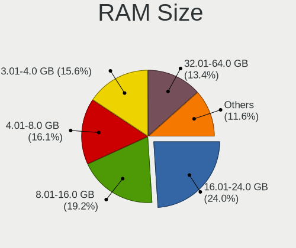
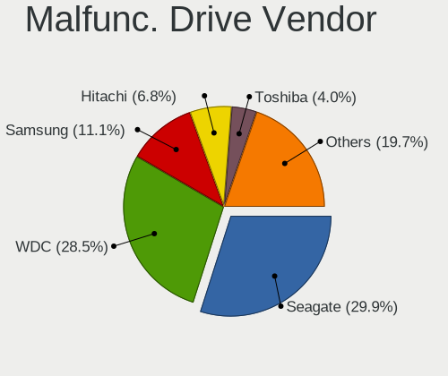
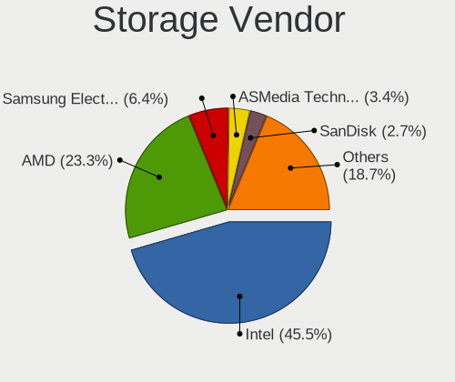
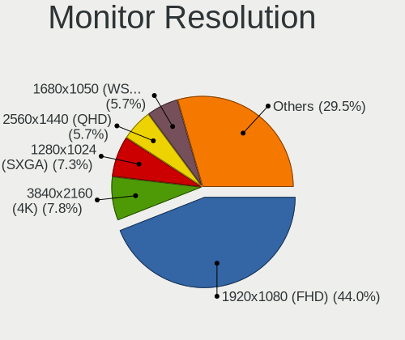

Linux Mint - Tested Hardware & Statistics (Desktops)
----------------------------------------------------

A project to collect tested hardware configurations for Linux Mint.

Anyone can contribute to this report by the [hw-probe](https://github.com/linuxhw/hw-probe) tool:

    sudo -E hw-probe -all -upload

Please contribute! Especially if your hardware is rare.

Contents
--------

* [ Test Cases ](#test-cases)

* [ System ](#system)
  - [ OS                       ](#os)
  - [ OS Family                ](#os-family)
  - [ Kernel                   ](#kernel)
  - [ Kernel Family            ](#kernel-family)
  - [ Kernel Major Ver.        ](#kernel-major-ver)
  - [ Arch                     ](#arch)
  - [ DE                       ](#de)
  - [ Display Server           ](#display-server)
  - [ Display Manager          ](#display-manager)
  - [ OS Lang                  ](#os-lang)
  - [ Boot Mode                ](#boot-mode)
  - [ Filesystem               ](#filesystem)
  - [ Part. scheme             ](#part-scheme)
  - [ Dual Boot with Linux/BSD ](#dual-boot-with-linuxbsd)
  - [ Dual Boot (Win)          ](#dual-boot-win)

* [ Board ](#board)
  - [ Vendor                   ](#vendor)
  - [ Model                    ](#model)
  - [ Model Family             ](#model-family)
  - [ MFG Year                 ](#mfg-year)
  - [ Form Factor              ](#form-factor)
  - [ Secure Boot              ](#secure-boot)
  - [ Coreboot                 ](#coreboot)
  - [ RAM Size                 ](#ram-size)
  - [ RAM Used                 ](#ram-used)
  - [ Total Drives             ](#total-drives)
  - [ Has CD-ROM               ](#has-cd-rom)
  - [ Has Ethernet             ](#has-ethernet)
  - [ Has WiFi                 ](#has-wifi)
  - [ Has Bluetooth            ](#has-bluetooth)

* [ Location ](#location)
  - [ Country                  ](#country)
  - [ City                     ](#city)

* [ Drives ](#drives)
  - [ Drive Vendor             ](#drive-vendor)
  - [ Drive Model              ](#drive-model)
  - [ HDD Vendor               ](#hdd-vendor)
  - [ SSD Vendor               ](#ssd-vendor)
  - [ Drive Kind               ](#drive-kind)
  - [ Drive Connector          ](#drive-connector)
  - [ Drive Size               ](#drive-size)
  - [ Space Total              ](#space-total)
  - [ Space Used               ](#space-used)
  - [ Malfunc. Drives          ](#malfunc-drives)
  - [ Malfunc. Drive Vendor    ](#malfunc-drive-vendor)
  - [ Malfunc. HDD Vendor      ](#malfunc-hdd-vendor)
  - [ Malfunc. Drive Kind      ](#malfunc-drive-kind)
  - [ Failed Drives            ](#failed-drives)
  - [ Failed Drive Vendor      ](#failed-drive-vendor)
  - [ Drive Status             ](#drive-status)

* [ Storage controller ](#storage-controller)
  - [ Storage Vendor           ](#storage-vendor)
  - [ Storage Model            ](#storage-model)
  - [ Storage Kind             ](#storage-kind)

* [ Processor ](#processor)
  - [ CPU Vendor               ](#cpu-vendor)
  - [ CPU Model                ](#cpu-model)
  - [ CPU Model Family         ](#cpu-model-family)
  - [ CPU Cores                ](#cpu-cores)
  - [ CPU Sockets              ](#cpu-sockets)
  - [ CPU Threads              ](#cpu-threads)
  - [ CPU Op-Modes             ](#cpu-op-modes)
  - [ CPU Microcode            ](#cpu-microcode)
  - [ CPU Microarch            ](#cpu-microarch)

* [ Graphics ](#graphics)
  - [ GPU Vendor               ](#gpu-vendor)
  - [ GPU Model                ](#gpu-model)
  - [ GPU Combo                ](#gpu-combo)
  - [ GPU Driver               ](#gpu-driver)
  - [ GPU Memory               ](#gpu-memory)

* [ Monitor ](#monitor)
  - [ Monitor Vendor           ](#monitor-vendor)
  - [ Monitor Model            ](#monitor-model)
  - [ Monitor Resolution       ](#monitor-resolution)
  - [ Monitor Diagonal         ](#monitor-diagonal)
  - [ Monitor Width            ](#monitor-width)
  - [ Aspect Ratio             ](#aspect-ratio)
  - [ Monitor Area             ](#monitor-area)
  - [ Pixel Density            ](#pixel-density)
  - [ Multiple Monitors        ](#multiple-monitors)

* [ Network ](#network)
  - [ Net Controller Vendor    ](#net-controller-vendor)
  - [ Net Controller Model     ](#net-controller-model)
  - [ Wireless Vendor          ](#wireless-vendor)
  - [ Wireless Model           ](#wireless-model)
  - [ Ethernet Vendor          ](#ethernet-vendor)
  - [ Ethernet Model           ](#ethernet-model)
  - [ Net Controller Kind      ](#net-controller-kind)
  - [ Used Controller          ](#used-controller)
  - [ NICs                     ](#nics)
  - [ IPv6                     ](#ipv6)

* [ Bluetooth ](#bluetooth)
  - [ Bluetooth Vendor         ](#bluetooth-vendor)
  - [ Bluetooth Model          ](#bluetooth-model)

* [ Sound ](#sound)
  - [ Sound Vendor             ](#sound-vendor)
  - [ Sound Model              ](#sound-model)

* [ Memory ](#memory)
  - [ Memory Vendor            ](#memory-vendor)
  - [ Memory Model             ](#memory-model)
  - [ Memory Kind              ](#memory-kind)
  - [ Memory Form Factor       ](#memory-form-factor)
  - [ Memory Size              ](#memory-size)
  - [ Memory Speed             ](#memory-speed)

* [ Printers & scanners ](#printers--scanners)
  - [ Printer Vendor           ](#printer-vendor)
  - [ Printer Model            ](#printer-model)
  - [ Scanner Vendor           ](#scanner-vendor)
  - [ Scanner Model            ](#scanner-model)

* [ Camera ](#camera)
  - [ Camera Vendor            ](#camera-vendor)
  - [ Camera Model             ](#camera-model)

* [ Security ](#security)
  - [ Fingerprint Vendor       ](#fingerprint-vendor)
  - [ Fingerprint Model        ](#fingerprint-model)
  - [ Chipcard Vendor          ](#chipcard-vendor)
  - [ Chipcard Model           ](#chipcard-model)

* [ Unsupported ](#unsupported)
  - [ Unsupported Devices      ](#unsupported-devices)
  - [ Unsupported Device Types ](#unsupported-device-types)

Test Cases
----------

Total: 14443

| Vendor        | Model                       | Probe                                                      | Date         |
|---------------|-----------------------------|------------------------------------------------------------|--------------|
| ASRock        | 970M Pro3                   | [8eda0b8fbf](https://linux-hardware.org/?probe=8eda0b8fbf) | Jan 06, 2025 |
| MSI           | 760GM-P21                   | [93d5fbc0a8](https://linux-hardware.org/?probe=93d5fbc0a8) | Jan 06, 2025 |
| ASUSTek       | ROG STRIX B365-F GAMING     | [01012c9b3b](https://linux-hardware.org/?probe=01012c9b3b) | Jan 06, 2025 |
| ASUSTek       | TUF Gaming B650M-E WIFI     | [250c829e77](https://linux-hardware.org/?probe=250c829e77) | Jan 05, 2025 |
| MSI           | A520M-A PRO                 | [17c782de89](https://linux-hardware.org/?probe=17c782de89) | Jan 05, 2025 |
| Gigabyte      | Z68AP-D3                    | [7f798e706e](https://linux-hardware.org/?probe=7f798e706e) | Jan 05, 2025 |
| ASUSTek       | M4A79T Deluxe               | [0b63013a2a](https://linux-hardware.org/?probe=0b63013a2a) | Jan 05, 2025 |
| HP            | 8906 SMVB                   | [6fc944e5ec](https://linux-hardware.org/?probe=6fc944e5ec) | Jan 05, 2025 |
| Dell          | 0VNP2H A00                  | [eb43deacf0](https://linux-hardware.org/?probe=eb43deacf0) | Jan 05, 2025 |
| Dell          | 0JP3NX A01                  | [954d7d9768](https://linux-hardware.org/?probe=954d7d9768) | Jan 04, 2025 |
| ASRock        | X570M Pro4                  | [a049693dcf](https://linux-hardware.org/?probe=a049693dcf) | Jan 04, 2025 |
| ASRock        | H61M-S                      | [313d81da9f](https://linux-hardware.org/?probe=313d81da9f) | Jan 04, 2025 |
| ASRock        | 970 Extreme3                | [8455ec6772](https://linux-hardware.org/?probe=8455ec6772) | Jan 04, 2025 |
| Gigabyte      | X670E AORUS MASTER          | [30d29839dc](https://linux-hardware.org/?probe=30d29839dc) | Jan 04, 2025 |
| Gigabyte      | B650M AORUS ELITE AX        | [e0e8e3f7e0](https://linux-hardware.org/?probe=e0e8e3f7e0) | Jan 04, 2025 |
| Gigabyte      | MZBSWMP-00                  | [f24a8a2441](https://linux-hardware.org/?probe=f24a8a2441) | Jan 04, 2025 |
| ASUSTek       | M5A97 R2.0                  | [ced881b7bd](https://linux-hardware.org/?probe=ced881b7bd) | Jan 04, 2025 |
| Lenovo        | 1030                        | [aab2f96127](https://linux-hardware.org/?probe=aab2f96127) | Jan 03, 2025 |
| ASUSTek       | PRIME X570-P                | [d19c6cfd10](https://linux-hardware.org/?probe=d19c6cfd10) | Jan 03, 2025 |
| Acer          | Predator PO3-640            | [6fef01063d](https://linux-hardware.org/?probe=6fef01063d) | Jan 03, 2025 |
| Acer          | Predator PO3-640            | [391df0e144](https://linux-hardware.org/?probe=391df0e144) | Jan 03, 2025 |
| ASUSTek       | Z87-A                       | [09a6966e22](https://linux-hardware.org/?probe=09a6966e22) | Jan 03, 2025 |
| ASUSTek       | Z87-A                       | [123503d16c](https://linux-hardware.org/?probe=123503d16c) | Jan 03, 2025 |
| ASRock        | H61M-DGS R2.0               | [7c2b340f98](https://linux-hardware.org/?probe=7c2b340f98) | Jan 03, 2025 |
| ASRock        | Z170 Extreme4               | [cec21335ef](https://linux-hardware.org/?probe=cec21335ef) | Jan 03, 2025 |
| Unknown       | Unknown                     | [e4a99f7f2d](https://linux-hardware.org/?probe=e4a99f7f2d) | Jan 02, 2025 |
| MACHINIST     | E5-MR9A V1.0                | [302d708c3c](https://linux-hardware.org/?probe=302d708c3c) | Jan 02, 2025 |
| Dell          | 0PU052                      | [5dbb155ab6](https://linux-hardware.org/?probe=5dbb155ab6) | Jan 02, 2025 |
| MSI           | P45 Neo3                    | [022b141025](https://linux-hardware.org/?probe=022b141025) | Jan 02, 2025 |
| Unknown       | MZ-B75-S                    | [81ac458db0](https://linux-hardware.org/?probe=81ac458db0) | Jan 02, 2025 |
| ASRock        | AB350 Pro4                  | [669da3420f](https://linux-hardware.org/?probe=669da3420f) | Jan 02, 2025 |
| ASUSTek       | P7P55D DELUXE               | [12d33ee44d](https://linux-hardware.org/?probe=12d33ee44d) | Jan 02, 2025 |
| ASUSTek       | M3A                         | [35dd91fa94](https://linux-hardware.org/?probe=35dd91fa94) | Jan 01, 2025 |
| ASRock        | A520M-HVS                   | [57e6177738](https://linux-hardware.org/?probe=57e6177738) | Jan 01, 2025 |
| HP            | 8433 11                     | [94d39a7f10](https://linux-hardware.org/?probe=94d39a7f10) | Jan 01, 2025 |
| ASRock        | H61M-DGS R2.0               | [7e66f7b517](https://linux-hardware.org/?probe=7e66f7b517) | Jan 01, 2025 |
| ASRock        | A520M-HVS                   | [9478ad6eab](https://linux-hardware.org/?probe=9478ad6eab) | Jan 01, 2025 |
| Lenovo        | SHARKBAY 0B98401 WIN        | [612e46a0e7](https://linux-hardware.org/?probe=612e46a0e7) | Jan 01, 2025 |
| Gigabyte      | B650 AORUS ELITE AX V2      | [00b2a8ffad](https://linux-hardware.org/?probe=00b2a8ffad) | Jan 01, 2025 |
| Gigabyte      | X670E AORUS MASTER          | [ea5e598ed5](https://linux-hardware.org/?probe=ea5e598ed5) | Jan 01, 2025 |
| Dell          | 0P096C A00                  | [7a9c5b5c35](https://linux-hardware.org/?probe=7a9c5b5c35) | Jan 01, 2025 |
| ASUSTek       | G20CB                       | [3f76019e9e](https://linux-hardware.org/?probe=3f76019e9e) | Dec 31, 2024 |
| ASUSTek       | TUF Gaming A620M-PLUS       | [248853b59c](https://linux-hardware.org/?probe=248853b59c) | Dec 31, 2024 |
| Lenovo        | 3098 0B98401 PRO            | [2f09544e8b](https://linux-hardware.org/?probe=2f09544e8b) | Dec 31, 2024 |
| HP            | 805A                        | [06248fdac7](https://linux-hardware.org/?probe=06248fdac7) | Dec 31, 2024 |
| ASUSTek       | ROG STRIX B650E-I GAMING... | [a66ac9e217](https://linux-hardware.org/?probe=a66ac9e217) | Dec 31, 2024 |
| Gigabyte      | B650M DS3H                  | [47cda9caab](https://linux-hardware.org/?probe=47cda9caab) | Dec 30, 2024 |
| ASRock        | H61M-DGS R2.0               | [242dfca6c8](https://linux-hardware.org/?probe=242dfca6c8) | Dec 30, 2024 |
| Dell          | 0P096C A00                  | [f85266bf30](https://linux-hardware.org/?probe=f85266bf30) | Dec 30, 2024 |
| Dell          | 0G3HR7 A00                  | [68a7e872ce](https://linux-hardware.org/?probe=68a7e872ce) | Dec 30, 2024 |
| Unknown       | MZ-B75-S                    | [b0af06f0f4](https://linux-hardware.org/?probe=b0af06f0f4) | Dec 30, 2024 |
| Unknown       | MZ-B75-S                    | [9b5c7009ad](https://linux-hardware.org/?probe=9b5c7009ad) | Dec 30, 2024 |
| Foxconn       | P4M900-8237A                | [861a2b8a1d](https://linux-hardware.org/?probe=861a2b8a1d) | Dec 29, 2024 |
| HP            | 18E7                        | [47d21f72aa](https://linux-hardware.org/?probe=47d21f72aa) | Dec 29, 2024 |
| Gigabyte      | B760 GAMING X               | [88448d92de](https://linux-hardware.org/?probe=88448d92de) | Dec 29, 2024 |
| GEEKOM        | A7                          | [366484f41f](https://linux-hardware.org/?probe=366484f41f) | Dec 29, 2024 |
| MSI           | B450-A PRO MAX              | [2a3140ff53](https://linux-hardware.org/?probe=2a3140ff53) | Dec 29, 2024 |
| MSI           | X470 GAMING PLUS MAX        | [b5263fe645](https://linux-hardware.org/?probe=b5263fe645) | Dec 29, 2024 |
| Foxconn       | 2AB1                        | [e4c7b07722](https://linux-hardware.org/?probe=e4c7b07722) | Dec 28, 2024 |
| Unknown       | Unknown                     | [09a3128900](https://linux-hardware.org/?probe=09a3128900) | Dec 28, 2024 |
| ASUSTek       | PRIME Z270-P                | [83bbeb0374](https://linux-hardware.org/?probe=83bbeb0374) | Dec 28, 2024 |
| Dell          | 0WVYMC A00                  | [44cd35cf64](https://linux-hardware.org/?probe=44cd35cf64) | Dec 28, 2024 |
| Acer          | Veriton N4640G              | [3713dbb1e6](https://linux-hardware.org/?probe=3713dbb1e6) | Dec 28, 2024 |
| ASUSTek       | TUF Gaming X570-PLUS        | [b654a18eee](https://linux-hardware.org/?probe=b654a18eee) | Dec 28, 2024 |
| ASUSTek       | TUF Gaming X570-PLUS        | [81e034c5f8](https://linux-hardware.org/?probe=81e034c5f8) | Dec 28, 2024 |
| HP            | 2AE5 A01                    | [37a58aa15b](https://linux-hardware.org/?probe=37a58aa15b) | Dec 27, 2024 |
| Intel         | D54250WYK H13922-303        | [77fd66459a](https://linux-hardware.org/?probe=77fd66459a) | Dec 27, 2024 |
| Foxconn       | 2AB1                        | [2667fc30e8](https://linux-hardware.org/?probe=2667fc30e8) | Dec 27, 2024 |
| ASUSTek       | TUF Gaming B550M-ZAKU       | [2f86029430](https://linux-hardware.org/?probe=2f86029430) | Dec 27, 2024 |
| MSI           | B550M PRO-VDH WIFI          | [27f73d7e4e](https://linux-hardware.org/?probe=27f73d7e4e) | Dec 27, 2024 |
| Dell          | 08NPPY A00                  | [785f5a5f70](https://linux-hardware.org/?probe=785f5a5f70) | Dec 27, 2024 |
| ASRock        | B450M Pro4                  | [e4aa8e8128](https://linux-hardware.org/?probe=e4aa8e8128) | Dec 26, 2024 |
| Foxconn       | 2AB1                        | [70925114c3](https://linux-hardware.org/?probe=70925114c3) | Dec 26, 2024 |
| ASRock        | N68-GE                      | [7f7f614f22](https://linux-hardware.org/?probe=7f7f614f22) | Dec 26, 2024 |
| ASUSTek       | Z170-A                      | [96e5e9d5fd](https://linux-hardware.org/?probe=96e5e9d5fd) | Dec 26, 2024 |
| ASUSTek       | BM1AF_BP1AF_BM6AF           | [622f9ae7f4](https://linux-hardware.org/?probe=622f9ae7f4) | Dec 25, 2024 |
| MSI           | X470 GAMING PLUS MAX        | [25790885cb](https://linux-hardware.org/?probe=25790885cb) | Dec 25, 2024 |
| ASUSTek       | PRIME B660M-A D4            | [d314c49ee9](https://linux-hardware.org/?probe=d314c49ee9) | Dec 25, 2024 |
| ASUSTek       | PRIME B660M-A D4            | [f39ab795bb](https://linux-hardware.org/?probe=f39ab795bb) | Dec 25, 2024 |
| Gigabyte      | B85-HD3                     | [9fc43e3fa9](https://linux-hardware.org/?probe=9fc43e3fa9) | Dec 25, 2024 |
| ASUSTek       | ROG STRIX X370-F GAMING     | [6e24ffa9a1](https://linux-hardware.org/?probe=6e24ffa9a1) | Dec 24, 2024 |
| Unknown       | Unknown                     | [7119a317d5](https://linux-hardware.org/?probe=7119a317d5) | Dec 24, 2024 |
| ASUSTek       | M4A79T Deluxe               | [54be938049](https://linux-hardware.org/?probe=54be938049) | Dec 24, 2024 |
| Lenovo        | ThinkCentre A70 7099S3A     | [1ed214159d](https://linux-hardware.org/?probe=1ed214159d) | Dec 24, 2024 |
| MSI           | 990FXA-GD65                 | [f62a826f4d](https://linux-hardware.org/?probe=f62a826f4d) | Dec 24, 2024 |
| ASUSTek       | ROG STRIX X670E-E GAMING... | [65b8d941dc](https://linux-hardware.org/?probe=65b8d941dc) | Dec 23, 2024 |
| MSI           | Z77A-GD65                   | [2bda3d9800](https://linux-hardware.org/?probe=2bda3d9800) | Dec 23, 2024 |
| Dell          | 018D1Y A00                  | [41a23c9b5a](https://linux-hardware.org/?probe=41a23c9b5a) | Dec 23, 2024 |
| HP            | 1497                        | [245a5c3c47](https://linux-hardware.org/?probe=245a5c3c47) | Dec 23, 2024 |
| Lenovo        | SHARKBAY 0B98417 PRO        | [c7502297f0](https://linux-hardware.org/?probe=c7502297f0) | Dec 23, 2024 |
| ASUSTek       | H81M-K                      | [f02c49baa6](https://linux-hardware.org/?probe=f02c49baa6) | Dec 22, 2024 |
| Packard Be... | WMCP78M                     | [b9f3620021](https://linux-hardware.org/?probe=b9f3620021) | Dec 22, 2024 |
| Packard Be... | WMCP78M                     | [9d24c10673](https://linux-hardware.org/?probe=9d24c10673) | Dec 22, 2024 |
| ASUSTek       | ROG STRIX B660-A GAMING ... | [8bf0b50eb2](https://linux-hardware.org/?probe=8bf0b50eb2) | Dec 22, 2024 |
| MSI           | X299 SLI PLUS               | [6aee2c68c6](https://linux-hardware.org/?probe=6aee2c68c6) | Dec 21, 2024 |
| MSI           | H110M PRO-D                 | [fefcbf513b](https://linux-hardware.org/?probe=fefcbf513b) | Dec 21, 2024 |
| MACHINIST     | E5-MR9A V1.0                | [f14a3b5ccf](https://linux-hardware.org/?probe=f14a3b5ccf) | Dec 20, 2024 |
| MSI           | H110M PRO-D                 | [c72cef4631](https://linux-hardware.org/?probe=c72cef4631) | Dec 20, 2024 |
| ASRock        | B450M-HDV R4.0              | [0f8384fde3](https://linux-hardware.org/?probe=0f8384fde3) | Dec 20, 2024 |
| Dell          | 0XCR8D A00                  | [b17e5e9125](https://linux-hardware.org/?probe=b17e5e9125) | Dec 20, 2024 |
| ASUSTek       | PRIME H310M-E R2.0          | [d5fd6f7a36](https://linux-hardware.org/?probe=d5fd6f7a36) | Dec 20, 2024 |
| MSI           | Z77A-G43                    | [9d4a34b339](https://linux-hardware.org/?probe=9d4a34b339) | Dec 20, 2024 |
| Shuttle       | FH270                       | [068d900b56](https://linux-hardware.org/?probe=068d900b56) | Dec 19, 2024 |
| ASRock        | A520M-HVS                   | [47c40e8f1b](https://linux-hardware.org/?probe=47c40e8f1b) | Dec 19, 2024 |
| MSI           | B450M MORTAR MAX            | [597e16ba37](https://linux-hardware.org/?probe=597e16ba37) | Dec 19, 2024 |
| ASUSTek       | ET1620I                     | [961909e36f](https://linux-hardware.org/?probe=961909e36f) | Dec 19, 2024 |
| ASRock        | A520M-HVS                   | [4807d91515](https://linux-hardware.org/?probe=4807d91515) | Dec 19, 2024 |
| HP            | 18E7                        | [1e44952230](https://linux-hardware.org/?probe=1e44952230) | Dec 19, 2024 |
| ASUSTek       | GA15DH                      | [97bd3b6074](https://linux-hardware.org/?probe=97bd3b6074) | Dec 19, 2024 |
| ASUSTek       | SABERTOOTH Z77              | [7d20b9caf7](https://linux-hardware.org/?probe=7d20b9caf7) | Dec 19, 2024 |
| ASUSTek       | VC65R                       | [4448e95ce5](https://linux-hardware.org/?probe=4448e95ce5) | Dec 19, 2024 |
| ASUSTek       | VC65R                       | [62a516f5ab](https://linux-hardware.org/?probe=62a516f5ab) | Dec 19, 2024 |
| Dell          | 06X1TJ A00                  | [7db2715b22](https://linux-hardware.org/?probe=7db2715b22) | Dec 19, 2024 |
| ASUSTek       | PRIME H310-PLUS R2.0        | [1acad3b822](https://linux-hardware.org/?probe=1acad3b822) | Dec 18, 2024 |
| AZW           | MINI S                      | [bb9a63ad1b](https://linux-hardware.org/?probe=bb9a63ad1b) | Dec 18, 2024 |
| ASUSTek       | SABERTOOTH Z97 MARK 1       | [c565398bf1](https://linux-hardware.org/?probe=c565398bf1) | Dec 18, 2024 |
| ASUSTek       | SABERTOOTH Z97 MARK 1       | [5dc92f19cf](https://linux-hardware.org/?probe=5dc92f19cf) | Dec 18, 2024 |
| Fujitsu       | D3601-A1 S26361-D3601-A1    | [153f551d38](https://linux-hardware.org/?probe=153f551d38) | Dec 18, 2024 |
| Acer          | Veriton X2631G              | [c603e73396](https://linux-hardware.org/?probe=c603e73396) | Dec 18, 2024 |
| ASUSTek       | M4A88TD-V EVO/USB3          | [6f3a9094fe](https://linux-hardware.org/?probe=6f3a9094fe) | Dec 17, 2024 |
| Gigabyte      | B760M G AX                  | [b0a2fd8b02](https://linux-hardware.org/?probe=b0a2fd8b02) | Dec 17, 2024 |
| ASUSTek       | TUF B450M-PRO GAMING        | [8322276a80](https://linux-hardware.org/?probe=8322276a80) | Dec 17, 2024 |
| Intel         | H61                         | [c4217d24f6](https://linux-hardware.org/?probe=c4217d24f6) | Dec 17, 2024 |
| MSI           | H110M PRO-VD                | [3c491227b7](https://linux-hardware.org/?probe=3c491227b7) | Dec 16, 2024 |
| Gigabyte      | Z270N-WIFI-CF               | [21910e2c4a](https://linux-hardware.org/?probe=21910e2c4a) | Dec 16, 2024 |
| Foxconn       | 2ABF                        | [34c40afb92](https://linux-hardware.org/?probe=34c40afb92) | Dec 16, 2024 |
| MSI           | MPG B550 GAMING CARBON W... | [3893ecf2d0](https://linux-hardware.org/?probe=3893ecf2d0) | Dec 16, 2024 |
| ASUSTek       | P8Z77-V LX                  | [40c4cef0ef](https://linux-hardware.org/?probe=40c4cef0ef) | Dec 16, 2024 |
| Lenovo        | SHARKBAY NOK                | [7bcee07c07](https://linux-hardware.org/?probe=7bcee07c07) | Dec 15, 2024 |
| ASUSTek       | PRIME A520M-K               | [4a1f51c600](https://linux-hardware.org/?probe=4a1f51c600) | Dec 15, 2024 |
| Medion        | T11X5A16                    | [14404cc77d](https://linux-hardware.org/?probe=14404cc77d) | Dec 15, 2024 |
| Medion        | T11X5A16                    | [1fc28c5865](https://linux-hardware.org/?probe=1fc28c5865) | Dec 15, 2024 |
| MSI           | MAG X870 TOMAHAWK WIFI      | [83ca588caa](https://linux-hardware.org/?probe=83ca588caa) | Dec 15, 2024 |
| BESSTAR Te... | UM700                       | [ff83fe1d3e](https://linux-hardware.org/?probe=ff83fe1d3e) | Dec 15, 2024 |
| ECS           | Nettle2                     | [caffafd1eb](https://linux-hardware.org/?probe=caffafd1eb) | Dec 15, 2024 |
| ASUSTek       | 970 PRO GAMING/AURA         | [834cca8e2b](https://linux-hardware.org/?probe=834cca8e2b) | Dec 15, 2024 |
| ASUSTek       | P7P55D-E                    | [5eedc626d9](https://linux-hardware.org/?probe=5eedc626d9) | Dec 15, 2024 |
| Lenovo        | SHARKBAY NOK                | [e5fd8952ae](https://linux-hardware.org/?probe=e5fd8952ae) | Dec 14, 2024 |
| AZW           | U59                         | [cfcb774dd7](https://linux-hardware.org/?probe=cfcb774dd7) | Dec 14, 2024 |
| Dell          | 0WMJ54 A01                  | [00c962b29d](https://linux-hardware.org/?probe=00c962b29d) | Dec 14, 2024 |
| Lenovo        | SHARKBAY SDK0E50510 WIN     | [36c0ecd50a](https://linux-hardware.org/?probe=36c0ecd50a) | Dec 14, 2024 |
| Lenovo        | SHARKBAY SDK0E50510 WIN     | [cf56d42225](https://linux-hardware.org/?probe=cf56d42225) | Dec 14, 2024 |
| HP            | 2187 A01                    | [fe4a768b42](https://linux-hardware.org/?probe=fe4a768b42) | Dec 14, 2024 |
| HP            | 3047h                       | [60b8d8c582](https://linux-hardware.org/?probe=60b8d8c582) | Dec 14, 2024 |
| ASUSTek       | ROG STRIX B450-F GAMING     | [41c0acdaab](https://linux-hardware.org/?probe=41c0acdaab) | Dec 13, 2024 |
| ASUSTek       | TUF H370-PRO GAMING         | [f39f2cc1a5](https://linux-hardware.org/?probe=f39f2cc1a5) | Dec 13, 2024 |
| Acer          | Veriton X2631G              | [2413d11f75](https://linux-hardware.org/?probe=2413d11f75) | Dec 13, 2024 |
| Dell          | 0PU052                      | [af8780c5be](https://linux-hardware.org/?probe=af8780c5be) | Dec 13, 2024 |
| ASUSTek       | A68HM-PLUS                  | [f234970cc5](https://linux-hardware.org/?probe=f234970cc5) | Dec 12, 2024 |
| MSI           | B365M PRO-VH                | [aca7e6786e](https://linux-hardware.org/?probe=aca7e6786e) | Dec 12, 2024 |
| Biostar       | B550MX/E PRO                | [30e7b6d1fa](https://linux-hardware.org/?probe=30e7b6d1fa) | Dec 12, 2024 |
| ASUSTek       | ROG STRIX B450-F GAMING     | [9f1726cead](https://linux-hardware.org/?probe=9f1726cead) | Dec 11, 2024 |
| Lenovo        | 30BC SDK0J40697 WIN 3305... | [2790c6fce6](https://linux-hardware.org/?probe=2790c6fce6) | Dec 11, 2024 |
| Chuwi         | RZBOX                       | [ceebadbef7](https://linux-hardware.org/?probe=ceebadbef7) | Dec 11, 2024 |
| GEEKOM        | AE7                         | [c337bf3de6](https://linux-hardware.org/?probe=c337bf3de6) | Dec 11, 2024 |
| Foxconn       | 2A8C                        | [5c5f617649](https://linux-hardware.org/?probe=5c5f617649) | Dec 11, 2024 |
| Gigabyte      | B450 GAMING X               | [69eca05028](https://linux-hardware.org/?probe=69eca05028) | Dec 11, 2024 |
| Shuttle       | SH310V2                     | [e3abcefd64](https://linux-hardware.org/?probe=e3abcefd64) | Dec 11, 2024 |
| Lenovo        | SKYBAY SDK0J40705 WIN 34... | [76f3b7fbe1](https://linux-hardware.org/?probe=76f3b7fbe1) | Dec 11, 2024 |
| Dell          | 0C27VV A01                  | [97b465f827](https://linux-hardware.org/?probe=97b465f827) | Dec 11, 2024 |
| Gigabyte      | X670 GAMING X AX V2         | [95159b5753](https://linux-hardware.org/?probe=95159b5753) | Dec 10, 2024 |
| Gigabyte      | H610M H                     | [045fc5193c](https://linux-hardware.org/?probe=045fc5193c) | Dec 10, 2024 |
| Gigabyte      | A320M-S2H V2-CF             | [99750c7f81](https://linux-hardware.org/?probe=99750c7f81) | Dec 10, 2024 |
| QTQD          | Unknown                     | [fe9c71e541](https://linux-hardware.org/?probe=fe9c71e541) | Dec 10, 2024 |
| ASUSTek       | TUF Gaming B460-PLUS        | [7aace976f0](https://linux-hardware.org/?probe=7aace976f0) | Dec 10, 2024 |
| ASUSTek       | M3A76-CM                    | [1b5bbe8b9b](https://linux-hardware.org/?probe=1b5bbe8b9b) | Dec 10, 2024 |
| ASUSTek       | TUF Gaming A620M-PLUS       | [44ba385052](https://linux-hardware.org/?probe=44ba385052) | Dec 10, 2024 |
| Gigabyte      | B550M AORUS PRO-P           | [4972873070](https://linux-hardware.org/?probe=4972873070) | Dec 09, 2024 |
| NZXT          | N7 Z370                     | [980901a248](https://linux-hardware.org/?probe=980901a248) | Dec 09, 2024 |
| ASRock        | Z270 Pro4                   | [cfd1ab354a](https://linux-hardware.org/?probe=cfd1ab354a) | Dec 09, 2024 |
| NZXT          | N7 Z370                     | [6dcbea3fcf](https://linux-hardware.org/?probe=6dcbea3fcf) | Dec 09, 2024 |
| MSI           | B650 GAMING PLUS WIFI       | [7d4db42978](https://linux-hardware.org/?probe=7d4db42978) | Dec 08, 2024 |
| Acer          | Veriton M4630G V:1.0        | [e53c39772b](https://linux-hardware.org/?probe=e53c39772b) | Dec 08, 2024 |
| ASRock        | B85M Pro4                   | [6590a75db3](https://linux-hardware.org/?probe=6590a75db3) | Dec 08, 2024 |
| Biostar       | A520MT                      | [937f0e5324](https://linux-hardware.org/?probe=937f0e5324) | Dec 08, 2024 |
| ASUSTek       | M3A76-CM                    | [fb83a1efd1](https://linux-hardware.org/?probe=fb83a1efd1) | Dec 08, 2024 |
| ASUSTek       | ROG STRIX B550-F GAMING     | [eba104f14a](https://linux-hardware.org/?probe=eba104f14a) | Dec 07, 2024 |
| Intel         | Unknown                     | [423e3be5d1](https://linux-hardware.org/?probe=423e3be5d1) | Dec 07, 2024 |
| ASUSTek       | P8B75-M LE                  | [e7f0693f7c](https://linux-hardware.org/?probe=e7f0693f7c) | Dec 07, 2024 |
| Gigabyte      | B365M H                     | [a922a7763f](https://linux-hardware.org/?probe=a922a7763f) | Dec 07, 2024 |
| Dell          | 0200DY A02                  | [4cf84c1ce5](https://linux-hardware.org/?probe=4cf84c1ce5) | Dec 06, 2024 |
| HP            | 3646h                       | [a878c4299b](https://linux-hardware.org/?probe=a878c4299b) | Dec 06, 2024 |
| Gigabyte      | Q87M-D2H                    | [8331103e77](https://linux-hardware.org/?probe=8331103e77) | Dec 06, 2024 |
| Gigabyte      | M68MT-S2                    | [2bad0fcf88](https://linux-hardware.org/?probe=2bad0fcf88) | Dec 06, 2024 |
| Fujitsu       | D3430-A1 S26361-D3430-A1    | [a701c134d6](https://linux-hardware.org/?probe=a701c134d6) | Dec 05, 2024 |
| ASUSTek       | M5A78L-M LX3                | [93d9e2c966](https://linux-hardware.org/?probe=93d9e2c966) | Dec 05, 2024 |
| Packard Be... | IMEDIA S1300                | [b02a054b44](https://linux-hardware.org/?probe=b02a054b44) | Dec 05, 2024 |
| ASUSTek       | TUF Gaming B650-PLUS WIF... | [d28adbcef7](https://linux-hardware.org/?probe=d28adbcef7) | Dec 04, 2024 |
| BESSTAR Te... | UM700                       | [2cd4fbc3fc](https://linux-hardware.org/?probe=2cd4fbc3fc) | Dec 04, 2024 |
| Win Elemen... | M9S                         | [eed675eadb](https://linux-hardware.org/?probe=eed675eadb) | Dec 04, 2024 |
| Win Elemen... | M9S                         | [403a04b12f](https://linux-hardware.org/?probe=403a04b12f) | Dec 03, 2024 |
| ASUSTek       | M5A78L-M LX3                | [28ba9ba8b9](https://linux-hardware.org/?probe=28ba9ba8b9) | Dec 03, 2024 |
| MSI           | PRO H610M-E DDR4            | [009d15e28b](https://linux-hardware.org/?probe=009d15e28b) | Dec 03, 2024 |
| AMI           | Intel                       | [cecf6051ca](https://linux-hardware.org/?probe=cecf6051ca) | Dec 03, 2024 |
| ASUSTek       | PRIME H310M-E R2.0          | [d5cf17fa53](https://linux-hardware.org/?probe=d5cf17fa53) | Dec 02, 2024 |
| MSI           | MAG B550M MORTAR WIFI       | [c0c49d4324](https://linux-hardware.org/?probe=c0c49d4324) | Dec 02, 2024 |
| Unknown       | Unknown                     | [c6604dc6a1](https://linux-hardware.org/?probe=c6604dc6a1) | Dec 02, 2024 |
| HP            | 843F                        | [57d6dec6d5](https://linux-hardware.org/?probe=57d6dec6d5) | Dec 02, 2024 |
| MSI           | MAG B760M MORTAR WIFI       | [70ca834172](https://linux-hardware.org/?probe=70ca834172) | Dec 02, 2024 |
| Intel         | B75/Q75/Q77                 | [2462350161](https://linux-hardware.org/?probe=2462350161) | Dec 02, 2024 |
| Fujitsu       | D3430-A1 S26361-D3430-A1    | [1ef9f00235](https://linux-hardware.org/?probe=1ef9f00235) | Dec 02, 2024 |
| ASUSTek       | TUF Gaming X670E-PLUS WI... | [0065a1abc8](https://linux-hardware.org/?probe=0065a1abc8) | Dec 01, 2024 |
| Gigabyte      | 945P-S3                     | [7c7775d296](https://linux-hardware.org/?probe=7c7775d296) | Dec 01, 2024 |
| HP            | 843F                        | [38c42e1258](https://linux-hardware.org/?probe=38c42e1258) | Dec 01, 2024 |
| MSI           | H110M PRO-D                 | [b8889031de](https://linux-hardware.org/?probe=b8889031de) | Dec 01, 2024 |
| MSI           | B450 TOMAHAWK MAX II        | [00d4ce0f70](https://linux-hardware.org/?probe=00d4ce0f70) | Dec 01, 2024 |
| ASRock        | Z490 Phantom Gaming 4       | [b8890d5a6a](https://linux-hardware.org/?probe=b8890d5a6a) | Dec 01, 2024 |
| ASUSTek       | TUF X470-PLUS GAMING        | [18449824d9](https://linux-hardware.org/?probe=18449824d9) | Dec 01, 2024 |
| Gigabyte      | B360M D3H-CF                | [7f3136b79b](https://linux-hardware.org/?probe=7f3136b79b) | Dec 01, 2024 |
| HP            | 3646h                       | [d16e3af848](https://linux-hardware.org/?probe=d16e3af848) | Dec 01, 2024 |
| Gigabyte      | B550M S2H                   | [720b4133da](https://linux-hardware.org/?probe=720b4133da) | Dec 01, 2024 |
| Gigabyte      | B550M S2H                   | [9dcd09de35](https://linux-hardware.org/?probe=9dcd09de35) | Dec 01, 2024 |
| ASUSTek       | ROG STRIX Z790-E GAMING ... | [36f3a130a7](https://linux-hardware.org/?probe=36f3a130a7) | Dec 01, 2024 |
| ASRock        | B550 Phantom Gaming-ITX/... | [ec171317bb](https://linux-hardware.org/?probe=ec171317bb) | Nov 30, 2024 |
| ASRock        | B450M/ac R2.0               | [ff1182600d](https://linux-hardware.org/?probe=ff1182600d) | Nov 30, 2024 |
| Dell          | 0KWVT8 A00                  | [693cea0d9c](https://linux-hardware.org/?probe=693cea0d9c) | Nov 30, 2024 |
| Intel         | DG31PR AAD97573-205         | [41414033c3](https://linux-hardware.org/?probe=41414033c3) | Nov 30, 2024 |
| Gigabyte      | GA-870A-UD3                 | [2facd09c85](https://linux-hardware.org/?probe=2facd09c85) | Nov 30, 2024 |
| Dell          | 0FG47G A02                  | [f386de5564](https://linux-hardware.org/?probe=f386de5564) | Nov 30, 2024 |
| Gigabyte      | Q77M-D2H                    | [344a0d242e](https://linux-hardware.org/?probe=344a0d242e) | Nov 30, 2024 |
| MSI           | MPG B560I GAMING EDGE WI... | [d2f72bf9ab](https://linux-hardware.org/?probe=d2f72bf9ab) | Nov 30, 2024 |
| Dell          | 0T10XW A02                  | [47d585660f](https://linux-hardware.org/?probe=47d585660f) | Nov 30, 2024 |
| Foxconn       | 2A8C                        | [2852c45500](https://linux-hardware.org/?probe=2852c45500) | Nov 29, 2024 |
| Lenovo        | 3106 SDK0J40697 WIN 3305... | [5f1a0866e9](https://linux-hardware.org/?probe=5f1a0866e9) | Nov 29, 2024 |
| Lenovo        | 3106 SDK0J40697 WIN 3305... | [8c009c7dc1](https://linux-hardware.org/?probe=8c009c7dc1) | Nov 29, 2024 |
| ASRock        | H61M-DGS R2.0               | [4a13470c53](https://linux-hardware.org/?probe=4a13470c53) | Nov 29, 2024 |
| Gigabyte      | X570 AORUS MASTER           | [880eb76c45](https://linux-hardware.org/?probe=880eb76c45) | Nov 29, 2024 |
| Gigabyte      | B550M AORUS ELITE           | [39b6cb411f](https://linux-hardware.org/?probe=39b6cb411f) | Nov 29, 2024 |
| ASRock        | B450 Steel Legend           | [2744870a51](https://linux-hardware.org/?probe=2744870a51) | Nov 28, 2024 |
| ASUSTek       | Leonite2                    | [725af27634](https://linux-hardware.org/?probe=725af27634) | Nov 28, 2024 |
| Intel         | JSL MRD                     | [d5b5938271](https://linux-hardware.org/?probe=d5b5938271) | Nov 27, 2024 |
| ASUSTek       | ROG STRIX Z790-E GAMING ... | [005802da6e](https://linux-hardware.org/?probe=005802da6e) | Nov 27, 2024 |
| ASRock        | Z97 Extreme4                | [2daa59942e](https://linux-hardware.org/?probe=2daa59942e) | Nov 27, 2024 |
| ASUSTek       | P5QL/EPU                    | [2a7b69e02e](https://linux-hardware.org/?probe=2a7b69e02e) | Nov 27, 2024 |
| Gigabyte      | B450 AORUS M                | [58f017f1d5](https://linux-hardware.org/?probe=58f017f1d5) | Nov 27, 2024 |
| MSI           | MPG B550 GAMING PLUS        | [7abfcb89dd](https://linux-hardware.org/?probe=7abfcb89dd) | Nov 27, 2024 |
| ASRock        | H81M-VG4 R2.0               | [776ce0bcf1](https://linux-hardware.org/?probe=776ce0bcf1) | Nov 27, 2024 |
| ECS           | 945GCT-M3                   | [47b8e0556e](https://linux-hardware.org/?probe=47b8e0556e) | Nov 26, 2024 |
| ASRock        | B365M IB-R                  | [ace12206b9](https://linux-hardware.org/?probe=ace12206b9) | Nov 26, 2024 |
| Unknown       | Unknown                     | [1543b6ff21](https://linux-hardware.org/?probe=1543b6ff21) | Nov 26, 2024 |
| ASRock        | B550M Pro4                  | [9a00405288](https://linux-hardware.org/?probe=9a00405288) | Nov 25, 2024 |
| ASUSTek       | ROG STRIX Z390-F GAMING     | [d0a689e692](https://linux-hardware.org/?probe=d0a689e692) | Nov 25, 2024 |
| Gigabyte      | B450M DS3H WIFI-CF          | [322feab71d](https://linux-hardware.org/?probe=322feab71d) | Nov 25, 2024 |
| Gigabyte      | X58A-UD3R                   | [8a9846c516](https://linux-hardware.org/?probe=8a9846c516) | Nov 25, 2024 |
| ASRock        | X870E Taichi Lite           | [10ce3630ff](https://linux-hardware.org/?probe=10ce3630ff) | Nov 25, 2024 |
| Dell          | 0T7D40 A01                  | [7b3a8c21d0](https://linux-hardware.org/?probe=7b3a8c21d0) | Nov 25, 2024 |
| MSI           | H310M PRO-VDH PLUS          | [0766cb5641](https://linux-hardware.org/?probe=0766cb5641) | Nov 25, 2024 |
| Daten Tecn... | DT1800Z                     | [5e3cb6ad18](https://linux-hardware.org/?probe=5e3cb6ad18) | Nov 24, 2024 |
| Daten Tecn... | DT1800Z                     | [2e4bcb8ea6](https://linux-hardware.org/?probe=2e4bcb8ea6) | Nov 24, 2024 |
| ECS           | H55H-I                      | [30ab02e0cf](https://linux-hardware.org/?probe=30ab02e0cf) | Nov 24, 2024 |
| ECS           | H55H-I                      | [e15c44d10c](https://linux-hardware.org/?probe=e15c44d10c) | Nov 24, 2024 |
| HP            | 18E7                        | [39492841b7](https://linux-hardware.org/?probe=39492841b7) | Nov 23, 2024 |
| Gigabyte      | X870E AORUS ELITE WIFI7     | [2f72b28eda](https://linux-hardware.org/?probe=2f72b28eda) | Nov 23, 2024 |
| ASRock        | H61M-DGS R2.0               | [369dbc0ee1](https://linux-hardware.org/?probe=369dbc0ee1) | Nov 23, 2024 |
| HP            | 845A                        | [6fcba62b48](https://linux-hardware.org/?probe=6fcba62b48) | Nov 23, 2024 |
| Medion        | MS-7728                     | [a68ecaf010](https://linux-hardware.org/?probe=a68ecaf010) | Nov 23, 2024 |
| ASUSTek       | P8H77-M LE                  | [949fefc3e0](https://linux-hardware.org/?probe=949fefc3e0) | Nov 23, 2024 |
| Gigabyte      | H61M-S2PV                   | [6a961e6e3e](https://linux-hardware.org/?probe=6a961e6e3e) | Nov 23, 2024 |
| ASUSTek       | TUF Gaming B650-PLUS WIF... | [cc807fac09](https://linux-hardware.org/?probe=cc807fac09) | Nov 23, 2024 |
| ASRock        | X370 Killer SLI             | [adfd69ffdb](https://linux-hardware.org/?probe=adfd69ffdb) | Nov 23, 2024 |
| ASRock        | X870E Nova WiFi             | [8b6d3be567](https://linux-hardware.org/?probe=8b6d3be567) | Nov 23, 2024 |
| MSI           | B450M MORTAR MAX            | [d30ecaec23](https://linux-hardware.org/?probe=d30ecaec23) | Nov 22, 2024 |
| Gigabyte      | Z690 UD AX DDR4             | [bd8d7ee0a7](https://linux-hardware.org/?probe=bd8d7ee0a7) | Nov 22, 2024 |
| Gigabyte      | B85M-D3H-A                  | [e9bbed01d3](https://linux-hardware.org/?probe=e9bbed01d3) | Nov 22, 2024 |
| Medion        | MS-7800                     | [619160ee6e](https://linux-hardware.org/?probe=619160ee6e) | Nov 22, 2024 |
| Medion        | MS-7800                     | [83d62f0306](https://linux-hardware.org/?probe=83d62f0306) | Nov 22, 2024 |
| GEEKOM        | AX8Pro                      | [e066394d3f](https://linux-hardware.org/?probe=e066394d3f) | Nov 22, 2024 |
| Gigabyte      | Z97P-D3                     | [0bbffa2886](https://linux-hardware.org/?probe=0bbffa2886) | Nov 21, 2024 |
| Gigabyte      | Z97P-D3                     | [4ee9972791](https://linux-hardware.org/?probe=4ee9972791) | Nov 21, 2024 |
| MSI           | X470 GAMING PRO CARBON      | [8ef382c079](https://linux-hardware.org/?probe=8ef382c079) | Nov 21, 2024 |
| GEEKOM        | AX8Pro                      | [7c747dd91c](https://linux-hardware.org/?probe=7c747dd91c) | Nov 21, 2024 |
| HP            | 83E2                        | [8cdf08d1de](https://linux-hardware.org/?probe=8cdf08d1de) | Nov 21, 2024 |
| HP            | 83E2                        | [50c935c498](https://linux-hardware.org/?probe=50c935c498) | Nov 21, 2024 |
| ASUSTek       | P5K-E                       | [f27932b7fc](https://linux-hardware.org/?probe=f27932b7fc) | Nov 21, 2024 |
| Dell          | 0HD5W2 A01                  | [ecff12e057](https://linux-hardware.org/?probe=ecff12e057) | Nov 21, 2024 |
| Dell          | 0KWVT8 A03                  | [7b6369a210](https://linux-hardware.org/?probe=7b6369a210) | Nov 21, 2024 |
| Dell          | 084J0R A00                  | [4f45821f74](https://linux-hardware.org/?probe=4f45821f74) | Nov 20, 2024 |
| ASUSTek       | Z170-A                      | [268e62aeb8](https://linux-hardware.org/?probe=268e62aeb8) | Nov 20, 2024 |
| Dell          | 0WMJ54 A01                  | [16f22944e3](https://linux-hardware.org/?probe=16f22944e3) | Nov 20, 2024 |
| Dell          | 0P01GV A02                  | [b7831d6f60](https://linux-hardware.org/?probe=b7831d6f60) | Nov 20, 2024 |
| Dell          | 0P01GV A02                  | [e1682b686c](https://linux-hardware.org/?probe=e1682b686c) | Nov 20, 2024 |
| ASUSTek       | TUF Gaming B660M-PLUS WI... | [5b576dfbd4](https://linux-hardware.org/?probe=5b576dfbd4) | Nov 19, 2024 |
| ASUSTek       | H81M-PLUS                   | [336352af0c](https://linux-hardware.org/?probe=336352af0c) | Nov 19, 2024 |
| ASUSTek       | A55BM-PLUS                  | [5c07ce3429](https://linux-hardware.org/?probe=5c07ce3429) | Nov 18, 2024 |
| ASUSTek       | BM1AF_BP1AF_BM6AF           | [1b4a636ed3](https://linux-hardware.org/?probe=1b4a636ed3) | Nov 18, 2024 |
| ASUSTek       | PRIME B450M-K               | [578f7f03df](https://linux-hardware.org/?probe=578f7f03df) | Nov 18, 2024 |
| ASRock        | Z87 Killer                  | [d9801f6f57](https://linux-hardware.org/?probe=d9801f6f57) | Nov 17, 2024 |
| MSI           | B450 TOMAHAWK MAX           | [2bb8be3c1b](https://linux-hardware.org/?probe=2bb8be3c1b) | Nov 17, 2024 |
| ASRock        | 760GM-HD                    | [663f2190fd](https://linux-hardware.org/?probe=663f2190fd) | Nov 17, 2024 |
| Fujitsu       | D3313-A1 S26361-D3313-A1    | [1414aa0ee1](https://linux-hardware.org/?probe=1414aa0ee1) | Nov 16, 2024 |
| Gigabyte      | B550 AORUS ELITE V2         | [4892f1748d](https://linux-hardware.org/?probe=4892f1748d) | Nov 16, 2024 |
| Compaq        | Presario CQ-14              | [30684eb29e](https://linux-hardware.org/?probe=30684eb29e) | Nov 16, 2024 |
| Compaq        | Presario CQ-14              | [6727371af6](https://linux-hardware.org/?probe=6727371af6) | Nov 16, 2024 |
| Gigabyte      | B550 AORUS ELITE V2         | [fd769cfe8f](https://linux-hardware.org/?probe=fd769cfe8f) | Nov 16, 2024 |
| ASRock        | H310CM-HDV/M.2              | [2de543880c](https://linux-hardware.org/?probe=2de543880c) | Nov 16, 2024 |
| HP            | 0B4Ch D                     | [b0e9a86d51](https://linux-hardware.org/?probe=b0e9a86d51) | Nov 16, 2024 |
| ECS           | A55F-M4                     | [337e0bd665](https://linux-hardware.org/?probe=337e0bd665) | Nov 16, 2024 |
| HP            | 0B4Ch D                     | [5936f4bfdd](https://linux-hardware.org/?probe=5936f4bfdd) | Nov 15, 2024 |
| Pegatron      | Eureka3                     | [66657932eb](https://linux-hardware.org/?probe=66657932eb) | Nov 15, 2024 |
| ASUSTek       | TUF Gaming B650-PLUS WIF... | [eb53e59c15](https://linux-hardware.org/?probe=eb53e59c15) | Nov 15, 2024 |
| MSI           | X570-A PRO                  | [8dfb4a1ecd](https://linux-hardware.org/?probe=8dfb4a1ecd) | Nov 15, 2024 |
| Acer          | Aspire X1430                | [76aefc3961](https://linux-hardware.org/?probe=76aefc3961) | Nov 15, 2024 |
| Gigabyte      | X570 I AORUS PRO WIFI       | [b9d1ead15b](https://linux-hardware.org/?probe=b9d1ead15b) | Nov 14, 2024 |
| ASUSTek       | Z170-DELUXE                 | [400f57dabd](https://linux-hardware.org/?probe=400f57dabd) | Nov 14, 2024 |
| ASUSTek       | TUF Gaming X570-PLUS        | [5c42efb88e](https://linux-hardware.org/?probe=5c42efb88e) | Nov 14, 2024 |
| Shuttle       | FS77U                       | [1b7d0b4aea](https://linux-hardware.org/?probe=1b7d0b4aea) | Nov 14, 2024 |
| Gigabyte      | B550 AORUS ELITE V2         | [7203c8be29](https://linux-hardware.org/?probe=7203c8be29) | Nov 13, 2024 |
| Fujitsu       | D3531-A1 S26361-D3531-A1    | [724193b6ec](https://linux-hardware.org/?probe=724193b6ec) | Nov 13, 2024 |
| iRU           | LPGR.469559.017             | [de9966820f](https://linux-hardware.org/?probe=de9966820f) | Nov 13, 2024 |
| Supermicro    | X7DWE                       | [47fd5c92f2](https://linux-hardware.org/?probe=47fd5c92f2) | Nov 13, 2024 |
| ASUSTek       | PRIME B360M-A               | [db45407bc0](https://linux-hardware.org/?probe=db45407bc0) | Nov 12, 2024 |
| Gigabyte      | H61M-S1                     | [53a7db0de1](https://linux-hardware.org/?probe=53a7db0de1) | Nov 12, 2024 |
| ASRock        | A520M-HVS                   | [fd707dafc0](https://linux-hardware.org/?probe=fd707dafc0) | Nov 12, 2024 |
| Unknown       | Unknown                     | [706ea4dec5](https://linux-hardware.org/?probe=706ea4dec5) | Nov 12, 2024 |
| ASRock        | A520M-HVS                   | [3d132b71f8](https://linux-hardware.org/?probe=3d132b71f8) | Nov 12, 2024 |
| iRU           | LPGR.469559.017             | [ea882be205](https://linux-hardware.org/?probe=ea882be205) | Nov 12, 2024 |
| HP            | 1589                        | [6ef0cdecf7](https://linux-hardware.org/?probe=6ef0cdecf7) | Nov 12, 2024 |
| ASUSTek       | P8H61-M LE/USB3             | [3c297ff15f](https://linux-hardware.org/?probe=3c297ff15f) | Nov 12, 2024 |
| ASUSTek       | PRIME B650M-A AX II         | [41d8f38cfb](https://linux-hardware.org/?probe=41d8f38cfb) | Nov 12, 2024 |
| Gigabyte      | H61M-S2PV                   | [fb1cba8a45](https://linux-hardware.org/?probe=fb1cba8a45) | Nov 11, 2024 |
| Unknown       | Unknown                     | [666bcb85a5](https://linux-hardware.org/?probe=666bcb85a5) | Nov 11, 2024 |
| Dell          | 0P01GV A03                  | [33df1e3f43](https://linux-hardware.org/?probe=33df1e3f43) | Nov 11, 2024 |
| Unknown       | Unknown                     | [952850003e](https://linux-hardware.org/?probe=952850003e) | Nov 11, 2024 |
| ASUSTek       | Z170 PRO GAMING             | [e72fa9024e](https://linux-hardware.org/?probe=e72fa9024e) | Nov 10, 2024 |
| HP            | 8436                        | [d12b5fc880](https://linux-hardware.org/?probe=d12b5fc880) | Nov 10, 2024 |
| Medion        | MS-7800                     | [b772a8fc86](https://linux-hardware.org/?probe=b772a8fc86) | Nov 10, 2024 |
| HP            | 18E9                        | [242f67a98e](https://linux-hardware.org/?probe=242f67a98e) | Nov 10, 2024 |
| Gigabyte      | X870E AORUS ELITE WIFI7     | [f9a0942efc](https://linux-hardware.org/?probe=f9a0942efc) | Nov 10, 2024 |
| MSI           | MAG X670E TOMAHAWK WIFI     | [6d094b0bef](https://linux-hardware.org/?probe=6d094b0bef) | Nov 10, 2024 |
| ASUSTek       | ROG STRIX Z890-A GAMING ... | [5fbf701ed7](https://linux-hardware.org/?probe=5fbf701ed7) | Nov 10, 2024 |
| MSI           | X470 GAMING PLUS MAX        | [a2c99d3dfd](https://linux-hardware.org/?probe=a2c99d3dfd) | Nov 10, 2024 |
| MSI           | MEG X570S ACE MAX           | [7770b44a45](https://linux-hardware.org/?probe=7770b44a45) | Nov 09, 2024 |
| MSI           | MEG X570S ACE MAX           | [5ba7cfcdcc](https://linux-hardware.org/?probe=5ba7cfcdcc) | Nov 09, 2024 |
| ASUSTek       | H170-PLUS D3                | [f27a8f1d91](https://linux-hardware.org/?probe=f27a8f1d91) | Nov 09, 2024 |
| Medion        | MS-7800                     | [cf4e10c88e](https://linux-hardware.org/?probe=cf4e10c88e) | Nov 09, 2024 |
| ASRock        | B550M Pro4                  | [0655c261f9](https://linux-hardware.org/?probe=0655c261f9) | Nov 09, 2024 |
| Gigabyte      | A520M DS3H V2               | [31a2b0708a](https://linux-hardware.org/?probe=31a2b0708a) | Nov 09, 2024 |
| ASRock        | FM2A68M-DG3+                | [50988a1e09](https://linux-hardware.org/?probe=50988a1e09) | Nov 09, 2024 |
| Fujitsu       | D3233-A1 S26361-D3233-A1    | [ade06d4b6d](https://linux-hardware.org/?probe=ade06d4b6d) | Nov 09, 2024 |
| ASUSTek       | ROG STRIX B550-F GAMING     | [b231e402e5](https://linux-hardware.org/?probe=b231e402e5) | Nov 09, 2024 |
| Dell          | 0GY6Y8 A03                  | [50d30106ed](https://linux-hardware.org/?probe=50d30106ed) | Nov 08, 2024 |
| Intel         | HM570                       | [20d344cbd2](https://linux-hardware.org/?probe=20d344cbd2) | Nov 08, 2024 |
| ASUSTek       | CM6330_CM6630_CM6730_CM6... | [d6d52be38a](https://linux-hardware.org/?probe=d6d52be38a) | Nov 08, 2024 |
| Unknown       | Unknown                     | [8d0bf1b519](https://linux-hardware.org/?probe=8d0bf1b519) | Nov 08, 2024 |
| ASUSTek       | ROG STRIX B550-F GAMING ... | [2234bd93cd](https://linux-hardware.org/?probe=2234bd93cd) | Nov 08, 2024 |
| Lenovo        | 0B98401 WIN                 | [b9b7250eff](https://linux-hardware.org/?probe=b9b7250eff) | Nov 07, 2024 |
| ASRock        | B650M-H/M.2+                | [2b900bec7d](https://linux-hardware.org/?probe=2b900bec7d) | Nov 07, 2024 |
| ASUSTek       | BM1AF_BP1AF_BM6AF           | [eca8a968d1](https://linux-hardware.org/?probe=eca8a968d1) | Nov 07, 2024 |
| MSI           | PRO Z690-A WIFI             | [905856e1f4](https://linux-hardware.org/?probe=905856e1f4) | Nov 06, 2024 |
| ASUSTek       | P8P67 PRO                   | [a5e3cf6695](https://linux-hardware.org/?probe=a5e3cf6695) | Nov 06, 2024 |
| MSI           | B450 TOMAHAWK MAX II        | [e4d1dac742](https://linux-hardware.org/?probe=e4d1dac742) | Nov 06, 2024 |
| Dell          | 0P096C A01                  | [67d0f27de8](https://linux-hardware.org/?probe=67d0f27de8) | Nov 06, 2024 |
| Acer          | Aspire XC-840               | [ae1020a30f](https://linux-hardware.org/?probe=ae1020a30f) | Nov 06, 2024 |
| Gigabyte      | B250M-D3H-CF                | [14acb7ae41](https://linux-hardware.org/?probe=14acb7ae41) | Nov 06, 2024 |
| Acer          | Veriton X2610G              | [943c9b333b](https://linux-hardware.org/?probe=943c9b333b) | Nov 06, 2024 |
| Acer          | Veriton X2610G              | [ac729c4f71](https://linux-hardware.org/?probe=ac729c4f71) | Nov 06, 2024 |
| Gigabyte      | Z68X-UD3-B3                 | [f7ae922544](https://linux-hardware.org/?probe=f7ae922544) | Nov 06, 2024 |
| Gigabyte      | Z68X-UD3-B3                 | [3dee17dba4](https://linux-hardware.org/?probe=3dee17dba4) | Nov 06, 2024 |
| Dell          | 0PU052                      | [715778241f](https://linux-hardware.org/?probe=715778241f) | Nov 05, 2024 |
| Dell          | 0PJDGF A02                  | [7d9db2e575](https://linux-hardware.org/?probe=7d9db2e575) | Nov 05, 2024 |
| Fujitsu       | D3531-A1 S26361-D3531-A1    | [8ddc0c1d89](https://linux-hardware.org/?probe=8ddc0c1d89) | Nov 05, 2024 |
| Gigabyte      | B660 DS3H DDR4              | [c86bce35fb](https://linux-hardware.org/?probe=c86bce35fb) | Nov 05, 2024 |
| ASUSTek       | ROG STRIX B550-F GAMING     | [4e846dd208](https://linux-hardware.org/?probe=4e846dd208) | Nov 04, 2024 |
| ASUSTek       | PRIME B450M-A II            | [6e3f8fd593](https://linux-hardware.org/?probe=6e3f8fd593) | Nov 04, 2024 |
| MSI           | MPG B650I EDGE WIFI         | [5934f01b38](https://linux-hardware.org/?probe=5934f01b38) | Nov 04, 2024 |
| Gigabyte      | H310M H x.x                 | [50298be9fe](https://linux-hardware.org/?probe=50298be9fe) | Nov 04, 2024 |
| MSI           | MAG B650 TOMAHAWK WIFI      | [f0b8294d19](https://linux-hardware.org/?probe=f0b8294d19) | Nov 04, 2024 |
| MACHINIST     | X99-K9 V2.0                 | [35c38d5e95](https://linux-hardware.org/?probe=35c38d5e95) | Nov 04, 2024 |
| Acer          | Aspire X1700                | [772d91c939](https://linux-hardware.org/?probe=772d91c939) | Nov 04, 2024 |
| Acer          | Aspire XC-840               | [4a797f7b20](https://linux-hardware.org/?probe=4a797f7b20) | Nov 04, 2024 |
| Gigabyte      | B550 AORUS PRO V2           | [b4b0de54fd](https://linux-hardware.org/?probe=b4b0de54fd) | Nov 04, 2024 |
| MSI           | Z97 PC Mate                 | [730e9f9969](https://linux-hardware.org/?probe=730e9f9969) | Nov 03, 2024 |
| MSI           | B460M PRO-VDH WIFI          | [0534e8d28b](https://linux-hardware.org/?probe=0534e8d28b) | Nov 03, 2024 |
| Gigabyte      | P35-DS3R                    | [29cf823892](https://linux-hardware.org/?probe=29cf823892) | Nov 03, 2024 |
| ASUSTek       | PRIME H310M-A R2.0          | [1647f2e7a2](https://linux-hardware.org/?probe=1647f2e7a2) | Nov 03, 2024 |
| ASRock        | AB350 Pro4                  | [94430764b3](https://linux-hardware.org/?probe=94430764b3) | Nov 03, 2024 |
| ASUSTek       | B85M-E                      | [d1b1d2f52d](https://linux-hardware.org/?probe=d1b1d2f52d) | Nov 02, 2024 |
| ASUSTek       | P8P67 PRO                   | [6828e4b83f](https://linux-hardware.org/?probe=6828e4b83f) | Nov 02, 2024 |
| Gigabyte      | X570S AORUS ELITE AX        | [1f803f9081](https://linux-hardware.org/?probe=1f803f9081) | Nov 02, 2024 |
| HP            | 0B40h                       | [6239a5631c](https://linux-hardware.org/?probe=6239a5631c) | Nov 02, 2024 |
| Gigabyte      | X570S AORUS ELITE AX        | [d0796bb407](https://linux-hardware.org/?probe=d0796bb407) | Nov 01, 2024 |
| Medion        | MS-7728                     | [2066262e9f](https://linux-hardware.org/?probe=2066262e9f) | Nov 01, 2024 |
| MSI           | B450M PRO-VDH MAX           | [7d2f504c77](https://linux-hardware.org/?probe=7d2f504c77) | Nov 01, 2024 |
| Inventec      | D CLASS A02                 | [fd2e5b9416](https://linux-hardware.org/?probe=fd2e5b9416) | Nov 01, 2024 |
| ASUSTek       | P8H67-I PRO                 | [628396ae4e](https://linux-hardware.org/?probe=628396ae4e) | Nov 01, 2024 |
| Dell          | 0T1D10 A01                  | [76c26e0b20](https://linux-hardware.org/?probe=76c26e0b20) | Nov 01, 2024 |
| MSI           | NF725M-P31                  | [ad6fa8257c](https://linux-hardware.org/?probe=ad6fa8257c) | Nov 01, 2024 |
| ASUSTek       | P8H67                       | [d8e3b4f3ee](https://linux-hardware.org/?probe=d8e3b4f3ee) | Oct 31, 2024 |
| ASRock        | J4125-ITX                   | [0778166f87](https://linux-hardware.org/?probe=0778166f87) | Oct 31, 2024 |
| Dell          | 0VHRW1 A03                  | [9b8fd451d4](https://linux-hardware.org/?probe=9b8fd451d4) | Oct 31, 2024 |
| Biostar       | A520MT                      | [31d93c2683](https://linux-hardware.org/?probe=31d93c2683) | Oct 31, 2024 |
| Dell          | 088DT1 A01                  | [def994d474](https://linux-hardware.org/?probe=def994d474) | Oct 31, 2024 |
| AZW           | MINI S                      | [ef5dd645e7](https://linux-hardware.org/?probe=ef5dd645e7) | Oct 31, 2024 |
| Dell          | 0C2KJT A00                  | [fa78df9177](https://linux-hardware.org/?probe=fa78df9177) | Oct 30, 2024 |
| ASRock        | Z390 Pro4                   | [bd98d1bb5c](https://linux-hardware.org/?probe=bd98d1bb5c) | Oct 30, 2024 |
| Gigabyte      | H61M-DS2                    | [44fdf5d894](https://linux-hardware.org/?probe=44fdf5d894) | Oct 30, 2024 |
| Pegatron      | 2AD5                        | [9d4b633a6a](https://linux-hardware.org/?probe=9d4b633a6a) | Oct 29, 2024 |
| ASUSTek       | TUF Gaming B660M-E D4       | [1e1cd86cb5](https://linux-hardware.org/?probe=1e1cd86cb5) | Oct 29, 2024 |
| MSI           | PRO Z690-A WIFI             | [188071fccd](https://linux-hardware.org/?probe=188071fccd) | Oct 29, 2024 |
| Lenovo        | SHARKBAY SDK0E50515 STD     | [72f8654114](https://linux-hardware.org/?probe=72f8654114) | Oct 29, 2024 |
| wpc           | A520WPC 1001                | [337022e1f5](https://linux-hardware.org/?probe=337022e1f5) | Oct 29, 2024 |
| Dell          | 0C27VV A01                  | [1e872d0236](https://linux-hardware.org/?probe=1e872d0236) | Oct 29, 2024 |
| ASUSTek       | SABERTOOTH X58              | [787510b4a6](https://linux-hardware.org/?probe=787510b4a6) | Oct 28, 2024 |
| Dell          | 02N3WF A02                  | [999d7f5894](https://linux-hardware.org/?probe=999d7f5894) | Oct 28, 2024 |
| ASRock        | 970M Pro3                   | [951eb430f7](https://linux-hardware.org/?probe=951eb430f7) | Oct 27, 2024 |
| Fujitsu       | D3161-A1 S26361-D3161-A1    | [695e4b4285](https://linux-hardware.org/?probe=695e4b4285) | Oct 27, 2024 |
| Gigabyte      | X870 GAMING X WIFI7         | [c16fb3fd42](https://linux-hardware.org/?probe=c16fb3fd42) | Oct 27, 2024 |
| Fujitsu       | D3161-A1 S26361-D3161-A1    | [908e681a81](https://linux-hardware.org/?probe=908e681a81) | Oct 27, 2024 |
| Maxtang       | BYT30                       | [e76e2b7929](https://linux-hardware.org/?probe=e76e2b7929) | Oct 27, 2024 |
| ASRock        | AB350 Pro4                  | [15b8bb2764](https://linux-hardware.org/?probe=15b8bb2764) | Oct 27, 2024 |
| MSI           | B360M BAZOOKA               | [e2592d5f2b](https://linux-hardware.org/?probe=e2592d5f2b) | Oct 27, 2024 |
| Dell          | 0VHRW1 A03                  | [b25320751b](https://linux-hardware.org/?probe=b25320751b) | Oct 27, 2024 |
| ASUSTek       | PRIME B450-PLUS             | [d2a7d93b85](https://linux-hardware.org/?probe=d2a7d93b85) | Oct 26, 2024 |
| MSI           | MPG Z490 GAMING EDGE WIF... | [17fbeef2e0](https://linux-hardware.org/?probe=17fbeef2e0) | Oct 26, 2024 |
| ECS           | G41T-M7                     | [a894aac1a8](https://linux-hardware.org/?probe=a894aac1a8) | Oct 26, 2024 |
| Dell          | 09430Y A00                  | [7d8b519289](https://linux-hardware.org/?probe=7d8b519289) | Oct 26, 2024 |
| ASUSTek       | PRIME B450-PLUS             | [43eba6a4b2](https://linux-hardware.org/?probe=43eba6a4b2) | Oct 26, 2024 |
| Inventec      | D CLASS A02                 | [0627d6ec78](https://linux-hardware.org/?probe=0627d6ec78) | Oct 26, 2024 |
| ASUSTek       | B150M-C/BR                  | [2a32e77ae0](https://linux-hardware.org/?probe=2a32e77ae0) | Oct 26, 2024 |
| MSI           | B450M PRO-VDH MAX           | [f8f6986b16](https://linux-hardware.org/?probe=f8f6986b16) | Oct 26, 2024 |
| ASRock        | 980DE3/U3S3                 | [e5d89c7efa](https://linux-hardware.org/?probe=e5d89c7efa) | Oct 26, 2024 |
| ASUSTek       | PRIME B360M-A               | [4c5533b93c](https://linux-hardware.org/?probe=4c5533b93c) | Oct 26, 2024 |
| HP            | 8299                        | [b25beba6f3](https://linux-hardware.org/?probe=b25beba6f3) | Oct 26, 2024 |
| ASUSTek       | H81M-K                      | [4fd4d2e0bd](https://linux-hardware.org/?probe=4fd4d2e0bd) | Oct 25, 2024 |
| MSI           | B550-A PRO                  | [069d1b64d4](https://linux-hardware.org/?probe=069d1b64d4) | Oct 25, 2024 |
| MSI           | Z87-GD65 GAMING             | [6873f3e825](https://linux-hardware.org/?probe=6873f3e825) | Oct 25, 2024 |
| HP            | 339A                        | [d20ea9b845](https://linux-hardware.org/?probe=d20ea9b845) | Oct 25, 2024 |
| ASUSTek       | TUF X299 MARK 2             | [ae70b45707](https://linux-hardware.org/?probe=ae70b45707) | Oct 25, 2024 |
| Dell          | 03NVJ6 A01                  | [fd3d2e254d](https://linux-hardware.org/?probe=fd3d2e254d) | Oct 25, 2024 |
| Gigabyte      | B760M AORUS ELITE           | [4a5d835af7](https://linux-hardware.org/?probe=4a5d835af7) | Oct 25, 2024 |
| Gigabyte      | A520M DS3H V2               | [2d2fe10015](https://linux-hardware.org/?probe=2d2fe10015) | Oct 25, 2024 |
| ASUSTek       | B85M-E                      | [404462b263](https://linux-hardware.org/?probe=404462b263) | Oct 24, 2024 |
| Acer          | Veriton ES2730G V:1.0       | [3702712c0d](https://linux-hardware.org/?probe=3702712c0d) | Oct 24, 2024 |
| MSI           | B150M PRO-VDH               | [360821d9d9](https://linux-hardware.org/?probe=360821d9d9) | Oct 24, 2024 |
| HP            | 1495                        | [2e02e2e235](https://linux-hardware.org/?probe=2e02e2e235) | Oct 24, 2024 |
| HP            | 1495                        | [5f83604bb5](https://linux-hardware.org/?probe=5f83604bb5) | Oct 24, 2024 |
| Biostar       | A520MT                      | [5d767ea6ec](https://linux-hardware.org/?probe=5d767ea6ec) | Oct 24, 2024 |
| ASUSTek       | PRIME A320M-K               | [e3d5560e30](https://linux-hardware.org/?probe=e3d5560e30) | Oct 24, 2024 |
| Gigabyte      | EP31-DS3L                   | [5e82737779](https://linux-hardware.org/?probe=5e82737779) | Oct 24, 2024 |
| MSI           | X99A SLI PLUS               | [b6cff0886e](https://linux-hardware.org/?probe=b6cff0886e) | Oct 24, 2024 |
| Gigabyte      | EP31-DS3L                   | [ea94c74a3f](https://linux-hardware.org/?probe=ea94c74a3f) | Oct 24, 2024 |
| Dell          | 0P01GV A03                  | [ca5b8a5982](https://linux-hardware.org/?probe=ca5b8a5982) | Oct 24, 2024 |
| Gigabyte      | GA-78LMT-S2P                | [9922262da5](https://linux-hardware.org/?probe=9922262da5) | Oct 23, 2024 |
| Gigabyte      | P55A-UD3                    | [98a907742c](https://linux-hardware.org/?probe=98a907742c) | Oct 23, 2024 |
| HP            | 1495                        | [d24b7e9c3d](https://linux-hardware.org/?probe=d24b7e9c3d) | Oct 23, 2024 |
| HP            | 1495                        | [2ad2f3e4f6](https://linux-hardware.org/?probe=2ad2f3e4f6) | Oct 23, 2024 |
| ASUSTek       | PRIME B550M-A WIFI II       | [d5d628d107](https://linux-hardware.org/?probe=d5d628d107) | Oct 22, 2024 |
| ASUSTek       | Z97-A                       | [392383fa83](https://linux-hardware.org/?probe=392383fa83) | Oct 22, 2024 |
| ASUSTek       | Z97-A                       | [f4f8b79407](https://linux-hardware.org/?probe=f4f8b79407) | Oct 22, 2024 |
| TICNOVA       | E70 SFF                     | [ead39cda0d](https://linux-hardware.org/?probe=ead39cda0d) | Oct 22, 2024 |
| ASRock        | H81M-DG4                    | [bcb664b558](https://linux-hardware.org/?probe=bcb664b558) | Oct 22, 2024 |
| ASRock        | H81M-DG4                    | [0e2fa86fa6](https://linux-hardware.org/?probe=0e2fa86fa6) | Oct 22, 2024 |
| Dell          | 02YRK5 A03                  | [7db7a21af0](https://linux-hardware.org/?probe=7db7a21af0) | Oct 22, 2024 |
| Gigabyte      | GA-78LMT-S2P                | [0db7efc2a9](https://linux-hardware.org/?probe=0db7efc2a9) | Oct 21, 2024 |
| Lenovo        | NOK                         | [89c7a1344f](https://linux-hardware.org/?probe=89c7a1344f) | Oct 21, 2024 |
| MSI           | B550-A PRO                  | [d45e241c72](https://linux-hardware.org/?probe=d45e241c72) | Oct 21, 2024 |
| PRAIM         | C32                         | [cb6010a727](https://linux-hardware.org/?probe=cb6010a727) | Oct 20, 2024 |
| ASRock        | B450M-HDV R4.0              | [9f01da4e5d](https://linux-hardware.org/?probe=9f01da4e5d) | Oct 20, 2024 |
| Shenzhen M... | AHWSA                       | [087fb9ab45](https://linux-hardware.org/?probe=087fb9ab45) | Oct 20, 2024 |
| Gigabyte      | B450M DS3H WIFI-CF          | [16e02815db](https://linux-hardware.org/?probe=16e02815db) | Oct 20, 2024 |
| PRAIM         | C32                         | [fdb2efa6f5](https://linux-hardware.org/?probe=fdb2efa6f5) | Oct 20, 2024 |
| Dell          | 08WXMX A03                  | [9f8cbe49fb](https://linux-hardware.org/?probe=9f8cbe49fb) | Oct 20, 2024 |
| Acer          | Veriton M4630G V:1.0        | [94e3765f9b](https://linux-hardware.org/?probe=94e3765f9b) | Oct 20, 2024 |
| ASUSTek       | ROG STRIX X570-E GAMING     | [57305f6479](https://linux-hardware.org/?probe=57305f6479) | Oct 20, 2024 |
| Pegatron      | 2AB5                        | [284cc6e80d](https://linux-hardware.org/?probe=284cc6e80d) | Oct 20, 2024 |
| Packard Be... | IMEDIA S1300                | [14232351b4](https://linux-hardware.org/?probe=14232351b4) | Oct 19, 2024 |
| ASUSTek       | PRIME A320M-K               | [dd1a2d866e](https://linux-hardware.org/?probe=dd1a2d866e) | Oct 19, 2024 |
| ASUSTek       | PRIME A320M-K               | [d167d5b4b6](https://linux-hardware.org/?probe=d167d5b4b6) | Oct 19, 2024 |
| Gigabyte      | GA-970A-D3                  | [3e2ccef4ce](https://linux-hardware.org/?probe=3e2ccef4ce) | Oct 19, 2024 |
| ASUSTek       | P8H67                       | [cd285aa757](https://linux-hardware.org/?probe=cd285aa757) | Oct 19, 2024 |
| Packard Be... | FIH57                       | [fc47ca205c](https://linux-hardware.org/?probe=fc47ca205c) | Oct 18, 2024 |
| Shenzhen M... | MTBSD                       | [6420cd8647](https://linux-hardware.org/?probe=6420cd8647) | Oct 18, 2024 |
| Gigabyte      | 990FXA-UD3                  | [bd34289413](https://linux-hardware.org/?probe=bd34289413) | Oct 18, 2024 |
| ASUSTek       | Rampage II GENE             | [4fde5bcf74](https://linux-hardware.org/?probe=4fde5bcf74) | Oct 17, 2024 |
| ASUSTek       | P8H61-M PRO                 | [86ded07dbf](https://linux-hardware.org/?probe=86ded07dbf) | Oct 17, 2024 |
| ASUSTek       | P8H61-M PRO                 | [0129c2195c](https://linux-hardware.org/?probe=0129c2195c) | Oct 17, 2024 |
| MSI           | B450-A PRO                  | [7ac02fcd59](https://linux-hardware.org/?probe=7ac02fcd59) | Oct 17, 2024 |
| Gigabyte      | X870E AORUS ELITE WIFI7     | [8b15fe3906](https://linux-hardware.org/?probe=8b15fe3906) | Oct 17, 2024 |
| MSI           | B550-A PRO                  | [cc9cd84bbc](https://linux-hardware.org/?probe=cc9cd84bbc) | Oct 17, 2024 |
| Acer          | Veriton M4660G V:1.0        | [0fd4858c46](https://linux-hardware.org/?probe=0fd4858c46) | Oct 16, 2024 |
| Gigabyte      | F2A78M-D3H                  | [28e6231b8f](https://linux-hardware.org/?probe=28e6231b8f) | Oct 16, 2024 |
| Gigabyte      | B550M AORUS ELITE           | [9982277c91](https://linux-hardware.org/?probe=9982277c91) | Oct 16, 2024 |
| Foxconn       | G31MXP FAB:1.1              | [4ba7db2ebd](https://linux-hardware.org/?probe=4ba7db2ebd) | Oct 15, 2024 |
| ASRock        | Z370M-ITX/ac                | [d8dbb7db5b](https://linux-hardware.org/?probe=d8dbb7db5b) | Oct 15, 2024 |
| Gigabyte      | Z390 AORUS XTREME WATERF... | [6ce451292f](https://linux-hardware.org/?probe=6ce451292f) | Oct 15, 2024 |
| HP            | 1589                        | [4d2f3d8e0e](https://linux-hardware.org/?probe=4d2f3d8e0e) | Oct 15, 2024 |
| ASRock        | FM2A55M-VG3+                | [d05df8983d](https://linux-hardware.org/?probe=d05df8983d) | Oct 15, 2024 |
| ASRock        | FM2A55M-VG3+                | [90d932a9d7](https://linux-hardware.org/?probe=90d932a9d7) | Oct 15, 2024 |
| Daten Tecn... | DT1800Z                     | [56e64925df](https://linux-hardware.org/?probe=56e64925df) | Oct 14, 2024 |
| MSI           | A320M-A PRO MAX             | [e5702c1d8a](https://linux-hardware.org/?probe=e5702c1d8a) | Oct 14, 2024 |
| Dell          | 0HF12H A01                  | [affc1a329f](https://linux-hardware.org/?probe=affc1a329f) | Oct 14, 2024 |
| HP            | 81C5 MVB                    | [83e83013ff](https://linux-hardware.org/?probe=83e83013ff) | Oct 13, 2024 |
| Acer          | RS780HVF                    | [eb68af48f0](https://linux-hardware.org/?probe=eb68af48f0) | Oct 13, 2024 |
| HP            | 81C5 MVB                    | [7b2378ee0c](https://linux-hardware.org/?probe=7b2378ee0c) | Oct 13, 2024 |
| Biostar       | A960G+                      | [ffbdc04a2d](https://linux-hardware.org/?probe=ffbdc04a2d) | Oct 13, 2024 |
| Gigabyte      | B550M AORUS ELITE           | [a00d2eda9a](https://linux-hardware.org/?probe=a00d2eda9a) | Oct 13, 2024 |
| ASUSTek       | ROG STRIX B550-A GAMING     | [fd3f9e2bc6](https://linux-hardware.org/?probe=fd3f9e2bc6) | Oct 13, 2024 |
| Gigabyte      | B450 GAMING X               | [53f7bb5239](https://linux-hardware.org/?probe=53f7bb5239) | Oct 13, 2024 |
| Dell          | 0N867P A01                  | [d710abc433](https://linux-hardware.org/?probe=d710abc433) | Oct 13, 2024 |
| MSI           | PRO B650-P WIFI             | [2f884466e3](https://linux-hardware.org/?probe=2f884466e3) | Oct 13, 2024 |
| MSI           | PRO B650-P WIFI             | [a4f97464dc](https://linux-hardware.org/?probe=a4f97464dc) | Oct 13, 2024 |
| Gigabyte      | X670 GAMING X AX V2         | [51627d82c6](https://linux-hardware.org/?probe=51627d82c6) | Oct 13, 2024 |
| ASUSTek       | P8H61-M LX3 PLUS R2.0       | [99ccff3193](https://linux-hardware.org/?probe=99ccff3193) | Oct 12, 2024 |
| ASRock        | Z68 Pro3                    | [e69090fa3f](https://linux-hardware.org/?probe=e69090fa3f) | Oct 12, 2024 |
| Gigabyte      | B450M DS3H WIFI-CF          | [b08b982f26](https://linux-hardware.org/?probe=b08b982f26) | Oct 12, 2024 |
| ASRock        | H61M-DGS R2.0               | [46f8e372d7](https://linux-hardware.org/?probe=46f8e372d7) | Oct 12, 2024 |
| MSI           | MPG B650 CARBON WIFI        | [e2bed32e94](https://linux-hardware.org/?probe=e2bed32e94) | Oct 12, 2024 |
| Lenovo        | ThinkCentre M58 6258D2G     | [c908ba3168](https://linux-hardware.org/?probe=c908ba3168) | Oct 12, 2024 |
| MSI           | MPG X570 GAMING PRO CARB... | [b55d6cc366](https://linux-hardware.org/?probe=b55d6cc366) | Oct 11, 2024 |
| ASUSTek       | ROG STRIX B760-G GAMING ... | [7858a67bcd](https://linux-hardware.org/?probe=7858a67bcd) | Oct 11, 2024 |
| Gigabyte      | Z68X-UD3H-B3                | [5f6121d1c4](https://linux-hardware.org/?probe=5f6121d1c4) | Oct 11, 2024 |
| MSI           | X470 GAMING PLUS MAX        | [0dfe69b752](https://linux-hardware.org/?probe=0dfe69b752) | Oct 11, 2024 |
| MSI           | PRO B650-P WIFI             | [9bbbe097a9](https://linux-hardware.org/?probe=9bbbe097a9) | Oct 11, 2024 |
| ASUSTek       | PRIME B450M-A II            | [5b10354b76](https://linux-hardware.org/?probe=5b10354b76) | Oct 11, 2024 |
| MSI           | B550-A PRO                  | [48c2c3043b](https://linux-hardware.org/?probe=48c2c3043b) | Oct 11, 2024 |
| ASUSTek       | TUF Gaming B550M-PLUS       | [89515855aa](https://linux-hardware.org/?probe=89515855aa) | Oct 11, 2024 |
| Shuttle       | NC03U                       | [3fa597ec67](https://linux-hardware.org/?probe=3fa597ec67) | Oct 11, 2024 |
| Shuttle       | NC03U                       | [c6c31dc728](https://linux-hardware.org/?probe=c6c31dc728) | Oct 11, 2024 |
| HP            | 3396                        | [96f0a19516](https://linux-hardware.org/?probe=96f0a19516) | Oct 11, 2024 |
| Lenovo        | 32E6 SDK0T76530 WIN 3556... | [774e032ab6](https://linux-hardware.org/?probe=774e032ab6) | Oct 10, 2024 |
| MSI           | MAG Z690 TOMAHAWK WIFI D... | [280e815020](https://linux-hardware.org/?probe=280e815020) | Oct 10, 2024 |
| Toshiba       | STI 007030                  | [b02b9d666b](https://linux-hardware.org/?probe=b02b9d666b) | Oct 09, 2024 |
| MSI           | X470 GAMING PLUS MAX        | [97bf9c75f5](https://linux-hardware.org/?probe=97bf9c75f5) | Oct 09, 2024 |
| ASUSTek       | TUF Gaming B660M-PLUS WI... | [ff1cc170c9](https://linux-hardware.org/?probe=ff1cc170c9) | Oct 09, 2024 |
| Dell          | 02YRK5 A03                  | [5f62947254](https://linux-hardware.org/?probe=5f62947254) | Oct 09, 2024 |
| ASUSTek       | P8B WS                      | [7281fef91c](https://linux-hardware.org/?probe=7281fef91c) | Oct 09, 2024 |
| Gigabyte      | B560M DS3H                  | [fbaf71a703](https://linux-hardware.org/?probe=fbaf71a703) | Oct 08, 2024 |
| Gigabyte      | H81M-HD3                    | [b1c4b8ec55](https://linux-hardware.org/?probe=b1c4b8ec55) | Oct 08, 2024 |
| Dell          | 07N90W A02                  | [54206fe2ae](https://linux-hardware.org/?probe=54206fe2ae) | Oct 08, 2024 |
| Gigabyte      | A320M-DS2-CF                | [34b35bf53d](https://linux-hardware.org/?probe=34b35bf53d) | Oct 08, 2024 |
| ASUSTek       | P5QL-CM                     | [a87fd34663](https://linux-hardware.org/?probe=a87fd34663) | Oct 08, 2024 |
| Lenovo        | ThinkCentre M58 6258D2G     | [778ade1915](https://linux-hardware.org/?probe=778ade1915) | Oct 08, 2024 |
| Dell          | 07N90W A02                  | [6892fb15fb](https://linux-hardware.org/?probe=6892fb15fb) | Oct 07, 2024 |
| HP            | 339A                        | [7d987c2ba8](https://linux-hardware.org/?probe=7d987c2ba8) | Oct 07, 2024 |
| MSI           | B550-A PRO                  | [d08380a82b](https://linux-hardware.org/?probe=d08380a82b) | Oct 07, 2024 |
| Gigabyte      | Z97-HD3                     | [3de9ab51e0](https://linux-hardware.org/?probe=3de9ab51e0) | Oct 07, 2024 |
| ASUSTek       | SABERTOOTH 990FX R2.0       | [31edb24cd9](https://linux-hardware.org/?probe=31edb24cd9) | Oct 07, 2024 |
| Gigabyte      | B85-HD3-A                   | [21d2000163](https://linux-hardware.org/?probe=21d2000163) | Oct 07, 2024 |
| ASUSTek       | TUF Gaming B650-E WIFI      | [9cbfd10770](https://linux-hardware.org/?probe=9cbfd10770) | Oct 07, 2024 |
| MSI           | MAG B550 TOMAHAWK           | [05de87ad52](https://linux-hardware.org/?probe=05de87ad52) | Oct 06, 2024 |
| Dell          | 0YXT71 A03                  | [ebc3883310](https://linux-hardware.org/?probe=ebc3883310) | Oct 06, 2024 |
| MSI           | B450 TOMAHAWK               | [a20812036f](https://linux-hardware.org/?probe=a20812036f) | Oct 06, 2024 |
| Lenovo        | 30D2 SDK0J40697 WIN 3305... | [f00ab6ccfc](https://linux-hardware.org/?probe=f00ab6ccfc) | Oct 06, 2024 |
| ASRock        | H61M-DGS R2.0               | [0b57f8bc1d](https://linux-hardware.org/?probe=0b57f8bc1d) | Oct 06, 2024 |
| ASUSTek       | TUF Gaming B650-E WIFI      | [18451d8314](https://linux-hardware.org/?probe=18451d8314) | Oct 06, 2024 |
| Gigabyte      | H55M-S2HP                   | [38eb2cbe94](https://linux-hardware.org/?probe=38eb2cbe94) | Oct 05, 2024 |
| MSI           | PRO B760-VC WIFI II         | [9094bb1822](https://linux-hardware.org/?probe=9094bb1822) | Oct 05, 2024 |
| ASRock        | 760GM-GS3                   | [a09f6a709b](https://linux-hardware.org/?probe=a09f6a709b) | Oct 05, 2024 |
| Unknown       | Phitronics G31VS2-M         | [be8e11b99f](https://linux-hardware.org/?probe=be8e11b99f) | Oct 05, 2024 |
| Unknown       | Phitronics G31VS2-M         | [06bf813490](https://linux-hardware.org/?probe=06bf813490) | Oct 05, 2024 |
| ASUSTek       | TUF Gaming B550-PLUS        | [69bec3102e](https://linux-hardware.org/?probe=69bec3102e) | Oct 05, 2024 |
| MSI           | MAG Z790 TOMAHAWK WIFI      | [adad379567](https://linux-hardware.org/?probe=adad379567) | Oct 05, 2024 |
| Lenovo        | SHARKBAY NOK                | [878a868d96](https://linux-hardware.org/?probe=878a868d96) | Oct 04, 2024 |
| Apple         | Mac-F42C88C8 Proto1         | [57dbfdf68c](https://linux-hardware.org/?probe=57dbfdf68c) | Oct 04, 2024 |
| Gigabyte      | B550 AORUS ELITE V2         | [d87ea88d4d](https://linux-hardware.org/?probe=d87ea88d4d) | Oct 04, 2024 |
| Intel         | B75                         | [925fba1f50](https://linux-hardware.org/?probe=925fba1f50) | Oct 04, 2024 |
| HP            | 8055                        | [0146fa117e](https://linux-hardware.org/?probe=0146fa117e) | Oct 04, 2024 |
| MSI           | A320M-A PRO                 | [9a6dd64d08](https://linux-hardware.org/?probe=9a6dd64d08) | Oct 04, 2024 |
| AFOX          | B550-MA-V4 Ver:1.18         | [f32b9040da](https://linux-hardware.org/?probe=f32b9040da) | Oct 04, 2024 |
| Dell          | 0WG864                      | [0c070b007a](https://linux-hardware.org/?probe=0c070b007a) | Oct 03, 2024 |
| Dell          | 0C27VV A01                  | [c5df23a179](https://linux-hardware.org/?probe=c5df23a179) | Oct 02, 2024 |
| Lenovo        | 0B98401 PRO                 | [8d48741234](https://linux-hardware.org/?probe=8d48741234) | Oct 02, 2024 |
| Lenovo        | 0B98401 PRO                 | [46c569b7bf](https://linux-hardware.org/?probe=46c569b7bf) | Oct 02, 2024 |
| ASUSTek       | PRIME A320M-K               | [f1755431ef](https://linux-hardware.org/?probe=f1755431ef) | Oct 02, 2024 |
| Gigabyte      | F2A58M-DS2                  | [fde26d77b8](https://linux-hardware.org/?probe=fde26d77b8) | Oct 02, 2024 |
| ASUSTek       | STRIX B250H GAMING          | [08b8d22dea](https://linux-hardware.org/?probe=08b8d22dea) | Oct 02, 2024 |
| Unknown       | 1.0                         | [f7a80613c5](https://linux-hardware.org/?probe=f7a80613c5) | Oct 01, 2024 |
| Fujitsu       | D3401-A1 S26361-D3401-A1    | [8a97b8a795](https://linux-hardware.org/?probe=8a97b8a795) | Oct 01, 2024 |
| ASUSTek       | TUF B450-PLUS GAMING        | [f0a8c86880](https://linux-hardware.org/?probe=f0a8c86880) | Oct 01, 2024 |
| Intel         | B75/Q75/Q77                 | [f6a9ab7313](https://linux-hardware.org/?probe=f6a9ab7313) | Oct 01, 2024 |
| Gigabyte      | F2A88X-D3H                  | [b8998967b5](https://linux-hardware.org/?probe=b8998967b5) | Oct 01, 2024 |
| ASUSTek       | Q87M-E                      | [5c01cdc45b](https://linux-hardware.org/?probe=5c01cdc45b) | Oct 01, 2024 |
| ASRock        | A320M-HDV R4.0              | [efe808d639](https://linux-hardware.org/?probe=efe808d639) | Sep 30, 2024 |
| ASUSTek       | TUF B360-PLUS GAMING        | [8d7aa55717](https://linux-hardware.org/?probe=8d7aa55717) | Sep 30, 2024 |
| AZW           | U59                         | [8566aa6be8](https://linux-hardware.org/?probe=8566aa6be8) | Sep 30, 2024 |
| Biostar       | A520MT                      | [8c8e274f6e](https://linux-hardware.org/?probe=8c8e274f6e) | Sep 30, 2024 |
| Gigabyte      | H81M-D2                     | [b30f1d076a](https://linux-hardware.org/?probe=b30f1d076a) | Sep 30, 2024 |
| Gigabyte      | F2A88X-D3H                  | [be7d282911](https://linux-hardware.org/?probe=be7d282911) | Sep 30, 2024 |
| Dell          | 00010C A00                  | [a15b935a41](https://linux-hardware.org/?probe=a15b935a41) | Sep 29, 2024 |
| Gigabyte      | Z590 AORUS ULTRA            | [0b2231a9e6](https://linux-hardware.org/?probe=0b2231a9e6) | Sep 29, 2024 |
| MSI           | Z97 GAMING 5                | [60cb15cc01](https://linux-hardware.org/?probe=60cb15cc01) | Sep 29, 2024 |
| HP            | 2AF7                        | [5f78cf6ad0](https://linux-hardware.org/?probe=5f78cf6ad0) | Sep 29, 2024 |
| ASRock        | AM1H-ITX                    | [266fc53771](https://linux-hardware.org/?probe=266fc53771) | Sep 29, 2024 |
| ASUSTek       | A78M-E                      | [92e02b6371](https://linux-hardware.org/?probe=92e02b6371) | Sep 29, 2024 |
| HP            | 843E A01                    | [83d1cbd651](https://linux-hardware.org/?probe=83d1cbd651) | Sep 28, 2024 |
| ASUSTek       | P5Q TURBO                   | [da0e9cb3f1](https://linux-hardware.org/?probe=da0e9cb3f1) | Sep 28, 2024 |
| Gigabyte      | B550M AORUS ELITE           | [bdb9f68fff](https://linux-hardware.org/?probe=bdb9f68fff) | Sep 28, 2024 |
| ASUSTek       | P8H61-M LE/BR               | [c375686daf](https://linux-hardware.org/?probe=c375686daf) | Sep 28, 2024 |
| ASUSTek       | P8H61-M LE/BR               | [6fe543b95e](https://linux-hardware.org/?probe=6fe543b95e) | Sep 28, 2024 |
| MSI           | B150M MORTAR                | [c5e69c0af6](https://linux-hardware.org/?probe=c5e69c0af6) | Sep 27, 2024 |
| HP            | 3397                        | [f226c4facd](https://linux-hardware.org/?probe=f226c4facd) | Sep 27, 2024 |
| Gigabyte      | B450 AORUS M                | [e0af91a938](https://linux-hardware.org/?probe=e0af91a938) | Sep 27, 2024 |
| Intel         | DG41TY AAE47335-302         | [d9f393d909](https://linux-hardware.org/?probe=d9f393d909) | Sep 27, 2024 |
| Dell          | 0XCR8D A03                  | [a45cc360c1](https://linux-hardware.org/?probe=a45cc360c1) | Sep 27, 2024 |
| MSI           | Z370-A PRO                  | [094eab2744](https://linux-hardware.org/?probe=094eab2744) | Sep 26, 2024 |
| Huanan        | X99-8M                      | [47f6061056](https://linux-hardware.org/?probe=47f6061056) | Sep 26, 2024 |
| Acer          | FX58M                       | [210cd1535b](https://linux-hardware.org/?probe=210cd1535b) | Sep 26, 2024 |
| ASUSTek       | Z170 PRO GAMING             | [ad2908fcc0](https://linux-hardware.org/?probe=ad2908fcc0) | Sep 26, 2024 |
| MSI           | Z270 PC MATE                | [4f43e1e17b](https://linux-hardware.org/?probe=4f43e1e17b) | Sep 26, 2024 |
| ASRock        | 970DE3/U3S3                 | [501cf4d6c0](https://linux-hardware.org/?probe=501cf4d6c0) | Sep 25, 2024 |
| ASUSTek       | P8Z68-V LX                  | [9710369443](https://linux-hardware.org/?probe=9710369443) | Sep 25, 2024 |
| Gigabyte      | X570S AORUS ELITE AX        | [617c7ae365](https://linux-hardware.org/?probe=617c7ae365) | Sep 25, 2024 |
| Acer          | FX58M                       | [1cde7c5957](https://linux-hardware.org/?probe=1cde7c5957) | Sep 24, 2024 |
| Gigabyte      | B365M DS3H                  | [50a9889f4f](https://linux-hardware.org/?probe=50a9889f4f) | Sep 24, 2024 |
| ASUSTek       | Q87M-E                      | [42202a7263](https://linux-hardware.org/?probe=42202a7263) | Sep 24, 2024 |
| Dell          | 02YYK5 A01                  | [43a9a5f206](https://linux-hardware.org/?probe=43a9a5f206) | Sep 24, 2024 |
| Gigabyte      | X570S AORUS ELITE AX        | [0735df7dc5](https://linux-hardware.org/?probe=0735df7dc5) | Sep 24, 2024 |
| Dell          | 0YXT71 A01                  | [1d075d08fb](https://linux-hardware.org/?probe=1d075d08fb) | Sep 23, 2024 |
| HP            | 18E9                        | [cc73d7f400](https://linux-hardware.org/?probe=cc73d7f400) | Sep 23, 2024 |
| Pegatron      | 2AC3                        | [ae0de7bb2e](https://linux-hardware.org/?probe=ae0de7bb2e) | Sep 23, 2024 |
| MSI           | X299 GAMING PRO CARBON      | [f06f261952](https://linux-hardware.org/?probe=f06f261952) | Sep 23, 2024 |
| Gigabyte      | A520M DS3H                  | [c6bdcad339](https://linux-hardware.org/?probe=c6bdcad339) | Sep 23, 2024 |
| Gigabyte      | B450M DS3H WIFI-CF          | [74f21321ac](https://linux-hardware.org/?probe=74f21321ac) | Sep 23, 2024 |
| ASUSTek       | PRIME A320M-R               | [9c76fb35ed](https://linux-hardware.org/?probe=9c76fb35ed) | Sep 23, 2024 |
| Gigabyte      | B85-HD3-A                   | [23a47ab76d](https://linux-hardware.org/?probe=23a47ab76d) | Sep 23, 2024 |
| MSI           | H310M PRO-VD                | [b9924118ac](https://linux-hardware.org/?probe=b9924118ac) | Sep 23, 2024 |
| MSI           | MPG X570 GAMING EDGE WIF... | [3cc2b4da9d](https://linux-hardware.org/?probe=3cc2b4da9d) | Sep 22, 2024 |
| ASUSTek       | PRIME Z690-A                | [9b51212fb0](https://linux-hardware.org/?probe=9b51212fb0) | Sep 22, 2024 |
| ASUSTek       | PRIME H310M-K R2.0          | [8d42414125](https://linux-hardware.org/?probe=8d42414125) | Sep 22, 2024 |
| Gigabyte      | B550 GAMING X V2            | [44e17a96c2](https://linux-hardware.org/?probe=44e17a96c2) | Sep 22, 2024 |
| Pegatron      | 2AD5                        | [e49877988a](https://linux-hardware.org/?probe=e49877988a) | Sep 22, 2024 |
| MSI           | B550-A PRO                  | [c1644f7080](https://linux-hardware.org/?probe=c1644f7080) | Sep 22, 2024 |
| Gigabyte      | H81M-H                      | [f371df363f](https://linux-hardware.org/?probe=f371df363f) | Sep 22, 2024 |
| Dell          | 0F6X5P A00                  | [5253855b16](https://linux-hardware.org/?probe=5253855b16) | Sep 21, 2024 |
| Gigabyte      | Z68AP-D3                    | [d7332486fe](https://linux-hardware.org/?probe=d7332486fe) | Sep 21, 2024 |
| ASUSTek       | Maximus VII RANGER          | [46ce9f6b32](https://linux-hardware.org/?probe=46ce9f6b32) | Sep 21, 2024 |
| ZOTAC         | Unknown                     | [99d32ca389](https://linux-hardware.org/?probe=99d32ca389) | Sep 21, 2024 |
| ZOTAC         | Unknown                     | [32ebaf1894](https://linux-hardware.org/?probe=32ebaf1894) | Sep 21, 2024 |
| HP            | 2820h                       | [1bb77dbe5f](https://linux-hardware.org/?probe=1bb77dbe5f) | Sep 21, 2024 |
| MSI           | H370 GAMING PLUS            | [75935d4ff6](https://linux-hardware.org/?probe=75935d4ff6) | Sep 21, 2024 |
| Pegatron      | 2A6C                        | [46d503af68](https://linux-hardware.org/?probe=46d503af68) | Sep 21, 2024 |
| MSI           | X670E GAMING PLUS WIFI      | [094c79bbc9](https://linux-hardware.org/?probe=094c79bbc9) | Sep 20, 2024 |
| ASUSTek       | TUF Gaming B550M-PLUS       | [6d10eeca51](https://linux-hardware.org/?probe=6d10eeca51) | Sep 20, 2024 |
| Gigabyte      | B450M DS3H WIFI-CF          | [3bce605eab](https://linux-hardware.org/?probe=3bce605eab) | Sep 20, 2024 |
| Lenovo        | 3138                        | [5443da17eb](https://linux-hardware.org/?probe=5443da17eb) | Sep 20, 2024 |
| ASUSTek       | Leonite2                    | [88b4de550a](https://linux-hardware.org/?probe=88b4de550a) | Sep 20, 2024 |
| ASUSTek       | M4A79T Deluxe               | [cef2225be4](https://linux-hardware.org/?probe=cef2225be4) | Sep 19, 2024 |
| Lenovo        | 3138                        | [930f7bd71f](https://linux-hardware.org/?probe=930f7bd71f) | Sep 19, 2024 |
| ASUSTek       | P5KPL/1600                  | [d52196fa6e](https://linux-hardware.org/?probe=d52196fa6e) | Sep 19, 2024 |
| ASUSTek       | P5KPL/1600                  | [0dc1515e60](https://linux-hardware.org/?probe=0dc1515e60) | Sep 19, 2024 |
| Acer          | Veriton M480                | [b8c1215a43](https://linux-hardware.org/?probe=b8c1215a43) | Sep 19, 2024 |
| ASUSTek       | PRIME Z790-P                | [0b415773cb](https://linux-hardware.org/?probe=0b415773cb) | Sep 19, 2024 |
| ASUSTek       | ROG STRIX B450-F GAMING     | [6197c34742](https://linux-hardware.org/?probe=6197c34742) | Sep 19, 2024 |
| MSI           | PRO Z790-A MAX WIFI         | [d24251c7a0](https://linux-hardware.org/?probe=d24251c7a0) | Sep 18, 2024 |
| ASRock        | B450 Pro4                   | [0a8a3f4679](https://linux-hardware.org/?probe=0a8a3f4679) | Sep 18, 2024 |
| PELADN        | WO4                         | [14ed853441](https://linux-hardware.org/?probe=14ed853441) | Sep 18, 2024 |
| MSI           | MEG Z390 ACE                | [d7b45bd7ba](https://linux-hardware.org/?probe=d7b45bd7ba) | Sep 18, 2024 |
| MSI           | MEG Z390 ACE                | [9d3fab5854](https://linux-hardware.org/?probe=9d3fab5854) | Sep 18, 2024 |
| ASUSTek       | Z97-C                       | [fb06b859b9](https://linux-hardware.org/?probe=fb06b859b9) | Sep 18, 2024 |
| ASRock        | H110 Pro BTC+               | [11266fe76e](https://linux-hardware.org/?probe=11266fe76e) | Sep 18, 2024 |
| HP            | 1587h                       | [a99b0dda68](https://linux-hardware.org/?probe=a99b0dda68) | Sep 18, 2024 |
| Biostar       | B550MX/E PRO                | [812dab488d](https://linux-hardware.org/?probe=812dab488d) | Sep 18, 2024 |
| MSI           | MPG Z390M GAMING EDGE AC    | [6781531d0c](https://linux-hardware.org/?probe=6781531d0c) | Sep 18, 2024 |
| BESSTAR Te... | UM250 V1.0                  | [aae286e7fa](https://linux-hardware.org/?probe=aae286e7fa) | Sep 18, 2024 |
| ASUSTek       | TUF Gaming B550M-PLUS       | [0cbaddaedf](https://linux-hardware.org/?probe=0cbaddaedf) | Sep 17, 2024 |
| ASUSTek       | TUF Gaming X570-PLUS        | [ed91e9b1e1](https://linux-hardware.org/?probe=ed91e9b1e1) | Sep 17, 2024 |
| ASUSTek       | Z170 PRO GAMING/AURA        | [3fce3e832f](https://linux-hardware.org/?probe=3fce3e832f) | Sep 17, 2024 |
| ASUSTek       | Z170 PRO GAMING/AURA        | [2665966d06](https://linux-hardware.org/?probe=2665966d06) | Sep 17, 2024 |
| ASUSTek       | P8H61-MX USB3               | [081cb592e3](https://linux-hardware.org/?probe=081cb592e3) | Sep 17, 2024 |
| MSI           | A68HM GRENADE               | [e28667b3df](https://linux-hardware.org/?probe=e28667b3df) | Sep 17, 2024 |
| Dell          | 08NPPY A00                  | [9446440397](https://linux-hardware.org/?probe=9446440397) | Sep 17, 2024 |
| MSI           | H61M-P20                    | [8354cf2e1a](https://linux-hardware.org/?probe=8354cf2e1a) | Sep 17, 2024 |
| MSI           | Z77A-G43                    | [b64c2b6d7c](https://linux-hardware.org/?probe=b64c2b6d7c) | Sep 17, 2024 |
| ASUSTek       | TUF Gaming X570-PLUS        | [3248ed31c8](https://linux-hardware.org/?probe=3248ed31c8) | Sep 17, 2024 |
| ASRock        | A520M-HVS                   | [81af18f33e](https://linux-hardware.org/?probe=81af18f33e) | Sep 16, 2024 |
| Gigabyte      | GA-MA790GP-UD4H             | [582830eacf](https://linux-hardware.org/?probe=582830eacf) | Sep 16, 2024 |
| ASUSTek       | PRIME A320M-K               | [e327b16a15](https://linux-hardware.org/?probe=e327b16a15) | Sep 16, 2024 |
| MSI           | 970 GAMING                  | [99543d3ecf](https://linux-hardware.org/?probe=99543d3ecf) | Sep 16, 2024 |
| Dell          | 042P49 A02                  | [002c4fe6af](https://linux-hardware.org/?probe=002c4fe6af) | Sep 15, 2024 |
| ASUSTek       | K30BF_M32BF_A_F_K31BF_6     | [a1d1bfabd8](https://linux-hardware.org/?probe=a1d1bfabd8) | Sep 15, 2024 |
| HP            | 83E9                        | [d36e4947db](https://linux-hardware.org/?probe=d36e4947db) | Sep 15, 2024 |
| ASRock        | Z590-C/ac                   | [f02f4c58aa](https://linux-hardware.org/?probe=f02f4c58aa) | Sep 15, 2024 |
| MSI           | MPG Z390M GAMING EDGE AC    | [7c70b65a31](https://linux-hardware.org/?probe=7c70b65a31) | Sep 15, 2024 |
| ASUSTek       | PRIME B650M-A AX6 II        | [ef120d10eb](https://linux-hardware.org/?probe=ef120d10eb) | Sep 14, 2024 |
| ASUSTek       | STRIX Z270H GAMING          | [d7f27ca251](https://linux-hardware.org/?probe=d7f27ca251) | Sep 14, 2024 |
| ASUSTek       | STRIX Z270H GAMING          | [2b3c178c9e](https://linux-hardware.org/?probe=2b3c178c9e) | Sep 14, 2024 |
| ASUSTek       | P5GC-MX/1333                | [34c336cabc](https://linux-hardware.org/?probe=34c336cabc) | Sep 14, 2024 |
| ASUSTek       | PRIME B450M-A II            | [b834985b1c](https://linux-hardware.org/?probe=b834985b1c) | Sep 14, 2024 |
| HP            | 3397                        | [20725f7320](https://linux-hardware.org/?probe=20725f7320) | Sep 14, 2024 |
| ASRock Ind... | 4X4-7040 Series             | [f27be594ea](https://linux-hardware.org/?probe=f27be594ea) | Sep 14, 2024 |
| ASUSTek       | PRIME B560M-A AC            | [f17efbf0eb](https://linux-hardware.org/?probe=f17efbf0eb) | Sep 14, 2024 |
| Gigabyte      | 970A-DS3P                   | [9667bda048](https://linux-hardware.org/?probe=9667bda048) | Sep 13, 2024 |
| HP            | 1496                        | [51cf55da8e](https://linux-hardware.org/?probe=51cf55da8e) | Sep 13, 2024 |
| HP            | 1496                        | [16502281cc](https://linux-hardware.org/?probe=16502281cc) | Sep 13, 2024 |
| Gigabyte      | P55-USB3                    | [ff4e81663f](https://linux-hardware.org/?probe=ff4e81663f) | Sep 13, 2024 |
| Dell          | 08NPPY A00                  | [407d488772](https://linux-hardware.org/?probe=407d488772) | Sep 13, 2024 |
| Dell          | 08NPPY A00                  | [1e7c135a96](https://linux-hardware.org/?probe=1e7c135a96) | Sep 13, 2024 |
| ASUSTek       | ROG STRIX B550-F GAMING     | [f2b6796926](https://linux-hardware.org/?probe=f2b6796926) | Sep 12, 2024 |
| HP            | 1632                        | [4a2e175472](https://linux-hardware.org/?probe=4a2e175472) | Sep 12, 2024 |
| Gigabyte      | Z370P D3-CF                 | [06ba250747](https://linux-hardware.org/?probe=06ba250747) | Sep 12, 2024 |
| ASUSTek       | ROG STRIX B550-F GAMING     | [f6c36c8d17](https://linux-hardware.org/?probe=f6c36c8d17) | Sep 11, 2024 |
| Gigabyte      | 990FXA-UD3                  | [9c52151889](https://linux-hardware.org/?probe=9c52151889) | Sep 11, 2024 |
| ASRock        | Z370 Extreme4               | [3df07c7665](https://linux-hardware.org/?probe=3df07c7665) | Sep 11, 2024 |
| ASUSTek       | PRIME A320M-K               | [0a38853be2](https://linux-hardware.org/?probe=0a38853be2) | Sep 11, 2024 |
| Gigabyte      | X570S AORUS MASTER          | [2bca7f2f31](https://linux-hardware.org/?probe=2bca7f2f31) | Sep 11, 2024 |
| Unknown       | Unknown                     | [e43e1e52bf](https://linux-hardware.org/?probe=e43e1e52bf) | Sep 10, 2024 |
| Fujitsu       | D3220-A1 S26361-D3220-A1    | [6de4a86058](https://linux-hardware.org/?probe=6de4a86058) | Sep 10, 2024 |
| Gigabyte      | GB-BRR5H-4500               | [c322b9d66f](https://linux-hardware.org/?probe=c322b9d66f) | Sep 10, 2024 |
| HP            | 1497                        | [6ca7cc71e1](https://linux-hardware.org/?probe=6ca7cc71e1) | Sep 10, 2024 |
| MSI           | MPG B650 CARBON WIFI        | [6a725b0be5](https://linux-hardware.org/?probe=6a725b0be5) | Sep 09, 2024 |
| Intel         | B75                         | [78b9b20b7b](https://linux-hardware.org/?probe=78b9b20b7b) | Sep 09, 2024 |
| ASUSTek       | PRIME B650M-A AX6           | [0bc24adb22](https://linux-hardware.org/?probe=0bc24adb22) | Sep 09, 2024 |
| Gigabyte      | H610M H                     | [496a31fec4](https://linux-hardware.org/?probe=496a31fec4) | Sep 09, 2024 |
| ASUSTek       | P8H61-MX USB3               | [fca59a19a3](https://linux-hardware.org/?probe=fca59a19a3) | Sep 09, 2024 |
| Fujitsu       | D3233-A1 S26361-D3233-A1    | [4d6aae1577](https://linux-hardware.org/?probe=4d6aae1577) | Sep 09, 2024 |
| ASUSTek       | PRIME B550M-A               | [9c2117f5ed](https://linux-hardware.org/?probe=9c2117f5ed) | Sep 09, 2024 |
| MSI           | IONA                        | [9b2a61dd73](https://linux-hardware.org/?probe=9b2a61dd73) | Sep 09, 2024 |
| Dell          | 0M6C7G A00                  | [ec48a3d68e](https://linux-hardware.org/?probe=ec48a3d68e) | Sep 08, 2024 |
| HP            | 8592                        | [abba683c46](https://linux-hardware.org/?probe=abba683c46) | Sep 08, 2024 |
| Soyo          | SY-YL B550M                 | [b33791a997](https://linux-hardware.org/?probe=b33791a997) | Sep 08, 2024 |
| HP            | 802F                        | [80f91a9afb](https://linux-hardware.org/?probe=80f91a9afb) | Sep 08, 2024 |
| GEEKOM        | A7                          | [d6331586ac](https://linux-hardware.org/?probe=d6331586ac) | Sep 08, 2024 |
| System76      | Thelio Mira thelio-mira-... | [acf60626e6](https://linux-hardware.org/?probe=acf60626e6) | Sep 08, 2024 |
| ASRock        | H61M-DGS R2.0               | [f72647ad04](https://linux-hardware.org/?probe=f72647ad04) | Sep 08, 2024 |
| System76      | Thelio Mira thelio-mira-... | [6735a67052](https://linux-hardware.org/?probe=6735a67052) | Sep 08, 2024 |
| HP            | 8433 11                     | [2ce12bb996](https://linux-hardware.org/?probe=2ce12bb996) | Sep 08, 2024 |
| ASRock        | Z77 Extreme4                | [9da7c879a5](https://linux-hardware.org/?probe=9da7c879a5) | Sep 08, 2024 |
| MSI           | B550-A PRO                  | [adcfe532e0](https://linux-hardware.org/?probe=adcfe532e0) | Sep 08, 2024 |
| Lenovo        | 3148 SDK0J40709 WIN 3259... | [f697a145c4](https://linux-hardware.org/?probe=f697a145c4) | Sep 07, 2024 |
| MSI           | B550-A PRO                  | [db0d07043f](https://linux-hardware.org/?probe=db0d07043f) | Sep 07, 2024 |
| HP            | 3397                        | [4ad959c5df](https://linux-hardware.org/?probe=4ad959c5df) | Sep 07, 2024 |
| Gigabyte      | B550M DS3H                  | [c65325cb92](https://linux-hardware.org/?probe=c65325cb92) | Sep 07, 2024 |
| ASRock        | H61M-DGS R2.0               | [95648847ca](https://linux-hardware.org/?probe=95648847ca) | Sep 07, 2024 |
| ASRock        | N68-S UCC                   | [630fdb7759](https://linux-hardware.org/?probe=630fdb7759) | Sep 07, 2024 |
| MSI           | B550-A PRO                  | [09602f2125](https://linux-hardware.org/?probe=09602f2125) | Sep 07, 2024 |
| Gigabyte      | B450 AORUS PRO WIFI-CF      | [1541c21dc6](https://linux-hardware.org/?probe=1541c21dc6) | Sep 07, 2024 |
| BESSTAR Te... | UM700                       | [7fb0a6163d](https://linux-hardware.org/?probe=7fb0a6163d) | Sep 06, 2024 |
| ASUSTek       | TUF Gaming B650M-E WIFI     | [3ab1814ac9](https://linux-hardware.org/?probe=3ab1814ac9) | Sep 06, 2024 |
| ASUSTek       | Pro Q570M-C                 | [d70dc6054c](https://linux-hardware.org/?probe=d70dc6054c) | Sep 05, 2024 |
| Gigabyte      | M68MT-S2                    | [efc3fd7fba](https://linux-hardware.org/?probe=efc3fd7fba) | Sep 05, 2024 |
| Gigabyte      | 945GM-S2                    | [4a006c1ccb](https://linux-hardware.org/?probe=4a006c1ccb) | Sep 05, 2024 |
| MSI           | X299 SLI PLUS               | [ae13914400](https://linux-hardware.org/?probe=ae13914400) | Sep 05, 2024 |
| HP            | 83EF                        | [971becef57](https://linux-hardware.org/?probe=971becef57) | Sep 05, 2024 |
| ASUSTek       | ROG STRIX B550-F GAMING ... | [8476eea702](https://linux-hardware.org/?probe=8476eea702) | Sep 05, 2024 |
| ASUSTek       | Rampage IV EXTREME          | [9fa3766008](https://linux-hardware.org/?probe=9fa3766008) | Sep 04, 2024 |
| MSI           | MPG X670E CARBON WIFI       | [fc8d80346e](https://linux-hardware.org/?probe=fc8d80346e) | Sep 04, 2024 |
| ASUSTek       | M3A79-T DELUXE              | [e57e086ced](https://linux-hardware.org/?probe=e57e086ced) | Sep 04, 2024 |
| Gigabyte      | B450M DS3H-CF               | [fc45ab367d](https://linux-hardware.org/?probe=fc45ab367d) | Sep 04, 2024 |
| Huanan        | B250-D4 V2.0                | [d48c3c652b](https://linux-hardware.org/?probe=d48c3c652b) | Sep 03, 2024 |
| MSI           | X299 PRO                    | [7737bb8964](https://linux-hardware.org/?probe=7737bb8964) | Sep 03, 2024 |
| ASRock        | A320M-HDV R4.0              | [ec3f97098c](https://linux-hardware.org/?probe=ec3f97098c) | Sep 03, 2024 |
| ASRock        | A320M-HDV R4.0              | [0e62fdfa0a](https://linux-hardware.org/?probe=0e62fdfa0a) | Sep 03, 2024 |
| Dell          | 0WWJRX A00                  | [8c65767d6f](https://linux-hardware.org/?probe=8c65767d6f) | Sep 02, 2024 |
| Shenzhen M... | AHBNB OEM                   | [ad9168a9d3](https://linux-hardware.org/?probe=ad9168a9d3) | Sep 02, 2024 |
| Gigabyte      | B85-HD3-A                   | [b6b09bd1d0](https://linux-hardware.org/?probe=b6b09bd1d0) | Sep 02, 2024 |
| HP            | 83E9                        | [dba4a41a60](https://linux-hardware.org/?probe=dba4a41a60) | Sep 02, 2024 |
| HP            | 83E9                        | [177e0dcd3f](https://linux-hardware.org/?probe=177e0dcd3f) | Sep 02, 2024 |
| ASUSTek       | M2N-X Plus                  | [4a6c3d45cd](https://linux-hardware.org/?probe=4a6c3d45cd) | Sep 02, 2024 |
| ASUSTek       | PRIME Z790-P WIFI           | [c43caf6431](https://linux-hardware.org/?probe=c43caf6431) | Sep 02, 2024 |
| ASUSTek       | PRIME A520M-K               | [148ad34394](https://linux-hardware.org/?probe=148ad34394) | Sep 02, 2024 |
| Gigabyte      | B250M-DS3H-CF               | [21851ce5cc](https://linux-hardware.org/?probe=21851ce5cc) | Sep 02, 2024 |
| ASUSTek       | PRIME B450M-A               | [c3cf874ba0](https://linux-hardware.org/?probe=c3cf874ba0) | Sep 02, 2024 |
| ASUSTek       | Maximus VII RANGER          | [57e19b2048](https://linux-hardware.org/?probe=57e19b2048) | Sep 01, 2024 |
| ASUSTek       | Maximus VII RANGER          | [c230fbc806](https://linux-hardware.org/?probe=c230fbc806) | Sep 01, 2024 |
| MSI           | Z97 GAMING 5                | [fe87c95954](https://linux-hardware.org/?probe=fe87c95954) | Sep 01, 2024 |
| ASUSTek       | TUF Gaming B550-PLUS        | [ae44ee2cee](https://linux-hardware.org/?probe=ae44ee2cee) | Sep 01, 2024 |
| Gigabyte      | B85-HD3-A                   | [dfc4b21ef8](https://linux-hardware.org/?probe=dfc4b21ef8) | Sep 01, 2024 |
| Shenzhen M... | AHBTB                       | [ec73f12c24](https://linux-hardware.org/?probe=ec73f12c24) | Sep 01, 2024 |
| ASUSTek       | M5A78L-M LE                 | [7c722b0fdb](https://linux-hardware.org/?probe=7c722b0fdb) | Aug 31, 2024 |
| ASUSTek       | M5A78L-M LE                 | [b7cc817ed7](https://linux-hardware.org/?probe=b7cc817ed7) | Aug 31, 2024 |
| Gigabyte      | J3455N-D3H                  | [a3d7e32cb5](https://linux-hardware.org/?probe=a3d7e32cb5) | Aug 31, 2024 |
| Intel         | DQ67EP AAG12529-308         | [caac73c213](https://linux-hardware.org/?probe=caac73c213) | Aug 31, 2024 |
| Gigabyte      | H610M H                     | [bfaf5d315d](https://linux-hardware.org/?probe=bfaf5d315d) | Aug 31, 2024 |
| MSI           | PRO B650M-A WIFI            | [941ed899f8](https://linux-hardware.org/?probe=941ed899f8) | Aug 30, 2024 |
| Gigabyte      | Z790 EAGLE AX               | [00f16f88f8](https://linux-hardware.org/?probe=00f16f88f8) | Aug 30, 2024 |
| Gigabyte      | P55-UD3P                    | [80da5ed3a8](https://linux-hardware.org/?probe=80da5ed3a8) | Aug 29, 2024 |
| MSI           | PRO H610M-B DDR4            | [ffd2514282](https://linux-hardware.org/?probe=ffd2514282) | Aug 29, 2024 |
| Unknown       | Unknown                     | [94d41fceed](https://linux-hardware.org/?probe=94d41fceed) | Aug 29, 2024 |
| MSI           | MAG B550 TOMAHAWK MAX WI... | [af3284b17f](https://linux-hardware.org/?probe=af3284b17f) | Aug 29, 2024 |
| MSI           | MAG B550 TOMAHAWK           | [c277a238e8](https://linux-hardware.org/?probe=c277a238e8) | Aug 29, 2024 |
| Gigabyte      | B550M DS3H                  | [57c69d3fe0](https://linux-hardware.org/?probe=57c69d3fe0) | Aug 29, 2024 |
| HP            | 8592                        | [d7f2c9eb4c](https://linux-hardware.org/?probe=d7f2c9eb4c) | Aug 29, 2024 |
| Gigabyte      | GB-BNi3-N305                | [8992ae0bb8](https://linux-hardware.org/?probe=8992ae0bb8) | Aug 29, 2024 |
| MSI           | PRO Z690-A                  | [f5e522daa4](https://linux-hardware.org/?probe=f5e522daa4) | Aug 29, 2024 |
| ASUSTek       | P8H77-M                     | [82957cabed](https://linux-hardware.org/?probe=82957cabed) | Aug 29, 2024 |
| HP            | 87D6 SMVB                   | [531b84f321](https://linux-hardware.org/?probe=531b84f321) | Aug 28, 2024 |
| Gigabyte      | B550M DS3H                  | [4198e79a0d](https://linux-hardware.org/?probe=4198e79a0d) | Aug 28, 2024 |
| ASUSTek       | PRIME H310M-R R2.0          | [48b0c5c099](https://linux-hardware.org/?probe=48b0c5c099) | Aug 28, 2024 |
| ASRock        | B650M Pro RS WiFi           | [7853986ce0](https://linux-hardware.org/?probe=7853986ce0) | Aug 28, 2024 |
| Gigabyte      | GA-78LMT-S2P                | [1de68120dc](https://linux-hardware.org/?probe=1de68120dc) | Aug 28, 2024 |
| Gigabyte      | B250M-D3H-CF                | [2d03ae8c45](https://linux-hardware.org/?probe=2d03ae8c45) | Aug 28, 2024 |
| ASUSTek       | M3A79-T DELUXE              | [02ade72f42](https://linux-hardware.org/?probe=02ade72f42) | Aug 28, 2024 |
| Gigabyte      | GA-78LMT-S2P                | [e2f62f7516](https://linux-hardware.org/?probe=e2f62f7516) | Aug 28, 2024 |
| Intel         | D2700MUD AAG32419-602       | [b8c333d96c](https://linux-hardware.org/?probe=b8c333d96c) | Aug 28, 2024 |
| Gigabyte      | GA-MA770-DS3                | [7974386c6b](https://linux-hardware.org/?probe=7974386c6b) | Aug 28, 2024 |
| ASUSTek       | Leonite2                    | [0a9a41d095](https://linux-hardware.org/?probe=0a9a41d095) | Aug 28, 2024 |
| Biostar       | B550MXC PRO                 | [dc82a69a77](https://linux-hardware.org/?probe=dc82a69a77) | Aug 27, 2024 |
| MSI           | MAG H670 TOMAHAWK WIFI D... | [458acc7189](https://linux-hardware.org/?probe=458acc7189) | Aug 27, 2024 |
| Gigabyte      | Z97P-D3                     | [f5ee944236](https://linux-hardware.org/?probe=f5ee944236) | Aug 27, 2024 |
| Lenovo        | SDK0E50510 WIN 262508624... | [71083ea502](https://linux-hardware.org/?probe=71083ea502) | Aug 27, 2024 |
| Unknown       | Unknown                     | [c5650d587f](https://linux-hardware.org/?probe=c5650d587f) | Aug 27, 2024 |
| Dell          | 0XC7MM A01                  | [536b1c2c33](https://linux-hardware.org/?probe=536b1c2c33) | Aug 26, 2024 |
| ASUSTek       | STRIX H270F GAMING          | [a2b634f4c2](https://linux-hardware.org/?probe=a2b634f4c2) | Aug 26, 2024 |
| Dell          | 0XC7MM A01                  | [a1d48ff04d](https://linux-hardware.org/?probe=a1d48ff04d) | Aug 26, 2024 |
| ASUSTek       | ROG STRIX B550-F GAMING     | [8393e661b6](https://linux-hardware.org/?probe=8393e661b6) | Aug 26, 2024 |
| Dell          | OptiPlex 7020/9020 SFF      | [f393603c92](https://linux-hardware.org/?probe=f393603c92) | Aug 26, 2024 |
| ASRock        | X570 Phantom Gaming 4       | [d286b19352](https://linux-hardware.org/?probe=d286b19352) | Aug 26, 2024 |
| ASRock        | X570 Phantom Gaming 4       | [3bcc570747](https://linux-hardware.org/?probe=3bcc570747) | Aug 26, 2024 |
| ASUSTek       | PRIME B350M-E               | [fbd1e66b0a](https://linux-hardware.org/?probe=fbd1e66b0a) | Aug 26, 2024 |
| Soyo          | SY-YL B550M                 | [d202523de5](https://linux-hardware.org/?probe=d202523de5) | Aug 25, 2024 |
| Dell          | 0773VG A02                  | [8063c71347](https://linux-hardware.org/?probe=8063c71347) | Aug 25, 2024 |
| Unknown       | T3 MRD                      | [90f9587f44](https://linux-hardware.org/?probe=90f9587f44) | Aug 25, 2024 |
| ASUSTek       | PRIME X670-P WIFI           | [a8e0754239](https://linux-hardware.org/?probe=a8e0754239) | Aug 24, 2024 |
| Acer          | Aspire M5910                | [0a851cb5da](https://linux-hardware.org/?probe=0a851cb5da) | Aug 24, 2024 |
| Acer          | Aspire M5910                | [d1a2d21585](https://linux-hardware.org/?probe=d1a2d21585) | Aug 24, 2024 |
| Gigabyte      | B250M-D3H-CF                | [1832c9f040](https://linux-hardware.org/?probe=1832c9f040) | Aug 24, 2024 |
| ASUSTek       | P8B75-M LE                  | [957d49c64e](https://linux-hardware.org/?probe=957d49c64e) | Aug 24, 2024 |
| ASUSTek       | TUF Gaming B650M-E WIFI     | [e0bc7f2ba2](https://linux-hardware.org/?probe=e0bc7f2ba2) | Aug 24, 2024 |
| Gigabyte      | X570 UD                     | [fc029ddca1](https://linux-hardware.org/?probe=fc029ddca1) | Aug 24, 2024 |
| Acer          | H11H4-AI V:1.0              | [12a85ed86d](https://linux-hardware.org/?probe=12a85ed86d) | Aug 24, 2024 |
| Acer          | H11H4-AI V:1.0              | [25edddc25e](https://linux-hardware.org/?probe=25edddc25e) | Aug 24, 2024 |
| ASUSTek       | PRIME H510M-A               | [758fe82b0d](https://linux-hardware.org/?probe=758fe82b0d) | Aug 23, 2024 |
| MSI           | PRO Z690-A WIFI DDR4        | [839ebfde5e](https://linux-hardware.org/?probe=839ebfde5e) | Aug 23, 2024 |
| Goldentec     | H61 V1.1                    | [ad4f947542](https://linux-hardware.org/?probe=ad4f947542) | Aug 23, 2024 |
| ASUSTek       | ET2301I                     | [4eb71388bc](https://linux-hardware.org/?probe=4eb71388bc) | Aug 23, 2024 |
| ASUSTek       | ET2301I                     | [86b98d945a](https://linux-hardware.org/?probe=86b98d945a) | Aug 23, 2024 |
| ECS           | A780LM-M2                   | [0445a286a4](https://linux-hardware.org/?probe=0445a286a4) | Aug 23, 2024 |
| Intel         | HM570                       | [85cb8eb6d0](https://linux-hardware.org/?probe=85cb8eb6d0) | Aug 23, 2024 |
| Acer          | Aspire M1930                | [984d81a7ac](https://linux-hardware.org/?probe=984d81a7ac) | Aug 22, 2024 |
| Foxconn       | 2AAF                        | [77ab7699b3](https://linux-hardware.org/?probe=77ab7699b3) | Aug 22, 2024 |
| Foxconn       | 2AAF                        | [9c27a351e5](https://linux-hardware.org/?probe=9c27a351e5) | Aug 22, 2024 |
| ASRock        | H61M-DGS R2.0               | [43cfa7743a](https://linux-hardware.org/?probe=43cfa7743a) | Aug 22, 2024 |
| Foxconn       | H81MXV FAB A                | [991acbad5a](https://linux-hardware.org/?probe=991acbad5a) | Aug 22, 2024 |
| ASRock        | Z390 Phantom Gaming 4S-I... | [23cff5ce6d](https://linux-hardware.org/?probe=23cff5ce6d) | Aug 22, 2024 |
| HP            | 3031h                       | [d71de84327](https://linux-hardware.org/?probe=d71de84327) | Aug 21, 2024 |
| ASUSTek       | PRIME H510M-A               | [d1177284b4](https://linux-hardware.org/?probe=d1177284b4) | Aug 21, 2024 |
| ASRock        | X600M-STX                   | [52ca82372c](https://linux-hardware.org/?probe=52ca82372c) | Aug 21, 2024 |
| Gigabyte      | X570S AORUS ELITE AX        | [f876c15e77](https://linux-hardware.org/?probe=f876c15e77) | Aug 21, 2024 |
| Goldentec     | H61 V1.1                    | [4b7bfdfa19](https://linux-hardware.org/?probe=4b7bfdfa19) | Aug 21, 2024 |
| HC Technol... | HCAR5000-MI                 | [11396c8d11](https://linux-hardware.org/?probe=11396c8d11) | Aug 21, 2024 |
| MSI           | PRO B650M-A WIFI            | [746eb1ef1a](https://linux-hardware.org/?probe=746eb1ef1a) | Aug 20, 2024 |
| Dell          | 0Y7WYT A00                  | [424ff20df0](https://linux-hardware.org/?probe=424ff20df0) | Aug 20, 2024 |
| ASRock        | B450M Pro4                  | [f3d0d7ae69](https://linux-hardware.org/?probe=f3d0d7ae69) | Aug 20, 2024 |
| Dell          | 0KV62T A02                  | [1639a61d9e](https://linux-hardware.org/?probe=1639a61d9e) | Aug 20, 2024 |
| ASUSTek       | TUF Gaming X570-PLUS        | [6c8a1f5c86](https://linux-hardware.org/?probe=6c8a1f5c86) | Aug 20, 2024 |
| ASRock        | B560M Pro4/ac               | [34918f112e](https://linux-hardware.org/?probe=34918f112e) | Aug 20, 2024 |
| Gigabyte      | X58A-UD5                    | [f6a47df082](https://linux-hardware.org/?probe=f6a47df082) | Aug 19, 2024 |
| ASUSTek       | M5A99X EVO                  | [09a6bd933a](https://linux-hardware.org/?probe=09a6bd933a) | Aug 19, 2024 |
| ASUSTek       | PRIME B360M-A               | [6f1b3926ff](https://linux-hardware.org/?probe=6f1b3926ff) | Aug 19, 2024 |
| MSI           | Z97 PC Mate                 | [cc54d073af](https://linux-hardware.org/?probe=cc54d073af) | Aug 19, 2024 |
| HP            | 0B4Ch D                     | [d21a04882f](https://linux-hardware.org/?probe=d21a04882f) | Aug 19, 2024 |
| Foxconn       | 2AAF                        | [8cdff148e1](https://linux-hardware.org/?probe=8cdff148e1) | Aug 19, 2024 |
| MSI           | B450 GAMING PLUS MAX        | [4cb7606337](https://linux-hardware.org/?probe=4cb7606337) | Aug 19, 2024 |
| Gigabyte      | 970A-DS3P                   | [0d952e473c](https://linux-hardware.org/?probe=0d952e473c) | Aug 19, 2024 |
| Dell          | 02YYK5 A01                  | [84b517a58a](https://linux-hardware.org/?probe=84b517a58a) | Aug 19, 2024 |
| ASRock        | B450M Pro4                  | [00d088b955](https://linux-hardware.org/?probe=00d088b955) | Aug 18, 2024 |
| ASRock        | B650M PG Riptide WiFi       | [027e15deb2](https://linux-hardware.org/?probe=027e15deb2) | Aug 18, 2024 |
| Gigabyte      | B85-HD3                     | [5a38033257](https://linux-hardware.org/?probe=5a38033257) | Aug 18, 2024 |
| Biostar       | TZ68K+                      | [2058c55d89](https://linux-hardware.org/?probe=2058c55d89) | Aug 18, 2024 |
| Gigabyte      | H610M H                     | [0544e9bb70](https://linux-hardware.org/?probe=0544e9bb70) | Aug 17, 2024 |
| Intel         | HURONRIVER                  | [f26be2b52b](https://linux-hardware.org/?probe=f26be2b52b) | Aug 17, 2024 |
| ASUSTek       | TUF Gaming B550M-PLUS WI... | [af5c5434a1](https://linux-hardware.org/?probe=af5c5434a1) | Aug 17, 2024 |
| Lenovo        | 376D SDK0T76463 WIN 3422... | [11de9f3da2](https://linux-hardware.org/?probe=11de9f3da2) | Aug 17, 2024 |
| MSI           | Z77A-GD65                   | [58aa4d13f3](https://linux-hardware.org/?probe=58aa4d13f3) | Aug 17, 2024 |
| ASUSTek       | ROG STRIX B550-F GAMING ... | [890ede67b0](https://linux-hardware.org/?probe=890ede67b0) | Aug 17, 2024 |
| Gigabyte      | B450M DS3H-CF               | [055e994484](https://linux-hardware.org/?probe=055e994484) | Aug 17, 2024 |
| ASUSTek       | ROG STRIX B550-F GAMING ... | [45e6f3d441](https://linux-hardware.org/?probe=45e6f3d441) | Aug 16, 2024 |
| ASUSTek       | ROG STRIX Z790-F GAMING ... | [ccb3a0f962](https://linux-hardware.org/?probe=ccb3a0f962) | Aug 16, 2024 |
| Gigabyte      | B360M H                     | [fafa37b23d](https://linux-hardware.org/?probe=fafa37b23d) | Aug 16, 2024 |
| ASRock        | B450M Pro4                  | [a23b8c7657](https://linux-hardware.org/?probe=a23b8c7657) | Aug 16, 2024 |
| Foxconn       | 2A8C                        | [bb32a03214](https://linux-hardware.org/?probe=bb32a03214) | Aug 15, 2024 |
| Fujitsu       | D3402-A1 S26361-D3402-A1    | [88cb1b8cc5](https://linux-hardware.org/?probe=88cb1b8cc5) | Aug 15, 2024 |
| HP            | 8433 11                     | [44e478892c](https://linux-hardware.org/?probe=44e478892c) | Aug 15, 2024 |
| Gigabyte      | Z690 AORUS ELITE AX         | [6f571d4c24](https://linux-hardware.org/?probe=6f571d4c24) | Aug 14, 2024 |
| MSI           | X470 GAMING PLUS MAX        | [f521bf46f6](https://linux-hardware.org/?probe=f521bf46f6) | Aug 14, 2024 |
| MSI           | X470 GAMING PLUS MAX        | [e55ddf5da1](https://linux-hardware.org/?probe=e55ddf5da1) | Aug 14, 2024 |
| Dell          | 054KM3 A02                  | [ff66160a96](https://linux-hardware.org/?probe=ff66160a96) | Aug 14, 2024 |
| Fujitsu       | D3064-A1 S26361-D3064-A1    | [166cdc0250](https://linux-hardware.org/?probe=166cdc0250) | Aug 14, 2024 |
| Unknown       | Unknown                     | [8c46aa515a](https://linux-hardware.org/?probe=8c46aa515a) | Aug 14, 2024 |
| Unknown       | Unknown                     | [27ba0a3cb8](https://linux-hardware.org/?probe=27ba0a3cb8) | Aug 14, 2024 |
| Gigabyte      | A320M-S2H V2-CF             | [1cd6285e9b](https://linux-hardware.org/?probe=1cd6285e9b) | Aug 14, 2024 |
| ASUSTek       | ROG STRIX B550-F GAMING     | [a36328f184](https://linux-hardware.org/?probe=a36328f184) | Aug 14, 2024 |
| ASUSTek       | ROG STRIX B550-F GAMING ... | [6a98f43bb8](https://linux-hardware.org/?probe=6a98f43bb8) | Aug 14, 2024 |
| ASUSTek       | PRIME B550M-A               | [5cfc112c17](https://linux-hardware.org/?probe=5cfc112c17) | Aug 13, 2024 |
| Gigabyte      | B450 AORUS M                | [6ef48298ce](https://linux-hardware.org/?probe=6ef48298ce) | Aug 13, 2024 |
| Gigabyte      | B450M DS3H-CF               | [70fb5d3332](https://linux-hardware.org/?probe=70fb5d3332) | Aug 13, 2024 |
| Gigabyte      | B450M DS3H-CF               | [d2701d1f2b](https://linux-hardware.org/?probe=d2701d1f2b) | Aug 13, 2024 |
| ASUSTek       | B150 PRO GAMING D3          | [c94e534748](https://linux-hardware.org/?probe=c94e534748) | Aug 13, 2024 |
| ASUSTek       | H170 PRO GAMING             | [0edd67a5c3](https://linux-hardware.org/?probe=0edd67a5c3) | Aug 13, 2024 |
| ASUSTek       | TUF Gaming B650-PLUS WIF... | [6044bdcac2](https://linux-hardware.org/?probe=6044bdcac2) | Aug 13, 2024 |
| ASRock        | A520M-HVS                   | [4edc0efb29](https://linux-hardware.org/?probe=4edc0efb29) | Aug 12, 2024 |
| ASUSTek       | P8H67                       | [d92b164d31](https://linux-hardware.org/?probe=d92b164d31) | Aug 12, 2024 |
| ASUSTek       | ROG STRIX B365-F GAMING     | [6e9f7f4520](https://linux-hardware.org/?probe=6e9f7f4520) | Aug 12, 2024 |
| ECS           | H61H2-M12                   | [9a32d4161a](https://linux-hardware.org/?probe=9a32d4161a) | Aug 12, 2024 |
| HP            | 18E7                        | [a4ffbeb8fc](https://linux-hardware.org/?probe=a4ffbeb8fc) | Aug 12, 2024 |
| Lenovo        | 3140 NOK                    | [32ae3ccd44](https://linux-hardware.org/?probe=32ae3ccd44) | Aug 11, 2024 |
| Foxconn       | 2A8C                        | [93af32ce8c](https://linux-hardware.org/?probe=93af32ce8c) | Aug 11, 2024 |
| Gigabyte      | B460M GAMING HD             | [316b039ac7](https://linux-hardware.org/?probe=316b039ac7) | Aug 11, 2024 |
| Lenovo        | 3140 NOK                    | [1061966037](https://linux-hardware.org/?probe=1061966037) | Aug 11, 2024 |
| Gigabyte      | B560M AORUS PRO AX          | [bd2c1fe201](https://linux-hardware.org/?probe=bd2c1fe201) | Aug 11, 2024 |
| Gigabyte      | B450 AORUS PRO WIFI-CF      | [8d7cdeddf7](https://linux-hardware.org/?probe=8d7cdeddf7) | Aug 10, 2024 |
| ASUSTek       | ROG STRIX X370-F GAMING     | [2cf2bfa1e1](https://linux-hardware.org/?probe=2cf2bfa1e1) | Aug 10, 2024 |
| Gigabyte      | H410M S2H V3                | [e7dbd4602c](https://linux-hardware.org/?probe=e7dbd4602c) | Aug 10, 2024 |
| ASRock        | H61M-DGS R2.0               | [dc848b5023](https://linux-hardware.org/?probe=dc848b5023) | Aug 10, 2024 |
| Gigabyte      | 945GCMX-S2                  | [4bfe86c6a6](https://linux-hardware.org/?probe=4bfe86c6a6) | Aug 10, 2024 |
| Lenovo        | Bantry CRB SDK0J40709 WI... | [a5b5a441e6](https://linux-hardware.org/?probe=a5b5a441e6) | Aug 10, 2024 |
| Dell          | 0HD5W2 A01                  | [bb36e277c5](https://linux-hardware.org/?probe=bb36e277c5) | Aug 09, 2024 |
| Lenovo        | SKYBAY SDK0J40705 WIN 34... | [54fc471df3](https://linux-hardware.org/?probe=54fc471df3) | Aug 09, 2024 |
| Unknown       | Unknown                     | [319fbba633](https://linux-hardware.org/?probe=319fbba633) | Aug 09, 2024 |
| Gigabyte      | 945GCMX-S2                  | [b880c31e2b](https://linux-hardware.org/?probe=b880c31e2b) | Aug 09, 2024 |
| Gigabyte      | B650 GAMING X AX V2         | [9dc83669be](https://linux-hardware.org/?probe=9dc83669be) | Aug 09, 2024 |
| Gigabyte      | Z390 M GAMING-CF            | [dc9f4218ec](https://linux-hardware.org/?probe=dc9f4218ec) | Aug 09, 2024 |
| Gigabyte      | A520M S2H                   | [d50c94d73c](https://linux-hardware.org/?probe=d50c94d73c) | Aug 08, 2024 |
| HP            | 3396                        | [3d56a6e197](https://linux-hardware.org/?probe=3d56a6e197) | Aug 08, 2024 |
| Gigabyte      | A520M S2H                   | [d42122f3da](https://linux-hardware.org/?probe=d42122f3da) | Aug 08, 2024 |
| ASRock        | B450M-HDV R4.0              | [f0f35a0614](https://linux-hardware.org/?probe=f0f35a0614) | Aug 08, 2024 |
| MSI           | PRO X670-P WIFI             | [d18ebb3dc3](https://linux-hardware.org/?probe=d18ebb3dc3) | Aug 08, 2024 |
| Gigabyte      | B450 AORUS PRO-CF           | [0c2e331db9](https://linux-hardware.org/?probe=0c2e331db9) | Aug 08, 2024 |
| Dell          | 09KPNV A00                  | [b3a9904f2e](https://linux-hardware.org/?probe=b3a9904f2e) | Aug 08, 2024 |
| Lenovo        | MAHOBAY NO DPK              | [385d8276f4](https://linux-hardware.org/?probe=385d8276f4) | Aug 08, 2024 |
| HP            | 18E9                        | [e3ff75ef3f](https://linux-hardware.org/?probe=e3ff75ef3f) | Aug 08, 2024 |
| ASUSTek       | PRIME B365M-A               | [c9c6d489a1](https://linux-hardware.org/?probe=c9c6d489a1) | Aug 07, 2024 |
| ASRock        | 970 Performance             | [75a643b12e](https://linux-hardware.org/?probe=75a643b12e) | Aug 07, 2024 |
| ASRock        | 970 Performance             | [0bad46b7da](https://linux-hardware.org/?probe=0bad46b7da) | Aug 07, 2024 |
| ASUSTek       | ROG Rampage VI EXTREME      | [11254a8b12](https://linux-hardware.org/?probe=11254a8b12) | Aug 07, 2024 |
| HP            | 843B                        | [67af130251](https://linux-hardware.org/?probe=67af130251) | Aug 07, 2024 |
| Foxconn       | 2A8C                        | [a38286e3fc](https://linux-hardware.org/?probe=a38286e3fc) | Aug 06, 2024 |
| Gigabyte      | 945GM-S2                    | [dbac1efe79](https://linux-hardware.org/?probe=dbac1efe79) | Aug 06, 2024 |
| ASUSTek       | ROG Rampage VI EXTREME      | [efa698feaa](https://linux-hardware.org/?probe=efa698feaa) | Aug 06, 2024 |
| Unknown       | Unknown                     | [a139eb66d2](https://linux-hardware.org/?probe=a139eb66d2) | Aug 06, 2024 |
| HP            | 1495                        | [09892140b3](https://linux-hardware.org/?probe=09892140b3) | Aug 06, 2024 |
| Dell          | 09KPNV A01                  | [4ed1e921e2](https://linux-hardware.org/?probe=4ed1e921e2) | Aug 06, 2024 |
| Gigabyte      | GA-MA785GM-US2H             | [3ef2d0a3b1](https://linux-hardware.org/?probe=3ef2d0a3b1) | Aug 06, 2024 |
| Gigabyte      | B450M DS3H WIFI-CF          | [39b8010aa8](https://linux-hardware.org/?probe=39b8010aa8) | Aug 06, 2024 |
| ASUSTek       | PRIME B550-PLUS             | [f3a7992dd4](https://linux-hardware.org/?probe=f3a7992dd4) | Aug 05, 2024 |
| Acer          | Veriton N4630G              | [7006800997](https://linux-hardware.org/?probe=7006800997) | Aug 05, 2024 |
| ASUSTek       | PRIME X370-PRO              | [336b784c16](https://linux-hardware.org/?probe=336b784c16) | Aug 05, 2024 |
| ASUSTek       | ROG STRIX B450-F GAMING     | [42b344c5be](https://linux-hardware.org/?probe=42b344c5be) | Aug 05, 2024 |
| Dell          | 0NW6H5 A00                  | [b100e56e81](https://linux-hardware.org/?probe=b100e56e81) | Aug 04, 2024 |
| ASUSTek       | ROG STRIX B550-F GAMING     | [c148754bd1](https://linux-hardware.org/?probe=c148754bd1) | Aug 04, 2024 |
| ASUSTek       | TUF Gaming B650M-E WIFI     | [bcb3a3cc98](https://linux-hardware.org/?probe=bcb3a3cc98) | Aug 04, 2024 |
| HP            | 8596                        | [4e4c7cad0f](https://linux-hardware.org/?probe=4e4c7cad0f) | Aug 04, 2024 |
| MSI           | B650 GAMING PLUS WIFI       | [2e5068855b](https://linux-hardware.org/?probe=2e5068855b) | Aug 04, 2024 |
| HP            | 8055                        | [92b01941af](https://linux-hardware.org/?probe=92b01941af) | Aug 04, 2024 |
| Machenike     | ARB19                       | [168ac5340c](https://linux-hardware.org/?probe=168ac5340c) | Aug 04, 2024 |
| Dell          | 0JCTF8 A00                  | [1199acf8d9](https://linux-hardware.org/?probe=1199acf8d9) | Aug 04, 2024 |
| Dell          | 0MN1TX A02                  | [df4df4e304](https://linux-hardware.org/?probe=df4df4e304) | Aug 03, 2024 |
| ASUSTek       | Leonite2                    | [3ee5a64f70](https://linux-hardware.org/?probe=3ee5a64f70) | Aug 03, 2024 |
| ASRock        | X370 Killer SLI             | [42da4221c7](https://linux-hardware.org/?probe=42da4221c7) | Aug 03, 2024 |
| ASRock        | X670E Taichi                | [a7c3ffeb8b](https://linux-hardware.org/?probe=a7c3ffeb8b) | Aug 02, 2024 |
| MSI           | MEG Z790 GODLIKE            | [12e1ccaebd](https://linux-hardware.org/?probe=12e1ccaebd) | Aug 02, 2024 |
| Fujitsu       | D3161-A1 S26361-D3161-A1    | [fec9424ef8](https://linux-hardware.org/?probe=fec9424ef8) | Aug 02, 2024 |
| ASUSTek       | PRIME B350-PLUS             | [6957a107f1](https://linux-hardware.org/?probe=6957a107f1) | Aug 02, 2024 |
| ASUSTek       | M4A88TD-M/USB3              | [bcbea866c5](https://linux-hardware.org/?probe=bcbea866c5) | Aug 02, 2024 |
| ASUSTek       | F2A85-M PRO                 | [38fcaa7819](https://linux-hardware.org/?probe=38fcaa7819) | Aug 01, 2024 |
| ASUSTek       | PRIME B365M-A               | [e9253cacb4](https://linux-hardware.org/?probe=e9253cacb4) | Aug 01, 2024 |
| Dell          | 0NW6H5 A00                  | [7f2f4f1151](https://linux-hardware.org/?probe=7f2f4f1151) | Aug 01, 2024 |
| MSI           | PRO Z690-A WIFI             | [fb623436d4](https://linux-hardware.org/?probe=fb623436d4) | Aug 01, 2024 |
| ASUSTek       | Pro Q670M-C                 | [71f5fa117c](https://linux-hardware.org/?probe=71f5fa117c) | Aug 01, 2024 |
| AMI           | Cherry Trail Tablet         | [8e07c86651](https://linux-hardware.org/?probe=8e07c86651) | Aug 01, 2024 |
| AZW           | EQ                          | [9922c2abe6](https://linux-hardware.org/?probe=9922c2abe6) | Aug 01, 2024 |
| ASUSTek       | PRIME B350-PLUS             | [bce7bed769](https://linux-hardware.org/?probe=bce7bed769) | Jul 31, 2024 |
| Lenovo        | SKYBAY SDK0J40705 WIN 34... | [d226c69126](https://linux-hardware.org/?probe=d226c69126) | Jul 31, 2024 |
| MSI           | X670E GAMING PLUS WIFI      | [5752c85055](https://linux-hardware.org/?probe=5752c85055) | Jul 31, 2024 |
| Dell          | 0J56FD A01                  | [a616216e7a](https://linux-hardware.org/?probe=a616216e7a) | Jul 30, 2024 |
| Packard Be... | WMCP78M                     | [8b002f18eb](https://linux-hardware.org/?probe=8b002f18eb) | Jul 30, 2024 |
| AZW           | U59                         | [bb7b03d0b9](https://linux-hardware.org/?probe=bb7b03d0b9) | Jul 30, 2024 |
| Shuttle       | FX70                        | [5185b11096](https://linux-hardware.org/?probe=5185b11096) | Jul 30, 2024 |
| ASRock        | B650M-HDV/M.2               | [2b28a1dcf5](https://linux-hardware.org/?probe=2b28a1dcf5) | Jul 30, 2024 |
| Unknown       | Unknown                     | [b1fe7364bd](https://linux-hardware.org/?probe=b1fe7364bd) | Jul 30, 2024 |
| Intel         | BTC-S37                     | [136a0ee565](https://linux-hardware.org/?probe=136a0ee565) | Jul 30, 2024 |
| Dell          | 0MN1TX A02                  | [94c88b74f1](https://linux-hardware.org/?probe=94c88b74f1) | Jul 29, 2024 |
| ASUSTek       | PRIME H310M-K R2.0          | [ab8522ee8f](https://linux-hardware.org/?probe=ab8522ee8f) | Jul 29, 2024 |
| HP            | 2B2C                        | [d5b3e82b2b](https://linux-hardware.org/?probe=d5b3e82b2b) | Jul 29, 2024 |
| AZW           | U59                         | [b534ff529e](https://linux-hardware.org/?probe=b534ff529e) | Jul 29, 2024 |
| ASUSTek       | PRIME H370-PLUS             | [5615fc05a2](https://linux-hardware.org/?probe=5615fc05a2) | Jul 29, 2024 |
| HP            | 8595                        | [4725be51e9](https://linux-hardware.org/?probe=4725be51e9) | Jul 28, 2024 |
| ASUSTek       | Rampage V EXTREME           | [27e069b750](https://linux-hardware.org/?probe=27e069b750) | Jul 28, 2024 |
| Dell          | 0HY9JP A00                  | [ce223ac9e4](https://linux-hardware.org/?probe=ce223ac9e4) | Jul 28, 2024 |
| HP            | 3397                        | [c49eb515e3](https://linux-hardware.org/?probe=c49eb515e3) | Jul 28, 2024 |
| HP            | 18E5                        | [ae1925c2c6](https://linux-hardware.org/?probe=ae1925c2c6) | Jul 28, 2024 |
| Gigabyte      | Z690 GAMING X DDR4          | [6068de6cf6](https://linux-hardware.org/?probe=6068de6cf6) | Jul 28, 2024 |
| BESSTAR Te... | UM700                       | [e5ac6e80a0](https://linux-hardware.org/?probe=e5ac6e80a0) | Jul 28, 2024 |
| Dell          | 07KY25 A01                  | [ce66720ff5](https://linux-hardware.org/?probe=ce66720ff5) | Jul 28, 2024 |
| Gigabyte      | B550 AORUS ELITE V2         | [4596c577b0](https://linux-hardware.org/?probe=4596c577b0) | Jul 27, 2024 |
| ASRock        | B450 Steel Legend           | [795fa8008b](https://linux-hardware.org/?probe=795fa8008b) | Jul 27, 2024 |
| Gigabyte      | B650 GAMING X AX V2         | [83470084a6](https://linux-hardware.org/?probe=83470084a6) | Jul 27, 2024 |
| Dell          | 0V8WGR A00                  | [2fc421d7ff](https://linux-hardware.org/?probe=2fc421d7ff) | Jul 27, 2024 |
| ASRock        | H61M-VG3                    | [d742483996](https://linux-hardware.org/?probe=d742483996) | Jul 27, 2024 |
| ASUSTek       | TUF B450M-PLUS GAMING       | [527680c165](https://linux-hardware.org/?probe=527680c165) | Jul 26, 2024 |
| ASRock        | FM2A88X Extreme6+           | [78fbcd993e](https://linux-hardware.org/?probe=78fbcd993e) | Jul 26, 2024 |
| HP            | 3048h                       | [0a9728d10e](https://linux-hardware.org/?probe=0a9728d10e) | Jul 26, 2024 |
| Acer          | Aspire TC-780               | [41148093b3](https://linux-hardware.org/?probe=41148093b3) | Jul 26, 2024 |
| Intel         | B75                         | [2dab67f389](https://linux-hardware.org/?probe=2dab67f389) | Jul 25, 2024 |
| Gigabyte      | B550M DS3H                  | [1b1a0fa5d3](https://linux-hardware.org/?probe=1b1a0fa5d3) | Jul 25, 2024 |
| Acer          | Aspire TC-780               | [a7083e53ac](https://linux-hardware.org/?probe=a7083e53ac) | Jul 25, 2024 |
| Gigabyte      | B760M AORUS ELITE AX        | [54127a5428](https://linux-hardware.org/?probe=54127a5428) | Jul 25, 2024 |
| Dell          | 0YXT71 A01                  | [7b544b1ec6](https://linux-hardware.org/?probe=7b544b1ec6) | Jul 25, 2024 |
| MSI           | H410M-A PRO                 | [32d1bceee6](https://linux-hardware.org/?probe=32d1bceee6) | Jul 25, 2024 |
| Unknown       | Unknown                     | [ab02245e68](https://linux-hardware.org/?probe=ab02245e68) | Jul 25, 2024 |
| Gigabyte      | Z490M                       | [9c57fd52d1](https://linux-hardware.org/?probe=9c57fd52d1) | Jul 25, 2024 |
| Lenovo        | 3853RN9                     | [8fe4dc48e4](https://linux-hardware.org/?probe=8fe4dc48e4) | Jul 25, 2024 |
| Lenovo        | 3853RN9                     | [bc6943bc64](https://linux-hardware.org/?probe=bc6943bc64) | Jul 25, 2024 |
| MSI           | MAG B760 TOMAHAWK WIFI D... | [86cc92224f](https://linux-hardware.org/?probe=86cc92224f) | Jul 25, 2024 |
| ASUSTek       | TUF Gaming B650M-E WIFI     | [16b0858975](https://linux-hardware.org/?probe=16b0858975) | Jul 24, 2024 |
| Dell          | 08NPPY A00                  | [0d196b15c3](https://linux-hardware.org/?probe=0d196b15c3) | Jul 23, 2024 |
| Gigabyte      | Z370 HD3-CF                 | [993c0780b4](https://linux-hardware.org/?probe=993c0780b4) | Jul 23, 2024 |
| MSI           | MAG Z790 TOMAHAWK WIFI      | [02a38bdfb2](https://linux-hardware.org/?probe=02a38bdfb2) | Jul 23, 2024 |
| ASUSTek       | ROG STRIX B450-F GAMING     | [b1075359aa](https://linux-hardware.org/?probe=b1075359aa) | Jul 23, 2024 |
| Acer          | Veriton ES2730G V:1.0       | [901755e9dc](https://linux-hardware.org/?probe=901755e9dc) | Jul 23, 2024 |
| Acer          | Veriton ES2730G V:1.0       | [679d13f469](https://linux-hardware.org/?probe=679d13f469) | Jul 23, 2024 |

...

See full list of test cases in the file [Test_Cases.md](</Dist/Linux_Mint/Desktop/Test_Cases.md>).

System
------

OS
--

Installed operating systems

| Name              | Desktops | Percent |
|-------------------|----------|---------|
| Linux Mint 20.3   | 1310     | 13.42%  |
| Linux Mint 21.1   | 1087     | 11.14%  |
| Linux Mint 21.2   | 962      | 9.85%   |
| Linux Mint 20.1   | 934      | 9.57%   |
| Linux Mint 20.2   | 928      | 9.51%   |
| Linux Mint 19.3   | 880      | 9.01%   |
| Linux Mint 20     | 816      | 8.36%   |
| Linux Mint 21.3   | 808      | 8.28%   |
| Linux Mint 21     | 533      | 5.46%   |
| Linux Mint 22     | 410      | 4.2%    |
| Linux Mint 19.1   | 408      | 4.18%   |
| Linux Mint 19.2   | 324      | 3.32%   |
| Linux Mint 19     | 156      | 1.6%    |
| Linux Mint 18.3   | 137      | 1.4%    |
| Linux Mint 18.2   | 32       | 0.33%   |
| Linux Mint 18.1   | 12       | 0.12%   |
| Linux Mint 18     | 10       | 0.1%    |
| Linux Mint 22.1   | 5        | 0.05%   |
| Linux Mint 17.3   | 5        | 0.05%   |
| Linux Mint 17.1   | 2        | 0.02%   |
| Linux Mint 21.2.1 | 1        | 0.01%   |
| Linux Mint 21.2.0 | 1        | 0.01%   |
| Linux Mint 13     | 1        | 0.01%   |

OS Family
---------

OS without a version

| Name       | Desktops | Percent |
|------------|----------|---------|
| Linux Mint | 8889     | 100%    |

Kernel
------

Version of the Linux kernel

| Version           | Desktops | Percent |
|-------------------|----------|---------|
| 5.15.0-91-generic | 279      | 2.51%   |
| 5.4.0-91-generic  | 246      | 2.21%   |
| 5.15.0-56-generic | 235      | 2.11%   |
| 5.4.0-58-generic  | 213      | 1.91%   |
| 5.15.0-76-generic | 212      | 1.9%    |
| 5.4.0-74-generic  | 151      | 1.36%   |
| 5.4.0-65-generic  | 149      | 1.34%   |
| 5.4.0-42-generic  | 149      | 1.34%   |
| 5.15.0-58-generic | 136      | 1.22%   |
| 5.4.0-77-generic  | 132      | 1.19%   |
| 5.15.0-67-generic | 130      | 1.17%   |
| 5.15.0-60-generic | 125      | 1.12%   |
| 5.4.0-81-generic  | 115      | 1.03%   |
| 5.0.0-32-generic  | 114      | 1.02%   |
| 5.4.0-72-generic  | 113      | 1.02%   |
| 5.4.0-66-generic  | 112      | 1.01%   |
| 5.4.0-88-generic  | 111      | 1%      |
| 4.15.0-54-generic | 110      | 0.99%   |
| 5.4.0-122-generic | 106      | 0.95%   |
| 5.4.0-90-generic  | 105      | 0.94%   |
| 5.4.0-70-generic  | 105      | 0.94%   |
| 5.15.0-78-generic | 105      | 0.94%   |
| 5.4.0-73-generic  | 102      | 0.92%   |
| 4.15.0-20-generic | 102      | 0.92%   |
| 5.4.0-107-generic | 101      | 0.91%   |
| 5.15.0-69-generic | 100      | 0.9%    |
| 5.4.0-80-generic  | 99       | 0.89%   |
| 5.15.0-88-generic | 96       | 0.86%   |
| 5.15.0-52-generic | 92       | 0.83%   |
| 5.4.0-89-generic  | 91       | 0.82%   |
| 5.15.0-89-generic | 89       | 0.8%    |
| 5.15.0-71-generic | 89       | 0.8%    |
| 5.4.0-100-generic | 88       | 0.79%   |
| 5.4.0-26-generic  | 85       | 0.76%   |
| 5.4.0-109-generic | 81       | 0.73%   |
| 6.8.0-45-generic  | 79       | 0.71%   |
| 6.8.0-49-generic  | 78       | 0.7%    |
| 5.4.0-48-generic  | 76       | 0.68%   |
| 5.4.0-121-generic | 75       | 0.67%   |
| 5.15.0-41-generic | 75       | 0.67%   |

Kernel Family
-------------

Linux kernel without a distro release

| Version | Desktops | Percent |
|---------|----------|---------|
| 5.4.0   | 3642     | 38.21%  |
| 5.15.0  | 2818     | 29.56%  |
| 4.15.0  | 910      | 9.55%   |
| 6.8.0   | 450      | 4.72%   |
| 5.3.0   | 355      | 3.72%   |
| 6.5.0   | 207      | 2.17%   |
| 5.0.0   | 193      | 2.02%   |
| 6.2.0   | 140      | 1.47%   |
| 5.13.0  | 130      | 1.36%   |
| 5.8.0   | 100      | 1.05%   |
| 5.19.0  | 85       | 0.89%   |
| 5.11.0  | 73       | 0.77%   |
| 4.4.0   | 36       | 0.38%   |
| 4.10.0  | 36       | 0.38%   |
| 4.13.0  | 27       | 0.28%   |
| 4.18.0  | 23       | 0.24%   |
| 6.1.0   | 17       | 0.18%   |
| 4.8.0   | 17       | 0.18%   |
| 5.14.0  | 12       | 0.13%   |
| 6.0.0   | 9        | 0.09%   |
| 5.17.0  | 6        | 0.06%   |
| 5.9.0   | 5        | 0.05%   |
| 5.10.0  | 5        | 0.05%   |
| 6.4.11  | 4        | 0.04%   |
| 5.3.6   | 4        | 0.04%   |
| 6.7.3   | 3        | 0.03%   |
| 6.4.0   | 3        | 0.03%   |
| 6.3.7   | 3        | 0.03%   |
| 6.3.4   | 3        | 0.03%   |
| 6.2.12  | 3        | 0.03%   |
| 6.11.0  | 3        | 0.03%   |
| 5.4.1   | 3        | 0.03%   |
| 5.16.0  | 3        | 0.03%   |
| 5.12.0  | 3        | 0.03%   |
| 5.0.9   | 3        | 0.03%   |
| 4.20.17 | 3        | 0.03%   |
| 4.11.0  | 3        | 0.03%   |
| 6.9.3   | 2        | 0.02%   |
| 6.9.11  | 2        | 0.02%   |
| 6.7.0   | 2        | 0.02%   |

Kernel Major Ver.
-----------------

Linux kernel major version

| Version | Desktops | Percent |
|---------|----------|---------|
| 5.4     | 3649     | 38.31%  |
| 5.15    | 2828     | 29.69%  |
| 4.15    | 911      | 9.56%   |
| 6.8     | 452      | 4.75%   |
| 5.3     | 361      | 3.79%   |
| 6.5     | 215      | 2.26%   |
| 5.0     | 204      | 2.14%   |
| 6.2     | 151      | 1.59%   |
| 5.13    | 133      | 1.4%    |
| 5.8     | 104      | 1.09%   |
| 5.19    | 89       | 0.93%   |
| 5.11    | 79       | 0.83%   |
| 4.4     | 36       | 0.38%   |
| 4.10    | 36       | 0.38%   |
| 4.13    | 28       | 0.29%   |
| 6.1     | 24       | 0.25%   |
| 4.18    | 24       | 0.25%   |
| 4.8     | 17       | 0.18%   |
| 6.0     | 14       | 0.15%   |
| 5.10    | 14       | 0.15%   |
| 5.14    | 13       | 0.14%   |
| 5.17    | 12       | 0.13%   |
| 6.4     | 11       | 0.12%   |
| 6.3     | 11       | 0.12%   |
| 6.6     | 10       | 0.1%    |
| 5.9     | 8        | 0.08%   |
| 5.7     | 8        | 0.08%   |
| 4.20    | 8        | 0.08%   |
| 6.9     | 7        | 0.07%   |
| 6.7     | 7        | 0.07%   |
| 6.10    | 7        | 0.07%   |
| 6.11    | 6        | 0.06%   |
| 5.16    | 6        | 0.06%   |
| 5.12    | 5        | 0.05%   |
| 6.12    | 4        | 0.04%   |
| 5.18    | 4        | 0.04%   |
| 4.14    | 4        | 0.04%   |
| 5.6     | 3        | 0.03%   |
| 5.5     | 3        | 0.03%   |
| 5.2     | 3        | 0.03%   |

Arch
----

OS architecture (x86_64, i586, etc.)

| Name   | Desktops | Percent |
|--------|----------|---------|
| x86_64 | 8702     | 97.83%  |
| i686   | 193      | 2.17%   |

DE
--

Desktop Environment

| Name            | Desktops | Percent |
|-----------------|----------|---------|
| X-Cinnamon      | 5804     | 63.54%  |
| MATE            | 1097     | 12.01%  |
| XFCE            | 817      | 8.94%   |
| Cinnamon        | 609      | 6.67%   |
| Unknown         | 550      | 6.02%   |
| GNOME           | 155      | 1.7%    |
| KDE5            | 45       | 0.49%   |
| KDE             | 24       | 0.26%   |
| LXDE            | 9        | 0.1%    |
| i3              | 6        | 0.07%   |
| Budgie          | 3        | 0.03%   |
| Pantheon        | 2        | 0.02%   |
| LXQt            | 2        | 0.02%   |
| KDE4            | 2        | 0.02%   |
| ICEWM           | 2        | 0.02%   |
| Trinity         | 1        | 0.01%   |
| sway            | 1        | 0.01%   |
| qtile           | 1        | 0.01%   |
| GNOME Flashback | 1        | 0.01%   |
| GNOME Classic   | 1        | 0.01%   |
| enlightenment   | 1        | 0.01%   |
| bspwm           | 1        | 0.01%   |

Display Server
--------------

X11 or Wayland

| Name    | Desktops | Percent |
|---------|----------|---------|
| X11     | 8812     | 98.89%  |
| Tty     | 60       | 0.67%   |
| Wayland | 36       | 0.4%    |
| Unknown | 3        | 0.03%   |

Display Manager
---------------

SDDM, LightDM, etc.

| Name    | Desktops | Percent |
|---------|----------|---------|
| Unknown | 5147     | 56.73%  |
| LightDM | 3036     | 33.46%  |
| TDM     | 782      | 8.62%   |
| MDM     | 42       | 0.46%   |
| SDDM    | 32       | 0.35%   |
| GDM3    | 16       | 0.18%   |
| GDM     | 16       | 0.18%   |
| LXDM    | 2        | 0.02%   |

OS Lang
-------

Language

| Lang    | Desktops | Percent |
|---------|----------|---------|
| en_US   | 2455     | 27.25%  |
| de_DE   | 1282     | 14.23%  |
| Unknown | 700      | 7.77%   |
| pt_BR   | 644      | 7.15%   |
| it_IT   | 406      | 4.51%   |
| fr_FR   | 406      | 4.51%   |
| en_GB   | 385      | 4.27%   |
| ru_RU   | 370      | 4.11%   |
| C       | 256      | 2.84%   |
| en_CA   | 238      | 2.64%   |
| es_ES   | 201      | 2.23%   |
| en_AU   | 190      | 2.11%   |
| pl_PL   | 157      | 1.74%   |
| nl_NL   | 100      | 1.11%   |
| es_AR   | 87       | 0.97%   |
| de_AT   | 62       | 0.69%   |
| hu_HU   | 61       | 0.68%   |
| cs_CZ   | 57       | 0.63%   |
| es_MX   | 53       | 0.59%   |
| pt_PT   | 51       | 0.57%   |
| fi_FI   | 47       | 0.52%   |
| de_CH   | 46       | 0.51%   |
| en_IN   | 45       | 0.5%    |
| ru_UA   | 40       | 0.44%   |
| en_ZA   | 40       | 0.44%   |
| tr_TR   | 36       | 0.4%    |
| sv_SE   | 33       | 0.37%   |
| sk_SK   | 32       | 0.36%   |
| fr_CA   | 32       | 0.36%   |
| en_NZ   | 31       | 0.34%   |
| fr_BE   | 30       | 0.33%   |
| es_VE   | 28       | 0.31%   |
| es_CL   | 26       | 0.29%   |
| es_CO   | 25       | 0.28%   |
| en_PH   | 24       | 0.27%   |
| nl_BE   | 23       | 0.26%   |
| en_IE   | 23       | 0.26%   |
| uk_UA   | 21       | 0.23%   |
| el_GR   | 20       | 0.22%   |
| ja_JP   | 18       | 0.2%    |

Boot Mode
---------

EFI or BIOS

| Mode | Desktops | Percent |
|------|----------|---------|
| BIOS | 4734     | 52.26%  |
| EFI  | 4324     | 47.74%  |

Filesystem
----------

Type of filesystem

| Type    | Desktops | Percent |
|---------|----------|---------|
| Ext4    | 7882     | 87.33%  |
| Unknown | 509      | 5.64%   |
| Overlay | 216      | 2.39%   |
| Btrfs   | 189      | 2.09%   |
| Tmpfs   | 92       | 1.02%   |
| Zfs     | 53       | 0.59%   |
| Xfs     | 36       | 0.4%    |
| Ext3    | 22       | 0.24%   |
| Ext2    | 21       | 0.23%   |
| Jfs     | 3        | 0.03%   |
| Aufs    | 2        | 0.02%   |
| XXXX    | 1        | 0.01%   |

Part. scheme
------------

Scheme of partitioning

| Type    | Desktops | Percent |
|---------|----------|---------|
| Unknown | 5199     | 57.4%   |
| GPT     | 2859     | 31.56%  |
| MBR     | 1000     | 11.04%  |

Dual Boot with Linux/BSD
------------------------

Hosting more than one Linux/BSD

| Dual boot | Desktops | Percent |
|-----------|----------|---------|
| No        | 7996     | 88.82%  |
| Yes       | 1006     | 11.18%  |

Dual Boot (Win)
---------------

Hosting Linux and Windows

| Dual boot | Desktops | Percent |
|-----------|----------|---------|
| No        | 6879     | 76.31%  |
| Yes       | 2136     | 23.69%  |

Board
-----

Vendor
------

Motherboard manufacturer

| Name                                 | Desktops | Percent |
|--------------------------------------|----------|---------|
| ASUSTek Computer                     | 2150     | 24.19%  |
| Gigabyte Technology                  | 1488     | 16.74%  |
| MSI                                  | 986      | 11.09%  |
| ASRock                               | 795      | 8.94%   |
| Dell                                 | 743      | 8.36%   |
| Hewlett-Packard                      | 708      | 7.96%   |
| Lenovo                               | 315      | 3.54%   |
| Intel                                | 253      | 2.85%   |
| Acer                                 | 157      | 1.77%   |
| Unknown                              | 129      | 1.45%   |
| Pegatron                             | 123      | 1.38%   |
| Foxconn                              | 97       | 1.09%   |
| Biostar                              | 96       | 1.08%   |
| Fujitsu                              | 95       | 1.07%   |
| ECS                                  | 84       | 0.94%   |
| Medion                               | 65       | 0.73%   |
| Positivo                             | 42       | 0.47%   |
| AZW                                  | 36       | 0.4%    |
| Fujitsu Siemens                      | 32       | 0.36%   |
| Shuttle                              | 24       | 0.27%   |
| BESSTAR Tech                         | 24       | 0.27%   |
| PCWare                               | 23       | 0.26%   |
| Apple                                | 22       | 0.25%   |
| Packard Bell                         | 21       | 0.24%   |
| Gateway                              | 21       | 0.24%   |
| AMI                                  | 21       | 0.24%   |
| OEM                                  | 15       | 0.17%   |
| eMachines                            | 15       | 0.17%   |
| Shenzhen Meigao Electronic Equipment | 14       | 0.16%   |
| Huanan                               | 14       | 0.16%   |
| Supermicro                           | 13       | 0.15%   |
| Semp Toshiba                         | 13       | 0.15%   |
| AMD                                  | 13       | 0.15%   |
| Alienware                            | 13       | 0.15%   |
| Inventec                             | 11       | 0.12%   |
| Itautec                              | 10       | 0.11%   |
| MACHINIST                            | 9        | 0.1%    |
| Megaware                             | 8        | 0.09%   |
| GEEKOM                               | 7        | 0.08%   |
| PCChips                              | 6        | 0.07%   |

Model
-----

Motherboard model

| Name                         | Desktops | Percent |
|------------------------------|----------|---------|
| ASUS All Series              | 185      | 2.08%   |
| Unknown                      | 146      | 1.64%   |
| Dell OptiPlex 7010           | 43       | 0.48%   |
| ASUS TUF Gaming X570-PLUS    | 39       | 0.44%   |
| ASUS PRIME A320M-K           | 39       | 0.44%   |
| MSI MS-7C02                  | 38       | 0.43%   |
| Gigabyte B450M DS3H          | 38       | 0.43%   |
| Dell OptiPlex 9020           | 37       | 0.42%   |
| Dell OptiPlex 790            | 37       | 0.42%   |
| Dell OptiPlex 780            | 37       | 0.42%   |
| MSI MS-7693                  | 36       | 0.4%    |
| ASUS M5A78L-M/USB3           | 34       | 0.38%   |
| MSI MS-7C37                  | 32       | 0.36%   |
| MSI MS-7C56                  | 31       | 0.35%   |
| MSI MS-7B86                  | 30       | 0.34%   |
| Dell OptiPlex 3020           | 30       | 0.34%   |
| HP Compaq Elite 8300 SFF     | 29       | 0.33%   |
| MSI MS-7C91                  | 27       | 0.3%    |
| MSI MS-7817                  | 26       | 0.29%   |
| Intel H61                    | 26       | 0.29%   |
| ASUS ROG STRIX B450-F GAMING | 26       | 0.29%   |
| Gigabyte 970A-DS3P           | 25       | 0.28%   |
| Dell OptiPlex 755            | 25       | 0.28%   |
| HP Compaq 8200 Elite SFF PC  | 24       | 0.27%   |
| Gigabyte A320M-S2H           | 24       | 0.27%   |
| MSI MS-7721                  | 23       | 0.26%   |
| Dell OptiPlex 990            | 22       | 0.25%   |
| Dell OptiPlex 3010           | 22       | 0.25%   |
| ASUS M5A97 R2.0              | 22       | 0.25%   |
| MSI MS-7641                  | 21       | 0.24%   |
| HP EliteDesk 800 G1 SFF      | 21       | 0.24%   |
| MSI MS-7B79                  | 20       | 0.22%   |
| Dell OptiPlex 390            | 20       | 0.22%   |
| ASUS TUF Gaming B550M-PLUS   | 20       | 0.22%   |
| ASUS PRIME B450M-A           | 20       | 0.22%   |
| ASRock B450M Pro4            | 20       | 0.22%   |
| HP ProDesk 600 G1 SFF        | 19       | 0.21%   |
| Dell OptiPlex 3050           | 19       | 0.21%   |
| ASUS M5A78L-M PLUS/USB3      | 19       | 0.21%   |
| Intel H55                    | 18       | 0.2%    |

Model Family
------------

Motherboard model prefix

| Name                   | Desktops | Percent |
|------------------------|----------|---------|
| Dell OptiPlex          | 457      | 5.14%   |
| ASUS PRIME             | 370      | 4.16%   |
| HP Compaq              | 289      | 3.25%   |
| ASUS ROG               | 213      | 2.4%    |
| Lenovo ThinkCentre     | 201      | 2.26%   |
| ASUS All               | 185      | 2.08%   |
| ASUS TUF               | 172      | 1.93%   |
| Unknown                | 146      | 1.64%   |
| Acer Aspire            | 101      | 1.14%   |
| Dell Inspiron          | 93       | 1.05%   |
| HP EliteDesk           | 88       | 0.99%   |
| Dell Precision         | 85       | 0.96%   |
| ASUS M5A78L-M          | 85       | 0.96%   |
| HP ProDesk             | 72       | 0.81%   |
| Fujitsu ESPRIMO        | 72       | 0.81%   |
| Gigabyte B450M         | 64       | 0.72%   |
| Gigabyte B450          | 54       | 0.61%   |
| ASUS P8H61-M           | 53       | 0.6%    |
| ASUS M5A97             | 46       | 0.52%   |
| Gigabyte B550          | 42       | 0.47%   |
| ASRock B450M           | 41       | 0.46%   |
| Lenovo IdeaCentre      | 40       | 0.45%   |
| Gigabyte X570          | 40       | 0.45%   |
| Gigabyte GA-78LMT-USB3 | 39       | 0.44%   |
| MSI MS-7C02            | 38       | 0.43%   |
| ASUS SABERTOOTH        | 38       | 0.43%   |
| Acer Veriton           | 37       | 0.42%   |
| MSI MS-7693            | 36       | 0.4%    |
| HP Pavilion            | 36       | 0.4%    |
| Dell XPS               | 35       | 0.39%   |
| Gigabyte A320M-S2H     | 33       | 0.37%   |
| MSI MS-7C37            | 32       | 0.36%   |
| Gigabyte B550M         | 32       | 0.36%   |
| MSI MS-7C56            | 31       | 0.35%   |
| Dell Vostro            | 31       | 0.35%   |
| MSI MS-7B86            | 30       | 0.34%   |
| Intel H61              | 29       | 0.33%   |
| MSI MS-7C91            | 27       | 0.3%    |
| Gigabyte 970A-DS3P     | 27       | 0.3%    |
| MSI MS-7817            | 26       | 0.29%   |

MFG Year
--------

Motherboard manufacture year

| Year    | Desktops | Percent |
|---------|----------|---------|
| 2012    | 924      | 10.39%  |
| 2018    | 744      | 8.37%   |
| 2013    | 740      | 8.32%   |
| 2011    | 726      | 8.17%   |
| 2020    | 601      | 6.76%   |
| 2014    | 580      | 6.52%   |
| 2009    | 542      | 6.1%    |
| 2010    | 528      | 5.94%   |
| 2019    | 508      | 5.71%   |
| 2017    | 493      | 5.55%   |
| 2008    | 386      | 4.34%   |
| 2015    | 383      | 4.31%   |
| 2021    | 381      | 4.29%   |
| 2016    | 357      | 4.02%   |
| 2007    | 321      | 3.61%   |
| 2022    | 284      | 3.19%   |
| 2006    | 141      | 1.59%   |
| 2023    | 138      | 1.55%   |
| 2024    | 44       | 0.49%   |
| 2005    | 35       | 0.39%   |
| 2004    | 14       | 0.16%   |
| 2003    | 12       | 0.13%   |
| Unknown | 4        | 0.04%   |
| 2002    | 3        | 0.03%   |

Form Factor
-----------

Physical design of the computer

| Name    | Desktops | Percent |
|---------|----------|---------|
| Desktop | 8889     | 100%    |

Secure Boot
-----------

Enabled or disabled

| State    | Desktops | Percent |
|----------|----------|---------|
| Disabled | 8578     | 96.06%  |
| Enabled  | 352      | 3.94%   |

Coreboot
--------

Have coreboot on board

| Used | Desktops | Percent |
|------|----------|---------|
| No   | 8884     | 99.94%  |
| Yes  | 5        | 0.06%   |

RAM Size
--------

Total RAM memory

| Size in GB      | Desktops | Percent |
|-----------------|----------|---------|
| 16.01-24.0      | 2179     | 23.97%  |
| 8.01-16.0       | 1746     | 19.21%  |
| 4.01-8.0        | 1468     | 16.15%  |
| 3.01-4.0        | 1420     | 15.62%  |
| 32.01-64.0      | 1221     | 13.43%  |
| 64.01-256.0     | 351      | 3.86%   |
| 1.01-2.0        | 287      | 3.16%   |
| 24.01-32.0      | 253      | 2.78%   |
| 2.01-3.0        | 127      | 1.4%    |
| 0.51-1.0        | 34       | 0.37%   |
| More than 256.0 | 4        | 0.04%   |
| 0.01-0.5        | 1        | 0.01%   |

RAM Used
--------

Used RAM memory

| Used GB     | Desktops | Percent |
|-------------|----------|---------|
| 1.01-2.0    | 3447     | 34.11%  |
| 2.01-3.0    | 2752     | 27.23%  |
| 4.01-8.0    | 1448     | 14.33%  |
| 3.01-4.0    | 1373     | 13.59%  |
| 0.51-1.0    | 604      | 5.98%   |
| 8.01-16.0   | 366      | 3.62%   |
| 16.01-24.0  | 58       | 0.57%   |
| 0.01-0.5    | 24       | 0.24%   |
| 24.01-32.0  | 21       | 0.21%   |
| 32.01-64.0  | 8        | 0.08%   |
| Unknown     | 3        | 0.03%   |
| 64.01-256.0 | 1        | 0.01%   |

Total Drives
------------

Number of drives on board

| Drives  | Desktops | Percent |
|---------|----------|---------|
| 1       | 3570     | 38.3%   |
| 2       | 2744     | 29.44%  |
| 3       | 1529     | 16.41%  |
| 4       | 768      | 8.24%   |
| 5       | 358      | 3.84%   |
| 6       | 155      | 1.66%   |
| 7       | 81       | 0.87%   |
| 0       | 49       | 0.53%   |
| 8       | 34       | 0.36%   |
| 9       | 16       | 0.17%   |
| 10      | 6        | 0.06%   |
| 13      | 3        | 0.03%   |
| 14      | 2        | 0.02%   |
| 11      | 2        | 0.02%   |
| 28      | 1        | 0.01%   |
| 22      | 1        | 0.01%   |
| Unknown | 1        | 0.01%   |

Has CD-ROM
----------

Has CD-ROM on board

| Presented | Desktops | Percent |
|-----------|----------|---------|
| Yes       | 4723     | 52.43%  |
| No        | 4285     | 47.57%  |

Has Ethernet
------------

Has Ethernet on board

| Presented | Desktops | Percent |
|-----------|----------|---------|
| Yes       | 8787     | 98.83%  |
| No        | 104      | 1.17%   |

Has WiFi
--------

Has WiFi module

| Presented | Desktops | Percent |
|-----------|----------|---------|
| No        | 4949     | 54.71%  |
| Yes       | 4097     | 45.29%  |

Has Bluetooth
-------------

Has Bluetooth module

| Presented | Desktops | Percent |
|-----------|----------|---------|
| No        | 6269     | 69.26%  |
| Yes       | 2782     | 30.74%  |

Location
--------

Country
-------

Geographic location (country)

| Country      | Desktops | Percent |
|--------------|----------|---------|
| USA          | 1640     | 18.36%  |
| Germany      | 1450     | 16.23%  |
| Brazil       | 890      | 9.96%   |
| Russia       | 508      | 5.69%   |
| Italy        | 448      | 5.02%   |
| France       | 429      | 4.8%    |
| UK           | 378      | 4.23%   |
| Canada       | 321      | 3.59%   |
| Spain        | 237      | 2.65%   |
| Australia    | 207      | 2.32%   |
| Poland       | 186      | 2.08%   |
| Netherlands  | 186      | 2.08%   |
| Ukraine      | 119      | 1.33%   |
| Argentina    | 104      | 1.16%   |
| Switzerland  | 101      | 1.13%   |
| Austria      | 101      | 1.13%   |
| Belgium      | 89       | 1%      |
| Czechia      | 79       | 0.88%   |
| Sweden       | 77       | 0.86%   |
| Hungary      | 75       | 0.84%   |
| Mexico       | 72       | 0.81%   |
| Finland      | 65       | 0.73%   |
| Portugal     | 58       | 0.65%   |
| India        | 56       | 0.63%   |
| Turkey       | 52       | 0.58%   |
| Greece       | 52       | 0.58%   |
| South Africa | 48       | 0.54%   |
| Romania      | 45       | 0.5%    |
| Denmark      | 42       | 0.47%   |
| Slovakia     | 40       | 0.45%   |
| Colombia     | 38       | 0.43%   |
| Japan        | 36       | 0.4%    |
| New Zealand  | 35       | 0.39%   |
| Chile        | 35       | 0.39%   |
| Norway       | 33       | 0.37%   |
| Belarus      | 32       | 0.36%   |
| Venezuela    | 31       | 0.35%   |
| Bulgaria     | 30       | 0.34%   |
| Ireland      | 27       | 0.3%    |
| Indonesia    | 27       | 0.3%    |

City
----

Geographic location (city)

| City              | Desktops | Percent |
|-------------------|----------|---------|
| Berlin            | 104      | 1.09%   |
| Sao Paulo         | 103      | 1.08%   |
| Moscow            | 91       | 0.95%   |
| Hamburg           | 65       | 0.68%   |
| Vienna            | 64       | 0.67%   |
| Rome              | 61       | 0.64%   |
| Rio de Janeiro    | 58       | 0.61%   |
| Sydney            | 54       | 0.56%   |
| Munich            | 47       | 0.49%   |
| Amsterdam         | 47       | 0.49%   |
| St Petersburg     | 43       | 0.45%   |
| Paris             | 43       | 0.45%   |
| Milan             | 42       | 0.44%   |
| Frankfurt am Main | 41       | 0.43%   |
| Cologne           | 41       | 0.43%   |
| Warsaw            | 39       | 0.41%   |
| Madrid            | 38       | 0.4%    |
| Montreal          | 35       | 0.37%   |
| Brisbane          | 35       | 0.37%   |
| London            | 34       | 0.36%   |
| Melbourne         | 33       | 0.34%   |
| New York          | 32       | 0.33%   |
| Chicago           | 32       | 0.33%   |
| Budapest          | 32       | 0.33%   |
| Leipzig           | 30       | 0.31%   |
| Helsinki          | 30       | 0.31%   |
| Braslia         | 29       | 0.3%    |
| Kyiv              | 27       | 0.28%   |
| Toronto           | 25       | 0.26%   |
| Athens            | 25       | 0.26%   |
| Vancouver         | 23       | 0.24%   |
| Perth             | 23       | 0.24%   |
| Los Angeles       | 23       | 0.24%   |
| Porto Alegre      | 22       | 0.23%   |
| Dsseldorf       | 22       | 0.23%   |
| Stockholm         | 21       | 0.22%   |
| Nuremberg         | 21       | 0.22%   |
| Belgrade          | 21       | 0.22%   |
| Seattle           | 20       | 0.21%   |
| Prague            | 20       | 0.21%   |

Drives
------

Drive Vendor
------------

Hard drive vendors

| Vendor                      | Desktops | Drives | Percent |
|-----------------------------|----------|--------|---------|
| WDC                         | 3193     | 5435   | 19.55%  |
| Seagate                     | 3085     | 5216   | 18.88%  |
| Samsung Electronics         | 2384     | 4066   | 14.59%  |
| Kingston                    | 1045     | 1471   | 6.4%    |
| Crucial                     | 782      | 1163   | 4.79%   |
| Toshiba                     | 734      | 1006   | 4.49%   |
| SanDisk                     | 722      | 1052   | 4.42%   |
| Hitachi                     | 568      | 767    | 3.48%   |
| A-DATA Technology           | 228      | 309    | 1.4%    |
| China                       | 214      | 259    | 1.31%   |
| Unknown                     | 192      | 387    | 1.18%   |
| Intel                       | 184      | 256    | 1.13%   |
| Intenso                     | 156      | 211    | 0.95%   |
| Maxtor                      | 150      | 209    | 0.92%   |
| HGST                        | 139      | 203    | 0.85%   |
| SPCC                        | 106      | 141    | 0.65%   |
| PNY                         | 106      | 160    | 0.65%   |
| Patriot                     | 103      | 122    | 0.63%   |
| Micron/Crucial Technology   | 89       | 181    | 0.54%   |
| OCZ                         | 86       | 109    | 0.53%   |
| SK hynix                    | 83       | 105    | 0.51%   |
| Phison                      | 82       | 116    | 0.5%    |
| Micron Technology           | 78       | 100    | 0.48%   |
| Silicon Motion              | 77       | 113    | 0.47%   |
| Corsair                     | 71       | 87     | 0.43%   |
| Phison Electronics          | 67       | 90     | 0.41%   |
| Transcend                   | 66       | 103    | 0.4%    |
| Lexar                       | 57       | 69     | 0.35%   |
| Kingston Technology Company | 57       | 77     | 0.35%   |
| GOODRAM                     | 57       | 76     | 0.35%   |
| Team                        | 56       | 85     | 0.34%   |
| JMicron Technology          | 52       | 69     | 0.32%   |
| Unknown                     | 48       | 69     | 0.29%   |
| Apacer                      | 40       | 48     | 0.24%   |
| XPG                         | 37       | 49     | 0.23%   |
| Hewlett-Packard             | 37       | 52     | 0.23%   |
| Realtek Semiconductor       | 35       | 49     | 0.21%   |
| Fujitsu                     | 34       | 45     | 0.21%   |
| ASMT                        | 34       | 50     | 0.21%   |
| KingSpec                    | 33       | 54     | 0.2%    |

Drive Model
-----------

Hard drive models

| Model                                               | Desktops | Percent |
|-----------------------------------------------------|----------|---------|
| Kingston SA400S37240G 240GB SSD                     | 259      | 1.36%   |
| Seagate ST500DM002-1BD142 500GB                     | 258      | 1.36%   |
| Seagate ST1000DM010-2EP102 1TB                      | 184      | 0.97%   |
| Samsung SSD 850 EVO 250GB                           | 180      | 0.95%   |
| Toshiba DT01ACA100 1TB                              | 160      | 0.84%   |
| Seagate ST2000DM008-2FR102 2TB                      | 149      | 0.78%   |
| WDC WD10EZEX-08WN4A0 1TB                            | 145      | 0.76%   |
| Samsung SSD 860 EVO 500GB                           | 144      | 0.76%   |
| Kingston SA400S37120G 120GB SSD                     | 127      | 0.67%   |
| Kingston SA400S37480G 480GB SSD                     | 119      | 0.63%   |
| Samsung SSD 850 EVO 500GB                           | 116      | 0.61%   |
| Seagate ST1000DM003-1CH162 1TB                      | 115      | 0.6%    |
| Kingston SV300S37A120G 120GB SSD                    | 115      | 0.6%    |
| Seagate ST3500418AS 500GB                           | 113      | 0.59%   |
| Samsung SSD 860 EVO 1TB                             | 113      | 0.59%   |
| Seagate ST1000DM003-1ER162 1TB                      | 112      | 0.59%   |
| Crucial CT1000MX500SSD1 1TB                         | 109      | 0.57%   |
| Samsung NVMe SSD Controller SM981/PM981/PM983 512GB | 105      | 0.55%   |
| Crucial CT500MX500SSD1 500GB                        | 104      | 0.55%   |
| Crucial CT240BX500SSD1 240GB                        | 92       | 0.48%   |
| Samsung SSD 860 EVO 250GB                           | 85       | 0.45%   |
| Seagate ST2000DM006-2DM164 2TB                      | 83       | 0.44%   |
| WDC WD10EZEX-00BN5A0 1TB                            | 82       | 0.43%   |
| Seagate ST31000528AS 1TB                            | 79       | 0.42%   |
| Toshiba HDWD110 1TB                                 | 77       | 0.4%    |
| Seagate ST4000DM004-2CV104 4TB                      | 76       | 0.4%    |
| Seagate ST2000DM001-1ER164 2TB                      | 75       | 0.39%   |
| WDC WD20EZRZ-00Z5HB0 2TB                            | 71       | 0.37%   |
| Seagate Expansion 1TB                               | 71       | 0.37%   |
| Unknown SD/MMC/MS PRO 128GB                         | 69       | 0.36%   |
| Toshiba DT01ACA050 500GB                            | 69       | 0.36%   |
| Seagate ST31000524AS 1TB                            | 69       | 0.36%   |
| WDC WDS240G2G0A-00JH30 240GB SSD                    | 67       | 0.35%   |
| Seagate ST2000DM001-1CH164 2TB                      | 65       | 0.34%   |
| Samsung SSD 870 EVO 1TB                             | 64       | 0.34%   |
| Seagate ST1000DM003-1SB102 1TB                      | 61       | 0.32%   |
| Samsung SSD 970 EVO Plus 1TB                        | 60       | 0.32%   |
| Toshiba DT01ACA200 2TB                              | 59       | 0.31%   |
| Crucial CT480BX500SSD1 480GB                        | 58       | 0.3%    |
| SanDisk SSD PLUS 240GB                              | 57       | 0.3%    |

HDD Vendor
----------

Hard disk drive vendors

| Vendor              | Desktops | Drives | Percent |
|---------------------|----------|--------|---------|
| Seagate             | 3020     | 5063   | 36.22%  |
| WDC                 | 2846     | 4797   | 34.14%  |
| Toshiba             | 672      | 917    | 8.06%   |
| Samsung Electronics | 585      | 844    | 7.02%   |
| Hitachi             | 568      | 767    | 6.81%   |
| Maxtor              | 146      | 205    | 1.75%   |
| HGST                | 139      | 203    | 1.67%   |
| Unknown             | 80       | 106    | 0.96%   |
| JMicron Technology  | 33       | 48     | 0.4%    |
| Fujitsu             | 33       | 44     | 0.4%    |
| SABRENT             | 30       | 42     | 0.36%   |
| ASMT                | 23       | 37     | 0.28%   |
| Intenso             | 19       | 24     | 0.23%   |
| TO Exter            | 18       | 28     | 0.22%   |
| Hewlett-Packard     | 14       | 25     | 0.17%   |
| ASMedia             | 11       | 13     | 0.13%   |
| External            | 9        | 9      | 0.11%   |
| Apple               | 9        | 11     | 0.11%   |
| WD MediaMax         | 8        | 17     | 0.1%    |
| ExcelStor           | 8        | 10     | 0.1%    |
| HPE                 | 5        | 6      | 0.06%   |
| Maxone              | 4        | 6      | 0.05%   |
| Inateck             | 4        | 6      | 0.05%   |
| HGST HTS            | 4        | 5      | 0.05%   |
| Unknown             | 4        | 6      | 0.05%   |
| USB                 | 3        | 4      | 0.04%   |
| RSH-319             | 3        | 3      | 0.04%   |
| LaCie               | 3        | 3      | 0.04%   |
| ASMT109x            | 3        | 3      | 0.04%   |
| USB3.0              | 2        | 3      | 0.02%   |
| TDAS                | 2        | 7      | 0.02%   |
| SAGE                | 2        | 2      | 0.02%   |
| Maxtor 6            | 2        | 3      | 0.02%   |
| KESU                | 2        | 3      | 0.02%   |
| China               | 2        | 2      | 0.02%   |
| WD_BLACK            | 1        | 1      | 0.01%   |
| USB 3.0             | 1        | 4      | 0.01%   |
| Unknown (CF)        | 1        | 1      | 0.01%   |
| TPH01203000GB       | 1        | 1      | 0.01%   |
| TANDBERG            | 1        | 1      | 0.01%   |

SSD Vendor
----------

Solid state drive vendors

| Vendor              | Desktops | Drives | Percent |
|---------------------|----------|--------|---------|
| Samsung Electronics | 1272     | 2013   | 22.08%  |
| Kingston            | 884      | 1235   | 15.34%  |
| Crucial             | 694      | 1009   | 12.04%  |
| SanDisk             | 501      | 711    | 8.69%   |
| WDC                 | 375      | 518    | 6.51%   |
| China               | 211      | 256    | 3.66%   |
| A-DATA Technology   | 179      | 247    | 3.11%   |
| Intenso             | 116      | 154    | 2.01%   |
| PNY                 | 98       | 151    | 1.7%    |
| Intel               | 98       | 127    | 1.7%    |
| SPCC                | 90       | 122    | 1.56%   |
| Patriot             | 90       | 109    | 1.56%   |
| OCZ                 | 85       | 107    | 1.48%   |
| Transcend           | 60       | 87     | 1.04%   |
| Toshiba             | 54       | 70     | 0.94%   |
| GOODRAM             | 54       | 73     | 0.94%   |
| Micron Technology   | 50       | 68     | 0.87%   |
| Team                | 48       | 72     | 0.83%   |
| Corsair             | 43       | 54     | 0.75%   |
| Lexar               | 40       | 51     | 0.69%   |
| Apacer              | 36       | 44     | 0.62%   |
| KingSpec            | 32       | 53     | 0.56%   |
| Unknown             | 31       | 42     | 0.54%   |
| SK hynix            | 29       | 36     | 0.5%    |
| Plextor             | 25       | 32     | 0.43%   |
| Seagate             | 23       | 39     | 0.4%    |
| Netac               | 23       | 40     | 0.4%    |
| Verbatim            | 21       | 27     | 0.36%   |
| LITEON              | 21       | 24     | 0.36%   |
| Fanxiang            | 21       | 27     | 0.36%   |
| Gigabyte Technology | 19       | 30     | 0.33%   |
| Hewlett-Packard     | 17       | 21     | 0.3%    |
| AMD                 | 17       | 18     | 0.3%    |
| KingDian            | 14       | 20     | 0.24%   |
| Emtec               | 13       | 19     | 0.23%   |
| LITEONIT            | 12       | 12     | 0.21%   |
| Mushkin             | 11       | 14     | 0.19%   |
| Leven               | 11       | 11     | 0.19%   |
| Smartbuy            | 9        | 13     | 0.16%   |
| Unknown             | 8        | 8      | 0.14%   |

Drive Kind
----------

HDD or SSD

| Kind    | Desktops | Drives | Percent |
|---------|----------|--------|---------|
| HDD     | 6316     | 13298  | 46.76%  |
| SSD     | 4780     | 8165   | 35.39%  |
| NVMe    | 2072     | 3439   | 15.34%  |
| Unknown | 293      | 526    | 2.17%   |
| MMC     | 46       | 68     | 0.34%   |

Drive Connector
---------------

SATA, SAS, NVMe, etc.

| Type | Desktops | Drives | Percent |
|------|----------|--------|---------|
| SATA | 8189     | 20571  | 73.7%   |
| NVMe | 2069     | 3410   | 18.62%  |
| SAS  | 808      | 1447   | 7.27%   |
| MMC  | 46       | 68     | 0.41%   |

Drive Size
----------

Size of hard drive

| Size in TB | Desktops | Drives | Percent |
|------------|----------|--------|---------|
| 0.01-0.5   | 6114     | 11372  | 50.41%  |
| 0.51-1.0   | 3456     | 5681   | 28.5%   |
| 1.01-2.0   | 1416     | 2425   | 11.68%  |
| 3.01-4.0   | 488      | 871    | 4.02%   |
| 2.01-3.0   | 305      | 491    | 2.51%   |
| 4.01-10.0  | 268      | 462    | 2.21%   |
| 10.01-20.0 | 78       | 157    | 0.64%   |
| 0          | 2        | 2      | 0.02%   |
| 20.01-50.0 | 1        | 2      | 0.01%   |

Space Total
-----------

Amount of disk space available on the file system

| Size in GB     | Desktops | Percent |
|----------------|----------|---------|
| 101-250        | 2237     | 23.52%  |
| 251-500        | 1864     | 19.6%   |
| 501-1000       | 1582     | 16.64%  |
| 1001-2000      | 1231     | 12.94%  |
| More than 3000 | 1045     | 10.99%  |
| 2001-3000      | 593      | 6.24%   |
| 51-100         | 467      | 4.91%   |
| 21-50          | 207      | 2.18%   |
| 1-20           | 203      | 2.13%   |
| Unknown        | 81       | 0.85%   |

Space Used
----------

Amount of used disk space

| Used GB        | Desktops | Percent |
|----------------|----------|---------|
| 1-20           | 1962     | 19.71%  |
| 21-50          | 1816     | 18.24%  |
| 101-250        | 1509     | 15.16%  |
| 51-100         | 1288     | 12.94%  |
| 251-500        | 978      | 9.82%   |
| 501-1000       | 953      | 9.57%   |
| 1001-2000      | 664      | 6.67%   |
| More than 3000 | 432      | 4.34%   |
| 2001-3000      | 273      | 2.74%   |
| Unknown        | 81       | 0.81%   |

Malfunc. Drives
---------------

Drive models with a malfunction

| Model                               | Desktops | Drives | Percent |
|-------------------------------------|----------|--------|---------|
| Seagate ST500DM002-1BD142 500GB     | 41       | 60     | 3.34%   |
| Seagate ST3500418AS 500GB           | 24       | 28     | 1.95%   |
| Seagate ST31000528AS 1TB            | 17       | 19     | 1.38%   |
| WDC WD10EARS-00Y5B1 1TB             | 11       | 11     | 0.9%    |
| Seagate ST31000524AS 1TB            | 10       | 13     | 0.81%   |
| Seagate ST2000DL003-9VT166 2TB      | 9        | 10     | 0.73%   |
| Seagate ST1000DM003-9YN162 1TB      | 9        | 11     | 0.73%   |
| Crucial CT525MX300SSD1 528GB        | 9        | 9      | 0.73%   |
| WDC WD5000AAKX-001CA0 500GB         | 8        | 9      | 0.65%   |
| Toshiba DT01ACA100 1TB              | 8        | 9      | 0.65%   |
| Toshiba DT01ACA050 500GB            | 8        | 8      | 0.65%   |
| Seagate ST3500320AS 500GB           | 8        | 10     | 0.65%   |
| Seagate ST2000DM001-1CH164 2TB      | 8        | 8      | 0.65%   |
| Seagate ST1000DM003-1CH162 1TB      | 8        | 9      | 0.65%   |
| WDC WD30EFRX-68EUZN0 3TB            | 7        | 7      | 0.57%   |
| WDC WD10EZEX-00BN5A0 1TB            | 7        | 8      | 0.57%   |
| Seagate ST3500413AS 500GB           | 7        | 9      | 0.57%   |
| Seagate ST1000DM010-2EP102 1TB      | 7        | 9      | 0.57%   |
| Seagate ST1000DM003-1ER162 1TB      | 7        | 8      | 0.57%   |
| Samsung Electronics HD502HI 500GB   | 7        | 7      | 0.57%   |
| Samsung Electronics HD322HJ 320GB   | 7        | 20     | 0.57%   |
| Kingston SA400S37240G 240GB SSD     | 7        | 7      | 0.57%   |
| Seagate ST9500325AS 500GB           | 6        | 6      | 0.49%   |
| Seagate ST2000DM001-1ER164 2TB      | 6        | 7      | 0.49%   |
| Seagate ST1500DL003-9VT16L 1TB      | 6        | 6      | 0.49%   |
| Samsung Electronics SSD 980 1TB     | 6        | 6      | 0.49%   |
| Hitachi HDS721010CLA332 1TB         | 6        | 6      | 0.49%   |
| WDC WDS240G2G0A-00JH30 240GB SSD    | 5        | 5      | 0.41%   |
| WDC WD5000AAKX-60U6AA0 500GB        | 5        | 5      | 0.41%   |
| WDC WD5000AAKX-08ERMA0 500GB        | 5        | 5      | 0.41%   |
| WDC WD40EFRX-68WT0N0 4TB            | 5        | 8      | 0.41%   |
| WDC WD20EFRX-68EUZN0 2TB            | 5        | 8      | 0.41%   |
| WDC WD20EARX-00PASB0 2TB            | 5        | 5      | 0.41%   |
| Seagate ST500LT012-1DG142 500GB     | 5        | 5      | 0.41%   |
| Seagate ST500LM012 HN-M500MBB 500GB | 5        | 5      | 0.41%   |
| Seagate ST3250318AS 250GB           | 5        | 6      | 0.41%   |
| Seagate ST31500341AS 1TB            | 5        | 6      | 0.41%   |
| Seagate ST2000DM008-2FR102 2TB      | 5        | 6      | 0.41%   |
| Seagate ST2000DM006-2DM164 2TB      | 5        | 6      | 0.41%   |
| Seagate ST2000DM001-9YN164 2TB      | 5        | 5      | 0.41%   |

Malfunc. Drive Vendor
---------------------

Vendors of faulty drives

| Vendor              | Desktops | Drives | Percent |
|---------------------|----------|--------|---------|
| Seagate             | 350      | 442    | 29.91%  |
| WDC                 | 333      | 407    | 28.46%  |
| Samsung Electronics | 130      | 165    | 11.11%  |
| Hitachi             | 79       | 93     | 6.75%   |
| Toshiba             | 47       | 48     | 4.02%   |
| Crucial             | 33       | 34     | 2.82%   |
| Kingston            | 29       | 31     | 2.48%   |
| Maxtor              | 26       | 32     | 2.22%   |
| SanDisk             | 22       | 26     | 1.88%   |
| Intel               | 12       | 12     | 1.03%   |
| OCZ                 | 8        | 9      | 0.68%   |
| HGST                | 8        | 8      | 0.68%   |
| China               | 7        | 8      | 0.6%    |
| A-DATA Technology   | 7        | 7      | 0.6%    |
| Corsair             | 6        | 9      | 0.51%   |
| SPCC                | 5        | 6      | 0.43%   |
| Intenso             | 5        | 5      | 0.43%   |
| SK hynix            | 4        | 5      | 0.34%   |
| XPG                 | 3        | 4      | 0.26%   |
| Micron Technology   | 3        | 4      | 0.26%   |
| LITEONIT            | 3        | 3      | 0.26%   |
| Verbatim            | 2        | 3      | 0.17%   |
| Transcend           | 2        | 2      | 0.17%   |
| Plextor             | 2        | 2      | 0.17%   |
| Patriot             | 2        | 2      | 0.17%   |
| Neo                 | 2        | 2      | 0.17%   |
| Leven               | 2        | 2      | 0.17%   |
| LDLC                | 2        | 2      | 0.17%   |
| Kingmax             | 2        | 2      | 0.17%   |
| Hewlett-Packard     | 2        | 2      | 0.17%   |
| ASMT                | 2        | 3      | 0.17%   |
| ASMedia             | 2        | 2      | 0.17%   |
| Apple               | 2        | 3      | 0.17%   |
| ZADAK               | 1        | 1      | 0.09%   |
| XrayDisk            | 1        | 1      | 0.09%   |
| X12                 | 1        | 1      | 0.09%   |
| USB3.0              | 1        | 1      | 0.09%   |
| Unknown             | 1        | 1      | 0.09%   |
| TPH01203000GB       | 1        | 1      | 0.09%   |
| tecmiyo             | 1        | 1      | 0.09%   |

Malfunc. HDD Vendor
-------------------

Vendors of faulty HDD drives

| Vendor              | Desktops | Drives | Percent |
|---------------------|----------|--------|---------|
| Seagate             | 350      | 442    | 37.51%  |
| WDC                 | 322      | 393    | 34.51%  |
| Samsung Electronics | 86       | 115    | 9.22%   |
| Hitachi             | 79       | 93     | 8.47%   |
| Toshiba             | 47       | 48     | 5.04%   |
| Maxtor              | 26       | 32     | 2.79%   |
| HGST                | 8        | 8      | 0.86%   |
| Hewlett-Packard     | 2        | 2      | 0.21%   |
| ASMedia             | 2        | 2      | 0.21%   |
| Apple               | 2        | 3      | 0.21%   |
| Unknown             | 1        | 1      | 0.11%   |
| TPH01203000GB       | 1        | 1      | 0.11%   |
| StoreJet            | 1        | 1      | 0.11%   |
| SABRENT             | 1        | 1      | 0.11%   |
| MDT                 | 1        | 1      | 0.11%   |
| Fujitsu             | 1        | 2      | 0.11%   |
| FEASSO              | 1        | 2      | 0.11%   |
| ExcelStor           | 1        | 1      | 0.11%   |
| Unknown             | 1        | 2      | 0.11%   |

Malfunc. Drive Kind
-------------------

Kinds of faulty drives

| Kind | Desktops | Drives | Percent |
|------|----------|--------|---------|
| HDD  | 848      | 1150   | 78.23%  |
| SSD  | 197      | 220    | 18.17%  |
| NVMe | 39       | 46     | 3.6%    |

Failed Drives
-------------

Failed drive models

| Model                                       | Desktops | Drives | Percent |
|---------------------------------------------|----------|--------|---------|
| Toshiba DT01ACA100 1TB                      | 2        | 2      | 11.11%  |
| Samsung Electronics HD252HJ 250GB           | 2        | 2      | 11.11%  |
| WDC WD5000BEVT-00ZAT0 500GB                 | 1        | 1      | 5.56%   |
| WDC WD3200AAJS-60Z0A0 320GB                 | 1        | 1      | 5.56%   |
| WDC WD3200AAJS-00YZCA0 320GB                | 1        | 1      | 5.56%   |
| WD MediaMax WL1000GSA1672 1TB               | 1        | 1      | 5.56%   |
| Transcend TS120GSSD220S 120GB               | 1        | 1      | 5.56%   |
| Toshiba HDWD130 3TB                         | 1        | 1      | 5.56%   |
| SK hynix BC501 NVMe Solid State Drive 512GB | 1        | 1      | 5.56%   |
| Seagate ST32000542AS 2TB                    | 1        | 1      | 5.56%   |
| Samsung Electronics SSD 980 1TB             | 1        | 1      | 5.56%   |
| Samsung Electronics HD322GJ 320GB           | 1        | 1      | 5.56%   |
| Mushkin MKNSSDEC120GB                       | 1        | 1      | 5.56%   |
| Maxtor STM3320820AS 320GB                   | 1        | 1      | 5.56%   |
| Hitachi HDS721050DLE630 500GB               | 1        | 1      | 5.56%   |
| Hitachi HDS721050CLA362 500GB               | 1        | 1      | 5.56%   |

Failed Drive Vendor
-------------------

Failed drive vendors

| Vendor              | Desktops | Drives | Percent |
|---------------------|----------|--------|---------|
| Samsung Electronics | 4        | 4      | 22.22%  |
| WDC                 | 3        | 3      | 16.67%  |
| Toshiba             | 3        | 3      | 16.67%  |
| Hitachi             | 2        | 2      | 11.11%  |
| WD MediaMax         | 1        | 1      | 5.56%   |
| Transcend           | 1        | 1      | 5.56%   |
| SK hynix            | 1        | 1      | 5.56%   |
| Seagate             | 1        | 1      | 5.56%   |
| Mushkin             | 1        | 1      | 5.56%   |
| Maxtor              | 1        | 1      | 5.56%   |

Drive Status
------------

Number of failed and malfunc. drives

| Status   | Desktops | Drives | Percent |
|----------|----------|--------|---------|
| Detected | 5593     | 16287  | 55.41%  |
| Works    | 3437     | 7773   | 34.05%  |
| Malfunc  | 1045     | 1416   | 10.35%  |
| Failed   | 17       | 18     | 0.17%   |
| Limited  | 1        | 2      | 0.01%   |

Storage controller
------------------

Storage Vendor
--------------

Storage controller vendors

| Vendor                           | Desktops | Percent |
|----------------------------------|----------|---------|
| Intel                            | 5599     | 45.51%  |
| AMD                              | 2867     | 23.3%   |
| Samsung Electronics              | 787      | 6.4%    |
| ASMedia Technology               | 414      | 3.37%   |
| SanDisk                          | 334      | 2.71%   |
| Nvidia                           | 323      | 2.63%   |
| JMicron Technology               | 298      | 2.42%   |
| Marvell Technology Group         | 283      | 2.3%    |
| Kingston Technology Company      | 227      | 1.85%   |
| Phison Electronics               | 222      | 1.8%    |
| Micron/Crucial Technology        | 186      | 1.51%   |
| Silicon Motion                   | 116      | 0.94%   |
| VIA Technologies                 | 101      | 0.82%   |
| ADATA Technology                 | 91       | 0.74%   |
| Realtek Semiconductor            | 59       | 0.48%   |
| SK hynix                         | 52       | 0.42%   |
| MAXIO Technology (Hangzhou)      | 50       | 0.41%   |
| Micron Technology                | 35       | 0.28%   |
| LSI Logic / Symbios Logic        | 30       | 0.24%   |
| Silicon Image                    | 29       | 0.24%   |
| Seagate Technology               | 22       | 0.18%   |
| Adaptec                          | 22       | 0.18%   |
| Toshiba America Info Systems     | 19       | 0.15%   |
| Shenzhen Longsys Electronics     | 18       | 0.15%   |
| KIOXIA                           | 18       | 0.15%   |
| Broadcom / LSI                   | 17       | 0.14%   |
| Silicon Integrated Systems [SiS] | 11       | 0.09%   |
| Lite-On Technology               | 9        | 0.07%   |
| Integrated Technology Express    | 9        | 0.07%   |
| Transcend                        | 8        | 0.07%   |
| Netac Technology                 | 5        | 0.04%   |
| HighPoint Technologies           | 5        | 0.04%   |
| Union Memory (Shenzhen)          | 4        | 0.03%   |
| INNOGRIT                         | 4        | 0.03%   |
| ULi Electronics                  | 3        | 0.02%   |
| OCZ Technology Group             | 3        | 0.02%   |
| Hosin Global Electronics         | 3        | 0.02%   |
| Hewlett-Packard                  | 3        | 0.02%   |
| Unknown                          | 3        | 0.02%   |
| Solid State Storage Technology   | 2        | 0.02%   |

Storage Model
-------------

Storage controller models

| Model                                                                                   | Desktops | Percent |
|-----------------------------------------------------------------------------------------|----------|---------|
| AMD FCH SATA Controller [AHCI mode]                                                     | 1286     | 8.14%   |
| Intel 8 Series/C220 Series Chipset Family 6-port SATA Controller 1 [AHCI mode]          | 681      | 4.31%   |
| AMD SB7x0/SB8x0/SB9x0 IDE Controller                                                    | 551      | 3.49%   |
| Intel 6 Series/C200 Series Chipset Family 6 port Desktop SATA AHCI Controller           | 533      | 3.38%   |
| AMD 400 Series Chipset SATA Controller                                                  | 524      | 3.32%   |
| AMD SB7x0/SB8x0/SB9x0 SATA Controller [AHCI mode]                                       | 450      | 2.85%   |
| Samsung NVMe SSD Controller SM981/PM981/PM983                                           | 433      | 2.74%   |
| Intel NM10/ICH7 Family SATA Controller [IDE mode]                                       | 432      | 2.74%   |
| Intel Q170/Q150/B150/H170/H110/Z170/CM236 Chipset SATA Controller [AHCI Mode]           | 416      | 2.63%   |
| Intel 7 Series/C210 Series Chipset Family 6-port SATA Controller [AHCI mode]            | 395      | 2.5%    |
| AMD 500 Series Chipset SATA Controller                                                  | 388      | 2.46%   |
| ASMedia ASM1061/ASM1062 Serial ATA Controller                                           | 367      | 2.32%   |
| AMD SB7x0/SB8x0/SB9x0 SATA Controller [IDE mode]                                        | 365      | 2.31%   |
| Intel 200 Series PCH SATA controller [AHCI mode]                                        | 340      | 2.15%   |
| Intel SATA Controller [RAID mode]                                                       | 335      | 2.12%   |
| Intel 82801G (ICH7 Family) IDE Controller                                               | 332      | 2.1%    |
| Intel 6 Series/C200 Series Chipset Family Desktop SATA Controller (IDE mode, ports 4-5) | 264      | 1.67%   |
| Intel 6 Series/C200 Series Chipset Family Desktop SATA Controller (IDE mode, ports 0-3) | 264      | 1.67%   |
| Intel Cannon Lake PCH SATA AHCI Controller                                              | 240      | 1.52%   |
| Nvidia MCP61 SATA Controller                                                            | 194      | 1.23%   |
| AMD A320 Chipset SATA Controller [AHCI mode]                                            | 165      | 1.04%   |
| Nvidia MCP61 IDE                                                                        | 156      | 0.99%   |
| JMicron JMB363 SATA/IDE Controller                                                      | 154      | 0.98%   |
| Intel 9 Series Chipset Family SATA Controller [AHCI Mode]                               | 150      | 0.95%   |
| Samsung NVMe SSD Controller PM9A1/PM9A3/980PRO                                          | 142      | 0.9%    |
| AMD 600 Series Chipset SATA Controller                                                  | 137      | 0.87%   |
| AMD 300 Series Chipset SATA Controller                                                  | 127      | 0.8%    |
| Intel Alder Lake-S PCH SATA Controller [AHCI Mode]                                      | 116      | 0.73%   |
| Intel 500 Series Chipset Family SATA AHCI Controller                                    | 115      | 0.73%   |
| Intel 82801I (ICH9 Family) 2 port SATA Controller [IDE mode]                            | 114      | 0.72%   |
| Intel 4 Series Chipset PT IDER Controller                                               | 113      | 0.72%   |
| Micron/Crucial P2 [Nick P2] / P3 / P3 Plus NVMe PCIe SSD (DRAM-less)                    | 108      | 0.68%   |
| Intel 5 Series/3400 Series Chipset 6 port SATA AHCI Controller                          | 106      | 0.67%   |
| Samsung NVMe SSD Controller 980 (DRAM-less)                                             | 104      | 0.66%   |
| Intel 82801JI (ICH10 Family) 4 port SATA IDE Controller #1                              | 104      | 0.66%   |
| Intel 5 Series/3400 Series Chipset 4 port SATA IDE Controller                           | 104      | 0.66%   |
| Intel 82801JI (ICH10 Family) SATA AHCI Controller                                       | 99       | 0.63%   |
| Intel 82801JI (ICH10 Family) 2 port SATA IDE Controller #2                              | 97       | 0.61%   |
| Intel 5 Series/3400 Series Chipset 2 port SATA IDE Controller                           | 96       | 0.61%   |
| Phison E12 NVMe Controller                                                              | 90       | 0.57%   |

Storage Kind
------------

Kind of storage controller (IDE, SATA, NVMe, SAS, ...)

| Kind | Desktops | Percent |
|------|----------|---------|
| SATA | 6891     | 56.27%  |
| IDE  | 2650     | 21.64%  |
| NVMe | 2073     | 16.93%  |
| RAID | 543      | 4.43%   |
| SAS  | 51       | 0.42%   |
| SCSI | 38       | 0.31%   |

Processor
---------

CPU Vendor
----------

Processor vendors

| Vendor       | Desktops | Percent |
|--------------|----------|---------|
| Intel        | 5708     | 64.21%  |
| AMD          | 3179     | 35.76%  |
| CentaurHauls | 2        | 0.02%   |

CPU Model
---------

Processor models

| Model                                       | Desktops | Percent |
|---------------------------------------------|----------|---------|
| AMD Ryzen 5 3600 6-Core Processor           | 137      | 1.53%   |
| Intel Core i5-3470 CPU @ 3.20GHz            | 131      | 1.47%   |
| Intel Core i7-3770 CPU @ 3.40GHz            | 111      | 1.24%   |
| Intel Core i5-2400 CPU @ 3.10GHz            | 111      | 1.24%   |
| AMD FX-8350 Eight-Core Processor            | 107      | 1.2%    |
| AMD Ryzen 7 3700X 8-Core Processor          | 101      | 1.13%   |
| Intel Core i7-2600 CPU @ 3.40GHz            | 96       | 1.07%   |
| AMD FX-6300 Six-Core Processor              | 91       | 1.02%   |
| Intel Core i3-2120 CPU @ 3.30GHz            | 87       | 0.97%   |
| Intel Core 2 Duo CPU E8400 @ 3.00GHz        | 86       | 0.96%   |
| Intel Core i7-4790 CPU @ 3.60GHz            | 80       | 0.89%   |
| Intel Core i5-6500 CPU @ 3.20GHz            | 78       | 0.87%   |
| AMD Ryzen 5 5600G with Radeon Graphics      | 77       | 0.86%   |
| Intel Core i5-4570 CPU @ 3.20GHz            | 73       | 0.82%   |
| AMD Ryzen 5 2600 Six-Core Processor         | 73       | 0.82%   |
| AMD Ryzen 5 1600 Six-Core Processor         | 73       | 0.82%   |
| Intel Core i5-4590 CPU @ 3.30GHz            | 71       | 0.79%   |
| Intel Core i3-3220 CPU @ 3.30GHz            | 71       | 0.79%   |
| AMD Ryzen 5 5600X 6-Core Processor          | 69       | 0.77%   |
| Intel Core i3-2100 CPU @ 3.10GHz            | 67       | 0.75%   |
| Intel Core i7-4790K CPU @ 4.00GHz           | 66       | 0.74%   |
| Intel Core i5 CPU 650 @ 3.20GHz             | 65       | 0.73%   |
| Intel Core 2 Quad CPU Q6600 @ 2.40GHz       | 65       | 0.73%   |
| Intel Core 2 Duo CPU E7500 @ 2.93GHz        | 64       | 0.72%   |
| Intel Core i7-6700 CPU @ 3.40GHz            | 63       | 0.7%    |
| AMD Ryzen 7 5800X 8-Core Processor          | 61       | 0.68%   |
| Intel Core i7-4770 CPU @ 3.40GHz            | 60       | 0.67%   |
| AMD Ryzen 7 2700X Eight-Core Processor      | 60       | 0.67%   |
| AMD Ryzen 7 5700G with Radeon Graphics      | 59       | 0.66%   |
| AMD Ryzen 3 2200G with Radeon Vega Graphics | 54       | 0.6%    |
| Intel Core i5-4460 CPU @ 3.20GHz            | 48       | 0.54%   |
| AMD Ryzen 9 5900X 12-Core Processor         | 47       | 0.53%   |
| Intel Core i7-6700K CPU @ 4.00GHz           | 46       | 0.51%   |
| AMD Ryzen 3 3200G with Radeon Vega Graphics | 46       | 0.51%   |
| Intel Core i7-8700 CPU @ 3.20GHz            | 45       | 0.5%    |
| AMD Ryzen 9 3900X 12-Core Processor         | 45       | 0.5%    |
| AMD Ryzen 5 3400G with Radeon Vega Graphics | 44       | 0.49%   |
| Intel Core i7-7700K CPU @ 4.20GHz           | 43       | 0.48%   |
| Intel Core i7-7700 CPU @ 3.60GHz            | 43       | 0.48%   |
| Intel Core i5-3570 CPU @ 3.40GHz            | 42       | 0.47%   |

CPU Model Family
----------------

Processor model prefix

| Model                   | Desktops | Percent |
|-------------------------|----------|---------|
| Intel Core i5           | 1641     | 18.39%  |
| Intel Core i7           | 1103     | 12.36%  |
| AMD Ryzen 5             | 724      | 8.11%   |
| Intel Core i3           | 645      | 7.23%   |
| AMD Ryzen 7             | 506      | 5.67%   |
| AMD FX                  | 431      | 4.83%   |
| Intel Xeon              | 369      | 4.13%   |
| Intel Core 2 Duo        | 347      | 3.89%   |
| Other                   | 285      | 3.19%   |
| Intel Celeron           | 260      | 2.91%   |
| Intel Core 2 Quad       | 236      | 2.64%   |
| Intel Pentium           | 233      | 2.61%   |
| AMD Ryzen 9             | 195      | 2.19%   |
| Intel Pentium Dual-Core | 175      | 1.96%   |
| AMD Ryzen 3             | 152      | 1.7%    |
| AMD Phenom II X4        | 142      | 1.59%   |
| AMD Athlon II X2        | 122      | 1.37%   |
| AMD Athlon 64 X2        | 107      | 1.2%    |
| AMD A8                  | 97       | 1.09%   |
| Intel Core i9           | 84       | 0.94%   |
| AMD A10                 | 79       | 0.89%   |
| Intel Pentium Dual      | 70       | 0.78%   |
| AMD Athlon II X4        | 69       | 0.77%   |
| Intel Atom              | 65       | 0.73%   |
| Intel Core 2            | 63       | 0.71%   |
| Intel Pentium 4         | 61       | 0.68%   |
| AMD A6                  | 61       | 0.68%   |
| AMD A4                  | 59       | 0.66%   |
| AMD Phenom II X6        | 54       | 0.61%   |
| Intel Pentium D         | 47       | 0.53%   |
| AMD Athlon              | 47       | 0.53%   |
| AMD Phenom              | 41       | 0.46%   |
| AMD Ryzen 5 PRO         | 35       | 0.39%   |
| AMD Sempron             | 28       | 0.31%   |
| Intel Pentium Gold      | 27       | 0.3%    |
| AMD Athlon II X3        | 27       | 0.3%    |
| AMD Athlon X4           | 26       | 0.29%   |
| AMD Phenom II X2        | 23       | 0.26%   |
| AMD Ryzen Threadripper  | 19       | 0.21%   |
| AMD Athlon 64           | 14       | 0.16%   |

CPU Cores
---------

Number of processor cores

| Number  | Desktops | Percent |
|---------|----------|---------|
| 4       | 3586     | 40.13%  |
| 2       | 2475     | 27.69%  |
| 6       | 1235     | 13.82%  |
| 8       | 756      | 8.46%   |
| 1       | 245      | 2.74%   |
| 12      | 208      | 2.33%   |
| 3       | 178      | 1.99%   |
| 16      | 100      | 1.12%   |
| 10      | 63       | 0.7%    |
| 14      | 28       | 0.31%   |
| 24      | 27       | 0.3%    |
| 20      | 11       | 0.12%   |
| Unknown | 9        | 0.1%    |
| 18      | 8        | 0.09%   |
| 32      | 3        | 0.03%   |
| 64      | 1        | 0.01%   |
| 36      | 1        | 0.01%   |
| 28      | 1        | 0.01%   |
| 22      | 1        | 0.01%   |
| 5       | 1        | 0.01%   |

CPU Sockets
-----------

Number of sockets

| Number | Desktops | Percent |
|--------|----------|---------|
| 1      | 8812     | 99.13%  |
| 2      | 76       | 0.85%   |
| 20     | 1        | 0.01%   |

CPU Threads
-----------

Threads per core (Hyper-Threading)

| Number  | Desktops | Percent |
|---------|----------|---------|
| 2       | 4695     | 52.66%  |
| 1       | 4210     | 47.22%  |
| Unknown | 9        | 0.1%    |
| 8       | 1        | 0.01%   |

CPU Op-Modes
------------

CPU Operation Modes (32-bit, 64-bit)

| Op mode        | Desktops | Percent |
|----------------|----------|---------|
| 32-bit, 64-bit | 8513     | 95.05%  |
| Unknown        | 409      | 4.57%   |
| 32-bit         | 34       | 0.38%   |

CPU Microcode
-------------

Microcode number

| Number     | Desktops | Percent |
|------------|----------|---------|
| Unknown    | 1462     | 15.87%  |
| 0x306c3    | 788      | 8.55%   |
| 0x206a7    | 600      | 6.51%   |
| 0x306a9    | 584      | 6.34%   |
| 0x1067a    | 478      | 5.19%   |
| 0x506e3    | 323      | 3.51%   |
| 0x06000852 | 298      | 3.23%   |
| 0x08701021 | 249      | 2.7%    |
| 0x010000c8 | 232      | 2.52%   |
| 0x906e9    | 223      | 2.42%   |
| 0x906ea    | 219      | 2.38%   |
| 0x0800820d | 199      | 2.16%   |
| 0x6fb      | 124      | 1.35%   |
| 0x06001119 | 123      | 1.34%   |
| 0x6fd      | 116      | 1.26%   |
| 0x08108109 | 100      | 1.09%   |
| 0xa0655    | 87       | 0.94%   |
| 0x08701013 | 85       | 0.92%   |
| 0x10676    | 83       | 0.9%    |
| 0x010000db | 82       | 0.89%   |
| 0x0600063e | 81       | 0.88%   |
| 0xa0653    | 80       | 0.87%   |
| 0x106e5    | 79       | 0.86%   |
| 0x20655    | 74       | 0.8%    |
| 0x08001138 | 73       | 0.79%   |
| 0x906ed    | 71       | 0.77%   |
| 0x0a50000d | 65       | 0.71%   |
| 0xa0671    | 64       | 0.69%   |
| 0x306f2    | 60       | 0.65%   |
| 0x90672    | 59       | 0.64%   |
| 0x06003106 | 59       | 0.64%   |
| 0x20652    | 57       | 0.62%   |
| 0x0a601203 | 55       | 0.6%    |
| 0x0a50000c | 55       | 0.6%    |
| 0x08101016 | 55       | 0.6%    |
| 0x0a201016 | 53       | 0.58%   |
| 0x0a20120a | 51       | 0.55%   |
| 0x106a5    | 48       | 0.52%   |
| 0x206c2    | 47       | 0.51%   |
| 0x08001137 | 47       | 0.51%   |

CPU Microarch
-------------

Microarchitecture

| Name              | Desktops | Percent |
|-------------------|----------|---------|
| Haswell           | 980      | 10.97%  |
| SandyBridge       | 712      | 7.97%   |
| KabyLake          | 701      | 7.85%   |
| IvyBridge         | 692      | 7.75%   |
| Penryn            | 646      | 7.23%   |
| K10               | 526      | 5.89%   |
| Piledriver        | 476      | 5.33%   |
| Zen 2             | 471      | 5.27%   |
| Skylake           | 410      | 4.59%   |
| Zen 3             | 408      | 4.57%   |
| Zen+              | 356      | 3.99%   |
| Core              | 344      | 3.85%   |
| Unknown           | 284      | 3.18%   |
| Zen               | 274      | 3.07%   |
| CometLake         | 204      | 2.28%   |
| Westmere          | 192      | 2.15%   |
| Nehalem           | 160      | 1.79%   |
| K8 Hammer         | 152      | 1.7%    |
| NetBurst          | 124      | 1.39%   |
| Alderlake Hybrid  | 123      | 1.38%   |
| Bulldozer         | 91       | 1.02%   |
| Steamroller       | 87       | 0.97%   |
| Silvermont        | 78       | 0.87%   |
| Excavator         | 68       | 0.76%   |
| Goldmont plus     | 49       | 0.55%   |
| K10 Llano         | 48       | 0.54%   |
| Icelake           | 47       | 0.53%   |
| Bonnell           | 42       | 0.47%   |
| Bobcat            | 37       | 0.41%   |
| Goldmont          | 30       | 0.34%   |
| Broadwell         | 28       | 0.31%   |
| Tremont           | 25       | 0.28%   |
| Jaguar            | 25       | 0.28%   |
| Gracemont         | 15       | 0.17%   |
| Puma              | 12       | 0.13%   |
| TigerLake         | 9        | 0.1%    |
| K6                | 4        | 0.04%   |
| Meteorlake Hybrid | 1        | 0.01%   |

Graphics
--------

GPU Vendor
----------

Vendors of graphics cards

| Vendor                                       | Desktops | Percent |
|----------------------------------------------|----------|---------|
| Nvidia                                       | 3695     | 38.79%  |
| Intel                                        | 2924     | 30.7%   |
| AMD                                          | 2843     | 29.85%  |
| VIA Technologies                             | 22       | 0.23%   |
| Matrox Electronics Systems                   | 18       | 0.19%   |
| Silicon Integrated Systems [SiS]             | 8        | 0.08%   |
| ATI Technologies                             | 7        | 0.07%   |
| S3 Graphics                                  | 3        | 0.03%   |
| ASPEED Technology                            | 3        | 0.03%   |
| XGI Technology (eXtreme Graphics Innovation) | 2        | 0.02%   |

GPU Model
---------

Graphics card models

| Model                                                                       | Desktops | Percent |
|-----------------------------------------------------------------------------|----------|---------|
| Intel Xeon E3-1200 v3/4th Gen Core Processor Integrated Graphics Controller | 442      | 4.5%    |
| Intel 2nd Generation Core Processor Family Integrated Graphics Controller   | 357      | 3.64%   |
| AMD Ellesmere [Radeon RX 470/480/570/570X/580/580X/590]                     | 300      | 3.05%   |
| Intel Xeon E3-1200 v2/3rd Gen Core processor Graphics Controller            | 280      | 2.85%   |
| Nvidia GK208B [GeForce GT 710]                                              | 234      | 2.38%   |
| Intel HD Graphics 530                                                       | 216      | 2.2%    |
| Nvidia GP107 [GeForce GTX 1050 Ti]                                          | 207      | 2.11%   |
| Intel 4 Series Chipset Integrated Graphics Controller                       | 198      | 2.02%   |
| Intel CoffeeLake-S GT2 [UHD Graphics 630]                                   | 164      | 1.67%   |
| Nvidia GP108 [GeForce GT 1030]                                              | 147      | 1.5%    |
| Nvidia GT218 [GeForce 210]                                                  | 140      | 1.43%   |
| Nvidia GP106 [GeForce GTX 1060 6GB]                                         | 135      | 1.37%   |
| AMD Cedar [Radeon HD 5000/6000/7350/8350 Series]                            | 132      | 1.34%   |
| Intel HD Graphics 630                                                       | 126      | 1.28%   |
| AMD Cezanne [Radeon Vega Series / Radeon Vega Mobile Series]                | 116      | 1.18%   |
| Intel 82G33/G31 Express Integrated Graphics Controller                      | 114      | 1.16%   |
| AMD Raphael                                                                 | 109      | 1.11%   |
| AMD Picasso/Raven 2 [Radeon Vega Series / Radeon Vega Mobile Series]        | 108      | 1.1%    |
| AMD Caicos [Radeon HD 6450/7450/8450 / R5 230 OEM]                          | 100      | 1.02%   |
| Intel 4th Generation Core Processor Family Integrated Graphics Controller   | 94       | 0.96%   |
| Nvidia GK208B [GeForce GT 730]                                              | 90       | 0.92%   |
| AMD Raven Ridge [Radeon Vega Series / Radeon Vega Mobile Series]            | 89       | 0.91%   |
| Intel Core Processor Integrated Graphics Controller                         | 86       | 0.88%   |
| AMD RS780L [Radeon 3000]                                                    | 86       | 0.88%   |
| Intel IvyBridge GT2 [HD Graphics 4000]                                      | 85       | 0.87%   |
| Nvidia GP104 [GeForce GTX 1070]                                             | 83       | 0.85%   |
| Intel CometLake-S GT2 [UHD Graphics 630]                                    | 83       | 0.85%   |
| Nvidia GM107 [GeForce GTX 750 Ti]                                           | 80       | 0.81%   |
| Nvidia GF119 [GeForce GT 610]                                               | 78       | 0.79%   |
| Nvidia TU117 [GeForce GTX 1650]                                             | 72       | 0.73%   |
| Nvidia GM206 [GeForce GTX 960]                                              | 71       | 0.72%   |
| Nvidia GM204 [GeForce GTX 970]                                              | 70       | 0.71%   |
| Nvidia GA106 [GeForce RTX 3060 Lite Hash Rate]                              | 67       | 0.68%   |
| Nvidia GP107 [GeForce GTX 1050]                                             | 64       | 0.65%   |
| Nvidia TU116 [GeForce GTX 1660 SUPER]                                       | 62       | 0.63%   |
| AMD Navi 10 [Radeon RX 5600 OEM/5600 XT / 5700/5700 XT]                     | 62       | 0.63%   |
| AMD Navi 23 [Radeon RX 6600/6600 XT/6600M]                                  | 60       | 0.61%   |
| AMD Navi 22 [Radeon RX 6700/6700 XT/6750 XT / 6800M/6850M XT]               | 54       | 0.55%   |
| AMD Lexa PRO [Radeon 540/540X/550/550X / RX 540X/550/550X]                  | 54       | 0.55%   |
| Intel 82945G/GZ Integrated Graphics Controller                              | 53       | 0.54%   |

GPU Combo
---------

Combinations of graphics cards

| Name                | Desktops | Percent |
|---------------------|----------|---------|
| 1 x Nvidia          | 3409     | 37.81%  |
| 1 x Intel           | 2533     | 28.09%  |
| 1 x AMD             | 2528     | 28.04%  |
| 2 x AMD             | 143      | 1.59%   |
| AMD + Nvidia        | 121      | 1.34%   |
| Intel + Nvidia      | 109      | 1.21%   |
| Intel + AMD         | 60       | 0.67%   |
| 2 x Nvidia          | 45       | 0.5%    |
| 1 x VIA             | 22       | 0.24%   |
| 1 x Matrox          | 17       | 0.19%   |
| 1 x SiS             | 8        | 0.09%   |
| 2 x Intel           | 6        | 0.07%   |
| 3 x AMD             | 4        | 0.04%   |
| Nvidia + ASPEED     | 3        | 0.03%   |
| 1 x S3 Graphics     | 2        | 0.02%   |
| Nvidia + XGI        | 2        | 0.02%   |
| Intel + 2 x Nvidia  | 2        | 0.02%   |
| Nvidia + Matrox     | 1        | 0.01%   |
| Intel + S3 Graphics | 1        | 0.01%   |

GPU Driver
----------

Free vs proprietary

| Driver      | Desktops | Percent |
|-------------|----------|---------|
| Free        | 5952     | 65.55%  |
| Proprietary | 2716     | 29.91%  |
| Unknown     | 412      | 4.54%   |

GPU Memory
----------

Total video memory

| Size in GB | Desktops | Percent |
|------------|----------|---------|
| Unknown    | 2963     | 32.25%  |
| 1.01-2.0   | 1526     | 16.61%  |
| 0.51-1.0   | 1204     | 13.11%  |
| 0.01-0.5   | 1135     | 12.35%  |
| 3.01-4.0   | 814      | 8.86%   |
| 7.01-8.0   | 737      | 8.02%   |
| 5.01-6.0   | 347      | 3.78%   |
| 8.01-16.0  | 302      | 3.29%   |
| 2.01-3.0   | 106      | 1.15%   |
| 16.01-24.0 | 45       | 0.49%   |
| 4.01-5.0   | 7        | 0.08%   |
| 32.01-64.0 | 1        | 0.01%   |

Monitor
-------

Monitor Vendor
--------------

Monitor vendors

| Vendor               | Desktops | Percent |
|----------------------|----------|---------|
| Samsung Electronics  | 1589     | 16.95%  |
| Goldstar             | 978      | 10.43%  |
| Dell                 | 856      | 9.13%   |
| Acer                 | 710      | 7.57%   |
| Hewlett-Packard      | 649      | 6.92%   |
| AOC                  | 487      | 5.19%   |
| Ancor Communications | 432      | 4.61%   |
| BenQ                 | 423      | 4.51%   |
| Philips              | 408      | 4.35%   |
| LG Electronics       | 189      | 2.02%   |
| ViewSonic            | 186      | 1.98%   |
| Iiyama               | 179      | 1.91%   |
| Unknown              | 176      | 1.88%   |
| ASUSTek Computer     | 146      | 1.56%   |
| Lenovo               | 128      | 1.37%   |
| Sony                 | 116      | 1.24%   |
| Eizo                 | 91       | 0.97%   |
| Fujitsu Siemens      | 81       | 0.86%   |
| NEC Computers        | 73       | 0.78%   |
| HannStar             | 64       | 0.68%   |
| Vizio                | 56       | 0.6%    |
| Unknown              | 52       | 0.55%   |
| Sceptre Tech         | 51       | 0.54%   |
| MSI                  | 50       | 0.53%   |
| Medion               | 45       | 0.48%   |
| Toshiba              | 41       | 0.44%   |
| Panasonic            | 34       | 0.36%   |
| Vestel Elektronik    | 33       | 0.35%   |
| Gigabyte Technology  | 33       | 0.35%   |
| Hitachi              | 27       | 0.29%   |
| Idek Iiyama          | 25       | 0.27%   |
| Insignia             | 23       | 0.25%   |
| AUS                  | 23       | 0.25%   |
| Unknown (XXX)        | 21       | 0.22%   |
| Sharp                | 21       | 0.22%   |
| HKC                  | 21       | 0.22%   |
| RTK                  | 19       | 0.2%    |
| Plain Tree Systems   | 19       | 0.2%    |
| Gateway              | 19       | 0.2%    |
| FUS                  | 19       | 0.2%    |

Monitor Model
-------------

Monitor models

| Model                                                                 | Desktops | Percent |
|-----------------------------------------------------------------------|----------|---------|
| Unknown                                                               | 52       | 0.52%   |
| Goldstar FULL HD GSM5B55 1920x1080 480x270mm 21.7-inch                | 50       | 0.5%    |
| Goldstar ULTRAWIDE GSM59F1 2560x1080 677x290mm 29.0-inch              | 36       | 0.36%   |
| Vestel Elektronik 49FHD_LCD_TV VES3700 1920x1080 1280x720mm 57.8-inch | 33       | 0.33%   |
| Samsung Electronics C24F390 SAM0D2C 1920x1080 521x293mm 23.5-inch     | 33       | 0.33%   |
| Ancor Communications ASUS VS247 ACI249A 1920x1080 521x293mm 23.5-inch | 32       | 0.32%   |
| Samsung Electronics C27F390 SAM0D32 1920x1080 600x340mm 27.2-inch     | 31       | 0.31%   |
| Unknown LCD Monitor FFFF 2288x1287 2550x2550mm 142.0-inch             | 27       | 0.27%   |
| AOC Q27G2WG4 AOC2702 2560x1440 597x336mm 27.0-inch                    | 24       | 0.24%   |
| Samsung Electronics S24F350 SAM0D20 1920x1080 521x293mm 23.5-inch     | 22       | 0.22%   |
| Goldstar IPS FULLHD GSM5AB8 1920x1080 480x270mm 21.7-inch             | 22       | 0.22%   |
| Dell U2412M DELA07A 1920x1200 518x324mm 24.1-inch                     | 22       | 0.22%   |
| BenQ GW2480 BNQ78E7 1920x1080 527x296mm 23.8-inch                     | 22       | 0.22%   |
| Goldstar HDR WFHD GSM7714 2560x1080 798x334mm 34.1-inch               | 19       | 0.19%   |
| Goldstar HD GSM5ACB 1366x768 410x230mm 18.5-inch                      | 19       | 0.19%   |
| Goldstar W1943 GSM4BAD 1360x768 406x229mm 18.4-inch                   | 18       | 0.18%   |
| Ancor Communications ASUS VS228 ACI22FD 1920x1080 476x268mm 21.5-inch | 18       | 0.18%   |
| Philips PHL 243V5 PHLC0D1 1920x1080 521x293mm 23.5-inch               | 16       | 0.16%   |
| Ancor Communications VS248 ACI2498 1920x1080 531x299mm 24.0-inch      | 16       | 0.16%   |
| Ancor Communications VE247 ACI2493 1920x1080 531x299mm 24.0-inch      | 16       | 0.16%   |
| Unknown LCD Monitor SAMSUNG 1920x1080                                 | 15       | 0.15%   |
| Samsung Electronics S24D330 SAM0D92 1920x1080 531x299mm 24.0-inch     | 14       | 0.14%   |
| Philips PHL 243V7 PHLC155 1920x1080 527x296mm 23.8-inch               | 14       | 0.14%   |
| Goldstar ULTRAWIDE GSM76F9 2560x1080 531x298mm 24.0-inch              | 14       | 0.14%   |
| Goldstar Ultra HD GSM5B09 3840x2160 600x340mm 27.2-inch               | 14       | 0.14%   |
| AOC 24G2W1G5 AOC2402 1920x1080 527x296mm 23.8-inch                    | 14       | 0.14%   |
| AOC 2470W AOC2470 1920x1080 521x293mm 23.5-inch                       | 14       | 0.14%   |
| Samsung Electronics S24D300 SAM0B43 1920x1080 531x299mm 24.0-inch     | 13       | 0.13%   |
| MStar Demo MST0030 1920x1080 708x398mm 32.0-inch                      | 13       | 0.13%   |
| Goldstar IPS FULLHD GSM5AB6 1920x1080 480x270mm 21.7-inch             | 13       | 0.13%   |
| Goldstar FULL HD GSM5B54 1920x1080 480x270mm 21.7-inch                | 13       | 0.13%   |
| Goldstar 2D FHD TV GSM59C6 1920x1080 509x286mm 23.0-inch              | 13       | 0.13%   |
| BenQ GL2450H BNQ78A7 1920x1080 530x300mm 24.0-inch                    | 13       | 0.13%   |
| AOC 2460G4 AOC2460 1920x1080 531x299mm 24.0-inch                      | 13       | 0.13%   |
| AOC 1950W AOC1950 1366x768 410x230mm 18.5-inch                        | 13       | 0.13%   |
| Unknown LCD Monitor SAMSUNG                                           | 12       | 0.12%   |
| Samsung Electronics S22D300 SAM0B3F 1920x1080 477x268mm 21.5-inch     | 12       | 0.12%   |
| Hewlett-Packard 24f HPN3545 1920x1080 527x296mm 23.8-inch             | 12       | 0.12%   |
| Goldstar IPS FULLHD GSM5AB7 1920x1080 480x270mm 21.7-inch             | 12       | 0.12%   |
| AOC 24B1W1 AOC2401 1920x1080 527x296mm 23.8-inch                      | 12       | 0.12%   |

Monitor Resolution
------------------

Monitor screen resolution

| Resolution         | Desktops | Percent |
|--------------------|----------|---------|
| 1920x1080 (FHD)    | 4056     | 44.03%  |
| 3840x2160 (4K)     | 721      | 7.83%   |
| 1280x1024 (SXGA)   | 673      | 7.31%   |
| 2560x1440 (QHD)    | 525      | 5.7%    |
| 1680x1050 (WSXGA+) | 524      | 5.69%   |
| 1366x768 (WXGA)    | 439      | 4.77%   |
| 1440x900 (WXGA+)   | 368      | 3.99%   |
| 1600x900 (HD+)     | 284      | 3.08%   |
| Unknown            | 276      | 3%      |
| 1920x1200 (WUXGA)  | 273      | 2.96%   |
| 1360x768           | 194      | 2.11%   |
| 3440x1440          | 141      | 1.53%   |
| 2560x1080          | 123      | 1.34%   |
| 3840x1080          | 112      | 1.22%   |
| 1024x768 (XGA)     | 76       | 0.83%   |
| 1600x1200          | 51       | 0.55%   |
| 1920x540           | 41       | 0.45%   |
| 1280x720 (HD)      | 33       | 0.36%   |
| 2288x1287          | 30       | 0.33%   |
| 3200x1080          | 20       | 0.22%   |
| 3600x1080          | 16       | 0.17%   |
| 2560x1600          | 16       | 0.17%   |
| 3840x1200          | 14       | 0.15%   |
| 1280x960           | 11       | 0.12%   |
| 5760x1080          | 10       | 0.11%   |
| 4480x1440          | 9        | 0.1%    |
| 3840x1600          | 8        | 0.09%   |
| 2048x1152          | 8        | 0.09%   |
| 5120x1440          | 7        | 0.08%   |
| 3520x1080          | 7        | 0.08%   |
| 3360x1050          | 7        | 0.08%   |
| 1280x768           | 7        | 0.08%   |
| 1152x864           | 7        | 0.08%   |
| 3360x1080          | 6        | 0.07%   |
| 3286x1080          | 6        | 0.07%   |
| 1280x800 (WXGA)    | 6        | 0.07%   |
| 5120x1080          | 5        | 0.05%   |
| 3280x1080          | 5        | 0.05%   |
| 3120x1050          | 5        | 0.05%   |
| 2560x1024          | 5        | 0.05%   |

Monitor Diagonal
----------------

Diagonal size in inches

| Inches  | Desktops | Percent |
|---------|----------|---------|
| Unknown | 1287     | 13.81%  |
| 24      | 1144     | 12.27%  |
| 27      | 1112     | 11.93%  |
| 23      | 1023     | 10.98%  |
| 21      | 852      | 9.14%   |
| 19      | 609      | 6.53%   |
| 18      | 434      | 4.66%   |
| 31      | 406      | 4.36%   |
| 22      | 361      | 3.87%   |
| 17      | 331      | 3.55%   |
| 20      | 328      | 3.52%   |
| 34      | 222      | 2.38%   |
| 15      | 148      | 1.59%   |
| 84      | 129      | 1.38%   |
| 32      | 104      | 1.12%   |
| 40      | 89       | 0.95%   |
| 54      | 85       | 0.91%   |
| 72      | 84       | 0.9%    |
| 25      | 59       | 0.63%   |
| 26      | 35       | 0.38%   |
| 46      | 32       | 0.34%   |
| 16      | 32       | 0.34%   |
| 48      | 28       | 0.3%    |
| 142     | 27       | 0.29%   |
| 52      | 25       | 0.27%   |
| 28      | 24       | 0.26%   |
| 65      | 23       | 0.25%   |
| 37      | 20       | 0.21%   |
| 42      | 19       | 0.2%    |
| 33      | 19       | 0.2%    |
| 29      | 19       | 0.2%    |
| 39      | 16       | 0.17%   |
| 47      | 15       | 0.16%   |
| 12      | 15       | 0.16%   |
| 36      | 14       | 0.15%   |
| 35      | 12       | 0.13%   |
| 60      | 11       | 0.12%   |
| 49      | 11       | 0.12%   |
| 43      | 11       | 0.12%   |
| 74      | 10       | 0.11%   |

Monitor Width
-------------

Physical width

| Width in mm    | Desktops | Percent |
|----------------|----------|---------|
| 501-600        | 3047     | 33.6%   |
| 401-500        | 2220     | 24.48%  |
| Unknown        | 1287     | 14.19%  |
| 601-700        | 570      | 6.29%   |
| 301-350        | 455      | 5.02%   |
| 351-400        | 385      | 4.25%   |
| 701-800        | 357      | 3.94%   |
| 1001-1500      | 265      | 2.92%   |
| 1501-2000      | 240      | 2.65%   |
| 801-900        | 148      | 1.63%   |
| 901-1000       | 35       | 0.39%   |
| 201-300        | 30       | 0.33%   |
| More than 2000 | 28       | 0.31%   |
| 101-200        | 1        | 0.01%   |

Aspect Ratio
------------

Proportional relationship between the width and the height

| Ratio   | Desktops | Percent |
|---------|----------|---------|
| 16/9    | 5274     | 60.73%  |
| Unknown | 1147     | 13.21%  |
| 16/10   | 1112     | 12.8%   |
| 5/4     | 595      | 6.85%   |
| 21/9    | 245      | 2.82%   |
| 4/3     | 169      | 1.95%   |
| 3/2     | 49       | 0.56%   |
| 32/9    | 33       | 0.38%   |
| 1.00    | 27       | 0.31%   |
| 6/5     | 25       | 0.29%   |
| 1.96    | 4        | 0.05%   |
| 2.00    | 2        | 0.02%   |
| 3.20    | 1        | 0.01%   |
| 2.12    | 1        | 0.01%   |
| 11/10   | 1        | 0.01%   |

Monitor Area
------------

Area in inch

| Area in inch | Desktops | Percent |
|----------------|----------|---------|
| 201-250        | 2703     | 29.51%  |
| Unknown        | 1287     | 14.05%  |
| 151-200        | 1209     | 13.2%   |
| 301-350        | 1129     | 12.33%  |
| 351-500        | 791      | 8.64%   |
| 141-150        | 638      | 6.97%   |
| More than 1000 | 449      | 4.9%    |
| 251-300        | 440      | 4.8%    |
| 501-1000       | 263      | 2.87%   |
| 101-110        | 133      | 1.45%   |
| 131-140        | 47       | 0.51%   |
| 111-120        | 26       | 0.28%   |
| 71-80          | 16       | 0.17%   |
| 121-130        | 11       | 0.12%   |
| 81-90          | 8        | 0.09%   |
| 91-100         | 6        | 0.07%   |
| 51-60          | 2        | 0.02%   |
| 1-40           | 1        | 0.01%   |

Pixel Density
-------------

Pixels per inch

| Density | Desktops | Percent |
|---------|----------|---------|
| 51-100  | 5291     | 60.49%  |
| 101-120 | 1350     | 15.43%  |
| Unknown | 1287     | 14.71%  |
| 1-50    | 438      | 5.01%   |
| 121-160 | 277      | 3.17%   |
| 161-240 | 104      | 1.19%   |

Multiple Monitors
-----------------

Total monitors connected

| Total | Desktops | Percent |
|-------|----------|---------|
| 1     | 7204     | 79.39%  |
| 2     | 1315     | 14.49%  |
| 0     | 392      | 4.32%   |
| 3     | 149      | 1.64%   |
| 4     | 12       | 0.13%   |
| 6     | 1        | 0.01%   |
| 5     | 1        | 0.01%   |

Network
-------

Net Controller Vendor
---------------------

Controller vendors

| Vendor                            | Desktops | Percent |
|-----------------------------------|----------|---------|
| Realtek Semiconductor             | 5707     | 44.62%  |
| Intel                             | 3228     | 25.24%  |
| Qualcomm Atheros                  | 794      | 6.21%   |
| Ralink Technology                 | 376      | 2.94%   |
| Broadcom                          | 350      | 2.74%   |
| TP-Link                           | 305      | 2.38%   |
| Nvidia                            | 259      | 2.03%   |
| MediaTek                          | 196      | 1.53%   |
| Ralink                            | 188      | 1.47%   |
| Marvell Technology Group          | 97       | 0.76%   |
| Qualcomm Atheros Communications   | 93       | 0.73%   |
| Samsung Electronics               | 85       | 0.66%   |
| Broadcom Limited                  | 83       | 0.65%   |
| NetGear                           | 80       | 0.63%   |
| D-Link System                     | 75       | 0.59%   |
| D-Link                            | 73       | 0.57%   |
| ASUSTek Computer                  | 65       | 0.51%   |
| VIA Technologies                  | 51       | 0.4%    |
| Xiaomi                            | 48       | 0.38%   |
| Microsoft                         | 44       | 0.34%   |
| Linksys                           | 39       | 0.3%    |
| Aquantia                          | 39       | 0.3%    |
| ASIX Electronics                  | 38       | 0.3%    |
| Huawei Technologies               | 29       | 0.23%   |
| Edimax Technology                 | 29       | 0.23%   |
| Belkin Components                 | 29       | 0.23%   |
| Motorola PCS                      | 28       | 0.22%   |
| IMC Networks                      | 28       | 0.22%   |
| AVM                               | 24       | 0.19%   |
| Qualcomm                          | 17       | 0.13%   |
| DisplayLink                       | 14       | 0.11%   |
| Sitecom Europe                    | 13       | 0.1%    |
| Sundance Technology Inc / IC Plus | 12       | 0.09%   |
| OPPO Electronics                  | 10       | 0.08%   |
| Google                            | 9        | 0.07%   |
| Tenda                             | 8        | 0.06%   |
| Microchip Technology              | 8        | 0.06%   |
| Arduino SA                        | 8        | 0.06%   |
| Silicon Integrated Systems [SiS]  | 7        | 0.05%   |
| Mercucys                          | 7        | 0.05%   |

Net Controller Model
--------------------

Controller models

| Model                                                                  | Desktops | Percent |
|------------------------------------------------------------------------|----------|---------|
| Realtek RTL8111/8168/8211/8411 PCI Express Gigabit Ethernet Controller | 4417     | 30.71%  |
| Realtek RTL8125 2.5GbE Controller                                      | 424      | 2.95%   |
| Intel 82579LM Gigabit Network Connection (Lewisville)                  | 406      | 2.82%   |
| Intel Ethernet Connection (2) I219-V                                   | 301      | 2.09%   |
| Intel Wi-Fi 6 AX200                                                    | 300      | 2.09%   |
| Intel I211 Gigabit Network Connection                                  | 285      | 1.98%   |
| Realtek RTL810xE PCI Express Fast Ethernet controller                  | 259      | 1.8%    |
| Intel Ethernet Controller I225-V                                       | 213      | 1.48%   |
| Intel Ethernet Connection I217-LM                                      | 211      | 1.47%   |
| Nvidia MCP61 Ethernet                                                  | 161      | 1.12%   |
| Ralink MT7601U Wireless Adapter                                        | 159      | 1.11%   |
| Realtek 802.11ac NIC                                                   | 155      | 1.08%   |
| Realtek RTL88x2bu [AC1200 Techkey]                                     | 142      | 0.99%   |
| Intel Ethernet Connection (7) I219-V                                   | 134      | 0.93%   |
| Intel 82567LM-3 Gigabit Network Connection                             | 130      | 0.9%    |
| Realtek RTL8188EUS 802.11n Wireless Network Adapter                    | 123      | 0.86%   |
| Intel 82579V Gigabit Network Connection                                | 117      | 0.81%   |
| Intel Dual Band Wireless-AC 3168NGW [Stone Peak]                       | 114      | 0.79%   |
| Intel Wi-Fi 6E(802.11ax) AX210/AX1675* 2x2 [Typhoon Peak]              | 110      | 0.76%   |
| Intel Ethernet Connection I217-V                                       | 110      | 0.76%   |
| Realtek RTL-8100/8101L/8139 PCI Fast Ethernet Adapter                  | 109      | 0.76%   |
| Realtek RTL8821CE 802.11ac PCIe Wireless Network Adapter               | 106      | 0.74%   |
| Intel Ethernet Connection (2) I219-LM                                  | 86       | 0.6%    |
| Intel Ethernet Connection (2) I218-V                                   | 86       | 0.6%    |
| Qualcomm Atheros AR9485 Wireless Network Adapter                       | 78       | 0.54%   |
| Intel Wi-Fi 5(802.11ac) Wireless-AC 9x6x [Thunder Peak]                | 77       | 0.54%   |
| Qualcomm Atheros AR9271 802.11n                                        | 74       | 0.51%   |
| Qualcomm Atheros Killer E220x Gigabit Ethernet Controller              | 68       | 0.47%   |
| Qualcomm Atheros AR8151 v2.0 Gigabit Ethernet                          | 67       | 0.47%   |
| MediaTek MT7922 802.11ax PCI Express Wireless Network Adapter          | 67       | 0.47%   |
| Intel 82574L Gigabit Network Connection                                | 67       | 0.47%   |
| TP-Link TL-WN823N v2/v3 [Realtek RTL8192EU]                            | 66       | 0.46%   |
| Samsung Galaxy series, misc. (tethering mode)                          | 65       | 0.45%   |
| Ralink RT2870/RT3070 Wireless Adapter                                  | 64       | 0.44%   |
| Ralink RT5370 Wireless Adapter                                         | 63       | 0.44%   |
| Realtek RTL8192CU 802.11n WLAN Adapter                                 | 61       | 0.42%   |
| Intel Cannon Lake PCH CNVi WiFi                                        | 59       | 0.41%   |
| Realtek RTL8153 Gigabit Ethernet Adapter                               | 57       | 0.4%    |
| Intel Wireless 3165                                                    | 57       | 0.4%    |
| Intel Wireless 7265                                                    | 56       | 0.39%   |

Wireless Vendor
---------------

Wireless vendors

| Vendor                                | Desktops | Percent |
|---------------------------------------|----------|---------|
| Realtek Semiconductor                 | 1163     | 26.13%  |
| Intel                                 | 1083     | 24.33%  |
| Qualcomm Atheros                      | 407      | 9.14%   |
| Ralink Technology                     | 376      | 8.45%   |
| TP-Link                               | 301      | 6.76%   |
| Ralink                                | 188      | 4.22%   |
| MediaTek                              | 150      | 3.37%   |
| Broadcom                              | 124      | 2.79%   |
| Qualcomm Atheros Communications       | 93       | 2.09%   |
| NetGear                               | 80       | 1.8%    |
| D-Link                                | 72       | 1.62%   |
| ASUSTek Computer                      | 64       | 1.44%   |
| D-Link System                         | 46       | 1.03%   |
| Microsoft                             | 44       | 0.99%   |
| Linksys                               | 39       | 0.88%   |
| Edimax Technology                     | 29       | 0.65%   |
| IMC Networks                          | 28       | 0.63%   |
| Belkin Components                     | 24       | 0.54%   |
| AVM                                   | 24       | 0.54%   |
| Broadcom Limited                      | 18       | 0.4%    |
| Sitecom Europe                        | 13       | 0.29%   |
| Tenda                                 | 8        | 0.18%   |
| Mercucys                              | 7        | 0.16%   |
| Gemtek                                | 6        | 0.13%   |
| ZyDAS                                 | 5        | 0.11%   |
| Texas Instruments                     | 5        | 0.11%   |
| 802.11g Adapter [Linksys WUSB54GC v3] | 5        | 0.11%   |
| ZyXEL Communications                  | 4        | 0.09%   |
| Marvell Technology Group              | 4        | 0.09%   |
| Accton Technology                     | 4        | 0.09%   |
| TRENDnet                              | 3        | 0.07%   |
| Qualcomm Technologies                 | 3        | 0.07%   |
| ZTopInc                               | 2        | 0.04%   |
| Z-Com                                 | 2        | 0.04%   |
| Wacom                                 | 2        | 0.04%   |
| VIA Technologies                      | 2        | 0.04%   |
| Samsung Electronics                   | 2        | 0.04%   |
| Realtek                               | 2        | 0.04%   |
| Micro Star International              | 2        | 0.04%   |
| Guillemot                             | 2        | 0.04%   |

Wireless Model
--------------

Wireless models

| Model                                                          | Desktops | Percent |
|----------------------------------------------------------------|----------|---------|
| Intel Wi-Fi 6 AX200                                            | 300      | 6.64%   |
| Ralink MT7601U Wireless Adapter                                | 159      | 3.52%   |
| Realtek 802.11ac NIC                                           | 155      | 3.43%   |
| Realtek RTL88x2bu [AC1200 Techkey]                             | 142      | 3.14%   |
| Realtek RTL8188EUS 802.11n Wireless Network Adapter            | 123      | 2.72%   |
| Intel Dual Band Wireless-AC 3168NGW [Stone Peak]               | 114      | 2.52%   |
| Intel Wi-Fi 6E(802.11ax) AX210/AX1675* 2x2 [Typhoon Peak]      | 110      | 2.43%   |
| Realtek RTL8821CE 802.11ac PCIe Wireless Network Adapter       | 106      | 2.34%   |
| Qualcomm Atheros AR9485 Wireless Network Adapter               | 78       | 1.73%   |
| Intel Wi-Fi 5(802.11ac) Wireless-AC 9x6x [Thunder Peak]        | 77       | 1.7%    |
| Qualcomm Atheros AR9271 802.11n                                | 74       | 1.64%   |
| TP-Link TL-WN823N v2/v3 [Realtek RTL8192EU]                    | 66       | 1.46%   |
| Ralink RT2870/RT3070 Wireless Adapter                          | 64       | 1.42%   |
| Ralink RT5370 Wireless Adapter                                 | 63       | 1.39%   |
| Realtek RTL8192CU 802.11n WLAN Adapter                         | 61       | 1.35%   |
| Intel Cannon Lake PCH CNVi WiFi                                | 59       | 1.31%   |
| Intel Wireless 3165                                            | 57       | 1.26%   |
| Intel Wireless 7265                                            | 56       | 1.24%   |
| MediaTek MT7921K (RZ608) Wi-Fi 6E 80MHz                        | 54       | 1.19%   |
| Realtek RTL8188FTV 802.11b/g/n 1T1R 2.4G WLAN Adapter          | 52       | 1.15%   |
| Intel Wireless 7260                                            | 52       | 1.15%   |
| MediaTek MT7922 802.11ax PCI Express Wireless Network Adapter  | 50       | 1.11%   |
| Intel Alder Lake-S PCH CNVi WiFi                               | 50       | 1.11%   |
| Realtek RTL8192EU 802.11b/g/n WLAN Adapter                     | 47       | 1.04%   |
| Realtek RTL8188CUS 802.11n WLAN Adapter                        | 46       | 1.02%   |
| Qualcomm Atheros AR93xx Wireless Network Adapter               | 46       | 1.02%   |
| Broadcom BCM4360 802.11ac Dual Band Wireless Network Adapter   | 45       | 1%      |
| Qualcomm Atheros AR9287 Wireless Network Adapter (PCI-Express) | 43       | 0.95%   |
| Intel Wireless 8260                                            | 42       | 0.93%   |
| TP-Link TL-WN722N v2/v3 [Realtek RTL8188EUS]                   | 37       | 0.82%   |
| Realtek RTL8192CE PCIe Wireless Network Adapter                | 34       | 0.75%   |
| Ralink RT5390 Wireless 802.11n 1T/1R PCIe                      | 34       | 0.75%   |
| Realtek RTL8192EE PCIe Wireless Network Adapter                | 33       | 0.73%   |
| Realtek RTL8821AE 802.11ac PCIe Wireless Network Adapter       | 32       | 0.71%   |
| TP-Link AC600 wireless Realtek RTL8811AU [Archer T2U Nano]     | 30       | 0.66%   |
| Realtek RTL8812AE 802.11ac PCIe Wireless Network Adapter       | 30       | 0.66%   |
| Qualcomm Atheros AR9285 Wireless Network Adapter (PCI-Express) | 30       | 0.66%   |
| Qualcomm Atheros AR9227 Wireless Network Adapter               | 30       | 0.66%   |
| Microsoft Xbox 360 Wireless Adapter                            | 30       | 0.66%   |
| Realtek RTL8188EE Wireless Network Adapter                     | 29       | 0.64%   |

Ethernet Vendor
---------------

Ethernet vendors

| Vendor                                 | Desktops | Percent |
|----------------------------------------|----------|---------|
| Realtek Semiconductor                  | 5276     | 55.78%  |
| Intel                                  | 2625     | 27.75%  |
| Qualcomm Atheros                       | 415      | 4.39%   |
| Nvidia                                 | 259      | 2.74%   |
| Broadcom                               | 229      | 2.42%   |
| Marvell Technology Group               | 93       | 0.98%   |
| Samsung Electronics                    | 65       | 0.69%   |
| Broadcom Limited                       | 65       | 0.69%   |
| VIA Technologies                       | 48       | 0.51%   |
| Xiaomi                                 | 47       | 0.5%    |
| MediaTek                               | 45       | 0.48%   |
| Aquantia                               | 39       | 0.41%   |
| ASIX Electronics                       | 38       | 0.4%    |
| D-Link System                          | 29       | 0.31%   |
| Motorola PCS                           | 28       | 0.3%    |
| Huawei Technologies                    | 18       | 0.19%   |
| Qualcomm                               | 15       | 0.16%   |
| DisplayLink                            | 14       | 0.15%   |
| Sundance Technology Inc / IC Plus      | 12       | 0.13%   |
| OPPO Electronics                       | 10       | 0.11%   |
| Google                                 | 9        | 0.1%    |
| Silicon Integrated Systems [SiS]       | 7        | 0.07%   |
| LG Electronics                         | 6        | 0.06%   |
| Sony Ericsson Mobile Communications AB | 5        | 0.05%   |
| ZTE WCDMA Technologies MSM             | 4        | 0.04%   |
| TP-Link                                | 4        | 0.04%   |
| T & A Mobile Phones                    | 4        | 0.04%   |
| JMicron Technology                     | 4        | 0.04%   |
| Belkin Components                      | 4        | 0.04%   |
| Apple                                  | 4        | 0.04%   |
| ICS Advent                             | 3        | 0.03%   |
| 3Com                                   | 3        | 0.03%   |
| Spreadtrum Communications              | 2        | 0.02%   |
| OnePlus Technology (Shenzhen)          | 2        | 0.02%   |
| Microchip Technology                   | 2        | 0.02%   |
| Mellanox Technologies                  | 2        | 0.02%   |
| HTC (High Tech Computer)               | 2        | 0.02%   |
| Davicom Semiconductor                  | 2        | 0.02%   |
| ADMtek                                 | 2        | 0.02%   |
| vivo                                   | 1        | 0.01%   |

Ethernet Model
--------------

Ethernet models

| Model                                                                  | Desktops | Percent |
|------------------------------------------------------------------------|----------|---------|
| Realtek RTL8111/8168/8211/8411 PCI Express Gigabit Ethernet Controller | 4417     | 45.38%  |
| Realtek RTL8125 2.5GbE Controller                                      | 424      | 4.36%   |
| Intel 82579LM Gigabit Network Connection (Lewisville)                  | 406      | 4.17%   |
| Intel Ethernet Connection (2) I219-V                                   | 301      | 3.09%   |
| Intel I211 Gigabit Network Connection                                  | 285      | 2.93%   |
| Realtek RTL810xE PCI Express Fast Ethernet controller                  | 259      | 2.66%   |
| Intel Ethernet Controller I225-V                                       | 213      | 2.19%   |
| Intel Ethernet Connection I217-LM                                      | 211      | 2.17%   |
| Nvidia MCP61 Ethernet                                                  | 161      | 1.65%   |
| Intel Ethernet Connection (7) I219-V                                   | 134      | 1.38%   |
| Intel 82567LM-3 Gigabit Network Connection                             | 130      | 1.34%   |
| Intel 82579V Gigabit Network Connection                                | 117      | 1.2%    |
| Intel Ethernet Connection I217-V                                       | 110      | 1.13%   |
| Realtek RTL-8100/8101L/8139 PCI Fast Ethernet Adapter                  | 109      | 1.12%   |
| Intel Ethernet Connection (2) I219-LM                                  | 86       | 0.88%   |
| Intel Ethernet Connection (2) I218-V                                   | 86       | 0.88%   |
| Qualcomm Atheros Killer E220x Gigabit Ethernet Controller              | 68       | 0.7%    |
| Qualcomm Atheros AR8151 v2.0 Gigabit Ethernet                          | 67       | 0.69%   |
| Intel 82574L Gigabit Network Connection                                | 67       | 0.69%   |
| Samsung Galaxy series, misc. (tethering mode)                          | 65       | 0.67%   |
| Realtek RTL8153 Gigabit Ethernet Adapter                               | 57       | 0.59%   |
| Intel 82566DM-2 Gigabit Network Connection                             | 55       | 0.57%   |
| Marvell Group 88E8056 PCI-E Gigabit Ethernet Controller                | 53       | 0.54%   |
| Realtek RTL8169 PCI Gigabit Ethernet Controller                        | 47       | 0.48%   |
| Qualcomm Atheros AR8161 Gigabit Ethernet                               | 46       | 0.47%   |
| Intel 82578DM Gigabit Network Connection                               | 44       | 0.45%   |
| Broadcom NetXtreme BCM5761 Gigabit Ethernet PCIe                       | 44       | 0.45%   |
| Qualcomm Atheros AR8121/AR8113/AR8114 Gigabit or Fast Ethernet         | 43       | 0.44%   |
| Xiaomi Mi/Redmi series (RNDIS)                                         | 38       | 0.39%   |
| Broadcom NetXtreme BCM5754 Gigabit Ethernet PCI Express                | 36       | 0.37%   |
| VIA VT6102/VT6103 [Rhine-II]                                           | 33       | 0.34%   |
| Intel Ethernet Connection (7) I219-LM                                  | 33       | 0.34%   |
| Intel I210 Gigabit Network Connection                                  | 31       | 0.32%   |
| Qualcomm Atheros Attansic L1 Gigabit Ethernet                          | 28       | 0.29%   |
| Qualcomm Atheros AR8152 v2.0 Fast Ethernet                             | 28       | 0.29%   |
| Qualcomm Atheros AR8131 Gigabit Ethernet                               | 28       | 0.29%   |
| Realtek RTL-8110SC/8169SC Gigabit Ethernet                             | 27       | 0.28%   |
| Qualcomm Atheros QCA8171 Gigabit Ethernet                              | 27       | 0.28%   |
| ASIX AX88179 Gigabit Ethernet                                          | 27       | 0.28%   |
| Qualcomm Atheros Killer E2400 Gigabit Ethernet Controller              | 26       | 0.27%   |

Net Controller Kind
-------------------

Ethernet, WiFi or modem

| Kind     | Desktops | Percent |
|----------|----------|---------|
| Ethernet | 8789     | 67.59%  |
| WiFi     | 4085     | 31.41%  |
| Modem    | 104      | 0.8%    |
| Unknown  | 26       | 0.2%    |

Used Controller
---------------

Currently used network controller

| Kind     | Desktops | Percent |
|----------|----------|---------|
| Ethernet | 6797     | 73.32%  |
| WiFi     | 2465     | 26.59%  |
| Modem    | 5        | 0.05%   |
| Unknown  | 3        | 0.03%   |

NICs
----

Total network controllers on board

| Total | Desktops | Percent |
|-------|----------|---------|
| 1     | 6005     | 67.06%  |
| 2     | 2587     | 28.89%  |
| 3     | 242      | 2.7%    |
| 0     | 83       | 0.93%   |
| 4     | 22       | 0.25%   |
| 5     | 10       | 0.11%   |
| 7     | 2        | 0.02%   |
| 6     | 2        | 0.02%   |
| 10    | 1        | 0.01%   |

IPv6
----

IPv6 vs IPv4

| Used    | Desktops | Percent |
|---------|----------|---------|
| No      | 6801     | 75.07%  |
| Yes     | 2257     | 24.91%  |
| Unknown | 1        | 0.01%   |

Bluetooth
---------

Bluetooth Vendor
----------------

Controller vendors

| Vendor                          | Desktops | Percent |
|---------------------------------|----------|---------|
| Intel                           | 999      | 34.84%  |
| Cambridge Silicon Radio         | 747      | 26.06%  |
| Realtek Semiconductor           | 286      | 9.98%   |
| Broadcom                        | 156      | 5.44%   |
| ASUSTek Computer                | 153      | 5.34%   |
| MediaTek                        | 97       | 3.38%   |
| Qualcomm Atheros Communications | 87       | 3.03%   |
| IMC Networks                    | 85       | 2.96%   |
| TP-Link                         | 43       | 1.5%    |
| Foxconn / Hon Hai               | 32       | 1.12%   |
| Lite-On Technology              | 24       | 0.84%   |
| Apple                           | 24       | 0.84%   |
| Integrated System Solution      | 20       | 0.7%    |
| Unknown                         | 17       | 0.59%   |
| Belkin Components               | 12       | 0.42%   |
| Edimax Technology               | 11       | 0.38%   |
| Ralink                          | 7        | 0.24%   |
| Actions                         | 7        | 0.24%   |
| Realtek                         | 6        | 0.21%   |
| Dell                            | 6        | 0.21%   |
| Conwise Technology              | 6        | 0.21%   |
| Logitech                        | 5        | 0.17%   |
| Hewlett-Packard                 | 5        | 0.17%   |
| Dynex                           | 5        | 0.17%   |
| Micro Star International        | 4        | 0.14%   |
| HTC (High Tech Computer)        | 3        | 0.1%    |
| SINO WEALTH                     | 2        | 0.07%   |
| Roper                           | 2        | 0.07%   |
| Motorola PCS                    | 2        | 0.07%   |
| Kensington                      | 2        | 0.07%   |
| SiW                             | 1        | 0.03%   |
| Sitecom Europe                  | 1        | 0.03%   |
| Primax Electronics              | 1        | 0.03%   |
| Plugable                        | 1        | 0.03%   |
| Opticis                         | 1        | 0.03%   |
| Microsoft                       | 1        | 0.03%   |
| Mercucys                        | 1        | 0.03%   |
| Fujitsu Siemens Computers       | 1        | 0.03%   |
| D-Link System                   | 1        | 0.03%   |
| D-Link                          | 1        | 0.03%   |

Bluetooth Model
---------------

Controller models

| Model                                                 | Desktops | Percent |
|-------------------------------------------------------|----------|---------|
| Cambridge Silicon Radio Bluetooth Dongle (HCI mode)   | 746      | 25.92%  |
| Intel AX200 Bluetooth                                 | 273      | 9.49%   |
| Realtek Bluetooth Radio                               | 219      | 7.61%   |
| Intel Bluetooth wireless interface                    | 217      | 7.54%   |
| Intel Wireless-AC 3168 Bluetooth                      | 110      | 3.82%   |
| Intel AX210 Bluetooth                                 | 103      | 3.58%   |
| MediaTek Wireless_Device                              | 97       | 3.37%   |
| Broadcom BCM20702A0 Bluetooth 4.0                     | 91       | 3.16%   |
| Intel AX201 Bluetooth                                 | 84       | 2.92%   |
| Intel Bluetooth 9460/9560 Jefferson Peak (JfP)        | 77       | 2.68%   |
| Intel Wireless-AC 9260 Bluetooth Adapter              | 75       | 2.61%   |
| ASUS Broadcom BCM20702A0 Bluetooth                    | 60       | 2.08%   |
| IMC Networks Bluetooth Radio                          | 50       | 1.74%   |
| Realtek  Bluetooth 4.2 Adapter                        | 44       | 1.53%   |
| TP-Link TP-Link Bluetooth USB Adapter                 | 43       | 1.49%   |
| Intel AX211 Bluetooth                                 | 42       | 1.46%   |
| ASUS ASUS USB-BT500                                   | 35       | 1.22%   |
| Qualcomm Atheros AR3011 Bluetooth                     | 26       | 0.9%    |
| Foxconn / Hon Hai Wireless_Device                     | 26       | 0.9%    |
| Qualcomm Atheros  Bluetooth Device                    | 24       | 0.83%   |
| IMC Networks Wireless_Device                          | 23       | 0.8%    |
| Intel Centrino Bluetooth Wireless Transceiver         | 18       | 0.63%   |
| ASUS Bluetooth Radio                                  | 18       | 0.63%   |
| Unknown                                               | 17       | 0.59%   |
| ASUS BCM20702A0                                       | 15       | 0.52%   |
| Lite-On Bluetooth Device                              | 14       | 0.49%   |
| Broadcom BCM2045 Bluetooth                            | 14       | 0.49%   |
| Qualcomm Atheros Bluetooth USB Host Controller        | 13       | 0.45%   |
| Qualcomm Atheros AR9462 Bluetooth                     | 13       | 0.45%   |
| Integrated System Solution KY-BT100 Bluetooth Adapter | 13       | 0.45%   |
| Realtek RTL8821A Bluetooth                            | 10       | 0.35%   |
| ASUS Qualcomm Bluetooth 4.1                           | 9        | 0.31%   |
| Apple Built-in Bluetooth 2.0+EDR HCI                  | 9        | 0.31%   |
| Realtek Bluetooth 5.3 Radio                           | 8        | 0.28%   |
| Qualcomm Atheros QCA61x4 Bluetooth 4.0                | 8        | 0.28%   |
| Lite-On Qualcomm Atheros QCA9377 Bluetooth            | 8        | 0.28%   |
| Realtek 802.11ac WLAN Adapter                         | 7        | 0.24%   |
| Ralink RT3290 Bluetooth                               | 7        | 0.24%   |
| Integrated System Solution Bluetooth Device           | 7        | 0.24%   |
| Broadcom BCM92046DG-CL1ROM Bluetooth 2.1 Adapter      | 7        | 0.24%   |

Sound
-----

Sound Vendor
------------

Sound card vendors

| Vendor                                       | Desktops | Percent |
|----------------------------------------------|----------|---------|
| Intel                                        | 5441     | 36.74%  |
| AMD                                          | 3781     | 25.53%  |
| Nvidia                                       | 3441     | 23.23%  |
| C-Media Electronics                          | 408      | 2.75%   |
| Creative Labs                                | 215      | 1.45%   |
| Logitech                                     | 157      | 1.06%   |
| Texas Instruments                            | 88       | 0.59%   |
| Generalplus Technology                       | 81       | 0.55%   |
| VIA Technologies                             | 70       | 0.47%   |
| JMTek                                        | 65       | 0.44%   |
| ASUSTek Computer                             | 61       | 0.41%   |
| Kingston Technology                          | 55       | 0.37%   |
| GN Netcom                                    | 53       | 0.36%   |
| SteelSeries ApS                              | 46       | 0.31%   |
| Razer USA                                    | 46       | 0.31%   |
| Creative Technology                          | 46       | 0.31%   |
| Micro Star International                     | 39       | 0.26%   |
| Focusrite-Novation                           | 36       | 0.24%   |
| Corsair                                      | 31       | 0.21%   |
| Tenx Technology                              | 25       | 0.17%   |
| Plantronics                                  | 24       | 0.16%   |
| Blue Microphones                             | 22       | 0.15%   |
| KTMicro                                      | 20       | 0.14%   |
| Zoran Co. Personal Media Division (Nogatech) | 19       | 0.13%   |
| Realtek Semiconductor                        | 19       | 0.13%   |
| Samson Technologies                          | 18       | 0.12%   |
| DSEA A/S                                     | 17       | 0.11%   |
| Dell                                         | 16       | 0.11%   |
| Sony                                         | 15       | 0.1%    |
| M-Audio                                      | 14       | 0.09%   |
| BEHRINGER International                      | 14       | 0.09%   |
| Jieli Technology                             | 13       | 0.09%   |
| XMOS                                         | 11       | 0.07%   |
| Silicon Integrated Systems [SiS]             | 11       | 0.07%   |
| Ensoniq                                      | 11       | 0.07%   |
| Yamaha                                       | 10       | 0.07%   |
| Thesycon Systemsoftware & Consulting         | 10       | 0.07%   |
| SAVITECH                                     | 10       | 0.07%   |
| Microsoft                                    | 10       | 0.07%   |
| Hewlett-Packard                              | 10       | 0.07%   |

Sound Model
-----------

Sound card models

| Model                                                                             | Desktops | Percent |
|-----------------------------------------------------------------------------------|----------|---------|
| Intel 6 Series/C200 Series Chipset Family High Definition Audio Controller        | 814      | 4.71%   |
| AMD SBx00 Azalia (Intel HDA)                                                      | 807      | 4.67%   |
| Intel 8 Series/C220 Series Chipset High Definition Audio Controller               | 736      | 4.26%   |
| AMD Starship/Matisse HD Audio Controller                                          | 627      | 3.63%   |
| AMD Family 17h/19h/1ah HD Audio Controller                                        | 592      | 3.43%   |
| Intel 7 Series/C216 Chipset Family High Definition Audio Controller               | 488      | 2.83%   |
| Intel Xeon E3-1200 v3/4th Gen Core Processor HD Audio Controller                  | 480      | 2.78%   |
| Intel NM10/ICH7 Family High Definition Audio Controller                           | 443      | 2.56%   |
| Intel 100 Series/C230 Series Chipset Family HD Audio Controller                   | 429      | 2.48%   |
| AMD Family 17h (Models 00h-0fh) HD Audio Controller                               | 389      | 2.25%   |
| Intel 200 Series PCH HD Audio                                                     | 370      | 2.14%   |
| Nvidia GK208 HDMI/DP Audio Controller                                             | 355      | 2.06%   |
| AMD Ellesmere HDMI Audio [Radeon RX 470/480 / 570/580/590]                        | 324      | 1.88%   |
| AMD FCH Azalia Controller                                                         | 320      | 1.85%   |
| Nvidia GP107GL High Definition Audio Controller                                   | 271      | 1.57%   |
| AMD Oland/Hainan/Cape Verde/Pitcairn HDMI Audio [Radeon HD 7000 Series]           | 260      | 1.51%   |
| Intel Cannon Lake PCH cAVS                                                        | 257      | 1.49%   |
| AMD Renoir Radeon High Definition Audio Controller                                | 230      | 1.33%   |
| Intel 5 Series/3400 Series Chipset High Definition Audio                          | 228      | 1.32%   |
| Intel 82801JI (ICH10 Family) HD Audio Controller                                  | 220      | 1.27%   |
| Nvidia High Definition Audio Controller                                           | 206      | 1.19%   |
| AMD Raven/Raven2/Fenghuang HDMI/DP Audio Controller                               | 196      | 1.13%   |
| Intel 82801I (ICH9 Family) HD Audio Controller                                    | 189      | 1.09%   |
| Nvidia MCP61 High Definition Audio                                                | 188      | 1.09%   |
| Nvidia GP106 High Definition Audio Controller                                     | 185      | 1.07%   |
| AMD Navi 21/23 HDMI/DP Audio Controller                                           | 172      | 1%      |
| Nvidia TU116 High Definition Audio Controller                                     | 158      | 0.91%   |
| Nvidia GP104 High Definition Audio Controller                                     | 157      | 0.91%   |
| Intel 9 Series Chipset Family HD Audio Controller                                 | 154      | 0.89%   |
| Nvidia GF108 High Definition Audio Controller                                     | 152      | 0.88%   |
| AMD Caicos HDMI Audio [Radeon HD 6450 / 7450/8450/8490 OEM / R5 230/235/235X OEM] | 150      | 0.87%   |
| AMD Baffin HDMI/DP Audio [Radeon RX 550 640SP / RX 560/560X]                      | 149      | 0.86%   |
| AMD Cedar HDMI Audio [Radeon HD 5400/6300/7300 Series]                            | 148      | 0.86%   |
| Nvidia GP108 High Definition Audio Controller                                     | 147      | 0.85%   |
| Nvidia GM107 High Definition Audio Controller [GeForce 940MX]                     | 147      | 0.85%   |
| Intel 82801JD/DO (ICH10 Family) HD Audio Controller                               | 142      | 0.82%   |
| AMD Rembrandt Radeon High Definition Audio Controller                             | 135      | 0.78%   |
| Nvidia GA104 High Definition Audio Controller                                     | 125      | 0.72%   |
| Nvidia GF119 HDMI Audio Controller                                                | 120      | 0.69%   |
| Intel Alder Lake-S HD Audio Controller                                            | 116      | 0.67%   |

Memory
------

Memory Vendor
-------------

Memory module vendors

| Vendor              | Desktops | Percent |
|---------------------|----------|---------|
| Kingston            | 772      | 16.42%  |
| Unknown             | 684      | 14.54%  |
| Corsair             | 611      | 12.99%  |
| Samsung Electronics | 417      | 8.87%   |
| SK hynix            | 406      | 8.63%   |
| G.Skill             | 397      | 8.44%   |
| Crucial             | 387      | 8.23%   |
| Micron Technology   | 208      | 4.42%   |
| A-DATA Technology   | 93       | 1.98%   |
| Team                | 84       | 1.79%   |
| Unknown             | 66       | 1.4%    |
| Nanya Technology    | 65       | 1.38%   |
| Patriot             | 56       | 1.19%   |
| Ramaxel Technology  | 45       | 0.96%   |
| Elpida              | 32       | 0.68%   |
| GOODRAM             | 28       | 0.6%    |
| Unknown (ABCD)      | 25       | 0.53%   |
| AMD                 | 21       | 0.45%   |
| Transcend           | 19       | 0.4%    |
| Unifosa             | 15       | 0.32%   |
| Apacer              | 15       | 0.32%   |
| Smart               | 14       | 0.3%    |
| PNY                 | 14       | 0.3%    |
| Kingmax             | 13       | 0.28%   |
| GeIL                | 13       | 0.28%   |
| Silicon Power       | 9        | 0.19%   |
| Multilaser          | 8        | 0.17%   |
| Avant               | 8        | 0.17%   |
| Sesame              | 7        | 0.15%   |
| Teikon              | 6        | 0.13%   |
| Kllisre             | 6        | 0.13%   |
| Unknown (0x0E9D)    | 5        | 0.11%   |
| Qimonda             | 5        | 0.11%   |
| OCZ                 | 5        | 0.11%   |
| Atermiter           | 5        | 0.11%   |
| Wilk Elektronik     | 4        | 0.09%   |
| Unknown (AB)        | 4        | 0.09%   |
| TakeMS              | 4        | 0.09%   |
| Qumo                | 4        | 0.09%   |
| PUSKILL             | 4        | 0.09%   |

Memory Model
------------

Memory module models

| Model                                                        | Desktops | Percent |
|--------------------------------------------------------------|----------|---------|
| Unknown                                                      | 66       | 1.29%   |
| Corsair RAM CMK16GX4M2B3200C16 8GB DIMM DDR4 3600MT/s        | 53       | 1.03%   |
| Unknown RAM Module 4096MB DIMM 1333MT/s                      | 33       | 0.64%   |
| SK hynix RAM HMT351U6CFR8C-PB 4GB DIMM DDR3 1800MT/s         | 33       | 0.64%   |
| Unknown RAM Module 2048MB DIMM DDR2 800MT/s                  | 31       | 0.6%    |
| Kingston RAM KHX3200C16D4/8GX 8GB DIMM DDR4 3733MT/s         | 29       | 0.57%   |
| Corsair RAM CMK16GX4M2B3000C15 8GB DIMM DDR4 3600MT/s        | 28       | 0.55%   |
| Micron RAM 8JTF51264AZ-1G6E1 4GB DIMM 1600MT/s               | 27       | 0.53%   |
| G.Skill RAM F4-3200C16-16GVK 16GB DIMM DDR4 3600MT/s         | 26       | 0.51%   |
| Unknown (ABCD) RAM 123456789012345678 2GB DIMM DDR3 2400MT/s | 25       | 0.49%   |
| Kingston RAM KHX1600C10D3/8G 8GB DIMM DDR3 1600MT/s          | 24       | 0.47%   |
| G.Skill RAM F4-3200C16-8GVKB 8GB DIMM DDR4 4000MT/s          | 24       | 0.47%   |
| Unknown RAM Module 4096MB DIMM DDR3 1333MT/s                 | 23       | 0.45%   |
| Unknown RAM Module 2GB DIMM DDR2 800MT/s                     | 23       | 0.45%   |
| SK hynix RAM HMT351U6EFR8C-PB 4GB DIMM DDR3 1600MT/s         | 23       | 0.45%   |
| Corsair RAM CMK32GX4M2E3200C16 16GB DIMM DDR4 3534MT/s       | 23       | 0.45%   |
| Unknown RAM Module 4GB DIMM 1333MT/s                         | 22       | 0.43%   |
| Unknown RAM Module 2048MB DIMM 1333MT/s                      | 22       | 0.43%   |
| Unknown RAM Module 2048MB DIMM SDRAM                         | 21       | 0.41%   |
| Kingston RAM KHX1600C9D3/4GX 4GB DIMM DDR3 1800MT/s          | 21       | 0.41%   |
| G.Skill RAM F4-3200C16-8GIS 8GB DIMM DDR4 3200MT/s           | 21       | 0.41%   |
| Crucial RAM BLS8G3D1609DS1S00. 8GB DIMM DDR3 1800MT/s        | 20       | 0.39%   |
| Samsung RAM M378B5173QH0-CK0 4GB DIMM DDR3 1600MT/s          | 19       | 0.37%   |
| Kingston RAM KHX2666C16/8G 8GB DIMM DDR4 3466MT/s            | 19       | 0.37%   |
| Corsair RAM CMK32GX4M2B3200C16 16GB DIMM DDR4 3800MT/s       | 19       | 0.37%   |
| Unknown RAM Module 8192MB DIMM DDR3 1600MT/s                 | 18       | 0.35%   |
| Unknown RAM Module 8192MB DIMM DDR3 1333MT/s                 | 18       | 0.35%   |
| SK hynix RAM HMT451U6AFR8C-PB 4GB DIMM DDR3 1600MT/s         | 18       | 0.35%   |
| Kingston RAM KHX1866C10D3/8G 8GB DIMM DDR3 2133MT/s          | 18       | 0.35%   |
| Team RAM TEAMGROUP-UD4-3200 8GB DIMM DDR4 3800MT/s           | 17       | 0.33%   |
| Team RAM TEAMGROUP-UD4-3200 8GB DIMM DDR4 3733MT/s           | 17       | 0.33%   |
| Kingston RAM 99U5584-005.A00LF 4GB DIMM DDR3 1600MT/s        | 17       | 0.33%   |
| Corsair RAM CMZ8GX3M2A1600C9 4GB DIMM DDR3 1800MT/s          | 17       | 0.33%   |
| Unknown RAM Module 4GB DIMM DDR3 1333MT/s                    | 16       | 0.31%   |
| Kingston RAM KHX2400C15/8G 8GB DIMM DDR4 3400MT/s            | 16       | 0.31%   |
| Kingston RAM KF3200C16D4/16GX 16GB DIMM DDR4 3200MT/s        | 16       | 0.31%   |
| Corsair RAM CMK16GX4M2D3600C18 8GB DIMM DDR4 3600MT/s        | 16       | 0.31%   |
| Unknown RAM Module 2048MB DIMM 800MT/s                       | 15       | 0.29%   |
| Samsung RAM M378B5273DH0-CH9 4GB DIMM DDR3 2133MT/s          | 15       | 0.29%   |
| G.Skill RAM F4-3000C16-8GISB 8GB DIMM DDR4 3200MT/s          | 15       | 0.29%   |

Memory Kind
-----------

Memory module kinds

| Kind         | Desktops | Percent |
|--------------|----------|---------|
| DDR4         | 1773     | 42.99%  |
| DDR3         | 1420     | 34.43%  |
| Unknown      | 261      | 6.33%   |
| DDR2         | 232      | 5.63%   |
| SDRAM        | 179      | 4.34%   |
| DDR5         | 168      | 4.07%   |
| DDR          | 50       | 1.21%   |
| LPDDR4       | 32       | 0.78%   |
| LPDDR3       | 3        | 0.07%   |
| DRAM         | 3        | 0.07%   |
| DDR2 FB-DIMM | 2        | 0.05%   |
| LPDDR5       | 1        | 0.02%   |

Memory Form Factor
------------------

Physical design of the memory module

| Name         | Desktops | Percent |
|--------------|----------|---------|
| DIMM         | 3730     | 92.03%  |
| SODIMM       | 302      | 7.45%   |
| FB-DIMM      | 10       | 0.25%   |
| Row Of Chips | 6        | 0.15%   |
| RIMM         | 5        | 0.12%   |

Memory Size
-----------

Memory module size

| Size  | Desktops | Percent |
|-------|----------|---------|
| 8192  | 1565     | 35.07%  |
| 4096  | 1080     | 24.2%   |
| 16384 | 733      | 16.42%  |
| 2048  | 667      | 14.95%  |
| 32768 | 222      | 4.97%   |
| 1024  | 160      | 3.59%   |
| 512   | 24       | 0.54%   |
| 49152 | 4        | 0.09%   |
| 24576 | 2        | 0.04%   |
| 1536  | 2        | 0.04%   |
| 256   | 2        | 0.04%   |
| 65536 | 1        | 0.02%   |
| 16    | 1        | 0.02%   |

Memory Speed
------------

Memory module speed

| Speed   | Desktops | Percent |
|---------|----------|---------|
| 1600    | 790      | 17.21%  |
| 1333    | 604      | 13.16%  |
| 3200    | 396      | 8.63%   |
| 3600    | 300      | 6.53%   |
| 2400    | 259      | 5.64%   |
| 2667    | 215      | 4.68%   |
| 2133    | 209      | 4.55%   |
| 800     | 188      | 4.09%   |
| 667     | 121      | 2.64%   |
| 1800    | 101      | 2.2%    |
| 1867    | 92       | 2%      |
| Unknown | 90       | 1.96%   |
| 3800    | 89       | 1.94%   |
| 3733    | 83       | 1.81%   |
| 1866    | 74       | 1.61%   |
| 3000    | 72       | 1.57%   |
| 2933    | 64       | 1.39%   |
| 2666    | 61       | 1.33%   |
| 3400    | 54       | 1.18%   |
| 6000    | 53       | 1.15%   |
| 1066    | 46       | 1%      |
| 4800    | 38       | 0.83%   |
| 4000    | 38       | 0.83%   |
| 3466    | 36       | 0.78%   |
| 5600    | 29       | 0.63%   |
| 2800    | 27       | 0.59%   |
| 3666    | 25       | 0.54%   |
| 3534    | 24       | 0.52%   |
| 1067    | 23       | 0.5%    |
| 400     | 21       | 0.46%   |
| 6400    | 19       | 0.41%   |
| 3266    | 18       | 0.39%   |
| 333     | 18       | 0.39%   |
| 1334    | 16       | 0.35%   |
| 3866    | 15       | 0.33%   |
| 2733    | 15       | 0.33%   |
| 2048    | 15       | 0.33%   |
| 2000    | 15       | 0.33%   |
| 5200    | 14       | 0.3%    |
| 1639    | 13       | 0.28%   |

Printers & scanners
-------------------

Printer Vendor
--------------

Printer device vendors

| Vendor                   | Desktops | Percent |
|--------------------------|----------|---------|
| Hewlett-Packard          | 215      | 33.75%  |
| Brother Industries       | 143      | 22.45%  |
| Canon                    | 92       | 14.44%  |
| Seiko Epson              | 66       | 10.36%  |
| Samsung Electronics      | 57       | 8.95%   |
| QinHeng Electronics      | 7        | 1.1%    |
| Pantum                   | 7        | 1.1%    |
| Dymo-CoStar              | 7        | 1.1%    |
| Prolific Technology      | 6        | 0.94%   |
| Xerox                    | 5        | 0.78%   |
| Ricoh                    | 5        | 0.78%   |
| Zebra                    | 3        | 0.47%   |
| Panasonic (Matsushita)   | 3        | 0.47%   |
| Oki Data                 | 3        | 0.47%   |
| Kyocera                  | 3        | 0.47%   |
| STMicroelectronics       | 2        | 0.31%   |
| Seiko Instruments        | 2        | 0.31%   |
| Lexmark International    | 2        | 0.31%   |
| Dell                     | 2        | 0.31%   |
| Sato                     | 1        | 0.16%   |
| NXP Semiconductors       | 1        | 0.16%   |
| Magic Control Technology | 1        | 0.16%   |
| iDPRT                    | 1        | 0.16%   |
| Fuji Xerox               | 1        | 0.16%   |
| Agere Systems (Lucent)   | 1        | 0.16%   |
| Unknown                  | 1        | 0.16%   |

Printer Model
-------------

Printer device models

| Model                                                 | Desktops | Percent |
|-------------------------------------------------------|----------|---------|
| Samsung M2070 Series                                  | 11       | 1.72%   |
| Samsung M2020 Series                                  | 10       | 1.56%   |
| HP LaserJet 1020                                      | 9        | 1.4%    |
| Canon LiDE 400                                        | 9        | 1.4%    |
| HP LaserJet P1005                                     | 8        | 1.25%   |
| HP DeskJet 2620 All-in-One Printer                    | 8        | 1.25%   |
| Seiko Epson L3150 Series                              | 7        | 1.09%   |
| QinHeng CH340S                                        | 7        | 1.09%   |
| Brother Printer                                       | 7        | 1.09%   |
| Seiko Epson ET-2810 Series                            | 6        | 0.94%   |
| Prolific PL2305 Parallel Port                         | 6        | 0.94%   |
| HP OfficeJet 5200 series                              | 6        | 0.94%   |
| HP LaserJet Professional P1102w                       | 6        | 0.94%   |
| HP ENVY 5540 series                                   | 6        | 0.94%   |
| Brother HL-L2360D series                              | 6        | 0.94%   |
| Brother HL-2270DW Laser Printer                       | 6        | 0.94%   |
| Seiko Epson L210 Series                               | 5        | 0.78%   |
| Samsung C48x Series Color Laser Multifunction Printer | 5        | 0.78%   |
| HP Officejet 4500 G510n-z                             | 5        | 0.78%   |
| HP LaserJet 1018                                      | 5        | 0.78%   |
| HP ENVY 5000 series                                   | 5        | 0.78%   |
| HP DeskJet F4200 series                               | 5        | 0.78%   |
| HP DeskJet 2700 series                                | 5        | 0.78%   |
| HP Deskjet 2540 series                                | 5        | 0.78%   |
| Brother HL-1210W series                               | 5        | 0.78%   |
| Samsung SCX-3400 Series                               | 4        | 0.62%   |
| HP Officejet 4620 series                              | 4        | 0.62%   |
| HP OfficeJet 3830 series                              | 4        | 0.62%   |
| HP LaserJet Professional P 1102w                      | 4        | 0.62%   |
| HP LaserJet P1102                                     | 4        | 0.62%   |
| HP DeskJet 3630 series                                | 4        | 0.62%   |
| HP DeskJet 2130 series                                | 4        | 0.62%   |
| HP Deskjet 2050 J510                                  | 4        | 0.62%   |
| Canon TR4500 series                                   | 4        | 0.62%   |
| Canon CanoScan LiDE 300                               | 4        | 0.62%   |
| Brother HL-3140CW series                              | 4        | 0.62%   |
| Brother HL-2030 Laser Printer                         | 4        | 0.62%   |
| Brother DCP-7055 scanner/printer                      | 4        | 0.62%   |
| Seiko Epson Printer                                   | 3        | 0.47%   |
| Seiko Epson L3110 Series                              | 3        | 0.47%   |

Scanner Vendor
--------------

Scanner device vendors

| Vendor                      | Desktops | Percent |
|-----------------------------|----------|---------|
| Canon                       | 94       | 56.63%  |
| Seiko Epson                 | 37       | 22.29%  |
| Hewlett-Packard             | 18       | 10.84%  |
| Mustek Systems              | 6        | 3.61%   |
| AGFA-Gevaert NV             | 3        | 1.81%   |
| Ultima Electronics          | 2        | 1.2%    |
| Acer Peripherals (now BenQ) | 2        | 1.2%    |
| UMAX                        | 1        | 0.6%    |
| Salix Technology            | 1        | 0.6%    |
| Plustek                     | 1        | 0.6%    |
| Microtek International      | 1        | 0.6%    |

Scanner Model
-------------

Scanner device models

| Model                                                                                 | Desktops | Percent |
|---------------------------------------------------------------------------------------|----------|---------|
| Canon CanoScan LiDE 110                                                               | 14       | 8.43%   |
| Canon CanoScan LIDE 25                                                                | 11       | 6.63%   |
| Canon CanoScan LiDE 220                                                               | 9        | 5.42%   |
| Canon CanoScan LiDE 210                                                               | 9        | 5.42%   |
| Canon CanoScan N670U/N676U/LiDE 20                                                    | 8        | 4.82%   |
| Canon CanoScan LiDE 120                                                               | 8        | 4.82%   |
| Canon CanoScan LiDE 60                                                                | 6        | 3.61%   |
| Seiko Epson Perfection V37/V370                                                       | 5        | 3.01%   |
| Seiko Epson GT-X820 [Perfection V600 Photo]                                           | 5        | 3.01%   |
| Canon CanoScan LiDE 200                                                               | 5        | 3.01%   |
| Seiko Epson GT-F520/GT-F570 [Perfection 3590 PHOTO]                                   | 4        | 2.41%   |
| Mustek Systems ScanExpress 1200 UB                                                    | 4        | 2.41%   |
| Canon CanoScan LiDE 700F                                                              | 4        | 2.41%   |
| Canon CanoScan LiDE 100                                                               | 4        | 2.41%   |
| Seiko Epson GT-F500/GT-F550 [Perfection 2480/2580 PHOTO]                              | 3        | 1.81%   |
| Canon CanoScan LiDE 90                                                                | 3        | 1.81%   |
| Canon CanoScan LiDE 50/LiDE 35/LiDE 40                                                | 3        | 1.81%   |
| Ultima Artec Ultima 2000 (GT6801 based)/Lifetec LT9385/ScanMagic 1200 UB Plus Scanner | 2        | 1.2%    |
| Seiko Epson GT-F730 [GT-S630/Perfection V33/V330 Photo]                               | 2        | 1.2%    |
| Seiko Epson GT-F650 [GT-S600/Perfection V10/V100]                                     | 2        | 1.2%    |
| Seiko Epson GT-9300UF [Perfection 2400 PHOTO]                                         | 2        | 1.2%    |
| Seiko Epson GT-6600U [Perfection 610]                                                 | 2        | 1.2%    |
| Seiko Epson ES-D200 [GT-S50]                                                          | 2        | 1.2%    |
| Mustek Systems SNAPSCAN e22                                                           | 2        | 1.2%    |
| HP ScanJet 3800c                                                                      | 2        | 1.2%    |
| HP Scanjet 300                                                                        | 2        | 1.2%    |
| HP ScanJet 2400c                                                                      | 2        | 1.2%    |
| HP ScanJet 2200c                                                                      | 2        | 1.2%    |
| Canon CanoScan N650U/N656U                                                            | 2        | 1.2%    |
| Canon CanoScan N1240U/LiDE 30                                                         | 2        | 1.2%    |
| Canon CanoScan 9000F Mark II                                                          | 2        | 1.2%    |
| Acer Peripherals (now BenQ) S2W 3300U/4300U                                           | 2        | 1.2%    |
| UMAX Astra 4400/4450                                                                  | 1        | 0.6%    |
| Seiko Epson Stylus Photo RX500/510                                                    | 1        | 0.6%    |
| Seiko Epson GT-X800 [Perfection 4990 PHOTO]                                           | 1        | 0.6%    |
| Seiko Epson GT-X770 [Perfection V500]                                                 | 1        | 0.6%    |
| Seiko Epson GT-F600 [Perfection 4180]                                                 | 1        | 0.6%    |
| Seiko Epson GT-8700/GT-8700F [Perfection 1640SU/1640SU PHOTO]                         | 1        | 0.6%    |
| Seiko Epson GT-8400UF [Perfection 1670/1670 PHOTO]                                    | 1        | 0.6%    |
| Seiko Epson GT-8300UF [Perfection 1660 PHOTO]                                         | 1        | 0.6%    |

Camera
------

Camera Vendor
-------------

Camera device vendors

| Vendor                                 | Desktops | Percent |
|----------------------------------------|----------|---------|
| Logitech                               | 642      | 35.49%  |
| Microdia                               | 167      | 9.23%   |
| Microsoft                              | 112      | 6.19%   |
| Samsung Electronics                    | 78       | 4.31%   |
| Sunplus Innovation Technology          | 71       | 3.92%   |
| Generalplus Technology                 | 55       | 3.04%   |
| Chicony Electronics                    | 49       | 2.71%   |
| Z-Star Microelectronics                | 46       | 2.54%   |
| Realtek Semiconductor                  | 36       | 1.99%   |
| KYE Systems (Mouse Systems)            | 36       | 1.99%   |
| Apple                                  | 36       | 1.99%   |
| GEMBIRD                                | 33       | 1.82%   |
| Creative Technology                    | 33       | 1.82%   |
| ARC International                      | 30       | 1.66%   |
| MacroSilicon                           | 24       | 1.33%   |
| Aveo Technology                        | 20       | 1.11%   |
| Arkmicro Technologies                  | 18       | 1%      |
| IMC Networks                           | 17       | 0.94%   |
| Jieli Technology                       | 16       | 0.88%   |
| Cubeternet                             | 15       | 0.83%   |
| Sonix Technology                       | 13       | 0.72%   |
| Trust                                  | 11       | 0.61%   |
| Genesys Logic                          | 11       | 0.61%   |
| Alcor Micro                            | 11       | 0.61%   |
| Guillemot                              | 10       | 0.55%   |
| Pixart Imaging                         | 9        | 0.5%    |
| Novatek Microelectronics               | 9        | 0.5%    |
| LG Electronics                         | 9        | 0.5%    |
| Hewlett-Packard                        | 9        | 0.5%    |
| Philips (or NXP)                       | 8        | 0.44%   |
| eMeet                                  | 8        | 0.44%   |
| AVerMedia Technologies                 | 8        | 0.44%   |
| Huawei Technologies                    | 7        | 0.39%   |
| 2M UVC CAMERA                          | 7        | 0.39%   |
| WaveRider Communications               | 6        | 0.33%   |
| SunplusIT                              | 6        | 0.33%   |
| SHENZHEN EMEET TECHNOLOGY              | 6        | 0.33%   |
| Razer USA                              | 6        | 0.33%   |
| Silicon Motion                         | 5        | 0.28%   |
| Cheng Uei Precision Industry (Foxlink) | 4        | 0.22%   |

Camera Model
------------

Camera device models

| Model                                             | Desktops | Percent |
|---------------------------------------------------|----------|---------|
| Logitech Webcam C270                              | 153      | 8.42%   |
| Logitech HD Pro Webcam C920                       | 104      | 5.72%   |
| Samsung Galaxy series, misc. (MTP mode)           | 78       | 4.29%   |
| Microsoft LifeCam HD-3000                         | 45       | 2.48%   |
| Microdia Webcam Vitade AF                         | 44       | 2.42%   |
| Microdia USB 2.0 Camera                           | 41       | 2.26%   |
| Logitech HD Webcam C525                           | 39       | 2.15%   |
| Generalplus GENERAL WEBCAM                        | 37       | 2.04%   |
| Apple iPhone 5/5C/5S/6/SE/7/8/X/XR                | 35       | 1.93%   |
| Logitech Webcam C310                              | 33       | 1.82%   |
| Logitech Webcam C170                              | 31       | 1.71%   |
| Logitech C922 Pro Stream Webcam                   | 30       | 1.65%   |
| ARC International Camera                          | 30       | 1.65%   |
| Microdia Camera                                   | 25       | 1.38%   |
| Sunplus Full HD webcam                            | 24       | 1.32%   |
| Sunplus DICOTA 4K                                 | 22       | 1.21%   |
| Logitech HD Webcam C615                           | 21       | 1.16%   |
| Z-Star Venus USB2.0 Camera                        | 18       | 0.99%   |
| Microdia Sonix USB 2.0 Camera                     | 18       | 0.99%   |
| MacroSilicon USB Video                            | 18       | 0.99%   |
| Generalplus 808 Camera #9 (web-cam mode)          | 18       | 0.99%   |
| GEMBIRD Generic UVC 1.00 camera [AppoTech AX2311] | 17       | 0.94%   |
| Realtek FULL HD 1080P Webcam                      | 16       | 0.88%   |
| Logitech BRIO Ultra HD Webcam                     | 16       | 0.88%   |
| Jieli USB PHY 2.0                                 | 16       | 0.88%   |
| Logitech Webcam C930e                             | 15       | 0.83%   |
| Logitech Logitech Webcam C925e                    | 15       | 0.83%   |
| Microsoft LifeCam Cinema                          | 14       | 0.77%   |
| Logitech Webcam C210                              | 14       | 0.77%   |
| Chicony HP High Definition 1MP Webcam             | 14       | 0.77%   |
| Arkmicro USB2.0 PC CAMERA                         | 14       | 0.77%   |
| Logitech StreamCam                                | 13       | 0.72%   |
| Logitech QuickCam Pro 9000                        | 13       | 0.72%   |
| GEMBIRD USB2.0 PC CAMERA                          | 13       | 0.72%   |
| Logitech HD Webcam C910                           | 12       | 0.66%   |
| IMC Networks HD Camera                            | 12       | 0.66%   |
| Microdia Streaming Camera W8GS                    | 11       | 0.61%   |
| Logitech Webcam Pro 9000                          | 11       | 0.61%   |
| KYE Systems (Mouse Systems) PC-LM1E Camera        | 11       | 0.61%   |
| Microsoft LifeCam Studio                          | 10       | 0.55%   |

Security
--------

Fingerprint Vendor
------------------

Fingerprint sensor vendors

| Vendor                     | Desktops | Percent |
|----------------------------|----------|---------|
| Elan Microelectronics      | 4        | 21.05%  |
| AuthenTec                  | 3        | 15.79%  |
| Upek                       | 2        | 10.53%  |
| STMicroelectronics         | 2        | 10.53%  |
| LighTuning Technology      | 2        | 10.53%  |
| Synaptics                  | 1        | 5.26%   |
| Suprema                    | 1        | 5.26%   |
| Shenzhen Goodix Technology | 1        | 5.26%   |
| Microsoft                  | 1        | 5.26%   |
| DigitalPersona             | 1        | 5.26%   |
| Dell                       | 1        | 5.26%   |

Fingerprint Model
-----------------

Fingerprint sensor models

| Model                                                  | Desktops | Percent |
|--------------------------------------------------------|----------|---------|
| Elan fingerprint sensor [FeinTech FPS00200]            | 4        | 21.05%  |
| Upek Biometric Touchchip/Touchstrip Fingerprint Sensor | 2        | 10.53%  |
| STMicroelectronics Fingerprint Reader                  | 2        | 10.53%  |
| LighTuning Fingerprint Sensor                          | 2        | 10.53%  |
| Synaptics  WBDI Fingerprint Reader - USB 052           | 1        | 5.26%   |
| Suprema SUP-SFR400(A) BioMini Fingerprint Reader       | 1        | 5.26%   |
| Shenzhen Goodix  Fingerprint Device                    | 1        | 5.26%   |
| Microsoft Fingerprint Reader                           | 1        | 5.26%   |
| DigitalPersona Fingerprint Reader                      | 1        | 5.26%   |
| Dell MS819 Wired Mouse With Fingerprint Reader         | 1        | 5.26%   |
| AuthenTec AES2550 Fingerprint Sensor                   | 1        | 5.26%   |
| AuthenTec AES2501 Fingerprint Sensor                   | 1        | 5.26%   |
| AuthenTec AES1600                                      | 1        | 5.26%   |

Chipcard Vendor
---------------

Chipcard module vendors

| Vendor                            | Desktops | Percent |
|-----------------------------------|----------|---------|
| Alcor Micro                       | 16       | 28.57%  |
| OmniKey                           | 7        | 12.5%   |
| Gemalto (was Gemplus)             | 6        | 10.71%  |
| SCM Microsystems                  | 5        | 8.93%   |
| Reiner SCT Kartensysteme          | 3        | 5.36%   |
| Advanced Card Systems             | 3        | 5.36%   |
| Realtek Semiconductor             | 2        | 3.57%   |
| Chicony Electronics               | 2        | 3.57%   |
| Aladdin Knowledge Systems         | 2        | 3.57%   |
| VASCO Data Security International | 1        | 1.79%   |
| Precise Biometrics                | 1        | 1.79%   |
| In Focus Systems                  | 1        | 1.79%   |
| Hewlett-Packard                   | 1        | 1.79%   |
| Giesecke & Devrient               | 1        | 1.79%   |
| Fujitsu Siemens Computers         | 1        | 1.79%   |
| CHERRY                            | 1        | 1.79%   |
| Bit4id                            | 1        | 1.79%   |
| Aladdin R.D.                      | 1        | 1.79%   |
| Aktiv                             | 1        | 1.79%   |

Chipcard Model
--------------

Chipcard module models

| Model                                                                      | Desktops | Percent |
|----------------------------------------------------------------------------|----------|---------|
| Alcor Micro AU9540 Smartcard Reader                                        | 9        | 16.07%  |
| Alcor Micro Watchdata W 1981                                               | 7        | 12.5%   |
| Gemalto (was Gemplus) GemPC Twin SmartCard Reader                          | 5        | 8.93%   |
| OmniKey CardMan 3021 / 3121                                                | 4        | 7.14%   |
| SCM Microsystems SCR331-LC1 / SCR3310 SmartCard Reader                     | 3        | 5.36%   |
| Reiner SCT Kartensysteme cyberJack RFID basis contactless smartcard reader | 2        | 3.57%   |
| Realtek Semiconductor Smart Card Reader Interface                          | 2        | 3.57%   |
| OmniKey CardMan 3121 (HID Technologies)                                    | 2        | 3.57%   |
| Chicony Electronics HP Skylab USB Smartcard Keyboard                       | 2        | 3.57%   |
| Aladdin Knowledge Systems Token JC                                         | 2        | 3.57%   |
| Advanced Card Systems ACR122U                                              | 2        | 3.57%   |
| VASCO Data Security International Digipass 905 SmartCard Reader            | 1        | 1.79%   |
| SCM Microsystems uTrust 3700 F CL Reader                                   | 1        | 1.79%   |
| SCM Microsystems SCR331 SmartCard Reader                                   | 1        | 1.79%   |
| Reiner SCT Kartensysteme tanJack USB                                       | 1        | 1.79%   |
| Precise Biometrics 200 MC FingerPrint and SmartCard Reader                 | 1        | 1.79%   |
| OmniKey CardMan 1021                                                       | 1        | 1.79%   |
| In Focus Systems EMV Smartcard Reader                                      | 1        | 1.79%   |
| Hewlett-Packard SC Keyboard - Apollo (Liteon)                              | 1        | 1.79%   |
| Giesecke & Devrient StarSign CUT                                           | 1        | 1.79%   |
| Gemalto (was Gemplus) GemCore SIM Pro Smart Card Reader                    | 1        | 1.79%   |
| Fujitsu Siemens Computers SmartCard Reader 2A                              | 1        | 1.79%   |
| CHERRY SmartCard Reader Keyboard KC 1000 SC                                | 1        | 1.79%   |
| Bit4id miniLector-s                                                        | 1        | 1.79%   |
| Aladdin R.D. JaCarta                                                       | 1        | 1.79%   |
| Aktiv Rutoken lite                                                         | 1        | 1.79%   |
| Advanced Card Systems ACR38 SmartCard Reader                               | 1        | 1.79%   |

Unsupported
-----------

Unsupported Devices
-------------------

Total unsupported devices on board

| Total | Desktops | Percent |
|-------|----------|---------|
| 0     | 7407     | 81.07%  |
| 1     | 1442     | 15.78%  |
| 2     | 222      | 2.43%   |
| 3     | 41       | 0.45%   |
| 4     | 12       | 0.13%   |
| 5     | 7        | 0.08%   |
| 6     | 4        | 0.04%   |
| 8     | 1        | 0.01%   |

Unsupported Device Types
------------------------

Types of unsupported devices

| Type                     | Desktops | Percent |
|--------------------------|----------|---------|
| Graphics card            | 712      | 35.89%  |
| Net/wireless             | 546      | 27.52%  |
| Communication controller | 169      | 8.52%   |
| Unassigned class         | 82       | 4.13%   |
| Multimedia controller    | 71       | 3.58%   |
| Sound                    | 67       | 3.38%   |
| Bluetooth                | 48       | 2.42%   |
| Network                  | 42       | 2.12%   |
| Chipcard                 | 39       | 1.97%   |
| Camera                   | 34       | 1.71%   |
| Storage/raid             | 32       | 1.61%   |
| Net/ethernet             | 32       | 1.61%   |
| Card reader              | 28       | 1.41%   |
| Storage/ide              | 24       | 1.21%   |
| Fingerprint reader       | 16       | 0.81%   |
| Modem                    | 14       | 0.71%   |
| Dvb card                 | 10       | 0.5%    |
| Firewire controller      | 6        | 0.3%    |
| Unclassified device      | 3        | 0.15%   |
| Video                    | 2        | 0.1%    |
| Tv card                  | 2        | 0.1%    |
| Storage/nvme             | 2        | 0.1%    |
| Storage/ata              | 2        | 0.1%    |
| Storage                  | 1        | 0.05%   |

