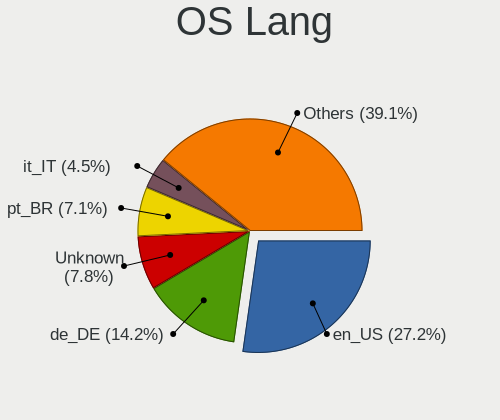
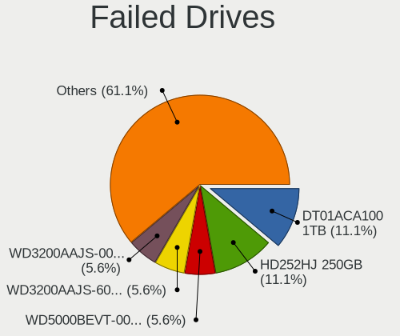
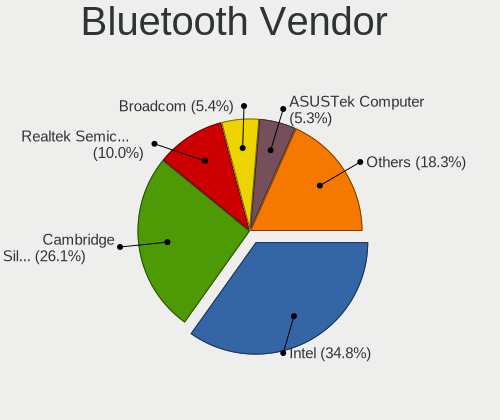
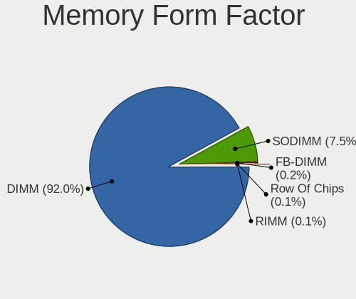
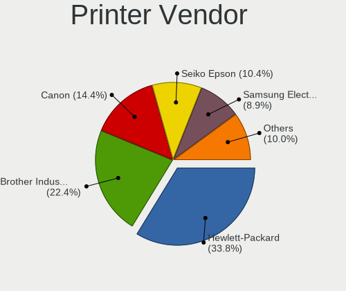

Linux Mint - Tested Hardware & Statistics (Desktops)
----------------------------------------------------

A project to collect tested hardware configurations for Linux Mint.

Anyone can contribute to this report by the [hw-probe](https://github.com/linuxhw/hw-probe) tool:

    sudo -E hw-probe -all -upload

Please contribute! Especially if your hardware is rare.

Contents
--------

* [ Test Cases ](#test-cases)

* [ System ](#system)
  - [ OS                       ](#os)
  - [ OS Family                ](#os-family)
  - [ Kernel                   ](#kernel)
  - [ Kernel Family            ](#kernel-family)
  - [ Kernel Major Ver.        ](#kernel-major-ver)
  - [ Arch                     ](#arch)
  - [ DE                       ](#de)
  - [ Display Server           ](#display-server)
  - [ Display Manager          ](#display-manager)
  - [ OS Lang                  ](#os-lang)
  - [ Boot Mode                ](#boot-mode)
  - [ Filesystem               ](#filesystem)
  - [ Part. scheme             ](#part-scheme)
  - [ Dual Boot with Linux/BSD ](#dual-boot-with-linuxbsd)
  - [ Dual Boot (Win)          ](#dual-boot-win)

* [ Board ](#board)
  - [ Vendor                   ](#vendor)
  - [ Model                    ](#model)
  - [ Model Family             ](#model-family)
  - [ MFG Year                 ](#mfg-year)
  - [ Form Factor              ](#form-factor)
  - [ Secure Boot              ](#secure-boot)
  - [ Coreboot                 ](#coreboot)
  - [ RAM Size                 ](#ram-size)
  - [ RAM Used                 ](#ram-used)
  - [ Total Drives             ](#total-drives)
  - [ Has CD-ROM               ](#has-cd-rom)
  - [ Has Ethernet             ](#has-ethernet)
  - [ Has WiFi                 ](#has-wifi)
  - [ Has Bluetooth            ](#has-bluetooth)

* [ Location ](#location)
  - [ Country                  ](#country)
  - [ City                     ](#city)

* [ Drives ](#drives)
  - [ Drive Vendor             ](#drive-vendor)
  - [ Drive Model              ](#drive-model)
  - [ HDD Vendor               ](#hdd-vendor)
  - [ SSD Vendor               ](#ssd-vendor)
  - [ Drive Kind               ](#drive-kind)
  - [ Drive Connector          ](#drive-connector)
  - [ Drive Size               ](#drive-size)
  - [ Space Total              ](#space-total)
  - [ Space Used               ](#space-used)
  - [ Malfunc. Drives          ](#malfunc-drives)
  - [ Malfunc. Drive Vendor    ](#malfunc-drive-vendor)
  - [ Malfunc. HDD Vendor      ](#malfunc-hdd-vendor)
  - [ Malfunc. Drive Kind      ](#malfunc-drive-kind)
  - [ Failed Drives            ](#failed-drives)
  - [ Failed Drive Vendor      ](#failed-drive-vendor)
  - [ Drive Status             ](#drive-status)

* [ Storage controller ](#storage-controller)
  - [ Storage Vendor           ](#storage-vendor)
  - [ Storage Model            ](#storage-model)
  - [ Storage Kind             ](#storage-kind)

* [ Processor ](#processor)
  - [ CPU Vendor               ](#cpu-vendor)
  - [ CPU Model                ](#cpu-model)
  - [ CPU Model Family         ](#cpu-model-family)
  - [ CPU Cores                ](#cpu-cores)
  - [ CPU Sockets              ](#cpu-sockets)
  - [ CPU Threads              ](#cpu-threads)
  - [ CPU Op-Modes             ](#cpu-op-modes)
  - [ CPU Microcode            ](#cpu-microcode)
  - [ CPU Microarch            ](#cpu-microarch)

* [ Graphics ](#graphics)
  - [ GPU Vendor               ](#gpu-vendor)
  - [ GPU Model                ](#gpu-model)
  - [ GPU Combo                ](#gpu-combo)
  - [ GPU Driver               ](#gpu-driver)
  - [ GPU Memory               ](#gpu-memory)

* [ Monitor ](#monitor)
  - [ Monitor Vendor           ](#monitor-vendor)
  - [ Monitor Model            ](#monitor-model)
  - [ Monitor Resolution       ](#monitor-resolution)
  - [ Monitor Diagonal         ](#monitor-diagonal)
  - [ Monitor Width            ](#monitor-width)
  - [ Aspect Ratio             ](#aspect-ratio)
  - [ Monitor Area             ](#monitor-area)
  - [ Pixel Density            ](#pixel-density)
  - [ Multiple Monitors        ](#multiple-monitors)

* [ Network ](#network)
  - [ Net Controller Vendor    ](#net-controller-vendor)
  - [ Net Controller Model     ](#net-controller-model)
  - [ Wireless Vendor          ](#wireless-vendor)
  - [ Wireless Model           ](#wireless-model)
  - [ Ethernet Vendor          ](#ethernet-vendor)
  - [ Ethernet Model           ](#ethernet-model)
  - [ Net Controller Kind      ](#net-controller-kind)
  - [ Used Controller          ](#used-controller)
  - [ NICs                     ](#nics)
  - [ IPv6                     ](#ipv6)

* [ Bluetooth ](#bluetooth)
  - [ Bluetooth Vendor         ](#bluetooth-vendor)
  - [ Bluetooth Model          ](#bluetooth-model)

* [ Sound ](#sound)
  - [ Sound Vendor             ](#sound-vendor)
  - [ Sound Model              ](#sound-model)

* [ Memory ](#memory)
  - [ Memory Vendor            ](#memory-vendor)
  - [ Memory Model             ](#memory-model)
  - [ Memory Kind              ](#memory-kind)
  - [ Memory Form Factor       ](#memory-form-factor)
  - [ Memory Size              ](#memory-size)
  - [ Memory Speed             ](#memory-speed)

* [ Printers & scanners ](#printers--scanners)
  - [ Printer Vendor           ](#printer-vendor)
  - [ Printer Model            ](#printer-model)
  - [ Scanner Vendor           ](#scanner-vendor)
  - [ Scanner Model            ](#scanner-model)

* [ Camera ](#camera)
  - [ Camera Vendor            ](#camera-vendor)
  - [ Camera Model             ](#camera-model)

* [ Security ](#security)
  - [ Fingerprint Vendor       ](#fingerprint-vendor)
  - [ Fingerprint Model        ](#fingerprint-model)
  - [ Chipcard Vendor          ](#chipcard-vendor)
  - [ Chipcard Model           ](#chipcard-model)

* [ Unsupported ](#unsupported)
  - [ Unsupported Devices      ](#unsupported-devices)
  - [ Unsupported Device Types ](#unsupported-device-types)

Test Cases
----------

Total: 13068

| Vendor        | Model                       | Probe                                                      | Date         |
|---------------|-----------------------------|------------------------------------------------------------|--------------|
| ASRock        | H61M-DGS R2.0               | [47be7b76e5](https://linux-hardware.org/?probe=47be7b76e5) | May 09, 2024 |
| AZW           | MINI S                      | [12557a4240](https://linux-hardware.org/?probe=12557a4240) | May 09, 2024 |
| Foxconn       | 2AB1                        | [11beb142c3](https://linux-hardware.org/?probe=11beb142c3) | May 09, 2024 |
| AZW           | MINI S                      | [7c8e83b2ed](https://linux-hardware.org/?probe=7c8e83b2ed) | May 09, 2024 |
| ASUSTek       | LEONITE                     | [a50f5f9e3a](https://linux-hardware.org/?probe=a50f5f9e3a) | May 08, 2024 |
| MSI           | MS-7255                     | [5e4c3d17d6](https://linux-hardware.org/?probe=5e4c3d17d6) | May 08, 2024 |
| ECS           | H61H2-CM                    | [65f99c7e8d](https://linux-hardware.org/?probe=65f99c7e8d) | May 08, 2024 |
| Dell          | 0WR7PY A01                  | [f154c6f22e](https://linux-hardware.org/?probe=f154c6f22e) | May 07, 2024 |
| ASUSTek       | ROG STRIX Z590-A GAMING ... | [ebd9696c7b](https://linux-hardware.org/?probe=ebd9696c7b) | May 07, 2024 |
| ASUSTek       | PRIME Z790-P WIFI           | [54b9c594a0](https://linux-hardware.org/?probe=54b9c594a0) | May 07, 2024 |
| ASRock        | Z68 Extreme4 Gen3           | [df427b5f9f](https://linux-hardware.org/?probe=df427b5f9f) | May 07, 2024 |
| ASUSTek       | PRIME X570-P                | [2ff26254ae](https://linux-hardware.org/?probe=2ff26254ae) | May 07, 2024 |
| ASUSTek       | ROG STRIX B650E-I GAMING... | [961d8a2758](https://linux-hardware.org/?probe=961d8a2758) | May 07, 2024 |
| Packard Be... | WMCP78M                     | [4d711194fa](https://linux-hardware.org/?probe=4d711194fa) | May 07, 2024 |
| MSI           | X670E GAMING PLUS WIFI      | [72a4d27732](https://linux-hardware.org/?probe=72a4d27732) | May 07, 2024 |
| ASRock        | FM2A88X Extreme6+           | [d12f9a31f3](https://linux-hardware.org/?probe=d12f9a31f3) | May 07, 2024 |
| Gigabyte      | Z77-D3H                     | [01099601fe](https://linux-hardware.org/?probe=01099601fe) | May 07, 2024 |
| Dell          | 03KWTV A00                  | [68f465c06a](https://linux-hardware.org/?probe=68f465c06a) | May 06, 2024 |
| Dell          | 03KWTV A00                  | [1b3f32baf6](https://linux-hardware.org/?probe=1b3f32baf6) | May 06, 2024 |
| HP            | 843B                        | [ed0c184996](https://linux-hardware.org/?probe=ed0c184996) | May 06, 2024 |
| HP            | 843B                        | [bf812339be](https://linux-hardware.org/?probe=bf812339be) | May 06, 2024 |
| ASUSTek       | CM1831                      | [c228565f48](https://linux-hardware.org/?probe=c228565f48) | May 06, 2024 |
| ASUSTek       | CM1831                      | [cc97798ac4](https://linux-hardware.org/?probe=cc97798ac4) | May 06, 2024 |
| MSI           | PRO B650-VC WIFI            | [5ba462d421](https://linux-hardware.org/?probe=5ba462d421) | May 05, 2024 |
| HP            | 1495                        | [f0e80863a7](https://linux-hardware.org/?probe=f0e80863a7) | May 05, 2024 |
| Gigabyte      | F2A88XM-D3HP                | [e362e7892b](https://linux-hardware.org/?probe=e362e7892b) | May 05, 2024 |
| ASUSTek       | ROG STRIX B550-I GAMING     | [169c97e582](https://linux-hardware.org/?probe=169c97e582) | May 04, 2024 |
| HP            | 83E9                        | [d14ba283d6](https://linux-hardware.org/?probe=d14ba283d6) | May 04, 2024 |
| Gigabyte      | B550M AORUS ELITE           | [4e09bfec36](https://linux-hardware.org/?probe=4e09bfec36) | May 04, 2024 |
| ASUSTek       | PRIME A320M-K               | [79a0169068](https://linux-hardware.org/?probe=79a0169068) | May 04, 2024 |
| AMI           | Intel                       | [84952c85f7](https://linux-hardware.org/?probe=84952c85f7) | May 04, 2024 |
| ASUSTek       | PRIME X570-P                | [b76f2f11bd](https://linux-hardware.org/?probe=b76f2f11bd) | May 04, 2024 |
| Shenzhen M... | F7BRC                       | [de61b5eba6](https://linux-hardware.org/?probe=de61b5eba6) | May 04, 2024 |
| Positivo      | POS-EIH610EX 11189814       | [0657842cc3](https://linux-hardware.org/?probe=0657842cc3) | May 03, 2024 |
| HP            | 18E7                        | [22c3e77e54](https://linux-hardware.org/?probe=22c3e77e54) | May 03, 2024 |
| MSI           | B450 GAMING PRO CARBON A... | [9101a05646](https://linux-hardware.org/?probe=9101a05646) | May 03, 2024 |
| ECS           | A780LM-M2                   | [081a49bf0c](https://linux-hardware.org/?probe=081a49bf0c) | May 03, 2024 |
| Gigabyte      | B450 AORUS M                | [931e4419fa](https://linux-hardware.org/?probe=931e4419fa) | May 03, 2024 |
| MSI           | MAG B760M MORTAR WIFI DD... | [a077206bc5](https://linux-hardware.org/?probe=a077206bc5) | May 03, 2024 |
| ASUSTek       | PRIME B550-PLUS             | [01e99b1acd](https://linux-hardware.org/?probe=01e99b1acd) | May 03, 2024 |
| ASUSTek       | P8Z68-V                     | [04f2de6ec1](https://linux-hardware.org/?probe=04f2de6ec1) | May 03, 2024 |
| ASUSTek       | TUF Gaming X570-PLUS        | [fb0da29f4d](https://linux-hardware.org/?probe=fb0da29f4d) | May 03, 2024 |
| Gigabyte      | 970A-DS3P                   | [2512d113c2](https://linux-hardware.org/?probe=2512d113c2) | May 03, 2024 |
| ASRock        | X570 Phantom Gaming 4 Wi... | [181b08bd87](https://linux-hardware.org/?probe=181b08bd87) | May 02, 2024 |
| HP            | 1494                        | [7fb0be6459](https://linux-hardware.org/?probe=7fb0be6459) | May 02, 2024 |
| ASRock        | H170M-ITX/ac                | [856a303262](https://linux-hardware.org/?probe=856a303262) | May 02, 2024 |
| MSI           | G41M-P28                    | [c946f92e74](https://linux-hardware.org/?probe=c946f92e74) | May 02, 2024 |
| Gigabyte      | 945GM-S2                    | [a0e44d4417](https://linux-hardware.org/?probe=a0e44d4417) | May 02, 2024 |
| ASUSTek       | H97-PLUS                    | [1080e65164](https://linux-hardware.org/?probe=1080e65164) | May 02, 2024 |
| MSI           | MAG B650 TOMAHAWK WIFI      | [63daec1367](https://linux-hardware.org/?probe=63daec1367) | May 02, 2024 |
| Intel         | HURONRIVER                  | [da8de15263](https://linux-hardware.org/?probe=da8de15263) | May 02, 2024 |
| Dell          | 0RW203 A00                  | [3fb1f4e9f9](https://linux-hardware.org/?probe=3fb1f4e9f9) | May 01, 2024 |
| AMI           | Intel                       | [0be237c95a](https://linux-hardware.org/?probe=0be237c95a) | May 01, 2024 |
| ASUSTek       | X99-E WS/USB                | [a4df75c4bc](https://linux-hardware.org/?probe=a4df75c4bc) | May 01, 2024 |
| HP            | 1494                        | [1e2a110b7c](https://linux-hardware.org/?probe=1e2a110b7c) | May 01, 2024 |
| ASUSTek       | ROG STRIX B450-F GAMING     | [bb7791835b](https://linux-hardware.org/?probe=bb7791835b) | May 01, 2024 |
| ASUSTek       | M4A87TD/USB3                | [91136f3f95](https://linux-hardware.org/?probe=91136f3f95) | May 01, 2024 |
| ASRock        | H61M-S                      | [2c79ee4cae](https://linux-hardware.org/?probe=2c79ee4cae) | May 01, 2024 |
| HP            | 18E7                        | [f98543789e](https://linux-hardware.org/?probe=f98543789e) | May 01, 2024 |
| Supermicro    | X9SPU-F                     | [ec236a99ac](https://linux-hardware.org/?probe=ec236a99ac) | Apr 30, 2024 |
| Shenzhen M... | F7BFC                       | [43fd55c47a](https://linux-hardware.org/?probe=43fd55c47a) | Apr 30, 2024 |
| MSI           | Z170A GAMING M7             | [3ce4a9b0c5](https://linux-hardware.org/?probe=3ce4a9b0c5) | Apr 30, 2024 |
| ASUSTek       | ROG STRIX Z390-E GAMING     | [e04f6d1c77](https://linux-hardware.org/?probe=e04f6d1c77) | Apr 30, 2024 |
| Shenzhen M... | F7BFC                       | [d480d08c5e](https://linux-hardware.org/?probe=d480d08c5e) | Apr 30, 2024 |
| Dell          | 06NWYK A00                  | [ec673a2386](https://linux-hardware.org/?probe=ec673a2386) | Apr 30, 2024 |
| MSI           | Z170A GAMING M5             | [1d4b2dd7e3](https://linux-hardware.org/?probe=1d4b2dd7e3) | Apr 30, 2024 |
| MSI           | MAG Z690 TOMAHAWK WIFI D... | [5cc26d31fa](https://linux-hardware.org/?probe=5cc26d31fa) | Apr 30, 2024 |
| HP            | 1496                        | [64f726b9c5](https://linux-hardware.org/?probe=64f726b9c5) | Apr 30, 2024 |
| Dell          | 0T7D40 A01                  | [8de750aabf](https://linux-hardware.org/?probe=8de750aabf) | Apr 30, 2024 |
| ASUSTek       | PRIME B550M-A AC            | [199c1abd04](https://linux-hardware.org/?probe=199c1abd04) | Apr 30, 2024 |
| Positivo      | POS-AG31AP                  | [998129cad7](https://linux-hardware.org/?probe=998129cad7) | Apr 29, 2024 |
| MSI           | B350M PRO-VD PLUS           | [25f45497bf](https://linux-hardware.org/?probe=25f45497bf) | Apr 29, 2024 |
| Gigabyte      | GA-880GM-USB3               | [3645662c80](https://linux-hardware.org/?probe=3645662c80) | Apr 29, 2024 |
| HP            | 83E9                        | [f5850d107f](https://linux-hardware.org/?probe=f5850d107f) | Apr 29, 2024 |
| HP            | 2B52                        | [41588d4e13](https://linux-hardware.org/?probe=41588d4e13) | Apr 28, 2024 |
| Gigabyte      | B450M DS3H-CF               | [c85c3d59df](https://linux-hardware.org/?probe=c85c3d59df) | Apr 28, 2024 |
| MSI           | FM2-A75MA-E35               | [9ab41ba299](https://linux-hardware.org/?probe=9ab41ba299) | Apr 28, 2024 |
| Gigabyte      | A620I AX                    | [eeea04465b](https://linux-hardware.org/?probe=eeea04465b) | Apr 28, 2024 |
| Gigabyte      | GA-880GM-USB3               | [ae905aacaf](https://linux-hardware.org/?probe=ae905aacaf) | Apr 28, 2024 |
| AMD           | A88K                        | [5a4ca72c81](https://linux-hardware.org/?probe=5a4ca72c81) | Apr 28, 2024 |
| MSI           | Z97 PC Mate                 | [44a2eb8cdb](https://linux-hardware.org/?probe=44a2eb8cdb) | Apr 27, 2024 |
| ASUSTek       | PRIME B360M-A               | [dfe51458b2](https://linux-hardware.org/?probe=dfe51458b2) | Apr 27, 2024 |
| Dell          | 0KJCC5 A00                  | [04c8546395](https://linux-hardware.org/?probe=04c8546395) | Apr 27, 2024 |
| Gigabyte      | B450M GAMING                | [5d2ca0a62d](https://linux-hardware.org/?probe=5d2ca0a62d) | Apr 27, 2024 |
| ASRock        | X300M-STX                   | [12c4ea5db5](https://linux-hardware.org/?probe=12c4ea5db5) | Apr 26, 2024 |
| ASUSTek       | X99-A/USB                   | [d8616c5a03](https://linux-hardware.org/?probe=d8616c5a03) | Apr 26, 2024 |
| Gigabyte      | B450 AORUS M                | [ff40fe2120](https://linux-hardware.org/?probe=ff40fe2120) | Apr 25, 2024 |
| Gigabyte      | X570 AORUS ELITE            | [921fc0d219](https://linux-hardware.org/?probe=921fc0d219) | Apr 25, 2024 |
| ASUSTek       | P5Q SE                      | [1df93195b0](https://linux-hardware.org/?probe=1df93195b0) | Apr 25, 2024 |
| ASUSTek       | ROG STRIX Z370-E GAMING     | [3ed49ed1c3](https://linux-hardware.org/?probe=3ed49ed1c3) | Apr 24, 2024 |
| ASUSTek       | PRIME B450M-A               | [41856dea7c](https://linux-hardware.org/?probe=41856dea7c) | Apr 24, 2024 |
| ASUSTek       | H81-PLUS                    | [34b4840a60](https://linux-hardware.org/?probe=34b4840a60) | Apr 24, 2024 |
| ASRock        | Z68 Pro3 Gen3               | [2e1897982e](https://linux-hardware.org/?probe=2e1897982e) | Apr 24, 2024 |
| ASRock        | Z68 Pro3 Gen3               | [2383a2962f](https://linux-hardware.org/?probe=2383a2962f) | Apr 24, 2024 |
| Gigabyte      | Z77-DS3H                    | [b80658bbc0](https://linux-hardware.org/?probe=b80658bbc0) | Apr 23, 2024 |
| ASRock        | X570 Phantom Gaming 4 Wi... | [a0877e2a20](https://linux-hardware.org/?probe=a0877e2a20) | Apr 23, 2024 |
| MSI           | PRO B550-VC                 | [d4d863e59c](https://linux-hardware.org/?probe=d4d863e59c) | Apr 23, 2024 |
| Gigabyte      | B460M DS3H V2               | [5b43a749ef](https://linux-hardware.org/?probe=5b43a749ef) | Apr 23, 2024 |
| Gigabyte      | Z790 AERO G                 | [8ef54b37b2](https://linux-hardware.org/?probe=8ef54b37b2) | Apr 23, 2024 |
| ASUSTek       | M4A78LT-M                   | [b0d7f30c2c](https://linux-hardware.org/?probe=b0d7f30c2c) | Apr 23, 2024 |
| ASUSTek       | M4A78LT-M                   | [a04aab72d2](https://linux-hardware.org/?probe=a04aab72d2) | Apr 23, 2024 |
| Gigabyte      | B760M AORUS ELITE           | [3d15cef077](https://linux-hardware.org/?probe=3d15cef077) | Apr 23, 2024 |
| ASUSTek       | PRIME B550-PLUS             | [5d5d8db808](https://linux-hardware.org/?probe=5d5d8db808) | Apr 23, 2024 |
| MSI           | MPG B550 GAMING PLUS        | [02cbf8c1ed](https://linux-hardware.org/?probe=02cbf8c1ed) | Apr 22, 2024 |
| ASUSTek       | ROG STRIX Z390-E GAMING     | [00dea34dc8](https://linux-hardware.org/?probe=00dea34dc8) | Apr 22, 2024 |
| Positivo      | POS-AG31AP                  | [63fb44d22f](https://linux-hardware.org/?probe=63fb44d22f) | Apr 22, 2024 |
| Gigabyte      | B550 GAMING X V2            | [0a1f16fa6a](https://linux-hardware.org/?probe=0a1f16fa6a) | Apr 22, 2024 |
| ASUSTek       | ROG STRIX B450-F GAMING     | [f126ef0f39](https://linux-hardware.org/?probe=f126ef0f39) | Apr 22, 2024 |
| Gigabyte      | B760M H DDR4                | [f833bd4bad](https://linux-hardware.org/?probe=f833bd4bad) | Apr 22, 2024 |
| ASUSTek       | P5Q SE                      | [686ba44668](https://linux-hardware.org/?probe=686ba44668) | Apr 22, 2024 |
| Unknown       | Unknown                     | [746f56684d](https://linux-hardware.org/?probe=746f56684d) | Apr 21, 2024 |
| ASRock        | H61M-S                      | [2e941c8160](https://linux-hardware.org/?probe=2e941c8160) | Apr 21, 2024 |
| ASUSTek       | M3N78 PRO                   | [01371d4a2c](https://linux-hardware.org/?probe=01371d4a2c) | Apr 21, 2024 |
| Dell          | 088DT1 A01                  | [0e5806e0fb](https://linux-hardware.org/?probe=0e5806e0fb) | Apr 21, 2024 |
| Intel         | X99-P4 V5.1                 | [15e8dd212b](https://linux-hardware.org/?probe=15e8dd212b) | Apr 21, 2024 |
| MACHINIST     | H81M-PRO S1 V2.0            | [15bd0a756c](https://linux-hardware.org/?probe=15bd0a756c) | Apr 20, 2024 |
| ASUSTek       | UN42                        | [34fbe9e5b6](https://linux-hardware.org/?probe=34fbe9e5b6) | Apr 20, 2024 |
| Gigabyte      | B660M DS3H DDR4             | [ea7d988606](https://linux-hardware.org/?probe=ea7d988606) | Apr 20, 2024 |
| Shenzhen M... | AHBNB OEM                   | [0ff344b5d6](https://linux-hardware.org/?probe=0ff344b5d6) | Apr 20, 2024 |
| Dell          | 08NPPY A00                  | [36e7d8d2b8](https://linux-hardware.org/?probe=36e7d8d2b8) | Apr 19, 2024 |
| ASUSTek       | PRIME B450M-A               | [704ca87ebc](https://linux-hardware.org/?probe=704ca87ebc) | Apr 19, 2024 |
| Lenovo        | SHARKBAY NO DPK             | [5da21e8599](https://linux-hardware.org/?probe=5da21e8599) | Apr 19, 2024 |
| ASUSTek       | P5GC-VM PRO                 | [841ad48ae6](https://linux-hardware.org/?probe=841ad48ae6) | Apr 19, 2024 |
| Gigabyte      | B760M AORUS ELITE           | [d2b9b5429d](https://linux-hardware.org/?probe=d2b9b5429d) | Apr 19, 2024 |
| Dell          | 0HJ054                      | [d00812b3e5](https://linux-hardware.org/?probe=d00812b3e5) | Apr 19, 2024 |
| Gigabyte      | B650E AORUS MASTER          | [4301ea7b67](https://linux-hardware.org/?probe=4301ea7b67) | Apr 18, 2024 |
| Dell          | 0VD5HY A07                  | [2ebf9fa814](https://linux-hardware.org/?probe=2ebf9fa814) | Apr 18, 2024 |
| ASRock        | A520M-HVS                   | [d1a1528321](https://linux-hardware.org/?probe=d1a1528321) | Apr 18, 2024 |
| ASRock        | A520M-HVS                   | [0a2d73cc82](https://linux-hardware.org/?probe=0a2d73cc82) | Apr 18, 2024 |
| Dell          | 0478VN A00                  | [ffdcce4d7e](https://linux-hardware.org/?probe=ffdcce4d7e) | Apr 18, 2024 |
| ASUSTek       | M5A97 R2.0                  | [ba42f42f14](https://linux-hardware.org/?probe=ba42f42f14) | Apr 17, 2024 |
| MSI           | H81M-E33                    | [51ed26e0d4](https://linux-hardware.org/?probe=51ed26e0d4) | Apr 17, 2024 |
| Gigabyte      | GA-78LMT-USB3               | [87fcdea752](https://linux-hardware.org/?probe=87fcdea752) | Apr 17, 2024 |
| Gigabyte      | A320M-S2H-CF                | [d4479ea9be](https://linux-hardware.org/?probe=d4479ea9be) | Apr 17, 2024 |
| ASUSTek       | PRIME X370-PRO              | [bfa1eb7573](https://linux-hardware.org/?probe=bfa1eb7573) | Apr 17, 2024 |
| Gigabyte      | GA-78LMT-S2P                | [45b35e097e](https://linux-hardware.org/?probe=45b35e097e) | Apr 17, 2024 |
| ASUSTek       | P8H67-M                     | [e3d45ddada](https://linux-hardware.org/?probe=e3d45ddada) | Apr 17, 2024 |
| ASUSTek       | PRIME X370-PRO              | [2e7cde0526](https://linux-hardware.org/?probe=2e7cde0526) | Apr 17, 2024 |
| ASRock        | IMB-181-D                   | [ef7d4868ef](https://linux-hardware.org/?probe=ef7d4868ef) | Apr 16, 2024 |
| ASRock        | IMB-181-D                   | [11f5297b12](https://linux-hardware.org/?probe=11f5297b12) | Apr 16, 2024 |
| ASUSTek       | ROG STRIX Z490-A GAMING     | [1a16ee804f](https://linux-hardware.org/?probe=1a16ee804f) | Apr 16, 2024 |
| ASUSTek       | ROG STRIX Z490-A GAMING     | [2397ebd700](https://linux-hardware.org/?probe=2397ebd700) | Apr 16, 2024 |
| Gigabyte      | 945GM-S2                    | [b7a1a47f74](https://linux-hardware.org/?probe=b7a1a47f74) | Apr 15, 2024 |
| NCR           | IPMQ57.0.0                  | [71888644f5](https://linux-hardware.org/?probe=71888644f5) | Apr 15, 2024 |
| ASUSTek       | P8P67 PRO                   | [3992b48eff](https://linux-hardware.org/?probe=3992b48eff) | Apr 14, 2024 |
| Gigabyte      | B550 AORUS ELITE V2         | [026488f4e9](https://linux-hardware.org/?probe=026488f4e9) | Apr 14, 2024 |
| ASUSTek       | M4A77TD PRO                 | [1a2f03a742](https://linux-hardware.org/?probe=1a2f03a742) | Apr 14, 2024 |
| Gigabyte      | B450M GAMING                | [b4ac82dde9](https://linux-hardware.org/?probe=b4ac82dde9) | Apr 14, 2024 |
| ANGXUN        | X99-DM3 V3.0                | [7beaf3fb93](https://linux-hardware.org/?probe=7beaf3fb93) | Apr 14, 2024 |
| ASUSTek       | TUF Gaming H670-PRO WIFI... | [5308fb42b9](https://linux-hardware.org/?probe=5308fb42b9) | Apr 14, 2024 |
| Foxconn       | 2AB1 DVT                    | [3b22939d9e](https://linux-hardware.org/?probe=3b22939d9e) | Apr 14, 2024 |
| HP            | 2B52                        | [e775ba35a1](https://linux-hardware.org/?probe=e775ba35a1) | Apr 13, 2024 |
| Gigabyte      | B450 AORUS PRO-CF           | [84e0f3d8a3](https://linux-hardware.org/?probe=84e0f3d8a3) | Apr 13, 2024 |
| Gigabyte      | B365 M AORUS ELITE-CF       | [b00ebd6fcc](https://linux-hardware.org/?probe=b00ebd6fcc) | Apr 13, 2024 |
| HP            | 8459                        | [2db1190eca](https://linux-hardware.org/?probe=2db1190eca) | Apr 13, 2024 |
| ASRock        | 970 Performance             | [f631fc640a](https://linux-hardware.org/?probe=f631fc640a) | Apr 13, 2024 |
| Dell          | 0YC9KY A00                  | [d97e9bda3d](https://linux-hardware.org/?probe=d97e9bda3d) | Apr 12, 2024 |
| Dell          | 0YC9KY A00                  | [250b239ec8](https://linux-hardware.org/?probe=250b239ec8) | Apr 12, 2024 |
| MSI           | B450M MORTAR TITANIUM       | [951b22300e](https://linux-hardware.org/?probe=951b22300e) | Apr 12, 2024 |
| HP            | 2B2B                        | [e5c1d16bde](https://linux-hardware.org/?probe=e5c1d16bde) | Apr 12, 2024 |
| MSI           | MAG B550 TOMAHAWK           | [da4ef61179](https://linux-hardware.org/?probe=da4ef61179) | Apr 12, 2024 |
| MSI           | B450 TOMAHAWK MAX           | [00f8d60e91](https://linux-hardware.org/?probe=00f8d60e91) | Apr 12, 2024 |
| Gigabyte      | F2A55M-DS2                  | [2791ddf5ed](https://linux-hardware.org/?probe=2791ddf5ed) | Apr 12, 2024 |
| MSI           | PRO B650-S WIFI             | [f5372b6597](https://linux-hardware.org/?probe=f5372b6597) | Apr 12, 2024 |
| ASUSTek       | P8Z68-V                     | [e6cd50c20c](https://linux-hardware.org/?probe=e6cd50c20c) | Apr 12, 2024 |
| Fujitsu       | D3600-A1 S26361-D3600-A1    | [4f86a9d176](https://linux-hardware.org/?probe=4f86a9d176) | Apr 12, 2024 |
| ASUSTek       | H97M-E                      | [480b3f6149](https://linux-hardware.org/?probe=480b3f6149) | Apr 11, 2024 |
| MSI           | MPG X570 GAMING PLUS        | [0b6d67b3c6](https://linux-hardware.org/?probe=0b6d67b3c6) | Apr 11, 2024 |
| ASRock        | B650E Taichi Lite           | [3fef4977e0](https://linux-hardware.org/?probe=3fef4977e0) | Apr 11, 2024 |
| AZW           | MINI S 10                   | [c35d67dc45](https://linux-hardware.org/?probe=c35d67dc45) | Apr 11, 2024 |
| ASRock        | H61M-DGS R2.0               | [6cc6864692](https://linux-hardware.org/?probe=6cc6864692) | Apr 11, 2024 |
| Hardkernel    | ODROID-H3                   | [aaff3fce7c](https://linux-hardware.org/?probe=aaff3fce7c) | Apr 11, 2024 |
| Gigabyte      | B550 AORUS ELITE V2         | [cfca756ef5](https://linux-hardware.org/?probe=cfca756ef5) | Apr 11, 2024 |
| Gigabyte      | B450 AORUS ELITE V2         | [330f3172fe](https://linux-hardware.org/?probe=330f3172fe) | Apr 11, 2024 |
| Gigabyte      | B450 AORUS ELITE V2         | [11b54dd819](https://linux-hardware.org/?probe=11b54dd819) | Apr 10, 2024 |
| ASUSTek       | PRIME A320M-K               | [79ea757db1](https://linux-hardware.org/?probe=79ea757db1) | Apr 10, 2024 |
| Gigabyte      | F2A55M-DS2                  | [93ad76a0f3](https://linux-hardware.org/?probe=93ad76a0f3) | Apr 10, 2024 |
| MSI           | A320M-A PRO                 | [5aadef654b](https://linux-hardware.org/?probe=5aadef654b) | Apr 10, 2024 |
| Gigabyte      | B550 AORUS ELITE AX V2      | [9fe60ba9aa](https://linux-hardware.org/?probe=9fe60ba9aa) | Apr 10, 2024 |
| ASUSTek       | PD500TC                     | [2d86ec4d4e](https://linux-hardware.org/?probe=2d86ec4d4e) | Apr 10, 2024 |
| Dell          | 0HD5W2 A00                  | [12d872ff99](https://linux-hardware.org/?probe=12d872ff99) | Apr 10, 2024 |
| MSI           | P55-CD53                    | [8a5279dfd8](https://linux-hardware.org/?probe=8a5279dfd8) | Apr 10, 2024 |
| HP            | 81C5 MVB                    | [54bbd2b7d2](https://linux-hardware.org/?probe=54bbd2b7d2) | Apr 09, 2024 |
| HP            | 2ADE                        | [3de5b32cc5](https://linux-hardware.org/?probe=3de5b32cc5) | Apr 09, 2024 |
| Intel         | H61                         | [02ce84869d](https://linux-hardware.org/?probe=02ce84869d) | Apr 09, 2024 |
| Gigabyte      | H370 HD3-CF                 | [adc440db7b](https://linux-hardware.org/?probe=adc440db7b) | Apr 09, 2024 |
| Biostar       | H610MH                      | [588cd60ee9](https://linux-hardware.org/?probe=588cd60ee9) | Apr 08, 2024 |
| ASUSTek       | K30BF_M32BF                 | [4538260fe0](https://linux-hardware.org/?probe=4538260fe0) | Apr 08, 2024 |
| MSI           | NF725M-P43                  | [9fc3ac2e10](https://linux-hardware.org/?probe=9fc3ac2e10) | Apr 07, 2024 |
| ASUSTek       | H81M-R 2016-11-08           | [7ecfc5dbec](https://linux-hardware.org/?probe=7ecfc5dbec) | Apr 07, 2024 |
| Packard Be... | WMCP78M                     | [89a292ea11](https://linux-hardware.org/?probe=89a292ea11) | Apr 07, 2024 |
| ASUSTek       | PRIME B450-PLUS             | [5e5d778bb2](https://linux-hardware.org/?probe=5e5d778bb2) | Apr 07, 2024 |
| MSI           | H81M-P33                    | [0dcd1237c1](https://linux-hardware.org/?probe=0dcd1237c1) | Apr 07, 2024 |
| MSI           | H81M-P33                    | [e6f1fa8676](https://linux-hardware.org/?probe=e6f1fa8676) | Apr 07, 2024 |
| ASRock        | X670E Steel Legend          | [1afab08a3c](https://linux-hardware.org/?probe=1afab08a3c) | Apr 07, 2024 |
| HP            | 2AF7                        | [e666f2cf49](https://linux-hardware.org/?probe=e666f2cf49) | Apr 06, 2024 |
| Gigabyte      | B360 AORUS GAMING 3 WIFI... | [2146bb4952](https://linux-hardware.org/?probe=2146bb4952) | Apr 06, 2024 |
| ASUSTek       | PRIME B450-PLUS             | [f6d44a7557](https://linux-hardware.org/?probe=f6d44a7557) | Apr 06, 2024 |
| Dell          | 0XCR8D A03                  | [bad21847e5](https://linux-hardware.org/?probe=bad21847e5) | Apr 06, 2024 |
| Dell          | 0XCR8D A03                  | [a80358f28f](https://linux-hardware.org/?probe=a80358f28f) | Apr 06, 2024 |
| Packard Be... | WMCP78M                     | [e91b099d94](https://linux-hardware.org/?probe=e91b099d94) | Apr 06, 2024 |
| Gigabyte      | B250M-DS3H-CF               | [f7f9591a0c](https://linux-hardware.org/?probe=f7f9591a0c) | Apr 06, 2024 |
| GEEKOM        | Mini IT13                   | [b867775b62](https://linux-hardware.org/?probe=b867775b62) | Apr 06, 2024 |
| HP            | 8455                        | [487bf9d08f](https://linux-hardware.org/?probe=487bf9d08f) | Apr 06, 2024 |
| HP            | 8455                        | [21d1aa3abc](https://linux-hardware.org/?probe=21d1aa3abc) | Apr 06, 2024 |
| ASUSTek       | TUF Z370-PLUS GAMING        | [ec2b31f421](https://linux-hardware.org/?probe=ec2b31f421) | Apr 06, 2024 |
| Medion        | MS-7616                     | [56af7df034](https://linux-hardware.org/?probe=56af7df034) | Apr 05, 2024 |
| Gigabyte      | B550 AORUS ELITE AX V2      | [f37f18a2f2](https://linux-hardware.org/?probe=f37f18a2f2) | Apr 05, 2024 |
| BESSTAR Te... | T3 MRD                      | [d83dfe9a6b](https://linux-hardware.org/?probe=d83dfe9a6b) | Apr 05, 2024 |
| ASRock        | H61M-DGS R2.0               | [79f551af8b](https://linux-hardware.org/?probe=79f551af8b) | Apr 05, 2024 |
| Medion        | MS-7616                     | [0e2230b44e](https://linux-hardware.org/?probe=0e2230b44e) | Apr 05, 2024 |
| ASUSTek       | P5GC-MX/CKD/SI              | [bcdaf014cf](https://linux-hardware.org/?probe=bcdaf014cf) | Apr 05, 2024 |
| Gigabyte      | 970A-DS3P                   | [e49537ac20](https://linux-hardware.org/?probe=e49537ac20) | Apr 04, 2024 |
| MSI           | Z590 PRO WIFI [CEC]         | [58be9748dc](https://linux-hardware.org/?probe=58be9748dc) | Apr 04, 2024 |
| ASUSTek       | TUF Gaming Z690-PLUS WIF... | [c0539b33c5](https://linux-hardware.org/?probe=c0539b33c5) | Apr 04, 2024 |
| Intel         | H55                         | [27ff13d7fe](https://linux-hardware.org/?probe=27ff13d7fe) | Apr 04, 2024 |
| Lenovo        | 1030 SDK0E50510 WIN 2625... | [b0cc62ba97](https://linux-hardware.org/?probe=b0cc62ba97) | Apr 04, 2024 |
| ASRock        | B360M Performance           | [bcaed0bbb8](https://linux-hardware.org/?probe=bcaed0bbb8) | Apr 04, 2024 |
| Intel         | H61                         | [aeaab1ea22](https://linux-hardware.org/?probe=aeaab1ea22) | Apr 04, 2024 |
| BESSTAR Te... | T3 MRD                      | [7ca682c1fd](https://linux-hardware.org/?probe=7ca682c1fd) | Apr 04, 2024 |
| ASRock        | H81M-DG4                    | [422726b1b4](https://linux-hardware.org/?probe=422726b1b4) | Apr 03, 2024 |
| ASUSTek       | TUF Gaming X570-PLUS_BR     | [0fe9387508](https://linux-hardware.org/?probe=0fe9387508) | Apr 03, 2024 |
| ASUSTek       | PRIME A320M-K               | [542543f41c](https://linux-hardware.org/?probe=542543f41c) | Apr 03, 2024 |
| ASUSTek       | PRIME A320M-R               | [e04d3554e4](https://linux-hardware.org/?probe=e04d3554e4) | Apr 03, 2024 |
| Unknown       | 1.0                         | [dd02702b8b](https://linux-hardware.org/?probe=dd02702b8b) | Apr 03, 2024 |
| GEEKOM        | Mini IT13                   | [a1a4fb6a47](https://linux-hardware.org/?probe=a1a4fb6a47) | Apr 03, 2024 |
| Dell          | 0M5DCD A00                  | [893dee5720](https://linux-hardware.org/?probe=893dee5720) | Apr 03, 2024 |
| ASRock        | B450M Steel Legend          | [10cdfb9bf3](https://linux-hardware.org/?probe=10cdfb9bf3) | Apr 03, 2024 |
| Shenzhen M... | F7BFC                       | [14314af91a](https://linux-hardware.org/?probe=14314af91a) | Apr 03, 2024 |
| Biostar       | IH61MF-Q5                   | [4683e60b66](https://linux-hardware.org/?probe=4683e60b66) | Apr 02, 2024 |
| Biostar       | IH61MF-Q5                   | [a5194cd386](https://linux-hardware.org/?probe=a5194cd386) | Apr 02, 2024 |
| Gigabyte      | 970A-UD3P                   | [8b2f785ed8](https://linux-hardware.org/?probe=8b2f785ed8) | Apr 02, 2024 |
| Intel         | JSL MRD                     | [781573233b](https://linux-hardware.org/?probe=781573233b) | Apr 02, 2024 |
| Intel         | JSL MRD                     | [c49773732a](https://linux-hardware.org/?probe=c49773732a) | Apr 02, 2024 |
| Kraftway      | KWH77                       | [cbd3a382de](https://linux-hardware.org/?probe=cbd3a382de) | Apr 02, 2024 |
| ASUSTek       | M5A78L-M PLUS/USB3          | [f16c1fe48e](https://linux-hardware.org/?probe=f16c1fe48e) | Apr 02, 2024 |
| Dell          | 0GXM1W A00                  | [0af28f3719](https://linux-hardware.org/?probe=0af28f3719) | Apr 02, 2024 |
| MSI           | A520M-A PRO                 | [67f2e7a5f4](https://linux-hardware.org/?probe=67f2e7a5f4) | Apr 01, 2024 |
| ASUSTek       | H81M-K                      | [e7044658cf](https://linux-hardware.org/?probe=e7044658cf) | Apr 01, 2024 |
| ASUSTek       | P5GC-MX/1333                | [308b9667e8](https://linux-hardware.org/?probe=308b9667e8) | Apr 01, 2024 |
| ASUSTek       | PRIME Q270M-C               | [608007e987](https://linux-hardware.org/?probe=608007e987) | Apr 01, 2024 |
| Dell          | 0RW203 A00                  | [ee49ed88ae](https://linux-hardware.org/?probe=ee49ed88ae) | Mar 31, 2024 |
| ASUSTek       | G11CD                       | [40ab66cb00](https://linux-hardware.org/?probe=40ab66cb00) | Mar 31, 2024 |
| ASUSTek       | M5A78L-M PLUS/USB3          | [553bf2a728](https://linux-hardware.org/?probe=553bf2a728) | Mar 31, 2024 |
| ASUSTek       | ROG STRIX X570-E GAMING     | [c6097989d9](https://linux-hardware.org/?probe=c6097989d9) | Mar 30, 2024 |
| HP            | 1998                        | [210c696e70](https://linux-hardware.org/?probe=210c696e70) | Mar 30, 2024 |
| HP            | 1825                        | [0e7671d502](https://linux-hardware.org/?probe=0e7671d502) | Mar 30, 2024 |
| Gigabyte      | H610M H V2 DDR4             | [f2d3e09bab](https://linux-hardware.org/?probe=f2d3e09bab) | Mar 30, 2024 |
| Gigabyte      | B450M DS3H V2               | [f59b841fe1](https://linux-hardware.org/?probe=f59b841fe1) | Mar 30, 2024 |
| Unknown       | MZ-B75-S                    | [2db5e87f4d](https://linux-hardware.org/?probe=2db5e87f4d) | Mar 30, 2024 |
| ASUSTek       | PRIME X370-PRO              | [924fb04b1c](https://linux-hardware.org/?probe=924fb04b1c) | Mar 30, 2024 |
| ASUSTek       | TUF Gaming Z690-PLUS WIF... | [9d546e2e72](https://linux-hardware.org/?probe=9d546e2e72) | Mar 30, 2024 |
| HP            | 1495                        | [dd31afc968](https://linux-hardware.org/?probe=dd31afc968) | Mar 29, 2024 |
| ASUSTek       | PRIME B450-PLUS             | [25ba3feb6f](https://linux-hardware.org/?probe=25ba3feb6f) | Mar 28, 2024 |
| ASUSTek       | P6X58D-E                    | [e5ee0e61a8](https://linux-hardware.org/?probe=e5ee0e61a8) | Mar 28, 2024 |
| Itautec       | NT 2030                     | [540ca1e0d9](https://linux-hardware.org/?probe=540ca1e0d9) | Mar 28, 2024 |
| HP            | 3398                        | [97bcb402ed](https://linux-hardware.org/?probe=97bcb402ed) | Mar 28, 2024 |
| Gigabyte      | A620I AX                    | [23531206bf](https://linux-hardware.org/?probe=23531206bf) | Mar 28, 2024 |
| ASUSTek       | ROG STRIX B650E-F GAMING... | [3f2559b2fe](https://linux-hardware.org/?probe=3f2559b2fe) | Mar 28, 2024 |
| MSI           | B450 TOMAHAWK               | [fcfc59a38b](https://linux-hardware.org/?probe=fcfc59a38b) | Mar 28, 2024 |
| Gigabyte      | P67A-D3-B3                  | [e5f263a343](https://linux-hardware.org/?probe=e5f263a343) | Mar 28, 2024 |
| Pegatron      | 2ADC                        | [9f9c35e7b5](https://linux-hardware.org/?probe=9f9c35e7b5) | Mar 27, 2024 |
| Lenovo        | 364F SDK0J40700 WIN 3258... | [b5091fa59f](https://linux-hardware.org/?probe=b5091fa59f) | Mar 27, 2024 |
| ASUSTek       | PRIME B460M-A               | [63a643c790](https://linux-hardware.org/?probe=63a643c790) | Mar 26, 2024 |
| HP            | 8105                        | [8fc02b7748](https://linux-hardware.org/?probe=8fc02b7748) | Mar 26, 2024 |
| HP            | 8441                        | [a4abd82089](https://linux-hardware.org/?probe=a4abd82089) | Mar 26, 2024 |
| AZW           | MINI S                      | [0bfd5c7e49](https://linux-hardware.org/?probe=0bfd5c7e49) | Mar 26, 2024 |
| Dell          | 07C0H8 A00                  | [77c19e917c](https://linux-hardware.org/?probe=77c19e917c) | Mar 25, 2024 |
| MSI           | MPG B550 GAMING PLUS        | [724ab910bd](https://linux-hardware.org/?probe=724ab910bd) | Mar 25, 2024 |
| ASRock        | H510M/ac                    | [37ecfed47c](https://linux-hardware.org/?probe=37ecfed47c) | Mar 25, 2024 |
| ASUSTek       | PRIME A320M-K               | [bd7efcd022](https://linux-hardware.org/?probe=bd7efcd022) | Mar 25, 2024 |
| ASRock        | B460M-HDV                   | [221cd35077](https://linux-hardware.org/?probe=221cd35077) | Mar 25, 2024 |
| HP            | 805D                        | [848062b5d1](https://linux-hardware.org/?probe=848062b5d1) | Mar 25, 2024 |
| HP            | 2B52                        | [5f6112f456](https://linux-hardware.org/?probe=5f6112f456) | Mar 25, 2024 |
| HP            | 2B52                        | [d6d9cdd38e](https://linux-hardware.org/?probe=d6d9cdd38e) | Mar 25, 2024 |
| ASUSTek       | ROG STRIX B550-F GAMING     | [6988244928](https://linux-hardware.org/?probe=6988244928) | Mar 25, 2024 |
| ASUSTek       | ROG STRIX B550-F GAMING     | [063c89473d](https://linux-hardware.org/?probe=063c89473d) | Mar 25, 2024 |
| ASRock        | TRX40 Taichi                | [999de32449](https://linux-hardware.org/?probe=999de32449) | Mar 25, 2024 |
| MSI           | MAG B550M MORTAR MAX WIF... | [f52b6614e0](https://linux-hardware.org/?probe=f52b6614e0) | Mar 25, 2024 |
| ASUSTek       | ROG STRIX B550-I GAMING     | [e8278f3412](https://linux-hardware.org/?probe=e8278f3412) | Mar 24, 2024 |
| ASUSTek       | B150M-A/M.2                 | [7d11879130](https://linux-hardware.org/?probe=7d11879130) | Mar 24, 2024 |
| ASUSTek       | P8B75-M LX                  | [ed517cdf25](https://linux-hardware.org/?probe=ed517cdf25) | Mar 24, 2024 |
| MSI           | 785GTM-E45                  | [e00698a65b](https://linux-hardware.org/?probe=e00698a65b) | Mar 24, 2024 |
| MSI           | X570-A PRO                  | [1545d7db10](https://linux-hardware.org/?probe=1545d7db10) | Mar 24, 2024 |
| HP            | 1495                        | [36d31b0971](https://linux-hardware.org/?probe=36d31b0971) | Mar 24, 2024 |
| ASUSTek       | CROSSHAIR VI HERO           | [52902a9cbc](https://linux-hardware.org/?probe=52902a9cbc) | Mar 24, 2024 |
| Unknown       | Unknown                     | [0e68a4f6db](https://linux-hardware.org/?probe=0e68a4f6db) | Mar 24, 2024 |
| Gigabyte      | H110M-A-CF                  | [febd8c1270](https://linux-hardware.org/?probe=febd8c1270) | Mar 24, 2024 |
| Dell          | 0PC5F7 A03                  | [75d7f9b547](https://linux-hardware.org/?probe=75d7f9b547) | Mar 24, 2024 |
| Gigabyte      | B550M DS3H                  | [920a3d2b6b](https://linux-hardware.org/?probe=920a3d2b6b) | Mar 23, 2024 |
| HP            | ProLiant MicroServer Gen... | [e309e43757](https://linux-hardware.org/?probe=e309e43757) | Mar 23, 2024 |
| ASRock        | H110M-HDV                   | [fa6c0a124f](https://linux-hardware.org/?probe=fa6c0a124f) | Mar 23, 2024 |
| Purism        | Librem Mini v2              | [4aee0f0e32](https://linux-hardware.org/?probe=4aee0f0e32) | Mar 23, 2024 |
| Intel         | D34010WYK H14771-303        | [4c578b4a13](https://linux-hardware.org/?probe=4c578b4a13) | Mar 23, 2024 |
| ASRock        | X670E PG Lightning          | [31cf5b8e53](https://linux-hardware.org/?probe=31cf5b8e53) | Mar 23, 2024 |
| ASUSTek       | PRIME H610M-E D4            | [44cf5392ad](https://linux-hardware.org/?probe=44cf5392ad) | Mar 23, 2024 |
| ASUSTek       | TUF Gaming A520M-PLUS II    | [ae73fe90d9](https://linux-hardware.org/?probe=ae73fe90d9) | Mar 23, 2024 |
| ASUSTek       | B150 PRO GAMING D3          | [3739c8bb05](https://linux-hardware.org/?probe=3739c8bb05) | Mar 23, 2024 |
| ASRock        | X300M-STX                   | [6a74f1f889](https://linux-hardware.org/?probe=6a74f1f889) | Mar 23, 2024 |
| Gigabyte      | Z390 AORUS PRO-CF           | [7d8078d060](https://linux-hardware.org/?probe=7d8078d060) | Mar 23, 2024 |
| Dell          | 0M5DCD A00                  | [3254f035d9](https://linux-hardware.org/?probe=3254f035d9) | Mar 22, 2024 |
| HPE           | ProLiant MicroServer Gen... | [237cf90962](https://linux-hardware.org/?probe=237cf90962) | Mar 22, 2024 |
| HP            | 1905                        | [6e80318f95](https://linux-hardware.org/?probe=6e80318f95) | Mar 22, 2024 |
| ASUSTek       | M2NPV-VM                    | [9ecfe7f476](https://linux-hardware.org/?probe=9ecfe7f476) | Mar 22, 2024 |
| ASUSTek       | M2NPV-VM                    | [a6c25bf118](https://linux-hardware.org/?probe=a6c25bf118) | Mar 22, 2024 |
| HP            | 18E5                        | [f930adc0a1](https://linux-hardware.org/?probe=f930adc0a1) | Mar 22, 2024 |
| ASUSTek       | P5QL-ASUS-SE                | [f2e727e087](https://linux-hardware.org/?probe=f2e727e087) | Mar 22, 2024 |
| Positivo      | POS-MIH61CF                 | [05e160dda6](https://linux-hardware.org/?probe=05e160dda6) | Mar 22, 2024 |
| MSI           | Z97 GAMING 3                | [0022a19da8](https://linux-hardware.org/?probe=0022a19da8) | Mar 21, 2024 |
| ASRock        | B550M-C                     | [e252b80e8b](https://linux-hardware.org/?probe=e252b80e8b) | Mar 21, 2024 |
| HP            | 840A                        | [6e5184d145](https://linux-hardware.org/?probe=6e5184d145) | Mar 21, 2024 |
| Lenovo        | Bantry CRB SDK0E50510 WI... | [3a158f6014](https://linux-hardware.org/?probe=3a158f6014) | Mar 21, 2024 |
| ASUSTek       | PRIME B450-PLUS             | [d19c8f905a](https://linux-hardware.org/?probe=d19c8f905a) | Mar 20, 2024 |
| ASRock        | FM2A88X Extreme6+           | [9469cf24b2](https://linux-hardware.org/?probe=9469cf24b2) | Mar 20, 2024 |
| ASRock        | H81M-VG4                    | [627ddc4a77](https://linux-hardware.org/?probe=627ddc4a77) | Mar 20, 2024 |
| ASUSTek       | H97M-E                      | [842c8ac6e4](https://linux-hardware.org/?probe=842c8ac6e4) | Mar 19, 2024 |
| ASUSTek       | Z170 PRO GAMING             | [a9647ad337](https://linux-hardware.org/?probe=a9647ad337) | Mar 19, 2024 |
| Apple         | Mac-F221BEC8                | [e928c2021f](https://linux-hardware.org/?probe=e928c2021f) | Mar 19, 2024 |
| Itautec       | NT 2030                     | [9a2e39e058](https://linux-hardware.org/?probe=9a2e39e058) | Mar 19, 2024 |
| MSI           | 760GM-P23                   | [ceac187901](https://linux-hardware.org/?probe=ceac187901) | Mar 18, 2024 |
| Dell          | 040DDP A01                  | [849df2b79d](https://linux-hardware.org/?probe=849df2b79d) | Mar 18, 2024 |
| ASUSTek       | A55M-A                      | [15b0e5c885](https://linux-hardware.org/?probe=15b0e5c885) | Mar 18, 2024 |
| Intel         | Unknown                     | [4ec95381a2](https://linux-hardware.org/?probe=4ec95381a2) | Mar 18, 2024 |
| MSI           | 760GM-P23                   | [ad63b7bde8](https://linux-hardware.org/?probe=ad63b7bde8) | Mar 18, 2024 |
| MSI           | MPG Z790I EDGE WIFI         | [8c4e5d61b2](https://linux-hardware.org/?probe=8c4e5d61b2) | Mar 18, 2024 |
| ASUSTek       | TUF B450-PLUS GAMING        | [755c0a8e92](https://linux-hardware.org/?probe=755c0a8e92) | Mar 17, 2024 |
| ASUSTek       | PRIME X670-P WIFI           | [05db7d37dc](https://linux-hardware.org/?probe=05db7d37dc) | Mar 17, 2024 |
| ANGXUN        | X79 (INTEL Xeon E5/Corei... | [3ec8fc69b2](https://linux-hardware.org/?probe=3ec8fc69b2) | Mar 17, 2024 |
| Dell          | 0JP3NX A02                  | [5f4cb3cc05](https://linux-hardware.org/?probe=5f4cb3cc05) | Mar 17, 2024 |
| Medion        | MS-7797                     | [7e9607a4b6](https://linux-hardware.org/?probe=7e9607a4b6) | Mar 17, 2024 |
| Fujitsu Si... | D2750-A2 S26361-D2750-A2    | [35962081a4](https://linux-hardware.org/?probe=35962081a4) | Mar 17, 2024 |
| ASUSTek       | Z170 PRO GAMING             | [ddd79fecda](https://linux-hardware.org/?probe=ddd79fecda) | Mar 17, 2024 |
| Gigabyte      | B450 AORUS M                | [aad1a74ca6](https://linux-hardware.org/?probe=aad1a74ca6) | Mar 17, 2024 |
| Supermicro    | H8DA8-2                     | [542f4ad8d9](https://linux-hardware.org/?probe=542f4ad8d9) | Mar 16, 2024 |
| Gigabyte      | B450M S2H                   | [2ee79ff5bc](https://linux-hardware.org/?probe=2ee79ff5bc) | Mar 15, 2024 |
| Unknown       | Unknown                     | [765be7c26e](https://linux-hardware.org/?probe=765be7c26e) | Mar 15, 2024 |
| PCWare        | IPX1800E2                   | [ee70917de1](https://linux-hardware.org/?probe=ee70917de1) | Mar 15, 2024 |
| ASUSTek       | TUF B450-PRO GAMING         | [e35b463804](https://linux-hardware.org/?probe=e35b463804) | Mar 15, 2024 |
| Gigabyte      | B760 AORUS ELITE            | [ee0981094e](https://linux-hardware.org/?probe=ee0981094e) | Mar 14, 2024 |
| ASUSTek       | TUF Gaming B550M-PLUS       | [30a3327d61](https://linux-hardware.org/?probe=30a3327d61) | Mar 14, 2024 |
| Gigabyte      | B550I AORUS PRO AX          | [45e29d86a8](https://linux-hardware.org/?probe=45e29d86a8) | Mar 14, 2024 |
| MSI           | MPG B550 GAMING CARBON W... | [1c1825d346](https://linux-hardware.org/?probe=1c1825d346) | Mar 13, 2024 |
| Dell          | 0NNNCT A01                  | [376ec1b8b2](https://linux-hardware.org/?probe=376ec1b8b2) | Mar 13, 2024 |
| MSI           | MAG Z690 TOMAHAWK WIFI D... | [891a48cda5](https://linux-hardware.org/?probe=891a48cda5) | Mar 13, 2024 |
| Lenovo        | 102F SDK0E50510 WIN 2625... | [25ae3017eb](https://linux-hardware.org/?probe=25ae3017eb) | Mar 13, 2024 |
| Gigabyte      | X670E AORUS MASTER          | [862dd3ff41](https://linux-hardware.org/?probe=862dd3ff41) | Mar 13, 2024 |
| Dell          | 04GJJT A00                  | [eb3450b8dc](https://linux-hardware.org/?probe=eb3450b8dc) | Mar 13, 2024 |
| Unknown       | Unknown                     | [044a673e81](https://linux-hardware.org/?probe=044a673e81) | Mar 12, 2024 |
| MSI           | MAG X570 TOMAHAWK WIFI      | [e919992baf](https://linux-hardware.org/?probe=e919992baf) | Mar 12, 2024 |
| Gigabyte      | 970A-UD3P                   | [8baf55b3f3](https://linux-hardware.org/?probe=8baf55b3f3) | Mar 12, 2024 |
| Gigabyte      | GA-880GM-USB3               | [253f367111](https://linux-hardware.org/?probe=253f367111) | Mar 12, 2024 |
| ASUSTek       | ROG STRIX B550-F GAMING ... | [a66c5f74dd](https://linux-hardware.org/?probe=a66c5f74dd) | Mar 12, 2024 |
| Gigabyte      | B450M DS3H V2               | [d74df494d7](https://linux-hardware.org/?probe=d74df494d7) | Mar 12, 2024 |
| Intel         | JSL MRD                     | [50a971a518](https://linux-hardware.org/?probe=50a971a518) | Mar 11, 2024 |
| ASUSTek       | P5KC                        | [31ffdb4543](https://linux-hardware.org/?probe=31ffdb4543) | Mar 11, 2024 |
| HP            | 8055                        | [608a6513a0](https://linux-hardware.org/?probe=608a6513a0) | Mar 11, 2024 |
| Gigabyte      | B550I AORUS PRO AX          | [db466790ad](https://linux-hardware.org/?probe=db466790ad) | Mar 11, 2024 |
| Dell          | 0D6H9T A00                  | [ccfb90e0ff](https://linux-hardware.org/?probe=ccfb90e0ff) | Mar 11, 2024 |
| ASUSTek       | P6T DELUXE V2               | [6b1dcf50e8](https://linux-hardware.org/?probe=6b1dcf50e8) | Mar 10, 2024 |
| ASUSTek       | M5A99X EVO R2.0             | [10fb0f7876](https://linux-hardware.org/?probe=10fb0f7876) | Mar 10, 2024 |
| MSI           | B550 GAMING GEN3            | [f2c2df18c1](https://linux-hardware.org/?probe=f2c2df18c1) | Mar 10, 2024 |
| Gigabyte      | Z77-D3H                     | [6be0c27695](https://linux-hardware.org/?probe=6be0c27695) | Mar 10, 2024 |
| ASRock        | Z170 Extreme4               | [8d517d208f](https://linux-hardware.org/?probe=8d517d208f) | Mar 10, 2024 |
| Dell          | 0XCR8D A00                  | [aaffbbe746](https://linux-hardware.org/?probe=aaffbbe746) | Mar 10, 2024 |
| HP            | 3396                        | [63db379db7](https://linux-hardware.org/?probe=63db379db7) | Mar 10, 2024 |
| Gigabyte      | Z77-D3H                     | [84b8690965](https://linux-hardware.org/?probe=84b8690965) | Mar 10, 2024 |
| ASUSTek       | PRIME X670-P WIFI           | [f4b929eaac](https://linux-hardware.org/?probe=f4b929eaac) | Mar 09, 2024 |
| ASUSTek       | PRIME B450M-A II            | [903192b99a](https://linux-hardware.org/?probe=903192b99a) | Mar 09, 2024 |
| Unknown       | Unknown                     | [4a657eebb6](https://linux-hardware.org/?probe=4a657eebb6) | Mar 09, 2024 |
| ASRock        | H310CM-HDV                  | [f289e031a3](https://linux-hardware.org/?probe=f289e031a3) | Mar 09, 2024 |
| ASUSTek       | BM1AF_BP1AF_BM6AF           | [624c743c2d](https://linux-hardware.org/?probe=624c743c2d) | Mar 09, 2024 |
| HP            | 0B40h                       | [fef383c08d](https://linux-hardware.org/?probe=fef383c08d) | Mar 09, 2024 |
| ASUSTek       | PRIME Z690-P D4             | [d7aceba710](https://linux-hardware.org/?probe=d7aceba710) | Mar 08, 2024 |
| Dell          | 04Y8V0 A02                  | [c15b0cc3e2](https://linux-hardware.org/?probe=c15b0cc3e2) | Mar 08, 2024 |
| Gigabyte      | B450M DS3H WIFI-CF          | [5bfdfa869b](https://linux-hardware.org/?probe=5bfdfa869b) | Mar 08, 2024 |
| Gigabyte      | B550 AORUS ELITE V2         | [b1e17a6ec4](https://linux-hardware.org/?probe=b1e17a6ec4) | Mar 08, 2024 |
| Lenovo        | SKYBAY SDK0J40705 WIN 34... | [ac4155119a](https://linux-hardware.org/?probe=ac4155119a) | Mar 08, 2024 |
| Gigabyte      | A320M-S2H-CF                | [e86d403b4d](https://linux-hardware.org/?probe=e86d403b4d) | Mar 08, 2024 |
| Gigabyte      | B450M DS3H V2               | [e31b3a8c12](https://linux-hardware.org/?probe=e31b3a8c12) | Mar 08, 2024 |
| HP            | 8055                        | [bb6a69b679](https://linux-hardware.org/?probe=bb6a69b679) | Mar 08, 2024 |
| ASUSTek       | P8B75-M                     | [773a032bc4](https://linux-hardware.org/?probe=773a032bc4) | Mar 08, 2024 |
| MSI           | B85-G43                     | [5d249d7bee](https://linux-hardware.org/?probe=5d249d7bee) | Mar 07, 2024 |
| ASRock        | Z77 Extreme6                | [04a3c5dc80](https://linux-hardware.org/?probe=04a3c5dc80) | Mar 07, 2024 |
| MSI           | MAG B550 TOMAHAWK           | [b626fbc265](https://linux-hardware.org/?probe=b626fbc265) | Mar 06, 2024 |
| ASUSTek       | TUF Z370-PLUS GAMING        | [f797540f10](https://linux-hardware.org/?probe=f797540f10) | Mar 06, 2024 |
| Dell          | 033FF6 A00                  | [79cd058f9d](https://linux-hardware.org/?probe=79cd058f9d) | Mar 06, 2024 |
| Dell          | 033FF6 A00                  | [99a7eb1d78](https://linux-hardware.org/?probe=99a7eb1d78) | Mar 06, 2024 |
| ASUSTek       | Z97-A-USB31                 | [84e5e9cd19](https://linux-hardware.org/?probe=84e5e9cd19) | Mar 05, 2024 |
| Intel         | H61                         | [2577e168b3](https://linux-hardware.org/?probe=2577e168b3) | Mar 05, 2024 |
| Dell          | 0PGKWF A00                  | [02a56701f5](https://linux-hardware.org/?probe=02a56701f5) | Mar 05, 2024 |
| ASUSTek       | PRIME B450M-A               | [649b7ab633](https://linux-hardware.org/?probe=649b7ab633) | Mar 05, 2024 |
| ASUSTek       | PRIME B450M-A               | [bc4fcd2eda](https://linux-hardware.org/?probe=bc4fcd2eda) | Mar 05, 2024 |
| ASUSTek       | PRIME A520M-A II            | [6e87e2444b](https://linux-hardware.org/?probe=6e87e2444b) | Mar 05, 2024 |
| Gigabyte      | GA-MA785GM-US2H             | [46b7abd0e9](https://linux-hardware.org/?probe=46b7abd0e9) | Mar 05, 2024 |
| Gigabyte      | GA-MA785GM-US2H             | [75af14828b](https://linux-hardware.org/?probe=75af14828b) | Mar 05, 2024 |
| MSI           | PRO B660-A DDR4             | [f8b79b4051](https://linux-hardware.org/?probe=f8b79b4051) | Mar 05, 2024 |
| Dell          | 0XCR8D A01                  | [100fbdf257](https://linux-hardware.org/?probe=100fbdf257) | Mar 04, 2024 |
| HP            | 2B38                        | [cd87f59096](https://linux-hardware.org/?probe=cd87f59096) | Mar 04, 2024 |
| MSI           | MAG B460M MORTAR            | [af1796876f](https://linux-hardware.org/?probe=af1796876f) | Mar 04, 2024 |
| MSI           | H81M-E33                    | [dddb1e09f3](https://linux-hardware.org/?probe=dddb1e09f3) | Mar 03, 2024 |
| HP            | 2AE5 A01                    | [60660db51f](https://linux-hardware.org/?probe=60660db51f) | Mar 03, 2024 |
| MSI           | MPG Z690 EDGE WIFI DDR4     | [a87905c0d1](https://linux-hardware.org/?probe=a87905c0d1) | Mar 03, 2024 |
| Gigabyte      | 970A-D3P                    | [9b178da951](https://linux-hardware.org/?probe=9b178da951) | Mar 03, 2024 |
| Gigabyte      | 970A-D3P                    | [611f2389d6](https://linux-hardware.org/?probe=611f2389d6) | Mar 03, 2024 |
| Dell          | 0PC5F7 A02                  | [fdfe4e3348](https://linux-hardware.org/?probe=fdfe4e3348) | Mar 03, 2024 |
| Lenovo        | SKYBAY SDK0J40705 WIN 34... | [be88c803fc](https://linux-hardware.org/?probe=be88c803fc) | Mar 02, 2024 |
| Dell          | 08NPPY A00                  | [ef4bf9bfa2](https://linux-hardware.org/?probe=ef4bf9bfa2) | Mar 02, 2024 |
| ASUSTek       | V-P7H55E                    | [03f88ec2a5](https://linux-hardware.org/?probe=03f88ec2a5) | Mar 02, 2024 |
| HP            | 2AE5 A01                    | [4273399935](https://linux-hardware.org/?probe=4273399935) | Mar 02, 2024 |
| HP            | 1495                        | [6c7297d1b4](https://linux-hardware.org/?probe=6c7297d1b4) | Mar 02, 2024 |
| Gigabyte      | 970A-DS3P                   | [18d542bd98](https://linux-hardware.org/?probe=18d542bd98) | Mar 01, 2024 |
| MSI           | Z170A GAMING M7             | [07244d5e51](https://linux-hardware.org/?probe=07244d5e51) | Mar 01, 2024 |
| MSI           | MAG B550 TOMAHAWK           | [0f85623ca5](https://linux-hardware.org/?probe=0f85623ca5) | Mar 01, 2024 |
| ASUSTek       | PRIME X570-PRO              | [67fc346412](https://linux-hardware.org/?probe=67fc346412) | Mar 01, 2024 |
| ASUSTek       | CROSSHAIR VI HERO           | [6c63f25dbc](https://linux-hardware.org/?probe=6c63f25dbc) | Feb 29, 2024 |
| ASRock        | H97M Pro4                   | [a23d199357](https://linux-hardware.org/?probe=a23d199357) | Feb 29, 2024 |
| Gigabyte      | A320M-S2H-CF                | [0300215254](https://linux-hardware.org/?probe=0300215254) | Feb 29, 2024 |
| ASUSTek       | TUF Gaming X570-PLUS        | [5d156189ea](https://linux-hardware.org/?probe=5d156189ea) | Feb 29, 2024 |
| MSI           | A320M/ac                    | [80496fa1b3](https://linux-hardware.org/?probe=80496fa1b3) | Feb 29, 2024 |
| Gigabyte      | B550M AORUS ELITE           | [1511ecd54c](https://linux-hardware.org/?probe=1511ecd54c) | Feb 28, 2024 |
| ASUSTek       | P5E-V HDMI                  | [2d23e82bd7](https://linux-hardware.org/?probe=2d23e82bd7) | Feb 28, 2024 |
| Dell          | 0KRC95 A01                  | [d5238923cd](https://linux-hardware.org/?probe=d5238923cd) | Feb 28, 2024 |
| ASUSTek       | P5E-V HDMI                  | [ae27039d21](https://linux-hardware.org/?probe=ae27039d21) | Feb 28, 2024 |
| Gigabyte      | Z170XP-SLI-CF               | [004ba84dee](https://linux-hardware.org/?probe=004ba84dee) | Feb 28, 2024 |
| Positivo      | POS-EINM70CS POSITIVO       | [a3818d69c3](https://linux-hardware.org/?probe=a3818d69c3) | Feb 28, 2024 |
| ASRock        | H81M-VG4 R3.0               | [362deb876f](https://linux-hardware.org/?probe=362deb876f) | Feb 28, 2024 |
| Dell          | 0478VN A00                  | [0d8d3d83f4](https://linux-hardware.org/?probe=0d8d3d83f4) | Feb 28, 2024 |
| Lenovo        | NO DPK                      | [a3cff4a822](https://linux-hardware.org/?probe=a3cff4a822) | Feb 28, 2024 |
| ASUSTek       | TUF Gaming B550M-PLUS       | [8e8844631e](https://linux-hardware.org/?probe=8e8844631e) | Feb 27, 2024 |
| ASUSTek       | B85M-G                      | [a560552b52](https://linux-hardware.org/?probe=a560552b52) | Feb 27, 2024 |
| Fujitsu       | D3501-A1 S26361-D3501-A1    | [a8d9ae110e](https://linux-hardware.org/?probe=a8d9ae110e) | Feb 27, 2024 |
| ASRock        | G965M-S                     | [d651d7c6e0](https://linux-hardware.org/?probe=d651d7c6e0) | Feb 27, 2024 |
| MSI           | A88XI AC                    | [7170053c3f](https://linux-hardware.org/?probe=7170053c3f) | Feb 26, 2024 |
| Gigabyte      | B650 AERO G                 | [18db4fed19](https://linux-hardware.org/?probe=18db4fed19) | Feb 26, 2024 |
| Gigabyte      | H61M-D2H-USB3               | [c994a051e7](https://linux-hardware.org/?probe=c994a051e7) | Feb 26, 2024 |
| iRU           | v1.0                        | [ee3017f62b](https://linux-hardware.org/?probe=ee3017f62b) | Feb 26, 2024 |
| HP            | 8767 A                      | [0233c44336](https://linux-hardware.org/?probe=0233c44336) | Feb 26, 2024 |
| HP            | 2B38                        | [50a19c4b08](https://linux-hardware.org/?probe=50a19c4b08) | Feb 26, 2024 |
| HP            | 0B54h D                     | [5d99caba51](https://linux-hardware.org/?probe=5d99caba51) | Feb 25, 2024 |
| MSI           | B450M MORTAR MAX            | [6ec6fec129](https://linux-hardware.org/?probe=6ec6fec129) | Feb 25, 2024 |
| MSI           | AM1I                        | [70713d8578](https://linux-hardware.org/?probe=70713d8578) | Feb 25, 2024 |
| Lenovo        | Bantry CRB SDK0E50510 WI... | [135f36e475](https://linux-hardware.org/?probe=135f36e475) | Feb 25, 2024 |
| ASUSTek       | M5A97 LE R2.0               | [fbe5235d49](https://linux-hardware.org/?probe=fbe5235d49) | Feb 25, 2024 |
| ASUSTek       | A68HM-K                     | [9fc2e0ddf4](https://linux-hardware.org/?probe=9fc2e0ddf4) | Feb 24, 2024 |
| Gigabyte      | A520M DS3H V2               | [cfe98fe21e](https://linux-hardware.org/?probe=cfe98fe21e) | Feb 24, 2024 |
| ASRock        | B450M Pro4                  | [ae7e80d680](https://linux-hardware.org/?probe=ae7e80d680) | Feb 24, 2024 |
| Gigabyte      | B85M-D3H                    | [9918a05e6b](https://linux-hardware.org/?probe=9918a05e6b) | Feb 24, 2024 |
| Dell          | 03NVJ6 A01                  | [fb985c5296](https://linux-hardware.org/?probe=fb985c5296) | Feb 24, 2024 |
| Gigabyte      | B650 GAMING X AX            | [73b9dc977b](https://linux-hardware.org/?probe=73b9dc977b) | Feb 24, 2024 |
| Gigabyte      | B650 GAMING X AX            | [8543a22ae1](https://linux-hardware.org/?probe=8543a22ae1) | Feb 24, 2024 |
| HP            | 21D0                        | [087b65141e](https://linux-hardware.org/?probe=087b65141e) | Feb 23, 2024 |
| ASUSTek       | PRIME B365M-A               | [65d3a89e4e](https://linux-hardware.org/?probe=65d3a89e4e) | Feb 23, 2024 |
| ASRock        | X570 Phantom Gaming 4       | [f1d5ee6d87](https://linux-hardware.org/?probe=f1d5ee6d87) | Feb 23, 2024 |
| ASRock        | B650E PG Riptide WiFi       | [91d5b02885](https://linux-hardware.org/?probe=91d5b02885) | Feb 23, 2024 |
| Dell          | 0NNNCT A01                  | [608a3c6b41](https://linux-hardware.org/?probe=608a3c6b41) | Feb 23, 2024 |
| Lenovo        | 1030 SDK0E50510 WIN 2625... | [fed6833166](https://linux-hardware.org/?probe=fed6833166) | Feb 23, 2024 |
| Dell          | 0P01GV A03                  | [41e2d95cdd](https://linux-hardware.org/?probe=41e2d95cdd) | Feb 23, 2024 |
| MSI           | IONA                        | [f46b07b063](https://linux-hardware.org/?probe=f46b07b063) | Feb 23, 2024 |
| MSI           | IONA                        | [8b67b61db6](https://linux-hardware.org/?probe=8b67b61db6) | Feb 23, 2024 |
| Gigabyte      | A620I AX                    | [b6a40823a4](https://linux-hardware.org/?probe=b6a40823a4) | Feb 22, 2024 |
| Packard Be... | WMCP78M                     | [287778c9d3](https://linux-hardware.org/?probe=287778c9d3) | Feb 22, 2024 |
| HP            | 0B40h                       | [0c5dea1307](https://linux-hardware.org/?probe=0c5dea1307) | Feb 21, 2024 |
| Gigabyte      | B460M DS3H V2               | [c0d8b37026](https://linux-hardware.org/?probe=c0d8b37026) | Feb 21, 2024 |
| MSI           | B450 TOMAHAWK MAX           | [4b35a9b634](https://linux-hardware.org/?probe=4b35a9b634) | Feb 21, 2024 |
| HC Technol... | HCAR5000-MI                 | [235d34fbb4](https://linux-hardware.org/?probe=235d34fbb4) | Feb 21, 2024 |
| HC Technol... | HCAR5000-MI                 | [432c91517b](https://linux-hardware.org/?probe=432c91517b) | Feb 21, 2024 |
| Unknown       | Unknown                     | [be4ddf53d4](https://linux-hardware.org/?probe=be4ddf53d4) | Feb 21, 2024 |
| ASUSTek       | P8Z77-M PRO                 | [3a965d0919](https://linux-hardware.org/?probe=3a965d0919) | Feb 20, 2024 |
| Dell          | 0X9M3X A03                  | [f8218461a6](https://linux-hardware.org/?probe=f8218461a6) | Feb 20, 2024 |
| HP            | 3647h                       | [220be271eb](https://linux-hardware.org/?probe=220be271eb) | Feb 20, 2024 |
| HP            | 3047h                       | [ef81554639](https://linux-hardware.org/?probe=ef81554639) | Feb 20, 2024 |
| Gigabyte      | A520I AC                    | [43c2e83da6](https://linux-hardware.org/?probe=43c2e83da6) | Feb 20, 2024 |
| Lenovo        | SDK0F82993 WIN              | [a825135776](https://linux-hardware.org/?probe=a825135776) | Feb 20, 2024 |
| ASUSTek       | ROG STRIX B650E-F GAMING... | [ef4330a7bb](https://linux-hardware.org/?probe=ef4330a7bb) | Feb 20, 2024 |
| MSI           | MPG B550 GAMING PLUS        | [622a73c865](https://linux-hardware.org/?probe=622a73c865) | Feb 20, 2024 |
| ASUSTek       | B85M-G                      | [0afa3fc878](https://linux-hardware.org/?probe=0afa3fc878) | Feb 20, 2024 |
| ASUSTek       | PRIME B450M-A II            | [081a22fc69](https://linux-hardware.org/?probe=081a22fc69) | Feb 19, 2024 |
| MSI           | B350M MORTAR                | [5ee5919671](https://linux-hardware.org/?probe=5ee5919671) | Feb 19, 2024 |
| ASUSTek       | M5A97 R2.0                  | [3760a6dd8c](https://linux-hardware.org/?probe=3760a6dd8c) | Feb 19, 2024 |
| eMachines     | ET1350                      | [f67a256f78](https://linux-hardware.org/?probe=f67a256f78) | Feb 19, 2024 |
| Gigabyte      | EP45T-UD3R                  | [e79901c3be](https://linux-hardware.org/?probe=e79901c3be) | Feb 19, 2024 |
| Gigabyte      | EP43T-USB3                  | [50545a4006](https://linux-hardware.org/?probe=50545a4006) | Feb 19, 2024 |
| ASRock        | H61M-DGS R2.0               | [a655e312ca](https://linux-hardware.org/?probe=a655e312ca) | Feb 19, 2024 |
| Biostar       | TA990FXE                    | [fa1849b18b](https://linux-hardware.org/?probe=fa1849b18b) | Feb 19, 2024 |
| ASRock        | B450 Gaming K4              | [9064afb79a](https://linux-hardware.org/?probe=9064afb79a) | Feb 18, 2024 |
| ASUSTek       | M3A79-T DELUXE              | [534a750d72](https://linux-hardware.org/?probe=534a750d72) | Feb 18, 2024 |
| ASUSTek       | PRIME B250M-A               | [48be70ca91](https://linux-hardware.org/?probe=48be70ca91) | Feb 18, 2024 |
| ASUSTek       | PRIME X570-P                | [8782f02964](https://linux-hardware.org/?probe=8782f02964) | Feb 18, 2024 |
| Foxconn       | 2ADA                        | [f6a8f8361d](https://linux-hardware.org/?probe=f6a8f8361d) | Feb 18, 2024 |
| MSI           | B350 GAMING PRO CARBON      | [3307faa138](https://linux-hardware.org/?probe=3307faa138) | Feb 18, 2024 |
| ASUSTek       | TUF Gaming B650-PLUS WIF... | [15c87c40bc](https://linux-hardware.org/?probe=15c87c40bc) | Feb 18, 2024 |
| Lenovo        | SHARKBAY 0B98401 WIN        | [517ad90251](https://linux-hardware.org/?probe=517ad90251) | Feb 18, 2024 |
| HP            | 8055                        | [f7f9e50963](https://linux-hardware.org/?probe=f7f9e50963) | Feb 18, 2024 |
| Gigabyte      | B450M DS3H V2               | [2b18c690f4](https://linux-hardware.org/?probe=2b18c690f4) | Feb 18, 2024 |
| Dell          | 02YYK5 A01                  | [3598444e61](https://linux-hardware.org/?probe=3598444e61) | Feb 18, 2024 |
| Gigabyte      | GA-MA78GM-S2H               | [206b8bb6e0](https://linux-hardware.org/?probe=206b8bb6e0) | Feb 18, 2024 |
| ASUSTek       | B150 PRO GAMING D3          | [7d7e094ce0](https://linux-hardware.org/?probe=7d7e094ce0) | Feb 17, 2024 |
| ASUSTek       | B150 PRO GAMING D3          | [1f5ac06267](https://linux-hardware.org/?probe=1f5ac06267) | Feb 17, 2024 |
| HP            | 8918                        | [a7c74bb428](https://linux-hardware.org/?probe=a7c74bb428) | Feb 17, 2024 |
| MSI           | Z97 PC Mate                 | [b6052bec78](https://linux-hardware.org/?probe=b6052bec78) | Feb 17, 2024 |
| ASUSTek       | PRIME X570-P                | [38476e9cc7](https://linux-hardware.org/?probe=38476e9cc7) | Feb 17, 2024 |
| ASUSTek       | M11BB                       | [23346668a3](https://linux-hardware.org/?probe=23346668a3) | Feb 17, 2024 |
| MSI           | H310M PRO-VD                | [31625fed4d](https://linux-hardware.org/?probe=31625fed4d) | Feb 17, 2024 |
| ASUSTek       | TUF Gaming B550-PLUS        | [5565d03b63](https://linux-hardware.org/?probe=5565d03b63) | Feb 17, 2024 |
| Gigabyte      | B550 AORUS PRO V2           | [defc118706](https://linux-hardware.org/?probe=defc118706) | Feb 17, 2024 |
| Dell          | 01TN68 A01                  | [e371053a39](https://linux-hardware.org/?probe=e371053a39) | Feb 17, 2024 |
| Huanan        | X79-8D VAA31                | [f478253fc6](https://linux-hardware.org/?probe=f478253fc6) | Feb 16, 2024 |
| ASUSTek       | ROG STRIX X370-F GAMING     | [19041f860a](https://linux-hardware.org/?probe=19041f860a) | Feb 16, 2024 |
| ASUSTek       | ET2301I                     | [97c93084f4](https://linux-hardware.org/?probe=97c93084f4) | Feb 16, 2024 |
| Packard Be... | WMCP78M                     | [667944d1b4](https://linux-hardware.org/?probe=667944d1b4) | Feb 16, 2024 |
| Gigabyte      | GA-990FX-GAMING             | [5d0399919a](https://linux-hardware.org/?probe=5d0399919a) | Feb 16, 2024 |
| Gigabyte      | B450M DS3H WIFI-CF          | [6417a59dd2](https://linux-hardware.org/?probe=6417a59dd2) | Feb 15, 2024 |
| Gigabyte      | A620I AX                    | [de854f2e5e](https://linux-hardware.org/?probe=de854f2e5e) | Feb 15, 2024 |
| Dell          | 0VRWRC A00                  | [e681f37e56](https://linux-hardware.org/?probe=e681f37e56) | Feb 14, 2024 |
| ASRock        | H61M-DGS R2.0               | [e7448d6cb1](https://linux-hardware.org/?probe=e7448d6cb1) | Feb 14, 2024 |
| Packard Be... | WMCP78M                     | [24e5b7a839](https://linux-hardware.org/?probe=24e5b7a839) | Feb 14, 2024 |
| Shenzhen M... | F7BSC                       | [490a0623db](https://linux-hardware.org/?probe=490a0623db) | Feb 14, 2024 |
| Gigabyte      | G41M-ES2L                   | [5fddc30d8b](https://linux-hardware.org/?probe=5fddc30d8b) | Feb 14, 2024 |
| Intel         | ADL-F10                     | [afa55bc295](https://linux-hardware.org/?probe=afa55bc295) | Feb 14, 2024 |
| ASUSTek       | ROG STRIX B450-F GAMING ... | [b412b607d6](https://linux-hardware.org/?probe=b412b607d6) | Feb 14, 2024 |
| HP            | 1497                        | [1a5712552e](https://linux-hardware.org/?probe=1a5712552e) | Feb 14, 2024 |
| Pegatron      | 2ACF                        | [69fdacb3b9](https://linux-hardware.org/?probe=69fdacb3b9) | Feb 14, 2024 |
| Dell          | 0HHV7N A00                  | [39f8920b94](https://linux-hardware.org/?probe=39f8920b94) | Feb 13, 2024 |
| ASRock        | B550M Pro4                  | [d7e5f8450c](https://linux-hardware.org/?probe=d7e5f8450c) | Feb 13, 2024 |
| Unknown       | HX90                        | [9eae2778fd](https://linux-hardware.org/?probe=9eae2778fd) | Feb 13, 2024 |
| MSI           | MAG Z790 TOMAHAWK WIFI      | [a58bc4b65a](https://linux-hardware.org/?probe=a58bc4b65a) | Feb 13, 2024 |
| Dell          | 0P01GV A03                  | [97efa2a106](https://linux-hardware.org/?probe=97efa2a106) | Feb 13, 2024 |
| Dell          | 0VHWTR A02                  | [6107c851d6](https://linux-hardware.org/?probe=6107c851d6) | Feb 13, 2024 |
| ASUSTek       | TUF B450-PLUS GAMING        | [2cac62c3ba](https://linux-hardware.org/?probe=2cac62c3ba) | Feb 13, 2024 |
| ASUSTek       | Z170-P                      | [64f459b0b9](https://linux-hardware.org/?probe=64f459b0b9) | Feb 13, 2024 |
| MSI           | H310M PRO-VD                | [9dba655949](https://linux-hardware.org/?probe=9dba655949) | Feb 12, 2024 |
| Intel         | JSL MRD                     | [7f7796171f](https://linux-hardware.org/?probe=7f7796171f) | Feb 12, 2024 |
| Intel         | X99                         | [e547e4303e](https://linux-hardware.org/?probe=e547e4303e) | Feb 12, 2024 |
| ASUSTek       | ROG STRIX X370-F GAMING     | [2488bbf052](https://linux-hardware.org/?probe=2488bbf052) | Feb 12, 2024 |
| ASUSTek       | P8Z68-V                     | [a626ed4aad](https://linux-hardware.org/?probe=a626ed4aad) | Feb 12, 2024 |
| Gigabyte      | B550I AORUS PRO AX          | [42c6599286](https://linux-hardware.org/?probe=42c6599286) | Feb 12, 2024 |
| MSI           | PRO Z790-P WIFI             | [d0d0461518](https://linux-hardware.org/?probe=d0d0461518) | Feb 12, 2024 |
| HP            | 2820h                       | [280a1959a5](https://linux-hardware.org/?probe=280a1959a5) | Feb 11, 2024 |
| ASRock        | B450M Steel Legend          | [1aa5c0b38e](https://linux-hardware.org/?probe=1aa5c0b38e) | Feb 11, 2024 |
| HP            | 3029h                       | [8ef17bdc46](https://linux-hardware.org/?probe=8ef17bdc46) | Feb 11, 2024 |
| ASUSTek       | P7H55-M PRO                 | [28081a6da7](https://linux-hardware.org/?probe=28081a6da7) | Feb 11, 2024 |
| Gigabyte      | GA-78LMT-USB3               | [a1d03fa1e8](https://linux-hardware.org/?probe=a1d03fa1e8) | Feb 11, 2024 |
| Lenovo        | SKYBAY SDK0J40700 WIN 32... | [915d2de64a](https://linux-hardware.org/?probe=915d2de64a) | Feb 11, 2024 |
| Lenovo        | SKYBAY SDK0J40700 WIN 32... | [aa3e660848](https://linux-hardware.org/?probe=aa3e660848) | Feb 11, 2024 |
| HP            | 3648h                       | [96e8e58699](https://linux-hardware.org/?probe=96e8e58699) | Feb 11, 2024 |
| Gigabyte      | H81M-DS2                    | [825fdec714](https://linux-hardware.org/?probe=825fdec714) | Feb 11, 2024 |
| MSI           | B450 TOMAHAWK MAX           | [16c8e1d2ea](https://linux-hardware.org/?probe=16c8e1d2ea) | Feb 11, 2024 |
| ASUSTek       | P7P55D LE                   | [61f1f32d74](https://linux-hardware.org/?probe=61f1f32d74) | Feb 11, 2024 |
| ASUSTek       | PRIME B550M-A WIFI II       | [d3db9471c5](https://linux-hardware.org/?probe=d3db9471c5) | Feb 11, 2024 |
| ASRock        | 970 Performance             | [80103cce15](https://linux-hardware.org/?probe=80103cce15) | Feb 11, 2024 |
| MSI           | MAG B650 TOMAHAWK WIFI      | [26bfc4dd27](https://linux-hardware.org/?probe=26bfc4dd27) | Feb 11, 2024 |
| MSI           | MAG B550 TOMAHAWK           | [e97da04c77](https://linux-hardware.org/?probe=e97da04c77) | Feb 10, 2024 |
| ASUSTek       | Z97-PRO                     | [62ffbbe133](https://linux-hardware.org/?probe=62ffbbe133) | Feb 10, 2024 |
| ASRock        | 970M Pro3                   | [c3bf668583](https://linux-hardware.org/?probe=c3bf668583) | Feb 10, 2024 |
| ASRock        | 970M Pro3                   | [d6ccdfc876](https://linux-hardware.org/?probe=d6ccdfc876) | Feb 10, 2024 |
| ASUSTek       | PRIME B450-PLUS             | [b92c8573a3](https://linux-hardware.org/?probe=b92c8573a3) | Feb 10, 2024 |
| ASUSTek       | Z97-PRO                     | [4326b10737](https://linux-hardware.org/?probe=4326b10737) | Feb 10, 2024 |
| Fujitsu       | D3313-S4 S26361-D3313-S4    | [e07a96da14](https://linux-hardware.org/?probe=e07a96da14) | Feb 10, 2024 |
| Gigabyte      | B450M DS3H-CF               | [2f53881b5f](https://linux-hardware.org/?probe=2f53881b5f) | Feb 10, 2024 |
| Gigabyte      | B450M DS3H V2               | [a78e0bbe6b](https://linux-hardware.org/?probe=a78e0bbe6b) | Feb 10, 2024 |
| MSI           | MAG B460M BAZOOKA           | [f788e74135](https://linux-hardware.org/?probe=f788e74135) | Feb 10, 2024 |
| MSI           | MS-B0A1                     | [a0357b7ac8](https://linux-hardware.org/?probe=a0357b7ac8) | Feb 10, 2024 |
| MSI           | MAG B650 TOMAHAWK WIFI      | [ff1060365e](https://linux-hardware.org/?probe=ff1060365e) | Feb 09, 2024 |
| ASUSTek       | Z170-K                      | [7fcab8c4e0](https://linux-hardware.org/?probe=7fcab8c4e0) | Feb 09, 2024 |
| ASRock        | H97 Anniversary             | [33eb94069d](https://linux-hardware.org/?probe=33eb94069d) | Feb 09, 2024 |
| MSI           | Z77A-GD65                   | [1e96c3b4c8](https://linux-hardware.org/?probe=1e96c3b4c8) | Feb 09, 2024 |
| ASUSTek       | CP6230                      | [f7485287f1](https://linux-hardware.org/?probe=f7485287f1) | Feb 08, 2024 |
| MSI           | B350 GAMING PLUS            | [9c5b5ac0b9](https://linux-hardware.org/?probe=9c5b5ac0b9) | Feb 08, 2024 |
| Sun Micros... | Ultra 24 50                 | [50e6ac064a](https://linux-hardware.org/?probe=50e6ac064a) | Feb 08, 2024 |
| ASUSTek       | PRIME B550M-A WIFI II       | [0769801ae8](https://linux-hardware.org/?probe=0769801ae8) | Feb 08, 2024 |
| ASUSTek       | PRIME X570-P                | [78850b1a17](https://linux-hardware.org/?probe=78850b1a17) | Feb 07, 2024 |
| Gigabyte      | M68MT-S2P                   | [21be6e4ab5](https://linux-hardware.org/?probe=21be6e4ab5) | Feb 07, 2024 |
| HP            | 8951                        | [9199a2c19a](https://linux-hardware.org/?probe=9199a2c19a) | Feb 07, 2024 |
| MSI           | Z77A-GD65                   | [ba806409db](https://linux-hardware.org/?probe=ba806409db) | Feb 07, 2024 |
| Gigabyte      | Z87-D3HP-CF                 | [610bbee5a7](https://linux-hardware.org/?probe=610bbee5a7) | Feb 07, 2024 |
| Gigabyte      | Z87-D3HP-CF                 | [96e1473d51](https://linux-hardware.org/?probe=96e1473d51) | Feb 07, 2024 |
| MSI           | B550-A PRO                  | [3ca8af8999](https://linux-hardware.org/?probe=3ca8af8999) | Feb 07, 2024 |
| Acer          | Aspire X3470                | [2844ea5d41](https://linux-hardware.org/?probe=2844ea5d41) | Feb 06, 2024 |
| MSI           | B450M-A PRO MAX             | [f5ec3d3bcb](https://linux-hardware.org/?probe=f5ec3d3bcb) | Feb 06, 2024 |
| MSI           | B450M-A PRO MAX             | [53d2b2f04b](https://linux-hardware.org/?probe=53d2b2f04b) | Feb 06, 2024 |
| ASUSTek       | TUF Gaming B550M-PLUS       | [e4d2896a38](https://linux-hardware.org/?probe=e4d2896a38) | Feb 06, 2024 |
| ASUSTek       | TUF Gaming B550M-PLUS       | [ecd774856d](https://linux-hardware.org/?probe=ecd774856d) | Feb 06, 2024 |
| Biostar       | A10N-9830E                  | [a9adf0cdbe](https://linux-hardware.org/?probe=a9adf0cdbe) | Feb 06, 2024 |
| ECS           | A780LM-M2                   | [081cffe37e](https://linux-hardware.org/?probe=081cffe37e) | Feb 06, 2024 |
| Dell          | 051FJ8 A00                  | [abce3a8f48](https://linux-hardware.org/?probe=abce3a8f48) | Feb 06, 2024 |
| ASUSTek       | H110T                       | [f6c942dbac](https://linux-hardware.org/?probe=f6c942dbac) | Feb 05, 2024 |
| Gigabyte      | A620I AX                    | [feabd89de5](https://linux-hardware.org/?probe=feabd89de5) | Feb 05, 2024 |
| ASRock        | B450M-HDV R4.0              | [7a17a1e647](https://linux-hardware.org/?probe=7a17a1e647) | Feb 05, 2024 |
| MSI           | MS-7388                     | [e9a8006742](https://linux-hardware.org/?probe=e9a8006742) | Feb 05, 2024 |
| Dell          | 0P01GV A03                  | [6f4fb7888a](https://linux-hardware.org/?probe=6f4fb7888a) | Feb 05, 2024 |
| Gigabyte      | 970A-DS3P                   | [b5ec65e8ab](https://linux-hardware.org/?probe=b5ec65e8ab) | Feb 05, 2024 |
| ECS           | A780LM-M2                   | [064ee7dce5](https://linux-hardware.org/?probe=064ee7dce5) | Feb 05, 2024 |
| Dell          | 0GXM1W A02                  | [0389b5feb9](https://linux-hardware.org/?probe=0389b5feb9) | Feb 05, 2024 |
| ASUSTek       | PRIME B650-PLUS             | [a099a0e632](https://linux-hardware.org/?probe=a099a0e632) | Feb 05, 2024 |
| Biostar       | P4M900-M7 FE Ver:1.0        | [f5699d9598](https://linux-hardware.org/?probe=f5699d9598) | Feb 04, 2024 |
| Gigabyte      | A320M-S2H V2-CF             | [e149fd6522](https://linux-hardware.org/?probe=e149fd6522) | Feb 04, 2024 |
| ASRock        | B365M Pro4                  | [150bf83b1f](https://linux-hardware.org/?probe=150bf83b1f) | Feb 04, 2024 |
| Apple         | Mac-F221BEC8                | [a6142ba456](https://linux-hardware.org/?probe=a6142ba456) | Feb 04, 2024 |
| ASRock        | B365M Pro4                  | [70a01cf665](https://linux-hardware.org/?probe=70a01cf665) | Feb 04, 2024 |
| ASUSTek       | Z170 PRO GAMING             | [5748e590f2](https://linux-hardware.org/?probe=5748e590f2) | Feb 04, 2024 |
| MSI           | A320M/ac                    | [c24990d671](https://linux-hardware.org/?probe=c24990d671) | Feb 03, 2024 |
| ASUSTek       | CROSSHAIR VI HERO           | [15c3f648e4](https://linux-hardware.org/?probe=15c3f648e4) | Feb 03, 2024 |
| ASUSTek       | Z170-K                      | [574e0c520a](https://linux-hardware.org/?probe=574e0c520a) | Feb 03, 2024 |
| Intel         | JSL MRD                     | [a560adc22c](https://linux-hardware.org/?probe=a560adc22c) | Feb 03, 2024 |
| MSI           | B560M PRO-E                 | [46414dd223](https://linux-hardware.org/?probe=46414dd223) | Feb 03, 2024 |
| Dell          | 0NW6H5 A00                  | [668520d376](https://linux-hardware.org/?probe=668520d376) | Feb 03, 2024 |
| ASRock        | H61M-DGS R2.0               | [e68e0b9b6f](https://linux-hardware.org/?probe=e68e0b9b6f) | Feb 03, 2024 |
| MSI           | MEG X670E ACE               | [feeb141620](https://linux-hardware.org/?probe=feeb141620) | Feb 03, 2024 |
| ASUSTek       | PRIME B250-PLUS             | [6aac9282e3](https://linux-hardware.org/?probe=6aac9282e3) | Feb 03, 2024 |
| MSI           | Z77A-GD65                   | [42366a1fa1](https://linux-hardware.org/?probe=42366a1fa1) | Feb 02, 2024 |
| Intel         | X99-P4 V5.1                 | [092e51b68e](https://linux-hardware.org/?probe=092e51b68e) | Feb 02, 2024 |
| ASRock        | H61M-DGS R2.0               | [fed06b0a3c](https://linux-hardware.org/?probe=fed06b0a3c) | Feb 02, 2024 |
| ASRock        | H61M-DGS R2.0               | [a757eacac1](https://linux-hardware.org/?probe=a757eacac1) | Feb 02, 2024 |
| Biostar       | A10N-9830E                  | [672938d127](https://linux-hardware.org/?probe=672938d127) | Feb 01, 2024 |
| ASUSTek       | H110M-D                     | [287648c7d3](https://linux-hardware.org/?probe=287648c7d3) | Feb 01, 2024 |
| Biostar       | IH61MF-Q5                   | [1087f70019](https://linux-hardware.org/?probe=1087f70019) | Feb 01, 2024 |
| Lenovo        | SHARKBAY SDK0E50510 WIN     | [fc6230e374](https://linux-hardware.org/?probe=fc6230e374) | Feb 01, 2024 |
| Gigabyte      | A320M-S2H-CF                | [ef0de660b6](https://linux-hardware.org/?probe=ef0de660b6) | Feb 01, 2024 |
| HP            | 843B                        | [161ffc2ea0](https://linux-hardware.org/?probe=161ffc2ea0) | Feb 01, 2024 |
| MSI           | Z77A-GD65                   | [fd7e7fcc3e](https://linux-hardware.org/?probe=fd7e7fcc3e) | Feb 01, 2024 |
| HP            | 0B40h                       | [d165885fbf](https://linux-hardware.org/?probe=d165885fbf) | Feb 01, 2024 |
| Acer          | Veriton X4620G v1.0         | [0ce3db389e](https://linux-hardware.org/?probe=0ce3db389e) | Feb 01, 2024 |
| ASUSTek       | TUF Gaming X570-PLUS        | [f7bb58fb95](https://linux-hardware.org/?probe=f7bb58fb95) | Feb 01, 2024 |
| Gigabyte      | Z87X-UD4H-CF                | [f2e88dc5a7](https://linux-hardware.org/?probe=f2e88dc5a7) | Jan 31, 2024 |
| ASRock        | B450M Pro4                  | [5a77cd3bbb](https://linux-hardware.org/?probe=5a77cd3bbb) | Jan 31, 2024 |
| ASUSTek       | B85M-G                      | [c14af0c776](https://linux-hardware.org/?probe=c14af0c776) | Jan 31, 2024 |
| Lenovo        | SHARKBAY 0B98401 WIN        | [75d67d22e1](https://linux-hardware.org/?probe=75d67d22e1) | Jan 31, 2024 |
| Lenovo        | SHARKBAY 0B98401 WIN        | [19f18a7bbc](https://linux-hardware.org/?probe=19f18a7bbc) | Jan 31, 2024 |
| ASUSTek       | TUF Gaming B550M-PLUS       | [a3277bc7da](https://linux-hardware.org/?probe=a3277bc7da) | Jan 31, 2024 |
| ASRock        | A320M-HDV R3.0              | [57e466f18c](https://linux-hardware.org/?probe=57e466f18c) | Jan 30, 2024 |
| ASRock        | X570 Phantom Gaming-ITX/... | [44c985b693](https://linux-hardware.org/?probe=44c985b693) | Jan 30, 2024 |
| Gigabyte      | B150N Phoenix-WIFI-CF       | [a8411850db](https://linux-hardware.org/?probe=a8411850db) | Jan 30, 2024 |
| ASUSTek       | P8H61-M LE/CSM R2.0         | [dd5bc39447](https://linux-hardware.org/?probe=dd5bc39447) | Jan 30, 2024 |
| MSI           | Z97 GAMING 7                | [4d77613083](https://linux-hardware.org/?probe=4d77613083) | Jan 30, 2024 |
| ASRock        | H61M-DGS R2.0               | [dd059e849e](https://linux-hardware.org/?probe=dd059e849e) | Jan 30, 2024 |
| Gigabyte      | H81M-S1                     | [0770521f11](https://linux-hardware.org/?probe=0770521f11) | Jan 30, 2024 |
| Dell          | 0HD5W2 A01                  | [fd88489b46](https://linux-hardware.org/?probe=fd88489b46) | Jan 30, 2024 |
| HP            | 1495                        | [4fe224eb89](https://linux-hardware.org/?probe=4fe224eb89) | Jan 30, 2024 |
| ASRock        | Z77 Pro4                    | [c2b82aa42c](https://linux-hardware.org/?probe=c2b82aa42c) | Jan 29, 2024 |
| MSI           | H81M-E34                    | [e7e4aeecac](https://linux-hardware.org/?probe=e7e4aeecac) | Jan 29, 2024 |
| HP            | 3397                        | [552552b64a](https://linux-hardware.org/?probe=552552b64a) | Jan 29, 2024 |
| Dell          | 0C27VV A01                  | [629c3cb24c](https://linux-hardware.org/?probe=629c3cb24c) | Jan 29, 2024 |
| ASUSTek       | ROG STRIX Z690-F GAMING ... | [6f0ef9d6df](https://linux-hardware.org/?probe=6f0ef9d6df) | Jan 29, 2024 |
| MSI           | A320M/ac                    | [520827d642](https://linux-hardware.org/?probe=520827d642) | Jan 29, 2024 |
| ASUSTek       | P5Q                         | [f6c91b590a](https://linux-hardware.org/?probe=f6c91b590a) | Jan 29, 2024 |
| MSI           | MPG B560I GAMING EDGE WI... | [d4492753b4](https://linux-hardware.org/?probe=d4492753b4) | Jan 28, 2024 |
| Gigabyte      | X570 AORUS ULTRA            | [80a5fb05a8](https://linux-hardware.org/?probe=80a5fb05a8) | Jan 28, 2024 |
| Gigabyte      | X570 AORUS ULTRA            | [f5f922292c](https://linux-hardware.org/?probe=f5f922292c) | Jan 28, 2024 |
| Dell          | 0C27VV A01                  | [522198b192](https://linux-hardware.org/?probe=522198b192) | Jan 28, 2024 |
| ASUSTek       | T-P5G31A                    | [ca450a3a63](https://linux-hardware.org/?probe=ca450a3a63) | Jan 28, 2024 |
| Gigabyte      | H81M-HD3                    | [f6305c313c](https://linux-hardware.org/?probe=f6305c313c) | Jan 28, 2024 |
| Foxconn       | 2ABF                        | [25665edf82](https://linux-hardware.org/?probe=25665edf82) | Jan 28, 2024 |
| Gigabyte      | P35-DS3P                    | [43b4bbf15f](https://linux-hardware.org/?probe=43b4bbf15f) | Jan 28, 2024 |
| Lenovo        | SHARKBAY NOK                | [ce4dad557b](https://linux-hardware.org/?probe=ce4dad557b) | Jan 27, 2024 |
| Gigabyte      | X570 AORUS MASTER           | [f940181f19](https://linux-hardware.org/?probe=f940181f19) | Jan 27, 2024 |
| Gigabyte      | A320M-S2H V2-CF             | [53581eed88](https://linux-hardware.org/?probe=53581eed88) | Jan 27, 2024 |
| MSI           | B550-A PRO                  | [9690cb0096](https://linux-hardware.org/?probe=9690cb0096) | Jan 27, 2024 |
| Lenovo        | 3098 NOK                    | [329ce0df97](https://linux-hardware.org/?probe=329ce0df97) | Jan 27, 2024 |
| Gigabyte      | Z97N-WIFI                   | [867a17b708](https://linux-hardware.org/?probe=867a17b708) | Jan 26, 2024 |
| ECS           | H61H2-CM                    | [c439ae84ce](https://linux-hardware.org/?probe=c439ae84ce) | Jan 26, 2024 |
| Dell          | 0HD5W2 A00                  | [9f1b82d7b4](https://linux-hardware.org/?probe=9f1b82d7b4) | Jan 26, 2024 |
| ASRock        | Z77 Extreme4                | [ea6ee7eaee](https://linux-hardware.org/?probe=ea6ee7eaee) | Jan 26, 2024 |
| Gigabyte      | X570S I AORUS PRO AX        | [4b63897ace](https://linux-hardware.org/?probe=4b63897ace) | Jan 26, 2024 |
| Gigabyte      | A520M DS3H                  | [296732b4f9](https://linux-hardware.org/?probe=296732b4f9) | Jan 26, 2024 |
| ASUSTek       | TUF Gaming B560M-PLUS WI... | [858d0c956c](https://linux-hardware.org/?probe=858d0c956c) | Jan 26, 2024 |
| Biostar       | Z490GTN                     | [4f1869ea6a](https://linux-hardware.org/?probe=4f1869ea6a) | Jan 25, 2024 |
| Gigabyte      | A520M DS3H                  | [21d498375d](https://linux-hardware.org/?probe=21d498375d) | Jan 25, 2024 |
| HP            | 0B54h D                     | [9a2ca26ce0](https://linux-hardware.org/?probe=9a2ca26ce0) | Jan 25, 2024 |
| ASRock        | 775Dual-VSTA                | [76da6861f1](https://linux-hardware.org/?probe=76da6861f1) | Jan 25, 2024 |
| Gigabyte      | H81M-HD3                    | [f945084861](https://linux-hardware.org/?probe=f945084861) | Jan 25, 2024 |
| Medion        | MS-7797                     | [16eb1fb145](https://linux-hardware.org/?probe=16eb1fb145) | Jan 25, 2024 |
| ECS           | H67H2-M2                    | [e4ad7bd4f2](https://linux-hardware.org/?probe=e4ad7bd4f2) | Jan 25, 2024 |
| ASUSTek       | P5G41T-M LX                 | [f37a447c10](https://linux-hardware.org/?probe=f37a447c10) | Jan 25, 2024 |
| Gigabyte      | X570 AORUS ULTRA            | [89d4e508fa](https://linux-hardware.org/?probe=89d4e508fa) | Jan 25, 2024 |
| Medion        | MS-7800                     | [15badb57d1](https://linux-hardware.org/?probe=15badb57d1) | Jan 25, 2024 |
| Unknown       | Unknown                     | [57252b99d4](https://linux-hardware.org/?probe=57252b99d4) | Jan 25, 2024 |
| ASUSTek       | M4A78LT-M                   | [44539fb8b1](https://linux-hardware.org/?probe=44539fb8b1) | Jan 25, 2024 |
| ASUSTek       | H97M-E                      | [9af2e6044e](https://linux-hardware.org/?probe=9af2e6044e) | Jan 25, 2024 |
| Gigabyte      | Z87X-D3H-CF                 | [5b23ab08ae](https://linux-hardware.org/?probe=5b23ab08ae) | Jan 25, 2024 |
| Lenovo        | 36D9 SDK0J40700 WIN 3258... | [f05b3ce6a1](https://linux-hardware.org/?probe=f05b3ce6a1) | Jan 25, 2024 |
| ASUSTek       | M4A78LT-M                   | [dc93e0097a](https://linux-hardware.org/?probe=dc93e0097a) | Jan 25, 2024 |
| HP            | 8054                        | [0f5623dad4](https://linux-hardware.org/?probe=0f5623dad4) | Jan 24, 2024 |
| Medion        | MS-7800                     | [11c02b5cbe](https://linux-hardware.org/?probe=11c02b5cbe) | Jan 24, 2024 |
| ASRock        | FM2A88X Extreme6+           | [806eb6a76c](https://linux-hardware.org/?probe=806eb6a76c) | Jan 24, 2024 |
| HP            | 0B54h D                     | [ca946fa9f3](https://linux-hardware.org/?probe=ca946fa9f3) | Jan 24, 2024 |
| ASRock        | A320M-HD R4.0               | [0020153fc0](https://linux-hardware.org/?probe=0020153fc0) | Jan 24, 2024 |
| Gigabyte      | Z270-HD3P-CF                | [b0381cdfcc](https://linux-hardware.org/?probe=b0381cdfcc) | Jan 24, 2024 |
| Gigabyte      | F2A58M-DS2                  | [b8fc987633](https://linux-hardware.org/?probe=b8fc987633) | Jan 24, 2024 |
| HP            | 3648h                       | [3905de5f4f](https://linux-hardware.org/?probe=3905de5f4f) | Jan 24, 2024 |
| ASUSTek       | ROG STRIX X670E-E GAMING... | [93f561e2bf](https://linux-hardware.org/?probe=93f561e2bf) | Jan 24, 2024 |
| ASRock        | 970M Pro3                   | [1de02cbd78](https://linux-hardware.org/?probe=1de02cbd78) | Jan 24, 2024 |
| Lenovo        | SHARKBAY 31900056 WIN       | [454e346118](https://linux-hardware.org/?probe=454e346118) | Jan 23, 2024 |
| ASUSTek       | PRIME A320M-K/BR            | [8bf8602f25](https://linux-hardware.org/?probe=8bf8602f25) | Jan 23, 2024 |
| HP            | 3396                        | [066dd08de0](https://linux-hardware.org/?probe=066dd08de0) | Jan 23, 2024 |
| HP            | 843B                        | [cd727d0994](https://linux-hardware.org/?probe=cd727d0994) | Jan 23, 2024 |
| AZW           | EQ MINI 10                  | [20e4eb84a6](https://linux-hardware.org/?probe=20e4eb84a6) | Jan 23, 2024 |
| ASUSTek       | TUF Gaming X670E-PLUS WI... | [4781ec5f6e](https://linux-hardware.org/?probe=4781ec5f6e) | Jan 22, 2024 |
| Dell          | 0NW73C A00                  | [fcf03eefc9](https://linux-hardware.org/?probe=fcf03eefc9) | Jan 22, 2024 |
| Gigabyte      | Z690 UD                     | [bb82170d79](https://linux-hardware.org/?probe=bb82170d79) | Jan 22, 2024 |
| Intel         | X99                         | [e21a112a57](https://linux-hardware.org/?probe=e21a112a57) | Jan 22, 2024 |
| Dell          | 0C7195                      | [0efd0073c7](https://linux-hardware.org/?probe=0efd0073c7) | Jan 22, 2024 |
| Dell          | 0C7195                      | [7ad143cb01](https://linux-hardware.org/?probe=7ad143cb01) | Jan 22, 2024 |
| Intel         | X99                         | [328d5cda2b](https://linux-hardware.org/?probe=328d5cda2b) | Jan 22, 2024 |
| Dell          | 0NW6H5 A00                  | [3249fff726](https://linux-hardware.org/?probe=3249fff726) | Jan 22, 2024 |
| Lenovo        | 102F SDK0J40697 WIN 3305... | [a9b6876050](https://linux-hardware.org/?probe=a9b6876050) | Jan 22, 2024 |
| MSI           | MAG Z790 TOMAHAWK WIFI      | [acda86de05](https://linux-hardware.org/?probe=acda86de05) | Jan 22, 2024 |
| Gigabyte      | H97-D3H-CF                  | [d32264b9cc](https://linux-hardware.org/?probe=d32264b9cc) | Jan 22, 2024 |
| ASUSTek       | TUF Gaming X570-PLUS        | [369e56d5f6](https://linux-hardware.org/?probe=369e56d5f6) | Jan 22, 2024 |
| ASUSTek       | TUF Gaming B650M-PLUS WI... | [4106997ccf](https://linux-hardware.org/?probe=4106997ccf) | Jan 21, 2024 |
| HP            | 2B5B                        | [cdbdd68f6f](https://linux-hardware.org/?probe=cdbdd68f6f) | Jan 21, 2024 |
| ASUSTek       | B85M-G                      | [3941eb54fd](https://linux-hardware.org/?probe=3941eb54fd) | Jan 21, 2024 |
| ASUSTek       | SABERTOOTH 990FX R2.0       | [c7009d5b68](https://linux-hardware.org/?probe=c7009d5b68) | Jan 21, 2024 |
| HP            | 8055                        | [803d8b26db](https://linux-hardware.org/?probe=803d8b26db) | Jan 21, 2024 |
| Gigabyte      | B450M DS3H-CF               | [cb33ee5893](https://linux-hardware.org/?probe=cb33ee5893) | Jan 21, 2024 |
| MSI           | PRO Z690-A WIFI             | [dc876c7ae0](https://linux-hardware.org/?probe=dc876c7ae0) | Jan 21, 2024 |
| Gigabyte      | GA-78LMT-S2P                | [a5aac63320](https://linux-hardware.org/?probe=a5aac63320) | Jan 20, 2024 |
| ASRock        | N68C-GS4 FX                 | [7903e424d9](https://linux-hardware.org/?probe=7903e424d9) | Jan 20, 2024 |
| AZW           | SEi                         | [918636f649](https://linux-hardware.org/?probe=918636f649) | Jan 20, 2024 |
| Gigabyte      | Z97P-D3                     | [4ec75647b3](https://linux-hardware.org/?probe=4ec75647b3) | Jan 20, 2024 |
| ASUSTek       | PRIME B760-PLUS D4          | [c59142fa22](https://linux-hardware.org/?probe=c59142fa22) | Jan 20, 2024 |
| Gigabyte      | H61M-S2PV                   | [28dfa3aae0](https://linux-hardware.org/?probe=28dfa3aae0) | Jan 20, 2024 |
| Gigabyte      | A320M-S2H V2-CF             | [726265f666](https://linux-hardware.org/?probe=726265f666) | Jan 20, 2024 |
| Lenovo        | MAHOBAY                     | [9a244273aa](https://linux-hardware.org/?probe=9a244273aa) | Jan 20, 2024 |
| Gigabyte      | B550 AORUS PRO AC           | [b9dcb37cc9](https://linux-hardware.org/?probe=b9dcb37cc9) | Jan 20, 2024 |
| Dell          | 04GJJT A00                  | [aebf2d56dc](https://linux-hardware.org/?probe=aebf2d56dc) | Jan 20, 2024 |
| ASUSTek       | PRIME B650M-A WIFI II       | [e9c31264ef](https://linux-hardware.org/?probe=e9c31264ef) | Jan 20, 2024 |
| ASUSTek       | PRIME B650M-A WIFI II       | [1fa1595fb5](https://linux-hardware.org/?probe=1fa1595fb5) | Jan 20, 2024 |
| Gigabyte      | AX370M-Gaming 3-CF          | [ff5718cb34](https://linux-hardware.org/?probe=ff5718cb34) | Jan 20, 2024 |
| Gigabyte      | B450M S2H                   | [5333665ad1](https://linux-hardware.org/?probe=5333665ad1) | Jan 19, 2024 |
| Dell          | 0HD5W2 A01                  | [146eb01239](https://linux-hardware.org/?probe=146eb01239) | Jan 19, 2024 |
| Pegatron      | 2ACE                        | [ea7d1b40f0](https://linux-hardware.org/?probe=ea7d1b40f0) | Jan 19, 2024 |
| Intel         | X99H                        | [3feec5f356](https://linux-hardware.org/?probe=3feec5f356) | Jan 19, 2024 |
| Gigabyte      | 970A-D3P                    | [08462b24ba](https://linux-hardware.org/?probe=08462b24ba) | Jan 19, 2024 |
| HP            | ProLiant MicroServer        | [81dd188b0f](https://linux-hardware.org/?probe=81dd188b0f) | Jan 19, 2024 |
| Dell          | 0Y2YM6 A00                  | [5cb5cb9692](https://linux-hardware.org/?probe=5cb5cb9692) | Jan 19, 2024 |
| Lenovo        | 102F SDK0J40697 WIN 3305... | [27fefbcd84](https://linux-hardware.org/?probe=27fefbcd84) | Jan 19, 2024 |
| BESSTAR Te... | UM700                       | [cf8648f144](https://linux-hardware.org/?probe=cf8648f144) | Jan 18, 2024 |
| Megaware      | MW-H55H-CM                  | [69700659c8](https://linux-hardware.org/?probe=69700659c8) | Jan 18, 2024 |
| AZW           | Green G2                    | [5a1887a4e2](https://linux-hardware.org/?probe=5a1887a4e2) | Jan 17, 2024 |
| ASRock        | X570 Pro4                   | [1cd88b68af](https://linux-hardware.org/?probe=1cd88b68af) | Jan 17, 2024 |
| ASUSTek       | M2N68-AM Plus               | [3a65e9553a](https://linux-hardware.org/?probe=3a65e9553a) | Jan 17, 2024 |
| ASUSTek       | M2N68-AM Plus               | [07dab6070f](https://linux-hardware.org/?probe=07dab6070f) | Jan 17, 2024 |
| HP            | 8456                        | [73e6d4bb9f](https://linux-hardware.org/?probe=73e6d4bb9f) | Jan 17, 2024 |
| ASUSTek       | F1A55-M LX R2.0             | [465eb048fe](https://linux-hardware.org/?probe=465eb048fe) | Jan 16, 2024 |
| HP            | 2AFB                        | [95206c1741](https://linux-hardware.org/?probe=95206c1741) | Jan 16, 2024 |
| Intel         | JSL MRD                     | [8944648e42](https://linux-hardware.org/?probe=8944648e42) | Jan 16, 2024 |
| ASUSTek       | Z10PE-D8 WS                 | [8fdaef549f](https://linux-hardware.org/?probe=8fdaef549f) | Jan 16, 2024 |
| Sapphire      | PE-AM2RS690V2               | [c01394270c](https://linux-hardware.org/?probe=c01394270c) | Jan 16, 2024 |
| MSI           | MAG B650M MORTAR WIFI       | [947096fa7f](https://linux-hardware.org/?probe=947096fa7f) | Jan 16, 2024 |
| MSI           | Z170A GAMING M7             | [eeb7e9a203](https://linux-hardware.org/?probe=eeb7e9a203) | Jan 16, 2024 |
| HP            | 2215                        | [29a9f5af0b](https://linux-hardware.org/?probe=29a9f5af0b) | Jan 15, 2024 |
| ASUSTek       | PRIME A320M-K               | [de740b2136](https://linux-hardware.org/?probe=de740b2136) | Jan 15, 2024 |
| ASRock        | FM2A68M-HD+                 | [cad806dfff](https://linux-hardware.org/?probe=cad806dfff) | Jan 15, 2024 |
| ASRock        | FM2A68M-HD+                 | [66adaa98ac](https://linux-hardware.org/?probe=66adaa98ac) | Jan 15, 2024 |
| Dell          | 0GY6Y8 A01                  | [bece296ba4](https://linux-hardware.org/?probe=bece296ba4) | Jan 15, 2024 |
| Dell          | 0GY6Y8 A01                  | [6eb80a3aae](https://linux-hardware.org/?probe=6eb80a3aae) | Jan 15, 2024 |
| ASUSTek       | M5A99X EVO                  | [46ceed2d83](https://linux-hardware.org/?probe=46ceed2d83) | Jan 15, 2024 |
| Lenovo        | SHARKBAY SDK0E50510 WIN     | [c2e79b55b4](https://linux-hardware.org/?probe=c2e79b55b4) | Jan 15, 2024 |
| Fujitsu       | D3162-A1 S26361-D3162-A1    | [f373d5a65c](https://linux-hardware.org/?probe=f373d5a65c) | Jan 15, 2024 |
| Gigabyte      | B85M-D3PH                   | [48dc7c39eb](https://linux-hardware.org/?probe=48dc7c39eb) | Jan 14, 2024 |
| Unknown       | Unknown                     | [b9a545ad1c](https://linux-hardware.org/?probe=b9a545ad1c) | Jan 14, 2024 |
| AMI           | Intel                       | [b28b13aa17](https://linux-hardware.org/?probe=b28b13aa17) | Jan 14, 2024 |
| Gigabyte      | H410M S2H V3                | [d8f3909453](https://linux-hardware.org/?probe=d8f3909453) | Jan 14, 2024 |
| ASRock        | B85M Pro3                   | [4c6a4813b0](https://linux-hardware.org/?probe=4c6a4813b0) | Jan 14, 2024 |
| GMKtec        | NucBox K4                   | [4b50e01269](https://linux-hardware.org/?probe=4b50e01269) | Jan 14, 2024 |
| ASUSTek       | PRIME B550-PLUS             | [545b870b3f](https://linux-hardware.org/?probe=545b870b3f) | Jan 14, 2024 |
| Intel         | DP35DP AAD81073-210         | [690aec4d6e](https://linux-hardware.org/?probe=690aec4d6e) | Jan 14, 2024 |
| Gigabyte      | B450 AORUS M                | [dd179e8321](https://linux-hardware.org/?probe=dd179e8321) | Jan 14, 2024 |
| ASUSTek       | P5Q                         | [901ef0af3c](https://linux-hardware.org/?probe=901ef0af3c) | Jan 14, 2024 |
| Dell          | 0PU052                      | [0614dd448b](https://linux-hardware.org/?probe=0614dd448b) | Jan 14, 2024 |
| Gigabyte      | GA-78LMT-S2 sex             | [6cbbe82d77](https://linux-hardware.org/?probe=6cbbe82d77) | Jan 14, 2024 |
| MSI           | MEG X670E ACE               | [d60c7f1c6e](https://linux-hardware.org/?probe=d60c7f1c6e) | Jan 14, 2024 |
| Gigabyte      | H110M-H-CF                  | [b30f8df03f](https://linux-hardware.org/?probe=b30f8df03f) | Jan 14, 2024 |
| ASUSTek       | PRIME A520M-K               | [98fb005bdf](https://linux-hardware.org/?probe=98fb005bdf) | Jan 13, 2024 |
| ASUSTek       | TUF Gaming B650M-PLUS WI... | [3b4ee6494f](https://linux-hardware.org/?probe=3b4ee6494f) | Jan 13, 2024 |
| Fujitsu       | D3162-A1 S26361-D3162-A1    | [e14f42ae8c](https://linux-hardware.org/?probe=e14f42ae8c) | Jan 13, 2024 |
| Dell          | 048DY8 A01                  | [99523f3d9e](https://linux-hardware.org/?probe=99523f3d9e) | Jan 13, 2024 |
| Dell          | 073MMW A00                  | [88f464f54c](https://linux-hardware.org/?probe=88f464f54c) | Jan 13, 2024 |
| Unknown       | Unknown                     | [38bfc4e262](https://linux-hardware.org/?probe=38bfc4e262) | Jan 13, 2024 |
| ASRock        | B450M-HDV R4.0              | [b98e94bfb3](https://linux-hardware.org/?probe=b98e94bfb3) | Jan 13, 2024 |
| ASUSTek       | H81M-K                      | [f28965133b](https://linux-hardware.org/?probe=f28965133b) | Jan 13, 2024 |
| Lenovo        | 3098 NOK                    | [2a536e2055](https://linux-hardware.org/?probe=2a536e2055) | Jan 13, 2024 |
| HP            | 8054                        | [cbd77d8fca](https://linux-hardware.org/?probe=cbd77d8fca) | Jan 12, 2024 |
| ECS           | G31T-M7                     | [254ece65d1](https://linux-hardware.org/?probe=254ece65d1) | Jan 12, 2024 |
| MSI           | H81M-P33 V2                 | [24387d4f46](https://linux-hardware.org/?probe=24387d4f46) | Jan 12, 2024 |
| Gigabyte      | Z87X-UD3H-CF                | [212135f3b5](https://linux-hardware.org/?probe=212135f3b5) | Jan 12, 2024 |
| HP            | 1791                        | [1d3cd1d0a2](https://linux-hardware.org/?probe=1d3cd1d0a2) | Jan 12, 2024 |
| Dell          | 0J2J3Y A00                  | [64716ace60](https://linux-hardware.org/?probe=64716ace60) | Jan 12, 2024 |
| Gigabyte      | GA-78LMT-USB3               | [6c54137e5b](https://linux-hardware.org/?probe=6c54137e5b) | Jan 12, 2024 |
| MSI           | B450M MORTAR                | [1d1f76da3c](https://linux-hardware.org/?probe=1d1f76da3c) | Jan 11, 2024 |
| ASUSTek       | ROG STRIX X370-F GAMING     | [4c50b7acf4](https://linux-hardware.org/?probe=4c50b7acf4) | Jan 11, 2024 |
| HP            | 0B40h                       | [33c3ec0511](https://linux-hardware.org/?probe=33c3ec0511) | Jan 11, 2024 |
| ASUSTek       | P8H67-M                     | [42c5ef3082](https://linux-hardware.org/?probe=42c5ef3082) | Jan 11, 2024 |
| Foxconn       | G31MX Series                | [44648fbf16](https://linux-hardware.org/?probe=44648fbf16) | Jan 11, 2024 |
| Pegatron      | 2ACF                        | [eadd385333](https://linux-hardware.org/?probe=eadd385333) | Jan 11, 2024 |
| ASUSTek       | ROG STRIX Z690-F GAMING ... | [353847f71a](https://linux-hardware.org/?probe=353847f71a) | Jan 11, 2024 |
| HP            | 8456                        | [e0b67e3452](https://linux-hardware.org/?probe=e0b67e3452) | Jan 11, 2024 |
| AZW           | GK55                        | [ba3bdb6d4f](https://linux-hardware.org/?probe=ba3bdb6d4f) | Jan 11, 2024 |
| Acer          | Aspire M3970                | [cbd2c15812](https://linux-hardware.org/?probe=cbd2c15812) | Jan 11, 2024 |
| ASUSTek       | PRIME B550M-A               | [a14291c1d2](https://linux-hardware.org/?probe=a14291c1d2) | Jan 11, 2024 |
| Foxconn       | G31MX Series                | [0062a4f8dd](https://linux-hardware.org/?probe=0062a4f8dd) | Jan 10, 2024 |
| ASUSTek       | ROG STRIX X470-F GAMING     | [ba35c93df7](https://linux-hardware.org/?probe=ba35c93df7) | Jan 10, 2024 |
| Biostar       | B450NH                      | [81337c8589](https://linux-hardware.org/?probe=81337c8589) | Jan 10, 2024 |
| ASUSTek       | M4N78                       | [b9b072474d](https://linux-hardware.org/?probe=b9b072474d) | Jan 10, 2024 |
| Unknown       | Unknown                     | [44e63ac29c](https://linux-hardware.org/?probe=44e63ac29c) | Jan 10, 2024 |
| Shenzhen M... | F7BFD                       | [870cb76e60](https://linux-hardware.org/?probe=870cb76e60) | Jan 09, 2024 |
| MSI           | Z170A GAMING M7             | [5b17acbc6b](https://linux-hardware.org/?probe=5b17acbc6b) | Jan 09, 2024 |
| Gigabyte      | GA-MA790X-UD4P              | [4e5951814a](https://linux-hardware.org/?probe=4e5951814a) | Jan 09, 2024 |
| Unknown       | Unknown                     | [11b9f14d03](https://linux-hardware.org/?probe=11b9f14d03) | Jan 09, 2024 |
| MSI           | MPG X570 GAMING PRO CARB... | [a97d9690ff](https://linux-hardware.org/?probe=a97d9690ff) | Jan 09, 2024 |
| HP            | 83EC                        | [ae8e6f1556](https://linux-hardware.org/?probe=ae8e6f1556) | Jan 09, 2024 |
| Dell          | 00V62H A01                  | [81043fcda6](https://linux-hardware.org/?probe=81043fcda6) | Jan 09, 2024 |
| ASRock        | B550 Pro4                   | [7472fa749a](https://linux-hardware.org/?probe=7472fa749a) | Jan 09, 2024 |
| ASUSTek       | ROG STRIX X299-E GAMING     | [eb6c8c66ff](https://linux-hardware.org/?probe=eb6c8c66ff) | Jan 09, 2024 |
| ASUSTek       | ROG STRIX Z370-E GAMING     | [282ee2ee2e](https://linux-hardware.org/?probe=282ee2ee2e) | Jan 09, 2024 |
| ASRock        | B150M-HDV                   | [01698aac7f](https://linux-hardware.org/?probe=01698aac7f) | Jan 09, 2024 |
| ASUSTek       | Z87-PRO                     | [35ec3dca89](https://linux-hardware.org/?probe=35ec3dca89) | Jan 09, 2024 |
| Gigabyte      | H110M-S2H-CF                | [6ebd1e6741](https://linux-hardware.org/?probe=6ebd1e6741) | Jan 08, 2024 |
| Gigabyte      | H110M-S2H-CF                | [86df18808f](https://linux-hardware.org/?probe=86df18808f) | Jan 08, 2024 |
| Dell          | 014GRG A00                  | [d1dff13468](https://linux-hardware.org/?probe=d1dff13468) | Jan 08, 2024 |
| Gigabyte      | P41-ES3G                    | [84aa0a3ab2](https://linux-hardware.org/?probe=84aa0a3ab2) | Jan 08, 2024 |
| Dell          | 0WR7PY A01                  | [6d4f4bbf6c](https://linux-hardware.org/?probe=6d4f4bbf6c) | Jan 08, 2024 |
| ASRock        | Z170 Pro4S                  | [1c355ea1f8](https://linux-hardware.org/?probe=1c355ea1f8) | Jan 08, 2024 |
| HP            | 212B                        | [0bf0a4424d](https://linux-hardware.org/?probe=0bf0a4424d) | Jan 08, 2024 |
| MSI           | PRO B660-A DDR4             | [b147f8b75e](https://linux-hardware.org/?probe=b147f8b75e) | Jan 08, 2024 |
| ASRock        | Z170 Pro4S                  | [535f68cf7b](https://linux-hardware.org/?probe=535f68cf7b) | Jan 08, 2024 |
| HP            | 212B                        | [b0867b22aa](https://linux-hardware.org/?probe=b0867b22aa) | Jan 07, 2024 |
| MSI           | B150I GAMING PRO            | [deead2af5c](https://linux-hardware.org/?probe=deead2af5c) | Jan 07, 2024 |
| MSI           | B150I GAMING PRO            | [bc1fc63e30](https://linux-hardware.org/?probe=bc1fc63e30) | Jan 07, 2024 |
| MSI           | MS-7349                     | [a59b29f0fb](https://linux-hardware.org/?probe=a59b29f0fb) | Jan 07, 2024 |
| Biostar       | TZ77A                       | [727ef3e95b](https://linux-hardware.org/?probe=727ef3e95b) | Jan 07, 2024 |
| Dell          | 0J2J3Y A00                  | [d702d16667](https://linux-hardware.org/?probe=d702d16667) | Jan 07, 2024 |
| ASRock        | A320M-HDV R3.0              | [64b1b511e6](https://linux-hardware.org/?probe=64b1b511e6) | Jan 07, 2024 |
| HP            | 84FD                        | [8add800e82](https://linux-hardware.org/?probe=8add800e82) | Jan 06, 2024 |
| ASUSTek       | H81M-K                      | [e73865e1e0](https://linux-hardware.org/?probe=e73865e1e0) | Jan 06, 2024 |
| Unknown       | MZ-B75-S                    | [2821ddba00](https://linux-hardware.org/?probe=2821ddba00) | Jan 06, 2024 |
| HP            | 8055                        | [d6ed47cf06](https://linux-hardware.org/?probe=d6ed47cf06) | Jan 06, 2024 |
| Gigabyte      | A320M-S2H V2-CF             | [454ec37034](https://linux-hardware.org/?probe=454ec37034) | Jan 06, 2024 |
| HP            | 3047h                       | [f87ea66a75](https://linux-hardware.org/?probe=f87ea66a75) | Jan 06, 2024 |
| MSI           | B450 GAMING PLUS MAX        | [b0e03edfbb](https://linux-hardware.org/?probe=b0e03edfbb) | Jan 05, 2024 |
| ECS           | H81H3-WM                    | [6e615c9274](https://linux-hardware.org/?probe=6e615c9274) | Jan 05, 2024 |
| ASRock        | FM2A88X Extreme4+           | [3a9475e1ae](https://linux-hardware.org/?probe=3a9475e1ae) | Jan 05, 2024 |
| ASUSTek       | ROG STRIX X470-F GAMING     | [ff3bea52dc](https://linux-hardware.org/?probe=ff3bea52dc) | Jan 05, 2024 |
| ECS           | H81H3-WM                    | [9b04fb3794](https://linux-hardware.org/?probe=9b04fb3794) | Jan 05, 2024 |
| Gigabyte      | H410M S2H V3                | [85b99222c1](https://linux-hardware.org/?probe=85b99222c1) | Jan 05, 2024 |
| MSI           | MPG B550 GAMING CARBON W... | [09d9fc9fe5](https://linux-hardware.org/?probe=09d9fc9fe5) | Jan 05, 2024 |
| HP            | 1495                        | [90db2bac77](https://linux-hardware.org/?probe=90db2bac77) | Jan 05, 2024 |
| Dell          | 06YCRT A00                  | [c5b422a558](https://linux-hardware.org/?probe=c5b422a558) | Jan 05, 2024 |
| ASUSTek       | B85M-E                      | [b0441e7d65](https://linux-hardware.org/?probe=b0441e7d65) | Jan 05, 2024 |
| ASRock        | B650M-HDV/M.2               | [5b48ab3a16](https://linux-hardware.org/?probe=5b48ab3a16) | Jan 05, 2024 |
| ASUSTek       | ROG STRIX B550-F GAMING     | [6ce7cc075c](https://linux-hardware.org/?probe=6ce7cc075c) | Jan 05, 2024 |
| ASUSTek       | H110M-A/M.2                 | [d80a5355a3](https://linux-hardware.org/?probe=d80a5355a3) | Jan 05, 2024 |
| Foxconn       | 2ABF                        | [86bb3586e0](https://linux-hardware.org/?probe=86bb3586e0) | Jan 04, 2024 |
| MSI           | A320M-A PRO                 | [a5cb369ad3](https://linux-hardware.org/?probe=a5cb369ad3) | Jan 04, 2024 |
| Dell          | 0KV62T A00                  | [de56052db1](https://linux-hardware.org/?probe=de56052db1) | Jan 04, 2024 |
| Intel         | DH67CL AAG10212-210         | [2a3b786aa0](https://linux-hardware.org/?probe=2a3b786aa0) | Jan 04, 2024 |
| ASRock        | X570 PG Velocita            | [1c65fe1ab0](https://linux-hardware.org/?probe=1c65fe1ab0) | Jan 04, 2024 |
| Gigabyte      | H170-D3HP-CF                | [3b32d8f7c3](https://linux-hardware.org/?probe=3b32d8f7c3) | Jan 04, 2024 |
| MSI           | Z170A PC MATE               | [9a11a14058](https://linux-hardware.org/?probe=9a11a14058) | Jan 04, 2024 |
| HP            | 8AC1                        | [c530036ac7](https://linux-hardware.org/?probe=c530036ac7) | Jan 04, 2024 |
| ASUSTek       | ROG STRIX B550-I GAMING     | [121de1d27a](https://linux-hardware.org/?probe=121de1d27a) | Jan 04, 2024 |
| Foxconn       | 2AB1                        | [d71c3aba89](https://linux-hardware.org/?probe=d71c3aba89) | Jan 03, 2024 |
| ASUSTek       | PRIME A320M-K               | [3e6e700db5](https://linux-hardware.org/?probe=3e6e700db5) | Jan 03, 2024 |
| ASRock        | 970M Pro3                   | [f96f9885ce](https://linux-hardware.org/?probe=f96f9885ce) | Jan 03, 2024 |
| MSI           | A320M PRO-VH                | [c83a0d34e5](https://linux-hardware.org/?probe=c83a0d34e5) | Jan 03, 2024 |
| ASRock        | H61M-DGS R2.0               | [f8fc67e9fc](https://linux-hardware.org/?probe=f8fc67e9fc) | Jan 03, 2024 |
| Foxconn       | 2AB1                        | [0339c6c246](https://linux-hardware.org/?probe=0339c6c246) | Jan 03, 2024 |
| Intel         | DH67CL AAG10212-210         | [539b56ef0f](https://linux-hardware.org/?probe=539b56ef0f) | Jan 03, 2024 |
| ASRock        | X300M-STX                   | [a9f024df00](https://linux-hardware.org/?probe=a9f024df00) | Jan 03, 2024 |
| ASUSTek       | PRIME A520M-K               | [509d8b972c](https://linux-hardware.org/?probe=509d8b972c) | Jan 03, 2024 |
| MSI           | MAG B550 TOMAHAWK           | [5d528799c4](https://linux-hardware.org/?probe=5d528799c4) | Jan 03, 2024 |
| Dell          | 0VHXCD A03                  | [1c46ebc4c4](https://linux-hardware.org/?probe=1c46ebc4c4) | Jan 02, 2024 |
| Dell          | 00V62H A01                  | [814a75afd3](https://linux-hardware.org/?probe=814a75afd3) | Jan 02, 2024 |
| Biostar       | A320MH                      | [fde80defce](https://linux-hardware.org/?probe=fde80defce) | Jan 02, 2024 |
| Lenovo        | SHARKBAY SDK0E50510 WIN     | [c8dca6cd51](https://linux-hardware.org/?probe=c8dca6cd51) | Jan 02, 2024 |
| Gigabyte      | AB350N-Gaming WIFI-CF       | [24166c136e](https://linux-hardware.org/?probe=24166c136e) | Jan 02, 2024 |
| ASUSTek       | ROG STRIX B650E-E GAMING... | [57a12c9041](https://linux-hardware.org/?probe=57a12c9041) | Jan 02, 2024 |
| MSI           | MS-B9181                    | [56b0ad4a01](https://linux-hardware.org/?probe=56b0ad4a01) | Jan 02, 2024 |
| ASUSTek       | P8Z77-V LX                  | [148f8c250f](https://linux-hardware.org/?probe=148f8c250f) | Jan 01, 2024 |
| ASUSTek       | M5A99X EVO R2.0             | [aedbae5d00](https://linux-hardware.org/?probe=aedbae5d00) | Jan 01, 2024 |
| ASUSTek       | P8H67-M EVO                 | [7c95d175bb](https://linux-hardware.org/?probe=7c95d175bb) | Jan 01, 2024 |
| Gigabyte      | A320M-S2H-CF                | [ac00eb404d](https://linux-hardware.org/?probe=ac00eb404d) | Jan 01, 2024 |
| Gigabyte      | 970A-DS3P                   | [74a0ff16d4](https://linux-hardware.org/?probe=74a0ff16d4) | Jan 01, 2024 |
| Unknown       | Unknown                     | [3be8582d82](https://linux-hardware.org/?probe=3be8582d82) | Jan 01, 2024 |
| MSI           | B550M PRO-VDH WIFI          | [b1f90491ab](https://linux-hardware.org/?probe=b1f90491ab) | Jan 01, 2024 |
| ASUSTek       | TUF Gaming B650M-PLUS WI... | [8635d2ee55](https://linux-hardware.org/?probe=8635d2ee55) | Dec 31, 2023 |
| Shenzhen M... | F7BFD                       | [a55f5157bc](https://linux-hardware.org/?probe=a55f5157bc) | Dec 31, 2023 |
| MSI           | PRO Z790-A WIFI             | [40362f198b](https://linux-hardware.org/?probe=40362f198b) | Dec 31, 2023 |
| Positivo      | POS-PIH55BXA                | [6ab5cb395f](https://linux-hardware.org/?probe=6ab5cb395f) | Dec 31, 2023 |
| Alienware     | 0VDT73 A00                  | [2a4b22a489](https://linux-hardware.org/?probe=2a4b22a489) | Dec 31, 2023 |
| Gigabyte      | B450 AORUS M                | [76a4e84057](https://linux-hardware.org/?probe=76a4e84057) | Dec 31, 2023 |
| ASUSTek       | P8Z77-V LX                  | [109efb840b](https://linux-hardware.org/?probe=109efb840b) | Dec 31, 2023 |
| MSI           | X58 Pro-E                   | [59b2e1dab3](https://linux-hardware.org/?probe=59b2e1dab3) | Dec 31, 2023 |
| ASUSTek       | P8Z77-V LX                  | [bb0f439fbe](https://linux-hardware.org/?probe=bb0f439fbe) | Dec 31, 2023 |
| MSI           | 970 GAMING                  | [aa028d5af2](https://linux-hardware.org/?probe=aa028d5af2) | Dec 31, 2023 |
| HP            | 2AF7                        | [8bae22b1aa](https://linux-hardware.org/?probe=8bae22b1aa) | Dec 31, 2023 |
| HP            | 3047h                       | [b7a000586f](https://linux-hardware.org/?probe=b7a000586f) | Dec 31, 2023 |
| ASUSTek       | PRIME A320M-K               | [f45ebb1f0d](https://linux-hardware.org/?probe=f45ebb1f0d) | Dec 31, 2023 |
| ASRock        | B450M Pro4 R2.0             | [f70bdb7fa5](https://linux-hardware.org/?probe=f70bdb7fa5) | Dec 31, 2023 |
| ASUSTek       | ROG STRIX B650E-I GAMING... | [ca4a3eaa00](https://linux-hardware.org/?probe=ca4a3eaa00) | Dec 31, 2023 |
| ASRock        | Q1900M                      | [67778ed569](https://linux-hardware.org/?probe=67778ed569) | Dec 31, 2023 |
| HP            | 8918                        | [0e8d4a626d](https://linux-hardware.org/?probe=0e8d4a626d) | Dec 31, 2023 |
| ASRock        | Z97X Killer                 | [9508234fa4](https://linux-hardware.org/?probe=9508234fa4) | Dec 31, 2023 |
| Dell          | 0GN6JF A01                  | [19456ad0cb](https://linux-hardware.org/?probe=19456ad0cb) | Dec 30, 2023 |
| Dell          | 0GN6JF A01                  | [fcf352f5e9](https://linux-hardware.org/?probe=fcf352f5e9) | Dec 30, 2023 |
| HP            | 81B4                        | [b596129d5d](https://linux-hardware.org/?probe=b596129d5d) | Dec 30, 2023 |
| ASUSTek       | TUF Gaming H670-PRO WIFI... | [3b26c92d22](https://linux-hardware.org/?probe=3b26c92d22) | Dec 30, 2023 |
| ASUSTek       | M5A78L-M LX3                | [c4b0b7c31a](https://linux-hardware.org/?probe=c4b0b7c31a) | Dec 30, 2023 |
| Fujitsu       | D3222-A1 S26361-D3222-A1    | [7e628cb2ca](https://linux-hardware.org/?probe=7e628cb2ca) | Dec 30, 2023 |
| ANGXUN        | X79 (INTEL Xeon E5/Corei... | [92d3ce2ee5](https://linux-hardware.org/?probe=92d3ce2ee5) | Dec 30, 2023 |
| Dell          | 0KV62T A02                  | [0722563902](https://linux-hardware.org/?probe=0722563902) | Dec 30, 2023 |
| ASUSTek       | ROG STRIX B350-F GAMING     | [b8c7cbf672](https://linux-hardware.org/?probe=b8c7cbf672) | Dec 30, 2023 |
| MSI           | 760GMA-P34                  | [4d6001354b](https://linux-hardware.org/?probe=4d6001354b) | Dec 29, 2023 |
| Gigabyte      | GA-78LMT-S2P                | [658dc99555](https://linux-hardware.org/?probe=658dc99555) | Dec 29, 2023 |
| ASUSTek       | TUF Gaming B550M-PLUS       | [aa1befaf25](https://linux-hardware.org/?probe=aa1befaf25) | Dec 29, 2023 |
| ASRock        | H310CM-HDV                  | [df518ecaf1](https://linux-hardware.org/?probe=df518ecaf1) | Dec 29, 2023 |
| ASUSTek       | ROG STRIX B450-F GAMING ... | [7108d28aab](https://linux-hardware.org/?probe=7108d28aab) | Dec 29, 2023 |
| MSI           | 760GMA-P34                  | [0e59657bca](https://linux-hardware.org/?probe=0e59657bca) | Dec 29, 2023 |
| MSI           | H310M PRO-VD PLUS           | [d7083ded0a](https://linux-hardware.org/?probe=d7083ded0a) | Dec 29, 2023 |
| eMachines     | EMCP73VT-PM                 | [cd0de3ca07](https://linux-hardware.org/?probe=cd0de3ca07) | Dec 29, 2023 |
| ASRock        | Z68 Professional Gen3       | [730262494e](https://linux-hardware.org/?probe=730262494e) | Dec 29, 2023 |
| ASUSTek       | P5QL-E                      | [fb478f78b1](https://linux-hardware.org/?probe=fb478f78b1) | Dec 29, 2023 |
| MSI           | H510M PRO                   | [642f22170e](https://linux-hardware.org/?probe=642f22170e) | Dec 29, 2023 |
| Gigabyte      | B450M GAMING                | [d91ba814ed](https://linux-hardware.org/?probe=d91ba814ed) | Dec 29, 2023 |
| HP            | 8455                        | [3fb91b1137](https://linux-hardware.org/?probe=3fb91b1137) | Dec 29, 2023 |
| HP            | 8455                        | [1cb18d157d](https://linux-hardware.org/?probe=1cb18d157d) | Dec 29, 2023 |
| T-bao         | MINI PC                     | [ad89280fd6](https://linux-hardware.org/?probe=ad89280fd6) | Dec 29, 2023 |
| ASUSTek       | ROG STRIX Z790-E GAMING ... | [6954b67b3e](https://linux-hardware.org/?probe=6954b67b3e) | Dec 29, 2023 |
| ASUSTek       | M5A97 R2.0                  | [5ec001ca66](https://linux-hardware.org/?probe=5ec001ca66) | Dec 28, 2023 |
| ASRock        | H61M-S                      | [2321baa69b](https://linux-hardware.org/?probe=2321baa69b) | Dec 28, 2023 |
| ASRock        | H61M-S                      | [466863e657](https://linux-hardware.org/?probe=466863e657) | Dec 28, 2023 |
| MSI           | Z77 MPower                  | [54a4a451c1](https://linux-hardware.org/?probe=54a4a451c1) | Dec 28, 2023 |
| Gigabyte      | GA-MA790FXT-UD5P            | [e29421585d](https://linux-hardware.org/?probe=e29421585d) | Dec 28, 2023 |
| Dell          | 0K216C                      | [203ef6afde](https://linux-hardware.org/?probe=203ef6afde) | Dec 28, 2023 |
| Unknown       | HX90                        | [1162cbcaa5](https://linux-hardware.org/?probe=1162cbcaa5) | Dec 28, 2023 |
| Gigabyte      | AB350M-Gaming 3-CF          | [550c477d53](https://linux-hardware.org/?probe=550c477d53) | Dec 28, 2023 |
| ASUSTek       | Z170-K                      | [87feadebd0](https://linux-hardware.org/?probe=87feadebd0) | Dec 28, 2023 |
| ASUSTek       | Z170-K                      | [2e68fcc0d0](https://linux-hardware.org/?probe=2e68fcc0d0) | Dec 28, 2023 |
| MSI           | Z170A GAMING PRO CARBON     | [dfdfad519d](https://linux-hardware.org/?probe=dfdfad519d) | Dec 28, 2023 |
| HP            | 876C SMVB                   | [7082e52b57](https://linux-hardware.org/?probe=7082e52b57) | Dec 27, 2023 |
| ASUSTek       | Crosshair IV Formula        | [f426fd6d36](https://linux-hardware.org/?probe=f426fd6d36) | Dec 27, 2023 |
| MSI           | H110M PRO-VD                | [86eb28c296](https://linux-hardware.org/?probe=86eb28c296) | Dec 27, 2023 |
| Gigabyte      | B550 GAMING X V2            | [452b67f058](https://linux-hardware.org/?probe=452b67f058) | Dec 27, 2023 |
| MSI           | MEG X570S ACE MAX           | [cb4d6d8724](https://linux-hardware.org/?probe=cb4d6d8724) | Dec 27, 2023 |
| HP            | 3397                        | [de93e38762](https://linux-hardware.org/?probe=de93e38762) | Dec 27, 2023 |
| ASRock        | H61M-DGS R2.0               | [fd5af25b3b](https://linux-hardware.org/?probe=fd5af25b3b) | Dec 27, 2023 |
| ASUSTek       | M5A78L-M PLUS/USB3          | [8319279670](https://linux-hardware.org/?probe=8319279670) | Dec 27, 2023 |
| Gigabyte      | F2A68HM-S1                  | [dc498a88a6](https://linux-hardware.org/?probe=dc498a88a6) | Dec 27, 2023 |
| HP            | 3397                        | [d7bbeccfe9](https://linux-hardware.org/?probe=d7bbeccfe9) | Dec 27, 2023 |
| MSI           | MS-B1591                    | [8baf11e980](https://linux-hardware.org/?probe=8baf11e980) | Dec 27, 2023 |
| ASRock        | B450M Pro4 R2.0             | [ab795ed232](https://linux-hardware.org/?probe=ab795ed232) | Dec 26, 2023 |
| Gigabyte      | B75M-D3H                    | [c7a5f771ce](https://linux-hardware.org/?probe=c7a5f771ce) | Dec 26, 2023 |
| Pegatron      | EVANS                       | [657b94df2b](https://linux-hardware.org/?probe=657b94df2b) | Dec 26, 2023 |
| PCWare        | IPMH310G PRO                | [c4668fe41d](https://linux-hardware.org/?probe=c4668fe41d) | Dec 26, 2023 |
| ASUSTek       | PRIME B450M-A               | [b93ec9563c](https://linux-hardware.org/?probe=b93ec9563c) | Dec 26, 2023 |
| ASUSTek       | M5A78L-M LE/USB3            | [fd68915b97](https://linux-hardware.org/?probe=fd68915b97) | Dec 26, 2023 |
| MSI           | PRO B660-A DDR4             | [e86c539df8](https://linux-hardware.org/?probe=e86c539df8) | Dec 26, 2023 |
| Gigabyte      | B560M DS3H V2               | [af65354320](https://linux-hardware.org/?probe=af65354320) | Dec 26, 2023 |
| Dell          | 0K240Y A02                  | [c9ace2ba93](https://linux-hardware.org/?probe=c9ace2ba93) | Dec 26, 2023 |
| HP            | 2ADE                        | [294857f38f](https://linux-hardware.org/?probe=294857f38f) | Dec 25, 2023 |
| AZW           | MINI S 10                   | [fbeeeb79f5](https://linux-hardware.org/?probe=fbeeeb79f5) | Dec 25, 2023 |
| ASUSTek       | TUF Gaming B650M-PLUS WI... | [a5ca58e524](https://linux-hardware.org/?probe=a5ca58e524) | Dec 25, 2023 |
| ASRock        | H61M-DGS R2.0               | [de35c0b58a](https://linux-hardware.org/?probe=de35c0b58a) | Dec 25, 2023 |
| Gigabyte      | 990FXA-UD7                  | [9bc8844164](https://linux-hardware.org/?probe=9bc8844164) | Dec 25, 2023 |
| ASUSTek       | CG5275                      | [07c6264eec](https://linux-hardware.org/?probe=07c6264eec) | Dec 25, 2023 |
| Intel         | H61                         | [0396f0429a](https://linux-hardware.org/?probe=0396f0429a) | Dec 24, 2023 |
| Gigabyte      | AX370M-Gaming 3-CF          | [c4fe258ada](https://linux-hardware.org/?probe=c4fe258ada) | Dec 24, 2023 |
| Intel         | B75                         | [65bfc8c4cf](https://linux-hardware.org/?probe=65bfc8c4cf) | Dec 24, 2023 |
| Gigabyte      | B550 GAMING X V2            | [0102708c19](https://linux-hardware.org/?probe=0102708c19) | Dec 24, 2023 |
| ASUSTek       | ROG STRIX X670E-E GAMING... | [4b08f610ed](https://linux-hardware.org/?probe=4b08f610ed) | Dec 24, 2023 |
| Gigabyte      | Z87X-UD3H-CF                | [736c52940a](https://linux-hardware.org/?probe=736c52940a) | Dec 24, 2023 |
| HP            | 1497                        | [c17c12a021](https://linux-hardware.org/?probe=c17c12a021) | Dec 24, 2023 |
| Lenovo        | 317E SDK0J40700 WIN 3258... | [2bf8854e33](https://linux-hardware.org/?probe=2bf8854e33) | Dec 24, 2023 |
| ASUSTek       | Z97-K                       | [2474ae00d3](https://linux-hardware.org/?probe=2474ae00d3) | Dec 24, 2023 |
| MSI           | 970 GAMING                  | [275aa2eb92](https://linux-hardware.org/?probe=275aa2eb92) | Dec 23, 2023 |
| ASUSTek       | PRIME B450-PLUS             | [a32ea319ca](https://linux-hardware.org/?probe=a32ea319ca) | Dec 23, 2023 |
| MSI           | PRO Z790-A WIFI             | [8becdfe1a4](https://linux-hardware.org/?probe=8becdfe1a4) | Dec 23, 2023 |
| Dell          | 0VHWTR A02                  | [86e89b6ffd](https://linux-hardware.org/?probe=86e89b6ffd) | Dec 23, 2023 |
| Lenovo        | NOK                         | [35841ab3ed](https://linux-hardware.org/?probe=35841ab3ed) | Dec 23, 2023 |
| Dell          | 0D6H9T A00                  | [f6dd1b447a](https://linux-hardware.org/?probe=f6dd1b447a) | Dec 23, 2023 |
| MSI           | PRO Z790-A WIFI             | [ff13629db9](https://linux-hardware.org/?probe=ff13629db9) | Dec 23, 2023 |
| Dell          | 0NW73C A00                  | [5ac83b9740](https://linux-hardware.org/?probe=5ac83b9740) | Dec 23, 2023 |
| ASUSTek       | M4A89GTD-PRO                | [05b49062ef](https://linux-hardware.org/?probe=05b49062ef) | Dec 23, 2023 |
| AZW           | SER V1                      | [73cc7b7f87](https://linux-hardware.org/?probe=73cc7b7f87) | Dec 22, 2023 |
| ASUSTek       | PRIME B450-PLUS             | [852693eb71](https://linux-hardware.org/?probe=852693eb71) | Dec 22, 2023 |
| AZW           | MINI S 10                   | [59d6fa667d](https://linux-hardware.org/?probe=59d6fa667d) | Dec 22, 2023 |
| MSI           | B450M PRO-VDH MAX           | [94462e79e4](https://linux-hardware.org/?probe=94462e79e4) | Dec 22, 2023 |
| ASRock        | FM2A68M-HD+                 | [83fd663b68](https://linux-hardware.org/?probe=83fd663b68) | Dec 22, 2023 |
| Dell          | 0KWVT8 A03                  | [82a8bc3c6e](https://linux-hardware.org/?probe=82a8bc3c6e) | Dec 21, 2023 |
| ASUSTek       | ROG STRIX X670E-E GAMING... | [278967cf92](https://linux-hardware.org/?probe=278967cf92) | Dec 21, 2023 |
| ASUSTek       | M3N78-VM                    | [bd28c77bd4](https://linux-hardware.org/?probe=bd28c77bd4) | Dec 21, 2023 |
| HP            | 876C SMVB                   | [c13f4eb91b](https://linux-hardware.org/?probe=c13f4eb91b) | Dec 21, 2023 |
| ASRock        | H61M-DGS R2.0               | [5693d09326](https://linux-hardware.org/?probe=5693d09326) | Dec 21, 2023 |
| ASUSTek       | PRIME H610M-R D4            | [5e7428fc75](https://linux-hardware.org/?probe=5e7428fc75) | Dec 21, 2023 |
| Gigabyte      | GA-MA790FXT-UD5P            | [5fa215a8cd](https://linux-hardware.org/?probe=5fa215a8cd) | Dec 21, 2023 |
| Shenzhen M... | F7BSC                       | [70147072be](https://linux-hardware.org/?probe=70147072be) | Dec 21, 2023 |
| Acer          | Aspire M3970                | [5da3b6c46f](https://linux-hardware.org/?probe=5da3b6c46f) | Dec 21, 2023 |
| Gigabyte      | Z390 DESIGNARE-CF           | [680a9f5001](https://linux-hardware.org/?probe=680a9f5001) | Dec 20, 2023 |
| ASUSTek       | M4A785TD-M EVO              | [ae2fef5c99](https://linux-hardware.org/?probe=ae2fef5c99) | Dec 20, 2023 |
| HP            | 805D                        | [6768e6fc48](https://linux-hardware.org/?probe=6768e6fc48) | Dec 20, 2023 |
| ASUSTek       | PRIME B250M-A               | [11628f388e](https://linux-hardware.org/?probe=11628f388e) | Dec 20, 2023 |

...

See full list of test cases in the file [Test_Cases.md](</Dist/Linux_Mint/Desktop/Test_Cases.md>).

System
------

OS
--

Installed operating systems

| Name              | Desktops | Percent |
|-------------------|----------|---------|
| Linux Mint 20.3   | 1282     | 14.59%  |
| Linux Mint 21.1   | 1057     | 12.03%  |
| Linux Mint 20.1   | 930      | 10.59%  |
| Linux Mint 20.2   | 923      | 10.51%  |
| Linux Mint 21.2   | 911      | 10.37%  |
| Linux Mint 19.3   | 878      | 9.99%   |
| Linux Mint 20     | 810      | 9.22%   |
| Linux Mint 21     | 521      | 5.93%   |
| Linux Mint 19.1   | 406      | 4.62%   |
| Linux Mint 21.3   | 387      | 4.4%    |
| Linux Mint 19.2   | 324      | 3.69%   |
| Linux Mint 19     | 156      | 1.78%   |
| Linux Mint 18.3   | 137      | 1.56%   |
| Linux Mint 18.2   | 32       | 0.36%   |
| Linux Mint 18.1   | 12       | 0.14%   |
| Linux Mint 18     | 10       | 0.11%   |
| Linux Mint 17.3   | 5        | 0.06%   |
| Linux Mint 17.1   | 2        | 0.02%   |
| Linux Mint 21.2.1 | 1        | 0.01%   |
| Linux Mint 21.2.0 | 1        | 0.01%   |
| Linux Mint 13     | 1        | 0.01%   |

OS Family
---------

OS without a version

| Name       | Desktops | Percent |
|------------|----------|---------|
| Linux Mint | 8007     | 100%    |

Kernel
------

Version of the Linux kernel

| Version           | Desktops | Percent |
|-------------------|----------|---------|
| 5.15.0-91-generic | 253      | 2.53%   |
| 5.4.0-91-generic  | 242      | 2.42%   |
| 5.15.0-56-generic | 233      | 2.33%   |
| 5.4.0-58-generic  | 212      | 2.12%   |
| 5.15.0-76-generic | 206      | 2.06%   |
| 5.4.0-74-generic  | 151      | 1.51%   |
| 5.4.0-65-generic  | 149      | 1.49%   |
| 5.4.0-42-generic  | 149      | 1.49%   |
| 5.15.0-58-generic | 136      | 1.36%   |
| 5.4.0-77-generic  | 132      | 1.32%   |
| 5.15.0-67-generic | 129      | 1.29%   |
| 5.15.0-60-generic | 125      | 1.25%   |
| 5.4.0-81-generic  | 115      | 1.15%   |
| 5.4.0-72-generic  | 113      | 1.13%   |
| 5.0.0-32-generic  | 113      | 1.13%   |
| 5.4.0-66-generic  | 112      | 1.12%   |
| 5.4.0-88-generic  | 111      | 1.11%   |
| 4.15.0-54-generic | 109      | 1.09%   |
| 5.4.0-90-generic  | 105      | 1.05%   |
| 5.4.0-70-generic  | 105      | 1.05%   |
| 5.4.0-122-generic | 105      | 1.05%   |
| 5.15.0-78-generic | 104      | 1.04%   |
| 5.4.0-73-generic  | 102      | 1.02%   |
| 5.4.0-107-generic | 102      | 1.02%   |
| 4.15.0-20-generic | 102      | 1.02%   |
| 5.15.0-69-generic | 100      | 1%      |
| 5.4.0-80-generic  | 99       | 0.99%   |
| 5.15.0-88-generic | 96       | 0.96%   |
| 5.15.0-52-generic | 92       | 0.92%   |
| 5.4.0-89-generic  | 91       | 0.91%   |
| 5.15.0-71-generic | 89       | 0.89%   |
| 5.4.0-100-generic | 88       | 0.88%   |
| 5.15.0-89-generic | 87       | 0.87%   |
| 5.4.0-26-generic  | 85       | 0.85%   |
| 5.4.0-109-generic | 81       | 0.81%   |
| 5.4.0-48-generic  | 76       | 0.76%   |
| 5.4.0-121-generic | 75       | 0.75%   |
| 5.15.0-41-generic | 74       | 0.74%   |
| 4.15.0-46-generic | 70       | 0.7%    |
| 5.15.0-86-generic | 67       | 0.67%   |

Kernel Family
-------------

Linux kernel without a distro release

| Version | Desktops | Percent |
|---------|----------|---------|
| 5.4.0   | 3606     | 42.12%  |
| 5.15.0  | 2445     | 28.56%  |
| 4.15.0  | 907      | 10.59%  |
| 5.3.0   | 355      | 4.15%   |
| 5.0.0   | 192      | 2.24%   |
| 6.2.0   | 140      | 1.64%   |
| 5.13.0  | 130      | 1.52%   |
| 6.5.0   | 127      | 1.48%   |
| 5.8.0   | 100      | 1.17%   |
| 5.19.0  | 85       | 0.99%   |
| 5.11.0  | 73       | 0.85%   |
| 4.4.0   | 36       | 0.42%   |
| 4.10.0  | 36       | 0.42%   |
| 4.13.0  | 27       | 0.32%   |
| 4.18.0  | 23       | 0.27%   |
| 6.1.0   | 17       | 0.2%    |
| 4.8.0   | 17       | 0.2%    |
| 5.14.0  | 12       | 0.14%   |
| 6.0.0   | 9        | 0.11%   |
| 5.17.0  | 6        | 0.07%   |
| 5.9.0   | 5        | 0.06%   |
| 5.10.0  | 5        | 0.06%   |
| 6.4.11  | 4        | 0.05%   |
| 5.3.6   | 4        | 0.05%   |
| 6.7.3   | 3        | 0.04%   |
| 6.4.0   | 3        | 0.04%   |
| 6.3.7   | 3        | 0.04%   |
| 6.3.4   | 3        | 0.04%   |
| 6.2.12  | 3        | 0.04%   |
| 5.4.1   | 3        | 0.04%   |
| 5.16.0  | 3        | 0.04%   |
| 5.12.0  | 3        | 0.04%   |
| 5.0.9   | 3        | 0.04%   |
| 4.20.17 | 3        | 0.04%   |
| 4.11.0  | 3        | 0.04%   |
| 6.7.0   | 2        | 0.02%   |
| 6.6.8   | 2        | 0.02%   |
| 6.6.4   | 2        | 0.02%   |
| 6.6.1   | 2        | 0.02%   |
| 6.5.7   | 2        | 0.02%   |

Kernel Major Ver.
-----------------

Linux kernel major version

| Version | Desktops | Percent |
|---------|----------|---------|
| 5.4     | 3613     | 42.23%  |
| 5.15    | 2455     | 28.7%   |
| 4.15    | 908      | 10.61%  |
| 5.3     | 361      | 4.22%   |
| 5.0     | 203      | 2.37%   |
| 6.2     | 151      | 1.77%   |
| 6.5     | 135      | 1.58%   |
| 5.13    | 133      | 1.55%   |
| 5.8     | 104      | 1.22%   |
| 5.19    | 89       | 1.04%   |
| 5.11    | 79       | 0.92%   |
| 4.4     | 36       | 0.42%   |
| 4.10    | 36       | 0.42%   |
| 4.13    | 28       | 0.33%   |
| 6.1     | 24       | 0.28%   |
| 4.18    | 24       | 0.28%   |
| 4.8     | 17       | 0.2%    |
| 5.10    | 14       | 0.16%   |
| 6.0     | 13       | 0.15%   |
| 5.17    | 13       | 0.15%   |
| 5.14    | 13       | 0.15%   |
| 6.4     | 11       | 0.13%   |
| 6.3     | 11       | 0.13%   |
| 6.6     | 8        | 0.09%   |
| 5.9     | 8        | 0.09%   |
| 5.7     | 8        | 0.09%   |
| 4.20    | 8        | 0.09%   |
| 6.7     | 7        | 0.08%   |
| 5.16    | 6        | 0.07%   |
| 5.12    | 5        | 0.06%   |
| 5.18    | 4        | 0.05%   |
| 4.14    | 4        | 0.05%   |
| 5.6     | 3        | 0.04%   |
| 5.5     | 3        | 0.04%   |
| 5.2     | 3        | 0.04%   |
| 4.11    | 3        | 0.04%   |
| 4.19    | 2        | 0.02%   |
| 4.16    | 2        | 0.02%   |
| 4.12    | 2        | 0.02%   |
| 3.19    | 2        | 0.02%   |

Arch
----

OS architecture (x86_64, i586, etc.)

| Name   | Desktops | Percent |
|--------|----------|---------|
| x86_64 | 7820     | 97.59%  |
| i686   | 193      | 2.41%   |

DE
--

Desktop Environment

| Name            | Desktops | Percent |
|-----------------|----------|---------|
| X-Cinnamon      | 5110     | 62.04%  |
| MATE            | 1021     | 12.4%   |
| XFCE            | 726      | 8.81%   |
| Cinnamon        | 599      | 7.27%   |
| Unknown         | 548      | 6.65%   |
| GNOME           | 145      | 1.76%   |
| KDE5            | 35       | 0.42%   |
| KDE             | 24       | 0.29%   |
| LXDE            | 8        | 0.1%    |
| i3              | 5        | 0.06%   |
| Budgie          | 3        | 0.04%   |
| Pantheon        | 2        | 0.02%   |
| KDE4            | 2        | 0.02%   |
| Trinity         | 1        | 0.01%   |
| sway            | 1        | 0.01%   |
| qtile           | 1        | 0.01%   |
| LXQt            | 1        | 0.01%   |
| ICEWM           | 1        | 0.01%   |
| GNOME Flashback | 1        | 0.01%   |
| GNOME Classic   | 1        | 0.01%   |
| enlightenment   | 1        | 0.01%   |
| bspwm           | 1        | 0.01%   |

Display Server
--------------

X11 or Wayland

| Name    | Desktops | Percent |
|---------|----------|---------|
| X11     | 7940     | 98.93%  |
| Tty     | 54       | 0.67%   |
| Wayland | 29       | 0.36%   |
| Unknown | 3        | 0.04%   |

Display Manager
---------------

SDDM, LightDM, etc.

| Name    | Desktops | Percent |
|---------|----------|---------|
| Unknown | 4919     | 60.26%  |
| LightDM | 2363     | 28.95%  |
| TDM     | 782      | 9.58%   |
| MDM     | 42       | 0.51%   |
| SDDM    | 27       | 0.33%   |
| GDM     | 16       | 0.2%    |
| GDM3    | 12       | 0.15%   |
| LXDM    | 2        | 0.02%   |

OS Lang
-------

Language

| Lang    | Desktops | Percent |
|---------|----------|---------|
| en_US   | 2175     | 26.78%  |
| de_DE   | 1161     | 14.29%  |
| Unknown | 697      | 8.58%   |
| pt_BR   | 602      | 7.41%   |
| fr_FR   | 366      | 4.51%   |
| en_GB   | 346      | 4.26%   |
| ru_RU   | 333      | 4.1%    |
| it_IT   | 299      | 3.68%   |
| C       | 220      | 2.71%   |
| en_CA   | 210      | 2.59%   |
| es_ES   | 189      | 2.33%   |
| en_AU   | 168      | 2.07%   |
| pl_PL   | 139      | 1.71%   |
| nl_NL   | 97       | 1.19%   |
| es_AR   | 79       | 0.97%   |
| cs_CZ   | 54       | 0.66%   |
| hu_HU   | 53       | 0.65%   |
| de_AT   | 53       | 0.65%   |
| pt_PT   | 49       | 0.6%    |
| es_MX   | 48       | 0.59%   |
| fi_FI   | 42       | 0.52%   |
| en_IN   | 41       | 0.5%    |
| de_CH   | 41       | 0.5%    |
| ru_UA   | 40       | 0.49%   |
| en_ZA   | 36       | 0.44%   |
| sv_SE   | 32       | 0.39%   |
| sk_SK   | 31       | 0.38%   |
| fr_CA   | 31       | 0.38%   |
| en_NZ   | 28       | 0.34%   |
| tr_TR   | 27       | 0.33%   |
| fr_BE   | 27       | 0.33%   |
| es_VE   | 26       | 0.32%   |
| es_CL   | 25       | 0.31%   |
| es_CO   | 23       | 0.28%   |
| en_IE   | 22       | 0.27%   |
| nl_BE   | 21       | 0.26%   |
| uk_UA   | 20       | 0.25%   |
| en_PH   | 20       | 0.25%   |
| el_GR   | 19       | 0.23%   |
| ja_JP   | 18       | 0.22%   |

Boot Mode
---------

EFI or BIOS

| Mode | Desktops | Percent |
|------|----------|---------|
| BIOS | 4470     | 54.79%  |
| EFI  | 3689     | 45.21%  |

Filesystem
----------

Type of filesystem

| Type    | Desktops | Percent |
|---------|----------|---------|
| Ext4    | 7096     | 87.27%  |
| Unknown | 509      | 6.26%   |
| Overlay | 181      | 2.23%   |
| Btrfs   | 170      | 2.09%   |
| Tmpfs   | 56       | 0.69%   |
| Zfs     | 43       | 0.53%   |
| Xfs     | 32       | 0.39%   |
| Ext2    | 20       | 0.25%   |
| Ext3    | 19       | 0.23%   |
| Jfs     | 2        | 0.02%   |
| Aufs    | 2        | 0.02%   |
| XXXX    | 1        | 0.01%   |

Part. scheme
------------

Scheme of partitioning

| Type    | Desktops | Percent |
|---------|----------|---------|
| Unknown | 4978     | 61.09%  |
| GPT     | 2239     | 27.48%  |
| MBR     | 932      | 11.44%  |

Dual Boot with Linux/BSD
------------------------

Hosting more than one Linux/BSD

| Dual boot | Desktops | Percent |
|-----------|----------|---------|
| No        | 7245     | 89.38%  |
| Yes       | 861      | 10.62%  |

Dual Boot (Win)
---------------

Hosting Linux and Windows

| Dual boot | Desktops | Percent |
|-----------|----------|---------|
| No        | 6319     | 77.91%  |
| Yes       | 1792     | 22.09%  |

Board
-----

Vendor
------

Motherboard manufacturer

| Name                                 | Desktops | Percent |
|--------------------------------------|----------|---------|
| ASUSTek Computer                     | 1930     | 24.1%   |
| Gigabyte Technology                  | 1347     | 16.82%  |
| MSI                                  | 883      | 11.03%  |
| ASRock                               | 724      | 9.04%   |
| Dell                                 | 670      | 8.37%   |
| Hewlett-Packard                      | 645      | 8.06%   |
| Lenovo                               | 283      | 3.53%   |
| Intel                                | 227      | 2.84%   |
| Acer                                 | 135      | 1.69%   |
| Pegatron                             | 113      | 1.41%   |
| Unknown                              | 111      | 1.39%   |
| Biostar                              | 90       | 1.12%   |
| Foxconn                              | 88       | 1.1%    |
| Fujitsu                              | 79       | 0.99%   |
| ECS                                  | 76       | 0.95%   |
| Medion                               | 62       | 0.77%   |
| Positivo                             | 42       | 0.52%   |
| AZW                                  | 31       | 0.39%   |
| Fujitsu Siemens                      | 30       | 0.37%   |
| PCWare                               | 23       | 0.29%   |
| BESSTAR Tech                         | 21       | 0.26%   |
| Apple                                | 21       | 0.26%   |
| Gateway                              | 20       | 0.25%   |
| Shuttle                              | 19       | 0.24%   |
| AMI                                  | 18       | 0.22%   |
| Packard Bell                         | 16       | 0.2%    |
| OEM                                  | 15       | 0.19%   |
| eMachines                            | 15       | 0.19%   |
| AMD                                  | 13       | 0.16%   |
| Alienware                            | 13       | 0.16%   |
| Supermicro                           | 12       | 0.15%   |
| Semp Toshiba                         | 12       | 0.15%   |
| Huanan                               | 12       | 0.15%   |
| Inventec                             | 11       | 0.14%   |
| Shenzhen Meigao Electronic Equipment | 10       | 0.12%   |
| Itautec                              | 10       | 0.12%   |
| Megaware                             | 8        | 0.1%    |
| PCChips                              | 6        | 0.07%   |
| MACHINIST                            | 6        | 0.07%   |
| ABIT                                 | 5        | 0.06%   |

Model
-----

Motherboard model

| Name                         | Desktops | Percent |
|------------------------------|----------|---------|
| ASUS All Series              | 167      | 2.09%   |
| Unknown                      | 125      | 1.56%   |
| Dell OptiPlex 7010           | 39       | 0.49%   |
| Dell OptiPlex 790            | 36       | 0.45%   |
| ASUS PRIME A320M-K           | 36       | 0.45%   |
| Dell OptiPlex 780            | 35       | 0.44%   |
| MSI MS-7C02                  | 34       | 0.42%   |
| MSI MS-7693                  | 34       | 0.42%   |
| Gigabyte B450M DS3H          | 34       | 0.42%   |
| Dell OptiPlex 9020           | 34       | 0.42%   |
| ASUS TUF Gaming X570-PLUS    | 34       | 0.42%   |
| ASUS M5A78L-M/USB3           | 34       | 0.42%   |
| MSI MS-7C56                  | 30       | 0.37%   |
| MSI MS-7C37                  | 29       | 0.36%   |
| MSI MS-7B86                  | 28       | 0.35%   |
| Dell OptiPlex 3020           | 28       | 0.35%   |
| MSI MS-7817                  | 26       | 0.32%   |
| HP Compaq Elite 8300 SFF     | 26       | 0.32%   |
| MSI MS-7C91                  | 23       | 0.29%   |
| MSI MS-7721                  | 23       | 0.29%   |
| HP Compaq 8200 Elite SFF PC  | 23       | 0.29%   |
| Gigabyte A320M-S2H           | 23       | 0.29%   |
| Gigabyte 970A-DS3P           | 23       | 0.29%   |
| Intel H61                    | 22       | 0.27%   |
| Dell OptiPlex 755            | 22       | 0.27%   |
| ASUS ROG STRIX B450-F GAMING | 22       | 0.27%   |
| Dell OptiPlex 990            | 21       | 0.26%   |
| ASUS M5A97 R2.0              | 21       | 0.26%   |
| MSI MS-7641                  | 20       | 0.25%   |
| HP EliteDesk 800 G1 SFF      | 20       | 0.25%   |
| Dell OptiPlex 3010           | 20       | 0.25%   |
| Dell OptiPlex 390            | 19       | 0.24%   |
| ASUS PRIME B450M-A           | 19       | 0.24%   |
| ASUS M5A78L-M PLUS/USB3      | 19       | 0.24%   |
| ASRock B450M Pro4            | 19       | 0.24%   |
| MSI MS-7B79                  | 17       | 0.21%   |
| Intel H55                    | 17       | 0.21%   |
| ASUS SABERTOOTH 990FX R2.0   | 17       | 0.21%   |
| MSI MS-7C52                  | 16       | 0.2%    |
| HP Compaq 6200 Pro SFF PC    | 16       | 0.2%    |

Model Family
------------

Motherboard model prefix

| Name                   | Desktops | Percent |
|------------------------|----------|---------|
| Dell OptiPlex          | 415      | 5.18%   |
| ASUS PRIME             | 319      | 3.98%   |
| HP Compaq              | 270      | 3.37%   |
| Lenovo ThinkCentre     | 181      | 2.26%   |
| ASUS ROG               | 178      | 2.22%   |
| ASUS All               | 167      | 2.09%   |
| ASUS TUF               | 138      | 1.72%   |
| Unknown                | 125      | 1.56%   |
| Acer Aspire            | 92       | 1.15%   |
| ASUS M5A78L-M          | 83       | 1.04%   |
| Dell Inspiron          | 82       | 1.02%   |
| HP EliteDesk           | 79       | 0.99%   |
| Dell Precision         | 78       | 0.97%   |
| HP ProDesk             | 63       | 0.79%   |
| Fujitsu ESPRIMO        | 59       | 0.74%   |
| Gigabyte B450M         | 58       | 0.72%   |
| Gigabyte B450          | 48       | 0.6%    |
| ASUS P8H61-M           | 48       | 0.6%    |
| ASUS M5A97             | 45       | 0.56%   |
| Lenovo IdeaCentre      | 38       | 0.47%   |
| Gigabyte GA-78LMT-USB3 | 38       | 0.47%   |
| ASRock B450M           | 38       | 0.47%   |
| Gigabyte X570          | 37       | 0.46%   |
| Gigabyte B550          | 36       | 0.45%   |
| ASUS SABERTOOTH        | 35       | 0.44%   |
| MSI MS-7C02            | 34       | 0.42%   |
| MSI MS-7693            | 34       | 0.42%   |
| Gigabyte A320M-S2H     | 32       | 0.4%    |
| HP Pavilion            | 31       | 0.39%   |
| Dell XPS               | 31       | 0.39%   |
| MSI MS-7C56            | 30       | 0.37%   |
| MSI MS-7C37            | 29       | 0.36%   |
| MSI MS-7B86            | 28       | 0.35%   |
| Dell Vostro            | 27       | 0.34%   |
| Acer Veriton           | 27       | 0.34%   |
| MSI MS-7817            | 26       | 0.32%   |
| Gigabyte B550M         | 25       | 0.31%   |
| Gigabyte 970A-DS3P     | 25       | 0.31%   |
| ASUS P8H67-M           | 25       | 0.31%   |
| ASRock B450            | 24       | 0.3%    |

MFG Year
--------

Motherboard manufacture year

| Year    | Desktops | Percent |
|---------|----------|---------|
| 2012    | 845      | 10.55%  |
| 2018    | 689      | 8.6%    |
| 2011    | 683      | 8.53%   |
| 2013    | 672      | 8.39%   |
| 2014    | 534      | 6.67%   |
| 2020    | 533      | 6.66%   |
| 2009    | 513      | 6.41%   |
| 2010    | 480      | 5.99%   |
| 2019    | 455      | 5.68%   |
| 2017    | 445      | 5.56%   |
| 2008    | 362      | 4.52%   |
| 2015    | 354      | 4.42%   |
| 2016    | 324      | 4.05%   |
| 2021    | 317      | 3.96%   |
| 2007    | 304      | 3.8%    |
| 2022    | 214      | 2.67%   |
| 2006    | 135      | 1.69%   |
| 2023    | 77       | 0.96%   |
| 2005    | 34       | 0.42%   |
| 2004    | 14       | 0.17%   |
| 2003    | 12       | 0.15%   |
| 2024    | 5        | 0.06%   |
| 2002    | 3        | 0.04%   |
| Unknown | 3        | 0.04%   |

Form Factor
-----------

Physical design of the computer

| Name    | Desktops | Percent |
|---------|----------|---------|
| Desktop | 8007     | 100%    |

Secure Boot
-----------

Enabled or disabled

| State    | Desktops | Percent |
|----------|----------|---------|
| Disabled | 7744     | 96.34%  |
| Enabled  | 294      | 3.66%   |

Coreboot
--------

Have coreboot on board

| Used | Desktops | Percent |
|------|----------|---------|
| No   | 8003     | 99.95%  |
| Yes  | 4        | 0.05%   |

RAM Size
--------

Total RAM memory

| Size in GB      | Desktops | Percent |
|-----------------|----------|---------|
| 16.01-24.0      | 1940     | 23.68%  |
| 8.01-16.0       | 1609     | 19.64%  |
| 4.01-8.0        | 1340     | 16.36%  |
| 3.01-4.0        | 1340     | 16.36%  |
| 32.01-64.0      | 1041     | 12.71%  |
| 1.01-2.0        | 282      | 3.44%   |
| 64.01-256.0     | 279      | 3.41%   |
| 24.01-32.0      | 200      | 2.44%   |
| 2.01-3.0        | 122      | 1.49%   |
| 0.51-1.0        | 34       | 0.42%   |
| More than 256.0 | 3        | 0.04%   |
| 0.01-0.5        | 1        | 0.01%   |

RAM Used
--------

Used RAM memory

| Used GB     | Desktops | Percent |
|-------------|----------|---------|
| 1.01-2.0    | 3245     | 35.68%  |
| 2.01-3.0    | 2454     | 26.98%  |
| 4.01-8.0    | 1233     | 13.56%  |
| 3.01-4.0    | 1169     | 12.85%  |
| 0.51-1.0    | 587      | 6.45%   |
| 8.01-16.0   | 310      | 3.41%   |
| 16.01-24.0  | 46       | 0.51%   |
| 0.01-0.5    | 24       | 0.26%   |
| 24.01-32.0  | 18       | 0.2%    |
| 32.01-64.0  | 4        | 0.04%   |
| Unknown     | 3        | 0.03%   |
| 64.01-256.0 | 1        | 0.01%   |

Total Drives
------------

Number of drives on board

| Drives  | Desktops | Percent |
|---------|----------|---------|
| 1       | 3260     | 38.88%  |
| 2       | 2459     | 29.33%  |
| 3       | 1355     | 16.16%  |
| 4       | 686      | 8.18%   |
| 5       | 321      | 3.83%   |
| 6       | 140      | 1.67%   |
| 7       | 66       | 0.79%   |
| 0       | 42       | 0.5%    |
| 8       | 29       | 0.35%   |
| 9       | 14       | 0.17%   |
| 10      | 5        | 0.06%   |
| 14      | 2        | 0.02%   |
| 13      | 2        | 0.02%   |
| 28      | 1        | 0.01%   |
| 22      | 1        | 0.01%   |
| 11      | 1        | 0.01%   |
| Unknown | 1        | 0.01%   |

Has CD-ROM
----------

Has CD-ROM on board

| Presented | Desktops | Percent |
|-----------|----------|---------|
| Yes       | 4381     | 53.98%  |
| No        | 3735     | 46.02%  |

Has Ethernet
------------

Has Ethernet on board

| Presented | Desktops | Percent |
|-----------|----------|---------|
| Yes       | 7915     | 98.83%  |
| No        | 94       | 1.17%   |

Has WiFi
--------

Has WiFi module

| Presented | Desktops | Percent |
|-----------|----------|---------|
| No        | 4493     | 55.17%  |
| Yes       | 3651     | 44.83%  |

Has Bluetooth
-------------

Has Bluetooth module

| Presented | Desktops | Percent |
|-----------|----------|---------|
| No        | 5766     | 70.73%  |
| Yes       | 2386     | 29.27%  |

Location
--------

Country
-------

Geographic location (country)

| Country      | Desktops | Percent |
|--------------|----------|---------|
| USA          | 1473     | 18.31%  |
| Germany      | 1307     | 16.25%  |
| Brazil       | 829      | 10.31%  |
| Russia       | 469      | 5.83%   |
| France       | 382      | 4.75%   |
| UK           | 344      | 4.28%   |
| Italy        | 337      | 4.19%   |
| Canada       | 289      | 3.59%   |
| Spain        | 220      | 2.74%   |
| Australia    | 186      | 2.31%   |
| Netherlands  | 175      | 2.18%   |
| Poland       | 169      | 2.1%    |
| Ukraine      | 118      | 1.47%   |
| Argentina    | 93       | 1.16%   |
| Switzerland  | 87       | 1.08%   |
| Austria      | 84       | 1.04%   |
| Belgium      | 83       | 1.03%   |
| Czechia      | 75       | 0.93%   |
| Sweden       | 72       | 0.9%    |
| Mexico       | 67       | 0.83%   |
| Hungary      | 66       | 0.82%   |
| Finland      | 59       | 0.73%   |
| Portugal     | 55       | 0.68%   |
| India        | 49       | 0.61%   |
| Greece       | 46       | 0.57%   |
| Turkey       | 43       | 0.53%   |
| South Africa | 43       | 0.53%   |
| Romania      | 41       | 0.51%   |
| Denmark      | 40       | 0.5%    |
| Slovakia     | 37       | 0.46%   |
| Colombia     | 36       | 0.45%   |
| Japan        | 35       | 0.44%   |
| Chile        | 32       | 0.4%    |
| New Zealand  | 31       | 0.39%   |
| Belarus      | 30       | 0.37%   |
| Venezuela    | 29       | 0.36%   |
| Norway       | 29       | 0.36%   |
| Bulgaria     | 26       | 0.32%   |
| Serbia       | 25       | 0.31%   |
| Ireland      | 24       | 0.3%    |

City
----

Geographic location (city)

| City              | Desktops | Percent |
|-------------------|----------|---------|
| Sao Paulo         | 96       | 1.11%   |
| Berlin            | 93       | 1.08%   |
| Moscow            | 87       | 1.01%   |
| Hamburg           | 56       | 0.65%   |
| Rio de Janeiro    | 54       | 0.63%   |
| Vienna            | 51       | 0.59%   |
| Sydney            | 48       | 0.56%   |
| Rome              | 43       | 0.5%    |
| Amsterdam         | 43       | 0.5%    |
| Paris             | 41       | 0.48%   |
| Munich            | 41       | 0.48%   |
| St Petersburg     | 40       | 0.46%   |
| Warsaw            | 37       | 0.43%   |
| Madrid            | 37       | 0.43%   |
| Frankfurt am Main | 37       | 0.43%   |
| Cologne           | 37       | 0.43%   |
| Montreal          | 34       | 0.39%   |
| London            | 34       | 0.39%   |
| Milan             | 33       | 0.38%   |
| Brisbane          | 31       | 0.36%   |
| Melbourne         | 30       | 0.35%   |
| New York          | 29       | 0.34%   |
| Leipzig           | 28       | 0.33%   |
| Budapest          | 28       | 0.33%   |
| Kyiv              | 27       | 0.31%   |
| Chicago           | 27       | 0.31%   |
| Helsinki          | 26       | 0.3%    |
| Braslia         | 26       | 0.3%    |
| Toronto           | 23       | 0.27%   |
| Athens            | 22       | 0.26%   |
| Porto Alegre      | 21       | 0.24%   |
| Perth             | 21       | 0.24%   |
| Vancouver         | 20       | 0.23%   |
| Stockholm         | 20       | 0.23%   |
| Dsseldorf       | 20       | 0.23%   |
| Belgrade          | 20       | 0.23%   |
| Manchester        | 19       | 0.22%   |
| Dresden           | 19       | 0.22%   |
| Barcelona         | 19       | 0.22%   |
| Seattle           | 18       | 0.21%   |

Drives
------

Drive Vendor
------------

Hard drive vendors

| Vendor                      | Desktops | Drives | Percent |
|-----------------------------|----------|--------|---------|
| WDC                         | 2914     | 4959   | 19.92%  |
| Seagate                     | 2836     | 4782   | 19.39%  |
| Samsung Electronics         | 2112     | 3557   | 14.44%  |
| Kingston                    | 936      | 1309   | 6.4%    |
| Crucial                     | 662      | 985    | 4.53%   |
| Toshiba                     | 658      | 908    | 4.5%    |
| SanDisk                     | 627      | 915    | 4.29%   |
| Hitachi                     | 545      | 731    | 3.73%   |
| A-DATA Technology           | 205      | 280    | 1.4%    |
| China                       | 190      | 231    | 1.3%    |
| Intel                       | 168      | 234    | 1.15%   |
| Unknown                     | 166      | 333    | 1.13%   |
| Maxtor                      | 142      | 196    | 0.97%   |
| Intenso                     | 136      | 188    | 0.93%   |
| HGST                        | 131      | 191    | 0.9%    |
| PNY                         | 99       | 149    | 0.68%   |
| Patriot                     | 94       | 110    | 0.64%   |
| SPCC                        | 91       | 123    | 0.62%   |
| Micron/Crucial Technology   | 82       | 154    | 0.56%   |
| OCZ                         | 81       | 101    | 0.55%   |
| Phison                      | 80       | 113    | 0.55%   |
| Silicon Motion              | 74       | 108    | 0.51%   |
| SK hynix                    | 68       | 87     | 0.46%   |
| Corsair                     | 65       | 81     | 0.44%   |
| Micron Technology           | 63       | 82     | 0.43%   |
| Transcend                   | 59       | 89     | 0.4%    |
| GOODRAM                     | 49       | 65     | 0.34%   |
| Phison Electronics          | 44       | 60     | 0.3%    |
| JMicron Technology          | 43       | 60     | 0.29%   |
| Team                        | 42       | 65     | 0.29%   |
| Kingston Technology Company | 42       | 51     | 0.29%   |
| Lexar                       | 39       | 50     | 0.27%   |
| Apacer                      | 37       | 43     | 0.25%   |
| Unknown                     | 37       | 56     | 0.25%   |
| Realtek Semiconductor       | 33       | 46     | 0.23%   |
| Fujitsu                     | 33       | 44     | 0.23%   |
| XPG                         | 31       | 43     | 0.21%   |
| KingSpec                    | 31       | 52     | 0.21%   |
| ASMT                        | 31       | 45     | 0.21%   |
| Hewlett-Packard             | 30       | 43     | 0.21%   |

Drive Model
-----------

Hard drive models

| Model                                             | Desktops | Percent |
|---------------------------------------------------|----------|---------|
| Seagate ST500DM002-1BD142 500GB                   | 234      | 1.38%   |
| Kingston SA400S37240G 240GB SSD                   | 234      | 1.38%   |
| Seagate ST1000DM010-2EP102 1TB                    | 164      | 0.96%   |
| Samsung SSD 850 EVO 250GB                         | 164      | 0.96%   |
| Toshiba DT01ACA100 1TB                            | 150      | 0.88%   |
| Seagate ST2000DM008-2FR102 2TB                    | 137      | 0.81%   |
| Samsung SSD 860 EVO 500GB                         | 132      | 0.78%   |
| WDC WD10EZEX-08WN4A0 1TB                          | 127      | 0.75%   |
| Kingston SA400S37120G 120GB SSD                   | 114      | 0.67%   |
| Seagate ST3500418AS 500GB                         | 109      | 0.64%   |
| Samsung SSD 850 EVO 500GB                         | 107      | 0.63%   |
| Seagate ST1000DM003-1CH162 1TB                    | 106      | 0.62%   |
| Seagate ST1000DM003-1ER162 1TB                    | 104      | 0.61%   |
| Samsung SSD 860 EVO 1TB                           | 103      | 0.61%   |
| Kingston SA400S37480G 480GB SSD                   | 102      | 0.6%    |
| Kingston SV300S37A120G 120GB SSD                  | 101      | 0.59%   |
| Crucial CT1000MX500SSD1 1TB                       | 96       | 0.56%   |
| Samsung NVMe SSD Controller SM981/PM981/PM983 1TB | 94       | 0.55%   |
| Crucial CT500MX500SSD1 500GB                      | 84       | 0.49%   |
| Crucial CT240BX500SSD1 240GB                      | 84       | 0.49%   |
| Seagate ST2000DM006-2DM164 2TB                    | 80       | 0.47%   |
| Samsung SSD 860 EVO 250GB                         | 76       | 0.45%   |
| WDC WD10EZEX-00BN5A0 1TB                          | 75       | 0.44%   |
| Seagate ST31000528AS 1TB                          | 73       | 0.43%   |
| Toshiba HDWD110 1TB                               | 68       | 0.4%    |
| Seagate ST4000DM004-2CV104 4TB                    | 66       | 0.39%   |
| Unknown SD/MMC/MS PRO 128GB                       | 64       | 0.38%   |
| Seagate ST31000524AS 1TB                          | 64       | 0.38%   |
| Seagate ST2000DM001-1ER164 2TB                    | 64       | 0.38%   |
| Seagate Expansion 2TB                             | 63       | 0.37%   |
| WDC WD20EZRZ-00Z5HB0 2TB                          | 61       | 0.36%   |
| WDC WDS240G2G0A-00JH30 240GB SSD                  | 58       | 0.34%   |
| Toshiba DT01ACA050 500GB                          | 58       | 0.34%   |
| Seagate ST2000DM001-1CH164 2TB                    | 58       | 0.34%   |
| Samsung NVMe SSD Drive 500GB                      | 57       | 0.33%   |
| SanDisk SSD PLUS 240GB                            | 55       | 0.32%   |
| Seagate ST3500413AS 500GB                         | 53       | 0.31%   |
| Toshiba DT01ACA200 2TB                            | 52       | 0.31%   |
| Seagate ST1000DM003-1SB102 1TB                    | 52       | 0.31%   |
| Samsung SSD 870 EVO 1TB                           | 52       | 0.31%   |

HDD Vendor
----------

Hard disk drive vendors

| Vendor              | Desktops | Drives | Percent |
|---------------------|----------|--------|---------|
| Seagate             | 2776     | 4642   | 36.26%  |
| WDC                 | 2609     | 4392   | 34.08%  |
| Toshiba             | 604      | 828    | 7.89%   |
| Samsung Electronics | 555      | 799    | 7.25%   |
| Hitachi             | 545      | 731    | 7.12%   |
| Maxtor              | 139      | 193    | 1.82%   |
| HGST                | 131      | 191    | 1.71%   |
| Unknown             | 74       | 98     | 0.97%   |
| Fujitsu             | 32       | 43     | 0.42%   |
| JMicron Technology  | 26       | 41     | 0.34%   |
| SABRENT             | 23       | 26     | 0.3%    |
| Intenso             | 16       | 21     | 0.21%   |
| TO Exter            | 15       | 22     | 0.2%    |
| ASMT                | 14       | 24     | 0.18%   |
| Hewlett-Packard     | 12       | 22     | 0.16%   |
| ExcelStor           | 8        | 10     | 0.1%    |
| ASMedia             | 8        | 10     | 0.1%    |
| Apple               | 7        | 9      | 0.09%   |
| WD MediaMax         | 6        | 15     | 0.08%   |
| HPE                 | 5        | 6      | 0.07%   |
| Unknown             | 4        | 6      | 0.05%   |
| Maxone              | 3        | 4      | 0.04%   |
| LaCie               | 3        | 3      | 0.04%   |
| HGST HTS            | 3        | 4      | 0.04%   |
| ASMT109x            | 3        | 3      | 0.04%   |
| USB                 | 2        | 3      | 0.03%   |
| TDAS                | 2        | 7      | 0.03%   |
| SAGE                | 2        | 2      | 0.03%   |
| RSH-319             | 2        | 2      | 0.03%   |
| Maxtor 6            | 2        | 3      | 0.03%   |
| KESU                | 2        | 3      | 0.03%   |
| Inateck             | 2        | 3      | 0.03%   |
| China               | 2        | 2      | 0.03%   |
| USB3.0              | 1        | 1      | 0.01%   |
| USB 3.0             | 1        | 4      | 0.01%   |
| Unknown (CF)        | 1        | 1      | 0.01%   |
| TANDBERG            | 1        | 1      | 0.01%   |
| Synology            | 1        | 1      | 0.01%   |
| Storeva             | 1        | 1      | 0.01%   |
| StoreJet            | 1        | 1      | 0.01%   |

SSD Vendor
----------

Solid state drive vendors

| Vendor              | Desktops | Drives | Percent |
|---------------------|----------|--------|---------|
| Samsung Electronics | 1128     | 1781   | 22.01%  |
| Kingston            | 798      | 1110   | 15.57%  |
| Crucial             | 596      | 866    | 11.63%  |
| SanDisk             | 453      | 646    | 8.84%   |
| WDC                 | 335      | 464    | 6.54%   |
| China               | 187      | 228    | 3.65%   |
| A-DATA Technology   | 165      | 228    | 3.22%   |
| Intenso             | 102      | 137    | 1.99%   |
| PNY                 | 91       | 140    | 1.78%   |
| Intel               | 90       | 116    | 1.76%   |
| Patriot             | 84       | 100    | 1.64%   |
| SPCC                | 80       | 110    | 1.56%   |
| OCZ                 | 80       | 99     | 1.56%   |
| Transcend           | 53       | 75     | 1.03%   |
| Toshiba             | 50       | 65     | 0.98%   |
| GOODRAM             | 47       | 63     | 0.92%   |
| Micron Technology   | 43       | 59     | 0.84%   |
| Corsair             | 42       | 53     | 0.82%   |
| Team                | 38       | 60     | 0.74%   |
| Lexar               | 35       | 45     | 0.68%   |
| Apacer              | 33       | 39     | 0.64%   |
| KingSpec            | 30       | 51     | 0.59%   |
| SK hynix            | 26       | 31     | 0.51%   |
| Plextor             | 25       | 32     | 0.49%   |
| Unknown             | 23       | 33     | 0.45%   |
| Seagate             | 20       | 35     | 0.39%   |
| LITEON              | 19       | 21     | 0.37%   |
| Netac               | 17       | 29     | 0.33%   |
| Fanxiang            | 16       | 20     | 0.31%   |
| Gigabyte Technology | 15       | 26     | 0.29%   |
| Verbatim            | 14       | 19     | 0.27%   |
| Hewlett-Packard     | 14       | 17     | 0.27%   |
| ASMT                | 14       | 18     | 0.27%   |
| KingDian            | 13       | 19     | 0.25%   |
| Mushkin             | 11       | 14     | 0.21%   |
| LITEONIT            | 11       | 11     | 0.21%   |
| Leven               | 11       | 11     | 0.21%   |
| Emtec               | 11       | 14     | 0.21%   |
| AMD                 | 11       | 12     | 0.21%   |
| Smartbuy            | 9        | 13     | 0.18%   |

Drive Kind
----------

HDD or SSD

| Kind    | Desktops | Drives | Percent |
|---------|----------|--------|---------|
| HDD     | 5794     | 12192  | 47.98%  |
| SSD     | 4245     | 7249   | 35.15%  |
| NVMe    | 1734     | 2806   | 14.36%  |
| Unknown | 262      | 443    | 2.17%   |
| MMC     | 42       | 63     | 0.35%   |

Drive Connector
---------------

SATA, SAS, NVMe, etc.

| Type | Desktops | Drives | Percent |
|------|----------|--------|---------|
| SATA | 7454     | 18702  | 75.1%   |
| NVMe | 1731     | 2786   | 17.44%  |
| SAS  | 698      | 1202   | 7.03%   |
| MMC  | 42       | 63     | 0.42%   |

Drive Size
----------

Size of hard drive

| Size in TB      | Desktops | Drives | Percent |
|-----------------|----------|--------|---------|
| 0.01-0.5        | 5615     | 10476  | 51.16%  |
| 0.51-1.0        | 3092     | 5069   | 28.17%  |
| 1.01-2.0        | 1272     | 2161   | 11.59%  |
| 3.01-4.0        | 424      | 757    | 3.86%   |
| 2.01-3.0        | 297      | 477    | 2.71%   |
| 4.01-10.0       | 216      | 373    | 1.97%   |
| 10.01-20.0      | 56       | 125    | 0.51%   |
| 0               | 2        | 2      | 0.02%   |
| More than 100.0 | 1        | 1      | 0.01%   |

Space Total
-----------

Amount of disk space available on the file system

| Size in GB     | Desktops | Percent |
|----------------|----------|---------|
| 101-250        | 2062     | 24.07%  |
| 251-500        | 1667     | 19.46%  |
| 501-1000       | 1436     | 16.76%  |
| 1001-2000      | 1077     | 12.57%  |
| More than 3000 | 914      | 10.67%  |
| 2001-3000      | 524      | 6.12%   |
| 51-100         | 442      | 5.16%   |
| 21-50          | 197      | 2.3%    |
| 1-20           | 171      | 2%      |
| Unknown        | 76       | 0.89%   |

Space Used
----------

Amount of used disk space

| Used GB        | Desktops | Percent |
|----------------|----------|---------|
| 1-20           | 1800     | 20.08%  |
| 21-50          | 1664     | 18.56%  |
| 101-250        | 1344     | 14.99%  |
| 51-100         | 1172     | 13.07%  |
| 251-500        | 872      | 9.73%   |
| 501-1000       | 836      | 9.33%   |
| 1001-2000      | 584      | 6.51%   |
| More than 3000 | 378      | 4.22%   |
| 2001-3000      | 238      | 2.66%   |
| Unknown        | 76       | 0.85%   |

Malfunc. Drives
---------------

Drive models with a malfunction

| Model                               | Desktops | Drives | Percent |
|-------------------------------------|----------|--------|---------|
| Seagate ST500DM002-1BD142 500GB     | 34       | 45     | 3.22%   |
| Seagate ST3500418AS 500GB           | 23       | 27     | 2.18%   |
| Seagate ST31000528AS 1TB            | 14       | 16     | 1.33%   |
| WDC WD10EARS-00Y5B1 1TB             | 9        | 9      | 0.85%   |
| Seagate ST2000DM001-1CH164 2TB      | 8        | 8      | 0.76%   |
| Seagate ST1000DM003-9YN162 1TB      | 8        | 9      | 0.76%   |
| Crucial CT525MX300SSD1 528GB        | 8        | 8      | 0.76%   |
| Toshiba DT01ACA100 1TB              | 7        | 8      | 0.66%   |
| Seagate ST3500320AS 500GB           | 7        | 9      | 0.66%   |
| Seagate ST31000524AS 1TB            | 7        | 10     | 0.66%   |
| Seagate ST1000DM003-1CH162 1TB      | 7        | 8      | 0.66%   |
| Samsung Electronics HD502HI 500GB   | 7        | 7      | 0.66%   |
| Samsung Electronics HD322HJ 320GB   | 7        | 18     | 0.66%   |
| WDC WD5000AAKX-001CA0 500GB         | 6        | 7      | 0.57%   |
| WDC WD10EZEX-00BN5A0 1TB            | 6        | 7      | 0.57%   |
| Toshiba DT01ACA050 500GB            | 6        | 6      | 0.57%   |
| Seagate ST3500413AS 500GB           | 6        | 8      | 0.57%   |
| Seagate ST2000DL003-9VT166 2TB      | 6        | 7      | 0.57%   |
| Seagate ST1000DM003-1ER162 1TB      | 6        | 7      | 0.57%   |
| WDC WD5000AAKX-60U6AA0 500GB        | 5        | 5      | 0.47%   |
| WDC WD30EFRX-68EUZN0 3TB            | 5        | 5      | 0.47%   |
| Seagate ST500LM012 HN-M500MBB 500GB | 5        | 5      | 0.47%   |
| Seagate ST3250318AS 250GB           | 5        | 6      | 0.47%   |
| Seagate ST31500341AS 1TB            | 5        | 6      | 0.47%   |
| Seagate ST2000DM006-2DM164 2TB      | 5        | 6      | 0.47%   |
| Seagate ST2000DM001-9YN164 2TB      | 5        | 5      | 0.47%   |
| Seagate ST1500DL003-9VT16L 1TB      | 5        | 5      | 0.47%   |
| Seagate ST1000DM010-2EP102 1TB      | 5        | 6      | 0.47%   |
| Samsung Electronics HD103UJ 1TB     | 5        | 5      | 0.47%   |
| Hitachi HDS721010CLA332 1TB         | 5        | 5      | 0.47%   |
| Hitachi HDP725050GLA360 500GB       | 5        | 10     | 0.47%   |
| WDC WDS240G2G0A-00JH30 240GB SSD    | 4        | 4      | 0.38%   |
| WDC WD5000AAKX-08ERMA0 500GB        | 4        | 4      | 0.38%   |
| WDC WD5000AAKX-00ERMA0 500GB        | 4        | 4      | 0.38%   |
| WDC WD5000AAKS-00A7B0 500GB         | 4        | 4      | 0.38%   |
| WDC WD40EFRX-68WT0N0 4TB            | 4        | 7      | 0.38%   |
| WDC WD3200AAJS-00L7A0 320GB         | 4        | 4      | 0.38%   |
| WDC WD20EFRX-68EUZN0 2TB            | 4        | 7      | 0.38%   |
| WDC WD20EARX-00PASB0 2TB            | 4        | 4      | 0.38%   |
| WDC WD20EARS-00MVWB0 2TB            | 4        | 4      | 0.38%   |

Malfunc. Drive Vendor
---------------------

Vendors of faulty drives

| Vendor              | Desktops | Drives | Percent |
|---------------------|----------|--------|---------|
| Seagate             | 308      | 384    | 30.71%  |
| WDC                 | 280      | 350    | 27.92%  |
| Samsung Electronics | 117      | 147    | 11.67%  |
| Hitachi             | 72       | 86     | 7.18%   |
| Toshiba             | 34       | 35     | 3.39%   |
| Crucial             | 27       | 28     | 2.69%   |
| Maxtor              | 23       | 29     | 2.29%   |
| Kingston            | 22       | 24     | 2.19%   |
| SanDisk             | 20       | 24     | 1.99%   |
| Intel               | 11       | 11     | 1.1%    |
| OCZ                 | 6        | 7      | 0.6%    |
| HGST                | 6        | 6      | 0.6%    |
| Corsair             | 6        | 9      | 0.6%    |
| China               | 6        | 7      | 0.6%    |
| A-DATA Technology   | 6        | 6      | 0.6%    |
| Intenso             | 5        | 5      | 0.5%    |
| SPCC                | 4        | 5      | 0.4%    |
| SK hynix            | 3        | 4      | 0.3%    |
| Micron Technology   | 3        | 4      | 0.3%    |
| LITEONIT            | 3        | 3      | 0.3%    |
| XPG                 | 2        | 3      | 0.2%    |
| Transcend           | 2        | 2      | 0.2%    |
| Plextor             | 2        | 2      | 0.2%    |
| Patriot             | 2        | 2      | 0.2%    |
| Leven               | 2        | 2      | 0.2%    |
| LDLC                | 2        | 2      | 0.2%    |
| Kingmax             | 2        | 2      | 0.2%    |
| Hewlett-Packard     | 2        | 2      | 0.2%    |
| ASMT                | 2        | 3      | 0.2%    |
| Apple               | 2        | 3      | 0.2%    |
| XrayDisk            | 1        | 1      | 0.1%    |
| USB3.0              | 1        | 1      | 0.1%    |
| Unknown             | 1        | 1      | 0.1%    |
| tecmiyo             | 1        | 1      | 0.1%    |
| Team                | 1        | 1      | 0.1%    |
| StoreJet            | 1        | 1      | 0.1%    |
| s60                 | 1        | 1      | 0.1%    |
| PNY                 | 1        | 3      | 0.1%    |
| Neo                 | 1        | 1      | 0.1%    |
| Mushkin             | 1        | 1      | 0.1%    |

Malfunc. HDD Vendor
-------------------

Vendors of faulty HDD drives

| Vendor              | Desktops | Drives | Percent |
|---------------------|----------|--------|---------|
| Seagate             | 308      | 384    | 38.07%  |
| WDC                 | 271      | 338    | 33.5%   |
| Samsung Electronics | 81       | 106    | 10.01%  |
| Hitachi             | 72       | 86     | 8.9%    |
| Toshiba             | 34       | 35     | 4.2%    |
| Maxtor              | 23       | 29     | 2.84%   |
| HGST                | 6        | 6      | 0.74%   |
| Hewlett-Packard     | 2        | 2      | 0.25%   |
| ASMT                | 2        | 3      | 0.25%   |
| Apple               | 2        | 3      | 0.25%   |
| Unknown             | 1        | 1      | 0.12%   |
| StoreJet            | 1        | 1      | 0.12%   |
| MDT                 | 1        | 1      | 0.12%   |
| Fujitsu             | 1        | 2      | 0.12%   |
| FEASSO              | 1        | 2      | 0.12%   |
| ExcelStor           | 1        | 1      | 0.12%   |
| ASMedia             | 1        | 1      | 0.12%   |
| Unknown             | 1        | 2      | 0.12%   |

Malfunc. Drive Kind
-------------------

Kinds of faulty drives

| Kind | Desktops | Drives | Percent |
|------|----------|--------|---------|
| HDD  | 732      | 1003   | 79.05%  |
| SSD  | 163      | 184    | 17.6%   |
| NVMe | 31       | 36     | 3.35%   |

Failed Drives
-------------

Failed drive models

| Model                                       | Desktops | Drives | Percent |
|---------------------------------------------|----------|--------|---------|
| Toshiba DT01ACA100 1TB                      | 2        | 2      | 16.67%  |
| Samsung Electronics HD252HJ 250GB           | 2        | 2      | 16.67%  |
| Transcend TS120GSSD220S 120GB               | 1        | 1      | 8.33%   |
| SK hynix BC501 NVMe Solid State Drive 512GB | 1        | 1      | 8.33%   |
| Samsung Electronics SSD 980 1TB             | 1        | 1      | 8.33%   |
| Samsung Electronics HD322GJ 320GB           | 1        | 1      | 8.33%   |
| Mushkin MKNSSDEC120GB                       | 1        | 1      | 8.33%   |
| Maxtor STM3320820AS 320GB                   | 1        | 1      | 8.33%   |
| Hitachi HDS721050DLE630 500GB               | 1        | 1      | 8.33%   |
| Hitachi HDS721050CLA362 500GB               | 1        | 1      | 8.33%   |

Failed Drive Vendor
-------------------

Failed drive vendors

| Vendor              | Desktops | Drives | Percent |
|---------------------|----------|--------|---------|
| Samsung Electronics | 4        | 4      | 33.33%  |
| Toshiba             | 2        | 2      | 16.67%  |
| Hitachi             | 2        | 2      | 16.67%  |
| Transcend           | 1        | 1      | 8.33%   |
| SK hynix            | 1        | 1      | 8.33%   |
| Mushkin             | 1        | 1      | 8.33%   |
| Maxtor              | 1        | 1      | 8.33%   |

Drive Status
------------

Number of failed and malfunc. drives

| Status   | Desktops | Drives | Percent |
|----------|----------|--------|---------|
| Detected | 5264     | 15112  | 58.43%  |
| Works    | 2839     | 6406   | 31.51%  |
| Malfunc  | 894      | 1223   | 9.92%   |
| Failed   | 12       | 12     | 0.13%   |

Storage controller
------------------

Storage Vendor
--------------

Storage controller vendors

| Vendor                           | Desktops | Percent |
|----------------------------------|----------|---------|
| Intel                            | 5047     | 46.15%  |
| AMD                              | 2566     | 23.46%  |
| Samsung Electronics              | 655      | 5.99%   |
| ASMedia Technology               | 367      | 3.36%   |
| Nvidia                           | 309      | 2.83%   |
| SanDisk                          | 271      | 2.48%   |
| Marvell Technology Group         | 270      | 2.47%   |
| JMicron Technology               | 269      | 2.46%   |
| Kingston Technology Company      | 188      | 1.72%   |
| Phison Electronics               | 183      | 1.67%   |
| Micron/Crucial Technology        | 156      | 1.43%   |
| Silicon Motion                   | 106      | 0.97%   |
| VIA Technologies                 | 96       | 0.88%   |
| ADATA Technology                 | 78       | 0.71%   |
| Realtek Semiconductor            | 50       | 0.46%   |
| SK hynix                         | 40       | 0.37%   |
| MAXIO Technology (Hangzhou)      | 34       | 0.31%   |
| Silicon Image                    | 29       | 0.27%   |
| LSI Logic / Symbios Logic        | 29       | 0.27%   |
| Micron Technology                | 23       | 0.21%   |
| Adaptec                          | 20       | 0.18%   |
| Seagate Technology               | 18       | 0.16%   |
| Toshiba America Info Systems     | 17       | 0.16%   |
| Broadcom / LSI                   | 17       | 0.16%   |
| KIOXIA                           | 16       | 0.15%   |
| Silicon Integrated Systems [SiS] | 11       | 0.1%    |
| Lite-On Technology               | 9        | 0.08%   |
| Shenzhen Longsys Electronics     | 8        | 0.07%   |
| Integrated Technology Express    | 8        | 0.07%   |
| Transcend                        | 6        | 0.05%   |
| HighPoint Technologies           | 5        | 0.05%   |
| Union Memory (Shenzhen)          | 4        | 0.04%   |
| Netac Technology                 | 4        | 0.04%   |
| ULi Electronics                  | 3        | 0.03%   |
| OCZ Technology Group             | 3        | 0.03%   |
| INNOGRIT                         | 3        | 0.03%   |
| Hewlett-Packard                  | 3        | 0.03%   |
| Solid State Storage Technology   | 2        | 0.02%   |
| Lite-On IT Corp. / Plextor       | 2        | 0.02%   |
| Hosin Global Electronics         | 2        | 0.02%   |

Storage Model
-------------

Storage controller models

| Model                                                                                   | Desktops | Percent |
|-----------------------------------------------------------------------------------------|----------|---------|
| AMD FCH SATA Controller [AHCI mode]                                                     | 1180     | 8.34%   |
| Intel 8 Series/C220 Series Chipset Family 6-port SATA Controller 1 [AHCI mode]          | 615      | 4.34%   |
| AMD SB7x0/SB8x0/SB9x0 IDE Controller                                                    | 517      | 3.65%   |
| Intel 6 Series/C200 Series Chipset Family 6 port Desktop SATA AHCI Controller           | 487      | 3.44%   |
| AMD 400 Series Chipset SATA Controller                                                  | 472      | 3.33%   |
| AMD SB7x0/SB8x0/SB9x0 SATA Controller [AHCI mode]                                       | 419      | 2.96%   |
| Intel NM10/ICH7 Family SATA Controller [IDE mode]                                       | 413      | 2.92%   |
| Samsung NVMe SSD Controller SM981/PM981/PM983                                           | 383      | 2.71%   |
| Intel Q170/Q150/B150/H170/H110/Z170/CM236 Chipset SATA Controller [AHCI Mode]           | 373      | 2.64%   |
| Intel 7 Series/C210 Series Chipset Family 6-port SATA Controller [AHCI mode]            | 364      | 2.57%   |
| AMD SB7x0/SB8x0/SB9x0 SATA Controller [IDE mode]                                        | 344      | 2.43%   |
| ASMedia ASM1061/ASM1062 Serial ATA Controller                                           | 326      | 2.3%    |
| AMD 500 Series Chipset SATA Controller                                                  | 326      | 2.3%    |
| Intel 82801G (ICH7 Family) IDE Controller                                               | 317      | 2.24%   |
| Intel SATA Controller [RAID mode]                                                       | 308      | 2.18%   |
| Intel 200 Series PCH SATA controller [AHCI mode]                                        | 292      | 2.06%   |
| Intel 6 Series/C200 Series Chipset Family Desktop SATA Controller (IDE mode, ports 4-5) | 244      | 1.72%   |
| Intel 6 Series/C200 Series Chipset Family Desktop SATA Controller (IDE mode, ports 0-3) | 244      | 1.72%   |
| Intel Cannon Lake PCH SATA AHCI Controller                                              | 201      | 1.42%   |
| Nvidia MCP61 SATA Controller                                                            | 183      | 1.29%   |
| AMD FCH SATA Controller D                                                               | 153      | 1.08%   |
| Nvidia MCP61 IDE                                                                        | 148      | 1.05%   |
| Intel 9 Series Chipset Family SATA Controller [AHCI Mode]                               | 141      | 1%      |
| JMicron JMB363 SATA/IDE Controller                                                      | 137      | 0.97%   |
| AMD 300 Series Chipset SATA Controller                                                  | 116      | 0.82%   |
| Samsung NVMe SSD Controller PM9A1/PM9A3/980PRO                                          | 114      | 0.81%   |
| Intel 82801I (ICH9 Family) 2 port SATA Controller [IDE mode]                            | 107      | 0.76%   |
| Intel 4 Series Chipset PT IDER Controller                                               | 106      | 0.75%   |
| Intel 500 Series Chipset Family SATA AHCI Controller                                    | 103      | 0.73%   |
| Intel 5 Series/3400 Series Chipset 6 port SATA AHCI Controller                          | 101      | 0.71%   |
| Intel 5 Series/3400 Series Chipset 4 port SATA IDE Controller                           | 96       | 0.68%   |
| Micron/Crucial P2 [Nick P2] / P3 / P3 Plus NVMe PCIe SSD (DRAM-less)                    | 95       | 0.67%   |
| Intel 82801JI (ICH10 Family) SATA AHCI Controller                                       | 93       | 0.66%   |
| Intel 82801JI (ICH10 Family) 4 port SATA IDE Controller #1                              | 92       | 0.65%   |
| Intel 5 Series/3400 Series Chipset 2 port SATA IDE Controller                           | 89       | 0.63%   |
| Intel Alder Lake-S PCH SATA Controller [AHCI Mode]                                      | 88       | 0.62%   |
| Samsung NVMe SSD Controller 980 (DRAM-less)                                             | 87       | 0.61%   |
| Intel 82801JI (ICH10 Family) 2 port SATA IDE Controller #2                              | 86       | 0.61%   |
| Phison E12 NVMe Controller                                                              | 84       | 0.59%   |
| AMD FCH IDE Controller                                                                  | 82       | 0.58%   |

Storage Kind
------------

Kind of storage controller (IDE, SATA, NVMe, SAS, ...)

| Kind | Desktops | Percent |
|------|----------|---------|
| SATA | 6144     | 56.16%  |
| IDE  | 2491     | 22.77%  |
| NVMe | 1736     | 15.87%  |
| RAID | 485      | 4.43%   |
| SAS  | 48       | 0.44%   |
| SCSI | 36       | 0.33%   |

Processor
---------

CPU Vendor
----------

Processor vendors

| Vendor       | Desktops | Percent |
|--------------|----------|---------|
| Intel        | 5149     | 64.31%  |
| AMD          | 2856     | 35.67%  |
| CentaurHauls | 2        | 0.02%   |

CPU Model
---------

Processor models

| Model                                       | Desktops | Percent |
|---------------------------------------------|----------|---------|
| AMD Ryzen 5 3600 6-Core Processor           | 127      | 1.58%   |
| Intel Core i5-3470 CPU @ 3.20GHz            | 119      | 1.48%   |
| AMD FX-8350 Eight-Core Processor            | 103      | 1.28%   |
| Intel Core i5-2400 CPU @ 3.10GHz            | 101      | 1.25%   |
| Intel Core i7-3770 CPU @ 3.40GHz            | 99       | 1.23%   |
| Intel Core i7-2600 CPU @ 3.40GHz            | 93       | 1.15%   |
| AMD Ryzen 7 3700X 8-Core Processor          | 91       | 1.13%   |
| AMD FX-6300 Six-Core Processor              | 88       | 1.09%   |
| Intel Core 2 Duo CPU E8400 @ 3.00GHz        | 83       | 1.03%   |
| Intel Core i3-2120 CPU @ 3.30GHz            | 80       | 0.99%   |
| Intel Core i7-4790 CPU @ 3.60GHz            | 71       | 0.88%   |
| AMD Ryzen 5 1600 Six-Core Processor         | 70       | 0.87%   |
| Intel Core i3-3220 CPU @ 3.30GHz            | 67       | 0.83%   |
| Intel Core i5-6500 CPU @ 3.20GHz            | 66       | 0.82%   |
| Intel Core i5-4590 CPU @ 3.30GHz            | 66       | 0.82%   |
| Intel Core 2 Quad CPU Q6600 @ 2.40GHz       | 65       | 0.81%   |
| AMD Ryzen 5 5600G with Radeon Graphics      | 65       | 0.81%   |
| Intel Core i5-4570 CPU @ 3.20GHz            | 64       | 0.79%   |
| Intel Core i5 CPU 650 @ 3.20GHz             | 64       | 0.79%   |
| AMD Ryzen 5 2600 Six-Core Processor         | 64       | 0.79%   |
| Intel Core i3-2100 CPU @ 3.10GHz            | 60       | 0.74%   |
| Intel Core 2 Duo CPU E7500 @ 2.93GHz        | 60       | 0.74%   |
| Intel Core i7-4790K CPU @ 4.00GHz           | 58       | 0.72%   |
| AMD Ryzen 5 5600X 6-Core Processor          | 58       | 0.72%   |
| AMD Ryzen 7 5800X 8-Core Processor          | 55       | 0.68%   |
| Intel Core i7-4770 CPU @ 3.40GHz            | 54       | 0.67%   |
| Intel Core i7-6700 CPU @ 3.40GHz            | 53       | 0.66%   |
| AMD Ryzen 7 2700X Eight-Core Processor      | 53       | 0.66%   |
| AMD Ryzen 3 2200G with Radeon Vega Graphics | 51       | 0.63%   |
| AMD Ryzen 7 5700G with Radeon Graphics      | 47       | 0.58%   |
| Intel Core i5-4460 CPU @ 3.20GHz            | 46       | 0.57%   |
| Intel Core i7-6700K CPU @ 4.00GHz           | 44       | 0.55%   |
| AMD Ryzen 3 3200G with Radeon Vega Graphics | 44       | 0.55%   |
| AMD Ryzen 5 3400G with Radeon Vega Graphics | 42       | 0.52%   |
| Intel Core i7-8700 CPU @ 3.20GHz            | 40       | 0.5%    |
| AMD Ryzen 9 3900X 12-Core Processor         | 40       | 0.5%    |
| Intel Core i3-4130 CPU @ 3.40GHz            | 39       | 0.48%   |
| AMD Ryzen 9 5900X 12-Core Processor         | 39       | 0.48%   |
| Intel Core i7-7700K CPU @ 4.20GHz           | 38       | 0.47%   |
| Intel Core i5-4440 CPU @ 3.10GHz            | 38       | 0.47%   |

CPU Model Family
----------------

Processor model prefix

| Model                   | Desktops | Percent |
|-------------------------|----------|---------|
| Intel Core i5           | 1466     | 18.24%  |
| Intel Core i7           | 989      | 12.3%   |
| AMD Ryzen 5             | 634      | 7.89%   |
| Intel Core i3           | 581      | 7.23%   |
| AMD Ryzen 7             | 416      | 5.17%   |
| AMD FX                  | 409      | 5.09%   |
| Intel Xeon              | 337      | 4.19%   |
| Intel Core 2 Duo        | 323      | 4.02%   |
| Intel Celeron           | 242      | 3.01%   |
| Other                   | 228      | 2.84%   |
| Intel Core 2 Quad       | 226      | 2.81%   |
| Intel Pentium           | 218      | 2.71%   |
| Intel Pentium Dual-Core | 163      | 2.03%   |
| AMD Ryzen 9             | 153      | 1.9%    |
| AMD Ryzen 3             | 144      | 1.79%   |
| AMD Phenom II X4        | 135      | 1.68%   |
| AMD Athlon II X2        | 113      | 1.41%   |
| AMD Athlon 64 X2        | 104      | 1.29%   |
| AMD A8                  | 88       | 1.09%   |
| AMD A10                 | 72       | 0.9%    |
| AMD Athlon II X4        | 67       | 0.83%   |
| Intel Pentium Dual      | 66       | 0.82%   |
| Intel Core i9           | 64       | 0.8%    |
| Intel Atom              | 61       | 0.76%   |
| Intel Pentium 4         | 60       | 0.75%   |
| AMD A6                  | 60       | 0.75%   |
| Intel Core 2            | 59       | 0.73%   |
| AMD A4                  | 59       | 0.73%   |
| Intel Pentium D         | 46       | 0.57%   |
| AMD Phenom II X6        | 46       | 0.57%   |
| AMD Athlon              | 45       | 0.56%   |
| AMD Phenom              | 36       | 0.45%   |
| AMD Ryzen 5 PRO         | 31       | 0.39%   |
| AMD Sempron             | 28       | 0.35%   |
| AMD Athlon X4           | 26       | 0.32%   |
| AMD Athlon II X3        | 26       | 0.32%   |
| Intel Pentium Gold      | 25       | 0.31%   |
| AMD Phenom II X2        | 21       | 0.26%   |
| AMD Ryzen Threadripper  | 17       | 0.21%   |
| AMD Athlon 64           | 14       | 0.17%   |

CPU Cores
---------

Number of processor cores

| Number  | Desktops | Percent |
|---------|----------|---------|
| 4       | 3273     | 40.66%  |
| 2       | 2300     | 28.57%  |
| 6       | 1059     | 13.16%  |
| 8       | 635      | 7.89%   |
| 1       | 243      | 3.02%   |
| 12      | 175      | 2.17%   |
| 3       | 174      | 2.16%   |
| 16      | 76       | 0.94%   |
| 10      | 55       | 0.68%   |
| 24      | 16       | 0.2%    |
| 14      | 16       | 0.2%    |
| Unknown | 9        | 0.11%   |
| 18      | 6        | 0.07%   |
| 20      | 5        | 0.06%   |
| 32      | 2        | 0.02%   |
| 64      | 1        | 0.01%   |
| 36      | 1        | 0.01%   |
| 28      | 1        | 0.01%   |
| 22      | 1        | 0.01%   |
| 5       | 1        | 0.01%   |

CPU Sockets
-----------

Number of sockets

| Number | Desktops | Percent |
|--------|----------|---------|
| 1      | 7935     | 99.1%   |
| 2      | 72       | 0.9%    |

CPU Threads
-----------

Threads per core (Hyper-Threading)

| Number  | Desktops | Percent |
|---------|----------|---------|
| 2       | 4155     | 51.74%  |
| 1       | 3865     | 48.13%  |
| Unknown | 9        | 0.11%   |
| 8       | 1        | 0.01%   |

CPU Op-Modes
------------

CPU Operation Modes (32-bit, 64-bit)

| Op mode        | Desktops | Percent |
|----------------|----------|---------|
| 32-bit, 64-bit | 7631     | 94.51%  |
| Unknown        | 409      | 5.07%   |
| 32-bit         | 34       | 0.42%   |

CPU Microcode
-------------

Microcode number

| Number     | Desktops | Percent |
|------------|----------|---------|
| Unknown    | 937      | 11.34%  |
| 0x306c3    | 749      | 9.06%   |
| 0x206a7    | 572      | 6.92%   |
| 0x306a9    | 551      | 6.67%   |
| 0x1067a    | 460      | 5.57%   |
| 0x506e3    | 302      | 3.65%   |
| 0x06000852 | 290      | 3.51%   |
| 0x08701021 | 240      | 2.9%    |
| 0x010000c8 | 222      | 2.69%   |
| 0x906e9    | 212      | 2.57%   |
| 0x906ea    | 203      | 2.46%   |
| 0x0800820d | 188      | 2.27%   |
| 0x6fb      | 122      | 1.48%   |
| 0x06001119 | 122      | 1.48%   |
| 0x6fd      | 111      | 1.34%   |
| 0x08108109 | 98       | 1.19%   |
| 0xa0655    | 85       | 1.03%   |
| 0x08701013 | 82       | 0.99%   |
| 0x10676    | 81       | 0.98%   |
| 0x010000db | 79       | 0.96%   |
| 0x0600063e | 77       | 0.93%   |
| 0x106e5    | 76       | 0.92%   |
| 0x20655    | 74       | 0.9%    |
| 0xa0653    | 73       | 0.88%   |
| 0x08001138 | 65       | 0.79%   |
| 0x906ed    | 64       | 0.77%   |
| 0xa0671    | 61       | 0.74%   |
| 0x306f2    | 58       | 0.7%    |
| 0x06003106 | 57       | 0.69%   |
| 0x0a50000d | 56       | 0.68%   |
| 0x20652    | 55       | 0.67%   |
| 0x90672    | 53       | 0.64%   |
| 0x08101016 | 53       | 0.64%   |
| 0x0a50000c | 52       | 0.63%   |
| 0x0a201016 | 52       | 0.63%   |
| 0x0a601203 | 48       | 0.58%   |
| 0x106a5    | 46       | 0.56%   |
| 0x08001137 | 46       | 0.56%   |
| 0x206c2    | 45       | 0.54%   |
| 0x0a20120a | 45       | 0.54%   |

CPU Microarch
-------------

Microarchitecture

| Name             | Desktops | Percent |
|------------------|----------|---------|
| Haswell          | 890      | 11.07%  |
| SandyBridge      | 655      | 8.14%   |
| IvyBridge        | 635      | 7.9%    |
| KabyLake         | 609      | 7.57%   |
| Penryn           | 606      | 7.54%   |
| K10              | 490      | 6.09%   |
| Piledriver       | 457      | 5.68%   |
| Zen 2            | 430      | 5.35%   |
| Skylake          | 358      | 4.45%   |
| Zen+             | 329      | 4.09%   |
| Zen 3            | 329      | 4.09%   |
| Core             | 327      | 4.07%   |
| Zen              | 255      | 3.17%   |
| Unknown          | 188      | 2.34%   |
| Westmere         | 184      | 2.29%   |
| CometLake        | 180      | 2.24%   |
| K8 Hammer        | 148      | 1.84%   |
| Nehalem          | 141      | 1.75%   |
| NetBurst         | 122      | 1.52%   |
| Bulldozer        | 84       | 1.04%   |
| Alderlake Hybrid | 82       | 1.02%   |
| Steamroller      | 77       | 0.96%   |
| Silvermont       | 71       | 0.88%   |
| Excavator        | 65       | 0.81%   |
| K10 Llano        | 46       | 0.57%   |
| Goldmont plus    | 45       | 0.56%   |
| Icelake          | 40       | 0.5%    |
| Bonnell          | 40       | 0.5%    |
| Bobcat           | 35       | 0.44%   |
| Goldmont         | 27       | 0.34%   |
| Broadwell        | 23       | 0.29%   |
| Jaguar           | 22       | 0.27%   |
| Tremont          | 20       | 0.25%   |
| Puma             | 12       | 0.15%   |
| TigerLake        | 8        | 0.1%    |
| Gracemont        | 8        | 0.1%    |
| K6               | 4        | 0.05%   |

Graphics
--------

GPU Vendor
----------

Vendors of graphics cards

| Vendor                                       | Desktops | Percent |
|----------------------------------------------|----------|---------|
| Nvidia                                       | 3305     | 38.67%  |
| Intel                                        | 2631     | 30.78%  |
| AMD                                          | 2548     | 29.81%  |
| VIA Technologies                             | 22       | 0.26%   |
| Matrox Electronics Systems                   | 18       | 0.21%   |
| Silicon Integrated Systems [SiS]             | 8        | 0.09%   |
| ATI Technologies                             | 7        | 0.08%   |
| S3 Graphics                                  | 3        | 0.04%   |
| ASPEED Technology                            | 3        | 0.04%   |
| XGI Technology (eXtreme Graphics Innovation) | 2        | 0.02%   |

GPU Model
---------

Graphics card models

| Model                                                                       | Desktops | Percent |
|-----------------------------------------------------------------------------|----------|---------|
| Intel Xeon E3-1200 v3/4th Gen Core Processor Integrated Graphics Controller | 404      | 4.59%   |
| Intel 2nd Generation Core Processor Family Integrated Graphics Controller   | 332      | 3.77%   |
| AMD Ellesmere [Radeon RX 470/480/570/570X/580/580X/590]                     | 266      | 3.02%   |
| Intel Xeon E3-1200 v2/3rd Gen Core processor Graphics Controller            | 253      | 2.87%   |
| Nvidia GK208B [GeForce GT 710]                                              | 216      | 2.45%   |
| Intel HD Graphics 530                                                       | 192      | 2.18%   |
| Nvidia GP107 [GeForce GTX 1050 Ti]                                          | 189      | 2.15%   |
| Intel 4 Series Chipset Integrated Graphics Controller                       | 184      | 2.09%   |
| Nvidia GP108 [GeForce GT 1030]                                              | 138      | 1.57%   |
| Intel CoffeeLake-S GT2 [UHD Graphics 630]                                   | 136      | 1.54%   |
| Nvidia GT218 [GeForce 210]                                                  | 129      | 1.47%   |
| AMD Cedar [Radeon HD 5000/6000/7350/8350 Series]                            | 122      | 1.39%   |
| Nvidia GP106 [GeForce GTX 1060 6GB]                                         | 120      | 1.36%   |
| Intel HD Graphics 630                                                       | 113      | 1.28%   |
| Intel 82G33/G31 Express Integrated Graphics Controller                      | 110      | 1.25%   |
| AMD Picasso/Raven 2 [Radeon Vega Series / Radeon Vega Mobile Series]        | 101      | 1.15%   |
| AMD Cezanne [Radeon Vega Series / Radeon Vega Mobile Series]                | 99       | 1.12%   |
| AMD Caicos [Radeon HD 6450/7450/8450 / R5 230 OEM]                          | 95       | 1.08%   |
| Intel Core Processor Integrated Graphics Controller                         | 84       | 0.95%   |
| Intel 4th Generation Core Processor Family Integrated Graphics Controller   | 84       | 0.95%   |
| AMD Raven Ridge [Radeon Vega Series / Radeon Vega Mobile Series]            | 84       | 0.95%   |
| AMD RS780L [Radeon 3000]                                                    | 82       | 0.93%   |
| Nvidia GK208B [GeForce GT 730]                                              | 79       | 0.9%    |
| Intel IvyBridge GT2 [HD Graphics 4000]                                      | 78       | 0.89%   |
| Nvidia GM107 [GeForce GTX 750 Ti]                                           | 76       | 0.86%   |
| Intel CometLake-S GT2 [UHD Graphics 630]                                    | 75       | 0.85%   |
| Nvidia GP104 [GeForce GTX 1070]                                             | 70       | 0.8%    |
| Nvidia GM206 [GeForce GTX 960]                                              | 67       | 0.76%   |
| Nvidia GF119 [GeForce GT 610]                                               | 67       | 0.76%   |
| Nvidia GM204 [GeForce GTX 970]                                              | 66       | 0.75%   |
| Nvidia TU117 [GeForce GTX 1650]                                             | 65       | 0.74%   |
| AMD Raphael                                                                 | 65       | 0.74%   |
| Nvidia TU116 [GeForce GTX 1660 SUPER]                                       | 59       | 0.67%   |
| Nvidia GP107 [GeForce GTX 1050]                                             | 57       | 0.65%   |
| AMD Navi 10 [Radeon RX 5600 OEM/5600 XT / 5700/5700 XT]                     | 56       | 0.64%   |
| Intel 82945G/GZ Integrated Graphics Controller                              | 51       | 0.58%   |
| Nvidia GF108 [GeForce GT 730]                                               | 47       | 0.53%   |
| Nvidia GA106 [GeForce RTX 3060 Lite Hash Rate]                              | 47       | 0.53%   |
| AMD Lexa PRO [Radeon 540/540X/550/550X / RX 540X/550/550X]                  | 47       | 0.53%   |
| AMD Navi 23 [Radeon RX 6600/6600 XT/6600M]                                  | 45       | 0.51%   |

GPU Combo
---------

Combinations of graphics cards

| Name                | Desktops | Percent |
|---------------------|----------|---------|
| 1 x Nvidia          | 3085     | 38.02%  |
| 1 x AMD             | 2298     | 28.32%  |
| 1 x Intel           | 2289     | 28.21%  |
| 2 x AMD             | 116      | 1.43%   |
| AMD + Nvidia        | 85       | 1.05%   |
| Intel + Nvidia      | 84       | 1.04%   |
| Intel + AMD         | 55       | 0.68%   |
| 2 x Nvidia          | 40       | 0.49%   |
| 1 x VIA             | 22       | 0.27%   |
| 1 x Matrox          | 17       | 0.21%   |
| 1 x SiS             | 8        | 0.1%    |
| 3 x AMD             | 4        | 0.05%   |
| Nvidia + ASPEED     | 3        | 0.04%   |
| 1 x S3 Graphics     | 2        | 0.02%   |
| Nvidia + XGI        | 2        | 0.02%   |
| Intel + 2 x Nvidia  | 2        | 0.02%   |
| Nvidia + Matrox     | 1        | 0.01%   |
| Intel + S3 Graphics | 1        | 0.01%   |

GPU Driver
----------

Free vs proprietary

| Driver      | Desktops | Percent |
|-------------|----------|---------|
| Free        | 5376     | 65.74%  |
| Proprietary | 2440     | 29.84%  |
| Unknown     | 362      | 4.43%   |

GPU Memory
----------

Total video memory

| Size in GB | Desktops | Percent |
|------------|----------|---------|
| Unknown    | 2648     | 32%     |
| 1.01-2.0   | 1427     | 17.24%  |
| 0.51-1.0   | 1118     | 13.51%  |
| 0.01-0.5   | 1058     | 12.79%  |
| 3.01-4.0   | 744      | 8.99%   |
| 7.01-8.0   | 615      | 7.43%   |
| 5.01-6.0   | 317      | 3.83%   |
| 8.01-16.0  | 214      | 2.59%   |
| 2.01-3.0   | 103      | 1.24%   |
| 16.01-24.0 | 27       | 0.33%   |
| 4.01-5.0   | 4        | 0.05%   |

Monitor
-------

Monitor Vendor
--------------

Monitor vendors

| Vendor               | Desktops | Percent |
|----------------------|----------|---------|
| Samsung Electronics  | 1422     | 16.93%  |
| Goldstar             | 882      | 10.5%   |
| Dell                 | 767      | 9.13%   |
| Acer                 | 639      | 7.61%   |
| Hewlett-Packard      | 583      | 6.94%   |
| AOC                  | 441      | 5.25%   |
| Ancor Communications | 397      | 4.73%   |
| BenQ                 | 375      | 4.47%   |
| Philips              | 365      | 4.35%   |
| LG Electronics       | 186      | 2.22%   |
| ViewSonic            | 170      | 2.02%   |
| Unknown              | 153      | 1.82%   |
| Iiyama               | 153      | 1.82%   |
| ASUSTek Computer     | 119      | 1.42%   |
| Lenovo               | 104      | 1.24%   |
| Sony                 | 101      | 1.2%    |
| Eizo                 | 86       | 1.02%   |
| Fujitsu Siemens      | 75       | 0.89%   |
| NEC Computers        | 70       | 0.83%   |
| HannStar             | 57       | 0.68%   |
| Unknown              | 50       | 0.6%    |
| Vizio                | 48       | 0.57%   |
| MSI                  | 42       | 0.5%    |
| Medion               | 41       | 0.49%   |
| Sceptre Tech         | 40       | 0.48%   |
| Toshiba              | 38       | 0.45%   |
| Vestel Elektronik    | 30       | 0.36%   |
| Panasonic            | 30       | 0.36%   |
| Idek Iiyama          | 25       | 0.3%    |
| AUS                  | 22       | 0.26%   |
| Sharp                | 21       | 0.25%   |
| Insignia             | 21       | 0.25%   |
| Hitachi              | 21       | 0.25%   |
| Gigabyte Technology  | 20       | 0.24%   |
| Plain Tree Systems   | 19       | 0.23%   |
| FUS                  | 18       | 0.21%   |
| Unknown (XXX)        | 17       | 0.2%    |
| HKC                  | 17       | 0.2%    |
| Packard Bell         | 16       | 0.19%   |
| Gateway              | 16       | 0.19%   |

Monitor Model
-------------

Monitor models

| Model                                                                 | Desktops | Percent |
|-----------------------------------------------------------------------|----------|---------|
| Unknown                                                               | 50       | 0.56%   |
| Goldstar FULL HD GSM5B55 1920x1080 480x270mm 21.7-inch                | 41       | 0.46%   |
| Goldstar ULTRAWIDE GSM59F1 2560x1080 673x284mm 28.8-inch              | 33       | 0.37%   |
| Samsung Electronics C24F390 SAM0D2C 1920x1080 521x293mm 23.5-inch     | 31       | 0.34%   |
| Vestel Elektronik 22W_LCD_TV VES3700 1920x540                         | 30       | 0.33%   |
| Ancor Communications ASUS VS247 ACI249A 1920x1080 521x293mm 23.5-inch | 29       | 0.32%   |
| Samsung Electronics C27F390 SAM0D32 1920x1080 598x336mm 27.0-inch     | 27       | 0.3%    |
| Goldstar IPS FULLHD GSM5AB8 1920x1080 480x270mm 21.7-inch             | 21       | 0.23%   |
| Dell U2412M DELA07A 1920x1200 518x324mm 24.1-inch                     | 20       | 0.22%   |
| AOC 27G2G3 AOC2702 1920x1080 598x336mm 27.0-inch                      | 20       | 0.22%   |
| Goldstar HD GSM5ACB 1366x768 410x230mm 18.5-inch                      | 18       | 0.2%    |
| BenQ GW2480 BNQ78E7 1920x1080 527x296mm 23.8-inch                     | 18       | 0.2%    |
| Ancor Communications ASUS VS228 ACI22FD 1920x1080 476x268mm 21.5-inch | 18       | 0.2%    |
| Goldstar W1943 GSM4BAD 1360x768 406x229mm 18.4-inch                   | 17       | 0.19%   |
| Samsung Electronics S24F350 SAM0D20 1920x1080 521x293mm 23.5-inch     | 16       | 0.18%   |
| Unknown LCD Monitor SAMSUNG 1920x1080                                 | 15       | 0.17%   |
| Goldstar ULTRAWIDE GSM76F9 2560x1080 531x298mm 24.0-inch              | 14       | 0.16%   |
| Goldstar HDR WFHD GSM7714 2560x1080 798x334mm 34.1-inch               | 14       | 0.16%   |
| Ancor Communications VE247 ACI2493 1920x1080 531x299mm 24.0-inch      | 14       | 0.16%   |
| Philips PHL 243V7 PHLC155 1920x1080 527x296mm 23.8-inch               | 13       | 0.14%   |
| Philips PHL 243V5 PHLC0D1 1920x1080 521x293mm 23.5-inch               | 13       | 0.14%   |
| Goldstar Ultra HD GSM5B09 3840x2160 600x340mm 27.2-inch               | 13       | 0.14%   |
| Goldstar IPS FULLHD GSM5AB6 1920x1080 480x270mm 21.7-inch             | 13       | 0.14%   |
| Ancor Communications VS248 ACI2498 1920x1080 531x299mm 24.0-inch      | 13       | 0.14%   |
| Goldstar IPS FULLHD GSM5AB7 1920x1080 480x270mm 21.7-inch             | 12       | 0.13%   |
| Goldstar 2D FHD TV GSM59C6 1920x1080 509x286mm 23.0-inch              | 12       | 0.13%   |
| BenQ GL2450H BNQ78A7 1920x1080 531x298mm 24.0-inch                    | 12       | 0.13%   |
| AOC G2460PG AOC2460 1920x1080 531x299mm 24.0-inch                     | 12       | 0.13%   |
| AOC 24B2W1 AOC2402 1920x1080 527x296mm 23.8-inch                      | 12       | 0.13%   |
| AOC 2470W AOC2470 1920x1080 521x293mm 23.5-inch                       | 12       | 0.13%   |
| Unknown LCD Monitor SAMSUNG                                           | 11       | 0.12%   |
| Samsung Electronics SyncMaster SAM03E5 1680x1050 474x296mm 22.0-inch  | 11       | 0.12%   |
| Samsung Electronics S24F350 SAM0D21 1920x1080 521x293mm 23.5-inch     | 11       | 0.12%   |
| Samsung Electronics S24D330 SAM0D92 1920x1080 531x299mm 24.0-inch     | 11       | 0.12%   |
| Samsung Electronics S24D300 SAM0B43 1920x1080 531x299mm 24.0-inch     | 11       | 0.12%   |
| Samsung Electronics S22D300 SAM0B3F 1920x1080 477x268mm 21.5-inch     | 11       | 0.12%   |
| Samsung Electronics LCD Monitor SyncMaster                            | 11       | 0.12%   |
| Philips PHL 273V7 PHLC156 1920x1080 598x336mm 27.0-inch               | 11       | 0.12%   |
| LG Electronics LCD Monitor LG ULTRAWIDE 2560x1080                     | 11       | 0.12%   |
| LG Electronics LCD Monitor LG TV 1920x1080                            | 11       | 0.12%   |

Monitor Resolution
------------------

Monitor screen resolution

| Resolution         | Desktops | Percent |
|--------------------|----------|---------|
| 1920x1080 (FHD)    | 3621     | 43.75%  |
| 1280x1024 (SXGA)   | 634      | 7.66%   |
| 3840x2160 (4K)     | 605      | 7.31%   |
| 1680x1050 (WSXGA+) | 490      | 5.92%   |
| 2560x1440 (QHD)    | 429      | 5.18%   |
| 1366x768 (WXGA)    | 406      | 4.91%   |
| 1440x900 (WXGA+)   | 336      | 4.06%   |
| Unknown            | 269      | 3.25%   |
| 1600x900 (HD+)     | 267      | 3.23%   |
| 1920x1200 (WUXGA)  | 244      | 2.95%   |
| 1360x768           | 185      | 2.24%   |
| 2560x1080          | 115      | 1.39%   |
| 3440x1440          | 110      | 1.33%   |
| 3840x1080          | 103      | 1.24%   |
| 1024x768 (XGA)     | 73       | 0.88%   |
| 1600x1200          | 48       | 0.58%   |
| 1920x540           | 40       | 0.48%   |
| 1280x720 (HD)      | 30       | 0.36%   |
| 3200x1080          | 20       | 0.24%   |
| 2560x1600          | 16       | 0.19%   |
| 3600x1080          | 15       | 0.18%   |
| 3840x1200          | 14       | 0.17%   |
| 5760x1080          | 10       | 0.12%   |
| 2288x1287          | 10       | 0.12%   |
| 1280x960           | 10       | 0.12%   |
| 4480x1440          | 9        | 0.11%   |
| 2048x1152          | 8        | 0.1%    |
| 5120x1440          | 7        | 0.08%   |
| 3840x1600          | 7        | 0.08%   |
| 3520x1080          | 7        | 0.08%   |
| 3360x1050          | 7        | 0.08%   |
| 1280x768           | 7        | 0.08%   |
| 1152x864           | 7        | 0.08%   |
| 3286x1080          | 6        | 0.07%   |
| 5120x1080          | 5        | 0.06%   |
| 3360x1080          | 5        | 0.06%   |
| 3280x1080          | 5        | 0.06%   |
| 2560x1024          | 5        | 0.06%   |
| 1280x800 (WXGA)    | 5        | 0.06%   |
| 5760x2160          | 4        | 0.05%   |

Monitor Diagonal
----------------

Diagonal size in inches

| Inches  | Desktops | Percent |
|---------|----------|---------|
| Unknown | 1246     | 14.97%  |
| 24      | 1007     | 12.1%   |
| 27      | 933      | 11.21%  |
| 23      | 905      | 10.87%  |
| 21      | 812      | 9.75%   |
| 19      | 559      | 6.72%   |
| 18      | 403      | 4.84%   |
| 22      | 329      | 3.95%   |
| 20      | 312      | 3.75%   |
| 17      | 307      | 3.69%   |
| 31      | 299      | 3.59%   |
| 34      | 186      | 2.23%   |
| 15      | 137      | 1.65%   |
| 84      | 109      | 1.31%   |
| 40      | 83       | 1%      |
| 32      | 78       | 0.94%   |
| 72      | 77       | 0.93%   |
| 54      | 74       | 0.89%   |
| 25      | 47       | 0.56%   |
| 26      | 32       | 0.38%   |
| 46      | 29       | 0.35%   |
| 16      | 25       | 0.3%    |
| 52      | 21       | 0.25%   |
| 28      | 21       | 0.25%   |
| 48      | 20       | 0.24%   |
| 65      | 19       | 0.23%   |
| 37      | 18       | 0.22%   |
| 29      | 18       | 0.22%   |
| 42      | 16       | 0.19%   |
| 33      | 16       | 0.19%   |
| 36      | 15       | 0.18%   |
| 39      | 14       | 0.17%   |
| 12      | 14       | 0.17%   |
| 47      | 12       | 0.14%   |
| 60      | 11       | 0.13%   |
| 49      | 10       | 0.12%   |
| 35      | 10       | 0.12%   |
| 13      | 10       | 0.12%   |
| 55      | 9        | 0.11%   |
| 74      | 8        | 0.1%    |

Monitor Width
-------------

Physical width

| Width in mm    | Desktops | Percent |
|----------------|----------|---------|
| 501-600        | 2647     | 32.67%  |
| 401-500        | 2062     | 25.45%  |
| Unknown        | 1246     | 15.38%  |
| 601-700        | 442      | 5.46%   |
| 301-350        | 420      | 5.18%   |
| 351-400        | 363      | 4.48%   |
| 701-800        | 293      | 3.62%   |
| 1001-1500      | 223      | 2.75%   |
| 1501-2000      | 207      | 2.56%   |
| 801-900        | 135      | 1.67%   |
| 201-300        | 29       | 0.36%   |
| 901-1000       | 27       | 0.33%   |
| More than 2000 | 7        | 0.09%   |

Aspect Ratio
------------

Proportional relationship between the width and the height

| Ratio   | Desktops | Percent |
|---------|----------|---------|
| 16/9    | 4639     | 59.53%  |
| Unknown | 1117     | 14.33%  |
| 16/10   | 1004     | 12.88%  |
| 5/4     | 558      | 7.16%   |
| 21/9    | 205      | 2.63%   |
| 4/3     | 160      | 2.05%   |
| 3/2     | 45       | 0.58%   |
| 32/9    | 26       | 0.33%   |
| 6/5     | 23       | 0.3%    |
| 1.00    | 8        | 0.1%    |
| 1.96    | 4        | 0.05%   |
| 2.00    | 2        | 0.03%   |
| 3.20    | 1        | 0.01%   |
| 11/10   | 1        | 0.01%   |

Monitor Area
------------

Area in inch

| Area in inch | Desktops | Percent |
|----------------|----------|---------|
| 201-250        | 2448     | 29.94%  |
| Unknown        | 1246     | 15.24%  |
| 151-200        | 1115     | 13.64%  |
| 301-350        | 950      | 11.62%  |
| 351-500        | 615      | 7.52%   |
| 141-150        | 591      | 7.23%   |
| 251-300        | 386      | 4.72%   |
| More than 1000 | 368      | 4.5%    |
| 501-1000       | 230      | 2.81%   |
| 101-110        | 120      | 1.47%   |
| 131-140        | 44       | 0.54%   |
| 111-120        | 25       | 0.31%   |
| 71-80          | 15       | 0.18%   |
| 81-90          | 8        | 0.1%    |
| 121-130        | 8        | 0.1%    |
| 91-100         | 6        | 0.07%   |
| 51-60          | 2        | 0.02%   |

Pixel Density
-------------

Pixels per inch

| Density | Desktops | Percent |
|---------|----------|---------|
| 51-100  | 4695     | 59.8%   |
| Unknown | 1246     | 15.87%  |
| 101-120 | 1224     | 15.59%  |
| 1-50    | 371      | 4.73%   |
| 121-160 | 226      | 2.88%   |
| 161-240 | 89       | 1.13%   |

Multiple Monitors
-----------------

Total monitors connected

| Total | Desktops | Percent |
|-------|----------|---------|
| 1     | 6519     | 79.75%  |
| 2     | 1156     | 14.14%  |
| 0     | 359      | 4.39%   |
| 3     | 127      | 1.55%   |
| 4     | 11       | 0.13%   |
| 6     | 1        | 0.01%   |
| 5     | 1        | 0.01%   |

Network
-------

Net Controller Vendor
---------------------

Controller vendors

| Vendor                                 | Desktops | Percent |
|----------------------------------------|----------|---------|
| Realtek Semiconductor                  | 5114     | 44.55%  |
| Intel                                  | 2856     | 24.88%  |
| Qualcomm Atheros                       | 743      | 6.47%   |
| Ralink Technology                      | 354      | 3.08%   |
| Broadcom                               | 328      | 2.86%   |
| TP-Link                                | 267      | 2.33%   |
| Nvidia                                 | 248      | 2.16%   |
| Ralink                                 | 173      | 1.51%   |
| MediaTek                               | 137      | 1.19%   |
| Marvell Technology Group               | 92       | 0.8%    |
| Qualcomm Atheros Communications        | 89       | 0.78%   |
| Broadcom Limited                       | 77       | 0.67%   |
| NetGear                                | 73       | 0.64%   |
| D-Link System                          | 71       | 0.62%   |
| Samsung Electronics                    | 69       | 0.6%    |
| D-Link                                 | 63       | 0.55%   |
| ASUSTek Computer                       | 58       | 0.51%   |
| VIA Technologies                       | 50       | 0.44%   |
| Xiaomi                                 | 42       | 0.37%   |
| Microsoft                              | 40       | 0.35%   |
| Linksys                                | 36       | 0.31%   |
| ASIX Electronics                       | 36       | 0.31%   |
| Aquantia                               | 33       | 0.29%   |
| IMC Networks                           | 27       | 0.24%   |
| Huawei Technologies                    | 27       | 0.24%   |
| Belkin Components                      | 27       | 0.24%   |
| Edimax Technology                      | 25       | 0.22%   |
| Motorola PCS                           | 24       | 0.21%   |
| AVM                                    | 22       | 0.19%   |
| Qualcomm                               | 16       | 0.14%   |
| DisplayLink                            | 13       | 0.11%   |
| Sundance Technology Inc / IC Plus      | 11       | 0.1%    |
| Sitecom Europe                         | 10       | 0.09%   |
| OPPO Electronics                       | 9        | 0.08%   |
| Tenda                                  | 8        | 0.07%   |
| Google                                 | 8        | 0.07%   |
| Silicon Integrated Systems [SiS]       | 7        | 0.06%   |
| Microchip Technology                   | 7        | 0.06%   |
| Arduino SA                             | 7        | 0.06%   |
| Sony Ericsson Mobile Communications AB | 6        | 0.05%   |

Net Controller Model
--------------------

Controller models

| Model                                                                  | Desktops | Percent |
|------------------------------------------------------------------------|----------|---------|
| Realtek RTL8111/8168/8211/8411 PCI Express Gigabit Ethernet Controller | 4006     | 31.14%  |
| Intel 82579LM Gigabit Network Connection (Lewisville)                  | 380      | 2.95%   |
| Realtek RTL8125 2.5GbE Controller                                      | 318      | 2.47%   |
| Intel Ethernet Connection (2) I219-V                                   | 265      | 2.06%   |
| Intel Wi-Fi 6 AX200                                                    | 259      | 2.01%   |
| Intel I211 Gigabit Network Connection                                  | 259      | 2.01%   |
| Realtek RTL810xE PCI Express Fast Ethernet controller                  | 237      | 1.84%   |
| Intel Ethernet Connection I217-LM                                      | 189      | 1.47%   |
| Intel Ethernet Controller I225-V                                       | 171      | 1.33%   |
| Nvidia MCP61 Ethernet                                                  | 152      | 1.18%   |
| Ralink MT7601U Wireless Adapter                                        | 149      | 1.16%   |
| Realtek 802.11ac NIC                                                   | 137      | 1.07%   |
| Realtek RTL88x2bu [AC1200 Techkey]                                     | 130      | 1.01%   |
| Intel 82567LM-3 Gigabit Network Connection                             | 120      | 0.93%   |
| Intel Ethernet Connection (7) I219-V                                   | 117      | 0.91%   |
| Realtek RTL8188EUS 802.11n Wireless Network Adapter                    | 110      | 0.86%   |
| Intel 82579V Gigabit Network Connection                                | 107      | 0.83%   |
| Realtek RTL-8100/8101L/8139 PCI Fast Ethernet Adapter                  | 105      | 0.82%   |
| Intel Ethernet Connection I217-V                                       | 101      | 0.79%   |
| Intel Dual Band Wireless-AC 3168NGW [Stone Peak]                       | 101      | 0.79%   |
| Realtek RTL8821CE 802.11ac PCIe Wireless Network Adapter               | 88       | 0.68%   |
| Intel Wi-Fi 6E(802.11ax) AX210/AX1675* 2x2 [Typhoon Peak]              | 86       | 0.67%   |
| Intel Ethernet Connection (2) I218-V                                   | 76       | 0.59%   |
| Intel Ethernet Connection (2) I219-LM                                  | 74       | 0.58%   |
| Qualcomm Atheros AR9271 802.11n                                        | 72       | 0.56%   |
| Qualcomm Atheros AR9485 Wireless Network Adapter                       | 72       | 0.56%   |
| Intel Wi-Fi 5(802.11ac) Wireless-AC 9x6x [Thunder Peak]                | 70       | 0.54%   |
| Qualcomm Atheros AR8151 v2.0 Gigabit Ethernet                          | 65       | 0.51%   |
| Qualcomm Atheros Killer E220x Gigabit Ethernet Controller              | 64       | 0.5%    |
| Ralink RT5370 Wireless Adapter                                         | 62       | 0.48%   |
| Ralink RT2870/RT3070 Wireless Adapter                                  | 61       | 0.47%   |
| Intel 82574L Gigabit Network Connection                                | 60       | 0.47%   |
| TP-Link TL-WN823N v2/v3 [Realtek RTL8192EU]                            | 59       | 0.46%   |
| Realtek RTL8192CU 802.11n WLAN Adapter                                 | 56       | 0.44%   |
| Samsung Galaxy series, misc. (tethering mode)                          | 54       | 0.42%   |
| Intel Wireless 3165                                                    | 52       | 0.4%    |
| Marvell Group 88E8056 PCI-E Gigabit Ethernet Controller                | 51       | 0.4%    |
| Intel 82566DM-2 Gigabit Network Connection                             | 51       | 0.4%    |
| Realtek RTL8188FTV 802.11b/g/n 1T1R 2.4G WLAN Adapter                  | 49       | 0.38%   |
| Intel Cannon Lake PCH CNVi WiFi                                        | 49       | 0.38%   |

Wireless Vendor
---------------

Wireless vendors

| Vendor                                | Desktops | Percent |
|---------------------------------------|----------|---------|
| Realtek Semiconductor                 | 1041     | 26.18%  |
| Intel                                 | 934      | 23.49%  |
| Qualcomm Atheros                      | 377      | 9.48%   |
| Ralink Technology                     | 354      | 8.9%    |
| TP-Link                               | 264      | 6.64%   |
| Ralink                                | 173      | 4.35%   |
| MediaTek                              | 119      | 2.99%   |
| Broadcom                              | 117      | 2.94%   |
| Qualcomm Atheros Communications       | 89       | 2.24%   |
| NetGear                               | 73       | 1.84%   |
| D-Link                                | 62       | 1.56%   |
| ASUSTek Computer                      | 57       | 1.43%   |
| D-Link System                         | 45       | 1.13%   |
| Microsoft                             | 40       | 1.01%   |
| Linksys                               | 36       | 0.91%   |
| IMC Networks                          | 27       | 0.68%   |
| Edimax Technology                     | 25       | 0.63%   |
| Belkin Components                     | 23       | 0.58%   |
| AVM                                   | 22       | 0.55%   |
| Broadcom Limited                      | 15       | 0.38%   |
| Sitecom Europe                        | 10       | 0.25%   |
| Tenda                                 | 8        | 0.2%    |
| Gemtek                                | 6        | 0.15%   |
| ZyDAS                                 | 5        | 0.13%   |
| Texas Instruments                     | 5        | 0.13%   |
| 802.11g Adapter [Linksys WUSB54GC v3] | 5        | 0.13%   |
| ZyXEL Communications                  | 4        | 0.1%    |
| Mercucys                              | 4        | 0.1%    |
| Marvell Technology Group              | 4        | 0.1%    |
| Accton Technology                     | 4        | 0.1%    |
| TRENDnet                              | 3        | 0.08%   |
| Z-Com                                 | 2        | 0.05%   |
| Wacom                                 | 2        | 0.05%   |
| VIA Technologies                      | 2        | 0.05%   |
| Samsung Electronics                   | 2        | 0.05%   |
| Micro Star International              | 2        | 0.05%   |
| Guillemot                             | 2        | 0.05%   |
| Xiaomi                                | 1        | 0.03%   |
| Sagem                                 | 1        | 0.03%   |
| PLANEX                                | 1        | 0.03%   |

Wireless Model
--------------

Wireless models

| Model                                                          | Desktops | Percent |
|----------------------------------------------------------------|----------|---------|
| Intel Wi-Fi 6 AX200                                            | 259      | 6.41%   |
| Ralink MT7601U Wireless Adapter                                | 149      | 3.69%   |
| Realtek 802.11ac NIC                                           | 137      | 3.39%   |
| Realtek RTL88x2bu [AC1200 Techkey]                             | 130      | 3.22%   |
| Realtek RTL8188EUS 802.11n Wireless Network Adapter            | 110      | 2.72%   |
| Intel Dual Band Wireless-AC 3168NGW [Stone Peak]               | 101      | 2.5%    |
| Realtek RTL8821CE 802.11ac PCIe Wireless Network Adapter       | 88       | 2.18%   |
| Intel Wi-Fi 6E(802.11ax) AX210/AX1675* 2x2 [Typhoon Peak]      | 86       | 2.13%   |
| Qualcomm Atheros AR9271 802.11n                                | 72       | 1.78%   |
| Qualcomm Atheros AR9485 Wireless Network Adapter               | 72       | 1.78%   |
| Intel Wi-Fi 5(802.11ac) Wireless-AC 9x6x [Thunder Peak]        | 70       | 1.73%   |
| Ralink RT5370 Wireless Adapter                                 | 62       | 1.54%   |
| Ralink RT2870/RT3070 Wireless Adapter                          | 61       | 1.51%   |
| TP-Link TL-WN823N v2/v3 [Realtek RTL8192EU]                    | 59       | 1.46%   |
| Realtek RTL8192CU 802.11n WLAN Adapter                         | 56       | 1.39%   |
| Intel Wireless 3165                                            | 52       | 1.29%   |
| Realtek RTL8188FTV 802.11b/g/n 1T1R 2.4G WLAN Adapter          | 49       | 1.21%   |
| Intel Cannon Lake PCH CNVi WiFi                                | 49       | 1.21%   |
| Intel Wireless 7265                                            | 47       | 1.16%   |
| Intel Wireless 7260                                            | 47       | 1.16%   |
| Realtek RTL8192EU 802.11b/g/n WLAN Adapter                     | 46       | 1.14%   |
| MediaTek MT7921K (RZ608) Wi-Fi 6E 80MHz                        | 44       | 1.09%   |
| Qualcomm Atheros AR93xx Wireless Network Adapter               | 43       | 1.06%   |
| Realtek RTL8188CUS 802.11n WLAN Adapter                        | 42       | 1.04%   |
| Broadcom BCM4360 802.11ac Dual Band Wireless Network Adapter   | 41       | 1.02%   |
| Intel Wireless 8260                                            | 39       | 0.97%   |
| Intel Alder Lake-S PCH CNVi WiFi                               | 39       | 0.97%   |
| Qualcomm Atheros AR9287 Wireless Network Adapter (PCI-Express) | 38       | 0.94%   |
| MediaTek MT7922 802.11ax PCI Express Wireless Network Adapter  | 38       | 0.94%   |
| TP-Link TL-WN722N v2/v3 [Realtek RTL8188EUS]                   | 33       | 0.82%   |
| Realtek RTL8192EE PCIe Wireless Network Adapter                | 31       | 0.77%   |
| Ralink RT5390 Wireless 802.11n 1T/1R PCIe                      | 30       | 0.74%   |
| Realtek RTL8821AE 802.11ac PCIe Wireless Network Adapter       | 29       | 0.72%   |
| Qualcomm Atheros AR9285 Wireless Network Adapter (PCI-Express) | 29       | 0.72%   |
| Realtek RTL8812AE 802.11ac PCIe Wireless Network Adapter       | 28       | 0.69%   |
| Realtek RTL8192CE PCIe Wireless Network Adapter                | 28       | 0.69%   |
| Ralink RT2561/RT61 802.11g PCI                                 | 27       | 0.67%   |
| Qualcomm Atheros AR9227 Wireless Network Adapter               | 27       | 0.67%   |
| Microsoft Xbox 360 Wireless Adapter                            | 27       | 0.67%   |
| Qualcomm Atheros AR5212/5213/2414 Wireless Network Adapter     | 25       | 0.62%   |

Ethernet Vendor
---------------

Ethernet vendors

| Vendor                                 | Desktops | Percent |
|----------------------------------------|----------|---------|
| Realtek Semiconductor                  | 4723     | 55.6%   |
| Intel                                  | 2335     | 27.49%  |
| Qualcomm Atheros                       | 394      | 4.64%   |
| Nvidia                                 | 248      | 2.92%   |
| Broadcom                               | 213      | 2.51%   |
| Marvell Technology Group               | 88       | 1.04%   |
| Samsung Electronics                    | 67       | 0.79%   |
| Broadcom Limited                       | 62       | 0.73%   |
| VIA Technologies                       | 47       | 0.55%   |
| Xiaomi                                 | 41       | 0.48%   |
| ASIX Electronics                       | 36       | 0.42%   |
| Aquantia                               | 33       | 0.39%   |
| D-Link System                          | 26       | 0.31%   |
| Motorola PCS                           | 19       | 0.22%   |
| MediaTek                               | 18       | 0.21%   |
| Huawei Technologies                    | 16       | 0.19%   |
| Qualcomm                               | 14       | 0.16%   |
| DisplayLink                            | 13       | 0.15%   |
| Sundance Technology Inc / IC Plus      | 11       | 0.13%   |
| OPPO Electronics                       | 9        | 0.11%   |
| Google                                 | 8        | 0.09%   |
| Silicon Integrated Systems [SiS]       | 7        | 0.08%   |
| Sony Ericsson Mobile Communications AB | 5        | 0.06%   |
| ZTE WCDMA Technologies MSM             | 4        | 0.05%   |
| LG Electronics                         | 4        | 0.05%   |
| JMicron Technology                     | 4        | 0.05%   |
| Apple                                  | 4        | 0.05%   |
| TP-Link                                | 3        | 0.04%   |
| ICS Advent                             | 3        | 0.04%   |
| 3Com                                   | 3        | 0.04%   |
| T & A Mobile Phones                    | 2        | 0.02%   |
| Spreadtrum Communications              | 2        | 0.02%   |
| OnePlus Technology (Shenzhen)          | 2        | 0.02%   |
| Microchip Technology                   | 2        | 0.02%   |
| Mellanox Technologies                  | 2        | 0.02%   |
| HTC (High Tech Computer)               | 2        | 0.02%   |
| Davicom Semiconductor                  | 2        | 0.02%   |
| Belkin Components                      | 2        | 0.02%   |
| ADMtek                                 | 2        | 0.02%   |
| vivo                                   | 1        | 0.01%   |

Ethernet Model
--------------

Ethernet models

| Model                                                                  | Desktops | Percent |
|------------------------------------------------------------------------|----------|---------|
| Realtek RTL8111/8168/8211/8411 PCI Express Gigabit Ethernet Controller | 4006     | 45.96%  |
| Intel 82579LM Gigabit Network Connection (Lewisville)                  | 380      | 4.36%   |
| Realtek RTL8125 2.5GbE Controller                                      | 318      | 3.65%   |
| Intel Ethernet Connection (2) I219-V                                   | 265      | 3.04%   |
| Intel I211 Gigabit Network Connection                                  | 259      | 2.97%   |
| Realtek RTL810xE PCI Express Fast Ethernet controller                  | 237      | 2.72%   |
| Intel Ethernet Connection I217-LM                                      | 189      | 2.17%   |
| Intel Ethernet Controller I225-V                                       | 171      | 1.96%   |
| Nvidia MCP61 Ethernet                                                  | 152      | 1.74%   |
| Intel 82567LM-3 Gigabit Network Connection                             | 120      | 1.38%   |
| Intel Ethernet Connection (7) I219-V                                   | 117      | 1.34%   |
| Intel 82579V Gigabit Network Connection                                | 107      | 1.23%   |
| Realtek RTL-8100/8101L/8139 PCI Fast Ethernet Adapter                  | 105      | 1.2%    |
| Intel Ethernet Connection I217-V                                       | 101      | 1.16%   |
| Intel Ethernet Connection (2) I218-V                                   | 76       | 0.87%   |
| Intel Ethernet Connection (2) I219-LM                                  | 74       | 0.85%   |
| Qualcomm Atheros AR8151 v2.0 Gigabit Ethernet                          | 65       | 0.75%   |
| Qualcomm Atheros Killer E220x Gigabit Ethernet Controller              | 64       | 0.73%   |
| Intel 82574L Gigabit Network Connection                                | 60       | 0.69%   |
| Samsung Galaxy series, misc. (tethering mode)                          | 54       | 0.62%   |
| Marvell Group 88E8056 PCI-E Gigabit Ethernet Controller                | 51       | 0.59%   |
| Intel 82566DM-2 Gigabit Network Connection                             | 51       | 0.59%   |
| Realtek RTL8153 Gigabit Ethernet Adapter                               | 46       | 0.53%   |
| Realtek RTL8169 PCI Gigabit Ethernet Controller                        | 45       | 0.52%   |
| Qualcomm Atheros AR8161 Gigabit Ethernet                               | 43       | 0.49%   |
| Intel 82578DM Gigabit Network Connection                               | 43       | 0.49%   |
| Qualcomm Atheros AR8121/AR8113/AR8114 Gigabit or Fast Ethernet         | 42       | 0.48%   |
| Broadcom NetXtreme BCM5761 Gigabit Ethernet PCIe                       | 42       | 0.48%   |
| Broadcom NetXtreme BCM5754 Gigabit Ethernet PCI Express                | 34       | 0.39%   |
| VIA VT6102/VT6103 [Rhine-II]                                           | 33       | 0.38%   |
| Xiaomi Mi/Redmi series (RNDIS)                                         | 32       | 0.37%   |
| Qualcomm Atheros AR8131 Gigabit Ethernet                               | 28       | 0.32%   |
| Qualcomm Atheros Attansic L1 Gigabit Ethernet                          | 27       | 0.31%   |
| Intel I210 Gigabit Network Connection                                  | 27       | 0.31%   |
| Qualcomm Atheros QCA8171 Gigabit Ethernet                              | 26       | 0.3%    |
| Nvidia MCP77 Ethernet                                                  | 25       | 0.29%   |
| Intel Ethernet Connection (7) I219-LM                                  | 25       | 0.29%   |
| Intel 82578DC Gigabit Network Connection                               | 25       | 0.29%   |
| ASIX AX88179 Gigabit Ethernet                                          | 25       | 0.29%   |
| Qualcomm Atheros Killer E2400 Gigabit Ethernet Controller              | 24       | 0.28%   |

Net Controller Kind
-------------------

Ethernet, WiFi or modem

| Kind     | Desktops | Percent |
|----------|----------|---------|
| Ethernet | 7918     | 67.86%  |
| WiFi     | 3643     | 31.22%  |
| Modem    | 77       | 0.66%   |
| Unknown  | 31       | 0.27%   |

Used Controller
---------------

Currently used network controller

| Kind     | Desktops | Percent |
|----------|----------|---------|
| Ethernet | 6154     | 73.55%  |
| WiFi     | 2208     | 26.39%  |
| Unknown  | 4        | 0.05%   |
| Modem    | 1        | 0.01%   |

NICs
----

Total network controllers on board

| Total | Desktops | Percent |
|-------|----------|---------|
| 1     | 5495     | 68.13%  |
| 2     | 2261     | 28.03%  |
| 3     | 203      | 2.52%   |
| 0     | 75       | 0.93%   |
| 4     | 18       | 0.22%   |
| 5     | 9        | 0.11%   |
| 7     | 2        | 0.02%   |
| 10    | 1        | 0.01%   |
| 6     | 1        | 0.01%   |

IPv6
----

IPv6 vs IPv4

| Used    | Desktops | Percent |
|---------|----------|---------|
| No      | 6228     | 76.36%  |
| Yes     | 1927     | 23.63%  |
| Unknown | 1        | 0.01%   |

Bluetooth
---------

Bluetooth Vendor
----------------

Controller vendors

| Vendor                          | Desktops | Percent |
|---------------------------------|----------|---------|
| Intel                           | 845      | 34.39%  |
| Cambridge Silicon Radio         | 686      | 27.92%  |
| Realtek Semiconductor           | 236      | 9.61%   |
| Broadcom                        | 149      | 6.06%   |
| ASUSTek Computer                | 138      | 5.62%   |
| Qualcomm Atheros Communications | 79       | 3.22%   |
| MediaTek                        | 66       | 2.69%   |
| IMC Networks                    | 55       | 2.24%   |
| TP-Link                         | 31       | 1.26%   |
| Lite-On Technology              | 23       | 0.94%   |
| Apple                           | 23       | 0.94%   |
| Integrated System Solution      | 20       | 0.81%   |
| Foxconn / Hon Hai               | 16       | 0.65%   |
| Belkin Components               | 12       | 0.49%   |
| Edimax Technology               | 9        | 0.37%   |
| Unknown                         | 7        | 0.28%   |
| Ralink                          | 6        | 0.24%   |
| Dynex                           | 5        | 0.2%    |
| Dell                            | 5        | 0.2%    |
| Conwise Technology              | 5        | 0.2%    |
| Actions                         | 5        | 0.2%    |
| Realtek                         | 4        | 0.16%   |
| Micro Star International        | 4        | 0.16%   |
| Logitech                        | 4        | 0.16%   |
| Hewlett-Packard                 | 3        | 0.12%   |
| SINO WEALTH                     | 2        | 0.08%   |
| Roper                           | 2        | 0.08%   |
| Motorola PCS                    | 2        | 0.08%   |
| Kensington                      | 2        | 0.08%   |
| HTC (High Tech Computer)        | 2        | 0.08%   |
| SiW                             | 1        | 0.04%   |
| Sitecom Europe                  | 1        | 0.04%   |
| Primax Electronics              | 1        | 0.04%   |
| Plugable                        | 1        | 0.04%   |
| Opticis                         | 1        | 0.04%   |
| Microsoft                       | 1        | 0.04%   |
| Fujitsu Siemens Computers       | 1        | 0.04%   |
| D-Link System                   | 1        | 0.04%   |
| D-Link                          | 1        | 0.04%   |
| Cypress Semiconductor           | 1        | 0.04%   |

Bluetooth Model
---------------

Controller models

| Model                                                 | Desktops | Percent |
|-------------------------------------------------------|----------|---------|
| Cambridge Silicon Radio Bluetooth Dongle (HCI mode)   | 685      | 27.8%   |
| Intel AX200 Bluetooth                                 | 233      | 9.46%   |
| Realtek Bluetooth Radio                               | 185      | 7.51%   |
| Intel Bluetooth wireless interface                    | 140      | 5.68%   |
| Intel Wireless-AC 3168 Bluetooth                      | 97       | 3.94%   |
| Broadcom BCM20702A0 Bluetooth 4.0                     | 86       | 3.49%   |
| Intel AX210 Bluetooth                                 | 79       | 3.21%   |
| Intel AX201 Bluetooth                                 | 71       | 2.88%   |
| Intel Wireless-AC 9260 Bluetooth Adapter              | 69       | 2.8%    |
| MediaTek Wireless_Device                              | 66       | 2.68%   |
| Intel Bluetooth 9460/9560 Jefferson Peak (JfP)        | 63       | 2.56%   |
| ASUS Broadcom BCM20702A0 Bluetooth                    | 54       | 2.19%   |
| Intel Bluetooth Device                                | 53       | 2.15%   |
| Realtek  Bluetooth 4.2 Adapter                        | 36       | 1.46%   |
| TP-Link UB500 Adapter                                 | 31       | 1.26%   |
| IMC Networks Bluetooth Radio                          | 30       | 1.22%   |
| ASUS ASUS USB-BT500                                   | 30       | 1.22%   |
| Intel AX211 Bluetooth                                 | 26       | 1.06%   |
| Qualcomm Atheros AR3011 Bluetooth                     | 24       | 0.97%   |
| Qualcomm Atheros  Bluetooth Device                    | 21       | 0.85%   |
| ASUS Bluetooth Radio                                  | 17       | 0.69%   |
| Intel Centrino Bluetooth Wireless Transceiver         | 16       | 0.65%   |
| ASUS BCM20702A0                                       | 15       | 0.61%   |
| Broadcom BCM2045 Bluetooth                            | 14       | 0.57%   |
| Lite-On Bluetooth Device                              | 13       | 0.53%   |
| Integrated System Solution KY-BT100 Bluetooth Adapter | 13       | 0.53%   |
| IMC Networks Wireless_Device                          | 13       | 0.53%   |
| Foxconn / Hon Hai Wireless_Device                     | 13       | 0.53%   |
| Qualcomm Atheros Bluetooth USB Host Controller        | 12       | 0.49%   |
| Qualcomm Atheros AR9462 Bluetooth                     | 11       | 0.45%   |
| Realtek RTL8821A Bluetooth                            | 9        | 0.37%   |
| ASUS Qualcomm Bluetooth 4.1                           | 9        | 0.37%   |
| Apple Built-in Bluetooth 2.0+EDR HCI                  | 9        | 0.37%   |
| Qualcomm Atheros QCA61x4 Bluetooth 4.0                | 8        | 0.32%   |
| Lite-On Qualcomm Atheros QCA9377 Bluetooth            | 8        | 0.32%   |
| Integrated System Solution Bluetooth Device           | 7        | 0.28%   |
| Broadcom BCM92046DG-CL1ROM Bluetooth 2.1 Adapter      | 7        | 0.28%   |
| Apple Bluetooth Host Controller                       | 7        | 0.28%   |
| Unknown                                               | 7        | 0.28%   |
| Ralink RT3290 Bluetooth                               | 6        | 0.24%   |

Sound
-----

Sound Vendor
------------

Sound card vendors

| Vendor                                       | Desktops | Percent |
|----------------------------------------------|----------|---------|
| Intel                                        | 4894     | 37.09%  |
| AMD                                          | 3389     | 25.69%  |
| Nvidia                                       | 3065     | 23.23%  |
| C-Media Electronics                          | 353      | 2.68%   |
| Creative Labs                                | 200      | 1.52%   |
| Logitech                                     | 134      | 1.02%   |
| Texas Instruments                            | 81       | 0.61%   |
| Generalplus Technology                       | 69       | 0.52%   |
| VIA Technologies                             | 67       | 0.51%   |
| JMTek                                        | 56       | 0.42%   |
| Kingston Technology                          | 51       | 0.39%   |
| ASUSTek Computer                             | 48       | 0.36%   |
| GN Netcom                                    | 46       | 0.35%   |
| Creative Technology                          | 43       | 0.33%   |
| Razer USA                                    | 36       | 0.27%   |
| SteelSeries ApS                              | 32       | 0.24%   |
| Micro Star International                     | 31       | 0.23%   |
| Focusrite-Novation                           | 31       | 0.23%   |
| Corsair                                      | 28       | 0.21%   |
| Plantronics                                  | 21       | 0.16%   |
| Tenx Technology                              | 18       | 0.14%   |
| Blue Microphones                             | 18       | 0.14%   |
| Samson Technologies                          | 15       | 0.11%   |
| Realtek Semiconductor                        | 15       | 0.11%   |
| DSEA A/S                                     | 14       | 0.11%   |
| Dell                                         | 13       | 0.1%    |
| M-Audio                                      | 12       | 0.09%   |
| BEHRINGER International                      | 12       | 0.09%   |
| Zoran Co. Personal Media Division (Nogatech) | 11       | 0.08%   |
| Sony                                         | 11       | 0.08%   |
| Silicon Integrated Systems [SiS]             | 11       | 0.08%   |
| Ensoniq                                      | 11       | 0.08%   |
| Yamaha                                       | 10       | 0.08%   |
| XMOS                                         | 10       | 0.08%   |
| SAVITECH                                     | 10       | 0.08%   |
| Microsoft                                    | 10       | 0.08%   |
| KTMicro                                      | 10       | 0.08%   |
| BR25                                         | 9        | 0.07%   |
| Hewlett-Packard                              | 8        | 0.06%   |
| Asahi Kasei Microsystems                     | 8        | 0.06%   |

Sound Model
-----------

Sound card models

| Model                                                                             | Desktops | Percent |
|-----------------------------------------------------------------------------------|----------|---------|
| AMD SBx00 Azalia (Intel HDA)                                                      | 757      | 4.93%   |
| Intel 6 Series/C200 Series Chipset Family High Definition Audio Controller        | 743      | 4.84%   |
| Intel 8 Series/C220 Series Chipset High Definition Audio Controller               | 665      | 4.33%   |
| AMD Starship/Matisse HD Audio Controller                                          | 553      | 3.6%    |
| AMD Family 17h/19h HD Audio Controller                                            | 470      | 3.06%   |
| Intel 7 Series/C216 Chipset Family High Definition Audio Controller               | 449      | 2.92%   |
| Intel Xeon E3-1200 v3/4th Gen Core Processor HD Audio Controller                  | 438      | 2.85%   |
| Intel NM10/ICH7 Family High Definition Audio Controller                           | 421      | 2.74%   |
| Intel 100 Series/C230 Series Chipset Family HD Audio Controller                   | 384      | 2.5%    |
| AMD Family 17h (Models 00h-0fh) HD Audio Controller                               | 357      | 2.32%   |
| Nvidia GK208 HDMI/DP Audio Controller                                             | 324      | 2.11%   |
| Intel 200 Series PCH HD Audio                                                     | 316      | 2.06%   |
| AMD FCH Azalia Controller                                                         | 301      | 1.96%   |
| AMD Ellesmere HDMI Audio [Radeon RX 470/480 / 570/580/590]                        | 284      | 1.85%   |
| Nvidia GP107GL High Definition Audio Controller                                   | 244      | 1.59%   |
| AMD Oland/Hainan/Cape Verde/Pitcairn HDMI Audio [Radeon HD 7000 Series]           | 242      | 1.58%   |
| Intel Cannon Lake PCH cAVS                                                        | 218      | 1.42%   |
| Intel 5 Series/3400 Series Chipset High Definition Audio                          | 211      | 1.37%   |
| Intel 82801JI (ICH10 Family) HD Audio Controller                                  | 201      | 1.31%   |
| Nvidia High Definition Audio Controller                                           | 191      | 1.24%   |
| AMD Raven/Raven2/Fenghuang HDMI/DP Audio Controller                               | 185      | 1.2%    |
| AMD Renoir Radeon High Definition Audio Controller                                | 184      | 1.2%    |
| Intel 82801I (ICH9 Family) HD Audio Controller                                    | 178      | 1.16%   |
| Nvidia MCP61 High Definition Audio                                                | 177      | 1.15%   |
| Nvidia GP106 High Definition Audio Controller                                     | 164      | 1.07%   |
| Nvidia TU116 High Definition Audio Controller                                     | 147      | 0.96%   |
| Intel 9 Series Chipset Family HD Audio Controller                                 | 143      | 0.93%   |
| Nvidia GF108 High Definition Audio Controller                                     | 142      | 0.92%   |
| AMD Caicos HDMI Audio [Radeon HD 6450 / 7450/8450/8490 OEM / R5 230/235/235X OEM] | 142      | 0.92%   |
| Nvidia GP108 High Definition Audio Controller                                     | 138      | 0.9%    |
| AMD Baffin HDMI/DP Audio [Radeon RX 550 640SP / RX 560/560X]                      | 138      | 0.9%    |
| Nvidia GP104 High Definition Audio Controller                                     | 135      | 0.88%   |
| AMD Cedar HDMI Audio [Radeon HD 5400/6300/7300 Series]                            | 135      | 0.88%   |
| Intel 82801JD/DO (ICH10 Family) HD Audio Controller                               | 133      | 0.87%   |
| AMD Navi 21/23 HDMI/DP Audio Controller                                           | 133      | 0.87%   |
| Nvidia GM107 High Definition Audio Controller [GeForce 940MX]                     | 131      | 0.85%   |
| Nvidia GK107 HDMI Audio Controller                                                | 105      | 0.68%   |
| Nvidia GF119 HDMI Audio Controller                                                | 104      | 0.68%   |
| Nvidia GA104 High Definition Audio Controller                                     | 101      | 0.66%   |
| Nvidia TU106 High Definition Audio Controller                                     | 96       | 0.63%   |

Memory
------

Memory Vendor
-------------

Memory module vendors

| Vendor              | Desktops | Percent |
|---------------------|----------|---------|
| Kingston            | 641      | 16.23%  |
| Unknown             | 597      | 15.11%  |
| Corsair             | 496      | 12.56%  |
| SK hynix            | 354      | 8.96%   |
| Samsung Electronics | 354      | 8.96%   |
| Crucial             | 333      | 8.43%   |
| G.Skill             | 325      | 8.23%   |
| Micron Technology   | 160      | 4.05%   |
| A-DATA Technology   | 80       | 2.03%   |
| Team                | 69       | 1.75%   |
| Nanya Technology    | 55       | 1.39%   |
| Unknown             | 52       | 1.32%   |
| Patriot             | 48       | 1.22%   |
| Ramaxel Technology  | 32       | 0.81%   |
| Elpida              | 27       | 0.68%   |
| GOODRAM             | 23       | 0.58%   |
| Unknown (ABCD)      | 22       | 0.56%   |
| AMD                 | 20       | 0.51%   |
| Transcend           | 18       | 0.46%   |
| Unifosa             | 13       | 0.33%   |
| Smart               | 13       | 0.33%   |
| Kingmax             | 13       | 0.33%   |
| PNY                 | 12       | 0.3%    |
| GeIL                | 12       | 0.3%    |
| Apacer              | 12       | 0.3%    |
| Silicon Power       | 8        | 0.2%    |
| Multilaser          | 7        | 0.18%   |
| Avant               | 7        | 0.18%   |
| Teikon              | 6        | 0.15%   |
| Sesame              | 6        | 0.15%   |
| Kllisre             | 6        | 0.15%   |
| OCZ                 | 5        | 0.13%   |
| Atermiter           | 5        | 0.13%   |
| Wilk Elektronik     | 4        | 0.1%    |
| TakeMS              | 4        | 0.1%    |
| Qumo                | 4        | 0.1%    |
| Qimonda             | 4        | 0.1%    |
| Patriot Memory      | 4        | 0.1%    |
| CSX                 | 4        | 0.1%    |
| V-Color             | 3        | 0.08%   |

Memory Model
------------

Memory module models

| Model                                                        | Desktops | Percent |
|--------------------------------------------------------------|----------|---------|
| Unknown                                                      | 52       | 1.2%    |
| Corsair RAM CMK16GX4M2B3200C16 8GB DIMM DDR4 3600MT/s        | 44       | 1.02%   |
| Unknown RAM Module 4096MB DIMM 1333MT/s                      | 33       | 0.76%   |
| Unknown RAM Module 2048MB DIMM DDR2 800MT/s                  | 30       | 0.69%   |
| SK hynix RAM HMT351U6CFR8C-PB 4GB DIMM DDR3 1800MT/s         | 26       | 0.6%    |
| Corsair RAM CMK16GX4M2B3000C15 8GB DIMM DDR4 3600MT/s        | 26       | 0.6%    |
| Kingston RAM KHX3200C16D4/8GX 8GB DIMM DDR4 3733MT/s         | 25       | 0.58%   |
| Unknown RAM Module 4096MB DIMM DDR3 1333MT/s                 | 23       | 0.53%   |
| Unknown RAM Module 2048MB DIMM 1333MT/s                      | 22       | 0.51%   |
| Unknown (ABCD) RAM 123456789012345678 4GB DIMM DDR4 2400MT/s | 22       | 0.51%   |
| Micron RAM 8JTF51264AZ-1G6E1 4GB DIMM DDR3 1600MT/s          | 22       | 0.51%   |
| Kingston RAM KHX1600C10D3/8G 8GB DIMM DDR3 1648MT/s          | 22       | 0.51%   |
| G.Skill RAM F4-3200C16-16GVK 16GB DIMM DDR4 3600MT/s         | 22       | 0.51%   |
| Unknown RAM Module 2048MB DIMM SDRAM                         | 21       | 0.49%   |
| G.Skill RAM F4-3200C16-8GVKB 8GB DIMM DDR4 3866MT/s          | 21       | 0.49%   |
| Crucial RAM BLS8G3D1609DS1S00. 8GB DIMM DDR3 1800MT/s        | 19       | 0.44%   |
| Unknown RAM Module 8192MB DIMM DDR3 1333MT/s                 | 18       | 0.42%   |
| SK hynix RAM HMT451U6AFR8C-PB 4GB DIMM DDR3 1600MT/s         | 18       | 0.42%   |
| Kingston RAM KHX1866C10D3/8G 8GB DIMM DDR3 2133MT/s          | 18       | 0.42%   |
| G.Skill RAM F4-3200C16-8GIS 8GB DIMM DDR4 3200MT/s           | 18       | 0.42%   |
| Unknown RAM Module 8192MB DIMM DDR3 1600MT/s                 | 17       | 0.39%   |
| Kingston RAM KHX1600C9D3/4GX 4GB DIMM DDR3 1600MT/s          | 17       | 0.39%   |
| Unknown RAM Module 4GB DIMM 1333MT/s                         | 16       | 0.37%   |
| SK hynix RAM HMT351U6EFR8C-PB 4GB DIMM DDR3 1600MT/s         | 16       | 0.37%   |
| Kingston RAM KF3200C16D4/16GX 16GB DIMM DDR4 3200MT/s        | 16       | 0.37%   |
| Corsair RAM CMK32GX4M2B3200C16 16GB DIMM DDR4 3800MT/s       | 16       | 0.37%   |
| Unknown RAM Module 2GB DIMM DDR2 800MT/s                     | 15       | 0.35%   |
| Unknown RAM Module 2048MB DIMM 800MT/s                       | 15       | 0.35%   |
| Team RAM TEAMGROUP-UD4-3200 8GB DIMM DDR4 3800MT/s           | 15       | 0.35%   |
| Samsung RAM M378B5173QH0-CK0 4GB DIMM DDR3 1600MT/s          | 15       | 0.35%   |
| Kingston RAM KHX2666C16/8G 8GB DIMM DDR4 3466MT/s            | 15       | 0.35%   |
| Kingston RAM 99U5584-005.A00LF 4GB DIMM DDR3 1600MT/s        | 15       | 0.35%   |
| Corsair RAM CMZ8GX3M2A1600C9 4GB DIMM DDR3 1800MT/s          | 15       | 0.35%   |
| Corsair RAM CMK32GX4M2E3200C16 16GB DIMM DDR4 3534MT/s       | 15       | 0.35%   |
| Samsung RAM M378B5273DH0-CH9 4096MB DIMM DDR3 2133MT/s       | 14       | 0.32%   |
| Patriot RAM 3200 C16 Series 8GB DIMM DDR4 3600MT/s           | 14       | 0.32%   |
| Kingston RAM KHX2400C15/8G 8GB DIMM DDR4 3400MT/s            | 14       | 0.32%   |
| Corsair RAM CMK16GX4M2D3600C18 8GB DIMM DDR4 3600MT/s        | 14       | 0.32%   |
| Team RAM TEAMGROUP-UD4-3200 16GB DIMM DDR4 3733MT/s          | 13       | 0.3%    |
| SK hynix RAM HMT351U6CFR8C-H9 4GB DIMM DDR3 1333MT/s         | 13       | 0.3%    |

Memory Kind
-----------

Memory module kinds

| Kind         | Desktops | Percent |
|--------------|----------|---------|
| DDR4         | 1471     | 42.58%  |
| DDR3         | 1225     | 35.46%  |
| Unknown      | 234      | 6.77%   |
| DDR2         | 205      | 5.93%   |
| SDRAM        | 158      | 4.57%   |
| DDR5         | 84       | 2.43%   |
| DDR          | 43       | 1.24%   |
| LPDDR4       | 28       | 0.81%   |
| DRAM         | 3        | 0.09%   |
| LPDDR3       | 2        | 0.06%   |
| LPDDR5       | 1        | 0.03%   |
| DDR2 FB-DIMM | 1        | 0.03%   |

Memory Form Factor
------------------

Physical design of the memory module

| Name         | Desktops | Percent |
|--------------|----------|---------|
| DIMM         | 3147     | 92.75%  |
| SODIMM       | 228      | 6.72%   |
| FB-DIMM      | 9        | 0.27%   |
| RIMM         | 5        | 0.15%   |
| Row Of Chips | 4        | 0.12%   |

Memory Size
-----------

Memory module size

| Size  | Desktops | Percent |
|-------|----------|---------|
| 8192  | 1322     | 35.3%   |
| 4096  | 929      | 24.81%  |
| 2048  | 592      | 15.81%  |
| 16384 | 560      | 14.95%  |
| 32768 | 168      | 4.49%   |
| 1024  | 146      | 3.9%    |
| 512   | 22       | 0.59%   |
| 1536  | 2        | 0.05%   |
| 256   | 2        | 0.05%   |
| 49152 | 1        | 0.03%   |
| 16    | 1        | 0.03%   |

Memory Speed
------------

Memory module speed

| Speed   | Desktops | Percent |
|---------|----------|---------|
| 1600    | 683      | 17.74%  |
| 1333    | 532      | 13.82%  |
| 3200    | 317      | 8.24%   |
| 3600    | 246      | 6.39%   |
| 2400    | 225      | 5.85%   |
| 2133    | 173      | 4.49%   |
| 2667    | 170      | 4.42%   |
| 800     | 162      | 4.21%   |
| 667     | 109      | 2.83%   |
| 1800    | 83       | 2.16%   |
| 1867    | 82       | 2.13%   |
| Unknown | 81       | 2.1%    |
| 3733    | 72       | 1.87%   |
| 3800    | 69       | 1.79%   |
| 1866    | 64       | 1.66%   |
| 2933    | 59       | 1.53%   |
| 3000    | 58       | 1.51%   |
| 3400    | 51       | 1.33%   |
| 2666    | 46       | 1.2%    |
| 1066    | 40       | 1.04%   |
| 3866    | 36       | 0.94%   |
| 4800    | 30       | 0.78%   |
| 3466    | 25       | 0.65%   |
| 3666    | 22       | 0.57%   |
| 2800    | 21       | 0.55%   |
| 1067    | 20       | 0.52%   |
| 400     | 20       | 0.52%   |
| 6000    | 18       | 0.47%   |
| 3266    | 17       | 0.44%   |
| 3534    | 16       | 0.42%   |
| 333     | 16       | 0.42%   |
| 3066    | 15       | 0.39%   |
| 1334    | 15       | 0.39%   |
| 5600    | 13       | 0.34%   |
| 2048    | 13       | 0.34%   |
| 2000    | 13       | 0.34%   |
| 2733    | 12       | 0.31%   |
| 6400    | 11       | 0.29%   |
| 1648    | 11       | 0.29%   |
| 4000    | 10       | 0.26%   |

Printers & scanners
-------------------

Printer Vendor
--------------

Printer device vendors

| Vendor                   | Desktops | Percent |
|--------------------------|----------|---------|
| Hewlett-Packard          | 199      | 34.31%  |
| Brother Industries       | 134      | 23.1%   |
| Canon                    | 85       | 14.66%  |
| Seiko Epson              | 57       | 9.83%   |
| Samsung Electronics      | 48       | 8.28%   |
| QinHeng Electronics      | 7        | 1.21%   |
| Pantum                   | 7        | 1.21%   |
| Prolific Technology      | 6        | 1.03%   |
| Dymo-CoStar              | 6        | 1.03%   |
| Ricoh                    | 5        | 0.86%   |
| Xerox                    | 4        | 0.69%   |
| Panasonic (Matsushita)   | 3        | 0.52%   |
| Kyocera                  | 3        | 0.52%   |
| Seiko Instruments        | 2        | 0.34%   |
| Oki Data                 | 2        | 0.34%   |
| Lexmark International    | 2        | 0.34%   |
| Dell                     | 2        | 0.34%   |
| Zebra                    | 1        | 0.17%   |
| STMicroelectronics       | 1        | 0.17%   |
| Sato                     | 1        | 0.17%   |
| NXP Semiconductors       | 1        | 0.17%   |
| Magic Control Technology | 1        | 0.17%   |
| Fuji Xerox               | 1        | 0.17%   |
| Agere Systems (Lucent)   | 1        | 0.17%   |
| Unknown                  | 1        | 0.17%   |

Printer Model
-------------

Printer device models

| Model                                                 | Desktops | Percent |
|-------------------------------------------------------|----------|---------|
| Samsung M2070 Series                                  | 10       | 1.71%   |
| Samsung M2020 Series                                  | 9        | 1.54%   |
| HP LaserJet 1020                                      | 9        | 1.54%   |
| HP LaserJet P1005                                     | 8        | 1.37%   |
| HP DeskJet 2600 series                                | 8        | 1.37%   |
| Canon LiDE 400                                        | 8        | 1.37%   |
| Brother Printer                                       | 8        | 1.37%   |
| QinHeng CH340S                                        | 7        | 1.2%    |
| Seiko Epson ET-2710 Series                            | 6        | 1.03%   |
| Prolific PL2305 Parallel Port                         | 6        | 1.03%   |
| HP LaserJet Professional P1102w                       | 6        | 1.03%   |
| Brother HL-L2360D series                              | 6        | 1.03%   |
| Brother HL-2270DW Laser Printer                       | 6        | 1.03%   |
| HP OfficeJet 5200 series                              | 5        | 0.86%   |
| HP Officejet 4500 G510n-z                             | 5        | 0.86%   |
| HP LaserJet 1018                                      | 5        | 0.86%   |
| HP ENVY 5540 series                                   | 5        | 0.86%   |
| HP Deskjet 2540 series                                | 5        | 0.86%   |
| Brother HL-1210W series                               | 5        | 0.86%   |
| Seiko Epson L210 Series                               | 4        | 0.68%   |
| Samsung SCX-3400 Series                               | 4        | 0.68%   |
| Samsung C48x Series Color Laser Multifunction Printer | 4        | 0.68%   |
| HP Officejet 4620 series                              | 4        | 0.68%   |
| HP LaserJet Professional P 1102w                      | 4        | 0.68%   |
| HP LaserJet P1102                                     | 4        | 0.68%   |
| HP ENVY 5000 series                                   | 4        | 0.68%   |
| HP DeskJet F4200 series                               | 4        | 0.68%   |
| HP DeskJet 2700 series                                | 4        | 0.68%   |
| HP DeskJet 2130 series                                | 4        | 0.68%   |
| HP Deskjet 2050 J510                                  | 4        | 0.68%   |
| Brother HL-3140CW series                              | 4        | 0.68%   |
| Brother DCP-7055 scanner/printer                      | 4        | 0.68%   |
| Seiko Epson Printer                                   | 3        | 0.51%   |
| Seiko Epson L3250 Series                              | 3        | 0.51%   |
| Seiko Epson L3110 Series                              | 3        | 0.51%   |
| Samsung ML-1640 Series Laser Printer                  | 3        | 0.51%   |
| Panasonic (Matsushita) KX-MB1500RU                    | 3        | 0.51%   |
| HP OfficeJet Pro 8020 series                          | 3        | 0.51%   |
| HP OfficeJet Pro 6970                                 | 3        | 0.51%   |
| HP LaserJet P2014                                     | 3        | 0.51%   |

Scanner Vendor
--------------

Scanner device vendors

| Vendor                      | Desktops | Percent |
|-----------------------------|----------|---------|
| Canon                       | 88       | 57.89%  |
| Seiko Epson                 | 31       | 20.39%  |
| Hewlett-Packard             | 16       | 10.53%  |
| Mustek Systems              | 6        | 3.95%   |
| AGFA-Gevaert NV             | 3        | 1.97%   |
| Ultima Electronics          | 2        | 1.32%   |
| Acer Peripherals (now BenQ) | 2        | 1.32%   |
| UMAX                        | 1        | 0.66%   |
| Salix Technology            | 1        | 0.66%   |
| Plustek                     | 1        | 0.66%   |
| Microtek International      | 1        | 0.66%   |

Scanner Model
-------------

Scanner device models

| Model                                                                                 | Desktops | Percent |
|---------------------------------------------------------------------------------------|----------|---------|
| Canon CanoScan LiDE 110                                                               | 13       | 8.55%   |
| Canon CanoScan LIDE 25                                                                | 11       | 7.24%   |
| Canon CanoScan N670U/N676U/LiDE 20                                                    | 8        | 5.26%   |
| Canon CanoScan LiDE 210                                                               | 8        | 5.26%   |
| Canon CanoScan LiDE 120                                                               | 8        | 5.26%   |
| Canon CanoScan LiDE 220                                                               | 7        | 4.61%   |
| Canon CanoScan LiDE 60                                                                | 6        | 3.95%   |
| Seiko Epson GT-X820 [Perfection V600 Photo]                                           | 5        | 3.29%   |
| Seiko Epson GT-F520/GT-F570 [Perfection 3590 PHOTO]                                   | 4        | 2.63%   |
| Mustek Systems ScanExpress 1200 UB                                                    | 4        | 2.63%   |
| Canon CanoScan LiDE 700F                                                              | 4        | 2.63%   |
| Canon CanoScan LiDE 200                                                               | 4        | 2.63%   |
| Seiko Epson GT-F500/GT-F550 [Perfection 2480/2580 PHOTO]                              | 3        | 1.97%   |
| Canon CanoScan LiDE 90                                                                | 3        | 1.97%   |
| Canon CanoScan LiDE 50/LiDE 35/LiDE 40                                                | 3        | 1.97%   |
| Canon CanoScan LiDE 100                                                               | 3        | 1.97%   |
| Ultima Artec Ultima 2000 (GT6801 based)/Lifetec LT9385/ScanMagic 1200 UB Plus Scanner | 2        | 1.32%   |
| Seiko Epson GT-F730 [GT-S630/Perfection V33/V330 Photo]                               | 2        | 1.32%   |
| Seiko Epson GT-9300UF [Perfection 2400 PHOTO]                                         | 2        | 1.32%   |
| Seiko Epson GT-6600U [Perfection 610]                                                 | 2        | 1.32%   |
| Seiko Epson ES-D200 [GT-S50]                                                          | 2        | 1.32%   |
| Mustek Systems SNAPSCAN e22                                                           | 2        | 1.32%   |
| HP ScanJet 3800c                                                                      | 2        | 1.32%   |
| HP Scanjet 300                                                                        | 2        | 1.32%   |
| HP ScanJet 2400c                                                                      | 2        | 1.32%   |
| HP ScanJet 2200c                                                                      | 2        | 1.32%   |
| Canon CanoScan N650U/N656U                                                            | 2        | 1.32%   |
| Canon CanoScan N1240U/LiDE 30                                                         | 2        | 1.32%   |
| Canon CanoScan 9000F Mark II                                                          | 2        | 1.32%   |
| Acer Peripherals (now BenQ) S2W 3300U/4300U                                           | 2        | 1.32%   |
| UMAX Astra 4400/4450                                                                  | 1        | 0.66%   |
| Seiko Epson Stylus Photo RX500/510                                                    | 1        | 0.66%   |
| Seiko Epson GT-X800 [Perfection 4990 PHOTO]                                           | 1        | 0.66%   |
| Seiko Epson GT-X770 [Perfection V500]                                                 | 1        | 0.66%   |
| Seiko Epson GT-F650 [GT-S600/Perfection V10/V100]                                     | 1        | 0.66%   |
| Seiko Epson GT-F600 [Perfection 4180]                                                 | 1        | 0.66%   |
| Seiko Epson GT-8700/GT-8700F [Perfection 1640SU/1640SU PHOTO]                         | 1        | 0.66%   |
| Seiko Epson GT-8400UF [Perfection 1670/1670 PHOTO]                                    | 1        | 0.66%   |
| Seiko Epson GT-8300UF [Perfection 1660 PHOTO]                                         | 1        | 0.66%   |
| Seiko Epson GT-8200U/GT-8200UF [Perfection 1650/1650 PHOTO]                           | 1        | 0.66%   |

Camera
------

Camera Vendor
-------------

Camera device vendors

| Vendor                                 | Desktops | Percent |
|----------------------------------------|----------|---------|
| Logitech                               | 565      | 34.81%  |
| Microdia                               | 153      | 9.43%   |
| Microsoft                              | 105      | 6.47%   |
| Samsung Electronics                    | 76       | 4.68%   |
| Sunplus Innovation Technology          | 62       | 3.82%   |
| Generalplus Technology                 | 51       | 3.14%   |
| Chicony Electronics                    | 45       | 2.77%   |
| Z-Star Microelectronics                | 44       | 2.71%   |
| Realtek Semiconductor                  | 36       | 2.22%   |
| Apple                                  | 32       | 1.97%   |
| Creative Technology                    | 31       | 1.91%   |
| KYE Systems (Mouse Systems)            | 29       | 1.79%   |
| GEMBIRD                                | 28       | 1.73%   |
| ARC International                      | 27       | 1.66%   |
| Aveo Technology                        | 19       | 1.17%   |
| MacroSilicon                           | 18       | 1.11%   |
| IMC Networks                           | 17       | 1.05%   |
| Cubeternet                             | 15       | 0.92%   |
| Arkmicro Technologies                  | 15       | 0.92%   |
| Jieli Technology                       | 13       | 0.8%    |
| Sonix Technology                       | 12       | 0.74%   |
| Genesys Logic                          | 11       | 0.68%   |
| Trust                                  | 10       | 0.62%   |
| Guillemot                              | 10       | 0.62%   |
| Alcor Micro                            | 10       | 0.62%   |
| LG Electronics                         | 9        | 0.55%   |
| Philips (or NXP)                       | 8        | 0.49%   |
| Hewlett-Packard                        | 8        | 0.49%   |
| Novatek Microelectronics               | 7        | 0.43%   |
| Huawei Technologies                    | 7        | 0.43%   |
| 2M UVC CAMERA                          | 7        | 0.43%   |
| Sunplus IT                             | 6        | 0.37%   |
| Pixart Imaging                         | 6        | 0.37%   |
| eMeet                                  | 6        | 0.37%   |
| AVerMedia Technologies                 | 6        | 0.37%   |
| Silicon Motion                         | 5        | 0.31%   |
| WaveRider Communications               | 4        | 0.25%   |
| SHENZHEN EMEET TECHNOLOGY              | 4        | 0.25%   |
| HD USB Camera                          | 4        | 0.25%   |
| Cheng Uei Precision Industry (Foxlink) | 4        | 0.25%   |

Camera Model
------------

Camera device models

| Model                                             | Desktops | Percent |
|---------------------------------------------------|----------|---------|
| Logitech Webcam C270                              | 136      | 8.35%   |
| Samsung Galaxy series, misc. (MTP mode)           | 76       | 4.67%   |
| Logitech HD Pro Webcam C920                       | 65       | 3.99%   |
| Microdia USB 2.0 Camera                           | 46       | 2.82%   |
| Microsoft LifeCam HD-3000                         | 45       | 2.76%   |
| Microdia Webcam Vitade AF                         | 41       | 2.52%   |
| Logitech HD Webcam C525                           | 35       | 2.15%   |
| Logitech Webcam C310                              | 31       | 1.9%    |
| Apple iPhone 5/5C/5S/6/SE/7/8/X                   | 31       | 1.9%    |
| Logitech Webcam C170                              | 29       | 1.78%   |
| Generalplus CAMERA - UVC                          | 29       | 1.78%   |
| ARC International Camera                          | 27       | 1.66%   |
| Logitech C920 PRO HD Webcam                       | 23       | 1.41%   |
| Sunplus Full HD webcam                            | 22       | 1.35%   |
| Logitech C922 Pro Stream Webcam                   | 22       | 1.35%   |
| Microdia Camera                                   | 21       | 1.29%   |
| Logitech HD Webcam C615                           | 21       | 1.29%   |
| Sunplus PC Camera                                 | 18       | 1.1%    |
| Microdia Sonix USB 2.0 Camera                     | 17       | 1.04%   |
| Realtek FULL HD 1080P Webcam                      | 16       | 0.98%   |
| Generalplus 808 Camera                            | 16       | 0.98%   |
| Z-Star Venus USB2.0 Camera                        | 15       | 0.92%   |
| Logitech Webcam C930e                             | 15       | 0.92%   |
| Logitech Webcam C925e                             | 14       | 0.86%   |
| Logitech Webcam C210                              | 14       | 0.86%   |
| Logitech BRIO Ultra HD Webcam                     | 14       | 0.86%   |
| GEMBIRD Generic UVC 1.00 camera [AppoTech AX2311] | 14       | 0.86%   |
| Chicony HP High Definition 1MP Webcam             | 14       | 0.86%   |
| Jieli USB PHY 2.0                                 | 13       | 0.8%    |
| Microsoft LifeCam Cinema                          | 12       | 0.74%   |
| MacroSilicon MiraBox Capture                      | 12       | 0.74%   |
| Logitech StreamCam                                | 12       | 0.74%   |
| Logitech QuickCam Pro 9000                        | 12       | 0.74%   |
| IMC Networks XHC Camera                           | 12       | 0.74%   |
| GEMBIRD USB2.0 PC CAMERA                          | 11       | 0.68%   |
| Arkmicro USB2.0 PC CAMERA                         | 11       | 0.68%   |
| Microsoft LifeCam HD-5000                         | 10       | 0.61%   |
| Microdia Integrated Camera                        | 10       | 0.61%   |
| Logitech Webcam Pro 9000                          | 10       | 0.61%   |
| Logitech HD Webcam C910                           | 10       | 0.61%   |

Security
--------

Fingerprint Vendor
------------------

Fingerprint sensor vendors

| Vendor                     | Desktops | Percent |
|----------------------------|----------|---------|
| Elan Microelectronics      | 4        | 25%     |
| Upek                       | 2        | 12.5%   |
| STMicroelectronics         | 2        | 12.5%   |
| LighTuning Technology      | 2        | 12.5%   |
| AuthenTec                  | 2        | 12.5%   |
| Synaptics                  | 1        | 6.25%   |
| Shenzhen Goodix Technology | 1        | 6.25%   |
| Microsoft                  | 1        | 6.25%   |
| Dell                       | 1        | 6.25%   |

Fingerprint Model
-----------------

Fingerprint sensor models

| Model                                                  | Desktops | Percent |
|--------------------------------------------------------|----------|---------|
| Elan fingerprint sensor [FeinTech FPS00200]            | 4        | 25%     |
| Upek Biometric Touchchip/Touchstrip Fingerprint Sensor | 2        | 12.5%   |
| STMicroelectronics Fingerprint Reader                  | 2        | 12.5%   |
| LighTuning Fingerprint Sensor                          | 2        | 12.5%   |
| Synaptics  WBDI Fingerprint Reader - USB 052           | 1        | 6.25%   |
| Shenzhen Goodix  Fingerprint Device                    | 1        | 6.25%   |
| Microsoft Fingerprint Reader                           | 1        | 6.25%   |
| Dell MS819 Wired Mouse With Fingerprint Reader         | 1        | 6.25%   |
| AuthenTec AES2550 Fingerprint Sensor                   | 1        | 6.25%   |
| AuthenTec AES1600                                      | 1        | 6.25%   |

Chipcard Vendor
---------------

Chipcard module vendors

| Vendor                            | Desktops | Percent |
|-----------------------------------|----------|---------|
| Alcor Micro                       | 15       | 28.85%  |
| OmniKey                           | 6        | 11.54%  |
| SCM Microsystems                  | 5        | 9.62%   |
| Gemalto (was Gemplus)             | 5        | 9.62%   |
| Reiner SCT Kartensysteme          | 3        | 5.77%   |
| Advanced Card Systems             | 3        | 5.77%   |
| Realtek Semiconductor             | 2        | 3.85%   |
| Chicony Electronics               | 2        | 3.85%   |
| Aladdin Knowledge Systems         | 2        | 3.85%   |
| VASCO Data Security International | 1        | 1.92%   |
| Precise Biometrics                | 1        | 1.92%   |
| In Focus Systems                  | 1        | 1.92%   |
| Hewlett-Packard                   | 1        | 1.92%   |
| Giesecke & Devrient               | 1        | 1.92%   |
| Fujitsu Siemens Computers         | 1        | 1.92%   |
| Bit4id                            | 1        | 1.92%   |
| Aladdin R.D.                      | 1        | 1.92%   |
| Aktiv                             | 1        | 1.92%   |

Chipcard Model
--------------

Chipcard module models

| Model                                                                      | Desktops | Percent |
|----------------------------------------------------------------------------|----------|---------|
| Alcor Micro AU9540 Smartcard Reader                                        | 8        | 15.38%  |
| Alcor Micro Watchdata W 1981                                               | 7        | 13.46%  |
| Gemalto (was Gemplus) GemPC Twin SmartCard Reader                          | 5        | 9.62%   |
| SCM Microsystems SCR331-LC1 / SCR3310 SmartCard Reader                     | 3        | 5.77%   |
| OmniKey CardMan 3021 / 3121                                                | 3        | 5.77%   |
| Reiner SCT Kartensysteme cyberJack RFID basis contactless smartcard reader | 2        | 3.85%   |
| Realtek Semiconductor Smart Card Reader Interface                          | 2        | 3.85%   |
| OmniKey CardMan 3121 (HID Technologies)                                    | 2        | 3.85%   |
| Chicony Electronics HP Skylab USB Smartcard Keyboard                       | 2        | 3.85%   |
| Aladdin Knowledge Systems Token JC                                         | 2        | 3.85%   |
| Advanced Card Systems ACR122U                                              | 2        | 3.85%   |
| VASCO Data Security International Digipass 905 SmartCard Reader            | 1        | 1.92%   |
| SCM Microsystems uTrust 3700 F CL Reader                                   | 1        | 1.92%   |
| SCM Microsystems SCR331 SmartCard Reader                                   | 1        | 1.92%   |
| Reiner SCT Kartensysteme tanJack USB                                       | 1        | 1.92%   |
| Precise Biometrics 200 MC FingerPrint and SmartCard Reader                 | 1        | 1.92%   |
| OmniKey CardMan 1021                                                       | 1        | 1.92%   |
| In Focus Systems EMV Smartcard Reader                                      | 1        | 1.92%   |
| Hewlett-Packard SC Keyboard - Apollo (Liteon)                              | 1        | 1.92%   |
| Giesecke & Devrient StarSign CUT                                           | 1        | 1.92%   |
| Fujitsu Siemens Computers SmartCard Reader 2A                              | 1        | 1.92%   |
| Bit4id miniLector-s                                                        | 1        | 1.92%   |
| Aladdin R.D. JaCarta                                                       | 1        | 1.92%   |
| Aktiv Rutoken lite                                                         | 1        | 1.92%   |
| Advanced Card Systems ACR38 SmartCard Reader                               | 1        | 1.92%   |

Unsupported
-----------

Unsupported Devices
-------------------

Total unsupported devices on board

| Total | Desktops | Percent |
|-------|----------|---------|
| 0     | 6688     | 81.35%  |
| 1     | 1281     | 15.58%  |
| 2     | 197      | 2.4%    |
| 3     | 33       | 0.4%    |
| 4     | 11       | 0.13%   |
| 5     | 6        | 0.07%   |
| 6     | 4        | 0.05%   |
| 8     | 1        | 0.01%   |

Unsupported Device Types
------------------------

Types of unsupported devices

| Type                     | Desktops | Percent |
|--------------------------|----------|---------|
| Graphics card            | 599      | 33.92%  |
| Net/wireless             | 498      | 28.2%   |
| Communication controller | 160      | 9.06%   |
| Unassigned class         | 75       | 4.25%   |
| Multimedia controller    | 68       | 3.85%   |
| Sound                    | 61       | 3.45%   |
| Bluetooth                | 43       | 2.43%   |
| Network                  | 37       | 2.1%    |
| Chipcard                 | 36       | 2.04%   |
| Camera                   | 32       | 1.81%   |
| Storage/raid             | 29       | 1.64%   |
| Net/ethernet             | 29       | 1.64%   |
| Card reader              | 25       | 1.42%   |
| Storage/ide              | 22       | 1.25%   |
| Modem                    | 14       | 0.79%   |
| Fingerprint reader       | 13       | 0.74%   |
| Dvb card                 | 8        | 0.45%   |
| Firewire controller      | 6        | 0.34%   |
| Unclassified device      | 3        | 0.17%   |
| Video                    | 2        | 0.11%   |
| Tv card                  | 2        | 0.11%   |
| Storage/nvme             | 2        | 0.11%   |
| Storage/ata              | 2        | 0.11%   |

