Linux Mint - Tested Hardware & Statistics (Notebooks)
-----------------------------------------------------

A project to collect tested hardware configurations for Linux Mint.

Anyone can contribute to this report by the [hw-probe](https://github.com/linuxhw/hw-probe) tool:

    sudo -E hw-probe -all -upload

Please contribute! Especially if your hardware is rare.

Contents
--------

* [ Test Cases ](#test-cases)

* [ System ](#system)
  - [ OS                       ](#os)
  - [ OS Family                ](#os-family)
  - [ Kernel                   ](#kernel)
  - [ Kernel Family            ](#kernel-family)
  - [ Kernel Major Ver.        ](#kernel-major-ver)
  - [ Arch                     ](#arch)
  - [ DE                       ](#de)
  - [ Display Server           ](#display-server)
  - [ Display Manager          ](#display-manager)
  - [ OS Lang                  ](#os-lang)
  - [ Boot Mode                ](#boot-mode)
  - [ Filesystem               ](#filesystem)
  - [ Part. scheme             ](#part-scheme)
  - [ Dual Boot with Linux/BSD ](#dual-boot-with-linuxbsd)
  - [ Dual Boot (Win)          ](#dual-boot-win)

* [ Board ](#board)
  - [ Vendor                   ](#vendor)
  - [ Model                    ](#model)
  - [ Model Family             ](#model-family)
  - [ MFG Year                 ](#mfg-year)
  - [ Form Factor              ](#form-factor)
  - [ Secure Boot              ](#secure-boot)
  - [ Coreboot                 ](#coreboot)
  - [ RAM Size                 ](#ram-size)
  - [ RAM Used                 ](#ram-used)
  - [ Total Drives             ](#total-drives)
  - [ Has CD-ROM               ](#has-cd-rom)
  - [ Has Ethernet             ](#has-ethernet)
  - [ Has WiFi                 ](#has-wifi)
  - [ Has Bluetooth            ](#has-bluetooth)

* [ Location ](#location)
  - [ Country                  ](#country)
  - [ City                     ](#city)

* [ Drives ](#drives)
  - [ Drive Vendor             ](#drive-vendor)
  - [ Drive Model              ](#drive-model)
  - [ HDD Vendor               ](#hdd-vendor)
  - [ SSD Vendor               ](#ssd-vendor)
  - [ Drive Kind               ](#drive-kind)
  - [ Drive Connector          ](#drive-connector)
  - [ Drive Size               ](#drive-size)
  - [ Space Total              ](#space-total)
  - [ Space Used               ](#space-used)
  - [ Malfunc. Drives          ](#malfunc-drives)
  - [ Malfunc. Drive Vendor    ](#malfunc-drive-vendor)
  - [ Malfunc. HDD Vendor      ](#malfunc-hdd-vendor)
  - [ Malfunc. Drive Kind      ](#malfunc-drive-kind)
  - [ Failed Drives            ](#failed-drives)
  - [ Failed Drive Vendor      ](#failed-drive-vendor)
  - [ Drive Status             ](#drive-status)

* [ Storage controller ](#storage-controller)
  - [ Storage Vendor           ](#storage-vendor)
  - [ Storage Model            ](#storage-model)
  - [ Storage Kind             ](#storage-kind)

* [ Processor ](#processor)
  - [ CPU Vendor               ](#cpu-vendor)
  - [ CPU Model                ](#cpu-model)
  - [ CPU Model Family         ](#cpu-model-family)
  - [ CPU Cores                ](#cpu-cores)
  - [ CPU Sockets              ](#cpu-sockets)
  - [ CPU Threads              ](#cpu-threads)
  - [ CPU Op-Modes             ](#cpu-op-modes)
  - [ CPU Microcode            ](#cpu-microcode)
  - [ CPU Microarch            ](#cpu-microarch)

* [ Graphics ](#graphics)
  - [ GPU Vendor               ](#gpu-vendor)
  - [ GPU Model                ](#gpu-model)
  - [ GPU Combo                ](#gpu-combo)
  - [ GPU Driver               ](#gpu-driver)
  - [ GPU Memory               ](#gpu-memory)

* [ Monitor ](#monitor)
  - [ Monitor Vendor           ](#monitor-vendor)
  - [ Monitor Model            ](#monitor-model)
  - [ Monitor Resolution       ](#monitor-resolution)
  - [ Monitor Diagonal         ](#monitor-diagonal)
  - [ Monitor Width            ](#monitor-width)
  - [ Aspect Ratio             ](#aspect-ratio)
  - [ Monitor Area             ](#monitor-area)
  - [ Pixel Density            ](#pixel-density)
  - [ Multiple Monitors        ](#multiple-monitors)

* [ Network ](#network)
  - [ Net Controller Vendor    ](#net-controller-vendor)
  - [ Net Controller Model     ](#net-controller-model)
  - [ Wireless Vendor          ](#wireless-vendor)
  - [ Wireless Model           ](#wireless-model)
  - [ Ethernet Vendor          ](#ethernet-vendor)
  - [ Ethernet Model           ](#ethernet-model)
  - [ Net Controller Kind      ](#net-controller-kind)
  - [ Used Controller          ](#used-controller)
  - [ NICs                     ](#nics)
  - [ IPv6                     ](#ipv6)

* [ Bluetooth ](#bluetooth)
  - [ Bluetooth Vendor         ](#bluetooth-vendor)
  - [ Bluetooth Model          ](#bluetooth-model)

* [ Sound ](#sound)
  - [ Sound Vendor             ](#sound-vendor)
  - [ Sound Model              ](#sound-model)

* [ Memory ](#memory)
  - [ Memory Vendor            ](#memory-vendor)
  - [ Memory Model             ](#memory-model)
  - [ Memory Kind              ](#memory-kind)
  - [ Memory Form Factor       ](#memory-form-factor)
  - [ Memory Size              ](#memory-size)
  - [ Memory Speed             ](#memory-speed)

* [ Printers & scanners ](#printers--scanners)
  - [ Printer Vendor           ](#printer-vendor)
  - [ Printer Model            ](#printer-model)
  - [ Scanner Vendor           ](#scanner-vendor)
  - [ Scanner Model            ](#scanner-model)

* [ Camera ](#camera)
  - [ Camera Vendor            ](#camera-vendor)
  - [ Camera Model             ](#camera-model)

* [ Security ](#security)
  - [ Fingerprint Vendor       ](#fingerprint-vendor)
  - [ Fingerprint Model        ](#fingerprint-model)
  - [ Chipcard Vendor          ](#chipcard-vendor)
  - [ Chipcard Model           ](#chipcard-model)

* [ Unsupported ](#unsupported)
  - [ Unsupported Devices      ](#unsupported-devices)
  - [ Unsupported Device Types ](#unsupported-device-types)

Test Cases
----------

Total: 25090

| Vendor        | Model                       | Probe                                                      | Date         |
|---------------|-----------------------------|------------------------------------------------------------|--------------|
| HP            | ProBook 4530s               | [a40d1ba485](https://linux-hardware.org/?probe=a40d1ba485) | Jan 03, 2026 |
| Lenovo        | Flex 3-1120 80LX            | [23480fe311](https://linux-hardware.org/?probe=23480fe311) | Jan 03, 2026 |
| Lenovo        | Flex 3-1120 80LX            | [419db851e6](https://linux-hardware.org/?probe=419db851e6) | Jan 03, 2026 |
| Dell          | Inspiron 3501               | [713a78d096](https://linux-hardware.org/?probe=713a78d096) | Jan 03, 2026 |
| HP            | Notebook                    | [379b15e953](https://linux-hardware.org/?probe=379b15e953) | Jan 03, 2026 |
| HP            | Pavilion g7                 | [4b6c54dd24](https://linux-hardware.org/?probe=4b6c54dd24) | Jan 03, 2026 |
| Infinix       | INBOOK X1 NEO               | [7b811c93c3](https://linux-hardware.org/?probe=7b811c93c3) | Jan 03, 2026 |
| ASUSTek       | ASUS TUF Gaming A15 FA50... | [b8725eed1e](https://linux-hardware.org/?probe=b8725eed1e) | Jan 03, 2026 |
| HP            | Notebook                    | [9813f421ac](https://linux-hardware.org/?probe=9813f421ac) | Jan 03, 2026 |
| Apple         | MacBookAir7,2               | [e04cd02589](https://linux-hardware.org/?probe=e04cd02589) | Jan 03, 2026 |
| Intel         | Unknown                     | [c889b92d2d](https://linux-hardware.org/?probe=c889b92d2d) | Jan 03, 2026 |
| Lenovo        | G50-45 80MQ                 | [c60710bb2b](https://linux-hardware.org/?probe=c60710bb2b) | Jan 03, 2026 |
| ASUSTek       | X540SA                      | [cf33eb74e3](https://linux-hardware.org/?probe=cf33eb74e3) | Jan 03, 2026 |
| Lenovo        | ThinkPad T14s Gen 1 20UH... | [60e5a2f024](https://linux-hardware.org/?probe=60e5a2f024) | Jan 03, 2026 |
| ASUSTek       | ASUS Zenbook 14 UX3405CA... | [a6439f3328](https://linux-hardware.org/?probe=a6439f3328) | Jan 03, 2026 |
| HP            | 15                          | [9781f04787](https://linux-hardware.org/?probe=9781f04787) | Jan 03, 2026 |
| ASUSTek       | VivoBook_ASUSLaptop K370... | [62d011ec5b](https://linux-hardware.org/?probe=62d011ec5b) | Jan 03, 2026 |
| HP            | Pavilion dv6                | [f5588fa17c](https://linux-hardware.org/?probe=f5588fa17c) | Jan 03, 2026 |
| Toshiba       | Satellite C660              | [050e673661](https://linux-hardware.org/?probe=050e673661) | Jan 02, 2026 |
| Dell          | Inspiron 5557               | [64c3860ab4](https://linux-hardware.org/?probe=64c3860ab4) | Jan 02, 2026 |
| Apple         | MacBookPro10,1              | [ee4c8fd905](https://linux-hardware.org/?probe=ee4c8fd905) | Jan 02, 2026 |
| Packard Be... | EasyNote TE11BZ             | [1c9c91b785](https://linux-hardware.org/?probe=1c9c91b785) | Jan 02, 2026 |
| ASUSTek       | VivoBook_ASUSLaptop M160... | [6f30eba624](https://linux-hardware.org/?probe=6f30eba624) | Jan 02, 2026 |
| ASUSTek       | VivoBook_ASUSLaptop M160... | [17af497782](https://linux-hardware.org/?probe=17af497782) | Jan 02, 2026 |
| HP            | Pavilion g7                 | [b2482fe78d](https://linux-hardware.org/?probe=b2482fe78d) | Jan 01, 2026 |
| Lenovo        | ThinkPad X1 Carbon 7th 2... | [0278277de7](https://linux-hardware.org/?probe=0278277de7) | Dec 31, 2025 |
| ASUSTek       | VivoBook_ASUSLaptop X140... | [b4c446b91a](https://linux-hardware.org/?probe=b4c446b91a) | Dec 31, 2025 |
| ASUSTek       | N550JV                      | [938353e80e](https://linux-hardware.org/?probe=938353e80e) | Dec 31, 2025 |
| Lenovo        | ThinkPad P53 20QQS6BR01     | [106eff98cb](https://linux-hardware.org/?probe=106eff98cb) | Dec 31, 2025 |
| Acer          | Swift SF314-54G             | [4cd9361813](https://linux-hardware.org/?probe=4cd9361813) | Dec 31, 2025 |
| Lenovo        | ThinkPad E525 12003EG       | [085441aaee](https://linux-hardware.org/?probe=085441aaee) | Dec 31, 2025 |
| Lenovo        | ThinkBook 14-IIL 20SL       | [64fdda06e6](https://linux-hardware.org/?probe=64fdda06e6) | Dec 31, 2025 |
| Apple         | MacBookPro8,1               | [02e230d546](https://linux-hardware.org/?probe=02e230d546) | Dec 31, 2025 |
| Dell          | Latitude D630               | [06d9cef6e8](https://linux-hardware.org/?probe=06d9cef6e8) | Dec 31, 2025 |
| Clevo         | Unknown                     | [f18aa33a1c](https://linux-hardware.org/?probe=f18aa33a1c) | Dec 31, 2025 |
| Lenovo        | IdeaPad 3 17ITL6 82H9       | [3c2aac7c89](https://linux-hardware.org/?probe=3c2aac7c89) | Dec 30, 2025 |
| HP            | Pavilion Gaming Laptop 1... | [62e0b47af5](https://linux-hardware.org/?probe=62e0b47af5) | Dec 30, 2025 |
| HP            | Notebook                    | [d4980f7b08](https://linux-hardware.org/?probe=d4980f7b08) | Dec 30, 2025 |
| HP            | ENVY Notebook               | [8c03af484c](https://linux-hardware.org/?probe=8c03af484c) | Dec 30, 2025 |
| ASUSTek       | N552VW                      | [2c4a622175](https://linux-hardware.org/?probe=2c4a622175) | Dec 30, 2025 |
| HP            | Pavilion dv2700             | [bb343dff7a](https://linux-hardware.org/?probe=bb343dff7a) | Dec 30, 2025 |
| HP            | ENVY Laptop 15-ep0xxx       | [2ca9657781](https://linux-hardware.org/?probe=2ca9657781) | Dec 30, 2025 |
| ASUSTek       | VivoBook_ASUSLaptop X515... | [2b1c87ff82](https://linux-hardware.org/?probe=2b1c87ff82) | Dec 30, 2025 |
| Thirdwave     | Prime Series/GT70 0NC       | [fbb3a8d31d](https://linux-hardware.org/?probe=fbb3a8d31d) | Dec 30, 2025 |
| HP            | Laptop 15-fd0xxx            | [824548fd7a](https://linux-hardware.org/?probe=824548fd7a) | Dec 30, 2025 |
| Acer          | SW5-017P                    | [7b5acb4316](https://linux-hardware.org/?probe=7b5acb4316) | Dec 30, 2025 |
| Dell          | XPS 15 9560                 | [0dccf9d26d](https://linux-hardware.org/?probe=0dccf9d26d) | Dec 30, 2025 |
| ASUSTek       | X550LA                      | [227ab1a53a](https://linux-hardware.org/?probe=227ab1a53a) | Dec 29, 2025 |
| Toshiba       | Satellite P200              | [a892011c79](https://linux-hardware.org/?probe=a892011c79) | Dec 29, 2025 |
| Medion        | WIM2180                     | [7a663d28fa](https://linux-hardware.org/?probe=7a663d28fa) | Dec 29, 2025 |
| Dell          | Inspiron 3593               | [56328c9384](https://linux-hardware.org/?probe=56328c9384) | Dec 29, 2025 |
| ASUSTek       | VivoBook_ASUSLaptop M150... | [aabe882551](https://linux-hardware.org/?probe=aabe882551) | Dec 29, 2025 |
| Lenovo        | IdeaPad Slim 3 14AHP10 8... | [93060b31fb](https://linux-hardware.org/?probe=93060b31fb) | Dec 29, 2025 |
| Lenovo        | V14-ADA 82C6                | [fb25e6ae83](https://linux-hardware.org/?probe=fb25e6ae83) | Dec 29, 2025 |
| Unknown       | Unknown                     | [4cea1e9799](https://linux-hardware.org/?probe=4cea1e9799) | Dec 29, 2025 |
| Dell          | Latitude E5570              | [06edf892da](https://linux-hardware.org/?probe=06edf892da) | Dec 29, 2025 |
| ATARI         | VCS 800 Onyx                | [8ab076f67c](https://linux-hardware.org/?probe=8ab076f67c) | Dec 29, 2025 |
| Dell          | Inspiron 5735               | [eb827337f6](https://linux-hardware.org/?probe=eb827337f6) | Dec 29, 2025 |
| HP            | ProBook 640 G5              | [1299353aad](https://linux-hardware.org/?probe=1299353aad) | Dec 29, 2025 |
| Toshiba       | Satellite C660D             | [8f202c43cb](https://linux-hardware.org/?probe=8f202c43cb) | Dec 29, 2025 |
| Dell          | XPS 15 9570                 | [23f432fe9b](https://linux-hardware.org/?probe=23f432fe9b) | Dec 29, 2025 |
| ASUSTek       | X550LA                      | [b06e735784](https://linux-hardware.org/?probe=b06e735784) | Dec 28, 2025 |
| Alienware     | m18 R2                      | [9e72210ae3](https://linux-hardware.org/?probe=9e72210ae3) | Dec 28, 2025 |
| Dell          | Latitude 3550               | [4b4d1cfb08](https://linux-hardware.org/?probe=4b4d1cfb08) | Dec 28, 2025 |
| Dell          | Inspiron 11-3168            | [2f49308824](https://linux-hardware.org/?probe=2f49308824) | Dec 28, 2025 |
| ASUSTek       | VivoBook_ASUSLaptop X170... | [1a8ae170ee](https://linux-hardware.org/?probe=1a8ae170ee) | Dec 28, 2025 |
| Packard Be... | EasyNote TS44HR             | [15053bf8a0](https://linux-hardware.org/?probe=15053bf8a0) | Dec 28, 2025 |
| Lenovo        | ThinkPad T530 2429DZ2       | [71ba0c047d](https://linux-hardware.org/?probe=71ba0c047d) | Dec 28, 2025 |
| Lenovo        | ThinkPad T530 2429DZ2       | [2a9a8926da](https://linux-hardware.org/?probe=2a9a8926da) | Dec 28, 2025 |
| Dell          | Latitude E6540              | [8798fe115e](https://linux-hardware.org/?probe=8798fe115e) | Dec 28, 2025 |
| Dell          | Latitude E6540              | [766019b032](https://linux-hardware.org/?probe=766019b032) | Dec 28, 2025 |
| Apple         | MacBookPro11,4              | [0eca91043d](https://linux-hardware.org/?probe=0eca91043d) | Dec 28, 2025 |
| MECHREVO      | Jiaolong16K Series GM6BG... | [72063c4c8c](https://linux-hardware.org/?probe=72063c4c8c) | Dec 28, 2025 |
| Lenovo        | ThinkPad T410 2522CT3       | [3e97b29268](https://linux-hardware.org/?probe=3e97b29268) | Dec 28, 2025 |
| Dell          | Inspiron 5555               | [3c796c719e](https://linux-hardware.org/?probe=3c796c719e) | Dec 28, 2025 |
| Lenovo        | IdeaPad 710S-13IKB 80VQ     | [e6ea5a6921](https://linux-hardware.org/?probe=e6ea5a6921) | Dec 28, 2025 |
| Acer          | Aspire A314-23P             | [9ef6752905](https://linux-hardware.org/?probe=9ef6752905) | Dec 28, 2025 |
| Lenovo        | ThinkPad P15 Gen 1 20SUS... | [6f531a7a97](https://linux-hardware.org/?probe=6f531a7a97) | Dec 28, 2025 |
| Acer          | Swift SF16-51T              | [67cc1e7ecb](https://linux-hardware.org/?probe=67cc1e7ecb) | Dec 28, 2025 |
| HP            | Laptop 14-dk0xxx            | [e171fdfc99](https://linux-hardware.org/?probe=e171fdfc99) | Dec 27, 2025 |
| HP            | EliteBook 8770w             | [f867365fbc](https://linux-hardware.org/?probe=f867365fbc) | Dec 27, 2025 |
| HP            | EliteBook 8770w             | [38493d95cf](https://linux-hardware.org/?probe=38493d95cf) | Dec 27, 2025 |
| Dell          | Latitude D630               | [ac571df6e9](https://linux-hardware.org/?probe=ac571df6e9) | Dec 27, 2025 |
| HP            | Victus by Gaming Laptop ... | [592d88204d](https://linux-hardware.org/?probe=592d88204d) | Dec 27, 2025 |
| Acer          | Aspire A114-33              | [29a090dd0b](https://linux-hardware.org/?probe=29a090dd0b) | Dec 27, 2025 |
| ASUSTek       | VivoBook_ASUSLaptop M150... | [f34b648d6d](https://linux-hardware.org/?probe=f34b648d6d) | Dec 27, 2025 |
| Toshiba       | Satellite L350              | [d4464cb688](https://linux-hardware.org/?probe=d4464cb688) | Dec 27, 2025 |
| Unknown       | Unknown                     | [7e27cb1bae](https://linux-hardware.org/?probe=7e27cb1bae) | Dec 27, 2025 |
| ASUSTek       | ASUS TUF Gaming A17 FA70... | [bf21c36135](https://linux-hardware.org/?probe=bf21c36135) | Dec 27, 2025 |
| ASUSTek       | VivoBook_ASUSLaptop X170... | [0222ced9c2](https://linux-hardware.org/?probe=0222ced9c2) | Dec 27, 2025 |
| UNIQCELL      | Q15.6                       | [1c0d52f9ab](https://linux-hardware.org/?probe=1c0d52f9ab) | Dec 27, 2025 |
| HP            | Pavilion g6                 | [d028b812cc](https://linux-hardware.org/?probe=d028b812cc) | Dec 27, 2025 |
| Apple         | MacBookPro9,1               | [ea061e9476](https://linux-hardware.org/?probe=ea061e9476) | Dec 27, 2025 |
| Lenovo        | G570 4334                   | [c01a5acaba](https://linux-hardware.org/?probe=c01a5acaba) | Dec 27, 2025 |
| Lenovo        | IdeaPad U410                | [29d9f9e307](https://linux-hardware.org/?probe=29d9f9e307) | Dec 27, 2025 |
| HP            | ProBook 650 G2              | [a047ad7007](https://linux-hardware.org/?probe=a047ad7007) | Dec 27, 2025 |
| Apple         | MacBookAir7,2               | [8647ce41f6](https://linux-hardware.org/?probe=8647ce41f6) | Dec 27, 2025 |
| Lenovo        | IdeaPad 300-15ISK 80Q7      | [e39dcf06eb](https://linux-hardware.org/?probe=e39dcf06eb) | Dec 27, 2025 |
| Apple         | MacBookPro14,3              | [e420c3b372](https://linux-hardware.org/?probe=e420c3b372) | Dec 27, 2025 |
| ASUSTek       | VivoBook_ASUSLaptop X170... | [7f6ba0d425](https://linux-hardware.org/?probe=7f6ba0d425) | Dec 27, 2025 |
| HP            | ProBook 4740s               | [2eae3f60ca](https://linux-hardware.org/?probe=2eae3f60ca) | Dec 26, 2025 |
| Dell          | Latitude 5510               | [de6cd49772](https://linux-hardware.org/?probe=de6cd49772) | Dec 26, 2025 |
| Lenovo        | LOQ 15ARP9 83JC             | [b9f7ac1f64](https://linux-hardware.org/?probe=b9f7ac1f64) | Dec 26, 2025 |
| Lenovo        | IdeaPad Y530                | [8e0fc9bb28](https://linux-hardware.org/?probe=8e0fc9bb28) | Dec 26, 2025 |
| Dell          | Precision 3510              | [bc2b9346a8](https://linux-hardware.org/?probe=bc2b9346a8) | Dec 26, 2025 |
| Lenovo        | IdeaPad Y530                | [3ae5811f0b](https://linux-hardware.org/?probe=3ae5811f0b) | Dec 26, 2025 |
| ASUSTek       | X550LD                      | [caa4f88110](https://linux-hardware.org/?probe=caa4f88110) | Dec 26, 2025 |
| HP            | EliteBook 745 G3            | [b027e0a476](https://linux-hardware.org/?probe=b027e0a476) | Dec 26, 2025 |
| Lenovo        | ThinkPad T495 20NKS0T200    | [3b392b7b86](https://linux-hardware.org/?probe=3b392b7b86) | Dec 26, 2025 |
| Dell          | Latitude E6400              | [c0cf6c1c2f](https://linux-hardware.org/?probe=c0cf6c1c2f) | Dec 25, 2025 |
| HP            | ENVY 17                     | [cf5d0cbcf2](https://linux-hardware.org/?probe=cf5d0cbcf2) | Dec 25, 2025 |
| Apple         | MacBookAir7,2               | [a3b5832795](https://linux-hardware.org/?probe=a3b5832795) | Dec 25, 2025 |
| Conectar I... | SF20GM7                     | [0c07676b0e](https://linux-hardware.org/?probe=0c07676b0e) | Dec 25, 2025 |
| Apple         | MacBookPro11,3              | [f2b2f765f0](https://linux-hardware.org/?probe=f2b2f765f0) | Dec 25, 2025 |
| Dell          | Latitude 5310               | [6fa4244093](https://linux-hardware.org/?probe=6fa4244093) | Dec 25, 2025 |
| Lenovo        | ThinkPad E15 20RD0011GE     | [6a6a232939](https://linux-hardware.org/?probe=6a6a232939) | Dec 25, 2025 |
| Google        | Blorb                       | [f432509fe9](https://linux-hardware.org/?probe=f432509fe9) | Dec 25, 2025 |
| Lenovo        | ThinkPad L15 Gen 2 20X30... | [03dae8e570](https://linux-hardware.org/?probe=03dae8e570) | Dec 25, 2025 |
| Lenovo        | ThinkPad X1 Carbon 6th 2... | [74c9d9d32c](https://linux-hardware.org/?probe=74c9d9d32c) | Dec 25, 2025 |
| HP            | Notebook                    | [999a3300fe](https://linux-hardware.org/?probe=999a3300fe) | Dec 25, 2025 |
| Lenovo        | G50-45 80MQ                 | [502063be57](https://linux-hardware.org/?probe=502063be57) | Dec 25, 2025 |
| Dell          | Latitude E5520              | [b427212bbe](https://linux-hardware.org/?probe=b427212bbe) | Dec 25, 2025 |
| Dell          | Latitude E5520              | [08d4342207](https://linux-hardware.org/?probe=08d4342207) | Dec 25, 2025 |
| Dell          | Inspiron 15-3567            | [967328f8ff](https://linux-hardware.org/?probe=967328f8ff) | Dec 25, 2025 |
| Toshiba       | Satellite C70-B             | [1eff34cef8](https://linux-hardware.org/?probe=1eff34cef8) | Dec 25, 2025 |
| Dell          | Latitude 3190               | [db23318e88](https://linux-hardware.org/?probe=db23318e88) | Dec 25, 2025 |
| SKIKK         | Niflheim 17 II              | [617ed00aba](https://linux-hardware.org/?probe=617ed00aba) | Dec 25, 2025 |
| HP            | Laptop 15-bs0xx             | [363dc4cff7](https://linux-hardware.org/?probe=363dc4cff7) | Dec 25, 2025 |
| Gigabyte      | G5 MF                       | [ddb898d45b](https://linux-hardware.org/?probe=ddb898d45b) | Dec 25, 2025 |
| Apple         | MacBookPro13,2              | [761cbb7ffc](https://linux-hardware.org/?probe=761cbb7ffc) | Dec 25, 2025 |
| MSI           | GF63 Thin 10SC              | [881f0fd9ba](https://linux-hardware.org/?probe=881f0fd9ba) | Dec 25, 2025 |
| Acer          | Aspire SW5-173              | [9195fe8fda](https://linux-hardware.org/?probe=9195fe8fda) | Dec 24, 2025 |
| Acer          | Aspire SW5-173              | [671811d3e9](https://linux-hardware.org/?probe=671811d3e9) | Dec 24, 2025 |
| HP            | Pavilion 17                 | [bc4c619c70](https://linux-hardware.org/?probe=bc4c619c70) | Dec 24, 2025 |
| Dell          | Inspiron 3558               | [d206517351](https://linux-hardware.org/?probe=d206517351) | Dec 24, 2025 |
| Lenovo        | G50-80 80L0                 | [c353c157ad](https://linux-hardware.org/?probe=c353c157ad) | Dec 24, 2025 |
| Dell          | Inspiron 3521               | [42988990f5](https://linux-hardware.org/?probe=42988990f5) | Dec 24, 2025 |
| Dell          | Inspiron 3521               | [6bd1c2c1be](https://linux-hardware.org/?probe=6bd1c2c1be) | Dec 24, 2025 |
| Samsung       | R540/R580/R780/SA41/E452... | [f90c5f71d2](https://linux-hardware.org/?probe=f90c5f71d2) | Dec 24, 2025 |
| Infinix       | INBOOK X1 NEO               | [1ff0cfd34c](https://linux-hardware.org/?probe=1ff0cfd34c) | Dec 24, 2025 |
| Samsung       | 350V5C/351V5C/3540VC/344... | [193b308eb5](https://linux-hardware.org/?probe=193b308eb5) | Dec 24, 2025 |
| Lenovo        | ThinkPad L430 246832M       | [e253e27cc6](https://linux-hardware.org/?probe=e253e27cc6) | Dec 24, 2025 |
| Lenovo        | Legion 5 15IRX10 83LY       | [b11e868c68](https://linux-hardware.org/?probe=b11e868c68) | Dec 24, 2025 |
| Lenovo        | Legion 5 15IRX10 83LY       | [429997922d](https://linux-hardware.org/?probe=429997922d) | Dec 24, 2025 |
| HP            | Pavilion dv7                | [888da902d9](https://linux-hardware.org/?probe=888da902d9) | Dec 24, 2025 |
| HP            | Stream Laptop 11-ak0xxx     | [6808acec57](https://linux-hardware.org/?probe=6808acec57) | Dec 24, 2025 |
| Lenovo        | B590 20208                  | [2f3ae48fe5](https://linux-hardware.org/?probe=2f3ae48fe5) | Dec 23, 2025 |
| Lenovo        | ThinkPad T490 20N3S88305    | [5f0863aba0](https://linux-hardware.org/?probe=5f0863aba0) | Dec 23, 2025 |
| Dell          | Latitude 5591               | [126b7f7f6b](https://linux-hardware.org/?probe=126b7f7f6b) | Dec 23, 2025 |
| ASUSTek       | VivoBook_ASUSLaptop X409... | [788835d7f6](https://linux-hardware.org/?probe=788835d7f6) | Dec 23, 2025 |
| Lenovo        | ThinkPad L590 20Q7000XGE    | [accc4f5f17](https://linux-hardware.org/?probe=accc4f5f17) | Dec 23, 2025 |
| Wortmann      | 1220794_1470489             | [e2148d97c3](https://linux-hardware.org/?probe=e2148d97c3) | Dec 23, 2025 |
| HP            | Pavilion 17                 | [3c02acd0d0](https://linux-hardware.org/?probe=3c02acd0d0) | Dec 23, 2025 |
| HP            | EliteBook 655 15.6 inch ... | [f196d5bff4](https://linux-hardware.org/?probe=f196d5bff4) | Dec 23, 2025 |
| HP            | Pavilion Sleekbook 15 PC    | [78256012a0](https://linux-hardware.org/?probe=78256012a0) | Dec 23, 2025 |
| Lenovo        | IdeaPad S340-15API 81NC     | [070d54439e](https://linux-hardware.org/?probe=070d54439e) | Dec 23, 2025 |
| TrekStor      | Surfbook A13B               | [da42bca01f](https://linux-hardware.org/?probe=da42bca01f) | Dec 23, 2025 |
| Fujitsu       | LIFEBOOK E556               | [59f62a3cc3](https://linux-hardware.org/?probe=59f62a3cc3) | Dec 23, 2025 |
| ASUSTek       | ZenBook 13 UX331FN_UX331... | [940a302db4](https://linux-hardware.org/?probe=940a302db4) | Dec 23, 2025 |
| Lenovo        | ThinkPad X1 Extreme Gen ... | [d3b2469843](https://linux-hardware.org/?probe=d3b2469843) | Dec 23, 2025 |
| ASUSTek       | VivoBook_ASUSLaptop X712... | [8f651ddc2a](https://linux-hardware.org/?probe=8f651ddc2a) | Dec 23, 2025 |
| ASUSTek       | VivoBook_ASUSLaptop X712... | [0a196aab8b](https://linux-hardware.org/?probe=0a196aab8b) | Dec 23, 2025 |
| ASUSTek       | X401U                       | [db78059e33](https://linux-hardware.org/?probe=db78059e33) | Dec 23, 2025 |
| ASUSTek       | BU403UA                     | [ff342f43f0](https://linux-hardware.org/?probe=ff342f43f0) | Dec 23, 2025 |
| Acer          | Nitro AN515-54              | [593e1be978](https://linux-hardware.org/?probe=593e1be978) | Dec 23, 2025 |
| Alienware     | m15 Ryzen Ed. R5            | [c0886309a2](https://linux-hardware.org/?probe=c0886309a2) | Dec 23, 2025 |
| HP            | 250 G8 Notebook PC          | [14973b5b8b](https://linux-hardware.org/?probe=14973b5b8b) | Dec 22, 2025 |
| Dell          | Latitude 5591               | [9401280dd3](https://linux-hardware.org/?probe=9401280dd3) | Dec 22, 2025 |
| Unknown       | Unknown                     | [7e24f2099d](https://linux-hardware.org/?probe=7e24f2099d) | Dec 22, 2025 |
| HP            | Dragonfly 13.5 inch G4 N... | [42d2295945](https://linux-hardware.org/?probe=42d2295945) | Dec 22, 2025 |
| Lenovo        | ThinkPad L530 2481CTO       | [2d7de5c2bd](https://linux-hardware.org/?probe=2d7de5c2bd) | Dec 22, 2025 |
| ASUSTek       | N73Jn                       | [1f1e0fe0e7](https://linux-hardware.org/?probe=1f1e0fe0e7) | Dec 22, 2025 |
| ASUSTek       | VivoBook_ASUSLaptop M160... | [d14e80c3c2](https://linux-hardware.org/?probe=d14e80c3c2) | Dec 22, 2025 |
| Dell          | Inspiron 3583               | [a526821da0](https://linux-hardware.org/?probe=a526821da0) | Dec 22, 2025 |
| Gigabyte      | G5 KF                       | [4775a69d5c](https://linux-hardware.org/?probe=4775a69d5c) | Dec 22, 2025 |
| ASUSTek       | Vivobook Go E1504FA_E150... | [3428f63516](https://linux-hardware.org/?probe=3428f63516) | Dec 22, 2025 |
| Timi          | Xiaomi Book Pro 16 2022     | [e7b0ef22b6](https://linux-hardware.org/?probe=e7b0ef22b6) | Dec 22, 2025 |
| Lenovo        | ThinkBook 14 G5+ IRH 21H... | [a15dfa7601](https://linux-hardware.org/?probe=a15dfa7601) | Dec 22, 2025 |
| Dell          | Latitude E6400              | [d22ea9166b](https://linux-hardware.org/?probe=d22ea9166b) | Dec 22, 2025 |
| Dell          | Latitude E6400              | [c576d6ccc0](https://linux-hardware.org/?probe=c576d6ccc0) | Dec 22, 2025 |
| HP            | ENVY Laptop 15-ep0xxx       | [38188b53e0](https://linux-hardware.org/?probe=38188b53e0) | Dec 22, 2025 |
| Lenovo        | ThinkPad T400 6475CA6       | [c5880cd757](https://linux-hardware.org/?probe=c5880cd757) | Dec 22, 2025 |
| Medion        | Akoya P7818                 | [353db88445](https://linux-hardware.org/?probe=353db88445) | Dec 22, 2025 |
| Lenovo        | ThinkPad T470s 20HGS2YC0... | [4108b57ea6](https://linux-hardware.org/?probe=4108b57ea6) | Dec 21, 2025 |
| ASUSTek       | ASUS TUF Gaming F15 FX50... | [fb655ebc22](https://linux-hardware.org/?probe=fb655ebc22) | Dec 21, 2025 |
| Acer          | Aspire V5-531               | [776c6654b0](https://linux-hardware.org/?probe=776c6654b0) | Dec 21, 2025 |
| Lenovo        | ThinkPad T460 20FN002SUS    | [b8a97467e3](https://linux-hardware.org/?probe=b8a97467e3) | Dec 21, 2025 |
| HP            | ENVY Laptop 17-ae0xx        | [f82fccec01](https://linux-hardware.org/?probe=f82fccec01) | Dec 21, 2025 |
| MSI           | GP72 2QE                    | [d4d7ac73a9](https://linux-hardware.org/?probe=d4d7ac73a9) | Dec 21, 2025 |
| Dell          | Inspiron 5770               | [5f2f9e259a](https://linux-hardware.org/?probe=5f2f9e259a) | Dec 21, 2025 |
| ASUSTek       | VivoBook_ASUSLaptop M140... | [9b38785cb5](https://linux-hardware.org/?probe=9b38785cb5) | Dec 21, 2025 |
| Toshiba       | QOSMIO X70-A                | [c0dd7c1b6f](https://linux-hardware.org/?probe=c0dd7c1b6f) | Dec 21, 2025 |
| Toshiba       | Satellite Pro L870-14G      | [d5ca96de73](https://linux-hardware.org/?probe=d5ca96de73) | Dec 21, 2025 |
| Toshiba       | Satellite L875D             | [d10a2bf172](https://linux-hardware.org/?probe=d10a2bf172) | Dec 21, 2025 |
| Fujitsu       | LIFEBOOK E756               | [c0c907d90d](https://linux-hardware.org/?probe=c0c907d90d) | Dec 21, 2025 |
| MSI           | Katana 17 B13VFK            | [d2014422f0](https://linux-hardware.org/?probe=d2014422f0) | Dec 21, 2025 |
| ASUSTek       | VivoBook_ASUSLaptop X712... | [9401127cf5](https://linux-hardware.org/?probe=9401127cf5) | Dec 21, 2025 |
| MSI           | GF65 Thin 10SDR             | [f61e89f7ec](https://linux-hardware.org/?probe=f61e89f7ec) | Dec 21, 2025 |
| MSI           | GF65 Thin 10SDR             | [3487dcb674](https://linux-hardware.org/?probe=3487dcb674) | Dec 21, 2025 |
| HP            | EliteBook 745 G6            | [a0523d8a96](https://linux-hardware.org/?probe=a0523d8a96) | Dec 21, 2025 |
| Acer          | Swift SF16-51T              | [96a08b7ab4](https://linux-hardware.org/?probe=96a08b7ab4) | Dec 21, 2025 |
| HP            | Pavilion G4-2265BR NB PC    | [35eb81e654](https://linux-hardware.org/?probe=35eb81e654) | Dec 21, 2025 |
| Acer          | Aspire A14-52MT             | [029917afc1](https://linux-hardware.org/?probe=029917afc1) | Dec 20, 2025 |
| HP            | Pavilion dv6                | [f45f0dcdda](https://linux-hardware.org/?probe=f45f0dcdda) | Dec 20, 2025 |
| Acer          | Aspire A315-23G             | [a4d1953ea3](https://linux-hardware.org/?probe=a4d1953ea3) | Dec 20, 2025 |
| Fujitsu       | LIFEBOOK U758               | [2848d6bc05](https://linux-hardware.org/?probe=2848d6bc05) | Dec 20, 2025 |
| Dell          | Latitude 3550               | [2ecdf935a3](https://linux-hardware.org/?probe=2ecdf935a3) | Dec 20, 2025 |
| Positivo      | R732512AI-15                | [24e72a74e0](https://linux-hardware.org/?probe=24e72a74e0) | Dec 20, 2025 |
| Toshiba       | Satellite Pro C70-B         | [c4ccd748a3](https://linux-hardware.org/?probe=c4ccd748a3) | Dec 20, 2025 |
| Lenovo        | IdeaPadFlex 15 20309        | [5f21324ded](https://linux-hardware.org/?probe=5f21324ded) | Dec 20, 2025 |
| Lenovo        | IdeaPad 3 15ALC6 82KU       | [a5fb8fb7bc](https://linux-hardware.org/?probe=a5fb8fb7bc) | Dec 20, 2025 |
| Wortmann      | TERRA_MOBILE_1513           | [0557ff7fae](https://linux-hardware.org/?probe=0557ff7fae) | Dec 20, 2025 |
| Lenovo        | Z50-75 80EC                 | [1a51f35758](https://linux-hardware.org/?probe=1a51f35758) | Dec 20, 2025 |
| Acer          | Aspire A315-23G             | [9e6cc2f3c3](https://linux-hardware.org/?probe=9e6cc2f3c3) | Dec 20, 2025 |
| Acer          | Nitro AN515-58              | [bd5a1f93c3](https://linux-hardware.org/?probe=bd5a1f93c3) | Dec 20, 2025 |
| HP            | ZBook 14 G2                 | [bb85753891](https://linux-hardware.org/?probe=bb85753891) | Dec 20, 2025 |
| HP            | ProBook 640 G1              | [8edf2e0ab9](https://linux-hardware.org/?probe=8edf2e0ab9) | Dec 19, 2025 |
| HP            | ProBook 640 G1              | [abc654dfbc](https://linux-hardware.org/?probe=abc654dfbc) | Dec 19, 2025 |
| HP            | 350 G1                      | [eabfea0ba9](https://linux-hardware.org/?probe=eabfea0ba9) | Dec 19, 2025 |
| HP            | 255 15.6 inch G10           | [b0019b4c27](https://linux-hardware.org/?probe=b0019b4c27) | Dec 19, 2025 |
| Lenovo        | ThinkPad L390 20NSS0JC00    | [713775037a](https://linux-hardware.org/?probe=713775037a) | Dec 19, 2025 |
| HP            | Stream Notebook PC 13       | [53ca84ec32](https://linux-hardware.org/?probe=53ca84ec32) | Dec 19, 2025 |
| Dell          | Latitude E6430              | [0cd490f533](https://linux-hardware.org/?probe=0cd490f533) | Dec 19, 2025 |
| Sony          | VGN-AR88E                   | [720a17f874](https://linux-hardware.org/?probe=720a17f874) | Dec 19, 2025 |
| Toshiba       | Satellite C660              | [c4fdfd68c0](https://linux-hardware.org/?probe=c4fdfd68c0) | Dec 19, 2025 |
| Toshiba       | Satellite C660              | [3a225edf00](https://linux-hardware.org/?probe=3a225edf00) | Dec 19, 2025 |
| HP            | ENVY 15                     | [b2196f5828](https://linux-hardware.org/?probe=b2196f5828) | Dec 19, 2025 |
| Alienware     | 17                          | [553687f0b1](https://linux-hardware.org/?probe=553687f0b1) | Dec 19, 2025 |
| Acer          | Aspire 4739                 | [9ce390ae45](https://linux-hardware.org/?probe=9ce390ae45) | Dec 19, 2025 |
| Lenovo        | Yoga 2 11 20332             | [412570dc84](https://linux-hardware.org/?probe=412570dc84) | Dec 19, 2025 |
| Lenovo        | Yoga 2 11 20332             | [4107e18a87](https://linux-hardware.org/?probe=4107e18a87) | Dec 19, 2025 |
| HP            | Victus by Gaming Laptop ... | [68c5cb664a](https://linux-hardware.org/?probe=68c5cb664a) | Dec 18, 2025 |
| HUAWEI        | BOHBZ-WAX9                  | [0f9124a271](https://linux-hardware.org/?probe=0f9124a271) | Dec 18, 2025 |
| Lenovo        | Legion 5 15IRX10 83LY       | [c1695f1c22](https://linux-hardware.org/?probe=c1695f1c22) | Dec 18, 2025 |
| Acer          | Swift SF314-54              | [4dcf2d6173](https://linux-hardware.org/?probe=4dcf2d6173) | Dec 18, 2025 |
| Lenovo        | ThinkPad T480s 20L7002CU... | [0cd358a591](https://linux-hardware.org/?probe=0cd358a591) | Dec 18, 2025 |
| Lenovo        | G710 20252                  | [f0f2255e76](https://linux-hardware.org/?probe=f0f2255e76) | Dec 18, 2025 |
| ASUSTek       | ASUS TUF Gaming A17 FA70... | [218520c67e](https://linux-hardware.org/?probe=218520c67e) | Dec 18, 2025 |
| Lenovo        | ThinkPad T480s 20L7002CU... | [c14f3331b3](https://linux-hardware.org/?probe=c14f3331b3) | Dec 18, 2025 |
| Lenovo        | LOQ 15IAX9E 83LK            | [90f22ce56c](https://linux-hardware.org/?probe=90f22ce56c) | Dec 18, 2025 |
| ASUSTek       | N55SF                       | [1fe3905134](https://linux-hardware.org/?probe=1fe3905134) | Dec 18, 2025 |
| Apple         | MacBookPro7,1               | [464aa07644](https://linux-hardware.org/?probe=464aa07644) | Dec 18, 2025 |
| HP            | ENVY 15                     | [9094712b4b](https://linux-hardware.org/?probe=9094712b4b) | Dec 18, 2025 |
| HP            | Laptop 15s-fq3xxx           | [bd0b7ac3e9](https://linux-hardware.org/?probe=bd0b7ac3e9) | Dec 17, 2025 |
| ASUSTek       | ROG Strix G512LV_G512LV     | [499f40caf5](https://linux-hardware.org/?probe=499f40caf5) | Dec 17, 2025 |
| Lenovo        | G710 20252                  | [d1a911d341](https://linux-hardware.org/?probe=d1a911d341) | Dec 17, 2025 |
| Lenovo        | IdeaPad Slim 3 16IRH10 8... | [69eeff43e2](https://linux-hardware.org/?probe=69eeff43e2) | Dec 17, 2025 |
| Lenovo        | Legion 7 16IAX10 83KY       | [5d9626ccc9](https://linux-hardware.org/?probe=5d9626ccc9) | Dec 17, 2025 |
| HP            | ProBook 455 G7              | [3cfae5d2e3](https://linux-hardware.org/?probe=3cfae5d2e3) | Dec 17, 2025 |
| Dell          | XPS 15 9530                 | [285632098f](https://linux-hardware.org/?probe=285632098f) | Dec 17, 2025 |
| Lenovo        | ThinkPad T430s 2356GDG      | [2c91e984e1](https://linux-hardware.org/?probe=2c91e984e1) | Dec 17, 2025 |
| Acer          | Swift SF514-52T             | [a9bec15c08](https://linux-hardware.org/?probe=a9bec15c08) | Dec 17, 2025 |
| Apple         | MacBookPro11,1              | [8f42eb7e45](https://linux-hardware.org/?probe=8f42eb7e45) | Dec 17, 2025 |
| ASUSTek       | VivoBook 15_ASUS Laptop ... | [7deb4cf4e8](https://linux-hardware.org/?probe=7deb4cf4e8) | Dec 17, 2025 |
| ASUSTek       | VivoBook 15_ASUS Laptop ... | [2cb256ba7e](https://linux-hardware.org/?probe=2cb256ba7e) | Dec 17, 2025 |
| ASUSTek       | K46CA                       | [101400f7b1](https://linux-hardware.org/?probe=101400f7b1) | Dec 17, 2025 |
| Lenovo        | ThinkPad L13 Gen 1 20R3S... | [453805a2c2](https://linux-hardware.org/?probe=453805a2c2) | Dec 17, 2025 |
| Fujitsu       | LIFEBOOK E756               | [d8ce545e3c](https://linux-hardware.org/?probe=d8ce545e3c) | Dec 17, 2025 |
| IPASON        | MaxBook P1 Pro              | [1b7e0b9f17](https://linux-hardware.org/?probe=1b7e0b9f17) | Dec 17, 2025 |
| Dell          | Latitude 5421               | [64b28565bd](https://linux-hardware.org/?probe=64b28565bd) | Dec 16, 2025 |
| HP            | EliteBook 840 G5            | [f2cf9843ce](https://linux-hardware.org/?probe=f2cf9843ce) | Dec 16, 2025 |
| ASUSTek       | VivoBook_ASUSLaptop X409... | [68186a0777](https://linux-hardware.org/?probe=68186a0777) | Dec 16, 2025 |
| HP            | OMEN Transcend Gaming La... | [b418b3b11f](https://linux-hardware.org/?probe=b418b3b11f) | Dec 16, 2025 |
| HP            | EliteBook 840 G8 Noteboo... | [ca732d0d71](https://linux-hardware.org/?probe=ca732d0d71) | Dec 16, 2025 |
| HP            | Notebook                    | [1ac0ad352f](https://linux-hardware.org/?probe=1ac0ad352f) | Dec 16, 2025 |
| Lenovo        | V15 G2 IJL 82QY             | [55308759b0](https://linux-hardware.org/?probe=55308759b0) | Dec 16, 2025 |
| Lenovo        | G70-70 80HW                 | [4d4bc414c6](https://linux-hardware.org/?probe=4d4bc414c6) | Dec 16, 2025 |
| HP            | Pavilion 17                 | [7fe6bf3c7f](https://linux-hardware.org/?probe=7fe6bf3c7f) | Dec 16, 2025 |
| ASUSTek       | VivoBook_ASUSLaptop M160... | [e34f1f8d54](https://linux-hardware.org/?probe=e34f1f8d54) | Dec 16, 2025 |
| Dell          | Latitude E6430              | [6082ef9f28](https://linux-hardware.org/?probe=6082ef9f28) | Dec 16, 2025 |
| HP            | ProBook x360 11 G1 EE       | [cf37f27bda](https://linux-hardware.org/?probe=cf37f27bda) | Dec 16, 2025 |
| Dell          | Vostro 3458                 | [7f3c2439fe](https://linux-hardware.org/?probe=7f3c2439fe) | Dec 15, 2025 |
| Dell          | Latitude 5410               | [1780df9b4f](https://linux-hardware.org/?probe=1780df9b4f) | Dec 15, 2025 |
| Dell          | Inspiron 5520               | [308195cc57](https://linux-hardware.org/?probe=308195cc57) | Dec 15, 2025 |
| Acer          | NC-VN7-591G-770E            | [a232c61d06](https://linux-hardware.org/?probe=a232c61d06) | Dec 15, 2025 |
| HP            | Split 13 x2 PC              | [78861d7d79](https://linux-hardware.org/?probe=78861d7d79) | Dec 15, 2025 |
| Dell          | Precision M4600             | [fdadffb617](https://linux-hardware.org/?probe=fdadffb617) | Dec 15, 2025 |
| Dell          | Latitude D630               | [416e86033f](https://linux-hardware.org/?probe=416e86033f) | Dec 14, 2025 |
| Dell          | Latitude D630               | [34c68bcf3c](https://linux-hardware.org/?probe=34c68bcf3c) | Dec 14, 2025 |
| Lenovo        | ThinkPad P14s Gen 5 AMD ... | [8389661442](https://linux-hardware.org/?probe=8389661442) | Dec 14, 2025 |
| HP            | 250 G7 Notebook PC          | [e14569c913](https://linux-hardware.org/?probe=e14569c913) | Dec 14, 2025 |
| Dell          | Pro Max 18 Plus MB18250     | [1d8fee6090](https://linux-hardware.org/?probe=1d8fee6090) | Dec 14, 2025 |
| Acer          | Aspire E1-571               | [b4c12ebda4](https://linux-hardware.org/?probe=b4c12ebda4) | Dec 14, 2025 |
| ASUSTek       | VivoBook_ASUSLaptop X515... | [a314dd4f4d](https://linux-hardware.org/?probe=a314dd4f4d) | Dec 14, 2025 |
| Lenovo        | Legion 7 16IAX10 83KY       | [3d686a13fa](https://linux-hardware.org/?probe=3d686a13fa) | Dec 14, 2025 |
| ASUSTek       | GL553VD                     | [fc7ae1a093](https://linux-hardware.org/?probe=fc7ae1a093) | Dec 14, 2025 |
| Acer          | Aspire A315-58              | [a5cdc78cdd](https://linux-hardware.org/?probe=a5cdc78cdd) | Dec 14, 2025 |
| ASUSTek       | GL553VD                     | [79d07eaf30](https://linux-hardware.org/?probe=79d07eaf30) | Dec 14, 2025 |
| Dell          | Inspiron 7460               | [353b55882f](https://linux-hardware.org/?probe=353b55882f) | Dec 14, 2025 |
| HP            | Victus by Gaming Laptop ... | [4f25f0c8f0](https://linux-hardware.org/?probe=4f25f0c8f0) | Dec 14, 2025 |
| Dell          | Inspiron 7460               | [e88da05787](https://linux-hardware.org/?probe=e88da05787) | Dec 14, 2025 |
| HP            | Victus by Gaming Laptop ... | [ef6f71e599](https://linux-hardware.org/?probe=ef6f71e599) | Dec 14, 2025 |
| Dell          | Inspiron 3482               | [b64e1dc9da](https://linux-hardware.org/?probe=b64e1dc9da) | Dec 13, 2025 |
| Google        | Nightfury                   | [cfbffff17d](https://linux-hardware.org/?probe=cfbffff17d) | Dec 13, 2025 |
| ASUSTek       | G73Jw                       | [fc5996b06a](https://linux-hardware.org/?probe=fc5996b06a) | Dec 13, 2025 |
| ASUSTek       | G73Jw                       | [e85f6e2840](https://linux-hardware.org/?probe=e85f6e2840) | Dec 13, 2025 |
| Lenovo        | G505 20240                  | [62e6541053](https://linux-hardware.org/?probe=62e6541053) | Dec 13, 2025 |
| Lenovo        | ThinkPad T440p 20AW0003G... | [a71322f180](https://linux-hardware.org/?probe=a71322f180) | Dec 12, 2025 |
| Lenovo        | ThinkPad P51 20HHS17S00     | [16f6437cda](https://linux-hardware.org/?probe=16f6437cda) | Dec 12, 2025 |
| Dell          | Inspiron 3543               | [8b1d42a21f](https://linux-hardware.org/?probe=8b1d42a21f) | Dec 12, 2025 |
| Lenovo        | ThinkPad T510 4349WHC       | [69d9e2988b](https://linux-hardware.org/?probe=69d9e2988b) | Dec 12, 2025 |
| Lenovo        | ThinkPad T480 20L6SHKY00    | [3f565a26e6](https://linux-hardware.org/?probe=3f565a26e6) | Dec 12, 2025 |
| Lenovo        | IdeaPad L340-17IRH Gamin... | [443526b2d1](https://linux-hardware.org/?probe=443526b2d1) | Dec 12, 2025 |
| Lenovo        | IdeaPad L340-17IRH Gamin... | [7ecd167b6f](https://linux-hardware.org/?probe=7ecd167b6f) | Dec 12, 2025 |
| Google        | Galtic                      | [2f78b06262](https://linux-hardware.org/?probe=2f78b06262) | Dec 12, 2025 |
| HP            | Pavilion 17                 | [221757fb12](https://linux-hardware.org/?probe=221757fb12) | Dec 12, 2025 |
| Acer          | Aspire 7739Z                | [4e0996d137](https://linux-hardware.org/?probe=4e0996d137) | Dec 12, 2025 |
| HP            | 350 G1                      | [319a024030](https://linux-hardware.org/?probe=319a024030) | Dec 12, 2025 |
| Notebook      | L140PU                      | [f8c1313c1e](https://linux-hardware.org/?probe=f8c1313c1e) | Dec 12, 2025 |
| Lenovo        | ThinkPad E15 Gen 2 20T80... | [53b0e25280](https://linux-hardware.org/?probe=53b0e25280) | Dec 12, 2025 |
| Dell          | Latitude 5540               | [b6931814c2](https://linux-hardware.org/?probe=b6931814c2) | Dec 12, 2025 |
| DEXP          | OEM                         | [e85626a2f6](https://linux-hardware.org/?probe=e85626a2f6) | Dec 12, 2025 |
| HP            | G42                         | [5ee9fa53ef](https://linux-hardware.org/?probe=5ee9fa53ef) | Dec 12, 2025 |
| Itautec       | Itautec                     | [4c0a7cc084](https://linux-hardware.org/?probe=4c0a7cc084) | Dec 12, 2025 |
| HP            | EliteBook 840 G8 Noteboo... | [f1f8053251](https://linux-hardware.org/?probe=f1f8053251) | Dec 12, 2025 |
| Lenovo        | ThinkPad T420 42365L0       | [27a68db996](https://linux-hardware.org/?probe=27a68db996) | Dec 12, 2025 |
| Apple         | MacBookPro8,2               | [5af78d33fe](https://linux-hardware.org/?probe=5af78d33fe) | Dec 11, 2025 |
| Lenovo        | ThinkPad X61s 7666WJ5       | [f2cf773ab8](https://linux-hardware.org/?probe=f2cf773ab8) | Dec 11, 2025 |
| Fujitsu       | LIFEBOOK A530               | [1cf5fc30f1](https://linux-hardware.org/?probe=1cf5fc30f1) | Dec 11, 2025 |
| Lenovo        | ThinkPad E15 20RD0016MB     | [a53ce1f7e7](https://linux-hardware.org/?probe=a53ce1f7e7) | Dec 11, 2025 |
| Lenovo        | ThinkPad SL510 28477LG      | [b68c309562](https://linux-hardware.org/?probe=b68c309562) | Dec 11, 2025 |
| Dell          | Inspiron 3781               | [0ab0da5924](https://linux-hardware.org/?probe=0ab0da5924) | Dec 11, 2025 |
| Dell          | Latitude E6320              | [e070c7a534](https://linux-hardware.org/?probe=e070c7a534) | Dec 11, 2025 |
| ASUSTek       | X550CC                      | [a93185bcd1](https://linux-hardware.org/?probe=a93185bcd1) | Dec 11, 2025 |
| Unknown       | Unknown                     | [85d8c48b72](https://linux-hardware.org/?probe=85d8c48b72) | Dec 11, 2025 |
| ASUSTek       | ROG Strix G512LV_G512LV     | [54da521c65](https://linux-hardware.org/?probe=54da521c65) | Dec 11, 2025 |
| HP            | Compaq 6710b (GB893ET#UU... | [bfbc319e80](https://linux-hardware.org/?probe=bfbc319e80) | Dec 11, 2025 |
| Sony          | SVE1511RFXB                 | [17f26853cd](https://linux-hardware.org/?probe=17f26853cd) | Dec 11, 2025 |
| Apple         | MacBookPro5,2               | [779d75015c](https://linux-hardware.org/?probe=779d75015c) | Dec 11, 2025 |
| Lenovo        | ThinkPad P52s 20LB000PGE    | [6917e85227](https://linux-hardware.org/?probe=6917e85227) | Dec 10, 2025 |
| ASUSTek       | VivoBook 15_ASUS Laptop ... | [04e9f928eb](https://linux-hardware.org/?probe=04e9f928eb) | Dec 10, 2025 |
| Lenovo        | ThinkPad E495 20NE0002US    | [a99123b53c](https://linux-hardware.org/?probe=a99123b53c) | Dec 10, 2025 |
| HP            | Laptop 17-by0xxx            | [277dace6b2](https://linux-hardware.org/?probe=277dace6b2) | Dec 10, 2025 |
| Lenovo        | ThinkPad T480 20L50000GE    | [1369cc8429](https://linux-hardware.org/?probe=1369cc8429) | Dec 10, 2025 |
| HP            | EliteBook 8470p             | [8dc2d2965b](https://linux-hardware.org/?probe=8dc2d2965b) | Dec 10, 2025 |
| Dell          | XPS 13 9360                 | [bc603830e8](https://linux-hardware.org/?probe=bc603830e8) | Dec 10, 2025 |
| HP            | 250 G8 Notebook PC          | [e44dc02d0e](https://linux-hardware.org/?probe=e44dc02d0e) | Dec 10, 2025 |
| Lenovo        | ThinkPad X270 W10DG 20K5... | [c67413a07e](https://linux-hardware.org/?probe=c67413a07e) | Dec 10, 2025 |
| Acer          | Aspire V5-552G              | [cfbf3de03d](https://linux-hardware.org/?probe=cfbf3de03d) | Dec 10, 2025 |
| Lenovo        | IdeaPad 330-15ARR 81D2      | [5151371297](https://linux-hardware.org/?probe=5151371297) | Dec 10, 2025 |
| Acer          | Aspire E1-531G              | [ac8b39c5ba](https://linux-hardware.org/?probe=ac8b39c5ba) | Dec 09, 2025 |
| ASUSTek       | X751MA                      | [79d6719577](https://linux-hardware.org/?probe=79d6719577) | Dec 09, 2025 |
| ASUSTek       | VivoBook_ASUSLaptop M160... | [3d5fe88c4e](https://linux-hardware.org/?probe=3d5fe88c4e) | Dec 09, 2025 |
| Lenovo        | ThinkPad T440p 20AW0003G... | [a88beee534](https://linux-hardware.org/?probe=a88beee534) | Dec 09, 2025 |
| ASUSTek       | X550LB                      | [1694165a61](https://linux-hardware.org/?probe=1694165a61) | Dec 09, 2025 |
| Lenovo        | Yoga710-14ISK 80TY          | [7561e2cef7](https://linux-hardware.org/?probe=7561e2cef7) | Dec 09, 2025 |
| Lenovo        | V14 G3 IAP 82TS             | [f4122ee12d](https://linux-hardware.org/?probe=f4122ee12d) | Dec 09, 2025 |
| HP            | ZBook 17                    | [8cab3f0676](https://linux-hardware.org/?probe=8cab3f0676) | Dec 09, 2025 |
| HP            | ProBook 430 G7              | [a33f50978b](https://linux-hardware.org/?probe=a33f50978b) | Dec 09, 2025 |
| Lenovo        | IdeaPad 510S-13IKB 80V0     | [3ca6296e5e](https://linux-hardware.org/?probe=3ca6296e5e) | Dec 08, 2025 |
| Acer          | Aspire V5-561G              | [c339ee7f31](https://linux-hardware.org/?probe=c339ee7f31) | Dec 08, 2025 |
| Acer          | Aspire VN7-572G             | [0312ec3a11](https://linux-hardware.org/?probe=0312ec3a11) | Dec 08, 2025 |
| Itautec       | Infoway                     | [4bd99ade21](https://linux-hardware.org/?probe=4bd99ade21) | Dec 08, 2025 |
| HP            | 250 G3                      | [3e59baf9a9](https://linux-hardware.org/?probe=3e59baf9a9) | Dec 08, 2025 |
| HP            | Laptop 17-by0xxx            | [fae8ac6d77](https://linux-hardware.org/?probe=fae8ac6d77) | Dec 08, 2025 |
| Dell          | Precision M6500             | [87025e302f](https://linux-hardware.org/?probe=87025e302f) | Dec 08, 2025 |
| Dell          | Precision M6600             | [80c84a5bf3](https://linux-hardware.org/?probe=80c84a5bf3) | Dec 08, 2025 |
| Lenovo        | ThinkPad X230 2325B15       | [b819b88a41](https://linux-hardware.org/?probe=b819b88a41) | Dec 08, 2025 |
| ASUSTek       | PRIME B850-PLUS WIFI        | [7ed9c00afe](https://linux-hardware.org/?probe=7ed9c00afe) | Dec 08, 2025 |
| ASUSTek       | VivoBook_ASUSLaptop X571... | [dc6e3c74cb](https://linux-hardware.org/?probe=dc6e3c74cb) | Dec 08, 2025 |
| HP            | ProBook 640 G4              | [c27769f34a](https://linux-hardware.org/?probe=c27769f34a) | Dec 08, 2025 |
| Lenovo        | ThinkPad T14 Gen 6 21QCC... | [67496856c4](https://linux-hardware.org/?probe=67496856c4) | Dec 08, 2025 |
| MSI           | Prestige 16 AI Evo B1MG     | [62f89b5a13](https://linux-hardware.org/?probe=62f89b5a13) | Dec 08, 2025 |
| ASUSTek       | X550CA                      | [68be535442](https://linux-hardware.org/?probe=68be535442) | Dec 08, 2025 |
| HP            | EliteBook 840 G2            | [427de3b667](https://linux-hardware.org/?probe=427de3b667) | Dec 08, 2025 |
| Dell          | Vostro 3560                 | [5cb0a63a0d](https://linux-hardware.org/?probe=5cb0a63a0d) | Dec 07, 2025 |
| Lenovo        | LOQ 17IRX10 83JH            | [713af21011](https://linux-hardware.org/?probe=713af21011) | Dec 07, 2025 |
| HP            | EliteBook 845 G8 Noteboo... | [d424b7701b](https://linux-hardware.org/?probe=d424b7701b) | Dec 07, 2025 |
| HP            | ENVY TS 17                  | [81d503cc41](https://linux-hardware.org/?probe=81d503cc41) | Dec 07, 2025 |
| Apple         | MacBookPro11,4              | [b899a1857e](https://linux-hardware.org/?probe=b899a1857e) | Dec 07, 2025 |
| ASUSTek       | UX303LN                     | [ea9327d986](https://linux-hardware.org/?probe=ea9327d986) | Dec 07, 2025 |
| Google        | Cret                        | [3db79bc854](https://linux-hardware.org/?probe=3db79bc854) | Dec 07, 2025 |
| Lenovo        | ThinkPad L530 2481CTO       | [ee4ec72c9c](https://linux-hardware.org/?probe=ee4ec72c9c) | Dec 07, 2025 |
| ASUSTek       | N71Vg                       | [1969d1445a](https://linux-hardware.org/?probe=1969d1445a) | Dec 07, 2025 |
| HP            | Compaq 6730s                | [0d584f1f6f](https://linux-hardware.org/?probe=0d584f1f6f) | Dec 07, 2025 |
| Lenovo        | ThinkPad SL510 28477LG      | [7282bcca7c](https://linux-hardware.org/?probe=7282bcca7c) | Dec 07, 2025 |
| Panasonic     | CF-31-5                     | [48863d268e](https://linux-hardware.org/?probe=48863d268e) | Dec 07, 2025 |
| Fujitsu       | LIFEBOOK A530               | [723aad667c](https://linux-hardware.org/?probe=723aad667c) | Dec 07, 2025 |
| PC Special... | OctaneVI 17                 | [ae432cb5bd](https://linux-hardware.org/?probe=ae432cb5bd) | Dec 07, 2025 |
| HP            | ProBook 650 G2              | [fda60fc960](https://linux-hardware.org/?probe=fda60fc960) | Dec 07, 2025 |
| ASUSTek       | P7P55D DELUXE               | [7c5e870b04](https://linux-hardware.org/?probe=7c5e870b04) | Dec 07, 2025 |
| Dell          | Latitude 5590               | [bb89cf3c1b](https://linux-hardware.org/?probe=bb89cf3c1b) | Dec 07, 2025 |
| Alienware     | 17 R4                       | [d4064d348c](https://linux-hardware.org/?probe=d4064d348c) | Dec 07, 2025 |
| Lenovo        | ThinkPad E16 Gen 2 21MA0... | [e6d7709069](https://linux-hardware.org/?probe=e6d7709069) | Dec 07, 2025 |
| HP            | Laptop 15-bs0xx             | [cea08d1cad](https://linux-hardware.org/?probe=cea08d1cad) | Dec 06, 2025 |
| HP            | Laptop 17-by0xxx            | [d1473634d1](https://linux-hardware.org/?probe=d1473634d1) | Dec 06, 2025 |
| Acer          | Aspire AL14-31P             | [783897c4b3](https://linux-hardware.org/?probe=783897c4b3) | Dec 06, 2025 |
| Sony          | VGN-AR88E                   | [ef890b2f6e](https://linux-hardware.org/?probe=ef890b2f6e) | Dec 06, 2025 |
| Lenovo        | IdeaPad 3 15ADA05 81W1      | [d7cfc5317e](https://linux-hardware.org/?probe=d7cfc5317e) | Dec 06, 2025 |
| Fujitsu       | LIFEBOOK E780               | [85e97ebac2](https://linux-hardware.org/?probe=85e97ebac2) | Dec 06, 2025 |
| Dell          | Inspiron 3551               | [1c69019e9f](https://linux-hardware.org/?probe=1c69019e9f) | Dec 06, 2025 |
| Lenovo        | ThinkPad T470 W10DG 20JN... | [7dde4b6cec](https://linux-hardware.org/?probe=7dde4b6cec) | Dec 06, 2025 |
| ASUSTek       | UX305FA                     | [1a956ae183](https://linux-hardware.org/?probe=1a956ae183) | Dec 06, 2025 |
| Lenovo        | ThinkPad T480s 20L8S39T0... | [27e1678f79](https://linux-hardware.org/?probe=27e1678f79) | Dec 06, 2025 |
| HP            | 625                         | [a28fc48473](https://linux-hardware.org/?probe=a28fc48473) | Dec 06, 2025 |
| Apple         | MacBookPro8,1               | [a053a46824](https://linux-hardware.org/?probe=a053a46824) | Dec 06, 2025 |
| HP            | ENVY m7 Notebook            | [27247dcdb4](https://linux-hardware.org/?probe=27247dcdb4) | Dec 06, 2025 |
| Dell          | Inspiron 5559               | [0d6d63ec46](https://linux-hardware.org/?probe=0d6d63ec46) | Dec 06, 2025 |
| Unknown       | Unknown                     | [840bce527d](https://linux-hardware.org/?probe=840bce527d) | Dec 06, 2025 |
| Unknown       | Unknown                     | [21c24604a8](https://linux-hardware.org/?probe=21c24604a8) | Dec 06, 2025 |
| Lenovo        | ThinkPad X230 2324HV6       | [e322d770dc](https://linux-hardware.org/?probe=e322d770dc) | Dec 06, 2025 |
| Lenovo        | ThinkPad W530 24472H2       | [68b3bef434](https://linux-hardware.org/?probe=68b3bef434) | Dec 05, 2025 |
| Acer          | Aspire A515-46              | [a811d4fe27](https://linux-hardware.org/?probe=a811d4fe27) | Dec 05, 2025 |
| Gateway       | MD7811U                     | [439de0aa3d](https://linux-hardware.org/?probe=439de0aa3d) | Dec 05, 2025 |
| HP            | 255 G8 Notebook PC          | [70d60b452a](https://linux-hardware.org/?probe=70d60b452a) | Dec 05, 2025 |
| Lenovo        | IdeaPad 510S-13IKB 80V0     | [7beec0c40e](https://linux-hardware.org/?probe=7beec0c40e) | Dec 05, 2025 |
| Dell          | Inspiron 3551               | [f61cbb3df9](https://linux-hardware.org/?probe=f61cbb3df9) | Dec 05, 2025 |
| Apple         | MacBookAir7,2               | [a6fa0d6a48](https://linux-hardware.org/?probe=a6fa0d6a48) | Dec 05, 2025 |
| Medion        | E7212                       | [b93926d33b](https://linux-hardware.org/?probe=b93926d33b) | Dec 05, 2025 |
| ASUSTek       | VivoBook_ASUSLaptop X515... | [3842d4e0ef](https://linux-hardware.org/?probe=3842d4e0ef) | Dec 05, 2025 |
| Toshiba       | Satellite C50-A-1F1         | [2b09fccef4](https://linux-hardware.org/?probe=2b09fccef4) | Dec 05, 2025 |
| ASUSTek       | VivoBook_ASUSLaptop M150... | [b67298501f](https://linux-hardware.org/?probe=b67298501f) | Dec 05, 2025 |
| ASUSTek       | X550CA                      | [93ebb6590e](https://linux-hardware.org/?probe=93ebb6590e) | Dec 05, 2025 |
| ASUSTek       | VivoBook_ASUSLaptop X515... | [9e07e3530b](https://linux-hardware.org/?probe=9e07e3530b) | Dec 05, 2025 |
| Apple         | MacBookPro15,1              | [8c92a4da72](https://linux-hardware.org/?probe=8c92a4da72) | Dec 05, 2025 |
| Lenovo        | ThinkPad T14 Gen 5 21MC0... | [80c5173f3f](https://linux-hardware.org/?probe=80c5173f3f) | Dec 05, 2025 |
| Lenovo        | ThinkPad T14 Gen 5 21MC0... | [49076615b0](https://linux-hardware.org/?probe=49076615b0) | Dec 05, 2025 |
| Samsung       | 350V5C/351V5C/3540VC/344... | [930c673a03](https://linux-hardware.org/?probe=930c673a03) | Dec 05, 2025 |
| HP            | ProBook 4530s               | [c74373ca6d](https://linux-hardware.org/?probe=c74373ca6d) | Dec 05, 2025 |
| XMG           | P65_P67RGRERA               | [5995aa4379](https://linux-hardware.org/?probe=5995aa4379) | Dec 04, 2025 |
| ASUSTek       | ASUS TUF Gaming A16 FA61... | [af64c4842a](https://linux-hardware.org/?probe=af64c4842a) | Dec 04, 2025 |
| HUAWEI        | NbDE-WXX9                   | [e1c390d219](https://linux-hardware.org/?probe=e1c390d219) | Dec 04, 2025 |
| Lenovo        | G580 2689K9G                | [5029e6facd](https://linux-hardware.org/?probe=5029e6facd) | Dec 04, 2025 |
| ASUSTek       | ASUS TUF Gaming A16 FA61... | [4b4c0d4d58](https://linux-hardware.org/?probe=4b4c0d4d58) | Dec 04, 2025 |
| Dell          | Latitude E5420              | [87fa4c5494](https://linux-hardware.org/?probe=87fa4c5494) | Dec 04, 2025 |
| Dell          | Inspiron 5575               | [94e223cd0e](https://linux-hardware.org/?probe=94e223cd0e) | Dec 04, 2025 |
| ASUSTek       | VivoBook_ASUSLaptop M160... | [3c7d2c8944](https://linux-hardware.org/?probe=3c7d2c8944) | Dec 04, 2025 |
| Lenovo        | ThinkPad T590 20N5S3E900    | [f5c3de31fa](https://linux-hardware.org/?probe=f5c3de31fa) | Dec 04, 2025 |
| HP            | 245 G3                      | [b2c84b49b5](https://linux-hardware.org/?probe=b2c84b49b5) | Dec 04, 2025 |
| Lenovo        | V330-15IKB 81AX             | [b19bfa8fcd](https://linux-hardware.org/?probe=b19bfa8fcd) | Dec 04, 2025 |
| Dell          | Latitude 3190               | [81e61fa5e6](https://linux-hardware.org/?probe=81e61fa5e6) | Dec 04, 2025 |
| Dell          | Inspiron 5749               | [bab5d228fa](https://linux-hardware.org/?probe=bab5d228fa) | Dec 04, 2025 |
| Lenovo        | V330-15IKB 81AX             | [ee544ad32e](https://linux-hardware.org/?probe=ee544ad32e) | Dec 04, 2025 |
| Acer          | Ferrari One 200             | [ac25ae106c](https://linux-hardware.org/?probe=ac25ae106c) | Dec 03, 2025 |
| HP            | Compaq 6710b (GC019ET#UU... | [d18af1c531](https://linux-hardware.org/?probe=d18af1c531) | Dec 03, 2025 |
| Apple         | MacBookPro8,1               | [b44d5f8ba2](https://linux-hardware.org/?probe=b44d5f8ba2) | Dec 03, 2025 |
| HP            | ZBook 15 G5                 | [b0097df53d](https://linux-hardware.org/?probe=b0097df53d) | Dec 03, 2025 |
| Lenovo        | ThinkPad L15 Gen 2 20X30... | [d05a506d42](https://linux-hardware.org/?probe=d05a506d42) | Dec 03, 2025 |
| ASUSTek       | VivoBook_ASUSLaptop X150... | [9d574cd7dc](https://linux-hardware.org/?probe=9d574cd7dc) | Dec 03, 2025 |
| ASUSTek       | X540SA                      | [bbeba478ec](https://linux-hardware.org/?probe=bbeba478ec) | Dec 03, 2025 |
| HP            | 250 G7 Notebook PC          | [d600050b33](https://linux-hardware.org/?probe=d600050b33) | Dec 03, 2025 |
| Toshiba       | PORTEGE M780                | [0da14fb5ed](https://linux-hardware.org/?probe=0da14fb5ed) | Dec 03, 2025 |
| MSI           | GF63 Thin 10UD              | [c9b18e198c](https://linux-hardware.org/?probe=c9b18e198c) | Dec 03, 2025 |
| Dell          | Latitude E6430              | [999f1f820d](https://linux-hardware.org/?probe=999f1f820d) | Dec 03, 2025 |
| MSI           | Vector A18 HX A9WIG         | [32b9de5377](https://linux-hardware.org/?probe=32b9de5377) | Dec 03, 2025 |
| Medion        | P7624                       | [f44f947873](https://linux-hardware.org/?probe=f44f947873) | Dec 03, 2025 |
| HP            | 2000                        | [10a83f46ce](https://linux-hardware.org/?probe=10a83f46ce) | Dec 03, 2025 |
| Lenovo        | ThinkPad X250 20CLS35M09    | [395201daee](https://linux-hardware.org/?probe=395201daee) | Dec 03, 2025 |
| HP            | 2000                        | [180060a8e0](https://linux-hardware.org/?probe=180060a8e0) | Dec 03, 2025 |
| Lenovo        | ThinkPad T540p 20BFS0FL0... | [b9c868d597](https://linux-hardware.org/?probe=b9c868d597) | Dec 03, 2025 |
| ASUSTek       | VivoBook_ASUSLaptop M350... | [4515daae47](https://linux-hardware.org/?probe=4515daae47) | Dec 03, 2025 |
| Medion        | E11202                      | [1ff0e4995b](https://linux-hardware.org/?probe=1ff0e4995b) | Dec 02, 2025 |
| ASUSTek       | X540SA                      | [385842ed88](https://linux-hardware.org/?probe=385842ed88) | Dec 02, 2025 |
| Acer          | Aspire V3-771               | [56faf4a015](https://linux-hardware.org/?probe=56faf4a015) | Dec 02, 2025 |
| HP            | 250 G4                      | [f015980d3c](https://linux-hardware.org/?probe=f015980d3c) | Dec 02, 2025 |
| ASUSTek       | X550LD                      | [340bb09b21](https://linux-hardware.org/?probe=340bb09b21) | Dec 02, 2025 |
| Lenovo        | B590 20208                  | [ee66ca753e](https://linux-hardware.org/?probe=ee66ca753e) | Dec 02, 2025 |
| HP            | ENVY 17                     | [96d8434af5](https://linux-hardware.org/?probe=96d8434af5) | Dec 02, 2025 |
| HP            | Pavilion dv7                | [23ac7883a7](https://linux-hardware.org/?probe=23ac7883a7) | Dec 02, 2025 |
| HP            | Notebook                    | [4c7430651a](https://linux-hardware.org/?probe=4c7430651a) | Dec 02, 2025 |
| Lenovo        | Legion Y530-15ICH 81FV      | [bff1495783](https://linux-hardware.org/?probe=bff1495783) | Dec 02, 2025 |
| Lenovo        | LOQ 15ARP9 83JC             | [dd57a42d92](https://linux-hardware.org/?probe=dd57a42d92) | Dec 02, 2025 |
| ASUSTek       | VivoBook_ASUSLaptop M160... | [d01aedb027](https://linux-hardware.org/?probe=d01aedb027) | Dec 02, 2025 |
| ASUSTek       | Vivobook Go E1504FA_E150... | [cc293fe638](https://linux-hardware.org/?probe=cc293fe638) | Dec 02, 2025 |
| Apple         | MacBookPro5,5               | [c9d9e42f58](https://linux-hardware.org/?probe=c9d9e42f58) | Dec 02, 2025 |
| Lenovo        | ThinkPad T400 6475CA6       | [e03df334d9](https://linux-hardware.org/?probe=e03df334d9) | Dec 02, 2025 |
| HP            | G42                         | [5b6561ee7a](https://linux-hardware.org/?probe=5b6561ee7a) | Dec 02, 2025 |
| MSI           | GF63 Thin 10UD              | [06018a3331](https://linux-hardware.org/?probe=06018a3331) | Dec 01, 2025 |
| HP            | EliteBook 845 G8 Noteboo... | [68ac2632f4](https://linux-hardware.org/?probe=68ac2632f4) | Dec 01, 2025 |
| Dell          | Inspiron 3482               | [5afd0d55c7](https://linux-hardware.org/?probe=5afd0d55c7) | Dec 01, 2025 |
| Fujitsu       | LIFEBOOK U7413              | [c9d13451df](https://linux-hardware.org/?probe=c9d13451df) | Dec 01, 2025 |
| Fujitsu       | LIFEBOOK U7413              | [184b277553](https://linux-hardware.org/?probe=184b277553) | Dec 01, 2025 |
| Sony          | VGN-NS11M_S                 | [0ba839ab0a](https://linux-hardware.org/?probe=0ba839ab0a) | Dec 01, 2025 |
| Lenovo        | IdeaPad Y510P 20217         | [0f396dbf97](https://linux-hardware.org/?probe=0f396dbf97) | Dec 01, 2025 |
| Toshiba       | Satellite C55D-A-14U        | [d3692b4167](https://linux-hardware.org/?probe=d3692b4167) | Dec 01, 2025 |
| HP            | ENVY Notebook               | [7a3bd0b474](https://linux-hardware.org/?probe=7a3bd0b474) | Dec 01, 2025 |
| Lenovo        | G580 2689K9G                | [3ba5380f36](https://linux-hardware.org/?probe=3ba5380f36) | Dec 01, 2025 |
| ASUSTek       | ROG Zephyrus G15 GA503QR... | [28401c7718](https://linux-hardware.org/?probe=28401c7718) | Dec 01, 2025 |
| Apple         | MacBookPro5,3               | [b7f14c4b60](https://linux-hardware.org/?probe=b7f14c4b60) | Dec 01, 2025 |
| HP            | Laptop 14-cf2xxx            | [d5bbda070f](https://linux-hardware.org/?probe=d5bbda070f) | Dec 01, 2025 |
| HP            | Laptop 14-cf2xxx            | [0615faf3b5](https://linux-hardware.org/?probe=0615faf3b5) | Dec 01, 2025 |
| Dell          | XPS 13 9343                 | [5ae743a759](https://linux-hardware.org/?probe=5ae743a759) | Dec 01, 2025 |
| Alienware     | 15 R3                       | [4f68746365](https://linux-hardware.org/?probe=4f68746365) | Dec 01, 2025 |
| ASUSTek       | X555LJ                      | [5fad9ba529](https://linux-hardware.org/?probe=5fad9ba529) | Nov 30, 2025 |
| ASUSTek       | ASUS Zenbook S 14 UX5406... | [926c6ce3d3](https://linux-hardware.org/?probe=926c6ce3d3) | Nov 30, 2025 |
| Medion        | P17605                      | [3d8dcafd15](https://linux-hardware.org/?probe=3d8dcafd15) | Nov 30, 2025 |
| HP            | Laptop 17-cp2xxx            | [5d409d0dd3](https://linux-hardware.org/?probe=5d409d0dd3) | Nov 30, 2025 |
| Lenovo        | ThinkPad P16s Gen 4 21QV... | [2d69745285](https://linux-hardware.org/?probe=2d69745285) | Nov 30, 2025 |
| Lenovo        | Yoga 500-14IBD 80N4         | [68f414c4c4](https://linux-hardware.org/?probe=68f414c4c4) | Nov 30, 2025 |
| ASUSTek       | N73Jn                       | [6eb1ef06ab](https://linux-hardware.org/?probe=6eb1ef06ab) | Nov 30, 2025 |
| HP            | ProBook 445 G6              | [590b2b7838](https://linux-hardware.org/?probe=590b2b7838) | Nov 30, 2025 |
| HP            | 255 G7 Notebook PC          | [29985f80a8](https://linux-hardware.org/?probe=29985f80a8) | Nov 30, 2025 |
| Apple         | MacBookPro8,1               | [7ee800d79a](https://linux-hardware.org/?probe=7ee800d79a) | Nov 30, 2025 |
| Alienware     | M17xR4                      | [2c0f27eeb1](https://linux-hardware.org/?probe=2c0f27eeb1) | Nov 30, 2025 |
| Gigabyte      | G7 GD                       | [27123fb96c](https://linux-hardware.org/?probe=27123fb96c) | Nov 30, 2025 |
| Dell          | Inspiron 5402               | [3396966705](https://linux-hardware.org/?probe=3396966705) | Nov 30, 2025 |
| ASUSTek       | K93SV                       | [b07fa52ff1](https://linux-hardware.org/?probe=b07fa52ff1) | Nov 30, 2025 |
| Acer          | Aspire 5737Z                | [32a0e21600](https://linux-hardware.org/?probe=32a0e21600) | Nov 30, 2025 |
| Acer          | Predator PH18-72            | [4ec958334e](https://linux-hardware.org/?probe=4ec958334e) | Nov 30, 2025 |
| Medion        | E7424 MD60350               | [92e0a05fc7](https://linux-hardware.org/?probe=92e0a05fc7) | Nov 30, 2025 |
| Apple         | MacBookPro8,1               | [478dace7c8](https://linux-hardware.org/?probe=478dace7c8) | Nov 29, 2025 |
| Notebook      | P65xHP                      | [3bf0d402fa](https://linux-hardware.org/?probe=3bf0d402fa) | Nov 29, 2025 |
| Notebook      | P65xHP                      | [b995cc74fe](https://linux-hardware.org/?probe=b995cc74fe) | Nov 29, 2025 |
| Lenovo        | ThinkPad T480 20L6S2LK3A    | [8e5df87b1a](https://linux-hardware.org/?probe=8e5df87b1a) | Nov 29, 2025 |
| Acer          | Extensa 215-52              | [02123d9853](https://linux-hardware.org/?probe=02123d9853) | Nov 29, 2025 |
| Apple         | MacBook9,1                  | [e322c86018](https://linux-hardware.org/?probe=e322c86018) | Nov 29, 2025 |
| Acer          | Aspire V3-771               | [7e6fdc8613](https://linux-hardware.org/?probe=7e6fdc8613) | Nov 29, 2025 |
| Apple         | MacBookPro5,5               | [05f99f1496](https://linux-hardware.org/?probe=05f99f1496) | Nov 29, 2025 |
| Apple         | MacBookPro5,5               | [4019c62f63](https://linux-hardware.org/?probe=4019c62f63) | Nov 29, 2025 |
| Lenovo        | ThinkPad T470 W10DG 20JN... | [49089debd6](https://linux-hardware.org/?probe=49089debd6) | Nov 29, 2025 |
| Lenovo        | ThinkPad T470 W10DG 20JN... | [ed577c33e2](https://linux-hardware.org/?probe=ed577c33e2) | Nov 29, 2025 |
| Acer          | Aspire 5737Z                | [68d619800d](https://linux-hardware.org/?probe=68d619800d) | Nov 29, 2025 |
| MSI           | GF63 Thin 11UC              | [834103e3b4](https://linux-hardware.org/?probe=834103e3b4) | Nov 29, 2025 |
| HP            | ProBook 470 G3              | [b1ec4c27f6](https://linux-hardware.org/?probe=b1ec4c27f6) | Nov 29, 2025 |
| Dell          | Latitude E6330              | [f526fe3d3b](https://linux-hardware.org/?probe=f526fe3d3b) | Nov 29, 2025 |
| HP            | ProBook 470 G3              | [7f8a7793af](https://linux-hardware.org/?probe=7f8a7793af) | Nov 29, 2025 |
| Apple         | MacBookAir5,2               | [7240ac93b3](https://linux-hardware.org/?probe=7240ac93b3) | Nov 29, 2025 |
| Samsung       | 750XGK                      | [b01be60d2f](https://linux-hardware.org/?probe=b01be60d2f) | Nov 29, 2025 |
| HP            | Pavilion dv6                | [f31346cd3d](https://linux-hardware.org/?probe=f31346cd3d) | Nov 29, 2025 |
| Toshiba       | dynabook G83/M              | [fffd9bf116](https://linux-hardware.org/?probe=fffd9bf116) | Nov 29, 2025 |
| ASUSTek       | X550CA                      | [f21f5ae949](https://linux-hardware.org/?probe=f21f5ae949) | Nov 29, 2025 |
| HP            | ProBook 6550b               | [57f34add50](https://linux-hardware.org/?probe=57f34add50) | Nov 29, 2025 |
| HP            | Victus by Gaming Laptop ... | [8f6d179756](https://linux-hardware.org/?probe=8f6d179756) | Nov 28, 2025 |
| Positivo B... | VJFH51F11X-XXXXXX           | [d0d20ca13a](https://linux-hardware.org/?probe=d0d20ca13a) | Nov 28, 2025 |
| Acer          | Aspire VN7-792G             | [c65182005f](https://linux-hardware.org/?probe=c65182005f) | Nov 28, 2025 |
| ASUSTek       | ROG Zephyrus G16 GU605MV... | [214ed695de](https://linux-hardware.org/?probe=214ed695de) | Nov 28, 2025 |
| HP            | 255 G8 Notebook PC          | [794ef42b00](https://linux-hardware.org/?probe=794ef42b00) | Nov 28, 2025 |
| HP            | 255 G8 Notebook PC          | [affd3a7058](https://linux-hardware.org/?probe=affd3a7058) | Nov 28, 2025 |
| Lenovo        | IdeaPadFlex 15 20309        | [ead1996d10](https://linux-hardware.org/?probe=ead1996d10) | Nov 28, 2025 |
| Lenovo        | ThinkPad X230 2324HV6       | [989e52468e](https://linux-hardware.org/?probe=989e52468e) | Nov 28, 2025 |
| Sony          | VPCF11E1R                   | [46fb646513](https://linux-hardware.org/?probe=46fb646513) | Nov 28, 2025 |
| Lenovo        | V15-ADA 82C7                | [8a7799691f](https://linux-hardware.org/?probe=8a7799691f) | Nov 28, 2025 |
| GPU Compan... | GWTN141-10                  | [e84af4c4db](https://linux-hardware.org/?probe=e84af4c4db) | Nov 28, 2025 |
| MSI           | GF63 Thin 11UC              | [fea61c184e](https://linux-hardware.org/?probe=fea61c184e) | Nov 28, 2025 |
| Lenovo        | ThinkPad L13 Gen 1 20R3S... | [d3a8af3d73](https://linux-hardware.org/?probe=d3a8af3d73) | Nov 28, 2025 |
| Dell          | Vostro 5402                 | [10dae57e98](https://linux-hardware.org/?probe=10dae57e98) | Nov 28, 2025 |
| ASUSTek       | X555LJ                      | [947da235d9](https://linux-hardware.org/?probe=947da235d9) | Nov 27, 2025 |
| ASUSTek       | K95VJ                       | [27ee88318f](https://linux-hardware.org/?probe=27ee88318f) | Nov 27, 2025 |
| ASUSTek       | K95VJ                       | [16cdcd0e3f](https://linux-hardware.org/?probe=16cdcd0e3f) | Nov 27, 2025 |
| ASUSTek       | ZenBook UX535LH_UX535LH     | [c6d9b618c8](https://linux-hardware.org/?probe=c6d9b618c8) | Nov 27, 2025 |
| HP            | Laptop 15-bs2xx             | [3601f055e7](https://linux-hardware.org/?probe=3601f055e7) | Nov 27, 2025 |
| Lenovo        | ThinkPad T570 W10DG 20JW... | [d7f4dd41af](https://linux-hardware.org/?probe=d7f4dd41af) | Nov 27, 2025 |
| ASUSTek       | VivoBook_ASUSLaptop X170... | [93655390ef](https://linux-hardware.org/?probe=93655390ef) | Nov 27, 2025 |
| Acer          | Nitro ANV15-51              | [92988cd7a1](https://linux-hardware.org/?probe=92988cd7a1) | Nov 27, 2025 |
| Samsung       | 350V5C/351V5C/3540VC/344... | [6415f6d4e9](https://linux-hardware.org/?probe=6415f6d4e9) | Nov 27, 2025 |
| Apple         | MacBookPro9,2               | [affebf0870](https://linux-hardware.org/?probe=affebf0870) | Nov 27, 2025 |
| Lenovo        | ThinkPad L460 20FVA2RC00    | [860fc36873](https://linux-hardware.org/?probe=860fc36873) | Nov 27, 2025 |
| Positivo      | CHT14B                      | [fc3e6a265d](https://linux-hardware.org/?probe=fc3e6a265d) | Nov 27, 2025 |
| Dell          | Latitude 5421               | [cc30b10cd4](https://linux-hardware.org/?probe=cc30b10cd4) | Nov 27, 2025 |
| Positivo      | CHT14B                      | [4a4ff1feef](https://linux-hardware.org/?probe=4a4ff1feef) | Nov 27, 2025 |
| Chuwi         | GemiBook XPro               | [7f54cebad5](https://linux-hardware.org/?probe=7f54cebad5) | Nov 27, 2025 |
| HP            | Pavilion g6                 | [b34488c9a7](https://linux-hardware.org/?probe=b34488c9a7) | Nov 27, 2025 |
| ASUSTek       | VivoBook_ASUSLaptop X515... | [d248a6a8d9](https://linux-hardware.org/?probe=d248a6a8d9) | Nov 26, 2025 |
| MSI           | Stealth 16 AI Studio A1V... | [e3fe359fe5](https://linux-hardware.org/?probe=e3fe359fe5) | Nov 26, 2025 |
| Dell          | Latitude 7650               | [64632f532a](https://linux-hardware.org/?probe=64632f532a) | Nov 26, 2025 |
| Medion        | Akoya E1318T                | [3949d86e5c](https://linux-hardware.org/?probe=3949d86e5c) | Nov 26, 2025 |
| Dell          | Latitude E5540              | [417477bfb7](https://linux-hardware.org/?probe=417477bfb7) | Nov 26, 2025 |
| ASUSTek       | N53SN                       | [c41c68f9ea](https://linux-hardware.org/?probe=c41c68f9ea) | Nov 26, 2025 |
| Dell          | Vostro 3550                 | [f271b613e7](https://linux-hardware.org/?probe=f271b613e7) | Nov 26, 2025 |
| Dell          | Inspiron N5050              | [7ef908fd58](https://linux-hardware.org/?probe=7ef908fd58) | Nov 26, 2025 |
| Unknown       | Unknown                     | [d6845fd7bb](https://linux-hardware.org/?probe=d6845fd7bb) | Nov 26, 2025 |
| Dell          | Inspiron 5737               | [537ba4d237](https://linux-hardware.org/?probe=537ba4d237) | Nov 26, 2025 |
| Acer          | Aspire F5-571               | [43137bff2a](https://linux-hardware.org/?probe=43137bff2a) | Nov 26, 2025 |
| Lenovo        | ThinkPad E15 20RD0015MZ     | [5d5aecfe27](https://linux-hardware.org/?probe=5d5aecfe27) | Nov 26, 2025 |
| Sony          | VPCF13E1R                   | [fc0af389cd](https://linux-hardware.org/?probe=fc0af389cd) | Nov 26, 2025 |
| Dell          | Latitude 3510               | [870c170439](https://linux-hardware.org/?probe=870c170439) | Nov 26, 2025 |
| Dell          | Inspiron 5447               | [340260291a](https://linux-hardware.org/?probe=340260291a) | Nov 26, 2025 |
| Apple         | MacBookAir7,2               | [f1eec412d9](https://linux-hardware.org/?probe=f1eec412d9) | Nov 26, 2025 |
| Apple         | MacBookAir7,2               | [facaa51e0e](https://linux-hardware.org/?probe=facaa51e0e) | Nov 26, 2025 |
| ASUSTek       | VivoBook_ASUSLaptop X150... | [9264d9a8e0](https://linux-hardware.org/?probe=9264d9a8e0) | Nov 26, 2025 |
| HP            | Laptop 14-cm1xxx            | [5bf51e2181](https://linux-hardware.org/?probe=5bf51e2181) | Nov 26, 2025 |
| Intel         | Montevina CRB               | [2a4c5da052](https://linux-hardware.org/?probe=2a4c5da052) | Nov 26, 2025 |
| Medion        | Akoya E6240T                | [33ada6e5d6](https://linux-hardware.org/?probe=33ada6e5d6) | Nov 26, 2025 |
| Fujitsu       | LIFEBOOK A530               | [0befb6604a](https://linux-hardware.org/?probe=0befb6604a) | Nov 25, 2025 |
| HP            | EliteBook 8460p             | [f47ca22f47](https://linux-hardware.org/?probe=f47ca22f47) | Nov 25, 2025 |
| HP            | EliteBook 6930p             | [49d0004918](https://linux-hardware.org/?probe=49d0004918) | Nov 25, 2025 |
| HP            | EliteBook 6930p             | [4b5eda0377](https://linux-hardware.org/?probe=4b5eda0377) | Nov 25, 2025 |
| ASUSTek       | VivoBook_ASUSLaptop X140... | [73677cb1a9](https://linux-hardware.org/?probe=73677cb1a9) | Nov 25, 2025 |
| Toshiba       | Satellite L70-C-148         | [a6e1ebf6c0](https://linux-hardware.org/?probe=a6e1ebf6c0) | Nov 25, 2025 |
| ASUSTek       | K42Jv                       | [8c3bd13d46](https://linux-hardware.org/?probe=8c3bd13d46) | Nov 25, 2025 |
| ASUSTek       | X556UQ                      | [08e513a7b1](https://linux-hardware.org/?probe=08e513a7b1) | Nov 25, 2025 |
| Acer          | Nitro AN515-58              | [0354189e99](https://linux-hardware.org/?probe=0354189e99) | Nov 25, 2025 |
| Lenovo        | G700 20251                  | [52c6eeff3b](https://linux-hardware.org/?probe=52c6eeff3b) | Nov 25, 2025 |
| ASUSTek       | K42Jv                       | [0869199de2](https://linux-hardware.org/?probe=0869199de2) | Nov 25, 2025 |
| Acer          | Nitro AN515-58              | [61c9f091f5](https://linux-hardware.org/?probe=61c9f091f5) | Nov 25, 2025 |
| HP            | EliteBook 8460p             | [d441521711](https://linux-hardware.org/?probe=d441521711) | Nov 25, 2025 |
| Dell          | Precision 3580              | [291ea982a1](https://linux-hardware.org/?probe=291ea982a1) | Nov 25, 2025 |
| Dell          | Inspiron 15 3535            | [da39c1262c](https://linux-hardware.org/?probe=da39c1262c) | Nov 25, 2025 |
| Dell          | Inspiron 15 3535            | [9c5025eced](https://linux-hardware.org/?probe=9c5025eced) | Nov 25, 2025 |
| HP            | Pavilion g6                 | [2093a33ed7](https://linux-hardware.org/?probe=2093a33ed7) | Nov 25, 2025 |
| Apple         | MacBook8,1                  | [f854d8f093](https://linux-hardware.org/?probe=f854d8f093) | Nov 25, 2025 |
| Sony          | VGN-NS21S_S                 | [a832fe71c0](https://linux-hardware.org/?probe=a832fe71c0) | Nov 25, 2025 |
| Sony          | VGN-NS21S_S                 | [305db47bb5](https://linux-hardware.org/?probe=305db47bb5) | Nov 24, 2025 |
| Lenovo        | Legion 5 15ACH6 82JW        | [acd9ada84e](https://linux-hardware.org/?probe=acd9ada84e) | Nov 24, 2025 |
| HP            | Pavilion 15                 | [66f29bd82a](https://linux-hardware.org/?probe=66f29bd82a) | Nov 24, 2025 |
| Apple         | MacBook8,1                  | [8bc9d8aa99](https://linux-hardware.org/?probe=8bc9d8aa99) | Nov 24, 2025 |
| LG Electro... | 17Z90Q-G.AP78D              | [4aa77f5e94](https://linux-hardware.org/?probe=4aa77f5e94) | Nov 24, 2025 |
| Lenovo        | 3000 C200 8922A11           | [d73699a81d](https://linux-hardware.org/?probe=d73699a81d) | Nov 24, 2025 |
| Apple         | MacBook8,1                  | [a334a69680](https://linux-hardware.org/?probe=a334a69680) | Nov 24, 2025 |
| VIT           | P2423                       | [3c0d5f3fd5](https://linux-hardware.org/?probe=3c0d5f3fd5) | Nov 24, 2025 |
| Acer          | Aspire 5720                 | [1f2e40a1b7](https://linux-hardware.org/?probe=1f2e40a1b7) | Nov 24, 2025 |
| ASUSTek       | K73BY                       | [ed3f13c271](https://linux-hardware.org/?probe=ed3f13c271) | Nov 24, 2025 |
| ASUSTek       | ASUS TUF Gaming A16 FA60... | [e4c8b1fd49](https://linux-hardware.org/?probe=e4c8b1fd49) | Nov 24, 2025 |
| MSI           | Bravo 15 C7VFKP             | [219430bafd](https://linux-hardware.org/?probe=219430bafd) | Nov 24, 2025 |
| HP            | Laptop 15-dw3xxx            | [86c0d58b32](https://linux-hardware.org/?probe=86c0d58b32) | Nov 24, 2025 |
| Apple         | MacBook8,1                  | [325384dc32](https://linux-hardware.org/?probe=325384dc32) | Nov 24, 2025 |
| Fujitsu       | LIFEBOOK AH530/HD6          | [06f0e1d461](https://linux-hardware.org/?probe=06f0e1d461) | Nov 23, 2025 |
| HP            | 245 G5 Notebook PC          | [96cc7fb3d6](https://linux-hardware.org/?probe=96cc7fb3d6) | Nov 23, 2025 |
| Lenovo        | V15 G4 ABP 82YY             | [92d367a89f](https://linux-hardware.org/?probe=92d367a89f) | Nov 23, 2025 |
| HP            | Pavilion dv6                | [8153452cb0](https://linux-hardware.org/?probe=8153452cb0) | Nov 23, 2025 |
| HP            | OMEN by Laptop 17-cb0xxx    | [03e5648f2a](https://linux-hardware.org/?probe=03e5648f2a) | Nov 23, 2025 |
| ASUSTek       | ASUS Zenbook 14 UM3406HA... | [8da81be78e](https://linux-hardware.org/?probe=8da81be78e) | Nov 23, 2025 |
| ASUSTek       | VivoBook_ASUSLaptop X150... | [6f375cc7fc](https://linux-hardware.org/?probe=6f375cc7fc) | Nov 23, 2025 |
| Acer          | Aspire A15-41M              | [8154ff0513](https://linux-hardware.org/?probe=8154ff0513) | Nov 23, 2025 |
| Acer          | V5-171                      | [3217b5bd0e](https://linux-hardware.org/?probe=3217b5bd0e) | Nov 23, 2025 |
| Lenovo        | ThinkPad T400 6475CA6       | [73349564bd](https://linux-hardware.org/?probe=73349564bd) | Nov 23, 2025 |
| MSI           | GE60 2OC\2OD\2OE            | [6bdd3933ca](https://linux-hardware.org/?probe=6bdd3933ca) | Nov 23, 2025 |
| Lenovo        | IdeaPad 5 15IIL05 81YK      | [e3fbf44dc5](https://linux-hardware.org/?probe=e3fbf44dc5) | Nov 23, 2025 |
| ASUSTek       | X550CA                      | [347a9258ca](https://linux-hardware.org/?probe=347a9258ca) | Nov 23, 2025 |
| HP            | Pavilion 11 x360 PC         | [f5a19a1374](https://linux-hardware.org/?probe=f5a19a1374) | Nov 23, 2025 |
| HP            | EliteBook 8760w             | [4abd540dd9](https://linux-hardware.org/?probe=4abd540dd9) | Nov 22, 2025 |
| HP            | Pavilion g7                 | [3ed6e247ef](https://linux-hardware.org/?probe=3ed6e247ef) | Nov 22, 2025 |
| HP            | ZBook 17 G4                 | [ed3fdac45e](https://linux-hardware.org/?probe=ed3fdac45e) | Nov 22, 2025 |
| Lenovo        | ThinkPad X1 Carbon 6th 2... | [c6c798ec6a](https://linux-hardware.org/?probe=c6c798ec6a) | Nov 22, 2025 |
| Dell          | Latitude 7280               | [5e648cff11](https://linux-hardware.org/?probe=5e648cff11) | Nov 22, 2025 |
| Toshiba       | Satellite L670D             | [3ce6eb665c](https://linux-hardware.org/?probe=3ce6eb665c) | Nov 22, 2025 |
| Toshiba       | Satellite L670D             | [c0b59e0bec](https://linux-hardware.org/?probe=c0b59e0bec) | Nov 22, 2025 |
| Lenovo        | ThinkPad P14s Gen 1 20Y1... | [a0c81efd0e](https://linux-hardware.org/?probe=a0c81efd0e) | Nov 22, 2025 |
| Dell          | Latitude E5430 non-vPro     | [ba4e36a991](https://linux-hardware.org/?probe=ba4e36a991) | Nov 22, 2025 |
| Acer          | Swift SF315-52G             | [39945d2981](https://linux-hardware.org/?probe=39945d2981) | Nov 22, 2025 |
| Acer          | Swift SF315-52G             | [b46399a9e4](https://linux-hardware.org/?probe=b46399a9e4) | Nov 22, 2025 |
| Lenovo        | V15-ADA 82C7                | [b92009c25b](https://linux-hardware.org/?probe=b92009c25b) | Nov 22, 2025 |
| HP            | ProBook 470 G4              | [a3bf2d496b](https://linux-hardware.org/?probe=a3bf2d496b) | Nov 22, 2025 |
| ASUSTek       | N73SV                       | [84153d22aa](https://linux-hardware.org/?probe=84153d22aa) | Nov 22, 2025 |
| Lenovo        | ThinkPad E15 Gen 2 20TD0... | [031cea76d5](https://linux-hardware.org/?probe=031cea76d5) | Nov 22, 2025 |
| ASUSTek       | VivoBook_ASUSLaptop X160... | [28c6e681e2](https://linux-hardware.org/?probe=28c6e681e2) | Nov 22, 2025 |
| ASUSTek       | X751LX                      | [bfc8042928](https://linux-hardware.org/?probe=bfc8042928) | Nov 22, 2025 |
| Dell          | Inspiron 3501               | [7770afb98c](https://linux-hardware.org/?probe=7770afb98c) | Nov 22, 2025 |
| ASUSTek       | G751JT                      | [0b1fa44111](https://linux-hardware.org/?probe=0b1fa44111) | Nov 22, 2025 |
| Dell          | Inspiron 3420               | [e7b9c0a99c](https://linux-hardware.org/?probe=e7b9c0a99c) | Nov 22, 2025 |
| Apple         | MacBookAir7,2               | [95e7bf9394](https://linux-hardware.org/?probe=95e7bf9394) | Nov 22, 2025 |
| Dell          | Latitude E6430              | [49e97a1394](https://linux-hardware.org/?probe=49e97a1394) | Nov 22, 2025 |
| ASUSTek       | VivoBook_ASUSLaptop X510... | [c1d6a84f02](https://linux-hardware.org/?probe=c1d6a84f02) | Nov 22, 2025 |
| Dell          | Latitude 5400               | [86f59a29ae](https://linux-hardware.org/?probe=86f59a29ae) | Nov 22, 2025 |
| AMI           | Unknown                     | [4fcc6a2822](https://linux-hardware.org/?probe=4fcc6a2822) | Nov 21, 2025 |
| Dell          | Latitude E7450              | [3f3540003b](https://linux-hardware.org/?probe=3f3540003b) | Nov 21, 2025 |
| Acer          | Aspire 7741                 | [cd2d423ced](https://linux-hardware.org/?probe=cd2d423ced) | Nov 21, 2025 |
| ASUSTek       | K50C                        | [536e53db1d](https://linux-hardware.org/?probe=536e53db1d) | Nov 21, 2025 |
| Apple         | MacBookPro13,3              | [5729bdd432](https://linux-hardware.org/?probe=5729bdd432) | Nov 21, 2025 |
| Dell          | Inspiron 5759               | [865266494c](https://linux-hardware.org/?probe=865266494c) | Nov 21, 2025 |
| Apple         | MacBook9,1                  | [19d66c5c58](https://linux-hardware.org/?probe=19d66c5c58) | Nov 21, 2025 |
| Dynabook      | PORTEGE X30L-J              | [b7da6ce4a5](https://linux-hardware.org/?probe=b7da6ce4a5) | Nov 21, 2025 |
| HP            | ZBook 15                    | [1bfb421800](https://linux-hardware.org/?probe=1bfb421800) | Nov 21, 2025 |
| HP            | G62                         | [1449d2efe9](https://linux-hardware.org/?probe=1449d2efe9) | Nov 21, 2025 |
| Dell          | Venue 11 Pro 7140           | [73c54addfa](https://linux-hardware.org/?probe=73c54addfa) | Nov 21, 2025 |
| HP            | G62                         | [e2db53867a](https://linux-hardware.org/?probe=e2db53867a) | Nov 21, 2025 |
| Acer          | Nitro ANV17-41              | [c6c6bb73f4](https://linux-hardware.org/?probe=c6c6bb73f4) | Nov 21, 2025 |
| Acer          | Nitro ANV17-41              | [e1b2a54ff4](https://linux-hardware.org/?probe=e1b2a54ff4) | Nov 21, 2025 |
| Medion        | E6234                       | [e57c30f5b7](https://linux-hardware.org/?probe=e57c30f5b7) | Nov 21, 2025 |
| Samsung       | 935XDB                      | [9afd149d1e](https://linux-hardware.org/?probe=9afd149d1e) | Nov 21, 2025 |
| Dell          | Latitude 3540               | [ccb224f155](https://linux-hardware.org/?probe=ccb224f155) | Nov 21, 2025 |
| Dell          | Latitude 5480               | [93e994452a](https://linux-hardware.org/?probe=93e994452a) | Nov 21, 2025 |
| Dell          | Latitude E5450              | [fcfe71bb5f](https://linux-hardware.org/?probe=fcfe71bb5f) | Nov 21, 2025 |
| Toshiba       | Satellite C75D-B            | [496fd828ac](https://linux-hardware.org/?probe=496fd828ac) | Nov 20, 2025 |
| Lenovo        | ThinkPad W530 2447EB8       | [1c7792733a](https://linux-hardware.org/?probe=1c7792733a) | Nov 20, 2025 |
| Lenovo        | ThinkPad W530 2447EB8       | [c2c591e1b5](https://linux-hardware.org/?probe=c2c591e1b5) | Nov 20, 2025 |
| HP            | ENVY m7 Notebook            | [4eec8dc498](https://linux-hardware.org/?probe=4eec8dc498) | Nov 20, 2025 |
| Dell          | Latitude E6420              | [37800569d4](https://linux-hardware.org/?probe=37800569d4) | Nov 20, 2025 |
| Lenovo        | ThinkPad E15 Gen 2 20TD0... | [22789fc20e](https://linux-hardware.org/?probe=22789fc20e) | Nov 20, 2025 |
| HP            | 1000                        | [5c1c57a137](https://linux-hardware.org/?probe=5c1c57a137) | Nov 20, 2025 |
| Apple         | MacBookPro16,2              | [1b2b7052ed](https://linux-hardware.org/?probe=1b2b7052ed) | Nov 20, 2025 |
| Fujitsu       | LIFEBOOK E756               | [ee03a477f4](https://linux-hardware.org/?probe=ee03a477f4) | Nov 20, 2025 |
| HP            | ZBook 14 G2                 | [f7f5f0a71b](https://linux-hardware.org/?probe=f7f5f0a71b) | Nov 19, 2025 |
| ASUSTek       | Q504UA                      | [fe8035bd7f](https://linux-hardware.org/?probe=fe8035bd7f) | Nov 19, 2025 |
| Acer          | Aspire E5-721               | [007d8742a1](https://linux-hardware.org/?probe=007d8742a1) | Nov 19, 2025 |
| HP            | 355 G2                      | [0191eae9f6](https://linux-hardware.org/?probe=0191eae9f6) | Nov 19, 2025 |
| Fujitsu       | LIFEBOOK E756               | [cf2b950a79](https://linux-hardware.org/?probe=cf2b950a79) | Nov 19, 2025 |
| Acer          | Aspire E5-721               | [73ebf214ba](https://linux-hardware.org/?probe=73ebf214ba) | Nov 19, 2025 |
| HP            | 355 G2                      | [256069c1a6](https://linux-hardware.org/?probe=256069c1a6) | Nov 19, 2025 |
| HP            | Pavilion 17                 | [b5fb4102bd](https://linux-hardware.org/?probe=b5fb4102bd) | Nov 19, 2025 |
| HP            | ProBook 430 G7              | [2ccf6d2e9c](https://linux-hardware.org/?probe=2ccf6d2e9c) | Nov 19, 2025 |
| Apple         | MacBookPro9,2               | [bb1ee40b28](https://linux-hardware.org/?probe=bb1ee40b28) | Nov 19, 2025 |
| HUAWEI        | HVY-WXX9                    | [4fa399f091](https://linux-hardware.org/?probe=4fa399f091) | Nov 19, 2025 |
| HP            | Laptop 15-bw0xx             | [0e6859ff82](https://linux-hardware.org/?probe=0e6859ff82) | Nov 19, 2025 |
| Dell          | XPS 17 9700                 | [6e351e73d3](https://linux-hardware.org/?probe=6e351e73d3) | Nov 19, 2025 |
| ASUSTek       | VivoBook_ASUSLaptop X150... | [69310f1d8a](https://linux-hardware.org/?probe=69310f1d8a) | Nov 19, 2025 |
| HP            | ZBook 14 G2                 | [46a2f7639b](https://linux-hardware.org/?probe=46a2f7639b) | Nov 19, 2025 |
| Acer          | Aspire A515-57              | [38f64f56e2](https://linux-hardware.org/?probe=38f64f56e2) | Nov 19, 2025 |
| HP            | Pavilion g6                 | [ea4dcf82b2](https://linux-hardware.org/?probe=ea4dcf82b2) | Nov 19, 2025 |
| HP            | ZBook 17 G4                 | [c13d667ba9](https://linux-hardware.org/?probe=c13d667ba9) | Nov 19, 2025 |
| HP            | OMEN Transcend Gaming La... | [e4a16748ff](https://linux-hardware.org/?probe=e4a16748ff) | Nov 19, 2025 |
| Apple         | MacBookAir7,2               | [7e8b7f9dba](https://linux-hardware.org/?probe=7e8b7f9dba) | Nov 18, 2025 |
| ASUSTek       | X550LC                      | [382797ac3c](https://linux-hardware.org/?probe=382797ac3c) | Nov 18, 2025 |
| Fujitsu Si... | ESPRIMO Mobile V6545        | [a98e68cdb8](https://linux-hardware.org/?probe=a98e68cdb8) | Nov 18, 2025 |
| Lenovo        | G500 20236                  | [2003a5a76a](https://linux-hardware.org/?probe=2003a5a76a) | Nov 18, 2025 |
| ASUSTek       | X550LC                      | [5ea17d57de](https://linux-hardware.org/?probe=5ea17d57de) | Nov 18, 2025 |
| Lenovo        | ThinkPad L13 Gen 1 20R3S... | [ce4c3a852c](https://linux-hardware.org/?probe=ce4c3a852c) | Nov 18, 2025 |
| ASUSTek       | ASUS TUF Gaming A17 FA70... | [159d852da5](https://linux-hardware.org/?probe=159d852da5) | Nov 18, 2025 |
| Intel         | powered classmate PC        | [d7748a0615](https://linux-hardware.org/?probe=d7748a0615) | Nov 18, 2025 |
| Dell          | Latitude E5470              | [60ab393977](https://linux-hardware.org/?probe=60ab393977) | Nov 18, 2025 |
| Dell          | Precision 3551              | [a76dc3e3e9](https://linux-hardware.org/?probe=a76dc3e3e9) | Nov 18, 2025 |
| Lenovo        | G560 0679                   | [bcc2413da6](https://linux-hardware.org/?probe=bcc2413da6) | Nov 18, 2025 |
| ASUSTek       | VivoBook_ASUSLaptop M370... | [c92ab7dfc6](https://linux-hardware.org/?probe=c92ab7dfc6) | Nov 18, 2025 |
| Fujitsu       | AMILO Pi 3660               | [3b85e6e452](https://linux-hardware.org/?probe=3b85e6e452) | Nov 18, 2025 |
| Tactus        | GeoBook 140                 | [4844a4e659](https://linux-hardware.org/?probe=4844a4e659) | Nov 18, 2025 |
| Acer          | Aspire A517-51              | [475c698a08](https://linux-hardware.org/?probe=475c698a08) | Nov 18, 2025 |
| HP            | Laptop 14-cf3xxx            | [e326c7cb75](https://linux-hardware.org/?probe=e326c7cb75) | Nov 18, 2025 |
| HP            | Laptop 17-cp3xxx            | [fe20cbdcb8](https://linux-hardware.org/?probe=fe20cbdcb8) | Nov 17, 2025 |
| Hampoo        | B3W6_NA123C Reserved        | [a3fc95d78e](https://linux-hardware.org/?probe=a3fc95d78e) | Nov 17, 2025 |
| Hampoo        | B3W6_NA123C Reserved        | [dff2f448f8](https://linux-hardware.org/?probe=dff2f448f8) | Nov 17, 2025 |
| Acer          | Aspire A515-56G             | [dc5da2d8d9](https://linux-hardware.org/?probe=dc5da2d8d9) | Nov 17, 2025 |
| Lenovo        | G560 0679                   | [936387df12](https://linux-hardware.org/?probe=936387df12) | Nov 17, 2025 |
| Lenovo        | LOQ 15ARP9 83JC             | [843f051437](https://linux-hardware.org/?probe=843f051437) | Nov 17, 2025 |
| Dell          | Inspiron 13-5378            | [7e1d16cad4](https://linux-hardware.org/?probe=7e1d16cad4) | Nov 17, 2025 |
| BOSGAME       | DNB20 series                | [349e8b2949](https://linux-hardware.org/?probe=349e8b2949) | Nov 17, 2025 |
| Lenovo        | ThinkPad L14 Gen 1 20U2S... | [7a7802f08e](https://linux-hardware.org/?probe=7a7802f08e) | Nov 17, 2025 |
| ASUSTek       | K53SC                       | [57e4b85f60](https://linux-hardware.org/?probe=57e4b85f60) | Nov 17, 2025 |
| Chuwi         | CoreBook X                  | [dd2189fec8](https://linux-hardware.org/?probe=dd2189fec8) | Nov 17, 2025 |
| HP            | Pavilion Power Laptop 15... | [7fc36996ad](https://linux-hardware.org/?probe=7fc36996ad) | Nov 17, 2025 |
| Acer          | Predator PH315-54           | [1f0045f333](https://linux-hardware.org/?probe=1f0045f333) | Nov 16, 2025 |
| ASUSTek       | X756UQK                     | [9fdddf13a0](https://linux-hardware.org/?probe=9fdddf13a0) | Nov 16, 2025 |
| ASUSTek       | X756UQK                     | [e82b4fbecc](https://linux-hardware.org/?probe=e82b4fbecc) | Nov 16, 2025 |
| HP            | Pavilion 15                 | [b424018971](https://linux-hardware.org/?probe=b424018971) | Nov 16, 2025 |
| Lenovo        | ThinkPad L14 Gen 2a 20X5... | [f154a97dc0](https://linux-hardware.org/?probe=f154a97dc0) | Nov 16, 2025 |
| Lenovo        | ThinkPad X260 20F5S0V400    | [4c82d45114](https://linux-hardware.org/?probe=4c82d45114) | Nov 16, 2025 |
| Dell          | Latitude 7390               | [1b3f54eef9](https://linux-hardware.org/?probe=1b3f54eef9) | Nov 16, 2025 |
| ASUSTek       | K53SC                       | [480d7bccd5](https://linux-hardware.org/?probe=480d7bccd5) | Nov 16, 2025 |
| Toshiba       | TECRA Z50-A                 | [2a407e60e0](https://linux-hardware.org/?probe=2a407e60e0) | Nov 16, 2025 |
| ASUSTek       | K56CM                       | [308e7b21a6](https://linux-hardware.org/?probe=308e7b21a6) | Nov 16, 2025 |
| Lenovo        | IdeaPad L340-17IRH Gamin... | [853cade1cb](https://linux-hardware.org/?probe=853cade1cb) | Nov 16, 2025 |
| HP            | ZBook Power 15.6 inch G1... | [3c7f3f1532](https://linux-hardware.org/?probe=3c7f3f1532) | Nov 16, 2025 |
| Apple         | MacBookPro10,1              | [e1f6972a18](https://linux-hardware.org/?probe=e1f6972a18) | Nov 16, 2025 |
| HP            | Laptop 17-bs0xx             | [cdda539dd4](https://linux-hardware.org/?probe=cdda539dd4) | Nov 16, 2025 |
| Apple         | MacBookPro13,1              | [3adbb34097](https://linux-hardware.org/?probe=3adbb34097) | Nov 16, 2025 |
| ASUSTek       | ROG Strix G713PV_G713PV     | [4071ff8ca0](https://linux-hardware.org/?probe=4071ff8ca0) | Nov 16, 2025 |
| HP            | Laptop 17-bs0xx             | [03414f65fc](https://linux-hardware.org/?probe=03414f65fc) | Nov 16, 2025 |
| HP            | Pavilion 15                 | [8a02861e2a](https://linux-hardware.org/?probe=8a02861e2a) | Nov 15, 2025 |
| Alienware     | m15 Ryzen Ed. R5            | [9ead9a0b42](https://linux-hardware.org/?probe=9ead9a0b42) | Nov 15, 2025 |
| Dell          | Latitude E6430              | [4a0a5ef2d4](https://linux-hardware.org/?probe=4a0a5ef2d4) | Nov 15, 2025 |
| Lenovo        | ThinkPad X1 Carbon 4th 2... | [0e5c4bd811](https://linux-hardware.org/?probe=0e5c4bd811) | Nov 15, 2025 |
| Lenovo        | ThinkPad X1 Carbon 4th 2... | [a9519ad6ab](https://linux-hardware.org/?probe=a9519ad6ab) | Nov 15, 2025 |
| Sony          | VPCEA2S1E                   | [6266070ce8](https://linux-hardware.org/?probe=6266070ce8) | Nov 15, 2025 |
| Acer          | Aspire E1-571               | [c36af8239e](https://linux-hardware.org/?probe=c36af8239e) | Nov 15, 2025 |
| HP            | ProBook 6450b               | [157407bf0e](https://linux-hardware.org/?probe=157407bf0e) | Nov 15, 2025 |
| Samsung       | 530E5M                      | [071174fdf9](https://linux-hardware.org/?probe=071174fdf9) | Nov 15, 2025 |
| HP            | Laptop 14-em0xxx            | [ac6b607b8e](https://linux-hardware.org/?probe=ac6b607b8e) | Nov 15, 2025 |
| Apple         | MacBook9,1                  | [e5e3399317](https://linux-hardware.org/?probe=e5e3399317) | Nov 15, 2025 |
| HP            | 655                         | [338ce81c82](https://linux-hardware.org/?probe=338ce81c82) | Nov 15, 2025 |
| Lenovo        | ThinkPad E560 20EV000YGE    | [4d83480b45](https://linux-hardware.org/?probe=4d83480b45) | Nov 15, 2025 |
| Lenovo        | ThinkPad L470 20J5S0F100    | [ffd12ad4ba](https://linux-hardware.org/?probe=ffd12ad4ba) | Nov 15, 2025 |
| Lenovo        | ThinkPad T540p 20BE00B5M... | [7d52b29594](https://linux-hardware.org/?probe=7d52b29594) | Nov 15, 2025 |
| Dell          | Latitude 5591               | [b5acd6579f](https://linux-hardware.org/?probe=b5acd6579f) | Nov 15, 2025 |
| Notebook      | NJx0PU                      | [f88bd5247b](https://linux-hardware.org/?probe=f88bd5247b) | Nov 15, 2025 |
| Lenovo        | IdeaPad 100-15IBY 80MJ      | [cedfcee48f](https://linux-hardware.org/?probe=cedfcee48f) | Nov 15, 2025 |
| HP            | OMEN by Laptop              | [e4390d88f6](https://linux-hardware.org/?probe=e4390d88f6) | Nov 15, 2025 |
| Acer          | Aspire A515-56G             | [0a976feeec](https://linux-hardware.org/?probe=0a976feeec) | Nov 15, 2025 |
| Lenovo        | ThinkPad T470s W10DG 20J... | [e6f97bacd9](https://linux-hardware.org/?probe=e6f97bacd9) | Nov 15, 2025 |
| Lenovo        | ThinkPad T480 20L6S13100    | [a64a28df3b](https://linux-hardware.org/?probe=a64a28df3b) | Nov 15, 2025 |
| Lenovo        | IdeaPad 100S-14IBR 80R9     | [0c0531d774](https://linux-hardware.org/?probe=0c0531d774) | Nov 15, 2025 |
| ASUSTek       | ASUS TUF Gaming F16 FX60... | [8c19da24bc](https://linux-hardware.org/?probe=8c19da24bc) | Nov 14, 2025 |
| Dell          | Precision M4600             | [c9cbeb69fd](https://linux-hardware.org/?probe=c9cbeb69fd) | Nov 14, 2025 |
| ASUSTek       | ASUS TUF Gaming F16 FX60... | [f9c4a5407d](https://linux-hardware.org/?probe=f9c4a5407d) | Nov 14, 2025 |
| HP            | Compaq 6910p                | [99ecb2ba6f](https://linux-hardware.org/?probe=99ecb2ba6f) | Nov 14, 2025 |
| HP            | Compaq 6910p                | [6f088b6549](https://linux-hardware.org/?probe=6f088b6549) | Nov 14, 2025 |
| Acer          | Aspire 5755G                | [8d8cc34d14](https://linux-hardware.org/?probe=8d8cc34d14) | Nov 14, 2025 |
| Acer          | Aspire 5755G                | [8be97d9327](https://linux-hardware.org/?probe=8be97d9327) | Nov 14, 2025 |
| HP            | OMEN by Gaming Laptop 16... | [b811b227bc](https://linux-hardware.org/?probe=b811b227bc) | Nov 14, 2025 |
| Dell          | Latitude 7480               | [b0f84bb31d](https://linux-hardware.org/?probe=b0f84bb31d) | Nov 14, 2025 |
| Acer          | Aspire E1-571               | [28819ae72f](https://linux-hardware.org/?probe=28819ae72f) | Nov 14, 2025 |
| HP            | HDX 18                      | [d6c0f2bafe](https://linux-hardware.org/?probe=d6c0f2bafe) | Nov 14, 2025 |
| Dell          | Inspiron 1525               | [851d54a0a2](https://linux-hardware.org/?probe=851d54a0a2) | Nov 14, 2025 |
| Dell          | Inspiron 1545               | [9062fd817c](https://linux-hardware.org/?probe=9062fd817c) | Nov 13, 2025 |
| ASUSTek       | ASUS TUF Gaming A15 FA50... | [c344077a27](https://linux-hardware.org/?probe=c344077a27) | Nov 13, 2025 |
| HP            | Pavilion g7                 | [c9021131bb](https://linux-hardware.org/?probe=c9021131bb) | Nov 13, 2025 |
| TUXEDO        | InfinityBook S 14 Gen6      | [13a8ad165b](https://linux-hardware.org/?probe=13a8ad165b) | Nov 13, 2025 |
| Lenovo        | Flex 2-15 20405             | [99a4b9dd75](https://linux-hardware.org/?probe=99a4b9dd75) | Nov 13, 2025 |
| HP            | ZBook 17 G6                 | [e689a56cde](https://linux-hardware.org/?probe=e689a56cde) | Nov 13, 2025 |
| ASUSTek       | K54HR                       | [4421ab23d3](https://linux-hardware.org/?probe=4421ab23d3) | Nov 13, 2025 |
| Medion        | E6214                       | [d35f6c3585](https://linux-hardware.org/?probe=d35f6c3585) | Nov 13, 2025 |
| ASUSTek       | K53TA                       | [d8b53b544a](https://linux-hardware.org/?probe=d8b53b544a) | Nov 13, 2025 |
| HP            | ProBook 4535s               | [6cf219d62e](https://linux-hardware.org/?probe=6cf219d62e) | Nov 13, 2025 |
| HP            | Notebook                    | [0d38417929](https://linux-hardware.org/?probe=0d38417929) | Nov 12, 2025 |
| HP            | Laptop 15s-fq2xxx           | [dd10681e5c](https://linux-hardware.org/?probe=dd10681e5c) | Nov 12, 2025 |
| Toshiba       | Satellite A305              | [d8ed60c009](https://linux-hardware.org/?probe=d8ed60c009) | Nov 12, 2025 |
| Lenovo        | ThinkPad T470 W10DG 20JN... | [cfe2e17587](https://linux-hardware.org/?probe=cfe2e17587) | Nov 12, 2025 |
| Alienware     | 15 R3                       | [38f6eaaeda](https://linux-hardware.org/?probe=38f6eaaeda) | Nov 12, 2025 |
| Hena Group... | A15-I3W401                  | [dd824f8fd5](https://linux-hardware.org/?probe=dd824f8fd5) | Nov 12, 2025 |
| Acer          | Predator PH315-52           | [dbd641b26c](https://linux-hardware.org/?probe=dbd641b26c) | Nov 12, 2025 |
| Lenovo        | G40-30 80FY                 | [d473f70cf2](https://linux-hardware.org/?probe=d473f70cf2) | Nov 12, 2025 |
| Medion        | E7424 MD60350               | [c14844c4db](https://linux-hardware.org/?probe=c14844c4db) | Nov 12, 2025 |
| Dell          | Inspiron 15 3520            | [742cb2f271](https://linux-hardware.org/?probe=742cb2f271) | Nov 12, 2025 |
| ASUSTek       | K53TA                       | [00dd43ea8e](https://linux-hardware.org/?probe=00dd43ea8e) | Nov 12, 2025 |
| HP            | Laptop 15s-eq1xxx           | [d862d89cbd](https://linux-hardware.org/?probe=d862d89cbd) | Nov 12, 2025 |
| Medion        | P6678 MD61550               | [e78a9563bb](https://linux-hardware.org/?probe=e78a9563bb) | Nov 12, 2025 |
| HP            | Laptop 15s-eq1xxx           | [c4273bba17](https://linux-hardware.org/?probe=c4273bba17) | Nov 12, 2025 |
| HP            | Laptop 15-da0xxx            | [6b8cdebc22](https://linux-hardware.org/?probe=6b8cdebc22) | Nov 11, 2025 |
| HP            | Pavilion dv5                | [abe745d63e](https://linux-hardware.org/?probe=abe745d63e) | Nov 11, 2025 |
| HP            | ProBook 6450b               | [9a5ca79a7e](https://linux-hardware.org/?probe=9a5ca79a7e) | Nov 11, 2025 |
| Lenovo        | IdeaPad 100-15IBY 80MJ      | [740df6f6cb](https://linux-hardware.org/?probe=740df6f6cb) | Nov 11, 2025 |
| LG Electro... | P430-K.BE44P1               | [71415405b6](https://linux-hardware.org/?probe=71415405b6) | Nov 11, 2025 |
| Acer          | Aspire A515-51              | [07b68fc560](https://linux-hardware.org/?probe=07b68fc560) | Nov 11, 2025 |
| LG Electro... | P430-K.BE44P1               | [34be758609](https://linux-hardware.org/?probe=34be758609) | Nov 11, 2025 |
| Acer          | Aspire A515-51              | [a228ad3b75](https://linux-hardware.org/?probe=a228ad3b75) | Nov 11, 2025 |
| Lenovo        | G70-70 80HW005UUK           | [eb417dbb93](https://linux-hardware.org/?probe=eb417dbb93) | Nov 11, 2025 |
| ASUSTek       | VivoBook_ASUSLaptop M160... | [17efc9f08d](https://linux-hardware.org/?probe=17efc9f08d) | Nov 11, 2025 |
| ASUSTek       | Vivobook Go E1504FA_E150... | [50d34c68b1](https://linux-hardware.org/?probe=50d34c68b1) | Nov 11, 2025 |
| Sony          | VGC-LT18E                   | [7cf6348f8c](https://linux-hardware.org/?probe=7cf6348f8c) | Nov 11, 2025 |
| ASUSTek       | F5N                         | [d430f23dcc](https://linux-hardware.org/?probe=d430f23dcc) | Nov 11, 2025 |
| Dell          | Latitude E5570              | [114ac76631](https://linux-hardware.org/?probe=114ac76631) | Nov 11, 2025 |
| Lenovo        | ThinkPad P16s Gen 4 AMD ... | [3d377c9d16](https://linux-hardware.org/?probe=3d377c9d16) | Nov 11, 2025 |
| Lenovo        | IdeaPad Slim 3 15ABR8 82... | [df8020df97](https://linux-hardware.org/?probe=df8020df97) | Nov 11, 2025 |
| HP            | 15                          | [8a5a151f1a](https://linux-hardware.org/?probe=8a5a151f1a) | Nov 10, 2025 |
| Apple         | MacBookPro11,4              | [a639881fac](https://linux-hardware.org/?probe=a639881fac) | Nov 10, 2025 |
| Dell          | Inspiron 7537               | [4b203436fa](https://linux-hardware.org/?probe=4b203436fa) | Nov 10, 2025 |
| Lenovo        | ThinkPad T495 20NKS0Q703    | [c2d9759423](https://linux-hardware.org/?probe=c2d9759423) | Nov 10, 2025 |
| HP            | Notebook                    | [50d9f20e6c](https://linux-hardware.org/?probe=50d9f20e6c) | Nov 10, 2025 |
| Lenovo        | IdeaPad 100-15IBD 80QQ      | [41886a8943](https://linux-hardware.org/?probe=41886a8943) | Nov 10, 2025 |
| HP            | Pavilion dv6                | [abc3154458](https://linux-hardware.org/?probe=abc3154458) | Nov 10, 2025 |
| MSI           | VR420                       | [d163cc0a2d](https://linux-hardware.org/?probe=d163cc0a2d) | Nov 10, 2025 |
| Lenovo        | ThinkPad T480 20L6S8BL00    | [6de9b6b21c](https://linux-hardware.org/?probe=6de9b6b21c) | Nov 10, 2025 |
| Acer          | Aspire V5-551G              | [58868d504d](https://linux-hardware.org/?probe=58868d504d) | Nov 10, 2025 |
| Apple         | MacBookAir5,2               | [d1981ebc6f](https://linux-hardware.org/?probe=d1981ebc6f) | Nov 10, 2025 |
| Unknown       | Unknown                     | [114ff92c5f](https://linux-hardware.org/?probe=114ff92c5f) | Nov 10, 2025 |
| Lenovo        | ThinkPad T400 6475CA6       | [4d8172a9c6](https://linux-hardware.org/?probe=4d8172a9c6) | Nov 10, 2025 |
| Acer          | Aspire V5-551G              | [b0f55686e1](https://linux-hardware.org/?probe=b0f55686e1) | Nov 10, 2025 |
| Dell          | Precision M4500             | [00683c5905](https://linux-hardware.org/?probe=00683c5905) | Nov 09, 2025 |
| Dell          | Precision M4500             | [ec10970805](https://linux-hardware.org/?probe=ec10970805) | Nov 09, 2025 |
| MSI           | Prestige 16 AI Evo B1MG     | [e04ac03c76](https://linux-hardware.org/?probe=e04ac03c76) | Nov 09, 2025 |
| MSI           | CR62 7ML                    | [83ecc2c552](https://linux-hardware.org/?probe=83ecc2c552) | Nov 09, 2025 |
| HP            | Pavilion dv9500             | [7af78c78a2](https://linux-hardware.org/?probe=7af78c78a2) | Nov 09, 2025 |
| ASUSTek       | ROG Strix G513RS_G513RS     | [e41b160d80](https://linux-hardware.org/?probe=e41b160d80) | Nov 09, 2025 |
| Timi          | Redmi Book Pro 15 2022      | [5692369e97](https://linux-hardware.org/?probe=5692369e97) | Nov 09, 2025 |
| Medion        | T11M                        | [313aba3f2b](https://linux-hardware.org/?probe=313aba3f2b) | Nov 09, 2025 |
| Dell          | Latitude 5500               | [0c70478ba5](https://linux-hardware.org/?probe=0c70478ba5) | Nov 09, 2025 |
| HP            | Pavilion Notebook           | [53c03cd26b](https://linux-hardware.org/?probe=53c03cd26b) | Nov 09, 2025 |
| Samsung       | 350V5C/351V5C/3540VC/344... | [1058d97b3c](https://linux-hardware.org/?probe=1058d97b3c) | Nov 09, 2025 |
| Medion        | P7624                       | [c182d7fd3b](https://linux-hardware.org/?probe=c182d7fd3b) | Nov 09, 2025 |
| Lenovo        | IdeaPad Slim 3 15ABR8 82... | [72aab3d60e](https://linux-hardware.org/?probe=72aab3d60e) | Nov 09, 2025 |
| Chuwi         | GemiBook XPro               | [91a5035671](https://linux-hardware.org/?probe=91a5035671) | Nov 09, 2025 |
| MSI           | Thin 15 B13VE               | [a12ff57c59](https://linux-hardware.org/?probe=a12ff57c59) | Nov 09, 2025 |
| HP            | ZBook 15 G6                 | [7afab44274](https://linux-hardware.org/?probe=7afab44274) | Nov 09, 2025 |
| Acer          | Nitro AN515-54              | [3ada5489bd](https://linux-hardware.org/?probe=3ada5489bd) | Nov 08, 2025 |
| Lenovo        | ThinkPad T430 23499Z9       | [a825f32df4](https://linux-hardware.org/?probe=a825f32df4) | Nov 08, 2025 |
| Samsung       | RC410/RC510/RC710           | [8b74ee3241](https://linux-hardware.org/?probe=8b74ee3241) | Nov 08, 2025 |
| HP            | EliteBook 840 G8 Noteboo... | [7e727001de](https://linux-hardware.org/?probe=7e727001de) | Nov 08, 2025 |
| Lenovo        | ThinkPad T14s Gen 2i 20W... | [2ef990de6d](https://linux-hardware.org/?probe=2ef990de6d) | Nov 08, 2025 |
| Lenovo        | ThinkPad T520 424329G       | [2418f96b53](https://linux-hardware.org/?probe=2418f96b53) | Nov 08, 2025 |
| ASUSTek       | X55VD                       | [0d742cf7bf](https://linux-hardware.org/?probe=0d742cf7bf) | Nov 08, 2025 |
| ASUSTek       | VivoBook_ASUSLaptop K370... | [def0b08ad4](https://linux-hardware.org/?probe=def0b08ad4) | Nov 08, 2025 |
| ASUSTek       | VivoBook_ASUSLaptop K370... | [616e319f6c](https://linux-hardware.org/?probe=616e319f6c) | Nov 08, 2025 |
| Apple         | MacBookPro9,2               | [375111e90c](https://linux-hardware.org/?probe=375111e90c) | Nov 08, 2025 |
| Apple         | MacBookPro9,1               | [c2ba33e845](https://linux-hardware.org/?probe=c2ba33e845) | Nov 08, 2025 |
| Dell          | Inspiron 5559               | [1e3dc8a245](https://linux-hardware.org/?probe=1e3dc8a245) | Nov 08, 2025 |
| HP            | Laptop 15-da0xxx            | [b8288c20e6](https://linux-hardware.org/?probe=b8288c20e6) | Nov 07, 2025 |
| HP            | EliteBook 840 G3            | [68914347a0](https://linux-hardware.org/?probe=68914347a0) | Nov 07, 2025 |
| Acer          | Aspire V3-772G              | [8af1112172](https://linux-hardware.org/?probe=8af1112172) | Nov 07, 2025 |
| Fujitsu       | LIFEBOOK U748               | [d69958bf0a](https://linux-hardware.org/?probe=d69958bf0a) | Nov 07, 2025 |
| ASUSTek       | X200MA                      | [39f6577b1c](https://linux-hardware.org/?probe=39f6577b1c) | Nov 07, 2025 |
| ASUSTek       | X200MA                      | [754a187e3e](https://linux-hardware.org/?probe=754a187e3e) | Nov 07, 2025 |
| Lenovo        | IdeaPad 100-15IBD 80QQ      | [bd168979d3](https://linux-hardware.org/?probe=bd168979d3) | Nov 07, 2025 |
| Lenovo        | IdeaPad 100-15IBD 80QQ      | [1debdf91d4](https://linux-hardware.org/?probe=1debdf91d4) | Nov 07, 2025 |
| Lenovo        | ThinkPad X250 20CLS35M09    | [49cad73ab5](https://linux-hardware.org/?probe=49cad73ab5) | Nov 07, 2025 |
| Dell          | Latitude E7440              | [b196ec876f](https://linux-hardware.org/?probe=b196ec876f) | Nov 07, 2025 |
| Positivo      | C4128A-15                   | [e4595c62a8](https://linux-hardware.org/?probe=e4595c62a8) | Nov 07, 2025 |
| Dell          | Studio 1749                 | [c60df31b64](https://linux-hardware.org/?probe=c60df31b64) | Nov 07, 2025 |
| Dell          | Studio 1749                 | [4262733272](https://linux-hardware.org/?probe=4262733272) | Nov 07, 2025 |
| Apple         | MacBookPro10,1              | [75fc12b15c](https://linux-hardware.org/?probe=75fc12b15c) | Nov 06, 2025 |
| HUAWEI        | NBLK-WAX9X                  | [2d03c72c94](https://linux-hardware.org/?probe=2d03c72c94) | Nov 06, 2025 |
| Lenovo        | G50-80 80L0                 | [4d34d9cc93](https://linux-hardware.org/?probe=4d34d9cc93) | Nov 06, 2025 |
| Samsung       | 305E4A/305E5A/305E7A        | [f6d9f17d22](https://linux-hardware.org/?probe=f6d9f17d22) | Nov 06, 2025 |
| Acer          | Aspire V3-771               | [4155d3d184](https://linux-hardware.org/?probe=4155d3d184) | Nov 06, 2025 |
| Dell          | Inspiron 1110               | [4d8013b734](https://linux-hardware.org/?probe=4d8013b734) | Nov 06, 2025 |
| ASUSTek       | ASUS TUF Gaming F16 FX60... | [fbb085a98c](https://linux-hardware.org/?probe=fbb085a98c) | Nov 06, 2025 |
| Dell          | Inspiron 1110               | [b0bf2eabd8](https://linux-hardware.org/?probe=b0bf2eabd8) | Nov 06, 2025 |
| Lenovo        | IdeaPad C340-14API 81N6     | [f7035d48b2](https://linux-hardware.org/?probe=f7035d48b2) | Nov 06, 2025 |
| Lenovo        | ThinkPad L420 78544VG       | [96e7d0e09e](https://linux-hardware.org/?probe=96e7d0e09e) | Nov 06, 2025 |
| Apple         | MacBook7,1                  | [3cb9acffcf](https://linux-hardware.org/?probe=3cb9acffcf) | Nov 06, 2025 |
| Lenovo        | IdeaPad 3 15ITL6 82H8       | [6933b178ff](https://linux-hardware.org/?probe=6933b178ff) | Nov 06, 2025 |
| Lenovo        | G40-70 80GA                 | [92b7528e66](https://linux-hardware.org/?probe=92b7528e66) | Nov 06, 2025 |
| Lenovo        | G40-70 80GA                 | [5dac03a6bf](https://linux-hardware.org/?probe=5dac03a6bf) | Nov 06, 2025 |
| ASUSTek       | X550CC                      | [820c96e7c0](https://linux-hardware.org/?probe=820c96e7c0) | Nov 06, 2025 |
| Lenovo        | G505s 20255                 | [40ae3ceebc](https://linux-hardware.org/?probe=40ae3ceebc) | Nov 05, 2025 |
| HP            | Pavilion Laptop 15-eh3xx... | [575587426f](https://linux-hardware.org/?probe=575587426f) | Nov 05, 2025 |
| Lenovo        | ThinkPad T14 Gen 6 21QJC... | [36694bb9b1](https://linux-hardware.org/?probe=36694bb9b1) | Nov 05, 2025 |
| HP            | EliteBook 840 G8 Noteboo... | [146658e741](https://linux-hardware.org/?probe=146658e741) | Nov 05, 2025 |
| Lenovo        | IdeaPad 110-15IBR 80T7      | [a2676cd524](https://linux-hardware.org/?probe=a2676cd524) | Nov 05, 2025 |
| Lenovo        | Y50-70 20378                | [a99d3c5ecf](https://linux-hardware.org/?probe=a99d3c5ecf) | Nov 05, 2025 |
| Lenovo        | V15-IIL 82C5                | [6b2037bd6c](https://linux-hardware.org/?probe=6b2037bd6c) | Nov 05, 2025 |
| HP            | ProBook 455 15.6 inch G9... | [2701ba7de8](https://linux-hardware.org/?probe=2701ba7de8) | Nov 05, 2025 |
| Acer          | TravelMate 6593             | [2528b6a326](https://linux-hardware.org/?probe=2528b6a326) | Nov 05, 2025 |
| HP            | Pavilion dv6                | [d770439cca](https://linux-hardware.org/?probe=d770439cca) | Nov 05, 2025 |
| HP            | Notebook                    | [30eed689df](https://linux-hardware.org/?probe=30eed689df) | Nov 05, 2025 |
| Acer          | Aspire A517-53              | [bccee85b8d](https://linux-hardware.org/?probe=bccee85b8d) | Nov 05, 2025 |
| Samsung       | 300E4C/300E5C/300E7C        | [c7a52957bb](https://linux-hardware.org/?probe=c7a52957bb) | Nov 05, 2025 |
| HUAWEI        | KLVL-WXXW                   | [2bb612f08e](https://linux-hardware.org/?probe=2bb612f08e) | Nov 05, 2025 |
| Dell          | Inspiron 3443               | [e85aa1b88f](https://linux-hardware.org/?probe=e85aa1b88f) | Nov 05, 2025 |
| Apple         | MacBookPro10,1              | [1cb6e78ae8](https://linux-hardware.org/?probe=1cb6e78ae8) | Nov 05, 2025 |
| Dell          | System Inspiron N7110       | [81b661af99](https://linux-hardware.org/?probe=81b661af99) | Nov 05, 2025 |
| Acer          | TravelMate P214-53          | [bf791bc667](https://linux-hardware.org/?probe=bf791bc667) | Nov 04, 2025 |
| Lenovo        | IdeaPad Z565 4311           | [7f1f432c77](https://linux-hardware.org/?probe=7f1f432c77) | Nov 04, 2025 |
| Lenovo        | IdeaPad Slim 3 16IRH10 8... | [0c75cf70e2](https://linux-hardware.org/?probe=0c75cf70e2) | Nov 04, 2025 |
| Lenovo        | IdeaPad Slim 3 16IRH10 8... | [5f78573ec4](https://linux-hardware.org/?probe=5f78573ec4) | Nov 04, 2025 |
| Fujitsu       | LIFEBOOK U727               | [7056172729](https://linux-hardware.org/?probe=7056172729) | Nov 04, 2025 |
| Dell          | Inspiron 3443               | [5225a6fd27](https://linux-hardware.org/?probe=5225a6fd27) | Nov 04, 2025 |
| HP            | 15                          | [60b292ec81](https://linux-hardware.org/?probe=60b292ec81) | Nov 04, 2025 |
| Lenovo        | ThinkPad X1C 5th W10DG 2... | [3b31019228](https://linux-hardware.org/?probe=3b31019228) | Nov 04, 2025 |
| HP            | Pavilion Laptop 14-ce0xx... | [ff0e616292](https://linux-hardware.org/?probe=ff0e616292) | Nov 04, 2025 |
| Apple         | MacBookPro10,1              | [a69c0ca504](https://linux-hardware.org/?probe=a69c0ca504) | Nov 04, 2025 |
| Acer          | Swift SF314-43              | [dc5aaf3952](https://linux-hardware.org/?probe=dc5aaf3952) | Nov 04, 2025 |
| Lenovo        | IdeaPad 310-15IKB 80TV      | [bca8c16d4a](https://linux-hardware.org/?probe=bca8c16d4a) | Nov 04, 2025 |
| Acer          | Aspire A515-51G             | [c01982f449](https://linux-hardware.org/?probe=c01982f449) | Nov 03, 2025 |
| Acer          | Aspire A515-51G             | [3db202745f](https://linux-hardware.org/?probe=3db202745f) | Nov 03, 2025 |
| HP            | EliteBook 850 G3            | [a881469820](https://linux-hardware.org/?probe=a881469820) | Nov 03, 2025 |
| Acer          | Aspire A315-32              | [07af8ed058](https://linux-hardware.org/?probe=07af8ed058) | Nov 03, 2025 |
| Lenovo        | ThinkPad W540 20BGCTO1WW    | [4ce8f3e5d1](https://linux-hardware.org/?probe=4ce8f3e5d1) | Nov 03, 2025 |
| Dell          | Inspiron 3443               | [2b7e62f81c](https://linux-hardware.org/?probe=2b7e62f81c) | Nov 03, 2025 |
| Acer          | Aspire ES1-132              | [d4a1f70aef](https://linux-hardware.org/?probe=d4a1f70aef) | Nov 03, 2025 |
| MSI           | GF72VR 7RF                  | [519fed2852](https://linux-hardware.org/?probe=519fed2852) | Nov 03, 2025 |
| Medion        | E6228                       | [06c27f4a37](https://linux-hardware.org/?probe=06c27f4a37) | Nov 03, 2025 |
| Dell          | Pro Max 16 Plus MB16250     | [0d7457d56d](https://linux-hardware.org/?probe=0d7457d56d) | Nov 03, 2025 |
| Toshiba       | TECRA R850                  | [3bc2382e88](https://linux-hardware.org/?probe=3bc2382e88) | Nov 03, 2025 |
| Acer          | Aspire A315-32              | [b08569c194](https://linux-hardware.org/?probe=b08569c194) | Nov 03, 2025 |
| MSI           | Alpha 17 B5EEK              | [4b1e57ceb8](https://linux-hardware.org/?probe=4b1e57ceb8) | Nov 03, 2025 |
| Apple         | MacBookPro9,2               | [abf91b1723](https://linux-hardware.org/?probe=abf91b1723) | Nov 03, 2025 |
| MSI           | GL72 7RD                    | [a75e794ab0](https://linux-hardware.org/?probe=a75e794ab0) | Nov 03, 2025 |
| Lenovo        | ThinkPad T540p 20BFS0FL0... | [dd5e280abc](https://linux-hardware.org/?probe=dd5e280abc) | Nov 03, 2025 |
| HUAWEI        | HVY-WXX9                    | [a6f2f848e2](https://linux-hardware.org/?probe=a6f2f848e2) | Nov 02, 2025 |
| ASUSTek       | Unknown                     | [1ff4d335ec](https://linux-hardware.org/?probe=1ff4d335ec) | Nov 02, 2025 |
| ASUSTek       | ROG Strix G713PI_G713PI     | [273072a9ea](https://linux-hardware.org/?probe=273072a9ea) | Nov 02, 2025 |
| Dell          | Inspiron N4050              | [4396e954d0](https://linux-hardware.org/?probe=4396e954d0) | Nov 02, 2025 |
| Toshiba       | Satellite C660              | [90b7822ac3](https://linux-hardware.org/?probe=90b7822ac3) | Nov 02, 2025 |
| Lenovo        | ThinkPad L15 Gen 2 20X30... | [d09d93f883](https://linux-hardware.org/?probe=d09d93f883) | Nov 02, 2025 |
| HP            | Dragonfly 13.5 inch G4 N... | [be846d59c4](https://linux-hardware.org/?probe=be846d59c4) | Nov 02, 2025 |
| HP            | ProBook 450 G5              | [ac81fbd698](https://linux-hardware.org/?probe=ac81fbd698) | Nov 02, 2025 |
| Sony          | VGC-LT18E                   | [3c57733f13](https://linux-hardware.org/?probe=3c57733f13) | Nov 02, 2025 |
| HUAWEI        | BOHK-WAX9X                  | [ff318077e1](https://linux-hardware.org/?probe=ff318077e1) | Nov 02, 2025 |
| Apple         | MacBookAir6,1               | [a949ce042e](https://linux-hardware.org/?probe=a949ce042e) | Nov 02, 2025 |
| HUAWEI        | MACH-WX9                    | [6a53b4b8ac](https://linux-hardware.org/?probe=6a53b4b8ac) | Nov 02, 2025 |
| Dell          | Latitude E6500              | [4d32853547](https://linux-hardware.org/?probe=4d32853547) | Nov 02, 2025 |
| HP            | Notebook                    | [c427bd93cf](https://linux-hardware.org/?probe=c427bd93cf) | Nov 02, 2025 |
| HP            | Notebook                    | [3adac257b6](https://linux-hardware.org/?probe=3adac257b6) | Nov 02, 2025 |
| HP            | Pavilion Notebook           | [a1e7fdd1f1](https://linux-hardware.org/?probe=a1e7fdd1f1) | Nov 02, 2025 |
| Samsung       | 350V5C/351V5C/3540VC/344... | [28d8b06758](https://linux-hardware.org/?probe=28d8b06758) | Nov 02, 2025 |
| Dell          | Precision M4500             | [8770d8d236](https://linux-hardware.org/?probe=8770d8d236) | Nov 02, 2025 |
| Dell          | Latitude 7390               | [ab096996a0](https://linux-hardware.org/?probe=ab096996a0) | Nov 02, 2025 |
| Lenovo        | Y50-70 20378                | [6bec1c6fd6](https://linux-hardware.org/?probe=6bec1c6fd6) | Nov 01, 2025 |
| Lenovo        | G70-70 80HW005UUK           | [278d7cd384](https://linux-hardware.org/?probe=278d7cd384) | Nov 01, 2025 |
| Dell          | Venue 11 Pro 7140           | [8d536081a7](https://linux-hardware.org/?probe=8d536081a7) | Nov 01, 2025 |
| CSL-Comput... | REvolve C15 5500U           | [09e09e2a5c](https://linux-hardware.org/?probe=09e09e2a5c) | Nov 01, 2025 |
| Acer          | TravelMate P633-M           | [b180598624](https://linux-hardware.org/?probe=b180598624) | Nov 01, 2025 |
| Acer          | TravelMate P633-M           | [df99fc55f8](https://linux-hardware.org/?probe=df99fc55f8) | Nov 01, 2025 |
| Dell          | Latitude E5420              | [4096961fa9](https://linux-hardware.org/?probe=4096961fa9) | Nov 01, 2025 |
| Apple         | MacBookPro8,2               | [2d2c220051](https://linux-hardware.org/?probe=2d2c220051) | Nov 01, 2025 |
| Dell          | Latitude E5420              | [bf9e44a2cf](https://linux-hardware.org/?probe=bf9e44a2cf) | Nov 01, 2025 |
| Acer          | Aspire 7736                 | [19bd6430d0](https://linux-hardware.org/?probe=19bd6430d0) | Nov 01, 2025 |
| ASUSTek       | K53SV                       | [78d60e5833](https://linux-hardware.org/?probe=78d60e5833) | Nov 01, 2025 |
| Fujitsu       | LIFEBOOK E780               | [2fcf19165f](https://linux-hardware.org/?probe=2fcf19165f) | Nov 01, 2025 |
| MSI           | Cyborg 15 A13VE             | [e2e5290bd7](https://linux-hardware.org/?probe=e2e5290bd7) | Nov 01, 2025 |
| HP            | EliteBook 850 G5            | [b2b57c1cdc](https://linux-hardware.org/?probe=b2b57c1cdc) | Nov 01, 2025 |
| Toshiba       | Satellite C50D-A-12M        | [e3dbd799a3](https://linux-hardware.org/?probe=e3dbd799a3) | Nov 01, 2025 |
| Toshiba       | Satellite C50D-A-12M        | [a0eec34984](https://linux-hardware.org/?probe=a0eec34984) | Nov 01, 2025 |
| Dell          | Venue 11 Pro 7140           | [f61321f608](https://linux-hardware.org/?probe=f61321f608) | Nov 01, 2025 |
| HP            | Laptop 15-dy1xxx            | [c8212398a2](https://linux-hardware.org/?probe=c8212398a2) | Nov 01, 2025 |
| Google        | Shyvana                     | [59753f341b](https://linux-hardware.org/?probe=59753f341b) | Nov 01, 2025 |
| Dell          | G15 5530                    | [4e6329ed18](https://linux-hardware.org/?probe=4e6329ed18) | Nov 01, 2025 |
| Apple         | MacBookPro8,1               | [620d40816d](https://linux-hardware.org/?probe=620d40816d) | Nov 01, 2025 |
| Dell          | Latitude 5480               | [1f19bf2cd2](https://linux-hardware.org/?probe=1f19bf2cd2) | Nov 01, 2025 |
| Google        | Storo360                    | [4b96777ac1](https://linux-hardware.org/?probe=4b96777ac1) | Nov 01, 2025 |
| Dell          | Inspiron 3443               | [800174d454](https://linux-hardware.org/?probe=800174d454) | Nov 01, 2025 |
| Dell          | XPS 15 9550                 | [d1d3b1c669](https://linux-hardware.org/?probe=d1d3b1c669) | Nov 01, 2025 |
| HP            | ProBook 6450b               | [d2509a7ffc](https://linux-hardware.org/?probe=d2509a7ffc) | Oct 31, 2025 |
| Lenovo        | IdeaPad 3 14ITL6 82H7       | [cd326ef233](https://linux-hardware.org/?probe=cd326ef233) | Oct 31, 2025 |
| Dell          | Latitude E7240              | [73e085e30a](https://linux-hardware.org/?probe=73e085e30a) | Oct 31, 2025 |
| ASUSTek       | K52F                        | [e7f5d13951](https://linux-hardware.org/?probe=e7f5d13951) | Oct 31, 2025 |
| ASUSTek       | K52F                        | [dcaeef71f4](https://linux-hardware.org/?probe=dcaeef71f4) | Oct 31, 2025 |
| ASUSTek       | ROG Strix G513RS_G513RS     | [88cc9a13be](https://linux-hardware.org/?probe=88cc9a13be) | Oct 31, 2025 |
| Acer          | Aspire V5-531               | [ec8ac2b4ac](https://linux-hardware.org/?probe=ec8ac2b4ac) | Oct 31, 2025 |
| Acer          | Aspire V5-531               | [07b42d141a](https://linux-hardware.org/?probe=07b42d141a) | Oct 31, 2025 |
| Acer          | TravelMate P215-55-TCO      | [5715345d7a](https://linux-hardware.org/?probe=5715345d7a) | Oct 31, 2025 |
| HP            | Pavilion Notebook           | [f574cbe172](https://linux-hardware.org/?probe=f574cbe172) | Oct 31, 2025 |
| Lenovo        | IdeaPad Y510P 20217         | [2c59a80ef4](https://linux-hardware.org/?probe=2c59a80ef4) | Oct 31, 2025 |
| HP            | EliteBook 855 G8 Noteboo... | [a4f67d136e](https://linux-hardware.org/?probe=a4f67d136e) | Oct 31, 2025 |
| HP            | EliteBook 840 G1            | [ada04a9805](https://linux-hardware.org/?probe=ada04a9805) | Oct 31, 2025 |
| Lenovo        | IdeaPad 300-15ISK 80Q7      | [d775bf2af4](https://linux-hardware.org/?probe=d775bf2af4) | Oct 31, 2025 |
| Acer          | Aspire 7736                 | [b662baa55a](https://linux-hardware.org/?probe=b662baa55a) | Oct 31, 2025 |
| Lenovo        | IdeaPad 320S-14IKB 81BN     | [4c42e24120](https://linux-hardware.org/?probe=4c42e24120) | Oct 31, 2025 |
| Acer          | Aspire 7741                 | [93bd3098fb](https://linux-hardware.org/?probe=93bd3098fb) | Oct 31, 2025 |
| Lenovo        | ThinkPad P52 20MAS4T100     | [80dfd7fcad](https://linux-hardware.org/?probe=80dfd7fcad) | Oct 31, 2025 |
| Dell          | System Inspiron N7110       | [945894b1ee](https://linux-hardware.org/?probe=945894b1ee) | Oct 31, 2025 |
| Lenovo        | VIWGQ                       | [f9fe2ba0b4](https://linux-hardware.org/?probe=f9fe2ba0b4) | Oct 31, 2025 |
| Lenovo        | IdeaPad Slim 5 16IRU9 83... | [ff3b05194c](https://linux-hardware.org/?probe=ff3b05194c) | Oct 31, 2025 |
| Lenovo        | IdeaPad Slim 3 14IRH8 83... | [55ce7aebe1](https://linux-hardware.org/?probe=55ce7aebe1) | Oct 31, 2025 |
| Dell          | Vostro 3300                 | [fd653cec9c](https://linux-hardware.org/?probe=fd653cec9c) | Oct 31, 2025 |
| Acer          | Aspire A315-56              | [fe5af2a1d9](https://linux-hardware.org/?probe=fe5af2a1d9) | Oct 31, 2025 |
| Dell          | XPS 13 9343                 | [f407cb8e00](https://linux-hardware.org/?probe=f407cb8e00) | Oct 30, 2025 |
| Fujitsu Si... | ESPRIMO Mobile V6545        | [4e2fe028e1](https://linux-hardware.org/?probe=4e2fe028e1) | Oct 30, 2025 |
| HP            | ProBook 450 G3              | [3915f37064](https://linux-hardware.org/?probe=3915f37064) | Oct 30, 2025 |
| HP            | ProBook 430 G3              | [d2e38bc75c](https://linux-hardware.org/?probe=d2e38bc75c) | Oct 30, 2025 |
| HP            | ProBook 430 G3              | [5f5133ec07](https://linux-hardware.org/?probe=5f5133ec07) | Oct 30, 2025 |
| HP            | Pavilion Notebook           | [eab1913ba8](https://linux-hardware.org/?probe=eab1913ba8) | Oct 30, 2025 |
| MSI           | Thin A15 B7VE               | [13ecdcb65b](https://linux-hardware.org/?probe=13ecdcb65b) | Oct 30, 2025 |

...

See full list of test cases in the file [Test_Cases.md](</Dist/Linux_Mint/Notebook/Test_Cases.md>).

System
------

OS
--

Installed operating systems

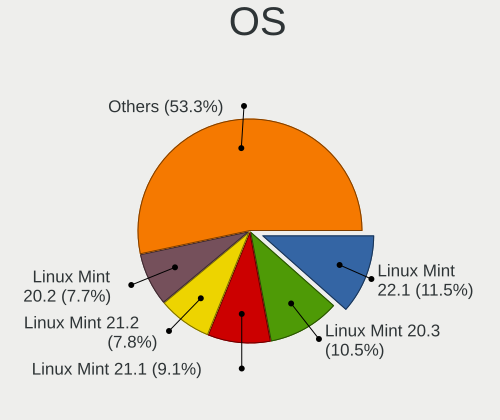

| Name              | Notebooks | Percent |
|-------------------|-----------|---------|
| Linux Mint 22.1   | 2061      | 11.54%  |
| Linux Mint 20.3   | 1874      | 10.49%  |
| Linux Mint 21.1   | 1625      | 9.1%    |
| Linux Mint 21.2   | 1400      | 7.84%   |
| Linux Mint 20.2   | 1377      | 7.71%   |
| Linux Mint 21.3   | 1347      | 7.54%   |
| Linux Mint 19.3   | 1262      | 7.07%   |
| Linux Mint 20.1   | 1250      | 7%      |
| Linux Mint 22.2   | 1195      | 6.69%   |
| Linux Mint 20     | 1164      | 6.52%   |
| Linux Mint 22     | 1035      | 5.79%   |
| Linux Mint 21     | 937       | 5.25%   |
| Linux Mint 19.1   | 478       | 2.68%   |
| Linux Mint 19.2   | 434       | 2.43%   |
| Linux Mint 19     | 200       | 1.12%   |
| Linux Mint 18.3   | 158       | 0.88%   |
| Linux Mint 18.2   | 24        | 0.13%   |
| Linux Mint 18.1   | 13        | 0.07%   |
| Linux Mint 18     | 11        | 0.06%   |
| Linux Mint 17.3   | 4         | 0.02%   |
| Linux Mint 21.2.0 | 3         | 0.02%   |
| Linux Mint 22.3   | 2         | 0.01%   |
| Linux Mint 17     | 2         | 0.01%   |
| Linux Mint 5      | 1         | 0.01%   |
| Linux Mint 22.0   | 1         | 0.01%   |
| Linux Mint 21.3.0 | 1         | 0.01%   |
| Linux Mint 17.2   | 1         | 0.01%   |
| Linux Mint 15     | 1         | 0.01%   |
| Linux Mint 13     | 1         | 0.01%   |

OS Family
---------

OS without a version

| Name       | Notebooks | Percent |
|------------|-----------|---------|
| Linux Mint | 16456     | 100%    |

Kernel
------

Version of the Linux kernel

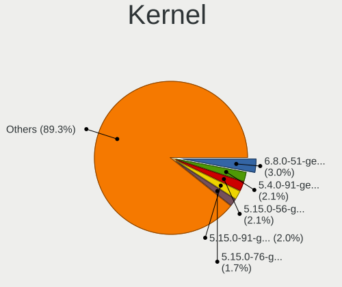

| Version           | Notebooks | Percent |
|-------------------|-----------|---------|
| 6.8.0-51-generic  | 585       | 2.96%   |
| 5.4.0-91-generic  | 413       | 2.09%   |
| 5.15.0-56-generic | 411       | 2.08%   |
| 5.15.0-91-generic | 387       | 1.96%   |
| 5.15.0-76-generic | 328       | 1.66%   |
| 5.4.0-58-generic  | 284       | 1.44%   |
| 6.8.0-60-generic  | 282       | 1.43%   |
| 5.4.0-74-generic  | 273       | 1.38%   |
| 6.14.0-29-generic | 239       | 1.21%   |
| 5.4.0-42-generic  | 218       | 1.1%    |
| 5.0.0-32-generic  | 218       | 1.1%    |
| 5.15.0-58-generic | 211       | 1.07%   |
| 6.14.0-33-generic | 192       | 0.97%   |
| 5.4.0-65-generic  | 175       | 0.88%   |
| 5.15.0-67-generic | 164       | 0.83%   |
| 5.4.0-80-generic  | 160       | 0.81%   |
| 6.8.0-52-generic  | 159       | 0.8%    |
| 5.4.0-66-generic  | 157       | 0.79%   |
| 5.4.0-77-generic  | 155       | 0.78%   |
| 5.15.0-60-generic | 155       | 0.78%   |
| 6.8.0-38-generic  | 153       | 0.77%   |
| 5.4.0-81-generic  | 152       | 0.77%   |
| 6.14.0-37-generic | 148       | 0.75%   |
| 6.8.0-55-generic  | 144       | 0.73%   |
| 5.4.0-72-generic  | 144       | 0.73%   |
| 6.8.0-71-generic  | 143       | 0.72%   |
| 5.4.0-100-generic | 142       | 0.72%   |
| 5.4.0-73-generic  | 140       | 0.71%   |
| 5.4.0-122-generic | 139       | 0.7%    |
| 5.15.0-88-generic | 139       | 0.7%    |
| 5.15.0-41-generic | 137       | 0.69%   |
| 6.14.0-36-generic | 135       | 0.68%   |
| 6.8.0-45-generic  | 134       | 0.68%   |
| 4.15.0-54-generic | 134       | 0.68%   |
| 5.4.0-70-generic  | 133       | 0.67%   |
| 5.15.0-69-generic | 131       | 0.66%   |
| 6.8.0-79-generic  | 130       | 0.66%   |
| 6.8.0-63-generic  | 129       | 0.65%   |
| 4.15.0-20-generic | 129       | 0.65%   |
| 5.4.0-26-generic  | 128       | 0.65%   |

Kernel Family
-------------

Linux kernel without a distro release

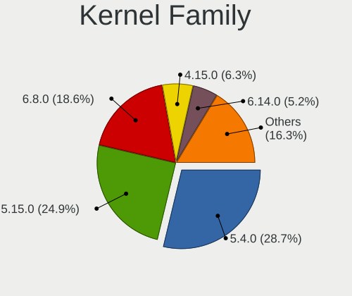

| Version | Notebooks | Percent |
|---------|-----------|---------|
| 5.4.0   | 5025      | 28.75%  |
| 5.15.0  | 4349      | 24.88%  |
| 6.8.0   | 3243      | 18.55%  |
| 4.15.0  | 1106      | 6.33%   |
| 6.14.0  | 905       | 5.18%   |
| 5.3.0   | 516       | 2.95%   |
| 5.0.0   | 327       | 1.87%   |
| 6.5.0   | 326       | 1.86%   |
| 5.13.0  | 203       | 1.16%   |
| 6.2.0   | 191       | 1.09%   |
| 5.8.0   | 177       | 1.01%   |
| 5.11.0  | 163       | 0.93%   |
| 6.11.0  | 120       | 0.69%   |
| 5.19.0  | 119       | 0.68%   |
| 4.10.0  | 51        | 0.29%   |
| 6.1.0   | 45        | 0.26%   |
| 5.14.0  | 41        | 0.23%   |
| 4.4.0   | 36        | 0.21%   |
| 4.18.0  | 36        | 0.21%   |
| 4.13.0  | 32        | 0.18%   |
| 5.10.0  | 25        | 0.14%   |
| 5.6.0   | 13        | 0.07%   |
| 5.17.0  | 13        | 0.07%   |
| 4.8.0   | 13        | 0.07%   |
| 6.0.0   | 11        | 0.06%   |
| 5.7.1   | 8         | 0.05%   |
| 6.4.3   | 6         | 0.03%   |
| 6.9.3   | 5         | 0.03%   |
| 6.3.7   | 4         | 0.02%   |
| 6.12.3  | 4         | 0.02%   |
| 6.0.9   | 4         | 0.02%   |
| 5.9.8   | 4         | 0.02%   |
| 5.9.0   | 4         | 0.02%   |
| 5.17.6  | 4         | 0.02%   |
| 6.6.0   | 3         | 0.02%   |
| 6.5.7   | 3         | 0.02%   |
| 6.5.5   | 3         | 0.02%   |
| 6.3.5   | 3         | 0.02%   |
| 6.3.4   | 3         | 0.02%   |
| 6.2.9   | 3         | 0.02%   |

Kernel Major Ver.
-----------------

Linux kernel major version

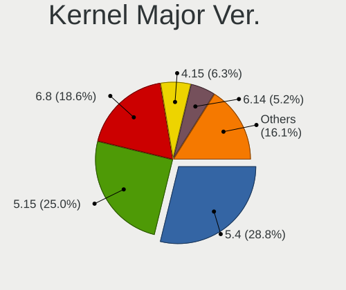

| Version | Notebooks | Percent |
|---------|-----------|---------|
| 5.4     | 5033      | 28.81%  |
| 5.15    | 4367      | 25%     |
| 6.8     | 3248      | 18.59%  |
| 4.15    | 1108      | 6.34%   |
| 6.14    | 910       | 5.21%   |
| 5.3     | 527       | 3.02%   |
| 6.5     | 335       | 1.92%   |
| 5.0     | 330       | 1.89%   |
| 5.13    | 208       | 1.19%   |
| 6.2     | 206       | 1.18%   |
| 5.8     | 187       | 1.07%   |
| 5.11    | 167       | 0.96%   |
| 6.11    | 125       | 0.72%   |
| 5.19    | 121       | 0.69%   |
| 6.1     | 60        | 0.34%   |
| 4.10    | 51        | 0.29%   |
| 5.14    | 47        | 0.27%   |
| 4.18    | 38        | 0.22%   |
| 5.10    | 37        | 0.21%   |
| 4.4     | 36        | 0.21%   |
| 4.13    | 33        | 0.19%   |
| 5.17    | 24        | 0.14%   |
| 6.0     | 20        | 0.11%   |
| 5.6     | 20        | 0.11%   |
| 6.3     | 18        | 0.1%    |
| 5.9     | 18        | 0.1%    |
| 5.7     | 16        | 0.09%   |
| 6.4     | 15        | 0.09%   |
| 6.12    | 15        | 0.09%   |
| 6.10    | 14        | 0.08%   |
| 4.8     | 13        | 0.07%   |
| 6.9     | 11        | 0.06%   |
| 5.18    | 11        | 0.06%   |
| 6.7     | 10        | 0.06%   |
| 6.6     | 8         | 0.05%   |
| 5.16    | 8         | 0.05%   |
| 5.12    | 8         | 0.05%   |
| 6.13    | 7         | 0.04%   |
| 6.17    | 6         | 0.03%   |
| 5.5     | 6         | 0.03%   |

Arch
----

OS architecture (x86_64, i586, etc.)

| Name   | Notebooks | Percent |
|--------|-----------|---------|
| x86_64 | 16038     | 97.44%  |
| i686   | 422       | 2.56%   |

DE
--

Desktop Environment

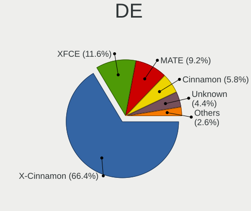

| Name           | Notebooks | Percent |
|----------------|-----------|---------|
| X-Cinnamon     | 11153     | 66.41%  |
| XFCE           | 1948      | 11.6%   |
| MATE           | 1545      | 9.2%    |
| Cinnamon       | 971       | 5.78%   |
| Unknown        | 741       | 4.41%   |
| GNOME          | 283       | 1.69%   |
| KDE5           | 80        | 0.48%   |
| KDE            | 19        | 0.11%   |
| i3             | 18        | 0.11%   |
| LXQt           | 5         | 0.03%   |
| Pantheon       | 3         | 0.02%   |
| LXDE           | 3         | 0.02%   |
| GNOME Classic  | 3         | 0.02%   |
| Deepin         | 3         | 0.02%   |
| Budgie         | 3         | 0.02%   |
| jwm            | 2         | 0.01%   |
| ICEWM          | 2         | 0.01%   |
| Enlightenment  | 2         | 0.01%   |
| Trinity        | 1         | 0.01%   |
| qtile          | 1         | 0.01%   |
| openbox        | 1         | 0.01%   |
| KDE6           | 1         | 0.01%   |
| KDE4           | 1         | 0.01%   |
| i3-with-shmlog | 1         | 0.01%   |
| GNUstep        | 1         | 0.01%   |
| fluxbox        | 1         | 0.01%   |
| dwm            | 1         | 0.01%   |
| bspwm          | 1         | 0.01%   |
| awesome        | 1         | 0.01%   |

Display Server
--------------

X11 or Wayland

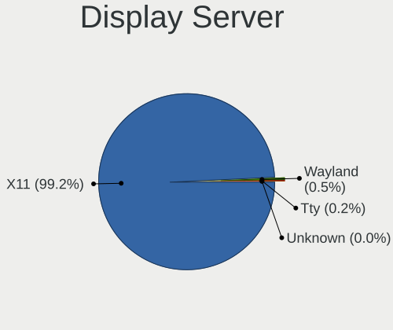

| Name    | Notebooks | Percent |
|---------|-----------|---------|
| X11     | 16364     | 99.25%  |
| Wayland | 84        | 0.51%   |
| Tty     | 33        | 0.2%    |
| Unknown | 7         | 0.04%   |

Display Manager
---------------

SDDM, LightDM, etc.

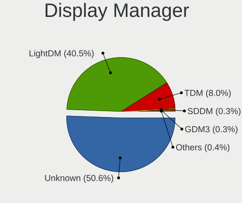

| Name    | Notebooks | Percent |
|---------|-----------|---------|
| Unknown | 8485      | 50.58%  |
| LightDM | 6786      | 40.46%  |
| TDM     | 1335      | 7.96%   |
| SDDM    | 49        | 0.29%   |
| GDM3    | 49        | 0.29%   |
| MDM     | 42        | 0.25%   |
| GDM     | 26        | 0.16%   |
| LXDM    | 2         | 0.01%   |

OS Lang
-------

Language

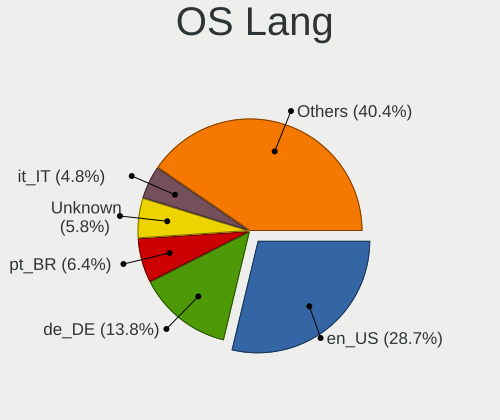

| Lang    | Notebooks | Percent |
|---------|-----------|---------|
| en_US   | 4784      | 28.75%  |
| de_DE   | 2294      | 13.78%  |
| pt_BR   | 1069      | 6.42%   |
| Unknown | 969       | 5.82%   |
| it_IT   | 797       | 4.79%   |
| C       | 746       | 4.48%   |
| fr_FR   | 739       | 4.44%   |
| en_GB   | 676       | 4.06%   |
| ru_RU   | 672       | 4.04%   |
| en_CA   | 340       | 2.04%   |
| es_ES   | 325       | 1.95%   |
| pl_PL   | 307       | 1.84%   |
| en_IN   | 234       | 1.41%   |
| en_AU   | 234       | 1.41%   |
| nl_NL   | 190       | 1.14%   |
| es_MX   | 139       | 0.84%   |
| es_AR   | 122       | 0.73%   |
| en_ZA   | 118       | 0.71%   |
| hu_HU   | 117       | 0.7%    |
| tr_TR   | 110       | 0.66%   |
| de_AT   | 110       | 0.66%   |
| cs_CZ   | 104       | 0.62%   |
| de_CH   | 98        | 0.59%   |
| pt_PT   | 91        | 0.55%   |
| es_CO   | 74        | 0.44%   |
| es_CL   | 64        | 0.38%   |
| sv_SE   | 62        | 0.37%   |
| fi_FI   | 59        | 0.35%   |
| fr_CA   | 55        | 0.33%   |
| en_IE   | 55        | 0.33%   |
| ru_UA   | 54        | 0.32%   |
| en_NZ   | 54        | 0.32%   |
| fr_BE   | 48        | 0.29%   |
| sk_SK   | 45        | 0.27%   |
| el_GR   | 43        | 0.26%   |
| en_PH   | 38        | 0.23%   |
| zh_CN   | 37        | 0.22%   |
| nl_BE   | 37        | 0.22%   |
| da_DK   | 37        | 0.22%   |
| bg_BG   | 31        | 0.19%   |

Boot Mode
---------

EFI or BIOS

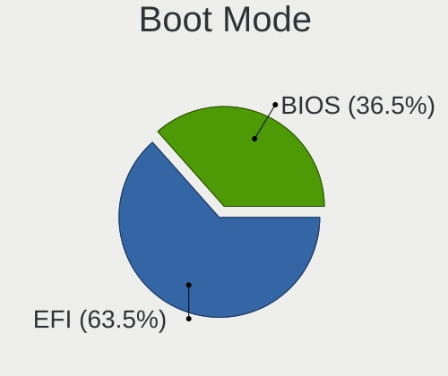

| Mode | Notebooks | Percent |
|------|-----------|---------|
| EFI  | 10574     | 63.45%  |
| BIOS | 6090      | 36.55%  |

Filesystem
----------

Type of filesystem

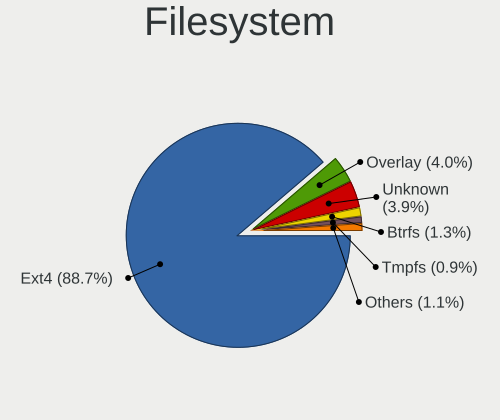

| Type     | Notebooks | Percent |
|----------|-----------|---------|
| Ext4     | 14746     | 88.74%  |
| Overlay  | 661       | 3.98%   |
| Unknown  | 646       | 3.89%   |
| Btrfs    | 219       | 1.32%   |
| Tmpfs    | 156       | 0.94%   |
| Zfs      | 87        | 0.52%   |
| Xfs      | 37        | 0.22%   |
| Ext3     | 36        | 0.22%   |
| Ext2     | 23        | 0.14%   |
| Aufs     | 2         | 0.01%   |
| XXXXX    | 1         | 0.01%   |
| Reiserfs | 1         | 0.01%   |
| Jfs      | 1         | 0.01%   |
| F2fs     | 1         | 0.01%   |
| ExX4     | 1         | 0.01%   |

Part. scheme
------------

Scheme of partitioning

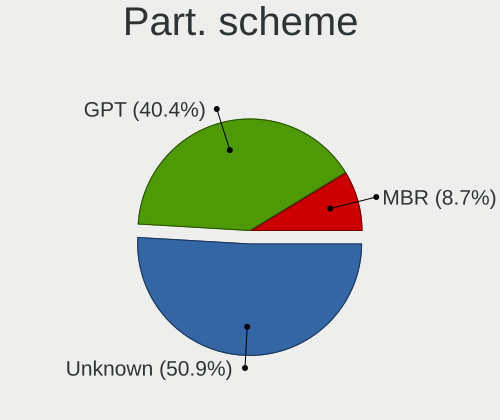

| Type    | Notebooks | Percent |
|---------|-----------|---------|
| Unknown | 8514      | 50.92%  |
| GPT     | 6751      | 40.38%  |
| MBR     | 1454      | 8.7%    |

Dual Boot with Linux/BSD
------------------------

Hosting more than one Linux/BSD

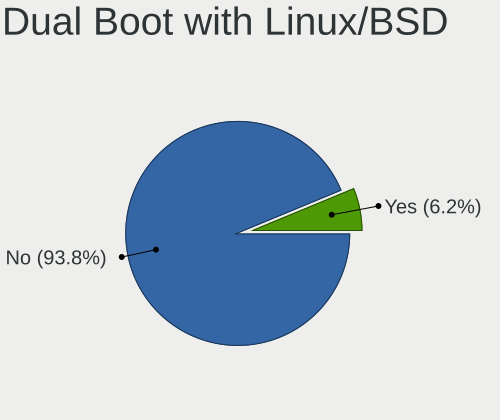

| Dual boot | Notebooks | Percent |
|-----------|-----------|---------|
| No        | 15538     | 93.75%  |
| Yes       | 1035      | 6.25%   |

Dual Boot (Win)
---------------

Hosting Linux and Windows

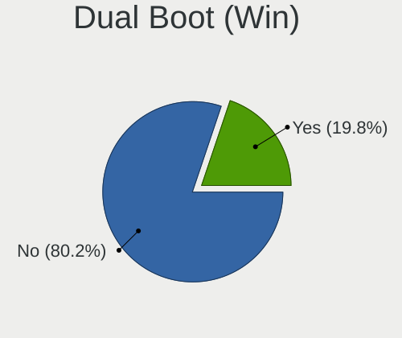

| Dual boot | Notebooks | Percent |
|-----------|-----------|---------|
| No        | 13311     | 80.17%  |
| Yes       | 3292      | 19.83%  |

Board
-----

Vendor
------

Motherboard manufacturer

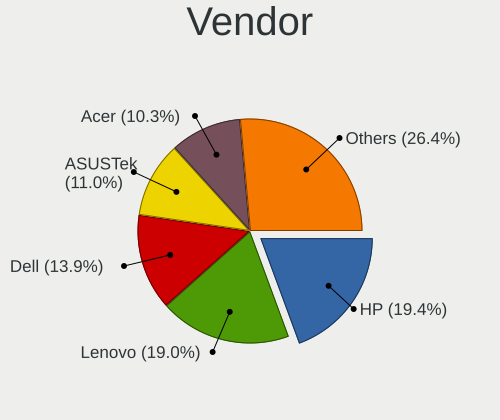

| Name                | Notebooks | Percent |
|---------------------|-----------|---------|
| Hewlett-Packard     | 3190      | 19.39%  |
| Lenovo              | 3134      | 19.04%  |
| Dell                | 2283      | 13.87%  |
| ASUSTek Computer    | 1802      | 10.95%  |
| Acer                | 1698      | 10.32%  |
| Apple               | 547       | 3.32%   |
| Toshiba             | 502       | 3.05%   |
| Samsung Electronics | 399       | 2.42%   |
| MSI                 | 303       | 1.84%   |
| Sony                | 262       | 1.59%   |
| Fujitsu             | 159       | 0.97%   |
| Google              | 158       | 0.96%   |
| Medion              | 153       | 0.93%   |
| Unknown             | 147       | 0.89%   |
| HUAWEI              | 145       | 0.88%   |
| Positivo            | 106       | 0.64%   |
| Notebook            | 97        | 0.59%   |
| Packard Bell        | 77        | 0.47%   |
| Alienware           | 64        | 0.39%   |
| Fujitsu Siemens     | 62        | 0.38%   |
| LG Electronics      | 46        | 0.28%   |
| Timi                | 39        | 0.24%   |
| Chuwi               | 38        | 0.23%   |
| GPU Company         | 37        | 0.22%   |
| Intel               | 36        | 0.22%   |
| Gigabyte Technology | 35        | 0.21%   |
| Panasonic           | 33        | 0.2%    |
| Clevo               | 31        | 0.19%   |
| eMachines           | 28        | 0.17%   |
| TUXEDO              | 27        | 0.16%   |
| Gateway             | 26        | 0.16%   |
| Itautec             | 25        | 0.15%   |
| Digibras            | 24        | 0.15%   |
| AMI                 | 20        | 0.12%   |
| Wortmann AG         | 18        | 0.11%   |
| Schenker            | 17        | 0.1%    |
| PC Specialist       | 17        | 0.1%    |
| Thomson             | 16        | 0.1%    |
| Semp Toshiba        | 16        | 0.1%    |
| Mediacom            | 16        | 0.1%    |

Model
-----

Motherboard model

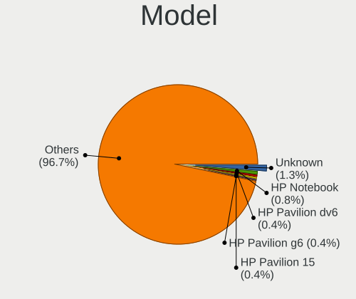

| Name                             | Notebooks | Percent |
|----------------------------------|-----------|---------|
| Unknown                          | 216       | 1.31%   |
| HP Notebook                      | 124       | 0.75%   |
| HP Pavilion dv6                  | 74        | 0.45%   |
| HP Pavilion g6                   | 71        | 0.43%   |
| HP Pavilion 15                   | 59        | 0.36%   |
| HP Pavilion Notebook             | 53        | 0.32%   |
| HP Pavilion dv7                  | 48        | 0.29%   |
| Apple MacBookPro9,2              | 45        | 0.27%   |
| HP Laptop 15-bw0xx               | 43        | 0.26%   |
| Dell Latitude E6430              | 39        | 0.24%   |
| Apple MacBookAir7,2              | 39        | 0.24%   |
| Dell Inspiron 15-3567            | 38        | 0.23%   |
| HP Pavilion g7                   | 37        | 0.22%   |
| HP Pavilion 17                   | 37        | 0.22%   |
| HP Laptop 15-bs0xx               | 37        | 0.22%   |
| HP 15                            | 36        | 0.22%   |
| Apple MacBookPro8,1              | 36        | 0.22%   |
| Dell Latitude E6420              | 35        | 0.21%   |
| Dell Latitude E6410              | 35        | 0.21%   |
| Positivo Mobile                  | 31        | 0.19%   |
| Dell Latitude E6540              | 31        | 0.19%   |
| ASUS P50IJ                       | 31        | 0.19%   |
| Apple MacBookAir6,2              | 31        | 0.19%   |
| Dell Latitude E6400              | 29        | 0.18%   |
| ASUS Vivobook Go E1504FA_E1504FA | 28        | 0.17%   |
| Acer Aspire V3-771               | 28        | 0.17%   |
| HP Laptop 15-db0xxx              | 27        | 0.16%   |
| HP EliteBook 8460p               | 26        | 0.16%   |
| HP Laptop 15s-eq2xxx             | 25        | 0.15%   |
| HP EliteBook 840 G5              | 25        | 0.15%   |
| HP EliteBook 840 G3              | 25        | 0.15%   |
| HP EliteBook 840 G1              | 25        | 0.15%   |
| Dell Latitude D630               | 25        | 0.15%   |
| Dell Inspiron 1545               | 25        | 0.15%   |
| Apple MacBookPro11,1             | 25        | 0.15%   |
| Lenovo G50-70 20351              | 24        | 0.15%   |
| Dell Latitude 7490               | 24        | 0.15%   |
| Apple MacBookPro12,1             | 24        | 0.15%   |
| Dell Latitude E5430 non-vPro     | 21        | 0.13%   |
| HP ProBook 4530s                 | 20        | 0.12%   |

Model Family
------------

Motherboard model prefix

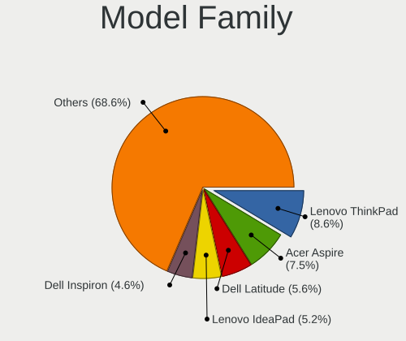

| Name                  | Notebooks | Percent |
|-----------------------|-----------|---------|
| Lenovo ThinkPad       | 1422      | 8.64%   |
| Acer Aspire           | 1228      | 7.46%   |
| Dell Latitude         | 916       | 5.57%   |
| Lenovo IdeaPad        | 854       | 5.19%   |
| Dell Inspiron         | 754       | 4.58%   |
| HP Pavilion           | 732       | 4.45%   |
| HP Laptop             | 543       | 3.3%    |
| HP EliteBook          | 463       | 2.81%   |
| Toshiba Satellite     | 428       | 2.6%    |
| HP ProBook            | 394       | 2.39%   |
| ASUS VivoBook         | 387       | 2.35%   |
| Unknown               | 216       | 1.31%   |
| Dell XPS              | 166       | 1.01%   |
| Dell Vostro           | 155       | 0.94%   |
| Dell Precision        | 141       | 0.86%   |
| Fujitsu LIFEBOOK      | 139       | 0.84%   |
| ASUS ASUS             | 127       | 0.77%   |
| Acer Swift            | 126       | 0.77%   |
| HP Notebook           | 124       | 0.75%   |
| HP Compaq             | 117       | 0.71%   |
| Lenovo Legion         | 100       | 0.61%   |
| HP ZBook              | 95        | 0.58%   |
| HP ENVY               | 95        | 0.58%   |
| Acer Nitro            | 89        | 0.54%   |
| ASUS ZenBook          | 86        | 0.52%   |
| HP 250                | 84        | 0.51%   |
| ASUS ROG              | 81        | 0.49%   |
| Acer TravelMate       | 73        | 0.44%   |
| HP 255                | 71        | 0.43%   |
| Packard Bell EasyNote | 69        | 0.42%   |
| Apple MacBookPro11    | 68        | 0.41%   |
| Lenovo ThinkBook      | 67        | 0.41%   |
| Lenovo Yoga           | 64        | 0.39%   |
| Apple MacBookPro9     | 58        | 0.35%   |
| Acer Extensa          | 58        | 0.35%   |
| Apple MacBookPro8     | 56        | 0.34%   |
| HP OMEN               | 48        | 0.29%   |
| Apple MacBookAir7     | 48        | 0.29%   |
| Apple MacBookAir6     | 44        | 0.27%   |
| HP Victus             | 43        | 0.26%   |

MFG Year
--------

Motherboard manufacture year

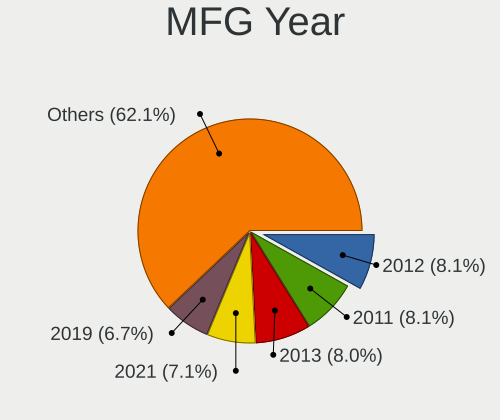

| Year    | Notebooks | Percent |
|---------|-----------|---------|
| 2012    | 1334      | 8.11%   |
| 2011    | 1326      | 8.06%   |
| 2013    | 1320      | 8.02%   |
| 2021    | 1163      | 7.07%   |
| 2019    | 1098      | 6.67%   |
| 2020    | 1087      | 6.61%   |
| 2018    | 1043      | 6.34%   |
| 2017    | 1028      | 6.25%   |
| 2010    | 924       | 5.61%   |
| 2014    | 908       | 5.52%   |
| 2016    | 890       | 5.41%   |
| 2015    | 869       | 5.28%   |
| 2008    | 733       | 4.45%   |
| 2022    | 652       | 3.96%   |
| 2009    | 603       | 3.66%   |
| 2023    | 524       | 3.18%   |
| 2007    | 372       | 2.26%   |
| 2024    | 270       | 1.64%   |
| 2006    | 171       | 1.04%   |
| 2025    | 78        | 0.47%   |
| 2005    | 35        | 0.21%   |
| Unknown | 13        | 0.08%   |
| 2004    | 12        | 0.07%   |
| 2003    | 3         | 0.02%   |

Form Factor
-----------

Physical design of the computer

| Name     | Notebooks | Percent |
|----------|-----------|---------|
| Notebook | 16456     | 100%    |

Secure Boot
-----------

Enabled or disabled

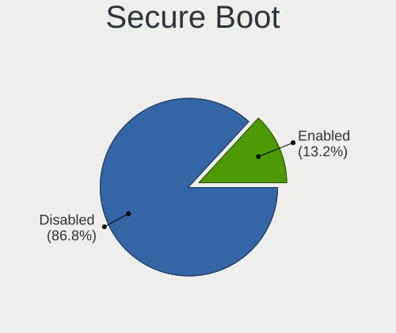

| State    | Notebooks | Percent |
|----------|-----------|---------|
| Disabled | 14422     | 86.85%  |
| Enabled  | 2184      | 13.15%  |

Coreboot
--------

Have coreboot on board

| Used | Notebooks | Percent |
|------|-----------|---------|
| No   | 16278     | 98.91%  |
| Yes  | 179       | 1.09%   |

RAM Size
--------

Total RAM memory

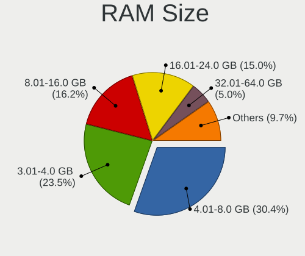

| Size in GB  | Notebooks | Percent |
|-------------|-----------|---------|
| 4.01-8.0    | 5079      | 30.44%  |
| 3.01-4.0    | 3924      | 23.52%  |
| 8.01-16.0   | 2710      | 16.24%  |
| 16.01-24.0  | 2506      | 15.02%  |
| 32.01-64.0  | 841       | 5.04%   |
| 1.01-2.0    | 826       | 4.95%   |
| 2.01-3.0    | 325       | 1.95%   |
| 24.01-32.0  | 207       | 1.24%   |
| 64.01-256.0 | 169       | 1.01%   |
| 0.51-1.0    | 98        | 0.59%   |
| 0.01-0.5    | 1         | 0.01%   |

RAM Used
--------

Used RAM memory

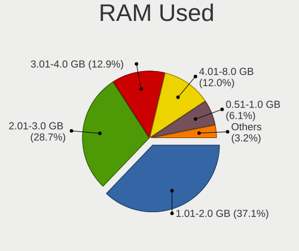

| Used GB    | Notebooks | Percent |
|------------|-----------|---------|
| 1.01-2.0   | 6731      | 37.14%  |
| 2.01-3.0   | 5208      | 28.74%  |
| 3.01-4.0   | 2329      | 12.85%  |
| 4.01-8.0   | 2168      | 11.96%  |
| 0.51-1.0   | 1113      | 6.14%   |
| 8.01-16.0  | 433       | 2.39%   |
| 0.01-0.5   | 71        | 0.39%   |
| 16.01-24.0 | 54        | 0.3%    |
| 24.01-32.0 | 8         | 0.04%   |
| 32.01-64.0 | 5         | 0.03%   |
| Unknown    | 4         | 0.02%   |

Total Drives
------------

Number of drives on board

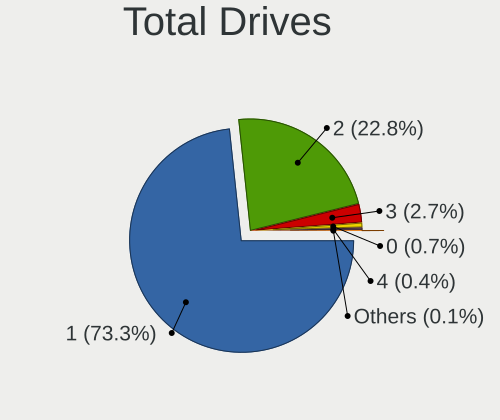

| Drives | Notebooks | Percent |
|--------|-----------|---------|
| 1      | 12319     | 73.33%  |
| 2      | 3828      | 22.79%  |
| 3      | 451       | 2.68%   |
| 0      | 116       | 0.69%   |
| 4      | 66        | 0.39%   |
| 5      | 12        | 0.07%   |
| 8      | 2         | 0.01%   |
| 7      | 2         | 0.01%   |
| 6      | 2         | 0.01%   |
| 11     | 1         | 0.01%   |
| 9      | 1         | 0.01%   |

Has CD-ROM
----------

Has CD-ROM on board

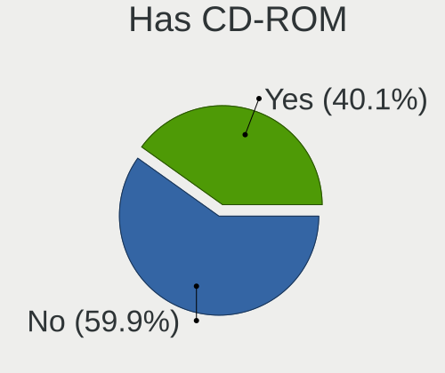

| Presented | Notebooks | Percent |
|-----------|-----------|---------|
| No        | 9905      | 59.88%  |
| Yes       | 6636      | 40.12%  |

Has Ethernet
------------

Has Ethernet on board

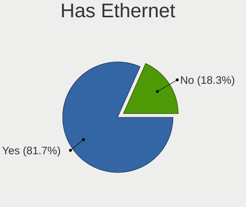

| Presented | Notebooks | Percent |
|-----------|-----------|---------|
| Yes       | 13485     | 81.68%  |
| No        | 3025      | 18.32%  |

Has WiFi
--------

Has WiFi module

| Presented | Notebooks | Percent |
|-----------|-----------|---------|
| Yes       | 16009     | 97.21%  |
| No        | 460       | 2.79%   |

Has Bluetooth
-------------

Has Bluetooth module

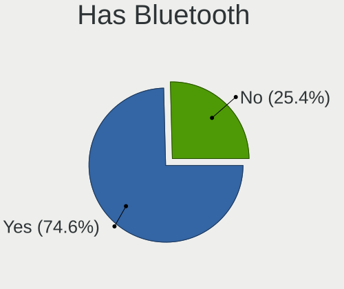

| Presented | Notebooks | Percent |
|-----------|-----------|---------|
| Yes       | 12417     | 74.59%  |
| No        | 4230      | 25.41%  |

Location
--------

Country
-------

Geographic location (country)

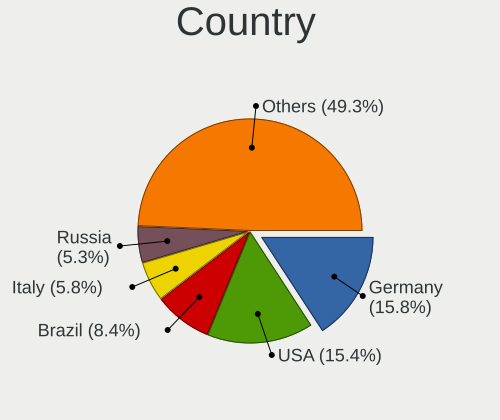

| Country      | Notebooks | Percent |
|--------------|-----------|---------|
| Germany      | 2622      | 15.81%  |
| USA          | 2552      | 15.39%  |
| Brazil       | 1399      | 8.44%   |
| Italy        | 961       | 5.79%   |
| Russia       | 874       | 5.27%   |
| France       | 827       | 4.99%   |
| UK           | 638       | 3.85%   |
| Canada       | 437       | 2.64%   |
| Poland       | 415       | 2.5%    |
| Spain        | 414       | 2.5%    |
| Netherlands  | 374       | 2.26%   |
| India        | 281       | 1.69%   |
| Australia    | 260       | 1.57%   |
| Switzerland  | 219       | 1.32%   |
| Mexico       | 208       | 1.25%   |
| Turkey       | 197       | 1.19%   |
| Austria      | 188       | 1.13%   |
| Ukraine      | 179       | 1.08%   |
| Argentina    | 170       | 1.03%   |
| Belgium      | 165       | 0.99%   |
| Hungary      | 161       | 0.97%   |
| Czechia      | 159       | 0.96%   |
| Sweden       | 154       | 0.93%   |
| Portugal     | 150       | 0.9%    |
| South Africa | 131       | 0.79%   |
| Romania      | 123       | 0.74%   |
| Finland      | 113       | 0.68%   |
| Greece       | 110       | 0.66%   |
| Colombia     | 102       | 0.62%   |
| Bulgaria     | 98        | 0.59%   |
| Indonesia    | 95        | 0.57%   |
| Denmark      | 79        | 0.48%   |
| Chile        | 78        | 0.47%   |
| Slovakia     | 77        | 0.46%   |
| Norway       | 72        | 0.43%   |
| Ireland      | 68        | 0.41%   |
| New Zealand  | 63        | 0.38%   |
| Japan        | 52        | 0.31%   |
| Egypt        | 51        | 0.31%   |
| Belarus      | 51        | 0.31%   |

City
----

Geographic location (city)

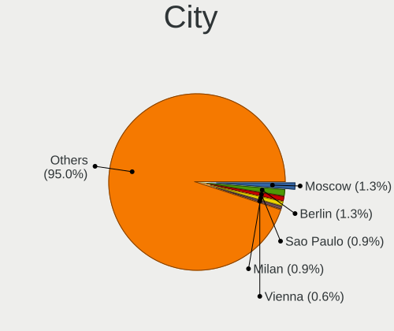

| City              | Notebooks | Percent |
|-------------------|-----------|---------|
| Moscow            | 230       | 1.3%    |
| Berlin            | 224       | 1.27%   |
| Sao Paulo         | 165       | 0.94%   |
| Milan             | 158       | 0.9%    |
| Vienna            | 109       | 0.62%   |
| Paris             | 105       | 0.6%    |
| Warsaw            | 98        | 0.56%   |
| Munich            | 98        | 0.56%   |
| St Petersburg     | 92        | 0.52%   |
| Rome              | 86        | 0.49%   |
| Hamburg           | 86        | 0.49%   |
| Frankfurt am Main | 85        | 0.48%   |
| Sydney            | 78        | 0.44%   |
| Rio de Janeiro    | 75        | 0.43%   |
| Amsterdam         | 72        | 0.41%   |
| Istanbul          | 71        | 0.4%    |
| Melbourne         | 68        | 0.39%   |
| Budapest          | 65        | 0.37%   |
| Cologne           | 63        | 0.36%   |
| Madrid            | 60        | 0.34%   |
| Kyiv              | 59        | 0.33%   |
| Helsinki          | 58        | 0.33%   |
| Prague            | 57        | 0.32%   |
| Zurich            | 56        | 0.32%   |
| Rockville         | 56        | 0.32%   |
| Chicago           | 56        | 0.32%   |
| Montreal          | 52        | 0.3%    |
| Leipzig           | 50        | 0.28%   |
| Toronto           | 49        | 0.28%   |
| Sofia             | 49        | 0.28%   |
| Curitiba          | 49        | 0.28%   |
| Barcelona         | 49        | 0.28%   |
| Stuttgart         | 46        | 0.26%   |
| Milano            | 44        | 0.25%   |
| Turin             | 43        | 0.24%   |
| Dallas            | 43        | 0.24%   |
| Los Angeles       | 41        | 0.23%   |
| London            | 41        | 0.23%   |
| Dresden           | 41        | 0.23%   |
| Brisbane          | 41        | 0.23%   |

Drives
------

Drive Vendor
------------

Hard drive vendors

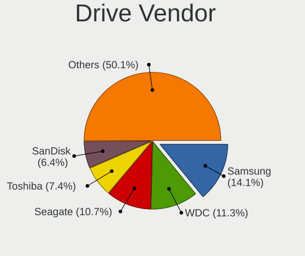

| Vendor                      | Notebooks | Drives | Percent |
|-----------------------------|-----------|--------|---------|
| Samsung Electronics         | 2854      | 3841   | 14.07%  |
| WDC                         | 2297      | 2895   | 11.33%  |
| Seagate                     | 2175      | 2703   | 10.73%  |
| Toshiba                     | 1493      | 1864   | 7.36%   |
| SanDisk                     | 1306      | 1758   | 6.44%   |
| Unknown                     | 1149      | 1533   | 5.67%   |
| Kingston                    | 1036      | 1271   | 5.11%   |
| Crucial                     | 768       | 1064   | 3.79%   |
| SK hynix                    | 710       | 820    | 3.5%    |
| Hitachi                     | 623       | 761    | 3.07%   |
| Micron Technology           | 566       | 698    | 2.79%   |
| Intel                       | 545       | 700    | 2.69%   |
| HGST                        | 478       | 603    | 2.36%   |
| Apple                       | 299       | 378    | 1.47%   |
| A-DATA Technology           | 254       | 325    | 1.25%   |
| China                       | 250       | 303    | 1.23%   |
| KIOXIA                      | 219       | 259    | 1.08%   |
| Intenso                     | 174       | 221    | 0.86%   |
| Unknown                     | 142       | 171    | 0.7%    |
| Fujitsu                     | 130       | 182    | 0.64%   |
| SPCC                        | 125       | 152    | 0.62%   |
| LITEON                      | 119       | 153    | 0.59%   |
| PNY                         | 95        | 120    | 0.47%   |
| Patriot                     | 94        | 118    | 0.46%   |
| Kingston Technology Company | 87        | 106    | 0.43%   |
| Transcend                   | 85        | 100    | 0.42%   |
| JMicron Technology          | 78        | 96     | 0.38%   |
| Phison                      | 74        | 88     | 0.36%   |
| LITEONIT                    | 68        | 81     | 0.34%   |
| Micron/Crucial Technology   | 66        | 89     | 0.33%   |
| Silicon Motion              | 64        | 80     | 0.32%   |
| KingSpec                    | 60        | 75     | 0.3%    |
| Netac                       | 54        | 65     | 0.27%   |
| Phison Electronics          | 53        | 72     | 0.26%   |
| GOODRAM                     | 53        | 70     | 0.26%   |
| Lexar                       | 52        | 61     | 0.26%   |
| OCZ                         | 51        | 62     | 0.25%   |
| UMIS                        | 47        | 51     | 0.23%   |
| Team                        | 47        | 56     | 0.23%   |
| SSSTC                       | 42        | 44     | 0.21%   |

Drive Model
-----------

Hard drive models

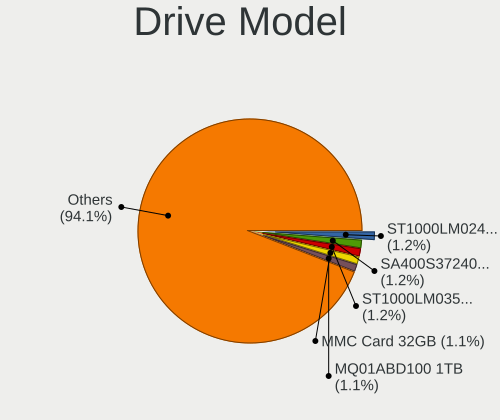

| Model                                             | Notebooks | Percent |
|---------------------------------------------------|-----------|---------|
| Seagate ST1000LM024 HN-M101MBB 1TB                | 259       | 1.23%   |
| Kingston SA400S37240G 240GB SSD                   | 259       | 1.23%   |
| Seagate ST1000LM035-1RK172 1TB                    | 250       | 1.19%   |
| Unknown MMC Card  32GB                            | 239       | 1.14%   |
| Toshiba MQ01ABD100 1TB                            | 231       | 1.1%    |
| Toshiba MQ01ABF050 500GB                          | 190       | 0.91%   |
| Unknown MMC Card  64GB                            | 184       | 0.88%   |
| Seagate ST500LT012-1DG142 500GB                   | 163       | 0.78%   |
| Seagate ST9500325AS 500GB                         | 150       | 0.71%   |
| Kingston SA400S37480G 480GB SSD                   | 146       | 0.7%    |
| Toshiba MQ04ABF100 1TB                            | 143       | 0.68%   |
| Unknown                                           | 142       | 0.68%   |
| Samsung SSD 860 EVO 500GB                         | 130       | 0.62%   |
| Unknown MMC Card  128GB                           | 127       | 0.61%   |
| Crucial CT500MX500SSD1 500GB                      | 117       | 0.56%   |
| Samsung SSD 850 EVO 250GB                         | 115       | 0.55%   |
| HGST HTS721010A9E630 1TB                          | 113       | 0.54%   |
| SanDisk NVMe SSD Drive 512GB                      | 105       | 0.5%    |
| Samsung NVMe SSD Controller SM981/PM981/PM983 1TB | 103       | 0.49%   |
| SanDisk NVMe SSD Drive 1TB                        | 102       | 0.49%   |
| WDC WD10JPVX-22JC3T0 1TB                          | 94        | 0.45%   |
| HGST HTS545050A7E680 500GB                        | 94        | 0.45%   |
| Samsung SSD 850 EVO 500GB                         | 93        | 0.44%   |
| Seagate ST500LM012 HN-M500MBB 500GB               | 88        | 0.42%   |
| Crucial CT1000MX500SSD1 1TB                       | 87        | 0.41%   |
| Kingston SA400S37120G 120GB SSD                   | 85        | 0.4%    |
| Unknown MMC Card  16GB                            | 84        | 0.4%    |
| Crucial CT240BX500SSD1 240GB                      | 80        | 0.38%   |
| HGST HTS541010A9E680 1TB                          | 77        | 0.37%   |
| Samsung SSD 860 EVO 1TB                           | 76        | 0.36%   |
| Crucial CT480BX500SSD1 480GB                      | 71        | 0.34%   |
| SanDisk SSD PLUS 240GB                            | 67        | 0.32%   |
| Samsung SSD 860 EVO 250GB                         | 65        | 0.31%   |
| Seagate ST500LT012-9WS142 500GB                   | 64        | 0.3%    |
| Seagate ST1000LM048-2E7172 1TB                    | 61        | 0.29%   |
| WDC WDS240G2G0A-00JH30 240GB SSD                  | 59        | 0.28%   |
| Unknown SD/MMC/MS PRO 2GB                         | 59        | 0.28%   |
| WDC WD10SPZX-21Z10T0 1TB                          | 57        | 0.27%   |
| Seagate Expansion 2TB                             | 56        | 0.27%   |
| WDC WD10SPZX-24Z10 1TB                            | 54        | 0.26%   |

HDD Vendor
----------

Hard disk drive vendors

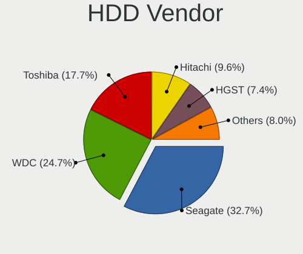

| Vendor              | Notebooks | Drives | Percent |
|---------------------|-----------|--------|---------|
| Seagate             | 2124      | 2631   | 32.69%  |
| WDC                 | 1603      | 1977   | 24.67%  |
| Toshiba             | 1151      | 1404   | 17.71%  |
| Hitachi             | 623       | 761    | 9.59%   |
| HGST                | 478       | 603    | 7.36%   |
| Samsung Electronics | 146       | 189    | 2.25%   |
| Fujitsu             | 129       | 180    | 1.99%   |
| Unknown             | 61        | 73     | 0.94%   |
| JMicron Technology  | 38        | 51     | 0.58%   |
| Apple               | 23        | 25     | 0.35%   |
| TO Exter            | 13        | 15     | 0.2%    |
| External            | 11        | 12     | 0.17%   |
| ASMT                | 11        | 12     | 0.17%   |
| USB3.0              | 10        | 11     | 0.15%   |
| Intenso             | 9         | 9      | 0.14%   |
| HGST HTS            | 9         | 11     | 0.14%   |
| USB                 | 5         | 5      | 0.08%   |
| ASMedia             | 4         | 4      | 0.06%   |
| SAGE                | 3         | 4      | 0.05%   |
| SABRENT             | 3         | 3      | 0.05%   |
| Min Yi U            | 3         | 3      | 0.05%   |
| JetFlash            | 3         | 3      | 0.05%   |
| Apricorn            | 3         | 5      | 0.05%   |
| XrayDisk            | 2         | 4      | 0.03%   |
| T-FORCE             | 2         | 2      | 0.03%   |
| SSK                 | 2         | 2      | 0.03%   |
| Maxtor              | 2         | 2      | 0.03%   |
| Maxone              | 2         | 2      | 0.03%   |
| KESU                | 2         | 2      | 0.03%   |
| Initio              | 2         | 2      | 0.03%   |
| Inateck             | 2         | 2      | 0.03%   |
| IBM/Hitachi         | 2         | 2      | 0.03%   |
| HGST HUS            | 2         | 2      | 0.03%   |
| ASUSTOR             | 2         | 4      | 0.03%   |
| WD_BLACK            | 1         | 1      | 0.02%   |
| WALRAM              | 1         | 1      | 0.02%   |
| Synology            | 1         | 1      | 0.02%   |
| StoreJet            | 1         | 1      | 0.02%   |
| SILICONMOTION       | 1         | 2      | 0.02%   |
| Shenzhen            | 1         | 1      | 0.02%   |

SSD Vendor
----------

Solid state drive vendors

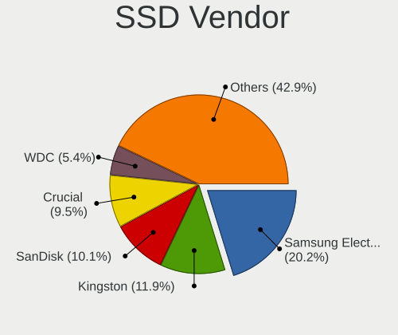

| Vendor              | Notebooks | Drives | Percent |
|---------------------|-----------|--------|---------|
| Samsung Electronics | 1443      | 1936   | 20.24%  |
| Kingston            | 845       | 1047   | 11.85%  |
| SanDisk             | 717       | 988    | 10.06%  |
| Crucial             | 678       | 954    | 9.51%   |
| WDC                 | 388       | 483    | 5.44%   |
| China               | 245       | 298    | 3.44%   |
| A-DATA Technology   | 205       | 268    | 2.88%   |
| Apple               | 196       | 217    | 2.75%   |
| Intel               | 177       | 222    | 2.48%   |
| Intenso             | 146       | 185    | 2.05%   |
| SK hynix            | 143       | 173    | 2.01%   |
| Toshiba             | 139       | 175    | 1.95%   |
| Micron Technology   | 135       | 180    | 1.89%   |
| SPCC                | 113       | 139    | 1.58%   |
| LITEON              | 110       | 144    | 1.54%   |
| PNY                 | 91        | 116    | 1.28%   |
| Patriot             | 87        | 111    | 1.22%   |
| Transcend           | 76        | 91     | 1.07%   |
| LITEONIT            | 68        | 81     | 0.95%   |
| KingSpec            | 59        | 74     | 0.83%   |
| OCZ                 | 51        | 62     | 0.72%   |
| GOODRAM             | 51        | 68     | 0.72%   |
| Netac               | 49        | 59     | 0.69%   |
| Unknown             | 44        | 57     | 0.62%   |
| Team                | 39        | 46     | 0.55%   |
| Lexar               | 39        | 46     | 0.55%   |
| Apacer              | 36        | 48     | 0.5%    |
| Verbatim            | 27        | 40     | 0.38%   |
| SABRENT             | 24        | 29     | 0.34%   |
| Plextor             | 23        | 27     | 0.32%   |
| Teclast             | 20        | 21     | 0.28%   |
| Hewlett-Packard     | 19        | 22     | 0.27%   |
| Dogfish             | 19        | 29     | 0.27%   |
| Fanxiang            | 17        | 18     | 0.24%   |
| Corsair             | 17        | 19     | 0.24%   |
| KingDian            | 16        | 28     | 0.22%   |
| Seagate             | 15        | 22     | 0.21%   |
| Gigabyte Technology | 15        | 19     | 0.21%   |
| FORESEE             | 15        | 20     | 0.21%   |
| BHT                 | 14        | 14     | 0.2%    |

Drive Kind
----------

HDD or SSD

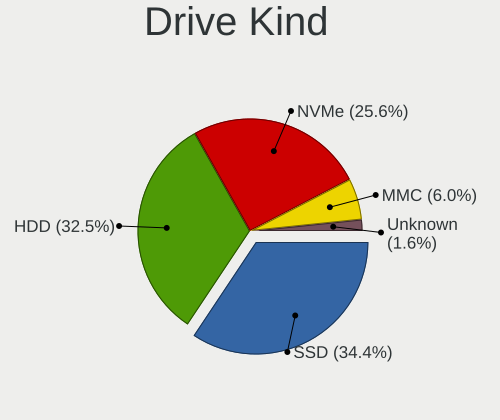

| Kind    | Notebooks | Drives | Percent |
|---------|-----------|--------|---------|
| SSD     | 6645      | 9210   | 34.35%  |
| HDD     | 6282      | 8032   | 32.48%  |
| NVMe    | 4947      | 6618   | 25.58%  |
| MMC     | 1153      | 1549   | 5.96%   |
| Unknown | 316       | 390    | 1.63%   |

Drive Connector
---------------

SATA, SAS, NVMe, etc.

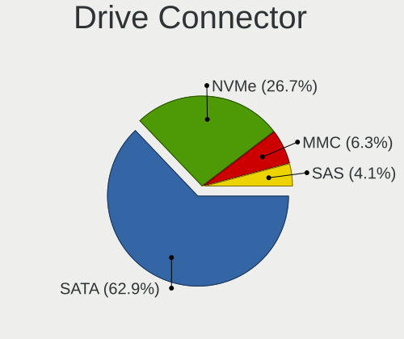

| Type | Notebooks | Drives | Percent |
|------|-----------|--------|---------|
| SATA | 11600     | 16667  | 62.89%  |
| NVMe | 4932      | 6568   | 26.74%  |
| MMC  | 1153      | 1549   | 6.25%   |
| SAS  | 760       | 1015   | 4.12%   |

Drive Size
----------

Size of hard drive

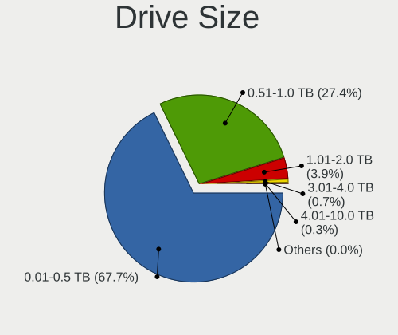

| Size in TB | Notebooks | Drives | Percent |
|------------|-----------|--------|---------|
| 0.01-0.5   | 8645      | 11709  | 67.73%  |
| 0.51-1.0   | 3501      | 4645   | 27.43%  |
| 1.01-2.0   | 493       | 710    | 3.86%   |
| 3.01-4.0   | 87        | 128    | 0.68%   |
| 4.01-10.0  | 34        | 46     | 0.27%   |
| 20.01-50.0 | 2         | 3      | 0.02%   |
| 2.01-3.0   | 1         | 1      | 0.01%   |

Space Total
-----------

Amount of disk space available on the file system

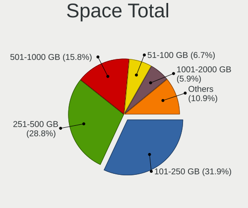

| Size in GB     | Notebooks | Percent |
|----------------|-----------|---------|
| 101-250        | 5470      | 31.95%  |
| 251-500        | 4923      | 28.75%  |
| 501-1000       | 2704      | 15.79%  |
| 51-100         | 1148      | 6.71%   |
| 1001-2000      | 1002      | 5.85%   |
| 21-50          | 646       | 3.77%   |
| 1-20           | 621       | 3.63%   |
| More than 3000 | 270       | 1.58%   |
| 2001-3000      | 226       | 1.32%   |
| Unknown        | 111       | 0.65%   |

Space Used
----------

Amount of used disk space

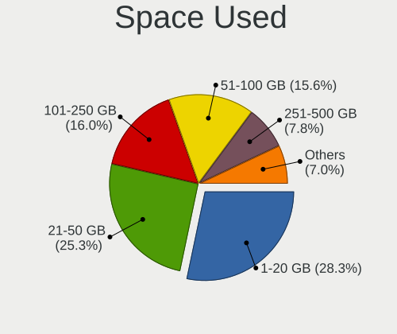

| Used GB        | Notebooks | Percent |
|----------------|-----------|---------|
| 1-20           | 5093      | 28.3%   |
| 21-50          | 4553      | 25.3%   |
| 101-250        | 2878      | 15.99%  |
| 51-100         | 2807      | 15.6%   |
| 251-500        | 1407      | 7.82%   |
| 501-1000       | 717       | 3.98%   |
| 1001-2000      | 280       | 1.56%   |
| Unknown        | 111       | 0.62%   |
| More than 3000 | 80        | 0.44%   |
| 2001-3000      | 73        | 0.41%   |

Malfunc. Drives
---------------

Drive models with a malfunction

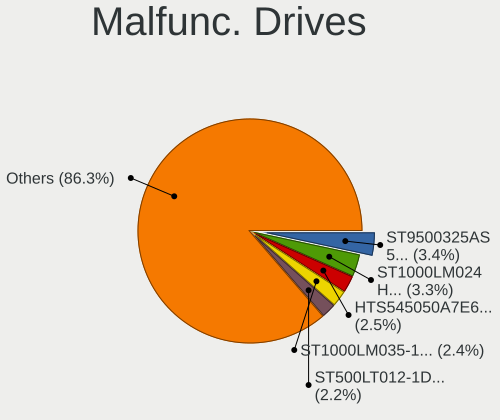

| Model                                 | Notebooks | Drives | Percent |
|---------------------------------------|-----------|--------|---------|
| Seagate ST9500325AS 500GB             | 42        | 47     | 3.36%   |
| Seagate ST1000LM024 HN-M101MBB 1TB    | 41        | 42     | 3.28%   |
| HGST HTS545050A7E680 500GB            | 31        | 54     | 2.48%   |
| Seagate ST1000LM035-1RK172 1TB        | 30        | 37     | 2.4%    |
| Seagate ST500LT012-1DG142 500GB       | 27        | 28     | 2.16%   |
| Toshiba MQ01ABD100 1TB                | 26        | 30     | 2.08%   |
| Toshiba MQ01ABF050 500GB              | 24        | 26     | 1.92%   |
| Seagate ST500LT012-9WS142 500GB       | 24        | 27     | 1.92%   |
| HGST HTS721010A9E630 1TB              | 15        | 15     | 1.2%    |
| HGST HTS541010A9E680 1TB              | 15        | 15     | 1.2%    |
| Seagate ST500LM012 HN-M500MBB 500GB   | 14        | 16     | 1.12%   |
| Seagate ST9320325AS 320GB             | 12        | 12     | 0.96%   |
| Hitachi HTS547550A9E384 500GB         | 12        | 12     | 0.96%   |
| LITEON CV8-8E128-HP 128GB SSD         | 11        | 13     | 0.88%   |
| HGST HTS725050A7E630 500GB            | 11        | 11     | 0.88%   |
| Toshiba MQ04ABF100 1TB                | 10        | 10     | 0.8%    |
| Seagate ST500LM021-1KJ152 500GB       | 10        | 10     | 0.8%    |
| Hitachi HTS547575A9E384 752GB         | 10        | 10     | 0.8%    |
| WDC WD10SPZX-60Z10T0 1TB              | 9         | 10     | 0.72%   |
| Seagate ST9500420AS 500GB             | 9         | 9      | 0.72%   |
| Kingston SA400S37240G 240GB SSD       | 9         | 9      | 0.72%   |
| Hitachi HTS545050A7E380 500GB         | 9         | 9      | 0.72%   |
| HGST HTS545050A7E380 500GB            | 9         | 10     | 0.72%   |
| WDC WDS240G2G0A-00JH30 240GB SSD      | 8         | 9      | 0.64%   |
| WDC WDS120G2G0A-00JH30 120GB SSD      | 8         | 9      | 0.64%   |
| WDC WD5000LPVX-22V0TT0 500GB          | 8         | 8      | 0.64%   |
| Seagate ST9320423AS 320GB             | 8         | 9      | 0.64%   |
| Hitachi HTS545032B9A300 320GB         | 8         | 9      | 0.64%   |
| WDC WD10JPVX-22JC3T0 1TB              | 7         | 7      | 0.56%   |
| Toshiba MQ01ABD075 752GB              | 7         | 7      | 0.56%   |
| Toshiba MK7575GSX 752GB               | 7         | 7      | 0.56%   |
| Seagate ST9250315AS 250GB             | 7         | 7      | 0.56%   |
| Hitachi HTS725050A9A364 500GB         | 7         | 8      | 0.56%   |
| Hitachi HTS543232A7A384 320GB         | 7         | 7      | 0.56%   |
| WDC WD10JPVX-60JC3T0 1TB              | 6         | 12     | 0.48%   |
| SK hynix HFS256G39TND-N210A 256GB SSD | 6         | 6      | 0.48%   |
| Seagate ST320LT020-9YG142 320GB       | 6         | 6      | 0.48%   |
| Seagate ST2000LM007-1R8174 2TB        | 6         | 6      | 0.48%   |
| Seagate ST1000LM014-1EJ164 1TB        | 6         | 6      | 0.48%   |
| SanDisk SSD PLUS 240GB                | 6         | 7      | 0.48%   |

Malfunc. Drive Vendor
---------------------

Vendors of faulty drives

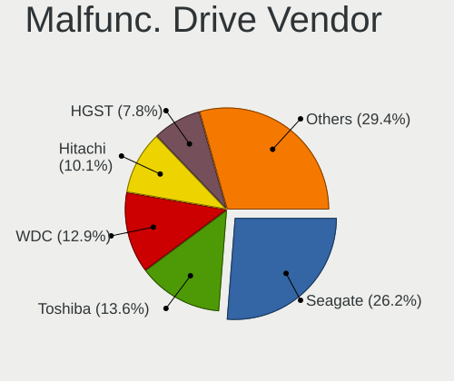

| Vendor              | Notebooks | Drives | Percent |
|---------------------|-----------|--------|---------|
| Seagate             | 327       | 359    | 26.24%  |
| Toshiba             | 169       | 185    | 13.56%  |
| WDC                 | 161       | 180    | 12.92%  |
| Hitachi             | 126       | 132    | 10.11%  |
| HGST                | 97        | 123    | 7.78%   |
| Samsung Electronics | 49        | 62     | 3.93%   |
| SanDisk             | 46        | 53     | 3.69%   |
| Kingston            | 38        | 39     | 3.05%   |
| SK hynix            | 35        | 41     | 2.81%   |
| Intel               | 33        | 34     | 2.65%   |
| Crucial             | 28        | 39     | 2.25%   |
| China               | 16        | 19     | 1.28%   |
| A-DATA Technology   | 16        | 16     | 1.28%   |
| LITEON              | 14        | 16     | 1.12%   |
| Micron Technology   | 11        | 13     | 0.88%   |
| Fujitsu             | 11        | 20     | 0.88%   |
| Apple               | 7         | 7      | 0.56%   |
| SSSTC               | 5         | 5      | 0.4%    |
| LITEONIT            | 5         | 5      | 0.4%    |
| KingSpec            | 5         | 6      | 0.4%    |
| Transcend           | 4         | 4      | 0.32%   |
| OCZ                 | 4         | 4      | 0.32%   |
| Intenso             | 3         | 3      | 0.24%   |
| PNY                 | 2         | 3      | 0.16%   |
| Lenovo              | 2         | 2      | 0.16%   |
| Hewlett-Packard     | 2         | 2      | 0.16%   |
| Unknown             | 2         | 3      | 0.16%   |
| XrayDisk            | 1         | 1      | 0.08%   |
| XPG                 | 1         | 1      | 0.08%   |
| WDC WDS2            | 1         | 1      | 0.08%   |
| Verbatim            | 1         | 1      | 0.08%   |
| ValueTech           | 1         | 1      | 0.08%   |
| TCSUNBOW            | 1         | 1      | 0.08%   |
| Supersonic          | 1         | 1      | 0.08%   |
| Silicon Motion      | 1         | 1      | 0.08%   |
| ShiJi               | 1         | 1      | 0.08%   |
| SED                 | 1         | 1      | 0.08%   |
| S3+                 | 1         | 1      | 0.08%   |
| Phison              | 1         | 1      | 0.08%   |
| Patriot             | 1         | 1      | 0.08%   |

Malfunc. HDD Vendor
-------------------

Vendors of faulty HDD drives

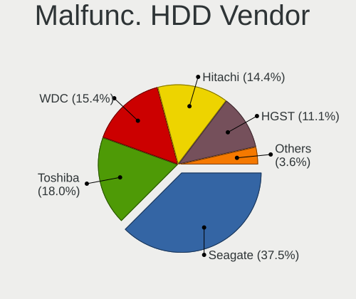

| Vendor              | Notebooks | Drives | Percent |
|---------------------|-----------|--------|---------|
| Seagate             | 327       | 359    | 37.5%   |
| Toshiba             | 157       | 170    | 18%     |
| WDC                 | 134       | 150    | 15.37%  |
| Hitachi             | 126       | 132    | 14.45%  |
| HGST                | 97        | 123    | 11.12%  |
| Samsung Electronics | 15        | 24     | 1.72%   |
| Fujitsu             | 11        | 20     | 1.26%   |
| Inateck             | 1         | 1      | 0.11%   |
| HGST HTS            | 1         | 1      | 0.11%   |
| ASMT                | 1         | 1      | 0.11%   |
| ASMedia             | 1         | 1      | 0.11%   |
| Apple               | 1         | 1      | 0.11%   |

Malfunc. Drive Kind
-------------------

Kinds of faulty drives

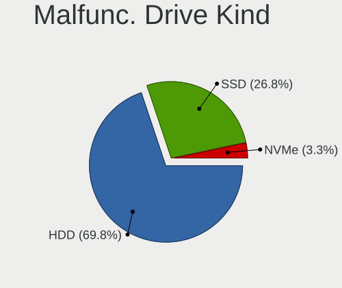

| Kind | Notebooks | Drives | Percent |
|------|-----------|--------|---------|
| HDD  | 864       | 983    | 69.85%  |
| SSD  | 332       | 376    | 26.84%  |
| NVMe | 41        | 46     | 3.31%   |

Failed Drives
-------------

Failed drive models

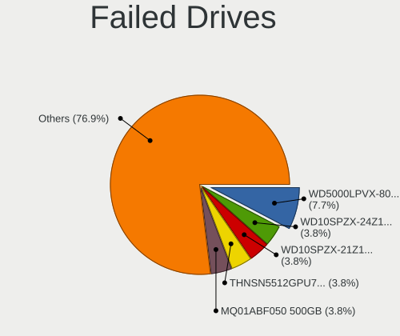

| Model                                            | Notebooks | Drives | Percent |
|--------------------------------------------------|-----------|--------|---------|
| WDC WD5000LPVX-80V0TT0 500GB                     | 2         | 2      | 7.69%   |
| WDC WD10SPZX-24Z10 1TB                           | 1         | 1      | 3.85%   |
| WDC WD10SPZX-21Z10T0 1TB                         | 1         | 1      | 3.85%   |
| Toshiba THNSN5512GPU7 512GB                      | 1         | 1      | 3.85%   |
| Toshiba MQ01ABF050 500GB                         | 1         | 1      | 3.85%   |
| Toshiba MQ01ABF032 320GB                         | 1         | 1      | 3.85%   |
| Toshiba MQ01ABD075 752GB                         | 1         | 1      | 3.85%   |
| Toshiba MK3265GSXN 320GB                         | 1         | 1      | 3.85%   |
| Toshiba MK3261GSYN 320GB                         | 1         | 1      | 3.85%   |
| Seagate ST9160821AS 160GB                        | 1         | 1      | 3.85%   |
| Seagate ST500LM012 HN-M500MBB 500GB              | 1         | 1      | 3.85%   |
| Seagate ST1000LM 024 HN-M101MBB 1TB              | 1         | 1      | 3.85%   |
| SanDisk SSD i100 24GB                            | 1         | 1      | 3.85%   |
| Samsung Electronics SSD PM871b M.2 2280 128GB    | 1         | 1      | 3.85%   |
| Samsung Electronics MZMPC032HBCD-000H1 32GB SSD  | 1         | 1      | 3.85%   |
| Samsung Electronics MZ7TY256HDHP-000L1 256GB SSD | 1         | 1      | 3.85%   |
| Samsung Electronics HM160HC 160GB                | 1         | 5      | 3.85%   |
| Micron Technology 1100_MTFDDAV256TBN 256GB SSD   | 1         | 1      | 3.85%   |
| JMicron Technology Tech 250GB                    | 1         | 1      | 3.85%   |
| JM icron Tech 512GB                              | 1         | 1      | 3.85%   |
| Intel SSDSA2M080G2GC 80GB                        | 1         | 1      | 3.85%   |
| Intel SSDPEKKF256G7L 256GB                       | 1         | 1      | 3.85%   |
| Hitachi HTS547550A9E384 500GB                    | 1         | 1      | 3.85%   |
| HGST HTS545050A7E380 500GB                       | 1         | 1      | 3.85%   |
| HGST HTS541010B7E610 1TB                         | 1         | 1      | 3.85%   |

Failed Drive Vendor
-------------------

Failed drive vendors

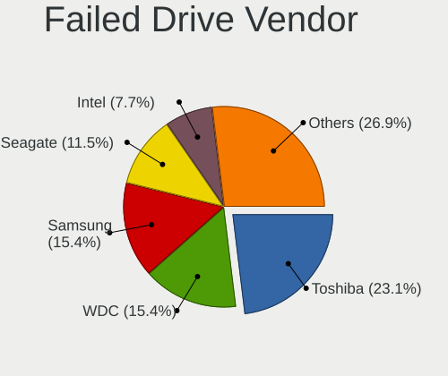

| Vendor              | Notebooks | Drives | Percent |
|---------------------|-----------|--------|---------|
| Toshiba             | 6         | 6      | 23.08%  |
| WDC                 | 4         | 4      | 15.38%  |
| Samsung Electronics | 4         | 8      | 15.38%  |
| Seagate             | 3         | 3      | 11.54%  |
| Intel               | 2         | 2      | 7.69%   |
| HGST                | 2         | 2      | 7.69%   |
| SanDisk             | 1         | 1      | 3.85%   |
| Micron Technology   | 1         | 1      | 3.85%   |
| JMicron Technology  | 1         | 1      | 3.85%   |
| JM icron            | 1         | 1      | 3.85%   |
| Hitachi             | 1         | 1      | 3.85%   |

Drive Status
------------

Number of failed and malfunc. drives

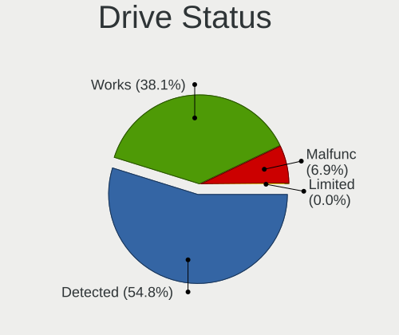

| Status   | Notebooks | Drives | Percent |
|----------|-----------|--------|---------|
| Detected | 9567      | 15422  | 54.8%   |
| Works    | 6654      | 8941   | 38.11%  |
| Malfunc  | 1210      | 1405   | 6.93%   |
| Failed   | 26        | 30     | 0.15%   |
| Limited  | 1         | 1      | 0.01%   |

Storage controller
------------------

Storage Vendor
--------------

Storage controller vendors

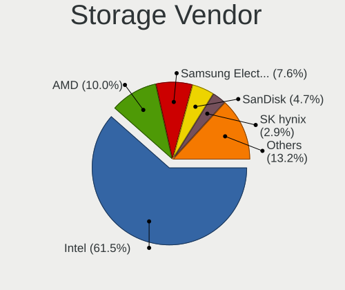

| Vendor                                  | Notebooks | Percent |
|-----------------------------------------|-----------|---------|
| Intel                                   | 11514     | 61.51%  |
| AMD                                     | 1878      | 10.03%  |
| Samsung Electronics                     | 1428      | 7.63%   |
| SanDisk                                 | 879       | 4.7%    |
| SK hynix                                | 551       | 2.94%   |
| Micron Technology                       | 443       | 2.37%   |
| Kingston Technology Company             | 278       | 1.49%   |
| KIOXIA                                  | 228       | 1.22%   |
| Toshiba America Info Systems            | 206       | 1.1%    |
| Nvidia                                  | 166       | 0.89%   |
| Phison Electronics                      | 150       | 0.8%    |
| Micron/Crucial Technology               | 141       | 0.75%   |
| Silicon Motion                          | 92        | 0.49%   |
| Silicon Integrated Systems [SiS]        | 80        | 0.43%   |
| ADATA Technology                        | 80        | 0.43%   |
| Apple                                   | 74        | 0.4%    |
| Union Memory (Shenzhen)                 | 72        | 0.38%   |
| MAXIO Technology (Hangzhou)             | 69        | 0.37%   |
| Solid State Storage Technology          | 64        | 0.34%   |
| Marvell Technology Group                | 42        | 0.22%   |
| Realtek Semiconductor                   | 41        | 0.22%   |
| Shenzhen Longsys Electronics            | 35        | 0.19%   |
| Solidigm                                | 29        | 0.15%   |
| Lite-On Technology                      | 25        | 0.13%   |
| Yangtze Memory Technologies             | 20        | 0.11%   |
| Lenovo                                  | 19        | 0.1%    |
| VIA Technologies                        | 18        | 0.1%    |
| JMicron Technology                      | 16        | 0.09%   |
| Silicon Image                           | 11        | 0.06%   |
| Shenzhen Unionmemory Information System | 10        | 0.05%   |
| ASMedia Technology                      | 10        | 0.05%   |
| Biwin Storage Technology                | 9         | 0.05%   |
| INNOGRIT                                | 8         | 0.04%   |
| Seagate Technology                      | 7         | 0.04%   |
| Hosin Global Electronics                | 6         | 0.03%   |
| Transcend                               | 5         | 0.03%   |
| Netac Technology                        | 4         | 0.02%   |
| OCZ Technology Group                    | 3         | 0.02%   |
| Shenzhen Shichuangyi Electronics        | 2         | 0.01%   |
| ULi Electronics                         | 1         | 0.01%   |

Storage Model
-------------

Storage controller models

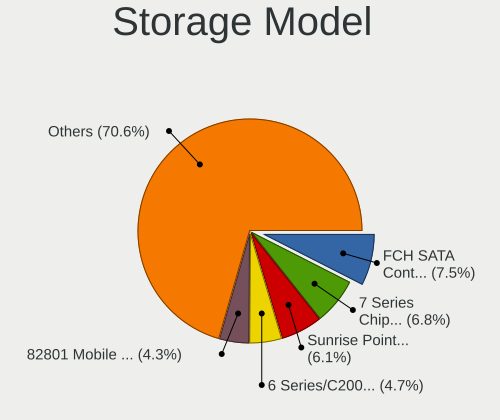

| Model                                                                            | Notebooks | Percent |
|----------------------------------------------------------------------------------|-----------|---------|
| AMD FCH SATA Controller [AHCI mode]                                              | 1516      | 7.5%    |
| Intel 7 Series Chipset Family 6-port SATA Controller [AHCI mode]                 | 1379      | 6.82%   |
| Intel Sunrise Point-LP SATA Controller [AHCI mode]                               | 1229      | 6.08%   |
| Intel 6 Series/C200 Series Chipset Family 6 port Mobile SATA AHCI Controller     | 954       | 4.72%   |
| Intel 82801 Mobile SATA Controller [RAID mode]                                   | 877       | 4.34%   |
| Intel 8 Series SATA Controller 1 [AHCI mode]                                     | 673       | 3.33%   |
| Intel 82801IBM/IEM (ICH9M/ICH9M-E) 4 port SATA Controller [AHCI mode]            | 638       | 3.15%   |
| Intel 5 Series/3400 Series Chipset 4 port SATA AHCI Controller                   | 524       | 2.59%   |
| Intel Volume Management Device NVMe RAID Controller                              | 516       | 2.55%   |
| Intel Wildcat Point-LP SATA Controller [AHCI Mode]                               | 471       | 2.33%   |
| Samsung NVMe SSD Controller SM981/PM981/PM983                                    | 454       | 2.24%   |
| Intel 8 Series/C220 Series Chipset Family 6-port SATA Controller 1 [AHCI mode]   | 424       | 2.1%    |
| Samsung NVMe SSD Controller 980 (DRAM-less)                                      | 361       | 1.78%   |
| Intel 82801HM/HEM (ICH8M/ICH8M-E) IDE Controller                                 | 337       | 1.67%   |
| Intel Celeron/Pentium Silver Processor SATA Controller                           | 326       | 1.61%   |
| Intel 82801HM/HEM (ICH8M/ICH8M-E) SATA Controller [AHCI mode]                    | 282       | 1.39%   |
| Intel Cannon Lake Mobile PCH SATA AHCI Controller                                | 277       | 1.37%   |
| Intel Tiger Lake-LP SATA Controller                                              | 250       | 1.24%   |
| Intel 5 Series/3400 Series Chipset 6 port SATA AHCI Controller                   | 248       | 1.23%   |
| AMD SB7x0/SB8x0/SB9x0 SATA Controller [AHCI mode]                                | 235       | 1.16%   |
| Intel HM170/QM170 Chipset SATA Controller [AHCI Mode]                            | 231       | 1.14%   |
| Intel Atom Processor E3800 Series SATA AHCI Controller                           | 231       | 1.14%   |
| Intel Atom/Celeron/Pentium Processor x5-E8000/J3xxx/N3xxx Series SATA Controller | 199       | 0.98%   |
| Samsung NVMe SSD Controller PM9A1/PM9A3/980PRO                                   | 176       | 0.87%   |
| Intel Cannon Point-LP SATA Controller [AHCI Mode]                                | 172       | 0.85%   |
| SanDisk Ultra 3D / WD PC SN530, IX SN530, Blue SN550 NVMe SSD (DRAM-less)        | 166       | 0.82%   |
| SK hynix Gold P31/BC711/PC711 NVMe Solid State Drive                             | 161       | 0.8%    |
| Intel Celeron N3350/Pentium N4200/Atom E3900 Series SATA AHCI Controller         | 156       | 0.77%   |
| KIOXIA NVMe SSD Controller BG4 (DRAM-less)                                       | 154       | 0.76%   |
| Intel Comet Lake SATA AHCI Controller                                            | 154       | 0.76%   |
| Intel SSD 660P Series                                                            | 145       | 0.72%   |
| SanDisk WD SN560/SN740/SN770/SN5000 NVMe SSD                                     | 144       | 0.71%   |
| Intel Alder Lake-P SATA AHCI Controller                                          | 137       | 0.68%   |
| SanDisk Extreme Pro / WD Black SN750 / PC SN730 / Red SN700 NVMe SSD             | 127       | 0.63%   |
| Intel 82801GBM/GHM (ICH7-M Family) SATA Controller [IDE mode]                    | 125       | 0.62%   |
| Intel NM10/ICH7 Family SATA Controller [AHCI mode]                               | 115       | 0.57%   |
| Micron 2450 NVMe SSD [HendrixV] (DRAM-less)                                      | 111       | 0.55%   |
| SK hynix BC501 NVMe Solid State Drive                                            | 107       | 0.53%   |
| Samsung NVMe SSD Controller SM961/PM961/SM963                                    | 106       | 0.52%   |
| Intel SSD 670p Series [Keystone Harbor]                                          | 101       | 0.5%    |

Storage Kind
------------

Kind of storage controller (IDE, SATA, NVMe, SAS, ...)

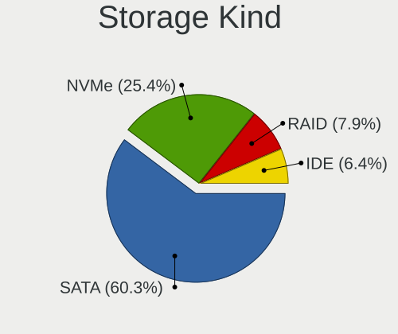

| Kind | Notebooks | Percent |
|------|-----------|---------|
| SATA | 11697     | 60.28%  |
| NVMe | 4928      | 25.4%   |
| RAID | 1534      | 7.91%   |
| IDE  | 1245      | 6.42%   |

Processor
---------

CPU Vendor
----------

Processor vendors

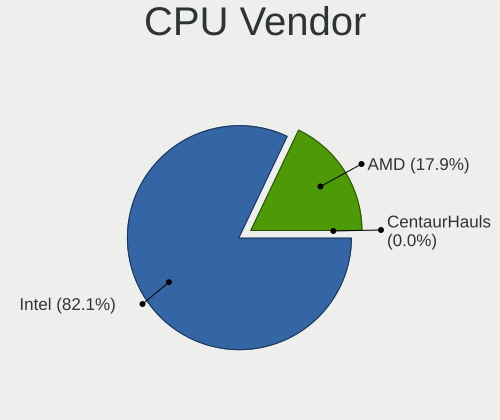

| Vendor       | Notebooks | Percent |
|--------------|-----------|---------|
| Intel        | 13507     | 82.07%  |
| AMD          | 2949      | 17.92%  |
| CentaurHauls | 1         | 0.01%   |

CPU Model
---------

Processor models

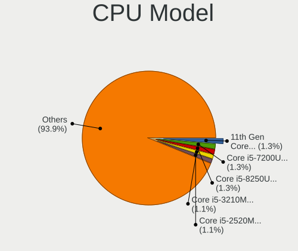

| Model                                         | Notebooks | Percent |
|-----------------------------------------------|-----------|---------|
| Intel 11th Gen Core i5-1135G7 @ 2.40GHz       | 221       | 1.34%   |
| Intel Core i5-7200U CPU @ 2.50GHz             | 220       | 1.34%   |
| Intel Core i5-8250U CPU @ 1.60GHz             | 206       | 1.25%   |
| Intel Core i5-3210M CPU @ 2.50GHz             | 186       | 1.13%   |
| Intel Core i5-2520M CPU @ 2.50GHz             | 178       | 1.08%   |
| Intel Core i5-6200U CPU @ 2.30GHz             | 172       | 1.04%   |
| Intel Core i7-8550U CPU @ 1.80GHz             | 147       | 0.89%   |
| Intel 11th Gen Core i7-1165G7 @ 2.80GHz       | 147       | 0.89%   |
| AMD Ryzen 5 3500U with Radeon Vega Mobile Gfx | 146       | 0.89%   |
| Intel Core i5-6300U CPU @ 2.40GHz             | 140       | 0.85%   |
| Intel Core i5-8265U CPU @ 1.60GHz             | 137       | 0.83%   |
| Intel Core i5-4210U CPU @ 1.70GHz             | 137       | 0.83%   |
| Intel Celeron N4020 CPU @ 1.10GHz             | 136       | 0.83%   |
| AMD Ryzen 5 5500U with Radeon Graphics        | 130       | 0.79%   |
| Intel Core i5-5200U CPU @ 2.20GHz             | 127       | 0.77%   |
| Intel Core i5-3320M CPU @ 2.60GHz             | 127       | 0.77%   |
| Intel Core i7-7700HQ CPU @ 2.80GHz            | 122       | 0.74%   |
| Intel Core i5-3230M CPU @ 2.60GHz             | 118       | 0.72%   |
| Intel Celeron CPU N3060 @ 1.60GHz             | 117       | 0.71%   |
| Intel Core i5-4200U CPU @ 1.60GHz             | 113       | 0.69%   |
| Intel Core i3-6006U CPU @ 2.00GHz             | 110       | 0.67%   |
| Intel Core i7-8565U CPU @ 1.80GHz             | 108       | 0.66%   |
| Intel Core i5-2450M CPU @ 2.50GHz             | 108       | 0.66%   |
| Intel Core i7-8750H CPU @ 2.20GHz             | 107       | 0.65%   |
| Intel Core i5-10210U CPU @ 1.60GHz            | 107       | 0.65%   |
| Intel Core i3-5005U CPU @ 2.00GHz             | 105       | 0.64%   |
| Intel Core i7-6700HQ CPU @ 2.60GHz            | 104       | 0.63%   |
| Intel Core i7-7500U CPU @ 2.70GHz             | 101       | 0.61%   |
| Intel Core i5 CPU M 520 @ 2.40GHz             | 101       | 0.61%   |
| Intel Core i5-1035G1 CPU @ 1.00GHz            | 97        | 0.59%   |
| Intel Core i3-3110M CPU @ 2.40GHz             | 97        | 0.59%   |
| Intel Core i7-9750H CPU @ 2.60GHz             | 96        | 0.58%   |
| Intel Celeron CPU N3350 @ 1.10GHz             | 94        | 0.57%   |
| Intel Core i3-4005U CPU @ 1.70GHz             | 93        | 0.56%   |
| Intel Core i3 CPU M 370 @ 2.40GHz             | 93        | 0.56%   |
| Intel Celeron CPU N2840 @ 2.16GHz             | 93        | 0.56%   |
| Intel 11th Gen Core i3-1115G4 @ 3.00GHz       | 91        | 0.55%   |
| Intel Core i5-2410M CPU @ 2.30GHz             | 90        | 0.55%   |
| Intel Core i7-10750H CPU @ 2.60GHz            | 86        | 0.52%   |
| Intel Core i5-5300U CPU @ 2.30GHz             | 86        | 0.52%   |

CPU Model Family
----------------

Processor model prefix

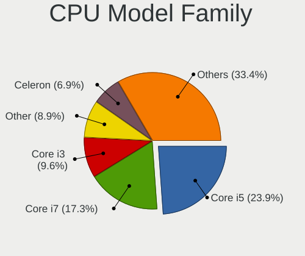

| Model                   | Notebooks | Percent |
|-------------------------|-----------|---------|
| Intel Core i5           | 3933      | 23.88%  |
| Intel Core i7           | 2857      | 17.35%  |
| Intel Core i3           | 1579      | 9.59%   |
| Other                   | 1463      | 8.88%   |
| Intel Celeron           | 1136      | 6.9%    |
| Intel Core 2 Duo        | 878       | 5.33%   |
| AMD Ryzen 5             | 693       | 4.21%   |
| AMD Ryzen 7             | 535       | 3.25%   |
| Intel Pentium           | 517       | 3.14%   |
| Intel Atom              | 369       | 2.24%   |
| AMD A6                  | 193       | 1.17%   |
| Intel Pentium Dual-Core | 180       | 1.09%   |
| AMD Ryzen 3             | 168       | 1.02%   |
| AMD A4                  | 150       | 0.91%   |
| AMD A8                  | 146       | 0.89%   |
| Intel Pentium Dual      | 115       | 0.7%    |
| Intel Core              | 108       | 0.66%   |
| AMD A10                 | 107       | 0.65%   |
| AMD E                   | 102       | 0.62%   |
| Intel Core 2            | 97        | 0.59%   |
| Intel Pentium Silver    | 91        | 0.55%   |
| AMD Ryzen 9             | 88        | 0.53%   |
| AMD E1                  | 77        | 0.47%   |
| Intel Genuine           | 75        | 0.46%   |
| AMD E2                  | 74        | 0.45%   |
| AMD Ryzen 7 PRO         | 73        | 0.44%   |
| AMD Turion 64 X2 Mobile | 61        | 0.37%   |
| Intel Core i9           | 57        | 0.35%   |
| AMD Athlon              | 41        | 0.25%   |
| AMD Ryzen 5 PRO         | 38        | 0.23%   |
| Intel Celeron M         | 35        | 0.21%   |
| Intel Celeron Dual-Core | 28        | 0.17%   |
| AMD Athlon II           | 27        | 0.16%   |
| AMD A12                 | 25        | 0.15%   |
| Intel Pentium M         | 22        | 0.13%   |
| AMD Athlon II Dual-Core | 20        | 0.12%   |
| Intel Core m3           | 19        | 0.12%   |
| Intel Core M            | 19        | 0.12%   |
| AMD C-60                | 18        | 0.11%   |
| AMD Athlon X2           | 18        | 0.11%   |

CPU Cores
---------

Number of processor cores

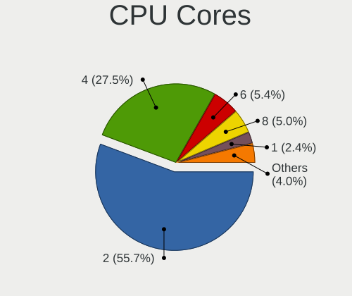

| Number | Notebooks | Percent |
|--------|-----------|---------|
| 2      | 9171      | 55.7%   |
| 4      | 4534      | 27.54%  |
| 6      | 895       | 5.44%   |
| 8      | 817       | 4.96%   |
| 1      | 391       | 2.37%   |
| 10     | 266       | 1.62%   |
| 14     | 138       | 0.84%   |
| 12     | 135       | 0.82%   |
| 16     | 68        | 0.41%   |
| 24     | 30        | 0.18%   |
| 20     | 8         | 0.05%   |
| 3      | 8         | 0.05%   |
| 5      | 5         | 0.03%   |

CPU Sockets
-----------

Number of sockets

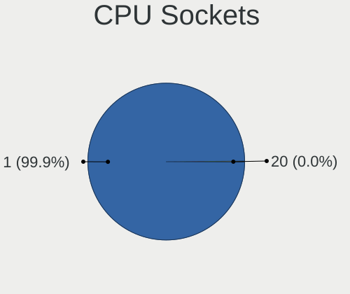

| Number | Notebooks | Percent |
|--------|-----------|---------|
| 1      | 16449     | 99.95%  |
| 2      | 5         | 0.03%   |
| 8      | 2         | 0.01%   |
| 24     | 1         | 0.01%   |
| 20     | 1         | 0.01%   |

CPU Threads
-----------

Threads per core (Hyper-Threading)

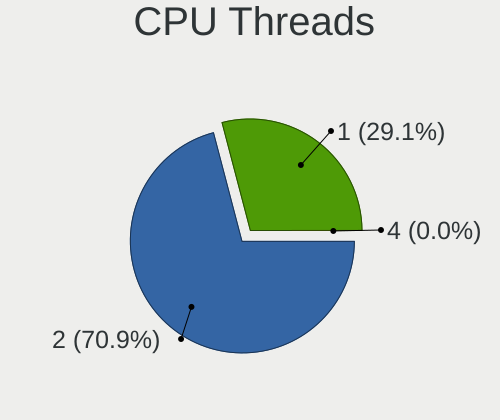

| Number | Notebooks | Percent |
|--------|-----------|---------|
| 2      | 11676     | 70.91%  |
| 1      | 4787      | 29.07%  |
| 4      | 2         | 0.01%   |

CPU Op-Modes
------------

CPU Operation Modes (32-bit, 64-bit)

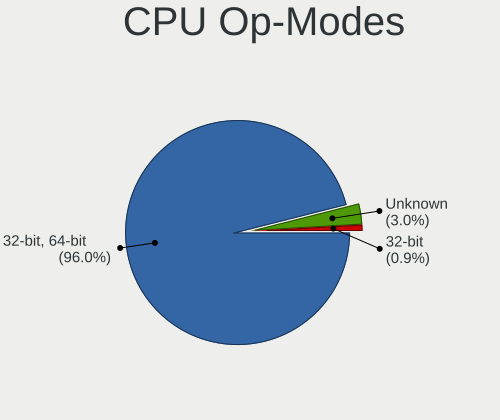

| Op mode        | Notebooks | Percent |
|----------------|-----------|---------|
| 32-bit, 64-bit | 15868     | 96.05%  |
| Unknown        | 502       | 3.04%   |
| 32-bit         | 151       | 0.91%   |

CPU Microcode
-------------

Microcode number

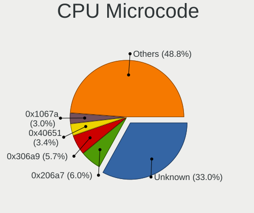

| Number     | Notebooks | Percent |
|------------|-----------|---------|
| Unknown    | 5578      | 33.03%  |
| 0x206a7    | 1014      | 6%      |
| 0x306a9    | 961       | 5.69%   |
| 0x40651    | 579       | 3.43%   |
| 0x1067a    | 513       | 3.04%   |
| 0x20655    | 435       | 2.58%   |
| 0x406e3    | 431       | 2.55%   |
| 0x306d4    | 403       | 2.39%   |
| 0x806ea    | 369       | 2.19%   |
| 0x806c1    | 352       | 2.08%   |
| 0x306c3    | 344       | 2.04%   |
| 0x806e9    | 327       | 1.94%   |
| 0x806ec    | 310       | 1.84%   |
| 0x6fd      | 267       | 1.58%   |
| 0x906ea    | 236       | 1.4%    |
| 0x30678    | 216       | 1.28%   |
| 0x406c4    | 209       | 1.24%   |
| 0x20652    | 186       | 1.1%    |
| 0x10676    | 170       | 1.01%   |
| 0x706a8    | 168       | 0.99%   |
| 0x08108109 | 164       | 0.97%   |
| 0x06006705 | 146       | 0.86%   |
| 0x706e5    | 144       | 0.85%   |
| 0x0a50000c | 125       | 0.74%   |
| 0x406c3    | 121       | 0.72%   |
| 0x906e9    | 119       | 0.7%    |
| 0x506e3    | 118       | 0.7%    |
| 0x506c9    | 117       | 0.69%   |
| 0x08608103 | 116       | 0.69%   |
| 0x05000119 | 114       | 0.68%   |
| 0x706a1    | 108       | 0.64%   |
| 0xa0652    | 106       | 0.63%   |
| 0x08600106 | 104       | 0.62%   |
| 0x08108102 | 99        | 0.59%   |
| 0x806eb    | 95        | 0.56%   |
| 0x07030105 | 95        | 0.56%   |
| 0x906a3    | 93        | 0.55%   |
| 0x106ca    | 87        | 0.52%   |
| 0x06001119 | 78        | 0.46%   |
| 0x0700010f | 76        | 0.45%   |

CPU Microarch
-------------

Microarchitecture

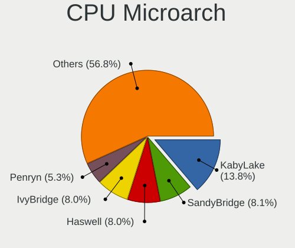

| Name               | Notebooks | Percent |
|--------------------|-----------|---------|
| KabyLake           | 2267      | 13.76%  |
| SandyBridge        | 1338      | 8.12%   |
| Haswell            | 1322      | 8.02%   |
| IvyBridge          | 1318      | 8%      |
| Penryn             | 880       | 5.34%   |
| Skylake            | 848       | 5.15%   |
| Westmere           | 801       | 4.86%   |
| Unknown            | 744       | 4.52%   |
| Silvermont         | 712       | 4.32%   |
| TigerLake          | 592       | 3.59%   |
| Broadwell          | 585       | 3.55%   |
| Alderlake Hybrid   | 553       | 3.36%   |
| Core               | 535       | 3.25%   |
| Goldmont plus      | 370       | 2.25%   |
| Zen+               | 366       | 2.22%   |
| Zen 3              | 351       | 2.13%   |
| Excavator          | 344       | 2.09%   |
| IceLake            | 311       | 1.89%   |
| Zen 2              | 261       | 1.58%   |
| CometLake          | 203       | 1.23%   |
| Puma               | 181       | 1.1%    |
| Bonnell            | 179       | 1.09%   |
| Goldmont           | 175       | 1.06%   |
| Bobcat             | 173       | 1.05%   |
| K8 Hammer          | 119       | 0.72%   |
| Piledriver         | 113       | 0.69%   |
| Jaguar             | 111       | 0.67%   |
| P6                 | 109       | 0.66%   |
| Zen                | 104       | 0.63%   |
| K10                | 98        | 0.59%   |
| K10 Llano          | 83        | 0.5%    |
| Tremont            | 71        | 0.43%   |
| Nehalem            | 70        | 0.42%   |
| Meteorlake Hybrid  | 63        | 0.38%   |
| K8 & K10 hybrid    | 37        | 0.22%   |
| Gracemont          | 36        | 0.22%   |
| Steamroller        | 24        | 0.15%   |
| Lunarlake Hybrid   | 14        | 0.08%   |
| NetBurst           | 7         | 0.04%   |
| ArrowLake-H Hybrid | 6         | 0.04%   |

Graphics
--------

GPU Vendor
----------

Vendors of graphics cards

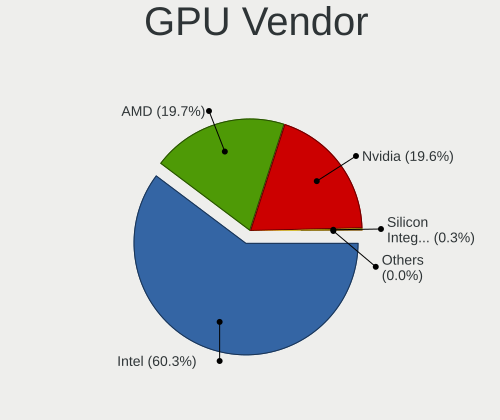

| Vendor                           | Notebooks | Percent |
|----------------------------------|-----------|---------|
| Intel                            | 12213     | 60.26%  |
| AMD                              | 3995      | 19.71%  |
| Nvidia                           | 3980      | 19.64%  |
| Silicon Integrated Systems [SiS] | 63        | 0.31%   |
| VIA Technologies                 | 14        | 0.07%   |
| S3 Graphics                      | 1         | 0.005%  |
| ASPEED Technology                | 1         | 0.005%  |

GPU Model
---------

Graphics card models

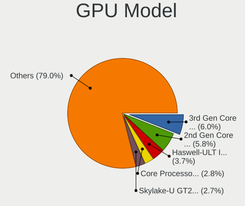

| Model                                                                                    | Notebooks | Percent |
|------------------------------------------------------------------------------------------|-----------|---------|
| Intel 3rd Gen Core processor Graphics Controller                                         | 1256      | 5.98%   |
| Intel 2nd Generation Core Processor Family Integrated Graphics Controller                | 1221      | 5.81%   |
| Intel Haswell-ULT Integrated Graphics Controller                                         | 783       | 3.73%   |
| Intel Core Processor Integrated Graphics Controller                                      | 579       | 2.76%   |
| Intel Skylake-U GT2 [HD Graphics 520]                                                    | 575       | 2.74%   |
| Intel Kaby Lake-R GT2 [UHD Graphics 620]                                                 | 528       | 2.51%   |
| Intel Mobile 4 Series Chipset Integrated Graphics Controller                             | 513       | 2.44%   |
| Intel TigerLake-LP GT2 [Iris Xe Graphics]                                                | 474       | 2.26%   |
| Intel Broadwell-U GT2 [HD Graphics 5500]                                                 | 463       | 2.2%    |
| Intel Kaby Lake-U GT2 [HD Graphics 620]                                                  | 461       | 2.2%    |
| Intel 4th Gen Core Processor Integrated Graphics Controller                              | 453       | 2.16%   |
| Intel Atom/Celeron/Pentium Processor x5-E8000/J3xxx/N3xxx Integrated Graphics Controller | 407       | 1.94%   |
| AMD Picasso/Raven 2 [Radeon Vega Series / Radeon Vega Mobile Series]                     | 382       | 1.82%   |
| Intel WhiskeyLake-U GT2 [UHD Graphics 620]                                               | 334       | 1.59%   |
| Intel CoffeeLake-H GT2 [UHD Graphics 630]                                                | 319       | 1.52%   |
| Intel GeminiLake [UHD Graphics 600]                                                      | 311       | 1.48%   |
| Intel Atom Processor Z36xxx/Z37xxx Series Graphics & Display                             | 305       | 1.45%   |
| AMD Renoir [Radeon Vega Series / Radeon Vega Mobile Series]                              | 256       | 1.22%   |
| AMD Stoney [Radeon R2/R3/R4/R5 Graphics]                                                 | 253       | 1.2%    |
| Intel CometLake-U GT2 [UHD Graphics]                                                     | 244       | 1.16%   |
| AMD Lucienne                                                                             | 240       | 1.14%   |
| Intel Mobile GM965/GL960 Integrated Graphics Controller (secondary)                      | 229       | 1.09%   |
| Intel Mobile GM965/GL960 Integrated Graphics Controller (primary)                        | 229       | 1.09%   |
| Nvidia GF117M [GeForce 610M/710M/810M/820M / GT 620M/625M/630M/720M]                     | 198       | 0.94%   |
| AMD Cezanne [Radeon Vega Series / Radeon Vega Mobile Series]                             | 185       | 0.88%   |
| Nvidia TU117M [GeForce GTX 1650 Mobile / Max-Q]                                          | 180       | 0.86%   |
| AMD Sun XT [Radeon HD 8670A/8670M/8690M / R5 M330 / M430 / Radeon 520 Mobile]            | 175       | 0.83%   |
| Intel Kaby Lake-H GT2 [HD Graphics 630]                                                  | 166       | 0.79%   |
| Intel CometLake-H GT2 [UHD Graphics]                                                     | 165       | 0.79%   |
| Intel Skylake-H GT2 [HD Graphics 530]                                                    | 162       | 0.77%   |
| AMD Barcelo                                                                              | 157       | 0.75%   |
| AMD Topaz XT [Radeon R7 M260/M265 / M340/M360 / M440/M445 / 530/535 / 620/625 Mobile]    | 155       | 0.74%   |
| Intel Iris Plus Graphics G1 (Ice Lake)                                                   | 153       | 0.73%   |
| Intel Mobile 945GM/GMS/GME, 943/940GML Express Integrated Graphics Controller            | 150       | 0.71%   |
| Intel Apollo Lake GT1 [HD Graphics 500]                                                  | 138       | 0.66%   |
| AMD Seymour [Radeon HD 6400M/7400M Series]                                               | 133       | 0.63%   |
| Nvidia GP107M [GeForce GTX 1050 Mobile]                                                  | 130       | 0.62%   |
| Intel Raptor Lake-P [Iris Xe Graphics]                                                   | 128       | 0.61%   |
| AMD Mullins [Radeon R4/R5 Graphics]                                                      | 124       | 0.59%   |
| Intel Alder Lake-P GT2 [Iris Xe Graphics]                                                | 120       | 0.57%   |

GPU Combo
---------

Combinations of graphics cards

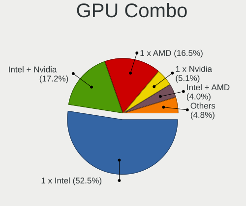

| Name                   | Notebooks | Percent |
|------------------------|-----------|---------|
| 1 x Intel              | 8651      | 52.49%  |
| Intel + Nvidia         | 2827      | 17.15%  |
| 1 x AMD                | 2722      | 16.52%  |
| 1 x Nvidia             | 836       | 5.07%   |
| Intel + AMD            | 659       | 4%      |
| 2 x AMD                | 314       | 1.91%   |
| AMD + Nvidia           | 298       | 1.81%   |
| 1 x SiS                | 63        | 0.38%   |
| 2 x Intel              | 47        | 0.29%   |
| 2 x Nvidia             | 22        | 0.13%   |
| Other                  | 21        | 0.13%   |
| 1 x VIA                | 14        | 0.08%   |
| 2 x Intel + 1 x Nvidia | 2         | 0.01%   |
| 2 x AMD + 1 x Nvidia   | 1         | 0.01%   |
| 1 x S3 Graphics        | 1         | 0.01%   |
| 1 x ASPEED             | 1         | 0.01%   |
| AMD + 2 x Nvidia       | 1         | 0.01%   |

GPU Driver
----------

Free vs proprietary

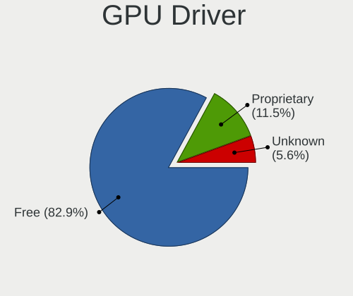

| Driver      | Notebooks | Percent |
|-------------|-----------|---------|
| Free        | 13785     | 82.92%  |
| Proprietary | 1917      | 11.53%  |
| Unknown     | 923       | 5.55%   |

GPU Memory
----------

Total video memory

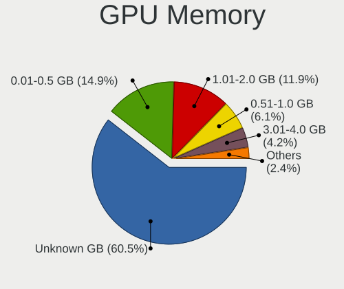

| Size in GB     | Notebooks | Percent |
|----------------|-----------|---------|
| Unknown        | 10147     | 60.55%  |
| 0.01-0.5       | 2490      | 14.86%  |
| 1.01-2.0       | 1995      | 11.9%   |
| 0.51-1.0       | 1017      | 6.07%   |
| 3.01-4.0       | 706       | 4.21%   |
| 5.01-6.0       | 186       | 1.11%   |
| 7.01-8.0       | 151       | 0.9%    |
| 2.01-3.0       | 41        | 0.24%   |
| 8.01-16.0      | 25        | 0.15%   |
| More than 64.0 | 1         | 0.01%   |

Monitor
-------

Monitor Vendor
--------------

Monitor vendors

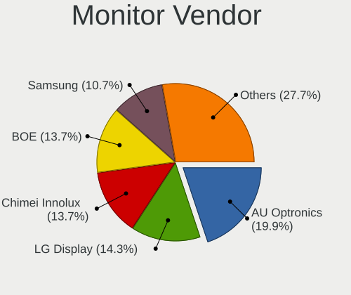

| Vendor                  | Notebooks | Percent |
|-------------------------|-----------|---------|
| AU Optronics            | 3517      | 19.88%  |
| LG Display              | 2534      | 14.32%  |
| Chimei Innolux          | 2422      | 13.69%  |
| BOE                     | 2415      | 13.65%  |
| Samsung Electronics     | 1896      | 10.72%  |
| Apple                   | 545       | 3.08%   |
| Chi Mei Optoelectronics | 470       | 2.66%   |
| Lenovo                  | 348       | 1.97%   |
| Goldstar                | 330       | 1.87%   |
| Dell                    | 326       | 1.84%   |
| Sharp                   | 229       | 1.29%   |
| PANDA                   | 219       | 1.24%   |
| Hewlett-Packard         | 185       | 1.05%   |
| InfoVision              | 183       | 1.03%   |
| LG Philips              | 182       | 1.03%   |
| Philips                 | 142       | 0.8%    |
| Acer                    | 141       | 0.8%    |
| AOC                     | 115       | 0.65%   |
| BenQ                    | 93        | 0.53%   |
| Sony                    | 89        | 0.5%    |
| CPT                     | 79        | 0.45%   |
| Ancor Communications    | 66        | 0.37%   |
| HannStar                | 53        | 0.3%    |
| Iiyama                  | 52        | 0.29%   |
| CSO                     | 47        | 0.27%   |
| ASUSTek Computer        | 43        | 0.24%   |
| Toshiba                 | 42        | 0.24%   |
| Panasonic               | 42        | 0.24%   |
| Seiko/Epson             | 41        | 0.23%   |
| Unknown                 | 40        | 0.23%   |
| InnoLux Display         | 40        | 0.23%   |
| ViewSonic               | 39        | 0.22%   |
| LGD                     | 36        | 0.2%    |
| CSOT                    | 35        | 0.2%    |
| Quanta Display          | 29        | 0.16%   |
| HKC                     | 28        | 0.16%   |
| TMX                     | 25        | 0.14%   |
| MSI                     | 25        | 0.14%   |
| Fujitsu Siemens         | 19        | 0.11%   |
| Vizio                   | 18        | 0.1%    |

Monitor Model
-------------

Monitor models

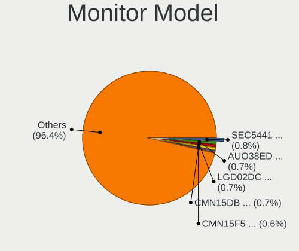

| Model                                                                     | Notebooks | Percent |
|---------------------------------------------------------------------------|-----------|---------|
| Samsung Electronics LCD Monitor SEC5441 1280x800 331x207mm 15.4-inch      | 148       | 0.83%   |
| AU Optronics LCD Monitor AUO38ED 1920x1080 344x193mm 15.5-inch            | 128       | 0.72%   |
| LG Display LCD Monitor LGD02DC 1366x768 344x194mm 15.5-inch               | 126       | 0.71%   |
| Chimei Innolux LCD Monitor CMN15DB 1366x768 344x193mm 15.5-inch           | 119       | 0.67%   |
| Chimei Innolux LCD Monitor CMN15F5 1920x1080 344x193mm 15.5-inch          | 113       | 0.63%   |
| Chimei Innolux LCD Monitor CMN15E7 1920x1080 344x193mm 15.5-inch          | 104       | 0.58%   |
| AU Optronics LCD Monitor AUO21ED 1920x1080 344x193mm 15.5-inch            | 99        | 0.55%   |
| Chimei Innolux LCD Monitor CMN14D4 1920x1080 309x173mm 13.9-inch          | 86        | 0.48%   |
| AU Optronics LCD Monitor AUO22EC 1366x768 344x193mm 15.5-inch             | 85        | 0.48%   |
| AU Optronics LCD Monitor AUO71EC 1366x768 344x193mm 15.5-inch             | 84        | 0.47%   |
| AU Optronics LCD Monitor AUO26EC 1366x768 344x193mm 15.5-inch             | 80        | 0.45%   |
| AU Optronics LCD Monitor AUO23EC 1366x768 344x193mm 15.5-inch             | 77        | 0.43%   |
| AU Optronics LCD Monitor AUO45EC 1366x768 344x193mm 15.5-inch             | 70        | 0.39%   |
| Chimei Innolux LCD Monitor CMN15E6 1366x768 344x193mm 15.5-inch           | 65        | 0.36%   |
| Chimei Innolux LCD Monitor CMN1521 1920x1080 344x193mm 15.5-inch          | 65        | 0.36%   |
| LG Display LCD Monitor LGD033A 1366x768 344x194mm 15.5-inch               | 59        | 0.33%   |
| Chi Mei Optoelectronics LCD Monitor CMO15A7 1366x768 344x193mm 15.5-inch  | 59        | 0.33%   |
| BOE LCD Monitor BOE06A5 1366x768 344x194mm 15.5-inch                      | 57        | 0.32%   |
| AU Optronics LCD Monitor AUO2E3C 1366x768 309x173mm 13.9-inch             | 56        | 0.31%   |
| BOE LCD Monitor BOE06A4 1366x768 344x194mm 15.5-inch                      | 54        | 0.3%    |
| Chimei Innolux LCD Monitor CMN15DC 1366x768 344x193mm 15.5-inch           | 53        | 0.3%    |
| Chimei Innolux LCD Monitor CMN15AB 1366x768 344x193mm 15.5-inch           | 53        | 0.3%    |
| LG Display LCD Monitor LGD046F 1920x1080 344x194mm 15.5-inch              | 51        | 0.29%   |
| AU Optronics LCD Monitor AUO403D 1920x1080 309x174mm 14.0-inch            | 51        | 0.29%   |
| AU Optronics LCD Monitor AUO10EC 1366x768 344x193mm 15.5-inch             | 51        | 0.29%   |
| BOE LCD Monitor BOE084E 1920x1080 382x215mm 17.3-inch                     | 50        | 0.28%   |
| BOE LCD Monitor BOE0687 1920x1080 344x193mm 15.5-inch                     | 50        | 0.28%   |
| AU Optronics LCD Monitor AUO61ED 1920x1080 344x194mm 15.5-inch            | 50        | 0.28%   |
| Chimei Innolux LCD Monitor CMN15CA 1366x768 344x193mm 15.5-inch           | 49        | 0.27%   |
| Chi Mei Optoelectronics LCD Monitor CMO1720 1920x1080 382x215mm 17.3-inch | 48        | 0.27%   |
| AU Optronics LCD Monitor AUO21EC 1366x768 344x193mm 15.5-inch             | 47        | 0.26%   |
| AU Optronics LCD Monitor AUO20EC 1366x768 344x193mm 15.5-inch             | 47        | 0.26%   |
| AU Optronics LCD Monitor AUO106C 1366x768 276x155mm 12.5-inch             | 47        | 0.26%   |
| BOE LCD Monitor BOE0696 1366x768 309x173mm 13.9-inch                      | 46        | 0.26%   |
| Samsung Electronics LCD Monitor SEC544B 1600x900 382x214mm 17.2-inch      | 45        | 0.25%   |
| Lenovo LCD Monitor LEN40B1 1600x900 345x194mm 15.6-inch                   | 44        | 0.25%   |
| AU Optronics LCD Monitor AUO139E 1600x900 382x214mm 17.2-inch             | 44        | 0.25%   |
| Chimei Innolux LCD Monitor CMN14D6 1366x768 309x173mm 13.9-inch           | 42        | 0.24%   |
| LG Display LCD Monitor LGD039F 1366x768 345x194mm 15.6-inch               | 41        | 0.23%   |
| Chimei Innolux LCD Monitor CMN1735 1920x1080 381x214mm 17.2-inch          | 41        | 0.23%   |

Monitor Resolution
------------------

Monitor screen resolution

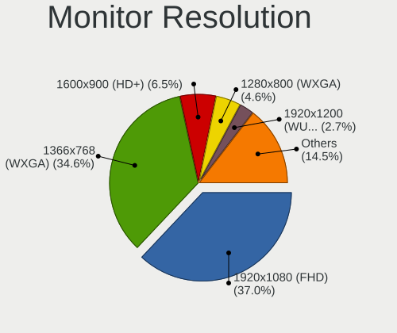

| Resolution         | Notebooks | Percent |
|--------------------|-----------|---------|
| 1920x1080 (FHD)    | 6280      | 37.02%  |
| 1366x768 (WXGA)    | 5874      | 34.62%  |
| 1600x900 (HD+)     | 1108      | 6.53%   |
| 1280x800 (WXGA)    | 783       | 4.62%   |
| 1920x1200 (WUXGA)  | 452       | 2.66%   |
| 3840x2160 (4K)     | 435       | 2.56%   |
| 1440x900 (WXGA+)   | 379       | 2.23%   |
| 2560x1440 (QHD)    | 281       | 1.66%   |
| 2560x1600          | 209       | 1.23%   |
| 2880x1800          | 161       | 0.95%   |
| 1680x1050 (WSXGA+) | 135       | 0.8%    |
| 1024x600           | 102       | 0.6%    |
| 1280x1024 (SXGA)   | 93        | 0.55%   |
| 2560x1080          | 57        | 0.34%   |
| 1360x768           | 53        | 0.31%   |
| Unknown            | 45        | 0.27%   |
| 3440x1440          | 38        | 0.22%   |
| 2160x1440          | 35        | 0.21%   |
| 3200x1800 (QHD+)   | 32        | 0.19%   |
| 1024x768 (XGA)     | 32        | 0.19%   |
| 2288x1287          | 31        | 0.18%   |
| 1680x945           | 28        | 0.17%   |
| 3200x2000          | 27        | 0.16%   |
| 3840x2400          | 26        | 0.15%   |
| 1920x540           | 25        | 0.15%   |
| 3072x1920          | 24        | 0.14%   |
| 1920x1280          | 21        | 0.12%   |
| 3840x1080          | 19        | 0.11%   |
| 3000x2000          | 18        | 0.11%   |
| 2880x1620          | 17        | 0.1%    |
| 2304x1440          | 16        | 0.09%   |
| 2256x1504          | 16        | 0.09%   |
| 1280x720 (HD)      | 10        | 0.06%   |
| 2520x1680          | 9         | 0.05%   |
| 3456x2160          | 7         | 0.04%   |
| 2880x1920          | 6         | 0.04%   |
| 1600x1200          | 6         | 0.04%   |
| 1400x1050          | 6         | 0.04%   |
| 2240x1400          | 5         | 0.03%   |
| 3840x1200          | 4         | 0.02%   |

Monitor Diagonal
----------------

Diagonal size in inches

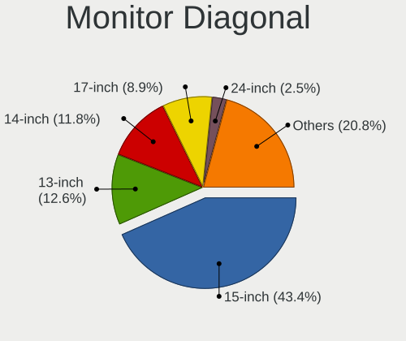

| Inches  | Notebooks | Percent |
|---------|-----------|---------|
| 15      | 7673      | 43.37%  |
| 13      | 2223      | 12.57%  |
| 14      | 2087      | 11.8%   |
| 17      | 1574      | 8.9%    |
| 24      | 450       | 2.54%   |
| 12      | 404       | 2.28%   |
| 11      | 393       | 2.22%   |
| 27      | 388       | 2.19%   |
| 16      | 347       | 1.96%   |
| 23      | 318       | 1.8%    |
| 21      | 309       | 1.75%   |
| Unknown | 257       | 1.45%   |
| 18      | 194       | 1.1%    |
| 31      | 180       | 1.02%   |
| 10      | 113       | 0.64%   |
| 19      | 109       | 0.62%   |
| 34      | 77        | 0.44%   |
| 22      | 71        | 0.4%    |
| 84      | 56        | 0.32%   |
| 72      | 52        | 0.29%   |
| 40      | 51        | 0.29%   |
| 20      | 50        | 0.28%   |
| 32      | 36        | 0.2%    |
| 54      | 32        | 0.18%   |
| 142     | 27        | 0.15%   |
| 25      | 20        | 0.11%   |
| 63      | 17        | 0.1%    |
| 65      | 15        | 0.08%   |
| 52      | 13        | 0.07%   |
| 26      | 13        | 0.07%   |
| 49      | 12        | 0.07%   |
| 48      | 11        | 0.06%   |
| 28      | 11        | 0.06%   |
| 8       | 10        | 0.06%   |
| 29      | 9         | 0.05%   |
| 46      | 8         | 0.05%   |
| 42      | 8         | 0.05%   |
| 36      | 7         | 0.04%   |
| 33      | 7         | 0.04%   |
| 86      | 6         | 0.03%   |

Monitor Width
-------------

Physical width

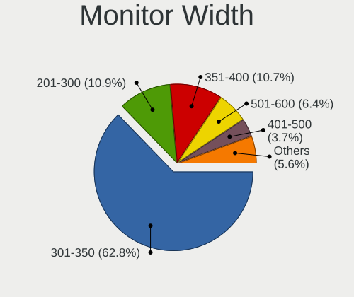

| Width in mm    | Notebooks | Percent |
|----------------|-----------|---------|
| 301-350        | 11043     | 62.77%  |
| 201-300        | 1911      | 10.86%  |
| 351-400        | 1880      | 10.69%  |
| 501-600        | 1118      | 6.35%   |
| 401-500        | 658       | 3.74%   |
| Unknown        | 257       | 1.46%   |
| 601-700        | 231       | 1.31%   |
| 1001-1500      | 128       | 0.73%   |
| 701-800        | 127       | 0.72%   |
| 1501-2000      | 118       | 0.67%   |
| 801-900        | 68        | 0.39%   |
| More than 2000 | 27        | 0.15%   |
| 901-1000       | 14        | 0.08%   |
| 101-200        | 10        | 0.06%   |
| 1-100          | 3         | 0.02%   |

Aspect Ratio
------------

Proportional relationship between the width and the height

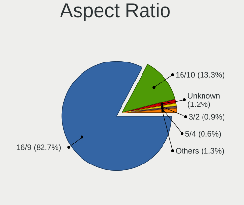

| Ratio   | Notebooks | Percent |
|---------|-----------|---------|
| 16/9    | 13250     | 82.7%   |
| 16/10   | 2130      | 13.3%   |
| Unknown | 198       | 1.24%   |
| 3/2     | 137       | 0.86%   |
| 5/4     | 94        | 0.59%   |
| 21/9    | 87        | 0.54%   |
| 4/3     | 52        | 0.32%   |
| 1.00    | 27        | 0.17%   |
| 32/9    | 20        | 0.12%   |
| 0.56    | 8         | 0.05%   |
| 6/5     | 7         | 0.04%   |
| 3.40    | 3         | 0.02%   |
| 0.67    | 2         | 0.01%   |
| 0.62    | 2         | 0.01%   |
| 2.50    | 1         | 0.01%   |
| 1.96    | 1         | 0.01%   |
| 0.89    | 1         | 0.01%   |
| 0.65    | 1         | 0.01%   |

Monitor Area
------------

Area in inch²

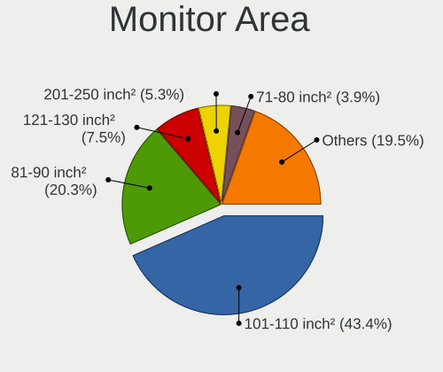

| Area in inch² | Notebooks | Percent |
|----------------|-----------|---------|
| 101-110        | 7668      | 43.43%  |
| 81-90          | 3587      | 20.32%  |
| 121-130        | 1322      | 7.49%   |
| 201-250        | 934       | 5.29%   |
| 71-80          | 693       | 3.93%   |
| 51-60          | 395       | 2.24%   |
| 301-350        | 395       | 2.24%   |
| 61-70          | 391       | 2.21%   |
| 351-500        | 315       | 1.78%   |
| 111-120        | 306       | 1.73%   |
| Unknown        | 257       | 1.46%   |
| More than 1000 | 244       | 1.38%   |
| 151-200        | 236       | 1.34%   |
| 131-140        | 223       | 1.26%   |
| 141-150        | 219       | 1.24%   |
| 251-300        | 159       | 0.9%    |
| 41-50          | 114       | 0.65%   |
| 501-1000       | 113       | 0.64%   |
| 91-100         | 70        | 0.4%    |
| 1-40           | 13        | 0.07%   |

Pixel Density
-------------

Pixels per inch

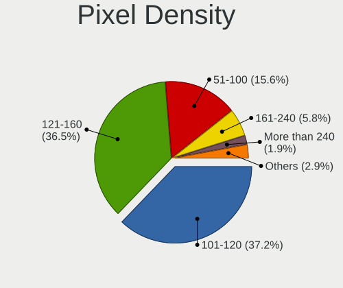

| Density       | Notebooks | Percent |
|---------------|-----------|---------|
| 101-120       | 6463      | 37.18%  |
| 121-160       | 6353      | 36.55%  |
| 51-100        | 2714      | 15.61%  |
| 161-240       | 1011      | 5.82%   |
| More than 240 | 333       | 1.92%   |
| Unknown       | 257       | 1.48%   |
| 1-50          | 253       | 1.46%   |

Multiple Monitors
-----------------

Total monitors connected

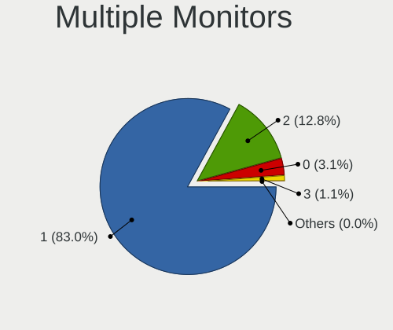

| Total | Notebooks | Percent |
|-------|-----------|---------|
| 1     | 13895     | 82.95%  |
| 2     | 2138      | 12.76%  |
| 0     | 525       | 3.13%   |
| 3     | 179       | 1.07%   |
| 4     | 13        | 0.08%   |
| 5     | 1         | 0.01%   |

Network
-------

Net Controller Vendor
---------------------

Controller vendors

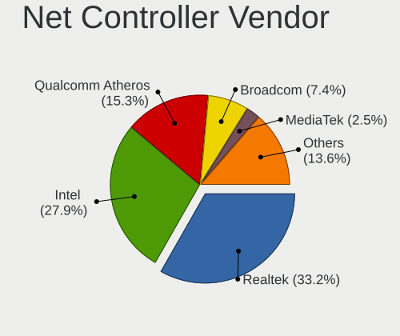

| Vendor                            | Notebooks | Percent |
|-----------------------------------|-----------|---------|
| Realtek Semiconductor             | 8871      | 33.25%  |
| Intel                             | 7437      | 27.87%  |
| Qualcomm Atheros                  | 4093      | 15.34%  |
| Broadcom                          | 1971      | 7.39%   |
| MediaTek                          | 669       | 2.51%   |
| Broadcom Limited                  | 488       | 1.83%   |
| Marvell Technology Group          | 353       | 1.32%   |
| Ralink                            | 333       | 1.25%   |
| TP-Link                           | 227       | 0.85%   |
| ASIX Electronics                  | 173       | 0.65%   |
| Ralink Technology                 | 163       | 0.61%   |
| Samsung Electronics               | 153       | 0.57%   |
| Dell                              | 123       | 0.46%   |
| Sierra Wireless                   | 122       | 0.46%   |
| Nvidia                            | 121       | 0.45%   |
| Xiaomi                            | 110       | 0.41%   |
| Ericsson Business Mobile Networks | 99        | 0.37%   |
| JMicron Technology                | 91        | 0.34%   |
| Hewlett-Packard                   | 81        | 0.3%    |
| Shenzhen Goodix Technology        | 77        | 0.29%   |
| DisplayLink                       | 72        | 0.27%   |
| Qualcomm                          | 69        | 0.26%   |
| Silicon Integrated Systems [SiS]  | 68        | 0.25%   |
| Huawei Technologies               | 65        | 0.24%   |
| Lenovo                            | 44        | 0.16%   |
| Motorola PCS                      | 41        | 0.15%   |
| NetGear                           | 39        | 0.15%   |
| Qualcomm Atheros Communications   | 38        | 0.14%   |
| D-Link                            | 32        | 0.12%   |
| Edimax Technology                 | 30        | 0.11%   |
| ASUSTek Computer                  | 27        | 0.1%    |
| OPPO Electronics                  | 25        | 0.09%   |
| Google                            | 24        | 0.09%   |
| Attansic Technology               | 22        | 0.08%   |
| Fibocom                           | 19        | 0.07%   |
| ICS Advent                        | 17        | 0.06%   |
| Belkin Components                 | 16        | 0.06%   |
| VIA Technologies                  | 15        | 0.06%   |
| Apple                             | 15        | 0.06%   |
| Linksys                           | 12        | 0.04%   |

Net Controller Model
--------------------

Controller models

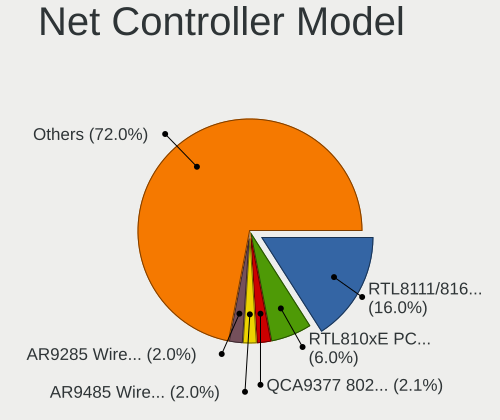

| Model                                                                   | Notebooks | Percent |
|-------------------------------------------------------------------------|-----------|---------|
| Realtek RTL8111/8168/8211/8411 PCI Express Gigabit Ethernet Controller  | 5099      | 15.97%  |
| Realtek RTL810xE PCI Express Fast Ethernet controller                   | 1911      | 5.99%   |
| Qualcomm Atheros QCA9377 802.11ac Wireless Network Adapter              | 662       | 2.07%   |
| Qualcomm Atheros AR9485 Wireless Network Adapter                        | 638       | 2%      |
| Qualcomm Atheros AR9285 Wireless Network Adapter (PCI-Express)          | 637       | 2%      |
| Qualcomm Atheros QCA9565 / AR9565 Wireless Network Adapter              | 617       | 1.93%   |
| Intel 82579LM Gigabit Network Connection (Lewisville)                   | 615       | 1.93%   |
| Realtek RTL8821CE 802.11ac PCIe Wireless Network Adapter                | 600       | 1.88%   |
| Intel Wireless 8265 / 8275                                              | 524       | 1.64%   |
| Intel Wireless 7260                                                     | 478       | 1.5%    |
| Intel Wireless 7265                                                     | 434       | 1.36%   |
| Intel Centrino Advanced-N 6205 [Taylor Peak]                            | 424       | 1.33%   |
| Intel Wi-Fi 6 AX201                                                     | 417       | 1.31%   |
| Realtek RTL8153 Gigabit Ethernet Adapter                                | 395       | 1.24%   |
| Intel Wi-Fi 6 AX200                                                     | 383       | 1.2%    |
| Broadcom BCM4313 802.11bgn Wireless Network Adapter                     | 383       | 1.2%    |
| Intel Wireless 8260                                                     | 344       | 1.08%   |
| Realtek RTL8822CE 802.11ac PCIe Wireless Network Adapter                | 333       | 1.04%   |
| Qualcomm Atheros QCA6174 802.11ac Wireless Network Adapter              | 319       | 1%      |
| Broadcom BCM43142 802.11b/g/n                                           | 297       | 0.93%   |
| Realtek RTL8723BE PCIe Wireless Network Adapter                         | 295       | 0.92%   |
| MediaTek MT7921 802.11ax PCIe Wireless Network Adapter [Filogic 330]    | 269       | 0.84%   |
| Intel Wireless 3165                                                     | 254       | 0.8%    |
| Intel Alder Lake-P PCH CNVi WiFi                                        | 244       | 0.76%   |
| Intel Ethernet Connection (4) I219-LM                                   | 236       | 0.74%   |
| Intel Wireless 3160                                                     | 232       | 0.73%   |
| Intel PRO/Wireless 3945ABG [Golan] Network Connection                   | 222       | 0.7%    |
| Qualcomm Atheros AR8151 v2.0 Gigabit Ethernet                           | 220       | 0.69%   |
| Intel Comet Lake PCH-LP CNVi WiFi                                       | 212       | 0.66%   |
| Intel Cannon Lake PCH CNVi WiFi                                         | 197       | 0.62%   |
| Intel Cannon Point-LP CNVi [Wireless-AC]                                | 193       | 0.6%    |
| Realtek RTL8188CE 802.11b/g/n WiFi Adapter                              | 191       | 0.6%    |
| Intel 82577LM Gigabit Network Connection                                | 191       | 0.6%    |
| Realtek RTL8723DE Wireless Network Adapter                              | 184       | 0.58%   |
| Qualcomm Atheros AR242x / AR542x Wireless Network Adapter (PCI-Express) | 184       | 0.58%   |
| Intel Ethernet Connection I219-LM                                       | 184       | 0.58%   |
| Ralink RT3290 Wireless 802.11n 1T/1R PCIe                               | 166       | 0.52%   |
| Intel Centrino Ultimate-N 6300                                          | 166       | 0.52%   |
| Intel Ethernet Connection I218-LM                                       | 165       | 0.52%   |
| Realtek RTL8852BE PCIe 802.11ax Wireless Network Controller             | 164       | 0.51%   |

Wireless Vendor
---------------

Wireless vendors

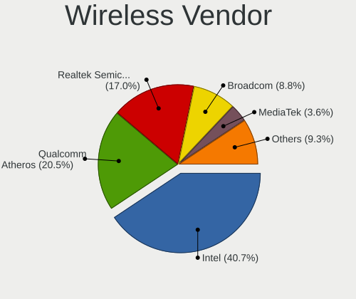

| Vendor                                | Notebooks | Percent |
|---------------------------------------|-----------|---------|
| Intel                                 | 6957      | 40.65%  |
| Qualcomm Atheros                      | 3515      | 20.54%  |
| Realtek Semiconductor                 | 2912      | 17.02%  |
| Broadcom                              | 1511      | 8.83%   |
| MediaTek                              | 619       | 3.62%   |
| Broadcom Limited                      | 337       | 1.97%   |
| Ralink                                | 333       | 1.95%   |
| TP-Link                               | 209       | 1.22%   |
| Ralink Technology                     | 163       | 0.95%   |
| Sierra Wireless                       | 122       | 0.71%   |
| Dell                                  | 70        | 0.41%   |
| Qualcomm                              | 43        | 0.25%   |
| Qualcomm Atheros Communications       | 38        | 0.22%   |
| NetGear                               | 38        | 0.22%   |
| D-Link                                | 31        | 0.18%   |
| Edimax Technology                     | 30        | 0.18%   |
| ASUSTek Computer                      | 27        | 0.16%   |
| Hewlett-Packard                       | 20        | 0.12%   |
| Fibocom                               | 19        | 0.11%   |
| Belkin Components                     | 15        | 0.09%   |
| AVM                                   | 11        | 0.06%   |
| Linksys                               | 9         | 0.05%   |
| D-Link System                         | 9         | 0.05%   |
| Realtek                               | 7         | 0.04%   |
| Microsoft                             | 7         | 0.04%   |
| Micro Star International              | 5         | 0.03%   |
| ZyDAS                                 | 4         | 0.02%   |
| 802.11g Adapter [Linksys WUSB54GC v3] | 4         | 0.02%   |
| Unknown                               | 4         | 0.02%   |
| Sitecom Europe                        | 3         | 0.02%   |
| Fujitsu Siemens Computers             | 3         | 0.02%   |
| ZyXEL Communications                  | 2         | 0.01%   |
| ZTopInc                               | 2         | 0.01%   |
| TRENDnet                              | 2         | 0.01%   |
| Silicon Integrated Systems [SiS]      | 2         | 0.01%   |
| Philips (or NXP)                      | 2         | 0.01%   |
| Mercucys                              | 2         | 0.01%   |
| Marvell Technology Group              | 2         | 0.01%   |
| Ericsson Business Mobile Networks     | 2         | 0.01%   |
| Arduino SA                            | 2         | 0.01%   |

Wireless Model
--------------

Wireless models

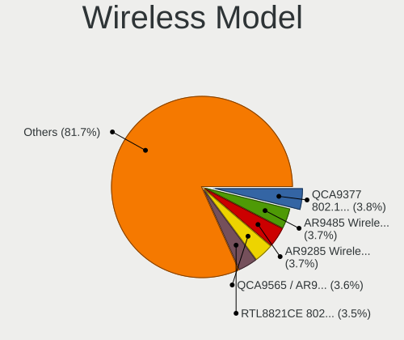

| Model                                                                   | Notebooks | Percent |
|-------------------------------------------------------------------------|-----------|---------|
| Qualcomm Atheros QCA9377 802.11ac Wireless Network Adapter              | 662       | 3.84%   |
| Qualcomm Atheros AR9485 Wireless Network Adapter                        | 638       | 3.7%    |
| Qualcomm Atheros AR9285 Wireless Network Adapter (PCI-Express)          | 637       | 3.69%   |
| Qualcomm Atheros QCA9565 / AR9565 Wireless Network Adapter              | 617       | 3.58%   |
| Realtek RTL8821CE 802.11ac PCIe Wireless Network Adapter                | 600       | 3.48%   |
| Intel Wireless 8265 / 8275                                              | 524       | 3.04%   |
| Intel Wireless 7260                                                     | 478       | 2.77%   |
| Intel Wireless 7265                                                     | 434       | 2.52%   |
| Intel Centrino Advanced-N 6205 [Taylor Peak]                            | 424       | 2.46%   |
| Intel Wi-Fi 6 AX201                                                     | 417       | 2.42%   |
| Intel Wi-Fi 6 AX200                                                     | 383       | 2.22%   |
| Broadcom BCM4313 802.11bgn Wireless Network Adapter                     | 383       | 2.22%   |
| Intel Wireless 8260                                                     | 344       | 1.99%   |
| Realtek RTL8822CE 802.11ac PCIe Wireless Network Adapter                | 333       | 1.93%   |
| Qualcomm Atheros QCA6174 802.11ac Wireless Network Adapter              | 319       | 1.85%   |
| Broadcom BCM43142 802.11b/g/n                                           | 297       | 1.72%   |
| Realtek RTL8723BE PCIe Wireless Network Adapter                         | 295       | 1.71%   |
| MediaTek MT7921 802.11ax PCIe Wireless Network Adapter [Filogic 330]    | 269       | 1.56%   |
| Intel Wireless 3165                                                     | 254       | 1.47%   |
| Intel Wireless 3160                                                     | 232       | 1.35%   |
| Intel PRO/Wireless 3945ABG [Golan] Network Connection                   | 222       | 1.29%   |
| Intel Comet Lake PCH-LP CNVi WiFi                                       | 212       | 1.23%   |
| Intel Cannon Lake PCH CNVi WiFi                                         | 197       | 1.14%   |
| Intel Cannon Point-LP CNVi [Wireless-AC]                                | 193       | 1.12%   |
| Realtek RTL8188CE 802.11b/g/n WiFi Adapter                              | 191       | 1.11%   |
| Realtek RTL8723DE Wireless Network Adapter                              | 184       | 1.07%   |
| Qualcomm Atheros AR242x / AR542x Wireless Network Adapter (PCI-Express) | 184       | 1.07%   |
| Ralink RT3290 Wireless 802.11n 1T/1R PCIe                               | 166       | 0.96%   |
| Intel Centrino Ultimate-N 6300                                          | 166       | 0.96%   |
| MediaTek MT7902 802.11ax PCIe Wireless Network Adapter [Filogic 310]    | 163       | 0.95%   |
| Intel WiFi Link 5100                                                    | 163       | 0.95%   |
| Realtek RTL8852BE PCIe 802.11ax Wireless Network Controller             | 158       | 0.92%   |
| Qualcomm Atheros AR9462 Wireless Network Adapter                        | 157       | 0.91%   |
| Intel Alder Lake-P PCH CNVi WiFi                                        | 157       | 0.91%   |
| Intel Comet Lake PCH CNVi WiFi                                          | 154       | 0.89%   |
| Intel Dual Band Wireless-AC 3165 Plus Bluetooth                         | 152       | 0.88%   |
| Intel Centrino Advanced-N 6200                                          | 147       | 0.85%   |
| Intel Centrino Advanced-N 6235                                          | 144       | 0.84%   |
| Qualcomm Atheros AR9287 Wireless Network Adapter (PCI-Express)          | 143       | 0.83%   |
| Intel Raptor Lake PCH CNVi WiFi                                         | 136       | 0.79%   |

Ethernet Vendor
---------------

Ethernet vendors

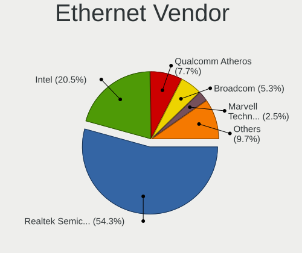

| Vendor                                 | Notebooks | Percent |
|----------------------------------------|-----------|---------|
| Realtek Semiconductor                  | 7652      | 54.28%  |
| Intel                                  | 2891      | 20.51%  |
| Qualcomm Atheros                       | 1086      | 7.7%    |
| Broadcom                               | 744       | 5.28%   |
| Marvell Technology Group               | 351       | 2.49%   |
| ASIX Electronics                       | 173       | 1.23%   |
| Broadcom Limited                       | 159       | 1.13%   |
| Samsung Electronics                    | 145       | 1.03%   |
| Nvidia                                 | 120       | 0.85%   |
| Xiaomi                                 | 109       | 0.77%   |
| JMicron Technology                     | 91        | 0.65%   |
| DisplayLink                            | 72        | 0.51%   |
| Silicon Integrated Systems [SiS]       | 65        | 0.46%   |
| MediaTek                               | 46        | 0.33%   |
| Lenovo                                 | 42        | 0.3%    |
| Motorola PCS                           | 40        | 0.28%   |
| Huawei Technologies                    | 38        | 0.27%   |
| Hewlett-Packard                        | 30        | 0.21%   |
| Qualcomm                               | 26        | 0.18%   |
| OPPO Electronics                       | 25        | 0.18%   |
| Google                                 | 24        | 0.17%   |
| Attansic Technology                    | 22        | 0.16%   |
| TP-Link                                | 18        | 0.13%   |
| ICS Advent                             | 17        | 0.12%   |
| VIA Technologies                       | 15        | 0.11%   |
| Apple                                  | 15        | 0.11%   |
| T & A Mobile Phones                    | 8         | 0.06%   |
| HMD Global                             | 6         | 0.04%   |
| Suzhou Motorcomm Electronic Technology | 5         | 0.04%   |
| Sony Ericsson Mobile Communications AB | 5         | 0.04%   |
| OnePlus Technology (Shenzhen)          | 4         | 0.03%   |
| ZTE WCDMA Technologies MSM             | 3         | 0.02%   |
| Novatel Wireless                       | 3         | 0.02%   |
| MosChip Semiconductor                  | 3         | 0.02%   |
| Microsoft                              | 3         | 0.02%   |
| Microchip Technology                   | 3         | 0.02%   |
| Linksys                                | 3         | 0.02%   |
| Aquantia                               | 3         | 0.02%   |
| Spreadtrum Communications              | 2         | 0.01%   |
| Qualcomm Technologies                  | 2         | 0.01%   |

Ethernet Model
--------------

Ethernet models

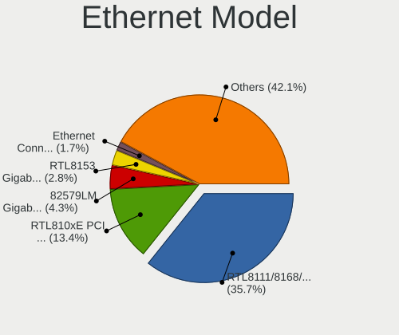

| Model                                                                  | Notebooks | Percent |
|------------------------------------------------------------------------|-----------|---------|
| Realtek RTL8111/8168/8211/8411 PCI Express Gigabit Ethernet Controller | 5099      | 35.74%  |
| Realtek RTL810xE PCI Express Fast Ethernet controller                  | 1911      | 13.4%   |
| Intel 82579LM Gigabit Network Connection (Lewisville)                  | 615       | 4.31%   |
| Realtek RTL8153 Gigabit Ethernet Adapter                               | 395       | 2.77%   |
| Intel Ethernet Connection (4) I219-LM                                  | 236       | 1.65%   |
| Qualcomm Atheros AR8151 v2.0 Gigabit Ethernet                          | 220       | 1.54%   |
| Intel 82577LM Gigabit Network Connection                               | 191       | 1.34%   |
| Intel Ethernet Connection I219-LM                                      | 184       | 1.29%   |
| Intel Ethernet Connection I218-LM                                      | 165       | 1.16%   |
| Intel Ethernet Connection I217-LM                                      | 156       | 1.09%   |
| ASIX AX88179 Gigabit Ethernet                                          | 143       | 1%      |
| Intel Ethernet Connection (3) I218-LM                                  | 135       | 0.95%   |
| Intel 82567LM Gigabit Network Connection                               | 131       | 0.92%   |
| Broadcom NetLink BCM57785 Gigabit Ethernet PCIe                        | 120       | 0.84%   |
| Broadcom NetXtreme BCM57765 Gigabit Ethernet PCIe                      | 113       | 0.79%   |
| Qualcomm Atheros AR8131 Gigabit Ethernet                               | 105       | 0.74%   |
| Qualcomm Atheros AR8161 Gigabit Ethernet                               | 104       | 0.73%   |
| Marvell Group 88E8040 PCI-E Fast Ethernet Controller                   | 101       | 0.71%   |
| Realtek RTL8152 Fast Ethernet Adapter                                  | 95        | 0.67%   |
| Samsung Galaxy series, misc. (tethering mode)                          | 93        | 0.65%   |
| Broadcom NetLink BCM57780 Gigabit Ethernet PCIe                        | 93        | 0.65%   |
| Intel Alder Lake-P PCH CNVi WiFi                                       | 88        | 0.62%   |
| Xiaomi Mi/Redmi series (RNDIS)                                         | 87        | 0.61%   |
| Intel Ethernet Connection (4) I219-V                                   | 86        | 0.6%    |
| Qualcomm Atheros AR8152 v2.0 Fast Ethernet                             | 83        | 0.58%   |
| Qualcomm Atheros AR8121/AR8113/AR8114 Gigabit or Fast Ethernet         | 79        | 0.55%   |
| Intel Ethernet Connection I219-V                                       | 76        | 0.53%   |
| Qualcomm Atheros QCA8172 Fast Ethernet                                 | 74        | 0.52%   |
| JMicron JMC250 PCI Express Gigabit Ethernet Controller                 | 72        | 0.5%    |
| Realtek RTL-8100/8101L/8139 PCI Fast Ethernet Adapter                  | 71        | 0.5%    |
| Nvidia MCP79 Ethernet                                                  | 71        | 0.5%    |
| Qualcomm Atheros QCA8171 Gigabit Ethernet                              | 69        | 0.48%   |
| Qualcomm Atheros AR8162 Fast Ethernet                                  | 67        | 0.47%   |
| Realtek RTL8125 2.5GbE Controller                                      | 65        | 0.46%   |
| Intel 82579V Gigabit Network Connection                                | 63        | 0.44%   |
| Silicon Integrated Systems [SiS] 191 Gigabit Ethernet Adapter          | 61        | 0.43%   |
| Qualcomm Atheros Killer E220x Gigabit Ethernet Controller              | 60        | 0.42%   |
| Broadcom NetXtreme BCM5764M Gigabit Ethernet PCIe                      | 60        | 0.42%   |
| Marvell Group 88E8055 PCI-E Gigabit Ethernet Controller                | 59        | 0.41%   |
| Intel Ethernet Connection (2) I219-LM                                  | 56        | 0.39%   |

Net Controller Kind
-------------------

Ethernet, WiFi or modem

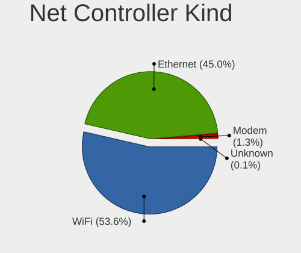

| Kind     | Notebooks | Percent |
|----------|-----------|---------|
| WiFi     | 16014     | 53.59%  |
| Ethernet | 13454     | 45.02%  |
| Modem    | 394       | 1.32%   |
| Unknown  | 23        | 0.08%   |

Used Controller
---------------

Currently used network controller

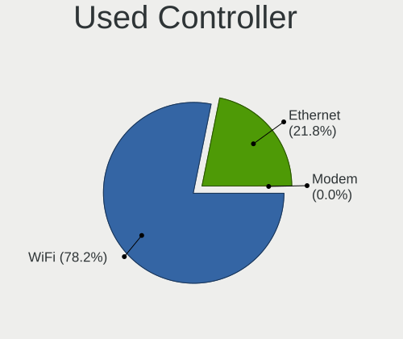

| Kind     | Notebooks | Percent |
|----------|-----------|---------|
| WiFi     | 13455     | 78.16%  |
| Ethernet | 3755      | 21.81%  |
| Unknown  | 3         | 0.02%   |
| Modem    | 1         | 0.01%   |

NICs
----

Total network controllers on board

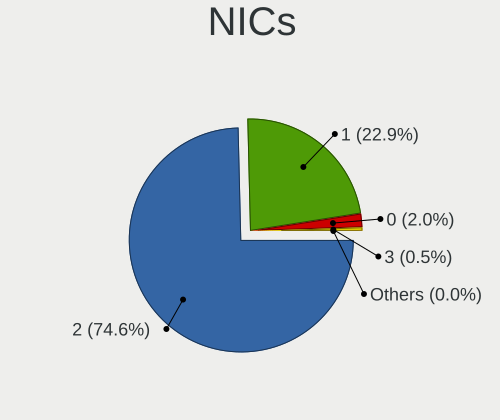

| Total | Notebooks | Percent |
|-------|-----------|---------|
| 2     | 12300     | 74.62%  |
| 1     | 3772      | 22.88%  |
| 0     | 325       | 1.97%   |
| 3     | 83        | 0.5%    |
| 4     | 3         | 0.02%   |
| 7     | 1         | 0.01%   |

IPv6
----

IPv6 vs IPv4

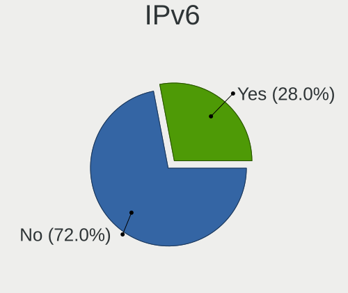

| Used | Notebooks | Percent |
|------|-----------|---------|
| No   | 12126     | 72%     |
| Yes  | 4715      | 28%     |

Bluetooth
---------

Bluetooth Vendor
----------------

Controller vendors

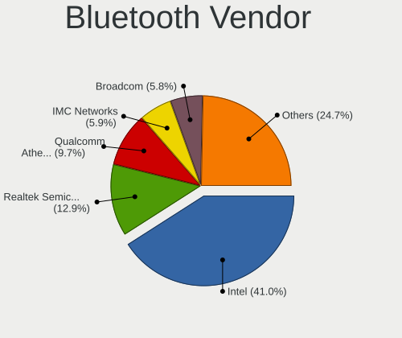

| Vendor                          | Notebooks | Percent |
|---------------------------------|-----------|---------|
| Intel                           | 5147      | 40.95%  |
| Realtek Semiconductor           | 1624      | 12.92%  |
| Qualcomm Atheros Communications | 1221      | 9.72%   |
| IMC Networks                    | 741       | 5.9%    |
| Broadcom                        | 732       | 5.82%   |
| Lite-On Technology              | 613       | 4.88%   |
| Foxconn / Hon Hai               | 557       | 4.43%   |
| Apple                           | 463       | 3.68%   |
| Dell                            | 256       | 2.04%   |
| Cambridge Silicon Radio         | 204       | 1.62%   |
| Hewlett-Packard                 | 191       | 1.52%   |
| Ralink                          | 166       | 1.32%   |
| Toshiba                         | 132       | 1.05%   |
| ASUSTek Computer                | 70        | 0.56%   |
| Realtek                         | 68        | 0.54%   |
| MediaTek                        | 61        | 0.49%   |
| Alps Electric                   | 55        | 0.44%   |
| Foxconn International           | 52        | 0.41%   |
| Ralink Technology               | 38        | 0.3%    |
| Askey Computer                  | 24        | 0.19%   |
| USI                             | 21        | 0.17%   |
| Chicony Electronics             | 18        | 0.14%   |
| Taiyo Yuden                     | 16        | 0.13%   |
| TP-Link                         | 15        | 0.12%   |
| Qcom                            | 14        | 0.11%   |
| Smart Modular Technologies      | 11        | 0.09%   |
| Fujitsu                         | 11        | 0.09%   |
| Opticis                         | 10        | 0.08%   |
| Edimax Technology               | 5         | 0.04%   |
| Dynex                           | 5         | 0.04%   |
| Belkin Components               | 5         | 0.04%   |
| Micro Star International        | 4         | 0.03%   |
| Actions                         | 4         | 0.03%   |
| Unknown                         | 4         | 0.03%   |
| Integrated System Solution      | 2         | 0.02%   |
| AICSemi                         | 2         | 0.02%   |
| SINO WEALTH                     | 1         | 0.01%   |
| Primax Electronics              | 1         | 0.01%   |
| Mobile Action Technology        | 1         | 0.01%   |
| Mercucys                        | 1         | 0.01%   |

Bluetooth Model
---------------

Controller models

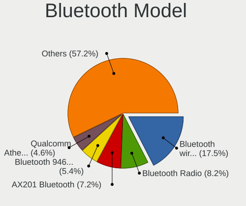

| Model                                               | Notebooks | Percent |
|-----------------------------------------------------|-----------|---------|
| Intel Bluetooth wireless interface                  | 2196      | 17.46%  |
| Realtek Bluetooth Radio                             | 1032      | 8.21%   |
| Intel AX201 Bluetooth                               | 904       | 7.19%   |
| Intel Bluetooth 9460/9560 Jefferson Peak (JfP)      | 676       | 5.37%   |
| Qualcomm Atheros  Bluetooth Device                  | 575       | 4.57%   |
| Realtek  Bluetooth 4.2 Adapter                      | 407       | 3.24%   |
| Intel AX200 Bluetooth                               | 370       | 2.94%   |
| Intel Bluetooth Device                              | 354       | 2.81%   |
| IMC Networks Wireless_Device                        | 285       | 2.27%   |
| Intel Centrino Bluetooth Wireless Transceiver       | 243       | 1.93%   |
| Apple Bluetooth Host Controller                     | 241       | 1.92%   |
| Cambridge Silicon Radio Bluetooth Dongle (HCI mode) | 204       | 1.62%   |
| Qualcomm Atheros AR3012 Bluetooth 4.0               | 201       | 1.6%    |
| Lite-On Qualcomm Atheros QCA9377 Bluetooth          | 197       | 1.57%   |
| Qualcomm Atheros AR3011 Bluetooth                   | 186       | 1.48%   |
| IMC Networks Bluetooth Radio                        | 169       | 1.34%   |
| Ralink RT3290 Bluetooth                             | 166       | 1.32%   |
| Apple Bluetooth USB Host Controller                 | 162       | 1.29%   |
| IMC Networks Bluetooth Device                       | 156       | 1.24%   |
| Lite-On Bluetooth Device                            | 134       | 1.07%   |
| Foxconn / Hon Hai Bluetooth Device                  | 133       | 1.06%   |
| Qualcomm Atheros QCA61x4 Bluetooth 4.0              | 124       | 0.99%   |
| Intel Wireless-AC 3168 Bluetooth                    | 119       | 0.95%   |
| Intel Centrino Advanced-N 6230 Bluetooth adapter    | 114       | 0.91%   |
| HP Broadcom 2070 Bluetooth Combo                    | 110       | 0.87%   |
| Broadcom BCM2045B (BDC-2.1)                         | 109       | 0.87%   |
| Lite-On Atheros AR3012 Bluetooth                    | 107       | 0.85%   |
| Intel AX210 Bluetooth                               | 106       | 0.84%   |
| Foxconn / Hon Hai Wireless_Device                   | 102       | 0.81%   |
| Dell DW375 Bluetooth Module                         | 89        | 0.71%   |
| Lite-On Wireless_Device                             | 87        | 0.69%   |
| Broadcom BCM20702 Bluetooth 4.0 [ThinkPad]          | 85        | 0.68%   |
| HP Bluetooth 2.0 Interface [Broadcom BCM2045]       | 76        | 0.6%    |
| Foxconn / Hon Hai MediaTek Bluetooth Adapter        | 75        | 0.6%    |
| Qualcomm Atheros AR9462 Bluetooth                   | 71        | 0.56%   |
| Realtek Bluetooth Radio                             | 68        | 0.54%   |
| Intel Wireless-AC 9260 Bluetooth Adapter            | 68        | 0.54%   |
| Broadcom BCM43142A0 Bluetooth 4.0                   | 63        | 0.5%    |
| Realtek RTL8723B Bluetooth                          | 61        | 0.49%   |
| IMC Networks Atheros AR3012 Bluetooth 4.0 Adapter   | 59        | 0.47%   |

Sound
-----

Sound Vendor
------------

Sound card vendors

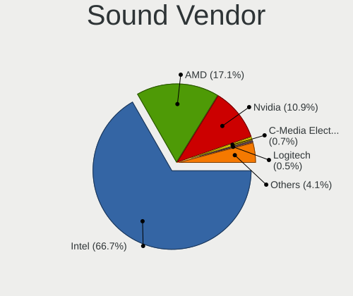

| Vendor                                       | Notebooks | Percent |
|----------------------------------------------|-----------|---------|
| Intel                                        | 13068     | 66.72%  |
| AMD                                          | 3340      | 17.05%  |
| Nvidia                                       | 2130      | 10.88%  |
| C-Media Electronics                          | 144       | 0.74%   |
| Logitech                                     | 92        | 0.47%   |
| Silicon Integrated Systems [SiS]             | 80        | 0.41%   |
| GN Netcom                                    | 55        | 0.28%   |
| Lenovo                                       | 48        | 0.25%   |
| JMTek                                        | 39        | 0.2%    |
| Texas Instruments                            | 38        | 0.19%   |
| Realtek Semiconductor                        | 37        | 0.19%   |
| Generalplus Technology                       | 37        | 0.19%   |
| Apple                                        | 36        | 0.18%   |
| Plantronics                                  | 34        | 0.17%   |
| Hewlett-Packard                              | 24        | 0.12%   |
| Kingston Technology                          | 20        | 0.1%    |
| SteelSeries ApS                              | 18        | 0.09%   |
| VIA Technologies                             | 17        | 0.09%   |
| ASUSTek Computer                             | 17        | 0.09%   |
| Sony                                         | 16        | 0.08%   |
| Razer USA                                    | 16        | 0.08%   |
| Creative Technology                          | 15        | 0.08%   |
| DSEA A/S                                     | 14        | 0.07%   |
| Corsair                                      | 14        | 0.07%   |
| Focusrite-Novation                           | 13        | 0.07%   |
| Jieli Technology                             | 11        | 0.06%   |
| BEHRINGER International                      | 9         | 0.05%   |
| Microsoft                                    | 8         | 0.04%   |
| Tenx Technology                              | 7         | 0.04%   |
| RODE Microphones                             | 7         | 0.04%   |
| Zoran Co. Personal Media Division (Nogatech) | 6         | 0.03%   |
| Dell                                         | 6         | 0.03%   |
| Conexant Systems                             | 6         | 0.03%   |
| Walmart                                      | 5         | 0.03%   |
| Samson Technologies                          | 5         | 0.03%   |
| Trust                                        | 4         | 0.02%   |
| Silicon Motion                               | 4         | 0.02%   |
| PreSonus Audio Electronics                   | 4         | 0.02%   |
| Huawei Technologies                          | 4         | 0.02%   |
| Unknown                                      | 4         | 0.02%   |

Sound Model
-----------

Sound card models

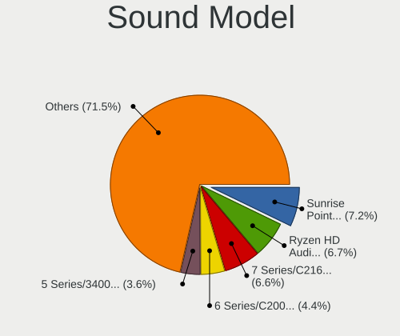

| Model                                                                                             | Notebooks | Percent |
|---------------------------------------------------------------------------------------------------|-----------|---------|
| Intel Sunrise Point-LP HD Audio                                                                   | 1725      | 7.18%   |
| AMD Ryzen HD Audio Controller                                                                     | 1606      | 6.69%   |
| Intel 7 Series/C216 Chipset Family High Definition Audio Controller                               | 1589      | 6.62%   |
| Intel 6 Series/C200 Series Chipset Family High Definition Audio Controller                        | 1063      | 4.43%   |
| Intel 5 Series/3400 Series Chipset High Definition Audio                                          | 870       | 3.62%   |
| Intel 8 Series HD Audio Controller                                                                | 793       | 3.3%    |
| Intel Haswell-ULT HD Audio Controller                                                             | 789       | 3.29%   |
| AMD Renoir/Cezanne HDMI/DP Audio Controller                                                       | 771       | 3.21%   |
| Intel 82801I (ICH9 Family) HD Audio Controller                                                    | 740       | 3.08%   |
| Intel Tiger Lake-LP Smart Sound Technology Audio Controller                                       | 590       | 2.46%   |
| Intel Broadwell-U Audio Controller                                                                | 584       | 2.43%   |
| Intel Wildcat Point-LP High Definition Audio Controller                                           | 570       | 2.37%   |
| AMD FCH Azalia Controller                                                                         | 569       | 2.37%   |
| Intel 8 Series/C220 Series Chipset High Definition Audio Controller                               | 530       | 2.21%   |
| AMD Raven/Raven2/Fenghuang HDMI/DP Audio Controller                                               | 445       | 1.85%   |
| Intel Xeon E3-1200 v3/4th Gen Core Processor HD Audio Controller                                  | 435       | 1.81%   |
| AMD Kabini HDMI/DP Audio                                                                          | 381       | 1.59%   |
| Intel Alder Lake PCH-P High Definition Audio Controller                                           | 370       | 1.54%   |
| Intel Celeron/Pentium Silver Processor High Definition Audio                                      | 369       | 1.54%   |
| Intel Cannon Point-LP High Definition Audio Controller                                            | 367       | 1.53%   |
| Intel Cannon Lake PCH cAVS                                                                        | 363       | 1.51%   |
| Intel 82801H (ICH8 Family) HD Audio Controller                                                    | 360       | 1.5%    |
| Intel NM10/ICH7 Family High Definition Audio Controller                                           | 338       | 1.41%   |
| AMD Family 15h (Models 60h-6fh) Audio Controller                                                  | 317       | 1.32%   |
| AMD SBx00 Azalia (Intel HDA)                                                                      | 305       | 1.27%   |
| AMD Radeon High Definition Audio Controller                                                       | 301       | 1.25%   |
| Intel Comet Lake PCH-LP cAVS                                                                      | 271       | 1.13%   |
| Intel Atom Processor Z36xxx/Z37xxx Series High Definition Audio Controller                        | 265       | 1.1%    |
| Intel Atom/Celeron/Pentium Processor x5-E8000/J3xxx/N3xxx Series High Definition Audio Controller | 262       | 1.09%   |
| AMD High Definition Audio Controller                                                              | 252       | 1.05%   |
| Nvidia GF108 High Definition Audio Controller                                                     | 236       | 0.98%   |
| Intel Raptor Lake-P/U/H cAVS                                                                      | 215       | 0.9%    |
| Intel Ice Lake-LP Smart Sound Technology Audio Controller                                         | 211       | 0.88%   |
| Intel CM238 HD Audio Controller                                                                   | 192       | 0.8%    |
| Intel 100 Series/C230 Series Chipset Family HD Audio Controller                                   | 188       | 0.78%   |
| Intel Comet Lake PCH cAVS                                                                         | 182       | 0.76%   |
| Nvidia TU107 GeForce GTX 1650 High Definition Audio Controller                                    | 178       | 0.74%   |
| Intel Celeron N3350/Pentium N4200/Atom E3900 Series Audio Cluster                                 | 175       | 0.73%   |
| Nvidia GK107 HDMI Audio Controller                                                                | 128       | 0.53%   |
| Nvidia GP107GL High Definition Audio Controller                                                   | 127       | 0.53%   |

Memory
------

Memory Vendor
-------------

Memory module vendors

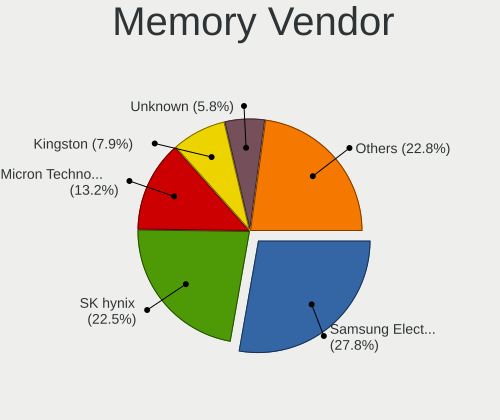

| Vendor              | Notebooks | Percent |
|---------------------|-----------|---------|
| Samsung Electronics | 2820      | 27.76%  |
| SK hynix            | 2281      | 22.46%  |
| Micron Technology   | 1341      | 13.2%   |
| Kingston            | 805       | 7.92%   |
| Unknown             | 591       | 5.82%   |
| Crucial             | 436       | 4.29%   |
| Elpida              | 255       | 2.51%   |
| Ramaxel Technology  | 228       | 2.24%   |
| A-DATA Technology   | 196       | 1.93%   |
| Unknown (ABCD)      | 170       | 1.67%   |
| Corsair             | 133       | 1.31%   |
| Nanya Technology    | 127       | 1.25%   |
| Smart               | 98        | 0.96%   |
| Unknown             | 95        | 0.94%   |
| G.Skill             | 57        | 0.56%   |
| Team                | 36        | 0.35%   |
| Transcend           | 35        | 0.34%   |
| Patriot             | 27        | 0.27%   |
| Teikon              | 24        | 0.24%   |
| ASint Technology    | 23        | 0.23%   |
| Apacer              | 21        | 0.21%   |
| Timetec             | 20        | 0.2%    |
| Goodram             | 20        | 0.2%    |
| Smart Brazil        | 18        | 0.18%   |
| Avant               | 15        | 0.15%   |
| AMD                 | 14        | 0.14%   |
| Silicon Power       | 12        | 0.12%   |
| fef5                | 11        | 0.11%   |
| Qimonda             | 10        | 0.1%    |
| PNY                 | 10        | 0.1%    |
| High Bridge         | 9         | 0.09%   |
| Goldkey             | 9         | 0.09%   |
| PUSKILL             | 8         | 0.08%   |
| 48spaces            | 8         | 0.08%   |
| Lexar Co Limited    | 7         | 0.07%   |
| Lexar               | 7         | 0.07%   |
| Kllisre             | 7         | 0.07%   |
| SHARETRONIC         | 6         | 0.06%   |
| Sesame              | 6         | 0.06%   |
| Neo Forza           | 6         | 0.06%   |

Memory Model
------------

Memory module models

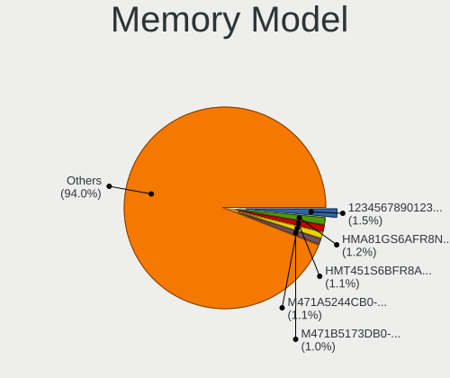

| Model                                                            | Notebooks | Percent |
|------------------------------------------------------------------|-----------|---------|
| Unknown (ABCD) RAM 123456789012345678 2GB SODIMM LPDDR4 2400MT/s | 159       | 1.48%   |
| SK hynix RAM HMA81GS6AFR8N-UH 8GB SODIMM DDR4 2667MT/s           | 133       | 1.24%   |
| SK hynix RAM HMT451S6BFR8A-PB 4GB SODIMM DDR3 1600MT/s           | 122       | 1.14%   |
| Samsung RAM M471A5244CB0-CTD 4GB SODIMM DDR4 3266MT/s            | 115       | 1.07%   |
| Samsung RAM M471B5173DB0-YK0 4GB SODIMM DDR3 1600MT/s            | 111       | 1.03%   |
| Samsung RAM M471B5273DH0-CH9 4GB SODIMM DDR3 1600MT/s            | 104       | 0.97%   |
| Samsung RAM M471B5173QH0-YK0 4GB SODIMM DDR3 1600MT/s            | 100       | 0.93%   |
| Unknown                                                          | 95        | 0.88%   |
| Samsung RAM M471A1K43EB1-CWE 8GB SODIMM DDR4 3200MT/s            | 94        | 0.87%   |
| Samsung RAM M471B5173EB0-YK0 4GB SODIMM DDR3 1600MT/s            | 93        | 0.87%   |
| Samsung RAM M471A1G44AB0-CWE 8GiB SODIMM DDR4 3200MT/s           | 93        | 0.87%   |
| SK hynix RAM HMAA1GS6CJR6N-XN 8GB SODIMM DDR4 3200MT/s           | 85        | 0.79%   |
| Samsung RAM M471A5244CB0-CWE 4GB SODIMM DDR4 3200MT/s            | 85        | 0.79%   |
| Samsung RAM M471B5273CH0-CH9 4GB SODIMM DDR3 1334MT/s            | 83        | 0.77%   |
| Samsung RAM M471A1K43CB1-CRC 8GB SODIMM DDR4 8400MT/s            | 78        | 0.73%   |
| Samsung RAM M471B1G73QH0-YK0 8GB SODIMM DDR3 1600MT/s            | 75        | 0.7%    |
| Samsung RAM M471B1G73DB0-YK0 8GB SODIMM DDR3 1600MT/s            | 75        | 0.7%    |
| SK hynix RAM HMT451S6AFR8A-PB 4GB SODIMM DDR3 1600MT/s           | 74        | 0.69%   |
| SK hynix RAM HMT351S6CFR8C-PB 4GB SODIMM DDR3 1600MT/s           | 70        | 0.65%   |
| Samsung RAM M471A5244CB0-CRC 4GB SODIMM DDR4 2667MT/s            | 70        | 0.65%   |
| Samsung RAM M471A1K43DB1-CWE 8GB SODIMM DDR4 3200MT/s            | 68        | 0.63%   |
| Samsung RAM M471A1G44BB0-CWE 8GB SODIMM DDR4 3200MT/s            | 67        | 0.62%   |
| Micron RAM 4ATF51264HZ-2G6E1 4GB SODIMM DDR4 2667MT/s            | 65        | 0.6%    |
| Micron RAM 4ATF1G64HZ-3G2F1 8GB SODIMM DDR4 3200MT/s             | 64        | 0.6%    |
| SK hynix RAM HMT41GS6BFR8A-PB 8GB SODIMM DDR3 2667MT/s           | 63        | 0.59%   |
| SK hynix RAM HMA81GS6DJR8N-XN 8GB SODIMM DDR4 3200MT/s           | 59        | 0.55%   |
| Samsung RAM M471A1K43CB1-CTD 8GB SODIMM DDR4 3200MT/s            | 57        | 0.53%   |
| SK hynix RAM HMA81GS6JJR8N-VK 8GB SODIMM DDR4 2667MT/s           | 49        | 0.46%   |
| SK hynix RAM HMA81GS6CJR8N-VK 8GB SODIMM DDR4 2667MT/s           | 49        | 0.46%   |
| SK hynix RAM HMA851S6CJR6N-VK 4GB SODIMM DDR4 2667MT/s           | 48        | 0.45%   |
| Samsung RAM M471B5273DH0-CK0 4GB SODIMM DDR3 2400MT/s            | 48        | 0.45%   |
| Samsung RAM M471B1G73EB0-YK0 8192MB SODIMM DDR3 1600MT/s         | 48        | 0.45%   |
| Micron RAM 8ATF1G64HZ-3G2R1 8GB SODIMM DDR4 3200MT/s             | 47        | 0.44%   |
| SK hynix RAM HMT351S6EFR8A-PB 4GB SODIMM DDR3 1600MT/s           | 45        | 0.42%   |
| Samsung RAM M471A1K43DB1-CTD 8GB SODIMM DDR4 2667MT/s            | 45        | 0.42%   |
| Micron RAM 4ATF1G64HZ-3G2E1 8GB SODIMM DDR4 3200MT/s             | 45        | 0.42%   |
| SK hynix RAM HMA851S6AFR6N-UH 4GB SODIMM DDR4 2667MT/s           | 44        | 0.41%   |
| Micron RAM 4ATF51264HZ-3G2J1 4GB SODIMM DDR4 3200MT/s            | 44        | 0.41%   |
| SK hynix RAM HMAG68EXNSA051N 8GB SODIMM DDR4 3200MT/s            | 43        | 0.4%    |
| Micron RAM 8KTF51264HZ-1G6E1 4GB SODIMM DDR3 1600MT/s            | 42        | 0.39%   |

Memory Kind
-----------

Memory module kinds

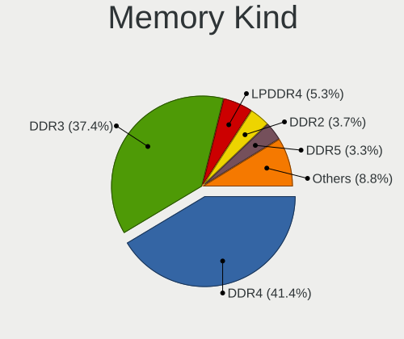

| Kind    | Notebooks | Percent |
|---------|-----------|---------|
| DDR4    | 3559      | 41.4%   |
| DDR3    | 3219      | 37.45%  |
| LPDDR4  | 458       | 5.33%   |
| DDR2    | 318       | 3.7%    |
| DDR5    | 287       | 3.34%   |
| LPDDR5  | 251       | 2.92%   |
| LPDDR3  | 201       | 2.34%   |
| SDRAM   | 196       | 2.28%   |
| Unknown | 48        | 0.56%   |
| DRAM    | 31        | 0.36%   |
| DDR     | 26        | 0.3%    |
| RAM     | 2         | 0.02%   |

Memory Form Factor
------------------

Physical design of the memory module

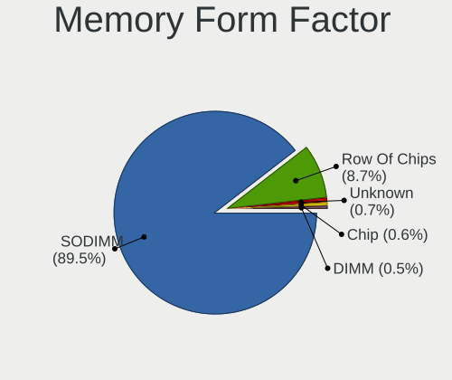

| Name         | Notebooks | Percent |
|--------------|-----------|---------|
| SODIMM       | 7671      | 89.53%  |
| Row Of Chips | 743       | 8.67%   |
| Unknown      | 60        | 0.7%    |
| Chip         | 49        | 0.57%   |
| DIMM         | 45        | 0.53%   |

Memory Size
-----------

Memory module size

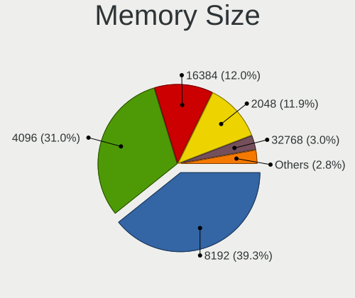

| Size  | Notebooks | Percent |
|-------|-----------|---------|
| 8192  | 3719      | 39.25%  |
| 4096  | 2941      | 31.04%  |
| 16384 | 1133      | 11.96%  |
| 2048  | 1128      | 11.91%  |
| 32768 | 283       | 2.99%   |
| 1024  | 238       | 2.51%   |
| 512   | 13        | 0.14%   |
| 3072  | 5         | 0.05%   |
| 49152 | 4         | 0.04%   |
| 12288 | 4         | 0.04%   |
| 1536  | 3         | 0.03%   |
| 256   | 2         | 0.02%   |
| 8     | 1         | 0.01%   |

Memory Speed
------------

Memory module speed

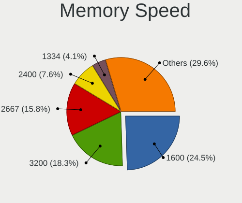

| Speed   | Notebooks | Percent |
|---------|-----------|---------|
| 1600    | 2280      | 24.5%   |
| 3200    | 1707      | 18.34%  |
| 2667    | 1473      | 15.83%  |
| 2400    | 703       | 7.55%   |
| 1334    | 385       | 4.14%   |
| 2133    | 359       | 3.86%   |
| 1333    | 350       | 3.76%   |
| 667     | 180       | 1.93%   |
| Unknown | 172       | 1.85%   |
| 5600    | 161       | 1.73%   |
| 1067    | 155       | 1.67%   |
| 6400    | 154       | 1.65%   |
| 4800    | 129       | 1.39%   |
| 4267    | 125       | 1.34%   |
| 1867    | 117       | 1.26%   |
| 8400    | 116       | 1.25%   |
| 3266    | 116       | 1.25%   |
| 4199    | 106       | 1.14%   |
| 800     | 102       | 1.1%    |
| 1066    | 67        | 0.72%   |
| 2048    | 62        | 0.67%   |
| 7500    | 42        | 0.45%   |
| 4266    | 35        | 0.38%   |
| 975     | 31        | 0.33%   |
| 5500    | 22        | 0.24%   |
| 533     | 21        | 0.23%   |
| 3733    | 17        | 0.18%   |
| 8533    | 16        | 0.17%   |
| 1639    | 15        | 0.16%   |
| 2933    | 13        | 0.14%   |
| 7467    | 12        | 0.13%   |
| 1866    | 9         | 0.1%    |
| 333     | 9         | 0.1%    |
| 1200    | 6         | 0.06%   |
| 3000    | 5         | 0.05%   |
| 933     | 5         | 0.05%   |
| 5200    | 4         | 0.04%   |
| 400     | 4         | 0.04%   |
| 6000    | 3         | 0.03%   |
| 2267    | 3         | 0.03%   |

Printers & scanners
-------------------

Printer Vendor
--------------

Printer device vendors

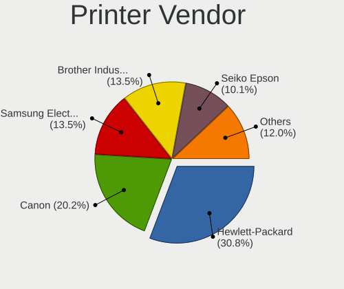

| Vendor                             | Notebooks | Percent |
|------------------------------------|-----------|---------|
| Hewlett-Packard                    | 64        | 30.77%  |
| Canon                              | 42        | 20.19%  |
| Samsung Electronics                | 28        | 13.46%  |
| Brother Industries                 | 28        | 13.46%  |
| Seiko Epson                        | 21        | 10.1%   |
| Kyocera                            | 5         | 2.4%    |
| STMicroelectronics                 | 3         | 1.44%   |
| Prolific Technology                | 3         | 1.44%   |
| Xerox                              | 2         | 0.96%   |
| Lexmark International              | 2         | 0.96%   |
| YXWL Mi                            | 1         | 0.48%   |
| Ricoh                              | 1         | 0.48%   |
| QinHeng Electronics                | 1         | 0.48%   |
| Panasonic (Matsushita)             | 1         | 0.48%   |
| Omnidirectional Control Technology | 1         | 0.48%   |
| Oki Data                           | 1         | 0.48%   |
| Memory                             | 1         | 0.48%   |
| Dymo-CoStar                        | 1         | 0.48%   |
| Dell                               | 1         | 0.48%   |
| BIXOLON                            | 1         | 0.48%   |

Printer Model
-------------

Printer device models

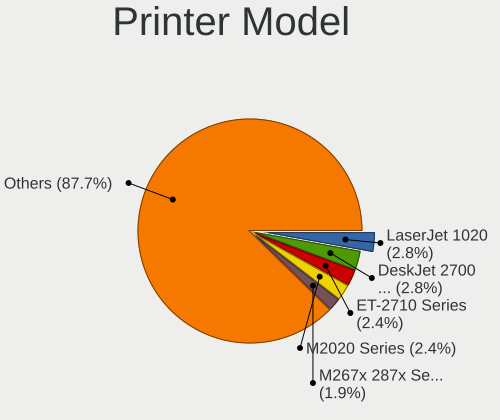

| Model                                                     | Notebooks | Percent |
|-----------------------------------------------------------|-----------|---------|
| HP LaserJet 1020                                          | 6         | 2.84%   |
| HP DeskJet 2700 series                                    | 6         | 2.84%   |
| Seiko Epson ET-2710 Series                                | 5         | 2.37%   |
| Samsung M2020 Series                                      | 5         | 2.37%   |
| Samsung M267x 287x Series                                 | 4         | 1.9%    |
| Samsung M2070 Series                                      | 4         | 1.9%    |
| Canon PIXMA MG2500 Series                                 | 4         | 1.9%    |
| Prolific PL2305 Parallel Port                             | 3         | 1.42%   |
| HP LaserJet 1018                                          | 3         | 1.42%   |
| Canon CAPT USB Device                                     | 3         | 1.42%   |
| STMicroelectronics LED badge -- mini LED display -- 11x44 | 2         | 0.95%   |
| Seiko Epson L805 Series                                   | 2         | 0.95%   |
| Seiko Epson ET-2810 Series                                | 2         | 0.95%   |
| Samsung SCX-3400 Series                                   | 2         | 0.95%   |
| Samsung ML-216x Series Laser Printer                      | 2         | 0.95%   |
| Kyocera Mita FS-820                                       | 2         | 0.95%   |
| HP OfficeJet 4650 series                                  | 2         | 0.95%   |
| HP OfficeJet 3830 series                                  | 2         | 0.95%   |
| HP LaserJet Professional P 1102w                          | 2         | 0.95%   |
| HP LaserJet P2035                                         | 2         | 0.95%   |
| HP LaserJet M14-M17                                       | 2         | 0.95%   |
| HP Ink Tank Wireless 410 series                           | 2         | 0.95%   |
| HP ENVY 4520 series                                       | 2         | 0.95%   |
| HP Deskjet 2540 series                                    | 2         | 0.95%   |
| HP DeskJet 2130 series                                    | 2         | 0.95%   |
| HP Deskjet 1000 J110 series                               | 2         | 0.95%   |
| Canon PIXMA MX920 Series                                  | 2         | 0.95%   |
| Canon LiDE 300                                            | 2         | 0.95%   |
| Canon LBP6030/6030B/6018L                                 | 2         | 0.95%   |
| Brother DCP-9022CDW                                       | 2         | 0.95%   |
| Brother DCP-1600                                          | 2         | 0.95%   |
| YXWL Mi Printer                                           | 1         | 0.47%   |
| Xerox Phaser 6500DN                                       | 1         | 0.47%   |
| Xerox C230 Color Printer                                  | 1         | 0.47%   |
| STMicroelectronics USB Printing Support                   | 1         | 0.47%   |
| Seiko Epson XP-4100 Series                                | 1         | 0.47%   |
| Seiko Epson XP-2100 Series                                | 1         | 0.47%   |
| Seiko Epson Workforce WF-7820/7840 Series                 | 1         | 0.47%   |
| Seiko Epson WF-2850 Series                                | 1         | 0.47%   |
| Seiko Epson Thermal Receipt Printer [TM-T20]              | 1         | 0.47%   |

Scanner Vendor
--------------

Scanner device vendors

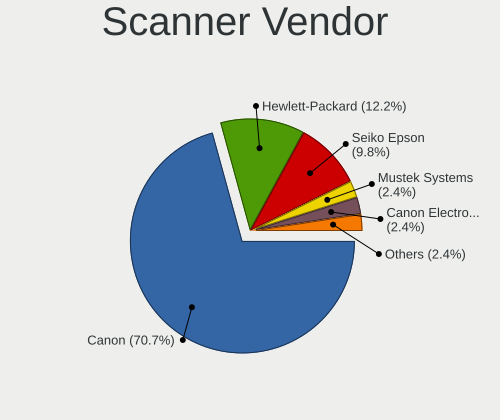

| Vendor            | Notebooks | Percent |
|-------------------|-----------|---------|
| Canon             | 29        | 70.73%  |
| Hewlett-Packard   | 5         | 12.2%   |
| Seiko Epson       | 4         | 9.76%   |
| Mustek Systems    | 1         | 2.44%   |
| Canon Electronics | 1         | 2.44%   |
| AGFA-Gevaert NV   | 1         | 2.44%   |

Scanner Model
-------------

Scanner device models

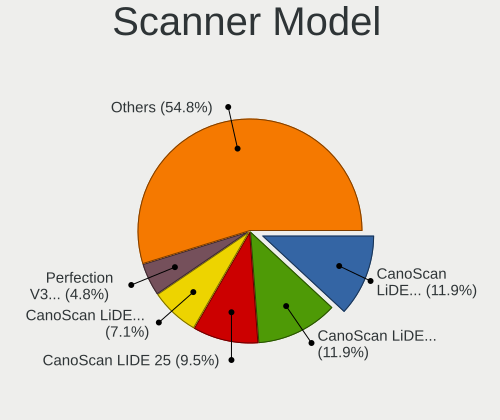

| Model                                                   | Notebooks | Percent |
|---------------------------------------------------------|-----------|---------|
| Canon CanoScan LiDE 120                                 | 5         | 11.9%   |
| Canon CanoScan LiDE 110                                 | 5         | 11.9%   |
| Canon CanoScan LIDE 25                                  | 4         | 9.52%   |
| Canon CanoScan LiDE 220                                 | 3         | 7.14%   |
| Seiko Epson Perfection V37/V370                         | 2         | 4.76%   |
| Canon CanoScan N670U/N676U/LiDE 20                      | 2         | 4.76%   |
| Canon CanoScan LiDE 100                                 | 2         | 4.76%   |
| Canon CanoScan 4400F                                    | 2         | 4.76%   |
| Seiko Epson GT-X820 [Perfection V600 Photo]             | 1         | 2.38%   |
| Seiko Epson GT-F720 [GT-S620/Perfection V30/V300 Photo] | 1         | 2.38%   |
| Mustek Systems BearPaw 2448 CU Pro                      | 1         | 2.38%   |
| HP Scanjet G2710                                        | 1         | 2.38%   |
| HP ScanJet 5300c/5370c                                  | 1         | 2.38%   |
| HP ScanJet 2400c                                        | 1         | 2.38%   |
| HP ScanJet 2200c                                        | 1         | 2.38%   |
| HP HP Scanjet 300                                       | 1         | 2.38%   |
| Canon P-150 Scanner                                     | 1         | 2.38%   |
| Canon CanoScan N650U/N656U                              | 1         | 2.38%   |
| Canon CanoScan LiDE 700F                                | 1         | 2.38%   |
| Canon CanoScan LiDE 600F                                | 1         | 2.38%   |
| Canon CanoScan LiDE 500F                                | 1         | 2.38%   |
| Canon CanoScan 4200F                                    | 1         | 2.38%   |
| Canon CanoScan 3200F                                    | 1         | 2.38%   |
| Canon CanoScan 1220U                                    | 1         | 2.38%   |
| AGFA-Gevaert NV SnapScan 1212U (?)                      | 1         | 2.38%   |

Camera
------

Camera Vendor
-------------

Camera device vendors

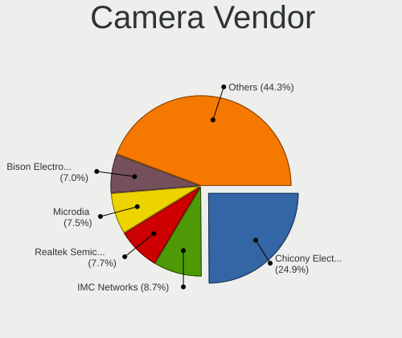

| Vendor                                 | Notebooks | Percent |
|----------------------------------------|-----------|---------|
| Chicony Electronics                    | 3603      | 24.88%  |
| IMC Networks                           | 1261      | 8.71%   |
| Realtek Semiconductor                  | 1110      | 7.67%   |
| Microdia                               | 1079      | 7.45%   |
| Bison Electronics                      | 1015      | 7.01%   |
| Quanta                                 | 859       | 5.93%   |
| Sunplus Innovation Technology          | 812       | 5.61%   |
| Cheng Uei Precision Industry (Foxlink) | 662       | 4.57%   |
| Suyin                                  | 598       | 4.13%   |
| Syntek                                 | 381       | 2.63%   |
| Luxvisions Innotech Limited            | 323       | 2.23%   |
| Apple                                  | 319       | 2.2%    |
| Lite-On Technology                     | 302       | 2.09%   |
| Silicon Motion                         | 286       | 1.98%   |
| Alcor Micro                            | 230       | 1.59%   |
| Ricoh                                  | 173       | 1.19%   |
| Logitech                               | 143       | 0.99%   |
| Sonix Technology                       | 111       | 0.77%   |
| Acer                                   | 99        | 0.68%   |
| Shinetech                              | 84        | 0.58%   |
| Samsung Electronics                    | 80        | 0.55%   |
| Lenovo                                 | 80        | 0.55%   |
| ALi                                    | 73        | 0.5%    |
| Z-Star Microelectronics                | 68        | 0.47%   |
| Importek                               | 68        | 0.47%   |
| icSpring                               | 63        | 0.44%   |
| SunplusIT                              | 59        | 0.41%   |
| Primax Electronics                     | 53        | 0.37%   |
| DigiTech                               | 31        | 0.21%   |
| Y Media                                | 27        | 0.19%   |
| OmniVision Technologies                | 27        | 0.19%   |
| Sunplus Technology                     | 15        | 0.1%    |
| Microsoft                              | 15        | 0.1%    |
| kingcome                               | 14        | 0.1%    |
| Intel                                  | 14        | 0.1%    |
| Generalplus Technology                 | 14        | 0.1%    |
| Unknown                                | 13        | 0.09%   |
| Shine-optics                           | 12        | 0.08%   |
| GEMBIRD                                | 12        | 0.08%   |
| MacroSilicon                           | 11        | 0.08%   |

Camera Model
------------

Camera device models

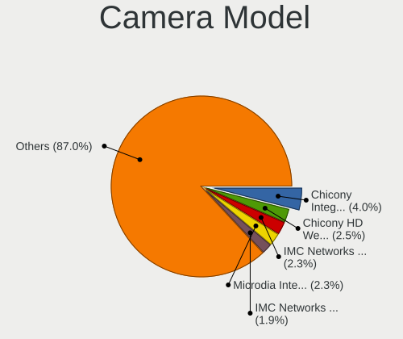

| Model                                                   | Notebooks | Percent |
|---------------------------------------------------------|-----------|---------|
| Chicony Integrated Camera                               | 584       | 4.02%   |
| Chicony HD WebCam                                       | 357       | 2.46%   |
| IMC Networks USB2.0 HD UVC WebCam                       | 341       | 2.35%   |
| Microdia Integrated_Webcam_HD                           | 338       | 2.32%   |
| IMC Networks Integrated Camera                          | 276       | 1.9%    |
| Realtek Integrated_Webcam_HD                            | 256       | 1.76%   |
| Sunplus Integrated_Webcam_HD                            | 231       | 1.59%   |
| Bison Integrated Camera                                 | 218       | 1.5%    |
| Syntek Integrated Camera                                | 176       | 1.21%   |
| Microdia Integrated Webcam                              | 136       | 0.94%   |
| IMC Networks USB2.0 VGA UVC WebCam                      | 135       | 0.93%   |
| Chicony USB2.0 HD UVC WebCam                            | 133       | 0.91%   |
| Chicony HP Truevision HD                                | 133       | 0.91%   |
| Quanta HD User Facing                                   | 132       | 0.91%   |
| Chicony HP TrueVision HD Camera                         | 130       | 0.89%   |
| Chicony HP HD Camera                                    | 127       | 0.87%   |
| Bison Lenovo EasyCamera                                 | 119       | 0.82%   |
| Quanta HD Webcam                                        | 117       | 0.8%    |
| Realtek USB Camera                                      | 114       | 0.78%   |
| Apple FaceTime HD Camera                                | 110       | 0.76%   |
| Sunplus HD WebCam                                       | 109       | 0.75%   |
| Quanta HP TrueVision HD Camera                          | 108       | 0.74%   |
| Chicony TOSHIBA Web Camera - HD                         | 106       | 0.73%   |
| Lite-On Integrated Camera                               | 105       | 0.72%   |
| Chicony HD User Facing                                  | 102       | 0.7%    |
| Cheng Uei Precision Industry (Foxlink) HP Webcam        | 98        | 0.67%   |
| Chicony EasyCamera                                      | 97        | 0.67%   |
| Chicony VGA WebCam                                      | 95        | 0.65%   |
| Chicony HP Webcam                                       | 95        | 0.65%   |
| Luxvisions Innotech Limited HP TrueVision HD Camera     | 92        | 0.63%   |
| Apple Built-in iSight                                   | 92        | 0.63%   |
| Chicony USB2.0 VGA UVC WebCam                           | 91        | 0.63%   |
| Chicony FJ Camera                                       | 91        | 0.63%   |
| Syntek Lenovo EasyCamera                                | 89        | 0.61%   |
| Bison HD Webcam                                         | 89        | 0.61%   |
| Chicony USB 2.0 Camera                                  | 88        | 0.61%   |
| Chicony Lenovo EasyCamera                               | 87        | 0.6%    |
| Cheng Uei Precision Industry (Foxlink) HP TrueVision HD | 85        | 0.58%   |
| Bison EasyCamera                                        | 85        | 0.58%   |
| Cheng Uei Precision Industry (Foxlink) Webcam           | 81        | 0.56%   |

Security
--------

Fingerprint Vendor
------------------

Fingerprint sensor vendors

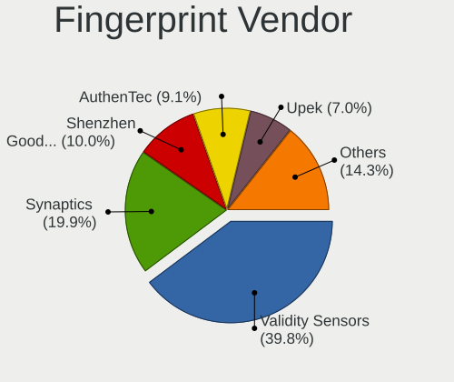

| Vendor                             | Notebooks | Percent |
|------------------------------------|-----------|---------|
| Validity Sensors                   | 944       | 39.76%  |
| Synaptics                          | 472       | 19.88%  |
| Shenzhen Goodix Technology         | 237       | 9.98%   |
| AuthenTec                          | 216       | 9.1%    |
| Upek                               | 165       | 6.95%   |
| Elan Microelectronics              | 146       | 6.15%   |
| LighTuning Technology              | 120       | 5.05%   |
| STMicroelectronics                 | 36        | 1.52%   |
| HOLTEK                             | 11        | 0.46%   |
| Realtek USB2.0 Finger Print Bridge | 10        | 0.42%   |
| Focal-systems.Corp                 | 10        | 0.42%   |
| Next Biometrics                    | 3         | 0.13%   |
| Samsung Electronics                | 2         | 0.08%   |
| Suprema                            | 1         | 0.04%   |
| GDMicroelectronics                 | 1         | 0.04%   |

Fingerprint Model
-----------------

Fingerprint sensor models

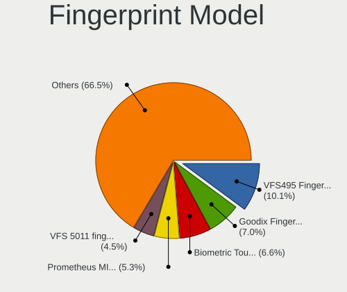

| Model                                                                      | Notebooks | Percent |
|----------------------------------------------------------------------------|-----------|---------|
| Validity Sensors VFS495 Fingerprint Reader                                 | 240       | 10.11%  |
| Shenzhen Goodix  FingerPrint Device                                        | 167       | 7.03%   |
| Upek Biometric Touchchip/Touchstrip Fingerprint Sensor                     | 157       | 6.61%   |
| Synaptics Prometheus MIS Touch Fingerprint Reader                          | 126       | 5.31%   |
| Validity Sensors VFS 5011 fingerprint sensor                               | 106       | 4.47%   |
| Synaptics Metallica MIS Touch Fingerprint Reader                           | 97        | 4.09%   |
| Validity Sensors VFS5011 Fingerprint Reader                                | 92        | 3.88%   |
| Validity Sensors VFS471 Fingerprint Reader                                 | 79        | 3.33%   |
| Elan ELAN:Fingerprint                                                      | 71        | 2.99%   |
| Elan ELAN:ARM-M4                                                           | 69        | 2.91%   |
| Validity Sensors Fingerprint scanner                                       | 67        | 2.82%   |
| AuthenTec AES2810                                                          | 63        | 2.65%   |
| Validity Sensors VFS491                                                    | 60        | 2.53%   |
| Validity Sensors Synaptics WBDI                                            | 58        | 2.44%   |
| LighTuning EgisTec Touch Fingerprint Sensor                                | 55        | 2.32%   |
| AuthenTec AES2501 Fingerprint Sensor                                       | 46        | 1.94%   |
| Validity Sensors VFS451 Fingerprint Reader                                 | 43        | 1.81%   |
| Shenzhen Goodix Fingerprint Reader                                         | 43        | 1.81%   |
| Validity Sensors Swipe Fingerprint Sensor                                  | 40        | 1.68%   |
| AuthenTec Fingerprint Sensor                                               | 38        | 1.6%    |
| AuthenTec AES1600                                                          | 38        | 1.6%    |
| LighTuning ES603 Swipe Fingerprint Sensor                                  | 37        | 1.56%   |
| STMicroelectronics Fingerprint Reader                                      | 36        | 1.52%   |
| Validity Sensors Synaptics VFS7552 Touch Fingerprint Sensor with PurePrint | 34        | 1.43%   |
| Synaptics FS7604 Touch Fingerprint Sensor with PurePrint                   | 33        | 1.39%   |
| Synaptics Fingerprint reader [HP G6]                                       | 33        | 1.39%   |
| Validity Sensors VFS7500 Touch Fingerprint Sensor                          | 32        | 1.35%   |
| Validity Sensors VFS301 Fingerprint Reader                                 | 32        | 1.35%   |
| Validity Sensors VFS101 Fingerprint Reader                                 | 30        | 1.26%   |
| Synaptics UWP WBDI Device                                                  | 30        | 1.26%   |
| Synaptics  WBDI                                                            | 27        | 1.14%   |
| Shenzhen Goodix FingerPrint                                                | 27        | 1.14%   |
| LighTuning Fingerprint Reader                                              | 27        | 1.14%   |
| Synaptics Metallica MOH Touch Fingerprint Reader                           | 25        | 1.05%   |
| Synaptics  FS7604 Touch Fingerprint Sensor with PurePrint                  | 24        | 1.01%   |
| Synaptics WBDI Fingerprint Reader USB 086                                  | 18        | 0.76%   |
| AuthenTec AES2550 Fingerprint Sensor                                       | 16        | 0.67%   |
| Validity Sensors VFS Fingerprint sensor                                    | 14        | 0.59%   |
| AuthenTec AES1660 Fingerprint Sensor                                       | 14        | 0.59%   |
| Synaptics WBDI                                                             | 13        | 0.55%   |

Chipcard Vendor
---------------

Chipcard module vendors

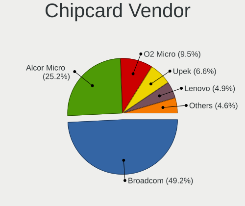

| Vendor                    | Notebooks | Percent |
|---------------------------|-----------|---------|
| Broadcom                  | 573       | 49.23%  |
| Alcor Micro               | 293       | 25.17%  |
| O2 Micro                  | 111       | 9.54%   |
| Upek                      | 77        | 6.62%   |
| Lenovo                    | 57        | 4.9%    |
| SCM Microsystems          | 10        | 0.86%   |
| Gemalto (was Gemplus)     | 10        | 0.86%   |
| Realtek Semiconductor     | 6         | 0.52%   |
| OmniKey                   | 5         | 0.43%   |
| BIT4ID                    | 4         | 0.34%   |
| Cherry                    | 3         | 0.26%   |
| Reiner SCT Kartensysteme  | 2         | 0.17%   |
| Giesecke & Devrient       | 2         | 0.17%   |
| Yubico.com                | 1         | 0.09%   |
| NXP Semiconductors        | 1         | 0.09%   |
| Microchip Technology      | 1         | 0.09%   |
| Kobil Systems             | 1         | 0.09%   |
| In Focus Systems          | 1         | 0.09%   |
| GHI                       | 1         | 0.09%   |
| Fujitsu Siemens Computers | 1         | 0.09%   |
| Clay Logic                | 1         | 0.09%   |
| C3PO                      | 1         | 0.09%   |
| Aladdin Knowledge Systems | 1         | 0.09%   |
| Advanced Card Systems     | 1         | 0.09%   |

Chipcard Model
--------------

Chipcard module models

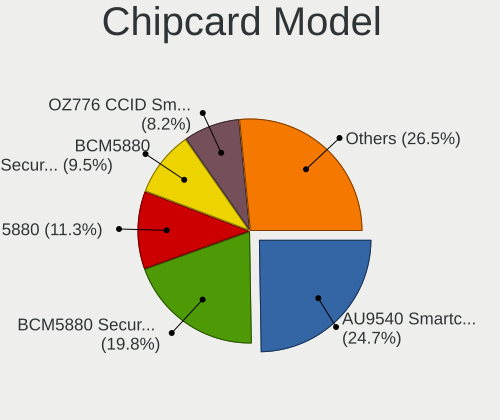

| Model                                                                        | Notebooks | Percent |
|------------------------------------------------------------------------------|-----------|---------|
| Alcor Micro AU9540 Smartcard Reader                                          | 288       | 24.74%  |
| Broadcom BCM5880 Secure Applications Processor                               | 230       | 19.76%  |
| Broadcom 5880                                                                | 131       | 11.25%  |
| Broadcom BCM5880 Secure Applications Processor with fingerprint swipe sensor | 111       | 9.54%   |
| O2 Micro OZ776 CCID Smartcard Reader                                         | 95        | 8.16%   |
| Upek TouchChip Fingerprint Coprocessor (WBF advanced mode)                   | 77        | 6.62%   |
| Broadcom BCM58200 ControlVault 3 (FingerPrint sensor + Contacted SmartCard)  | 68        | 5.84%   |
| Lenovo Integrated Smart Card Reader                                          | 57        | 4.9%    |
| Broadcom 58200                                                               | 26        | 2.23%   |
| O2 Micro Oz776 SmartCard Reader                                              | 16        | 1.37%   |
| Broadcom BCM5880 Secure Applications Processor with fingerprint touch sensor | 7         | 0.6%    |
| Realtek Semiconductor Smart Card Reader Interface                            | 6         | 0.52%   |
| Gemalto (was Gemplus) GemPC Twin SmartCard Reader                            | 5         | 0.43%   |
| Gemalto (was Gemplus) Compact Smart Card Reader Writer                       | 5         | 0.43%   |
| SCM Microsystems SCR331-LC1 / SCR3310 SmartCard Reader                       | 4         | 0.34%   |
| Alcor Micro Watchdata W 1981                                                 | 4         | 0.34%   |
| SCM Microsystems SCR35xx Smart Card Reader                                   | 3         | 0.26%   |
| SCM Microsystems SCR3340 - ExpressCard54 Smart Card Reader                   | 3         | 0.26%   |
| Reiner SCT Kartensysteme cyberJack RFID basis contactless smartcard reader   | 2         | 0.17%   |
| OmniKey CardMan Smart@Link                                                   | 2         | 0.17%   |
| Giesecke & Devrient Chipcard Reader                                          | 2         | 0.17%   |
| Cherry SmartCard Reader Keyboard KC 1000 SC                                  | 2         | 0.17%   |
| Bit4id miniLector EVO                                                        | 2         | 0.17%   |
| Yubico.com Yubikey 4/5 U2F+CCID                                              | 1         | 0.09%   |
| OmniKey CardMan 4321                                                         | 1         | 0.09%   |
| OmniKey CardMan 3021 / 3121                                                  | 1         | 0.09%   |
| OmniKey CardMan 1021                                                         | 1         | 0.09%   |
| NXP Semiconductors PR533                                                     | 1         | 0.09%   |
| Microchip Technology SMSC USX101x Reader                                     | 1         | 0.09%   |
| Kobil Systems Smart Token                                                    | 1         | 0.09%   |
| In Focus Systems EMV Smartcard Reader                                        | 1         | 0.09%   |
| GHI NC001                                                                    | 1         | 0.09%   |
| Fujitsu Siemens Computers Keyboard KB100 SCR eSIG                            | 1         | 0.09%   |
| Clay Logic Nitrokey Pro                                                      | 1         | 0.09%   |
| Cherry SmartTerminal ST-2xxx                                                 | 1         | 0.09%   |
| C3PO USB SMART CARD READER                                                   | 1         | 0.09%   |
| Bit4id miniLector-s                                                          | 1         | 0.09%   |
| BIT4ID miniLector AIR NFC v3                                                 | 1         | 0.09%   |
| Alcor Micro EMV Smartcard Reader                                             | 1         | 0.09%   |
| Aladdin Knowledge Systems Token JC                                           | 1         | 0.09%   |

Unsupported
-----------

Unsupported Devices
-------------------

Total unsupported devices on board

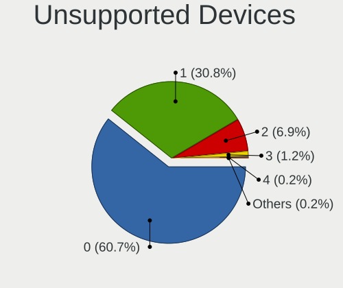

| Total | Notebooks | Percent |
|-------|-----------|---------|
| 0     | 10224     | 60.7%   |
| 1     | 5195      | 30.84%  |
| 2     | 1161      | 6.89%   |
| 3     | 195       | 1.16%   |
| 4     | 38        | 0.23%   |
| 5     | 14        | 0.08%   |
| 6     | 13        | 0.08%   |
| 7     | 2         | 0.01%   |
| 9     | 1         | 0.01%   |
| 8     | 1         | 0.01%   |

Unsupported Device Types
------------------------

Types of unsupported devices

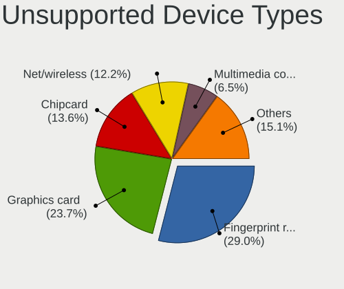

| Type                     | Notebooks | Percent |
|--------------------------|-----------|---------|
| Fingerprint reader       | 2346      | 29%     |
| Graphics card            | 1914      | 23.66%  |
| Chipcard                 | 1103      | 13.63%  |
| Net/wireless             | 983       | 12.15%  |
| Multimedia controller    | 524       | 6.48%   |
| Bluetooth                | 277       | 3.42%   |
| Camera                   | 248       | 3.07%   |
| Storage                  | 192       | 2.37%   |
| Communication controller | 119       | 1.47%   |
| Sound                    | 105       | 1.3%    |
| Card reader              | 64        | 0.79%   |
| Net/ethernet             | 59        | 0.73%   |
| Modem                    | 43        | 0.53%   |
| Network                  | 37        | 0.46%   |
| Flash memory             | 35        | 0.43%   |
| Storage/ide              | 11        | 0.14%   |
| Unassigned class         | 10        | 0.12%   |
| Firewire controller      | 5         | 0.06%   |
| Wireless                 | 4         | 0.05%   |
| Dvb card                 | 4         | 0.05%   |
| Unclassified device      | 2         | 0.02%   |
| Tv card                  | 2         | 0.02%   |
| Storage/raid             | 2         | 0.02%   |
| Storage/nvme             | 1         | 0.01%   |

