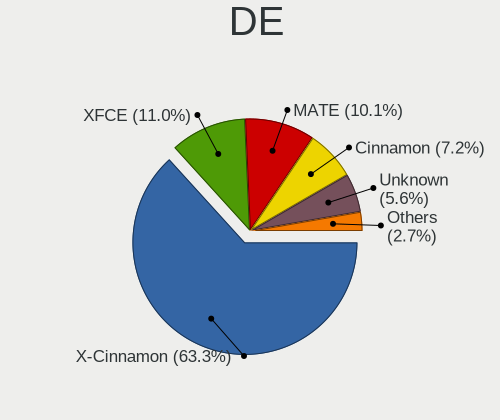
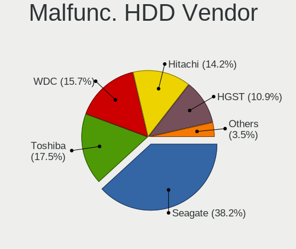
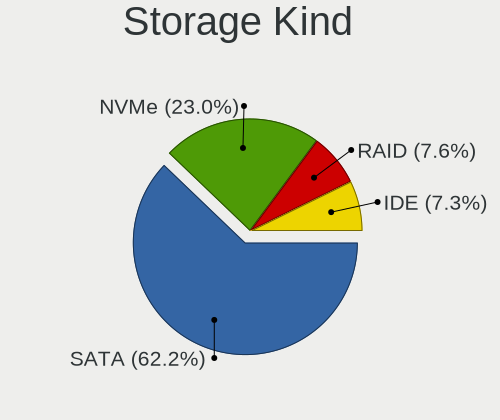
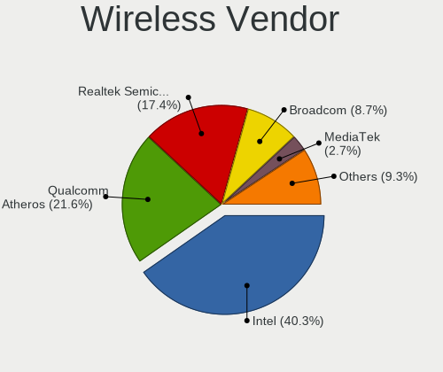

Linux Mint - Tested Hardware & Statistics (Notebooks)
-----------------------------------------------------

A project to collect tested hardware configurations for Linux Mint.

Anyone can contribute to this report by the [hw-probe](https://github.com/linuxhw/hw-probe) tool:

    sudo -E hw-probe -all -upload

Please contribute! Especially if your hardware is rare.

Contents
--------

* [ Test Cases ](#test-cases)

* [ System ](#system)
  - [ OS                       ](#os)
  - [ OS Family                ](#os-family)
  - [ Kernel                   ](#kernel)
  - [ Kernel Family            ](#kernel-family)
  - [ Kernel Major Ver.        ](#kernel-major-ver)
  - [ Arch                     ](#arch)
  - [ DE                       ](#de)
  - [ Display Server           ](#display-server)
  - [ Display Manager          ](#display-manager)
  - [ OS Lang                  ](#os-lang)
  - [ Boot Mode                ](#boot-mode)
  - [ Filesystem               ](#filesystem)
  - [ Part. scheme             ](#part-scheme)
  - [ Dual Boot with Linux/BSD ](#dual-boot-with-linuxbsd)
  - [ Dual Boot (Win)          ](#dual-boot-win)

* [ Board ](#board)
  - [ Vendor                   ](#vendor)
  - [ Model                    ](#model)
  - [ Model Family             ](#model-family)
  - [ MFG Year                 ](#mfg-year)
  - [ Form Factor              ](#form-factor)
  - [ Secure Boot              ](#secure-boot)
  - [ Coreboot                 ](#coreboot)
  - [ RAM Size                 ](#ram-size)
  - [ RAM Used                 ](#ram-used)
  - [ Total Drives             ](#total-drives)
  - [ Has CD-ROM               ](#has-cd-rom)
  - [ Has Ethernet             ](#has-ethernet)
  - [ Has WiFi                 ](#has-wifi)
  - [ Has Bluetooth            ](#has-bluetooth)

* [ Location ](#location)
  - [ Country                  ](#country)
  - [ City                     ](#city)

* [ Drives ](#drives)
  - [ Drive Vendor             ](#drive-vendor)
  - [ Drive Model              ](#drive-model)
  - [ HDD Vendor               ](#hdd-vendor)
  - [ SSD Vendor               ](#ssd-vendor)
  - [ Drive Kind               ](#drive-kind)
  - [ Drive Connector          ](#drive-connector)
  - [ Drive Size               ](#drive-size)
  - [ Space Total              ](#space-total)
  - [ Space Used               ](#space-used)
  - [ Malfunc. Drives          ](#malfunc-drives)
  - [ Malfunc. Drive Vendor    ](#malfunc-drive-vendor)
  - [ Malfunc. HDD Vendor      ](#malfunc-hdd-vendor)
  - [ Malfunc. Drive Kind      ](#malfunc-drive-kind)
  - [ Failed Drives            ](#failed-drives)
  - [ Failed Drive Vendor      ](#failed-drive-vendor)
  - [ Drive Status             ](#drive-status)

* [ Storage controller ](#storage-controller)
  - [ Storage Vendor           ](#storage-vendor)
  - [ Storage Model            ](#storage-model)
  - [ Storage Kind             ](#storage-kind)

* [ Processor ](#processor)
  - [ CPU Vendor               ](#cpu-vendor)
  - [ CPU Model                ](#cpu-model)
  - [ CPU Model Family         ](#cpu-model-family)
  - [ CPU Cores                ](#cpu-cores)
  - [ CPU Sockets              ](#cpu-sockets)
  - [ CPU Threads              ](#cpu-threads)
  - [ CPU Op-Modes             ](#cpu-op-modes)
  - [ CPU Microcode            ](#cpu-microcode)
  - [ CPU Microarch            ](#cpu-microarch)

* [ Graphics ](#graphics)
  - [ GPU Vendor               ](#gpu-vendor)
  - [ GPU Model                ](#gpu-model)
  - [ GPU Combo                ](#gpu-combo)
  - [ GPU Driver               ](#gpu-driver)
  - [ GPU Memory               ](#gpu-memory)

* [ Monitor ](#monitor)
  - [ Monitor Vendor           ](#monitor-vendor)
  - [ Monitor Model            ](#monitor-model)
  - [ Monitor Resolution       ](#monitor-resolution)
  - [ Monitor Diagonal         ](#monitor-diagonal)
  - [ Monitor Width            ](#monitor-width)
  - [ Aspect Ratio             ](#aspect-ratio)
  - [ Monitor Area             ](#monitor-area)
  - [ Pixel Density            ](#pixel-density)
  - [ Multiple Monitors        ](#multiple-monitors)

* [ Network ](#network)
  - [ Net Controller Vendor    ](#net-controller-vendor)
  - [ Net Controller Model     ](#net-controller-model)
  - [ Wireless Vendor          ](#wireless-vendor)
  - [ Wireless Model           ](#wireless-model)
  - [ Ethernet Vendor          ](#ethernet-vendor)
  - [ Ethernet Model           ](#ethernet-model)
  - [ Net Controller Kind      ](#net-controller-kind)
  - [ Used Controller          ](#used-controller)
  - [ NICs                     ](#nics)
  - [ IPv6                     ](#ipv6)

* [ Bluetooth ](#bluetooth)
  - [ Bluetooth Vendor         ](#bluetooth-vendor)
  - [ Bluetooth Model          ](#bluetooth-model)

* [ Sound ](#sound)
  - [ Sound Vendor             ](#sound-vendor)
  - [ Sound Model              ](#sound-model)

* [ Memory ](#memory)
  - [ Memory Vendor            ](#memory-vendor)
  - [ Memory Model             ](#memory-model)
  - [ Memory Kind              ](#memory-kind)
  - [ Memory Form Factor       ](#memory-form-factor)
  - [ Memory Size              ](#memory-size)
  - [ Memory Speed             ](#memory-speed)

* [ Printers & scanners ](#printers--scanners)
  - [ Printer Vendor           ](#printer-vendor)
  - [ Printer Model            ](#printer-model)
  - [ Scanner Vendor           ](#scanner-vendor)
  - [ Scanner Model            ](#scanner-model)

* [ Camera ](#camera)
  - [ Camera Vendor            ](#camera-vendor)
  - [ Camera Model             ](#camera-model)

* [ Security ](#security)
  - [ Fingerprint Vendor       ](#fingerprint-vendor)
  - [ Fingerprint Model        ](#fingerprint-model)
  - [ Chipcard Vendor          ](#chipcard-vendor)
  - [ Chipcard Model           ](#chipcard-model)

* [ Unsupported ](#unsupported)
  - [ Unsupported Devices      ](#unsupported-devices)
  - [ Unsupported Device Types ](#unsupported-device-types)

Test Cases
----------

Total: 13493

| Vendor        | Model                       | Probe                                                      | Date         |
|---------------|-----------------------------|------------------------------------------------------------|--------------|
| Acer          | Nitro AN517-54              | [82d28ac7c0](https://linux-hardware.org/?probe=82d28ac7c0) | Apr 01, 2023 |
| Lenovo        | G50-45 80E3                 | [059e2e5858](https://linux-hardware.org/?probe=059e2e5858) | Apr 01, 2023 |
| Acer          | Aspire A515-56              | [a959d79d84](https://linux-hardware.org/?probe=a959d79d84) | Apr 01, 2023 |
| Acer          | Aspire A515-56              | [db53e1a333](https://linux-hardware.org/?probe=db53e1a333) | Apr 01, 2023 |
| Lenovo        | IdeaPad L340-15IRH Gamin... | [27fbf62ba0](https://linux-hardware.org/?probe=27fbf62ba0) | Apr 01, 2023 |
| Dell          | Latitude E7470              | [ee66bc49a5](https://linux-hardware.org/?probe=ee66bc49a5) | Apr 01, 2023 |
| Valve         | Jupiter                     | [816e9cb6f6](https://linux-hardware.org/?probe=816e9cb6f6) | Apr 01, 2023 |
| Lenovo        | IdeaPad Gaming 3 15ACH6 ... | [0a028a43f8](https://linux-hardware.org/?probe=0a028a43f8) | Apr 01, 2023 |
| HP            | Pavilion x2 Detachable      | [363d925d25](https://linux-hardware.org/?probe=363d925d25) | Apr 01, 2023 |
| ASUSTek       | X556UAK                     | [24f79c68f6](https://linux-hardware.org/?probe=24f79c68f6) | Mar 31, 2023 |
| Positivo      | S14CT01                     | [a47919fcc4](https://linux-hardware.org/?probe=a47919fcc4) | Mar 31, 2023 |
| Acer          | Aspire E5-571               | [45887eb5f3](https://linux-hardware.org/?probe=45887eb5f3) | Mar 31, 2023 |
| Acer          | TravelMate 8172Z            | [10cc090653](https://linux-hardware.org/?probe=10cc090653) | Mar 31, 2023 |
| Fujitsu Si... | AMILO A Series              | [e551dfea34](https://linux-hardware.org/?probe=e551dfea34) | Mar 31, 2023 |
| HP            | EliteBook 2530p (KR059AV... | [e7f9bce466](https://linux-hardware.org/?probe=e7f9bce466) | Mar 31, 2023 |
| HP            | EliteBook 1040 14 inch G... | [488dc3a686](https://linux-hardware.org/?probe=488dc3a686) | Mar 31, 2023 |
| Dell          | Inspiron 5567               | [fe5578a96e](https://linux-hardware.org/?probe=fe5578a96e) | Mar 31, 2023 |
| HP            | EliteBook 1040 14 inch G... | [bf1af4af46](https://linux-hardware.org/?probe=bf1af4af46) | Mar 31, 2023 |
| Dell          | Latitude 7490               | [06928c624b](https://linux-hardware.org/?probe=06928c624b) | Mar 31, 2023 |
| ASUSTek       | N552VX                      | [cacf95c277](https://linux-hardware.org/?probe=cacf95c277) | Mar 30, 2023 |
| HP            | Pavilion Laptop 15-cw1xx... | [f5db7a6030](https://linux-hardware.org/?probe=f5db7a6030) | Mar 30, 2023 |
| Lenovo        | Flex 2-14 20404             | [f24b481b5b](https://linux-hardware.org/?probe=f24b481b5b) | Mar 30, 2023 |
| Sony          | SVF1521C2EW                 | [978ae8afac](https://linux-hardware.org/?probe=978ae8afac) | Mar 30, 2023 |
| Acer          | Aspire A515-52G             | [8f357ff3e8](https://linux-hardware.org/?probe=8f357ff3e8) | Mar 30, 2023 |
| Fujitsu       | LIFEBOOK E781               | [581f3f6547](https://linux-hardware.org/?probe=581f3f6547) | Mar 30, 2023 |
| HP            | Laptop 15s-fq2xxx           | [f78b6ab8c5](https://linux-hardware.org/?probe=f78b6ab8c5) | Mar 30, 2023 |
| HP            | Pavilion Laptop 15-cs1xx... | [c68415cbb6](https://linux-hardware.org/?probe=c68415cbb6) | Mar 30, 2023 |
| Google        | Dragonair                   | [3f9f70991f](https://linux-hardware.org/?probe=3f9f70991f) | Mar 30, 2023 |
| Lenovo        | Unknown                     | [04d5f7141a](https://linux-hardware.org/?probe=04d5f7141a) | Mar 30, 2023 |
| HP            | Laptop 15-dy2xxx            | [50f1a552d8](https://linux-hardware.org/?probe=50f1a552d8) | Mar 30, 2023 |
| HUAWEI        | BOHB-WAX9                   | [6ade0ea04f](https://linux-hardware.org/?probe=6ade0ea04f) | Mar 30, 2023 |
| ASUSTek       | ZenBook UX431FAC_UX431FA    | [60e9294662](https://linux-hardware.org/?probe=60e9294662) | Mar 29, 2023 |
| Notebook      | N8xxEP6                     | [bb4ab60dc1](https://linux-hardware.org/?probe=bb4ab60dc1) | Mar 29, 2023 |
| ASUSTek       | F7L                         | [8d6f90f843](https://linux-hardware.org/?probe=8d6f90f843) | Mar 29, 2023 |
| HP            | Laptop 17-by0xxx            | [89a0332dfd](https://linux-hardware.org/?probe=89a0332dfd) | Mar 29, 2023 |
| ASUSTek       | F7L                         | [cdc5ab3b8a](https://linux-hardware.org/?probe=cdc5ab3b8a) | Mar 29, 2023 |
| Lenovo        | ThinkPad T460p 20HYSJKDO... | [1d24c2743f](https://linux-hardware.org/?probe=1d24c2743f) | Mar 29, 2023 |
| Samsung       | 370E4K                      | [68e9294ac9](https://linux-hardware.org/?probe=68e9294ac9) | Mar 29, 2023 |
| HUAWEI        | BOHK-WAX9X                  | [3836173aad](https://linux-hardware.org/?probe=3836173aad) | Mar 29, 2023 |
| Clevo         | W150HNM/W170HN              | [8a86bbf31c](https://linux-hardware.org/?probe=8a86bbf31c) | Mar 29, 2023 |
| HUAWEI        | BOHK-WAX9X                  | [46a8636dfd](https://linux-hardware.org/?probe=46a8636dfd) | Mar 29, 2023 |
| HP            | Mini 1103                   | [f28121cfc6](https://linux-hardware.org/?probe=f28121cfc6) | Mar 29, 2023 |
| Apple         | MacBookPro8,3               | [90fadbf903](https://linux-hardware.org/?probe=90fadbf903) | Mar 28, 2023 |
| Dell          | Latitude 3520               | [a175e08fce](https://linux-hardware.org/?probe=a175e08fce) | Mar 28, 2023 |
| Dell          | Latitude 3520               | [9c7a9b9282](https://linux-hardware.org/?probe=9c7a9b9282) | Mar 28, 2023 |
| HP            | ProBook 640 G1              | [c9ac2eb353](https://linux-hardware.org/?probe=c9ac2eb353) | Mar 28, 2023 |
| Lenovo        | ThinkPad X1 Carbon 7th 2... | [78e2b83e31](https://linux-hardware.org/?probe=78e2b83e31) | Mar 28, 2023 |
| Dell          | G3 3579                     | [55b5db4326](https://linux-hardware.org/?probe=55b5db4326) | Mar 28, 2023 |
| Unknown       | Unknown                     | [d89991a0f3](https://linux-hardware.org/?probe=d89991a0f3) | Mar 28, 2023 |
| ASUSTek       | N61Jq                       | [0ca1f04770](https://linux-hardware.org/?probe=0ca1f04770) | Mar 28, 2023 |
| Apple         | MacBookPro5,1               | [b06257fd9c](https://linux-hardware.org/?probe=b06257fd9c) | Mar 28, 2023 |
| Sony          | SVF1521C2EW                 | [2bafb0a0e4](https://linux-hardware.org/?probe=2bafb0a0e4) | Mar 28, 2023 |
| Apple         | MacBookPro5,1               | [3a0d77d195](https://linux-hardware.org/?probe=3a0d77d195) | Mar 28, 2023 |
| Lenovo        | IdeaPad S145-14IWL          | [91f36f67a4](https://linux-hardware.org/?probe=91f36f67a4) | Mar 28, 2023 |
| Dell          | Inspiron N5110              | [2b09d1f769](https://linux-hardware.org/?probe=2b09d1f769) | Mar 28, 2023 |
| Unknown       | Unknown                     | [be297867f3](https://linux-hardware.org/?probe=be297867f3) | Mar 28, 2023 |
| Lenovo        | Legion 5 15ACH6H 82JU       | [08e7388619](https://linux-hardware.org/?probe=08e7388619) | Mar 27, 2023 |
| Dell          | Inspiron 5735               | [823a6ece98](https://linux-hardware.org/?probe=823a6ece98) | Mar 27, 2023 |
| ASUSTek       | X45A                        | [a0401520d5](https://linux-hardware.org/?probe=a0401520d5) | Mar 27, 2023 |
| ASUSTek       | X45A                        | [dbe8e77436](https://linux-hardware.org/?probe=dbe8e77436) | Mar 27, 2023 |
| Acer          | Aspire 7745G                | [9303cda87a](https://linux-hardware.org/?probe=9303cda87a) | Mar 27, 2023 |
| Dell          | XPS 15 9530                 | [c5a3b374a7](https://linux-hardware.org/?probe=c5a3b374a7) | Mar 27, 2023 |
| Dell          | XPS 13 7390                 | [aaeb6059a2](https://linux-hardware.org/?probe=aaeb6059a2) | Mar 27, 2023 |
| Haier         | S15                         | [a75654fe8a](https://linux-hardware.org/?probe=a75654fe8a) | Mar 27, 2023 |
| HP            | ProBook 6550b               | [4629264a10](https://linux-hardware.org/?probe=4629264a10) | Mar 27, 2023 |
| Samsung       | N150P/N210P/N220P           | [70d943698c](https://linux-hardware.org/?probe=70d943698c) | Mar 27, 2023 |
| HP            | EliteBook 840 G5            | [405ce5a9c8](https://linux-hardware.org/?probe=405ce5a9c8) | Mar 27, 2023 |
| Acer          | TravelMate P653-M           | [625243d39f](https://linux-hardware.org/?probe=625243d39f) | Mar 26, 2023 |
| Toshiba       | Satellite C55t-C            | [758abe1fb4](https://linux-hardware.org/?probe=758abe1fb4) | Mar 26, 2023 |
| Dell          | Latitude E7450              | [523d3dc9fa](https://linux-hardware.org/?probe=523d3dc9fa) | Mar 26, 2023 |
| HP            | Pavilion dv7                | [6ae381093b](https://linux-hardware.org/?probe=6ae381093b) | Mar 26, 2023 |
| Fujitsu Si... | AMILO A Series              | [58391da932](https://linux-hardware.org/?probe=58391da932) | Mar 26, 2023 |
| Lenovo        | ThinkPad T520 4243RP3       | [38fa314d2f](https://linux-hardware.org/?probe=38fa314d2f) | Mar 26, 2023 |
| Acer          | Aspire 7741                 | [176930d8ed](https://linux-hardware.org/?probe=176930d8ed) | Mar 26, 2023 |
| Apple         | MacBookPro5,1               | [10eec43a14](https://linux-hardware.org/?probe=10eec43a14) | Mar 26, 2023 |
| HP            | 620                         | [550c23f9a3](https://linux-hardware.org/?probe=550c23f9a3) | Mar 26, 2023 |
| Acer          | Aspire 7741                 | [d41b865ed2](https://linux-hardware.org/?probe=d41b865ed2) | Mar 26, 2023 |
| ASUSTek       | T100HAN                     | [c1f3b9658c](https://linux-hardware.org/?probe=c1f3b9658c) | Mar 26, 2023 |
| Gigabyte      | G5 KF                       | [5275b7d43a](https://linux-hardware.org/?probe=5275b7d43a) | Mar 26, 2023 |
| Gigabyte      | G5 KF                       | [9dd2faffb3](https://linux-hardware.org/?probe=9dd2faffb3) | Mar 26, 2023 |
| ASUSTek       | T100HAN                     | [3f74c992e7](https://linux-hardware.org/?probe=3f74c992e7) | Mar 26, 2023 |
| HUAWEI        | BOD-WXX9                    | [bee83a6b50](https://linux-hardware.org/?probe=bee83a6b50) | Mar 26, 2023 |
| Dell          | Inspiron N5110              | [8fde777c54](https://linux-hardware.org/?probe=8fde777c54) | Mar 26, 2023 |
| Dell          | Latitude 3590               | [5d1ac262f4](https://linux-hardware.org/?probe=5d1ac262f4) | Mar 26, 2023 |
| Acer          | Aspire A515-43              | [1812fe9a19](https://linux-hardware.org/?probe=1812fe9a19) | Mar 26, 2023 |
| Acer          | Aspire A515-43              | [a302d93972](https://linux-hardware.org/?probe=a302d93972) | Mar 26, 2023 |
| ASUSTek       | E200HA                      | [5dfef9c764](https://linux-hardware.org/?probe=5dfef9c764) | Mar 26, 2023 |
| Lenovo        | Y520-15IKBN 80WK            | [8a6705ba5a](https://linux-hardware.org/?probe=8a6705ba5a) | Mar 26, 2023 |
| Lenovo        | Y520-15IKBN 80WK            | [d1427e69b3](https://linux-hardware.org/?probe=d1427e69b3) | Mar 26, 2023 |
| ASUSTek       | X55U                        | [764682127e](https://linux-hardware.org/?probe=764682127e) | Mar 26, 2023 |
| HP            | ProBook 430 G6              | [cd14b86548](https://linux-hardware.org/?probe=cd14b86548) | Mar 25, 2023 |
| Lenovo        | ThinkPad E15 Gen 4 21EES... | [79c876bced](https://linux-hardware.org/?probe=79c876bced) | Mar 25, 2023 |
| Dell          | Latitude 5520               | [47372d09fe](https://linux-hardware.org/?probe=47372d09fe) | Mar 25, 2023 |
| Dell          | Latitude 5520               | [0c69ef5724](https://linux-hardware.org/?probe=0c69ef5724) | Mar 25, 2023 |
| HP            | Laptop 15-dw3xxx            | [3b8cd70b69](https://linux-hardware.org/?probe=3b8cd70b69) | Mar 25, 2023 |
| HP            | Pavilion Laptop 14-ce3xx... | [1ea635d2a0](https://linux-hardware.org/?probe=1ea635d2a0) | Mar 25, 2023 |
| Medion        | E6214                       | [0dd02b9353](https://linux-hardware.org/?probe=0dd02b9353) | Mar 25, 2023 |
| Lenovo        | ThinkPad E15 Gen 4 21EES... | [257fa4c383](https://linux-hardware.org/?probe=257fa4c383) | Mar 25, 2023 |
| Toshiba       | KIRA                        | [e96de49ce8](https://linux-hardware.org/?probe=e96de49ce8) | Mar 25, 2023 |
| Toshiba       | Satellite L50D-B            | [d2ce6bb555](https://linux-hardware.org/?probe=d2ce6bb555) | Mar 25, 2023 |
| Acer          | Aspire E1-572G              | [cef20904d7](https://linux-hardware.org/?probe=cef20904d7) | Mar 25, 2023 |
| Acer          | Aspire 7736                 | [af392f60cc](https://linux-hardware.org/?probe=af392f60cc) | Mar 25, 2023 |
| Acer          | Aspire 7736                 | [bbe13d4e0b](https://linux-hardware.org/?probe=bbe13d4e0b) | Mar 25, 2023 |
| HP            | Pavilion dv6                | [29a94d3d9e](https://linux-hardware.org/?probe=29a94d3d9e) | Mar 25, 2023 |
| HP            | Pavilion dv6                | [c3a6c3f669](https://linux-hardware.org/?probe=c3a6c3f669) | Mar 25, 2023 |
| AXDIA Inte... | myBook PRO14 SE V2          | [0e604dc9d0](https://linux-hardware.org/?probe=0e604dc9d0) | Mar 24, 2023 |
| HP            | EliteBook 840 G5            | [4e8606a29d](https://linux-hardware.org/?probe=4e8606a29d) | Mar 24, 2023 |
| Dell          | XPS 15 9550                 | [b6bb271247](https://linux-hardware.org/?probe=b6bb271247) | Mar 24, 2023 |
| ASUSTek       | K52Jr                       | [a88997ecfd](https://linux-hardware.org/?probe=a88997ecfd) | Mar 24, 2023 |
| Acer          | Aspire R5-471T              | [a08f9a9f41](https://linux-hardware.org/?probe=a08f9a9f41) | Mar 24, 2023 |
| Toshiba       | Satellite C855-12N          | [cb9692876c](https://linux-hardware.org/?probe=cb9692876c) | Mar 24, 2023 |
| Samsung       | 300E4A/300E5A/300E7A        | [d77c81e9e3](https://linux-hardware.org/?probe=d77c81e9e3) | Mar 24, 2023 |
| Lenovo        | ThinkBook 15 G3 ACL 21A4    | [2f1e23e614](https://linux-hardware.org/?probe=2f1e23e614) | Mar 24, 2023 |
| Lenovo        | ThinkPad Edge E530 62722... | [479f7f7a25](https://linux-hardware.org/?probe=479f7f7a25) | Mar 23, 2023 |
| HP            | Pavilion 15                 | [6c184935d3](https://linux-hardware.org/?probe=6c184935d3) | Mar 23, 2023 |
| HP            | Pavilion dv7                | [c0cec2e941](https://linux-hardware.org/?probe=c0cec2e941) | Mar 23, 2023 |
| MSI           | GP72 7RE                    | [729f2297cb](https://linux-hardware.org/?probe=729f2297cb) | Mar 23, 2023 |
| Lenovo        | ThinkPad P1 Gen 5 21DC00... | [b286fb0216](https://linux-hardware.org/?probe=b286fb0216) | Mar 23, 2023 |
| Lenovo        | G580                        | [367ed9241a](https://linux-hardware.org/?probe=367ed9241a) | Mar 23, 2023 |
| ASUSTek       | VivoBook_ASUSLaptop E203... | [036c2c771c](https://linux-hardware.org/?probe=036c2c771c) | Mar 23, 2023 |
| ASUSTek       | VivoBook_ASUSLaptop X415... | [fe3c64d71e](https://linux-hardware.org/?probe=fe3c64d71e) | Mar 23, 2023 |
| Samsung       | 530U3C/530U4C/532U3C        | [64c4a47e0e](https://linux-hardware.org/?probe=64c4a47e0e) | Mar 23, 2023 |
| Lenovo        | ThinkPad L15 Gen 2 20X30... | [74be0519cc](https://linux-hardware.org/?probe=74be0519cc) | Mar 22, 2023 |
| Lenovo        | G580                        | [6ee526d77a](https://linux-hardware.org/?probe=6ee526d77a) | Mar 22, 2023 |
| Dell          | Latitude 5480               | [5886784510](https://linux-hardware.org/?probe=5886784510) | Mar 22, 2023 |
| Dell          | Inspiron 1750               | [007a0b3bb7](https://linux-hardware.org/?probe=007a0b3bb7) | Mar 22, 2023 |
| Getac         | B300-X                      | [82ea6e2287](https://linux-hardware.org/?probe=82ea6e2287) | Mar 22, 2023 |
| Acer          | Aspire R5-471T              | [1970e6ac31](https://linux-hardware.org/?probe=1970e6ac31) | Mar 22, 2023 |
| Lenovo        | ThinkPad E15 Gen 3 20YG0... | [e664e55602](https://linux-hardware.org/?probe=e664e55602) | Mar 22, 2023 |
| Lenovo        | ThinkPad E15 Gen 3 20YG0... | [e7a984f733](https://linux-hardware.org/?probe=e7a984f733) | Mar 22, 2023 |
| Lenovo        | G50-80 80E5                 | [f6ad6626ff](https://linux-hardware.org/?probe=f6ad6626ff) | Mar 22, 2023 |
| HP            | Pavilion dv4                | [20adc36857](https://linux-hardware.org/?probe=20adc36857) | Mar 22, 2023 |
| Lenovo        | ThinkPad X121e 3045A63      | [f4830d41d6](https://linux-hardware.org/?probe=f4830d41d6) | Mar 21, 2023 |
| Acer          | Aspire ES1-512              | [901b9b1b6b](https://linux-hardware.org/?probe=901b9b1b6b) | Mar 21, 2023 |
| Toshiba       | Satellite C50-A             | [2a448ff4d4](https://linux-hardware.org/?probe=2a448ff4d4) | Mar 21, 2023 |
| Unknown       | Unknown                     | [31ee1d66d8](https://linux-hardware.org/?probe=31ee1d66d8) | Mar 21, 2023 |
| HP            | Pavilion g6                 | [abd4bb0963](https://linux-hardware.org/?probe=abd4bb0963) | Mar 21, 2023 |
| HP            | Pavilion g6                 | [4dcebf6a41](https://linux-hardware.org/?probe=4dcebf6a41) | Mar 21, 2023 |
| Acer          | Aspire 5253                 | [56b1138062](https://linux-hardware.org/?probe=56b1138062) | Mar 21, 2023 |
| Acer          | Aspire 5253                 | [1fe782c379](https://linux-hardware.org/?probe=1fe782c379) | Mar 21, 2023 |
| MSI           | Katana GF76 11UE            | [bacac82182](https://linux-hardware.org/?probe=bacac82182) | Mar 20, 2023 |
| HP            | EliteBook 8440p             | [0ec744551c](https://linux-hardware.org/?probe=0ec744551c) | Mar 20, 2023 |
| Dell          | Latitude E6520              | [82f97b14f4](https://linux-hardware.org/?probe=82f97b14f4) | Mar 20, 2023 |
| HUAWEI        | HVY-WXX9                    | [fba4a165e3](https://linux-hardware.org/?probe=fba4a165e3) | Mar 20, 2023 |
| Dell          | Latitude E6520              | [7f92514d4e](https://linux-hardware.org/?probe=7f92514d4e) | Mar 20, 2023 |
| HP            | ProBook 470 G5              | [8335a6ae9b](https://linux-hardware.org/?probe=8335a6ae9b) | Mar 20, 2023 |
| Lenovo        | ThinkBook 15 G4 ABA 21DL    | [ade941e14d](https://linux-hardware.org/?probe=ade941e14d) | Mar 20, 2023 |
| Google        | Sand                        | [cac2f4493e](https://linux-hardware.org/?probe=cac2f4493e) | Mar 20, 2023 |
| HP            | Laptop 17-cp0xxx            | [2611e4ac10](https://linux-hardware.org/?probe=2611e4ac10) | Mar 20, 2023 |
| HP            | EliteBook 8560p             | [c990bd18a4](https://linux-hardware.org/?probe=c990bd18a4) | Mar 20, 2023 |
| Dell          | XPS MXC062                  | [a1913f3e4a](https://linux-hardware.org/?probe=a1913f3e4a) | Mar 20, 2023 |
| Dell          | Inspiron 7537               | [2f49af2368](https://linux-hardware.org/?probe=2f49af2368) | Mar 20, 2023 |
| Fujitsu Si... | LIFEBOOK S7110              | [ba879b76da](https://linux-hardware.org/?probe=ba879b76da) | Mar 19, 2023 |
| Dell          | Vostro 3501                 | [d6eab8fd1d](https://linux-hardware.org/?probe=d6eab8fd1d) | Mar 19, 2023 |
| Fujitsu Si... | LIFEBOOK S7110              | [547559d982](https://linux-hardware.org/?probe=547559d982) | Mar 19, 2023 |
| HP            | ProBook 430 G4              | [6c83c2a089](https://linux-hardware.org/?probe=6c83c2a089) | Mar 19, 2023 |
| Lenovo        | G50-30 80G0                 | [255de14ecc](https://linux-hardware.org/?probe=255de14ecc) | Mar 19, 2023 |
| HP            | Notebook                    | [85e86b10d3](https://linux-hardware.org/?probe=85e86b10d3) | Mar 19, 2023 |
| HP            | Laptop 14-dq0xxx            | [0486774825](https://linux-hardware.org/?probe=0486774825) | Mar 19, 2023 |
| Lenovo        | ThinkPad T410 2518A3G       | [eb61c430a6](https://linux-hardware.org/?probe=eb61c430a6) | Mar 19, 2023 |
| Lenovo        | ThinkPad T410 2518A3G       | [b09af2bf7d](https://linux-hardware.org/?probe=b09af2bf7d) | Mar 19, 2023 |
| MSI           | Katana GF76 11UE            | [b357741a4b](https://linux-hardware.org/?probe=b357741a4b) | Mar 19, 2023 |
| Juana Mans... | SF20GM7                     | [708f22e8d7](https://linux-hardware.org/?probe=708f22e8d7) | Mar 19, 2023 |
| HP            | Pavilion dv7                | [d42628a0e9](https://linux-hardware.org/?probe=d42628a0e9) | Mar 19, 2023 |
| HP            | Pavilion Sleekbook 15 PC    | [28092bd4a4](https://linux-hardware.org/?probe=28092bd4a4) | Mar 19, 2023 |
| Schenker      | VISION 15 (SVS15E21)        | [c88d5f831a](https://linux-hardware.org/?probe=c88d5f831a) | Mar 19, 2023 |
| HP            | Pavilion Sleekbook 14 PC    | [964d71f3f2](https://linux-hardware.org/?probe=964d71f3f2) | Mar 19, 2023 |
| HP            | 250 G5 Notebook PC          | [4a4c44f0dd](https://linux-hardware.org/?probe=4a4c44f0dd) | Mar 18, 2023 |
| Dell          | Inspiron 1120               | [d864592854](https://linux-hardware.org/?probe=d864592854) | Mar 18, 2023 |
| Acer          | Aspire 8930                 | [46b84b6b7d](https://linux-hardware.org/?probe=46b84b6b7d) | Mar 18, 2023 |
| Samsung       | 940XFG                      | [566a4046f6](https://linux-hardware.org/?probe=566a4046f6) | Mar 18, 2023 |
| HP            | 250 G8 Notebook PC          | [aade64a567](https://linux-hardware.org/?probe=aade64a567) | Mar 18, 2023 |
| HP            | 250 G8 Notebook PC          | [db16a820b3](https://linux-hardware.org/?probe=db16a820b3) | Mar 18, 2023 |
| Samsung       | 550XDA                      | [210e5d9e14](https://linux-hardware.org/?probe=210e5d9e14) | Mar 17, 2023 |
| HP            | 250 G8 Notebook PC          | [aa1530ca30](https://linux-hardware.org/?probe=aa1530ca30) | Mar 17, 2023 |
| HP            | ProBook 6570b               | [f5c9cd8419](https://linux-hardware.org/?probe=f5c9cd8419) | Mar 17, 2023 |
| Lenovo        | Yoga S740-14IIL 81RS        | [e4eb6f31af](https://linux-hardware.org/?probe=e4eb6f31af) | Mar 17, 2023 |
| Apple         | MacBookPro11,1              | [b56e51e40b](https://linux-hardware.org/?probe=b56e51e40b) | Mar 17, 2023 |
| ASUSTek       | ROG Strix G533QM_G533QM     | [14f30effbe](https://linux-hardware.org/?probe=14f30effbe) | Mar 17, 2023 |
| Lenovo        | G40-80 80E4                 | [70b2fab92b](https://linux-hardware.org/?probe=70b2fab92b) | Mar 17, 2023 |
| Lenovo        | IdeaPad 3 15IGL05 81WQ      | [49bb337156](https://linux-hardware.org/?probe=49bb337156) | Mar 17, 2023 |
| Lenovo        | IdeaPad 520-15IKB 81BF      | [d762fe2bf3](https://linux-hardware.org/?probe=d762fe2bf3) | Mar 17, 2023 |
| HP            | Laptop 15-dw0xxx            | [f52bd099e3](https://linux-hardware.org/?probe=f52bd099e3) | Mar 17, 2023 |
| Lenovo        | IdeaPad 3 15ALC6 82KU       | [7df2952615](https://linux-hardware.org/?probe=7df2952615) | Mar 17, 2023 |
| Dell          | Latitude 5400               | [ad4f5d5a60](https://linux-hardware.org/?probe=ad4f5d5a60) | Mar 17, 2023 |
| Dell          | G5 5590                     | [9686d438e6](https://linux-hardware.org/?probe=9686d438e6) | Mar 17, 2023 |
| Samsung       | R519/R719                   | [9e1cdf3582](https://linux-hardware.org/?probe=9e1cdf3582) | Mar 17, 2023 |
| ASUSTek       | K61IC                       | [045474725b](https://linux-hardware.org/?probe=045474725b) | Mar 17, 2023 |
| Apple         | MacBook8,1                  | [a3ef4e5a56](https://linux-hardware.org/?probe=a3ef4e5a56) | Mar 16, 2023 |
| HP            | Laptop 15-dy1xxx            | [63893daa0f](https://linux-hardware.org/?probe=63893daa0f) | Mar 16, 2023 |
| HP            | Pavilion Sleekbook 15 PC    | [e5ec1e2903](https://linux-hardware.org/?probe=e5ec1e2903) | Mar 16, 2023 |
| Lenovo        | Unknown                     | [8bdf0bf41b](https://linux-hardware.org/?probe=8bdf0bf41b) | Mar 16, 2023 |
| Lenovo        | ThinkPad Edge E530 62722... | [fac1a255b7](https://linux-hardware.org/?probe=fac1a255b7) | Mar 16, 2023 |
| Apple         | MacBookPro12,1              | [c6f835ae33](https://linux-hardware.org/?probe=c6f835ae33) | Mar 16, 2023 |
| HP            | Pavilion dv8000 (ET839UA... | [ae37b87da6](https://linux-hardware.org/?probe=ae37b87da6) | Mar 16, 2023 |
| ASUSTek       | VivoBook_ASUSLaptop X712... | [684375b9a0](https://linux-hardware.org/?probe=684375b9a0) | Mar 16, 2023 |
| Dell          | XPS 15 9520                 | [b4d62a4f2a](https://linux-hardware.org/?probe=b4d62a4f2a) | Mar 15, 2023 |
| Lenovo        | ThinkPad T470 W10DG 20JN... | [90b20cc9a1](https://linux-hardware.org/?probe=90b20cc9a1) | Mar 15, 2023 |
| Lenovo        | IdeaPad 320-15IKB 80XL      | [46d1e1d803](https://linux-hardware.org/?probe=46d1e1d803) | Mar 15, 2023 |
| Lenovo        | IdeaPad 320-15IKB 80XL      | [b110af35d5](https://linux-hardware.org/?probe=b110af35d5) | Mar 15, 2023 |
| HP            | Laptop 15-da0xxx            | [ccd15bcfae](https://linux-hardware.org/?probe=ccd15bcfae) | Mar 15, 2023 |
| Google        | Rabbid                      | [621762ceec](https://linux-hardware.org/?probe=621762ceec) | Mar 15, 2023 |
| HP            | Pavilion Sleekbook 15 PC    | [8272edb058](https://linux-hardware.org/?probe=8272edb058) | Mar 15, 2023 |
| HP            | Presario CQ62               | [de3f9781c1](https://linux-hardware.org/?probe=de3f9781c1) | Mar 15, 2023 |
| Samsung       | 550P5C/550P7C               | [1cf7cdcd75](https://linux-hardware.org/?probe=1cf7cdcd75) | Mar 15, 2023 |
| HP            | Presario CQ62               | [7067f4d820](https://linux-hardware.org/?probe=7067f4d820) | Mar 15, 2023 |
| Dell          | Inspiron 5559               | [966cfad104](https://linux-hardware.org/?probe=966cfad104) | Mar 15, 2023 |
| ASUSTek       | N61Jq                       | [706eca5e8a](https://linux-hardware.org/?probe=706eca5e8a) | Mar 15, 2023 |
| Dell          | Inspiron 5559               | [2aa85f401e](https://linux-hardware.org/?probe=2aa85f401e) | Mar 15, 2023 |
| ASUSTek       | UX32A                       | [05121bc6af](https://linux-hardware.org/?probe=05121bc6af) | Mar 15, 2023 |
| Dell          | Precision M3800             | [4c945c1a11](https://linux-hardware.org/?probe=4c945c1a11) | Mar 15, 2023 |
| Standard      | SF20BA                      | [e85dc022b5](https://linux-hardware.org/?probe=e85dc022b5) | Mar 15, 2023 |
| Toshiba       | PORTEGE Z30t-C              | [7098d7537b](https://linux-hardware.org/?probe=7098d7537b) | Mar 15, 2023 |
| ASUSTek       | VivoBook_ASUSLaptop X712... | [c1f62d3ed5](https://linux-hardware.org/?probe=c1f62d3ed5) | Mar 15, 2023 |
| Lenovo        | ThinkPad X230 2325BA3       | [45533fd7eb](https://linux-hardware.org/?probe=45533fd7eb) | Mar 14, 2023 |
| HP            | Laptop 17-cp2xxx            | [ddfcba1265](https://linux-hardware.org/?probe=ddfcba1265) | Mar 14, 2023 |
| HP            | Notebook                    | [de2e2f370b](https://linux-hardware.org/?probe=de2e2f370b) | Mar 14, 2023 |
| Dell          | Latitude 5580               | [819b5d8dc2](https://linux-hardware.org/?probe=819b5d8dc2) | Mar 14, 2023 |
| ASUSTek       | ROG Strix G513RW_G513RW     | [97fe8661ed](https://linux-hardware.org/?probe=97fe8661ed) | Mar 14, 2023 |
| Medion        | E14303                      | [bcd7d12004](https://linux-hardware.org/?probe=bcd7d12004) | Mar 14, 2023 |
| Acer          | Aspire E5-571G              | [be4f604d4f](https://linux-hardware.org/?probe=be4f604d4f) | Mar 14, 2023 |
| Acer          | Aspire E5-571G              | [4094f2a910](https://linux-hardware.org/?probe=4094f2a910) | Mar 14, 2023 |
| TUXEDO        | Aura 15 Gen1                | [9331f6026e](https://linux-hardware.org/?probe=9331f6026e) | Mar 14, 2023 |
| Lenovo        | IdeaPad 5 15ARE05 81YQ      | [b3e091147a](https://linux-hardware.org/?probe=b3e091147a) | Mar 14, 2023 |
| Medion        | E14303                      | [6343eb16c7](https://linux-hardware.org/?probe=6343eb16c7) | Mar 14, 2023 |
| Lenovo        | Legion 5 15ACH6H 82JU       | [167f6c0b46](https://linux-hardware.org/?probe=167f6c0b46) | Mar 14, 2023 |
| Lenovo        | ThinkPad T430 2349SAJ       | [a0b7b2a17d](https://linux-hardware.org/?probe=a0b7b2a17d) | Mar 14, 2023 |
| Dell          | Latitude E6430              | [fec667360c](https://linux-hardware.org/?probe=fec667360c) | Mar 14, 2023 |
| Dell          | Inspiron 5767               | [b7c8484508](https://linux-hardware.org/?probe=b7c8484508) | Mar 14, 2023 |
| RDP           | ThinBook 1010               | [fe650dfe16](https://linux-hardware.org/?probe=fe650dfe16) | Mar 14, 2023 |
| Dell          | Inspiron 14 5410            | [54ff309c3d](https://linux-hardware.org/?probe=54ff309c3d) | Mar 14, 2023 |
| Acer          | Aspire 5749                 | [8b7cc3d191](https://linux-hardware.org/?probe=8b7cc3d191) | Mar 14, 2023 |
| Lenovo        | G50-45 80E3                 | [e0cde77238](https://linux-hardware.org/?probe=e0cde77238) | Mar 14, 2023 |
| Lenovo        | ThinkPad E14 Gen 3 20Y70... | [088325b0d3](https://linux-hardware.org/?probe=088325b0d3) | Mar 14, 2023 |
| Lenovo        | ThinkPad X301 2776LEG       | [7b0df25d34](https://linux-hardware.org/?probe=7b0df25d34) | Mar 14, 2023 |
| Lenovo        | ThinkPad X301 2776LEG       | [65fe38f62e](https://linux-hardware.org/?probe=65fe38f62e) | Mar 14, 2023 |
| Acer          | Swift SF114-34              | [aee5d96875](https://linux-hardware.org/?probe=aee5d96875) | Mar 14, 2023 |
| HP            | Laptop 17-cp2xxx            | [20111a6b57](https://linux-hardware.org/?probe=20111a6b57) | Mar 14, 2023 |
| HP            | Pavilion Laptop 15-ck0xx    | [d9f9e09a41](https://linux-hardware.org/?probe=d9f9e09a41) | Mar 14, 2023 |
| Acer          | Aspire 5749                 | [cfd610357f](https://linux-hardware.org/?probe=cfd610357f) | Mar 14, 2023 |
| Lenovo        | ThinkPad T490s 20NX002SG... | [aa5eb19101](https://linux-hardware.org/?probe=aa5eb19101) | Mar 13, 2023 |
| Intel Clie... | LAPBC510                    | [db4cfccb50](https://linux-hardware.org/?probe=db4cfccb50) | Mar 13, 2023 |
| HP            | Pavilion Laptop 15-ck0xx    | [be16fd4aab](https://linux-hardware.org/?probe=be16fd4aab) | Mar 13, 2023 |
| Dell          | Latitude 7290               | [576b8aa32a](https://linux-hardware.org/?probe=576b8aa32a) | Mar 13, 2023 |
| Acer          | Aspire A315-24P             | [b9cfb4b900](https://linux-hardware.org/?probe=b9cfb4b900) | Mar 13, 2023 |
| Acer          | Aspire A315-24P             | [fba21e619d](https://linux-hardware.org/?probe=fba21e619d) | Mar 13, 2023 |
| Lenovo        | ThinkPad T460 20FMS0700A    | [0298b20ac9](https://linux-hardware.org/?probe=0298b20ac9) | Mar 13, 2023 |
| Dell          | Inspiron N4050              | [3b1827fe4f](https://linux-hardware.org/?probe=3b1827fe4f) | Mar 13, 2023 |
| Dell          | XPS 15 7590                 | [1c0dfc08d6](https://linux-hardware.org/?probe=1c0dfc08d6) | Mar 13, 2023 |
| Lenovo        | ThinkBook 14 G2 ITL 20VD    | [5fc0403ac3](https://linux-hardware.org/?probe=5fc0403ac3) | Mar 13, 2023 |
| Gear          | Geranium                    | [8567411d91](https://linux-hardware.org/?probe=8567411d91) | Mar 13, 2023 |
| Gear          | Geranium                    | [1303244018](https://linux-hardware.org/?probe=1303244018) | Mar 13, 2023 |
| Dell          | XPS 15 7590                 | [b67749d31c](https://linux-hardware.org/?probe=b67749d31c) | Mar 13, 2023 |
| AXIOO         | Mybook 14E                  | [1b6c10d1d8](https://linux-hardware.org/?probe=1b6c10d1d8) | Mar 13, 2023 |
| ASUSTek       | X551MA                      | [37b002e8ec](https://linux-hardware.org/?probe=37b002e8ec) | Mar 12, 2023 |
| Apple         | MacBookPro11,5              | [09d3cb5314](https://linux-hardware.org/?probe=09d3cb5314) | Mar 12, 2023 |
| Acer          | Aspire VN7-791              | [ca10594901](https://linux-hardware.org/?probe=ca10594901) | Mar 12, 2023 |
| ASUSTek       | N550JK                      | [bb5d069d90](https://linux-hardware.org/?probe=bb5d069d90) | Mar 12, 2023 |
| Google        | Reks                        | [56296236c5](https://linux-hardware.org/?probe=56296236c5) | Mar 12, 2023 |
| Acer          | aspire5740                  | [d5e64f31d4](https://linux-hardware.org/?probe=d5e64f31d4) | Mar 12, 2023 |
| Google        | Electro                     | [86cbc9d907](https://linux-hardware.org/?probe=86cbc9d907) | Mar 12, 2023 |
| Lenovo        | ThinkPad T480s 20L8S2AX0... | [d6854dc15a](https://linux-hardware.org/?probe=d6854dc15a) | Mar 12, 2023 |
| Compal        | JHL90 REFERENCE             | [702a5939d3](https://linux-hardware.org/?probe=702a5939d3) | Mar 12, 2023 |
| Lenovo        | IdeaPad 5 Pro 14ACN6 82L... | [c14956dd2d](https://linux-hardware.org/?probe=c14956dd2d) | Mar 12, 2023 |
| Dell          | Inspiron N5110              | [5949721a87](https://linux-hardware.org/?probe=5949721a87) | Mar 12, 2023 |
| Lenovo        | IdeaPad 330-15IKB 81DE      | [e4e5c5674c](https://linux-hardware.org/?probe=e4e5c5674c) | Mar 12, 2023 |
| Dell          | XPS 13 9350                 | [ad078c5445](https://linux-hardware.org/?probe=ad078c5445) | Mar 12, 2023 |
| Dell          | Latitude E5570              | [494b8e3615](https://linux-hardware.org/?probe=494b8e3615) | Mar 12, 2023 |
| Acer          | Aspire 5920                 | [f6c972404c](https://linux-hardware.org/?probe=f6c972404c) | Mar 12, 2023 |
| Dell          | Inspiron 5570               | [f6da200721](https://linux-hardware.org/?probe=f6da200721) | Mar 11, 2023 |
| Lenovo        | IdeaPad 3 15ADA05 81W1      | [73fe7fd06e](https://linux-hardware.org/?probe=73fe7fd06e) | Mar 11, 2023 |
| Dell          | Latitude E6440              | [e5ba284442](https://linux-hardware.org/?probe=e5ba284442) | Mar 11, 2023 |
| Dynabook      | Satellite Pro C50-E-11H     | [1a37e14422](https://linux-hardware.org/?probe=1a37e14422) | Mar 11, 2023 |
| Dell          | Precision M6600             | [9d5e2f1e01](https://linux-hardware.org/?probe=9d5e2f1e01) | Mar 11, 2023 |
| Acer          | Aspire 5333                 | [214db069e4](https://linux-hardware.org/?probe=214db069e4) | Mar 11, 2023 |
| Dell          | Inspiron 5570               | [56e5783575](https://linux-hardware.org/?probe=56e5783575) | Mar 11, 2023 |
| HP            | Laptop 17-cn2xxx            | [239832f304](https://linux-hardware.org/?probe=239832f304) | Mar 11, 2023 |
| Lenovo        | G505 20240                  | [201f4fc780](https://linux-hardware.org/?probe=201f4fc780) | Mar 11, 2023 |
| Toshiba       | Satellite Pro L300          | [7c5e811612](https://linux-hardware.org/?probe=7c5e811612) | Mar 11, 2023 |
| Lenovo        | ThinkPad T410 252223U       | [9b43c6f551](https://linux-hardware.org/?probe=9b43c6f551) | Mar 11, 2023 |
| Dell          | XPS 13 9370                 | [1760dd91cc](https://linux-hardware.org/?probe=1760dd91cc) | Mar 11, 2023 |
| Pegatron      | H36Y                        | [1757156f40](https://linux-hardware.org/?probe=1757156f40) | Mar 11, 2023 |
| Dell          | Precision 7520              | [406f37cb3d](https://linux-hardware.org/?probe=406f37cb3d) | Mar 10, 2023 |
| Lenovo        | ThinkPad X220 4286CTO       | [5a047f08f4](https://linux-hardware.org/?probe=5a047f08f4) | Mar 10, 2023 |
| Dell          | Latitude E6530              | [70b72984bc](https://linux-hardware.org/?probe=70b72984bc) | Mar 10, 2023 |
| Lenovo        | ThinkPad Edge E530 62722... | [da07981235](https://linux-hardware.org/?probe=da07981235) | Mar 10, 2023 |
| Lenovo        | ThinkPad Edge E530 62722... | [6e55c3caff](https://linux-hardware.org/?probe=6e55c3caff) | Mar 10, 2023 |
| Lenovo        | IdeaPad 320-15IAP 80XR      | [c02ccacd98](https://linux-hardware.org/?probe=c02ccacd98) | Mar 10, 2023 |
| ASUSTek       | T100HAN                     | [b4046bce15](https://linux-hardware.org/?probe=b4046bce15) | Mar 10, 2023 |
| Lenovo        | IdeaPad 5 14ALC05 82LM      | [93b31111ef](https://linux-hardware.org/?probe=93b31111ef) | Mar 10, 2023 |
| Dell          | Latitude E7470              | [51b40c1604](https://linux-hardware.org/?probe=51b40c1604) | Mar 09, 2023 |
| Lenovo        | IdeaPad 310-15IKB 80TV      | [5b98ac00da](https://linux-hardware.org/?probe=5b98ac00da) | Mar 09, 2023 |
| Toshiba       | Satellite A665              | [c3865bd8a4](https://linux-hardware.org/?probe=c3865bd8a4) | Mar 09, 2023 |
| Lenovo        | IdeaPad 5 15ALC05 82LN      | [03ca2d1b27](https://linux-hardware.org/?probe=03ca2d1b27) | Mar 09, 2023 |
| HP            | Pavilion 15                 | [80a4b9038d](https://linux-hardware.org/?probe=80a4b9038d) | Mar 09, 2023 |
| Lenovo        | IdeaPad 5 15ALC05 82LN      | [607adcc4d1](https://linux-hardware.org/?probe=607adcc4d1) | Mar 09, 2023 |
| Google        | Reks                        | [f877db79d3](https://linux-hardware.org/?probe=f877db79d3) | Mar 09, 2023 |
| Acer          | Aspire A715-76              | [c0c0d5447d](https://linux-hardware.org/?probe=c0c0d5447d) | Mar 09, 2023 |
| Lenovo        | IdeaPad Y580                | [cc2d7d8a95](https://linux-hardware.org/?probe=cc2d7d8a95) | Mar 09, 2023 |
| Medion        | E15302                      | [e4dbaf4893](https://linux-hardware.org/?probe=e4dbaf4893) | Mar 09, 2023 |
| HP            | EliteBook 840 G6            | [140991f223](https://linux-hardware.org/?probe=140991f223) | Mar 09, 2023 |
| ASUSTek       | K54LY                       | [a846675d7f](https://linux-hardware.org/?probe=a846675d7f) | Mar 09, 2023 |
| Sony          | SVE1713A6EW                 | [2e35a44a14](https://linux-hardware.org/?probe=2e35a44a14) | Mar 09, 2023 |
| Sony          | SVE1713A6EW                 | [cd8cfd3af0](https://linux-hardware.org/?probe=cd8cfd3af0) | Mar 09, 2023 |
| HP            | Laptop 15-bs0xx             | [cb6d927114](https://linux-hardware.org/?probe=cb6d927114) | Mar 09, 2023 |
| Pegatron      | H36Y                        | [8d9c3ebbc8](https://linux-hardware.org/?probe=8d9c3ebbc8) | Mar 09, 2023 |
| Acer          | Aspire R5-471T              | [ae0d1cc32c](https://linux-hardware.org/?probe=ae0d1cc32c) | Mar 09, 2023 |
| Acer          | Aspire 7250                 | [026f2228a3](https://linux-hardware.org/?probe=026f2228a3) | Mar 08, 2023 |
| HP            | EliteBook 840 G2            | [b4621990a6](https://linux-hardware.org/?probe=b4621990a6) | Mar 08, 2023 |
| Samsung       | 350V5C/351V5C/3540VC/344... | [cc67f30d28](https://linux-hardware.org/?probe=cc67f30d28) | Mar 08, 2023 |
| Samsung       | 350V5C/351V5C/3540VC/344... | [82fee79835](https://linux-hardware.org/?probe=82fee79835) | Mar 08, 2023 |
| MSI           | GT60 2OC/2OD                | [72eed5b458](https://linux-hardware.org/?probe=72eed5b458) | Mar 08, 2023 |
| Lenovo        | ThinkPad T500 2241BU3       | [6cd14d1366](https://linux-hardware.org/?probe=6cd14d1366) | Mar 08, 2023 |
| Acer          | Aspire A515-45              | [3089c37fd4](https://linux-hardware.org/?probe=3089c37fd4) | Mar 08, 2023 |
| Apple         | MacBookPro9,2               | [fd7b9981e8](https://linux-hardware.org/?probe=fd7b9981e8) | Mar 08, 2023 |
| Dell          | Vostro 3550                 | [30d171ddbc](https://linux-hardware.org/?probe=30d171ddbc) | Mar 08, 2023 |
| Dell          | G15 5515                    | [fc1b55ddc1](https://linux-hardware.org/?probe=fc1b55ddc1) | Mar 07, 2023 |
| Lenovo        | ThinkPad T520 42435JG       | [cc83a62c0e](https://linux-hardware.org/?probe=cc83a62c0e) | Mar 07, 2023 |
| Wortmann      | CR700                       | [a48e22ffc5](https://linux-hardware.org/?probe=a48e22ffc5) | Mar 07, 2023 |
| Lenovo        | Yoga Slim 7 Carbon 14ACN... | [c3476001d3](https://linux-hardware.org/?probe=c3476001d3) | Mar 07, 2023 |
| Lenovo        | ThinkPad T430 234424P       | [f9d41f9054](https://linux-hardware.org/?probe=f9d41f9054) | Mar 07, 2023 |
| Lenovo        | Z50-70 20354                | [16e57996c0](https://linux-hardware.org/?probe=16e57996c0) | Mar 07, 2023 |
| MSI           | GT60 2OC/2OD                | [d595ae284e](https://linux-hardware.org/?probe=d595ae284e) | Mar 07, 2023 |
| Dell          | Inspiron 15-3567            | [ff582d0370](https://linux-hardware.org/?probe=ff582d0370) | Mar 07, 2023 |
| Lenovo        | IdeaPad 5 Pro 14ITL6 82L... | [c6737dc34b](https://linux-hardware.org/?probe=c6737dc34b) | Mar 07, 2023 |
| VIT           | P1400                       | [3d31270e0d](https://linux-hardware.org/?probe=3d31270e0d) | Mar 07, 2023 |
| VIT           | P1400                       | [bed6aed6fa](https://linux-hardware.org/?probe=bed6aed6fa) | Mar 07, 2023 |
| ASUSTek       | VivoBook_ASUSLaptop X712... | [f9051d6bc7](https://linux-hardware.org/?probe=f9051d6bc7) | Mar 07, 2023 |
| Dell          | Vostro 3550                 | [cb9468fb01](https://linux-hardware.org/?probe=cb9468fb01) | Mar 07, 2023 |
| Lenovo        | ThinkPad T500 2241BU3       | [da7eb1619d](https://linux-hardware.org/?probe=da7eb1619d) | Mar 07, 2023 |
| Insyde        | CherryTrail                 | [a9eae507a9](https://linux-hardware.org/?probe=a9eae507a9) | Mar 07, 2023 |
| Acer          | Aspire E5-575G              | [fd8c378fda](https://linux-hardware.org/?probe=fd8c378fda) | Mar 07, 2023 |
| ASUSTek       | ASUS P1512CEA_P1512CEA      | [ef2488509b](https://linux-hardware.org/?probe=ef2488509b) | Mar 06, 2023 |
| ASUSTek       | X556UAK                     | [51f2084195](https://linux-hardware.org/?probe=51f2084195) | Mar 06, 2023 |
| Google        | Droid                       | [f6cca75d35](https://linux-hardware.org/?probe=f6cca75d35) | Mar 06, 2023 |
| Digibras      | NH4CU03                     | [ff8a1d6dc3](https://linux-hardware.org/?probe=ff8a1d6dc3) | Mar 06, 2023 |
| Samsung       | 350V5C/351V5C/3540VC/344... | [28dd9d3ce4](https://linux-hardware.org/?probe=28dd9d3ce4) | Mar 06, 2023 |
| HP            | Pavilion 15                 | [047897713a](https://linux-hardware.org/?probe=047897713a) | Mar 06, 2023 |
| Lenovo        | IdeaPad Gaming 3 15ACH6 ... | [20fbc926fd](https://linux-hardware.org/?probe=20fbc926fd) | Mar 06, 2023 |
| ASUSTek       | UX32LA                      | [3432e951dd](https://linux-hardware.org/?probe=3432e951dd) | Mar 06, 2023 |
| Lenovo        | ThinkBook 15 G4 ABA 21DL    | [0c9fa56b91](https://linux-hardware.org/?probe=0c9fa56b91) | Mar 06, 2023 |
| Notebook      | N2x0WU                      | [4948392f03](https://linux-hardware.org/?probe=4948392f03) | Mar 06, 2023 |
| Lenovo        | ThinkBook 15 G4 ABA 21DL    | [8a9052463a](https://linux-hardware.org/?probe=8a9052463a) | Mar 06, 2023 |
| Dell          | Inspiron N5110              | [9f822520ac](https://linux-hardware.org/?probe=9f822520ac) | Mar 06, 2023 |
| Fujitsu Si... | STYLISTIC ST6012            | [0d9314f673](https://linux-hardware.org/?probe=0d9314f673) | Mar 06, 2023 |
| Lenovo        | G50-80 80E5                 | [75dab4cddf](https://linux-hardware.org/?probe=75dab4cddf) | Mar 06, 2023 |
| Dell          | Vostro 3550                 | [973f97d171](https://linux-hardware.org/?probe=973f97d171) | Mar 05, 2023 |
| Acer          | Aspire E5-575               | [f96ac1e48c](https://linux-hardware.org/?probe=f96ac1e48c) | Mar 05, 2023 |
| HP            | EliteBook 6930p             | [6757b860c8](https://linux-hardware.org/?probe=6757b860c8) | Mar 05, 2023 |
| Acer          | Aspire 6530G                | [a4077c8432](https://linux-hardware.org/?probe=a4077c8432) | Mar 05, 2023 |
| HP            | ENVY 17                     | [ce2278a2e4](https://linux-hardware.org/?probe=ce2278a2e4) | Mar 05, 2023 |
| ASUSTek       | X551MA                      | [b77e06361b](https://linux-hardware.org/?probe=b77e06361b) | Mar 05, 2023 |
| HP            | EliteBook 8540w             | [e57a377381](https://linux-hardware.org/?probe=e57a377381) | Mar 05, 2023 |
| HUAWEI        | HVY-WXX9                    | [3a5736dc70](https://linux-hardware.org/?probe=3a5736dc70) | Mar 05, 2023 |
| Lenovo        | ThinkPad X201 3626A18       | [cc7f8e563c](https://linux-hardware.org/?probe=cc7f8e563c) | Mar 05, 2023 |
| ASUSTek       | N71Vg                       | [4d83fda5ba](https://linux-hardware.org/?probe=4d83fda5ba) | Mar 05, 2023 |
| Lenovo        | ThinkPad X270 20HMS4EC0D    | [108c90e7f7](https://linux-hardware.org/?probe=108c90e7f7) | Mar 05, 2023 |
| Lenovo        | IdeaPad L340-15IRH Gamin... | [65006682e6](https://linux-hardware.org/?probe=65006682e6) | Mar 05, 2023 |
| Dell          | Latitude E5520              | [61926ecac7](https://linux-hardware.org/?probe=61926ecac7) | Mar 05, 2023 |
| Lenovo        | IdeaPad 330-15IKB 81DE      | [44f2d8c604](https://linux-hardware.org/?probe=44f2d8c604) | Mar 05, 2023 |
| HP            | Laptop 15-bw0xx             | [207c68b81e](https://linux-hardware.org/?probe=207c68b81e) | Mar 05, 2023 |
| Lenovo        | ThinkPad L14 Gen 3 21C1C... | [c22b30c734](https://linux-hardware.org/?probe=c22b30c734) | Mar 05, 2023 |
| Lenovo        | ThinkPad T61 64607EU        | [8d8f8b6853](https://linux-hardware.org/?probe=8d8f8b6853) | Mar 04, 2023 |
| Toshiba       | Satellite C660              | [d1ada89fd6](https://linux-hardware.org/?probe=d1ada89fd6) | Mar 04, 2023 |
| Exo           | Smart Serie M               | [99c93d693a](https://linux-hardware.org/?probe=99c93d693a) | Mar 04, 2023 |
| ASUSTek       | Zenbook UM3402YA_UM3402Y... | [d70aeca173](https://linux-hardware.org/?probe=d70aeca173) | Mar 04, 2023 |
| Acer          | Aspire 5935                 | [f76641318f](https://linux-hardware.org/?probe=f76641318f) | Mar 04, 2023 |
| Lenovo        | ThinkPad T460 20FMS0700A    | [86f9a722e7](https://linux-hardware.org/?probe=86f9a722e7) | Mar 04, 2023 |
| Lenovo        | ThinkPad T460 20FMS0700A    | [04e55fea70](https://linux-hardware.org/?probe=04e55fea70) | Mar 04, 2023 |
| Dell          | Latitude E6230              | [f8bcaec866](https://linux-hardware.org/?probe=f8bcaec866) | Mar 04, 2023 |
| MSI           | GF72 8RD                    | [54eb266d2a](https://linux-hardware.org/?probe=54eb266d2a) | Mar 04, 2023 |
| LG Electro... | 17Z90Q-G.AA79G              | [a5c8c40830](https://linux-hardware.org/?probe=a5c8c40830) | Mar 04, 2023 |
| HP            | 255 G8 Notebook PC          | [0c76255503](https://linux-hardware.org/?probe=0c76255503) | Mar 04, 2023 |
| Dell          | Studio XPS 1647             | [484c629656](https://linux-hardware.org/?probe=484c629656) | Mar 04, 2023 |
| Lenovo        | ThinkPad T420 4236Q23       | [2aa5383e7e](https://linux-hardware.org/?probe=2aa5383e7e) | Mar 04, 2023 |
| Medion        | E6214                       | [dc4be82c47](https://linux-hardware.org/?probe=dc4be82c47) | Mar 04, 2023 |
| Medion        | E6214                       | [9a211d6d85](https://linux-hardware.org/?probe=9a211d6d85) | Mar 04, 2023 |
| Lenovo        | ThinkPad T14s Gen 3 21CQ... | [8051ef372d](https://linux-hardware.org/?probe=8051ef372d) | Mar 04, 2023 |
| Dell          | Inspiron 1120               | [41f23e384c](https://linux-hardware.org/?probe=41f23e384c) | Mar 04, 2023 |
| Dell          | Inspiron 5566               | [a067a3c4a6](https://linux-hardware.org/?probe=a067a3c4a6) | Mar 04, 2023 |
| ASUSTek       | G750JS                      | [43c8398586](https://linux-hardware.org/?probe=43c8398586) | Mar 04, 2023 |
| Acer          | Swift SF314-42              | [b9a0465659](https://linux-hardware.org/?probe=b9a0465659) | Mar 04, 2023 |
| Exo           | Smart Serie M               | [e7b817f5ed](https://linux-hardware.org/?probe=e7b817f5ed) | Mar 04, 2023 |
| Lenovo        | ThinkPad T430 234424P       | [54a25c6e4b](https://linux-hardware.org/?probe=54a25c6e4b) | Mar 04, 2023 |
| ASUSTek       | VivoBook_ASUSLaptop X515... | [6f7e8084e5](https://linux-hardware.org/?probe=6f7e8084e5) | Mar 04, 2023 |
| ASUSTek       | G750JS                      | [a75616082d](https://linux-hardware.org/?probe=a75616082d) | Mar 03, 2023 |
| ASUSTek       | E200HA                      | [46a16afb4b](https://linux-hardware.org/?probe=46a16afb4b) | Mar 03, 2023 |
| Lenovo        | ThinkPad X240 20AMS2EH00    | [11d225cddb](https://linux-hardware.org/?probe=11d225cddb) | Mar 03, 2023 |
| HP            | ENVY 15                     | [9ceefd9a22](https://linux-hardware.org/?probe=9ceefd9a22) | Mar 03, 2023 |
| Dell          | Inspiron 15-3567            | [aefdf1040c](https://linux-hardware.org/?probe=aefdf1040c) | Mar 03, 2023 |
| Lenovo        | IdeaPad Gaming 3 15IMH05... | [3cec8a7abc](https://linux-hardware.org/?probe=3cec8a7abc) | Mar 03, 2023 |
| Acer          | Aspire A317-53              | [f097b7866e](https://linux-hardware.org/?probe=f097b7866e) | Mar 03, 2023 |
| HP            | Pavilion dv7                | [03734dccd2](https://linux-hardware.org/?probe=03734dccd2) | Mar 03, 2023 |
| Lenovo        | IdeaPad 320-17ABR 80YN      | [25f45efbc1](https://linux-hardware.org/?probe=25f45efbc1) | Mar 03, 2023 |
| Acer          | TravelMate 5744Z            | [a0475b1021](https://linux-hardware.org/?probe=a0475b1021) | Mar 03, 2023 |
| ASUSTek       | X551MA                      | [608c8a42da](https://linux-hardware.org/?probe=608c8a42da) | Mar 03, 2023 |
| Acer          | Aspire E1-572G              | [ea6b0313eb](https://linux-hardware.org/?probe=ea6b0313eb) | Mar 03, 2023 |
| HP            | Laptop 17-cp1xxx            | [295adf4a68](https://linux-hardware.org/?probe=295adf4a68) | Mar 03, 2023 |
| ASUSTek       | X551MA                      | [fa55d9fb5c](https://linux-hardware.org/?probe=fa55d9fb5c) | Mar 03, 2023 |
| Apple         | MacBookAir6,2               | [f791caa732](https://linux-hardware.org/?probe=f791caa732) | Mar 03, 2023 |
| Lenovo        | IdeaPad Gaming 3 15IMH05... | [219f16372b](https://linux-hardware.org/?probe=219f16372b) | Mar 03, 2023 |
| Apple         | MacBookAir6,2               | [0b39498d52](https://linux-hardware.org/?probe=0b39498d52) | Mar 03, 2023 |
| Acer          | Aspire M5-583P              | [146d73338c](https://linux-hardware.org/?probe=146d73338c) | Mar 03, 2023 |
| Lenovo        | ThinkPad X270 20HMS10600    | [4bab3eb831](https://linux-hardware.org/?probe=4bab3eb831) | Mar 03, 2023 |
| Lenovo        | ThinkPad L15 Gen 2 20X30... | [cacb713046](https://linux-hardware.org/?probe=cacb713046) | Mar 02, 2023 |
| GMK           | NucBox2                     | [84af5a7d53](https://linux-hardware.org/?probe=84af5a7d53) | Mar 02, 2023 |
| Lenovo        | ThinkPad T510 4384WAN       | [469dbdaecd](https://linux-hardware.org/?probe=469dbdaecd) | Mar 02, 2023 |
| Lenovo        | ThinkPad T510 4384WAN       | [9989b470b6](https://linux-hardware.org/?probe=9989b470b6) | Mar 02, 2023 |
| Lenovo        | V15 G2 ALC 82KD             | [117d283b7a](https://linux-hardware.org/?probe=117d283b7a) | Mar 02, 2023 |
| Lenovo        | ThinkPad W550s 20E2CTO1W... | [38cea0b708](https://linux-hardware.org/?probe=38cea0b708) | Mar 02, 2023 |
| HP            | 255 15.6 inch G9 Noteboo... | [84952fb39a](https://linux-hardware.org/?probe=84952fb39a) | Mar 02, 2023 |
| Lenovo        | ThinkPad X230 2325SSV       | [2bbac81a6c](https://linux-hardware.org/?probe=2bbac81a6c) | Mar 02, 2023 |
| ASUSTek       | X580VD                      | [f4b107fbf3](https://linux-hardware.org/?probe=f4b107fbf3) | Mar 02, 2023 |
| Lenovo        | ThinkPad X230 2325SSV       | [feca4c7fe9](https://linux-hardware.org/?probe=feca4c7fe9) | Mar 02, 2023 |
| A-DATA Tec... | XENIAXe15TI7G11GXELX        | [c3113c9da6](https://linux-hardware.org/?probe=c3113c9da6) | Mar 02, 2023 |
| A-DATA Tec... | XENIAXe15TI7G11GXELX        | [73efff8199](https://linux-hardware.org/?probe=73efff8199) | Mar 02, 2023 |
| HP            | Laptop 17-by0xxx            | [362a7b3d33](https://linux-hardware.org/?probe=362a7b3d33) | Mar 02, 2023 |
| Acer          | TravelMate 7750             | [662d8ec690](https://linux-hardware.org/?probe=662d8ec690) | Mar 01, 2023 |
| Toshiba       | Satellite S70-A             | [0e707bb14d](https://linux-hardware.org/?probe=0e707bb14d) | Mar 01, 2023 |
| ASUSTek       | F70SL                       | [5870cf8326](https://linux-hardware.org/?probe=5870cf8326) | Mar 01, 2023 |
| Acer          | Aspire 5733                 | [b1744130eb](https://linux-hardware.org/?probe=b1744130eb) | Mar 01, 2023 |
| Acer          | Aspire E5-571G              | [fc0bc59c04](https://linux-hardware.org/?probe=fc0bc59c04) | Feb 28, 2023 |
| Lenovo        | ThinkPad T460 20FMS0700A    | [89a11e0826](https://linux-hardware.org/?probe=89a11e0826) | Feb 28, 2023 |
| Lenovo        | ThinkPad T430 2349KDG       | [ea95af537c](https://linux-hardware.org/?probe=ea95af537c) | Feb 28, 2023 |
| Dell          | Inspiron N5010              | [a1a44c0054](https://linux-hardware.org/?probe=a1a44c0054) | Feb 28, 2023 |
| Lenovo        | ThinkPad T460 20FMS0700A    | [c45e0040f7](https://linux-hardware.org/?probe=c45e0040f7) | Feb 28, 2023 |
| Lenovo        | ThinkPad T460 20FMS78014    | [6fb2d54abe](https://linux-hardware.org/?probe=6fb2d54abe) | Feb 28, 2023 |
| Gigabyte      | AERO 15-X9                  | [18d00993bf](https://linux-hardware.org/?probe=18d00993bf) | Feb 28, 2023 |
| Lenovo        | ThinkBook 14 G3 ACL 21A2    | [470d9f4591](https://linux-hardware.org/?probe=470d9f4591) | Feb 28, 2023 |
| ASUSTek       | E202SA                      | [bccde0c9a5](https://linux-hardware.org/?probe=bccde0c9a5) | Feb 28, 2023 |
| HP            | Laptop 15-gw0xxx            | [e05606240c](https://linux-hardware.org/?probe=e05606240c) | Feb 28, 2023 |
| Dell          | Inspiron N5110              | [e35a1076a1](https://linux-hardware.org/?probe=e35a1076a1) | Feb 28, 2023 |
| Dell          | Inspiron N5110              | [5a6d88e081](https://linux-hardware.org/?probe=5a6d88e081) | Feb 28, 2023 |
| HP            | 240 G4 Notebook PC          | [02744836e7](https://linux-hardware.org/?probe=02744836e7) | Feb 28, 2023 |
| Toshiba       | Satellite S70-A             | [7e849f93ca](https://linux-hardware.org/?probe=7e849f93ca) | Feb 28, 2023 |
| Acer          | Aspire 5750G                | [34b5806bcf](https://linux-hardware.org/?probe=34b5806bcf) | Feb 28, 2023 |
| Intel Clie... | LAPRC510                    | [6d9a8edb0c](https://linux-hardware.org/?probe=6d9a8edb0c) | Feb 28, 2023 |
| Acer          | Aspire A715-76              | [b9f52dc0f3](https://linux-hardware.org/?probe=b9f52dc0f3) | Feb 27, 2023 |
| HP            | Pavilion dv6                | [a19aa34db7](https://linux-hardware.org/?probe=a19aa34db7) | Feb 27, 2023 |
| Dell          | XPS 15 7590                 | [e1777784ac](https://linux-hardware.org/?probe=e1777784ac) | Feb 27, 2023 |
| Dell          | XPS 13 9360                 | [08cdbe3442](https://linux-hardware.org/?probe=08cdbe3442) | Feb 27, 2023 |
| HP            | ENVY Laptop 17-cr0xxx       | [3f0d63ab15](https://linux-hardware.org/?probe=3f0d63ab15) | Feb 27, 2023 |
| ASUSTek       | VivoBook_ASUS Laptop X50... | [05d3c9f96c](https://linux-hardware.org/?probe=05d3c9f96c) | Feb 27, 2023 |
| ASUSTek       | VivoBook_ASUS Laptop X50... | [f70d3317a2](https://linux-hardware.org/?probe=f70d3317a2) | Feb 27, 2023 |
| ASUSTek       | E402MA                      | [c49b50f583](https://linux-hardware.org/?probe=c49b50f583) | Feb 27, 2023 |
| ASUSTek       | E402MA                      | [4083a9232f](https://linux-hardware.org/?probe=4083a9232f) | Feb 27, 2023 |
| HP            | Pavilion TS 14              | [37296c42c3](https://linux-hardware.org/?probe=37296c42c3) | Feb 27, 2023 |
| Apple         | MacBookAir6,2               | [0fb60ed4e2](https://linux-hardware.org/?probe=0fb60ed4e2) | Feb 27, 2023 |
| Lenovo        | ThinkPad Edge E540 20C60... | [8de57c03d5](https://linux-hardware.org/?probe=8de57c03d5) | Feb 27, 2023 |
| Dell          | Latitude E5440              | [25cf039ffd](https://linux-hardware.org/?probe=25cf039ffd) | Feb 27, 2023 |
| ASUSTek       | X751LK                      | [ba7e4e84ff](https://linux-hardware.org/?probe=ba7e4e84ff) | Feb 27, 2023 |
| Dell          | Latitude E5440              | [5546f00169](https://linux-hardware.org/?probe=5546f00169) | Feb 26, 2023 |
| HP            | 430                         | [f90c967f06](https://linux-hardware.org/?probe=f90c967f06) | Feb 26, 2023 |
| Lenovo        | IdeaPad 3 15IML05 81WR      | [b19a229c5c](https://linux-hardware.org/?probe=b19a229c5c) | Feb 26, 2023 |
| Acer          | Aspire V3-371               | [0855d319b4](https://linux-hardware.org/?probe=0855d319b4) | Feb 26, 2023 |
| Dell          | Latitude E5450              | [62ce48db27](https://linux-hardware.org/?probe=62ce48db27) | Feb 26, 2023 |
| ASUSTek       | X540NA                      | [8bca0d4eb5](https://linux-hardware.org/?probe=8bca0d4eb5) | Feb 26, 2023 |
| Samsung       | N150P                       | [436f0b863b](https://linux-hardware.org/?probe=436f0b863b) | Feb 26, 2023 |
| HP            | ProBook 470 G1              | [8044704386](https://linux-hardware.org/?probe=8044704386) | Feb 26, 2023 |
| HP            | Notebook                    | [06dba3c8b3](https://linux-hardware.org/?probe=06dba3c8b3) | Feb 26, 2023 |
| Lenovo        | IdeaPad 3 15IGL05 82BU      | [75e601b927](https://linux-hardware.org/?probe=75e601b927) | Feb 26, 2023 |
| Dell          | Inspiron 16 5620            | [1b83626bdf](https://linux-hardware.org/?probe=1b83626bdf) | Feb 26, 2023 |
| Direkt-Tek    | DTLAPY133-1                 | [df87b3b645](https://linux-hardware.org/?probe=df87b3b645) | Feb 26, 2023 |
| Dell          | XPS L701X                   | [ad6ca78b72](https://linux-hardware.org/?probe=ad6ca78b72) | Feb 26, 2023 |
| ASUSTek       | T100HAN                     | [bde9736ffd](https://linux-hardware.org/?probe=bde9736ffd) | Feb 26, 2023 |
| GPU Compan... | GWTC116-2                   | [1475770a2a](https://linux-hardware.org/?probe=1475770a2a) | Feb 25, 2023 |
| Acer          | Aspire A715-42G             | [c7ef2b6e58](https://linux-hardware.org/?probe=c7ef2b6e58) | Feb 25, 2023 |
| HP            | 250 G3                      | [6a3d2238ba](https://linux-hardware.org/?probe=6a3d2238ba) | Feb 25, 2023 |
| HP            | Pavilion Gaming Laptop 1... | [3aae5788cf](https://linux-hardware.org/?probe=3aae5788cf) | Feb 25, 2023 |
| Medion        | Akoya E6412T                | [9859dd29a7](https://linux-hardware.org/?probe=9859dd29a7) | Feb 25, 2023 |
| Lenovo        | V130-15IKB 81HN             | [9ac60693d9](https://linux-hardware.org/?probe=9ac60693d9) | Feb 25, 2023 |
| HP            | Laptop 15s-eq2xxx           | [3142c6a90c](https://linux-hardware.org/?probe=3142c6a90c) | Feb 25, 2023 |
| ASUSTek       | T100HAN                     | [fd75fdb59f](https://linux-hardware.org/?probe=fd75fdb59f) | Feb 25, 2023 |
| MSI           | Modern 14 B10MW             | [4f9e90413b](https://linux-hardware.org/?probe=4f9e90413b) | Feb 25, 2023 |
| Acer          | Aspire E1-572G              | [438df492a0](https://linux-hardware.org/?probe=438df492a0) | Feb 25, 2023 |
| HP            | ENVY 17                     | [08db7a8be2](https://linux-hardware.org/?probe=08db7a8be2) | Feb 25, 2023 |
| HP            | ENVY 17                     | [0ad15a7e01](https://linux-hardware.org/?probe=0ad15a7e01) | Feb 25, 2023 |
| Samsung       | RV415/RV515                 | [23c0509d46](https://linux-hardware.org/?probe=23c0509d46) | Feb 25, 2023 |
| Lenovo        | ThinkPad T460 20FMS78014    | [4eb96e5571](https://linux-hardware.org/?probe=4eb96e5571) | Feb 25, 2023 |
| HP            | Pavilion Gaming Laptop 1... | [c85bd630f0](https://linux-hardware.org/?probe=c85bd630f0) | Feb 25, 2023 |
| Apple         | MacBookPro5,5               | [faf8e8fcc4](https://linux-hardware.org/?probe=faf8e8fcc4) | Feb 24, 2023 |
| HP            | EliteBook Folio 9470m       | [8cc1fdf5b4](https://linux-hardware.org/?probe=8cc1fdf5b4) | Feb 24, 2023 |
| HP            | Compaq 6715s (KE061ET#AB... | [ba0a8c88a7](https://linux-hardware.org/?probe=ba0a8c88a7) | Feb 24, 2023 |
| Lenovo        | ThinkPad T15g Gen 2i 20Y... | [faeee1c46c](https://linux-hardware.org/?probe=faeee1c46c) | Feb 24, 2023 |
| Lenovo        | G50-80 80E5                 | [759b3114be](https://linux-hardware.org/?probe=759b3114be) | Feb 24, 2023 |
| Dell          | Latitude 5490               | [ccde867e7d](https://linux-hardware.org/?probe=ccde867e7d) | Feb 24, 2023 |
| Acer          | Aspire E1-572G              | [39bfe03a28](https://linux-hardware.org/?probe=39bfe03a28) | Feb 24, 2023 |
| Dell          | Precision M4600             | [901a8de667](https://linux-hardware.org/?probe=901a8de667) | Feb 24, 2023 |
| Acer          | Aspire 5732Z                | [2cb9f58eae](https://linux-hardware.org/?probe=2cb9f58eae) | Feb 24, 2023 |
| Lenovo        | ThinkPad T460 20FMS78014    | [1a7328ecb9](https://linux-hardware.org/?probe=1a7328ecb9) | Feb 24, 2023 |
| Positivo      | Q464C-O                     | [cda1faecb1](https://linux-hardware.org/?probe=cda1faecb1) | Feb 24, 2023 |
| HP            | Pavilion Laptop 15-cs3xx... | [a8fbcbec0e](https://linux-hardware.org/?probe=a8fbcbec0e) | Feb 23, 2023 |
| Toshiba       | Satellite C70D-B            | [0c69e8ef9b](https://linux-hardware.org/?probe=0c69e8ef9b) | Feb 23, 2023 |
| Toshiba       | Satellite C70D-B            | [bcae8ff254](https://linux-hardware.org/?probe=bcae8ff254) | Feb 23, 2023 |
| Dell          | Latitude 5530               | [dbbcb7502c](https://linux-hardware.org/?probe=dbbcb7502c) | Feb 23, 2023 |
| Dell          | Latitude 5530               | [d620cdcce0](https://linux-hardware.org/?probe=d620cdcce0) | Feb 23, 2023 |
| ASUSTek       | X553MA                      | [09df6de7db](https://linux-hardware.org/?probe=09df6de7db) | Feb 23, 2023 |
| Dell          | Latitude 3420               | [86fd73d1e3](https://linux-hardware.org/?probe=86fd73d1e3) | Feb 23, 2023 |
| Lenovo        | ThinkPad T460 20FMS78014    | [5d98aa89cd](https://linux-hardware.org/?probe=5d98aa89cd) | Feb 23, 2023 |
| Medion        | E6214                       | [601f9c64cf](https://linux-hardware.org/?probe=601f9c64cf) | Feb 23, 2023 |
| Samsung       | 700Z3A/700Z4A/700Z5A/700... | [fe07c5db6d](https://linux-hardware.org/?probe=fe07c5db6d) | Feb 23, 2023 |
| MSI           | GE63VR 7RF                  | [b9aeb1ce18](https://linux-hardware.org/?probe=b9aeb1ce18) | Feb 23, 2023 |
| HP            | Laptop 15-da0xxx            | [78c0de43af](https://linux-hardware.org/?probe=78c0de43af) | Feb 23, 2023 |
| HP            | Pavilion 15                 | [48439104ea](https://linux-hardware.org/?probe=48439104ea) | Feb 23, 2023 |
| Positivo      | Q464C                       | [1b08f16a08](https://linux-hardware.org/?probe=1b08f16a08) | Feb 22, 2023 |
| Dell          | Inspiron 5565               | [d88dce11ff](https://linux-hardware.org/?probe=d88dce11ff) | Feb 22, 2023 |
| Dell          | Inspiron N5110              | [9b00bf7704](https://linux-hardware.org/?probe=9b00bf7704) | Feb 22, 2023 |
| ASUSTek       | VivoBook_ASUSLaptop X509... | [0dba794459](https://linux-hardware.org/?probe=0dba794459) | Feb 22, 2023 |
| HP            | EliteBook 820 G4            | [de79cbb975](https://linux-hardware.org/?probe=de79cbb975) | Feb 22, 2023 |
| Google        | Astronaut                   | [71e8582f54](https://linux-hardware.org/?probe=71e8582f54) | Feb 22, 2023 |
| Google        | Astronaut                   | [4949e50dad](https://linux-hardware.org/?probe=4949e50dad) | Feb 22, 2023 |
| Unknown       | Unknown                     | [68e0988789](https://linux-hardware.org/?probe=68e0988789) | Feb 22, 2023 |
| Sony          | SVE1713A6EW                 | [55d2085f4b](https://linux-hardware.org/?probe=55d2085f4b) | Feb 22, 2023 |
| Lenovo        | G50-80 80E5                 | [d196877f8d](https://linux-hardware.org/?probe=d196877f8d) | Feb 22, 2023 |
| HUAWEI        | CREF-XX                     | [e523c006bf](https://linux-hardware.org/?probe=e523c006bf) | Feb 22, 2023 |
| Sony          | VGN-NW11S_T                 | [ee3de294d6](https://linux-hardware.org/?probe=ee3de294d6) | Feb 22, 2023 |
| Lenovo        | G50-80 80E5                 | [9485c15a78](https://linux-hardware.org/?probe=9485c15a78) | Feb 22, 2023 |
| Lenovo        | ThinkPad X1 Carbon 5th 2... | [d47bf72cc8](https://linux-hardware.org/?probe=d47bf72cc8) | Feb 22, 2023 |
| HP            | Laptop 15-ef1xxx            | [0897c4ed73](https://linux-hardware.org/?probe=0897c4ed73) | Feb 22, 2023 |
| HP            | ENVY 17                     | [f705060f1e](https://linux-hardware.org/?probe=f705060f1e) | Feb 22, 2023 |
| HP            | ENVY 17                     | [bf86e7904b](https://linux-hardware.org/?probe=bf86e7904b) | Feb 22, 2023 |
| Gateway       | NV79                        | [e66a3dc233](https://linux-hardware.org/?probe=e66a3dc233) | Feb 22, 2023 |
| Acer          | TravelMate P256-MG          | [4dbdb229c5](https://linux-hardware.org/?probe=4dbdb229c5) | Feb 21, 2023 |
| Lenovo        | ThinkPad T520 4243RP3       | [06f3b4eece](https://linux-hardware.org/?probe=06f3b4eece) | Feb 21, 2023 |
| HP            | 250 G3                      | [638d8fa72b](https://linux-hardware.org/?probe=638d8fa72b) | Feb 21, 2023 |
| HP            | 250 G3                      | [eaf1a8a9ca](https://linux-hardware.org/?probe=eaf1a8a9ca) | Feb 21, 2023 |
| MSI           | GF72 8RD                    | [cf6dad63da](https://linux-hardware.org/?probe=cf6dad63da) | Feb 21, 2023 |
| Lenovo        | B570e HuronRiver Platfor... | [be36fee6eb](https://linux-hardware.org/?probe=be36fee6eb) | Feb 21, 2023 |
| HP            | Pavilion dv7                | [1ecf49cbaf](https://linux-hardware.org/?probe=1ecf49cbaf) | Feb 21, 2023 |
| Dell          | Latitude E7470              | [6b5f9db086](https://linux-hardware.org/?probe=6b5f9db086) | Feb 21, 2023 |
| ASUSTek       | K70IC                       | [e5aad61a1b](https://linux-hardware.org/?probe=e5aad61a1b) | Feb 21, 2023 |
| Acer          | Aspire V5-552PG             | [6030cc4d8a](https://linux-hardware.org/?probe=6030cc4d8a) | Feb 21, 2023 |
| Tactus        | GeoBook 140                 | [e6ab3a56ec](https://linux-hardware.org/?probe=e6ab3a56ec) | Feb 21, 2023 |
| Dell          | Precision M4600             | [2bdbf753b0](https://linux-hardware.org/?probe=2bdbf753b0) | Feb 21, 2023 |
| HP            | 1000                        | [91faf9460d](https://linux-hardware.org/?probe=91faf9460d) | Feb 21, 2023 |
| Dell          | Latitude 5420               | [231c7534d3](https://linux-hardware.org/?probe=231c7534d3) | Feb 21, 2023 |
| Lenovo        | ThinkPad R61 8933W4S        | [fec1a43d91](https://linux-hardware.org/?probe=fec1a43d91) | Feb 21, 2023 |
| Insyde        | CherryTrail                 | [819fd0183b](https://linux-hardware.org/?probe=819fd0183b) | Feb 21, 2023 |
| ASUSTek       | UX410UQK                    | [0a23974b1b](https://linux-hardware.org/?probe=0a23974b1b) | Feb 21, 2023 |
| TUXEDO        | Pulse 15 Gen1               | [e1c694b371](https://linux-hardware.org/?probe=e1c694b371) | Feb 20, 2023 |
| ASUSTek       | ROG Zephyrus M16 GU603HE... | [c51d4ef82a](https://linux-hardware.org/?probe=c51d4ef82a) | Feb 20, 2023 |
| Dell          | Vostro 3491                 | [d557c581cf](https://linux-hardware.org/?probe=d557c581cf) | Feb 20, 2023 |
| Lenovo        | G40-80 80JE                 | [e7e12370af](https://linux-hardware.org/?probe=e7e12370af) | Feb 20, 2023 |
| Acer          | Aspire 5740                 | [2b9a742da7](https://linux-hardware.org/?probe=2b9a742da7) | Feb 20, 2023 |
| HP            | Laptop 15-rb0xx             | [3dd7359a43](https://linux-hardware.org/?probe=3dd7359a43) | Feb 20, 2023 |
| HP            | Laptop 15-rb0xx             | [53ef54922c](https://linux-hardware.org/?probe=53ef54922c) | Feb 20, 2023 |
| TUXEDO        | Unknown                     | [0f60fd3519](https://linux-hardware.org/?probe=0f60fd3519) | Feb 20, 2023 |
| TUXEDO        | Unknown                     | [5faa7cf993](https://linux-hardware.org/?probe=5faa7cf993) | Feb 20, 2023 |
| Acer          | Aspire M5-583P              | [0beb710e7c](https://linux-hardware.org/?probe=0beb710e7c) | Feb 20, 2023 |
| Acer          | Aspire M5-583P              | [e4e9744dc5](https://linux-hardware.org/?probe=e4e9744dc5) | Feb 20, 2023 |
| HP            | EliteBook 840 G3            | [b20071bc70](https://linux-hardware.org/?probe=b20071bc70) | Feb 20, 2023 |
| ASUSTek       | ROG Zephyrus M16 GU603HE... | [2ccbfb422e](https://linux-hardware.org/?probe=2ccbfb422e) | Feb 20, 2023 |
| HP            | Pavilion 15                 | [7c652212fb](https://linux-hardware.org/?probe=7c652212fb) | Feb 19, 2023 |
| Acer          | Aspire 5734Z                | [a6cb13e7d4](https://linux-hardware.org/?probe=a6cb13e7d4) | Feb 19, 2023 |
| Medion        | Akoya E4214 MD99570         | [3cd9667646](https://linux-hardware.org/?probe=3cd9667646) | Feb 19, 2023 |
| HP            | Pavilion 15                 | [cecc8c4a23](https://linux-hardware.org/?probe=cecc8c4a23) | Feb 19, 2023 |
| Acer          | Aspire A317-33              | [7427fa6886](https://linux-hardware.org/?probe=7427fa6886) | Feb 19, 2023 |
| Lenovo        | Legion 5 15ACH6A 82NW       | [8ca2b786db](https://linux-hardware.org/?probe=8ca2b786db) | Feb 19, 2023 |
| Unknown       | Unknown                     | [e48cf758d0](https://linux-hardware.org/?probe=e48cf758d0) | Feb 19, 2023 |
| HP            | Pavilion g6                 | [39b27e9850](https://linux-hardware.org/?probe=39b27e9850) | Feb 19, 2023 |
| Dell          | Latitude E5450              | [2642ea7e3d](https://linux-hardware.org/?probe=2642ea7e3d) | Feb 19, 2023 |
| ASUSTek       | P553UA                      | [b999af6719](https://linux-hardware.org/?probe=b999af6719) | Feb 19, 2023 |
| Lenovo        | ThinkPad P50 20EQS14H00     | [de5c7ac3f6](https://linux-hardware.org/?probe=de5c7ac3f6) | Feb 19, 2023 |
| HP            | Stream Laptop 14-ax0XX      | [47e6250a37](https://linux-hardware.org/?probe=47e6250a37) | Feb 19, 2023 |
| HP            | EliteBook 840 G1            | [b916da5116](https://linux-hardware.org/?probe=b916da5116) | Feb 19, 2023 |
| Packard Be... | EasyNote TJ65               | [2c98b99901](https://linux-hardware.org/?probe=2c98b99901) | Feb 19, 2023 |
| ASUSTek       | X202E                       | [6627e10e70](https://linux-hardware.org/?probe=6627e10e70) | Feb 19, 2023 |
| Acer          | Aspire A515-41G             | [e06b3509f1](https://linux-hardware.org/?probe=e06b3509f1) | Feb 19, 2023 |
| Panasonic     | CF-S10CDHEDM                | [7228f7a915](https://linux-hardware.org/?probe=7228f7a915) | Feb 19, 2023 |
| Lenovo        | B590 20208                  | [59810216a8](https://linux-hardware.org/?probe=59810216a8) | Feb 18, 2023 |
| Samsung       | 350V5C/351V5C/3540VC/344... | [238f636180](https://linux-hardware.org/?probe=238f636180) | Feb 18, 2023 |
| Avell High... | B.ON                        | [d7f2dafd5e](https://linux-hardware.org/?probe=d7f2dafd5e) | Feb 18, 2023 |
| HP            | Pavilion dv8000 (ET839UA... | [6b7a3b68f3](https://linux-hardware.org/?probe=6b7a3b68f3) | Feb 18, 2023 |
| Medion        | Akoya S4220 MD99820         | [31e6881e43](https://linux-hardware.org/?probe=31e6881e43) | Feb 18, 2023 |
| Chuwi         | HeroBook Pro                | [f49ba07c1e](https://linux-hardware.org/?probe=f49ba07c1e) | Feb 18, 2023 |
| Acer          | Aspire E1-572G              | [b98e23ae68](https://linux-hardware.org/?probe=b98e23ae68) | Feb 18, 2023 |
| Lenovo        | ThinkPad E14 Gen 3 20Y70... | [ce2d0361d1](https://linux-hardware.org/?probe=ce2d0361d1) | Feb 18, 2023 |
| Acer          | Aspire 5920G                | [5132814eb1](https://linux-hardware.org/?probe=5132814eb1) | Feb 18, 2023 |
| Acer          | Aspire A515-45              | [01a17523fa](https://linux-hardware.org/?probe=01a17523fa) | Feb 18, 2023 |
| Acer          | Aspire A515-45              | [6b59c75dec](https://linux-hardware.org/?probe=6b59c75dec) | Feb 18, 2023 |
| Jumper        | EZbook                      | [35f7c6a28a](https://linux-hardware.org/?probe=35f7c6a28a) | Feb 18, 2023 |
| CSL-Comput... | YOGABOOK                    | [89abf11ce7](https://linux-hardware.org/?probe=89abf11ce7) | Feb 18, 2023 |
| Apple         | MacBookPro5,5               | [595103a203](https://linux-hardware.org/?probe=595103a203) | Feb 18, 2023 |
| Dell          | Latitude E6440              | [96e9e43a2e](https://linux-hardware.org/?probe=96e9e43a2e) | Feb 17, 2023 |
| Sony          | VGN-NW21MF_W                | [e46cfcff64](https://linux-hardware.org/?probe=e46cfcff64) | Feb 17, 2023 |
| Acer          | Aspire A515-57              | [d1cf9358f7](https://linux-hardware.org/?probe=d1cf9358f7) | Feb 17, 2023 |
| Toshiba       | Satellite S70-A             | [3361f06add](https://linux-hardware.org/?probe=3361f06add) | Feb 17, 2023 |
| Insyde        | CherryTrail                 | [5a9384c22b](https://linux-hardware.org/?probe=5a9384c22b) | Feb 17, 2023 |
| HP            | Pavilion Laptop 15-eg0xx... | [4577d3d99d](https://linux-hardware.org/?probe=4577d3d99d) | Feb 17, 2023 |
| MSI           | Modern 14 B5M               | [d951f389f3](https://linux-hardware.org/?probe=d951f389f3) | Feb 17, 2023 |
| ASUSTek       | X553SA                      | [dc294f018e](https://linux-hardware.org/?probe=dc294f018e) | Feb 17, 2023 |
| Lenovo        | ThinkPad T520 4243W83       | [e6abb63f33](https://linux-hardware.org/?probe=e6abb63f33) | Feb 17, 2023 |
| HP            | Laptop 15-gw0xxx            | [4bcd17d5a6](https://linux-hardware.org/?probe=4bcd17d5a6) | Feb 17, 2023 |
| ASUSTek       | ZenBook UX425EA_UX425EA     | [bb1c4209c7](https://linux-hardware.org/?probe=bb1c4209c7) | Feb 17, 2023 |
| Google        | Coral                       | [7a9869ff50](https://linux-hardware.org/?probe=7a9869ff50) | Feb 17, 2023 |
| HP            | G61                         | [52bb3c7afb](https://linux-hardware.org/?probe=52bb3c7afb) | Feb 17, 2023 |
| Acer          | Aspire A515-43              | [d78b367423](https://linux-hardware.org/?probe=d78b367423) | Feb 17, 2023 |
| Lenovo        | ThinkBook 14-IIL 20SL       | [3042108dae](https://linux-hardware.org/?probe=3042108dae) | Feb 16, 2023 |
| Acer          | Aspire 5741G                | [b39c940cfd](https://linux-hardware.org/?probe=b39c940cfd) | Feb 16, 2023 |
| Medion        | P651x series                | [23b3fb7ce5](https://linux-hardware.org/?probe=23b3fb7ce5) | Feb 16, 2023 |
| MSI           | GF75 Thin 10UEK             | [a1b9683bcc](https://linux-hardware.org/?probe=a1b9683bcc) | Feb 16, 2023 |
| Acer          | Aspire V3-372               | [bde68b3ed7](https://linux-hardware.org/?probe=bde68b3ed7) | Feb 16, 2023 |
| Lenovo        | ThinkPad X250 20CM001XMC    | [1026c10fa9](https://linux-hardware.org/?probe=1026c10fa9) | Feb 16, 2023 |
| Toshiba       | Satellite P750              | [6f5f99b514](https://linux-hardware.org/?probe=6f5f99b514) | Feb 16, 2023 |
| HP            | Pavilion dv7                | [130fe12846](https://linux-hardware.org/?probe=130fe12846) | Feb 16, 2023 |
| HP            | Pavilion dv7                | [7ca9bf386b](https://linux-hardware.org/?probe=7ca9bf386b) | Feb 16, 2023 |
| HP            | ENVY Laptop 17m-cg1xxx      | [7db097724e](https://linux-hardware.org/?probe=7db097724e) | Feb 16, 2023 |
| Medion        | E7220                       | [dd9de8bf69](https://linux-hardware.org/?probe=dd9de8bf69) | Feb 15, 2023 |
| Acer          | Aspire ES1-512              | [a21a70af4c](https://linux-hardware.org/?probe=a21a70af4c) | Feb 15, 2023 |
| HP            | Laptop 15-ef2xxx            | [6f8fadfe19](https://linux-hardware.org/?probe=6f8fadfe19) | Feb 15, 2023 |
| Acer          | Extensa 215-21              | [917c8f4ccb](https://linux-hardware.org/?probe=917c8f4ccb) | Feb 15, 2023 |
| ASUSTek       | F6A                         | [3660446fe5](https://linux-hardware.org/?probe=3660446fe5) | Feb 15, 2023 |
| HP            | Pavilion Gaming Laptop 1... | [138e1ff0a8](https://linux-hardware.org/?probe=138e1ff0a8) | Feb 15, 2023 |
| Acer          | Swift SF314-42              | [938edcc32a](https://linux-hardware.org/?probe=938edcc32a) | Feb 15, 2023 |
| Dell          | G3 3779                     | [cc77f75f3d](https://linux-hardware.org/?probe=cc77f75f3d) | Feb 15, 2023 |
| ASUSTek       | X750JN                      | [ef05f94b03](https://linux-hardware.org/?probe=ef05f94b03) | Feb 15, 2023 |
| Lenovo        | G470 20078                  | [8385999199](https://linux-hardware.org/?probe=8385999199) | Feb 15, 2023 |
| GPU Compan... | GWTN141-4                   | [1492f5c475](https://linux-hardware.org/?probe=1492f5c475) | Feb 15, 2023 |
| Google        | Dragonair                   | [446b22bd3f](https://linux-hardware.org/?probe=446b22bd3f) | Feb 14, 2023 |
| Dell          | Latitude E7240              | [6c131e6c56](https://linux-hardware.org/?probe=6c131e6c56) | Feb 14, 2023 |
| Lenovo        | ThinkPad T460 20FMS1GX0C    | [22ee871680](https://linux-hardware.org/?probe=22ee871680) | Feb 14, 2023 |
| Lenovo        | ThinkPad T430 2349KDG       | [a471eab123](https://linux-hardware.org/?probe=a471eab123) | Feb 14, 2023 |
| Lenovo        | ThinkPad E14 Gen 4 21EB0... | [6c07807921](https://linux-hardware.org/?probe=6c07807921) | Feb 14, 2023 |
| Acer          | Aspire 7250G                | [5f5cec8261](https://linux-hardware.org/?probe=5f5cec8261) | Feb 14, 2023 |
| Acer          | Aspire V5-123               | [30a24a1bb6](https://linux-hardware.org/?probe=30a24a1bb6) | Feb 14, 2023 |
| Lenovo        | ThinkPad X1 Carbon 5th 2... | [1a20fdd090](https://linux-hardware.org/?probe=1a20fdd090) | Feb 14, 2023 |
| Lenovo        | ThinkPad X1 Carbon 5th 2... | [3384ced1ca](https://linux-hardware.org/?probe=3384ced1ca) | Feb 14, 2023 |
| Fujitsu       | LIFEBOOK E754               | [469896ac73](https://linux-hardware.org/?probe=469896ac73) | Feb 14, 2023 |
| EPSON DIRE... | Endeavor NY2200S            | [2be0a1a8a0](https://linux-hardware.org/?probe=2be0a1a8a0) | Feb 14, 2023 |
| EPSON DIRE... | Endeavor NY2200S            | [29b669f143](https://linux-hardware.org/?probe=29b669f143) | Feb 14, 2023 |
| HP            | Laptop 15-da2xxx            | [41bf5d50f8](https://linux-hardware.org/?probe=41bf5d50f8) | Feb 14, 2023 |
| HP            | Pavilion 15                 | [7f54c595f1](https://linux-hardware.org/?probe=7f54c595f1) | Feb 14, 2023 |
| Lenovo        | ThinkPad E14 Gen 2 20TBS... | [28db1ad82e](https://linux-hardware.org/?probe=28db1ad82e) | Feb 14, 2023 |
| HP            | ENVY 17                     | [d07a7a99de](https://linux-hardware.org/?probe=d07a7a99de) | Feb 14, 2023 |
| Acer          | Nitro AN517-55              | [65a9371e13](https://linux-hardware.org/?probe=65a9371e13) | Feb 14, 2023 |
| Dell          | Inspiron 5402               | [805931ad5f](https://linux-hardware.org/?probe=805931ad5f) | Feb 14, 2023 |
| Toshiba       | Satellite S70-A             | [dae43cdc3b](https://linux-hardware.org/?probe=dae43cdc3b) | Feb 14, 2023 |
| Samsung       | R530/R730/P530              | [c3bef1932e](https://linux-hardware.org/?probe=c3bef1932e) | Feb 13, 2023 |
| Dell          | Inspiron 3505               | [ba53e8885b](https://linux-hardware.org/?probe=ba53e8885b) | Feb 13, 2023 |
| Toshiba       | Satellite S70-A             | [c946e26e5e](https://linux-hardware.org/?probe=c946e26e5e) | Feb 13, 2023 |
| Apple         | MacBook5,2                  | [72b8d495ff](https://linux-hardware.org/?probe=72b8d495ff) | Feb 13, 2023 |
| Positivo      | CHT14B                      | [859e8a3c17](https://linux-hardware.org/?probe=859e8a3c17) | Feb 13, 2023 |
| Acer          | Predator G3-571             | [5253b17542](https://linux-hardware.org/?probe=5253b17542) | Feb 13, 2023 |
| HP            | ProBook 4340s               | [caed0e9f2d](https://linux-hardware.org/?probe=caed0e9f2d) | Feb 13, 2023 |
| Acer          | TravelMate 8572G            | [7049ab32d4](https://linux-hardware.org/?probe=7049ab32d4) | Feb 13, 2023 |
| Positivo      | CHT14B                      | [2d5b910ed3](https://linux-hardware.org/?probe=2d5b910ed3) | Feb 13, 2023 |
| Dell          | Latitude E5570              | [16e090c63c](https://linux-hardware.org/?probe=16e090c63c) | Feb 13, 2023 |
| Lenovo        | ThinkBook 16p Gen 2 20YM    | [eb40144624](https://linux-hardware.org/?probe=eb40144624) | Feb 13, 2023 |
| HP            | Stream Laptop 14-ax0XX      | [cfeb6479d1](https://linux-hardware.org/?probe=cfeb6479d1) | Feb 13, 2023 |
| HP            | ZBook Firefly 16 inch G9... | [d1c4626fd3](https://linux-hardware.org/?probe=d1c4626fd3) | Feb 13, 2023 |
| Lenovo        | ThinkPad T440s 20ARS1VL0... | [d4b5ca228c](https://linux-hardware.org/?probe=d4b5ca228c) | Feb 13, 2023 |
| HP            | Pavilion dv2500             | [bea8c0162f](https://linux-hardware.org/?probe=bea8c0162f) | Feb 12, 2023 |
| HP            | ENVY 15                     | [efc0c8427a](https://linux-hardware.org/?probe=efc0c8427a) | Feb 12, 2023 |
| ASUSTek       | K45VS                       | [faf4fc0251](https://linux-hardware.org/?probe=faf4fc0251) | Feb 12, 2023 |
| Apple         | MacBookPro11,5              | [78e7a0ae85](https://linux-hardware.org/?probe=78e7a0ae85) | Feb 12, 2023 |
| Dell          | Vostro 3400                 | [89365a25ee](https://linux-hardware.org/?probe=89365a25ee) | Feb 12, 2023 |
| Lenovo        | ThinkPad T470s 20HGS1LM0... | [8ee6dd00d1](https://linux-hardware.org/?probe=8ee6dd00d1) | Feb 12, 2023 |
| Lenovo        | ThinkPad L460 20FVS25H01    | [37383d8798](https://linux-hardware.org/?probe=37383d8798) | Feb 12, 2023 |
| Acer          | Aspire 8942G                | [d517f63625](https://linux-hardware.org/?probe=d517f63625) | Feb 12, 2023 |
| HUAWEI        | BOM-WXX9                    | [c798855263](https://linux-hardware.org/?probe=c798855263) | Feb 12, 2023 |
| HP            | Compaq 6720s                | [4b8e0e10e0](https://linux-hardware.org/?probe=4b8e0e10e0) | Feb 12, 2023 |
| HP            | Compaq 6720s                | [a23186bb63](https://linux-hardware.org/?probe=a23186bb63) | Feb 11, 2023 |
| Dell          | XPS 15 9500                 | [6c7c2ab736](https://linux-hardware.org/?probe=6c7c2ab736) | Feb 11, 2023 |
| Lenovo        | ThinkPad T440p 20AWS0XX0... | [404cac8b60](https://linux-hardware.org/?probe=404cac8b60) | Feb 11, 2023 |
| HP            | Notebook                    | [b0f08012f1](https://linux-hardware.org/?probe=b0f08012f1) | Feb 11, 2023 |
| Lenovo        | ThinkPad X270 20HN001NUS    | [4ea8b48d8d](https://linux-hardware.org/?probe=4ea8b48d8d) | Feb 11, 2023 |
| MSI           | GX700                       | [11154709fd](https://linux-hardware.org/?probe=11154709fd) | Feb 11, 2023 |
| HUAWEI        | BOD-WXX9                    | [18cd6aad2c](https://linux-hardware.org/?probe=18cd6aad2c) | Feb 11, 2023 |
| Acer          | Aspire V3-772               | [95875d4afc](https://linux-hardware.org/?probe=95875d4afc) | Feb 11, 2023 |
| HP            | Notebook                    | [523c719e5b](https://linux-hardware.org/?probe=523c719e5b) | Feb 11, 2023 |
| HP            | Notebook                    | [d4e29128dd](https://linux-hardware.org/?probe=d4e29128dd) | Feb 11, 2023 |
| Acer          | Aspire E1-572G              | [0498a9f264](https://linux-hardware.org/?probe=0498a9f264) | Feb 11, 2023 |
| Acer          | Aspire E1-572G              | [b844af0fa2](https://linux-hardware.org/?probe=b844af0fa2) | Feb 11, 2023 |
| Lenovo        | ThinkPad T560 20FHA03TGE    | [31ae950d04](https://linux-hardware.org/?probe=31ae950d04) | Feb 11, 2023 |
| HP            | ZBook 17 G3                 | [f0dff8ed53](https://linux-hardware.org/?probe=f0dff8ed53) | Feb 11, 2023 |
| HP            | Presario V6000 (RN927UA#... | [0524b3b524](https://linux-hardware.org/?probe=0524b3b524) | Feb 11, 2023 |
| MSI           | GL73 8RC                    | [cb01fc38d0](https://linux-hardware.org/?probe=cb01fc38d0) | Feb 10, 2023 |
| HP            | EliteBook 820 G3            | [c1ac37fee3](https://linux-hardware.org/?probe=c1ac37fee3) | Feb 10, 2023 |
| MSI           | Prestige 15 A11SCX          | [a82372e461](https://linux-hardware.org/?probe=a82372e461) | Feb 10, 2023 |
| ASUSTek       | 1015PE                      | [81f71f26fc](https://linux-hardware.org/?probe=81f71f26fc) | Feb 10, 2023 |
| HUAWEI        | KLVD-WXX9                   | [ade78d235c](https://linux-hardware.org/?probe=ade78d235c) | Feb 10, 2023 |
| Sony          | SVE1713A6EW                 | [69f94c30bf](https://linux-hardware.org/?probe=69f94c30bf) | Feb 10, 2023 |
| HP            | Pavilion dv7                | [2d2e867259](https://linux-hardware.org/?probe=2d2e867259) | Feb 10, 2023 |
| HP            | ZBook 17 G3                 | [bd09c6036f](https://linux-hardware.org/?probe=bd09c6036f) | Feb 10, 2023 |
| Fujitsu Si... | LIFEBOOK S6410              | [427ae6ff82](https://linux-hardware.org/?probe=427ae6ff82) | Feb 10, 2023 |
| Dell          | Latitude 5290 2-in-1        | [c56001eede](https://linux-hardware.org/?probe=c56001eede) | Feb 10, 2023 |
| ASUSTek       | X75VC                       | [7ae38b7947](https://linux-hardware.org/?probe=7ae38b7947) | Feb 10, 2023 |
| Lenovo        | IdeaPad 3 17IML05 81WC      | [9da08e5265](https://linux-hardware.org/?probe=9da08e5265) | Feb 10, 2023 |
| Intel         | HuronRiver Platform         | [e3ad5a0e88](https://linux-hardware.org/?probe=e3ad5a0e88) | Feb 10, 2023 |
| Sony          | SVE1713A6EW                 | [61bffa9573](https://linux-hardware.org/?probe=61bffa9573) | Feb 10, 2023 |
| HP            | Pavilion 15                 | [8e014440da](https://linux-hardware.org/?probe=8e014440da) | Feb 10, 2023 |
| HP            | Pavilion 15                 | [65cc737783](https://linux-hardware.org/?probe=65cc737783) | Feb 10, 2023 |
| HP            | Pavilion dv8000 (ET839UA... | [0a74293474](https://linux-hardware.org/?probe=0a74293474) | Feb 10, 2023 |
| Dell          | Inspiron 5402               | [52125d1623](https://linux-hardware.org/?probe=52125d1623) | Feb 10, 2023 |
| HP            | Pavilion dv9500             | [0d7e58014a](https://linux-hardware.org/?probe=0d7e58014a) | Feb 10, 2023 |
| ASUSTek       | UX430UNR                    | [f0b972d056](https://linux-hardware.org/?probe=f0b972d056) | Feb 10, 2023 |
| Schenker      | XMG CORE (REN/E21)          | [d5ae0e820f](https://linux-hardware.org/?probe=d5ae0e820f) | Feb 10, 2023 |
| Lenovo        | ThinkPad E15 Gen 4 21EES... | [22012a9e81](https://linux-hardware.org/?probe=22012a9e81) | Feb 09, 2023 |
| Lenovo        | Yoga 500-15IBD 80N6         | [077853b2db](https://linux-hardware.org/?probe=077853b2db) | Feb 09, 2023 |
| ASUSTek       | X455YA                      | [ba987663d8](https://linux-hardware.org/?probe=ba987663d8) | Feb 09, 2023 |
| HUAWEI        | BOD-WXX9                    | [a410a7b784](https://linux-hardware.org/?probe=a410a7b784) | Feb 09, 2023 |
| Dell          | Latitude E6510              | [1588e685b9](https://linux-hardware.org/?probe=1588e685b9) | Feb 09, 2023 |
| Heptagon S... | HQ-BOX2 Server              | [476197a287](https://linux-hardware.org/?probe=476197a287) | Feb 09, 2023 |
| ASUSTek       | ZenBook UX425JA_UX425JA     | [a087803ded](https://linux-hardware.org/?probe=a087803ded) | Feb 09, 2023 |
| Lenovo        | ThinkPad T460 20FMS78014    | [c5d2f396c3](https://linux-hardware.org/?probe=c5d2f396c3) | Feb 09, 2023 |
| Lenovo        | IdeaPad 320-15AST 80XV      | [08f3d3b7d8](https://linux-hardware.org/?probe=08f3d3b7d8) | Feb 09, 2023 |
| Lenovo        | IdeaPad 320-15AST 80XV      | [0cb6963914](https://linux-hardware.org/?probe=0cb6963914) | Feb 09, 2023 |
| Apple         | MacBook10,1                 | [1d29cd0c56](https://linux-hardware.org/?probe=1d29cd0c56) | Feb 09, 2023 |
| HUAWEI        | BOD-WXX9                    | [1d05e35623](https://linux-hardware.org/?probe=1d05e35623) | Feb 09, 2023 |
| HP            | Pavilion dv8000 (ET839UA... | [d236f5fa51](https://linux-hardware.org/?probe=d236f5fa51) | Feb 09, 2023 |
| Dell          | Latitude E6430              | [3321163984](https://linux-hardware.org/?probe=3321163984) | Feb 09, 2023 |
| Lenovo        | ThinkPad E15 Gen 4 21EES... | [5a4721b1bd](https://linux-hardware.org/?probe=5a4721b1bd) | Feb 08, 2023 |
| Lenovo        | IdeaPad S145-15IWL 81S9     | [43968e7a27](https://linux-hardware.org/?probe=43968e7a27) | Feb 08, 2023 |
| HP            | EliteBook 850 G3            | [7091e6ba95](https://linux-hardware.org/?probe=7091e6ba95) | Feb 08, 2023 |
| Acer          | Aspire S7-391               | [3777a7d1e9](https://linux-hardware.org/?probe=3777a7d1e9) | Feb 08, 2023 |
| Dell          | Latitude 7390               | [9f8f6c68cc](https://linux-hardware.org/?probe=9f8f6c68cc) | Feb 08, 2023 |
| Acer          | Aspire A317-33              | [9c91956bd3](https://linux-hardware.org/?probe=9c91956bd3) | Feb 08, 2023 |
| Lenovo        | ThinkPad X121e 305166G      | [04993e2b06](https://linux-hardware.org/?probe=04993e2b06) | Feb 08, 2023 |
| Dell          | Latitude E7450              | [2513ec83c8](https://linux-hardware.org/?probe=2513ec83c8) | Feb 08, 2023 |
| Alienware     | M14xR2                      | [601b0373af](https://linux-hardware.org/?probe=601b0373af) | Feb 08, 2023 |
| HP            | EliteBook 745 G2            | [35cb1bce53](https://linux-hardware.org/?probe=35cb1bce53) | Feb 08, 2023 |
| HP            | EliteBook 745 G2            | [ce120b023c](https://linux-hardware.org/?probe=ce120b023c) | Feb 08, 2023 |
| HP            | ZBook 15 G2                 | [20d7058e4f](https://linux-hardware.org/?probe=20d7058e4f) | Feb 08, 2023 |
| Apple         | MacBookAir6,1               | [72d2220b42](https://linux-hardware.org/?probe=72d2220b42) | Feb 07, 2023 |
| ASUSTek       | VivoBook_ASUSLaptop X521... | [d47dacfb72](https://linux-hardware.org/?probe=d47dacfb72) | Feb 07, 2023 |
| MSI           | CX600                       | [7478d44927](https://linux-hardware.org/?probe=7478d44927) | Feb 07, 2023 |
| Acer          | Aspire E5-553               | [5e951ad06d](https://linux-hardware.org/?probe=5e951ad06d) | Feb 07, 2023 |
| Acer          | Aspire A515-57G             | [dd6c2cbcc6](https://linux-hardware.org/?probe=dd6c2cbcc6) | Feb 07, 2023 |
| Google        | Grunt                       | [1bbc4ae776](https://linux-hardware.org/?probe=1bbc4ae776) | Feb 07, 2023 |
| Acer          | Aspire A515-57G             | [470857588f](https://linux-hardware.org/?probe=470857588f) | Feb 07, 2023 |
| Acer          | Aspire ES1-524              | [04bdcf0721](https://linux-hardware.org/?probe=04bdcf0721) | Feb 07, 2023 |
| Dell          | Latitude E4300              | [aaad0477e4](https://linux-hardware.org/?probe=aaad0477e4) | Feb 07, 2023 |
| Unknown       | Unknown                     | [83e2eaf929](https://linux-hardware.org/?probe=83e2eaf929) | Feb 07, 2023 |
| Dell          | Latitude 7390               | [698cdea248](https://linux-hardware.org/?probe=698cdea248) | Feb 07, 2023 |
| Toshiba       | Satellite P75-A             | [eacc9fb2eb](https://linux-hardware.org/?probe=eacc9fb2eb) | Feb 07, 2023 |
| ASUSTek       | X455LF                      | [d60cd149fb](https://linux-hardware.org/?probe=d60cd149fb) | Feb 07, 2023 |
| HP            | ENVY Laptop 17-cr0xxx       | [b7ab00ddb1](https://linux-hardware.org/?probe=b7ab00ddb1) | Feb 07, 2023 |
| Toshiba       | Satellite C850D-B615        | [66a7f0123f](https://linux-hardware.org/?probe=66a7f0123f) | Feb 07, 2023 |
| HP            | ENVY 4                      | [0344f89eea](https://linux-hardware.org/?probe=0344f89eea) | Feb 07, 2023 |
| Lenovo        | G470 20078                  | [eca9b95b61](https://linux-hardware.org/?probe=eca9b95b61) | Feb 07, 2023 |
| ASUSTek       | VivoBook_ASUSLaptop X712... | [8b26ec07a6](https://linux-hardware.org/?probe=8b26ec07a6) | Feb 07, 2023 |
| HP            | Pavilion dv8000 (ET839UA... | [ebe5940bd7](https://linux-hardware.org/?probe=ebe5940bd7) | Feb 07, 2023 |
| Google        | Asuka                       | [f4287eb578](https://linux-hardware.org/?probe=f4287eb578) | Feb 07, 2023 |
| HP            | EliteBook 835 G8 Noteboo... | [3797cf0990](https://linux-hardware.org/?probe=3797cf0990) | Feb 07, 2023 |
| Apple         | MacBookAir7,2               | [0a94d67455](https://linux-hardware.org/?probe=0a94d67455) | Feb 07, 2023 |
| Dell          | Inspiron N5010              | [c3f85cc6ff](https://linux-hardware.org/?probe=c3f85cc6ff) | Feb 07, 2023 |
| Lenovo        | Yoga 710-11IKB 80V6         | [b76e804001](https://linux-hardware.org/?probe=b76e804001) | Feb 07, 2023 |
| ASUSTek       | X75VC                       | [d383aec031](https://linux-hardware.org/?probe=d383aec031) | Feb 06, 2023 |
| HP            | Laptop 17-cp2xxx            | [1274b728e9](https://linux-hardware.org/?probe=1274b728e9) | Feb 06, 2023 |
| Acer          | Aspire ES1-512              | [75b3a6b384](https://linux-hardware.org/?probe=75b3a6b384) | Feb 06, 2023 |
| HP            | ProBook 4720s               | [96ec8d979e](https://linux-hardware.org/?probe=96ec8d979e) | Feb 06, 2023 |
| HP            | Laptop 17z-ca200            | [4866eb7547](https://linux-hardware.org/?probe=4866eb7547) | Feb 06, 2023 |
| Lenovo        | ThinkPad T460 20FMS0VG25    | [9a537c89c7](https://linux-hardware.org/?probe=9a537c89c7) | Feb 06, 2023 |
| Acer          | Aspire A515-44              | [62c2c59f82](https://linux-hardware.org/?probe=62c2c59f82) | Feb 06, 2023 |
| ASUSTek       | X550JF                      | [c8f1b71cfd](https://linux-hardware.org/?probe=c8f1b71cfd) | Feb 06, 2023 |
| Fujitsu Si... | AMILO Pa 1538               | [a2876a567b](https://linux-hardware.org/?probe=a2876a567b) | Feb 06, 2023 |
| Lenovo        | IdeaPad 5 Pro 16ARH7 82S... | [e0a869c67b](https://linux-hardware.org/?probe=e0a869c67b) | Feb 06, 2023 |
| Notebook      | W35xSTQ_370ST               | [0a4e03a5e7](https://linux-hardware.org/?probe=0a4e03a5e7) | Feb 06, 2023 |
| Notebook      | W35xSTQ_370ST               | [8f088caae3](https://linux-hardware.org/?probe=8f088caae3) | Feb 06, 2023 |
| Lenovo        | ThinkPad T410 2537AT1       | [8b3c0ec4e9](https://linux-hardware.org/?probe=8b3c0ec4e9) | Feb 06, 2023 |
| HP            | Notebook                    | [41f5c97a09](https://linux-hardware.org/?probe=41f5c97a09) | Feb 06, 2023 |
| Lenovo        | ThinkPad SL510 2847A72      | [dbde7285e5](https://linux-hardware.org/?probe=dbde7285e5) | Feb 06, 2023 |
| Dell          | Inspiron 1764               | [fe67ffc7e9](https://linux-hardware.org/?probe=fe67ffc7e9) | Feb 06, 2023 |
| Dell          | Latitude E7470              | [5c8d26c4ff](https://linux-hardware.org/?probe=5c8d26c4ff) | Feb 05, 2023 |
| Dell          | Latitude E7470              | [d68227808b](https://linux-hardware.org/?probe=d68227808b) | Feb 05, 2023 |
| Acer          | Aspire A515-44              | [daac708489](https://linux-hardware.org/?probe=daac708489) | Feb 05, 2023 |
| HP            | Pavilion Gaming Laptop 1... | [24a06b8c0c](https://linux-hardware.org/?probe=24a06b8c0c) | Feb 05, 2023 |
| HP            | EliteBook 820 G2            | [e8c0f3b7de](https://linux-hardware.org/?probe=e8c0f3b7de) | Feb 05, 2023 |
| Dell          | G15 5515                    | [8624b4209d](https://linux-hardware.org/?probe=8624b4209d) | Feb 05, 2023 |
| HP            | EliteBook 820 G2            | [eb5a23a73b](https://linux-hardware.org/?probe=eb5a23a73b) | Feb 05, 2023 |
| Acer          | Aspire A515-52G             | [3152274587](https://linux-hardware.org/?probe=3152274587) | Feb 05, 2023 |
| Fujitsu Si... | AMILO Pro Edition V3505     | [475265e1f8](https://linux-hardware.org/?probe=475265e1f8) | Feb 05, 2023 |
| Toshiba       | Satellite A300              | [d9e6b637ca](https://linux-hardware.org/?probe=d9e6b637ca) | Feb 05, 2023 |
| Acer          | Aspire E1-572G              | [c22ab7647c](https://linux-hardware.org/?probe=c22ab7647c) | Feb 05, 2023 |
| Sony          | VPCEH1J8E                   | [073520ab38](https://linux-hardware.org/?probe=073520ab38) | Feb 05, 2023 |
| Lenovo        | ThinkBook 14s-IWL 20RM      | [dbef2c679a](https://linux-hardware.org/?probe=dbef2c679a) | Feb 05, 2023 |
| Apple         | MacBookPro6,2               | [4d2653610f](https://linux-hardware.org/?probe=4d2653610f) | Feb 05, 2023 |
| Lenovo        | G50-80 80E5                 | [baf04bdc65](https://linux-hardware.org/?probe=baf04bdc65) | Feb 05, 2023 |
| Acer          | Aspire E5-573G              | [b7760210a8](https://linux-hardware.org/?probe=b7760210a8) | Feb 05, 2023 |
| Dell          | Precision M4800             | [adf2618bce](https://linux-hardware.org/?probe=adf2618bce) | Feb 05, 2023 |
| Lenovo        | ThinkBook 14s-IWL 20RM      | [14fb68ece0](https://linux-hardware.org/?probe=14fb68ece0) | Feb 05, 2023 |
| Unknown       | M-140BI5                    | [32f4028033](https://linux-hardware.org/?probe=32f4028033) | Feb 05, 2023 |
| HP            | Pavilion dv8000 (ET839UA... | [f3f4d9fc40](https://linux-hardware.org/?probe=f3f4d9fc40) | Feb 04, 2023 |
| Evolute       | SFX-65                      | [7b37b32f92](https://linux-hardware.org/?probe=7b37b32f92) | Feb 04, 2023 |
| Lenovo        | ThinkPad T410 2537CS0       | [8b6fbfa8f5](https://linux-hardware.org/?probe=8b6fbfa8f5) | Feb 04, 2023 |
| HP            | Pavilion dv7                | [e7b6c27948](https://linux-hardware.org/?probe=e7b6c27948) | Feb 04, 2023 |
| HP            | Pavilion 15                 | [00ebdfe948](https://linux-hardware.org/?probe=00ebdfe948) | Feb 04, 2023 |
| HP            | Pavilion dv7                | [b08ab3c55c](https://linux-hardware.org/?probe=b08ab3c55c) | Feb 04, 2023 |
| GEO           | GeoBook 240                 | [861adcda52](https://linux-hardware.org/?probe=861adcda52) | Feb 04, 2023 |
| Teclast       | F7S                         | [d4384ca831](https://linux-hardware.org/?probe=d4384ca831) | Feb 04, 2023 |
| GEO           | GeoBook 140                 | [a91fdaa5da](https://linux-hardware.org/?probe=a91fdaa5da) | Feb 04, 2023 |
| Acer          | Nitro AN515-43              | [8fd252af27](https://linux-hardware.org/?probe=8fd252af27) | Feb 04, 2023 |
| ASUSTek       | X550LC                      | [f22682c35f](https://linux-hardware.org/?probe=f22682c35f) | Feb 04, 2023 |
| HP            | Pavilion 15                 | [a5508059a1](https://linux-hardware.org/?probe=a5508059a1) | Feb 04, 2023 |
| Lenovo        | IdeaPad S130-14IGM 81J2     | [bac184b151](https://linux-hardware.org/?probe=bac184b151) | Feb 04, 2023 |
| HP            | Compaq Presario CQ40        | [de29ca3277](https://linux-hardware.org/?probe=de29ca3277) | Feb 04, 2023 |
| HP            | Pavilion Laptop 15-cw1xx... | [44aed7e81a](https://linux-hardware.org/?probe=44aed7e81a) | Feb 04, 2023 |
| Dell          | Precision 7550              | [9608ff008d](https://linux-hardware.org/?probe=9608ff008d) | Feb 04, 2023 |
| MSI           | GF63 Thin 11UD              | [8b60b63594](https://linux-hardware.org/?probe=8b60b63594) | Feb 04, 2023 |
| Acer          | Aspire ES1-512              | [278fbf008f](https://linux-hardware.org/?probe=278fbf008f) | Feb 03, 2023 |
| HUAWEI        | KLVD-WXX9                   | [9b4215e241](https://linux-hardware.org/?probe=9b4215e241) | Feb 03, 2023 |
| HUAWEI        | KLVD-WXX9                   | [c0cd867b7b](https://linux-hardware.org/?probe=c0cd867b7b) | Feb 03, 2023 |
| HP            | 250 G6 Notebook PC          | [2be7a67960](https://linux-hardware.org/?probe=2be7a67960) | Feb 03, 2023 |
| Lenovo        | ThinkPad T480 20L6S29E1S    | [3f3e5b3a1e](https://linux-hardware.org/?probe=3f3e5b3a1e) | Feb 03, 2023 |
| Lenovo        | ThinkPad X220 4291W3B       | [7f21116bf5](https://linux-hardware.org/?probe=7f21116bf5) | Feb 03, 2023 |
| Unknown       | Unknown                     | [473e2a88ed](https://linux-hardware.org/?probe=473e2a88ed) | Feb 02, 2023 |
| Unknown       | Unknown                     | [fcf96d41f6](https://linux-hardware.org/?probe=fcf96d41f6) | Feb 02, 2023 |
| Dell          | Latitude 3330               | [4f60600638](https://linux-hardware.org/?probe=4f60600638) | Feb 02, 2023 |
| Lenovo        | G700 20251                  | [2eb468b1b9](https://linux-hardware.org/?probe=2eb468b1b9) | Feb 02, 2023 |
| Lenovo        | ThinkPad T420s 4173CTO      | [232ff7a382](https://linux-hardware.org/?probe=232ff7a382) | Feb 02, 2023 |
| HP            | 250 G6 Notebook PC          | [a0b5d1c73c](https://linux-hardware.org/?probe=a0b5d1c73c) | Feb 02, 2023 |
| Acer          | Aspire ES1-572              | [09d76d7d2a](https://linux-hardware.org/?probe=09d76d7d2a) | Feb 02, 2023 |
| Samsung       | 340XAA/350XAA/550XAA        | [92d639c0f4](https://linux-hardware.org/?probe=92d639c0f4) | Feb 02, 2023 |
| Dell          | XPS 13 7390                 | [f86eaa6db8](https://linux-hardware.org/?probe=f86eaa6db8) | Feb 02, 2023 |
| AVITA         | NE14A2                      | [c5d9f8e3ac](https://linux-hardware.org/?probe=c5d9f8e3ac) | Feb 02, 2023 |
| HP            | Presario CQ43               | [76bfeffd5f](https://linux-hardware.org/?probe=76bfeffd5f) | Feb 02, 2023 |
| Lenovo        | G40-80 80JE                 | [9a5e6fd61e](https://linux-hardware.org/?probe=9a5e6fd61e) | Feb 02, 2023 |
| Acer          | Aspire E1-572               | [c4e6e989f5](https://linux-hardware.org/?probe=c4e6e989f5) | Feb 01, 2023 |
| Apple         | MacBookPro12,1              | [6e089e22b1](https://linux-hardware.org/?probe=6e089e22b1) | Feb 01, 2023 |
| Lenovo        | ThinkPad T400 6473PMG       | [07cba1c44b](https://linux-hardware.org/?probe=07cba1c44b) | Feb 01, 2023 |
| Acer          | Aspire 5750G                | [a8a3f37ad8](https://linux-hardware.org/?probe=a8a3f37ad8) | Feb 01, 2023 |
| Lenovo        | IdeaPad 3 17ITL6 82H9       | [eaaf15f3f6](https://linux-hardware.org/?probe=eaaf15f3f6) | Feb 01, 2023 |
| Dell          | Latitude E6440              | [8712bed802](https://linux-hardware.org/?probe=8712bed802) | Feb 01, 2023 |
| Dell          | Latitude E6440              | [09b61adc0b](https://linux-hardware.org/?probe=09b61adc0b) | Feb 01, 2023 |
| Fujitsu       | LIFEBOOK E744               | [b048f7d3e1](https://linux-hardware.org/?probe=b048f7d3e1) | Feb 01, 2023 |
| Lenovo        | ThinkPad T560 20FJS44L0B    | [06bf3870a5](https://linux-hardware.org/?probe=06bf3870a5) | Jan 31, 2023 |
| Lenovo        | ThinkPad T530 2394A11       | [e7946fa600](https://linux-hardware.org/?probe=e7946fa600) | Jan 31, 2023 |
| ASUSTek       | VivoBook_ASUS Laptop E21... | [478c456288](https://linux-hardware.org/?probe=478c456288) | Jan 31, 2023 |
| HP            | ENVY 15                     | [c688eb85bb](https://linux-hardware.org/?probe=c688eb85bb) | Jan 31, 2023 |
| Notebook      | W35xSTQ_370ST               | [b52cc29e08](https://linux-hardware.org/?probe=b52cc29e08) | Jan 31, 2023 |
| HP            | 255 15.6 inch G9 Noteboo... | [7758d7c535](https://linux-hardware.org/?probe=7758d7c535) | Jan 31, 2023 |
| ASUSTek       | VivoBook_ASUSLaptop X421... | [1cfa73407d](https://linux-hardware.org/?probe=1cfa73407d) | Jan 31, 2023 |
| Acer          | Aspire E5-575G              | [463b7f859f](https://linux-hardware.org/?probe=463b7f859f) | Jan 31, 2023 |
| HP            | EliteBook 840 G1            | [9b91cecab9](https://linux-hardware.org/?probe=9b91cecab9) | Jan 31, 2023 |
| Notebook      | W35xSTQ_370ST               | [b33ec828fc](https://linux-hardware.org/?probe=b33ec828fc) | Jan 31, 2023 |
| Toshiba       | Satellite R630              | [52ffe609b8](https://linux-hardware.org/?probe=52ffe609b8) | Jan 31, 2023 |
| Dell          | Latitude E6530              | [140543c98c](https://linux-hardware.org/?probe=140543c98c) | Jan 31, 2023 |
| HP            | EliteBook 2560p             | [798466ab86](https://linux-hardware.org/?probe=798466ab86) | Jan 31, 2023 |
| Lenovo        | ThinkPad T440 20B7S2GS0W    | [46008b3d38](https://linux-hardware.org/?probe=46008b3d38) | Jan 31, 2023 |
| HP            | Pavilion Gaming Laptop 1... | [9fd1916420](https://linux-hardware.org/?probe=9fd1916420) | Jan 31, 2023 |
| HP            | Sona                        | [36a3d72172](https://linux-hardware.org/?probe=36a3d72172) | Jan 31, 2023 |
| HP            | Pavilion Gaming Laptop 1... | [318f007db6](https://linux-hardware.org/?probe=318f007db6) | Jan 31, 2023 |
| Lenovo        | G40-80 80JE                 | [bb5d758714](https://linux-hardware.org/?probe=bb5d758714) | Jan 31, 2023 |
| Lenovo        | ThinkPad E560 20EV002FUS    | [0110b731e7](https://linux-hardware.org/?probe=0110b731e7) | Jan 31, 2023 |
| HP            | Pavilion dv6                | [c84439bfbf](https://linux-hardware.org/?probe=c84439bfbf) | Jan 31, 2023 |
| Lenovo        | ThinkPad E560 20EV002FUS    | [faa0a5a1ff](https://linux-hardware.org/?probe=faa0a5a1ff) | Jan 31, 2023 |
| Lenovo        | G40-80 80JE                 | [e5dc585024](https://linux-hardware.org/?probe=e5dc585024) | Jan 31, 2023 |
| Lenovo        | ThinkPad T500 2055AZ1       | [1086813401](https://linux-hardware.org/?probe=1086813401) | Jan 30, 2023 |
| Lenovo        | ThinkPad T500 2055AZ1       | [0b43f40c2a](https://linux-hardware.org/?probe=0b43f40c2a) | Jan 30, 2023 |
| HP            | 255 15.6 inch G9 Noteboo... | [5201a076f6](https://linux-hardware.org/?probe=5201a076f6) | Jan 30, 2023 |
| HP            | Pavilion 15                 | [e3adac798e](https://linux-hardware.org/?probe=e3adac798e) | Jan 30, 2023 |
| Acer          | Aspire ES1-512              | [0d254e85dd](https://linux-hardware.org/?probe=0d254e85dd) | Jan 30, 2023 |
| Acer          | Aspire E5-575G              | [532f5a8dbe](https://linux-hardware.org/?probe=532f5a8dbe) | Jan 30, 2023 |
| Lenovo        | ThinkPad E15 Gen 2 20TD0... | [f6be582448](https://linux-hardware.org/?probe=f6be582448) | Jan 30, 2023 |
| Apple         | MacBookPro5,2               | [4cb11c2a78](https://linux-hardware.org/?probe=4cb11c2a78) | Jan 30, 2023 |
| MSI           | Raider GE76 12UE            | [c69bbc917b](https://linux-hardware.org/?probe=c69bbc917b) | Jan 30, 2023 |
| Acer          | Aspire E5-771               | [389651889c](https://linux-hardware.org/?probe=389651889c) | Jan 30, 2023 |
| HP            | Laptop 17-ak0xx             | [6e6f32430a](https://linux-hardware.org/?probe=6e6f32430a) | Jan 30, 2023 |
| Fujitsu Si... | LIFEBOOK E8310              | [bc685693a6](https://linux-hardware.org/?probe=bc685693a6) | Jan 30, 2023 |
| Dell          | Latitude E6420              | [68908b991a](https://linux-hardware.org/?probe=68908b991a) | Jan 30, 2023 |
| HP            | EliteBook 8560p             | [f03a63f76a](https://linux-hardware.org/?probe=f03a63f76a) | Jan 30, 2023 |
| ASUSTek       | X550LC                      | [4c50999862](https://linux-hardware.org/?probe=4c50999862) | Jan 30, 2023 |
| ASUSTek       | X550LC                      | [41d606bbe8](https://linux-hardware.org/?probe=41d606bbe8) | Jan 30, 2023 |
| MSI           | GE75 Raider 10SF            | [85d2ae302d](https://linux-hardware.org/?probe=85d2ae302d) | Jan 30, 2023 |
| ASUSTek       | F5VL                        | [07e0539a43](https://linux-hardware.org/?probe=07e0539a43) | Jan 30, 2023 |
| Avell High... | B.ON                        | [721fbbdeb2](https://linux-hardware.org/?probe=721fbbdeb2) | Jan 30, 2023 |
| ASUSTek       | X507UA                      | [49cc52b5b2](https://linux-hardware.org/?probe=49cc52b5b2) | Jan 29, 2023 |
| Lenovo        | ThinkPad L15 Gen 2 20X30... | [fddcdb0f47](https://linux-hardware.org/?probe=fddcdb0f47) | Jan 29, 2023 |
| Lenovo        | V15 G2 ALC 82KD             | [9f76193ccc](https://linux-hardware.org/?probe=9f76193ccc) | Jan 29, 2023 |
| Acer          | Aspire E5-553               | [8200b57a5b](https://linux-hardware.org/?probe=8200b57a5b) | Jan 29, 2023 |
| HP            | Pavilion 15                 | [c5ac9f6d89](https://linux-hardware.org/?probe=c5ac9f6d89) | Jan 29, 2023 |
| Acer          | Aspire E5-553               | [3ac195a476](https://linux-hardware.org/?probe=3ac195a476) | Jan 29, 2023 |
| MSI           | CR700                       | [35d1ff1eac](https://linux-hardware.org/?probe=35d1ff1eac) | Jan 29, 2023 |
| Alienware     | x17 R2                      | [d004749696](https://linux-hardware.org/?probe=d004749696) | Jan 29, 2023 |
| Alienware     | x17 R2                      | [350244db5d](https://linux-hardware.org/?probe=350244db5d) | Jan 29, 2023 |
| Lenovo        | ThinkPad E14 Gen 3 20Y7C... | [66ab929a6c](https://linux-hardware.org/?probe=66ab929a6c) | Jan 29, 2023 |
| HP            | ProBook 640 G2              | [7b08eeb50c](https://linux-hardware.org/?probe=7b08eeb50c) | Jan 29, 2023 |
| HP            | Pavilion dv7                | [f27e7c24c1](https://linux-hardware.org/?probe=f27e7c24c1) | Jan 29, 2023 |
| Lenovo        | Yoga Slim 7 Carbon 13ITL... | [d3936466af](https://linux-hardware.org/?probe=d3936466af) | Jan 29, 2023 |
| HP            | Laptop 17-cp2xxx            | [e04f33db90](https://linux-hardware.org/?probe=e04f33db90) | Jan 28, 2023 |
| INSYS         | GW1-W149                    | [5a4337006d](https://linux-hardware.org/?probe=5a4337006d) | Jan 28, 2023 |
| HP            | Pavilion dv8000 (ET839UA... | [3e7c902731](https://linux-hardware.org/?probe=3e7c902731) | Jan 28, 2023 |
| Lenovo        | ThinkPad L15 Gen 1 20U4S... | [a8e2d5b5f0](https://linux-hardware.org/?probe=a8e2d5b5f0) | Jan 28, 2023 |
| ASUSTek       | X200MA                      | [1c1f2d4d5b](https://linux-hardware.org/?probe=1c1f2d4d5b) | Jan 28, 2023 |
| Lenovo        | IdeaPad 330S-15ARR 81FB     | [95053898dc](https://linux-hardware.org/?probe=95053898dc) | Jan 28, 2023 |
| Acer          | Aspire ES1-711              | [3aa8f67a82](https://linux-hardware.org/?probe=3aa8f67a82) | Jan 28, 2023 |
| Apple         | MacBookPro16,1              | [06f297243d](https://linux-hardware.org/?probe=06f297243d) | Jan 28, 2023 |
| Notebook      | P9XXEN_EF_ED                | [991bb71df8](https://linux-hardware.org/?probe=991bb71df8) | Jan 28, 2023 |
| Notebook      | P9XXEN_EF_ED                | [d86e915f12](https://linux-hardware.org/?probe=d86e915f12) | Jan 28, 2023 |
| Lenovo        | ThinkPad X270 W10DG 20K6... | [ee4a3f359b](https://linux-hardware.org/?probe=ee4a3f359b) | Jan 27, 2023 |
| Samsung       | RV415/RV515                 | [fd9d67e4b8](https://linux-hardware.org/?probe=fd9d67e4b8) | Jan 27, 2023 |
| Acer          | Aspire E5-774               | [86e3285b31](https://linux-hardware.org/?probe=86e3285b31) | Jan 27, 2023 |
| HP            | Laptop 15-bs0xx             | [9b10308469](https://linux-hardware.org/?probe=9b10308469) | Jan 27, 2023 |
| HP            | Laptop 17-cp2xxx            | [e0a29b46da](https://linux-hardware.org/?probe=e0a29b46da) | Jan 27, 2023 |
| HP            | ZBook 15 G2                 | [b9793eca79](https://linux-hardware.org/?probe=b9793eca79) | Jan 27, 2023 |
| HP            | 255 G8 Notebook PC          | [23a84c76b8](https://linux-hardware.org/?probe=23a84c76b8) | Jan 27, 2023 |
| HUAWEI        | HVY-WXX9                    | [dddf41f4e3](https://linux-hardware.org/?probe=dddf41f4e3) | Jan 27, 2023 |
| Lenovo        | IdeaPad 330-17IKB 81DM      | [117d80ff4d](https://linux-hardware.org/?probe=117d80ff4d) | Jan 27, 2023 |
| HP            | ENVY 4                      | [55ee9d4ca9](https://linux-hardware.org/?probe=55ee9d4ca9) | Jan 27, 2023 |
| Lenovo        | IdeaPad 3 15ALC6 82MF       | [93be3d62c4](https://linux-hardware.org/?probe=93be3d62c4) | Jan 27, 2023 |
| Lenovo        | IdeaPad S145-15AST 81N3     | [c354539ab4](https://linux-hardware.org/?probe=c354539ab4) | Jan 27, 2023 |
| Samsung       | 340XAA/350XAA/550XAA        | [b4d0bbaf56](https://linux-hardware.org/?probe=b4d0bbaf56) | Jan 27, 2023 |
| Dell          | Latitude E6540              | [2e014cf1ba](https://linux-hardware.org/?probe=2e014cf1ba) | Jan 27, 2023 |
| Dell          | Inspiron 5468               | [d155136857](https://linux-hardware.org/?probe=d155136857) | Jan 27, 2023 |
| AXDIA Inte... | WINPAD V10                  | [ba8bdae82f](https://linux-hardware.org/?probe=ba8bdae82f) | Jan 27, 2023 |
| Samsung       | 340XAA/350XAA/550XAA        | [05dac90dec](https://linux-hardware.org/?probe=05dac90dec) | Jan 27, 2023 |
| Timi          | Mi NoteBook Pro             | [33905a4ee9](https://linux-hardware.org/?probe=33905a4ee9) | Jan 26, 2023 |
| HP            | EliteBook Folio 1040 G1     | [4811286faf](https://linux-hardware.org/?probe=4811286faf) | Jan 26, 2023 |
| Toshiba       | Satellite Pro C50-A-1FD     | [7f7198cdcb](https://linux-hardware.org/?probe=7f7198cdcb) | Jan 26, 2023 |
| Lenovo        | Yoga 2 11 20332             | [6faa58b4a1](https://linux-hardware.org/?probe=6faa58b4a1) | Jan 26, 2023 |
| Lenovo        | Yoga 2 11 20332             | [f437e45107](https://linux-hardware.org/?probe=f437e45107) | Jan 26, 2023 |
| Dell          | Vostro 3458                 | [3beffe6710](https://linux-hardware.org/?probe=3beffe6710) | Jan 26, 2023 |
| Google        | Robo360                     | [ea88345040](https://linux-hardware.org/?probe=ea88345040) | Jan 26, 2023 |
| Google        | Robo360                     | [8bd94d81f4](https://linux-hardware.org/?probe=8bd94d81f4) | Jan 26, 2023 |
| Dell          | Latitude 5490               | [b392e71ce5](https://linux-hardware.org/?probe=b392e71ce5) | Jan 26, 2023 |
| HP            | 355 G2                      | [66f901e77a](https://linux-hardware.org/?probe=66f901e77a) | Jan 26, 2023 |
| HP            | Pavilion 15                 | [e3ac708616](https://linux-hardware.org/?probe=e3ac708616) | Jan 26, 2023 |
| Dell          | XPS 17 9700                 | [759ae65214](https://linux-hardware.org/?probe=759ae65214) | Jan 26, 2023 |
| Apple         | MacBookAir4,1               | [45ea832a59](https://linux-hardware.org/?probe=45ea832a59) | Jan 26, 2023 |
| Lenovo        | V14-ADA 82C6                | [4d5aa34028](https://linux-hardware.org/?probe=4d5aa34028) | Jan 25, 2023 |
| HP            | 255 G8 Notebook PC          | [d8e161e2b0](https://linux-hardware.org/?probe=d8e161e2b0) | Jan 25, 2023 |
| Acer          | Aspire E1-571G              | [ed297cfa3b](https://linux-hardware.org/?probe=ed297cfa3b) | Jan 25, 2023 |
| Lenovo        | Yoga 2 11 20332             | [9dfb8ac7b0](https://linux-hardware.org/?probe=9dfb8ac7b0) | Jan 25, 2023 |
| Acer          | Aspire A315-55G             | [70559c048c](https://linux-hardware.org/?probe=70559c048c) | Jan 25, 2023 |
| ASUSTek       | VivoBook_ASUSLaptop X712... | [26abf66da5](https://linux-hardware.org/?probe=26abf66da5) | Jan 25, 2023 |
| HP            | Laptop 15-bw0xx             | [821bd6d2aa](https://linux-hardware.org/?probe=821bd6d2aa) | Jan 25, 2023 |
| HP            | EliteBook 820 G2            | [7b93d7477b](https://linux-hardware.org/?probe=7b93d7477b) | Jan 25, 2023 |
| Acer          | Aspire A517-53G             | [2a1ad07cce](https://linux-hardware.org/?probe=2a1ad07cce) | Jan 25, 2023 |
| ASUSTek       | K72Jr                       | [9b7c80b059](https://linux-hardware.org/?probe=9b7c80b059) | Jan 25, 2023 |
| HP            | ProBook 6440b               | [25c4dbbe9c](https://linux-hardware.org/?probe=25c4dbbe9c) | Jan 24, 2023 |
| Lenovo        | IdeaPad 310-15IKB 80TV      | [cfd65f9e9e](https://linux-hardware.org/?probe=cfd65f9e9e) | Jan 24, 2023 |
| Sony          | VGN-NW21MF_W                | [dd4ac0a026](https://linux-hardware.org/?probe=dd4ac0a026) | Jan 24, 2023 |
| Digibras      | NH4CU03                     | [7de7df58a3](https://linux-hardware.org/?probe=7de7df58a3) | Jan 24, 2023 |
| Digibras      | NH4CU03                     | [fce5f618d8](https://linux-hardware.org/?probe=fce5f618d8) | Jan 24, 2023 |
| ASUSTek       | X540LJ                      | [41c91fdc7b](https://linux-hardware.org/?probe=41c91fdc7b) | Jan 24, 2023 |
| ASUSTek       | X540LJ                      | [199569e288](https://linux-hardware.org/?probe=199569e288) | Jan 24, 2023 |
| LG Electro... | 17Z90Q-G.AA79G              | [275f0a83ab](https://linux-hardware.org/?probe=275f0a83ab) | Jan 24, 2023 |
| HP            | EliteBook 2560p             | [f57750e125](https://linux-hardware.org/?probe=f57750e125) | Jan 24, 2023 |
| UMAX          | VisionBook 14Wr Plus        | [16e64883d7](https://linux-hardware.org/?probe=16e64883d7) | Jan 24, 2023 |
| HP            | EliteBook 745 G2            | [0d073c35f4](https://linux-hardware.org/?probe=0d073c35f4) | Jan 24, 2023 |
| HP            | Pavilion g6                 | [c34bc63cb0](https://linux-hardware.org/?probe=c34bc63cb0) | Jan 24, 2023 |
| HP            | Pavilion g6                 | [a9a199e6f7](https://linux-hardware.org/?probe=a9a199e6f7) | Jan 24, 2023 |
| HP            | Pavilion Laptop 15-eh1xx... | [11cca63b74](https://linux-hardware.org/?probe=11cca63b74) | Jan 24, 2023 |
| Lenovo        | ThinkPad T470p 20J60018G... | [b45a52bc35](https://linux-hardware.org/?probe=b45a52bc35) | Jan 24, 2023 |
| Lenovo        | G700 20251                  | [0745c6189f](https://linux-hardware.org/?probe=0745c6189f) | Jan 23, 2023 |
| ASUSTek       | M51Tr                       | [03ed788f55](https://linux-hardware.org/?probe=03ed788f55) | Jan 23, 2023 |
| ASUSTek       | M51Tr                       | [d1f821e376](https://linux-hardware.org/?probe=d1f821e376) | Jan 23, 2023 |
| Acer          | Aspire 5734Z                | [aaa9f9e142](https://linux-hardware.org/?probe=aaa9f9e142) | Jan 23, 2023 |
| Notebook      | W65_67SH                    | [f80b7fddba](https://linux-hardware.org/?probe=f80b7fddba) | Jan 23, 2023 |
| Dell          | Inspiron N5040              | [d3d4b5a577](https://linux-hardware.org/?probe=d3d4b5a577) | Jan 23, 2023 |
| Lenovo        | ThinkPad Edge E540 20C60... | [cbd812094c](https://linux-hardware.org/?probe=cbd812094c) | Jan 23, 2023 |
| Acer          | Aspire E1-421               | [16277f992b](https://linux-hardware.org/?probe=16277f992b) | Jan 23, 2023 |
| Lenovo        | ThinkPad X121e 3055A18      | [97ef868fa0](https://linux-hardware.org/?probe=97ef868fa0) | Jan 23, 2023 |
| Lenovo        | ThinkPad X121e 3055A18      | [780e3b2071](https://linux-hardware.org/?probe=780e3b2071) | Jan 23, 2023 |
| MicroByte     | ezbook                      | [ee3c30939d](https://linux-hardware.org/?probe=ee3c30939d) | Jan 23, 2023 |
| ASUSTek       | G75VW                       | [917f63e659](https://linux-hardware.org/?probe=917f63e659) | Jan 23, 2023 |
| Fujitsu       | LIFEBOOK A544               | [972194ff6e](https://linux-hardware.org/?probe=972194ff6e) | Jan 23, 2023 |
| HP            | ZBook 15 G2                 | [5e4253b22d](https://linux-hardware.org/?probe=5e4253b22d) | Jan 23, 2023 |
| Lenovo        | IdeaPad 100-15IBD 80QQ      | [e9124adb70](https://linux-hardware.org/?probe=e9124adb70) | Jan 23, 2023 |
| Acer          | Aspire 5680                 | [b4b7ebe3f9](https://linux-hardware.org/?probe=b4b7ebe3f9) | Jan 23, 2023 |
| HP            | ZBook 15 G4                 | [81ec9ba8b3](https://linux-hardware.org/?probe=81ec9ba8b3) | Jan 23, 2023 |
| ASUSTek       | K72Jr                       | [54313c1c76](https://linux-hardware.org/?probe=54313c1c76) | Jan 23, 2023 |
| Apple         | MacBook5,1                  | [094f86e39f](https://linux-hardware.org/?probe=094f86e39f) | Jan 23, 2023 |
| HUAWEI        | KLVL-WXX9                   | [5cd697d63d](https://linux-hardware.org/?probe=5cd697d63d) | Jan 23, 2023 |
| ASUSTek       | GL552VX                     | [d196ac82e2](https://linux-hardware.org/?probe=d196ac82e2) | Jan 23, 2023 |
| Lenovo        | Z51-70 80K6                 | [f0cce92dd4](https://linux-hardware.org/?probe=f0cce92dd4) | Jan 23, 2023 |
| Lenovo        | G50-70 20351                | [e0da886a95](https://linux-hardware.org/?probe=e0da886a95) | Jan 23, 2023 |
| Lenovo        | Flex 2-15D 20377            | [e4a2f02d89](https://linux-hardware.org/?probe=e4a2f02d89) | Jan 23, 2023 |
| GPU Compan... | GWNR71517                   | [77d4494f3b](https://linux-hardware.org/?probe=77d4494f3b) | Jan 23, 2023 |
| GPU Compan... | GWNR71517                   | [f3d76bcb70](https://linux-hardware.org/?probe=f3d76bcb70) | Jan 23, 2023 |
| Fujitsu       | LIFEBOOK U554               | [22bf4111de](https://linux-hardware.org/?probe=22bf4111de) | Jan 23, 2023 |
| Sony          | SVE1513C5E                  | [bff960bae2](https://linux-hardware.org/?probe=bff960bae2) | Jan 23, 2023 |
| Unknown       | Unknown                     | [8d3d4aa328](https://linux-hardware.org/?probe=8d3d4aa328) | Jan 23, 2023 |
| Lenovo        | ThinkPad X200 7458VL3       | [3a91fa2c72](https://linux-hardware.org/?probe=3a91fa2c72) | Jan 23, 2023 |
| HP            | 540                         | [a4a7b26f42](https://linux-hardware.org/?probe=a4a7b26f42) | Jan 23, 2023 |
| Wortmann      | CR700                       | [0d40cf0690](https://linux-hardware.org/?probe=0d40cf0690) | Jan 22, 2023 |
| HUAWEI        | NBLK-WAX9X                  | [8941c8857e](https://linux-hardware.org/?probe=8941c8857e) | Jan 22, 2023 |
| Dell          | Inspiron 3521               | [ff122405db](https://linux-hardware.org/?probe=ff122405db) | Jan 22, 2023 |
| Dell          | Inspiron 3521               | [bb77ccdda7](https://linux-hardware.org/?probe=bb77ccdda7) | Jan 22, 2023 |
| Toshiba       | QOSMIO X70-B                | [a7219ed5ef](https://linux-hardware.org/?probe=a7219ed5ef) | Jan 22, 2023 |
| Acer          | Aspire 5755G                | [1bf0fe4342](https://linux-hardware.org/?probe=1bf0fe4342) | Jan 22, 2023 |
| Acer          | Extensa 215-21              | [9bc19f3d42](https://linux-hardware.org/?probe=9bc19f3d42) | Jan 22, 2023 |
| Apple         | MacBookPro5,3               | [2375f407c7](https://linux-hardware.org/?probe=2375f407c7) | Jan 22, 2023 |
| HP            | ProBook 450 G3              | [a3ce3d4a23](https://linux-hardware.org/?probe=a3ce3d4a23) | Jan 22, 2023 |
| Acer          | Aspire 5680                 | [b2792832c2](https://linux-hardware.org/?probe=b2792832c2) | Jan 22, 2023 |
| Lenovo        | 14w 81MQ000JUS              | [83704151ae](https://linux-hardware.org/?probe=83704151ae) | Jan 22, 2023 |
| HP            | ProBook 4330s               | [f96c2452d3](https://linux-hardware.org/?probe=f96c2452d3) | Jan 22, 2023 |
| HP            | Pavilion 17                 | [0ba46e91d2](https://linux-hardware.org/?probe=0ba46e91d2) | Jan 22, 2023 |
| Lenovo        | IdeaPad 320-15AST 80XV      | [dcc2324c10](https://linux-hardware.org/?probe=dcc2324c10) | Jan 22, 2023 |
| Lenovo        | ThinkPad T530 2394A11       | [7cc89d144b](https://linux-hardware.org/?probe=7cc89d144b) | Jan 22, 2023 |
| Lenovo        | IdeaPad 3 15IGL05 81WQ      | [57ed6980d4](https://linux-hardware.org/?probe=57ed6980d4) | Jan 22, 2023 |
| Dell          | Latitude E5510              | [03f0dbc05c](https://linux-hardware.org/?probe=03f0dbc05c) | Jan 22, 2023 |
| ASUSTek       | UX360CA                     | [98fa78d117](https://linux-hardware.org/?probe=98fa78d117) | Jan 22, 2023 |
| MSI           | PS42 Modern 8MO             | [dfb621ce10](https://linux-hardware.org/?probe=dfb621ce10) | Jan 22, 2023 |
| MSI           | PS42 Modern 8MO             | [e1d7b236d3](https://linux-hardware.org/?probe=e1d7b236d3) | Jan 22, 2023 |
| Lenovo        | ThinkPad T530 2394A11       | [1e88d6e7ca](https://linux-hardware.org/?probe=1e88d6e7ca) | Jan 21, 2023 |
| Lenovo        | IdeaPad 720S-13ARR 81BR     | [992ecbe8dc](https://linux-hardware.org/?probe=992ecbe8dc) | Jan 21, 2023 |
| Dell          | Inspiron 5379               | [070a24694c](https://linux-hardware.org/?probe=070a24694c) | Jan 21, 2023 |
| Lenovo        | ThinkPad E15 Gen 4 21EDC... | [7fb655b498](https://linux-hardware.org/?probe=7fb655b498) | Jan 21, 2023 |
| Lenovo        | ThinkPad E15 Gen 4 21EDC... | [397b4da9ab](https://linux-hardware.org/?probe=397b4da9ab) | Jan 21, 2023 |
| HP            | ProBook 4520s               | [ab9f74eb2c](https://linux-hardware.org/?probe=ab9f74eb2c) | Jan 21, 2023 |

...

See full list of test cases in the file [Test_Cases.md](</Dist/Linux_Mint/Notebook/Test_Cases.md>).

System
------

OS
--

Installed operating systems

| Name            | Notebooks | Percent |
|-----------------|-----------|---------|
| Linux Mint 20.3 | 1632      | 17.44%  |
| Linux Mint 20.2 | 1335      | 14.26%  |
| Linux Mint 19.3 | 1232      | 13.16%  |
| Linux Mint 20.1 | 1226      | 13.1%   |
| Linux Mint 20   | 1124      | 12.01%  |
| Linux Mint 21   | 777       | 8.3%    |
| Linux Mint 21.1 | 735       | 7.85%   |
| Linux Mint 19.1 | 475       | 5.08%   |
| Linux Mint 19.2 | 427       | 4.56%   |
| Linux Mint 19   | 194       | 2.07%   |
| Linux Mint 18.3 | 150       | 1.6%    |
| Linux Mint 18.2 | 21        | 0.22%   |
| Linux Mint 18.1 | 12        | 0.13%   |
| Linux Mint 18   | 10        | 0.11%   |
| Linux Mint 17.3 | 4         | 0.04%   |
| Linux Mint 17   | 2         | 0.02%   |
| Linux Mint 17.2 | 1         | 0.01%   |
| Linux Mint 15   | 1         | 0.01%   |
| Linux Mint 13   | 1         | 0.01%   |

OS Family
---------

OS without a version

| Name       | Notebooks | Percent |
|------------|-----------|---------|
| Linux Mint | 8699      | 100%    |

Kernel
------

Version of the Linux kernel

| Version           | Notebooks | Percent |
|-------------------|-----------|---------|
| 5.4.0-91-generic  | 405       | 3.91%   |
| 5.15.0-56-generic | 323       | 3.12%   |
| 5.4.0-58-generic  | 283       | 2.73%   |
| 5.4.0-74-generic  | 266       | 2.57%   |
| 5.4.0-42-generic  | 218       | 2.1%    |
| 5.0.0-32-generic  | 213       | 2.05%   |
| 5.15.0-58-generic | 204       | 1.97%   |
| 5.4.0-65-generic  | 175       | 1.69%   |
| 5.4.0-80-generic  | 160       | 1.54%   |
| 5.4.0-77-generic  | 156       | 1.5%    |
| 5.4.0-66-generic  | 156       | 1.5%    |
| 5.15.0-67-generic | 154       | 1.49%   |
| 5.4.0-81-generic  | 152       | 1.47%   |
| 5.15.0-60-generic | 151       | 1.46%   |
| 5.4.0-72-generic  | 144       | 1.39%   |
| 5.4.0-100-generic | 143       | 1.38%   |
| 5.4.0-73-generic  | 139       | 1.34%   |
| 5.4.0-122-generic | 136       | 1.31%   |
| 5.4.0-70-generic  | 132       | 1.27%   |
| 4.15.0-20-generic | 130       | 1.25%   |
| 4.15.0-54-generic | 129       | 1.24%   |
| 5.4.0-90-generic  | 127       | 1.23%   |
| 5.15.0-52-generic | 125       | 1.21%   |
| 5.4.0-89-generic  | 123       | 1.19%   |
| 5.4.0-107-generic | 121       | 1.17%   |
| 5.4.0-26-generic  | 118       | 1.14%   |
| 5.15.0-41-generic | 116       | 1.12%   |
| 5.4.0-88-generic  | 115       | 1.11%   |
| 5.4.0-109-generic | 112       | 1.08%   |
| 5.4.0-48-generic  | 110       | 1.06%   |
| 5.15.0-47-generic | 99        | 0.95%   |
| 5.4.0-96-generic  | 98        | 0.95%   |
| 5.15.0-46-generic | 95        | 0.92%   |
| 5.3.0-46-generic  | 92        | 0.89%   |
| 5.4.0-84-generic  | 91        | 0.88%   |
| 5.4.0-121-generic | 87        | 0.84%   |
| 5.15.0-48-generic | 86        | 0.83%   |
| 5.15.0-53-generic | 84        | 0.81%   |
| 5.3.0-51-generic  | 79        | 0.76%   |
| 5.3.0-53-generic  | 78        | 0.75%   |

Kernel Family
-------------

Linux kernel without a distro release

| Version | Notebooks | Percent |
|---------|-----------|---------|
| 5.4.0   | 4732      | 51.36%  |
| 5.15.0  | 1482      | 16.08%  |
| 4.15.0  | 1079      | 11.71%  |
| 5.3.0   | 516       | 5.6%    |
| 5.0.0   | 322       | 3.49%   |
| 5.13.0  | 191       | 2.07%   |
| 5.8.0   | 177       | 1.92%   |
| 5.11.0  | 162       | 1.76%   |
| 5.19.0  | 55        | 0.6%    |
| 4.10.0  | 51        | 0.55%   |
| 5.14.0  | 38        | 0.41%   |
| 4.18.0  | 36        | 0.39%   |
| 4.4.0   | 33        | 0.36%   |
| 4.13.0  | 32        | 0.35%   |
| 5.10.0  | 22        | 0.24%   |
| 5.6.0   | 13        | 0.14%   |
| 4.8.0   | 11        | 0.12%   |
| 6.0.0   | 10        | 0.11%   |
| 5.17.0  | 10        | 0.11%   |
| 6.1.0   | 9         | 0.1%    |
| 5.7.1   | 8         | 0.09%   |
| 5.9.8   | 4         | 0.04%   |
| 5.9.0   | 4         | 0.04%   |
| 6.0.9   | 3         | 0.03%   |
| 5.9.1   | 3         | 0.03%   |
| 5.7.11  | 3         | 0.03%   |
| 5.7.0   | 3         | 0.03%   |
| 5.5.0   | 3         | 0.03%   |
| 5.4.2   | 3         | 0.03%   |
| 5.18.2  | 3         | 0.03%   |
| 5.18.12 | 3         | 0.03%   |
| 5.17.5  | 3         | 0.03%   |
| Unknown | 3         | 0.03%   |
| 6.2.2   | 2         | 0.02%   |
| 6.2.0   | 2         | 0.02%   |
| 6.1.9   | 2         | 0.02%   |
| 6.1.4   | 2         | 0.02%   |
| 5.9.4   | 2         | 0.02%   |
| 5.9.10  | 2         | 0.02%   |
| 5.8.9   | 2         | 0.02%   |

Kernel Major Ver.
-----------------

Linux kernel major version

| Version | Notebooks | Percent |
|---------|-----------|---------|
| 5.4     | 4740      | 51.48%  |
| 5.15    | 1499      | 16.28%  |
| 4.15    | 1081      | 11.74%  |
| 5.3     | 527       | 5.72%   |
| 5.0     | 325       | 3.53%   |
| 5.13    | 196       | 2.13%   |
| 5.8     | 187       | 2.03%   |
| 5.11    | 165       | 1.79%   |
| 5.19    | 57        | 0.62%   |
| 4.10    | 51        | 0.55%   |
| 5.14    | 44        | 0.48%   |
| 4.18    | 38        | 0.41%   |
| 5.10    | 34        | 0.37%   |
| 4.4     | 33        | 0.36%   |
| 4.13    | 33        | 0.36%   |
| 6.1     | 20        | 0.22%   |
| 5.6     | 19        | 0.21%   |
| 5.9     | 18        | 0.2%    |
| 6.0     | 17        | 0.18%   |
| 5.17    | 17        | 0.18%   |
| 5.7     | 16        | 0.17%   |
| 5.18    | 11        | 0.12%   |
| 4.8     | 11        | 0.12%   |
| 6.2     | 9         | 0.1%    |
| 5.16    | 9         | 0.1%    |
| 5.12    | 9         | 0.1%    |
| 5.5     | 6         | 0.07%   |
| 5.1     | 6         | 0.07%   |
| 5.2     | 5         | 0.05%   |
| 4.19    | 5         | 0.05%   |
| 4.20    | 3         | 0.03%   |
| Unknown | 3         | 0.03%   |
| 4.16    | 2         | 0.02%   |
| 3.13    | 2         | 0.02%   |
| 5       | 1         | 0.01%   |
| 4.7     | 1         | 0.01%   |
| 4.17    | 1         | 0.01%   |
| 4.12    | 1         | 0.01%   |
| 4.11    | 1         | 0.01%   |
| 3.8     | 1         | 0.01%   |

Arch
----

OS architecture (x86_64, i586, etc.)

| Name   | Notebooks | Percent |
|--------|-----------|---------|
| x86_64 | 8292      | 95.28%  |
| i686   | 411       | 4.72%   |

DE
--

Desktop Environment

| Name           | Notebooks | Percent |
|----------------|-----------|---------|
| X-Cinnamon     | 5136      | 57.52%  |
| MATE           | 966       | 10.82%  |
| XFCE           | 944       | 10.57%  |
| Cinnamon       | 899       | 10.07%  |
| Unknown        | 705       | 7.9%    |
| GNOME          | 212       | 2.37%   |
| KDE5           | 24        | 0.27%   |
| KDE            | 17        | 0.19%   |
| i3             | 9         | 0.1%    |
| Deepin         | 3         | 0.03%   |
| Pantheon       | 2         | 0.02%   |
| LXDE           | 2         | 0.02%   |
| Budgie         | 2         | 0.02%   |
| Trinity        | 1         | 0.01%   |
| qtile          | 1         | 0.01%   |
| openbox        | 1         | 0.01%   |
| LXQt           | 1         | 0.01%   |
| KDE4           | 1         | 0.01%   |
| i3-with-shmlog | 1         | 0.01%   |
| GNUstep        | 1         | 0.01%   |
| GNOME Classic  | 1         | 0.01%   |

Display Server
--------------

X11 or Wayland

| Name    | Notebooks | Percent |
|---------|-----------|---------|
| X11     | 8677      | 99.61%  |
| Wayland | 16        | 0.18%   |
| Tty     | 12        | 0.14%   |
| Unknown | 6         | 0.07%   |

Display Manager
---------------

SDDM, LightDM, etc.

| Name    | Notebooks | Percent |
|---------|-----------|---------|
| Unknown | 5145      | 57.94%  |
| LightDM | 2309      | 26%     |
| TDM     | 1331      | 14.99%  |
| MDM     | 40        | 0.45%   |
| GDM     | 23        | 0.26%   |
| SDDM    | 18        | 0.2%    |
| GDM3    | 12        | 0.14%   |
| LXDM    | 2         | 0.02%   |

OS Lang
-------

Language

| Lang    | Notebooks | Percent |
|---------|-----------|---------|
| en_US   | 2297      | 26.02%  |
| de_DE   | 1201      | 13.61%  |
| Unknown | 937       | 10.62%  |
| pt_BR   | 712       | 8.07%   |
| ru_RU   | 391       | 4.43%   |
| fr_FR   | 368       | 4.17%   |
| en_GB   | 342       | 3.87%   |
| C       | 315       | 3.57%   |
| it_IT   | 234       | 2.65%   |
| pl_PL   | 188       | 2.13%   |
| es_ES   | 180       | 2.04%   |
| en_CA   | 166       | 1.88%   |
| en_IN   | 116       | 1.31%   |
| en_AU   | 109       | 1.23%   |
| nl_NL   | 84        | 0.95%   |
| cs_CZ   | 70        | 0.79%   |
| es_MX   | 68        | 0.77%   |
| en_ZA   | 66        | 0.75%   |
| hu_HU   | 61        | 0.69%   |
| es_AR   | 58        | 0.66%   |
| pt_PT   | 54        | 0.61%   |
| de_AT   | 54        | 0.61%   |
| ru_UA   | 48        | 0.54%   |
| de_CH   | 46        | 0.52%   |
| tr_TR   | 39        | 0.44%   |
| sv_SE   | 37        | 0.42%   |
| es_CL   | 33        | 0.37%   |
| fr_CA   | 28        | 0.32%   |
| fi_FI   | 28        | 0.32%   |
| en_NZ   | 27        | 0.31%   |
| es_CO   | 26        | 0.29%   |
| el_GR   | 26        | 0.29%   |
| sk_SK   | 24        | 0.27%   |
| en_IE   | 24        | 0.27%   |
| zh_CN   | 23        | 0.26%   |
| fr_BE   | 23        | 0.26%   |
| bg_BG   | 23        | 0.26%   |
| nl_BE   | 20        | 0.23%   |
| uk_UA   | 18        | 0.2%    |
| en_PH   | 17        | 0.19%   |

Boot Mode
---------

EFI or BIOS

| Mode | Notebooks | Percent |
|------|-----------|---------|
| EFI  | 4679      | 53.16%  |
| BIOS | 4123      | 46.84%  |

Filesystem
----------

Type of filesystem

| Type     | Notebooks | Percent |
|----------|-----------|---------|
| Ext4     | 7681      | 87.33%  |
| Unknown  | 644       | 7.32%   |
| Overlay  | 284       | 3.23%   |
| Btrfs    | 106       | 1.21%   |
| Zfs      | 26        | 0.3%    |
| Xfs      | 19        | 0.22%   |
| Ext3     | 17        | 0.19%   |
| Ext2     | 12        | 0.14%   |
| Aufs     | 2         | 0.02%   |
| XXXXX    | 1         | 0.01%   |
| Reiserfs | 1         | 0.01%   |
| Jfs      | 1         | 0.01%   |
| ExX4     | 1         | 0.01%   |

Part. scheme
------------

Scheme of partitioning

| Type    | Notebooks | Percent |
|---------|-----------|---------|
| Unknown | 5222      | 59.18%  |
| GPT     | 2563      | 29.05%  |
| MBR     | 1039      | 11.77%  |

Dual Boot with Linux/BSD
------------------------

Hosting more than one Linux/BSD

| Dual boot | Notebooks | Percent |
|-----------|-----------|---------|
| No        | 8237      | 94.13%  |
| Yes       | 514       | 5.87%   |

Dual Boot (Win)
---------------

Hosting Linux and Windows

| Dual boot | Notebooks | Percent |
|-----------|-----------|---------|
| No        | 7177      | 81.9%   |
| Yes       | 1586      | 18.1%   |

Board
-----

Vendor
------

Motherboard manufacturer

| Name                | Notebooks | Percent |
|---------------------|-----------|---------|
| Hewlett-Packard     | 1764      | 20.28%  |
| Lenovo              | 1580      | 18.16%  |
| Dell                | 1281      | 14.73%  |
| Acer                | 914       | 10.51%  |
| ASUSTek Computer    | 861       | 9.9%    |
| Toshiba             | 309       | 3.55%   |
| Samsung Electronics | 267       | 3.07%   |
| Apple               | 212       | 2.44%   |
| Sony                | 150       | 1.72%   |
| MSI                 | 135       | 1.55%   |
| Medion              | 83        | 0.95%   |
| Google              | 76        | 0.87%   |
| Positivo            | 75        | 0.86%   |
| Fujitsu             | 69        | 0.79%   |
| Unknown             | 61        | 0.7%    |
| Notebook            | 56        | 0.64%   |
| HUAWEI              | 56        | 0.64%   |
| Fujitsu Siemens     | 49        | 0.56%   |
| Packard Bell        | 47        | 0.54%   |
| LG Electronics      | 26        | 0.3%    |
| Alienware           | 26        | 0.3%    |
| GPU Company         | 23        | 0.26%   |
| Timi                | 21        | 0.24%   |
| Intel               | 21        | 0.24%   |
| Gateway             | 21        | 0.24%   |
| Digibras            | 20        | 0.23%   |
| Chuwi               | 20        | 0.23%   |
| eMachines           | 19        | 0.22%   |
| Itautec             | 18        | 0.21%   |
| TUXEDO              | 16        | 0.18%   |
| Panasonic           | 16        | 0.18%   |
| Clevo               | 16        | 0.18%   |
| Semp Toshiba        | 15        | 0.17%   |
| Gigabyte Technology | 14        | 0.16%   |
| AMI                 | 12        | 0.14%   |
| Schenker            | 10        | 0.11%   |
| Teclast             | 9         | 0.1%    |
| OEM                 | 9         | 0.1%    |
| Compal              | 9         | 0.1%    |
| Pegatron            | 8         | 0.09%   |

Model
-----

Motherboard model

| Name                         | Notebooks | Percent |
|------------------------------|-----------|---------|
| Unknown                      | 98        | 1.13%   |
| HP Notebook                  | 65        | 0.75%   |
| HP Pavilion g6               | 45        | 0.52%   |
| HP Pavilion dv6              | 41        | 0.47%   |
| HP Pavilion 15               | 36        | 0.41%   |
| HP Pavilion dv7              | 35        | 0.4%    |
| HP Laptop 15-bw0xx           | 30        | 0.34%   |
| ASUS P50IJ                   | 30        | 0.34%   |
| Positivo Mobile              | 25        | 0.29%   |
| Dell Inspiron 15-3567        | 24        | 0.28%   |
| HP Laptop 15-bs0xx           | 22        | 0.25%   |
| Dell Latitude E6420          | 21        | 0.24%   |
| HP 15                        | 20        | 0.23%   |
| Dell Latitude E6430          | 20        | 0.23%   |
| Dell Latitude E6410          | 20        | 0.23%   |
| Dell Inspiron 1545           | 20        | 0.23%   |
| HP Pavilion Notebook         | 19        | 0.22%   |
| HP Pavilion g7               | 19        | 0.22%   |
| Apple MacBookPro9,2          | 19        | 0.22%   |
| Dell Latitude E6540          | 18        | 0.21%   |
| Dell Latitude E6400          | 17        | 0.2%    |
| Apple MacBookPro8,1          | 17        | 0.2%    |
| HP EliteBook 840 G1          | 16        | 0.18%   |
| Samsung 300E4C/300E5C/300E7C | 15        | 0.17%   |
| HP ProBook 4530s             | 15        | 0.17%   |
| Dell Inspiron 1525           | 15        | 0.17%   |
| HP ProBook 4540s             | 14        | 0.16%   |
| HP Pavilion 17               | 14        | 0.16%   |
| HP EliteBook 8460p           | 14        | 0.16%   |
| Dell Latitude E6510          | 14        | 0.16%   |
| Dell Inspiron N5110          | 14        | 0.16%   |
| Samsung 340XAA/350XAA/550XAA | 13        | 0.15%   |
| Lenovo G50-70 20351          | 13        | 0.15%   |
| HP Laptop 15-db0xxx          | 13        | 0.15%   |
| HP Laptop 15-bs1xx           | 13        | 0.15%   |
| HP EliteBook 8470p           | 13        | 0.15%   |
| HP 2000                      | 13        | 0.15%   |
| Dell Inspiron 5570           | 13        | 0.15%   |
| Dell Inspiron 3583           | 13        | 0.15%   |
| Acer Swift SF114-34          | 13        | 0.15%   |

Model Family
------------

Motherboard model prefix

| Name                  | Notebooks | Percent |
|-----------------------|-----------|---------|
| Lenovo ThinkPad       | 720       | 8.28%   |
| Acer Aspire           | 686       | 7.89%   |
| Dell Inspiron         | 490       | 5.63%   |
| Dell Latitude         | 456       | 5.24%   |
| Lenovo IdeaPad        | 427       | 4.91%   |
| HP Pavilion           | 424       | 4.87%   |
| HP Laptop             | 285       | 3.28%   |
| Toshiba Satellite     | 262       | 3.01%   |
| HP EliteBook          | 239       | 2.75%   |
| HP ProBook            | 229       | 2.63%   |
| ASUS VivoBook         | 115       | 1.32%   |
| Unknown               | 98        | 1.13%   |
| Dell Vostro           | 97        | 1.12%   |
| Dell XPS              | 87        | 1%      |
| HP Compaq             | 78        | 0.9%    |
| HP Notebook           | 65        | 0.75%   |
| Fujitsu LIFEBOOK      | 62        | 0.71%   |
| Dell Precision        | 60        | 0.69%   |
| HP 250                | 53        | 0.61%   |
| HP ENVY               | 51        | 0.59%   |
| Acer Swift            | 49        | 0.56%   |
| HP ZBook              | 43        | 0.49%   |
| Packard Bell EasyNote | 41        | 0.47%   |
| Acer TravelMate       | 40        | 0.46%   |
| ASUS ZenBook          | 37        | 0.43%   |
| Lenovo Legion         | 35        | 0.4%    |
| HP 255                | 33        | 0.38%   |
| Lenovo Yoga           | 32        | 0.37%   |
| Acer Extensa          | 32        | 0.37%   |
| ASUS P50IJ            | 30        | 0.34%   |
| HP Presario           | 29        | 0.33%   |
| Apple MacBookPro8     | 29        | 0.33%   |
| Acer Nitro            | 29        | 0.33%   |
| HP OMEN               | 28        | 0.32%   |
| ASUS ASUS             | 27        | 0.31%   |
| Lenovo ThinkBook      | 26        | 0.3%    |
| Positivo Mobile       | 25        | 0.29%   |
| Fujitsu Siemens AMILO | 25        | 0.29%   |
| HP 15                 | 24        | 0.28%   |
| ASUS TUF              | 24        | 0.28%   |

MFG Year
--------

Motherboard manufacture year

| Year    | Notebooks | Percent |
|---------|-----------|---------|
| 2011    | 821       | 9.44%   |
| 2012    | 785       | 9.02%   |
| 2013    | 712       | 8.18%   |
| 2019    | 616       | 7.08%   |
| 2020    | 574       | 6.6%    |
| 2010    | 568       | 6.53%   |
| 2018    | 563       | 6.47%   |
| 2021    | 556       | 6.39%   |
| 2017    | 537       | 6.17%   |
| 2016    | 510       | 5.86%   |
| 2015    | 505       | 5.81%   |
| 2014    | 503       | 5.78%   |
| 2008    | 475       | 5.46%   |
| 2009    | 371       | 4.26%   |
| 2007    | 265       | 3.05%   |
| 2022    | 161       | 1.85%   |
| 2006    | 107       | 1.23%   |
| 2005    | 35        | 0.4%    |
| 2004    | 12        | 0.14%   |
| Unknown | 11        | 0.13%   |
| 2023    | 9         | 0.1%    |
| 2003    | 3         | 0.03%   |

Form Factor
-----------

Physical design of the computer

| Name     | Notebooks | Percent |
|----------|-----------|---------|
| Notebook | 8699      | 100%    |

Secure Boot
-----------

Enabled or disabled

| State    | Notebooks | Percent |
|----------|-----------|---------|
| Disabled | 7737      | 88.28%  |
| Enabled  | 1027      | 11.72%  |

Coreboot
--------

Have coreboot on board

| Used | Notebooks | Percent |
|------|-----------|---------|
| No   | 8614      | 99.01%  |
| Yes  | 86        | 0.99%   |

RAM Size
--------

Total RAM memory

| Size in GB  | Notebooks | Percent |
|-------------|-----------|---------|
| 4.01-8.0    | 2575      | 29.26%  |
| 3.01-4.0    | 2434      | 27.66%  |
| 8.01-16.0   | 1365      | 15.51%  |
| 16.01-24.0  | 1126      | 12.8%   |
| 1.01-2.0    | 627       | 7.13%   |
| 32.01-64.0  | 260       | 2.95%   |
| 2.01-3.0    | 216       | 2.45%   |
| 0.51-1.0    | 91        | 1.03%   |
| 24.01-32.0  | 66        | 0.75%   |
| 64.01-256.0 | 39        | 0.44%   |
| 0.01-0.5    | 1         | 0.01%   |

RAM Used
--------

Used RAM memory

| Used GB    | Notebooks | Percent |
|------------|-----------|---------|
| 1.01-2.0   | 3991      | 41.74%  |
| 2.01-3.0   | 2455      | 25.67%  |
| 3.01-4.0   | 1066      | 11.15%  |
| 4.01-8.0   | 920       | 9.62%   |
| 0.51-1.0   | 870       | 9.1%    |
| 8.01-16.0  | 169       | 1.77%   |
| 0.01-0.5   | 68        | 0.71%   |
| 16.01-24.0 | 17        | 0.18%   |
| Unknown    | 4         | 0.04%   |
| 24.01-32.0 | 2         | 0.02%   |

Total Drives
------------

Number of drives on board

| Drives | Notebooks | Percent |
|--------|-----------|---------|
| 1      | 6430      | 72.37%  |
| 2      | 2095      | 23.58%  |
| 3      | 244       | 2.75%   |
| 0      | 74        | 0.83%   |
| 4      | 29        | 0.33%   |
| 5      | 9         | 0.1%    |
| 7      | 2         | 0.02%   |
| 9      | 1         | 0.01%   |
| 6      | 1         | 0.01%   |

Has CD-ROM
----------

Has CD-ROM on board

| Presented | Notebooks | Percent |
|-----------|-----------|---------|
| No        | 4742      | 54.24%  |
| Yes       | 4001      | 45.76%  |

Has Ethernet
------------

Has Ethernet on board

| Presented | Notebooks | Percent |
|-----------|-----------|---------|
| Yes       | 7406      | 84.86%  |
| No        | 1321      | 15.14%  |

Has WiFi
--------

Has WiFi module

| Presented | Notebooks | Percent |
|-----------|-----------|---------|
| Yes       | 8527      | 97.94%  |
| No        | 179       | 2.06%   |

Has Bluetooth
-------------

Has Bluetooth module

| Presented | Notebooks | Percent |
|-----------|-----------|---------|
| Yes       | 6192      | 70.35%  |
| No        | 2610      | 29.65%  |

Location
--------

Country
-------

Geographic location (country)

| Country      | Notebooks | Percent |
|--------------|-----------|---------|
| Germany      | 1383      | 15.79%  |
| USA          | 1292      | 14.75%  |
| Brazil       | 971       | 11.09%  |
| Russia       | 595       | 6.79%   |
| France       | 399       | 4.56%   |
| UK           | 321       | 3.67%   |
| Italy        | 306       | 3.49%   |
| Poland       | 238       | 2.72%   |
| Spain        | 230       | 2.63%   |
| Canada       | 218       | 2.49%   |
| Netherlands  | 173       | 1.98%   |
| Ukraine      | 161       | 1.84%   |
| India        | 139       | 1.59%   |
| Australia    | 127       | 1.45%   |
| Mexico       | 106       | 1.21%   |
| Czechia      | 101       | 1.15%   |
| Switzerland  | 97        | 1.11%   |
| Belgium      | 95        | 1.08%   |
| Austria      | 93        | 1.06%   |
| Portugal     | 86        | 0.98%   |
| Turkey       | 82        | 0.94%   |
| Argentina    | 79        | 0.9%    |
| Hungary      | 78        | 0.89%   |
| Sweden       | 77        | 0.88%   |
| South Africa | 73        | 0.83%   |
| Greece       | 62        | 0.71%   |
| Bulgaria     | 58        | 0.66%   |
| Finland      | 57        | 0.65%   |
| Romania      | 52        | 0.59%   |
| Slovakia     | 46        | 0.53%   |
| Colombia     | 42        | 0.48%   |
| Chile        | 42        | 0.48%   |
| Indonesia    | 41        | 0.47%   |
| Denmark      | 39        | 0.45%   |
| Norway       | 35        | 0.4%    |
| Ireland      | 35        | 0.4%    |
| New Zealand  | 34        | 0.39%   |
| Belarus      | 34        | 0.39%   |
| China        | 27        | 0.31%   |
| Serbia       | 25        | 0.29%   |

City
----

Geographic location (city)

| City              | Notebooks | Percent |
|-------------------|-----------|---------|
| Moscow            | 156       | 1.68%   |
| Berlin            | 127       | 1.37%   |
| Sao Paulo         | 108       | 1.16%   |
| St Petersburg     | 65        | 0.7%    |
| Vienna            | 60        | 0.65%   |
| Paris             | 59        | 0.64%   |
| Rio de Janeiro    | 58        | 0.62%   |
| Milan             | 56        | 0.6%    |
| Rockville         | 54        | 0.58%   |
| Warsaw            | 53        | 0.57%   |
| Kyiv              | 52        | 0.56%   |
| Hamburg           | 48        | 0.52%   |
| Munich            | 46        | 0.5%    |
| Frankfurt am Main | 45        | 0.48%   |
| Sydney            | 40        | 0.43%   |
| Madrid            | 37        | 0.4%    |
| Cologne           | 34        | 0.37%   |
| Chicago           | 34        | 0.37%   |
| Curitiba          | 33        | 0.36%   |
| Rome              | 32        | 0.34%   |
| Prague            | 32        | 0.34%   |
| Porto Alegre      | 31        | 0.33%   |
| Amsterdam         | 31        | 0.33%   |
| Istanbul          | 30        | 0.32%   |
| Belo Horizonte    | 30        | 0.32%   |
| Barcelona         | 30        | 0.32%   |
| Stuttgart         | 29        | 0.31%   |
| Sofia             | 28        | 0.3%    |
| London            | 28        | 0.3%    |
| Budapest          | 28        | 0.3%    |
| Zurich            | 27        | 0.29%   |
| Helsinki          | 27        | 0.29%   |
| Athens            | 26        | 0.28%   |
| Melbourne         | 25        | 0.27%   |
| Toronto           | 24        | 0.26%   |
| Montreal          | 23        | 0.25%   |
| Leipzig           | 23        | 0.25%   |
| Braslia         | 23        | 0.25%   |
| Mexico City       | 22        | 0.24%   |
| Krasnodar         | 22        | 0.24%   |

Drives
------

Drive Vendor
------------

Hard drive vendors

| Vendor              | Notebooks | Drives | Percent |
|---------------------|-----------|--------|---------|
| WDC                 | 1453      | 1837   | 13.59%  |
| Seagate             | 1422      | 1754   | 13.3%   |
| Samsung Electronics | 1375      | 1807   | 12.86%  |
| Toshiba             | 947       | 1147   | 8.86%   |
| Unknown             | 687       | 918    | 6.43%   |
| SanDisk             | 583       | 782    | 5.45%   |
| Kingston            | 567       | 689    | 5.3%    |
| Hitachi             | 422       | 510    | 3.95%   |
| Crucial             | 344       | 471    | 3.22%   |
| SK hynix            | 311       | 354    | 2.91%   |
| HGST                | 306       | 400    | 2.86%   |
| Intel               | 261       | 335    | 2.44%   |
| Micron Technology   | 158       | 208    | 1.48%   |
| A-DATA Technology   | 148       | 193    | 1.38%   |
| China               | 114       | 142    | 1.07%   |
| Fujitsu             | 99        | 128    | 0.93%   |
| Apple               | 99        | 121    | 0.93%   |
| KIOXIA              | 80        | 98     | 0.75%   |
| LITEON              | 66        | 84     | 0.62%   |
| Intenso             | 66        | 81     | 0.62%   |
| PNY                 | 53        | 63     | 0.5%    |
| LITEONIT            | 45        | 54     | 0.42%   |
| Transcend           | 44        | 54     | 0.41%   |
| SPCC                | 43        | 57     | 0.4%    |
| Unknown             | 42        | 47     | 0.39%   |
| Phison              | 41        | 49     | 0.38%   |
| Patriot             | 41        | 57     | 0.38%   |
| GOODRAM             | 38        | 50     | 0.36%   |
| OCZ                 | 37        | 46     | 0.35%   |
| Netac               | 33        | 36     | 0.31%   |
| JMicron Technology  | 32        | 41     | 0.3%    |
| KingSpec            | 31        | 37     | 0.29%   |
| Apacer              | 24        | 28     | 0.22%   |
| Silicon Motion      | 22        | 24     | 0.21%   |
| Lexar               | 22        | 27     | 0.21%   |
| SSSTC               | 21        | 22     | 0.2%    |
| UMIS                | 20        | 21     | 0.19%   |
| Plextor             | 19        | 23     | 0.18%   |
| Corsair             | 18        | 19     | 0.17%   |
| Team                | 16        | 18     | 0.15%   |

Drive Model
-----------

Hard drive models

| Model                                  | Notebooks | Percent |
|----------------------------------------|-----------|---------|
| Unknown MMC Card  32GB                 | 173       | 1.57%   |
| Seagate ST1000LM024 HN-M101MBB 1TB     | 164       | 1.48%   |
| Seagate ST1000LM035-1RK172 1TB         | 162       | 1.47%   |
| Kingston SA400S37240G 240GB SSD        | 154       | 1.39%   |
| Toshiba MQ01ABD100 1TB                 | 144       | 1.3%    |
| Unknown MMC Card  64GB                 | 124       | 1.12%   |
| Toshiba MQ01ABF050 500GB               | 120       | 1.09%   |
| Seagate ST9500325AS 500GB              | 103       | 0.93%   |
| Seagate ST500LT012-1DG142 500GB        | 98        | 0.89%   |
| Toshiba MQ04ABF100 1TB                 | 91        | 0.82%   |
| Unknown MMC Card  128GB                | 79        | 0.71%   |
| Samsung SSD 860 EVO 500GB              | 78        | 0.71%   |
| Kingston SA400S37480G 480GB SSD        | 77        | 0.7%    |
| Seagate ST500LM012 HN-M500MBB 500GB    | 70        | 0.63%   |
| HGST HTS721010A9E630 1TB               | 64        | 0.58%   |
| HGST HTS545050A7E680 500GB             | 62        | 0.56%   |
| Unknown MMC Card  16GB                 | 58        | 0.52%   |
| Samsung SSD 850 EVO 500GB              | 58        | 0.52%   |
| Samsung SSD 850 EVO 250GB              | 58        | 0.52%   |
| WDC WD10JPVX-22JC3T0 1TB               | 56        | 0.51%   |
| Kingston SA400S37120G 120GB SSD        | 56        | 0.51%   |
| HGST HTS541010A9E680 1TB               | 53        | 0.48%   |
| Samsung SSD 860 EVO 1TB                | 50        | 0.45%   |
| Seagate ST500LT012-9WS142 500GB        | 49        | 0.44%   |
| Crucial CT500MX500SSD1 500GB           | 49        | 0.44%   |
| SanDisk NVMe SSD Drive 512GB           | 44        | 0.4%    |
| SanDisk SSD PLUS 240GB                 | 42        | 0.38%   |
| Samsung NVMe SSD Drive 512GB           | 42        | 0.38%   |
| Crucial CT1000MX500SSD1 1TB            | 42        | 0.38%   |
| Unknown                                | 42        | 0.38%   |
| Seagate Expansion+ 2TB                 | 41        | 0.37%   |
| Crucial CT240BX500SSD1 240GB           | 40        | 0.36%   |
| WDC WD10SPZX-24Z10 1TB                 | 39        | 0.35%   |
| Seagate ST1000LM048-2E7172 1TB         | 39        | 0.35%   |
| WDC WD10SPZX-21Z10T0 1TB               | 38        | 0.34%   |
| WDC WDS240G2G0A-00JH30 240GB SSD       | 37        | 0.33%   |
| Samsung SM963 2.5" NVMe PCIe SSD 256GB | 37        | 0.33%   |
| Seagate ST9320325AS 320GB              | 36        | 0.33%   |
| WDC WD5000LPVX-22V0TT0 500GB           | 35        | 0.32%   |
| Seagate ST9500420AS 500GB              | 35        | 0.32%   |

HDD Vendor
----------

Hard disk drive vendors

| Vendor              | Notebooks | Drives | Percent |
|---------------------|-----------|--------|---------|
| Seagate             | 1399      | 1717   | 32.79%  |
| WDC                 | 1072      | 1331   | 25.12%  |
| Toshiba             | 765       | 909    | 17.93%  |
| Hitachi             | 422       | 510    | 9.89%   |
| HGST                | 306       | 400    | 7.17%   |
| Samsung Electronics | 105       | 128    | 2.46%   |
| Fujitsu             | 98        | 126    | 2.3%    |
| Unknown             | 31        | 41     | 0.73%   |
| Apple               | 15        | 16     | 0.35%   |
| SABRENT             | 12        | 15     | 0.28%   |
| ASMT                | 8         | 11     | 0.19%   |
| USB3.0              | 5         | 6      | 0.12%   |
| JMicron Technology  | 4         | 5      | 0.09%   |
| HGST HTS            | 4         | 6      | 0.09%   |
| USB                 | 2         | 2      | 0.05%   |
| PHD 3.0             | 2         | 2      | 0.05%   |
| IBM/Hitachi         | 2         | 2      | 0.05%   |
| HGST HUS            | 2         | 2      | 0.05%   |
| ASMedia             | 2         | 2      | 0.05%   |
| Apricorn            | 2         | 4      | 0.05%   |
| SILICONMOTION       | 1         | 2      | 0.02%   |
| SAGE                | 1         | 2      | 0.02%   |
| Pioneer             | 1         | 1      | 0.02%   |
| Maxtor              | 1         | 1      | 0.02%   |
| KESU                | 1         | 1      | 0.02%   |
| Intenso             | 1         | 1      | 0.02%   |
| Dell                | 1         | 1      | 0.02%   |
| ASUSTOR             | 1         | 2      | 0.02%   |
| APPLE HD            | 1         | 1      | 0.02%   |

SSD Vendor
----------

Solid state drive vendors

| Vendor              | Notebooks | Drives | Percent |
|---------------------|-----------|--------|---------|
| Samsung Electronics | 785       | 1038   | 21.29%  |
| Kingston            | 476       | 587    | 12.91%  |
| SanDisk             | 417       | 563    | 11.31%  |
| Crucial             | 324       | 451    | 8.79%   |
| WDC                 | 219       | 271    | 5.94%   |
| A-DATA Technology   | 128       | 171    | 3.47%   |
| China               | 114       | 142    | 3.09%   |
| Intel               | 99        | 136    | 2.68%   |
| Toshiba             | 73        | 89     | 1.98%   |
| SK hynix            | 64        | 80     | 1.74%   |
| Micron Technology   | 64        | 89     | 1.74%   |
| LITEON              | 62        | 80     | 1.68%   |
| Intenso             | 56        | 69     | 1.52%   |
| Apple               | 56        | 63     | 1.52%   |
| PNY                 | 50        | 60     | 1.36%   |
| LITEONIT            | 45        | 54     | 1.22%   |
| Transcend           | 41        | 51     | 1.11%   |
| SPCC                | 38        | 51     | 1.03%   |
| Patriot             | 38        | 54     | 1.03%   |
| OCZ                 | 37        | 46     | 1%      |
| GOODRAM             | 37        | 49     | 1%      |
| KingSpec            | 31        | 37     | 0.84%   |
| Netac               | 30        | 33     | 0.81%   |
| Apacer              | 23        | 27     | 0.62%   |
| Lexar               | 21        | 26     | 0.57%   |
| Plextor             | 17        | 21     | 0.46%   |
| JMicron Technology  | 16        | 21     | 0.43%   |
| Team                | 15        | 17     | 0.41%   |
| Unknown             | 13        | 15     | 0.35%   |
| Teclast             | 12        | 13     | 0.33%   |
| Dogfish             | 12        | 18     | 0.33%   |
| Corsair             | 12        | 13     | 0.33%   |
| KingDian            | 11        | 18     | 0.3%    |
| Hewlett-Packard     | 10        | 11     | 0.27%   |
| Gigabyte Technology | 10        | 13     | 0.27%   |
| TO Exter            | 9         | 11     | 0.24%   |
| BHT                 | 9         | 9      | 0.24%   |
| Seagate             | 8         | 12     | 0.22%   |
| KingFast            | 8         | 8      | 0.22%   |
| Phison              | 7         | 10     | 0.19%   |

Drive Kind
----------

HDD or SSD

| Kind    | Notebooks | Drives | Percent |
|---------|-----------|--------|---------|
| HDD     | 4133      | 5247   | 40.25%  |
| SSD     | 3449      | 4770   | 33.59%  |
| NVMe    | 1845      | 2395   | 17.97%  |
| MMC     | 692       | 920    | 6.74%   |
| Unknown | 150       | 189    | 1.46%   |

Drive Connector
---------------

SATA, SAS, NVMe, etc.

| Type | Notebooks | Drives | Percent |
|------|-----------|--------|---------|
| SATA | 6826      | 9748   | 70.3%   |
| NVMe | 1838      | 2383   | 18.93%  |
| MMC  | 692       | 920    | 7.13%   |
| SAS  | 354       | 470    | 3.65%   |

Drive Size
----------

Size of hard drive

| Size in TB      | Notebooks | Drives | Percent |
|-----------------|-----------|--------|---------|
| 0.01-0.5        | 5195      | 7036   | 69.78%  |
| 0.51-1.0        | 2000      | 2603   | 26.86%  |
| 1.01-2.0        | 203       | 313    | 2.73%   |
| 4.01-10.0       | 26        | 39     | 0.35%   |
| 3.01-4.0        | 18        | 23     | 0.24%   |
| 2.01-3.0        | 2         | 2      | 0.03%   |
| More than 100.0 | 1         | 1      | 0.01%   |

Space Total
-----------

Amount of disk space available on the file system

| Size in GB     | Notebooks | Percent |
|----------------|-----------|---------|
| 101-250        | 2947      | 32.6%   |
| 251-500        | 2584      | 28.59%  |
| 501-1000       | 1349      | 14.92%  |
| 51-100         | 692       | 7.66%   |
| 1001-2000      | 483       | 5.34%   |
| 21-50          | 423       | 4.68%   |
| 1-20           | 286       | 3.16%   |
| 2001-3000      | 112       | 1.24%   |
| More than 3000 | 109       | 1.21%   |
| Unknown        | 54        | 0.6%    |

Space Used
----------

Amount of used disk space

| Used GB        | Notebooks | Percent |
|----------------|-----------|---------|
| 1-20           | 2921      | 30.71%  |
| 21-50          | 2291      | 24.09%  |
| 101-250        | 1495      | 15.72%  |
| 51-100         | 1458      | 15.33%  |
| 251-500        | 732       | 7.7%    |
| 501-1000       | 367       | 3.86%   |
| 1001-2000      | 133       | 1.4%    |
| Unknown        | 54        | 0.57%   |
| More than 3000 | 32        | 0.34%   |
| 2001-3000      | 29        | 0.3%    |

Malfunc. Drives
---------------

Drive models with a malfunction

| Model                               | Notebooks | Drives | Percent |
|-------------------------------------|-----------|--------|---------|
| Seagate ST1000LM024 HN-M101MBB 1TB  | 24        | 24     | 3.65%   |
| Seagate ST9500325AS 500GB           | 23        | 27     | 3.5%    |
| Seagate ST1000LM035-1RK172 1TB      | 18        | 25     | 2.74%   |
| HGST HTS545050A7E680 500GB          | 18        | 39     | 2.74%   |
| Seagate ST500LT012-9WS142 500GB     | 16        | 17     | 2.44%   |
| Toshiba MQ01ABF050 500GB            | 12        | 13     | 1.83%   |
| Seagate ST500LT012-1DG142 500GB     | 12        | 13     | 1.83%   |
| Toshiba MQ01ABD100 1TB              | 11        | 13     | 1.67%   |
| Seagate ST500LM012 HN-M500MBB 500GB | 10        | 11     | 1.52%   |
| HGST HTS725050A7E630 500GB          | 10        | 10     | 1.52%   |
| HGST HTS541010A9E680 1TB            | 9         | 9      | 1.37%   |
| LITEON CV8-8E128-HP 128GB SSD       | 8         | 10     | 1.22%   |
| HGST HTS721010A9E630 1TB            | 8         | 8      | 1.22%   |
| Toshiba MK7575GSX 752GB             | 7         | 7      | 1.07%   |
| Hitachi HTS547575A9E384 752GB       | 7         | 7      | 1.07%   |
| Toshiba MQ04ABF100 1TB              | 6         | 6      | 0.91%   |
| Seagate ST9500420AS 500GB           | 6         | 6      | 0.91%   |
| Seagate ST9320325AS 320GB           | 6         | 6      | 0.91%   |
| HGST HTS545050A7E380 500GB          | 6         | 7      | 0.91%   |
| WDC WD5000LPVX-22V0TT0 500GB        | 5         | 5      | 0.76%   |
| WDC WD10JPVX-22JC3T0 1TB            | 5         | 5      | 0.76%   |
| Toshiba MK3265GSX 320GB             | 5         | 5      | 0.76%   |
| Seagate ST9250315AS 250GB           | 5         | 5      | 0.76%   |
| SanDisk SD9SN8W-128G-1006 128GB SSD | 5         | 5      | 0.76%   |
| SanDisk SD8SN8U-128G-1006 128GB SSD | 5         | 7      | 0.76%   |
| Hitachi HTS547550A9E384 500GB       | 5         | 5      | 0.76%   |
| WDC WD10JPVX-60JC3T0 1TB            | 4         | 6      | 0.61%   |
| Toshiba MK1652GSX 160GB             | 4         | 4      | 0.61%   |
| Seagate ST9250410AS 250GB           | 4         | 4      | 0.61%   |
| Seagate ST500LM021-1KJ152 500GB     | 4         | 4      | 0.61%   |
| Seagate ST500LM000-SSHD-8GB         | 4         | 4      | 0.61%   |
| Seagate ST320LT020-9YG142 320GB     | 4         | 4      | 0.61%   |
| Seagate ST2000LM007-1R8174 2TB      | 4         | 4      | 0.61%   |
| Seagate ST1000LM048-2E7172 1TB      | 4         | 4      | 0.61%   |
| Seagate ST1000LM014-1EJ164 1TB      | 4         | 4      | 0.61%   |
| SanDisk SSD PLUS 240GB              | 4         | 4      | 0.61%   |
| Hitachi HTS725050A9A364 500GB       | 4         | 5      | 0.61%   |
| Hitachi HTS545050A7E380 500GB       | 4         | 4      | 0.61%   |
| Hitachi HTS545025B9A300 250GB       | 4         | 4      | 0.61%   |
| Hitachi HTS543232A7A384 320GB       | 4         | 4      | 0.61%   |

Malfunc. Drive Vendor
---------------------

Vendors of faulty drives

| Vendor              | Notebooks | Drives | Percent |
|---------------------|-----------|--------|---------|
| Seagate             | 197       | 218    | 30.08%  |
| Toshiba             | 90        | 98     | 13.74%  |
| WDC                 | 79        | 90     | 12.06%  |
| Hitachi             | 64        | 66     | 9.77%   |
| HGST                | 59        | 83     | 9.01%   |
| SanDisk             | 32        | 38     | 4.89%   |
| Samsung Electronics | 19        | 25     | 2.9%    |
| Kingston            | 17        | 17     | 2.6%    |
| Intel               | 17        | 17     | 2.6%    |
| Crucial             | 14        | 21     | 2.14%   |
| SK hynix            | 11        | 13     | 1.68%   |
| LITEON              | 8         | 10     | 1.22%   |
| Fujitsu             | 8         | 10     | 1.22%   |
| Micron Technology   | 5         | 7      | 0.76%   |
| China               | 5         | 5      | 0.76%   |
| A-DATA Technology   | 5         | 5      | 0.76%   |
| LITEONIT            | 4         | 4      | 0.61%   |
| Apple               | 3         | 3      | 0.46%   |
| OCZ                 | 2         | 2      | 0.31%   |
| Lenovo              | 2         | 2      | 0.31%   |
| KingSpec            | 2         | 2      | 0.31%   |
| XPG                 | 1         | 1      | 0.15%   |
| WDC WDS2            | 1         | 1      | 0.15%   |
| Transcend           | 1         | 1      | 0.15%   |
| SSSTC               | 1         | 1      | 0.15%   |
| PNY                 | 1         | 2      | 0.15%   |
| Patriot             | 1         | 1      | 0.15%   |
| KingFast            | 1         | 1      | 0.15%   |
| JMicron Technology  | 1         | 1      | 0.15%   |
| JDa                 | 1         | 1      | 0.15%   |
| JD                  | 1         | 1      | 0.15%   |
| HGST HTS            | 1         | 1      | 0.15%   |
| Hewlett-Packard     | 1         | 1      | 0.15%   |

Malfunc. HDD Vendor
-------------------

Vendors of faulty HDD drives

| Vendor              | Notebooks | Drives | Percent |
|---------------------|-----------|--------|---------|
| Seagate             | 197       | 218    | 39.48%  |
| Toshiba             | 85        | 92     | 17.03%  |
| WDC                 | 74        | 85     | 14.83%  |
| Hitachi             | 64        | 66     | 12.83%  |
| HGST                | 59        | 83     | 11.82%  |
| Samsung Electronics | 9         | 15     | 1.8%    |
| Fujitsu             | 8         | 10     | 1.6%    |
| JMicron Technology  | 1         | 1      | 0.2%    |
| HGST HTS            | 1         | 1      | 0.2%    |
| Apple               | 1         | 1      | 0.2%    |

Malfunc. Drive Kind
-------------------

Kinds of faulty drives

| Kind | Notebooks | Drives | Percent |
|------|-----------|--------|---------|
| HDD  | 495       | 572    | 76.15%  |
| SSD  | 144       | 166    | 22.15%  |
| NVMe | 11        | 11     | 1.69%   |

Failed Drives
-------------

Failed drive models

| Model                                          | Notebooks | Drives | Percent |
|------------------------------------------------|-----------|--------|---------|
| WDC WD5000LPVX-80V0TT0 500GB                   | 2         | 2      | 16.67%  |
| Toshiba THNSN5512GPU7 512GB                    | 1         | 1      | 8.33%   |
| Toshiba MQ01ABF032 320GB                       | 1         | 1      | 8.33%   |
| Toshiba MQ01ABD075 752GB                       | 1         | 1      | 8.33%   |
| Seagate ST9160821AS 160GB                      | 1         | 1      | 8.33%   |
| Seagate ST500LM012 HN-M500MBB 500GB            | 1         | 1      | 8.33%   |
| Seagate ST1000LM 024 HN-M101MBB 1TB            | 1         | 1      | 8.33%   |
| Micron Technology 1100_MTFDDAV256TBN 256GB SSD | 1         | 1      | 8.33%   |
| Hitachi HTS547550A9E384 500GB                  | 1         | 1      | 8.33%   |
| HGST HTS545050A7E380 500GB                     | 1         | 1      | 8.33%   |
| HGST HTS541010B7E610 1TB                       | 1         | 1      | 8.33%   |

Failed Drive Vendor
-------------------

Failed drive vendors

| Vendor            | Notebooks | Drives | Percent |
|-------------------|-----------|--------|---------|
| Toshiba           | 3         | 3      | 25%     |
| Seagate           | 3         | 3      | 25%     |
| WDC               | 2         | 2      | 16.67%  |
| HGST              | 2         | 2      | 16.67%  |
| Micron Technology | 1         | 1      | 8.33%   |
| Hitachi           | 1         | 1      | 8.33%   |

Drive Status
------------

Number of failed and malfunc. drives

| Status   | Notebooks | Drives | Percent |
|----------|-----------|--------|---------|
| Detected | 5564      | 8772   | 60.58%  |
| Works    | 2968      | 3987   | 32.32%  |
| Malfunc  | 639       | 749    | 6.96%   |
| Failed   | 12        | 12     | 0.13%   |
| Limited  | 1         | 1      | 0.01%   |

Storage controller
------------------

Storage Vendor
--------------

Storage controller vendors

| Vendor                           | Notebooks | Percent |
|----------------------------------|-----------|---------|
| Intel                            | 6459      | 67.5%   |
| AMD                              | 1099      | 11.49%  |
| Samsung Electronics              | 549       | 5.74%   |
| SanDisk                          | 319       | 3.33%   |
| SK hynix                         | 235       | 2.46%   |
| Toshiba America Info Systems     | 109       | 1.14%   |
| Kingston Technology Company      | 100       | 1.05%   |
| Micron Technology                | 95        | 0.99%   |
| Nvidia                           | 85        | 0.89%   |
| KIOXIA                           | 84        | 0.88%   |
| Silicon Integrated Systems [SiS] | 67        | 0.7%    |
| Phison Electronics               | 62        | 0.65%   |
| Union Memory (Shenzhen)          | 43        | 0.45%   |
| Solid State Storage Technology   | 32        | 0.33%   |
| Silicon Motion                   | 32        | 0.33%   |
| Micron/Crucial Technology        | 30        | 0.31%   |
| ADATA Technology                 | 28        | 0.29%   |
| Apple                            | 27        | 0.28%   |
| Realtek Semiconductor            | 18        | 0.19%   |
| VIA Technologies                 | 17        | 0.18%   |
| Lite-On Technology               | 15        | 0.16%   |
| Marvell Technology Group         | 12        | 0.13%   |
| Lenovo                           | 10        | 0.1%    |
| JMicron Technology               | 10        | 0.1%    |
| Silicon Image                    | 6         | 0.06%   |
| MAXIO Technology (Hangzhou)      | 5         | 0.05%   |
| ASMedia Technology               | 5         | 0.05%   |
| Shenzhen Longsys Electronics     | 4         | 0.04%   |
| Yangtze Memory Technologies      | 3         | 0.03%   |
| Seagate Technology               | 3         | 0.03%   |
| OCZ Technology Group             | 3         | 0.03%   |
| ULi Electronics                  | 1         | 0.01%   |
| Transcend                        | 1         | 0.01%   |
| Biwin Storage Technology         | 1         | 0.01%   |

Storage Model
-------------

Storage controller models

| Model                                                                            | Notebooks | Percent |
|----------------------------------------------------------------------------------|-----------|---------|
| AMD FCH SATA Controller [AHCI mode]                                              | 859       | 8.21%   |
| Intel 7 Series Chipset Family 6-port SATA Controller [AHCI mode]                 | 799       | 7.63%   |
| Intel Sunrise Point-LP SATA Controller [AHCI mode]                               | 650       | 6.21%   |
| Intel 6 Series/C200 Series Chipset Family 6 port Mobile SATA AHCI Controller     | 582       | 5.56%   |
| Intel 82801 Mobile SATA Controller [RAID mode]                                   | 480       | 4.58%   |
| Intel 82801IBM/IEM (ICH9M/ICH9M-E) 4 port SATA Controller [AHCI mode]            | 421       | 4.02%   |
| Intel 8 Series SATA Controller 1 [AHCI mode]                                     | 390       | 3.73%   |
| Intel 5 Series/3400 Series Chipset 4 port SATA AHCI Controller                   | 310       | 2.96%   |
| Intel Wildcat Point-LP SATA Controller [AHCI Mode]                               | 249       | 2.38%   |
| Intel 8 Series/C220 Series Chipset Family 6-port SATA Controller 1 [AHCI mode]   | 238       | 2.27%   |
| Samsung NVMe SSD Controller SM981/PM981/PM983                                    | 234       | 2.24%   |
| Intel 82801HM/HEM (ICH8M/ICH8M-E) IDE Controller                                 | 226       | 2.16%   |
| Intel 82801HM/HEM (ICH8M/ICH8M-E) SATA Controller [AHCI mode]                    | 194       | 1.85%   |
| Intel Volume Management Device NVMe RAID Controller                              | 179       | 1.71%   |
| Intel Celeron/Pentium Silver Processor SATA Controller                           | 169       | 1.61%   |
| Samsung NVMe SSD Controller 980                                                  | 161       | 1.54%   |
| Intel Cannon Lake Mobile PCH SATA AHCI Controller                                | 157       | 1.5%    |
| Intel 5 Series/3400 Series Chipset 6 port SATA AHCI Controller                   | 153       | 1.46%   |
| AMD SB7x0/SB8x0/SB9x0 SATA Controller [AHCI mode]                                | 149       | 1.42%   |
| Intel Atom Processor E3800 Series SATA AHCI Controller                           | 148       | 1.41%   |
| Intel Atom/Celeron/Pentium Processor x5-E8000/J3xxx/N3xxx Series SATA Controller | 124       | 1.18%   |
| Intel HM170/QM170 Chipset SATA Controller [AHCI Mode]                            | 119       | 1.14%   |
| Intel Tiger Lake-LP SATA Controller                                              | 117       | 1.12%   |
| Intel 82801GBM/GHM (ICH7-M Family) SATA Controller [IDE mode]                    | 109       | 1.04%   |
| Intel Cannon Point-LP SATA Controller [AHCI Mode]                                | 97        | 0.93%   |
| Micron NVMe Storage Controller                                                   | 94        | 0.9%    |
| Intel NM10/ICH7 Family SATA Controller [AHCI mode]                               | 92        | 0.88%   |
| SanDisk WD Blue SN550 NVMe SSD                                                   | 89        | 0.85%   |
| Intel SSD 660P Series                                                            | 89        | 0.85%   |
| Intel Celeron N3350/Pentium N4200/Atom E3900 Series SATA AHCI Controller         | 83        | 0.79%   |
| Intel 82801G (ICH7 Family) IDE Controller                                        | 81        | 0.77%   |
| KIOXIA NVMe SSD Controller BG4                                                   | 78        | 0.75%   |
| SK hynix Gold P31/PC711 NVMe Solid State Drive                                   | 74        | 0.71%   |
| Intel Comet Lake SATA AHCI Controller                                            | 73        | 0.7%    |
| SanDisk WD Black SN750 / PC SN730 NVMe SSD                                       | 70        | 0.67%   |
| Silicon Integrated Systems [SiS] 5513 IDE Controller                             | 67        | 0.64%   |
| SK hynix BC501 NVMe Solid State Drive                                            | 65        | 0.62%   |
| Silicon Integrated Systems [SiS] SATA Controller / IDE mode                      | 57        | 0.54%   |
| SK hynix BC511                                                                   | 55        | 0.53%   |
| Samsung NVMe SSD Controller SM961/PM961/SM963                                    | 55        | 0.53%   |

Storage Kind
------------

Kind of storage controller (IDE, SATA, NVMe, SAS, ...)

| Kind | Notebooks | Percent |
|------|-----------|---------|
| SATA | 6608      | 65.85%  |
| NVMe | 1840      | 18.34%  |
| IDE  | 911       | 9.08%   |
| RAID | 676       | 6.74%   |

Processor
---------

CPU Vendor
----------

Processor vendors

| Vendor       | Notebooks | Percent |
|--------------|-----------|---------|
| Intel        | 7259      | 83.45%  |
| AMD          | 1439      | 16.54%  |
| CentaurHauls | 1         | 0.01%   |

CPU Model
---------

Processor models

| Model                                         | Notebooks | Percent |
|-----------------------------------------------|-----------|---------|
| Intel Core i5-7200U CPU @ 2.50GHz             | 121       | 1.39%   |
| Intel Core i5-3210M CPU @ 2.50GHz             | 113       | 1.3%    |
| Intel 11th Gen Core i5-1135G7 @ 2.40GHz       | 108       | 1.24%   |
| Intel Core i5-8250U CPU @ 1.60GHz             | 106       | 1.22%   |
| Intel Core i5-2520M CPU @ 2.50GHz             | 99        | 1.14%   |
| Intel Core i5-3320M CPU @ 2.60GHz             | 89        | 1.02%   |
| AMD Ryzen 5 3500U with Radeon Vega Mobile Gfx | 85        | 0.98%   |
| Intel Core i5-6200U CPU @ 2.30GHz             | 82        | 0.94%   |
| Intel Core i5-8265U CPU @ 1.60GHz             | 81        | 0.93%   |
| Intel Core i5-4210U CPU @ 1.70GHz             | 81        | 0.93%   |
| Intel Celeron CPU N3060 @ 1.60GHz             | 81        | 0.93%   |
| Intel 11th Gen Core i7-1165G7 @ 2.80GHz       | 81        | 0.93%   |
| Intel Core i7-8550U CPU @ 1.80GHz             | 78        | 0.9%    |
| Intel Core i7-8750H CPU @ 2.20GHz             | 72        | 0.83%   |
| Intel Core i7-8565U CPU @ 1.80GHz             | 71        | 0.82%   |
| Intel Core i3-6006U CPU @ 2.00GHz             | 70        | 0.8%    |
| Intel Core i5-2450M CPU @ 2.50GHz             | 69        | 0.79%   |
| Intel Core i5-4200U CPU @ 1.60GHz             | 66        | 0.76%   |
| Intel Core i5-3230M CPU @ 2.60GHz             | 65        | 0.75%   |
| Intel Core i5-5200U CPU @ 2.20GHz             | 63        | 0.72%   |
| Intel Celeron N4020 CPU @ 1.10GHz             | 63        | 0.72%   |
| Intel Core i5-6300U CPU @ 2.40GHz             | 62        | 0.71%   |
| Intel Core i5 CPU M 520 @ 2.40GHz             | 61        | 0.7%    |
| Intel Core i7-6700HQ CPU @ 2.60GHz            | 60        | 0.69%   |
| Intel Core i3-5005U CPU @ 2.00GHz             | 60        | 0.69%   |
| Intel Celeron CPU N2840 @ 2.16GHz             | 59        | 0.68%   |
| Intel Atom x5-Z8350 CPU @ 1.44GHz             | 58        | 0.67%   |
| Intel Core i7-7700HQ CPU @ 2.80GHz            | 57        | 0.65%   |
| Intel Core i7-9750H CPU @ 2.60GHz             | 56        | 0.64%   |
| Intel Core i3-3110M CPU @ 2.40GHz             | 55        | 0.63%   |
| AMD Ryzen 5 5500U with Radeon Graphics        | 55        | 0.63%   |
| Intel Core i5-10210U CPU @ 1.60GHz            | 53        | 0.61%   |
| Intel Core i3-2350M CPU @ 2.30GHz             | 53        | 0.61%   |
| Intel Core i7-5500U CPU @ 2.40GHz             | 52        | 0.6%    |
| Intel Core i5-2410M CPU @ 2.30GHz             | 52        | 0.6%    |
| Intel Core i7-7500U CPU @ 2.70GHz             | 50        | 0.57%   |
| Intel Core i5-1035G1 CPU @ 1.00GHz            | 50        | 0.57%   |
| Intel Core 2 Duo CPU P8600 @ 2.40GHz          | 50        | 0.57%   |
| Intel Core i5-2430M CPU @ 2.40GHz             | 49        | 0.56%   |
| Intel Core i3 CPU M 370 @ 2.40GHz             | 49        | 0.56%   |

CPU Model Family
----------------

Processor model prefix

| Model                   | Notebooks | Percent |
|-------------------------|-----------|---------|
| Intel Core i5           | 2114      | 24.28%  |
| Intel Core i7           | 1515      | 17.4%   |
| Intel Core i3           | 894       | 10.27%  |
| Intel Celeron           | 651       | 7.48%   |
| Intel Core 2 Duo        | 559       | 6.42%   |
| Other                   | 432       | 4.96%   |
| Intel Pentium           | 326       | 3.74%   |
| Intel Atom              | 286       | 3.29%   |
| AMD Ryzen 5             | 281       | 3.23%   |
| AMD Ryzen 7             | 199       | 2.29%   |
| Intel Pentium Dual-Core | 120       | 1.38%   |
| AMD A6                  | 115       | 1.32%   |
| AMD A4                  | 96        | 1.1%    |
| Intel Pentium Dual      | 85        | 0.98%   |
| AMD A8                  | 82        | 0.94%   |
| Intel Core 2            | 72        | 0.83%   |
| AMD Ryzen 3             | 70        | 0.8%    |
| Intel Genuine           | 66        | 0.76%   |
| AMD A10                 | 65        | 0.75%   |
| AMD E                   | 62        | 0.71%   |
| Intel Pentium Silver    | 51        | 0.59%   |
| AMD E1                  | 49        | 0.56%   |
| AMD E2                  | 48        | 0.55%   |
| AMD Turion 64 X2 Mobile | 44        | 0.51%   |
| AMD Ryzen 7 PRO         | 33        | 0.38%   |
| Intel Celeron M         | 32        | 0.37%   |
| Intel Pentium M         | 22        | 0.25%   |
| Intel Core i9           | 19        | 0.22%   |
| Intel Celeron Dual-Core | 19        | 0.22%   |
| AMD Ryzen 9             | 18        | 0.21%   |
| AMD Athlon              | 17        | 0.2%    |
| AMD Athlon II Dual-Core | 16        | 0.18%   |
| AMD A12                 | 16        | 0.18%   |
| Intel Core Duo          | 14        | 0.16%   |
| AMD Athlon II           | 14        | 0.16%   |
| AMD C-60                | 13        | 0.15%   |
| AMD Athlon 64 X2        | 13        | 0.15%   |
| AMD Ryzen 5 PRO         | 12        | 0.14%   |
| AMD Athlon X2           | 12        | 0.14%   |
| AMD Turion 64 Mobile    | 11        | 0.13%   |

CPU Cores
---------

Number of processor cores

| Number | Notebooks | Percent |
|--------|-----------|---------|
| 2      | 5355      | 61.53%  |
| 4      | 2336      | 26.84%  |
| 6      | 364       | 4.18%   |
| 1      | 325       | 3.73%   |
| 8      | 253       | 2.91%   |
| 14     | 30        | 0.34%   |
| 10     | 19        | 0.22%   |
| 12     | 15        | 0.17%   |
| 3      | 4         | 0.05%   |
| 5      | 2         | 0.02%   |

CPU Sockets
-----------

Number of sockets

| Number | Notebooks | Percent |
|--------|-----------|---------|
| 1      | 8699      | 100%    |

CPU Threads
-----------

Threads per core (Hyper-Threading)

| Number | Notebooks | Percent |
|--------|-----------|---------|
| 2      | 5719      | 65.71%  |
| 1      | 2982      | 34.26%  |
| 4      | 2         | 0.02%   |

CPU Op-Modes
------------

CPU Operation Modes (32-bit, 64-bit)

| Op mode        | Notebooks | Percent |
|----------------|-----------|---------|
| 32-bit, 64-bit | 8111      | 92.58%  |
| Unknown        | 502       | 5.73%   |
| 32-bit         | 148       | 1.69%   |

CPU Microcode
-------------

Microcode number

| Number     | Notebooks | Percent |
|------------|-----------|---------|
| 0x206a7    | 777       | 8.77%   |
| Unknown    | 709       | 8%      |
| 0x306a9    | 707       | 7.98%   |
| 0x40651    | 418       | 4.72%   |
| 0x1067a    | 408       | 4.6%    |
| 0x20655    | 325       | 3.67%   |
| 0x406e3    | 302       | 3.41%   |
| 0x306d4    | 282       | 3.18%   |
| 0x806c1    | 254       | 2.87%   |
| 0x306c3    | 253       | 2.85%   |
| 0x806ea    | 250       | 2.82%   |
| 0x806e9    | 226       | 2.55%   |
| 0x6fd      | 218       | 2.46%   |
| 0x806ec    | 213       | 2.4%    |
| 0x906ea    | 182       | 2.05%   |
| 0x30678    | 175       | 1.97%   |
| 0x406c4    | 170       | 1.92%   |
| 0x20652    | 140       | 1.58%   |
| 0x10676    | 132       | 1.49%   |
| 0x08108109 | 113       | 1.27%   |
| 0x06006705 | 105       | 1.18%   |
| 0x706a8    | 99        | 1.12%   |
| 0x706e5    | 97        | 1.09%   |
| 0x406c3    | 89        | 1%      |
| 0x05000119 | 89        | 1%      |
| 0x506e3    | 88        | 0.99%   |
| 0x0a50000c | 88        | 0.99%   |
| 0x506c9    | 86        | 0.97%   |
| 0x706a1    | 83        | 0.94%   |
| 0x08108102 | 82        | 0.93%   |
| 0x906e9    | 80        | 0.9%    |
| 0x08600106 | 80        | 0.9%    |
| 0x806eb    | 77        | 0.87%   |
| 0x106ca    | 77        | 0.87%   |
| 0xa0652    | 76        | 0.86%   |
| 0x08608103 | 75        | 0.85%   |
| 0x07030105 | 71        | 0.8%    |
| 0x06001119 | 60        | 0.68%   |
| 0x6f6      | 57        | 0.64%   |
| 0x0700010f | 54        | 0.61%   |

CPU Microarch
-------------

Microarchitecture

| Name             | Notebooks | Percent |
|------------------|-----------|---------|
| KabyLake         | 1142      | 13.12%  |
| SandyBridge      | 812       | 9.33%   |
| IvyBridge        | 757       | 8.7%    |
| Haswell          | 724       | 8.32%   |
| Penryn           | 561       | 6.45%   |
| Westmere         | 486       | 5.58%   |
| Silvermont       | 470       | 5.4%    |
| Skylake          | 430       | 4.94%   |
| Core             | 381       | 4.38%   |
| Broadwell        | 296       | 3.4%    |
| TigerLake        | 273       | 3.14%   |
| Zen+             | 211       | 2.42%   |
| Excavator        | 208       | 2.39%   |
| Goldmont plus    | 186       | 2.14%   |
| Unknown          | 154       | 1.77%   |
| Zen 2            | 151       | 1.73%   |
| Bonnell          | 151       | 1.73%   |
| IceLake          | 144       | 1.65%   |
| Bobcat           | 115       | 1.32%   |
| P6               | 108       | 1.24%   |
| Zen 3            | 106       | 1.22%   |
| Puma             | 105       | 1.21%   |
| CometLake        | 98        | 1.13%   |
| Goldmont         | 94        | 1.08%   |
| K8 Hammer        | 88        | 1.01%   |
| Piledriver       | 69        | 0.79%   |
| Jaguar           | 64        | 0.74%   |
| K10              | 62        | 0.71%   |
| K10 Llano        | 55        | 0.63%   |
| Alderlake Hybrid | 53        | 0.61%   |
| Zen              | 49        | 0.56%   |
| Nehalem          | 35        | 0.4%    |
| K8 & K10 hybrid  | 27        | 0.31%   |
| Tremont          | 17        | 0.2%    |
| Steamroller      | 14        | 0.16%   |
| NetBurst         | 7         | 0.08%   |
| K6               | 1         | 0.01%   |

Graphics
--------

GPU Vendor
----------

Vendors of graphics cards

| Vendor                           | Notebooks | Percent |
|----------------------------------|-----------|---------|
| Intel                            | 6486      | 61.18%  |
| AMD                              | 2096      | 19.77%  |
| Nvidia                           | 1951      | 18.4%   |
| Silicon Integrated Systems [SiS] | 54        | 0.51%   |
| VIA Technologies                 | 13        | 0.12%   |
| S3 Graphics                      | 1         | 0.01%   |
| ASPEED Technology                | 1         | 0.01%   |

GPU Model
---------

Graphics card models

| Model                                                                                    | Notebooks | Percent |
|------------------------------------------------------------------------------------------|-----------|---------|
| Intel 2nd Generation Core Processor Family Integrated Graphics Controller                | 749       | 6.75%   |
| Intel 3rd Gen Core processor Graphics Controller                                         | 719       | 6.48%   |
| Intel Haswell-ULT Integrated Graphics Controller                                         | 434       | 3.91%   |
| Intel Mobile 4 Series Chipset Integrated Graphics Controller                             | 358       | 3.23%   |
| Intel Core Processor Integrated Graphics Controller                                      | 348       | 3.14%   |
| Intel Skylake GT2 [HD Graphics 520]                                                      | 286       | 2.58%   |
| Intel Atom/Celeron/Pentium Processor x5-E8000/J3xxx/N3xxx Integrated Graphics Controller | 268       | 2.42%   |
| Intel 4th Gen Core Processor Integrated Graphics Controller                              | 256       | 2.31%   |
| Intel HD Graphics 5500                                                                   | 251       | 2.26%   |
| Intel HD Graphics 620                                                                    | 245       | 2.21%   |
| Intel UHD Graphics 620                                                                   | 243       | 2.19%   |
| Intel TigerLake-LP GT2 [Iris Xe Graphics]                                                | 220       | 1.98%   |
| AMD Picasso/Raven 2 [Radeon Vega Series / Radeon Vega Mobile Series]                     | 214       | 1.93%   |
| Intel Atom Processor Z36xxx/Z37xxx Series Graphics & Display                             | 202       | 1.82%   |
| Intel WhiskeyLake-U GT2 [UHD Graphics 620]                                               | 186       | 1.68%   |
| Intel CoffeeLake-H GT2 [UHD Graphics 630]                                                | 185       | 1.67%   |
| Intel Mobile GM965/GL960 Integrated Graphics Controller (secondary)                      | 158       | 1.42%   |
| Intel Mobile GM965/GL960 Integrated Graphics Controller (primary)                        | 158       | 1.42%   |
| AMD Stoney [Radeon R2/R3/R4/R5 Graphics]                                                 | 152       | 1.37%   |
| Intel GeminiLake [UHD Graphics 600]                                                      | 151       | 1.36%   |
| AMD Renoir                                                                               | 148       | 1.33%   |
| Intel Mobile 945GM/GMS/GME, 943/940GML Express Integrated Graphics Controller            | 135       | 1.22%   |
| Intel CometLake-U GT2 [UHD Graphics]                                                     | 113       | 1.02%   |
| Nvidia GF117M [GeForce 610M/710M/810M/820M / GT 620M/625M/630M/720M]                     | 107       | 0.96%   |
| AMD Sun XT [Radeon HD 8670A/8670M/8690M / R5 M330 / M430 / Radeon 520 Mobile]            | 102       | 0.92%   |
| AMD Lucienne                                                                             | 99        | 0.89%   |
| AMD Topaz XT [Radeon R7 M260/M265 / M340/M360 / M440/M445 / 530/535 / 620/625 Mobile]    | 98        | 0.88%   |
| Intel Mobile 945GM/GMS, 943/940GML Express Integrated Graphics Controller                | 94        | 0.85%   |
| Intel HD Graphics 530                                                                    | 83        | 0.75%   |
| AMD Cezanne [Radeon Vega Series / Radeon Vega Mobile Series]                             | 83        | 0.75%   |
| Intel Atom Processor D4xx/D5xx/N4xx/N5xx Integrated Graphics Controller                  | 80        | 0.72%   |
| Intel HD Graphics 630                                                                    | 79        | 0.71%   |
| AMD Seymour [Radeon HD 6400M/7400M Series]                                               | 79        | 0.71%   |
| Intel Iris Plus Graphics G1 (Ice Lake)                                                   | 76        | 0.69%   |
| Nvidia GP107M [GeForce GTX 1050 Mobile]                                                  | 75        | 0.68%   |
| Intel CometLake-H GT2 [UHD Graphics]                                                     | 75        | 0.68%   |
| Intel HD Graphics 500                                                                    | 68        | 0.61%   |
| AMD Mullins [Radeon R4/R5 Graphics]                                                      | 65        | 0.59%   |
| Nvidia TU117M [GeForce GTX 1650 Mobile / Max-Q]                                          | 64        | 0.58%   |
| AMD Park [Mobility Radeon HD 5430/5450/5470]                                             | 63        | 0.57%   |

GPU Combo
---------

Combinations of graphics cards

| Name             | Notebooks | Percent |
|------------------|-----------|---------|
| 1 x Intel        | 4677      | 53.7%   |
| 1 x AMD          | 1424      | 16.35%  |
| Intel + Nvidia   | 1403      | 16.11%  |
| 1 x Nvidia       | 442       | 5.07%   |
| Intel + AMD      | 394       | 4.52%   |
| 2 x AMD          | 181       | 2.08%   |
| AMD + Nvidia     | 94        | 1.08%   |
| 1 x SiS          | 54        | 0.62%   |
| Other            | 13        | 0.15%   |
| 1 x VIA          | 13        | 0.15%   |
| 2 x Nvidia       | 12        | 0.14%   |
| 1 x S3 Graphics  | 1         | 0.01%   |
| 1 x ASPEED       | 1         | 0.01%   |
| AMD + 2 x Nvidia | 1         | 0.01%   |

GPU Driver
----------

Free vs proprietary

| Driver      | Notebooks | Percent |
|-------------|-----------|---------|
| Free        | 7214      | 82.19%  |
| Proprietary | 1146      | 13.06%  |
| Unknown     | 417       | 4.75%   |

GPU Memory
----------

Total video memory

| Size in GB | Notebooks | Percent |
|------------|-----------|---------|
| Unknown    | 5059      | 57%     |
| 0.01-0.5   | 1343      | 15.13%  |
| 1.01-2.0   | 1292      | 14.56%  |
| 0.51-1.0   | 562       | 6.33%   |
| 3.01-4.0   | 463       | 5.22%   |
| 5.01-6.0   | 82        | 0.92%   |
| 7.01-8.0   | 49        | 0.55%   |
| 2.01-3.0   | 21        | 0.24%   |
| 8.01-16.0  | 4         | 0.05%   |

Monitor
-------

Monitor Vendor
--------------

Monitor vendors

| Vendor                  | Notebooks | Percent |
|-------------------------|-----------|---------|
| AU Optronics            | 1888      | 20.61%  |
| LG Display              | 1417      | 15.47%  |
| Chimei Innolux          | 1162      | 12.69%  |
| BOE                     | 1099      | 12%     |
| Samsung Electronics     | 1035      | 11.3%   |
| Chi Mei Optoelectronics | 279       | 3.05%   |
| Apple                   | 217       | 2.37%   |
| Lenovo                  | 179       | 1.95%   |
| Goldstar                | 177       | 1.93%   |
| Dell                    | 166       | 1.81%   |
| LG Philips              | 131       | 1.43%   |
| Sharp                   | 110       | 1.2%    |
| PANDA                   | 107       | 1.17%   |
| Hewlett-Packard         | 98        | 1.07%   |
| InfoVision              | 96        | 1.05%   |
| Philips                 | 83        | 0.91%   |
| Acer                    | 81        | 0.88%   |
| AOC                     | 68        | 0.74%   |
| CPT                     | 62        | 0.68%   |
| Sony                    | 58        | 0.63%   |
| BenQ                    | 53        | 0.58%   |
| Ancor Communications    | 38        | 0.41%   |
| Seiko/Epson             | 36        | 0.39%   |
| HannStar                | 33        | 0.36%   |
| Toshiba                 | 32        | 0.35%   |
| LGD                     | 30        | 0.33%   |
| InnoLux Display         | 30        | 0.33%   |
| Iiyama                  | 30        | 0.33%   |
| Quanta Display          | 23        | 0.25%   |
| Panasonic               | 17        | 0.19%   |
| ViewSonic               | 15        | 0.16%   |
| CSO                     | 15        | 0.16%   |
| NEC Computers           | 11        | 0.12%   |
| Vestel Elektronik       | 10        | 0.11%   |
| Unknown                 | 10        | 0.11%   |
| ASUSTek Computer        | 10        | 0.11%   |
| JDI                     | 9         | 0.1%    |
| IBM                     | 9         | 0.1%    |
| Eizo                    | 9         | 0.1%    |
| Nvidia                  | 8         | 0.09%   |

Monitor Model
-------------

Monitor models

| Model                                                                    | Notebooks | Percent |
|--------------------------------------------------------------------------|-----------|---------|
| Samsung Electronics LCD Monitor SEC5441 1366x768 344x194mm 15.5-inch     | 90        | 0.97%   |
| Chimei Innolux LCD Monitor CMN15DB 1366x768 344x193mm 15.5-inch          | 83        | 0.9%    |
| AU Optronics LCD Monitor AUO38ED 1920x1080 344x193mm 15.5-inch           | 74        | 0.8%    |
| LG Display LCD Monitor LGD02DC 1366x768 344x194mm 15.5-inch              | 70        | 0.76%   |
| AU Optronics LCD Monitor AUO23EC 1366x768 344x193mm 15.5-inch            | 57        | 0.62%   |
| AU Optronics LCD Monitor AUO71EC 1366x768 344x193mm 15.5-inch            | 55        | 0.59%   |
| AU Optronics LCD Monitor AUO21ED 1920x1080 344x194mm 15.5-inch           | 54        | 0.58%   |
| AU Optronics LCD Monitor AUO22EC 1366x768 344x193mm 15.5-inch            | 50        | 0.54%   |
| AU Optronics LCD Monitor AUO26EC 1366x768 344x193mm 15.5-inch            | 46        | 0.5%    |
| BOE LCD Monitor BOE06A5 1366x768 344x194mm 15.5-inch                     | 43        | 0.46%   |
| Chimei Innolux LCD Monitor CMN15F5 1920x1080 344x193mm 15.5-inch         | 42        | 0.45%   |
| AU Optronics LCD Monitor AUO45EC 1366x768 344x193mm 15.5-inch            | 42        | 0.45%   |
| Chimei Innolux LCD Monitor CMN14D4 1920x1080 309x173mm 13.9-inch         | 41        | 0.44%   |
| LG Display LCD Monitor LGD033A 1366x768 344x194mm 15.5-inch              | 39        | 0.42%   |
| Chi Mei Optoelectronics LCD Monitor CMO15A7 1366x768 344x193mm 15.5-inch | 39        | 0.42%   |
| Chimei Innolux LCD Monitor CMN15E6 1366x768 344x193mm 15.5-inch          | 37        | 0.4%    |
| AU Optronics LCD Monitor AUO21EC 1366x768 344x193mm 15.5-inch            | 36        | 0.39%   |
| Chimei Innolux LCD Monitor CMN15E7 1920x1080 344x193mm 15.5-inch         | 35        | 0.38%   |
| BOE LCD Monitor BOE0696 1366x768 309x173mm 13.9-inch                     | 35        | 0.38%   |
| AU Optronics LCD Monitor AUO2E3C 1366x768 309x173mm 13.9-inch            | 35        | 0.38%   |
| InfoVision LCD Monitor IVO03F4 1920x1080 344x193mm 15.5-inch             | 34        | 0.37%   |
| Chimei Innolux LCD Monitor CMN15DC 1366x768 344x193mm 15.5-inch          | 34        | 0.37%   |
| BOE LCD Monitor BOE0687 1920x1080 344x193mm 15.5-inch                    | 31        | 0.34%   |
| AU Optronics LCD Monitor AUO20EC 1366x768 344x193mm 15.5-inch            | 31        | 0.34%   |
| AU Optronics LCD Monitor AUO313C 1366x768 309x173mm 13.9-inch            | 30        | 0.32%   |
| AU Optronics LCD Monitor AUO183C 1366x768 309x173mm 13.9-inch            | 28        | 0.3%    |
| AU Optronics LCD Monitor AUO40EC 1366x768 344x193mm 15.5-inch            | 27        | 0.29%   |
| AU Optronics LCD Monitor AUO139E 1600x900 382x214mm 17.2-inch            | 27        | 0.29%   |
| AU Optronics LCD Monitor AUO106C 1366x768 276x155mm 12.5-inch            | 26        | 0.28%   |
| BOE LCD Monitor BOE0812 1920x1080 344x194mm 15.5-inch                    | 25        | 0.27%   |
| LG Display LCD Monitor LGD039F 1366x768 345x194mm 15.6-inch              | 24        | 0.26%   |
| Lenovo LCD Monitor LEN40B0 1366x768 344x194mm 15.5-inch                  | 24        | 0.26%   |
| Chimei Innolux LCD Monitor CMN1735 1920x1080 382x215mm 17.3-inch         | 24        | 0.26%   |
| BOE LCD Monitor BOE06A4 1366x768 344x194mm 15.5-inch                     | 24        | 0.26%   |
| BOE LCD Monitor BOE0672 1366x768 344x194mm 15.5-inch                     | 24        | 0.26%   |
| AU Optronics LCD Monitor AUO235C 1366x768 256x144mm 11.6-inch            | 24        | 0.26%   |
| AU Optronics LCD Monitor AUO159E 1600x900 382x214mm 17.2-inch            | 24        | 0.26%   |
| LG Display LCD Monitor LGD046F 1920x1080 344x194mm 15.5-inch             | 23        | 0.25%   |
| Chimei Innolux LCD Monitor CMN15CA 1366x768 344x193mm 15.5-inch          | 23        | 0.25%   |
| Chimei Innolux LCD Monitor CMN15AB 1366x768 344x194mm 15.5-inch          | 23        | 0.25%   |

Monitor Resolution
------------------

Monitor screen resolution

| Resolution         | Notebooks | Percent |
|--------------------|-----------|---------|
| 1366x768 (WXGA)    | 3551      | 40.31%  |
| 1920x1080 (FHD)    | 2826      | 32.08%  |
| 1600x900 (HD+)     | 646       | 7.33%   |
| 1280x800 (WXGA)    | 520       | 5.9%    |
| 1440x900 (WXGA+)   | 228       | 2.59%   |
| 3840x2160 (4K)     | 190       | 2.16%   |
| 1920x1200 (WUXGA)  | 120       | 1.36%   |
| 2560x1440 (QHD)    | 95        | 1.08%   |
| 1024x600           | 88        | 1%      |
| 1680x1050 (WSXGA+) | 80        | 0.91%   |
| 1280x1024 (SXGA)   | 65        | 0.74%   |
| 2560x1600          | 46        | 0.52%   |
| 1360x768           | 41        | 0.47%   |
| 2560x1080          | 34        | 0.39%   |
| 2880x1800          | 33        | 0.37%   |
| Unknown            | 27        | 0.31%   |
| 1024x768 (XGA)     | 23        | 0.26%   |
| 2160x1440          | 19        | 0.22%   |
| 3200x1800 (QHD+)   | 17        | 0.19%   |
| 1680x945           | 17        | 0.19%   |
| 3440x1440          | 15        | 0.17%   |
| 1920x540           | 15        | 0.17%   |
| 3000x2000          | 11        | 0.12%   |
| 3072x1920          | 9         | 0.1%    |
| 3840x2400          | 8         | 0.09%   |
| 2256x1504          | 8         | 0.09%   |
| 1280x720 (HD)      | 7         | 0.08%   |
| 3840x1080          | 5         | 0.06%   |
| 1920x1280          | 5         | 0.06%   |
| 1400x1050          | 5         | 0.06%   |
| 2304x1440          | 4         | 0.05%   |
| 1600x1200          | 4         | 0.05%   |
| 1280x768           | 4         | 0.05%   |
| 3456x2160          | 3         | 0.03%   |
| 3200x2000          | 3         | 0.03%   |
| 3840x1200          | 2         | 0.02%   |
| 3286x1080          | 2         | 0.02%   |
| 3200x1200          | 2         | 0.02%   |
| 2520x1680          | 2         | 0.02%   |
| 2288x1287          | 2         | 0.02%   |

Monitor Diagonal
----------------

Diagonal size in inches

| Inches  | Notebooks | Percent |
|---------|-----------|---------|
| 15      | 4060      | 44.33%  |
| 13      | 1118      | 12.21%  |
| 14      | 1066      | 11.64%  |
| 17      | 822       | 8.97%   |
| 11      | 235       | 2.57%   |
| 12      | 222       | 2.42%   |
| 24      | 212       | 2.31%   |
| Unknown | 196       | 2.14%   |
| 23      | 188       | 2.05%   |
| 21      | 154       | 1.68%   |
| 27      | 151       | 1.65%   |
| 18      | 109       | 1.19%   |
| 10      | 92        | 1%      |
| 19      | 73        | 0.8%    |
| 31      | 62        | 0.68%   |
| 16      | 52        | 0.57%   |
| 34      | 49        | 0.53%   |
| 22      | 45        | 0.49%   |
| 72      | 37        | 0.4%    |
| 20      | 31        | 0.34%   |
| 84      | 29        | 0.32%   |
| 40      | 27        | 0.29%   |
| 32      | 24        | 0.26%   |
| 54      | 11        | 0.12%   |
| 25      | 11        | 0.12%   |
| 8       | 8         | 0.09%   |
| 28      | 7         | 0.08%   |
| 26      | 7         | 0.08%   |
| 65      | 6         | 0.07%   |
| 48      | 5         | 0.05%   |
| 46      | 5         | 0.05%   |
| 52      | 4         | 0.04%   |
| 47      | 4         | 0.04%   |
| 42      | 4         | 0.04%   |
| 33      | 4         | 0.04%   |
| 29      | 4         | 0.04%   |
| 74      | 3         | 0.03%   |
| 36      | 3         | 0.03%   |
| 50      | 2         | 0.02%   |
| 41      | 2         | 0.02%   |

Monitor Width
-------------

Physical width

| Width in mm | Notebooks | Percent |
|-------------|-----------|---------|
| 301-350     | 5679      | 62.34%  |
| 201-300     | 1017      | 11.16%  |
| 351-400     | 984       | 10.8%   |
| 501-600     | 529       | 5.81%   |
| 401-500     | 370       | 4.06%   |
| Unknown     | 196       | 2.15%   |
| 601-700     | 94        | 1.03%   |
| 701-800     | 80        | 0.88%   |
| 1501-2000   | 69        | 0.76%   |
| 1001-1500   | 41        | 0.45%   |
| 801-900     | 33        | 0.36%   |
| 101-200     | 8         | 0.09%   |
| 901-1000    | 7         | 0.08%   |
| 1-100       | 2         | 0.02%   |

Aspect Ratio
------------

Proportional relationship between the width and the height

| Ratio   | Notebooks | Percent |
|---------|-----------|---------|
| 16/9    | 6915      | 83.31%  |
| 16/10   | 995       | 11.99%  |
| Unknown | 161       | 1.94%   |
| 5/4     | 64        | 0.77%   |
| 3/2     | 64        | 0.77%   |
| 21/9    | 50        | 0.6%    |
| 4/3     | 40        | 0.48%   |
| 6/5     | 4         | 0.05%   |
| 32/9    | 4         | 0.05%   |
| 1.96    | 1         | 0.01%   |
| 0.67    | 1         | 0.01%   |
| 0.62    | 1         | 0.01%   |

Monitor Area
------------

Area in inch

| Area in inch | Notebooks | Percent |
|----------------|-----------|---------|
| 101-110        | 4055      | 44.32%  |
| 81-90          | 1827      | 19.97%  |
| 121-130        | 665       | 7.27%   |
| 201-250        | 498       | 5.44%   |
| 71-80          | 350       | 3.83%   |
| 51-60          | 235       | 2.57%   |
| 61-70          | 214       | 2.34%   |
| Unknown        | 196       | 2.14%   |
| 151-200        | 156       | 1.7%    |
| 301-350        | 155       | 1.69%   |
| 351-500        | 146       | 1.6%    |
| 131-140        | 129       | 1.41%   |
| 141-150        | 127       | 1.39%   |
| More than 1000 | 98        | 1.07%   |
| 41-50          | 93        | 1.02%   |
| 251-300        | 69        | 0.75%   |
| 501-1000       | 56        | 0.61%   |
| 91-100         | 36        | 0.39%   |
| 111-120        | 35        | 0.38%   |
| 1-40           | 10        | 0.11%   |

Pixel Density
-------------

Pixels per inch

| Density       | Notebooks | Percent |
|---------------|-----------|---------|
| 101-120       | 3781      | 42.06%  |
| 121-160       | 2868      | 31.91%  |
| 51-100        | 1557      | 17.32%  |
| 161-240       | 333       | 3.7%    |
| Unknown       | 196       | 2.18%   |
| More than 240 | 131       | 1.46%   |
| 1-50          | 123       | 1.37%   |

Multiple Monitors
-----------------

Total monitors connected

| Total | Notebooks | Percent |
|-------|-----------|---------|
| 1     | 7224      | 81.76%  |
| 2     | 1124      | 12.72%  |
| 0     | 395       | 4.47%   |
| 3     | 88        | 1%      |
| 4     | 5         | 0.06%   |

Network
-------

Net Controller Vendor
---------------------

Controller vendors

| Vendor                            | Notebooks | Percent |
|-----------------------------------|-----------|---------|
| Realtek Semiconductor             | 4833      | 33.78%  |
| Intel                             | 3750      | 26.21%  |
| Qualcomm Atheros                  | 2561      | 17.9%   |
| Broadcom                          | 1125      | 7.86%   |
| Broadcom Limited                  | 263       | 1.84%   |
| Marvell Technology Group          | 247       | 1.73%   |
| Ralink                            | 205       | 1.43%   |
| MediaTek                          | 115       | 0.8%    |
| Ralink Technology                 | 110       | 0.77%   |
| TP-Link                           | 104       | 0.73%   |
| ASIX Electronics                  | 68        | 0.48%   |
| Nvidia                            | 63        | 0.44%   |
| Samsung Electronics               | 62        | 0.43%   |
| Dell                              | 62        | 0.43%   |
| JMicron Technology                | 58        | 0.41%   |
| Silicon Integrated Systems [SiS]  | 55        | 0.38%   |
| Ericsson Business Mobile Networks | 53        | 0.37%   |
| Xiaomi                            | 50        | 0.35%   |
| Huawei Technologies               | 47        | 0.33%   |
| Sierra Wireless                   | 45        | 0.31%   |
| Hewlett-Packard                   | 42        | 0.29%   |
| DisplayLink                       | 26        | 0.18%   |
| Qualcomm                          | 25        | 0.17%   |
| NetGear                           | 21        | 0.15%   |
| Motorola PCS                      | 21        | 0.15%   |
| Edimax Technology                 | 21        | 0.15%   |
| Qualcomm Atheros Communications   | 19        | 0.13%   |
| Lenovo                            | 17        | 0.12%   |
| Attansic Technology               | 17        | 0.12%   |
| ASUSTek Computer                  | 16        | 0.11%   |
| D-Link                            | 15        | 0.1%    |
| VIA Technologies                  | 14        | 0.1%    |
| ICS Advent                        | 13        | 0.09%   |
| Belkin Components                 | 12        | 0.08%   |
| D-Link System                     | 9         | 0.06%   |
| AMD                               | 8         | 0.06%   |
| T & A Mobile Phones               | 7         | 0.05%   |
| Microsoft                         | 7         | 0.05%   |
| Google                            | 7         | 0.05%   |
| Linksys                           | 6         | 0.04%   |

Net Controller Model
--------------------

Controller models

| Model                                                                   | Notebooks | Percent |
|-------------------------------------------------------------------------|-----------|---------|
| Realtek RTL8111/8168/8411 PCI Express Gigabit Ethernet Controller       | 2748      | 16.06%  |
| Realtek RTL810xE PCI Express Fast Ethernet controller                   | 1203      | 7.03%   |
| Qualcomm Atheros AR9285 Wireless Network Adapter (PCI-Express)          | 441       | 2.58%   |
| Qualcomm Atheros QCA9377 802.11ac Wireless Network Adapter              | 408       | 2.38%   |
| Qualcomm Atheros AR9485 Wireless Network Adapter                        | 403       | 2.36%   |
| Qualcomm Atheros QCA9565 / AR9565 Wireless Network Adapter              | 375       | 2.19%   |
| Intel 82579LM Gigabit Network Connection (Lewisville)                   | 366       | 2.14%   |
| Realtek RTL8821CE 802.11ac PCIe Wireless Network Adapter                | 295       | 1.72%   |
| Intel Wireless 7260                                                     | 295       | 1.72%   |
| Intel Centrino Advanced-N 6205 [Taylor Peak]                            | 249       | 1.46%   |
| Broadcom BCM4313 802.11bgn Wireless Network Adapter                     | 231       | 1.35%   |
| Intel Wireless 7265                                                     | 224       | 1.31%   |
| Intel Wireless 8265 / 8275                                              | 223       | 1.3%    |
| Intel Wi-Fi 6 AX200                                                     | 205       | 1.2%    |
| Intel Wi-Fi 6 AX201                                                     | 185       | 1.08%   |
| Realtek RTL8153 Gigabit Ethernet Adapter                                | 182       | 1.06%   |
| Broadcom BCM43142 802.11b/g/n                                           | 169       | 0.99%   |
| Qualcomm Atheros QCA6174 802.11ac Wireless Network Adapter              | 159       | 0.93%   |
| Intel Wireless 8260                                                     | 159       | 0.93%   |
| Intel PRO/Wireless 3945ABG [Golan] Network Connection                   | 159       | 0.93%   |
| Realtek RTL8822CE 802.11ac PCIe Wireless Network Adapter                | 158       | 0.92%   |
| Realtek RTL8723BE PCIe Wireless Network Adapter                         | 155       | 0.91%   |
| Qualcomm Atheros AR242x / AR542x Wireless Network Adapter (PCI-Express) | 149       | 0.87%   |
| Intel Wireless 3165                                                     | 146       | 0.85%   |
| Qualcomm Atheros AR8151 v2.0 Gigabit Ethernet                           | 139       | 0.81%   |
| Realtek RTL8188CE 802.11b/g/n WiFi Adapter                              | 123       | 0.72%   |
| Intel Wireless 3160                                                     | 123       | 0.72%   |
| Realtek RTL8723DE Wireless Network Adapter                              | 122       | 0.71%   |
| Intel Cannon Lake PCH CNVi WiFi                                         | 122       | 0.71%   |
| Intel 82577LM Gigabit Network Connection                                | 116       | 0.68%   |
| Ralink RT3290 Wireless 802.11n 1T/1R PCIe                               | 102       | 0.6%    |
| Intel WiFi Link 5100                                                    | 102       | 0.6%    |
| Intel Ethernet Connection I218-LM                                       | 99        | 0.58%   |
| Intel Cannon Point-LP CNVi [Wireless-AC]                                | 98        | 0.57%   |
| Intel Comet Lake PCH-LP CNVi WiFi                                       | 96        | 0.56%   |
| Intel Centrino Ultimate-N 6300                                          | 96        | 0.56%   |
| Intel Centrino Advanced-N 6200                                          | 92        | 0.54%   |
| Qualcomm Atheros AR9462 Wireless Network Adapter                        | 91        | 0.53%   |
| Intel Ethernet Connection I219-LM                                       | 88        | 0.51%   |
| Intel 82567LM Gigabit Network Connection                                | 85        | 0.5%    |

Wireless Vendor
---------------

Wireless vendors

| Vendor                                | Notebooks | Percent |
|---------------------------------------|-----------|---------|
| Intel                                 | 3543      | 38.98%  |
| Qualcomm Atheros                      | 2212      | 24.33%  |
| Realtek Semiconductor                 | 1545      | 17%     |
| Broadcom                              | 851       | 9.36%   |
| Ralink                                | 205       | 2.26%   |
| Broadcom Limited                      | 171       | 1.88%   |
| Ralink Technology                     | 110       | 1.21%   |
| MediaTek                              | 102       | 1.12%   |
| TP-Link                               | 98        | 1.08%   |
| Sierra Wireless                       | 45        | 0.5%    |
| Dell                                  | 32        | 0.35%   |
| Edimax Technology                     | 21        | 0.23%   |
| NetGear                               | 20        | 0.22%   |
| Qualcomm Atheros Communications       | 19        | 0.21%   |
| ASUSTek Computer                      | 16        | 0.18%   |
| D-Link                                | 14        | 0.15%   |
| Belkin Components                     | 12        | 0.13%   |
| Hewlett-Packard                       | 9         | 0.1%    |
| D-Link System                         | 9         | 0.1%    |
| Qualcomm                              | 8         | 0.09%   |
| Microsoft                             | 6         | 0.07%   |
| Micro Star International              | 4         | 0.04%   |
| Linksys                               | 4         | 0.04%   |
| Fibocom                               | 4         | 0.04%   |
| AVM                                   | 4         | 0.04%   |
| 802.11g Adapter [Linksys WUSB54GC v3] | 4         | 0.04%   |
| ZyDAS                                 | 2         | 0.02%   |
| TRENDnet                              | 2         | 0.02%   |
| Sitecom Europe                        | 2         | 0.02%   |
| Philips (or NXP)                      | 2         | 0.02%   |
| Marvell Technology Group              | 2         | 0.02%   |
| Fujitsu Siemens Computers             | 2         | 0.02%   |
| Xiaomi                                | 1         | 0.01%   |
| Winbond Electronics                   | 1         | 0.01%   |
| Texas Instruments                     | 1         | 0.01%   |
| Silicon Integrated Systems [SiS]      | 1         | 0.01%   |
| Senao                                 | 1         | 0.01%   |
| Pegatron                              | 1         | 0.01%   |
| Mercucys                              | 1         | 0.01%   |
| Encore Electronics                    | 1         | 0.01%   |

Wireless Model
--------------

Wireless models

| Model                                                                   | Notebooks | Percent |
|-------------------------------------------------------------------------|-----------|---------|
| Qualcomm Atheros AR9285 Wireless Network Adapter (PCI-Express)          | 441       | 4.81%   |
| Qualcomm Atheros QCA9377 802.11ac Wireless Network Adapter              | 408       | 4.45%   |
| Qualcomm Atheros AR9485 Wireless Network Adapter                        | 403       | 4.39%   |
| Qualcomm Atheros QCA9565 / AR9565 Wireless Network Adapter              | 375       | 4.09%   |
| Realtek RTL8821CE 802.11ac PCIe Wireless Network Adapter                | 295       | 3.22%   |
| Intel Wireless 7260                                                     | 295       | 3.22%   |
| Intel Centrino Advanced-N 6205 [Taylor Peak]                            | 249       | 2.72%   |
| Broadcom BCM4313 802.11bgn Wireless Network Adapter                     | 231       | 2.52%   |
| Intel Wireless 7265                                                     | 224       | 2.44%   |
| Intel Wireless 8265 / 8275                                              | 223       | 2.43%   |
| Intel Wi-Fi 6 AX200                                                     | 205       | 2.24%   |
| Intel Wi-Fi 6 AX201                                                     | 185       | 2.02%   |
| Broadcom BCM43142 802.11b/g/n                                           | 169       | 1.84%   |
| Qualcomm Atheros QCA6174 802.11ac Wireless Network Adapter              | 159       | 1.73%   |
| Intel Wireless 8260                                                     | 159       | 1.73%   |
| Intel PRO/Wireless 3945ABG [Golan] Network Connection                   | 159       | 1.73%   |
| Realtek RTL8822CE 802.11ac PCIe Wireless Network Adapter                | 158       | 1.72%   |
| Realtek RTL8723BE PCIe Wireless Network Adapter                         | 155       | 1.69%   |
| Qualcomm Atheros AR242x / AR542x Wireless Network Adapter (PCI-Express) | 149       | 1.62%   |
| Intel Wireless 3165                                                     | 146       | 1.59%   |
| Realtek RTL8188CE 802.11b/g/n WiFi Adapter                              | 123       | 1.34%   |
| Intel Wireless 3160                                                     | 123       | 1.34%   |
| Realtek RTL8723DE Wireless Network Adapter                              | 122       | 1.33%   |
| Intel Cannon Lake PCH CNVi WiFi                                         | 122       | 1.33%   |
| Ralink RT3290 Wireless 802.11n 1T/1R PCIe                               | 102       | 1.11%   |
| Intel WiFi Link 5100                                                    | 102       | 1.11%   |
| Intel Cannon Point-LP CNVi [Wireless-AC]                                | 98        | 1.07%   |
| Intel Comet Lake PCH-LP CNVi WiFi                                       | 96        | 1.05%   |
| Intel Centrino Ultimate-N 6300                                          | 96        | 1.05%   |
| Intel Centrino Advanced-N 6200                                          | 92        | 1%      |
| Qualcomm Atheros AR9462 Wireless Network Adapter                        | 91        | 0.99%   |
| Realtek RTL8822BE 802.11a/b/g/n/ac WiFi adapter                         | 81        | 0.88%   |
| Intel Dual Band Wireless-AC 3165 Plus Bluetooth                         | 81        | 0.88%   |
| Qualcomm Atheros AR928X Wireless Network Adapter (PCI-Express)          | 80        | 0.87%   |
| MediaTek MT7921 802.11ax PCI Express Wireless Network Adapter           | 80        | 0.87%   |
| Intel Centrino Wireless-N 2230                                          | 79        | 0.86%   |
| Intel Centrino Advanced-N 6235                                          | 79        | 0.86%   |
| Qualcomm Atheros AR9287 Wireless Network Adapter (PCI-Express)          | 77        | 0.84%   |
| Realtek RTL8188EE Wireless Network Adapter                              | 68        | 0.74%   |
| Intel Comet Lake PCH CNVi WiFi                                          | 68        | 0.74%   |

Ethernet Vendor
---------------

Ethernet vendors

| Vendor                                 | Notebooks | Percent |
|----------------------------------------|-----------|---------|
| Realtek Semiconductor                  | 4245      | 55.32%  |
| Intel                                  | 1403      | 18.28%  |
| Qualcomm Atheros                       | 665       | 8.67%   |
| Broadcom                               | 429       | 5.59%   |
| Marvell Technology Group               | 245       | 3.19%   |
| Broadcom Limited                       | 99        | 1.29%   |
| ASIX Electronics                       | 68        | 0.89%   |
| Nvidia                                 | 62        | 0.81%   |
| Samsung Electronics                    | 60        | 0.78%   |
| JMicron Technology                     | 58        | 0.76%   |
| Silicon Integrated Systems [SiS]       | 53        | 0.69%   |
| Xiaomi                                 | 49        | 0.64%   |
| Huawei Technologies                    | 29        | 0.38%   |
| DisplayLink                            | 26        | 0.34%   |
| Lenovo                                 | 17        | 0.22%   |
| Attansic Technology                    | 17        | 0.22%   |
| Qualcomm                               | 16        | 0.21%   |
| Motorola PCS                           | 15        | 0.2%    |
| VIA Technologies                       | 14        | 0.18%   |
| ICS Advent                             | 13        | 0.17%   |
| MediaTek                               | 12        | 0.16%   |
| Hewlett-Packard                        | 12        | 0.16%   |
| Google                                 | 7         | 0.09%   |
| TP-Link                                | 6         | 0.08%   |
| Apple                                  | 6         | 0.08%   |
| HMD Global                             | 5         | 0.07%   |
| T & A Mobile Phones                    | 4         | 0.05%   |
| OPPO Electronics                       | 4         | 0.05%   |
| MosChip Semiconductor                  | 3         | 0.04%   |
| ZTE WCDMA Technologies MSM             | 2         | 0.03%   |
| Sony Ericsson Mobile Communications AB | 2         | 0.03%   |
| OnePlus Technology (Shenzhen)          | 2         | 0.03%   |
| Microchip Technology                   | 2         | 0.03%   |
| Linksys                                | 2         | 0.03%   |
| LG Electronics                         | 2         | 0.03%   |
| HTC (High Tech Computer)               | 2         | 0.03%   |
| Vimtron Electronics                    | 1         | 0.01%   |
| ULi Electronics                        | 1         | 0.01%   |
| Spreadtrum Communications              | 1         | 0.01%   |
| Promise Technology                     | 1         | 0.01%   |

Ethernet Model
--------------

Ethernet models

| Model                                                             | Notebooks | Percent |
|-------------------------------------------------------------------|-----------|---------|
| Realtek RTL8111/8168/8411 PCI Express Gigabit Ethernet Controller | 2748      | 35.58%  |
| Realtek RTL810xE PCI Express Fast Ethernet controller             | 1203      | 15.57%  |
| Intel 82579LM Gigabit Network Connection (Lewisville)             | 366       | 4.74%   |
| Realtek RTL8153 Gigabit Ethernet Adapter                          | 182       | 2.36%   |
| Qualcomm Atheros AR8151 v2.0 Gigabit Ethernet                     | 139       | 1.8%    |
| Intel 82577LM Gigabit Network Connection                          | 116       | 1.5%    |
| Intel Ethernet Connection I218-LM                                 | 99        | 1.28%   |
| Intel Ethernet Connection I219-LM                                 | 88        | 1.14%   |
| Intel 82567LM Gigabit Network Connection                          | 85        | 1.1%    |
| Intel Ethernet Connection I217-LM                                 | 84        | 1.09%   |
| Marvell Group 88E8040 PCI-E Fast Ethernet Controller              | 77        | 1%      |
| Intel Ethernet Connection (3) I218-LM                             | 73        | 0.95%   |
| Intel Ethernet Connection (4) I219-LM                             | 69        | 0.89%   |
| Qualcomm Atheros AR8131 Gigabit Ethernet                          | 68        | 0.88%   |
| Broadcom NetLink BCM57785 Gigabit Ethernet PCIe                   | 67        | 0.87%   |
| Realtek RTL-8100/8101L/8139 PCI Fast Ethernet Adapter             | 63        | 0.82%   |
| Qualcomm Atheros AR8121/AR8113/AR8114 Gigabit or Fast Ethernet    | 60        | 0.78%   |
| Qualcomm Atheros AR8161 Gigabit Ethernet                          | 59        | 0.76%   |
| Broadcom NetLink BCM57780 Gigabit Ethernet PCIe                   | 56        | 0.73%   |
| Qualcomm Atheros AR8152 v2.0 Fast Ethernet                        | 52        | 0.67%   |
| Broadcom NetXtreme BCM57765 Gigabit Ethernet PCIe                 | 52        | 0.67%   |
| ASIX AX88179 Gigabit Ethernet                                     | 52        | 0.67%   |
| Silicon Integrated Systems [SiS] 191 Gigabit Ethernet Adapter     | 49        | 0.63%   |
| JMicron JMC250 PCI Express Gigabit Ethernet Controller            | 45        | 0.58%   |
| Xiaomi Mi/Redmi series (RNDIS)                                    | 43        | 0.56%   |
| Qualcomm Atheros QCA8172 Fast Ethernet                            | 43        | 0.56%   |
| Qualcomm Atheros AR8162 Fast Ethernet                             | 41        | 0.53%   |
| Samsung Galaxy series, misc. (tethering mode)                     | 40        | 0.52%   |
| Qualcomm Atheros AR8132 Fast Ethernet                             | 39        | 0.5%    |
| Realtek RTL8152 Fast Ethernet Adapter                             | 38        | 0.49%   |
| Marvell Group 88E8055 PCI-E Gigabit Ethernet Controller           | 36        | 0.47%   |
| Qualcomm Atheros QCA8171 Gigabit Ethernet                         | 35        | 0.45%   |
| Intel Ethernet Connection (4) I219-V                              | 34        | 0.44%   |
| Intel 82579V Gigabit Network Connection                           | 34        | 0.44%   |
| Nvidia MCP79 Ethernet                                             | 33        | 0.43%   |
| Intel Ethernet Connection I219-V                                  | 33        | 0.43%   |
| Broadcom NetLink BCM5787M Gigabit Ethernet PCI Express            | 33        | 0.43%   |
| Broadcom NetXtreme BCM5764M Gigabit Ethernet PCIe                 | 32        | 0.41%   |
| Broadcom NetLink BCM5784M Gigabit Ethernet PCIe                   | 32        | 0.41%   |
| Qualcomm Atheros Killer E220x Gigabit Ethernet Controller         | 31        | 0.4%    |

Net Controller Kind
-------------------

Ethernet, WiFi or modem

| Kind     | Notebooks | Percent |
|----------|-----------|---------|
| WiFi     | 8529      | 52.84%  |
| Ethernet | 7396      | 45.82%  |
| Modem    | 197       | 1.22%   |
| Unknown  | 18        | 0.11%   |

Used Controller
---------------

Currently used network controller

| Kind     | Notebooks | Percent |
|----------|-----------|---------|
| WiFi     | 7076      | 77.49%  |
| Ethernet | 2053      | 22.48%  |
| Unknown  | 2         | 0.02%   |
| Modem    | 1         | 0.01%   |

NICs
----

Total network controllers on board

| Total | Notebooks | Percent |
|-------|-----------|---------|
| 2     | 6862      | 78.77%  |
| 1     | 1611      | 18.49%  |
| 0     | 194       | 2.23%   |
| 3     | 43        | 0.49%   |
| 7     | 1         | 0.01%   |

IPv6
----

IPv6 vs IPv4

| Used | Notebooks | Percent |
|------|-----------|---------|
| No   | 7075      | 79.66%  |
| Yes  | 1807      | 20.34%  |

Bluetooth
---------

Bluetooth Vendor
----------------

Controller vendors

| Vendor                          | Notebooks | Percent |
|---------------------------------|-----------|---------|
| Intel                           | 2389      | 38.21%  |
| Realtek Semiconductor           | 793       | 12.68%  |
| Qualcomm Atheros Communications | 747       | 11.95%  |
| Broadcom                        | 458       | 7.33%   |
| Lite-On Technology              | 336       | 5.37%   |
| IMC Networks                    | 286       | 4.57%   |
| Foxconn / Hon Hai               | 221       | 3.53%   |
| Apple                           | 186       | 2.98%   |
| Dell                            | 147       | 2.35%   |
| Hewlett-Packard                 | 128       | 2.05%   |
| Cambridge Silicon Radio         | 127       | 2.03%   |
| Ralink                          | 102       | 1.63%   |
| Toshiba                         | 82        | 1.31%   |
| ASUSTek Computer                | 45        | 0.72%   |
| Foxconn International           | 33        | 0.53%   |
| Alps Electric                   | 33        | 0.53%   |
| Realtek                         | 31        | 0.5%    |
| Ralink Technology               | 30        | 0.48%   |
| Taiyo Yuden                     | 12        | 0.19%   |
| Qcom                            | 11        | 0.18%   |
| Chicony Electronics             | 11        | 0.18%   |
| Smart Modular Technologies      | 8         | 0.13%   |
| MediaTek                        | 8         | 0.13%   |
| Askey Computer                  | 7         | 0.11%   |
| Edimax Technology               | 4         | 0.06%   |
| Micro Star International        | 3         | 0.05%   |
| Fujitsu                         | 3         | 0.05%   |
| Dynex                           | 3         | 0.05%   |
| TP-Link                         | 2         | 0.03%   |
| Opticis                         | 2         | 0.03%   |
| USI                             | 1         | 0.02%   |
| Primax Electronics              | 1         | 0.02%   |
| Belkin Components               | 1         | 0.02%   |
| Unknown                         | 1         | 0.02%   |

Bluetooth Model
---------------

Controller models

| Model                                               | Notebooks | Percent |
|-----------------------------------------------------|-----------|---------|
| Intel Bluetooth wireless interface                  | 1134      | 18.13%  |
| Realtek Bluetooth Radio                             | 437       | 6.99%   |
| Intel Bluetooth 9460/9560 Jefferson Peak (JfP)      | 349       | 5.58%   |
| Qualcomm Atheros  Bluetooth Device                  | 345       | 5.52%   |
| Intel AX201 Bluetooth                               | 334       | 5.34%   |
| Realtek  Bluetooth 4.2 Adapter                      | 252       | 4.03%   |
| Intel AX200 Bluetooth                               | 198       | 3.17%   |
| Intel Centrino Bluetooth Wireless Transceiver       | 140       | 2.24%   |
| Qualcomm Atheros AR3011 Bluetooth                   | 128       | 2.05%   |
| Qualcomm Atheros AR3012 Bluetooth 4.0               | 127       | 2.03%   |
| Cambridge Silicon Radio Bluetooth Dongle (HCI mode) | 127       | 2.03%   |
| Lite-On Qualcomm Atheros QCA9377 Bluetooth          | 123       | 1.97%   |
| Ralink RT3290 Bluetooth                             | 102       | 1.63%   |
| IMC Networks Bluetooth Device                       | 95        | 1.52%   |
| Apple Bluetooth Host Controller                     | 95        | 1.52%   |
| IMC Networks Bluetooth Radio                        | 79        | 1.26%   |
| Intel Centrino Advanced-N 6230 Bluetooth adapter    | 77        | 1.23%   |
| Foxconn / Hon Hai Bluetooth Device                  | 72        | 1.15%   |
| HP Broadcom 2070 Bluetooth Combo                    | 67        | 1.07%   |
| Lite-On Bluetooth Device                            | 65        | 1.04%   |
| Lite-On Atheros AR3012 Bluetooth                    | 65        | 1.04%   |
| Intel Wireless-AC 3168 Bluetooth                    | 61        | 0.98%   |
| Broadcom BCM2045B (BDC-2.1)                         | 60        | 0.96%   |
| Qualcomm Atheros QCA61x4 Bluetooth 4.0              | 58        | 0.93%   |
| Apple Bluetooth USB Host Controller                 | 57        | 0.91%   |
| HP Bluetooth 2.0 Interface [Broadcom BCM2045]       | 56        | 0.9%    |
| Dell DW375 Bluetooth Module                         | 50        | 0.8%    |
| Broadcom BCM20702 Bluetooth 4.0 [ThinkPad]          | 50        | 0.8%    |
| Qualcomm Atheros AR9462 Bluetooth                   | 42        | 0.67%   |
| Broadcom BCM2045 Bluetooth                          | 41        | 0.66%   |
| Broadcom BCM43142A0 Bluetooth 4.0                   | 40        | 0.64%   |
| Intel Bluetooth Device                              | 37        | 0.59%   |
| Broadcom BCM2070 Bluetooth 2.1 + EDR                | 37        | 0.59%   |
| Realtek RTL8723B Bluetooth                          | 34        | 0.54%   |
| IMC Networks Wireless_Device                        | 34        | 0.54%   |
| IMC Networks Atheros AR3012 Bluetooth 4.0 Adapter   | 34        | 0.54%   |
| Intel Wireless-AC 9260 Bluetooth Adapter            | 33        | 0.53%   |
| Foxconn International BCM43142A0 Bluetooth module   | 33        | 0.53%   |
| Realtek Bluetooth Radio                             | 31        | 0.5%    |
| Foxconn / Hon Hai Bluetooth USB Host Controller     | 31        | 0.5%    |

Sound
-----

Sound Vendor
------------

Sound card vendors

| Vendor                                       | Notebooks | Percent |
|----------------------------------------------|-----------|---------|
| Intel                                        | 6972      | 69.08%  |
| AMD                                          | 1679      | 16.64%  |
| Nvidia                                       | 910       | 9.02%   |
| C-Media Electronics                          | 75        | 0.74%   |
| Silicon Integrated Systems [SiS]             | 67        | 0.66%   |
| Logitech                                     | 42        | 0.42%   |
| GN Netcom                                    | 26        | 0.26%   |
| Texas Instruments                            | 21        | 0.21%   |
| Plantronics                                  | 20        | 0.2%    |
| JMTek                                        | 20        | 0.2%    |
| Generalplus Technology                       | 20        | 0.2%    |
| Lenovo                                       | 19        | 0.19%   |
| Realtek Semiconductor                        | 18        | 0.18%   |
| VIA Technologies                             | 16        | 0.16%   |
| Kingston Technology                          | 14        | 0.14%   |
| Apple                                        | 14        | 0.14%   |
| Hewlett-Packard                              | 12        | 0.12%   |
| Creative Technology                          | 11        | 0.11%   |
| SteelSeries ApS                              | 10        | 0.1%    |
| Razer USA                                    | 6         | 0.06%   |
| Microsoft                                    | 6         | 0.06%   |
| Corsair                                      | 6         | 0.06%   |
| Sony                                         | 5         | 0.05%   |
| BR36                                         | 5         | 0.05%   |
| Tenx Technology                              | 4         | 0.04%   |
| Samson Technologies                          | 4         | 0.04%   |
| PreSonus Audio Electronics                   | 4         | 0.04%   |
| Focusrite-Novation                           | 4         | 0.04%   |
| BEHRINGER International                      | 4         | 0.04%   |
| Trust                                        | 3         | 0.03%   |
| Silicon Motion                               | 3         | 0.03%   |
| OPPO Electronics                             | 3         | 0.03%   |
| Dell                                         | 3         | 0.03%   |
| Zoran Co. Personal Media Division (Nogatech) | 2         | 0.02%   |
| XMOS                                         | 2         | 0.02%   |
| Sennheiser Communications                    | 2         | 0.02%   |
| RODE Microphones                             | 2         | 0.02%   |
| QinHeng Electronics                          | 2         | 0.02%   |
| Micro Star International                     | 2         | 0.02%   |
| KORG                                         | 2         | 0.02%   |

Sound Model
-----------

Sound card models

| Model                                                                                             | Notebooks | Percent |
|---------------------------------------------------------------------------------------------------|-----------|---------|
| Intel 7 Series/C216 Chipset Family High Definition Audio Controller                               | 923       | 7.49%   |
| Intel Sunrise Point-LP HD Audio                                                                   | 845       | 6.85%   |
| Intel 6 Series/C200 Series Chipset Family High Definition Audio Controller                        | 642       | 5.21%   |
| AMD Family 17h/19h HD Audio Controller                                                            | 611       | 4.96%   |
| Intel 5 Series/3400 Series Chipset High Definition Audio                                          | 521       | 4.23%   |
| Intel 82801I (ICH9 Family) HD Audio Controller                                                    | 494       | 4.01%   |
| Intel 8 Series HD Audio Controller                                                                | 436       | 3.54%   |
| Intel Haswell-ULT HD Audio Controller                                                             | 434       | 3.52%   |
| AMD FCH Azalia Controller                                                                         | 349       | 2.83%   |
| AMD Renoir Radeon High Definition Audio Controller                                                | 325       | 2.64%   |
| Intel Broadwell-U Audio Controller                                                                | 296       | 2.4%    |
| Intel Wildcat Point-LP High Definition Audio Controller                                           | 292       | 2.37%   |
| Intel 8 Series/C220 Series Chipset High Definition Audio Controller                               | 287       | 2.33%   |
| Intel NM10/ICH7 Family High Definition Audio Controller                                           | 282       | 2.29%   |
| Intel Tiger Lake-LP Smart Sound Technology Audio Controller                                       | 272       | 2.21%   |
| Intel Xeon E3-1200 v3/4th Gen Core Processor HD Audio Controller                                  | 245       | 1.99%   |
| Intel 82801H (ICH8 Family) HD Audio Controller                                                    | 243       | 1.97%   |
| AMD Raven/Raven2/Fenghuang HDMI/DP Audio Controller                                               | 241       | 1.95%   |
| AMD Kabini HDMI/DP Audio                                                                          | 223       | 1.81%   |
| Intel Cannon Lake PCH cAVS                                                                        | 209       | 1.7%    |
| AMD SBx00 Azalia (Intel HDA)                                                                      | 203       | 1.65%   |
| Intel Cannon Point-LP High Definition Audio Controller                                            | 199       | 1.61%   |
| AMD Family 15h (Models 60h-6fh) Audio Controller                                                  | 196       | 1.59%   |
| Intel Celeron/Pentium Silver Processor High Definition Audio                                      | 185       | 1.5%    |
| Intel Atom/Celeron/Pentium Processor x5-E8000/J3xxx/N3xxx Series High Definition Audio Controller | 170       | 1.38%   |
| Intel Atom Processor Z36xxx/Z37xxx Series High Definition Audio Controller                        | 169       | 1.37%   |
| AMD High Definition Audio Controller                                                              | 152       | 1.23%   |
| Intel Comet Lake PCH-LP cAVS                                                                      | 129       | 1.05%   |
| Nvidia GF108 High Definition Audio Controller                                                     | 112       | 0.91%   |
| Intel Ice Lake-LP Smart Sound Technology Audio Controller                                         | 104       | 0.84%   |
| Intel 100 Series/C230 Series Chipset Family HD Audio Controller                                   | 99        | 0.8%    |
| Intel Celeron N3350/Pentium N4200/Atom E3900 Series Audio Cluster                                 | 94        | 0.76%   |
| Intel CM238 HD Audio Controller                                                                   | 92        | 0.75%   |
| AMD Wrestler HDMI Audio                                                                           | 85        | 0.69%   |
| Intel Comet Lake PCH cAVS                                                                         | 84        | 0.68%   |
| Nvidia TU107 GeForce GTX 1650 High Definition Audio Controller                                    | 83        | 0.67%   |
| AMD Trinity HDMI Audio Controller                                                                 | 69        | 0.56%   |
| Nvidia GP107GL High Definition Audio Controller                                                   | 68        | 0.55%   |
| AMD Cedar HDMI Audio [Radeon HD 5400/6300/7300 Series]                                            | 68        | 0.55%   |
| Nvidia High Definition Audio Controller                                                           | 66        | 0.54%   |

Memory
------

Memory Vendor
-------------

Memory module vendors

| Vendor              | Notebooks | Percent |
|---------------------|-----------|---------|
| Samsung Electronics | 1294      | 27.39%  |
| SK hynix            | 1056      | 22.35%  |
| Micron Technology   | 548       | 11.6%   |
| Kingston            | 392       | 8.3%    |
| Unknown             | 326       | 6.9%    |
| Crucial             | 202       | 4.28%   |
| Elpida              | 129       | 2.73%   |
| Ramaxel Technology  | 125       | 2.65%   |
| A-DATA Technology   | 94        | 1.99%   |
| Unknown (ABCD)      | 73        | 1.54%   |
| Smart               | 68        | 1.44%   |
| Nanya Technology    | 66        | 1.4%    |
| Corsair             | 66        | 1.4%    |
| Teikon              | 19        | 0.4%    |
| G.Skill             | 19        | 0.4%    |
| Transcend           | 17        | 0.36%   |
| ASint Technology    | 15        | 0.32%   |
| Unknown             | 15        | 0.32%   |
| Apacer              | 14        | 0.3%    |
| Team                | 12        | 0.25%   |
| GOODRAM             | 12        | 0.25%   |
| Smart Brazil        | 10        | 0.21%   |
| Patriot             | 10        | 0.21%   |
| Qimonda             | 9         | 0.19%   |
| Avant               | 8         | 0.17%   |
| PNY                 | 7         | 0.15%   |
| Goldkey             | 7         | 0.15%   |
| Sesame              | 6         | 0.13%   |
| Kllisre             | 6         | 0.13%   |
| fef5                | 6         | 0.13%   |
| AMD                 | 6         | 0.13%   |
| SHARETRONIC         | 5         | 0.11%   |
| High Bridge         | 5         | 0.11%   |
| Toshiba             | 4         | 0.08%   |
| Multilaser          | 4         | 0.08%   |
| 48spaces            | 4         | 0.08%   |
| Timetec             | 3         | 0.06%   |
| PUSKILL             | 3         | 0.06%   |
| CSX                 | 3         | 0.06%   |
| ZIFEI               | 2         | 0.04%   |

Memory Model
------------

Memory module models

| Model                                                            | Notebooks | Percent |
|------------------------------------------------------------------|-----------|---------|
| SK hynix RAM HMT451S6BFR8A-PB 4GB SODIMM DDR3 1600MT/s           | 72        | 1.43%   |
| Unknown (ABCD) RAM 123456789012345678 2GB SODIMM LPDDR4 2400MT/s | 70        | 1.39%   |
| Samsung RAM M471A5244CB0-CTD 4GB SODIMM DDR4 3266MT/s            | 65        | 1.29%   |
| Samsung RAM M471B5273DH0-CH9 4GB SODIMM DDR3 1334MT/s            | 61        | 1.21%   |
| SK hynix RAM HMA81GS6AFR8N-UH 8GB SODIMM DDR4 2667MT/s           | 59        | 1.17%   |
| Samsung RAM M471B5173EB0-YK0 4GB SODIMM DDR3 1600MT/s            | 54        | 1.07%   |
| Samsung RAM M471B5173DB0-YK0 4GB SODIMM DDR3 1600MT/s            | 54        | 1.07%   |
| Samsung RAM M471B5173QH0-YK0 4GB SODIMM DDR3 1600MT/s            | 52        | 1.03%   |
| SK hynix RAM HMT41GS6BFR8A-PB 8GB SODIMM DDR3 1600MT/s           | 50        | 0.99%   |
| Samsung RAM M471A1G44AB0-CWE 8GB SODIMM DDR4 3200MT/s            | 47        | 0.93%   |
| Samsung RAM M471B5273CH0-CH9 4GB SODIMM DDR3 1334MT/s            | 46        | 0.91%   |
| SK hynix RAM HMT351S6CFR8C-PB 4GB SODIMM DDR3 1600MT/s           | 41        | 0.81%   |
| Samsung RAM M471A5244CB0-CRC 4GB SODIMM DDR4 2667MT/s            | 41        | 0.81%   |
| SK hynix RAM HMT451S6AFR8A-PB 4GB SODIMM DDR3 1600MT/s           | 39        | 0.77%   |
| SK hynix RAM HMAA1GS6CJR6N-XN 8GB SODIMM DDR4 3200MT/s           | 39        | 0.77%   |
| Samsung RAM M471B1G73QH0-YK0 8GB SODIMM DDR3 1867MT/s            | 39        | 0.77%   |
| Samsung RAM M471B1G73DB0-YK0 8GB SODIMM DDR3 1600MT/s            | 37        | 0.73%   |
| Samsung RAM M471A1K43DB1-CWE 8GB SODIMM DDR4 3200MT/s            | 37        | 0.73%   |
| Samsung RAM M471A1K43CB1-CRC 8GB SODIMM DDR4 2667MT/s            | 37        | 0.73%   |
| Micron RAM 4ATF51264HZ-2G6E1 4GB SODIMM DDR4 2667MT/s            | 37        | 0.73%   |
| Samsung RAM M471A5244CB0-CWE 4GB SODIMM DDR4 3200MT/s            | 35        | 0.7%    |
| SK hynix RAM HMA81GS6CJR8N-VK 8GB SODIMM DDR4 2667MT/s           | 32        | 0.64%   |
| SK hynix RAM HMA81GS6DJR8N-XN 8GB SODIMM DDR4 3200MT/s           | 30        | 0.6%    |
| Samsung RAM M471A1K43EB1-CWE 8GB SODIMM DDR4 3200MT/s            | 29        | 0.58%   |
| Unknown RAM Module 2048MB SODIMM DDR2 667MT/s                    | 28        | 0.56%   |
| Micron RAM 4ATF51264HZ-3G2J1 4GB SODIMM DDR4 3200MT/s            | 28        | 0.56%   |
| Samsung RAM M471B5273DH0-CK0 4GB SODIMM DDR3 1600MT/s            | 26        | 0.52%   |
| Samsung RAM M471A1K43CB1-CTD 8GB SODIMM DDR4 2667MT/s            | 26        | 0.52%   |
| Samsung RAM M471B5773CHS-CH9 2GB SODIMM DDR3 4199MT/s            | 25        | 0.5%    |
| Samsung RAM M471B1G73EB0-YK0 8GB SODIMM DDR3 1600MT/s            | 25        | 0.5%    |
| SK hynix RAM HMT351S6EFR8A-PB 4GB SODIMM DDR3 1600MT/s           | 24        | 0.48%   |
| SK hynix RAM HMA851S6AFR6N-UH 4GB SODIMM DDR4 2667MT/s           | 24        | 0.48%   |
| Micron RAM 8ATF1G64HZ-2G6E1 8GB SODIMM DDR4 2667MT/s             | 24        | 0.48%   |
| Samsung RAM M471B5773DH0-CH9 2GB SODIMM DDR3 1600MT/s            | 23        | 0.46%   |
| SK hynix RAM HMA81GS6JJR8N-VK 8GB SODIMM DDR4 2667MT/s           | 22        | 0.44%   |
| Samsung RAM M471A1K43DB1-CTD 8GB SODIMM DDR4 2667MT/s            | 22        | 0.44%   |
| Samsung RAM M471A1G44AB0-CWE 8GB Row Of Chips DDR4 3200MT/s      | 22        | 0.44%   |
| Micron RAM 8KTF51264HZ-1G6E1 4GB SODIMM DDR3 1600MT/s            | 22        | 0.44%   |
| SK hynix RAM HMT41GS6AFR8A-PB 8GB SODIMM DDR3 1600MT/s           | 21        | 0.42%   |
| Samsung RAM M471A2K43CB1-CTD 16GB SODIMM DDR4 8400MT/s           | 21        | 0.42%   |

Memory Kind
-----------

Memory module kinds

| Kind    | Notebooks | Percent |
|---------|-----------|---------|
| DDR3    | 1717      | 43.23%  |
| DDR4    | 1577      | 39.7%   |
| LPDDR4  | 202       | 5.09%   |
| DDR2    | 181       | 4.56%   |
| SDRAM   | 100       | 2.52%   |
| LPDDR3  | 95        | 2.39%   |
| Unknown | 27        | 0.68%   |
| DDR     | 23        | 0.58%   |
| DDR5    | 19        | 0.48%   |
| DRAM    | 17        | 0.43%   |
| LPDDR5  | 12        | 0.3%    |
| RAM     | 2         | 0.05%   |

Memory Form Factor
------------------

Physical design of the memory module

| Name         | Notebooks | Percent |
|--------------|-----------|---------|
| SODIMM       | 3611      | 91.21%  |
| Row Of Chips | 269       | 6.79%   |
| DIMM         | 28        | 0.71%   |
| Unknown      | 26        | 0.66%   |
| Chip         | 25        | 0.63%   |

Memory Size
-----------

Memory module size

| Size  | Notebooks | Percent |
|-------|-----------|---------|
| 4096  | 1573      | 36.21%  |
| 8192  | 1532      | 35.27%  |
| 2048  | 641       | 14.76%  |
| 16384 | 395       | 9.09%   |
| 1024  | 143       | 3.29%   |
| 32768 | 43        | 0.99%   |
| 512   | 12        | 0.28%   |
| 256   | 2         | 0.05%   |
| 3072  | 1         | 0.02%   |
| 1536  | 1         | 0.02%   |
| 8     | 1         | 0.02%   |

Memory Speed
------------

Memory module speed

| Speed   | Notebooks | Percent |
|---------|-----------|---------|
| 1600    | 1193      | 27.65%  |
| 2667    | 739       | 17.13%  |
| 3200    | 594       | 13.77%  |
| 2400    | 358       | 8.3%    |
| 1334    | 283       | 6.56%   |
| 1333    | 211       | 4.89%   |
| 2133    | 163       | 3.78%   |
| 667     | 100       | 2.32%   |
| Unknown | 95        | 2.2%    |
| 1067    | 80        | 1.85%   |
| 3266    | 66        | 1.53%   |
| 4267    | 61        | 1.41%   |
| 4199    | 53        | 1.23%   |
| 1867    | 49        | 1.14%   |
| 800     | 49        | 1.14%   |
| 1066    | 39        | 0.9%    |
| 2048    | 32        | 0.74%   |
| 8400    | 23        | 0.53%   |
| 4800    | 23        | 0.53%   |
| 975     | 19        | 0.44%   |
| 533     | 14        | 0.32%   |
| 6400    | 12        | 0.28%   |
| 4266    | 11        | 0.25%   |
| 333     | 9         | 0.21%   |
| 1866    | 5         | 0.12%   |
| 1639    | 5         | 0.12%   |
| 1200    | 5         | 0.12%   |
| 3000    | 4         | 0.09%   |
| 933     | 4         | 0.09%   |
| 400     | 4         | 0.09%   |
| 3733    | 2         | 0.05%   |
| 2933    | 2         | 0.05%   |
| 1776    | 2         | 0.05%   |
| 2800    | 1         | 0.02%   |
| 2267    | 1         | 0.02%   |
| 1777    | 1         | 0.02%   |
| 1400    | 1         | 0.02%   |
| 266     | 1         | 0.02%   |

Printers & scanners
-------------------

Printer Vendor
--------------

Printer device vendors

| Vendor                | Notebooks | Percent |
|-----------------------|-----------|---------|
| Hewlett-Packard       | 36        | 31.86%  |
| Canon                 | 25        | 22.12%  |
| Brother Industries    | 19        | 16.81%  |
| Samsung Electronics   | 14        | 12.39%  |
| Seiko Epson           | 8         | 7.08%   |
| Kyocera               | 4         | 3.54%   |
| Prolific Technology   | 2         | 1.77%   |
| STMicroelectronics    | 1         | 0.88%   |
| QinHeng Electronics   | 1         | 0.88%   |
| Lexmark International | 1         | 0.88%   |
| Dell                  | 1         | 0.88%   |
| BIXOLON               | 1         | 0.88%   |

Printer Model
-------------

Printer device models

| Model                                                     | Notebooks | Percent |
|-----------------------------------------------------------|-----------|---------|
| HP DeskJet 2700 series                                    | 4         | 3.48%   |
| Canon PIXMA MG2500 Series                                 | 4         | 3.48%   |
| Samsung M267x 287x Series                                 | 3         | 2.61%   |
| Seiko Epson L805 Series                                   | 2         | 1.74%   |
| Seiko Epson ET-2710 Series                                | 2         | 1.74%   |
| Samsung M2020 Series                                      | 2         | 1.74%   |
| Prolific PL2305 Parallel Port                             | 2         | 1.74%   |
| Kyocera Mita FS-820                                       | 2         | 1.74%   |
| HP OfficeJet 3830 series                                  | 2         | 1.74%   |
| HP LaserJet P2035                                         | 2         | 1.74%   |
| HP Ink Tank Wireless 410 series                           | 2         | 1.74%   |
| HP ENVY 4520 series                                       | 2         | 1.74%   |
| HP Deskjet 2540 series                                    | 2         | 1.74%   |
| HP Deskjet 1000 J110 series                               | 2         | 1.74%   |
| Canon PIXMA MX920 Series                                  | 2         | 1.74%   |
| Canon LBP6030w/6018w                                      | 2         | 1.74%   |
| STMicroelectronics LED badge -- mini LED display -- 11x44 | 1         | 0.87%   |
| Seiko Epson WF-3520 Series                                | 1         | 0.87%   |
| Seiko Epson WF-2830 Series                                | 1         | 0.87%   |
| Seiko Epson Thermal Receipt Printer [TM-T20]              | 1         | 0.87%   |
| Seiko Epson L396 Series                                   | 1         | 0.87%   |
| Samsung SCX-6545 Series                                   | 1         | 0.87%   |
| Samsung SCX-3400 Series                                   | 1         | 0.87%   |
| Samsung ML-2950 Series                                    | 1         | 0.87%   |
| Samsung ML-2510 Series                                    | 1         | 0.87%   |
| Samsung ML-216x Series Laser Printer                      | 1         | 0.87%   |
| Samsung ML-1660 Series                                    | 1         | 0.87%   |
| Samsung M2070 Series                                      | 1         | 0.87%   |
| Samsung CLP-300 Series                                    | 1         | 0.87%   |
| Samsung C3060 Series                                      | 1         | 0.87%   |
| QinHeng CH340S                                            | 1         | 0.87%   |
| Lexmark International InkJet Color Printer                | 1         | 0.87%   |
| Kyocera FS-1030D printer                                  | 1         | 0.87%   |
| Kyocera ECOSYS M5526cdw                                   | 1         | 0.87%   |
| HP OfficeJet Pro 8030 series                              | 1         | 0.87%   |
| HP Officejet J4500 series                                 | 1         | 0.87%   |
| HP OfficeJet 4650 series                                  | 1         | 0.87%   |
| HP LaserJet Professional P 1102w                          | 1         | 0.87%   |
| HP LaserJet Pro M404-M405                                 | 1         | 0.87%   |
| HP LaserJet P1505n                                        | 1         | 0.87%   |

Scanner Vendor
--------------

Scanner device vendors

| Vendor            | Notebooks | Percent |
|-------------------|-----------|---------|
| Canon             | 14        | 70%     |
| Hewlett-Packard   | 3         | 15%     |
| Seiko Epson       | 1         | 5%      |
| Canon Electronics | 1         | 5%      |
| AGFA-Gevaert NV   | 1         | 5%      |

Scanner Model
-------------

Scanner device models

| Model                                       | Notebooks | Percent |
|---------------------------------------------|-----------|---------|
| Canon CanoScan LiDE 120                     | 2         | 9.52%   |
| Canon CanoScan LiDE 110                     | 2         | 9.52%   |
| Seiko Epson GT-X820 [Perfection V600 Photo] | 1         | 4.76%   |
| HP ScanJet 5300c/5370c                      | 1         | 4.76%   |
| HP ScanJet 2400c                            | 1         | 4.76%   |
| HP ScanJet 2200c                            | 1         | 4.76%   |
| Canon P-150 Scanner                         | 1         | 4.76%   |
| Canon CanoScan N670U/N676U/LiDE 20          | 1         | 4.76%   |
| Canon CanoScan N650U/N656U                  | 1         | 4.76%   |
| Canon CanoScan LiDE 700F                    | 1         | 4.76%   |
| Canon CanoScan LiDE 600F                    | 1         | 4.76%   |
| Canon CanoScan LiDE 500F                    | 1         | 4.76%   |
| Canon CanoScan LiDE 220                     | 1         | 4.76%   |
| Canon CanoScan LiDE 100                     | 1         | 4.76%   |
| Canon CanoScan 4400F                        | 1         | 4.76%   |
| Canon CanoScan 4200F                        | 1         | 4.76%   |
| Canon CanoScan 3200F                        | 1         | 4.76%   |
| Canon CanoScan 1220U                        | 1         | 4.76%   |
| AGFA-Gevaert NV SnapScan 1212U (?)          | 1         | 4.76%   |

Camera
------

Camera Vendor
-------------

Camera device vendors

| Vendor                                 | Notebooks | Percent |
|----------------------------------------|-----------|---------|
| Chicony Electronics                    | 1911      | 25.46%  |
| IMC Networks                           | 647       | 8.62%   |
| Realtek Semiconductor                  | 590       | 7.86%   |
| Microdia                               | 585       | 7.79%   |
| Acer                                   | 487       | 6.49%   |
| Sunplus Innovation Technology          | 448       | 5.97%   |
| Quanta                                 | 383       | 5.1%    |
| Cheng Uei Precision Industry (Foxlink) | 377       | 5.02%   |
| Suyin                                  | 376       | 5.01%   |
| Syntek                                 | 195       | 2.6%    |
| Silicon Motion                         | 187       | 2.49%   |
| Lite-On Technology                     | 155       | 2.07%   |
| Apple                                  | 138       | 1.84%   |
| Alcor Micro                            | 133       | 1.77%   |
| Bison Electronics                      | 95        | 1.27%   |
| Ricoh                                  | 93        | 1.24%   |
| Luxvisions Innotech Limited            | 83        | 1.11%   |
| Logitech                               | 76        | 1.01%   |
| Samsung Electronics                    | 56        | 0.75%   |
| Z-Star Microelectronics                | 51        | 0.68%   |
| Lenovo                                 | 47        | 0.63%   |
| Importek                               | 44        | 0.59%   |
| ALi                                    | 39        | 0.52%   |
| Primax Electronics                     | 33        | 0.44%   |
| USB Camera                             | 25        | 0.33%   |
| SunplusIT                              | 19        | 0.25%   |
| Sonix Technology                       | 19        | 0.25%   |
| OmniVision Technologies                | 19        | 0.25%   |
| DigiTech                               | 19        | 0.25%   |
| Y Media                                | 13        | 0.17%   |
| Generalplus Technology                 | 10        | 0.13%   |
| Microsoft                              | 9         | 0.12%   |
| GEMBIRD                                | 9         | 0.12%   |
| Sunplus Technology                     | 8         | 0.11%   |
| Jieli Technology                       | 7         | 0.09%   |
| Intel                                  | 7         | 0.09%   |
| LG Electronics                         | 5         | 0.07%   |
| Image Processor                        | 5         | 0.07%   |
| Trust                                  | 4         | 0.05%   |
| HRY                                    | 4         | 0.05%   |

Camera Model
------------

Camera device models

| Model                                            | Notebooks | Percent |
|--------------------------------------------------|-----------|---------|
| Chicony Integrated Camera                        | 281       | 3.73%   |
| Chicony HD WebCam                                | 206       | 2.74%   |
| Microdia Integrated_Webcam_HD                    | 181       | 2.4%    |
| Realtek Integrated_Webcam_HD                     | 149       | 1.98%   |
| IMC Networks USB2.0 HD UVC WebCam                | 135       | 1.79%   |
| Sunplus Integrated_Webcam_HD                     | 127       | 1.69%   |
| IMC Networks Integrated Camera                   | 123       | 1.63%   |
| Acer Integrated Camera                           | 84        | 1.12%   |
| IMC Networks USB2.0 VGA UVC WebCam               | 80        | 1.06%   |
| Microdia Integrated Webcam                       | 73        | 0.97%   |
| Chicony USB2.0 HD UVC WebCam                     | 72        | 0.96%   |
| Acer Lenovo EasyCamera                           | 72        | 0.96%   |
| Chicony HP Truevision HD                         | 71        | 0.94%   |
| Syntek Integrated Camera                         | 68        | 0.9%    |
| Chicony USB 2.0 Camera                           | 67        | 0.89%   |
| Chicony HP HD Camera                             | 66        | 0.88%   |
| Cheng Uei Precision Industry (Foxlink) HP Webcam | 65        | 0.86%   |
| Quanta VGA WebCam                                | 63        | 0.84%   |
| Chicony HP TrueVision HD Camera                  | 63        | 0.84%   |
| Sunplus HD WebCam                                | 61        | 0.81%   |
| Chicony HP Webcam                                | 61        | 0.81%   |
| Chicony Lenovo EasyCamera                        | 59        | 0.78%   |
| Chicony EasyCamera                               | 59        | 0.78%   |
| Quanta HD User Facing                            | 57        | 0.76%   |
| Samsung Galaxy A5 (MTP)                          | 54        | 0.72%   |
| Realtek USB Camera                               | 54        | 0.72%   |
| Quanta HP TrueVision HD Camera                   | 54        | 0.72%   |
| Lite-On Integrated Camera                        | 54        | 0.72%   |
| Chicony HD User Facing                           | 54        | 0.72%   |
| Chicony TOSHIBA Web Camera - HD                  | 53        | 0.7%    |
| Chicony USB2.0 VGA UVC WebCam                    | 52        | 0.69%   |
| Syntek Lenovo EasyCamera                         | 51        | 0.68%   |
| Chicony VGA WebCam                               | 51        | 0.68%   |
| Apple FaceTime HD Camera                         | 51        | 0.68%   |
| Acer EasyCamera                                  | 50        | 0.66%   |
| Acer Lenovo Integrated Webcam                    | 48        | 0.64%   |
| Realtek Integrated Webcam                        | 46        | 0.61%   |
| Cheng Uei Precision Industry (Foxlink) Webcam    | 46        | 0.61%   |
| Acer BisonCam, NB Pro                            | 46        | 0.61%   |
| Quanta HP Webcam                                 | 45        | 0.6%    |

Security
--------

Fingerprint Vendor
------------------

Fingerprint sensor vendors

| Vendor                     | Notebooks | Percent |
|----------------------------|-----------|---------|
| Validity Sensors           | 526       | 43.26%  |
| Synaptics                  | 186       | 15.3%   |
| AuthenTec                  | 129       | 10.61%  |
| Upek                       | 106       | 8.72%   |
| Shenzhen Goodix Technology | 104       | 8.55%   |
| Elan Microelectronics      | 68        | 5.59%   |
| LighTuning Technology      | 61        | 5.02%   |
| STMicroelectronics         | 23        | 1.89%   |
| Focal-systems.Corp         | 6         | 0.49%   |
| HOLTEK                     | 3         | 0.25%   |
| Next Biometrics            | 2         | 0.16%   |
| Suprema                    | 1         | 0.08%   |
| GDMicroelectronics         | 1         | 0.08%   |

Fingerprint Model
-----------------

Fingerprint sensor models

| Model                                                                      | Notebooks | Percent |
|----------------------------------------------------------------------------|-----------|---------|
| Validity Sensors VFS495 Fingerprint Reader                                 | 117       | 9.62%   |
| Upek Biometric Touchchip/Touchstrip Fingerprint Sensor                     | 102       | 8.39%   |
| Shenzhen Goodix  Fingerprint Device                                        | 66        | 5.43%   |
| Validity Sensors VFS 5011 fingerprint sensor                               | 59        | 4.85%   |
| Validity Sensors VFS5011 Fingerprint Reader                                | 55        | 4.52%   |
| Synaptics Prometheus MIS Touch Fingerprint Reader                          | 53        | 4.36%   |
| Validity Sensors VFS471 Fingerprint Reader                                 | 48        | 3.95%   |
| AuthenTec AES2810                                                          | 42        | 3.45%   |
| Validity Sensors Fingerprint scanner                                       | 40        | 3.29%   |
| Validity Sensors VFS491                                                    | 37        | 3.04%   |
| Elan ELAN:Fingerprint                                                      | 33        | 2.71%   |
| Elan ELAN:ARM-M4                                                           | 31        | 2.55%   |
| Validity Sensors VFS451 Fingerprint Reader                                 | 30        | 2.47%   |
| Validity Sensors Synaptics WBDI                                            | 27        | 2.22%   |
| LighTuning EgisTec Touch Fingerprint Sensor                                | 27        | 2.22%   |
| AuthenTec AES1600                                                          | 26        | 2.14%   |
| Shenzhen Goodix Fingerprint Reader                                         | 25        | 2.06%   |
| Validity Sensors Swipe Fingerprint Sensor                                  | 24        | 1.97%   |
| Synaptics Metallica MIS Touch Fingerprint Reader                           | 23        | 1.89%   |
| STMicroelectronics Fingerprint Reader                                      | 23        | 1.89%   |
| Validity Sensors VFS301 Fingerprint Reader                                 | 21        | 1.73%   |
| AuthenTec AES2501 Fingerprint Sensor                                       | 21        | 1.73%   |
| AuthenTec Fingerprint Sensor                                               | 20        | 1.64%   |
| Validity Sensors VFS101 Fingerprint Reader                                 | 19        | 1.56%   |
| LighTuning ES603 Swipe Fingerprint Sensor                                  | 18        | 1.48%   |
| Synaptics  VFS7552 Touch Fingerprint Sensor with PurePrint                 | 17        | 1.4%    |
| Validity Sensors Synaptics VFS7552 Touch Fingerprint Sensor with PurePrint | 16        | 1.32%   |
| Synaptics Metallica MOH Touch Fingerprint Reader                           | 16        | 1.32%   |
| LighTuning Fingerprint Reader                                              | 16        | 1.32%   |
| Validity Sensors VFS7500 Touch Fingerprint Sensor                          | 15        | 1.23%   |
| Synaptics  WBDI                                                            | 13        | 1.07%   |
| Synaptics  FS7604 Touch Fingerprint Sensor with PurePrint                  | 13        | 1.07%   |
| Shenzhen Goodix FingerPrint                                                | 13        | 1.07%   |
| Synaptics UWP WBDI                                                         | 12        | 0.99%   |
| AuthenTec AES2550 Fingerprint Sensor                                       | 11        | 0.9%    |
| Synaptics WBDI Fingerprint Reader USB 086                                  | 10        | 0.82%   |
| Validity Sensors VFS Fingerprint sensor                                    | 9         | 0.74%   |
| AuthenTec AES1660 Fingerprint Sensor                                       | 8         | 0.66%   |
| Synaptics UWP WBDI Device                                                  | 7         | 0.58%   |
| Synaptics FS7604 Touch Fingerprint Sensor with PurePrint                   | 7         | 0.58%   |

Chipcard Vendor
---------------

Chipcard module vendors

| Vendor                    | Notebooks | Percent |
|---------------------------|-----------|---------|
| Broadcom                  | 283       | 48.21%  |
| Alcor Micro               | 134       | 22.83%  |
| O2 Micro                  | 60        | 10.22%  |
| Upek                      | 42        | 7.16%   |
| Lenovo                    | 40        | 6.81%   |
| Gemalto (was Gemplus)     | 8         | 1.36%   |
| SCM Microsystems          | 6         | 1.02%   |
| Realtek Semiconductor     | 4         | 0.68%   |
| OmniKey                   | 2         | 0.34%   |
| Reiner SCT Kartensysteme  | 1         | 0.17%   |
| NXP Semiconductors        | 1         | 0.17%   |
| In Focus Systems          | 1         | 0.17%   |
| Giesecke & Devrient       | 1         | 0.17%   |
| Clay Logic                | 1         | 0.17%   |
| Cherry                    | 1         | 0.17%   |
| C3PO                      | 1         | 0.17%   |
| Aladdin Knowledge Systems | 1         | 0.17%   |

Chipcard Model
--------------

Chipcard module models

| Model                                                                        | Notebooks | Percent |
|------------------------------------------------------------------------------|-----------|---------|
| Broadcom BCM5880 Secure Applications Processor                               | 133       | 22.66%  |
| Alcor Micro AU9540 Smartcard Reader                                          | 131       | 22.32%  |
| Broadcom BCM5880 Secure Applications Processor with fingerprint swipe sensor | 64        | 10.9%   |
| Broadcom 5880                                                                | 53        | 9.03%   |
| O2 Micro OZ776 CCID Smartcard Reader                                         | 48        | 8.18%   |
| Upek TouchChip Fingerprint Coprocessor (WBF advanced mode)                   | 42        | 7.16%   |
| Lenovo Integrated Smart Card Reader                                          | 40        | 6.81%   |
| Broadcom 58200                                                               | 29        | 4.94%   |
| O2 Micro Oz776 SmartCard Reader                                              | 12        | 2.04%   |
| Gemalto (was Gemplus) Compact Smart Card Reader Writer                       | 5         | 0.85%   |
| Realtek Semiconductor Smart Card Reader Interface                            | 4         | 0.68%   |
| Broadcom BCM5880 Secure Applications Processor with fingerprint touch sensor | 4         | 0.68%   |
| Gemalto (was Gemplus) GemPC Twin SmartCard Reader                            | 3         | 0.51%   |
| SCM Microsystems SCR35xx Smart Card Reader                                   | 2         | 0.34%   |
| SCM Microsystems SCR3340 - ExpressCard54 Smart Card Reader                   | 2         | 0.34%   |
| SCM Microsystems SCR331-LC1 / SCR3310 SmartCard Reader                       | 2         | 0.34%   |
| Alcor Micro Watchdata W 1981                                                 | 2         | 0.34%   |
| Reiner SCT Kartensysteme cyberJack RFID basis contactless smartcard reader   | 1         | 0.17%   |
| OmniKey CardMan 4321                                                         | 1         | 0.17%   |
| OmniKey CardMan 1021                                                         | 1         | 0.17%   |
| NXP Semiconductors PR533                                                     | 1         | 0.17%   |
| In Focus Systems EMV Smartcard Reader                                        | 1         | 0.17%   |
| Giesecke & Devrient StarSign CUT                                             | 1         | 0.17%   |
| Clay Logic Nitrokey Pro                                                      | 1         | 0.17%   |
| Cherry SmartCard Reader Keyboard KC 1000 SC                                  | 1         | 0.17%   |
| C3PO USB SMART CARD READER                                                   | 1         | 0.17%   |
| Alcor Micro EMV Smartcard Reader                                             | 1         | 0.17%   |
| Aladdin Knowledge Systems Token JC                                           | 1         | 0.17%   |

Unsupported
-----------

Unsupported Devices
-------------------

Total unsupported devices on board

| Total | Notebooks | Percent |
|-------|-----------|---------|
| 0     | 5493      | 61.77%  |
| 1     | 2617      | 29.43%  |
| 2     | 634       | 7.13%   |
| 3     | 103       | 1.16%   |
| 4     | 28        | 0.31%   |
| 5     | 9         | 0.1%    |
| 6     | 7         | 0.08%   |
| 7     | 2         | 0.02%   |

Unsupported Device Types
------------------------

Types of unsupported devices

| Type                     | Notebooks | Percent |
|--------------------------|-----------|---------|
| Fingerprint reader       | 1199      | 28.49%  |
| Graphics card            | 1054      | 25.04%  |
| Chipcard                 | 559       | 13.28%  |
| Net/wireless             | 530       | 12.59%  |
| Multimedia controller    | 226       | 5.37%   |
| Bluetooth                | 152       | 3.61%   |
| Storage                  | 105       | 2.49%   |
| Communication controller | 85        | 2.02%   |
| Camera                   | 84        | 2%      |
| Sound                    | 59        | 1.4%    |
| Modem                    | 37        | 0.88%   |
| Card reader              | 32        | 0.76%   |
| Net/ethernet             | 27        | 0.64%   |
| Flash memory             | 25        | 0.59%   |
| Network                  | 13        | 0.31%   |
| Storage/ide              | 6         | 0.14%   |
| Unassigned class         | 5         | 0.12%   |
| Unclassified device      | 2         | 0.05%   |
| Tv card                  | 2         | 0.05%   |
| Firewire controller      | 2         | 0.05%   |
| Dvb card                 | 2         | 0.05%   |
| Wireless                 | 1         | 0.02%   |
| Storage/raid             | 1         | 0.02%   |
| Storage/nvme             | 1         | 0.02%   |

