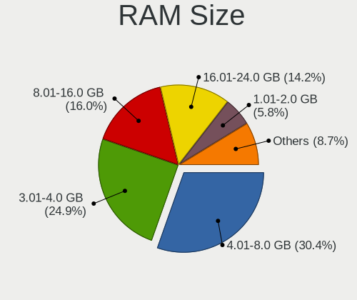
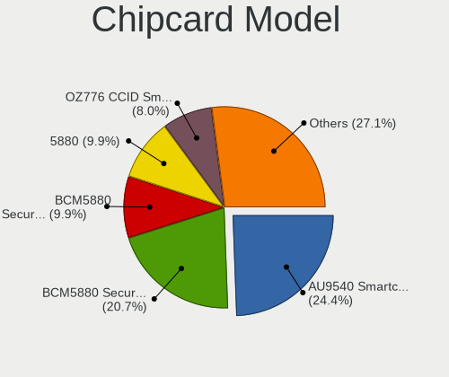

Linux Mint - Tested Hardware & Statistics (Notebooks)
-----------------------------------------------------

A project to collect tested hardware configurations for Linux Mint.

Anyone can contribute to this report by the [hw-probe](https://github.com/linuxhw/hw-probe) tool:

    sudo -E hw-probe -all -upload

Please contribute! Especially if your hardware is rare.

Contents
--------

* [ Test Cases ](#test-cases)

* [ System ](#system)
  - [ OS                       ](#os)
  - [ OS Family                ](#os-family)
  - [ Kernel                   ](#kernel)
  - [ Kernel Family            ](#kernel-family)
  - [ Kernel Major Ver.        ](#kernel-major-ver)
  - [ Arch                     ](#arch)
  - [ DE                       ](#de)
  - [ Display Server           ](#display-server)
  - [ Display Manager          ](#display-manager)
  - [ OS Lang                  ](#os-lang)
  - [ Boot Mode                ](#boot-mode)
  - [ Filesystem               ](#filesystem)
  - [ Part. scheme             ](#part-scheme)
  - [ Dual Boot with Linux/BSD ](#dual-boot-with-linuxbsd)
  - [ Dual Boot (Win)          ](#dual-boot-win)

* [ Board ](#board)
  - [ Vendor                   ](#vendor)
  - [ Model                    ](#model)
  - [ Model Family             ](#model-family)
  - [ MFG Year                 ](#mfg-year)
  - [ Form Factor              ](#form-factor)
  - [ Secure Boot              ](#secure-boot)
  - [ Coreboot                 ](#coreboot)
  - [ RAM Size                 ](#ram-size)
  - [ RAM Used                 ](#ram-used)
  - [ Total Drives             ](#total-drives)
  - [ Has CD-ROM               ](#has-cd-rom)
  - [ Has Ethernet             ](#has-ethernet)
  - [ Has WiFi                 ](#has-wifi)
  - [ Has Bluetooth            ](#has-bluetooth)

* [ Location ](#location)
  - [ Country                  ](#country)
  - [ City                     ](#city)

* [ Drives ](#drives)
  - [ Drive Vendor             ](#drive-vendor)
  - [ Drive Model              ](#drive-model)
  - [ HDD Vendor               ](#hdd-vendor)
  - [ SSD Vendor               ](#ssd-vendor)
  - [ Drive Kind               ](#drive-kind)
  - [ Drive Connector          ](#drive-connector)
  - [ Drive Size               ](#drive-size)
  - [ Space Total              ](#space-total)
  - [ Space Used               ](#space-used)
  - [ Malfunc. Drives          ](#malfunc-drives)
  - [ Malfunc. Drive Vendor    ](#malfunc-drive-vendor)
  - [ Malfunc. HDD Vendor      ](#malfunc-hdd-vendor)
  - [ Malfunc. Drive Kind      ](#malfunc-drive-kind)
  - [ Failed Drives            ](#failed-drives)
  - [ Failed Drive Vendor      ](#failed-drive-vendor)
  - [ Drive Status             ](#drive-status)

* [ Storage controller ](#storage-controller)
  - [ Storage Vendor           ](#storage-vendor)
  - [ Storage Model            ](#storage-model)
  - [ Storage Kind             ](#storage-kind)

* [ Processor ](#processor)
  - [ CPU Vendor               ](#cpu-vendor)
  - [ CPU Model                ](#cpu-model)
  - [ CPU Model Family         ](#cpu-model-family)
  - [ CPU Cores                ](#cpu-cores)
  - [ CPU Sockets              ](#cpu-sockets)
  - [ CPU Threads              ](#cpu-threads)
  - [ CPU Op-Modes             ](#cpu-op-modes)
  - [ CPU Microcode            ](#cpu-microcode)
  - [ CPU Microarch            ](#cpu-microarch)

* [ Graphics ](#graphics)
  - [ GPU Vendor               ](#gpu-vendor)
  - [ GPU Model                ](#gpu-model)
  - [ GPU Combo                ](#gpu-combo)
  - [ GPU Driver               ](#gpu-driver)
  - [ GPU Memory               ](#gpu-memory)

* [ Monitor ](#monitor)
  - [ Monitor Vendor           ](#monitor-vendor)
  - [ Monitor Model            ](#monitor-model)
  - [ Monitor Resolution       ](#monitor-resolution)
  - [ Monitor Diagonal         ](#monitor-diagonal)
  - [ Monitor Width            ](#monitor-width)
  - [ Aspect Ratio             ](#aspect-ratio)
  - [ Monitor Area             ](#monitor-area)
  - [ Pixel Density            ](#pixel-density)
  - [ Multiple Monitors        ](#multiple-monitors)

* [ Network ](#network)
  - [ Net Controller Vendor    ](#net-controller-vendor)
  - [ Net Controller Model     ](#net-controller-model)
  - [ Wireless Vendor          ](#wireless-vendor)
  - [ Wireless Model           ](#wireless-model)
  - [ Ethernet Vendor          ](#ethernet-vendor)
  - [ Ethernet Model           ](#ethernet-model)
  - [ Net Controller Kind      ](#net-controller-kind)
  - [ Used Controller          ](#used-controller)
  - [ NICs                     ](#nics)
  - [ IPv6                     ](#ipv6)

* [ Bluetooth ](#bluetooth)
  - [ Bluetooth Vendor         ](#bluetooth-vendor)
  - [ Bluetooth Model          ](#bluetooth-model)

* [ Sound ](#sound)
  - [ Sound Vendor             ](#sound-vendor)
  - [ Sound Model              ](#sound-model)

* [ Memory ](#memory)
  - [ Memory Vendor            ](#memory-vendor)
  - [ Memory Model             ](#memory-model)
  - [ Memory Kind              ](#memory-kind)
  - [ Memory Form Factor       ](#memory-form-factor)
  - [ Memory Size              ](#memory-size)
  - [ Memory Speed             ](#memory-speed)

* [ Printers & scanners ](#printers--scanners)
  - [ Printer Vendor           ](#printer-vendor)
  - [ Printer Model            ](#printer-model)
  - [ Scanner Vendor           ](#scanner-vendor)
  - [ Scanner Model            ](#scanner-model)

* [ Camera ](#camera)
  - [ Camera Vendor            ](#camera-vendor)
  - [ Camera Model             ](#camera-model)

* [ Security ](#security)
  - [ Fingerprint Vendor       ](#fingerprint-vendor)
  - [ Fingerprint Model        ](#fingerprint-model)
  - [ Chipcard Vendor          ](#chipcard-vendor)
  - [ Chipcard Model           ](#chipcard-model)

* [ Unsupported ](#unsupported)
  - [ Unsupported Devices      ](#unsupported-devices)
  - [ Unsupported Device Types ](#unsupported-device-types)

Test Cases
----------

Total: 16527

| Vendor        | Model                       | Probe                                                      | Date         |
|---------------|-----------------------------|------------------------------------------------------------|--------------|
| ASUSTek       | G75VW                       | [63fa97bd36](https://linux-hardware.org/?probe=63fa97bd36) | Dec 24, 2023 |
| Acer          | Aspire 5250                 | [224ca602f3](https://linux-hardware.org/?probe=224ca602f3) | Dec 24, 2023 |
| Acer          | Aspire 5750G                | [a12f3e5ce6](https://linux-hardware.org/?probe=a12f3e5ce6) | Dec 24, 2023 |
| Acer          | Aspire 5750G                | [1a31482d70](https://linux-hardware.org/?probe=1a31482d70) | Dec 24, 2023 |
| Dell          | Latitude E7450              | [6758499db8](https://linux-hardware.org/?probe=6758499db8) | Dec 24, 2023 |
| Dell          | Latitude E7450              | [d3eb47d0a5](https://linux-hardware.org/?probe=d3eb47d0a5) | Dec 24, 2023 |
| HP            | Unknown                     | [3bc06ba7d3](https://linux-hardware.org/?probe=3bc06ba7d3) | Dec 24, 2023 |
| HP            | Presario CQ61               | [249a217a7c](https://linux-hardware.org/?probe=249a217a7c) | Dec 24, 2023 |
| Lenovo        | V15 G4 AMN 82YU             | [d7518dd730](https://linux-hardware.org/?probe=d7518dd730) | Dec 24, 2023 |
| Lenovo        | V15 G4 AMN 82YU             | [a4b5f3a556](https://linux-hardware.org/?probe=a4b5f3a556) | Dec 23, 2023 |
| Acer          | Aspire ES1-572              | [e726ce9f63](https://linux-hardware.org/?probe=e726ce9f63) | Dec 23, 2023 |
| Acer          | Aspire A515-55              | [9412d138fb](https://linux-hardware.org/?probe=9412d138fb) | Dec 23, 2023 |
| Acer          | Aspire A515-55              | [4166459262](https://linux-hardware.org/?probe=4166459262) | Dec 23, 2023 |
| Toshiba       | Satellite A660              | [d0415e05d3](https://linux-hardware.org/?probe=d0415e05d3) | Dec 23, 2023 |
| HP            | Victus by Gaming Laptop ... | [95adcc5c56](https://linux-hardware.org/?probe=95adcc5c56) | Dec 23, 2023 |
| Apple         | MacBookAir3,1               | [860a7b9b4c](https://linux-hardware.org/?probe=860a7b9b4c) | Dec 23, 2023 |
| Unknown       | Unknown                     | [006211d916](https://linux-hardware.org/?probe=006211d916) | Dec 23, 2023 |
| ASUSTek       | X555LAB                     | [6a3b9f5bb2](https://linux-hardware.org/?probe=6a3b9f5bb2) | Dec 23, 2023 |
| Dell          | Latitude E6540              | [9e3371b6b2](https://linux-hardware.org/?probe=9e3371b6b2) | Dec 23, 2023 |
| HP            | Pavilion dv6                | [c4a6b58303](https://linux-hardware.org/?probe=c4a6b58303) | Dec 23, 2023 |
| Apple         | MacBookAir7,2               | [18ef14b687](https://linux-hardware.org/?probe=18ef14b687) | Dec 23, 2023 |
| HP            | Pavilion Notebook           | [7afecc25eb](https://linux-hardware.org/?probe=7afecc25eb) | Dec 22, 2023 |
| ASUSTek       | X555LJ                      | [8f1a82681b](https://linux-hardware.org/?probe=8f1a82681b) | Dec 22, 2023 |
| ASUSTek       | X555LJ                      | [44b0b8bd05](https://linux-hardware.org/?probe=44b0b8bd05) | Dec 22, 2023 |
| ASUSTek       | VivoBook_ASUSLaptop X530... | [3f903fafe6](https://linux-hardware.org/?probe=3f903fafe6) | Dec 22, 2023 |
| HP            | Laptop 15-bs0xx             | [e42f9ff8f6](https://linux-hardware.org/?probe=e42f9ff8f6) | Dec 22, 2023 |
| HP            | EliteBook 655 15.6 inch ... | [72084f8af0](https://linux-hardware.org/?probe=72084f8af0) | Dec 22, 2023 |
| Toshiba       | Satellite Pro C50-A-1C8     | [bfc1ebaf00](https://linux-hardware.org/?probe=bfc1ebaf00) | Dec 22, 2023 |
| Positivo      | W940TU                      | [40dff18a74](https://linux-hardware.org/?probe=40dff18a74) | Dec 22, 2023 |
| HP            | ENVY Laptop 17-ch0xxx       | [38a9810e94](https://linux-hardware.org/?probe=38a9810e94) | Dec 22, 2023 |
| Dell          | Latitude 5540               | [3716993a6e](https://linux-hardware.org/?probe=3716993a6e) | Dec 22, 2023 |
| Framework     | Laptop (13th Gen Intel C... | [fa4275395f](https://linux-hardware.org/?probe=fa4275395f) | Dec 22, 2023 |
| Toshiba       | Satellite Pro L850-1L2      | [c3bfd150bc](https://linux-hardware.org/?probe=c3bfd150bc) | Dec 22, 2023 |
| Dell          | Inspiron 7572               | [b6a03a82a6](https://linux-hardware.org/?probe=b6a03a82a6) | Dec 22, 2023 |
| Lenovo        | IdeaPad 3 15IIL05 81WE      | [684b42a95a](https://linux-hardware.org/?probe=684b42a95a) | Dec 22, 2023 |
| Dell          | Precision M6600             | [5e387ee3ac](https://linux-hardware.org/?probe=5e387ee3ac) | Dec 21, 2023 |
| Toshiba       | Satellite L15-B             | [0b1e126b9b](https://linux-hardware.org/?probe=0b1e126b9b) | Dec 21, 2023 |
| Inter Sale... | NID-11125DE                 | [d65538541d](https://linux-hardware.org/?probe=d65538541d) | Dec 21, 2023 |
| Lenovo        | ThinkPad T490 20RY0002US    | [95dfdb9327](https://linux-hardware.org/?probe=95dfdb9327) | Dec 21, 2023 |
| ASUSTek       | VivoBook_ASUSLaptop X421... | [5632b47c38](https://linux-hardware.org/?probe=5632b47c38) | Dec 21, 2023 |
| Google        | Casta                       | [70f6e5e978](https://linux-hardware.org/?probe=70f6e5e978) | Dec 21, 2023 |
| ASUSTek       | VX7                         | [df8564bf5b](https://linux-hardware.org/?probe=df8564bf5b) | Dec 21, 2023 |
| Lenovo        | IdeaPad S340-15APITOUCH ... | [0eb3eaa1c6](https://linux-hardware.org/?probe=0eb3eaa1c6) | Dec 20, 2023 |
| HP            | Laptop 15-dw3xxx            | [17ce825521](https://linux-hardware.org/?probe=17ce825521) | Dec 20, 2023 |
| Dell          | Latitude 7490               | [058142d276](https://linux-hardware.org/?probe=058142d276) | Dec 20, 2023 |
| HP            | EliteBook 8560p             | [b9e00df8b5](https://linux-hardware.org/?probe=b9e00df8b5) | Dec 20, 2023 |
| HP            | EliteBook 8560p             | [334bc9d94f](https://linux-hardware.org/?probe=334bc9d94f) | Dec 20, 2023 |
| Lenovo        | V15 G2 ALC Ua 82KD          | [870842c348](https://linux-hardware.org/?probe=870842c348) | Dec 20, 2023 |
| Inter Sale... | NID-11125DE                 | [17af2fca66](https://linux-hardware.org/?probe=17af2fca66) | Dec 20, 2023 |
| ASUSTek       | X550LA                      | [fd673bac37](https://linux-hardware.org/?probe=fd673bac37) | Dec 20, 2023 |
| Samsung       | 350V5C/351V5C/3540VC/344... | [5615091c1d](https://linux-hardware.org/?probe=5615091c1d) | Dec 20, 2023 |
| Dell          | Inspiron 3721               | [2fd8b3f8fc](https://linux-hardware.org/?probe=2fd8b3f8fc) | Dec 20, 2023 |
| Lenovo        | ThinkPad T480s 20L8S3SW0... | [eebb86b95f](https://linux-hardware.org/?probe=eebb86b95f) | Dec 19, 2023 |
| HP            | EliteBook 8460p             | [38ac246006](https://linux-hardware.org/?probe=38ac246006) | Dec 19, 2023 |
| Lenovo        | ThinkPad X1 Carbon 4th 2... | [da74c3a382](https://linux-hardware.org/?probe=da74c3a382) | Dec 19, 2023 |
| MSI           | Creator 15M A10SD           | [5ed074ddfb](https://linux-hardware.org/?probe=5ed074ddfb) | Dec 19, 2023 |
| Standard      | SF20BA2                     | [431580b18d](https://linux-hardware.org/?probe=431580b18d) | Dec 19, 2023 |
| Panasonic     | CFSZ5-3                     | [73265b056e](https://linux-hardware.org/?probe=73265b056e) | Dec 19, 2023 |
| Apple         | MacBookPro7,1               | [79499893b8](https://linux-hardware.org/?probe=79499893b8) | Dec 19, 2023 |
| HP            | Unknown                     | [43fae5ce53](https://linux-hardware.org/?probe=43fae5ce53) | Dec 19, 2023 |
| Dell          | Latitude E6440              | [8d1b130773](https://linux-hardware.org/?probe=8d1b130773) | Dec 18, 2023 |
| HP            | Victus by Gaming Laptop ... | [fd092daf92](https://linux-hardware.org/?probe=fd092daf92) | Dec 18, 2023 |
| HP            | EliteBook 8440p             | [4a83771100](https://linux-hardware.org/?probe=4a83771100) | Dec 18, 2023 |
| HUAWEI        | NBLB-WAX9N                  | [1f03d33b22](https://linux-hardware.org/?probe=1f03d33b22) | Dec 18, 2023 |
| Packard Be... | EasyNote TE69BM             | [6a4bc96f4b](https://linux-hardware.org/?probe=6a4bc96f4b) | Dec 18, 2023 |
| ASUSTek       | Zenbook UM5302LA_UM5302L... | [29ee1d8ad5](https://linux-hardware.org/?probe=29ee1d8ad5) | Dec 18, 2023 |
| Medion        | S17403                      | [250e479ad5](https://linux-hardware.org/?probe=250e479ad5) | Dec 18, 2023 |
| ASUSTek       | X550LA                      | [759db70e03](https://linux-hardware.org/?probe=759db70e03) | Dec 18, 2023 |
| ASUSTek       | ZenBook UX434IQ_Q407IQ      | [81ea786e13](https://linux-hardware.org/?probe=81ea786e13) | Dec 18, 2023 |
| Dell          | Latitude E6410              | [ad9c836840](https://linux-hardware.org/?probe=ad9c836840) | Dec 18, 2023 |
| MSI           | Katana GF66 11SC            | [96407da6d4](https://linux-hardware.org/?probe=96407da6d4) | Dec 18, 2023 |
| Dell          | Latitude E6400              | [855a8f55c4](https://linux-hardware.org/?probe=855a8f55c4) | Dec 17, 2023 |
| HP            | Compaq CQ45                 | [2d0f39803d](https://linux-hardware.org/?probe=2d0f39803d) | Dec 17, 2023 |
| Acer          | Aspire A315-51              | [4169b122de](https://linux-hardware.org/?probe=4169b122de) | Dec 17, 2023 |
| Acer          | Aspire 5920G                | [40545204ea](https://linux-hardware.org/?probe=40545204ea) | Dec 17, 2023 |
| Acer          | Aspire 5920G                | [4ace5aeebe](https://linux-hardware.org/?probe=4ace5aeebe) | Dec 17, 2023 |
| Lenovo        | ThinkPad T440p 20AWA0W9A... | [e97e362650](https://linux-hardware.org/?probe=e97e362650) | Dec 17, 2023 |
| Dell          | Precision 5510              | [d723f4a031](https://linux-hardware.org/?probe=d723f4a031) | Dec 17, 2023 |
| HUAWEI        | NBLB-WAX9N                  | [16ebb489d4](https://linux-hardware.org/?probe=16ebb489d4) | Dec 17, 2023 |
| HP            | Notebook                    | [09981b3a71](https://linux-hardware.org/?probe=09981b3a71) | Dec 17, 2023 |
| GIADA         | Cherry Trail CR JHS60V      | [18734ee033](https://linux-hardware.org/?probe=18734ee033) | Dec 17, 2023 |
| Dell          | Latitude E6440              | [b91055b95e](https://linux-hardware.org/?probe=b91055b95e) | Dec 17, 2023 |
| ASUSTek       | X580VD                      | [8629995933](https://linux-hardware.org/?probe=8629995933) | Dec 17, 2023 |
| PC Special... | MP 17 Recoil Master         | [f199dc6e36](https://linux-hardware.org/?probe=f199dc6e36) | Dec 17, 2023 |
| Lenovo        | IdeaPad 320-15IKB 80XL      | [02fb9a3f3b](https://linux-hardware.org/?probe=02fb9a3f3b) | Dec 17, 2023 |
| Acer          | Aspire M5-583P              | [34b9748756](https://linux-hardware.org/?probe=34b9748756) | Dec 17, 2023 |
| Toshiba       | PORTEGE Z20t-C              | [eb941689a4](https://linux-hardware.org/?probe=eb941689a4) | Dec 17, 2023 |
| Toshiba       | Satellite C50D-C            | [476915f215](https://linux-hardware.org/?probe=476915f215) | Dec 17, 2023 |
| ASUSTek       | VivoBook_ASUSLaptop M160... | [0f49954dd1](https://linux-hardware.org/?probe=0f49954dd1) | Dec 17, 2023 |
| HP            | ProBook 455 G2              | [4935ac1297](https://linux-hardware.org/?probe=4935ac1297) | Dec 17, 2023 |
| Samsung       | RV410/RV510/S3510/E3510     | [be717cf064](https://linux-hardware.org/?probe=be717cf064) | Dec 16, 2023 |
| Lenovo        | V110-15IAP 80TG             | [8bb410ae42](https://linux-hardware.org/?probe=8bb410ae42) | Dec 16, 2023 |
| HP            | Pavilion Gaming Laptop 1... | [3324746751](https://linux-hardware.org/?probe=3324746751) | Dec 16, 2023 |
| Lenovo        | ThinkPad T14 Gen 4 21K3C... | [66a8c2ad4c](https://linux-hardware.org/?probe=66a8c2ad4c) | Dec 16, 2023 |
| Acer          | Aspire 6920                 | [716c31a854](https://linux-hardware.org/?probe=716c31a854) | Dec 16, 2023 |
| Sony          | VGN-FW51MF_H                | [5cb2ea3418](https://linux-hardware.org/?probe=5cb2ea3418) | Dec 16, 2023 |
| Toshiba       | Satellite C660D             | [4277f53694](https://linux-hardware.org/?probe=4277f53694) | Dec 16, 2023 |
| Lenovo        | G570 20079                  | [7928703207](https://linux-hardware.org/?probe=7928703207) | Dec 16, 2023 |
| Dell          | Latitude E6440              | [bfbadf07a9](https://linux-hardware.org/?probe=bfbadf07a9) | Dec 16, 2023 |
| Dell          | Latitude E6440              | [bde33cad70](https://linux-hardware.org/?probe=bde33cad70) | Dec 16, 2023 |
| Dell          | Latitude E6440              | [5d02de18b4](https://linux-hardware.org/?probe=5d02de18b4) | Dec 16, 2023 |
| Lenovo        | ThinkPad T14s Gen 1 20T1... | [0121e6cb47](https://linux-hardware.org/?probe=0121e6cb47) | Dec 15, 2023 |
| ASUSTek       | VivoBook_ASUSLaptop X515... | [7a1a444ed0](https://linux-hardware.org/?probe=7a1a444ed0) | Dec 15, 2023 |
| Dell          | Vostro 3525                 | [c9de3b068b](https://linux-hardware.org/?probe=c9de3b068b) | Dec 15, 2023 |
| Acer          | Swift SFX14-41G             | [49d4000148](https://linux-hardware.org/?probe=49d4000148) | Dec 15, 2023 |
| Acer          | Aspire 5741G                | [2c456f017e](https://linux-hardware.org/?probe=2c456f017e) | Dec 15, 2023 |
| Acer          | Aspire 5741G                | [6aed980ba9](https://linux-hardware.org/?probe=6aed980ba9) | Dec 15, 2023 |
| Dell          | Precision 5540              | [beae57f4bb](https://linux-hardware.org/?probe=beae57f4bb) | Dec 14, 2023 |
| Dell          | Precision M6800             | [c3ff8fa4c5](https://linux-hardware.org/?probe=c3ff8fa4c5) | Dec 14, 2023 |
| Lenovo        | ThinkPad SL510 28477MG      | [7a1dc9b889](https://linux-hardware.org/?probe=7a1dc9b889) | Dec 14, 2023 |
| Timi          | TM1701                      | [5b3c697954](https://linux-hardware.org/?probe=5b3c697954) | Dec 14, 2023 |
| ASUSTek       | VivoBook_ASUS Laptop E40... | [05141b9b76](https://linux-hardware.org/?probe=05141b9b76) | Dec 14, 2023 |
| ASUSTek       | VivoBook_ASUS Laptop E40... | [a869524ac6](https://linux-hardware.org/?probe=a869524ac6) | Dec 14, 2023 |
| Lenovo        | ThinkPad T480s 20L8S3SW0... | [990fd9f312](https://linux-hardware.org/?probe=990fd9f312) | Dec 14, 2023 |
| HP            | Victus by Laptop 16-e0xx... | [8dd696472d](https://linux-hardware.org/?probe=8dd696472d) | Dec 14, 2023 |
| Lenovo        | ThinkPad T450 20BUS50Q16    | [789b2d6914](https://linux-hardware.org/?probe=789b2d6914) | Dec 14, 2023 |
| HP            | Unknown                     | [6a46b87d41](https://linux-hardware.org/?probe=6a46b87d41) | Dec 14, 2023 |
| HP            | Pavilion 17                 | [81e5865518](https://linux-hardware.org/?probe=81e5865518) | Dec 14, 2023 |
| HP            | ZBook 15 G6                 | [1d935cbf02](https://linux-hardware.org/?probe=1d935cbf02) | Dec 13, 2023 |
| HP            | 15                          | [2343c72691](https://linux-hardware.org/?probe=2343c72691) | Dec 13, 2023 |
| HP            | ZBook 15 G6                 | [3deb250922](https://linux-hardware.org/?probe=3deb250922) | Dec 13, 2023 |
| Schenker      | XMG NEO (E23)               | [ce84d5a464](https://linux-hardware.org/?probe=ce84d5a464) | Dec 13, 2023 |
| Lenovo        | G580 20150                  | [c6c8d22a8e](https://linux-hardware.org/?probe=c6c8d22a8e) | Dec 13, 2023 |
| HP            | EliteBook 655 15.6 inch ... | [ba6f8efad6](https://linux-hardware.org/?probe=ba6f8efad6) | Dec 13, 2023 |
| Toshiba       | Satellite Pro C50-A-1C8     | [a56ec48040](https://linux-hardware.org/?probe=a56ec48040) | Dec 13, 2023 |
| Toshiba       | Satellite Pro C50-A-1C8     | [490ceeb636](https://linux-hardware.org/?probe=490ceeb636) | Dec 13, 2023 |
| Fujitsu       | LIFEBOOK U7413              | [088a24eb7d](https://linux-hardware.org/?probe=088a24eb7d) | Dec 13, 2023 |
| Dell          | Latitude E7240              | [4fcd011c61](https://linux-hardware.org/?probe=4fcd011c61) | Dec 13, 2023 |
| Dell          | System XPS L502X            | [75c612f90d](https://linux-hardware.org/?probe=75c612f90d) | Dec 13, 2023 |
| HP            | Pavilion dv6                | [ebc05992b6](https://linux-hardware.org/?probe=ebc05992b6) | Dec 13, 2023 |
| Lenovo        | ThinkPad X270 20HMS0TD00    | [e9df2cf93b](https://linux-hardware.org/?probe=e9df2cf93b) | Dec 12, 2023 |
| MSI           | GL62M 7RD                   | [fd87c3c373](https://linux-hardware.org/?probe=fd87c3c373) | Dec 12, 2023 |
| Lenovo        | IdeaPad S145-15IWL 81S9     | [74c0490d28](https://linux-hardware.org/?probe=74c0490d28) | Dec 12, 2023 |
| Lenovo        | ThinkPad X250 20CM001PGE    | [920f198d61](https://linux-hardware.org/?probe=920f198d61) | Dec 12, 2023 |
| Inter Sale... | NID-11125DE                 | [373498e89a](https://linux-hardware.org/?probe=373498e89a) | Dec 12, 2023 |
| Apple         | MacBookPro11,2              | [cc03da082a](https://linux-hardware.org/?probe=cc03da082a) | Dec 12, 2023 |
| ASUSTek       | VivoBook_ASUSLaptop M150... | [e617c5041f](https://linux-hardware.org/?probe=e617c5041f) | Dec 12, 2023 |
| Packard Be... | EasyNote MH36               | [9607b32c37](https://linux-hardware.org/?probe=9607b32c37) | Dec 11, 2023 |
| Dell          | Precision 7520              | [d0f203dcb1](https://linux-hardware.org/?probe=d0f203dcb1) | Dec 11, 2023 |
| Dell          | Precision 7520              | [2e02455101](https://linux-hardware.org/?probe=2e02455101) | Dec 11, 2023 |
| Acer          | Aspire 5750                 | [584a9a153e](https://linux-hardware.org/?probe=584a9a153e) | Dec 11, 2023 |
| Dell          | Latitude E6540              | [0d56fcda0e](https://linux-hardware.org/?probe=0d56fcda0e) | Dec 11, 2023 |
| Acer          | Aspire A515-52G             | [c6ac91a53c](https://linux-hardware.org/?probe=c6ac91a53c) | Dec 11, 2023 |
| HP            | Compaq Presario CQ60        | [0bf86693bc](https://linux-hardware.org/?probe=0bf86693bc) | Dec 11, 2023 |
| Lenovo        | IdeaPad 3 15IIL05 81WE      | [dac56d16cd](https://linux-hardware.org/?probe=dac56d16cd) | Dec 11, 2023 |
| Acer          | Extensa 5630                | [4709657363](https://linux-hardware.org/?probe=4709657363) | Dec 11, 2023 |
| Dell          | Inspiron 5755               | [4b70400e52](https://linux-hardware.org/?probe=4b70400e52) | Dec 11, 2023 |
| Acer          | Aspire A515-56              | [ec970d7248](https://linux-hardware.org/?probe=ec970d7248) | Dec 10, 2023 |
| Acer          | Aspire ES1-572              | [c66bd8de67](https://linux-hardware.org/?probe=c66bd8de67) | Dec 10, 2023 |
| Dell          | Latitude E6410              | [0b8db8ccee](https://linux-hardware.org/?probe=0b8db8ccee) | Dec 10, 2023 |
| Apple         | MacBookAir6,2               | [62734db5de](https://linux-hardware.org/?probe=62734db5de) | Dec 10, 2023 |
| Casper        | *SP*                        | [5fb7fac59d](https://linux-hardware.org/?probe=5fb7fac59d) | Dec 10, 2023 |
| Casper        | *SP*                        | [5a1d880754](https://linux-hardware.org/?probe=5a1d880754) | Dec 10, 2023 |
| Acer          | Nitro AN515-54              | [a29797fb65](https://linux-hardware.org/?probe=a29797fb65) | Dec 10, 2023 |
| Toshiba       | PORTEGE Z930                | [5ad98ef7f6](https://linux-hardware.org/?probe=5ad98ef7f6) | Dec 10, 2023 |
| HP            | ProBook 6460b               | [99fa9c84ca](https://linux-hardware.org/?probe=99fa9c84ca) | Dec 10, 2023 |
| Lenovo        | ThinkPad T14 Gen 2a 20XK... | [f91ead8a19](https://linux-hardware.org/?probe=f91ead8a19) | Dec 10, 2023 |
| MSI           | Modern 15 B7M               | [cc6c41e7fd](https://linux-hardware.org/?probe=cc6c41e7fd) | Dec 10, 2023 |
| HP            | Pavilion 17                 | [6822e2b412](https://linux-hardware.org/?probe=6822e2b412) | Dec 10, 2023 |
| Lenovo        | G50-70 20351                | [fab1403ca7](https://linux-hardware.org/?probe=fab1403ca7) | Dec 10, 2023 |
| Acer          | Aspire A515-54              | [d3869522c0](https://linux-hardware.org/?probe=d3869522c0) | Dec 10, 2023 |
| Sony          | SVE1511K1EW                 | [34875b90c4](https://linux-hardware.org/?probe=34875b90c4) | Dec 10, 2023 |
| Lenovo        | ThinkPad T14 Gen 2a 20XK... | [cedb8ab2b7](https://linux-hardware.org/?probe=cedb8ab2b7) | Dec 10, 2023 |
| MSI           | GS43VR 7RE                  | [23feee91ff](https://linux-hardware.org/?probe=23feee91ff) | Dec 10, 2023 |
| Lenovo        | ThinkPad T480 20L6S4G700    | [a1ebdec411](https://linux-hardware.org/?probe=a1ebdec411) | Dec 10, 2023 |
| Google        | Gallop                      | [83663e2906](https://linux-hardware.org/?probe=83663e2906) | Dec 09, 2023 |
| HP            | EliteBook 820 G3            | [50335a1ca6](https://linux-hardware.org/?probe=50335a1ca6) | Dec 09, 2023 |
| Dell          | Latitude 7490               | [bbbf303467](https://linux-hardware.org/?probe=bbbf303467) | Dec 09, 2023 |
| BOSGAME       | DNB20 series                | [d825ed757b](https://linux-hardware.org/?probe=d825ed757b) | Dec 09, 2023 |
| Toshiba       | Satellite L650D             | [90ec46f444](https://linux-hardware.org/?probe=90ec46f444) | Dec 09, 2023 |
| Toshiba       | Satellite C870D-116         | [78a800febe](https://linux-hardware.org/?probe=78a800febe) | Dec 09, 2023 |
| HUAWEI        | NBLB-WAX9N                  | [be35efa2be](https://linux-hardware.org/?probe=be35efa2be) | Dec 09, 2023 |
| Unknown       | NY-02                       | [d894eced77](https://linux-hardware.org/?probe=d894eced77) | Dec 09, 2023 |
| Samsung       | 90X3A                       | [45697431c1](https://linux-hardware.org/?probe=45697431c1) | Dec 09, 2023 |
| Dell          | Latitude E6400              | [0f4aeac8ca](https://linux-hardware.org/?probe=0f4aeac8ca) | Dec 09, 2023 |
| Dell          | G15 5515                    | [d815dec1af](https://linux-hardware.org/?probe=d815dec1af) | Dec 09, 2023 |
| Unknown       | Unknown                     | [185aa8e9fe](https://linux-hardware.org/?probe=185aa8e9fe) | Dec 09, 2023 |
| HP            | Pavilion dv8000 (ET839UA... | [b743ce445f](https://linux-hardware.org/?probe=b743ce445f) | Dec 09, 2023 |
| Fujitsu Si... | LIFEBOOK T5010              | [7a66cc4016](https://linux-hardware.org/?probe=7a66cc4016) | Dec 09, 2023 |
| Unknown       | Unknown                     | [f6c17cee3d](https://linux-hardware.org/?probe=f6c17cee3d) | Dec 08, 2023 |
| TECNO Mobi... | MEGABOOK T15DA              | [afe1407fd9](https://linux-hardware.org/?probe=afe1407fd9) | Dec 08, 2023 |
| TUXEDO        | U931                        | [a73533a163](https://linux-hardware.org/?probe=a73533a163) | Dec 08, 2023 |
| Medion        | E11201                      | [8e7e346f7f](https://linux-hardware.org/?probe=8e7e346f7f) | Dec 08, 2023 |
| Acer          | Aspire A517-53G             | [11208976d5](https://linux-hardware.org/?probe=11208976d5) | Dec 08, 2023 |
| Apple         | MacBookAir7,2               | [e3b462d63d](https://linux-hardware.org/?probe=e3b462d63d) | Dec 08, 2023 |
| Apple         | MacBook5,1                  | [e6e9d305e9](https://linux-hardware.org/?probe=e6e9d305e9) | Dec 08, 2023 |
| Lenovo        | G50-80 80E5                 | [d0e32e1ab3](https://linux-hardware.org/?probe=d0e32e1ab3) | Dec 08, 2023 |
| Acer          | Aspire A315-41              | [778176acbe](https://linux-hardware.org/?probe=778176acbe) | Dec 08, 2023 |
| Lenovo        | G50-80 80E5                 | [d1ad1e6658](https://linux-hardware.org/?probe=d1ad1e6658) | Dec 08, 2023 |
| HP            | Pavilion dv6                | [e6522f1c77](https://linux-hardware.org/?probe=e6522f1c77) | Dec 08, 2023 |
| Apple         | MacBook4,1                  | [dfd1f871b8](https://linux-hardware.org/?probe=dfd1f871b8) | Dec 08, 2023 |
| HP            | 250 G8 Notebook PC          | [4efdc6d768](https://linux-hardware.org/?probe=4efdc6d768) | Dec 07, 2023 |
| Samsung       | 750XED                      | [5263f7ebc0](https://linux-hardware.org/?probe=5263f7ebc0) | Dec 07, 2023 |
| Lenovo        | Yoga Slim 6 14IRH8 83E0     | [a8b759b4a8](https://linux-hardware.org/?probe=a8b759b4a8) | Dec 07, 2023 |
| Toshiba       | Satellite S50D-A            | [eaa6d2bf5e](https://linux-hardware.org/?probe=eaa6d2bf5e) | Dec 07, 2023 |
| Toshiba       | Satellite S50D-A            | [749ddd65d7](https://linux-hardware.org/?probe=749ddd65d7) | Dec 07, 2023 |
| HP            | 255 G7 Notebook PC          | [a39b24be90](https://linux-hardware.org/?probe=a39b24be90) | Dec 07, 2023 |
| HP            | 255 G7 Notebook PC          | [7da432cd55](https://linux-hardware.org/?probe=7da432cd55) | Dec 07, 2023 |
| Unknown       | NY-02                       | [8d1cd2ab24](https://linux-hardware.org/?probe=8d1cd2ab24) | Dec 07, 2023 |
| MSI           | GF63 Thin 10SC              | [9c8600990d](https://linux-hardware.org/?probe=9c8600990d) | Dec 07, 2023 |
| Acer          | Aspire A315-51              | [66fc06c54d](https://linux-hardware.org/?probe=66fc06c54d) | Dec 07, 2023 |
| HP            | Laptop 15-db0xxx            | [8b324f5c18](https://linux-hardware.org/?probe=8b324f5c18) | Dec 06, 2023 |
| Lenovo        | IdeaPad 3 15ITL05 81X8      | [6623cb7bdc](https://linux-hardware.org/?probe=6623cb7bdc) | Dec 06, 2023 |
| HP            | EliteBook 840 G3            | [c9f70274cf](https://linux-hardware.org/?probe=c9f70274cf) | Dec 06, 2023 |
| HP            | ENVY 17                     | [b6048f107e](https://linux-hardware.org/?probe=b6048f107e) | Dec 06, 2023 |
| ASUSTek       | K45A                        | [a5e618b2f9](https://linux-hardware.org/?probe=a5e618b2f9) | Dec 06, 2023 |
| ASUSTek       | K45A                        | [96d1051ede](https://linux-hardware.org/?probe=96d1051ede) | Dec 06, 2023 |
| HP            | ZBook Firefly 16 inch G9... | [aa183c25d7](https://linux-hardware.org/?probe=aa183c25d7) | Dec 06, 2023 |
| Lenovo        | IdeaPad Y700-15ISK 80NV     | [e6657bb173](https://linux-hardware.org/?probe=e6657bb173) | Dec 06, 2023 |
| GPU Compan... | GWTC116-2                   | [db1b3d8020](https://linux-hardware.org/?probe=db1b3d8020) | Dec 06, 2023 |
| Tactus        | IOTA Flo                    | [a79fecbfad](https://linux-hardware.org/?probe=a79fecbfad) | Dec 06, 2023 |
| HP            | 245 G5 Notebook PC          | [f3abc9d11d](https://linux-hardware.org/?probe=f3abc9d11d) | Dec 05, 2023 |
| Lenovo        | ThinkPad E570 20H50048US    | [70b5d1cb69](https://linux-hardware.org/?probe=70b5d1cb69) | Dec 05, 2023 |
| HP            | Laptop 17-cp0xxx            | [9d4a4790f4](https://linux-hardware.org/?probe=9d4a4790f4) | Dec 05, 2023 |
| Toshiba       | Satellite C55D-C            | [888584071d](https://linux-hardware.org/?probe=888584071d) | Dec 05, 2023 |
| Dell          | Inspiron 15 5510            | [f20f7f2563](https://linux-hardware.org/?probe=f20f7f2563) | Dec 05, 2023 |
| Alienware     | 17                          | [77103bfec3](https://linux-hardware.org/?probe=77103bfec3) | Dec 05, 2023 |
| Acer          | Aspire A314-23P             | [ad97d6f3c6](https://linux-hardware.org/?probe=ad97d6f3c6) | Dec 05, 2023 |
| Lenovo        | G480                        | [e82d31d252](https://linux-hardware.org/?probe=e82d31d252) | Dec 05, 2023 |
| Acer          | Aspire AV15-51              | [2691ac3f7d](https://linux-hardware.org/?probe=2691ac3f7d) | Dec 05, 2023 |
| Apple         | MacBookPro15,1              | [60aacd19d6](https://linux-hardware.org/?probe=60aacd19d6) | Dec 05, 2023 |
| ASUSTek       | X751LN                      | [72bc3137f4](https://linux-hardware.org/?probe=72bc3137f4) | Dec 05, 2023 |
| HP            | Victus by Gaming Laptop ... | [aa291d8bae](https://linux-hardware.org/?probe=aa291d8bae) | Dec 05, 2023 |
| Acer          | Aspire AV15-51              | [758a277d68](https://linux-hardware.org/?probe=758a277d68) | Dec 04, 2023 |
| HP            | Victus by Gaming Laptop ... | [faed8ef1d8](https://linux-hardware.org/?probe=faed8ef1d8) | Dec 04, 2023 |
| Apple         | MacBookAir4,2               | [2b7a417b76](https://linux-hardware.org/?probe=2b7a417b76) | Dec 04, 2023 |
| HP            | Laptop 15-bs0xx             | [efedef5a13](https://linux-hardware.org/?probe=efedef5a13) | Dec 04, 2023 |
| ASUSTek       | B121                        | [25eda5a74a](https://linux-hardware.org/?probe=25eda5a74a) | Dec 04, 2023 |
| Wortmann      | 1220657_1470295             | [74bac21281](https://linux-hardware.org/?probe=74bac21281) | Dec 04, 2023 |
| Lenovo        | ThinkPad T450 20BUS50Q16    | [ad47002b34](https://linux-hardware.org/?probe=ad47002b34) | Dec 04, 2023 |
| ASUSTek       | VivoBook_ASUSLaptop X705... | [54ecb0a8b8](https://linux-hardware.org/?probe=54ecb0a8b8) | Dec 04, 2023 |
| HP            | Stream Notebook             | [2f50077231](https://linux-hardware.org/?probe=2f50077231) | Dec 04, 2023 |
| Dell          | Latitude E6410              | [65b6e47cf8](https://linux-hardware.org/?probe=65b6e47cf8) | Dec 04, 2023 |
| MSI           | Modern 15 B7M               | [f1757e8248](https://linux-hardware.org/?probe=f1757e8248) | Dec 04, 2023 |
| Lenovo        | ThinkPad X1 Carbon 6th 2... | [db9e1baffe](https://linux-hardware.org/?probe=db9e1baffe) | Dec 04, 2023 |
| HP            | Notebook                    | [f347c4437d](https://linux-hardware.org/?probe=f347c4437d) | Dec 04, 2023 |
| Lenovo        | ThinkPad T530 2392ASU       | [859f5cb215](https://linux-hardware.org/?probe=859f5cb215) | Dec 04, 2023 |
| HP            | 625                         | [b2a08fa60e](https://linux-hardware.org/?probe=b2a08fa60e) | Dec 04, 2023 |
| HP            | Laptop 15s-fq3xxx           | [e9d509dd95](https://linux-hardware.org/?probe=e9d509dd95) | Dec 03, 2023 |
| ASUSTek       | K54C                        | [8f1abfdd9a](https://linux-hardware.org/?probe=8f1abfdd9a) | Dec 03, 2023 |
| ASUSTek       | K54C                        | [6702d5257d](https://linux-hardware.org/?probe=6702d5257d) | Dec 03, 2023 |
| Lenovo        | ThinkPad X1 Carbon Gen 1... | [1af4b60513](https://linux-hardware.org/?probe=1af4b60513) | Dec 03, 2023 |
| HP            | Notebook                    | [8d58f80f77](https://linux-hardware.org/?probe=8d58f80f77) | Dec 03, 2023 |
| Dell          | Latitude E6530              | [514326bb46](https://linux-hardware.org/?probe=514326bb46) | Dec 03, 2023 |
| Samsung       | 350V5C/351V5C/3540VC/344... | [9abcd3c636](https://linux-hardware.org/?probe=9abcd3c636) | Dec 03, 2023 |
| ASUSTek       | X705UDR                     | [ea5c2b889d](https://linux-hardware.org/?probe=ea5c2b889d) | Dec 03, 2023 |
| Lenovo        | ThinkPad W500 40624DG       | [920dc046a3](https://linux-hardware.org/?probe=920dc046a3) | Dec 03, 2023 |
| HP            | Laptop 15-dw2xxx            | [44390c058f](https://linux-hardware.org/?probe=44390c058f) | Dec 03, 2023 |
| HP            | Laptop 15-dw2xxx            | [e9530a4f63](https://linux-hardware.org/?probe=e9530a4f63) | Dec 03, 2023 |
| Toshiba       | Satellite L305              | [a2ac14b9d1](https://linux-hardware.org/?probe=a2ac14b9d1) | Dec 03, 2023 |
| Fujitsu       | LIFEBOOK S751               | [a86f7ce9cc](https://linux-hardware.org/?probe=a86f7ce9cc) | Dec 03, 2023 |
| Acer          | Aspire V3-771               | [28345ccbfb](https://linux-hardware.org/?probe=28345ccbfb) | Dec 02, 2023 |
| Lenovo        | ThinkPad T420 4180AP3       | [b517b29f25](https://linux-hardware.org/?probe=b517b29f25) | Dec 02, 2023 |
| Polaroid      | MP1464PR001                 | [bd3fa27cfe](https://linux-hardware.org/?probe=bd3fa27cfe) | Dec 02, 2023 |
| ASUSTek       | K56CB                       | [97e892b8ef](https://linux-hardware.org/?probe=97e892b8ef) | Dec 02, 2023 |
| Samsung       | R610                        | [63c97d55c8](https://linux-hardware.org/?probe=63c97d55c8) | Dec 02, 2023 |
| HP            | EliteBook 840 G5            | [05b5607e47](https://linux-hardware.org/?probe=05b5607e47) | Dec 02, 2023 |
| Acer          | Aspire E5-771G              | [907744429e](https://linux-hardware.org/?probe=907744429e) | Dec 02, 2023 |
| Lenovo        | IdeaPad 100-15IBD 80QQ      | [3316107191](https://linux-hardware.org/?probe=3316107191) | Dec 02, 2023 |
| Dell          | Precision 5540              | [b347a82e85](https://linux-hardware.org/?probe=b347a82e85) | Dec 02, 2023 |
| Dell          | Latitude 7400               | [acfa4488ca](https://linux-hardware.org/?probe=acfa4488ca) | Dec 02, 2023 |
| Dell          | Vostro 3525                 | [6d84ce1284](https://linux-hardware.org/?probe=6d84ce1284) | Dec 01, 2023 |
| Lenovo        | IdeaPad S20-30              | [ae69cb9115](https://linux-hardware.org/?probe=ae69cb9115) | Dec 01, 2023 |
| Dell          | Inspiron 15-3567            | [520e1bdfa8](https://linux-hardware.org/?probe=520e1bdfa8) | Dec 01, 2023 |
| Dell          | Vostro 1510                 | [65480134bd](https://linux-hardware.org/?probe=65480134bd) | Dec 01, 2023 |
| HP            | Presario CQ43               | [5edf6adf85](https://linux-hardware.org/?probe=5edf6adf85) | Dec 01, 2023 |
| Lenovo        | ThinkPad P50 20EQS0VV0R     | [933f88f7e6](https://linux-hardware.org/?probe=933f88f7e6) | Dec 01, 2023 |
| Lenovo        | IdeaPad 100-15IBD 80QQ      | [20ad6cbe8e](https://linux-hardware.org/?probe=20ad6cbe8e) | Dec 01, 2023 |
| ASUSTek       | VivoBook_ASUSLaptop M160... | [17b807be9d](https://linux-hardware.org/?probe=17b807be9d) | Dec 01, 2023 |
| Fujitsu       | LIFEBOOK A555/G             | [5b088fb31f](https://linux-hardware.org/?probe=5b088fb31f) | Dec 01, 2023 |
| Fujitsu       | LIFEBOOK A555/G             | [c0f107065e](https://linux-hardware.org/?probe=c0f107065e) | Dec 01, 2023 |
| NEC Comput... | PC-LS150BS6R                | [ffb64219bf](https://linux-hardware.org/?probe=ffb64219bf) | Dec 01, 2023 |
| Dell          | Latitude E6530              | [a9b4f4fa6c](https://linux-hardware.org/?probe=a9b4f4fa6c) | Dec 01, 2023 |
| Acer          | Aspire A715-74G             | [52a7a60343](https://linux-hardware.org/?probe=52a7a60343) | Dec 01, 2023 |
| Toshiba       | Satellite A215              | [dcde3a9390](https://linux-hardware.org/?probe=dcde3a9390) | Dec 01, 2023 |
| ASUSTek       | T100HAN                     | [8ffd531af0](https://linux-hardware.org/?probe=8ffd531af0) | Dec 01, 2023 |
| Medion        | E6226                       | [8422a61bf7](https://linux-hardware.org/?probe=8422a61bf7) | Dec 01, 2023 |
| HP            | ProBook 650 G1              | [a3bf52bd5d](https://linux-hardware.org/?probe=a3bf52bd5d) | Nov 30, 2023 |
| Qilive        | QW2214FR                    | [8daddd5057](https://linux-hardware.org/?probe=8daddd5057) | Nov 30, 2023 |
| Google        | Jinlon                      | [563dc8024c](https://linux-hardware.org/?probe=563dc8024c) | Nov 30, 2023 |
| ILLEGEAR      | RAVEN SE                    | [3248206a01](https://linux-hardware.org/?probe=3248206a01) | Nov 30, 2023 |
| Dell          | Latitude E5530 non-vPro     | [a8532d8b7b](https://linux-hardware.org/?probe=a8532d8b7b) | Nov 30, 2023 |
| Lenovo        | ThinkPad X1 Carbon 6th 2... | [1999f34fd0](https://linux-hardware.org/?probe=1999f34fd0) | Nov 30, 2023 |
| Lenovo        | Legion 5 15ARH05H 82B1      | [7f260cf5f4](https://linux-hardware.org/?probe=7f260cf5f4) | Nov 30, 2023 |
| HP            | Laptop 17-ca0xxx            | [0ab91a2ff5](https://linux-hardware.org/?probe=0ab91a2ff5) | Nov 30, 2023 |
| ILLEGEAR      | RAVEN SE                    | [f3b42d14f6](https://linux-hardware.org/?probe=f3b42d14f6) | Nov 30, 2023 |
| Lenovo        | ThinkPad T460s 20FA0046M... | [978ee0fa18](https://linux-hardware.org/?probe=978ee0fa18) | Nov 29, 2023 |
| MSI           | Modern 15 A5M               | [c0e81cdc2c](https://linux-hardware.org/?probe=c0e81cdc2c) | Nov 29, 2023 |
| Apple         | MacBookPro7,1               | [a680e370dc](https://linux-hardware.org/?probe=a680e370dc) | Nov 29, 2023 |
| Apple         | MacBookPro7,1               | [71c73a255e](https://linux-hardware.org/?probe=71c73a255e) | Nov 29, 2023 |
| Acer          | Aspire 4732Z                | [6a849535fb](https://linux-hardware.org/?probe=6a849535fb) | Nov 29, 2023 |
| Acer          | Swift SF114-34              | [1d9149c4e9](https://linux-hardware.org/?probe=1d9149c4e9) | Nov 28, 2023 |
| HP            | ProBook 4530s               | [5743a3e441](https://linux-hardware.org/?probe=5743a3e441) | Nov 28, 2023 |
| Dell          | Latitude E6540              | [9b16b68bbe](https://linux-hardware.org/?probe=9b16b68bbe) | Nov 28, 2023 |
| ASUSTek       | Q550LF                      | [c09615021b](https://linux-hardware.org/?probe=c09615021b) | Nov 28, 2023 |
| HONOR         | HLYL-WXX9                   | [fa6847a75b](https://linux-hardware.org/?probe=fa6847a75b) | Nov 28, 2023 |
| HP            | Presario CQ43               | [eaab50d59c](https://linux-hardware.org/?probe=eaab50d59c) | Nov 28, 2023 |
| Apple         | MacBookPro12,1              | [0bf3c142b3](https://linux-hardware.org/?probe=0bf3c142b3) | Nov 28, 2023 |
| Apple         | MacBookPro12,1              | [f9512696d3](https://linux-hardware.org/?probe=f9512696d3) | Nov 28, 2023 |
| Dell          | Latitude E6540              | [0346e7ea11](https://linux-hardware.org/?probe=0346e7ea11) | Nov 28, 2023 |
| Sony          | VPCSB1Z9E                   | [4eed6bb4ef](https://linux-hardware.org/?probe=4eed6bb4ef) | Nov 28, 2023 |
| Toshiba       | Satellite L305              | [59abc93874](https://linux-hardware.org/?probe=59abc93874) | Nov 28, 2023 |
| MSI           | GF63 Thin 10SCXR            | [20e52e5c9b](https://linux-hardware.org/?probe=20e52e5c9b) | Nov 28, 2023 |
| MSI           | GF63 Thin 10SCXR            | [09dfe90de1](https://linux-hardware.org/?probe=09dfe90de1) | Nov 28, 2023 |
| GPU Compan... | GWTC116-2                   | [3363b8258e](https://linux-hardware.org/?probe=3363b8258e) | Nov 28, 2023 |
| Lenovo        | IdeaPad Y700-15ISK 80NV     | [0a4f97781c](https://linux-hardware.org/?probe=0a4f97781c) | Nov 27, 2023 |
| HP            | 250 G3                      | [4bb11e9f60](https://linux-hardware.org/?probe=4bb11e9f60) | Nov 27, 2023 |
| Lenovo        | ThinkPad T480 20L6S42P00    | [bab4b2e0cf](https://linux-hardware.org/?probe=bab4b2e0cf) | Nov 27, 2023 |
| Lenovo        | B590 20208                  | [fd5004acd4](https://linux-hardware.org/?probe=fd5004acd4) | Nov 27, 2023 |
| Acer          | Aspire A315-42G             | [bd498a1e04](https://linux-hardware.org/?probe=bd498a1e04) | Nov 27, 2023 |
| MSI           | GP60 2QE                    | [f45ab6d514](https://linux-hardware.org/?probe=f45ab6d514) | Nov 27, 2023 |
| Acer          | Aspire A315-42G             | [e86c1bf644](https://linux-hardware.org/?probe=e86c1bf644) | Nov 27, 2023 |
| ASUSTek       | P53E                        | [4ae691e974](https://linux-hardware.org/?probe=4ae691e974) | Nov 27, 2023 |
| HP            | 250 G3                      | [275991de58](https://linux-hardware.org/?probe=275991de58) | Nov 27, 2023 |
| Lenovo        | IdeaPad 5 15ITL05 82FG      | [ada466b7a0](https://linux-hardware.org/?probe=ada466b7a0) | Nov 27, 2023 |
| Dell          | Precision M4600             | [487510b166](https://linux-hardware.org/?probe=487510b166) | Nov 27, 2023 |
| Acer          | Nitro AN515-54              | [e4cbe05d6d](https://linux-hardware.org/?probe=e4cbe05d6d) | Nov 27, 2023 |
| HP            | EliteBook 655 15.6 inch ... | [2a870ea79e](https://linux-hardware.org/?probe=2a870ea79e) | Nov 27, 2023 |
| HP            | Elite x2 1012 G1            | [388c6ba69d](https://linux-hardware.org/?probe=388c6ba69d) | Nov 27, 2023 |
| HP            | Pavilion dv6                | [5887d4ee16](https://linux-hardware.org/?probe=5887d4ee16) | Nov 27, 2023 |
| Dell          | Inspiron 3537               | [d69ca1d353](https://linux-hardware.org/?probe=d69ca1d353) | Nov 27, 2023 |
| Sony          | VPCSB16FH                   | [9e4d687ce4](https://linux-hardware.org/?probe=9e4d687ce4) | Nov 27, 2023 |
| HP            | Laptop 15-dy5xxx            | [4169d58764](https://linux-hardware.org/?probe=4169d58764) | Nov 27, 2023 |
| ASUSTek       | S301LA                      | [a42a950602](https://linux-hardware.org/?probe=a42a950602) | Nov 27, 2023 |
| Dell          | Vostro 1510                 | [8cb1e628c2](https://linux-hardware.org/?probe=8cb1e628c2) | Nov 27, 2023 |
| Toshiba       | Satellite Z30-B             | [80f2583617](https://linux-hardware.org/?probe=80f2583617) | Nov 27, 2023 |
| Fujitsu       | LIFEBOOK U7413              | [b8569ba845](https://linux-hardware.org/?probe=b8569ba845) | Nov 27, 2023 |
| Acer          | Swift SFE16-43              | [849f368635](https://linux-hardware.org/?probe=849f368635) | Nov 27, 2023 |
| Lenovo        | ThinkPad T410 2522F25       | [d6988c10b5](https://linux-hardware.org/?probe=d6988c10b5) | Nov 27, 2023 |
| Lenovo        | ThinkPad T410 2522F25       | [aadbbad61f](https://linux-hardware.org/?probe=aadbbad61f) | Nov 27, 2023 |
| HP            | Pavilion Notebook           | [2ccf3a5db5](https://linux-hardware.org/?probe=2ccf3a5db5) | Nov 26, 2023 |
| Lenovo        | ThinkBook 16 G6 IRL 21KH    | [b605ecdf31](https://linux-hardware.org/?probe=b605ecdf31) | Nov 26, 2023 |
| Acer          | Aspire ES1-520              | [235bae508c](https://linux-hardware.org/?probe=235bae508c) | Nov 26, 2023 |
| Acer          | Aspire 8950G                | [7f8fcd90dd](https://linux-hardware.org/?probe=7f8fcd90dd) | Nov 26, 2023 |
| Lenovo        | G40-30 80FY                 | [6c102c1e42](https://linux-hardware.org/?probe=6c102c1e42) | Nov 26, 2023 |
| VALE          | Notebook Classic C170       | [fcb0ab721b](https://linux-hardware.org/?probe=fcb0ab721b) | Nov 26, 2023 |
| Lenovo        | ThinkPad T490 20N3S5DV0Y    | [c68289cf4c](https://linux-hardware.org/?probe=c68289cf4c) | Nov 26, 2023 |
| HP            | Laptop 17-cp0xxx            | [fe7c9a705c](https://linux-hardware.org/?probe=fe7c9a705c) | Nov 26, 2023 |
| HP            | 245 G6 Notebook PC          | [1256303ece](https://linux-hardware.org/?probe=1256303ece) | Nov 26, 2023 |
| HP            | Unknown                     | [74afdb551a](https://linux-hardware.org/?probe=74afdb551a) | Nov 26, 2023 |
| HP            | 245 G6 Notebook PC          | [0b00139036](https://linux-hardware.org/?probe=0b00139036) | Nov 26, 2023 |
| HP            | Unknown                     | [6d4bc0aed6](https://linux-hardware.org/?probe=6d4bc0aed6) | Nov 26, 2023 |
| ASUSTek       | X540SA                      | [df8b6199fc](https://linux-hardware.org/?probe=df8b6199fc) | Nov 26, 2023 |
| Timi          | TM1701                      | [f0eb78725f](https://linux-hardware.org/?probe=f0eb78725f) | Nov 26, 2023 |
| Toshiba       | TECRA R940                  | [14de9f481a](https://linux-hardware.org/?probe=14de9f481a) | Nov 26, 2023 |
| Acer          | Aspire A515-45G             | [d9f708d5f2](https://linux-hardware.org/?probe=d9f708d5f2) | Nov 26, 2023 |
| Lenovo        | ThinkPad T580 20LAS1KA00    | [2cb6b8bc4c](https://linux-hardware.org/?probe=2cb6b8bc4c) | Nov 25, 2023 |
| HP            | ProBook 470 G5              | [58452288b1](https://linux-hardware.org/?probe=58452288b1) | Nov 25, 2023 |
| HP            | Laptop 15s-eq2xxx           | [94927ee986](https://linux-hardware.org/?probe=94927ee986) | Nov 25, 2023 |
| ASUSTek       | Zenbook 15 UM3504DA_UM35... | [3b163ea99b](https://linux-hardware.org/?probe=3b163ea99b) | Nov 25, 2023 |
| MSI           | Modern 14 B11MOU            | [a3ff822987](https://linux-hardware.org/?probe=a3ff822987) | Nov 25, 2023 |
| ASUSTek       | K54L                        | [a60f9f6279](https://linux-hardware.org/?probe=a60f9f6279) | Nov 25, 2023 |
| Dell          | G3 3590                     | [f009abd381](https://linux-hardware.org/?probe=f009abd381) | Nov 25, 2023 |
| HP            | Pavilion 15                 | [1aa46b36ee](https://linux-hardware.org/?probe=1aa46b36ee) | Nov 25, 2023 |
| Acer          | Aspire 7750G                | [9d5b39aa8b](https://linux-hardware.org/?probe=9d5b39aa8b) | Nov 25, 2023 |
| Acer          | Aspire 7741                 | [d1e2c905e1](https://linux-hardware.org/?probe=d1e2c905e1) | Nov 25, 2023 |
| PC Special... | Ionico 16                   | [2e5bce2d86](https://linux-hardware.org/?probe=2e5bce2d86) | Nov 24, 2023 |
| Positivo      | S14CT01                     | [c1b3f4bc65](https://linux-hardware.org/?probe=c1b3f4bc65) | Nov 24, 2023 |
| Lenovo        | V17 G3 IAP 82U1             | [87205535c7](https://linux-hardware.org/?probe=87205535c7) | Nov 24, 2023 |
| Lenovo        | IdeaPad S145-15IWL 81MV     | [3ea30bf13e](https://linux-hardware.org/?probe=3ea30bf13e) | Nov 24, 2023 |
| Lenovo        | IdeaPad S145-15IWL 81MV     | [8fd3c93367](https://linux-hardware.org/?probe=8fd3c93367) | Nov 24, 2023 |
| ASUSTek       | Vivobook Go E1504FA_E150... | [94886bc9d7](https://linux-hardware.org/?probe=94886bc9d7) | Nov 24, 2023 |
| Dell          | Latitude D820               | [b4944d7c0a](https://linux-hardware.org/?probe=b4944d7c0a) | Nov 23, 2023 |
| Acer          | Extensa 2540                | [872332e774](https://linux-hardware.org/?probe=872332e774) | Nov 23, 2023 |
| Lenovo        | ThinkPad E450 20DC008DMC    | [56fc21d585](https://linux-hardware.org/?probe=56fc21d585) | Nov 23, 2023 |
| Avell High... | A70 MOB                     | [d936aa95ef](https://linux-hardware.org/?probe=d936aa95ef) | Nov 23, 2023 |
| Medion        | E6226                       | [d290548caf](https://linux-hardware.org/?probe=d290548caf) | Nov 23, 2023 |
| HP            | EliteBook 840 G5            | [30f2717a78](https://linux-hardware.org/?probe=30f2717a78) | Nov 23, 2023 |
| HP            | EliteBook 840 G3            | [7a52012e4f](https://linux-hardware.org/?probe=7a52012e4f) | Nov 23, 2023 |
| Dell          | Latitude 5400               | [d79c953f28](https://linux-hardware.org/?probe=d79c953f28) | Nov 23, 2023 |
| Dell          | Precision M4700             | [bb717e3193](https://linux-hardware.org/?probe=bb717e3193) | Nov 23, 2023 |
| ASUSTek       | K54LY                       | [4ebc53e69c](https://linux-hardware.org/?probe=4ebc53e69c) | Nov 23, 2023 |
| Lenovo        | ThinkPad T460 20FMS57C00    | [467b2f3c4e](https://linux-hardware.org/?probe=467b2f3c4e) | Nov 23, 2023 |
| Lenovo        | Unknown                     | [2ab4754aa8](https://linux-hardware.org/?probe=2ab4754aa8) | Nov 23, 2023 |
| Lenovo        | Yoga Slim 7 Pro 14ACH5 O... | [e1375b1bca](https://linux-hardware.org/?probe=e1375b1bca) | Nov 22, 2023 |
| Lenovo        | ThinkPad X1 Carbon 6th 2... | [a1ff8b615f](https://linux-hardware.org/?probe=a1ff8b615f) | Nov 22, 2023 |
| Lenovo        | LOQ 15IRH8 82XV             | [6785d4e239](https://linux-hardware.org/?probe=6785d4e239) | Nov 22, 2023 |
| Fujitsu       | LIFEBOOK A530               | [d1351ee5be](https://linux-hardware.org/?probe=d1351ee5be) | Nov 22, 2023 |
| HP            | Pavilion dv8000 (ET839UA... | [5f281a926a](https://linux-hardware.org/?probe=5f281a926a) | Nov 22, 2023 |
| Google        | Bluebird                    | [3e2dd5433f](https://linux-hardware.org/?probe=3e2dd5433f) | Nov 22, 2023 |
| Google        | Bluebird                    | [d267ea0312](https://linux-hardware.org/?probe=d267ea0312) | Nov 22, 2023 |
| ASUSTek       | VivoBook_ASUSLaptop K370... | [17ba2ef64a](https://linux-hardware.org/?probe=17ba2ef64a) | Nov 22, 2023 |
| HP            | 250 G7 Notebook PC          | [e73f1050cc](https://linux-hardware.org/?probe=e73f1050cc) | Nov 22, 2023 |
| Fujitsu       | LIFEBOOK E736               | [f046d0c414](https://linux-hardware.org/?probe=f046d0c414) | Nov 22, 2023 |
| Acer          | Aspire A515-56              | [28729f536b](https://linux-hardware.org/?probe=28729f536b) | Nov 22, 2023 |
| Acer          | Aspire A515-56              | [4d128b611f](https://linux-hardware.org/?probe=4d128b611f) | Nov 22, 2023 |
| Acer          | Aspire A515-56              | [f1adb28e44](https://linux-hardware.org/?probe=f1adb28e44) | Nov 21, 2023 |
| TUXEDO        | InfinityBook Pro Gen8 (M... | [4aa46817c3](https://linux-hardware.org/?probe=4aa46817c3) | Nov 21, 2023 |
| Lenovo        | LOQ 15IRH8 82XV             | [aa9cb9ab67](https://linux-hardware.org/?probe=aa9cb9ab67) | Nov 21, 2023 |
| Apple         | MacBookPro5,5               | [a87476e787](https://linux-hardware.org/?probe=a87476e787) | Nov 21, 2023 |
| Fujitsu       | LIFEBOOK T936               | [524d4c2bdd](https://linux-hardware.org/?probe=524d4c2bdd) | Nov 21, 2023 |
| Apple         | MacBookPro5,4               | [7045b84f52](https://linux-hardware.org/?probe=7045b84f52) | Nov 21, 2023 |
| Samsung       | 350V5C/351V5C/3540VC/344... | [aeb55b832b](https://linux-hardware.org/?probe=aeb55b832b) | Nov 21, 2023 |
| Panasonic     | CF-53JAWZYFG                | [cb1ce8efd5](https://linux-hardware.org/?probe=cb1ce8efd5) | Nov 20, 2023 |
| HP            | EliteBook 840 G3            | [a286df39d9](https://linux-hardware.org/?probe=a286df39d9) | Nov 20, 2023 |
| VALE          | Notebook Classic C140       | [8066e591b1](https://linux-hardware.org/?probe=8066e591b1) | Nov 20, 2023 |
| VALE          | Notebook Classic C140       | [ac2a036a3c](https://linux-hardware.org/?probe=ac2a036a3c) | Nov 20, 2023 |
| ASUSTek       | X555YI                      | [4464a0ee93](https://linux-hardware.org/?probe=4464a0ee93) | Nov 20, 2023 |
| Lenovo        | ThinkPad X1 Carbon 4th 2... | [3d7006e8b3](https://linux-hardware.org/?probe=3d7006e8b3) | Nov 20, 2023 |
| Acer          | Aspire A315-56              | [b2b85808ca](https://linux-hardware.org/?probe=b2b85808ca) | Nov 20, 2023 |
| Lenovo        | IdeaPad 3 14ALC6 82KT       | [7273b32790](https://linux-hardware.org/?probe=7273b32790) | Nov 20, 2023 |
| HP            | Laptop 15s-du1xxx           | [a49d6872fd](https://linux-hardware.org/?probe=a49d6872fd) | Nov 20, 2023 |
| Toshiba       | Satellite L755              | [9392b89fe2](https://linux-hardware.org/?probe=9392b89fe2) | Nov 20, 2023 |
| HP            | Pavilion dv6                | [7c2ae53c17](https://linux-hardware.org/?probe=7c2ae53c17) | Nov 20, 2023 |
| Toshiba       | Satellite L755              | [e2c96d8a97](https://linux-hardware.org/?probe=e2c96d8a97) | Nov 20, 2023 |
| HP            | Laptop 17-cp0xxx            | [a01b705317](https://linux-hardware.org/?probe=a01b705317) | Nov 19, 2023 |
| Dell          | Latitude E5520              | [c8e072f47b](https://linux-hardware.org/?probe=c8e072f47b) | Nov 19, 2023 |
| Dell          | Inspiron 3583               | [62a9e9f64e](https://linux-hardware.org/?probe=62a9e9f64e) | Nov 19, 2023 |
| Lenovo        | ThinkPad X270 20HMS5QA00    | [2717711723](https://linux-hardware.org/?probe=2717711723) | Nov 19, 2023 |
| Lenovo        | IdeaPad Yoga 2 Pro 20266    | [8bf049bac1](https://linux-hardware.org/?probe=8bf049bac1) | Nov 19, 2023 |
| HP            | Pavilion dv6                | [4b2380d3ab](https://linux-hardware.org/?probe=4b2380d3ab) | Nov 19, 2023 |
| Dell          | Latitude 5580               | [499c9fbac8](https://linux-hardware.org/?probe=499c9fbac8) | Nov 19, 2023 |
| Lenovo        | B71-80 80RJ                 | [88cce56690](https://linux-hardware.org/?probe=88cce56690) | Nov 19, 2023 |
| HP            | 15-AF175NR Notebook PC      | [2f6436a60a](https://linux-hardware.org/?probe=2f6436a60a) | Nov 19, 2023 |
| Dell          | Inspiron 3543               | [6246347237](https://linux-hardware.org/?probe=6246347237) | Nov 19, 2023 |
| HP            | 15-AF175NR Notebook PC      | [5515a544e4](https://linux-hardware.org/?probe=5515a544e4) | Nov 19, 2023 |
| Dell          | Inspiron 15-5568            | [18712e5bfd](https://linux-hardware.org/?probe=18712e5bfd) | Nov 19, 2023 |
| Toshiba       | Satellite C660              | [05b2e9bd4b](https://linux-hardware.org/?probe=05b2e9bd4b) | Nov 19, 2023 |
| Lenovo        | IdeaPad U330 Touch 20268    | [63884f09c6](https://linux-hardware.org/?probe=63884f09c6) | Nov 19, 2023 |
| Apple         | MacBookPro9,2               | [9684410209](https://linux-hardware.org/?probe=9684410209) | Nov 19, 2023 |
| ASUSTek       | UX31A                       | [31c744b241](https://linux-hardware.org/?probe=31c744b241) | Nov 18, 2023 |
| Unknown       | Unknown                     | [0131d7730a](https://linux-hardware.org/?probe=0131d7730a) | Nov 18, 2023 |
| Samsung       | 530U3C/530U4C/532U3C        | [ab94da9781](https://linux-hardware.org/?probe=ab94da9781) | Nov 18, 2023 |
| Multilaser    | MLSH1H LINUX                | [5f9c8945b0](https://linux-hardware.org/?probe=5f9c8945b0) | Nov 18, 2023 |
| Packard Be... | EasyNote TE69BM             | [43c08807a8](https://linux-hardware.org/?probe=43c08807a8) | Nov 18, 2023 |
| Dell          | Precision M4600             | [af124219eb](https://linux-hardware.org/?probe=af124219eb) | Nov 18, 2023 |
| Dell          | Inspiron 5558               | [29cde3b62e](https://linux-hardware.org/?probe=29cde3b62e) | Nov 18, 2023 |
| Lenovo        | ThinkPad E15 Gen 4 21E60... | [743037d313](https://linux-hardware.org/?probe=743037d313) | Nov 18, 2023 |
| ASUSTek       | X553MA                      | [1ee7faaeb4](https://linux-hardware.org/?probe=1ee7faaeb4) | Nov 18, 2023 |
| Teclast       | F15Plus 2                   | [e263f987c0](https://linux-hardware.org/?probe=e263f987c0) | Nov 18, 2023 |
| Unknown       | M17                         | [1708365bec](https://linux-hardware.org/?probe=1708365bec) | Nov 18, 2023 |
| Lenovo        | ThinkPad Edge 03282XA       | [c46ed26c69](https://linux-hardware.org/?probe=c46ed26c69) | Nov 18, 2023 |
| Acer          | Aspire E1-532               | [8ec5ebb443](https://linux-hardware.org/?probe=8ec5ebb443) | Nov 18, 2023 |
| HP            | ProBook 430 G3              | [a02f6c770c](https://linux-hardware.org/?probe=a02f6c770c) | Nov 18, 2023 |
| HP            | ENVY dv6                    | [136bb5cac4](https://linux-hardware.org/?probe=136bb5cac4) | Nov 18, 2023 |
| ASUSTek       | ROG Zephyrus G14 GA402XY... | [8d3b6e85bc](https://linux-hardware.org/?probe=8d3b6e85bc) | Nov 18, 2023 |
| Toshiba       | PORTEGE Z20t-B              | [052540adc3](https://linux-hardware.org/?probe=052540adc3) | Nov 18, 2023 |
| HP            | Pavilion g7                 | [2e292ab326](https://linux-hardware.org/?probe=2e292ab326) | Nov 18, 2023 |
| HP            | Pavilion g7                 | [4c5b84e4bb](https://linux-hardware.org/?probe=4c5b84e4bb) | Nov 18, 2023 |
| Lenovo        | IdeaPad Y700-15ISK 80NV     | [088efe59ae](https://linux-hardware.org/?probe=088efe59ae) | Nov 18, 2023 |
| Dell          | Inspiron 3543               | [7e856f1c80](https://linux-hardware.org/?probe=7e856f1c80) | Nov 18, 2023 |
| Multilaser    | MLSH1H LINUX                | [01d7e1aa14](https://linux-hardware.org/?probe=01d7e1aa14) | Nov 18, 2023 |
| Dell          | Latitude E6400              | [737ee5a8d3](https://linux-hardware.org/?probe=737ee5a8d3) | Nov 18, 2023 |
| Fujitsu       | LIFEBOOK U7413              | [62b13a5829](https://linux-hardware.org/?probe=62b13a5829) | Nov 17, 2023 |
| ASUSTek       | X550LA                      | [eb8b271929](https://linux-hardware.org/?probe=eb8b271929) | Nov 17, 2023 |
| Apple         | MacBookPro9,2               | [c120b25f0f](https://linux-hardware.org/?probe=c120b25f0f) | Nov 17, 2023 |
| HP            | Compaq Presario CQ61        | [51f28bbefb](https://linux-hardware.org/?probe=51f28bbefb) | Nov 17, 2023 |
| Compal        | PBL1011                     | [d015fafb32](https://linux-hardware.org/?probe=d015fafb32) | Nov 17, 2023 |
| HP            | ENVY dv6                    | [58263cedeb](https://linux-hardware.org/?probe=58263cedeb) | Nov 17, 2023 |
| Samsung       | 90X3A                       | [ec66e119b8](https://linux-hardware.org/?probe=ec66e119b8) | Nov 17, 2023 |
| ASUSTek       | X550LB                      | [12628fd298](https://linux-hardware.org/?probe=12628fd298) | Nov 17, 2023 |
| Acer          | Extensa 2540                | [5988d61982](https://linux-hardware.org/?probe=5988d61982) | Nov 17, 2023 |
| Lenovo        | ThinkPad X270 20HMS76D02    | [7da50d5ad3](https://linux-hardware.org/?probe=7da50d5ad3) | Nov 17, 2023 |
| Lenovo        | V15 G2 ITL 82KB             | [cdb7f0682b](https://linux-hardware.org/?probe=cdb7f0682b) | Nov 17, 2023 |
| Inter Sale... | NID-11125DE                 | [f5d936a4dd](https://linux-hardware.org/?probe=f5d936a4dd) | Nov 17, 2023 |
| Medion        | Akoya S4220 MD99820         | [e0907fd289](https://linux-hardware.org/?probe=e0907fd289) | Nov 17, 2023 |
| Google        | Liara                       | [0180a501ac](https://linux-hardware.org/?probe=0180a501ac) | Nov 17, 2023 |
| Dell          | Latitude 3540               | [85737e7d24](https://linux-hardware.org/?probe=85737e7d24) | Nov 17, 2023 |
| ASUSTek       | N56VB                       | [3c0851b65b](https://linux-hardware.org/?probe=3c0851b65b) | Nov 17, 2023 |
| Google        | Liara                       | [081111241a](https://linux-hardware.org/?probe=081111241a) | Nov 16, 2023 |
| ASUSTek       | VivoBook_ASUSLaptop X170... | [a8dd03176b](https://linux-hardware.org/?probe=a8dd03176b) | Nov 16, 2023 |
| Google        | Liara                       | [c63d296cc8](https://linux-hardware.org/?probe=c63d296cc8) | Nov 16, 2023 |
| Lenovo        | ThinkPad T450 20BUS1JD0B    | [9435191a4d](https://linux-hardware.org/?probe=9435191a4d) | Nov 16, 2023 |
| ASUSTek       | VivoBook_ASUSLaptop X512... | [7813c5e090](https://linux-hardware.org/?probe=7813c5e090) | Nov 16, 2023 |
| Acer          | Aspire V3-571G              | [63c8984ac3](https://linux-hardware.org/?probe=63c8984ac3) | Nov 16, 2023 |
| Dell          | Inspiron 5567               | [ae0f1ed771](https://linux-hardware.org/?probe=ae0f1ed771) | Nov 16, 2023 |
| Lenovo        | ThinkPad T450 20BUS1JD0B    | [9bff619b4f](https://linux-hardware.org/?probe=9bff619b4f) | Nov 16, 2023 |
| Lenovo        | ThinkPad E485 20KU000ACD    | [e03dd77d39](https://linux-hardware.org/?probe=e03dd77d39) | Nov 16, 2023 |
| ASUSTek       | VivoBook_ASUSLaptop X415... | [925c8180fc](https://linux-hardware.org/?probe=925c8180fc) | Nov 16, 2023 |
| HP            | 650                         | [262ff4134d](https://linux-hardware.org/?probe=262ff4134d) | Nov 16, 2023 |
| Acer          | Swift SF514-55TA            | [8dc1d6ce36](https://linux-hardware.org/?probe=8dc1d6ce36) | Nov 16, 2023 |
| Acer          | Swift SF514-55TA            | [a919a2c3a9](https://linux-hardware.org/?probe=a919a2c3a9) | Nov 16, 2023 |
| Alienware     | m15 R7 AMD                  | [90a140aa10](https://linux-hardware.org/?probe=90a140aa10) | Nov 16, 2023 |
| Dell          | Precision 7520              | [f004d80157](https://linux-hardware.org/?probe=f004d80157) | Nov 16, 2023 |
| HP            | EliteBook 840 G3            | [827e0f3b54](https://linux-hardware.org/?probe=827e0f3b54) | Nov 16, 2023 |
| HP            | ENVY 17 Leap Motion SE N... | [d3f96c75c3](https://linux-hardware.org/?probe=d3f96c75c3) | Nov 16, 2023 |
| ASUSTek       | X705UAR                     | [11e3d24283](https://linux-hardware.org/?probe=11e3d24283) | Nov 15, 2023 |
| HP            | ENVY 17 Leap Motion SE N... | [09c51af703](https://linux-hardware.org/?probe=09c51af703) | Nov 15, 2023 |
| HP            | ProBook 4320s               | [0da6b1026b](https://linux-hardware.org/?probe=0da6b1026b) | Nov 15, 2023 |
| Medion        | Akoya S4220 MD99820         | [0e080c09ad](https://linux-hardware.org/?probe=0e080c09ad) | Nov 15, 2023 |
| Acer          | Aspire ES1-572              | [9622b50e1e](https://linux-hardware.org/?probe=9622b50e1e) | Nov 15, 2023 |
| Sony          | SVE14A2M6EW                 | [9f444d1508](https://linux-hardware.org/?probe=9f444d1508) | Nov 15, 2023 |
| ASUSTek       | ASUS EXPERTBOOK P2451FA_... | [373b5a5156](https://linux-hardware.org/?probe=373b5a5156) | Nov 15, 2023 |
| Lenovo        | ThinkPad T14s Gen 2i 20W... | [e42bab7bfa](https://linux-hardware.org/?probe=e42bab7bfa) | Nov 15, 2023 |
| Lenovo        | IdeaPad S145-15IGM 81MX     | [eb4b6a5c65](https://linux-hardware.org/?probe=eb4b6a5c65) | Nov 15, 2023 |
| Apple         | MacBookPro7,1               | [90bcff6517](https://linux-hardware.org/?probe=90bcff6517) | Nov 15, 2023 |
| HP            | EliteBook 830 G5            | [b87f339bd3](https://linux-hardware.org/?probe=b87f339bd3) | Nov 15, 2023 |
| Lenovo        | IdeaPad S145-15IGM 81MX     | [339062b95b](https://linux-hardware.org/?probe=339062b95b) | Nov 15, 2023 |
| Dell          | XPS 17 9730                 | [27fb977584](https://linux-hardware.org/?probe=27fb977584) | Nov 15, 2023 |
| Acer          | Nitro AN16-51               | [14641b614b](https://linux-hardware.org/?probe=14641b614b) | Nov 15, 2023 |
| Lenovo        | ThinkPad T570 W10DG 20JW... | [ccf529e662](https://linux-hardware.org/?probe=ccf529e662) | Nov 15, 2023 |
| Eluktronic... | MAX-15                      | [42c14d9b39](https://linux-hardware.org/?probe=42c14d9b39) | Nov 15, 2023 |
| HP            | EliteBook 8460p             | [2843f23ade](https://linux-hardware.org/?probe=2843f23ade) | Nov 15, 2023 |
| HP            | Notebook                    | [2048deb542](https://linux-hardware.org/?probe=2048deb542) | Nov 15, 2023 |
| Dell          | Latitude 5520               | [a50a13d22b](https://linux-hardware.org/?probe=a50a13d22b) | Nov 14, 2023 |
| HP            | Pavilion dv3500             | [cdbcd71dac](https://linux-hardware.org/?probe=cdbcd71dac) | Nov 14, 2023 |
| Dell          | Inspiron 3542               | [3d78cda725](https://linux-hardware.org/?probe=3d78cda725) | Nov 14, 2023 |
| Wortmann      | CR700                       | [0c5f9ff4c6](https://linux-hardware.org/?probe=0c5f9ff4c6) | Nov 14, 2023 |
| ASUSTek       | VivoBook_ASUSLaptop X415... | [962f65d512](https://linux-hardware.org/?probe=962f65d512) | Nov 14, 2023 |
| Acer          | Aspire E1-572P              | [8644bc6bf3](https://linux-hardware.org/?probe=8644bc6bf3) | Nov 14, 2023 |
| Toshiba       | Satellite C870D-116         | [117931b0aa](https://linux-hardware.org/?probe=117931b0aa) | Nov 14, 2023 |
| MSI           | Modern 14 B11MO             | [2095892205](https://linux-hardware.org/?probe=2095892205) | Nov 14, 2023 |
| Dell          | Precision 5540              | [dd020f9dbe](https://linux-hardware.org/?probe=dd020f9dbe) | Nov 14, 2023 |
| HP            | ProBook 440 G3              | [bcb8afe2d9](https://linux-hardware.org/?probe=bcb8afe2d9) | Nov 14, 2023 |
| Google        | Magolor                     | [375ff87615](https://linux-hardware.org/?probe=375ff87615) | Nov 14, 2023 |
| Dell          | Precision 5540              | [a809cf8ae4](https://linux-hardware.org/?probe=a809cf8ae4) | Nov 14, 2023 |
| Google        | Magolor                     | [f287edf382](https://linux-hardware.org/?probe=f287edf382) | Nov 14, 2023 |
| Lenovo        | ThinkPad E15 Gen 4 21E60... | [94eceff0ed](https://linux-hardware.org/?probe=94eceff0ed) | Nov 14, 2023 |
| HP            | Pavilion Notebook           | [1b2ee4df88](https://linux-hardware.org/?probe=1b2ee4df88) | Nov 13, 2023 |
| Fujitsu       | LIFEBOOK U7413              | [b5ac0ee2ca](https://linux-hardware.org/?probe=b5ac0ee2ca) | Nov 13, 2023 |
| Acer          | Aspire A315-58              | [9c08dba7b5](https://linux-hardware.org/?probe=9c08dba7b5) | Nov 13, 2023 |
| Packard Be... | EasyNote TE69BM             | [8a2d1a9198](https://linux-hardware.org/?probe=8a2d1a9198) | Nov 13, 2023 |
| Samsung       | 350V5C/351V5C/3540VC/344... | [72639a4231](https://linux-hardware.org/?probe=72639a4231) | Nov 13, 2023 |
| ASUSTek       | X580VD                      | [d0809a2221](https://linux-hardware.org/?probe=d0809a2221) | Nov 13, 2023 |
| Lenovo        | IdeaPadFlex 6-14IKB 81EM    | [ccd850e386](https://linux-hardware.org/?probe=ccd850e386) | Nov 13, 2023 |
| Lenovo        | IdeaPadFlex 6-14IKB 81EM    | [7da8258083](https://linux-hardware.org/?probe=7da8258083) | Nov 13, 2023 |
| Lenovo        | IdeaPad 320-15AST 80XV      | [c143de0389](https://linux-hardware.org/?probe=c143de0389) | Nov 13, 2023 |
| Lenovo        | ThinkBook 14 G4+ ARA 21D... | [47870e4c12](https://linux-hardware.org/?probe=47870e4c12) | Nov 13, 2023 |
| ASUSTek       | K54C                        | [a0369b192d](https://linux-hardware.org/?probe=a0369b192d) | Nov 13, 2023 |
| Toshiba       | Satellite A665D             | [eed03ef68f](https://linux-hardware.org/?probe=eed03ef68f) | Nov 13, 2023 |
| Lenovo        | Legion 7 16ITHg6 82K6       | [a9bd320fa5](https://linux-hardware.org/?probe=a9bd320fa5) | Nov 13, 2023 |
| SGIN          | M15                         | [6e69cd90eb](https://linux-hardware.org/?probe=6e69cd90eb) | Nov 13, 2023 |
| Lenovo        | Legion Pro 5 16ARX8 82WM    | [b65b59b050](https://linux-hardware.org/?probe=b65b59b050) | Nov 13, 2023 |
| Lenovo        | IdeaPad 1 15IGL7 82V7       | [ca10e0d0f3](https://linux-hardware.org/?probe=ca10e0d0f3) | Nov 13, 2023 |
| Acer          | Swift SF314-512             | [10902dfb11](https://linux-hardware.org/?probe=10902dfb11) | Nov 12, 2023 |
| Apple         | MacBookPro8,3               | [e9232ecc1b](https://linux-hardware.org/?probe=e9232ecc1b) | Nov 12, 2023 |
| HP            | 650                         | [c1ca175779](https://linux-hardware.org/?probe=c1ca175779) | Nov 12, 2023 |
| HP            | Spectre x2 Pro              | [8363c9eb12](https://linux-hardware.org/?probe=8363c9eb12) | Nov 12, 2023 |
| Lenovo        | ThinkPad T460s 20FAS0W90... | [ed58c31bd9](https://linux-hardware.org/?probe=ed58c31bd9) | Nov 12, 2023 |
| Lenovo        | ThinkPad T460s 20FAS0W90... | [8217aa4929](https://linux-hardware.org/?probe=8217aa4929) | Nov 12, 2023 |
| Lenovo        | ThinkPad X1 Carbon 6th 2... | [dc7f05a118](https://linux-hardware.org/?probe=dc7f05a118) | Nov 12, 2023 |
| Lenovo        | ThinkPad Edge E530 62722... | [a7bd543bb7](https://linux-hardware.org/?probe=a7bd543bb7) | Nov 12, 2023 |
| Dell          | Latitude E6540              | [23b7a72d1e](https://linux-hardware.org/?probe=23b7a72d1e) | Nov 12, 2023 |
| ASUSTek       | X540SA                      | [ff4f0ffc8c](https://linux-hardware.org/?probe=ff4f0ffc8c) | Nov 12, 2023 |
| Apple         | MacBookPro8,1               | [cbde46d416](https://linux-hardware.org/?probe=cbde46d416) | Nov 12, 2023 |
| Timi          | RedmiBook 15                | [5f0d169445](https://linux-hardware.org/?probe=5f0d169445) | Nov 12, 2023 |
| AMI           | Intel                       | [edd354c62b](https://linux-hardware.org/?probe=edd354c62b) | Nov 12, 2023 |
| HP            | Stream Notebook             | [2434e6cef4](https://linux-hardware.org/?probe=2434e6cef4) | Nov 11, 2023 |
| Apple         | MacBookAir4,2               | [27a48b18b4](https://linux-hardware.org/?probe=27a48b18b4) | Nov 11, 2023 |
| Sony          | VPCS13V9E                   | [a833e9377a](https://linux-hardware.org/?probe=a833e9377a) | Nov 11, 2023 |
| Acer          | Aspire E1-531               | [41e1f90785](https://linux-hardware.org/?probe=41e1f90785) | Nov 11, 2023 |
| Advantec      | CX23500W                    | [30382192a1](https://linux-hardware.org/?probe=30382192a1) | Nov 11, 2023 |
| Lenovo        | ThinkPad X1 Carbon 6th 2... | [2354181c41](https://linux-hardware.org/?probe=2354181c41) | Nov 11, 2023 |
| Sony          | VPCS13V9E                   | [044d37ef79](https://linux-hardware.org/?probe=044d37ef79) | Nov 11, 2023 |
| Sony          | VPCEB4J0E                   | [c1e2a1a0da](https://linux-hardware.org/?probe=c1e2a1a0da) | Nov 11, 2023 |
| Lenovo        | ThinkPad Edge E530c 3366... | [5ad5316ab5](https://linux-hardware.org/?probe=5ad5316ab5) | Nov 11, 2023 |
| Teclast       | F6 Pro                      | [81d39ab601](https://linux-hardware.org/?probe=81d39ab601) | Nov 11, 2023 |
| Jumper        | EZbook                      | [f7f10f7817](https://linux-hardware.org/?probe=f7f10f7817) | Nov 11, 2023 |
| Lenovo        | ThinkPad E580 20KS0039GE    | [5b0dc0f10d](https://linux-hardware.org/?probe=5b0dc0f10d) | Nov 11, 2023 |
| HP            | Pavilion dv6                | [877b6ec027](https://linux-hardware.org/?probe=877b6ec027) | Nov 11, 2023 |
| GPU Compan... | GWTC116-2                   | [c7c986cc90](https://linux-hardware.org/?probe=c7c986cc90) | Nov 10, 2023 |
| Dell          | Latitude 5580               | [41900c8211](https://linux-hardware.org/?probe=41900c8211) | Nov 10, 2023 |
| HP            | EliteBook 6930p             | [dbd9eda227](https://linux-hardware.org/?probe=dbd9eda227) | Nov 10, 2023 |
| Inter Sale... | NID-11125DE                 | [c98c6fed76](https://linux-hardware.org/?probe=c98c6fed76) | Nov 10, 2023 |
| Lenovo        | ThinkPad T14s Gen 3 21CR... | [e55b3ab6db](https://linux-hardware.org/?probe=e55b3ab6db) | Nov 10, 2023 |
| Lenovo        | ThinkPad X270 20HMS5QA00    | [840117ab20](https://linux-hardware.org/?probe=840117ab20) | Nov 10, 2023 |
| Acer          | Aspire 8920                 | [6f3465ab67](https://linux-hardware.org/?probe=6f3465ab67) | Nov 10, 2023 |
| Samsung       | RF511/RF411/RF711           | [04eea37363](https://linux-hardware.org/?probe=04eea37363) | Nov 10, 2023 |
| Lenovo        | ThinkPad L15 Gen 2 20X30... | [3cad0a5b88](https://linux-hardware.org/?probe=3cad0a5b88) | Nov 10, 2023 |
| Lenovo        | ThinkPad T14 Gen 2a 20XK... | [14ae5dbe92](https://linux-hardware.org/?probe=14ae5dbe92) | Nov 10, 2023 |
| ASUSTek       | ASUS TUF Gaming A17 FA70... | [a492218bc1](https://linux-hardware.org/?probe=a492218bc1) | Nov 10, 2023 |
| ASUSTek       | ASUS TUF Gaming A17 FA70... | [ade4e806fd](https://linux-hardware.org/?probe=ade4e806fd) | Nov 10, 2023 |
| ASUSTek       | G60JX                       | [0ac4f1dfc0](https://linux-hardware.org/?probe=0ac4f1dfc0) | Nov 10, 2023 |
| HP            | EliteBook 8460p             | [f9f795d8ba](https://linux-hardware.org/?probe=f9f795d8ba) | Nov 09, 2023 |
| ASUSTek       | VivoBook_ASUSLaptop X415... | [6185a29334](https://linux-hardware.org/?probe=6185a29334) | Nov 09, 2023 |
| Lenovo        | B50-80 80EW                 | [43c69e6055](https://linux-hardware.org/?probe=43c69e6055) | Nov 09, 2023 |
| Medion        | Akoya E1318T                | [4e3e62ee88](https://linux-hardware.org/?probe=4e3e62ee88) | Nov 09, 2023 |
| Fujitsu       | LIFEBOOK S710               | [ab1560cd77](https://linux-hardware.org/?probe=ab1560cd77) | Nov 09, 2023 |
| Lenovo        | IdeaPad 3 15ITL6 82H8       | [12ca74d813](https://linux-hardware.org/?probe=12ca74d813) | Nov 09, 2023 |
| ASUSTek       | ASUS EXPERTBOOK L1500CDA... | [b1671e6e25](https://linux-hardware.org/?probe=b1671e6e25) | Nov 09, 2023 |
| Dell          | Vostro 5470                 | [f1ba64ccfc](https://linux-hardware.org/?probe=f1ba64ccfc) | Nov 09, 2023 |
| Apple         | MacBookPro11,1              | [224a0992ae](https://linux-hardware.org/?probe=224a0992ae) | Nov 08, 2023 |
| HP            | 255 15.6 inch G10 Notebo... | [df5983435c](https://linux-hardware.org/?probe=df5983435c) | Nov 08, 2023 |
| Apple         | MacBookPro11,1              | [9a3d616dad](https://linux-hardware.org/?probe=9a3d616dad) | Nov 08, 2023 |
| HP            | EliteBook 2570p             | [de38771bec](https://linux-hardware.org/?probe=de38771bec) | Nov 08, 2023 |
| Fujitsu       | CELSIUS H710                | [681dd2fb31](https://linux-hardware.org/?probe=681dd2fb31) | Nov 08, 2023 |
| Fujitsu       | CELSIUS H710                | [75aec29d90](https://linux-hardware.org/?probe=75aec29d90) | Nov 08, 2023 |
| Lenovo        | ThinkPad X230 23252EG       | [143a351fe0](https://linux-hardware.org/?probe=143a351fe0) | Nov 08, 2023 |
| ASUSTek       | VivoBook_ASUSLaptop X515... | [b3df6b76e8](https://linux-hardware.org/?probe=b3df6b76e8) | Nov 08, 2023 |
| Dell          | Latitude 3480               | [993ca1c423](https://linux-hardware.org/?probe=993ca1c423) | Nov 08, 2023 |
| Samsung       | N150/N210/N220              | [6fa94d2738](https://linux-hardware.org/?probe=6fa94d2738) | Nov 08, 2023 |
| Samsung       | 760XDA                      | [ea2ce7acc9](https://linux-hardware.org/?probe=ea2ce7acc9) | Nov 08, 2023 |
| Apple         | MacBookPro9,1               | [cdfa1c48b4](https://linux-hardware.org/?probe=cdfa1c48b4) | Nov 08, 2023 |
| Lenovo        | ThinkPad T495 20NKS1YE00    | [ad892a8aea](https://linux-hardware.org/?probe=ad892a8aea) | Nov 07, 2023 |
| Wortmann      | CR700                       | [45ed4d1320](https://linux-hardware.org/?probe=45ed4d1320) | Nov 07, 2023 |
| Lenovo        | IdeaPad S340-14API 81NB     | [ea4a2b9084](https://linux-hardware.org/?probe=ea4a2b9084) | Nov 07, 2023 |
| ASUSTek       | G60JX                       | [af79a74a4e](https://linux-hardware.org/?probe=af79a74a4e) | Nov 07, 2023 |
| Dell          | Inspiron 7720               | [beed298cdb](https://linux-hardware.org/?probe=beed298cdb) | Nov 07, 2023 |
| Lenovo        | IdeaPad 5 15ITL05 82FG      | [9c9733a5c4](https://linux-hardware.org/?probe=9c9733a5c4) | Nov 07, 2023 |
| Lenovo        | IdeaPad 5 15ITL05 82FG      | [e4d524b5b8](https://linux-hardware.org/?probe=e4d524b5b8) | Nov 07, 2023 |
| Dell          | Latitude 3480               | [58e8983502](https://linux-hardware.org/?probe=58e8983502) | Nov 07, 2023 |
| ASUSTek       | X540SA                      | [d2ac290ce9](https://linux-hardware.org/?probe=d2ac290ce9) | Nov 07, 2023 |
| Lenovo        | ThinkPad X13 Gen 2a 20XJ... | [56b15965f9](https://linux-hardware.org/?probe=56b15965f9) | Nov 06, 2023 |
| Samsung       | 350V5C/351V5C/3540VC/344... | [436bd1729a](https://linux-hardware.org/?probe=436bd1729a) | Nov 06, 2023 |
| HP            | ProBook 6570b               | [d9cfeee9df](https://linux-hardware.org/?probe=d9cfeee9df) | Nov 06, 2023 |
| Lenovo        | ThinkBook 15 G2 ITL 20VE    | [4a41a28625](https://linux-hardware.org/?probe=4a41a28625) | Nov 06, 2023 |
| HP            | Pavilion dv8000 (ET839UA... | [ad7dc81954](https://linux-hardware.org/?probe=ad7dc81954) | Nov 06, 2023 |
| HP            | Laptop 15-bw0xx             | [bd3e108e8a](https://linux-hardware.org/?probe=bd3e108e8a) | Nov 06, 2023 |
| Lenovo        | ThinkPad T420 4180FB5       | [5abc3caec3](https://linux-hardware.org/?probe=5abc3caec3) | Nov 06, 2023 |
| Lenovo        | ThinkPad T520 4243RU3       | [5095529d19](https://linux-hardware.org/?probe=5095529d19) | Nov 05, 2023 |
| Inter Sale... | NID-11125DE                 | [aca3d534de](https://linux-hardware.org/?probe=aca3d534de) | Nov 05, 2023 |
| Sony          | VGN-N21S_W                  | [6ff4658440](https://linux-hardware.org/?probe=6ff4658440) | Nov 05, 2023 |
| Sony          | VGN-N21S_W                  | [266bedfdc3](https://linux-hardware.org/?probe=266bedfdc3) | Nov 05, 2023 |
| HP            | Unknown                     | [c8cff9e339](https://linux-hardware.org/?probe=c8cff9e339) | Nov 05, 2023 |
| Lenovo        | Legion 5 17ITH6H 82JM       | [7bde99341f](https://linux-hardware.org/?probe=7bde99341f) | Nov 05, 2023 |
| HP            | Notebook                    | [8eea1901f7](https://linux-hardware.org/?probe=8eea1901f7) | Nov 05, 2023 |
| ASUSTek       | VivoBook_ASUSLaptop X512... | [b2cfb39c04](https://linux-hardware.org/?probe=b2cfb39c04) | Nov 05, 2023 |
| Toshiba       | QOSMIO X505                 | [e5e5eb9254](https://linux-hardware.org/?probe=e5e5eb9254) | Nov 05, 2023 |
| Digibras      | NH4CU53                     | [2c274cbad8](https://linux-hardware.org/?probe=2c274cbad8) | Nov 05, 2023 |
| Dell          | Latitude E6430              | [6a724d5aa8](https://linux-hardware.org/?probe=6a724d5aa8) | Nov 04, 2023 |
| HP            | EliteBook 850 G2            | [36646aca12](https://linux-hardware.org/?probe=36646aca12) | Nov 04, 2023 |
| ASUSTek       | X550LC                      | [bd59b07dbf](https://linux-hardware.org/?probe=bd59b07dbf) | Nov 04, 2023 |
| ASUSTek       | X550LC                      | [b7fa2bbb0b](https://linux-hardware.org/?probe=b7fa2bbb0b) | Nov 04, 2023 |
| Lenovo        | ThinkPad T460s 20FAS1NF0... | [8528f9946b](https://linux-hardware.org/?probe=8528f9946b) | Nov 04, 2023 |
| Toshiba       | Satellite L70-A             | [bf7be11ced](https://linux-hardware.org/?probe=bf7be11ced) | Nov 04, 2023 |
| Lenovo        | 80SY                        | [7c7a6ba82f](https://linux-hardware.org/?probe=7c7a6ba82f) | Nov 04, 2023 |
| HP            | ZBook 17 G3                 | [7d38ea5f87](https://linux-hardware.org/?probe=7d38ea5f87) | Nov 04, 2023 |
| Lenovo        | IdeaPad Gaming 3 15ARH05... | [3922b02290](https://linux-hardware.org/?probe=3922b02290) | Nov 04, 2023 |
| HP            | Pavilion 17                 | [54cf91ddc7](https://linux-hardware.org/?probe=54cf91ddc7) | Nov 04, 2023 |
| Acer          | Aspire A514-55              | [b9ad0e270f](https://linux-hardware.org/?probe=b9ad0e270f) | Nov 04, 2023 |
| HP            | Laptop 14-bw0xx             | [aea5699bb8](https://linux-hardware.org/?probe=aea5699bb8) | Nov 04, 2023 |
| Lenovo        | IdeaPad Gaming 3 15ARH05... | [bb7622a7ba](https://linux-hardware.org/?probe=bb7622a7ba) | Nov 04, 2023 |
| Toshiba       | Satellite C660D             | [de50c92d6c](https://linux-hardware.org/?probe=de50c92d6c) | Nov 03, 2023 |
| Lenovo        | IdeaPad 5 14ARE05 81YM      | [4ccd2ef567](https://linux-hardware.org/?probe=4ccd2ef567) | Nov 03, 2023 |
| ASUSTek       | X510URR                     | [645fbe9fc3](https://linux-hardware.org/?probe=645fbe9fc3) | Nov 03, 2023 |
| ASUSTek       | K53SD                       | [e26ed8b740](https://linux-hardware.org/?probe=e26ed8b740) | Nov 03, 2023 |
| Schenker      | XMG CORE (REN/E21)          | [9edac2c8ee](https://linux-hardware.org/?probe=9edac2c8ee) | Nov 03, 2023 |
| Dell          | Latitude E5530 non-vPro     | [491aa458cc](https://linux-hardware.org/?probe=491aa458cc) | Nov 03, 2023 |
| Fujitsu       | LIFEBOOK S710               | [b0ee1e5f32](https://linux-hardware.org/?probe=b0ee1e5f32) | Nov 03, 2023 |
| Acer          | Aspire V3-771               | [3a0023b4ba](https://linux-hardware.org/?probe=3a0023b4ba) | Nov 03, 2023 |
| Lenovo        | ThinkPad T480s 20L8S35G0... | [14074a05b9](https://linux-hardware.org/?probe=14074a05b9) | Nov 02, 2023 |
| ASUSTek       | X580VD                      | [5bb358c66e](https://linux-hardware.org/?probe=5bb358c66e) | Nov 02, 2023 |
| Toshiba       | Satellite Pro L770-12Q      | [bd3567b828](https://linux-hardware.org/?probe=bd3567b828) | Nov 02, 2023 |
| Acer          | AO722                       | [3464dc7b3c](https://linux-hardware.org/?probe=3464dc7b3c) | Nov 02, 2023 |
| Lenovo        | Unknown                     | [3b5aa652dc](https://linux-hardware.org/?probe=3b5aa652dc) | Nov 02, 2023 |
| Lenovo        | Unknown                     | [da6aff8db2](https://linux-hardware.org/?probe=da6aff8db2) | Nov 02, 2023 |
| HP            | ProBook 450 G5              | [b012e30cb6](https://linux-hardware.org/?probe=b012e30cb6) | Nov 02, 2023 |
| MSI           | Prestige 14 A11SCS          | [e114e8ae5b](https://linux-hardware.org/?probe=e114e8ae5b) | Nov 02, 2023 |
| Lenovo        | ThinkPad X1 Carbon Gen 9... | [3c92af97b9](https://linux-hardware.org/?probe=3c92af97b9) | Nov 02, 2023 |
| HP            | EliteBook Folio 1040 G2     | [5c4a8fa3ed](https://linux-hardware.org/?probe=5c4a8fa3ed) | Nov 02, 2023 |
| HP            | Laptop 17-cp0xxx            | [c7760958c8](https://linux-hardware.org/?probe=c7760958c8) | Nov 02, 2023 |
| HP            | Laptop 15-gw0xxx            | [35f5c2edc0](https://linux-hardware.org/?probe=35f5c2edc0) | Nov 02, 2023 |
| Dell          | Latitude 3440               | [b50ed47992](https://linux-hardware.org/?probe=b50ed47992) | Nov 02, 2023 |
| Dell          | Latitude 3440               | [9426910684](https://linux-hardware.org/?probe=9426910684) | Nov 02, 2023 |
| HP            | Pavilion g6                 | [e6f697f0c0](https://linux-hardware.org/?probe=e6f697f0c0) | Nov 02, 2023 |
| Lenovo        | B71-80 80RJ                 | [93507b3ead](https://linux-hardware.org/?probe=93507b3ead) | Nov 01, 2023 |
| HP            | 630                         | [634f46006b](https://linux-hardware.org/?probe=634f46006b) | Nov 01, 2023 |
| HP            | Laptop 17-ca0xxx            | [888ed977bc](https://linux-hardware.org/?probe=888ed977bc) | Nov 01, 2023 |
| Lenovo        | ThinkPad T400 6475JR8       | [82b16f0e20](https://linux-hardware.org/?probe=82b16f0e20) | Nov 01, 2023 |
| Apple         | MacBookPro11,5              | [99e5155c24](https://linux-hardware.org/?probe=99e5155c24) | Nov 01, 2023 |
| Apple         | MacBook7,1                  | [60edf3f76c](https://linux-hardware.org/?probe=60edf3f76c) | Nov 01, 2023 |
| Toshiba       | Satellite A215              | [de8e05d9e3](https://linux-hardware.org/?probe=de8e05d9e3) | Nov 01, 2023 |
| Toshiba       | Satellite A215              | [4c2cc71fc2](https://linux-hardware.org/?probe=4c2cc71fc2) | Nov 01, 2023 |
| Acer          | Aspire A514-55              | [985bf8e919](https://linux-hardware.org/?probe=985bf8e919) | Nov 01, 2023 |
| Dell          | Latitude E7450              | [5e39e2bc88](https://linux-hardware.org/?probe=5e39e2bc88) | Nov 01, 2023 |
| ASUSTek       | VivoBook_ASUSLaptop X509... | [7c297acb1f](https://linux-hardware.org/?probe=7c297acb1f) | Nov 01, 2023 |
| ASUSTek       | VivoBook_ASUSLaptop X513... | [19d017bb7d](https://linux-hardware.org/?probe=19d017bb7d) | Nov 01, 2023 |
| Lenovo        | ThinkPad T480s 20L8S2SX0... | [d5fee530ee](https://linux-hardware.org/?probe=d5fee530ee) | Nov 01, 2023 |
| Lenovo        | ThinkPad T420 42369U7       | [8de4ad6ae1](https://linux-hardware.org/?probe=8de4ad6ae1) | Nov 01, 2023 |
| Lenovo        | ThinkPad L15 Gen 2 20X30... | [6cce294b99](https://linux-hardware.org/?probe=6cce294b99) | Nov 01, 2023 |
| Lenovo        | ThinkPad L15 Gen 2 20X30... | [c985fdb0b7](https://linux-hardware.org/?probe=c985fdb0b7) | Nov 01, 2023 |
| HP            | Pavilion g7                 | [157c592b3a](https://linux-hardware.org/?probe=157c592b3a) | Nov 01, 2023 |
| Lenovo        | IdeaPad 320-17ABR 80YN      | [96bda876c8](https://linux-hardware.org/?probe=96bda876c8) | Nov 01, 2023 |
| HP            | 2000                        | [f586263d64](https://linux-hardware.org/?probe=f586263d64) | Nov 01, 2023 |
| Apple         | MacBookPro8,1               | [b03928bc33](https://linux-hardware.org/?probe=b03928bc33) | Nov 01, 2023 |
| ASUSTek       | UX430UA                     | [d99926d970](https://linux-hardware.org/?probe=d99926d970) | Nov 01, 2023 |
| HP            | EliteBook 850 G8 Noteboo... | [7c07fc9bbe](https://linux-hardware.org/?probe=7c07fc9bbe) | Oct 31, 2023 |
| Google        | Akemi                       | [a5cea3a369](https://linux-hardware.org/?probe=a5cea3a369) | Oct 31, 2023 |
| HP            | 246 G6 Notebook PC          | [60a551c8f4](https://linux-hardware.org/?probe=60a551c8f4) | Oct 31, 2023 |
| HP            | G56                         | [db44e7df47](https://linux-hardware.org/?probe=db44e7df47) | Oct 31, 2023 |
| ION Comput... | LAPBC510                    | [24a1cafad9](https://linux-hardware.org/?probe=24a1cafad9) | Oct 31, 2023 |
| HP            | 255 15.6 inch G9 Noteboo... | [3446eef35d](https://linux-hardware.org/?probe=3446eef35d) | Oct 31, 2023 |
| Lenovo        | V15 G2 ITL 82KB             | [4f6d9ac7b5](https://linux-hardware.org/?probe=4f6d9ac7b5) | Oct 31, 2023 |
| Apple         | MacBookPro8,1               | [27c6a9540f](https://linux-hardware.org/?probe=27c6a9540f) | Oct 31, 2023 |
| Lenovo        | ThinkPad E14 Gen 3 20YD0... | [5b8af0fd77](https://linux-hardware.org/?probe=5b8af0fd77) | Oct 31, 2023 |
| Fujitsu       | LIFEBOOK S710               | [a8ae4206d4](https://linux-hardware.org/?probe=a8ae4206d4) | Oct 31, 2023 |
| Lenovo        | ThinkPad X1 Carbon 6th 2... | [ded975e57f](https://linux-hardware.org/?probe=ded975e57f) | Oct 31, 2023 |
| Lenovo        | ThinkPad X1 Carbon 6th 2... | [c90a14fcf5](https://linux-hardware.org/?probe=c90a14fcf5) | Oct 31, 2023 |
| Fujitsu       | LIFEBOOK E5511              | [c4dbce515a](https://linux-hardware.org/?probe=c4dbce515a) | Oct 31, 2023 |
| Toshiba       | TECRA S11                   | [e2a669bf1a](https://linux-hardware.org/?probe=e2a669bf1a) | Oct 31, 2023 |
| ASUSTek       | X550EP                      | [81fdd48960](https://linux-hardware.org/?probe=81fdd48960) | Oct 31, 2023 |
| Apple         | MacBookAir6,2               | [edd3006f12](https://linux-hardware.org/?probe=edd3006f12) | Oct 31, 2023 |
| ASUSTek       | VivoBook_ASUSLaptop X571... | [53cd13281b](https://linux-hardware.org/?probe=53cd13281b) | Oct 31, 2023 |
| Dell          | Latitude 5520               | [3803e551f1](https://linux-hardware.org/?probe=3803e551f1) | Oct 31, 2023 |
| Apple         | MacBook7,1                  | [11ada26a4c](https://linux-hardware.org/?probe=11ada26a4c) | Oct 31, 2023 |
| Acer          | Aspire V3-771               | [00ffbda72d](https://linux-hardware.org/?probe=00ffbda72d) | Oct 31, 2023 |
| Lenovo        | ThinkPad P50 20EQS4QL11     | [9fd9ad0312](https://linux-hardware.org/?probe=9fd9ad0312) | Oct 31, 2023 |
| HP            | 250 G6 Notebook PC          | [c1d956674a](https://linux-hardware.org/?probe=c1d956674a) | Oct 31, 2023 |
| Toshiba       | Satellite C660D             | [26479d99b9](https://linux-hardware.org/?probe=26479d99b9) | Oct 31, 2023 |
| Lenovo        | ThinkPad T60 1952WUV        | [4ecf9f7f50](https://linux-hardware.org/?probe=4ecf9f7f50) | Oct 30, 2023 |
| ASUSTek       | X555LP                      | [1f57f57452](https://linux-hardware.org/?probe=1f57f57452) | Oct 30, 2023 |
| Lenovo        | ThinkPad T560 20FJS44L0B    | [12c0c78dc8](https://linux-hardware.org/?probe=12c0c78dc8) | Oct 30, 2023 |
| Lenovo        | ThinkPad X220 4286CTO       | [237d2ca8b5](https://linux-hardware.org/?probe=237d2ca8b5) | Oct 30, 2023 |
| Lenovo        | ThinkPad T14 Gen 1 20UDC... | [1a7844f56d](https://linux-hardware.org/?probe=1a7844f56d) | Oct 30, 2023 |
| Toshiba       | Satellite L875              | [de5babbde5](https://linux-hardware.org/?probe=de5babbde5) | Oct 30, 2023 |
| ASUSTek       | F5N                         | [67f3a19888](https://linux-hardware.org/?probe=67f3a19888) | Oct 30, 2023 |
| Mediacom      | WinPad 11,6 FullHD- WPU1... | [b3e37008cb](https://linux-hardware.org/?probe=b3e37008cb) | Oct 30, 2023 |
| Inter Sale... | NID-11125DE                 | [2ba3404987](https://linux-hardware.org/?probe=2ba3404987) | Oct 30, 2023 |
| ASUSTek       | VivoBook_ASUSLaptop E410... | [bb991098d1](https://linux-hardware.org/?probe=bb991098d1) | Oct 30, 2023 |
| HP            | Unknown                     | [3aadbc5c33](https://linux-hardware.org/?probe=3aadbc5c33) | Oct 30, 2023 |
| HP            | EliteBook 8560w             | [cd7ef88b8a](https://linux-hardware.org/?probe=cd7ef88b8a) | Oct 30, 2023 |
| Acer          | Aspire 5733                 | [8a925b3630](https://linux-hardware.org/?probe=8a925b3630) | Oct 30, 2023 |
| Dell          | Latitude 7430               | [b72f3f4264](https://linux-hardware.org/?probe=b72f3f4264) | Oct 30, 2023 |
| Dell          | Latitude E7250              | [a83b95ce44](https://linux-hardware.org/?probe=a83b95ce44) | Oct 30, 2023 |
| Notebook      | NS5x_NS7xAU                 | [151d6e2c69](https://linux-hardware.org/?probe=151d6e2c69) | Oct 29, 2023 |
| Dell          | Precision M6600             | [30e8d1522d](https://linux-hardware.org/?probe=30e8d1522d) | Oct 29, 2023 |
| Samsung       | 940XFG                      | [70cda4e8b4](https://linux-hardware.org/?probe=70cda4e8b4) | Oct 29, 2023 |
| ASUSTek       | X75VC                       | [9b8051fb79](https://linux-hardware.org/?probe=9b8051fb79) | Oct 29, 2023 |
| Acer          | Aspire 5810T                | [9b65c56faa](https://linux-hardware.org/?probe=9b65c56faa) | Oct 29, 2023 |
| Acer          | Aspire ES1-572              | [12b1df4e2b](https://linux-hardware.org/?probe=12b1df4e2b) | Oct 29, 2023 |
| Notebook      | N85_N87HCHNHZ               | [751a447386](https://linux-hardware.org/?probe=751a447386) | Oct 28, 2023 |
| Dell          | Latitude E6410              | [4eecd92a1e](https://linux-hardware.org/?probe=4eecd92a1e) | Oct 28, 2023 |
| Acer          | Nitro AN515-57              | [5d047c6d80](https://linux-hardware.org/?probe=5d047c6d80) | Oct 28, 2023 |
| Dell          | Latitude E6500              | [41e90a6524](https://linux-hardware.org/?probe=41e90a6524) | Oct 28, 2023 |
| HUAWEI        | NBLB-WAX9N                  | [1ad2b79950](https://linux-hardware.org/?probe=1ad2b79950) | Oct 28, 2023 |
| HUAWEI        | NBLB-WAX9N                  | [ab6e0c5094](https://linux-hardware.org/?probe=ab6e0c5094) | Oct 28, 2023 |
| HP            | Laptop 17-cn2xxx            | [b6025e5485](https://linux-hardware.org/?probe=b6025e5485) | Oct 28, 2023 |
| Lenovo        | ThinkPad E520 1143A22       | [cd1af5dc70](https://linux-hardware.org/?probe=cd1af5dc70) | Oct 28, 2023 |
| Samsung       | 300E4Z/300E5Z/300E7Z        | [37e69bd8a8](https://linux-hardware.org/?probe=37e69bd8a8) | Oct 28, 2023 |
| Lenovo        | IdeaPad 520-15IKB 81BF      | [ee5373bbe1](https://linux-hardware.org/?probe=ee5373bbe1) | Oct 28, 2023 |
| Lenovo        | IdeaPad Yoga 13 2191        | [219a94f546](https://linux-hardware.org/?probe=219a94f546) | Oct 28, 2023 |
| ASUSTek       | VivoBook_ASUSLaptop M350... | [7259ae55c2](https://linux-hardware.org/?probe=7259ae55c2) | Oct 28, 2023 |
| Lenovo        | IdeaPad Gaming 3 15IHU6 ... | [49982fda5c](https://linux-hardware.org/?probe=49982fda5c) | Oct 28, 2023 |
| Lenovo        | IdeaPad 320-15AST 80XV      | [9c28038bcb](https://linux-hardware.org/?probe=9c28038bcb) | Oct 28, 2023 |
| Lenovo        | IdeaPad 320-15AST 80XV      | [f7556d51ff](https://linux-hardware.org/?probe=f7556d51ff) | Oct 28, 2023 |
| Lenovo        | ThinkPad X220 4286CTO       | [2a27fbfe9c](https://linux-hardware.org/?probe=2a27fbfe9c) | Oct 27, 2023 |
| Lenovo        | ThinkPad T410 2537GN8       | [b01c537756](https://linux-hardware.org/?probe=b01c537756) | Oct 27, 2023 |
| Lenovo        | ThinkPad T410 2537GN8       | [a465f0d88d](https://linux-hardware.org/?probe=a465f0d88d) | Oct 27, 2023 |
| Lenovo        | ThinkPad T410 2537JC6       | [c84f5cb370](https://linux-hardware.org/?probe=c84f5cb370) | Oct 27, 2023 |
| ASUSTek       | X75VC                       | [be944959dc](https://linux-hardware.org/?probe=be944959dc) | Oct 27, 2023 |
| Dell          | Latitude 5480               | [200d747791](https://linux-hardware.org/?probe=200d747791) | Oct 27, 2023 |
| Lenovo        | ThinkPad T410 2537JC6       | [51b394c8c9](https://linux-hardware.org/?probe=51b394c8c9) | Oct 27, 2023 |
| HP            | Notebook                    | [1f270f615f](https://linux-hardware.org/?probe=1f270f615f) | Oct 27, 2023 |
| Razer         | Blade 15 Base Model (Ear... | [d0f571ffa0](https://linux-hardware.org/?probe=d0f571ffa0) | Oct 27, 2023 |
| HP            | Laptop 15-ef2xxx            | [01f4f7926d](https://linux-hardware.org/?probe=01f4f7926d) | Oct 27, 2023 |
| MSI           | MS-1736                     | [929f0d008e](https://linux-hardware.org/?probe=929f0d008e) | Oct 26, 2023 |
| Samsung       | 3570R/370R/470R/450R/510... | [7f10f1b379](https://linux-hardware.org/?probe=7f10f1b379) | Oct 26, 2023 |
| Dell          | Latitude E6440              | [b72f1e313e](https://linux-hardware.org/?probe=b72f1e313e) | Oct 26, 2023 |
| MSI           | Stealth 16Studio A13VG      | [2009a0a84b](https://linux-hardware.org/?probe=2009a0a84b) | Oct 26, 2023 |
| Dell          | Inspiron 3437               | [a57068abbc](https://linux-hardware.org/?probe=a57068abbc) | Oct 26, 2023 |
| Lenovo        | IdeaPadFlex 15D 20334       | [ef8b5632b4](https://linux-hardware.org/?probe=ef8b5632b4) | Oct 26, 2023 |
| Novatech      | C141EK5-CI5TX               | [71f7f1372a](https://linux-hardware.org/?probe=71f7f1372a) | Oct 26, 2023 |
| HP            | Pavilion g7                 | [5f67a1eab5](https://linux-hardware.org/?probe=5f67a1eab5) | Oct 26, 2023 |
| Lenovo        | G780 2182                   | [5c9917344a](https://linux-hardware.org/?probe=5c9917344a) | Oct 25, 2023 |
| HP            | EliteBook 820 G2            | [d6d5273a5a](https://linux-hardware.org/?probe=d6d5273a5a) | Oct 25, 2023 |
| Dell          | Inspiron 11-3168            | [07fd1e8be9](https://linux-hardware.org/?probe=07fd1e8be9) | Oct 25, 2023 |
| Lenovo        | ThinkPad P1 20MES05502      | [699bed0bd4](https://linux-hardware.org/?probe=699bed0bd4) | Oct 25, 2023 |
| Samsung       | 3570R/370R/470R/450R/510... | [6c88fcef70](https://linux-hardware.org/?probe=6c88fcef70) | Oct 25, 2023 |
| Toshiba       | Satellite C660D             | [011e4e4756](https://linux-hardware.org/?probe=011e4e4756) | Oct 25, 2023 |
| Lenovo        | IdeaPadFlex 15D 20334       | [861e2b3154](https://linux-hardware.org/?probe=861e2b3154) | Oct 25, 2023 |
| Toshiba       | Satellite L655              | [504b65f326](https://linux-hardware.org/?probe=504b65f326) | Oct 25, 2023 |
| Toshiba       | Satellite L655              | [6f1c644900](https://linux-hardware.org/?probe=6f1c644900) | Oct 25, 2023 |
| ASUSTek       | VivoBook_ASUSLaptop X515... | [76d22d10e6](https://linux-hardware.org/?probe=76d22d10e6) | Oct 25, 2023 |
| Dell          | Latitude E6540              | [dfb08d307b](https://linux-hardware.org/?probe=dfb08d307b) | Oct 25, 2023 |
| Lenovo        | V110-15IAP 80TG             | [455780b267](https://linux-hardware.org/?probe=455780b267) | Oct 25, 2023 |
| Medion        | Akoya E6240T                | [67dbd98f9b](https://linux-hardware.org/?probe=67dbd98f9b) | Oct 24, 2023 |
| Toshiba       | Satellite NB10t-A-102       | [85f85dffbd](https://linux-hardware.org/?probe=85f85dffbd) | Oct 24, 2023 |
| Acer          | Nitro AN515-44              | [20f40f9f55](https://linux-hardware.org/?probe=20f40f9f55) | Oct 24, 2023 |
| ASUSTek       | X75VC                       | [9e53bba398](https://linux-hardware.org/?probe=9e53bba398) | Oct 24, 2023 |
| Acer          | Aspire V3-572               | [f873d7efd9](https://linux-hardware.org/?probe=f873d7efd9) | Oct 24, 2023 |
| ASUSTek       | X541UJ                      | [833d4435d4](https://linux-hardware.org/?probe=833d4435d4) | Oct 24, 2023 |
| MSI           | GP62M 7REX                  | [5fbee8e341](https://linux-hardware.org/?probe=5fbee8e341) | Oct 24, 2023 |
| MSI           | GP62M 7REX                  | [a95ab8b563](https://linux-hardware.org/?probe=a95ab8b563) | Oct 24, 2023 |
| HP            | 255 G5                      | [30164a995c](https://linux-hardware.org/?probe=30164a995c) | Oct 24, 2023 |
| Alienware     | m15 Ryzen Ed. R5            | [d9b9718eee](https://linux-hardware.org/?probe=d9b9718eee) | Oct 24, 2023 |
| Apple         | MacBookPro14,3              | [b706665251](https://linux-hardware.org/?probe=b706665251) | Oct 23, 2023 |
| HP            | ProBook 450 G6              | [5dc90618a7](https://linux-hardware.org/?probe=5dc90618a7) | Oct 23, 2023 |
| Eii           | WSA116                      | [85da70314e](https://linux-hardware.org/?probe=85da70314e) | Oct 23, 2023 |
| Dell          | Vostro 3400                 | [9c24bc3329](https://linux-hardware.org/?probe=9c24bc3329) | Oct 23, 2023 |
| Lenovo        | ThinkPad X1 Carbon 4th 2... | [66d2dedb14](https://linux-hardware.org/?probe=66d2dedb14) | Oct 23, 2023 |
| Acer          | Nitro AN515-45              | [61791a9250](https://linux-hardware.org/?probe=61791a9250) | Oct 23, 2023 |
| Panasonic     | CF-53SV64CLM                | [7702a1e73b](https://linux-hardware.org/?probe=7702a1e73b) | Oct 23, 2023 |
| Lenovo        | ThinkPad X1 Carbon 6th 2... | [e34ccf8825](https://linux-hardware.org/?probe=e34ccf8825) | Oct 23, 2023 |
| Lenovo        | ThinkPad X1 Carbon 4th 2... | [ca685c37ad](https://linux-hardware.org/?probe=ca685c37ad) | Oct 23, 2023 |
| ASUSTek       | X555YI                      | [0028f82c4d](https://linux-hardware.org/?probe=0028f82c4d) | Oct 23, 2023 |
| Acer          | Aspire V3-572               | [974d64f7a8](https://linux-hardware.org/?probe=974d64f7a8) | Oct 23, 2023 |
| Dell          | XPS 15 7590                 | [e9ecf74d68](https://linux-hardware.org/?probe=e9ecf74d68) | Oct 23, 2023 |
| Acer          | Aspire R3-431T              | [eb6c623c2d](https://linux-hardware.org/?probe=eb6c623c2d) | Oct 23, 2023 |
| Dell          | G15 5515                    | [758d007f45](https://linux-hardware.org/?probe=758d007f45) | Oct 23, 2023 |
| Dell          | G15 5515                    | [5853f5312f](https://linux-hardware.org/?probe=5853f5312f) | Oct 23, 2023 |
| Lenovo        | Legion Y7000P 2019 81Q5     | [e0e939db95](https://linux-hardware.org/?probe=e0e939db95) | Oct 23, 2023 |
| Panasonic     | CFSZ5-3                     | [a70e21055d](https://linux-hardware.org/?probe=a70e21055d) | Oct 23, 2023 |
| Acer          | TravelMate P259-M           | [d6096c6736](https://linux-hardware.org/?probe=d6096c6736) | Oct 23, 2023 |
| Dell          | Inspiron 3521               | [43b2c926ef](https://linux-hardware.org/?probe=43b2c926ef) | Oct 22, 2023 |
| Dell          | Latitude E6440              | [9db156fcaf](https://linux-hardware.org/?probe=9db156fcaf) | Oct 22, 2023 |
| HP            | ProBook 6550b               | [da6e693794](https://linux-hardware.org/?probe=da6e693794) | Oct 22, 2023 |
| ASUSTek       | Zenbook UX7602VI_UX7602V... | [96e2577624](https://linux-hardware.org/?probe=96e2577624) | Oct 22, 2023 |
| Lenovo        | IdeaPad 5 Pro 16ARH7 82S... | [1a08930082](https://linux-hardware.org/?probe=1a08930082) | Oct 22, 2023 |
| HP            | Laptop 15-db0xxx            | [d2a789473e](https://linux-hardware.org/?probe=d2a789473e) | Oct 22, 2023 |
| ASUSTek       | VivoBook_ASUSLaptop X512... | [22e4fe8966](https://linux-hardware.org/?probe=22e4fe8966) | Oct 22, 2023 |
| Clevo         | M660SR                      | [56f8ab01f9](https://linux-hardware.org/?probe=56f8ab01f9) | Oct 22, 2023 |
| Lenovo        | IdeaPad 320-15ABR 80XS      | [037cfc67ae](https://linux-hardware.org/?probe=037cfc67ae) | Oct 22, 2023 |
| Lenovo        | ThinkPad T450 20BUS50Q16    | [a79018d74a](https://linux-hardware.org/?probe=a79018d74a) | Oct 22, 2023 |
| Lenovo        | ThinkPad T450 20BUS50Q16    | [df9da08050](https://linux-hardware.org/?probe=df9da08050) | Oct 22, 2023 |
| HP            | Pavilion g6                 | [2fc9736b9e](https://linux-hardware.org/?probe=2fc9736b9e) | Oct 22, 2023 |
| HP            | Pavilion g6                 | [7514db3c84](https://linux-hardware.org/?probe=7514db3c84) | Oct 22, 2023 |
| Dell          | Latitude E6430              | [890d4dcb0e](https://linux-hardware.org/?probe=890d4dcb0e) | Oct 22, 2023 |
| HP            | 2000                        | [743e2b0bdf](https://linux-hardware.org/?probe=743e2b0bdf) | Oct 22, 2023 |
| Lenovo        | ThinkPad T440p 20AN0069U... | [0a5d896798](https://linux-hardware.org/?probe=0a5d896798) | Oct 21, 2023 |
| Lenovo        | ThinkPad L15 Gen 1 20U8S... | [63924140af](https://linux-hardware.org/?probe=63924140af) | Oct 21, 2023 |
| ASUSTek       | X200MA                      | [41f4b8a93a](https://linux-hardware.org/?probe=41f4b8a93a) | Oct 21, 2023 |
| Dell          | Inspiron 3437               | [331cbd427d](https://linux-hardware.org/?probe=331cbd427d) | Oct 21, 2023 |
| Acer          | Aspire ES1-572              | [b4e1647054](https://linux-hardware.org/?probe=b4e1647054) | Oct 21, 2023 |
| VALE          | Notebook Classic C140       | [885bd9c1cf](https://linux-hardware.org/?probe=885bd9c1cf) | Oct 21, 2023 |
| Thomson       | X15I5-8TU512                | [68099cb005](https://linux-hardware.org/?probe=68099cb005) | Oct 21, 2023 |
| ASUSTek       | VivoBook_ASUSLaptop K340... | [5f376e3415](https://linux-hardware.org/?probe=5f376e3415) | Oct 21, 2023 |
| HP            | ProBook 650 G2              | [33216a8361](https://linux-hardware.org/?probe=33216a8361) | Oct 21, 2023 |
| Toshiba       | Satellite Pro C50-A-1C8     | [801d54f088](https://linux-hardware.org/?probe=801d54f088) | Oct 21, 2023 |
| HP            | Pavilion dv7                | [d2beead33c](https://linux-hardware.org/?probe=d2beead33c) | Oct 21, 2023 |
| Sony          | SVF1521K6EW                 | [f179781ca4](https://linux-hardware.org/?probe=f179781ca4) | Oct 21, 2023 |
| Dell          | Latitude E6410              | [5b363ffe33](https://linux-hardware.org/?probe=5b363ffe33) | Oct 21, 2023 |
| LG Electro... | R410-G.BP21P1               | [36849f1a4c](https://linux-hardware.org/?probe=36849f1a4c) | Oct 21, 2023 |
| HP            | ProBook 450 15.6 inch G1... | [97607b5959](https://linux-hardware.org/?probe=97607b5959) | Oct 20, 2023 |
| HP            | Pavilion dv6                | [83e83b7e1c](https://linux-hardware.org/?probe=83e83b7e1c) | Oct 20, 2023 |
| Dell          | Latitude E6400              | [5e09b89469](https://linux-hardware.org/?probe=5e09b89469) | Oct 20, 2023 |
| ASUSTek       | X555LF                      | [b762dc0df0](https://linux-hardware.org/?probe=b762dc0df0) | Oct 20, 2023 |
| Acer          | Aspire 6530                 | [8e3114f3f0](https://linux-hardware.org/?probe=8e3114f3f0) | Oct 20, 2023 |
| ASUSTek       | X555LF                      | [ee44c25ed9](https://linux-hardware.org/?probe=ee44c25ed9) | Oct 20, 2023 |
| HP            | Laptop 17-by2xxx            | [6255c5d9ac](https://linux-hardware.org/?probe=6255c5d9ac) | Oct 20, 2023 |
| Inter Sale... | NID-11125DE                 | [166e30e45b](https://linux-hardware.org/?probe=166e30e45b) | Oct 20, 2023 |
| Samsung       | 530U3C/530U4C               | [8d85a5bd07](https://linux-hardware.org/?probe=8d85a5bd07) | Oct 20, 2023 |
| Dell          | Latitude 7280               | [3b88974986](https://linux-hardware.org/?probe=3b88974986) | Oct 20, 2023 |
| Chuwi         | MiniBook                    | [baaf33908c](https://linux-hardware.org/?probe=baaf33908c) | Oct 20, 2023 |
| Lenovo        | ThinkPad T510 4384DJ3       | [bd0354850e](https://linux-hardware.org/?probe=bd0354850e) | Oct 19, 2023 |
| HP            | Laptop 15-ef2xxx            | [3db54e9b6c](https://linux-hardware.org/?probe=3db54e9b6c) | Oct 19, 2023 |
| Lenovo        | ThinkPad T510 4384DJ3       | [85099af926](https://linux-hardware.org/?probe=85099af926) | Oct 19, 2023 |
| Toshiba       | Satellite Pro C50-A-1C8     | [69d0758d3d](https://linux-hardware.org/?probe=69d0758d3d) | Oct 19, 2023 |
| HP            | Laptop 15-ef2xxx            | [e6a88c63b6](https://linux-hardware.org/?probe=e6a88c63b6) | Oct 19, 2023 |
| HP            | Victus by Laptop 16-e0xx... | [a7dbe29bbe](https://linux-hardware.org/?probe=a7dbe29bbe) | Oct 19, 2023 |
| Dell          | Latitude E6530              | [e3126b26df](https://linux-hardware.org/?probe=e3126b26df) | Oct 19, 2023 |
| HP            | Pavilion g7                 | [11f3136e05](https://linux-hardware.org/?probe=11f3136e05) | Oct 19, 2023 |
| Novatech      | W9x0LU                      | [b6e3d3dfc9](https://linux-hardware.org/?probe=b6e3d3dfc9) | Oct 19, 2023 |
| Apple         | MacBookPro8,3               | [4df4c395df](https://linux-hardware.org/?probe=4df4c395df) | Oct 19, 2023 |
| ASUSTek       | Zenbook 15 UM3504DA_UM35... | [2e7d97492d](https://linux-hardware.org/?probe=2e7d97492d) | Oct 19, 2023 |
| Samsung       | 700T1C                      | [f5668a0ef6](https://linux-hardware.org/?probe=f5668a0ef6) | Oct 19, 2023 |
| Lenovo        | G505s 20255                 | [0e81bd9537](https://linux-hardware.org/?probe=0e81bd9537) | Oct 19, 2023 |
| Compaq        | Presario CQ-23              | [15c10707d0](https://linux-hardware.org/?probe=15c10707d0) | Oct 19, 2023 |
| HP            | Stream Laptop 14-ax0XX      | [67e51cbac1](https://linux-hardware.org/?probe=67e51cbac1) | Oct 19, 2023 |
| ASUSTek       | ROG Strix G513IC_G513IC     | [f10e780f12](https://linux-hardware.org/?probe=f10e780f12) | Oct 19, 2023 |
| HP            | EliteBook Folio 1040 G3     | [cf4c60a0a8](https://linux-hardware.org/?probe=cf4c60a0a8) | Oct 18, 2023 |
| Lenovo        | ThinkPad X1 Carbon 6th 2... | [6b616c60de](https://linux-hardware.org/?probe=6b616c60de) | Oct 18, 2023 |
| Sony          | VPCEA23FB                   | [dbfa513b31](https://linux-hardware.org/?probe=dbfa513b31) | Oct 18, 2023 |
| HUAWEI        | NBLK-WAX9X                  | [4593a22b63](https://linux-hardware.org/?probe=4593a22b63) | Oct 18, 2023 |
| Acer          | Swift SF314-54              | [0df63f5012](https://linux-hardware.org/?probe=0df63f5012) | Oct 17, 2023 |
| Acer          | Swift SF314-54              | [0bb3061070](https://linux-hardware.org/?probe=0bb3061070) | Oct 17, 2023 |
| Acer          | Aspire A315-56              | [9eb823dcdd](https://linux-hardware.org/?probe=9eb823dcdd) | Oct 17, 2023 |
| MicroByte     | ezbook                      | [c67055c10c](https://linux-hardware.org/?probe=c67055c10c) | Oct 17, 2023 |
| Dell          | Latitude E6430              | [b9a404b9e2](https://linux-hardware.org/?probe=b9a404b9e2) | Oct 17, 2023 |
| XIAOMI        | Redmi Book Pro 15 2023      | [0f6a579d4f](https://linux-hardware.org/?probe=0f6a579d4f) | Oct 17, 2023 |
| MicroByte     | ezbook                      | [5018eaffae](https://linux-hardware.org/?probe=5018eaffae) | Oct 17, 2023 |
| ASUSTek       | UX310UQK                    | [9c8029cd07](https://linux-hardware.org/?probe=9c8029cd07) | Oct 17, 2023 |
| MSI           | Prestige 14H B12UCX         | [17314417bf](https://linux-hardware.org/?probe=17314417bf) | Oct 17, 2023 |
| Chuwi         | CoreBook XPro               | [02ab9e7a40](https://linux-hardware.org/?probe=02ab9e7a40) | Oct 17, 2023 |
| Alienware     | m15                         | [34919bdeca](https://linux-hardware.org/?probe=34919bdeca) | Oct 17, 2023 |
| Lenovo        | ThinkPad E460 20ET0014US    | [41b0fccb1e](https://linux-hardware.org/?probe=41b0fccb1e) | Oct 17, 2023 |
| Acer          | Aspire 4750                 | [fa78f5938c](https://linux-hardware.org/?probe=fa78f5938c) | Oct 17, 2023 |
| HP            | G62                         | [7b4645719a](https://linux-hardware.org/?probe=7b4645719a) | Oct 17, 2023 |
| Apple         | MacBookPro11,1              | [33cba76fe6](https://linux-hardware.org/?probe=33cba76fe6) | Oct 17, 2023 |
| Google        | Treeya                      | [1cf43225f5](https://linux-hardware.org/?probe=1cf43225f5) | Oct 17, 2023 |
| Google        | Treeya                      | [6f05b84b18](https://linux-hardware.org/?probe=6f05b84b18) | Oct 17, 2023 |
| Sony          | SVF1421L1EW                 | [60cbc4c236](https://linux-hardware.org/?probe=60cbc4c236) | Oct 17, 2023 |
| Sony          | SVE15128CCW                 | [2d2c699b43](https://linux-hardware.org/?probe=2d2c699b43) | Oct 16, 2023 |
| XIAOMI        | Redmi Book Pro 15 2023      | [322171fcdd](https://linux-hardware.org/?probe=322171fcdd) | Oct 16, 2023 |
| HP            | 250 G6 Notebook PC          | [66cb1cf832](https://linux-hardware.org/?probe=66cb1cf832) | Oct 16, 2023 |
| Toshiba       | Satellite L645              | [5bea545bf5](https://linux-hardware.org/?probe=5bea545bf5) | Oct 16, 2023 |
| ASUSTek       | VivoBook_ASUSLaptop X170... | [8e489a0275](https://linux-hardware.org/?probe=8e489a0275) | Oct 16, 2023 |
| HP            | Laptop 17-ca0xxx            | [37564ba566](https://linux-hardware.org/?probe=37564ba566) | Oct 16, 2023 |
| HP            | Laptop 17-ca0xxx            | [189f8ff7d0](https://linux-hardware.org/?probe=189f8ff7d0) | Oct 16, 2023 |
| ASUSTek       | VivoBook_ASUSLaptop X170... | [d01a91e5bb](https://linux-hardware.org/?probe=d01a91e5bb) | Oct 15, 2023 |
| HP            | Laptop 17-cp0xxx            | [7841cb689e](https://linux-hardware.org/?probe=7841cb689e) | Oct 15, 2023 |
| MSI           | Prestige 14Evo A12M         | [9bcdff9506](https://linux-hardware.org/?probe=9bcdff9506) | Oct 15, 2023 |
| Toshiba       | PORTEGE Z10T-A              | [e505fdce19](https://linux-hardware.org/?probe=e505fdce19) | Oct 15, 2023 |
| Toshiba       | PORTEGE Z10T-A              | [e715a98daa](https://linux-hardware.org/?probe=e715a98daa) | Oct 15, 2023 |
| LG Electro... | 14Z990-V.AR52D              | [9e7942d027](https://linux-hardware.org/?probe=9e7942d027) | Oct 15, 2023 |
| HP            | Pavilion dv5                | [3c1dec39e3](https://linux-hardware.org/?probe=3c1dec39e3) | Oct 15, 2023 |
| Lenovo        | ThinkPad X1 Carbon Gen 1... | [2a5d18299e](https://linux-hardware.org/?probe=2a5d18299e) | Oct 15, 2023 |
| Wortmann      | CR700                       | [916c9bceda](https://linux-hardware.org/?probe=916c9bceda) | Oct 15, 2023 |
| MECHREVO      | WUJIE14 PRO                 | [422e2e497a](https://linux-hardware.org/?probe=422e2e497a) | Oct 15, 2023 |
| HP            | ProBook 4535s               | [0eb08faa29](https://linux-hardware.org/?probe=0eb08faa29) | Oct 15, 2023 |
| Apple         | MacBookPro7,1               | [79f75a3746](https://linux-hardware.org/?probe=79f75a3746) | Oct 15, 2023 |
| Lenovo        | IdeaPad Y700-15ISK 80NV     | [fd52faa27e](https://linux-hardware.org/?probe=fd52faa27e) | Oct 15, 2023 |
| Lenovo        | IdeaPad Y700-15ISK 80NV     | [39d3b3133e](https://linux-hardware.org/?probe=39d3b3133e) | Oct 14, 2023 |
| ASUSTek       | X550LA                      | [0d7a699d73](https://linux-hardware.org/?probe=0d7a699d73) | Oct 14, 2023 |
| Acer          | Aspire 5749                 | [0a04dad507](https://linux-hardware.org/?probe=0a04dad507) | Oct 14, 2023 |
| UNOWHY        | Y13G011S4EI                 | [15ee1d73bb](https://linux-hardware.org/?probe=15ee1d73bb) | Oct 14, 2023 |
| Apple         | MacBookAir5,2               | [44bec21d8e](https://linux-hardware.org/?probe=44bec21d8e) | Oct 14, 2023 |
| Dell          | Latitude E4200              | [2a5bbc07aa](https://linux-hardware.org/?probe=2a5bbc07aa) | Oct 14, 2023 |
| ASUSTek       | ASUS TUF Gaming A15 FA50... | [b2250f3c59](https://linux-hardware.org/?probe=b2250f3c59) | Oct 14, 2023 |
| HP            | Compaq Presario CQ40        | [f6373646f3](https://linux-hardware.org/?probe=f6373646f3) | Oct 14, 2023 |
| Acer          | Aspire A315-21              | [270a6baf5e](https://linux-hardware.org/?probe=270a6baf5e) | Oct 14, 2023 |
| Samsung       | 550XBE/350XBE               | [27ea9922a6](https://linux-hardware.org/?probe=27ea9922a6) | Oct 13, 2023 |
| Inter Sale... | NID-11125DE                 | [1e44f2ed5f](https://linux-hardware.org/?probe=1e44f2ed5f) | Oct 13, 2023 |
| ASUSTek       | K70IO                       | [e9d2ce541a](https://linux-hardware.org/?probe=e9d2ce541a) | Oct 13, 2023 |
| Lenovo        | IdeaPad 3 14ALC6 82KT       | [fb51024b14](https://linux-hardware.org/?probe=fb51024b14) | Oct 13, 2023 |
| Dell          | System Inspiron N7110       | [1ad49cf994](https://linux-hardware.org/?probe=1ad49cf994) | Oct 13, 2023 |
| HP            | EliteBook 8560w             | [fe609f2137](https://linux-hardware.org/?probe=fe609f2137) | Oct 13, 2023 |
| Lenovo        | ThinkPad X250 20CM0048US    | [cf66338531](https://linux-hardware.org/?probe=cf66338531) | Oct 13, 2023 |
| HP            | Notebook                    | [a636c2dac6](https://linux-hardware.org/?probe=a636c2dac6) | Oct 12, 2023 |
| ASUSTek       | VivoBook_ASUSLaptop X150... | [abc976eaa0](https://linux-hardware.org/?probe=abc976eaa0) | Oct 12, 2023 |
| Toshiba       | Satellite C55D-C            | [2d067797db](https://linux-hardware.org/?probe=2d067797db) | Oct 12, 2023 |
| Sony          | VPCEA2JFX                   | [f4359a3cef](https://linux-hardware.org/?probe=f4359a3cef) | Oct 12, 2023 |
| Lenovo        | ThinkPad L14 Gen 1 20U10... | [c91d331bf0](https://linux-hardware.org/?probe=c91d331bf0) | Oct 12, 2023 |
| Lenovo        | ThinkPad L14 Gen 1 20U10... | [dbc6f4ecc9](https://linux-hardware.org/?probe=dbc6f4ecc9) | Oct 11, 2023 |
| ASUSTek       | VivoBook_ASUSLaptop X512... | [21e9b8cbc9](https://linux-hardware.org/?probe=21e9b8cbc9) | Oct 11, 2023 |
| Lenovo        | G40-45 80E1                 | [365f77219e](https://linux-hardware.org/?probe=365f77219e) | Oct 11, 2023 |
| Toshiba       | QOSMIO X70-B                | [fc0abd191f](https://linux-hardware.org/?probe=fc0abd191f) | Oct 11, 2023 |
| Lenovo        | 3000 G530 4151/200          | [093b1381d7](https://linux-hardware.org/?probe=093b1381d7) | Oct 11, 2023 |
| HP            | ProBook 4540s               | [649a18af71](https://linux-hardware.org/?probe=649a18af71) | Oct 10, 2023 |
| HP            | Notebook                    | [7bdb1a31d4](https://linux-hardware.org/?probe=7bdb1a31d4) | Oct 10, 2023 |
| Acer          | Aspire ES1-520              | [d7418fb673](https://linux-hardware.org/?probe=d7418fb673) | Oct 10, 2023 |
| Lenovo        | ThinkPad E14 Gen 5 21JRC... | [a5e4eeba7f](https://linux-hardware.org/?probe=a5e4eeba7f) | Oct 10, 2023 |
| Lenovo        | ThinkPad X270 W10DG 20K5... | [ec7aee0455](https://linux-hardware.org/?probe=ec7aee0455) | Oct 10, 2023 |
| Lenovo        | ThinkPad L490 20Q6S07X00    | [07ebe46482](https://linux-hardware.org/?probe=07ebe46482) | Oct 10, 2023 |
| AZW           | SEi                         | [ed42118987](https://linux-hardware.org/?probe=ed42118987) | Oct 10, 2023 |
| HP            | Notebook                    | [2de7180927](https://linux-hardware.org/?probe=2de7180927) | Oct 10, 2023 |
| Apple         | MacBookPro11,1              | [8a64a738ca](https://linux-hardware.org/?probe=8a64a738ca) | Oct 10, 2023 |
| Apple         | MacBookPro8,1               | [2192f74b2d](https://linux-hardware.org/?probe=2192f74b2d) | Oct 09, 2023 |
| Acer          | Aspire 5732Z                | [d9c5086891](https://linux-hardware.org/?probe=d9c5086891) | Oct 09, 2023 |
| HUAWEI        | BOM-WXX9                    | [e6ebe1a37b](https://linux-hardware.org/?probe=e6ebe1a37b) | Oct 09, 2023 |
| ASUSTek       | N75SL                       | [8d6fe1b102](https://linux-hardware.org/?probe=8d6fe1b102) | Oct 09, 2023 |
| HP            | Elite x2 1012 G1            | [f35db27578](https://linux-hardware.org/?probe=f35db27578) | Oct 09, 2023 |
| Dell          | XPS 15 9550                 | [a5ef1797e7](https://linux-hardware.org/?probe=a5ef1797e7) | Oct 09, 2023 |
| Lenovo        | IdeaPad 530S-15IKB 81EV     | [8d074caf6b](https://linux-hardware.org/?probe=8d074caf6b) | Oct 09, 2023 |
| Acer          | Aspire A114-33              | [53a1dce896](https://linux-hardware.org/?probe=53a1dce896) | Oct 09, 2023 |
| Dell          | XPS 9320                    | [1cd3d3eb22](https://linux-hardware.org/?probe=1cd3d3eb22) | Oct 09, 2023 |
| Lenovo        | ThinkPad L470 W10DG 20JV... | [6ffcd3c463](https://linux-hardware.org/?probe=6ffcd3c463) | Oct 09, 2023 |
| Samsung       | 940XFG                      | [1d5d40339f](https://linux-hardware.org/?probe=1d5d40339f) | Oct 09, 2023 |
| Samsung       | 940XFG                      | [296bb96498](https://linux-hardware.org/?probe=296bb96498) | Oct 09, 2023 |
| Dell          | Latitude E6400              | [12ad8a9467](https://linux-hardware.org/?probe=12ad8a9467) | Oct 09, 2023 |
| Dell          | Latitude E5530 non-vPro     | [df4f5f4e21](https://linux-hardware.org/?probe=df4f5f4e21) | Oct 09, 2023 |
| ASUSTek       | Strix 15 GL503GE            | [95ef83d6fd](https://linux-hardware.org/?probe=95ef83d6fd) | Oct 08, 2023 |
| Dell          | Latitude E6420              | [7525104b29](https://linux-hardware.org/?probe=7525104b29) | Oct 08, 2023 |
| Lenovo        | Legion 5 15ARH7H 82RD       | [f10ccf75df](https://linux-hardware.org/?probe=f10ccf75df) | Oct 08, 2023 |
| Alienware     | P53IN1                      | [49c6f1cb7c](https://linux-hardware.org/?probe=49c6f1cb7c) | Oct 08, 2023 |
| Lenovo        | ThinkPad E14 20RB0028BR     | [bb9133e0b8](https://linux-hardware.org/?probe=bb9133e0b8) | Oct 08, 2023 |
| Lenovo        | ThinkPad T540p 20BE0086M... | [afff949494](https://linux-hardware.org/?probe=afff949494) | Oct 08, 2023 |
| HP            | ENVY dv7                    | [05ca6a125d](https://linux-hardware.org/?probe=05ca6a125d) | Oct 08, 2023 |
| ASUSTek       | UX32A                       | [81ea4b540a](https://linux-hardware.org/?probe=81ea4b540a) | Oct 08, 2023 |
| ASUSTek       | X541UV                      | [c1d97cebe1](https://linux-hardware.org/?probe=c1d97cebe1) | Oct 08, 2023 |
| MSI           | GT73EVR 7RE                 | [b68e25b341](https://linux-hardware.org/?probe=b68e25b341) | Oct 08, 2023 |
| Toshiba       | Satellite L50-C             | [35c575a788](https://linux-hardware.org/?probe=35c575a788) | Oct 08, 2023 |
| Google        | Fleex                       | [07055af310](https://linux-hardware.org/?probe=07055af310) | Oct 08, 2023 |
| HP            | Laptop 15-ef2xxx            | [2a90fc3ec5](https://linux-hardware.org/?probe=2a90fc3ec5) | Oct 08, 2023 |
| ASUSTek       | G60JX                       | [e455f7fb08](https://linux-hardware.org/?probe=e455f7fb08) | Oct 08, 2023 |
| ASUSTek       | G60JX                       | [335e991de2](https://linux-hardware.org/?probe=335e991de2) | Oct 08, 2023 |
| HP            | Pavilion g4                 | [83fd464aa8](https://linux-hardware.org/?probe=83fd464aa8) | Oct 08, 2023 |
| HP            | Pavilion g4                 | [035c4dbf68](https://linux-hardware.org/?probe=035c4dbf68) | Oct 08, 2023 |
| ASUSTek       | Vivobook Go E1504FA_E150... | [c360c7552a](https://linux-hardware.org/?probe=c360c7552a) | Oct 08, 2023 |
| HP            | OMEN by Laptop 17-an0xx     | [c975944c8e](https://linux-hardware.org/?probe=c975944c8e) | Oct 07, 2023 |
| Acer          | Aspire 5741G                | [ade2b406fd](https://linux-hardware.org/?probe=ade2b406fd) | Oct 07, 2023 |
| Dell          | Latitude 7400               | [1c4da154d8](https://linux-hardware.org/?probe=1c4da154d8) | Oct 07, 2023 |
| Lenovo        | ThinkPad L470 W10DG 20JV... | [7f27dfbc34](https://linux-hardware.org/?probe=7f27dfbc34) | Oct 07, 2023 |
| Notebook      | P7xxTM1                     | [2f5a95356e](https://linux-hardware.org/?probe=2f5a95356e) | Oct 07, 2023 |
| Lenovo        | IdeaPad 100S-14IBR 80R9     | [99a0f38fa9](https://linux-hardware.org/?probe=99a0f38fa9) | Oct 07, 2023 |
| Lenovo        | IdeaPad 100S-14IBR 80R9     | [d5f9c98015](https://linux-hardware.org/?probe=d5f9c98015) | Oct 07, 2023 |
| Dell          | Inspiron 5558               | [db0de746f0](https://linux-hardware.org/?probe=db0de746f0) | Oct 07, 2023 |
| ASUSTek       | Zenbook UX7602VI_UX7602V... | [93faa713c7](https://linux-hardware.org/?probe=93faa713c7) | Oct 07, 2023 |
| Unknown       | Unknown                     | [40463d8b35](https://linux-hardware.org/?probe=40463d8b35) | Oct 07, 2023 |
| MSI           | Pulse 15 B13VFK             | [3c26fda1f5](https://linux-hardware.org/?probe=3c26fda1f5) | Oct 07, 2023 |
| Dell          | Latitude 5431               | [a85fc8f829](https://linux-hardware.org/?probe=a85fc8f829) | Oct 06, 2023 |
| Lenovo        | ThinkPad T560 20FJS44L0B    | [97e3298feb](https://linux-hardware.org/?probe=97e3298feb) | Oct 06, 2023 |
| Packard Be... | EasyNote TE11HC             | [75cbcab213](https://linux-hardware.org/?probe=75cbcab213) | Oct 06, 2023 |
| Apple         | MacBookAir6,1               | [9bd895191b](https://linux-hardware.org/?probe=9bd895191b) | Oct 06, 2023 |
| HP            | Notebook                    | [d969d67716](https://linux-hardware.org/?probe=d969d67716) | Oct 06, 2023 |
| HP            | Pavilion dv8000 (ET839UA... | [84eebff0a6](https://linux-hardware.org/?probe=84eebff0a6) | Oct 06, 2023 |
| Sony          | VGN-SR150A                  | [f8fcbe4227](https://linux-hardware.org/?probe=f8fcbe4227) | Oct 06, 2023 |
| Samsung       | 870Z5E/880Z5E/680Z5E        | [96e7982f87](https://linux-hardware.org/?probe=96e7982f87) | Oct 05, 2023 |
| Dell          | Latitude E5530 non-vPro     | [eb92998eac](https://linux-hardware.org/?probe=eb92998eac) | Oct 05, 2023 |
| Fujitsu Si... | AMILO Li 2727               | [a95e5535f4](https://linux-hardware.org/?probe=a95e5535f4) | Oct 05, 2023 |
| Dell          | Latitude 5520               | [5b2909c7d8](https://linux-hardware.org/?probe=5b2909c7d8) | Oct 05, 2023 |
| Sony          | SVE1513Q1ESI                | [7cb96797da](https://linux-hardware.org/?probe=7cb96797da) | Oct 05, 2023 |
| ASUSTek       | VivoBook_ASUS Laptop X51... | [bdf9fff544](https://linux-hardware.org/?probe=bdf9fff544) | Oct 05, 2023 |
| Fujitsu Si... | AMILO Li 2727               | [fd0dc36129](https://linux-hardware.org/?probe=fd0dc36129) | Oct 05, 2023 |
| Dell          | Precision 5540              | [117d31349f](https://linux-hardware.org/?probe=117d31349f) | Oct 05, 2023 |
| HP            | ProBook 440 G3              | [789ae9e2e6](https://linux-hardware.org/?probe=789ae9e2e6) | Oct 05, 2023 |
| HUAWEI        | NBLK-WAX9X                  | [e656c80657](https://linux-hardware.org/?probe=e656c80657) | Oct 05, 2023 |
| HP            | Laptop 15-db0xxx            | [9b841951f2](https://linux-hardware.org/?probe=9b841951f2) | Oct 05, 2023 |
| Apple         | MacBookPro11,1              | [e346a58990](https://linux-hardware.org/?probe=e346a58990) | Oct 05, 2023 |
| Acer          | Extensa 215-55              | [6a8c204e97](https://linux-hardware.org/?probe=6a8c204e97) | Oct 04, 2023 |
| Lenovo        | IdeaPad Slim 1-14AST-05 ... | [c090368594](https://linux-hardware.org/?probe=c090368594) | Oct 04, 2023 |
| ASUSTek       | E402BA                      | [ff16ab19fd](https://linux-hardware.org/?probe=ff16ab19fd) | Oct 04, 2023 |
| ASUSTek       | VivoBook_ASUSLaptop X509... | [24abe90441](https://linux-hardware.org/?probe=24abe90441) | Oct 04, 2023 |
| ASUSTek       | VivoBook_ASUSLaptop X509... | [b47c0e8e2d](https://linux-hardware.org/?probe=b47c0e8e2d) | Oct 04, 2023 |
| Lenovo        | IdeaPad 710S-13IKB 80VQ     | [f74e0492f6](https://linux-hardware.org/?probe=f74e0492f6) | Oct 04, 2023 |
| Sony          | SVE1511K1ESI                | [935bdcf05c](https://linux-hardware.org/?probe=935bdcf05c) | Oct 04, 2023 |
| GPU Compan... | GWTN156-11                  | [8a684c7512](https://linux-hardware.org/?probe=8a684c7512) | Oct 04, 2023 |
| Dell          | Latitude E6530              | [a426b30b67](https://linux-hardware.org/?probe=a426b30b67) | Oct 04, 2023 |
| Dell          | Latitude 5540               | [186d25b236](https://linux-hardware.org/?probe=186d25b236) | Oct 04, 2023 |
| Acer          | Swift SF314-511             | [86cd22fdcd](https://linux-hardware.org/?probe=86cd22fdcd) | Oct 04, 2023 |
| Packard Be... | EasyNote TK85               | [319d1c9284](https://linux-hardware.org/?probe=319d1c9284) | Oct 04, 2023 |
| Lenovo        | ThinkPad X240 20AMS0J003    | [7119b5c3da](https://linux-hardware.org/?probe=7119b5c3da) | Oct 04, 2023 |
| Medion        | S6219 MD60808               | [cb30ae0c64](https://linux-hardware.org/?probe=cb30ae0c64) | Oct 04, 2023 |
| HP            | Laptop 15-db0xxx            | [d2e42707c6](https://linux-hardware.org/?probe=d2e42707c6) | Oct 04, 2023 |
| ASUSTek       | ROG Strix G713RM_G713RM     | [01886580a1](https://linux-hardware.org/?probe=01886580a1) | Oct 03, 2023 |
| Apple         | MacBookPro8,1               | [cf2552023d](https://linux-hardware.org/?probe=cf2552023d) | Oct 03, 2023 |
| Acer          | Aspire 7750G                | [49b9b6fc3a](https://linux-hardware.org/?probe=49b9b6fc3a) | Oct 03, 2023 |
| Lenovo        | ThinkPad L15 Gen 2 20X30... | [3fdbdfe773](https://linux-hardware.org/?probe=3fdbdfe773) | Oct 03, 2023 |
| HP            | Pavilion dv8000 (ET839UA... | [dfeeeb9cbc](https://linux-hardware.org/?probe=dfeeeb9cbc) | Oct 03, 2023 |
| HUAWEI        | NBD-WXX9                    | [b978b6c62f](https://linux-hardware.org/?probe=b978b6c62f) | Oct 03, 2023 |
| Dell          | Precision 5540              | [2bf28ed41e](https://linux-hardware.org/?probe=2bf28ed41e) | Oct 03, 2023 |
| Lenovo        | IdeaPad 130-15AST 81H5      | [d3659d7417](https://linux-hardware.org/?probe=d3659d7417) | Oct 03, 2023 |

...

See full list of test cases in the file [Test_Cases.md](</Dist/Linux_Mint/Notebook/Test_Cases.md>).

System
------

OS
--

Installed operating systems

| Name              | Notebooks | Percent |
|-------------------|-----------|---------|
| Linux Mint 20.3   | 1768      | 15.39%  |
| Linux Mint 21.1   | 1519      | 13.22%  |
| Linux Mint 20.2   | 1357      | 11.81%  |
| Linux Mint 19.3   | 1245      | 10.84%  |
| Linux Mint 20.1   | 1237      | 10.77%  |
| Linux Mint 20     | 1147      | 9.98%   |
| Linux Mint 21.2   | 1016      | 8.84%   |
| Linux Mint 21     | 879       | 7.65%   |
| Linux Mint 19.1   | 478       | 4.16%   |
| Linux Mint 19.2   | 432       | 3.76%   |
| Linux Mint 19     | 195       | 1.7%    |
| Linux Mint 18.3   | 158       | 1.38%   |
| Linux Mint 18.2   | 23        | 0.2%    |
| Linux Mint 18.1   | 12        | 0.1%    |
| Linux Mint 18     | 10        | 0.09%   |
| Linux Mint 17.3   | 4         | 0.03%   |
| Linux Mint 21.2.0 | 2         | 0.02%   |
| Linux Mint 17     | 2         | 0.02%   |
| Linux Mint 21.3   | 1         | 0.01%   |
| Linux Mint 17.2   | 1         | 0.01%   |
| Linux Mint 15     | 1         | 0.01%   |
| Linux Mint 13     | 1         | 0.01%   |

OS Family
---------

OS without a version

| Name       | Notebooks | Percent |
|------------|-----------|---------|
| Linux Mint | 10633     | 100%    |

Kernel
------

Version of the Linux kernel

| Version           | Notebooks | Percent |
|-------------------|-----------|---------|
| 5.4.0-91-generic  | 413       | 3.23%   |
| 5.15.0-56-generic | 401       | 3.14%   |
| 5.4.0-58-generic  | 287       | 2.25%   |
| 5.15.0-76-generic | 282       | 2.21%   |
| 5.4.0-74-generic  | 271       | 2.12%   |
| 5.4.0-42-generic  | 218       | 1.71%   |
| 5.0.0-32-generic  | 215       | 1.68%   |
| 5.15.0-58-generic | 210       | 1.64%   |
| 5.4.0-65-generic  | 175       | 1.37%   |
| 5.15.0-67-generic | 161       | 1.26%   |
| 5.4.0-80-generic  | 160       | 1.25%   |
| 5.4.0-66-generic  | 157       | 1.23%   |
| 5.4.0-77-generic  | 156       | 1.22%   |
| 5.15.0-60-generic | 155       | 1.21%   |
| 5.4.0-81-generic  | 152       | 1.19%   |
| 5.4.0-72-generic  | 144       | 1.13%   |
| 5.4.0-100-generic | 143       | 1.12%   |
| 5.4.0-73-generic  | 140       | 1.1%    |
| 5.4.0-122-generic | 137       | 1.07%   |
| 5.15.0-88-generic | 135       | 1.06%   |
| 5.15.0-69-generic | 133       | 1.04%   |
| 4.15.0-54-generic | 133       | 1.04%   |
| 5.4.0-70-generic  | 132       | 1.03%   |
| 5.15.0-41-generic | 132       | 1.03%   |
| 4.15.0-20-generic | 130       | 1.02%   |
| 5.15.0-52-generic | 128       | 1%      |
| 5.4.0-90-generic  | 127       | 0.99%   |
| 5.4.0-26-generic  | 125       | 0.98%   |
| 5.4.0-89-generic  | 123       | 0.96%   |
| 5.15.0-78-generic | 122       | 0.96%   |
| 5.15.0-71-generic | 122       | 0.96%   |
| 5.4.0-107-generic | 121       | 0.95%   |
| 5.4.0-88-generic  | 115       | 0.9%    |
| 5.4.0-109-generic | 112       | 0.88%   |
| 5.4.0-48-generic  | 110       | 0.86%   |
| 5.15.0-47-generic | 100       | 0.78%   |
| 5.15.0-89-generic | 99        | 0.78%   |
| 5.4.0-96-generic  | 98        | 0.77%   |
| 5.15.0-73-generic | 98        | 0.77%   |
| 5.15.0-46-generic | 95        | 0.74%   |

Kernel Family
-------------

Linux kernel without a distro release

| Version | Notebooks | Percent |
|---------|-----------|---------|
| 5.4.0   | 4895      | 43.39%  |
| 5.15.0  | 3032      | 26.88%  |
| 4.15.0  | 1096      | 9.72%   |
| 5.3.0   | 516       | 4.57%   |
| 5.0.0   | 324       | 2.87%   |
| 5.13.0  | 191       | 1.69%   |
| 5.8.0   | 177       | 1.57%   |
| 6.2.0   | 165       | 1.46%   |
| 5.11.0  | 162       | 1.44%   |
| 5.19.0  | 117       | 1.04%   |
| 4.10.0  | 51        | 0.45%   |
| 5.14.0  | 41        | 0.36%   |
| 4.18.0  | 36        | 0.32%   |
| 6.1.0   | 34        | 0.3%    |
| 4.4.0   | 34        | 0.3%    |
| 4.13.0  | 32        | 0.28%   |
| 5.10.0  | 23        | 0.2%    |
| 6.5.0   | 17        | 0.15%   |
| 5.6.0   | 13        | 0.12%   |
| 6.0.0   | 12        | 0.11%   |
| 5.17.0  | 12        | 0.11%   |
| 4.8.0   | 12        | 0.11%   |
| 5.7.1   | 8         | 0.07%   |
| 6.4.3   | 6         | 0.05%   |
| 6.0.9   | 4         | 0.04%   |
| 5.9.8   | 4         | 0.04%   |
| 5.9.0   | 4         | 0.04%   |
| 6.4.6   | 3         | 0.03%   |
| 6.3.7   | 3         | 0.03%   |
| 6.3.5   | 3         | 0.03%   |
| 6.3.4   | 3         | 0.03%   |
| 5.9.1   | 3         | 0.03%   |
| 5.7.11  | 3         | 0.03%   |
| 5.7.0   | 3         | 0.03%   |
| 5.5.0   | 3         | 0.03%   |
| 5.4.2   | 3         | 0.03%   |
| 5.18.2  | 3         | 0.03%   |
| 5.18.12 | 3         | 0.03%   |
| 5.17.6  | 3         | 0.03%   |
| 5.17.5  | 3         | 0.03%   |

Kernel Major Ver.
-----------------

Linux kernel major version

| Version | Notebooks | Percent |
|---------|-----------|---------|
| 5.4     | 4903      | 43.5%   |
| 5.15    | 3050      | 27.06%  |
| 4.15    | 1098      | 9.74%   |
| 5.3     | 527       | 4.68%   |
| 5.0     | 327       | 2.9%    |
| 5.13    | 196       | 1.74%   |
| 5.8     | 187       | 1.66%   |
| 6.2     | 179       | 1.59%   |
| 5.11    | 165       | 1.46%   |
| 5.19    | 119       | 1.06%   |
| 4.10    | 51        | 0.45%   |
| 6.1     | 47        | 0.42%   |
| 5.14    | 47        | 0.42%   |
| 4.18    | 38        | 0.34%   |
| 5.10    | 35        | 0.31%   |
| 4.4     | 34        | 0.3%    |
| 4.13    | 33        | 0.29%   |
| 6.5     | 24        | 0.21%   |
| 6.0     | 21        | 0.19%   |
| 5.6     | 20        | 0.18%   |
| 5.17    | 20        | 0.18%   |
| 5.9     | 18        | 0.16%   |
| 6.3     | 16        | 0.14%   |
| 5.7     | 16        | 0.14%   |
| 6.4     | 15        | 0.13%   |
| 4.8     | 12        | 0.11%   |
| 5.18    | 11        | 0.1%    |
| 5.16    | 9         | 0.08%   |
| 5.12    | 9         | 0.08%   |
| 5.5     | 6         | 0.05%   |
| 5.1     | 6         | 0.05%   |
| 5.2     | 5         | 0.04%   |
| 4.19    | 5         | 0.04%   |
| 4.20    | 3         | 0.03%   |
| Unknown | 3         | 0.03%   |
| 6.7     | 2         | 0.02%   |
| 6.6     | 2         | 0.02%   |
| 4.16    | 2         | 0.02%   |
| 3.13    | 2         | 0.02%   |
| 5       | 1         | 0.01%   |

Arch
----

OS architecture (x86_64, i586, etc.)

| Name   | Notebooks | Percent |
|--------|-----------|---------|
| x86_64 | 10225     | 96.13%  |
| i686   | 412       | 3.87%   |

DE
--

Desktop Environment

| Name           | Notebooks | Percent |
|----------------|-----------|---------|
| X-Cinnamon     | 6556      | 60.21%  |
| XFCE           | 1212      | 11.13%  |
| MATE           | 1160      | 10.65%  |
| Cinnamon       | 930       | 8.54%   |
| Unknown        | 720       | 6.61%   |
| GNOME          | 226       | 2.08%   |
| KDE5           | 35        | 0.32%   |
| KDE            | 17        | 0.16%   |
| i3             | 11        | 0.1%    |
| LXDE           | 3         | 0.03%   |
| Deepin         | 3         | 0.03%   |
| Budgie         | 3         | 0.03%   |
| Pantheon       | 2         | 0.02%   |
| Trinity        | 1         | 0.01%   |
| qtile          | 1         | 0.01%   |
| openbox        | 1         | 0.01%   |
| LXQt           | 1         | 0.01%   |
| KDE4           | 1         | 0.01%   |
| Jwm            | 1         | 0.01%   |
| i3-with-shmlog | 1         | 0.01%   |
| GNUstep        | 1         | 0.01%   |
| GNOME Classic  | 1         | 0.01%   |
| fluxbox        | 1         | 0.01%   |
| awesome        | 1         | 0.01%   |

Display Server
--------------

X11 or Wayland

| Name    | Notebooks | Percent |
|---------|-----------|---------|
| X11     | 10600     | 99.56%  |
| Wayland | 23        | 0.22%   |
| Tty     | 18        | 0.17%   |
| Unknown | 6         | 0.06%   |

Display Manager
---------------

SDDM, LightDM, etc.

| Name    | Notebooks | Percent |
|---------|-----------|---------|
| Unknown | 6037      | 55.66%  |
| LightDM | 3369      | 31.06%  |
| TDM     | 1331      | 12.27%  |
| MDM     | 40        | 0.37%   |
| SDDM    | 26        | 0.24%   |
| GDM     | 24        | 0.22%   |
| GDM3    | 18        | 0.17%   |
| LXDM    | 2         | 0.02%   |

OS Lang
-------

Language

| Lang    | Notebooks | Percent |
|---------|-----------|---------|
| en_US   | 2920      | 27.1%   |
| de_DE   | 1477      | 13.71%  |
| Unknown | 950       | 8.82%   |
| pt_BR   | 833       | 7.73%   |
| ru_RU   | 468       | 4.34%   |
| fr_FR   | 467       | 4.33%   |
| en_GB   | 424       | 3.94%   |
| C       | 416       | 3.86%   |
| it_IT   | 293       | 2.72%   |
| pl_PL   | 220       | 2.04%   |
| es_ES   | 220       | 2.04%   |
| en_CA   | 213       | 1.98%   |
| en_IN   | 144       | 1.34%   |
| en_AU   | 140       | 1.3%    |
| nl_NL   | 105       | 0.97%   |
| es_MX   | 90        | 0.84%   |
| cs_CZ   | 82        | 0.76%   |
| en_ZA   | 77        | 0.71%   |
| hu_HU   | 76        | 0.71%   |
| es_AR   | 75        | 0.7%    |
| de_AT   | 69        | 0.64%   |
| pt_PT   | 66        | 0.61%   |
| tr_TR   | 60        | 0.56%   |
| de_CH   | 60        | 0.56%   |
| ru_UA   | 52        | 0.48%   |
| sv_SE   | 43        | 0.4%    |
| fr_CA   | 41        | 0.38%   |
| es_CO   | 40        | 0.37%   |
| fi_FI   | 39        | 0.36%   |
| es_CL   | 39        | 0.36%   |
| en_NZ   | 34        | 0.32%   |
| en_IE   | 32        | 0.3%    |
| sk_SK   | 31        | 0.29%   |
| el_GR   | 31        | 0.29%   |
| fr_BE   | 30        | 0.28%   |
| zh_CN   | 24        | 0.22%   |
| bg_BG   | 24        | 0.22%   |
| nl_BE   | 22        | 0.2%    |
| uk_UA   | 21        | 0.19%   |
| da_DK   | 21        | 0.19%   |

Boot Mode
---------

EFI or BIOS

| Mode | Notebooks | Percent |
|------|-----------|---------|
| EFI  | 6067      | 56.31%  |
| BIOS | 4707      | 43.69%  |

Filesystem
----------

Type of filesystem

| Type     | Notebooks | Percent |
|----------|-----------|---------|
| Ext4     | 9416      | 87.62%  |
| Unknown  | 644       | 5.99%   |
| Overlay  | 377       | 3.51%   |
| Btrfs    | 137       | 1.27%   |
| Zfs      | 58        | 0.54%   |
| Tmpfs    | 47        | 0.44%   |
| Xfs      | 27        | 0.25%   |
| Ext3     | 20        | 0.19%   |
| Ext2     | 15        | 0.14%   |
| Aufs     | 2         | 0.02%   |
| XXXXX    | 1         | 0.01%   |
| Reiserfs | 1         | 0.01%   |
| Jfs      | 1         | 0.01%   |
| ExX4     | 1         | 0.01%   |

Part. scheme
------------

Scheme of partitioning

| Type    | Notebooks | Percent |
|---------|-----------|---------|
| Unknown | 6093      | 56.46%  |
| GPT     | 3543      | 32.83%  |
| MBR     | 1156      | 10.71%  |

Dual Boot with Linux/BSD
------------------------

Hosting more than one Linux/BSD

| Dual boot | Notebooks | Percent |
|-----------|-----------|---------|
| No        | 10054     | 93.97%  |
| Yes       | 645       | 6.03%   |

Dual Boot (Win)
---------------

Hosting Linux and Windows

| Dual boot | Notebooks | Percent |
|-----------|-----------|---------|
| No        | 8696      | 81.15%  |
| Yes       | 2020      | 18.85%  |

Board
-----

Vendor
------

Motherboard manufacturer

| Name                | Notebooks | Percent |
|---------------------|-----------|---------|
| Hewlett-Packard     | 2122      | 19.96%  |
| Lenovo              | 1951      | 18.35%  |
| Dell                | 1533      | 14.42%  |
| Acer                | 1107      | 10.41%  |
| ASUSTek Computer    | 1076      | 10.12%  |
| Toshiba             | 370       | 3.48%   |
| Samsung Electronics | 308       | 2.9%    |
| Apple               | 286       | 2.69%   |
| Sony                | 184       | 1.73%   |
| MSI                 | 172       | 1.62%   |
| Medion              | 98        | 0.92%   |
| Google              | 96        | 0.9%    |
| Fujitsu             | 89        | 0.84%   |
| Positivo            | 87        | 0.82%   |
| HUAWEI              | 83        | 0.78%   |
| Unknown             | 77        | 0.72%   |
| Notebook            | 62        | 0.58%   |
| Packard Bell        | 57        | 0.54%   |
| Fujitsu Siemens     | 53        | 0.5%    |
| Alienware           | 34        | 0.32%   |
| Timi                | 30        | 0.28%   |
| GPU Company         | 30        | 0.28%   |
| LG Electronics      | 29        | 0.27%   |
| Chuwi               | 26        | 0.24%   |
| Gateway             | 24        | 0.23%   |
| eMachines           | 23        | 0.22%   |
| Intel               | 22        | 0.21%   |
| Digibras            | 22        | 0.21%   |
| Panasonic           | 21        | 0.2%    |
| Itautec             | 20        | 0.19%   |
| Gigabyte Technology | 20        | 0.19%   |
| TUXEDO              | 19        | 0.18%   |
| Clevo               | 18        | 0.17%   |
| Semp Toshiba        | 15        | 0.14%   |
| AMI                 | 15        | 0.14%   |
| Teclast             | 14        | 0.13%   |
| Thomson             | 13        | 0.12%   |
| Schenker            | 11        | 0.1%    |
| Compaq              | 11        | 0.1%    |
| Jumper              | 10        | 0.09%   |

Model
-----

Motherboard model

| Name                         | Notebooks | Percent |
|------------------------------|-----------|---------|
| Unknown                      | 124       | 1.17%   |
| HP Notebook                  | 79        | 0.74%   |
| HP Pavilion g6               | 52        | 0.49%   |
| HP Pavilion dv6              | 49        | 0.46%   |
| HP Pavilion 15               | 42        | 0.39%   |
| HP Pavilion dv7              | 39        | 0.37%   |
| HP Laptop 15-bw0xx           | 31        | 0.29%   |
| Dell Latitude E6410          | 30        | 0.28%   |
| ASUS P50IJ                   | 30        | 0.28%   |
| Dell Inspiron 15-3567        | 28        | 0.26%   |
| Positivo Mobile              | 26        | 0.24%   |
| HP Pavilion Notebook         | 25        | 0.24%   |
| HP Pavilion g7               | 25        | 0.24%   |
| HP Laptop 15-bs0xx           | 25        | 0.24%   |
| Dell Latitude E6540          | 25        | 0.24%   |
| HP 15                        | 24        | 0.23%   |
| Dell Latitude E6430          | 24        | 0.23%   |
| Dell Latitude E6420          | 23        | 0.22%   |
| Apple MacBookPro9,2          | 23        | 0.22%   |
| Dell Latitude E6400          | 22        | 0.21%   |
| Apple MacBookPro8,1          | 22        | 0.21%   |
| HP Pavilion 17               | 20        | 0.19%   |
| HP EliteBook 840 G1          | 20        | 0.19%   |
| Dell Inspiron 1545           | 20        | 0.19%   |
| HP EliteBook 8460p           | 19        | 0.18%   |
| HP Laptop 15-db0xxx          | 18        | 0.17%   |
| HP ProBook 4530s             | 16        | 0.15%   |
| HP Laptop 15s-eq2xxx         | 16        | 0.15%   |
| HP 2000                      | 16        | 0.15%   |
| Dell Latitude E6440          | 16        | 0.15%   |
| Dell Inspiron 1525           | 16        | 0.15%   |
| Acer Aspire V3-771           | 16        | 0.15%   |
| Samsung 300E4C/300E5C/300E7C | 15        | 0.14%   |
| HP ProBook 650 G1            | 15        | 0.14%   |
| HP ProBook 4540s             | 15        | 0.14%   |
| HP EliteBook 8440p           | 15        | 0.14%   |
| HP EliteBook 840 G5          | 15        | 0.14%   |
| HP EliteBook 840 G3          | 15        | 0.14%   |
| Dell Latitude E6510          | 15        | 0.14%   |
| Dell Latitude E5430 non-vPro | 15        | 0.14%   |

Model Family
------------

Motherboard model prefix

| Name                  | Notebooks | Percent |
|-----------------------|-----------|---------|
| Lenovo ThinkPad       | 889       | 8.36%   |
| Acer Aspire           | 826       | 7.77%   |
| Dell Latitude         | 588       | 5.53%   |
| Dell Inspiron         | 546       | 5.13%   |
| Lenovo IdeaPad        | 532       | 5%      |
| HP Pavilion           | 498       | 4.68%   |
| HP Laptop             | 348       | 3.27%   |
| Toshiba Satellite     | 310       | 2.92%   |
| HP EliteBook          | 298       | 2.8%    |
| HP ProBook            | 269       | 2.53%   |
| ASUS VivoBook         | 169       | 1.59%   |
| Unknown               | 124       | 1.17%   |
| Dell Vostro           | 114       | 1.07%   |
| Dell XPS              | 107       | 1.01%   |
| HP Compaq             | 87        | 0.82%   |
| HP Notebook           | 79        | 0.74%   |
| Fujitsu LIFEBOOK      | 78        | 0.73%   |
| Dell Precision        | 77        | 0.72%   |
| Acer Swift            | 67        | 0.63%   |
| HP 250                | 62        | 0.58%   |
| HP ENVY               | 58        | 0.55%   |
| ASUS ZenBook          | 55        | 0.52%   |
| Lenovo Legion         | 53        | 0.5%    |
| HP ZBook              | 51        | 0.48%   |
| Packard Bell EasyNote | 50        | 0.47%   |
| Acer TravelMate       | 47        | 0.44%   |
| HP 255                | 44        | 0.41%   |
| Acer Nitro            | 40        | 0.38%   |
| ASUS ROG              | 39        | 0.37%   |
| ASUS ASUS             | 39        | 0.37%   |
| Acer Extensa          | 38        | 0.36%   |
| Lenovo Yoga           | 36        | 0.34%   |
| Apple MacBookPro8     | 36        | 0.34%   |
| Lenovo ThinkBook      | 35        | 0.33%   |
| HP Presario           | 33        | 0.31%   |
| HP OMEN               | 32        | 0.3%    |
| Apple MacBookPro11    | 31        | 0.29%   |
| ASUS P50IJ            | 30        | 0.28%   |
| Apple MacBookPro9     | 30        | 0.28%   |
| HP Stream             | 29        | 0.27%   |

MFG Year
--------

Motherboard manufacture year

| Year    | Notebooks | Percent |
|---------|-----------|---------|
| 2011    | 968       | 9.1%    |
| 2012    | 936       | 8.8%    |
| 2013    | 880       | 8.28%   |
| 2021    | 769       | 7.23%   |
| 2019    | 732       | 6.88%   |
| 2018    | 689       | 6.48%   |
| 2020    | 682       | 6.41%   |
| 2010    | 672       | 6.32%   |
| 2017    | 641       | 6.03%   |
| 2014    | 628       | 5.91%   |
| 2016    | 603       | 5.67%   |
| 2015    | 586       | 5.51%   |
| 2008    | 531       | 4.99%   |
| 2009    | 428       | 4.03%   |
| 2022    | 308       | 2.9%    |
| 2007    | 306       | 2.88%   |
| 2006    | 113       | 1.06%   |
| 2023    | 99        | 0.93%   |
| 2005    | 35        | 0.33%   |
| 2004    | 12        | 0.11%   |
| Unknown | 12        | 0.11%   |
| 2003    | 3         | 0.03%   |

Form Factor
-----------

Physical design of the computer

| Name     | Notebooks | Percent |
|----------|-----------|---------|
| Notebook | 10633     | 100%    |

Secure Boot
-----------

Enabled or disabled

| State    | Notebooks | Percent |
|----------|-----------|---------|
| Disabled | 9495      | 88.53%  |
| Enabled  | 1230      | 11.47%  |

Coreboot
--------

Have coreboot on board

| Used | Notebooks | Percent |
|------|-----------|---------|
| No   | 10525     | 98.97%  |
| Yes  | 109       | 1.03%   |

RAM Size
--------

Total RAM memory

| Size in GB  | Notebooks | Percent |
|-------------|-----------|---------|
| 4.01-8.0    | 3234      | 30%     |
| 3.01-4.0    | 2849      | 26.43%  |
| 8.01-16.0   | 1694      | 15.71%  |
| 16.01-24.0  | 1433      | 13.29%  |
| 1.01-2.0    | 694       | 6.44%   |
| 32.01-64.0  | 374       | 3.47%   |
| 2.01-3.0    | 248       | 2.3%    |
| 24.01-32.0  | 97        | 0.9%    |
| 0.51-1.0    | 94        | 0.87%   |
| 64.01-256.0 | 63        | 0.58%   |
| 0.01-0.5    | 1         | 0.01%   |

RAM Used
--------

Used RAM memory

| Used GB    | Notebooks | Percent |
|------------|-----------|---------|
| 1.01-2.0   | 4737      | 40.46%  |
| 2.01-3.0   | 3162      | 27.01%  |
| 3.01-4.0   | 1324      | 11.31%  |
| 4.01-8.0   | 1190      | 10.16%  |
| 0.51-1.0   | 945       | 8.07%   |
| 8.01-16.0  | 240       | 2.05%   |
| 0.01-0.5   | 68        | 0.58%   |
| 16.01-24.0 | 28        | 0.24%   |
| 24.01-32.0 | 6         | 0.05%   |
| Unknown    | 4         | 0.03%   |
| 32.01-64.0 | 3         | 0.03%   |

Total Drives
------------

Number of drives on board

| Drives | Notebooks | Percent |
|--------|-----------|---------|
| 1      | 7891      | 72.59%  |
| 2      | 2554      | 23.5%   |
| 3      | 291       | 2.68%   |
| 0      | 82        | 0.75%   |
| 4      | 36        | 0.33%   |
| 5      | 10        | 0.09%   |
| 7      | 2         | 0.02%   |
| 6      | 2         | 0.02%   |
| 9      | 1         | 0.01%   |
| 8      | 1         | 0.01%   |

Has CD-ROM
----------

Has CD-ROM on board

| Presented | Notebooks | Percent |
|-----------|-----------|---------|
| No        | 5935      | 55.5%   |
| Yes       | 4759      | 44.5%   |

Has Ethernet
------------

Has Ethernet on board

| Presented | Notebooks | Percent |
|-----------|-----------|---------|
| Yes       | 8917      | 83.62%  |
| No        | 1747      | 16.38%  |

Has WiFi
--------

Has WiFi module

| Presented | Notebooks | Percent |
|-----------|-----------|---------|
| Yes       | 10427     | 98%     |
| No        | 213       | 2%      |

Has Bluetooth
-------------

Has Bluetooth module

| Presented | Notebooks | Percent |
|-----------|-----------|---------|
| Yes       | 7680      | 71.37%  |
| No        | 3081      | 28.63%  |

Location
--------

Country
-------

Geographic location (country)

| Country      | Notebooks | Percent |
|--------------|-----------|---------|
| Germany      | 1708      | 15.94%  |
| USA          | 1572      | 14.68%  |
| Brazil       | 1116      | 10.42%  |
| Russia       | 677       | 6.32%   |
| France       | 507       | 4.73%   |
| UK           | 404       | 3.77%   |
| Italy        | 393       | 3.67%   |
| Poland       | 286       | 2.67%   |
| Spain        | 279       | 2.6%    |
| Canada       | 279       | 2.6%    |
| Netherlands  | 218       | 2.04%   |
| Ukraine      | 171       | 1.6%    |
| India        | 170       | 1.59%   |
| Australia    | 158       | 1.47%   |
| Mexico       | 141       | 1.32%   |
| Switzerland  | 127       | 1.19%   |
| Czechia      | 123       | 1.15%   |
| Austria      | 122       | 1.14%   |
| Turkey       | 113       | 1.05%   |
| Hungary      | 106       | 0.99%   |
| Belgium      | 106       | 0.99%   |
| Portugal     | 105       | 0.98%   |
| Argentina    | 101       | 0.94%   |
| Sweden       | 99        | 0.92%   |
| South Africa | 86        | 0.8%    |
| Finland      | 76        | 0.71%   |
| Romania      | 74        | 0.69%   |
| Greece       | 74        | 0.69%   |
| Bulgaria     | 68        | 0.63%   |
| Colombia     | 62        | 0.58%   |
| Slovakia     | 59        | 0.55%   |
| Indonesia    | 57        | 0.53%   |
| Denmark      | 53        | 0.49%   |
| Chile        | 50        | 0.47%   |
| Ireland      | 44        | 0.41%   |
| New Zealand  | 42        | 0.39%   |
| Norway       | 41        | 0.38%   |
| Belarus      | 40        | 0.37%   |
| Serbia       | 30        | 0.28%   |
| Japan        | 30        | 0.28%   |

City
----

Geographic location (city)

| City              | Notebooks | Percent |
|-------------------|-----------|---------|
| Moscow            | 178       | 1.56%   |
| Berlin            | 149       | 1.31%   |
| Sao Paulo         | 123       | 1.08%   |
| Vienna            | 81        | 0.71%   |
| Paris             | 78        | 0.68%   |
| St Petersburg     | 70        | 0.61%   |
| Milan             | 69        | 0.6%    |
| Warsaw            | 66        | 0.58%   |
| Rio de Janeiro    | 64        | 0.56%   |
| Munich            | 58        | 0.51%   |
| Hamburg           | 57        | 0.5%    |
| Rockville         | 55        | 0.48%   |
| Kyiv              | 55        | 0.48%   |
| Frankfurt am Main | 53        | 0.46%   |
| Sydney            | 50        | 0.44%   |
| Cologne           | 43        | 0.38%   |
| Madrid            | 41        | 0.36%   |
| Budapest          | 41        | 0.36%   |
| Rome              | 40        | 0.35%   |
| Istanbul          | 40        | 0.35%   |
| Curitiba          | 40        | 0.35%   |
| Prague            | 39        | 0.34%   |
| Chicago           | 39        | 0.34%   |
| Helsinki          | 38        | 0.33%   |
| Amsterdam         | 36        | 0.32%   |
| Zurich            | 34        | 0.3%    |
| Sofia             | 34        | 0.3%    |
| Montreal          | 34        | 0.3%    |
| Belo Horizonte    | 34        | 0.3%    |
| Barcelona         | 34        | 0.3%    |
| Toronto           | 33        | 0.29%   |
| Melbourne         | 33        | 0.29%   |
| Porto Alegre      | 32        | 0.28%   |
| Stuttgart         | 31        | 0.27%   |
| London            | 30        | 0.26%   |
| Athens            | 30        | 0.26%   |
| Mexico City       | 29        | 0.25%   |
| Leipzig           | 29        | 0.25%   |
| Krasnodar         | 29        | 0.25%   |
| Braslia         | 29        | 0.25%   |

Drives
------

Drive Vendor
------------

Hard drive vendors

| Vendor                      | Notebooks | Drives | Percent |
|-----------------------------|-----------|--------|---------|
| Samsung Electronics         | 1726      | 2298   | 13.17%  |
| WDC                         | 1701      | 2156   | 12.98%  |
| Seagate                     | 1628      | 2028   | 12.43%  |
| Toshiba                     | 1098      | 1358   | 8.38%   |
| Unknown                     | 815       | 1118   | 6.22%   |
| SanDisk                     | 731       | 979    | 5.58%   |
| Kingston                    | 696       | 845    | 5.31%   |
| Hitachi                     | 485       | 591    | 3.7%    |
| Crucial                     | 464       | 639    | 3.54%   |
| SK hynix                    | 401       | 453    | 3.06%   |
| Intel                       | 344       | 443    | 2.63%   |
| HGST                        | 342       | 445    | 2.61%   |
| Micron Technology           | 238       | 307    | 1.82%   |
| A-DATA Technology           | 184       | 238    | 1.4%    |
| China                       | 164       | 202    | 1.25%   |
| Apple                       | 140       | 172    | 1.07%   |
| KIOXIA                      | 110       | 131    | 0.84%   |
| Fujitsu                     | 106       | 149    | 0.81%   |
| Intenso                     | 89        | 112    | 0.68%   |
| LITEON                      | 81        | 101    | 0.62%   |
| Unknown                     | 67        | 76     | 0.51%   |
| SPCC                        | 64        | 79     | 0.49%   |
| PNY                         | 63        | 75     | 0.48%   |
| Transcend                   | 55        | 69     | 0.42%   |
| Phison                      | 50        | 60     | 0.38%   |
| LITEONIT                    | 49        | 58     | 0.37%   |
| Patriot                     | 48        | 65     | 0.37%   |
| GOODRAM                     | 44        | 60     | 0.34%   |
| JMicron Technology          | 41        | 50     | 0.31%   |
| OCZ                         | 40        | 51     | 0.31%   |
| Netac                       | 39        | 45     | 0.3%    |
| KingSpec                    | 35        | 42     | 0.27%   |
| Silicon Motion              | 34        | 44     | 0.26%   |
| Micron/Crucial Technology   | 31        | 41     | 0.24%   |
| Apacer                      | 30        | 36     | 0.23%   |
| Kingston Technology Company | 28        | 31     | 0.21%   |
| Lexar                       | 27        | 32     | 0.21%   |
| Phison Electronics          | 26        | 36     | 0.2%    |
| UMIS                        | 25        | 26     | 0.19%   |
| SSSTC                       | 25        | 27     | 0.19%   |

Drive Model
-----------

Hard drive models

| Model                               | Notebooks | Percent |
|-------------------------------------|-----------|---------|
| Unknown MMC Card  32GB              | 193       | 1.42%   |
| Seagate ST1000LM035-1RK172 1TB      | 189       | 1.39%   |
| Seagate ST1000LM024 HN-M101MBB 1TB  | 188       | 1.39%   |
| Kingston SA400S37240G 240GB SSD     | 177       | 1.31%   |
| Toshiba MQ01ABD100 1TB              | 172       | 1.27%   |
| Unknown MMC Card  64GB              | 147       | 1.08%   |
| Toshiba MQ01ABF050 500GB            | 140       | 1.03%   |
| Seagate ST9500325AS 500GB           | 114       | 0.84%   |
| Seagate ST500LT012-1DG142 500GB     | 113       | 0.83%   |
| Toshiba MQ04ABF100 1TB              | 112       | 0.83%   |
| Unknown MMC Card  128GB             | 96        | 0.71%   |
| Kingston SA400S37480G 480GB SSD     | 94        | 0.69%   |
| Samsung SSD 860 EVO 500GB           | 92        | 0.68%   |
| Seagate ST500LM012 HN-M500MBB 500GB | 79        | 0.58%   |
| Samsung SSD 850 EVO 250GB           | 75        | 0.55%   |
| HGST HTS721010A9E630 1TB            | 73        | 0.54%   |
| Crucial CT500MX500SSD1 500GB        | 70        | 0.52%   |
| Samsung SSD 850 EVO 500GB           | 68        | 0.5%    |
| Kingston SA400S37120G 120GB SSD     | 68        | 0.5%    |
| HGST HTS545050A7E680 500GB          | 68        | 0.5%    |
| Unknown                             | 67        | 0.49%   |
| Unknown MMC Card  16GB              | 66        | 0.49%   |
| WDC WD10JPVX-22JC3T0 1TB            | 65        | 0.48%   |
| Samsung SSD 860 EVO 1TB             | 61        | 0.45%   |
| Crucial CT1000MX500SSD1 1TB         | 59        | 0.44%   |
| HGST HTS541010A9E680 1TB            | 57        | 0.42%   |
| Seagate ST500LT012-9WS142 500GB     | 54        | 0.4%    |
| Crucial CT240BX500SSD1 240GB        | 54        | 0.4%    |
| SanDisk NVMe SSD Drive 512GB        | 52        | 0.38%   |
| Seagate Expansion 1TB               | 46        | 0.34%   |
| SanDisk SSD PLUS 240GB              | 45        | 0.33%   |
| Seagate ST1000LM048-2E7172 1TB      | 43        | 0.32%   |
| WDC WDS240G2G0A-00JH30 240GB SSD    | 42        | 0.31%   |
| WDC WD5000LPVX-22V0TT0 500GB        | 42        | 0.31%   |
| WDC WD10SPZX-24Z10 1TB              | 42        | 0.31%   |
| Samsung NVMe SSD Drive 512GB        | 42        | 0.31%   |
| HGST HTS725050A7E630 500GB          | 42        | 0.31%   |
| Crucial CT480BX500SSD1 480GB        | 42        | 0.31%   |
| WDC WD10SPZX-21Z10T0 1TB            | 41        | 0.3%    |
| Unknown SD/MMC/MS PRO 128GB         | 41        | 0.3%    |

HDD Vendor
----------

Hard disk drive vendors

| Vendor              | Notebooks | Drives | Percent |
|---------------------|-----------|--------|---------|
| Seagate             | 1598      | 1982   | 32.59%  |
| WDC                 | 1248      | 1554   | 25.45%  |
| Toshiba             | 879       | 1057   | 17.92%  |
| Hitachi             | 485       | 591    | 9.89%   |
| HGST                | 342       | 445    | 6.97%   |
| Samsung Electronics | 118       | 155    | 2.41%   |
| Fujitsu             | 105       | 147    | 2.14%   |
| Unknown             | 42        | 52     | 0.86%   |
| Apple               | 16        | 18     | 0.33%   |
| TO Exter            | 9         | 11     | 0.18%   |
| External            | 7         | 8      | 0.14%   |
| USB3.0              | 6         | 7      | 0.12%   |
| HGST HTS            | 6         | 8      | 0.12%   |
| USB                 | 5         | 5      | 0.1%    |
| JMicron Technology  | 4         | 5      | 0.08%   |
| ASMT                | 4         | 5      | 0.08%   |
| Apricorn            | 3         | 5      | 0.06%   |
| XrayDisk            | 2         | 4      | 0.04%   |
| SAGE                | 2         | 3      | 0.04%   |
| SABRENT             | 2         | 2      | 0.04%   |
| Intenso             | 2         | 2      | 0.04%   |
| Initio              | 2         | 2      | 0.04%   |
| Inateck             | 2         | 2      | 0.04%   |
| IBM/Hitachi         | 2         | 2      | 0.04%   |
| HGST HUS            | 2         | 2      | 0.04%   |
| WD_BLACK            | 1         | 1      | 0.02%   |
| SSK                 | 1         | 1      | 0.02%   |
| SILICONMOTION       | 1         | 2      | 0.02%   |
| Pioneer             | 1         | 1      | 0.02%   |
| Maxtor              | 1         | 1      | 0.02%   |
| Maxone              | 1         | 1      | 0.02%   |
| LaCie               | 1         | 1      | 0.02%   |
| KESU                | 1         | 1      | 0.02%   |
| Dell                | 1         | 1      | 0.02%   |
| ASUSTOR             | 1         | 2      | 0.02%   |
| APPLE HD            | 1         | 1      | 0.02%   |

SSD Vendor
----------

Solid state drive vendors

| Vendor              | Notebooks | Drives | Percent |
|---------------------|-----------|--------|---------|
| Samsung Electronics | 949       | 1270   | 20.74%  |
| Kingston            | 589       | 726    | 12.87%  |
| SanDisk             | 489       | 663    | 10.69%  |
| Crucial             | 432       | 601    | 9.44%   |
| WDC                 | 252       | 312    | 5.51%   |
| China               | 163       | 201    | 3.56%   |
| A-DATA Technology   | 156       | 207    | 3.41%   |
| Intel               | 121       | 161    | 2.64%   |
| Toshiba             | 94        | 118    | 2.05%   |
| Apple               | 85        | 94     | 1.86%   |
| Micron Technology   | 82        | 111    | 1.79%   |
| SK hynix            | 79        | 96     | 1.73%   |
| LITEON              | 73        | 93     | 1.6%    |
| Intenso             | 73        | 94     | 1.6%    |
| PNY                 | 60        | 72     | 1.31%   |
| SPCC                | 57        | 71     | 1.25%   |
| Transcend           | 49        | 63     | 1.07%   |
| LITEONIT            | 49        | 58     | 1.07%   |
| Patriot             | 45        | 62     | 0.98%   |
| GOODRAM             | 43        | 59     | 0.94%   |
| OCZ                 | 40        | 51     | 0.87%   |
| KingSpec            | 35        | 42     | 0.76%   |
| Netac               | 34        | 40     | 0.74%   |
| Apacer              | 28        | 34     | 0.61%   |
| Lexar               | 24        | 29     | 0.52%   |
| Team                | 22        | 24     | 0.48%   |
| JMicron Technology  | 22        | 27     | 0.48%   |
| Plextor             | 19        | 23     | 0.42%   |
| Unknown             | 19        | 23     | 0.42%   |
| Dogfish             | 15        | 21     | 0.33%   |
| Teclast             | 14        | 15     | 0.31%   |
| Hewlett-Packard     | 14        | 15     | 0.31%   |
| KingDian            | 13        | 22     | 0.28%   |
| KingFast            | 12        | 12     | 0.26%   |
| FORESEE             | 12        | 17     | 0.26%   |
| Corsair             | 12        | 13     | 0.26%   |
| Gigabyte Technology | 11        | 15     | 0.24%   |
| BHT                 | 11        | 11     | 0.24%   |
| Verbatim            | 10        | 21     | 0.22%   |
| XrayDisk            | 9         | 9      | 0.2%    |

Drive Kind
----------

HDD or SSD

| Kind    | Notebooks | Drives | Percent |
|---------|-----------|--------|---------|
| HDD     | 4755      | 6087   | 37.89%  |
| SSD     | 4262      | 5927   | 33.96%  |
| NVMe    | 2534      | 3332   | 20.19%  |
| MMC     | 822       | 1125   | 6.55%   |
| Unknown | 178       | 227    | 1.42%   |

Drive Connector
---------------

SATA, SAS, NVMe, etc.

| Type | Notebooks | Drives | Percent |
|------|-----------|--------|---------|
| SATA | 8103      | 11665  | 68.09%  |
| NVMe | 2513      | 3297   | 21.12%  |
| MMC  | 822       | 1125   | 6.91%   |
| SAS  | 462       | 611    | 3.88%   |

Drive Size
----------

Size of hard drive

| Size in TB | Notebooks | Drives | Percent |
|------------|-----------|--------|---------|
| 0.01-0.5   | 6131      | 8330   | 69.17%  |
| 0.51-1.0   | 2441      | 3242   | 27.54%  |
| 1.01-2.0   | 233       | 360    | 2.63%   |
| 4.01-10.0  | 35        | 49     | 0.39%   |
| 3.01-4.0   | 23        | 32     | 0.26%   |
| 10.01-20.0 | 1         | 1      | 0.01%   |

Space Total
-----------

Amount of disk space available on the file system

| Size in GB     | Notebooks | Percent |
|----------------|-----------|---------|
| 101-250        | 3591      | 32.44%  |
| 251-500        | 3132      | 28.3%   |
| 501-1000       | 1686      | 15.23%  |
| 51-100         | 815       | 7.36%   |
| 1001-2000      | 611       | 5.52%   |
| 21-50          | 484       | 4.37%   |
| 1-20           | 384       | 3.47%   |
| More than 3000 | 148       | 1.34%   |
| 2001-3000      | 139       | 1.26%   |
| Unknown        | 79        | 0.71%   |

Space Used
----------

Amount of used disk space

| Used GB        | Notebooks | Percent |
|----------------|-----------|---------|
| 1-20           | 3466      | 29.73%  |
| 21-50          | 2848      | 24.43%  |
| 101-250        | 1848      | 15.85%  |
| 51-100         | 1793      | 15.38%  |
| 251-500        | 907       | 7.78%   |
| 501-1000       | 465       | 3.99%   |
| 1001-2000      | 163       | 1.4%    |
| Unknown        | 79        | 0.68%   |
| 2001-3000      | 49        | 0.42%   |
| More than 3000 | 41        | 0.35%   |

Malfunc. Drives
---------------

Drive models with a malfunction

| Model                               | Notebooks | Drives | Percent |
|-------------------------------------|-----------|--------|---------|
| Seagate ST1000LM024 HN-M101MBB 1TB  | 28        | 28     | 3.48%   |
| Seagate ST9500325AS 500GB           | 27        | 31     | 3.35%   |
| Seagate ST500LT012-9WS142 500GB     | 20        | 22     | 2.48%   |
| Seagate ST1000LM035-1RK172 1TB      | 20        | 27     | 2.48%   |
| HGST HTS545050A7E680 500GB          | 19        | 41     | 2.36%   |
| Toshiba MQ01ABF050 500GB            | 16        | 17     | 1.99%   |
| Toshiba MQ01ABD100 1TB              | 16        | 18     | 1.99%   |
| Seagate ST500LT012-1DG142 500GB     | 15        | 16     | 1.86%   |
| Seagate ST500LM012 HN-M500MBB 500GB | 12        | 13     | 1.49%   |
| HGST HTS725050A7E630 500GB          | 11        | 11     | 1.37%   |
| LITEON CV8-8E128-HP 128GB SSD       | 10        | 12     | 1.24%   |
| HGST HTS721010A9E630 1TB            | 10        | 10     | 1.24%   |
| HGST HTS541010A9E680 1TB            | 10        | 10     | 1.24%   |
| Seagate ST9320325AS 320GB           | 8         | 8      | 0.99%   |
| WDC WD5000LPVX-22V0TT0 500GB        | 7         | 7      | 0.87%   |
| Toshiba MQ04ABF100 1TB              | 7         | 7      | 0.87%   |
| Toshiba MK7575GSX 752GB             | 7         | 7      | 0.87%   |
| Hitachi HTS547575A9E384 752GB       | 7         | 7      | 0.87%   |
| Hitachi HTS547550A9E384 500GB       | 7         | 7      | 0.87%   |
| WDC WD10JPVX-22JC3T0 1TB            | 6         | 6      | 0.75%   |
| Seagate ST9500420AS 500GB           | 6         | 6      | 0.75%   |
| Hitachi HTS545050A7E380 500GB       | 6         | 6      | 0.75%   |
| Hitachi HTS545032B9A300 320GB       | 6         | 6      | 0.75%   |
| HGST HTS545050A7E380 500GB          | 6         | 7      | 0.75%   |
| Toshiba MK3265GSX 320GB             | 5         | 5      | 0.62%   |
| Seagate ST9250315AS 250GB           | 5         | 5      | 0.62%   |
| Seagate ST500LM021-1KJ152 500GB     | 5         | 5      | 0.62%   |
| Seagate ST2000LM007-1R8174 2TB      | 5         | 5      | 0.62%   |
| SanDisk SD9SN8W-128G-1006 128GB SSD | 5         | 5      | 0.62%   |
| SanDisk SD8SN8U-128G-1006 128GB SSD | 5         | 7      | 0.62%   |
| Hitachi HTS725050A9A364 500GB       | 5         | 6      | 0.62%   |
| Hitachi HTS545025B9A300 250GB       | 5         | 5      | 0.62%   |
| Hitachi HTS543232A7A384 320GB       | 5         | 5      | 0.62%   |
| WDC WD10JPVX-60JC3T0 1TB            | 4         | 7      | 0.5%    |
| Toshiba MK1652GSX 160GB             | 4         | 4      | 0.5%    |
| Seagate ST9320423AS 320GB           | 4         | 5      | 0.5%    |
| Seagate ST9250410AS 250GB           | 4         | 4      | 0.5%    |
| Seagate ST500LM000-SSHD-8GB         | 4         | 4      | 0.5%    |
| Seagate ST320LT020-9YG142 320GB     | 4         | 4      | 0.5%    |
| Seagate ST1000LM048-2E7172 1TB      | 4         | 4      | 0.5%    |

Malfunc. Drive Vendor
---------------------

Vendors of faulty drives

| Vendor              | Notebooks | Drives | Percent |
|---------------------|-----------|--------|---------|
| Seagate             | 226       | 250    | 28.14%  |
| Toshiba             | 108       | 117    | 13.45%  |
| WDC                 | 100       | 113    | 12.45%  |
| Hitachi             | 83        | 87     | 10.34%  |
| HGST                | 66        | 91     | 8.22%   |
| SanDisk             | 35        | 41     | 4.36%   |
| Samsung Electronics | 24        | 33     | 2.99%   |
| Kingston            | 24        | 24     | 2.99%   |
| Intel               | 20        | 20     | 2.49%   |
| SK hynix            | 19        | 22     | 2.37%   |
| Crucial             | 17        | 25     | 2.12%   |
| LITEON              | 12        | 14     | 1.49%   |
| China               | 12        | 14     | 1.49%   |
| Fujitsu             | 9         | 18     | 1.12%   |
| A-DATA Technology   | 6         | 6      | 0.75%   |
| Micron Technology   | 5         | 7      | 0.62%   |
| LITEONIT            | 4         | 4      | 0.5%    |
| Apple               | 4         | 4      | 0.5%    |
| KingSpec            | 3         | 3      | 0.37%   |
| Transcend           | 2         | 2      | 0.25%   |
| SSSTC               | 2         | 2      | 0.25%   |
| OCZ                 | 2         | 2      | 0.25%   |
| Lenovo              | 2         | 2      | 0.25%   |
| XPG                 | 1         | 1      | 0.12%   |
| WDC WDS2            | 1         | 1      | 0.12%   |
| Supersonic          | 1         | 1      | 0.12%   |
| Silicon Motion      | 1         | 1      | 0.12%   |
| PNY                 | 1         | 2      | 0.12%   |
| Patriot             | 1         | 1      | 0.12%   |
| Netac               | 1         | 1      | 0.12%   |
| KingFast            | 1         | 1      | 0.12%   |
| JMicron Technology  | 1         | 1      | 0.12%   |
| JDa                 | 1         | 1      | 0.12%   |
| JD                  | 1         | 1      | 0.12%   |
| Inateck             | 1         | 1      | 0.12%   |
| HGST HTS            | 1         | 1      | 0.12%   |
| Hewlett-Packard     | 1         | 1      | 0.12%   |
| DTECHCO             | 1         | 1      | 0.12%   |
| Aura                | 1         | 2      | 0.12%   |
| ASMT                | 1         | 1      | 0.12%   |

Malfunc. HDD Vendor
-------------------

Vendors of faulty HDD drives

| Vendor              | Notebooks | Drives | Percent |
|---------------------|-----------|--------|---------|
| Seagate             | 226       | 250    | 38.11%  |
| Toshiba             | 102       | 110    | 17.2%   |
| WDC                 | 93        | 106    | 15.68%  |
| Hitachi             | 83        | 87     | 14%     |
| HGST                | 66        | 91     | 11.13%  |
| Samsung Electronics | 9         | 17     | 1.52%   |
| Fujitsu             | 9         | 18     | 1.52%   |
| JMicron Technology  | 1         | 1      | 0.17%   |
| Inateck             | 1         | 1      | 0.17%   |
| HGST HTS            | 1         | 1      | 0.17%   |
| ASMT                | 1         | 1      | 0.17%   |
| Apple               | 1         | 1      | 0.17%   |

Malfunc. Drive Kind
-------------------

Kinds of faulty drives

| Kind | Notebooks | Drives | Percent |
|------|-----------|--------|---------|
| HDD  | 588       | 684    | 73.78%  |
| SSD  | 189       | 216    | 23.71%  |
| NVMe | 20        | 21     | 2.51%   |

Failed Drives
-------------

Failed drive models

| Model                                           | Notebooks | Drives | Percent |
|-------------------------------------------------|-----------|--------|---------|
| WDC WD5000LPVX-80V0TT0 500GB                    | 2         | 2      | 14.29%  |
| Toshiba THNSN5512GPU7 512GB                     | 1         | 1      | 7.14%   |
| Toshiba MQ01ABF032 320GB                        | 1         | 1      | 7.14%   |
| Toshiba MQ01ABD075 752GB                        | 1         | 1      | 7.14%   |
| Seagate ST9160821AS 160GB                       | 1         | 1      | 7.14%   |
| Seagate ST500LM012 HN-M500MBB 500GB             | 1         | 1      | 7.14%   |
| Seagate ST1000LM 024 HN-M101MBB 1TB             | 1         | 1      | 7.14%   |
| Samsung Electronics MZMPC032HBCD-000H1 32GB SSD | 1         | 1      | 7.14%   |
| Samsung Electronics HM160HC 160GB               | 1         | 5      | 7.14%   |
| Micron Technology 1100_MTFDDAV256TBN 256GB SSD  | 1         | 1      | 7.14%   |
| Hitachi HTS547550A9E384 500GB                   | 1         | 1      | 7.14%   |
| HGST HTS545050A7E380 500GB                      | 1         | 1      | 7.14%   |
| HGST HTS541010B7E610 1TB                        | 1         | 1      | 7.14%   |

Failed Drive Vendor
-------------------

Failed drive vendors

| Vendor              | Notebooks | Drives | Percent |
|---------------------|-----------|--------|---------|
| Toshiba             | 3         | 3      | 21.43%  |
| Seagate             | 3         | 3      | 21.43%  |
| WDC                 | 2         | 2      | 14.29%  |
| Samsung Electronics | 2         | 6      | 14.29%  |
| HGST                | 2         | 2      | 14.29%  |
| Micron Technology   | 1         | 1      | 7.14%   |
| Hitachi             | 1         | 1      | 7.14%   |

Drive Status
------------

Number of failed and malfunc. drives

| Status   | Notebooks | Drives | Percent |
|----------|-----------|--------|---------|
| Detected | 6588      | 10587  | 58.61%  |
| Works    | 3854      | 5171   | 34.29%  |
| Malfunc  | 783       | 921    | 6.97%   |
| Failed   | 14        | 18     | 0.12%   |
| Limited  | 1         | 1      | 0.01%   |

Storage controller
------------------

Storage Vendor
--------------

Storage controller vendors

| Vendor                                  | Notebooks | Percent |
|-----------------------------------------|-----------|---------|
| Intel                                   | 7770      | 65.79%  |
| AMD                                     | 1320      | 11.18%  |
| Samsung Electronics                     | 743       | 6.29%   |
| SanDisk                                 | 434       | 3.67%   |
| SK hynix                                | 309       | 2.62%   |
| Micron Technology                       | 157       | 1.33%   |
| Kingston Technology Company             | 134       | 1.13%   |
| Toshiba America Info Systems            | 125       | 1.06%   |
| KIOXIA                                  | 118       | 1%      |
| Nvidia                                  | 106       | 0.9%    |
| Phison Electronics                      | 89        | 0.75%   |
| Silicon Integrated Systems [SiS]        | 68        | 0.58%   |
| Micron/Crucial Technology               | 59        | 0.5%    |
| Union Memory (Shenzhen)                 | 50        | 0.42%   |
| Silicon Motion                          | 50        | 0.42%   |
| Solid State Storage Technology          | 41        | 0.35%   |
| ADATA Technology                        | 41        | 0.35%   |
| Apple                                   | 37        | 0.31%   |
| Realtek Semiconductor                   | 21        | 0.18%   |
| Lite-On Technology                      | 21        | 0.18%   |
| Marvell Technology Group                | 19        | 0.16%   |
| VIA Technologies                        | 18        | 0.15%   |
| Lenovo                                  | 12        | 0.1%    |
| Shenzhen Longsys Electronics            | 10        | 0.08%   |
| JMicron Technology                      | 10        | 0.08%   |
| MAXIO Technology (Hangzhou)             | 9         | 0.08%   |
| Silicon Image                           | 7         | 0.06%   |
| ASMedia Technology                      | 7         | 0.06%   |
| Yangtze Memory Technologies             | 6         | 0.05%   |
| Seagate Technology                      | 6         | 0.05%   |
| OCZ Technology Group                    | 3         | 0.03%   |
| Solidigm                                | 2         | 0.02%   |
| Netac Technology                        | 2         | 0.02%   |
| Biwin Storage Technology                | 2         | 0.02%   |
| ULi Electronics                         | 1         | 0.01%   |
| Transcend                               | 1         | 0.01%   |
| Shenzhen Unionmemory Information System | 1         | 0.01%   |
| INNOGRIT                                | 1         | 0.01%   |
| Hosin Global Electronics                | 1         | 0.01%   |

Storage Model
-------------

Storage controller models

| Model                                                                            | Notebooks | Percent |
|----------------------------------------------------------------------------------|-----------|---------|
| AMD FCH SATA Controller [AHCI mode]                                              | 1042      | 8.1%    |
| Intel 7 Series Chipset Family 6-port SATA Controller [AHCI mode]                 | 948       | 7.37%   |
| Intel Sunrise Point-LP SATA Controller [AHCI mode]                               | 797       | 6.19%   |
| Intel 6 Series/C200 Series Chipset Family 6 port Mobile SATA AHCI Controller     | 696       | 5.41%   |
| Intel 82801 Mobile SATA Controller [RAID mode]                                   | 583       | 4.53%   |
| Intel 82801IBM/IEM (ICH9M/ICH9M-E) 4 port SATA Controller [AHCI mode]            | 476       | 3.7%    |
| Intel 8 Series SATA Controller 1 [AHCI mode]                                     | 468       | 3.64%   |
| Intel 5 Series/3400 Series Chipset 4 port SATA AHCI Controller                   | 361       | 2.81%   |
| Intel Wildcat Point-LP SATA Controller [AHCI Mode]                               | 313       | 2.43%   |
| Samsung NVMe SSD Controller SM981/PM981/PM983                                    | 297       | 2.31%   |
| Intel 8 Series/C220 Series Chipset Family 6-port SATA Controller 1 [AHCI mode]   | 284       | 2.21%   |
| Intel Volume Management Device NVMe RAID Controller                              | 257       | 2%      |
| Intel 82801HM/HEM (ICH8M/ICH8M-E) IDE Controller                                 | 257       | 2%      |
| Intel Celeron/Pentium Silver Processor SATA Controller                           | 226       | 1.76%   |
| Intel 82801HM/HEM (ICH8M/ICH8M-E) SATA Controller [AHCI mode]                    | 221       | 1.72%   |
| Samsung NVMe SSD Controller 980 (DRAM-less)                                      | 214       | 1.66%   |
| Intel Cannon Lake Mobile PCH SATA AHCI Controller                                | 188       | 1.46%   |
| Intel 5 Series/3400 Series Chipset 6 port SATA AHCI Controller                   | 184       | 1.43%   |
| AMD SB7x0/SB8x0/SB9x0 SATA Controller [AHCI mode]                                | 177       | 1.38%   |
| Intel Atom Processor E3800 Series SATA AHCI Controller                           | 174       | 1.35%   |
| Intel Tiger Lake-LP SATA Controller                                              | 154       | 1.2%    |
| Intel Atom/Celeron/Pentium Processor x5-E8000/J3xxx/N3xxx Series SATA Controller | 140       | 1.09%   |
| Intel HM170/QM170 Chipset SATA Controller [AHCI Mode]                            | 138       | 1.07%   |
| SanDisk Ultra 3D / WD Blue SN550 NVMe SSD                                        | 116       | 0.9%    |
| Intel Cannon Point-LP SATA Controller [AHCI Mode]                                | 116       | 0.9%    |
| Intel 82801GBM/GHM (ICH7-M Family) SATA Controller [IDE mode]                    | 113       | 0.88%   |
| SK hynix Gold P31/BC711/PC711 NVMe Solid State Drive                             | 106       | 0.82%   |
| Intel Celeron N3350/Pentium N4200/Atom E3900 Series SATA AHCI Controller         | 103       | 0.8%    |
| KIOXIA NVMe SSD Controller BG4 (DRAM-less)                                       | 102       | 0.79%   |
| Intel SSD 660P Series                                                            | 102       | 0.79%   |
| Intel NM10/ICH7 Family SATA Controller [AHCI mode]                               | 99        | 0.77%   |
| Intel 82801G (ICH7 Family) IDE Controller                                        | 90        | 0.7%    |
| Intel Comet Lake SATA AHCI Controller                                            | 88        | 0.68%   |
| SanDisk Extreme Pro / WD Black SN750 / PC SN730 / Red SN700 NVMe SSD             | 86        | 0.67%   |
| Samsung NVMe SSD Controller PM9A1/PM9A3/980PRO                                   | 86        | 0.67%   |
| SK hynix BC501 NVMe Solid State Drive                                            | 78        | 0.61%   |
| Silicon Integrated Systems [SiS] 5513 IDE Controller                             | 68        | 0.53%   |
| Intel Ice Lake-LP SATA Controller [AHCI mode]                                    | 66        | 0.51%   |
| Samsung NVMe SSD Controller SM961/PM961/SM963                                    | 64        | 0.5%    |
| SK hynix BC511 NVMe SSD                                                          | 63        | 0.49%   |

Storage Kind
------------

Kind of storage controller (IDE, SATA, NVMe, SAS, ...)

| Kind | Notebooks | Percent |
|------|-----------|---------|
| SATA | 7953      | 64.44%  |
| NVMe | 2515      | 20.38%  |
| IDE  | 1006      | 8.15%   |
| RAID | 868       | 7.03%   |

Processor
---------

CPU Vendor
----------

Processor vendors

| Vendor       | Notebooks | Percent |
|--------------|-----------|---------|
| Intel        | 8815      | 82.9%   |
| AMD          | 1817      | 17.09%  |
| CentaurHauls | 1         | 0.01%   |

CPU Model
---------

Processor models

| Model                                         | Notebooks | Percent |
|-----------------------------------------------|-----------|---------|
| Intel Core i5-7200U CPU @ 2.50GHz             | 150       | 1.41%   |
| Intel 11th Gen Core i5-1135G7 @ 2.40GHz       | 132       | 1.24%   |
| Intel Core i5-8250U CPU @ 1.60GHz             | 128       | 1.2%    |
| Intel Core i5-3210M CPU @ 2.50GHz             | 127       | 1.19%   |
| Intel Core i5-2520M CPU @ 2.50GHz             | 118       | 1.11%   |
| Intel Core i5-6200U CPU @ 2.30GHz             | 106       | 1%      |
| Intel Core i5-3320M CPU @ 2.60GHz             | 101       | 0.95%   |
| Intel 11th Gen Core i7-1165G7 @ 2.80GHz       | 100       | 0.94%   |
| Intel Core i5-8265U CPU @ 1.60GHz             | 99        | 0.93%   |
| Intel Core i5-4210U CPU @ 1.70GHz             | 98        | 0.92%   |
| AMD Ryzen 5 3500U with Radeon Vega Mobile Gfx | 98        | 0.92%   |
| Intel Core i7-8550U CPU @ 1.80GHz             | 96        | 0.9%    |
| Intel Celeron N4020 CPU @ 1.10GHz             | 92        | 0.86%   |
| Intel Celeron CPU N3060 @ 1.60GHz             | 91        | 0.85%   |
| Intel Core i5-4200U CPU @ 1.60GHz             | 88        | 0.83%   |
| Intel Core i5-5200U CPU @ 2.20GHz             | 85        | 0.8%    |
| Intel Core i3-6006U CPU @ 2.00GHz             | 84        | 0.79%   |
| AMD Ryzen 5 5500U with Radeon Graphics        | 84        | 0.79%   |
| Intel Core i5-2450M CPU @ 2.50GHz             | 82        | 0.77%   |
| Intel Core i5-6300U CPU @ 2.40GHz             | 81        | 0.76%   |
| Intel Core i7-8750H CPU @ 2.20GHz             | 80        | 0.75%   |
| Intel Core i5-3230M CPU @ 2.60GHz             | 80        | 0.75%   |
| Intel Core i5 CPU M 520 @ 2.40GHz             | 80        | 0.75%   |
| Intel Core i7-8565U CPU @ 1.80GHz             | 79        | 0.74%   |
| Intel Core i3-5005U CPU @ 2.00GHz             | 73        | 0.69%   |
| Intel Core i7-7700HQ CPU @ 2.80GHz            | 70        | 0.66%   |
| Intel Core i3-3110M CPU @ 2.40GHz             | 69        | 0.65%   |
| Intel Celeron CPU N2840 @ 2.16GHz             | 68        | 0.64%   |
| Intel Atom x5-Z8350 CPU @ 1.44GHz             | 67        | 0.63%   |
| Intel Core i7-6700HQ CPU @ 2.60GHz            | 66        | 0.62%   |
| Intel Core i5-10210U CPU @ 1.60GHz            | 65        | 0.61%   |
| Intel Core i7-9750H CPU @ 2.60GHz             | 64        | 0.6%    |
| Intel Core i5-2410M CPU @ 2.30GHz             | 63        | 0.59%   |
| Intel Core i7-7500U CPU @ 2.70GHz             | 62        | 0.58%   |
| Intel Core i5-1035G1 CPU @ 1.00GHz            | 61        | 0.57%   |
| Intel Core i3-4005U CPU @ 1.70GHz             | 61        | 0.57%   |
| Intel Core i3-2310M CPU @ 2.10GHz             | 61        | 0.57%   |
| Intel Celeron CPU N3350 @ 1.10GHz             | 60        | 0.56%   |
| Intel Core i7-5500U CPU @ 2.40GHz             | 59        | 0.55%   |
| Intel Core i3 CPU M 370 @ 2.40GHz             | 59        | 0.55%   |

CPU Model Family
----------------

Processor model prefix

| Model                   | Notebooks | Percent |
|-------------------------|-----------|---------|
| Intel Core i5           | 2596      | 24.39%  |
| Intel Core i7           | 1825      | 17.15%  |
| Intel Core i3           | 1070      | 10.05%  |
| Intel Celeron           | 800       | 7.52%   |
| Other                   | 670       | 6.3%    |
| Intel Core 2 Duo        | 634       | 5.96%   |
| AMD Ryzen 5             | 381       | 3.58%   |
| Intel Pentium           | 374       | 3.51%   |
| Intel Atom              | 313       | 2.94%   |
| AMD Ryzen 7             | 269       | 2.53%   |
| AMD A6                  | 142       | 1.33%   |
| Intel Pentium Dual-Core | 136       | 1.28%   |
| AMD A4                  | 112       | 1.05%   |
| AMD A8                  | 99        | 0.93%   |
| Intel Pentium Dual      | 94        | 0.88%   |
| AMD Ryzen 3             | 92        | 0.86%   |
| Intel Core 2            | 79        | 0.74%   |
| AMD E                   | 79        | 0.74%   |
| AMD A10                 | 74        | 0.7%    |
| Intel Genuine           | 70        | 0.66%   |
| Intel Pentium Silver    | 61        | 0.57%   |
| AMD E2                  | 59        | 0.55%   |
| AMD E1                  | 55        | 0.52%   |
| AMD Turion 64 X2 Mobile | 48        | 0.45%   |
| AMD Ryzen 7 PRO         | 42        | 0.39%   |
| AMD Ryzen 9             | 34        | 0.32%   |
| Intel Celeron M         | 33        | 0.31%   |
| Intel Core i9           | 25        | 0.23%   |
| Intel Celeron Dual-Core | 25        | 0.23%   |
| AMD Athlon              | 25        | 0.23%   |
| Intel Pentium M         | 22        | 0.21%   |
| AMD Ryzen 5 PRO         | 20        | 0.19%   |
| AMD Athlon II Dual-Core | 18        | 0.17%   |
| AMD A12                 | 18        | 0.17%   |
| AMD Athlon II           | 17        | 0.16%   |
| AMD C-60                | 16        | 0.15%   |
| AMD Athlon 64 X2        | 15        | 0.14%   |
| Intel Core Duo          | 14        | 0.13%   |
| AMD Athlon X2           | 13        | 0.12%   |
| AMD Turion 64 Mobile    | 11        | 0.1%    |

CPU Cores
---------

Number of processor cores

| Number | Notebooks | Percent |
|--------|-----------|---------|
| 2      | 6407      | 60.22%  |
| 4      | 2858      | 26.86%  |
| 6      | 486       | 4.57%   |
| 8      | 362       | 3.4%    |
| 1      | 345       | 3.24%   |
| 14     | 61        | 0.57%   |
| 10     | 61        | 0.57%   |
| 12     | 46        | 0.43%   |
| 16     | 4         | 0.04%   |
| 3      | 4         | 0.04%   |
| 24     | 3         | 0.03%   |
| 5      | 3         | 0.03%   |

CPU Sockets
-----------

Number of sockets

| Number | Notebooks | Percent |
|--------|-----------|---------|
| 1      | 10633     | 100%    |

CPU Threads
-----------

Threads per core (Hyper-Threading)

| Number | Notebooks | Percent |
|--------|-----------|---------|
| 2      | 7154      | 67.25%  |
| 1      | 3482      | 32.73%  |
| 4      | 2         | 0.02%   |

CPU Op-Modes
------------

CPU Operation Modes (32-bit, 64-bit)

| Op mode        | Notebooks | Percent |
|----------------|-----------|---------|
| 32-bit, 64-bit | 10046     | 93.91%  |
| Unknown        | 502       | 4.69%   |
| 32-bit         | 149       | 1.39%   |

CPU Microcode
-------------

Microcode number

| Number     | Notebooks | Percent |
|------------|-----------|---------|
| Unknown    | 1010      | 9.29%   |
| 0x206a7    | 914       | 8.41%   |
| 0x306a9    | 845       | 7.77%   |
| 0x40651    | 503       | 4.63%   |
| 0x1067a    | 466       | 4.29%   |
| 0x20655    | 381       | 3.51%   |
| 0x406e3    | 373       | 3.43%   |
| 0x306d4    | 348       | 3.2%    |
| 0x806ea    | 308       | 2.83%   |
| 0x806c1    | 308       | 2.83%   |
| 0x306c3    | 299       | 2.75%   |
| 0x806e9    | 276       | 2.54%   |
| 0x806ec    | 260       | 2.39%   |
| 0x6fd      | 243       | 2.24%   |
| 0x906ea    | 209       | 1.92%   |
| 0x30678    | 199       | 1.83%   |
| 0x406c4    | 189       | 1.74%   |
| 0x20652    | 167       | 1.54%   |
| 0x10676    | 149       | 1.37%   |
| 0x706a8    | 140       | 1.29%   |
| 0x08108109 | 138       | 1.27%   |
| 0x06006705 | 134       | 1.23%   |
| 0x706e5    | 122       | 1.12%   |
| 0x0a50000c | 114       | 1.05%   |
| 0x08608103 | 110       | 1.01%   |
| 0x05000119 | 106       | 0.98%   |
| 0x506e3    | 104       | 0.96%   |
| 0x406c3    | 104       | 0.96%   |
| 0x906e9    | 100       | 0.92%   |
| 0x506c9    | 100       | 0.92%   |
| 0x706a1    | 99        | 0.91%   |
| 0x08600106 | 93        | 0.86%   |
| 0x08108102 | 91        | 0.84%   |
| 0xa0652    | 89        | 0.82%   |
| 0x07030105 | 88        | 0.81%   |
| 0x806eb    | 87        | 0.8%    |
| 0x106ca    | 82        | 0.75%   |
| 0x906a3    | 72        | 0.66%   |
| 0x06001119 | 71        | 0.65%   |
| 0x0700010f | 66        | 0.61%   |

CPU Microarch
-------------

Microarchitecture

| Name             | Notebooks | Percent |
|------------------|-----------|---------|
| KabyLake         | 1405      | 13.21%  |
| SandyBridge      | 966       | 9.08%   |
| IvyBridge        | 904       | 8.5%    |
| Haswell          | 879       | 8.26%   |
| Penryn           | 643       | 6.04%   |
| Westmere         | 574       | 5.4%    |
| Silvermont       | 538       | 5.06%   |
| Skylake          | 531       | 4.99%   |
| Core             | 423       | 3.98%   |
| Broadwell        | 373       | 3.51%   |
| TigerLake        | 357       | 3.36%   |
| Unknown          | 285       | 2.68%   |
| Excavator        | 252       | 2.37%   |
| Goldmont plus    | 250       | 2.35%   |
| Zen+             | 248       | 2.33%   |
| Icelake          | 187       | 1.76%   |
| Zen 2            | 174       | 1.64%   |
| Zen 3            | 173       | 1.63%   |
| Bonnell          | 159       | 1.49%   |
| Alderlake Hybrid | 139       | 1.31%   |
| Bobcat           | 137       | 1.29%   |
| Puma             | 129       | 1.21%   |
| CometLake        | 116       | 1.09%   |
| Goldmont         | 115       | 1.08%   |
| P6               | 109       | 1.02%   |
| K8 Hammer        | 96        | 0.9%    |
| Piledriver       | 81        | 0.76%   |
| Jaguar           | 76        | 0.71%   |
| K10              | 73        | 0.69%   |
| K10 Llano        | 63        | 0.59%   |
| Zen              | 61        | 0.57%   |
| Nehalem          | 43        | 0.4%    |
| K8 & K10 hybrid  | 28        | 0.26%   |
| Tremont          | 26        | 0.24%   |
| Steamroller      | 16        | 0.15%   |
| NetBurst         | 7         | 0.07%   |
| Gracemont        | 2         | 0.02%   |
| K6               | 1         | 0.01%   |

Graphics
--------

GPU Vendor
----------

Vendors of graphics cards

| Vendor                           | Notebooks | Percent |
|----------------------------------|-----------|---------|
| Intel                            | 7906      | 60.9%   |
| AMD                              | 2576      | 19.84%  |
| Nvidia                           | 2429      | 18.71%  |
| Silicon Integrated Systems [SiS] | 54        | 0.42%   |
| VIA Technologies                 | 14        | 0.11%   |
| S3 Graphics                      | 1         | 0.01%   |
| ASPEED Technology                | 1         | 0.01%   |

GPU Model
---------

Graphics card models

| Model                                                                                    | Notebooks | Percent |
|------------------------------------------------------------------------------------------|-----------|---------|
| Intel 2nd Generation Core Processor Family Integrated Graphics Controller                | 883       | 6.52%   |
| Intel 3rd Gen Core processor Graphics Controller                                         | 859       | 6.34%   |
| Intel Haswell-ULT Integrated Graphics Controller                                         | 523       | 3.86%   |
| Intel Core Processor Integrated Graphics Controller                                      | 413       | 3.05%   |
| Intel Mobile 4 Series Chipset Integrated Graphics Controller                             | 402       | 2.97%   |
| Intel Skylake GT2 [HD Graphics 520]                                                      | 360       | 2.66%   |
| Intel HD Graphics 5500                                                                   | 314       | 2.32%   |
| Intel UHD Graphics 620                                                                   | 310       | 2.29%   |
| Intel 4th Gen Core Processor Integrated Graphics Controller                              | 307       | 2.27%   |
| Intel Atom/Celeron/Pentium Processor x5-E8000/J3xxx/N3xxx Integrated Graphics Controller | 305       | 2.25%   |
| Intel HD Graphics 620                                                                    | 304       | 2.25%   |
| Intel TigerLake-LP GT2 [Iris Xe Graphics]                                                | 284       | 2.1%    |
| AMD Picasso/Raven 2 [Radeon Vega Series / Radeon Vega Mobile Series]                     | 254       | 1.88%   |
| Intel Atom Processor Z36xxx/Z37xxx Series Graphics & Display                             | 233       | 1.72%   |
| Intel WhiskeyLake-U GT2 [UHD Graphics 620]                                               | 223       | 1.65%   |
| Intel CoffeeLake-H GT2 [UHD Graphics 630]                                                | 212       | 1.57%   |
| Intel GeminiLake [UHD Graphics 600]                                                      | 209       | 1.54%   |
| AMD Stoney [Radeon R2/R3/R4/R5 Graphics]                                                 | 189       | 1.4%    |
| Intel Mobile GM965/GL960 Integrated Graphics Controller (secondary)                      | 181       | 1.34%   |
| Intel Mobile GM965/GL960 Integrated Graphics Controller (primary)                        | 181       | 1.34%   |
| AMD Renoir [Radeon RX Vega 6 (Ryzen 4000/5000 Mobile Series)]                            | 170       | 1.26%   |
| AMD Lucienne                                                                             | 147       | 1.09%   |
| Intel Mobile 945GM/GMS/GME, 943/940GML Express Integrated Graphics Controller            | 141       | 1.04%   |
| Intel CometLake-U GT2 [UHD Graphics]                                                     | 140       | 1.03%   |
| Nvidia GF117M [GeForce 610M/710M/810M/820M / GT 620M/625M/630M/720M]                     | 134       | 0.99%   |
| AMD Sun XT [Radeon HD 8670A/8670M/8690M / R5 M330 / M430 / Radeon 520 Mobile]            | 124       | 0.92%   |
| AMD Cezanne [Radeon Vega Series / Radeon Vega Mobile Series]                             | 124       | 0.92%   |
| AMD Topaz XT [Radeon R7 M260/M265 / M340/M360 / M440/M445 / 530/535 / 620/625 Mobile]    | 115       | 0.85%   |
| Nvidia TU117M [GeForce GTX 1650 Mobile / Max-Q]                                          | 109       | 0.81%   |
| Intel Mobile 945GM/GMS, 943/940GML Express Integrated Graphics Controller                | 99        | 0.73%   |
| Intel Iris Plus Graphics G1 (Ice Lake)                                                   | 97        | 0.72%   |
| Intel HD Graphics 630                                                                    | 97        | 0.72%   |
| Intel HD Graphics 530                                                                    | 97        | 0.72%   |
| AMD Seymour [Radeon HD 6400M/7400M Series]                                               | 94        | 0.69%   |
| Intel CometLake-H GT2 [UHD Graphics]                                                     | 92        | 0.68%   |
| Intel HD Graphics 500                                                                    | 88        | 0.65%   |
| Nvidia GP107M [GeForce GTX 1050 Mobile]                                                  | 87        | 0.64%   |
| Intel Atom Processor D4xx/D5xx/N4xx/N5xx Integrated Graphics Controller                  | 85        | 0.63%   |
| AMD Mullins [Radeon R4/R5 Graphics]                                                      | 83        | 0.61%   |
| Intel Tiger Lake-LP GT2 [UHD Graphics G4]                                                | 73        | 0.54%   |

GPU Combo
---------

Combinations of graphics cards

| Name             | Notebooks | Percent |
|------------------|-----------|---------|
| 1 x Intel        | 5708      | 53.61%  |
| 1 x AMD          | 1739      | 16.33%  |
| Intel + Nvidia   | 1712      | 16.08%  |
| 1 x Nvidia       | 554       | 5.2%    |
| Intel + AMD      | 470       | 4.41%   |
| 2 x AMD          | 215       | 2.02%   |
| AMD + Nvidia     | 149       | 1.4%    |
| 1 x SiS          | 54        | 0.51%   |
| Other            | 14        | 0.13%   |
| 2 x Nvidia       | 14        | 0.13%   |
| 1 x VIA          | 14        | 0.13%   |
| 2 x Intel        | 1         | 0.01%   |
| 1 x S3 Graphics  | 1         | 0.01%   |
| 1 x ASPEED       | 1         | 0.01%   |
| AMD + 2 x Nvidia | 1         | 0.01%   |

GPU Driver
----------

Free vs proprietary

| Driver      | Notebooks | Percent |
|-------------|-----------|---------|
| Free        | 8849      | 82.45%  |
| Proprietary | 1408      | 13.12%  |
| Unknown     | 476       | 4.43%   |

GPU Memory
----------

Total video memory

| Size in GB | Notebooks | Percent |
|------------|-----------|---------|
| Unknown    | 6307      | 58.17%  |
| 0.01-0.5   | 1639      | 15.12%  |
| 1.01-2.0   | 1481      | 13.66%  |
| 0.51-1.0   | 685       | 6.32%   |
| 3.01-4.0   | 522       | 4.81%   |
| 5.01-6.0   | 106       | 0.98%   |
| 7.01-8.0   | 67        | 0.62%   |
| 2.01-3.0   | 25        | 0.23%   |
| 8.01-16.0  | 10        | 0.09%   |

Monitor
-------

Monitor Vendor
--------------

Monitor vendors

| Vendor                  | Notebooks | Percent |
|-------------------------|-----------|---------|
| AU Optronics            | 2277      | 20.17%  |
| LG Display              | 1714      | 15.18%  |
| Chimei Innolux          | 1476      | 13.07%  |
| BOE                     | 1432      | 12.68%  |
| Samsung Electronics     | 1257      | 11.13%  |
| Chi Mei Optoelectronics | 330       | 2.92%   |
| Apple                   | 291       | 2.58%   |
| Goldstar                | 220       | 1.95%   |
| Lenovo                  | 211       | 1.87%   |
| Dell                    | 207       | 1.83%   |
| Sharp                   | 141       | 1.25%   |
| LG Philips              | 141       | 1.25%   |
| PANDA                   | 132       | 1.17%   |
| Hewlett-Packard         | 123       | 1.09%   |
| InfoVision              | 120       | 1.06%   |
| Acer                    | 97        | 0.86%   |
| Philips                 | 95        | 0.84%   |
| AOC                     | 80        | 0.71%   |
| BenQ                    | 72        | 0.64%   |
| Sony                    | 67        | 0.59%   |
| CPT                     | 65        | 0.58%   |
| Ancor Communications    | 46        | 0.41%   |
| Seiko/Epson             | 40        | 0.35%   |
| Toshiba                 | 36        | 0.32%   |
| Iiyama                  | 36        | 0.32%   |
| LGD                     | 35        | 0.31%   |
| HannStar                | 35        | 0.31%   |
| InnoLux Display         | 31        | 0.27%   |
| CSO                     | 30        | 0.27%   |
| Quanta Display          | 25        | 0.22%   |
| ViewSonic               | 24        | 0.21%   |
| Panasonic               | 23        | 0.2%    |
| ASUSTek Computer        | 16        | 0.14%   |
| Vestel Elektronik       | 13        | 0.12%   |
| Unknown                 | 12        | 0.11%   |
| Fujitsu Siemens         | 12        | 0.11%   |
| NEC Computers           | 11        | 0.1%    |
| JDI                     | 11        | 0.1%    |
| Eizo                    | 11        | 0.1%    |
| Vizio                   | 10        | 0.09%   |

Monitor Model
-------------

Monitor models

| Model                                                                     | Notebooks | Percent |
|---------------------------------------------------------------------------|-----------|---------|
| Samsung Electronics LCD Monitor SEC5441 1366x768 309x174mm 14.0-inch      | 105       | 0.92%   |
| Chimei Innolux LCD Monitor CMN15DB 1366x768 344x193mm 15.5-inch           | 96        | 0.84%   |
| AU Optronics LCD Monitor AUO38ED 1920x1080 344x193mm 15.5-inch            | 88        | 0.77%   |
| LG Display LCD Monitor LGD02DC 1366x768 344x194mm 15.5-inch               | 86        | 0.75%   |
| AU Optronics LCD Monitor AUO71EC 1366x768 344x193mm 15.5-inch             | 65        | 0.57%   |
| AU Optronics LCD Monitor AUO23EC 1366x768 344x193mm 15.5-inch             | 63        | 0.55%   |
| AU Optronics LCD Monitor AUO21ED 1920x1080 344x194mm 15.5-inch            | 62        | 0.54%   |
| AU Optronics LCD Monitor AUO22EC 1366x768 344x193mm 15.5-inch             | 58        | 0.51%   |
| Chimei Innolux LCD Monitor CMN15F5 1920x1080 344x193mm 15.5-inch          | 56        | 0.49%   |
| AU Optronics LCD Monitor AUO26EC 1366x768 344x193mm 15.5-inch             | 55        | 0.48%   |
| Chimei Innolux LCD Monitor CMN14D4 1920x1080 309x173mm 13.9-inch          | 51        | 0.45%   |
| AU Optronics LCD Monitor AUO45EC 1366x768 344x193mm 15.5-inch             | 50        | 0.44%   |
| Chimei Innolux LCD Monitor CMN15E7 1920x1080 344x193mm 15.5-inch          | 48        | 0.42%   |
| Chimei Innolux LCD Monitor CMN15E6 1366x768 344x193mm 15.5-inch           | 48        | 0.42%   |
| BOE LCD Monitor BOE06A5 1366x768 344x194mm 15.5-inch                      | 45        | 0.39%   |
| LG Display LCD Monitor LGD033A 1366x768 344x194mm 15.5-inch               | 44        | 0.39%   |
| AU Optronics LCD Monitor AUO2E3C 1366x768 309x173mm 13.9-inch             | 44        | 0.39%   |
| Chi Mei Optoelectronics LCD Monitor CMO15A7 1366x768 344x193mm 15.5-inch  | 43        | 0.38%   |
| BOE LCD Monitor BOE0696 1366x768 309x173mm 13.9-inch                      | 40        | 0.35%   |
| Chimei Innolux LCD Monitor CMN15DC 1366x768 344x193mm 15.5-inch           | 39        | 0.34%   |
| AU Optronics LCD Monitor AUO21EC 1366x768 344x193mm 15.5-inch             | 39        | 0.34%   |
| AU Optronics LCD Monitor AUO20EC 1366x768 344x193mm 15.5-inch             | 37        | 0.32%   |
| BOE LCD Monitor BOE06A4 1366x768 344x194mm 15.5-inch                      | 35        | 0.31%   |
| BOE LCD Monitor BOE0687 1920x1080 344x193mm 15.5-inch                     | 35        | 0.31%   |
| InfoVision LCD Monitor IVO03F4 1920x1080 309x173mm 13.9-inch              | 34        | 0.3%    |
| Chimei Innolux LCD Monitor CMN15CA 1366x768 344x193mm 15.5-inch           | 34        | 0.3%    |
| AU Optronics LCD Monitor AUO139E 1600x900 382x214mm 17.2-inch             | 34        | 0.3%    |
| AU Optronics LCD Monitor AUO313C 1366x768 309x173mm 13.9-inch             | 32        | 0.28%   |
| AU Optronics LCD Monitor AUO106C 1366x768 276x155mm 12.5-inch             | 32        | 0.28%   |
| BOE LCD Monitor BOE0812 1920x1080 344x194mm 15.5-inch                     | 31        | 0.27%   |
| LG Display LCD Monitor LGD039F 1366x768 345x194mm 15.6-inch               | 30        | 0.26%   |
| Chi Mei Optoelectronics LCD Monitor CMO1720 1920x1080 382x215mm 17.3-inch | 30        | 0.26%   |
| AU Optronics LCD Monitor AUO183C 1366x768 309x173mm 13.9-inch             | 30        | 0.26%   |
| Samsung Electronics LCD Monitor SEC544B 1600x900 382x215mm 17.3-inch      | 29        | 0.25%   |
| Chimei Innolux LCD Monitor CMN15D5 1920x1080 344x193mm 15.5-inch          | 29        | 0.25%   |
| AU Optronics LCD Monitor AUO10EC 1366x768 344x193mm 15.5-inch             | 29        | 0.25%   |
| Chimei Innolux LCD Monitor CMN15AB 1366x768 344x193mm 15.5-inch           | 28        | 0.25%   |
| AU Optronics LCD Monitor AUO40EC 1366x768 344x193mm 15.5-inch             | 28        | 0.25%   |
| AU Optronics LCD Monitor AUO159E 1600x900 382x214mm 17.2-inch             | 28        | 0.25%   |
| LG Display LCD Monitor LGD046F 1920x1080 344x194mm 15.5-inch              | 27        | 0.24%   |

Monitor Resolution
------------------

Monitor screen resolution

| Resolution         | Notebooks | Percent |
|--------------------|-----------|---------|
| 1366x768 (WXGA)    | 4220      | 38.93%  |
| 1920x1080 (FHD)    | 3641      | 33.59%  |
| 1600x900 (HD+)     | 774       | 7.14%   |
| 1280x800 (WXGA)    | 586       | 5.41%   |
| 1440x900 (WXGA+)   | 270       | 2.49%   |
| 3840x2160 (4K)     | 241       | 2.22%   |
| 1920x1200 (WUXGA)  | 176       | 1.62%   |
| 2560x1440 (QHD)    | 139       | 1.28%   |
| 1680x1050 (WSXGA+) | 94        | 0.87%   |
| 1024x600           | 92        | 0.85%   |
| 2560x1600          | 81        | 0.75%   |
| 1280x1024 (SXGA)   | 70        | 0.65%   |
| 2880x1800          | 61        | 0.56%   |
| 1360x768           | 45        | 0.42%   |
| 2560x1080          | 38        | 0.35%   |
| Unknown            | 31        | 0.29%   |
| 1024x768 (XGA)     | 26        | 0.24%   |
| 2160x1440          | 22        | 0.2%    |
| 3440x1440          | 21        | 0.19%   |
| 3200x1800 (QHD+)   | 20        | 0.18%   |
| 1920x540           | 20        | 0.18%   |
| 1680x945           | 20        | 0.18%   |
| 3840x2400          | 13        | 0.12%   |
| 3000x2000          | 13        | 0.12%   |
| 3072x1920          | 11        | 0.1%    |
| 3200x2000          | 9         | 0.08%   |
| 2256x1504          | 9         | 0.08%   |
| 1920x1280          | 9         | 0.08%   |
| 1280x720 (HD)      | 9         | 0.08%   |
| 3840x1080          | 8         | 0.07%   |
| 3456x2160          | 6         | 0.06%   |
| 2304x1440          | 5         | 0.05%   |
| 1400x1050          | 5         | 0.05%   |
| 1600x1200          | 4         | 0.04%   |
| 1280x768           | 4         | 0.04%   |
| 3840x1200          | 3         | 0.03%   |
| 2288x1287          | 3         | 0.03%   |
| 1024x576           | 3         | 0.03%   |
| 3286x1080          | 2         | 0.02%   |
| 3200x1200          | 2         | 0.02%   |

Monitor Diagonal
----------------

Diagonal size in inches

| Inches  | Notebooks | Percent |
|---------|-----------|---------|
| 15      | 4954      | 43.86%  |
| 13      | 1391      | 12.32%  |
| 14      | 1342      | 11.88%  |
| 17      | 1012      | 8.96%   |
| 11      | 286       | 2.53%   |
| 24      | 276       | 2.44%   |
| 12      | 269       | 2.38%   |
| 23      | 226       | 2%      |
| Unknown | 216       | 1.91%   |
| 27      | 201       | 1.78%   |
| 21      | 201       | 1.78%   |
| 18      | 129       | 1.14%   |
| 16      | 104       | 0.92%   |
| 10      | 97        | 0.86%   |
| 19      | 85        | 0.75%   |
| 31      | 78        | 0.69%   |
| 34      | 58        | 0.51%   |
| 22      | 50        | 0.44%   |
| 72      | 43        | 0.38%   |
| 20      | 37        | 0.33%   |
| 84      | 36        | 0.32%   |
| 40      | 32        | 0.28%   |
| 32      | 26        | 0.23%   |
| 54      | 20        | 0.18%   |
| 25      | 13        | 0.12%   |
| 8       | 10        | 0.09%   |
| 28      | 9         | 0.08%   |
| 26      | 9         | 0.08%   |
| 65      | 7         | 0.06%   |
| 52      | 7         | 0.06%   |
| 36      | 6         | 0.05%   |
| 29      | 6         | 0.05%   |
| 49      | 5         | 0.04%   |
| 48      | 5         | 0.04%   |
| 46      | 5         | 0.04%   |
| 86      | 4         | 0.04%   |
| 42      | 4         | 0.04%   |
| 39      | 4         | 0.04%   |
| 33      | 4         | 0.04%   |
| 74      | 3         | 0.03%   |

Monitor Width
-------------

Physical width

| Width in mm    | Notebooks | Percent |
|----------------|-----------|---------|
| 301-350        | 7013      | 62.45%  |
| 201-300        | 1239      | 11.03%  |
| 351-400        | 1218      | 10.85%  |
| 501-600        | 672       | 5.98%   |
| 401-500        | 453       | 4.03%   |
| Unknown        | 216       | 1.92%   |
| 601-700        | 118       | 1.05%   |
| 701-800        | 94        | 0.84%   |
| 1501-2000      | 82        | 0.73%   |
| 1001-1500      | 60        | 0.53%   |
| 801-900        | 43        | 0.38%   |
| 101-200        | 10        | 0.09%   |
| 901-1000       | 9         | 0.08%   |
| 1-100          | 2         | 0.02%   |
| More than 2000 | 1         | 0.01%   |

Aspect Ratio
------------

Proportional relationship between the width and the height

| Ratio   | Notebooks | Percent |
|---------|-----------|---------|
| 16/9    | 8504      | 83.29%  |
| 16/10   | 1255      | 12.29%  |
| Unknown | 177       | 1.73%   |
| 3/2     | 76        | 0.74%   |
| 5/4     | 69        | 0.68%   |
| 21/9    | 60        | 0.59%   |
| 4/3     | 44        | 0.43%   |
| 32/9    | 8         | 0.08%   |
| 6/5     | 5         | 0.05%   |
| 0.56    | 4         | 0.04%   |
| 0.62    | 2         | 0.02%   |
| 3.40    | 1         | 0.01%   |
| 1.96    | 1         | 0.01%   |
| 1.00    | 1         | 0.01%   |
| 0.89    | 1         | 0.01%   |
| 0.67    | 1         | 0.01%   |
| 0.65    | 1         | 0.01%   |

Monitor Area
------------

Area in inch

| Area in inch | Notebooks | Percent |
|----------------|-----------|---------|
| 101-110        | 4952      | 43.93%  |
| 81-90          | 2296      | 20.37%  |
| 121-130        | 828       | 7.34%   |
| 201-250        | 614       | 5.45%   |
| 71-80          | 423       | 3.75%   |
| 51-60          | 287       | 2.55%   |
| 61-70          | 260       | 2.31%   |
| Unknown        | 216       | 1.92%   |
| 301-350        | 203       | 1.8%    |
| 151-200        | 186       | 1.65%   |
| 351-500        | 179       | 1.59%   |
| 131-140        | 163       | 1.45%   |
| 141-150        | 144       | 1.28%   |
| More than 1000 | 132       | 1.17%   |
| 41-50          | 98        | 0.87%   |
| 251-300        | 93        | 0.82%   |
| 111-120        | 77        | 0.68%   |
| 501-1000       | 68        | 0.6%    |
| 91-100         | 42        | 0.37%   |
| 1-40           | 12        | 0.11%   |

Pixel Density
-------------

Pixels per inch

| Density       | Notebooks | Percent |
|---------------|-----------|---------|
| 101-120       | 4529      | 40.88%  |
| 121-160       | 3697      | 33.37%  |
| 51-100        | 1835      | 16.56%  |
| 161-240       | 465       | 4.2%    |
| Unknown       | 216       | 1.95%   |
| More than 240 | 186       | 1.68%   |
| 1-50          | 152       | 1.37%   |

Multiple Monitors
-----------------

Total monitors connected

| Total | Notebooks | Percent |
|-------|-----------|---------|
| 1     | 8851      | 81.87%  |
| 2     | 1382      | 12.78%  |
| 0     | 453       | 4.19%   |
| 3     | 119       | 1.1%    |
| 4     | 6         | 0.06%   |

Network
-------

Net Controller Vendor
---------------------

Controller vendors

| Vendor                            | Notebooks | Percent |
|-----------------------------------|-----------|---------|
| Realtek Semiconductor             | 5875      | 33.8%   |
| Intel                             | 4649      | 26.74%  |
| Qualcomm Atheros                  | 2954      | 16.99%  |
| Broadcom                          | 1338      | 7.7%    |
| Broadcom Limited                  | 316       | 1.82%   |
| Marvell Technology Group          | 272       | 1.56%   |
| Ralink                            | 242       | 1.39%   |
| MediaTek                          | 213       | 1.23%   |
| TP-Link                           | 135       | 0.78%   |
| Ralink Technology                 | 129       | 0.74%   |
| ASIX Electronics                  | 90        | 0.52%   |
| Samsung Electronics               | 88        | 0.51%   |
| Dell                              | 78        | 0.45%   |
| Nvidia                            | 76        | 0.44%   |
| Ericsson Business Mobile Networks | 69        | 0.4%    |
| JMicron Technology                | 67        | 0.39%   |
| Xiaomi                            | 64        | 0.37%   |
| Sierra Wireless                   | 58        | 0.33%   |
| Silicon Integrated Systems [SiS]  | 57        | 0.33%   |
| Huawei Technologies               | 55        | 0.32%   |
| Hewlett-Packard                   | 54        | 0.31%   |
| DisplayLink                       | 38        | 0.22%   |
| Qualcomm                          | 34        | 0.2%    |
| NetGear                           | 28        | 0.16%   |
| Lenovo                            | 28        | 0.16%   |
| Qualcomm Atheros Communications   | 27        | 0.16%   |
| Motorola PCS                      | 26        | 0.15%   |
| Edimax Technology                 | 25        | 0.14%   |
| ASUSTek Computer                  | 20        | 0.12%   |
| D-Link                            | 18        | 0.1%    |
| Attansic Technology               | 17        | 0.1%    |
| ICS Advent                        | 16        | 0.09%   |
| VIA Technologies                  | 15        | 0.09%   |
| Belkin Components                 | 13        | 0.07%   |
| Google                            | 11        | 0.06%   |
| OPPO Electronics                  | 10        | 0.06%   |
| D-Link System                     | 9         | 0.05%   |
| Apple                             | 9         | 0.05%   |
| AMD                               | 8         | 0.05%   |
| T & A Mobile Phones               | 7         | 0.04%   |

Net Controller Model
--------------------

Controller models

| Model                                                                   | Notebooks | Percent |
|-------------------------------------------------------------------------|-----------|---------|
| Realtek RTL8111/8168/8411 PCI Express Gigabit Ethernet Controller       | 3322      | 15.95%  |
| Realtek RTL810xE PCI Express Fast Ethernet controller                   | 1408      | 6.76%   |
| Qualcomm Atheros AR9285 Wireless Network Adapter (PCI-Express)          | 486       | 2.33%   |
| Qualcomm Atheros QCA9377 802.11ac Wireless Network Adapter              | 477       | 2.29%   |
| Qualcomm Atheros AR9485 Wireless Network Adapter                        | 462       | 2.22%   |
| Qualcomm Atheros QCA9565 / AR9565 Wireless Network Adapter              | 436       | 2.09%   |
| Intel 82579LM Gigabit Network Connection (Lewisville)                   | 434       | 2.08%   |
| Realtek RTL8821CE 802.11ac PCIe Wireless Network Adapter                | 375       | 1.8%    |
| Intel Wireless 7260                                                     | 345       | 1.66%   |
| Intel Centrino Advanced-N 6205 [Taylor Peak]                            | 301       | 1.45%   |
| Intel Wireless 8265 / 8275                                              | 290       | 1.39%   |
| Intel Wireless 7265                                                     | 274       | 1.32%   |
| Broadcom BCM4313 802.11bgn Wireless Network Adapter                     | 266       | 1.28%   |
| Intel Wi-Fi 6 AX201                                                     | 247       | 1.19%   |
| Intel Wi-Fi 6 AX200                                                     | 238       | 1.14%   |
| Realtek RTL8153 Gigabit Ethernet Adapter                                | 228       | 1.09%   |
| Intel Wireless 8260                                                     | 206       | 0.99%   |
| Realtek RTL8822CE 802.11ac PCIe Wireless Network Adapter                | 203       | 0.97%   |
| Broadcom BCM43142 802.11b/g/n                                           | 203       | 0.97%   |
| Realtek RTL8723BE PCIe Wireless Network Adapter                         | 192       | 0.92%   |
| Qualcomm Atheros QCA6174 802.11ac Wireless Network Adapter              | 192       | 0.92%   |
| Intel PRO/Wireless 3945ABG [Golan] Network Connection                   | 174       | 0.84%   |
| Intel Wireless 3165                                                     | 171       | 0.82%   |
| Qualcomm Atheros AR8151 v2.0 Gigabit Ethernet                           | 164       | 0.79%   |
| Qualcomm Atheros AR242x / AR542x Wireless Network Adapter (PCI-Express) | 161       | 0.77%   |
| Intel Wireless 3160                                                     | 155       | 0.74%   |
| Realtek RTL8188CE 802.11b/g/n WiFi Adapter                              | 150       | 0.72%   |
| Intel 82577LM Gigabit Network Connection                                | 147       | 0.71%   |
| Realtek RTL8723DE Wireless Network Adapter                              | 144       | 0.69%   |
| Intel Cannon Lake PCH CNVi WiFi                                         | 137       | 0.66%   |
| MediaTek MT7921 802.11ax PCI Express Wireless Network Adapter           | 129       | 0.62%   |
| Ralink RT3290 Wireless 802.11n 1T/1R PCIe                               | 122       | 0.59%   |
| Intel Cannon Point-LP CNVi [Wireless-AC]                                | 120       | 0.58%   |
| Intel Comet Lake PCH-LP CNVi WiFi                                       | 118       | 0.57%   |
| Intel WiFi Link 5100                                                    | 117       | 0.56%   |
| Qualcomm Atheros AR9462 Wireless Network Adapter                        | 114       | 0.55%   |
| Intel Centrino Ultimate-N 6300                                          | 114       | 0.55%   |
| Intel Ethernet Connection I219-LM                                       | 113       | 0.54%   |
| Intel Centrino Advanced-N 6200                                          | 113       | 0.54%   |
| Intel Ethernet Connection I218-LM                                       | 112       | 0.54%   |

Wireless Vendor
---------------

Wireless vendors

| Vendor                                | Notebooks | Percent |
|---------------------------------------|-----------|---------|
| Intel                                 | 4398      | 39.42%  |
| Qualcomm Atheros                      | 2544      | 22.8%   |
| Realtek Semiconductor                 | 1940      | 17.39%  |
| Broadcom                              | 1019      | 9.13%   |
| Ralink                                | 242       | 2.17%   |
| Broadcom Limited                      | 207       | 1.86%   |
| MediaTek                              | 199       | 1.78%   |
| Ralink Technology                     | 129       | 1.16%   |
| TP-Link                               | 126       | 1.13%   |
| Sierra Wireless                       | 58        | 0.52%   |
| Dell                                  | 51        | 0.46%   |
| Qualcomm Atheros Communications       | 27        | 0.24%   |
| NetGear                               | 27        | 0.24%   |
| Edimax Technology                     | 25        | 0.22%   |
| ASUSTek Computer                      | 20        | 0.18%   |
| D-Link                                | 17        | 0.15%   |
| Qualcomm                              | 16        | 0.14%   |
| Ericsson Business Mobile Networks     | 16        | 0.14%   |
| Belkin Components                     | 13        | 0.12%   |
| Hewlett-Packard                       | 11        | 0.1%    |
| D-Link System                         | 9         | 0.08%   |
| Fibocom                               | 7         | 0.06%   |
| Microsoft                             | 6         | 0.05%   |
| AVM                                   | 6         | 0.05%   |
| Linksys                               | 5         | 0.04%   |
| Micro Star International              | 4         | 0.04%   |
| 802.11g Adapter [Linksys WUSB54GC v3] | 4         | 0.04%   |
| ZyDAS                                 | 3         | 0.03%   |
| Sitecom Europe                        | 3         | 0.03%   |
| Fujitsu Siemens Computers             | 3         | 0.03%   |
| ZyXEL Communications                  | 2         | 0.02%   |
| TRENDnet                              | 2         | 0.02%   |
| Silicon Integrated Systems [SiS]      | 2         | 0.02%   |
| Philips (or NXP)                      | 2         | 0.02%   |
| Marvell Technology Group              | 2         | 0.02%   |
| Accton Technology                     | 2         | 0.02%   |
| Xiaomi                                | 1         | 0.01%   |
| Winbond Electronics                   | 1         | 0.01%   |
| Texas Instruments                     | 1         | 0.01%   |
| Senao                                 | 1         | 0.01%   |

Wireless Model
--------------

Wireless models

| Model                                                                   | Notebooks | Percent |
|-------------------------------------------------------------------------|-----------|---------|
| Qualcomm Atheros AR9285 Wireless Network Adapter (PCI-Express)          | 486       | 4.32%   |
| Qualcomm Atheros QCA9377 802.11ac Wireless Network Adapter              | 477       | 4.24%   |
| Qualcomm Atheros AR9485 Wireless Network Adapter                        | 462       | 4.11%   |
| Qualcomm Atheros QCA9565 / AR9565 Wireless Network Adapter              | 436       | 3.87%   |
| Realtek RTL8821CE 802.11ac PCIe Wireless Network Adapter                | 375       | 3.33%   |
| Intel Wireless 7260                                                     | 345       | 3.07%   |
| Intel Centrino Advanced-N 6205 [Taylor Peak]                            | 301       | 2.67%   |
| Intel Wireless 8265 / 8275                                              | 290       | 2.58%   |
| Intel Wireless 7265                                                     | 274       | 2.43%   |
| Broadcom BCM4313 802.11bgn Wireless Network Adapter                     | 266       | 2.36%   |
| Intel Wi-Fi 6 AX201                                                     | 247       | 2.19%   |
| Intel Wi-Fi 6 AX200                                                     | 238       | 2.11%   |
| Intel Wireless 8260                                                     | 206       | 1.83%   |
| Realtek RTL8822CE 802.11ac PCIe Wireless Network Adapter                | 203       | 1.8%    |
| Broadcom BCM43142 802.11b/g/n                                           | 203       | 1.8%    |
| Realtek RTL8723BE PCIe Wireless Network Adapter                         | 192       | 1.71%   |
| Qualcomm Atheros QCA6174 802.11ac Wireless Network Adapter              | 192       | 1.71%   |
| Intel PRO/Wireless 3945ABG [Golan] Network Connection                   | 174       | 1.55%   |
| Intel Wireless 3165                                                     | 171       | 1.52%   |
| Qualcomm Atheros AR242x / AR542x Wireless Network Adapter (PCI-Express) | 161       | 1.43%   |
| Intel Wireless 3160                                                     | 155       | 1.38%   |
| Realtek RTL8188CE 802.11b/g/n WiFi Adapter                              | 150       | 1.33%   |
| Realtek RTL8723DE Wireless Network Adapter                              | 144       | 1.28%   |
| Intel Cannon Lake PCH CNVi WiFi                                         | 137       | 1.22%   |
| MediaTek MT7921 802.11ax PCI Express Wireless Network Adapter           | 129       | 1.15%   |
| Ralink RT3290 Wireless 802.11n 1T/1R PCIe                               | 122       | 1.08%   |
| Intel Cannon Point-LP CNVi [Wireless-AC]                                | 120       | 1.07%   |
| Intel Comet Lake PCH-LP CNVi WiFi                                       | 118       | 1.05%   |
| Intel WiFi Link 5100                                                    | 117       | 1.04%   |
| Qualcomm Atheros AR9462 Wireless Network Adapter                        | 114       | 1.01%   |
| Intel Centrino Ultimate-N 6300                                          | 114       | 1.01%   |
| Intel Centrino Advanced-N 6200                                          | 113       | 1%      |
| Intel Centrino Advanced-N 6235                                          | 110       | 0.98%   |
| Intel Alder Lake-P PCH CNVi WiFi                                        | 104       | 0.92%   |
| Intel Dual Band Wireless-AC 3165 Plus Bluetooth                         | 101       | 0.9%    |
| Qualcomm Atheros AR9287 Wireless Network Adapter (PCI-Express)          | 100       | 0.89%   |
| Realtek RTL8822BE 802.11a/b/g/n/ac WiFi adapter                         | 93        | 0.83%   |
| Intel Centrino Wireless-N 2230                                          | 90        | 0.8%    |
| Qualcomm Atheros AR928X Wireless Network Adapter (PCI-Express)          | 86        | 0.76%   |
| Realtek RTL8188EE Wireless Network Adapter                              | 85        | 0.76%   |

Ethernet Vendor
---------------

Ethernet vendors

| Vendor                                 | Notebooks | Percent |
|----------------------------------------|-----------|---------|
| Realtek Semiconductor                  | 5103      | 55.2%   |
| Intel                                  | 1758      | 19.02%  |
| Qualcomm Atheros                       | 773       | 8.36%   |
| Broadcom                               | 511       | 5.53%   |
| Marvell Technology Group               | 270       | 2.92%   |
| Broadcom Limited                       | 117       | 1.27%   |
| ASIX Electronics                       | 90        | 0.97%   |
| Nvidia                                 | 75        | 0.81%   |
| JMicron Technology                     | 67        | 0.72%   |
| Xiaomi                                 | 63        | 0.68%   |
| Samsung Electronics                    | 57        | 0.62%   |
| Silicon Integrated Systems [SiS]       | 54        | 0.58%   |
| DisplayLink                            | 38        | 0.41%   |
| Huawei Technologies                    | 33        | 0.36%   |
| Lenovo                                 | 27        | 0.29%   |
| Motorola PCS                           | 20        | 0.22%   |
| Hewlett-Packard                        | 20        | 0.22%   |
| Qualcomm                               | 17        | 0.18%   |
| Attansic Technology                    | 17        | 0.18%   |
| ICS Advent                             | 16        | 0.17%   |
| VIA Technologies                       | 15        | 0.16%   |
| MediaTek                               | 13        | 0.14%   |
| Google                                 | 11        | 0.12%   |
| OPPO Electronics                       | 10        | 0.11%   |
| TP-Link                                | 9         | 0.1%    |
| Apple                                  | 9         | 0.1%    |
| T & A Mobile Phones                    | 6         | 0.06%   |
| HMD Global                             | 5         | 0.05%   |
| ZTE WCDMA Technologies MSM             | 4         | 0.04%   |
| OnePlus Technology (Shenzhen)          | 3         | 0.03%   |
| MosChip Semiconductor                  | 3         | 0.03%   |
| Sony Ericsson Mobile Communications AB | 2         | 0.02%   |
| Novatel Wireless                       | 2         | 0.02%   |
| Microchip Technology                   | 2         | 0.02%   |
| Linksys                                | 2         | 0.02%   |
| LG Electronics                         | 2         | 0.02%   |
| HTC (High Tech Computer)               | 2         | 0.02%   |
| Aquantia                               | 2         | 0.02%   |
| vivo                                   | 1         | 0.01%   |
| Vimtron Electronics                    | 1         | 0.01%   |

Ethernet Model
--------------

Ethernet models

| Model                                                                          | Notebooks | Percent |
|--------------------------------------------------------------------------------|-----------|---------|
| Realtek RTL8111/8168/8411 PCI Express Gigabit Ethernet Controller              | 3322      | 35.67%  |
| Realtek RTL810xE PCI Express Fast Ethernet controller                          | 1408      | 15.12%  |
| Intel 82579LM Gigabit Network Connection (Lewisville)                          | 434       | 4.66%   |
| Realtek RTL8153 Gigabit Ethernet Adapter                                       | 228       | 2.45%   |
| Qualcomm Atheros AR8151 v2.0 Gigabit Ethernet                                  | 164       | 1.76%   |
| Intel 82577LM Gigabit Network Connection                                       | 147       | 1.58%   |
| Intel Ethernet Connection I219-LM                                              | 113       | 1.21%   |
| Intel Ethernet Connection I218-LM                                              | 112       | 1.2%    |
| Intel Ethernet Connection I217-LM                                              | 109       | 1.17%   |
| Intel Ethernet Connection (4) I219-LM                                          | 104       | 1.12%   |
| Intel 82567LM Gigabit Network Connection                                       | 98        | 1.05%   |
| Intel Ethernet Connection (3) I218-LM                                          | 92        | 0.99%   |
| Marvell Group 88E8040 PCI-E Fast Ethernet Controller                           | 82        | 0.88%   |
| Broadcom NetLink BCM57785 Gigabit Ethernet PCIe                                | 81        | 0.87%   |
| Qualcomm Atheros AR8131 Gigabit Ethernet                                       | 79        | 0.85%   |
| ASIX AX88179 Gigabit Ethernet                                                  | 72        | 0.77%   |
| Qualcomm Atheros AR8161 Gigabit Ethernet                                       | 70        | 0.75%   |
| Broadcom NetLink BCM57780 Gigabit Ethernet PCIe                                | 67        | 0.72%   |
| Qualcomm Atheros AR8121/AR8113/AR8114 Gigabit or Fast Ethernet                 | 66        | 0.71%   |
| Realtek RTL-8100/8101L/8139 PCI Fast Ethernet Adapter                          | 65        | 0.7%    |
| Broadcom NetXtreme BCM57765 Gigabit Ethernet PCIe                              | 65        | 0.7%    |
| Qualcomm Atheros AR8152 v2.0 Fast Ethernet                                     | 64        | 0.69%   |
| Realtek RTL8152 Fast Ethernet Adapter                                          | 53        | 0.57%   |
| Samsung Galaxy series, misc. (tethering mode)                                  | 52        | 0.56%   |
| Xiaomi Mi/Redmi series (RNDIS)                                                 | 51        | 0.55%   |
| JMicron JMC250 PCI Express Gigabit Ethernet Controller                         | 51        | 0.55%   |
| Silicon Integrated Systems [SiS] 191 Gigabit Ethernet Adapter                  | 50        | 0.54%   |
| Qualcomm Atheros QCA8172 Fast Ethernet                                         | 49        | 0.53%   |
| Qualcomm Atheros AR8162 Fast Ethernet                                          | 49        | 0.53%   |
| Intel 82579V Gigabit Network Connection                                        | 46        | 0.49%   |
| Intel Ethernet Connection (4) I219-V                                           | 45        | 0.48%   |
| Intel Ethernet Connection I219-V                                               | 44        | 0.47%   |
| Qualcomm Atheros AR8132 Fast Ethernet                                          | 43        | 0.46%   |
| Marvell Group 88E8055 PCI-E Gigabit Ethernet Controller                        | 43        | 0.46%   |
| Broadcom NetXtreme BCM5764M Gigabit Ethernet PCIe                              | 41        | 0.44%   |
| Nvidia MCP79 Ethernet                                                          | 40        | 0.43%   |
| Qualcomm Atheros QCA8171 Gigabit Ethernet                                      | 39        | 0.42%   |
| Qualcomm Atheros Killer E220x Gigabit Ethernet Controller                      | 39        | 0.42%   |
| Broadcom NetLink BCM5787M Gigabit Ethernet PCI Express                         | 38        | 0.41%   |
| Marvell Group Yukon Optima 88E8059 [PCIe Gigabit Ethernet Controller with AVB] | 36        | 0.39%   |

Net Controller Kind
-------------------

Ethernet, WiFi or modem

| Kind     | Notebooks | Percent |
|----------|-----------|---------|
| WiFi     | 10429     | 53.23%  |
| Ethernet | 8905      | 45.45%  |
| Modem    | 238       | 1.21%   |
| Unknown  | 19        | 0.1%    |

Used Controller
---------------

Currently used network controller

| Kind     | Notebooks | Percent |
|----------|-----------|---------|
| WiFi     | 8676      | 77.71%  |
| Ethernet | 2484      | 22.25%  |
| Modem    | 2         | 0.02%   |
| Unknown  | 2         | 0.02%   |

NICs
----

Total network controllers on board

| Total | Notebooks | Percent |
|-------|-----------|---------|
| 2     | 8240      | 77.39%  |
| 1     | 2105      | 19.77%  |
| 0     | 247       | 2.32%   |
| 3     | 55        | 0.52%   |
| 7     | 1         | 0.01%   |

IPv6
----

IPv6 vs IPv4

| Used | Notebooks | Percent |
|------|-----------|---------|
| No   | 8354      | 76.85%  |
| Yes  | 2517      | 23.15%  |

Bluetooth
---------

Bluetooth Vendor
----------------

Controller vendors

| Vendor                          | Notebooks | Percent |
|---------------------------------|-----------|---------|
| Intel                           | 3039      | 39.16%  |
| Realtek Semiconductor           | 997       | 12.85%  |
| Qualcomm Atheros Communications | 867       | 11.17%  |
| Broadcom                        | 532       | 6.85%   |
| Lite-On Technology              | 402       | 5.18%   |
| IMC Networks                    | 377       | 4.86%   |
| Foxconn / Hon Hai               | 304       | 3.92%   |
| Apple                           | 248       | 3.2%    |
| Dell                            | 173       | 2.23%   |
| Cambridge Silicon Radio         | 147       | 1.89%   |
| Hewlett-Packard                 | 144       | 1.86%   |
| Ralink                          | 122       | 1.57%   |
| Toshiba                         | 99        | 1.28%   |
| ASUSTek Computer                | 48        | 0.62%   |
| Realtek                         | 45        | 0.58%   |
| Alps Electric                   | 39        | 0.5%    |
| Foxconn International           | 36        | 0.46%   |
| Ralink Technology               | 33        | 0.43%   |
| Taiyo Yuden                     | 13        | 0.17%   |
| Qcom                            | 13        | 0.17%   |
| MediaTek                        | 13        | 0.17%   |
| Chicony Electronics             | 12        | 0.15%   |
| Askey Computer                  | 12        | 0.15%   |
| Smart Modular Technologies      | 9         | 0.12%   |
| Opticis                         | 6         | 0.08%   |
| Fujitsu                         | 6         | 0.08%   |
| USI                             | 5         | 0.06%   |
| Edimax Technology               | 4         | 0.05%   |
| Micro Star International        | 3         | 0.04%   |
| Dynex                           | 3         | 0.04%   |
| TP-Link                         | 2         | 0.03%   |
| Actions                         | 2         | 0.03%   |
| Unknown                         | 2         | 0.03%   |
| Primax Electronics              | 1         | 0.01%   |
| Logitech                        | 1         | 0.01%   |
| Belkin Components               | 1         | 0.01%   |
| 8BitDo                          | 1         | 0.01%   |

Bluetooth Model
---------------

Controller models

| Model                                               | Notebooks | Percent |
|-----------------------------------------------------|-----------|---------|
| Intel Bluetooth wireless interface                  | 1398      | 18%     |
| Realtek Bluetooth Radio                             | 559       | 7.2%    |
| Intel AX201 Bluetooth                               | 455       | 5.86%   |
| Intel Bluetooth 9460/9560 Jefferson Peak (JfP)      | 425       | 5.47%   |
| Qualcomm Atheros  Bluetooth Device                  | 407       | 5.24%   |
| Realtek  Bluetooth 4.2 Adapter                      | 288       | 3.71%   |
| Intel AX200 Bluetooth                               | 232       | 2.99%   |
| Intel Centrino Bluetooth Wireless Transceiver       | 180       | 2.32%   |
| Cambridge Silicon Radio Bluetooth Dongle (HCI mode) | 147       | 1.89%   |
| Qualcomm Atheros AR3011 Bluetooth                   | 145       | 1.87%   |
| Qualcomm Atheros AR3012 Bluetooth 4.0               | 140       | 1.8%    |
| Lite-On Qualcomm Atheros QCA9377 Bluetooth          | 139       | 1.79%   |
| Apple Bluetooth Host Controller                     | 130       | 1.67%   |
| Ralink RT3290 Bluetooth                             | 122       | 1.57%   |
| IMC Networks Bluetooth Device                       | 115       | 1.48%   |
| IMC Networks Bluetooth Radio                        | 106       | 1.37%   |
| Intel Bluetooth Device                              | 101       | 1.3%    |
| Intel Centrino Advanced-N 6230 Bluetooth adapter    | 88        | 1.13%   |
| Foxconn / Hon Hai Bluetooth Device                  | 88        | 1.13%   |
| HP Broadcom 2070 Bluetooth Combo                    | 78        | 1%      |
| Lite-On Bluetooth Device                            | 77        | 0.99%   |
| Lite-On Atheros AR3012 Bluetooth                    | 76        | 0.98%   |
| Intel Wireless-AC 3168 Bluetooth                    | 75        | 0.97%   |
| Broadcom BCM2045B (BDC-2.1)                         | 75        | 0.97%   |
| Apple Bluetooth USB Host Controller                 | 75        | 0.97%   |
| Qualcomm Atheros QCA61x4 Bluetooth 4.0              | 74        | 0.95%   |
| IMC Networks Wireless_Device                        | 67        | 0.86%   |
| Realtek 802.11ac WLAN Adapter                       | 66        | 0.85%   |
| HP Bluetooth 2.0 Interface [Broadcom BCM2045]       | 61        | 0.79%   |
| Dell DW375 Bluetooth Module                         | 60        | 0.77%   |
| Broadcom BCM20702 Bluetooth 4.0 [ThinkPad]          | 56        | 0.72%   |
| Qualcomm Atheros AR9462 Bluetooth                   | 49        | 0.63%   |
| Broadcom BCM2045 Bluetooth                          | 48        | 0.62%   |
| Lite-On Wireless_Device                             | 47        | 0.61%   |
| Broadcom BCM43142A0 Bluetooth 4.0                   | 46        | 0.59%   |
| Intel Wireless-AC 9260 Bluetooth Adapter            | 44        | 0.57%   |
| Intel AX210 Bluetooth                               | 44        | 0.57%   |
| Realtek 802.11ac WLAN Adapter                       | 41        | 0.53%   |
| IMC Networks Atheros AR3012 Bluetooth 4.0 Adapter   | 40        | 0.52%   |
| Broadcom BCM2070 Bluetooth 2.1 + EDR                | 39        | 0.5%    |

Sound
-----

Sound Vendor
------------

Sound card vendors

| Vendor                                       | Notebooks | Percent |
|----------------------------------------------|-----------|---------|
| Intel                                        | 8487      | 68.33%  |
| AMD                                          | 2086      | 16.79%  |
| Nvidia                                       | 1177      | 9.48%   |
| C-Media Electronics                          | 93        | 0.75%   |
| Silicon Integrated Systems [SiS]             | 68        | 0.55%   |
| Logitech                                     | 55        | 0.44%   |
| GN Netcom                                    | 38        | 0.31%   |
| Generalplus Technology                       | 29        | 0.23%   |
| Lenovo                                       | 28        | 0.23%   |
| Texas Instruments                            | 27        | 0.22%   |
| JMTek                                        | 24        | 0.19%   |
| Realtek Semiconductor                        | 23        | 0.19%   |
| Plantronics                                  | 23        | 0.19%   |
| Kingston Technology                          | 19        | 0.15%   |
| Apple                                        | 19        | 0.15%   |
| VIA Technologies                             | 17        | 0.14%   |
| Hewlett-Packard                              | 15        | 0.12%   |
| SteelSeries ApS                              | 11        | 0.09%   |
| Creative Technology                          | 11        | 0.09%   |
| Razer USA                                    | 8         | 0.06%   |
| Corsair                                      | 8         | 0.06%   |
| BR25                                         | 8         | 0.06%   |
| Microsoft                                    | 7         | 0.06%   |
| Focusrite-Novation                           | 6         | 0.05%   |
| DSEA A/S                                     | 6         | 0.05%   |
| ASUSTek Computer                             | 6         | 0.05%   |
| Tenx Technology                              | 5         | 0.04%   |
| Sony                                         | 5         | 0.04%   |
| Dell                                         | 5         | 0.04%   |
| Trust                                        | 4         | 0.03%   |
| Samson Technologies                          | 4         | 0.03%   |
| PreSonus Audio Electronics                   | 4         | 0.03%   |
| BEHRINGER International                      | 4         | 0.03%   |
| Anlya.cn                                     | 4         | 0.03%   |
| Zoran Co. Personal Media Division (Nogatech) | 3         | 0.02%   |
| Silicon Motion                               | 3         | 0.02%   |
| RODE Microphones                             | 3         | 0.02%   |
| OPPO Electronics                             | 3         | 0.02%   |
| Audio-Technica                               | 3         | 0.02%   |
| XMOS                                         | 2         | 0.02%   |

Sound Model
-----------

Sound card models

| Model                                                                                             | Notebooks | Percent |
|---------------------------------------------------------------------------------------------------|-----------|---------|
| Intel 7 Series/C216 Chipset Family High Definition Audio Controller                               | 1099      | 7.23%   |
| Intel Sunrise Point-LP HD Audio                                                                   | 1062      | 6.99%   |
| AMD Family 17h/19h HD Audio Controller                                                            | 831       | 5.47%   |
| Intel 6 Series/C200 Series Chipset Family High Definition Audio Controller                        | 767       | 5.04%   |
| Intel 5 Series/3400 Series Chipset High Definition Audio                                          | 617       | 4.06%   |
| Intel 82801I (ICH9 Family) HD Audio Controller                                                    | 559       | 3.68%   |
| Intel 8 Series HD Audio Controller                                                                | 529       | 3.48%   |
| Intel Haswell-ULT HD Audio Controller                                                             | 526       | 3.46%   |
| AMD Renoir Radeon High Definition Audio Controller                                                | 443       | 2.91%   |
| AMD FCH Azalia Controller                                                                         | 410       | 2.7%    |
| Intel Broadwell-U Audio Controller                                                                | 373       | 2.45%   |
| Intel Wildcat Point-LP High Definition Audio Controller                                           | 367       | 2.41%   |
| Intel Tiger Lake-LP Smart Sound Technology Audio Controller                                       | 356       | 2.34%   |
| Intel 8 Series/C220 Series Chipset High Definition Audio Controller                               | 349       | 2.3%    |
| Intel NM10/ICH7 Family High Definition Audio Controller                                           | 300       | 1.97%   |
| Intel Xeon E3-1200 v3/4th Gen Core Processor HD Audio Controller                                  | 293       | 1.93%   |
| AMD Raven/Raven2/Fenghuang HDMI/DP Audio Controller                                               | 289       | 1.9%    |
| Intel 82801H (ICH8 Family) HD Audio Controller                                                    | 274       | 1.8%    |
| AMD Kabini HDMI/DP Audio                                                                          | 266       | 1.75%   |
| Intel Celeron/Pentium Silver Processor High Definition Audio                                      | 249       | 1.64%   |
| Intel Cannon Lake PCH cAVS                                                                        | 243       | 1.6%    |
| Intel Cannon Point-LP High Definition Audio Controller                                            | 241       | 1.59%   |
| AMD SBx00 Azalia (Intel HDA)                                                                      | 236       | 1.55%   |
| AMD Family 15h (Models 60h-6fh) Audio Controller                                                  | 235       | 1.55%   |
| Intel Atom Processor Z36xxx/Z37xxx Series High Definition Audio Controller                        | 198       | 1.3%    |
| Intel Atom/Celeron/Pentium Processor x5-E8000/J3xxx/N3xxx Series High Definition Audio Controller | 190       | 1.25%   |
| AMD High Definition Audio Controller                                                              | 189       | 1.24%   |
| Intel Comet Lake PCH-LP cAVS                                                                      | 157       | 1.03%   |
| Nvidia GF108 High Definition Audio Controller                                                     | 136       | 0.89%   |
| Intel Alder Lake PCH-P High Definition Audio Controller                                           | 131       | 0.86%   |
| Intel Ice Lake-LP Smart Sound Technology Audio Controller                                         | 130       | 0.86%   |
| Intel 100 Series/C230 Series Chipset Family HD Audio Controller                                   | 116       | 0.76%   |
| Intel Celeron N3350/Pentium N4200/Atom E3900 Series Audio Cluster                                 | 115       | 0.76%   |
| Intel CM238 HD Audio Controller                                                                   | 114       | 0.75%   |
| Nvidia TU107 GeForce GTX 1650 High Definition Audio Controller                                    | 103       | 0.68%   |
| Intel Comet Lake PCH cAVS                                                                         | 102       | 0.67%   |
| AMD Wrestler HDMI Audio                                                                           | 97        | 0.64%   |
| Nvidia High Definition Audio Controller                                                           | 84        | 0.55%   |
| AMD Trinity HDMI Audio Controller                                                                 | 81        | 0.53%   |
| Nvidia GP107GL High Definition Audio Controller                                                   | 78        | 0.51%   |

Memory
------

Memory Vendor
-------------

Memory module vendors

| Vendor              | Notebooks | Percent |
|---------------------|-----------|---------|
| Samsung Electronics | 1629      | 27.06%  |
| SK hynix            | 1367      | 22.71%  |
| Micron Technology   | 711       | 11.81%  |
| Kingston            | 499       | 8.29%   |
| Unknown             | 389       | 6.46%   |
| Crucial             | 271       | 4.5%    |
| Elpida              | 161       | 2.67%   |
| Ramaxel Technology  | 147       | 2.44%   |
| A-DATA Technology   | 117       | 1.94%   |
| Unknown (ABCD)      | 109       | 1.81%   |
| Corsair             | 83        | 1.38%   |
| Nanya Technology    | 80        | 1.33%   |
| Smart               | 78        | 1.3%    |
| G.Skill             | 31        | 0.51%   |
| Unknown             | 28        | 0.47%   |
| Teikon              | 20        | 0.33%   |
| Transcend           | 19        | 0.32%   |
| Team                | 16        | 0.27%   |
| Patriot             | 16        | 0.27%   |
| Apacer              | 16        | 0.27%   |
| ASint Technology    | 15        | 0.25%   |
| GOODRAM             | 14        | 0.23%   |
| Smart Brazil        | 11        | 0.18%   |
| Avant               | 10        | 0.17%   |
| Qimonda             | 9         | 0.15%   |
| Goldkey             | 9         | 0.15%   |
| AMD                 | 8         | 0.13%   |
| PNY                 | 7         | 0.12%   |
| High Bridge         | 7         | 0.12%   |
| Timetec             | 6         | 0.1%    |
| SHARETRONIC         | 6         | 0.1%    |
| Sesame              | 6         | 0.1%    |
| Multilaser          | 6         | 0.1%    |
| Kllisre             | 6         | 0.1%    |
| fef5                | 6         | 0.1%    |
| Silicon Power       | 5         | 0.08%   |
| PUSKILL             | 5         | 0.08%   |
| CSX                 | 5         | 0.08%   |
| 48spaces            | 5         | 0.08%   |
| Toshiba             | 4         | 0.07%   |

Memory Model
------------

Memory module models

| Model                                                            | Notebooks | Percent |
|------------------------------------------------------------------|-----------|---------|
| Unknown (ABCD) RAM 123456789012345678 2GB SODIMM LPDDR4 2400MT/s | 104       | 1.63%   |
| SK hynix RAM HMT451S6BFR8A-PB 4GB SODIMM DDR3 1600MT/s           | 76        | 1.19%   |
| SK hynix RAM HMA81GS6AFR8N-UH 8GB SODIMM DDR4 2667MT/s           | 75        | 1.17%   |
| Samsung RAM M471A5244CB0-CTD 4GB SODIMM DDR4 3266MT/s            | 72        | 1.13%   |
| Samsung RAM M471B5273DH0-CH9 4GB SODIMM DDR3 1334MT/s            | 71        | 1.11%   |
| Samsung RAM M471B5173DB0-YK0 4GB SODIMM DDR3 1600MT/s            | 67        | 1.05%   |
| Samsung RAM M471B5173QH0-YK0 4GB SODIMM DDR3 1600MT/s            | 63        | 0.99%   |
| SK hynix RAM HMT351S6CFR8C-PB 4GB SODIMM DDR3 1600MT/s           | 60        | 0.94%   |
| Samsung RAM M471B5173EB0-YK0 4GB SODIMM DDR3 1600MT/s            | 60        | 0.94%   |
| SK hynix RAM HMT41GS6BFR8A-PB 8GB SODIMM DDR3 1600MT/s           | 59        | 0.92%   |
| Samsung RAM M471A1G44AB0-CWE 8GB SODIMM DDR4 3200MT/s            | 59        | 0.92%   |
| SK hynix RAM HMAA1GS6CJR6N-XN 8GB SODIMM DDR4 3200MT/s           | 52        | 0.81%   |
| Samsung RAM M471A5244CB0-CRC 4096MB SODIMM DDR4 2667MT/s         | 52        | 0.81%   |
| Samsung RAM M471B5273CH0-CH9 4GB SODIMM DDR3 1334MT/s            | 51        | 0.8%    |
| Samsung RAM M471B1G73QH0-YK0 8GB SODIMM DDR3 1867MT/s            | 50        | 0.78%   |
| Samsung RAM M471B1G73DB0-YK0 8GB SODIMM DDR3 1600MT/s            | 49        | 0.77%   |
| Samsung RAM M471A5244CB0-CWE 4GB SODIMM DDR4 3200MT/s            | 47        | 0.73%   |
| SK hynix RAM HMT451S6AFR8A-PB 4GB SODIMM DDR3 1600MT/s           | 45        | 0.7%    |
| Samsung RAM M471A1K43EB1-CWE 8GB SODIMM DDR4 3200MT/s            | 45        | 0.7%    |
| Micron RAM 4ATF51264HZ-2G6E1 4GB SODIMM DDR4 2667MT/s            | 45        | 0.7%    |
| Samsung RAM M471A1K43CB1-CRC 8GB SODIMM DDR4 2667MT/s            | 43        | 0.67%   |
| Samsung RAM M471A1K43DB1-CWE 8GB SODIMM DDR4 3200MT/s            | 41        | 0.64%   |
| SK hynix RAM HMA81GS6DJR8N-XN 8GB SODIMM DDR4 3200MT/s           | 38        | 0.59%   |
| SK hynix RAM HMA81GS6JJR8N-VK 8GB SODIMM DDR4 2667MT/s           | 35        | 0.55%   |
| Samsung RAM M471A1K43CB1-CTD 8GB SODIMM DDR4 2667MT/s            | 35        | 0.55%   |
| SK hynix RAM HMA851S6CJR6N-VK 4GB SODIMM DDR4 2667MT/s           | 34        | 0.53%   |
| SK hynix RAM HMA81GS6CJR8N-VK 8GB SODIMM DDR4 2667MT/s           | 34        | 0.53%   |
| Samsung RAM M471B5773CHS-CH9 2GB SODIMM DDR3 4199MT/s            | 32        | 0.5%    |
| Samsung RAM M471B1G73EB0-YK0 8GB SODIMM DDR3 1600MT/s            | 32        | 0.5%    |
| Micron RAM 4ATF51264HZ-3G2J1 4GB SODIMM DDR4 3200MT/s            | 31        | 0.48%   |
| SK hynix RAM HMT41GS6AFR8A-PB 8GB SODIMM DDR3 1600MT/s           | 30        | 0.47%   |
| Samsung RAM M471B5273DH0-CK0 4GB SODIMM DDR3 1600MT/s            | 30        | 0.47%   |
| Samsung RAM M471A1K43DB1-CTD 8GB SODIMM DDR4 2667MT/s            | 29        | 0.45%   |
| Unknown RAM Module 2048MB SODIMM DDR2 667MT/s                    | 28        | 0.44%   |
| Samsung RAM M471A1G44AB0-CWE 8GB Row Of Chips DDR4 3200MT/s      | 28        | 0.44%   |
| Micron RAM 8ATF1G64HZ-2G6E1 8GB SODIMM DDR4 2667MT/s             | 28        | 0.44%   |
| Micron RAM 4ATF1G64HZ-3G2E1 8GB SODIMM DDR4 3200MT/s             | 28        | 0.44%   |
| Unknown                                                          | 28        | 0.44%   |
| Samsung RAM M471B5773DH0-CH9 2GB SODIMM DDR3 1600MT/s            | 27        | 0.42%   |
| Micron RAM 8KTF51264HZ-1G6E1 4GB SODIMM DDR3 1600MT/s            | 27        | 0.42%   |

Memory Kind
-----------

Memory module kinds

| Kind    | Notebooks | Percent |
|---------|-----------|---------|
| DDR3    | 2112      | 41.7%   |
| DDR4    | 2050      | 40.47%  |
| LPDDR4  | 275       | 5.43%   |
| DDR2    | 218       | 4.3%    |
| LPDDR3  | 121       | 2.39%   |
| SDRAM   | 116       | 2.29%   |
| DDR5    | 54        | 1.07%   |
| LPDDR5  | 44        | 0.87%   |
| Unknown | 30        | 0.59%   |
| DDR     | 24        | 0.47%   |
| DRAM    | 19        | 0.38%   |
| RAM     | 2         | 0.04%   |

Memory Form Factor
------------------

Physical design of the memory module

| Name         | Notebooks | Percent |
|--------------|-----------|---------|
| SODIMM       | 4592      | 90.64%  |
| Row Of Chips | 381       | 7.52%   |
| Unknown      | 33        | 0.65%   |
| DIMM         | 32        | 0.63%   |
| Chip         | 28        | 0.55%   |

Memory Size
-----------

Memory module size

| Size  | Notebooks | Percent |
|-------|-----------|---------|
| 8192  | 2102      | 37.49%  |
| 4096  | 1877      | 33.48%  |
| 2048  | 766       | 13.66%  |
| 16384 | 586       | 10.45%  |
| 1024  | 165       | 2.94%   |
| 32768 | 90        | 1.61%   |
| 512   | 13        | 0.23%   |
| 1536  | 3         | 0.05%   |
| 256   | 2         | 0.04%   |
| 49152 | 1         | 0.02%   |
| 3072  | 1         | 0.02%   |
| 8     | 1         | 0.02%   |

Memory Speed
------------

Memory module speed

| Speed   | Notebooks | Percent |
|---------|-----------|---------|
| 1600    | 1466      | 26.67%  |
| 2667    | 925       | 16.83%  |
| 3200    | 871       | 15.85%  |
| 2400    | 438       | 7.97%   |
| 1334    | 336       | 6.11%   |
| 1333    | 256       | 4.66%   |
| 2133    | 208       | 3.78%   |
| 667     | 125       | 2.27%   |
| Unknown | 111       | 2.02%   |
| 1067    | 96        | 1.75%   |
| 4267    | 79        | 1.44%   |
| 3266    | 73        | 1.33%   |
| 4199    | 63        | 1.15%   |
| 800     | 63        | 1.15%   |
| 1867    | 61        | 1.11%   |
| 4800    | 51        | 0.93%   |
| 1066    | 48        | 0.87%   |
| 6400    | 43        | 0.78%   |
| 2048    | 37        | 0.67%   |
| 8400    | 27        | 0.49%   |
| 975     | 21        | 0.38%   |
| 4266    | 18        | 0.33%   |
| 533     | 17        | 0.31%   |
| 5600    | 9         | 0.16%   |
| 333     | 8         | 0.15%   |
| 1866    | 7         | 0.13%   |
| 3733    | 5         | 0.09%   |
| 3000    | 5         | 0.09%   |
| 1639    | 5         | 0.09%   |
| 1200    | 5         | 0.09%   |
| 933     | 4         | 0.07%   |
| 400     | 4         | 0.07%   |
| 5500    | 2         | 0.04%   |
| 2933    | 2         | 0.04%   |
| 1776    | 2         | 0.04%   |
| 7467    | 1         | 0.02%   |
| 2800    | 1         | 0.02%   |
| 2267    | 1         | 0.02%   |
| 1400    | 1         | 0.02%   |
| 666     | 1         | 0.02%   |

Printers & scanners
-------------------

Printer Vendor
--------------

Printer device vendors

| Vendor                | Notebooks | Percent |
|-----------------------|-----------|---------|
| Hewlett-Packard       | 43        | 32.09%  |
| Canon                 | 29        | 21.64%  |
| Brother Industries    | 22        | 16.42%  |
| Samsung Electronics   | 18        | 13.43%  |
| Seiko Epson           | 9         | 6.72%   |
| Kyocera               | 5         | 3.73%   |
| Prolific Technology   | 2         | 1.49%   |
| Lexmark International | 2         | 1.49%   |
| STMicroelectronics    | 1         | 0.75%   |
| QinHeng Electronics   | 1         | 0.75%   |
| Dell                  | 1         | 0.75%   |
| BIXOLON               | 1         | 0.75%   |

Printer Model
-------------

Printer device models

| Model                                                     | Notebooks | Percent |
|-----------------------------------------------------------|-----------|---------|
| HP DeskJet 2700 series                                    | 5         | 3.68%   |
| Samsung M267x 287x Series                                 | 4         | 2.94%   |
| Canon PIXMA MG2500 Series                                 | 4         | 2.94%   |
| Seiko Epson L3150 Series                                  | 3         | 2.21%   |
| Samsung M2020 Series                                      | 3         | 2.21%   |
| HP LaserJet 1020                                          | 3         | 2.21%   |
| Canon LBP6020                                             | 3         | 2.21%   |
| Seiko Epson L805 Series                                   | 2         | 1.47%   |
| Samsung M2070 Series                                      | 2         | 1.47%   |
| Prolific PL2305 Parallel Port                             | 2         | 1.47%   |
| Kyocera Mita FS-820                                       | 2         | 1.47%   |
| HP OfficeJet 3830 series                                  | 2         | 1.47%   |
| HP LaserJet P2035                                         | 2         | 1.47%   |
| HP LaserJet 1018                                          | 2         | 1.47%   |
| HP Ink Tank Wireless 410 series                           | 2         | 1.47%   |
| HP ENVY 4520 series                                       | 2         | 1.47%   |
| HP Deskjet 2540 series                                    | 2         | 1.47%   |
| HP DeskJet 2130 series                                    | 2         | 1.47%   |
| HP Deskjet 1000 J110 series                               | 2         | 1.47%   |
| Canon PIXMA MX920 Series                                  | 2         | 1.47%   |
| Canon LBP6030w/6018w                                      | 2         | 1.47%   |
| STMicroelectronics LED badge -- mini LED display -- 11x44 | 1         | 0.74%   |
| Seiko Epson WF-3520 Series                                | 1         | 0.74%   |
| Seiko Epson WF-2830 Series                                | 1         | 0.74%   |
| Seiko Epson Thermal Receipt Printer [TM-T20]              | 1         | 0.74%   |
| Seiko Epson ET-2600 Series                                | 1         | 0.74%   |
| Samsung SCX-6545 Series                                   | 1         | 0.74%   |
| Samsung SCX-4100 Scanner                                  | 1         | 0.74%   |
| Samsung SCX-3400 Series                                   | 1         | 0.74%   |
| Samsung ML-2950 Series                                    | 1         | 0.74%   |
| Samsung ML-2510 Series                                    | 1         | 0.74%   |
| Samsung ML-216x Series Laser Printer                      | 1         | 0.74%   |
| Samsung ML-1660 Series                                    | 1         | 0.74%   |
| Samsung CLP-300 Series                                    | 1         | 0.74%   |
| Samsung C3060 Series                                      | 1         | 0.74%   |
| QinHeng CH340S                                            | 1         | 0.74%   |
| Lexmark International InkJet Color Printer                | 1         | 0.74%   |
| Lexmark International E350d                               | 1         | 0.74%   |
| Kyocera FS-1030D printer                                  | 1         | 0.74%   |
| Kyocera ECOSYS M5526cdw                                   | 1         | 0.74%   |

Scanner Vendor
--------------

Scanner device vendors

| Vendor            | Notebooks | Percent |
|-------------------|-----------|---------|
| Canon             | 20        | 76.92%  |
| Hewlett-Packard   | 3         | 11.54%  |
| Seiko Epson       | 1         | 3.85%   |
| Canon Electronics | 1         | 3.85%   |
| AGFA-Gevaert NV   | 1         | 3.85%   |

Scanner Model
-------------

Scanner device models

| Model                                       | Notebooks | Percent |
|---------------------------------------------|-----------|---------|
| Canon CanoScan LiDE 120                     | 3         | 11.11%  |
| Canon CanoScan N670U/N676U/LiDE 20          | 2         | 7.41%   |
| Canon CanoScan LiDE 220                     | 2         | 7.41%   |
| Canon CanoScan LiDE 110                     | 2         | 7.41%   |
| Canon CanoScan LiDE 100                     | 2         | 7.41%   |
| Canon CanoScan 4400F                        | 2         | 7.41%   |
| Seiko Epson GT-X820 [Perfection V600 Photo] | 1         | 3.7%    |
| HP ScanJet 5300c/5370c                      | 1         | 3.7%    |
| HP ScanJet 2400c                            | 1         | 3.7%    |
| HP ScanJet 2200c                            | 1         | 3.7%    |
| Canon P-150 Scanner                         | 1         | 3.7%    |
| Canon CanoScan N650U/N656U                  | 1         | 3.7%    |
| Canon CanoScan LiDE 700F                    | 1         | 3.7%    |
| Canon CanoScan LiDE 600F                    | 1         | 3.7%    |
| Canon CanoScan LiDE 500F                    | 1         | 3.7%    |
| Canon CanoScan LIDE 25                      | 1         | 3.7%    |
| Canon CanoScan 4200F                        | 1         | 3.7%    |
| Canon CanoScan 3200F                        | 1         | 3.7%    |
| Canon CanoScan 1220U                        | 1         | 3.7%    |
| AGFA-Gevaert NV SnapScan 1212U (?)          | 1         | 3.7%    |

Camera
------

Camera Vendor
-------------

Camera device vendors

| Vendor                                 | Notebooks | Percent |
|----------------------------------------|-----------|---------|
| Chicony Electronics                    | 2343      | 25.34%  |
| IMC Networks                           | 811       | 8.77%   |
| Microdia                               | 715       | 7.73%   |
| Realtek Semiconductor                  | 700       | 7.57%   |
| Bison Electronics                      | 554       | 5.99%   |
| Sunplus Innovation Technology          | 546       | 5.9%    |
| Quanta                                 | 500       | 5.41%   |
| Cheng Uei Precision Industry (Foxlink) | 453       | 4.9%    |
| Suyin                                  | 439       | 4.75%   |
| Syntek                                 | 234       | 2.53%   |
| Silicon Motion                         | 220       | 2.38%   |
| Lite-On Technology                     | 179       | 1.94%   |
| Apple                                  | 177       | 1.91%   |
| Alcor Micro                            | 159       | 1.72%   |
| Acer                                   | 157       | 1.7%    |
| Luxvisions Innotech Limited            | 120       | 1.3%    |
| Ricoh                                  | 115       | 1.24%   |
| Logitech                               | 100       | 1.08%   |
| Samsung Electronics                    | 61        | 0.66%   |
| Z-Star Microelectronics                | 57        | 0.62%   |
| Lenovo                                 | 56        | 0.61%   |
| Importek                               | 51        | 0.55%   |
| ALi                                    | 49        | 0.53%   |
| Primax Electronics                     | 41        | 0.44%   |
| icSpring                               | 40        | 0.43%   |
| Sonix Technology                       | 39        | 0.42%   |
| SunplusIT                              | 33        | 0.36%   |
| OmniVision Technologies                | 23        | 0.25%   |
| Y Media                                | 22        | 0.24%   |
| DigiTech                               | 20        | 0.22%   |
| Microsoft                              | 13        | 0.14%   |
| Sunplus Technology                     | 12        | 0.13%   |
| Generalplus Technology                 | 12        | 0.13%   |
| Intel                                  | 10        | 0.11%   |
| GEMBIRD                                | 10        | 0.11%   |
| Jieli Technology                       | 8         | 0.09%   |
| Genesys Logic                          | 6         | 0.06%   |
| ShineTech                              | 5         | 0.05%   |
| LG Electronics                         | 5         | 0.05%   |
| Image Processor                        | 5         | 0.05%   |

Camera Model
------------

Camera device models

| Model                                                   | Notebooks | Percent |
|---------------------------------------------------------|-----------|---------|
| Chicony Integrated Camera                               | 351       | 3.78%   |
| Chicony HD WebCam                                       | 224       | 2.41%   |
| Microdia Integrated_Webcam_HD                           | 214       | 2.31%   |
| IMC Networks USB2.0 HD UVC WebCam                       | 180       | 1.94%   |
| Realtek Integrated_Webcam_HD                            | 159       | 1.71%   |
| IMC Networks Integrated Camera                          | 159       | 1.71%   |
| Sunplus Integrated_Webcam_HD                            | 153       | 1.65%   |
| Bison Integrated Camera                                 | 146       | 1.57%   |
| Realtek USB Camera                                      | 104       | 1.12%   |
| IMC Networks USB2.0 VGA UVC WebCam                      | 100       | 1.08%   |
| Microdia Integrated Webcam                              | 91        | 0.98%   |
| Chicony HP Truevision HD                                | 90        | 0.97%   |
| Syntek Integrated Camera                                | 89        | 0.96%   |
| Chicony USB2.0 HD UVC WebCam                            | 86        | 0.93%   |
| Quanta HD User Facing                                   | 82        | 0.88%   |
| Chicony HP Truevision HD camera                         | 81        | 0.87%   |
| Chicony HP HD Camera                                    | 79        | 0.85%   |
| Chicony USB 2.0 Camera                                  | 78        | 0.84%   |
| Sunplus HD WebCam                                       | 77        | 0.83%   |
| Chicony TOSHIBA Web Camera - HD                         | 71        | 0.76%   |
| Chicony HP Webcam                                       | 71        | 0.76%   |
| Chicony EasyCamera                                      | 71        | 0.76%   |
| Quanta HP TrueVision HD Camera                          | 69        | 0.74%   |
| Chicony USB2.0 VGA UVC WebCam                           | 69        | 0.74%   |
| Cheng Uei Precision Industry (Foxlink) HP Webcam        | 69        | 0.74%   |
| Chicony HD User Facing                                  | 68        | 0.73%   |
| Chicony Lenovo EasyCamera                               | 67        | 0.72%   |
| Lite-On Integrated Camera                               | 65        | 0.7%    |
| Apple FaceTime HD Camera                                | 64        | 0.69%   |
| Chicony VGA WebCam                                      | 63        | 0.68%   |
| Alcor Micro USB 2.0 Camera                              | 62        | 0.67%   |
| Bison Lenovo EasyCamera                                 | 61        | 0.66%   |
| Syntek Lenovo EasyCamera                                | 59        | 0.64%   |
| Samsung Galaxy series, misc. (MTP mode)                 | 59        | 0.64%   |
| Quanta VGA WebCam                                       | 58        | 0.62%   |
| Suyin HP Truevision HD                                  | 56        | 0.6%    |
| Apple Built-in iSight                                   | 56        | 0.6%    |
| Quanta HP Webcam                                        | 55        | 0.59%   |
| Cheng Uei Precision Industry (Foxlink) HP Truevision HD | 55        | 0.59%   |
| Cheng Uei Precision Industry (Foxlink) Webcam           | 54        | 0.58%   |

Security
--------

Fingerprint Vendor
------------------

Fingerprint sensor vendors

| Vendor                             | Notebooks | Percent |
|------------------------------------|-----------|---------|
| Validity Sensors                   | 635       | 42.14%  |
| Synaptics                          | 245       | 16.26%  |
| AuthenTec                          | 153       | 10.15%  |
| Shenzhen Goodix Technology         | 139       | 9.22%   |
| Upek                               | 123       | 8.16%   |
| Elan Microelectronics              | 93        | 6.17%   |
| LighTuning Technology              | 70        | 4.64%   |
| STMicroelectronics                 | 26        | 1.73%   |
| Focal-systems.Corp                 | 8         | 0.53%   |
| HOLTEK                             | 6         | 0.4%    |
| Realtek USB2.0 Finger Print Bridge | 5         | 0.33%   |
| Next Biometrics                    | 2         | 0.13%   |
| Suprema                            | 1         | 0.07%   |
| GDMicroelectronics                 | 1         | 0.07%   |

Fingerprint Model
-----------------

Fingerprint sensor models

| Model                                                                      | Notebooks | Percent |
|----------------------------------------------------------------------------|-----------|---------|
| Validity Sensors VFS495 Fingerprint Reader                                 | 145       | 9.62%   |
| Upek Biometric Touchchip/Touchstrip Fingerprint Sensor                     | 118       | 7.83%   |
| Shenzhen Goodix  FingerPrint Device                                        | 93        | 6.17%   |
| Validity Sensors VFS 5011 fingerprint sensor                               | 70        | 4.64%   |
| Synaptics Prometheus MIS Touch Fingerprint Reader                          | 66        | 4.38%   |
| Validity Sensors VFS5011 Fingerprint Reader                                | 64        | 4.25%   |
| Validity Sensors VFS471 Fingerprint Reader                                 | 58        | 3.85%   |
| Validity Sensors Fingerprint scanner                                       | 49        | 3.25%   |
| AuthenTec AES2810                                                          | 48        | 3.19%   |
| Elan ELAN:Fingerprint                                                      | 45        | 2.99%   |
| Elan ELAN:ARM-M4                                                           | 44        | 2.92%   |
| Validity Sensors VFS491                                                    | 43        | 2.85%   |
| Synaptics Metallica MIS Touch Fingerprint Reader                           | 38        | 2.52%   |
| Validity Sensors VFS451 Fingerprint Reader                                 | 35        | 2.32%   |
| Validity Sensors Synaptics WBDI                                            | 34        | 2.26%   |
| LighTuning EgisTec Touch Fingerprint Sensor                                | 34        | 2.26%   |
| Shenzhen Goodix Fingerprint Reader                                         | 31        | 2.06%   |
| Validity Sensors Swipe Fingerprint Sensor                                  | 28        | 1.86%   |
| AuthenTec AES1600                                                          | 28        | 1.86%   |
| AuthenTec Fingerprint Sensor                                               | 27        | 1.79%   |
| Validity Sensors VFS101 Fingerprint Reader                                 | 26        | 1.73%   |
| STMicroelectronics Fingerprint Reader                                      | 26        | 1.73%   |
| AuthenTec AES2501 Fingerprint Sensor                                       | 26        | 1.73%   |
| Validity Sensors VFS301 Fingerprint Reader                                 | 23        | 1.53%   |
| Validity Sensors VFS7500 Touch Fingerprint Sensor                          | 21        | 1.39%   |
| Validity Sensors Synaptics VFS7552 Touch Fingerprint Sensor with PurePrint | 20        | 1.33%   |
| LighTuning ES603 Swipe Fingerprint Sensor                                  | 19        | 1.26%   |
| Synaptics Metallica MOH Touch Fingerprint Reader                           | 18        | 1.19%   |
| Synaptics  WBDI                                                            | 17        | 1.13%   |
| Synaptics  FS7604 Touch Fingerprint Sensor with PurePrint                  | 17        | 1.13%   |
| Synaptics Fingerprint reader [HP G6]                                       | 17        | 1.13%   |
| LighTuning Fingerprint Reader                                              | 17        | 1.13%   |
| Synaptics FS7604 Touch Fingerprint Sensor with PurePrint                   | 15        | 1%      |
| Shenzhen Goodix FingerPrint                                                | 15        | 1%      |
| Synaptics WBDI Fingerprint Reader USB 086                                  | 14        | 0.93%   |
| AuthenTec AES2550 Fingerprint Sensor                                       | 12        | 0.8%    |
| Synaptics UWP WBDI Device                                                  | 11        | 0.73%   |
| AuthenTec AES1660 Fingerprint Sensor                                       | 11        | 0.73%   |
| Validity Sensors VFS Fingerprint sensor                                    | 10        | 0.66%   |
| Synaptics WBDI                                                             | 8         | 0.53%   |

Chipcard Vendor
---------------

Chipcard module vendors

| Vendor                    | Notebooks | Percent |
|---------------------------|-----------|---------|
| Broadcom                  | 362       | 49.25%  |
| Alcor Micro               | 167       | 22.72%  |
| O2 Micro                  | 75        | 10.2%   |
| Upek                      | 53        | 7.21%   |
| Lenovo                    | 44        | 5.99%   |
| Gemalto (was Gemplus)     | 8         | 1.09%   |
| SCM Microsystems          | 7         | 0.95%   |
| Realtek Semiconductor     | 5         | 0.68%   |
| OmniKey                   | 3         | 0.41%   |
| Reiner SCT Kartensysteme  | 2         | 0.27%   |
| Cherry                    | 2         | 0.27%   |
| NXP Semiconductors        | 1         | 0.14%   |
| In Focus Systems          | 1         | 0.14%   |
| Giesecke & Devrient       | 1         | 0.14%   |
| Clay Logic                | 1         | 0.14%   |
| C3PO                      | 1         | 0.14%   |
| Bit4id                    | 1         | 0.14%   |
| Aladdin Knowledge Systems | 1         | 0.14%   |

Chipcard Model
--------------

Chipcard module models

| Model                                                                        | Notebooks | Percent |
|------------------------------------------------------------------------------|-----------|---------|
| Alcor Micro AU9540 Smartcard Reader                                          | 164       | 22.31%  |
| Broadcom BCM5880 Secure Applications Processor                               | 161       | 21.9%   |
| Broadcom BCM5880 Secure Applications Processor with fingerprint swipe sensor | 79        | 10.75%  |
| Broadcom 5880                                                                | 69        | 9.39%   |
| O2 Micro OZ776 CCID Smartcard Reader                                         | 61        | 8.3%    |
| Upek TouchChip Fingerprint Coprocessor (WBF advanced mode)                   | 53        | 7.21%   |
| Broadcom 58200                                                               | 47        | 6.39%   |
| Lenovo Integrated Smart Card Reader                                          | 44        | 5.99%   |
| O2 Micro Oz776 SmartCard Reader                                              | 14        | 1.9%    |
| Broadcom BCM5880 Secure Applications Processor with fingerprint touch sensor | 6         | 0.82%   |
| Realtek Semiconductor Smart Card Reader Interface                            | 5         | 0.68%   |
| Gemalto (was Gemplus) Compact Smart Card Reader Writer                       | 5         | 0.68%   |
| SCM Microsystems SCR331-LC1 / SCR3310 SmartCard Reader                       | 3         | 0.41%   |
| Gemalto (was Gemplus) GemPC Twin SmartCard Reader                            | 3         | 0.41%   |
| SCM Microsystems SCR35xx Smart Card Reader                                   | 2         | 0.27%   |
| SCM Microsystems SCR3340 - ExpressCard54 Smart Card Reader                   | 2         | 0.27%   |
| Reiner SCT Kartensysteme cyberJack RFID basis contactless smartcard reader   | 2         | 0.27%   |
| Cherry SmartCard Reader Keyboard KC 1000 SC                                  | 2         | 0.27%   |
| Alcor Micro Watchdata W 1981                                                 | 2         | 0.27%   |
| OmniKey CardMan 4321                                                         | 1         | 0.14%   |
| OmniKey CardMan 3021 / 3121                                                  | 1         | 0.14%   |
| OmniKey CardMan 1021                                                         | 1         | 0.14%   |
| NXP Semiconductors PR533                                                     | 1         | 0.14%   |
| In Focus Systems EMV Smartcard Reader                                        | 1         | 0.14%   |
| Giesecke & Devrient StarSign CUT                                             | 1         | 0.14%   |
| Clay Logic Nitrokey Pro                                                      | 1         | 0.14%   |
| C3PO USB SMART CARD READER                                                   | 1         | 0.14%   |
| Bit4id miniLector EVO                                                        | 1         | 0.14%   |
| Alcor Micro EMV Smartcard Reader                                             | 1         | 0.14%   |
| Aladdin Knowledge Systems Token JC                                           | 1         | 0.14%   |

Unsupported
-----------

Unsupported Devices
-------------------

Total unsupported devices on board

| Total | Notebooks | Percent |
|-------|-----------|---------|
| 0     | 6648      | 61.07%  |
| 1     | 3316      | 30.46%  |
| 2     | 741       | 6.81%   |
| 3     | 128       | 1.18%   |
| 4     | 31        | 0.28%   |
| 5     | 10        | 0.09%   |
| 6     | 9         | 0.08%   |
| 7     | 2         | 0.02%   |
| 8     | 1         | 0.01%   |

Unsupported Device Types
------------------------

Types of unsupported devices

| Type                     | Notebooks | Percent |
|--------------------------|-----------|---------|
| Fingerprint reader       | 1488      | 28.65%  |
| Graphics card            | 1246      | 23.99%  |
| Chipcard                 | 700       | 13.48%  |
| Net/wireless             | 646       | 12.44%  |
| Multimedia controller    | 296       | 5.7%    |
| Bluetooth                | 193       | 3.72%   |
| Camera                   | 145       | 2.79%   |
| Storage                  | 127       | 2.45%   |
| Communication controller | 91        | 1.75%   |
| Sound                    | 71        | 1.37%   |
| Modem                    | 40        | 0.77%   |
| Card reader              | 40        | 0.77%   |
| Net/ethernet             | 34        | 0.65%   |
| Flash memory             | 28        | 0.54%   |
| Network                  | 18        | 0.35%   |
| Storage/ide              | 8         | 0.15%   |
| Unassigned class         | 6         | 0.12%   |
| Wireless                 | 3         | 0.06%   |
| Firewire controller      | 3         | 0.06%   |
| Dvb card                 | 3         | 0.06%   |
| Unclassified device      | 2         | 0.04%   |
| Tv card                  | 2         | 0.04%   |
| Storage/raid             | 2         | 0.04%   |
| Storage/nvme             | 1         | 0.02%   |

