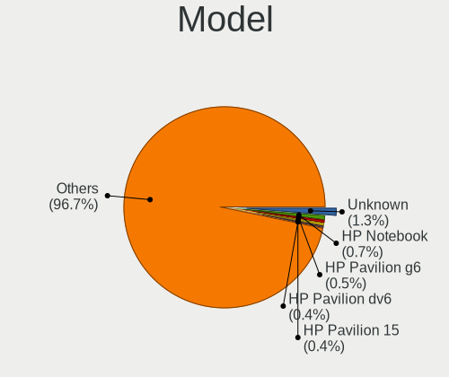
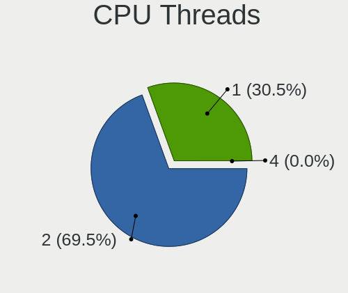
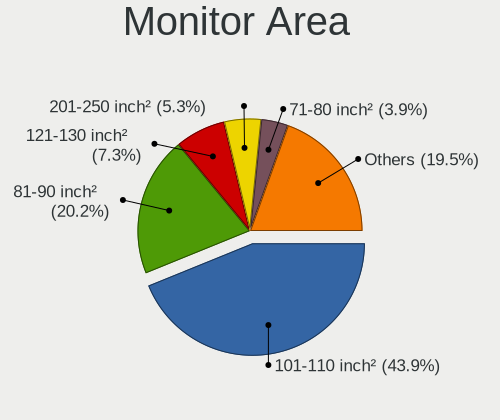
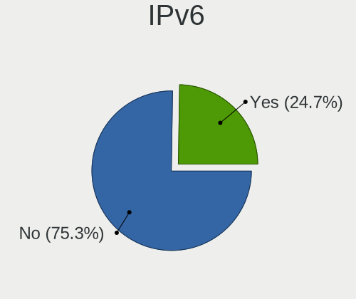

Linux Mint - Tested Hardware & Statistics (Notebooks)
-----------------------------------------------------

A project to collect tested hardware configurations for Linux Mint.

Anyone can contribute to this report by the [hw-probe](https://github.com/linuxhw/hw-probe) tool:

    sudo -E hw-probe -all -upload

Please contribute! Especially if your hardware is rare.

Contents
--------

* [ Test Cases ](#test-cases)

* [ System ](#system)
  - [ OS                       ](#os)
  - [ OS Family                ](#os-family)
  - [ Kernel                   ](#kernel)
  - [ Kernel Family            ](#kernel-family)
  - [ Kernel Major Ver.        ](#kernel-major-ver)
  - [ Arch                     ](#arch)
  - [ DE                       ](#de)
  - [ Display Server           ](#display-server)
  - [ Display Manager          ](#display-manager)
  - [ OS Lang                  ](#os-lang)
  - [ Boot Mode                ](#boot-mode)
  - [ Filesystem               ](#filesystem)
  - [ Part. scheme             ](#part-scheme)
  - [ Dual Boot with Linux/BSD ](#dual-boot-with-linuxbsd)
  - [ Dual Boot (Win)          ](#dual-boot-win)

* [ Board ](#board)
  - [ Vendor                   ](#vendor)
  - [ Model                    ](#model)
  - [ Model Family             ](#model-family)
  - [ MFG Year                 ](#mfg-year)
  - [ Form Factor              ](#form-factor)
  - [ Secure Boot              ](#secure-boot)
  - [ Coreboot                 ](#coreboot)
  - [ RAM Size                 ](#ram-size)
  - [ RAM Used                 ](#ram-used)
  - [ Total Drives             ](#total-drives)
  - [ Has CD-ROM               ](#has-cd-rom)
  - [ Has Ethernet             ](#has-ethernet)
  - [ Has WiFi                 ](#has-wifi)
  - [ Has Bluetooth            ](#has-bluetooth)

* [ Location ](#location)
  - [ Country                  ](#country)
  - [ City                     ](#city)

* [ Drives ](#drives)
  - [ Drive Vendor             ](#drive-vendor)
  - [ Drive Model              ](#drive-model)
  - [ HDD Vendor               ](#hdd-vendor)
  - [ SSD Vendor               ](#ssd-vendor)
  - [ Drive Kind               ](#drive-kind)
  - [ Drive Connector          ](#drive-connector)
  - [ Drive Size               ](#drive-size)
  - [ Space Total              ](#space-total)
  - [ Space Used               ](#space-used)
  - [ Malfunc. Drives          ](#malfunc-drives)
  - [ Malfunc. Drive Vendor    ](#malfunc-drive-vendor)
  - [ Malfunc. HDD Vendor      ](#malfunc-hdd-vendor)
  - [ Malfunc. Drive Kind      ](#malfunc-drive-kind)
  - [ Failed Drives            ](#failed-drives)
  - [ Failed Drive Vendor      ](#failed-drive-vendor)
  - [ Drive Status             ](#drive-status)

* [ Storage controller ](#storage-controller)
  - [ Storage Vendor           ](#storage-vendor)
  - [ Storage Model            ](#storage-model)
  - [ Storage Kind             ](#storage-kind)

* [ Processor ](#processor)
  - [ CPU Vendor               ](#cpu-vendor)
  - [ CPU Model                ](#cpu-model)
  - [ CPU Model Family         ](#cpu-model-family)
  - [ CPU Cores                ](#cpu-cores)
  - [ CPU Sockets              ](#cpu-sockets)
  - [ CPU Threads              ](#cpu-threads)
  - [ CPU Op-Modes             ](#cpu-op-modes)
  - [ CPU Microcode            ](#cpu-microcode)
  - [ CPU Microarch            ](#cpu-microarch)

* [ Graphics ](#graphics)
  - [ GPU Vendor               ](#gpu-vendor)
  - [ GPU Model                ](#gpu-model)
  - [ GPU Combo                ](#gpu-combo)
  - [ GPU Driver               ](#gpu-driver)
  - [ GPU Memory               ](#gpu-memory)

* [ Monitor ](#monitor)
  - [ Monitor Vendor           ](#monitor-vendor)
  - [ Monitor Model            ](#monitor-model)
  - [ Monitor Resolution       ](#monitor-resolution)
  - [ Monitor Diagonal         ](#monitor-diagonal)
  - [ Monitor Width            ](#monitor-width)
  - [ Aspect Ratio             ](#aspect-ratio)
  - [ Monitor Area             ](#monitor-area)
  - [ Pixel Density            ](#pixel-density)
  - [ Multiple Monitors        ](#multiple-monitors)

* [ Network ](#network)
  - [ Net Controller Vendor    ](#net-controller-vendor)
  - [ Net Controller Model     ](#net-controller-model)
  - [ Wireless Vendor          ](#wireless-vendor)
  - [ Wireless Model           ](#wireless-model)
  - [ Ethernet Vendor          ](#ethernet-vendor)
  - [ Ethernet Model           ](#ethernet-model)
  - [ Net Controller Kind      ](#net-controller-kind)
  - [ Used Controller          ](#used-controller)
  - [ NICs                     ](#nics)
  - [ IPv6                     ](#ipv6)

* [ Bluetooth ](#bluetooth)
  - [ Bluetooth Vendor         ](#bluetooth-vendor)
  - [ Bluetooth Model          ](#bluetooth-model)

* [ Sound ](#sound)
  - [ Sound Vendor             ](#sound-vendor)
  - [ Sound Model              ](#sound-model)

* [ Memory ](#memory)
  - [ Memory Vendor            ](#memory-vendor)
  - [ Memory Model             ](#memory-model)
  - [ Memory Kind              ](#memory-kind)
  - [ Memory Form Factor       ](#memory-form-factor)
  - [ Memory Size              ](#memory-size)
  - [ Memory Speed             ](#memory-speed)

* [ Printers & scanners ](#printers--scanners)
  - [ Printer Vendor           ](#printer-vendor)
  - [ Printer Model            ](#printer-model)
  - [ Scanner Vendor           ](#scanner-vendor)
  - [ Scanner Model            ](#scanner-model)

* [ Camera ](#camera)
  - [ Camera Vendor            ](#camera-vendor)
  - [ Camera Model             ](#camera-model)

* [ Security ](#security)
  - [ Fingerprint Vendor       ](#fingerprint-vendor)
  - [ Fingerprint Model        ](#fingerprint-model)
  - [ Chipcard Vendor          ](#chipcard-vendor)
  - [ Chipcard Model           ](#chipcard-model)

* [ Unsupported ](#unsupported)
  - [ Unsupported Devices      ](#unsupported-devices)
  - [ Unsupported Device Types ](#unsupported-device-types)

Test Cases
----------

Total: 9995

| Vendor        | Model                       | Probe                                                      | Date         |
|---------------|-----------------------------|------------------------------------------------------------|--------------|
| VIT           | M2420                       | [c2ea650175](https://linux-hardware.org/?probe=c2ea650175) | Jun 01, 2022 |
| Acer          | AOD270                      | [383c9f83c6](https://linux-hardware.org/?probe=383c9f83c6) | Jun 01, 2022 |
| Dell          | Inspiron 5521               | [4fdf9880d4](https://linux-hardware.org/?probe=4fdf9880d4) | May 31, 2022 |
| HP            | Presario C500 (RT155EA#A... | [5eb3ee9cc2](https://linux-hardware.org/?probe=5eb3ee9cc2) | May 31, 2022 |
| HP            | EliteBook 8440p             | [4df2d3c129](https://linux-hardware.org/?probe=4df2d3c129) | May 31, 2022 |
| Lenovo        | G450 2949                   | [20a00b739f](https://linux-hardware.org/?probe=20a00b739f) | May 31, 2022 |
| Lenovo        | IdeaPad S145-14IWL 81MU     | [0709fef0e8](https://linux-hardware.org/?probe=0709fef0e8) | May 31, 2022 |
| HP            | EliteBook 2570p             | [dabb678748](https://linux-hardware.org/?probe=dabb678748) | May 31, 2022 |
| Positivo      | C14CR21TV                   | [caf01d40f1](https://linux-hardware.org/?probe=caf01d40f1) | May 31, 2022 |
| Acer          | Aspire A315-55G             | [8fb35bd970](https://linux-hardware.org/?probe=8fb35bd970) | May 31, 2022 |
| Apple         | MacBookAir4,1               | [a0b4c18cd0](https://linux-hardware.org/?probe=a0b4c18cd0) | May 31, 2022 |
| Acer          | TravelMate P256-MG          | [22b617425d](https://linux-hardware.org/?probe=22b617425d) | May 31, 2022 |
| Acer          | TravelMate P256-MG          | [ab330f08f1](https://linux-hardware.org/?probe=ab330f08f1) | May 31, 2022 |
| Dell          | Vostro 3590                 | [e7f7489e9e](https://linux-hardware.org/?probe=e7f7489e9e) | May 30, 2022 |
| Lenovo        | ThinkPad T530 2394C98       | [b5aebb2490](https://linux-hardware.org/?probe=b5aebb2490) | May 30, 2022 |
| Notebook      | V15x_V17xPNKPNJPNH          | [9ded10943d](https://linux-hardware.org/?probe=9ded10943d) | May 30, 2022 |
| Dell          | Latitude 5400               | [0440362644](https://linux-hardware.org/?probe=0440362644) | May 30, 2022 |
| Dell          | Latitude 5520               | [03622600a8](https://linux-hardware.org/?probe=03622600a8) | May 30, 2022 |
| HP            | G62                         | [34f47b753d](https://linux-hardware.org/?probe=34f47b753d) | May 29, 2022 |
| Acer          | Swift SF314-54              | [cacc1a50c2](https://linux-hardware.org/?probe=cacc1a50c2) | May 29, 2022 |
| HP            | 240 G2                      | [6fc3a4bb99](https://linux-hardware.org/?probe=6fc3a4bb99) | May 29, 2022 |
| Lenovo        | G580 20150                  | [60128f5782](https://linux-hardware.org/?probe=60128f5782) | May 29, 2022 |
| Acer          | Swift SF314-54              | [eb522816a1](https://linux-hardware.org/?probe=eb522816a1) | May 29, 2022 |
| Positivo B... | VJFE51F11X-B0111H           | [68a3e8d432](https://linux-hardware.org/?probe=68a3e8d432) | May 29, 2022 |
| ASUSTek       | ASUS EXPERTBOOK P5440FA_... | [a0e5cf5b03](https://linux-hardware.org/?probe=a0e5cf5b03) | May 29, 2022 |
| Lenovo        | ThinkPad L15 Gen 2 20X30... | [03a4099a33](https://linux-hardware.org/?probe=03a4099a33) | May 28, 2022 |
| Samsung       | 535U3C                      | [e9f7102573](https://linux-hardware.org/?probe=e9f7102573) | May 28, 2022 |
| Medion        | P6630                       | [7f5b714dfc](https://linux-hardware.org/?probe=7f5b714dfc) | May 28, 2022 |
| Dell          | G3 3590                     | [59b0590542](https://linux-hardware.org/?probe=59b0590542) | May 28, 2022 |
| HP            | 250 G3                      | [bddc428262](https://linux-hardware.org/?probe=bddc428262) | May 28, 2022 |
| HP            | 250 G3                      | [911bf39209](https://linux-hardware.org/?probe=911bf39209) | May 28, 2022 |
| HP            | 255 G7 Notebook PC          | [6d1dde1e5f](https://linux-hardware.org/?probe=6d1dde1e5f) | May 28, 2022 |
| Medion        | E6220                       | [7eae842473](https://linux-hardware.org/?probe=7eae842473) | May 28, 2022 |
| Medion        | P6812                       | [b5416af5fd](https://linux-hardware.org/?probe=b5416af5fd) | May 28, 2022 |
| Framework     | Laptop                      | [03475f758c](https://linux-hardware.org/?probe=03475f758c) | May 28, 2022 |
| Medion        | X6816                       | [69e3c742fe](https://linux-hardware.org/?probe=69e3c742fe) | May 27, 2022 |
| MSI           | PR600                       | [09b736e706](https://linux-hardware.org/?probe=09b736e706) | May 27, 2022 |
| HP            | ENVY TS 15                  | [cde5dba599](https://linux-hardware.org/?probe=cde5dba599) | May 27, 2022 |
| HP            | ENVY TS 15                  | [e6ee61fdd8](https://linux-hardware.org/?probe=e6ee61fdd8) | May 27, 2022 |
| Lenovo        | V320-17IKB 81AH             | [c5d9a03264](https://linux-hardware.org/?probe=c5d9a03264) | May 27, 2022 |
| Lenovo        | IdeaPad 520-15IKB 81BF      | [37d87b9245](https://linux-hardware.org/?probe=37d87b9245) | May 27, 2022 |
| Lenovo        | ThinkPad E15 Gen 3 20YG0... | [071bc80c0b](https://linux-hardware.org/?probe=071bc80c0b) | May 27, 2022 |
| Acer          | Aspire A315-55G             | [c6088aecb4](https://linux-hardware.org/?probe=c6088aecb4) | May 27, 2022 |
| Dell          | Latitude 5480               | [6056df9c22](https://linux-hardware.org/?probe=6056df9c22) | May 27, 2022 |
| Google        | Kasumi                      | [112d887e7a](https://linux-hardware.org/?probe=112d887e7a) | May 27, 2022 |
| Google        | Kasumi                      | [9c5ae593d2](https://linux-hardware.org/?probe=9c5ae593d2) | May 27, 2022 |
| Acer          | AOD257                      | [149baf3a7b](https://linux-hardware.org/?probe=149baf3a7b) | May 26, 2022 |
| Acer          | Swift SF314-42              | [42577fc274](https://linux-hardware.org/?probe=42577fc274) | May 26, 2022 |
| Acer          | Swift SF314-42              | [08f7af683d](https://linux-hardware.org/?probe=08f7af683d) | May 26, 2022 |
| Lenovo        | ThinkPad T430 23501F9       | [4144c1bc41](https://linux-hardware.org/?probe=4144c1bc41) | May 26, 2022 |
| LG Electro... | 17Z90P-G.AA89G              | [2908c86fa6](https://linux-hardware.org/?probe=2908c86fa6) | May 26, 2022 |
| Fujitsu Si... | AMILO Xi 3650               | [1a6213307d](https://linux-hardware.org/?probe=1a6213307d) | May 26, 2022 |
| HONOR         | HLYL-WXX9                   | [57d71fca8a](https://linux-hardware.org/?probe=57d71fca8a) | May 26, 2022 |
| Samsung       | 550XDA                      | [6a497c5971](https://linux-hardware.org/?probe=6a497c5971) | May 25, 2022 |
| Alienware     | x17 R1                      | [a4cfdafe9d](https://linux-hardware.org/?probe=a4cfdafe9d) | May 25, 2022 |
| Acer          | Aspire 6930G                | [a07fb7cbcd](https://linux-hardware.org/?probe=a07fb7cbcd) | May 25, 2022 |
| Acer          | Aspire A315-56              | [8a2f221830](https://linux-hardware.org/?probe=8a2f221830) | May 25, 2022 |
| Dell          | Latitude 5420               | [fedd7d10fb](https://linux-hardware.org/?probe=fedd7d10fb) | May 25, 2022 |
| Itautec       | Infoway w7430               | [876a0fae15](https://linux-hardware.org/?probe=876a0fae15) | May 25, 2022 |
| Acer          | Aspire S3                   | [d91145e274](https://linux-hardware.org/?probe=d91145e274) | May 25, 2022 |
| MSI           | GP70 2PE                    | [8c01d681b1](https://linux-hardware.org/?probe=8c01d681b1) | May 25, 2022 |
| Dell          | Studio 1555                 | [2b61592333](https://linux-hardware.org/?probe=2b61592333) | May 25, 2022 |
| Lenovo        | G400 20235                  | [351b94ec15](https://linux-hardware.org/?probe=351b94ec15) | May 25, 2022 |
| Lenovo        | ThinkPad T470 W10DG 20JM... | [284a30af50](https://linux-hardware.org/?probe=284a30af50) | May 25, 2022 |
| Acer          | Aspire S3-391               | [d7289b7bd6](https://linux-hardware.org/?probe=d7289b7bd6) | May 25, 2022 |
| Dell          | Inspiron 15-7568            | [7e52decd6c](https://linux-hardware.org/?probe=7e52decd6c) | May 25, 2022 |
| Lenovo        | IdeaPad 5 Pro 16ACH6 82L... | [2d28231751](https://linux-hardware.org/?probe=2d28231751) | May 25, 2022 |
| Dell          | Latitude E7450              | [3f8f8b3b23](https://linux-hardware.org/?probe=3f8f8b3b23) | May 25, 2022 |
| Wortmann      | TERRA_MOBILE_1450           | [8606815d58](https://linux-hardware.org/?probe=8606815d58) | May 24, 2022 |
| HP            | Pavilion TS 14 Sleekbook    | [18a9e78640](https://linux-hardware.org/?probe=18a9e78640) | May 24, 2022 |
| ASUSTek       | 1001PXD                     | [8c3e0451e1](https://linux-hardware.org/?probe=8c3e0451e1) | May 24, 2022 |
| Lenovo        | ThinkPad E14 20RAS0KX00     | [9df127ec26](https://linux-hardware.org/?probe=9df127ec26) | May 24, 2022 |
| ASUSTek       | VivoBook 15_ASUS Laptop ... | [4f941ba9fe](https://linux-hardware.org/?probe=4f941ba9fe) | May 24, 2022 |
| HP            | 250 G6 Notebook PC          | [e9ef612051](https://linux-hardware.org/?probe=e9ef612051) | May 23, 2022 |
| Dell          | XPS 13 9360                 | [d49650c67c](https://linux-hardware.org/?probe=d49650c67c) | May 23, 2022 |
| Dell          | Inspiron 3502               | [b934f2b201](https://linux-hardware.org/?probe=b934f2b201) | May 23, 2022 |
| BOX           | W54_W94_W955TU,-T,-C        | [a36f54939d](https://linux-hardware.org/?probe=a36f54939d) | May 23, 2022 |
| Lenovo        | ThinkPad T440p 20AWS17N0... | [0a9f7ecc76](https://linux-hardware.org/?probe=0a9f7ecc76) | May 23, 2022 |
| Lenovo        | IdeaPad S145-14IWL 81MU     | [add4882c79](https://linux-hardware.org/?probe=add4882c79) | May 23, 2022 |
| LG Electro... | 17Z90P-G.AA89G              | [62c8debd61](https://linux-hardware.org/?probe=62c8debd61) | May 23, 2022 |
| Sony          | SVE14113ELW                 | [647c09a7be](https://linux-hardware.org/?probe=647c09a7be) | May 23, 2022 |
| ASUSTek       | VivoBook_ASUSLaptop X509... | [68b7552bfa](https://linux-hardware.org/?probe=68b7552bfa) | May 23, 2022 |
| Acer          | Aspire A115-32              | [c850b0c266](https://linux-hardware.org/?probe=c850b0c266) | May 23, 2022 |
| Toshiba       | TECRA R850                  | [aa0bfd6c6a](https://linux-hardware.org/?probe=aa0bfd6c6a) | May 22, 2022 |
| Lenovo        | IdeaPad S206 2638           | [2cc2003078](https://linux-hardware.org/?probe=2cc2003078) | May 22, 2022 |
| Acer          | TravelMate P2510-G2-MG      | [d736bb9da8](https://linux-hardware.org/?probe=d736bb9da8) | May 22, 2022 |
| Lenovo        | B490 37722FP                | [ec2c933c63](https://linux-hardware.org/?probe=ec2c933c63) | May 22, 2022 |
| Toshiba       | Satellite Radius P55W-B     | [5b9c197c67](https://linux-hardware.org/?probe=5b9c197c67) | May 22, 2022 |
| Samsung       | RF510/RF410/RF710           | [c146b79bd6](https://linux-hardware.org/?probe=c146b79bd6) | May 22, 2022 |
| HP            | EliteBook 8470p             | [ba9a4dd332](https://linux-hardware.org/?probe=ba9a4dd332) | May 22, 2022 |
| Lenovo        | IdeaPad 5 Pro 14ITL6 82L... | [aaf4857517](https://linux-hardware.org/?probe=aaf4857517) | May 21, 2022 |
| Samsung       | 550XDA                      | [37cd026470](https://linux-hardware.org/?probe=37cd026470) | May 21, 2022 |
| Samsung       | 550XDA                      | [dc90dc647b](https://linux-hardware.org/?probe=dc90dc647b) | May 21, 2022 |
| Google        | Kasumi                      | [6e04238da2](https://linux-hardware.org/?probe=6e04238da2) | May 21, 2022 |
| Acer          | Aspire E5-573               | [e31114a6b2](https://linux-hardware.org/?probe=e31114a6b2) | May 21, 2022 |
| HP            | Notebook                    | [7e7b774d40](https://linux-hardware.org/?probe=7e7b774d40) | May 21, 2022 |
| Dell          | Inspiron 15-3567            | [327da044de](https://linux-hardware.org/?probe=327da044de) | May 20, 2022 |
| Dell          | Inspiron 5452               | [16cb0f8cab](https://linux-hardware.org/?probe=16cb0f8cab) | May 20, 2022 |
| Acer          | V3-771                      | [8bcab66496](https://linux-hardware.org/?probe=8bcab66496) | May 20, 2022 |
| Acer          | Aspire A315-56              | [7ee53cbe1b](https://linux-hardware.org/?probe=7ee53cbe1b) | May 20, 2022 |
| Acer          | Extensa 2509                | [46df59d8b3](https://linux-hardware.org/?probe=46df59d8b3) | May 19, 2022 |
| Lenovo        | ThinkPad X230 23255Z6       | [a3bc898bef](https://linux-hardware.org/?probe=a3bc898bef) | May 19, 2022 |
| ASUSTek       | P50IJ                       | [5458cbfe9b](https://linux-hardware.org/?probe=5458cbfe9b) | May 19, 2022 |
| Lenovo        | IdeaPad S145-15IGM 81WT     | [08052ba55e](https://linux-hardware.org/?probe=08052ba55e) | May 19, 2022 |
| Dell          | Precision M4500             | [8f3b6f7e89](https://linux-hardware.org/?probe=8f3b6f7e89) | May 19, 2022 |
| Packard Be... | DOT S                       | [2ccdc340c9](https://linux-hardware.org/?probe=2ccdc340c9) | May 19, 2022 |
| ASUSTek       | K73BR                       | [9344159530](https://linux-hardware.org/?probe=9344159530) | May 19, 2022 |
| Dell          | Inspiron 5755               | [f0e2daf83f](https://linux-hardware.org/?probe=f0e2daf83f) | May 18, 2022 |
| MSI           | PS63 Modern 8M              | [1c7a25463d](https://linux-hardware.org/?probe=1c7a25463d) | May 18, 2022 |
| Lenovo        | ThinkPad L540 20AUA06000    | [6406f26e69](https://linux-hardware.org/?probe=6406f26e69) | May 18, 2022 |
| Lenovo        | G505 20240                  | [6c4aff8f5f](https://linux-hardware.org/?probe=6c4aff8f5f) | May 18, 2022 |
| ASUSTek       | VivoBook_ASUSLaptop X530... | [020f190608](https://linux-hardware.org/?probe=020f190608) | May 18, 2022 |
| Acer          | Aspire A315-21              | [8f9f8c2634](https://linux-hardware.org/?probe=8f9f8c2634) | May 18, 2022 |
| MSI           | GS63 Stealth 8RE            | [fead5c194e](https://linux-hardware.org/?probe=fead5c194e) | May 18, 2022 |
| MSI           | GS63 Stealth 8RE            | [da579f24ed](https://linux-hardware.org/?probe=da579f24ed) | May 18, 2022 |
| HP            | Pavilion Notebook           | [2e663e698c](https://linux-hardware.org/?probe=2e663e698c) | May 18, 2022 |
| HP            | Laptop 17-cn0xxx            | [39bb2b41e5](https://linux-hardware.org/?probe=39bb2b41e5) | May 18, 2022 |
| Acer          | Aspire 3100                 | [47e42883f4](https://linux-hardware.org/?probe=47e42883f4) | May 18, 2022 |
| Acer          | Extensa 5230                | [c3bc919821](https://linux-hardware.org/?probe=c3bc919821) | May 18, 2022 |
| Dell          | Inspiron 3442               | [5c9ce47f76](https://linux-hardware.org/?probe=5c9ce47f76) | May 17, 2022 |
| Lenovo        | G580 20150                  | [ec5867b2f7](https://linux-hardware.org/?probe=ec5867b2f7) | May 17, 2022 |
| Lenovo        | G580 20150                  | [9b06242456](https://linux-hardware.org/?probe=9b06242456) | May 17, 2022 |
| ASUSTek       | X55U                        | [29fe54133b](https://linux-hardware.org/?probe=29fe54133b) | May 17, 2022 |
| Dell          | System Vostro 3450          | [b2a981160c](https://linux-hardware.org/?probe=b2a981160c) | May 16, 2022 |
| Dell          | System Vostro 3450          | [e311d7c4c2](https://linux-hardware.org/?probe=e311d7c4c2) | May 16, 2022 |
| GPU Compan... | GWTC116-2                   | [e0c17d6d85](https://linux-hardware.org/?probe=e0c17d6d85) | May 16, 2022 |
| Acer          | Aspire 5810T                | [1cf713e3df](https://linux-hardware.org/?probe=1cf713e3df) | May 16, 2022 |
| HP            | Pavilion g6                 | [a81310b255](https://linux-hardware.org/?probe=a81310b255) | May 16, 2022 |
| Lenovo        | ThinkPad W520 4270CTO       | [bc304649a7](https://linux-hardware.org/?probe=bc304649a7) | May 16, 2022 |
| HP            | EliteBook 840 G1            | [8cf3f8fd7c](https://linux-hardware.org/?probe=8cf3f8fd7c) | May 16, 2022 |
| Dell          | Latitude 7480               | [72c4d9450d](https://linux-hardware.org/?probe=72c4d9450d) | May 16, 2022 |
| HP            | EliteBook 2560p             | [04c60d52d9](https://linux-hardware.org/?probe=04c60d52d9) | May 16, 2022 |
| Notebook      | N8xEJEK                     | [e214afb251](https://linux-hardware.org/?probe=e214afb251) | May 16, 2022 |
| HP            | ProBook 6550b               | [30fe7aecd2](https://linux-hardware.org/?probe=30fe7aecd2) | May 16, 2022 |
| Apple         | MacBookAir4,1               | [c4773713e6](https://linux-hardware.org/?probe=c4773713e6) | May 16, 2022 |
| Apple         | MacBookAir4,1               | [928416ecd0](https://linux-hardware.org/?probe=928416ecd0) | May 16, 2022 |
| Packard Be... | EasyNote LE69KB             | [71c0982b04](https://linux-hardware.org/?probe=71c0982b04) | May 15, 2022 |
| Acer          | Aspire 7560G                | [ad0230c428](https://linux-hardware.org/?probe=ad0230c428) | May 15, 2022 |
| Clevo         | M540SS                      | [9860619027](https://linux-hardware.org/?probe=9860619027) | May 15, 2022 |
| Clevo         | M540SS                      | [e2fa8573fb](https://linux-hardware.org/?probe=e2fa8573fb) | May 15, 2022 |
| Dell          | Inspiron 3583               | [3589bb82ad](https://linux-hardware.org/?probe=3589bb82ad) | May 15, 2022 |
| Lenovo        | ThinkPad T450s 20BWS4X50... | [0fb588c686](https://linux-hardware.org/?probe=0fb588c686) | May 15, 2022 |
| Dell          | Inspiron N5110              | [2555fd899e](https://linux-hardware.org/?probe=2555fd899e) | May 15, 2022 |
| Google        | Candy                       | [5d6a19a743](https://linux-hardware.org/?probe=5d6a19a743) | May 15, 2022 |
| Irbis         | NB144                       | [abb6000f0b](https://linux-hardware.org/?probe=abb6000f0b) | May 14, 2022 |
| Lenovo        | ThinkPad L420 7829AA4       | [9c1bbe8cf2](https://linux-hardware.org/?probe=9c1bbe8cf2) | May 14, 2022 |
| AXDIA Inte... | MYBOOK 14                   | [8b3a5eff38](https://linux-hardware.org/?probe=8b3a5eff38) | May 14, 2022 |
| Lenovo        | G500 20236                  | [5f97d51402](https://linux-hardware.org/?probe=5f97d51402) | May 14, 2022 |
| AXDIA Inte... | MYBOOK 14                   | [cd683452e0](https://linux-hardware.org/?probe=cd683452e0) | May 14, 2022 |
| HP            | ProBook 645 G1              | [771f25ecc9](https://linux-hardware.org/?probe=771f25ecc9) | May 14, 2022 |
| Google        | Careena                     | [ac42795ee1](https://linux-hardware.org/?probe=ac42795ee1) | May 14, 2022 |
| ASUSTek       | VivoBook_ASUSLaptop X515... | [60d56e6b15](https://linux-hardware.org/?probe=60d56e6b15) | May 13, 2022 |
| Sony          | VGN-SZ430N                  | [7cb5638ef4](https://linux-hardware.org/?probe=7cb5638ef4) | May 13, 2022 |
| Dell          | XPS 15 9520                 | [dc49445fa0](https://linux-hardware.org/?probe=dc49445fa0) | May 13, 2022 |
| Lenovo        | G500s Touch 20263           | [b4eee1a9d3](https://linux-hardware.org/?probe=b4eee1a9d3) | May 13, 2022 |
| Lenovo        | ThinkPad X61 7673AQ5        | [42a17c86f4](https://linux-hardware.org/?probe=42a17c86f4) | May 13, 2022 |
| Dell          | G3 3779                     | [75a0c428dd](https://linux-hardware.org/?probe=75a0c428dd) | May 13, 2022 |
| HP            | Laptop 15-db1xxx            | [f6262ce7f2](https://linux-hardware.org/?probe=f6262ce7f2) | May 12, 2022 |
| Lenovo        | G500s Touch 20263           | [ec66549e3a](https://linux-hardware.org/?probe=ec66549e3a) | May 12, 2022 |
| Acer          | Aspire 5737Z                | [47aec48396](https://linux-hardware.org/?probe=47aec48396) | May 12, 2022 |
| HP            | ProBook 4330s               | [52494be83b](https://linux-hardware.org/?probe=52494be83b) | May 12, 2022 |
| Samsung       | 340XAA/350XAA/550XAA        | [c5f3dd19f8](https://linux-hardware.org/?probe=c5f3dd19f8) | May 12, 2022 |
| Samsung       | 550XDA                      | [c65f7949af](https://linux-hardware.org/?probe=c65f7949af) | May 12, 2022 |
| Samsung       | RF510/RF410/RF710           | [8134289438](https://linux-hardware.org/?probe=8134289438) | May 12, 2022 |
| Acer          | Aspire E5-476G              | [98b0999339](https://linux-hardware.org/?probe=98b0999339) | May 12, 2022 |
| Acer          | Aspire E5-476G              | [c4e0e740bb](https://linux-hardware.org/?probe=c4e0e740bb) | May 12, 2022 |
| Dell          | Inspiron N4050              | [6f91dbbb6b](https://linux-hardware.org/?probe=6f91dbbb6b) | May 12, 2022 |
| HP            | EliteBook 8470p             | [0773b6244e](https://linux-hardware.org/?probe=0773b6244e) | May 11, 2022 |
| Dell          | Inspiron 3583               | [5b2b56f445](https://linux-hardware.org/?probe=5b2b56f445) | May 11, 2022 |
| GPU Compan... | GWTC116-2                   | [365b5a7ab2](https://linux-hardware.org/?probe=365b5a7ab2) | May 11, 2022 |
| Dell          | Inspiron 3543               | [3a940a3394](https://linux-hardware.org/?probe=3a940a3394) | May 11, 2022 |
| Lenovo        | V15-IIL 82C5                | [b02040672d](https://linux-hardware.org/?probe=b02040672d) | May 11, 2022 |
| Dell          | Vostro 3560                 | [81285b26f8](https://linux-hardware.org/?probe=81285b26f8) | May 11, 2022 |
| Acer          | Aspire 5742G                | [f720d9e031](https://linux-hardware.org/?probe=f720d9e031) | May 11, 2022 |
| Lenovo        | ZHAOYANG K4e-ITL 82F8       | [b0db2e2b60](https://linux-hardware.org/?probe=b0db2e2b60) | May 11, 2022 |
| Lenovo        | ZHAOYANG K4e-ITL 82F8       | [f62715aee5](https://linux-hardware.org/?probe=f62715aee5) | May 11, 2022 |
| Acer          | Aspire 6930                 | [18c49ee073](https://linux-hardware.org/?probe=18c49ee073) | May 11, 2022 |
| Chuwi         | HeroBook Air                | [7a535f9f30](https://linux-hardware.org/?probe=7a535f9f30) | May 11, 2022 |
| Acer          | Nitro AN515-54              | [db343a530d](https://linux-hardware.org/?probe=db343a530d) | May 11, 2022 |
| HP            | Pavilion Laptop 14-ec0xx... | [1745c245c9](https://linux-hardware.org/?probe=1745c245c9) | May 10, 2022 |
| Dell          | Latitude E6540              | [c56dd08285](https://linux-hardware.org/?probe=c56dd08285) | May 10, 2022 |
| Lenovo        | G500 20236                  | [844405420f](https://linux-hardware.org/?probe=844405420f) | May 10, 2022 |
| Dell          | Latitude 5414               | [dcc032e592](https://linux-hardware.org/?probe=dcc032e592) | May 10, 2022 |
| Lenovo        | G500 20236                  | [84c21454ef](https://linux-hardware.org/?probe=84c21454ef) | May 10, 2022 |
| Lenovo        | IdeaPad Z400 Touch VIWZ1    | [d15f71eff4](https://linux-hardware.org/?probe=d15f71eff4) | May 10, 2022 |
| HP            | EliteBook 2560p             | [debc8c7d47](https://linux-hardware.org/?probe=debc8c7d47) | May 10, 2022 |
| Acer          | Aspire E5-551               | [bef0e3659e](https://linux-hardware.org/?probe=bef0e3659e) | May 10, 2022 |
| HP            | ProBook 4540s               | [6a2ef09e6e](https://linux-hardware.org/?probe=6a2ef09e6e) | May 10, 2022 |
| Unknown       | Unknown                     | [0099d17388](https://linux-hardware.org/?probe=0099d17388) | May 10, 2022 |
| Lenovo        | Flex 2-14 20404             | [92ea1dc23f](https://linux-hardware.org/?probe=92ea1dc23f) | May 10, 2022 |
| Apple         | MacBookPro9,2               | [4be09b4aae](https://linux-hardware.org/?probe=4be09b4aae) | May 10, 2022 |
| Acer          | Aspire 6930                 | [ed0189e5ec](https://linux-hardware.org/?probe=ed0189e5ec) | May 10, 2022 |
| Acer          | Aspire 6930                 | [5a43e79289](https://linux-hardware.org/?probe=5a43e79289) | May 09, 2022 |
| Samsung       | 350V5C/351V5C/3540VC/344... | [9e81b04453](https://linux-hardware.org/?probe=9e81b04453) | May 09, 2022 |
| DTRI          | DT592BU                     | [dcfbac9737](https://linux-hardware.org/?probe=dcfbac9737) | May 09, 2022 |
| HP            | G62                         | [51ef1487fb](https://linux-hardware.org/?probe=51ef1487fb) | May 09, 2022 |
| HP            | G62                         | [e6f78066c8](https://linux-hardware.org/?probe=e6f78066c8) | May 09, 2022 |
| Dell          | Latitude E7240              | [993f764137](https://linux-hardware.org/?probe=993f764137) | May 08, 2022 |
| Dell          | Latitude E7240              | [f0ad64884c](https://linux-hardware.org/?probe=f0ad64884c) | May 08, 2022 |
| MSI           | Summit E16Flip A12UCT       | [f36a82b0fb](https://linux-hardware.org/?probe=f36a82b0fb) | May 08, 2022 |
| MSI           | Summit E16Flip A12UCT       | [70da3bb599](https://linux-hardware.org/?probe=70da3bb599) | May 08, 2022 |
| Lenovo        | IdeaPad S340-14IWL 81N7     | [98439b17f3](https://linux-hardware.org/?probe=98439b17f3) | May 08, 2022 |
| ASUSTek       | K93SM                       | [c756deba7d](https://linux-hardware.org/?probe=c756deba7d) | May 08, 2022 |
| Lenovo        | G510 20238                  | [8a5f88eca1](https://linux-hardware.org/?probe=8a5f88eca1) | May 08, 2022 |
| Lenovo        | ThinkPad X220 4291WSH       | [8080b9becd](https://linux-hardware.org/?probe=8080b9becd) | May 08, 2022 |
| HP            | Compaq Presario CQ60        | [9d27bd494e](https://linux-hardware.org/?probe=9d27bd494e) | May 08, 2022 |
| Alienware     | Area-51m R2                 | [73f52aff10](https://linux-hardware.org/?probe=73f52aff10) | May 08, 2022 |
| Lenovo        | IdeaPad S145-15IIL 81W8     | [dd31ac3d4d](https://linux-hardware.org/?probe=dd31ac3d4d) | May 08, 2022 |
| Medion        | E15303                      | [2373b66a69](https://linux-hardware.org/?probe=2373b66a69) | May 07, 2022 |
| Medion        | E15303                      | [ce48fe222c](https://linux-hardware.org/?probe=ce48fe222c) | May 07, 2022 |
| Lenovo        | IdeaPad Y910-17ISK 80V1     | [24fd8458cf](https://linux-hardware.org/?probe=24fd8458cf) | May 07, 2022 |
| HP            | ZBook 15 G5                 | [4a3960f047](https://linux-hardware.org/?probe=4a3960f047) | May 07, 2022 |
| ASUSTek       | VivoBook_ASUSLaptop X515... | [bd6e42ac60](https://linux-hardware.org/?probe=bd6e42ac60) | May 07, 2022 |
| HP            | Pavilion 11 x360 PC         | [a1271c4465](https://linux-hardware.org/?probe=a1271c4465) | May 07, 2022 |
| Acer          | Aspire 5810T                | [8d9b944789](https://linux-hardware.org/?probe=8d9b944789) | May 07, 2022 |
| Lenovo        | ThinkPad T440p 20AN00DEU... | [b13325e763](https://linux-hardware.org/?probe=b13325e763) | May 06, 2022 |
| HP            | Laptop 17-by4xxx            | [f9fa385bcf](https://linux-hardware.org/?probe=f9fa385bcf) | May 06, 2022 |
| HP            | Laptop 14-bw0xx             | [018dd03bdb](https://linux-hardware.org/?probe=018dd03bdb) | May 06, 2022 |
| Apple         | MacBookPro8,2               | [87e8930fcf](https://linux-hardware.org/?probe=87e8930fcf) | May 06, 2022 |
| HUAWEI        | BOM-WXX9                    | [35746e52a6](https://linux-hardware.org/?probe=35746e52a6) | May 05, 2022 |
| Lenovo        | IdeaPad S340-15API 81NC     | [be10abdbfc](https://linux-hardware.org/?probe=be10abdbfc) | May 05, 2022 |
| Lenovo        | IdeaPad 3 15ALC6 82KU       | [3d07e8a45e](https://linux-hardware.org/?probe=3d07e8a45e) | May 05, 2022 |
| Dell          | Latitude E5430 non-vPro     | [2075bfcc02](https://linux-hardware.org/?probe=2075bfcc02) | May 05, 2022 |
| Dell          | Latitude E5430 non-vPro     | [71f8f45765](https://linux-hardware.org/?probe=71f8f45765) | May 05, 2022 |
| HP            | ProBook 450 G5              | [cfa52783d2](https://linux-hardware.org/?probe=cfa52783d2) | May 05, 2022 |
| Acer          | Aspire A315-41G             | [af3af97b7d](https://linux-hardware.org/?probe=af3af97b7d) | May 05, 2022 |
| Dell          | Studio 1555                 | [c02949a388](https://linux-hardware.org/?probe=c02949a388) | May 05, 2022 |
| Apple         | MacBookPro5,1               | [d6293e8334](https://linux-hardware.org/?probe=d6293e8334) | May 05, 2022 |
| Dell          | Latitude 3420               | [9cb2524716](https://linux-hardware.org/?probe=9cb2524716) | May 04, 2022 |
| ASUSTek       | K93SM                       | [e59c89868b](https://linux-hardware.org/?probe=e59c89868b) | May 04, 2022 |
| Notebook      | PD5x_7xPNP_PNN_PNT          | [0afdbf373d](https://linux-hardware.org/?probe=0afdbf373d) | May 04, 2022 |
| Notebook      | PD5x_7xPNP_PNN_PNT          | [a30b11f1a0](https://linux-hardware.org/?probe=a30b11f1a0) | May 04, 2022 |
| Acer          | Aspire A315-34              | [3ed5a6d961](https://linux-hardware.org/?probe=3ed5a6d961) | May 04, 2022 |
| MSI           | Prestige 15 A12UC           | [2b86e2ca60](https://linux-hardware.org/?probe=2b86e2ca60) | May 04, 2022 |
| Lenovo        | V310-15ISK 80SY             | [1a791b0fd5](https://linux-hardware.org/?probe=1a791b0fd5) | May 04, 2022 |
| Lenovo        | V310-15ISK 80SY             | [3846d07c7f](https://linux-hardware.org/?probe=3846d07c7f) | May 04, 2022 |
| HP            | ProBook 640 G2              | [50ccff3e1a](https://linux-hardware.org/?probe=50ccff3e1a) | May 04, 2022 |
| MSI           | CR70 2M/CX70 2OC/CX70 2O... | [c72447a3ea](https://linux-hardware.org/?probe=c72447a3ea) | May 03, 2022 |
| Lenovo        | ThinkPad X230 2325H50       | [5bd84d8490](https://linux-hardware.org/?probe=5bd84d8490) | May 03, 2022 |
| Lenovo        | G50-70 20351                | [95a85a5620](https://linux-hardware.org/?probe=95a85a5620) | May 03, 2022 |
| Lenovo        | ThinkPad E15 Gen 2 20T80... | [f9db97e5d3](https://linux-hardware.org/?probe=f9db97e5d3) | May 03, 2022 |
| HP            | Pavilion Laptop 14-bf0xx    | [4dcc86a60e](https://linux-hardware.org/?probe=4dcc86a60e) | May 03, 2022 |
| HP            | Compaq 15                   | [201778c9ef](https://linux-hardware.org/?probe=201778c9ef) | May 03, 2022 |
| Lenovo        | ThinkPad X131e 336838U      | [543ee221b3](https://linux-hardware.org/?probe=543ee221b3) | May 03, 2022 |
| Lenovo        | IdeaPad 100S-14IBR 80R9     | [d8b5fec9fe](https://linux-hardware.org/?probe=d8b5fec9fe) | May 03, 2022 |
| Lenovo        | IdeaPad Slim 7 14ITL05 8... | [3eaa8fece6](https://linux-hardware.org/?probe=3eaa8fece6) | May 03, 2022 |
| Acer          | Aspire 5742G                | [37dfe53a95](https://linux-hardware.org/?probe=37dfe53a95) | May 02, 2022 |
| Acer          | Aspire 5742G                | [aff42aff28](https://linux-hardware.org/?probe=aff42aff28) | May 02, 2022 |
| Lenovo        | ThinkPad X240 20AL00FGMB    | [afba42bf24](https://linux-hardware.org/?probe=afba42bf24) | May 02, 2022 |
| Lenovo        | ThinkPad T420 4177Q5U       | [b4c3ba0e32](https://linux-hardware.org/?probe=b4c3ba0e32) | May 02, 2022 |
| Lenovo        | ThinkPad T420 4177Q5U       | [81a02f0bb6](https://linux-hardware.org/?probe=81a02f0bb6) | May 02, 2022 |
| ASUSTek       | X705UAP                     | [5703c517d1](https://linux-hardware.org/?probe=5703c517d1) | May 02, 2022 |
| HP            | EliteBook 8470p             | [990f36a507](https://linux-hardware.org/?probe=990f36a507) | May 02, 2022 |
| Acer          | Aspire E1-532               | [88080c45b1](https://linux-hardware.org/?probe=88080c45b1) | May 02, 2022 |
| ASUSTek       | X580VD                      | [920fb8f8d8](https://linux-hardware.org/?probe=920fb8f8d8) | May 01, 2022 |
| HP            | Notebook                    | [3bdd2a5e96](https://linux-hardware.org/?probe=3bdd2a5e96) | May 01, 2022 |
| Fujitsu Si... | AMILO Xi 3650               | [f28a16f8de](https://linux-hardware.org/?probe=f28a16f8de) | May 01, 2022 |
| Lenovo        | IdeaPad 3 15ALC6 82KU       | [7206b41211](https://linux-hardware.org/?probe=7206b41211) | May 01, 2022 |
| Dell          | Inspiron 7559               | [37b324ecf9](https://linux-hardware.org/?probe=37b324ecf9) | May 01, 2022 |
| HP            | ProBook 640 G8 Notebook ... | [dc1b877e42](https://linux-hardware.org/?probe=dc1b877e42) | May 01, 2022 |
| Dell          | Precision M2800             | [deffc81ac5](https://linux-hardware.org/?probe=deffc81ac5) | Apr 30, 2022 |
| Lenovo        | G510 20238                  | [07e8a61019](https://linux-hardware.org/?probe=07e8a61019) | Apr 30, 2022 |
| ASUSTek       | UX31A                       | [59228e735e](https://linux-hardware.org/?probe=59228e735e) | Apr 30, 2022 |
| Dell          | Inspiron N4050              | [6d8f615203](https://linux-hardware.org/?probe=6d8f615203) | Apr 30, 2022 |
| Lenovo        | IdeaPad Z510 20287          | [058184d73c](https://linux-hardware.org/?probe=058184d73c) | Apr 30, 2022 |
| Acer          | Aspire E5-774G              | [32426089be](https://linux-hardware.org/?probe=32426089be) | Apr 30, 2022 |
| HP            | Pavilion dv7                | [f66df9ca5b](https://linux-hardware.org/?probe=f66df9ca5b) | Apr 30, 2022 |
| HP            | Pavilion dv7                | [150931746e](https://linux-hardware.org/?probe=150931746e) | Apr 30, 2022 |
| MSI           | PS63 Modern 8M              | [06f3f7a100](https://linux-hardware.org/?probe=06f3f7a100) | Apr 30, 2022 |
| Dell          | Latitude 7390               | [bbf3908118](https://linux-hardware.org/?probe=bbf3908118) | Apr 30, 2022 |
| ASUSTek       | UX303LAB                    | [4d47234d72](https://linux-hardware.org/?probe=4d47234d72) | Apr 30, 2022 |
| Timi          | TM1701                      | [f81bb7efbe](https://linux-hardware.org/?probe=f81bb7efbe) | Apr 30, 2022 |
| Lenovo        | IdeaPad S145-15IWL 81MV     | [05db30a69b](https://linux-hardware.org/?probe=05db30a69b) | Apr 30, 2022 |
| Dell          | Latitude 5490               | [9445f416cb](https://linux-hardware.org/?probe=9445f416cb) | Apr 30, 2022 |
| Lenovo        | Legion 7 16ACHg6 82N6       | [bad5b7036e](https://linux-hardware.org/?probe=bad5b7036e) | Apr 29, 2022 |
| Dell          | Latitude 5520               | [d35917a603](https://linux-hardware.org/?probe=d35917a603) | Apr 29, 2022 |
| Dell          | Latitude 5520               | [9851c7847d](https://linux-hardware.org/?probe=9851c7847d) | Apr 29, 2022 |
| Toshiba       | Satellite C650              | [58539bbf0a](https://linux-hardware.org/?probe=58539bbf0a) | Apr 29, 2022 |
| MSI           | CR70 2M/CX70 2OC/CX70 2O... | [454226474b](https://linux-hardware.org/?probe=454226474b) | Apr 29, 2022 |
| HP            | ProBook 645 G4              | [0a4b56ae27](https://linux-hardware.org/?probe=0a4b56ae27) | Apr 29, 2022 |
| Lenovo        | ThinkPad E15 Gen 2 20T80... | [637af2dcc6](https://linux-hardware.org/?probe=637af2dcc6) | Apr 29, 2022 |
| Apple         | MacBookPro8,2               | [50c8a02c35](https://linux-hardware.org/?probe=50c8a02c35) | Apr 29, 2022 |
| Lenovo        | ThinkPad T420 4180PC4       | [6c69039594](https://linux-hardware.org/?probe=6c69039594) | Apr 28, 2022 |
| Dell          | Inspiron 5570               | [8105c6bf09](https://linux-hardware.org/?probe=8105c6bf09) | Apr 28, 2022 |
| HP            | ProBook 645 G4              | [1546b59830](https://linux-hardware.org/?probe=1546b59830) | Apr 28, 2022 |
| HP            | Pavilion Laptop 15-cs3xx... | [ac2800ef82](https://linux-hardware.org/?probe=ac2800ef82) | Apr 28, 2022 |
| Acer          | Swift SF314-57              | [d48d0527ee](https://linux-hardware.org/?probe=d48d0527ee) | Apr 28, 2022 |
| Lenovo        | G50-45 80E3                 | [910267bbd5](https://linux-hardware.org/?probe=910267bbd5) | Apr 28, 2022 |
| Lenovo        | G50-45 80E3                 | [22dd67107b](https://linux-hardware.org/?probe=22dd67107b) | Apr 28, 2022 |
| Notebook      | W65_67SZ                    | [11d3972448](https://linux-hardware.org/?probe=11d3972448) | Apr 28, 2022 |
| Lenovo        | V14 G2 ITL Ua 82KA          | [f191c49754](https://linux-hardware.org/?probe=f191c49754) | Apr 28, 2022 |
| Unknown       | Unknown                     | [a55db1f065](https://linux-hardware.org/?probe=a55db1f065) | Apr 28, 2022 |
| Sony          | VPCEH3F1R                   | [2d78f4b2b5](https://linux-hardware.org/?probe=2d78f4b2b5) | Apr 28, 2022 |
| Lenovo        | Legion 5 15ACH6 82JW        | [e962d2016e](https://linux-hardware.org/?probe=e962d2016e) | Apr 28, 2022 |
| Dell          | Inspiron 3583               | [740919a383](https://linux-hardware.org/?probe=740919a383) | Apr 28, 2022 |
| Packard Be... | DOT S                       | [d0231bab8b](https://linux-hardware.org/?probe=d0231bab8b) | Apr 28, 2022 |
| Unknown       | Unknown                     | [5e2ffd2f9a](https://linux-hardware.org/?probe=5e2ffd2f9a) | Apr 28, 2022 |
| Dell          | Inspiron 3543               | [7fb19b7da4](https://linux-hardware.org/?probe=7fb19b7da4) | Apr 27, 2022 |
| HP            | EliteBook 840 G2            | [8c0c59e517](https://linux-hardware.org/?probe=8c0c59e517) | Apr 27, 2022 |
| Lenovo        | ThinkPad R61 7735WRF        | [81c8577ab7](https://linux-hardware.org/?probe=81c8577ab7) | Apr 27, 2022 |
| Alienware     | M18xR2                      | [3853b17e46](https://linux-hardware.org/?probe=3853b17e46) | Apr 27, 2022 |
| Lenovo        | ThinkPad T470 W10DG 20JM... | [81aed15a37](https://linux-hardware.org/?probe=81aed15a37) | Apr 27, 2022 |
| Lenovo        | ThinkPad X220 4291WSH       | [21fcbc1850](https://linux-hardware.org/?probe=21fcbc1850) | Apr 27, 2022 |
| Toshiba       | Satellite L735D             | [4bd23809e6](https://linux-hardware.org/?probe=4bd23809e6) | Apr 27, 2022 |
| ASUSTek       | X705UA                      | [8c12b4587e](https://linux-hardware.org/?probe=8c12b4587e) | Apr 26, 2022 |
| Samsung       | 755XDA                      | [eea7e3a0d3](https://linux-hardware.org/?probe=eea7e3a0d3) | Apr 26, 2022 |
| Lenovo        | AILZx                       | [efa15d667f](https://linux-hardware.org/?probe=efa15d667f) | Apr 26, 2022 |
| HP            | Laptop 14-cf3xxx            | [e049bbd414](https://linux-hardware.org/?probe=e049bbd414) | Apr 26, 2022 |
| Acer          | NC-E5-573-36PM              | [a98a807776](https://linux-hardware.org/?probe=a98a807776) | Apr 26, 2022 |
| HP            | Notebook                    | [975bc190a2](https://linux-hardware.org/?probe=975bc190a2) | Apr 26, 2022 |
| Fujitsu Si... | AMILO Xi 3650               | [5661c025c7](https://linux-hardware.org/?probe=5661c025c7) | Apr 26, 2022 |
| Notebook      | W35xSTQ_370ST               | [ef4f066fba](https://linux-hardware.org/?probe=ef4f066fba) | Apr 26, 2022 |
| Fujitsu Si... | AMILO Xi 3650               | [c33c4a0ca2](https://linux-hardware.org/?probe=c33c4a0ca2) | Apr 26, 2022 |
| Fujitsu       | LIFEBOOK A531               | [4d2a2873fb](https://linux-hardware.org/?probe=4d2a2873fb) | Apr 26, 2022 |
| Google        | Relm                        | [edd0a8864b](https://linux-hardware.org/?probe=edd0a8864b) | Apr 26, 2022 |
| Dell          | Latitude E6540              | [c3e7bcf701](https://linux-hardware.org/?probe=c3e7bcf701) | Apr 26, 2022 |
| HP            | Stream Laptop 11-ak0xxx     | [8bd50984ef](https://linux-hardware.org/?probe=8bd50984ef) | Apr 25, 2022 |
| Lenovo        | Legion 7 16ACHg6 82N6       | [a65d23d316](https://linux-hardware.org/?probe=a65d23d316) | Apr 25, 2022 |
| Toshiba       | Satellite S55-C             | [05afb55e10](https://linux-hardware.org/?probe=05afb55e10) | Apr 25, 2022 |
| HP            | EliteBook 8440p             | [c854b74386](https://linux-hardware.org/?probe=c854b74386) | Apr 25, 2022 |
| Lenovo        | ThinkPad T400 2767B77       | [54b2615503](https://linux-hardware.org/?probe=54b2615503) | Apr 25, 2022 |
| HP            | Pro Tablet 608 G1           | [a8b97ee7cf](https://linux-hardware.org/?probe=a8b97ee7cf) | Apr 25, 2022 |
| Dell          | Inspiron 15 7000 Gaming     | [b1b4ea439d](https://linux-hardware.org/?probe=b1b4ea439d) | Apr 25, 2022 |
| HP            | Pavilion 17                 | [8a86695a31](https://linux-hardware.org/?probe=8a86695a31) | Apr 25, 2022 |
| Notebook      | NLx0MU                      | [5d65012d75](https://linux-hardware.org/?probe=5d65012d75) | Apr 24, 2022 |
| MSI           | GP72 6QF                    | [8a2ac9964c](https://linux-hardware.org/?probe=8a2ac9964c) | Apr 24, 2022 |
| Toshiba       | PORTEGE M800                | [20f2ac516c](https://linux-hardware.org/?probe=20f2ac516c) | Apr 24, 2022 |
| Lenovo        | ThinkPad P1 Gen 4i 20Y30... | [b1895460f6](https://linux-hardware.org/?probe=b1895460f6) | Apr 24, 2022 |
| Lenovo        | ThinkPad P1 Gen 4i 20Y30... | [11e7429c51](https://linux-hardware.org/?probe=11e7429c51) | Apr 24, 2022 |
| Alienware     | 17 R2                       | [93cc7785c3](https://linux-hardware.org/?probe=93cc7785c3) | Apr 24, 2022 |
| HP            | Pavilion dv6                | [83093f24ef](https://linux-hardware.org/?probe=83093f24ef) | Apr 24, 2022 |
| Dell          | Latitude E6530              | [87a016871d](https://linux-hardware.org/?probe=87a016871d) | Apr 24, 2022 |
| BLAUPUNKT     | Discovery 1011WI            | [c20b87673e](https://linux-hardware.org/?probe=c20b87673e) | Apr 24, 2022 |
| Apple         | MacBookAir6,1               | [6c717bc636](https://linux-hardware.org/?probe=6c717bc636) | Apr 24, 2022 |
| HP            | Pavilion Gaming Laptop 1... | [2bb4e3b744](https://linux-hardware.org/?probe=2bb4e3b744) | Apr 23, 2022 |
| HP            | Pavilion Gaming Laptop 1... | [9beab176cd](https://linux-hardware.org/?probe=9beab176cd) | Apr 23, 2022 |
| Dell          | Latitude 5401               | [d115db916d](https://linux-hardware.org/?probe=d115db916d) | Apr 23, 2022 |
| Dell          | Latitude 5401               | [c9f380ea26](https://linux-hardware.org/?probe=c9f380ea26) | Apr 23, 2022 |
| HP            | EliteBook 8440p             | [487f1a4924](https://linux-hardware.org/?probe=487f1a4924) | Apr 23, 2022 |
| HP            | Pavilion 17                 | [851d01ca2e](https://linux-hardware.org/?probe=851d01ca2e) | Apr 23, 2022 |
| Lenovo        | IdeaPad 3 15ITL6 82H8       | [d1111c70c7](https://linux-hardware.org/?probe=d1111c70c7) | Apr 23, 2022 |
| Dell          | Inspiron 3583               | [d9c8361847](https://linux-hardware.org/?probe=d9c8361847) | Apr 23, 2022 |
| Dell          | Inspiron 3542               | [0c301210d8](https://linux-hardware.org/?probe=0c301210d8) | Apr 22, 2022 |
| HP            | Pavilion dv6                | [16e2c4e6d3](https://linux-hardware.org/?probe=16e2c4e6d3) | Apr 22, 2022 |
| Lenovo        | ThinkPad L15 Gen 1 20U70... | [618d8cab02](https://linux-hardware.org/?probe=618d8cab02) | Apr 22, 2022 |
| Acer          | Aspire V3-771               | [f36e209172](https://linux-hardware.org/?probe=f36e209172) | Apr 22, 2022 |
| Lenovo        | IdeaPad 320-15IKB 80YH      | [f5f36d1c44](https://linux-hardware.org/?probe=f5f36d1c44) | Apr 22, 2022 |
| MSI           | Pulse GL76 11UEK            | [beff2fb2f8](https://linux-hardware.org/?probe=beff2fb2f8) | Apr 22, 2022 |
| HP            | Compaq nx7300 (RU608ES#A... | [8910c29183](https://linux-hardware.org/?probe=8910c29183) | Apr 22, 2022 |
| Google        | Enguarde                    | [dbace8fc61](https://linux-hardware.org/?probe=dbace8fc61) | Apr 22, 2022 |
| Acer          | Aspire 8930                 | [aaf1f1994a](https://linux-hardware.org/?probe=aaf1f1994a) | Apr 22, 2022 |
| Acer          | Extensa 2519                | [f8cca8cf47](https://linux-hardware.org/?probe=f8cca8cf47) | Apr 21, 2022 |
| HP            | EliteBook Folio 9470m       | [13136bcf8d](https://linux-hardware.org/?probe=13136bcf8d) | Apr 21, 2022 |
| Lenovo        | IdeaPad 3 17ITL6 82H9       | [e958c0d823](https://linux-hardware.org/?probe=e958c0d823) | Apr 21, 2022 |
| Acer          | TravelMate P653-M           | [208913a075](https://linux-hardware.org/?probe=208913a075) | Apr 21, 2022 |
| Apple         | MacBookPro7,1               | [2641eee3f1](https://linux-hardware.org/?probe=2641eee3f1) | Apr 21, 2022 |
| Dell          | Inspiron 15-3567            | [761f4046fa](https://linux-hardware.org/?probe=761f4046fa) | Apr 21, 2022 |
| Lenovo        | 3000 N200 0769EQG           | [d9bbff0c4d](https://linux-hardware.org/?probe=d9bbff0c4d) | Apr 21, 2022 |
| Toshiba       | Satellite P75-A             | [7530153886](https://linux-hardware.org/?probe=7530153886) | Apr 21, 2022 |
| Toshiba       | Satellite P75-A             | [c9e373245c](https://linux-hardware.org/?probe=c9e373245c) | Apr 21, 2022 |
| Toshiba       | Satellite C55-C             | [a7dd57eb03](https://linux-hardware.org/?probe=a7dd57eb03) | Apr 21, 2022 |
| Acer          | Nitro AN515-55              | [49bb0bd1ff](https://linux-hardware.org/?probe=49bb0bd1ff) | Apr 21, 2022 |
| Toshiba       | Satellite Pro L850-B339     | [d884eeae8f](https://linux-hardware.org/?probe=d884eeae8f) | Apr 20, 2022 |
| Lenovo        | ThinkPad T440p 20AWS1Y90... | [de746c72d1](https://linux-hardware.org/?probe=de746c72d1) | Apr 20, 2022 |
| Acer          | Swift SF114-34              | [f2bfb22fea](https://linux-hardware.org/?probe=f2bfb22fea) | Apr 20, 2022 |
| Dell          | Inspiron N5040              | [9069ecddb3](https://linux-hardware.org/?probe=9069ecddb3) | Apr 20, 2022 |
| Lenovo        | G50-70 20351                | [270da8f08a](https://linux-hardware.org/?probe=270da8f08a) | Apr 20, 2022 |
| HP            | Pavilion dv6                | [8a3a510921](https://linux-hardware.org/?probe=8a3a510921) | Apr 20, 2022 |
| Acer          | Aspire A315-23              | [5593faa826](https://linux-hardware.org/?probe=5593faa826) | Apr 20, 2022 |
| HP            | 625                         | [1d14c84fe9](https://linux-hardware.org/?probe=1d14c84fe9) | Apr 20, 2022 |
| Notebook      | NL5xNU                      | [bc83a39684](https://linux-hardware.org/?probe=bc83a39684) | Apr 20, 2022 |
| Lenovo        | ThinkPad L390 20NR001EPG    | [d83b89a414](https://linux-hardware.org/?probe=d83b89a414) | Apr 20, 2022 |
| eMachines     | D730                        | [09350021b3](https://linux-hardware.org/?probe=09350021b3) | Apr 20, 2022 |
| Lenovo        | ThinkPad E480 20KN001QGE    | [6d0ba64623](https://linux-hardware.org/?probe=6d0ba64623) | Apr 19, 2022 |
| Dell          | Latitude E6520              | [33502900d8](https://linux-hardware.org/?probe=33502900d8) | Apr 19, 2022 |
| HP            | Laptop 15-da1xxx            | [85f9b41fe4](https://linux-hardware.org/?probe=85f9b41fe4) | Apr 19, 2022 |
| Acer          | Aspire A315-23              | [4b9d2c67fe](https://linux-hardware.org/?probe=4b9d2c67fe) | Apr 19, 2022 |
| Toshiba       | Satellite C850-F31Q         | [e7a2a2ff69](https://linux-hardware.org/?probe=e7a2a2ff69) | Apr 19, 2022 |
| Microtech     | ebookPro                    | [78932bce82](https://linux-hardware.org/?probe=78932bce82) | Apr 19, 2022 |
| HP            | Laptop 15-db1xxx            | [93159530ba](https://linux-hardware.org/?probe=93159530ba) | Apr 19, 2022 |
| Sony          | VGN-SZ120P                  | [550f0939eb](https://linux-hardware.org/?probe=550f0939eb) | Apr 19, 2022 |
| Samsung       | 370E4K                      | [b3d7575f01](https://linux-hardware.org/?probe=b3d7575f01) | Apr 18, 2022 |
| Sony          | VGN-SZ120P                  | [d8af65a51a](https://linux-hardware.org/?probe=d8af65a51a) | Apr 18, 2022 |
| Acer          | Aspire V7-482PG             | [40eb526de9](https://linux-hardware.org/?probe=40eb526de9) | Apr 18, 2022 |
| HP            | Laptop 15-dw1xxx            | [f3b566f07e](https://linux-hardware.org/?probe=f3b566f07e) | Apr 18, 2022 |
| HP            | Laptop 15-dw1xxx            | [f94fb1535f](https://linux-hardware.org/?probe=f94fb1535f) | Apr 18, 2022 |
| HP            | OMEN by Laptop              | [7178bd9e1d](https://linux-hardware.org/?probe=7178bd9e1d) | Apr 18, 2022 |
| Packard Be... | EasyNote LE69KB             | [0afcb896ee](https://linux-hardware.org/?probe=0afcb896ee) | Apr 18, 2022 |
| Acer          | Aspire 7730ZG               | [4129ff8d3a](https://linux-hardware.org/?probe=4129ff8d3a) | Apr 18, 2022 |
| Lenovo        | ThinkPad Edge E430 3254C... | [df0e3664e4](https://linux-hardware.org/?probe=df0e3664e4) | Apr 17, 2022 |
| HP            | Laptop 17-ca3xxx            | [3fa04a4195](https://linux-hardware.org/?probe=3fa04a4195) | Apr 17, 2022 |
| Dell          | Latitude E6440              | [33955db41e](https://linux-hardware.org/?probe=33955db41e) | Apr 17, 2022 |
| Dell          | Latitude 5490               | [04964a95f3](https://linux-hardware.org/?probe=04964a95f3) | Apr 17, 2022 |
| Positivo      | Mobile                      | [0cfa1a5e22](https://linux-hardware.org/?probe=0cfa1a5e22) | Apr 17, 2022 |
| Lenovo        | ThinkPad L15 Gen 1 20U4S... | [e5c667382f](https://linux-hardware.org/?probe=e5c667382f) | Apr 17, 2022 |
| Lenovo        | ThinkPad L14 Gen 2 20X2S... | [e0676b8bc5](https://linux-hardware.org/?probe=e0676b8bc5) | Apr 17, 2022 |
| HP            | Victus by Laptop 16-d0xx... | [020929c7b4](https://linux-hardware.org/?probe=020929c7b4) | Apr 17, 2022 |
| Lenovo        | ThinkPad L14 Gen 2 20X2S... | [61bf43c506](https://linux-hardware.org/?probe=61bf43c506) | Apr 17, 2022 |
| HP            | Pavilion Laptop 14-dv0xx... | [e040a4511b](https://linux-hardware.org/?probe=e040a4511b) | Apr 17, 2022 |
| Acer          | Aspire R3-131T              | [48f584f713](https://linux-hardware.org/?probe=48f584f713) | Apr 17, 2022 |
| ASUSTek       | PU401LAC                    | [08a76b8cb8](https://linux-hardware.org/?probe=08a76b8cb8) | Apr 17, 2022 |
| Dell          | Inspiron 1501               | [ef65603ba9](https://linux-hardware.org/?probe=ef65603ba9) | Apr 17, 2022 |
| Apple         | MacBookPro8,2               | [f273c6051a](https://linux-hardware.org/?probe=f273c6051a) | Apr 17, 2022 |
| HP            | Pavilion dv6500             | [000a991767](https://linux-hardware.org/?probe=000a991767) | Apr 17, 2022 |
| Apple         | MacBookPro7,1               | [4def2a51dc](https://linux-hardware.org/?probe=4def2a51dc) | Apr 17, 2022 |
| HP            | Laptop 17-cp0xxx            | [e9fccc0549](https://linux-hardware.org/?probe=e9fccc0549) | Apr 16, 2022 |
| Dell          | Latitude 7480               | [7c543b7a6e](https://linux-hardware.org/?probe=7c543b7a6e) | Apr 16, 2022 |
| Dell          | Venue 11 Pro 5130           | [333287a94f](https://linux-hardware.org/?probe=333287a94f) | Apr 16, 2022 |
| HP            | Pavilion Laptop 14-dv0xx... | [579d91eebd](https://linux-hardware.org/?probe=579d91eebd) | Apr 16, 2022 |
| Dell          | XPS 15 9560                 | [c540449ce7](https://linux-hardware.org/?probe=c540449ce7) | Apr 16, 2022 |
| ASUSTek       | X550LN                      | [2a0b2ae677](https://linux-hardware.org/?probe=2a0b2ae677) | Apr 16, 2022 |
| HP            | Pavilion 17                 | [acb0c7fd0e](https://linux-hardware.org/?probe=acb0c7fd0e) | Apr 16, 2022 |
| Lenovo        | ThinkPad T440p 20AWS1Y90... | [a572c901ca](https://linux-hardware.org/?probe=a572c901ca) | Apr 15, 2022 |
| Dell          | Inspiron 5570               | [066d125002](https://linux-hardware.org/?probe=066d125002) | Apr 15, 2022 |
| HP            | Pavilion Laptop 15-eg0xx... | [53cc2d28a7](https://linux-hardware.org/?probe=53cc2d28a7) | Apr 15, 2022 |
| HP            | Pavilion 17                 | [014f42ecee](https://linux-hardware.org/?probe=014f42ecee) | Apr 15, 2022 |
| Lenovo        | IdeaPad 3 15ALC6 82KU       | [4645168704](https://linux-hardware.org/?probe=4645168704) | Apr 15, 2022 |
| HP            | Pavilion Laptop 15-eg0xx... | [b1e71b5b4c](https://linux-hardware.org/?probe=b1e71b5b4c) | Apr 15, 2022 |
| Lenovo        | ThinkPad E14 Gen 2 20TB0... | [3b30ef3d55](https://linux-hardware.org/?probe=3b30ef3d55) | Apr 15, 2022 |
| Lenovo        | ThinkPad T495 20NK000MGE    | [558688bdc2](https://linux-hardware.org/?probe=558688bdc2) | Apr 15, 2022 |
| Toshiba       | NB520                       | [105666a973](https://linux-hardware.org/?probe=105666a973) | Apr 15, 2022 |
| HP            | ProBook 430 G1              | [c42de00504](https://linux-hardware.org/?probe=c42de00504) | Apr 15, 2022 |
| HP            | ProBook 430 G7              | [a084a48023](https://linux-hardware.org/?probe=a084a48023) | Apr 15, 2022 |
| Lenovo        | ThinkPad E14 Gen 3 20YDS... | [b228a9bf01](https://linux-hardware.org/?probe=b228a9bf01) | Apr 15, 2022 |
| Dell          | Inspiron 3542               | [78da1f043b](https://linux-hardware.org/?probe=78da1f043b) | Apr 15, 2022 |
| Lenovo        | ThinkPad E15 Gen 2 20T80... | [77cf6f482e](https://linux-hardware.org/?probe=77cf6f482e) | Apr 15, 2022 |
| Dell          | Latitude E5470              | [9391400fc7](https://linux-hardware.org/?probe=9391400fc7) | Apr 14, 2022 |
| Acer          | TravelMate P256-MG          | [55b07b48b3](https://linux-hardware.org/?probe=55b07b48b3) | Apr 14, 2022 |
| HP            | ENVY 13                     | [4b0b543bdf](https://linux-hardware.org/?probe=4b0b543bdf) | Apr 14, 2022 |
| Lenovo        | ThinkPad T450 20BV000AUS    | [85267dc4f7](https://linux-hardware.org/?probe=85267dc4f7) | Apr 14, 2022 |
| HP            | G42                         | [e717533860](https://linux-hardware.org/?probe=e717533860) | Apr 14, 2022 |
| Lenovo        | Legion 7 15IMH05 81YT       | [25c2200e11](https://linux-hardware.org/?probe=25c2200e11) | Apr 14, 2022 |
| Lenovo        | ThinkPad T490s 20NX003UM... | [60dca75a93](https://linux-hardware.org/?probe=60dca75a93) | Apr 14, 2022 |
| Dell          | Latitude E6520              | [b10c0f8457](https://linux-hardware.org/?probe=b10c0f8457) | Apr 14, 2022 |
| Apple         | MacBookPro10,1              | [471a8b1d51](https://linux-hardware.org/?probe=471a8b1d51) | Apr 14, 2022 |
| Lenovo        | ThinkPad Edge E430 3254C... | [155a0f970f](https://linux-hardware.org/?probe=155a0f970f) | Apr 13, 2022 |
| Dell          | Latitude D630               | [dbee98e342](https://linux-hardware.org/?probe=dbee98e342) | Apr 13, 2022 |
| Acer          | Swift SF114-32              | [e970f67c93](https://linux-hardware.org/?probe=e970f67c93) | Apr 13, 2022 |
| TUXEDO        | InfinityBook S 15 Gen6      | [d198614ac8](https://linux-hardware.org/?probe=d198614ac8) | Apr 13, 2022 |
| Dell          | Precision 5760              | [546a52d1a9](https://linux-hardware.org/?probe=546a52d1a9) | Apr 13, 2022 |
| Dell          | Precision 5760              | [11cd26ed64](https://linux-hardware.org/?probe=11cd26ed64) | Apr 13, 2022 |
| Apple         | MacBookPro11,1              | [3f181a161f](https://linux-hardware.org/?probe=3f181a161f) | Apr 13, 2022 |
| LG Electro... | 16Z90P-K.AA78A1             | [f7d44e9cd6](https://linux-hardware.org/?probe=f7d44e9cd6) | Apr 13, 2022 |
| HP            | ZBook 17 G3                 | [24b2dc344a](https://linux-hardware.org/?probe=24b2dc344a) | Apr 13, 2022 |
| Unknown       | Unknown                     | [3a9245cdab](https://linux-hardware.org/?probe=3a9245cdab) | Apr 13, 2022 |
| Acer          | Aspire 7750G                | [64ff7776eb](https://linux-hardware.org/?probe=64ff7776eb) | Apr 13, 2022 |
| Lenovo        | ThinkPad T14 Gen 1 20UDC... | [3005f99e03](https://linux-hardware.org/?probe=3005f99e03) | Apr 13, 2022 |
| Dell          | Inspiron 3542               | [b41fc0fac0](https://linux-hardware.org/?probe=b41fc0fac0) | Apr 13, 2022 |
| HP            | EliteBook 840 G1            | [d06a50d75c](https://linux-hardware.org/?probe=d06a50d75c) | Apr 13, 2022 |
| Dell          | Inspiron 5502               | [f39e4ba3dd](https://linux-hardware.org/?probe=f39e4ba3dd) | Apr 13, 2022 |
| Dell          | Inspiron 5415               | [5ad4aa0994](https://linux-hardware.org/?probe=5ad4aa0994) | Apr 13, 2022 |
| Sony          | VGN-CS31S_W                 | [148f5f1564](https://linux-hardware.org/?probe=148f5f1564) | Apr 12, 2022 |
| Fujitsu       | LIFEBOOK E751               | [54de39efb5](https://linux-hardware.org/?probe=54de39efb5) | Apr 12, 2022 |
| Lenovo        | IdeaPad 3 15ALC6 82KU       | [6565c955db](https://linux-hardware.org/?probe=6565c955db) | Apr 12, 2022 |
| HP            | ZBook Power G7 Mobile Wo... | [fba984b898](https://linux-hardware.org/?probe=fba984b898) | Apr 11, 2022 |
| Lenovo        | Y310                        | [09b47046f3](https://linux-hardware.org/?probe=09b47046f3) | Apr 11, 2022 |
| Lenovo        | ThinkPad P51 20HJS1GU00     | [8f92a8ffda](https://linux-hardware.org/?probe=8f92a8ffda) | Apr 11, 2022 |
| Dell          | Latitude E5530 non-vPro     | [7a90612309](https://linux-hardware.org/?probe=7a90612309) | Apr 11, 2022 |
| Medion        | P6612                       | [14a3483a73](https://linux-hardware.org/?probe=14a3483a73) | Apr 11, 2022 |
| Medion        | P6612                       | [7ac5186e28](https://linux-hardware.org/?probe=7ac5186e28) | Apr 11, 2022 |
| Google        | Akali 360                   | [dccccb359b](https://linux-hardware.org/?probe=dccccb359b) | Apr 11, 2022 |
| HP            | Notebook                    | [de9a13770b](https://linux-hardware.org/?probe=de9a13770b) | Apr 11, 2022 |
| Lenovo        | ThinkPad X230 23255Z6       | [4a9a1b9415](https://linux-hardware.org/?probe=4a9a1b9415) | Apr 11, 2022 |
| Toshiba       | Satellite C50D-A0386        | [31b131cc55](https://linux-hardware.org/?probe=31b131cc55) | Apr 11, 2022 |
| Acer          | Aspire E5-571G              | [8afbbeeec0](https://linux-hardware.org/?probe=8afbbeeec0) | Apr 11, 2022 |
| Samsung       | SX10P                       | [818c4884b1](https://linux-hardware.org/?probe=818c4884b1) | Apr 11, 2022 |
| HP            | Pavilion g6                 | [19ccaef18f](https://linux-hardware.org/?probe=19ccaef18f) | Apr 11, 2022 |
| HP            | Pavilion g6                 | [dabfb4bb05](https://linux-hardware.org/?probe=dabfb4bb05) | Apr 11, 2022 |
| Toshiba       | Satellite L735D             | [47f0119635](https://linux-hardware.org/?probe=47f0119635) | Apr 10, 2022 |
| Lenovo        | IdeaPad 110-15ISK 80UD      | [e1b3743bc7](https://linux-hardware.org/?probe=e1b3743bc7) | Apr 10, 2022 |
| TUXEDO        | N15_17RD                    | [f4ad87db26](https://linux-hardware.org/?probe=f4ad87db26) | Apr 10, 2022 |
| Lenovo        | G500 20236                  | [6feb6018af](https://linux-hardware.org/?probe=6feb6018af) | Apr 10, 2022 |
| ASUSTek       | VivoBook_ASUSLaptop X509... | [f4d9933ef2](https://linux-hardware.org/?probe=f4d9933ef2) | Apr 10, 2022 |
| Acer          | Aspire A517-52G             | [27d8eebf76](https://linux-hardware.org/?probe=27d8eebf76) | Apr 10, 2022 |
| MECHREVO      | Taitan Series GM7TG0M       | [948d29a218](https://linux-hardware.org/?probe=948d29a218) | Apr 10, 2022 |
| HP            | G7000                       | [11280d88c6](https://linux-hardware.org/?probe=11280d88c6) | Apr 10, 2022 |
| Lenovo        | ThinkPad X220 4291AN3       | [848b7902d8](https://linux-hardware.org/?probe=848b7902d8) | Apr 10, 2022 |
| HP            | Laptop 15-da0xxx            | [7187b2e6ee](https://linux-hardware.org/?probe=7187b2e6ee) | Apr 10, 2022 |
| Acer          | Aspire 5742G                | [cff76ec96f](https://linux-hardware.org/?probe=cff76ec96f) | Apr 10, 2022 |
| Acer          | Aspire 5742G                | [d61b8a12b8](https://linux-hardware.org/?probe=d61b8a12b8) | Apr 10, 2022 |
| Acer          | TravelMate 4670             | [f5067e581b](https://linux-hardware.org/?probe=f5067e581b) | Apr 09, 2022 |
| HP            | Pavilion TS 11              | [9a817f6695](https://linux-hardware.org/?probe=9a817f6695) | Apr 09, 2022 |
| Acer          | Aspire E5-774G              | [5d6cbe9aa4](https://linux-hardware.org/?probe=5d6cbe9aa4) | Apr 09, 2022 |
| Lenovo        | IdeaPad U430 Touch 20270    | [dc2a98fe3d](https://linux-hardware.org/?probe=dc2a98fe3d) | Apr 09, 2022 |
| ASUSTek       | P50IJ                       | [406b6b3862](https://linux-hardware.org/?probe=406b6b3862) | Apr 09, 2022 |
| eMachines     | eM350                       | [13c805d75b](https://linux-hardware.org/?probe=13c805d75b) | Apr 09, 2022 |
| ASUSTek       | X750JN                      | [dad9d965c5](https://linux-hardware.org/?probe=dad9d965c5) | Apr 09, 2022 |
| Lenovo        | ThinkPad T470 20HD000VUS    | [6bcb6b6f6d](https://linux-hardware.org/?probe=6bcb6b6f6d) | Apr 09, 2022 |
| ASUSTek       | X553MA                      | [68e49479b4](https://linux-hardware.org/?probe=68e49479b4) | Apr 09, 2022 |
| HP            | Compaq 15                   | [e3c3ac6478](https://linux-hardware.org/?probe=e3c3ac6478) | Apr 09, 2022 |
| Lenovo        | IdeaPad 5 14ALC05 82LM      | [225f8e5c86](https://linux-hardware.org/?probe=225f8e5c86) | Apr 09, 2022 |
| HP            | G42                         | [32fad98d60](https://linux-hardware.org/?probe=32fad98d60) | Apr 09, 2022 |
| Lenovo        | IdeaPad S206 2638           | [6236abf04e](https://linux-hardware.org/?probe=6236abf04e) | Apr 08, 2022 |
| Positivo      | S14CT01                     | [a98fcbb9f2](https://linux-hardware.org/?probe=a98fcbb9f2) | Apr 08, 2022 |
| Lenovo        | IdeaPad 100-15IBY 80MJ      | [cc20b36aaa](https://linux-hardware.org/?probe=cc20b36aaa) | Apr 08, 2022 |
| Toshiba       | Satellite C655D             | [a9090685e6](https://linux-hardware.org/?probe=a9090685e6) | Apr 08, 2022 |
| HP            | Pavilion Laptop 15-cc1xx    | [a8c92b8a4c](https://linux-hardware.org/?probe=a8c92b8a4c) | Apr 08, 2022 |
| Dell          | Latitude E7250              | [ba9c744af5](https://linux-hardware.org/?probe=ba9c744af5) | Apr 08, 2022 |
| HP            | ENVY 17                     | [dc478e704e](https://linux-hardware.org/?probe=dc478e704e) | Apr 08, 2022 |
| HP            | ENVY 17                     | [41b4c812c5](https://linux-hardware.org/?probe=41b4c812c5) | Apr 08, 2022 |
| Lenovo        | ThinkPad E15 Gen 2 20T80... | [556d9d27ef](https://linux-hardware.org/?probe=556d9d27ef) | Apr 07, 2022 |
| Foxconn       | Kangaroo Mobile Desktop     | [8e602bc358](https://linux-hardware.org/?probe=8e602bc358) | Apr 07, 2022 |
| Foxconn       | Kangaroo Mobile Desktop     | [7309102f77](https://linux-hardware.org/?probe=7309102f77) | Apr 07, 2022 |
| Dell          | Inspiron 3543               | [a03fac6f8d](https://linux-hardware.org/?probe=a03fac6f8d) | Apr 07, 2022 |
| Dell          | Inspiron 3543               | [cd57728495](https://linux-hardware.org/?probe=cd57728495) | Apr 07, 2022 |
| HP            | EliteBook 840 G2            | [691c061ef4](https://linux-hardware.org/?probe=691c061ef4) | Apr 07, 2022 |
| Lenovo        | ThinkPad T470 20HD000VUS    | [8067eb22b2](https://linux-hardware.org/?probe=8067eb22b2) | Apr 07, 2022 |
| Lenovo        | G560 20042                  | [945def6907](https://linux-hardware.org/?probe=945def6907) | Apr 07, 2022 |
| Lenovo        | ThinkPad T450s 20BWS0PF0... | [e73d2ba91e](https://linux-hardware.org/?probe=e73d2ba91e) | Apr 07, 2022 |
| Lenovo        | ThinkPad W540 20BHS07808    | [3c88ca7afd](https://linux-hardware.org/?probe=3c88ca7afd) | Apr 07, 2022 |
| ASUSTek       | N750JV                      | [9b4200359d](https://linux-hardware.org/?probe=9b4200359d) | Apr 07, 2022 |
| HP            | 625                         | [940d71be52](https://linux-hardware.org/?probe=940d71be52) | Apr 07, 2022 |
| Dell          | Studio 1747                 | [e1e79d7825](https://linux-hardware.org/?probe=e1e79d7825) | Apr 07, 2022 |
| Medion        | WIM2140                     | [881f38fd33](https://linux-hardware.org/?probe=881f38fd33) | Apr 06, 2022 |
| ASUSTek       | M51Vr                       | [8c372dbb91](https://linux-hardware.org/?probe=8c372dbb91) | Apr 06, 2022 |
| ASUSTek       | M51Vr                       | [c59285fd20](https://linux-hardware.org/?probe=c59285fd20) | Apr 06, 2022 |
| Dell          | Studio 1747                 | [4c452dc4f5](https://linux-hardware.org/?probe=4c452dc4f5) | Apr 06, 2022 |
| ASUSTek       | VivoBook E14 E402YA_E402... | [9536873aca](https://linux-hardware.org/?probe=9536873aca) | Apr 06, 2022 |
| Packard Be... | EasyNote MH45               | [5e33894ebd](https://linux-hardware.org/?probe=5e33894ebd) | Apr 06, 2022 |
| Positivo      | Mobile                      | [024848f840](https://linux-hardware.org/?probe=024848f840) | Apr 06, 2022 |
| Lenovo        | IdeaPad L3 15IML05 81Y3     | [03b34db583](https://linux-hardware.org/?probe=03b34db583) | Apr 05, 2022 |
| Lenovo        | Legion 5 15ACH6 82JW        | [de29cbd8d8](https://linux-hardware.org/?probe=de29cbd8d8) | Apr 05, 2022 |
| Toshiba       | Satellite P755              | [b3601d9299](https://linux-hardware.org/?probe=b3601d9299) | Apr 05, 2022 |
| LincPlus      | LINNCPLUS P1                | [742273ee3f](https://linux-hardware.org/?probe=742273ee3f) | Apr 05, 2022 |
| HP            | EliteBook 6930p             | [7427928bef](https://linux-hardware.org/?probe=7427928bef) | Apr 05, 2022 |
| ASUSTek       | ROG Strix G513QM_G513QM     | [bdca066ba3](https://linux-hardware.org/?probe=bdca066ba3) | Apr 05, 2022 |
| Dell          | XPS 15 9560                 | [02f61ec71d](https://linux-hardware.org/?probe=02f61ec71d) | Apr 05, 2022 |
| Lenovo        | ThinkBook 13s G2 ITL 20V... | [38036fe92b](https://linux-hardware.org/?probe=38036fe92b) | Apr 05, 2022 |
| Dell          | Latitude E7270              | [e71de9a286](https://linux-hardware.org/?probe=e71de9a286) | Apr 04, 2022 |
| Dell          | Latitude 3190               | [bac14a83cf](https://linux-hardware.org/?probe=bac14a83cf) | Apr 04, 2022 |
| Apple         | MacBookPro9,2               | [6fe78737f4](https://linux-hardware.org/?probe=6fe78737f4) | Apr 04, 2022 |
| Lenovo        | ThinkPad L470 20J5A240CD    | [2c7d1c1f02](https://linux-hardware.org/?probe=2c7d1c1f02) | Apr 04, 2022 |
| ASUSTek       | X550LC                      | [bc017137e8](https://linux-hardware.org/?probe=bc017137e8) | Apr 04, 2022 |
| Lenovo        | IdeaPad L3 15IML05 81Y3     | [e7a152d30a](https://linux-hardware.org/?probe=e7a152d30a) | Apr 04, 2022 |
| Acer          | AO725                       | [2dbcfcbab4](https://linux-hardware.org/?probe=2dbcfcbab4) | Apr 04, 2022 |
| HP            | 630                         | [555bedb0cd](https://linux-hardware.org/?probe=555bedb0cd) | Apr 04, 2022 |
| ASUSTek       | ZenBook UX434DA_UM433DA     | [d7d4ac2b9a](https://linux-hardware.org/?probe=d7d4ac2b9a) | Apr 04, 2022 |
| Medion        | E6228                       | [c3fadd4b16](https://linux-hardware.org/?probe=c3fadd4b16) | Apr 03, 2022 |
| QUANMAX       | Platin SE                   | [5090da9cbf](https://linux-hardware.org/?probe=5090da9cbf) | Apr 03, 2022 |
| Lenovo        | ThinkPad T14 Gen 1 20UES... | [94a9015090](https://linux-hardware.org/?probe=94a9015090) | Apr 03, 2022 |
| Lenovo        | ThinkPad X220 Tablet 429... | [aea5a553d9](https://linux-hardware.org/?probe=aea5a553d9) | Apr 03, 2022 |
| Lenovo        | G50-30 80G0                 | [be1de1d236](https://linux-hardware.org/?probe=be1de1d236) | Apr 03, 2022 |
| Lenovo        | ThinkPad L430 2465D16       | [411bc7237f](https://linux-hardware.org/?probe=411bc7237f) | Apr 03, 2022 |
| HP            | ProBook 445 G8 Notebook ... | [2f79554fe5](https://linux-hardware.org/?probe=2f79554fe5) | Apr 03, 2022 |
| HP            | Stream Notebook PC 13       | [1874ac7edf](https://linux-hardware.org/?probe=1874ac7edf) | Apr 03, 2022 |
| QUANMAX       | Platin SE                   | [2388fe9587](https://linux-hardware.org/?probe=2388fe9587) | Apr 03, 2022 |
| ASUSTek       | ZenBook UX434DA_UM433DA     | [f9ab989993](https://linux-hardware.org/?probe=f9ab989993) | Apr 02, 2022 |
| Dell          | XPS 13 9343                 | [cf8c999bb1](https://linux-hardware.org/?probe=cf8c999bb1) | Apr 02, 2022 |
| Positivo      | S14CT01                     | [93170d0c1b](https://linux-hardware.org/?probe=93170d0c1b) | Apr 02, 2022 |
| Medion        | E6228                       | [07c511bcb4](https://linux-hardware.org/?probe=07c511bcb4) | Apr 02, 2022 |
| Lenovo        | ThinkPad T520 4243W83       | [79c6231f19](https://linux-hardware.org/?probe=79c6231f19) | Apr 02, 2022 |
| CSL-Comput... | R Evolve C14i               | [4b2a6fd90c](https://linux-hardware.org/?probe=4b2a6fd90c) | Apr 02, 2022 |
| Dell          | XPS 13 9360                 | [0c15b6cd16](https://linux-hardware.org/?probe=0c15b6cd16) | Apr 02, 2022 |
| ASUSTek       | N551ZU                      | [30a4ec4504](https://linux-hardware.org/?probe=30a4ec4504) | Apr 01, 2022 |
| Acer          | Aspire 5735                 | [9e91d55a6d](https://linux-hardware.org/?probe=9e91d55a6d) | Apr 01, 2022 |
| Toshiba       | Satellite L300              | [d3d1814f5d](https://linux-hardware.org/?probe=d3d1814f5d) | Apr 01, 2022 |
| ASUSTek       | VivoBook_ASUSLaptop X513... | [086261ecef](https://linux-hardware.org/?probe=086261ecef) | Apr 01, 2022 |
| HP            | G42                         | [4768d00265](https://linux-hardware.org/?probe=4768d00265) | Apr 01, 2022 |
| Toshiba       | TECRA M11                   | [c81e18c0f3](https://linux-hardware.org/?probe=c81e18c0f3) | Apr 01, 2022 |
| Samsung       | 305U1A                      | [f69394d574](https://linux-hardware.org/?probe=f69394d574) | Apr 01, 2022 |
| Samsung       | 300E4Z/300E5Z/300E7Z        | [071753c493](https://linux-hardware.org/?probe=071753c493) | Mar 31, 2022 |
| Chuwi         | GemiBook Pro                | [d8f7bd6e5d](https://linux-hardware.org/?probe=d8f7bd6e5d) | Mar 31, 2022 |
| Microtech     | ebookPro                    | [8f16156037](https://linux-hardware.org/?probe=8f16156037) | Mar 31, 2022 |
| Acer          | Aspire A315-21              | [b0bacf15b5](https://linux-hardware.org/?probe=b0bacf15b5) | Mar 31, 2022 |
| Dell          | Latitude 6430U              | [5a17c91b91](https://linux-hardware.org/?probe=5a17c91b91) | Mar 31, 2022 |
| HP            | Pavilion Aero Laptop 13-... | [a167953088](https://linux-hardware.org/?probe=a167953088) | Mar 31, 2022 |
| Dell          | Vostro 3550                 | [ad4ec3bdab](https://linux-hardware.org/?probe=ad4ec3bdab) | Mar 31, 2022 |
| Fujitsu Si... | ESPRIMO Mobile V5535        | [1a946533b6](https://linux-hardware.org/?probe=1a946533b6) | Mar 31, 2022 |
| Exo           | Smart XQ5c                  | [5653a02bd3](https://linux-hardware.org/?probe=5653a02bd3) | Mar 31, 2022 |
| Lenovo        | IdeaPad 5 14IIL05 81YH      | [9db5eb67b3](https://linux-hardware.org/?probe=9db5eb67b3) | Mar 31, 2022 |
| MSI           | Alpha15 A3DD                | [f65aacae8e](https://linux-hardware.org/?probe=f65aacae8e) | Mar 31, 2022 |
| Lenovo        | IdeaPad 5 14IIL05 81YH      | [90ec98a922](https://linux-hardware.org/?probe=90ec98a922) | Mar 31, 2022 |
| HP            | ProBook 4340s               | [01f68c1cca](https://linux-hardware.org/?probe=01f68c1cca) | Mar 31, 2022 |
| Lenovo        | ThinkPad P50 20EQS4QL11     | [3c1ccf405a](https://linux-hardware.org/?probe=3c1ccf405a) | Mar 31, 2022 |
| MSI           | Alpha15 A3DD                | [92d79067a7](https://linux-hardware.org/?probe=92d79067a7) | Mar 31, 2022 |
| HP            | Laptop 17-ca2xxx            | [216b7bdf70](https://linux-hardware.org/?probe=216b7bdf70) | Mar 31, 2022 |
| Schenker      | XMG NEO (M19, RTX 2060)     | [5c85c4efaf](https://linux-hardware.org/?probe=5c85c4efaf) | Mar 31, 2022 |
| HP            | 630                         | [889f8a3ade](https://linux-hardware.org/?probe=889f8a3ade) | Mar 31, 2022 |
| Acer          | Aspire A315-55G             | [d5e0c99be3](https://linux-hardware.org/?probe=d5e0c99be3) | Mar 30, 2022 |
| Dell          | Latitude 3410               | [fd37f4137d](https://linux-hardware.org/?probe=fd37f4137d) | Mar 30, 2022 |
| HP            | 255 G5                      | [a90f8842e7](https://linux-hardware.org/?probe=a90f8842e7) | Mar 30, 2022 |
| HP            | Laptop 17-ca2xxx            | [d0de552c9f](https://linux-hardware.org/?probe=d0de552c9f) | Mar 30, 2022 |
| HP            | Laptop 14-dq1xxx            | [9a1238141d](https://linux-hardware.org/?probe=9a1238141d) | Mar 30, 2022 |
| ASUSTek       | P50IJ                       | [7b544e4318](https://linux-hardware.org/?probe=7b544e4318) | Mar 30, 2022 |
| HP            | ProBook 440 G5              | [5ef3a5fd60](https://linux-hardware.org/?probe=5ef3a5fd60) | Mar 30, 2022 |
| Toshiba       | Satellite C655              | [dfa1ad49a0](https://linux-hardware.org/?probe=dfa1ad49a0) | Mar 30, 2022 |
| Toshiba       | Satellite C50-A             | [6616cb2c88](https://linux-hardware.org/?probe=6616cb2c88) | Mar 30, 2022 |
| Dell          | Studio 1555                 | [db9f06343c](https://linux-hardware.org/?probe=db9f06343c) | Mar 30, 2022 |
| eMachines     | E725                        | [b9538ae9f6](https://linux-hardware.org/?probe=b9538ae9f6) | Mar 30, 2022 |
| HP            | Pavilion dv6700             | [a1f8e27996](https://linux-hardware.org/?probe=a1f8e27996) | Mar 30, 2022 |
| Dell          | Inspiron 15-3567            | [323f2d9a1c](https://linux-hardware.org/?probe=323f2d9a1c) | Mar 30, 2022 |
| eMachines     | E725                        | [df552113fb](https://linux-hardware.org/?probe=df552113fb) | Mar 30, 2022 |
| Lenovo        | ThinkPad W520 42823CG       | [81d5068bf3](https://linux-hardware.org/?probe=81d5068bf3) | Mar 29, 2022 |
| Lenovo        | IdeaPad 3 15IML05 81WR      | [8d3e053ed8](https://linux-hardware.org/?probe=8d3e053ed8) | Mar 29, 2022 |
| Fujitsu       | LIFEBOOK S752               | [73c18f75a9](https://linux-hardware.org/?probe=73c18f75a9) | Mar 29, 2022 |
| Fujitsu Si... | ESPRIMO Mobile V6555        | [b6b724342d](https://linux-hardware.org/?probe=b6b724342d) | Mar 29, 2022 |
| MSI           | Stealth GS77 12UGS          | [d36f19cf34](https://linux-hardware.org/?probe=d36f19cf34) | Mar 29, 2022 |
| HP            | Notebook                    | [c53a6a41a2](https://linux-hardware.org/?probe=c53a6a41a2) | Mar 29, 2022 |
| Apple         | MacBookPro9,2               | [1ea47adec9](https://linux-hardware.org/?probe=1ea47adec9) | Mar 29, 2022 |
| HP            | Pavilion ze2000 (EK813EA... | [fc14123c0f](https://linux-hardware.org/?probe=fc14123c0f) | Mar 28, 2022 |
| Lenovo        | ThinkPad X200 7458FDG       | [273e92c386](https://linux-hardware.org/?probe=273e92c386) | Mar 28, 2022 |
| GPU Compan... | GWTC116-2                   | [9163c709cf](https://linux-hardware.org/?probe=9163c709cf) | Mar 28, 2022 |
| HP            | Stream Laptop 14-ax0XX      | [2b7fe29925](https://linux-hardware.org/?probe=2b7fe29925) | Mar 28, 2022 |
| Apple         | MacBookPro14,1              | [35d3d94c48](https://linux-hardware.org/?probe=35d3d94c48) | Mar 28, 2022 |
| Acer          | Predator G9-792             | [79ee722c5d](https://linux-hardware.org/?probe=79ee722c5d) | Mar 28, 2022 |
| Acer          | Predator G9-792             | [ad06ecca1d](https://linux-hardware.org/?probe=ad06ecca1d) | Mar 28, 2022 |
| Chuwi         | LapBook SE                  | [69b963a8c0](https://linux-hardware.org/?probe=69b963a8c0) | Mar 28, 2022 |
| Toshiba       | Satellite C70-C-1G2         | [034bb894e8](https://linux-hardware.org/?probe=034bb894e8) | Mar 28, 2022 |
| HP            | Laptop 17-ca2xxx            | [f499c7de86](https://linux-hardware.org/?probe=f499c7de86) | Mar 28, 2022 |
| Multilaser    | PC13X_DS                    | [7f7481d038](https://linux-hardware.org/?probe=7f7481d038) | Mar 27, 2022 |
| Lenovo        | IdeaPad 500-15ISK 80NT      | [cbff113cb3](https://linux-hardware.org/?probe=cbff113cb3) | Mar 27, 2022 |
| Lenovo        | IdeaPad 500-15ISK 80NT      | [a725ee0e42](https://linux-hardware.org/?probe=a725ee0e42) | Mar 27, 2022 |
| Lenovo        | ThinkPad X200 7458FDG       | [c53390efae](https://linux-hardware.org/?probe=c53390efae) | Mar 27, 2022 |
| SHENZHEN Y... | A8S PRO                     | [b4a38330e4](https://linux-hardware.org/?probe=b4a38330e4) | Mar 27, 2022 |
| Dell          | Vostro 2520                 | [3e2f399fd8](https://linux-hardware.org/?probe=3e2f399fd8) | Mar 27, 2022 |
| HP            | EliteBook 2560p             | [124d170dc9](https://linux-hardware.org/?probe=124d170dc9) | Mar 27, 2022 |
| Acer          | Aspire E1-472               | [e2a4e96dff](https://linux-hardware.org/?probe=e2a4e96dff) | Mar 27, 2022 |
| Samsung       | RV420/RV520/RV720/E3530/... | [972823a7b3](https://linux-hardware.org/?probe=972823a7b3) | Mar 27, 2022 |
| Toshiba       | Satellite A105              | [5e63e884cf](https://linux-hardware.org/?probe=5e63e884cf) | Mar 26, 2022 |
| HP            | Laptop 17-cn0xxx            | [e058d02926](https://linux-hardware.org/?probe=e058d02926) | Mar 26, 2022 |
| HP            | Pavilion g6                 | [79ebe026b7](https://linux-hardware.org/?probe=79ebe026b7) | Mar 26, 2022 |
| Acer          | Aspire 6530                 | [d5dbe99079](https://linux-hardware.org/?probe=d5dbe99079) | Mar 26, 2022 |
| MAXDATA       | ECO4510IW                   | [d731c99bf8](https://linux-hardware.org/?probe=d731c99bf8) | Mar 26, 2022 |
| Sony          | VGN-FW21E                   | [77c49f23fd](https://linux-hardware.org/?probe=77c49f23fd) | Mar 26, 2022 |
| SHENZHEN Y... | A8S PRO                     | [90d0fd195b](https://linux-hardware.org/?probe=90d0fd195b) | Mar 26, 2022 |
| HP            | Pavilion g6                 | [4a6403215e](https://linux-hardware.org/?probe=4a6403215e) | Mar 26, 2022 |
| HP            | Laptop 15-dw3xxx            | [49eb5762eb](https://linux-hardware.org/?probe=49eb5762eb) | Mar 26, 2022 |
| ASUSTek       | P50IJ                       | [4f3b835a1e](https://linux-hardware.org/?probe=4f3b835a1e) | Mar 26, 2022 |
| Samsung       | RV420/RV520/RV720/E3530/... | [a087e0e731](https://linux-hardware.org/?probe=a087e0e731) | Mar 25, 2022 |
| ASUSTek       | K70IJ                       | [90b9aed933](https://linux-hardware.org/?probe=90b9aed933) | Mar 25, 2022 |
| HP            | ProBook 6460b               | [fcba632427](https://linux-hardware.org/?probe=fcba632427) | Mar 25, 2022 |
| HP            | Pavilion Gaming Laptop 1... | [c527847cd3](https://linux-hardware.org/?probe=c527847cd3) | Mar 25, 2022 |
| HP            | ProBook 6460b               | [c301eab574](https://linux-hardware.org/?probe=c301eab574) | Mar 25, 2022 |
| HP            | EliteBook Folio 1040 G1     | [bbdb3c316f](https://linux-hardware.org/?probe=bbdb3c316f) | Mar 25, 2022 |
| HP            | EliteBook Folio 1040 G1     | [6096fbc1ba](https://linux-hardware.org/?probe=6096fbc1ba) | Mar 25, 2022 |
| Apple         | MacBookPro7,1               | [6e0eef7b54](https://linux-hardware.org/?probe=6e0eef7b54) | Mar 25, 2022 |
| HP            | 630                         | [dcad0005cb](https://linux-hardware.org/?probe=dcad0005cb) | Mar 25, 2022 |
| ASUSTek       | G75VW                       | [2e006b534b](https://linux-hardware.org/?probe=2e006b534b) | Mar 25, 2022 |
| Samsung       | 550XDA                      | [3b0cca4251](https://linux-hardware.org/?probe=3b0cca4251) | Mar 25, 2022 |
| Sony          | SVE14A25CLB                 | [2e6afba454](https://linux-hardware.org/?probe=2e6afba454) | Mar 25, 2022 |
| HP            | Laptop 17-cn0xxx            | [9400fdbebf](https://linux-hardware.org/?probe=9400fdbebf) | Mar 24, 2022 |
| Lenovo        | G500 20236                  | [bb5a60710e](https://linux-hardware.org/?probe=bb5a60710e) | Mar 24, 2022 |
| HP            | Victus by Laptop 16-e0xx... | [4ba4683a05](https://linux-hardware.org/?probe=4ba4683a05) | Mar 24, 2022 |
| HP            | Laptop 14s-fq0xxx           | [0a68b0e55c](https://linux-hardware.org/?probe=0a68b0e55c) | Mar 24, 2022 |
| HP            | Laptop 15-dy3xxx            | [a3e561b9bc](https://linux-hardware.org/?probe=a3e561b9bc) | Mar 24, 2022 |
| Acer          | Aspire 5740                 | [853a141588](https://linux-hardware.org/?probe=853a141588) | Mar 24, 2022 |
| Notebook      | NL5xRU                      | [2766f55bb8](https://linux-hardware.org/?probe=2766f55bb8) | Mar 24, 2022 |
| Lenovo        | G500 20236                  | [da34cf7e5c](https://linux-hardware.org/?probe=da34cf7e5c) | Mar 24, 2022 |
| Lenovo        | ThinkPad L15 Gen 2 20X30... | [ed949b0853](https://linux-hardware.org/?probe=ed949b0853) | Mar 24, 2022 |
| Lenovo        | ThinkPad L15 Gen 2 20X30... | [684a4fd3c3](https://linux-hardware.org/?probe=684a4fd3c3) | Mar 24, 2022 |
| HP            | G60                         | [f45e7aa896](https://linux-hardware.org/?probe=f45e7aa896) | Mar 24, 2022 |
| HP            | ENVY Laptop 13-ad0xx        | [9d5011b41d](https://linux-hardware.org/?probe=9d5011b41d) | Mar 23, 2022 |
| Sony          | VPCSB35FG                   | [79d0465072](https://linux-hardware.org/?probe=79d0465072) | Mar 23, 2022 |
| Teclast       | F15Plus 2                   | [0aa346d34a](https://linux-hardware.org/?probe=0aa346d34a) | Mar 23, 2022 |
| Toshiba       | Satellite C75D-A            | [8e595c777b](https://linux-hardware.org/?probe=8e595c777b) | Mar 23, 2022 |
| HP            | Laptop 17-by1xxx            | [b56ffe462f](https://linux-hardware.org/?probe=b56ffe462f) | Mar 23, 2022 |
| Positivo      | H14BT58                     | [3380c2e20d](https://linux-hardware.org/?probe=3380c2e20d) | Mar 23, 2022 |
| Dell          | Latitude E5420              | [b15d85a6e9](https://linux-hardware.org/?probe=b15d85a6e9) | Mar 22, 2022 |
| Thomson       | N17C8SR1T                   | [cbdfe9edf6](https://linux-hardware.org/?probe=cbdfe9edf6) | Mar 22, 2022 |
| Thomson       | N17C8SR1T                   | [1e426be12c](https://linux-hardware.org/?probe=1e426be12c) | Mar 22, 2022 |
| ASUSTek       | K50IN                       | [02326ae250](https://linux-hardware.org/?probe=02326ae250) | Mar 22, 2022 |
| Toshiba       | Satellite P755              | [f8d12d8ab9](https://linux-hardware.org/?probe=f8d12d8ab9) | Mar 22, 2022 |
| Acer          | Aspire A515-51              | [d4a6d3de3e](https://linux-hardware.org/?probe=d4a6d3de3e) | Mar 22, 2022 |
| Acer          | Aspire 5100                 | [87b141a6ce](https://linux-hardware.org/?probe=87b141a6ce) | Mar 22, 2022 |
| Dell          | Inspiron 7547               | [af0de64399](https://linux-hardware.org/?probe=af0de64399) | Mar 22, 2022 |
| Dell          | Inspiron 5437               | [3b5a987609](https://linux-hardware.org/?probe=3b5a987609) | Mar 22, 2022 |
| Alienware     | M15x                        | [d4ec607218](https://linux-hardware.org/?probe=d4ec607218) | Mar 22, 2022 |
| LG Electro... | R480-L.B211P1               | [0ab46e5aba](https://linux-hardware.org/?probe=0ab46e5aba) | Mar 22, 2022 |
| ASUSTek       | K40AD                       | [fb42294eb8](https://linux-hardware.org/?probe=fb42294eb8) | Mar 21, 2022 |
| HP            | 250 G3                      | [78f15f6ada](https://linux-hardware.org/?probe=78f15f6ada) | Mar 21, 2022 |
| Gigabyte      | AERO 15 YD                  | [ce6cc28ca1](https://linux-hardware.org/?probe=ce6cc28ca1) | Mar 21, 2022 |
| Gigabyte      | AERO 15 YD                  | [35da4bbe2c](https://linux-hardware.org/?probe=35da4bbe2c) | Mar 21, 2022 |
| Acer          | TravelMate P256-MG          | [ec8aff9fc7](https://linux-hardware.org/?probe=ec8aff9fc7) | Mar 21, 2022 |
| Lenovo        | ThinkPad T430s 2356GRU      | [d19e2a8c06](https://linux-hardware.org/?probe=d19e2a8c06) | Mar 21, 2022 |
| Fujitsu Si... | ESPRIMO Mobile V5505        | [db687b8693](https://linux-hardware.org/?probe=db687b8693) | Mar 21, 2022 |
| LincPlus      | LINNCPLUS P1                | [ae221ac3a7](https://linux-hardware.org/?probe=ae221ac3a7) | Mar 21, 2022 |
| Fujitsu Si... | AMILO Pro Edition V3545     | [be2c23f4a5](https://linux-hardware.org/?probe=be2c23f4a5) | Mar 21, 2022 |
| HP            | ProBook 430 G2              | [57038c6fd7](https://linux-hardware.org/?probe=57038c6fd7) | Mar 21, 2022 |
| DIODE         | MS-N014                     | [0b95290c21](https://linux-hardware.org/?probe=0b95290c21) | Mar 21, 2022 |
| Lenovo        | ThinkPad X230 23251Q0       | [0a705ba05c](https://linux-hardware.org/?probe=0a705ba05c) | Mar 21, 2022 |
| Lenovo        | IdeaPad 520-15IKB 81BF      | [26545ed686](https://linux-hardware.org/?probe=26545ed686) | Mar 21, 2022 |
| HP            | ProBook 430 G1              | [9f295312dc](https://linux-hardware.org/?probe=9f295312dc) | Mar 21, 2022 |
| ASUSTek       | X705UA                      | [5b05567a86](https://linux-hardware.org/?probe=5b05567a86) | Mar 21, 2022 |
| Lenovo        | ThinkPad 20LB000DZA         | [e4b122e82a](https://linux-hardware.org/?probe=e4b122e82a) | Mar 21, 2022 |
| HP            | 2000                        | [88c00b222a](https://linux-hardware.org/?probe=88c00b222a) | Mar 21, 2022 |
| Google        | Nautilus                    | [a0b462dbe1](https://linux-hardware.org/?probe=a0b462dbe1) | Mar 21, 2022 |
| HP            | 2000                        | [a81c5796af](https://linux-hardware.org/?probe=a81c5796af) | Mar 20, 2022 |
| Lenovo        | ThinkPad T430 2349D53       | [26cd5cf250](https://linux-hardware.org/?probe=26cd5cf250) | Mar 20, 2022 |
| Acer          | Aspire A515-41G             | [50fe287748](https://linux-hardware.org/?probe=50fe287748) | Mar 20, 2022 |
| HP            | ProBook 445 G8 Notebook ... | [a4c3638822](https://linux-hardware.org/?probe=a4c3638822) | Mar 20, 2022 |
| Lenovo        | ThinkPad 20LB000DZA         | [879224cf79](https://linux-hardware.org/?probe=879224cf79) | Mar 20, 2022 |
| MicroByte     | ezbook                      | [d1e89638df](https://linux-hardware.org/?probe=d1e89638df) | Mar 20, 2022 |
| HP            | G60                         | [1c6928748c](https://linux-hardware.org/?probe=1c6928748c) | Mar 20, 2022 |
| Lenovo        | ThinkPad P72 20MBCTO1WW     | [ceb4f22239](https://linux-hardware.org/?probe=ceb4f22239) | Mar 20, 2022 |
| Lenovo        | ThinkPad Edge E330 33544... | [f7a309abe4](https://linux-hardware.org/?probe=f7a309abe4) | Mar 20, 2022 |
| Lenovo        | G510 20238                  | [2de5cec732](https://linux-hardware.org/?probe=2de5cec732) | Mar 20, 2022 |
| ASUSTek       | K73SV                       | [515f3d895e](https://linux-hardware.org/?probe=515f3d895e) | Mar 19, 2022 |
| ASUSTek       | K73SV                       | [34bd1f29eb](https://linux-hardware.org/?probe=34bd1f29eb) | Mar 19, 2022 |
| Lenovo        | ThinkPad P72 20MBCTO1WW     | [7a5bd54a22](https://linux-hardware.org/?probe=7a5bd54a22) | Mar 19, 2022 |
| HP            | ProBook 640 G2              | [17ceb0fd9f](https://linux-hardware.org/?probe=17ceb0fd9f) | Mar 19, 2022 |
| Apple         | MacBookPro5,5               | [1570699278](https://linux-hardware.org/?probe=1570699278) | Mar 19, 2022 |
| HP            | OMEN by Laptop 16-c0xxx     | [2b2b775570](https://linux-hardware.org/?probe=2b2b775570) | Mar 19, 2022 |
| Dell          | Latitude E6400              | [a4e3e37f01](https://linux-hardware.org/?probe=a4e3e37f01) | Mar 19, 2022 |
| Toshiba       | Satellite A215              | [71640615db](https://linux-hardware.org/?probe=71640615db) | Mar 19, 2022 |
| Insignia      | NS-P11W7100                 | [20aa266b33](https://linux-hardware.org/?probe=20aa266b33) | Mar 19, 2022 |
| ASUSTek       | 1001PXD                     | [dada1a7622](https://linux-hardware.org/?probe=dada1a7622) | Mar 19, 2022 |
| Sony          | VPCEB1S1E                   | [4b9ad8654e](https://linux-hardware.org/?probe=4b9ad8654e) | Mar 19, 2022 |
| ASUSTek       | X705UAR                     | [c84459b828](https://linux-hardware.org/?probe=c84459b828) | Mar 19, 2022 |
| Toshiba       | Satellite C70-C-1G2         | [ebd5bb48d0](https://linux-hardware.org/?probe=ebd5bb48d0) | Mar 19, 2022 |
| Lenovo        | G50-70 20351                | [a129b881b0](https://linux-hardware.org/?probe=a129b881b0) | Mar 19, 2022 |
| Dell          | Latitude 3510               | [f24ba2791e](https://linux-hardware.org/?probe=f24ba2791e) | Mar 19, 2022 |
| HP            | EliteBook 8460p             | [6004782573](https://linux-hardware.org/?probe=6004782573) | Mar 19, 2022 |
| ASUSTek       | K52F                        | [b064184bd6](https://linux-hardware.org/?probe=b064184bd6) | Mar 19, 2022 |
| Acer          | Swift SF114-34              | [0bdc39720e](https://linux-hardware.org/?probe=0bdc39720e) | Mar 19, 2022 |
| HP            | ProBook 640 G2              | [9024337e9f](https://linux-hardware.org/?probe=9024337e9f) | Mar 19, 2022 |
| HP            | Laptop 15s-fq2xxx           | [3e69b565cd](https://linux-hardware.org/?probe=3e69b565cd) | Mar 19, 2022 |
| Samsung       | N150/N210/N220              | [7f8d86ea0e](https://linux-hardware.org/?probe=7f8d86ea0e) | Mar 19, 2022 |
| Acer          | Aspire A517-52              | [29db8ae2f8](https://linux-hardware.org/?probe=29db8ae2f8) | Mar 18, 2022 |
| Acer          | Swift SF114-34              | [3de3cfea52](https://linux-hardware.org/?probe=3de3cfea52) | Mar 18, 2022 |
| HP            | Pavilion 15                 | [efb1a65f52](https://linux-hardware.org/?probe=efb1a65f52) | Mar 18, 2022 |
| HP            | Pavilion 15                 | [a2c3aac64f](https://linux-hardware.org/?probe=a2c3aac64f) | Mar 18, 2022 |
| Samsung       | R59P/R60P/R61P              | [3c656a76fc](https://linux-hardware.org/?probe=3c656a76fc) | Mar 18, 2022 |
| Itautec       | Infoway w7535               | [e963149321](https://linux-hardware.org/?probe=e963149321) | Mar 18, 2022 |
| MSI           | GT80 2QE                    | [d49ae40664](https://linux-hardware.org/?probe=d49ae40664) | Mar 17, 2022 |
| Lenovo        | IdeaPad 3 15ALC6 82KU       | [12249482c6](https://linux-hardware.org/?probe=12249482c6) | Mar 17, 2022 |
| HP            | Presario CQ57               | [052d5a695c](https://linux-hardware.org/?probe=052d5a695c) | Mar 17, 2022 |
| HP            | ENVY 15                     | [dedaac11a1](https://linux-hardware.org/?probe=dedaac11a1) | Mar 17, 2022 |
| HP            | ENVY dv6                    | [39ff0aa86d](https://linux-hardware.org/?probe=39ff0aa86d) | Mar 17, 2022 |
| Lenovo        | ThinkPad T570 20HAS0QB00    | [b5b110b57d](https://linux-hardware.org/?probe=b5b110b57d) | Mar 17, 2022 |
| HP            | 15                          | [ed686ef502](https://linux-hardware.org/?probe=ed686ef502) | Mar 17, 2022 |
| HP            | Laptop 14-cf3xxx            | [faae36d70e](https://linux-hardware.org/?probe=faae36d70e) | Mar 17, 2022 |
| Positivo      | VJF155F11UAR                | [39b60a2ef4](https://linux-hardware.org/?probe=39b60a2ef4) | Mar 17, 2022 |
| HP            | Laptop 14-cf3xxx            | [4d5aa250a1](https://linux-hardware.org/?probe=4d5aa250a1) | Mar 17, 2022 |
| Sony          | VGN-NR11Z_S                 | [db19537f6e](https://linux-hardware.org/?probe=db19537f6e) | Mar 16, 2022 |
| HP            | Laptop 15-bw0xx             | [221de9592b](https://linux-hardware.org/?probe=221de9592b) | Mar 16, 2022 |
| Lenovo        | ThinkPad X1 Carbon Gen 9... | [8c94df31c1](https://linux-hardware.org/?probe=8c94df31c1) | Mar 16, 2022 |
| HP            | ProBook 455 G8 Notebook ... | [f2d0951af4](https://linux-hardware.org/?probe=f2d0951af4) | Mar 16, 2022 |
| Toshiba       | Satellite C75-A             | [3a690077f0](https://linux-hardware.org/?probe=3a690077f0) | Mar 16, 2022 |
| Acer          | Aspire V5-531               | [35a2f77398](https://linux-hardware.org/?probe=35a2f77398) | Mar 16, 2022 |
| Dell          | XPS 17 9710                 | [34da0f3cdb](https://linux-hardware.org/?probe=34da0f3cdb) | Mar 16, 2022 |
| HP            | Beats 15                    | [7313ce7e1c](https://linux-hardware.org/?probe=7313ce7e1c) | Mar 16, 2022 |
| Samsung       | RV420/RV520/RV720/E3530/... | [13baa252d4](https://linux-hardware.org/?probe=13baa252d4) | Mar 16, 2022 |
| HP            | Laptop 17-cn0xxx            | [cf2893ebfd](https://linux-hardware.org/?probe=cf2893ebfd) | Mar 16, 2022 |
| Dell          | XPS 15 7590                 | [624b149362](https://linux-hardware.org/?probe=624b149362) | Mar 15, 2022 |
| HP            | Notebook                    | [9f8b00a91e](https://linux-hardware.org/?probe=9f8b00a91e) | Mar 15, 2022 |
| LincPlus      | LINNCPLUS P1                | [7ae63f253a](https://linux-hardware.org/?probe=7ae63f253a) | Mar 15, 2022 |
| Acer          | Aspire 7750G                | [880e4559ea](https://linux-hardware.org/?probe=880e4559ea) | Mar 15, 2022 |
| Acer          | Aspire 3830T                | [bad3a5c2d7](https://linux-hardware.org/?probe=bad3a5c2d7) | Mar 15, 2022 |
| Lenovo        | IdeaPad 130S-11IGM 81KT     | [11141a22b9](https://linux-hardware.org/?probe=11141a22b9) | Mar 15, 2022 |
| Lenovo        | ThinkPad X200 7458FDG       | [0fa518d174](https://linux-hardware.org/?probe=0fa518d174) | Mar 15, 2022 |
| HP            | Laptop 15-dy3xxx            | [181a27f454](https://linux-hardware.org/?probe=181a27f454) | Mar 15, 2022 |
| Dell          | XPS 13 9310                 | [acef37559c](https://linux-hardware.org/?probe=acef37559c) | Mar 14, 2022 |
| Dell          | XPS 13 9310                 | [884e853e6f](https://linux-hardware.org/?probe=884e853e6f) | Mar 14, 2022 |
| Acer          | Aspire V5-531               | [29bb11a9da](https://linux-hardware.org/?probe=29bb11a9da) | Mar 14, 2022 |
| Dell          | G3 3500                     | [65879fdfa3](https://linux-hardware.org/?probe=65879fdfa3) | Mar 14, 2022 |
| Positivo      | C14RV01                     | [c3bea5a62d](https://linux-hardware.org/?probe=c3bea5a62d) | Mar 14, 2022 |
| Lenovo        | IdeaPad 5 14ALC05 82LM      | [6e3228111a](https://linux-hardware.org/?probe=6e3228111a) | Mar 14, 2022 |
| Dell          | Inspiron 3521               | [7bf2683ce7](https://linux-hardware.org/?probe=7bf2683ce7) | Mar 13, 2022 |
| Lenovo        | 3000 N200 0769ALU           | [f30edee226](https://linux-hardware.org/?probe=f30edee226) | Mar 13, 2022 |
| HP            | Pavilion Gaming Laptop 1... | [79a7c69b79](https://linux-hardware.org/?probe=79a7c69b79) | Mar 13, 2022 |
| HP            | Laptop 15s-eq0xxx           | [321ad64376](https://linux-hardware.org/?probe=321ad64376) | Mar 13, 2022 |
| Samsung       | RV420/RV520/RV720/E3530/... | [a4b13c65c3](https://linux-hardware.org/?probe=a4b13c65c3) | Mar 13, 2022 |
| Acer          | TravelMate B113             | [e4b608fade](https://linux-hardware.org/?probe=e4b608fade) | Mar 13, 2022 |
| Lenovo        | IdeaPad 100-15IBY 80MJ      | [1a9459872a](https://linux-hardware.org/?probe=1a9459872a) | Mar 13, 2022 |
| Acer          | Nitro AN515-52              | [ffe65ae454](https://linux-hardware.org/?probe=ffe65ae454) | Mar 13, 2022 |
| HP            | Pavilion Laptop 14-ec0xx... | [207cbc96ad](https://linux-hardware.org/?probe=207cbc96ad) | Mar 13, 2022 |
| Dell          | Inspiron 5770               | [fc12718113](https://linux-hardware.org/?probe=fc12718113) | Mar 13, 2022 |
| Dell          | Inspiron 5770               | [8a7c1daf70](https://linux-hardware.org/?probe=8a7c1daf70) | Mar 13, 2022 |
| HP            | ProBook 4530s               | [061de41ec5](https://linux-hardware.org/?probe=061de41ec5) | Mar 13, 2022 |
| HP            | Laptop 15s-eq0xxx           | [d5bc8e4202](https://linux-hardware.org/?probe=d5bc8e4202) | Mar 13, 2022 |
| ASUSTek       | X540YA                      | [189a024100](https://linux-hardware.org/?probe=189a024100) | Mar 12, 2022 |
| HP            | Pavilion dm4                | [994eb45f2d](https://linux-hardware.org/?probe=994eb45f2d) | Mar 12, 2022 |
| ASUSTek       | X540YA                      | [5ad420d2d3](https://linux-hardware.org/?probe=5ad420d2d3) | Mar 12, 2022 |
| HP            | Pavilion dm4                | [603ede9010](https://linux-hardware.org/?probe=603ede9010) | Mar 12, 2022 |
| HP            | Pavilion Laptop 14-ec0xx... | [8bef130be1](https://linux-hardware.org/?probe=8bef130be1) | Mar 12, 2022 |
| Dell          | Latitude E5420              | [330df8b88f](https://linux-hardware.org/?probe=330df8b88f) | Mar 12, 2022 |
| Lenovo        | ThinkPad X220 4291WSH       | [e1e251e8aa](https://linux-hardware.org/?probe=e1e251e8aa) | Mar 12, 2022 |
| Dell          | Latitude 5480               | [d7fe091593](https://linux-hardware.org/?probe=d7fe091593) | Mar 12, 2022 |
| HP            | EliteBook 2560p             | [b12027d55b](https://linux-hardware.org/?probe=b12027d55b) | Mar 12, 2022 |
| Lenovo        | ThinkPad E15 20RES12P00     | [200b3a0b69](https://linux-hardware.org/?probe=200b3a0b69) | Mar 12, 2022 |
| ASUSTek       | F5RL                        | [aed8a7279f](https://linux-hardware.org/?probe=aed8a7279f) | Mar 12, 2022 |
| Lenovo        | Y310                        | [96745135a2](https://linux-hardware.org/?probe=96745135a2) | Mar 12, 2022 |
| Samsung       | R59P/R60P/R61P              | [733d90f097](https://linux-hardware.org/?probe=733d90f097) | Mar 12, 2022 |
| Packard Be... | EasyNote TS13SB             | [9d702d33cb](https://linux-hardware.org/?probe=9d702d33cb) | Mar 12, 2022 |
| Acer          | Swift SF314-42              | [1ff677c35a](https://linux-hardware.org/?probe=1ff677c35a) | Mar 12, 2022 |
| HP            | Compaq Presario CQ60        | [767b1b8d8a](https://linux-hardware.org/?probe=767b1b8d8a) | Mar 12, 2022 |
| Dell          | Inspiron 3185               | [aeb0fd4285](https://linux-hardware.org/?probe=aeb0fd4285) | Mar 12, 2022 |
| Dell          | Inspiron 3185               | [d5da8049b1](https://linux-hardware.org/?probe=d5da8049b1) | Mar 12, 2022 |
| Acer          | Aspire A515-54              | [e5242e79bd](https://linux-hardware.org/?probe=e5242e79bd) | Mar 11, 2022 |
| Fujitsu       | Unknown                     | [f5e22dbcd5](https://linux-hardware.org/?probe=f5e22dbcd5) | Mar 11, 2022 |
| Toshiba       | Satellite L350D             | [9e9c1b741b](https://linux-hardware.org/?probe=9e9c1b741b) | Mar 11, 2022 |
| ASUSTek       | VivoBook 15_ASUS Laptop ... | [f735730566](https://linux-hardware.org/?probe=f735730566) | Mar 11, 2022 |
| ASUSTek       | VivoBook 15_ASUS Laptop ... | [e8ffb57db8](https://linux-hardware.org/?probe=e8ffb57db8) | Mar 11, 2022 |
| Lenovo        | ThinkPad T460 20FN002SUS    | [841857dd45](https://linux-hardware.org/?probe=841857dd45) | Mar 11, 2022 |
| Dell          | XPS 13 9305                 | [69fd2b147f](https://linux-hardware.org/?probe=69fd2b147f) | Mar 11, 2022 |
| Acer          | Aspire 3100                 | [0429db8c01](https://linux-hardware.org/?probe=0429db8c01) | Mar 11, 2022 |
| HP            | Pavilion g6                 | [570c07ee5c](https://linux-hardware.org/?probe=570c07ee5c) | Mar 10, 2022 |
| Dell          | Latitude E6440              | [b15d6eb8fb](https://linux-hardware.org/?probe=b15d6eb8fb) | Mar 10, 2022 |
| Dell          | Precision M4500             | [e7bec31798](https://linux-hardware.org/?probe=e7bec31798) | Mar 10, 2022 |
| Dell          | Precision M4500             | [7df433d476](https://linux-hardware.org/?probe=7df433d476) | Mar 10, 2022 |
| HP            | Pavilion dv7                | [d4c070b714](https://linux-hardware.org/?probe=d4c070b714) | Mar 10, 2022 |
| Lenovo        | IdeaPad 3 15ALC6 82KU       | [8f01a08655](https://linux-hardware.org/?probe=8f01a08655) | Mar 10, 2022 |
| MSI           | VR630                       | [323001418f](https://linux-hardware.org/?probe=323001418f) | Mar 10, 2022 |
| Quanta        | TW8/SW8/DW8                 | [463ca7f3a3](https://linux-hardware.org/?probe=463ca7f3a3) | Mar 10, 2022 |
| Dell          | Latitude E5430 non-vPro     | [282f0e1f65](https://linux-hardware.org/?probe=282f0e1f65) | Mar 10, 2022 |
| Positivo      | S14CT01                     | [89ff3431e1](https://linux-hardware.org/?probe=89ff3431e1) | Mar 09, 2022 |
| Dell          | Vostro 3560                 | [42f4724835](https://linux-hardware.org/?probe=42f4724835) | Mar 09, 2022 |
| Toshiba       | TECRA Z50-A                 | [cc5f0f79dd](https://linux-hardware.org/?probe=cc5f0f79dd) | Mar 09, 2022 |
| HP            | EliteBook 840 G2            | [b22eb4fbeb](https://linux-hardware.org/?probe=b22eb4fbeb) | Mar 09, 2022 |
| Lenovo        | G510 20238                  | [c8929cd98b](https://linux-hardware.org/?probe=c8929cd98b) | Mar 09, 2022 |
| Acer          | Swift SF314-42              | [b8d6b520a5](https://linux-hardware.org/?probe=b8d6b520a5) | Mar 08, 2022 |
| ASUSTek       | X541UV                      | [6bed69bcdb](https://linux-hardware.org/?probe=6bed69bcdb) | Mar 08, 2022 |
| Micromax      | Canvas Laptab LT777         | [7ff8a61256](https://linux-hardware.org/?probe=7ff8a61256) | Mar 08, 2022 |
| Lenovo        | ThinkPad L15 Gen 2a 20X7... | [68422c3f35](https://linux-hardware.org/?probe=68422c3f35) | Mar 08, 2022 |
| HP            | Pavilion zd8000 (EL052EA... | [18f42a184c](https://linux-hardware.org/?probe=18f42a184c) | Mar 08, 2022 |
| HP            | ProBook 6560b               | [42020405ab](https://linux-hardware.org/?probe=42020405ab) | Mar 08, 2022 |
| Dell          | Vostro 5391                 | [2dddd7b8df](https://linux-hardware.org/?probe=2dddd7b8df) | Mar 08, 2022 |
| Sony          | VPCSB35FG                   | [b8a266ddc0](https://linux-hardware.org/?probe=b8a266ddc0) | Mar 08, 2022 |
| Acer          | Swift SF314-42              | [ee29c46e67](https://linux-hardware.org/?probe=ee29c46e67) | Mar 08, 2022 |
| HP            | EliteBook 2760p             | [04f075f04a](https://linux-hardware.org/?probe=04f075f04a) | Mar 08, 2022 |
| Lenovo        | Legion 5 15ACH6 82JW        | [7cf1e6f3af](https://linux-hardware.org/?probe=7cf1e6f3af) | Mar 08, 2022 |
| Dell          | Latitude E6430              | [e32f5b40a1](https://linux-hardware.org/?probe=e32f5b40a1) | Mar 07, 2022 |
| HP            | EliteBook 745 G3            | [64771feb72](https://linux-hardware.org/?probe=64771feb72) | Mar 07, 2022 |
| Acer          | Aspire E5-551G              | [18bc15734f](https://linux-hardware.org/?probe=18bc15734f) | Mar 07, 2022 |
| Fujitsu       | LIFEBOOK E751               | [c46fa05c07](https://linux-hardware.org/?probe=c46fa05c07) | Mar 07, 2022 |
| Lenovo        | ThinkPad X250 20CM001XMC    | [3667f5b9e9](https://linux-hardware.org/?probe=3667f5b9e9) | Mar 07, 2022 |
| Sony          | SVE15111EBS                 | [5e2a00d875](https://linux-hardware.org/?probe=5e2a00d875) | Mar 07, 2022 |
| HP            | 255 G3                      | [cd0bde08da](https://linux-hardware.org/?probe=cd0bde08da) | Mar 07, 2022 |
| HP            | G42                         | [a6ea4c70b4](https://linux-hardware.org/?probe=a6ea4c70b4) | Mar 07, 2022 |
| HP            | G42                         | [77c16390cc](https://linux-hardware.org/?probe=77c16390cc) | Mar 07, 2022 |
| Sony          | SVE15111EBS                 | [49294d3345](https://linux-hardware.org/?probe=49294d3345) | Mar 06, 2022 |
| Sony          | SVE15111EBS                 | [f6c420fad1](https://linux-hardware.org/?probe=f6c420fad1) | Mar 06, 2022 |
| Sony          | SVE15111EBS                 | [2a9bee0a38](https://linux-hardware.org/?probe=2a9bee0a38) | Mar 06, 2022 |
| Acer          | Aspire A315-55G             | [2dd27496c9](https://linux-hardware.org/?probe=2dd27496c9) | Mar 06, 2022 |
| ASUSTek       | ASUS TUF Gaming A15 FA50... | [5546a82362](https://linux-hardware.org/?probe=5546a82362) | Mar 06, 2022 |
| Lenovo        | Z50-75 80EC                 | [ff0b74c0b7](https://linux-hardware.org/?probe=ff0b74c0b7) | Mar 06, 2022 |
| Lenovo        | IdeaPad 1 11IGL05 81VT      | [35f0ef9cb6](https://linux-hardware.org/?probe=35f0ef9cb6) | Mar 06, 2022 |
| HP            | Pavilion Gaming Laptop 1... | [c0af09f04d](https://linux-hardware.org/?probe=c0af09f04d) | Mar 06, 2022 |
| Acer          | Aspire E5-571               | [c2f6faf193](https://linux-hardware.org/?probe=c2f6faf193) | Mar 06, 2022 |
| Dell          | Inspiron 5437               | [6b892c83ff](https://linux-hardware.org/?probe=6b892c83ff) | Mar 06, 2022 |
| Lenovo        | IdeaPadFlex 15D 20334       | [f5724fa5f6](https://linux-hardware.org/?probe=f5724fa5f6) | Mar 06, 2022 |
| Lenovo        | IdeaPadFlex 15D 20334       | [8955525fc5](https://linux-hardware.org/?probe=8955525fc5) | Mar 06, 2022 |
| Dell          | Inspiron 5570               | [c2d75f15a4](https://linux-hardware.org/?probe=c2d75f15a4) | Mar 05, 2022 |
| Dell          | Inspiron 5570               | [8965098d65](https://linux-hardware.org/?probe=8965098d65) | Mar 05, 2022 |
| Lenovo        | ThinkPad T530 2359CTO       | [ceec77f198](https://linux-hardware.org/?probe=ceec77f198) | Mar 05, 2022 |
| Positivo B... | VJC141F11X-B0111L           | [5699a5d3e2](https://linux-hardware.org/?probe=5699a5d3e2) | Mar 05, 2022 |
| HP            | EliteBook 2560p             | [0d4a567ac4](https://linux-hardware.org/?probe=0d4a567ac4) | Mar 05, 2022 |
| Unknown       | Unknown                     | [c447074d2b](https://linux-hardware.org/?probe=c447074d2b) | Mar 05, 2022 |
| HP            | Pavilion Laptop 15-eh0xx... | [441febf3e4](https://linux-hardware.org/?probe=441febf3e4) | Mar 05, 2022 |
| Teclast       | F15Plus 2                   | [35e76a0681](https://linux-hardware.org/?probe=35e76a0681) | Mar 05, 2022 |
| Acer          | TravelMate B113             | [12d09f53a2](https://linux-hardware.org/?probe=12d09f53a2) | Mar 05, 2022 |
| Lenovo        | G50-70 20351                | [0f4e501d1f](https://linux-hardware.org/?probe=0f4e501d1f) | Mar 05, 2022 |
| Lenovo        | ThinkPad X1 Carbon 3rd 2... | [c719d350e4](https://linux-hardware.org/?probe=c719d350e4) | Mar 05, 2022 |
| Dell          | Inspiron 3501               | [b3ed851b52](https://linux-hardware.org/?probe=b3ed851b52) | Mar 05, 2022 |
| Dell          | Inspiron 3501               | [3422206208](https://linux-hardware.org/?probe=3422206208) | Mar 05, 2022 |
| Samsung       | 767XCL                      | [fddef2f8df](https://linux-hardware.org/?probe=fddef2f8df) | Mar 05, 2022 |
| HP            | Pavilion Notebook 15-bc5... | [2862f94170](https://linux-hardware.org/?probe=2862f94170) | Mar 05, 2022 |
| ASUSTek       | X705UA                      | [90b627cc35](https://linux-hardware.org/?probe=90b627cc35) | Mar 04, 2022 |
| ASUSTek       | VivoBook_ASUSLaptop X530... | [3e2bee1e62](https://linux-hardware.org/?probe=3e2bee1e62) | Mar 04, 2022 |
| Apple         | MacBookPro8,3               | [87a5df55b8](https://linux-hardware.org/?probe=87a5df55b8) | Mar 04, 2022 |
| Acer          | Aspire E5-553G              | [5597750b89](https://linux-hardware.org/?probe=5597750b89) | Mar 03, 2022 |
| ASUSTek       | ROG Strix G513IC_G513IC     | [c480ac2c0f](https://linux-hardware.org/?probe=c480ac2c0f) | Mar 03, 2022 |
| Lenovo        | ThinkPad X260 20F5S5QU00    | [a715e66cac](https://linux-hardware.org/?probe=a715e66cac) | Mar 03, 2022 |
| Acer          | Aspire R3-131T              | [98d5649b75](https://linux-hardware.org/?probe=98d5649b75) | Mar 03, 2022 |
| ASUSTek       | UX303LAB                    | [019eeb069d](https://linux-hardware.org/?probe=019eeb069d) | Mar 03, 2022 |
| HP            | EliteBook 2560p             | [bfe5a63158](https://linux-hardware.org/?probe=bfe5a63158) | Mar 03, 2022 |
| HP            | 15                          | [1d090e42e2](https://linux-hardware.org/?probe=1d090e42e2) | Mar 03, 2022 |
| HP            | 15                          | [c9a13c5150](https://linux-hardware.org/?probe=c9a13c5150) | Mar 03, 2022 |
| Lenovo        | IdeaPad Gaming 3 15ACH6 ... | [53d74176e9](https://linux-hardware.org/?probe=53d74176e9) | Mar 03, 2022 |
| Unknown       | Unknown                     | [40bfdf6d39](https://linux-hardware.org/?probe=40bfdf6d39) | Mar 03, 2022 |
| ASUSTek       | VivoBook_ASUSLaptop X513... | [2c44722344](https://linux-hardware.org/?probe=2c44722344) | Mar 03, 2022 |
| HP            | Laptop 15-bs0xx             | [fd7ea23a2a](https://linux-hardware.org/?probe=fd7ea23a2a) | Mar 03, 2022 |
| HP            | ZBook 15                    | [e6360d2766](https://linux-hardware.org/?probe=e6360d2766) | Mar 03, 2022 |
| Lenovo        | IdeaPad 1 11IGL05 81VT      | [806101c474](https://linux-hardware.org/?probe=806101c474) | Mar 03, 2022 |
| ASUSTek       | E200HA                      | [69ec87e43a](https://linux-hardware.org/?probe=69ec87e43a) | Mar 02, 2022 |
| Lenovo        | ThinkPad X250 20CM001XMC    | [66cdff8786](https://linux-hardware.org/?probe=66cdff8786) | Mar 02, 2022 |
| Positivo      | S14SL01                     | [7cea537f9c](https://linux-hardware.org/?probe=7cea537f9c) | Mar 02, 2022 |
| Positivo      | S14SL01                     | [066bae4a89](https://linux-hardware.org/?probe=066bae4a89) | Mar 02, 2022 |
| Unknown       | Unknown                     | [b048e096b2](https://linux-hardware.org/?probe=b048e096b2) | Mar 02, 2022 |
| Lenovo        | ThinkPad W520 4282A62       | [e099871671](https://linux-hardware.org/?probe=e099871671) | Mar 02, 2022 |
| Acer          | Aspire A514-54              | [15a6be2c77](https://linux-hardware.org/?probe=15a6be2c77) | Mar 02, 2022 |
| HP            | Unknown                     | [4c84c909eb](https://linux-hardware.org/?probe=4c84c909eb) | Mar 02, 2022 |
| Lenovo        | ThinkPad E14 Gen 3 20YDS... | [ac1c3aef05](https://linux-hardware.org/?probe=ac1c3aef05) | Mar 02, 2022 |
| Apple         | MacBookPro14,1              | [d49f254257](https://linux-hardware.org/?probe=d49f254257) | Mar 01, 2022 |
| Acer          | Aspire A515-54G             | [06455796f9](https://linux-hardware.org/?probe=06455796f9) | Mar 01, 2022 |
| HP            | Pavilion dv7                | [f1e2817a55](https://linux-hardware.org/?probe=f1e2817a55) | Mar 01, 2022 |
| HP            | Laptop 17-bs0xx             | [86ed155040](https://linux-hardware.org/?probe=86ed155040) | Mar 01, 2022 |
| Apple         | MacBookPro14,1              | [f7ec74d562](https://linux-hardware.org/?probe=f7ec74d562) | Mar 01, 2022 |
| Acer          | TravelMate 5760Z            | [b22c36a345](https://linux-hardware.org/?probe=b22c36a345) | Mar 01, 2022 |
| Dell          | G5 5590                     | [8ad93084cd](https://linux-hardware.org/?probe=8ad93084cd) | Mar 01, 2022 |
| Clevo         | M540SS                      | [50fafbe5e8](https://linux-hardware.org/?probe=50fafbe5e8) | Mar 01, 2022 |
| Apple         | MacBookPro14,1              | [2f3df06ebb](https://linux-hardware.org/?probe=2f3df06ebb) | Mar 01, 2022 |
| Samsung       | 350V5C/350V5X/350V4C/350... | [693e94bdb6](https://linux-hardware.org/?probe=693e94bdb6) | Mar 01, 2022 |
| Apple         | MacBookPro14,1              | [602b7a92c8](https://linux-hardware.org/?probe=602b7a92c8) | Mar 01, 2022 |
| Samsung       | 370E4K                      | [2aaabbb5c7](https://linux-hardware.org/?probe=2aaabbb5c7) | Mar 01, 2022 |
| HP            | ZBook 15 G2                 | [d0945e8b7d](https://linux-hardware.org/?probe=d0945e8b7d) | Feb 28, 2022 |
| Acer          | Aspire E5-553G              | [f38fb6bf3f](https://linux-hardware.org/?probe=f38fb6bf3f) | Feb 28, 2022 |
| HP            | Pavilion Laptop 15z-eh00... | [4a1ecb3836](https://linux-hardware.org/?probe=4a1ecb3836) | Feb 28, 2022 |
| HP            | ProBook 4520s               | [05dc6c2114](https://linux-hardware.org/?probe=05dc6c2114) | Feb 28, 2022 |
| ASUSTek       | Q552UB                      | [4e9d83f1db](https://linux-hardware.org/?probe=4e9d83f1db) | Feb 28, 2022 |
| Toshiba       | Satellite S55-C             | [e194d9993d](https://linux-hardware.org/?probe=e194d9993d) | Feb 28, 2022 |
| Lenovo        | ThinkPad W520 4282A62       | [db22c50475](https://linux-hardware.org/?probe=db22c50475) | Feb 28, 2022 |
| Acer          | TravelMate 5760Z            | [da8a65dcfc](https://linux-hardware.org/?probe=da8a65dcfc) | Feb 28, 2022 |
| Lenovo        | ThinkPad L420 7829W8S       | [beb58a9384](https://linux-hardware.org/?probe=beb58a9384) | Feb 28, 2022 |
| Sony          | VPCEH2E0E                   | [8f42776e23](https://linux-hardware.org/?probe=8f42776e23) | Feb 28, 2022 |
| ASUSTek       | ASUS EXPERTBOOK P2451FA_... | [6875bd20ab](https://linux-hardware.org/?probe=6875bd20ab) | Feb 28, 2022 |
| HONOR         | HLYL-WXX9                   | [c2de0e3f1c](https://linux-hardware.org/?probe=c2de0e3f1c) | Feb 28, 2022 |
| HP            | 350 G2                      | [61e56d2d17](https://linux-hardware.org/?probe=61e56d2d17) | Feb 28, 2022 |
| ASUSTek       | Q552UB                      | [a7b0988441](https://linux-hardware.org/?probe=a7b0988441) | Feb 28, 2022 |
| HP            | ProBook 450 G8 Notebook ... | [c4b3104959](https://linux-hardware.org/?probe=c4b3104959) | Feb 28, 2022 |
| Lenovo        | Z50-75 80EC                 | [7b706624c6](https://linux-hardware.org/?probe=7b706624c6) | Feb 27, 2022 |
| Lenovo        | Z50-75 80EC                 | [edf65ba872](https://linux-hardware.org/?probe=edf65ba872) | Feb 27, 2022 |
| ASUSTek       | X705UA                      | [7259618c61](https://linux-hardware.org/?probe=7259618c61) | Feb 27, 2022 |
| Medion        | E6226                       | [ef3a4be7c2](https://linux-hardware.org/?probe=ef3a4be7c2) | Feb 27, 2022 |
| Medion        | P6812                       | [b458fbb9de](https://linux-hardware.org/?probe=b458fbb9de) | Feb 27, 2022 |
| Toshiba       | QOSMIO F60                  | [20bc8b40ec](https://linux-hardware.org/?probe=20bc8b40ec) | Feb 27, 2022 |
| Toshiba       | Satellite P875              | [293395fb3d](https://linux-hardware.org/?probe=293395fb3d) | Feb 27, 2022 |
| Toshiba       | Satellite P875              | [5633c3611b](https://linux-hardware.org/?probe=5633c3611b) | Feb 27, 2022 |
| HP            | EliteBook 8570w             | [a97a0ba0ee](https://linux-hardware.org/?probe=a97a0ba0ee) | Feb 27, 2022 |
| Samsung       | NC210/NC110                 | [a593b663f7](https://linux-hardware.org/?probe=a593b663f7) | Feb 27, 2022 |
| ECT           | ONE UNIQUE BOOK R4-0        | [e4cacb360f](https://linux-hardware.org/?probe=e4cacb360f) | Feb 27, 2022 |
| Samsung       | NC210/NC110                 | [c9670fc791](https://linux-hardware.org/?probe=c9670fc791) | Feb 27, 2022 |
| ASUSTek       | K43E                        | [484fd9a41a](https://linux-hardware.org/?probe=484fd9a41a) | Feb 27, 2022 |
| Acer          | Aspire E1-472               | [3a735fdbc9](https://linux-hardware.org/?probe=3a735fdbc9) | Feb 27, 2022 |
| Dell          | Latitude 5410               | [e60bd93366](https://linux-hardware.org/?probe=e60bd93366) | Feb 26, 2022 |
| Dell          | Latitude 5410               | [c45d593e00](https://linux-hardware.org/?probe=c45d593e00) | Feb 26, 2022 |
| HP            | 2000                        | [b7ee3a3415](https://linux-hardware.org/?probe=b7ee3a3415) | Feb 26, 2022 |
| Lenovo        | ThinkPad T520 4243W4K       | [41c5dd8a4a](https://linux-hardware.org/?probe=41c5dd8a4a) | Feb 26, 2022 |
| HP            | Laptop 17-cn0xxx            | [7da971b4f7](https://linux-hardware.org/?probe=7da971b4f7) | Feb 26, 2022 |
| HP            | Laptop 17-cn0xxx            | [9baeef9b55](https://linux-hardware.org/?probe=9baeef9b55) | Feb 26, 2022 |
| Dell          | Inspiron 13-7378            | [4f3c001854](https://linux-hardware.org/?probe=4f3c001854) | Feb 26, 2022 |
| Positivo B... | VJFE52F11X-B1111S           | [893011f788](https://linux-hardware.org/?probe=893011f788) | Feb 26, 2022 |
| ASUSTek       | ASUS TUF Gaming A15 FA50... | [ea12d27cf9](https://linux-hardware.org/?probe=ea12d27cf9) | Feb 26, 2022 |
| ASUSTek       | VivoBook_ASUS Laptop E41... | [c0adf77f3f](https://linux-hardware.org/?probe=c0adf77f3f) | Feb 26, 2022 |
| Lenovo        | 40684WG                     | [a384c932ce](https://linux-hardware.org/?probe=a384c932ce) | Feb 26, 2022 |
| HP            | Laptop 17-ca0xxx            | [1605fccc92](https://linux-hardware.org/?probe=1605fccc92) | Feb 26, 2022 |
| Dell          | XPS 15 9570                 | [bdf3ae4fb0](https://linux-hardware.org/?probe=bdf3ae4fb0) | Feb 26, 2022 |
| Lenovo        | ThinkPad E15 20RD001CGE     | [caae85eba1](https://linux-hardware.org/?probe=caae85eba1) | Feb 25, 2022 |
| Lenovo        | IdeaPad 5 15ARE05 81YQ      | [261cea53b5](https://linux-hardware.org/?probe=261cea53b5) | Feb 25, 2022 |
| Dell          | XPS 13 9343                 | [f2cb3c2498](https://linux-hardware.org/?probe=f2cb3c2498) | Feb 25, 2022 |
| Lenovo        | IdeaPad 330-15ARR 81D2      | [dfa7bfc79a](https://linux-hardware.org/?probe=dfa7bfc79a) | Feb 25, 2022 |
| Acer          | Aspire 6530                 | [70fdb15452](https://linux-hardware.org/?probe=70fdb15452) | Feb 25, 2022 |
| Lenovo        | IdeaPad 310-15ISK 80UH      | [9e276a3e5b](https://linux-hardware.org/?probe=9e276a3e5b) | Feb 25, 2022 |
| ASUSTek       | ASUS TUF Gaming A15 FA50... | [b3e65653c6](https://linux-hardware.org/?probe=b3e65653c6) | Feb 25, 2022 |
| Dell          | Venue 10 Pro 5056           | [faf162367f](https://linux-hardware.org/?probe=faf162367f) | Feb 25, 2022 |
| Monster       | ABRA A5 V16.6               | [61707e5a4b](https://linux-hardware.org/?probe=61707e5a4b) | Feb 25, 2022 |
| Dell          | Inspiron 7501               | [5da52fb35a](https://linux-hardware.org/?probe=5da52fb35a) | Feb 25, 2022 |
| Dell          | Latitude E5500              | [a3969591c7](https://linux-hardware.org/?probe=a3969591c7) | Feb 25, 2022 |
| Lenovo        | ThinkPad E15 Gen 2 20TD0... | [8166a6711c](https://linux-hardware.org/?probe=8166a6711c) | Feb 25, 2022 |
| Google        | Stout                       | [5d6d43c8d1](https://linux-hardware.org/?probe=5d6d43c8d1) | Feb 25, 2022 |
| Lenovo        | IdeaPad S540-14API 81NH     | [4cb3686ee5](https://linux-hardware.org/?probe=4cb3686ee5) | Feb 24, 2022 |
| HP            | EliteBook 820 G4            | [2d4387b0f4](https://linux-hardware.org/?probe=2d4387b0f4) | Feb 24, 2022 |
| Acer          | Aspire A517-52G             | [640aca6d9f](https://linux-hardware.org/?probe=640aca6d9f) | Feb 24, 2022 |
| Lenovo        | ThinkPad T61 6468AE1        | [8ce87acc24](https://linux-hardware.org/?probe=8ce87acc24) | Feb 24, 2022 |
| HP            | ProBook 4540s               | [6bc6c84af5](https://linux-hardware.org/?probe=6bc6c84af5) | Feb 24, 2022 |
| Dell          | Latitude E5570              | [c74046ca07](https://linux-hardware.org/?probe=c74046ca07) | Feb 24, 2022 |
| ASUSTek       | X751LK                      | [231b6d4413](https://linux-hardware.org/?probe=231b6d4413) | Feb 24, 2022 |
| Samsung       | RV411/RV511/E3511/S3511/... | [7f2fc1617a](https://linux-hardware.org/?probe=7f2fc1617a) | Feb 24, 2022 |
| HP            | Pavilion dm1                | [cc944526a3](https://linux-hardware.org/?probe=cc944526a3) | Feb 24, 2022 |
| HP            | Pavilion dm1                | [6553871bc1](https://linux-hardware.org/?probe=6553871bc1) | Feb 24, 2022 |
| ASUSTek       | X551MA                      | [4796f04ae9](https://linux-hardware.org/?probe=4796f04ae9) | Feb 24, 2022 |
| ASUSTek       | ASUS EXPERTBOOK B1500CEA... | [ffa7218795](https://linux-hardware.org/?probe=ffa7218795) | Feb 24, 2022 |
| ASUSTek       | X551MA                      | [1a3cbf4e30](https://linux-hardware.org/?probe=1a3cbf4e30) | Feb 24, 2022 |
| Toshiba       | Satellite C50-A             | [b1f2dbfcc3](https://linux-hardware.org/?probe=b1f2dbfcc3) | Feb 23, 2022 |
| HP            | Compaq 6730s                | [4ef0d3d150](https://linux-hardware.org/?probe=4ef0d3d150) | Feb 23, 2022 |
| Google        | Terra                       | [54163369b2](https://linux-hardware.org/?probe=54163369b2) | Feb 23, 2022 |
| HP            | Laptop 15s-eq2xxx           | [5710ee5e2e](https://linux-hardware.org/?probe=5710ee5e2e) | Feb 23, 2022 |
| HP            | Laptop 15s-eq2xxx           | [d271d58ebd](https://linux-hardware.org/?probe=d271d58ebd) | Feb 23, 2022 |
| HP            | Pavilion Notebook 15-bc5... | [46b3194e02](https://linux-hardware.org/?probe=46b3194e02) | Feb 23, 2022 |
| HP            | Laptop 15-db0xxx            | [8443b3c441](https://linux-hardware.org/?probe=8443b3c441) | Feb 23, 2022 |
| Acer          | Aspire 5920G                | [57bf2bd14b](https://linux-hardware.org/?probe=57bf2bd14b) | Feb 23, 2022 |
| Sony          | VPCEC2S1E                   | [be321607b0](https://linux-hardware.org/?probe=be321607b0) | Feb 23, 2022 |
| HP            | 2000                        | [e467d658a8](https://linux-hardware.org/?probe=e467d658a8) | Feb 23, 2022 |
| HP            | ZBook 15 G2                 | [9da3311797](https://linux-hardware.org/?probe=9da3311797) | Feb 23, 2022 |
| Acer          | Nitro AN515-54              | [ab7a966683](https://linux-hardware.org/?probe=ab7a966683) | Feb 23, 2022 |
| HP            | Pavilion 17                 | [a764257e87](https://linux-hardware.org/?probe=a764257e87) | Feb 23, 2022 |
| HP            | Pavilion 17                 | [fb04348031](https://linux-hardware.org/?probe=fb04348031) | Feb 22, 2022 |
| Lenovo        | IdeaPad N581 7505           | [1d5722d382](https://linux-hardware.org/?probe=1d5722d382) | Feb 22, 2022 |
| Dell          | Latitude E5550              | [7eb0675554](https://linux-hardware.org/?probe=7eb0675554) | Feb 22, 2022 |
| Lenovo        | ThinkPad T14s Gen 1 20UH... | [2f36c10f42](https://linux-hardware.org/?probe=2f36c10f42) | Feb 22, 2022 |
| Lenovo        | ThinkPad Edge E540 20C60... | [bedd29ee73](https://linux-hardware.org/?probe=bedd29ee73) | Feb 22, 2022 |
| Dell          | Inspiron 7348               | [0565061605](https://linux-hardware.org/?probe=0565061605) | Feb 22, 2022 |
| HP            | Pavilion TS 11              | [31b6cc89df](https://linux-hardware.org/?probe=31b6cc89df) | Feb 22, 2022 |
| Apple         | MacBookPro1,1               | [555ecdf4e9](https://linux-hardware.org/?probe=555ecdf4e9) | Feb 22, 2022 |
| Apple         | MacBookPro1,1               | [8ebe1ad906](https://linux-hardware.org/?probe=8ebe1ad906) | Feb 22, 2022 |
| HP            | Laptop 17-ca0xxx            | [bd328495db](https://linux-hardware.org/?probe=bd328495db) | Feb 22, 2022 |
| HP            | Mini 210-1100               | [fabcf91b6c](https://linux-hardware.org/?probe=fabcf91b6c) | Feb 22, 2022 |
| HP            | Mini 210-1100               | [55d5641a6b](https://linux-hardware.org/?probe=55d5641a6b) | Feb 22, 2022 |
| HP            | Laptop 15-bw0xx             | [c0e22044ea](https://linux-hardware.org/?probe=c0e22044ea) | Feb 21, 2022 |
| Dell          | Inspiron 5759               | [89c67bc757](https://linux-hardware.org/?probe=89c67bc757) | Feb 21, 2022 |
| Acer          | Aspire 7750G                | [7dd126b81d](https://linux-hardware.org/?probe=7dd126b81d) | Feb 21, 2022 |
| System76      | Oryx Pro                    | [866ec3184e](https://linux-hardware.org/?probe=866ec3184e) | Feb 21, 2022 |
| Notebook      | NP5x_NP7xHH_HJ_HK           | [04622692c4](https://linux-hardware.org/?probe=04622692c4) | Feb 21, 2022 |
| Lenovo        | ThinkPad X230 2324UN9       | [be259bc9c2](https://linux-hardware.org/?probe=be259bc9c2) | Feb 21, 2022 |
| HP            | ENVY dv6                    | [6d07aead9f](https://linux-hardware.org/?probe=6d07aead9f) | Feb 21, 2022 |
| MSI           | GT70 2OC/2OD                | [bae169d343](https://linux-hardware.org/?probe=bae169d343) | Feb 21, 2022 |
| Acer          | Extensa 2530                | [208565c7ea](https://linux-hardware.org/?probe=208565c7ea) | Feb 21, 2022 |
| Acer          | AOD270                      | [491fbe6832](https://linux-hardware.org/?probe=491fbe6832) | Feb 21, 2022 |
| Acer          | AOD270                      | [90f9f56240](https://linux-hardware.org/?probe=90f9f56240) | Feb 21, 2022 |
| ASUSTek       | VivoBook 15_ASUS Laptop ... | [41b5d73df1](https://linux-hardware.org/?probe=41b5d73df1) | Feb 21, 2022 |
| Lenovo        | Y520-15IKBN 80WK            | [59476747e2](https://linux-hardware.org/?probe=59476747e2) | Feb 20, 2022 |
| Lenovo        | IdeaPad N581 7505           | [cef4ec8fe6](https://linux-hardware.org/?probe=cef4ec8fe6) | Feb 20, 2022 |
| HP            | EliteBook 2560p             | [aea94057eb](https://linux-hardware.org/?probe=aea94057eb) | Feb 20, 2022 |
| HP            | 250 G4 Notebook PC          | [7d3c0014c0](https://linux-hardware.org/?probe=7d3c0014c0) | Feb 20, 2022 |
| Dell          | Latitude E7240              | [56e2e00db1](https://linux-hardware.org/?probe=56e2e00db1) | Feb 20, 2022 |
| Dell          | Latitude E7240              | [2d5df75b0d](https://linux-hardware.org/?probe=2d5df75b0d) | Feb 20, 2022 |
| Chuwi         | GemiBook Pro                | [2b35ab322f](https://linux-hardware.org/?probe=2b35ab322f) | Feb 20, 2022 |
| Lenovo        | ThinkPad S1 Yoga 20CD003... | [14748ba63b](https://linux-hardware.org/?probe=14748ba63b) | Feb 20, 2022 |
| Fujitsu       | LIFEBOOK E734               | [d521b9e2fa](https://linux-hardware.org/?probe=d521b9e2fa) | Feb 20, 2022 |
| Timi          | TM1701                      | [587e166278](https://linux-hardware.org/?probe=587e166278) | Feb 20, 2022 |
| Lenovo        | G50-70 20351                | [5ff1a9a4b3](https://linux-hardware.org/?probe=5ff1a9a4b3) | Feb 20, 2022 |
| ASUSTek       | U32U                        | [f7b7d4d2db](https://linux-hardware.org/?probe=f7b7d4d2db) | Feb 20, 2022 |
| ASUSTek       | U32U                        | [1cb943e596](https://linux-hardware.org/?probe=1cb943e596) | Feb 20, 2022 |
| ZEPTO         | ZNOTE                       | [5ff5c2b966](https://linux-hardware.org/?probe=5ff5c2b966) | Feb 20, 2022 |
| HP            | Pavilion dv9700             | [13e90c97af](https://linux-hardware.org/?probe=13e90c97af) | Feb 20, 2022 |
| Toshiba       | Satellite Pro C850          | [132557a51b](https://linux-hardware.org/?probe=132557a51b) | Feb 20, 2022 |
| Acer          | Aspire M5-583P              | [b821aeba3b](https://linux-hardware.org/?probe=b821aeba3b) | Feb 20, 2022 |
| HP            | Notebook                    | [6d501d45fd](https://linux-hardware.org/?probe=6d501d45fd) | Feb 20, 2022 |
| Dell          | Inspiron 7737               | [cc09141607](https://linux-hardware.org/?probe=cc09141607) | Feb 19, 2022 |
| Mediacom      | SmartBook 14 FullHD - SB... | [bf747a6763](https://linux-hardware.org/?probe=bf747a6763) | Feb 19, 2022 |
| Dell          | Inspiron 5590               | [f1f8a3c656](https://linux-hardware.org/?probe=f1f8a3c656) | Feb 19, 2022 |
| Lenovo        | G50-70 20351                | [9c8c1d0b8d](https://linux-hardware.org/?probe=9c8c1d0b8d) | Feb 19, 2022 |
| Acer          | Aspire A515-46              | [cd29d4f87f](https://linux-hardware.org/?probe=cd29d4f87f) | Feb 19, 2022 |
| Acer          | Aspire A515-46              | [2e76e65b0b](https://linux-hardware.org/?probe=2e76e65b0b) | Feb 19, 2022 |
| HP            | 255 G7 Notebook PC          | [42d59b0801](https://linux-hardware.org/?probe=42d59b0801) | Feb 19, 2022 |
| HP            | 255 G7 Notebook PC          | [bd096baf97](https://linux-hardware.org/?probe=bd096baf97) | Feb 19, 2022 |
| Lenovo        | ThinkPad Yoga 11e 20DAS0... | [49f5048540](https://linux-hardware.org/?probe=49f5048540) | Feb 19, 2022 |
| Lenovo        | IdeaPad N581 7505           | [71d0987faf](https://linux-hardware.org/?probe=71d0987faf) | Feb 19, 2022 |
| Lenovo        | G50-70 20351                | [c88beca866](https://linux-hardware.org/?probe=c88beca866) | Feb 19, 2022 |
| Toshiba       | Satellite S855D             | [2bbaf480f8](https://linux-hardware.org/?probe=2bbaf480f8) | Feb 19, 2022 |
| TUXEDO        | InfinityBook Pro 14 Gen6    | [16e742d300](https://linux-hardware.org/?probe=16e742d300) | Feb 19, 2022 |
| MSI           | GE60 2OC\2OD\2OE            | [9a1b100a82](https://linux-hardware.org/?probe=9a1b100a82) | Feb 19, 2022 |
| Chuwi         | HeroBook Air                | [1955975178](https://linux-hardware.org/?probe=1955975178) | Feb 18, 2022 |
| Dell          | Inspiron 7773               | [f2f40a2b71](https://linux-hardware.org/?probe=f2f40a2b71) | Feb 18, 2022 |
| Toshiba       | Satellite L350D             | [00eac655e9](https://linux-hardware.org/?probe=00eac655e9) | Feb 18, 2022 |
| HP            | Laptop 15-da2xxx            | [a504846e92](https://linux-hardware.org/?probe=a504846e92) | Feb 18, 2022 |
| Unknown       | Unknown                     | [e0ce842fa6](https://linux-hardware.org/?probe=e0ce842fa6) | Feb 18, 2022 |
| ASUSTek       | X550LC                      | [b6e0cd1dc2](https://linux-hardware.org/?probe=b6e0cd1dc2) | Feb 18, 2022 |
| HP            | Presario CQ57               | [a2b1454dcf](https://linux-hardware.org/?probe=a2b1454dcf) | Feb 18, 2022 |
| Dell          | Latitude E5430 non-vPro     | [e0837f8e22](https://linux-hardware.org/?probe=e0837f8e22) | Feb 18, 2022 |
| HP            | Pavilion Gaming Notebook    | [b0cf9aa220](https://linux-hardware.org/?probe=b0cf9aa220) | Feb 18, 2022 |
| HP            | EliteBook 845 G7 Noteboo... | [160f376cfa](https://linux-hardware.org/?probe=160f376cfa) | Feb 17, 2022 |
| HP            | Notebook                    | [a3d5180134](https://linux-hardware.org/?probe=a3d5180134) | Feb 17, 2022 |
| ASUSTek       | X55U                        | [6c24712e3e](https://linux-hardware.org/?probe=6c24712e3e) | Feb 17, 2022 |
| Hyundai Te... | Thinnote 13                 | [16d5bcb194](https://linux-hardware.org/?probe=16d5bcb194) | Feb 17, 2022 |
| Dell          | Latitude D630               | [e427bda7a4](https://linux-hardware.org/?probe=e427bda7a4) | Feb 17, 2022 |
| Dell          | Latitude D630               | [bca39271ba](https://linux-hardware.org/?probe=bca39271ba) | Feb 17, 2022 |
| Toshiba       | Satellite Z830              | [80ef3b4bda](https://linux-hardware.org/?probe=80ef3b4bda) | Feb 17, 2022 |
| Google        | Chell                       | [46b95ce3a4](https://linux-hardware.org/?probe=46b95ce3a4) | Feb 17, 2022 |
| Notebook      | W35xSTQ_370ST               | [dbace2cf5d](https://linux-hardware.org/?probe=dbace2cf5d) | Feb 17, 2022 |
| Acer          | Aspire 7750G                | [04abab1a9f](https://linux-hardware.org/?probe=04abab1a9f) | Feb 17, 2022 |
| HP            | Pavilion Laptop 15-eh0xx... | [c38638517e](https://linux-hardware.org/?probe=c38638517e) | Feb 17, 2022 |
| HP            | Pavilion Laptop 15-eh0xx... | [64b2c75dae](https://linux-hardware.org/?probe=64b2c75dae) | Feb 16, 2022 |
| Toshiba       | Satellite C50-A             | [48ddc0e01d](https://linux-hardware.org/?probe=48ddc0e01d) | Feb 16, 2022 |
| HP            | ProBook 4520s               | [04fd51b48e](https://linux-hardware.org/?probe=04fd51b48e) | Feb 16, 2022 |
| Lenovo        | IdeaPad S206 2638           | [d646606f2b](https://linux-hardware.org/?probe=d646606f2b) | Feb 16, 2022 |
| HP            | Pavilion 15                 | [191168c7ae](https://linux-hardware.org/?probe=191168c7ae) | Feb 16, 2022 |
| Jumper        | EZbook                      | [4e3450d009](https://linux-hardware.org/?probe=4e3450d009) | Feb 16, 2022 |
| Acer          | Aspire V3-771               | [1046915c3b](https://linux-hardware.org/?probe=1046915c3b) | Feb 16, 2022 |
| ASUSTek       | GL702VMK                    | [a87200e9ba](https://linux-hardware.org/?probe=a87200e9ba) | Feb 16, 2022 |
| ASUSTek       | X550JX                      | [9f76eff077](https://linux-hardware.org/?probe=9f76eff077) | Feb 16, 2022 |
| Dell          | Inspiron 7591               | [f5cc709342](https://linux-hardware.org/?probe=f5cc709342) | Feb 16, 2022 |
| HP            | Pavilion dm4                | [b7657b2b49](https://linux-hardware.org/?probe=b7657b2b49) | Feb 16, 2022 |
| HP            | Laptop 15s-fq2xxx           | [1d89d4df7c](https://linux-hardware.org/?probe=1d89d4df7c) | Feb 16, 2022 |
| eMachines     | D730                        | [b1b46f9a2f](https://linux-hardware.org/?probe=b1b46f9a2f) | Feb 16, 2022 |
| Lenovo        | IdeaPad 330-15ICH 81FK      | [9ef9950470](https://linux-hardware.org/?probe=9ef9950470) | Feb 15, 2022 |
| HP            | Pavilion dv6                | [012e2b5d56](https://linux-hardware.org/?probe=012e2b5d56) | Feb 15, 2022 |
| HP            | Pavilion Gaming Laptop 1... | [d9fab8e3ae](https://linux-hardware.org/?probe=d9fab8e3ae) | Feb 15, 2022 |
| Acer          | Aspire ES1-572              | [ca8f1af83d](https://linux-hardware.org/?probe=ca8f1af83d) | Feb 15, 2022 |
| HP            | EliteBook 2570p             | [cd8a9df065](https://linux-hardware.org/?probe=cd8a9df065) | Feb 15, 2022 |
| Acer          | Aspire ES1-572              | [9d72302b5a](https://linux-hardware.org/?probe=9d72302b5a) | Feb 15, 2022 |
| Acer          | Aspire 7750G                | [fa1880e655](https://linux-hardware.org/?probe=fa1880e655) | Feb 15, 2022 |
| Dell          | Inspiron 5468               | [06eaa64926](https://linux-hardware.org/?probe=06eaa64926) | Feb 15, 2022 |
| Dell          | Inspiron 5415               | [3324e66890](https://linux-hardware.org/?probe=3324e66890) | Feb 15, 2022 |
| Lenovo        | ThinkPad E14 Gen 3 20YDS... | [00241ec5d1](https://linux-hardware.org/?probe=00241ec5d1) | Feb 15, 2022 |
| Lenovo        | ThinkPad E14 Gen 3 20YDS... | [5fb9066caf](https://linux-hardware.org/?probe=5fb9066caf) | Feb 15, 2022 |
| Dell          | Latitude E7240              | [bed3e63b1e](https://linux-hardware.org/?probe=bed3e63b1e) | Feb 15, 2022 |
| Dell          | Latitude E5510              | [2a245fe558](https://linux-hardware.org/?probe=2a245fe558) | Feb 15, 2022 |
| HP            | Grunt                       | [5d685ec102](https://linux-hardware.org/?probe=5d685ec102) | Feb 15, 2022 |
| Getac         | V100-X                      | [396c65c24c](https://linux-hardware.org/?probe=396c65c24c) | Feb 15, 2022 |
| Apple         | MacBookPro15,1              | [7476b3c414](https://linux-hardware.org/?probe=7476b3c414) | Feb 15, 2022 |
| HUAWEI        | NBLB-WAX9N                  | [70a12c10dc](https://linux-hardware.org/?probe=70a12c10dc) | Feb 14, 2022 |
| HP            | ProBook 6560b               | [425caa152d](https://linux-hardware.org/?probe=425caa152d) | Feb 14, 2022 |
| MSI           | WT72 2OM                    | [e266645b4a](https://linux-hardware.org/?probe=e266645b4a) | Feb 14, 2022 |
| Lenovo        | IdeaPad Z400 Touch VIWZ1    | [dfe8d18c8d](https://linux-hardware.org/?probe=dfe8d18c8d) | Feb 14, 2022 |
| MSI           | Delta 15 A5EFK              | [0937e1da6a](https://linux-hardware.org/?probe=0937e1da6a) | Feb 14, 2022 |
| Lenovo        | ThinkPad T430 2344BPU       | [11cba4d091](https://linux-hardware.org/?probe=11cba4d091) | Feb 14, 2022 |
| HUAWEI        | BOHB-WAX9                   | [34bb725d27](https://linux-hardware.org/?probe=34bb725d27) | Feb 14, 2022 |
| Lenovo        | ThinkPad T495 20NK000MGE    | [af354b9537](https://linux-hardware.org/?probe=af354b9537) | Feb 14, 2022 |
| Lenovo        | Legion 5 17ACH6H 82JY       | [bb3eff2968](https://linux-hardware.org/?probe=bb3eff2968) | Feb 14, 2022 |
| Lenovo        | Legion 5 17ACH6H 82JY       | [58151d10c8](https://linux-hardware.org/?probe=58151d10c8) | Feb 14, 2022 |
| HP            | Laptop 15-da2xxx            | [51dfcad0d4](https://linux-hardware.org/?probe=51dfcad0d4) | Feb 14, 2022 |
| Medion        | E7419 MD60025               | [dc41d8a6ad](https://linux-hardware.org/?probe=dc41d8a6ad) | Feb 14, 2022 |
| LG Electro... | 17Z90N-R.AAC8U1             | [c91fcd6163](https://linux-hardware.org/?probe=c91fcd6163) | Feb 14, 2022 |
| MSI           | Delta 15 A5EFK              | [581ebd9976](https://linux-hardware.org/?probe=581ebd9976) | Feb 13, 2022 |
| HP            | Laptop 17-ca0xxx            | [ae2c01b44b](https://linux-hardware.org/?probe=ae2c01b44b) | Feb 13, 2022 |
| HP            | Pavilion Notebook           | [26e3c961d2](https://linux-hardware.org/?probe=26e3c961d2) | Feb 13, 2022 |
| HUAWEI        | BOHB-WAX9                   | [3dd59d8ebe](https://linux-hardware.org/?probe=3dd59d8ebe) | Feb 13, 2022 |
| Acer          | Aspire A315-21              | [a8496ddfda](https://linux-hardware.org/?probe=a8496ddfda) | Feb 13, 2022 |
| ASUSTek       | F5VL                        | [acdfe6952b](https://linux-hardware.org/?probe=acdfe6952b) | Feb 13, 2022 |
| Google        | Ultima                      | [02007b3643](https://linux-hardware.org/?probe=02007b3643) | Feb 13, 2022 |
| Apple         | MacBookAir6,2               | [d7da9b2ff3](https://linux-hardware.org/?probe=d7da9b2ff3) | Feb 13, 2022 |
| Acer          | AOA150                      | [aeb35f9f12](https://linux-hardware.org/?probe=aeb35f9f12) | Feb 13, 2022 |
| Acer          | AOA150                      | [7d493dd5d5](https://linux-hardware.org/?probe=7d493dd5d5) | Feb 13, 2022 |
| Dell          | Inspiron 5415               | [c2bd021f7e](https://linux-hardware.org/?probe=c2bd021f7e) | Feb 13, 2022 |
| HP            | Pavilion 17                 | [7e4c073be5](https://linux-hardware.org/?probe=7e4c073be5) | Feb 13, 2022 |
| Lenovo        | G570 4334                   | [f5cef9fe9b](https://linux-hardware.org/?probe=f5cef9fe9b) | Feb 13, 2022 |
| HP            | Laptop 15s-eq2xxx           | [3d94b9cb7b](https://linux-hardware.org/?probe=3d94b9cb7b) | Feb 12, 2022 |
| Apple         | MacBookPro8,2               | [f507246fa5](https://linux-hardware.org/?probe=f507246fa5) | Feb 12, 2022 |
| Dell          | Latitude 5490               | [4de050de9d](https://linux-hardware.org/?probe=4de050de9d) | Feb 12, 2022 |
| Lenovo        | Yoga 300-11IBR 80M1         | [ef662fd605](https://linux-hardware.org/?probe=ef662fd605) | Feb 12, 2022 |
| Dell          | Latitude E5540              | [b5d2027192](https://linux-hardware.org/?probe=b5d2027192) | Feb 12, 2022 |
| Lenovo        | G50-30 80G0                 | [a72bae3658](https://linux-hardware.org/?probe=a72bae3658) | Feb 12, 2022 |
| Lenovo        | G50-70 20351                | [3ea53e359a](https://linux-hardware.org/?probe=3ea53e359a) | Feb 12, 2022 |
| Dell          | Inspiron 3521               | [9d346703c8](https://linux-hardware.org/?probe=9d346703c8) | Feb 12, 2022 |
| Dell          | Inspiron 3521               | [3521af1005](https://linux-hardware.org/?probe=3521af1005) | Feb 12, 2022 |
| Positivo      | N4340                       | [45302cfd33](https://linux-hardware.org/?probe=45302cfd33) | Feb 12, 2022 |
| Acer          | Aspire A317-53              | [32799e446c](https://linux-hardware.org/?probe=32799e446c) | Feb 12, 2022 |
| Acer          | Aspire A317-53              | [adfe16b8de](https://linux-hardware.org/?probe=adfe16b8de) | Feb 11, 2022 |
| Jumper        | EZbook                      | [cd54502eab](https://linux-hardware.org/?probe=cd54502eab) | Feb 11, 2022 |
| Acer          | Predator PH317-54           | [8fb9ac25be](https://linux-hardware.org/?probe=8fb9ac25be) | Feb 11, 2022 |
| HP            | 255 G3                      | [73426584f7](https://linux-hardware.org/?probe=73426584f7) | Feb 11, 2022 |
| ASUSTek       | K50C                        | [01079b722b](https://linux-hardware.org/?probe=01079b722b) | Feb 11, 2022 |
| Primux Tec... | Ioxbook1402MC               | [0127dcc4e7](https://linux-hardware.org/?probe=0127dcc4e7) | Feb 11, 2022 |
| ASUSTek       | K50C                        | [8bb8c751f8](https://linux-hardware.org/?probe=8bb8c751f8) | Feb 11, 2022 |
| Toshiba       | Satellite C70D-B            | [da80f94d2d](https://linux-hardware.org/?probe=da80f94d2d) | Feb 11, 2022 |
| HP            | EliteBook 8570p             | [2f39eed854](https://linux-hardware.org/?probe=2f39eed854) | Feb 11, 2022 |
| ASUSTek       | N501JW                      | [7937164c8a](https://linux-hardware.org/?probe=7937164c8a) | Feb 11, 2022 |
| HP            | EliteBook 8570p             | [226740ea93](https://linux-hardware.org/?probe=226740ea93) | Feb 11, 2022 |
| Acer          | Aspire 5750G                | [c541dd3db7](https://linux-hardware.org/?probe=c541dd3db7) | Feb 11, 2022 |
| HP            | 250 G5 Notebook PC          | [1e1f5d2acb](https://linux-hardware.org/?probe=1e1f5d2acb) | Feb 11, 2022 |
| HP            | Pavilion dv8000 (RE428EA... | [2c68e5e29b](https://linux-hardware.org/?probe=2c68e5e29b) | Feb 11, 2022 |
| HP            | Pavilion dv8000 (RE428EA... | [548187b430](https://linux-hardware.org/?probe=548187b430) | Feb 11, 2022 |
| Dell          | Inspiron 3543               | [0372c4e606](https://linux-hardware.org/?probe=0372c4e606) | Feb 11, 2022 |
| HP            | EliteBook 8530w             | [4588f74e2e](https://linux-hardware.org/?probe=4588f74e2e) | Feb 11, 2022 |
| HONOR         | HLYL-WXX9                   | [56b8d26422](https://linux-hardware.org/?probe=56b8d26422) | Feb 11, 2022 |
| HP            | EliteBook 2760p             | [a43d2b69e8](https://linux-hardware.org/?probe=a43d2b69e8) | Feb 11, 2022 |
| HP            | ProBook 650 G2              | [3011f6c63e](https://linux-hardware.org/?probe=3011f6c63e) | Feb 10, 2022 |
| ASUSTek       | X555LA                      | [14ba525422](https://linux-hardware.org/?probe=14ba525422) | Feb 10, 2022 |
| HP            | Pavilion Laptop 15-eg0xx... | [766e937263](https://linux-hardware.org/?probe=766e937263) | Feb 10, 2022 |
| Lenovo        | IdeaPad 310-15ISK 80UH      | [bd8513dc66](https://linux-hardware.org/?probe=bd8513dc66) | Feb 10, 2022 |
| Sony          | SVE1711V1EB                 | [28da9a136f](https://linux-hardware.org/?probe=28da9a136f) | Feb 10, 2022 |
| HP            | Notebook                    | [d90ba0e218](https://linux-hardware.org/?probe=d90ba0e218) | Feb 10, 2022 |
| Sony          | SVE1711V1EB                 | [ce823abe6e](https://linux-hardware.org/?probe=ce823abe6e) | Feb 10, 2022 |
| Apple         | MacBookPro8,3               | [186ddd0338](https://linux-hardware.org/?probe=186ddd0338) | Feb 10, 2022 |
| Samsung       | N150/N210/N220              | [62ec97c0fb](https://linux-hardware.org/?probe=62ec97c0fb) | Feb 10, 2022 |
| HP            | Pavilion 15                 | [72991a7822](https://linux-hardware.org/?probe=72991a7822) | Feb 10, 2022 |
| Insyde        | CherryTrail                 | [fba78e9c05](https://linux-hardware.org/?probe=fba78e9c05) | Feb 10, 2022 |
| ASUSTek       | UX31E                       | [aca3703360](https://linux-hardware.org/?probe=aca3703360) | Feb 09, 2022 |
| ASUSTek       | 1005PXD                     | [bf74331771](https://linux-hardware.org/?probe=bf74331771) | Feb 09, 2022 |
| Lenovo        | IdeaPad 5 Pro 16ACH6 82L... | [baf12e4099](https://linux-hardware.org/?probe=baf12e4099) | Feb 09, 2022 |
| HP            | Pavilion g6                 | [fc1a305abe](https://linux-hardware.org/?probe=fc1a305abe) | Feb 09, 2022 |
| ASUSTek       | X200MA                      | [dfb7099c69](https://linux-hardware.org/?probe=dfb7099c69) | Feb 09, 2022 |
| Positivo B... | VJFE52F11X-B1111S           | [75e404cde1](https://linux-hardware.org/?probe=75e404cde1) | Feb 09, 2022 |
| HP            | Pavilion dv7                | [03b19f857f](https://linux-hardware.org/?probe=03b19f857f) | Feb 09, 2022 |
| Acer          | Aspire A715-74G             | [f997cd1dda](https://linux-hardware.org/?probe=f997cd1dda) | Feb 09, 2022 |
| Fujitsu       | LIFEBOOK E5510              | [1d2114c1b6](https://linux-hardware.org/?probe=1d2114c1b6) | Feb 09, 2022 |
| Fujitsu       | LIFEBOOK E5510              | [34c2c0477f](https://linux-hardware.org/?probe=34c2c0477f) | Feb 09, 2022 |
| HP            | Laptop 14s-fq1xxx           | [5cda79bc7f](https://linux-hardware.org/?probe=5cda79bc7f) | Feb 09, 2022 |
| Samsung       | RV411/RV511/E3511/S3511/... | [6140bf02fa](https://linux-hardware.org/?probe=6140bf02fa) | Feb 09, 2022 |
| Lenovo        | IdeaPad S206 2638           | [704b267347](https://linux-hardware.org/?probe=704b267347) | Feb 08, 2022 |
| Lenovo        | ThinkPad SL510 28752NG      | [eafad796e8](https://linux-hardware.org/?probe=eafad796e8) | Feb 08, 2022 |
| ASUSTek       | VivoBook_ASUSLaptop X512... | [6ee082de04](https://linux-hardware.org/?probe=6ee082de04) | Feb 08, 2022 |
| HP            | Pavilion Gaming Laptop 1... | [af4419f6e4](https://linux-hardware.org/?probe=af4419f6e4) | Feb 08, 2022 |
| ASUSTek       | VivoBook_ASUSLaptop X512... | [534c935b15](https://linux-hardware.org/?probe=534c935b15) | Feb 08, 2022 |
| Lenovo        | G500 20236                  | [d2d157214f](https://linux-hardware.org/?probe=d2d157214f) | Feb 08, 2022 |
| HP            | Pavilion Gaming Laptop 1... | [b14fd9654f](https://linux-hardware.org/?probe=b14fd9654f) | Feb 08, 2022 |
| Samsung       | 700Z3A/700Z4A/700Z5A/700... | [397136d976](https://linux-hardware.org/?probe=397136d976) | Feb 08, 2022 |
| Lenovo        | G50-30 80G0                 | [b05f08f7d5](https://linux-hardware.org/?probe=b05f08f7d5) | Feb 08, 2022 |
| Dell          | Latitude 5480               | [a57eb8e517](https://linux-hardware.org/?probe=a57eb8e517) | Feb 08, 2022 |
| Jumper        | EZbook                      | [7872f21b91](https://linux-hardware.org/?probe=7872f21b91) | Feb 08, 2022 |
| Acer          | Predator G9-792             | [8404f2e6d1](https://linux-hardware.org/?probe=8404f2e6d1) | Feb 08, 2022 |
| Lenovo        | E31-70 80KX                 | [d4fe754aa4](https://linux-hardware.org/?probe=d4fe754aa4) | Feb 07, 2022 |
| HP            | EliteBook 745 G3            | [d8651f36f1](https://linux-hardware.org/?probe=d8651f36f1) | Feb 07, 2022 |
| Lenovo        | Y310                        | [11bab215f5](https://linux-hardware.org/?probe=11bab215f5) | Feb 07, 2022 |
| Dell          | Latitude E5410              | [fd73c50faa](https://linux-hardware.org/?probe=fd73c50faa) | Feb 07, 2022 |
| Dell          | Latitude 5420               | [3c5cf0b4e7](https://linux-hardware.org/?probe=3c5cf0b4e7) | Feb 07, 2022 |
| Acer          | Okinawa                     | [e3251d31b8](https://linux-hardware.org/?probe=e3251d31b8) | Feb 07, 2022 |
| Lenovo        | ThinkPad T400 2764CTO       | [b2fe60ad9e](https://linux-hardware.org/?probe=b2fe60ad9e) | Feb 07, 2022 |
| Lenovo        | ThinkPad E490 20N9A02FBR    | [f7c6505e86](https://linux-hardware.org/?probe=f7c6505e86) | Feb 07, 2022 |
| Lenovo        | ThinkPad X200s 746644U      | [7f881d9b5a](https://linux-hardware.org/?probe=7f881d9b5a) | Feb 07, 2022 |
| Fujitsu Si... | AMILO Pa 1538               | [5715780bfc](https://linux-hardware.org/?probe=5715780bfc) | Feb 06, 2022 |
| ASUSTek       | VivoBook_ASUSLaptop X513... | [99770a5e77](https://linux-hardware.org/?probe=99770a5e77) | Feb 06, 2022 |
| Positivo      | C14CU51                     | [c3d5c7e4a7](https://linux-hardware.org/?probe=c3d5c7e4a7) | Feb 06, 2022 |
| Dell          | Latitude E6530              | [ba102745b3](https://linux-hardware.org/?probe=ba102745b3) | Feb 06, 2022 |
| Notebook      | W35xSTQ_370ST               | [eefc90186a](https://linux-hardware.org/?probe=eefc90186a) | Feb 06, 2022 |
| Acer          | TravelMate 5720             | [9db7cd9351](https://linux-hardware.org/?probe=9db7cd9351) | Feb 06, 2022 |
| Lenovo        | IdeaPad 330-15IKB 81DC      | [da3b8d9778](https://linux-hardware.org/?probe=da3b8d9778) | Feb 06, 2022 |
| HP            | Laptop 15-bw0xx             | [dcdaeb15ce](https://linux-hardware.org/?probe=dcdaeb15ce) | Feb 06, 2022 |
| Dell          | Latitude 7370               | [f308a9e24e](https://linux-hardware.org/?probe=f308a9e24e) | Feb 06, 2022 |
| Primux Tec... | Ioxbook1402MC               | [2ea417a1d7](https://linux-hardware.org/?probe=2ea417a1d7) | Feb 06, 2022 |
| Chuwi         | HeroBook Pro                | [9f5da53181](https://linux-hardware.org/?probe=9f5da53181) | Feb 06, 2022 |
| ASUSTek       | N61Ja                       | [77e8b534fb](https://linux-hardware.org/?probe=77e8b534fb) | Feb 05, 2022 |
| Lenovo        | ThinkPad T495 20NK000MGE    | [d1f7916bfd](https://linux-hardware.org/?probe=d1f7916bfd) | Feb 05, 2022 |
| HP            | EliteBook 2760p             | [7003664899](https://linux-hardware.org/?probe=7003664899) | Feb 05, 2022 |
| ASUSTek       | ZenBook UX425QA_UM425QA     | [404624d969](https://linux-hardware.org/?probe=404624d969) | Feb 05, 2022 |
| Dell          | Latitude E7440              | [03d4a4af15](https://linux-hardware.org/?probe=03d4a4af15) | Feb 05, 2022 |
| Lenovo        | G550 2958                   | [f3966e661a](https://linux-hardware.org/?probe=f3966e661a) | Feb 05, 2022 |
| Apple         | MacBookPro7,1               | [ace4bb0837](https://linux-hardware.org/?probe=ace4bb0837) | Feb 05, 2022 |
| Apple         | MacBookPro7,1               | [beeb5ea0d7](https://linux-hardware.org/?probe=beeb5ea0d7) | Feb 05, 2022 |
| Dell          | Inspiron 13-7378            | [8efedfdad5](https://linux-hardware.org/?probe=8efedfdad5) | Feb 05, 2022 |
| ASUSTek       | N61Ja                       | [3fee6a87f0](https://linux-hardware.org/?probe=3fee6a87f0) | Feb 05, 2022 |
| Itautec       | Infoway w7730               | [c3d571b041](https://linux-hardware.org/?probe=c3d571b041) | Feb 05, 2022 |
| Acer          | Aspire 5551                 | [9287291d62](https://linux-hardware.org/?probe=9287291d62) | Feb 04, 2022 |
| HP            | EliteBook 850 G2            | [1d7838e1a8](https://linux-hardware.org/?probe=1d7838e1a8) | Feb 04, 2022 |
| HP            | Pavilion 15                 | [fd92bbd20e](https://linux-hardware.org/?probe=fd92bbd20e) | Feb 04, 2022 |
| Lenovo        | ThinkPad X131e 33711Q7      | [2423cfbdf7](https://linux-hardware.org/?probe=2423cfbdf7) | Feb 04, 2022 |
| LG Electro... | X170-LS10K                  | [903d819a69](https://linux-hardware.org/?probe=903d819a69) | Feb 04, 2022 |
| ASUSTek       | K53E                        | [7e4a0fcc49](https://linux-hardware.org/?probe=7e4a0fcc49) | Feb 04, 2022 |
| Apple         | MacBookPro5,5               | [6214ebbf3e](https://linux-hardware.org/?probe=6214ebbf3e) | Feb 04, 2022 |
| Dell          | Latitude E6510              | [cd2f303041](https://linux-hardware.org/?probe=cd2f303041) | Feb 04, 2022 |
| Positivo      | Mobile                      | [762406b308](https://linux-hardware.org/?probe=762406b308) | Feb 04, 2022 |
| Acer          | Aspire 5738                 | [fc543d0d57](https://linux-hardware.org/?probe=fc543d0d57) | Feb 03, 2022 |
| Dell          | Latitude E6530              | [a465763aa6](https://linux-hardware.org/?probe=a465763aa6) | Feb 03, 2022 |
| Lenovo        | ThinkPad X200s 746644U      | [8cb4210893](https://linux-hardware.org/?probe=8cb4210893) | Feb 03, 2022 |
| ASUSTek       | N750JV                      | [bd64d6f2dc](https://linux-hardware.org/?probe=bd64d6f2dc) | Feb 03, 2022 |
| HP            | Laptop 14-bw0xx             | [fa4a95f3a5](https://linux-hardware.org/?probe=fa4a95f3a5) | Feb 03, 2022 |
| ASUSTek       | ROG Strix G713IH_G713IH     | [b4c8891709](https://linux-hardware.org/?probe=b4c8891709) | Feb 03, 2022 |
| Acer          | Aspire ES1-571              | [80e97bbb78](https://linux-hardware.org/?probe=80e97bbb78) | Feb 03, 2022 |
| Lenovo        | IdeaPad 330-15IKB 81DE      | [8e10000c1a](https://linux-hardware.org/?probe=8e10000c1a) | Feb 03, 2022 |
| Lenovo        | Legion 5 15ACH6 82JW        | [b5d54059d7](https://linux-hardware.org/?probe=b5d54059d7) | Feb 03, 2022 |
| Dell          | Inspiron 7520               | [f260feda72](https://linux-hardware.org/?probe=f260feda72) | Feb 03, 2022 |
| Medion        | P7612                       | [e1c076ee06](https://linux-hardware.org/?probe=e1c076ee06) | Feb 03, 2022 |
| HP            | 240 G7                      | [48bc3b139b](https://linux-hardware.org/?probe=48bc3b139b) | Feb 03, 2022 |
| Dell          | Inspiron 5737               | [ef4f1645ec](https://linux-hardware.org/?probe=ef4f1645ec) | Feb 03, 2022 |
| HP            | Laptop 14-fq0xxx            | [bf58fe4baf](https://linux-hardware.org/?probe=bf58fe4baf) | Feb 03, 2022 |
| Google        | Careena                     | [6d684ce669](https://linux-hardware.org/?probe=6d684ce669) | Feb 02, 2022 |
| Apple         | MacBookPro11,1              | [788939c01d](https://linux-hardware.org/?probe=788939c01d) | Feb 02, 2022 |
| ASUSTek       | ZenBook UX434FAC_UX434FA    | [c5cf391447](https://linux-hardware.org/?probe=c5cf391447) | Feb 02, 2022 |
| Intel         | W7650                       | [930e8f9b6a](https://linux-hardware.org/?probe=930e8f9b6a) | Feb 02, 2022 |
| Dell          | Latitude 14 Rugged (5404... | [e416e71401](https://linux-hardware.org/?probe=e416e71401) | Feb 02, 2022 |
| Intel         | W7650                       | [5ea44e43ef](https://linux-hardware.org/?probe=5ea44e43ef) | Feb 02, 2022 |
| Acer          | Aspire R7-572               | [cc4a5e9f7d](https://linux-hardware.org/?probe=cc4a5e9f7d) | Feb 02, 2022 |
| Apple         | MacBookPro16,1              | [2707a539f1](https://linux-hardware.org/?probe=2707a539f1) | Feb 02, 2022 |
| ASUSTek       | F5RL                        | [09497d2017](https://linux-hardware.org/?probe=09497d2017) | Feb 02, 2022 |
| ASUSTek       | F5RL                        | [77baf7aac1](https://linux-hardware.org/?probe=77baf7aac1) | Feb 02, 2022 |
| Schenker      | XMG NEO (TGL/M21)           | [3cfaf3e233](https://linux-hardware.org/?probe=3cfaf3e233) | Feb 02, 2022 |
| Dell          | G3 3500                     | [141e63ae77](https://linux-hardware.org/?probe=141e63ae77) | Feb 02, 2022 |
| Lenovo        | ThinkPad 11e 20DAS0VG00     | [ed24128e17](https://linux-hardware.org/?probe=ed24128e17) | Feb 02, 2022 |
| Dell          | Inspiron 7501               | [5f664815d0](https://linux-hardware.org/?probe=5f664815d0) | Feb 02, 2022 |
| Dell          | Inspiron 5551               | [73eb00f1ca](https://linux-hardware.org/?probe=73eb00f1ca) | Feb 01, 2022 |
| ASUSTek       | M51Tr                       | [d9f7af9fd5](https://linux-hardware.org/?probe=d9f7af9fd5) | Feb 01, 2022 |
| MSI           | GL73 8RC                    | [597e463fc8](https://linux-hardware.org/?probe=597e463fc8) | Feb 01, 2022 |
| Dell          | Latitude E6540              | [18efa9b80a](https://linux-hardware.org/?probe=18efa9b80a) | Feb 01, 2022 |
| Apple         | MacBookAir7,1               | [9e5a5dc6cf](https://linux-hardware.org/?probe=9e5a5dc6cf) | Feb 01, 2022 |
| Dell          | Precision M6800             | [560b1d25be](https://linux-hardware.org/?probe=560b1d25be) | Feb 01, 2022 |
| Dell          | Latitude 7370               | [2f8111fcee](https://linux-hardware.org/?probe=2f8111fcee) | Feb 01, 2022 |
| Medion        | E16402                      | [1abbc6f368](https://linux-hardware.org/?probe=1abbc6f368) | Feb 01, 2022 |
| ASUSTek       | N750JV                      | [dc4c5eb361](https://linux-hardware.org/?probe=dc4c5eb361) | Feb 01, 2022 |
| ASUSTek       | X71Vn                       | [d780a75ddd](https://linux-hardware.org/?probe=d780a75ddd) | Feb 01, 2022 |
| Lenovo        | ThinkPad Edge E530c 3366... | [b69439c244](https://linux-hardware.org/?probe=b69439c244) | Feb 01, 2022 |
| ASUSTek       | N53Ta                       | [7b343f4dfd](https://linux-hardware.org/?probe=7b343f4dfd) | Feb 01, 2022 |
| ASUSTek       | ZenBook UX425UA_UM425UA     | [213079780b](https://linux-hardware.org/?probe=213079780b) | Jan 31, 2022 |
| Dell          | Latitude E4200              | [35dbab3b2e](https://linux-hardware.org/?probe=35dbab3b2e) | Jan 31, 2022 |
| Lenovo        | Y310                        | [e72f6125db](https://linux-hardware.org/?probe=e72f6125db) | Jan 31, 2022 |
| AMI           | Intel                       | [33011a4745](https://linux-hardware.org/?probe=33011a4745) | Jan 31, 2022 |
| AMI           | Intel                       | [f749123fdd](https://linux-hardware.org/?probe=f749123fdd) | Jan 31, 2022 |
| Dell          | Latitude 7370               | [42b6b1684b](https://linux-hardware.org/?probe=42b6b1684b) | Jan 31, 2022 |
| ASUSTek       | 1005PXD                     | [43666c16cb](https://linux-hardware.org/?probe=43666c16cb) | Jan 31, 2022 |
| Acer          | Aspire E5-575G              | [8536ac76ad](https://linux-hardware.org/?probe=8536ac76ad) | Jan 31, 2022 |
| Lenovo        | ThinkPad T460 20FN002SUS    | [331c4ad121](https://linux-hardware.org/?probe=331c4ad121) | Jan 31, 2022 |
| Itautec       | Infoway a7420               | [b58a27017b](https://linux-hardware.org/?probe=b58a27017b) | Jan 31, 2022 |
| HP            | ProBook 4310s               | [d256362c70](https://linux-hardware.org/?probe=d256362c70) | Jan 30, 2022 |
| HP            | ProBook 4310s               | [333d4b626a](https://linux-hardware.org/?probe=333d4b626a) | Jan 30, 2022 |
| Lenovo        | ThinkPad X1 Carbon 5th 2... | [3b9602c67c](https://linux-hardware.org/?probe=3b9602c67c) | Jan 30, 2022 |
| Lenovo        | ThinkPad E15 Gen 2 20TES... | [d899ce769f](https://linux-hardware.org/?probe=d899ce769f) | Jan 30, 2022 |
| Lenovo        | ThinkPad T430 2344C4U       | [22a451ebeb](https://linux-hardware.org/?probe=22a451ebeb) | Jan 30, 2022 |
| HP            | Pavilion dv6                | [fbffc66434](https://linux-hardware.org/?probe=fbffc66434) | Jan 30, 2022 |
| Acer          | Aspire A514-54              | [094fd8e853](https://linux-hardware.org/?probe=094fd8e853) | Jan 29, 2022 |
| HP            | EliteBook 8540p             | [d4ac78c832](https://linux-hardware.org/?probe=d4ac78c832) | Jan 29, 2022 |
| Sony          | SVE1712W1EB                 | [c6b525e9c3](https://linux-hardware.org/?probe=c6b525e9c3) | Jan 29, 2022 |
| Sony          | SVE1712W1EB                 | [c780c90c73](https://linux-hardware.org/?probe=c780c90c73) | Jan 29, 2022 |
| Dell          | Precision M4800             | [8f91ff2d57](https://linux-hardware.org/?probe=8f91ff2d57) | Jan 29, 2022 |
| Dell          | Inspiron 5575               | [a44bcaad04](https://linux-hardware.org/?probe=a44bcaad04) | Jan 29, 2022 |
| Dell          | Inspiron 5575               | [5de052536c](https://linux-hardware.org/?probe=5de052536c) | Jan 29, 2022 |
| Acer          | Aspire 5920G                | [130c29c76e](https://linux-hardware.org/?probe=130c29c76e) | Jan 29, 2022 |
| HP            | Pavilion g7                 | [02214b67ab](https://linux-hardware.org/?probe=02214b67ab) | Jan 29, 2022 |
| Dell          | Vostro 3300                 | [4213d2a7a3](https://linux-hardware.org/?probe=4213d2a7a3) | Jan 29, 2022 |
| Lenovo        | G50-30 80G0                 | [2390502c8f](https://linux-hardware.org/?probe=2390502c8f) | Jan 29, 2022 |
| HP            | ProBook 450 G5              | [39511f4010](https://linux-hardware.org/?probe=39511f4010) | Jan 29, 2022 |
| Dell          | Vostro 3560                 | [27250b902e](https://linux-hardware.org/?probe=27250b902e) | Jan 29, 2022 |
| ASUSTek       | VivoBook_ASUSLaptop X513... | [5e9f8a1c0d](https://linux-hardware.org/?probe=5e9f8a1c0d) | Jan 29, 2022 |
| Toshiba       | Satellite S55-C             | [467509424b](https://linux-hardware.org/?probe=467509424b) | Jan 28, 2022 |
| HP            | ENVY dv7                    | [de42492833](https://linux-hardware.org/?probe=de42492833) | Jan 28, 2022 |
| HP            | ProBook 6470b               | [4b5c31c103](https://linux-hardware.org/?probe=4b5c31c103) | Jan 28, 2022 |
| HP            | Stream Laptop 11-ah1XX      | [968becce0d](https://linux-hardware.org/?probe=968becce0d) | Jan 28, 2022 |
| ASUSTek       | K53E                        | [5b9eafbda7](https://linux-hardware.org/?probe=5b9eafbda7) | Jan 28, 2022 |
| Apple         | MacBookAir6,2               | [91e0482e42](https://linux-hardware.org/?probe=91e0482e42) | Jan 28, 2022 |
| ASUSTek       | K53E                        | [4a8119fb58](https://linux-hardware.org/?probe=4a8119fb58) | Jan 28, 2022 |
| Lenovo        | G50-45 80E3                 | [72ebc9511d](https://linux-hardware.org/?probe=72ebc9511d) | Jan 28, 2022 |
| HP            | Pavilion 14                 | [a071e84631](https://linux-hardware.org/?probe=a071e84631) | Jan 28, 2022 |
| Apple         | MacBookAir6,2               | [f25c578f5a](https://linux-hardware.org/?probe=f25c578f5a) | Jan 28, 2022 |
| Timi          | TM1701                      | [c4387537b3](https://linux-hardware.org/?probe=c4387537b3) | Jan 28, 2022 |
| Dell          | Latitude E6410              | [8f9cad1934](https://linux-hardware.org/?probe=8f9cad1934) | Jan 28, 2022 |
| ASUSTek       | P50IJ                       | [28f19cf5c5](https://linux-hardware.org/?probe=28f19cf5c5) | Jan 28, 2022 |
| Timi          | TM1701                      | [90877c2a8a](https://linux-hardware.org/?probe=90877c2a8a) | Jan 28, 2022 |
| Acer          | Aspire 5742                 | [9c70e5839f](https://linux-hardware.org/?probe=9c70e5839f) | Jan 28, 2022 |
| Acer          | Aspire 5742                 | [26b0b3cf7b](https://linux-hardware.org/?probe=26b0b3cf7b) | Jan 28, 2022 |
| HP            | EliteBook 8560p (WX788AV... | [72877b2566](https://linux-hardware.org/?probe=72877b2566) | Jan 28, 2022 |
| Unknown       | Unknown                     | [a6e928b122](https://linux-hardware.org/?probe=a6e928b122) | Jan 28, 2022 |
| ASUSTek       | K55VD                       | [a2e3ba2bd6](https://linux-hardware.org/?probe=a2e3ba2bd6) | Jan 28, 2022 |
| ASUSTek       | K55VD                       | [ce77a09245](https://linux-hardware.org/?probe=ce77a09245) | Jan 28, 2022 |
| Dell          | Inspiron 7560               | [ce1c4e39c2](https://linux-hardware.org/?probe=ce1c4e39c2) | Jan 28, 2022 |
| Samsung       | 750XDA                      | [e83c271e2e](https://linux-hardware.org/?probe=e83c271e2e) | Jan 28, 2022 |
| Acer          | Predator G9-792             | [863bce4abe](https://linux-hardware.org/?probe=863bce4abe) | Jan 28, 2022 |
| HP            | Pavilion g7                 | [64f1eb2dbe](https://linux-hardware.org/?probe=64f1eb2dbe) | Jan 28, 2022 |
| Dell          | Inspiron 15-3567            | [eb4d280c2e](https://linux-hardware.org/?probe=eb4d280c2e) | Jan 28, 2022 |
| Acer          | Nitro AN515-53              | [dfcbe10351](https://linux-hardware.org/?probe=dfcbe10351) | Jan 28, 2022 |
| HP            | EliteBook 840 G5            | [01c1515f57](https://linux-hardware.org/?probe=01c1515f57) | Jan 28, 2022 |
| ASUSTek       | ZenBook UX425UAZ_UM425UA... | [29594870b8](https://linux-hardware.org/?probe=29594870b8) | Jan 27, 2022 |
| Lenovo        | ThinkPad Edge E431 62779... | [622d718c89](https://linux-hardware.org/?probe=622d718c89) | Jan 27, 2022 |
| Dell          | Latitude E6540              | [d8b4400094](https://linux-hardware.org/?probe=d8b4400094) | Jan 27, 2022 |
| HP            | Notebook                    | [6512b403d0](https://linux-hardware.org/?probe=6512b403d0) | Jan 27, 2022 |
| HP            | Notebook                    | [1a7e931039](https://linux-hardware.org/?probe=1a7e931039) | Jan 27, 2022 |
| Toshiba       | Satellite C660D             | [d6498c16bb](https://linux-hardware.org/?probe=d6498c16bb) | Jan 27, 2022 |
| ASUSTek       | K50C                        | [a285a1e873](https://linux-hardware.org/?probe=a285a1e873) | Jan 27, 2022 |
| HP            | Laptop 15-da2xxx            | [46a8013ef6](https://linux-hardware.org/?probe=46a8013ef6) | Jan 27, 2022 |
| ASUSTek       | ROG Strix G713IH_G713IH     | [c42d3ff769](https://linux-hardware.org/?probe=c42d3ff769) | Jan 27, 2022 |
| Dell          | Latitude E5430 non-vPro     | [1330d31221](https://linux-hardware.org/?probe=1330d31221) | Jan 27, 2022 |
| Lenovo        | G550 20023                  | [8035475525](https://linux-hardware.org/?probe=8035475525) | Jan 27, 2022 |
| Dell          | Vostro 3500                 | [a952a9ecbb](https://linux-hardware.org/?probe=a952a9ecbb) | Jan 27, 2022 |
| Dell          | Latitude E5570              | [7b6a4470d6](https://linux-hardware.org/?probe=7b6a4470d6) | Jan 27, 2022 |
| Dell          | Latitude E5430 non-vPro     | [c4490b9719](https://linux-hardware.org/?probe=c4490b9719) | Jan 27, 2022 |
| Acer          | Swift SF114-34              | [ee5c4855a1](https://linux-hardware.org/?probe=ee5c4855a1) | Jan 27, 2022 |
| Dell          | Inspiron 1525               | [2f8d3c427c](https://linux-hardware.org/?probe=2f8d3c427c) | Jan 27, 2022 |
| Sony          | SVE14A15FBP                 | [df5205f4d5](https://linux-hardware.org/?probe=df5205f4d5) | Jan 27, 2022 |
| Toshiba       | Satellite L750              | [6a8c5526f8](https://linux-hardware.org/?probe=6a8c5526f8) | Jan 27, 2022 |
| Lenovo        | Yoga 2 13 20344             | [f73f06a58d](https://linux-hardware.org/?probe=f73f06a58d) | Jan 27, 2022 |
| Dell          | Vostro 15-3568              | [e5664c23d0](https://linux-hardware.org/?probe=e5664c23d0) | Jan 26, 2022 |
| Primux Tec... | Ioxbook1402MC               | [75b13d530c](https://linux-hardware.org/?probe=75b13d530c) | Jan 26, 2022 |
| Clevo         | W2xxHSQ                     | [5dd572e97b](https://linux-hardware.org/?probe=5dd572e97b) | Jan 26, 2022 |
| Acer          | Aspire E5-574G              | [0dab243a9d](https://linux-hardware.org/?probe=0dab243a9d) | Jan 26, 2022 |
| Acer          | Aspire E5-574G              | [eedcd1e054](https://linux-hardware.org/?probe=eedcd1e054) | Jan 26, 2022 |
| Dell          | Vostro 3578                 | [a95dfa8bc8](https://linux-hardware.org/?probe=a95dfa8bc8) | Jan 26, 2022 |
| HP            | Laptop 14-bp0xx             | [ae2fdf9953](https://linux-hardware.org/?probe=ae2fdf9953) | Jan 26, 2022 |
| ASUSTek       | ZenBook UX425UA_UM425UA     | [24ae03e093](https://linux-hardware.org/?probe=24ae03e093) | Jan 26, 2022 |
| HP            | EliteBook 745 G2            | [90543005e2](https://linux-hardware.org/?probe=90543005e2) | Jan 26, 2022 |
| Acer          | Extensa 2510                | [1fcabc0254](https://linux-hardware.org/?probe=1fcabc0254) | Jan 26, 2022 |
| Acer          | Aspire V3-772               | [52bad055e2](https://linux-hardware.org/?probe=52bad055e2) | Jan 26, 2022 |
| Samsung       | 550XCJ/550XCR               | [934887404f](https://linux-hardware.org/?probe=934887404f) | Jan 26, 2022 |
| Lenovo        | IdeaPad 320-15IKB 80YH      | [8f09e74061](https://linux-hardware.org/?probe=8f09e74061) | Jan 26, 2022 |
| Lenovo        | ThinkPad E15 Gen 2 20TD0... | [2c22ac6a5f](https://linux-hardware.org/?probe=2c22ac6a5f) | Jan 25, 2022 |
| Lenovo        | IdeaPad 110-15ISK 80UD      | [37ec4f5294](https://linux-hardware.org/?probe=37ec4f5294) | Jan 25, 2022 |
| ASUSTek       | VivoBook_ASUSLaptop X515... | [b7cb93aff2](https://linux-hardware.org/?probe=b7cb93aff2) | Jan 25, 2022 |
| Sony          | SVS13125PBB                 | [ad2c655a36](https://linux-hardware.org/?probe=ad2c655a36) | Jan 25, 2022 |
| GPD           | P2 MAX                      | [03407f0cc0](https://linux-hardware.org/?probe=03407f0cc0) | Jan 25, 2022 |
| Compal        | Unknown                     | [d1d374e6df](https://linux-hardware.org/?probe=d1d374e6df) | Jan 25, 2022 |
| Samsung       | RV411/RV511/E3511/S3511/... | [fd43369ab4](https://linux-hardware.org/?probe=fd43369ab4) | Jan 25, 2022 |
| Lenovo        | ThinkPad T590 20N5S7D300    | [3fcdce23b5](https://linux-hardware.org/?probe=3fcdce23b5) | Jan 25, 2022 |
| Medion        | P7612                       | [50be4d531e](https://linux-hardware.org/?probe=50be4d531e) | Jan 25, 2022 |
| Lenovo        | ThinkPad E15 Gen 3 20YGC... | [d1bc8d2e34](https://linux-hardware.org/?probe=d1bc8d2e34) | Jan 25, 2022 |
| Lenovo        | ThinkPad T520 4243W83       | [698c80468a](https://linux-hardware.org/?probe=698c80468a) | Jan 25, 2022 |
| Google        | Banjo                       | [d4d91bc085](https://linux-hardware.org/?probe=d4d91bc085) | Jan 25, 2022 |
| Google        | Banjo                       | [7076147878](https://linux-hardware.org/?probe=7076147878) | Jan 25, 2022 |
| Dell          | Inspiron 5566               | [184ff94e21](https://linux-hardware.org/?probe=184ff94e21) | Jan 25, 2022 |
| Sony          | VPCEH2Q1E                   | [60b1c9da3d](https://linux-hardware.org/?probe=60b1c9da3d) | Jan 25, 2022 |
| Acer          | Okinawa                     | [e74688510a](https://linux-hardware.org/?probe=e74688510a) | Jan 24, 2022 |
| HP            | Pavilion TS 11              | [6d62bb9596](https://linux-hardware.org/?probe=6d62bb9596) | Jan 24, 2022 |
| HP            | ProBook 6570b               | [681a804c88](https://linux-hardware.org/?probe=681a804c88) | Jan 24, 2022 |
| ASUSTek       | VivoBook_ASUSLaptop X712... | [dbeeb0a6f3](https://linux-hardware.org/?probe=dbeeb0a6f3) | Jan 24, 2022 |
| Dell          | Latitude D531               | [e9e8fa864a](https://linux-hardware.org/?probe=e9e8fa864a) | Jan 24, 2022 |
| HP            | Pavilion Laptop 14-dv0xx... | [d44db9ca0d](https://linux-hardware.org/?probe=d44db9ca0d) | Jan 24, 2022 |
| Acer          | Aspire 8920                 | [c2a3d58f23](https://linux-hardware.org/?probe=c2a3d58f23) | Jan 24, 2022 |
| Panasonic     | CF-31AAP192M                | [36f10be186](https://linux-hardware.org/?probe=36f10be186) | Jan 24, 2022 |
| Acer          | Aspire E5-521               | [8bd70502e5](https://linux-hardware.org/?probe=8bd70502e5) | Jan 24, 2022 |
| Lenovo        | ThinkPad P50 20ENS1KF00     | [530c7cf41b](https://linux-hardware.org/?probe=530c7cf41b) | Jan 24, 2022 |
| Lenovo        | ThinkPad P50 20ENS1KF00     | [2a59b11e02](https://linux-hardware.org/?probe=2a59b11e02) | Jan 24, 2022 |
| Acer          | Aspire MM1-571              | [981399b18e](https://linux-hardware.org/?probe=981399b18e) | Jan 23, 2022 |
| win elemen... | MoreFine S500+              | [d7767ce266](https://linux-hardware.org/?probe=d7767ce266) | Jan 23, 2022 |
| win elemen... | MoreFine S500+              | [d63a6d7de6](https://linux-hardware.org/?probe=d63a6d7de6) | Jan 23, 2022 |
| Lenovo        | ThinkPad E15 Gen 2 20TD0... | [4a6810d5a7](https://linux-hardware.org/?probe=4a6810d5a7) | Jan 23, 2022 |
| Lenovo        | ThinkPad E15 Gen 2 20TD0... | [ca09a3fe8f](https://linux-hardware.org/?probe=ca09a3fe8f) | Jan 23, 2022 |
| Lenovo        | IdeaPad Y500 9541           | [f9fd02faac](https://linux-hardware.org/?probe=f9fd02faac) | Jan 23, 2022 |
| Lenovo        | IdeaPad Y500 9541           | [47e812ac04](https://linux-hardware.org/?probe=47e812ac04) | Jan 23, 2022 |
| HP            | EliteBook 820 G1            | [5eec7ca4eb](https://linux-hardware.org/?probe=5eec7ca4eb) | Jan 23, 2022 |
| HP            | ProBook 4540s               | [4dea69e6af](https://linux-hardware.org/?probe=4dea69e6af) | Jan 23, 2022 |
| Acer          | Aspire MM1-571              | [e2a322209e](https://linux-hardware.org/?probe=e2a322209e) | Jan 23, 2022 |
| Lenovo        | ThinkPad T560 20FJS2PN00    | [e9f3d5c785](https://linux-hardware.org/?probe=e9f3d5c785) | Jan 23, 2022 |
| Acer          | Aspire 3000                 | [743815e34a](https://linux-hardware.org/?probe=743815e34a) | Jan 23, 2022 |
| Acer          | Aspire 3000                 | [d9989e0ab6](https://linux-hardware.org/?probe=d9989e0ab6) | Jan 23, 2022 |
| Sony          | VPCF11M1E                   | [ef13dd6491](https://linux-hardware.org/?probe=ef13dd6491) | Jan 23, 2022 |
| Timi          | TM1701                      | [009607599c](https://linux-hardware.org/?probe=009607599c) | Jan 23, 2022 |
| Timi          | TM1701                      | [970d4699a6](https://linux-hardware.org/?probe=970d4699a6) | Jan 23, 2022 |
| Acer          | Aspire E1-572G              | [26dbe44da4](https://linux-hardware.org/?probe=26dbe44da4) | Jan 23, 2022 |
| Phoenix/Si... | M7x0S                       | [85f4d256df](https://linux-hardware.org/?probe=85f4d256df) | Jan 23, 2022 |
| Phoenix/Si... | M7x0S                       | [1c646d422a](https://linux-hardware.org/?probe=1c646d422a) | Jan 23, 2022 |
| Dell          | Vostro 1014                 | [16809ca9dd](https://linux-hardware.org/?probe=16809ca9dd) | Jan 22, 2022 |
| ASUSTek       | E200HA                      | [2c53d21746](https://linux-hardware.org/?probe=2c53d21746) | Jan 22, 2022 |
| ASUSTek       | E200HA                      | [02be439ac8](https://linux-hardware.org/?probe=02be439ac8) | Jan 22, 2022 |
| Lenovo        | IdeaPad S340-15API 81NC     | [529d021548](https://linux-hardware.org/?probe=529d021548) | Jan 22, 2022 |
| Medion        | Akoya E6412T                | [c6d08ba1cd](https://linux-hardware.org/?probe=c6d08ba1cd) | Jan 22, 2022 |
| Samsung       | N150P/N210P/N220P           | [72a04dc661](https://linux-hardware.org/?probe=72a04dc661) | Jan 22, 2022 |
| Dell          | Latitude E6400              | [c18fa2fa99](https://linux-hardware.org/?probe=c18fa2fa99) | Jan 22, 2022 |
| Apple         | MacBookPro5,3               | [e0b61bcde4](https://linux-hardware.org/?probe=e0b61bcde4) | Jan 22, 2022 |
| HP            | EliteBook 820 G1            | [d1b7b2f8ac](https://linux-hardware.org/?probe=d1b7b2f8ac) | Jan 22, 2022 |
| Dell          | Inspiron 5720               | [4dab658338](https://linux-hardware.org/?probe=4dab658338) | Jan 22, 2022 |
| HP            | Pavilion Notebook           | [a4095aa748](https://linux-hardware.org/?probe=a4095aa748) | Jan 22, 2022 |
| Dell          | Inspiron 5559               | [523cba2431](https://linux-hardware.org/?probe=523cba2431) | Jan 22, 2022 |
| Lenovo        | ThinkBook 15 G2 ARE 20VG    | [08deab0e09](https://linux-hardware.org/?probe=08deab0e09) | Jan 21, 2022 |
| Google        | Banon                       | [3e792337e2](https://linux-hardware.org/?probe=3e792337e2) | Jan 21, 2022 |
| Google        | Banon                       | [c4cfb244b1](https://linux-hardware.org/?probe=c4cfb244b1) | Jan 21, 2022 |
| Lenovo        | ThinkBook 15 G2 ARE 20VG    | [a6d89f6ae1](https://linux-hardware.org/?probe=a6d89f6ae1) | Jan 21, 2022 |
| Acer          | Aspire 6530                 | [e24f819ce4](https://linux-hardware.org/?probe=e24f819ce4) | Jan 21, 2022 |
| Sony          | SVS13125PBB                 | [6f5c214fe0](https://linux-hardware.org/?probe=6f5c214fe0) | Jan 21, 2022 |
| Microtech     | ebookPro                    | [a89d17d11c](https://linux-hardware.org/?probe=a89d17d11c) | Jan 21, 2022 |
| Lenovo        | IdeaPad S145-15AST 81N3     | [3b58afceea](https://linux-hardware.org/?probe=3b58afceea) | Jan 21, 2022 |
| Sony          | SVE14A15FGB                 | [c35af68d7b](https://linux-hardware.org/?probe=c35af68d7b) | Jan 21, 2022 |
| Fujitsu       | CELSIUS H780                | [ce41095f91](https://linux-hardware.org/?probe=ce41095f91) | Jan 21, 2022 |
| ASUSTek       | K52Dr                       | [2a8b6d5bf4](https://linux-hardware.org/?probe=2a8b6d5bf4) | Jan 21, 2022 |
| Fujitsu       | CELSIUS H780                | [942aeb3b0f](https://linux-hardware.org/?probe=942aeb3b0f) | Jan 21, 2022 |
| Positivo      | ES10IS2                     | [c4980689e4](https://linux-hardware.org/?probe=c4980689e4) | Jan 21, 2022 |
| Lenovo        | G400 20235                  | [cba5cda239](https://linux-hardware.org/?probe=cba5cda239) | Jan 21, 2022 |
| Lenovo        | ThinkPad X1 Carbon 7th 2... | [e00760f649](https://linux-hardware.org/?probe=e00760f649) | Jan 21, 2022 |
| Lenovo        | IdeaPad S145-15IIL 81W8     | [df25e2a6d4](https://linux-hardware.org/?probe=df25e2a6d4) | Jan 21, 2022 |
| Fujitsu       | LIFEBOOK LH532              | [0459069843](https://linux-hardware.org/?probe=0459069843) | Jan 21, 2022 |
| Lenovo        | IdeaPad S145-15IIL 81W8     | [7439a5647b](https://linux-hardware.org/?probe=7439a5647b) | Jan 21, 2022 |
| HP            | G72                         | [c0a0b7ffd6](https://linux-hardware.org/?probe=c0a0b7ffd6) | Jan 20, 2022 |
| HP            | G72                         | [733121ba38](https://linux-hardware.org/?probe=733121ba38) | Jan 20, 2022 |
| Acer          | Extensa 2511                | [c1b88d129e](https://linux-hardware.org/?probe=c1b88d129e) | Jan 20, 2022 |
| Gateway       | M-7315U                     | [a3dd138789](https://linux-hardware.org/?probe=a3dd138789) | Jan 20, 2022 |
| Notebook      | W35xSTQ_370ST               | [8f642142b5](https://linux-hardware.org/?probe=8f642142b5) | Jan 20, 2022 |
| Fujitsu       | LIFEBOOK LH532              | [58be376485](https://linux-hardware.org/?probe=58be376485) | Jan 20, 2022 |
| HP            | Pavilion dv6                | [c4aa8264e3](https://linux-hardware.org/?probe=c4aa8264e3) | Jan 19, 2022 |
| ASUSTek       | ROG Strix G713IH_G713IH     | [ff7be689c1](https://linux-hardware.org/?probe=ff7be689c1) | Jan 19, 2022 |
| Lenovo        | Yoga 300-11IBY 80M0         | [087fb6774c](https://linux-hardware.org/?probe=087fb6774c) | Jan 19, 2022 |
| Dell          | Inspiron 5721               | [5310b893aa](https://linux-hardware.org/?probe=5310b893aa) | Jan 19, 2022 |
| Timi          | RedmiBook Pro 14            | [b243482994](https://linux-hardware.org/?probe=b243482994) | Jan 19, 2022 |
| Samsung       | 270E5K/270E5Q/271E5K/257... | [0779d5bf00](https://linux-hardware.org/?probe=0779d5bf00) | Jan 19, 2022 |
| HP            | Pavilion TS 11              | [d4187f35fd](https://linux-hardware.org/?probe=d4187f35fd) | Jan 19, 2022 |
| HONOR         | HLYL-WXX9                   | [442f689118](https://linux-hardware.org/?probe=442f689118) | Jan 19, 2022 |
| ASUSTek       | G74Sx                       | [3e5038609a](https://linux-hardware.org/?probe=3e5038609a) | Jan 19, 2022 |
| Apple         | MacBookPro6,2               | [ffbdba3219](https://linux-hardware.org/?probe=ffbdba3219) | Jan 19, 2022 |
| Dell          | Latitude E6400              | [9965d83095](https://linux-hardware.org/?probe=9965d83095) | Jan 19, 2022 |
| Samsung       | 550XDA                      | [cf44d057a0](https://linux-hardware.org/?probe=cf44d057a0) | Jan 19, 2022 |
| HP            | 250 G5 Notebook PC          | [677a43f9a4](https://linux-hardware.org/?probe=677a43f9a4) | Jan 18, 2022 |
| ASUSTek       | G74Sx                       | [ad3f9e91a5](https://linux-hardware.org/?probe=ad3f9e91a5) | Jan 18, 2022 |
| Fujitsu Si... | AMILO Pa 1538               | [4828d5f734](https://linux-hardware.org/?probe=4828d5f734) | Jan 18, 2022 |
| Acer          | Aspire V3-771               | [2bf1416bf5](https://linux-hardware.org/?probe=2bf1416bf5) | Jan 18, 2022 |
| Lenovo        | ThinkPad T560 20FJS2PN00    | [11340212f2](https://linux-hardware.org/?probe=11340212f2) | Jan 18, 2022 |
| Dell          | Latitude 3510               | [47793faf9f](https://linux-hardware.org/?probe=47793faf9f) | Jan 18, 2022 |
| ONDA          | OBOOK 11                    | [5fe65e1ffe](https://linux-hardware.org/?probe=5fe65e1ffe) | Jan 18, 2022 |
| Lenovo        | IdeaPad S145-15API 81V7     | [839a67f960](https://linux-hardware.org/?probe=839a67f960) | Jan 18, 2022 |
| Dell          | Inspiron 3442               | [d8fc419747](https://linux-hardware.org/?probe=d8fc419747) | Jan 18, 2022 |
| Positivo      | Mobile                      | [5f360ec080](https://linux-hardware.org/?probe=5f360ec080) | Jan 18, 2022 |
| Acer          | Aspire ES1-512              | [ca83027c67](https://linux-hardware.org/?probe=ca83027c67) | Jan 18, 2022 |
| Lenovo        | V580 20147                  | [b59112177d](https://linux-hardware.org/?probe=b59112177d) | Jan 17, 2022 |
| Jumper        | EZbook                      | [c6f783a8ad](https://linux-hardware.org/?probe=c6f783a8ad) | Jan 17, 2022 |
| HUAWEI        | KLVL-WXX9                   | [877ef4a50a](https://linux-hardware.org/?probe=877ef4a50a) | Jan 17, 2022 |
| Dell          | Latitude E5420              | [cc0c3b60d6](https://linux-hardware.org/?probe=cc0c3b60d6) | Jan 17, 2022 |
| ASUSTek       | F7SR                        | [986fe60df0](https://linux-hardware.org/?probe=986fe60df0) | Jan 17, 2022 |
| ASUSTek       | F7SR                        | [0b18b5e31b](https://linux-hardware.org/?probe=0b18b5e31b) | Jan 17, 2022 |
| Jumper        | EZbook                      | [f476b26c5b](https://linux-hardware.org/?probe=f476b26c5b) | Jan 17, 2022 |
| Samsung       | RV411/RV511/E3511/S3511/... | [92d72ff4a1](https://linux-hardware.org/?probe=92d72ff4a1) | Jan 17, 2022 |
| ASUSTek       | VivoBook_ASUSLaptop X521... | [1478a3da5a](https://linux-hardware.org/?probe=1478a3da5a) | Jan 17, 2022 |
| Toshiba       | Satellite E55-A             | [8a15b36d87](https://linux-hardware.org/?probe=8a15b36d87) | Jan 17, 2022 |
| HP            | EliteBook 820 G1            | [39b90ab9c3](https://linux-hardware.org/?probe=39b90ab9c3) | Jan 17, 2022 |
| LG Electro... | U460-G.BK51P1               | [de3d27183a](https://linux-hardware.org/?probe=de3d27183a) | Jan 17, 2022 |
| ASUSTek       | VivoBook_ASUSLaptop X515... | [b27ed63a97](https://linux-hardware.org/?probe=b27ed63a97) | Jan 16, 2022 |
| HP            | OMEN by Laptop 15-ce0xx     | [f2bae7651d](https://linux-hardware.org/?probe=f2bae7651d) | Jan 16, 2022 |
| Compal        | NBLBX                       | [87344a7bf7](https://linux-hardware.org/?probe=87344a7bf7) | Jan 16, 2022 |
| ASUSTek       | TUF Gaming FX705GE_FX705... | [80a80d7619](https://linux-hardware.org/?probe=80a80d7619) | Jan 16, 2022 |
| Samsung       | R580/R590                   | [be1e77de84](https://linux-hardware.org/?probe=be1e77de84) | Jan 16, 2022 |
| Lenovo        | IdeaPad 3 15IIL05 81WE      | [1420a76247](https://linux-hardware.org/?probe=1420a76247) | Jan 16, 2022 |
| Samsung       | 550XDA                      | [14e342e56d](https://linux-hardware.org/?probe=14e342e56d) | Jan 16, 2022 |
| HP            | Pavilion Laptop 15-cs2xx... | [cf36481feb](https://linux-hardware.org/?probe=cf36481feb) | Jan 16, 2022 |
| Samsung       | 550XDA                      | [6c0b2cc195](https://linux-hardware.org/?probe=6c0b2cc195) | Jan 16, 2022 |
| Lenovo        | Yoga Slim 7 14IIL05 82A1    | [dd69f44bab](https://linux-hardware.org/?probe=dd69f44bab) | Jan 15, 2022 |
| Dell          | Latitude 3380               | [f8be5a7361](https://linux-hardware.org/?probe=f8be5a7361) | Jan 15, 2022 |
| Lenovo        | ThinkPad T420 4236SWF       | [eff9f0ec21](https://linux-hardware.org/?probe=eff9f0ec21) | Jan 15, 2022 |
| ASUSTek       | X553MA                      | [a1f88f8fc7](https://linux-hardware.org/?probe=a1f88f8fc7) | Jan 15, 2022 |
| Lenovo        | ThinkPad E15 Gen 3 20YG0... | [d423649ed2](https://linux-hardware.org/?probe=d423649ed2) | Jan 15, 2022 |
| Toshiba       | Satellite C55-C             | [80fb337bde](https://linux-hardware.org/?probe=80fb337bde) | Jan 15, 2022 |
| HP            | 255 G8 Notebook PC          | [4981efd820](https://linux-hardware.org/?probe=4981efd820) | Jan 15, 2022 |
| LG Electro... | 16Z90P-K.AA72A1             | [5c76ea5424](https://linux-hardware.org/?probe=5c76ea5424) | Jan 15, 2022 |
| Acer          | Aspire A315-51              | [841d415fa4](https://linux-hardware.org/?probe=841d415fa4) | Jan 15, 2022 |
| Acer          | Extensa 2510G               | [0e581165b2](https://linux-hardware.org/?probe=0e581165b2) | Jan 15, 2022 |
| HP            | 250 G4 Notebook PC          | [62299ae38a](https://linux-hardware.org/?probe=62299ae38a) | Jan 15, 2022 |
| Lenovo        | IdeaPad Z585                | [a72e69708b](https://linux-hardware.org/?probe=a72e69708b) | Jan 14, 2022 |
| Lenovo        | IdeaPad 1 14IGL05 81VU      | [eaa9f0160c](https://linux-hardware.org/?probe=eaa9f0160c) | Jan 14, 2022 |
| Samsung       | 350V5C/351V5C/3540VC/344... | [b4ee61dfc0](https://linux-hardware.org/?probe=b4ee61dfc0) | Jan 14, 2022 |
| HP            | 255 G8 Notebook PC          | [0c8c377e5c](https://linux-hardware.org/?probe=0c8c377e5c) | Jan 14, 2022 |
| Lenovo        | G50-70 20351                | [0e27bd03c9](https://linux-hardware.org/?probe=0e27bd03c9) | Jan 14, 2022 |
| ASUSTek       | X550CC                      | [aa8734376b](https://linux-hardware.org/?probe=aa8734376b) | Jan 14, 2022 |
| LG Electro... | X170-LS10K                  | [cfd887ad1b](https://linux-hardware.org/?probe=cfd887ad1b) | Jan 14, 2022 |
| Lenovo        | ThinkPad P15s Gen 1 20T4... | [4cefa23802](https://linux-hardware.org/?probe=4cefa23802) | Jan 14, 2022 |
| ASUSTek       | P50IJ                       | [d9634f128a](https://linux-hardware.org/?probe=d9634f128a) | Jan 14, 2022 |
| HUAWEI        | NBLB-WAX9N                  | [5e11c31117](https://linux-hardware.org/?probe=5e11c31117) | Jan 14, 2022 |
| Medion        | WIM2100                     | [04cebe2ee2](https://linux-hardware.org/?probe=04cebe2ee2) | Jan 14, 2022 |
| HP            | Pavilion Gaming Laptop-c... | [bc679e8ef6](https://linux-hardware.org/?probe=bc679e8ef6) | Jan 14, 2022 |
| HP            | EliteBook 840 G5            | [bb88ede230](https://linux-hardware.org/?probe=bb88ede230) | Jan 14, 2022 |
| Dell          | Inspiron 3520               | [883c5886f4](https://linux-hardware.org/?probe=883c5886f4) | Jan 14, 2022 |
| Lenovo        | IdeaPad Z500 20202          | [ba41989095](https://linux-hardware.org/?probe=ba41989095) | Jan 14, 2022 |
| ASUSTek       | ZenBook UX425EA_UX425EA     | [50669a06d2](https://linux-hardware.org/?probe=50669a06d2) | Jan 14, 2022 |
| LG Electro... | R580-G.BP21P1               | [925fe25a7c](https://linux-hardware.org/?probe=925fe25a7c) | Jan 13, 2022 |
| HP            | Pavilion dv9700             | [d91d90792c](https://linux-hardware.org/?probe=d91d90792c) | Jan 13, 2022 |
| ASUSTek       | UL30A                       | [c2406eee73](https://linux-hardware.org/?probe=c2406eee73) | Jan 13, 2022 |
| Dell          | Latitude E7270              | [0ff9ce0841](https://linux-hardware.org/?probe=0ff9ce0841) | Jan 13, 2022 |
| ASUSTek       | X553MA                      | [3260495670](https://linux-hardware.org/?probe=3260495670) | Jan 13, 2022 |
| Dell          | Latitude 5480               | [c1f1846378](https://linux-hardware.org/?probe=c1f1846378) | Jan 13, 2022 |
| HP            | Notebook                    | [3467478289](https://linux-hardware.org/?probe=3467478289) | Jan 13, 2022 |
| Toshiba       | Satellite C55D-B            | [d6f113fd12](https://linux-hardware.org/?probe=d6f113fd12) | Jan 13, 2022 |
| Lenovo        | Flex 2-15 20405             | [c04294818e](https://linux-hardware.org/?probe=c04294818e) | Jan 13, 2022 |
| Dell          | XPS 15 9510                 | [642e01d970](https://linux-hardware.org/?probe=642e01d970) | Jan 13, 2022 |
| Microtech     | ebookPro                    | [8312a78bd0](https://linux-hardware.org/?probe=8312a78bd0) | Jan 13, 2022 |
| Packard Be... | EasyNote ENTE70BH           | [decd20a2d5](https://linux-hardware.org/?probe=decd20a2d5) | Jan 13, 2022 |
| HP            | 250 G6 Notebook PC          | [21abeb1980](https://linux-hardware.org/?probe=21abeb1980) | Jan 12, 2022 |
| Toshiba       | Satellite Pro L770-15L      | [e69ea4b4d3](https://linux-hardware.org/?probe=e69ea4b4d3) | Jan 12, 2022 |
| Acer          | Aspire A515-51              | [b4c83278e2](https://linux-hardware.org/?probe=b4c83278e2) | Jan 12, 2022 |
| Acer          | Aspire 5742G                | [b52aa0b2f9](https://linux-hardware.org/?probe=b52aa0b2f9) | Jan 12, 2022 |
| Acer          | Aspire 5742G                | [a3ae9a4799](https://linux-hardware.org/?probe=a3ae9a4799) | Jan 12, 2022 |
| Lenovo        | Flex 2-15 20405             | [fef770b1ad](https://linux-hardware.org/?probe=fef770b1ad) | Jan 12, 2022 |
| HP            | Laptop 14-df0xxx            | [af636a0455](https://linux-hardware.org/?probe=af636a0455) | Jan 12, 2022 |
| HP            | Pavilion Laptop 14-dv0xx... | [7e083c332f](https://linux-hardware.org/?probe=7e083c332f) | Jan 12, 2022 |
| HP            | ProBook 635 Aero G8 Note... | [06f3fa0e22](https://linux-hardware.org/?probe=06f3fa0e22) | Jan 12, 2022 |
| HP            | ProBook 635 Aero G8 Note... | [ec88cd8e93](https://linux-hardware.org/?probe=ec88cd8e93) | Jan 12, 2022 |
| HP            | Laptop 15s-eq0xxx           | [94d85b9f5b](https://linux-hardware.org/?probe=94d85b9f5b) | Jan 12, 2022 |
| Timi          | RedmiBook Pro 14            | [c115b553a2](https://linux-hardware.org/?probe=c115b553a2) | Jan 12, 2022 |
| Dell          | Inspiron 3505               | [7ada292e47](https://linux-hardware.org/?probe=7ada292e47) | Jan 11, 2022 |
| Lenovo        | ThinkPad T500 2089A35       | [7d6198b88a](https://linux-hardware.org/?probe=7d6198b88a) | Jan 11, 2022 |
| Fujitsu       | Unknown                     | [676535d4a5](https://linux-hardware.org/?probe=676535d4a5) | Jan 11, 2022 |
| Toshiba       | Satellite P870              | [e046040d73](https://linux-hardware.org/?probe=e046040d73) | Jan 11, 2022 |
| Acer          | Aspire V5-471               | [7411a4cc5e](https://linux-hardware.org/?probe=7411a4cc5e) | Jan 11, 2022 |
| ASUSTek       | P50IJ                       | [1376c55324](https://linux-hardware.org/?probe=1376c55324) | Jan 11, 2022 |
| HP            | EliteBook 745 G2            | [c6fcec0f71](https://linux-hardware.org/?probe=c6fcec0f71) | Jan 11, 2022 |
| Medion        | P6612                       | [5329dc71cf](https://linux-hardware.org/?probe=5329dc71cf) | Jan 11, 2022 |
| ASUSTek       | P50IJ                       | [3b1832fd6f](https://linux-hardware.org/?probe=3b1832fd6f) | Jan 11, 2022 |
| Lenovo        | ThinkPad T495s 20QJ0012G... | [57b3cff7ce](https://linux-hardware.org/?probe=57b3cff7ce) | Jan 11, 2022 |
| ASUSTek       | X550LC                      | [b4de8de24e](https://linux-hardware.org/?probe=b4de8de24e) | Jan 11, 2022 |
| Dell          | Latitude E6410              | [8cd72717eb](https://linux-hardware.org/?probe=8cd72717eb) | Jan 11, 2022 |
| MSI           | GF63 Thin 9SC               | [0914f76b4d](https://linux-hardware.org/?probe=0914f76b4d) | Jan 11, 2022 |
| Lenovo        | ThinkPad X240 20AL00CQAU    | [9f36bf55ba](https://linux-hardware.org/?probe=9f36bf55ba) | Jan 11, 2022 |
| Toshiba       | Satellite L655              | [2b631e3642](https://linux-hardware.org/?probe=2b631e3642) | Jan 11, 2022 |
| Dell          | Inspiron N5110              | [79eb4b2eee](https://linux-hardware.org/?probe=79eb4b2eee) | Jan 11, 2022 |
| Dell          | Latitude 7280               | [80f69f0294](https://linux-hardware.org/?probe=80f69f0294) | Jan 11, 2022 |
| HP            | G70                         | [5db05fe4eb](https://linux-hardware.org/?probe=5db05fe4eb) | Jan 10, 2022 |
| ASUSTek       | X550CA                      | [8f9c010abb](https://linux-hardware.org/?probe=8f9c010abb) | Jan 10, 2022 |
| HP            | ProBook 450 G5              | [940915d1b8](https://linux-hardware.org/?probe=940915d1b8) | Jan 10, 2022 |
| Schenker      | VISION 15 (SVS15E21)        | [f922873be6](https://linux-hardware.org/?probe=f922873be6) | Jan 10, 2022 |
| Notebook      | W35xSTQ_370ST               | [3941188ea5](https://linux-hardware.org/?probe=3941188ea5) | Jan 10, 2022 |
| Dell          | Latitude E6540              | [fcc3620eca](https://linux-hardware.org/?probe=fcc3620eca) | Jan 10, 2022 |
| Acer          | Aspire 8930                 | [f6a0d1a6db](https://linux-hardware.org/?probe=f6a0d1a6db) | Jan 10, 2022 |
| Samsung       | N150P/N210P/N220P           | [7d5ceb70bb](https://linux-hardware.org/?probe=7d5ceb70bb) | Jan 10, 2022 |
| ASUSTek       | N750JV                      | [35339ffa21](https://linux-hardware.org/?probe=35339ffa21) | Jan 10, 2022 |
| Dell          | Latitude 7420               | [88acc177f9](https://linux-hardware.org/?probe=88acc177f9) | Jan 10, 2022 |
| VIT           | M2421                       | [c6cc8a474d](https://linux-hardware.org/?probe=c6cc8a474d) | Jan 10, 2022 |
| Lenovo        | ThinkPad T420 42361P0       | [01499828ce](https://linux-hardware.org/?probe=01499828ce) | Jan 09, 2022 |
| HP            | EliteBook 1030 G1           | [73839f5dd5](https://linux-hardware.org/?probe=73839f5dd5) | Jan 09, 2022 |
| Dell          | Inspiron 15-3567            | [e36e312cf4](https://linux-hardware.org/?probe=e36e312cf4) | Jan 09, 2022 |
| ASUSTek       | X450LC                      | [8228658808](https://linux-hardware.org/?probe=8228658808) | Jan 09, 2022 |
| Lenovo        | G700 20251                  | [fa5244fec6](https://linux-hardware.org/?probe=fa5244fec6) | Jan 09, 2022 |
| Acer          | Aspire E5-571G              | [3265422783](https://linux-hardware.org/?probe=3265422783) | Jan 09, 2022 |
| Dell          | Inspiron 7560               | [18daf15e61](https://linux-hardware.org/?probe=18daf15e61) | Jan 09, 2022 |
| Sony          | VGN-FZ21Z                   | [6291085e58](https://linux-hardware.org/?probe=6291085e58) | Jan 09, 2022 |
| Acer          | Aspire 5551                 | [ce439720ef](https://linux-hardware.org/?probe=ce439720ef) | Jan 09, 2022 |
| Acer          | Aspire SW5-111              | [7407c41377](https://linux-hardware.org/?probe=7407c41377) | Jan 09, 2022 |
| Dell          | Latitude E7250              | [e586dba516](https://linux-hardware.org/?probe=e586dba516) | Jan 09, 2022 |
| Dell          | Inspiron 3505               | [4b13bad9ae](https://linux-hardware.org/?probe=4b13bad9ae) | Jan 09, 2022 |
| Dell          | Latitude E6410              | [dbefd6b26f](https://linux-hardware.org/?probe=dbefd6b26f) | Jan 09, 2022 |
| HP            | Laptop 15-db1xxx            | [4248372160](https://linux-hardware.org/?probe=4248372160) | Jan 09, 2022 |
| Lenovo        | IdeaPad 330-15IKB 81FD      | [ceb31a41b4](https://linux-hardware.org/?probe=ceb31a41b4) | Jan 08, 2022 |
| Dell          | XPS 12-9Q33                 | [76584be753](https://linux-hardware.org/?probe=76584be753) | Jan 08, 2022 |
| Lenovo        | ThinkPad E595 20NFS0NG00    | [74f08c1917](https://linux-hardware.org/?probe=74f08c1917) | Jan 08, 2022 |
| Dell          | Latitude 5480               | [c572bd1eac](https://linux-hardware.org/?probe=c572bd1eac) | Jan 08, 2022 |
| Lenovo        | ThinkPad R500 2714AAG       | [e53d263950](https://linux-hardware.org/?probe=e53d263950) | Jan 08, 2022 |
| Toshiba       | Satellite L355              | [67f6de6410](https://linux-hardware.org/?probe=67f6de6410) | Jan 08, 2022 |
| Acer          | Aspire A315-42              | [3a370523c5](https://linux-hardware.org/?probe=3a370523c5) | Jan 08, 2022 |
| IBM           | ThinkPad T43 1872W26        | [b5cf237473](https://linux-hardware.org/?probe=b5cf237473) | Jan 08, 2022 |
| Acer          | Aspire A315-42              | [d3dbc77cb6](https://linux-hardware.org/?probe=d3dbc77cb6) | Jan 08, 2022 |
| ASUSTek       | B43E                        | [885fc6e55b](https://linux-hardware.org/?probe=885fc6e55b) | Jan 08, 2022 |
| Dell          | Latitude E7440              | [9d89ac124e](https://linux-hardware.org/?probe=9d89ac124e) | Jan 08, 2022 |
| Dell          | Inspiron 7560               | [a17707c45d](https://linux-hardware.org/?probe=a17707c45d) | Jan 08, 2022 |
| HP            | Laptop 15-da0xxx            | [4e21fb8625](https://linux-hardware.org/?probe=4e21fb8625) | Jan 08, 2022 |
| HP            | Laptop 15-da0xxx            | [a6b32b67b4](https://linux-hardware.org/?probe=a6b32b67b4) | Jan 08, 2022 |
| Sony          | VGN-FZ21Z                   | [c4ac286105](https://linux-hardware.org/?probe=c4ac286105) | Jan 08, 2022 |
| Lenovo        | IdeaPad S145-15API 81V7     | [6c9118e320](https://linux-hardware.org/?probe=6c9118e320) | Jan 08, 2022 |
| Dell          | Inspiron 5547               | [68419d009b](https://linux-hardware.org/?probe=68419d009b) | Jan 08, 2022 |
| HP            | Laptop 17-cn0xxx            | [3d5989c45f](https://linux-hardware.org/?probe=3d5989c45f) | Jan 08, 2022 |
| ASUSTek       | ZenBook UX433FA_UX433FA     | [d2ba1882c0](https://linux-hardware.org/?probe=d2ba1882c0) | Jan 08, 2022 |
| Dell          | XPS 15 9510                 | [d3bd574234](https://linux-hardware.org/?probe=d3bd574234) | Jan 07, 2022 |
| Toshiba       | Satellite C55D-B            | [36db4a2091](https://linux-hardware.org/?probe=36db4a2091) | Jan 07, 2022 |
| ASUSTek       | K70IO                       | [f4332a9d8c](https://linux-hardware.org/?probe=f4332a9d8c) | Jan 07, 2022 |
| HP            | Notebook                    | [97eb40cec9](https://linux-hardware.org/?probe=97eb40cec9) | Jan 07, 2022 |
| Dell          | Inspiron 5770               | [2ed6156ec8](https://linux-hardware.org/?probe=2ed6156ec8) | Jan 07, 2022 |
| ASUSTek       | ROG Strix G733QS_G733QS     | [4d67659f6c](https://linux-hardware.org/?probe=4d67659f6c) | Jan 07, 2022 |
| ASUSTek       | ROG Strix G733QS_G733QS     | [b3428338c0](https://linux-hardware.org/?probe=b3428338c0) | Jan 07, 2022 |
| MSI           | Modern 14 B4MW              | [881a1adf4c](https://linux-hardware.org/?probe=881a1adf4c) | Jan 07, 2022 |
| HP            | ENVY 15                     | [ee0d28a571](https://linux-hardware.org/?probe=ee0d28a571) | Jan 07, 2022 |
| Dell          | Inspiron 5570               | [298e22210d](https://linux-hardware.org/?probe=298e22210d) | Jan 07, 2022 |
| Acer          | Aspire ES1-523              | [23c9b1e776](https://linux-hardware.org/?probe=23c9b1e776) | Jan 07, 2022 |
| Samsung       | 350V5C/351V5C/3540VC/344... | [4815545f1c](https://linux-hardware.org/?probe=4815545f1c) | Jan 07, 2022 |
| Toshiba       | Satellite L355              | [267df555aa](https://linux-hardware.org/?probe=267df555aa) | Jan 07, 2022 |
| ASUSTek       | GL752VW                     | [a9fad7fec4](https://linux-hardware.org/?probe=a9fad7fec4) | Jan 07, 2022 |
| HP            | Pavilion Gaming Laptop 1... | [79be6c615c](https://linux-hardware.org/?probe=79be6c615c) | Jan 07, 2022 |
| ASUSTek       | X550LA                      | [072658ab06](https://linux-hardware.org/?probe=072658ab06) | Jan 07, 2022 |
| Primux Tec... | Ioxbook1402MC               | [72a412217c](https://linux-hardware.org/?probe=72a412217c) | Jan 07, 2022 |
| Acer          | Aspire ES1-523              | [cf4fa3b6c2](https://linux-hardware.org/?probe=cf4fa3b6c2) | Jan 06, 2022 |
| Acer          | Aspire A515-45              | [5007c527a3](https://linux-hardware.org/?probe=5007c527a3) | Jan 06, 2022 |
| Acer          | Swift SF114-34              | [8a245360d3](https://linux-hardware.org/?probe=8a245360d3) | Jan 06, 2022 |
| ASUSTek       | UL30A                       | [b2682cb5fe](https://linux-hardware.org/?probe=b2682cb5fe) | Jan 06, 2022 |
| Apple         | MacBook3,1                  | [b384dcb200](https://linux-hardware.org/?probe=b384dcb200) | Jan 06, 2022 |
| Lenovo        | IdeaPad 330-15ARR 81D2      | [5db4183ee9](https://linux-hardware.org/?probe=5db4183ee9) | Jan 06, 2022 |
| Dell          | Vostro 3590                 | [56175de3d6](https://linux-hardware.org/?probe=56175de3d6) | Jan 05, 2022 |
| Dell          | Vostro 5402                 | [f586d10ee6](https://linux-hardware.org/?probe=f586d10ee6) | Jan 05, 2022 |
| Notebook      | W35xSTQ_370ST               | [f5948a8093](https://linux-hardware.org/?probe=f5948a8093) | Jan 05, 2022 |
| Acer          | Aspire E5-521               | [d10801b06e](https://linux-hardware.org/?probe=d10801b06e) | Jan 05, 2022 |
| Acer          | Aspire E5-521               | [014bf01c7d](https://linux-hardware.org/?probe=014bf01c7d) | Jan 05, 2022 |
| Lenovo        | ThinkPad E14 Gen 3 20YDS... | [bc5837ca50](https://linux-hardware.org/?probe=bc5837ca50) | Jan 05, 2022 |
| Dell          | Latitude E4310              | [c02d623a6c](https://linux-hardware.org/?probe=c02d623a6c) | Jan 05, 2022 |
| HP            | Pavilion x2 Detachable      | [7b43e5d7fd](https://linux-hardware.org/?probe=7b43e5d7fd) | Jan 05, 2022 |
| HP            | Laptop 17-ak0xx             | [fee6068743](https://linux-hardware.org/?probe=fee6068743) | Jan 05, 2022 |
| Dell          | Inspiron 5566               | [8355b9f07c](https://linux-hardware.org/?probe=8355b9f07c) | Jan 05, 2022 |
| Apple         | MacBookPro8,1               | [1359201efa](https://linux-hardware.org/?probe=1359201efa) | Jan 05, 2022 |
| Dell          | Latitude 5480               | [8a88e72831](https://linux-hardware.org/?probe=8a88e72831) | Jan 05, 2022 |
| Toshiba       | Satellite E45-B             | [171fa2ad90](https://linux-hardware.org/?probe=171fa2ad90) | Jan 05, 2022 |
| Sony          | VGN-SZ3XRP_C                | [2a2e07dcb4](https://linux-hardware.org/?probe=2a2e07dcb4) | Jan 05, 2022 |
| HP            | Unknown                     | [1fbb31af8d](https://linux-hardware.org/?probe=1fbb31af8d) | Jan 05, 2022 |
| HP            | EliteBook 8570p             | [f49baae9b5](https://linux-hardware.org/?probe=f49baae9b5) | Jan 05, 2022 |
| Unknown       | 1.0                         | [9a4ec4a899](https://linux-hardware.org/?probe=9a4ec4a899) | Jan 05, 2022 |
| Lenovo        | ThinkBook 15 G3 ACL 21A4    | [65d859bfe1](https://linux-hardware.org/?probe=65d859bfe1) | Jan 05, 2022 |
| HP            | EliteBook Folio 9470m       | [5ba18eeb2c](https://linux-hardware.org/?probe=5ba18eeb2c) | Jan 05, 2022 |
| HP            | ProBook 450 G2              | [86890c8e71](https://linux-hardware.org/?probe=86890c8e71) | Jan 04, 2022 |
| HP            | ProBook 450 G2              | [9e2ac77ec4](https://linux-hardware.org/?probe=9e2ac77ec4) | Jan 04, 2022 |
| Lenovo        | IdeaPad 1 14IGL05 81VU      | [19107fbdb2](https://linux-hardware.org/?probe=19107fbdb2) | Jan 04, 2022 |
| Lenovo        | ThinkPad T420 4236SWF       | [469e243f80](https://linux-hardware.org/?probe=469e243f80) | Jan 04, 2022 |
| Fujitsu       | LIFEBOOK E556               | [efedaea970](https://linux-hardware.org/?probe=efedaea970) | Jan 04, 2022 |
| Acer          | Aspire A315-58              | [26ce43dd78](https://linux-hardware.org/?probe=26ce43dd78) | Jan 04, 2022 |
| HP            | Pavilion Laptop 14-dv0xx... | [cd84c7dfde](https://linux-hardware.org/?probe=cd84c7dfde) | Jan 04, 2022 |
| ASUSTek       | K50AF                       | [b9dfc28776](https://linux-hardware.org/?probe=b9dfc28776) | Jan 04, 2022 |
| HP            | Pavilion Laptop 14-dv0xx... | [7ed7ce0cb7](https://linux-hardware.org/?probe=7ed7ce0cb7) | Jan 04, 2022 |
| Acer          | Predator PH315-53           | [7f928f794b](https://linux-hardware.org/?probe=7f928f794b) | Jan 04, 2022 |
| Lenovo        | IdeaPad 330-15IKB 81DC      | [e88914bd49](https://linux-hardware.org/?probe=e88914bd49) | Jan 04, 2022 |
| Acer          | Aspire A515-45              | [c8a27beaf7](https://linux-hardware.org/?probe=c8a27beaf7) | Jan 04, 2022 |
| Lenovo        | ThinkPad E14 Gen 3 20YDS... | [1515ea1b44](https://linux-hardware.org/?probe=1515ea1b44) | Jan 03, 2022 |
| Lenovo        | ThinkPad E14 Gen 3 20YDS... | [cd915e4292](https://linux-hardware.org/?probe=cd915e4292) | Jan 03, 2022 |
| Lenovo        | IdeaPad S206 2638           | [41ded5d332](https://linux-hardware.org/?probe=41ded5d332) | Jan 03, 2022 |
| Lenovo        | ThinkPad T420 4236SWF       | [93b24ead42](https://linux-hardware.org/?probe=93b24ead42) | Jan 03, 2022 |
| Wortmann      | TERRA_MOBILE_1512/1712      | [8c5491743e](https://linux-hardware.org/?probe=8c5491743e) | Jan 03, 2022 |
| Medion        | WIM2100                     | [7d7f456db4](https://linux-hardware.org/?probe=7d7f456db4) | Jan 03, 2022 |
| HP            | EliteBook 8540p             | [6130b11204](https://linux-hardware.org/?probe=6130b11204) | Jan 03, 2022 |
| Lenovo        | Yoga Slim 7 14ARE05 82A2    | [954bd9f15e](https://linux-hardware.org/?probe=954bd9f15e) | Jan 03, 2022 |
| Lenovo        | Yoga Slim 7 14ARE05 82A2    | [5a0df8b1d8](https://linux-hardware.org/?probe=5a0df8b1d8) | Jan 03, 2022 |
| HP            | ENVY TS 15                  | [bb57e8f3b9](https://linux-hardware.org/?probe=bb57e8f3b9) | Jan 03, 2022 |
| ASUSTek       | GL552JX                     | [248ec86597](https://linux-hardware.org/?probe=248ec86597) | Jan 03, 2022 |
| Toshiba       | Satellite E55-A             | [bce1407494](https://linux-hardware.org/?probe=bce1407494) | Jan 03, 2022 |
| HP            | EliteBook 8570p             | [89e8a067b2](https://linux-hardware.org/?probe=89e8a067b2) | Jan 02, 2022 |
| Apple         | MacBookPro12,1              | [fe5d00e8cd](https://linux-hardware.org/?probe=fe5d00e8cd) | Jan 02, 2022 |
| HP            | Compaq CQ58                 | [a6afbf78af](https://linux-hardware.org/?probe=a6afbf78af) | Jan 02, 2022 |
| ASUSTek       | N55SF                       | [545345d609](https://linux-hardware.org/?probe=545345d609) | Jan 02, 2022 |
| Alienware     | m17                         | [13da9fa1b3](https://linux-hardware.org/?probe=13da9fa1b3) | Jan 02, 2022 |
| Positivo      | Q464C                       | [6b04ee9d48](https://linux-hardware.org/?probe=6b04ee9d48) | Jan 02, 2022 |
| Dell          | Latitude 5520               | [6de07923b1](https://linux-hardware.org/?probe=6de07923b1) | Jan 02, 2022 |
| HP            | 250 G6 Notebook PC          | [3e475e9f7f](https://linux-hardware.org/?probe=3e475e9f7f) | Jan 02, 2022 |
| TUXEDO        | P65_67HSHP                  | [4d448637c0](https://linux-hardware.org/?probe=4d448637c0) | Jan 02, 2022 |
| HP            | 250 G6 Notebook PC          | [e24e5c3532](https://linux-hardware.org/?probe=e24e5c3532) | Jan 02, 2022 |
| Packard Be... | EasyNote_MX37-U-062IT       | [8a49321f63](https://linux-hardware.org/?probe=8a49321f63) | Jan 02, 2022 |
| ASUSTek       | F5RL                        | [a11c531cb9](https://linux-hardware.org/?probe=a11c531cb9) | Jan 02, 2022 |
| Lenovo        | ThinkPad T495 20NK000MGE    | [a829dd2913](https://linux-hardware.org/?probe=a829dd2913) | Jan 02, 2022 |
| Lenovo        | IdeaPad S130-11IGM 81J1     | [286ce69daf](https://linux-hardware.org/?probe=286ce69daf) | Jan 02, 2022 |
| Lenovo        | IdeaPad S130-11IGM 81J1     | [f5eafcc9e4](https://linux-hardware.org/?probe=f5eafcc9e4) | Jan 02, 2022 |
| Lenovo        | ThinkPad T430 2344BPU       | [5376576520](https://linux-hardware.org/?probe=5376576520) | Jan 02, 2022 |
| Lenovo        | IdeaPad S145-15IIL 81W8     | [1c550c0bba](https://linux-hardware.org/?probe=1c550c0bba) | Jan 02, 2022 |
| Dell          | Inspiron 3505               | [93bfe9066b](https://linux-hardware.org/?probe=93bfe9066b) | Jan 02, 2022 |
| Digibras      | NH4CU03                     | [ffd9717d80](https://linux-hardware.org/?probe=ffd9717d80) | Jan 02, 2022 |
| ASUSTek       | F5RL                        | [d391bef603](https://linux-hardware.org/?probe=d391bef603) | Jan 01, 2022 |
| Toshiba       | Satellite E55-A             | [4a90e7d383](https://linux-hardware.org/?probe=4a90e7d383) | Jan 01, 2022 |
| Dell          | Inspiron 5480               | [cf92148eac](https://linux-hardware.org/?probe=cf92148eac) | Jan 01, 2022 |
| ASUSTek       | X550VX                      | [768a6d9805](https://linux-hardware.org/?probe=768a6d9805) | Jan 01, 2022 |
| Dell          | Inspiron 7773               | [0bf61b4dc0](https://linux-hardware.org/?probe=0bf61b4dc0) | Jan 01, 2022 |
| Dell          | Vostro 3560                 | [de8eb0c2de](https://linux-hardware.org/?probe=de8eb0c2de) | Jan 01, 2022 |
| Dell          | Inspiron 7560               | [1521c2f202](https://linux-hardware.org/?probe=1521c2f202) | Jan 01, 2022 |
| Dell          | Inspiron 5458on             | [265cd0c910](https://linux-hardware.org/?probe=265cd0c910) | Dec 31, 2021 |
| Exo           | HR14                        | [3a16049e36](https://linux-hardware.org/?probe=3a16049e36) | Dec 31, 2021 |
| Exo           | HR14                        | [8c3bf46eb1](https://linux-hardware.org/?probe=8c3bf46eb1) | Dec 31, 2021 |
| ASUSTek       | ASUS TUF Gaming A15 FA50... | [5d0bdd04cd](https://linux-hardware.org/?probe=5d0bdd04cd) | Dec 31, 2021 |
| HP            | 550                         | [e6c48cf2f4](https://linux-hardware.org/?probe=e6c48cf2f4) | Dec 31, 2021 |
| Apple         | MacBookPro5,5               | [b9fdbff426](https://linux-hardware.org/?probe=b9fdbff426) | Dec 31, 2021 |
| Samsung       | 905S3G/906S3G/915S3G        | [7a756782d8](https://linux-hardware.org/?probe=7a756782d8) | Dec 31, 2021 |
| HP            | ZBook 15 G3                 | [e91280cb30](https://linux-hardware.org/?probe=e91280cb30) | Dec 31, 2021 |
| ZEPTO         | ZNOTE                       | [f81a927e9b](https://linux-hardware.org/?probe=f81a927e9b) | Dec 31, 2021 |
| Clevo         | Mobile 1540                 | [a95c590c05](https://linux-hardware.org/?probe=a95c590c05) | Dec 31, 2021 |
| Clevo         | Mobile 1540                 | [5d83d7995e](https://linux-hardware.org/?probe=5d83d7995e) | Dec 31, 2021 |
| Toshiba       | Satellite C55D-B            | [f86f3c715e](https://linux-hardware.org/?probe=f86f3c715e) | Dec 31, 2021 |
| Acer          | Swift SF514-55TA            | [3edb1a1943](https://linux-hardware.org/?probe=3edb1a1943) | Dec 30, 2021 |
| Dell          | XPS 13 9380                 | [30f398ec1c](https://linux-hardware.org/?probe=30f398ec1c) | Dec 30, 2021 |
| HP            | Pavilion g6                 | [4c4cc2921d](https://linux-hardware.org/?probe=4c4cc2921d) | Dec 30, 2021 |
| HP            | Laptop 15-bw0xx             | [39f8879e40](https://linux-hardware.org/?probe=39f8879e40) | Dec 30, 2021 |
| Acer          | Aspire A515-56              | [2d56f5db26](https://linux-hardware.org/?probe=2d56f5db26) | Dec 30, 2021 |
| Dell          | Latitude E6420              | [8154d18828](https://linux-hardware.org/?probe=8154d18828) | Dec 30, 2021 |
| HP            | ProBook 4720s               | [8dada6695e](https://linux-hardware.org/?probe=8dada6695e) | Dec 30, 2021 |
| Dell          | Vostro 3560                 | [ffc754462f](https://linux-hardware.org/?probe=ffc754462f) | Dec 30, 2021 |
| Dell          | Vostro 3560                 | [cd630222d7](https://linux-hardware.org/?probe=cd630222d7) | Dec 30, 2021 |
| Lenovo        | ThinkPad L15 Gen 2 20X30... | [40eee8c893](https://linux-hardware.org/?probe=40eee8c893) | Dec 30, 2021 |
| Google        | Quawks                      | [a0e6ccecc5](https://linux-hardware.org/?probe=a0e6ccecc5) | Dec 30, 2021 |
| Acer          | Swift SF114-34              | [280f3384c4](https://linux-hardware.org/?probe=280f3384c4) | Dec 30, 2021 |
| Wortmann      | TERRA_MOBILE_1512/1712      | [d29a371098](https://linux-hardware.org/?probe=d29a371098) | Dec 29, 2021 |
| ASUSTek       | ROG Zephyrus G14 GA401IV... | [5095c47f07](https://linux-hardware.org/?probe=5095c47f07) | Dec 29, 2021 |
| Dell          | Latitude 5480               | [e560c10eb8](https://linux-hardware.org/?probe=e560c10eb8) | Dec 29, 2021 |
| HP            | ProBook 4540s               | [20af449f2a](https://linux-hardware.org/?probe=20af449f2a) | Dec 29, 2021 |
| Acer          | Aspire 5715Z                | [d2074751d0](https://linux-hardware.org/?probe=d2074751d0) | Dec 29, 2021 |
| HP            | ProBook 4540s               | [99fb3303bb](https://linux-hardware.org/?probe=99fb3303bb) | Dec 29, 2021 |
| Toshiba       | Satellite C660              | [6f891ac715](https://linux-hardware.org/?probe=6f891ac715) | Dec 29, 2021 |
| Dell          | Latitude E5420m             | [6f5af5da5c](https://linux-hardware.org/?probe=6f5af5da5c) | Dec 29, 2021 |
| HP            | Compaq CQ58                 | [a1678d5672](https://linux-hardware.org/?probe=a1678d5672) | Dec 29, 2021 |
| HP            | 250 G7 Notebook PC          | [9ee8c0f205](https://linux-hardware.org/?probe=9ee8c0f205) | Dec 29, 2021 |
| Acer          | Aspire 5738                 | [86269a3e79](https://linux-hardware.org/?probe=86269a3e79) | Dec 29, 2021 |
| Samsung       | 350V5C/351V5C/3540VC/344... | [5ce89f7099](https://linux-hardware.org/?probe=5ce89f7099) | Dec 29, 2021 |
| HP            | Pavilion dv6                | [4c8838e815](https://linux-hardware.org/?probe=4c8838e815) | Dec 29, 2021 |
| Acer          | Aspire E1-572               | [ab9c63e097](https://linux-hardware.org/?probe=ab9c63e097) | Dec 28, 2021 |
| Lenovo        | IdeaPad 300S-11IBR 80KU     | [7772b7082b](https://linux-hardware.org/?probe=7772b7082b) | Dec 28, 2021 |
| HP            | OMEN by Laptop 16-c0xxx     | [97fabe51da](https://linux-hardware.org/?probe=97fabe51da) | Dec 28, 2021 |
| Notebook      | W35xSTQ_370ST               | [353e114386](https://linux-hardware.org/?probe=353e114386) | Dec 28, 2021 |
| Lenovo        | ThinkPad E595 20NFCTO1WW    | [04ebd359f1](https://linux-hardware.org/?probe=04ebd359f1) | Dec 28, 2021 |
| Acer          | Aspire A315-58              | [60d24fc389](https://linux-hardware.org/?probe=60d24fc389) | Dec 28, 2021 |
| HP            | EliteBook 850 G5            | [f385608043](https://linux-hardware.org/?probe=f385608043) | Dec 28, 2021 |
| Lenovo        | ThinkPad X201 3680MG1       | [54c076eb59](https://linux-hardware.org/?probe=54c076eb59) | Dec 28, 2021 |
| Dell          | Inspiron 7560               | [5ad630b5e5](https://linux-hardware.org/?probe=5ad630b5e5) | Dec 28, 2021 |
| Fujitsu Si... | AMILO Li 1818               | [9189d1790a](https://linux-hardware.org/?probe=9189d1790a) | Dec 28, 2021 |
| ASUSTek       | A7K                         | [787dfa2208](https://linux-hardware.org/?probe=787dfa2208) | Dec 28, 2021 |
| Acer          | Aspire ES1-523              | [a44334c02d](https://linux-hardware.org/?probe=a44334c02d) | Dec 28, 2021 |
| Acer          | Aspire E1-572               | [63f4428f24](https://linux-hardware.org/?probe=63f4428f24) | Dec 28, 2021 |
| ASUSTek       | ZenBook UX431FN_UX431FN     | [3dcb9b67ae](https://linux-hardware.org/?probe=3dcb9b67ae) | Dec 27, 2021 |
| Dell          | Precision 7560              | [bfb31f5a6c](https://linux-hardware.org/?probe=bfb31f5a6c) | Dec 27, 2021 |
| HP            | Pavilion dv7                | [79cc0303f4](https://linux-hardware.org/?probe=79cc0303f4) | Dec 27, 2021 |
| Acer          | Aspire 5680                 | [3d8d482ea9](https://linux-hardware.org/?probe=3d8d482ea9) | Dec 27, 2021 |
| Samsung       | 300E4A/300E5A/300E7A        | [8c9f72d757](https://linux-hardware.org/?probe=8c9f72d757) | Dec 27, 2021 |
| HP            | EliteBook 2540p             | [727a6e4072](https://linux-hardware.org/?probe=727a6e4072) | Dec 27, 2021 |
| Unknown       | Unknown                     | [434149847e](https://linux-hardware.org/?probe=434149847e) | Dec 27, 2021 |
| Alienware     | 14                          | [3f74c084d1](https://linux-hardware.org/?probe=3f74c084d1) | Dec 27, 2021 |
| Dell          | XPS 13 9305                 | [fcf909bf7b](https://linux-hardware.org/?probe=fcf909bf7b) | Dec 27, 2021 |
| Acer          | Aspire 5680                 | [792445969b](https://linux-hardware.org/?probe=792445969b) | Dec 27, 2021 |
| Casper        | NIRVANA NOTEBOOK            | [335c0fad04](https://linux-hardware.org/?probe=335c0fad04) | Dec 27, 2021 |
| ASUSTek       | VivoBook_ASUSLaptop X421... | [539ada99ee](https://linux-hardware.org/?probe=539ada99ee) | Dec 27, 2021 |
| Dell          | Latitude E5420              | [fa12c0d177](https://linux-hardware.org/?probe=fa12c0d177) | Dec 27, 2021 |
| Google        | Barla                       | [61c74be569](https://linux-hardware.org/?probe=61c74be569) | Dec 26, 2021 |
| Schenker      | SLIM15_SSL15L19             | [4fe1631e4c](https://linux-hardware.org/?probe=4fe1631e4c) | Dec 26, 2021 |
| HP            | ProBook 6450b               | [4790bd694c](https://linux-hardware.org/?probe=4790bd694c) | Dec 26, 2021 |
| HP            | ProBook 470 G1              | [0e99096fe2](https://linux-hardware.org/?probe=0e99096fe2) | Dec 26, 2021 |
| HP            | ProBook 6450b               | [b0439a1f8a](https://linux-hardware.org/?probe=b0439a1f8a) | Dec 26, 2021 |
| HP            | 300-250                     | [94f3405ce4](https://linux-hardware.org/?probe=94f3405ce4) | Dec 26, 2021 |
| HP            | Laptop 15z-ef2xxx           | [9c178e99a6](https://linux-hardware.org/?probe=9c178e99a6) | Dec 26, 2021 |
| Fujitsu       | LIFEBOOK S710               | [780fd4e74a](https://linux-hardware.org/?probe=780fd4e74a) | Dec 26, 2021 |
| Dell          | Inspiron 3505               | [fe87929ac5](https://linux-hardware.org/?probe=fe87929ac5) | Dec 26, 2021 |
| HP            | EliteBook 8470p             | [1a04f6b354](https://linux-hardware.org/?probe=1a04f6b354) | Dec 26, 2021 |
| Apple         | MacBookPro8,1               | [9fe5f60531](https://linux-hardware.org/?probe=9fe5f60531) | Dec 26, 2021 |
| Samsung       | R780/R778                   | [5bfacc89be](https://linux-hardware.org/?probe=5bfacc89be) | Dec 26, 2021 |
| HP            | Laptop 15z-ef2xxx           | [ce19845c8e](https://linux-hardware.org/?probe=ce19845c8e) | Dec 26, 2021 |
| HP            | ProBook 6570b               | [48ff4c0e05](https://linux-hardware.org/?probe=48ff4c0e05) | Dec 25, 2021 |
| HP            | Laptop 15z-ef2xxx           | [3a282fa8d1](https://linux-hardware.org/?probe=3a282fa8d1) | Dec 25, 2021 |
| Dell          | Latitude E5510              | [eadede4958](https://linux-hardware.org/?probe=eadede4958) | Dec 25, 2021 |
| HP            | Laptop 15z-ef2xxx           | [cb47ea2679](https://linux-hardware.org/?probe=cb47ea2679) | Dec 25, 2021 |
| Dell          | Latitude E6400              | [ff2ee90fee](https://linux-hardware.org/?probe=ff2ee90fee) | Dec 25, 2021 |
| HP            | Pavilion 14                 | [b212043e80](https://linux-hardware.org/?probe=b212043e80) | Dec 25, 2021 |
| HP            | 15 Notebook PC              | [e1c756e109](https://linux-hardware.org/?probe=e1c756e109) | Dec 24, 2021 |
| Dell          | Latitude E6510              | [1fa89129c0](https://linux-hardware.org/?probe=1fa89129c0) | Dec 24, 2021 |
| Acer          | Aspire A514-54              | [7df5a0df41](https://linux-hardware.org/?probe=7df5a0df41) | Dec 24, 2021 |
| Dell          | Inspiron 5502               | [020519cdfe](https://linux-hardware.org/?probe=020519cdfe) | Dec 24, 2021 |
| Microtech     | ebookPro                    | [4d9fd45acc](https://linux-hardware.org/?probe=4d9fd45acc) | Dec 24, 2021 |
| Google        | Quawks                      | [c7e95e5b21](https://linux-hardware.org/?probe=c7e95e5b21) | Dec 24, 2021 |
| HP            | EliteBook 2560p             | [4081d9b42b](https://linux-hardware.org/?probe=4081d9b42b) | Dec 24, 2021 |
| HP            | Pavilion Laptop 15-eh1xx... | [2b45b420ab](https://linux-hardware.org/?probe=2b45b420ab) | Dec 24, 2021 |
| Acer          | Aspire A514-54              | [e417320f51](https://linux-hardware.org/?probe=e417320f51) | Dec 24, 2021 |
| ASUSTek       | ZenBook UX325JA_UX325JA     | [c9cffe7310](https://linux-hardware.org/?probe=c9cffe7310) | Dec 24, 2021 |
| Dell          | Latitude 5480               | [5c91ed91a8](https://linux-hardware.org/?probe=5c91ed91a8) | Dec 24, 2021 |
| Acer          | Aspire 6530                 | [2a5d712f3a](https://linux-hardware.org/?probe=2a5d712f3a) | Dec 23, 2021 |
| Samsung       | 950XDB/951XDB/950XDY        | [edad019098](https://linux-hardware.org/?probe=edad019098) | Dec 23, 2021 |
| HP            | EliteBook Folio 9470m       | [9dd62bbf73](https://linux-hardware.org/?probe=9dd62bbf73) | Dec 23, 2021 |
| Dell          | Inspiron MP061              | [ecf9d462df](https://linux-hardware.org/?probe=ecf9d462df) | Dec 23, 2021 |
| Dell          | Latitude E6430              | [0ca6558e8a](https://linux-hardware.org/?probe=0ca6558e8a) | Dec 23, 2021 |
| Dell          | Inspiron 13-7368            | [89f2a3dab7](https://linux-hardware.org/?probe=89f2a3dab7) | Dec 23, 2021 |
| ASUSTek       | X551MA                      | [814766c52c](https://linux-hardware.org/?probe=814766c52c) | Dec 23, 2021 |
| Dell          | Inspiron 13-7368            | [11c912892d](https://linux-hardware.org/?probe=11c912892d) | Dec 23, 2021 |
| Lenovo        | ThinkPad Edge E540 20C60... | [14d7bc4e66](https://linux-hardware.org/?probe=14d7bc4e66) | Dec 22, 2021 |
| HP            | G72                         | [3f9bb90d00](https://linux-hardware.org/?probe=3f9bb90d00) | Dec 22, 2021 |
| HP            | EliteBook 8460p             | [ca26ae6ff8](https://linux-hardware.org/?probe=ca26ae6ff8) | Dec 22, 2021 |
| HP            | EliteBook 2540p             | [5ce9a3ea6c](https://linux-hardware.org/?probe=5ce9a3ea6c) | Dec 22, 2021 |
| HP            | Victus by Laptop 16-e0xx... | [254b5ea986](https://linux-hardware.org/?probe=254b5ea986) | Dec 22, 2021 |
| Lenovo        | ThinkPad T530 23591E1       | [ad52cba8cc](https://linux-hardware.org/?probe=ad52cba8cc) | Dec 22, 2021 |
| ASUSTek       | K53BY                       | [c699d6fcd9](https://linux-hardware.org/?probe=c699d6fcd9) | Dec 22, 2021 |
| Dell          | Inspiron 5437               | [c44547da71](https://linux-hardware.org/?probe=c44547da71) | Dec 22, 2021 |
| Sony          | VGN-AR71J                   | [b47c650edd](https://linux-hardware.org/?probe=b47c650edd) | Dec 22, 2021 |
| Lenovo        | IdeaPad P500 20210          | [ac1c897549](https://linux-hardware.org/?probe=ac1c897549) | Dec 22, 2021 |
| HP            | Pavilion x2 Detachable      | [a5673655a0](https://linux-hardware.org/?probe=a5673655a0) | Dec 22, 2021 |
| HP            | Pavilion 13 x360 PC         | [2b4a386759](https://linux-hardware.org/?probe=2b4a386759) | Dec 22, 2021 |
| eMachine      | Shadow-K8                   | [7fe9a118ab](https://linux-hardware.org/?probe=7fe9a118ab) | Dec 21, 2021 |
| ASUSTek       | F5VL                        | [2e237b62e5](https://linux-hardware.org/?probe=2e237b62e5) | Dec 21, 2021 |
| Apple         | MacBookPro11,1              | [ae120235f1](https://linux-hardware.org/?probe=ae120235f1) | Dec 21, 2021 |
| HP            | ZBook 15u G3                | [6d1e6100ef](https://linux-hardware.org/?probe=6d1e6100ef) | Dec 21, 2021 |
| HP            | Pavilion Laptop 15-eh1xx... | [6b40a0f2c5](https://linux-hardware.org/?probe=6b40a0f2c5) | Dec 21, 2021 |
| ASUSTek       | K53E                        | [da767b0719](https://linux-hardware.org/?probe=da767b0719) | Dec 21, 2021 |
| ASUSTek       | X55U                        | [6c10bfc423](https://linux-hardware.org/?probe=6c10bfc423) | Dec 21, 2021 |
| HP            | Pavilion Laptop 15-eh1xx... | [31c2b40e84](https://linux-hardware.org/?probe=31c2b40e84) | Dec 21, 2021 |
| Acer          | Aspire E1-471G              | [93b181f3fd](https://linux-hardware.org/?probe=93b181f3fd) | Dec 21, 2021 |
| ASUSTek       | VivoBook 15_ASUS Laptop ... | [9775119696](https://linux-hardware.org/?probe=9775119696) | Dec 21, 2021 |
| ASUSTek       | VivoBook 15_ASUS Laptop ... | [148afb76d9](https://linux-hardware.org/?probe=148afb76d9) | Dec 21, 2021 |
| Acer          | Aspire ES1-523              | [aa6f0cef81](https://linux-hardware.org/?probe=aa6f0cef81) | Dec 21, 2021 |
| ASUSTek       | X751SA                      | [3f2caa850f](https://linux-hardware.org/?probe=3f2caa850f) | Dec 21, 2021 |
| System76      | Oryx Pro                    | [8abd283045](https://linux-hardware.org/?probe=8abd283045) | Dec 20, 2021 |
| Google        | Kip                         | [8c60d949d0](https://linux-hardware.org/?probe=8c60d949d0) | Dec 20, 2021 |
| Medion        | Akoya E6424 MD99850         | [1212feacf6](https://linux-hardware.org/?probe=1212feacf6) | Dec 20, 2021 |
| HP            | EliteBook 8460p             | [59ec7afd71](https://linux-hardware.org/?probe=59ec7afd71) | Dec 20, 2021 |
| Microtech     | ebookPro                    | [cc50f8ba54](https://linux-hardware.org/?probe=cc50f8ba54) | Dec 20, 2021 |
| Apple         | MacBookPro8,1               | [70ebf43f36](https://linux-hardware.org/?probe=70ebf43f36) | Dec 20, 2021 |
| ASUSTek       | GL702ZC                     | [ff27d21705](https://linux-hardware.org/?probe=ff27d21705) | Dec 20, 2021 |
| Sony          | VGN-AW41JF_H                | [81075bb34d](https://linux-hardware.org/?probe=81075bb34d) | Dec 20, 2021 |
| HP            | Pavilion g7                 | [ad535a75cf](https://linux-hardware.org/?probe=ad535a75cf) | Dec 20, 2021 |
| HP            | Pavilion g7                 | [f81075d0f9](https://linux-hardware.org/?probe=f81075d0f9) | Dec 20, 2021 |
| GEO           | GeoBook 240                 | [fa4d747220](https://linux-hardware.org/?probe=fa4d747220) | Dec 20, 2021 |
| HP            | ZBook 15 G3                 | [a2a0923008](https://linux-hardware.org/?probe=a2a0923008) | Dec 20, 2021 |
| HP            | ZBook 15 G3                 | [0cba25aac5](https://linux-hardware.org/?probe=0cba25aac5) | Dec 20, 2021 |
| Sony          | VGN-AW41JF_H                | [093a892d37](https://linux-hardware.org/?probe=093a892d37) | Dec 20, 2021 |
| Lenovo        | ThinkPad T430 2349BZ7       | [81bfc82044](https://linux-hardware.org/?probe=81bfc82044) | Dec 20, 2021 |
| HP            | 250 G3                      | [819f26e4c2](https://linux-hardware.org/?probe=819f26e4c2) | Dec 19, 2021 |
| Chuwi         | HeroBook Air                | [e72bdf24a0](https://linux-hardware.org/?probe=e72bdf24a0) | Dec 19, 2021 |
| HP            | Pavilion dv3                | [8a8a99eb2e](https://linux-hardware.org/?probe=8a8a99eb2e) | Dec 19, 2021 |
| Dell          | Inspiron 3583               | [aaab97a820](https://linux-hardware.org/?probe=aaab97a820) | Dec 19, 2021 |
| MSI           | CR61 2M/CX61 2OC/CX61 2O... | [bbc3629ec1](https://linux-hardware.org/?probe=bbc3629ec1) | Dec 19, 2021 |
| Lenovo        | G585 20137                  | [7832d9f8f6](https://linux-hardware.org/?probe=7832d9f8f6) | Dec 19, 2021 |
| ASUSTek       | N501JW                      | [2b928f1e66](https://linux-hardware.org/?probe=2b928f1e66) | Dec 19, 2021 |
| Lenovo        | ThinkPad E15 Gen 2 20TD0... | [4fb320328c](https://linux-hardware.org/?probe=4fb320328c) | Dec 19, 2021 |
| ASUSTek       | ZenBook UX534FTC_UX534FT    | [4ef1aa1723](https://linux-hardware.org/?probe=4ef1aa1723) | Dec 19, 2021 |
| ASUSTek       | VivoBook_ASUSLaptop X515... | [bc183b3d0b](https://linux-hardware.org/?probe=bc183b3d0b) | Dec 19, 2021 |
| Dell          | Inspiron 1464               | [cdb4299c81](https://linux-hardware.org/?probe=cdb4299c81) | Dec 19, 2021 |
| Acer          | Aspire ES1-411              | [9a5ebb6379](https://linux-hardware.org/?probe=9a5ebb6379) | Dec 19, 2021 |
| Acer          | Aspire A515-45              | [f60056a164](https://linux-hardware.org/?probe=f60056a164) | Dec 18, 2021 |
| AVITA         | NS14A8                      | [0ae2523309](https://linux-hardware.org/?probe=0ae2523309) | Dec 18, 2021 |
| ASUSTek       | ROG Strix G713QM_G713QM     | [2f9bd4cca2](https://linux-hardware.org/?probe=2f9bd4cca2) | Dec 18, 2021 |
| Acer          | Swift SF314-42              | [0a02250a48](https://linux-hardware.org/?probe=0a02250a48) | Dec 18, 2021 |
| HP            | Unknown                     | [2c434a293e](https://linux-hardware.org/?probe=2c434a293e) | Dec 18, 2021 |
| Acer          | Aspire A517-52              | [f54723fd1e](https://linux-hardware.org/?probe=f54723fd1e) | Dec 18, 2021 |
| HP            | Unknown                     | [0d8dee396b](https://linux-hardware.org/?probe=0d8dee396b) | Dec 18, 2021 |
| Lenovo        | G50-70 20351                | [c030fb5c82](https://linux-hardware.org/?probe=c030fb5c82) | Dec 18, 2021 |
| HP            | ProBook 650 G1              | [9df4de48ed](https://linux-hardware.org/?probe=9df4de48ed) | Dec 18, 2021 |
| Dell          | Inspiron 3505               | [69fe91fa6d](https://linux-hardware.org/?probe=69fe91fa6d) | Dec 18, 2021 |
| Lenovo        | ThinkPad P14s Gen 2a 21A... | [a8713c0bd9](https://linux-hardware.org/?probe=a8713c0bd9) | Dec 18, 2021 |
| HP            | Pavilion dv7                | [e1ac371752](https://linux-hardware.org/?probe=e1ac371752) | Dec 18, 2021 |
| Lenovo        | V145-15AST 81MT             | [65abcab999](https://linux-hardware.org/?probe=65abcab999) | Dec 18, 2021 |
| ASUSTek       | ZenBook UX331FA_UX331FA     | [0239a8682e](https://linux-hardware.org/?probe=0239a8682e) | Dec 17, 2021 |
| Lenovo        | ThinkPad W541 20EGS07C01    | [5852ad7bef](https://linux-hardware.org/?probe=5852ad7bef) | Dec 17, 2021 |
| Dell          | Latitude E6540              | [34a510d675](https://linux-hardware.org/?probe=34a510d675) | Dec 17, 2021 |
| Lenovo        | ThinkPad T510 4349A49       | [109add4bfe](https://linux-hardware.org/?probe=109add4bfe) | Dec 17, 2021 |
| Acer          | Swift SF314-42              | [425ec426c3](https://linux-hardware.org/?probe=425ec426c3) | Dec 17, 2021 |
| Lenovo        | IdeaPad S145-15IGM 81WT     | [57431951a3](https://linux-hardware.org/?probe=57431951a3) | Dec 17, 2021 |
| Apple         | MacBookPro8,1               | [08df885431](https://linux-hardware.org/?probe=08df885431) | Dec 17, 2021 |
| Lenovo        | B570e HuronRiver Platfor... | [ede17eb3c9](https://linux-hardware.org/?probe=ede17eb3c9) | Dec 17, 2021 |
| ASUSTek       | VivoBook_ASUSLaptop X513... | [b5e3f9aedd](https://linux-hardware.org/?probe=b5e3f9aedd) | Dec 17, 2021 |
| HP            | Pavilion 15                 | [92071ce7a4](https://linux-hardware.org/?probe=92071ce7a4) | Dec 17, 2021 |
| Lenovo        | Flex 2-15 20405             | [20ba45ab7a](https://linux-hardware.org/?probe=20ba45ab7a) | Dec 17, 2021 |
| Panasonic     | CF-31ACB7FPM                | [5bf09b5bb5](https://linux-hardware.org/?probe=5bf09b5bb5) | Dec 16, 2021 |
| HP            | 250 G3                      | [3679b68735](https://linux-hardware.org/?probe=3679b68735) | Dec 16, 2021 |
| Dell          | Latitude E6440              | [20ada84379](https://linux-hardware.org/?probe=20ada84379) | Dec 16, 2021 |
| Acer          | Aspire A515-55G             | [3a30992eb0](https://linux-hardware.org/?probe=3a30992eb0) | Dec 16, 2021 |
| Timi          | RedmiBook Pro 14            | [62be8931a0](https://linux-hardware.org/?probe=62be8931a0) | Dec 16, 2021 |
| Dell          | Latitude E5410              | [433ad50dd3](https://linux-hardware.org/?probe=433ad50dd3) | Dec 16, 2021 |
| Samsung       | 300E4A/300E5A/300E7A        | [915303d28d](https://linux-hardware.org/?probe=915303d28d) | Dec 16, 2021 |
| HP            | Compaq Presario CQ40        | [15d1b4bba5](https://linux-hardware.org/?probe=15d1b4bba5) | Dec 16, 2021 |
| ASUSTek       | U52F                        | [83ce3a4c2e](https://linux-hardware.org/?probe=83ce3a4c2e) | Dec 16, 2021 |
| HP            | ProBook 6460b               | [cc83b0fb6f](https://linux-hardware.org/?probe=cc83b0fb6f) | Dec 16, 2021 |
| Acer          | Aspire 5750Z                | [6a4339303f](https://linux-hardware.org/?probe=6a4339303f) | Dec 15, 2021 |
| NEC Comput... | Packard Bell EasyNote       | [3f56973b16](https://linux-hardware.org/?probe=3f56973b16) | Dec 15, 2021 |
| Sony          | VPCEA3S1E                   | [87a583d203](https://linux-hardware.org/?probe=87a583d203) | Dec 15, 2021 |
| NEC Comput... | Packard Bell EasyNote       | [6ff5b1b0cf](https://linux-hardware.org/?probe=6ff5b1b0cf) | Dec 15, 2021 |
| Dell          | Studio 1555                 | [78aab072db](https://linux-hardware.org/?probe=78aab072db) | Dec 15, 2021 |
| PC Special... | TN1-156M                    | [979cb58b29](https://linux-hardware.org/?probe=979cb58b29) | Dec 15, 2021 |
| HP            | Laptop 17-ca0xxx            | [3ece9b4dbd](https://linux-hardware.org/?probe=3ece9b4dbd) | Dec 15, 2021 |
| Lenovo        | B590 62742QG                | [ac656d3824](https://linux-hardware.org/?probe=ac656d3824) | Dec 15, 2021 |
| MSI           | GV72 8RE                    | [6e135ecf11](https://linux-hardware.org/?probe=6e135ecf11) | Dec 15, 2021 |
| Acer          | Aspire E5-774G              | [59984816e6](https://linux-hardware.org/?probe=59984816e6) | Dec 15, 2021 |
| Dell          | Inspiron MP061              | [8f57caacb2](https://linux-hardware.org/?probe=8f57caacb2) | Dec 15, 2021 |
| ASUSTek       | X751LN                      | [f7489ee0ae](https://linux-hardware.org/?probe=f7489ee0ae) | Dec 15, 2021 |
| Toshiba       | Satellite L50-B             | [7d61b680b2](https://linux-hardware.org/?probe=7d61b680b2) | Dec 15, 2021 |
| Acer          | Nitro AN517-51              | [214ea4e512](https://linux-hardware.org/?probe=214ea4e512) | Dec 15, 2021 |
| ASUSTek       | K53E                        | [d6bec520cd](https://linux-hardware.org/?probe=d6bec520cd) | Dec 15, 2021 |
| Dell          | Inspiron 5493               | [5428eb6490](https://linux-hardware.org/?probe=5428eb6490) | Dec 15, 2021 |
| Lenovo        | B5400 20278                 | [866c638577](https://linux-hardware.org/?probe=866c638577) | Dec 15, 2021 |
| HP            | EliteBook 820 G1            | [da790c8178](https://linux-hardware.org/?probe=da790c8178) | Dec 14, 2021 |
| Lenovo        | ThinkPad T410 253725G       | [1a2ff02d4e](https://linux-hardware.org/?probe=1a2ff02d4e) | Dec 14, 2021 |
| Dell          | Inspiron 17-7779            | [3c40e26c27](https://linux-hardware.org/?probe=3c40e26c27) | Dec 14, 2021 |
| HP            | ProBook 430 G5              | [a0faef8a2b](https://linux-hardware.org/?probe=a0faef8a2b) | Dec 14, 2021 |
| HP            | Laptop 17-cp0xxx            | [0e5c9bd058](https://linux-hardware.org/?probe=0e5c9bd058) | Dec 14, 2021 |
| Acer          | Nitro AN517-51              | [9002ea7794](https://linux-hardware.org/?probe=9002ea7794) | Dec 14, 2021 |
| HP            | Laptop 17-cp0xxx            | [9f4433b81d](https://linux-hardware.org/?probe=9f4433b81d) | Dec 14, 2021 |
| Apple         | MacBookPro8,1               | [57e0db8bb3](https://linux-hardware.org/?probe=57e0db8bb3) | Dec 14, 2021 |
| Apple         | MacBookPro12,1              | [cc323f1fcc](https://linux-hardware.org/?probe=cc323f1fcc) | Dec 14, 2021 |
| Medion        | P651x series                | [350325a6a3](https://linux-hardware.org/?probe=350325a6a3) | Dec 14, 2021 |
| Medion        | P651x series                | [cc6aba4603](https://linux-hardware.org/?probe=cc6aba4603) | Dec 14, 2021 |
| Dell          | Inspiron 3793               | [f986757d36](https://linux-hardware.org/?probe=f986757d36) | Dec 14, 2021 |
| Dell          | Inspiron 3793               | [8462457866](https://linux-hardware.org/?probe=8462457866) | Dec 14, 2021 |
| Dell          | Latitude E6410              | [fc321454c3](https://linux-hardware.org/?probe=fc321454c3) | Dec 14, 2021 |
| Samsung       | 700Z3A/700Z4A/700Z5A/700... | [a4477f3eb2](https://linux-hardware.org/?probe=a4477f3eb2) | Dec 14, 2021 |
| Fujitsu Si... | LIFEBOOK S7220              | [b900afc57f](https://linux-hardware.org/?probe=b900afc57f) | Dec 14, 2021 |
| Lenovo        | ThinkPad L440 20ASA15T00    | [65db46eac3](https://linux-hardware.org/?probe=65db46eac3) | Dec 14, 2021 |
| Toshiba       | Satellite L350D             | [e32681daca](https://linux-hardware.org/?probe=e32681daca) | Dec 13, 2021 |
| Acer          | Aspire 6930G                | [6eca4edfb6](https://linux-hardware.org/?probe=6eca4edfb6) | Dec 13, 2021 |
| HP            | 250 G5 Notebook PC          | [4e0a6f267e](https://linux-hardware.org/?probe=4e0a6f267e) | Dec 13, 2021 |
| HP            | EliteBook 8440p             | [52432e7255](https://linux-hardware.org/?probe=52432e7255) | Dec 13, 2021 |
| Packard Be... | EasyNote LS11HR             | [6acd743eb4](https://linux-hardware.org/?probe=6acd743eb4) | Dec 13, 2021 |
| Lenovo        | IdeaPad S340-15IIL 81VW     | [515080ae76](https://linux-hardware.org/?probe=515080ae76) | Dec 13, 2021 |
| HP            | Laptop 17-ca0xxx            | [57c09d4de3](https://linux-hardware.org/?probe=57c09d4de3) | Dec 13, 2021 |
| Lenovo        | B570e HuronRiver Platfor... | [9368c49b52](https://linux-hardware.org/?probe=9368c49b52) | Dec 13, 2021 |
| Lenovo        | IdeaPad S145-15IGM 81WT     | [770a0db869](https://linux-hardware.org/?probe=770a0db869) | Dec 13, 2021 |
| Dell          | Inspiron 5551               | [480a5f421a](https://linux-hardware.org/?probe=480a5f421a) | Dec 13, 2021 |
| HP            | ProBook 6460b               | [09cf8d528a](https://linux-hardware.org/?probe=09cf8d528a) | Dec 13, 2021 |
| ASUSTek       | X541UAK                     | [9c83d97134](https://linux-hardware.org/?probe=9c83d97134) | Dec 12, 2021 |
| Acer          | TravelMate 5730             | [874aa641a7](https://linux-hardware.org/?probe=874aa641a7) | Dec 12, 2021 |
| Toshiba       | Satellite L40               | [207f5e1cfa](https://linux-hardware.org/?probe=207f5e1cfa) | Dec 12, 2021 |
| Lenovo        | ThinkPad X131e 336838U      | [9b67be7470](https://linux-hardware.org/?probe=9b67be7470) | Dec 12, 2021 |
| Sony          | SVF1521A1EW                 | [3ffae5f3ba](https://linux-hardware.org/?probe=3ffae5f3ba) | Dec 12, 2021 |
| Acer          | Aspire A314-22              | [655c34690e](https://linux-hardware.org/?probe=655c34690e) | Dec 12, 2021 |
| Dell          | Precision 3510              | [9297c4df3e](https://linux-hardware.org/?probe=9297c4df3e) | Dec 12, 2021 |
| HP            | ENVY Laptop 14-eb0xxx       | [f3e7994b41](https://linux-hardware.org/?probe=f3e7994b41) | Dec 12, 2021 |
| HP            | ProBook 4740s               | [0c46a57a91](https://linux-hardware.org/?probe=0c46a57a91) | Dec 12, 2021 |
| Acer          | Aspire A515-56              | [b09c99a197](https://linux-hardware.org/?probe=b09c99a197) | Dec 11, 2021 |
| Sony          | VGN-AR71J                   | [7885d13d4d](https://linux-hardware.org/?probe=7885d13d4d) | Dec 11, 2021 |
| Dell          | Studio 1555                 | [fd5812d386](https://linux-hardware.org/?probe=fd5812d386) | Dec 11, 2021 |
| Lenovo        | ThinkPad E495 20NECTO1WW    | [b34dcf2270](https://linux-hardware.org/?probe=b34dcf2270) | Dec 11, 2021 |
| ASUSTek       | X450LD                      | [b4f34fe662](https://linux-hardware.org/?probe=b4f34fe662) | Dec 11, 2021 |
| Lenovo        | G550 20023                  | [39aa70e7d6](https://linux-hardware.org/?probe=39aa70e7d6) | Dec 11, 2021 |
| Fujitsu Si... | AMILO Li 2727               | [531a29caeb](https://linux-hardware.org/?probe=531a29caeb) | Dec 11, 2021 |
| Lenovo        | ThinkPad E495 20NECTO1WW    | [eda70fd30b](https://linux-hardware.org/?probe=eda70fd30b) | Dec 11, 2021 |
| Lenovo        | ThinkPad T470 W10DG 20JM... | [b47ff7f818](https://linux-hardware.org/?probe=b47ff7f818) | Dec 11, 2021 |
| Lenovo        | IdeaPad 510S-13IKB 80V0     | [fe88e1083a](https://linux-hardware.org/?probe=fe88e1083a) | Dec 11, 2021 |
| Toshiba       | Satellite L500              | [aaab078915](https://linux-hardware.org/?probe=aaab078915) | Dec 11, 2021 |
| ASUSTek       | F5VL                        | [6b321ff76d](https://linux-hardware.org/?probe=6b321ff76d) | Dec 11, 2021 |
| Packard Be... | EasyNote LS11HR             | [d0c5d6098c](https://linux-hardware.org/?probe=d0c5d6098c) | Dec 11, 2021 |
| Lenovo        | ThinkPad Edge E135 33596... | [442ee6e27a](https://linux-hardware.org/?probe=442ee6e27a) | Dec 11, 2021 |
| ASUSTek       | ZenBook UX534FTC_UX534FT    | [ef15bb3fe0](https://linux-hardware.org/?probe=ef15bb3fe0) | Dec 11, 2021 |
| ASUSTek       | X510UQ                      | [1b14f17a6e](https://linux-hardware.org/?probe=1b14f17a6e) | Dec 11, 2021 |
| Acer          | Swift SF315-52              | [ca129fe84a](https://linux-hardware.org/?probe=ca129fe84a) | Dec 11, 2021 |
| Dell          | Vostro 3550                 | [ffd4903a50](https://linux-hardware.org/?probe=ffd4903a50) | Dec 11, 2021 |
| Dell          | Vostro 3550                 | [8fa258429d](https://linux-hardware.org/?probe=8fa258429d) | Dec 11, 2021 |
| Lenovo        | ThinkPad Edge E135 33596... | [efd6b18a4f](https://linux-hardware.org/?probe=efd6b18a4f) | Dec 11, 2021 |
| HP            | Presario CQ61               | [d2ad638844](https://linux-hardware.org/?probe=d2ad638844) | Dec 10, 2021 |
| Lenovo        | ThinkPad W530 24475HG       | [00379f5e66](https://linux-hardware.org/?probe=00379f5e66) | Dec 10, 2021 |
| Fujitsu       | LIFEBOOK NH570              | [330ca2bfcf](https://linux-hardware.org/?probe=330ca2bfcf) | Dec 10, 2021 |
| ASUSTek       | VivoBook 15_ASUS Laptop ... | [6424339164](https://linux-hardware.org/?probe=6424339164) | Dec 10, 2021 |
| Fujitsu Si... | LIFEBOOK S7220              | [903ab450d1](https://linux-hardware.org/?probe=903ab450d1) | Dec 10, 2021 |
| Acer          | Aspire A315-54K             | [ff36ae0b87](https://linux-hardware.org/?probe=ff36ae0b87) | Dec 10, 2021 |
| Packard Be... | EasyNote LS11HR             | [3448089011](https://linux-hardware.org/?probe=3448089011) | Dec 09, 2021 |
| Packard Be... | EasyNote LS11HR             | [c0f1d4fb91](https://linux-hardware.org/?probe=c0f1d4fb91) | Dec 09, 2021 |
| HP            | Notebook                    | [032be84586](https://linux-hardware.org/?probe=032be84586) | Dec 09, 2021 |
| Lenovo        | IdeaPad 320-15IKB 80YH      | [24da5b4ebe](https://linux-hardware.org/?probe=24da5b4ebe) | Dec 08, 2021 |
| Samsung       | R510/P510                   | [37a9793570](https://linux-hardware.org/?probe=37a9793570) | Dec 08, 2021 |
| Lenovo        | IdeaPad 320-15IKB 80YH      | [eff62b036a](https://linux-hardware.org/?probe=eff62b036a) | Dec 08, 2021 |
| Medion        | S17403                      | [6ae6e220dd](https://linux-hardware.org/?probe=6ae6e220dd) | Dec 08, 2021 |
| HP            | Pavilion dv6                | [9dd21ffaf4](https://linux-hardware.org/?probe=9dd21ffaf4) | Dec 08, 2021 |
| HP            | ENVY Laptop 17-ch0xxx       | [9f1dcca20a](https://linux-hardware.org/?probe=9f1dcca20a) | Dec 08, 2021 |
| Dell          | Latitude 3510               | [e2834c5ef6](https://linux-hardware.org/?probe=e2834c5ef6) | Dec 08, 2021 |
| Dell          | Inspiron 1525               | [ae154367e4](https://linux-hardware.org/?probe=ae154367e4) | Dec 08, 2021 |
| Medion        | Akoya E6424 MD99850         | [b2a39bc754](https://linux-hardware.org/?probe=b2a39bc754) | Dec 08, 2021 |
| Dell          | Latitude 3380               | [8e5d5c536a](https://linux-hardware.org/?probe=8e5d5c536a) | Dec 08, 2021 |
| Lenovo        | IdeaPad S145-15IIL 82DJ     | [b8c7e334d0](https://linux-hardware.org/?probe=b8c7e334d0) | Dec 08, 2021 |
| Fujitsu Si... | ESPRIMO Mobile V5535        | [5a2032216b](https://linux-hardware.org/?probe=5a2032216b) | Dec 08, 2021 |
| HP            | Pavilion 13 x360 PC         | [7c99339998](https://linux-hardware.org/?probe=7c99339998) | Dec 08, 2021 |
| Dell          | Latitude 3380               | [2a33093745](https://linux-hardware.org/?probe=2a33093745) | Dec 08, 2021 |
| Toshiba       | Satellite L40               | [e0b79ec8e8](https://linux-hardware.org/?probe=e0b79ec8e8) | Dec 07, 2021 |
| ASUSTek       | F5VL                        | [17ba6de7db](https://linux-hardware.org/?probe=17ba6de7db) | Dec 07, 2021 |
| ASUSTek       | VivoBook_ASUSLaptop X513... | [1dba035790](https://linux-hardware.org/?probe=1dba035790) | Dec 07, 2021 |
| Sony          | VPCSE1C5E                   | [fce9e586f5](https://linux-hardware.org/?probe=fce9e586f5) | Dec 07, 2021 |
| Medion        | Akoya E6424 MD99850         | [da1fb3b99e](https://linux-hardware.org/?probe=da1fb3b99e) | Dec 07, 2021 |
| Chuwi         | HeroBook Air                | [12438bddad](https://linux-hardware.org/?probe=12438bddad) | Dec 07, 2021 |
| Samsung       | R510/P510                   | [f55c0c88cc](https://linux-hardware.org/?probe=f55c0c88cc) | Dec 07, 2021 |
| Samsung       | 550XDA                      | [948f6de494](https://linux-hardware.org/?probe=948f6de494) | Dec 07, 2021 |
| Toshiba       | Satellite Pro A200          | [29468572fb](https://linux-hardware.org/?probe=29468572fb) | Dec 07, 2021 |
| Dell          | Inspiron 5505               | [e228758c8c](https://linux-hardware.org/?probe=e228758c8c) | Dec 07, 2021 |
| Dell          | Inspiron 1525               | [759aef7156](https://linux-hardware.org/?probe=759aef7156) | Dec 06, 2021 |
| Acer          | SF314-56-30PY               | [cb3688489d](https://linux-hardware.org/?probe=cb3688489d) | Dec 06, 2021 |
| Dell          | Latitude 3420               | [4885c88ddc](https://linux-hardware.org/?probe=4885c88ddc) | Dec 06, 2021 |
| Dell          | Latitude E6510              | [167adb232c](https://linux-hardware.org/?probe=167adb232c) | Dec 06, 2021 |
| Dell          | Latitude E6510              | [78d8c91258](https://linux-hardware.org/?probe=78d8c91258) | Dec 06, 2021 |
| Samsung       | NC10                        | [323152de74](https://linux-hardware.org/?probe=323152de74) | Dec 06, 2021 |
| HP            | 625                         | [94526be0dd](https://linux-hardware.org/?probe=94526be0dd) | Dec 06, 2021 |
| Winnovo       | V146                        | [1a711ee9ce](https://linux-hardware.org/?probe=1a711ee9ce) | Dec 06, 2021 |
| Winnovo       | V146                        | [ad65be135f](https://linux-hardware.org/?probe=ad65be135f) | Dec 06, 2021 |
| Sony          | VGN-CR41SR_P                | [88e3989cbd](https://linux-hardware.org/?probe=88e3989cbd) | Dec 06, 2021 |
| Sony          | VGN-CR41SR_P                | [04a6d1520b](https://linux-hardware.org/?probe=04a6d1520b) | Dec 06, 2021 |
| Toshiba       | IS-1253                     | [0b8914d4c8](https://linux-hardware.org/?probe=0b8914d4c8) | Dec 06, 2021 |
| ASUSTek       | T100HAN                     | [9ad6409a34](https://linux-hardware.org/?probe=9ad6409a34) | Dec 06, 2021 |
| HP            | EliteBook 2540p             | [e9992afde5](https://linux-hardware.org/?probe=e9992afde5) | Dec 06, 2021 |
| Acer          | Aspire 5732Z                | [f80423779a](https://linux-hardware.org/?probe=f80423779a) | Dec 05, 2021 |
| Dell          | Precision M90               | [2e56447259](https://linux-hardware.org/?probe=2e56447259) | Dec 05, 2021 |
| Dell          | Vostro 3405                 | [b2dc2ac6b8](https://linux-hardware.org/?probe=b2dc2ac6b8) | Dec 05, 2021 |
| Acer          | Swift SF114-32              | [06324a46eb](https://linux-hardware.org/?probe=06324a46eb) | Dec 05, 2021 |
| Acer          | Aspire E1-572G              | [0ec4596d55](https://linux-hardware.org/?probe=0ec4596d55) | Dec 05, 2021 |
| Lenovo        | B570e HuronRiver Platfor... | [5de0162643](https://linux-hardware.org/?probe=5de0162643) | Dec 05, 2021 |
| HUAWEI        | HN-WX9X                     | [a4266720ec](https://linux-hardware.org/?probe=a4266720ec) | Dec 05, 2021 |
| Acer          | Aspire A515-43              | [21d8f40b6c](https://linux-hardware.org/?probe=21d8f40b6c) | Dec 05, 2021 |
| Lenovo        | B570e HuronRiver Platfor... | [0ae4b59a10](https://linux-hardware.org/?probe=0ae4b59a10) | Dec 05, 2021 |
| Acer          | Aspire 5920G                | [2f3f4753d3](https://linux-hardware.org/?probe=2f3f4753d3) | Dec 05, 2021 |
| HP            | OMEN by Laptop 16-c0xxx     | [0eff93f620](https://linux-hardware.org/?probe=0eff93f620) | Dec 05, 2021 |
| Lenovo        | Legion 5 15ACH6H 82JU       | [ba2a31df8f](https://linux-hardware.org/?probe=ba2a31df8f) | Dec 05, 2021 |
| HP            | Laptop 17-by0xxx            | [ce922d87b9](https://linux-hardware.org/?probe=ce922d87b9) | Dec 05, 2021 |
| HUAWEI        | KLVL-WXX9                   | [c32e5cdf4e](https://linux-hardware.org/?probe=c32e5cdf4e) | Dec 04, 2021 |
| TrekStor      | Surfbook E11B               | [e969350819](https://linux-hardware.org/?probe=e969350819) | Dec 04, 2021 |
| HP            | Mini 110-3100               | [062175d1a5](https://linux-hardware.org/?probe=062175d1a5) | Dec 04, 2021 |
| HP            | Pavilion Laptop 15-cw1xx... | [e1b477bfb8](https://linux-hardware.org/?probe=e1b477bfb8) | Dec 04, 2021 |
| HP            | Laptop 15s-eq2xxx           | [98d2c21ee0](https://linux-hardware.org/?probe=98d2c21ee0) | Dec 04, 2021 |
| HP            | Mini 110-3100               | [1ac4b2626a](https://linux-hardware.org/?probe=1ac4b2626a) | Dec 04, 2021 |
| Acer          | Aspire 5810T                | [db8b8d11fa](https://linux-hardware.org/?probe=db8b8d11fa) | Dec 04, 2021 |
| Lenovo        | V130-15IKB 81HN             | [ba8aaa489d](https://linux-hardware.org/?probe=ba8aaa489d) | Dec 04, 2021 |
| HP            | EliteBook 8460p             | [626ec68b4a](https://linux-hardware.org/?probe=626ec68b4a) | Dec 04, 2021 |
| Samsung       | R519/R719                   | [91b6bb1589](https://linux-hardware.org/?probe=91b6bb1589) | Dec 04, 2021 |
| HP            | Pavilion 15                 | [62a93f4abd](https://linux-hardware.org/?probe=62a93f4abd) | Dec 04, 2021 |
| Acer          | Aspire 5251                 | [30ef0eefda](https://linux-hardware.org/?probe=30ef0eefda) | Dec 04, 2021 |
| HP            | OMEN by Laptop 16-c0xxx     | [4f078fc66d](https://linux-hardware.org/?probe=4f078fc66d) | Dec 04, 2021 |
| Dell          | Latitude 7380               | [42c739f878](https://linux-hardware.org/?probe=42c739f878) | Dec 04, 2021 |
| Sony          | SVE1711Q1EB                 | [a4e4d21671](https://linux-hardware.org/?probe=a4e4d21671) | Dec 04, 2021 |
| Acer          | Aspire ES1-533              | [a47fdce68f](https://linux-hardware.org/?probe=a47fdce68f) | Dec 03, 2021 |
| Acer          | Predator G9-791             | [fcdc04829e](https://linux-hardware.org/?probe=fcdc04829e) | Dec 03, 2021 |
| Acer          | Swift SF114-34              | [4aaf2b25c2](https://linux-hardware.org/?probe=4aaf2b25c2) | Dec 03, 2021 |
| ASUSTek       | X555BA                      | [30f34299fd](https://linux-hardware.org/?probe=30f34299fd) | Dec 03, 2021 |
| Lenovo        | ThinkPad T450s 20BWS0R70... | [24dd955337](https://linux-hardware.org/?probe=24dd955337) | Dec 03, 2021 |
| HP            | ProBook 470 G1              | [4359617795](https://linux-hardware.org/?probe=4359617795) | Dec 03, 2021 |
| Dell          | Precision 3560              | [dd0e4af9df](https://linux-hardware.org/?probe=dd0e4af9df) | Dec 03, 2021 |
| Lenovo        | IdeaPad 310-15ISK 80SM      | [81b2b16aab](https://linux-hardware.org/?probe=81b2b16aab) | Dec 03, 2021 |
| Sony          | SVE14A15FBP                 | [4a5895c643](https://linux-hardware.org/?probe=4a5895c643) | Dec 03, 2021 |
| Acer          | AOD255                      | [eae98753db](https://linux-hardware.org/?probe=eae98753db) | Dec 03, 2021 |
| Lenovo        | IdeaPad Gaming 3 15IMH05... | [59795a80ef](https://linux-hardware.org/?probe=59795a80ef) | Dec 03, 2021 |
| ASUSTek       | ZenBook UX425EA_BX425EA     | [c579de06b5](https://linux-hardware.org/?probe=c579de06b5) | Dec 03, 2021 |
| Dell          | Inspiron 5720               | [b4b3c9a44c](https://linux-hardware.org/?probe=b4b3c9a44c) | Dec 02, 2021 |
| Acer          | Aspire A515-56              | [77cded600e](https://linux-hardware.org/?probe=77cded600e) | Dec 02, 2021 |
| Acer          | Aspire A515-56              | [7691b4a03e](https://linux-hardware.org/?probe=7691b4a03e) | Dec 02, 2021 |
| Acer          | AOD255                      | [d2e31c1441](https://linux-hardware.org/?probe=d2e31c1441) | Dec 02, 2021 |
| Dell          | Latitude E7440              | [c0bb49bb97](https://linux-hardware.org/?probe=c0bb49bb97) | Dec 02, 2021 |
| Acer          | Aspire A515-45G             | [b798d76d7a](https://linux-hardware.org/?probe=b798d76d7a) | Dec 02, 2021 |
| Lenovo        | ThinkPad X240 20AMA0WRFR    | [13fe3346fd](https://linux-hardware.org/?probe=13fe3346fd) | Dec 02, 2021 |
| Lenovo        | IdeaPad Gaming 3 15ACH6 ... | [6ef4706e82](https://linux-hardware.org/?probe=6ef4706e82) | Dec 02, 2021 |
| HP            | Laptop 17-bs0xx             | [ed3fc54cf0](https://linux-hardware.org/?probe=ed3fc54cf0) | Dec 02, 2021 |
| ASUSTek       | X540LA                      | [ad502f5cb4](https://linux-hardware.org/?probe=ad502f5cb4) | Dec 02, 2021 |
| Acer          | Aspire A315-23              | [5c74762b22](https://linux-hardware.org/?probe=5c74762b22) | Dec 02, 2021 |
| HUAWEI        | KLVL-WXX9                   | [eed6b1cd5d](https://linux-hardware.org/?probe=eed6b1cd5d) | Dec 02, 2021 |
| Lenovo        | B575e 36852BG               | [3e096f868d](https://linux-hardware.org/?probe=3e096f868d) | Dec 02, 2021 |
| Lenovo        | ThinkPad L480 20LTS01800    | [96a9c34b93](https://linux-hardware.org/?probe=96a9c34b93) | Dec 01, 2021 |
| HP            | Pavilion dv6                | [640e1f0491](https://linux-hardware.org/?probe=640e1f0491) | Dec 01, 2021 |
| HP            | Laptop 15s-eq1xxx           | [c92a6d331c](https://linux-hardware.org/?probe=c92a6d331c) | Dec 01, 2021 |
| HP            | Pavilion dv9700             | [04546d549c](https://linux-hardware.org/?probe=04546d549c) | Dec 01, 2021 |
| HP            | Presario CQ56               | [cc3bb815a9](https://linux-hardware.org/?probe=cc3bb815a9) | Dec 01, 2021 |
| Dell          | Studio 1735                 | [86d1cdae24](https://linux-hardware.org/?probe=86d1cdae24) | Dec 01, 2021 |
| BANGHO        | CLOUD                       | [214c91e455](https://linux-hardware.org/?probe=214c91e455) | Dec 01, 2021 |
| Google        | Akemi                       | [0867d0658c](https://linux-hardware.org/?probe=0867d0658c) | Dec 01, 2021 |
| HP            | 250 G7 Notebook PC          | [9d78e99776](https://linux-hardware.org/?probe=9d78e99776) | Dec 01, 2021 |
| Lenovo        | ThinkPad T430 23501F9       | [1e7d7ad7cb](https://linux-hardware.org/?probe=1e7d7ad7cb) | Dec 01, 2021 |
| BANGHO        | MOV                         | [3e5867cd6a](https://linux-hardware.org/?probe=3e5867cd6a) | Dec 01, 2021 |
| Lenovo        | ThinkPad X270 W10DG 20K5... | [434b1bae42](https://linux-hardware.org/?probe=434b1bae42) | Dec 01, 2021 |
| Lenovo        | ThinkPad T430 23501F9       | [57b823e91b](https://linux-hardware.org/?probe=57b823e91b) | Nov 30, 2021 |
| Google        | Akemi                       | [2344df2c6b](https://linux-hardware.org/?probe=2344df2c6b) | Nov 30, 2021 |
| ASUSTek       | VivoBook_ASUSLaptop X513... | [74ce8e4fbe](https://linux-hardware.org/?probe=74ce8e4fbe) | Nov 30, 2021 |
| Dell          | Inspiron MP061              | [f4d9686e78](https://linux-hardware.org/?probe=f4d9686e78) | Nov 30, 2021 |
| HP            | 250 G5 Notebook PC          | [6cbd841bdc](https://linux-hardware.org/?probe=6cbd841bdc) | Nov 30, 2021 |
| HP            | EliteBook 840 G1            | [ca500cbb6c](https://linux-hardware.org/?probe=ca500cbb6c) | Nov 30, 2021 |
| Fujitsu       | LIFEBOOK AH531/GFO          | [af8104b01a](https://linux-hardware.org/?probe=af8104b01a) | Nov 30, 2021 |
| Lenovo        | ThinkPad L15 Gen 2a 20X7... | [d6ed09635e](https://linux-hardware.org/?probe=d6ed09635e) | Nov 30, 2021 |
| HP            | ProBook 640 G1              | [9c150bd1e6](https://linux-hardware.org/?probe=9c150bd1e6) | Nov 30, 2021 |
| ASUSTek       | T100TA                      | [493153bf7c](https://linux-hardware.org/?probe=493153bf7c) | Nov 30, 2021 |
| ASUSTek       | T100TA                      | [b98f644a91](https://linux-hardware.org/?probe=b98f644a91) | Nov 30, 2021 |
| Lenovo        | G560 20042                  | [ec6397d5a2](https://linux-hardware.org/?probe=ec6397d5a2) | Nov 30, 2021 |
| GPU Compan... | GWTN156-11                  | [29195e748b](https://linux-hardware.org/?probe=29195e748b) | Nov 30, 2021 |
| Sony          | VPCZ21V9E                   | [c3f0684070](https://linux-hardware.org/?probe=c3f0684070) | Nov 30, 2021 |
| Lenovo        | V110-15IKB 80TH             | [8e8f9d7961](https://linux-hardware.org/?probe=8e8f9d7961) | Nov 29, 2021 |
| Dell          | Vostro 2420                 | [3135a53e32](https://linux-hardware.org/?probe=3135a53e32) | Nov 29, 2021 |
| ASUSTek       | X501A                       | [eb126969cb](https://linux-hardware.org/?probe=eb126969cb) | Nov 29, 2021 |
| Sony          | SVE14117GNB                 | [5af55d3525](https://linux-hardware.org/?probe=5af55d3525) | Nov 29, 2021 |
| HP            | EliteBook 6930p             | [490af97802](https://linux-hardware.org/?probe=490af97802) | Nov 29, 2021 |
| HP            | EliteBook 6930p             | [3060493675](https://linux-hardware.org/?probe=3060493675) | Nov 29, 2021 |
| HP            | 625                         | [75b1dd3ee1](https://linux-hardware.org/?probe=75b1dd3ee1) | Nov 29, 2021 |
| HP            | ElitePad 1000 G2            | [1f9ff5886c](https://linux-hardware.org/?probe=1f9ff5886c) | Nov 29, 2021 |
| HP            | Pavilion 15                 | [c08d8f6418](https://linux-hardware.org/?probe=c08d8f6418) | Nov 28, 2021 |
| ASUSTek       | F5N                         | [fbfb7655ac](https://linux-hardware.org/?probe=fbfb7655ac) | Nov 28, 2021 |
| Acer          | Extensa 5635ZG              | [cb88e7d734](https://linux-hardware.org/?probe=cb88e7d734) | Nov 28, 2021 |
| Medion        | E7214                       | [560e62a8eb](https://linux-hardware.org/?probe=560e62a8eb) | Nov 28, 2021 |
| Acer          | Swift SF314-511             | [8e35f48f9f](https://linux-hardware.org/?probe=8e35f48f9f) | Nov 28, 2021 |
| Medion        | E7214                       | [afae80b905](https://linux-hardware.org/?probe=afae80b905) | Nov 28, 2021 |
| Lenovo        | IdeaPad 5 Pro 16ACH6 82L... | [6e63fb12a3](https://linux-hardware.org/?probe=6e63fb12a3) | Nov 28, 2021 |
| Dell          | Latitude D630               | [6044bc3e07](https://linux-hardware.org/?probe=6044bc3e07) | Nov 28, 2021 |
| Apple         | MacBookPro11,2              | [826ba30f64](https://linux-hardware.org/?probe=826ba30f64) | Nov 28, 2021 |
| HP            | Victus by Laptop 16-e0xx... | [94a08519cc](https://linux-hardware.org/?probe=94a08519cc) | Nov 28, 2021 |
| Dell          | Vostro 2420                 | [4dd6f799b3](https://linux-hardware.org/?probe=4dd6f799b3) | Nov 28, 2021 |
| Timi          | Mi NoteBook Pro             | [9bc4093f84](https://linux-hardware.org/?probe=9bc4093f84) | Nov 28, 2021 |
| HP            | ENVY 17                     | [5ad703d8db](https://linux-hardware.org/?probe=5ad703d8db) | Nov 28, 2021 |
| Dell          | MXG061                      | [72d7e58977](https://linux-hardware.org/?probe=72d7e58977) | Nov 28, 2021 |
| Dell          | G3 3579                     | [26c20a8325](https://linux-hardware.org/?probe=26c20a8325) | Nov 28, 2021 |
| ASUSTek       | X202EP                      | [0ac8fbbbd1](https://linux-hardware.org/?probe=0ac8fbbbd1) | Nov 27, 2021 |
| Dell          | Inspiron 5421               | [2bf059f608](https://linux-hardware.org/?probe=2bf059f608) | Nov 27, 2021 |
| Dell          | Inspiron 15 5518            | [55fe449c8d](https://linux-hardware.org/?probe=55fe449c8d) | Nov 27, 2021 |
| Login Info... | LOG-MB47II7                 | [1c2d866625](https://linux-hardware.org/?probe=1c2d866625) | Nov 27, 2021 |
| HP            | Victus by Laptop 16-e0xx... | [d33f38e279](https://linux-hardware.org/?probe=d33f38e279) | Nov 27, 2021 |
| Lenovo        | IdeaPad Gaming 3 15ARH05... | [82a3d5c144](https://linux-hardware.org/?probe=82a3d5c144) | Nov 27, 2021 |
| Apple         | MacBookPro8,2               | [d9d656a35c](https://linux-hardware.org/?probe=d9d656a35c) | Nov 27, 2021 |
| Toshiba       | Satellite Pro S300L         | [186950385f](https://linux-hardware.org/?probe=186950385f) | Nov 26, 2021 |
| GPU Compan... | GWTN156-11                  | [4f6b77c4bc](https://linux-hardware.org/?probe=4f6b77c4bc) | Nov 26, 2021 |
| Lenovo        | ThinkPad T460 20FMS0B400    | [0304c067bd](https://linux-hardware.org/?probe=0304c067bd) | Nov 26, 2021 |
| Dell          | Studio 1555                 | [7de9da3676](https://linux-hardware.org/?probe=7de9da3676) | Nov 26, 2021 |
| Toshiba       | Satellite A300              | [fc12a71dfe](https://linux-hardware.org/?probe=fc12a71dfe) | Nov 26, 2021 |
| ASUSTek       | P50IJ                       | [af38f32be0](https://linux-hardware.org/?probe=af38f32be0) | Nov 26, 2021 |
| Lenovo        | IdeaPad 100-14IBY 80MH      | [cd6f3e7b3d](https://linux-hardware.org/?probe=cd6f3e7b3d) | Nov 26, 2021 |
| Dell          | Inspiron 15 7000 Gaming     | [538c96bb62](https://linux-hardware.org/?probe=538c96bb62) | Nov 26, 2021 |
| Dell          | Inspiron N5050              | [f1ed3eefed](https://linux-hardware.org/?probe=f1ed3eefed) | Nov 26, 2021 |
| Samsung       | 300E4A/300E5A/300E7A/343... | [8ddedf25c1](https://linux-hardware.org/?probe=8ddedf25c1) | Nov 26, 2021 |
| Acer          | Aspire 7740                 | [b4e964d2fe](https://linux-hardware.org/?probe=b4e964d2fe) | Nov 25, 2021 |
| Lenovo        | ThinkPad X13 Gen 2i 20WK... | [7b9f86430d](https://linux-hardware.org/?probe=7b9f86430d) | Nov 25, 2021 |
| Lenovo        | ThinkPad X13 Gen 2i 20WK... | [c5aa70cf8a](https://linux-hardware.org/?probe=c5aa70cf8a) | Nov 25, 2021 |
| Acer          | Aspire 8950G                | [65fedc7848](https://linux-hardware.org/?probe=65fedc7848) | Nov 25, 2021 |
| ASUSTek       | 1101HA                      | [a97c9a7464](https://linux-hardware.org/?probe=a97c9a7464) | Nov 25, 2021 |
| ASUSTek       | 1101HA                      | [c54c721669](https://linux-hardware.org/?probe=c54c721669) | Nov 25, 2021 |
| Sony          | SVF1521A1EW                 | [52bd968f68](https://linux-hardware.org/?probe=52bd968f68) | Nov 25, 2021 |
| Lenovo        | ThinkPad P14s Gen 2a 21A... | [73b27d5257](https://linux-hardware.org/?probe=73b27d5257) | Nov 25, 2021 |
| Toshiba       | Satellite L640              | [0a00178792](https://linux-hardware.org/?probe=0a00178792) | Nov 25, 2021 |
| ASUSTek       | TUF Gaming FX506LI_FX506... | [93b6cabcb6](https://linux-hardware.org/?probe=93b6cabcb6) | Nov 25, 2021 |
| Dell          | Inspiron 5537               | [be435b0de0](https://linux-hardware.org/?probe=be435b0de0) | Nov 25, 2021 |
| Dell          | Inspiron 5537               | [d09709c348](https://linux-hardware.org/?probe=d09709c348) | Nov 25, 2021 |
| Dell          | Precision M4500             | [24e8489ff9](https://linux-hardware.org/?probe=24e8489ff9) | Nov 25, 2021 |
| HP            | Pavilion dv6                | [d3bf3153bf](https://linux-hardware.org/?probe=d3bf3153bf) | Nov 25, 2021 |
| Multilaser    | PC024                       | [7979d1f6b5](https://linux-hardware.org/?probe=7979d1f6b5) | Nov 25, 2021 |
| Sony          | SVE1713Y1EB                 | [8152d798ab](https://linux-hardware.org/?probe=8152d798ab) | Nov 24, 2021 |
| GPU Compan... | GWTN116-3                   | [0a6be4aa75](https://linux-hardware.org/?probe=0a6be4aa75) | Nov 24, 2021 |
| Samsung       | 305V4A/305V5A               | [6ff2518c69](https://linux-hardware.org/?probe=6ff2518c69) | Nov 24, 2021 |
| Lenovo        | IdeaPad 330-15AST 81D6      | [ef48db912e](https://linux-hardware.org/?probe=ef48db912e) | Nov 24, 2021 |
| ASUSTek       | F5VL                        | [e077f803d2](https://linux-hardware.org/?probe=e077f803d2) | Nov 24, 2021 |
| Lenovo        | ThinkPad T420 4238HK4       | [75988ea13b](https://linux-hardware.org/?probe=75988ea13b) | Nov 24, 2021 |
| HP            | EliteBook 850 G3            | [18d1fa0af4](https://linux-hardware.org/?probe=18d1fa0af4) | Nov 24, 2021 |
| Toshiba       | STI NA 1401                 | [e2440e4557](https://linux-hardware.org/?probe=e2440e4557) | Nov 24, 2021 |
| HP            | Laptop 17-ca2xxx            | [8e483cf65c](https://linux-hardware.org/?probe=8e483cf65c) | Nov 24, 2021 |
| Fujitsu Si... | AMILO Li 2727               | [a86286c5da](https://linux-hardware.org/?probe=a86286c5da) | Nov 24, 2021 |
| Dell          | Inspiron N5040              | [f0395c532b](https://linux-hardware.org/?probe=f0395c532b) | Nov 24, 2021 |
| Acer          | Aspire A515-54              | [35daf15c62](https://linux-hardware.org/?probe=35daf15c62) | Nov 24, 2021 |
| HP            | Pavilion g7                 | [c8b8a8bed7](https://linux-hardware.org/?probe=c8b8a8bed7) | Nov 24, 2021 |
| Panasonic     | CF-52PFN820G                | [fa0b157ddc](https://linux-hardware.org/?probe=fa0b157ddc) | Nov 24, 2021 |
| Notebook      | NJ50_70CU                   | [63f7a810e9](https://linux-hardware.org/?probe=63f7a810e9) | Nov 24, 2021 |
| Samsung       | RV419                       | [61ed787e01](https://linux-hardware.org/?probe=61ed787e01) | Nov 24, 2021 |
| HP            | ProBook 430 G6              | [b4b54eb2ca](https://linux-hardware.org/?probe=b4b54eb2ca) | Nov 23, 2021 |
| Acer          | Aspire A515-54              | [ba05aeb5fe](https://linux-hardware.org/?probe=ba05aeb5fe) | Nov 23, 2021 |
| HP            | Pavilion g7                 | [fab49120f0](https://linux-hardware.org/?probe=fab49120f0) | Nov 23, 2021 |
| ASUSTek       | VivoBook_ASUSLaptop X513... | [a8d3bc914a](https://linux-hardware.org/?probe=a8d3bc914a) | Nov 23, 2021 |
| Lenovo        | ThinkPad T430 2349U2B       | [ff1910fdd1](https://linux-hardware.org/?probe=ff1910fdd1) | Nov 23, 2021 |
| Lenovo        | ThinkPad P14s Gen 2a 21A... | [915ddf82b5](https://linux-hardware.org/?probe=915ddf82b5) | Nov 23, 2021 |
| Dell          | Inspiron N5040              | [52b80d29d3](https://linux-hardware.org/?probe=52b80d29d3) | Nov 23, 2021 |
| Apple         | MacBookPro7,1               | [7a3c9113a5](https://linux-hardware.org/?probe=7a3c9113a5) | Nov 23, 2021 |
| Lenovo        | ThinkPad P53 20QN000SMZ     | [bf8a290d91](https://linux-hardware.org/?probe=bf8a290d91) | Nov 23, 2021 |
| Lenovo        | ThinkPad P53 20QN000SMZ     | [3b2959cf2d](https://linux-hardware.org/?probe=3b2959cf2d) | Nov 23, 2021 |
| Toshiba       | Satellite L655D             | [036cce213b](https://linux-hardware.org/?probe=036cce213b) | Nov 23, 2021 |
| Toshiba       | Satellite L655D             | [8d1942167d](https://linux-hardware.org/?probe=8d1942167d) | Nov 23, 2021 |
| Dell          | Latitude E7240              | [d18ac2e69d](https://linux-hardware.org/?probe=d18ac2e69d) | Nov 22, 2021 |
| HUAWEI        | BOHK-WAX9X                  | [3079189f6d](https://linux-hardware.org/?probe=3079189f6d) | Nov 22, 2021 |
| Apple         | MacBookAir6,2               | [bec924ffd5](https://linux-hardware.org/?probe=bec924ffd5) | Nov 22, 2021 |
| Dell          | Latitude E6410              | [20e60e8531](https://linux-hardware.org/?probe=20e60e8531) | Nov 22, 2021 |
| Dell          | Latitude E6410              | [96a9008d41](https://linux-hardware.org/?probe=96a9008d41) | Nov 22, 2021 |
| Medion        | S621xT                      | [28744645a6](https://linux-hardware.org/?probe=28744645a6) | Nov 22, 2021 |
| Sony          | VGN-FZ480E                  | [18898ae0ab](https://linux-hardware.org/?probe=18898ae0ab) | Nov 21, 2021 |
| ASUSTek       | F5VL                        | [a88186a72e](https://linux-hardware.org/?probe=a88186a72e) | Nov 21, 2021 |
| Dell          | Latitude E5400              | [1122bed525](https://linux-hardware.org/?probe=1122bed525) | Nov 21, 2021 |
| Samsung       | 300E4C/300E5C/300E7C        | [f0283a4061](https://linux-hardware.org/?probe=f0283a4061) | Nov 21, 2021 |
| ASUSTek       | TX300CA                     | [17f64e324e](https://linux-hardware.org/?probe=17f64e324e) | Nov 21, 2021 |
| HP            | Laptop 17-cn0xxx            | [291a2a17e2](https://linux-hardware.org/?probe=291a2a17e2) | Nov 21, 2021 |
| Unknown       | Unknown                     | [b6800c14dc](https://linux-hardware.org/?probe=b6800c14dc) | Nov 21, 2021 |
| Unknown       | Unknown                     | [65b01d9a8a](https://linux-hardware.org/?probe=65b01d9a8a) | Nov 21, 2021 |
| Dell          | Latitude 3400               | [62dd7a6ea2](https://linux-hardware.org/?probe=62dd7a6ea2) | Nov 21, 2021 |
| Dell          | Latitude E6420              | [8cdefdbe41](https://linux-hardware.org/?probe=8cdefdbe41) | Nov 21, 2021 |
| Packard Be... | EasyNote TK85               | [84c8b3cd54](https://linux-hardware.org/?probe=84c8b3cd54) | Nov 21, 2021 |
| Medion        | P6687 MD60815               | [228a05b70f](https://linux-hardware.org/?probe=228a05b70f) | Nov 21, 2021 |
| Dell          | Precision 7560              | [03782fee6b](https://linux-hardware.org/?probe=03782fee6b) | Nov 20, 2021 |
| Panasonic     | CF-192VYFX1M                | [efac7f4d90](https://linux-hardware.org/?probe=efac7f4d90) | Nov 20, 2021 |
| Panasonic     | CF-192VYFX1M                | [3bf756ab75](https://linux-hardware.org/?probe=3bf756ab75) | Nov 20, 2021 |
| Lenovo        | ThinkPad E520 11433FU       | [1bd66914f2](https://linux-hardware.org/?probe=1bd66914f2) | Nov 20, 2021 |
| ASUSTek       | X55U                        | [453e340f9b](https://linux-hardware.org/?probe=453e340f9b) | Nov 20, 2021 |
| Lenovo        | ThinkPad E520 11433FU       | [b2a17f064d](https://linux-hardware.org/?probe=b2a17f064d) | Nov 20, 2021 |
| Dell          | Latitude E6420              | [2e2b68b190](https://linux-hardware.org/?probe=2e2b68b190) | Nov 20, 2021 |
| HP            | Pavilion 17                 | [a633bbd978](https://linux-hardware.org/?probe=a633bbd978) | Nov 20, 2021 |
| HP            | 15                          | [e82411639f](https://linux-hardware.org/?probe=e82411639f) | Nov 20, 2021 |
| HP            | EliteBook 2560p             | [9cb0209a6c](https://linux-hardware.org/?probe=9cb0209a6c) | Nov 20, 2021 |
| HUAWEI        | MACHC-WAX9                  | [9a2203b68a](https://linux-hardware.org/?probe=9a2203b68a) | Nov 20, 2021 |
| Acer          | Aspire 5560                 | [5725ae4593](https://linux-hardware.org/?probe=5725ae4593) | Nov 20, 2021 |
| Fujitsu       | LIFEBOOK E557               | [3012daea66](https://linux-hardware.org/?probe=3012daea66) | Nov 20, 2021 |
| Dell          | Latitude E6400              | [f14b3fb0c2](https://linux-hardware.org/?probe=f14b3fb0c2) | Nov 20, 2021 |
| HP            | Pavilion Laptop 15-eh1xx... | [c174aa242d](https://linux-hardware.org/?probe=c174aa242d) | Nov 20, 2021 |
| HP            | 255 G6 Notebook PC          | [38b8570f9d](https://linux-hardware.org/?probe=38b8570f9d) | Nov 20, 2021 |
| ASUSTek       | ASUS TUF Gaming F17 FX70... | [28ad7a2458](https://linux-hardware.org/?probe=28ad7a2458) | Nov 20, 2021 |
| Dell          | Vostro 5490                 | [c3e1baf27c](https://linux-hardware.org/?probe=c3e1baf27c) | Nov 19, 2021 |
| Dell          | Precision M4800             | [01073ad18c](https://linux-hardware.org/?probe=01073ad18c) | Nov 19, 2021 |
| Toshiba       | Satellite A300              | [d07c2a84f3](https://linux-hardware.org/?probe=d07c2a84f3) | Nov 19, 2021 |
| Lenovo        | ThinkPad R500 2714AAG       | [da0da2b550](https://linux-hardware.org/?probe=da0da2b550) | Nov 19, 2021 |
| HP            | ZBook 15u G3                | [c723e913e8](https://linux-hardware.org/?probe=c723e913e8) | Nov 19, 2021 |
| HP            | Laptop 17-bs0xx             | [d1eab56cce](https://linux-hardware.org/?probe=d1eab56cce) | Nov 19, 2021 |
| Lenovo        | IdeaPad U430p 20269         | [d5d42ccda9](https://linux-hardware.org/?probe=d5d42ccda9) | Nov 19, 2021 |
| ASUSTek       | X55U                        | [2d36a2abdf](https://linux-hardware.org/?probe=2d36a2abdf) | Nov 19, 2021 |
| ASUSTek       | X55U                        | [42ef5b4e3c](https://linux-hardware.org/?probe=42ef5b4e3c) | Nov 19, 2021 |
| Dell          | Latitude E6540              | [ef3f0bbd7f](https://linux-hardware.org/?probe=ef3f0bbd7f) | Nov 18, 2021 |
| Acer          | Aspire VN7-791              | [e99650cf11](https://linux-hardware.org/?probe=e99650cf11) | Nov 18, 2021 |
| Acer          | Aspire VN7-791              | [1a82a6615b](https://linux-hardware.org/?probe=1a82a6615b) | Nov 18, 2021 |
| Dell          | Inspiron 15 7000 Gaming     | [cd386145b8](https://linux-hardware.org/?probe=cd386145b8) | Nov 18, 2021 |
| Toshiba       | Satellite P750              | [2b97e80bbb](https://linux-hardware.org/?probe=2b97e80bbb) | Nov 18, 2021 |
| HP            | Laptop 14s-fq0xxx           | [115a65112c](https://linux-hardware.org/?probe=115a65112c) | Nov 18, 2021 |
| Lenovo        | ThinkPad T480 20L5CTO1WW    | [0aa4ca34f5](https://linux-hardware.org/?probe=0aa4ca34f5) | Nov 18, 2021 |
| Lenovo        | ThinkPad T450s 20BWS0R70... | [b8824d927e](https://linux-hardware.org/?probe=b8824d927e) | Nov 18, 2021 |
| ASUSTek       | X550JK                      | [3803db9313](https://linux-hardware.org/?probe=3803db9313) | Nov 17, 2021 |
| Dell          | XPS 13 7390                 | [4a9aaa0869](https://linux-hardware.org/?probe=4a9aaa0869) | Nov 17, 2021 |
| Dell          | Latitude E5570              | [16117a945a](https://linux-hardware.org/?probe=16117a945a) | Nov 17, 2021 |
| Lenovo        | ThinkPad T450s 20BWS0R70... | [d957da5d99](https://linux-hardware.org/?probe=d957da5d99) | Nov 17, 2021 |
| Samsung       | 550XCJ/550XCR               | [d850875f62](https://linux-hardware.org/?probe=d850875f62) | Nov 17, 2021 |
| Samsung       | 550XCJ/550XCR               | [e4919b1254](https://linux-hardware.org/?probe=e4919b1254) | Nov 17, 2021 |
| Dell          | Inspiron 5402               | [6d0f30370a](https://linux-hardware.org/?probe=6d0f30370a) | Nov 17, 2021 |
| Dell          | Inspiron 7560               | [84b417f9d3](https://linux-hardware.org/?probe=84b417f9d3) | Nov 17, 2021 |
| Lenovo        | IdeaPad 3 14IML05 81WA      | [794cc0ddb0](https://linux-hardware.org/?probe=794cc0ddb0) | Nov 17, 2021 |
| Notebook      | N24_25JU                    | [30df18e398](https://linux-hardware.org/?probe=30df18e398) | Nov 16, 2021 |
| Google        | Edgar                       | [0c4bb072e0](https://linux-hardware.org/?probe=0c4bb072e0) | Nov 16, 2021 |
| Lenovo        | ThinkPad X220 4291W3B       | [a8bcc989fb](https://linux-hardware.org/?probe=a8bcc989fb) | Nov 16, 2021 |
| HP            | Compaq nc2400(#ABD)         | [6d90583588](https://linux-hardware.org/?probe=6d90583588) | Nov 16, 2021 |
| Notebook      | SAM2010                     | [1b0302045c](https://linux-hardware.org/?probe=1b0302045c) | Nov 16, 2021 |
| HP            | Laptop 15-bs0xx             | [63b0a88544](https://linux-hardware.org/?probe=63b0a88544) | Nov 16, 2021 |
| Acer          | Aspire A317-33              | [e9b40c10c4](https://linux-hardware.org/?probe=e9b40c10c4) | Nov 16, 2021 |
| Lenovo        | ThinkPad W530 2447D87       | [506e1d75ca](https://linux-hardware.org/?probe=506e1d75ca) | Nov 16, 2021 |
| HP            | Pavilion dv6500             | [d89ceebc14](https://linux-hardware.org/?probe=d89ceebc14) | Nov 16, 2021 |
| HP            | Pavilion dv6500             | [0e26e931a9](https://linux-hardware.org/?probe=0e26e931a9) | Nov 16, 2021 |
| Fujitsu Si... | AMILO Pro V2030             | [bc3dc03ab8](https://linux-hardware.org/?probe=bc3dc03ab8) | Nov 16, 2021 |
| Fujitsu Si... | AMILO Pro V2030             | [d33feb98dd](https://linux-hardware.org/?probe=d33feb98dd) | Nov 16, 2021 |
| Lenovo        | V110-15IAP 80TG             | [c6aebae4da](https://linux-hardware.org/?probe=c6aebae4da) | Nov 16, 2021 |
| Alienware     | M17xR4                      | [36fd8d97f4](https://linux-hardware.org/?probe=36fd8d97f4) | Nov 16, 2021 |
| ASUSTek       | X540NA                      | [4266da9531](https://linux-hardware.org/?probe=4266da9531) | Nov 16, 2021 |
| Acer          | Aspire A315-41              | [de7f351dfc](https://linux-hardware.org/?probe=de7f351dfc) | Nov 16, 2021 |
| Lenovo        | ThinkPad R61 8932G6G        | [abf7467d38](https://linux-hardware.org/?probe=abf7467d38) | Nov 15, 2021 |
| TUXEDO        | InfinityBook Pro 14 Gen6    | [a2947ff518](https://linux-hardware.org/?probe=a2947ff518) | Nov 15, 2021 |
| Lenovo        | ThinkPad T15 Gen 1 20S7S... | [7114246672](https://linux-hardware.org/?probe=7114246672) | Nov 15, 2021 |
| Dell          | Precision M6400             | [d65c6f6ab1](https://linux-hardware.org/?probe=d65c6f6ab1) | Nov 15, 2021 |
| Dell          | Latitude E6500              | [5569c72650](https://linux-hardware.org/?probe=5569c72650) | Nov 15, 2021 |
| Google        | Edgar                       | [9cb0616971](https://linux-hardware.org/?probe=9cb0616971) | Nov 15, 2021 |
| HP            | Presario CQ56               | [a514e96472](https://linux-hardware.org/?probe=a514e96472) | Nov 15, 2021 |
| Acer          | Aspire 5733Z                | [4ad1aba70f](https://linux-hardware.org/?probe=4ad1aba70f) | Nov 15, 2021 |
| Acer          | Aspire A515-52G             | [6b15de28d3](https://linux-hardware.org/?probe=6b15de28d3) | Nov 14, 2021 |
| HP            | ProBook 430 G1              | [da8846a5fd](https://linux-hardware.org/?probe=da8846a5fd) | Nov 14, 2021 |
| Acer          | Aspire A315-41              | [a7c1137d24](https://linux-hardware.org/?probe=a7c1137d24) | Nov 14, 2021 |
| Lenovo        | G470 20078                  | [cd92d6030e](https://linux-hardware.org/?probe=cd92d6030e) | Nov 14, 2021 |
| HP            | Pavilion g7                 | [dbdeebfe86](https://linux-hardware.org/?probe=dbdeebfe86) | Nov 14, 2021 |
| HP            | ENVY 17 Leap Motion SE N... | [c979c929a6](https://linux-hardware.org/?probe=c979c929a6) | Nov 14, 2021 |
| Sony          | VPCEB3E4E                   | [f211e662f0](https://linux-hardware.org/?probe=f211e662f0) | Nov 14, 2021 |
| Dell          | Latitude 5480               | [ef14b194c4](https://linux-hardware.org/?probe=ef14b194c4) | Nov 14, 2021 |
| HP            | ENVY 17 Leap Motion SE N... | [4f760468bf](https://linux-hardware.org/?probe=4f760468bf) | Nov 14, 2021 |
| Positivo      | H14SU08                     | [5e9259bbd3](https://linux-hardware.org/?probe=5e9259bbd3) | Nov 14, 2021 |
| HP            | Pavilion 15                 | [6b4486db02](https://linux-hardware.org/?probe=6b4486db02) | Nov 13, 2021 |
| HP            | Pavilion 15                 | [d0e343d3b7](https://linux-hardware.org/?probe=d0e343d3b7) | Nov 13, 2021 |
| HP            | Pavilion 11 x360 PC         | [3eaabe505d](https://linux-hardware.org/?probe=3eaabe505d) | Nov 13, 2021 |
| HP            | Pavilion 11 x360 PC         | [8f763c3644](https://linux-hardware.org/?probe=8f763c3644) | Nov 13, 2021 |
| ASUSTek       | K55A                        | [60377bce60](https://linux-hardware.org/?probe=60377bce60) | Nov 13, 2021 |
| Fujitsu       | LIFEBOOK S752               | [353e681e08](https://linux-hardware.org/?probe=353e681e08) | Nov 13, 2021 |
| Fujitsu       | LIFEBOOK S752               | [286f39db93](https://linux-hardware.org/?probe=286f39db93) | Nov 13, 2021 |
| Dell          | Inspiron 5402               | [3d04928995](https://linux-hardware.org/?probe=3d04928995) | Nov 13, 2021 |
| Unknown       | Unknown                     | [a61385548e](https://linux-hardware.org/?probe=a61385548e) | Nov 13, 2021 |
| HP            | Pavilion Laptop 13-an0xx... | [16365fd2a8](https://linux-hardware.org/?probe=16365fd2a8) | Nov 13, 2021 |
| Dell          | XPS 13 7390                 | [46b98fb5d5](https://linux-hardware.org/?probe=46b98fb5d5) | Nov 12, 2021 |
| HP            | Laptop 15-db1xxx            | [c34d10b1c8](https://linux-hardware.org/?probe=c34d10b1c8) | Nov 12, 2021 |
| Lenovo        | ThinkPad T61 7659Y2R        | [56be57dcbd](https://linux-hardware.org/?probe=56be57dcbd) | Nov 12, 2021 |
| ASUSTek       | VivoBook_ASUSLaptop X705... | [b1eeaec841](https://linux-hardware.org/?probe=b1eeaec841) | Nov 12, 2021 |
| Dell          | Studio XPS 1640             | [a0c3bfacb6](https://linux-hardware.org/?probe=a0c3bfacb6) | Nov 12, 2021 |
| Lenovo        | IdeaPad Slim 1-14AST-05 ... | [0c0d207da1](https://linux-hardware.org/?probe=0c0d207da1) | Nov 12, 2021 |
| Acer          | Aspire 5720Z                | [ba74c7653a](https://linux-hardware.org/?probe=ba74c7653a) | Nov 12, 2021 |
| Acer          | Aspire 5720Z                | [d11d9b16b0](https://linux-hardware.org/?probe=d11d9b16b0) | Nov 12, 2021 |
| Dell          | Latitude E6540              | [33076320c2](https://linux-hardware.org/?probe=33076320c2) | Nov 12, 2021 |
| Lenovo        | ThinkPad T530 242923G       | [e551aeafe2](https://linux-hardware.org/?probe=e551aeafe2) | Nov 12, 2021 |
| Lenovo        | ThinkPad T430 2349S6S       | [ae13a6eb9a](https://linux-hardware.org/?probe=ae13a6eb9a) | Nov 12, 2021 |
| ASUSTek       | VivoBook_ASUSLaptop X512... | [7f6e11f4ff](https://linux-hardware.org/?probe=7f6e11f4ff) | Nov 12, 2021 |
| COM1          | NBINF-O5-4R5G5              | [b8a99864aa](https://linux-hardware.org/?probe=b8a99864aa) | Nov 12, 2021 |
| HP            | Compaq 6710b (KE121ET#AB... | [4fa3fa9834](https://linux-hardware.org/?probe=4fa3fa9834) | Nov 12, 2021 |
| Notebook      | NL5xRU                      | [47dbe35cf9](https://linux-hardware.org/?probe=47dbe35cf9) | Nov 11, 2021 |
| ASUSTek       | X550CA                      | [1c9018f04f](https://linux-hardware.org/?probe=1c9018f04f) | Nov 11, 2021 |
| Lenovo        | G500 20236                  | [1b36195063](https://linux-hardware.org/?probe=1b36195063) | Nov 11, 2021 |
| Lenovo        | ThinkPad R500 2714AAG       | [065e9429f2](https://linux-hardware.org/?probe=065e9429f2) | Nov 11, 2021 |
| Dell          | Vostro 1500                 | [23aeb68ca2](https://linux-hardware.org/?probe=23aeb68ca2) | Nov 11, 2021 |
| Acer          | Aspire A315-54K             | [2ea72b0ece](https://linux-hardware.org/?probe=2ea72b0ece) | Nov 11, 2021 |
| Lenovo        | Z41-70 80K5                 | [50729660f5](https://linux-hardware.org/?probe=50729660f5) | Nov 11, 2021 |
| Toshiba       | NA 1402                     | [a32237ae56](https://linux-hardware.org/?probe=a32237ae56) | Nov 11, 2021 |
| Acer          | Aspire 4830T                | [90848eaa91](https://linux-hardware.org/?probe=90848eaa91) | Nov 11, 2021 |
| Acer          | Aspire 4830T                | [7ba2aec942](https://linux-hardware.org/?probe=7ba2aec942) | Nov 11, 2021 |
| HP            | 350 G2                      | [4622bfdef5](https://linux-hardware.org/?probe=4622bfdef5) | Nov 11, 2021 |
| ASUSTek       | X550CA                      | [4de669d231](https://linux-hardware.org/?probe=4de669d231) | Nov 11, 2021 |
| Dell          | Inspiron 3501               | [f5eba44619](https://linux-hardware.org/?probe=f5eba44619) | Nov 11, 2021 |
| ASUSTek       | F5VL                        | [b6557d1c30](https://linux-hardware.org/?probe=b6557d1c30) | Nov 10, 2021 |
| Lenovo        | ThinkPad X1 Carbon 3rd 2... | [755f8d9748](https://linux-hardware.org/?probe=755f8d9748) | Nov 10, 2021 |
| Lenovo        | ThinkPad E14 Gen 2 20TBS... | [8e2e649f6b](https://linux-hardware.org/?probe=8e2e649f6b) | Nov 10, 2021 |
| Dell          | Vostro 3500                 | [5842108f8f](https://linux-hardware.org/?probe=5842108f8f) | Nov 10, 2021 |
| Lenovo        | ThinkPad E15 Gen 3 20YHS... | [6ede4b7e86](https://linux-hardware.org/?probe=6ede4b7e86) | Nov 10, 2021 |
| Apple         | MacBookPro9,1               | [02ef415652](https://linux-hardware.org/?probe=02ef415652) | Nov 10, 2021 |
| HP            | Pavilion dv9700             | [c5eced1d86](https://linux-hardware.org/?probe=c5eced1d86) | Nov 10, 2021 |
| Samsung       | 305E4A/305E5A/305E7A        | [50bffb8a39](https://linux-hardware.org/?probe=50bffb8a39) | Nov 10, 2021 |
| Samsung       | 550XCJ/550XCR               | [3fad218eef](https://linux-hardware.org/?probe=3fad218eef) | Nov 10, 2021 |
| Lenovo        | E10-30 20424                | [ceed2ce093](https://linux-hardware.org/?probe=ceed2ce093) | Nov 10, 2021 |
| HP            | Laptop 17z-ca200            | [fa74b96906](https://linux-hardware.org/?probe=fa74b96906) | Nov 10, 2021 |
| Lenovo        | ThinkPad W530 2447D87       | [00e40fe5d7](https://linux-hardware.org/?probe=00e40fe5d7) | Nov 10, 2021 |
| HP            | EliteBook 840 G8 Noteboo... | [c13d42cb63](https://linux-hardware.org/?probe=c13d42cb63) | Nov 10, 2021 |
| Acer          | Aspire E5-575G              | [ea966b1bf5](https://linux-hardware.org/?probe=ea966b1bf5) | Nov 10, 2021 |
| COM1          | NBINF-O5-4R5G5              | [e1cd2bd1cc](https://linux-hardware.org/?probe=e1cd2bd1cc) | Nov 10, 2021 |
| HP            | Notebook                    | [1bff1f808e](https://linux-hardware.org/?probe=1bff1f808e) | Nov 10, 2021 |
| Dell          | Precision 5520              | [c48f47a337](https://linux-hardware.org/?probe=c48f47a337) | Nov 10, 2021 |
| Toshiba       | Satellite C850-1KN          | [1640cd94d0](https://linux-hardware.org/?probe=1640cd94d0) | Nov 10, 2021 |
| Acer          | Aspire E5-573               | [b7440ecdd3](https://linux-hardware.org/?probe=b7440ecdd3) | Nov 10, 2021 |
| Acer          | Aspire E5-573               | [3f95d69ad8](https://linux-hardware.org/?probe=3f95d69ad8) | Nov 10, 2021 |
| Acer          | Aspire E5-575G              | [8d87b37dae](https://linux-hardware.org/?probe=8d87b37dae) | Nov 09, 2021 |
| Google        | Treeya                      | [a0ab206cd8](https://linux-hardware.org/?probe=a0ab206cd8) | Nov 09, 2021 |
| HP            | EliteBook 840 G8 Noteboo... | [8403f5c97f](https://linux-hardware.org/?probe=8403f5c97f) | Nov 09, 2021 |
| Toshiba       | Satellite L40               | [14819265aa](https://linux-hardware.org/?probe=14819265aa) | Nov 09, 2021 |
| Apple         | MacBookPro8,1               | [d499b22b03](https://linux-hardware.org/?probe=d499b22b03) | Nov 09, 2021 |
| Lenovo        | V145-15AST 81MT             | [7575d10e18](https://linux-hardware.org/?probe=7575d10e18) | Nov 09, 2021 |
| Dell          | G3 3779                     | [341c243df9](https://linux-hardware.org/?probe=341c243df9) | Nov 09, 2021 |
| ASUSTek       | ASUS TUF Dash F15 FX516P... | [6821f374f3](https://linux-hardware.org/?probe=6821f374f3) | Nov 09, 2021 |
| HP            | Laptop 15-dy1xxx            | [e019dfb216](https://linux-hardware.org/?probe=e019dfb216) | Nov 09, 2021 |
| Sony          | VPCS12L9E                   | [e2f57652b2](https://linux-hardware.org/?probe=e2f57652b2) | Nov 08, 2021 |
| Lenovo        | Flex 2-15 20405             | [f8b5ed585a](https://linux-hardware.org/?probe=f8b5ed585a) | Nov 08, 2021 |
| Samsung       | R519/R719                   | [0c80d6cae5](https://linux-hardware.org/?probe=0c80d6cae5) | Nov 08, 2021 |
| Dell          | Inspiron 13-7378            | [b100583fa1](https://linux-hardware.org/?probe=b100583fa1) | Nov 08, 2021 |
| Dell          | Inspiron 1545               | [4816b0f951](https://linux-hardware.org/?probe=4816b0f951) | Nov 08, 2021 |
| Dell          | XPS 13 7390                 | [d35fd1ae2d](https://linux-hardware.org/?probe=d35fd1ae2d) | Nov 08, 2021 |
| HP            | Compaq 6710b (KE121ET#AB... | [2eb6ea64c6](https://linux-hardware.org/?probe=2eb6ea64c6) | Nov 08, 2021 |
| HP            | 255 G6 Notebook PC          | [440ef156cb](https://linux-hardware.org/?probe=440ef156cb) | Nov 08, 2021 |
| ASUSTek       | ASUS TUF Gaming F15 FX50... | [b6fee79f67](https://linux-hardware.org/?probe=b6fee79f67) | Nov 07, 2021 |
| ASUSTek       | X502CA                      | [b590df6435](https://linux-hardware.org/?probe=b590df6435) | Nov 07, 2021 |
| Lenovo        | ThinkPad E590 20NB001AMH    | [745ce58b52](https://linux-hardware.org/?probe=745ce58b52) | Nov 07, 2021 |
| Dell          | Inspiron 5420               | [a471ac5d59](https://linux-hardware.org/?probe=a471ac5d59) | Nov 07, 2021 |
| Dell          | Vostro 1520                 | [9263faf991](https://linux-hardware.org/?probe=9263faf991) | Nov 07, 2021 |
| Dell          | Vostro 1520                 | [9941906504](https://linux-hardware.org/?probe=9941906504) | Nov 07, 2021 |
| Sony          | VGN-Z31WN_B                 | [19c0049ee7](https://linux-hardware.org/?probe=19c0049ee7) | Nov 07, 2021 |
| Acer          | Swift SF514-55TA            | [0796b1065a](https://linux-hardware.org/?probe=0796b1065a) | Nov 07, 2021 |
| Sony          | VGN-Z11MN_B                 | [bc8a2df50b](https://linux-hardware.org/?probe=bc8a2df50b) | Nov 07, 2021 |
| Dell          | XPS 15 9570                 | [67670eea60](https://linux-hardware.org/?probe=67670eea60) | Nov 07, 2021 |
| Lenovo        | ThinkBook 14-IIL 20SL       | [ade3eca2bc](https://linux-hardware.org/?probe=ade3eca2bc) | Nov 07, 2021 |
| Lenovo        | G470 20078                  | [bfd94295cc](https://linux-hardware.org/?probe=bfd94295cc) | Nov 07, 2021 |
| Lenovo        | ThinkPad X1 Carbon Gen 8... | [f40aaeaf0f](https://linux-hardware.org/?probe=f40aaeaf0f) | Nov 07, 2021 |
| Lenovo        | E4325 20306                 | [d4790abbb6](https://linux-hardware.org/?probe=d4790abbb6) | Nov 07, 2021 |
| Lenovo        | IdeaPad 3 15ARE05 81W4      | [fdd5862f63](https://linux-hardware.org/?probe=fdd5862f63) | Nov 07, 2021 |
| Lenovo        | ThinkPad T430 2349KZ7       | [a0efe8f014](https://linux-hardware.org/?probe=a0efe8f014) | Nov 07, 2021 |
| Google        | Kindred                     | [32d330e01a](https://linux-hardware.org/?probe=32d330e01a) | Nov 07, 2021 |
| HP            | G62                         | [a4a0360f3a](https://linux-hardware.org/?probe=a4a0360f3a) | Nov 06, 2021 |
| Samsung       | 730U3E/740U3E               | [9314d2856c](https://linux-hardware.org/?probe=9314d2856c) | Nov 06, 2021 |
| HP            | G62                         | [cd87bfa19b](https://linux-hardware.org/?probe=cd87bfa19b) | Nov 06, 2021 |
| Positivo      | Mobile                      | [17b00479c7](https://linux-hardware.org/?probe=17b00479c7) | Nov 06, 2021 |
| ASUSTek       | N550JK                      | [23fd9d7d0d](https://linux-hardware.org/?probe=23fd9d7d0d) | Nov 06, 2021 |
| BANGHO        | MOV                         | [9c2b56129e](https://linux-hardware.org/?probe=9c2b56129e) | Nov 06, 2021 |
| Unknown       | Unknown                     | [38d3058206](https://linux-hardware.org/?probe=38d3058206) | Nov 05, 2021 |
| Notebook      | NL5xRU                      | [4be7e4f970](https://linux-hardware.org/?probe=4be7e4f970) | Nov 05, 2021 |
| HP            | Pavilion 15                 | [2bbdcfda3b](https://linux-hardware.org/?probe=2bbdcfda3b) | Nov 05, 2021 |
| Dell          | XPS 13 7390                 | [ee3371dd19](https://linux-hardware.org/?probe=ee3371dd19) | Nov 05, 2021 |
| Dell          | XPS 13 7390                 | [b96aeaf2d0](https://linux-hardware.org/?probe=b96aeaf2d0) | Nov 05, 2021 |
| Dell          | Inspiron 3537               | [eacb69d71e](https://linux-hardware.org/?probe=eacb69d71e) | Nov 05, 2021 |
| Acer          | V3-771                      | [bf99ad481c](https://linux-hardware.org/?probe=bf99ad481c) | Nov 04, 2021 |
| Dell          | Precision M4600             | [4f12e0a8dd](https://linux-hardware.org/?probe=4f12e0a8dd) | Nov 04, 2021 |
| Dell          | Precision M4600             | [2148e472cf](https://linux-hardware.org/?probe=2148e472cf) | Nov 04, 2021 |
| Fujitsu       | LIFEBOOK E752               | [bf8e9a4a4c](https://linux-hardware.org/?probe=bf8e9a4a4c) | Nov 04, 2021 |
| Acer          | Aspire A515-51              | [6b5f820af1](https://linux-hardware.org/?probe=6b5f820af1) | Nov 04, 2021 |
| ASUSTek       | T200TA                      | [1f55c83774](https://linux-hardware.org/?probe=1f55c83774) | Nov 04, 2021 |
| Medion        | E6220                       | [45d5f5ec30](https://linux-hardware.org/?probe=45d5f5ec30) | Nov 04, 2021 |
| Dell          | Vostro 7500                 | [a88f29a75c](https://linux-hardware.org/?probe=a88f29a75c) | Nov 04, 2021 |
| HP            | 350 G2                      | [34baec037c](https://linux-hardware.org/?probe=34baec037c) | Nov 04, 2021 |
| Positivo      | Mobile                      | [36163a2c6c](https://linux-hardware.org/?probe=36163a2c6c) | Nov 04, 2021 |
| Dell          | Latitude E6400              | [7e77dbd55a](https://linux-hardware.org/?probe=7e77dbd55a) | Nov 04, 2021 |
| Dell          | Latitude E6400              | [aedca0b231](https://linux-hardware.org/?probe=aedca0b231) | Nov 04, 2021 |
| Lenovo        | IdeaPad 5 Pro 16ACH6 82L... | [537b275d61](https://linux-hardware.org/?probe=537b275d61) | Nov 03, 2021 |
| ASUSTek       | K61IC                       | [e54a7ecfe1](https://linux-hardware.org/?probe=e54a7ecfe1) | Nov 03, 2021 |
| ASUSTek       | K61IC                       | [f6346cca36](https://linux-hardware.org/?probe=f6346cca36) | Nov 03, 2021 |
| Medion        | X781x                       | [7a56cfa114](https://linux-hardware.org/?probe=7a56cfa114) | Nov 03, 2021 |
| HP            | ZBook 15 G6                 | [36b8c3bedd](https://linux-hardware.org/?probe=36b8c3bedd) | Nov 03, 2021 |
| ASUSTek       | U36SD                       | [84e47bb477](https://linux-hardware.org/?probe=84e47bb477) | Nov 03, 2021 |
| Dell          | Inspiron 5566               | [d6b72b3f64](https://linux-hardware.org/?probe=d6b72b3f64) | Nov 03, 2021 |
| Acer          | AOA150                      | [dfb785e90a](https://linux-hardware.org/?probe=dfb785e90a) | Nov 03, 2021 |
| ASUSTek       | K52Jr                       | [d08c837b92](https://linux-hardware.org/?probe=d08c837b92) | Nov 03, 2021 |
| Dell          | Inspiron 7375               | [b2f6eed71e](https://linux-hardware.org/?probe=b2f6eed71e) | Nov 03, 2021 |
| Dell          | Latitude E7270              | [611651c5e9](https://linux-hardware.org/?probe=611651c5e9) | Nov 03, 2021 |
| Lenovo        | ThinkPad X1 Carbon Gen 8... | [871d5ab8bd](https://linux-hardware.org/?probe=871d5ab8bd) | Nov 02, 2021 |
| On by NetO... | LT1.1 BRZ                   | [a520593d47](https://linux-hardware.org/?probe=a520593d47) | Nov 02, 2021 |
| On by NetO... | LT1.1 BRZ                   | [f9312f99c7](https://linux-hardware.org/?probe=f9312f99c7) | Nov 02, 2021 |
| Dell          | Inspiron 16 7610            | [896b145390](https://linux-hardware.org/?probe=896b145390) | Nov 02, 2021 |
| Sony          | SVE1513Y1ESI                | [fc86d071c2](https://linux-hardware.org/?probe=fc86d071c2) | Nov 02, 2021 |
| Dell          | Inspiron 5437               | [8326fcc8b9](https://linux-hardware.org/?probe=8326fcc8b9) | Nov 02, 2021 |
| TUXEDO        | P7xxTM1                     | [752ac8cd74](https://linux-hardware.org/?probe=752ac8cd74) | Nov 02, 2021 |
| Acer          | Aspire 7750G                | [03654ef318](https://linux-hardware.org/?probe=03654ef318) | Nov 02, 2021 |
| Dell          | Inspiron 3501               | [674d7e0a63](https://linux-hardware.org/?probe=674d7e0a63) | Nov 02, 2021 |
| Dell          | Inspiron MP061              | [d6ed71bc78](https://linux-hardware.org/?probe=d6ed71bc78) | Nov 02, 2021 |
| Samsung       | 550P5C/550P7C               | [279da063de](https://linux-hardware.org/?probe=279da063de) | Nov 02, 2021 |
| System76      | Gazelle                     | [09a256c5ae](https://linux-hardware.org/?probe=09a256c5ae) | Nov 02, 2021 |
| HP            | ZBook Firefly 14 G7 Mobi... | [911f44bae3](https://linux-hardware.org/?probe=911f44bae3) | Nov 02, 2021 |
| System76      | Gazelle                     | [09da0264ca](https://linux-hardware.org/?probe=09da0264ca) | Nov 01, 2021 |
| Dell          | Vostro 5402                 | [b15e80cab7](https://linux-hardware.org/?probe=b15e80cab7) | Nov 01, 2021 |
| HP            | ProBook 470 G0              | [e2c740a317](https://linux-hardware.org/?probe=e2c740a317) | Nov 01, 2021 |
| HUAWEI        | KLVL-WXX9                   | [8cf5e20ca7](https://linux-hardware.org/?probe=8cf5e20ca7) | Nov 01, 2021 |
| Packard Be... | EasyNote LS11HR             | [ce09bffec5](https://linux-hardware.org/?probe=ce09bffec5) | Nov 01, 2021 |
| Dell          | Vostro 5402                 | [f7fa163f1f](https://linux-hardware.org/?probe=f7fa163f1f) | Nov 01, 2021 |
| HP            | Laptop 15-dw3xxx            | [8c01f08580](https://linux-hardware.org/?probe=8c01f08580) | Nov 01, 2021 |
| Toshiba       | Satellite S55-C             | [9bb9999a3a](https://linux-hardware.org/?probe=9bb9999a3a) | Nov 01, 2021 |
| Dell          | Inspiron 5437               | [2d4b614d02](https://linux-hardware.org/?probe=2d4b614d02) | Nov 01, 2021 |
| ASUSTek       | M70SA                       | [8e72361111](https://linux-hardware.org/?probe=8e72361111) | Nov 01, 2021 |
| Toshiba       | Satellite S55-C             | [1cc5699354](https://linux-hardware.org/?probe=1cc5699354) | Nov 01, 2021 |
| Fujitsu       | LIFEBOOK A544               | [723ea5b230](https://linux-hardware.org/?probe=723ea5b230) | Nov 01, 2021 |
| ASUSTek       | X540NA                      | [4a93747ed1](https://linux-hardware.org/?probe=4a93747ed1) | Nov 01, 2021 |
| MSI           | GT72VR 6RE                  | [4e8a3e6a15](https://linux-hardware.org/?probe=4e8a3e6a15) | Nov 01, 2021 |
| MSI           | GT72VR 6RE                  | [343f246595](https://linux-hardware.org/?probe=343f246595) | Nov 01, 2021 |
| Acer          | Aspire 4732Z                | [7095848f26](https://linux-hardware.org/?probe=7095848f26) | Oct 31, 2021 |
| Samsung       | 550P5C/550P7C               | [95c381ccd9](https://linux-hardware.org/?probe=95c381ccd9) | Oct 31, 2021 |
| ASUSTek       | TP550LAB                    | [aa747d41f1](https://linux-hardware.org/?probe=aa747d41f1) | Oct 31, 2021 |
| Acer          | Swift SF114-34              | [84b1c46f3c](https://linux-hardware.org/?probe=84b1c46f3c) | Oct 31, 2021 |
| ASUSTek       | F5RL                        | [7a2e7c66e9](https://linux-hardware.org/?probe=7a2e7c66e9) | Oct 31, 2021 |
| Acer          | AO725                       | [f6819a066a](https://linux-hardware.org/?probe=f6819a066a) | Oct 31, 2021 |
| Toshiba       | Satellite P105              | [1b17b5c927](https://linux-hardware.org/?probe=1b17b5c927) | Oct 31, 2021 |
| Toshiba       | Satellite P105              | [8f6268031e](https://linux-hardware.org/?probe=8f6268031e) | Oct 31, 2021 |
| Lenovo        | IdeaPad 700-15ISK 80RU      | [cfa4e16d46](https://linux-hardware.org/?probe=cfa4e16d46) | Oct 31, 2021 |
| Toshiba       | Satellite Pro C850-1HD      | [e9faa1a00b](https://linux-hardware.org/?probe=e9faa1a00b) | Oct 31, 2021 |
| Dell          | Inspiron MM061              | [fa750dafe2](https://linux-hardware.org/?probe=fa750dafe2) | Oct 31, 2021 |
| Timi          | A34R                        | [f5385d6b10](https://linux-hardware.org/?probe=f5385d6b10) | Oct 31, 2021 |
| COM1          | NBINF-O5-4R5G5              | [a3b154116b](https://linux-hardware.org/?probe=a3b154116b) | Oct 31, 2021 |
| HP            | Notebook                    | [65c122fe69](https://linux-hardware.org/?probe=65c122fe69) | Oct 31, 2021 |
| Dell          | Latitude E5520              | [3405536413](https://linux-hardware.org/?probe=3405536413) | Oct 31, 2021 |
| Lenovo        | Unknown                     | [497bf56cc6](https://linux-hardware.org/?probe=497bf56cc6) | Oct 31, 2021 |
| Lenovo        | IdeaPad 700-15ISK 80RU      | [35234144fa](https://linux-hardware.org/?probe=35234144fa) | Oct 30, 2021 |
| Lenovo        | ThinkBook 14 G3 ACL 21A2    | [04852a18cb](https://linux-hardware.org/?probe=04852a18cb) | Oct 30, 2021 |
| Lenovo        | ThinkPad X230 2324UN9       | [ec8af5f350](https://linux-hardware.org/?probe=ec8af5f350) | Oct 30, 2021 |
| Acer          | Aspire ES1-523              | [cfa7b4af8f](https://linux-hardware.org/?probe=cfa7b4af8f) | Oct 30, 2021 |
| ASUSTek       | VivoBook_ASUSLaptop X515... | [4fe54b07a9](https://linux-hardware.org/?probe=4fe54b07a9) | Oct 30, 2021 |
| HP            | Laptop 15-dy2xxx            | [eef9757c18](https://linux-hardware.org/?probe=eef9757c18) | Oct 30, 2021 |
| HP            | Laptop 15-dy2xxx            | [de41d73eb0](https://linux-hardware.org/?probe=de41d73eb0) | Oct 30, 2021 |
| Dell          | Latitude 7370               | [af1547aa92](https://linux-hardware.org/?probe=af1547aa92) | Oct 30, 2021 |
| Dell          | Latitude 7370               | [020b7ae07d](https://linux-hardware.org/?probe=020b7ae07d) | Oct 30, 2021 |
| Dell          | Inspiron 5515               | [809fe8da11](https://linux-hardware.org/?probe=809fe8da11) | Oct 30, 2021 |
| HP            | EliteBook 850 G3            | [436e9bf227](https://linux-hardware.org/?probe=436e9bf227) | Oct 30, 2021 |
| Acer          | Aspire VX5-591G             | [66255ca7b5](https://linux-hardware.org/?probe=66255ca7b5) | Oct 30, 2021 |
| Acer          | Aspire 4732Z                | [ce23f8d9f9](https://linux-hardware.org/?probe=ce23f8d9f9) | Oct 30, 2021 |
| Dell          | Inspiron 16 7610            | [27aff8dcbd](https://linux-hardware.org/?probe=27aff8dcbd) | Oct 30, 2021 |
| MSI           | GT72 6QD                    | [64f2d60b7e](https://linux-hardware.org/?probe=64f2d60b7e) | Oct 30, 2021 |
| Sony          | VGN-CS31S_W                 | [13451dd6c5](https://linux-hardware.org/?probe=13451dd6c5) | Oct 30, 2021 |
| Lenovo        | ThinkPad Twist 33472HU      | [f075b61cd6](https://linux-hardware.org/?probe=f075b61cd6) | Oct 30, 2021 |
| Apple         | MacBookPro8,2               | [27f53da246](https://linux-hardware.org/?probe=27f53da246) | Oct 30, 2021 |
| Dell          | Vostro 1015                 | [4b09579e42](https://linux-hardware.org/?probe=4b09579e42) | Oct 29, 2021 |
| Dell          | Vostro 1015                 | [760b3023d2](https://linux-hardware.org/?probe=760b3023d2) | Oct 29, 2021 |
| HP            | Laptop 17-cn0xxx            | [78304b1155](https://linux-hardware.org/?probe=78304b1155) | Oct 29, 2021 |
| HP            | EliteBook 840 G3            | [1d1a73b6cb](https://linux-hardware.org/?probe=1d1a73b6cb) | Oct 29, 2021 |
| Lenovo        | IdeaPad Gaming 3 15ACH6 ... | [eadbbabab0](https://linux-hardware.org/?probe=eadbbabab0) | Oct 29, 2021 |
| Acer          | Aspire A315-53              | [06114b7eb7](https://linux-hardware.org/?probe=06114b7eb7) | Oct 29, 2021 |
| Acer          | Aspire A315-53              | [a825afe8fb](https://linux-hardware.org/?probe=a825afe8fb) | Oct 29, 2021 |
| HP            | EliteBook 850 G3            | [71f0d8f5bb](https://linux-hardware.org/?probe=71f0d8f5bb) | Oct 29, 2021 |
| HP            | Laptop 14s-dq2xxx           | [d84ae73b9f](https://linux-hardware.org/?probe=d84ae73b9f) | Oct 29, 2021 |
| Lenovo        | ThinkPad T430s 23536DU      | [319d0dd2ff](https://linux-hardware.org/?probe=319d0dd2ff) | Oct 29, 2021 |
| Acer          | Swift SF514-55TA            | [b107a0cb0a](https://linux-hardware.org/?probe=b107a0cb0a) | Oct 28, 2021 |
| HP            | ProBook 430 G2              | [8d5a256374](https://linux-hardware.org/?probe=8d5a256374) | Oct 28, 2021 |
| HP            | EliteBook 6930p (FL488AW... | [af8e63842a](https://linux-hardware.org/?probe=af8e63842a) | Oct 28, 2021 |
| Dell          | Inspiron 15-3567            | [7901cd9339](https://linux-hardware.org/?probe=7901cd9339) | Oct 28, 2021 |
| HP            | Pavilion g6                 | [0585dd7016](https://linux-hardware.org/?probe=0585dd7016) | Oct 28, 2021 |
| Acer          | Aspire one                  | [d64d1f97c4](https://linux-hardware.org/?probe=d64d1f97c4) | Oct 27, 2021 |
| Medion        | S3409 MD60234               | [4bb4415dae](https://linux-hardware.org/?probe=4bb4415dae) | Oct 27, 2021 |
| Medion        | S15449                      | [391bcf92b2](https://linux-hardware.org/?probe=391bcf92b2) | Oct 27, 2021 |
| HP            | Notebook                    | [b9d36307a5](https://linux-hardware.org/?probe=b9d36307a5) | Oct 27, 2021 |
| Dell          | Studio 1535                 | [69dc8fefa7](https://linux-hardware.org/?probe=69dc8fefa7) | Oct 27, 2021 |
| Dell          | Studio 1535                 | [3779b20704](https://linux-hardware.org/?probe=3779b20704) | Oct 27, 2021 |
| Google        | Glimmer                     | [d04bd787b3](https://linux-hardware.org/?probe=d04bd787b3) | Oct 27, 2021 |
| Samsung       | 340XAA/350XAA/550XAA        | [f3400508fb](https://linux-hardware.org/?probe=f3400508fb) | Oct 27, 2021 |
| ASUSTek       | VivoBook_ASUSLaptop X512... | [823c6074d8](https://linux-hardware.org/?probe=823c6074d8) | Oct 27, 2021 |
| Toshiba       | Satellite L755D             | [a740a2faa5](https://linux-hardware.org/?probe=a740a2faa5) | Oct 27, 2021 |
| HP            | Laptop 15-bs0xx             | [d9cb962295](https://linux-hardware.org/?probe=d9cb962295) | Oct 26, 2021 |
| HP            | EliteBook 820 G1            | [e2559ac29a](https://linux-hardware.org/?probe=e2559ac29a) | Oct 26, 2021 |
| Sony          | VGN-FZ480E                  | [83564443b9](https://linux-hardware.org/?probe=83564443b9) | Oct 26, 2021 |
| Dell          | Inspiron 15-3567            | [35bcbd121b](https://linux-hardware.org/?probe=35bcbd121b) | Oct 26, 2021 |
| Acer          | Aspire A715-74G             | [74e2681797](https://linux-hardware.org/?probe=74e2681797) | Oct 25, 2021 |
| HP            | Pavilion 14                 | [e12e55583d](https://linux-hardware.org/?probe=e12e55583d) | Oct 25, 2021 |
| Toshiba       | Satellite A200              | [1bf61c0698](https://linux-hardware.org/?probe=1bf61c0698) | Oct 25, 2021 |
| Acer          | V3-771                      | [b953b67d06](https://linux-hardware.org/?probe=b953b67d06) | Oct 25, 2021 |
| HP            | Presario CQ56               | [10acff551d](https://linux-hardware.org/?probe=10acff551d) | Oct 25, 2021 |
| Fujitsu Si... | AMILO Pi 2540               | [685265dc03](https://linux-hardware.org/?probe=685265dc03) | Oct 25, 2021 |
| Dell          | Inspiron 3505               | [fe09832e42](https://linux-hardware.org/?probe=fe09832e42) | Oct 25, 2021 |
| HP            | Pavilion g7                 | [47dde2bf05](https://linux-hardware.org/?probe=47dde2bf05) | Oct 25, 2021 |
| Acer          | Aspire A317-33              | [ad0f3b8799](https://linux-hardware.org/?probe=ad0f3b8799) | Oct 24, 2021 |
| HP            | Laptop 15-db0xxx            | [57be86b920](https://linux-hardware.org/?probe=57be86b920) | Oct 24, 2021 |
| HONOR         | HLYL-WXX9                   | [bbf16a7212](https://linux-hardware.org/?probe=bbf16a7212) | Oct 24, 2021 |
| HP            | Notebook                    | [d6b39f0973](https://linux-hardware.org/?probe=d6b39f0973) | Oct 24, 2021 |
| Dell          | Inspiron MM061              | [ba4fa58f09](https://linux-hardware.org/?probe=ba4fa58f09) | Oct 24, 2021 |
| Samsung       | 300E4C/300E5C/300E7C        | [bca6d30092](https://linux-hardware.org/?probe=bca6d30092) | Oct 24, 2021 |
| HP            | EliteBook 840 G3            | [6e10691b76](https://linux-hardware.org/?probe=6e10691b76) | Oct 24, 2021 |
| HP            | Spectre x2 Detachable       | [d20c059f3d](https://linux-hardware.org/?probe=d20c059f3d) | Oct 24, 2021 |
| Notebook      | P9XXEN_EF_ED                | [bcc21ff7d2](https://linux-hardware.org/?probe=bcc21ff7d2) | Oct 24, 2021 |
| HP            | EliteBook 8440p             | [d79747dfac](https://linux-hardware.org/?probe=d79747dfac) | Oct 24, 2021 |
| HUAWEI        | WRT-WX9                     | [3236bd0634](https://linux-hardware.org/?probe=3236bd0634) | Oct 23, 2021 |
| MSI           | GF72 8RD                    | [4ac8472977](https://linux-hardware.org/?probe=4ac8472977) | Oct 23, 2021 |
| Lenovo        | IdeaPad S340-14API 81NB     | [09addf2612](https://linux-hardware.org/?probe=09addf2612) | Oct 23, 2021 |
| Timi          | Mi NoteBook Pro             | [97b4291e10](https://linux-hardware.org/?probe=97b4291e10) | Oct 23, 2021 |
| Lenovo        | IdeaPad 3 14ARE05 U 81W3    | [9d4a2f6f5b](https://linux-hardware.org/?probe=9d4a2f6f5b) | Oct 23, 2021 |
| Dell          | Inspiron M5030              | [54ca057ac4](https://linux-hardware.org/?probe=54ca057ac4) | Oct 23, 2021 |
| Lenovo        | Legion 7 15IMH05 81YT       | [20123f6b2f](https://linux-hardware.org/?probe=20123f6b2f) | Oct 23, 2021 |
| Dell          | Vostro 3500                 | [befb41472e](https://linux-hardware.org/?probe=befb41472e) | Oct 23, 2021 |
| ASUSTek       | X751LX                      | [ff8965b9e5](https://linux-hardware.org/?probe=ff8965b9e5) | Oct 22, 2021 |
| Toshiba       | Satellite L755D             | [c1edd56e18](https://linux-hardware.org/?probe=c1edd56e18) | Oct 22, 2021 |
| ASUSTek       | TP550LAB                    | [ed7df331a9](https://linux-hardware.org/?probe=ed7df331a9) | Oct 22, 2021 |
| ASUSTek       | TP550LAB                    | [fdc78ca913](https://linux-hardware.org/?probe=fdc78ca913) | Oct 22, 2021 |
| Dell          | Vostro 15-3568              | [4a961ff6da](https://linux-hardware.org/?probe=4a961ff6da) | Oct 22, 2021 |
| Gateway       | T-1620                      | [d88e366b55](https://linux-hardware.org/?probe=d88e366b55) | Oct 22, 2021 |
| Dell          | Inspiron N4050              | [970402d06d](https://linux-hardware.org/?probe=970402d06d) | Oct 22, 2021 |
| Lenovo        | IdeaPad 310-15IKB 80TV      | [9199d4a103](https://linux-hardware.org/?probe=9199d4a103) | Oct 22, 2021 |
| ASUSTek       | P50IJ                       | [0dc4d38ed2](https://linux-hardware.org/?probe=0dc4d38ed2) | Oct 21, 2021 |
| Lenovo        | ThinkPad X130e 0629A12      | [6bb2a39e4f](https://linux-hardware.org/?probe=6bb2a39e4f) | Oct 21, 2021 |
| Lenovo        | IdeaPad 5 15ALC05 82LN      | [91c65cbe64](https://linux-hardware.org/?probe=91c65cbe64) | Oct 21, 2021 |
| ASUSTek       | P50IJ                       | [dbbfda6004](https://linux-hardware.org/?probe=dbbfda6004) | Oct 21, 2021 |
| TQ-Group      | TQMxE39S                    | [ce3945ea8e](https://linux-hardware.org/?probe=ce3945ea8e) | Oct 21, 2021 |
| HUAWEI        | WRT-WX9                     | [f106a5f8f7](https://linux-hardware.org/?probe=f106a5f8f7) | Oct 21, 2021 |
| HP            | Pavilion dm1                | [1408d15ece](https://linux-hardware.org/?probe=1408d15ece) | Oct 21, 2021 |
| Lenovo        | G470 20078                  | [394cdd726f](https://linux-hardware.org/?probe=394cdd726f) | Oct 21, 2021 |
| HP            | Compaq 6735s                | [25c73d7c4d](https://linux-hardware.org/?probe=25c73d7c4d) | Oct 20, 2021 |
| Lenovo        | G470 20078                  | [3ad2e537e7](https://linux-hardware.org/?probe=3ad2e537e7) | Oct 20, 2021 |
| Lenovo        | ThinkPad T450s 20BWS3EG0... | [df466b506d](https://linux-hardware.org/?probe=df466b506d) | Oct 20, 2021 |
| HP            | ZBook 15u G3                | [aa6da5347f](https://linux-hardware.org/?probe=aa6da5347f) | Oct 20, 2021 |
| HP            | 250 I3-5005U 15.6           | [94c7602d80](https://linux-hardware.org/?probe=94c7602d80) | Oct 20, 2021 |
| Toshiba       | Satellite L755D             | [fbaad6e165](https://linux-hardware.org/?probe=fbaad6e165) | Oct 20, 2021 |
| Lenovo        | ThinkPad T450s 20BWS3EG0... | [748d3e56a7](https://linux-hardware.org/?probe=748d3e56a7) | Oct 20, 2021 |
| Fujitsu       | LIFEBOOK E734               | [16725b608c](https://linux-hardware.org/?probe=16725b608c) | Oct 20, 2021 |
| HP            | EliteBook 840 G7 Noteboo... | [4f400bb9ab](https://linux-hardware.org/?probe=4f400bb9ab) | Oct 20, 2021 |
| HP            | EliteBook 840 G7 Noteboo... | [4d7535970d](https://linux-hardware.org/?probe=4d7535970d) | Oct 20, 2021 |
| Lenovo        | IdeaPad Flex14 20308        | [33d071cbec](https://linux-hardware.org/?probe=33d071cbec) | Oct 20, 2021 |
| Dell          | Inspiron 7537               | [cfa27fd0ce](https://linux-hardware.org/?probe=cfa27fd0ce) | Oct 20, 2021 |
| HP            | ZBook 15 G2                 | [aea7efb8b2](https://linux-hardware.org/?probe=aea7efb8b2) | Oct 19, 2021 |
| Dell          | Latitude E5430 non-vPro     | [a6dc95fa65](https://linux-hardware.org/?probe=a6dc95fa65) | Oct 19, 2021 |
| Dell          | Latitude E5430 non-vPro     | [bcbf3d5ce9](https://linux-hardware.org/?probe=bcbf3d5ce9) | Oct 19, 2021 |
| Apple         | MacBookPro8,1               | [d9e3819171](https://linux-hardware.org/?probe=d9e3819171) | Oct 19, 2021 |
| HP            | ProBook 4530s               | [4808ff3a68](https://linux-hardware.org/?probe=4808ff3a68) | Oct 19, 2021 |
| Lenovo        | ThinkPad L15 Gen 2a 20X7... | [cbab5d0ef9](https://linux-hardware.org/?probe=cbab5d0ef9) | Oct 19, 2021 |
| HP            | 255 G3                      | [e2b0881704](https://linux-hardware.org/?probe=e2b0881704) | Oct 19, 2021 |
| HP            | 255 G3                      | [46474a3fec](https://linux-hardware.org/?probe=46474a3fec) | Oct 19, 2021 |
| Lenovo        | ThinkPad T495 20NK000MGE    | [8e00e1f239](https://linux-hardware.org/?probe=8e00e1f239) | Oct 18, 2021 |
| Toshiba       | STI NA 1401                 | [6e93fdc0c9](https://linux-hardware.org/?probe=6e93fdc0c9) | Oct 18, 2021 |
| Acer          | Aspire 1410                 | [dc42de3c30](https://linux-hardware.org/?probe=dc42de3c30) | Oct 18, 2021 |
| HP            | Laptop 15-bw0xx             | [f60949a3cc](https://linux-hardware.org/?probe=f60949a3cc) | Oct 18, 2021 |
| ASUSTek       | X71SL                       | [4a33d58873](https://linux-hardware.org/?probe=4a33d58873) | Oct 18, 2021 |
| Dell          | Latitude E6500              | [2281834509](https://linux-hardware.org/?probe=2281834509) | Oct 18, 2021 |
| Timi          | RedmiBook Pro 14            | [0a5df275dd](https://linux-hardware.org/?probe=0a5df275dd) | Oct 18, 2021 |
| Matsushita... | CF-30GTSZZAM                | [3678f83bba](https://linux-hardware.org/?probe=3678f83bba) | Oct 18, 2021 |
| HP            | ProBook 450 G8 Notebook ... | [a92566ee89](https://linux-hardware.org/?probe=a92566ee89) | Oct 18, 2021 |
| TQ-Group      | TQMxE39S                    | [5537ae8826](https://linux-hardware.org/?probe=5537ae8826) | Oct 18, 2021 |
| Login Info... | LOG-MB47II7                 | [b277a4e2db](https://linux-hardware.org/?probe=b277a4e2db) | Oct 18, 2021 |
| HP            | ProBook 450 G5              | [d377aa2b23](https://linux-hardware.org/?probe=d377aa2b23) | Oct 17, 2021 |
| HP            | Folio 13 - 2000             | [c54e17fc1c](https://linux-hardware.org/?probe=c54e17fc1c) | Oct 17, 2021 |
| TUXEDO        | Pulse 15 Gen1               | [5a4e05e401](https://linux-hardware.org/?probe=5a4e05e401) | Oct 17, 2021 |
| Fujitsu Si... | LIFEBOOK S7110              | [8b97914970](https://linux-hardware.org/?probe=8b97914970) | Oct 17, 2021 |
| Lenovo        | Yoga 300-11IBY 80M0         | [0128495d83](https://linux-hardware.org/?probe=0128495d83) | Oct 17, 2021 |
| Getac         | B300G4                      | [78b2fab1e0](https://linux-hardware.org/?probe=78b2fab1e0) | Oct 17, 2021 |
| Dell          | Latitude E6420              | [cbbc802431](https://linux-hardware.org/?probe=cbbc802431) | Oct 17, 2021 |
| Lenovo        | IdeaPad 330S-15IKB 81F5     | [e5d363f0bb](https://linux-hardware.org/?probe=e5d363f0bb) | Oct 17, 2021 |
| Lenovo        | IdeaPad 330S-15IKB 81F5     | [2ba235f79f](https://linux-hardware.org/?probe=2ba235f79f) | Oct 17, 2021 |
| HP            | Compaq Presario CQ60        | [0b02aa22d4](https://linux-hardware.org/?probe=0b02aa22d4) | Oct 17, 2021 |
| HP            | Pavilion dv6                | [348228ca5d](https://linux-hardware.org/?probe=348228ca5d) | Oct 17, 2021 |
| Lenovo        | ThinkPad P50 20EN0005SP     | [0f1a1feefe](https://linux-hardware.org/?probe=0f1a1feefe) | Oct 16, 2021 |
| HP            | Pavilion dv7                | [6c14033e55](https://linux-hardware.org/?probe=6c14033e55) | Oct 16, 2021 |
| Lenovo        | ThinkPad X130e 0629A12      | [def46150b4](https://linux-hardware.org/?probe=def46150b4) | Oct 16, 2021 |
| HP            | Pavilion dv7                | [f93789f29a](https://linux-hardware.org/?probe=f93789f29a) | Oct 16, 2021 |
| Medion        | E6220                       | [8dad1afdd7](https://linux-hardware.org/?probe=8dad1afdd7) | Oct 16, 2021 |
| Lenovo        | ThinkPad L14 Gen 2 20X2S... | [ed5b0f4cdb](https://linux-hardware.org/?probe=ed5b0f4cdb) | Oct 16, 2021 |
| Lenovo        | B570 1068FQG                | [f305e4ab46](https://linux-hardware.org/?probe=f305e4ab46) | Oct 16, 2021 |
| Sony          | SVE14122CAW                 | [7e20d79b1d](https://linux-hardware.org/?probe=7e20d79b1d) | Oct 16, 2021 |
| ASUSTek       | ASUS Gaming FX570UD         | [680fcc27c4](https://linux-hardware.org/?probe=680fcc27c4) | Oct 16, 2021 |
| HP            | ProBook 450 G5              | [7447071c00](https://linux-hardware.org/?probe=7447071c00) | Oct 16, 2021 |
| ASUSTek       | K50C                        | [02e59a3759](https://linux-hardware.org/?probe=02e59a3759) | Oct 16, 2021 |
| ASUSTek       | K50C                        | [c47941a383](https://linux-hardware.org/?probe=c47941a383) | Oct 16, 2021 |
| Lenovo        | ThinkPad T450s 20BWS0090... | [70872e756c](https://linux-hardware.org/?probe=70872e756c) | Oct 16, 2021 |
| Lenovo        | ThinkPad T450s 20BWS0090... | [8b133919fd](https://linux-hardware.org/?probe=8b133919fd) | Oct 16, 2021 |
| Lenovo        | IdeaPad 1 14ADA05 82GW      | [d89008ef64](https://linux-hardware.org/?probe=d89008ef64) | Oct 16, 2021 |
| Lenovo        | ThinkPad X200 7458EB2       | [22bd0169bd](https://linux-hardware.org/?probe=22bd0169bd) | Oct 15, 2021 |
| HP            | ENVY Laptop 17-ch0xxx       | [12ebe0b845](https://linux-hardware.org/?probe=12ebe0b845) | Oct 15, 2021 |
| Lenovo        | G50-80 80L0                 | [0b4287d9aa](https://linux-hardware.org/?probe=0b4287d9aa) | Oct 14, 2021 |
| Acer          | Aspire ES1-523              | [40ee4af9b2](https://linux-hardware.org/?probe=40ee4af9b2) | Oct 14, 2021 |
| Samsung       | 550P5C/550P7C               | [d80c24b2e7](https://linux-hardware.org/?probe=d80c24b2e7) | Oct 14, 2021 |
| ASUSTek       | X551MA                      | [5cafc52180](https://linux-hardware.org/?probe=5cafc52180) | Oct 14, 2021 |
| Lenovo        | ThinkPad X240 20AMS5FJ00    | [a7fa6a8110](https://linux-hardware.org/?probe=a7fa6a8110) | Oct 14, 2021 |
| Quanta        | UW1                         | [97c6728357](https://linux-hardware.org/?probe=97c6728357) | Oct 14, 2021 |
| HP            | EliteBook 8540p             | [40f54639e6](https://linux-hardware.org/?probe=40f54639e6) | Oct 14, 2021 |
| HP            | Notebook                    | [2761140513](https://linux-hardware.org/?probe=2761140513) | Oct 14, 2021 |
| ASUSTek       | B43E                        | [cfa7a66840](https://linux-hardware.org/?probe=cfa7a66840) | Oct 14, 2021 |
| HP            | Pavilion Notebook           | [ccee8afb23](https://linux-hardware.org/?probe=ccee8afb23) | Oct 14, 2021 |
| HP            | Stream Laptop 14-cb1XX      | [b8292ace4e](https://linux-hardware.org/?probe=b8292ace4e) | Oct 14, 2021 |
| HP            | 250 G8 Notebook PC          | [7a564f9af9](https://linux-hardware.org/?probe=7a564f9af9) | Oct 14, 2021 |
| HP            | ProBook 450 G5              | [0b7d7ef32a](https://linux-hardware.org/?probe=0b7d7ef32a) | Oct 14, 2021 |
| HP            | ProBook 450 G5              | [7d6b2ffff1](https://linux-hardware.org/?probe=7d6b2ffff1) | Oct 13, 2021 |
| HP            | Pavilion g6                 | [3848ab4bb0](https://linux-hardware.org/?probe=3848ab4bb0) | Oct 13, 2021 |
| Samsung       | 305E4A/305E5A/305E7A        | [77065a0cd8](https://linux-hardware.org/?probe=77065a0cd8) | Oct 13, 2021 |
| Lenovo        | ThinkPad X230 2324CK4       | [efb4b3783f](https://linux-hardware.org/?probe=efb4b3783f) | Oct 13, 2021 |
| Lenovo        | IdeaPad S145-15API 81V7     | [589e47b071](https://linux-hardware.org/?probe=589e47b071) | Oct 13, 2021 |
| Positivo      | S14BW01                     | [0f03880266](https://linux-hardware.org/?probe=0f03880266) | Oct 13, 2021 |
| Dell          | Inspiron 5565               | [9fca078069](https://linux-hardware.org/?probe=9fca078069) | Oct 13, 2021 |
| Lenovo        | IdeaPad S145-15API 81V7     | [82498fffc2](https://linux-hardware.org/?probe=82498fffc2) | Oct 12, 2021 |
| Lenovo        | IdeaPad S145-15API 81V7     | [5caa8b5a71](https://linux-hardware.org/?probe=5caa8b5a71) | Oct 12, 2021 |
| Dell          | Inspiron 5100               | [7cf738da2e](https://linux-hardware.org/?probe=7cf738da2e) | Oct 12, 2021 |
| Dell          | Inspiron 5100               | [7eb79cbf54](https://linux-hardware.org/?probe=7eb79cbf54) | Oct 12, 2021 |
| Dell          | Vostro 1720                 | [8eafdc5be9](https://linux-hardware.org/?probe=8eafdc5be9) | Oct 12, 2021 |
| Toshiba       | Satellite Pro C850-1HD      | [f7995e92f1](https://linux-hardware.org/?probe=f7995e92f1) | Oct 12, 2021 |
| Acer          | Aspire A317-32              | [93e9e33afc](https://linux-hardware.org/?probe=93e9e33afc) | Oct 12, 2021 |
| ASUSTek       | Z550MA                      | [dc911b6ef4](https://linux-hardware.org/?probe=dc911b6ef4) | Oct 12, 2021 |
| Positivo      | S14BW01                     | [0a725f31b4](https://linux-hardware.org/?probe=0a725f31b4) | Oct 11, 2021 |
| HP            | 240 G3                      | [a083502110](https://linux-hardware.org/?probe=a083502110) | Oct 11, 2021 |
| HP            | Notebook                    | [5a7487aedb](https://linux-hardware.org/?probe=5a7487aedb) | Oct 11, 2021 |
| HP            | Notebook                    | [6230e14735](https://linux-hardware.org/?probe=6230e14735) | Oct 11, 2021 |
| Medion        | E6234                       | [73a63b68e1](https://linux-hardware.org/?probe=73a63b68e1) | Oct 11, 2021 |
| ASUSTek       | X510UR                      | [40a5b25871](https://linux-hardware.org/?probe=40a5b25871) | Oct 11, 2021 |
| Samsung       | 550XBE/350XBE               | [34b3be8c54](https://linux-hardware.org/?probe=34b3be8c54) | Oct 11, 2021 |
| Lenovo        | ThinkBook 15 G2 ITL 20VE    | [79b8ef0bf5](https://linux-hardware.org/?probe=79b8ef0bf5) | Oct 11, 2021 |
| Dell          | Inspiron 3505               | [8628621ed3](https://linux-hardware.org/?probe=8628621ed3) | Oct 11, 2021 |
| ASUSTek       | X451CAP                     | [3312d93006](https://linux-hardware.org/?probe=3312d93006) | Oct 11, 2021 |
| HP            | 2000                        | [9f27a8ee7c](https://linux-hardware.org/?probe=9f27a8ee7c) | Oct 11, 2021 |
| HP            | 2000                        | [30a94a8c46](https://linux-hardware.org/?probe=30a94a8c46) | Oct 11, 2021 |
| HP            | Pavilion Laptop 15-cw1xx... | [cd09e9e609](https://linux-hardware.org/?probe=cd09e9e609) | Oct 11, 2021 |
| HP            | Pavilion Laptop 15-cw1xx... | [1e34f03666](https://linux-hardware.org/?probe=1e34f03666) | Oct 11, 2021 |
| HP            | 240 G3                      | [1772f88ed6](https://linux-hardware.org/?probe=1772f88ed6) | Oct 11, 2021 |
| Acer          | Aspire E1-531               | [167da11bb6](https://linux-hardware.org/?probe=167da11bb6) | Oct 10, 2021 |
| Dell          | Inspiron 5565               | [e4da3b844e](https://linux-hardware.org/?probe=e4da3b844e) | Oct 10, 2021 |
| Dell          | Inspiron 5565               | [21b6aa41ac](https://linux-hardware.org/?probe=21b6aa41ac) | Oct 10, 2021 |
| Acer          | Aspire V5-122               | [26c91d93db](https://linux-hardware.org/?probe=26c91d93db) | Oct 10, 2021 |
| Acer          | Aspire E1-571               | [661aa3980f](https://linux-hardware.org/?probe=661aa3980f) | Oct 10, 2021 |
| Toshiba       | Satellite L300              | [1a168c951a](https://linux-hardware.org/?probe=1a168c951a) | Oct 10, 2021 |
| Dell          | Inspiron 5593               | [86e4ec5b5b](https://linux-hardware.org/?probe=86e4ec5b5b) | Oct 10, 2021 |
| HP            | Pavilion g4                 | [ec01cc8010](https://linux-hardware.org/?probe=ec01cc8010) | Oct 10, 2021 |
| HP            | Pavilion Gaming Laptop 1... | [1193264475](https://linux-hardware.org/?probe=1193264475) | Oct 10, 2021 |
| ASUSTek       | UX410UAR                    | [de0081e9cc](https://linux-hardware.org/?probe=de0081e9cc) | Oct 10, 2021 |
| ASUSTek       | K52Dr                       | [a26c94316c](https://linux-hardware.org/?probe=a26c94316c) | Oct 10, 2021 |
| ASUSTek       | K52Dr                       | [21a712cd53](https://linux-hardware.org/?probe=21a712cd53) | Oct 10, 2021 |
| Dell          | Inspiron 1545               | [ce0b4be791](https://linux-hardware.org/?probe=ce0b4be791) | Oct 10, 2021 |
| MSI           | GF65 Thin 10SDR             | [9bfb12d72a](https://linux-hardware.org/?probe=9bfb12d72a) | Oct 10, 2021 |
| HP            | Laptop 15s-du2xxx           | [efd77c4894](https://linux-hardware.org/?probe=efd77c4894) | Oct 10, 2021 |
| Intel Clie... | LAPBC710                    | [4bffb79e7c](https://linux-hardware.org/?probe=4bffb79e7c) | Oct 09, 2021 |
| Acer          | Aspire A315-41              | [3d5d3ddf84](https://linux-hardware.org/?probe=3d5d3ddf84) | Oct 09, 2021 |
| Lenovo        | G50-80 80L0                 | [535c97f25b](https://linux-hardware.org/?probe=535c97f25b) | Oct 09, 2021 |
| ASUSTek       | K55A                        | [f0db0e7f3b](https://linux-hardware.org/?probe=f0db0e7f3b) | Oct 09, 2021 |
| Dell          | Inspiron 3593               | [5233ea30c6](https://linux-hardware.org/?probe=5233ea30c6) | Oct 09, 2021 |
| HP            | ProBook 4740s               | [f52230df09](https://linux-hardware.org/?probe=f52230df09) | Oct 09, 2021 |
| ASUSTek       | 1001PXD                     | [a46a0e94cf](https://linux-hardware.org/?probe=a46a0e94cf) | Oct 09, 2021 |
| HP            | 255 G5                      | [5435a21176](https://linux-hardware.org/?probe=5435a21176) | Oct 09, 2021 |
| Lenovo        | IdeaPad S145-15IWL 81MV     | [efb88027ec](https://linux-hardware.org/?probe=efb88027ec) | Oct 09, 2021 |
| HP            | Laptop 15s-eq1xxx           | [d39be3edba](https://linux-hardware.org/?probe=d39be3edba) | Oct 09, 2021 |
| TUXEDO        | N7x0WU                      | [a3934e8b9d](https://linux-hardware.org/?probe=a3934e8b9d) | Oct 09, 2021 |
| Acer          | TravelMate 6592             | [c6db94809c](https://linux-hardware.org/?probe=c6db94809c) | Oct 09, 2021 |
| Acer          | TravelMate 6592             | [3abd62843a](https://linux-hardware.org/?probe=3abd62843a) | Oct 08, 2021 |
| Google        | Kindred                     | [f2614a7e16](https://linux-hardware.org/?probe=f2614a7e16) | Oct 08, 2021 |
| HP            | 255 G5                      | [fc2954c2e8](https://linux-hardware.org/?probe=fc2954c2e8) | Oct 08, 2021 |
| Samsung       | 305V4A/305V5A               | [aa4502c743](https://linux-hardware.org/?probe=aa4502c743) | Oct 08, 2021 |
| Lenovo        | ThinkPad P15s Gen 1 20T4... | [93c695e5ba](https://linux-hardware.org/?probe=93c695e5ba) | Oct 08, 2021 |
| Lenovo        | ThinkPad X200 7458VL3       | [c3769f3b77](https://linux-hardware.org/?probe=c3769f3b77) | Oct 08, 2021 |
| HP            | ProBook 4740s               | [c78b8aace6](https://linux-hardware.org/?probe=c78b8aace6) | Oct 08, 2021 |
| Lenovo        | ThinkPad X230 232578G       | [b72f6d9f64](https://linux-hardware.org/?probe=b72f6d9f64) | Oct 08, 2021 |
| HP            | OMEN by Laptop 15-dc1xxx    | [7d94c98aa7](https://linux-hardware.org/?probe=7d94c98aa7) | Oct 08, 2021 |
| HP            | Compaq 6530b (GW688AV)      | [13444fc399](https://linux-hardware.org/?probe=13444fc399) | Oct 08, 2021 |
| OEM           | Unknown                     | [81ab5eba46](https://linux-hardware.org/?probe=81ab5eba46) | Oct 08, 2021 |
| Dell          | Latitude E6410              | [ae1e256153](https://linux-hardware.org/?probe=ae1e256153) | Oct 07, 2021 |
| Medion        | S17402 MD63000              | [9df17ecabd](https://linux-hardware.org/?probe=9df17ecabd) | Oct 07, 2021 |
| Dell          | Latitude 5480               | [3ed90a1781](https://linux-hardware.org/?probe=3ed90a1781) | Oct 07, 2021 |
| OEM           | Unknown                     | [d7843090fc](https://linux-hardware.org/?probe=d7843090fc) | Oct 07, 2021 |
| HP            | ProBook 450 G5              | [0bf0387391](https://linux-hardware.org/?probe=0bf0387391) | Oct 07, 2021 |
| Acer          | SW5-017                     | [b976bac417](https://linux-hardware.org/?probe=b976bac417) | Oct 07, 2021 |
| Acer          | Aspire ES1-571              | [49f043055e](https://linux-hardware.org/?probe=49f043055e) | Oct 07, 2021 |
| HP            | Laptop 15s-fq2xxx           | [705157ad43](https://linux-hardware.org/?probe=705157ad43) | Oct 07, 2021 |
| HP            | OMEN by Laptop              | [b8f6db663d](https://linux-hardware.org/?probe=b8f6db663d) | Oct 07, 2021 |
| HP            | OMEN by Laptop              | [1e95c673ed](https://linux-hardware.org/?probe=1e95c673ed) | Oct 07, 2021 |
| HP            | OMEN by Laptop              | [cc12d50c71](https://linux-hardware.org/?probe=cc12d50c71) | Oct 07, 2021 |
| Philco        | 14I                         | [0080a4ef97](https://linux-hardware.org/?probe=0080a4ef97) | Oct 07, 2021 |
| Philco        | 14I                         | [ff6fc89ff5](https://linux-hardware.org/?probe=ff6fc89ff5) | Oct 07, 2021 |
| Lenovo        | ThinkPad L390 20NSS1YV0B    | [bf3209df55](https://linux-hardware.org/?probe=bf3209df55) | Oct 07, 2021 |
| Fujitsu       | LIFEBOOK AH552/SL           | [d7e853a51c](https://linux-hardware.org/?probe=d7e853a51c) | Oct 06, 2021 |
| Lenovo        | ThinkPad X100e 35085GG      | [0c801919f2](https://linux-hardware.org/?probe=0c801919f2) | Oct 06, 2021 |
| Lenovo        | ThinkPad P14s Gen 1 20S4... | [ba0ec05d25](https://linux-hardware.org/?probe=ba0ec05d25) | Oct 06, 2021 |
| Apple         | MacBookPro5,1               | [8f41815859](https://linux-hardware.org/?probe=8f41815859) | Oct 06, 2021 |
| Lenovo        | ThinkPad T520 423946U       | [e6ee1e5d8d](https://linux-hardware.org/?probe=e6ee1e5d8d) | Oct 06, 2021 |
| ASUSTek       | VivoBook_ASUSLaptop X530... | [42bb3aa5db](https://linux-hardware.org/?probe=42bb3aa5db) | Oct 06, 2021 |
| Alienware     | m15                         | [d3377bff14](https://linux-hardware.org/?probe=d3377bff14) | Oct 05, 2021 |
| Dell          | Inspiron 5570               | [d4931747ca](https://linux-hardware.org/?probe=d4931747ca) | Oct 05, 2021 |
| Apple         | MacBookPro11,1              | [df0e5b92e1](https://linux-hardware.org/?probe=df0e5b92e1) | Oct 05, 2021 |
| Lenovo        | IdeaPad 310-15ISK 80UH      | [e9b9d62598](https://linux-hardware.org/?probe=e9b9d62598) | Oct 05, 2021 |
| Dell          | Inspiron 5565               | [2ff8a55aa8](https://linux-hardware.org/?probe=2ff8a55aa8) | Oct 05, 2021 |
| Lenovo        | ThinkPad L14 Gen 2a 20X5... | [7652c52823](https://linux-hardware.org/?probe=7652c52823) | Oct 05, 2021 |
| Dell          | Precision 7510              | [c2bddf370f](https://linux-hardware.org/?probe=c2bddf370f) | Oct 05, 2021 |
| ASUSTek       | 1005PXD                     | [60f05e1f25](https://linux-hardware.org/?probe=60f05e1f25) | Oct 05, 2021 |
| Lenovo        | G555 0873                   | [a38f52851a](https://linux-hardware.org/?probe=a38f52851a) | Oct 05, 2021 |
| Dell          | Studio 1558                 | [0bd515d97a](https://linux-hardware.org/?probe=0bd515d97a) | Oct 05, 2021 |
| HP            | ProBook 440 G2              | [cc83275513](https://linux-hardware.org/?probe=cc83275513) | Oct 05, 2021 |
| Dell          | Inspiron 5537               | [edd8cf99a2](https://linux-hardware.org/?probe=edd8cf99a2) | Oct 05, 2021 |
| HP            | Pavilion 14                 | [0c0ee7fe52](https://linux-hardware.org/?probe=0c0ee7fe52) | Oct 05, 2021 |
| Dell          | Inspiron 3542               | [08f999f37a](https://linux-hardware.org/?probe=08f999f37a) | Oct 04, 2021 |
| Dell          | Latitude E6320              | [dd422dc149](https://linux-hardware.org/?probe=dd422dc149) | Oct 04, 2021 |
| HP            | 255 G6 Notebook PC          | [f18d976739](https://linux-hardware.org/?probe=f18d976739) | Oct 04, 2021 |
| ASUSTek       | K54C                        | [f479d26457](https://linux-hardware.org/?probe=f479d26457) | Oct 04, 2021 |
| HP            | Laptop 15-bs0xx             | [5b9d2833cc](https://linux-hardware.org/?probe=5b9d2833cc) | Oct 04, 2021 |
| ASUSTek       | VivoBook_ASUSLaptop X512... | [5a12912901](https://linux-hardware.org/?probe=5a12912901) | Oct 04, 2021 |
| HP            | ProBook 6570b               | [0bfbd31ba0](https://linux-hardware.org/?probe=0bfbd31ba0) | Oct 04, 2021 |
| Lenovo        | ThinkPad X220 4291T5Q       | [d31646221c](https://linux-hardware.org/?probe=d31646221c) | Oct 04, 2021 |
| HP            | ProBook 455 G1              | [43115b1585](https://linux-hardware.org/?probe=43115b1585) | Oct 04, 2021 |
| HP            | EliteBook 820 G1            | [fe3265c020](https://linux-hardware.org/?probe=fe3265c020) | Oct 04, 2021 |
| HP            | ProBook 450 G3              | [4cadac3f8a](https://linux-hardware.org/?probe=4cadac3f8a) | Oct 04, 2021 |
| Schenker      | SLIM15_SSL15L19             | [1bb63be9b2](https://linux-hardware.org/?probe=1bb63be9b2) | Oct 04, 2021 |
| Dell          | Inspiron 5537               | [dc1d70608c](https://linux-hardware.org/?probe=dc1d70608c) | Oct 04, 2021 |
| HP            | Pavilion Gaming Notebook    | [747db28e63](https://linux-hardware.org/?probe=747db28e63) | Oct 03, 2021 |
| HP            | Laptop 17-cn0xxx            | [4b733dd1aa](https://linux-hardware.org/?probe=4b733dd1aa) | Oct 03, 2021 |
| GPU Compan... | GWTC116-2                   | [7495df299b](https://linux-hardware.org/?probe=7495df299b) | Oct 03, 2021 |
| Acer          | TravelMate P214-53          | [950a903ff1](https://linux-hardware.org/?probe=950a903ff1) | Oct 03, 2021 |
| Lenovo        | ThinkPad L14 Gen 2 20X2S... | [fc9c85e537](https://linux-hardware.org/?probe=fc9c85e537) | Oct 03, 2021 |
| Dell          | Inspiron N7010              | [8fb386fbe6](https://linux-hardware.org/?probe=8fb386fbe6) | Oct 03, 2021 |
| HP            | Laptop 17-cn0xxx            | [037540483f](https://linux-hardware.org/?probe=037540483f) | Oct 03, 2021 |
| Lenovo        | IdeaPad 3 14ALC6 82KT       | [46db33820d](https://linux-hardware.org/?probe=46db33820d) | Oct 03, 2021 |
| Toshiba       | Satellite C55t-C            | [a6f33aa565](https://linux-hardware.org/?probe=a6f33aa565) | Oct 03, 2021 |
| Lenovo        | ThinkPad Twist 33472HU      | [b199af7b5a](https://linux-hardware.org/?probe=b199af7b5a) | Oct 03, 2021 |
| HP            | EliteBook 8440p             | [fc981d78af](https://linux-hardware.org/?probe=fc981d78af) | Oct 02, 2021 |
| Matsushita... | CF-30C3TAZBM                | [403dd594a3](https://linux-hardware.org/?probe=403dd594a3) | Oct 02, 2021 |
| HP            | ProBook 4540s               | [4ac6a3d6dc](https://linux-hardware.org/?probe=4ac6a3d6dc) | Oct 02, 2021 |
| HP            | EliteBook Revolve 810 G2    | [bbf194c2e0](https://linux-hardware.org/?probe=bbf194c2e0) | Oct 02, 2021 |
| HP            | Laptop 15s-eq2xxx           | [8363468c44](https://linux-hardware.org/?probe=8363468c44) | Oct 02, 2021 |
| Samsung       | 700G7A                      | [f240ad59ab](https://linux-hardware.org/?probe=f240ad59ab) | Oct 02, 2021 |
| ASUSTek       | VivoBook_ASUSLaptop X705... | [392ff94983](https://linux-hardware.org/?probe=392ff94983) | Oct 02, 2021 |
| ASUSTek       | VivoBook_ASUSLaptop X705... | [7f7aceca53](https://linux-hardware.org/?probe=7f7aceca53) | Oct 02, 2021 |
| eMachines     | E725                        | [aa058ed867](https://linux-hardware.org/?probe=aa058ed867) | Oct 02, 2021 |
| ASUSTek       | VivoBook S15 X510UF         | [336bbdae35](https://linux-hardware.org/?probe=336bbdae35) | Oct 02, 2021 |
| ASUSTek       | E205SA                      | [d9e13770e5](https://linux-hardware.org/?probe=d9e13770e5) | Oct 02, 2021 |
| Dell          | Inspiron M5030              | [167fd52d9e](https://linux-hardware.org/?probe=167fd52d9e) | Oct 02, 2021 |
| Samsung       | 550XDA                      | [03b0767f75](https://linux-hardware.org/?probe=03b0767f75) | Oct 01, 2021 |
| Acer          | Aspire ES1-431              | [e8ca351107](https://linux-hardware.org/?probe=e8ca351107) | Oct 01, 2021 |
| Acer          | Aspire ES1-431              | [6e3f9142f0](https://linux-hardware.org/?probe=6e3f9142f0) | Oct 01, 2021 |
| HP            | Pavilion dv4000 (PX306UA... | [fdc2b74a29](https://linux-hardware.org/?probe=fdc2b74a29) | Oct 01, 2021 |
| Medion        | P7653 MD61192               | [b703e34026](https://linux-hardware.org/?probe=b703e34026) | Oct 01, 2021 |
| Medion        | P7653 MD61192               | [d3b2bd3724](https://linux-hardware.org/?probe=d3b2bd3724) | Oct 01, 2021 |
| Lenovo        | IdeaPad S145-14AST 81ST     | [1e0f7c12ef](https://linux-hardware.org/?probe=1e0f7c12ef) | Oct 01, 2021 |
| Lenovo        | IdeaPad S145-14AST 81ST     | [7efbe48343](https://linux-hardware.org/?probe=7efbe48343) | Oct 01, 2021 |
| Lenovo        | IdeaPad S145-15API 81V7     | [2e10a8baf0](https://linux-hardware.org/?probe=2e10a8baf0) | Sep 30, 2021 |
| HP            | Stream Laptop 14-ax0XX      | [14e2bfc6fb](https://linux-hardware.org/?probe=14e2bfc6fb) | Sep 30, 2021 |
| TUXEDO        | InfinityBook Pro 14 Gen6    | [a0602a6457](https://linux-hardware.org/?probe=a0602a6457) | Sep 30, 2021 |
| Dell          | Inspiron 7559               | [ea949e1c12](https://linux-hardware.org/?probe=ea949e1c12) | Sep 30, 2021 |
| ASUSTek       | ZenBook UX533FD_UX533FD     | [362307854d](https://linux-hardware.org/?probe=362307854d) | Sep 30, 2021 |
| HP            | Laptop 15s-fq2xxx           | [5937fe1199](https://linux-hardware.org/?probe=5937fe1199) | Sep 30, 2021 |
| HP            | Laptop 14-bs1xx             | [f403f916a1](https://linux-hardware.org/?probe=f403f916a1) | Sep 30, 2021 |
| Acer          | Aspire E1-532               | [36eebe4487](https://linux-hardware.org/?probe=36eebe4487) | Sep 29, 2021 |
| Dell          | Inspiron 3542               | [618852d38b](https://linux-hardware.org/?probe=618852d38b) | Sep 29, 2021 |
| TUXEDO        | InfinityBook Pro 14 Gen6    | [15138784a5](https://linux-hardware.org/?probe=15138784a5) | Sep 29, 2021 |
| Lenovo        | ThinkPad X201 Tablet 309... | [11329ded30](https://linux-hardware.org/?probe=11329ded30) | Sep 29, 2021 |
| Dell          | Latitude E5570              | [e4f58df5dc](https://linux-hardware.org/?probe=e4f58df5dc) | Sep 29, 2021 |
| HP            | ENVY Laptop 15-ep0xxx       | [834c40e64f](https://linux-hardware.org/?probe=834c40e64f) | Sep 29, 2021 |
| Dell          | Precision 7520              | [1df01859c9](https://linux-hardware.org/?probe=1df01859c9) | Sep 29, 2021 |
| HP            | EliteBook 8540p             | [c66307dff5](https://linux-hardware.org/?probe=c66307dff5) | Sep 28, 2021 |
| ASUSTek       | VivoBook_ASUSLaptop X570... | [c81def3b2e](https://linux-hardware.org/?probe=c81def3b2e) | Sep 28, 2021 |
| ASUSTek       | VivoBook_ASUSLaptop X570... | [50601caf44](https://linux-hardware.org/?probe=50601caf44) | Sep 28, 2021 |
| Lenovo        | ThinkPad X61 Tablet 7762... | [d5b663b461](https://linux-hardware.org/?probe=d5b663b461) | Sep 28, 2021 |
| ASUSTek       | K52JK                       | [c9d36d363e](https://linux-hardware.org/?probe=c9d36d363e) | Sep 28, 2021 |
| Lenovo        | IdeaPad S206 2638           | [7b045a5f19](https://linux-hardware.org/?probe=7b045a5f19) | Sep 28, 2021 |
| Acer          | Aspire ES1-332              | [ae6c812e4c](https://linux-hardware.org/?probe=ae6c812e4c) | Sep 28, 2021 |
| Acer          | Aspire ES1-332              | [6bbaec4cfc](https://linux-hardware.org/?probe=6bbaec4cfc) | Sep 28, 2021 |
| Lenovo        | ThinkPad X61 Tablet 7762... | [fc01a85bda](https://linux-hardware.org/?probe=fc01a85bda) | Sep 28, 2021 |
| Lenovo        | IdeaPad S206 2638           | [c74659131f](https://linux-hardware.org/?probe=c74659131f) | Sep 28, 2021 |
| HP            | EliteBook 8440p             | [5850ee0e6b](https://linux-hardware.org/?probe=5850ee0e6b) | Sep 28, 2021 |
| Acer          | Aspire A515-54G             | [d85ec377c6](https://linux-hardware.org/?probe=d85ec377c6) | Sep 28, 2021 |
| HP            | Laptop 14-ck0xxx            | [912702c329](https://linux-hardware.org/?probe=912702c329) | Sep 28, 2021 |
| HP            | ProBook 450 G8 Notebook ... | [e4fc5031c4](https://linux-hardware.org/?probe=e4fc5031c4) | Sep 27, 2021 |
| HP            | ProBook 450 G8 Notebook ... | [d330837f85](https://linux-hardware.org/?probe=d330837f85) | Sep 27, 2021 |
| Acer          | Aspire E1-471               | [dc9d130047](https://linux-hardware.org/?probe=dc9d130047) | Sep 27, 2021 |
| Lenovo        | IdeaPad S206 2638           | [e1af88f5b9](https://linux-hardware.org/?probe=e1af88f5b9) | Sep 27, 2021 |
| Apple         | MacBookPro9,1               | [28ce21df77](https://linux-hardware.org/?probe=28ce21df77) | Sep 27, 2021 |
| Apple         | MacBookPro9,2               | [7af69afe58](https://linux-hardware.org/?probe=7af69afe58) | Sep 27, 2021 |
| Acer          | Aspire 4553                 | [70acc3adae](https://linux-hardware.org/?probe=70acc3adae) | Sep 27, 2021 |
| Dell          | Inspiron 5584               | [02e41ea0fb](https://linux-hardware.org/?probe=02e41ea0fb) | Sep 27, 2021 |
| HP            | Laptop 15-bs0xx             | [2118605d53](https://linux-hardware.org/?probe=2118605d53) | Sep 27, 2021 |
| Dell          | Inspiron 3583               | [f936e50be4](https://linux-hardware.org/?probe=f936e50be4) | Sep 26, 2021 |
| Positivo      | EC10IS1                     | [3e75f71b33](https://linux-hardware.org/?probe=3e75f71b33) | Sep 26, 2021 |
| Gateway       | NE56R                       | [09c06599e4](https://linux-hardware.org/?probe=09c06599e4) | Sep 26, 2021 |
| Dell          | Inspiron 13-7378            | [9fa0761a63](https://linux-hardware.org/?probe=9fa0761a63) | Sep 26, 2021 |
| Lenovo        | Legion 5 15IMH05H 82CF      | [8c5d298498](https://linux-hardware.org/?probe=8c5d298498) | Sep 26, 2021 |
| HP            | Elite x2 1012 G1            | [90cbd6d0a7](https://linux-hardware.org/?probe=90cbd6d0a7) | Sep 26, 2021 |
| Lenovo        | IdeaPad 100-15IBY 80MJ      | [b5be54a897](https://linux-hardware.org/?probe=b5be54a897) | Sep 26, 2021 |
| Lenovo        | IdeaPad 100-15IBY 80MJ      | [9ecf2fc676](https://linux-hardware.org/?probe=9ecf2fc676) | Sep 26, 2021 |
| Lenovo        | ThinkPad X121e 3045CTO      | [9218f7536d](https://linux-hardware.org/?probe=9218f7536d) | Sep 26, 2021 |
| Fujitsu Si... | ESPRIMO Mobile V5535        | [6873235440](https://linux-hardware.org/?probe=6873235440) | Sep 26, 2021 |
| Dell          | Inspiron 13-7378            | [dd4a628f47](https://linux-hardware.org/?probe=dd4a628f47) | Sep 26, 2021 |
| Dell          | Inspiron 13-7378            | [2480eaf730](https://linux-hardware.org/?probe=2480eaf730) | Sep 26, 2021 |
| Lenovo        | ThinkPad X200 2024A16       | [36fb1f3891](https://linux-hardware.org/?probe=36fb1f3891) | Sep 26, 2021 |
| Dell          | Latitude E6440              | [d3f2e61e9a](https://linux-hardware.org/?probe=d3f2e61e9a) | Sep 25, 2021 |
| Acer          | Swift SF314-59              | [c1a8e8396b](https://linux-hardware.org/?probe=c1a8e8396b) | Sep 25, 2021 |
| Lenovo        | ThinkPad P14s Gen 2a 21A... | [ad6237dab5](https://linux-hardware.org/?probe=ad6237dab5) | Sep 25, 2021 |
| Lenovo        | G50-45 80E3                 | [8472ba62c8](https://linux-hardware.org/?probe=8472ba62c8) | Sep 25, 2021 |
| Toshiba       | Satellite C55t-A            | [229728b316](https://linux-hardware.org/?probe=229728b316) | Sep 25, 2021 |
| Dell          | Latitude E6430              | [cf0b1842b5](https://linux-hardware.org/?probe=cf0b1842b5) | Sep 25, 2021 |
| Schenker      | VISION 15 (SVS15E21)        | [a523a2078e](https://linux-hardware.org/?probe=a523a2078e) | Sep 25, 2021 |
| Dell          | XPS 15 9570                 | [d1b7e5de6b](https://linux-hardware.org/?probe=d1b7e5de6b) | Sep 25, 2021 |
| Acer          | Extensa 5630                | [3bb0bc9c4d](https://linux-hardware.org/?probe=3bb0bc9c4d) | Sep 25, 2021 |
| HP            | Notebook                    | [32d9b71796](https://linux-hardware.org/?probe=32d9b71796) | Sep 25, 2021 |
| Acer          | Aspire 1410                 | [8db88d13ec](https://linux-hardware.org/?probe=8db88d13ec) | Sep 25, 2021 |
| Acer          | Nitro AN515-54              | [45bf15cb7f](https://linux-hardware.org/?probe=45bf15cb7f) | Sep 25, 2021 |
| ASUSTek       | ZenBook UX534FTC_UX534FT    | [272537f505](https://linux-hardware.org/?probe=272537f505) | Sep 25, 2021 |
| Lenovo        | ThinkPad E15 Gen 2 20T9S... | [445b864b6e](https://linux-hardware.org/?probe=445b864b6e) | Sep 25, 2021 |
| Wortmann      | 1220711_1470337             | [a2bf74d828](https://linux-hardware.org/?probe=a2bf74d828) | Sep 25, 2021 |
| Wortmann      | 1220711_1470337             | [68cdd95811](https://linux-hardware.org/?probe=68cdd95811) | Sep 24, 2021 |
| ASUSTek       | VivoBook_ASUSLaptop X512... | [cdf70e6d0f](https://linux-hardware.org/?probe=cdf70e6d0f) | Sep 24, 2021 |
| Acer          | AO751h                      | [ef2cc33022](https://linux-hardware.org/?probe=ef2cc33022) | Sep 24, 2021 |
| Acer          | Aspire V3-771               | [2173e84f13](https://linux-hardware.org/?probe=2173e84f13) | Sep 24, 2021 |
| Acer          | Aspire 5750G                | [89783ad217](https://linux-hardware.org/?probe=89783ad217) | Sep 24, 2021 |
| Acer          | Aspire V3-771               | [2d78661355](https://linux-hardware.org/?probe=2d78661355) | Sep 24, 2021 |
| Acer          | Aspire 5560                 | [336fedc7f4](https://linux-hardware.org/?probe=336fedc7f4) | Sep 24, 2021 |
| Dell          | Inspiron 3584               | [4f8cf87cd0](https://linux-hardware.org/?probe=4f8cf87cd0) | Sep 24, 2021 |
| Avell High... | B.ON                        | [45c4ec81ea](https://linux-hardware.org/?probe=45c4ec81ea) | Sep 24, 2021 |
| Dell          | Latitude E7450              | [f600127ab1](https://linux-hardware.org/?probe=f600127ab1) | Sep 24, 2021 |
| Dell          | XPS 15 9500                 | [6eba7644db](https://linux-hardware.org/?probe=6eba7644db) | Sep 23, 2021 |
| ASUSTek       | K50C                        | [5baf599f6f](https://linux-hardware.org/?probe=5baf599f6f) | Sep 23, 2021 |
| Dell          | Inspiron 3542               | [6cd80853f1](https://linux-hardware.org/?probe=6cd80853f1) | Sep 23, 2021 |
| Acer          | Aspire V3-771               | [6970955a58](https://linux-hardware.org/?probe=6970955a58) | Sep 23, 2021 |
| HP            | EliteBook 2570p             | [109188cc8f](https://linux-hardware.org/?probe=109188cc8f) | Sep 23, 2021 |
| Lenovo        | Z575 Sabine                 | [60a7375f3a](https://linux-hardware.org/?probe=60a7375f3a) | Sep 23, 2021 |
| NEC Comput... | PC-GN15B79AA                | [a1046b626e](https://linux-hardware.org/?probe=a1046b626e) | Sep 23, 2021 |
| NEC Comput... | PC-GN15B79AA                | [a1b9f1dc30](https://linux-hardware.org/?probe=a1b9f1dc30) | Sep 23, 2021 |
| Lenovo        | ThinkPad L430 2465A65       | [1a81eee405](https://linux-hardware.org/?probe=1a81eee405) | Sep 23, 2021 |
| ASUSTek       | 1005PE                      | [bd2044749b](https://linux-hardware.org/?probe=bd2044749b) | Sep 22, 2021 |
| Lenovo        | IdeaPad 3 15ADA05 81W1      | [ee10593d19](https://linux-hardware.org/?probe=ee10593d19) | Sep 22, 2021 |
| HP            | EliteBook 2570p             | [289ef53c29](https://linux-hardware.org/?probe=289ef53c29) | Sep 22, 2021 |
| HP            | Pavilion dv6700             | [8774b51f01](https://linux-hardware.org/?probe=8774b51f01) | Sep 22, 2021 |
| GPU Compan... | GWTC116-2                   | [5726dad5a3](https://linux-hardware.org/?probe=5726dad5a3) | Sep 22, 2021 |
| Lenovo        | IdeaPad Z570 10249UU        | [a2da6140bb](https://linux-hardware.org/?probe=a2da6140bb) | Sep 22, 2021 |
| ASUSTek       | ROG Strix G713QE_G713QE     | [ca6f7a1137](https://linux-hardware.org/?probe=ca6f7a1137) | Sep 22, 2021 |
| Lenovo        | B575e 368523G               | [f795bbcedc](https://linux-hardware.org/?probe=f795bbcedc) | Sep 22, 2021 |
| Dell          | Latitude 7480               | [0ec9419c6a](https://linux-hardware.org/?probe=0ec9419c6a) | Sep 22, 2021 |
| Dell          | XPS 13 9370                 | [5df047615c](https://linux-hardware.org/?probe=5df047615c) | Sep 22, 2021 |
| Lenovo        | 3000 N500 423339G           | [1a90fc021c](https://linux-hardware.org/?probe=1a90fc021c) | Sep 22, 2021 |
| ASUSTek       | X510UR                      | [fb80dd8209](https://linux-hardware.org/?probe=fb80dd8209) | Sep 22, 2021 |
| Fujitsu       | LIFEBOOK AH552/SL           | [adefc47ea8](https://linux-hardware.org/?probe=adefc47ea8) | Sep 22, 2021 |
| HP            | G60                         | [36ad0dc4bc](https://linux-hardware.org/?probe=36ad0dc4bc) | Sep 22, 2021 |
| Notebook      | W35xSS_370SS                | [db30d4a4d6](https://linux-hardware.org/?probe=db30d4a4d6) | Sep 22, 2021 |
| HP            | EliteBook 845 G7 Noteboo... | [1f4a54498e](https://linux-hardware.org/?probe=1f4a54498e) | Sep 22, 2021 |
| HP            | 250 G4 Notebook PC          | [9c7f82a1ee](https://linux-hardware.org/?probe=9c7f82a1ee) | Sep 22, 2021 |
| HP            | Presario CQ62               | [dc91fe3b30](https://linux-hardware.org/?probe=dc91fe3b30) | Sep 22, 2021 |
| Acer          | Aspire 5750G                | [867138c338](https://linux-hardware.org/?probe=867138c338) | Sep 22, 2021 |
| Dell          | Inspiron 15-3567            | [03b08007cd](https://linux-hardware.org/?probe=03b08007cd) | Sep 22, 2021 |
| Samsung       | RV411/RV511/E3511/S3511/... | [04f654bbf6](https://linux-hardware.org/?probe=04f654bbf6) | Sep 22, 2021 |
| ASUSTek       | VivoBook_ASUSLaptop X530... | [61f4fb27fa](https://linux-hardware.org/?probe=61f4fb27fa) | Sep 22, 2021 |
| Lenovo        | Yoga 2 Pro 20266            | [564b008a7a](https://linux-hardware.org/?probe=564b008a7a) | Sep 21, 2021 |
| Lenovo        | IdeaPad 5 14ITL05 82FE      | [8d38632cc6](https://linux-hardware.org/?probe=8d38632cc6) | Sep 21, 2021 |
| Acer          | Aspire A515-56              | [d121231eea](https://linux-hardware.org/?probe=d121231eea) | Sep 21, 2021 |
| Lenovo        | Z50-75 80EC                 | [aed87e2fdb](https://linux-hardware.org/?probe=aed87e2fdb) | Sep 21, 2021 |
| Dell          | Latitude E6410              | [56aec59fbb](https://linux-hardware.org/?probe=56aec59fbb) | Sep 21, 2021 |
| Notebook      | NJ5x_NJ7xLU                 | [3c6efb44b8](https://linux-hardware.org/?probe=3c6efb44b8) | Sep 21, 2021 |
| Dell          | Precision 5560              | [c31c2d637b](https://linux-hardware.org/?probe=c31c2d637b) | Sep 21, 2021 |
| Dell          | Precision 5560              | [7b8db74bd5](https://linux-hardware.org/?probe=7b8db74bd5) | Sep 21, 2021 |
| ASUSTek       | ROG Strix G713QE_G713QE     | [18b07a7842](https://linux-hardware.org/?probe=18b07a7842) | Sep 21, 2021 |
| Dell          | Inspiron 3593               | [d05063f7db](https://linux-hardware.org/?probe=d05063f7db) | Sep 21, 2021 |
| HP            | Pavilion Gaming Laptop 1... | [9a331c7d2d](https://linux-hardware.org/?probe=9a331c7d2d) | Sep 21, 2021 |
| ASUSTek       | 1005PE                      | [02ccb36302](https://linux-hardware.org/?probe=02ccb36302) | Sep 21, 2021 |
| GPU Compan... | GWTN156-9                   | [a9ac79c22a](https://linux-hardware.org/?probe=a9ac79c22a) | Sep 21, 2021 |
| Dell          | XPS 15 9560                 | [4d6e9c85c6](https://linux-hardware.org/?probe=4d6e9c85c6) | Sep 21, 2021 |
| Toshiba       | Satellite P775D             | [de29066b72](https://linux-hardware.org/?probe=de29066b72) | Sep 21, 2021 |
| Lenovo        | IdeaPad Gaming 3 15IMH05... | [cc973ea077](https://linux-hardware.org/?probe=cc973ea077) | Sep 21, 2021 |
| ASUSTek       | ROG Strix G512LW_G512LW     | [be7dfbdb8e](https://linux-hardware.org/?probe=be7dfbdb8e) | Sep 21, 2021 |
| Packard Be... | EasyNote LS11HR             | [ed2292ba97](https://linux-hardware.org/?probe=ed2292ba97) | Sep 20, 2021 |
| Packard Be... | EasyNote LS11HR             | [f6a3747282](https://linux-hardware.org/?probe=f6a3747282) | Sep 20, 2021 |
| HP            | EliteBook 8540p             | [43ea3f634d](https://linux-hardware.org/?probe=43ea3f634d) | Sep 20, 2021 |
| HP            | EliteBook 8540p             | [b9d1bb46eb](https://linux-hardware.org/?probe=b9d1bb46eb) | Sep 20, 2021 |
| Medion        | WIM 2070                    | [e8bff6ea3d](https://linux-hardware.org/?probe=e8bff6ea3d) | Sep 20, 2021 |
| Lenovo        | ThinkPad T440p 20AWS3DD0... | [6b9183c184](https://linux-hardware.org/?probe=6b9183c184) | Sep 20, 2021 |
| Dell          | Inspiron 5537               | [e118644949](https://linux-hardware.org/?probe=e118644949) | Sep 20, 2021 |
| Dell          | Inspiron 5537               | [e713d93c95](https://linux-hardware.org/?probe=e713d93c95) | Sep 20, 2021 |
| Lenovo        | IdeaPad Creator 5 16ACH6... | [7251798837](https://linux-hardware.org/?probe=7251798837) | Sep 20, 2021 |
| Lenovo        | G560 20042                  | [a31437072c](https://linux-hardware.org/?probe=a31437072c) | Sep 20, 2021 |
| Lenovo        | ThinkPad T495 20NK000MGE    | [496724a3b3](https://linux-hardware.org/?probe=496724a3b3) | Sep 20, 2021 |
| HP            | Pavilion Laptop 15-eh0xx... | [92131ac653](https://linux-hardware.org/?probe=92131ac653) | Sep 20, 2021 |
| HP            | Pavilion Laptop 15-eh0xx... | [f4dc112976](https://linux-hardware.org/?probe=f4dc112976) | Sep 20, 2021 |
| ASUSTek       | VivoBook_ASUSLaptop X509... | [fb5bd05aed](https://linux-hardware.org/?probe=fb5bd05aed) | Sep 20, 2021 |
| Lenovo        | IdeaPad 3 15IIL05 81WE      | [dbc99d3590](https://linux-hardware.org/?probe=dbc99d3590) | Sep 20, 2021 |
| HP            | ZBook 15                    | [206882306c](https://linux-hardware.org/?probe=206882306c) | Sep 20, 2021 |
| Dell          | Latitude D520               | [8653d10b7a](https://linux-hardware.org/?probe=8653d10b7a) | Sep 20, 2021 |
| Dell          | Latitude D520               | [966c792c6f](https://linux-hardware.org/?probe=966c792c6f) | Sep 20, 2021 |
| Dell          | Latitude E6430              | [185302cf5c](https://linux-hardware.org/?probe=185302cf5c) | Sep 19, 2021 |
| Acer          | TravelMate 6593             | [9098a95664](https://linux-hardware.org/?probe=9098a95664) | Sep 19, 2021 |
| Toshiba       | PORTEGE R500                | [6f67780462](https://linux-hardware.org/?probe=6f67780462) | Sep 19, 2021 |
| HP            | Pavilion dv7                | [a325cc9495](https://linux-hardware.org/?probe=a325cc9495) | Sep 19, 2021 |
| HP            | EliteBook 820 G1            | [090481389a](https://linux-hardware.org/?probe=090481389a) | Sep 19, 2021 |
| HP            | Laptop 15s-fq2xxx           | [75e595bfd4](https://linux-hardware.org/?probe=75e595bfd4) | Sep 19, 2021 |
| HP            | Laptop 15s-fq2xxx           | [fa5f70cc4e](https://linux-hardware.org/?probe=fa5f70cc4e) | Sep 19, 2021 |
| Acer          | Aspire E5-575               | [a935680e77](https://linux-hardware.org/?probe=a935680e77) | Sep 19, 2021 |
| Apple         | MacBook4,1                  | [92c40f2b14](https://linux-hardware.org/?probe=92c40f2b14) | Sep 19, 2021 |
| ASUSTek       | ASUS TUF Gaming F15 FX50... | [9cf1061bcb](https://linux-hardware.org/?probe=9cf1061bcb) | Sep 19, 2021 |
| ASUSTek       | 1005PE                      | [081e791398](https://linux-hardware.org/?probe=081e791398) | Sep 19, 2021 |
| Toshiba       | Satellite C55-B             | [59a0efda89](https://linux-hardware.org/?probe=59a0efda89) | Sep 18, 2021 |
| Acer          | Aspire A515-43              | [5215a55d45](https://linux-hardware.org/?probe=5215a55d45) | Sep 18, 2021 |
| ASUSTek       | 1005PE                      | [a3adf0356c](https://linux-hardware.org/?probe=a3adf0356c) | Sep 18, 2021 |
| Lenovo        | IdeaPad 330-17ICH 81FL      | [e8896678e9](https://linux-hardware.org/?probe=e8896678e9) | Sep 18, 2021 |
| Toshiba       | Satellite C850-1KN          | [add02dc457](https://linux-hardware.org/?probe=add02dc457) | Sep 18, 2021 |
| ASUSTek       | VivoBook 15_ASUS Laptop ... | [5cc7f1c8fa](https://linux-hardware.org/?probe=5cc7f1c8fa) | Sep 18, 2021 |
| HP            | EliteBook 745 G2            | [2b74c7b1ff](https://linux-hardware.org/?probe=2b74c7b1ff) | Sep 18, 2021 |
| Acer          | Aspire 4752                 | [c5758f5a05](https://linux-hardware.org/?probe=c5758f5a05) | Sep 18, 2021 |
| Dell          | G7 7790                     | [d565581641](https://linux-hardware.org/?probe=d565581641) | Sep 18, 2021 |
| Toshiba       | Satellite L15W-B            | [3871a3c4fc](https://linux-hardware.org/?probe=3871a3c4fc) | Sep 18, 2021 |
| ASUSTek       | X202EP                      | [ceb0df45dc](https://linux-hardware.org/?probe=ceb0df45dc) | Sep 18, 2021 |
| HP            | Pavilion dv6                | [22a951c57e](https://linux-hardware.org/?probe=22a951c57e) | Sep 18, 2021 |
| Acer          | Iconia W4-820               | [d687bb600b](https://linux-hardware.org/?probe=d687bb600b) | Sep 18, 2021 |
| Acer          | Aspire E5-771G              | [e0897cc620](https://linux-hardware.org/?probe=e0897cc620) | Sep 17, 2021 |
| Dell          | Latitude 5480               | [ac2c5649d3](https://linux-hardware.org/?probe=ac2c5649d3) | Sep 17, 2021 |
| Acer          | Aspire E5-771G              | [f856b68635](https://linux-hardware.org/?probe=f856b68635) | Sep 17, 2021 |
| Dell          | System XPS L702X            | [c6e3125e49](https://linux-hardware.org/?probe=c6e3125e49) | Sep 17, 2021 |
| Dell          | Inspiron 3501               | [d73cfe38ca](https://linux-hardware.org/?probe=d73cfe38ca) | Sep 17, 2021 |
| Acer          | Aspire V3-571G              | [0aecae4ac3](https://linux-hardware.org/?probe=0aecae4ac3) | Sep 17, 2021 |
| Sony          | VPCF11S1R                   | [ffae60b13a](https://linux-hardware.org/?probe=ffae60b13a) | Sep 17, 2021 |
| Dell          | Precision 7720              | [80f3d1e3b0](https://linux-hardware.org/?probe=80f3d1e3b0) | Sep 17, 2021 |
| Fujitsu       | LIFEBOOK A357               | [200a52bdf2](https://linux-hardware.org/?probe=200a52bdf2) | Sep 16, 2021 |
| Razer         | Blade                       | [b8dbb2f250](https://linux-hardware.org/?probe=b8dbb2f250) | Sep 16, 2021 |
| ASUSTek       | X751LK                      | [b4093aee34](https://linux-hardware.org/?probe=b4093aee34) | Sep 16, 2021 |
| Toshiba       | Satellite C660D             | [34140aab07](https://linux-hardware.org/?probe=34140aab07) | Sep 16, 2021 |
| Toshiba       | Satellite C660D             | [df2987dd63](https://linux-hardware.org/?probe=df2987dd63) | Sep 16, 2021 |
| ASUSTek       | X751LK                      | [dc5efb1624](https://linux-hardware.org/?probe=dc5efb1624) | Sep 16, 2021 |
| Lenovo        | ThinkPad T495 20NK000MGE    | [5b732d1c2e](https://linux-hardware.org/?probe=5b732d1c2e) | Sep 16, 2021 |
| Dell          | Latitude E5520              | [7ef3ce4a25](https://linux-hardware.org/?probe=7ef3ce4a25) | Sep 16, 2021 |
| Lenovo        | ThinkPad L430 2465A65       | [67e689958d](https://linux-hardware.org/?probe=67e689958d) | Sep 16, 2021 |
| Apple         | MacBookPro9,1               | [d3bc23afb7](https://linux-hardware.org/?probe=d3bc23afb7) | Sep 16, 2021 |
| Acer          | Predator PH315-52           | [30772ab737](https://linux-hardware.org/?probe=30772ab737) | Sep 16, 2021 |
| Apple         | MacBookPro9,1               | [2dd78af360](https://linux-hardware.org/?probe=2dd78af360) | Sep 16, 2021 |
| Lenovo        | ThinkPad P70 20ER003PGE     | [cea4459192](https://linux-hardware.org/?probe=cea4459192) | Sep 15, 2021 |
| Lenovo        | V130-15IKB 81HN             | [39ded78b09](https://linux-hardware.org/?probe=39ded78b09) | Sep 15, 2021 |
| Fujitsu Si... | ESPRIMO Mobile V5505        | [a64387b07d](https://linux-hardware.org/?probe=a64387b07d) | Sep 15, 2021 |
| Intel Clie... | LAPBC510                    | [d3df8704c4](https://linux-hardware.org/?probe=d3df8704c4) | Sep 14, 2021 |
| Dell          | Vostro 3560                 | [571644e06b](https://linux-hardware.org/?probe=571644e06b) | Sep 14, 2021 |
| Intel Clie... | LAPBC510                    | [8baa834fc7](https://linux-hardware.org/?probe=8baa834fc7) | Sep 14, 2021 |
| MSI           | GS63 Stealth 8RE            | [cbe2882d3d](https://linux-hardware.org/?probe=cbe2882d3d) | Sep 14, 2021 |
| MSI           | GS63 Stealth 8RE            | [8a56a870c6](https://linux-hardware.org/?probe=8a56a870c6) | Sep 14, 2021 |
| Unknown       | Unknown                     | [f620b10ff0](https://linux-hardware.org/?probe=f620b10ff0) | Sep 14, 2021 |
| Lenovo        | IdeaPad S145-15IIL 81W8     | [554c02e687](https://linux-hardware.org/?probe=554c02e687) | Sep 14, 2021 |
| Acer          | Aspire S3                   | [1c1964dc70](https://linux-hardware.org/?probe=1c1964dc70) | Sep 14, 2021 |
| HP            | ProBook 4540s               | [9d9c9b572b](https://linux-hardware.org/?probe=9d9c9b572b) | Sep 14, 2021 |
| Lenovo        | ThinkPad E590 20NBCTO1WW    | [2b5735f34c](https://linux-hardware.org/?probe=2b5735f34c) | Sep 13, 2021 |
| HP            | Mini 110-3500               | [a4dd2b26bf](https://linux-hardware.org/?probe=a4dd2b26bf) | Sep 13, 2021 |
| Lenovo        | V130-15IKB 81HN             | [eed7bb8324](https://linux-hardware.org/?probe=eed7bb8324) | Sep 13, 2021 |
| Acer          | AO751h                      | [0fa0705c39](https://linux-hardware.org/?probe=0fa0705c39) | Sep 13, 2021 |
| Acer          | TravelMate 5760             | [eb8b4b37a4](https://linux-hardware.org/?probe=eb8b4b37a4) | Sep 13, 2021 |
| ASUSTek       | X71SL                       | [3d07308843](https://linux-hardware.org/?probe=3d07308843) | Sep 13, 2021 |
| HP            | Pavilion dv6                | [b0e257ccca](https://linux-hardware.org/?probe=b0e257ccca) | Sep 13, 2021 |
| Lenovo        | ThinkPad T420 42361P0       | [66dcb5905e](https://linux-hardware.org/?probe=66dcb5905e) | Sep 13, 2021 |
| Unknown       | Unknown                     | [94e64b5b30](https://linux-hardware.org/?probe=94e64b5b30) | Sep 13, 2021 |
| Lenovo        | IdeaPad 320-15ABR 80XS      | [2300be2f19](https://linux-hardware.org/?probe=2300be2f19) | Sep 13, 2021 |
| ASUSTek       | X551MA                      | [a3ac46157a](https://linux-hardware.org/?probe=a3ac46157a) | Sep 13, 2021 |
| Lenovo        | IdeaPad U430 Touch 20270    | [f02688bcc0](https://linux-hardware.org/?probe=f02688bcc0) | Sep 13, 2021 |
| Lenovo        | ThinkPad E15 Gen 3 20YG0... | [02666996c0](https://linux-hardware.org/?probe=02666996c0) | Sep 12, 2021 |
| Lenovo        | ThinkPad E15 Gen 3 20YG0... | [97b45da8a7](https://linux-hardware.org/?probe=97b45da8a7) | Sep 12, 2021 |
| Acer          | Aspire ES1-512              | [90d1ec7a8e](https://linux-hardware.org/?probe=90d1ec7a8e) | Sep 12, 2021 |
| Medion        | WIM2140                     | [cf2f9bdca7](https://linux-hardware.org/?probe=cf2f9bdca7) | Sep 12, 2021 |
| Medion        | WIM2140                     | [0023f88625](https://linux-hardware.org/?probe=0023f88625) | Sep 12, 2021 |
| ASUSTek       | X541UAK                     | [a0ac07d0ac](https://linux-hardware.org/?probe=a0ac07d0ac) | Sep 12, 2021 |
| ASUSTek       | F70SL                       | [32a3e01bbd](https://linux-hardware.org/?probe=32a3e01bbd) | Sep 12, 2021 |
| ASUSTek       | F70SL                       | [4db3ac07eb](https://linux-hardware.org/?probe=4db3ac07eb) | Sep 12, 2021 |
| Casper        | NIRVANA NOTEBOOK            | [e6da734e20](https://linux-hardware.org/?probe=e6da734e20) | Sep 12, 2021 |
| ASUSTek       | 701                         | [fa7ad6e131](https://linux-hardware.org/?probe=fa7ad6e131) | Sep 12, 2021 |
| ASUSTek       | X551MA                      | [0d485695d0](https://linux-hardware.org/?probe=0d485695d0) | Sep 12, 2021 |
| ASUSTek       | X551MA                      | [43663a6a36](https://linux-hardware.org/?probe=43663a6a36) | Sep 12, 2021 |
| HP            | Notebook                    | [9c7d616423](https://linux-hardware.org/?probe=9c7d616423) | Sep 12, 2021 |
| ASUSTek       | VivoBook_ASUSLaptop X509... | [05a468cb86](https://linux-hardware.org/?probe=05a468cb86) | Sep 12, 2021 |
| Dell          | Inspiron 5567               | [db743e8353](https://linux-hardware.org/?probe=db743e8353) | Sep 12, 2021 |
| Dell          | Latitude E6430              | [b3229ca03b](https://linux-hardware.org/?probe=b3229ca03b) | Sep 12, 2021 |
| HP            | Pavilion dv3                | [30958f802d](https://linux-hardware.org/?probe=30958f802d) | Sep 12, 2021 |
| Acer          | Nitro AN515-45              | [dce5e5911d](https://linux-hardware.org/?probe=dce5e5911d) | Sep 12, 2021 |
| Acer          | Nitro AN515-45              | [97d333d564](https://linux-hardware.org/?probe=97d333d564) | Sep 12, 2021 |
| Gateway       | NE722                       | [9366c3f5e8](https://linux-hardware.org/?probe=9366c3f5e8) | Sep 11, 2021 |
| Dell          | Inspiron 5448               | [2a2625d85f](https://linux-hardware.org/?probe=2a2625d85f) | Sep 11, 2021 |
| Apple         | MacBookPro8,1               | [d838530236](https://linux-hardware.org/?probe=d838530236) | Sep 11, 2021 |
| Razer         | Blade                       | [e99574eacd](https://linux-hardware.org/?probe=e99574eacd) | Sep 11, 2021 |
| Acer          | Aspire 5740D                | [e45468d317](https://linux-hardware.org/?probe=e45468d317) | Sep 11, 2021 |
| Gateway       | NE722                       | [ded27f337e](https://linux-hardware.org/?probe=ded27f337e) | Sep 11, 2021 |
| HP            | 250 G5 Notebook PC          | [da06b17f00](https://linux-hardware.org/?probe=da06b17f00) | Sep 11, 2021 |
| Acer          | Aspire 4752                 | [2cc8dabf64](https://linux-hardware.org/?probe=2cc8dabf64) | Sep 11, 2021 |
| Medion        | Akoya E7420 MD99890         | [7b33685abe](https://linux-hardware.org/?probe=7b33685abe) | Sep 11, 2021 |
| HP            | Laptop 15-dw0xxx            | [f4f873dffa](https://linux-hardware.org/?probe=f4f873dffa) | Sep 11, 2021 |
| HP            | Pavilion 15                 | [b09d2e37d7](https://linux-hardware.org/?probe=b09d2e37d7) | Sep 10, 2021 |
| HP            | 15                          | [e52cff6202](https://linux-hardware.org/?probe=e52cff6202) | Sep 10, 2021 |
| Dell          | Inspiron 3585               | [3a55618aee](https://linux-hardware.org/?probe=3a55618aee) | Sep 10, 2021 |
| Toshiba       | Satellite Pro C850-1HD      | [1342183f44](https://linux-hardware.org/?probe=1342183f44) | Sep 10, 2021 |
| Dell          | Inspiron 1525               | [c9a8c369e7](https://linux-hardware.org/?probe=c9a8c369e7) | Sep 10, 2021 |
| ASUSTek       | X751NV                      | [c950527ee9](https://linux-hardware.org/?probe=c950527ee9) | Sep 10, 2021 |
| Dell          | Vostro 3546                 | [60998541a6](https://linux-hardware.org/?probe=60998541a6) | Sep 10, 2021 |
| Toshiba       | QOSMIO X70-B                | [f13562105a](https://linux-hardware.org/?probe=f13562105a) | Sep 10, 2021 |
| Toshiba       | QOSMIO X70-B                | [674d752eeb](https://linux-hardware.org/?probe=674d752eeb) | Sep 10, 2021 |
| Lenovo        | ThinkPad L540 20AUS0NE00    | [0c099ae80c](https://linux-hardware.org/?probe=0c099ae80c) | Sep 10, 2021 |
| Acer          | Extensa 5230                | [44cedb6b13](https://linux-hardware.org/?probe=44cedb6b13) | Sep 10, 2021 |
| Apple         | MacBookPro16,1              | [0771115df7](https://linux-hardware.org/?probe=0771115df7) | Sep 10, 2021 |
| Lenovo        | Legion C7 15IMH05 82EH      | [f5e81da91f](https://linux-hardware.org/?probe=f5e81da91f) | Sep 09, 2021 |
| Acer          | Aspire S7-391               | [c37f160f69](https://linux-hardware.org/?probe=c37f160f69) | Sep 09, 2021 |
| Dell          | Latitude E6410              | [084c7c1f1c](https://linux-hardware.org/?probe=084c7c1f1c) | Sep 09, 2021 |
| HP            | EliteBook 840 G6            | [797c4816b1](https://linux-hardware.org/?probe=797c4816b1) | Sep 09, 2021 |
| Lenovo        | ThinkPad L15 Gen 2 20X30... | [3333d2aabd](https://linux-hardware.org/?probe=3333d2aabd) | Sep 09, 2021 |
| Dell          | Latitude 6430U              | [0e5ec4122f](https://linux-hardware.org/?probe=0e5ec4122f) | Sep 09, 2021 |
| Lenovo        | ThinkPad E14 Gen 2 20T60... | [0fc95e8662](https://linux-hardware.org/?probe=0fc95e8662) | Sep 09, 2021 |
| HP            | Pavilion g6                 | [c9d89bd784](https://linux-hardware.org/?probe=c9d89bd784) | Sep 09, 2021 |
| HP            | Pavilion Laptop 15-eg0xx... | [7787c87e7f](https://linux-hardware.org/?probe=7787c87e7f) | Sep 09, 2021 |
| HP            | Pavilion Laptop 14-dv0xx... | [3dca1ff09e](https://linux-hardware.org/?probe=3dca1ff09e) | Sep 09, 2021 |
| Apple         | MacBookPro8,1               | [03445cb511](https://linux-hardware.org/?probe=03445cb511) | Sep 09, 2021 |
| HP            | Pavilion Laptop 14-dv0xx... | [ca3a7ba56b](https://linux-hardware.org/?probe=ca3a7ba56b) | Sep 09, 2021 |
| Toshiba       | Satellite C50D-C            | [af1933f8ad](https://linux-hardware.org/?probe=af1933f8ad) | Sep 09, 2021 |
| Acer          | Aspire A315-21              | [b89568cf4b](https://linux-hardware.org/?probe=b89568cf4b) | Sep 09, 2021 |
| Packard Be... | SJV50MV                     | [1abd844344](https://linux-hardware.org/?probe=1abd844344) | Sep 08, 2021 |
| Packard Be... | SJV50MV                     | [d87d69c2e1](https://linux-hardware.org/?probe=d87d69c2e1) | Sep 08, 2021 |
| Packard Be... | SJV50MV                     | [7a2a365466](https://linux-hardware.org/?probe=7a2a365466) | Sep 08, 2021 |
| Packard Be... | SJV50MV                     | [a5b9ce421c](https://linux-hardware.org/?probe=a5b9ce421c) | Sep 08, 2021 |
| ASUSTek       | VivoBook_ASUSLaptop X512... | [0bfdb154b9](https://linux-hardware.org/?probe=0bfdb154b9) | Sep 08, 2021 |
| Dell          | Inspiron 1110               | [890d9d9d24](https://linux-hardware.org/?probe=890d9d9d24) | Sep 08, 2021 |
| Dell          | Inspiron 1110               | [e299761316](https://linux-hardware.org/?probe=e299761316) | Sep 08, 2021 |
| HP            | Presario CQ56               | [b5666dc71b](https://linux-hardware.org/?probe=b5666dc71b) | Sep 08, 2021 |
| HP            | OMEN by Laptop              | [aa6b5ca915](https://linux-hardware.org/?probe=aa6b5ca915) | Sep 08, 2021 |
| Dell          | Latitude 5511               | [75e4394ca1](https://linux-hardware.org/?probe=75e4394ca1) | Sep 07, 2021 |
| Lenovo        | ThinkPad T430 2350B58       | [7d28c4a737](https://linux-hardware.org/?probe=7d28c4a737) | Sep 07, 2021 |
| Lenovo        | ThinkPad T430 2350B58       | [c33f77f320](https://linux-hardware.org/?probe=c33f77f320) | Sep 07, 2021 |
| HP            | OMEN by Laptop              | [8b503ffd8a](https://linux-hardware.org/?probe=8b503ffd8a) | Sep 07, 2021 |
| Lenovo        | ThinkPad X220 4291W3B       | [93e5afca43](https://linux-hardware.org/?probe=93e5afca43) | Sep 07, 2021 |
| Dell          | Latitude E6410              | [37ed7f9c9f](https://linux-hardware.org/?probe=37ed7f9c9f) | Sep 07, 2021 |
| Acer          | Aspire 5745G                | [680d788d4b](https://linux-hardware.org/?probe=680d788d4b) | Sep 07, 2021 |
| MSI           | Modern 14 B4MW              | [d54f16f7e3](https://linux-hardware.org/?probe=d54f16f7e3) | Sep 07, 2021 |
| Sony          | VGN-BZ11MN                  | [068f476e17](https://linux-hardware.org/?probe=068f476e17) | Sep 07, 2021 |
| Medion        | S3409 MD60234               | [30a93543cd](https://linux-hardware.org/?probe=30a93543cd) | Sep 07, 2021 |
| Lenovo        | IdeaPad S145-15API 81V7     | [1b6daffa3e](https://linux-hardware.org/?probe=1b6daffa3e) | Sep 07, 2021 |
| Dell          | Inspiron 5579               | [3c56edefe6](https://linux-hardware.org/?probe=3c56edefe6) | Sep 07, 2021 |
| ASUSTek       | TUF Gaming FX506LI_FX506... | [890790d388](https://linux-hardware.org/?probe=890790d388) | Sep 07, 2021 |
| ASUSTek       | TUF Gaming FX506LI_FX506... | [341d88eae9](https://linux-hardware.org/?probe=341d88eae9) | Sep 07, 2021 |
| HONOR         | BOHK-WAX9X                  | [ac449a1440](https://linux-hardware.org/?probe=ac449a1440) | Sep 07, 2021 |
| ASUSTek       | X200MA                      | [7373ce3dbf](https://linux-hardware.org/?probe=7373ce3dbf) | Sep 06, 2021 |
| HP            | EliteBook 840 G5            | [35ee0ea8e4](https://linux-hardware.org/?probe=35ee0ea8e4) | Sep 06, 2021 |
| HP            | Pavilion Laptop 13-an0xx... | [b3bc15244d](https://linux-hardware.org/?probe=b3bc15244d) | Sep 06, 2021 |
| HP            | EliteBook 820 G3            | [7aaf8a75a4](https://linux-hardware.org/?probe=7aaf8a75a4) | Sep 06, 2021 |

...

See full list of test cases in the file [Test_Cases.md](</Dist/Linux_Mint/Notebook/Test_Cases.md>).

System
------

OS
--

Installed operating systems

| Name            | Notebooks | Percent |
|-----------------|-----------|---------|
| Linux Mint 20.2 | 1271      | 18.27%  |
| Linux Mint 20.1 | 1201      | 17.26%  |
| Linux Mint 19.3 | 1197      | 17.21%  |
| Linux Mint 20   | 1089      | 15.65%  |
| Linux Mint 20.3 | 922       | 13.25%  |
| Linux Mint 19.1 | 470       | 6.76%   |
| Linux Mint 19.2 | 421       | 6.05%   |
| Linux Mint 19   | 186       | 2.67%   |
| Linux Mint 18.3 | 148       | 2.13%   |
| Linux Mint 18.2 | 21        | 0.3%    |
| Linux Mint 18.1 | 12        | 0.17%   |
| Linux Mint 18   | 10        | 0.14%   |
| Linux Mint 17.3 | 4         | 0.06%   |
| Linux Mint 17   | 2         | 0.03%   |
| Linux Mint 17.2 | 1         | 0.01%   |
| Linux Mint 15   | 1         | 0.01%   |
| Linux Mint 13   | 1         | 0.01%   |

OS Family
---------

OS without a version

| Name       | Notebooks | Percent |
|------------|-----------|---------|
| Linux Mint | 6508      | 100%    |

Kernel
------

Version of the Linux kernel

| Version           | Notebooks | Percent |
|-------------------|-----------|---------|
| 5.4.0-91-generic  | 348       | 4.53%   |
| 5.4.0-58-generic  | 278       | 3.62%   |
| 5.4.0-74-generic  | 255       | 3.32%   |
| 5.4.0-42-generic  | 218       | 2.84%   |
| 5.0.0-32-generic  | 208       | 2.71%   |
| 5.4.0-65-generic  | 173       | 2.25%   |
| 5.4.0-80-generic  | 159       | 2.07%   |
| 5.4.0-66-generic  | 156       | 2.03%   |
| 5.4.0-77-generic  | 154       | 2%      |
| 5.4.0-81-generic  | 152       | 1.98%   |
| 5.4.0-72-generic  | 144       | 1.87%   |
| 5.4.0-100-generic | 140       | 1.82%   |
| 5.4.0-73-generic  | 139       | 1.81%   |
| 5.4.0-70-generic  | 132       | 1.72%   |
| 5.4.0-90-generic  | 126       | 1.64%   |
| 4.15.0-54-generic | 126       | 1.64%   |
| 4.15.0-20-generic | 123       | 1.6%    |
| 5.4.0-89-generic  | 121       | 1.57%   |
| 5.4.0-107-generic | 117       | 1.52%   |
| 5.4.0-88-generic  | 116       | 1.51%   |
| 5.4.0-48-generic  | 110       | 1.43%   |
| 5.4.0-26-generic  | 110       | 1.43%   |
| 5.4.0-109-generic | 105       | 1.37%   |
| 5.4.0-96-generic  | 98        | 1.27%   |
| 5.3.0-46-generic  | 92        | 1.2%    |
| 5.4.0-84-generic  | 91        | 1.18%   |
| 5.3.0-51-generic  | 79        | 1.03%   |
| 5.3.0-53-generic  | 78        | 1.01%   |
| 5.4.0-104-generic | 76        | 0.99%   |
| 5.4.0-52-generic  | 75        | 0.98%   |
| 5.4.0-99-generic  | 72        | 0.94%   |
| 5.0.0-37-generic  | 72        | 0.94%   |
| 4.15.0-46-generic | 70        | 0.91%   |
| 5.3.0-40-generic  | 68        | 0.88%   |
| 5.4.0-40-generic  | 66        | 0.86%   |
| 5.4.0-62-generic  | 64        | 0.83%   |
| 4.15.0-66-generic | 62        | 0.81%   |
| 5.4.0-110-generic | 61        | 0.79%   |
| 5.4.0-56-generic  | 58        | 0.75%   |
| 4.15.0-70-generic | 57        | 0.74%   |
| 5.4.0-92-generic  | 56        | 0.73%   |
| 5.4.0-67-generic  | 56        | 0.73%   |
| 4.15.0-72-generic | 56        | 0.73%   |
| 5.3.0-28-generic  | 55        | 0.72%   |
| 5.4.0-54-generic  | 54        | 0.7%    |
| 4.15.0-47-generic | 53        | 0.69%   |
| 5.4.0-64-generic  | 52        | 0.68%   |
| 5.4.0-60-generic  | 51        | 0.66%   |
| 5.4.0-105-generic | 51        | 0.66%   |
| 5.4.0-45-generic  | 49        | 0.64%   |
| 5.4.0-94-generic  | 47        | 0.61%   |
| 5.4.0-47-generic  | 47        | 0.61%   |
| 5.3.0-42-generic  | 44        | 0.57%   |
| 4.15.0-65-generic | 44        | 0.57%   |
| 4.15.0-58-generic | 44        | 0.57%   |
| 5.4.0-97-generic  | 42        | 0.55%   |
| 5.13.0-27-generic | 41        | 0.53%   |
| 4.15.0-55-generic | 40        | 0.52%   |
| 4.10.0-38-generic | 38        | 0.49%   |
| 5.4.0-51-generic  | 35        | 0.46%   |

Kernel Family
-------------

Linux kernel without a distro release

| Version | Notebooks | Percent |
|---------|-----------|---------|
| 5.4.0   | 4058      | 59.15%  |
| 4.15.0  | 1056      | 15.39%  |
| 5.3.0   | 516       | 7.52%   |
| 5.0.0   | 317       | 4.62%   |
| 5.8.0   | 175       | 2.55%   |
| 5.13.0  | 170       | 2.48%   |
| 5.11.0  | 160       | 2.33%   |
| 4.10.0  | 51        | 0.74%   |
| 4.18.0  | 36        | 0.52%   |
| 4.4.0   | 33        | 0.48%   |
| 4.13.0  | 32        | 0.47%   |
| 5.10.0  | 22        | 0.32%   |
| 5.14.0  | 20        | 0.29%   |
| 5.6.0   | 13        | 0.19%   |
| 4.8.0   | 11        | 0.16%   |
| 5.7.1   | 7         | 0.1%    |
| 5.9.8   | 4         | 0.06%   |
| 5.9.0   | 4         | 0.06%   |
| 5.15.0  | 4         | 0.06%   |
| 5.9.1   | 3         | 0.04%   |
| 5.7.11  | 3         | 0.04%   |
| 5.7.0   | 3         | 0.04%   |
| 5.5.0   | 3         | 0.04%   |
| 5.4.2   | 3         | 0.04%   |
| 5.9.4   | 2         | 0.03%   |
| 5.9.10  | 2         | 0.03%   |
| 5.8.9   | 2         | 0.03%   |
| 5.8.16  | 2         | 0.03%   |
| 5.8.10  | 2         | 0.03%   |
| 5.6.2   | 2         | 0.03%   |
| 5.3.8   | 2         | 0.03%   |
| 5.3.6   | 2         | 0.03%   |
| 5.3.11  | 2         | 0.03%   |
| 5.2.0   | 2         | 0.03%   |
| 5.17.6  | 2         | 0.03%   |
| 5.17.0  | 2         | 0.03%   |
| 5.16.0  | 2         | 0.03%   |
| 5.15.13 | 2         | 0.03%   |
| 5.15.11 | 2         | 0.03%   |
| 5.13.11 | 2         | 0.03%   |
| 5.12.5  | 2         | 0.03%   |
| 5.10.4  | 2         | 0.03%   |
| 5.10.12 | 2         | 0.03%   |
| 3.13.0  | 2         | 0.03%   |
| Unknown | 2         | 0.03%   |
| 5.9.9   | 1         | 0.01%   |
| 5.9.3   | 1         | 0.01%   |
| 5.9.16  | 1         | 0.01%   |
| 5.9.15  | 1         | 0.01%   |
| 5.9.12  | 1         | 0.01%   |
| 5.8.3   | 1         | 0.01%   |
| 5.8.2   | 1         | 0.01%   |
| 5.8.18  | 1         | 0.01%   |
| 5.8.13  | 1         | 0.01%   |
| 5.7.16  | 1         | 0.01%   |
| 5.7.10  | 1         | 0.01%   |
| 5.6.7   | 1         | 0.01%   |
| 5.6.17  | 1         | 0.01%   |
| 5.6.11  | 1         | 0.01%   |
| 5.6.10  | 1         | 0.01%   |

Kernel Major Ver.
-----------------

Linux kernel major version

| Version | Notebooks | Percent |
|---------|-----------|---------|
| 5.4     | 4066      | 59.33%  |
| 4.15    | 1058      | 15.44%  |
| 5.3     | 527       | 7.69%   |
| 5.0     | 320       | 4.67%   |
| 5.8     | 185       | 2.7%    |
| 5.13    | 175       | 2.55%   |
| 5.11    | 163       | 2.38%   |
| 4.10    | 51        | 0.74%   |
| 4.18    | 38        | 0.55%   |
| 5.10    | 33        | 0.48%   |
| 4.4     | 33        | 0.48%   |
| 4.13    | 33        | 0.48%   |
| 5.14    | 26        | 0.38%   |
| 5.6     | 19        | 0.28%   |
| 5.15    | 19        | 0.28%   |
| 5.9     | 18        | 0.26%   |
| 5.7     | 15        | 0.22%   |
| 4.8     | 11        | 0.16%   |
| 5.12    | 9         | 0.13%   |
| 5.17    | 7         | 0.1%    |
| 5.16    | 7         | 0.1%    |
| 5.5     | 6         | 0.09%   |
| 5.1     | 6         | 0.09%   |
| 5.2     | 5         | 0.07%   |
| 4.19    | 5         | 0.07%   |
| 4.20    | 3         | 0.04%   |
| 4.16    | 2         | 0.03%   |
| 3.13    | 2         | 0.03%   |
| Unknown | 2         | 0.03%   |
| 5       | 1         | 0.01%   |
| 4.7     | 1         | 0.01%   |
| 4.17    | 1         | 0.01%   |
| 4.12    | 1         | 0.01%   |
| 4.11    | 1         | 0.01%   |
| 3.8     | 1         | 0.01%   |
| 3.2     | 1         | 0.01%   |
| 3.19    | 1         | 0.01%   |
| 3.16    | 1         | 0.01%   |

Arch
----

OS architecture (x86_64, i586, etc.)

| Name   | Notebooks | Percent |
|--------|-----------|---------|
| x86_64 | 6108      | 93.8%   |
| i686   | 404       | 6.2%    |

DE
--

Desktop Environment

| Name          | Notebooks | Percent |
|---------------|-----------|---------|
| X-Cinnamon    | 3546      | 52.97%  |
| Cinnamon      | 824       | 12.31%  |
| MATE          | 737       | 11.01%  |
| Unknown       | 699       | 10.44%  |
| XFCE          | 667       | 9.96%   |
| GNOME         | 175       | 2.61%   |
| KDE           | 16        | 0.24%   |
| KDE5          | 13        | 0.19%   |
| i3            | 7         | 0.1%    |
| Deepin        | 3         | 0.04%   |
| Budgie        | 2         | 0.03%   |
| Pantheon      | 1         | 0.01%   |
| LXQt          | 1         | 0.01%   |
| LXDE          | 1         | 0.01%   |
| KDE4          | 1         | 0.01%   |
| GNOME Classic | 1         | 0.01%   |

Display Server
--------------

X11 or Wayland

| Name    | Notebooks | Percent |
|---------|-----------|---------|
| X11     | 6497      | 99.71%  |
| Wayland | 7         | 0.11%   |
| Tty     | 7         | 0.11%   |
| Unknown | 5         | 0.08%   |

Display Manager
---------------

SDDM, LightDM, etc.

| Name    | Notebooks | Percent |
|---------|-----------|---------|
| Unknown | 4086      | 61.61%  |
| TDM     | 1331      | 20.07%  |
| LightDM | 1140      | 17.19%  |
| MDM     | 39        | 0.59%   |
| GDM     | 21        | 0.32%   |
| SDDM    | 14        | 0.21%   |
| GDM3    | 1         | 0.02%   |

OS Lang
-------

Language

| Lang    | Notebooks | Percent |
|---------|-----------|---------|
| en_US   | 1599      | 24.17%  |
| Unknown | 931       | 14.07%  |
| de_DE   | 897       | 13.56%  |
| pt_BR   | 582       | 8.8%    |
| ru_RU   | 288       | 4.35%   |
| en_GB   | 269       | 4.07%   |
| fr_FR   | 231       | 3.49%   |
| C       | 220       | 3.33%   |
| pl_PL   | 138       | 2.09%   |
| it_IT   | 129       | 1.95%   |
| es_ES   | 125       | 1.89%   |
| en_CA   | 108       | 1.63%   |
| en_IN   | 86        | 1.3%    |
| en_AU   | 80        | 1.21%   |
| nl_NL   | 61        | 0.92%   |
| en_ZA   | 50        | 0.76%   |
| cs_CZ   | 50        | 0.76%   |
| hu_HU   | 47        | 0.71%   |
| es_AR   | 47        | 0.71%   |
| ru_UA   | 42        | 0.63%   |
| es_MX   | 42        | 0.63%   |
| de_AT   | 42        | 0.63%   |
| pt_PT   | 40        | 0.6%    |
| de_CH   | 33        | 0.5%    |
| tr_TR   | 29        | 0.44%   |
| sv_SE   | 27        | 0.41%   |
| fi_FI   | 23        | 0.35%   |
| fr_CA   | 22        | 0.33%   |
| es_CO   | 21        | 0.32%   |
| es_CL   | 20        | 0.3%    |
| el_GR   | 20        | 0.3%    |
| zh_CN   | 18        | 0.27%   |
| sk_SK   | 18        | 0.27%   |
| fr_BE   | 18        | 0.27%   |
| bg_BG   | 17        | 0.26%   |
| nl_BE   | 16        | 0.24%   |
| en_IE   | 16        | 0.24%   |
| uk_UA   | 15        | 0.23%   |
| en_NZ   | 15        | 0.23%   |
| en_PH   | 13        | 0.2%    |
| da_DK   | 11        | 0.17%   |
| es_EC   | 10        | 0.15%   |
| en_IL   | 10        | 0.15%   |
| ca_ES   | 10        | 0.15%   |
| ro_RO   | 9         | 0.14%   |
| es_UY   | 8         | 0.12%   |
| es_PE   | 8         | 0.12%   |
| hr_HR   | 7         | 0.11%   |
| fr_CH   | 7         | 0.11%   |
| ja_JP   | 6         | 0.09%   |
| nb_NO   | 5         | 0.08%   |
| ko_KR   | 5         | 0.08%   |
| es_VE   | 5         | 0.08%   |
| lt_LT   | 4         | 0.06%   |
| es_US   | 4         | 0.06%   |
| es_DO   | 4         | 0.06%   |
| es_CR   | 4         | 0.06%   |
| de_BE   | 4         | 0.06%   |
| th_TH   | 3         | 0.05%   |
| id_ID   | 3         | 0.05%   |

Boot Mode
---------

EFI or BIOS

| Mode | Notebooks | Percent |
|------|-----------|---------|
| BIOS | 3397      | 51.6%   |
| EFI  | 3186      | 48.4%   |

Filesystem
----------

Type of filesystem

| Type     | Notebooks | Percent |
|----------|-----------|---------|
| Ext4     | 5620      | 85.25%  |
| Unknown  | 644       | 9.77%   |
| Overlay  | 203       | 3.08%   |
| Btrfs    | 77        | 1.17%   |
| Ext3     | 15        | 0.23%   |
| Xfs      | 13        | 0.2%    |
| Ext2     | 12        | 0.18%   |
| Zfs      | 2         | 0.03%   |
| Aufs     | 2         | 0.03%   |
| XXXXX    | 1         | 0.02%   |
| Reiserfs | 1         | 0.02%   |
| Jfs      | 1         | 0.02%   |
| ExX4     | 1         | 0.02%   |

Part. scheme
------------

Scheme of partitioning

| Type    | Notebooks | Percent |
|---------|-----------|---------|
| Unknown | 4156      | 63.11%  |
| GPT     | 1585      | 24.07%  |
| MBR     | 844       | 12.82%  |

Dual Boot with Linux/BSD
------------------------

Hosting more than one Linux/BSD

| Dual boot | Notebooks | Percent |
|-----------|-----------|---------|
| No        | 6179      | 94.45%  |
| Yes       | 363       | 5.55%   |

Dual Boot (Win)
---------------

Hosting Linux and Windows

| Dual boot | Notebooks | Percent |
|-----------|-----------|---------|
| No        | 5415      | 82.63%  |
| Yes       | 1138      | 17.37%  |

Board
-----

Vendor
------

Motherboard manufacturer

| Name                   | Notebooks | Percent |
|------------------------|-----------|---------|
| Hewlett-Packard        | 1359      | 20.88%  |
| Lenovo                 | 1145      | 17.59%  |
| Dell                   | 976       | 15%     |
| Acer                   | 702       | 10.79%  |
| ASUSTek Computer       | 634       | 9.74%   |
| Toshiba                | 252       | 3.87%   |
| Samsung Electronics    | 215       | 3.3%    |
| Apple                  | 138       | 2.12%   |
| Sony                   | 124       | 1.91%   |
| MSI                    | 85        | 1.31%   |
| Medion                 | 68        | 1.04%   |
| Positivo               | 60        | 0.92%   |
| Fujitsu                | 55        | 0.85%   |
| Notebook               | 46        | 0.71%   |
| Unknown                | 41        | 0.63%   |
| Packard Bell           | 40        | 0.61%   |
| Fujitsu Siemens        | 40        | 0.61%   |
| Google                 | 39        | 0.6%    |
| HUAWEI                 | 28        | 0.43%   |
| LG Electronics         | 22        | 0.34%   |
| Alienware              | 19        | 0.29%   |
| Gateway                | 18        | 0.28%   |
| Itautec                | 17        | 0.26%   |
| Intel                  | 17        | 0.26%   |
| eMachines              | 17        | 0.26%   |
| Digibras               | 17        | 0.26%   |
| Timi                   | 16        | 0.25%   |
| Semp Toshiba           | 14        | 0.22%   |
| Clevo                  | 13        | 0.2%    |
| TUXEDO                 | 12        | 0.18%   |
| Chuwi                  | 12        | 0.18%   |
| Panasonic              | 10        | 0.15%   |
| OEM                    | 9         | 0.14%   |
| GPU Company            | 9         | 0.14%   |
| Gigabyte Technology    | 9         | 0.14%   |
| Compal                 | 8         | 0.12%   |
| Teclast                | 7         | 0.11%   |
| Schenker               | 7         | 0.11%   |
| AMI                    | 7         | 0.11%   |
| Quanta                 | 6         | 0.09%   |
| Pegatron               | 6         | 0.09%   |
| PC Specialist          | 6         | 0.09%   |
| Compaq                 | 6         | 0.09%   |
| Wortmann AG            | 5         | 0.08%   |
| Positivo Bahia - VAIO  | 5         | 0.08%   |
| Insyde                 | 5         | 0.08%   |
| Exo                    | 5         | 0.08%   |
| AXDIA International    | 5         | 0.08%   |
| Philco                 | 4         | 0.06%   |
| Jumper                 | 4         | 0.06%   |
| IBM                    | 4         | 0.06%   |
| Digma                  | 4         | 0.06%   |
| BANGHO                 | 4         | 0.06%   |
| Thomson                | 3         | 0.05%   |
| System76               | 3         | 0.05%   |
| NEC Computers          | 3         | 0.05%   |
| MAXDATA                | 3         | 0.05%   |
| HONOR                  | 3         | 0.05%   |
| Avell High Performance | 3         | 0.05%   |
| Winnovo                | 2         | 0.03%   |

Model
-----

Motherboard model

| Name                         | Notebooks | Percent |
|------------------------------|-----------|---------|
| Unknown                      | 70        | 1.08%   |
| HP Notebook                  | 56        | 0.86%   |
| HP Pavilion g6               | 35        | 0.54%   |
| HP Pavilion dv6              | 33        | 0.51%   |
| HP Laptop 15-bw0xx           | 29        | 0.45%   |
| ASUS P50IJ                   | 29        | 0.45%   |
| HP Pavilion 15               | 26        | 0.4%    |
| HP Pavilion dv7              | 25        | 0.38%   |
| Positivo Mobile              | 22        | 0.34%   |
| Dell Inspiron 15-3567        | 20        | 0.31%   |
| Dell Latitude E6420          | 18        | 0.28%   |
| Dell Inspiron 1545           | 18        | 0.28%   |
| HP Laptop 15-bs0xx           | 17        | 0.26%   |
| Dell Latitude E6410          | 17        | 0.26%   |
| HP Pavilion g7               | 15        | 0.23%   |
| HP 15                        | 15        | 0.23%   |
| Dell Latitude E6430          | 15        | 0.23%   |
| Dell Latitude E6400          | 15        | 0.23%   |
| HP ProBook 4540s             | 14        | 0.22%   |
| HP Pavilion Notebook         | 14        | 0.22%   |
| Dell Inspiron 1525           | 14        | 0.22%   |
| Apple MacBookPro8,1          | 14        | 0.22%   |
| Samsung 300E4C/300E5C/300E7C | 13        | 0.2%    |
| HP Laptop 15-bs1xx           | 12        | 0.18%   |
| HP G42                       | 12        | 0.18%   |
| Dell Inspiron 5570           | 12        | 0.18%   |
| Dell Inspiron 3583           | 12        | 0.18%   |
| Samsung 340XAA/350XAA/550XAA | 11        | 0.17%   |
| HP Laptop 15-db0xxx          | 11        | 0.17%   |
| HP G62                       | 11        | 0.17%   |
| HP EliteBook 8460p           | 11        | 0.17%   |
| HP EliteBook 840 G1          | 11        | 0.17%   |
| Dell Latitude E6540          | 11        | 0.17%   |
| Dell Latitude E6510          | 11        | 0.17%   |
| Acer Swift SF114-34          | 11        | 0.17%   |
| Acer Aspire E5-571           | 11        | 0.17%   |
| Acer Aspire 7750G            | 11        | 0.17%   |
| Lenovo G50-70 20351          | 10        | 0.15%   |
| HP EliteBook 8470p           | 10        | 0.15%   |
| HP EliteBook 8440p           | 10        | 0.15%   |
| Dell Latitude D630           | 10        | 0.15%   |
| Dell Inspiron 7559           | 10        | 0.15%   |
| Dell Inspiron 3521           | 10        | 0.15%   |
| Apple MacBookPro9,2          | 10        | 0.15%   |
| Acer Aspire V3-771           | 10        | 0.15%   |
| Toshiba Satellite C660       | 9         | 0.14%   |
| Lenovo G570 20079            | 9         | 0.14%   |
| HP ProBook 650 G1            | 9         | 0.14%   |
| HP Laptop 15s-eq2xxx         | 9         | 0.14%   |
| HP EliteBook 8570p           | 9         | 0.14%   |
| HP 2000                      | 9         | 0.14%   |
| Dell Vostro 3560             | 9         | 0.14%   |
| Dell Latitude E7440          | 9         | 0.14%   |
| Dell Latitude E5430 non-vPro | 9         | 0.14%   |
| Dell Latitude 5480           | 9         | 0.14%   |
| Dell Inspiron 5566           | 9         | 0.14%   |
| Dell Inspiron 3542           | 9         | 0.14%   |
| ASUS X551MA                  | 9         | 0.14%   |
| ASUS K53E                    | 9         | 0.14%   |
| Samsung 550P5C/550P7C        | 8         | 0.12%   |

Model Family
------------

Motherboard model prefix

| Name                    | Notebooks | Percent |
|-------------------------|-----------|---------|
| Lenovo ThinkPad         | 525       | 8.07%   |
| Acer Aspire             | 518       | 7.96%   |
| Dell Inspiron           | 395       | 6.07%   |
| HP Pavilion             | 333       | 5.12%   |
| Dell Latitude           | 326       | 5.01%   |
| Lenovo IdeaPad          | 315       | 4.84%   |
| HP Laptop               | 224       | 3.44%   |
| Toshiba Satellite       | 213       | 3.27%   |
| HP ProBook              | 182       | 2.8%    |
| HP EliteBook            | 172       | 2.64%   |
| Dell Vostro             | 87        | 1.34%   |
| ASUS VivoBook           | 72        | 1.11%   |
| Unknown                 | 70        | 1.08%   |
| HP Compaq               | 63        | 0.97%   |
| Dell XPS                | 60        | 0.92%   |
| HP Notebook             | 56        | 0.86%   |
| Fujitsu LIFEBOOK        | 49        | 0.75%   |
| Dell Precision          | 46        | 0.71%   |
| HP 250                  | 40        | 0.61%   |
| HP ENVY                 | 37        | 0.57%   |
| Acer Swift              | 37        | 0.57%   |
| Packard Bell EasyNote   | 34        | 0.52%   |
| Acer TravelMate         | 30        | 0.46%   |
| ASUS P50IJ              | 29        | 0.45%   |
| Acer Extensa            | 29        | 0.45%   |
| HP ZBook                | 27        | 0.41%   |
| ASUS ZenBook            | 24        | 0.37%   |
| HP 255                  | 23        | 0.35%   |
| Positivo Mobile         | 22        | 0.34%   |
| Lenovo Yoga             | 22        | 0.34%   |
| Lenovo Legion           | 22        | 0.34%   |
| HP Presario             | 22        | 0.34%   |
| Fujitsu Siemens AMILO   | 22        | 0.34%   |
| Apple MacBookPro8       | 22        | 0.34%   |
| Acer Nitro              | 21        | 0.32%   |
| ASUS TUF                | 19        | 0.29%   |
| HP OMEN                 | 18        | 0.28%   |
| Dell System             | 18        | 0.28%   |
| ASUS ASUS               | 18        | 0.28%   |
| Itautec Infoway         | 17        | 0.26%   |
| HP 15                   | 17        | 0.26%   |
| Dell G3                 | 16        | 0.25%   |
| HP Stream               | 15        | 0.23%   |
| ASUS ROG                | 14        | 0.22%   |
| Apple MacBookPro9       | 14        | 0.22%   |
| Apple MacBookPro11      | 14        | 0.22%   |
| Samsung 300E4C          | 13        | 0.2%    |
| Lenovo ThinkBook        | 13        | 0.2%    |
| Dell Studio             | 13        | 0.2%    |
| Toshiba TECRA           | 12        | 0.18%   |
| HP Mini                 | 12        | 0.18%   |
| HP G42                  | 12        | 0.18%   |
| Fujitsu Siemens ESPRIMO | 12        | 0.18%   |
| Samsung 340XAA          | 11        | 0.17%   |
| Medion Akoya            | 11        | 0.17%   |
| Lenovo G570             | 11        | 0.17%   |
| Lenovo 3000             | 11        | 0.17%   |
| HP G62                  | 11        | 0.17%   |
| Acer Predator           | 11        | 0.17%   |
| Lenovo G50-70           | 10        | 0.15%   |

MFG Year
--------

Motherboard manufacture year

| Year    | Notebooks | Percent |
|---------|-----------|---------|
| 2011    | 658       | 10.11%  |
| 2012    | 620       | 9.53%   |
| 2013    | 541       | 8.31%   |
| 2019    | 472       | 7.25%   |
| 2010    | 452       | 6.95%   |
| 2018    | 447       | 6.87%   |
| 2017    | 417       | 6.41%   |
| 2020    | 411       | 6.32%   |
| 2016    | 391       | 6.01%   |
| 2014    | 385       | 5.92%   |
| 2008    | 385       | 5.92%   |
| 2015    | 366       | 5.62%   |
| 2009    | 296       | 4.55%   |
| 2021    | 282       | 4.33%   |
| 2007    | 228       | 3.5%    |
| 2006    | 91        | 1.4%    |
| 2005    | 33        | 0.51%   |
| 2004    | 12        | 0.18%   |
| Unknown | 10        | 0.15%   |
| 2022    | 8         | 0.12%   |
| 2003    | 3         | 0.05%   |

Form Factor
-----------

Physical design of the computer

| Name     | Notebooks | Percent |
|----------|-----------|---------|
| Notebook | 6508      | 100%    |

Secure Boot
-----------

Enabled or disabled

| State    | Notebooks | Percent |
|----------|-----------|---------|
| Disabled | 5856      | 89.36%  |
| Enabled  | 697       | 10.64%  |

Coreboot
--------

Have coreboot on board

| Used | Notebooks | Percent |
|------|-----------|---------|
| No   | 6463      | 99.31%  |
| Yes  | 45        | 0.69%   |

RAM Size
--------

Total RAM memory

| Size in GB  | Notebooks | Percent |
|-------------|-----------|---------|
| 3.01-4.0    | 1888      | 28.7%   |
| 4.01-8.0    | 1867      | 28.38%  |
| 8.01-16.0   | 1020      | 15.51%  |
| 16.01-24.0  | 782       | 11.89%  |
| 1.01-2.0    | 514       | 7.81%   |
| 2.01-3.0    | 189       | 2.87%   |
| 32.01-64.0  | 169       | 2.57%   |
| 0.51-1.0    | 86        | 1.31%   |
| 24.01-32.0  | 41        | 0.62%   |
| 64.01-256.0 | 21        | 0.32%   |
| 0.01-0.5    | 1         | 0.02%   |

RAM Used
--------

Used RAM memory

| Used GB    | Notebooks | Percent |
|------------|-----------|---------|
| 1.01-2.0   | 3079      | 43.14%  |
| 2.01-3.0   | 1773      | 24.84%  |
| 0.51-1.0   | 754       | 10.56%  |
| 3.01-4.0   | 719       | 10.07%  |
| 4.01-8.0   | 627       | 8.79%   |
| 8.01-16.0  | 105       | 1.47%   |
| 0.01-0.5   | 65        | 0.91%   |
| 16.01-24.0 | 9         | 0.13%   |
| Unknown    | 4         | 0.06%   |
| 24.01-32.0 | 2         | 0.03%   |

Total Drives
------------

Number of drives on board

| Drives | Notebooks | Percent |
|--------|-----------|---------|
| 1      | 4791      | 72.14%  |
| 2      | 1576      | 23.73%  |
| 3      | 182       | 2.74%   |
| 0      | 60        | 0.9%    |
| 4      | 23        | 0.35%   |
| 5      | 6         | 0.09%   |
| 7      | 2         | 0.03%   |
| 9      | 1         | 0.02%   |

Has CD-ROM
----------

Has CD-ROM on board

| Presented | Notebooks | Percent |
|-----------|-----------|---------|
| No        | 3363      | 51.43%  |
| Yes       | 3176      | 48.57%  |

Has Ethernet
------------

Has Ethernet on board

| Presented | Notebooks | Percent |
|-----------|-----------|---------|
| Yes       | 5675      | 86.96%  |
| No        | 851       | 13.04%  |

Has WiFi
--------

Has WiFi module

| Presented | Notebooks | Percent |
|-----------|-----------|---------|
| Yes       | 6385      | 98.05%  |
| No        | 127       | 1.95%   |

Has Bluetooth
-------------

Has Bluetooth module

| Presented | Notebooks | Percent |
|-----------|-----------|---------|
| Yes       | 4513      | 68.52%  |
| No        | 2073      | 31.48%  |

Location
--------

Country
-------

Geographic location (country)

| Country      | Notebooks | Percent |
|--------------|-----------|---------|
| Germany      | 1045      | 15.97%  |
| USA          | 952       | 14.55%  |
| Brazil       | 815       | 12.46%  |
| Russia       | 496       | 7.58%   |
| France       | 256       | 3.91%   |
| UK           | 253       | 3.87%   |
| Poland       | 171       | 2.61%   |
| Spain        | 166       | 2.54%   |
| Italy        | 164       | 2.51%   |
| Canada       | 155       | 2.37%   |
| Ukraine      | 151       | 2.31%   |
| Netherlands  | 124       | 1.9%    |
| India        | 106       | 1.62%   |
| Australia    | 92        | 1.41%   |
| Belgium      | 77        | 1.18%   |
| Czechia      | 71        | 1.09%   |
| Mexico       | 69        | 1.05%   |
| Austria      | 69        | 1.05%   |
| Switzerland  | 67        | 1.02%   |
| Portugal     | 65        | 0.99%   |
| Argentina    | 62        | 0.95%   |
| Hungary      | 61        | 0.93%   |
| Turkey       | 57        | 0.87%   |
| Sweden       | 56        | 0.86%   |
| South Africa | 55        | 0.84%   |
| Bulgaria     | 45        | 0.69%   |
| Greece       | 43        | 0.66%   |
| Finland      | 43        | 0.66%   |
| Colombia     | 38        | 0.58%   |
| Romania      | 36        | 0.55%   |
| Slovakia     | 32        | 0.49%   |
| Denmark      | 30        | 0.46%   |
| Norway       | 28        | 0.43%   |
| Chile        | 27        | 0.41%   |
| Belarus      | 27        | 0.41%   |
| Indonesia    | 25        | 0.38%   |
| China        | 23        | 0.35%   |
| New Zealand  | 22        | 0.34%   |
| Ireland      | 21        | 0.32%   |
| Serbia       | 18        | 0.28%   |
| Philippines  | 17        | 0.26%   |
| Israel       | 17        | 0.26%   |
| Japan        | 16        | 0.24%   |
| Ecuador      | 14        | 0.21%   |
| Thailand     | 13        | 0.2%    |
| Morocco      | 13        | 0.2%    |
| Moldova      | 13        | 0.2%    |
| Croatia      | 13        | 0.2%    |
| South Korea  | 12        | 0.18%   |
| Latvia       | 12        | 0.18%   |
| Estonia      | 12        | 0.18%   |
| Egypt        | 12        | 0.18%   |
| Uruguay      | 11        | 0.17%   |
| Lithuania    | 11        | 0.17%   |
| Iran         | 11        | 0.17%   |
| Vietnam      | 9         | 0.14%   |
| Peru         | 8         | 0.12%   |
| Malaysia     | 8         | 0.12%   |
| Costa Rica   | 8         | 0.12%   |
| Pakistan     | 7         | 0.11%   |

City
----

Geographic location (city)

| City              | Notebooks | Percent |
|-------------------|-----------|---------|
| Moscow            | 122       | 1.77%   |
| Berlin            | 97        | 1.41%   |
| Sao Paulo         | 91        | 1.32%   |
| St Petersburg     | 55        | 0.8%    |
| Rockville         | 54        | 0.78%   |
| Kyiv              | 50        | 0.72%   |
| Rio de Janeiro    | 49        | 0.71%   |
| Vienna            | 44        | 0.64%   |
| Paris             | 39        | 0.57%   |
| Warsaw            | 38        | 0.55%   |
| Munich            | 34        | 0.49%   |
| Hamburg           | 34        | 0.49%   |
| Sydney            | 30        | 0.43%   |
| Milan             | 30        | 0.43%   |
| Porto Alegre      | 28        | 0.41%   |
| Frankfurt am Main | 28        | 0.41%   |
| Cologne           | 26        | 0.38%   |
| Chicago           | 26        | 0.38%   |
| Curitiba          | 25        | 0.36%   |
| Belo Horizonte    | 25        | 0.36%   |
| Stuttgart         | 24        | 0.35%   |
| Sofia             | 23        | 0.33%   |
| Madrid            | 23        | 0.33%   |
| Prague            | 22        | 0.32%   |
| Istanbul          | 21        | 0.3%    |
| Braslia         | 21        | 0.3%    |
| Amsterdam         | 21        | 0.3%    |
| Toronto           | 20        | 0.29%   |
| Rome              | 20        | 0.29%   |
| Leipzig           | 20        | 0.29%   |
| Zurich            | 19        | 0.28%   |
| London            | 19        | 0.28%   |
| Budapest          | 19        | 0.28%   |
| Krasnodar         | 18        | 0.26%   |
| Fortaleza         | 18        | 0.26%   |
| Bogot           | 18        | 0.26%   |
| Barcelona         | 18        | 0.26%   |
| Montreal          | 17        | 0.25%   |
| Melbourne         | 17        | 0.25%   |
| Helsinki          | 17        | 0.25%   |
| Athens            | 17        | 0.25%   |
| Novosibirsk       | 16        | 0.23%   |
| Mexico City       | 16        | 0.23%   |
| Johannesburg      | 16        | 0.23%   |
| Bratislava        | 16        | 0.23%   |
| Recife            | 15        | 0.22%   |
| Lisbon            | 15        | 0.22%   |
| Buenos Aires      | 15        | 0.22%   |
| Brussels          | 15        | 0.22%   |
| Belgrade          | 15        | 0.22%   |
| Portland          | 14        | 0.2%    |
| Oslo              | 14        | 0.2%    |
| Nuremberg         | 14        | 0.2%    |
| Minsk             | 14        | 0.2%    |
| Cape Town         | 14        | 0.2%    |
| Brisbane          | 14        | 0.2%    |
| Nizhniy Novgorod  | 13        | 0.19%   |
| New Delhi         | 13        | 0.19%   |
| Los Angeles       | 13        | 0.19%   |
| Goinia          | 13        | 0.19%   |

Drives
------

Drive Vendor
------------

Hard drive vendors

| Vendor                    | Notebooks | Drives | Percent |
|---------------------------|-----------|--------|---------|
| Seagate                   | 1168      | 1428   | 14.66%  |
| WDC                       | 1157      | 1455   | 14.52%  |
| Samsung Electronics       | 1000      | 1303   | 12.55%  |
| Toshiba                   | 763       | 919    | 9.58%   |
| Unknown                   | 485       | 652    | 6.09%   |
| SanDisk                   | 416       | 556    | 5.22%   |
| Kingston                  | 407       | 486    | 5.11%   |
| Hitachi                   | 349       | 421    | 4.38%   |
| Crucial                   | 249       | 330    | 3.13%   |
| HGST                      | 233       | 302    | 2.92%   |
| SK Hynix                  | 219       | 251    | 2.75%   |
| Intel                     | 185       | 239    | 2.32%   |
| A-DATA Technology         | 108       | 145    | 1.36%   |
| Micron Technology         | 95        | 120    | 1.19%   |
| Fujitsu                   | 81        | 99     | 1.02%   |
| China                     | 77        | 93     | 0.97%   |
| Apple                     | 66        | 80     | 0.83%   |
| KIOXIA                    | 54        | 64     | 0.68%   |
| LITEON                    | 50        | 66     | 0.63%   |
| Intenso                   | 41        | 47     | 0.51%   |
| LITEONIT                  | 36        | 44     | 0.45%   |
| SPCC                      | 35        | 45     | 0.44%   |
| PNY                       | 35        | 41     | 0.44%   |
| Transcend                 | 29        | 36     | 0.36%   |
| Phison                    | 28        | 33     | 0.35%   |
| Patriot                   | 27        | 38     | 0.34%   |
| OCZ                       | 27        | 34     | 0.34%   |
| KingSpec                  | 24        | 29     | 0.3%    |
| GOODRAM                   | 23        | 33     | 0.29%   |
| JMicron                   | 20        | 27     | 0.25%   |
| Corsair                   | 17        | 18     | 0.21%   |
| Netac                     | 16        | 17     | 0.2%    |
| Apacer                    | 16        | 19     | 0.2%    |
| PLEXTOR                   | 15        | 18     | 0.19%   |
| Unknown                   | 15        | 17     | 0.19%   |
| SSSTC                     | 13        | 13     | 0.16%   |
| Team                      | 12        | 12     | 0.15%   |
| SABRENT                   | 12        | 14     | 0.15%   |
| Hewlett-Packard           | 12        | 13     | 0.15%   |
| Silicon Motion            | 11        | 13     | 0.14%   |
| Micron/Crucial Technology | 11        | 14     | 0.14%   |
| Union Memory              | 10        | 11     | 0.13%   |
| Teclast                   | 10        | 11     | 0.13%   |
| Lexar                     | 10        | 14     | 0.13%   |
| KingDian                  | 10        | 15     | 0.13%   |
| ASMT                      | 10        | 13     | 0.13%   |
| KingFast                  | 9         | 11     | 0.11%   |
| Gigabyte Technology       | 9         | 10     | 0.11%   |
| ADATA Technology          | 9         | 12     | 0.11%   |
| Lenovo                    | 8         | 9      | 0.1%    |
| BHT                       | 8         | 8      | 0.1%    |
| Union Memory (Shenzhen)   | 7         | 9      | 0.09%   |
| UMIS                      | 7         | 7      | 0.09%   |
| TO Exter                  | 7         | 9      | 0.09%   |
| DOGFISH                   | 7         | 7      | 0.09%   |
| XPG                       | 6         | 6      | 0.08%   |
| Realtek Semiconductor     | 6         | 10     | 0.08%   |
| Lite-On                   | 6         | 7      | 0.08%   |
| XrayDisk                  | 5         | 5      | 0.06%   |
| Leven                     | 5         | 7      | 0.06%   |

Drive Model
-----------

Hard drive models

| Model                               | Notebooks | Percent |
|-------------------------------------|-----------|---------|
| Seagate ST1000LM024 HN-M101MBB 1TB  | 134       | 1.63%   |
| Seagate ST1000LM035-1RK172 1TB      | 129       | 1.57%   |
| Unknown MMC Card  32GB              | 126       | 1.53%   |
| Toshiba MQ01ABD100 1TB              | 121       | 1.47%   |
| Kingston SA400S37240G 240GB SSD     | 108       | 1.31%   |
| Toshiba MQ01ABF050 500GB            | 93        | 1.13%   |
| Seagate ST9500325AS 500GB           | 88        | 1.07%   |
| Seagate ST500LT012-1DG142 500GB     | 83        | 1.01%   |
| Unknown MMC Card  64GB              | 76        | 0.92%   |
| Toshiba MQ04ABF100 1TB              | 68        | 0.83%   |
| Seagate ST500LM012 HN-M500MBB 500GB | 62        | 0.75%   |
| Samsung SSD 860 EVO 500GB           | 57        | 0.69%   |
| Unknown MMC Card  128GB             | 56        | 0.68%   |
| Kingston SA400S37480G 480GB SSD     | 54        | 0.66%   |
| HGST HTS545050A7E680 500GB          | 52        | 0.63%   |
| Unknown MMC Card  16GB              | 48        | 0.58%   |
| Kingston SA400S37120G 120GB SSD     | 48        | 0.58%   |
| HGST HTS721010A9E630 1TB            | 48        | 0.58%   |
| Samsung SSD 850 EVO 500GB           | 46        | 0.56%   |
| WDC WD10JPVX-22JC3T0 1TB            | 42        | 0.51%   |
| Samsung SSD 850 EVO 250GB           | 42        | 0.51%   |
| Seagate ST500LT012-9WS142 500GB     | 41        | 0.5%    |
| HGST HTS541010A9E680 1TB            | 40        | 0.49%   |
| Samsung SSD 860 EVO 1TB             | 38        | 0.46%   |
| Crucial CT500MX500SSD1 500GB        | 38        | 0.46%   |
| Samsung NVMe SSD Drive 512GB        | 37        | 0.45%   |
| SanDisk SSD PLUS 240GB              | 35        | 0.43%   |
| Sandisk NVMe SSD Drive 512GB        | 34        | 0.41%   |
| Seagate ST9320325AS 320GB           | 33        | 0.4%    |
| Samsung SSD 840 EVO 500GB           | 33        | 0.4%    |
| Samsung NVMe SSD Drive 256GB        | 33        | 0.4%    |
| Crucial CT1000MX500SSD1 1TB         | 31        | 0.38%   |
| WDC WD5000LPVX-22V0TT0 500GB        | 30        | 0.36%   |
| WDC WD10SPZX-24Z10 1TB              | 30        | 0.36%   |
| Seagate ST9500420AS 500GB           | 30        | 0.36%   |
| Hitachi HTS547575A9E384 752GB       | 30        | 0.36%   |
| WDC WDS500G2B0A-00SM50 500GB SSD    | 29        | 0.35%   |
| WDC WD3200BEVT-22ZCT0 320GB         | 29        | 0.35%   |
| WDC WD10SPZX-21Z10T0 1TB            | 29        | 0.35%   |
| Seagate ST1000LM048-2E7172 1TB      | 29        | 0.35%   |
| Toshiba MQ01ABD075 752GB            | 28        | 0.34%   |
| SK Hynix NVMe SSD Drive 512GB       | 28        | 0.34%   |
| Crucial CT240BX500SSD1 240GB        | 28        | 0.34%   |
| Seagate Expansion 4TB               | 27        | 0.33%   |
| Intel NVMe SSD Drive 512GB          | 27        | 0.33%   |
| Unknown SD/MMC/MS PRO 999GB         | 26        | 0.32%   |
| SK Hynix NVMe SSD Drive 256GB       | 26        | 0.32%   |
| HGST HTS725050A7E630 500GB          | 26        | 0.32%   |
| WDC WDS240G2G0A-00JH30 240GB SSD    | 25        | 0.3%    |
| Toshiba MQ01ABD050 500GB            | 25        | 0.3%    |
| Hitachi HTS547550A9E384 500GB       | 25        | 0.3%    |
| Samsung SSD 860 EVO 250GB           | 24        | 0.29%   |
| HGST HTS545050A7E380 500GB          | 24        | 0.29%   |
| Seagate ST750LM022 HN-M750MBB 752GB | 23        | 0.28%   |
| Seagate ST2000LM007-1R8174 2TB      | 23        | 0.28%   |
| Kingston SV300S37A120G 120GB SSD    | 23        | 0.28%   |
| WDC WD10JPVX-75JC3T0 1TB            | 22        | 0.27%   |
| Seagate ST1000LM049-2GH172 1TB      | 22        | 0.27%   |
| Sandisk NVMe SSD Drive 256GB        | 22        | 0.27%   |
| Crucial CT480BX500SSD1 480GB        | 21        | 0.26%   |

HDD Vendor
----------

Hard disk drive vendors

| Vendor              | Notebooks | Drives | Percent |
|---------------------|-----------|--------|---------|
| Seagate             | 1150      | 1398   | 32.89%  |
| WDC                 | 879       | 1080   | 25.14%  |
| Toshiba             | 634       | 751    | 18.14%  |
| Hitachi             | 349       | 421    | 9.98%   |
| HGST                | 233       | 302    | 6.66%   |
| Samsung Electronics | 92        | 105    | 2.63%   |
| Fujitsu             | 80        | 97     | 2.29%   |
| Unknown             | 26        | 34     | 0.74%   |
| SABRENT             | 11        | 13     | 0.31%   |
| Apple               | 10        | 10     | 0.29%   |
| ASMT                | 6         | 8      | 0.17%   |
| HGST HTS            | 3         | 5      | 0.09%   |
| ASMedia             | 3         | 3      | 0.09%   |
| USB                 | 2         | 2      | 0.06%   |
| IBM/Hitachi         | 2         | 2      | 0.06%   |
| HGST HUS            | 2         | 2      | 0.06%   |
| Apricorn            | 2         | 4      | 0.06%   |
| USB3.0              | 1         | 1      | 0.03%   |
| SILICONMOTION       | 1         | 2      | 0.03%   |
| sage                | 1         | 1      | 0.03%   |
| PHD 3.0             | 1         | 1      | 0.03%   |
| MAXTOR              | 1         | 1      | 0.03%   |
| KESU                | 1         | 1      | 0.03%   |
| JMicron             | 1         | 2      | 0.03%   |
| Intenso             | 1         | 1      | 0.03%   |
| Inateck             | 1         | 1      | 0.03%   |
| Dell                | 1         | 1      | 0.03%   |
| ASUSTOR             | 1         | 2      | 0.03%   |
| APPLE HD            | 1         | 1      | 0.03%   |

SSD Vendor
----------

Solid state drive vendors

| Vendor              | Notebooks | Drives | Percent |
|---------------------|-----------|--------|---------|
| Samsung Electronics | 598       | 787    | 22.1%   |
| Kingston            | 352       | 424    | 13.01%  |
| SanDisk             | 314       | 417    | 11.6%   |
| Crucial             | 237       | 318    | 8.76%   |
| WDC                 | 171       | 217    | 6.32%   |
| A-DATA Technology   | 97        | 134    | 3.58%   |
| China               | 77        | 93     | 2.85%   |
| Intel               | 72        | 102    | 2.66%   |
| Toshiba             | 55        | 68     | 2.03%   |
| SK Hynix            | 52        | 65     | 1.92%   |
| Micron Technology   | 52        | 67     | 1.92%   |
| LITEON              | 47        | 63     | 1.74%   |
| Apple               | 37        | 43     | 1.37%   |
| LITEONIT            | 36        | 44     | 1.33%   |
| PNY                 | 34        | 40     | 1.26%   |
| Intenso             | 34        | 40     | 1.26%   |
| SPCC                | 32        | 42     | 1.18%   |
| Transcend           | 28        | 35     | 1.03%   |
| OCZ                 | 27        | 34     | 1%      |
| Patriot             | 25        | 36     | 0.92%   |
| KingSpec            | 24        | 29     | 0.89%   |
| GOODRAM             | 23        | 33     | 0.85%   |
| Apacer              | 16        | 19     | 0.59%   |
| Netac               | 14        | 15     | 0.52%   |
| PLEXTOR             | 13        | 16     | 0.48%   |
| JMicron             | 12        | 16     | 0.44%   |
| Corsair             | 12        | 13     | 0.44%   |
| Team                | 11        | 11     | 0.41%   |
| Teclast             | 10        | 11     | 0.37%   |
| Lexar               | 10        | 14     | 0.37%   |
| KingDian            | 10        | 15     | 0.37%   |
| Hewlett-Packard     | 8         | 9      | 0.3%    |
| BHT                 | 8         | 8      | 0.3%    |
| TO Exter            | 7         | 9      | 0.26%   |
| Gigabyte Technology | 7         | 8      | 0.26%   |
| DOGFISH             | 7         | 7      | 0.26%   |
| Union Memory        | 6         | 6      | 0.22%   |
| Seagate             | 6         | 10     | 0.22%   |
| Phison              | 6         | 9      | 0.22%   |
| Unknown             | 6         | 8      | 0.22%   |
| KingFast            | 5         | 5      | 0.18%   |
| Verbatim            | 4         | 11     | 0.15%   |
| SMART               | 4         | 4      | 0.15%   |
| Mushkin             | 4         | 8      | 0.15%   |
| FORESEE             | 4         | 6      | 0.15%   |
| Unknown             | 3         | 3      | 0.11%   |
| MyDigitalSSD        | 3         | 6      | 0.11%   |
| Leven               | 3         | 4      | 0.11%   |
| External            | 3         | 4      | 0.11%   |
| EMTEC               | 3         | 3      | 0.11%   |
| DREVO               | 3         | 3      | 0.11%   |
| XrayDisk            | 2         | 2      | 0.07%   |
| USB3.0              | 2         | 3      | 0.07%   |
| TCSUNBOW            | 2         | 8      | 0.07%   |
| Super Talent        | 2         | 4      | 0.07%   |
| Pioneer             | 2         | 2      | 0.07%   |
| OWC                 | 2         | 2      | 0.07%   |
| KIOXIA-EXCERIA      | 2         | 3      | 0.07%   |
| Kingchuxing         | 2         | 2      | 0.07%   |
| INTEL SS            | 2         | 2      | 0.07%   |

Drive Kind
----------

HDD or SSD

| Kind    | Notebooks | Drives | Percent |
|---------|-----------|--------|---------|
| HDD     | 3395      | 4252   | 44.27%  |
| SSD     | 2518      | 3485   | 32.84%  |
| NVMe    | 1182      | 1511   | 15.41%  |
| MMC     | 470       | 630    | 6.13%   |
| Unknown | 103       | 122    | 1.34%   |

Drive Connector
---------------

SATA, SAS, NVMe, etc.

| Type | Notebooks | Drives | Percent |
|------|-----------|--------|---------|
| SATA | 5327      | 7515   | 73.62%  |
| NVMe | 1180      | 1509   | 16.31%  |
| MMC  | 470       | 630    | 6.5%    |
| SAS  | 259       | 346    | 3.58%   |

Drive Size
----------

Size of hard drive

| Size in TB | Notebooks | Drives | Percent |
|------------|-----------|--------|---------|
| 0.01-0.5   | 4055      | 5439   | 69.85%  |
| 0.51-1.0   | 1569      | 2028   | 27.03%  |
| 1.01-2.0   | 117       | 179    | 2.02%   |
| 3.01-4.0   | 38        | 52     | 0.65%   |
| 4.01-10.0  | 24        | 36     | 0.41%   |
| 2.01-3.0   | 1         | 2      | 0.02%   |
| 10.01-20.0 | 1         | 1      | 0.02%   |

Space Total
-----------

Amount of disk space available on the file system

| Size in GB     | Notebooks | Percent |
|----------------|-----------|---------|
| 101-250        | 2161      | 32.06%  |
| 251-500        | 1959      | 29.06%  |
| 501-1000       | 1022      | 15.16%  |
| 51-100         | 519       | 7.7%    |
| 1001-2000      | 344       | 5.1%    |
| 21-50          | 334       | 4.95%   |
| 1-20           | 199       | 2.95%   |
| More than 3000 | 82        | 1.22%   |
| 2001-3000      | 82        | 1.22%   |
| Unknown        | 39        | 0.58%   |

Space Used
----------

Amount of used disk space

| Used GB        | Notebooks | Percent |
|----------------|-----------|---------|
| 1-20           | 2248      | 31.69%  |
| 21-50          | 1681      | 23.7%   |
| 101-250        | 1099      | 15.49%  |
| 51-100         | 1074      | 15.14%  |
| 251-500        | 547       | 7.71%   |
| 501-1000       | 263       | 3.71%   |
| 1001-2000      | 95        | 1.34%   |
| Unknown        | 39        | 0.55%   |
| More than 3000 | 24        | 0.34%   |
| 2001-3000      | 24        | 0.34%   |

Malfunc. Drives
---------------

Drive models with a malfunction

| Model                                    | Notebooks | Drives | Percent |
|------------------------------------------|-----------|--------|---------|
| Seagate ST9500325AS 500GB                | 18        | 20     | 3.69%   |
| Seagate ST1000LM024 HN-M101MBB 1TB       | 17        | 17     | 3.48%   |
| Seagate ST1000LM035-1RK172 1TB           | 15        | 22     | 3.07%   |
| HGST HTS545050A7E680 500GB               | 13        | 34     | 2.66%   |
| Seagate ST500LT012-9WS142 500GB          | 11        | 12     | 2.25%   |
| Seagate ST500LT012-1DG142 500GB          | 10        | 11     | 2.05%   |
| Toshiba MQ01ABD100 1TB                   | 9         | 10     | 1.84%   |
| Seagate ST500LM012 HN-M500MBB 500GB      | 9         | 10     | 1.84%   |
| HGST HTS725050A7E630 500GB               | 9         | 9      | 1.84%   |
| Toshiba MQ01ABF050 500GB                 | 7         | 8      | 1.43%   |
| Toshiba MK7575GSX 752GB                  | 7         | 7      | 1.43%   |
| LITEON CV8-8E128-HP 128GB SSD            | 7         | 9      | 1.43%   |
| Hitachi HTS547575A9E384 752GB            | 7         | 7      | 1.43%   |
| HGST HTS541010A9E680 1TB                 | 7         | 7      | 1.43%   |
| Seagate ST9500420AS 500GB                | 6         | 6      | 1.23%   |
| Seagate ST9320325AS 320GB                | 6         | 6      | 1.23%   |
| Toshiba MK3265GSX 320GB                  | 5         | 5      | 1.02%   |
| SanDisk SD9SN8W-128G-1006 128GB SSD      | 5         | 5      | 1.02%   |
| SanDisk SD8SN8U-128G-1006 128GB SSD      | 5         | 7      | 1.02%   |
| Hitachi HTS547550A9E384 500GB            | 5         | 5      | 1.02%   |
| HGST HTS721010A9E630 1TB                 | 5         | 5      | 1.02%   |
| WDC WD5000LPVX-22V0TT0 500GB             | 4         | 4      | 0.82%   |
| WDC WD10JPVX-60JC3T0 1TB                 | 4         | 5      | 0.82%   |
| WDC WD10JPVX-22JC3T0 1TB                 | 4         | 4      | 0.82%   |
| Toshiba MK1652GSX 160GB                  | 4         | 4      | 0.82%   |
| Seagate ST9250315AS 250GB                | 4         | 4      | 0.82%   |
| Seagate ST500LM021-1KJ152 500GB          | 4         | 4      | 0.82%   |
| Seagate ST500LM000-SSHD-8GB              | 4         | 4      | 0.82%   |
| Seagate ST320LT020-9YG142 320GB          | 4         | 4      | 0.82%   |
| Hitachi HTS545050A7E380 500GB            | 4         | 4      | 0.82%   |
| Hitachi HTS545025B9A300 250GB            | 4         | 4      | 0.82%   |
| Hitachi HTS543232A7A384 320GB            | 4         | 4      | 0.82%   |
| HGST HTS545050A7E380 500GB               | 4         | 5      | 0.82%   |
| WDC WDS240G2G0B-00EPW0 240GB SSD         | 3         | 3      | 0.61%   |
| WDC WD5000LPVT-22G33T0 500GB             | 3         | 3      | 0.61%   |
| Toshiba MQ04ABF100 1TB                   | 3         | 3      | 0.61%   |
| Toshiba MK5059GSXP 500GB                 | 3         | 3      | 0.61%   |
| Seagate ST9750420AS 752GB                | 3         | 3      | 0.61%   |
| Seagate ST9250410AS 250GB                | 3         | 3      | 0.61%   |
| SanDisk SSD PLUS 240GB                   | 3         | 3      | 0.61%   |
| Hitachi HTS723232A7A364 320GB            | 3         | 3      | 0.61%   |
| Hitachi HTS545032B9A300 320GB            | 3         | 3      | 0.61%   |
| Hitachi HTS541010A9E680 1TB              | 3         | 3      | 0.61%   |
| Crucial CT525MX300SSD1 528GB             | 3         | 3      | 0.61%   |
| WDC WD7500BPVX-22JC3T0 752GB             | 2         | 2      | 0.41%   |
| WDC WD5000LPCX-24C6HT0 500GB             | 2         | 2      | 0.41%   |
| WDC WD5000BEVT-22A0RT0 500GB             | 2         | 2      | 0.41%   |
| WDC WD3200BPVT-22JJ5T0 320GB             | 2         | 2      | 0.41%   |
| WDC WD3200BEKT-60V5T1 320GB              | 2         | 4      | 0.41%   |
| WDC WD2500BEVT-80A23T0 250GB             | 2         | 4      | 0.41%   |
| Toshiba THNSNK256GVN8 M.2 2280 256GB SSD | 2         | 3      | 0.41%   |
| Toshiba MQ01ACF050 500GB                 | 2         | 2      | 0.41%   |
| Toshiba MQ01ABD075 752GB                 | 2         | 2      | 0.41%   |
| Toshiba MK5075GSX 500GB                  | 2         | 2      | 0.41%   |
| Toshiba MK5065GSXF 500GB                 | 2         | 2      | 0.41%   |
| Seagate ST9500423AS 500GB                | 2         | 2      | 0.41%   |
| Seagate ST9500325ASG 500GB               | 2         | 3      | 0.41%   |
| Seagate ST750LM022 HN-M750MBB 752GB      | 2         | 2      | 0.41%   |
| Seagate ST2000LM007-1R8174 2TB           | 2         | 2      | 0.41%   |
| Seagate ST1000LM049-2GH172 1TB           | 2         | 2      | 0.41%   |

Malfunc. Drive Vendor
---------------------

Vendors of faulty drives

| Vendor              | Notebooks | Drives | Percent |
|---------------------|-----------|--------|---------|
| Seagate             | 145       | 159    | 29.77%  |
| Toshiba             | 73        | 80     | 14.99%  |
| WDC                 | 66        | 75     | 13.55%  |
| Hitachi             | 52        | 54     | 10.68%  |
| HGST                | 42        | 64     | 8.62%   |
| SanDisk             | 26        | 31     | 5.34%   |
| Crucial             | 12        | 14     | 2.46%   |
| Samsung Electronics | 11        | 11     | 2.26%   |
| Intel               | 10        | 10     | 2.05%   |
| Kingston            | 9         | 9      | 1.85%   |
| LITEON              | 7         | 9      | 1.44%   |
| SK Hynix            | 5         | 7      | 1.03%   |
| Fujitsu             | 5         | 5      | 1.03%   |
| Micron Technology   | 3         | 4      | 0.62%   |
| LITEONIT            | 3         | 3      | 0.62%   |
| Apple               | 3         | 3      | 0.62%   |
| A-DATA Technology   | 3         | 3      | 0.62%   |
| XPG                 | 1         | 1      | 0.21%   |
| WDC WDS2            | 1         | 1      | 0.21%   |
| Transcend           | 1         | 1      | 0.21%   |
| SSSTC               | 1         | 1      | 0.21%   |
| PNY                 | 1         | 1      | 0.21%   |
| Patriot             | 1         | 1      | 0.21%   |
| OCZ                 | 1         | 1      | 0.21%   |
| Lenovo              | 1         | 1      | 0.21%   |
| KingSpec            | 1         | 1      | 0.21%   |
| JDa                 | 1         | 1      | 0.21%   |
| HGST HTS            | 1         | 1      | 0.21%   |
| China               | 1         | 1      | 0.21%   |

Malfunc. HDD Vendor
-------------------

Vendors of faulty HDD drives

| Vendor              | Notebooks | Drives | Percent |
|---------------------|-----------|--------|---------|
| Seagate             | 145       | 159    | 37.86%  |
| Toshiba             | 68        | 74     | 17.75%  |
| WDC                 | 62        | 71     | 16.19%  |
| Hitachi             | 52        | 54     | 13.58%  |
| HGST                | 42        | 64     | 10.97%  |
| Samsung Electronics | 7         | 7      | 1.83%   |
| Fujitsu             | 5         | 5      | 1.31%   |
| HGST HTS            | 1         | 1      | 0.26%   |
| Apple               | 1         | 1      | 0.26%   |

Malfunc. Drive Kind
-------------------

Kinds of faulty drives

| Kind | Notebooks | Drives | Percent |
|------|-----------|--------|---------|
| HDD  | 382       | 436    | 78.76%  |
| SSD  | 99        | 113    | 20.41%  |
| NVMe | 4         | 4      | 0.82%   |

Failed Drives
-------------

Failed drive models

| Model                                          | Notebooks | Drives | Percent |
|------------------------------------------------|-----------|--------|---------|
| WDC WD5000LPVX-80V0TT0 500GB                   | 2         | 2      | 18.18%  |
| Toshiba THNSN5512GPU7 512GB                    | 1         | 1      | 9.09%   |
| Toshiba MQ01ABF032 320GB                       | 1         | 1      | 9.09%   |
| Toshiba MQ01ABD075 752GB                       | 1         | 1      | 9.09%   |
| Seagate ST9160821AS 160GB                      | 1         | 1      | 9.09%   |
| Seagate ST500LM012 HN-M500MBB 500GB            | 1         | 1      | 9.09%   |
| Seagate ST1000LM 024 HN-M101MBB 1TB            | 1         | 1      | 9.09%   |
| Micron Technology 1100_MTFDDAV256TBN 256GB SSD | 1         | 1      | 9.09%   |
| Hitachi HTS547550A9E384 500GB                  | 1         | 1      | 9.09%   |
| HGST HTS545050A7E380 500GB                     | 1         | 1      | 9.09%   |

Failed Drive Vendor
-------------------

Failed drive vendors

| Vendor            | Notebooks | Drives | Percent |
|-------------------|-----------|--------|---------|
| Toshiba           | 3         | 3      | 27.27%  |
| Seagate           | 3         | 3      | 27.27%  |
| WDC               | 2         | 2      | 18.18%  |
| Micron Technology | 1         | 1      | 9.09%   |
| Hitachi           | 1         | 1      | 9.09%   |
| HGST              | 1         | 1      | 9.09%   |

Drive Status
------------

Number of failed and malfunc. drives

| Status   | Notebooks | Drives | Percent |
|----------|-----------|--------|---------|
| Detected | 4332      | 6724   | 63.37%  |
| Works    | 2017      | 2712   | 29.51%  |
| Malfunc  | 476       | 553    | 6.96%   |
| Failed   | 11        | 11     | 0.16%   |

Storage controller
------------------

Storage Vendor
--------------

Storage controller vendors

| Vendor                           | Notebooks | Percent |
|----------------------------------|-----------|---------|
| Intel                            | 4924      | 69.59%  |
| AMD                              | 847       | 11.97%  |
| Samsung Electronics              | 355       | 5.02%   |
| Sandisk                          | 202       | 2.85%   |
| SK Hynix                         | 164       | 2.32%   |
| Toshiba America Info Systems     | 76        | 1.07%   |
| Nvidia                           | 58        | 0.82%   |
| KIOXIA                           | 57        | 0.81%   |
| Silicon Integrated Systems [SiS] | 56        | 0.79%   |
| Kingston Technology Company      | 55        | 0.78%   |
| Micron Technology                | 44        | 0.62%   |
| Phison Electronics               | 34        | 0.48%   |
| Union Memory (Shenzhen)          | 23        | 0.33%   |
| Solid State Storage Technology   | 20        | 0.28%   |
| Micron/Crucial Technology        | 20        | 0.28%   |
| ADATA Technology                 | 19        | 0.27%   |
| Silicon Motion                   | 18        | 0.25%   |
| Apple                            | 18        | 0.25%   |
| VIA Technologies                 | 17        | 0.24%   |
| Realtek Semiconductor            | 13        | 0.18%   |
| Lite-On Technology               | 11        | 0.16%   |
| JMicron Technology               | 10        | 0.14%   |
| Marvell Technology Group         | 7         | 0.1%    |
| Lenovo                           | 7         | 0.1%    |
| Silicon Image                    | 6         | 0.08%   |
| ASMedia Technology               | 4         | 0.06%   |
| Seagate Technology               | 3         | 0.04%   |
| OCZ Technology Group             | 2         | 0.03%   |
| MAXIO Technology (Hangzhou)      | 2         | 0.03%   |
| Yangtze Memory Technologies      | 1         | 0.01%   |
| ULi Electronics                  | 1         | 0.01%   |
| Shenzhen Longsys Electronics     | 1         | 0.01%   |
| Biwin Storage Technology         | 1         | 0.01%   |

Storage Model
-------------

Storage controller models

| Model                                                                                  | Notebooks | Percent |
|----------------------------------------------------------------------------------------|-----------|---------|
| AMD FCH SATA Controller [AHCI mode]                                                    | 658       | 8.46%   |
| Intel 7 Series Chipset Family 6-port SATA Controller [AHCI mode]                       | 631       | 8.11%   |
| Intel Sunrise Point-LP SATA Controller [AHCI mode]                                     | 494       | 6.35%   |
| Intel 6 Series/C200 Series Chipset Family 6 port Mobile SATA AHCI Controller           | 464       | 5.97%   |
| Intel 82801 Mobile SATA Controller [RAID mode]                                         | 358       | 4.6%    |
| Intel 82801IBM/IEM (ICH9M/ICH9M-E) 4 port SATA Controller [AHCI mode]                  | 346       | 4.45%   |
| Intel 8 Series SATA Controller 1 [AHCI mode]                                           | 298       | 3.83%   |
| Intel 5 Series/3400 Series Chipset 4 port SATA AHCI Controller                         | 237       | 3.05%   |
| Intel 82801HM/HEM (ICH8M/ICH8M-E) IDE Controller                                       | 191       | 2.46%   |
| Intel Wildcat Point-LP SATA Controller [AHCI Mode]                                     | 185       | 2.38%   |
| Intel 8 Series/C220 Series Chipset Family 6-port SATA Controller 1 [AHCI mode]         | 180       | 2.31%   |
| Samsung NVMe SSD Controller SM981/PM981/PM983                                          | 175       | 2.25%   |
| Intel 82801HM/HEM (ICH8M/ICH8M-E) SATA Controller [AHCI mode]                          | 161       | 2.07%   |
| Intel Cannon Lake Mobile PCH SATA AHCI Controller                                      | 123       | 1.58%   |
| Intel 5 Series/3400 Series Chipset 6 port SATA AHCI Controller                         | 120       | 1.54%   |
| Intel Atom Processor E3800 Series SATA AHCI Controller                                 | 119       | 1.53%   |
| AMD SB7x0/SB8x0/SB9x0 SATA Controller [AHCI mode]                                      | 118       | 1.52%   |
| Intel 82801GBM/GHM (ICH7-M Family) SATA Controller [IDE mode]                          | 101       | 1.3%    |
| Intel Volume Management Device NVMe RAID Controller                                    | 100       | 1.29%   |
| Intel Atom/Celeron/Pentium Processor x5-E8000/J3xxx/N3xxx Series SATA Controller       | 95        | 1.22%   |
| Intel Celeron/Pentium Silver Processor SATA Controller                                 | 93        | 1.2%    |
| Samsung NVMe SSD Controller 980                                                        | 92        | 1.18%   |
| Intel HM170/QM170 Chipset SATA Controller [AHCI Mode]                                  | 89        | 1.14%   |
| Intel NM10/ICH7 Family SATA Controller [AHCI mode]                                     | 78        | 1%      |
| Intel Cannon Point-LP SATA Controller [AHCI Mode]                                      | 76        | 0.98%   |
| Intel 82801G (ICH7 Family) IDE Controller                                              | 74        | 0.95%   |
| Intel Tiger Lake-LP SATA Controller [AHCI mode]                                        | 71        | 0.91%   |
| Intel SSD 660P Series                                                                  | 66        | 0.85%   |
| KIOXIA Non-Volatile memory controller                                                  | 57        | 0.73%   |
| Silicon Integrated Systems [SiS] 5513 IDE Controller                                   | 56        | 0.72%   |
| Sandisk WD Blue SN550 NVMe SSD                                                         | 56        | 0.72%   |
| SK Hynix BC501 NVMe Solid State Drive                                                  | 53        | 0.68%   |
| Intel Comet Lake SATA AHCI Controller                                                  | 53        | 0.68%   |
| Intel 82801GBM/GHM (ICH7-M Family) SATA Controller [AHCI mode]                         | 51        | 0.66%   |
| Sandisk WD Black SN750 / PC SN730 NVMe SSD                                             | 50        | 0.64%   |
| Intel Celeron N3350/Pentium N4200/Atom E3900 Series SATA AHCI Controller               | 50        | 0.64%   |
| Silicon Integrated Systems [SiS] SATA Controller / IDE mode                            | 47        | 0.6%    |
| SK Hynix BC511                                                                         | 45        | 0.58%   |
| Intel 82801HM/HEM (ICH8M/ICH8M-E) SATA Controller [IDE mode]                           | 45        | 0.58%   |
| Micron Non-Volatile memory controller                                                  | 44        | 0.57%   |
| Samsung NVMe SSD Controller SM961/PM961/SM963                                          | 41        | 0.53%   |
| Intel 7 Series Chipset Family 4-port SATA Controller [IDE mode]                        | 40        | 0.51%   |
| Intel 7 Series Chipset Family 2-port SATA Controller [IDE mode]                        | 40        | 0.51%   |
| SK Hynix Gold P31 SSD                                                                  | 39        | 0.5%    |
| Intel Ice Lake-LP SATA Controller [AHCI mode]                                          | 36        | 0.46%   |
| Intel 5 Series/3400 Series Chipset 4 port SATA IDE Controller                          | 35        | 0.45%   |
| Intel 5 Series/3400 Series Chipset 2 port SATA IDE Controller                          | 35        | 0.45%   |
| AMD SB600 Non-Raid-5 SATA                                                              | 35        | 0.45%   |
| AMD SB600 IDE                                                                          | 35        | 0.45%   |
| Intel 82801IBM/IEM (ICH9M/ICH9M-E) 2 port SATA Controller [IDE mode]                   | 34        | 0.44%   |
| Sandisk WD Blue SN500 / PC SN520 NVMe SSD                                              | 32        | 0.41%   |
| Intel Q170/Q150/B150/H170/H110/Z170/CM236 Chipset SATA Controller [AHCI Mode]          | 31        | 0.4%    |
| Sandisk Non-Volatile memory controller                                                 | 30        | 0.39%   |
| Toshiba America Info Systems XG6 NVMe SSD Controller                                   | 29        | 0.37%   |
| Intel 6 Series/C200 Series Chipset Family Mobile SATA Controller (IDE mode, ports 0-3) | 24        | 0.31%   |
| Intel 400 Series Chipset Family SATA AHCI Controller                                   | 23        | 0.3%    |
| AMD SB7x0/SB8x0/SB9x0 IDE Controller                                                   | 23        | 0.3%    |
| Union Memory (Shenzhen) Non-Volatile memory controller                                 | 22        | 0.28%   |
| SK Hynix Non-Volatile memory controller                                                | 22        | 0.28%   |
| Sandisk PC SN520 NVMe SSD                                                              | 22        | 0.28%   |

Storage Kind
------------

Kind of storage controller (IDE, SATA, NVMe, SAS, ...)

| Kind | Notebooks | Percent |
|------|-----------|---------|
| SATA | 5012      | 67.37%  |
| NVMe | 1183      | 15.9%   |
| IDE  | 771       | 10.36%  |
| RAID | 474       | 6.37%   |

Processor
---------

CPU Vendor
----------

Processor vendors

| Vendor       | Notebooks | Percent |
|--------------|-----------|---------|
| Intel        | 5444      | 83.65%  |
| AMD          | 1063      | 16.33%  |
| CentaurHauls | 1         | 0.02%   |

CPU Model
---------

Processor models

| Model                                         | Notebooks | Percent |
|-----------------------------------------------|-----------|---------|
| Intel Core i5-7200U CPU @ 2.50GHz             | 93        | 1.43%   |
| Intel Core i5-8250U CPU @ 1.60GHz             | 87        | 1.34%   |
| Intel Core i5-3210M CPU @ 2.50GHz             | 86        | 1.32%   |
| Intel Core i5-2520M CPU @ 2.50GHz             | 81        | 1.24%   |
| Intel 11th Gen Core i5-1135G7 @ 2.40GHz       | 71        | 1.09%   |
| AMD Ryzen 5 3500U with Radeon Vega Mobile Gfx | 69        | 1.06%   |
| Intel Core i5-3320M CPU @ 2.60GHz             | 64        | 0.98%   |
| Intel Celeron CPU N3060 @ 1.60GHz             | 64        | 0.98%   |
| Intel Core i5-8265U CPU @ 1.60GHz             | 62        | 0.95%   |
| Intel Core i5-4210U CPU @ 1.70GHz             | 62        | 0.95%   |
| Intel Core i7-8565U CPU @ 1.80GHz             | 61        | 0.94%   |
| Intel Core i3-6006U CPU @ 2.00GHz             | 60        | 0.92%   |
| Intel Core i7-8750H CPU @ 2.20GHz             | 57        | 0.88%   |
| Intel Core i7-8550U CPU @ 1.80GHz             | 57        | 0.88%   |
| Intel Core i5-6200U CPU @ 2.30GHz             | 55        | 0.84%   |
| Intel Core i5-2450M CPU @ 2.50GHz             | 54        | 0.83%   |
| Intel Core i5-3230M CPU @ 2.60GHz             | 53        | 0.81%   |
| Intel 11th Gen Core i7-1165G7 @ 2.80GHz       | 53        | 0.81%   |
| Intel Core i5-5200U CPU @ 2.20GHz             | 51        | 0.78%   |
| Intel Core i5-4200U CPU @ 1.60GHz             | 50        | 0.77%   |
| Intel Core i5 CPU M 520 @ 2.40GHz             | 50        | 0.77%   |
| Intel Core i7-9750H CPU @ 2.60GHz             | 48        | 0.74%   |
| Intel Core i7-6700HQ CPU @ 2.60GHz            | 46        | 0.71%   |
| Intel Core i3-5005U CPU @ 2.00GHz             | 46        | 0.71%   |
| Intel Core i3-2350M CPU @ 2.30GHz             | 45        | 0.69%   |
| Intel Core i3-3110M CPU @ 2.40GHz             | 43        | 0.66%   |
| Intel Atom x5-Z8350 CPU @ 1.44GHz             | 43        | 0.66%   |
| Intel Celeron CPU N2840 @ 2.16GHz             | 42        | 0.64%   |
| Intel Core i5-2410M CPU @ 2.30GHz             | 41        | 0.63%   |
| Intel Core i7-7700HQ CPU @ 2.80GHz            | 40        | 0.61%   |
| Intel Core i7-7500U CPU @ 2.70GHz             | 40        | 0.61%   |
| Intel Core i5-10210U CPU @ 1.60GHz            | 40        | 0.61%   |
| Intel Core i7-4500U CPU @ 1.80GHz             | 38        | 0.58%   |
| Intel Core i7-2670QM CPU @ 2.20GHz            | 38        | 0.58%   |
| Intel Core i5-6300U CPU @ 2.40GHz             | 38        | 0.58%   |
| Intel Core i7-5500U CPU @ 2.40GHz             | 37        | 0.57%   |
| Intel Core 2 Duo CPU P8600 @ 2.40GHz          | 37        | 0.57%   |
| Intel Core i3-2310M CPU @ 2.10GHz             | 36        | 0.55%   |
| Intel Core i3 CPU M 370 @ 2.40GHz             | 36        | 0.55%   |
| Intel Core 2 Duo CPU T6670 @ 2.20GHz          | 36        | 0.55%   |
| Intel Core i7-10510U CPU @ 1.80GHz            | 35        | 0.54%   |
| Intel Core i3-4005U CPU @ 1.70GHz             | 34        | 0.52%   |
| Intel Atom CPU N270 @ 1.60GHz                 | 34        | 0.52%   |
| Intel Core i5-2430M CPU @ 2.40GHz             | 33        | 0.51%   |
| Intel Pentium Dual-Core CPU T4200 @ 2.00GHz   | 32        | 0.49%   |
| AMD Ryzen 5 5500U with Radeon Graphics        | 32        | 0.49%   |
| AMD Ryzen 5 4500U with Radeon Graphics        | 32        | 0.49%   |
| Intel Core i7-4510U CPU @ 2.00GHz             | 31        | 0.48%   |
| Intel Core i7-3630QM CPU @ 2.40GHz            | 31        | 0.48%   |
| AMD Ryzen 7 4700U with Radeon Graphics        | 31        | 0.48%   |
| Intel Core i5-4300U CPU @ 1.90GHz             | 30        | 0.46%   |
| Intel Core i5 CPU M 480 @ 2.67GHz             | 30        | 0.46%   |
| Intel Atom CPU N455 @ 1.66GHz                 | 30        | 0.46%   |
| Intel Core i3 CPU M 380 @ 2.53GHz             | 29        | 0.45%   |
| Intel Core i3 CPU M 350 @ 2.27GHz             | 29        | 0.45%   |
| Intel Celeron N4000 CPU @ 1.10GHz             | 29        | 0.45%   |
| Intel Pentium Dual-Core CPU T4500 @ 2.30GHz   | 28        | 0.43%   |
| Intel Core i7-4700MQ CPU @ 2.40GHz            | 28        | 0.43%   |
| Intel Core i5-5300U CPU @ 2.30GHz             | 28        | 0.43%   |
| Intel Core i5 CPU M 460 @ 2.53GHz             | 28        | 0.43%   |

CPU Model Family
----------------

Processor model prefix

| Model                          | Notebooks | Percent |
|--------------------------------|-----------|---------|
| Intel Core i5                  | 1547      | 23.76%  |
| Intel Core i7                  | 1173      | 18.01%  |
| Intel Core i3                  | 692       | 10.63%  |
| Intel Celeron                  | 447       | 6.86%   |
| Intel Core 2 Duo               | 446       | 6.85%   |
| Intel Pentium                  | 256       | 3.93%   |
| Other                          | 242       | 3.72%   |
| Intel Atom                     | 229       | 3.52%   |
| AMD Ryzen 5                    | 181       | 2.78%   |
| AMD Ryzen 7                    | 127       | 1.95%   |
| Intel Pentium Dual-Core        | 94        | 1.44%   |
| AMD A6                         | 93        | 1.43%   |
| AMD A4                         | 84        | 1.29%   |
| Intel Pentium Dual             | 78        | 1.2%    |
| AMD A8                         | 66        | 1.01%   |
| Intel Genuine                  | 62        | 0.95%   |
| Intel Core 2                   | 62        | 0.95%   |
| AMD A10                        | 56        | 0.86%   |
| AMD Ryzen 3                    | 47        | 0.72%   |
| AMD E                          | 46        | 0.71%   |
| AMD E1                         | 40        | 0.61%   |
| Intel Pentium Silver           | 37        | 0.57%   |
| AMD E2                         | 36        | 0.55%   |
| AMD Turion 64 X2 Mobile        | 35        | 0.54%   |
| Intel Celeron M                | 31        | 0.48%   |
| AMD Ryzen 7 PRO                | 25        | 0.38%   |
| Intel Pentium M                | 22        | 0.34%   |
| Intel Celeron Dual-Core        | 17        | 0.26%   |
| Intel Core i9                  | 14        | 0.21%   |
| Intel Core Duo                 | 13        | 0.2%    |
| AMD Athlon II Dual-Core        | 13        | 0.2%    |
| AMD A12                        | 13        | 0.2%    |
| AMD C-60                       | 12        | 0.18%   |
| AMD Athlon II                  | 12        | 0.18%   |
| AMD Athlon                     | 11        | 0.17%   |
| AMD Turion 64 Mobile           | 10        | 0.15%   |
| AMD Ryzen 9                    | 10        | 0.15%   |
| AMD Athlon X2                  | 9         | 0.14%   |
| Intel Pentium 4                | 7         | 0.11%   |
| AMD Turion II                  | 7         | 0.11%   |
| AMD Ryzen 5 PRO                | 7         | 0.11%   |
| AMD Mobile Sempron             | 7         | 0.11%   |
| AMD Athlon 64 X2               | 7         | 0.11%   |
| Intel Pentium Gold             | 6         | 0.09%   |
| AMD Phenom II                  | 6         | 0.09%   |
| Intel Xeon                     | 5         | 0.08%   |
| Intel Core m3                  | 5         | 0.08%   |
| Intel Core M                   | 5         | 0.08%   |
| AMD Sempron                    | 5         | 0.08%   |
| AMD C-70                       | 5         | 0.08%   |
| AMD C-50                       | 5         | 0.08%   |
| Intel Core 2 Solo              | 4         | 0.06%   |
| AMD Turion II Dual-Core        | 4         | 0.06%   |
| AMD FX                         | 4         | 0.06%   |
| Intel Core m7                  | 3         | 0.05%   |
| Intel Core m5                  | 3         | 0.05%   |
| Intel Core 2 Extreme           | 3         | 0.05%   |
| AMD V120                       | 3         | 0.05%   |
| AMD Turion X2 Dual-Core Mobile | 3         | 0.05%   |
| AMD V140                       | 2         | 0.03%   |

CPU Cores
---------

Number of processor cores

| Number | Notebooks | Percent |
|--------|-----------|---------|
| 2      | 4124      | 63.33%  |
| 4      | 1683      | 25.84%  |
| 1      | 291       | 4.47%   |
| 6      | 245       | 3.76%   |
| 8      | 157       | 2.41%   |
| 14     | 5         | 0.08%   |
| 3      | 4         | 0.06%   |
| 12     | 1         | 0.02%   |
| 10     | 1         | 0.02%   |
| 5      | 1         | 0.02%   |

CPU Sockets
-----------

Number of sockets

| Number | Notebooks | Percent |
|--------|-----------|---------|
| 1      | 6508      | 100%    |

CPU Threads
-----------

Threads per core (Hyper-Threading)

| Number | Notebooks | Percent |
|--------|-----------|---------|
| 2      | 4193      | 64.39%  |
| 1      | 2318      | 35.6%   |
| 4      | 1         | 0.02%   |

CPU Op-Modes
------------

CPU Operation Modes (32-bit, 64-bit)

| Op mode        | Notebooks | Percent |
|----------------|-----------|---------|
| 32-bit, 64-bit | 5920      | 90.16%  |
| Unknown        | 502       | 7.65%   |
| 32-bit         | 144       | 2.19%   |

CPU Microcode
-------------

Microcode number

| Number     | Notebooks | Percent |
|------------|-----------|---------|
| 0x206a7    | 622       | 9.39%   |
| 0x306a9    | 545       | 8.23%   |
| Unknown    | 525       | 7.92%   |
| 0x1067a    | 324       | 4.89%   |
| 0x40651    | 316       | 4.77%   |
| 0x20655    | 257       | 3.88%   |
| 0x406e3    | 216       | 3.26%   |
| 0x306d4    | 202       | 3.05%   |
| 0x306c3    | 189       | 2.85%   |
| 0x6fd      | 184       | 2.78%   |
| 0x806ea    | 179       | 2.7%    |
| 0x806e9    | 172       | 2.6%    |
| 0x806c1    | 168       | 2.54%   |
| 0x806ec    | 154       | 2.32%   |
| 0x906ea    | 144       | 2.17%   |
| 0x30678    | 135       | 2.04%   |
| 0x406c4    | 127       | 1.92%   |
| 0x10676    | 109       | 1.65%   |
| 0x20652    | 108       | 1.63%   |
| 0x06006705 | 84        | 1.27%   |
| 0x08108109 | 72        | 1.09%   |
| 0x08108102 | 69        | 1.04%   |
| 0x05000119 | 69        | 1.04%   |
| 0x106ca    | 67        | 1.01%   |
| 0x506e3    | 64        | 0.97%   |
| 0x406c3    | 64        | 0.97%   |
| 0x706e5    | 61        | 0.92%   |
| 0x806eb    | 60        | 0.91%   |
| 0x08600106 | 60        | 0.91%   |
| 0x906e9    | 59        | 0.89%   |
| 0x07030105 | 57        | 0.86%   |
| 0x706a1    | 55        | 0.83%   |
| 0xa0652    | 51        | 0.77%   |
| 0x6f6      | 51        | 0.77%   |
| 0x506c9    | 50        | 0.75%   |
| 0x06001119 | 50        | 0.75%   |
| 0x6e8      | 45        | 0.68%   |
| 0x106c2    | 45        | 0.68%   |
| 0x03000027 | 45        | 0.68%   |
| 0x0700010f | 43        | 0.65%   |
| 0x706a8    | 42        | 0.63%   |
| 0x08608103 | 41        | 0.62%   |
| 0x0a50000c | 38        | 0.57%   |
| 0x06006704 | 34        | 0.51%   |
| 0x010000c8 | 31        | 0.47%   |
| 0x10661    | 30        | 0.45%   |
| 0x08600104 | 29        | 0.44%   |
| 0x106e5    | 26        | 0.39%   |
| 0x0810100b | 26        | 0.39%   |
| 0x6fb      | 24        | 0.36%   |
| 0x6ec      | 23        | 0.35%   |
| 0x6d8      | 23        | 0.35%   |
| 0x30661    | 23        | 0.35%   |
| 0x0600611a | 23        | 0.35%   |
| 0x08600103 | 21        | 0.32%   |
| 0x6fa      | 19        | 0.29%   |
| 0x906ed    | 18        | 0.27%   |
| 0x806d1    | 18        | 0.27%   |
| 0x06006118 | 17        | 0.26%   |
| 0x906c0    | 16        | 0.24%   |

CPU Microarch
-------------

Microarchitecture

| Name             | Notebooks | Percent |
|------------------|-----------|---------|
| KabyLake         | 856       | 13.15%  |
| SandyBridge      | 648       | 9.96%   |
| IvyBridge        | 588       | 9.03%   |
| Haswell          | 545       | 8.37%   |
| Penryn           | 449       | 6.9%    |
| Westmere         | 381       | 5.85%   |
| Silvermont       | 355       | 5.45%   |
| Core             | 325       | 4.99%   |
| Skylake          | 313       | 4.81%   |
| Broadwell        | 212       | 3.26%   |
| Excavator        | 173       | 2.66%   |
| TigerLake        | 171       | 2.63%   |
| Zen+             | 155       | 2.38%   |
| Bonnell          | 136       | 2.09%   |
| Zen 2            | 119       | 1.83%   |
| P6               | 104       | 1.6%    |
| Goldmont plus    | 101       | 1.55%   |
| Bobcat           | 90        | 1.38%   |
| Icelake          | 83        | 1.28%   |
| Puma             | 82        | 1.26%   |
| Unknown          | 73        | 1.12%   |
| CometLake        | 67        | 1.03%   |
| K8 Hammer        | 66        | 1.01%   |
| Piledriver       | 58        | 0.89%   |
| K10              | 53        | 0.81%   |
| Jaguar           | 52        | 0.8%    |
| Goldmont         | 52        | 0.8%    |
| K10 Llano        | 48        | 0.74%   |
| Zen 3            | 42        | 0.65%   |
| Zen              | 38        | 0.58%   |
| Nehalem          | 28        | 0.43%   |
| K8 & K10 hybrid  | 19        | 0.29%   |
| Steamroller      | 13        | 0.2%    |
| NetBurst         | 7         | 0.11%   |
| Tremont          | 5         | 0.08%   |
| K6               | 1         | 0.02%   |
| Alderlake Hybrid | 1         | 0.02%   |

Graphics
--------

GPU Vendor
----------

Vendors of graphics cards

| Vendor                           | Notebooks | Percent |
|----------------------------------|-----------|---------|
| Intel                            | 4831      | 61%     |
| AMD                              | 1594      | 20.13%  |
| Nvidia                           | 1433      | 18.09%  |
| Silicon Integrated Systems [SiS] | 48        | 0.61%   |
| VIA Technologies                 | 13        | 0.16%   |
| S3 Graphics                      | 1         | 0.01%   |

GPU Model
---------

Graphics card models

| Model                                                                                    | Notebooks | Percent |
|------------------------------------------------------------------------------------------|-----------|---------|
| Intel 2nd Generation Core Processor Family Integrated Graphics Controller                | 599       | 7.18%   |
| Intel 3rd Gen Core processor Graphics Controller                                         | 558       | 6.69%   |
| Intel Haswell-ULT Integrated Graphics Controller                                         | 325       | 3.9%    |
| Intel Mobile 4 Series Chipset Integrated Graphics Controller                             | 298       | 3.57%   |
| Intel Core Processor Integrated Graphics Controller                                      | 274       | 3.28%   |
| Intel Skylake GT2 [HD Graphics 520]                                                      | 208       | 2.49%   |
| Intel Atom/Celeron/Pentium Processor x5-E8000/J3xxx/N3xxx Integrated Graphics Controller | 199       | 2.39%   |
| Intel 4th Gen Core Processor Integrated Graphics Controller                              | 193       | 2.31%   |
| Intel HD Graphics 5500                                                                   | 185       | 2.22%   |
| Intel UHD Graphics 620                                                                   | 179       | 2.15%   |
| Intel HD Graphics 620                                                                    | 178       | 2.13%   |
| AMD Picasso/Raven 2 [Radeon Vega Series / Radeon Vega Mobile Series]                     | 158       | 1.89%   |
| Intel Atom Processor Z36xxx/Z37xxx Series Graphics & Display                             | 156       | 1.87%   |
| Intel WhiskeyLake-U GT2 [UHD Graphics 620]                                               | 145       | 1.74%   |
| Intel CoffeeLake-H GT2 [UHD Graphics 630]                                                | 145       | 1.74%   |
| Intel TigerLake-LP GT2 [Iris Xe Graphics]                                                | 140       | 1.68%   |
| Intel Mobile GM965/GL960 Integrated Graphics Controller (secondary)                      | 139       | 1.67%   |
| Intel Mobile GM965/GL960 Integrated Graphics Controller (primary)                        | 139       | 1.67%   |
| Intel Mobile 945GM/GMS/GME, 943/940GML Express Integrated Graphics Controller            | 125       | 1.5%    |
| AMD Stoney [Radeon R2/R3/R4/R5 Graphics]                                                 | 125       | 1.5%    |
| AMD Renoir                                                                               | 116       | 1.39%   |
| Intel Mobile 945GM/GMS, 943/940GML Express Integrated Graphics Controller                | 84        | 1.01%   |
| AMD Topaz XT [Radeon R7 M260/M265 / M340/M360 / M440/M445 / 530/535 / 620/625 Mobile]    | 83        | 0.99%   |
| AMD Sun XT [Radeon HD 8670A/8670M/8690M / R5 M330 / M430 / Radeon 520 Mobile]            | 82        | 0.98%   |
| Intel CometLake-U GT2 [UHD Graphics]                                                     | 79        | 0.95%   |
| Intel GeminiLake [UHD Graphics 600]                                                      | 76        | 0.91%   |
| Nvidia GF117M [GeForce 610M/710M/810M/820M / GT 620M/625M/630M/720M]                     | 73        | 0.87%   |
| Intel Atom Processor D4xx/D5xx/N4xx/N5xx Integrated Graphics Controller                  | 68        | 0.82%   |
| AMD Seymour [Radeon HD 6400M/7400M Series]                                               | 64        | 0.77%   |
| Intel HD Graphics 530                                                                    | 63        | 0.76%   |
| Nvidia GP107M [GeForce GTX 1050 Mobile]                                                  | 56        | 0.67%   |
| Intel HD Graphics 630                                                                    | 56        | 0.67%   |
| AMD Park [Mobility Radeon HD 5430/5450/5470]                                             | 54        | 0.65%   |
| AMD Lucienne                                                                             | 54        | 0.65%   |
| Intel CometLake-H GT2 [UHD Graphics]                                                     | 48        | 0.58%   |
| AMD Wani [Radeon R5/R6/R7 Graphics]                                                      | 48        | 0.58%   |
| AMD Mullins [Radeon R4/R5 Graphics]                                                      | 48        | 0.58%   |
| Silicon Integrated Systems [SiS] 771/671 PCIE VGA Display Adapter                        | 45        | 0.54%   |
| Intel Iris Plus Graphics G1 (Ice Lake)                                                   | 45        | 0.54%   |
| Nvidia GM108M [GeForce 840M]                                                             | 44        | 0.53%   |
| AMD Thames [Radeon HD 7500M/7600M Series]                                                | 44        | 0.53%   |
| Nvidia TU117M [GeForce GTX 1650 Mobile / Max-Q]                                          | 42        | 0.5%    |
| Nvidia GP108M [GeForce MX150]                                                            | 42        | 0.5%    |
| Intel Mobile 945GSE Express Integrated Graphics Controller                               | 41        | 0.49%   |
| AMD Cezanne                                                                              | 40        | 0.48%   |
| AMD RS880M [Mobility Radeon HD 4225/4250]                                                | 38        | 0.46%   |
| Intel HD Graphics 500                                                                    | 37        | 0.44%   |
| Nvidia GM107M [GeForce GTX 960M]                                                         | 36        | 0.43%   |
| AMD Raven Ridge [Radeon Vega Series / Radeon Vega Mobile Series]                         | 34        | 0.41%   |
| Nvidia GP107M [GeForce GTX 1050 Ti Mobile]                                               | 33        | 0.4%    |
| Nvidia TU116M [GeForce GTX 1660 Ti Mobile]                                               | 31        | 0.37%   |
| Intel Tiger Lake UHD Graphics                                                            | 31        | 0.37%   |
| AMD Wrestler [Radeon HD 6310]                                                            | 31        | 0.37%   |
| Nvidia GP106M [GeForce GTX 1060 Mobile]                                                  | 28        | 0.34%   |
| Nvidia GM108M [GeForce 940MX]                                                            | 28        | 0.34%   |
| Nvidia GK208M [GeForce GT 740M]                                                          | 27        | 0.32%   |
| Nvidia GF108M [GeForce GT 620M/630M/635M/640M LE]                                        | 27        | 0.32%   |
| AMD Whistler [Radeon HD 6630M/6650M/6750M/7670M/7690M]                                   | 26        | 0.31%   |
| AMD Thames [Radeon HD 7550M/7570M/7650M]                                                 | 26        | 0.31%   |
| Intel GeminiLake [UHD Graphics 605]                                                      | 25        | 0.3%    |

GPU Combo
---------

Combinations of graphics cards

| Name            | Notebooks | Percent |
|-----------------|-----------|---------|
| 1 x Intel       | 3474      | 53.32%  |
| 1 x AMD         | 1073      | 16.47%  |
| Intel + Nvidia  | 1036      | 15.9%   |
| 1 x Nvidia      | 343       | 5.26%   |
| Intel + AMD     | 319       | 4.9%    |
| 2 x AMD         | 150       | 2.3%    |
| AMD + Nvidia    | 51        | 0.78%   |
| 1 x SiS         | 48        | 0.74%   |
| 1 x VIA         | 13        | 0.2%    |
| 2 x Nvidia      | 5         | 0.08%   |
| Other           | 2         | 0.03%   |
| 1 x S3 Graphics | 1         | 0.02%   |

GPU Driver
----------

Free vs proprietary

| Driver      | Notebooks | Percent |
|-------------|-----------|---------|
| Free        | 5356      | 81.56%  |
| Proprietary | 855       | 13.02%  |
| Unknown     | 356       | 5.42%   |

GPU Memory
----------

Total video memory

| Size in GB | Notebooks | Percent |
|------------|-----------|---------|
| Unknown    | 3598      | 54.23%  |
| 1.01-2.0   | 1066      | 16.07%  |
| 0.01-0.5   | 1045      | 15.75%  |
| 0.51-1.0   | 414       | 6.24%   |
| 3.01-4.0   | 398       | 6%      |
| 5.01-6.0   | 65        | 0.98%   |
| 7.01-8.0   | 32        | 0.48%   |
| 2.01-3.0   | 16        | 0.24%   |
| 8.01-16.0  | 1         | 0.02%   |

Monitor
-------

Monitor Vendor
--------------

Monitor vendors

| Vendor                  | Notebooks | Percent |
|-------------------------|-----------|---------|
| AU Optronics            | 1441      | 21.09%  |
| LG Display              | 1103      | 16.14%  |
| Samsung Electronics     | 819       | 11.98%  |
| Chimei Innolux          | 795       | 11.63%  |
| BOE                     | 748       | 10.95%  |
| Chi Mei Optoelectronics | 232       | 3.39%   |
| Lenovo                  | 146       | 2.14%   |
| Goldstar                | 142       | 2.08%   |
| Apple                   | 142       | 2.08%   |
| Dell                    | 129       | 1.89%   |
| LG Philips              | 110       | 1.61%   |
| Sharp                   | 78        | 1.14%   |
| PANDA                   | 73        | 1.07%   |
| InfoVision              | 67        | 0.98%   |
| Hewlett-Packard         | 66        | 0.97%   |
| Philips                 | 62        | 0.91%   |
| Acer                    | 59        | 0.86%   |
| CPT                     | 54        | 0.79%   |
| AOC                     | 54        | 0.79%   |
| Sony                    | 49        | 0.72%   |
| BenQ                    | 37        | 0.54%   |
| Seiko/Epson             | 31        | 0.45%   |
| HannStar                | 29        | 0.42%   |
| Toshiba                 | 27        | 0.4%    |
| LGD                     | 25        | 0.37%   |
| InnoLux Display         | 24        | 0.35%   |
| Ancor Communications    | 24        | 0.35%   |
| Iiyama                  | 23        | 0.34%   |
| Quanta Display          | 22        | 0.32%   |
| Panasonic               | 11        | 0.16%   |
| NEC Computers           | 11        | 0.16%   |
| ViewSonic               | 10        | 0.15%   |
| Unknown                 | 9         | 0.13%   |
| LPL                     | 8         | 0.12%   |
| ASUSTek Computer        | 8         | 0.12%   |
| JDI                     | 7         | 0.1%    |
| IBM                     | 7         | 0.1%    |
| CSO                     | 7         | 0.1%    |
| Vestel Elektronik       | 6         | 0.09%   |
| Nvidia                  | 6         | 0.09%   |
| Fujitsu Siemens         | 6         | 0.09%   |
| Medion                  | 5         | 0.07%   |
| Eizo                    | 5         | 0.07%   |
| CMN                     | 5         | 0.07%   |
| KDC                     | 4         | 0.06%   |
| Insignia                | 4         | 0.06%   |
| ___                     | 3         | 0.04%   |
| TIANMA XM               | 3         | 0.04%   |
| Sceptre Tech            | 3         | 0.04%   |
| MTD                     | 3         | 0.04%   |
| MSI                     | 3         | 0.04%   |
| LG Electronics          | 3         | 0.04%   |
| Lenovo Group Limited    | 3         | 0.04%   |
| HYT                     | 3         | 0.04%   |
| Hitachi                 | 3         | 0.04%   |
| Vizio                   | 2         | 0.03%   |
| SKY                     | 2         | 0.03%   |
| S2-Tek                  | 2         | 0.03%   |
| Rubin                   | 2         | 0.03%   |
| Packard Bell            | 2         | 0.03%   |

Monitor Model
-------------

Monitor models

| Model                                                                     | Notebooks | Percent |
|---------------------------------------------------------------------------|-----------|---------|
| Samsung Electronics LCD Monitor SEC5441 1366x768 309x174mm 14.0-inch      | 72        | 1.04%   |
| Chimei Innolux LCD Monitor CMN15DB 1366x768 344x193mm 15.5-inch           | 68        | 0.98%   |
| AU Optronics LCD Monitor AUO38ED 1920x1080 344x193mm 15.5-inch            | 62        | 0.9%    |
| AU Optronics LCD Monitor AUO71EC 1366x768 344x193mm 15.5-inch             | 50        | 0.72%   |
| AU Optronics LCD Monitor AUO23EC 1366x768 344x193mm 15.5-inch             | 49        | 0.71%   |
| LG Display LCD Monitor LGD02DC 1366x768 344x194mm 15.5-inch               | 48        | 0.7%    |
| AU Optronics LCD Monitor AUO22EC 1366x768 344x193mm 15.5-inch             | 46        | 0.67%   |
| AU Optronics LCD Monitor AUO21ED 1920x1080 344x194mm 15.5-inch            | 43        | 0.62%   |
| AU Optronics LCD Monitor AUO61ED 1920x1080 344x194mm 15.5-inch            | 38        | 0.55%   |
| BOE LCD Monitor BOE06A5 1366x768 344x194mm 15.5-inch                      | 36        | 0.52%   |
| LG Display LCD Monitor LGD033A 1366x768 344x194mm 15.5-inch               | 33        | 0.48%   |
| Chi Mei Optoelectronics LCD Monitor CMO15A7 1366x768 344x193mm 15.5-inch  | 33        | 0.48%   |
| AU Optronics LCD Monitor AUO26EC 1366x768 344x193mm 15.5-inch             | 33        | 0.48%   |
| AU Optronics LCD Monitor AUO45EC 1366x768 344x193mm 15.5-inch             | 32        | 0.46%   |
| Chimei Innolux LCD Monitor CMN14D4 1920x1080 309x173mm 13.9-inch          | 30        | 0.43%   |
| BOE LCD Monitor BOE0696 1366x768 309x173mm 13.9-inch                      | 29        | 0.42%   |
| AU Optronics LCD Monitor AUO21EC 1366x768 344x193mm 15.5-inch             | 29        | 0.42%   |
| InfoVision LCD Monitor IVO03F4 1024x600 223x125mm 10.1-inch               | 28        | 0.41%   |
| Chimei Innolux LCD Monitor CMN15E6 1366x768 344x193mm 15.5-inch           | 25        | 0.36%   |
| AU Optronics LCD Monitor AUO2E3C 1366x768 309x173mm 13.9-inch             | 25        | 0.36%   |
| BOE LCD Monitor BOE0687 1920x1080 344x193mm 15.5-inch                     | 24        | 0.35%   |
| Chimei Innolux LCD Monitor CMN15F5 1920x1080 344x193mm 15.5-inch          | 22        | 0.32%   |
| Chimei Innolux LCD Monitor CMN15DC 1366x768 340x190mm 15.3-inch           | 22        | 0.32%   |
| AU Optronics LCD Monitor AUO183C 1366x768 309x173mm 13.9-inch             | 22        | 0.32%   |
| LG Display LCD Monitor LGD039F 1366x768 345x194mm 15.6-inch               | 21        | 0.3%    |
| Lenovo LCD Monitor LEN40B0 1366x768 345x194mm 15.6-inch                   | 21        | 0.3%    |
| Chi Mei Optoelectronics LCD Monitor CMO1720 1920x1080 382x215mm 17.3-inch | 21        | 0.3%    |
| BOE LCD Monitor BOE06A4 1366x768 344x194mm 15.5-inch                      | 21        | 0.3%    |
| AU Optronics LCD Monitor AUO40EC 1366x768 344x193mm 15.5-inch             | 21        | 0.3%    |
| AU Optronics LCD Monitor AUO20EC 1366x768 344x193mm 15.5-inch             | 21        | 0.3%    |
| AU Optronics LCD Monitor AUO139E 1600x900 382x214mm 17.2-inch             | 21        | 0.3%    |
| Chimei Innolux LCD Monitor CMN15D5 1920x1080 344x193mm 15.5-inch          | 20        | 0.29%   |
| BOE LCD Monitor BOE0672 1366x768 344x194mm 15.5-inch                      | 20        | 0.29%   |
| AU Optronics LCD Monitor AUO313C 1366x768 309x173mm 13.9-inch             | 20        | 0.29%   |
| LG Display LCD Monitor LGD038E 1366x768 344x194mm 15.5-inch               | 19        | 0.28%   |
| Chimei Innolux LCD Monitor CMN15AB 1366x768 344x193mm 15.5-inch           | 19        | 0.28%   |
| BOE LCD Monitor BOE0812 1920x1080 344x194mm 15.5-inch                     | 19        | 0.28%   |
| Chimei Innolux LCD Monitor CMN1735 1920x1080 382x215mm 17.3-inch          | 18        | 0.26%   |
| Chi Mei Optoelectronics LCD Monitor CMO1592 1366x768 344x193mm 15.5-inch  | 18        | 0.26%   |
| AU Optronics LCD Monitor AUO70EC 1366x768 344x193mm 15.5-inch             | 18        | 0.26%   |
| AU Optronics LCD Monitor AUO159E 1600x900 382x214mm 17.2-inch             | 18        | 0.26%   |
| AU Optronics LCD Monitor AUO106C 1366x768 276x155mm 12.5-inch             | 18        | 0.26%   |
| LG Display LCD Monitor LGD046F 1920x1080 344x194mm 15.5-inch              | 17        | 0.25%   |
| Chimei Innolux LCD Monitor CMN15E7 1920x1080 344x193mm 15.5-inch          | 17        | 0.25%   |
| Chimei Innolux LCD Monitor CMN15CA 1366x768 344x193mm 15.5-inch           | 17        | 0.25%   |
| AU Optronics LCD Monitor AUO235C 1366x768 256x144mm 11.6-inch             | 17        | 0.25%   |
| Samsung Electronics LCD Monitor SEC3245 1280x800 331x207mm 15.4-inch      | 16        | 0.23%   |
| LG Display LCD Monitor LGD0456 1366x768 344x194mm 15.5-inch               | 16        | 0.23%   |
| LG Display LCD Monitor LGD033B 1366x768 344x194mm 15.5-inch               | 16        | 0.23%   |
| LG Display LCD Monitor LGD02D8 1366x768 277x156mm 12.5-inch               | 16        | 0.23%   |
| HannStar LCD Monitor HSD03E9 1024x600 220x129mm 10.0-inch                 | 16        | 0.23%   |
| BOE LCD Monitor BOE0757 1366x768 344x194mm 15.5-inch                      | 16        | 0.23%   |
| Samsung Electronics LCD Monitor SEC544B 1600x900 310x174mm 14.0-inch      | 15        | 0.22%   |
| Samsung Electronics LCD Monitor SEC384A 1366x768 344x194mm 15.5-inch      | 15        | 0.22%   |
| Samsung Electronics LCD Monitor SEC3741 1280x800 286x179mm 13.3-inch      | 15        | 0.22%   |
| Samsung Electronics LCD Monitor SEC324A 1366x768 344x194mm 15.5-inch      | 15        | 0.22%   |
| LG Display LCD Monitor LGD0563 1920x1080 344x194mm 15.5-inch              | 15        | 0.22%   |
| LG Display LCD Monitor LGD0468 1366x768 344x194mm 15.5-inch               | 15        | 0.22%   |
| Lenovo LCD Monitor LEN40B1 1600x900 344x194mm 15.5-inch                   | 15        | 0.22%   |
| Chimei Innolux LCD Monitor CMN15C6 1366x768 344x193mm 15.5-inch           | 15        | 0.22%   |

Monitor Resolution
------------------

Monitor screen resolution

| Resolution         | Notebooks | Percent |
|--------------------|-----------|---------|
| 1366x768 (WXGA)    | 2781      | 42.3%   |
| 1920x1080 (FHD)    | 1969      | 29.95%  |
| 1600x900 (HD+)     | 472       | 7.18%   |
| 1280x800 (WXGA)    | 424       | 6.45%   |
| 1440x900 (WXGA+)   | 173       | 2.63%   |
| 3840x2160 (4K)     | 132       | 2.01%   |
| 1920x1200 (WUXGA)  | 85        | 1.29%   |
| 1024x600           | 79        | 1.2%    |
| 1680x1050 (WSXGA+) | 59        | 0.9%    |
| 1280x1024 (SXGA)   | 59        | 0.9%    |
| 2560x1440 (QHD)    | 54        | 0.82%   |
| 1360x768           | 39        | 0.59%   |
| 2560x1080          | 28        | 0.43%   |
| 2560x1600          | 23        | 0.35%   |
| 1024x768 (XGA)     | 22        | 0.33%   |
| Unknown            | 22        | 0.33%   |
| 2880x1800          | 18        | 0.27%   |
| 1680x945           | 15        | 0.23%   |
| 3200x1800 (QHD+)   | 13        | 0.2%    |
| 3440x1440          | 11        | 0.17%   |
| 2160x1440          | 11        | 0.17%   |
| 1920x540           | 10        | 0.15%   |
| 3000x2000          | 8         | 0.12%   |
| 3840x2400          | 6         | 0.09%   |
| 3072x1920          | 6         | 0.09%   |
| 3840x1080          | 4         | 0.06%   |
| 2256x1504          | 4         | 0.06%   |
| 1400x1050          | 4         | 0.06%   |
| 1280x768           | 4         | 0.06%   |
| 1280x720 (HD)      | 4         | 0.06%   |
| 1920x1280          | 3         | 0.05%   |
| 1600x1200          | 3         | 0.05%   |
| 3840x1200          | 2         | 0.03%   |
| 3200x1200          | 2         | 0.03%   |
| 2288x1287          | 2         | 0.03%   |
| 1024x576           | 2         | 0.03%   |
| 7680x1080          | 1         | 0.02%   |
| 7040x1440          | 1         | 0.02%   |
| 5760x2160          | 1         | 0.02%   |
| 5760x1080          | 1         | 0.02%   |
| 4800x1800          | 1         | 0.02%   |
| 3600x1080          | 1         | 0.02%   |
| 3520x1080          | 1         | 0.02%   |
| 3456x2160          | 1         | 0.02%   |
| 3360x1080          | 1         | 0.02%   |
| 3286x1080          | 1         | 0.02%   |
| 3280x1080          | 1         | 0.02%   |
| 3280x1050          | 1         | 0.02%   |
| 3200x2000          | 1         | 0.02%   |
| 3200x1080          | 1         | 0.02%   |
| 2880x1920          | 1         | 0.02%   |
| 2646x1024          | 1         | 0.02%   |
| 2640x800           | 1         | 0.02%   |
| 2560x1700          | 1         | 0.02%   |
| 2400x1600          | 1         | 0.02%   |
| 2304x1440          | 1         | 0.02%   |
| 2240x1400          | 1         | 0.02%   |
| 1600x2560          | 1         | 0.02%   |

Monitor Diagonal
----------------

Diagonal size in inches

| Inches  | Notebooks | Percent |
|---------|-----------|---------|
| 15      | 3121      | 45.71%  |
| 13      | 784       | 11.48%  |
| 14      | 781       | 11.44%  |
| 17      | 585       | 8.57%   |
| 11      | 170       | 2.49%   |
| 12      | 168       | 2.46%   |
| Unknown | 159       | 2.33%   |
| 24      | 148       | 2.17%   |
| 23      | 127       | 1.86%   |
| 27      | 121       | 1.77%   |
| 21      | 112       | 1.64%   |
| 10      | 85        | 1.24%   |
| 18      | 81        | 1.19%   |
| 19      | 65        | 0.95%   |
| 31      | 46        | 0.67%   |
| 34      | 39        | 0.57%   |
| 22      | 35        | 0.51%   |
| 72      | 33        | 0.48%   |
| 20      | 22        | 0.32%   |
| 16      | 21        | 0.31%   |
| 84      | 20        | 0.29%   |
| 40      | 16        | 0.23%   |
| 32      | 16        | 0.23%   |
| 25      | 10        | 0.15%   |
| 54      | 8         | 0.12%   |
| 28      | 7         | 0.1%    |
| 8       | 7         | 0.1%    |
| 65      | 5         | 0.07%   |
| 47      | 4         | 0.06%   |
| 26      | 4         | 0.06%   |
| 74      | 3         | 0.04%   |
| 52      | 3         | 0.04%   |
| 48      | 3         | 0.04%   |
| 42      | 2         | 0.03%   |
| 41      | 2         | 0.03%   |
| 39      | 2         | 0.03%   |
| 37      | 2         | 0.03%   |
| 33      | 2         | 0.03%   |
| 29      | 2         | 0.03%   |
| 55      | 1         | 0.01%   |
| 50      | 1         | 0.01%   |
| 49      | 1         | 0.01%   |
| 46      | 1         | 0.01%   |
| 43      | 1         | 0.01%   |
| 9       | 1         | 0.01%   |
| 3       | 1         | 0.01%   |

Monitor Width
-------------

Physical width

| Width in mm | Notebooks | Percent |
|-------------|-----------|---------|
| 301-350     | 4280      | 63.02%  |
| 201-300     | 743       | 10.94%  |
| 351-400     | 703       | 10.35%  |
| 501-600     | 382       | 5.62%   |
| 401-500     | 281       | 4.14%   |
| Unknown     | 159       | 2.34%   |
| 601-700     | 72        | 1.06%   |
| 701-800     | 57        | 0.84%   |
| 1501-2000   | 56        | 0.82%   |
| 1001-1500   | 26        | 0.38%   |
| 801-900     | 20        | 0.29%   |
| 101-200     | 7         | 0.1%    |
| 901-1000    | 5         | 0.07%   |
| 1-100       | 1         | 0.01%   |

Aspect Ratio
------------

Proportional relationship between the width and the height

| Ratio   | Notebooks | Percent |
|---------|-----------|---------|
| 16/9    | 5137      | 82.81%  |
| 16/10   | 753       | 12.14%  |
| Unknown | 135       | 2.18%   |
| 5/4     | 57        | 0.92%   |
| 3/2     | 43        | 0.69%   |
| 21/9    | 38        | 0.61%   |
| 4/3     | 34        | 0.55%   |
| 6/5     | 4         | 0.06%   |
| 32/9    | 1         | 0.02%   |
| 1.96    | 1         | 0.02%   |

Monitor Area
------------

Area in inch

| Area in inch | Notebooks | Percent |
|----------------|-----------|---------|
| 101-110        | 3108      | 45.52%  |
| 81-90          | 1314      | 19.24%  |
| 121-130        | 471       | 6.9%    |
| 201-250        | 348       | 5.1%    |
| 71-80          | 248       | 3.63%   |
| 51-60          | 170       | 2.49%   |
| 61-70          | 162       | 2.37%   |
| Unknown        | 159       | 2.33%   |
| 151-200        | 129       | 1.89%   |
| 301-350        | 124       | 1.82%   |
| 351-500        | 108       | 1.58%   |
| 141-150        | 95        | 1.39%   |
| 131-140        | 92        | 1.35%   |
| 41-50          | 86        | 1.26%   |
| More than 1000 | 75        | 1.1%    |
| 251-300        | 53        | 0.78%   |
| 501-1000       | 34        | 0.5%    |
| 91-100         | 29        | 0.42%   |
| 111-120        | 15        | 0.22%   |
| 1-40           | 8         | 0.12%   |

Pixel Density
-------------

Pixels per inch

| Density       | Notebooks | Percent |
|---------------|-----------|---------|
| 101-120       | 2919      | 43.57%  |
| 121-160       | 2018      | 30.12%  |
| 51-100        | 1214      | 18.12%  |
| 161-240       | 207       | 3.09%   |
| Unknown       | 159       | 2.37%   |
| 1-50          | 96        | 1.43%   |
| More than 240 | 87        | 1.3%    |

Multiple Monitors
-----------------

Total monitors connected

| Total | Notebooks | Percent |
|-------|-----------|---------|
| 1     | 5370      | 81.38%  |
| 2     | 830       | 12.58%  |
| 0     | 330       | 5%      |
| 3     | 66        | 1%      |
| 4     | 3         | 0.05%   |

Network
-------

Net Controller Vendor
---------------------

Controller vendors

| Vendor                                 | Notebooks | Percent |
|----------------------------------------|-----------|---------|
| Realtek Semiconductor                  | 3683      | 34.04%  |
| Intel                                  | 2747      | 25.39%  |
| Qualcomm Atheros                       | 2022      | 18.69%  |
| Broadcom                               | 870       | 8.04%   |
| Marvell Technology Group               | 207       | 1.91%   |
| Broadcom Limited                       | 192       | 1.77%   |
| Ralink                                 | 166       | 1.53%   |
| Ralink Technology                      | 84        | 0.78%   |
| TP-Link                                | 63        | 0.58%   |
| MEDIATEK                               | 56        | 0.52%   |
| Silicon Integrated Systems [SiS]       | 48        | 0.44%   |
| JMicron Technology                     | 48        | 0.44%   |
| Ericsson Business Mobile Networks      | 46        | 0.43%   |
| Samsung Electronics                    | 45        | 0.42%   |
| Dell                                   | 44        | 0.41%   |
| ASIX Electronics                       | 43        | 0.4%    |
| Nvidia                                 | 39        | 0.36%   |
| Hewlett-Packard                        | 34        | 0.31%   |
| Huawei Technologies                    | 33        | 0.3%    |
| Xiaomi                                 | 32        | 0.3%    |
| Sierra Wireless                        | 30        | 0.28%   |
| DisplayLink                            | 19        | 0.18%   |
| Edimax Technology                      | 18        | 0.17%   |
| Attansic Technology                    | 16        | 0.15%   |
| Qualcomm Atheros Communications        | 15        | 0.14%   |
| Motorola PCS                           | 15        | 0.14%   |
| VIA Technologies                       | 14        | 0.13%   |
| Qualcomm                               | 13        | 0.12%   |
| NetGear                                | 12        | 0.11%   |
| D-Link                                 | 12        | 0.11%   |
| ASUSTek Computer                       | 11        | 0.1%    |
| Lenovo                                 | 10        | 0.09%   |
| Belkin Components                      | 10        | 0.09%   |
| D-Link System                          | 8         | 0.07%   |
| T & A Mobile Phones                    | 6         | 0.06%   |
| ICS Advent                             | 6         | 0.06%   |
| AMD                                    | 6         | 0.06%   |
| Microsoft                              | 5         | 0.05%   |
| Apple                                  | 5         | 0.05%   |
| Toshiba                                | 4         | 0.04%   |
| Micro Star International               | 4         | 0.04%   |
| Linksys                                | 4         | 0.04%   |
| LG Electronics                         | 4         | 0.04%   |
| Fibocom                                | 4         | 0.04%   |
| AVM                                    | 4         | 0.04%   |
| ZTE WCDMA Technologies MSM             | 3         | 0.03%   |
| OPPO Electronics                       | 3         | 0.03%   |
| OnePlus Technology (Shenzhen)          | 3         | 0.03%   |
| HMD Global                             | 3         | 0.03%   |
| Google                                 | 3         | 0.03%   |
| Arduino SA                             | 3         | 0.03%   |
| 802.11g Adapter [Linksys WUSB54GC v3]  | 3         | 0.03%   |
| ZyDAS                                  | 2         | 0.02%   |
| Sony Ericsson Mobile Communications AB | 2         | 0.02%   |
| Sitecom Europe                         | 2         | 0.02%   |
| MosChip Semiconductor                  | 2         | 0.02%   |
| HTC (High Tech Computer)               | 2         | 0.02%   |
| Fujitsu Siemens Computers              | 2         | 0.02%   |
| Winbond Electronics                    | 1         | 0.01%   |
| Vimtron Electronics                    | 1         | 0.01%   |

Net Controller Model
--------------------

Controller models

| Model                                                                   | Notebooks | Percent |
|-------------------------------------------------------------------------|-----------|---------|
| Realtek RTL8111/8168/8411 PCI Express Gigabit Ethernet Controller       | 2105      | 16.29%  |
| Realtek RTL810xE PCI Express Fast Ethernet controller                   | 982       | 7.6%    |
| Qualcomm Atheros AR9285 Wireless Network Adapter (PCI-Express)          | 360       | 2.79%   |
| Qualcomm Atheros AR9485 Wireless Network Adapter                        | 330       | 2.55%   |
| Qualcomm Atheros QCA9377 802.11ac Wireless Network Adapter              | 317       | 2.45%   |
| Qualcomm Atheros QCA9565 / AR9565 Wireless Network Adapter              | 288       | 2.23%   |
| Intel 82579LM Gigabit Network Connection (Lewisville)                   | 285       | 2.2%    |
| Intel Wireless 7260                                                     | 228       | 1.76%   |
| Intel Centrino Advanced-N 6205 [Taylor Peak]                            | 203       | 1.57%   |
| Realtek RTL8821CE 802.11ac PCIe Wireless Network Adapter                | 200       | 1.55%   |
| Broadcom BCM4313 802.11bgn Wireless Network Adapter                     | 185       | 1.43%   |
| Intel Wireless 8265 / 8275                                              | 153       | 1.18%   |
| Intel Wireless 7265                                                     | 151       | 1.17%   |
| Intel Wi-Fi 6 AX200                                                     | 146       | 1.13%   |
| Intel PRO/Wireless 3945ABG [Golan] Network Connection                   | 142       | 1.1%    |
| Broadcom BCM43142 802.11b/g/n                                           | 129       | 1%      |
| Qualcomm Atheros AR242x / AR542x Wireless Network Adapter (PCI-Express) | 128       | 0.99%   |
| Realtek RTL8153 Gigabit Ethernet Adapter                                | 124       | 0.96%   |
| Realtek RTL8723BE PCIe Wireless Network Adapter                         | 119       | 0.92%   |
| Intel Wi-Fi 6 AX201                                                     | 115       | 0.89%   |
| Realtek RTL8822CE 802.11ac PCIe Wireless Network Adapter                | 110       | 0.85%   |
| Intel Wireless 3165                                                     | 110       | 0.85%   |
| Qualcomm Atheros QCA6174 802.11ac Wireless Network Adapter              | 109       | 0.84%   |
| Qualcomm Atheros AR8151 v2.0 Gigabit Ethernet                           | 109       | 0.84%   |
| Intel Wireless 8260                                                     | 106       | 0.82%   |
| Realtek RTL8723DE Wireless Network Adapter                              | 104       | 0.8%    |
| Realtek RTL8188CE 802.11b/g/n WiFi Adapter                              | 104       | 0.8%    |
| Intel Cannon Lake PCH CNVi WiFi                                         | 97        | 0.75%   |
| Intel 82577LM Gigabit Network Connection                                | 96        | 0.74%   |
| Intel Wireless 3160                                                     | 93        | 0.72%   |
| Intel WiFi Link 5100                                                    | 84        | 0.65%   |
| Ralink RT3290 Wireless 802.11n 1T/1R PCIe                               | 78        | 0.6%    |
| Intel Centrino Advanced-N 6200                                          | 78        | 0.6%    |
| Intel Cannon Point-LP CNVi [Wireless-AC]                                | 74        | 0.57%   |
| Qualcomm Atheros AR9462 Wireless Network Adapter                        | 72        | 0.56%   |
| Intel Centrino Ultimate-N 6300                                          | 71        | 0.55%   |
| Intel Ethernet Connection I218-LM                                       | 69        | 0.53%   |
| Intel 82567LM Gigabit Network Connection                                | 69        | 0.53%   |
| Intel Centrino Wireless-N 2230                                          | 67        | 0.52%   |
| Marvell Group 88E8040 PCI-E Fast Ethernet Controller                    | 66        | 0.51%   |
| Intel Comet Lake PCH-LP CNVi WiFi                                       | 66        | 0.51%   |
| Realtek RTL8822BE 802.11a/b/g/n/ac WiFi adapter                         | 65        | 0.5%    |
| Qualcomm Atheros AR9287 Wireless Network Adapter (PCI-Express)          | 62        | 0.48%   |
| Intel Dual Band Wireless-AC 3165 Plus Bluetooth                         | 60        | 0.46%   |
| Qualcomm Atheros AR928X Wireless Network Adapter (PCI-Express)          | 59        | 0.46%   |
| Intel Ethernet Connection I217-LM                                       | 59        | 0.46%   |
| Intel Centrino Advanced-N 6235                                          | 59        | 0.46%   |
| Realtek RTL-8100/8101L/8139 PCI Fast Ethernet Adapter                   | 56        | 0.43%   |
| Intel PRO/Wireless 4965 AG or AGN [Kedron] Network Connection           | 55        | 0.43%   |
| Intel Ethernet Connection I219-LM                                       | 55        | 0.43%   |
| Broadcom NetLink BCM57785 Gigabit Ethernet PCIe                         | 55        | 0.43%   |
| Intel Dual Band Wireless-AC 3168NGW [Stone Peak]                        | 53        | 0.41%   |
| Qualcomm Atheros AR8131 Gigabit Ethernet                                | 51        | 0.39%   |
| Qualcomm Atheros AR8121/AR8113/AR8114 Gigabit or Fast Ethernet          | 51        | 0.39%   |
| Realtek RTL8188EE Wireless Network Adapter                              | 50        | 0.39%   |
| Intel Ethernet Connection (3) I218-LM                                   | 49        | 0.38%   |
| Qualcomm Atheros AR8161 Gigabit Ethernet                                | 48        | 0.37%   |
| Intel Comet Lake PCH CNVi WiFi                                          | 48        | 0.37%   |
| Intel Centrino Wireless-N 1030 [Rainbow Peak]                           | 47        | 0.36%   |
| Broadcom BCM4312 802.11b/g LP-PHY                                       | 46        | 0.36%   |

Wireless Vendor
---------------

Wireless vendors

| Vendor                                | Notebooks | Percent |
|---------------------------------------|-----------|---------|
| Intel                                 | 2597      | 38.29%  |
| Qualcomm Atheros                      | 1747      | 25.76%  |
| Realtek Semiconductor                 | 1132      | 16.69%  |
| Broadcom                              | 651       | 9.6%    |
| Ralink                                | 166       | 2.45%   |
| Broadcom Limited                      | 117       | 1.72%   |
| Ralink Technology                     | 84        | 1.24%   |
| TP-Link                               | 57        | 0.84%   |
| MEDIATEK                              | 47        | 0.69%   |
| Sierra Wireless                       | 30        | 0.44%   |
| Dell                                  | 20        | 0.29%   |
| Edimax Technology                     | 18        | 0.27%   |
| Qualcomm Atheros Communications       | 15        | 0.22%   |
| NetGear                               | 11        | 0.16%   |
| D-Link                                | 11        | 0.16%   |
| ASUSTek Computer                      | 11        | 0.16%   |
| Belkin Components                     | 10        | 0.15%   |
| D-Link System                         | 8         | 0.12%   |
| Hewlett-Packard                       | 7         | 0.1%    |
| Microsoft                             | 5         | 0.07%   |
| Qualcomm                              | 4         | 0.06%   |
| Micro Star International              | 4         | 0.06%   |
| AVM                                   | 4         | 0.06%   |
| Fibocom                               | 3         | 0.04%   |
| 802.11g Adapter [Linksys WUSB54GC v3] | 3         | 0.04%   |
| ZyDAS                                 | 2         | 0.03%   |
| Sitecom Europe                        | 2         | 0.03%   |
| Marvell Technology Group              | 2         | 0.03%   |
| Linksys                               | 2         | 0.03%   |
| Fujitsu Siemens Computers             | 2         | 0.03%   |
| Winbond Electronics                   | 1         | 0.01%   |
| TRENDnet                              | 1         | 0.01%   |
| Texas Instruments                     | 1         | 0.01%   |
| Silicon Integrated Systems [SiS]      | 1         | 0.01%   |
| Senao                                 | 1         | 0.01%   |
| Philips (or NXP)                      | 1         | 0.01%   |
| Pegatron                              | 1         | 0.01%   |
| Mercucys                              | 1         | 0.01%   |
| Encore Electronics                    | 1         | 0.01%   |
| Acer NeWeb                            | 1         | 0.01%   |
| Accton Technology                     | 1         | 0.01%   |

Wireless Model
--------------

Wireless models

| Model                                                                   | Notebooks | Percent |
|-------------------------------------------------------------------------|-----------|---------|
| Qualcomm Atheros AR9285 Wireless Network Adapter (PCI-Express)          | 360       | 5.26%   |
| Qualcomm Atheros AR9485 Wireless Network Adapter                        | 330       | 4.82%   |
| Qualcomm Atheros QCA9377 802.11ac Wireless Network Adapter              | 317       | 4.63%   |
| Qualcomm Atheros QCA9565 / AR9565 Wireless Network Adapter              | 288       | 4.21%   |
| Intel Wireless 7260                                                     | 228       | 3.33%   |
| Intel Centrino Advanced-N 6205 [Taylor Peak]                            | 203       | 2.97%   |
| Realtek RTL8821CE 802.11ac PCIe Wireless Network Adapter                | 200       | 2.92%   |
| Broadcom BCM4313 802.11bgn Wireless Network Adapter                     | 185       | 2.7%    |
| Intel Wireless 8265 / 8275                                              | 153       | 2.24%   |
| Intel Wireless 7265                                                     | 151       | 2.21%   |
| Intel Wi-Fi 6 AX200                                                     | 146       | 2.13%   |
| Intel PRO/Wireless 3945ABG [Golan] Network Connection                   | 142       | 2.07%   |
| Broadcom BCM43142 802.11b/g/n                                           | 129       | 1.88%   |
| Qualcomm Atheros AR242x / AR542x Wireless Network Adapter (PCI-Express) | 128       | 1.87%   |
| Realtek RTL8723BE PCIe Wireless Network Adapter                         | 119       | 1.74%   |
| Intel Wi-Fi 6 AX201                                                     | 115       | 1.68%   |
| Realtek RTL8822CE 802.11ac PCIe Wireless Network Adapter                | 110       | 1.61%   |
| Intel Wireless 3165                                                     | 110       | 1.61%   |
| Qualcomm Atheros QCA6174 802.11ac Wireless Network Adapter              | 109       | 1.59%   |
| Intel Wireless 8260                                                     | 106       | 1.55%   |
| Realtek RTL8723DE Wireless Network Adapter                              | 104       | 1.52%   |
| Realtek RTL8188CE 802.11b/g/n WiFi Adapter                              | 104       | 1.52%   |
| Intel Cannon Lake PCH CNVi WiFi                                         | 97        | 1.42%   |
| Intel Wireless 3160                                                     | 93        | 1.36%   |
| Intel WiFi Link 5100                                                    | 84        | 1.23%   |
| Ralink RT3290 Wireless 802.11n 1T/1R PCIe                               | 78        | 1.14%   |
| Intel Centrino Advanced-N 6200                                          | 78        | 1.14%   |
| Intel Cannon Point-LP CNVi [Wireless-AC]                                | 74        | 1.08%   |
| Qualcomm Atheros AR9462 Wireless Network Adapter                        | 72        | 1.05%   |
| Intel Centrino Ultimate-N 6300                                          | 71        | 1.04%   |
| Intel Centrino Wireless-N 2230                                          | 67        | 0.98%   |
| Intel Comet Lake PCH-LP CNVi WiFi                                       | 66        | 0.96%   |
| Realtek RTL8822BE 802.11a/b/g/n/ac WiFi adapter                         | 65        | 0.95%   |
| Qualcomm Atheros AR9287 Wireless Network Adapter (PCI-Express)          | 62        | 0.91%   |
| Intel Dual Band Wireless-AC 3165 Plus Bluetooth                         | 60        | 0.88%   |
| Qualcomm Atheros AR928X Wireless Network Adapter (PCI-Express)          | 59        | 0.86%   |
| Intel Centrino Advanced-N 6235                                          | 59        | 0.86%   |
| Intel PRO/Wireless 4965 AG or AGN [Kedron] Network Connection           | 55        | 0.8%    |
| Intel Dual Band Wireless-AC 3168NGW [Stone Peak]                        | 53        | 0.77%   |
| Realtek RTL8188EE Wireless Network Adapter                              | 50        | 0.73%   |
| Intel Comet Lake PCH CNVi WiFi                                          | 48        | 0.7%    |
| Intel Centrino Wireless-N 1030 [Rainbow Peak]                           | 47        | 0.69%   |
| Broadcom BCM4312 802.11b/g LP-PHY                                       | 46        | 0.67%   |
| Realtek RTL8191SEvB Wireless LAN Controller                             | 43        | 0.63%   |
| Intel Centrino Wireless-N 1000 [Condor Peak]                            | 43        | 0.63%   |
| Intel PRO/Wireless 5100 AGN [Shiloh] Network Connection                 | 40        | 0.58%   |
| Broadcom BCM43228 802.11a/b/g/n                                         | 40        | 0.58%   |
| Broadcom Limited BCM4312 802.11b/g LP-PHY                               | 38        | 0.56%   |
| Realtek RTL8723AE PCIe Wireless Network Adapter                         | 37        | 0.54%   |
| Realtek 802.11ac NIC                                                    | 37        | 0.54%   |
| Broadcom BCM4331 802.11a/b/g/n                                          | 37        | 0.54%   |
| Broadcom BCM4311 802.11b/g WLAN                                         | 37        | 0.54%   |
| Realtek RTL8188EUS 802.11n Wireless Network Adapter                     | 36        | 0.53%   |
| Ralink RT3090 Wireless 802.11n 1T/1R PCIe                               | 36        | 0.53%   |
| MEDIATEK MT7921 802.11ax PCI Express Wireless Network Adapter           | 35        | 0.51%   |
| Broadcom BCM43224 802.11a/b/g/n                                         | 35        | 0.51%   |
| Realtek RTL8187B Wireless 802.11g 54Mbps Network Adapter                | 33        | 0.48%   |
| Realtek RTL88x2bu [AC1200 Techkey]                                      | 32        | 0.47%   |
| Ralink MT7601U Wireless Adapter                                         | 31        | 0.45%   |
| Intel Ice Lake-LP PCH CNVi WiFi                                         | 29        | 0.42%   |

Ethernet Vendor
---------------

Ethernet vendors

| Vendor                                 | Notebooks | Percent |
|----------------------------------------|-----------|---------|
| Realtek Semiconductor                  | 3293      | 56.12%  |
| Intel                                  | 1014      | 17.28%  |
| Qualcomm Atheros                       | 523       | 8.91%   |
| Broadcom                               | 335       | 5.71%   |
| Marvell Technology Group               | 205       | 3.49%   |
| Broadcom Limited                       | 81        | 1.38%   |
| JMicron Technology                     | 48        | 0.82%   |
| Silicon Integrated Systems [SiS]       | 46        | 0.78%   |
| ASIX Electronics                       | 43        | 0.73%   |
| Samsung Electronics                    | 38        | 0.65%   |
| Nvidia                                 | 38        | 0.65%   |
| Xiaomi                                 | 32        | 0.55%   |
| Huawei Technologies                    | 20        | 0.34%   |
| DisplayLink                            | 19        | 0.32%   |
| Attansic Technology                    | 16        | 0.27%   |
| VIA Technologies                       | 14        | 0.24%   |
| Motorola PCS                           | 11        | 0.19%   |
| Lenovo                                 | 10        | 0.17%   |
| Qualcomm                               | 8         | 0.14%   |
| MediaTek                               | 8         | 0.14%   |
| Hewlett-Packard                        | 8         | 0.14%   |
| TP-Link                                | 6         | 0.1%    |
| ICS Advent                             | 6         | 0.1%    |
| Apple                                  | 5         | 0.09%   |
| T & A Mobile Phones                    | 4         | 0.07%   |
| OPPO Electronics                       | 3         | 0.05%   |
| HMD Global                             | 3         | 0.05%   |
| Google                                 | 3         | 0.05%   |
| ZTE WCDMA Technologies MSM             | 2         | 0.03%   |
| Sony Ericsson Mobile Communications AB | 2         | 0.03%   |
| OnePlus Technology (Shenzhen)          | 2         | 0.03%   |
| MosChip Semiconductor                  | 2         | 0.03%   |
| Linksys                                | 2         | 0.03%   |
| HTC (High Tech Computer)               | 2         | 0.03%   |
| Vimtron Electronics                    | 1         | 0.02%   |
| ULi Electronics                        | 1         | 0.02%   |
| Spreadtrum Communications              | 1         | 0.02%   |
| NTmore                                 | 1         | 0.02%   |
| Novatel Wireless                       | 1         | 0.02%   |
| Nokia Mobile Phones                    | 1         | 0.02%   |
| NetGear                                | 1         | 0.02%   |
| Microchip Technology                   | 1         | 0.02%   |
| LG Electronics                         | 1         | 0.02%   |
| Gemtek                                 | 1         | 0.02%   |
| Fibocom                                | 1         | 0.02%   |
| Davicom Semiconductor                  | 1         | 0.02%   |
| D-Link                                 | 1         | 0.02%   |
| Android                                | 1         | 0.02%   |
| ADMtek                                 | 1         | 0.02%   |
| 3Com                                   | 1         | 0.02%   |

Ethernet Model
--------------

Ethernet models

| Model                                                                          | Notebooks | Percent |
|--------------------------------------------------------------------------------|-----------|---------|
| Realtek RTL8111/8168/8411 PCI Express Gigabit Ethernet Controller              | 2105      | 35.68%  |
| Realtek RTL810xE PCI Express Fast Ethernet controller                          | 982       | 16.65%  |
| Intel 82579LM Gigabit Network Connection (Lewisville)                          | 285       | 4.83%   |
| Realtek RTL8153 Gigabit Ethernet Adapter                                       | 124       | 2.1%    |
| Qualcomm Atheros AR8151 v2.0 Gigabit Ethernet                                  | 109       | 1.85%   |
| Intel 82577LM Gigabit Network Connection                                       | 96        | 1.63%   |
| Intel Ethernet Connection I218-LM                                              | 69        | 1.17%   |
| Intel 82567LM Gigabit Network Connection                                       | 69        | 1.17%   |
| Marvell Group 88E8040 PCI-E Fast Ethernet Controller                           | 66        | 1.12%   |
| Intel Ethernet Connection I217-LM                                              | 59        | 1%      |
| Realtek RTL-8100/8101L/8139 PCI Fast Ethernet Adapter                          | 56        | 0.95%   |
| Intel Ethernet Connection I219-LM                                              | 55        | 0.93%   |
| Broadcom NetLink BCM57785 Gigabit Ethernet PCIe                                | 55        | 0.93%   |
| Qualcomm Atheros AR8131 Gigabit Ethernet                                       | 51        | 0.86%   |
| Qualcomm Atheros AR8121/AR8113/AR8114 Gigabit or Fast Ethernet                 | 51        | 0.86%   |
| Intel Ethernet Connection (3) I218-LM                                          | 49        | 0.83%   |
| Qualcomm Atheros AR8161 Gigabit Ethernet                                       | 48        | 0.81%   |
| Silicon Integrated Systems [SiS] 191 Gigabit Ethernet Adapter                  | 43        | 0.73%   |
| Broadcom NetLink BCM57780 Gigabit Ethernet PCIe                                | 42        | 0.71%   |
| Qualcomm Atheros AR8152 v2.0 Fast Ethernet                                     | 38        | 0.64%   |
| JMicron JMC250 PCI Express Gigabit Ethernet Controller                         | 38        | 0.64%   |
| Intel Ethernet Connection (4) I219-LM                                          | 37        | 0.63%   |
| Broadcom NetXtreme BCM57765 Gigabit Ethernet PCIe                              | 35        | 0.59%   |
| Qualcomm Atheros QCA8172 Fast Ethernet                                         | 33        | 0.56%   |
| Qualcomm Atheros AR8132 Fast Ethernet                                          | 32        | 0.54%   |
| ASIX AX88179 Gigabit Ethernet                                                  | 32        | 0.54%   |
| Qualcomm Atheros AR8162 Fast Ethernet                                          | 31        | 0.53%   |
| Xiaomi Mi/Redmi series (RNDIS)                                                 | 29        | 0.49%   |
| Marvell Group 88E8055 PCI-E Gigabit Ethernet Controller                        | 29        | 0.49%   |
| Samsung Galaxy series, misc. (tethering mode)                                  | 28        | 0.47%   |
| Intel 82579V Gigabit Network Connection                                        | 28        | 0.47%   |
| Broadcom NetLink BCM5787M Gigabit Ethernet PCI Express                         | 28        | 0.47%   |
| Qualcomm Atheros Killer E220x Gigabit Ethernet Controller                      | 27        | 0.46%   |
| Broadcom NetXtreme BCM5764M Gigabit Ethernet PCIe                              | 26        | 0.44%   |
| Marvell Group Yukon Optima 88E8059 [PCIe Gigabit Ethernet Controller with AVB] | 25        | 0.42%   |
| Intel Ethernet Connection I219-V                                               | 24        | 0.41%   |
| Intel Ethernet Connection (4) I219-V                                           | 24        | 0.41%   |
| Realtek RTL8152 Fast Ethernet Adapter                                          | 23        | 0.39%   |
| Qualcomm Atheros QCA8171 Gigabit Ethernet                                      | 23        | 0.39%   |
| Qualcomm Atheros AR8152 v1.1 Fast Ethernet                                     | 23        | 0.39%   |
| Intel 82566MM Gigabit Network Connection                                       | 23        | 0.39%   |
| Broadcom NetLink BCM5784M Gigabit Ethernet PCIe                                | 22        | 0.37%   |
| Broadcom BCM4401-B0 100Base-TX                                                 | 21        | 0.36%   |
| Qualcomm Atheros Killer E2400 Gigabit Ethernet Controller                      | 20        | 0.34%   |
| Broadcom NetLink BCM5906M Fast Ethernet PCI Express                            | 20        | 0.34%   |
| Broadcom Limited NetLink BCM57780 Gigabit Ethernet PCIe                        | 19        | 0.32%   |
| Intel Ethernet Connection I217-V                                               | 18        | 0.31%   |
| Nvidia MCP79 Ethernet                                                          | 16        | 0.27%   |
| Marvell Group 88E8057 PCI-E Gigabit Ethernet Controller                        | 16        | 0.27%   |
| Broadcom NetXtreme BCM5761 Gigabit Ethernet PCIe                               | 16        | 0.27%   |
| Attansic AR8152 v2.0 Fast Ethernet                                             | 16        | 0.27%   |
| Intel Ethernet Connection (6) I219-V                                           | 15        | 0.25%   |
| VIA VT6102/VT6103 [Rhine-II]                                                   | 14        | 0.24%   |
| Intel 82573L Gigabit Ethernet Controller                                       | 14        | 0.24%   |
| Qualcomm Atheros Killer E2500 Gigabit Ethernet Controller                      | 13        | 0.22%   |
| Intel PRO/100 VE Network Connection                                            | 13        | 0.22%   |
| Huawei MAR-LX1A                                                                | 13        | 0.22%   |
| Broadcom NetXtreme BCM57786 Gigabit Ethernet PCIe                              | 13        | 0.22%   |
| Marvell Group 88E8058 PCI-E Gigabit Ethernet Controller                        | 12        | 0.2%    |
| Marvell Group 88E8039 PCI-E Fast Ethernet Controller                           | 12        | 0.2%    |

Net Controller Kind
-------------------

Ethernet, WiFi or modem

| Kind     | Notebooks | Percent |
|----------|-----------|---------|
| WiFi     | 6388      | 52.2%   |
| Ethernet | 5668      | 46.31%  |
| Modem    | 171       | 1.4%    |
| Unknown  | 11        | 0.09%   |

Used Controller
---------------

Currently used network controller

| Kind     | Notebooks | Percent |
|----------|-----------|---------|
| WiFi     | 5292      | 77.15%  |
| Ethernet | 1564      | 22.8%   |
| Unknown  | 2         | 0.03%   |
| Modem    | 1         | 0.01%   |

NICs
----

Total network controllers on board

| Total | Notebooks | Percent |
|-------|-----------|---------|
| 2     | 5294      | 81.23%  |
| 1     | 1080      | 16.57%  |
| 0     | 113       | 1.73%   |
| 3     | 30        | 0.46%   |

IPv6
----

IPv6 vs IPv4

| Used | Notebooks | Percent |
|------|-----------|---------|
| No   | 5593      | 84.37%  |
| Yes  | 1036      | 15.63%  |

Bluetooth
---------

Bluetooth Vendor
----------------

Controller vendors

| Vendor                          | Notebooks | Percent |
|---------------------------------|-----------|---------|
| Intel                           | 1670      | 36.65%  |
| Qualcomm Atheros Communications | 595       | 13.06%  |
| Realtek Semiconductor           | 575       | 12.62%  |
| Broadcom                        | 365       | 8.01%   |
| Lite-On Technology              | 241       | 5.29%   |
| IMC Networks                    | 194       | 4.26%   |
| Foxconn / Hon Hai               | 151       | 3.31%   |
| Apple                           | 122       | 2.68%   |
| Dell                            | 113       | 2.48%   |
| Hewlett-Packard                 | 99        | 2.17%   |
| Cambridge Silicon Radio         | 99        | 2.17%   |
| Ralink                          | 78        | 1.71%   |
| Toshiba                         | 60        | 1.32%   |
| ASUSTek Computer                | 32        | 0.7%    |
| Ralink Technology               | 28        | 0.61%   |
| Alps Electric                   | 27        | 0.59%   |
| Foxconn International           | 26        | 0.57%   |
| Realtek                         | 18        | 0.4%    |
| Chicony Electronics             | 10        | 0.22%   |
| Qcom                            | 9         | 0.2%    |
| Unknown                         | 8         | 0.18%   |
| Taiyo Yuden                     | 7         | 0.15%   |
| MediaTek                        | 7         | 0.15%   |
| Askey Computer                  | 7         | 0.15%   |
| Edimax Technology               | 4         | 0.09%   |
| Micro Star International        | 3         | 0.07%   |
| Fujitsu                         | 3         | 0.07%   |
| Dynex                           | 2         | 0.04%   |
| TP-Link                         | 1         | 0.02%   |
| Primax Electronics              | 1         | 0.02%   |
| Belkin Components               | 1         | 0.02%   |

Bluetooth Model
---------------

Controller models

| Model                                                                               | Notebooks | Percent |
|-------------------------------------------------------------------------------------|-----------|---------|
| Intel Bluetooth wireless interface                                                  | 813       | 17.84%  |
| Qualcomm Atheros  Bluetooth Device                                                  | 312       | 6.85%   |
| Realtek Bluetooth Radio                                                             | 267       | 5.86%   |
| Intel Bluetooth 9460/9560 Jefferson Peak (JfP)                                      | 246       | 5.4%    |
| Realtek  Bluetooth 4.2 Adapter                                                      | 208       | 4.56%   |
| Intel AX201 Bluetooth                                                               | 203       | 4.45%   |
| Intel AX200 Bluetooth                                                               | 143       | 3.14%   |
| Intel Centrino Bluetooth Wireless Transceiver                                       | 113       | 2.48%   |
| Qualcomm Atheros AR3011 Bluetooth                                                   | 103       | 2.26%   |
| Cambridge Silicon Radio Bluetooth Dongle (HCI mode)                                 | 99        | 2.17%   |
| Qualcomm Atheros AR3012 Bluetooth 4.0                                               | 98        | 2.15%   |
| Lite-On Qualcomm Atheros QCA9377 Bluetooth                                          | 97        | 2.13%   |
| Ralink RT3290 Bluetooth                                                             | 78        | 1.71%   |
| Intel Centrino Advanced-N 6230 Bluetooth adapter                                    | 63        | 1.38%   |
| Apple Bluetooth Host Controller                                                     | 62        | 1.36%   |
| Foxconn / Hon Hai Bluetooth Device                                                  | 59        | 1.29%   |
| IMC Networks Bluetooth Device                                                       | 58        | 1.27%   |
| IMC Networks Bluetooth Radio                                                        | 55        | 1.21%   |
| HP Broadcom 2070 Bluetooth Combo                                                    | 51        | 1.12%   |
| Intel Wireless-AC 3168 Bluetooth                                                    | 49        | 1.08%   |
| Lite-On Atheros AR3012 Bluetooth                                                    | 48        | 1.05%   |
| Broadcom BCM2045B (BDC-2.1)                                                         | 46        | 1.01%   |
| Realtek 802.11ac WLAN Adapter                                                       | 43        | 0.94%   |
| HP Bluetooth 2.0 Interface [Broadcom BCM2045]                                       | 43        | 0.94%   |
| Lite-On Bluetooth Device                                                            | 42        | 0.92%   |
| Qualcomm Atheros QCA61x4 Bluetooth 4.0                                              | 41        | 0.9%    |
| Dell DW375 Bluetooth Module                                                         | 38        | 0.83%   |
| Broadcom BCM20702 Bluetooth 4.0 [ThinkPad]                                          | 37        | 0.81%   |
| Broadcom BCM2045 Bluetooth                                                          | 34        | 0.75%   |
| Apple Bluetooth USB Host Controller                                                 | 33        | 0.72%   |
| Broadcom BCM43142A0 Bluetooth 4.0                                                   | 32        | 0.7%    |
| Broadcom BCM2070 Bluetooth 2.1 + EDR                                                | 30        | 0.66%   |
| IMC Networks Atheros AR3012 Bluetooth 4.0 Adapter                                   | 27        | 0.59%   |
| Foxconn International BCM43142A0 Bluetooth module                                   | 26        | 0.57%   |
| Qualcomm Atheros Bluetooth USB Host Controller                                      | 25        | 0.55%   |
| Foxconn / Hon Hai Bluetooth USB Host Controller                                     | 25        | 0.55%   |
| Realtek RTL8723B Bluetooth                                                          | 24        | 0.53%   |
| Ralink Motorola BC4 Bluetooth 3.0+HS Adapter                                        | 24        | 0.53%   |
| Realtek RTL8822BE Bluetooth 4.2 Adapter                                             | 23        | 0.5%    |
| Intel Wireless-AC 9260 Bluetooth Adapter                                            | 23        | 0.5%    |
| Broadcom HP Portable SoftSailing                                                    | 23        | 0.5%    |
| Broadcom BCM2070 Bluetooth Device                                                   | 20        | 0.44%   |
| Apple Bluetooth HCI                                                                 | 19        | 0.42%   |
| Realtek Bluetooth Radio                                                             | 18        | 0.39%   |
| Foxconn / Hon Hai BCM20702A0                                                        | 18        | 0.39%   |
| Dell Wireless 370 Bluetooth Mini-card                                               | 18        | 0.39%   |
| Dell BCM20702A0 Bluetooth Module                                                    | 18        | 0.39%   |
| Broadcom BCM43142 Bluetooth 4.0                                                     | 18        | 0.39%   |
| Broadcom BCM2045B (BDC-2.1) [Bluetooth Controller]                                  | 18        | 0.39%   |
| IMC Networks Bluetooth                                                              | 16        | 0.35%   |
| Foxconn / Hon Hai Foxconn T77H114 BCM2070 [Single-Chip Bluetooth 2.1 + EDR Adapter] | 16        | 0.35%   |
| IMC Networks Wireless_Device                                                        | 15        | 0.33%   |
| Broadcom BCM20702A0                                                                 | 15        | 0.33%   |
| Toshiba Bluetooth Device                                                            | 14        | 0.31%   |
| Broadcom BCM43142A0 Bluetooth Device                                                | 14        | 0.31%   |
| Broadcom BCM2045B (BDC-2) [Bluetooth Controller]                                    | 14        | 0.31%   |
| ASUS BT-183 Bluetooth 2.0+EDR adapter                                               | 14        | 0.31%   |
| Lite-On Wireless_Device                                                             | 13        | 0.29%   |
| Lite-On Qualcomm Atheros Bluetooth                                                  | 13        | 0.29%   |
| Intel AX210 Bluetooth                                                               | 13        | 0.29%   |

Sound
-----

Sound Vendor
------------

Sound card vendors

| Vendor                                          | Notebooks | Percent |
|-------------------------------------------------|-----------|---------|
| Intel                                           | 5230      | 69.72%  |
| AMD                                             | 1255      | 16.73%  |
| Nvidia                                          | 631       | 8.41%   |
| C-Media Electronics                             | 60        | 0.8%    |
| Silicon Integrated Systems [SiS]                | 56        | 0.75%   |
| Logitech                                        | 31        | 0.41%   |
| Realtek Semiconductor                           | 17        | 0.23%   |
| JMTek                                           | 17        | 0.23%   |
| VIA Technologies                                | 16        | 0.21%   |
| Plantronics                                     | 15        | 0.2%    |
| Texas Instruments                               | 14        | 0.19%   |
| GN Netcom                                       | 13        | 0.17%   |
| Generalplus Technology                          | 12        | 0.16%   |
| Apple                                           | 10        | 0.13%   |
| SteelSeries ApS                                 | 9         | 0.12%   |
| Lenovo                                          | 9         | 0.12%   |
| Creative Technology                             | 9         | 0.12%   |
| Kingston Technology                             | 8         | 0.11%   |
| Hewlett-Packard                                 | 7         | 0.09%   |
| Microsoft                                       | 6         | 0.08%   |
| Razer USA                                       | 4         | 0.05%   |
| Corsair                                         | 4         | 0.05%   |
| Tenx Technology                                 | 3         | 0.04%   |
| Sennheiser Communications                       | 3         | 0.04%   |
| Samson Technologies                             | 3         | 0.04%   |
| PreSonus Audio Electronics                      | 3         | 0.04%   |
| Jieli Technology                                | 3         | 0.04%   |
| Focusrite-Novation                              | 3         | 0.04%   |
| Trust                                           | 2         | 0.03%   |
| Sony                                            | 2         | 0.03%   |
| QinHeng Electronics                             | 2         | 0.03%   |
| OPPO Electronics                                | 2         | 0.03%   |
| KORG                                            | 2         | 0.03%   |
| Cambridge Silicon Radio                         | 2         | 0.03%   |
| AKAI                                            | 2         | 0.03%   |
| XMOS                                            | 1         | 0.01%   |
| ULi Electronics                                 | 1         | 0.01%   |
| Turtle Beach                                    | 1         | 0.01%   |
| Thermaltake                                     | 1         | 0.01%   |
| Steinberg Soft-und Hardware                     | 1         | 0.01%   |
| Silicon Motion                                  | 1         | 0.01%   |
| Shure                                           | 1         | 0.01%   |
| Shenzhen Rapoo Technology                       | 1         | 0.01%   |
| RODE Microphones                                | 1         | 0.01%   |
| ROCCAT                                          | 1         | 0.01%   |
| Pixart Imaging                                  | 1         | 0.01%   |
| Pioneer                                         | 1         | 0.01%   |
| Native Instruments                              | 1         | 0.01%   |
| Micro Star International                        | 1         | 0.01%   |
| Mark of the Unicorn                             | 1         | 0.01%   |
| M-Audio                                         | 1         | 0.01%   |
| Licensed by Sony Computer Entertainment America | 1         | 0.01%   |
| Lautsprecher Teufel                             | 1         | 0.01%   |
| GYROCOM C&C                                     | 1         | 0.01%   |
| Griffin Technology                              | 1         | 0.01%   |
| Google                                          | 1         | 0.01%   |
| Good Way Technology                             | 1         | 0.01%   |
| ESI Audiotechnik                                | 1         | 0.01%   |
| Elite Silicon                                   | 1         | 0.01%   |
| DigiTech                                        | 1         | 0.01%   |

Sound Model
-----------

Sound card models

| Model                                                                                             | Notebooks | Percent |
|---------------------------------------------------------------------------------------------------|-----------|---------|
| Intel 7 Series/C216 Chipset Family High Definition Audio Controller                               | 726       | 7.92%   |
| Intel Sunrise Point-LP HD Audio                                                                   | 622       | 6.79%   |
| Intel 6 Series/C200 Series Chipset Family High Definition Audio Controller                        | 507       | 5.53%   |
| Intel 5 Series/3400 Series Chipset High Definition Audio                                          | 409       | 4.46%   |
| Intel 82801I (ICH9 Family) HD Audio Controller                                                    | 405       | 4.42%   |
| AMD Family 17h/19h HD Audio Controller                                                            | 403       | 4.4%    |
| Intel 8 Series HD Audio Controller                                                                | 328       | 3.58%   |
| Intel Haswell-ULT HD Audio Controller                                                             | 327       | 3.57%   |
| AMD FCH Azalia Controller                                                                         | 286       | 3.12%   |
| Intel NM10/ICH7 Family High Definition Audio Controller                                           | 254       | 2.77%   |
| Intel 8 Series/C220 Series Chipset High Definition Audio Controller                               | 216       | 2.36%   |
| Intel Broadwell-U Audio Controller                                                                | 212       | 2.31%   |
| Intel Wildcat Point-LP High Definition Audio Controller                                           | 209       | 2.28%   |
| Intel 82801H (ICH8 Family) HD Audio Controller                                                    | 204       | 2.23%   |
| AMD Renoir Radeon High Definition Audio Controller                                                | 198       | 2.16%   |
| Intel Xeon E3-1200 v3/4th Gen Core Processor HD Audio Controller                                  | 184       | 2.01%   |
| AMD Raven/Raven2/Fenghuang HDMI/DP Audio Controller                                               | 181       | 1.97%   |
| AMD Kabini HDMI/DP Audio                                                                          | 180       | 1.96%   |
| Intel Tiger Lake-LP Smart Sound Technology Audio Controller                                       | 170       | 1.85%   |
| Intel Cannon Lake PCH cAVS                                                                        | 164       | 1.79%   |
| AMD Family 15h (Models 60h-6fh) Audio Controller                                                  | 164       | 1.79%   |
| AMD SBx00 Azalia (Intel HDA)                                                                      | 160       | 1.75%   |
| Intel Cannon Point-LP High Definition Audio Controller                                            | 154       | 1.68%   |
| Intel Atom Processor Z36xxx/Z37xxx Series High Definition Audio Controller                        | 135       | 1.47%   |
| Intel Atom/Celeron/Pentium Processor x5-E8000/J3xxx/N3xxx Series High Definition Audio Controller | 130       | 1.42%   |
| AMD High Definition Audio Controller                                                              | 125       | 1.36%   |
| Intel Celeron/Pentium Silver Processor High Definition Audio                                      | 100       | 1.09%   |
| Intel Comet Lake PCH-LP cAVS                                                                      | 92        | 1%      |
| Nvidia GF108 High Definition Audio Controller                                                     | 80        | 0.87%   |
| Intel 100 Series/C230 Series Chipset Family HD Audio Controller                                   | 74        | 0.81%   |
| AMD Wrestler HDMI Audio                                                                           | 66        | 0.72%   |
| Intel CM238 HD Audio Controller                                                                   | 64        | 0.7%    |
| Intel Ice Lake-LP Smart Sound Technology Audio Controller                                         | 63        | 0.69%   |
| AMD Cedar HDMI Audio [Radeon HD 5400/6300/7300 Series]                                            | 59        | 0.64%   |
| Nvidia TU107 GeForce GTX 1650 High Definition Audio Controller                                    | 58        | 0.63%   |
| AMD Trinity HDMI Audio Controller                                                                 | 58        | 0.63%   |
| Intel Comet Lake PCH cAVS                                                                         | 56        | 0.61%   |
| Silicon Integrated Systems [SiS] Azalia Audio Controller                                          | 52        | 0.57%   |
| Intel Celeron N3350/Pentium N4200/Atom E3900 Series Audio Cluster                                 | 52        | 0.57%   |
| Nvidia High Definition Audio Controller                                                           | 48        | 0.52%   |
| AMD BeaverCreek HDMI Audio [Radeon HD 6500D and 6400G-6600G series]                               | 48        | 0.52%   |
| Nvidia GP107GL High Definition Audio Controller                                                   | 47        | 0.51%   |
| AMD RV710/730 HDMI Audio [Radeon HD 4000 series]                                                  | 46        | 0.5%    |
| Nvidia GK107 HDMI Audio Controller                                                                | 44        | 0.48%   |
| Nvidia TU106 High Definition Audio Controller                                                     | 33        | 0.36%   |
| Nvidia TU116 High Definition Audio Controller                                                     | 31        | 0.34%   |
| Nvidia GT216 HDMI Audio Controller                                                                | 28        | 0.31%   |
| AMD RS880 HDMI Audio [Radeon HD 4200 Series]                                                      | 28        | 0.31%   |
| Nvidia GM107 High Definition Audio Controller [GeForce 940MX]                                     | 27        | 0.29%   |
| Nvidia MCP79 High Definition Audio                                                                | 25        | 0.27%   |
| Nvidia GP106 High Definition Audio Controller                                                     | 25        | 0.27%   |
| Nvidia GF119 HDMI Audio Controller                                                                | 25        | 0.27%   |
| Nvidia Audio device                                                                               | 25        | 0.27%   |
| AMD Redwood HDMI Audio [Radeon HD 5000 Series]                                                    | 25        | 0.27%   |
| AMD Turks HDMI Audio [Radeon HD 6500/6600 / 6700M Series]                                         | 24        | 0.26%   |
| Intel Tiger Lake-H HD Audio Controller                                                            | 19        | 0.21%   |
| AMD Caicos HDMI Audio [Radeon HD 6450 / 7450/8450/8490 OEM / R5 230/235/235X OEM]                 | 19        | 0.21%   |
| Realtek Semiconductor USB Audio                                                                   | 17        | 0.19%   |
| C-Media Electronics Audio Adapter (Unitek Y-247A)                                                 | 17        | 0.19%   |
| Nvidia GK208 HDMI/DP Audio Controller                                                             | 16        | 0.17%   |

Memory
------

Memory Vendor
-------------

Memory module vendors

| Vendor                                           | Notebooks | Percent |
|--------------------------------------------------|-----------|---------|
| Samsung Electronics                              | 900       | 27.34%  |
| SK Hynix                                         | 744       | 22.6%   |
| Micron Technology                                | 359       | 10.91%  |
| Kingston                                         | 296       | 8.99%   |
| Unknown                                          | 234       | 7.11%   |
| Crucial                                          | 131       | 3.98%   |
| Ramaxel Technology                               | 93        | 2.83%   |
| Elpida                                           | 91        | 2.76%   |
| A-DATA Technology                                | 71        | 2.16%   |
| Smart                                            | 59        | 1.79%   |
| Nanya Technology                                 | 48        | 1.46%   |
| Corsair                                          | 48        | 1.46%   |
| Unknown (ABCD)                                   | 37        | 1.12%   |
| Teikon                                           | 15        | 0.46%   |
| G.Skill                                          | 14        | 0.43%   |
| Transcend                                        | 11        | 0.33%   |
| ASint Technology                                 | 11        | 0.33%   |
| Apacer                                           | 10        | 0.3%    |
| Smart Brazil                                     | 8         | 0.24%   |
| GOODRAM                                          | 7         | 0.21%   |
| Team                                             | 6         | 0.18%   |
| Goldkey                                          | 6         | 0.18%   |
| Avant                                            | 6         | 0.18%   |
| Qimonda                                          | 5         | 0.15%   |
| Patriot                                          | 5         | 0.15%   |
| SHARETRONIC                                      | 4         | 0.12%   |
| PNY                                              | 4         | 0.12%   |
| Multilaser                                       | 4         | 0.12%   |
| Kllisre                                          | 4         | 0.12%   |
| Unknown                                          | 4         | 0.12%   |
| Toshiba                                          | 3         | 0.09%   |
| High Bridge                                      | 3         | 0.09%   |
| CSX                                              | 3         | 0.09%   |
| AMD                                              | 3         | 0.09%   |
| 48spaces                                         | 3         | 0.09%   |
| Unknown (08AE)                                   | 2         | 0.06%   |
| Silicon Power                                    | 2         | 0.06%   |
| Sesame                                           | 2         | 0.06%   |
| Qumo                                             | 2         | 0.06%   |
| PUSKILL                                          | 2         | 0.06%   |
| ZIFEI                                            | 1         | 0.03%   |
| Wilk                                             | 1         | 0.03%   |
| Veineda                                          | 1         | 0.03%   |
| Unknown (AB)                                     | 1         | 0.03%   |
| Unknown (0xC209)                                 | 1         | 0.03%   |
| Unknown (0x4D3420373054353636334642332D43463720) | 1         | 0.03%   |
| Unknown (094A)                                   | 1         | 0.03%   |
| Unknown (090E)                                   | 1         | 0.03%   |
| Unknown (02BA)                                   | 1         | 0.03%   |
| Unigen                                           | 1         | 0.03%   |
| Unifosa                                          | 1         | 0.03%   |
| TIMETEC                                          | 1         | 0.03%   |
| Smart Modular                                    | 1         | 0.03%   |
| Positivo                                         | 1         | 0.03%   |
| Patriot Memory (PDP Systems)                     | 1         | 0.03%   |
| OnBoard                                          | 1         | 0.03%   |
| Novatech                                         | 1         | 0.03%   |
| Neo Forza                                        | 1         | 0.03%   |
| MCI Computer                                     | 1         | 0.03%   |
| Magnum Tech                                      | 1         | 0.03%   |

Memory Model
------------

Memory module models

| Model                                                          | Notebooks | Percent |
|----------------------------------------------------------------|-----------|---------|
| Samsung RAM M471A5244CB0-CTD 4GB SODIMM DDR4 3266MT/s          | 52        | 1.48%   |
| SK Hynix RAM HMT451S6BFR8A-PB 4GB SODIMM DDR3 1600MT/s         | 50        | 1.42%   |
| Samsung RAM M471B5273DH0-CH9 4GB SODIMM DDR3 1334MT/s          | 47        | 1.34%   |
| SK Hynix RAM HMA81GS6AFR8N-UH 8GB SODIMM DDR4 2667MT/s         | 39        | 1.11%   |
| Samsung RAM M471B5173DB0-YK0 4GB SODIMM DDR3 1600MT/s          | 39        | 1.11%   |
| Samsung RAM M471B5173QH0-YK0 4GB SODIMM DDR3 1600MT/s          | 38        | 1.08%   |
| Unknown (ABCD) RAM 123456789012345678 2GB SODIMM DDR4 2400MT/s | 35        | 1%      |
| SK Hynix RAM HMT351S6CFR8C-PB 4GB SODIMM DDR3 1600MT/s         | 35        | 1%      |
| Samsung RAM M471B5173EB0-YK0 4GB SODIMM DDR3 1600MT/s          | 34        | 0.97%   |
| Samsung RAM M471A1G44AB0-CWE 8GB SODIMM DDR4 3200MT/s          | 34        | 0.97%   |
| SK Hynix RAM HMT41GS6BFR8A-PB 8GB SODIMM DDR3 1600MT/s         | 32        | 0.91%   |
| Samsung RAM M471B5273CH0-CH9 4GB SODIMM DDR3 1334MT/s          | 32        | 0.91%   |
| SK Hynix RAM HMT451S6AFR8A-PB 4GB SODIMM DDR3 1600MT/s         | 30        | 0.85%   |
| Samsung RAM M471A5244CB0-CRC 4GB SODIMM DDR4 2667MT/s          | 29        | 0.83%   |
| Samsung RAM M471A1K43DB1-CWE 8GB SODIMM DDR4 3200MT/s          | 28        | 0.8%    |
| Micron RAM 4ATF51264HZ-2G6E1 4GB SODIMM DDR4 2667MT/s          | 27        | 0.77%   |
| Samsung RAM M471A1K43CB1-CRC 8GB SODIMM DDR4 2667MT/s          | 26        | 0.74%   |
| Samsung RAM M471B1G73QH0-YK0 8192MB SODIMM DDR3 1600MT/s       | 24        | 0.68%   |
| Samsung RAM M471B1G73DB0-YK0 8192MB SODIMM DDR3 1600MT/s       | 24        | 0.68%   |
| Samsung RAM M471A5244CB0-CWE 4GB SODIMM DDR4 3200MT/s          | 24        | 0.68%   |
| Unknown RAM Module 2048MB SODIMM DDR2 667MT/s                  | 22        | 0.63%   |
| SK Hynix RAM HMA81GS6CJR8N-VK 8192MB SODIMM DDR4 2667MT/s      | 22        | 0.63%   |
| Samsung RAM M471B5273DH0-CK0 4096MB SODIMM DDR3 1600MT/s       | 22        | 0.63%   |
| SK Hynix RAM HMA851S6CJR6N-VK 4GB SODIMM DDR4 2667MT/s         | 21        | 0.6%    |
| Samsung RAM M471B5773CHS-CH9 2GB SODIMM DDR3 4199MT/s          | 21        | 0.6%    |
| Micron RAM 4ATF51264HZ-3G2J1 4GB SODIMM DDR4 3200MT/s          | 21        | 0.6%    |
| Samsung RAM M471A1K43DB1-CTD 8GB SODIMM DDR4 2667MT/s          | 19        | 0.54%   |
| Samsung RAM M471A1K43CB1-CTD 8GB SODIMM DDR4 2667MT/s          | 19        | 0.54%   |
| Micron RAM 8ATF1G64HZ-2G6E1 8GB SODIMM DDR4 2667MT/s           | 19        | 0.54%   |
| SK Hynix RAM HMA851S6AFR6N-UH 4GB SODIMM DDR4 2667MT/s         | 18        | 0.51%   |
| Samsung RAM M471B5773DH0-CH9 2GB SODIMM DDR3 1600MT/s          | 18        | 0.51%   |
| SK Hynix RAM HMT41GS6AFR8A-PB 8GB SODIMM DDR3 1600MT/s         | 17        | 0.48%   |
| SK Hynix RAM HMA81GS6DJR8N-XN 8GB SODIMM DDR4 3200MT/s         | 17        | 0.48%   |
| Samsung RAM M471B5273CH0-CK0 4GB SODIMM DDR3 1600MT/s          | 17        | 0.48%   |
| Samsung RAM M471B1G73EB0-YK0 8192MB SODIMM DDR3 1600MT/s       | 17        | 0.48%   |
| Crucial RAM CT102464BF160B.C16 8192MB SODIMM DDR3 1600MT/s     | 16        | 0.46%   |
| Unknown RAM Module 4096MB SODIMM DDR3                          | 15        | 0.43%   |
| Unknown RAM Module 2048MB SODIMM DDR2                          | 15        | 0.43%   |
| SK Hynix RAM HMA81GS6JJR8N-VK 8GB SODIMM DDR4 2667MT/s         | 15        | 0.43%   |
| Samsung RAM M471A5244BB0-CRC 4GB SODIMM DDR4 2667MT/s          | 15        | 0.43%   |
| SK Hynix RAM HMA851S6AFR6N-UH 4GB SODIMM DDR4 2400MT/s         | 14        | 0.4%    |
| Samsung RAM M471A1K43EB1-CWE 8GB SODIMM DDR4 3200MT/s          | 14        | 0.4%    |
| Micron RAM 8KTF51264HZ-1G6E1 4GB SODIMM DDR3 1600MT/s          | 14        | 0.4%    |
| Micron RAM 4ATF1G64HZ-3G2E1 8GB SODIMM DDR4 3200MT/s           | 14        | 0.4%    |
| SK Hynix RAM HMT351S6EFR8A-PB 4096MB SODIMM DDR3 1600MT/s      | 13        | 0.37%   |
| Samsung RAM M471A2K43DB1-CWE 16GB SODIMM DDR4 3200MT/s         | 13        | 0.37%   |
| Samsung RAM M471A2K43CB1-CTD 16GB SODIMM DDR4 2667MT/s         | 13        | 0.37%   |
| Crucial RAM CT102464BF160B.M16 8GB SODIMM DDR3 1600MT/s        | 13        | 0.37%   |
| SK Hynix RAM HMA81GS6AFR8N-UH 8GB SODIMM DDR4 2400MT/s         | 12        | 0.34%   |
| Micron RAM 4ATF51264HZ-2G3B1 4GB SODIMM DDR4 2400MT/s          | 12        | 0.34%   |
| Elpida RAM EBJ41UF8BCS0-DJ-F 4GB SODIMM DDR3 1334MT/s          | 12        | 0.34%   |
| SK Hynix RAM Module 2048MB SODIMM DDR3 1600MT/s                | 11        | 0.31%   |
| SK Hynix RAM HMT351S6CFR8C-H9 4096MB SODIMM DDR3 1333MT/s      | 11        | 0.31%   |
| SK Hynix RAM HMA82GS6JJR8N-VK 16GB SODIMM DDR4 2667MT/s        | 11        | 0.31%   |
| SK Hynix RAM HMA41GS6AFR8N-TF 8GB SODIMM DDR4 2667MT/s         | 11        | 0.31%   |
| Nanya RAM NT4GC64B8HB0NS-CG 4GB SODIMM DDR3 1334MT/s           | 11        | 0.31%   |
| Micron RAM Module 4096MB SODIMM DDR3 1600MT/s                  | 11        | 0.31%   |
| Kingston RAM HP16D3LS1KBGH/4G 4GB SODIMM DDR3 1600MT/s         | 11        | 0.31%   |
| Samsung RAM Module 16384MB SODIMM DDR4 2667MT/s                | 10        | 0.28%   |
| Samsung RAM M471B5773DH0-CK0 2GB SODIMM DDR3 1600MT/s          | 10        | 0.28%   |

Memory Kind
-----------

Memory module kinds

| Kind    | Notebooks | Percent |
|---------|-----------|---------|
| DDR3    | 1274      | 46.03%  |
| DDR4    | 1062      | 38.37%  |
| DDR2    | 132       | 4.77%   |
| LPDDR4  | 113       | 4.08%   |
| SDRAM   | 72        | 2.6%    |
| LPDDR3  | 63        | 2.28%   |
| DDR     | 19        | 0.69%   |
| Unknown | 19        | 0.69%   |
| DRAM    | 13        | 0.47%   |
| RAM     | 1         | 0.04%   |

Memory Form Factor
------------------

Physical design of the memory module

| Name         | Notebooks | Percent |
|--------------|-----------|---------|
| SODIMM       | 2556      | 92.91%  |
| Row Of Chips | 154       | 5.6%    |
| DIMM         | 19        | 0.69%   |
| Chip         | 12        | 0.44%   |
| Unknown      | 10        | 0.36%   |

Memory Size
-----------

Memory module size

| Size  | Notebooks | Percent |
|-------|-----------|---------|
| 4096  | 1221      | 40.06%  |
| 8192  | 945       | 31%     |
| 2048  | 499       | 16.37%  |
| 16384 | 244       | 8.01%   |
| 1024  | 102       | 3.35%   |
| 32768 | 24        | 0.79%   |
| 512   | 10        | 0.33%   |
| 256   | 2         | 0.07%   |
| 1536  | 1         | 0.03%   |

Memory Speed
------------

Memory module speed

| Speed   | Notebooks | Percent |
|---------|-----------|---------|
| 1600    | 874       | 28.94%  |
| 2667    | 549       | 18.18%  |
| 3200    | 328       | 10.86%  |
| 2400    | 229       | 7.58%   |
| 1334    | 215       | 7.12%   |
| 1333    | 174       | 5.76%   |
| 2133    | 125       | 4.14%   |
| Unknown | 79        | 2.62%   |
| 667     | 71        | 2.35%   |
| 1067    | 60        | 1.99%   |
| 3266    | 52        | 1.72%   |
| 4199    | 38        | 1.26%   |
| 4267    | 37        | 1.23%   |
| 800     | 36        | 1.19%   |
| 1066    | 32        | 1.06%   |
| 1867    | 26        | 0.86%   |
| 2048    | 22        | 0.73%   |
| 533     | 13        | 0.43%   |
| 975     | 12        | 0.4%    |
| 4800    | 6         | 0.2%    |
| 4266    | 6         | 0.2%    |
| 3000    | 4         | 0.13%   |
| 1639    | 4         | 0.13%   |
| 1200    | 4         | 0.13%   |
| 333     | 4         | 0.13%   |
| 1866    | 3         | 0.1%    |
| 400     | 3         | 0.1%    |
| 2933    | 2         | 0.07%   |
| 1776    | 2         | 0.07%   |
| 933     | 2         | 0.07%   |
| 8400    | 1         | 0.03%   |
| 6400    | 1         | 0.03%   |
| 3733    | 1         | 0.03%   |
| 2800    | 1         | 0.03%   |
| 2267    | 1         | 0.03%   |
| 1777    | 1         | 0.03%   |
| 1400    | 1         | 0.03%   |
| 266     | 1         | 0.03%   |

Printers & scanners
-------------------

Printer Vendor
--------------

Printer device vendors

| Vendor                | Notebooks | Percent |
|-----------------------|-----------|---------|
| Hewlett-Packard       | 27        | 30.68%  |
| Canon                 | 22        | 25%     |
| Brother Industries    | 14        | 15.91%  |
| Samsung Electronics   | 8         | 9.09%   |
| Seiko Epson           | 7         | 7.95%   |
| Kyocera               | 4         | 4.55%   |
| Prolific Technology   | 2         | 2.27%   |
| STMicroelectronics    | 1         | 1.14%   |
| QinHeng Electronics   | 1         | 1.14%   |
| Lexmark International | 1         | 1.14%   |
| Dell                  | 1         | 1.14%   |

Printer Model
-------------

Printer device models

| Model                                                     | Notebooks | Percent |
|-----------------------------------------------------------|-----------|---------|
| Canon PIXMA MG2500 Series                                 | 4         | 4.44%   |
| Seiko Epson L805 Series                                   | 2         | 2.22%   |
| Seiko Epson ET-2710 Series                                | 2         | 2.22%   |
| Samsung M267x 287x Series                                 | 2         | 2.22%   |
| Prolific PL2305 Parallel Port                             | 2         | 2.22%   |
| Kyocera Mita FS-820                                       | 2         | 2.22%   |
| HP LaserJet P2035                                         | 2         | 2.22%   |
| HP ENVY 4520 series                                       | 2         | 2.22%   |
| HP DeskJet 2700 series                                    | 2         | 2.22%   |
| HP Deskjet 2540 series                                    | 2         | 2.22%   |
| Canon LBP6030/6030B/6018L                                 | 2         | 2.22%   |
| STMicroelectronics LED badge -- mini LED display -- 11x44 | 1         | 1.11%   |
| Seiko Epson WF-3520 Series                                | 1         | 1.11%   |
| Seiko Epson WF-2830 Series                                | 1         | 1.11%   |
| Seiko Epson L395 Series                                   | 1         | 1.11%   |
| Samsung SCX-6545 Series                                   | 1         | 1.11%   |
| Samsung ML-2510 Series                                    | 1         | 1.11%   |
| Samsung ML-216x Series Laser Printer                      | 1         | 1.11%   |
| Samsung ML-1660 Series                                    | 1         | 1.11%   |
| Samsung M2070 Series                                      | 1         | 1.11%   |
| Samsung CLP-300 Series                                    | 1         | 1.11%   |
| QinHeng CH340S                                            | 1         | 1.11%   |
| Lexmark International InkJet Color Printer                | 1         | 1.11%   |
| Kyocera FS-1030D printer                                  | 1         | 1.11%   |
| Kyocera ECOSYS M5526cdw                                   | 1         | 1.11%   |
| HP OfficeJet Pro 8030 series                              | 1         | 1.11%   |
| HP OfficeJet 3830 series                                  | 1         | 1.11%   |
| HP LaserJet Professional P 1102w                          | 1         | 1.11%   |
| HP LaserJet Pro M404-M405                                 | 1         | 1.11%   |
| HP LaserJet P1505n                                        | 1         | 1.11%   |
| HP LaserJet CP 1025                                       | 1         | 1.11%   |
| HP LaserJet 1020                                          | 1         | 1.11%   |
| HP LaserJet 1018                                          | 1         | 1.11%   |
| HP Ink Tank Wireless 410 series                           | 1         | 1.11%   |
| HP ENVY 5000 series                                       | 1         | 1.11%   |
| HP DeskJet F4100 Printer series                           | 1         | 1.11%   |
| HP Deskjet F2280 series                                   | 1         | 1.11%   |
| HP DeskJet 3630 series                                    | 1         | 1.11%   |
| HP Deskjet 3510 series                                    | 1         | 1.11%   |
| HP Deskjet 3050 J610 series                               | 1         | 1.11%   |
| HP DeskJet 2300 series                                    | 1         | 1.11%   |
| HP DeskJet 2130 series                                    | 1         | 1.11%   |
| HP DeskJet 1110 series                                    | 1         | 1.11%   |
| HP Deskjet 1000 J110 series                               | 1         | 1.11%   |
| Dell Laser Printer 1720dn                                 | 1         | 1.11%   |
| Canon TS8000 series                                       | 1         | 1.11%   |
| Canon TS700 series                                        | 1         | 1.11%   |
| Canon PIXMA MX920 Series                                  | 1         | 1.11%   |
| Canon PIXMA MX490 Series                                  | 1         | 1.11%   |
| Canon PIXMA MG3600 Series                                 | 1         | 1.11%   |
| Canon Pixma iP4500 Printer                                | 1         | 1.11%   |
| Canon MF4360-4390                                         | 1         | 1.11%   |
| Canon MF230 Series UFRII LT                               | 1         | 1.11%   |
| Canon MF210 Series                                        | 1         | 1.11%   |
| Canon MB5100 series                                       | 1         | 1.11%   |
| Canon LiDE 300                                            | 1         | 1.11%   |
| Canon LBP6020                                             | 1         | 1.11%   |
| Canon LBP2900                                             | 1         | 1.11%   |
| Canon iP1300                                              | 1         | 1.11%   |
| Canon G4000 series                                        | 1         | 1.11%   |

Scanner Vendor
--------------

Scanner device vendors

| Vendor            | Notebooks | Percent |
|-------------------|-----------|---------|
| Canon             | 12        | 66.67%  |
| Hewlett-Packard   | 3         | 16.67%  |
| Seiko Epson       | 1         | 5.56%   |
| Canon Electronics | 1         | 5.56%   |
| AGFA-Gevaert NV   | 1         | 5.56%   |

Scanner Model
-------------

Scanner device models

| Model                                       | Notebooks | Percent |
|---------------------------------------------|-----------|---------|
| Seiko Epson GT-X820 [Perfection V600 Photo] | 1         | 5.26%   |
| HP ScanJet 5300c/5370c                      | 1         | 5.26%   |
| HP ScanJet 2400c                            | 1         | 5.26%   |
| HP ScanJet 2200c                            | 1         | 5.26%   |
| Canon P-150 Scanner                         | 1         | 5.26%   |
| Canon CanoScan N670U/N676U/LiDE 20          | 1         | 5.26%   |
| Canon CanoScan N650U/N656U                  | 1         | 5.26%   |
| Canon CanoScan LiDE 700F                    | 1         | 5.26%   |
| Canon CanoScan LiDE 600F                    | 1         | 5.26%   |
| Canon CanoScan LiDE 500F                    | 1         | 5.26%   |
| Canon CanoScan LiDE 220                     | 1         | 5.26%   |
| Canon CanoScan LiDE 120                     | 1         | 5.26%   |
| Canon CanoScan LiDE 110                     | 1         | 5.26%   |
| Canon CanoScan LiDE 100                     | 1         | 5.26%   |
| Canon CanoScan 4400F                        | 1         | 5.26%   |
| Canon CanoScan 4200F                        | 1         | 5.26%   |
| Canon CanoScan 3200F                        | 1         | 5.26%   |
| Canon CanoScan 1220U                        | 1         | 5.26%   |
| AGFA-Gevaert NV SnapScan 1212U (?)          | 1         | 5.26%   |

Camera
------

Camera Vendor
-------------

Camera device vendors

| Vendor                                 | Notebooks | Percent |
|----------------------------------------|-----------|---------|
| Chicony Electronics                    | 1429      | 25.71%  |
| IMC Networks                           | 472       | 8.49%   |
| Realtek Semiconductor                  | 446       | 8.02%   |
| Microdia                               | 422       | 7.59%   |
| Acer                                   | 413       | 7.43%   |
| Sunplus Innovation Technology          | 346       | 6.23%   |
| Suyin                                  | 298       | 5.36%   |
| Cheng Uei Precision Industry (Foxlink) | 286       | 5.15%   |
| Quanta                                 | 274       | 4.93%   |
| Silicon Motion                         | 155       | 2.79%   |
| Syntek                                 | 151       | 2.72%   |
| Lite-On Technology                     | 115       | 2.07%   |
| Alcor Micro                            | 99        | 1.78%   |
| Apple                                  | 89        | 1.6%    |
| Ricoh                                  | 79        | 1.42%   |
| Logitech                               | 55        | 0.99%   |
| Luxvisions Innotech Limited            | 48        | 0.86%   |
| Importek                               | 41        | 0.74%   |
| Z-Star Microelectronics                | 40        | 0.72%   |
| Samsung Electronics                    | 39        | 0.7%    |
| Lenovo                                 | 32        | 0.58%   |
| ALi                                    | 29        | 0.52%   |
| Primax Electronics                     | 27        | 0.49%   |
| OmniVision Technologies                | 15        | 0.27%   |
| DigiTech                               | 15        | 0.27%   |
| Sonix Technology                       | 9         | 0.16%   |
| SunplusIT                              | 8         | 0.14%   |
| Microsoft                              | 8         | 0.14%   |
| USB Camera                             | 7         | 0.13%   |
| Sunplus Technology                     | 6         | 0.11%   |
| Intel                                  | 6         | 0.11%   |
| Generalplus Technology                 | 6         | 0.11%   |
| GEMBIRD                                | 6         | 0.11%   |
| LG Electronics                         | 5         | 0.09%   |
| Image Processor                        | 5         | 0.09%   |
| Y Media                                | 4         | 0.07%   |
| Trust                                  | 4         | 0.07%   |
| Creative Technology                    | 4         | 0.07%   |
| Unknown                                | 3         | 0.05%   |
| Jieli Technology                       | 3         | 0.05%   |
| Genesys Logic                          | 3         | 0.05%   |
| eMPIA Technology                       | 3         | 0.05%   |
| Alpha Imaging Technology               | 3         | 0.05%   |
| Xiaomi                                 | 2         | 0.04%   |
| Pixart Imaging                         | 2         | 0.04%   |
| Novatek Microelectronics               | 2         | 0.04%   |
| Mustek Systems                         | 2         | 0.04%   |
| MacroSilicon                           | 2         | 0.04%   |
| lihappe8                               | 2         | 0.04%   |
| JMicron Technology                     | 2         | 0.04%   |
| Huawei Technologies                    | 2         | 0.04%   |
| GenesysLogic Technology                | 2         | 0.04%   |
| Foxconn / Hon Hai                      | 2         | 0.04%   |
| Elecom                                 | 2         | 0.04%   |
| DLUPCA1RSFZKI5                         | 2         | 0.04%   |
| Cubeternet                             | 2         | 0.04%   |
| Arkmicro Technologies                  | 2         | 0.04%   |
| ARC International                      | 2         | 0.04%   |
| Xirlink                                | 1         | 0.02%   |
| Tobii Technology AB                    | 1         | 0.02%   |

Camera Model
------------

Camera device models

| Model                                                          | Notebooks | Percent |
|----------------------------------------------------------------|-----------|---------|
| Chicony Integrated Camera                                      | 185       | 3.32%   |
| Chicony HD WebCam                                              | 137       | 2.46%   |
| Microdia Integrated_Webcam_HD                                  | 135       | 2.42%   |
| Realtek Integrated_Webcam_HD                                   | 102       | 1.83%   |
| Sunplus Integrated_Webcam_HD                                   | 99        | 1.78%   |
| IMC Networks USB2.0 HD UVC WebCam                              | 94        | 1.69%   |
| IMC Networks Integrated Camera                                 | 88        | 1.58%   |
| Acer Integrated Camera                                         | 69        | 1.24%   |
| Chicony USB 2.0 Camera                                         | 67        | 1.2%    |
| Acer Lenovo EasyCamera                                         | 62        | 1.11%   |
| Chicony HP Truevision HD                                       | 55        | 0.99%   |
| IMC Networks USB2.0 VGA UVC WebCam                             | 54        | 0.97%   |
| Chicony USB2.0 HD UVC WebCam                                   | 54        | 0.97%   |
| Cheng Uei Precision Industry (Foxlink) HP Webcam               | 54        | 0.97%   |
| Chicony HP Webcam                                              | 52        | 0.93%   |
| Microdia Integrated Webcam                                     | 51        | 0.92%   |
| Sunplus HD WebCam                                              | 50        | 0.9%    |
| Chicony Lenovo EasyCamera                                      | 47        | 0.84%   |
| Chicony HP TrueVision HD Camera                                | 47        | 0.84%   |
| Syntek Integrated Camera                                       | 45        | 0.81%   |
| Chicony EasyCamera                                             | 45        | 0.81%   |
| Realtek USB Camera                                             | 44        | 0.79%   |
| Acer BisonCam, NB Pro                                          | 44        | 0.79%   |
| Quanta VGA WebCam                                              | 43        | 0.77%   |
| Chicony HP HD Camera                                           | 43        | 0.77%   |
| Acer EasyCamera                                                | 42        | 0.75%   |
| Syntek Lenovo EasyCamera                                       | 41        | 0.74%   |
| Lite-On Integrated Camera                                      | 41        | 0.74%   |
| Chicony VGA WebCam                                             | 41        | 0.74%   |
| Chicony HD User Facing                                         | 41        | 0.74%   |
| Quanta HD User Facing                                          | 40        | 0.72%   |
| Quanta HP TrueVision HD Camera                                 | 39        | 0.7%    |
| Realtek Integrated Webcam                                      | 38        | 0.68%   |
| Cheng Uei Precision Industry (Foxlink) Webcam                  | 38        | 0.68%   |
| Samsung Galaxy A5 (MTP)                                        | 37        | 0.66%   |
| Suyin Acer/HP Integrated Webcam [CN0314]                       | 36        | 0.65%   |
| Quanta HP Webcam                                               | 35        | 0.63%   |
| Chicony USB2.0 VGA UVC WebCam                                  | 35        | 0.63%   |
| Chicony TOSHIBA Web Camera - HD                                | 35        | 0.63%   |
| Cheng Uei Precision Industry (Foxlink) HP Truevision HD        | 34        | 0.61%   |
| Apple FaceTime HD Camera                                       | 34        | 0.61%   |
| Suyin HP Truevision HD                                         | 32        | 0.57%   |
| Quanta HD WebCam                                               | 32        | 0.57%   |
| IMC Networks USB2.0 UVC VGA WebCam                             | 32        | 0.57%   |
| Chicony FJ Camera                                              | 31        | 0.56%   |
| Microdia Laptop_Integrated_Webcam_HD                           | 30        | 0.54%   |
| Chicony HP HD Webcam                                           | 29        | 0.52%   |
| Alcor Micro SHUNCCM2MP                                         | 29        | 0.52%   |
| IMC Networks UVC VGA Webcam                                    | 28        | 0.5%    |
| Sunplus HP HD Webcam [Fixed]                                   | 27        | 0.48%   |
| Silicon Motion WebCam SC-13HDL11939N                           | 27        | 0.48%   |
| Chicony HP HD Webcam [Fixed]                                   | 27        | 0.48%   |
| Cheng Uei Precision Industry (Foxlink) HP TrueVision HD Camera | 27        | 0.48%   |
| Acer Lenovo Integrated Webcam                                  | 27        | 0.48%   |
| Realtek Acer 640 x 480 laptop camera                           | 26        | 0.47%   |
| Quanta HP Wide Vision HD Camera                                | 26        | 0.47%   |
| Chicony CNF9055 Toshiba Webcam                                 | 26        | 0.47%   |
| Syntek EasyCamera                                              | 24        | 0.43%   |
| Silicon Motion Web Camera                                      | 24        | 0.43%   |
| Realtek Lenovo EasyCamera                                      | 24        | 0.43%   |

Security
--------

Fingerprint Vendor
------------------

Fingerprint sensor vendors

| Vendor                     | Notebooks | Percent |
|----------------------------|-----------|---------|
| Validity Sensors           | 380       | 42.99%  |
| Synaptics                  | 133       | 15.05%  |
| AuthenTec                  | 98        | 11.09%  |
| Upek                       | 89        | 10.07%  |
| Shenzhen Goodix Technology | 63        | 7.13%   |
| Elan Microelectronics      | 50        | 5.66%   |
| LighTuning Technology      | 44        | 4.98%   |
| STMicroelectronics         | 22        | 2.49%   |
| HOLTEK                     | 2         | 0.23%   |
| Focal-systems.Corp         | 2         | 0.23%   |
| Suprema                    | 1         | 0.11%   |

Fingerprint Model
-----------------

Fingerprint sensor models

| Model                                                                      | Notebooks | Percent |
|----------------------------------------------------------------------------|-----------|---------|
| Upek Biometric Touchchip/Touchstrip Fingerprint Sensor                     | 85        | 9.62%   |
| Validity Sensors VFS495 Fingerprint Reader                                 | 81        | 9.16%   |
| Validity Sensors VFS5011 Fingerprint Reader                                | 43        | 4.86%   |
| Validity Sensors VFS 5011 fingerprint sensor                               | 39        | 4.41%   |
| Synaptics Prometheus MIS Touch Fingerprint Reader                          | 38        | 4.3%    |
| Validity Sensors VFS471 Fingerprint Reader                                 | 35        | 3.96%   |
| Validity Sensors Fingerprint scanner                                       | 35        | 3.96%   |
| Shenzhen Goodix  FingerPrint Device                                        | 35        | 3.96%   |
| Validity Sensors VFS491                                                    | 30        | 3.39%   |
| Elan ELAN:Fingerprint                                                      | 27        | 3.05%   |
| Unknown                                                                    | 27        | 3.05%   |
| AuthenTec AES2810                                                          | 25        | 2.83%   |
| AuthenTec AES1600                                                          | 23        | 2.6%    |
| Validity Sensors VFS451 Fingerprint Reader                                 | 22        | 2.49%   |
| STMicroelectronics Fingerprint Reader                                      | 22        | 2.49%   |
| Elan ELAN:ARM-M4                                                           | 21        | 2.38%   |
| LighTuning EgisTec Touch Fingerprint Sensor                                | 20        | 2.26%   |
| Shenzhen Goodix Fingerprint Reader                                         | 19        | 2.15%   |
| Validity Sensors Swipe Fingerprint Sensor                                  | 18        | 2.04%   |
| Validity Sensors VFS301 Fingerprint Reader                                 | 17        | 1.92%   |
| AuthenTec AES2501 Fingerprint Sensor                                       | 17        | 1.92%   |
| AuthenTec Fingerprint Sensor                                               | 16        | 1.81%   |
| Synaptics Metallica MIS Touch Fingerprint Reader                           | 15        | 1.7%    |
| Synaptics  VFS7552 Touch Fingerprint Sensor with PurePrint                 | 14        | 1.58%   |
| LighTuning ES603 Swipe Fingerprint Sensor                                  | 14        | 1.58%   |
| Validity Sensors VFS101 Fingerprint Reader                                 | 13        | 1.47%   |
| Validity Sensors Synaptics WBDI                                            | 13        | 1.47%   |
| Synaptics Metallica MOH Touch Fingerprint Reader                           | 13        | 1.47%   |
| Synaptics  WBDI                                                            | 11        | 1.24%   |
| Synaptics  FS7604 Touch Fingerprint Sensor with PurePrint                  | 11        | 1.24%   |
| LighTuning Fingerprint Reader                                              | 10        | 1.13%   |
| Validity Sensors VFS7500 Touch Fingerprint Sensor                          | 9         | 1.02%   |
| Validity Sensors Synaptics VFS7552 Touch Fingerprint Sensor with PurePrint | 9         | 1.02%   |
| Shenzhen Goodix FingerPrint                                                | 9         | 1.02%   |
| AuthenTec AES2550 Fingerprint Sensor                                       | 9         | 1.02%   |
| Validity Sensors VFS Fingerprint sensor                                    | 7         | 0.79%   |
| AuthenTec AES1660 Fingerprint Sensor                                       | 7         | 0.79%   |
| Validity Sensors VFS300 Fingerprint Reader                                 | 6         | 0.68%   |
| Upek TCS5B Fingerprint sensor                                              | 4         | 0.45%   |
| Synaptics WBDI Device                                                      | 3         | 0.34%   |
| Validity Sensors VFS7552 Touch Fingerprint Sensor                          | 2         | 0.23%   |
| HOLTEK FocalTech Fingerprint Device                                        | 2         | 0.23%   |
| Focal-systems.Corp FT9201Fingerprint.                                      | 2         | 0.23%   |
| Elan fingerprint sensor [FeinTech FPS00200]                                | 2         | 0.23%   |
| Validity Sensors Synaptics VFS7552 Touch Fingerprint Sensor                | 1         | 0.11%   |
| Synaptics  WBDI Fingerprint Reader - USB 052                               | 1         | 0.11%   |
| Suprema SUP-SFR400(A) BioMini Fingerprint Reader                           | 1         | 0.11%   |
| AuthenTec AES3500 TruePrint Sensor                                         | 1         | 0.11%   |

Chipcard Vendor
---------------

Chipcard module vendors

| Vendor                    | Notebooks | Percent |
|---------------------------|-----------|---------|
| Broadcom                  | 207       | 48.36%  |
| Alcor Micro               | 87        | 20.33%  |
| O2 Micro                  | 52        | 12.15%  |
| Upek                      | 32        | 7.48%   |
| Lenovo                    | 30        | 7.01%   |
| Gemalto (was Gemplus)     | 6         | 1.4%    |
| SCM Microsystems          | 4         | 0.93%   |
| Realtek Semiconductor     | 3         | 0.7%    |
| OmniKey                   | 2         | 0.47%   |
| In Focus Systems          | 1         | 0.23%   |
| Giesecke & Devrient       | 1         | 0.23%   |
| Cherry                    | 1         | 0.23%   |
| C3PO                      | 1         | 0.23%   |
| Aladdin Knowledge Systems | 1         | 0.23%   |

Chipcard Model
--------------

Chipcard module models

| Model                                                                        | Notebooks | Percent |
|------------------------------------------------------------------------------|-----------|---------|
| Broadcom BCM5880 Secure Applications Processor                               | 105       | 24.53%  |
| Alcor Micro AU9540 Smartcard Reader                                          | 85        | 19.86%  |
| Broadcom BCM5880 Secure Applications Processor with fingerprint swipe sensor | 45        | 10.51%  |
| O2 Micro OZ776 CCID Smartcard Reader                                         | 41        | 9.58%   |
| Broadcom 5880                                                                | 35        | 8.18%   |
| Upek TouchChip Fingerprint Coprocessor (WBF advanced mode)                   | 32        | 7.48%   |
| Lenovo Integrated Smart Card Reader                                          | 30        | 7.01%   |
| Broadcom 58200                                                               | 19        | 4.44%   |
| O2 Micro Oz776 SmartCard Reader                                              | 11        | 2.57%   |
| Gemalto (was Gemplus) Compact Smart Card Reader Writer                       | 4         | 0.93%   |
| Realtek Semiconductor Smart Card Reader Interface                            | 3         | 0.7%    |
| Broadcom BCM5880 Secure Applications Processor with fingerprint touch sensor | 3         | 0.7%    |
| SCM Microsystems SCR35xx Smart Card Reader                                   | 2         | 0.47%   |
| SCM Microsystems SCR3340 - ExpressCard54 Smart Card Reader                   | 2         | 0.47%   |
| Gemalto (was Gemplus) GemPC Twin SmartCard Reader                            | 2         | 0.47%   |
| Alcor Micro Watchdata W 1981                                                 | 2         | 0.47%   |
| OmniKey CardMan 4321                                                         | 1         | 0.23%   |
| OmniKey CardMan 1021                                                         | 1         | 0.23%   |
| In Focus Systems EMV Smartcard Reader                                        | 1         | 0.23%   |
| Giesecke & Devrient StarSign CUT                                             | 1         | 0.23%   |
| Cherry SmartCard Reader Keyboard KC 1000 SC                                  | 1         | 0.23%   |
| C3PO USB SMART CARD READER                                                   | 1         | 0.23%   |
| Aladdin Knowledge Systems Token JC                                           | 1         | 0.23%   |

Unsupported
-----------

Unsupported Devices
-------------------

Total unsupported devices on board

| Total | Notebooks | Percent |
|-------|-----------|---------|
| 0     | 4203      | 63.27%  |
| 1     | 1902      | 28.63%  |
| 2     | 433       | 6.52%   |
| 3     | 71        | 1.07%   |
| 4     | 20        | 0.3%    |
| 6     | 6         | 0.09%   |
| 5     | 6         | 0.09%   |
| 7     | 2         | 0.03%   |

Unsupported Device Types
------------------------

Types of unsupported devices

| Type                     | Notebooks | Percent |
|--------------------------|-----------|---------|
| Fingerprint reader       | 875       | 29.13%  |
| Graphics card            | 713       | 23.74%  |
| Chipcard                 | 407       | 13.55%  |
| Net/wireless             | 391       | 13.02%  |
| Multimedia controller    | 153       | 5.09%   |
| Bluetooth                | 111       | 3.7%    |
| Storage                  | 84        | 2.8%    |
| Communication controller | 64        | 2.13%   |
| Camera                   | 46        | 1.53%   |
| Sound                    | 40        | 1.33%   |
| Modem                    | 33        | 1.1%    |
| Card reader              | 26        | 0.87%   |
| Flash memory             | 21        | 0.7%    |
| Net/ethernet             | 20        | 0.67%   |
| Storage/ide              | 5         | 0.17%   |
| Unassigned class         | 4         | 0.13%   |
| Network                  | 4         | 0.13%   |
| Firewire controller      | 2         | 0.07%   |
| Unclassified device      | 1         | 0.03%   |
| Tv card                  | 1         | 0.03%   |
| Storage/raid             | 1         | 0.03%   |
| Storage/nvme             | 1         | 0.03%   |
| Dvb card                 | 1         | 0.03%   |

