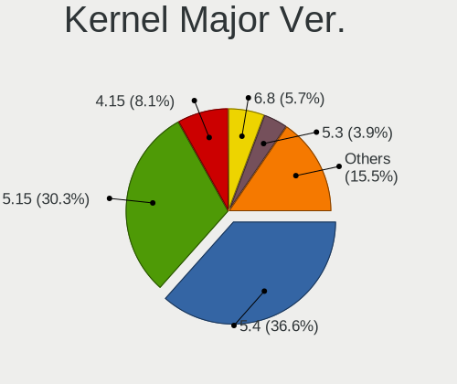
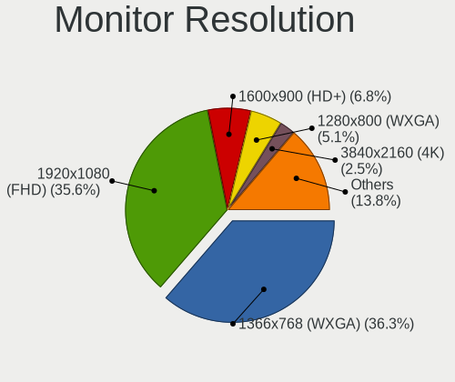
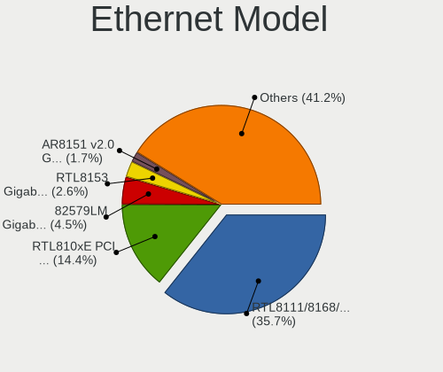
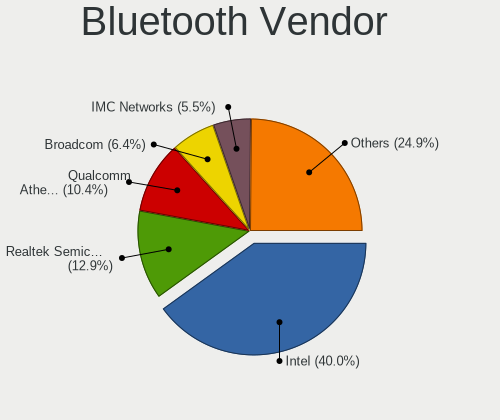

Linux Mint - Tested Hardware & Statistics (Notebooks)
-----------------------------------------------------

A project to collect tested hardware configurations for Linux Mint.

Anyone can contribute to this report by the [hw-probe](https://github.com/linuxhw/hw-probe) tool:

    sudo -E hw-probe -all -upload

Please contribute! Especially if your hardware is rare.

Contents
--------

* [ Test Cases ](#test-cases)

* [ System ](#system)
  - [ OS                       ](#os)
  - [ OS Family                ](#os-family)
  - [ Kernel                   ](#kernel)
  - [ Kernel Family            ](#kernel-family)
  - [ Kernel Major Ver.        ](#kernel-major-ver)
  - [ Arch                     ](#arch)
  - [ DE                       ](#de)
  - [ Display Server           ](#display-server)
  - [ Display Manager          ](#display-manager)
  - [ OS Lang                  ](#os-lang)
  - [ Boot Mode                ](#boot-mode)
  - [ Filesystem               ](#filesystem)
  - [ Part. scheme             ](#part-scheme)
  - [ Dual Boot with Linux/BSD ](#dual-boot-with-linuxbsd)
  - [ Dual Boot (Win)          ](#dual-boot-win)

* [ Board ](#board)
  - [ Vendor                   ](#vendor)
  - [ Model                    ](#model)
  - [ Model Family             ](#model-family)
  - [ MFG Year                 ](#mfg-year)
  - [ Form Factor              ](#form-factor)
  - [ Secure Boot              ](#secure-boot)
  - [ Coreboot                 ](#coreboot)
  - [ RAM Size                 ](#ram-size)
  - [ RAM Used                 ](#ram-used)
  - [ Total Drives             ](#total-drives)
  - [ Has CD-ROM               ](#has-cd-rom)
  - [ Has Ethernet             ](#has-ethernet)
  - [ Has WiFi                 ](#has-wifi)
  - [ Has Bluetooth            ](#has-bluetooth)

* [ Location ](#location)
  - [ Country                  ](#country)
  - [ City                     ](#city)

* [ Drives ](#drives)
  - [ Drive Vendor             ](#drive-vendor)
  - [ Drive Model              ](#drive-model)
  - [ HDD Vendor               ](#hdd-vendor)
  - [ SSD Vendor               ](#ssd-vendor)
  - [ Drive Kind               ](#drive-kind)
  - [ Drive Connector          ](#drive-connector)
  - [ Drive Size               ](#drive-size)
  - [ Space Total              ](#space-total)
  - [ Space Used               ](#space-used)
  - [ Malfunc. Drives          ](#malfunc-drives)
  - [ Malfunc. Drive Vendor    ](#malfunc-drive-vendor)
  - [ Malfunc. HDD Vendor      ](#malfunc-hdd-vendor)
  - [ Malfunc. Drive Kind      ](#malfunc-drive-kind)
  - [ Failed Drives            ](#failed-drives)
  - [ Failed Drive Vendor      ](#failed-drive-vendor)
  - [ Drive Status             ](#drive-status)

* [ Storage controller ](#storage-controller)
  - [ Storage Vendor           ](#storage-vendor)
  - [ Storage Model            ](#storage-model)
  - [ Storage Kind             ](#storage-kind)

* [ Processor ](#processor)
  - [ CPU Vendor               ](#cpu-vendor)
  - [ CPU Model                ](#cpu-model)
  - [ CPU Model Family         ](#cpu-model-family)
  - [ CPU Cores                ](#cpu-cores)
  - [ CPU Sockets              ](#cpu-sockets)
  - [ CPU Threads              ](#cpu-threads)
  - [ CPU Op-Modes             ](#cpu-op-modes)
  - [ CPU Microcode            ](#cpu-microcode)
  - [ CPU Microarch            ](#cpu-microarch)

* [ Graphics ](#graphics)
  - [ GPU Vendor               ](#gpu-vendor)
  - [ GPU Model                ](#gpu-model)
  - [ GPU Combo                ](#gpu-combo)
  - [ GPU Driver               ](#gpu-driver)
  - [ GPU Memory               ](#gpu-memory)

* [ Monitor ](#monitor)
  - [ Monitor Vendor           ](#monitor-vendor)
  - [ Monitor Model            ](#monitor-model)
  - [ Monitor Resolution       ](#monitor-resolution)
  - [ Monitor Diagonal         ](#monitor-diagonal)
  - [ Monitor Width            ](#monitor-width)
  - [ Aspect Ratio             ](#aspect-ratio)
  - [ Monitor Area             ](#monitor-area)
  - [ Pixel Density            ](#pixel-density)
  - [ Multiple Monitors        ](#multiple-monitors)

* [ Network ](#network)
  - [ Net Controller Vendor    ](#net-controller-vendor)
  - [ Net Controller Model     ](#net-controller-model)
  - [ Wireless Vendor          ](#wireless-vendor)
  - [ Wireless Model           ](#wireless-model)
  - [ Ethernet Vendor          ](#ethernet-vendor)
  - [ Ethernet Model           ](#ethernet-model)
  - [ Net Controller Kind      ](#net-controller-kind)
  - [ Used Controller          ](#used-controller)
  - [ NICs                     ](#nics)
  - [ IPv6                     ](#ipv6)

* [ Bluetooth ](#bluetooth)
  - [ Bluetooth Vendor         ](#bluetooth-vendor)
  - [ Bluetooth Model          ](#bluetooth-model)

* [ Sound ](#sound)
  - [ Sound Vendor             ](#sound-vendor)
  - [ Sound Model              ](#sound-model)

* [ Memory ](#memory)
  - [ Memory Vendor            ](#memory-vendor)
  - [ Memory Model             ](#memory-model)
  - [ Memory Kind              ](#memory-kind)
  - [ Memory Form Factor       ](#memory-form-factor)
  - [ Memory Size              ](#memory-size)
  - [ Memory Speed             ](#memory-speed)

* [ Printers & scanners ](#printers--scanners)
  - [ Printer Vendor           ](#printer-vendor)
  - [ Printer Model            ](#printer-model)
  - [ Scanner Vendor           ](#scanner-vendor)
  - [ Scanner Model            ](#scanner-model)

* [ Camera ](#camera)
  - [ Camera Vendor            ](#camera-vendor)
  - [ Camera Model             ](#camera-model)

* [ Security ](#security)
  - [ Fingerprint Vendor       ](#fingerprint-vendor)
  - [ Fingerprint Model        ](#fingerprint-model)
  - [ Chipcard Vendor          ](#chipcard-vendor)
  - [ Chipcard Model           ](#chipcard-model)

* [ Unsupported ](#unsupported)
  - [ Unsupported Devices      ](#unsupported-devices)
  - [ Unsupported Device Types ](#unsupported-device-types)

Test Cases
----------

Total: 15931

| Vendor        | Model                       | Probe                                                      | Date         |
|---------------|-----------------------------|------------------------------------------------------------|--------------|
| HP            | Pavilion dv8000 (ET839UA... | [ad7dc81954](https://linux-hardware.org/?probe=ad7dc81954) | Nov 06, 2023 |
| HP            | Laptop 15-bw0xx             | [bd3e108e8a](https://linux-hardware.org/?probe=bd3e108e8a) | Nov 06, 2023 |
| Lenovo        | ThinkPad T420 4180FB5       | [5abc3caec3](https://linux-hardware.org/?probe=5abc3caec3) | Nov 06, 2023 |
| Lenovo        | ThinkPad T520 4243RU3       | [5095529d19](https://linux-hardware.org/?probe=5095529d19) | Nov 05, 2023 |
| Inter Sale... | NID-11125DE                 | [aca3d534de](https://linux-hardware.org/?probe=aca3d534de) | Nov 05, 2023 |
| Sony          | VGN-N21S_W                  | [6ff4658440](https://linux-hardware.org/?probe=6ff4658440) | Nov 05, 2023 |
| Sony          | VGN-N21S_W                  | [266bedfdc3](https://linux-hardware.org/?probe=266bedfdc3) | Nov 05, 2023 |
| HP            | Unknown                     | [c8cff9e339](https://linux-hardware.org/?probe=c8cff9e339) | Nov 05, 2023 |
| Lenovo        | Legion 5 17ITH6H 82JM       | [7bde99341f](https://linux-hardware.org/?probe=7bde99341f) | Nov 05, 2023 |
| HP            | Notebook                    | [8eea1901f7](https://linux-hardware.org/?probe=8eea1901f7) | Nov 05, 2023 |
| ASUSTek       | VivoBook_ASUSLaptop X512... | [b2cfb39c04](https://linux-hardware.org/?probe=b2cfb39c04) | Nov 05, 2023 |
| Toshiba       | QOSMIO X505                 | [e5e5eb9254](https://linux-hardware.org/?probe=e5e5eb9254) | Nov 05, 2023 |
| Digibras      | NH4CU53                     | [2c274cbad8](https://linux-hardware.org/?probe=2c274cbad8) | Nov 05, 2023 |
| Dell          | Latitude E6430              | [6a724d5aa8](https://linux-hardware.org/?probe=6a724d5aa8) | Nov 04, 2023 |
| HP            | EliteBook 850 G2            | [36646aca12](https://linux-hardware.org/?probe=36646aca12) | Nov 04, 2023 |
| ASUSTek       | X550LC                      | [bd59b07dbf](https://linux-hardware.org/?probe=bd59b07dbf) | Nov 04, 2023 |
| ASUSTek       | X550LC                      | [b7fa2bbb0b](https://linux-hardware.org/?probe=b7fa2bbb0b) | Nov 04, 2023 |
| Lenovo        | ThinkPad T460s 20FAS1NF0... | [8528f9946b](https://linux-hardware.org/?probe=8528f9946b) | Nov 04, 2023 |
| Toshiba       | Satellite L70-A             | [bf7be11ced](https://linux-hardware.org/?probe=bf7be11ced) | Nov 04, 2023 |
| Lenovo        | 80SY                        | [7c7a6ba82f](https://linux-hardware.org/?probe=7c7a6ba82f) | Nov 04, 2023 |
| HP            | ZBook 17 G3                 | [7d38ea5f87](https://linux-hardware.org/?probe=7d38ea5f87) | Nov 04, 2023 |
| Lenovo        | IdeaPad Gaming 3 15ARH05... | [3922b02290](https://linux-hardware.org/?probe=3922b02290) | Nov 04, 2023 |
| HP            | Pavilion 17                 | [54cf91ddc7](https://linux-hardware.org/?probe=54cf91ddc7) | Nov 04, 2023 |
| Acer          | Aspire A514-55              | [b9ad0e270f](https://linux-hardware.org/?probe=b9ad0e270f) | Nov 04, 2023 |
| HP            | Laptop 14-bw0xx             | [aea5699bb8](https://linux-hardware.org/?probe=aea5699bb8) | Nov 04, 2023 |
| Lenovo        | IdeaPad Gaming 3 15ARH05... | [bb7622a7ba](https://linux-hardware.org/?probe=bb7622a7ba) | Nov 04, 2023 |
| Toshiba       | Satellite C660D             | [de50c92d6c](https://linux-hardware.org/?probe=de50c92d6c) | Nov 03, 2023 |
| Lenovo        | IdeaPad 5 14ARE05 81YM      | [4ccd2ef567](https://linux-hardware.org/?probe=4ccd2ef567) | Nov 03, 2023 |
| ASUSTek       | X510URR                     | [645fbe9fc3](https://linux-hardware.org/?probe=645fbe9fc3) | Nov 03, 2023 |
| ASUSTek       | K53SD                       | [e26ed8b740](https://linux-hardware.org/?probe=e26ed8b740) | Nov 03, 2023 |
| Schenker      | XMG CORE (REN/E21)          | [9edac2c8ee](https://linux-hardware.org/?probe=9edac2c8ee) | Nov 03, 2023 |
| Dell          | Latitude E5530 non-vPro     | [491aa458cc](https://linux-hardware.org/?probe=491aa458cc) | Nov 03, 2023 |
| Fujitsu       | LIFEBOOK S710               | [b0ee1e5f32](https://linux-hardware.org/?probe=b0ee1e5f32) | Nov 03, 2023 |
| Acer          | Aspire V3-771               | [3a0023b4ba](https://linux-hardware.org/?probe=3a0023b4ba) | Nov 03, 2023 |
| Lenovo        | ThinkPad T480s 20L8S35G0... | [14074a05b9](https://linux-hardware.org/?probe=14074a05b9) | Nov 02, 2023 |
| ASUSTek       | X580VD                      | [5bb358c66e](https://linux-hardware.org/?probe=5bb358c66e) | Nov 02, 2023 |
| Toshiba       | Satellite Pro L770-12Q      | [bd3567b828](https://linux-hardware.org/?probe=bd3567b828) | Nov 02, 2023 |
| Acer          | AO722                       | [3464dc7b3c](https://linux-hardware.org/?probe=3464dc7b3c) | Nov 02, 2023 |
| Lenovo        | Unknown                     | [3b5aa652dc](https://linux-hardware.org/?probe=3b5aa652dc) | Nov 02, 2023 |
| Lenovo        | Unknown                     | [da6aff8db2](https://linux-hardware.org/?probe=da6aff8db2) | Nov 02, 2023 |
| HP            | ProBook 450 G5              | [b012e30cb6](https://linux-hardware.org/?probe=b012e30cb6) | Nov 02, 2023 |
| MSI           | Prestige 14 A11SCS          | [e114e8ae5b](https://linux-hardware.org/?probe=e114e8ae5b) | Nov 02, 2023 |
| Lenovo        | ThinkPad X1 Carbon Gen 9... | [3c92af97b9](https://linux-hardware.org/?probe=3c92af97b9) | Nov 02, 2023 |
| HP            | EliteBook Folio 1040 G2     | [5c4a8fa3ed](https://linux-hardware.org/?probe=5c4a8fa3ed) | Nov 02, 2023 |
| HP            | Laptop 17-cp0xxx            | [c7760958c8](https://linux-hardware.org/?probe=c7760958c8) | Nov 02, 2023 |
| HP            | Laptop 15-gw0xxx            | [35f5c2edc0](https://linux-hardware.org/?probe=35f5c2edc0) | Nov 02, 2023 |
| Dell          | Latitude 3440               | [b50ed47992](https://linux-hardware.org/?probe=b50ed47992) | Nov 02, 2023 |
| Dell          | Latitude 3440               | [9426910684](https://linux-hardware.org/?probe=9426910684) | Nov 02, 2023 |
| HP            | Pavilion g6                 | [e6f697f0c0](https://linux-hardware.org/?probe=e6f697f0c0) | Nov 02, 2023 |
| Lenovo        | B71-80 80RJ                 | [93507b3ead](https://linux-hardware.org/?probe=93507b3ead) | Nov 01, 2023 |
| HP            | 630                         | [634f46006b](https://linux-hardware.org/?probe=634f46006b) | Nov 01, 2023 |
| HP            | Laptop 17-ca0xxx            | [888ed977bc](https://linux-hardware.org/?probe=888ed977bc) | Nov 01, 2023 |
| Lenovo        | ThinkPad T400 6475JR8       | [82b16f0e20](https://linux-hardware.org/?probe=82b16f0e20) | Nov 01, 2023 |
| Apple         | MacBookPro11,5              | [99e5155c24](https://linux-hardware.org/?probe=99e5155c24) | Nov 01, 2023 |
| Apple         | MacBook7,1                  | [60edf3f76c](https://linux-hardware.org/?probe=60edf3f76c) | Nov 01, 2023 |
| Toshiba       | Satellite A215              | [de8e05d9e3](https://linux-hardware.org/?probe=de8e05d9e3) | Nov 01, 2023 |
| Toshiba       | Satellite A215              | [4c2cc71fc2](https://linux-hardware.org/?probe=4c2cc71fc2) | Nov 01, 2023 |
| Acer          | Aspire A514-55              | [985bf8e919](https://linux-hardware.org/?probe=985bf8e919) | Nov 01, 2023 |
| Dell          | Latitude E7450              | [5e39e2bc88](https://linux-hardware.org/?probe=5e39e2bc88) | Nov 01, 2023 |
| ASUSTek       | VivoBook_ASUSLaptop X509... | [7c297acb1f](https://linux-hardware.org/?probe=7c297acb1f) | Nov 01, 2023 |
| ASUSTek       | VivoBook_ASUSLaptop X513... | [19d017bb7d](https://linux-hardware.org/?probe=19d017bb7d) | Nov 01, 2023 |
| Lenovo        | ThinkPad T480s 20L8S2SX0... | [d5fee530ee](https://linux-hardware.org/?probe=d5fee530ee) | Nov 01, 2023 |
| Lenovo        | ThinkPad T420 42369U7       | [8de4ad6ae1](https://linux-hardware.org/?probe=8de4ad6ae1) | Nov 01, 2023 |
| Lenovo        | ThinkPad L15 Gen 2 20X30... | [6cce294b99](https://linux-hardware.org/?probe=6cce294b99) | Nov 01, 2023 |
| Lenovo        | ThinkPad L15 Gen 2 20X30... | [c985fdb0b7](https://linux-hardware.org/?probe=c985fdb0b7) | Nov 01, 2023 |
| HP            | Pavilion g7                 | [157c592b3a](https://linux-hardware.org/?probe=157c592b3a) | Nov 01, 2023 |
| Lenovo        | IdeaPad 320-17ABR 80YN      | [96bda876c8](https://linux-hardware.org/?probe=96bda876c8) | Nov 01, 2023 |
| HP            | 2000                        | [f586263d64](https://linux-hardware.org/?probe=f586263d64) | Nov 01, 2023 |
| Apple         | MacBookPro8,1               | [b03928bc33](https://linux-hardware.org/?probe=b03928bc33) | Nov 01, 2023 |
| ASUSTek       | UX430UA                     | [d99926d970](https://linux-hardware.org/?probe=d99926d970) | Nov 01, 2023 |
| HP            | EliteBook 850 G8 Noteboo... | [7c07fc9bbe](https://linux-hardware.org/?probe=7c07fc9bbe) | Oct 31, 2023 |
| Google        | Akemi                       | [a5cea3a369](https://linux-hardware.org/?probe=a5cea3a369) | Oct 31, 2023 |
| HP            | 246 G6 Notebook PC          | [60a551c8f4](https://linux-hardware.org/?probe=60a551c8f4) | Oct 31, 2023 |
| HP            | G56                         | [db44e7df47](https://linux-hardware.org/?probe=db44e7df47) | Oct 31, 2023 |
| ION Comput... | LAPBC510                    | [24a1cafad9](https://linux-hardware.org/?probe=24a1cafad9) | Oct 31, 2023 |
| HP            | 255 15.6 inch G9 Noteboo... | [3446eef35d](https://linux-hardware.org/?probe=3446eef35d) | Oct 31, 2023 |
| Lenovo        | V15 G2 ITL 82KB             | [4f6d9ac7b5](https://linux-hardware.org/?probe=4f6d9ac7b5) | Oct 31, 2023 |
| Apple         | MacBookPro8,1               | [27c6a9540f](https://linux-hardware.org/?probe=27c6a9540f) | Oct 31, 2023 |
| Lenovo        | ThinkPad E14 Gen 3 20YD0... | [5b8af0fd77](https://linux-hardware.org/?probe=5b8af0fd77) | Oct 31, 2023 |
| Fujitsu       | LIFEBOOK S710               | [a8ae4206d4](https://linux-hardware.org/?probe=a8ae4206d4) | Oct 31, 2023 |
| Lenovo        | ThinkPad X1 Carbon 6th 2... | [ded975e57f](https://linux-hardware.org/?probe=ded975e57f) | Oct 31, 2023 |
| Lenovo        | ThinkPad X1 Carbon 6th 2... | [c90a14fcf5](https://linux-hardware.org/?probe=c90a14fcf5) | Oct 31, 2023 |
| Fujitsu       | LIFEBOOK E5511              | [c4dbce515a](https://linux-hardware.org/?probe=c4dbce515a) | Oct 31, 2023 |
| Toshiba       | TECRA S11                   | [e2a669bf1a](https://linux-hardware.org/?probe=e2a669bf1a) | Oct 31, 2023 |
| ASUSTek       | X550EP                      | [81fdd48960](https://linux-hardware.org/?probe=81fdd48960) | Oct 31, 2023 |
| Apple         | MacBookAir6,2               | [edd3006f12](https://linux-hardware.org/?probe=edd3006f12) | Oct 31, 2023 |
| ASUSTek       | VivoBook_ASUSLaptop X571... | [53cd13281b](https://linux-hardware.org/?probe=53cd13281b) | Oct 31, 2023 |
| Dell          | Latitude 5520               | [3803e551f1](https://linux-hardware.org/?probe=3803e551f1) | Oct 31, 2023 |
| Apple         | MacBook7,1                  | [11ada26a4c](https://linux-hardware.org/?probe=11ada26a4c) | Oct 31, 2023 |
| Acer          | Aspire V3-771               | [00ffbda72d](https://linux-hardware.org/?probe=00ffbda72d) | Oct 31, 2023 |
| Lenovo        | ThinkPad P50 20EQS4QL11     | [9fd9ad0312](https://linux-hardware.org/?probe=9fd9ad0312) | Oct 31, 2023 |
| HP            | 250 G6 Notebook PC          | [c1d956674a](https://linux-hardware.org/?probe=c1d956674a) | Oct 31, 2023 |
| Toshiba       | Satellite C660D             | [26479d99b9](https://linux-hardware.org/?probe=26479d99b9) | Oct 31, 2023 |
| Lenovo        | ThinkPad T60 1952WUV        | [4ecf9f7f50](https://linux-hardware.org/?probe=4ecf9f7f50) | Oct 30, 2023 |
| ASUSTek       | X555LP                      | [1f57f57452](https://linux-hardware.org/?probe=1f57f57452) | Oct 30, 2023 |
| Lenovo        | ThinkPad T560 20FJS44L0B    | [12c0c78dc8](https://linux-hardware.org/?probe=12c0c78dc8) | Oct 30, 2023 |
| Lenovo        | ThinkPad X220 4286CTO       | [237d2ca8b5](https://linux-hardware.org/?probe=237d2ca8b5) | Oct 30, 2023 |
| Lenovo        | ThinkPad T14 Gen 1 20UDC... | [1a7844f56d](https://linux-hardware.org/?probe=1a7844f56d) | Oct 30, 2023 |
| Toshiba       | Satellite L875              | [de5babbde5](https://linux-hardware.org/?probe=de5babbde5) | Oct 30, 2023 |
| ASUSTek       | F5N                         | [67f3a19888](https://linux-hardware.org/?probe=67f3a19888) | Oct 30, 2023 |
| Mediacom      | WinPad 11,6 FullHD- WPU1... | [b3e37008cb](https://linux-hardware.org/?probe=b3e37008cb) | Oct 30, 2023 |
| Inter Sale... | NID-11125DE                 | [2ba3404987](https://linux-hardware.org/?probe=2ba3404987) | Oct 30, 2023 |
| ASUSTek       | VivoBook_ASUSLaptop E410... | [bb991098d1](https://linux-hardware.org/?probe=bb991098d1) | Oct 30, 2023 |
| HP            | Unknown                     | [3aadbc5c33](https://linux-hardware.org/?probe=3aadbc5c33) | Oct 30, 2023 |
| HP            | EliteBook 8560w             | [cd7ef88b8a](https://linux-hardware.org/?probe=cd7ef88b8a) | Oct 30, 2023 |
| Acer          | Aspire 5733                 | [8a925b3630](https://linux-hardware.org/?probe=8a925b3630) | Oct 30, 2023 |
| Dell          | Latitude 7430               | [b72f3f4264](https://linux-hardware.org/?probe=b72f3f4264) | Oct 30, 2023 |
| Dell          | Latitude E7250              | [a83b95ce44](https://linux-hardware.org/?probe=a83b95ce44) | Oct 30, 2023 |
| Notebook      | NS5x_NS7xAU                 | [151d6e2c69](https://linux-hardware.org/?probe=151d6e2c69) | Oct 29, 2023 |
| Dell          | Precision M6600             | [30e8d1522d](https://linux-hardware.org/?probe=30e8d1522d) | Oct 29, 2023 |
| Samsung       | 940XFG                      | [70cda4e8b4](https://linux-hardware.org/?probe=70cda4e8b4) | Oct 29, 2023 |
| ASUSTek       | X75VC                       | [9b8051fb79](https://linux-hardware.org/?probe=9b8051fb79) | Oct 29, 2023 |
| Acer          | Aspire 5810T                | [9b65c56faa](https://linux-hardware.org/?probe=9b65c56faa) | Oct 29, 2023 |
| Acer          | Aspire ES1-572              | [12b1df4e2b](https://linux-hardware.org/?probe=12b1df4e2b) | Oct 29, 2023 |
| Notebook      | N85_N87HCHNHZ               | [751a447386](https://linux-hardware.org/?probe=751a447386) | Oct 28, 2023 |
| Dell          | Latitude E6410              | [4eecd92a1e](https://linux-hardware.org/?probe=4eecd92a1e) | Oct 28, 2023 |
| Acer          | Nitro AN515-57              | [5d047c6d80](https://linux-hardware.org/?probe=5d047c6d80) | Oct 28, 2023 |
| Dell          | Latitude E6500              | [41e90a6524](https://linux-hardware.org/?probe=41e90a6524) | Oct 28, 2023 |
| HUAWEI        | NBLB-WAX9N                  | [1ad2b79950](https://linux-hardware.org/?probe=1ad2b79950) | Oct 28, 2023 |
| HUAWEI        | NBLB-WAX9N                  | [ab6e0c5094](https://linux-hardware.org/?probe=ab6e0c5094) | Oct 28, 2023 |
| HP            | Laptop 17-cn2xxx            | [b6025e5485](https://linux-hardware.org/?probe=b6025e5485) | Oct 28, 2023 |
| Lenovo        | ThinkPad E520 1143A22       | [cd1af5dc70](https://linux-hardware.org/?probe=cd1af5dc70) | Oct 28, 2023 |
| Samsung       | 300E4Z/300E5Z/300E7Z        | [37e69bd8a8](https://linux-hardware.org/?probe=37e69bd8a8) | Oct 28, 2023 |
| Lenovo        | IdeaPad 520-15IKB 81BF      | [ee5373bbe1](https://linux-hardware.org/?probe=ee5373bbe1) | Oct 28, 2023 |
| Lenovo        | IdeaPad Yoga 13 2191        | [219a94f546](https://linux-hardware.org/?probe=219a94f546) | Oct 28, 2023 |
| ASUSTek       | VivoBook_ASUSLaptop M350... | [7259ae55c2](https://linux-hardware.org/?probe=7259ae55c2) | Oct 28, 2023 |
| Lenovo        | IdeaPad Gaming 3 15IHU6 ... | [49982fda5c](https://linux-hardware.org/?probe=49982fda5c) | Oct 28, 2023 |
| Lenovo        | IdeaPad 320-15AST 80XV      | [9c28038bcb](https://linux-hardware.org/?probe=9c28038bcb) | Oct 28, 2023 |
| Lenovo        | IdeaPad 320-15AST 80XV      | [f7556d51ff](https://linux-hardware.org/?probe=f7556d51ff) | Oct 28, 2023 |
| Lenovo        | ThinkPad X220 4286CTO       | [2a27fbfe9c](https://linux-hardware.org/?probe=2a27fbfe9c) | Oct 27, 2023 |
| Lenovo        | ThinkPad T410 2537GN8       | [b01c537756](https://linux-hardware.org/?probe=b01c537756) | Oct 27, 2023 |
| Lenovo        | ThinkPad T410 2537GN8       | [a465f0d88d](https://linux-hardware.org/?probe=a465f0d88d) | Oct 27, 2023 |
| Lenovo        | ThinkPad T410 2537JC6       | [c84f5cb370](https://linux-hardware.org/?probe=c84f5cb370) | Oct 27, 2023 |
| ASUSTek       | X75VC                       | [be944959dc](https://linux-hardware.org/?probe=be944959dc) | Oct 27, 2023 |
| Dell          | Latitude 5480               | [200d747791](https://linux-hardware.org/?probe=200d747791) | Oct 27, 2023 |
| Lenovo        | ThinkPad T410 2537JC6       | [51b394c8c9](https://linux-hardware.org/?probe=51b394c8c9) | Oct 27, 2023 |
| HP            | Notebook                    | [1f270f615f](https://linux-hardware.org/?probe=1f270f615f) | Oct 27, 2023 |
| Razer         | Blade 15 Base Model (Ear... | [d0f571ffa0](https://linux-hardware.org/?probe=d0f571ffa0) | Oct 27, 2023 |
| HP            | Laptop 15-ef2xxx            | [01f4f7926d](https://linux-hardware.org/?probe=01f4f7926d) | Oct 27, 2023 |
| MSI           | MS-1736                     | [929f0d008e](https://linux-hardware.org/?probe=929f0d008e) | Oct 26, 2023 |
| Samsung       | 3570R/370R/470R/450R/510... | [7f10f1b379](https://linux-hardware.org/?probe=7f10f1b379) | Oct 26, 2023 |
| Dell          | Latitude E6440              | [b72f1e313e](https://linux-hardware.org/?probe=b72f1e313e) | Oct 26, 2023 |
| MSI           | Stealth 16Studio A13VG      | [2009a0a84b](https://linux-hardware.org/?probe=2009a0a84b) | Oct 26, 2023 |
| Dell          | Inspiron 3437               | [a57068abbc](https://linux-hardware.org/?probe=a57068abbc) | Oct 26, 2023 |
| Lenovo        | IdeaPadFlex 15D 20334       | [ef8b5632b4](https://linux-hardware.org/?probe=ef8b5632b4) | Oct 26, 2023 |
| Novatech      | C141EK5-CI5TX               | [71f7f1372a](https://linux-hardware.org/?probe=71f7f1372a) | Oct 26, 2023 |
| HP            | Pavilion g7                 | [5f67a1eab5](https://linux-hardware.org/?probe=5f67a1eab5) | Oct 26, 2023 |
| Lenovo        | G780 2182                   | [5c9917344a](https://linux-hardware.org/?probe=5c9917344a) | Oct 25, 2023 |
| HP            | EliteBook 820 G2            | [d6d5273a5a](https://linux-hardware.org/?probe=d6d5273a5a) | Oct 25, 2023 |
| Dell          | Inspiron 11-3168            | [07fd1e8be9](https://linux-hardware.org/?probe=07fd1e8be9) | Oct 25, 2023 |
| Lenovo        | ThinkPad P1 20MES05502      | [699bed0bd4](https://linux-hardware.org/?probe=699bed0bd4) | Oct 25, 2023 |
| Samsung       | 3570R/370R/470R/450R/510... | [6c88fcef70](https://linux-hardware.org/?probe=6c88fcef70) | Oct 25, 2023 |
| Toshiba       | Satellite C660D             | [011e4e4756](https://linux-hardware.org/?probe=011e4e4756) | Oct 25, 2023 |
| Lenovo        | IdeaPadFlex 15D 20334       | [861e2b3154](https://linux-hardware.org/?probe=861e2b3154) | Oct 25, 2023 |
| Toshiba       | Satellite L655              | [504b65f326](https://linux-hardware.org/?probe=504b65f326) | Oct 25, 2023 |
| Toshiba       | Satellite L655              | [6f1c644900](https://linux-hardware.org/?probe=6f1c644900) | Oct 25, 2023 |
| ASUSTek       | VivoBook_ASUSLaptop X515... | [76d22d10e6](https://linux-hardware.org/?probe=76d22d10e6) | Oct 25, 2023 |
| Dell          | Latitude E6540              | [dfb08d307b](https://linux-hardware.org/?probe=dfb08d307b) | Oct 25, 2023 |
| Lenovo        | V110-15IAP 80TG             | [455780b267](https://linux-hardware.org/?probe=455780b267) | Oct 25, 2023 |
| Medion        | Akoya E6240T                | [67dbd98f9b](https://linux-hardware.org/?probe=67dbd98f9b) | Oct 24, 2023 |
| Toshiba       | Satellite NB10t-A-102       | [85f85dffbd](https://linux-hardware.org/?probe=85f85dffbd) | Oct 24, 2023 |
| Acer          | Nitro AN515-44              | [20f40f9f55](https://linux-hardware.org/?probe=20f40f9f55) | Oct 24, 2023 |
| ASUSTek       | X75VC                       | [9e53bba398](https://linux-hardware.org/?probe=9e53bba398) | Oct 24, 2023 |
| Acer          | Aspire V3-572               | [f873d7efd9](https://linux-hardware.org/?probe=f873d7efd9) | Oct 24, 2023 |
| ASUSTek       | X541UJ                      | [833d4435d4](https://linux-hardware.org/?probe=833d4435d4) | Oct 24, 2023 |
| MSI           | GP62M 7REX                  | [5fbee8e341](https://linux-hardware.org/?probe=5fbee8e341) | Oct 24, 2023 |
| MSI           | GP62M 7REX                  | [a95ab8b563](https://linux-hardware.org/?probe=a95ab8b563) | Oct 24, 2023 |
| HP            | 255 G5                      | [30164a995c](https://linux-hardware.org/?probe=30164a995c) | Oct 24, 2023 |
| Alienware     | m15 Ryzen Ed. R5            | [d9b9718eee](https://linux-hardware.org/?probe=d9b9718eee) | Oct 24, 2023 |
| Apple         | MacBookPro14,3              | [b706665251](https://linux-hardware.org/?probe=b706665251) | Oct 23, 2023 |
| HP            | ProBook 450 G6              | [5dc90618a7](https://linux-hardware.org/?probe=5dc90618a7) | Oct 23, 2023 |
| Eii           | WSA116                      | [85da70314e](https://linux-hardware.org/?probe=85da70314e) | Oct 23, 2023 |
| Dell          | Vostro 3400                 | [9c24bc3329](https://linux-hardware.org/?probe=9c24bc3329) | Oct 23, 2023 |
| Lenovo        | ThinkPad X1 Carbon 4th 2... | [66d2dedb14](https://linux-hardware.org/?probe=66d2dedb14) | Oct 23, 2023 |
| Acer          | Nitro AN515-45              | [61791a9250](https://linux-hardware.org/?probe=61791a9250) | Oct 23, 2023 |
| Panasonic     | CF-53SV64CLM                | [7702a1e73b](https://linux-hardware.org/?probe=7702a1e73b) | Oct 23, 2023 |
| Lenovo        | ThinkPad X1 Carbon 6th 2... | [e34ccf8825](https://linux-hardware.org/?probe=e34ccf8825) | Oct 23, 2023 |
| Lenovo        | ThinkPad X1 Carbon 4th 2... | [ca685c37ad](https://linux-hardware.org/?probe=ca685c37ad) | Oct 23, 2023 |
| ASUSTek       | X555YI                      | [0028f82c4d](https://linux-hardware.org/?probe=0028f82c4d) | Oct 23, 2023 |
| Acer          | Aspire V3-572               | [974d64f7a8](https://linux-hardware.org/?probe=974d64f7a8) | Oct 23, 2023 |
| Dell          | XPS 15 7590                 | [e9ecf74d68](https://linux-hardware.org/?probe=e9ecf74d68) | Oct 23, 2023 |
| Acer          | Aspire R3-431T              | [eb6c623c2d](https://linux-hardware.org/?probe=eb6c623c2d) | Oct 23, 2023 |
| Dell          | G15 5515                    | [758d007f45](https://linux-hardware.org/?probe=758d007f45) | Oct 23, 2023 |
| Dell          | G15 5515                    | [5853f5312f](https://linux-hardware.org/?probe=5853f5312f) | Oct 23, 2023 |
| Lenovo        | Legion Y7000P 2019 81Q5     | [e0e939db95](https://linux-hardware.org/?probe=e0e939db95) | Oct 23, 2023 |
| Panasonic     | CFSZ5-3                     | [a70e21055d](https://linux-hardware.org/?probe=a70e21055d) | Oct 23, 2023 |
| Acer          | TravelMate P259-M           | [d6096c6736](https://linux-hardware.org/?probe=d6096c6736) | Oct 23, 2023 |
| Dell          | Inspiron 3521               | [43b2c926ef](https://linux-hardware.org/?probe=43b2c926ef) | Oct 22, 2023 |
| Dell          | Latitude E6440              | [9db156fcaf](https://linux-hardware.org/?probe=9db156fcaf) | Oct 22, 2023 |
| HP            | ProBook 6550b               | [da6e693794](https://linux-hardware.org/?probe=da6e693794) | Oct 22, 2023 |
| ASUSTek       | Zenbook UX7602VI_UX7602V... | [96e2577624](https://linux-hardware.org/?probe=96e2577624) | Oct 22, 2023 |
| Lenovo        | IdeaPad 5 Pro 16ARH7 82S... | [1a08930082](https://linux-hardware.org/?probe=1a08930082) | Oct 22, 2023 |
| HP            | Laptop 15-db0xxx            | [d2a789473e](https://linux-hardware.org/?probe=d2a789473e) | Oct 22, 2023 |
| ASUSTek       | VivoBook_ASUSLaptop X512... | [22e4fe8966](https://linux-hardware.org/?probe=22e4fe8966) | Oct 22, 2023 |
| Clevo         | M660SR                      | [56f8ab01f9](https://linux-hardware.org/?probe=56f8ab01f9) | Oct 22, 2023 |
| Lenovo        | IdeaPad 320-15ABR 80XS      | [037cfc67ae](https://linux-hardware.org/?probe=037cfc67ae) | Oct 22, 2023 |
| Lenovo        | ThinkPad T450 20BUS50Q16    | [a79018d74a](https://linux-hardware.org/?probe=a79018d74a) | Oct 22, 2023 |
| Lenovo        | ThinkPad T450 20BUS50Q16    | [df9da08050](https://linux-hardware.org/?probe=df9da08050) | Oct 22, 2023 |
| HP            | Pavilion g6                 | [2fc9736b9e](https://linux-hardware.org/?probe=2fc9736b9e) | Oct 22, 2023 |
| HP            | Pavilion g6                 | [7514db3c84](https://linux-hardware.org/?probe=7514db3c84) | Oct 22, 2023 |
| Dell          | Latitude E6430              | [890d4dcb0e](https://linux-hardware.org/?probe=890d4dcb0e) | Oct 22, 2023 |
| HP            | 2000                        | [743e2b0bdf](https://linux-hardware.org/?probe=743e2b0bdf) | Oct 22, 2023 |
| Lenovo        | ThinkPad T440p 20AN0069U... | [0a5d896798](https://linux-hardware.org/?probe=0a5d896798) | Oct 21, 2023 |
| Lenovo        | ThinkPad L15 Gen 1 20U8S... | [63924140af](https://linux-hardware.org/?probe=63924140af) | Oct 21, 2023 |
| ASUSTek       | X200MA                      | [41f4b8a93a](https://linux-hardware.org/?probe=41f4b8a93a) | Oct 21, 2023 |
| Dell          | Inspiron 3437               | [331cbd427d](https://linux-hardware.org/?probe=331cbd427d) | Oct 21, 2023 |
| Acer          | Aspire ES1-572              | [b4e1647054](https://linux-hardware.org/?probe=b4e1647054) | Oct 21, 2023 |
| VALE          | Notebook Classic C140       | [885bd9c1cf](https://linux-hardware.org/?probe=885bd9c1cf) | Oct 21, 2023 |
| Thomson       | X15I5-8TU512                | [68099cb005](https://linux-hardware.org/?probe=68099cb005) | Oct 21, 2023 |
| ASUSTek       | VivoBook_ASUSLaptop K340... | [5f376e3415](https://linux-hardware.org/?probe=5f376e3415) | Oct 21, 2023 |
| HP            | ProBook 650 G2              | [33216a8361](https://linux-hardware.org/?probe=33216a8361) | Oct 21, 2023 |
| Toshiba       | Satellite Pro C50-A-1C8     | [801d54f088](https://linux-hardware.org/?probe=801d54f088) | Oct 21, 2023 |
| HP            | Pavilion dv7                | [d2beead33c](https://linux-hardware.org/?probe=d2beead33c) | Oct 21, 2023 |
| Sony          | SVF1521K6EW                 | [f179781ca4](https://linux-hardware.org/?probe=f179781ca4) | Oct 21, 2023 |
| Dell          | Latitude E6410              | [5b363ffe33](https://linux-hardware.org/?probe=5b363ffe33) | Oct 21, 2023 |
| LG Electro... | R410-G.BP21P1               | [36849f1a4c](https://linux-hardware.org/?probe=36849f1a4c) | Oct 21, 2023 |
| HP            | ProBook 450 15.6 inch G1... | [97607b5959](https://linux-hardware.org/?probe=97607b5959) | Oct 20, 2023 |
| HP            | Pavilion dv6                | [83e83b7e1c](https://linux-hardware.org/?probe=83e83b7e1c) | Oct 20, 2023 |
| Dell          | Latitude E6400              | [5e09b89469](https://linux-hardware.org/?probe=5e09b89469) | Oct 20, 2023 |
| ASUSTek       | X555LF                      | [b762dc0df0](https://linux-hardware.org/?probe=b762dc0df0) | Oct 20, 2023 |
| Acer          | Aspire 6530                 | [8e3114f3f0](https://linux-hardware.org/?probe=8e3114f3f0) | Oct 20, 2023 |
| ASUSTek       | X555LF                      | [ee44c25ed9](https://linux-hardware.org/?probe=ee44c25ed9) | Oct 20, 2023 |
| HP            | Laptop 17-by2xxx            | [6255c5d9ac](https://linux-hardware.org/?probe=6255c5d9ac) | Oct 20, 2023 |
| Inter Sale... | NID-11125DE                 | [166e30e45b](https://linux-hardware.org/?probe=166e30e45b) | Oct 20, 2023 |
| Samsung       | 530U3C/530U4C               | [8d85a5bd07](https://linux-hardware.org/?probe=8d85a5bd07) | Oct 20, 2023 |
| Dell          | Latitude 7280               | [3b88974986](https://linux-hardware.org/?probe=3b88974986) | Oct 20, 2023 |
| Chuwi         | MiniBook                    | [baaf33908c](https://linux-hardware.org/?probe=baaf33908c) | Oct 20, 2023 |
| Lenovo        | ThinkPad T510 4384DJ3       | [bd0354850e](https://linux-hardware.org/?probe=bd0354850e) | Oct 19, 2023 |
| HP            | Laptop 15-ef2xxx            | [3db54e9b6c](https://linux-hardware.org/?probe=3db54e9b6c) | Oct 19, 2023 |
| Lenovo        | ThinkPad T510 4384DJ3       | [85099af926](https://linux-hardware.org/?probe=85099af926) | Oct 19, 2023 |
| Toshiba       | Satellite Pro C50-A-1C8     | [69d0758d3d](https://linux-hardware.org/?probe=69d0758d3d) | Oct 19, 2023 |
| HP            | Laptop 15-ef2xxx            | [e6a88c63b6](https://linux-hardware.org/?probe=e6a88c63b6) | Oct 19, 2023 |
| HP            | Victus by Laptop 16-e0xx... | [a7dbe29bbe](https://linux-hardware.org/?probe=a7dbe29bbe) | Oct 19, 2023 |
| Dell          | Latitude E6530              | [e3126b26df](https://linux-hardware.org/?probe=e3126b26df) | Oct 19, 2023 |
| HP            | Pavilion g7                 | [11f3136e05](https://linux-hardware.org/?probe=11f3136e05) | Oct 19, 2023 |
| Novatech      | W9x0LU                      | [b6e3d3dfc9](https://linux-hardware.org/?probe=b6e3d3dfc9) | Oct 19, 2023 |
| Apple         | MacBookPro8,3               | [4df4c395df](https://linux-hardware.org/?probe=4df4c395df) | Oct 19, 2023 |
| ASUSTek       | Zenbook 15 UM3504DA_UM35... | [2e7d97492d](https://linux-hardware.org/?probe=2e7d97492d) | Oct 19, 2023 |
| Samsung       | 700T1C                      | [f5668a0ef6](https://linux-hardware.org/?probe=f5668a0ef6) | Oct 19, 2023 |
| Lenovo        | G505s 20255                 | [0e81bd9537](https://linux-hardware.org/?probe=0e81bd9537) | Oct 19, 2023 |
| Compaq        | Presario CQ-23              | [15c10707d0](https://linux-hardware.org/?probe=15c10707d0) | Oct 19, 2023 |
| HP            | Stream Laptop 14-ax0XX      | [67e51cbac1](https://linux-hardware.org/?probe=67e51cbac1) | Oct 19, 2023 |
| ASUSTek       | ROG Strix G513IC_G513IC     | [f10e780f12](https://linux-hardware.org/?probe=f10e780f12) | Oct 19, 2023 |
| HP            | EliteBook Folio 1040 G3     | [cf4c60a0a8](https://linux-hardware.org/?probe=cf4c60a0a8) | Oct 18, 2023 |
| Lenovo        | ThinkPad X1 Carbon 6th 2... | [6b616c60de](https://linux-hardware.org/?probe=6b616c60de) | Oct 18, 2023 |
| Sony          | VPCEA23FB                   | [dbfa513b31](https://linux-hardware.org/?probe=dbfa513b31) | Oct 18, 2023 |
| HUAWEI        | NBLK-WAX9X                  | [4593a22b63](https://linux-hardware.org/?probe=4593a22b63) | Oct 18, 2023 |
| Acer          | Swift SF314-54              | [0df63f5012](https://linux-hardware.org/?probe=0df63f5012) | Oct 17, 2023 |
| Acer          | Swift SF314-54              | [0bb3061070](https://linux-hardware.org/?probe=0bb3061070) | Oct 17, 2023 |
| Acer          | Aspire A315-56              | [9eb823dcdd](https://linux-hardware.org/?probe=9eb823dcdd) | Oct 17, 2023 |
| MicroByte     | ezbook                      | [c67055c10c](https://linux-hardware.org/?probe=c67055c10c) | Oct 17, 2023 |
| Dell          | Latitude E6430              | [b9a404b9e2](https://linux-hardware.org/?probe=b9a404b9e2) | Oct 17, 2023 |
| XIAOMI        | Redmi Book Pro 15 2023      | [0f6a579d4f](https://linux-hardware.org/?probe=0f6a579d4f) | Oct 17, 2023 |
| MicroByte     | ezbook                      | [5018eaffae](https://linux-hardware.org/?probe=5018eaffae) | Oct 17, 2023 |
| ASUSTek       | UX310UQK                    | [9c8029cd07](https://linux-hardware.org/?probe=9c8029cd07) | Oct 17, 2023 |
| MSI           | Prestige 14H B12UCX         | [17314417bf](https://linux-hardware.org/?probe=17314417bf) | Oct 17, 2023 |
| Chuwi         | CoreBook XPro               | [02ab9e7a40](https://linux-hardware.org/?probe=02ab9e7a40) | Oct 17, 2023 |
| Alienware     | m15                         | [34919bdeca](https://linux-hardware.org/?probe=34919bdeca) | Oct 17, 2023 |
| Lenovo        | ThinkPad E460 20ET0014US    | [41b0fccb1e](https://linux-hardware.org/?probe=41b0fccb1e) | Oct 17, 2023 |
| Acer          | Aspire 4750                 | [fa78f5938c](https://linux-hardware.org/?probe=fa78f5938c) | Oct 17, 2023 |
| HP            | G62                         | [7b4645719a](https://linux-hardware.org/?probe=7b4645719a) | Oct 17, 2023 |
| Apple         | MacBookPro11,1              | [33cba76fe6](https://linux-hardware.org/?probe=33cba76fe6) | Oct 17, 2023 |
| Google        | Treeya                      | [1cf43225f5](https://linux-hardware.org/?probe=1cf43225f5) | Oct 17, 2023 |
| Google        | Treeya                      | [6f05b84b18](https://linux-hardware.org/?probe=6f05b84b18) | Oct 17, 2023 |
| Sony          | SVF1421L1EW                 | [60cbc4c236](https://linux-hardware.org/?probe=60cbc4c236) | Oct 17, 2023 |
| Sony          | SVE15128CCW                 | [2d2c699b43](https://linux-hardware.org/?probe=2d2c699b43) | Oct 16, 2023 |
| XIAOMI        | Redmi Book Pro 15 2023      | [322171fcdd](https://linux-hardware.org/?probe=322171fcdd) | Oct 16, 2023 |
| HP            | 250 G6 Notebook PC          | [66cb1cf832](https://linux-hardware.org/?probe=66cb1cf832) | Oct 16, 2023 |
| Toshiba       | Satellite L645              | [5bea545bf5](https://linux-hardware.org/?probe=5bea545bf5) | Oct 16, 2023 |
| ASUSTek       | VivoBook_ASUSLaptop X170... | [8e489a0275](https://linux-hardware.org/?probe=8e489a0275) | Oct 16, 2023 |
| HP            | Laptop 17-ca0xxx            | [37564ba566](https://linux-hardware.org/?probe=37564ba566) | Oct 16, 2023 |
| HP            | Laptop 17-ca0xxx            | [189f8ff7d0](https://linux-hardware.org/?probe=189f8ff7d0) | Oct 16, 2023 |
| ASUSTek       | VivoBook_ASUSLaptop X170... | [d01a91e5bb](https://linux-hardware.org/?probe=d01a91e5bb) | Oct 15, 2023 |
| HP            | Laptop 17-cp0xxx            | [7841cb689e](https://linux-hardware.org/?probe=7841cb689e) | Oct 15, 2023 |
| MSI           | Prestige 14Evo A12M         | [9bcdff9506](https://linux-hardware.org/?probe=9bcdff9506) | Oct 15, 2023 |
| Toshiba       | PORTEGE Z10T-A              | [e505fdce19](https://linux-hardware.org/?probe=e505fdce19) | Oct 15, 2023 |
| Toshiba       | PORTEGE Z10T-A              | [e715a98daa](https://linux-hardware.org/?probe=e715a98daa) | Oct 15, 2023 |
| LG Electro... | 14Z990-V.AR52D              | [9e7942d027](https://linux-hardware.org/?probe=9e7942d027) | Oct 15, 2023 |
| HP            | Pavilion dv5                | [3c1dec39e3](https://linux-hardware.org/?probe=3c1dec39e3) | Oct 15, 2023 |
| Lenovo        | ThinkPad X1 Carbon Gen 1... | [2a5d18299e](https://linux-hardware.org/?probe=2a5d18299e) | Oct 15, 2023 |
| Wortmann      | CR700                       | [916c9bceda](https://linux-hardware.org/?probe=916c9bceda) | Oct 15, 2023 |
| MECHREVO      | WUJIE14 PRO                 | [422e2e497a](https://linux-hardware.org/?probe=422e2e497a) | Oct 15, 2023 |
| HP            | ProBook 4535s               | [0eb08faa29](https://linux-hardware.org/?probe=0eb08faa29) | Oct 15, 2023 |
| Apple         | MacBookPro7,1               | [79f75a3746](https://linux-hardware.org/?probe=79f75a3746) | Oct 15, 2023 |
| Lenovo        | IdeaPad Y700-15ISK 80NV     | [fd52faa27e](https://linux-hardware.org/?probe=fd52faa27e) | Oct 15, 2023 |
| Lenovo        | IdeaPad Y700-15ISK 80NV     | [39d3b3133e](https://linux-hardware.org/?probe=39d3b3133e) | Oct 14, 2023 |
| ASUSTek       | X550LA                      | [0d7a699d73](https://linux-hardware.org/?probe=0d7a699d73) | Oct 14, 2023 |
| Acer          | Aspire 5749                 | [0a04dad507](https://linux-hardware.org/?probe=0a04dad507) | Oct 14, 2023 |
| UNOWHY        | Y13G011S4EI                 | [15ee1d73bb](https://linux-hardware.org/?probe=15ee1d73bb) | Oct 14, 2023 |
| Apple         | MacBookAir5,2               | [44bec21d8e](https://linux-hardware.org/?probe=44bec21d8e) | Oct 14, 2023 |
| Dell          | Latitude E4200              | [2a5bbc07aa](https://linux-hardware.org/?probe=2a5bbc07aa) | Oct 14, 2023 |
| ASUSTek       | ASUS TUF Gaming A15 FA50... | [b2250f3c59](https://linux-hardware.org/?probe=b2250f3c59) | Oct 14, 2023 |
| HP            | Compaq Presario CQ40        | [f6373646f3](https://linux-hardware.org/?probe=f6373646f3) | Oct 14, 2023 |
| Acer          | Aspire A315-21              | [270a6baf5e](https://linux-hardware.org/?probe=270a6baf5e) | Oct 14, 2023 |
| Samsung       | 550XBE/350XBE               | [27ea9922a6](https://linux-hardware.org/?probe=27ea9922a6) | Oct 13, 2023 |
| Inter Sale... | NID-11125DE                 | [1e44f2ed5f](https://linux-hardware.org/?probe=1e44f2ed5f) | Oct 13, 2023 |
| ASUSTek       | K70IO                       | [e9d2ce541a](https://linux-hardware.org/?probe=e9d2ce541a) | Oct 13, 2023 |
| Lenovo        | IdeaPad 3 14ALC6 82KT       | [fb51024b14](https://linux-hardware.org/?probe=fb51024b14) | Oct 13, 2023 |
| Dell          | System Inspiron N7110       | [1ad49cf994](https://linux-hardware.org/?probe=1ad49cf994) | Oct 13, 2023 |
| HP            | EliteBook 8560w             | [fe609f2137](https://linux-hardware.org/?probe=fe609f2137) | Oct 13, 2023 |
| Lenovo        | ThinkPad X250 20CM0048US    | [cf66338531](https://linux-hardware.org/?probe=cf66338531) | Oct 13, 2023 |
| HP            | Notebook                    | [a636c2dac6](https://linux-hardware.org/?probe=a636c2dac6) | Oct 12, 2023 |
| ASUSTek       | VivoBook_ASUSLaptop X150... | [abc976eaa0](https://linux-hardware.org/?probe=abc976eaa0) | Oct 12, 2023 |
| Toshiba       | Satellite C55D-C            | [2d067797db](https://linux-hardware.org/?probe=2d067797db) | Oct 12, 2023 |
| Sony          | VPCEA2JFX                   | [f4359a3cef](https://linux-hardware.org/?probe=f4359a3cef) | Oct 12, 2023 |
| Lenovo        | ThinkPad L14 Gen 1 20U10... | [c91d331bf0](https://linux-hardware.org/?probe=c91d331bf0) | Oct 12, 2023 |
| Lenovo        | ThinkPad L14 Gen 1 20U10... | [dbc6f4ecc9](https://linux-hardware.org/?probe=dbc6f4ecc9) | Oct 11, 2023 |
| ASUSTek       | VivoBook_ASUSLaptop X512... | [21e9b8cbc9](https://linux-hardware.org/?probe=21e9b8cbc9) | Oct 11, 2023 |
| Lenovo        | G40-45 80E1                 | [365f77219e](https://linux-hardware.org/?probe=365f77219e) | Oct 11, 2023 |
| Toshiba       | QOSMIO X70-B                | [fc0abd191f](https://linux-hardware.org/?probe=fc0abd191f) | Oct 11, 2023 |
| Lenovo        | 3000 G530 4151/200          | [093b1381d7](https://linux-hardware.org/?probe=093b1381d7) | Oct 11, 2023 |
| HP            | ProBook 4540s               | [649a18af71](https://linux-hardware.org/?probe=649a18af71) | Oct 10, 2023 |
| HP            | Notebook                    | [7bdb1a31d4](https://linux-hardware.org/?probe=7bdb1a31d4) | Oct 10, 2023 |
| Acer          | Aspire ES1-520              | [d7418fb673](https://linux-hardware.org/?probe=d7418fb673) | Oct 10, 2023 |
| Lenovo        | ThinkPad E14 Gen 5 21JRC... | [a5e4eeba7f](https://linux-hardware.org/?probe=a5e4eeba7f) | Oct 10, 2023 |
| Lenovo        | ThinkPad X270 W10DG 20K5... | [ec7aee0455](https://linux-hardware.org/?probe=ec7aee0455) | Oct 10, 2023 |
| Lenovo        | ThinkPad L490 20Q6S07X00    | [07ebe46482](https://linux-hardware.org/?probe=07ebe46482) | Oct 10, 2023 |
| AZW           | SEi                         | [ed42118987](https://linux-hardware.org/?probe=ed42118987) | Oct 10, 2023 |
| HP            | Notebook                    | [2de7180927](https://linux-hardware.org/?probe=2de7180927) | Oct 10, 2023 |
| Apple         | MacBookPro11,1              | [8a64a738ca](https://linux-hardware.org/?probe=8a64a738ca) | Oct 10, 2023 |
| Apple         | MacBookPro8,1               | [2192f74b2d](https://linux-hardware.org/?probe=2192f74b2d) | Oct 09, 2023 |
| Acer          | Aspire 5732Z                | [d9c5086891](https://linux-hardware.org/?probe=d9c5086891) | Oct 09, 2023 |
| HUAWEI        | BOM-WXX9                    | [e6ebe1a37b](https://linux-hardware.org/?probe=e6ebe1a37b) | Oct 09, 2023 |
| ASUSTek       | N75SL                       | [8d6fe1b102](https://linux-hardware.org/?probe=8d6fe1b102) | Oct 09, 2023 |
| HP            | Elite x2 1012 G1            | [f35db27578](https://linux-hardware.org/?probe=f35db27578) | Oct 09, 2023 |
| Dell          | XPS 15 9550                 | [a5ef1797e7](https://linux-hardware.org/?probe=a5ef1797e7) | Oct 09, 2023 |
| Lenovo        | IdeaPad 530S-15IKB 81EV     | [8d074caf6b](https://linux-hardware.org/?probe=8d074caf6b) | Oct 09, 2023 |
| Acer          | Aspire A114-33              | [53a1dce896](https://linux-hardware.org/?probe=53a1dce896) | Oct 09, 2023 |
| Dell          | XPS 9320                    | [1cd3d3eb22](https://linux-hardware.org/?probe=1cd3d3eb22) | Oct 09, 2023 |
| Lenovo        | ThinkPad L470 W10DG 20JV... | [6ffcd3c463](https://linux-hardware.org/?probe=6ffcd3c463) | Oct 09, 2023 |
| Samsung       | 940XFG                      | [1d5d40339f](https://linux-hardware.org/?probe=1d5d40339f) | Oct 09, 2023 |
| Samsung       | 940XFG                      | [296bb96498](https://linux-hardware.org/?probe=296bb96498) | Oct 09, 2023 |
| Dell          | Latitude E6400              | [12ad8a9467](https://linux-hardware.org/?probe=12ad8a9467) | Oct 09, 2023 |
| Dell          | Latitude E5530 non-vPro     | [df4f5f4e21](https://linux-hardware.org/?probe=df4f5f4e21) | Oct 09, 2023 |
| ASUSTek       | Strix 15 GL503GE            | [95ef83d6fd](https://linux-hardware.org/?probe=95ef83d6fd) | Oct 08, 2023 |
| Dell          | Latitude E6420              | [7525104b29](https://linux-hardware.org/?probe=7525104b29) | Oct 08, 2023 |
| Lenovo        | Legion 5 15ARH7H 82RD       | [f10ccf75df](https://linux-hardware.org/?probe=f10ccf75df) | Oct 08, 2023 |
| Alienware     | P53IN1                      | [49c6f1cb7c](https://linux-hardware.org/?probe=49c6f1cb7c) | Oct 08, 2023 |
| Lenovo        | ThinkPad E14 20RB0028BR     | [bb9133e0b8](https://linux-hardware.org/?probe=bb9133e0b8) | Oct 08, 2023 |
| Lenovo        | ThinkPad T540p 20BE0086M... | [afff949494](https://linux-hardware.org/?probe=afff949494) | Oct 08, 2023 |
| HP            | ENVY dv7                    | [05ca6a125d](https://linux-hardware.org/?probe=05ca6a125d) | Oct 08, 2023 |
| ASUSTek       | UX32A                       | [81ea4b540a](https://linux-hardware.org/?probe=81ea4b540a) | Oct 08, 2023 |
| ASUSTek       | X541UV                      | [c1d97cebe1](https://linux-hardware.org/?probe=c1d97cebe1) | Oct 08, 2023 |
| MSI           | GT73EVR 7RE                 | [b68e25b341](https://linux-hardware.org/?probe=b68e25b341) | Oct 08, 2023 |
| Toshiba       | Satellite L50-C             | [35c575a788](https://linux-hardware.org/?probe=35c575a788) | Oct 08, 2023 |
| Google        | Fleex                       | [07055af310](https://linux-hardware.org/?probe=07055af310) | Oct 08, 2023 |
| HP            | Laptop 15-ef2xxx            | [2a90fc3ec5](https://linux-hardware.org/?probe=2a90fc3ec5) | Oct 08, 2023 |
| ASUSTek       | G60JX                       | [e455f7fb08](https://linux-hardware.org/?probe=e455f7fb08) | Oct 08, 2023 |
| ASUSTek       | G60JX                       | [335e991de2](https://linux-hardware.org/?probe=335e991de2) | Oct 08, 2023 |
| HP            | Pavilion g4                 | [83fd464aa8](https://linux-hardware.org/?probe=83fd464aa8) | Oct 08, 2023 |
| HP            | Pavilion g4                 | [035c4dbf68](https://linux-hardware.org/?probe=035c4dbf68) | Oct 08, 2023 |
| ASUSTek       | Vivobook Go E1504FA_E150... | [c360c7552a](https://linux-hardware.org/?probe=c360c7552a) | Oct 08, 2023 |
| HP            | OMEN by Laptop 17-an0xx     | [c975944c8e](https://linux-hardware.org/?probe=c975944c8e) | Oct 07, 2023 |
| Acer          | Aspire 5741G                | [ade2b406fd](https://linux-hardware.org/?probe=ade2b406fd) | Oct 07, 2023 |
| Dell          | Latitude 7400               | [1c4da154d8](https://linux-hardware.org/?probe=1c4da154d8) | Oct 07, 2023 |
| Lenovo        | ThinkPad L470 W10DG 20JV... | [7f27dfbc34](https://linux-hardware.org/?probe=7f27dfbc34) | Oct 07, 2023 |
| Notebook      | P7xxTM1                     | [2f5a95356e](https://linux-hardware.org/?probe=2f5a95356e) | Oct 07, 2023 |
| Lenovo        | IdeaPad 100S-14IBR 80R9     | [99a0f38fa9](https://linux-hardware.org/?probe=99a0f38fa9) | Oct 07, 2023 |
| Lenovo        | IdeaPad 100S-14IBR 80R9     | [d5f9c98015](https://linux-hardware.org/?probe=d5f9c98015) | Oct 07, 2023 |
| Dell          | Inspiron 5558               | [db0de746f0](https://linux-hardware.org/?probe=db0de746f0) | Oct 07, 2023 |
| ASUSTek       | Zenbook UX7602VI_UX7602V... | [93faa713c7](https://linux-hardware.org/?probe=93faa713c7) | Oct 07, 2023 |
| Unknown       | Unknown                     | [40463d8b35](https://linux-hardware.org/?probe=40463d8b35) | Oct 07, 2023 |
| MSI           | Pulse 15 B13VFK             | [3c26fda1f5](https://linux-hardware.org/?probe=3c26fda1f5) | Oct 07, 2023 |
| Dell          | Latitude 5431               | [a85fc8f829](https://linux-hardware.org/?probe=a85fc8f829) | Oct 06, 2023 |
| Lenovo        | ThinkPad T560 20FJS44L0B    | [97e3298feb](https://linux-hardware.org/?probe=97e3298feb) | Oct 06, 2023 |
| Packard Be... | EasyNote TE11HC             | [75cbcab213](https://linux-hardware.org/?probe=75cbcab213) | Oct 06, 2023 |
| Apple         | MacBookAir6,1               | [9bd895191b](https://linux-hardware.org/?probe=9bd895191b) | Oct 06, 2023 |
| HP            | Notebook                    | [d969d67716](https://linux-hardware.org/?probe=d969d67716) | Oct 06, 2023 |
| HP            | Pavilion dv8000 (ET839UA... | [84eebff0a6](https://linux-hardware.org/?probe=84eebff0a6) | Oct 06, 2023 |
| Sony          | VGN-SR150A                  | [f8fcbe4227](https://linux-hardware.org/?probe=f8fcbe4227) | Oct 06, 2023 |
| Samsung       | 870Z5E/880Z5E/680Z5E        | [96e7982f87](https://linux-hardware.org/?probe=96e7982f87) | Oct 05, 2023 |
| Dell          | Latitude E5530 non-vPro     | [eb92998eac](https://linux-hardware.org/?probe=eb92998eac) | Oct 05, 2023 |
| Fujitsu Si... | AMILO Li 2727               | [a95e5535f4](https://linux-hardware.org/?probe=a95e5535f4) | Oct 05, 2023 |
| Dell          | Latitude 5520               | [5b2909c7d8](https://linux-hardware.org/?probe=5b2909c7d8) | Oct 05, 2023 |
| Sony          | SVE1513Q1ESI                | [7cb96797da](https://linux-hardware.org/?probe=7cb96797da) | Oct 05, 2023 |
| ASUSTek       | VivoBook_ASUS Laptop X51... | [bdf9fff544](https://linux-hardware.org/?probe=bdf9fff544) | Oct 05, 2023 |
| Fujitsu Si... | AMILO Li 2727               | [fd0dc36129](https://linux-hardware.org/?probe=fd0dc36129) | Oct 05, 2023 |
| Dell          | Precision 5540              | [117d31349f](https://linux-hardware.org/?probe=117d31349f) | Oct 05, 2023 |
| HP            | ProBook 440 G3              | [789ae9e2e6](https://linux-hardware.org/?probe=789ae9e2e6) | Oct 05, 2023 |
| HUAWEI        | NBLK-WAX9X                  | [e656c80657](https://linux-hardware.org/?probe=e656c80657) | Oct 05, 2023 |
| HP            | Laptop 15-db0xxx            | [9b841951f2](https://linux-hardware.org/?probe=9b841951f2) | Oct 05, 2023 |
| Apple         | MacBookPro11,1              | [e346a58990](https://linux-hardware.org/?probe=e346a58990) | Oct 05, 2023 |
| Acer          | Extensa 215-55              | [6a8c204e97](https://linux-hardware.org/?probe=6a8c204e97) | Oct 04, 2023 |
| Lenovo        | IdeaPad Slim 1-14AST-05 ... | [c090368594](https://linux-hardware.org/?probe=c090368594) | Oct 04, 2023 |
| ASUSTek       | E402BA                      | [ff16ab19fd](https://linux-hardware.org/?probe=ff16ab19fd) | Oct 04, 2023 |
| ASUSTek       | VivoBook_ASUSLaptop X509... | [24abe90441](https://linux-hardware.org/?probe=24abe90441) | Oct 04, 2023 |
| ASUSTek       | VivoBook_ASUSLaptop X509... | [b47c0e8e2d](https://linux-hardware.org/?probe=b47c0e8e2d) | Oct 04, 2023 |
| Lenovo        | IdeaPad 710S-13IKB 80VQ     | [f74e0492f6](https://linux-hardware.org/?probe=f74e0492f6) | Oct 04, 2023 |
| Sony          | SVE1511K1ESI                | [935bdcf05c](https://linux-hardware.org/?probe=935bdcf05c) | Oct 04, 2023 |
| GPU Compan... | GWTN156-11                  | [8a684c7512](https://linux-hardware.org/?probe=8a684c7512) | Oct 04, 2023 |
| Dell          | Latitude E6530              | [a426b30b67](https://linux-hardware.org/?probe=a426b30b67) | Oct 04, 2023 |
| Dell          | Latitude 5540               | [186d25b236](https://linux-hardware.org/?probe=186d25b236) | Oct 04, 2023 |
| Acer          | Swift SF314-511             | [86cd22fdcd](https://linux-hardware.org/?probe=86cd22fdcd) | Oct 04, 2023 |
| Packard Be... | EasyNote TK85               | [319d1c9284](https://linux-hardware.org/?probe=319d1c9284) | Oct 04, 2023 |
| Lenovo        | ThinkPad X240 20AMS0J003    | [7119b5c3da](https://linux-hardware.org/?probe=7119b5c3da) | Oct 04, 2023 |
| Medion        | S6219 MD60808               | [cb30ae0c64](https://linux-hardware.org/?probe=cb30ae0c64) | Oct 04, 2023 |
| HP            | Laptop 15-db0xxx            | [d2e42707c6](https://linux-hardware.org/?probe=d2e42707c6) | Oct 04, 2023 |
| ASUSTek       | ROG Strix G713RM_G713RM     | [01886580a1](https://linux-hardware.org/?probe=01886580a1) | Oct 03, 2023 |
| Apple         | MacBookPro8,1               | [cf2552023d](https://linux-hardware.org/?probe=cf2552023d) | Oct 03, 2023 |
| Acer          | Aspire 7750G                | [49b9b6fc3a](https://linux-hardware.org/?probe=49b9b6fc3a) | Oct 03, 2023 |
| Lenovo        | ThinkPad L15 Gen 2 20X30... | [3fdbdfe773](https://linux-hardware.org/?probe=3fdbdfe773) | Oct 03, 2023 |
| HP            | Pavilion dv8000 (ET839UA... | [dfeeeb9cbc](https://linux-hardware.org/?probe=dfeeeb9cbc) | Oct 03, 2023 |
| HUAWEI        | NBD-WXX9                    | [b978b6c62f](https://linux-hardware.org/?probe=b978b6c62f) | Oct 03, 2023 |
| Dell          | Precision 5540              | [2bf28ed41e](https://linux-hardware.org/?probe=2bf28ed41e) | Oct 03, 2023 |
| Lenovo        | IdeaPad 130-15AST 81H5      | [d3659d7417](https://linux-hardware.org/?probe=d3659d7417) | Oct 03, 2023 |
| Lenovo        | ThinkPad Edge E431 62779... | [9574c05fb2](https://linux-hardware.org/?probe=9574c05fb2) | Oct 02, 2023 |
| ASUSTek       | ROG Strix G513IH_G513IH     | [7d076d124e](https://linux-hardware.org/?probe=7d076d124e) | Oct 02, 2023 |
| Lenovo        | IdeaPad 700-15ISK 80RU      | [9b38690634](https://linux-hardware.org/?probe=9b38690634) | Oct 02, 2023 |
| Dynabook      | Satellite Pro C50-E-11H     | [29d9d8dd30](https://linux-hardware.org/?probe=29d9d8dd30) | Oct 02, 2023 |
| Shuttle       | DS47D                       | [d4c27bdf9e](https://linux-hardware.org/?probe=d4c27bdf9e) | Oct 02, 2023 |
| ASUSTek       | VivoBook_ASUSLaptop X150... | [7ebc133bf7](https://linux-hardware.org/?probe=7ebc133bf7) | Oct 02, 2023 |
| Acer          | Aspire A315-24P             | [f8033479b2](https://linux-hardware.org/?probe=f8033479b2) | Oct 02, 2023 |
| HP            | Pavilion dv6000 (RV010UA... | [f9d8d6e9ad](https://linux-hardware.org/?probe=f9d8d6e9ad) | Oct 02, 2023 |
| Acer          | Aspire A315-59              | [4c34ba59ba](https://linux-hardware.org/?probe=4c34ba59ba) | Oct 02, 2023 |
| Toshiba       | Satellite U400              | [394ad8616c](https://linux-hardware.org/?probe=394ad8616c) | Oct 02, 2023 |
| Lenovo        | V15 G2 ALC 82KD             | [3a5617ed7c](https://linux-hardware.org/?probe=3a5617ed7c) | Oct 01, 2023 |
| HP            | ProBook 6560b               | [c4710bf9c2](https://linux-hardware.org/?probe=c4710bf9c2) | Oct 01, 2023 |
| Lenovo        | ThinkPad X220 Tablet 429... | [4179e1907e](https://linux-hardware.org/?probe=4179e1907e) | Oct 01, 2023 |
| Lenovo        | IdeaPad 510-15IKB 80SV      | [0d2ad9eb61](https://linux-hardware.org/?probe=0d2ad9eb61) | Oct 01, 2023 |
| Toshiba       | Satellite P750              | [6edbfaa1b1](https://linux-hardware.org/?probe=6edbfaa1b1) | Oct 01, 2023 |
| Google        | Fleex                       | [e09439c06e](https://linux-hardware.org/?probe=e09439c06e) | Oct 01, 2023 |
| HP            | Elite x2 1012 G1            | [5911146609](https://linux-hardware.org/?probe=5911146609) | Oct 01, 2023 |
| Lenovo        | V15 G4 IRU 83A1             | [c71241f73d](https://linux-hardware.org/?probe=c71241f73d) | Oct 01, 2023 |
| Lenovo        | V15 G4 IRU 83A1             | [b1af5494c8](https://linux-hardware.org/?probe=b1af5494c8) | Oct 01, 2023 |
| Panasonic     | CFSZ5-3                     | [9d0b849593](https://linux-hardware.org/?probe=9d0b849593) | Oct 01, 2023 |
| HP            | EliteBook 840 G8 Noteboo... | [9121e2ab8d](https://linux-hardware.org/?probe=9121e2ab8d) | Oct 01, 2023 |
| Panasonic     | CFSZ5-3                     | [f2c369cb00](https://linux-hardware.org/?probe=f2c369cb00) | Oct 01, 2023 |
| Lenovo        | Legion 5 Pro 16ITH6H 82J... | [61a08e5e89](https://linux-hardware.org/?probe=61a08e5e89) | Oct 01, 2023 |
| HP            | Laptop 17-cn2xxx            | [4a15c84784](https://linux-hardware.org/?probe=4a15c84784) | Sep 30, 2023 |
| Lenovo        | G505s 20255                 | [58a1c6e106](https://linux-hardware.org/?probe=58a1c6e106) | Sep 30, 2023 |
| Lenovo        | IdeaPad Y700-15ISK 80NV     | [d180995f93](https://linux-hardware.org/?probe=d180995f93) | Sep 30, 2023 |
| HP            | Pavilion Gaming Laptop 1... | [b3959728d3](https://linux-hardware.org/?probe=b3959728d3) | Sep 30, 2023 |
| Acer          | Aspire E5-571G              | [b223d9b4f5](https://linux-hardware.org/?probe=b223d9b4f5) | Sep 30, 2023 |
| Lenovo        | ThinkPad Edge E530 62722... | [681d3e6c86](https://linux-hardware.org/?probe=681d3e6c86) | Sep 30, 2023 |
| HP            | ProBook 645 G1              | [f5f538105c](https://linux-hardware.org/?probe=f5f538105c) | Sep 30, 2023 |
| Toshiba       | QOSMIO X770                 | [c747b27390](https://linux-hardware.org/?probe=c747b27390) | Sep 30, 2023 |
| Dell          | Latitude 7390               | [bd6d90d41e](https://linux-hardware.org/?probe=bd6d90d41e) | Sep 30, 2023 |
| Acer          | Aspire 7741                 | [80d27e2808](https://linux-hardware.org/?probe=80d27e2808) | Sep 30, 2023 |
| HP            | ZBook Studio G5             | [3f96bd2883](https://linux-hardware.org/?probe=3f96bd2883) | Sep 30, 2023 |
| ASUSTek       | ROG Strix G713PI_G713PI     | [a3af35a207](https://linux-hardware.org/?probe=a3af35a207) | Sep 29, 2023 |
| Sony          | VPCEB4J0E                   | [05864978df](https://linux-hardware.org/?probe=05864978df) | Sep 29, 2023 |
| Lenovo        | Legion 5 Pro 16ITH6H 82J... | [6e7e482b2d](https://linux-hardware.org/?probe=6e7e482b2d) | Sep 29, 2023 |
| Tectoy        | Pense Bem Notebook          | [6a6e6af34c](https://linux-hardware.org/?probe=6a6e6af34c) | Sep 29, 2023 |
| Dell          | XPS 13 9380                 | [9c2ba935b9](https://linux-hardware.org/?probe=9c2ba935b9) | Sep 29, 2023 |
| ASUSTek       | K55VJ                       | [4befa6db63](https://linux-hardware.org/?probe=4befa6db63) | Sep 29, 2023 |
| HP            | ZBook Studio G5             | [239b5a3fd5](https://linux-hardware.org/?probe=239b5a3fd5) | Sep 29, 2023 |
| Acer          | Swift SF114-34              | [9d618e345a](https://linux-hardware.org/?probe=9d618e345a) | Sep 29, 2023 |
| Dell          | Latitude E5450              | [0b77908612](https://linux-hardware.org/?probe=0b77908612) | Sep 29, 2023 |
| Dell          | Inspiron 7548               | [2c407b4ff5](https://linux-hardware.org/?probe=2c407b4ff5) | Sep 29, 2023 |
| Packard Be... | EasyNote TK36               | [1e8f79c726](https://linux-hardware.org/?probe=1e8f79c726) | Sep 29, 2023 |
| Lenovo        | ThinkPad T420s 4174PEG      | [cf650bb4af](https://linux-hardware.org/?probe=cf650bb4af) | Sep 29, 2023 |
| Toshiba       | Satellite P50-B-117         | [cecfba4e8f](https://linux-hardware.org/?probe=cecfba4e8f) | Sep 28, 2023 |
| Lenovo        | IdeaPad Y530                | [83a6d1b19b](https://linux-hardware.org/?probe=83a6d1b19b) | Sep 28, 2023 |
| Dell          | Latitude E6420              | [935d96843b](https://linux-hardware.org/?probe=935d96843b) | Sep 28, 2023 |
| HP            | OMEN Laptop 15-en1xxx       | [0a51882a60](https://linux-hardware.org/?probe=0a51882a60) | Sep 28, 2023 |
| HP            | OMEN Laptop 15-en1xxx       | [96ee1b2b2a](https://linux-hardware.org/?probe=96ee1b2b2a) | Sep 28, 2023 |
| HP            | Pavilion Laptop 14-ce3xx... | [3ecf3ff165](https://linux-hardware.org/?probe=3ecf3ff165) | Sep 28, 2023 |
| HP            | Pavilion Laptop 14-ce3xx... | [4c8dbd0780](https://linux-hardware.org/?probe=4c8dbd0780) | Sep 28, 2023 |
| Lenovo        | IdeaPad 3 14ALC6 82KT       | [dcf11408af](https://linux-hardware.org/?probe=dcf11408af) | Sep 28, 2023 |
| ASUSTek       | UX330CAK                    | [97bb5f9ea1](https://linux-hardware.org/?probe=97bb5f9ea1) | Sep 28, 2023 |
| Packard Be... | DOT S                       | [ccf952e34c](https://linux-hardware.org/?probe=ccf952e34c) | Sep 28, 2023 |
| Lenovo        | IdeaPad Gaming 3 15ACH6 ... | [426e8bd9c0](https://linux-hardware.org/?probe=426e8bd9c0) | Sep 28, 2023 |
| HP            | Victus by Gaming Laptop ... | [3c4c65947a](https://linux-hardware.org/?probe=3c4c65947a) | Sep 28, 2023 |
| Dell          | Inspiron 15-3567            | [d53c8ae481](https://linux-hardware.org/?probe=d53c8ae481) | Sep 28, 2023 |
| Dell          | XPS 17 9700                 | [38196b3712](https://linux-hardware.org/?probe=38196b3712) | Sep 28, 2023 |
| Packard Be... | EasyNote MH36               | [91fcf40898](https://linux-hardware.org/?probe=91fcf40898) | Sep 28, 2023 |
| Lenovo        | IdeaPad 320-15ABR 80XS      | [61980df9bc](https://linux-hardware.org/?probe=61980df9bc) | Sep 28, 2023 |
| Gigabyte      | P35V3                       | [573f9ea2f5](https://linux-hardware.org/?probe=573f9ea2f5) | Sep 28, 2023 |
| Sony          | VPCEB4J0E                   | [354e2be55e](https://linux-hardware.org/?probe=354e2be55e) | Sep 27, 2023 |
| Lenovo        | ThinkPad T430 2349S6S       | [e9b81983f2](https://linux-hardware.org/?probe=e9b81983f2) | Sep 27, 2023 |
| HUAWEI        | BOM-WXX9                    | [b5ce99a949](https://linux-hardware.org/?probe=b5ce99a949) | Sep 27, 2023 |
| Lenovo        | ThinkPad T480 20L6S5M000    | [58ddf5337a](https://linux-hardware.org/?probe=58ddf5337a) | Sep 27, 2023 |
| Toshiba       | Satellite P50-B-117         | [3931144171](https://linux-hardware.org/?probe=3931144171) | Sep 27, 2023 |
| Lenovo        | S10-3c 20074                | [b8adc3cf3e](https://linux-hardware.org/?probe=b8adc3cf3e) | Sep 27, 2023 |
| Dell          | XPS 17 9700                 | [c341826b7a](https://linux-hardware.org/?probe=c341826b7a) | Sep 27, 2023 |
| Acer          | Nitro AN515-44              | [0ba9157463](https://linux-hardware.org/?probe=0ba9157463) | Sep 27, 2023 |
| Acer          | Aspire A315-53              | [c20a9f8f96](https://linux-hardware.org/?probe=c20a9f8f96) | Sep 27, 2023 |
| Chuwi         | GemiBook Pro                | [4ea2bab759](https://linux-hardware.org/?probe=4ea2bab759) | Sep 27, 2023 |
| HP            | Pavilion dv6                | [5eaa895f6e](https://linux-hardware.org/?probe=5eaa895f6e) | Sep 26, 2023 |
| HP            | Pavilion dv6                | [f785da65ca](https://linux-hardware.org/?probe=f785da65ca) | Sep 26, 2023 |
| Lenovo        | ThinkPad T480s 20L8S77U1... | [4a3185fd78](https://linux-hardware.org/?probe=4a3185fd78) | Sep 26, 2023 |
| Acer          | Swift SF314-512             | [afdb68ccfe](https://linux-hardware.org/?probe=afdb68ccfe) | Sep 26, 2023 |
| Acer          | Swift SF314-512             | [d6982725f2](https://linux-hardware.org/?probe=d6982725f2) | Sep 26, 2023 |
| HP            | ProBook 430 G3              | [cc34f92566](https://linux-hardware.org/?probe=cc34f92566) | Sep 26, 2023 |
| Lenovo        | IdeaPad S340-15IIL 81WL     | [17bb721483](https://linux-hardware.org/?probe=17bb721483) | Sep 26, 2023 |
| AIR           | CX28000W                    | [b4a65a0403](https://linux-hardware.org/?probe=b4a65a0403) | Sep 26, 2023 |
| Acer          | Aspire 5750                 | [89dc9a349f](https://linux-hardware.org/?probe=89dc9a349f) | Sep 26, 2023 |
| Lenovo        | ThinkPad T430 2347H6U       | [7fc871cd5e](https://linux-hardware.org/?probe=7fc871cd5e) | Sep 26, 2023 |
| Acer          | Extensa 5635Z               | [19afe08920](https://linux-hardware.org/?probe=19afe08920) | Sep 25, 2023 |
| Samsung       | 300E5M/300E5L               | [1df46b6215](https://linux-hardware.org/?probe=1df46b6215) | Sep 25, 2023 |
| Google        | Banon                       | [172d512653](https://linux-hardware.org/?probe=172d512653) | Sep 25, 2023 |
| Google        | Banon                       | [0766aa6565](https://linux-hardware.org/?probe=0766aa6565) | Sep 25, 2023 |
| HP            | Notebook                    | [b59281115b](https://linux-hardware.org/?probe=b59281115b) | Sep 25, 2023 |
| HP            | Notebook                    | [896e2216de](https://linux-hardware.org/?probe=896e2216de) | Sep 25, 2023 |
| Acer          | Aspire A315-510P            | [794f8f35c8](https://linux-hardware.org/?probe=794f8f35c8) | Sep 25, 2023 |
| Acer          | Aspire A315-510P            | [89ba5bd7dd](https://linux-hardware.org/?probe=89ba5bd7dd) | Sep 25, 2023 |
| HP            | Laptop 17-ca0xxx            | [b094bb2ed3](https://linux-hardware.org/?probe=b094bb2ed3) | Sep 25, 2023 |
| Samsung       | 300E5M/300E5L               | [1d90b7b714](https://linux-hardware.org/?probe=1d90b7b714) | Sep 25, 2023 |
| Acer          | Nitro AN515-58              | [0c17f26ed8](https://linux-hardware.org/?probe=0c17f26ed8) | Sep 25, 2023 |
| Samsung       | N102SP/N100SP/N101SP        | [1aee55feca](https://linux-hardware.org/?probe=1aee55feca) | Sep 25, 2023 |
| HP            | Presario CQ43               | [b2663eb2fa](https://linux-hardware.org/?probe=b2663eb2fa) | Sep 25, 2023 |
| ASUSTek       | X550DP                      | [a743f84823](https://linux-hardware.org/?probe=a743f84823) | Sep 24, 2023 |
| Lenovo        | IdeaPad 330-17AST 81D7      | [0b8e5fc8d0](https://linux-hardware.org/?probe=0b8e5fc8d0) | Sep 24, 2023 |
| ASUSTek       | K55VM                       | [3dd45a6297](https://linux-hardware.org/?probe=3dd45a6297) | Sep 24, 2023 |
| HP            | Pavilion Laptop 15-eh2xx... | [b42e3e4395](https://linux-hardware.org/?probe=b42e3e4395) | Sep 24, 2023 |
| Lenovo        | ThinkPad T60 2623DAU        | [b5edbc8fbf](https://linux-hardware.org/?probe=b5edbc8fbf) | Sep 24, 2023 |
| Lenovo        | ThinkPad T60 2623DAU        | [144d6b3290](https://linux-hardware.org/?probe=144d6b3290) | Sep 24, 2023 |
| HP            | ProBook 6545b               | [b0abb62083](https://linux-hardware.org/?probe=b0abb62083) | Sep 24, 2023 |
| TrekStor      | Primebook P14               | [6664054d96](https://linux-hardware.org/?probe=6664054d96) | Sep 24, 2023 |
| Acer          | Aspire R3-131T              | [bf8f7a55ae](https://linux-hardware.org/?probe=bf8f7a55ae) | Sep 24, 2023 |
| Acer          | Aspire R3-131T              | [a426f4a94e](https://linux-hardware.org/?probe=a426f4a94e) | Sep 24, 2023 |
| Lenovo        | ThinkPad T470s 20HGS0YE0... | [20c9a90aca](https://linux-hardware.org/?probe=20c9a90aca) | Sep 24, 2023 |
| HUAWEI        | BOD-WXX9                    | [e688665729](https://linux-hardware.org/?probe=e688665729) | Sep 24, 2023 |
| Timi          | TM1701                      | [0e127afa68](https://linux-hardware.org/?probe=0e127afa68) | Sep 24, 2023 |
| Dell          | Latitude E5270              | [d091c4fa0e](https://linux-hardware.org/?probe=d091c4fa0e) | Sep 24, 2023 |
| Dell          | Latitude 7430               | [eb37e129e6](https://linux-hardware.org/?probe=eb37e129e6) | Sep 24, 2023 |
| HP            | Laptop 15-bs0xx             | [21620e61e1](https://linux-hardware.org/?probe=21620e61e1) | Sep 23, 2023 |
| Lenovo        | IdeaPad 330S-15ARR 81FB     | [b61b5cb7e3](https://linux-hardware.org/?probe=b61b5cb7e3) | Sep 23, 2023 |
| Dell          | Inspiron 1564               | [f4232cfca8](https://linux-hardware.org/?probe=f4232cfca8) | Sep 23, 2023 |
| Dell          | Latitude 3410               | [c5473f5f6c](https://linux-hardware.org/?probe=c5473f5f6c) | Sep 23, 2023 |
| HP            | 255 G8 Notebook PC          | [7fcb0a9529](https://linux-hardware.org/?probe=7fcb0a9529) | Sep 23, 2023 |
| Lenovo        | IdeaPad S145-15IIL 81W8     | [1809080d01](https://linux-hardware.org/?probe=1809080d01) | Sep 23, 2023 |
| Lenovo        | Y50-70 20378                | [d967e2d2a3](https://linux-hardware.org/?probe=d967e2d2a3) | Sep 23, 2023 |
| Lenovo        | Y50-70 20378                | [477998353b](https://linux-hardware.org/?probe=477998353b) | Sep 23, 2023 |
| HP            | Presario CQ43               | [d5ee5e4318](https://linux-hardware.org/?probe=d5ee5e4318) | Sep 23, 2023 |
| Dell          | Inspiron 1564               | [c84457748d](https://linux-hardware.org/?probe=c84457748d) | Sep 23, 2023 |
| Acer          | Aspire E5-574G              | [7ca9ce046e](https://linux-hardware.org/?probe=7ca9ce046e) | Sep 23, 2023 |
| HP            | Laptop 17-bs1xx             | [eb600e003d](https://linux-hardware.org/?probe=eb600e003d) | Sep 23, 2023 |
| HUAWEI        | BOM-WXX9                    | [830bf573b1](https://linux-hardware.org/?probe=830bf573b1) | Sep 23, 2023 |
| Turbo-X       | III_IPS64gb                 | [82a144fc1a](https://linux-hardware.org/?probe=82a144fc1a) | Sep 22, 2023 |
| HP            | ProBook 430 G3              | [67ac6fc0d9](https://linux-hardware.org/?probe=67ac6fc0d9) | Sep 22, 2023 |
| HP            | ProBook 430 G3              | [519a567ecb](https://linux-hardware.org/?probe=519a567ecb) | Sep 22, 2023 |
| Acer          | Aspire 7520                 | [5e16126a55](https://linux-hardware.org/?probe=5e16126a55) | Sep 21, 2023 |
| Packard Be... | EasyNote TE11HC             | [0d897e53cf](https://linux-hardware.org/?probe=0d897e53cf) | Sep 21, 2023 |
| PC Special... | Ionico 16                   | [dd18901106](https://linux-hardware.org/?probe=dd18901106) | Sep 21, 2023 |
| Dell          | Latitude 5420               | [c40b9df526](https://linux-hardware.org/?probe=c40b9df526) | Sep 21, 2023 |
| Dell          | Latitude 5420               | [9caba9ee44](https://linux-hardware.org/?probe=9caba9ee44) | Sep 21, 2023 |
| AMI           | Intel                       | [687044ba01](https://linux-hardware.org/?probe=687044ba01) | Sep 21, 2023 |
| Dell          | Inspiron 3542               | [3e66379f73](https://linux-hardware.org/?probe=3e66379f73) | Sep 21, 2023 |
| HP            | Pavilion dv7                | [a879a0a88f](https://linux-hardware.org/?probe=a879a0a88f) | Sep 21, 2023 |
| HP            | 630                         | [1ed6efc4de](https://linux-hardware.org/?probe=1ed6efc4de) | Sep 21, 2023 |
| Samsung       | 550XDA                      | [2d15b3f4ca](https://linux-hardware.org/?probe=2d15b3f4ca) | Sep 21, 2023 |
| HUAWEI        | NBLB-WAX9N                  | [a9cfc8946d](https://linux-hardware.org/?probe=a9cfc8946d) | Sep 21, 2023 |
| HP            | Elite x2 1012 G1            | [dbe6ba540f](https://linux-hardware.org/?probe=dbe6ba540f) | Sep 20, 2023 |
| Dell          | Latitude E5550              | [8e67cb247c](https://linux-hardware.org/?probe=8e67cb247c) | Sep 20, 2023 |
| HP            | Pavilion 17                 | [f95a376481](https://linux-hardware.org/?probe=f95a376481) | Sep 20, 2023 |
| Clevo         | E7130                       | [38de5c7699](https://linux-hardware.org/?probe=38de5c7699) | Sep 20, 2023 |
| Acer          | Aspire 7520                 | [bbba1d5ea4](https://linux-hardware.org/?probe=bbba1d5ea4) | Sep 20, 2023 |
| Wortmann      | TERRA_MOBILE_1749           | [869708c900](https://linux-hardware.org/?probe=869708c900) | Sep 20, 2023 |
| HP            | ProBook 440 14 inch G9 N... | [04cc7d1379](https://linux-hardware.org/?probe=04cc7d1379) | Sep 20, 2023 |
| Medion        | Akoya E7416                 | [f820e8515d](https://linux-hardware.org/?probe=f820e8515d) | Sep 19, 2023 |
| ASUSTek       | N56VB                       | [e4dae2f7c8](https://linux-hardware.org/?probe=e4dae2f7c8) | Sep 19, 2023 |
| ASUSTek       | N56VB                       | [79e8bd0911](https://linux-hardware.org/?probe=79e8bd0911) | Sep 19, 2023 |
| Acer          | Aspire ES1-571              | [561ce1b44d](https://linux-hardware.org/?probe=561ce1b44d) | Sep 19, 2023 |
| ASUSTek       | K52F                        | [8d4b7a978b](https://linux-hardware.org/?probe=8d4b7a978b) | Sep 19, 2023 |
| HUAWEI        | KLVL-WXXW                   | [efed6450c5](https://linux-hardware.org/?probe=efed6450c5) | Sep 19, 2023 |
| Dell          | Latitude E5540              | [759aeff4ee](https://linux-hardware.org/?probe=759aeff4ee) | Sep 19, 2023 |
| HP            | EliteBook 8570w             | [d90f46756b](https://linux-hardware.org/?probe=d90f46756b) | Sep 19, 2023 |
| Samsung       | 550XDA                      | [763631bfe7](https://linux-hardware.org/?probe=763631bfe7) | Sep 19, 2023 |
| HP            | ZBook Studio 16 inch G9 ... | [4bb581fb16](https://linux-hardware.org/?probe=4bb581fb16) | Sep 19, 2023 |
| HP            | 250 G8 Notebook PC          | [f31f049c9c](https://linux-hardware.org/?probe=f31f049c9c) | Sep 19, 2023 |
| HP            | Pavilion Notebook           | [f93723f676](https://linux-hardware.org/?probe=f93723f676) | Sep 19, 2023 |
| Acer          | Aspire ES1-420              | [db308e1798](https://linux-hardware.org/?probe=db308e1798) | Sep 19, 2023 |
| Lenovo        | IdeaPad 100-15IBD 80QQ      | [c26fb8a8da](https://linux-hardware.org/?probe=c26fb8a8da) | Sep 18, 2023 |
| HP            | Laptop 15-fc0xxx            | [50c2f9349d](https://linux-hardware.org/?probe=50c2f9349d) | Sep 18, 2023 |
| HP            | ProBook 650 G1              | [06d67bab4a](https://linux-hardware.org/?probe=06d67bab4a) | Sep 18, 2023 |
| HP            | Pavilion Gaming Laptop 1... | [5b5eb2a0a5](https://linux-hardware.org/?probe=5b5eb2a0a5) | Sep 18, 2023 |
| Lenovo        | Legion 5 17IMH05H 81Y8      | [b9f92fec9c](https://linux-hardware.org/?probe=b9f92fec9c) | Sep 17, 2023 |
| Dell          | Latitude E5430 non-vPro     | [09c45a1e2d](https://linux-hardware.org/?probe=09c45a1e2d) | Sep 17, 2023 |
| Dell          | Inspiron 5559               | [8bf4c79f98](https://linux-hardware.org/?probe=8bf4c79f98) | Sep 17, 2023 |
| Unknown       | M17PRO                      | [ccf362f14d](https://linux-hardware.org/?probe=ccf362f14d) | Sep 17, 2023 |
| Dell          | Latitude E6230              | [b454bff951](https://linux-hardware.org/?probe=b454bff951) | Sep 17, 2023 |
| HP            | OMEN by Gaming Laptop 16... | [f605659353](https://linux-hardware.org/?probe=f605659353) | Sep 17, 2023 |
| HP            | G72                         | [b77f2ba361](https://linux-hardware.org/?probe=b77f2ba361) | Sep 17, 2023 |
| MSI           | GF75 Thin 10SCSR            | [455a5e05f2](https://linux-hardware.org/?probe=455a5e05f2) | Sep 17, 2023 |
| Fujitsu       | Unknown                     | [1d942c9607](https://linux-hardware.org/?probe=1d942c9607) | Sep 17, 2023 |
| HP            | Laptop 15-da0xxx            | [43081eb0eb](https://linux-hardware.org/?probe=43081eb0eb) | Sep 17, 2023 |
| Acer          | Aspire 8950G                | [b73ee31092](https://linux-hardware.org/?probe=b73ee31092) | Sep 17, 2023 |
| HP            | Laptop 15-bs0xx             | [90a53d66ff](https://linux-hardware.org/?probe=90a53d66ff) | Sep 17, 2023 |
| ASUSTek       | X540SA                      | [68bc662ac9](https://linux-hardware.org/?probe=68bc662ac9) | Sep 17, 2023 |
| MSI           | GS43VR 7RE                  | [d9893a35c8](https://linux-hardware.org/?probe=d9893a35c8) | Sep 16, 2023 |
| Lenovo        | IdeaPad 320-15IKB 80YH      | [48ea99b656](https://linux-hardware.org/?probe=48ea99b656) | Sep 16, 2023 |
| Acer          | Aspire 5750Z                | [d42482a830](https://linux-hardware.org/?probe=d42482a830) | Sep 16, 2023 |
| Lenovo        | IdeaPad 320-15IKB 80YH      | [f95cfdee8d](https://linux-hardware.org/?probe=f95cfdee8d) | Sep 16, 2023 |
| Jumper        | EZbook                      | [bd0a13e867](https://linux-hardware.org/?probe=bd0a13e867) | Sep 16, 2023 |
| ASUSTek       | X542UQ                      | [6793d8c052](https://linux-hardware.org/?probe=6793d8c052) | Sep 16, 2023 |
| HP            | ProBook 450 15.6 inch G1... | [88caa6c959](https://linux-hardware.org/?probe=88caa6c959) | Sep 16, 2023 |
| HP            | ProBook 450 15.6 inch G1... | [5e0eae9363](https://linux-hardware.org/?probe=5e0eae9363) | Sep 16, 2023 |
| MSI           | PS42 8RB                    | [2fa07ede2a](https://linux-hardware.org/?probe=2fa07ede2a) | Sep 16, 2023 |
| HP            | EliteBook Folio 1040 G3     | [38a985d781](https://linux-hardware.org/?probe=38a985d781) | Sep 16, 2023 |
| Dell          | Latitude E6220              | [8a341bd0e2](https://linux-hardware.org/?probe=8a341bd0e2) | Sep 16, 2023 |
| Dell          | Inspiron 7520               | [7e4d172585](https://linux-hardware.org/?probe=7e4d172585) | Sep 16, 2023 |
| Dell          | Inspiron 7520               | [ade8d7589a](https://linux-hardware.org/?probe=ade8d7589a) | Sep 16, 2023 |
| Sony          | VGN-AR71J                   | [adcb1c52d0](https://linux-hardware.org/?probe=adcb1c52d0) | Sep 15, 2023 |
| HP            | Laptop 15-fc0xxx            | [c8ac03221f](https://linux-hardware.org/?probe=c8ac03221f) | Sep 15, 2023 |
| Timi          | Redmi Book Pro 15 2022      | [f9117dd665](https://linux-hardware.org/?probe=f9117dd665) | Sep 15, 2023 |
| Timi          | Redmi Book Pro 15 2022      | [c6cc55c6ec](https://linux-hardware.org/?probe=c6cc55c6ec) | Sep 15, 2023 |
| Acer          | Aspire A515-57G             | [b578b94ad4](https://linux-hardware.org/?probe=b578b94ad4) | Sep 15, 2023 |
| Dell          | Vostro 1510                 | [bf4d733039](https://linux-hardware.org/?probe=bf4d733039) | Sep 15, 2023 |
| HP            | Unknown                     | [2ee662b613](https://linux-hardware.org/?probe=2ee662b613) | Sep 15, 2023 |
| Lenovo        | G700 20251                  | [8e5d1fefba](https://linux-hardware.org/?probe=8e5d1fefba) | Sep 15, 2023 |
| ASUSTek       | UX530UX                     | [8651a15c57](https://linux-hardware.org/?probe=8651a15c57) | Sep 14, 2023 |
| Toshiba       | Satellite L875-11M          | [3774a26687](https://linux-hardware.org/?probe=3774a26687) | Sep 14, 2023 |
| Dell          | XPS 15 9560                 | [b0702745f5](https://linux-hardware.org/?probe=b0702745f5) | Sep 14, 2023 |
| ASUSTek       | ROG Strix G531GT_G531GT     | [b30ec0e0a8](https://linux-hardware.org/?probe=b30ec0e0a8) | Sep 14, 2023 |
| Acer          | Swift SF113-31              | [f165d66761](https://linux-hardware.org/?probe=f165d66761) | Sep 14, 2023 |
| Acer          | Nitro AN517-42              | [d7203a658a](https://linux-hardware.org/?probe=d7203a658a) | Sep 14, 2023 |
| Lenovo        | IdeaPad 3 14ALC6 82KT       | [361c6cb056](https://linux-hardware.org/?probe=361c6cb056) | Sep 14, 2023 |
| Fujitsu       | LIFEBOOK AH530              | [a3b023f0e4](https://linux-hardware.org/?probe=a3b023f0e4) | Sep 13, 2023 |
| ASUSTek       | K53SC                       | [814e80310b](https://linux-hardware.org/?probe=814e80310b) | Sep 13, 2023 |
| MSI           | GE63 7RD                    | [b0aac4eb91](https://linux-hardware.org/?probe=b0aac4eb91) | Sep 13, 2023 |
| Lenovo        | E41-55 82FJ                 | [20b3dd0858](https://linux-hardware.org/?probe=20b3dd0858) | Sep 13, 2023 |
| Dell          | Inspiron 15-3567            | [cb58094846](https://linux-hardware.org/?probe=cb58094846) | Sep 12, 2023 |
| Dell          | Latitude E5420              | [3d9680f20d](https://linux-hardware.org/?probe=3d9680f20d) | Sep 12, 2023 |
| Dell          | Latitude E5550              | [9044f3b345](https://linux-hardware.org/?probe=9044f3b345) | Sep 12, 2023 |
| Fujitsu Si... | AMILO Pa 1510               | [c75c8ce9d3](https://linux-hardware.org/?probe=c75c8ce9d3) | Sep 12, 2023 |
| Acer          | Nitro AN515-58              | [78a9c8ba47](https://linux-hardware.org/?probe=78a9c8ba47) | Sep 12, 2023 |
| Acer          | Nitro AN515-58              | [a8f64806fe](https://linux-hardware.org/?probe=a8f64806fe) | Sep 12, 2023 |
| Gateway       | NV55C                       | [1086491e2c](https://linux-hardware.org/?probe=1086491e2c) | Sep 12, 2023 |
| HP            | ProBook 4740s               | [7166a2d286](https://linux-hardware.org/?probe=7166a2d286) | Sep 12, 2023 |
| Dell          | Precision 7520              | [35bbdb93c9](https://linux-hardware.org/?probe=35bbdb93c9) | Sep 11, 2023 |
| Dell          | Latitude E5520              | [24f6f59bfa](https://linux-hardware.org/?probe=24f6f59bfa) | Sep 11, 2023 |
| ASUSTek       | VivoBook_ASUSLaptop X509... | [dbad37486d](https://linux-hardware.org/?probe=dbad37486d) | Sep 11, 2023 |
| Lenovo        | 3000 N200 0769EGG           | [69189d0f7a](https://linux-hardware.org/?probe=69189d0f7a) | Sep 11, 2023 |
| Lenovo        | 3000 N200 0769EGG           | [029772ad9a](https://linux-hardware.org/?probe=029772ad9a) | Sep 11, 2023 |
| ASUSTek       | X541UV                      | [a66fcc9edb](https://linux-hardware.org/?probe=a66fcc9edb) | Sep 11, 2023 |
| ASUSTek       | VivoBook_ASUSLaptop X150... | [83021c4304](https://linux-hardware.org/?probe=83021c4304) | Sep 11, 2023 |
| HP            | Laptop 15s-fq2xxx           | [366932ee55](https://linux-hardware.org/?probe=366932ee55) | Sep 11, 2023 |
| Unknown       | Unknown                     | [4944b22636](https://linux-hardware.org/?probe=4944b22636) | Sep 11, 2023 |
| MSI           | Katana GF66 11UG            | [817ece541a](https://linux-hardware.org/?probe=817ece541a) | Sep 10, 2023 |
| HP            | Victus by Gaming Laptop ... | [053a34d1f9](https://linux-hardware.org/?probe=053a34d1f9) | Sep 10, 2023 |
| Toshiba       | Satellite L875D             | [bec695a7b0](https://linux-hardware.org/?probe=bec695a7b0) | Sep 10, 2023 |
| ASUSTek       | VivoBook_ASUSLaptop X705... | [ff1ee4d114](https://linux-hardware.org/?probe=ff1ee4d114) | Sep 10, 2023 |
| Dell          | Inspiron 11-3168            | [57ef365bf9](https://linux-hardware.org/?probe=57ef365bf9) | Sep 10, 2023 |
| Dell          | Precision 3571              | [0790a2726f](https://linux-hardware.org/?probe=0790a2726f) | Sep 10, 2023 |
| Dell          | Precision 5540              | [061e46a96c](https://linux-hardware.org/?probe=061e46a96c) | Sep 10, 2023 |
| Dell          | Precision 3571              | [2d92d73c33](https://linux-hardware.org/?probe=2d92d73c33) | Sep 10, 2023 |
| Medion        | E11201                      | [c62ac67427](https://linux-hardware.org/?probe=c62ac67427) | Sep 10, 2023 |
| Google        | Treeya                      | [a4db63abbe](https://linux-hardware.org/?probe=a4db63abbe) | Sep 10, 2023 |
| HP            | Laptop 15-fd0xxx            | [470e6325a3](https://linux-hardware.org/?probe=470e6325a3) | Sep 10, 2023 |
| HP            | Pavilion g6                 | [f39fbfabcc](https://linux-hardware.org/?probe=f39fbfabcc) | Sep 10, 2023 |
| HP            | Pavilion g6                 | [e82f904ef8](https://linux-hardware.org/?probe=e82f904ef8) | Sep 10, 2023 |
| Lenovo        | ThinkPad X220 42872WS       | [9bd18b41ed](https://linux-hardware.org/?probe=9bd18b41ed) | Sep 09, 2023 |
| Lenovo        | G50-30 80G0                 | [bb0f6ff00d](https://linux-hardware.org/?probe=bb0f6ff00d) | Sep 09, 2023 |
| HP            | Pavilion dv8000 (ET839UA... | [6104b2383d](https://linux-hardware.org/?probe=6104b2383d) | Sep 09, 2023 |
| Packard Be... | EasyNote ENTG71BM           | [35f1ceedcb](https://linux-hardware.org/?probe=35f1ceedcb) | Sep 09, 2023 |
| HP            | 250 G6 Notebook PC          | [ceed789791](https://linux-hardware.org/?probe=ceed789791) | Sep 09, 2023 |
| ASUSTek       | G73Sw                       | [6f02ca6d43](https://linux-hardware.org/?probe=6f02ca6d43) | Sep 09, 2023 |
| Dell          | Studio 1737                 | [243f843004](https://linux-hardware.org/?probe=243f843004) | Sep 09, 2023 |
| Dell          | Studio 1737                 | [f6da29ffbb](https://linux-hardware.org/?probe=f6da29ffbb) | Sep 09, 2023 |
| LG Electro... | 14Z990-V.AR52D              | [9a0f106aa0](https://linux-hardware.org/?probe=9a0f106aa0) | Sep 08, 2023 |
| Lenovo        | ThinkPad E520 11433FU       | [eb0aa53dc9](https://linux-hardware.org/?probe=eb0aa53dc9) | Sep 08, 2023 |
| Lenovo        | IdeaPad 5 14ALC05 82LM      | [6651287f02](https://linux-hardware.org/?probe=6651287f02) | Sep 08, 2023 |
| HP            | ProBook 470 G3              | [f096164a16](https://linux-hardware.org/?probe=f096164a16) | Sep 08, 2023 |
| Packard Be... | EasyNote TE11HC             | [7f55f1b615](https://linux-hardware.org/?probe=7f55f1b615) | Sep 08, 2023 |
| Acer          | Nitro AN515-45              | [e7d0ece5a1](https://linux-hardware.org/?probe=e7d0ece5a1) | Sep 08, 2023 |
| Notebook      | W230SS                      | [7c611163a5](https://linux-hardware.org/?probe=7c611163a5) | Sep 08, 2023 |
| ASUSTek       | Zenbook UM3402YAR_UM3402... | [fac3b5ba62](https://linux-hardware.org/?probe=fac3b5ba62) | Sep 08, 2023 |
| HP            | EliteBook 8740w             | [e34200af0f](https://linux-hardware.org/?probe=e34200af0f) | Sep 08, 2023 |
| ASUSTek       | N56VZ                       | [37b42fff22](https://linux-hardware.org/?probe=37b42fff22) | Sep 07, 2023 |
| ASUSTek       | ASUS TUF Gaming F15 FX50... | [e207539e68](https://linux-hardware.org/?probe=e207539e68) | Sep 07, 2023 |
| Sony          | SVF1521V6EB                 | [1d08716b2c](https://linux-hardware.org/?probe=1d08716b2c) | Sep 07, 2023 |
| Dell          | Latitude E7240              | [79a666783a](https://linux-hardware.org/?probe=79a666783a) | Sep 07, 2023 |
| Samsung       | RF511/RF411/RF711           | [ef99cba7a5](https://linux-hardware.org/?probe=ef99cba7a5) | Sep 06, 2023 |
| Unknown       | Unknown                     | [16cb5e0d5b](https://linux-hardware.org/?probe=16cb5e0d5b) | Sep 06, 2023 |
| HUAWEI        | NBD-WXX9                    | [29e1f84537](https://linux-hardware.org/?probe=29e1f84537) | Sep 06, 2023 |
| Lenovo        | ThinkPad T580 20LAS01H00    | [129e989480](https://linux-hardware.org/?probe=129e989480) | Sep 06, 2023 |
| Timi          | Xiaomi Book Pro 14 2022     | [32c34f0aa2](https://linux-hardware.org/?probe=32c34f0aa2) | Sep 06, 2023 |
| Standard      | MB45II/MB45IN               | [1e46c6aa81](https://linux-hardware.org/?probe=1e46c6aa81) | Sep 06, 2023 |
| Samsung       | 340XAA/350XAA/550XAA        | [ba05ae3ca2](https://linux-hardware.org/?probe=ba05ae3ca2) | Sep 06, 2023 |
| Samsung       | 340XAA/350XAA/550XAA        | [299a459ec5](https://linux-hardware.org/?probe=299a459ec5) | Sep 06, 2023 |
| ASUSTek       | X75VC                       | [ba211ae5ca](https://linux-hardware.org/?probe=ba211ae5ca) | Sep 06, 2023 |
| ASUSTek       | K70IO                       | [bb32d5e30c](https://linux-hardware.org/?probe=bb32d5e30c) | Sep 06, 2023 |
| HP            | EliteBook 840 G1            | [1d1c8e33ff](https://linux-hardware.org/?probe=1d1c8e33ff) | Sep 06, 2023 |
| ASUSTek       | ASUS TUF Gaming A15 FA50... | [4ed976d4ba](https://linux-hardware.org/?probe=4ed976d4ba) | Sep 06, 2023 |
| Notebook      | W230SS                      | [3d9af4f57a](https://linux-hardware.org/?probe=3d9af4f57a) | Sep 06, 2023 |
| ASUSTek       | K70IO                       | [e4f165224f](https://linux-hardware.org/?probe=e4f165224f) | Sep 06, 2023 |
| Lenovo        | ThinkPad E580 20KS001JUK    | [8b44f9cbdc](https://linux-hardware.org/?probe=8b44f9cbdc) | Sep 06, 2023 |
| Dell          | Inspiron 5567               | [56c33713a8](https://linux-hardware.org/?probe=56c33713a8) | Sep 06, 2023 |
| Lenovo        | IdeaPad 1 14AMN7 82VF       | [dccf0aaf61](https://linux-hardware.org/?probe=dccf0aaf61) | Sep 06, 2023 |
| Lenovo        | IdeaPad 1 14AMN7 82VF       | [51e417460a](https://linux-hardware.org/?probe=51e417460a) | Sep 05, 2023 |
| Lenovo        | G570 4334                   | [ce571e2d16](https://linux-hardware.org/?probe=ce571e2d16) | Sep 05, 2023 |
| HP            | Laptop 15-da0xxx            | [326d057e96](https://linux-hardware.org/?probe=326d057e96) | Sep 05, 2023 |
| HP            | Pavilion dv8000 (ET839UA... | [7b717719f5](https://linux-hardware.org/?probe=7b717719f5) | Sep 05, 2023 |
| Notebook      | N9x0TC                      | [ea9c38200b](https://linux-hardware.org/?probe=ea9c38200b) | Sep 05, 2023 |
| MSI           | Prestige 14H B12UCX         | [75d602c66f](https://linux-hardware.org/?probe=75d602c66f) | Sep 05, 2023 |
| Acer          | Aspire 5750Z                | [5bec99a137](https://linux-hardware.org/?probe=5bec99a137) | Sep 05, 2023 |
| Apple         | MacBook8,1                  | [f2d8d7ffbb](https://linux-hardware.org/?probe=f2d8d7ffbb) | Sep 05, 2023 |
| HP            | Pavilion dv7                | [2d6aa7667d](https://linux-hardware.org/?probe=2d6aa7667d) | Sep 05, 2023 |
| Lenovo        | IdeaPad 100-14IBD 80RK      | [1a1c5e43bc](https://linux-hardware.org/?probe=1a1c5e43bc) | Sep 05, 2023 |
| Google        | Treeya                      | [fcc8d7d8a1](https://linux-hardware.org/?probe=fcc8d7d8a1) | Sep 05, 2023 |
| Inter Sale... | NID-11125DE                 | [2c94bcc096](https://linux-hardware.org/?probe=2c94bcc096) | Sep 05, 2023 |
| Dell          | Precision 5570              | [abddf843dd](https://linux-hardware.org/?probe=abddf843dd) | Sep 04, 2023 |
| TUXEDO        | Unknown                     | [c6b62e2a29](https://linux-hardware.org/?probe=c6b62e2a29) | Sep 04, 2023 |
| HP            | Pavilion dv9000 (RP249UA... | [ea5e3bac5f](https://linux-hardware.org/?probe=ea5e3bac5f) | Sep 04, 2023 |
| ASUSTek       | X75VC                       | [0830aad0cc](https://linux-hardware.org/?probe=0830aad0cc) | Sep 04, 2023 |
| Dell          | Inspiron 7580               | [b021fe57a6](https://linux-hardware.org/?probe=b021fe57a6) | Sep 04, 2023 |
| Lenovo        | ThinkPad E520 11433FU       | [ecc10a1197](https://linux-hardware.org/?probe=ecc10a1197) | Sep 04, 2023 |
| Lenovo        | IdeaPad S400 Touch VIUS3    | [d2ac233994](https://linux-hardware.org/?probe=d2ac233994) | Sep 04, 2023 |
| Acer          | Aspire 8930                 | [9901032e2b](https://linux-hardware.org/?probe=9901032e2b) | Sep 04, 2023 |
| Prestigio     | Smartbook PSB116A           | [d70df77a35](https://linux-hardware.org/?probe=d70df77a35) | Sep 04, 2023 |
| HP            | EliteBook 8440p             | [37e16bb39c](https://linux-hardware.org/?probe=37e16bb39c) | Sep 04, 2023 |
| Monster       | Huma H5 V3.2                | [75d95e264e](https://linux-hardware.org/?probe=75d95e264e) | Sep 04, 2023 |
| Acer          | Aspire 7741                 | [0b3868c6bc](https://linux-hardware.org/?probe=0b3868c6bc) | Sep 04, 2023 |
| Apple         | MacBookAir5,1               | [e24382ee44](https://linux-hardware.org/?probe=e24382ee44) | Sep 04, 2023 |
| Dell          | Latitude E5570              | [b4ca89038c](https://linux-hardware.org/?probe=b4ca89038c) | Sep 03, 2023 |
| Lenovo        | ThinkPad X220 42902WG       | [2326c36d78](https://linux-hardware.org/?probe=2326c36d78) | Sep 03, 2023 |
| Star Labs     | StarBook                    | [ac568bfcd4](https://linux-hardware.org/?probe=ac568bfcd4) | Sep 03, 2023 |
| Samsung       | RF511/RF411/RF711           | [522a10f139](https://linux-hardware.org/?probe=522a10f139) | Sep 03, 2023 |
| Acer          | Aspire 5750Z                | [f0b466e572](https://linux-hardware.org/?probe=f0b466e572) | Sep 03, 2023 |
| Medion        | Akoya E4214 MD99570         | [1454b9c6a8](https://linux-hardware.org/?probe=1454b9c6a8) | Sep 03, 2023 |
| Apple         | MacBookAir6,2               | [94da12d8d8](https://linux-hardware.org/?probe=94da12d8d8) | Sep 03, 2023 |
| Lenovo        | IdeaPad 3 15ALC6 82KU       | [a724d32006](https://linux-hardware.org/?probe=a724d32006) | Sep 03, 2023 |
| Dell          | Latitude E6400              | [9903b0fbea](https://linux-hardware.org/?probe=9903b0fbea) | Sep 03, 2023 |
| MSI           | Delta 15 A5EFK              | [8d2e359aec](https://linux-hardware.org/?probe=8d2e359aec) | Sep 03, 2023 |
| Lenovo        | ThinkPad T14 Gen 2a 20XK... | [024e3beca4](https://linux-hardware.org/?probe=024e3beca4) | Sep 03, 2023 |
| Thomson       | N14C4WH64                   | [3a5fd5b62b](https://linux-hardware.org/?probe=3a5fd5b62b) | Sep 03, 2023 |
| HP            | Laptop 15s-eq2xxx           | [88673d4088](https://linux-hardware.org/?probe=88673d4088) | Sep 03, 2023 |
| HP            | Laptop 15s-eq2xxx           | [6ed47558ae](https://linux-hardware.org/?probe=6ed47558ae) | Sep 03, 2023 |
| Lenovo        | ThinkPad L15 Gen 2 20X30... | [439817c540](https://linux-hardware.org/?probe=439817c540) | Sep 03, 2023 |
| Thomson       | N14C4WH64                   | [cdfa5060e6](https://linux-hardware.org/?probe=cdfa5060e6) | Sep 03, 2023 |
| HP            | Pavilion dv5                | [977c253ff5](https://linux-hardware.org/?probe=977c253ff5) | Sep 02, 2023 |
| Fujitsu Si... | AMILO Xa 1526               | [806eed53dc](https://linux-hardware.org/?probe=806eed53dc) | Sep 02, 2023 |
| Fujitsu Si... | AMILO Xa 1526               | [377d5352d8](https://linux-hardware.org/?probe=377d5352d8) | Sep 02, 2023 |
| Dell          | Latitude E6540              | [f9e2147255](https://linux-hardware.org/?probe=f9e2147255) | Sep 02, 2023 |
| Lenovo        | IdeaPad 110-15ISK 80UD      | [fdb735b431](https://linux-hardware.org/?probe=fdb735b431) | Sep 02, 2023 |
| Dell          | Latitude 5285               | [f1f48163f3](https://linux-hardware.org/?probe=f1f48163f3) | Sep 02, 2023 |
| HP            | Pavilion dv6                | [9190ad12c2](https://linux-hardware.org/?probe=9190ad12c2) | Sep 02, 2023 |
| Lenovo        | IdeaPad 3 15ALC6 82KU       | [c612e70205](https://linux-hardware.org/?probe=c612e70205) | Sep 02, 2023 |
| HP            | Pavilion Notebook           | [3143c94134](https://linux-hardware.org/?probe=3143c94134) | Sep 02, 2023 |
| Dell          | Precision 5540              | [3d800b12e0](https://linux-hardware.org/?probe=3d800b12e0) | Sep 02, 2023 |
| HP            | Pavilion dv8000 (ET839UA... | [affa07b412](https://linux-hardware.org/?probe=affa07b412) | Sep 02, 2023 |
| HP            | ProBook 470 G3              | [f6996b2905](https://linux-hardware.org/?probe=f6996b2905) | Sep 02, 2023 |
| Lenovo        | ThinkPad L570 20J9S07N00    | [88d1350771](https://linux-hardware.org/?probe=88d1350771) | Sep 01, 2023 |
| ASUSTek       | X555LJ                      | [571cdd8ecf](https://linux-hardware.org/?probe=571cdd8ecf) | Sep 01, 2023 |
| Lenovo        | ThinkPad T14 Gen 2i 20W1... | [de36e26c21](https://linux-hardware.org/?probe=de36e26c21) | Sep 01, 2023 |
| Lenovo        | ThinkPad L570 20J9S07N00    | [fe660fb390](https://linux-hardware.org/?probe=fe660fb390) | Sep 01, 2023 |
| Dell          | G15 5520                    | [9cfb8ce55a](https://linux-hardware.org/?probe=9cfb8ce55a) | Sep 01, 2023 |
| Lenovo        | IdeaPad 1 14ADA7 82R0       | [d70ba1aaf4](https://linux-hardware.org/?probe=d70ba1aaf4) | Sep 01, 2023 |
| eMachines     | eME442                      | [7b765f910c](https://linux-hardware.org/?probe=7b765f910c) | Sep 01, 2023 |
| Apple         | MacBookPro5,2               | [35df364c39](https://linux-hardware.org/?probe=35df364c39) | Sep 01, 2023 |
| Acer          | Aspire V3-771               | [67082ec830](https://linux-hardware.org/?probe=67082ec830) | Sep 01, 2023 |
| HP            | Pavilion 13                 | [ccf98e410b](https://linux-hardware.org/?probe=ccf98e410b) | Sep 01, 2023 |
| Lenovo        | ThinkBook 14 G3 ACL 21A2    | [0a715ba5aa](https://linux-hardware.org/?probe=0a715ba5aa) | Sep 01, 2023 |
| HP            | Pavilion 13                 | [b3e756ad21](https://linux-hardware.org/?probe=b3e756ad21) | Sep 01, 2023 |
| Google        | Barla                       | [1beaca005d](https://linux-hardware.org/?probe=1beaca005d) | Sep 01, 2023 |
| HP            | Presario CQ43               | [9a02828a68](https://linux-hardware.org/?probe=9a02828a68) | Sep 01, 2023 |
| ASUSTek       | X550CC                      | [0265cb5d01](https://linux-hardware.org/?probe=0265cb5d01) | Aug 31, 2023 |
| Acer          | Aspire V3-772               | [5cb3aa2368](https://linux-hardware.org/?probe=5cb3aa2368) | Aug 31, 2023 |
| HP            | Laptop 14-bw0xx             | [38db2f9e44](https://linux-hardware.org/?probe=38db2f9e44) | Aug 31, 2023 |
| Acer          | Aspire E5-475G              | [55542f9b89](https://linux-hardware.org/?probe=55542f9b89) | Aug 31, 2023 |
| Notebook      | N9x0TC                      | [f37b35c8dc](https://linux-hardware.org/?probe=f37b35c8dc) | Aug 31, 2023 |
| Lenovo        | IdeaPad 1 15ADA7 82R1       | [ed4fafcabd](https://linux-hardware.org/?probe=ed4fafcabd) | Aug 31, 2023 |
| Lenovo        | ThinkPad X200 7458AL7       | [763d0f46f4](https://linux-hardware.org/?probe=763d0f46f4) | Aug 31, 2023 |
| ASUSTek       | K53SD                       | [05b083817c](https://linux-hardware.org/?probe=05b083817c) | Aug 31, 2023 |
| Dell          | G3 3590                     | [810c7d1698](https://linux-hardware.org/?probe=810c7d1698) | Aug 31, 2023 |
| Notebook      | W230SS                      | [97cc6cc17f](https://linux-hardware.org/?probe=97cc6cc17f) | Aug 31, 2023 |
| ASUSTek       | X555LJ                      | [49b0bd793d](https://linux-hardware.org/?probe=49b0bd793d) | Aug 31, 2023 |
| MSI           | GS70 2OD                    | [1bc4bba326](https://linux-hardware.org/?probe=1bc4bba326) | Aug 31, 2023 |
| Acer          | Predator PH517-51           | [294343383a](https://linux-hardware.org/?probe=294343383a) | Aug 30, 2023 |
| Acer          | Predator PH517-51           | [adba295596](https://linux-hardware.org/?probe=adba295596) | Aug 30, 2023 |
| ASUSTek       | K53SD                       | [f6f76a2e9d](https://linux-hardware.org/?probe=f6f76a2e9d) | Aug 30, 2023 |
| Acer          | Aspire V3-112P              | [d0d0600273](https://linux-hardware.org/?probe=d0d0600273) | Aug 30, 2023 |
| Lenovo        | G50-80 80E5                 | [3977e85dce](https://linux-hardware.org/?probe=3977e85dce) | Aug 30, 2023 |
| HUAWEI        | NBLK-WAX9X                  | [4ac0615cbb](https://linux-hardware.org/?probe=4ac0615cbb) | Aug 30, 2023 |
| HP            | Pavilion Laptop 15-eh2xx... | [4bedf20d35](https://linux-hardware.org/?probe=4bedf20d35) | Aug 30, 2023 |
| HP            | Laptop 17-ca1xxx            | [a7b83b57e0](https://linux-hardware.org/?probe=a7b83b57e0) | Aug 30, 2023 |
| HP            | Laptop 17-ca1xxx            | [d7860c1c92](https://linux-hardware.org/?probe=d7860c1c92) | Aug 30, 2023 |
| Lenovo        | ThinkPad T420 4236MBG       | [dc28b42a00](https://linux-hardware.org/?probe=dc28b42a00) | Aug 30, 2023 |
| Google        | Liara                       | [e92684405f](https://linux-hardware.org/?probe=e92684405f) | Aug 30, 2023 |
| Lenovo        | Slim 7 ProX 14ARH7 82V2     | [d37f105f74](https://linux-hardware.org/?probe=d37f105f74) | Aug 30, 2023 |
| Lenovo        | IdeaPad 110-14IBR 80T6      | [de34a44939](https://linux-hardware.org/?probe=de34a44939) | Aug 29, 2023 |
| ASUSTek       | VivoBook_ASUSLaptop X509... | [48450e1a26](https://linux-hardware.org/?probe=48450e1a26) | Aug 29, 2023 |
| Lenovo        | IdeaPad 110-14IBR 80T6      | [776efe803f](https://linux-hardware.org/?probe=776efe803f) | Aug 29, 2023 |
| Lenovo        | IdeaPad 5 14ALC05 82LM      | [78d168c88e](https://linux-hardware.org/?probe=78d168c88e) | Aug 29, 2023 |
| HP            | Pavilion TS Sleekbook 14    | [c7108a7a23](https://linux-hardware.org/?probe=c7108a7a23) | Aug 29, 2023 |
| HP            | Split 13 x2 PC              | [ab71a69e7e](https://linux-hardware.org/?probe=ab71a69e7e) | Aug 28, 2023 |
| Google        | Treeya                      | [396f71a402](https://linux-hardware.org/?probe=396f71a402) | Aug 28, 2023 |
| ASUSTek       | Zenbook UM3402YAR_UM3402... | [4c46f7ae80](https://linux-hardware.org/?probe=4c46f7ae80) | Aug 28, 2023 |
| HP            | Split 13 x2 PC              | [3df006557e](https://linux-hardware.org/?probe=3df006557e) | Aug 28, 2023 |
| Apple         | MacBookPro11,3              | [a102cdc504](https://linux-hardware.org/?probe=a102cdc504) | Aug 28, 2023 |
| ASUSTek       | ASUS EXPERTBOOK B1500CBA... | [8cbbb0c64a](https://linux-hardware.org/?probe=8cbbb0c64a) | Aug 28, 2023 |
| Dell          | Inspiron 1501               | [a021a98920](https://linux-hardware.org/?probe=a021a98920) | Aug 27, 2023 |
| NSX           | SB142G                      | [43b576c576](https://linux-hardware.org/?probe=43b576c576) | Aug 27, 2023 |
| HP            | Laptop 14-cm0xxx            | [a1caab6466](https://linux-hardware.org/?probe=a1caab6466) | Aug 27, 2023 |
| Lenovo        | ThinkPad X250 20CLS0MN0A    | [4cfb3bf1b1](https://linux-hardware.org/?probe=4cfb3bf1b1) | Aug 27, 2023 |
| Samsung       | 300E4M/300E4S/300E4L        | [633ddecba0](https://linux-hardware.org/?probe=633ddecba0) | Aug 27, 2023 |
| Toshiba       | Satellite Pro NB10-A-110    | [ce30f81084](https://linux-hardware.org/?probe=ce30f81084) | Aug 27, 2023 |
| Lenovo        | ThinkPad L590 20Q70019GE    | [7df198a7b4](https://linux-hardware.org/?probe=7df198a7b4) | Aug 27, 2023 |
| ASUSTek       | TP300LA                     | [7588e955e3](https://linux-hardware.org/?probe=7588e955e3) | Aug 27, 2023 |
| HP            | Laptop 15-bs0xx             | [f8a316e74c](https://linux-hardware.org/?probe=f8a316e74c) | Aug 27, 2023 |
| Apple         | MacBookPro9,1               | [20eda7fab5](https://linux-hardware.org/?probe=20eda7fab5) | Aug 26, 2023 |
| Lenovo        | Z51-70 80K6                 | [d8bb515dfb](https://linux-hardware.org/?probe=d8bb515dfb) | Aug 26, 2023 |
| Lenovo        | IdeaPad 3 15IGL05 82BU      | [c0957b3538](https://linux-hardware.org/?probe=c0957b3538) | Aug 26, 2023 |
| Dell          | Precision M4800             | [89b88a1d3a](https://linux-hardware.org/?probe=89b88a1d3a) | Aug 26, 2023 |
| HP            | Notebook                    | [b27d20b450](https://linux-hardware.org/?probe=b27d20b450) | Aug 26, 2023 |
| Lenovo        | Legion 5 15ARH05H 82B1      | [5b1ded5f9e](https://linux-hardware.org/?probe=5b1ded5f9e) | Aug 26, 2023 |
| Wortmann      | TERRA_MOBILE_1749           | [d58f29d427](https://linux-hardware.org/?probe=d58f29d427) | Aug 26, 2023 |
| Samsung       | RV419/RV420                 | [77e9d34f16](https://linux-hardware.org/?probe=77e9d34f16) | Aug 26, 2023 |
| ASUSTek       | VivoBook_ASUSLaptop M160... | [b7cd2c007f](https://linux-hardware.org/?probe=b7cd2c007f) | Aug 26, 2023 |
| HUAWEI        | MACHR-WX9                   | [a8c4ca7aee](https://linux-hardware.org/?probe=a8c4ca7aee) | Aug 25, 2023 |
| HP            | 15                          | [76decc7899](https://linux-hardware.org/?probe=76decc7899) | Aug 25, 2023 |
| Samsung       | RV419/RV420                 | [275cd1500e](https://linux-hardware.org/?probe=275cd1500e) | Aug 25, 2023 |
| Fujitsu       | LIFEBOOK A530               | [01c6935221](https://linux-hardware.org/?probe=01c6935221) | Aug 25, 2023 |
| Lenovo        | Legion 7 16ARHA7 82UH       | [14805d08fd](https://linux-hardware.org/?probe=14805d08fd) | Aug 25, 2023 |
| TUXEDO        | Unknown                     | [13bb5e57f4](https://linux-hardware.org/?probe=13bb5e57f4) | Aug 25, 2023 |
| Dell          | Inspiron 15-3567            | [49769c9b38](https://linux-hardware.org/?probe=49769c9b38) | Aug 25, 2023 |
| Dell          | Inspiron 5547               | [1fde0105bf](https://linux-hardware.org/?probe=1fde0105bf) | Aug 25, 2023 |
| Notebook      | W230SS                      | [a479847abb](https://linux-hardware.org/?probe=a479847abb) | Aug 25, 2023 |
| PC Special... | Ionico 16                   | [78125c34b4](https://linux-hardware.org/?probe=78125c34b4) | Aug 25, 2023 |
| Lenovo        | V15-IIL 82C5                | [fbe986e246](https://linux-hardware.org/?probe=fbe986e246) | Aug 24, 2023 |
| Dell          | Vostro 2520                 | [96018ae096](https://linux-hardware.org/?probe=96018ae096) | Aug 24, 2023 |
| ASUSTek       | ASUS TUF Gaming F15 FX50... | [12ac0bf5ed](https://linux-hardware.org/?probe=12ac0bf5ed) | Aug 24, 2023 |
| Lenovo        | ThinkPad L15 Gen 2 20X30... | [f4af40c36f](https://linux-hardware.org/?probe=f4af40c36f) | Aug 24, 2023 |
| Google        | Rammus                      | [57b3596f63](https://linux-hardware.org/?probe=57b3596f63) | Aug 24, 2023 |
| Acer          | Aspire VN7-571G             | [c35939bf03](https://linux-hardware.org/?probe=c35939bf03) | Aug 24, 2023 |
| Acer          | Aspire VN7-571G             | [de43925ba1](https://linux-hardware.org/?probe=de43925ba1) | Aug 24, 2023 |
| Timi          | A35                         | [50e380e876](https://linux-hardware.org/?probe=50e380e876) | Aug 24, 2023 |
| Lenovo        | Legion 5 15ACH6H 82JU       | [3746b277b6](https://linux-hardware.org/?probe=3746b277b6) | Aug 24, 2023 |
| Lenovo        | Legion 5 15ACH6H 82JU       | [3e241db8f7](https://linux-hardware.org/?probe=3e241db8f7) | Aug 24, 2023 |
| Lenovo        | ThinkPad T460 20FMA00F00    | [370de86ed7](https://linux-hardware.org/?probe=370de86ed7) | Aug 24, 2023 |
| Dell          | Precision M4500             | [98b37ce3a4](https://linux-hardware.org/?probe=98b37ce3a4) | Aug 24, 2023 |
| Gigabyte      | G5 GE                       | [357d34e951](https://linux-hardware.org/?probe=357d34e951) | Aug 23, 2023 |
| HP            | EliteBook 8530w             | [3ee1fe77ce](https://linux-hardware.org/?probe=3ee1fe77ce) | Aug 23, 2023 |
| Apple         | MacBookPro8,3               | [3fa6f3e446](https://linux-hardware.org/?probe=3fa6f3e446) | Aug 23, 2023 |
| Lenovo        | Legion 5 Pro 16ACH6H 82J... | [38573350a3](https://linux-hardware.org/?probe=38573350a3) | Aug 23, 2023 |
| Lenovo        | V15 G2 ALC 82KD             | [5247fcf1af](https://linux-hardware.org/?probe=5247fcf1af) | Aug 23, 2023 |
| HP            | Victus by Gaming Laptop ... | [f79de96905](https://linux-hardware.org/?probe=f79de96905) | Aug 23, 2023 |
| ASUSTek       | G75VW                       | [7ef5fc5f0c](https://linux-hardware.org/?probe=7ef5fc5f0c) | Aug 23, 2023 |
| Lenovo        | IdeaPad S145-15API 81UT     | [ab538d0486](https://linux-hardware.org/?probe=ab538d0486) | Aug 23, 2023 |
| Samsung       | 370E4K                      | [074e0669c7](https://linux-hardware.org/?probe=074e0669c7) | Aug 22, 2023 |
| Dell          | XPS 15 9560                 | [e751db6fd4](https://linux-hardware.org/?probe=e751db6fd4) | Aug 22, 2023 |
| ASUSTek       | VivoBook_ASUSLaptop X150... | [131e36d487](https://linux-hardware.org/?probe=131e36d487) | Aug 22, 2023 |
| Apple         | MacBookPro8,1               | [06b5fb7c7f](https://linux-hardware.org/?probe=06b5fb7c7f) | Aug 22, 2023 |
| Dell          | Vostro 5471                 | [342ccb8530](https://linux-hardware.org/?probe=342ccb8530) | Aug 22, 2023 |
| HP            | Laptop 17-by0xxx            | [5de161ca2f](https://linux-hardware.org/?probe=5de161ca2f) | Aug 22, 2023 |
| HP            | Victus by Laptop 16-d0xx... | [845b1d4d76](https://linux-hardware.org/?probe=845b1d4d76) | Aug 22, 2023 |
| Dell          | Precision M4500             | [71b77267fd](https://linux-hardware.org/?probe=71b77267fd) | Aug 22, 2023 |
| Acer          | Aspire 5250                 | [8812e20762](https://linux-hardware.org/?probe=8812e20762) | Aug 22, 2023 |
| Apple         | MacBookPro13,1              | [73c6fa6546](https://linux-hardware.org/?probe=73c6fa6546) | Aug 22, 2023 |
| Acer          | Aspire V3-771               | [0a5af3a07b](https://linux-hardware.org/?probe=0a5af3a07b) | Aug 22, 2023 |
| Toshiba       | Satellite P500              | [41efb0cb7b](https://linux-hardware.org/?probe=41efb0cb7b) | Aug 22, 2023 |
| Lenovo        | IdeaPad 3 15ABA7 82RN       | [e8ac7d1737](https://linux-hardware.org/?probe=e8ac7d1737) | Aug 22, 2023 |
| HP            | 255 G5                      | [d7087d2b8f](https://linux-hardware.org/?probe=d7087d2b8f) | Aug 22, 2023 |
| HP            | 255 G5                      | [b16f43457c](https://linux-hardware.org/?probe=b16f43457c) | Aug 22, 2023 |
| ASUSTek       | VivoBook_ASUSLaptop M650... | [60c353baa1](https://linux-hardware.org/?probe=60c353baa1) | Aug 22, 2023 |
| Dell          | Inspiron 3537               | [1ad6c0c6d3](https://linux-hardware.org/?probe=1ad6c0c6d3) | Aug 22, 2023 |
| Lenovo        | IdeaPad L340-15IRH Gamin... | [272e3307fe](https://linux-hardware.org/?probe=272e3307fe) | Aug 21, 2023 |
| Acer          | Aspire 5750Z                | [8c15b251a7](https://linux-hardware.org/?probe=8c15b251a7) | Aug 21, 2023 |
| Apple         | MacBookPro12,1              | [fa1f2a4b75](https://linux-hardware.org/?probe=fa1f2a4b75) | Aug 21, 2023 |
| Toshiba       | Satellite C55-A             | [ef61a3ae6a](https://linux-hardware.org/?probe=ef61a3ae6a) | Aug 21, 2023 |
| HP            | Pavilion Sleekbook 14 PC    | [feeca36aa9](https://linux-hardware.org/?probe=feeca36aa9) | Aug 21, 2023 |
| Dell          | Studio 1558                 | [cbc26edae2](https://linux-hardware.org/?probe=cbc26edae2) | Aug 21, 2023 |
| HP            | Victus by Gaming Laptop ... | [c47971e406](https://linux-hardware.org/?probe=c47971e406) | Aug 21, 2023 |
| Dell          | Inspiron 5737               | [665dbda021](https://linux-hardware.org/?probe=665dbda021) | Aug 21, 2023 |
| Lenovo        | ThinkPad X230 2325H50       | [65dd59e7d2](https://linux-hardware.org/?probe=65dd59e7d2) | Aug 20, 2023 |
| Dell          | Inspiron 5447               | [811b2451ba](https://linux-hardware.org/?probe=811b2451ba) | Aug 20, 2023 |
| Acer          | Aspire 5750                 | [5b7f4b5a45](https://linux-hardware.org/?probe=5b7f4b5a45) | Aug 20, 2023 |
| Medion        | DEFENDER E10                | [8434727e07](https://linux-hardware.org/?probe=8434727e07) | Aug 20, 2023 |
| Kogan         | KAL14N360PA                 | [527a0d3cba](https://linux-hardware.org/?probe=527a0d3cba) | Aug 20, 2023 |
| ASUSTek       | K55A                        | [090e4d0a73](https://linux-hardware.org/?probe=090e4d0a73) | Aug 20, 2023 |
| Kogan         | KAL14N360PA                 | [b7cecb1518](https://linux-hardware.org/?probe=b7cecb1518) | Aug 20, 2023 |
| HP            | Laptop 17-by1xxx            | [658e65bba8](https://linux-hardware.org/?probe=658e65bba8) | Aug 20, 2023 |
| Lenovo        | Legion Y540-15IRH 81SX      | [30b645c7f4](https://linux-hardware.org/?probe=30b645c7f4) | Aug 20, 2023 |
| Lenovo        | Legion Y540-15IRH 81SX      | [47ed3b6bc8](https://linux-hardware.org/?probe=47ed3b6bc8) | Aug 20, 2023 |
| ASUSTek       | X540NA                      | [2f3758945b](https://linux-hardware.org/?probe=2f3758945b) | Aug 20, 2023 |
| HP            | Pavilion 15                 | [63e1b9e62c](https://linux-hardware.org/?probe=63e1b9e62c) | Aug 20, 2023 |
| ASUSTek       | ZenBook UX325EA_UX325EA     | [a435538cb2](https://linux-hardware.org/?probe=a435538cb2) | Aug 20, 2023 |
| Apple         | MacBookPro14,1              | [dc96aa9cee](https://linux-hardware.org/?probe=dc96aa9cee) | Aug 19, 2023 |
| Lenovo        | G50-30 80G0                 | [54c2ded452](https://linux-hardware.org/?probe=54c2ded452) | Aug 19, 2023 |
| Chuwi         | LapBook SE                  | [8c338913ab](https://linux-hardware.org/?probe=8c338913ab) | Aug 19, 2023 |
| HP            | ProBook 440 G8 Notebook ... | [66c64c5da8](https://linux-hardware.org/?probe=66c64c5da8) | Aug 19, 2023 |
| Dell          | Inspiron 1501               | [48f17500e2](https://linux-hardware.org/?probe=48f17500e2) | Aug 19, 2023 |
| HP            | Pavilion dv8000 (ET839UA... | [030cbe1086](https://linux-hardware.org/?probe=030cbe1086) | Aug 19, 2023 |
| Dell          | Latitude E7440              | [7a5bd0f1a6](https://linux-hardware.org/?probe=7a5bd0f1a6) | Aug 19, 2023 |
| HP            | 630                         | [ad9f585249](https://linux-hardware.org/?probe=ad9f585249) | Aug 19, 2023 |
| Lenovo        | IdeaPad 3 14ALC6 82KT       | [68df495196](https://linux-hardware.org/?probe=68df495196) | Aug 19, 2023 |
| HP            | Pavilion g7                 | [05c25f464a](https://linux-hardware.org/?probe=05c25f464a) | Aug 19, 2023 |
| ASUSTek       | UX410UQK                    | [cf7a7946dc](https://linux-hardware.org/?probe=cf7a7946dc) | Aug 19, 2023 |
| Dell          | Latitude E6410              | [5ae66b0d4a](https://linux-hardware.org/?probe=5ae66b0d4a) | Aug 18, 2023 |
| Dell          | Latitude 5540               | [d1f00897b3](https://linux-hardware.org/?probe=d1f00897b3) | Aug 18, 2023 |
| Lenovo        | V15-ADA 82C7                | [bb62633b47](https://linux-hardware.org/?probe=bb62633b47) | Aug 18, 2023 |
| Lenovo        | IdeaPad S145-15IGM 81MX     | [0dc75dae26](https://linux-hardware.org/?probe=0dc75dae26) | Aug 18, 2023 |
| HP            | Pavilion dv5                | [edaeac5770](https://linux-hardware.org/?probe=edaeac5770) | Aug 18, 2023 |
| Acer          | Aspire 5534                 | [f007a289ff](https://linux-hardware.org/?probe=f007a289ff) | Aug 18, 2023 |
| Acer          | Aspire 5534                 | [a26436f976](https://linux-hardware.org/?probe=a26436f976) | Aug 18, 2023 |
| Acer          | Aspire M5-583P              | [9af5e802dc](https://linux-hardware.org/?probe=9af5e802dc) | Aug 18, 2023 |
| Acer          | Predator PH317-52           | [c942508cf0](https://linux-hardware.org/?probe=c942508cf0) | Aug 18, 2023 |
| Dell          | Latitude D630               | [e8f61a39e7](https://linux-hardware.org/?probe=e8f61a39e7) | Aug 17, 2023 |
| HUAWEI        | BOM-WXX9                    | [e2078f93dd](https://linux-hardware.org/?probe=e2078f93dd) | Aug 17, 2023 |
| Dell          | Precision 5540              | [a0a36884a0](https://linux-hardware.org/?probe=a0a36884a0) | Aug 17, 2023 |
| Dell          | Inspiron 15-3567            | [1739e9ff2d](https://linux-hardware.org/?probe=1739e9ff2d) | Aug 17, 2023 |
| Google        | Reef                        | [39c0a2d33c](https://linux-hardware.org/?probe=39c0a2d33c) | Aug 17, 2023 |
| Google        | Reef                        | [67909b7748](https://linux-hardware.org/?probe=67909b7748) | Aug 17, 2023 |
| Daten Tecn... | DV3N-4                      | [7a95cb94da](https://linux-hardware.org/?probe=7a95cb94da) | Aug 17, 2023 |
| HUAWEI        | NBLK-WAX9X                  | [0438f450f4](https://linux-hardware.org/?probe=0438f450f4) | Aug 17, 2023 |
| Lenovo        | ThinkPad X200 7459Y8Y       | [3a707993c2](https://linux-hardware.org/?probe=3a707993c2) | Aug 16, 2023 |
| Lenovo        | ThinkPad X200 7459Y8Y       | [2f98dd0ac1](https://linux-hardware.org/?probe=2f98dd0ac1) | Aug 16, 2023 |
| Lenovo        | ThinkPad X240 20AMS0J003    | [c60cb88cbc](https://linux-hardware.org/?probe=c60cb88cbc) | Aug 16, 2023 |
| Lenovo        | ThinkPad P16 Gen 1 21D7S... | [6ada69d4d4](https://linux-hardware.org/?probe=6ada69d4d4) | Aug 16, 2023 |
| Acer          | Predator PT515-51           | [3eede93299](https://linux-hardware.org/?probe=3eede93299) | Aug 16, 2023 |
| HP            | Laptop 15-fc0xxx            | [52c59bb799](https://linux-hardware.org/?probe=52c59bb799) | Aug 16, 2023 |
| PC Special... | Ionico 16                   | [9f04bd8095](https://linux-hardware.org/?probe=9f04bd8095) | Aug 16, 2023 |
| HP            | Compaq Presario CQ60        | [fc9b14b9cb](https://linux-hardware.org/?probe=fc9b14b9cb) | Aug 15, 2023 |
| Dell          | XPS 13 9370                 | [6c07b9bb4b](https://linux-hardware.org/?probe=6c07b9bb4b) | Aug 15, 2023 |
| HP            | Pavilion Laptop 15-ck0xx    | [97ced089bf](https://linux-hardware.org/?probe=97ced089bf) | Aug 15, 2023 |
| Dell          | Inspiron 7590               | [4438df6adb](https://linux-hardware.org/?probe=4438df6adb) | Aug 15, 2023 |
| Lenovo        | IdeaPad Slim 5 14ABR8 82... | [1fcc89106f](https://linux-hardware.org/?probe=1fcc89106f) | Aug 15, 2023 |
| Chuwi         | HeroBook Pro                | [0122fef8fd](https://linux-hardware.org/?probe=0122fef8fd) | Aug 15, 2023 |
| HP            | Elite x2 1012 G1            | [07f71a9888](https://linux-hardware.org/?probe=07f71a9888) | Aug 15, 2023 |
| Lenovo        | IdeaPad 330-15IGM 81D1      | [78e1dba498](https://linux-hardware.org/?probe=78e1dba498) | Aug 15, 2023 |
| Lenovo        | G580                        | [ceeee3c405](https://linux-hardware.org/?probe=ceeee3c405) | Aug 15, 2023 |
| Positivo      | S14CT01                     | [e865565207](https://linux-hardware.org/?probe=e865565207) | Aug 15, 2023 |
| Dynabook      | Satellite Pro C50-E-11H     | [589af795e9](https://linux-hardware.org/?probe=589af795e9) | Aug 14, 2023 |
| Dell          | Latitude E6420              | [176a9c4f6d](https://linux-hardware.org/?probe=176a9c4f6d) | Aug 14, 2023 |
| ASUSTek       | ROG Zephyrus G14 GA401II... | [18d3d9a7c1](https://linux-hardware.org/?probe=18d3d9a7c1) | Aug 14, 2023 |
| Dell          | Inspiron 3537               | [0cd8f644e2](https://linux-hardware.org/?probe=0cd8f644e2) | Aug 14, 2023 |
| HP            | Pavilion Laptop 15-eg3xx... | [cfc638b4b2](https://linux-hardware.org/?probe=cfc638b4b2) | Aug 14, 2023 |
| Positivo      | Mobile                      | [4111fa6520](https://linux-hardware.org/?probe=4111fa6520) | Aug 14, 2023 |
| Toshiba       | Satellite C55-A             | [8db92e82f6](https://linux-hardware.org/?probe=8db92e82f6) | Aug 14, 2023 |
| GPU Compan... | GWTN156-5                   | [a1d052746a](https://linux-hardware.org/?probe=a1d052746a) | Aug 13, 2023 |
| Acer          | Extensa 5635Z               | [e1a35ce655](https://linux-hardware.org/?probe=e1a35ce655) | Aug 13, 2023 |
| BANGHO        | MOV                         | [db4769bd96](https://linux-hardware.org/?probe=db4769bd96) | Aug 13, 2023 |
| Samsung       | 300E4A/300E5A/300E7A        | [3bb3eaed7b](https://linux-hardware.org/?probe=3bb3eaed7b) | Aug 13, 2023 |
| HP            | 450                         | [242d41f5e9](https://linux-hardware.org/?probe=242d41f5e9) | Aug 13, 2023 |
| Dell          | Latitude E6410              | [8ed9952374](https://linux-hardware.org/?probe=8ed9952374) | Aug 13, 2023 |
| Dell          | Inspiron 5584               | [9fb83333a5](https://linux-hardware.org/?probe=9fb83333a5) | Aug 13, 2023 |
| Dell          | Precision M4500             | [a19e0d5977](https://linux-hardware.org/?probe=a19e0d5977) | Aug 13, 2023 |
| Lenovo        | G50-80 80E5                 | [837cbb2cf1](https://linux-hardware.org/?probe=837cbb2cf1) | Aug 13, 2023 |
| Thomson       | X6-4.32GR                   | [454fdb4295](https://linux-hardware.org/?probe=454fdb4295) | Aug 13, 2023 |
| Apple         | MacBookAir6,2               | [4eeea4cc95](https://linux-hardware.org/?probe=4eeea4cc95) | Aug 13, 2023 |
| Sony          | VPCEH14FM                   | [4709dcb41d](https://linux-hardware.org/?probe=4709dcb41d) | Aug 13, 2023 |
| Unknown       | Unknown                     | [920fb19700](https://linux-hardware.org/?probe=920fb19700) | Aug 12, 2023 |
| Lenovo        | G580 20150                  | [b296a33ab3](https://linux-hardware.org/?probe=b296a33ab3) | Aug 12, 2023 |
| Unknown       | Unknown                     | [21abd7288e](https://linux-hardware.org/?probe=21abd7288e) | Aug 12, 2023 |
| Multilaser    | PC024                       | [3311e26ac5](https://linux-hardware.org/?probe=3311e26ac5) | Aug 12, 2023 |
| Dell          | Inspiron 5558               | [5bb31ccda3](https://linux-hardware.org/?probe=5bb31ccda3) | Aug 12, 2023 |
| Lenovo        | ThinkPad X1 Carbon 6th 2... | [53c81d6d36](https://linux-hardware.org/?probe=53c81d6d36) | Aug 12, 2023 |
| HP            | Notebook                    | [de8a0230c4](https://linux-hardware.org/?probe=de8a0230c4) | Aug 11, 2023 |
| Dell          | Inspiron 5559               | [f3e1bb3812](https://linux-hardware.org/?probe=f3e1bb3812) | Aug 11, 2023 |
| Apple         | MacBookPro14,2              | [8b0d028b37](https://linux-hardware.org/?probe=8b0d028b37) | Aug 11, 2023 |
| HP            | 250 G3                      | [6ba303bc6b](https://linux-hardware.org/?probe=6ba303bc6b) | Aug 11, 2023 |
| HP            | Laptop 17-cp1xxx            | [ac523f4e3b](https://linux-hardware.org/?probe=ac523f4e3b) | Aug 11, 2023 |
| Fujitsu Si... | AMILO Xa 1526               | [0a1e2a7f23](https://linux-hardware.org/?probe=0a1e2a7f23) | Aug 11, 2023 |
| Fujitsu Si... | AMILO Xa 1526               | [742b085257](https://linux-hardware.org/?probe=742b085257) | Aug 11, 2023 |
| HP            | Pavilion dv6                | [1689b3fd44](https://linux-hardware.org/?probe=1689b3fd44) | Aug 11, 2023 |
| Leader        | SC404PRO                    | [6f24ee5e0c](https://linux-hardware.org/?probe=6f24ee5e0c) | Aug 11, 2023 |
| Acer          | Aspire E1-731               | [b75a766ee9](https://linux-hardware.org/?probe=b75a766ee9) | Aug 10, 2023 |
| ASUSTek       | VivoBook_ASUSLaptop X515... | [24629e2553](https://linux-hardware.org/?probe=24629e2553) | Aug 10, 2023 |
| Lenovo        | ThinkBook 16p Gen 2 20YM    | [82dde7d058](https://linux-hardware.org/?probe=82dde7d058) | Aug 10, 2023 |
| Fujitsu       | LIFEBOOK A530               | [05e64e3a0a](https://linux-hardware.org/?probe=05e64e3a0a) | Aug 10, 2023 |
| HP            | ZBook Studio 16 inch G9 ... | [e1462f1e3a](https://linux-hardware.org/?probe=e1462f1e3a) | Aug 10, 2023 |
| Toshiba       | Satellite C660              | [26597d8a51](https://linux-hardware.org/?probe=26597d8a51) | Aug 10, 2023 |
| Lenovo        | IdeaPad 320-15AST 80XV      | [0caf17e079](https://linux-hardware.org/?probe=0caf17e079) | Aug 10, 2023 |
| Fujitsu Si... | AMILO Xa 1526               | [a3b9be2f56](https://linux-hardware.org/?probe=a3b9be2f56) | Aug 10, 2023 |
| ASUSTek       | VivoBook_ASUSLaptop X170... | [75b55100a9](https://linux-hardware.org/?probe=75b55100a9) | Aug 10, 2023 |
| Dell          | Precision 5540              | [e68fee1e24](https://linux-hardware.org/?probe=e68fee1e24) | Aug 10, 2023 |
| HP            | EliteBook 8740w             | [69a5fc6981](https://linux-hardware.org/?probe=69a5fc6981) | Aug 10, 2023 |
| Lenovo        | IdeaPad 530S-14ARR 81H1     | [cec1060cd6](https://linux-hardware.org/?probe=cec1060cd6) | Aug 10, 2023 |
| ASUSTek       | ZenBook UX534FTC_UX534FT    | [26b98e8740](https://linux-hardware.org/?probe=26b98e8740) | Aug 09, 2023 |
| HP            | Victus by Gaming Laptop ... | [8b57037d50](https://linux-hardware.org/?probe=8b57037d50) | Aug 09, 2023 |
| Apple         | MacBookPro15,4              | [f63c9ffab9](https://linux-hardware.org/?probe=f63c9ffab9) | Aug 09, 2023 |
| Wortmann      | TERRA_MOBILE_1749           | [3986ff4298](https://linux-hardware.org/?probe=3986ff4298) | Aug 09, 2023 |
| HP            | EliteBook 830 G8 Noteboo... | [2f7f77225a](https://linux-hardware.org/?probe=2f7f77225a) | Aug 09, 2023 |
| HP            | EliteBook 840 G2            | [90291816a0](https://linux-hardware.org/?probe=90291816a0) | Aug 09, 2023 |
| ASUSTek       | ZenBook UX534FTC_UX534FT    | [68eb21c824](https://linux-hardware.org/?probe=68eb21c824) | Aug 09, 2023 |
| HP            | ProBook 4740s               | [1c56daf13e](https://linux-hardware.org/?probe=1c56daf13e) | Aug 09, 2023 |
| HP            | 2000                        | [fa62a90143](https://linux-hardware.org/?probe=fa62a90143) | Aug 09, 2023 |
| HP            | 255 G5                      | [d4adfe0ead](https://linux-hardware.org/?probe=d4adfe0ead) | Aug 09, 2023 |
| ASUSTek       | ROG Zephyrus G15 GA503RM... | [5a4c9f0e5a](https://linux-hardware.org/?probe=5a4c9f0e5a) | Aug 09, 2023 |
| HP            | Laptop 15-bw0xx             | [f23d951287](https://linux-hardware.org/?probe=f23d951287) | Aug 09, 2023 |
| HP            | Laptop 15-bw0xx             | [ff36238822](https://linux-hardware.org/?probe=ff36238822) | Aug 09, 2023 |
| Dell          | Inspiron 15-7568            | [745ebb5475](https://linux-hardware.org/?probe=745ebb5475) | Aug 09, 2023 |
| Lenovo        | IdeaPad 530S-14ARR 81H1     | [33beb40ea6](https://linux-hardware.org/?probe=33beb40ea6) | Aug 09, 2023 |
| Exo           | Smart Serie LT              | [08d7c1d923](https://linux-hardware.org/?probe=08d7c1d923) | Aug 09, 2023 |
| Sony          | VJF151                      | [b2768a0abf](https://linux-hardware.org/?probe=b2768a0abf) | Aug 09, 2023 |
| Lenovo        | ThinkPad T460 20FMA00F00    | [4bd13ae71d](https://linux-hardware.org/?probe=4bd13ae71d) | Aug 09, 2023 |
| Dell          | Inspiron 5584               | [33e964d1d6](https://linux-hardware.org/?probe=33e964d1d6) | Aug 09, 2023 |
| Lenovo        | ThinkPad E595 20NFCTO1WW    | [4f4c3a2b96](https://linux-hardware.org/?probe=4f4c3a2b96) | Aug 08, 2023 |
| ASUSTek       | VivoBook_ASUSLaptop X170... | [f48f680274](https://linux-hardware.org/?probe=f48f680274) | Aug 08, 2023 |
| Acer          | Aspire 8930                 | [1a39769fb2](https://linux-hardware.org/?probe=1a39769fb2) | Aug 08, 2023 |
| HP            | 255 G5                      | [b38a912e23](https://linux-hardware.org/?probe=b38a912e23) | Aug 08, 2023 |
| HP            | ZBook 15 G2                 | [cb340460b6](https://linux-hardware.org/?probe=cb340460b6) | Aug 08, 2023 |
| Lenovo        | IdeaPad 330-15IKB 81DC      | [f6b63d9967](https://linux-hardware.org/?probe=f6b63d9967) | Aug 08, 2023 |
| ASUSTek       | 1001P                       | [b4326c3c45](https://linux-hardware.org/?probe=b4326c3c45) | Aug 08, 2023 |
| Lenovo        | IdeaPad Slim 5 16IRL8 82... | [179beade50](https://linux-hardware.org/?probe=179beade50) | Aug 08, 2023 |
| HP            | Unknown                     | [567a10ceb2](https://linux-hardware.org/?probe=567a10ceb2) | Aug 08, 2023 |
| HP            | Laptop 15-bs0xx             | [2a7e23b825](https://linux-hardware.org/?probe=2a7e23b825) | Aug 08, 2023 |
| Dell          | XPS L501X                   | [60a937133c](https://linux-hardware.org/?probe=60a937133c) | Aug 08, 2023 |
| HP            | Pavilion 17                 | [4833cfdbd8](https://linux-hardware.org/?probe=4833cfdbd8) | Aug 08, 2023 |
| ASUSTek       | ROG Flow X13 GV301QE_GV3... | [c1062b9705](https://linux-hardware.org/?probe=c1062b9705) | Aug 07, 2023 |
| HP            | Elite x2 1012 G1            | [fea0f58ed5](https://linux-hardware.org/?probe=fea0f58ed5) | Aug 07, 2023 |
| Dell          | Latitude 7490               | [e7738263f7](https://linux-hardware.org/?probe=e7738263f7) | Aug 07, 2023 |
| Dell          | Latitude 7490               | [a3b95f2fc2](https://linux-hardware.org/?probe=a3b95f2fc2) | Aug 07, 2023 |
| Dell          | Vostro 1700                 | [009c767dae](https://linux-hardware.org/?probe=009c767dae) | Aug 07, 2023 |
| ASUSTek       | ROG Flow X13 GV301QE_GV3... | [46a7513850](https://linux-hardware.org/?probe=46a7513850) | Aug 07, 2023 |
| Wortmann      | TERRA_MOBILE_1749           | [22624fbda5](https://linux-hardware.org/?probe=22624fbda5) | Aug 07, 2023 |
| Acer          | Aspire V3-771               | [ebdbffb7da](https://linux-hardware.org/?probe=ebdbffb7da) | Aug 07, 2023 |
| Lenovo        | IdeaPad 100-15IBY 80MJ      | [6601d0d136](https://linux-hardware.org/?probe=6601d0d136) | Aug 07, 2023 |
| HP            | EliteBook 8470p             | [62d3a8d08d](https://linux-hardware.org/?probe=62d3a8d08d) | Aug 07, 2023 |
| Acer          | Aspire 5734Z                | [158671d9c9](https://linux-hardware.org/?probe=158671d9c9) | Aug 07, 2023 |

...

See full list of test cases in the file [Test_Cases.md](</Dist/Linux_Mint/Notebook/Test_Cases.md>).

System
------

OS
--

Installed operating systems

| Name              | Notebooks | Percent |
|-------------------|-----------|---------|
| Linux Mint 20.3   | 1745      | 15.75%  |
| Linux Mint 21.1   | 1492      | 13.47%  |
| Linux Mint 20.2   | 1354      | 12.22%  |
| Linux Mint 19.3   | 1243      | 11.22%  |
| Linux Mint 20.1   | 1235      | 11.15%  |
| Linux Mint 20     | 1145      | 10.34%  |
| Linux Mint 21     | 860       | 7.76%   |
| Linux Mint 21.2   | 688       | 6.21%   |
| Linux Mint 19.1   | 477       | 4.31%   |
| Linux Mint 19.2   | 432       | 3.9%    |
| Linux Mint 19     | 195       | 1.76%   |
| Linux Mint 18.3   | 156       | 1.41%   |
| Linux Mint 18.2   | 22        | 0.2%    |
| Linux Mint 18.1   | 12        | 0.11%   |
| Linux Mint 18     | 10        | 0.09%   |
| Linux Mint 17.3   | 4         | 0.04%   |
| Linux Mint 21.2.0 | 2         | 0.02%   |
| Linux Mint 17     | 2         | 0.02%   |
| Linux Mint 17.2   | 1         | 0.01%   |
| Linux Mint 15     | 1         | 0.01%   |
| Linux Mint 13     | 1         | 0.01%   |

OS Family
---------

OS without a version

| Name       | Notebooks | Percent |
|------------|-----------|---------|
| Linux Mint | 10256     | 100%    |

Kernel
------

Version of the Linux kernel

| Version           | Notebooks | Percent |
|-------------------|-----------|---------|
| 5.4.0-91-generic  | 412       | 3.35%   |
| 5.15.0-56-generic | 399       | 3.24%   |
| 5.4.0-58-generic  | 286       | 2.32%   |
| 5.4.0-74-generic  | 271       | 2.2%    |
| 5.15.0-76-generic | 240       | 1.95%   |
| 5.4.0-42-generic  | 218       | 1.77%   |
| 5.0.0-32-generic  | 215       | 1.75%   |
| 5.15.0-58-generic | 210       | 1.71%   |
| 5.4.0-65-generic  | 175       | 1.42%   |
| 5.15.0-67-generic | 161       | 1.31%   |
| 5.4.0-80-generic  | 160       | 1.3%    |
| 5.4.0-66-generic  | 157       | 1.28%   |
| 5.4.0-77-generic  | 156       | 1.27%   |
| 5.15.0-60-generic | 154       | 1.25%   |
| 5.4.0-81-generic  | 152       | 1.24%   |
| 5.4.0-72-generic  | 144       | 1.17%   |
| 5.4.0-100-generic | 143       | 1.16%   |
| 5.4.0-73-generic  | 140       | 1.14%   |
| 5.4.0-122-generic | 137       | 1.11%   |
| 5.15.0-69-generic | 133       | 1.08%   |
| 4.15.0-54-generic | 133       | 1.08%   |
| 5.4.0-70-generic  | 132       | 1.07%   |
| 5.15.0-41-generic | 131       | 1.06%   |
| 4.15.0-20-generic | 130       | 1.06%   |
| 5.15.0-52-generic | 128       | 1.04%   |
| 5.4.0-90-generic  | 127       | 1.03%   |
| 5.4.0-26-generic  | 124       | 1.01%   |
| 5.4.0-89-generic  | 123       | 1%      |
| 5.15.0-71-generic | 122       | 0.99%   |
| 5.4.0-107-generic | 121       | 0.98%   |
| 5.15.0-78-generic | 121       | 0.98%   |
| 5.4.0-88-generic  | 115       | 0.93%   |
| 5.4.0-109-generic | 112       | 0.91%   |
| 5.4.0-48-generic  | 110       | 0.89%   |
| 5.15.0-47-generic | 100       | 0.81%   |
| 5.4.0-96-generic  | 98        | 0.8%    |
| 5.15.0-73-generic | 97        | 0.79%   |
| 5.15.0-46-generic | 95        | 0.77%   |
| 5.3.0-46-generic  | 92        | 0.75%   |
| 5.4.0-84-generic  | 91        | 0.74%   |

Kernel Family
-------------

Linux kernel without a distro release

| Version | Notebooks | Percent |
|---------|-----------|---------|
| 5.4.0   | 4867      | 44.73%  |
| 5.15.0  | 2744      | 25.22%  |
| 4.15.0  | 1094      | 10.06%  |
| 5.3.0   | 516       | 4.74%   |
| 5.0.0   | 324       | 2.98%   |
| 5.13.0  | 191       | 1.76%   |
| 5.8.0   | 177       | 1.63%   |
| 5.11.0  | 162       | 1.49%   |
| 5.19.0  | 117       | 1.08%   |
| 6.2.0   | 108       | 0.99%   |
| 4.10.0  | 51        | 0.47%   |
| 5.14.0  | 41        | 0.38%   |
| 4.18.0  | 36        | 0.33%   |
| 4.4.0   | 33        | 0.3%    |
| 6.1.0   | 32        | 0.29%   |
| 4.13.0  | 32        | 0.29%   |
| 5.10.0  | 23        | 0.21%   |
| 5.6.0   | 13        | 0.12%   |
| 6.0.0   | 12        | 0.11%   |
| 5.17.0  | 12        | 0.11%   |
| 4.8.0   | 11        | 0.1%    |
| 5.7.1   | 8         | 0.07%   |
| 6.5.0   | 5         | 0.05%   |
| 6.4.3   | 5         | 0.05%   |
| 6.0.9   | 4         | 0.04%   |
| 5.9.8   | 4         | 0.04%   |
| 5.9.0   | 4         | 0.04%   |
| 6.4.6   | 3         | 0.03%   |
| 6.3.7   | 3         | 0.03%   |
| 6.3.4   | 3         | 0.03%   |
| 5.9.1   | 3         | 0.03%   |
| 5.7.11  | 3         | 0.03%   |
| 5.7.0   | 3         | 0.03%   |
| 5.5.0   | 3         | 0.03%   |
| 5.4.2   | 3         | 0.03%   |
| 5.18.2  | 3         | 0.03%   |
| 5.18.12 | 3         | 0.03%   |
| 5.17.6  | 3         | 0.03%   |
| 5.17.5  | 3         | 0.03%   |
| Unknown | 3         | 0.03%   |

Kernel Major Ver.
-----------------

Linux kernel major version

| Version | Notebooks | Percent |
|---------|-----------|---------|
| 5.4     | 4875      | 44.84%  |
| 5.15    | 2762      | 25.41%  |
| 4.15    | 1096      | 10.08%  |
| 5.3     | 527       | 4.85%   |
| 5.0     | 327       | 3.01%   |
| 5.13    | 196       | 1.8%    |
| 5.8     | 187       | 1.72%   |
| 5.11    | 165       | 1.52%   |
| 6.2     | 121       | 1.11%   |
| 5.19    | 119       | 1.09%   |
| 4.10    | 51        | 0.47%   |
| 5.14    | 47        | 0.43%   |
| 6.1     | 44        | 0.4%    |
| 4.18    | 38        | 0.35%   |
| 5.10    | 35        | 0.32%   |
| 4.4     | 33        | 0.3%    |
| 4.13    | 33        | 0.3%    |
| 6.0     | 21        | 0.19%   |
| 5.6     | 20        | 0.18%   |
| 5.17    | 20        | 0.18%   |
| 5.9     | 18        | 0.17%   |
| 5.7     | 16        | 0.15%   |
| 6.4     | 14        | 0.13%   |
| 6.3     | 14        | 0.13%   |
| 6.5     | 11        | 0.1%    |
| 5.18    | 11        | 0.1%    |
| 4.8     | 11        | 0.1%    |
| 5.16    | 9         | 0.08%   |
| 5.12    | 9         | 0.08%   |
| 5.5     | 6         | 0.06%   |
| 5.1     | 6         | 0.06%   |
| 5.2     | 5         | 0.05%   |
| 4.19    | 5         | 0.05%   |
| 4.20    | 3         | 0.03%   |
| Unknown | 3         | 0.03%   |
| 4.16    | 2         | 0.02%   |
| 3.13    | 2         | 0.02%   |
| 5       | 1         | 0.01%   |
| 4.7     | 1         | 0.01%   |
| 4.17    | 1         | 0.01%   |

Arch
----

OS architecture (x86_64, i586, etc.)

| Name   | Notebooks | Percent |
|--------|-----------|---------|
| x86_64 | 9848      | 95.98%  |
| i686   | 412       | 4.02%   |

DE
--

Desktop Environment

| Name           | Notebooks | Percent |
|----------------|-----------|---------|
| X-Cinnamon     | 6269      | 59.66%  |
| XFCE           | 1165      | 11.09%  |
| MATE           | 1126      | 10.72%  |
| Cinnamon       | 923       | 8.78%   |
| Unknown        | 714       | 6.8%    |
| GNOME          | 225       | 2.14%   |
| KDE5           | 35        | 0.33%   |
| KDE            | 17        | 0.16%   |
| i3             | 11        | 0.1%    |
| LXDE           | 3         | 0.03%   |
| Deepin         | 3         | 0.03%   |
| Budgie         | 3         | 0.03%   |
| Pantheon       | 2         | 0.02%   |
| Trinity        | 1         | 0.01%   |
| qtile          | 1         | 0.01%   |
| openbox        | 1         | 0.01%   |
| LXQt           | 1         | 0.01%   |
| KDE4           | 1         | 0.01%   |
| Jwm            | 1         | 0.01%   |
| i3-with-shmlog | 1         | 0.01%   |
| GNUstep        | 1         | 0.01%   |
| GNOME Classic  | 1         | 0.01%   |
| fluxbox        | 1         | 0.01%   |
| awesome        | 1         | 0.01%   |

Display Server
--------------

X11 or Wayland

| Name    | Notebooks | Percent |
|---------|-----------|---------|
| X11     | 10225     | 99.56%  |
| Wayland | 22        | 0.21%   |
| Tty     | 17        | 0.17%   |
| Unknown | 6         | 0.06%   |

Display Manager
---------------

SDDM, LightDM, etc.

| Name    | Notebooks | Percent |
|---------|-----------|---------|
| Unknown | 5839      | 55.8%   |
| LightDM | 3186      | 30.45%  |
| TDM     | 1331      | 12.72%  |
| MDM     | 40        | 0.38%   |
| SDDM    | 25        | 0.24%   |
| GDM     | 24        | 0.23%   |
| GDM3    | 17        | 0.16%   |
| LXDM    | 2         | 0.02%   |

OS Lang
-------

Language

| Lang    | Notebooks | Percent |
|---------|-----------|---------|
| en_US   | 2783      | 26.77%  |
| de_DE   | 1419      | 13.65%  |
| Unknown | 945       | 9.09%   |
| pt_BR   | 814       | 7.83%   |
| fr_FR   | 458       | 4.41%   |
| ru_RU   | 455       | 4.38%   |
| en_GB   | 410       | 3.94%   |
| C       | 400       | 3.85%   |
| it_IT   | 276       | 2.65%   |
| pl_PL   | 213       | 2.05%   |
| es_ES   | 211       | 2.03%   |
| en_CA   | 205       | 1.97%   |
| en_IN   | 142       | 1.37%   |
| en_AU   | 132       | 1.27%   |
| nl_NL   | 104       | 1%      |
| es_MX   | 87        | 0.84%   |
| cs_CZ   | 80        | 0.77%   |
| hu_HU   | 75        | 0.72%   |
| en_ZA   | 74        | 0.71%   |
| es_AR   | 73        | 0.7%    |
| de_AT   | 66        | 0.63%   |
| pt_PT   | 64        | 0.62%   |
| tr_TR   | 57        | 0.55%   |
| de_CH   | 56        | 0.54%   |
| ru_UA   | 51        | 0.49%   |
| sv_SE   | 42        | 0.4%    |
| fi_FI   | 38        | 0.37%   |
| es_CO   | 38        | 0.37%   |
| es_CL   | 38        | 0.37%   |
| fr_CA   | 36        | 0.35%   |
| en_NZ   | 31        | 0.3%    |
| el_GR   | 31        | 0.3%    |
| sk_SK   | 30        | 0.29%   |
| fr_BE   | 29        | 0.28%   |
| en_IE   | 29        | 0.28%   |
| zh_CN   | 24        | 0.23%   |
| bg_BG   | 23        | 0.22%   |
| nl_BE   | 22        | 0.21%   |
| uk_UA   | 21        | 0.2%    |
| en_PH   | 19        | 0.18%   |

Boot Mode
---------

EFI or BIOS

| Mode | Notebooks | Percent |
|------|-----------|---------|
| EFI  | 5780      | 55.63%  |
| BIOS | 4610      | 44.37%  |

Filesystem
----------

Type of filesystem

| Type     | Notebooks | Percent |
|----------|-----------|---------|
| Ext4     | 9076      | 87.52%  |
| Unknown  | 644       | 6.21%   |
| Overlay  | 363       | 3.5%    |
| Btrfs    | 132       | 1.27%   |
| Zfs      | 53        | 0.51%   |
| Tmpfs    | 38        | 0.37%   |
| Xfs      | 24        | 0.23%   |
| Ext3     | 20        | 0.19%   |
| Ext2     | 14        | 0.14%   |
| Aufs     | 2         | 0.02%   |
| XXXXX    | 1         | 0.01%   |
| Reiserfs | 1         | 0.01%   |
| Jfs      | 1         | 0.01%   |
| ExX4     | 1         | 0.01%   |

Part. scheme
------------

Scheme of partitioning

| Type    | Notebooks | Percent |
|---------|-----------|---------|
| Unknown | 5903      | 56.71%  |
| GPT     | 3366      | 32.33%  |
| MBR     | 1141      | 10.96%  |

Dual Boot with Linux/BSD
------------------------

Hosting more than one Linux/BSD

| Dual boot | Notebooks | Percent |
|-----------|-----------|---------|
| No        | 9699      | 93.97%  |
| Yes       | 622       | 6.03%   |

Dual Boot (Win)
---------------

Hosting Linux and Windows

| Dual boot | Notebooks | Percent |
|-----------|-----------|---------|
| No        | 8392      | 81.21%  |
| Yes       | 1942      | 18.79%  |

Board
-----

Vendor
------

Motherboard manufacturer

| Name                | Notebooks | Percent |
|---------------------|-----------|---------|
| Hewlett-Packard     | 2056      | 20.05%  |
| Lenovo              | 1878      | 18.31%  |
| Dell                | 1485      | 14.48%  |
| Acer                | 1074      | 10.47%  |
| ASUSTek Computer    | 1038      | 10.12%  |
| Toshiba             | 356       | 3.47%   |
| Samsung Electronics | 301       | 2.93%   |
| Apple               | 266       | 2.59%   |
| Sony                | 178       | 1.74%   |
| MSI                 | 162       | 1.58%   |
| Medion              | 96        | 0.94%   |
| Google              | 90        | 0.88%   |
| Positivo            | 85        | 0.83%   |
| HUAWEI              | 82        | 0.8%    |
| Fujitsu             | 82        | 0.8%    |
| Unknown             | 71        | 0.69%   |
| Notebook            | 62        | 0.6%    |
| Packard Bell        | 54        | 0.53%   |
| Fujitsu Siemens     | 53        | 0.52%   |
| Alienware           | 32        | 0.31%   |
| LG Electronics      | 29        | 0.28%   |
| Timi                | 28        | 0.27%   |
| GPU Company         | 28        | 0.27%   |
| Chuwi               | 26        | 0.25%   |
| Gateway             | 24        | 0.23%   |
| eMachines           | 23        | 0.22%   |
| Intel               | 22        | 0.21%   |
| Digibras            | 22        | 0.21%   |
| Panasonic           | 20        | 0.2%    |
| Itautec             | 20        | 0.2%    |
| Gigabyte Technology | 20        | 0.2%    |
| Clevo               | 18        | 0.18%   |
| TUXEDO              | 17        | 0.17%   |
| Semp Toshiba        | 15        | 0.15%   |
| AMI                 | 14        | 0.14%   |
| Thomson             | 13        | 0.13%   |
| Teclast             | 12        | 0.12%   |
| Compaq              | 11        | 0.11%   |
| Schenker            | 10        | 0.1%    |
| OEM                 | 9         | 0.09%   |

Model
-----

Motherboard model

| Name                         | Notebooks | Percent |
|------------------------------|-----------|---------|
| Unknown                      | 116       | 1.13%   |
| HP Notebook                  | 78        | 0.76%   |
| HP Pavilion g6               | 52        | 0.51%   |
| HP Pavilion dv6              | 47        | 0.46%   |
| HP Pavilion 15               | 42        | 0.41%   |
| HP Pavilion dv7              | 39        | 0.38%   |
| HP Laptop 15-bw0xx           | 31        | 0.3%    |
| ASUS P50IJ                   | 30        | 0.29%   |
| Dell Inspiron 15-3567        | 28        | 0.27%   |
| Dell Latitude E6410          | 27        | 0.26%   |
| Positivo Mobile              | 26        | 0.25%   |
| HP Pavilion g7               | 24        | 0.23%   |
| HP Laptop 15-bs0xx           | 24        | 0.23%   |
| Dell Latitude E6430          | 24        | 0.23%   |
| HP 15                        | 23        | 0.22%   |
| Dell Latitude E6420          | 23        | 0.22%   |
| HP Pavilion Notebook         | 22        | 0.21%   |
| Dell Latitude E6540          | 22        | 0.21%   |
| Apple MacBookPro8,1          | 22        | 0.21%   |
| Apple MacBookPro9,2          | 21        | 0.2%    |
| HP EliteBook 840 G1          | 20        | 0.2%    |
| Dell Inspiron 1545           | 20        | 0.2%    |
| Dell Latitude E6400          | 19        | 0.19%   |
| HP Pavilion 17               | 18        | 0.18%   |
| HP Laptop 15-db0xxx          | 17        | 0.17%   |
| HP EliteBook 8460p           | 17        | 0.17%   |
| HP 2000                      | 16        | 0.16%   |
| Dell Inspiron 1525           | 16        | 0.16%   |
| Acer Aspire V3-771           | 16        | 0.16%   |
| Samsung 300E4C/300E5C/300E7C | 15        | 0.15%   |
| HP ProBook 4540s             | 15        | 0.15%   |
| HP ProBook 4530s             | 15        | 0.15%   |
| HP Laptop 15s-eq2xxx         | 15        | 0.15%   |
| Dell Latitude E6510          | 15        | 0.15%   |
| Dell Latitude E5430 non-vPro | 15        | 0.15%   |
| Dell Latitude D630           | 15        | 0.15%   |
| Dell Latitude 5480           | 15        | 0.15%   |
| Dell Inspiron 5570           | 15        | 0.15%   |
| Samsung 340XAA/350XAA/550XAA | 14        | 0.14%   |
| HP ProBook 650 G1            | 14        | 0.14%   |

Model Family
------------

Motherboard model prefix

| Name                  | Notebooks | Percent |
|-----------------------|-----------|---------|
| Lenovo ThinkPad       | 851       | 8.3%    |
| Acer Aspire           | 800       | 7.8%    |
| Dell Latitude         | 562       | 5.48%   |
| Dell Inspiron         | 535       | 5.22%   |
| Lenovo IdeaPad        | 516       | 5.03%   |
| HP Pavilion           | 488       | 4.76%   |
| HP Laptop             | 340       | 3.32%   |
| Toshiba Satellite     | 300       | 2.93%   |
| HP EliteBook          | 286       | 2.79%   |
| HP ProBook            | 262       | 2.55%   |
| ASUS VivoBook         | 156       | 1.52%   |
| Unknown               | 116       | 1.13%   |
| Dell Vostro           | 111       | 1.08%   |
| Dell XPS              | 106       | 1.03%   |
| HP Compaq             | 85        | 0.83%   |
| HP Notebook           | 78        | 0.76%   |
| Fujitsu LIFEBOOK      | 72        | 0.7%    |
| Dell Precision        | 71        | 0.69%   |
| Acer Swift            | 63        | 0.61%   |
| HP 250                | 59        | 0.58%   |
| HP ENVY               | 55        | 0.54%   |
| ASUS ZenBook          | 53        | 0.52%   |
| Lenovo Legion         | 50        | 0.49%   |
| HP ZBook              | 49        | 0.48%   |
| Packard Bell EasyNote | 47        | 0.46%   |
| Acer TravelMate       | 47        | 0.46%   |
| HP 255                | 42        | 0.41%   |
| ASUS ROG              | 38        | 0.37%   |
| ASUS ASUS             | 38        | 0.37%   |
| Acer Nitro            | 38        | 0.37%   |
| Acer Extensa          | 37        | 0.36%   |
| Apple MacBookPro8     | 35        | 0.34%   |
| Lenovo Yoga           | 34        | 0.33%   |
| Lenovo ThinkBook      | 33        | 0.32%   |
| HP Presario           | 32        | 0.31%   |
| HP OMEN               | 32        | 0.31%   |
| ASUS P50IJ            | 30        | 0.29%   |
| Fujitsu Siemens AMILO | 29        | 0.28%   |
| Apple MacBookPro11    | 29        | 0.28%   |
| HP Stream             | 28        | 0.27%   |

MFG Year
--------

Motherboard manufacture year

| Year    | Notebooks | Percent |
|---------|-----------|---------|
| 2011    | 939       | 9.16%   |
| 2012    | 902       | 8.79%   |
| 2013    | 844       | 8.23%   |
| 2021    | 729       | 7.11%   |
| 2019    | 712       | 6.94%   |
| 2018    | 667       | 6.5%    |
| 2020    | 662       | 6.45%   |
| 2010    | 652       | 6.36%   |
| 2017    | 623       | 6.07%   |
| 2014    | 616       | 6.01%   |
| 2016    | 588       | 5.73%   |
| 2015    | 573       | 5.59%   |
| 2008    | 517       | 5.04%   |
| 2009    | 417       | 4.07%   |
| 2007    | 293       | 2.86%   |
| 2022    | 283       | 2.76%   |
| 2006    | 112       | 1.09%   |
| 2023    | 65        | 0.63%   |
| 2005    | 35        | 0.34%   |
| 2004    | 12        | 0.12%   |
| Unknown | 12        | 0.12%   |
| 2003    | 3         | 0.03%   |

Form Factor
-----------

Physical design of the computer

| Name     | Notebooks | Percent |
|----------|-----------|---------|
| Notebook | 10256     | 100%    |

Secure Boot
-----------

Enabled or disabled

| State    | Notebooks | Percent |
|----------|-----------|---------|
| Disabled | 9158      | 88.54%  |
| Enabled  | 1185      | 11.46%  |

Coreboot
--------

Have coreboot on board

| Used | Notebooks | Percent |
|------|-----------|---------|
| No   | 10154     | 99%     |
| Yes  | 103       | 1%      |

RAM Size
--------

Total RAM memory

| Size in GB  | Notebooks | Percent |
|-------------|-----------|---------|
| 4.01-8.0    | 3104      | 29.86%  |
| 3.01-4.0    | 2766      | 26.61%  |
| 8.01-16.0   | 1633      | 15.71%  |
| 16.01-24.0  | 1373      | 13.21%  |
| 1.01-2.0    | 685       | 6.59%   |
| 32.01-64.0  | 352       | 3.39%   |
| 2.01-3.0    | 243       | 2.34%   |
| 0.51-1.0    | 94        | 0.9%    |
| 24.01-32.0  | 87        | 0.84%   |
| 64.01-256.0 | 56        | 0.54%   |
| 0.01-0.5    | 1         | 0.01%   |

RAM Used
--------

Used RAM memory

| Used GB    | Notebooks | Percent |
|------------|-----------|---------|
| 1.01-2.0   | 4587      | 40.62%  |
| 2.01-3.0   | 3029      | 26.82%  |
| 3.01-4.0   | 1281      | 11.34%  |
| 4.01-8.0   | 1130      | 10.01%  |
| 0.51-1.0   | 931       | 8.24%   |
| 8.01-16.0  | 229       | 2.03%   |
| 0.01-0.5   | 68        | 0.6%    |
| 16.01-24.0 | 26        | 0.23%   |
| 24.01-32.0 | 5         | 0.04%   |
| Unknown    | 4         | 0.04%   |
| 32.01-64.0 | 3         | 0.03%   |

Total Drives
------------

Number of drives on board

| Drives | Notebooks | Percent |
|--------|-----------|---------|
| 1      | 7588      | 72.37%  |
| 2      | 2482      | 23.67%  |
| 3      | 285       | 2.72%   |
| 0      | 80        | 0.76%   |
| 4      | 35        | 0.33%   |
| 5      | 10        | 0.1%    |
| 7      | 2         | 0.02%   |
| 9      | 1         | 0.01%   |
| 8      | 1         | 0.01%   |
| 6      | 1         | 0.01%   |

Has CD-ROM
----------

Has CD-ROM on board

| Presented | Notebooks | Percent |
|-----------|-----------|---------|
| No        | 5740      | 55.7%   |
| Yes       | 4566      | 44.3%   |

Has Ethernet
------------

Has Ethernet on board

| Presented | Notebooks | Percent |
|-----------|-----------|---------|
| Yes       | 8631      | 83.91%  |
| No        | 1655      | 16.09%  |

Has WiFi
--------

Has WiFi module

| Presented | Notebooks | Percent |
|-----------|-----------|---------|
| Yes       | 10056     | 97.98%  |
| No        | 207       | 2.02%   |

Has Bluetooth
-------------

Has Bluetooth module

| Presented | Notebooks | Percent |
|-----------|-----------|---------|
| Yes       | 7371      | 71.01%  |
| No        | 3009      | 28.99%  |

Location
--------

Country
-------

Geographic location (country)

| Country      | Notebooks | Percent |
|--------------|-----------|---------|
| Germany      | 1640      | 15.87%  |
| USA          | 1501      | 14.53%  |
| Brazil       | 1093      | 10.58%  |
| Russia       | 665       | 6.44%   |
| France       | 496       | 4.8%    |
| UK           | 389       | 3.77%   |
| Italy        | 368       | 3.56%   |
| Poland       | 278       | 2.69%   |
| Spain        | 271       | 2.62%   |
| Canada       | 264       | 2.56%   |
| Netherlands  | 213       | 2.06%   |
| Ukraine      | 169       | 1.64%   |
| India        | 168       | 1.63%   |
| Australia    | 150       | 1.45%   |
| Mexico       | 136       | 1.32%   |
| Czechia      | 121       | 1.17%   |
| Switzerland  | 117       | 1.13%   |
| Austria      | 113       | 1.09%   |
| Turkey       | 109       | 1.05%   |
| Belgium      | 105       | 1.02%   |
| Portugal     | 103       | 1%      |
| Hungary      | 100       | 0.97%   |
| Argentina    | 99        | 0.96%   |
| Sweden       | 93        | 0.9%    |
| South Africa | 83        | 0.8%    |
| Greece       | 74        | 0.72%   |
| Finland      | 74        | 0.72%   |
| Romania      | 70        | 0.68%   |
| Bulgaria     | 64        | 0.62%   |
| Colombia     | 60        | 0.58%   |
| Slovakia     | 56        | 0.54%   |
| Indonesia    | 54        | 0.52%   |
| Denmark      | 50        | 0.48%   |
| Chile        | 48        | 0.46%   |
| Norway       | 41        | 0.4%    |
| Ireland      | 41        | 0.4%    |
| New Zealand  | 39        | 0.38%   |
| Belarus      | 39        | 0.38%   |
| Israel       | 30        | 0.29%   |
| Serbia       | 28        | 0.27%   |

City
----

Geographic location (city)

| City              | Notebooks | Percent |
|-------------------|-----------|---------|
| Moscow            | 176       | 1.6%    |
| Berlin            | 147       | 1.34%   |
| Sao Paulo         | 116       | 1.06%   |
| Paris             | 77        | 0.7%    |
| Vienna            | 75        | 0.68%   |
| St Petersburg     | 70        | 0.64%   |
| Warsaw            | 65        | 0.59%   |
| Rio de Janeiro    | 64        | 0.58%   |
| Milan             | 64        | 0.58%   |
| Munich            | 56        | 0.51%   |
| Rockville         | 55        | 0.5%    |
| Kyiv              | 55        | 0.5%    |
| Hamburg           | 55        | 0.5%    |
| Frankfurt am Main | 50        | 0.45%   |
| Sydney            | 48        | 0.44%   |
| Madrid            | 41        | 0.37%   |
| Cologne           | 41        | 0.37%   |
| Curitiba          | 40        | 0.36%   |
| Prague            | 39        | 0.35%   |
| Chicago           | 38        | 0.35%   |
| Rome              | 37        | 0.34%   |
| Istanbul          | 37        | 0.34%   |
| Helsinki          | 36        | 0.33%   |
| Budapest          | 36        | 0.33%   |
| Amsterdam         | 36        | 0.33%   |
| Belo Horizonte    | 34        | 0.31%   |
| Barcelona         | 34        | 0.31%   |
| Sofia             | 32        | 0.29%   |
| Porto Alegre      | 32        | 0.29%   |
| Zurich            | 31        | 0.28%   |
| Toronto           | 31        | 0.28%   |
| Montreal          | 31        | 0.28%   |
| Melbourne         | 31        | 0.28%   |
| Stuttgart         | 29        | 0.26%   |
| London            | 29        | 0.26%   |
| Krasnodar         | 29        | 0.26%   |
| Athens            | 29        | 0.26%   |
| Bratislava        | 28        | 0.25%   |
| Braslia         | 28        | 0.25%   |
| Mexico City       | 27        | 0.25%   |

Drives
------

Drive Vendor
------------

Hard drive vendors

| Vendor                    | Notebooks | Drives | Percent |
|---------------------------|-----------|--------|---------|
| WDC                       | 1668      | 2109   | 13.18%  |
| Samsung Electronics       | 1653      | 2204   | 13.06%  |
| Seagate                   | 1586      | 1971   | 12.53%  |
| Toshiba                   | 1073      | 1317   | 8.48%   |
| Unknown                   | 791       | 1077   | 6.25%   |
| SanDisk                   | 701       | 938    | 5.54%   |
| Kingston                  | 670       | 811    | 5.29%   |
| Hitachi                   | 474       | 577    | 3.75%   |
| Crucial                   | 437       | 602    | 3.45%   |
| SK hynix                  | 387       | 439    | 3.06%   |
| HGST                      | 340       | 442    | 2.69%   |
| Intel                     | 332       | 427    | 2.62%   |
| Micron Technology         | 225       | 288    | 1.78%   |
| A-DATA Technology         | 177       | 228    | 1.4%    |
| China                     | 155       | 191    | 1.22%   |
| Apple                     | 132       | 164    | 1.04%   |
| Fujitsu                   | 106       | 146    | 0.84%   |
| KIOXIA                    | 105       | 125    | 0.83%   |
| Intenso                   | 82        | 103    | 0.65%   |
| LITEON                    | 80        | 100    | 0.63%   |
| Unknown                   | 64        | 73     | 0.51%   |
| PNY                       | 61        | 73     | 0.48%   |
| SPCC                      | 59        | 74     | 0.47%   |
| Transcend                 | 52        | 65     | 0.41%   |
| LITEONIT                  | 49        | 58     | 0.39%   |
| Phison                    | 48        | 58     | 0.38%   |
| Patriot                   | 47        | 64     | 0.37%   |
| GOODRAM                   | 43        | 59     | 0.34%   |
| JMicron Technology        | 40        | 49     | 0.32%   |
| Netac                     | 39        | 45     | 0.31%   |
| OCZ                       | 38        | 49     | 0.3%    |
| KingSpec                  | 35        | 42     | 0.28%   |
| Silicon Motion            | 33        | 42     | 0.26%   |
| Apacer                    | 29        | 34     | 0.23%   |
| Micron/Crucial Technology | 26        | 35     | 0.21%   |
| SSSTC                     | 25        | 27     | 0.2%    |
| Phison Electronics        | 25        | 35     | 0.2%    |
| Lexar                     | 25        | 30     | 0.2%    |
| UMIS                      | 23        | 24     | 0.18%   |
| Team                      | 22        | 24     | 0.17%   |

Drive Model
-----------

Hard drive models

| Model                               | Notebooks | Percent |
|-------------------------------------|-----------|---------|
| Unknown MMC Card  32GB              | 188       | 1.44%   |
| Seagate ST1000LM024 HN-M101MBB 1TB  | 184       | 1.41%   |
| Seagate ST1000LM035-1RK172 1TB      | 182       | 1.39%   |
| Kingston SA400S37240G 240GB SSD     | 174       | 1.33%   |
| Toshiba MQ01ABD100 1TB              | 170       | 1.3%    |
| Unknown MMC Card  64GB              | 141       | 1.08%   |
| Toshiba MQ01ABF050 500GB            | 137       | 1.05%   |
| Seagate ST9500325AS 500GB           | 111       | 0.85%   |
| Toshiba MQ04ABF100 1TB              | 109       | 0.83%   |
| Seagate ST500LT012-1DG142 500GB     | 106       | 0.81%   |
| Unknown MMC Card  128GB             | 92        | 0.7%    |
| Kingston SA400S37480G 480GB SSD     | 91        | 0.7%    |
| Samsung SSD 860 EVO 500GB           | 90        | 0.69%   |
| Seagate ST500LM012 HN-M500MBB 500GB | 78        | 0.6%    |
| Samsung SSD 850 EVO 250GB           | 74        | 0.57%   |
| HGST HTS721010A9E630 1TB            | 73        | 0.56%   |
| Kingston SA400S37120G 120GB SSD     | 67        | 0.51%   |
| HGST HTS545050A7E680 500GB          | 67        | 0.51%   |
| Unknown MMC Card  16GB              | 66        | 0.5%    |
| Samsung SSD 850 EVO 500GB           | 65        | 0.5%    |
| Crucial CT500MX500SSD1 500GB        | 65        | 0.5%    |
| WDC WD10JPVX-22JC3T0 1TB            | 64        | 0.49%   |
| Unknown                             | 64        | 0.49%   |
| Samsung SSD 860 EVO 1TB             | 57        | 0.44%   |
| HGST HTS541010A9E680 1TB            | 57        | 0.44%   |
| Crucial CT1000MX500SSD1 1TB         | 56        | 0.43%   |
| Seagate ST500LT012-9WS142 500GB     | 54        | 0.41%   |
| SanDisk NVMe SSD Drive 512GB        | 51        | 0.39%   |
| Crucial CT240BX500SSD1 240GB        | 51        | 0.39%   |
| Seagate Expansion 1TB               | 45        | 0.34%   |
| SanDisk SSD PLUS 240GB              | 45        | 0.34%   |
| WDC WDS240G2G0A-00JH30 240GB SSD    | 42        | 0.32%   |
| WDC WD10SPZX-24Z10 1TB              | 42        | 0.32%   |
| Seagate ST1000LM048-2E7172 1TB      | 42        | 0.32%   |
| Samsung NVMe SSD Drive 512GB        | 42        | 0.32%   |
| HGST HTS725050A7E630 500GB          | 42        | 0.32%   |
| WDC WD10SPZX-21Z10T0 1TB            | 41        | 0.31%   |
| WDC WD5000LPVX-22V0TT0 500GB        | 40        | 0.31%   |
| Unknown SD/MMC/MS PRO 16GB          | 40        | 0.31%   |
| Seagate ST9500420AS 500GB           | 40        | 0.31%   |

HDD Vendor
----------

Hard disk drive vendors

| Vendor              | Notebooks | Drives | Percent |
|---------------------|-----------|--------|---------|
| Seagate             | 1558      | 1927   | 32.54%  |
| WDC                 | 1222      | 1518   | 25.52%  |
| Toshiba             | 862       | 1030   | 18%     |
| Hitachi             | 474       | 577    | 9.9%    |
| HGST                | 340       | 442    | 7.1%    |
| Samsung Electronics | 117       | 150    | 2.44%   |
| Fujitsu             | 105       | 144    | 2.19%   |
| Unknown             | 41        | 51     | 0.86%   |
| Apple               | 16        | 18     | 0.33%   |
| External            | 7         | 8      | 0.15%   |
| USB3.0              | 6         | 7      | 0.13%   |
| HGST HTS            | 6         | 8      | 0.13%   |
| USB                 | 5         | 5      | 0.1%    |
| JMicron Technology  | 4         | 5      | 0.08%   |
| ASMT                | 3         | 4      | 0.06%   |
| SAGE                | 2         | 3      | 0.04%   |
| Intenso             | 2         | 2      | 0.04%   |
| Initio              | 2         | 2      | 0.04%   |
| IBM/Hitachi         | 2         | 2      | 0.04%   |
| HGST HUS            | 2         | 2      | 0.04%   |
| Apricorn            | 2         | 4      | 0.04%   |
| WD_BLACK            | 1         | 1      | 0.02%   |
| SSK                 | 1         | 1      | 0.02%   |
| SILICONMOTION       | 1         | 2      | 0.02%   |
| Pioneer             | 1         | 1      | 0.02%   |
| Maxtor              | 1         | 1      | 0.02%   |
| Maxone              | 1         | 1      | 0.02%   |
| KESU                | 1         | 1      | 0.02%   |
| Dell                | 1         | 1      | 0.02%   |
| ASUSTOR             | 1         | 2      | 0.02%   |
| APPLE HD            | 1         | 1      | 0.02%   |

SSD Vendor
----------

Solid state drive vendors

| Vendor              | Notebooks | Drives | Percent |
|---------------------|-----------|--------|---------|
| Samsung Electronics | 915       | 1229   | 20.77%  |
| Kingston            | 568       | 698    | 12.89%  |
| SanDisk             | 472       | 638    | 10.71%  |
| Crucial             | 407       | 568    | 9.24%   |
| WDC                 | 248       | 307    | 5.63%   |
| China               | 154       | 190    | 3.5%    |
| A-DATA Technology   | 151       | 199    | 3.43%   |
| Intel               | 121       | 161    | 2.75%   |
| Toshiba             | 87        | 110    | 1.97%   |
| Micron Technology   | 80        | 108    | 1.82%   |
| Apple               | 78        | 87     | 1.77%   |
| SK hynix            | 76        | 93     | 1.72%   |
| LITEON              | 72        | 92     | 1.63%   |
| Intenso             | 68        | 87     | 1.54%   |
| PNY                 | 58        | 70     | 1.32%   |
| SPCC                | 53        | 67     | 1.2%    |
| LITEONIT            | 49        | 58     | 1.11%   |
| Transcend           | 47        | 60     | 1.07%   |
| Patriot             | 44        | 61     | 1%      |
| GOODRAM             | 42        | 58     | 0.95%   |
| OCZ                 | 38        | 49     | 0.86%   |
| KingSpec            | 35        | 42     | 0.79%   |
| Netac               | 34        | 40     | 0.77%   |
| Apacer              | 27        | 32     | 0.61%   |
| Lexar               | 22        | 27     | 0.5%    |
| Team                | 21        | 23     | 0.48%   |
| SABRENT             | 18        | 21     | 0.41%   |
| Plextor             | 18        | 22     | 0.41%   |
| Unknown             | 18        | 22     | 0.41%   |
| Teclast             | 13        | 14     | 0.3%    |
| KingDian            | 13        | 21     | 0.3%    |
| Hewlett-Packard     | 13        | 14     | 0.3%    |
| Dogfish             | 13        | 19     | 0.3%    |
| KingFast            | 12        | 12     | 0.27%   |
| Corsair             | 12        | 13     | 0.27%   |
| Gigabyte Technology | 11        | 15     | 0.25%   |
| FORESEE             | 11        | 16     | 0.25%   |
| BHT                 | 11        | 11     | 0.25%   |
| XrayDisk            | 9         | 9      | 0.2%    |
| Verbatim            | 9         | 20     | 0.2%    |

Drive Kind
----------

HDD or SSD

| Kind    | Notebooks | Drives | Percent |
|---------|-----------|--------|---------|
| HDD     | 4646      | 5921   | 38.32%  |
| SSD     | 4102      | 5711   | 33.83%  |
| NVMe    | 2408      | 3165   | 19.86%  |
| MMC     | 798       | 1085   | 6.58%   |
| Unknown | 171       | 221    | 1.41%   |

Drive Connector
---------------

SATA, SAS, NVMe, etc.

| Type | Notebooks | Drives | Percent |
|------|-----------|--------|---------|
| SATA | 7863      | 11310  | 68.45%  |
| NVMe | 2382      | 3122   | 20.74%  |
| MMC  | 798       | 1085   | 6.95%   |
| SAS  | 444       | 586    | 3.87%   |

Drive Size
----------

Size of hard drive

| Size in TB | Notebooks | Drives | Percent |
|------------|-----------|--------|---------|
| 0.01-0.5   | 5942      | 8065   | 69.04%  |
| 0.51-1.0   | 2379      | 3134   | 27.64%  |
| 1.01-2.0   | 225       | 349    | 2.61%   |
| 3.01-4.0   | 26        | 36     | 0.3%    |
| 4.01-10.0  | 18        | 27     | 0.21%   |
| 2.01-3.0   | 16        | 20     | 0.19%   |
| 10.01-20.0 | 1         | 1      | 0.01%   |

Space Total
-----------

Amount of disk space available on the file system

| Size in GB     | Notebooks | Percent |
|----------------|-----------|---------|
| 101-250        | 3455      | 32.36%  |
| 251-500        | 3027      | 28.35%  |
| 501-1000       | 1627      | 15.24%  |
| 51-100         | 796       | 7.46%   |
| 1001-2000      | 588       | 5.51%   |
| 21-50          | 473       | 4.43%   |
| 1-20           | 368       | 3.45%   |
| More than 3000 | 138       | 1.29%   |
| 2001-3000      | 131       | 1.23%   |
| Unknown        | 73        | 0.68%   |

Space Used
----------

Amount of used disk space

| Used GB        | Notebooks | Percent |
|----------------|-----------|---------|
| 1-20           | 3357      | 29.86%  |
| 21-50          | 2747      | 24.43%  |
| 101-250        | 1777      | 15.8%   |
| 51-100         | 1720      | 15.3%   |
| 251-500        | 883       | 7.85%   |
| 501-1000       | 447       | 3.98%   |
| 1001-2000      | 155       | 1.38%   |
| Unknown        | 73        | 0.65%   |
| 2001-3000      | 46        | 0.41%   |
| More than 3000 | 39        | 0.35%   |

Malfunc. Drives
---------------

Drive models with a malfunction

| Model                               | Notebooks | Drives | Percent |
|-------------------------------------|-----------|--------|---------|
| Seagate ST9500325AS 500GB           | 27        | 31     | 3.43%   |
| Seagate ST1000LM024 HN-M101MBB 1TB  | 26        | 26     | 3.3%    |
| Seagate ST500LT012-9WS142 500GB     | 20        | 22     | 2.54%   |
| Seagate ST1000LM035-1RK172 1TB      | 19        | 26     | 2.41%   |
| HGST HTS545050A7E680 500GB          | 19        | 41     | 2.41%   |
| Toshiba MQ01ABD100 1TB              | 16        | 18     | 2.03%   |
| Toshiba MQ01ABF050 500GB            | 15        | 16     | 1.91%   |
| Seagate ST500LT012-1DG142 500GB     | 14        | 15     | 1.78%   |
| Seagate ST500LM012 HN-M500MBB 500GB | 12        | 13     | 1.52%   |
| HGST HTS725050A7E630 500GB          | 11        | 11     | 1.4%    |
| LITEON CV8-8E128-HP 128GB SSD       | 10        | 12     | 1.27%   |
| HGST HTS721010A9E630 1TB            | 10        | 10     | 1.27%   |
| HGST HTS541010A9E680 1TB            | 10        | 10     | 1.27%   |
| Seagate ST9320325AS 320GB           | 8         | 8      | 1.02%   |
| WDC WD5000LPVX-22V0TT0 500GB        | 7         | 7      | 0.89%   |
| Toshiba MQ04ABF100 1TB              | 7         | 7      | 0.89%   |
| Toshiba MK7575GSX 752GB             | 7         | 7      | 0.89%   |
| Hitachi HTS547575A9E384 752GB       | 7         | 7      | 0.89%   |
| Hitachi HTS547550A9E384 500GB       | 7         | 7      | 0.89%   |
| WDC WD10JPVX-22JC3T0 1TB            | 6         | 6      | 0.76%   |
| Seagate ST9500420AS 500GB           | 6         | 6      | 0.76%   |
| Hitachi HTS545050A7E380 500GB       | 6         | 6      | 0.76%   |
| Hitachi HTS545032B9A300 320GB       | 6         | 6      | 0.76%   |
| HGST HTS545050A7E380 500GB          | 6         | 7      | 0.76%   |
| Toshiba MK3265GSX 320GB             | 5         | 5      | 0.64%   |
| Seagate ST9250315AS 250GB           | 5         | 5      | 0.64%   |
| Seagate ST2000LM007-1R8174 2TB      | 5         | 5      | 0.64%   |
| SanDisk SD9SN8W-128G-1006 128GB SSD | 5         | 5      | 0.64%   |
| SanDisk SD8SN8U-128G-1006 128GB SSD | 5         | 7      | 0.64%   |
| Hitachi HTS725050A9A364 500GB       | 5         | 6      | 0.64%   |
| Hitachi HTS545025B9A300 250GB       | 5         | 5      | 0.64%   |
| Hitachi HTS543232A7A384 320GB       | 5         | 5      | 0.64%   |
| WDC WD10JPVX-60JC3T0 1TB            | 4         | 7      | 0.51%   |
| Toshiba MK1652GSX 160GB             | 4         | 4      | 0.51%   |
| Seagate ST9250410AS 250GB           | 4         | 4      | 0.51%   |
| Seagate ST500LM021-1KJ152 500GB     | 4         | 4      | 0.51%   |
| Seagate ST500LM000-SSHD-8GB         | 4         | 4      | 0.51%   |
| Seagate ST320LT020-9YG142 320GB     | 4         | 4      | 0.51%   |
| Seagate ST1000LM048-2E7172 1TB      | 4         | 4      | 0.51%   |
| Seagate ST1000LM014-1EJ164 1TB      | 4         | 4      | 0.51%   |

Malfunc. Drive Vendor
---------------------

Vendors of faulty drives

| Vendor              | Notebooks | Drives | Percent |
|---------------------|-----------|--------|---------|
| Seagate             | 219       | 243    | 27.9%   |
| Toshiba             | 106       | 115    | 13.5%   |
| WDC                 | 99        | 112    | 12.61%  |
| Hitachi             | 82        | 86     | 10.45%  |
| HGST                | 66        | 91     | 8.41%   |
| SanDisk             | 34        | 40     | 4.33%   |
| Samsung Electronics | 24        | 33     | 3.06%   |
| Kingston            | 23        | 23     | 2.93%   |
| Intel               | 20        | 20     | 2.55%   |
| SK hynix            | 18        | 21     | 2.29%   |
| Crucial             | 17        | 25     | 2.17%   |
| LITEON              | 12        | 14     | 1.53%   |
| China               | 10        | 12     | 1.27%   |
| Fujitsu             | 9         | 17     | 1.15%   |
| Micron Technology   | 5         | 7      | 0.64%   |
| A-DATA Technology   | 5         | 5      | 0.64%   |
| LITEONIT            | 4         | 4      | 0.51%   |
| Apple               | 4         | 4      | 0.51%   |
| KingSpec            | 3         | 3      | 0.38%   |
| Transcend           | 2         | 2      | 0.25%   |
| SSSTC               | 2         | 2      | 0.25%   |
| OCZ                 | 2         | 2      | 0.25%   |
| Lenovo              | 2         | 2      | 0.25%   |
| XPG                 | 1         | 1      | 0.13%   |
| WDC WDS2            | 1         | 1      | 0.13%   |
| Supersonic          | 1         | 1      | 0.13%   |
| Silicon Motion      | 1         | 1      | 0.13%   |
| PNY                 | 1         | 2      | 0.13%   |
| Patriot             | 1         | 1      | 0.13%   |
| Netac               | 1         | 1      | 0.13%   |
| KingFast            | 1         | 1      | 0.13%   |
| JMicron Technology  | 1         | 1      | 0.13%   |
| JDa                 | 1         | 1      | 0.13%   |
| JD                  | 1         | 1      | 0.13%   |
| Inateck             | 1         | 1      | 0.13%   |
| HGST HTS            | 1         | 1      | 0.13%   |
| Hewlett-Packard     | 1         | 1      | 0.13%   |
| DTECHCO             | 1         | 1      | 0.13%   |
| ASMT                | 1         | 1      | 0.13%   |
| Unknown             | 1         | 1      | 0.13%   |

Malfunc. HDD Vendor
-------------------

Vendors of faulty HDD drives

| Vendor              | Notebooks | Drives | Percent |
|---------------------|-----------|--------|---------|
| Seagate             | 219       | 243    | 37.69%  |
| Toshiba             | 100       | 108    | 17.21%  |
| WDC                 | 92        | 105    | 15.83%  |
| Hitachi             | 82        | 86     | 14.11%  |
| HGST                | 66        | 91     | 11.36%  |
| Samsung Electronics | 9         | 17     | 1.55%   |
| Fujitsu             | 9         | 17     | 1.55%   |
| JMicron Technology  | 1         | 1      | 0.17%   |
| HGST HTS            | 1         | 1      | 0.17%   |
| ASMT                | 1         | 1      | 0.17%   |
| Apple               | 1         | 1      | 0.17%   |

Malfunc. Drive Kind
-------------------

Kinds of faulty drives

| Kind | Notebooks | Drives | Percent |
|------|-----------|--------|---------|
| HDD  | 576       | 671    | 73.94%  |
| SSD  | 184       | 210    | 23.62%  |
| NVMe | 19        | 20     | 2.44%   |

Failed Drives
-------------

Failed drive models

| Model                                           | Notebooks | Drives | Percent |
|-------------------------------------------------|-----------|--------|---------|
| WDC WD5000LPVX-80V0TT0 500GB                    | 2         | 2      | 14.29%  |
| Toshiba THNSN5512GPU7 512GB                     | 1         | 1      | 7.14%   |
| Toshiba MQ01ABF032 320GB                        | 1         | 1      | 7.14%   |
| Toshiba MQ01ABD075 752GB                        | 1         | 1      | 7.14%   |
| Seagate ST9160821AS 160GB                       | 1         | 1      | 7.14%   |
| Seagate ST500LM012 HN-M500MBB 500GB             | 1         | 1      | 7.14%   |
| Seagate ST1000LM 024 HN-M101MBB 1TB             | 1         | 1      | 7.14%   |
| Samsung Electronics MZMPC032HBCD-000H1 32GB SSD | 1         | 1      | 7.14%   |
| Samsung Electronics HM160HC 160GB               | 1         | 4      | 7.14%   |
| Micron Technology 1100_MTFDDAV256TBN 256GB SSD  | 1         | 1      | 7.14%   |
| Hitachi HTS547550A9E384 500GB                   | 1         | 1      | 7.14%   |
| HGST HTS545050A7E380 500GB                      | 1         | 1      | 7.14%   |
| HGST HTS541010B7E610 1TB                        | 1         | 1      | 7.14%   |

Failed Drive Vendor
-------------------

Failed drive vendors

| Vendor              | Notebooks | Drives | Percent |
|---------------------|-----------|--------|---------|
| Toshiba             | 3         | 3      | 21.43%  |
| Seagate             | 3         | 3      | 21.43%  |
| WDC                 | 2         | 2      | 14.29%  |
| Samsung Electronics | 2         | 5      | 14.29%  |
| HGST                | 2         | 2      | 14.29%  |
| Micron Technology   | 1         | 1      | 7.14%   |
| Hitachi             | 1         | 1      | 7.14%   |

Drive Status
------------

Number of failed and malfunc. drives

| Status   | Notebooks | Drives | Percent |
|----------|-----------|--------|---------|
| Detected | 6374      | 10221  | 58.76%  |
| Works    | 3694      | 4963   | 34.05%  |
| Malfunc  | 765       | 901    | 7.05%   |
| Failed   | 14        | 17     | 0.13%   |
| Limited  | 1         | 1      | 0.01%   |

Storage controller
------------------

Storage Vendor
--------------

Storage controller vendors

| Vendor                                  | Notebooks | Percent |
|-----------------------------------------|-----------|---------|
| Intel                                   | 7516      | 66.05%  |
| AMD                                     | 1282      | 11.27%  |
| Samsung Electronics                     | 701       | 6.16%   |
| SanDisk                                 | 417       | 3.66%   |
| SK hynix                                | 298       | 2.62%   |
| Micron Technology                       | 146       | 1.28%   |
| Toshiba America Info Systems            | 123       | 1.08%   |
| Kingston Technology Company             | 123       | 1.08%   |
| KIOXIA                                  | 111       | 0.98%   |
| Nvidia                                  | 99        | 0.87%   |
| Phison Electronics                      | 85        | 0.75%   |
| Silicon Integrated Systems [SiS]        | 68        | 0.6%    |
| Micron/Crucial Technology               | 52        | 0.46%   |
| Union Memory (Shenzhen)                 | 48        | 0.42%   |
| Silicon Motion                          | 48        | 0.42%   |
| Solid State Storage Technology          | 40        | 0.35%   |
| ADATA Technology                        | 37        | 0.33%   |
| Apple                                   | 36        | 0.32%   |
| Lite-On Technology                      | 21        | 0.18%   |
| Realtek Semiconductor                   | 19        | 0.17%   |
| VIA Technologies                        | 18        | 0.16%   |
| Marvell Technology Group                | 16        | 0.14%   |
| Lenovo                                  | 11        | 0.1%    |
| JMicron Technology                      | 10        | 0.09%   |
| Shenzhen Longsys Electronics            | 9         | 0.08%   |
| MAXIO Technology (Hangzhou)             | 8         | 0.07%   |
| Silicon Image                           | 7         | 0.06%   |
| ASMedia Technology                      | 7         | 0.06%   |
| Yangtze Memory Technologies             | 6         | 0.05%   |
| Seagate Technology                      | 5         | 0.04%   |
| OCZ Technology Group                    | 3         | 0.03%   |
| Netac Technology                        | 2         | 0.02%   |
| Biwin Storage Technology                | 2         | 0.02%   |
| ULi Electronics                         | 1         | 0.01%   |
| Transcend                               | 1         | 0.01%   |
| Solidigm                                | 1         | 0.01%   |
| Shenzhen Unionmemory Information System | 1         | 0.01%   |
| INNOGRIT                                | 1         | 0.01%   |
| Hosin Global Electronics                | 1         | 0.01%   |

Storage Model
-------------

Storage controller models

| Model                                                                            | Notebooks | Percent |
|----------------------------------------------------------------------------------|-----------|---------|
| AMD FCH SATA Controller [AHCI mode]                                              | 1010      | 8.14%   |
| Intel 7 Series Chipset Family 6-port SATA Controller [AHCI mode]                 | 927       | 7.47%   |
| Intel Sunrise Point-LP SATA Controller [AHCI mode]                               | 769       | 6.2%    |
| Intel 6 Series/C200 Series Chipset Family 6 port Mobile SATA AHCI Controller     | 668       | 5.39%   |
| Intel 82801 Mobile SATA Controller [RAID mode]                                   | 564       | 4.55%   |
| Intel 82801IBM/IEM (ICH9M/ICH9M-E) 4 port SATA Controller [AHCI mode]            | 463       | 3.73%   |
| Intel 8 Series SATA Controller 1 [AHCI mode]                                     | 451       | 3.64%   |
| Intel 5 Series/3400 Series Chipset 4 port SATA AHCI Controller                   | 355       | 2.86%   |
| Intel Wildcat Point-LP SATA Controller [AHCI Mode]                               | 304       | 2.45%   |
| Samsung NVMe SSD Controller SM981/PM981/PM983                                    | 284       | 2.29%   |
| Intel 8 Series/C220 Series Chipset Family 6-port SATA Controller 1 [AHCI mode]   | 275       | 2.22%   |
| Intel 82801HM/HEM (ICH8M/ICH8M-E) IDE Controller                                 | 253       | 2.04%   |
| Intel Volume Management Device NVMe RAID Controller                              | 239       | 1.93%   |
| Intel 82801HM/HEM (ICH8M/ICH8M-E) SATA Controller [AHCI mode]                    | 217       | 1.75%   |
| Intel Celeron/Pentium Silver Processor SATA Controller                           | 213       | 1.72%   |
| Samsung NVMe SSD Controller 980 (DRAM-less)                                      | 203       | 1.64%   |
| Intel Cannon Lake Mobile PCH SATA AHCI Controller                                | 184       | 1.48%   |
| Intel 5 Series/3400 Series Chipset 6 port SATA AHCI Controller                   | 179       | 1.44%   |
| AMD SB7x0/SB8x0/SB9x0 SATA Controller [AHCI mode]                                | 173       | 1.39%   |
| Intel Atom Processor E3800 Series SATA AHCI Controller                           | 168       | 1.35%   |
| Intel Tiger Lake-LP SATA Controller                                              | 140       | 1.13%   |
| Intel HM170/QM170 Chipset SATA Controller [AHCI Mode]                            | 137       | 1.1%    |
| Intel Atom/Celeron/Pentium Processor x5-E8000/J3xxx/N3xxx Series SATA Controller | 137       | 1.1%    |
| Intel Cannon Point-LP SATA Controller [AHCI Mode]                                | 112       | 0.9%    |
| Intel 82801GBM/GHM (ICH7-M Family) SATA Controller [IDE mode]                    | 112       | 0.9%    |
| SanDisk Ultra 3D / WD Blue SN550 NVMe SSD                                        | 110       | 0.89%   |
| SK hynix Gold P31/BC711/PC711 NVMe Solid State Drive                             | 102       | 0.82%   |
| Intel SSD 660P Series                                                            | 102       | 0.82%   |
| KIOXIA NVMe SSD Controller BG4 (DRAM-less)                                       | 99        | 0.8%    |
| Intel NM10/ICH7 Family SATA Controller [AHCI mode]                               | 99        | 0.8%    |
| Intel Celeron N3350/Pentium N4200/Atom E3900 Series SATA AHCI Controller         | 97        | 0.78%   |
| Intel 82801G (ICH7 Family) IDE Controller                                        | 90        | 0.73%   |
| Intel Comet Lake SATA AHCI Controller                                            | 86        | 0.69%   |
| SanDisk Extreme Pro / WD Black SN750 / PC SN730 / Red SN700 NVMe SSD             | 83        | 0.67%   |
| Samsung NVMe SSD Controller PM9A1/PM9A3/980PRO                                   | 78        | 0.63%   |
| SK hynix BC501 NVMe Solid State Drive                                            | 77        | 0.62%   |
| Silicon Integrated Systems [SiS] 5513 IDE Controller                             | 68        | 0.55%   |
| Intel Ice Lake-LP SATA Controller [AHCI mode]                                    | 64        | 0.52%   |
| SK hynix BC511 NVMe SSD                                                          | 62        | 0.5%    |
| Samsung NVMe SSD Controller SM961/PM961/SM963                                    | 62        | 0.5%    |

Storage Kind
------------

Kind of storage controller (IDE, SATA, NVMe, SAS, ...)

| Kind | Notebooks | Percent |
|------|-----------|---------|
| SATA | 7694      | 64.69%  |
| NVMe | 2383      | 20.04%  |
| IDE  | 990       | 8.32%   |
| RAID | 826       | 6.95%   |

Processor
---------

CPU Vendor
----------

Processor vendors

| Vendor       | Notebooks | Percent |
|--------------|-----------|---------|
| Intel        | 8503      | 82.91%  |
| AMD          | 1752      | 17.08%  |
| CentaurHauls | 1         | 0.01%   |

CPU Model
---------

Processor models

| Model                                         | Notebooks | Percent |
|-----------------------------------------------|-----------|---------|
| Intel Core i5-7200U CPU @ 2.50GHz             | 143       | 1.39%   |
| Intel 11th Gen Core i5-1135G7 @ 2.40GHz       | 127       | 1.24%   |
| Intel Core i5-8250U CPU @ 1.60GHz             | 126       | 1.23%   |
| Intel Core i5-3210M CPU @ 2.50GHz             | 123       | 1.2%    |
| Intel Core i5-2520M CPU @ 2.50GHz             | 114       | 1.11%   |
| Intel Core i5-6200U CPU @ 2.30GHz             | 104       | 1.01%   |
| Intel Core i5-3320M CPU @ 2.60GHz             | 100       | 0.97%   |
| Intel Core i5-8265U CPU @ 1.60GHz             | 96        | 0.94%   |
| AMD Ryzen 5 3500U with Radeon Vega Mobile Gfx | 95        | 0.93%   |
| Intel 11th Gen Core i7-1165G7 @ 2.80GHz       | 94        | 0.92%   |
| Intel Core i5-4210U CPU @ 1.70GHz             | 93        | 0.91%   |
| Intel Celeron CPU N3060 @ 1.60GHz             | 90        | 0.88%   |
| Intel Core i7-8550U CPU @ 1.80GHz             | 89        | 0.87%   |
| Intel Core i3-6006U CPU @ 2.00GHz             | 84        | 0.82%   |
| Intel Core i5-4200U CPU @ 1.60GHz             | 83        | 0.81%   |
| Intel Celeron N4020 CPU @ 1.10GHz             | 83        | 0.81%   |
| Intel Core i7-8750H CPU @ 2.20GHz             | 80        | 0.78%   |
| Intel Core i5-5200U CPU @ 2.20GHz             | 80        | 0.78%   |
| Intel Core i5-3230M CPU @ 2.60GHz             | 80        | 0.78%   |
| AMD Ryzen 5 5500U with Radeon Graphics        | 80        | 0.78%   |
| Intel Core i7-8565U CPU @ 1.80GHz             | 79        | 0.77%   |
| Intel Core i5-2450M CPU @ 2.50GHz             | 79        | 0.77%   |
| Intel Core i5 CPU M 520 @ 2.40GHz             | 79        | 0.77%   |
| Intel Core i5-6300U CPU @ 2.40GHz             | 75        | 0.73%   |
| Intel Core i3-5005U CPU @ 2.00GHz             | 73        | 0.71%   |
| Intel Core i7-7700HQ CPU @ 2.80GHz            | 68        | 0.66%   |
| Intel Core i3-3110M CPU @ 2.40GHz             | 68        | 0.66%   |
| Intel Core i7-6700HQ CPU @ 2.60GHz            | 66        | 0.64%   |
| Intel Celeron CPU N2840 @ 2.16GHz             | 66        | 0.64%   |
| Intel Atom x5-Z8350 CPU @ 1.44GHz             | 65        | 0.63%   |
| Intel Core i5-10210U CPU @ 1.60GHz            | 64        | 0.62%   |
| Intel Core i7-9750H CPU @ 2.60GHz             | 63        | 0.61%   |
| Intel Core i7-7500U CPU @ 2.70GHz             | 62        | 0.6%    |
| Intel Core i5-2410M CPU @ 2.30GHz             | 59        | 0.57%   |
| Intel Core i5-1035G1 CPU @ 1.00GHz            | 59        | 0.57%   |
| Intel Core i3 CPU M 370 @ 2.40GHz             | 59        | 0.57%   |
| Intel Core i3-4005U CPU @ 1.70GHz             | 58        | 0.56%   |
| Intel Core i7-5500U CPU @ 2.40GHz             | 57        | 0.56%   |
| Intel Core i5-5300U CPU @ 2.30GHz             | 57        | 0.56%   |
| Intel Core i3-2310M CPU @ 2.10GHz             | 57        | 0.56%   |

CPU Model Family
----------------

Processor model prefix

| Model                   | Notebooks | Percent |
|-------------------------|-----------|---------|
| Intel Core i5           | 2503      | 24.38%  |
| Intel Core i7           | 1767      | 17.21%  |
| Intel Core i3           | 1046      | 10.19%  |
| Intel Celeron           | 765       | 7.45%   |
| Other                   | 615       | 5.99%   |
| Intel Core 2 Duo        | 614       | 5.98%   |
| Intel Pentium           | 368       | 3.58%   |
| AMD Ryzen 5             | 362       | 3.53%   |
| Intel Atom              | 308       | 3%      |
| AMD Ryzen 7             | 258       | 2.51%   |
| AMD A6                  | 138       | 1.34%   |
| Intel Pentium Dual-Core | 132       | 1.29%   |
| AMD A4                  | 110       | 1.07%   |
| AMD A8                  | 95        | 0.93%   |
| Intel Pentium Dual      | 92        | 0.9%    |
| AMD Ryzen 3             | 89        | 0.87%   |
| Intel Core 2            | 78        | 0.76%   |
| AMD E                   | 77        | 0.75%   |
| AMD A10                 | 72        | 0.7%    |
| Intel Genuine           | 70        | 0.68%   |
| Intel Pentium Silver    | 57        | 0.56%   |
| AMD E2                  | 57        | 0.56%   |
| AMD E1                  | 53        | 0.52%   |
| AMD Turion 64 X2 Mobile | 48        | 0.47%   |
| AMD Ryzen 7 PRO         | 41        | 0.4%    |
| Intel Celeron M         | 33        | 0.32%   |
| AMD Ryzen 9             | 32        | 0.31%   |
| AMD Athlon              | 25        | 0.24%   |
| Intel Core i9           | 24        | 0.23%   |
| Intel Celeron Dual-Core | 24        | 0.23%   |
| Intel Pentium M         | 22        | 0.21%   |
| AMD A12                 | 18        | 0.18%   |
| AMD Athlon II Dual-Core | 17        | 0.17%   |
| AMD Athlon II           | 17        | 0.17%   |
| AMD C-60                | 16        | 0.16%   |
| AMD Ryzen 5 PRO         | 15        | 0.15%   |
| AMD Athlon 64 X2        | 15        | 0.15%   |
| Intel Core Duo          | 14        | 0.14%   |
| AMD Athlon X2           | 13        | 0.13%   |
| AMD Turion 64 Mobile    | 11        | 0.11%   |

CPU Cores
---------

Number of processor cores

| Number | Notebooks | Percent |
|--------|-----------|---------|
| 2      | 6203      | 60.44%  |
| 4      | 2754      | 26.83%  |
| 6      | 461       | 4.49%   |
| 8      | 343       | 3.34%   |
| 1      | 342       | 3.33%   |
| 14     | 57        | 0.56%   |
| 10     | 51        | 0.5%    |
| 12     | 40        | 0.39%   |
| 16     | 4         | 0.04%   |
| 3      | 4         | 0.04%   |
| 5      | 3         | 0.03%   |
| 24     | 1         | 0.01%   |

CPU Sockets
-----------

Number of sockets

| Number | Notebooks | Percent |
|--------|-----------|---------|
| 1      | 10256     | 100%    |

CPU Threads
-----------

Threads per core (Hyper-Threading)

| Number | Notebooks | Percent |
|--------|-----------|---------|
| 2      | 6881      | 67.06%  |
| 1      | 3378      | 32.92%  |
| 4      | 2         | 0.02%   |

CPU Op-Modes
------------

CPU Operation Modes (32-bit, 64-bit)

| Op mode        | Notebooks | Percent |
|----------------|-----------|---------|
| 32-bit, 64-bit | 9669      | 93.69%  |
| Unknown        | 502       | 4.86%   |
| 32-bit         | 149       | 1.44%   |

CPU Microcode
-------------

Microcode number

| Number     | Notebooks | Percent |
|------------|-----------|---------|
| Unknown    | 925       | 8.83%   |
| 0x206a7    | 893       | 8.53%   |
| 0x306a9    | 825       | 7.88%   |
| 0x40651    | 484       | 4.62%   |
| 0x1067a    | 451       | 4.31%   |
| 0x20655    | 371       | 3.54%   |
| 0x406e3    | 363       | 3.47%   |
| 0x306d4    | 337       | 3.22%   |
| 0x806c1    | 302       | 2.88%   |
| 0x806ea    | 295       | 2.82%   |
| 0x306c3    | 288       | 2.75%   |
| 0x806e9    | 266       | 2.54%   |
| 0x806ec    | 251       | 2.4%    |
| 0x6fd      | 240       | 2.29%   |
| 0x906ea    | 206       | 1.97%   |
| 0x30678    | 196       | 1.87%   |
| 0x406c4    | 186       | 1.78%   |
| 0x20652    | 163       | 1.56%   |
| 0x10676    | 141       | 1.35%   |
| 0x08108109 | 134       | 1.28%   |
| 0x06006705 | 131       | 1.25%   |
| 0x706a8    | 127       | 1.21%   |
| 0x706e5    | 118       | 1.13%   |
| 0x0a50000c | 110       | 1.05%   |
| 0x08608103 | 107       | 1.02%   |
| 0x05000119 | 104       | 0.99%   |
| 0x506e3    | 102       | 0.97%   |
| 0x406c3    | 99        | 0.95%   |
| 0x906e9    | 97        | 0.93%   |
| 0x706a1    | 97        | 0.93%   |
| 0x506c9    | 97        | 0.93%   |
| 0x08600106 | 92        | 0.88%   |
| 0x08108102 | 89        | 0.85%   |
| 0xa0652    | 88        | 0.84%   |
| 0x806eb    | 86        | 0.82%   |
| 0x07030105 | 85        | 0.81%   |
| 0x106ca    | 82        | 0.78%   |
| 0x906a3    | 69        | 0.66%   |
| 0x06001119 | 69        | 0.66%   |
| 0x0700010f | 64        | 0.61%   |

CPU Microarch
-------------

Microarchitecture

| Name             | Notebooks | Percent |
|------------------|-----------|---------|
| KabyLake         | 1354      | 13.19%  |
| SandyBridge      | 934       | 9.1%    |
| IvyBridge        | 881       | 8.59%   |
| Haswell          | 847       | 8.25%   |
| Penryn           | 618       | 6.02%   |
| Westmere         | 560       | 5.46%   |
| Silvermont       | 523       | 5.1%    |
| Skylake          | 514       | 5.01%   |
| Core             | 419       | 4.08%   |
| Broadwell        | 361       | 3.52%   |
| TigerLake        | 337       | 3.28%   |
| Unknown          | 255       | 2.48%   |
| Excavator        | 246       | 2.4%    |
| Zen+             | 242       | 2.36%   |
| Goldmont plus    | 235       | 2.29%   |
| Icelake          | 177       | 1.72%   |
| Zen 2            | 172       | 1.68%   |
| Zen 3            | 159       | 1.55%   |
| Bonnell          | 159       | 1.55%   |
| Bobcat           | 134       | 1.31%   |
| Puma             | 124       | 1.21%   |
| Alderlake Hybrid | 124       | 1.21%   |
| CometLake        | 112       | 1.09%   |
| P6               | 109       | 1.06%   |
| Goldmont         | 109       | 1.06%   |
| K8 Hammer        | 96        | 0.94%   |
| Piledriver       | 79        | 0.77%   |
| Jaguar           | 74        | 0.72%   |
| K10              | 69        | 0.67%   |
| K10 Llano        | 62        | 0.6%    |
| Zen              | 59        | 0.57%   |
| Nehalem          | 43        | 0.42%   |
| K8 & K10 hybrid  | 28        | 0.27%   |
| Tremont          | 22        | 0.21%   |
| Steamroller      | 15        | 0.15%   |
| NetBurst         | 7         | 0.07%   |
| Gracemont        | 2         | 0.02%   |
| K6               | 1         | 0.01%   |

Graphics
--------

GPU Vendor
----------

Vendors of graphics cards

| Vendor                           | Notebooks | Percent |
|----------------------------------|-----------|---------|
| Intel                            | 7628      | 60.87%  |
| AMD                              | 2493      | 19.89%  |
| Nvidia                           | 2341      | 18.68%  |
| Silicon Integrated Systems [SiS] | 54        | 0.43%   |
| VIA Technologies                 | 14        | 0.11%   |
| S3 Graphics                      | 1         | 0.01%   |
| ASPEED Technology                | 1         | 0.01%   |

GPU Model
---------

Graphics card models

| Model                                                                                    | Notebooks | Percent |
|------------------------------------------------------------------------------------------|-----------|---------|
| Intel 2nd Generation Core Processor Family Integrated Graphics Controller                | 857       | 6.55%   |
| Intel 3rd Gen Core processor Graphics Controller                                         | 838       | 6.41%   |
| Intel Haswell-ULT Integrated Graphics Controller                                         | 504       | 3.85%   |
| Intel Core Processor Integrated Graphics Controller                                      | 403       | 3.08%   |
| Intel Mobile 4 Series Chipset Integrated Graphics Controller                             | 390       | 2.98%   |
| Intel Skylake GT2 [HD Graphics 520]                                                      | 348       | 2.66%   |
| Intel HD Graphics 5500                                                                   | 306       | 2.34%   |
| Intel 4th Gen Core Processor Integrated Graphics Controller                              | 298       | 2.28%   |
| Intel Atom/Celeron/Pentium Processor x5-E8000/J3xxx/N3xxx Integrated Graphics Controller | 296       | 2.26%   |
| Intel UHD Graphics 620                                                                   | 293       | 2.24%   |
| Intel HD Graphics 620                                                                    | 292       | 2.23%   |
| Intel TigerLake-LP GT2 [Iris Xe Graphics]                                                | 270       | 2.06%   |
| AMD Picasso/Raven 2 [Radeon Vega Series / Radeon Vega Mobile Series]                     | 248       | 1.9%    |
| Intel Atom Processor Z36xxx/Z37xxx Series Graphics & Display                             | 227       | 1.74%   |
| Intel WhiskeyLake-U GT2 [UHD Graphics 620]                                               | 217       | 1.66%   |
| Intel CoffeeLake-H GT2 [UHD Graphics 630]                                                | 209       | 1.6%    |
| Intel GeminiLake [UHD Graphics 600]                                                      | 195       | 1.49%   |
| AMD Stoney [Radeon R2/R3/R4/R5 Graphics]                                                 | 184       | 1.41%   |
| Intel Mobile GM965/GL960 Integrated Graphics Controller (secondary)                      | 180       | 1.38%   |
| Intel Mobile GM965/GL960 Integrated Graphics Controller (primary)                        | 180       | 1.38%   |
| AMD Renoir [Radeon RX Vega 6 (Ryzen 4000/5000 Mobile Series)]                            | 169       | 1.29%   |
| AMD Lucienne                                                                             | 142       | 1.09%   |
| Intel Mobile 945GM/GMS/GME, 943/940GML Express Integrated Graphics Controller            | 140       | 1.07%   |
| Intel CometLake-U GT2 [UHD Graphics]                                                     | 134       | 1.02%   |
| Nvidia GF117M [GeForce 610M/710M/810M/820M / GT 620M/625M/630M/720M]                     | 131       | 1%      |
| AMD Sun XT [Radeon HD 8670A/8670M/8690M / R5 M330 / M430 / Radeon 520 Mobile]            | 122       | 0.93%   |
| AMD Cezanne [Radeon Vega Series / Radeon Vega Mobile Series]                             | 114       | 0.87%   |
| AMD Topaz XT [Radeon R7 M260/M265 / M340/M360 / M440/M445 / 530/535 / 620/625 Mobile]    | 113       | 0.86%   |
| Nvidia TU117M [GeForce GTX 1650 Mobile / Max-Q]                                          | 103       | 0.79%   |
| Intel Mobile 945GM/GMS, 943/940GML Express Integrated Graphics Controller                | 98        | 0.75%   |
| Intel HD Graphics 530                                                                    | 96        | 0.73%   |
| Intel HD Graphics 630                                                                    | 94        | 0.72%   |
| Intel Iris Plus Graphics G1 (Ice Lake)                                                   | 92        | 0.7%    |
| AMD Seymour [Radeon HD 6400M/7400M Series]                                               | 90        | 0.69%   |
| Intel CometLake-H GT2 [UHD Graphics]                                                     | 88        | 0.67%   |
| Intel Atom Processor D4xx/D5xx/N4xx/N5xx Integrated Graphics Controller                  | 85        | 0.65%   |
| Nvidia GP107M [GeForce GTX 1050 Mobile]                                                  | 84        | 0.64%   |
| Intel HD Graphics 500                                                                    | 82        | 0.63%   |
| AMD Mullins [Radeon R4/R5 Graphics]                                                      | 79        | 0.6%    |
| Intel Tiger Lake-LP GT2 [UHD Graphics G4]                                                | 67        | 0.51%   |

GPU Combo
---------

Combinations of graphics cards

| Name             | Notebooks | Percent |
|------------------|-----------|---------|
| 1 x Intel        | 5493      | 53.49%  |
| 1 x AMD          | 1684      | 16.4%   |
| Intel + Nvidia   | 1663      | 16.19%  |
| 1 x Nvidia       | 525       | 5.11%   |
| Intel + AMD      | 458       | 4.46%   |
| 2 x AMD          | 209       | 2.04%   |
| AMD + Nvidia     | 139       | 1.35%   |
| 1 x SiS          | 54        | 0.53%   |
| 2 x Nvidia       | 14        | 0.14%   |
| 1 x VIA          | 14        | 0.14%   |
| Other            | 13        | 0.13%   |
| 2 x Intel        | 1         | 0.01%   |
| 1 x S3 Graphics  | 1         | 0.01%   |
| 1 x ASPEED       | 1         | 0.01%   |
| AMD + 2 x Nvidia | 1         | 0.01%   |

GPU Driver
----------

Free vs proprietary

| Driver      | Notebooks | Percent |
|-------------|-----------|---------|
| Free        | 8532      | 82.4%   |
| Proprietary | 1361      | 13.14%  |
| Unknown     | 461       | 4.45%   |

GPU Memory
----------

Total video memory

| Size in GB | Notebooks | Percent |
|------------|-----------|---------|
| Unknown    | 6058      | 57.9%   |
| 0.01-0.5   | 1584      | 15.14%  |
| 1.01-2.0   | 1448      | 13.84%  |
| 0.51-1.0   | 664       | 6.35%   |
| 3.01-4.0   | 512       | 4.89%   |
| 5.01-6.0   | 100       | 0.96%   |
| 7.01-8.0   | 64        | 0.61%   |
| 2.01-3.0   | 24        | 0.23%   |
| 8.01-16.0  | 8         | 0.08%   |

Monitor
-------

Monitor Vendor
--------------

Monitor vendors

| Vendor                  | Notebooks | Percent |
|-------------------------|-----------|---------|
| AU Optronics            | 2204      | 20.25%  |
| LG Display              | 1673      | 15.37%  |
| Chimei Innolux          | 1423      | 13.08%  |
| BOE                     | 1357      | 12.47%  |
| Samsung Electronics     | 1207      | 11.09%  |
| Chi Mei Optoelectronics | 325       | 2.99%   |
| Apple                   | 271       | 2.49%   |
| Goldstar                | 217       | 1.99%   |
| Lenovo                  | 203       | 1.87%   |
| Dell                    | 200       | 1.84%   |
| LG Philips              | 140       | 1.29%   |
| Sharp                   | 134       | 1.23%   |
| PANDA                   | 128       | 1.18%   |
| Hewlett-Packard         | 121       | 1.11%   |
| InfoVision              | 113       | 1.04%   |
| Philips                 | 93        | 0.85%   |
| Acer                    | 90        | 0.83%   |
| AOC                     | 79        | 0.73%   |
| BenQ                    | 69        | 0.63%   |
| Sony                    | 65        | 0.6%    |
| CPT                     | 65        | 0.6%    |
| Ancor Communications    | 43        | 0.4%    |
| Seiko/Epson             | 37        | 0.34%   |
| Toshiba                 | 35        | 0.32%   |
| LGD                     | 35        | 0.32%   |
| Iiyama                  | 35        | 0.32%   |
| HannStar                | 35        | 0.32%   |
| InnoLux Display         | 31        | 0.28%   |
| CSO                     | 26        | 0.24%   |
| Quanta Display          | 25        | 0.23%   |
| Panasonic               | 22        | 0.2%    |
| ViewSonic               | 21        | 0.19%   |
| ASUSTek Computer        | 13        | 0.12%   |
| Vestel Elektronik       | 12        | 0.11%   |
| Unknown                 | 12        | 0.11%   |
| Fujitsu Siemens         | 12        | 0.11%   |
| NEC Computers           | 11        | 0.1%    |
| JDI                     | 11        | 0.1%    |
| Eizo                    | 11        | 0.1%    |
| TMX                     | 10        | 0.09%   |

Monitor Model
-------------

Monitor models

| Model                                                                     | Notebooks | Percent |
|---------------------------------------------------------------------------|-----------|---------|
| Samsung Electronics LCD Monitor SEC5441 1366x768 309x174mm 14.0-inch      | 103       | 0.94%   |
| Chimei Innolux LCD Monitor CMN15DB 1366x768 344x193mm 15.5-inch           | 95        | 0.86%   |
| AU Optronics LCD Monitor AUO38ED 1920x1080 344x193mm 15.5-inch            | 87        | 0.79%   |
| LG Display LCD Monitor LGD02DC 1366x768 344x194mm 15.5-inch               | 82        | 0.75%   |
| AU Optronics LCD Monitor AUO71EC 1366x768 344x193mm 15.5-inch             | 64        | 0.58%   |
| AU Optronics LCD Monitor AUO23EC 1366x768 344x193mm 15.5-inch             | 62        | 0.56%   |
| AU Optronics LCD Monitor AUO21ED 1920x1080 344x194mm 15.5-inch            | 60        | 0.55%   |
| AU Optronics LCD Monitor AUO22EC 1366x768 344x193mm 15.5-inch             | 58        | 0.53%   |
| Chimei Innolux LCD Monitor CMN15F5 1920x1080 344x193mm 15.5-inch          | 55        | 0.5%    |
| AU Optronics LCD Monitor AUO26EC 1366x768 344x193mm 15.5-inch             | 53        | 0.48%   |
| Chimei Innolux LCD Monitor CMN14D4 1920x1080 309x173mm 13.9-inch          | 49        | 0.45%   |
| AU Optronics LCD Monitor AUO45EC 1366x768 344x193mm 15.5-inch             | 48        | 0.44%   |
| Chimei Innolux LCD Monitor CMN15E6 1366x768 344x193mm 15.5-inch           | 47        | 0.43%   |
| LG Display LCD Monitor LGD033A 1366x768 344x194mm 15.5-inch               | 44        | 0.4%    |
| Chimei Innolux LCD Monitor CMN15E7 1920x1080 344x193mm 15.5-inch          | 44        | 0.4%    |
| BOE LCD Monitor BOE06A5 1366x768 344x194mm 15.5-inch                      | 44        | 0.4%    |
| Chi Mei Optoelectronics LCD Monitor CMO15A7 1366x768 344x193mm 15.5-inch  | 43        | 0.39%   |
| BOE LCD Monitor BOE0696 1366x768 309x173mm 13.9-inch                      | 40        | 0.36%   |
| AU Optronics LCD Monitor AUO2E3C 1366x768 309x173mm 13.9-inch             | 40        | 0.36%   |
| AU Optronics LCD Monitor AUO21EC 1366x768 344x193mm 15.5-inch             | 38        | 0.35%   |
| Chimei Innolux LCD Monitor CMN15DC 1366x768 344x193mm 15.5-inch           | 37        | 0.34%   |
| BOE LCD Monitor BOE06A4 1366x768 344x194mm 15.5-inch                      | 35        | 0.32%   |
| AU Optronics LCD Monitor AUO20EC 1366x768 344x193mm 15.5-inch             | 35        | 0.32%   |
| InfoVision LCD Monitor IVO03F4 1024x600 223x125mm 10.1-inch               | 34        | 0.31%   |
| BOE LCD Monitor BOE0687 1920x1080 344x193mm 15.5-inch                     | 34        | 0.31%   |
| Chimei Innolux LCD Monitor CMN15CA 1366x768 344x193mm 15.5-inch           | 33        | 0.3%    |
| AU Optronics LCD Monitor AUO139E 1600x900 382x214mm 17.2-inch             | 33        | 0.3%    |
| AU Optronics LCD Monitor AUO313C 1366x768 309x173mm 13.9-inch             | 32        | 0.29%   |
| AU Optronics LCD Monitor AUO106C 1366x768 276x155mm 12.5-inch             | 32        | 0.29%   |
| BOE LCD Monitor BOE0812 1920x1080 344x194mm 15.5-inch                     | 31        | 0.28%   |
| LG Display LCD Monitor LGD039F 1366x768 345x194mm 15.6-inch               | 29        | 0.26%   |
| Chi Mei Optoelectronics LCD Monitor CMO1720 1920x1080 382x215mm 17.3-inch | 29        | 0.26%   |
| AU Optronics LCD Monitor AUO183C 1366x768 309x173mm 13.9-inch             | 29        | 0.26%   |
| Chimei Innolux LCD Monitor CMN15D5 1920x1080 344x193mm 15.5-inch          | 28        | 0.25%   |
| AU Optronics LCD Monitor AUO159E 1600x900 382x214mm 17.2-inch             | 28        | 0.25%   |
| Samsung Electronics LCD Monitor SEC544B 1600x900 382x214mm 17.2-inch      | 27        | 0.25%   |
| LG Display LCD Monitor LGD046F 1920x1080 345x194mm 15.6-inch              | 27        | 0.25%   |
| AU Optronics LCD Monitor AUO40EC 1366x768 344x193mm 15.5-inch             | 27        | 0.25%   |
| Lenovo LCD Monitor LEN40B1 1600x900 344x194mm 15.5-inch                   | 26        | 0.24%   |
| Lenovo LCD Monitor LEN40B0 1366x768 345x194mm 15.6-inch                   | 26        | 0.24%   |

Monitor Resolution
------------------

Monitor screen resolution

| Resolution         | Notebooks | Percent |
|--------------------|-----------|---------|
| 1366x768 (WXGA)    | 4102      | 39.24%  |
| 1920x1080 (FHD)    | 3471      | 33.2%   |
| 1600x900 (HD+)     | 756       | 7.23%   |
| 1280x800 (WXGA)    | 569       | 5.44%   |
| 1440x900 (WXGA+)   | 258       | 2.47%   |
| 3840x2160 (4K)     | 235       | 2.25%   |
| 1920x1200 (WUXGA)  | 166       | 1.59%   |
| 2560x1440 (QHD)    | 131       | 1.25%   |
| 1024x600           | 92        | 0.88%   |
| 1680x1050 (WSXGA+) | 90        | 0.86%   |
| 2560x1600          | 74        | 0.71%   |
| 1280x1024 (SXGA)   | 69        | 0.66%   |
| 2880x1800          | 56        | 0.54%   |
| 1360x768           | 45        | 0.43%   |
| 2560x1080          | 38        | 0.36%   |
| Unknown            | 30        | 0.29%   |
| 1024x768 (XGA)     | 25        | 0.24%   |
| 2160x1440          | 22        | 0.21%   |
| 3440x1440          | 20        | 0.19%   |
| 1920x540           | 20        | 0.19%   |
| 1680x945           | 20        | 0.19%   |
| 3200x1800 (QHD+)   | 19        | 0.18%   |
| 3000x2000          | 13        | 0.12%   |
| 3840x2400          | 12        | 0.11%   |
| 3072x1920          | 11        | 0.11%   |
| 2256x1504          | 9         | 0.09%   |
| 1280x720 (HD)      | 9         | 0.09%   |
| 3840x1080          | 8         | 0.08%   |
| 3200x2000          | 8         | 0.08%   |
| 1920x1280          | 7         | 0.07%   |
| 3456x2160          | 6         | 0.06%   |
| 2304x1440          | 5         | 0.05%   |
| 1400x1050          | 5         | 0.05%   |
| 1600x1200          | 4         | 0.04%   |
| 1280x768           | 4         | 0.04%   |
| 3840x1200          | 3         | 0.03%   |
| 2288x1287          | 3         | 0.03%   |
| 1024x576           | 3         | 0.03%   |
| 3286x1080          | 2         | 0.02%   |
| 3200x1200          | 2         | 0.02%   |

Monitor Diagonal
----------------

Diagonal size in inches

| Inches  | Notebooks | Percent |
|---------|-----------|---------|
| 15      | 4777      | 43.88%  |
| 13      | 1331      | 12.23%  |
| 14      | 1298      | 11.92%  |
| 17      | 981       | 9.01%   |
| 11      | 276       | 2.54%   |
| 24      | 265       | 2.43%   |
| 12      | 258       | 2.37%   |
| 23      | 218       | 2%      |
| Unknown | 211       | 1.94%   |
| 21      | 196       | 1.8%    |
| 27      | 190       | 1.75%   |
| 18      | 125       | 1.15%   |
| 10      | 96        | 0.88%   |
| 16      | 94        | 0.86%   |
| 19      | 82        | 0.75%   |
| 31      | 78        | 0.72%   |
| 34      | 57        | 0.52%   |
| 22      | 50        | 0.46%   |
| 72      | 41        | 0.38%   |
| 20      | 35        | 0.32%   |
| 84      | 34        | 0.31%   |
| 40      | 30        | 0.28%   |
| 32      | 24        | 0.22%   |
| 54      | 20        | 0.18%   |
| 25      | 13        | 0.12%   |
| 8       | 10        | 0.09%   |
| 28      | 8         | 0.07%   |
| 26      | 8         | 0.07%   |
| 52      | 7         | 0.06%   |
| 65      | 6         | 0.06%   |
| 36      | 6         | 0.06%   |
| 48      | 5         | 0.05%   |
| 46      | 5         | 0.05%   |
| 29      | 5         | 0.05%   |
| 86      | 4         | 0.04%   |
| 49      | 4         | 0.04%   |
| 42      | 4         | 0.04%   |
| 39      | 4         | 0.04%   |
| 33      | 4         | 0.04%   |
| 74      | 3         | 0.03%   |

Monitor Width
-------------

Physical width

| Width in mm    | Notebooks | Percent |
|----------------|-----------|---------|
| 301-350        | 6760      | 62.46%  |
| 201-300        | 1188      | 10.98%  |
| 351-400        | 1177      | 10.87%  |
| 501-600        | 642       | 5.93%   |
| 401-500        | 440       | 4.07%   |
| Unknown        | 211       | 1.95%   |
| 601-700        | 116       | 1.07%   |
| 701-800        | 91        | 0.84%   |
| 1501-2000      | 78        | 0.72%   |
| 1001-1500      | 58        | 0.54%   |
| 801-900        | 40        | 0.37%   |
| 101-200        | 10        | 0.09%   |
| 901-1000       | 9         | 0.08%   |
| 1-100          | 2         | 0.02%   |
| More than 2000 | 1         | 0.01%   |

Aspect Ratio
------------

Proportional relationship between the width and the height

| Ratio   | Notebooks | Percent |
|---------|-----------|---------|
| 16/9    | 8202      | 83.35%  |
| 16/10   | 1198      | 12.17%  |
| Unknown | 172       | 1.75%   |
| 3/2     | 74        | 0.75%   |
| 5/4     | 69        | 0.7%    |
| 21/9    | 59        | 0.6%    |
| 4/3     | 41        | 0.42%   |
| 32/9    | 8         | 0.08%   |
| 6/5     | 5         | 0.05%   |
| 0.56    | 4         | 0.04%   |
| 0.62    | 2         | 0.02%   |
| 3.40    | 1         | 0.01%   |
| 1.96    | 1         | 0.01%   |
| 1.00    | 1         | 0.01%   |
| 0.89    | 1         | 0.01%   |
| 0.67    | 1         | 0.01%   |
| 0.65    | 1         | 0.01%   |

Monitor Area
------------

Area in inch

| Area in inch | Notebooks | Percent |
|----------------|-----------|---------|
| 101-110        | 4773      | 43.92%  |
| 81-90          | 2208      | 20.32%  |
| 121-130        | 800       | 7.36%   |
| 201-250        | 596       | 5.48%   |
| 71-80          | 407       | 3.75%   |
| 51-60          | 277       | 2.55%   |
| 61-70          | 250       | 2.3%    |
| Unknown        | 211       | 1.94%   |
| 301-350        | 192       | 1.77%   |
| 151-200        | 176       | 1.62%   |
| 351-500        | 174       | 1.6%    |
| 131-140        | 159       | 1.46%   |
| 141-150        | 142       | 1.31%   |
| More than 1000 | 127       | 1.17%   |
| 41-50          | 97        | 0.89%   |
| 251-300        | 90        | 0.83%   |
| 111-120        | 70        | 0.64%   |
| 501-1000       | 65        | 0.6%    |
| 91-100         | 41        | 0.38%   |
| 1-40           | 12        | 0.11%   |

Pixel Density
-------------

Pixels per inch

| Density       | Notebooks | Percent |
|---------------|-----------|---------|
| 101-120       | 4399      | 41.19%  |
| 121-160       | 3526      | 33.02%  |
| 51-100        | 1778      | 16.65%  |
| 161-240       | 438       | 4.1%    |
| Unknown       | 211       | 1.98%   |
| More than 240 | 179       | 1.68%   |
| 1-50          | 148       | 1.39%   |

Multiple Monitors
-----------------

Total monitors connected

| Total | Notebooks | Percent |
|-------|-----------|---------|
| 1     | 8535      | 81.87%  |
| 2     | 1335      | 12.81%  |
| 0     | 435       | 4.17%   |
| 3     | 114       | 1.09%   |
| 4     | 6         | 0.06%   |

Network
-------

Net Controller Vendor
---------------------

Controller vendors

| Vendor                            | Notebooks | Percent |
|-----------------------------------|-----------|---------|
| Realtek Semiconductor             | 5684      | 33.86%  |
| Intel                             | 4463      | 26.58%  |
| Qualcomm Atheros                  | 2883      | 17.17%  |
| Broadcom                          | 1302      | 7.76%   |
| Broadcom Limited                  | 308       | 1.83%   |
| Marvell Technology Group          | 268       | 1.6%    |
| Ralink                            | 233       | 1.39%   |
| MediaTek                          | 191       | 1.14%   |
| Ralink Technology                 | 128       | 0.76%   |
| TP-Link                           | 124       | 0.74%   |
| ASIX Electronics                  | 86        | 0.51%   |
| Samsung Electronics               | 84        | 0.5%    |
| Dell                              | 75        | 0.45%   |
| Nvidia                            | 73        | 0.43%   |
| Ericsson Business Mobile Networks | 68        | 0.41%   |
| JMicron Technology                | 67        | 0.4%    |
| Xiaomi                            | 58        | 0.35%   |
| Silicon Integrated Systems [SiS]  | 57        | 0.34%   |
| Sierra Wireless                   | 54        | 0.32%   |
| Huawei Technologies               | 54        | 0.32%   |
| Hewlett-Packard                   | 50        | 0.3%    |
| Qualcomm                          | 32        | 0.19%   |
| DisplayLink                       | 30        | 0.18%   |
| Qualcomm Atheros Communications   | 26        | 0.15%   |
| NetGear                           | 26        | 0.15%   |
| Lenovo                            | 26        | 0.15%   |
| Edimax Technology                 | 25        | 0.15%   |
| Motorola PCS                      | 24        | 0.14%   |
| ASUSTek Computer                  | 19        | 0.11%   |
| D-Link                            | 17        | 0.1%    |
| Attansic Technology               | 17        | 0.1%    |
| ICS Advent                        | 16        | 0.1%    |
| VIA Technologies                  | 15        | 0.09%   |
| Belkin Components                 | 13        | 0.08%   |
| Google                            | 11        | 0.07%   |
| OPPO Electronics                  | 10        | 0.06%   |
| D-Link System                     | 9         | 0.05%   |
| Apple                             | 8         | 0.05%   |
| AMD                               | 8         | 0.05%   |
| T & A Mobile Phones               | 7         | 0.04%   |

Net Controller Model
--------------------

Controller models

| Model                                                                   | Notebooks | Percent |
|-------------------------------------------------------------------------|-----------|---------|
| Realtek RTL8111/8168/8411 PCI Express Gigabit Ethernet Controller       | 3214      | 15.99%  |
| Realtek RTL810xE PCI Express Fast Ethernet controller                   | 1373      | 6.83%   |
| Qualcomm Atheros AR9285 Wireless Network Adapter (PCI-Express)          | 478       | 2.38%   |
| Qualcomm Atheros QCA9377 802.11ac Wireless Network Adapter              | 466       | 2.32%   |
| Qualcomm Atheros AR9485 Wireless Network Adapter                        | 452       | 2.25%   |
| Qualcomm Atheros QCA9565 / AR9565 Wireless Network Adapter              | 426       | 2.12%   |
| Intel 82579LM Gigabit Network Connection (Lewisville)                   | 419       | 2.08%   |
| Realtek RTL8821CE 802.11ac PCIe Wireless Network Adapter                | 360       | 1.79%   |
| Intel Wireless 7260                                                     | 337       | 1.68%   |
| Intel Centrino Advanced-N 6205 [Taylor Peak]                            | 292       | 1.45%   |
| Intel Wireless 8265 / 8275                                              | 270       | 1.34%   |
| Intel Wireless 7265                                                     | 269       | 1.34%   |
| Broadcom BCM4313 802.11bgn Wireless Network Adapter                     | 262       | 1.3%    |
| Intel Wi-Fi 6 AX201                                                     | 233       | 1.16%   |
| Intel Wi-Fi 6 AX200                                                     | 232       | 1.15%   |
| Realtek RTL8153 Gigabit Ethernet Adapter                                | 215       | 1.07%   |
| Realtek RTL8822CE 802.11ac PCIe Wireless Network Adapter                | 201       | 1%      |
| Broadcom BCM43142 802.11b/g/n                                           | 198       | 0.99%   |
| Intel Wireless 8260                                                     | 193       | 0.96%   |
| Qualcomm Atheros QCA6174 802.11ac Wireless Network Adapter              | 186       | 0.93%   |
| Realtek RTL8723BE PCIe Wireless Network Adapter                         | 183       | 0.91%   |
| Intel PRO/Wireless 3945ABG [Golan] Network Connection                   | 173       | 0.86%   |
| Intel Wireless 3165                                                     | 166       | 0.83%   |
| Qualcomm Atheros AR242x / AR542x Wireless Network Adapter (PCI-Express) | 159       | 0.79%   |
| Qualcomm Atheros AR8151 v2.0 Gigabit Ethernet                           | 157       | 0.78%   |
| Intel Wireless 3160                                                     | 149       | 0.74%   |
| Realtek RTL8188CE 802.11b/g/n WiFi Adapter                              | 146       | 0.73%   |
| Intel 82577LM Gigabit Network Connection                                | 142       | 0.71%   |
| Realtek RTL8723DE Wireless Network Adapter                              | 139       | 0.69%   |
| Intel Cannon Lake PCH CNVi WiFi                                         | 136       | 0.68%   |
| Ralink RT3290 Wireless 802.11n 1T/1R PCIe                               | 118       | 0.59%   |
| MediaTek MT7921 802.11ax PCI Express Wireless Network Adapter           | 118       | 0.59%   |
| Intel Cannon Point-LP CNVi [Wireless-AC]                                | 117       | 0.58%   |
| Intel WiFi Link 5100                                                    | 115       | 0.57%   |
| Qualcomm Atheros AR9462 Wireless Network Adapter                        | 113       | 0.56%   |
| Intel Comet Lake PCH-LP CNVi WiFi                                       | 113       | 0.56%   |
| Intel Ethernet Connection I218-LM                                       | 111       | 0.55%   |
| Intel Centrino Advanced-N 6200                                          | 111       | 0.55%   |
| Intel Centrino Ultimate-N 6300                                          | 108       | 0.54%   |
| Intel Ethernet Connection I219-LM                                       | 106       | 0.53%   |

Wireless Vendor
---------------

Wireless vendors

| Vendor                                | Notebooks | Percent |
|---------------------------------------|-----------|---------|
| Intel                                 | 4218      | 39.25%  |
| Qualcomm Atheros                      | 2488      | 23.15%  |
| Realtek Semiconductor                 | 1867      | 17.37%  |
| Broadcom                              | 992       | 9.23%   |
| Ralink                                | 233       | 2.17%   |
| Broadcom Limited                      | 199       | 1.85%   |
| MediaTek                              | 177       | 1.65%   |
| Ralink Technology                     | 128       | 1.19%   |
| TP-Link                               | 115       | 1.07%   |
| Sierra Wireless                       | 54        | 0.5%    |
| Dell                                  | 39        | 0.36%   |
| Qualcomm Atheros Communications       | 26        | 0.24%   |
| NetGear                               | 25        | 0.23%   |
| Edimax Technology                     | 25        | 0.23%   |
| ASUSTek Computer                      | 19        | 0.18%   |
| Ericsson Business Mobile Networks     | 16        | 0.15%   |
| D-Link                                | 16        | 0.15%   |
| Qualcomm                              | 14        | 0.13%   |
| Belkin Components                     | 13        | 0.12%   |
| Hewlett-Packard                       | 10        | 0.09%   |
| D-Link System                         | 9         | 0.08%   |
| Fibocom                               | 7         | 0.07%   |
| Microsoft                             | 6         | 0.06%   |
| AVM                                   | 6         | 0.06%   |
| Linksys                               | 5         | 0.05%   |
| Micro Star International              | 4         | 0.04%   |
| 802.11g Adapter [Linksys WUSB54GC v3] | 4         | 0.04%   |
| ZyDAS                                 | 3         | 0.03%   |
| Fujitsu Siemens Computers             | 3         | 0.03%   |
| ZyXEL Communications                  | 2         | 0.02%   |
| TRENDnet                              | 2         | 0.02%   |
| Sitecom Europe                        | 2         | 0.02%   |
| Silicon Integrated Systems [SiS]      | 2         | 0.02%   |
| Philips (or NXP)                      | 2         | 0.02%   |
| Marvell Technology Group              | 2         | 0.02%   |
| Accton Technology                     | 2         | 0.02%   |
| Xiaomi                                | 1         | 0.01%   |
| Winbond Electronics                   | 1         | 0.01%   |
| Texas Instruments                     | 1         | 0.01%   |
| Senao                                 | 1         | 0.01%   |

Wireless Model
--------------

Wireless models

| Model                                                                   | Notebooks | Percent |
|-------------------------------------------------------------------------|-----------|---------|
| Qualcomm Atheros AR9285 Wireless Network Adapter (PCI-Express)          | 478       | 4.41%   |
| Qualcomm Atheros QCA9377 802.11ac Wireless Network Adapter              | 466       | 4.3%    |
| Qualcomm Atheros AR9485 Wireless Network Adapter                        | 452       | 4.17%   |
| Qualcomm Atheros QCA9565 / AR9565 Wireless Network Adapter              | 426       | 3.93%   |
| Realtek RTL8821CE 802.11ac PCIe Wireless Network Adapter                | 360       | 3.32%   |
| Intel Wireless 7260                                                     | 337       | 3.11%   |
| Intel Centrino Advanced-N 6205 [Taylor Peak]                            | 292       | 2.69%   |
| Intel Wireless 8265 / 8275                                              | 270       | 2.49%   |
| Intel Wireless 7265                                                     | 269       | 2.48%   |
| Broadcom BCM4313 802.11bgn Wireless Network Adapter                     | 262       | 2.42%   |
| Intel Wi-Fi 6 AX201                                                     | 233       | 2.15%   |
| Intel Wi-Fi 6 AX200                                                     | 232       | 2.14%   |
| Realtek RTL8822CE 802.11ac PCIe Wireless Network Adapter                | 201       | 1.85%   |
| Broadcom BCM43142 802.11b/g/n                                           | 198       | 1.83%   |
| Intel Wireless 8260                                                     | 193       | 1.78%   |
| Qualcomm Atheros QCA6174 802.11ac Wireless Network Adapter              | 186       | 1.72%   |
| Realtek RTL8723BE PCIe Wireless Network Adapter                         | 183       | 1.69%   |
| Intel PRO/Wireless 3945ABG [Golan] Network Connection                   | 173       | 1.6%    |
| Intel Wireless 3165                                                     | 166       | 1.53%   |
| Qualcomm Atheros AR242x / AR542x Wireless Network Adapter (PCI-Express) | 159       | 1.47%   |
| Intel Wireless 3160                                                     | 149       | 1.37%   |
| Realtek RTL8188CE 802.11b/g/n WiFi Adapter                              | 146       | 1.35%   |
| Realtek RTL8723DE Wireless Network Adapter                              | 139       | 1.28%   |
| Intel Cannon Lake PCH CNVi WiFi                                         | 136       | 1.25%   |
| Ralink RT3290 Wireless 802.11n 1T/1R PCIe                               | 118       | 1.09%   |
| MediaTek MT7921 802.11ax PCI Express Wireless Network Adapter           | 118       | 1.09%   |
| Intel Cannon Point-LP CNVi [Wireless-AC]                                | 117       | 1.08%   |
| Intel WiFi Link 5100                                                    | 115       | 1.06%   |
| Qualcomm Atheros AR9462 Wireless Network Adapter                        | 113       | 1.04%   |
| Intel Comet Lake PCH-LP CNVi WiFi                                       | 113       | 1.04%   |
| Intel Centrino Advanced-N 6200                                          | 111       | 1.02%   |
| Intel Centrino Ultimate-N 6300                                          | 108       | 1%      |
| Intel Centrino Advanced-N 6235                                          | 100       | 0.92%   |
| Intel Dual Band Wireless-AC 3165 Plus Bluetooth                         | 97        | 0.89%   |
| Intel Alder Lake-P PCH CNVi WiFi                                        | 96        | 0.89%   |
| Qualcomm Atheros AR9287 Wireless Network Adapter (PCI-Express)          | 93        | 0.86%   |
| Realtek RTL8822BE 802.11a/b/g/n/ac WiFi adapter                         | 89        | 0.82%   |
| Intel Centrino Wireless-N 2230                                          | 88        | 0.81%   |
| Qualcomm Atheros AR928X Wireless Network Adapter (PCI-Express)          | 85        | 0.78%   |
| Realtek RTL8188EE Wireless Network Adapter                              | 81        | 0.75%   |

Ethernet Vendor
---------------

Ethernet vendors

| Vendor                                 | Notebooks | Percent |
|----------------------------------------|-----------|---------|
| Realtek Semiconductor                  | 4944      | 55.18%  |
| Intel                                  | 1679      | 18.74%  |
| Qualcomm Atheros                       | 753       | 8.4%    |
| Broadcom                               | 494       | 5.51%   |
| Marvell Technology Group               | 266       | 2.97%   |
| Broadcom Limited                       | 117       | 1.31%   |
| ASIX Electronics                       | 86        | 0.96%   |
| Samsung Electronics                    | 82        | 0.92%   |
| Nvidia                                 | 72        | 0.8%    |
| JMicron Technology                     | 67        | 0.75%   |
| Xiaomi                                 | 57        | 0.64%   |
| Silicon Integrated Systems [SiS]       | 54        | 0.6%    |
| Huawei Technologies                    | 32        | 0.36%   |
| DisplayLink                            | 30        | 0.33%   |
| Lenovo                                 | 25        | 0.28%   |
| Motorola PCS                           | 18        | 0.2%    |
| Hewlett-Packard                        | 18        | 0.2%    |
| Qualcomm                               | 17        | 0.19%   |
| Attansic Technology                    | 17        | 0.19%   |
| ICS Advent                             | 16        | 0.18%   |
| VIA Technologies                       | 15        | 0.17%   |
| MediaTek                               | 13        | 0.15%   |
| Google                                 | 11        | 0.12%   |
| OPPO Electronics                       | 10        | 0.11%   |
| TP-Link                                | 9         | 0.1%    |
| Apple                                  | 8         | 0.09%   |
| T & A Mobile Phones                    | 6         | 0.07%   |
| HMD Global                             | 5         | 0.06%   |
| ZTE WCDMA Technologies MSM             | 4         | 0.04%   |
| OnePlus Technology (Shenzhen)          | 3         | 0.03%   |
| MosChip Semiconductor                  | 3         | 0.03%   |
| Sony Ericsson Mobile Communications AB | 2         | 0.02%   |
| Microchip Technology                   | 2         | 0.02%   |
| Linksys                                | 2         | 0.02%   |
| LG Electronics                         | 2         | 0.02%   |
| HTC (High Tech Computer)               | 2         | 0.02%   |
| Aquantia                               | 2         | 0.02%   |
| vivo                                   | 1         | 0.01%   |
| Vimtron Electronics                    | 1         | 0.01%   |
| ULi Electronics                        | 1         | 0.01%   |

Ethernet Model
--------------

Ethernet models

| Model                                                                          | Notebooks | Percent |
|--------------------------------------------------------------------------------|-----------|---------|
| Realtek RTL8111/8168/8411 PCI Express Gigabit Ethernet Controller              | 3214      | 35.61%  |
| Realtek RTL810xE PCI Express Fast Ethernet controller                          | 1373      | 15.21%  |
| Intel 82579LM Gigabit Network Connection (Lewisville)                          | 419       | 4.64%   |
| Realtek RTL8153 Gigabit Ethernet Adapter                                       | 215       | 2.38%   |
| Qualcomm Atheros AR8151 v2.0 Gigabit Ethernet                                  | 157       | 1.74%   |
| Intel 82577LM Gigabit Network Connection                                       | 142       | 1.57%   |
| Intel Ethernet Connection I218-LM                                              | 111       | 1.23%   |
| Intel Ethernet Connection I219-LM                                              | 106       | 1.17%   |
| Intel Ethernet Connection I217-LM                                              | 102       | 1.13%   |
| Intel Ethernet Connection (4) I219-LM                                          | 93        | 1.03%   |
| Intel 82567LM Gigabit Network Connection                                       | 93        | 1.03%   |
| Intel Ethernet Connection (3) I218-LM                                          | 91        | 1.01%   |
| Marvell Group 88E8040 PCI-E Fast Ethernet Controller                           | 81        | 0.9%    |
| Qualcomm Atheros AR8131 Gigabit Ethernet                                       | 78        | 0.86%   |
| Broadcom NetLink BCM57785 Gigabit Ethernet PCIe                                | 78        | 0.86%   |
| Qualcomm Atheros AR8161 Gigabit Ethernet                                       | 70        | 0.78%   |
| ASIX AX88179 Gigabit Ethernet                                                  | 68        | 0.75%   |
| Realtek RTL-8100/8101L/8139 PCI Fast Ethernet Adapter                          | 65        | 0.72%   |
| Broadcom NetLink BCM57780 Gigabit Ethernet PCIe                                | 65        | 0.72%   |
| Qualcomm Atheros AR8121/AR8113/AR8114 Gigabit or Fast Ethernet                 | 63        | 0.7%    |
| Qualcomm Atheros AR8152 v2.0 Fast Ethernet                                     | 62        | 0.69%   |
| Broadcom NetXtreme BCM57765 Gigabit Ethernet PCIe                              | 61        | 0.68%   |
| Realtek RTL8152 Fast Ethernet Adapter                                          | 53        | 0.59%   |
| JMicron JMC250 PCI Express Gigabit Ethernet Controller                         | 51        | 0.57%   |
| Silicon Integrated Systems [SiS] 191 Gigabit Ethernet Adapter                  | 50        | 0.55%   |
| Samsung Galaxy series, misc. (tethering mode)                                  | 50        | 0.55%   |
| Xiaomi Mi/Redmi series (RNDIS)                                                 | 48        | 0.53%   |
| Qualcomm Atheros QCA8172 Fast Ethernet                                         | 48        | 0.53%   |
| Qualcomm Atheros AR8162 Fast Ethernet                                          | 47        | 0.52%   |
| Intel 82579V Gigabit Network Connection                                        | 45        | 0.5%    |
| Qualcomm Atheros AR8132 Fast Ethernet                                          | 43        | 0.48%   |
| Intel Ethernet Connection (4) I219-V                                           | 43        | 0.48%   |
| Intel Ethernet Connection I219-V                                               | 42        | 0.47%   |
| Marvell Group 88E8055 PCI-E Gigabit Ethernet Controller                        | 41        | 0.45%   |
| Qualcomm Atheros QCA8171 Gigabit Ethernet                                      | 38        | 0.42%   |
| Qualcomm Atheros Killer E220x Gigabit Ethernet Controller                      | 37        | 0.41%   |
| Nvidia MCP79 Ethernet                                                          | 37        | 0.41%   |
| Broadcom NetXtreme BCM5764M Gigabit Ethernet PCIe                              | 37        | 0.41%   |
| Broadcom NetLink BCM5787M Gigabit Ethernet PCI Express                         | 37        | 0.41%   |
| Marvell Group Yukon Optima 88E8059 [PCIe Gigabit Ethernet Controller with AVB] | 36        | 0.4%    |

Net Controller Kind
-------------------

Ethernet, WiFi or modem

| Kind     | Notebooks | Percent |
|----------|-----------|---------|
| WiFi     | 10058     | 53.18%  |
| Ethernet | 8620      | 45.58%  |
| Modem    | 215       | 1.14%   |
| Unknown  | 19        | 0.1%    |

Used Controller
---------------

Currently used network controller

| Kind     | Notebooks | Percent |
|----------|-----------|---------|
| WiFi     | 8369      | 77.67%  |
| Ethernet | 2403      | 22.3%   |
| Unknown  | 2         | 0.02%   |
| Modem    | 1         | 0.01%   |

NICs
----

Total network controllers on board

| Total | Notebooks | Percent |
|-------|-----------|---------|
| 2     | 7977      | 77.67%  |
| 1     | 2002      | 19.49%  |
| 0     | 238       | 2.32%   |
| 3     | 53        | 0.52%   |
| 7     | 1         | 0.01%   |

IPv6
----

IPv6 vs IPv4

| Used | Notebooks | Percent |
|------|-----------|---------|
| No   | 8101      | 77.29%  |
| Yes  | 2380      | 22.71%  |

Bluetooth
---------

Bluetooth Vendor
----------------

Controller vendors

| Vendor                          | Notebooks | Percent |
|---------------------------------|-----------|---------|
| Intel                           | 2899      | 38.93%  |
| Realtek Semiconductor           | 960       | 12.89%  |
| Qualcomm Atheros Communications | 848       | 11.39%  |
| Broadcom                        | 514       | 6.9%    |
| Lite-On Technology              | 388       | 5.21%   |
| IMC Networks                    | 357       | 4.79%   |
| Foxconn / Hon Hai               | 291       | 3.91%   |
| Apple                           | 229       | 3.08%   |
| Dell                            | 170       | 2.28%   |
| Cambridge Silicon Radio         | 140       | 1.88%   |
| Hewlett-Packard                 | 137       | 1.84%   |
| Ralink                          | 118       | 1.58%   |
| Toshiba                         | 95        | 1.28%   |
| ASUSTek Computer                | 48        | 0.64%   |
| Realtek                         | 45        | 0.6%    |
| Alps Electric                   | 37        | 0.5%    |
| Foxconn International           | 36        | 0.48%   |
| Ralink Technology               | 32        | 0.43%   |
| Taiyo Yuden                     | 13        | 0.17%   |
| Qcom                            | 13        | 0.17%   |
| Chicony Electronics             | 12        | 0.16%   |
| Askey Computer                  | 11        | 0.15%   |
| MediaTek                        | 10        | 0.13%   |
| Smart Modular Technologies      | 9         | 0.12%   |
| Opticis                         | 6         | 0.08%   |
| Fujitsu                         | 5         | 0.07%   |
| Edimax Technology               | 4         | 0.05%   |
| USI                             | 3         | 0.04%   |
| Micro Star International        | 3         | 0.04%   |
| Dynex                           | 3         | 0.04%   |
| TP-Link                         | 2         | 0.03%   |
| Actions                         | 2         | 0.03%   |
| Unknown                         | 2         | 0.03%   |
| Primax Electronics              | 1         | 0.01%   |
| Logitech                        | 1         | 0.01%   |
| Belkin Components               | 1         | 0.01%   |
| 8BitDo                          | 1         | 0.01%   |

Bluetooth Model
---------------

Controller models

| Model                                               | Notebooks | Percent |
|-----------------------------------------------------|-----------|---------|
| Intel Bluetooth wireless interface                  | 1340      | 17.99%  |
| Realtek Bluetooth Radio                             | 558       | 7.49%   |
| Intel AX201 Bluetooth                               | 422       | 5.67%   |
| Intel Bluetooth 9460/9560 Jefferson Peak (JfP)      | 410       | 5.5%    |
| Qualcomm Atheros  Bluetooth Device                  | 395       | 5.3%    |
| Realtek  Bluetooth 4.2 Adapter                      | 282       | 3.79%   |
| Intel AX200 Bluetooth                               | 226       | 3.03%   |
| Intel Bluetooth Device                              | 176       | 2.36%   |
| Intel Centrino Bluetooth Wireless Transceiver       | 169       | 2.27%   |
| Qualcomm Atheros AR3011 Bluetooth                   | 141       | 1.89%   |
| Cambridge Silicon Radio Bluetooth Dongle (HCI mode) | 140       | 1.88%   |
| Qualcomm Atheros AR3012 Bluetooth 4.0               | 139       | 1.87%   |
| Lite-On Qualcomm Atheros QCA9377 Bluetooth          | 135       | 1.81%   |
| Apple Bluetooth Host Controller                     | 120       | 1.61%   |
| Ralink RT3290 Bluetooth                             | 118       | 1.58%   |
| IMC Networks Bluetooth Device                       | 111       | 1.49%   |
| IMC Networks Bluetooth Radio                        | 97        | 1.3%    |
| Foxconn / Hon Hai Bluetooth Device                  | 87        | 1.17%   |
| Lite-On Bluetooth Device                            | 77        | 1.03%   |
| Lite-On Atheros AR3012 Bluetooth                    | 74        | 0.99%   |
| Intel Wireless-AC 3168 Bluetooth                    | 74        | 0.99%   |
| Qualcomm Atheros QCA61x4 Bluetooth 4.0              | 73        | 0.98%   |
| HP Broadcom 2070 Bluetooth Combo                    | 73        | 0.98%   |
| Broadcom BCM2045B (BDC-2.1)                         | 73        | 0.98%   |
| Apple Bluetooth USB Host Controller                 | 68        | 0.91%   |
| IMC Networks Wireless_Device                        | 62        | 0.83%   |
| HP Bluetooth 2.0 Interface [Broadcom BCM2045]       | 59        | 0.79%   |
| Dell DW375 Bluetooth Module                         | 59        | 0.79%   |
| Broadcom BCM20702 Bluetooth 4.0 [ThinkPad]          | 54        | 0.72%   |
| Foxconn / Hon Hai Wireless_Device                   | 51        | 0.68%   |
| Qualcomm Atheros AR9462 Bluetooth                   | 48        | 0.64%   |
| Broadcom BCM2045 Bluetooth                          | 46        | 0.62%   |
| Realtek Bluetooth Radio                             | 45        | 0.6%    |
| Broadcom BCM43142A0 Bluetooth 4.0                   | 45        | 0.6%    |
| Intel Wireless-AC 9260 Bluetooth Adapter            | 43        | 0.58%   |
| Lite-On Wireless_Device                             | 41        | 0.55%   |
| Intel AX210 Bluetooth                               | 41        | 0.55%   |
| IMC Networks Atheros AR3012 Bluetooth 4.0 Adapter   | 39        | 0.52%   |
| Realtek RTL8821A Bluetooth                          | 38        | 0.51%   |
| Realtek RTL8723B Bluetooth                          | 38        | 0.51%   |

Sound
-----

Sound Vendor
------------

Sound card vendors

| Vendor                                       | Notebooks | Percent |
|----------------------------------------------|-----------|---------|
| Intel                                        | 8188      | 68.38%  |
| AMD                                          | 2013      | 16.81%  |
| Nvidia                                       | 1126      | 9.4%    |
| C-Media Electronics                          | 89        | 0.74%   |
| Silicon Integrated Systems [SiS]             | 68        | 0.57%   |
| Logitech                                     | 53        | 0.44%   |
| GN Netcom                                    | 37        | 0.31%   |
| Lenovo                                       | 28        | 0.23%   |
| Generalplus Technology                       | 27        | 0.23%   |
| Texas Instruments                            | 26        | 0.22%   |
| Plantronics                                  | 23        | 0.19%   |
| JMTek                                        | 23        | 0.19%   |
| Realtek Semiconductor                        | 22        | 0.18%   |
| Kingston Technology                          | 19        | 0.16%   |
| Apple                                        | 18        | 0.15%   |
| VIA Technologies                             | 17        | 0.14%   |
| Hewlett-Packard                              | 14        | 0.12%   |
| Creative Technology                          | 11        | 0.09%   |
| SteelSeries ApS                              | 10        | 0.08%   |
| Corsair                                      | 8         | 0.07%   |
| Razer USA                                    | 7         | 0.06%   |
| Jieli Technology                             | 7         | 0.06%   |
| Microsoft                                    | 6         | 0.05%   |
| Focusrite-Novation                           | 6         | 0.05%   |
| Sony                                         | 5         | 0.04%   |
| Dell                                         | 5         | 0.04%   |
| ASUSTek Computer                             | 5         | 0.04%   |
| Trust                                        | 4         | 0.03%   |
| Tenx Technology                              | 4         | 0.03%   |
| Samson Technologies                          | 4         | 0.03%   |
| PreSonus Audio Electronics                   | 4         | 0.03%   |
| BEHRINGER International                      | 4         | 0.03%   |
| Zoran Co. Personal Media Division (Nogatech) | 3         | 0.03%   |
| Silicon Motion                               | 3         | 0.03%   |
| Sennheiser Communications                    | 3         | 0.03%   |
| RODE Microphones                             | 3         | 0.03%   |
| OPPO Electronics                             | 3         | 0.03%   |
| Audio-Technica                               | 3         | 0.03%   |
| Anlya.cn                                     | 3         | 0.03%   |
| XMOS                                         | 2         | 0.02%   |

Sound Model
-----------

Sound card models

| Model                                                                                             | Notebooks | Percent |
|---------------------------------------------------------------------------------------------------|-----------|---------|
| Intel 7 Series/C216 Chipset Family High Definition Audio Controller                               | 1073      | 7.32%   |
| Intel Sunrise Point-LP HD Audio                                                                   | 1018      | 6.95%   |
| AMD Family 17h/19h HD Audio Controller                                                            | 790       | 5.39%   |
| Intel 6 Series/C200 Series Chipset Family High Definition Audio Controller                        | 738       | 5.04%   |
| Intel 5 Series/3400 Series Chipset High Definition Audio                                          | 603       | 4.12%   |
| Intel 82801I (ICH9 Family) HD Audio Controller                                                    | 542       | 3.7%    |
| Intel 8 Series HD Audio Controller                                                                | 509       | 3.47%   |
| Intel Haswell-ULT HD Audio Controller                                                             | 506       | 3.45%   |
| AMD Renoir Radeon High Definition Audio Controller                                                | 423       | 2.89%   |
| AMD FCH Azalia Controller                                                                         | 397       | 2.71%   |
| Intel Broadwell-U Audio Controller                                                                | 361       | 2.46%   |
| Intel Wildcat Point-LP High Definition Audio Controller                                           | 355       | 2.42%   |
| Intel 8 Series/C220 Series Chipset High Definition Audio Controller                               | 337       | 2.3%    |
| Intel Tiger Lake-LP Smart Sound Technology Audio Controller                                       | 336       | 2.29%   |
| Intel NM10/ICH7 Family High Definition Audio Controller                                           | 299       | 2.04%   |
| Intel Xeon E3-1200 v3/4th Gen Core Processor HD Audio Controller                                  | 283       | 1.93%   |
| AMD Raven/Raven2/Fenghuang HDMI/DP Audio Controller                                               | 281       | 1.92%   |
| Intel 82801H (ICH8 Family) HD Audio Controller                                                    | 270       | 1.84%   |
| AMD Kabini HDMI/DP Audio                                                                          | 258       | 1.76%   |
| Intel Cannon Lake PCH cAVS                                                                        | 239       | 1.63%   |
| Intel Celeron/Pentium Silver Processor High Definition Audio                                      | 234       | 1.6%    |
| Intel Cannon Point-LP High Definition Audio Controller                                            | 234       | 1.6%    |
| AMD SBx00 Azalia (Intel HDA)                                                                      | 231       | 1.58%   |
| AMD Family 15h (Models 60h-6fh) Audio Controller                                                  | 230       | 1.57%   |
| Intel Atom Processor Z36xxx/Z37xxx Series High Definition Audio Controller                        | 192       | 1.31%   |
| Intel Atom/Celeron/Pentium Processor x5-E8000/J3xxx/N3xxx Series High Definition Audio Controller | 186       | 1.27%   |
| AMD High Definition Audio Controller                                                              | 184       | 1.26%   |
| Intel Comet Lake PCH-LP cAVS                                                                      | 151       | 1.03%   |
| Nvidia GF108 High Definition Audio Controller                                                     | 130       | 0.89%   |
| Intel Ice Lake-LP Smart Sound Technology Audio Controller                                         | 125       | 0.85%   |
| Intel Alder Lake PCH-P High Definition Audio Controller                                           | 121       | 0.83%   |
| Intel 100 Series/C230 Series Chipset Family HD Audio Controller                                   | 114       | 0.78%   |
| Intel CM238 HD Audio Controller                                                                   | 110       | 0.75%   |
| Intel Celeron N3350/Pentium N4200/Atom E3900 Series Audio Cluster                                 | 109       | 0.74%   |
| Nvidia TU107 GeForce GTX 1650 High Definition Audio Controller                                    | 99        | 0.68%   |
| Intel Comet Lake PCH cAVS                                                                         | 98        | 0.67%   |
| AMD Wrestler HDMI Audio                                                                           | 96        | 0.66%   |
| Nvidia High Definition Audio Controller                                                           | 81        | 0.55%   |
| AMD Trinity HDMI Audio Controller                                                                 | 79        | 0.54%   |
| Nvidia GP107GL High Definition Audio Controller                                                   | 76        | 0.52%   |

Memory
------

Memory Vendor
-------------

Memory module vendors

| Vendor              | Notebooks | Percent |
|---------------------|-----------|---------|
| Samsung Electronics | 1564      | 27.03%  |
| SK hynix            | 1319      | 22.79%  |
| Micron Technology   | 679       | 11.73%  |
| Kingston            | 479       | 8.28%   |
| Unknown             | 381       | 6.58%   |
| Crucial             | 258       | 4.46%   |
| Elpida              | 157       | 2.71%   |
| Ramaxel Technology  | 145       | 2.51%   |
| A-DATA Technology   | 114       | 1.97%   |
| Unknown (ABCD)      | 100       | 1.73%   |
| Corsair             | 79        | 1.37%   |
| Smart               | 78        | 1.35%   |
| Nanya Technology    | 76        | 1.31%   |
| G.Skill             | 28        | 0.48%   |
| Unknown             | 25        | 0.43%   |
| Teikon              | 20        | 0.35%   |
| Transcend           | 18        | 0.31%   |
| Apacer              | 16        | 0.28%   |
| Team                | 15        | 0.26%   |
| Patriot             | 15        | 0.26%   |
| ASint Technology    | 15        | 0.26%   |
| GOODRAM             | 14        | 0.24%   |
| Smart Brazil        | 11        | 0.19%   |
| Avant               | 10        | 0.17%   |
| Qimonda             | 9         | 0.16%   |
| PNY                 | 7         | 0.12%   |
| Goldkey             | 7         | 0.12%   |
| AMD                 | 7         | 0.12%   |
| SHARETRONIC         | 6         | 0.1%    |
| Sesame              | 6         | 0.1%    |
| Multilaser          | 6         | 0.1%    |
| Kllisre             | 6         | 0.1%    |
| High Bridge         | 6         | 0.1%    |
| fef5                | 6         | 0.1%    |
| CSX                 | 5         | 0.09%   |
| 48spaces            | 5         | 0.09%   |
| Toshiba             | 4         | 0.07%   |
| Timetec             | 4         | 0.07%   |
| Silicon Power       | 4         | 0.07%   |
| PUSKILL             | 4         | 0.07%   |

Memory Model
------------

Memory module models

| Model                                                            | Notebooks | Percent |
|------------------------------------------------------------------|-----------|---------|
| Unknown (ABCD) RAM 123456789012345678 2GB SODIMM LPDDR4 2400MT/s | 96        | 1.56%   |
| SK hynix RAM HMT451S6BFR8A-PB 4GB SODIMM DDR3 1600MT/s           | 74        | 1.2%    |
| SK hynix RAM HMA81GS6AFR8N-UH 8GB SODIMM DDR4 2667MT/s           | 72        | 1.17%   |
| Samsung RAM M471A5244CB0-CTD 4GB SODIMM DDR4 3266MT/s            | 70        | 1.14%   |
| Samsung RAM M471B5273DH0-CH9 4GB SODIMM DDR3 1334MT/s            | 68        | 1.11%   |
| Samsung RAM M471B5173QH0-YK0 4GB SODIMM DDR3 1600MT/s            | 62        | 1.01%   |
| Samsung RAM M471B5173DB0-YK0 4GB SODIMM DDR3 1600MT/s            | 62        | 1.01%   |
| Samsung RAM M471B5173EB0-YK0 4GB SODIMM DDR3 1600MT/s            | 59        | 0.96%   |
| SK hynix RAM HMT351S6CFR8C-PB 4GB SODIMM DDR3 1600MT/s           | 58        | 0.94%   |
| Samsung RAM M471A1G44AB0-CWE 8GB SODIMM DDR4 3200MT/s            | 57        | 0.93%   |
| SK hynix RAM HMAA1GS6CJR6N-XN 8GB SODIMM DDR4 3200MT/s           | 51        | 0.83%   |
| Samsung RAM M471B5273CH0-CH9 4GB SODIMM DDR3 1334MT/s            | 51        | 0.83%   |
| Samsung RAM M471A5244CB0-CRC 4GB SODIMM DDR4 2667MT/s            | 51        | 0.83%   |
| Samsung RAM M471B1G73QH0-YK0 8GB SODIMM DDR3 1867MT/s            | 48        | 0.78%   |
| Samsung RAM M471B1G73DB0-YK0 8GB SODIMM DDR3 1600MT/s            | 48        | 0.78%   |
| SK hynix RAM HMT41GS6BFR8A-PB 8192MB SODIMM DDR3 1600MT/s        | 46        | 0.75%   |
| Samsung RAM M471A5244CB0-CWE 4GB SODIMM DDR4 3200MT/s            | 45        | 0.73%   |
| SK hynix RAM HMT451S6AFR8A-PB 4GB SODIMM DDR3 1600MT/s           | 44        | 0.72%   |
| Micron RAM 4ATF51264HZ-2G6E1 4GB SODIMM DDR4 2667MT/s            | 43        | 0.7%    |
| Samsung RAM M471A1K43CB1-CRC 8GB SODIMM DDR4 2667MT/s            | 41        | 0.67%   |
| Samsung RAM M471A1K43EB1-CWE 8GB SODIMM DDR4 3200MT/s            | 40        | 0.65%   |
| Samsung RAM M471A1K43DB1-CWE 8GB SODIMM DDR4 3200MT/s            | 39        | 0.63%   |
| SK hynix RAM HMA81GS6DJR8N-XN 8GB SODIMM DDR4 3200MT/s           | 37        | 0.6%    |
| SK hynix RAM HMA81GS6CJR8N-VK 8GB SODIMM DDR4 2667MT/s           | 34        | 0.55%   |
| SK hynix RAM HMA81GS6JJR8N-VK 8GB SODIMM DDR4 2667MT/s           | 33        | 0.54%   |
| Samsung RAM M471A1K43CB1-CTD 8GB SODIMM DDR4 2667MT/s            | 33        | 0.54%   |
| Samsung RAM M471B5773CHS-CH9 2GB SODIMM 4199MT/s                 | 32        | 0.52%   |
| SK hynix RAM HMA851S6CJR6N-VK 4GB SODIMM DDR4 2667MT/s           | 31        | 0.5%    |
| SK hynix RAM HMT41GS6AFR8A-PB 8GB SODIMM DDR3 1600MT/s           | 30        | 0.49%   |
| Samsung RAM M471B5273DH0-CK0 4GB SODIMM DDR3 1600MT/s            | 30        | 0.49%   |
| Samsung RAM M471B1G73EB0-YK0 8GB SODIMM DDR3 1600MT/s            | 30        | 0.49%   |
| Samsung RAM M471A1K43DB1-CTD 8GB SODIMM DDR4 2667MT/s            | 29        | 0.47%   |
| Micron RAM 4ATF51264HZ-3G2J1 4GB SODIMM DDR4 3200MT/s            | 29        | 0.47%   |
| Unknown RAM Module 2048MB SODIMM DDR2 667MT/s                    | 28        | 0.46%   |
| Samsung RAM M471B5773DH0-CH9 2048MB SODIMM DDR3 1600MT/s         | 27        | 0.44%   |
| Samsung RAM M471A1G44AB0-CWE 8GB Row Of Chips DDR4 3200MT/s      | 27        | 0.44%   |
| Micron RAM 8ATF1G64HZ-2G6E1 8GB SODIMM DDR4 2667MT/s             | 27        | 0.44%   |
| Micron RAM 8KTF51264HZ-1G6E1 4096MB SODIMM DDR3 1600MT/s         | 26        | 0.42%   |
| SK hynix RAM HMA851S6AFR6N-UH 4GB SODIMM DDR4 2667MT/s           | 25        | 0.41%   |
| Samsung RAM M471A2K43CB1-CTD 16GB SODIMM DDR4 8400MT/s           | 25        | 0.41%   |

Memory Kind
-----------

Memory module kinds

| Kind    | Notebooks | Percent |
|---------|-----------|---------|
| DDR3    | 2041      | 41.88%  |
| DDR4    | 1972      | 40.46%  |
| LPDDR4  | 259       | 5.31%   |
| DDR2    | 214       | 4.39%   |
| LPDDR3  | 117       | 2.4%    |
| SDRAM   | 115       | 2.36%   |
| DDR5    | 45        | 0.92%   |
| LPDDR5  | 37        | 0.76%   |
| Unknown | 30        | 0.62%   |
| DDR     | 23        | 0.47%   |
| DRAM    | 19        | 0.39%   |
| RAM     | 2         | 0.04%   |

Memory Form Factor
------------------

Physical design of the memory module

| Name         | Notebooks | Percent |
|--------------|-----------|---------|
| SODIMM       | 4415      | 90.66%  |
| Row Of Chips | 367       | 7.54%   |
| DIMM         | 31        | 0.64%   |
| Unknown      | 30        | 0.62%   |
| Chip         | 27        | 0.55%   |

Memory Size
-----------

Memory module size

| Size  | Notebooks | Percent |
|-------|-----------|---------|
| 8192  | 2014      | 37.37%  |
| 4096  | 1817      | 33.72%  |
| 2048  | 740       | 13.73%  |
| 16384 | 553       | 10.26%  |
| 1024  | 163       | 3.02%   |
| 32768 | 83        | 1.54%   |
| 512   | 13        | 0.24%   |
| 1536  | 2         | 0.04%   |
| 256   | 2         | 0.04%   |
| 3072  | 1         | 0.02%   |
| 8     | 1         | 0.02%   |

Memory Speed
------------

Memory module speed

| Speed   | Notebooks | Percent |
|---------|-----------|---------|
| 1600    | 1416      | 26.8%   |
| 2667    | 898       | 16.99%  |
| 3200    | 824       | 15.59%  |
| 2400    | 419       | 7.93%   |
| 1334    | 325       | 6.15%   |
| 1333    | 244       | 4.62%   |
| 2133    | 201       | 3.8%    |
| 667     | 120       | 2.27%   |
| Unknown | 109       | 2.06%   |
| 1067    | 92        | 1.74%   |
| 4267    | 77        | 1.46%   |
| 3266    | 71        | 1.34%   |
| 4199    | 63        | 1.19%   |
| 800     | 62        | 1.17%   |
| 1867    | 59        | 1.12%   |
| 1066    | 47        | 0.89%   |
| 4800    | 45        | 0.85%   |
| 6400    | 37        | 0.7%    |
| 2048    | 36        | 0.68%   |
| 8400    | 27        | 0.51%   |
| 975     | 21        | 0.4%    |
| 533     | 17        | 0.32%   |
| 4266    | 15        | 0.28%   |
| 333     | 8         | 0.15%   |
| 1866    | 7         | 0.13%   |
| 5600    | 5         | 0.09%   |
| 3733    | 5         | 0.09%   |
| 3000    | 5         | 0.09%   |
| 1639    | 5         | 0.09%   |
| 1200    | 5         | 0.09%   |
| 933     | 4         | 0.08%   |
| 400     | 4         | 0.08%   |
| 2933    | 2         | 0.04%   |
| 1776    | 2         | 0.04%   |
| 7467    | 1         | 0.02%   |
| 5500    | 1         | 0.02%   |
| 2800    | 1         | 0.02%   |
| 2267    | 1         | 0.02%   |
| 1400    | 1         | 0.02%   |
| 666     | 1         | 0.02%   |

Printers & scanners
-------------------

Printer Vendor
--------------

Printer device vendors

| Vendor                | Notebooks | Percent |
|-----------------------|-----------|---------|
| Hewlett-Packard       | 43        | 32.82%  |
| Canon                 | 28        | 21.37%  |
| Brother Industries    | 21        | 16.03%  |
| Samsung Electronics   | 18        | 13.74%  |
| Seiko Epson           | 8         | 6.11%   |
| Kyocera               | 5         | 3.82%   |
| Prolific Technology   | 2         | 1.53%   |
| Lexmark International | 2         | 1.53%   |
| STMicroelectronics    | 1         | 0.76%   |
| QinHeng Electronics   | 1         | 0.76%   |
| Dell                  | 1         | 0.76%   |
| BIXOLON               | 1         | 0.76%   |

Printer Model
-------------

Printer device models

| Model                                                     | Notebooks | Percent |
|-----------------------------------------------------------|-----------|---------|
| HP DeskJet 2700 series                                    | 5         | 3.76%   |
| Samsung M267x 287x Series                                 | 4         | 3.01%   |
| Canon PIXMA MG2500 Series                                 | 4         | 3.01%   |
| Samsung M2020 Series                                      | 3         | 2.26%   |
| HP LaserJet 1020                                          | 3         | 2.26%   |
| Seiko Epson L805 Series                                   | 2         | 1.5%    |
| Seiko Epson ET-2710 Series                                | 2         | 1.5%    |
| Samsung M2070 Series                                      | 2         | 1.5%    |
| Prolific PL2305 Parallel Port                             | 2         | 1.5%    |
| Kyocera Mita FS-820                                       | 2         | 1.5%    |
| HP OfficeJet 3830 series                                  | 2         | 1.5%    |
| HP LaserJet P2035                                         | 2         | 1.5%    |
| HP LaserJet 1018                                          | 2         | 1.5%    |
| HP Ink Tank Wireless 410 series                           | 2         | 1.5%    |
| HP ENVY 4520 series                                       | 2         | 1.5%    |
| HP Deskjet 2540 series                                    | 2         | 1.5%    |
| HP DeskJet 2130 series                                    | 2         | 1.5%    |
| HP Deskjet 1000 J110 series                               | 2         | 1.5%    |
| Canon PIXMA MX920 Series                                  | 2         | 1.5%    |
| Canon LBP6030w/6018w                                      | 2         | 1.5%    |
| Canon LBP6020                                             | 2         | 1.5%    |
| STMicroelectronics LED badge -- mini LED display -- 11x44 | 1         | 0.75%   |
| Seiko Epson WF-3520 Series                                | 1         | 0.75%   |
| Seiko Epson WF-2830 Series                                | 1         | 0.75%   |
| Seiko Epson Thermal Receipt Printer [TM-T20]              | 1         | 0.75%   |
| Seiko Epson ET-2600 Series                                | 1         | 0.75%   |
| Samsung SCX-6545 Series                                   | 1         | 0.75%   |
| Samsung SCX-4100 Scanner                                  | 1         | 0.75%   |
| Samsung SCX-3400 Series                                   | 1         | 0.75%   |
| Samsung ML-2950 Series                                    | 1         | 0.75%   |
| Samsung ML-2510 Series                                    | 1         | 0.75%   |
| Samsung ML-216x Series Laser Printer                      | 1         | 0.75%   |
| Samsung ML-1660 Series                                    | 1         | 0.75%   |
| Samsung CLP-300 Series                                    | 1         | 0.75%   |
| Samsung C3060 Series                                      | 1         | 0.75%   |
| QinHeng CH340S                                            | 1         | 0.75%   |
| Lexmark International InkJet Color Printer                | 1         | 0.75%   |
| Lexmark International E350d                               | 1         | 0.75%   |
| Kyocera FS-1030D printer                                  | 1         | 0.75%   |
| Kyocera ECOSYS M5526cdw                                   | 1         | 0.75%   |

Scanner Vendor
--------------

Scanner device vendors

| Vendor            | Notebooks | Percent |
|-------------------|-----------|---------|
| Canon             | 19        | 76%     |
| Hewlett-Packard   | 3         | 12%     |
| Seiko Epson       | 1         | 4%      |
| Canon Electronics | 1         | 4%      |
| AGFA-Gevaert NV   | 1         | 4%      |

Scanner Model
-------------

Scanner device models

| Model                                       | Notebooks | Percent |
|---------------------------------------------|-----------|---------|
| Canon CanoScan LiDE 120                     | 3         | 11.54%  |
| Canon CanoScan LiDE 220                     | 2         | 7.69%   |
| Canon CanoScan LiDE 110                     | 2         | 7.69%   |
| Canon CanoScan LiDE 100                     | 2         | 7.69%   |
| Canon CanoScan 4400F                        | 2         | 7.69%   |
| Seiko Epson GT-X820 [Perfection V600 Photo] | 1         | 3.85%   |
| HP ScanJet 5300c/5370c                      | 1         | 3.85%   |
| HP ScanJet 2400c                            | 1         | 3.85%   |
| HP ScanJet 2200c                            | 1         | 3.85%   |
| Canon P-150 Scanner                         | 1         | 3.85%   |
| Canon CanoScan N670U/N676U/LiDE 20          | 1         | 3.85%   |
| Canon CanoScan N650U/N656U                  | 1         | 3.85%   |
| Canon CanoScan LiDE 700F                    | 1         | 3.85%   |
| Canon CanoScan LiDE 600F                    | 1         | 3.85%   |
| Canon CanoScan LiDE 500F                    | 1         | 3.85%   |
| Canon CanoScan LIDE 25                      | 1         | 3.85%   |
| Canon CanoScan 4200F                        | 1         | 3.85%   |
| Canon CanoScan 3200F                        | 1         | 3.85%   |
| Canon CanoScan 1220U                        | 1         | 3.85%   |
| AGFA-Gevaert NV SnapScan 1212U (?)          | 1         | 3.85%   |

Camera
------

Camera Vendor
-------------

Camera device vendors

| Vendor                                 | Notebooks | Percent |
|----------------------------------------|-----------|---------|
| Chicony Electronics                    | 2258      | 25.37%  |
| IMC Networks                           | 776       | 8.72%   |
| Microdia                               | 693       | 7.79%   |
| Realtek Semiconductor                  | 677       | 7.61%   |
| Bison Electronics                      | 531       | 5.97%   |
| Sunplus Innovation Technology          | 524       | 5.89%   |
| Quanta                                 | 479       | 5.38%   |
| Cheng Uei Precision Industry (Foxlink) | 440       | 4.94%   |
| Suyin                                  | 423       | 4.75%   |
| Syntek                                 | 230       | 2.58%   |
| Silicon Motion                         | 214       | 2.4%    |
| Lite-On Technology                     | 175       | 1.97%   |
| Apple                                  | 163       | 1.83%   |
| Alcor Micro                            | 155       | 1.74%   |
| Acer                                   | 152       | 1.71%   |
| Luxvisions Innotech Limited            | 109       | 1.22%   |
| Ricoh                                  | 108       | 1.21%   |
| Logitech                               | 98        | 1.1%    |
| Samsung Electronics                    | 59        | 0.66%   |
| Z-Star Microelectronics                | 55        | 0.62%   |
| Lenovo                                 | 54        | 0.61%   |
| Importek                               | 49        | 0.55%   |
| ALi                                    | 48        | 0.54%   |
| Primax Electronics                     | 40        | 0.45%   |
| icSpring                               | 37        | 0.42%   |
| Sonix Technology                       | 35        | 0.39%   |
| SunplusIT                              | 26        | 0.29%   |
| OmniVision Technologies                | 22        | 0.25%   |
| Y Media                                | 20        | 0.22%   |
| DigiTech                               | 20        | 0.22%   |
| Sunplus Technology                     | 12        | 0.13%   |
| Microsoft                              | 12        | 0.13%   |
| Generalplus Technology                 | 12        | 0.13%   |
| Intel                                  | 10        | 0.11%   |
| GEMBIRD                                | 10        | 0.11%   |
| Jieli Technology                       | 8         | 0.09%   |
| Genesys Logic                          | 6         | 0.07%   |
| LG Electronics                         | 5         | 0.06%   |
| Image Processor                        | 5         | 0.06%   |
| 8SSC20F27114V1SR0BK1X4S                | 5         | 0.06%   |

Camera Model
------------

Camera device models

| Model                                            | Notebooks | Percent |
|--------------------------------------------------|-----------|---------|
| Chicony integrated camera                        | 336       | 3.76%   |
| Chicony HD Webcam                                | 219       | 2.45%   |
| Microdia Integrated_Webcam_HD                    | 212       | 2.37%   |
| IMC Networks USB2.0 HD UVC WebCam                | 172       | 1.93%   |
| Realtek Integrated_Webcam_HD                     | 157       | 1.76%   |
| IMC Networks Integrated Camera                   | 149       | 1.67%   |
| Sunplus Integrated_Webcam_HD                     | 146       | 1.63%   |
| IMC Networks USB2.0 VGA UVC WebCam               | 96        | 1.08%   |
| Bison Integrated Camera                          | 87        | 0.97%   |
| Syntek Integrated Camera                         | 86        | 0.96%   |
| Microdia Integrated Webcam                       | 86        | 0.96%   |
| Chicony HP TrueVision HD                         | 86        | 0.96%   |
| Chicony USB2.0 HD UVC WebCam                     | 84        | 0.94%   |
| Sunplus HD WebCam                                | 82        | 0.92%   |
| Chicony HP TrueVision HD Camera                  | 81        | 0.91%   |
| Chicony USB 2.0 Camera                           | 78        | 0.87%   |
| Chicony HP HD Camera                             | 77        | 0.86%   |
| Quanta HD User Facing                            | 76        | 0.85%   |
| Quanta VGA WebCam                                | 70        | 0.78%   |
| Chicony HP Webcam                                | 70        | 0.78%   |
| Bison Lenovo EasyCamera                          | 70        | 0.78%   |
| Chicony EasyCamera                               | 69        | 0.77%   |
| Cheng Uei Precision Industry (Foxlink) HP Webcam | 68        | 0.76%   |
| Chicony USB2.0 VGA UVC WebCam                    | 67        | 0.75%   |
| Quanta HP TrueVision HD Camera                   | 66        | 0.74%   |
| Chicony TOSHIBA Web Camera - HD                  | 66        | 0.74%   |
| Acer Integrated Camera                           | 66        | 0.74%   |
| Chicony Lenovo EasyCamera                        | 65        | 0.73%   |
| Realtek USB Camera                               | 64        | 0.72%   |
| Lite-On Integrated Camera                        | 63        | 0.71%   |
| Chicony HD User Facing                           | 63        | 0.71%   |
| Chicony VGA Webcam                               | 60        | 0.67%   |
| Apple FaceTime HD Camera                         | 60        | 0.67%   |
| Syntek Lenovo EasyCamera                         | 59        | 0.66%   |
| Samsung Galaxy series, misc. (MTP mode)          | 57        | 0.64%   |
| Alcor Micro USB 2.0 Camera                       | 55        | 0.62%   |
| Suyin HP Truevision HD                           | 53        | 0.59%   |
| Bison Lenovo Integrated Webcam                   | 53        | 0.59%   |
| Quanta HP Webcam                                 | 52        | 0.58%   |
| Cheng Uei Precision Industry (Foxlink) Webcam    | 52        | 0.58%   |

Security
--------

Fingerprint Vendor
------------------

Fingerprint sensor vendors

| Vendor                             | Notebooks | Percent |
|------------------------------------|-----------|---------|
| Validity Sensors                   | 607       | 41.95%  |
| Synaptics                          | 233       | 16.1%   |
| AuthenTec                          | 147       | 10.16%  |
| Shenzhen Goodix Technology         | 136       | 9.4%    |
| Upek                               | 121       | 8.36%   |
| Elan Microelectronics              | 86        | 5.94%   |
| LighTuning Technology              | 70        | 4.84%   |
| STMicroelectronics                 | 26        | 1.8%    |
| Focal-systems.Corp                 | 8         | 0.55%   |
| Realtek USB2.0 Finger Print Bridge | 5         | 0.35%   |
| HOLTEK                             | 4         | 0.28%   |
| Next Biometrics                    | 2         | 0.14%   |
| Suprema                            | 1         | 0.07%   |
| GDMicroelectronics                 | 1         | 0.07%   |

Fingerprint Model
-----------------

Fingerprint sensor models

| Model                                                                      | Notebooks | Percent |
|----------------------------------------------------------------------------|-----------|---------|
| Validity Sensors VFS495 Fingerprint Reader                                 | 140       | 9.68%   |
| Upek Biometric Touchchip/Touchstrip Fingerprint Sensor                     | 117       | 8.09%   |
| Shenzhen Goodix  Fingerprint Device                                        | 90        | 6.22%   |
| Validity Sensors VFS 5011 fingerprint sensor                               | 69        | 4.77%   |
| Synaptics Prometheus MIS Touch Fingerprint Reader                          | 62        | 4.28%   |
| Validity Sensors VFS5011 Fingerprint Reader                                | 61        | 4.22%   |
| Validity Sensors VFS471 Fingerprint Reader                                 | 54        | 3.73%   |
| Validity Sensors Fingerprint scanner                                       | 47        | 3.25%   |
| AuthenTec AES2810                                                          | 46        | 3.18%   |
| Validity Sensors VFS491                                                    | 43        | 2.97%   |
| Elan ELAN:ARM-M4                                                           | 43        | 2.97%   |
| Elan ELAN:Fingerprint                                                      | 39        | 2.7%    |
| Synaptics Metallica MIS Touch Fingerprint Reader                           | 35        | 2.42%   |
| Validity Sensors VFS451 Fingerprint Reader                                 | 34        | 2.35%   |
| LighTuning EgisTec Touch Fingerprint Sensor                                | 34        | 2.35%   |
| Validity Sensors Synaptics WBDI                                            | 31        | 2.14%   |
| Shenzhen Goodix Fingerprint Reader                                         | 31        | 2.14%   |
| AuthenTec AES1600                                                          | 28        | 1.94%   |
| Validity Sensors Swipe Fingerprint Sensor                                  | 26        | 1.8%    |
| STMicroelectronics Fingerprint Reader                                      | 26        | 1.8%    |
| AuthenTec AES2501 Fingerprint Sensor                                       | 26        | 1.8%    |
| AuthenTec Fingerprint Sensor                                               | 25        | 1.73%   |
| Validity Sensors VFS301 Fingerprint Reader                                 | 23        | 1.59%   |
| Validity Sensors VFS101 Fingerprint Reader                                 | 23        | 1.59%   |
| Validity Sensors Synaptics VFS7552 Touch Fingerprint Sensor with PurePrint | 19        | 1.31%   |
| LighTuning ES603 Swipe Fingerprint Sensor                                  | 19        | 1.31%   |
| Validity Sensors VFS7500 Touch Fingerprint Sensor                          | 18        | 1.24%   |
| Synaptics  FS7604 Touch Fingerprint Sensor with PurePrint                  | 17        | 1.17%   |
| Synaptics Metallica MOH Touch Fingerprint Reader                           | 17        | 1.17%   |
| Synaptics Fingerprint reader [HP G6]                                       | 17        | 1.17%   |
| LighTuning Fingerprint Reader                                              | 17        | 1.17%   |
| Synaptics  WBDI                                                            | 16        | 1.11%   |
| Shenzhen Goodix FingerPrint                                                | 15        | 1.04%   |
| Synaptics WBDI Fingerprint Reader USB 086                                  | 14        | 0.97%   |
| Synaptics FS7604 Touch Fingerprint Sensor with PurePrint                   | 14        | 0.97%   |
| AuthenTec AES2550 Fingerprint Sensor                                       | 12        | 0.83%   |
| Validity Sensors VFS Fingerprint sensor                                    | 10        | 0.69%   |
| Synaptics UWP WBDI Device                                                  | 9         | 0.62%   |
| AuthenTec AES1660 Fingerprint Sensor                                       | 9         | 0.62%   |
| Synaptics WBDI                                                             | 8         | 0.55%   |

Chipcard Vendor
---------------

Chipcard module vendors

| Vendor                    | Notebooks | Percent |
|---------------------------|-----------|---------|
| Broadcom                  | 344       | 49.14%  |
| Alcor Micro               | 159       | 22.71%  |
| O2 Micro                  | 69        | 9.86%   |
| Upek                      | 51        | 7.29%   |
| Lenovo                    | 44        | 6.29%   |
| Gemalto (was Gemplus)     | 8         | 1.14%   |
| SCM Microsystems          | 7         | 1%      |
| Realtek Semiconductor     | 5         | 0.71%   |
| OmniKey                   | 3         | 0.43%   |
| Cherry                    | 2         | 0.29%   |
| Reiner SCT Kartensysteme  | 1         | 0.14%   |
| NXP Semiconductors        | 1         | 0.14%   |
| In Focus Systems          | 1         | 0.14%   |
| Giesecke & Devrient       | 1         | 0.14%   |
| Clay Logic                | 1         | 0.14%   |
| C3PO                      | 1         | 0.14%   |
| Bit4id                    | 1         | 0.14%   |
| Aladdin Knowledge Systems | 1         | 0.14%   |

Chipcard Model
--------------

Chipcard module models

| Model                                                                        | Notebooks | Percent |
|------------------------------------------------------------------------------|-----------|---------|
| Broadcom BCM5880 Secure Applications Processor                               | 156       | 22.29%  |
| Alcor Micro AU9540 Smartcard Reader                                          | 156       | 22.29%  |
| Broadcom BCM5880 Secure Applications Processor with fingerprint swipe sensor | 76        | 10.86%  |
| Broadcom 5880                                                                | 64        | 9.14%   |
| O2 Micro OZ776 CCID Smartcard Reader                                         | 56        | 8%      |
| Upek TouchChip Fingerprint Coprocessor (WBF advanced mode)                   | 51        | 7.29%   |
| Lenovo Integrated Smart Card Reader                                          | 44        | 6.29%   |
| Broadcom 58200                                                               | 43        | 6.14%   |
| O2 Micro Oz776 SmartCard Reader                                              | 13        | 1.86%   |
| Realtek Semiconductor Smart Card Reader Interface                            | 5         | 0.71%   |
| Gemalto (was Gemplus) Compact Smart Card Reader Writer                       | 5         | 0.71%   |
| Broadcom BCM5880 Secure Applications Processor with fingerprint touch sensor | 5         | 0.71%   |
| SCM Microsystems SCR331-LC1 / SCR3310 SmartCard Reader                       | 3         | 0.43%   |
| Gemalto (was Gemplus) GemPC Twin SmartCard Reader                            | 3         | 0.43%   |
| SCM Microsystems SCR35xx Smart Card Reader                                   | 2         | 0.29%   |
| SCM Microsystems SCR3340 - ExpressCard54 Smart Card Reader                   | 2         | 0.29%   |
| Cherry SmartCard Reader Keyboard KC 1000 SC                                  | 2         | 0.29%   |
| Alcor Micro Watchdata W 1981                                                 | 2         | 0.29%   |
| Reiner SCT Kartensysteme cyberJack RFID basis contactless smartcard reader   | 1         | 0.14%   |
| OmniKey CardMan 4321                                                         | 1         | 0.14%   |
| OmniKey CardMan 3021 / 3121                                                  | 1         | 0.14%   |
| OmniKey CardMan 1021                                                         | 1         | 0.14%   |
| NXP Semiconductors PR533                                                     | 1         | 0.14%   |
| In Focus Systems EMV Smartcard Reader                                        | 1         | 0.14%   |
| Giesecke & Devrient StarSign CUT                                             | 1         | 0.14%   |
| Clay Logic Nitrokey Pro                                                      | 1         | 0.14%   |
| C3PO USB SMART CARD READER                                                   | 1         | 0.14%   |
| Bit4id miniLector EVO                                                        | 1         | 0.14%   |
| Alcor Micro EMV Smartcard Reader                                             | 1         | 0.14%   |
| Aladdin Knowledge Systems Token JC                                           | 1         | 0.14%   |

Unsupported
-----------

Unsupported Devices
-------------------

Total unsupported devices on board

| Total | Notebooks | Percent |
|-------|-----------|---------|
| 0     | 6479      | 61.71%  |
| 1     | 3140      | 29.91%  |
| 2     | 707       | 6.73%   |
| 3     | 121       | 1.15%   |
| 4     | 31        | 0.3%    |
| 5     | 10        | 0.1%    |
| 6     | 8         | 0.08%   |
| 7     | 2         | 0.02%   |
| 8     | 1         | 0.01%   |

Unsupported Device Types
------------------------

Types of unsupported devices

| Type                     | Notebooks | Percent |
|--------------------------|-----------|---------|
| Fingerprint reader       | 1429      | 29%     |
| Graphics card            | 1142      | 23.17%  |
| Chipcard                 | 666       | 13.51%  |
| Net/wireless             | 621       | 12.6%   |
| Multimedia controller    | 284       | 5.76%   |
| Bluetooth                | 185       | 3.75%   |
| Camera                   | 134       | 2.72%   |
| Storage                  | 124       | 2.52%   |
| Communication controller | 90        | 1.83%   |
| Sound                    | 69        | 1.4%    |
| Modem                    | 39        | 0.79%   |
| Card reader              | 38        | 0.77%   |
| Net/ethernet             | 33        | 0.67%   |
| Flash memory             | 28        | 0.57%   |
| Network                  | 18        | 0.37%   |
| Storage/ide              | 7         | 0.14%   |
| Unassigned class         | 5         | 0.1%    |
| Wireless                 | 3         | 0.06%   |
| Firewire controller      | 3         | 0.06%   |
| Dvb card                 | 3         | 0.06%   |
| Unclassified device      | 2         | 0.04%   |
| Tv card                  | 2         | 0.04%   |
| Storage/raid             | 2         | 0.04%   |
| Storage/nvme             | 1         | 0.02%   |

