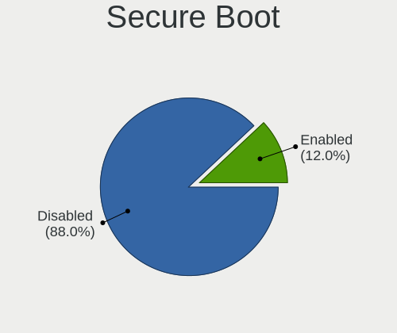
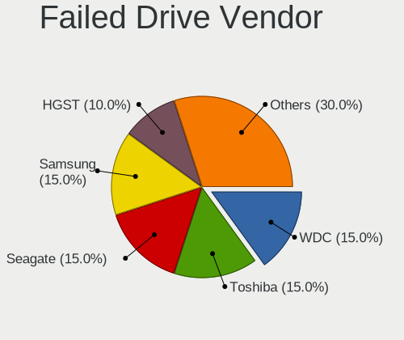
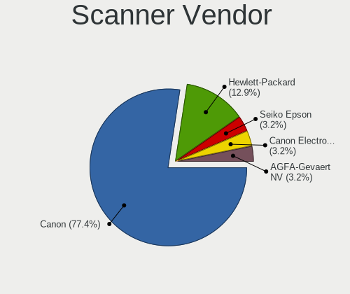
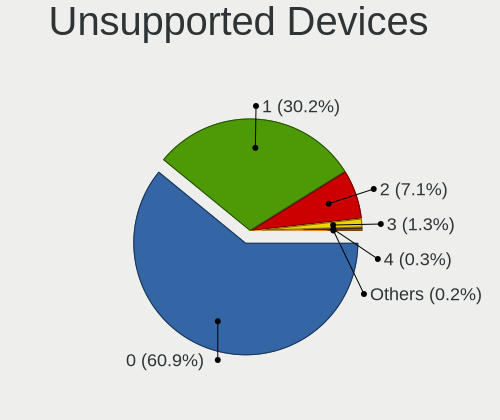

Linux Mint - Tested Hardware & Statistics (Notebooks)
-----------------------------------------------------

A project to collect tested hardware configurations for Linux Mint.

Anyone can contribute to this report by the [hw-probe](https://github.com/linuxhw/hw-probe) tool:

    sudo -E hw-probe -all -upload

Please contribute! Especially if your hardware is rare.

Contents
--------

* [ Test Cases ](#test-cases)

* [ System ](#system)
  - [ OS                       ](#os)
  - [ OS Family                ](#os-family)
  - [ Kernel                   ](#kernel)
  - [ Kernel Family            ](#kernel-family)
  - [ Kernel Major Ver.        ](#kernel-major-ver)
  - [ Arch                     ](#arch)
  - [ DE                       ](#de)
  - [ Display Server           ](#display-server)
  - [ Display Manager          ](#display-manager)
  - [ OS Lang                  ](#os-lang)
  - [ Boot Mode                ](#boot-mode)
  - [ Filesystem               ](#filesystem)
  - [ Part. scheme             ](#part-scheme)
  - [ Dual Boot with Linux/BSD ](#dual-boot-with-linuxbsd)
  - [ Dual Boot (Win)          ](#dual-boot-win)

* [ Board ](#board)
  - [ Vendor                   ](#vendor)
  - [ Model                    ](#model)
  - [ Model Family             ](#model-family)
  - [ MFG Year                 ](#mfg-year)
  - [ Form Factor              ](#form-factor)
  - [ Secure Boot              ](#secure-boot)
  - [ Coreboot                 ](#coreboot)
  - [ RAM Size                 ](#ram-size)
  - [ RAM Used                 ](#ram-used)
  - [ Total Drives             ](#total-drives)
  - [ Has CD-ROM               ](#has-cd-rom)
  - [ Has Ethernet             ](#has-ethernet)
  - [ Has WiFi                 ](#has-wifi)
  - [ Has Bluetooth            ](#has-bluetooth)

* [ Location ](#location)
  - [ Country                  ](#country)
  - [ City                     ](#city)

* [ Drives ](#drives)
  - [ Drive Vendor             ](#drive-vendor)
  - [ Drive Model              ](#drive-model)
  - [ HDD Vendor               ](#hdd-vendor)
  - [ SSD Vendor               ](#ssd-vendor)
  - [ Drive Kind               ](#drive-kind)
  - [ Drive Connector          ](#drive-connector)
  - [ Drive Size               ](#drive-size)
  - [ Space Total              ](#space-total)
  - [ Space Used               ](#space-used)
  - [ Malfunc. Drives          ](#malfunc-drives)
  - [ Malfunc. Drive Vendor    ](#malfunc-drive-vendor)
  - [ Malfunc. HDD Vendor      ](#malfunc-hdd-vendor)
  - [ Malfunc. Drive Kind      ](#malfunc-drive-kind)
  - [ Failed Drives            ](#failed-drives)
  - [ Failed Drive Vendor      ](#failed-drive-vendor)
  - [ Drive Status             ](#drive-status)

* [ Storage controller ](#storage-controller)
  - [ Storage Vendor           ](#storage-vendor)
  - [ Storage Model            ](#storage-model)
  - [ Storage Kind             ](#storage-kind)

* [ Processor ](#processor)
  - [ CPU Vendor               ](#cpu-vendor)
  - [ CPU Model                ](#cpu-model)
  - [ CPU Model Family         ](#cpu-model-family)
  - [ CPU Cores                ](#cpu-cores)
  - [ CPU Sockets              ](#cpu-sockets)
  - [ CPU Threads              ](#cpu-threads)
  - [ CPU Op-Modes             ](#cpu-op-modes)
  - [ CPU Microcode            ](#cpu-microcode)
  - [ CPU Microarch            ](#cpu-microarch)

* [ Graphics ](#graphics)
  - [ GPU Vendor               ](#gpu-vendor)
  - [ GPU Model                ](#gpu-model)
  - [ GPU Combo                ](#gpu-combo)
  - [ GPU Driver               ](#gpu-driver)
  - [ GPU Memory               ](#gpu-memory)

* [ Monitor ](#monitor)
  - [ Monitor Vendor           ](#monitor-vendor)
  - [ Monitor Model            ](#monitor-model)
  - [ Monitor Resolution       ](#monitor-resolution)
  - [ Monitor Diagonal         ](#monitor-diagonal)
  - [ Monitor Width            ](#monitor-width)
  - [ Aspect Ratio             ](#aspect-ratio)
  - [ Monitor Area             ](#monitor-area)
  - [ Pixel Density            ](#pixel-density)
  - [ Multiple Monitors        ](#multiple-monitors)

* [ Network ](#network)
  - [ Net Controller Vendor    ](#net-controller-vendor)
  - [ Net Controller Model     ](#net-controller-model)
  - [ Wireless Vendor          ](#wireless-vendor)
  - [ Wireless Model           ](#wireless-model)
  - [ Ethernet Vendor          ](#ethernet-vendor)
  - [ Ethernet Model           ](#ethernet-model)
  - [ Net Controller Kind      ](#net-controller-kind)
  - [ Used Controller          ](#used-controller)
  - [ NICs                     ](#nics)
  - [ IPv6                     ](#ipv6)

* [ Bluetooth ](#bluetooth)
  - [ Bluetooth Vendor         ](#bluetooth-vendor)
  - [ Bluetooth Model          ](#bluetooth-model)

* [ Sound ](#sound)
  - [ Sound Vendor             ](#sound-vendor)
  - [ Sound Model              ](#sound-model)

* [ Memory ](#memory)
  - [ Memory Vendor            ](#memory-vendor)
  - [ Memory Model             ](#memory-model)
  - [ Memory Kind              ](#memory-kind)
  - [ Memory Form Factor       ](#memory-form-factor)
  - [ Memory Size              ](#memory-size)
  - [ Memory Speed             ](#memory-speed)

* [ Printers & scanners ](#printers--scanners)
  - [ Printer Vendor           ](#printer-vendor)
  - [ Printer Model            ](#printer-model)
  - [ Scanner Vendor           ](#scanner-vendor)
  - [ Scanner Model            ](#scanner-model)

* [ Camera ](#camera)
  - [ Camera Vendor            ](#camera-vendor)
  - [ Camera Model             ](#camera-model)

* [ Security ](#security)
  - [ Fingerprint Vendor       ](#fingerprint-vendor)
  - [ Fingerprint Model        ](#fingerprint-model)
  - [ Chipcard Vendor          ](#chipcard-vendor)
  - [ Chipcard Model           ](#chipcard-model)

* [ Unsupported ](#unsupported)
  - [ Unsupported Devices      ](#unsupported-devices)
  - [ Unsupported Device Types ](#unsupported-device-types)

Test Cases
----------

Total: 14996

| Vendor        | Model                       | Probe                                                      | Date         |
|---------------|-----------------------------|------------------------------------------------------------|--------------|
| Multilaser    | PC024                       | [3311e26ac5](https://linux-hardware.org/?probe=3311e26ac5) | Aug 12, 2023 |
| Dell          | Inspiron 5558               | [5bb31ccda3](https://linux-hardware.org/?probe=5bb31ccda3) | Aug 12, 2023 |
| Lenovo        | ThinkPad X1 Carbon 6th 2... | [53c81d6d36](https://linux-hardware.org/?probe=53c81d6d36) | Aug 12, 2023 |
| HP            | Notebook                    | [de8a0230c4](https://linux-hardware.org/?probe=de8a0230c4) | Aug 11, 2023 |
| Dell          | Inspiron 5559               | [f3e1bb3812](https://linux-hardware.org/?probe=f3e1bb3812) | Aug 11, 2023 |
| Apple         | MacBookPro14,2              | [8b0d028b37](https://linux-hardware.org/?probe=8b0d028b37) | Aug 11, 2023 |
| HP            | 250 G3                      | [6ba303bc6b](https://linux-hardware.org/?probe=6ba303bc6b) | Aug 11, 2023 |
| HP            | Laptop 17-cp1xxx            | [ac523f4e3b](https://linux-hardware.org/?probe=ac523f4e3b) | Aug 11, 2023 |
| Fujitsu Si... | AMILO Xa 1526               | [0a1e2a7f23](https://linux-hardware.org/?probe=0a1e2a7f23) | Aug 11, 2023 |
| Fujitsu Si... | AMILO Xa 1526               | [742b085257](https://linux-hardware.org/?probe=742b085257) | Aug 11, 2023 |
| HP            | Pavilion dv6                | [1689b3fd44](https://linux-hardware.org/?probe=1689b3fd44) | Aug 11, 2023 |
| Leader        | SC404PRO                    | [6f24ee5e0c](https://linux-hardware.org/?probe=6f24ee5e0c) | Aug 11, 2023 |
| Acer          | Aspire E1-731               | [b75a766ee9](https://linux-hardware.org/?probe=b75a766ee9) | Aug 10, 2023 |
| ASUSTek       | VivoBook_ASUSLaptop X515... | [24629e2553](https://linux-hardware.org/?probe=24629e2553) | Aug 10, 2023 |
| Lenovo        | ThinkBook 16p Gen 2 20YM    | [82dde7d058](https://linux-hardware.org/?probe=82dde7d058) | Aug 10, 2023 |
| Fujitsu       | LIFEBOOK A530               | [05e64e3a0a](https://linux-hardware.org/?probe=05e64e3a0a) | Aug 10, 2023 |
| HP            | ZBook Studio 16 inch G9 ... | [e1462f1e3a](https://linux-hardware.org/?probe=e1462f1e3a) | Aug 10, 2023 |
| Toshiba       | Satellite C660              | [26597d8a51](https://linux-hardware.org/?probe=26597d8a51) | Aug 10, 2023 |
| Lenovo        | IdeaPad 320-15AST 80XV      | [0caf17e079](https://linux-hardware.org/?probe=0caf17e079) | Aug 10, 2023 |
| Fujitsu Si... | AMILO Xa 1526               | [a3b9be2f56](https://linux-hardware.org/?probe=a3b9be2f56) | Aug 10, 2023 |
| ASUSTek       | VivoBook_ASUSLaptop X170... | [75b55100a9](https://linux-hardware.org/?probe=75b55100a9) | Aug 10, 2023 |
| Dell          | Precision 5540              | [e68fee1e24](https://linux-hardware.org/?probe=e68fee1e24) | Aug 10, 2023 |
| HP            | EliteBook 8740w             | [69a5fc6981](https://linux-hardware.org/?probe=69a5fc6981) | Aug 10, 2023 |
| Lenovo        | IdeaPad 530S-14ARR 81H1     | [cec1060cd6](https://linux-hardware.org/?probe=cec1060cd6) | Aug 10, 2023 |
| ASUSTek       | ZenBook UX534FTC_UX534FT    | [26b98e8740](https://linux-hardware.org/?probe=26b98e8740) | Aug 09, 2023 |
| HP            | Victus by Gaming Laptop ... | [8b57037d50](https://linux-hardware.org/?probe=8b57037d50) | Aug 09, 2023 |
| Apple         | MacBookPro15,4              | [f63c9ffab9](https://linux-hardware.org/?probe=f63c9ffab9) | Aug 09, 2023 |
| Wortmann      | TERRA_MOBILE_1749           | [3986ff4298](https://linux-hardware.org/?probe=3986ff4298) | Aug 09, 2023 |
| HP            | EliteBook 830 G8 Noteboo... | [2f7f77225a](https://linux-hardware.org/?probe=2f7f77225a) | Aug 09, 2023 |
| HP            | EliteBook 840 G2            | [90291816a0](https://linux-hardware.org/?probe=90291816a0) | Aug 09, 2023 |
| ASUSTek       | ZenBook UX534FTC_UX534FT    | [68eb21c824](https://linux-hardware.org/?probe=68eb21c824) | Aug 09, 2023 |
| HP            | ProBook 4740s               | [1c56daf13e](https://linux-hardware.org/?probe=1c56daf13e) | Aug 09, 2023 |
| HP            | 2000                        | [fa62a90143](https://linux-hardware.org/?probe=fa62a90143) | Aug 09, 2023 |
| HP            | 255 G5                      | [d4adfe0ead](https://linux-hardware.org/?probe=d4adfe0ead) | Aug 09, 2023 |
| ASUSTek       | ROG Zephyrus G15 GA503RM... | [5a4c9f0e5a](https://linux-hardware.org/?probe=5a4c9f0e5a) | Aug 09, 2023 |
| HP            | Laptop 15-bw0xx             | [f23d951287](https://linux-hardware.org/?probe=f23d951287) | Aug 09, 2023 |
| HP            | Laptop 15-bw0xx             | [ff36238822](https://linux-hardware.org/?probe=ff36238822) | Aug 09, 2023 |
| Dell          | Inspiron 15-7568            | [745ebb5475](https://linux-hardware.org/?probe=745ebb5475) | Aug 09, 2023 |
| Lenovo        | IdeaPad 530S-14ARR 81H1     | [33beb40ea6](https://linux-hardware.org/?probe=33beb40ea6) | Aug 09, 2023 |
| Exo           | Smart Serie LT              | [08d7c1d923](https://linux-hardware.org/?probe=08d7c1d923) | Aug 09, 2023 |
| Sony          | VJF151                      | [b2768a0abf](https://linux-hardware.org/?probe=b2768a0abf) | Aug 09, 2023 |
| Lenovo        | ThinkPad T460 20FMA00F00    | [4bd13ae71d](https://linux-hardware.org/?probe=4bd13ae71d) | Aug 09, 2023 |
| Dell          | Inspiron 5584               | [33e964d1d6](https://linux-hardware.org/?probe=33e964d1d6) | Aug 09, 2023 |
| Lenovo        | ThinkPad E595 20NFCTO1WW    | [4f4c3a2b96](https://linux-hardware.org/?probe=4f4c3a2b96) | Aug 08, 2023 |
| ASUSTek       | VivoBook_ASUSLaptop X170... | [f48f680274](https://linux-hardware.org/?probe=f48f680274) | Aug 08, 2023 |
| Acer          | Aspire 8930                 | [1a39769fb2](https://linux-hardware.org/?probe=1a39769fb2) | Aug 08, 2023 |
| HP            | 255 G5                      | [b38a912e23](https://linux-hardware.org/?probe=b38a912e23) | Aug 08, 2023 |
| HP            | ZBook 15 G2                 | [cb340460b6](https://linux-hardware.org/?probe=cb340460b6) | Aug 08, 2023 |
| Lenovo        | IdeaPad 330-15IKB 81DC      | [f6b63d9967](https://linux-hardware.org/?probe=f6b63d9967) | Aug 08, 2023 |
| ASUSTek       | 1001P                       | [b4326c3c45](https://linux-hardware.org/?probe=b4326c3c45) | Aug 08, 2023 |
| Lenovo        | IdeaPad Slim 5 16IRL8 82... | [179beade50](https://linux-hardware.org/?probe=179beade50) | Aug 08, 2023 |
| HP            | Unknown                     | [567a10ceb2](https://linux-hardware.org/?probe=567a10ceb2) | Aug 08, 2023 |
| HP            | Laptop 15-bs0xx             | [2a7e23b825](https://linux-hardware.org/?probe=2a7e23b825) | Aug 08, 2023 |
| Dell          | XPS L501X                   | [60a937133c](https://linux-hardware.org/?probe=60a937133c) | Aug 08, 2023 |
| HP            | Pavilion 17                 | [4833cfdbd8](https://linux-hardware.org/?probe=4833cfdbd8) | Aug 08, 2023 |
| ASUSTek       | ROG Flow X13 GV301QE_GV3... | [c1062b9705](https://linux-hardware.org/?probe=c1062b9705) | Aug 07, 2023 |
| HP            | Elite x2 1012 G1            | [fea0f58ed5](https://linux-hardware.org/?probe=fea0f58ed5) | Aug 07, 2023 |
| Dell          | Latitude 7490               | [e7738263f7](https://linux-hardware.org/?probe=e7738263f7) | Aug 07, 2023 |
| Dell          | Latitude 7490               | [a3b95f2fc2](https://linux-hardware.org/?probe=a3b95f2fc2) | Aug 07, 2023 |
| Dell          | Vostro 1700                 | [009c767dae](https://linux-hardware.org/?probe=009c767dae) | Aug 07, 2023 |
| ASUSTek       | ROG Flow X13 GV301QE_GV3... | [46a7513850](https://linux-hardware.org/?probe=46a7513850) | Aug 07, 2023 |
| Wortmann      | TERRA_MOBILE_1749           | [22624fbda5](https://linux-hardware.org/?probe=22624fbda5) | Aug 07, 2023 |
| Acer          | Aspire V3-771               | [ebdbffb7da](https://linux-hardware.org/?probe=ebdbffb7da) | Aug 07, 2023 |
| Lenovo        | IdeaPad 100-15IBY 80MJ      | [6601d0d136](https://linux-hardware.org/?probe=6601d0d136) | Aug 07, 2023 |
| HP            | EliteBook 8470p             | [62d3a8d08d](https://linux-hardware.org/?probe=62d3a8d08d) | Aug 07, 2023 |
| Acer          | Aspire 5734Z                | [158671d9c9](https://linux-hardware.org/?probe=158671d9c9) | Aug 07, 2023 |
| ASUSTek       | VivoBook_ASUSLaptop M140... | [bd036e1e65](https://linux-hardware.org/?probe=bd036e1e65) | Aug 07, 2023 |
| ASUSTek       | N552VX                      | [1c616233ca](https://linux-hardware.org/?probe=1c616233ca) | Aug 07, 2023 |
| Medion        | M14L-256                    | [7d0a8921dc](https://linux-hardware.org/?probe=7d0a8921dc) | Aug 07, 2023 |
| ASUSTek       | N76VM                       | [083980d0fb](https://linux-hardware.org/?probe=083980d0fb) | Aug 07, 2023 |
| Lenovo        | ThinkPad E15 Gen 3 20YGC... | [804851c490](https://linux-hardware.org/?probe=804851c490) | Aug 07, 2023 |
| Acer          | Predator PT515-51           | [e08b7b4cd8](https://linux-hardware.org/?probe=e08b7b4cd8) | Aug 07, 2023 |
| HP            | EliteBook 8570p             | [99635bf61d](https://linux-hardware.org/?probe=99635bf61d) | Aug 06, 2023 |
| Dell          | Latitude E7270              | [e7209c4bb7](https://linux-hardware.org/?probe=e7209c4bb7) | Aug 06, 2023 |
| Dell          | Latitude E5520              | [132e7834f7](https://linux-hardware.org/?probe=132e7834f7) | Aug 06, 2023 |
| ASUSTek       | N76VM                       | [80d45ff242](https://linux-hardware.org/?probe=80d45ff242) | Aug 06, 2023 |
| Unknown       | Unknown                     | [66dd893ce8](https://linux-hardware.org/?probe=66dd893ce8) | Aug 06, 2023 |
| Fujitsu Si... | AMILO Xa 1526               | [3d49205e68](https://linux-hardware.org/?probe=3d49205e68) | Aug 06, 2023 |
| Acer          | AO756                       | [60475c9d52](https://linux-hardware.org/?probe=60475c9d52) | Aug 06, 2023 |
| Teclast       | F7S                         | [a844443394](https://linux-hardware.org/?probe=a844443394) | Aug 06, 2023 |
| Lenovo        | ThinkPad T430 2349DS5       | [763d98ad86](https://linux-hardware.org/?probe=763d98ad86) | Aug 06, 2023 |
| Dell          | Inspiron 5584               | [7a4e005f77](https://linux-hardware.org/?probe=7a4e005f77) | Aug 06, 2023 |
| Apple         | MacBookPro9,2               | [7eb29a371d](https://linux-hardware.org/?probe=7eb29a371d) | Aug 06, 2023 |
| ASUSTek       | S301LA                      | [cc5477fc6b](https://linux-hardware.org/?probe=cc5477fc6b) | Aug 05, 2023 |
| Acer          | Aspire E5-572G              | [846dce7b1b](https://linux-hardware.org/?probe=846dce7b1b) | Aug 05, 2023 |
| Multilaser    | PC024                       | [85a4bdd497](https://linux-hardware.org/?probe=85a4bdd497) | Aug 05, 2023 |
| Mediacom      | SmartBook 130 FullHD - M... | [3aa51361ae](https://linux-hardware.org/?probe=3aa51361ae) | Aug 05, 2023 |
| Lenovo        | 100w Gen 3 82HY             | [3feb7899d2](https://linux-hardware.org/?probe=3feb7899d2) | Aug 05, 2023 |
| Acer          | Aspire A715-72G             | [c95d1a55cd](https://linux-hardware.org/?probe=c95d1a55cd) | Aug 05, 2023 |
| Teclast       | F7S                         | [71ab18cda5](https://linux-hardware.org/?probe=71ab18cda5) | Aug 05, 2023 |
| HUAWEI        | HVY-WXX9                    | [9f813efccc](https://linux-hardware.org/?probe=9f813efccc) | Aug 05, 2023 |
| Lenovo        | IdeaPad 3 14ALC6 82KT       | [349326315f](https://linux-hardware.org/?probe=349326315f) | Aug 05, 2023 |
| Lenovo        | ThinkBook 14 G4+ ARA 21D... | [a089f6ff62](https://linux-hardware.org/?probe=a089f6ff62) | Aug 05, 2023 |
| Notebook      | NP5x_NP6x_NP7xRNJ_RNH       | [f4f8099774](https://linux-hardware.org/?probe=f4f8099774) | Aug 05, 2023 |
| Acer          | AS E5-523G                  | [b37e833d1e](https://linux-hardware.org/?probe=b37e833d1e) | Aug 05, 2023 |
| Dell          | Latitude E5500              | [95ddcb321c](https://linux-hardware.org/?probe=95ddcb321c) | Aug 05, 2023 |
| Acer          | Swift SF514-54GT            | [12ee4ed8f6](https://linux-hardware.org/?probe=12ee4ed8f6) | Aug 05, 2023 |
| Acer          | Swift SF514-54GT            | [5a2ed78e49](https://linux-hardware.org/?probe=5a2ed78e49) | Aug 05, 2023 |
| Gigabyte      | RC14UD                      | [6ad0758102](https://linux-hardware.org/?probe=6ad0758102) | Aug 04, 2023 |
| Lenovo        | ThinkPad L450 20DSS00M00    | [e9f9c0e216](https://linux-hardware.org/?probe=e9f9c0e216) | Aug 04, 2023 |
| Fujitsu       | FMVS75MWP                   | [506a18b94f](https://linux-hardware.org/?probe=506a18b94f) | Aug 04, 2023 |
| Dell          | Inspiron 15 3511            | [3cd247313d](https://linux-hardware.org/?probe=3cd247313d) | Aug 04, 2023 |
| Acer          | Aspire V5-572P              | [1d27d25f8d](https://linux-hardware.org/?probe=1d27d25f8d) | Aug 03, 2023 |
| PC Special... | Ionico 16                   | [0839bbc721](https://linux-hardware.org/?probe=0839bbc721) | Aug 03, 2023 |
| Sony          | SVF1521G1EW                 | [b46b664a9e](https://linux-hardware.org/?probe=b46b664a9e) | Aug 03, 2023 |
| Dell          | Latitude 5480               | [c52baac4e0](https://linux-hardware.org/?probe=c52baac4e0) | Aug 03, 2023 |
| Lenovo        | ThinkPad T400 6475R1G       | [481e1aa044](https://linux-hardware.org/?probe=481e1aa044) | Aug 03, 2023 |
| ASUSTek       | VivoBook_ASUSLaptop X170... | [7d86876920](https://linux-hardware.org/?probe=7d86876920) | Aug 03, 2023 |
| Lenovo        | ThinkPad P51s 20HCS0660Y    | [6e8234ed89](https://linux-hardware.org/?probe=6e8234ed89) | Aug 03, 2023 |
| Panasonic     | CF-31WBLAXLM                | [580b017d88](https://linux-hardware.org/?probe=580b017d88) | Aug 03, 2023 |
| Acer          | Aspire 5733                 | [f09853c0ed](https://linux-hardware.org/?probe=f09853c0ed) | Aug 03, 2023 |
| Lenovo        | IdeaPad 3 15ADA05 81W1      | [9171e8e6b9](https://linux-hardware.org/?probe=9171e8e6b9) | Aug 03, 2023 |
| HP            | ENVY 17                     | [ef244ad969](https://linux-hardware.org/?probe=ef244ad969) | Aug 02, 2023 |
| HP            | Pavilion Laptop 15-eg0xx... | [101e2e7e7e](https://linux-hardware.org/?probe=101e2e7e7e) | Aug 02, 2023 |
| HP            | Pavilion Laptop 15-eg0xx... | [16cafd9d32](https://linux-hardware.org/?probe=16cafd9d32) | Aug 02, 2023 |
| Lenovo        | ThinkPad X1 Carbon Gen 9... | [cf7cad0e02](https://linux-hardware.org/?probe=cf7cad0e02) | Aug 02, 2023 |
| Medion        | X681X                       | [8209a37737](https://linux-hardware.org/?probe=8209a37737) | Aug 02, 2023 |
| Positivo      | Q232B                       | [006d77a18c](https://linux-hardware.org/?probe=006d77a18c) | Aug 02, 2023 |
| Lenovo        | ThinkPad T480 20L5001BUS    | [b340a9e075](https://linux-hardware.org/?probe=b340a9e075) | Aug 02, 2023 |
| Dell          | Latitude 7280               | [40a53f89cf](https://linux-hardware.org/?probe=40a53f89cf) | Aug 02, 2023 |
| HP            | Pavilion dv5                | [58b4ce4ff9](https://linux-hardware.org/?probe=58b4ce4ff9) | Aug 02, 2023 |
| Toshiba       | Satellite C660              | [5e74aca4e7](https://linux-hardware.org/?probe=5e74aca4e7) | Aug 02, 2023 |
| ASUSTek       | VivoBook_ASUSLaptop X160... | [4a6b173235](https://linux-hardware.org/?probe=4a6b173235) | Aug 01, 2023 |
| Acer          | Aspire ES1-521              | [127d7abd32](https://linux-hardware.org/?probe=127d7abd32) | Aug 01, 2023 |
| Lenovo        | ThinkPad X250 20CM001PGE    | [9c5503cd84](https://linux-hardware.org/?probe=9c5503cd84) | Aug 01, 2023 |
| Acer          | Aspire ES1-311              | [6f59479d87](https://linux-hardware.org/?probe=6f59479d87) | Aug 01, 2023 |
| HP            | Pavilion 15                 | [c66316cd62](https://linux-hardware.org/?probe=c66316cd62) | Aug 01, 2023 |
| Lenovo        | IdeaPad 320-15AST 80XV      | [c74f4bde19](https://linux-hardware.org/?probe=c74f4bde19) | Aug 01, 2023 |
| Dell          | Latitude E6440              | [57ce920c06](https://linux-hardware.org/?probe=57ce920c06) | Aug 01, 2023 |
| Medion        | E5214                       | [98cb0db418](https://linux-hardware.org/?probe=98cb0db418) | Aug 01, 2023 |
| HP            | Pavilion 15                 | [1ad3dc2f1b](https://linux-hardware.org/?probe=1ad3dc2f1b) | Aug 01, 2023 |
| Teclast       | Tbolt 10 DG                 | [cd75496056](https://linux-hardware.org/?probe=cd75496056) | Aug 01, 2023 |
| HP            | Unknown                     | [a4d8377dfa](https://linux-hardware.org/?probe=a4d8377dfa) | Aug 01, 2023 |
| Itautec       | Infoway a7420               | [da7459a0ea](https://linux-hardware.org/?probe=da7459a0ea) | Aug 01, 2023 |
| HUAWEI        | HVY-WXX9                    | [39774f9f5d](https://linux-hardware.org/?probe=39774f9f5d) | Aug 01, 2023 |
| HP            | Compaq 6910p                | [6720872cd9](https://linux-hardware.org/?probe=6720872cd9) | Aug 01, 2023 |
| HUAWEI        | BOHB-WAX9                   | [7486c0a60b](https://linux-hardware.org/?probe=7486c0a60b) | Jul 31, 2023 |
| Dell          | Latitude 7640               | [ddb87f6cdb](https://linux-hardware.org/?probe=ddb87f6cdb) | Jul 31, 2023 |
| Acer          | Aspire R5-471T              | [443869016d](https://linux-hardware.org/?probe=443869016d) | Jul 31, 2023 |
| HP            | Pavilion 14                 | [313aedd888](https://linux-hardware.org/?probe=313aedd888) | Jul 31, 2023 |
| Wortmann      | CR700                       | [2f3379e14e](https://linux-hardware.org/?probe=2f3379e14e) | Jul 31, 2023 |
| Toshiba       | Satellite S855              | [d7d26e7de3](https://linux-hardware.org/?probe=d7d26e7de3) | Jul 31, 2023 |
| HP            | Laptop 17-bs0xx             | [49dac3f2d9](https://linux-hardware.org/?probe=49dac3f2d9) | Jul 31, 2023 |
| HP            | Laptop 17-bs0xx             | [aca7e14a0e](https://linux-hardware.org/?probe=aca7e14a0e) | Jul 31, 2023 |
| HP            | ProBook 4720s               | [f1e4220c67](https://linux-hardware.org/?probe=f1e4220c67) | Jul 31, 2023 |
| Lenovo        | V15-IGL 82C3                | [6c0a6fff0a](https://linux-hardware.org/?probe=6c0a6fff0a) | Jul 31, 2023 |
| HP            | Pavilion g7                 | [51997a6e91](https://linux-hardware.org/?probe=51997a6e91) | Jul 31, 2023 |
| HP            | Laptop 15-bs0xx             | [0b157cd8f7](https://linux-hardware.org/?probe=0b157cd8f7) | Jul 31, 2023 |
| Dell          | Vostro 1510                 | [8e49dde20d](https://linux-hardware.org/?probe=8e49dde20d) | Jul 31, 2023 |
| HP            | Laptop 17-cp0xxx            | [e8b1218a57](https://linux-hardware.org/?probe=e8b1218a57) | Jul 31, 2023 |
| Dell          | Vostro 1510                 | [8d6d8b9243](https://linux-hardware.org/?probe=8d6d8b9243) | Jul 31, 2023 |
| Dell          | Vostro 1510                 | [13e9f3fa3c](https://linux-hardware.org/?probe=13e9f3fa3c) | Jul 31, 2023 |
| Lenovo        | ThinkPad T460 20FMA00F00    | [9268d1c4f9](https://linux-hardware.org/?probe=9268d1c4f9) | Jul 30, 2023 |
| I-Life Dig... | ZED Air CX7                 | [2c897f0413](https://linux-hardware.org/?probe=2c897f0413) | Jul 30, 2023 |
| Lenovo        | IdeaPad 520-15IKB 81BF      | [8de1f944a7](https://linux-hardware.org/?probe=8de1f944a7) | Jul 30, 2023 |
| Acer          | Aspire 5741G                | [3c56ffebcb](https://linux-hardware.org/?probe=3c56ffebcb) | Jul 30, 2023 |
| Lenovo        | V15 G3 IAP 82TT             | [6ec734b217](https://linux-hardware.org/?probe=6ec734b217) | Jul 30, 2023 |
| Acer          | Aspire A315-56              | [522c7e4381](https://linux-hardware.org/?probe=522c7e4381) | Jul 30, 2023 |
| Lenovo        | ThinkPad T470s 20HGS0DT0... | [bd0d0f2888](https://linux-hardware.org/?probe=bd0d0f2888) | Jul 30, 2023 |
| HUAWEI        | BOM-WXX9                    | [583bc42f4e](https://linux-hardware.org/?probe=583bc42f4e) | Jul 30, 2023 |
| Dell          | Latitude 3510               | [8bfe0fe5fb](https://linux-hardware.org/?probe=8bfe0fe5fb) | Jul 30, 2023 |
| Unknown       | Unknown                     | [b5f5ef27a8](https://linux-hardware.org/?probe=b5f5ef27a8) | Jul 30, 2023 |
| Medion        | E5214                       | [d1c634ee07](https://linux-hardware.org/?probe=d1c634ee07) | Jul 30, 2023 |
| Dell          | Latitude E5570              | [1f9be76313](https://linux-hardware.org/?probe=1f9be76313) | Jul 30, 2023 |
| Dell          | Latitude E5430 non-vPro     | [3daec696c7](https://linux-hardware.org/?probe=3daec696c7) | Jul 30, 2023 |
| Dell          | Latitude E5520              | [09aa4e35c4](https://linux-hardware.org/?probe=09aa4e35c4) | Jul 30, 2023 |
| Lenovo        | ThinkPad T430 2344BZU       | [f7f737c592](https://linux-hardware.org/?probe=f7f737c592) | Jul 30, 2023 |
| Lenovo        | ThinkPad T430 2344BZU       | [d9c960b2b7](https://linux-hardware.org/?probe=d9c960b2b7) | Jul 30, 2023 |
| HP            | EliteBook 840 G5            | [c3101b6a76](https://linux-hardware.org/?probe=c3101b6a76) | Jul 30, 2023 |
| HP            | EliteBook 840 G5            | [915938d446](https://linux-hardware.org/?probe=915938d446) | Jul 30, 2023 |
| Acer          | Aspire A315-42              | [3d1aebd069](https://linux-hardware.org/?probe=3d1aebd069) | Jul 30, 2023 |
| Dell          | G5 5590                     | [2745b35776](https://linux-hardware.org/?probe=2745b35776) | Jul 29, 2023 |
| Lenovo        | G500s 20245                 | [eff9350e7f](https://linux-hardware.org/?probe=eff9350e7f) | Jul 29, 2023 |
| HP            | ZBook Fury 16 G9 Mobile ... | [2b50e2b375](https://linux-hardware.org/?probe=2b50e2b375) | Jul 29, 2023 |
| Acer          | Swift SF314-56              | [f4d6e0b148](https://linux-hardware.org/?probe=f4d6e0b148) | Jul 29, 2023 |
| MSI           | GT70 2PE                    | [d0ef2177c3](https://linux-hardware.org/?probe=d0ef2177c3) | Jul 29, 2023 |
| MSI           | GT70 2PE                    | [bc059e2204](https://linux-hardware.org/?probe=bc059e2204) | Jul 29, 2023 |
| Acer          | Swift SF315-52G             | [413fcf8114](https://linux-hardware.org/?probe=413fcf8114) | Jul 29, 2023 |
| VANT          | MOOVE15_2023                | [6943d341c4](https://linux-hardware.org/?probe=6943d341c4) | Jul 29, 2023 |
| Acer          | Swift SF314-56              | [63a49ff6dd](https://linux-hardware.org/?probe=63a49ff6dd) | Jul 29, 2023 |
| HP            | Pavilion dv5                | [d52d0f879a](https://linux-hardware.org/?probe=d52d0f879a) | Jul 29, 2023 |
| Acer          | Aspire A315-42              | [02d2d041f8](https://linux-hardware.org/?probe=02d2d041f8) | Jul 29, 2023 |
| Lenovo        | ThinkPad T520 4243JA1       | [410cebaba3](https://linux-hardware.org/?probe=410cebaba3) | Jul 28, 2023 |
| ASUSTek       | X555LJ                      | [690e49362b](https://linux-hardware.org/?probe=690e49362b) | Jul 28, 2023 |
| HP            | EliteBook 820 G4            | [63a72ed445](https://linux-hardware.org/?probe=63a72ed445) | Jul 28, 2023 |
| Acer          | Aspire 5810T                | [2d141d703d](https://linux-hardware.org/?probe=2d141d703d) | Jul 28, 2023 |
| Acer          | Aspire A515-52G             | [2ba77ece3b](https://linux-hardware.org/?probe=2ba77ece3b) | Jul 28, 2023 |
| Lenovo        | ThinkPad E15 Gen 4 21ED0... | [b9b1a625ee](https://linux-hardware.org/?probe=b9b1a625ee) | Jul 28, 2023 |
| HP            | Laptop 15s-eq2xxx           | [8fee6296fe](https://linux-hardware.org/?probe=8fee6296fe) | Jul 28, 2023 |
| Acer          | Aspire V3-771               | [4abc91d2fb](https://linux-hardware.org/?probe=4abc91d2fb) | Jul 28, 2023 |
| Lenovo        | ThinkPad W541 20EFS00N00    | [c9f80b56fc](https://linux-hardware.org/?probe=c9f80b56fc) | Jul 28, 2023 |
| Lenovo        | IdeaPad 3 17IML05 81WC      | [79acef5aba](https://linux-hardware.org/?probe=79acef5aba) | Jul 28, 2023 |
| Lenovo        | G40-45 80E1                 | [27af99ec54](https://linux-hardware.org/?probe=27af99ec54) | Jul 28, 2023 |
| TUXEDO        | Unknown                     | [9c46ee9f93](https://linux-hardware.org/?probe=9c46ee9f93) | Jul 28, 2023 |
| HP            | EliteBook 845 G8 Noteboo... | [dc2835b589](https://linux-hardware.org/?probe=dc2835b589) | Jul 28, 2023 |
| Lenovo        | ThinkPad T460 20FMS22905    | [f95fe4ced5](https://linux-hardware.org/?probe=f95fe4ced5) | Jul 28, 2023 |
| HP            | Laptop 17-cp1xxx            | [29a0a48515](https://linux-hardware.org/?probe=29a0a48515) | Jul 28, 2023 |
| Samsung       | 340XAA/350XAA/550XAA        | [8ca0357bf1](https://linux-hardware.org/?probe=8ca0357bf1) | Jul 28, 2023 |
| Google        | Reef                        | [96774077fc](https://linux-hardware.org/?probe=96774077fc) | Jul 28, 2023 |
| PC Special... | Ionico 16                   | [86d9ab8b73](https://linux-hardware.org/?probe=86d9ab8b73) | Jul 28, 2023 |
| PC Special... | Ionico 16                   | [6ea424234a](https://linux-hardware.org/?probe=6ea424234a) | Jul 28, 2023 |
| HP            | Pavilion 17                 | [eb4d13c329](https://linux-hardware.org/?probe=eb4d13c329) | Jul 28, 2023 |
| Alienware     | m17 R4                      | [eece2da9ed](https://linux-hardware.org/?probe=eece2da9ed) | Jul 27, 2023 |
| HP            | EliteBook 840 G3            | [b464dbd11c](https://linux-hardware.org/?probe=b464dbd11c) | Jul 27, 2023 |
| Acer          | Aspire 5810T                | [9b7b328324](https://linux-hardware.org/?probe=9b7b328324) | Jul 27, 2023 |
| Lenovo        | ThinkPad T480 20L6S55L00    | [5b3742984b](https://linux-hardware.org/?probe=5b3742984b) | Jul 27, 2023 |
| Lenovo        | ThinkPad L15 Gen 2 20X30... | [9c8b9571d9](https://linux-hardware.org/?probe=9c8b9571d9) | Jul 27, 2023 |
| HP            | EliteBook 845 G8 Noteboo... | [ac68775946](https://linux-hardware.org/?probe=ac68775946) | Jul 27, 2023 |
| HP            | EliteBook 8540w             | [d91f2ff8ba](https://linux-hardware.org/?probe=d91f2ff8ba) | Jul 27, 2023 |
| Lenovo        | ThinkPad E15 Gen 4 21ED0... | [9970afb7db](https://linux-hardware.org/?probe=9970afb7db) | Jul 27, 2023 |
| Acer          | Aspire A515-56              | [7c716b6ab0](https://linux-hardware.org/?probe=7c716b6ab0) | Jul 27, 2023 |
| Multilaser    | PC024                       | [fa5b5a3146](https://linux-hardware.org/?probe=fa5b5a3146) | Jul 27, 2023 |
| HP            | Laptop 17-cp0xxx            | [79ea58e0d1](https://linux-hardware.org/?probe=79ea58e0d1) | Jul 26, 2023 |
| PC Special... | Ionico 16                   | [5c91300246](https://linux-hardware.org/?probe=5c91300246) | Jul 26, 2023 |
| Apple         | MacBookPro5,2               | [e367e06cac](https://linux-hardware.org/?probe=e367e06cac) | Jul 25, 2023 |
| Acer          | Aspire 5560                 | [edd90996c4](https://linux-hardware.org/?probe=edd90996c4) | Jul 25, 2023 |
| MSI           | GL75 Leopard 10SFR          | [8b976f0d08](https://linux-hardware.org/?probe=8b976f0d08) | Jul 25, 2023 |
| Dell          | Inspiron 5570               | [fb125d5fcb](https://linux-hardware.org/?probe=fb125d5fcb) | Jul 25, 2023 |
| ECT           | ONE GAMING Laptop Carry ... | [335aad489c](https://linux-hardware.org/?probe=335aad489c) | Jul 25, 2023 |
| Positivo      | S14SL01                     | [7ee0f7e8d1](https://linux-hardware.org/?probe=7ee0f7e8d1) | Jul 25, 2023 |
| Lenovo        | Yoga S740-14IIL 81RS        | [e46d04faa8](https://linux-hardware.org/?probe=e46d04faa8) | Jul 25, 2023 |
| Lenovo        | Yoga S740-14IIL 81RS        | [0b7f69aaf6](https://linux-hardware.org/?probe=0b7f69aaf6) | Jul 25, 2023 |
| ASUSTek       | X540LJ                      | [798cadd754](https://linux-hardware.org/?probe=798cadd754) | Jul 25, 2023 |
| Lenovo        | ThinkPad T430 2347H91       | [0ed3c4bc6a](https://linux-hardware.org/?probe=0ed3c4bc6a) | Jul 25, 2023 |
| Compaq        | Presario CQ-23              | [b78363eeaf](https://linux-hardware.org/?probe=b78363eeaf) | Jul 25, 2023 |
| HP            | Pavilion dv8000 (ET839UA... | [562e6e1026](https://linux-hardware.org/?probe=562e6e1026) | Jul 25, 2023 |
| HP            | Pavilion Gaming Laptop 1... | [2ca3c71f4a](https://linux-hardware.org/?probe=2ca3c71f4a) | Jul 24, 2023 |
| ASUSTek       | VivoBook_ASUSLaptop E210... | [f4f494d289](https://linux-hardware.org/?probe=f4f494d289) | Jul 24, 2023 |
| Acer          | Aspire E1-571               | [24b5ed47e3](https://linux-hardware.org/?probe=24b5ed47e3) | Jul 24, 2023 |
| Teclast       | F15Plus 2                   | [53d02a90b1](https://linux-hardware.org/?probe=53d02a90b1) | Jul 24, 2023 |
| Lenovo        | V15 G2 ALC 82KD             | [ffb1e25ac0](https://linux-hardware.org/?probe=ffb1e25ac0) | Jul 24, 2023 |
| Dell          | Inspiron 5570               | [3d08e59ce3](https://linux-hardware.org/?probe=3d08e59ce3) | Jul 24, 2023 |
| Dell          | Latitude 2110               | [05a7868709](https://linux-hardware.org/?probe=05a7868709) | Jul 24, 2023 |
| Acer          | Aspire V5-572P              | [2033b22202](https://linux-hardware.org/?probe=2033b22202) | Jul 24, 2023 |
| Acer          | Aspire V5-572P              | [47b219049e](https://linux-hardware.org/?probe=47b219049e) | Jul 24, 2023 |
| Fujitsu       | LIFEBOOK A530               | [8c0fa80a0e](https://linux-hardware.org/?probe=8c0fa80a0e) | Jul 24, 2023 |
| Acer          | Aspire A715-74G             | [b27862dc34](https://linux-hardware.org/?probe=b27862dc34) | Jul 24, 2023 |
| ASUSTek       | VivoBook_ASUSLaptop X403... | [9fa1cd70a3](https://linux-hardware.org/?probe=9fa1cd70a3) | Jul 24, 2023 |
| LG Electro... | R490-G.BR51P1               | [eecedbc045](https://linux-hardware.org/?probe=eecedbc045) | Jul 24, 2023 |
| HP            | ProBook 635 Aero G8 Note... | [ff5392a180](https://linux-hardware.org/?probe=ff5392a180) | Jul 23, 2023 |
| Toshiba       | Satellite S55-A             | [af52c268cd](https://linux-hardware.org/?probe=af52c268cd) | Jul 23, 2023 |
| ASUSTek       | X555LAB                     | [0e40daefd2](https://linux-hardware.org/?probe=0e40daefd2) | Jul 23, 2023 |
| Acer          | Aspire V3-772               | [06eca9873d](https://linux-hardware.org/?probe=06eca9873d) | Jul 23, 2023 |
| Samsung       | 350V5C/351V5C/3540VC/344... | [10e8c0d4ad](https://linux-hardware.org/?probe=10e8c0d4ad) | Jul 23, 2023 |
| HP            | Pavilion Laptop 15-eh1xx... | [a700c95a0f](https://linux-hardware.org/?probe=a700c95a0f) | Jul 23, 2023 |
| ASUSTek       | B400A                       | [fa112861d2](https://linux-hardware.org/?probe=fa112861d2) | Jul 23, 2023 |
| Samsung       | 340XAA/350XAA/550XAA        | [c361b3b1ac](https://linux-hardware.org/?probe=c361b3b1ac) | Jul 22, 2023 |
| Apple         | MacBook5,1                  | [83d48bc8eb](https://linux-hardware.org/?probe=83d48bc8eb) | Jul 22, 2023 |
| Gateway       | NV57H                       | [3209dcf267](https://linux-hardware.org/?probe=3209dcf267) | Jul 22, 2023 |
| Gateway       | NV57H                       | [35dac8980f](https://linux-hardware.org/?probe=35dac8980f) | Jul 22, 2023 |
| Acer          | Aspire VN7-571G             | [9cb2aaa7da](https://linux-hardware.org/?probe=9cb2aaa7da) | Jul 22, 2023 |
| ASUSTek       | Zenbook UM5302TA_UM5302T... | [c06811057a](https://linux-hardware.org/?probe=c06811057a) | Jul 22, 2023 |
| Lenovo        | B590 20208                  | [41f2b0b599](https://linux-hardware.org/?probe=41f2b0b599) | Jul 21, 2023 |
| Lenovo        | IdeaPad 3 14ITL05 81X7      | [04c15ec0eb](https://linux-hardware.org/?probe=04c15ec0eb) | Jul 21, 2023 |
| Acer          | Aspire VN7-571G             | [d517bf7f3b](https://linux-hardware.org/?probe=d517bf7f3b) | Jul 21, 2023 |
| Dell          | Latitude E6540              | [706be0ab49](https://linux-hardware.org/?probe=706be0ab49) | Jul 21, 2023 |
| HP            | ProBook 470 G2              | [b7fc9c0c1a](https://linux-hardware.org/?probe=b7fc9c0c1a) | Jul 21, 2023 |
| ASUSTek       | VivoBook_ASUS Laptop X50... | [3db32d6c63](https://linux-hardware.org/?probe=3db32d6c63) | Jul 21, 2023 |
| Apple         | MacBookPro11,4              | [cce59a7f72](https://linux-hardware.org/?probe=cce59a7f72) | Jul 21, 2023 |
| HP            | Laptop 17-cp0xxx            | [0b18f9835b](https://linux-hardware.org/?probe=0b18f9835b) | Jul 21, 2023 |
| Toshiba       | Satellite A135              | [5bd6d0c2d8](https://linux-hardware.org/?probe=5bd6d0c2d8) | Jul 20, 2023 |
| Apple         | MacBookPro11,3              | [fcfe4df4c1](https://linux-hardware.org/?probe=fcfe4df4c1) | Jul 20, 2023 |
| MSI           | CR700                       | [5cde06d6b9](https://linux-hardware.org/?probe=5cde06d6b9) | Jul 20, 2023 |
| MSI           | CR700                       | [2b2e403f78](https://linux-hardware.org/?probe=2b2e403f78) | Jul 20, 2023 |
| Acer          | Aspire A317-53              | [d8e84157ab](https://linux-hardware.org/?probe=d8e84157ab) | Jul 20, 2023 |
| HP            | Elite x2 1012 G1            | [78f66f7c03](https://linux-hardware.org/?probe=78f66f7c03) | Jul 20, 2023 |
| Lenovo        | IdeaPad 530S-14ARR 81H1     | [a05f11a6b4](https://linux-hardware.org/?probe=a05f11a6b4) | Jul 20, 2023 |
| Lenovo        | IdeaPad 3 14ALC6 82KT       | [39ea43d323](https://linux-hardware.org/?probe=39ea43d323) | Jul 20, 2023 |
| Lenovo        | ThinkPad L15 Gen 2 20X30... | [a8f79a71f7](https://linux-hardware.org/?probe=a8f79a71f7) | Jul 20, 2023 |
| Lenovo        | IdeaPad 530S-14ARR 81H1     | [2e18524ef0](https://linux-hardware.org/?probe=2e18524ef0) | Jul 20, 2023 |
| AVITA         | NS14A6                      | [594afbeb74](https://linux-hardware.org/?probe=594afbeb74) | Jul 19, 2023 |
| Acer          | AN515-44                    | [171bd20f26](https://linux-hardware.org/?probe=171bd20f26) | Jul 19, 2023 |
| Gateway       | NV55C                       | [a87e93c2a7](https://linux-hardware.org/?probe=a87e93c2a7) | Jul 19, 2023 |
| Dell          | Inspiron N4050              | [42ddc0425b](https://linux-hardware.org/?probe=42ddc0425b) | Jul 19, 2023 |
| Chuwi         | CoreBook                    | [816be37c03](https://linux-hardware.org/?probe=816be37c03) | Jul 19, 2023 |
| Acer          | AN515-44                    | [c40876ce5f](https://linux-hardware.org/?probe=c40876ce5f) | Jul 19, 2023 |
| Fujitsu       | LIFEBOOK A512               | [adc2f71c13](https://linux-hardware.org/?probe=adc2f71c13) | Jul 19, 2023 |
| HP            | Compaq 6510b (KE135ET#AB... | [5f123a3842](https://linux-hardware.org/?probe=5f123a3842) | Jul 19, 2023 |
| Lenovo        | ThinkPad X390 20Q1S0HE00    | [9f95f31702](https://linux-hardware.org/?probe=9f95f31702) | Jul 19, 2023 |
| Lenovo        | G50-70 20351                | [a55acd567e](https://linux-hardware.org/?probe=a55acd567e) | Jul 19, 2023 |
| Acer          | Aspire A515-47              | [d2ed305ac1](https://linux-hardware.org/?probe=d2ed305ac1) | Jul 19, 2023 |
| HP            | ProBook 6550b               | [93a086f0e1](https://linux-hardware.org/?probe=93a086f0e1) | Jul 18, 2023 |
| Positivo      | W942SW_SW1                  | [f8f65185cd](https://linux-hardware.org/?probe=f8f65185cd) | Jul 18, 2023 |
| Dell          | Latitude 5480               | [2db18c20d1](https://linux-hardware.org/?probe=2db18c20d1) | Jul 18, 2023 |
| ASUSTek       | VivoBook_ASUSLaptop M650... | [8ce3a9560a](https://linux-hardware.org/?probe=8ce3a9560a) | Jul 18, 2023 |
| Dell          | Inspiron 15-3567            | [4b0ce11ac5](https://linux-hardware.org/?probe=4b0ce11ac5) | Jul 18, 2023 |
| Dell          | Inspiron 15-3567            | [4f7745f5de](https://linux-hardware.org/?probe=4f7745f5de) | Jul 18, 2023 |
| Lenovo        | IdeaPad 320-17ABR 80YN      | [17c6866da9](https://linux-hardware.org/?probe=17c6866da9) | Jul 18, 2023 |
| Dell          | Latitude E5510              | [3b006db4ec](https://linux-hardware.org/?probe=3b006db4ec) | Jul 18, 2023 |
| Dell          | Latitude 5480               | [30aaaf3ba8](https://linux-hardware.org/?probe=30aaaf3ba8) | Jul 18, 2023 |
| HP            | ProBook 6570b               | [0a74371e23](https://linux-hardware.org/?probe=0a74371e23) | Jul 18, 2023 |
| HP            | Laptop 15-dw1xxx            | [1efe34d39a](https://linux-hardware.org/?probe=1efe34d39a) | Jul 18, 2023 |
| Lenovo        | ThinkPad P1 Gen 4i 20Y4S... | [2f730cccf1](https://linux-hardware.org/?probe=2f730cccf1) | Jul 18, 2023 |
| Lenovo        | IdeaPad S145-15IWL 81S9     | [4cdb03ec24](https://linux-hardware.org/?probe=4cdb03ec24) | Jul 18, 2023 |
| Multilaser    | PC024                       | [b1220586b0](https://linux-hardware.org/?probe=b1220586b0) | Jul 18, 2023 |
| HP            | ENVY Notebook               | [6851019f20](https://linux-hardware.org/?probe=6851019f20) | Jul 17, 2023 |
| Lenovo        | V15 G4 AMN 82YU             | [b5e1bfb09d](https://linux-hardware.org/?probe=b5e1bfb09d) | Jul 17, 2023 |
| Lenovo        | V15 G4 AMN 82YU             | [bc8992d98a](https://linux-hardware.org/?probe=bc8992d98a) | Jul 17, 2023 |
| Lenovo        | IdeaPad 510-15ISK 80SR      | [958f57fd27](https://linux-hardware.org/?probe=958f57fd27) | Jul 17, 2023 |
| Multilaser    | PC024                       | [04c0168bce](https://linux-hardware.org/?probe=04c0168bce) | Jul 17, 2023 |
| Thomson       | X15I5-8TU512                | [f2d5a7b0d5](https://linux-hardware.org/?probe=f2d5a7b0d5) | Jul 17, 2023 |
| Multilaser    | PC204                       | [35e4b7c5c9](https://linux-hardware.org/?probe=35e4b7c5c9) | Jul 17, 2023 |
| ASUSTek       | VivoBook_ASUSLaptop X415... | [73cb939cd2](https://linux-hardware.org/?probe=73cb939cd2) | Jul 17, 2023 |
| Lenovo        | ThinkPad X240 20AMS07T00    | [0c460a8007](https://linux-hardware.org/?probe=0c460a8007) | Jul 17, 2023 |
| Toshiba       | Satellite L755              | [5bb24e4fff](https://linux-hardware.org/?probe=5bb24e4fff) | Jul 17, 2023 |
| Acer          | Aspire A315-43              | [f440759b5b](https://linux-hardware.org/?probe=f440759b5b) | Jul 17, 2023 |
| Acer          | Aspire A315-43              | [2e7199aa1a](https://linux-hardware.org/?probe=2e7199aa1a) | Jul 17, 2023 |
| Digibras      | NH4CU53                     | [14efcb6869](https://linux-hardware.org/?probe=14efcb6869) | Jul 17, 2023 |
| ASUSTek       | VivoBook_ASUSLaptop M160... | [12b07f78a0](https://linux-hardware.org/?probe=12b07f78a0) | Jul 17, 2023 |
| Dell          | Latitude E6420              | [7006e50178](https://linux-hardware.org/?probe=7006e50178) | Jul 17, 2023 |
| HP            | Laptop 15-dw1xxx            | [9ba8529960](https://linux-hardware.org/?probe=9ba8529960) | Jul 17, 2023 |
| Dell          | Inspiron 3593               | [0f3b6cf344](https://linux-hardware.org/?probe=0f3b6cf344) | Jul 16, 2023 |
| Acer          | Aspire 5920                 | [f574cf0363](https://linux-hardware.org/?probe=f574cf0363) | Jul 16, 2023 |
| Acer          | Aspire A317-53              | [9dd235116d](https://linux-hardware.org/?probe=9dd235116d) | Jul 16, 2023 |
| Intel         | powered classmate PC        | [fc6b28eb14](https://linux-hardware.org/?probe=fc6b28eb14) | Jul 16, 2023 |
| Lenovo        | ThinkPad X240 20AMA04FIV    | [e16d9ae667](https://linux-hardware.org/?probe=e16d9ae667) | Jul 16, 2023 |
| ASUSTek       | X555LAB                     | [85fcb1e2f0](https://linux-hardware.org/?probe=85fcb1e2f0) | Jul 16, 2023 |
| Toshiba       | Satellite P500              | [c72cbade9e](https://linux-hardware.org/?probe=c72cbade9e) | Jul 16, 2023 |
| Digma         | EVE 15 C413 ES5059EW        | [8898bab875](https://linux-hardware.org/?probe=8898bab875) | Jul 16, 2023 |
| Acer          | Aspire A315-43              | [9a14a53c9c](https://linux-hardware.org/?probe=9a14a53c9c) | Jul 16, 2023 |
| HP            | EliteBook 8440p             | [bf92089000](https://linux-hardware.org/?probe=bf92089000) | Jul 16, 2023 |
| ASUSTek       | N76VM                       | [b00f20954a](https://linux-hardware.org/?probe=b00f20954a) | Jul 16, 2023 |
| Dell          | Vostro 5470                 | [0e3bc07183](https://linux-hardware.org/?probe=0e3bc07183) | Jul 16, 2023 |
| Acer          | Aspire 5750                 | [e46208d592](https://linux-hardware.org/?probe=e46208d592) | Jul 16, 2023 |
| Digma         | EVE 15 C413 ES5059EW        | [c3f684db9d](https://linux-hardware.org/?probe=c3f684db9d) | Jul 16, 2023 |
| ASUSTek       | ZenBook UX425QA_UM425QA     | [35f3837811](https://linux-hardware.org/?probe=35f3837811) | Jul 16, 2023 |
| Acer          | Aspire V3-771               | [75d9ed2095](https://linux-hardware.org/?probe=75d9ed2095) | Jul 15, 2023 |
| Lenovo        | ThinkPad T440p 20AWS1200... | [0c4b8e49f8](https://linux-hardware.org/?probe=0c4b8e49f8) | Jul 15, 2023 |
| Lenovo        | B590 20208                  | [47ef0bfa06](https://linux-hardware.org/?probe=47ef0bfa06) | Jul 15, 2023 |
| Sony          | VPCEA2JFX                   | [f5fd470d10](https://linux-hardware.org/?probe=f5fd470d10) | Jul 15, 2023 |
| HP            | Pavilion 15                 | [95f81cdf21](https://linux-hardware.org/?probe=95f81cdf21) | Jul 15, 2023 |
| HP            | 15                          | [73b0c0312f](https://linux-hardware.org/?probe=73b0c0312f) | Jul 15, 2023 |
| Lenovo        | ThinkPad X240 20AMS07T00    | [8ce6db48b9](https://linux-hardware.org/?probe=8ce6db48b9) | Jul 15, 2023 |
| HP            | Pavilion dv7                | [e983b50085](https://linux-hardware.org/?probe=e983b50085) | Jul 15, 2023 |
| HUAWEI        | BOM-WXX9                    | [31ae047fcf](https://linux-hardware.org/?probe=31ae047fcf) | Jul 14, 2023 |
| Lenovo        | IdeaPad 320-15AST 80XV      | [20e49aa241](https://linux-hardware.org/?probe=20e49aa241) | Jul 14, 2023 |
| Lenovo        | IdeaPad Gaming 3 15IAH7 ... | [bcf8e9f2c3](https://linux-hardware.org/?probe=bcf8e9f2c3) | Jul 14, 2023 |
| HP            | Laptop 15s-fq2xxx           | [25bd8ff761](https://linux-hardware.org/?probe=25bd8ff761) | Jul 14, 2023 |
| Dell          | Latitude E6540              | [736ecfd882](https://linux-hardware.org/?probe=736ecfd882) | Jul 14, 2023 |
| Dell          | Latitude 5480               | [c74dc748f5](https://linux-hardware.org/?probe=c74dc748f5) | Jul 14, 2023 |
| Lenovo        | IdeaPad S145-14AST 81ST     | [dfe9381867](https://linux-hardware.org/?probe=dfe9381867) | Jul 14, 2023 |
| HP            | Pavilion HDX9000            | [34940122a6](https://linux-hardware.org/?probe=34940122a6) | Jul 14, 2023 |
| HP            | Victus by Laptop 16-e0xx... | [2b75a3a2b7](https://linux-hardware.org/?probe=2b75a3a2b7) | Jul 13, 2023 |
| Acer          | Aspire 5749                 | [fc6d20a364](https://linux-hardware.org/?probe=fc6d20a364) | Jul 13, 2023 |
| AIR           | CX30500                     | [ee0b27d980](https://linux-hardware.org/?probe=ee0b27d980) | Jul 13, 2023 |
| Fujitsu       | LIFEBOOK A530               | [da70565d12](https://linux-hardware.org/?probe=da70565d12) | Jul 13, 2023 |
| Apple         | MacBookPro11,2              | [c8c9b5b235](https://linux-hardware.org/?probe=c8c9b5b235) | Jul 13, 2023 |
| Apple         | MacBookPro11,2              | [599008ed1f](https://linux-hardware.org/?probe=599008ed1f) | Jul 13, 2023 |
| HP            | Unknown                     | [e36ee407e4](https://linux-hardware.org/?probe=e36ee407e4) | Jul 12, 2023 |
| Dell          | Vostro 1720                 | [1092a09130](https://linux-hardware.org/?probe=1092a09130) | Jul 12, 2023 |
| Panasonic     | CF-S10CDHEDM                | [55204a29c3](https://linux-hardware.org/?probe=55204a29c3) | Jul 12, 2023 |
| Acer          | Swift SF515-51T             | [9f8a8c63e6](https://linux-hardware.org/?probe=9f8a8c63e6) | Jul 12, 2023 |
| Dell          | Inspiron 7520               | [6e41d5db2d](https://linux-hardware.org/?probe=6e41d5db2d) | Jul 12, 2023 |
| HP            | EliteBook 745 G2            | [8f732d599e](https://linux-hardware.org/?probe=8f732d599e) | Jul 12, 2023 |
| ASUSTek       | VivoBook_ASUSLaptop X509... | [d16093199e](https://linux-hardware.org/?probe=d16093199e) | Jul 12, 2023 |
| Lenovo        | G550 2958                   | [3be8a7bcff](https://linux-hardware.org/?probe=3be8a7bcff) | Jul 12, 2023 |
| HP            | Laptop 17-ak0xx             | [19b530567f](https://linux-hardware.org/?probe=19b530567f) | Jul 12, 2023 |
| Positivo      | Donatello                   | [c9740822e6](https://linux-hardware.org/?probe=c9740822e6) | Jul 12, 2023 |
| HP            | Elite x2 1012 G1            | [09f6949e95](https://linux-hardware.org/?probe=09f6949e95) | Jul 12, 2023 |
| Acer          | Aspire A515-52G             | [639eb4733c](https://linux-hardware.org/?probe=639eb4733c) | Jul 12, 2023 |
| Dell          | XPS 12 9Q23                 | [5fb9db838e](https://linux-hardware.org/?probe=5fb9db838e) | Jul 12, 2023 |
| Lenovo        | ThinkPad T560 20FHA03TGE    | [1dbf924d0e](https://linux-hardware.org/?probe=1dbf924d0e) | Jul 12, 2023 |
| Lenovo        | G550 2958                   | [be3dc3329e](https://linux-hardware.org/?probe=be3dc3329e) | Jul 12, 2023 |
| Dell          | Inspiron 15-7579            | [cc7135762e](https://linux-hardware.org/?probe=cc7135762e) | Jul 12, 2023 |
| Dell          | G3 3590                     | [adf89d2bba](https://linux-hardware.org/?probe=adf89d2bba) | Jul 12, 2023 |
| ASUSTek       | P53E                        | [e8081090a3](https://linux-hardware.org/?probe=e8081090a3) | Jul 12, 2023 |
| Dell          | XPS 15 9530                 | [d78fb6bdd4](https://linux-hardware.org/?probe=d78fb6bdd4) | Jul 12, 2023 |
| ASUSTek       | ZenBook UX433FN_UX433FN     | [a78428eb21](https://linux-hardware.org/?probe=a78428eb21) | Jul 11, 2023 |
| Acer          | Extensa 7630G               | [47c7ddbf85](https://linux-hardware.org/?probe=47c7ddbf85) | Jul 11, 2023 |
| Thomson       | GEN15C8SL256                | [5820f59f33](https://linux-hardware.org/?probe=5820f59f33) | Jul 11, 2023 |
| Acer          | Aspire V3-771               | [057560f5ad](https://linux-hardware.org/?probe=057560f5ad) | Jul 11, 2023 |
| HP            | Pavilion dv7                | [6567f960df](https://linux-hardware.org/?probe=6567f960df) | Jul 11, 2023 |
| Lenovo        | IdeaPad Z570 10249UU        | [4179167c95](https://linux-hardware.org/?probe=4179167c95) | Jul 11, 2023 |
| ASUSTek       | ZenBook UX431FA             | [09edc8f932](https://linux-hardware.org/?probe=09edc8f932) | Jul 11, 2023 |
| Compumax C... | ONIX-CEL-0001               | [bd1c8f9529](https://linux-hardware.org/?probe=bd1c8f9529) | Jul 11, 2023 |
| AZW           | GT-R                        | [889125958a](https://linux-hardware.org/?probe=889125958a) | Jul 10, 2023 |
| Panasonic     | CF-C1BD06EFG                | [3b5ab4416a](https://linux-hardware.org/?probe=3b5ab4416a) | Jul 10, 2023 |
| Dell          | Inspiron 3593               | [4f417282b5](https://linux-hardware.org/?probe=4f417282b5) | Jul 10, 2023 |
| Lenovo        | ThinkPad T470 W10DG 20JN... | [56de408d31](https://linux-hardware.org/?probe=56de408d31) | Jul 10, 2023 |
| Thomson       | GEN15C8SL256                | [e6959db4b4](https://linux-hardware.org/?probe=e6959db4b4) | Jul 10, 2023 |
| HP            | EliteBook 745 G2            | [572e346587](https://linux-hardware.org/?probe=572e346587) | Jul 10, 2023 |
| Acer          | Extensa 5635Z               | [4967fbddb9](https://linux-hardware.org/?probe=4967fbddb9) | Jul 10, 2023 |
| Toshiba       | Satellite C850-1MN          | [dc54b6905e](https://linux-hardware.org/?probe=dc54b6905e) | Jul 10, 2023 |
| HP            | Notebook                    | [9242935b2b](https://linux-hardware.org/?probe=9242935b2b) | Jul 10, 2023 |
| Lenovo        | V15 G2 ALC 82KD             | [919d1fc65b](https://linux-hardware.org/?probe=919d1fc65b) | Jul 09, 2023 |
| Samsung       | 350V5C/351V5C/3540VC/344... | [215d2135b3](https://linux-hardware.org/?probe=215d2135b3) | Jul 09, 2023 |
| Samsung       | 340XAA/350XAA/550XAA        | [ccc541ee78](https://linux-hardware.org/?probe=ccc541ee78) | Jul 09, 2023 |
| Lenovo        | ThinkPad T520 42435JG       | [1e41ad8e38](https://linux-hardware.org/?probe=1e41ad8e38) | Jul 09, 2023 |
| Lenovo        | IdeaPad Pro 5 16ARP8 83A... | [acdb08441f](https://linux-hardware.org/?probe=acdb08441f) | Jul 09, 2023 |
| Packard Be... | EasyNote TE11HC             | [9b40832f50](https://linux-hardware.org/?probe=9b40832f50) | Jul 09, 2023 |
| HP            | EliteBook 840 G5            | [8a798fe917](https://linux-hardware.org/?probe=8a798fe917) | Jul 09, 2023 |
| Samsung       | R780                        | [20ca919523](https://linux-hardware.org/?probe=20ca919523) | Jul 09, 2023 |
| Samsung       | R780                        | [c5fb0ee6aa](https://linux-hardware.org/?probe=c5fb0ee6aa) | Jul 09, 2023 |
| HP            | Compaq Presario C700        | [32659f379c](https://linux-hardware.org/?probe=32659f379c) | Jul 09, 2023 |
| Dell          | XPS 15 9530                 | [513a03f793](https://linux-hardware.org/?probe=513a03f793) | Jul 08, 2023 |
| Dell          | Latitude E6220              | [d853b49fc7](https://linux-hardware.org/?probe=d853b49fc7) | Jul 08, 2023 |
| Acer          | Swift SF515-51T             | [9a9c9af000](https://linux-hardware.org/?probe=9a9c9af000) | Jul 08, 2023 |
| Toshiba       | PORTEGE M700                | [6a67dec7ab](https://linux-hardware.org/?probe=6a67dec7ab) | Jul 08, 2023 |
| HP            | Laptop 15z-ef3xxx           | [13c53198f6](https://linux-hardware.org/?probe=13c53198f6) | Jul 08, 2023 |
| Toshiba       | PORTEGE M700                | [b735ddd9a6](https://linux-hardware.org/?probe=b735ddd9a6) | Jul 08, 2023 |
| HP            | ProBook 650 G1              | [9b8d05afca](https://linux-hardware.org/?probe=9b8d05afca) | Jul 08, 2023 |
| Google        | Reef                        | [b3e829aa01](https://linux-hardware.org/?probe=b3e829aa01) | Jul 08, 2023 |
| Acer          | AS VN7-571G                 | [7e0ceb9818](https://linux-hardware.org/?probe=7e0ceb9818) | Jul 07, 2023 |
| Dell          | Latitude 7490               | [3734a0a9bf](https://linux-hardware.org/?probe=3734a0a9bf) | Jul 07, 2023 |
| Thomson       | N15C4SL128                  | [96909a5157](https://linux-hardware.org/?probe=96909a5157) | Jul 07, 2023 |
| HP            | Stream Laptop 14-cb1XX      | [883185ea85](https://linux-hardware.org/?probe=883185ea85) | Jul 07, 2023 |
| Apple         | MacBookPro11,4              | [4ea2a95674](https://linux-hardware.org/?probe=4ea2a95674) | Jul 07, 2023 |
| Timi          | RedmiBook 16                | [dbb5eb75b8](https://linux-hardware.org/?probe=dbb5eb75b8) | Jul 07, 2023 |
| Toshiba       | PORTEGE R30-C               | [f07f4d423b](https://linux-hardware.org/?probe=f07f4d423b) | Jul 07, 2023 |
| Lenovo        | ThinkPad L15 Gen 2 20X30... | [25bf789962](https://linux-hardware.org/?probe=25bf789962) | Jul 07, 2023 |
| Lenovo        | ThinkPad L15 Gen 2 20X30... | [a9e9fe8243](https://linux-hardware.org/?probe=a9e9fe8243) | Jul 07, 2023 |
| ASUSTek       | G73Jw                       | [79053de50e](https://linux-hardware.org/?probe=79053de50e) | Jul 07, 2023 |
| Acer          | Mammoth                     | [2cac6d75d0](https://linux-hardware.org/?probe=2cac6d75d0) | Jul 07, 2023 |
| Dell          | Inspiron N4030              | [7fca58229c](https://linux-hardware.org/?probe=7fca58229c) | Jul 07, 2023 |
| Dell          | Latitude D430               | [46dfd1e1ba](https://linux-hardware.org/?probe=46dfd1e1ba) | Jul 07, 2023 |
| MSI           | GP70 2QF                    | [5d6c0e9b23](https://linux-hardware.org/?probe=5d6c0e9b23) | Jul 06, 2023 |
| Dell          | Inspiron 15-3552            | [2584019194](https://linux-hardware.org/?probe=2584019194) | Jul 06, 2023 |
| ASUSTek       | X75VC                       | [636145e5c0](https://linux-hardware.org/?probe=636145e5c0) | Jul 06, 2023 |
| ASUSTek       | Strix GL504GM_GL504GM       | [b482f282a5](https://linux-hardware.org/?probe=b482f282a5) | Jul 06, 2023 |
| HP            | 255 G7 Notebook PC          | [12a6839453](https://linux-hardware.org/?probe=12a6839453) | Jul 06, 2023 |
| Lenovo        | ThinkPad T470 W10DG 20JN... | [bbce89859f](https://linux-hardware.org/?probe=bbce89859f) | Jul 06, 2023 |
| HP            | Laptop                      | [30a1d8ec1c](https://linux-hardware.org/?probe=30a1d8ec1c) | Jul 06, 2023 |
| Acer          | Aspire 5749                 | [c4bea06a7d](https://linux-hardware.org/?probe=c4bea06a7d) | Jul 06, 2023 |
| HP            | 240 G7 Notebook PC          | [9a3f397986](https://linux-hardware.org/?probe=9a3f397986) | Jul 06, 2023 |
| Lenovo        | G405                        | [2246272bf6](https://linux-hardware.org/?probe=2246272bf6) | Jul 05, 2023 |
| HP            | 250 G5 Notebook PC          | [99c60820c5](https://linux-hardware.org/?probe=99c60820c5) | Jul 05, 2023 |
| Thomson       | N15C4SL128                  | [8ba4bb3685](https://linux-hardware.org/?probe=8ba4bb3685) | Jul 05, 2023 |
| Sony          | SVF1521B4E                  | [31ca39bf23](https://linux-hardware.org/?probe=31ca39bf23) | Jul 05, 2023 |
| HUAWEI        | BOD-WXX9                    | [8121ccc8a9](https://linux-hardware.org/?probe=8121ccc8a9) | Jul 05, 2023 |
| Lenovo        | G500s 20245                 | [f5f96d51ed](https://linux-hardware.org/?probe=f5f96d51ed) | Jul 05, 2023 |
| ASUSTek       | VivoBook_ASUSLaptop X515... | [d8206bf6c6](https://linux-hardware.org/?probe=d8206bf6c6) | Jul 05, 2023 |
| HUAWEI        | BOD-WXX9                    | [656b411052](https://linux-hardware.org/?probe=656b411052) | Jul 05, 2023 |
| ASUSTek       | TP300LA                     | [7821a5e0e6](https://linux-hardware.org/?probe=7821a5e0e6) | Jul 05, 2023 |
| ASUSTek       | X556UR                      | [79d8c96e3c](https://linux-hardware.org/?probe=79d8c96e3c) | Jul 05, 2023 |
| Lenovo        | Yoga 510-14ISK 80UK         | [7a1c9a74b9](https://linux-hardware.org/?probe=7a1c9a74b9) | Jul 05, 2023 |
| Dell          | Latitude E6540              | [17ec85df62](https://linux-hardware.org/?probe=17ec85df62) | Jul 05, 2023 |
| Dell          | Latitude D430               | [004fc360af](https://linux-hardware.org/?probe=004fc360af) | Jul 05, 2023 |
| Lenovo        | ThinkPad Edge E530 32597... | [42d57cae0c](https://linux-hardware.org/?probe=42d57cae0c) | Jul 04, 2023 |
| Lenovo        | ThinkPad Edge E530 32597... | [5c31a4138d](https://linux-hardware.org/?probe=5c31a4138d) | Jul 04, 2023 |
| Lenovo        | ThinkPad W520 4270CTO       | [16400ce569](https://linux-hardware.org/?probe=16400ce569) | Jul 04, 2023 |
| Dell          | Latitude E6510              | [1f9e94e1cf](https://linux-hardware.org/?probe=1f9e94e1cf) | Jul 04, 2023 |
| Apple         | MacBookPro12,1              | [75dc3bfda0](https://linux-hardware.org/?probe=75dc3bfda0) | Jul 04, 2023 |
| ASUSTek       | ASUS TUF Gaming A15 FA50... | [a889efa719](https://linux-hardware.org/?probe=a889efa719) | Jul 04, 2023 |
| ASUSTek       | N76VM                       | [4ea34c4ac0](https://linux-hardware.org/?probe=4ea34c4ac0) | Jul 04, 2023 |
| ASUSTek       | VivoBook_ASUSLaptop M760... | [9f4c8a84be](https://linux-hardware.org/?probe=9f4c8a84be) | Jul 04, 2023 |
| MSI           | GP70 2QF                    | [a8ffe05f9f](https://linux-hardware.org/?probe=a8ffe05f9f) | Jul 03, 2023 |
| HP            | ProBook 4740s               | [c920d177db](https://linux-hardware.org/?probe=c920d177db) | Jul 03, 2023 |
| Toshiba       | Satellite C660              | [3e88dd8cd6](https://linux-hardware.org/?probe=3e88dd8cd6) | Jul 03, 2023 |
| HP            | Unknown                     | [8a69558bf4](https://linux-hardware.org/?probe=8a69558bf4) | Jul 03, 2023 |
| Sony          | SVF1521B4E                  | [ad4f5c5d91](https://linux-hardware.org/?probe=ad4f5c5d91) | Jul 03, 2023 |
| Dell          | Vostro 1220                 | [293d95dec2](https://linux-hardware.org/?probe=293d95dec2) | Jul 03, 2023 |
| Unknown       | Unknown                     | [849c84499e](https://linux-hardware.org/?probe=849c84499e) | Jul 03, 2023 |
| HUAWEI        | NBLK-WAX9X                  | [9ebec4e811](https://linux-hardware.org/?probe=9ebec4e811) | Jul 03, 2023 |
| HP            | ENVY Laptop 17-bw0xxx       | [ec124a24af](https://linux-hardware.org/?probe=ec124a24af) | Jul 02, 2023 |
| HP            | Pavilion dv7                | [7882337b7c](https://linux-hardware.org/?probe=7882337b7c) | Jul 02, 2023 |
| Google        | Relm                        | [ef72648bb6](https://linux-hardware.org/?probe=ef72648bb6) | Jul 02, 2023 |
| Dell          | Latitude E6320              | [6f9335ddfd](https://linux-hardware.org/?probe=6f9335ddfd) | Jul 02, 2023 |
| Acer          | Aspire ES1-571              | [08bf46431e](https://linux-hardware.org/?probe=08bf46431e) | Jul 02, 2023 |
| HP            | ZBook 15 G2                 | [c85bb607d4](https://linux-hardware.org/?probe=c85bb607d4) | Jul 02, 2023 |
| HP            | Pavilion 15                 | [2febd058ee](https://linux-hardware.org/?probe=2febd058ee) | Jul 02, 2023 |
| ASUSTek       | X556UQK                     | [b4560fc1c1](https://linux-hardware.org/?probe=b4560fc1c1) | Jul 02, 2023 |
| HP            | ProBook 6560b               | [3cce4feac3](https://linux-hardware.org/?probe=3cce4feac3) | Jul 02, 2023 |
| Apple         | MacBookPro6,2               | [57674c0fc8](https://linux-hardware.org/?probe=57674c0fc8) | Jul 02, 2023 |
| MSI           | GP70 2QF                    | [993cc6ebac](https://linux-hardware.org/?probe=993cc6ebac) | Jul 02, 2023 |
| Lenovo        | G550 2958                   | [d895cb5a47](https://linux-hardware.org/?probe=d895cb5a47) | Jul 02, 2023 |
| Lenovo        | G550 2958                   | [e408b71b8c](https://linux-hardware.org/?probe=e408b71b8c) | Jul 01, 2023 |
| Unknown       | Unknown                     | [8b4c8e0e14](https://linux-hardware.org/?probe=8b4c8e0e14) | Jul 01, 2023 |
| HP            | Stream Notebook PC 11       | [c1e18957a4](https://linux-hardware.org/?probe=c1e18957a4) | Jul 01, 2023 |
| Acer          | Swift SF314-42              | [c5820f8068](https://linux-hardware.org/?probe=c5820f8068) | Jul 01, 2023 |
| Samsung       | 350V5C/351V5C/3540VC/344... | [f923d36676](https://linux-hardware.org/?probe=f923d36676) | Jul 01, 2023 |
| HUAWEI        | BOM-WXX9                    | [13c1e56ca9](https://linux-hardware.org/?probe=13c1e56ca9) | Jul 01, 2023 |
| Infinix       | INBOOK X2 PLUS              | [9a74f19725](https://linux-hardware.org/?probe=9a74f19725) | Jul 01, 2023 |
| Lenovo        | IdeaPad 1 15ADA7 82R1       | [585ee2564e](https://linux-hardware.org/?probe=585ee2564e) | Jul 01, 2023 |
| ASUSTek       | X553MA                      | [969994628c](https://linux-hardware.org/?probe=969994628c) | Jun 30, 2023 |
| ASUSTek       | X553MA                      | [53a5b9567e](https://linux-hardware.org/?probe=53a5b9567e) | Jun 30, 2023 |
| HP            | Pavilion dv6                | [9e3a0f3a0b](https://linux-hardware.org/?probe=9e3a0f3a0b) | Jun 30, 2023 |
| Fujitsu       | LIFEBOOK P771               | [9d6575a3aa](https://linux-hardware.org/?probe=9d6575a3aa) | Jun 30, 2023 |
| HP            | Pavilion g6                 | [5d632e53c6](https://linux-hardware.org/?probe=5d632e53c6) | Jun 30, 2023 |
| HP            | EliteBook 820 G2            | [c99236ef84](https://linux-hardware.org/?probe=c99236ef84) | Jun 30, 2023 |
| ASUSTek       | N76VM                       | [df79346cd4](https://linux-hardware.org/?probe=df79346cd4) | Jun 30, 2023 |
| Acer          | Aspire E5-575               | [602d134940](https://linux-hardware.org/?probe=602d134940) | Jun 30, 2023 |
| Acer          | Aspire A315-56              | [3a814856ae](https://linux-hardware.org/?probe=3a814856ae) | Jun 30, 2023 |
| HP            | EliteBook 8760w             | [470630eb65](https://linux-hardware.org/?probe=470630eb65) | Jun 30, 2023 |
| Dell          | Latitude E6540              | [a526c901ee](https://linux-hardware.org/?probe=a526c901ee) | Jun 30, 2023 |
| UMAX          | VisionBook-N12R             | [6144190349](https://linux-hardware.org/?probe=6144190349) | Jun 30, 2023 |
| VALE          | Notebook Slim S132          | [3e381e10f7](https://linux-hardware.org/?probe=3e381e10f7) | Jun 30, 2023 |
| ASUSTek       | N76VM                       | [d770e894db](https://linux-hardware.org/?probe=d770e894db) | Jun 30, 2023 |
| Lenovo        | G50-30 80G0                 | [3c1007547d](https://linux-hardware.org/?probe=3c1007547d) | Jun 30, 2023 |
| Dell          | Latitude E4310              | [725b89a524](https://linux-hardware.org/?probe=725b89a524) | Jun 30, 2023 |
| Positivo      | S14CT01                     | [b70845bd08](https://linux-hardware.org/?probe=b70845bd08) | Jun 29, 2023 |
| MSI           | GT70                        | [7471aab8f7](https://linux-hardware.org/?probe=7471aab8f7) | Jun 29, 2023 |
| Lenovo        | IdeaPad 1 14AMN7 82VF       | [c44fba1fa2](https://linux-hardware.org/?probe=c44fba1fa2) | Jun 29, 2023 |
| Sony          | VGN-FE41M                   | [3bc894dc99](https://linux-hardware.org/?probe=3bc894dc99) | Jun 29, 2023 |
| Dell          | Inspiron 1440               | [ed9bcaecd2](https://linux-hardware.org/?probe=ed9bcaecd2) | Jun 29, 2023 |
| ASUSTek       | X541UAK                     | [83d0d28a2a](https://linux-hardware.org/?probe=83d0d28a2a) | Jun 29, 2023 |
| HP            | ProBook 450 G3              | [8f7b4c61c0](https://linux-hardware.org/?probe=8f7b4c61c0) | Jun 29, 2023 |
| Lenovo        | G50-30 80G0                 | [1e33cadd37](https://linux-hardware.org/?probe=1e33cadd37) | Jun 29, 2023 |
| Acer          | Swift SF313-53              | [17ea716a87](https://linux-hardware.org/?probe=17ea716a87) | Jun 29, 2023 |
| Acer          | Aspire V5-572P              | [1a28142960](https://linux-hardware.org/?probe=1a28142960) | Jun 28, 2023 |
| Dell          | Inspiron 15-3552            | [6197072395](https://linux-hardware.org/?probe=6197072395) | Jun 28, 2023 |
| ASUSTek       | VivoBook_ASUSLaptop X415... | [5819c72f02](https://linux-hardware.org/?probe=5819c72f02) | Jun 28, 2023 |
| Dell          | Inspiron N5010              | [5683980090](https://linux-hardware.org/?probe=5683980090) | Jun 28, 2023 |
| HP            | ProBook 450 G2              | [2b47aff042](https://linux-hardware.org/?probe=2b47aff042) | Jun 28, 2023 |
| HP            | ProBook 450 G2              | [dc758ef355](https://linux-hardware.org/?probe=dc758ef355) | Jun 28, 2023 |
| HP            | 250 G3                      | [90647a4b33](https://linux-hardware.org/?probe=90647a4b33) | Jun 28, 2023 |
| Lenovo        | IdeaPad Gaming 3 15IMH05... | [f64ccf77fb](https://linux-hardware.org/?probe=f64ccf77fb) | Jun 28, 2023 |
| HUAWEI        | MACHC-WAX9                  | [a5dd94faa7](https://linux-hardware.org/?probe=a5dd94faa7) | Jun 28, 2023 |
| Acer          | Aspire 4349                 | [9064db77e4](https://linux-hardware.org/?probe=9064db77e4) | Jun 28, 2023 |
| Acer          | Aspire A515-56              | [78b59f70ff](https://linux-hardware.org/?probe=78b59f70ff) | Jun 28, 2023 |
| HP            | Laptop 17-by2xxx            | [55682b5871](https://linux-hardware.org/?probe=55682b5871) | Jun 27, 2023 |
| Apple         | MacBookAir7,1               | [37b4621542](https://linux-hardware.org/?probe=37b4621542) | Jun 27, 2023 |
| HP            | Laptop 17-bs0xx             | [638a0571c3](https://linux-hardware.org/?probe=638a0571c3) | Jun 27, 2023 |
| Acer          | Aspire 5738                 | [09d8109c56](https://linux-hardware.org/?probe=09d8109c56) | Jun 27, 2023 |
| Dell          | Latitude E5530 non-vPro     | [b415502d04](https://linux-hardware.org/?probe=b415502d04) | Jun 27, 2023 |
| Acer          | Swift SFG14-71              | [f66ac636e6](https://linux-hardware.org/?probe=f66ac636e6) | Jun 27, 2023 |
| Acer          | Aspire E5-573G              | [fc532e9492](https://linux-hardware.org/?probe=fc532e9492) | Jun 27, 2023 |
| Dell          | Inspiron 7520               | [6754aac0be](https://linux-hardware.org/?probe=6754aac0be) | Jun 27, 2023 |
| Dell          | Inspiron 7520               | [4ff818e0cb](https://linux-hardware.org/?probe=4ff818e0cb) | Jun 27, 2023 |
| Lenovo        | IdeaPad Gaming 3 15IMH05... | [5eac5b8b6d](https://linux-hardware.org/?probe=5eac5b8b6d) | Jun 27, 2023 |
| Acer          | Aspire VX5-591G             | [b4bd8360ea](https://linux-hardware.org/?probe=b4bd8360ea) | Jun 27, 2023 |
| Acer          | Aspire VX5-591G             | [1ffeb058e9](https://linux-hardware.org/?probe=1ffeb058e9) | Jun 27, 2023 |
| Acer          | Aspire A317-53              | [88baca047c](https://linux-hardware.org/?probe=88baca047c) | Jun 27, 2023 |
| Lenovo        | V15 G2 ALC 82KD             | [d3e14b3015](https://linux-hardware.org/?probe=d3e14b3015) | Jun 26, 2023 |
| eMachines     | E525                        | [9e477a5fad](https://linux-hardware.org/?probe=9e477a5fad) | Jun 26, 2023 |
| Lenovo        | ThinkPad T460 20FMS50T1J    | [91955c07a6](https://linux-hardware.org/?probe=91955c07a6) | Jun 26, 2023 |
| Lenovo        | ThinkPad T470 W10DG 20JN... | [a2a87af2a4](https://linux-hardware.org/?probe=a2a87af2a4) | Jun 26, 2023 |
| Lenovo        | V310-15ISK 80SY             | [824c084cce](https://linux-hardware.org/?probe=824c084cce) | Jun 26, 2023 |
| Lenovo        | Y50-70 20378                | [bf911964a8](https://linux-hardware.org/?probe=bf911964a8) | Jun 26, 2023 |
| Acer          | Aspire A315-58              | [faff66ca26](https://linux-hardware.org/?probe=faff66ca26) | Jun 25, 2023 |
| Acer          | Aspire V3-772               | [12cc9ac9dc](https://linux-hardware.org/?probe=12cc9ac9dc) | Jun 25, 2023 |
| Apple         | MacBookPro11,1              | [06a581d65d](https://linux-hardware.org/?probe=06a581d65d) | Jun 25, 2023 |
| Apple         | MacBookPro11,1              | [a105b6264f](https://linux-hardware.org/?probe=a105b6264f) | Jun 25, 2023 |
| ASUSTek       | VivoBook_ASUSLaptop X415... | [de0797cd44](https://linux-hardware.org/?probe=de0797cd44) | Jun 25, 2023 |
| Acer          | Swift SFX16-52G             | [28c4b7b2f3](https://linux-hardware.org/?probe=28c4b7b2f3) | Jun 25, 2023 |
| Acer          | Swift SFX16-52G             | [ac98f81b2a](https://linux-hardware.org/?probe=ac98f81b2a) | Jun 25, 2023 |
| Wortmann      | CR700                       | [b198dccb29](https://linux-hardware.org/?probe=b198dccb29) | Jun 25, 2023 |
| Lenovo        | IdeaPad Y700-15ISK 80NV     | [f14b9f6ce5](https://linux-hardware.org/?probe=f14b9f6ce5) | Jun 25, 2023 |
| ASUSTek       | X75VC                       | [9fd44ac61e](https://linux-hardware.org/?probe=9fd44ac61e) | Jun 25, 2023 |
| Lenovo        | V15 G2 ITL 82KB             | [e172f7e955](https://linux-hardware.org/?probe=e172f7e955) | Jun 25, 2023 |
| ASUSTek       | X550LA                      | [225516996c](https://linux-hardware.org/?probe=225516996c) | Jun 25, 2023 |
| Dell          | Latitude D430               | [4e832147f4](https://linux-hardware.org/?probe=4e832147f4) | Jun 25, 2023 |
| Dell          | XPS 15 9500                 | [81937f18f4](https://linux-hardware.org/?probe=81937f18f4) | Jun 25, 2023 |
| Dell          | Latitude E6520              | [bd3986fb04](https://linux-hardware.org/?probe=bd3986fb04) | Jun 25, 2023 |
| Acer          | Aspire F5-573G              | [b7bbc8246f](https://linux-hardware.org/?probe=b7bbc8246f) | Jun 24, 2023 |
| Lenovo        | ThinkPad T440p 20AWS2820... | [0ea92a193f](https://linux-hardware.org/?probe=0ea92a193f) | Jun 24, 2023 |
| ASUSTek       | X750LN                      | [739ab83805](https://linux-hardware.org/?probe=739ab83805) | Jun 24, 2023 |
| Toshiba       | Satellite Pro L300          | [96f79c634a](https://linux-hardware.org/?probe=96f79c634a) | Jun 24, 2023 |
| Dell          | Inspiron 5767               | [9e3bf66b84](https://linux-hardware.org/?probe=9e3bf66b84) | Jun 24, 2023 |
| Timi          | RedmiBook Pro 14S           | [3910260d34](https://linux-hardware.org/?probe=3910260d34) | Jun 24, 2023 |
| Google        | Cave                        | [cc3b1bb1a3](https://linux-hardware.org/?probe=cc3b1bb1a3) | Jun 24, 2023 |
| Google        | Cave                        | [199eb4826d](https://linux-hardware.org/?probe=199eb4826d) | Jun 24, 2023 |
| Lenovo        | IdeaPad 330-15IKB 81DE      | [bc2b97d0a8](https://linux-hardware.org/?probe=bc2b97d0a8) | Jun 24, 2023 |
| Lenovo        | IdeaPad 330-15IKB 81DE      | [e0c5a18b09](https://linux-hardware.org/?probe=e0c5a18b09) | Jun 24, 2023 |
| ASUSTek       | X550LC                      | [30369c12e1](https://linux-hardware.org/?probe=30369c12e1) | Jun 24, 2023 |
| Lenovo        | IdeaPad 3 14ALC6 82KT       | [44b5bb5453](https://linux-hardware.org/?probe=44b5bb5453) | Jun 23, 2023 |
| Gigabyte      | AORUS 15P YD                | [1e2fb31885](https://linux-hardware.org/?probe=1e2fb31885) | Jun 23, 2023 |
| ASUSTek       | X555LAB                     | [7b227bbaed](https://linux-hardware.org/?probe=7b227bbaed) | Jun 23, 2023 |
| ASUSTek       | X751LD                      | [46e9b730a1](https://linux-hardware.org/?probe=46e9b730a1) | Jun 23, 2023 |
| HP            | Pavilion Notebook           | [cc0361248f](https://linux-hardware.org/?probe=cc0361248f) | Jun 23, 2023 |
| TUXEDO        | Unknown                     | [71a75069f7](https://linux-hardware.org/?probe=71a75069f7) | Jun 23, 2023 |
| HP            | Laptop 15-da0xxx            | [71f5fde47b](https://linux-hardware.org/?probe=71f5fde47b) | Jun 23, 2023 |
| Lenovo        | ThinkPad T540p 20BFS1D70... | [c0e41e35f8](https://linux-hardware.org/?probe=c0e41e35f8) | Jun 23, 2023 |
| ASUSTek       | TP550LA                     | [7728203a8a](https://linux-hardware.org/?probe=7728203a8a) | Jun 22, 2023 |
| ASUSTek       | TP550LA                     | [fed72172d2](https://linux-hardware.org/?probe=fed72172d2) | Jun 22, 2023 |
| Lenovo        | ThinkPad E460 20ETCTO1WW    | [762add0eb1](https://linux-hardware.org/?probe=762add0eb1) | Jun 22, 2023 |
| Lenovo        | G50-30 80G0                 | [d607d3c598](https://linux-hardware.org/?probe=d607d3c598) | Jun 22, 2023 |
| ASUSTek       | GL552VX                     | [348e36123f](https://linux-hardware.org/?probe=348e36123f) | Jun 22, 2023 |
| HP            | EliteBook 8540p             | [c72d0ef702](https://linux-hardware.org/?probe=c72d0ef702) | Jun 22, 2023 |
| Lenovo        | ThinkBook 14-IIL 20SL       | [d7ca07df46](https://linux-hardware.org/?probe=d7ca07df46) | Jun 22, 2023 |
| MSI           | GX60 1AC                    | [8e15fea8cd](https://linux-hardware.org/?probe=8e15fea8cd) | Jun 22, 2023 |
| Dell          | Vostro 1400                 | [7b5011ff7c](https://linux-hardware.org/?probe=7b5011ff7c) | Jun 22, 2023 |
| Dell          | Vostro 1400                 | [c41c17d657](https://linux-hardware.org/?probe=c41c17d657) | Jun 22, 2023 |
| Dell          | Latitude E6410              | [522dfb5977](https://linux-hardware.org/?probe=522dfb5977) | Jun 21, 2023 |
| Dell          | Latitude E6410              | [601921c51d](https://linux-hardware.org/?probe=601921c51d) | Jun 21, 2023 |
| Acer          | Aspire 5742Z                | [d1513c944e](https://linux-hardware.org/?probe=d1513c944e) | Jun 21, 2023 |
| Lenovo        | ThinkPad T510 4349WHC       | [9134464b7a](https://linux-hardware.org/?probe=9134464b7a) | Jun 21, 2023 |
| Acer          | Extensa 2519                | [36f37b33d5](https://linux-hardware.org/?probe=36f37b33d5) | Jun 21, 2023 |
| Acer          | Swift SF314-52G             | [4eab971a60](https://linux-hardware.org/?probe=4eab971a60) | Jun 21, 2023 |
| Lenovo        | G50-30 80G0                 | [8518224d34](https://linux-hardware.org/?probe=8518224d34) | Jun 21, 2023 |
| Lenovo        | IdeaPad L340-17IRH Gamin... | [386c32d302](https://linux-hardware.org/?probe=386c32d302) | Jun 21, 2023 |
| HP            | 250 15.6 inch G9 Noteboo... | [186a21a6f7](https://linux-hardware.org/?probe=186a21a6f7) | Jun 21, 2023 |
| Intel Clie... | LAPBC710                    | [6c97bec6f0](https://linux-hardware.org/?probe=6c97bec6f0) | Jun 21, 2023 |
| Dell          | Latitude E5520              | [4c041a09f6](https://linux-hardware.org/?probe=4c041a09f6) | Jun 20, 2023 |
| TUXEDO        | P95xER                      | [f2f6ddaf27](https://linux-hardware.org/?probe=f2f6ddaf27) | Jun 20, 2023 |
| HP            | 255 G7 Notebook PC          | [3db68832fd](https://linux-hardware.org/?probe=3db68832fd) | Jun 20, 2023 |
| ASUSTek       | K56CB                       | [e00f1f735d](https://linux-hardware.org/?probe=e00f1f735d) | Jun 20, 2023 |
| Dell          | Latitude E5570              | [9f935b7571](https://linux-hardware.org/?probe=9f935b7571) | Jun 20, 2023 |
| win elemen... | MoreFine S500+              | [32b221a438](https://linux-hardware.org/?probe=32b221a438) | Jun 20, 2023 |
| Lenovo        | ThinkPad X230 2325CL7       | [7423b661e5](https://linux-hardware.org/?probe=7423b661e5) | Jun 20, 2023 |
| Alienware     | 17 R3                       | [45613f348f](https://linux-hardware.org/?probe=45613f348f) | Jun 20, 2023 |
| Timi          | RedmiBook 15                | [f975205ebd](https://linux-hardware.org/?probe=f975205ebd) | Jun 20, 2023 |
| ASUSTek       | X550LA                      | [9b58f1abd3](https://linux-hardware.org/?probe=9b58f1abd3) | Jun 20, 2023 |
| TaNix         | T3 MRD                      | [fea0fcfd44](https://linux-hardware.org/?probe=fea0fcfd44) | Jun 20, 2023 |
| TaNix         | T3 MRD                      | [5479ceec5f](https://linux-hardware.org/?probe=5479ceec5f) | Jun 20, 2023 |
| Toshiba       | Satellite C850-1DV          | [eb574aab3b](https://linux-hardware.org/?probe=eb574aab3b) | Jun 19, 2023 |
| HP            | 250 15.6 inch G9 Noteboo... | [953a81c579](https://linux-hardware.org/?probe=953a81c579) | Jun 19, 2023 |
| Acer          | Predator PH317-54           | [49b9c71af7](https://linux-hardware.org/?probe=49b9c71af7) | Jun 19, 2023 |
| Apple         | MacBook5,1                  | [4681ff2f7d](https://linux-hardware.org/?probe=4681ff2f7d) | Jun 19, 2023 |
| HUAWEI        | KLVD-WXX9                   | [4b5f759a01](https://linux-hardware.org/?probe=4b5f759a01) | Jun 19, 2023 |
| HP            | HDX18                       | [dec8492b2f](https://linux-hardware.org/?probe=dec8492b2f) | Jun 19, 2023 |
| Apple         | MacBookPro8,1               | [70d76362e2](https://linux-hardware.org/?probe=70d76362e2) | Jun 19, 2023 |
| ASUSTek       | TP501UA                     | [e883c61561](https://linux-hardware.org/?probe=e883c61561) | Jun 19, 2023 |
| Dell          | Inspiron 7737               | [ba4c6aac1c](https://linux-hardware.org/?probe=ba4c6aac1c) | Jun 19, 2023 |
| Dell          | Inspiron 7737               | [b1daf8dda0](https://linux-hardware.org/?probe=b1daf8dda0) | Jun 19, 2023 |
| ASUSTek       | G71GX                       | [b6ae9bfdd4](https://linux-hardware.org/?probe=b6ae9bfdd4) | Jun 19, 2023 |
| HP            | EliteBook 8460p             | [2192185525](https://linux-hardware.org/?probe=2192185525) | Jun 18, 2023 |
| Lenovo        | IdeaPad Flex14 SharkBay     | [e904a7b3ce](https://linux-hardware.org/?probe=e904a7b3ce) | Jun 18, 2023 |
| Lenovo        | IdeaPad Flex14 SharkBay     | [cb84a2778b](https://linux-hardware.org/?probe=cb84a2778b) | Jun 18, 2023 |
| Acer          | Aspire A315-22              | [f977b4851c](https://linux-hardware.org/?probe=f977b4851c) | Jun 18, 2023 |
| Dell          | Latitude 5430               | [cb097e3c83](https://linux-hardware.org/?probe=cb097e3c83) | Jun 18, 2023 |
| Dell          | XPS 17 9710                 | [d5ac5e48ce](https://linux-hardware.org/?probe=d5ac5e48ce) | Jun 18, 2023 |
| ASUSTek       | X556UQK                     | [fb675907ec](https://linux-hardware.org/?probe=fb675907ec) | Jun 18, 2023 |
| HP            | ProBook 650 G2              | [37b1f672d0](https://linux-hardware.org/?probe=37b1f672d0) | Jun 18, 2023 |
| HP            | ProBook 650 G2              | [8dc64586cc](https://linux-hardware.org/?probe=8dc64586cc) | Jun 18, 2023 |
| Dell          | Precision M4800             | [9f86d737f2](https://linux-hardware.org/?probe=9f86d737f2) | Jun 18, 2023 |
| HP            | Pavilion dv7                | [166b70ddad](https://linux-hardware.org/?probe=166b70ddad) | Jun 18, 2023 |
| Dell          | Latitude 5520               | [09da4ee3c4](https://linux-hardware.org/?probe=09da4ee3c4) | Jun 18, 2023 |
| Dell          | Latitude 5520               | [5e70c1929c](https://linux-hardware.org/?probe=5e70c1929c) | Jun 18, 2023 |
| Lenovo        | ThinkPad X230 2325CL7       | [baadfc7e98](https://linux-hardware.org/?probe=baadfc7e98) | Jun 18, 2023 |
| ASUSTek       | X553MA                      | [ef0c9e5597](https://linux-hardware.org/?probe=ef0c9e5597) | Jun 18, 2023 |
| Lenovo        | ThinkPad T61 765803U        | [2c989696aa](https://linux-hardware.org/?probe=2c989696aa) | Jun 18, 2023 |
| HP            | EliteBook 8460p             | [c0de332a8b](https://linux-hardware.org/?probe=c0de332a8b) | Jun 18, 2023 |
| VALE          | Notebook Classic C140       | [afa3a9de5e](https://linux-hardware.org/?probe=afa3a9de5e) | Jun 18, 2023 |
| Sony          | SVF14N13CXB                 | [468f2143a0](https://linux-hardware.org/?probe=468f2143a0) | Jun 18, 2023 |
| HP            | EliteBook 850 G4            | [3b78bd33e1](https://linux-hardware.org/?probe=3b78bd33e1) | Jun 17, 2023 |
| Sony          | SVF1421L1EW                 | [5d377cbe13](https://linux-hardware.org/?probe=5d377cbe13) | Jun 17, 2023 |
| Lenovo        | V15 G4 AMN 82YU             | [2bfd69673e](https://linux-hardware.org/?probe=2bfd69673e) | Jun 17, 2023 |
| Sony          | SVF1421L1EW                 | [e4dc7d363e](https://linux-hardware.org/?probe=e4dc7d363e) | Jun 17, 2023 |
| Lenovo        | IdeaPad 330-15IKB 81DE      | [bbc5301e6b](https://linux-hardware.org/?probe=bbc5301e6b) | Jun 17, 2023 |
| Compumax C... | ONIX-CEL-0001               | [2fb2088533](https://linux-hardware.org/?probe=2fb2088533) | Jun 17, 2023 |
| HP            | 255 15.6 inch G9 Noteboo... | [9206f6c141](https://linux-hardware.org/?probe=9206f6c141) | Jun 17, 2023 |
| Acer          | Aspire ES1-520              | [3d8b5e9564](https://linux-hardware.org/?probe=3d8b5e9564) | Jun 17, 2023 |
| Acer          | Aspire ES1-520              | [fb8da18b42](https://linux-hardware.org/?probe=fb8da18b42) | Jun 17, 2023 |
| Lenovo        | ThinkPad Edge E535 3260F... | [3fd273f672](https://linux-hardware.org/?probe=3fd273f672) | Jun 17, 2023 |
| MSI           | GT70                        | [3ccbd6cfb4](https://linux-hardware.org/?probe=3ccbd6cfb4) | Jun 17, 2023 |
| Acer          | Aspire E5-471               | [48154f868d](https://linux-hardware.org/?probe=48154f868d) | Jun 17, 2023 |
| Toshiba       | Satellite C50D-C            | [ea1fabfdc3](https://linux-hardware.org/?probe=ea1fabfdc3) | Jun 17, 2023 |
| Toshiba       | Satellite C50D-C            | [207d5f5dbd](https://linux-hardware.org/?probe=207d5f5dbd) | Jun 17, 2023 |
| Acer          | Aspire A315-510P            | [d1be914db1](https://linux-hardware.org/?probe=d1be914db1) | Jun 17, 2023 |
| Gigabyte      | MMLP5AP-00                  | [1f59319cc3](https://linux-hardware.org/?probe=1f59319cc3) | Jun 17, 2023 |
| Toshiba       | Satellite L775D-107         | [7959d73eb9](https://linux-hardware.org/?probe=7959d73eb9) | Jun 17, 2023 |
| HP            | 630                         | [493010a411](https://linux-hardware.org/?probe=493010a411) | Jun 16, 2023 |
| ASUSTek       | K73BR                       | [9f4d2564bf](https://linux-hardware.org/?probe=9f4d2564bf) | Jun 16, 2023 |
| HP            | Laptop 14s-fq1xxx           | [1b0dd608b2](https://linux-hardware.org/?probe=1b0dd608b2) | Jun 16, 2023 |
| MSI           | Modern 14 B5M               | [21bd3b8234](https://linux-hardware.org/?probe=21bd3b8234) | Jun 16, 2023 |
| Dell          | Inspiron 15-3567            | [6d154340b0](https://linux-hardware.org/?probe=6d154340b0) | Jun 16, 2023 |
| Lenovo        | Unknown                     | [cd3733c1d5](https://linux-hardware.org/?probe=cd3733c1d5) | Jun 16, 2023 |
| Lenovo        | Unknown                     | [e80d3a47d8](https://linux-hardware.org/?probe=e80d3a47d8) | Jun 16, 2023 |
| Dell          | XPS 13 9360                 | [852d16ee14](https://linux-hardware.org/?probe=852d16ee14) | Jun 16, 2023 |
| Dell          | Latitude E6320              | [f1552f3016](https://linux-hardware.org/?probe=f1552f3016) | Jun 16, 2023 |
| HP            | Stream Notebook PC 13       | [e5f0ea5412](https://linux-hardware.org/?probe=e5f0ea5412) | Jun 16, 2023 |
| HP            | Victus by Laptop 16-e0xx... | [dd2a8a9559](https://linux-hardware.org/?probe=dd2a8a9559) | Jun 15, 2023 |
| Lenovo        | IdeaPad N580 20182          | [93cb5afc77](https://linux-hardware.org/?probe=93cb5afc77) | Jun 15, 2023 |
| Dell          | Latitude 5420               | [d3327c76f1](https://linux-hardware.org/?probe=d3327c76f1) | Jun 15, 2023 |
| Dell          | Inspiron 3576               | [a1b979f02c](https://linux-hardware.org/?probe=a1b979f02c) | Jun 15, 2023 |
| ASUSTek       | VivoBook_ASUSLaptop X509... | [5141d5dd1a](https://linux-hardware.org/?probe=5141d5dd1a) | Jun 15, 2023 |
| HP            | HDX18                       | [9a49d14af9](https://linux-hardware.org/?probe=9a49d14af9) | Jun 15, 2023 |
| HP            | EliteBook 845 14 inch G9... | [1360220387](https://linux-hardware.org/?probe=1360220387) | Jun 15, 2023 |
| HP            | EliteBook 845 14 inch G9... | [5ce34d4e94](https://linux-hardware.org/?probe=5ce34d4e94) | Jun 15, 2023 |
| HP            | EliteBook 845 14 inch G9... | [92482439de](https://linux-hardware.org/?probe=92482439de) | Jun 15, 2023 |
| HP            | EliteBook 840 G5            | [a3990bdddb](https://linux-hardware.org/?probe=a3990bdddb) | Jun 15, 2023 |
| HP            | ENVY Notebook               | [4a4602250b](https://linux-hardware.org/?probe=4a4602250b) | Jun 15, 2023 |
| HP            | Notebook                    | [dc40bd89f8](https://linux-hardware.org/?probe=dc40bd89f8) | Jun 15, 2023 |
| HP            | ENVY Notebook               | [54115f309f](https://linux-hardware.org/?probe=54115f309f) | Jun 15, 2023 |
| Lenovo        | V15 G2 ALC 82KD             | [23a8eeaa23](https://linux-hardware.org/?probe=23a8eeaa23) | Jun 15, 2023 |
| Apple         | MacBookAir4,1               | [e8575f0a34](https://linux-hardware.org/?probe=e8575f0a34) | Jun 15, 2023 |
| Dell          | Latitude D430               | [ecf3763cf7](https://linux-hardware.org/?probe=ecf3763cf7) | Jun 15, 2023 |
| Dell          | Precision M4500             | [5daca408ec](https://linux-hardware.org/?probe=5daca408ec) | Jun 14, 2023 |
| HP            | Laptop 15-db0xxx            | [ca0a511cd7](https://linux-hardware.org/?probe=ca0a511cd7) | Jun 14, 2023 |
| Apple         | MacBookPro11,2              | [1bb2844504](https://linux-hardware.org/?probe=1bb2844504) | Jun 14, 2023 |
| HP            | EliteBook 840 G5            | [ea8e583821](https://linux-hardware.org/?probe=ea8e583821) | Jun 14, 2023 |
| HP            | G61                         | [52e962e82d](https://linux-hardware.org/?probe=52e962e82d) | Jun 14, 2023 |
| Dell          | Inspiron 15-3567            | [69048c54c9](https://linux-hardware.org/?probe=69048c54c9) | Jun 14, 2023 |
| Acer          | Aspire V3-772               | [1f5318c2b4](https://linux-hardware.org/?probe=1f5318c2b4) | Jun 14, 2023 |
| HP            | ENVY Notebook               | [6e714661f6](https://linux-hardware.org/?probe=6e714661f6) | Jun 14, 2023 |
| HP            | Pavilion 17                 | [bf5d126cc8](https://linux-hardware.org/?probe=bf5d126cc8) | Jun 14, 2023 |
| MSI           | GT75 Titan 8RG              | [9e25159fb6](https://linux-hardware.org/?probe=9e25159fb6) | Jun 14, 2023 |
| ASUSTek       | ASUS EXPERTBOOK L1500CDA... | [5659761c9c](https://linux-hardware.org/?probe=5659761c9c) | Jun 14, 2023 |
| Lenovo        | Legion 5 15ITH6H 82JH       | [448deb90fa](https://linux-hardware.org/?probe=448deb90fa) | Jun 14, 2023 |
| ASUSTek       | VivoBook 15_ASUS Laptop ... | [49e4d6ccb3](https://linux-hardware.org/?probe=49e4d6ccb3) | Jun 14, 2023 |
| ASUSTek       | VivoBook 15_ASUS Laptop ... | [0c3df957ce](https://linux-hardware.org/?probe=0c3df957ce) | Jun 14, 2023 |
| Dell          | Inspiron 5548               | [e7f84bdb10](https://linux-hardware.org/?probe=e7f84bdb10) | Jun 14, 2023 |
| ASUSTek       | X750JN                      | [f6f21e895a](https://linux-hardware.org/?probe=f6f21e895a) | Jun 14, 2023 |
| Dell          | Inspiron 5548               | [7b3593a797](https://linux-hardware.org/?probe=7b3593a797) | Jun 13, 2023 |
| Toshiba       | Satellite L45-B             | [85b5d49142](https://linux-hardware.org/?probe=85b5d49142) | Jun 13, 2023 |
| ASUSTek       | ZenBook UX425EA_UX425EA     | [785b0849fd](https://linux-hardware.org/?probe=785b0849fd) | Jun 13, 2023 |
| Lenovo        | E41-25 81FS                 | [fffb0a25f1](https://linux-hardware.org/?probe=fffb0a25f1) | Jun 13, 2023 |
| HP            | Laptop 15z-ef3xxx           | [8ef61f4720](https://linux-hardware.org/?probe=8ef61f4720) | Jun 13, 2023 |
| Dell          | Latitude E6540              | [7e731e731c](https://linux-hardware.org/?probe=7e731e731c) | Jun 13, 2023 |
| Samsung       | R540/R538/SA41/E452         | [678c5510d3](https://linux-hardware.org/?probe=678c5510d3) | Jun 13, 2023 |
| Dell          | Latitude 5490               | [1e6933ec61](https://linux-hardware.org/?probe=1e6933ec61) | Jun 13, 2023 |
| HP            | Laptop 15s-eq2xxx           | [1626648a8b](https://linux-hardware.org/?probe=1626648a8b) | Jun 13, 2023 |
| Samsung       | RV411/RV511/E3511/S3511/... | [1439681971](https://linux-hardware.org/?probe=1439681971) | Jun 13, 2023 |
| Samsung       | RV411/RV511/E3511/S3511/... | [3a8d104147](https://linux-hardware.org/?probe=3a8d104147) | Jun 13, 2023 |
| ASUSTek       | X556UQK                     | [50c975ae08](https://linux-hardware.org/?probe=50c975ae08) | Jun 13, 2023 |
| Samsung       | RV408/RV508                 | [4ec36cfa9e](https://linux-hardware.org/?probe=4ec36cfa9e) | Jun 13, 2023 |
| Lenovo        | ThinkPad P14s Gen 2a 21A... | [b2eb89c4fd](https://linux-hardware.org/?probe=b2eb89c4fd) | Jun 13, 2023 |
| Apple         | MacBookAir7,1               | [d4780e9674](https://linux-hardware.org/?probe=d4780e9674) | Jun 13, 2023 |
| Acer          | Aspire A515-54              | [a15cb3f487](https://linux-hardware.org/?probe=a15cb3f487) | Jun 13, 2023 |
| HP            | Pavilion 17                 | [54eb1dbd1c](https://linux-hardware.org/?probe=54eb1dbd1c) | Jun 13, 2023 |
| Samsung       | 270E5K/270E5Q/271E5K/257... | [c765305160](https://linux-hardware.org/?probe=c765305160) | Jun 13, 2023 |
| Dell          | Inspiron 3576               | [722f7d1224](https://linux-hardware.org/?probe=722f7d1224) | Jun 12, 2023 |
| HP            | Laptop 15s-eq2xxx           | [7a6d7a1885](https://linux-hardware.org/?probe=7a6d7a1885) | Jun 12, 2023 |
| ASUSTek       | VivoBook_ASUSLaptop X415... | [9a4af7d5c3](https://linux-hardware.org/?probe=9a4af7d5c3) | Jun 12, 2023 |
| Lenovo        | IdeaPad 320-15IKB 80XL      | [fba7b6bdc0](https://linux-hardware.org/?probe=fba7b6bdc0) | Jun 12, 2023 |
| Lenovo        | ThinkPad X230 Tablet 343... | [b815ac19d4](https://linux-hardware.org/?probe=b815ac19d4) | Jun 12, 2023 |
| Toshiba       | Satellite R630              | [aac5cdbb4f](https://linux-hardware.org/?probe=aac5cdbb4f) | Jun 12, 2023 |
| HP            | Laptop 17z-ca300            | [e34ff97445](https://linux-hardware.org/?probe=e34ff97445) | Jun 12, 2023 |
| HP            | Laptop 17z-ca300            | [23024c94f1](https://linux-hardware.org/?probe=23024c94f1) | Jun 12, 2023 |
| HUAWEI        | BOD-WXX9                    | [e6079c9659](https://linux-hardware.org/?probe=e6079c9659) | Jun 11, 2023 |
| HUAWEI        | BOD-WXX9                    | [5a7c331645](https://linux-hardware.org/?probe=5a7c331645) | Jun 11, 2023 |
| SDZ           | X133                        | [83b402146d](https://linux-hardware.org/?probe=83b402146d) | Jun 11, 2023 |
| ASUSTek       | VivoBook_ASUSLaptop X415... | [f6e70e460f](https://linux-hardware.org/?probe=f6e70e460f) | Jun 11, 2023 |
| ASUSTek       | X75VC                       | [77cb4dfd02](https://linux-hardware.org/?probe=77cb4dfd02) | Jun 11, 2023 |
| Acer          | Aspire 5734Z                | [dd7a524e59](https://linux-hardware.org/?probe=dd7a524e59) | Jun 10, 2023 |
| Lenovo        | ThinkPad T440p 20AN0069U... | [a2ddfa44e7](https://linux-hardware.org/?probe=a2ddfa44e7) | Jun 10, 2023 |
| Apple         | MacBookPro11,3              | [b7dfbae839](https://linux-hardware.org/?probe=b7dfbae839) | Jun 10, 2023 |
| HP            | Pavilion dv6                | [1388a433de](https://linux-hardware.org/?probe=1388a433de) | Jun 10, 2023 |
| Lenovo        | IdeaPad N580 20182          | [8990fd0b51](https://linux-hardware.org/?probe=8990fd0b51) | Jun 10, 2023 |
| HP            | EliteBook 840 G2            | [770045a9fc](https://linux-hardware.org/?probe=770045a9fc) | Jun 10, 2023 |
| Apple         | MacBookPro9,2               | [3554e00d28](https://linux-hardware.org/?probe=3554e00d28) | Jun 10, 2023 |
| Samsung       | N102SP/N100SP/N101SP        | [c31b0e5f30](https://linux-hardware.org/?probe=c31b0e5f30) | Jun 10, 2023 |
| Lenovo        | IdeaPad Gaming 3 15ARH05... | [bdca36306b](https://linux-hardware.org/?probe=bdca36306b) | Jun 10, 2023 |
| Gigabyte      | P57V6                       | [a2ce7ccc80](https://linux-hardware.org/?probe=a2ce7ccc80) | Jun 09, 2023 |
| Dell          | Vostro 3500                 | [c64ff76dba](https://linux-hardware.org/?probe=c64ff76dba) | Jun 09, 2023 |
| Sony          | VPCEB2AFD                   | [1d9d6ddd74](https://linux-hardware.org/?probe=1d9d6ddd74) | Jun 09, 2023 |
| Dell          | Latitude 5420               | [956a995580](https://linux-hardware.org/?probe=956a995580) | Jun 09, 2023 |
| Dell          | Precision M4600             | [a79a783515](https://linux-hardware.org/?probe=a79a783515) | Jun 09, 2023 |
| HP            | 255 15.6 inch G9 Noteboo... | [50c36acc0d](https://linux-hardware.org/?probe=50c36acc0d) | Jun 09, 2023 |
| Fujitsu       | LIFEBOOK E754               | [4d09f42447](https://linux-hardware.org/?probe=4d09f42447) | Jun 09, 2023 |
| HP            | EliteBook 8440p             | [b88712538e](https://linux-hardware.org/?probe=b88712538e) | Jun 09, 2023 |
| Panasonic     | CF-S10CDHEDM                | [19b6085754](https://linux-hardware.org/?probe=19b6085754) | Jun 09, 2023 |
| Lenovo        | IdeaPad 3 14ALC6 82KT       | [c35e22de2b](https://linux-hardware.org/?probe=c35e22de2b) | Jun 09, 2023 |
| Lenovo        | IdeaPad 3 14ALC6 82KT       | [68be9da7f1](https://linux-hardware.org/?probe=68be9da7f1) | Jun 09, 2023 |
| HP            | Notebook                    | [e292bb9d5a](https://linux-hardware.org/?probe=e292bb9d5a) | Jun 09, 2023 |
| HP            | EliteBook 8440p             | [51bfdec531](https://linux-hardware.org/?probe=51bfdec531) | Jun 09, 2023 |
| HP            | Laptop 15-ef1xxx            | [931b9e2b05](https://linux-hardware.org/?probe=931b9e2b05) | Jun 08, 2023 |
| Lenovo        | ThinkPad X280 20KES5SE22    | [c25a510191](https://linux-hardware.org/?probe=c25a510191) | Jun 08, 2023 |
| Lenovo        | Z50-70 20354                | [28a5b69096](https://linux-hardware.org/?probe=28a5b69096) | Jun 08, 2023 |
| ASUSTek       | X580VN                      | [8c1cf3f164](https://linux-hardware.org/?probe=8c1cf3f164) | Jun 08, 2023 |
| HP            | EliteBook 840 G3            | [cd3bb98a1e](https://linux-hardware.org/?probe=cd3bb98a1e) | Jun 08, 2023 |
| Micro Comp... | NUCXI7                      | [3b930f4e22](https://linux-hardware.org/?probe=3b930f4e22) | Jun 08, 2023 |
| ASUSTek       | VivoBook_ASUSLaptop X160... | [3acaedf40f](https://linux-hardware.org/?probe=3acaedf40f) | Jun 08, 2023 |
| Apple         | MacBook4,1                  | [c8ee97b7b9](https://linux-hardware.org/?probe=c8ee97b7b9) | Jun 07, 2023 |
| HP            | 255 15.6 inch G9 Noteboo... | [73fa9d854f](https://linux-hardware.org/?probe=73fa9d854f) | Jun 07, 2023 |
| ASUSTek       | ASUS TUF Gaming A15 FA50... | [6a98d856ee](https://linux-hardware.org/?probe=6a98d856ee) | Jun 07, 2023 |
| Lenovo        | IdeaPad S340-15IIL 81WL     | [6062ee64a9](https://linux-hardware.org/?probe=6062ee64a9) | Jun 07, 2023 |
| Acer          | Predator PT515-51           | [0a6efd54ad](https://linux-hardware.org/?probe=0a6efd54ad) | Jun 07, 2023 |
| HP            | Pavilion Notebook           | [9ef95ad480](https://linux-hardware.org/?probe=9ef95ad480) | Jun 07, 2023 |
| Samsung       | 450R5J/450R5Q/4550RJ        | [4b679d78eb](https://linux-hardware.org/?probe=4b679d78eb) | Jun 07, 2023 |
| MSI           | GE70 2PE                    | [c62d13879f](https://linux-hardware.org/?probe=c62d13879f) | Jun 06, 2023 |
| ASUSTek       | VivoBook_ASUSLaptop M650... | [1e5a50fa47](https://linux-hardware.org/?probe=1e5a50fa47) | Jun 06, 2023 |
| Lenovo        | V330-15IKB 81AX             | [476a44deee](https://linux-hardware.org/?probe=476a44deee) | Jun 06, 2023 |
| Lenovo        | IdeaPad Z500 20202          | [2f138401f6](https://linux-hardware.org/?probe=2f138401f6) | Jun 06, 2023 |
| Acer          | Aspire V5-572P              | [cdb5005799](https://linux-hardware.org/?probe=cdb5005799) | Jun 06, 2023 |
| Acer          | Aspire V5-572P              | [49745927a0](https://linux-hardware.org/?probe=49745927a0) | Jun 06, 2023 |
| Dell          | Precision M4800             | [f1c43c9acd](https://linux-hardware.org/?probe=f1c43c9acd) | Jun 06, 2023 |
| Acer          | Aspire A517-53              | [a039ca0054](https://linux-hardware.org/?probe=a039ca0054) | Jun 05, 2023 |
| Compaq        | CQ-27                       | [ae3d9bce8c](https://linux-hardware.org/?probe=ae3d9bce8c) | Jun 05, 2023 |
| Acer          | Nitro AN515-52              | [e9d79e576b](https://linux-hardware.org/?probe=e9d79e576b) | Jun 05, 2023 |
| Acer          | Aspire ES1-711              | [5534470ef5](https://linux-hardware.org/?probe=5534470ef5) | Jun 05, 2023 |
| Acer          | Aspire ES1-571              | [ed19db3614](https://linux-hardware.org/?probe=ed19db3614) | Jun 05, 2023 |
| HP            | Laptop 17-cp0xxx            | [b142b6de06](https://linux-hardware.org/?probe=b142b6de06) | Jun 05, 2023 |
| HP            | EliteBook 840 G3            | [7c35e9a268](https://linux-hardware.org/?probe=7c35e9a268) | Jun 04, 2023 |
| Jumper        | EZbook                      | [950179fe29](https://linux-hardware.org/?probe=950179fe29) | Jun 04, 2023 |
| Lenovo        | ThinkPad T480 20L6S29E1S    | [4d9e4fb129](https://linux-hardware.org/?probe=4d9e4fb129) | Jun 04, 2023 |
| Dell          | Latitude E5440              | [02b3462a2c](https://linux-hardware.org/?probe=02b3462a2c) | Jun 04, 2023 |
| HP            | Compaq Presario CQ60        | [5716ed966d](https://linux-hardware.org/?probe=5716ed966d) | Jun 04, 2023 |
| HP            | Compaq Presario CQ60        | [a3d127e3ba](https://linux-hardware.org/?probe=a3d127e3ba) | Jun 04, 2023 |
| Acer          | Aspire E5-573G              | [3ef3c9ec82](https://linux-hardware.org/?probe=3ef3c9ec82) | Jun 04, 2023 |
| HP            | EliteBook 840 G1            | [4840dda2e3](https://linux-hardware.org/?probe=4840dda2e3) | Jun 04, 2023 |
| Acer          | Swift SF316-51              | [4ba1405836](https://linux-hardware.org/?probe=4ba1405836) | Jun 04, 2023 |
| Acer          | Aspire E1-572P              | [a90316cac7](https://linux-hardware.org/?probe=a90316cac7) | Jun 04, 2023 |
| Toshiba       | Satellite Pro L300          | [968005c798](https://linux-hardware.org/?probe=968005c798) | Jun 04, 2023 |
| Lenovo        | ThinkPad T430 2349DS5       | [e6492d37d8](https://linux-hardware.org/?probe=e6492d37d8) | Jun 03, 2023 |
| Alienware     | M15x                        | [4b17185ae7](https://linux-hardware.org/?probe=4b17185ae7) | Jun 03, 2023 |
| ASUSTek       | ROG Strix G712LW_G712LW     | [04fdc3c3b8](https://linux-hardware.org/?probe=04fdc3c3b8) | Jun 03, 2023 |
| Dell          | Precision 5540              | [f9f2304792](https://linux-hardware.org/?probe=f9f2304792) | Jun 03, 2023 |
| HP            | Compaq Presario CQ60        | [2378902ae8](https://linux-hardware.org/?probe=2378902ae8) | Jun 03, 2023 |
| Toshiba       | Satellite C55t-C            | [3b83df3cc9](https://linux-hardware.org/?probe=3b83df3cc9) | Jun 03, 2023 |
| Toshiba       | Satellite L50-C             | [7b1b547b11](https://linux-hardware.org/?probe=7b1b547b11) | Jun 03, 2023 |
| HP            | Laptop 14-bw0xx             | [3958079ad5](https://linux-hardware.org/?probe=3958079ad5) | Jun 03, 2023 |
| Lenovo        | ThinkPad 11e 5th Gen 20L... | [2f018635f3](https://linux-hardware.org/?probe=2f018635f3) | Jun 03, 2023 |
| Acer          | Aspire A515-45              | [f661806559](https://linux-hardware.org/?probe=f661806559) | Jun 02, 2023 |
| Dell          | Latitude E5470              | [daa15a6cb0](https://linux-hardware.org/?probe=daa15a6cb0) | Jun 02, 2023 |
| Dell          | Latitude E5470              | [92d3a8b502](https://linux-hardware.org/?probe=92d3a8b502) | Jun 02, 2023 |
| Dell          | Latitude E6410              | [096873c567](https://linux-hardware.org/?probe=096873c567) | Jun 02, 2023 |
| Dell          | Inspiron N4030              | [3c92b81349](https://linux-hardware.org/?probe=3c92b81349) | Jun 02, 2023 |
| Dell          | Inspiron N4030              | [1aca93ba38](https://linux-hardware.org/?probe=1aca93ba38) | Jun 02, 2023 |
| Lenovo        | ThinkPad T470 W10DG 20JN... | [2cacb34a0d](https://linux-hardware.org/?probe=2cacb34a0d) | Jun 02, 2023 |
| Apple         | MacBookPro12,1              | [f8e0e519ad](https://linux-hardware.org/?probe=f8e0e519ad) | Jun 02, 2023 |
| Lenovo        | IdeaPad 320-15IKB 80YH      | [55c7d4b615](https://linux-hardware.org/?probe=55c7d4b615) | Jun 02, 2023 |
| HP            | 420                         | [0e369b273b](https://linux-hardware.org/?probe=0e369b273b) | Jun 02, 2023 |
| HP            | Split 13 x2 PC              | [5e3ae671cc](https://linux-hardware.org/?probe=5e3ae671cc) | Jun 01, 2023 |
| Lenovo        | IdeaPad 5 14ALC05 82LM      | [97b54068b7](https://linux-hardware.org/?probe=97b54068b7) | Jun 01, 2023 |
| Packard Be... | EasyNote TK11BZ             | [b1cbe3b6a6](https://linux-hardware.org/?probe=b1cbe3b6a6) | Jun 01, 2023 |
| HP            | Pavilion dv6600             | [5e2867ee61](https://linux-hardware.org/?probe=5e2867ee61) | Jun 01, 2023 |
| Lenovo        | ThinkPad W510 4391B49       | [1e1004a387](https://linux-hardware.org/?probe=1e1004a387) | Jun 01, 2023 |
| Acer          | Aspire A515-45              | [17621fb846](https://linux-hardware.org/?probe=17621fb846) | Jun 01, 2023 |
| ASUSTek       | N750JV                      | [acc54fe70f](https://linux-hardware.org/?probe=acc54fe70f) | Jun 01, 2023 |
| Acer          | Aspire A515-45              | [a57949da97](https://linux-hardware.org/?probe=a57949da97) | Jun 01, 2023 |
| Lenovo        | V17 G3 IAP 82U1             | [1be071e25d](https://linux-hardware.org/?probe=1be071e25d) | May 31, 2023 |
| Sony          | SVT1121B2EW                 | [67819a243c](https://linux-hardware.org/?probe=67819a243c) | May 31, 2023 |
| HP            | Pavilion Laptop 15-cs2xx... | [2bb50cdcc7](https://linux-hardware.org/?probe=2bb50cdcc7) | May 31, 2023 |
| Lenovo        | V15 G2 ALC 82KD             | [f168bc9d53](https://linux-hardware.org/?probe=f168bc9d53) | May 31, 2023 |
| Acer          | Aspire A515-45              | [f93dd394e8](https://linux-hardware.org/?probe=f93dd394e8) | May 31, 2023 |
| ASUSTek       | VivoBook_ASUSLaptop X515... | [1ea9c869ff](https://linux-hardware.org/?probe=1ea9c869ff) | May 31, 2023 |
| Toshiba       | Satellite C645D             | [dc642a7011](https://linux-hardware.org/?probe=dc642a7011) | May 31, 2023 |
| Toshiba       | Satellite C645D             | [32407daaa6](https://linux-hardware.org/?probe=32407daaa6) | May 31, 2023 |
| Google        | Bobba                       | [d47a75a3aa](https://linux-hardware.org/?probe=d47a75a3aa) | May 31, 2023 |
| Google        | Bobba                       | [9e2c41879c](https://linux-hardware.org/?probe=9e2c41879c) | May 31, 2023 |
| Lenovo        | IdeaPad 320-15IKB 80YH      | [1b457302ec](https://linux-hardware.org/?probe=1b457302ec) | May 31, 2023 |
| ASUSTek       | ZenBook UX425EA_UX425EA     | [b4b6bfda0c](https://linux-hardware.org/?probe=b4b6bfda0c) | May 31, 2023 |
| Acer          | E5-551G-871W                | [8034a1ee0b](https://linux-hardware.org/?probe=8034a1ee0b) | May 30, 2023 |
| Samsung       | R610                        | [4e3be533ba](https://linux-hardware.org/?probe=4e3be533ba) | May 30, 2023 |
| Acer          | Aspire 5749                 | [3bca2af88d](https://linux-hardware.org/?probe=3bca2af88d) | May 30, 2023 |
| Toshiba       | Satellite R630              | [5bf801ac1f](https://linux-hardware.org/?probe=5bf801ac1f) | May 30, 2023 |
| HP            | ENVY 15                     | [ad3cf182fe](https://linux-hardware.org/?probe=ad3cf182fe) | May 30, 2023 |
| Dell          | Vostro 15 3515              | [6bec5a03df](https://linux-hardware.org/?probe=6bec5a03df) | May 30, 2023 |
| Dell          | Inspiron 15-3567            | [dc6256036e](https://linux-hardware.org/?probe=dc6256036e) | May 30, 2023 |
| ASUSTek       | VivoBook_ASUSLaptop M650... | [7653baa0f8](https://linux-hardware.org/?probe=7653baa0f8) | May 30, 2023 |
| Dell          | Latitude 5400               | [fb192b5416](https://linux-hardware.org/?probe=fb192b5416) | May 30, 2023 |
| Lenovo        | Y520-15IKBN 80WK            | [e9830d0123](https://linux-hardware.org/?probe=e9830d0123) | May 29, 2023 |
| Dell          | Latitude 5400               | [838b2db21b](https://linux-hardware.org/?probe=838b2db21b) | May 29, 2023 |
| ASUSTek       | VivoBook_ASUSLaptop M650... | [89bb5ff663](https://linux-hardware.org/?probe=89bb5ff663) | May 29, 2023 |
| ASUSTek       | VivoBook_ASUSLaptop X415... | [9fce8d1e40](https://linux-hardware.org/?probe=9fce8d1e40) | May 29, 2023 |
| Acer          | Aspire ES1-571              | [6f75ba50c1](https://linux-hardware.org/?probe=6f75ba50c1) | May 29, 2023 |
| ASUSTek       | VivoBook_ASUSLaptop X515... | [04e1a849d0](https://linux-hardware.org/?probe=04e1a849d0) | May 29, 2023 |
| ASUSTek       | X550LD                      | [e091c09373](https://linux-hardware.org/?probe=e091c09373) | May 29, 2023 |
| GPU Compan... | GWTC116-2                   | [075486801a](https://linux-hardware.org/?probe=075486801a) | May 29, 2023 |
| Fujitsu       | CELSIUS H720                | [d7d19435c2](https://linux-hardware.org/?probe=d7d19435c2) | May 29, 2023 |
| HP            | Laptop 17-cp0xxx            | [5ac36928a5](https://linux-hardware.org/?probe=5ac36928a5) | May 28, 2023 |
| Acer          | Aspire ES1-571              | [a3da42e0e9](https://linux-hardware.org/?probe=a3da42e0e9) | May 28, 2023 |
| ASUSTek       | ZenBook UX431DA_UM431DA     | [22cbc01649](https://linux-hardware.org/?probe=22cbc01649) | May 28, 2023 |
| HP            | Compaq 6730s                | [fe2b8b63ac](https://linux-hardware.org/?probe=fe2b8b63ac) | May 28, 2023 |
| Apple         | MacBookPro16,2              | [993b013d0a](https://linux-hardware.org/?probe=993b013d0a) | May 28, 2023 |
| ASUSTek       | ROG Strix G713RW_G713RW     | [ef1ea73723](https://linux-hardware.org/?probe=ef1ea73723) | May 27, 2023 |
| ASUSTek       | TUF Gaming FX505DT_FX505... | [cb238efd5e](https://linux-hardware.org/?probe=cb238efd5e) | May 27, 2023 |
| Acer          | TravelMate 5735Z            | [9eea76e3ee](https://linux-hardware.org/?probe=9eea76e3ee) | May 27, 2023 |
| Wortmann      | CR700                       | [189f1ae92b](https://linux-hardware.org/?probe=189f1ae92b) | May 27, 2023 |
| HP            | 15                          | [f5373f2397](https://linux-hardware.org/?probe=f5373f2397) | May 27, 2023 |
| Acer          | Aspire ES1-571              | [029ea88e3b](https://linux-hardware.org/?probe=029ea88e3b) | May 27, 2023 |
| HP            | 15                          | [f30c3b3a95](https://linux-hardware.org/?probe=f30c3b3a95) | May 27, 2023 |
| Apple         | MacBookPro15,4              | [9ee2d1266b](https://linux-hardware.org/?probe=9ee2d1266b) | May 27, 2023 |
| Samsung       | 355V4C/356V4C/3445VC/354... | [9984b363d1](https://linux-hardware.org/?probe=9984b363d1) | May 27, 2023 |
| Samsung       | 270E5G/270E5U               | [affdf49716](https://linux-hardware.org/?probe=affdf49716) | May 27, 2023 |
| ASUSTek       | ASUS TUF Gaming A17 FA70... | [efe0b55153](https://linux-hardware.org/?probe=efe0b55153) | May 27, 2023 |
| Lenovo        | ThinkPad L512 44473HU       | [f9a27ab76b](https://linux-hardware.org/?probe=f9a27ab76b) | May 27, 2023 |
| Samsung       | 270E5G/270E5U               | [106bd355da](https://linux-hardware.org/?probe=106bd355da) | May 27, 2023 |
| Positivo      | C14CR21TV                   | [f3907d940d](https://linux-hardware.org/?probe=f3907d940d) | May 27, 2023 |
| HP            | 1000                        | [f3b014fa71](https://linux-hardware.org/?probe=f3b014fa71) | May 27, 2023 |
| Lenovo        | Unknown                     | [dbf5c576b2](https://linux-hardware.org/?probe=dbf5c576b2) | May 27, 2023 |
| Dell          | Latitude 5430               | [a0697218cc](https://linux-hardware.org/?probe=a0697218cc) | May 27, 2023 |
| HP            | Pavilion dm4                | [708daa02e2](https://linux-hardware.org/?probe=708daa02e2) | May 26, 2023 |
| HP            | Pavilion Laptop 14-ec0xx... | [4662e37743](https://linux-hardware.org/?probe=4662e37743) | May 26, 2023 |
| MSI           | CX700                       | [ecb1aaf9c1](https://linux-hardware.org/?probe=ecb1aaf9c1) | May 26, 2023 |
| Compumax C... | ONIX-CEL-0001               | [2f5d8e6789](https://linux-hardware.org/?probe=2f5d8e6789) | May 26, 2023 |
| HP            | ZBook Firefly 15 G7 Mobi... | [1b3b8c1912](https://linux-hardware.org/?probe=1b3b8c1912) | May 26, 2023 |
| Lenovo        | ThinkPad P51 20HJS01Q04     | [520eb0074c](https://linux-hardware.org/?probe=520eb0074c) | May 26, 2023 |
| Lenovo        | Slim 7 ProX 14ARH7 82V2     | [8558865a17](https://linux-hardware.org/?probe=8558865a17) | May 26, 2023 |
| Lenovo        | ThinkPad T450 20BUS06B00    | [d86873ceab](https://linux-hardware.org/?probe=d86873ceab) | May 26, 2023 |
| Itautec       | Infoway                     | [03be6afc10](https://linux-hardware.org/?probe=03be6afc10) | May 26, 2023 |
| Dell          | Latitude 7400               | [11ee0dea04](https://linux-hardware.org/?probe=11ee0dea04) | May 26, 2023 |
| Dell          | XPS 15 9570                 | [9723f3e325](https://linux-hardware.org/?probe=9723f3e325) | May 26, 2023 |
| Intel Clie... | LAPBC710                    | [7ed6d7079c](https://linux-hardware.org/?probe=7ed6d7079c) | May 26, 2023 |
| HP            | ZBook 15 G2                 | [b6d4eff333](https://linux-hardware.org/?probe=b6d4eff333) | May 26, 2023 |
| Acer          | TravelMate 6292             | [0a4cb3e4b3](https://linux-hardware.org/?probe=0a4cb3e4b3) | May 25, 2023 |
| HP            | ZBook 15 G2                 | [baae1e4c8b](https://linux-hardware.org/?probe=baae1e4c8b) | May 25, 2023 |
| Sony          | SVF1521B4E                  | [d6eaf68ef4](https://linux-hardware.org/?probe=d6eaf68ef4) | May 25, 2023 |
| Acer          | Aspire A515-54G             | [a6c2011fb0](https://linux-hardware.org/?probe=a6c2011fb0) | May 25, 2023 |
| Sony          | SVF1521B4E                  | [03c5deb4cc](https://linux-hardware.org/?probe=03c5deb4cc) | May 25, 2023 |
| Acer          | Aspire V3-371               | [f9200e891b](https://linux-hardware.org/?probe=f9200e891b) | May 25, 2023 |
| Acer          | Aspire A515-54G             | [e58d4b4aee](https://linux-hardware.org/?probe=e58d4b4aee) | May 25, 2023 |
| Lenovo        | IdeaPad Flex-14API 81SS     | [6e2419fcbf](https://linux-hardware.org/?probe=6e2419fcbf) | May 25, 2023 |
| Lenovo        | IdeaPad 3 15ADA05 81W1      | [3f7beed595](https://linux-hardware.org/?probe=3f7beed595) | May 25, 2023 |
| Lenovo        | IdeaPad 500-15ISK 80NT      | [a88cd7c5a6](https://linux-hardware.org/?probe=a88cd7c5a6) | May 25, 2023 |
| ASUSTek       | X551MA                      | [d72352c0dc](https://linux-hardware.org/?probe=d72352c0dc) | May 25, 2023 |
| Dell          | Latitude D630               | [ac84af2a69](https://linux-hardware.org/?probe=ac84af2a69) | May 25, 2023 |
| Compal        | JHL90 REFERENCE             | [0c115d29f3](https://linux-hardware.org/?probe=0c115d29f3) | May 25, 2023 |
| Dell          | Latitude 3330               | [a4c33168fa](https://linux-hardware.org/?probe=a4c33168fa) | May 25, 2023 |
| PHILCO ELE... | PNB15.6AP34H1W10            | [dc91cb92af](https://linux-hardware.org/?probe=dc91cb92af) | May 25, 2023 |
| ASUSTek       | ASUS TUF Gaming A17 FA70... | [ab42ac444e](https://linux-hardware.org/?probe=ab42ac444e) | May 24, 2023 |
| Fujitsu       | LIFEBOOK E752               | [0c7493d8d3](https://linux-hardware.org/?probe=0c7493d8d3) | May 24, 2023 |
| Lenovo        | ThinkPad T431s 20ACA01V0... | [253f7d5359](https://linux-hardware.org/?probe=253f7d5359) | May 24, 2023 |
| Dell          | Latitude D630               | [9e4709b942](https://linux-hardware.org/?probe=9e4709b942) | May 24, 2023 |
| Dell          | Inspiron 5567               | [24e9acec30](https://linux-hardware.org/?probe=24e9acec30) | May 24, 2023 |
| Dell          | Precision 5570              | [f014c35d45](https://linux-hardware.org/?probe=f014c35d45) | May 24, 2023 |
| Acer          | Aspire V3-731               | [d07d017c32](https://linux-hardware.org/?probe=d07d017c32) | May 24, 2023 |
| IX1401        | Unknown                     | [f1799b6c3a](https://linux-hardware.org/?probe=f1799b6c3a) | May 24, 2023 |
| DEXP          | Aquilon C14                 | [357a7caaf8](https://linux-hardware.org/?probe=357a7caaf8) | May 24, 2023 |
| DEXP          | Aquilon C14                 | [cd3dc35687](https://linux-hardware.org/?probe=cd3dc35687) | May 24, 2023 |
| Lenovo        | ThinkPad T410 2537AT1       | [babbb757c6](https://linux-hardware.org/?probe=babbb757c6) | May 24, 2023 |
| Acer          | Aspire E5-571G              | [6531b22151](https://linux-hardware.org/?probe=6531b22151) | May 24, 2023 |
| ASUSTek       | K73BR                       | [2b59c4c84c](https://linux-hardware.org/?probe=2b59c4c84c) | May 24, 2023 |
| Lenovo        | IdeaPad S340-15IIL 81WL     | [e8bc14fc34](https://linux-hardware.org/?probe=e8bc14fc34) | May 23, 2023 |
| Lenovo        | IdeaPad S340-15IIL 81WL     | [c5615351bb](https://linux-hardware.org/?probe=c5615351bb) | May 23, 2023 |
| HP            | Laptop 17-by3xxx            | [dcafbb2a69](https://linux-hardware.org/?probe=dcafbb2a69) | May 23, 2023 |
| HP            | Laptop 17-by3xxx            | [cbe27885cb](https://linux-hardware.org/?probe=cbe27885cb) | May 23, 2023 |
| Unknown       | Unknown                     | [da302bee4e](https://linux-hardware.org/?probe=da302bee4e) | May 23, 2023 |
| Lenovo        | ThinkPad Z13 Gen 1 21D2C... | [2cf9c98869](https://linux-hardware.org/?probe=2cf9c98869) | May 23, 2023 |
| Lenovo        | ThinkPad Z13 Gen 1 21D2C... | [4da667cc7e](https://linux-hardware.org/?probe=4da667cc7e) | May 23, 2023 |
| Dell          | Inspiron 5759               | [52b95d45ca](https://linux-hardware.org/?probe=52b95d45ca) | May 23, 2023 |
| Lenovo        | ThinkPad X250 20CLS65E00    | [e65932f3a9](https://linux-hardware.org/?probe=e65932f3a9) | May 23, 2023 |
| Acer          | Aspire A515-54              | [8db69494ad](https://linux-hardware.org/?probe=8db69494ad) | May 23, 2023 |
| Lenovo        | ThinkPad E460 20ETCTO1WW    | [cd2c3fbd45](https://linux-hardware.org/?probe=cd2c3fbd45) | May 23, 2023 |
| HP            | Notebook                    | [6e7c128799](https://linux-hardware.org/?probe=6e7c128799) | May 23, 2023 |
| Matsushita... | CF-W7BWAYZL3                | [a00f38be95](https://linux-hardware.org/?probe=a00f38be95) | May 23, 2023 |
| Sony          | SVE1513Q1ESI                | [eef57d6c26](https://linux-hardware.org/?probe=eef57d6c26) | May 23, 2023 |
| Medion        | E6224                       | [65c26a4a09](https://linux-hardware.org/?probe=65c26a4a09) | May 23, 2023 |
| Medion        | E6224                       | [8e10b22b1f](https://linux-hardware.org/?probe=8e10b22b1f) | May 23, 2023 |
| Dell          | Latitude 7490               | [f689b559e8](https://linux-hardware.org/?probe=f689b559e8) | May 22, 2023 |
| Acer          | Aspire V3-371               | [c6276aaa0c](https://linux-hardware.org/?probe=c6276aaa0c) | May 22, 2023 |
| ASUSTek       | Zenbook UM6702RA_RM6702R... | [03e6dd8808](https://linux-hardware.org/?probe=03e6dd8808) | May 22, 2023 |
| Acer          | Extensa 5635Z               | [dcff2c30c6](https://linux-hardware.org/?probe=dcff2c30c6) | May 22, 2023 |
| Dell          | Inspiron 3443               | [35923f74b5](https://linux-hardware.org/?probe=35923f74b5) | May 22, 2023 |
| Lenovo        | ThinkPad X230 2325AC2       | [bc1633cf27](https://linux-hardware.org/?probe=bc1633cf27) | May 22, 2023 |
| Lenovo        | Unknown                     | [563922ce1c](https://linux-hardware.org/?probe=563922ce1c) | May 22, 2023 |
| HP            | Laptop 17-cp0xxx            | [0148c19bc7](https://linux-hardware.org/?probe=0148c19bc7) | May 22, 2023 |
| Acer          | Aspire E1-470P              | [aecff3f4a9](https://linux-hardware.org/?probe=aecff3f4a9) | May 21, 2023 |
| Acer          | Aspire E5-571P              | [7130cf8b4e](https://linux-hardware.org/?probe=7130cf8b4e) | May 21, 2023 |
| Dell          | Inspiron 5402               | [0bc344e305](https://linux-hardware.org/?probe=0bc344e305) | May 21, 2023 |
| Lenovo        | ThinkPad T410 2537V32       | [cece14e931](https://linux-hardware.org/?probe=cece14e931) | May 21, 2023 |
| Acer          | Aspire A515-52G             | [a80648e2a4](https://linux-hardware.org/?probe=a80648e2a4) | May 21, 2023 |
| Samsung       | 350V5C/351V5C/3540VC/344... | [03b17bc271](https://linux-hardware.org/?probe=03b17bc271) | May 21, 2023 |
| Acer          | Aspire V5-572P              | [99f4730d26](https://linux-hardware.org/?probe=99f4730d26) | May 21, 2023 |
| Sony          | SVF1521B4E                  | [89c04d3b34](https://linux-hardware.org/?probe=89c04d3b34) | May 21, 2023 |
| HP            | Unknown                     | [8894bf0f31](https://linux-hardware.org/?probe=8894bf0f31) | May 21, 2023 |
| Apple         | MacBookPro15,1              | [438d9b5e18](https://linux-hardware.org/?probe=438d9b5e18) | May 21, 2023 |
| Sony          | VPCEL36FJ                   | [c372bac204](https://linux-hardware.org/?probe=c372bac204) | May 21, 2023 |
| Acer          | Aspire V5-572P              | [456d6c8887](https://linux-hardware.org/?probe=456d6c8887) | May 21, 2023 |
| Apple         | MacBookAir7,2               | [7687732509](https://linux-hardware.org/?probe=7687732509) | May 20, 2023 |
| Dell          | Inspiron N4050              | [ec1357e74e](https://linux-hardware.org/?probe=ec1357e74e) | May 20, 2023 |
| Alienware     | 17 R4                       | [c928d1557b](https://linux-hardware.org/?probe=c928d1557b) | May 20, 2023 |
| Lenovo        | G580 20150                  | [87e60904b9](https://linux-hardware.org/?probe=87e60904b9) | May 20, 2023 |
| Toshiba       | Satellite C870-1FZ          | [1f2563578e](https://linux-hardware.org/?probe=1f2563578e) | May 20, 2023 |
| HP            | EliteBook 840 G2            | [f0eaf024c8](https://linux-hardware.org/?probe=f0eaf024c8) | May 20, 2023 |
| HP            | Compaq 6730s                | [632961079b](https://linux-hardware.org/?probe=632961079b) | May 20, 2023 |
| Sony          | VPCSB35FG                   | [81d2592989](https://linux-hardware.org/?probe=81d2592989) | May 20, 2023 |
| Sony          | VPCSB35FG                   | [828fb24994](https://linux-hardware.org/?probe=828fb24994) | May 20, 2023 |
| Packard Be... | EasyNote MH36               | [a77cfa4947](https://linux-hardware.org/?probe=a77cfa4947) | May 20, 2023 |
| Lenovo        | ThinkPad L15 Gen 1 20U7S... | [2e78e77fef](https://linux-hardware.org/?probe=2e78e77fef) | May 19, 2023 |
| Eii           | WSA116                      | [cff66832fd](https://linux-hardware.org/?probe=cff66832fd) | May 19, 2023 |
| HP            | Notebook                    | [3664846c35](https://linux-hardware.org/?probe=3664846c35) | May 19, 2023 |
| ASUSTek       | ASUS EXPERTBOOK B2402CBA... | [13d783ec86](https://linux-hardware.org/?probe=13d783ec86) | May 19, 2023 |
| Dell          | Latitude E5430 non-vPro     | [6d6cdfc735](https://linux-hardware.org/?probe=6d6cdfc735) | May 19, 2023 |
| Apple         | MacBookPro11,3              | [3de00073ba](https://linux-hardware.org/?probe=3de00073ba) | May 19, 2023 |
| HP            | Laptop 17-ca0xxx            | [c1f8fc5eed](https://linux-hardware.org/?probe=c1f8fc5eed) | May 19, 2023 |
| Lenovo        | ThinkPad T400 2767E53       | [5cd6c87b7e](https://linux-hardware.org/?probe=5cd6c87b7e) | May 18, 2023 |
| Lenovo        | ThinkPad T490s 20NXS01Y0... | [277ed003ce](https://linux-hardware.org/?probe=277ed003ce) | May 18, 2023 |
| HP            | EliteBook 745 G4            | [7c6154717b](https://linux-hardware.org/?probe=7c6154717b) | May 18, 2023 |
| HP            | Laptop 14s-dq0xxx           | [6173aa2164](https://linux-hardware.org/?probe=6173aa2164) | May 18, 2023 |
| HP            | Stream Notebook PC 14       | [835c46e8e2](https://linux-hardware.org/?probe=835c46e8e2) | May 18, 2023 |
| ASUSTek       | K73SV                       | [d1d5700b2c](https://linux-hardware.org/?probe=d1d5700b2c) | May 18, 2023 |
| Lenovo        | ThinkPad Z13 Gen 1 21D20... | [8c15641d9d](https://linux-hardware.org/?probe=8c15641d9d) | May 18, 2023 |
| Dell          | Latitude E7240              | [208261238e](https://linux-hardware.org/?probe=208261238e) | May 18, 2023 |
| Dell          | Latitude E7240              | [faf148036f](https://linux-hardware.org/?probe=faf148036f) | May 18, 2023 |
| Dell          | Latitude E6410              | [3718cd0c74](https://linux-hardware.org/?probe=3718cd0c74) | May 18, 2023 |
| ASUSTek       | X541SA                      | [c88acf1dbc](https://linux-hardware.org/?probe=c88acf1dbc) | May 18, 2023 |
| Medion        | E6232                       | [a447a0aba0](https://linux-hardware.org/?probe=a447a0aba0) | May 18, 2023 |
| Alcor Digi... | Snugbook N1431              | [a04e4c387e](https://linux-hardware.org/?probe=a04e4c387e) | May 17, 2023 |
| HP            | Pavilion Laptop 15-eg1xx... | [b5aef01bc9](https://linux-hardware.org/?probe=b5aef01bc9) | May 17, 2023 |
| HP            | EliteBook 820 G2            | [200610da74](https://linux-hardware.org/?probe=200610da74) | May 17, 2023 |
| Unknown       | Unknown                     | [0323142e79](https://linux-hardware.org/?probe=0323142e79) | May 17, 2023 |
| HP            | Laptop 17-ca0xxx            | [f93ee0d717](https://linux-hardware.org/?probe=f93ee0d717) | May 17, 2023 |
| Unknown       | Unknown                     | [d734e52f59](https://linux-hardware.org/?probe=d734e52f59) | May 17, 2023 |
| HP            | Laptop 14s-dq0xxx           | [0a08d453f7](https://linux-hardware.org/?probe=0a08d453f7) | May 17, 2023 |
| Dell          | Latitude E7240              | [1990186432](https://linux-hardware.org/?probe=1990186432) | May 17, 2023 |
| Lenovo        | ThinkPad Edge E530 62722... | [baa1b942cf](https://linux-hardware.org/?probe=baa1b942cf) | May 17, 2023 |
| ASUSTek       | G750JM                      | [2a93ec6ed8](https://linux-hardware.org/?probe=2a93ec6ed8) | May 17, 2023 |
| Dell          | Vostro 5402                 | [00e3bf6a3e](https://linux-hardware.org/?probe=00e3bf6a3e) | May 17, 2023 |
| Lenovo        | ThinkPad T470 W10DG 20JN... | [44bc1d8d62](https://linux-hardware.org/?probe=44bc1d8d62) | May 17, 2023 |
| Dell          | Latitude E5510              | [74ecc09f16](https://linux-hardware.org/?probe=74ecc09f16) | May 17, 2023 |
| Dell          | Latitude 7430               | [eb576d7c2a](https://linux-hardware.org/?probe=eb576d7c2a) | May 17, 2023 |
| Dell          | Inspiron 5759               | [228fa2798d](https://linux-hardware.org/?probe=228fa2798d) | May 16, 2023 |
| Dell          | Inspiron 5759               | [32d4567b37](https://linux-hardware.org/?probe=32d4567b37) | May 16, 2023 |
| HP            | Laptop 15-bw0xx             | [87689f0ec7](https://linux-hardware.org/?probe=87689f0ec7) | May 16, 2023 |
| Lenovo        | V14 G2 ALC 82KC             | [de2456eae8](https://linux-hardware.org/?probe=de2456eae8) | May 16, 2023 |
| Acer          | Nitro AN515-45              | [62e3c494bd](https://linux-hardware.org/?probe=62e3c494bd) | May 16, 2023 |
| HUAWEI        | KLVD-WXX9                   | [93805fe2f6](https://linux-hardware.org/?probe=93805fe2f6) | May 16, 2023 |
| Dell          | Latitude E5530 non-vPro     | [1d5a340968](https://linux-hardware.org/?probe=1d5a340968) | May 16, 2023 |
| SLIMBOOK      | Executive                   | [0a70f31ce9](https://linux-hardware.org/?probe=0a70f31ce9) | May 16, 2023 |
| ASUSTek       | X541UAK                     | [00685614c4](https://linux-hardware.org/?probe=00685614c4) | May 16, 2023 |
| HP            | EliteBook 850 G5            | [1b444989b5](https://linux-hardware.org/?probe=1b444989b5) | May 16, 2023 |
| ASUSTek       | VivoBook_ASUSLaptop X515... | [c62b63f5bf](https://linux-hardware.org/?probe=c62b63f5bf) | May 16, 2023 |
| Lenovo        | ThinkPad L15 Gen 2 20X30... | [24cb48f7d7](https://linux-hardware.org/?probe=24cb48f7d7) | May 16, 2023 |
| HP            | ProBook 6570b               | [7d8b9d4be1](https://linux-hardware.org/?probe=7d8b9d4be1) | May 16, 2023 |
| Acer          | One Z1402                   | [390a684064](https://linux-hardware.org/?probe=390a684064) | May 16, 2023 |
| Dell          | Precision 5540              | [a97a05dd0e](https://linux-hardware.org/?probe=a97a05dd0e) | May 16, 2023 |
| PHILCO ELE... | PNB15.6AP34H1W10            | [4c4c7467ec](https://linux-hardware.org/?probe=4c4c7467ec) | May 16, 2023 |
| Positivo      | Q4128C-S                    | [05c0522fe3](https://linux-hardware.org/?probe=05c0522fe3) | May 16, 2023 |
| eMachines     | E625                        | [8638b2b8c8](https://linux-hardware.org/?probe=8638b2b8c8) | May 15, 2023 |
| Lenovo        | IdeaPad 320-15IKB 80YH      | [fe4f47ccc9](https://linux-hardware.org/?probe=fe4f47ccc9) | May 15, 2023 |
| Dell          | Inspiron N5010              | [98f448ed70](https://linux-hardware.org/?probe=98f448ed70) | May 15, 2023 |
| Sony          | SVF1521B4E                  | [ec03e769b8](https://linux-hardware.org/?probe=ec03e769b8) | May 15, 2023 |
| Dell          | Precision 7520              | [cbfb960bae](https://linux-hardware.org/?probe=cbfb960bae) | May 15, 2023 |
| Dell          | Precision 7520              | [a42d1a8bf5](https://linux-hardware.org/?probe=a42d1a8bf5) | May 15, 2023 |
| Toshiba       | Satellite Pro R50-B         | [dda235ab03](https://linux-hardware.org/?probe=dda235ab03) | May 15, 2023 |
| Toshiba       | Satellite Pro R50-B         | [f9535b38b0](https://linux-hardware.org/?probe=f9535b38b0) | May 15, 2023 |
| Dell          | Latitude E6530              | [632b8094e3](https://linux-hardware.org/?probe=632b8094e3) | May 15, 2023 |
| ASUSTek       | VivoBook_ASUSLaptop M760... | [a8bef903b0](https://linux-hardware.org/?probe=a8bef903b0) | May 15, 2023 |
| Lenovo        | IdeaPad S145-15API 81UT     | [3466945196](https://linux-hardware.org/?probe=3466945196) | May 15, 2023 |

...

See full list of test cases in the file [Test_Cases.md](</Dist/Linux_Mint/Notebook/Test_Cases.md>).

System
------

OS
--

Installed operating systems

| Name              | Notebooks | Percent |
|-------------------|-----------|---------|
| Linux Mint 20.3   | 1712      | 16.47%  |
| Linux Mint 21.1   | 1420      | 13.66%  |
| Linux Mint 20.2   | 1347      | 12.96%  |
| Linux Mint 19.3   | 1237      | 11.9%   |
| Linux Mint 20.1   | 1233      | 11.86%  |
| Linux Mint 20     | 1137      | 10.94%  |
| Linux Mint 21     | 839       | 8.07%   |
| Linux Mint 19.1   | 476       | 4.58%   |
| Linux Mint 19.2   | 430       | 4.14%   |
| Linux Mint 19     | 195       | 1.88%   |
| Linux Mint 21.2   | 161       | 1.55%   |
| Linux Mint 18.3   | 154       | 1.48%   |
| Linux Mint 18.2   | 22        | 0.21%   |
| Linux Mint 18.1   | 12        | 0.12%   |
| Linux Mint 18     | 10        | 0.1%    |
| Linux Mint 17.3   | 4         | 0.04%   |
| Linux Mint 21.2.0 | 2         | 0.02%   |
| Linux Mint 17     | 2         | 0.02%   |
| Linux Mint 17.2   | 1         | 0.01%   |
| Linux Mint 15     | 1         | 0.01%   |
| Linux Mint 13     | 1         | 0.01%   |

OS Family
---------

OS without a version

| Name       | Notebooks | Percent |
|------------|-----------|---------|
| Linux Mint | 9642      | 100%    |

Kernel
------

Version of the Linux kernel

| Version           | Notebooks | Percent |
|-------------------|-----------|---------|
| 5.4.0-91-generic  | 409       | 3.54%   |
| 5.15.0-56-generic | 389       | 3.37%   |
| 5.4.0-58-generic  | 286       | 2.48%   |
| 5.4.0-74-generic  | 269       | 2.33%   |
| 5.4.0-42-generic  | 218       | 1.89%   |
| 5.0.0-32-generic  | 213       | 1.84%   |
| 5.15.0-58-generic | 210       | 1.82%   |
| 5.4.0-65-generic  | 175       | 1.52%   |
| 5.15.0-76-generic | 167       | 1.45%   |
| 5.4.0-80-generic  | 160       | 1.39%   |
| 5.15.0-67-generic | 160       | 1.39%   |
| 5.4.0-66-generic  | 157       | 1.36%   |
| 5.4.0-77-generic  | 156       | 1.35%   |
| 5.15.0-60-generic | 153       | 1.33%   |
| 5.4.0-81-generic  | 152       | 1.32%   |
| 5.4.0-72-generic  | 144       | 1.25%   |
| 5.4.0-100-generic | 143       | 1.24%   |
| 5.4.0-73-generic  | 140       | 1.21%   |
| 5.4.0-122-generic | 137       | 1.19%   |
| 5.15.0-69-generic | 133       | 1.15%   |
| 5.4.0-70-generic  | 132       | 1.14%   |
| 4.15.0-54-generic | 131       | 1.13%   |
| 4.15.0-20-generic | 130       | 1.13%   |
| 5.15.0-52-generic | 128       | 1.11%   |
| 5.4.0-90-generic  | 127       | 1.1%    |
| 5.15.0-41-generic | 126       | 1.09%   |
| 5.4.0-89-generic  | 123       | 1.07%   |
| 5.4.0-26-generic  | 122       | 1.06%   |
| 5.15.0-71-generic | 122       | 1.06%   |
| 5.4.0-107-generic | 121       | 1.05%   |
| 5.4.0-88-generic  | 115       | 1%      |
| 5.4.0-109-generic | 112       | 0.97%   |
| 5.4.0-48-generic  | 110       | 0.95%   |
| 5.15.0-78-generic | 103       | 0.89%   |
| 5.15.0-47-generic | 99        | 0.86%   |
| 5.4.0-96-generic  | 98        | 0.85%   |
| 5.15.0-73-generic | 97        | 0.84%   |
| 5.15.0-46-generic | 95        | 0.82%   |
| 5.3.0-46-generic  | 92        | 0.8%    |
| 5.4.0-84-generic  | 91        | 0.79%   |

Kernel Family
-------------

Linux kernel without a distro release

| Version | Notebooks | Percent |
|---------|-----------|---------|
| 5.4.0   | 4828      | 47.21%  |
| 5.15.0  | 2253      | 22.03%  |
| 4.15.0  | 1088      | 10.64%  |
| 5.3.0   | 516       | 5.05%   |
| 5.0.0   | 322       | 3.15%   |
| 5.13.0  | 191       | 1.87%   |
| 5.8.0   | 177       | 1.73%   |
| 5.11.0  | 162       | 1.58%   |
| 5.19.0  | 117       | 1.14%   |
| 4.10.0  | 51        | 0.5%    |
| 5.14.0  | 40        | 0.39%   |
| 4.18.0  | 36        | 0.35%   |
| 4.4.0   | 33        | 0.32%   |
| 4.13.0  | 32        | 0.31%   |
| 6.2.0   | 24        | 0.23%   |
| 5.10.0  | 22        | 0.22%   |
| 6.1.0   | 19        | 0.19%   |
| 5.6.0   | 13        | 0.13%   |
| 6.0.0   | 11        | 0.11%   |
| 5.17.0  | 11        | 0.11%   |
| 4.8.0   | 11        | 0.11%   |
| 5.7.1   | 8         | 0.08%   |
| 6.4.3   | 5         | 0.05%   |
| 6.0.9   | 4         | 0.04%   |
| 5.9.8   | 4         | 0.04%   |
| 5.9.0   | 4         | 0.04%   |
| 6.4.6   | 3         | 0.03%   |
| 6.3.7   | 3         | 0.03%   |
| 6.3.4   | 3         | 0.03%   |
| 5.9.1   | 3         | 0.03%   |
| 5.7.11  | 3         | 0.03%   |
| 5.7.0   | 3         | 0.03%   |
| 5.5.0   | 3         | 0.03%   |
| 5.4.2   | 3         | 0.03%   |
| 5.18.2  | 3         | 0.03%   |
| 5.18.12 | 3         | 0.03%   |
| 5.17.6  | 3         | 0.03%   |
| 5.17.5  | 3         | 0.03%   |
| Unknown | 3         | 0.03%   |
| 6.4.9   | 2         | 0.02%   |

Kernel Major Ver.
-----------------

Linux kernel major version

| Version | Notebooks | Percent |
|---------|-----------|---------|
| 5.4     | 4836      | 47.33%  |
| 5.15    | 2271      | 22.23%  |
| 4.15    | 1090      | 10.67%  |
| 5.3     | 527       | 5.16%   |
| 5.0     | 325       | 3.18%   |
| 5.13    | 196       | 1.92%   |
| 5.8     | 187       | 1.83%   |
| 5.11    | 165       | 1.61%   |
| 5.19    | 119       | 1.16%   |
| 4.10    | 51        | 0.5%    |
| 5.14    | 46        | 0.45%   |
| 4.18    | 38        | 0.37%   |
| 6.2     | 36        | 0.35%   |
| 5.10    | 34        | 0.33%   |
| 4.4     | 33        | 0.32%   |
| 4.13    | 33        | 0.32%   |
| 6.1     | 31        | 0.3%    |
| 6.0     | 20        | 0.2%    |
| 5.6     | 19        | 0.19%   |
| 5.17    | 19        | 0.19%   |
| 5.9     | 18        | 0.18%   |
| 5.7     | 16        | 0.16%   |
| 6.4     | 13        | 0.13%   |
| 6.3     | 13        | 0.13%   |
| 5.18    | 11        | 0.11%   |
| 4.8     | 11        | 0.11%   |
| 5.16    | 9         | 0.09%   |
| 5.12    | 9         | 0.09%   |
| 5.5     | 6         | 0.06%   |
| 5.1     | 6         | 0.06%   |
| 5.2     | 5         | 0.05%   |
| 4.19    | 5         | 0.05%   |
| 4.20    | 3         | 0.03%   |
| Unknown | 3         | 0.03%   |
| 4.16    | 2         | 0.02%   |
| 3.13    | 2         | 0.02%   |
| 5       | 1         | 0.01%   |
| 4.7     | 1         | 0.01%   |
| 4.17    | 1         | 0.01%   |
| 4.12    | 1         | 0.01%   |

Arch
----

OS architecture (x86_64, i586, etc.)

| Name   | Notebooks | Percent |
|--------|-----------|---------|
| x86_64 | 9235      | 95.74%  |
| i686   | 411       | 4.26%   |

DE
--

Desktop Environment

| Name           | Notebooks | Percent |
|----------------|-----------|---------|
| X-Cinnamon     | 5794      | 58.6%   |
| XFCE           | 1100      | 11.12%  |
| MATE           | 1069      | 10.81%  |
| Cinnamon       | 916       | 9.26%   |
| Unknown        | 708       | 7.16%   |
| GNOME          | 219       | 2.21%   |
| KDE5           | 33        | 0.33%   |
| KDE            | 17        | 0.17%   |
| i3             | 11        | 0.11%   |
| LXDE           | 3         | 0.03%   |
| Deepin         | 3         | 0.03%   |
| Budgie         | 3         | 0.03%   |
| Pantheon       | 2         | 0.02%   |
| Trinity        | 1         | 0.01%   |
| qtile          | 1         | 0.01%   |
| openbox        | 1         | 0.01%   |
| LXQt           | 1         | 0.01%   |
| KDE4           | 1         | 0.01%   |
| Jwm            | 1         | 0.01%   |
| i3-with-shmlog | 1         | 0.01%   |
| GNUstep        | 1         | 0.01%   |
| GNOME Classic  | 1         | 0.01%   |
| fluxbox        | 1         | 0.01%   |

Display Server
--------------

X11 or Wayland

| Name    | Notebooks | Percent |
|---------|-----------|---------|
| X11     | 9614      | 99.58%  |
| Wayland | 20        | 0.21%   |
| Tty     | 15        | 0.16%   |
| Unknown | 6         | 0.06%   |

Display Manager
---------------

SDDM, LightDM, etc.

| Name    | Notebooks | Percent |
|---------|-----------|---------|
| Unknown | 5559      | 56.48%  |
| LightDM | 2848      | 28.93%  |
| TDM     | 1331      | 13.52%  |
| MDM     | 40        | 0.41%   |
| GDM     | 24        | 0.24%   |
| SDDM    | 23        | 0.23%   |
| GDM3    | 16        | 0.16%   |
| LXDM    | 2         | 0.02%   |

OS Lang
-------

Language

| Lang    | Notebooks | Percent |
|---------|-----------|---------|
| en_US   | 2579      | 26.37%  |
| de_DE   | 1345      | 13.75%  |
| Unknown | 940       | 9.61%   |
| pt_BR   | 767       | 7.84%   |
| ru_RU   | 435       | 4.45%   |
| fr_FR   | 432       | 4.42%   |
| en_GB   | 391       | 4%      |
| C       | 364       | 3.72%   |
| it_IT   | 256       | 2.62%   |
| pl_PL   | 201       | 2.06%   |
| es_ES   | 198       | 2.02%   |
| en_CA   | 193       | 1.97%   |
| en_IN   | 131       | 1.34%   |
| en_AU   | 120       | 1.23%   |
| nl_NL   | 94        | 0.96%   |
| es_MX   | 78        | 0.8%    |
| cs_CZ   | 77        | 0.79%   |
| en_ZA   | 73        | 0.75%   |
| hu_HU   | 69        | 0.71%   |
| es_AR   | 69        | 0.71%   |
| de_AT   | 62        | 0.63%   |
| pt_PT   | 58        | 0.59%   |
| de_CH   | 51        | 0.52%   |
| ru_UA   | 50        | 0.51%   |
| tr_TR   | 49        | 0.5%    |
| sv_SE   | 40        | 0.41%   |
| fi_FI   | 37        | 0.38%   |
| es_CL   | 36        | 0.37%   |
| fr_CA   | 35        | 0.36%   |
| es_CO   | 32        | 0.33%   |
| en_NZ   | 30        | 0.31%   |
| en_IE   | 28        | 0.29%   |
| el_GR   | 28        | 0.29%   |
| sk_SK   | 26        | 0.27%   |
| fr_BE   | 25        | 0.26%   |
| zh_CN   | 24        | 0.25%   |
| bg_BG   | 23        | 0.24%   |
| uk_UA   | 20        | 0.2%    |
| nl_BE   | 20        | 0.2%    |
| en_PH   | 19        | 0.19%   |

Boot Mode
---------

EFI or BIOS

| Mode | Notebooks | Percent |
|------|-----------|---------|
| EFI  | 5337      | 54.65%  |
| BIOS | 4428      | 45.35%  |

Filesystem
----------

Type of filesystem

| Type     | Notebooks | Percent |
|----------|-----------|---------|
| Ext4     | 8525      | 87.44%  |
| Unknown  | 644       | 6.61%   |
| Overlay  | 331       | 3.4%    |
| Btrfs    | 127       | 1.3%    |
| Zfs      | 42        | 0.43%   |
| Xfs      | 21        | 0.22%   |
| Tmpfs    | 21        | 0.22%   |
| Ext3     | 18        | 0.18%   |
| Ext2     | 14        | 0.14%   |
| Aufs     | 2         | 0.02%   |
| XXXXX    | 1         | 0.01%   |
| Reiserfs | 1         | 0.01%   |
| Jfs      | 1         | 0.01%   |
| ExX4     | 1         | 0.01%   |

Part. scheme
------------

Scheme of partitioning

| Type    | Notebooks | Percent |
|---------|-----------|---------|
| Unknown | 5632      | 57.53%  |
| GPT     | 3055      | 31.21%  |
| MBR     | 1103      | 11.27%  |

Dual Boot with Linux/BSD
------------------------

Hosting more than one Linux/BSD

| Dual boot | Notebooks | Percent |
|-----------|-----------|---------|
| No        | 9123      | 93.99%  |
| Yes       | 583       | 6.01%   |

Dual Boot (Win)
---------------

Hosting Linux and Windows

| Dual boot | Notebooks | Percent |
|-----------|-----------|---------|
| No        | 7914      | 81.44%  |
| Yes       | 1804      | 18.56%  |

Board
-----

Vendor
------

Motherboard manufacturer

| Name                | Notebooks | Percent |
|---------------------|-----------|---------|
| Hewlett-Packard     | 1947      | 20.19%  |
| Lenovo              | 1750      | 18.15%  |
| Dell                | 1405      | 14.57%  |
| Acer                | 1020      | 10.58%  |
| ASUSTek Computer    | 970       | 10.06%  |
| Toshiba             | 333       | 3.45%   |
| Samsung Electronics | 285       | 2.96%   |
| Apple               | 244       | 2.53%   |
| Sony                | 168       | 1.74%   |
| MSI                 | 148       | 1.53%   |
| Medion              | 91        | 0.94%   |
| Positivo            | 83        | 0.86%   |
| Google              | 83        | 0.86%   |
| Fujitsu             | 79        | 0.82%   |
| HUAWEI              | 70        | 0.73%   |
| Unknown             | 68        | 0.71%   |
| Notebook            | 58        | 0.6%    |
| Packard Bell        | 51        | 0.53%   |
| Fujitsu Siemens     | 51        | 0.53%   |
| Alienware           | 29        | 0.3%    |
| LG Electronics      | 27        | 0.28%   |
| GPU Company         | 27        | 0.28%   |
| Timi                | 24        | 0.25%   |
| Gateway             | 23        | 0.24%   |
| Intel               | 22        | 0.23%   |
| eMachines           | 22        | 0.23%   |
| Chuwi               | 22        | 0.23%   |
| Digibras            | 21        | 0.22%   |
| Itautec             | 20        | 0.21%   |
| Panasonic           | 18        | 0.19%   |
| Gigabyte Technology | 18        | 0.19%   |
| TUXEDO              | 17        | 0.18%   |
| Clevo               | 16        | 0.17%   |
| Semp Toshiba        | 15        | 0.16%   |
| AMI                 | 14        | 0.15%   |
| Thomson             | 12        | 0.12%   |
| Teclast             | 12        | 0.12%   |
| Schenker            | 10        | 0.1%    |
| Compaq              | 10        | 0.1%    |
| OEM                 | 9         | 0.09%   |

Model
-----

Motherboard model

| Name                         | Notebooks | Percent |
|------------------------------|-----------|---------|
| Unknown                      | 111       | 1.15%   |
| HP Notebook                  | 72        | 0.75%   |
| HP Pavilion g6               | 49        | 0.51%   |
| HP Pavilion dv6              | 45        | 0.47%   |
| HP Pavilion 15               | 42        | 0.44%   |
| HP Pavilion dv7              | 37        | 0.38%   |
| HP Laptop 15-bw0xx           | 30        | 0.31%   |
| ASUS P50IJ                   | 30        | 0.31%   |
| Dell Inspiron 15-3567        | 26        | 0.27%   |
| Positivo Mobile              | 25        | 0.26%   |
| Dell Latitude E6410          | 24        | 0.25%   |
| HP Laptop 15-bs0xx           | 23        | 0.24%   |
| HP 15                        | 22        | 0.23%   |
| Dell Latitude E6430          | 22        | 0.23%   |
| Dell Latitude E6420          | 22        | 0.23%   |
| HP Pavilion Notebook         | 21        | 0.22%   |
| HP Pavilion g7               | 21        | 0.22%   |
| Apple MacBookPro9,2          | 21        | 0.22%   |
| Dell Latitude E6540          | 20        | 0.21%   |
| Dell Inspiron 1545           | 20        | 0.21%   |
| HP EliteBook 840 G1          | 19        | 0.2%    |
| Apple MacBookPro8,1          | 19        | 0.2%    |
| HP Pavilion 17               | 17        | 0.18%   |
| HP EliteBook 8460p           | 17        | 0.18%   |
| Dell Latitude E6400          | 17        | 0.18%   |
| Dell Inspiron 1525           | 16        | 0.17%   |
| Samsung 300E4C/300E5C/300E7C | 15        | 0.16%   |
| HP ProBook 4530s             | 15        | 0.16%   |
| HP 2000                      | 15        | 0.16%   |
| Dell Latitude E6510          | 15        | 0.16%   |
| Dell Inspiron 5570           | 15        | 0.16%   |
| HP ProBook 4540s             | 14        | 0.15%   |
| HP Laptop 15s-eq2xxx         | 14        | 0.15%   |
| HP Laptop 15-db0xxx          | 14        | 0.15%   |
| HP EliteBook 8470p           | 14        | 0.15%   |
| HP EliteBook 840 G5          | 14        | 0.15%   |
| Dell Latitude E5430 non-vPro | 14        | 0.15%   |
| Dell Latitude D630           | 14        | 0.15%   |
| Dell Latitude 5480           | 14        | 0.15%   |
| Dell Inspiron N5110          | 14        | 0.15%   |

Model Family
------------

Motherboard model prefix

| Name                  | Notebooks | Percent |
|-----------------------|-----------|---------|
| Lenovo ThinkPad       | 799       | 8.29%   |
| Acer Aspire           | 762       | 7.9%    |
| Dell Latitude         | 518       | 5.37%   |
| Dell Inspiron         | 518       | 5.37%   |
| Lenovo IdeaPad        | 474       | 4.92%   |
| HP Pavilion           | 466       | 4.83%   |
| HP Laptop             | 313       | 3.25%   |
| Toshiba Satellite     | 282       | 2.92%   |
| HP EliteBook          | 274       | 2.84%   |
| HP ProBook            | 246       | 2.55%   |
| ASUS VivoBook         | 141       | 1.46%   |
| Unknown               | 111       | 1.15%   |
| Dell Vostro           | 108       | 1.12%   |
| Dell XPS              | 99        | 1.03%   |
| HP Compaq             | 84        | 0.87%   |
| HP Notebook           | 72        | 0.75%   |
| Fujitsu LIFEBOOK      | 69        | 0.72%   |
| Dell Precision        | 68        | 0.71%   |
| HP 250                | 58        | 0.6%    |
| Acer Swift            | 58        | 0.6%    |
| HP ENVY               | 54        | 0.56%   |
| HP ZBook              | 47        | 0.49%   |
| ASUS ZenBook          | 47        | 0.49%   |
| Acer TravelMate       | 46        | 0.48%   |
| Packard Bell EasyNote | 45        | 0.47%   |
| Lenovo Legion         | 40        | 0.41%   |
| HP 255                | 40        | 0.41%   |
| Acer Extensa          | 36        | 0.37%   |
| ASUS ASUS             | 35        | 0.36%   |
| Lenovo Yoga           | 34        | 0.35%   |
| Lenovo ThinkBook      | 32        | 0.33%   |
| ASUS ROG              | 32        | 0.33%   |
| Acer Nitro            | 32        | 0.33%   |
| HP Presario           | 31        | 0.32%   |
| Apple MacBookPro8     | 31        | 0.32%   |
| ASUS P50IJ            | 30        | 0.31%   |
| HP OMEN               | 29        | 0.3%    |
| HP Stream             | 27        | 0.28%   |
| Fujitsu Siemens AMILO | 27        | 0.28%   |
| HP 15                 | 26        | 0.27%   |

MFG Year
--------

Motherboard manufacture year

| Year    | Notebooks | Percent |
|---------|-----------|---------|
| 2011    | 889       | 9.22%   |
| 2012    | 853       | 8.85%   |
| 2013    | 788       | 8.17%   |
| 2019    | 681       | 7.06%   |
| 2021    | 668       | 6.93%   |
| 2020    | 637       | 6.61%   |
| 2010    | 622       | 6.45%   |
| 2018    | 619       | 6.42%   |
| 2017    | 586       | 6.08%   |
| 2014    | 568       | 5.89%   |
| 2016    | 563       | 5.84%   |
| 2015    | 548       | 5.68%   |
| 2008    | 500       | 5.19%   |
| 2009    | 403       | 4.18%   |
| 2007    | 285       | 2.96%   |
| 2022    | 231       | 2.4%    |
| 2006    | 108       | 1.12%   |
| 2005    | 35        | 0.36%   |
| 2023    | 32        | 0.33%   |
| 2004    | 12        | 0.12%   |
| Unknown | 11        | 0.11%   |
| 2003    | 3         | 0.03%   |

Form Factor
-----------

Physical design of the computer

| Name     | Notebooks | Percent |
|----------|-----------|---------|
| Notebook | 9642      | 100%    |

Secure Boot
-----------

Enabled or disabled

| State    | Notebooks | Percent |
|----------|-----------|---------|
| Disabled | 8608      | 88.51%  |
| Enabled  | 1117      | 11.49%  |

Coreboot
--------

Have coreboot on board

| Used | Notebooks | Percent |
|------|-----------|---------|
| No   | 9550      | 99.04%  |
| Yes  | 93        | 0.96%   |

RAM Size
--------

Total RAM memory

| Size in GB  | Notebooks | Percent |
|-------------|-----------|---------|
| 4.01-8.0    | 2904      | 29.74%  |
| 3.01-4.0    | 2635      | 26.99%  |
| 8.01-16.0   | 1530      | 15.67%  |
| 16.01-24.0  | 1265      | 12.96%  |
| 1.01-2.0    | 662       | 6.78%   |
| 32.01-64.0  | 312       | 3.2%    |
| 2.01-3.0    | 231       | 2.37%   |
| 0.51-1.0    | 93        | 0.95%   |
| 24.01-32.0  | 79        | 0.81%   |
| 64.01-256.0 | 52        | 0.53%   |
| 0.01-0.5    | 1         | 0.01%   |

RAM Used
--------

Used RAM memory

| Used GB    | Notebooks | Percent |
|------------|-----------|---------|
| 1.01-2.0   | 4346      | 40.95%  |
| 2.01-3.0   | 2803      | 26.41%  |
| 3.01-4.0   | 1199      | 11.3%   |
| 4.01-8.0   | 1048      | 9.87%   |
| 0.51-1.0   | 914       | 8.61%   |
| 8.01-16.0  | 203       | 1.91%   |
| 0.01-0.5   | 68        | 0.64%   |
| 16.01-24.0 | 23        | 0.22%   |
| 24.01-32.0 | 4         | 0.04%   |
| Unknown    | 4         | 0.04%   |
| 32.01-64.0 | 2         | 0.02%   |

Total Drives
------------

Number of drives on board

| Drives | Notebooks | Percent |
|--------|-----------|---------|
| 1      | 7131      | 72.39%  |
| 2      | 2329      | 23.64%  |
| 3      | 268       | 2.72%   |
| 0      | 76        | 0.77%   |
| 4      | 33        | 0.33%   |
| 5      | 9         | 0.09%   |
| 7      | 2         | 0.02%   |
| 9      | 1         | 0.01%   |
| 8      | 1         | 0.01%   |
| 6      | 1         | 0.01%   |

Has CD-ROM
----------

Has CD-ROM on board

| Presented | Notebooks | Percent |
|-----------|-----------|---------|
| No        | 5330      | 54.99%  |
| Yes       | 4363      | 45.01%  |

Has Ethernet
------------

Has Ethernet on board

| Presented | Notebooks | Percent |
|-----------|-----------|---------|
| Yes       | 8156      | 84.33%  |
| No        | 1516      | 15.67%  |

Has WiFi
--------

Has WiFi module

| Presented | Notebooks | Percent |
|-----------|-----------|---------|
| Yes       | 9451      | 97.95%  |
| No        | 198       | 2.05%   |

Has Bluetooth
-------------

Has Bluetooth module

| Presented | Notebooks | Percent |
|-----------|-----------|---------|
| Yes       | 6889      | 70.63%  |
| No        | 2864      | 29.37%  |

Location
--------

Country
-------

Geographic location (country)

| Country      | Notebooks | Percent |
|--------------|-----------|---------|
| Germany      | 1553      | 15.99%  |
| USA          | 1419      | 14.61%  |
| Brazil       | 1037      | 10.68%  |
| Russia       | 636       | 6.55%   |
| France       | 465       | 4.79%   |
| UK           | 365       | 3.76%   |
| Italy        | 336       | 3.46%   |
| Poland       | 260       | 2.68%   |
| Spain        | 255       | 2.63%   |
| Canada       | 248       | 2.55%   |
| Netherlands  | 196       | 2.02%   |
| Ukraine      | 167       | 1.72%   |
| India        | 155       | 1.6%    |
| Australia    | 138       | 1.42%   |
| Mexico       | 123       | 1.27%   |
| Czechia      | 114       | 1.17%   |
| Switzerland  | 108       | 1.11%   |
| Austria      | 103       | 1.06%   |
| Belgium      | 99        | 1.02%   |
| Turkey       | 98        | 1.01%   |
| Portugal     | 92        | 0.95%   |
| Hungary      | 92        | 0.95%   |
| Sweden       | 90        | 0.93%   |
| Argentina    | 90        | 0.93%   |
| South Africa | 81        | 0.83%   |
| Finland      | 71        | 0.73%   |
| Greece       | 70        | 0.72%   |
| Romania      | 67        | 0.69%   |
| Bulgaria     | 62        | 0.64%   |
| Colombia     | 51        | 0.53%   |
| Slovakia     | 49        | 0.5%    |
| Indonesia    | 48        | 0.49%   |
| Chile        | 46        | 0.47%   |
| Denmark      | 45        | 0.46%   |
| Norway       | 40        | 0.41%   |
| Ireland      | 40        | 0.41%   |
| New Zealand  | 37        | 0.38%   |
| Belarus      | 37        | 0.38%   |
| Serbia       | 28        | 0.29%   |
| Israel       | 28        | 0.29%   |

City
----

Geographic location (city)

| City              | Notebooks | Percent |
|-------------------|-----------|---------|
| Moscow            | 168       | 1.63%   |
| Berlin            | 140       | 1.36%   |
| Sao Paulo         | 112       | 1.08%   |
| Paris             | 72        | 0.7%    |
| St Petersburg     | 67        | 0.65%   |
| Vienna            | 66        | 0.64%   |
| Rio de Janeiro    | 62        | 0.6%    |
| Warsaw            | 61        | 0.59%   |
| Milan             | 59        | 0.57%   |
| Rockville         | 55        | 0.53%   |
| Kyiv              | 55        | 0.53%   |
| Munich            | 53        | 0.51%   |
| Hamburg           | 52        | 0.5%    |
| Frankfurt am Main | 50        | 0.48%   |
| Sydney            | 44        | 0.43%   |
| Madrid            | 39        | 0.38%   |
| Cologne           | 38        | 0.37%   |
| Prague            | 37        | 0.36%   |
| Curitiba          | 37        | 0.36%   |
| Rome              | 36        | 0.35%   |
| Budapest          | 36        | 0.35%   |
| Istanbul          | 35        | 0.34%   |
| Helsinki          | 35        | 0.34%   |
| Chicago           | 35        | 0.34%   |
| Amsterdam         | 35        | 0.34%   |
| Belo Horizonte    | 34        | 0.33%   |
| Sofia             | 32        | 0.31%   |
| Porto Alegre      | 32        | 0.31%   |
| Barcelona         | 31        | 0.3%    |
| Zurich            | 30        | 0.29%   |
| Toronto           | 30        | 0.29%   |
| Stuttgart         | 29        | 0.28%   |
| Montreal          | 29        | 0.28%   |
| London            | 29        | 0.28%   |
| Melbourne         | 28        | 0.27%   |
| Krasnodar         | 28        | 0.27%   |
| Athens            | 28        | 0.27%   |
| Mexico City       | 26        | 0.25%   |
| Leipzig           | 26        | 0.25%   |
| Fortaleza         | 24        | 0.23%   |

Drives
------

Drive Vendor
------------

Hard drive vendors

| Vendor                    | Notebooks | Drives | Percent |
|---------------------------|-----------|--------|---------|
| WDC                       | 1581      | 2001   | 13.31%  |
| Samsung Electronics       | 1545      | 2049   | 13.01%  |
| Seagate                   | 1519      | 1888   | 12.79%  |
| Toshiba                   | 1025      | 1249   | 8.63%   |
| Unknown                   | 745       | 1005   | 6.27%   |
| SanDisk                   | 654       | 877    | 5.51%   |
| Kingston                  | 634       | 769    | 5.34%   |
| Hitachi                   | 458       | 554    | 3.86%   |
| Crucial                   | 389       | 537    | 3.27%   |
| SK hynix                  | 364       | 412    | 3.06%   |
| HGST                      | 328       | 427    | 2.76%   |
| Intel                     | 306       | 393    | 2.58%   |
| Micron Technology         | 189       | 247    | 1.59%   |
| A-DATA Technology         | 166       | 215    | 1.4%    |
| China                     | 146       | 180    | 1.23%   |
| Apple                     | 119       | 147    | 1%      |
| Fujitsu                   | 103       | 135    | 0.87%   |
| KIOXIA                    | 91        | 111    | 0.77%   |
| LITEON                    | 74        | 94     | 0.62%   |
| Intenso                   | 72        | 91     | 0.61%   |
| PNY                       | 59        | 70     | 0.5%    |
| Unknown                   | 58        | 65     | 0.49%   |
| SPCC                      | 54        | 68     | 0.45%   |
| Transcend                 | 50        | 63     | 0.42%   |
| LITEONIT                  | 48        | 57     | 0.4%    |
| Patriot                   | 45        | 62     | 0.38%   |
| Phison                    | 44        | 54     | 0.37%   |
| GOODRAM                   | 42        | 57     | 0.35%   |
| OCZ                       | 38        | 48     | 0.32%   |
| JMicron Technology        | 38        | 47     | 0.32%   |
| Netac                     | 35        | 39     | 0.29%   |
| KingSpec                  | 35        | 42     | 0.29%   |
| Silicon Motion            | 29        | 36     | 0.24%   |
| Apacer                    | 28        | 32     | 0.24%   |
| Micron/Crucial Technology | 24        | 30     | 0.2%    |
| SSSTC                     | 23        | 24     | 0.19%   |
| Lexar                     | 22        | 27     | 0.19%   |
| UMIS                      | 21        | 22     | 0.18%   |
| Phison Electronics        | 21        | 29     | 0.18%   |
| Team                      | 19        | 21     | 0.16%   |

Drive Model
-----------

Hard drive models

| Model                               | Notebooks | Percent |
|-------------------------------------|-----------|---------|
| Unknown MMC Card  32GB              | 180       | 1.47%   |
| Seagate ST1000LM024 HN-M101MBB 1TB  | 177       | 1.44%   |
| Seagate ST1000LM035-1RK172 1TB      | 176       | 1.43%   |
| Kingston SA400S37240G 240GB SSD     | 169       | 1.38%   |
| Toshiba MQ01ABD100 1TB              | 163       | 1.33%   |
| Unknown MMC Card  64GB              | 132       | 1.07%   |
| Toshiba MQ01ABF050 500GB            | 127       | 1.03%   |
| Seagate ST9500325AS 500GB           | 107       | 0.87%   |
| Toshiba MQ04ABF100 1TB              | 102       | 0.83%   |
| Seagate ST500LT012-1DG142 500GB     | 102       | 0.83%   |
| Unknown MMC Card  128GB             | 89        | 0.72%   |
| Samsung SSD 860 EVO 500GB           | 88        | 0.72%   |
| Kingston SA400S37480G 480GB SSD     | 86        | 0.7%    |
| Seagate ST500LM012 HN-M500MBB 500GB | 74        | 0.6%    |
| HGST HTS721010A9E630 1TB            | 70        | 0.57%   |
| Samsung SSD 850 EVO 250GB           | 68        | 0.55%   |
| HGST HTS545050A7E680 500GB          | 65        | 0.53%   |
| Kingston SA400S37120G 120GB SSD     | 64        | 0.52%   |
| Unknown MMC Card  16GB              | 63        | 0.51%   |
| Samsung SSD 850 EVO 500GB           | 63        | 0.51%   |
| WDC WD10JPVX-22JC3T0 1TB            | 61        | 0.5%    |
| Unknown                             | 58        | 0.47%   |
| HGST HTS541010A9E680 1TB            | 56        | 0.46%   |
| Crucial CT500MX500SSD1 500GB        | 55        | 0.45%   |
| Samsung SSD 860 EVO 1TB             | 53        | 0.43%   |
| Seagate ST500LT012-9WS142 500GB     | 52        | 0.42%   |
| Crucial CT1000MX500SSD1 1TB         | 49        | 0.4%    |
| SanDisk NVMe SSD Drive 512GB        | 48        | 0.39%   |
| SanDisk SSD PLUS 240GB              | 44        | 0.36%   |
| Crucial CT240BX500SSD1 240GB        | 44        | 0.36%   |
| Seagate Expansion 1TB               | 43        | 0.35%   |
| Seagate ST1000LM048-2E7172 1TB      | 42        | 0.34%   |
| Samsung NVMe SSD Drive 512GB        | 42        | 0.34%   |
| WDC WD10SPZX-24Z10 1TB              | 41        | 0.33%   |
| WDC WD10SPZX-21Z10T0 1TB            | 41        | 0.33%   |
| WDC WDS240G2G0A-00JH30 240GB SSD    | 40        | 0.33%   |
| HGST HTS725050A7E630 500GB          | 39        | 0.32%   |
| Toshiba MQ01ABD075 752GB            | 38        | 0.31%   |
| Seagate ST9500420AS 500GB           | 38        | 0.31%   |
| WDC WD5000LPVX-22V0TT0 500GB        | 37        | 0.3%    |

HDD Vendor
----------

Hard disk drive vendors

| Vendor              | Notebooks | Drives | Percent |
|---------------------|-----------|--------|---------|
| Seagate             | 1494      | 1847   | 32.42%  |
| WDC                 | 1161      | 1445   | 25.2%   |
| Toshiba             | 823       | 980    | 17.86%  |
| Hitachi             | 458       | 554    | 9.94%   |
| HGST                | 328       | 427    | 7.12%   |
| Samsung Electronics | 113       | 141    | 2.45%   |
| Fujitsu             | 102       | 133    | 2.21%   |
| Unknown             | 37        | 47     | 0.8%    |
| JMicron Technology  | 25        | 31     | 0.54%   |
| Apple               | 15        | 16     | 0.33%   |
| ASMT                | 8         | 11     | 0.17%   |
| External            | 7         | 8      | 0.15%   |
| USB3.0              | 5         | 6      | 0.11%   |
| ASMedia             | 5         | 5      | 0.11%   |
| HGST HTS            | 4         | 6      | 0.09%   |
| USB                 | 2         | 2      | 0.04%   |
| PHD 3.0             | 2         | 2      | 0.04%   |
| Intenso             | 2         | 2      | 0.04%   |
| Initio              | 2         | 2      | 0.04%   |
| IBM/Hitachi         | 2         | 2      | 0.04%   |
| HGST HUS            | 2         | 2      | 0.04%   |
| Apricorn            | 2         | 4      | 0.04%   |
| WD_BLACK            | 1         | 1      | 0.02%   |
| SILICONMOTION       | 1         | 2      | 0.02%   |
| Pioneer             | 1         | 1      | 0.02%   |
| Maxtor              | 1         | 1      | 0.02%   |
| KESU                | 1         | 1      | 0.02%   |
| Inateck             | 1         | 1      | 0.02%   |
| Dell                | 1         | 1      | 0.02%   |
| ASUSTOR             | 1         | 2      | 0.02%   |
| APPLE HD            | 1         | 1      | 0.02%   |

SSD Vendor
----------

Solid state drive vendors

| Vendor              | Notebooks | Drives | Percent |
|---------------------|-----------|--------|---------|
| Samsung Electronics | 871       | 1160   | 21.15%  |
| Kingston            | 535       | 659    | 12.99%  |
| SanDisk             | 457       | 618    | 11.09%  |
| Crucial             | 362       | 508    | 8.79%   |
| WDC                 | 235       | 289    | 5.71%   |
| China               | 145       | 179    | 3.52%   |
| A-DATA Technology   | 143       | 189    | 3.47%   |
| Intel               | 113       | 152    | 2.74%   |
| Toshiba             | 84        | 103    | 2.04%   |
| Micron Technology   | 74        | 101    | 1.8%    |
| SK hynix            | 71        | 88     | 1.72%   |
| Apple               | 69        | 78     | 1.68%   |
| LITEON              | 68        | 88     | 1.65%   |
| Intenso             | 60        | 77     | 1.46%   |
| PNY                 | 56        | 67     | 1.36%   |
| SPCC                | 48        | 61     | 1.17%   |
| LITEONIT            | 48        | 57     | 1.17%   |
| Transcend           | 46        | 59     | 1.12%   |
| Patriot             | 42        | 59     | 1.02%   |
| GOODRAM             | 41        | 56     | 1%      |
| OCZ                 | 38        | 48     | 0.92%   |
| KingSpec            | 35        | 42     | 0.85%   |
| Netac               | 31        | 35     | 0.75%   |
| Apacer              | 27        | 31     | 0.66%   |
| Lexar               | 21        | 26     | 0.51%   |
| Team                | 18        | 20     | 0.44%   |
| Plextor             | 17        | 21     | 0.41%   |
| Unknown             | 17        | 19     | 0.41%   |
| Teclast             | 13        | 14     | 0.32%   |
| KingDian            | 12        | 20     | 0.29%   |
| Hewlett-Packard     | 12        | 13     | 0.29%   |
| Dogfish             | 12        | 18     | 0.29%   |
| Corsair             | 12        | 13     | 0.29%   |
| KingFast            | 11        | 11     | 0.27%   |
| Gigabyte Technology | 11        | 15     | 0.27%   |
| BHT                 | 11        | 11     | 0.27%   |
| FORESEE             | 10        | 13     | 0.24%   |
| TO Exter            | 9         | 11     | 0.22%   |
| Verbatim            | 8         | 18     | 0.19%   |
| Seagate             | 8         | 12     | 0.19%   |

Drive Kind
----------

HDD or SSD

| Kind    | Notebooks | Drives | Percent |
|---------|-----------|--------|---------|
| HDD     | 4460      | 5684   | 39.1%   |
| SSD     | 3853      | 5334   | 33.77%  |
| NVMe    | 2180      | 2848   | 19.11%  |
| MMC     | 755       | 1016   | 6.62%   |
| Unknown | 160       | 204    | 1.4%    |

Drive Connector
---------------

SATA, SAS, NVMe, etc.

| Type | Notebooks | Drives | Percent |
|------|-----------|--------|---------|
| SATA | 7467      | 10710  | 69.18%  |
| NVMe | 2163      | 2821   | 20.04%  |
| MMC  | 755       | 1016   | 7%      |
| SAS  | 408       | 539    | 3.78%   |

Drive Size
----------

Size of hard drive

| Size in TB | Notebooks | Drives | Percent |
|------------|-----------|--------|---------|
| 0.01-0.5   | 5659      | 7656   | 69.35%  |
| 0.51-1.0   | 2257      | 2979   | 27.66%  |
| 1.01-2.0   | 194       | 311    | 2.38%   |
| 4.01-10.0  | 31        | 44     | 0.38%   |
| 3.01-4.0   | 18        | 27     | 0.22%   |
| 2.01-3.0   | 1         | 1      | 0.01%   |

Space Total
-----------

Amount of disk space available on the file system

| Size in GB     | Notebooks | Percent |
|----------------|-----------|---------|
| 101-250        | 3274      | 32.61%  |
| 251-500        | 2849      | 28.38%  |
| 501-1000       | 1513      | 15.07%  |
| 51-100         | 748       | 7.45%   |
| 1001-2000      | 547       | 5.45%   |
| 21-50          | 458       | 4.56%   |
| 1-20           | 332       | 3.31%   |
| More than 3000 | 132       | 1.31%   |
| 2001-3000      | 125       | 1.25%   |
| Unknown        | 62        | 0.62%   |

Space Used
----------

Amount of used disk space

| Used GB        | Notebooks | Percent |
|----------------|-----------|---------|
| 1-20           | 3185      | 30.16%  |
| 21-50          | 2563      | 24.27%  |
| 101-250        | 1660      | 15.72%  |
| 51-100         | 1620      | 15.34%  |
| 251-500        | 828       | 7.84%   |
| 501-1000       | 415       | 3.93%   |
| 1001-2000      | 148       | 1.4%    |
| Unknown        | 62        | 0.59%   |
| 2001-3000      | 42        | 0.4%    |
| More than 3000 | 36        | 0.34%   |

Malfunc. Drives
---------------

Drive models with a malfunction

| Model                               | Notebooks | Drives | Percent |
|-------------------------------------|-----------|--------|---------|
| Seagate ST9500325AS 500GB           | 26        | 30     | 3.49%   |
| Seagate ST1000LM024 HN-M101MBB 1TB  | 25        | 25     | 3.36%   |
| Seagate ST1000LM035-1RK172 1TB      | 19        | 26     | 2.55%   |
| HGST HTS545050A7E680 500GB          | 19        | 41     | 2.55%   |
| Seagate ST500LT012-9WS142 500GB     | 18        | 20     | 2.42%   |
| Toshiba MQ01ABD100 1TB              | 16        | 18     | 2.15%   |
| Seagate ST500LT012-1DG142 500GB     | 13        | 14     | 1.75%   |
| Toshiba MQ01ABF050 500GB            | 12        | 13     | 1.61%   |
| Seagate ST500LM012 HN-M500MBB 500GB | 11        | 12     | 1.48%   |
| HGST HTS725050A7E630 500GB          | 11        | 11     | 1.48%   |
| HGST HTS541010A9E680 1TB            | 10        | 10     | 1.34%   |
| HGST HTS721010A9E630 1TB            | 9         | 9      | 1.21%   |
| Seagate ST9320325AS 320GB           | 8         | 8      | 1.08%   |
| LITEON CV8-8E128-HP 128GB SSD       | 8         | 10     | 1.08%   |
| WDC WD5000LPVX-22V0TT0 500GB        | 7         | 7      | 0.94%   |
| Toshiba MK7575GSX 752GB             | 7         | 7      | 0.94%   |
| Hitachi HTS547575A9E384 752GB       | 7         | 7      | 0.94%   |
| Hitachi HTS547550A9E384 500GB       | 7         | 7      | 0.94%   |
| WDC WD10JPVX-22JC3T0 1TB            | 6         | 6      | 0.81%   |
| Toshiba MQ04ABF100 1TB              | 6         | 6      | 0.81%   |
| Seagate ST9500420AS 500GB           | 6         | 6      | 0.81%   |
| Hitachi HTS545050A7E380 500GB       | 6         | 6      | 0.81%   |
| HGST HTS545050A7E380 500GB          | 6         | 7      | 0.81%   |
| Toshiba MK3265GSX 320GB             | 5         | 5      | 0.67%   |
| Seagate ST9250315AS 250GB           | 5         | 5      | 0.67%   |
| SanDisk SD9SN8W-128G-1006 128GB SSD | 5         | 5      | 0.67%   |
| SanDisk SD8SN8U-128G-1006 128GB SSD | 5         | 7      | 0.67%   |
| Hitachi HTS725050A9A364 500GB       | 5         | 6      | 0.67%   |
| Hitachi HTS545025B9A300 250GB       | 5         | 5      | 0.67%   |
| Hitachi HTS543232A7A384 320GB       | 5         | 5      | 0.67%   |
| WDC WD10JPVX-60JC3T0 1TB            | 4         | 7      | 0.54%   |
| Toshiba MK1652GSX 160GB             | 4         | 4      | 0.54%   |
| Seagate ST9250410AS 250GB           | 4         | 4      | 0.54%   |
| Seagate ST500LM021-1KJ152 500GB     | 4         | 4      | 0.54%   |
| Seagate ST500LM000-SSHD-8GB         | 4         | 4      | 0.54%   |
| Seagate ST320LT020-9YG142 320GB     | 4         | 4      | 0.54%   |
| Seagate ST2000LM007-1R8174 2TB      | 4         | 4      | 0.54%   |
| Seagate ST1000LM048-2E7172 1TB      | 4         | 4      | 0.54%   |
| Seagate ST1000LM014-1EJ164 1TB      | 4         | 4      | 0.54%   |
| SanDisk SSD PLUS 240GB              | 4         | 4      | 0.54%   |

Malfunc. Drive Vendor
---------------------

Vendors of faulty drives

| Vendor              | Notebooks | Drives | Percent |
|---------------------|-----------|--------|---------|
| Seagate             | 211       | 234    | 28.44%  |
| Toshiba             | 101       | 109    | 13.61%  |
| WDC                 | 92        | 105    | 12.4%   |
| Hitachi             | 79        | 82     | 10.65%  |
| HGST                | 65        | 90     | 8.76%   |
| SanDisk             | 33        | 39     | 4.45%   |
| Samsung Electronics | 24        | 33     | 3.23%   |
| Kingston            | 22        | 22     | 2.96%   |
| Intel               | 18        | 18     | 2.43%   |
| Crucial             | 15        | 23     | 2.02%   |
| SK hynix            | 14        | 17     | 1.89%   |
| LITEON              | 9         | 11     | 1.21%   |
| Fujitsu             | 9         | 13     | 1.21%   |
| China               | 9         | 10     | 1.21%   |
| Micron Technology   | 5         | 7      | 0.67%   |
| A-DATA Technology   | 5         | 5      | 0.67%   |
| LITEONIT            | 4         | 4      | 0.54%   |
| KingSpec            | 3         | 3      | 0.4%    |
| Apple               | 3         | 3      | 0.4%    |
| Transcend           | 2         | 2      | 0.27%   |
| SSSTC               | 2         | 2      | 0.27%   |
| OCZ                 | 2         | 2      | 0.27%   |
| Lenovo              | 2         | 2      | 0.27%   |
| XPG                 | 1         | 1      | 0.13%   |
| WDC WDS2            | 1         | 1      | 0.13%   |
| Supersonic          | 1         | 1      | 0.13%   |
| Silicon Motion      | 1         | 1      | 0.13%   |
| PNY                 | 1         | 2      | 0.13%   |
| Patriot             | 1         | 1      | 0.13%   |
| KingFast            | 1         | 1      | 0.13%   |
| JMicron Technology  | 1         | 1      | 0.13%   |
| JDa                 | 1         | 1      | 0.13%   |
| JD                  | 1         | 1      | 0.13%   |
| HGST HTS            | 1         | 1      | 0.13%   |
| Hewlett-Packard     | 1         | 1      | 0.13%   |
| ASMT                | 1         | 1      | 0.13%   |

Malfunc. HDD Vendor
-------------------

Vendors of faulty HDD drives

| Vendor              | Notebooks | Drives | Percent |
|---------------------|-----------|--------|---------|
| Seagate             | 211       | 234    | 37.88%  |
| Toshiba             | 95        | 102    | 17.06%  |
| WDC                 | 85        | 98     | 15.26%  |
| Hitachi             | 79        | 82     | 14.18%  |
| HGST                | 65        | 90     | 11.67%  |
| Samsung Electronics | 9         | 17     | 1.62%   |
| Fujitsu             | 9         | 13     | 1.62%   |
| JMicron Technology  | 1         | 1      | 0.18%   |
| HGST HTS            | 1         | 1      | 0.18%   |
| ASMT                | 1         | 1      | 0.18%   |
| Apple               | 1         | 1      | 0.18%   |

Malfunc. Drive Kind
-------------------

Kinds of faulty drives

| Kind | Notebooks | Drives | Percent |
|------|-----------|--------|---------|
| HDD  | 552       | 640    | 75%     |
| SSD  | 169       | 194    | 22.96%  |
| NVMe | 15        | 16     | 2.04%   |

Failed Drives
-------------

Failed drive models

| Model                                          | Notebooks | Drives | Percent |
|------------------------------------------------|-----------|--------|---------|
| WDC WD5000LPVX-80V0TT0 500GB                   | 2         | 2      | 16.67%  |
| Toshiba THNSN5512GPU7 512GB                    | 1         | 1      | 8.33%   |
| Toshiba MQ01ABF032 320GB                       | 1         | 1      | 8.33%   |
| Toshiba MQ01ABD075 752GB                       | 1         | 1      | 8.33%   |
| Seagate ST9160821AS 160GB                      | 1         | 1      | 8.33%   |
| Seagate ST500LM012 HN-M500MBB 500GB            | 1         | 1      | 8.33%   |
| Seagate ST1000LM 024 HN-M101MBB 1TB            | 1         | 1      | 8.33%   |
| Micron Technology 1100_MTFDDAV256TBN 256GB SSD | 1         | 1      | 8.33%   |
| Hitachi HTS547550A9E384 500GB                  | 1         | 1      | 8.33%   |
| HGST HTS545050A7E380 500GB                     | 1         | 1      | 8.33%   |
| HGST HTS541010B7E610 1TB                       | 1         | 1      | 8.33%   |

Failed Drive Vendor
-------------------

Failed drive vendors

| Vendor            | Notebooks | Drives | Percent |
|-------------------|-----------|--------|---------|
| Toshiba           | 3         | 3      | 25%     |
| Seagate           | 3         | 3      | 25%     |
| WDC               | 2         | 2      | 16.67%  |
| HGST              | 2         | 2      | 16.67%  |
| Micron Technology | 1         | 1      | 8.33%   |
| Hitachi           | 1         | 1      | 8.33%   |

Drive Status
------------

Number of failed and malfunc. drives

| Status   | Notebooks | Drives | Percent |
|----------|-----------|--------|---------|
| Detected | 6053      | 9642   | 59.33%  |
| Works    | 3413      | 4581   | 33.45%  |
| Malfunc  | 723       | 850    | 7.09%   |
| Failed   | 12        | 12     | 0.12%   |
| Limited  | 1         | 1      | 0.01%   |

Storage controller
------------------

Storage Vendor
--------------

Storage controller vendors

| Vendor                           | Notebooks | Percent |
|----------------------------------|-----------|---------|
| Intel                            | 7109      | 66.66%  |
| AMD                              | 1209      | 11.34%  |
| Samsung Electronics              | 641       | 6.01%   |
| SanDisk                          | 374       | 3.51%   |
| SK hynix                         | 280       | 2.63%   |
| Kingston Technology Company      | 118       | 1.11%   |
| Toshiba America Info Systems     | 117       | 1.1%    |
| Micron Technology                | 116       | 1.09%   |
| KIOXIA                           | 97        | 0.91%   |
| Nvidia                           | 94        | 0.88%   |
| Phison Electronics               | 72        | 0.68%   |
| Silicon Integrated Systems [SiS] | 68        | 0.64%   |
| Micron/Crucial Technology        | 47        | 0.44%   |
| Union Memory (Shenzhen)          | 46        | 0.43%   |
| Silicon Motion                   | 42        | 0.39%   |
| Solid State Storage Technology   | 35        | 0.33%   |
| Apple                            | 33        | 0.31%   |
| ADATA Technology                 | 33        | 0.31%   |
| Realtek Semiconductor            | 19        | 0.18%   |
| Lite-On Technology               | 19        | 0.18%   |
| VIA Technologies                 | 17        | 0.16%   |
| Marvell Technology Group         | 14        | 0.13%   |
| Lenovo                           | 11        | 0.1%    |
| JMicron Technology               | 10        | 0.09%   |
| Silicon Image                    | 7         | 0.07%   |
| Shenzhen Longsys Electronics     | 7         | 0.07%   |
| MAXIO Technology (Hangzhou)      | 7         | 0.07%   |
| ASMedia Technology               | 7         | 0.07%   |
| Yangtze Memory Technologies      | 4         | 0.04%   |
| Seagate Technology               | 3         | 0.03%   |
| OCZ Technology Group             | 3         | 0.03%   |
| ULi Electronics                  | 1         | 0.01%   |
| Transcend                        | 1         | 0.01%   |
| Netac Technology                 | 1         | 0.01%   |
| INNOGRIT                         | 1         | 0.01%   |
| Biwin Storage Technology         | 1         | 0.01%   |

Storage Model
-------------

Storage controller models

| Model                                                                            | Notebooks | Percent |
|----------------------------------------------------------------------------------|-----------|---------|
| AMD FCH SATA Controller [AHCI mode]                                              | 948       | 8.14%   |
| Intel 7 Series Chipset Family 6-port SATA Controller [AHCI mode]                 | 879       | 7.55%   |
| Intel Sunrise Point-LP SATA Controller [AHCI mode]                               | 720       | 6.18%   |
| Intel 6 Series/C200 Series Chipset Family 6 port Mobile SATA AHCI Controller     | 624       | 5.36%   |
| Intel 82801 Mobile SATA Controller [RAID mode]                                   | 529       | 4.54%   |
| Intel 82801IBM/IEM (ICH9M/ICH9M-E) 4 port SATA Controller [AHCI mode]            | 449       | 3.86%   |
| Intel 8 Series SATA Controller 1 [AHCI mode]                                     | 433       | 3.72%   |
| Intel 5 Series/3400 Series Chipset 4 port SATA AHCI Controller                   | 336       | 2.89%   |
| Intel Wildcat Point-LP SATA Controller [AHCI Mode]                               | 281       | 2.41%   |
| Intel 8 Series/C220 Series Chipset Family 6-port SATA Controller 1 [AHCI mode]   | 266       | 2.28%   |
| Samsung NVMe SSD Controller SM981/PM981/PM983                                    | 263       | 2.26%   |
| Intel 82801HM/HEM (ICH8M/ICH8M-E) IDE Controller                                 | 249       | 2.14%   |
| Intel Volume Management Device NVMe RAID Controller                              | 215       | 1.85%   |
| Intel 82801HM/HEM (ICH8M/ICH8M-E) SATA Controller [AHCI mode]                    | 214       | 1.84%   |
| Intel Celeron/Pentium Silver Processor SATA Controller                           | 202       | 1.73%   |
| Samsung NVMe SSD Controller 980                                                  | 188       | 1.61%   |
| Intel Cannon Lake Mobile PCH SATA AHCI Controller                                | 172       | 1.48%   |
| Intel 5 Series/3400 Series Chipset 6 port SATA AHCI Controller                   | 172       | 1.48%   |
| AMD SB7x0/SB8x0/SB9x0 SATA Controller [AHCI mode]                                | 166       | 1.43%   |
| Intel Atom Processor E3800 Series SATA AHCI Controller                           | 160       | 1.37%   |
| Intel Tiger Lake-LP SATA Controller                                              | 134       | 1.15%   |
| Intel Atom/Celeron/Pentium Processor x5-E8000/J3xxx/N3xxx Series SATA Controller | 130       | 1.12%   |
| Intel HM170/QM170 Chipset SATA Controller [AHCI Mode]                            | 129       | 1.11%   |
| Intel 82801GBM/GHM (ICH7-M Family) SATA Controller [IDE mode]                    | 110       | 0.94%   |
| Intel Cannon Point-LP SATA Controller [AHCI Mode]                                | 108       | 0.93%   |
| SanDisk WD Blue SN550 NVMe SSD                                                   | 103       | 0.88%   |
| Intel SSD 660P Series                                                            | 99        | 0.85%   |
| Intel NM10/ICH7 Family SATA Controller [AHCI mode]                               | 96        | 0.82%   |
| SK hynix Gold P31/BC711/PC711 NVMe Solid State Drive                             | 93        | 0.8%    |
| KIOXIA NVMe SSD Controller BG4 (DRAM-less)                                       | 90        | 0.77%   |
| Intel Celeron N3350/Pentium N4200/Atom E3900 Series SATA AHCI Controller         | 88        | 0.76%   |
| Intel 82801G (ICH7 Family) IDE Controller                                        | 85        | 0.73%   |
| Intel Comet Lake SATA AHCI Controller                                            | 80        | 0.69%   |
| SanDisk WD Black SN750 / PC SN730 NVMe SSD                                       | 76        | 0.65%   |
| SK hynix BC501 NVMe Solid State Drive                                            | 75        | 0.64%   |
| Samsung NVMe SSD Controller PM9A1/PM9A3/980PRO                                   | 69        | 0.59%   |
| Silicon Integrated Systems [SiS] 5513 IDE Controller                             | 68        | 0.58%   |
| Intel Ice Lake-LP SATA Controller [AHCI mode]                                    | 62        | 0.53%   |
| Samsung NVMe SSD Controller SM961/PM961/SM963                                    | 60        | 0.52%   |
| SK hynix BC511 NVMe SSD                                                          | 59        | 0.51%   |

Storage Kind
------------

Kind of storage controller (IDE, SATA, NVMe, SAS, ...)

| Kind | Notebooks | Percent |
|------|-----------|---------|
| SATA | 7275      | 65.13%  |
| NVMe | 2165      | 19.38%  |
| IDE  | 964       | 8.63%   |
| RAID | 766       | 6.86%   |

Processor
---------

CPU Vendor
----------

Processor vendors

| Vendor       | Notebooks | Percent |
|--------------|-----------|---------|
| Intel        | 8018      | 83.16%  |
| AMD          | 1623      | 16.83%  |
| CentaurHauls | 1         | 0.01%   |

CPU Model
---------

Processor models

| Model                                         | Notebooks | Percent |
|-----------------------------------------------|-----------|---------|
| Intel Core i5-7200U CPU @ 2.50GHz             | 133       | 1.38%   |
| Intel 11th Gen Core i5-1135G7 @ 2.40GHz       | 121       | 1.25%   |
| Intel Core i5-3210M CPU @ 2.50GHz             | 119       | 1.23%   |
| Intel Core i5-8250U CPU @ 1.60GHz             | 117       | 1.21%   |
| Intel Core i5-2520M CPU @ 2.50GHz             | 109       | 1.13%   |
| Intel Core i5-3320M CPU @ 2.60GHz             | 99        | 1.03%   |
| Intel Core i5-6200U CPU @ 2.30GHz             | 96        | 0.99%   |
| Intel Core i5-8265U CPU @ 1.60GHz             | 90        | 0.93%   |
| AMD Ryzen 5 3500U with Radeon Vega Mobile Gfx | 89        | 0.92%   |
| Intel 11th Gen Core i7-1165G7 @ 2.80GHz       | 87        | 0.9%    |
| Intel Core i5-4210U CPU @ 1.70GHz             | 86        | 0.89%   |
| Intel Celeron CPU N3060 @ 1.60GHz             | 85        | 0.88%   |
| Intel Core i7-8550U CPU @ 1.80GHz             | 82        | 0.85%   |
| Intel Core i5-4200U CPU @ 1.60GHz             | 80        | 0.83%   |
| Intel Celeron N4020 CPU @ 1.10GHz             | 80        | 0.83%   |
| Intel Core i7-8565U CPU @ 1.80GHz             | 78        | 0.81%   |
| Intel Core i7-8750H CPU @ 2.20GHz             | 77        | 0.8%    |
| Intel Core i5-5200U CPU @ 2.20GHz             | 76        | 0.79%   |
| Intel Core i3-6006U CPU @ 2.00GHz             | 76        | 0.79%   |
| Intel Core i5-3230M CPU @ 2.60GHz             | 75        | 0.78%   |
| Intel Core i5-2450M CPU @ 2.50GHz             | 75        | 0.78%   |
| Intel Core i5 CPU M 520 @ 2.40GHz             | 72        | 0.75%   |
| AMD Ryzen 5 5500U with Radeon Graphics        | 72        | 0.75%   |
| Intel Core i5-6300U CPU @ 2.40GHz             | 71        | 0.74%   |
| Intel Core i3-5005U CPU @ 2.00GHz             | 67        | 0.69%   |
| Intel Core i7-6700HQ CPU @ 2.60GHz            | 65        | 0.67%   |
| Intel Celeron CPU N2840 @ 2.16GHz             | 65        | 0.67%   |
| Intel Core i7-7700HQ CPU @ 2.80GHz            | 63        | 0.65%   |
| Intel Core i3-3110M CPU @ 2.40GHz             | 63        | 0.65%   |
| Intel Atom x5-Z8350 CPU @ 1.44GHz             | 63        | 0.65%   |
| Intel Core i7-9750H CPU @ 2.60GHz             | 61        | 0.63%   |
| Intel Core i5-10210U CPU @ 1.60GHz            | 58        | 0.6%    |
| Intel Core i5-1035G1 CPU @ 1.00GHz            | 57        | 0.59%   |
| Intel Core i3-4005U CPU @ 1.70GHz             | 57        | 0.59%   |
| Intel Core i3 CPU M 370 @ 2.40GHz             | 56        | 0.58%   |
| Intel Core i7-7500U CPU @ 2.70GHz             | 55        | 0.57%   |
| Intel Core i3-2350M CPU @ 2.30GHz             | 55        | 0.57%   |
| Intel Core i7-5500U CPU @ 2.40GHz             | 54        | 0.56%   |
| Intel Core i5-2410M CPU @ 2.30GHz             | 54        | 0.56%   |
| Intel Core i3-2310M CPU @ 2.10GHz             | 54        | 0.56%   |

CPU Model Family
----------------

Processor model prefix

| Model                   | Notebooks | Percent |
|-------------------------|-----------|---------|
| Intel Core i5           | 2351      | 24.36%  |
| Intel Core i7           | 1667      | 17.27%  |
| Intel Core i3           | 991       | 10.27%  |
| Intel Celeron           | 725       | 7.51%   |
| Intel Core 2 Duo        | 598       | 6.2%    |
| Other                   | 534       | 5.53%   |
| Intel Pentium           | 351       | 3.64%   |
| AMD Ryzen 5             | 328       | 3.4%    |
| Intel Atom              | 299       | 3.1%    |
| AMD Ryzen 7             | 232       | 2.4%    |
| Intel Pentium Dual-Core | 132       | 1.37%   |
| AMD A6                  | 127       | 1.32%   |
| AMD A4                  | 102       | 1.06%   |
| AMD A8                  | 89        | 0.92%   |
| Intel Pentium Dual      | 87        | 0.9%    |
| AMD Ryzen 3             | 82        | 0.85%   |
| Intel Core 2            | 74        | 0.77%   |
| AMD E                   | 74        | 0.77%   |
| AMD A10                 | 69        | 0.72%   |
| Intel Genuine           | 68        | 0.7%    |
| Intel Pentium Silver    | 54        | 0.56%   |
| AMD E2                  | 51        | 0.53%   |
| AMD E1                  | 51        | 0.53%   |
| AMD Turion 64 X2 Mobile | 46        | 0.48%   |
| AMD Ryzen 7 PRO         | 40        | 0.41%   |
| Intel Celeron M         | 33        | 0.34%   |
| AMD Ryzen 9             | 29        | 0.3%    |
| Intel Pentium M         | 22        | 0.23%   |
| Intel Core i9           | 22        | 0.23%   |
| Intel Celeron Dual-Core | 22        | 0.23%   |
| AMD Athlon              | 21        | 0.22%   |
| AMD Athlon II Dual-Core | 17        | 0.18%   |
| AMD Athlon II           | 16        | 0.17%   |
| AMD A12                 | 16        | 0.17%   |
| AMD Ryzen 5 PRO         | 15        | 0.16%   |
| AMD C-60                | 15        | 0.16%   |
| Intel Core Duo          | 14        | 0.15%   |
| AMD Athlon 64 X2        | 14        | 0.15%   |
| AMD Athlon X2           | 12        | 0.12%   |
| AMD Turion 64 Mobile    | 11        | 0.11%   |

CPU Cores
---------

Number of processor cores

| Number | Notebooks | Percent |
|--------|-----------|---------|
| 2      | 5877      | 60.91%  |
| 4      | 2590      | 26.84%  |
| 6      | 423       | 4.38%   |
| 1      | 338       | 3.5%    |
| 8      | 307       | 3.18%   |
| 14     | 43        | 0.45%   |
| 10     | 36        | 0.37%   |
| 12     | 24        | 0.25%   |
| 3      | 4         | 0.04%   |
| 5      | 3         | 0.03%   |
| 16     | 2         | 0.02%   |
| 24     | 1         | 0.01%   |

CPU Sockets
-----------

Number of sockets

| Number | Notebooks | Percent |
|--------|-----------|---------|
| 1      | 9642      | 100%    |

CPU Threads
-----------

Threads per core (Hyper-Threading)

| Number | Notebooks | Percent |
|--------|-----------|---------|
| 2      | 6423      | 66.59%  |
| 1      | 3221      | 33.39%  |
| 4      | 2         | 0.02%   |

CPU Op-Modes
------------

CPU Operation Modes (32-bit, 64-bit)

| Op mode        | Notebooks | Percent |
|----------------|-----------|---------|
| 32-bit, 64-bit | 9055      | 93.3%   |
| Unknown        | 502       | 5.17%   |
| 32-bit         | 148       | 1.52%   |

CPU Microcode
-------------

Microcode number

| Number     | Notebooks | Percent |
|------------|-----------|---------|
| 0x206a7    | 838       | 8.52%   |
| Unknown    | 819       | 8.33%   |
| 0x306a9    | 779       | 7.92%   |
| 0x40651    | 462       | 4.7%    |
| 0x1067a    | 437       | 4.44%   |
| 0x20655    | 354       | 3.6%    |
| 0x406e3    | 341       | 3.47%   |
| 0x306d4    | 317       | 3.22%   |
| 0x806c1    | 286       | 2.91%   |
| 0x306c3    | 277       | 2.82%   |
| 0x806ea    | 274       | 2.79%   |
| 0x806e9    | 250       | 2.54%   |
| 0x806ec    | 239       | 2.43%   |
| 0x6fd      | 232       | 2.36%   |
| 0x906ea    | 195       | 1.98%   |
| 0x30678    | 191       | 1.94%   |
| 0x406c4    | 180       | 1.83%   |
| 0x20652    | 154       | 1.57%   |
| 0x10676    | 140       | 1.42%   |
| 0x08108109 | 124       | 1.26%   |
| 0x706a8    | 123       | 1.25%   |
| 0x06006705 | 117       | 1.19%   |
| 0x706e5    | 115       | 1.17%   |
| 0x0a50000c | 105       | 1.07%   |
| 0x05000119 | 100       | 1.02%   |
| 0x506e3    | 99        | 1.01%   |
| 0x08608103 | 97        | 0.99%   |
| 0x406c3    | 94        | 0.96%   |
| 0x706a1    | 92        | 0.94%   |
| 0x906e9    | 91        | 0.93%   |
| 0x506c9    | 91        | 0.93%   |
| 0x08600106 | 89        | 0.9%    |
| 0x08108102 | 87        | 0.88%   |
| 0x806eb    | 86        | 0.87%   |
| 0xa0652    | 84        | 0.85%   |
| 0x106ca    | 80        | 0.81%   |
| 0x07030105 | 80        | 0.81%   |
| 0x06001119 | 65        | 0.66%   |
| 0x6f6      | 59        | 0.6%    |
| 0x0700010f | 59        | 0.6%    |

CPU Microarch
-------------

Microarchitecture

| Name             | Notebooks | Percent |
|------------------|-----------|---------|
| KabyLake         | 1269      | 13.15%  |
| SandyBridge      | 876       | 9.08%   |
| IvyBridge        | 832       | 8.62%   |
| Haswell          | 805       | 8.34%   |
| Penryn           | 600       | 6.22%   |
| Westmere         | 532       | 5.51%   |
| Silvermont       | 501       | 5.19%   |
| Skylake          | 485       | 5.03%   |
| Core             | 408       | 4.23%   |
| Broadwell        | 334       | 3.46%   |
| TigerLake        | 314       | 3.25%   |
| Zen+             | 229       | 2.37%   |
| Excavator        | 225       | 2.33%   |
| Goldmont plus    | 223       | 2.31%   |
| Unknown          | 214       | 2.22%   |
| Icelake          | 169       | 1.75%   |
| Zen 2            | 163       | 1.69%   |
| Bonnell          | 155       | 1.61%   |
| Zen 3            | 134       | 1.39%   |
| Bobcat           | 130       | 1.35%   |
| Puma             | 117       | 1.21%   |
| P6               | 108       | 1.12%   |
| CometLake        | 107       | 1.11%   |
| Goldmont         | 100       | 1.04%   |
| K8 Hammer        | 92        | 0.95%   |
| Alderlake Hybrid | 89        | 0.92%   |
| Piledriver       | 74        | 0.77%   |
| Jaguar           | 69        | 0.72%   |
| K10              | 66        | 0.68%   |
| K10 Llano        | 58        | 0.6%    |
| Zen              | 57        | 0.59%   |
| Nehalem          | 41        | 0.42%   |
| K8 & K10 hybrid  | 28        | 0.29%   |
| Tremont          | 20        | 0.21%   |
| Steamroller      | 15        | 0.16%   |
| NetBurst         | 7         | 0.07%   |
| K6               | 1         | 0.01%   |
| Gracemont        | 1         | 0.01%   |

Graphics
--------

GPU Vendor
----------

Vendors of graphics cards

| Vendor                           | Notebooks | Percent |
|----------------------------------|-----------|---------|
| Intel                            | 7181      | 61.07%  |
| AMD                              | 2330      | 19.82%  |
| Nvidia                           | 2178      | 18.52%  |
| Silicon Integrated Systems [SiS] | 54        | 0.46%   |
| VIA Technologies                 | 13        | 0.11%   |
| S3 Graphics                      | 1         | 0.01%   |
| ASPEED Technology                | 1         | 0.01%   |

GPU Model
---------

Graphics card models

| Model                                                                                    | Notebooks | Percent |
|------------------------------------------------------------------------------------------|-----------|---------|
| Intel 2nd Generation Core Processor Family Integrated Graphics Controller                | 805       | 6.55%   |
| Intel 3rd Gen Core processor Graphics Controller                                         | 792       | 6.44%   |
| Intel Haswell-ULT Integrated Graphics Controller                                         | 479       | 3.9%    |
| Intel Core Processor Integrated Graphics Controller                                      | 381       | 3.1%    |
| Intel Mobile 4 Series Chipset Integrated Graphics Controller                             | 378       | 3.08%   |
| Intel Skylake GT2 [HD Graphics 520]                                                      | 325       | 2.64%   |
| Intel 4th Gen Core Processor Integrated Graphics Controller                              | 284       | 2.31%   |
| Intel Atom/Celeron/Pentium Processor x5-E8000/J3xxx/N3xxx Integrated Graphics Controller | 283       | 2.3%    |
| Intel HD Graphics 5500                                                                   | 282       | 2.29%   |
| Intel HD Graphics 620                                                                    | 272       | 2.21%   |
| Intel UHD Graphics 620                                                                   | 270       | 2.2%    |
| Intel TigerLake-LP GT2 [Iris Xe Graphics]                                                | 251       | 2.04%   |
| AMD Picasso/Raven 2 [Radeon Vega Series / Radeon Vega Mobile Series]                     | 234       | 1.9%    |
| Intel Atom Processor Z36xxx/Z37xxx Series Graphics & Display                             | 218       | 1.77%   |
| Intel WhiskeyLake-U GT2 [UHD Graphics 620]                                               | 208       | 1.69%   |
| Intel CoffeeLake-H GT2 [UHD Graphics 630]                                                | 199       | 1.62%   |
| Intel GeminiLake [UHD Graphics 600]                                                      | 185       | 1.51%   |
| Intel Mobile GM965/GL960 Integrated Graphics Controller (secondary)                      | 177       | 1.44%   |
| Intel Mobile GM965/GL960 Integrated Graphics Controller (primary)                        | 177       | 1.44%   |
| AMD Stoney [Radeon R2/R3/R4/R5 Graphics]                                                 | 165       | 1.34%   |
| AMD Renoir                                                                               | 160       | 1.3%    |
| Intel Mobile 945GM/GMS/GME, 943/940GML Express Integrated Graphics Controller            | 138       | 1.12%   |
| AMD Lucienne                                                                             | 128       | 1.04%   |
| Intel CometLake-U GT2 [UHD Graphics]                                                     | 126       | 1.03%   |
| Nvidia GF117M [GeForce 610M/710M/810M/820M / GT 620M/625M/630M/720M]                     | 122       | 0.99%   |
| AMD Sun XT [Radeon HD 8670A/8670M/8690M / R5 M330 / M430 / Radeon 520 Mobile]            | 116       | 0.94%   |
| AMD Topaz XT [Radeon R7 M260/M265 / M340/M360 / M440/M445 / 530/535 / 620/625 Mobile]    | 106       | 0.86%   |
| AMD Cezanne [Radeon Vega Series / Radeon Vega Mobile Series]                             | 102       | 0.83%   |
| Intel Mobile 945GM/GMS, 943/940GML Express Integrated Graphics Controller                | 96        | 0.78%   |
| Intel HD Graphics 530                                                                    | 93        | 0.76%   |
| Intel Iris Plus Graphics G1 (Ice Lake)                                                   | 89        | 0.72%   |
| Intel HD Graphics 630                                                                    | 89        | 0.72%   |
| AMD Seymour [Radeon HD 6400M/7400M Series]                                               | 86        | 0.7%    |
| Intel CometLake-H GT2 [UHD Graphics]                                                     | 83        | 0.68%   |
| Intel Atom Processor D4xx/D5xx/N4xx/N5xx Integrated Graphics Controller                  | 83        | 0.68%   |
| Nvidia GP107M [GeForce GTX 1050 Mobile]                                                  | 80        | 0.65%   |
| Intel HD Graphics 500                                                                    | 74        | 0.6%    |
| AMD Mullins [Radeon R4/R5 Graphics]                                                      | 74        | 0.6%    |
| Nvidia TU117M [GeForce GTX 1650 Mobile / Max-Q]                                          | 70        | 0.57%   |
| AMD Park [Mobility Radeon HD 5430/5450/5470]                                             | 65        | 0.53%   |

GPU Combo
---------

Combinations of graphics cards

| Name             | Notebooks | Percent |
|------------------|-----------|---------|
| 1 x Intel        | 5184      | 53.69%  |
| 1 x AMD          | 1582      | 16.39%  |
| Intel + Nvidia   | 1551      | 16.06%  |
| 1 x Nvidia       | 496       | 5.14%   |
| Intel + AMD      | 431       | 4.46%   |
| 2 x AMD          | 196       | 2.03%   |
| AMD + Nvidia     | 118       | 1.22%   |
| 1 x SiS          | 54        | 0.56%   |
| Other            | 13        | 0.13%   |
| 2 x Nvidia       | 13        | 0.13%   |
| 1 x VIA          | 13        | 0.13%   |
| 2 x Intel        | 1         | 0.01%   |
| 1 x S3 Graphics  | 1         | 0.01%   |
| 1 x ASPEED       | 1         | 0.01%   |
| AMD + 2 x Nvidia | 1         | 0.01%   |

GPU Driver
----------

Free vs proprietary

| Driver      | Notebooks | Percent |
|-------------|-----------|---------|
| Free        | 8023      | 82.46%  |
| Proprietary | 1270      | 13.05%  |
| Unknown     | 436       | 4.48%   |

GPU Memory
----------

Total video memory

| Size in GB | Notebooks | Percent |
|------------|-----------|---------|
| Unknown    | 5673      | 57.69%  |
| 0.01-0.5   | 1488      | 15.13%  |
| 1.01-2.0   | 1382      | 14.05%  |
| 0.51-1.0   | 620       | 6.3%    |
| 3.01-4.0   | 494       | 5.02%   |
| 5.01-6.0   | 89        | 0.91%   |
| 7.01-8.0   | 59        | 0.6%    |
| 2.01-3.0   | 23        | 0.23%   |
| 8.01-16.0  | 6         | 0.06%   |

Monitor
-------

Monitor Vendor
--------------

Monitor vendors

| Vendor                  | Notebooks | Percent |
|-------------------------|-----------|---------|
| AU Optronics            | 2078      | 20.36%  |
| LG Display              | 1575      | 15.43%  |
| Chimei Innolux          | 1317      | 12.9%   |
| BOE                     | 1249      | 12.24%  |
| Samsung Electronics     | 1149      | 11.26%  |
| Chi Mei Optoelectronics | 306       | 3%      |
| Apple                   | 249       | 2.44%   |
| Goldstar                | 202       | 1.98%   |
| Lenovo                  | 194       | 1.9%    |
| Dell                    | 188       | 1.84%   |
| LG Philips              | 137       | 1.34%   |
| Sharp                   | 124       | 1.21%   |
| PANDA                   | 120       | 1.18%   |
| Hewlett-Packard         | 113       | 1.11%   |
| InfoVision              | 105       | 1.03%   |
| Philips                 | 89        | 0.87%   |
| Acer                    | 86        | 0.84%   |
| AOC                     | 72        | 0.71%   |
| CPT                     | 63        | 0.62%   |
| BenQ                    | 62        | 0.61%   |
| Sony                    | 61        | 0.6%    |
| Ancor Communications    | 41        | 0.4%    |
| Seiko/Epson             | 37        | 0.36%   |
| Toshiba                 | 35        | 0.34%   |
| HannStar                | 35        | 0.34%   |
| LGD                     | 34        | 0.33%   |
| Iiyama                  | 32        | 0.31%   |
| InnoLux Display         | 30        | 0.29%   |
| Quanta Display          | 24        | 0.24%   |
| CSO                     | 24        | 0.24%   |
| ViewSonic               | 20        | 0.2%    |
| Panasonic               | 19        | 0.19%   |
| Vestel Elektronik       | 12        | 0.12%   |
| Unknown                 | 11        | 0.11%   |
| NEC Computers           | 11        | 0.11%   |
| Fujitsu Siemens         | 11        | 0.11%   |
| ASUSTek Computer        | 11        | 0.11%   |
| JDI                     | 10        | 0.1%    |
| Eizo                    | 10        | 0.1%    |
| SLD                     | 9         | 0.09%   |

Monitor Model
-------------

Monitor models

| Model                                                                     | Notebooks | Percent |
|---------------------------------------------------------------------------|-----------|---------|
| Samsung Electronics LCD Monitor SEC5441 1366x768 344x194mm 15.5-inch      | 101       | 0.98%   |
| Chimei Innolux LCD Monitor CMN15DB 1366x768 344x193mm 15.5-inch           | 92        | 0.89%   |
| AU Optronics LCD Monitor AUO38ED 1920x1080 344x193mm 15.5-inch            | 82        | 0.8%    |
| LG Display LCD Monitor LGD02DC 1366x768 344x194mm 15.5-inch               | 77        | 0.75%   |
| AU Optronics LCD Monitor AUO23EC 1366x768 344x193mm 15.5-inch             | 60        | 0.58%   |
| AU Optronics LCD Monitor AUO21ED 1920x1080 344x194mm 15.5-inch            | 59        | 0.57%   |
| AU Optronics LCD Monitor AUO71EC 1366x768 344x193mm 15.5-inch             | 58        | 0.56%   |
| Chimei Innolux LCD Monitor CMN15F5 1920x1080 344x193mm 15.5-inch          | 52        | 0.5%    |
| AU Optronics LCD Monitor AUO22EC 1366x768 344x193mm 15.5-inch             | 52        | 0.5%    |
| AU Optronics LCD Monitor AUO26EC 1366x768 344x193mm 15.5-inch             | 49        | 0.48%   |
| Chimei Innolux LCD Monitor CMN14D4 1920x1080 309x173mm 13.9-inch          | 47        | 0.46%   |
| AU Optronics LCD Monitor AUO45EC 1366x768 344x193mm 15.5-inch             | 45        | 0.44%   |
| BOE LCD Monitor BOE06A5 1366x768 344x194mm 15.5-inch                      | 44        | 0.43%   |
| LG Display LCD Monitor LGD033A 1366x768 344x194mm 15.5-inch               | 42        | 0.41%   |
| Chimei Innolux LCD Monitor CMN15E7 1920x1080 344x193mm 15.5-inch          | 41        | 0.4%    |
| Chi Mei Optoelectronics LCD Monitor CMO15A7 1366x768 344x193mm 15.5-inch  | 41        | 0.4%    |
| Chimei Innolux LCD Monitor CMN15E6 1366x768 344x193mm 15.5-inch           | 40        | 0.39%   |
| BOE LCD Monitor BOE0696 1366x768 309x173mm 13.9-inch                      | 38        | 0.37%   |
| AU Optronics LCD Monitor AUO2E3C 1366x768 309x173mm 13.9-inch             | 38        | 0.37%   |
| AU Optronics LCD Monitor AUO21EC 1366x768 344x193mm 15.5-inch             | 38        | 0.37%   |
| InfoVision LCD Monitor IVO03F4 1024x600 223x125mm 10.1-inch               | 34        | 0.33%   |
| Chimei Innolux LCD Monitor CMN15DC 1366x768 344x193mm 15.5-inch           | 34        | 0.33%   |
| AU Optronics LCD Monitor AUO20EC 1366x768 344x193mm 15.5-inch             | 34        | 0.33%   |
| BOE LCD Monitor BOE0687 1920x1080 344x193mm 15.5-inch                     | 33        | 0.32%   |
| AU Optronics LCD Monitor AUO313C 1366x768 309x173mm 13.9-inch             | 32        | 0.31%   |
| Chimei Innolux LCD Monitor CMN15CA 1366x768 344x193mm 15.5-inch           | 30        | 0.29%   |
| AU Optronics LCD Monitor AUO139E 1600x900 382x214mm 17.2-inch             | 30        | 0.29%   |
| AU Optronics LCD Monitor AUO106C 1366x768 277x156mm 12.5-inch             | 30        | 0.29%   |
| BOE LCD Monitor BOE06A4 1366x768 344x194mm 15.5-inch                      | 29        | 0.28%   |
| AU Optronics LCD Monitor AUO183C 1366x768 309x173mm 13.9-inch             | 29        | 0.28%   |
| BOE LCD Monitor BOE0812 1920x1080 344x194mm 15.5-inch                     | 28        | 0.27%   |
| LG Display LCD Monitor LGD046F 1920x1080 344x194mm 15.5-inch              | 27        | 0.26%   |
| LG Display LCD Monitor LGD039F 1366x768 345x194mm 15.6-inch               | 27        | 0.26%   |
| AU Optronics LCD Monitor AUO40EC 1366x768 344x193mm 15.5-inch             | 27        | 0.26%   |
| AU Optronics LCD Monitor AUO159E 1600x900 382x214mm 17.2-inch             | 27        | 0.26%   |
| Chimei Innolux LCD Monitor CMN1735 1920x1080 382x215mm 17.3-inch          | 26        | 0.25%   |
| Chimei Innolux LCD Monitor CMN15AB 1366x768 344x194mm 15.5-inch           | 26        | 0.25%   |
| Chi Mei Optoelectronics LCD Monitor CMO1720 1920x1080 382x215mm 17.3-inch | 26        | 0.25%   |
| Samsung Electronics LCD Monitor SEC544B 1600x900 382x214mm 17.2-inch      | 25        | 0.24%   |
| Lenovo LCD Monitor LEN40B1 1600x900 345x194mm 15.6-inch                   | 25        | 0.24%   |

Monitor Resolution
------------------

Monitor screen resolution

| Resolution         | Notebooks | Percent |
|--------------------|-----------|---------|
| 1366x768 (WXGA)    | 3888      | 39.62%  |
| 1920x1080 (FHD)    | 3213      | 32.75%  |
| 1600x900 (HD+)     | 713       | 7.27%   |
| 1280x800 (WXGA)    | 552       | 5.63%   |
| 1440x900 (WXGA+)   | 244       | 2.49%   |
| 3840x2160 (4K)     | 215       | 2.19%   |
| 1920x1200 (WUXGA)  | 150       | 1.53%   |
| 2560x1440 (QHD)    | 118       | 1.2%    |
| 1024x600           | 90        | 0.92%   |
| 1680x1050 (WSXGA+) | 89        | 0.91%   |
| 1280x1024 (SXGA)   | 69        | 0.7%    |
| 2560x1600          | 65        | 0.66%   |
| 2880x1800          | 49        | 0.5%    |
| 1360x768           | 44        | 0.45%   |
| 2560x1080          | 38        | 0.39%   |
| Unknown            | 29        | 0.3%    |
| 1024x768 (XGA)     | 24        | 0.24%   |
| 2160x1440          | 20        | 0.2%    |
| 1920x540           | 19        | 0.19%   |
| 1680x945           | 19        | 0.19%   |
| 3440x1440          | 18        | 0.18%   |
| 3200x1800 (QHD+)   | 17        | 0.17%   |
| 3000x2000          | 12        | 0.12%   |
| 3840x2400          | 11        | 0.11%   |
| 3072x1920          | 10        | 0.1%    |
| 2256x1504          | 9         | 0.09%   |
| 1280x720 (HD)      | 8         | 0.08%   |
| 3840x1080          | 7         | 0.07%   |
| 1920x1280          | 6         | 0.06%   |
| 3200x2000          | 5         | 0.05%   |
| 1400x1050          | 5         | 0.05%   |
| 3456x2160          | 4         | 0.04%   |
| 2304x1440          | 4         | 0.04%   |
| 1600x1200          | 4         | 0.04%   |
| 1280x768           | 4         | 0.04%   |
| 3840x1200          | 3         | 0.03%   |
| 3286x1080          | 2         | 0.02%   |
| 3200x1200          | 2         | 0.02%   |
| 2520x1680          | 2         | 0.02%   |
| 2288x1287          | 2         | 0.02%   |

Monitor Diagonal
----------------

Diagonal size in inches

| Inches  | Notebooks | Percent |
|---------|-----------|---------|
| 15      | 4490      | 43.99%  |
| 13      | 1241      | 12.16%  |
| 14      | 1220      | 11.95%  |
| 17      | 919       | 9%      |
| 11      | 256       | 2.51%   |
| 24      | 244       | 2.39%   |
| 12      | 242       | 2.37%   |
| Unknown | 207       | 2.03%   |
| 23      | 205       | 2.01%   |
| 21      | 182       | 1.78%   |
| 27      | 169       | 1.66%   |
| 18      | 117       | 1.15%   |
| 10      | 93        | 0.91%   |
| 19      | 78        | 0.76%   |
| 16      | 77        | 0.75%   |
| 31      | 76        | 0.74%   |
| 34      | 55        | 0.54%   |
| 22      | 50        | 0.49%   |
| 72      | 40        | 0.39%   |
| 20      | 34        | 0.33%   |
| 84      | 31        | 0.3%    |
| 40      | 29        | 0.28%   |
| 32      | 24        | 0.24%   |
| 54      | 15        | 0.15%   |
| 25      | 13        | 0.13%   |
| 26      | 11        | 0.11%   |
| 8       | 9         | 0.09%   |
| 28      | 8         | 0.08%   |
| 65      | 6         | 0.06%   |
| 52      | 6         | 0.06%   |
| 48      | 5         | 0.05%   |
| 46      | 5         | 0.05%   |
| 36      | 5         | 0.05%   |
| 29      | 5         | 0.05%   |
| 47      | 4         | 0.04%   |
| 42      | 4         | 0.04%   |
| 33      | 4         | 0.04%   |
| 74      | 3         | 0.03%   |
| 49      | 3         | 0.03%   |
| 43      | 3         | 0.03%   |

Monitor Width
-------------

Physical width

| Width in mm | Notebooks | Percent |
|-------------|-----------|---------|
| 301-350     | 6334      | 62.4%   |
| 201-300     | 1113      | 10.96%  |
| 351-400     | 1105      | 10.89%  |
| 501-600     | 596       | 5.87%   |
| 401-500     | 416       | 4.1%    |
| Unknown     | 207       | 2.04%   |
| 601-700     | 111       | 1.09%   |
| 701-800     | 88        | 0.87%   |
| 1501-2000   | 74        | 0.73%   |
| 1001-1500   | 49        | 0.48%   |
| 801-900     | 38        | 0.37%   |
| 101-200     | 9         | 0.09%   |
| 901-1000    | 9         | 0.09%   |
| 1-100       | 2         | 0.02%   |

Aspect Ratio
------------

Proportional relationship between the width and the height

| Ratio   | Notebooks | Percent |
|---------|-----------|---------|
| 16/9    | 7691      | 83.23%  |
| 16/10   | 1127      | 12.2%   |
| Unknown | 169       | 1.83%   |
| 3/2     | 70        | 0.76%   |
| 5/4     | 66        | 0.71%   |
| 21/9    | 57        | 0.62%   |
| 4/3     | 44        | 0.48%   |
| 32/9    | 8         | 0.09%   |
| 6/5     | 4         | 0.04%   |
| 0.62    | 2         | 0.02%   |
| 3.40    | 1         | 0.01%   |
| 1.96    | 1         | 0.01%   |
| 0.67    | 1         | 0.01%   |

Monitor Area
------------

Area in inch

| Area in inch | Notebooks | Percent |
|----------------|-----------|---------|
| 101-110        | 4483      | 43.98%  |
| 81-90          | 2069      | 20.3%   |
| 121-130        | 744       | 7.3%    |
| 201-250        | 559       | 5.48%   |
| 71-80          | 380       | 3.73%   |
| 51-60          | 257       | 2.52%   |
| 61-70          | 234       | 2.3%    |
| Unknown        | 207       | 2.03%   |
| 301-350        | 176       | 1.73%   |
| 351-500        | 169       | 1.66%   |
| 151-200        | 169       | 1.66%   |
| 131-140        | 148       | 1.45%   |
| 141-150        | 134       | 1.31%   |
| More than 1000 | 109       | 1.07%   |
| 41-50          | 94        | 0.92%   |
| 251-300        | 83        | 0.81%   |
| 501-1000       | 66        | 0.65%   |
| 111-120        | 61        | 0.6%    |
| 91-100         | 40        | 0.39%   |
| 1-40           | 11        | 0.11%   |

Pixel Density
-------------

Pixels per inch

| Density       | Notebooks | Percent |
|---------------|-----------|---------|
| 101-120       | 4161      | 41.55%  |
| 121-160       | 3259      | 32.54%  |
| 51-100        | 1698      | 16.96%  |
| 161-240       | 395       | 3.94%   |
| Unknown       | 207       | 2.07%   |
| More than 240 | 158       | 1.58%   |
| 1-50          | 136       | 1.36%   |

Multiple Monitors
-----------------

Total monitors connected

| Total | Notebooks | Percent |
|-------|-----------|---------|
| 1     | 8020      | 81.88%  |
| 2     | 1251      | 12.77%  |
| 0     | 413       | 4.22%   |
| 3     | 105       | 1.07%   |
| 4     | 6         | 0.06%   |

Network
-------

Net Controller Vendor
---------------------

Controller vendors

| Vendor                            | Notebooks | Percent |
|-----------------------------------|-----------|---------|
| Realtek Semiconductor             | 5344      | 33.78%  |
| Intel                             | 4180      | 26.42%  |
| Qualcomm Atheros                  | 2755      | 17.41%  |
| Broadcom                          | 1245      | 7.87%   |
| Broadcom Limited                  | 289       | 1.83%   |
| Marvell Technology Group          | 262       | 1.66%   |
| Ralink                            | 222       | 1.4%    |
| MediaTek                          | 160       | 1.01%   |
| Ralink Technology                 | 121       | 0.76%   |
| TP-Link                           | 115       | 0.73%   |
| ASIX Electronics                  | 79        | 0.5%    |
| Samsung Electronics               | 77        | 0.49%   |
| Nvidia                            | 70        | 0.44%   |
| Ericsson Business Mobile Networks | 67        | 0.42%   |
| Dell                              | 67        | 0.42%   |
| JMicron Technology                | 64        | 0.4%    |
| Silicon Integrated Systems [SiS]  | 57        | 0.36%   |
| Xiaomi                            | 52        | 0.33%   |
| Huawei Technologies               | 52        | 0.33%   |
| Sierra Wireless                   | 49        | 0.31%   |
| Hewlett-Packard                   | 47        | 0.3%    |
| Qualcomm                          | 32        | 0.2%    |
| DisplayLink                       | 29        | 0.18%   |
| NetGear                           | 24        | 0.15%   |
| Edimax Technology                 | 24        | 0.15%   |
| Qualcomm Atheros Communications   | 22        | 0.14%   |
| Motorola PCS                      | 22        | 0.14%   |
| Lenovo                            | 22        | 0.14%   |
| ASUSTek Computer                  | 19        | 0.12%   |
| Attansic Technology               | 17        | 0.11%   |
| ICS Advent                        | 16        | 0.1%    |
| D-Link                            | 16        | 0.1%    |
| VIA Technologies                  | 14        | 0.09%   |
| Belkin Components                 | 13        | 0.08%   |
| Google                            | 11        | 0.07%   |
| D-Link System                     | 9         | 0.06%   |
| Apple                             | 8         | 0.05%   |
| AMD                               | 8         | 0.05%   |
| T & A Mobile Phones               | 7         | 0.04%   |
| Microsoft                         | 7         | 0.04%   |

Net Controller Model
--------------------

Controller models

| Model                                                                   | Notebooks | Percent |
|-------------------------------------------------------------------------|-----------|---------|
| Realtek RTL8111/8168/8411 PCI Express Gigabit Ethernet Controller       | 3031      | 16%     |
| Realtek RTL810xE PCI Express Fast Ethernet controller                   | 1302      | 6.88%   |
| Qualcomm Atheros AR9285 Wireless Network Adapter (PCI-Express)          | 464       | 2.45%   |
| Qualcomm Atheros QCA9377 802.11ac Wireless Network Adapter              | 446       | 2.36%   |
| Qualcomm Atheros AR9485 Wireless Network Adapter                        | 430       | 2.27%   |
| Qualcomm Atheros QCA9565 / AR9565 Wireless Network Adapter              | 404       | 2.13%   |
| Intel 82579LM Gigabit Network Connection (Lewisville)                   | 399       | 2.11%   |
| Realtek RTL8821CE 802.11ac PCIe Wireless Network Adapter                | 339       | 1.79%   |
| Intel Wireless 7260                                                     | 325       | 1.72%   |
| Intel Centrino Advanced-N 6205 [Taylor Peak]                            | 279       | 1.47%   |
| Intel Wireless 8265 / 8275                                              | 252       | 1.33%   |
| Intel Wireless 7265                                                     | 248       | 1.31%   |
| Broadcom BCM4313 802.11bgn Wireless Network Adapter                     | 248       | 1.31%   |
| Intel Wi-Fi 6 AX200                                                     | 217       | 1.15%   |
| Intel Wi-Fi 6 AX201                                                     | 213       | 1.12%   |
| Realtek RTL8153 Gigabit Ethernet Adapter                                | 201       | 1.06%   |
| Broadcom BCM43142 802.11b/g/n                                           | 191       | 1.01%   |
| Realtek RTL8822CE 802.11ac PCIe Wireless Network Adapter                | 187       | 0.99%   |
| Intel Wireless 8260                                                     | 178       | 0.94%   |
| Qualcomm Atheros QCA6174 802.11ac Wireless Network Adapter              | 177       | 0.93%   |
| Realtek RTL8723BE PCIe Wireless Network Adapter                         | 170       | 0.9%    |
| Intel PRO/Wireless 3945ABG [Golan] Network Connection                   | 168       | 0.89%   |
| Intel Wireless 3165                                                     | 156       | 0.82%   |
| Qualcomm Atheros AR242x / AR542x Wireless Network Adapter (PCI-Express) | 154       | 0.81%   |
| Qualcomm Atheros AR8151 v2.0 Gigabit Ethernet                           | 150       | 0.79%   |
| Intel Wireless 3160                                                     | 138       | 0.73%   |
| Realtek RTL8188CE 802.11b/g/n WiFi Adapter                              | 134       | 0.71%   |
| Intel 82577LM Gigabit Network Connection                                | 133       | 0.7%    |
| Realtek RTL8723DE Wireless Network Adapter                              | 131       | 0.69%   |
| Intel Cannon Lake PCH CNVi WiFi                                         | 127       | 0.67%   |
| Intel Cannon Point-LP CNVi [Wireless-AC]                                | 114       | 0.6%    |
| Ralink RT3290 Wireless 802.11n 1T/1R PCIe                               | 112       | 0.59%   |
| Intel WiFi Link 5100                                                    | 110       | 0.58%   |
| Intel Ethernet Connection I218-LM                                       | 108       | 0.57%   |
| Intel Comet Lake PCH-LP CNVi WiFi                                       | 107       | 0.57%   |
| MediaTek MT7921 802.11ax PCI Express Wireless Network Adapter           | 106       | 0.56%   |
| Qualcomm Atheros AR9462 Wireless Network Adapter                        | 105       | 0.55%   |
| Intel Centrino Advanced-N 6200                                          | 105       | 0.55%   |
| Intel Centrino Ultimate-N 6300                                          | 102       | 0.54%   |
| Intel Ethernet Connection I219-LM                                       | 99        | 0.52%   |

Wireless Vendor
---------------

Wireless vendors

| Vendor                                | Notebooks | Percent |
|---------------------------------------|-----------|---------|
| Intel                                 | 3946      | 39.08%  |
| Qualcomm Atheros                      | 2378      | 23.55%  |
| Realtek Semiconductor                 | 1743      | 17.26%  |
| Broadcom                              | 947       | 9.38%   |
| Ralink                                | 222       | 2.2%    |
| Broadcom Limited                      | 184       | 1.82%   |
| MediaTek                              | 146       | 1.45%   |
| Ralink Technology                     | 121       | 1.2%    |
| TP-Link                               | 107       | 1.06%   |
| Sierra Wireless                       | 49        | 0.49%   |
| Dell                                  | 35        | 0.35%   |
| Edimax Technology                     | 24        | 0.24%   |
| NetGear                               | 23        | 0.23%   |
| Qualcomm Atheros Communications       | 22        | 0.22%   |
| ASUSTek Computer                      | 19        | 0.19%   |
| Ericsson Business Mobile Networks     | 16        | 0.16%   |
| D-Link                                | 15        | 0.15%   |
| Qualcomm                              | 14        | 0.14%   |
| Belkin Components                     | 13        | 0.13%   |
| Hewlett-Packard                       | 9         | 0.09%   |
| D-Link System                         | 9         | 0.09%   |
| Microsoft                             | 6         | 0.06%   |
| Fibocom                               | 6         | 0.06%   |
| AVM                                   | 5         | 0.05%   |
| Micro Star International              | 4         | 0.04%   |
| Linksys                               | 4         | 0.04%   |
| 802.11g Adapter [Linksys WUSB54GC v3] | 4         | 0.04%   |
| Fujitsu Siemens Computers             | 3         | 0.03%   |
| ZyDAS                                 | 2         | 0.02%   |
| TRENDnet                              | 2         | 0.02%   |
| Sitecom Europe                        | 2         | 0.02%   |
| Silicon Integrated Systems [SiS]      | 2         | 0.02%   |
| Philips (or NXP)                      | 2         | 0.02%   |
| Marvell Technology Group              | 2         | 0.02%   |
| Accton Technology                     | 2         | 0.02%   |
| ZyXEL Communications                  | 1         | 0.01%   |
| Xiaomi                                | 1         | 0.01%   |
| Winbond Electronics                   | 1         | 0.01%   |
| Texas Instruments                     | 1         | 0.01%   |
| Senao                                 | 1         | 0.01%   |

Wireless Model
--------------

Wireless models

| Model                                                                   | Notebooks | Percent |
|-------------------------------------------------------------------------|-----------|---------|
| Qualcomm Atheros AR9285 Wireless Network Adapter (PCI-Express)          | 464       | 4.56%   |
| Qualcomm Atheros QCA9377 802.11ac Wireless Network Adapter              | 446       | 4.38%   |
| Qualcomm Atheros AR9485 Wireless Network Adapter                        | 430       | 4.22%   |
| Qualcomm Atheros QCA9565 / AR9565 Wireless Network Adapter              | 404       | 3.97%   |
| Realtek RTL8821CE 802.11ac PCIe Wireless Network Adapter                | 339       | 3.33%   |
| Intel Wireless 7260                                                     | 325       | 3.19%   |
| Intel Centrino Advanced-N 6205 [Taylor Peak]                            | 279       | 2.74%   |
| Intel Wireless 8265 / 8275                                              | 252       | 2.47%   |
| Intel Wireless 7265                                                     | 248       | 2.43%   |
| Broadcom BCM4313 802.11bgn Wireless Network Adapter                     | 248       | 2.43%   |
| Intel Wi-Fi 6 AX200                                                     | 217       | 2.13%   |
| Intel Wi-Fi 6 AX201                                                     | 213       | 2.09%   |
| Broadcom BCM43142 802.11b/g/n                                           | 191       | 1.88%   |
| Realtek RTL8822CE 802.11ac PCIe Wireless Network Adapter                | 187       | 1.84%   |
| Intel Wireless 8260                                                     | 178       | 1.75%   |
| Qualcomm Atheros QCA6174 802.11ac Wireless Network Adapter              | 177       | 1.74%   |
| Realtek RTL8723BE PCIe Wireless Network Adapter                         | 170       | 1.67%   |
| Intel PRO/Wireless 3945ABG [Golan] Network Connection                   | 168       | 1.65%   |
| Intel Wireless 3165                                                     | 156       | 1.53%   |
| Qualcomm Atheros AR242x / AR542x Wireless Network Adapter (PCI-Express) | 154       | 1.51%   |
| Intel Wireless 3160                                                     | 138       | 1.35%   |
| Realtek RTL8188CE 802.11b/g/n WiFi Adapter                              | 134       | 1.32%   |
| Realtek RTL8723DE Wireless Network Adapter                              | 131       | 1.29%   |
| Intel Cannon Lake PCH CNVi WiFi                                         | 127       | 1.25%   |
| Intel Cannon Point-LP CNVi [Wireless-AC]                                | 114       | 1.12%   |
| Ralink RT3290 Wireless 802.11n 1T/1R PCIe                               | 112       | 1.1%    |
| Intel WiFi Link 5100                                                    | 110       | 1.08%   |
| Intel Comet Lake PCH-LP CNVi WiFi                                       | 107       | 1.05%   |
| MediaTek MT7921 802.11ax PCI Express Wireless Network Adapter           | 106       | 1.04%   |
| Qualcomm Atheros AR9462 Wireless Network Adapter                        | 105       | 1.03%   |
| Intel Centrino Advanced-N 6200                                          | 105       | 1.03%   |
| Intel Centrino Ultimate-N 6300                                          | 102       | 1%      |
| Intel Centrino Advanced-N 6235                                          | 90        | 0.88%   |
| Intel Dual Band Wireless-AC 3165 Plus Bluetooth                         | 89        | 0.87%   |
| Intel Centrino Wireless-N 2230                                          | 87        | 0.85%   |
| Realtek RTL8822BE 802.11a/b/g/n/ac WiFi adapter                         | 86        | 0.84%   |
| Qualcomm Atheros AR928X Wireless Network Adapter (PCI-Express)          | 84        | 0.82%   |
| Qualcomm Atheros AR9287 Wireless Network Adapter (PCI-Express)          | 84        | 0.82%   |
| Intel Alder Lake-P PCH CNVi WiFi                                        | 81        | 0.8%    |
| Realtek RTL8188EE Wireless Network Adapter                              | 76        | 0.75%   |

Ethernet Vendor
---------------

Ethernet vendors

| Vendor                                 | Notebooks | Percent |
|----------------------------------------|-----------|---------|
| Realtek Semiconductor                  | 4664      | 55.21%  |
| Intel                                  | 1583      | 18.74%  |
| Qualcomm Atheros                       | 717       | 8.49%   |
| Broadcom                               | 469       | 5.55%   |
| Marvell Technology Group               | 260       | 3.08%   |
| Broadcom Limited                       | 112       | 1.33%   |
| ASIX Electronics                       | 79        | 0.94%   |
| Nvidia                                 | 69        | 0.82%   |
| JMicron Technology                     | 64        | 0.76%   |
| Silicon Integrated Systems [SiS]       | 54        | 0.64%   |
| Samsung Electronics                    | 52        | 0.62%   |
| Xiaomi                                 | 51        | 0.6%    |
| Huawei Technologies                    | 31        | 0.37%   |
| DisplayLink                            | 29        | 0.34%   |
| Lenovo                                 | 22        | 0.26%   |
| Qualcomm                               | 17        | 0.2%    |
| Attansic Technology                    | 17        | 0.2%    |
| Motorola PCS                           | 16        | 0.19%   |
| ICS Advent                             | 16        | 0.19%   |
| Hewlett-Packard                        | 16        | 0.19%   |
| VIA Technologies                       | 14        | 0.17%   |
| MediaTek                               | 13        | 0.15%   |
| Google                                 | 11        | 0.13%   |
| TP-Link                                | 8         | 0.09%   |
| Apple                                  | 8         | 0.09%   |
| T & A Mobile Phones                    | 6         | 0.07%   |
| OPPO Electronics                       | 6         | 0.07%   |
| HMD Global                             | 5         | 0.06%   |
| ZTE WCDMA Technologies MSM             | 4         | 0.05%   |
| MosChip Semiconductor                  | 3         | 0.04%   |
| Sony Ericsson Mobile Communications AB | 2         | 0.02%   |
| OnePlus Technology (Shenzhen)          | 2         | 0.02%   |
| Microchip Technology                   | 2         | 0.02%   |
| Linksys                                | 2         | 0.02%   |
| LG Electronics                         | 2         | 0.02%   |
| HTC (High Tech Computer)               | 2         | 0.02%   |
| Aquantia                               | 2         | 0.02%   |
| vivo                                   | 1         | 0.01%   |
| Vimtron Electronics                    | 1         | 0.01%   |
| ULi Electronics                        | 1         | 0.01%   |

Ethernet Model
--------------

Ethernet models

| Model                                                             | Notebooks | Percent |
|-------------------------------------------------------------------|-----------|---------|
| Realtek RTL8111/8168/8411 PCI Express Gigabit Ethernet Controller | 3031      | 35.64%  |
| Realtek RTL810xE PCI Express Fast Ethernet controller             | 1302      | 15.31%  |
| Intel 82579LM Gigabit Network Connection (Lewisville)             | 399       | 4.69%   |
| Realtek RTL8153 Gigabit Ethernet Adapter                          | 201       | 2.36%   |
| Qualcomm Atheros AR8151 v2.0 Gigabit Ethernet                     | 150       | 1.76%   |
| Intel 82577LM Gigabit Network Connection                          | 133       | 1.56%   |
| Intel Ethernet Connection I218-LM                                 | 108       | 1.27%   |
| Intel Ethernet Connection I219-LM                                 | 99        | 1.16%   |
| Intel Ethernet Connection I217-LM                                 | 97        | 1.14%   |
| Intel 82567LM Gigabit Network Connection                          | 87        | 1.02%   |
| Intel Ethernet Connection (4) I219-LM                             | 86        | 1.01%   |
| Intel Ethernet Connection (3) I218-LM                             | 81        | 0.95%   |
| Marvell Group 88E8040 PCI-E Fast Ethernet Controller              | 80        | 0.94%   |
| Qualcomm Atheros AR8131 Gigabit Ethernet                          | 74        | 0.87%   |
| Broadcom NetLink BCM57785 Gigabit Ethernet PCIe                   | 73        | 0.86%   |
| Qualcomm Atheros AR8161 Gigabit Ethernet                          | 65        | 0.76%   |
| Realtek RTL-8100/8101L/8139 PCI Fast Ethernet Adapter             | 64        | 0.75%   |
| ASIX AX88179 Gigabit Ethernet                                     | 63        | 0.74%   |
| Qualcomm Atheros AR8121/AR8113/AR8114 Gigabit or Fast Ethernet    | 62        | 0.73%   |
| Broadcom NetLink BCM57780 Gigabit Ethernet PCIe                   | 60        | 0.71%   |
| Qualcomm Atheros AR8152 v2.0 Fast Ethernet                        | 59        | 0.69%   |
| Broadcom NetXtreme BCM57765 Gigabit Ethernet PCIe                 | 56        | 0.66%   |
| Silicon Integrated Systems [SiS] 191 Gigabit Ethernet Adapter     | 50        | 0.59%   |
| JMicron JMC250 PCI Express Gigabit Ethernet Controller            | 49        | 0.58%   |
| Samsung Galaxy series, misc. (tethering mode)                     | 47        | 0.55%   |
| Realtek RTL8152 Fast Ethernet Adapter                             | 47        | 0.55%   |
| Xiaomi Mi/Redmi series (RNDIS)                                    | 45        | 0.53%   |
| Qualcomm Atheros QCA8172 Fast Ethernet                            | 44        | 0.52%   |
| Qualcomm Atheros AR8162 Fast Ethernet                             | 43        | 0.51%   |
| Qualcomm Atheros AR8132 Fast Ethernet                             | 43        | 0.51%   |
| Intel 82579V Gigabit Network Connection                           | 42        | 0.49%   |
| Marvell Group 88E8055 PCI-E Gigabit Ethernet Controller           | 41        | 0.48%   |
| Intel Ethernet Connection (4) I219-V                              | 41        | 0.48%   |
| Intel Ethernet Connection I219-V                                  | 39        | 0.46%   |
| Qualcomm Atheros QCA8171 Gigabit Ethernet                         | 38        | 0.45%   |
| Broadcom NetLink BCM5787M Gigabit Ethernet PCI Express            | 37        | 0.44%   |
| Qualcomm Atheros Killer E220x Gigabit Ethernet Controller         | 36        | 0.42%   |
| Nvidia MCP79 Ethernet                                             | 36        | 0.42%   |
| Broadcom NetXtreme BCM5764M Gigabit Ethernet PCIe                 | 36        | 0.42%   |
| Broadcom NetLink BCM5784M Gigabit Ethernet PCIe                   | 35        | 0.41%   |

Net Controller Kind
-------------------

Ethernet, WiFi or modem

| Kind     | Notebooks | Percent |
|----------|-----------|---------|
| WiFi     | 9453      | 52.98%  |
| Ethernet | 8145      | 45.65%  |
| Modem    | 227       | 1.27%   |
| Unknown  | 19        | 0.11%   |

Used Controller
---------------

Currently used network controller

| Kind     | Notebooks | Percent |
|----------|-----------|---------|
| WiFi     | 7863      | 77.62%  |
| Ethernet | 2264      | 22.35%  |
| Unknown  | 2         | 0.02%   |
| Modem    | 1         | 0.01%   |

NICs
----

Total network controllers on board

| Total | Notebooks | Percent |
|-------|-----------|---------|
| 2     | 7547      | 78.15%  |
| 1     | 1839      | 19.04%  |
| 0     | 220       | 2.28%   |
| 3     | 50        | 0.52%   |
| 7     | 1         | 0.01%   |

IPv6
----

IPv6 vs IPv4

| Used | Notebooks | Percent |
|------|-----------|---------|
| No   | 7678      | 77.96%  |
| Yes  | 2171      | 22.04%  |

Bluetooth
---------

Bluetooth Vendor
----------------

Controller vendors

| Vendor                          | Notebooks | Percent |
|---------------------------------|-----------|---------|
| Intel                           | 2680      | 38.52%  |
| Realtek Semiconductor           | 891       | 12.81%  |
| Qualcomm Atheros Communications | 806       | 11.59%  |
| Broadcom                        | 496       | 7.13%   |
| Lite-On Technology              | 377       | 5.42%   |
| IMC Networks                    | 326       | 4.69%   |
| Foxconn / Hon Hai               | 264       | 3.79%   |
| Apple                           | 210       | 3.02%   |
| Dell                            | 158       | 2.27%   |
| Cambridge Silicon Radio         | 136       | 1.95%   |
| Hewlett-Packard                 | 133       | 1.91%   |
| Ralink                          | 112       | 1.61%   |
| Toshiba                         | 89        | 1.28%   |
| ASUSTek Computer                | 46        | 0.66%   |
| Realtek                         | 39        | 0.56%   |
| Alps Electric                   | 36        | 0.52%   |
| Foxconn International           | 35        | 0.5%    |
| Ralink Technology               | 31        | 0.45%   |
| Taiyo Yuden                     | 13        | 0.19%   |
| Qcom                            | 12        | 0.17%   |
| Chicony Electronics             | 12        | 0.17%   |
| Smart Modular Technologies      | 9         | 0.13%   |
| MediaTek                        | 9         | 0.13%   |
| Askey Computer                  | 9         | 0.13%   |
| Opticis                         | 4         | 0.06%   |
| Fujitsu                         | 4         | 0.06%   |
| Edimax Technology               | 4         | 0.06%   |
| USI                             | 3         | 0.04%   |
| Micro Star International        | 3         | 0.04%   |
| Dynex                           | 3         | 0.04%   |
| TP-Link                         | 2         | 0.03%   |
| Unknown                         | 2         | 0.03%   |
| Primax Electronics              | 1         | 0.01%   |
| Logitech                        | 1         | 0.01%   |
| Belkin Components               | 1         | 0.01%   |

Bluetooth Model
---------------

Controller models

| Model                                               | Notebooks | Percent |
|-----------------------------------------------------|-----------|---------|
| Intel Bluetooth wireless interface                  | 1254      | 18.02%  |
| Realtek Bluetooth Radio                             | 510       | 7.33%   |
| Intel Bluetooth 9460/9560 Jefferson Peak (JfP)      | 390       | 5.6%    |
| Intel AX201 Bluetooth                               | 385       | 5.53%   |
| Qualcomm Atheros  Bluetooth Device                  | 379       | 5.45%   |
| Realtek  Bluetooth 4.2 Adapter                      | 268       | 3.85%   |
| Intel AX200 Bluetooth                               | 210       | 3.02%   |
| Intel Centrino Bluetooth Wireless Transceiver       | 158       | 2.27%   |
| Cambridge Silicon Radio Bluetooth Dongle (HCI mode) | 136       | 1.95%   |
| Qualcomm Atheros AR3011 Bluetooth                   | 135       | 1.94%   |
| Qualcomm Atheros AR3012 Bluetooth 4.0               | 132       | 1.9%    |
| Lite-On Qualcomm Atheros QCA9377 Bluetooth          | 131       | 1.88%   |
| Ralink RT3290 Bluetooth                             | 112       | 1.61%   |
| Apple Bluetooth Host Controller                     | 109       | 1.57%   |
| IMC Networks Bluetooth Device                       | 105       | 1.51%   |
| IMC Networks Bluetooth Radio                        | 92        | 1.32%   |
| Intel Centrino Advanced-N 6230 Bluetooth adapter    | 83        | 1.19%   |
| Foxconn / Hon Hai Bluetooth Device                  | 82        | 1.18%   |
| Lite-On Atheros AR3012 Bluetooth                    | 74        | 1.06%   |
| Lite-On Bluetooth Device                            | 72        | 1.03%   |
| HP Broadcom 2070 Bluetooth Combo                    | 70        | 1.01%   |
| Qualcomm Atheros QCA61x4 Bluetooth 4.0              | 66        | 0.95%   |
| Intel Wireless-AC 3168 Bluetooth                    | 66        | 0.95%   |
| Broadcom BCM2045B (BDC-2.1)                         | 66        | 0.95%   |
| Intel Bluetooth Device                              | 63        | 0.91%   |
| Apple Bluetooth USB Host Controller                 | 62        | 0.89%   |
| HP Bluetooth 2.0 Interface [Broadcom BCM2045]       | 58        | 0.83%   |
| Dell DW375 Bluetooth Module                         | 56        | 0.8%    |
| Broadcom BCM20702 Bluetooth 4.0 [ThinkPad]          | 54        | 0.78%   |
| IMC Networks Wireless_Device                        | 46        | 0.66%   |
| Qualcomm Atheros AR9462 Bluetooth                   | 44        | 0.63%   |
| Broadcom BCM43142A0 Bluetooth 4.0                   | 44        | 0.63%   |
| Broadcom BCM2045 Bluetooth                          | 44        | 0.63%   |
| Lite-On Wireless_Device                             | 40        | 0.57%   |
| Intel Wireless-AC 9260 Bluetooth Adapter            | 38        | 0.55%   |
| Broadcom BCM2070 Bluetooth 2.1 + EDR                | 38        | 0.55%   |
| Realtek RTL8821A Bluetooth                          | 35        | 0.5%    |
| Realtek RTL8723B Bluetooth                          | 35        | 0.5%    |
| Realtek 802.11ac WLAN Adapter                       | 35        | 0.5%    |
| Intel AX210 Bluetooth                               | 35        | 0.5%    |

Sound
-----

Sound Vendor
------------

Sound card vendors

| Vendor                                       | Notebooks | Percent |
|----------------------------------------------|-----------|---------|
| Intel                                        | 7713      | 68.71%  |
| AMD                                          | 1874      | 16.69%  |
| Nvidia                                       | 1035      | 9.22%   |
| C-Media Electronics                          | 83        | 0.74%   |
| Silicon Integrated Systems [SiS]             | 68        | 0.61%   |
| Logitech                                     | 49        | 0.44%   |
| GN Netcom                                    | 31        | 0.28%   |
| Texas Instruments                            | 23        | 0.2%    |
| Lenovo                                       | 23        | 0.2%    |
| Generalplus Technology                       | 23        | 0.2%    |
| Plantronics                                  | 22        | 0.2%    |
| JMTek                                        | 22        | 0.2%    |
| Realtek Semiconductor                        | 19        | 0.17%   |
| Kingston Technology                          | 18        | 0.16%   |
| Apple                                        | 18        | 0.16%   |
| VIA Technologies                             | 16        | 0.14%   |
| Hewlett-Packard                              | 14        | 0.12%   |
| Creative Technology                          | 11        | 0.1%    |
| SteelSeries ApS                              | 10        | 0.09%   |
| Corsair                                      | 8         | 0.07%   |
| Razer USA                                    | 7         | 0.06%   |
| Jieli Technology                             | 7         | 0.06%   |
| Microsoft                                    | 6         | 0.05%   |
| Sony                                         | 5         | 0.04%   |
| Dell                                         | 5         | 0.04%   |
| ASUSTek Computer                             | 5         | 0.04%   |
| Trust                                        | 4         | 0.04%   |
| Tenx Technology                              | 4         | 0.04%   |
| Samson Technologies                          | 4         | 0.04%   |
| PreSonus Audio Electronics                   | 4         | 0.04%   |
| Focusrite-Novation                           | 4         | 0.04%   |
| BEHRINGER International                      | 4         | 0.04%   |
| Zoran Co. Personal Media Division (Nogatech) | 3         | 0.03%   |
| Silicon Motion                               | 3         | 0.03%   |
| RODE Microphones                             | 3         | 0.03%   |
| OPPO Electronics                             | 3         | 0.03%   |
| XMOS                                         | 2         | 0.02%   |
| Sennheiser Communications                    | 2         | 0.02%   |
| ROCCAT                                       | 2         | 0.02%   |
| QinHeng Electronics                          | 2         | 0.02%   |

Sound Model
-----------

Sound card models

| Model                                                                                             | Notebooks | Percent |
|---------------------------------------------------------------------------------------------------|-----------|---------|
| Intel 7 Series/C216 Chipset Family High Definition Audio Controller                               | 1012      | 7.37%   |
| Intel Sunrise Point-LP HD Audio                                                                   | 946       | 6.89%   |
| AMD Family 17h/19h HD Audio Controller                                                            | 719       | 5.24%   |
| Intel 6 Series/C200 Series Chipset Family High Definition Audio Controller                        | 692       | 5.04%   |
| Intel 5 Series/3400 Series Chipset High Definition Audio                                          | 573       | 4.17%   |
| Intel 82801I (ICH9 Family) HD Audio Controller                                                    | 526       | 3.83%   |
| Intel 8 Series HD Audio Controller                                                                | 483       | 3.52%   |
| Intel Haswell-ULT HD Audio Controller                                                             | 481       | 3.5%    |
| AMD Renoir Radeon High Definition Audio Controller                                                | 385       | 2.8%    |
| AMD FCH Azalia Controller                                                                         | 375       | 2.73%   |
| Intel Broadwell-U Audio Controller                                                                | 334       | 2.43%   |
| Intel Wildcat Point-LP High Definition Audio Controller                                           | 328       | 2.39%   |
| Intel 8 Series/C220 Series Chipset High Definition Audio Controller                               | 321       | 2.34%   |
| Intel Tiger Lake-LP Smart Sound Technology Audio Controller                                       | 313       | 2.28%   |
| Intel NM10/ICH7 Family High Definition Audio Controller                                           | 290       | 2.11%   |
| Intel Xeon E3-1200 v3/4th Gen Core Processor HD Audio Controller                                  | 270       | 1.97%   |
| Intel 82801H (ICH8 Family) HD Audio Controller                                                    | 266       | 1.94%   |
| AMD Raven/Raven2/Fenghuang HDMI/DP Audio Controller                                               | 266       | 1.94%   |
| AMD Kabini HDMI/DP Audio                                                                          | 244       | 1.78%   |
| Intel Cannon Lake PCH cAVS                                                                        | 225       | 1.64%   |
| Intel Cannon Point-LP High Definition Audio Controller                                            | 224       | 1.63%   |
| AMD SBx00 Azalia (Intel HDA)                                                                      | 223       | 1.62%   |
| Intel Celeron/Pentium Silver Processor High Definition Audio                                      | 222       | 1.62%   |
| AMD Family 15h (Models 60h-6fh) Audio Controller                                                  | 213       | 1.55%   |
| Intel Atom Processor Z36xxx/Z37xxx Series High Definition Audio Controller                        | 184       | 1.34%   |
| Intel Atom/Celeron/Pentium Processor x5-E8000/J3xxx/N3xxx Series High Definition Audio Controller | 177       | 1.29%   |
| AMD High Definition Audio Controller                                                              | 165       | 1.2%    |
| Intel Comet Lake PCH-LP cAVS                                                                      | 143       | 1.04%   |
| Nvidia GF108 High Definition Audio Controller                                                     | 122       | 0.89%   |
| Intel Ice Lake-LP Smart Sound Technology Audio Controller                                         | 122       | 0.89%   |
| Intel 100 Series/C230 Series Chipset Family HD Audio Controller                                   | 111       | 0.81%   |
| Intel CM238 HD Audio Controller                                                                   | 104       | 0.76%   |
| Intel Celeron N3350/Pentium N4200/Atom E3900 Series Audio Cluster                                 | 100       | 0.73%   |
| Intel Alder Lake PCH-P High Definition Audio Controller                                           | 94        | 0.68%   |
| AMD Wrestler HDMI Audio                                                                           | 94        | 0.68%   |
| Intel Comet Lake PCH cAVS                                                                         | 93        | 0.68%   |
| Nvidia TU107 GeForce GTX 1650 High Definition Audio Controller                                    | 92        | 0.67%   |
| Nvidia High Definition Audio Controller                                                           | 76        | 0.55%   |
| AMD Trinity HDMI Audio Controller                                                                 | 74        | 0.54%   |
| AMD Cedar HDMI Audio [Radeon HD 5400/6300/7300 Series]                                            | 72        | 0.52%   |

Memory
------

Memory Vendor
-------------

Memory module vendors

| Vendor              | Notebooks | Percent |
|---------------------|-----------|---------|
| Samsung Electronics | 1460      | 27.14%  |
| SK hynix            | 1223      | 22.74%  |
| Micron Technology   | 629       | 11.69%  |
| Kingston            | 443       | 8.24%   |
| Unknown             | 361       | 6.71%   |
| Crucial             | 239       | 4.44%   |
| Elpida              | 140       | 2.6%    |
| Ramaxel Technology  | 138       | 2.57%   |
| A-DATA Technology   | 105       | 1.95%   |
| Unknown (ABCD)      | 93        | 1.73%   |
| Smart               | 73        | 1.36%   |
| Corsair             | 73        | 1.36%   |
| Nanya Technology    | 71        | 1.32%   |
| G.Skill             | 23        | 0.43%   |
| Unknown             | 23        | 0.43%   |
| Teikon              | 19        | 0.35%   |
| Transcend           | 17        | 0.32%   |
| ASint Technology    | 15        | 0.28%   |
| Team                | 14        | 0.26%   |
| GOODRAM             | 14        | 0.26%   |
| Apacer              | 14        | 0.26%   |
| Patriot             | 12        | 0.22%   |
| Smart Brazil        | 11        | 0.2%    |
| Avant               | 10        | 0.19%   |
| Qimonda             | 9         | 0.17%   |
| PNY                 | 7         | 0.13%   |
| Goldkey             | 7         | 0.13%   |
| Sesame              | 6         | 0.11%   |
| Kllisre             | 6         | 0.11%   |
| High Bridge         | 6         | 0.11%   |
| fef5                | 6         | 0.11%   |
| AMD                 | 6         | 0.11%   |
| SHARETRONIC         | 5         | 0.09%   |
| Multilaser          | 5         | 0.09%   |
| 48spaces            | 5         | 0.09%   |
| Toshiba             | 4         | 0.07%   |
| Timetec             | 4         | 0.07%   |
| PUSKILL             | 4         | 0.07%   |
| Silicon Power       | 3         | 0.06%   |
| Qumo                | 3         | 0.06%   |

Memory Model
------------

Memory module models

| Model                                                            | Notebooks | Percent |
|------------------------------------------------------------------|-----------|---------|
| Unknown (ABCD) RAM 123456789012345678 2GB SODIMM LPDDR4 2400MT/s | 89        | 1.55%   |
| SK hynix RAM HMT451S6BFR8A-PB 4GB SODIMM DDR3 1600MT/s           | 79        | 1.38%   |
| SK hynix RAM HMA81GS6AFR8N-UH 8GB SODIMM DDR4 2667MT/s           | 68        | 1.19%   |
| Samsung RAM M471A5244CB0-CTD 4GB SODIMM DDR4 3266MT/s            | 67        | 1.17%   |
| Samsung RAM M471B5273DH0-CH9 4GB SODIMM DDR3 1334MT/s            | 65        | 1.13%   |
| Samsung RAM M471B5173QH0-YK0 4096MB SODIMM DDR3 1600MT/s         | 60        | 1.05%   |
| Samsung RAM M471B5173DB0-YK0 4GB SODIMM DDR3 1600MT/s            | 60        | 1.05%   |
| Samsung RAM M471B5173EB0-YK0 4GB SODIMM DDR3 1600MT/s            | 58        | 1.01%   |
| SK hynix RAM HMT41GS6BFR8A-PB 8GB SODIMM DDR3 1600MT/s           | 55        | 0.96%   |
| SK hynix RAM HMT351S6CFR8C-PB 4GB SODIMM DDR3 1600MT/s           | 55        | 0.96%   |
| Samsung RAM M471A1G44AB0-CWE 8GB SODIMM DDR4 3200MT/s            | 52        | 0.91%   |
| Samsung RAM M471B5273CH0-CH9 4GB SODIMM DDR3 1334MT/s            | 49        | 0.85%   |
| SK hynix RAM HMAA1GS6CJR6N-XN 8GB SODIMM DDR4 3200MT/s           | 48        | 0.84%   |
| Samsung RAM M471A5244CB0-CRC 4GB SODIMM DDR4 2667MT/s            | 47        | 0.82%   |
| SK hynix RAM HMT451S6AFR8A-PB 4GB SODIMM DDR3 1600MT/s           | 44        | 0.77%   |
| Samsung RAM M471B1G73DB0-YK0 8GB SODIMM DDR3 1600MT/s            | 43        | 0.75%   |
| Samsung RAM M471B1G73QH0-YK0 8GB SODIMM DDR3 1867MT/s            | 42        | 0.73%   |
| Micron RAM 4ATF51264HZ-2G6E1 4GB SODIMM DDR4 2667MT/s            | 42        | 0.73%   |
| Samsung RAM M471A5244CB0-CWE 4GB SODIMM DDR4 3200MT/s            | 41        | 0.72%   |
| Samsung RAM M471A1K43DB1-CWE 8192MB SODIMM DDR4 3200MT/s         | 38        | 0.66%   |
| Samsung RAM M471A1K43CB1-CRC 8GB SODIMM DDR4 2667MT/s            | 37        | 0.65%   |
| Samsung RAM M471A1K43EB1-CWE 8GB SODIMM DDR4 3200MT/s            | 36        | 0.63%   |
| SK hynix RAM HMA81GS6DJR8N-XN 8GB SODIMM DDR4 3200MT/s           | 34        | 0.59%   |
| SK hynix RAM HMA81GS6CJR8N-VK 8GB SODIMM DDR4 2667MT/s           | 33        | 0.58%   |
| SK hynix RAM HMA81GS6JJR8N-VK 8GB SODIMM DDR4 2667MT/s           | 31        | 0.54%   |
| Samsung RAM M471B5773CHS-CH9 2048MB SODIMM DDR3 4199MT/s         | 30        | 0.52%   |
| Samsung RAM M471B5273DH0-CK0 4GB SODIMM DDR3 1600MT/s            | 30        | 0.52%   |
| Samsung RAM M471B1G73EB0-YK0 8GB SODIMM DDR3 1600MT/s            | 30        | 0.52%   |
| Samsung RAM M471A1K43CB1-CTD 8GB SODIMM DDR4 2667MT/s            | 30        | 0.52%   |
| SK hynix RAM HMA851S6CJR6N-VK 4GB SODIMM DDR4 2667MT/s           | 29        | 0.51%   |
| Micron RAM 4ATF51264HZ-3G2J1 4GB SODIMM DDR4 3200MT/s            | 29        | 0.51%   |
| Unknown RAM Module 2048MB SODIMM DDR2 667MT/s                    | 28        | 0.49%   |
| SK hynix RAM HMT351S6EFR8A-PB 4GB SODIMM DDR3 1600MT/s           | 27        | 0.47%   |
| Samsung RAM M471B5773DH0-CH9 2GB SODIMM 1600MT/s                 | 27        | 0.47%   |
| SK hynix RAM HMA851S6AFR6N-UH 4096MB SODIMM DDR4 2667MT/s        | 25        | 0.44%   |
| Samsung RAM M471A1K43DB1-CTD 8GB SODIMM DDR4 2667MT/s            | 25        | 0.44%   |
| Samsung RAM M471A1G44AB0-CWE 8GB Row Of Chips DDR4 3200MT/s      | 25        | 0.44%   |
| Micron RAM 8KTF51264HZ-1G6E1 4GB SODIMM DDR3 1600MT/s            | 25        | 0.44%   |
| Micron RAM 8ATF1G64HZ-2G6E1 8GB SODIMM DDR4 2667MT/s             | 25        | 0.44%   |
| Samsung RAM M471A2K43DB1-CWE 16GB SODIMM DDR4 3200MT/s           | 23        | 0.4%    |

Memory Kind
-----------

Memory module kinds

| Kind    | Notebooks | Percent |
|---------|-----------|---------|
| DDR3    | 1920      | 42.4%   |
| DDR4    | 1815      | 40.08%  |
| LPDDR4  | 240       | 5.3%    |
| DDR2    | 206       | 4.55%   |
| SDRAM   | 109       | 2.41%   |
| LPDDR3  | 108       | 2.39%   |
| DDR5    | 31        | 0.68%   |
| Unknown | 29        | 0.64%   |
| LPDDR5  | 27        | 0.6%    |
| DDR     | 23        | 0.51%   |
| DRAM    | 18        | 0.4%    |
| RAM     | 2         | 0.04%   |

Memory Form Factor
------------------

Physical design of the memory module

| Name         | Notebooks | Percent |
|--------------|-----------|---------|
| SODIMM       | 4108      | 90.86%  |
| Row Of Chips | 328       | 7.26%   |
| DIMM         | 30        | 0.66%   |
| Unknown      | 29        | 0.64%   |
| Chip         | 26        | 0.58%   |

Memory Size
-----------

Memory module size

| Size  | Notebooks | Percent |
|-------|-----------|---------|
| 8192  | 1847      | 36.93%  |
| 4096  | 1714      | 34.27%  |
| 2048  | 704       | 14.07%  |
| 16384 | 499       | 9.98%   |
| 1024  | 158       | 3.16%   |
| 32768 | 61        | 1.22%   |
| 512   | 13        | 0.26%   |
| 1536  | 2         | 0.04%   |
| 256   | 2         | 0.04%   |
| 3072  | 1         | 0.02%   |
| 8     | 1         | 0.02%   |

Memory Speed
------------

Memory module speed

| Speed   | Notebooks | Percent |
|---------|-----------|---------|
| 1600    | 1342      | 27.33%  |
| 2667    | 839       | 17.08%  |
| 3200    | 712       | 14.5%   |
| 2400    | 409       | 8.33%   |
| 1334    | 309       | 6.29%   |
| 1333    | 227       | 4.62%   |
| 2133    | 188       | 3.83%   |
| 667     | 118       | 2.4%    |
| Unknown | 104       | 2.12%   |
| 1067    | 87        | 1.77%   |
| 4267    | 70        | 1.43%   |
| 3266    | 68        | 1.38%   |
| 4199    | 59        | 1.2%    |
| 800     | 58        | 1.18%   |
| 1867    | 53        | 1.08%   |
| 1066    | 45        | 0.92%   |
| 4800    | 35        | 0.71%   |
| 2048    | 34        | 0.69%   |
| 6400    | 27        | 0.55%   |
| 8400    | 25        | 0.51%   |
| 975     | 21        | 0.43%   |
| 533     | 16        | 0.33%   |
| 4266    | 13        | 0.26%   |
| 333     | 9         | 0.18%   |
| 1866    | 6         | 0.12%   |
| 3733    | 5         | 0.1%    |
| 1639    | 5         | 0.1%    |
| 1200    | 5         | 0.1%    |
| 3000    | 4         | 0.08%   |
| 933     | 4         | 0.08%   |
| 400     | 4         | 0.08%   |
| 2933    | 2         | 0.04%   |
| 1776    | 2         | 0.04%   |
| 5600    | 1         | 0.02%   |
| 2800    | 1         | 0.02%   |
| 2267    | 1         | 0.02%   |
| 1777    | 1         | 0.02%   |
| 1400    | 1         | 0.02%   |
| 266     | 1         | 0.02%   |

Printers & scanners
-------------------

Printer Vendor
--------------

Printer device vendors

| Vendor                | Notebooks | Percent |
|-----------------------|-----------|---------|
| Hewlett-Packard       | 41        | 32.28%  |
| Canon                 | 27        | 21.26%  |
| Brother Industries    | 21        | 16.54%  |
| Samsung Electronics   | 17        | 13.39%  |
| Seiko Epson           | 8         | 6.3%    |
| Kyocera               | 5         | 3.94%   |
| Prolific Technology   | 2         | 1.57%   |
| Lexmark International | 2         | 1.57%   |
| STMicroelectronics    | 1         | 0.79%   |
| QinHeng Electronics   | 1         | 0.79%   |
| Dell                  | 1         | 0.79%   |
| BIXOLON               | 1         | 0.79%   |

Printer Model
-------------

Printer device models

| Model                                                     | Notebooks | Percent |
|-----------------------------------------------------------|-----------|---------|
| Samsung M267x 287x Series                                 | 4         | 3.1%    |
| HP DeskJet 2700 series                                    | 4         | 3.1%    |
| Canon PIXMA MG2500 Series                                 | 4         | 3.1%    |
| Samsung M2020 Series                                      | 3         | 2.33%   |
| Seiko Epson L805 Series                                   | 2         | 1.55%   |
| Seiko Epson ET-2710 Series                                | 2         | 1.55%   |
| Samsung M2070 Series                                      | 2         | 1.55%   |
| Prolific PL2305 Parallel Port                             | 2         | 1.55%   |
| Kyocera Mita FS-820                                       | 2         | 1.55%   |
| HP OfficeJet 3830 series                                  | 2         | 1.55%   |
| HP LaserJet P2035                                         | 2         | 1.55%   |
| HP LaserJet 1020                                          | 2         | 1.55%   |
| HP LaserJet 1018                                          | 2         | 1.55%   |
| HP Ink Tank Wireless 410 series                           | 2         | 1.55%   |
| HP ENVY 4520 series                                       | 2         | 1.55%   |
| HP Deskjet 2540 series                                    | 2         | 1.55%   |
| HP DeskJet 2130 series                                    | 2         | 1.55%   |
| HP Deskjet 1000 J110 series                               | 2         | 1.55%   |
| Canon PIXMA MX920 Series                                  | 2         | 1.55%   |
| Canon LBP6030w/6018w                                      | 2         | 1.55%   |
| Canon LBP6020                                             | 2         | 1.55%   |
| STMicroelectronics LED badge -- mini LED display -- 11x44 | 1         | 0.78%   |
| Seiko Epson WF-3520 Series                                | 1         | 0.78%   |
| Seiko Epson WF-2830 Series                                | 1         | 0.78%   |
| Seiko Epson Thermal Receipt Printer [TM-T20]              | 1         | 0.78%   |
| Seiko Epson L396 Series                                   | 1         | 0.78%   |
| Samsung SCX-6545 Series                                   | 1         | 0.78%   |
| Samsung SCX-3400 Series                                   | 1         | 0.78%   |
| Samsung ML-2950 Series                                    | 1         | 0.78%   |
| Samsung ML-2510 Series                                    | 1         | 0.78%   |
| Samsung ML-216x Series Laser Printer                      | 1         | 0.78%   |
| Samsung ML-1660 Series                                    | 1         | 0.78%   |
| Samsung CLP-300 Series                                    | 1         | 0.78%   |
| Samsung C3060 Series                                      | 1         | 0.78%   |
| QinHeng CH340S                                            | 1         | 0.78%   |
| Lexmark International InkJet Color Printer                | 1         | 0.78%   |
| Lexmark International E350d                               | 1         | 0.78%   |
| Kyocera FS-1030D printer                                  | 1         | 0.78%   |
| Kyocera ECOSYS M5526cdw                                   | 1         | 0.78%   |
| Kyocera ECOSYS M3550idn                                   | 1         | 0.78%   |

Scanner Vendor
--------------

Scanner device vendors

| Vendor            | Notebooks | Percent |
|-------------------|-----------|---------|
| Canon             | 18        | 75%     |
| Hewlett-Packard   | 3         | 12.5%   |
| Seiko Epson       | 1         | 4.17%   |
| Canon Electronics | 1         | 4.17%   |
| AGFA-Gevaert NV   | 1         | 4.17%   |

Scanner Model
-------------

Scanner device models

| Model                                       | Notebooks | Percent |
|---------------------------------------------|-----------|---------|
| Canon CanoScan LiDE 120                     | 3         | 12%     |
| Canon CanoScan LiDE 220                     | 2         | 8%      |
| Canon CanoScan LiDE 110                     | 2         | 8%      |
| Canon CanoScan LiDE 100                     | 2         | 8%      |
| Seiko Epson GT-X820 [Perfection V600 Photo] | 1         | 4%      |
| HP ScanJet 5300c/5370c                      | 1         | 4%      |
| HP ScanJet 2400c                            | 1         | 4%      |
| HP ScanJet 2200c                            | 1         | 4%      |
| Canon P-150 Scanner                         | 1         | 4%      |
| Canon CanoScan N670U/N676U/LiDE 20          | 1         | 4%      |
| Canon CanoScan N650U/N656U                  | 1         | 4%      |
| Canon CanoScan LiDE 700F                    | 1         | 4%      |
| Canon CanoScan LiDE 600F                    | 1         | 4%      |
| Canon CanoScan LiDE 500F                    | 1         | 4%      |
| Canon CanoScan LIDE 25                      | 1         | 4%      |
| Canon CanoScan 4400F                        | 1         | 4%      |
| Canon CanoScan 4200F                        | 1         | 4%      |
| Canon CanoScan 3200F                        | 1         | 4%      |
| Canon CanoScan 1220U                        | 1         | 4%      |
| AGFA-Gevaert NV SnapScan 1212U (?)          | 1         | 4%      |

Camera
------

Camera Vendor
-------------

Camera device vendors

| Vendor                                 | Notebooks | Percent |
|----------------------------------------|-----------|---------|
| Chicony Electronics                    | 2128      | 25.47%  |
| IMC Networks                           | 727       | 8.7%    |
| Microdia                               | 647       | 7.74%   |
| Realtek Semiconductor                  | 635       | 7.6%    |
| Sunplus Innovation Technology          | 497       | 5.95%   |
| Quanta                                 | 444       | 5.31%   |
| Bison Electronics                      | 436       | 5.22%   |
| Cheng Uei Precision Industry (Foxlink) | 419       | 5.01%   |
| Suyin                                  | 402       | 4.81%   |
| Syntek                                 | 218       | 2.61%   |
| Acer                                   | 205       | 2.45%   |
| Silicon Motion                         | 200       | 2.39%   |
| Lite-On Technology                     | 165       | 1.97%   |
| Apple                                  | 152       | 1.82%   |
| Alcor Micro                            | 146       | 1.75%   |
| Luxvisions Innotech Limited            | 103       | 1.23%   |
| Ricoh                                  | 100       | 1.2%    |
| Logitech                               | 91        | 1.09%   |
| Samsung Electronics                    | 57        | 0.68%   |
| Z-Star Microelectronics                | 54        | 0.65%   |
| Lenovo                                 | 52        | 0.62%   |
| Importek                               | 48        | 0.57%   |
| ALi                                    | 44        | 0.53%   |
| Primax Electronics                     | 37        | 0.44%   |
| icSpring                               | 34        | 0.41%   |
| Sonix Technology                       | 29        | 0.35%   |
| OmniVision Technologies                | 22        | 0.26%   |
| Y Media                                | 20        | 0.24%   |
| DigiTech                               | 20        | 0.24%   |
| SunplusIT                              | 19        | 0.23%   |
| Microsoft                              | 12        | 0.14%   |
| Generalplus Technology                 | 11        | 0.13%   |
| Sunplus Technology                     | 10        | 0.12%   |
| GEMBIRD                                | 10        | 0.12%   |
| Intel                                  | 9         | 0.11%   |
| Jieli Technology                       | 8         | 0.1%    |
| LG Electronics                         | 5         | 0.06%   |
| Image Processor                        | 5         | 0.06%   |
| Genesys Logic                          | 5         | 0.06%   |
| Xiaomi                                 | 4         | 0.05%   |

Camera Model
------------

Camera device models

| Model                                            | Notebooks | Percent |
|--------------------------------------------------|-----------|---------|
| Chicony Integrated Camera                        | 313       | 3.73%   |
| Chicony HD WebCam                                | 231       | 2.76%   |
| Microdia Integrated_Webcam_HD                    | 196       | 2.34%   |
| IMC Networks USB2.0 HD UVC WebCam                | 162       | 1.93%   |
| Realtek Integrated_Webcam_HD                     | 146       | 1.74%   |
| Sunplus Integrated_Webcam_HD                     | 142       | 1.69%   |
| IMC Networks Integrated Camera                   | 137       | 1.63%   |
| IMC Networks USB2.0 VGA UVC WebCam               | 91        | 1.09%   |
| Microdia Integrated Webcam                       | 80        | 0.95%   |
| Syntek Integrated Camera                         | 79        | 0.94%   |
| Chicony HP TrueVision HD                         | 79        | 0.94%   |
| Chicony USB2.0 HD UVC WebCam                     | 77        | 0.92%   |
| Sunplus HD WebCam                                | 76        | 0.91%   |
| Chicony HP HD Camera                             | 76        | 0.91%   |
| Chicony HP TrueVision HD Camera                  | 74        | 0.88%   |
| Realtek USB Camera                               | 73        | 0.87%   |
| Quanta HD User Facing                            | 71        | 0.85%   |
| Chicony USB 2.0 Camera                           | 71        | 0.85%   |
| Bison Integrated Camera                          | 71        | 0.85%   |
| Acer Integrated Camera                           | 69        | 0.82%   |
| Cheng Uei Precision Industry (Foxlink) HP Webcam | 67        | 0.8%    |
| Chicony HP Webcam                                | 66        | 0.79%   |
| Quanta HP TrueVision HD Camera                   | 64        | 0.76%   |
| Chicony USB2.0 VGA UVC WebCam                    | 64        | 0.76%   |
| Chicony HD User Facing                           | 63        | 0.75%   |
| Chicony EasyCamera                               | 62        | 0.74%   |
| Chicony Lenovo EasyCamera                        | 61        | 0.73%   |
| Chicony TOSHIBA Web Camera - HD                  | 60        | 0.72%   |
| Alcor Micro USB 2.0 Camera                       | 60        | 0.72%   |
| Lite-On Integrated Camera                        | 59        | 0.7%    |
| Chicony VGA Webcam                               | 59        | 0.7%    |
| Syntek Lenovo EasyCamera                         | 56        | 0.67%   |
| Samsung Galaxy series, misc. (MTP mode)          | 55        | 0.66%   |
| Apple FaceTime HD Camera                         | 55        | 0.66%   |
| Quanta VGA WebCam                                | 54        | 0.64%   |
| Cheng Uei Precision Industry (Foxlink) Webcam    | 52        | 0.62%   |
| Bison BisonCam, NB Pro                           | 52        | 0.62%   |
| Quanta HP Webcam                                 | 51        | 0.61%   |
| Bison Lenovo EasyCamera                          | 51        | 0.61%   |
| Suyin Acer/HP Integrated Webcam [CN0314]         | 49        | 0.58%   |

Security
--------

Fingerprint Vendor
------------------

Fingerprint sensor vendors

| Vendor                             | Notebooks | Percent |
|------------------------------------|-----------|---------|
| Validity Sensors                   | 579       | 42.6%   |
| Synaptics                          | 214       | 15.75%  |
| AuthenTec                          | 142       | 10.45%  |
| Shenzhen Goodix Technology         | 121       | 8.9%    |
| Upek                               | 112       | 8.24%   |
| Elan Microelectronics              | 79        | 5.81%   |
| LighTuning Technology              | 68        | 5%      |
| STMicroelectronics                 | 25        | 1.84%   |
| Focal-systems.Corp                 | 8         | 0.59%   |
| HOLTEK                             | 4         | 0.29%   |
| Realtek USB2.0 Finger Print Bridge | 3         | 0.22%   |
| Next Biometrics                    | 2         | 0.15%   |
| Suprema                            | 1         | 0.07%   |
| GDMicroelectronics                 | 1         | 0.07%   |

Fingerprint Model
-----------------

Fingerprint sensor models

| Model                                                                      | Notebooks | Percent |
|----------------------------------------------------------------------------|-----------|---------|
| Validity Sensors VFS495 Fingerprint Reader                                 | 131       | 9.64%   |
| Upek Biometric Touchchip/Touchstrip Fingerprint Sensor                     | 108       | 7.95%   |
| Shenzhen Goodix  Fingerprint Device                                        | 80        | 5.89%   |
| Validity Sensors VFS 5011 fingerprint sensor                               | 66        | 4.86%   |
| Synaptics Prometheus MIS Touch Fingerprint Reader                          | 60        | 4.42%   |
| Validity Sensors VFS5011 Fingerprint Reader                                | 57        | 4.19%   |
| Validity Sensors VFS471 Fingerprint Reader                                 | 51        | 3.75%   |
| Validity Sensors Fingerprint scanner                                       | 43        | 3.16%   |
| AuthenTec AES2810                                                          | 43        | 3.16%   |
| Validity Sensors VFS491                                                    | 41        | 3.02%   |
| Elan ELAN:ARM-M4                                                           | 40        | 2.94%   |
| Elan ELAN:Fingerprint                                                      | 35        | 2.58%   |
| Validity Sensors VFS451 Fingerprint Reader                                 | 34        | 2.5%    |
| LighTuning EgisTec Touch Fingerprint Sensor                                | 32        | 2.35%   |
| Validity Sensors Synaptics WBDI                                            | 30        | 2.21%   |
| Synaptics Metallica MIS Touch Fingerprint Reader                           | 29        | 2.13%   |
| AuthenTec AES1600                                                          | 28        | 2.06%   |
| Shenzhen Goodix Fingerprint Reader                                         | 27        | 1.99%   |
| Validity Sensors Swipe Fingerprint Sensor                                  | 26        | 1.91%   |
| STMicroelectronics Fingerprint Reader                                      | 25        | 1.84%   |
| AuthenTec AES2501 Fingerprint Sensor                                       | 25        | 1.84%   |
| AuthenTec Fingerprint Sensor                                               | 24        | 1.77%   |
| Validity Sensors VFS301 Fingerprint Reader                                 | 23        | 1.69%   |
| Validity Sensors VFS101 Fingerprint Reader                                 | 22        | 1.62%   |
| Validity Sensors Synaptics VFS7552 Touch Fingerprint Sensor with PurePrint | 19        | 1.4%    |
| LighTuning ES603 Swipe Fingerprint Sensor                                  | 19        | 1.4%    |
| Validity Sensors VFS7500 Touch Fingerprint Sensor                          | 17        | 1.25%   |
| Synaptics  FS7604 Touch Fingerprint Sensor with PurePrint                  | 17        | 1.25%   |
| Synaptics Fingerprint reader [HP G6]                                       | 17        | 1.25%   |
| LighTuning Fingerprint Reader                                              | 17        | 1.25%   |
| Synaptics Metallica MOH Touch Fingerprint Reader                           | 16        | 1.18%   |
| Synaptics  WBDI                                                            | 14        | 1.03%   |
| Shenzhen Goodix FingerPrint                                                | 14        | 1.03%   |
| Synaptics UWP WBDI                                                         | 12        | 0.88%   |
| AuthenTec AES2550 Fingerprint Sensor                                       | 12        | 0.88%   |
| Synaptics WBDI Fingerprint Reader USB 086                                  | 11        | 0.81%   |
| Synaptics FS7604 Touch Fingerprint Sensor with PurePrint                   | 11        | 0.81%   |
| Validity Sensors VFS Fingerprint sensor                                    | 10        | 0.74%   |
| Synaptics UWP WBDI Device                                                  | 9         | 0.66%   |
| AuthenTec AES1660 Fingerprint Sensor                                       | 9         | 0.66%   |

Chipcard Vendor
---------------

Chipcard module vendors

| Vendor                    | Notebooks | Percent |
|---------------------------|-----------|---------|
| Broadcom                  | 319       | 48.11%  |
| Alcor Micro               | 153       | 23.08%  |
| O2 Micro                  | 67        | 10.11%  |
| Upek                      | 50        | 7.54%   |
| Lenovo                    | 42        | 6.33%   |
| Gemalto (was Gemplus)     | 8         | 1.21%   |
| SCM Microsystems          | 7         | 1.06%   |
| Realtek Semiconductor     | 4         | 0.6%    |
| OmniKey                   | 3         | 0.45%   |
| Cherry                    | 2         | 0.3%    |
| Reiner SCT Kartensysteme  | 1         | 0.15%   |
| NXP Semiconductors        | 1         | 0.15%   |
| In Focus Systems          | 1         | 0.15%   |
| Giesecke & Devrient       | 1         | 0.15%   |
| Clay Logic                | 1         | 0.15%   |
| C3PO                      | 1         | 0.15%   |
| BIT4ID                    | 1         | 0.15%   |
| Aladdin Knowledge Systems | 1         | 0.15%   |

Chipcard Model
--------------

Chipcard module models

| Model                                                                        | Notebooks | Percent |
|------------------------------------------------------------------------------|-----------|---------|
| Alcor Micro AU9540 Smartcard Reader                                          | 150       | 22.62%  |
| Broadcom BCM5880 Secure Applications Processor                               | 147       | 22.17%  |
| Broadcom BCM5880 Secure Applications Processor with fingerprint swipe sensor | 68        | 10.26%  |
| Broadcom 5880                                                                | 61        | 9.2%    |
| O2 Micro OZ776 CCID Smartcard Reader                                         | 54        | 8.14%   |
| Upek TouchChip Fingerprint Coprocessor (WBF advanced mode)                   | 50        | 7.54%   |
| Lenovo Integrated Smart Card Reader                                          | 42        | 6.33%   |
| Broadcom 58200                                                               | 39        | 5.88%   |
| O2 Micro Oz776 SmartCard Reader                                              | 13        | 1.96%   |
| Gemalto (was Gemplus) Compact Smart Card Reader Writer                       | 5         | 0.75%   |
| Realtek Semiconductor Smart Card Reader Interface                            | 4         | 0.6%    |
| Broadcom BCM5880 Secure Applications Processor with fingerprint touch sensor | 4         | 0.6%    |
| SCM Microsystems SCR331-LC1 / SCR3310 SmartCard Reader                       | 3         | 0.45%   |
| Gemalto (was Gemplus) GemPC Twin SmartCard Reader                            | 3         | 0.45%   |
| SCM Microsystems SCR35xx Smart Card Reader                                   | 2         | 0.3%    |
| SCM Microsystems SCR3340 - ExpressCard54 Smart Card Reader                   | 2         | 0.3%    |
| Cherry SmartCard Reader Keyboard KC 1000 SC                                  | 2         | 0.3%    |
| Alcor Micro Watchdata W 1981                                                 | 2         | 0.3%    |
| Reiner SCT Kartensysteme cyberJack RFID basis contactless smartcard reader   | 1         | 0.15%   |
| OmniKey CardMan 4321                                                         | 1         | 0.15%   |
| OmniKey CardMan 3021 / 3121                                                  | 1         | 0.15%   |
| OmniKey CardMan 1021                                                         | 1         | 0.15%   |
| NXP Semiconductors PR533                                                     | 1         | 0.15%   |
| In Focus Systems EMV Smartcard Reader                                        | 1         | 0.15%   |
| Giesecke & Devrient StarSign CUT                                             | 1         | 0.15%   |
| Clay Logic Nitrokey Pro                                                      | 1         | 0.15%   |
| C3PO USB SMART CARD READER                                                   | 1         | 0.15%   |
| BIT4ID miniLector EVO                                                        | 1         | 0.15%   |
| Alcor Micro EMV Smartcard Reader                                             | 1         | 0.15%   |
| Aladdin Knowledge Systems Token JC                                           | 1         | 0.15%   |

Unsupported
-----------

Unsupported Devices
-------------------

Total unsupported devices on board

| Total | Notebooks | Percent |
|-------|-----------|---------|
| 0     | 6089      | 61.7%   |
| 1     | 2946      | 29.85%  |
| 2     | 677       | 6.86%   |
| 3     | 107       | 1.08%   |
| 4     | 30        | 0.3%    |
| 5     | 10        | 0.1%    |
| 6     | 7         | 0.07%   |
| 7     | 2         | 0.02%   |
| 8     | 1         | 0.01%   |

Unsupported Device Types
------------------------

Types of unsupported devices

| Type                     | Notebooks | Percent |
|--------------------------|-----------|---------|
| Fingerprint reader       | 1343      | 28.97%  |
| Graphics card            | 1089      | 23.49%  |
| Chipcard                 | 632       | 13.63%  |
| Net/wireless             | 583       | 12.58%  |
| Multimedia controller    | 259       | 5.59%   |
| Bluetooth                | 171       | 3.69%   |
| Storage                  | 116       | 2.5%    |
| Camera                   | 115       | 2.48%   |
| Communication controller | 88        | 1.9%    |
| Sound                    | 66        | 1.42%   |
| Modem                    | 39        | 0.84%   |
| Card reader              | 35        | 0.75%   |
| Net/ethernet             | 31        | 0.67%   |
| Flash memory             | 27        | 0.58%   |
| Network                  | 17        | 0.37%   |
| Storage/ide              | 7         | 0.15%   |
| Unassigned class         | 5         | 0.11%   |
| Firewire controller      | 3         | 0.06%   |
| Dvb card                 | 3         | 0.06%   |
| Unclassified device      | 2         | 0.04%   |
| Tv card                  | 2         | 0.04%   |
| Wireless                 | 1         | 0.02%   |
| Storage/raid             | 1         | 0.02%   |
| Storage/nvme             | 1         | 0.02%   |

