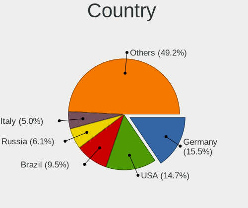
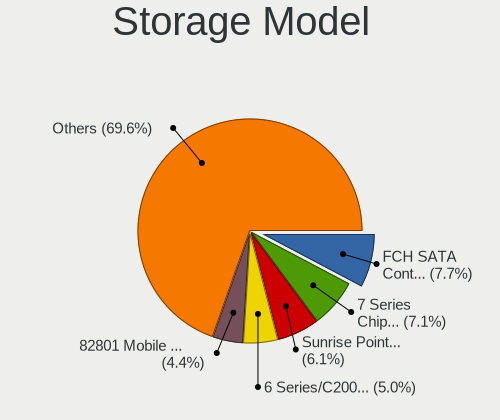

Linux Mint - Tested Hardware & Statistics (Notebooks)
-----------------------------------------------------

A project to collect tested hardware configurations for Linux Mint.

Anyone can contribute to this report by the [hw-probe](https://github.com/linuxhw/hw-probe) tool:

    sudo -E hw-probe -all -upload

Please contribute! Especially if your hardware is rare.

Contents
--------

* [ Test Cases ](#test-cases)

* [ System ](#system)
  - [ OS                       ](#os)
  - [ OS Family                ](#os-family)
  - [ Kernel                   ](#kernel)
  - [ Kernel Family            ](#kernel-family)
  - [ Kernel Major Ver.        ](#kernel-major-ver)
  - [ Arch                     ](#arch)
  - [ DE                       ](#de)
  - [ Display Server           ](#display-server)
  - [ Display Manager          ](#display-manager)
  - [ OS Lang                  ](#os-lang)
  - [ Boot Mode                ](#boot-mode)
  - [ Filesystem               ](#filesystem)
  - [ Part. scheme             ](#part-scheme)
  - [ Dual Boot with Linux/BSD ](#dual-boot-with-linuxbsd)
  - [ Dual Boot (Win)          ](#dual-boot-win)

* [ Board ](#board)
  - [ Vendor                   ](#vendor)
  - [ Model                    ](#model)
  - [ Model Family             ](#model-family)
  - [ MFG Year                 ](#mfg-year)
  - [ Form Factor              ](#form-factor)
  - [ Secure Boot              ](#secure-boot)
  - [ Coreboot                 ](#coreboot)
  - [ RAM Size                 ](#ram-size)
  - [ RAM Used                 ](#ram-used)
  - [ Total Drives             ](#total-drives)
  - [ Has CD-ROM               ](#has-cd-rom)
  - [ Has Ethernet             ](#has-ethernet)
  - [ Has WiFi                 ](#has-wifi)
  - [ Has Bluetooth            ](#has-bluetooth)

* [ Location ](#location)
  - [ Country                  ](#country)
  - [ City                     ](#city)

* [ Drives ](#drives)
  - [ Drive Vendor             ](#drive-vendor)
  - [ Drive Model              ](#drive-model)
  - [ HDD Vendor               ](#hdd-vendor)
  - [ SSD Vendor               ](#ssd-vendor)
  - [ Drive Kind               ](#drive-kind)
  - [ Drive Connector          ](#drive-connector)
  - [ Drive Size               ](#drive-size)
  - [ Space Total              ](#space-total)
  - [ Space Used               ](#space-used)
  - [ Malfunc. Drives          ](#malfunc-drives)
  - [ Malfunc. Drive Vendor    ](#malfunc-drive-vendor)
  - [ Malfunc. HDD Vendor      ](#malfunc-hdd-vendor)
  - [ Malfunc. Drive Kind      ](#malfunc-drive-kind)
  - [ Failed Drives            ](#failed-drives)
  - [ Failed Drive Vendor      ](#failed-drive-vendor)
  - [ Drive Status             ](#drive-status)

* [ Storage controller ](#storage-controller)
  - [ Storage Vendor           ](#storage-vendor)
  - [ Storage Model            ](#storage-model)
  - [ Storage Kind             ](#storage-kind)

* [ Processor ](#processor)
  - [ CPU Vendor               ](#cpu-vendor)
  - [ CPU Model                ](#cpu-model)
  - [ CPU Model Family         ](#cpu-model-family)
  - [ CPU Cores                ](#cpu-cores)
  - [ CPU Sockets              ](#cpu-sockets)
  - [ CPU Threads              ](#cpu-threads)
  - [ CPU Op-Modes             ](#cpu-op-modes)
  - [ CPU Microcode            ](#cpu-microcode)
  - [ CPU Microarch            ](#cpu-microarch)

* [ Graphics ](#graphics)
  - [ GPU Vendor               ](#gpu-vendor)
  - [ GPU Model                ](#gpu-model)
  - [ GPU Combo                ](#gpu-combo)
  - [ GPU Driver               ](#gpu-driver)
  - [ GPU Memory               ](#gpu-memory)

* [ Monitor ](#monitor)
  - [ Monitor Vendor           ](#monitor-vendor)
  - [ Monitor Model            ](#monitor-model)
  - [ Monitor Resolution       ](#monitor-resolution)
  - [ Monitor Diagonal         ](#monitor-diagonal)
  - [ Monitor Width            ](#monitor-width)
  - [ Aspect Ratio             ](#aspect-ratio)
  - [ Monitor Area             ](#monitor-area)
  - [ Pixel Density            ](#pixel-density)
  - [ Multiple Monitors        ](#multiple-monitors)

* [ Network ](#network)
  - [ Net Controller Vendor    ](#net-controller-vendor)
  - [ Net Controller Model     ](#net-controller-model)
  - [ Wireless Vendor          ](#wireless-vendor)
  - [ Wireless Model           ](#wireless-model)
  - [ Ethernet Vendor          ](#ethernet-vendor)
  - [ Ethernet Model           ](#ethernet-model)
  - [ Net Controller Kind      ](#net-controller-kind)
  - [ Used Controller          ](#used-controller)
  - [ NICs                     ](#nics)
  - [ IPv6                     ](#ipv6)

* [ Bluetooth ](#bluetooth)
  - [ Bluetooth Vendor         ](#bluetooth-vendor)
  - [ Bluetooth Model          ](#bluetooth-model)

* [ Sound ](#sound)
  - [ Sound Vendor             ](#sound-vendor)
  - [ Sound Model              ](#sound-model)

* [ Memory ](#memory)
  - [ Memory Vendor            ](#memory-vendor)
  - [ Memory Model             ](#memory-model)
  - [ Memory Kind              ](#memory-kind)
  - [ Memory Form Factor       ](#memory-form-factor)
  - [ Memory Size              ](#memory-size)
  - [ Memory Speed             ](#memory-speed)

* [ Printers & scanners ](#printers--scanners)
  - [ Printer Vendor           ](#printer-vendor)
  - [ Printer Model            ](#printer-model)
  - [ Scanner Vendor           ](#scanner-vendor)
  - [ Scanner Model            ](#scanner-model)

* [ Camera ](#camera)
  - [ Camera Vendor            ](#camera-vendor)
  - [ Camera Model             ](#camera-model)

* [ Security ](#security)
  - [ Fingerprint Vendor       ](#fingerprint-vendor)
  - [ Fingerprint Model        ](#fingerprint-model)
  - [ Chipcard Vendor          ](#chipcard-vendor)
  - [ Chipcard Model           ](#chipcard-model)

* [ Unsupported ](#unsupported)
  - [ Unsupported Devices      ](#unsupported-devices)
  - [ Unsupported Device Types ](#unsupported-device-types)

Test Cases
----------

Total: 17032

| Vendor        | Model                       | Probe                                                      | Date         |
|---------------|-----------------------------|------------------------------------------------------------|--------------|
| HP            | EliteBook 850 G8 Noteboo... | [7c65739a72](https://linux-hardware.org/?probe=7c65739a72) | Feb 02, 2024 |
| Samsung       | 550P5C/550P7C               | [4d9464ae33](https://linux-hardware.org/?probe=4d9464ae33) | Feb 02, 2024 |
| Lenovo        | ThinkPad X270 W10DG 20K5... | [e7400919cd](https://linux-hardware.org/?probe=e7400919cd) | Feb 02, 2024 |
| Apple         | MacBook5,1                  | [48a998308b](https://linux-hardware.org/?probe=48a998308b) | Feb 02, 2024 |
| Dell          | Latitude 5511               | [e7d3018c34](https://linux-hardware.org/?probe=e7d3018c34) | Feb 02, 2024 |
| HP            | EliteBook 850 G8 Noteboo... | [133d556add](https://linux-hardware.org/?probe=133d556add) | Feb 02, 2024 |
| Lenovo        | ThinkPad T15g Gen 1 20UR... | [e3e01bd0ff](https://linux-hardware.org/?probe=e3e01bd0ff) | Feb 02, 2024 |
| ASUSTek       | X556UQK                     | [24b1509f61](https://linux-hardware.org/?probe=24b1509f61) | Feb 02, 2024 |
| HP            | 15                          | [b99530abd5](https://linux-hardware.org/?probe=b99530abd5) | Feb 01, 2024 |
| HP            | 15                          | [874ae10280](https://linux-hardware.org/?probe=874ae10280) | Feb 01, 2024 |
| Lenovo        | IdeaPad S340-15IWL 81N8     | [fd7240a3ee](https://linux-hardware.org/?probe=fd7240a3ee) | Feb 01, 2024 |
| Lenovo        | IdeaPad S340-15IWL 81N8     | [b3b900cffa](https://linux-hardware.org/?probe=b3b900cffa) | Feb 01, 2024 |
| Acer          | Aspire ES1-523              | [4344e68c86](https://linux-hardware.org/?probe=4344e68c86) | Feb 01, 2024 |
| ASUSTek       | ROG Strix G634JZ_G634JZ     | [4b8399084a](https://linux-hardware.org/?probe=4b8399084a) | Feb 01, 2024 |
| Acer          | Aspire A315-53              | [a3fde61a8b](https://linux-hardware.org/?probe=a3fde61a8b) | Feb 01, 2024 |
| ASUSTek       | GL552VW                     | [1579728415](https://linux-hardware.org/?probe=1579728415) | Feb 01, 2024 |
| Acer          | Aspire E5-722               | [2a4988436d](https://linux-hardware.org/?probe=2a4988436d) | Feb 01, 2024 |
| Apple         | MacBookPro11,2              | [92dd523802](https://linux-hardware.org/?probe=92dd523802) | Feb 01, 2024 |
| Acer          | Nitro AN515-58              | [84c37d0192](https://linux-hardware.org/?probe=84c37d0192) | Feb 01, 2024 |
| HP            | ENVY 14                     | [ffe9159226](https://linux-hardware.org/?probe=ffe9159226) | Feb 01, 2024 |
| Lenovo        | ThinkPad X230 Tablet 343... | [1c4d4deade](https://linux-hardware.org/?probe=1c4d4deade) | Feb 01, 2024 |
| Lenovo        | V15 G4 AMN 82YU             | [7bfa72f494](https://linux-hardware.org/?probe=7bfa72f494) | Feb 01, 2024 |
| Lenovo        | V15 G4 AMN 82YU             | [e17ca19651](https://linux-hardware.org/?probe=e17ca19651) | Feb 01, 2024 |
| Apple         | MacBookPro14,1              | [711c97e9af](https://linux-hardware.org/?probe=711c97e9af) | Feb 01, 2024 |
| HONOR         | BBR-WAX9                    | [a34e642fbe](https://linux-hardware.org/?probe=a34e642fbe) | Jan 31, 2024 |
| Mediacom      | SmartBook 14 FullHD - SB... | [53d7e5ce3c](https://linux-hardware.org/?probe=53d7e5ce3c) | Jan 31, 2024 |
| HP            | Pavilion 17                 | [27b6494c43](https://linux-hardware.org/?probe=27b6494c43) | Jan 31, 2024 |
| Dell          | Latitude E5410              | [d91781267c](https://linux-hardware.org/?probe=d91781267c) | Jan 31, 2024 |
| HP            | Pavilion Laptop 15-ck0xx    | [573d69639e](https://linux-hardware.org/?probe=573d69639e) | Jan 31, 2024 |
| ASUSTek       | VivoBook_ASUSLaptop M160... | [69eca6c154](https://linux-hardware.org/?probe=69eca6c154) | Jan 31, 2024 |
| Acer          | Aspire A315-59              | [7d06efe302](https://linux-hardware.org/?probe=7d06efe302) | Jan 31, 2024 |
| Packard Be... | EasyNote LS11SB             | [3dcf56426c](https://linux-hardware.org/?probe=3dcf56426c) | Jan 31, 2024 |
| Lenovo        | ThinkPad T450 20BUS0EW11    | [f7020952b0](https://linux-hardware.org/?probe=f7020952b0) | Jan 31, 2024 |
| Acer          | Aspire E5-473               | [0a294c97ee](https://linux-hardware.org/?probe=0a294c97ee) | Jan 31, 2024 |
| Lenovo        | IdeaPad S145-15IWL 81MV     | [16922386a7](https://linux-hardware.org/?probe=16922386a7) | Jan 31, 2024 |
| ASUSTek       | TP550LA                     | [2fa23ece92](https://linux-hardware.org/?probe=2fa23ece92) | Jan 31, 2024 |
| HP            | EliteBook 8560p             | [5d0eb85b93](https://linux-hardware.org/?probe=5d0eb85b93) | Jan 31, 2024 |
| Lenovo        | ThinkPad T430 23491R8       | [65c338c5ed](https://linux-hardware.org/?probe=65c338c5ed) | Jan 31, 2024 |
| Acer          | Aspire ES1-523              | [aece88cd9b](https://linux-hardware.org/?probe=aece88cd9b) | Jan 31, 2024 |
| Dell          | Inspiron 1520               | [371f061c1d](https://linux-hardware.org/?probe=371f061c1d) | Jan 31, 2024 |
| HP            | 255 G8 Notebook PC          | [62254b1636](https://linux-hardware.org/?probe=62254b1636) | Jan 31, 2024 |
| Acer          | Swift SFE16-43              | [efdafdd6fc](https://linux-hardware.org/?probe=efdafdd6fc) | Jan 30, 2024 |
| Schenker      | XMG APEX 15 MAX (E22)       | [cf8a09526d](https://linux-hardware.org/?probe=cf8a09526d) | Jan 30, 2024 |
| Lenovo        | IdeaPad 3 14ALC6 82KT       | [25fe740321](https://linux-hardware.org/?probe=25fe740321) | Jan 30, 2024 |
| Acer          | Aspire E1-571               | [daf8c42eca](https://linux-hardware.org/?probe=daf8c42eca) | Jan 30, 2024 |
| ASUSTek       | ZenBook UX425EA_UX425EA     | [d78102063d](https://linux-hardware.org/?probe=d78102063d) | Jan 30, 2024 |
| HP            | Pavilion dv6                | [654b331eac](https://linux-hardware.org/?probe=654b331eac) | Jan 30, 2024 |
| HP            | Pavilion dv6                | [69c00fe459](https://linux-hardware.org/?probe=69c00fe459) | Jan 30, 2024 |
| Toshiba       | NB250                       | [f6694e7f86](https://linux-hardware.org/?probe=f6694e7f86) | Jan 30, 2024 |
| Toshiba       | NB250                       | [635c466f5f](https://linux-hardware.org/?probe=635c466f5f) | Jan 30, 2024 |
| Chuwi         | GemiBook Plus               | [dd2a3f8fa2](https://linux-hardware.org/?probe=dd2a3f8fa2) | Jan 30, 2024 |
| Apple         | MacBookAir6,2               | [52ae0efd8e](https://linux-hardware.org/?probe=52ae0efd8e) | Jan 30, 2024 |
| HP            | Notebook                    | [6757d33e0e](https://linux-hardware.org/?probe=6757d33e0e) | Jan 30, 2024 |
| Dell          | Latitude E6540              | [a64ea19d4b](https://linux-hardware.org/?probe=a64ea19d4b) | Jan 29, 2024 |
| Lenovo        | ThinkPad T14 Gen 2a 20XK... | [40e2ad53e8](https://linux-hardware.org/?probe=40e2ad53e8) | Jan 29, 2024 |
| Lenovo        | IdeaPad 330-17AST 81D7      | [4983e50390](https://linux-hardware.org/?probe=4983e50390) | Jan 29, 2024 |
| MSI           | Modern 15 B5M               | [af1dd03737](https://linux-hardware.org/?probe=af1dd03737) | Jan 29, 2024 |
| MSI           | Bravo 15 C7VE               | [1510824aee](https://linux-hardware.org/?probe=1510824aee) | Jan 29, 2024 |
| HP            | ZBook Power 15.6 inch G1... | [6304caec55](https://linux-hardware.org/?probe=6304caec55) | Jan 29, 2024 |
| Dell          | Latitude E6410              | [1d71a03516](https://linux-hardware.org/?probe=1d71a03516) | Jan 29, 2024 |
| CyberPower... | Tracer II                   | [ca21b317a2](https://linux-hardware.org/?probe=ca21b317a2) | Jan 29, 2024 |
| HP            | EliteBook 2540p             | [65de0b33df](https://linux-hardware.org/?probe=65de0b33df) | Jan 29, 2024 |
| ASUSTek       | VivoBook_ASUSLaptop X150... | [510f28a7d3](https://linux-hardware.org/?probe=510f28a7d3) | Jan 29, 2024 |
| HP            | Laptop 15s-fq5xxx           | [4ab253480b](https://linux-hardware.org/?probe=4ab253480b) | Jan 29, 2024 |
| Acer          | Aspire 5741G                | [9c171324e3](https://linux-hardware.org/?probe=9c171324e3) | Jan 29, 2024 |
| Dell          | Inspiron 3583               | [a84cdbbf07](https://linux-hardware.org/?probe=a84cdbbf07) | Jan 28, 2024 |
| Lenovo        | B590 20208                  | [ea632b2785](https://linux-hardware.org/?probe=ea632b2785) | Jan 28, 2024 |
| Dell          | Latitude E6540              | [adb3309384](https://linux-hardware.org/?probe=adb3309384) | Jan 28, 2024 |
| ASUSTek       | K55VD                       | [099cfb3dcb](https://linux-hardware.org/?probe=099cfb3dcb) | Jan 28, 2024 |
| Medion        | M14L-256                    | [6bff8bee51](https://linux-hardware.org/?probe=6bff8bee51) | Jan 28, 2024 |
| HP            | Laptop 14s-fq0xxx           | [a0eeda1d5a](https://linux-hardware.org/?probe=a0eeda1d5a) | Jan 28, 2024 |
| ASUSTek       | K55A                        | [49e26738de](https://linux-hardware.org/?probe=49e26738de) | Jan 28, 2024 |
| Lenovo        | ThinkPad T510 43142PU       | [e27411aa1b](https://linux-hardware.org/?probe=e27411aa1b) | Jan 28, 2024 |
| Lenovo        | ThinkPad T490 20N3S8DK00    | [4e9cad214e](https://linux-hardware.org/?probe=4e9cad214e) | Jan 28, 2024 |
| ASUSTek       | ROG Zephyrus G14 GA401IV... | [8f0138becb](https://linux-hardware.org/?probe=8f0138becb) | Jan 27, 2024 |
| Dell          | XPS L421X                   | [7eab16ad73](https://linux-hardware.org/?probe=7eab16ad73) | Jan 27, 2024 |
| ASUSTek       | Vivobook Go E1504FA_E150... | [d8ab9529f3](https://linux-hardware.org/?probe=d8ab9529f3) | Jan 27, 2024 |
| ASUSTek       | K55VD                       | [d2e2ee4fa9](https://linux-hardware.org/?probe=d2e2ee4fa9) | Jan 27, 2024 |
| HP            | ProBook 6555b               | [53f9430f98](https://linux-hardware.org/?probe=53f9430f98) | Jan 27, 2024 |
| Acer          | Aspire A317-53              | [a07ae8de3f](https://linux-hardware.org/?probe=a07ae8de3f) | Jan 27, 2024 |
| HP            | EliteBook 8440p             | [09a25eb2a2](https://linux-hardware.org/?probe=09a25eb2a2) | Jan 27, 2024 |
| HP            | EliteBook 840 G3            | [84264495d3](https://linux-hardware.org/?probe=84264495d3) | Jan 27, 2024 |
| Lenovo        | IdeaPad Z360                | [4aa5d9bed9](https://linux-hardware.org/?probe=4aa5d9bed9) | Jan 27, 2024 |
| Acer          | Aspire VN7-793G             | [ad72ab37d3](https://linux-hardware.org/?probe=ad72ab37d3) | Jan 26, 2024 |
| INSYS         | GW1-W149                    | [a37edb118a](https://linux-hardware.org/?probe=a37edb118a) | Jan 26, 2024 |
| Dell          | Latitude 5440               | [af460e243b](https://linux-hardware.org/?probe=af460e243b) | Jan 26, 2024 |
| Notebook      | W35xSTQ_370ST               | [1f9e3c577b](https://linux-hardware.org/?probe=1f9e3c577b) | Jan 26, 2024 |
| Lenovo        | IdeaPad Z360                | [4a2c8d2c92](https://linux-hardware.org/?probe=4a2c8d2c92) | Jan 26, 2024 |
| Acer          | Aspire E5-574G              | [7fb3807471](https://linux-hardware.org/?probe=7fb3807471) | Jan 26, 2024 |
| Dell          | Latitude 3480               | [5ccc62ce95](https://linux-hardware.org/?probe=5ccc62ce95) | Jan 26, 2024 |
| Dell          | Latitude 5520               | [474446918a](https://linux-hardware.org/?probe=474446918a) | Jan 26, 2024 |
| ASUSTek       | ROG Zephyrus G14 GA401QM... | [90908253dd](https://linux-hardware.org/?probe=90908253dd) | Jan 26, 2024 |
| Dell          | Latitude 7490               | [be9a5bd794](https://linux-hardware.org/?probe=be9a5bd794) | Jan 25, 2024 |
| ASUSTek       | VivoBook_ASUSLaptop X150... | [516ae40374](https://linux-hardware.org/?probe=516ae40374) | Jan 25, 2024 |
| HP            | ProBook 440 G7              | [47b3929229](https://linux-hardware.org/?probe=47b3929229) | Jan 25, 2024 |
| Dell          | Latitude 7490               | [efec84713e](https://linux-hardware.org/?probe=efec84713e) | Jan 25, 2024 |
| Dell          | Latitude 5490               | [7315d78b91](https://linux-hardware.org/?probe=7315d78b91) | Jan 25, 2024 |
| Lenovo        | IdeaPad S340-14IIL 81VV     | [d530eec023](https://linux-hardware.org/?probe=d530eec023) | Jan 25, 2024 |
| Apple         | MacBookAir7,2               | [8f3ed76279](https://linux-hardware.org/?probe=8f3ed76279) | Jan 25, 2024 |
| Apple         | MacBook10,1                 | [da3e59958f](https://linux-hardware.org/?probe=da3e59958f) | Jan 24, 2024 |
| Dell          | Precision 7520              | [9d9cf5c93e](https://linux-hardware.org/?probe=9d9cf5c93e) | Jan 24, 2024 |
| HP            | 15 Notebook PC              | [0fa1b2cd9e](https://linux-hardware.org/?probe=0fa1b2cd9e) | Jan 24, 2024 |
| Dell          | Precision 7520              | [c0f81bad8c](https://linux-hardware.org/?probe=c0f81bad8c) | Jan 24, 2024 |
| ASUSTek       | Vivobook Go E1504GA_E150... | [47052e9985](https://linux-hardware.org/?probe=47052e9985) | Jan 24, 2024 |
| Lenovo        | IdeaPad 3 15IAU7 82RK       | [43807d61ce](https://linux-hardware.org/?probe=43807d61ce) | Jan 24, 2024 |
| Lenovo        | ThinkPad X1 Carbon 34604... | [8add6b9229](https://linux-hardware.org/?probe=8add6b9229) | Jan 24, 2024 |
| Lenovo        | IdeaPad 330-17IKB 81DM      | [c55c6dc13f](https://linux-hardware.org/?probe=c55c6dc13f) | Jan 24, 2024 |
| HP            | ZBook Firefly 14 inch G1... | [0bbf1a1e3d](https://linux-hardware.org/?probe=0bbf1a1e3d) | Jan 24, 2024 |
| Apple         | MacBookPro11,4              | [c63b13e441](https://linux-hardware.org/?probe=c63b13e441) | Jan 24, 2024 |
| Clevo         | M720SRS                     | [c0f6248edd](https://linux-hardware.org/?probe=c0f6248edd) | Jan 24, 2024 |
| Apple         | MacBookPro11,4              | [f48a5f9d3c](https://linux-hardware.org/?probe=f48a5f9d3c) | Jan 24, 2024 |
| Apple         | MacBookPro11,2              | [0f40e8d133](https://linux-hardware.org/?probe=0f40e8d133) | Jan 24, 2024 |
| AZW           | SEi                         | [cc4134e14b](https://linux-hardware.org/?probe=cc4134e14b) | Jan 24, 2024 |
| HP            | EliteBook 820 G3            | [abc0872688](https://linux-hardware.org/?probe=abc0872688) | Jan 24, 2024 |
| Fujitsu       | LIFEBOOK E780               | [d26e825efc](https://linux-hardware.org/?probe=d26e825efc) | Jan 23, 2024 |
| LDLC          | SPC-I                       | [518c66f608](https://linux-hardware.org/?probe=518c66f608) | Jan 23, 2024 |
| ASUSTek       | Vivobook Go E1504FA_E150... | [0ccaa8b707](https://linux-hardware.org/?probe=0ccaa8b707) | Jan 23, 2024 |
| Acer          | Aspire 5680                 | [0c6c1413f7](https://linux-hardware.org/?probe=0c6c1413f7) | Jan 23, 2024 |
| Apple         | MacBookPro8,1               | [bbacd3adf8](https://linux-hardware.org/?probe=bbacd3adf8) | Jan 23, 2024 |
| Dell          | Latitude E6430              | [8ca46d0333](https://linux-hardware.org/?probe=8ca46d0333) | Jan 23, 2024 |
| Lenovo        | IdeaPad 320-17ABR 80YN      | [9e41ae4dc7](https://linux-hardware.org/?probe=9e41ae4dc7) | Jan 23, 2024 |
| ASUSTek       | Vivobook Go E1504FA_E150... | [43c061d6de](https://linux-hardware.org/?probe=43c061d6de) | Jan 23, 2024 |
| Lenovo        | G710 20252                  | [2cbd0dd7d8](https://linux-hardware.org/?probe=2cbd0dd7d8) | Jan 23, 2024 |
| HP            | Laptop 15-dy3xxx            | [ddb53329c6](https://linux-hardware.org/?probe=ddb53329c6) | Jan 23, 2024 |
| Acer          | Aspire A715-74G             | [5692c7ee1e](https://linux-hardware.org/?probe=5692c7ee1e) | Jan 23, 2024 |
| Acer          | Aspire A715-74G             | [c4c4e2b5b1](https://linux-hardware.org/?probe=c4c4e2b5b1) | Jan 23, 2024 |
| Samsung       | 305V4A/305V5A               | [f5cf7e9fd4](https://linux-hardware.org/?probe=f5cf7e9fd4) | Jan 23, 2024 |
| Lenovo        | ThinkPad E15 Gen 4 21E60... | [a981e0b81f](https://linux-hardware.org/?probe=a981e0b81f) | Jan 22, 2024 |
| Clevo         | W150ER                      | [ff97b73a0d](https://linux-hardware.org/?probe=ff97b73a0d) | Jan 22, 2024 |
| Clevo         | W150ER                      | [d477c19fae](https://linux-hardware.org/?probe=d477c19fae) | Jan 22, 2024 |
| Clevo         | W150ER                      | [af918f19aa](https://linux-hardware.org/?probe=af918f19aa) | Jan 22, 2024 |
| Lenovo        | ThinkPad X250 20CLS3320C    | [5525303ee4](https://linux-hardware.org/?probe=5525303ee4) | Jan 22, 2024 |
| Acer          | Swift SF314-511             | [c4578284c8](https://linux-hardware.org/?probe=c4578284c8) | Jan 22, 2024 |
| Toshiba       | Satellite L305              | [d1fc38dbc2](https://linux-hardware.org/?probe=d1fc38dbc2) | Jan 22, 2024 |
| Toshiba       | Satellite L305              | [10fca3d0ef](https://linux-hardware.org/?probe=10fca3d0ef) | Jan 22, 2024 |
| Dell          | XPS 15 9560                 | [88ca13a30b](https://linux-hardware.org/?probe=88ca13a30b) | Jan 22, 2024 |
| Dell          | XPS 15 9560                 | [d7498f719e](https://linux-hardware.org/?probe=d7498f719e) | Jan 22, 2024 |
| MSI           | GP72 6QF                    | [0cbab5c5f1](https://linux-hardware.org/?probe=0cbab5c5f1) | Jan 21, 2024 |
| HP            | ProBook 455R G6             | [59026d385f](https://linux-hardware.org/?probe=59026d385f) | Jan 21, 2024 |
| Lenovo        | ThinkPad X201 3323DAG       | [27542f7432](https://linux-hardware.org/?probe=27542f7432) | Jan 21, 2024 |
| HP            | ProBook 650 G2              | [9d5289d615](https://linux-hardware.org/?probe=9d5289d615) | Jan 21, 2024 |
| Samsung       | 350V5C/351V5C/3540VC/344... | [73c6b8874b](https://linux-hardware.org/?probe=73c6b8874b) | Jan 21, 2024 |
| Acer          | Aspire SW3-016              | [01ee7724e0](https://linux-hardware.org/?probe=01ee7724e0) | Jan 21, 2024 |
| ASUSTek       | N53Jg                       | [63a02d2a23](https://linux-hardware.org/?probe=63a02d2a23) | Jan 21, 2024 |
| HP            | ProBook 450 G0              | [18424b46c5](https://linux-hardware.org/?probe=18424b46c5) | Jan 20, 2024 |
| Lenovo        | ThinkPad X270 W10DG 20K5... | [1b5e7e0d38](https://linux-hardware.org/?probe=1b5e7e0d38) | Jan 20, 2024 |
| HP            | ProBook 6570b               | [a70ac4fd39](https://linux-hardware.org/?probe=a70ac4fd39) | Jan 20, 2024 |
| Dell          | Inspiron 15 3511            | [d79a7275ed](https://linux-hardware.org/?probe=d79a7275ed) | Jan 20, 2024 |
| Lenovo        | Z50-70 20354                | [3260559363](https://linux-hardware.org/?probe=3260559363) | Jan 20, 2024 |
| ASUSTek       | VivoBook_ASUSLaptop M160... | [56d9c9b9a1](https://linux-hardware.org/?probe=56d9c9b9a1) | Jan 20, 2024 |
| ASUSTek       | VivoBook_ASUSLaptop X513... | [5797795e83](https://linux-hardware.org/?probe=5797795e83) | Jan 20, 2024 |
| Acer          | Aspire A317-53              | [6c73c05ed4](https://linux-hardware.org/?probe=6c73c05ed4) | Jan 20, 2024 |
| Acer          | Aspire A317-53              | [7010ff7fab](https://linux-hardware.org/?probe=7010ff7fab) | Jan 20, 2024 |
| Lenovo        | G40-80 80E4                 | [d03cd5d338](https://linux-hardware.org/?probe=d03cd5d338) | Jan 19, 2024 |
| Lenovo        | Legion 7 16ARHA7 82UH       | [f586c54d2c](https://linux-hardware.org/?probe=f586c54d2c) | Jan 19, 2024 |
| Apple         | MacBookAir6,2               | [12539bda5e](https://linux-hardware.org/?probe=12539bda5e) | Jan 19, 2024 |
| Fujitsu       | LIFEBOOK E780               | [e98f42d33f](https://linux-hardware.org/?probe=e98f42d33f) | Jan 19, 2024 |
| HP            | Pavilion dv7                | [f1d80ed16c](https://linux-hardware.org/?probe=f1d80ed16c) | Jan 19, 2024 |
| Lenovo        | IdeaPad 320-15IAP 80XR      | [feffbde1cd](https://linux-hardware.org/?probe=feffbde1cd) | Jan 19, 2024 |
| Lenovo        | IdeaPad 320-15IAP 80XR      | [68cbc15eec](https://linux-hardware.org/?probe=68cbc15eec) | Jan 19, 2024 |
| Dell          | Inspiron 3542               | [f6f263ee45](https://linux-hardware.org/?probe=f6f263ee45) | Jan 19, 2024 |
| HP            | Pavilion g6                 | [bac27c78e2](https://linux-hardware.org/?probe=bac27c78e2) | Jan 19, 2024 |
| HP            | Pavilion g6                 | [30da02f122](https://linux-hardware.org/?probe=30da02f122) | Jan 19, 2024 |
| Dell          | Inspiron 3542               | [d5ec8d5e80](https://linux-hardware.org/?probe=d5ec8d5e80) | Jan 18, 2024 |
| HP            | Pavilion dv3500             | [907b397e09](https://linux-hardware.org/?probe=907b397e09) | Jan 18, 2024 |
| CONNEX        | L1430-PRO-SL128             | [668f43d066](https://linux-hardware.org/?probe=668f43d066) | Jan 18, 2024 |
| Acer          | Aspire V3-772               | [6c1d2a4e4d](https://linux-hardware.org/?probe=6c1d2a4e4d) | Jan 18, 2024 |
| Medion        | M14L-256                    | [095760429f](https://linux-hardware.org/?probe=095760429f) | Jan 18, 2024 |
| Dell          | Precision 5680              | [f52bddf877](https://linux-hardware.org/?probe=f52bddf877) | Jan 18, 2024 |
| Dell          | Precision 5680              | [2585a4f840](https://linux-hardware.org/?probe=2585a4f840) | Jan 18, 2024 |
| Packard Be... | EasyNote TE69BM             | [351b144553](https://linux-hardware.org/?probe=351b144553) | Jan 18, 2024 |
| Lenovo        | IdeaPad S145-15IWL 81S9     | [3bb54b1a3a](https://linux-hardware.org/?probe=3bb54b1a3a) | Jan 18, 2024 |
| Acer          | Aspire 5750G                | [5cac95825f](https://linux-hardware.org/?probe=5cac95825f) | Jan 18, 2024 |
| Sony          | VPCF120FL                   | [6ada0707e6](https://linux-hardware.org/?probe=6ada0707e6) | Jan 18, 2024 |
| Fujitsu Si... | LIFEBOOK T5010              | [dbe2ea8160](https://linux-hardware.org/?probe=dbe2ea8160) | Jan 17, 2024 |
| Acer          | Aspire A515-54              | [4d6487e7f5](https://linux-hardware.org/?probe=4d6487e7f5) | Jan 17, 2024 |
| ASUSTek       | X541UAK                     | [bd74ab2cc7](https://linux-hardware.org/?probe=bd74ab2cc7) | Jan 17, 2024 |
| HP            | Pavilion 15                 | [d2e6250a2b](https://linux-hardware.org/?probe=d2e6250a2b) | Jan 17, 2024 |
| Unknown       | Unknown                     | [6e08825a5c](https://linux-hardware.org/?probe=6e08825a5c) | Jan 17, 2024 |
| Lenovo        | V110-15IAP 80TG             | [682b5589eb](https://linux-hardware.org/?probe=682b5589eb) | Jan 17, 2024 |
| HP            | Pavilion dv7                | [6f1149a7b7](https://linux-hardware.org/?probe=6f1149a7b7) | Jan 17, 2024 |
| HONOR         | HLYL-WXX9                   | [de76a39d7b](https://linux-hardware.org/?probe=de76a39d7b) | Jan 17, 2024 |
| Lenovo        | ThinkPad T450 20BUS1JD0B    | [90ef42b503](https://linux-hardware.org/?probe=90ef42b503) | Jan 17, 2024 |
| Lenovo        | ThinkPad T450 20BUS1JD0B    | [a3217b640d](https://linux-hardware.org/?probe=a3217b640d) | Jan 17, 2024 |
| ASUSTek       | Vivobook Go E1504FA_E150... | [f12e5f7ddc](https://linux-hardware.org/?probe=f12e5f7ddc) | Jan 16, 2024 |
| Lenovo        | ThinkPad T480 20L50010US    | [0260596a07](https://linux-hardware.org/?probe=0260596a07) | Jan 16, 2024 |
| Dell          | Latitude 7320               | [504564d120](https://linux-hardware.org/?probe=504564d120) | Jan 16, 2024 |
| Lenovo        | Yoga S740-14IIL 81RS        | [a3813e2aa2](https://linux-hardware.org/?probe=a3813e2aa2) | Jan 16, 2024 |
| HP            | 250 G5 Notebook PC          | [099418d854](https://linux-hardware.org/?probe=099418d854) | Jan 16, 2024 |
| Dell          | Latitude 5540               | [f8274c4df8](https://linux-hardware.org/?probe=f8274c4df8) | Jan 16, 2024 |
| Lenovo        | ThinkPad T580 20LAS5GE00    | [07609f8bbb](https://linux-hardware.org/?probe=07609f8bbb) | Jan 16, 2024 |
| Infinix       | INBOOK X1 NEO               | [ff730c7320](https://linux-hardware.org/?probe=ff730c7320) | Jan 16, 2024 |
| Lenovo        | B590 62743QG                | [53c2b981bf](https://linux-hardware.org/?probe=53c2b981bf) | Jan 16, 2024 |
| Lenovo        | G50-30 80G0                 | [469e8ffc49](https://linux-hardware.org/?probe=469e8ffc49) | Jan 16, 2024 |
| Lenovo        | G40-80 80E4                 | [b32403a45f](https://linux-hardware.org/?probe=b32403a45f) | Jan 16, 2024 |
| HP            | Victus by Gaming Laptop ... | [46ce0c3e7c](https://linux-hardware.org/?probe=46ce0c3e7c) | Jan 16, 2024 |
| Acer          | Aspire M5-583P              | [4141c83022](https://linux-hardware.org/?probe=4141c83022) | Jan 16, 2024 |
| Apple         | MacBookPro8,1               | [09f907ba27](https://linux-hardware.org/?probe=09f907ba27) | Jan 16, 2024 |
| Apple         | MacBookPro8,1               | [783cefabea](https://linux-hardware.org/?probe=783cefabea) | Jan 16, 2024 |
| Acer          | Aspire 5810T                | [69c2f12576](https://linux-hardware.org/?probe=69c2f12576) | Jan 16, 2024 |
| Lenovo        | G580 20157                  | [02e26b7dbe](https://linux-hardware.org/?probe=02e26b7dbe) | Jan 15, 2024 |
| Dell          | Latitude E6400              | [704c5e4d39](https://linux-hardware.org/?probe=704c5e4d39) | Jan 15, 2024 |
| Lenovo        | ThinkBook 15 G3 ACL 21A4    | [17a792c82f](https://linux-hardware.org/?probe=17a792c82f) | Jan 15, 2024 |
| Lenovo        | ThinkPad X1 Carbon 7th 2... | [ac6ab2abea](https://linux-hardware.org/?probe=ac6ab2abea) | Jan 15, 2024 |
| ASUSTek       | N551JB                      | [b227f8fa88](https://linux-hardware.org/?probe=b227f8fa88) | Jan 15, 2024 |
| ASUSTek       | X580VD                      | [bf7addfd46](https://linux-hardware.org/?probe=bf7addfd46) | Jan 15, 2024 |
| ASUSTek       | N551JB                      | [46cc56760e](https://linux-hardware.org/?probe=46cc56760e) | Jan 15, 2024 |
| Intel Clie... | LAPBC710                    | [ad2212893b](https://linux-hardware.org/?probe=ad2212893b) | Jan 15, 2024 |
| Lenovo        | LOQ 16IRH8 82XW             | [4bebc58063](https://linux-hardware.org/?probe=4bebc58063) | Jan 15, 2024 |
| Lenovo        | LOQ 16IRH8 82XW             | [2eef3e875d](https://linux-hardware.org/?probe=2eef3e875d) | Jan 15, 2024 |
| Onda TLC      | ONDA Oliver 15              | [8717f5a32d](https://linux-hardware.org/?probe=8717f5a32d) | Jan 15, 2024 |
| Apple         | MacBookAir6,2               | [9bf589844a](https://linux-hardware.org/?probe=9bf589844a) | Jan 14, 2024 |
| Acer          | Swift SF114-32              | [d57f586cff](https://linux-hardware.org/?probe=d57f586cff) | Jan 14, 2024 |
| Positivo      | Harrison                    | [bc50c3c3ca](https://linux-hardware.org/?probe=bc50c3c3ca) | Jan 14, 2024 |
| Lenovo        | B590 20208                  | [5f1f7fc385](https://linux-hardware.org/?probe=5f1f7fc385) | Jan 14, 2024 |
| HP            | Pavilion dv6                | [1a049538f1](https://linux-hardware.org/?probe=1a049538f1) | Jan 14, 2024 |
| MSI           | GP62M 7REX                  | [23c4fd0913](https://linux-hardware.org/?probe=23c4fd0913) | Jan 14, 2024 |
| Lenovo        | IdeaPad 5 14ARE05 81YM      | [3eb67a9840](https://linux-hardware.org/?probe=3eb67a9840) | Jan 14, 2024 |
| HP            | Laptop 17-cp0xxx            | [31a7b00f76](https://linux-hardware.org/?probe=31a7b00f76) | Jan 14, 2024 |
| Dell          | Precision 5540              | [f29887c5e2](https://linux-hardware.org/?probe=f29887c5e2) | Jan 13, 2024 |
| Dell          | Latitude E6400              | [035c1106d9](https://linux-hardware.org/?probe=035c1106d9) | Jan 13, 2024 |
| HP            | Laptop 17-cp0xxx            | [21c6fac67f](https://linux-hardware.org/?probe=21c6fac67f) | Jan 13, 2024 |
| Dell          | Latitude E5440              | [1af18a83ab](https://linux-hardware.org/?probe=1af18a83ab) | Jan 13, 2024 |
| Lenovo        | IdeaPad Gaming 3 15ACH6 ... | [3717e058ac](https://linux-hardware.org/?probe=3717e058ac) | Jan 13, 2024 |
| HP            | EliteBook 830 G5            | [106a150b97](https://linux-hardware.org/?probe=106a150b97) | Jan 13, 2024 |
| Lenovo        | G50-70 20351                | [5187db04f2](https://linux-hardware.org/?probe=5187db04f2) | Jan 13, 2024 |
| Dell          | Latitude E6440              | [faec13f702](https://linux-hardware.org/?probe=faec13f702) | Jan 13, 2024 |
| Acer          | Aspire A515-54              | [62d41b2172](https://linux-hardware.org/?probe=62d41b2172) | Jan 13, 2024 |
| Acer          | Aspire A515-54              | [c6554a76a8](https://linux-hardware.org/?probe=c6554a76a8) | Jan 13, 2024 |
| Lenovo        | IdeaPad 530S-14ARR 81H1     | [4990997e50](https://linux-hardware.org/?probe=4990997e50) | Jan 13, 2024 |
| Lenovo        | IdeaPad 100S-14IBR 80R9     | [a179d57e7c](https://linux-hardware.org/?probe=a179d57e7c) | Jan 13, 2024 |
| Gigabyte      | P35V7                       | [049bfce7ea](https://linux-hardware.org/?probe=049bfce7ea) | Jan 13, 2024 |
| Acer          | Aspire V3-771               | [a9176efd80](https://linux-hardware.org/?probe=a9176efd80) | Jan 12, 2024 |
| HP            | ProBook 445 G7              | [6b3e44d0ab](https://linux-hardware.org/?probe=6b3e44d0ab) | Jan 12, 2024 |
| HP            | Pavilion Gaming Laptop 1... | [dba8b3f332](https://linux-hardware.org/?probe=dba8b3f332) | Jan 12, 2024 |
| Acer          | Aspire V5-571               | [703119fa5b](https://linux-hardware.org/?probe=703119fa5b) | Jan 12, 2024 |
| Acer          | Aspire V5-571               | [b18cd90d9c](https://linux-hardware.org/?probe=b18cd90d9c) | Jan 12, 2024 |
| ASUSTek       | ZenBook UX450FDX_UX480FD    | [bb96dd4a3c](https://linux-hardware.org/?probe=bb96dd4a3c) | Jan 12, 2024 |
| Apple         | MacBookAir7,2               | [34e2dd985d](https://linux-hardware.org/?probe=34e2dd985d) | Jan 12, 2024 |
| HP            | Pavilion dv3500             | [bb0b003d81](https://linux-hardware.org/?probe=bb0b003d81) | Jan 12, 2024 |
| HP            | Laptop 15-bs0xx             | [ddfda4248f](https://linux-hardware.org/?probe=ddfda4248f) | Jan 12, 2024 |
| HP            | ProBook 430 G5              | [622adb6209](https://linux-hardware.org/?probe=622adb6209) | Jan 12, 2024 |
| Dell          | XPS 15 9560                 | [c509ecb300](https://linux-hardware.org/?probe=c509ecb300) | Jan 12, 2024 |
| ASUSTek       | ROG Strix G513RW_G513RW     | [2bc2a90ad1](https://linux-hardware.org/?probe=2bc2a90ad1) | Jan 12, 2024 |
| Dell          | Latitude E6400              | [2059e9e8d0](https://linux-hardware.org/?probe=2059e9e8d0) | Jan 12, 2024 |
| Lenovo        | ThinkPad T440 20B7S1WJ00    | [215c45abef](https://linux-hardware.org/?probe=215c45abef) | Jan 11, 2024 |
| Positivo      | S14SL01                     | [0dd36639d2](https://linux-hardware.org/?probe=0dd36639d2) | Jan 11, 2024 |
| Dell          | Precision 5770              | [5c8b9a5262](https://linux-hardware.org/?probe=5c8b9a5262) | Jan 11, 2024 |
| HP            | Victus by Laptop 16-d0xx... | [3c3fbf4282](https://linux-hardware.org/?probe=3c3fbf4282) | Jan 11, 2024 |
| Lenovo        | V15-ADA 82C7                | [e12995730c](https://linux-hardware.org/?probe=e12995730c) | Jan 11, 2024 |
| Alienware     | Area-51m R2                 | [de0b2e0221](https://linux-hardware.org/?probe=de0b2e0221) | Jan 11, 2024 |
| Lenovo        | ThinkPad X270 W10DG 20K5... | [a127ed2c69](https://linux-hardware.org/?probe=a127ed2c69) | Jan 11, 2024 |
| Dell          | Latitude E5510              | [a107ab666c](https://linux-hardware.org/?probe=a107ab666c) | Jan 11, 2024 |
| Toshiba       | Satellite A215              | [486dfc11fe](https://linux-hardware.org/?probe=486dfc11fe) | Jan 11, 2024 |
| ASUSTek       | K53E                        | [4f36f22f3a](https://linux-hardware.org/?probe=4f36f22f3a) | Jan 11, 2024 |
| Dell          | Inspiron 5584               | [af34e72cd7](https://linux-hardware.org/?probe=af34e72cd7) | Jan 11, 2024 |
| Dell          | Inspiron 7572               | [19c0615c74](https://linux-hardware.org/?probe=19c0615c74) | Jan 11, 2024 |
| Dell          | Inspiron 7572               | [62b4f5a943](https://linux-hardware.org/?probe=62b4f5a943) | Jan 11, 2024 |
| Jumper        | EZbook                      | [5bc5183f2a](https://linux-hardware.org/?probe=5bc5183f2a) | Jan 11, 2024 |
| HP            | Notebook                    | [6daa4463ed](https://linux-hardware.org/?probe=6daa4463ed) | Jan 11, 2024 |
| HP            | Notebook                    | [8d1036e391](https://linux-hardware.org/?probe=8d1036e391) | Jan 11, 2024 |
| Lenovo        | ThinkPad T530 2392ASU       | [ff2a2fe190](https://linux-hardware.org/?probe=ff2a2fe190) | Jan 10, 2024 |
| Wortmann      | TERRA_MOBILE_1513A          | [5f7f3c9d50](https://linux-hardware.org/?probe=5f7f3c9d50) | Jan 10, 2024 |
| HUAWEI        | BOHB-WAX9                   | [f962b901f7](https://linux-hardware.org/?probe=f962b901f7) | Jan 10, 2024 |
| HUAWEI        | BOHB-WAX9                   | [763d9d2018](https://linux-hardware.org/?probe=763d9d2018) | Jan 10, 2024 |
| Primux Tec... | Primux_1406F_W10            | [30587bf7e5](https://linux-hardware.org/?probe=30587bf7e5) | Jan 10, 2024 |
| VALE          | Notebook Classic C140       | [30c1b7fc87](https://linux-hardware.org/?probe=30c1b7fc87) | Jan 10, 2024 |
| Dell          | G5 5587                     | [a1342378d3](https://linux-hardware.org/?probe=a1342378d3) | Jan 10, 2024 |
| Acer          | Aspire A715-74G             | [4d6e4c3464](https://linux-hardware.org/?probe=4d6e4c3464) | Jan 10, 2024 |
| Lenovo        | ThinkPad T470 W10DG 20JN... | [10676b8682](https://linux-hardware.org/?probe=10676b8682) | Jan 10, 2024 |
| Dell          | Inspiron 5584               | [ef63a235af](https://linux-hardware.org/?probe=ef63a235af) | Jan 10, 2024 |
| Lenovo        | ThinkPad T560 20FH001BMD    | [aefb2eccb9](https://linux-hardware.org/?probe=aefb2eccb9) | Jan 09, 2024 |
| Medion        | E15413                      | [966254cd0e](https://linux-hardware.org/?probe=966254cd0e) | Jan 09, 2024 |
| Lenovo        | G780                        | [a8edba4c75](https://linux-hardware.org/?probe=a8edba4c75) | Jan 09, 2024 |
| Primux Tec... | Primux_1406F_W10            | [8df3356415](https://linux-hardware.org/?probe=8df3356415) | Jan 09, 2024 |
| Lenovo        | ThinkBook 16 G6 IRL 21KH    | [62b2915f0f](https://linux-hardware.org/?probe=62b2915f0f) | Jan 09, 2024 |
| VALE          | Notebook Classic C140       | [6b7925c720](https://linux-hardware.org/?probe=6b7925c720) | Jan 09, 2024 |
| Lenovo        | Legion 7 16ARHA7 82UH       | [66f693d85c](https://linux-hardware.org/?probe=66f693d85c) | Jan 09, 2024 |
| ASUSTek       | K52F                        | [0b3d88eb7e](https://linux-hardware.org/?probe=0b3d88eb7e) | Jan 09, 2024 |
| Packard Be... | EasyNote MH45               | [a5e8efb826](https://linux-hardware.org/?probe=a5e8efb826) | Jan 09, 2024 |
| Lenovo        | Z50-70 20354                | [052f307ab5](https://linux-hardware.org/?probe=052f307ab5) | Jan 09, 2024 |
| HP            | ProBook 640 G8 Notebook ... | [7ee8b412a1](https://linux-hardware.org/?probe=7ee8b412a1) | Jan 09, 2024 |
| HP            | ProBook 640 G8 Notebook ... | [8a05b3a91f](https://linux-hardware.org/?probe=8a05b3a91f) | Jan 09, 2024 |
| Acer          | eMachine V1.45              | [8438acbcc5](https://linux-hardware.org/?probe=8438acbcc5) | Jan 09, 2024 |
| ASUSTek       | ROG Zephyrus M16 GU604VZ... | [0b95704afe](https://linux-hardware.org/?probe=0b95704afe) | Jan 09, 2024 |
| Acer          | Aspire ES1-533              | [68d1525855](https://linux-hardware.org/?probe=68d1525855) | Jan 08, 2024 |
| HP            | ZBook Fury 15 G7 Mobile ... | [63d1f51ef3](https://linux-hardware.org/?probe=63d1f51ef3) | Jan 08, 2024 |
| Lenovo        | IdeaPad U160 08946JG        | [7ce389d44b](https://linux-hardware.org/?probe=7ce389d44b) | Jan 08, 2024 |
| Acer          | Swift SF114-34              | [7191ffa989](https://linux-hardware.org/?probe=7191ffa989) | Jan 08, 2024 |
| Dell          | Latitude E6410              | [1260fc62f4](https://linux-hardware.org/?probe=1260fc62f4) | Jan 08, 2024 |
| Dell          | Latitude E7250              | [7bcdba680d](https://linux-hardware.org/?probe=7bcdba680d) | Jan 08, 2024 |
| Acer          | Nitro AN517-52              | [1f601b8cb0](https://linux-hardware.org/?probe=1f601b8cb0) | Jan 08, 2024 |
| Lenovo        | ThinkPad S5-S540 20B3007... | [9b864365c9](https://linux-hardware.org/?probe=9b864365c9) | Jan 08, 2024 |
| HP            | 245 14 inch G9 Notebook ... | [f23bf42f04](https://linux-hardware.org/?probe=f23bf42f04) | Jan 08, 2024 |
| Sony          | SVF1521G6EW                 | [de442d56ef](https://linux-hardware.org/?probe=de442d56ef) | Jan 08, 2024 |
| Lenovo        | ThinkPad T480 20L50011US    | [8ba032e1a2](https://linux-hardware.org/?probe=8ba032e1a2) | Jan 08, 2024 |
| Google        | Jinlon                      | [1d3ce76cf8](https://linux-hardware.org/?probe=1d3ce76cf8) | Jan 08, 2024 |
| Apple         | MacBookPro8,2               | [7423478632](https://linux-hardware.org/?probe=7423478632) | Jan 08, 2024 |
| Lenovo        | IdeaPad 330-15IKB 81DE      | [cde0d6ec88](https://linux-hardware.org/?probe=cde0d6ec88) | Jan 08, 2024 |
| Lenovo        | IdeaPad 330-15IKB 81DE      | [9bf06d0de6](https://linux-hardware.org/?probe=9bf06d0de6) | Jan 08, 2024 |
| PCBOX         | PCB-GLW2                    | [bfc329b172](https://linux-hardware.org/?probe=bfc329b172) | Jan 08, 2024 |
| Acer          | TravelMate P645-S           | [9461c8963d](https://linux-hardware.org/?probe=9461c8963d) | Jan 07, 2024 |
| ASUSTek       | X75A1                       | [e4594c39ae](https://linux-hardware.org/?probe=e4594c39ae) | Jan 07, 2024 |
| Lenovo        | IdeaPad 3 14ALC6 82KT       | [0fbaacab13](https://linux-hardware.org/?probe=0fbaacab13) | Jan 07, 2024 |
| HP            | Pavilion Laptop 15-eg3xx... | [61066d4150](https://linux-hardware.org/?probe=61066d4150) | Jan 07, 2024 |
| HP            | Pavilion 15                 | [006e73b8e1](https://linux-hardware.org/?probe=006e73b8e1) | Jan 07, 2024 |
| HP            | EliteBook 645 14 inch G9... | [f56d1e88ba](https://linux-hardware.org/?probe=f56d1e88ba) | Jan 07, 2024 |
| HP            | Laptop 15-db0xxx            | [555b388036](https://linux-hardware.org/?probe=555b388036) | Jan 07, 2024 |
| Dell          | Latitude E6410              | [fafcf50723](https://linux-hardware.org/?probe=fafcf50723) | Jan 07, 2024 |
| Acer          | Aspire E5-574G              | [a5243f518e](https://linux-hardware.org/?probe=a5243f518e) | Jan 07, 2024 |
| Lenovo        | B50-70 20384                | [87e302df7b](https://linux-hardware.org/?probe=87e302df7b) | Jan 07, 2024 |
| Dell          | Latitude E6410              | [8bff8e0dbf](https://linux-hardware.org/?probe=8bff8e0dbf) | Jan 07, 2024 |
| Lenovo        | Z70-80 80FG                 | [58c14daf7e](https://linux-hardware.org/?probe=58c14daf7e) | Jan 07, 2024 |
| Lenovo        | IdeaPad 3 15ITL6 82H8       | [aabe472c22](https://linux-hardware.org/?probe=aabe472c22) | Jan 07, 2024 |
| HP            | EliteBook 2540p             | [5ca15a89d6](https://linux-hardware.org/?probe=5ca15a89d6) | Jan 07, 2024 |
| Fujitsu       | LIFEBOOK U938               | [b3dbded413](https://linux-hardware.org/?probe=b3dbded413) | Jan 07, 2024 |
| Lenovo        | Legion S7 16ARHA7 82UG      | [d12db9cea9](https://linux-hardware.org/?probe=d12db9cea9) | Jan 07, 2024 |
| HP            | EliteBook 840 G6            | [dfe9486065](https://linux-hardware.org/?probe=dfe9486065) | Jan 07, 2024 |
| Acer          | Aspire E1-570               | [2d9d0b5619](https://linux-hardware.org/?probe=2d9d0b5619) | Jan 07, 2024 |
| Lenovo        | ThinkPad E590 20NB005MUS    | [62ac1d9fca](https://linux-hardware.org/?probe=62ac1d9fca) | Jan 07, 2024 |
| ASUSTek       | K52F                        | [501d643868](https://linux-hardware.org/?probe=501d643868) | Jan 07, 2024 |
| HP            | Pavilion dv5                | [1e3def9d33](https://linux-hardware.org/?probe=1e3def9d33) | Jan 07, 2024 |
| Lenovo        | ThinkPad T470 W10DG 20JN... | [6eaa268ce1](https://linux-hardware.org/?probe=6eaa268ce1) | Jan 07, 2024 |
| Lenovo        | ThinkPad T480 20L50063GE    | [25757e0471](https://linux-hardware.org/?probe=25757e0471) | Jan 07, 2024 |
| Acer          | Aspire A315-21              | [14528ba1f9](https://linux-hardware.org/?probe=14528ba1f9) | Jan 06, 2024 |
| Acer          | Aspire A315-21              | [60f51d8b49](https://linux-hardware.org/?probe=60f51d8b49) | Jan 06, 2024 |
| Samsung       | 520U4C/520U4X               | [989fd8d88a](https://linux-hardware.org/?probe=989fd8d88a) | Jan 06, 2024 |
| HP            | EliteBook Folio 1040 G3     | [c33fb1df3f](https://linux-hardware.org/?probe=c33fb1df3f) | Jan 06, 2024 |
| HP            | Pavilion 17                 | [6bbdc3680e](https://linux-hardware.org/?probe=6bbdc3680e) | Jan 06, 2024 |
| Acer          | Aspire A514-54              | [97b3214a42](https://linux-hardware.org/?probe=97b3214a42) | Jan 06, 2024 |
| Lenovo        | IdeaPad L340-15API 81LW     | [7f3dd6873f](https://linux-hardware.org/?probe=7f3dd6873f) | Jan 06, 2024 |
| HP            | EliteBook 8560p             | [01d2d230da](https://linux-hardware.org/?probe=01d2d230da) | Jan 06, 2024 |
| ASUSTek       | X75VC                       | [348451dd8f](https://linux-hardware.org/?probe=348451dd8f) | Jan 06, 2024 |
| HP            | Pavilion 17                 | [681a177721](https://linux-hardware.org/?probe=681a177721) | Jan 06, 2024 |
| Dell          | Latitude E6320              | [66828af936](https://linux-hardware.org/?probe=66828af936) | Jan 06, 2024 |
| ASUSTek       | X555DG                      | [d63e1d3f60](https://linux-hardware.org/?probe=d63e1d3f60) | Jan 06, 2024 |
| Medion        | P7618                       | [fbc720e494](https://linux-hardware.org/?probe=fbc720e494) | Jan 06, 2024 |
| Samsung       | 350V5C/351V5C/3540VC/344... | [0f5ae64d19](https://linux-hardware.org/?probe=0f5ae64d19) | Jan 06, 2024 |
| ASUSTek       | ASUS TUF Gaming F15 FX50... | [2846bd9486](https://linux-hardware.org/?probe=2846bd9486) | Jan 06, 2024 |
| Dell          | Precision 5520              | [1e0e2ac107](https://linux-hardware.org/?probe=1e0e2ac107) | Jan 06, 2024 |
| ASUSTek       | ASUS TUF Gaming F15 FX50... | [c733e5bbb6](https://linux-hardware.org/?probe=c733e5bbb6) | Jan 06, 2024 |
| Apple         | MacBookPro6,2               | [aefa04bfd2](https://linux-hardware.org/?probe=aefa04bfd2) | Jan 06, 2024 |
| HP            | Pavilion 14                 | [82550ce5ae](https://linux-hardware.org/?probe=82550ce5ae) | Jan 06, 2024 |
| Dell          | Precision 5520              | [4ff73a814c](https://linux-hardware.org/?probe=4ff73a814c) | Jan 05, 2024 |
| HP            | Laptop 15-gw0xxx            | [303ecb8cf7](https://linux-hardware.org/?probe=303ecb8cf7) | Jan 05, 2024 |
| Lenovo        | Legion Y740-15IRHg 81UH     | [6e0b491486](https://linux-hardware.org/?probe=6e0b491486) | Jan 05, 2024 |
| Fujitsu       | LIFEBOOK U745               | [982fb005f2](https://linux-hardware.org/?probe=982fb005f2) | Jan 05, 2024 |
| Lenovo        | ThinkPad T480 20L50000UK    | [8a19e590f8](https://linux-hardware.org/?probe=8a19e590f8) | Jan 05, 2024 |
| Acer          | Aspire VN7-791              | [f013dfcc3b](https://linux-hardware.org/?probe=f013dfcc3b) | Jan 05, 2024 |
| Lenovo        | ThinkPad T430s 2356LPG      | [2eff1355bb](https://linux-hardware.org/?probe=2eff1355bb) | Jan 05, 2024 |
| Lenovo        | ThinkPad T430s 2356LPG      | [e16f08a541](https://linux-hardware.org/?probe=e16f08a541) | Jan 05, 2024 |
| Dell          | Latitude E6440              | [4c184aed54](https://linux-hardware.org/?probe=4c184aed54) | Jan 05, 2024 |
| HP            | Laptop 15s-fq4xxx           | [11a2efcfc6](https://linux-hardware.org/?probe=11a2efcfc6) | Jan 05, 2024 |
| Lenovo        | ThinkPad T480s 20L8S35G0... | [80be39268b](https://linux-hardware.org/?probe=80be39268b) | Jan 05, 2024 |
| Lenovo        | ThinkPad T440s 20AQS0050... | [fa299aaeeb](https://linux-hardware.org/?probe=fa299aaeeb) | Jan 05, 2024 |
| ASUSTek       | 1025C                       | [07a95965bc](https://linux-hardware.org/?probe=07a95965bc) | Jan 05, 2024 |
| ASUSTek       | 1025C                       | [c373e654f1](https://linux-hardware.org/?probe=c373e654f1) | Jan 05, 2024 |
| ASUSTek       | X540NA                      | [5300a227eb](https://linux-hardware.org/?probe=5300a227eb) | Jan 04, 2024 |
| Alienware     | 17 R4                       | [3cdd8a62f9](https://linux-hardware.org/?probe=3cdd8a62f9) | Jan 04, 2024 |
| Toshiba       | Satellite L635              | [c32ce4ff4d](https://linux-hardware.org/?probe=c32ce4ff4d) | Jan 04, 2024 |
| ASUSTek       | ROG Zephyrus G14 GA401II... | [36f9070500](https://linux-hardware.org/?probe=36f9070500) | Jan 04, 2024 |
| Acer          | Extensa 215-54              | [10583893b0](https://linux-hardware.org/?probe=10583893b0) | Jan 04, 2024 |
| Lenovo        | ThinkPad X13 Gen 1 20T20... | [3c81632ec7](https://linux-hardware.org/?probe=3c81632ec7) | Jan 04, 2024 |
| NEC Comput... | PC-VK26TXZCJ                | [3e752c1012](https://linux-hardware.org/?probe=3e752c1012) | Jan 04, 2024 |
| ASUSTek       | K55A                        | [c40aec3f95](https://linux-hardware.org/?probe=c40aec3f95) | Jan 04, 2024 |
| Toshiba       | Satellite L50t-A            | [1067ec305c](https://linux-hardware.org/?probe=1067ec305c) | Jan 04, 2024 |
| Toshiba       | Satellite L50t-A            | [e5bd2a0ab7](https://linux-hardware.org/?probe=e5bd2a0ab7) | Jan 04, 2024 |
| HP            | Stream Notebook PC 13       | [35597f6ed8](https://linux-hardware.org/?probe=35597f6ed8) | Jan 03, 2024 |
| Fujitsu       | LIFEBOOK U7413              | [b709a3069c](https://linux-hardware.org/?probe=b709a3069c) | Jan 03, 2024 |
| Lenovo        | ThinkPad E580 20KTS0TF00    | [68e2ccb6e6](https://linux-hardware.org/?probe=68e2ccb6e6) | Jan 03, 2024 |
| Maibenben     | XiaoMai6 Plus               | [96ad7f78e9](https://linux-hardware.org/?probe=96ad7f78e9) | Jan 03, 2024 |
| Lenovo        | G480                        | [e9a25c068d](https://linux-hardware.org/?probe=e9a25c068d) | Jan 03, 2024 |
| Apple         | MacBookPro7,1               | [476b332391](https://linux-hardware.org/?probe=476b332391) | Jan 03, 2024 |
| Dell          | Inspiron 3721               | [3d8cd6f6de](https://linux-hardware.org/?probe=3d8cd6f6de) | Jan 03, 2024 |
| Lenovo        | V560 434299G                | [36878847e0](https://linux-hardware.org/?probe=36878847e0) | Jan 03, 2024 |
| Lenovo        | V560 434299G                | [915ad9a54a](https://linux-hardware.org/?probe=915ad9a54a) | Jan 02, 2024 |
| Acer          | Aspire ES1-572              | [3ad96238e4](https://linux-hardware.org/?probe=3ad96238e4) | Jan 02, 2024 |
| Acer          | Aspire ES1-572              | [65c6d98c36](https://linux-hardware.org/?probe=65c6d98c36) | Jan 02, 2024 |
| Lenovo        | ThinkPad X201 3626GWG       | [8a03c0729c](https://linux-hardware.org/?probe=8a03c0729c) | Jan 02, 2024 |
| Lenovo        | ThinkPad X201 3626GWG       | [4cabfd49d6](https://linux-hardware.org/?probe=4cabfd49d6) | Jan 02, 2024 |
| HP            | Pavilion 15                 | [398d430275](https://linux-hardware.org/?probe=398d430275) | Jan 02, 2024 |
| ASUSTek       | X75VC                       | [6e3608409f](https://linux-hardware.org/?probe=6e3608409f) | Jan 02, 2024 |
| Dell          | Latitude 5590               | [847f4fd079](https://linux-hardware.org/?probe=847f4fd079) | Jan 02, 2024 |
| ASUSTek       | X75VC                       | [c80297163a](https://linux-hardware.org/?probe=c80297163a) | Jan 02, 2024 |
| HP            | Pavilion dm4                | [7b2206d3e1](https://linux-hardware.org/?probe=7b2206d3e1) | Jan 02, 2024 |
| HP            | Pavilion dm4                | [97f8b54561](https://linux-hardware.org/?probe=97f8b54561) | Jan 02, 2024 |
| MSI           | GS65 Stealth 9SG            | [6f3ddca46b](https://linux-hardware.org/?probe=6f3ddca46b) | Jan 02, 2024 |
| Acer          | Aspire A515-51G             | [e7b0efb20a](https://linux-hardware.org/?probe=e7b0efb20a) | Jan 02, 2024 |
| ASUSTek       | Vivobook Go E1504FA_E150... | [83ae2c858c](https://linux-hardware.org/?probe=83ae2c858c) | Jan 01, 2024 |
| ASUSTek       | Vivobook Go E1504FA_E150... | [4ec973722a](https://linux-hardware.org/?probe=4ec973722a) | Jan 01, 2024 |
| Fujitsu       | LIFEBOOK E780               | [6606e3d150](https://linux-hardware.org/?probe=6606e3d150) | Jan 01, 2024 |
| HP            | G60                         | [a151a8084c](https://linux-hardware.org/?probe=a151a8084c) | Jan 01, 2024 |
| ASUSTek       | K52Jc                       | [5f0c993270](https://linux-hardware.org/?probe=5f0c993270) | Jan 01, 2024 |
| HP            | EliteBook 820 G1            | [60a0cb2296](https://linux-hardware.org/?probe=60a0cb2296) | Jan 01, 2024 |
| Dell          | Inspiron 5379               | [c3c47e54db](https://linux-hardware.org/?probe=c3c47e54db) | Jan 01, 2024 |
| Dell          | Inspiron 5402               | [388a6a9fc1](https://linux-hardware.org/?probe=388a6a9fc1) | Jan 01, 2024 |
| Sony          | VPCSB1V9E                   | [31cb181036](https://linux-hardware.org/?probe=31cb181036) | Jan 01, 2024 |
| Lenovo        | ThinkPad E14 Gen 2 20T7S... | [6a6513cf92](https://linux-hardware.org/?probe=6a6513cf92) | Jan 01, 2024 |
| ASUSTek       | X75VC                       | [cb47b15eb9](https://linux-hardware.org/?probe=cb47b15eb9) | Jan 01, 2024 |
| ASUSTek       | G75VW                       | [56e330d7bc](https://linux-hardware.org/?probe=56e330d7bc) | Dec 31, 2023 |
| Acer          | Nitro AN515-55              | [14f7c6a9df](https://linux-hardware.org/?probe=14f7c6a9df) | Dec 31, 2023 |
| HP            | Laptop 17-cn0xxx            | [b3568ff9cb](https://linux-hardware.org/?probe=b3568ff9cb) | Dec 31, 2023 |
| Fujitsu Si... | LIFEBOOK E8410              | [eeba7c76f2](https://linux-hardware.org/?probe=eeba7c76f2) | Dec 31, 2023 |
| Dell          | Latitude E4310              | [10397fd191](https://linux-hardware.org/?probe=10397fd191) | Dec 31, 2023 |
| Medion        | M14L-256                    | [0dbbd4db74](https://linux-hardware.org/?probe=0dbbd4db74) | Dec 31, 2023 |
| Lenovo        | IdeaPad 320-14IAP 80XQ      | [1fedc1bf30](https://linux-hardware.org/?probe=1fedc1bf30) | Dec 31, 2023 |
| HP            | OMEN by Laptop              | [8b1ac4e80c](https://linux-hardware.org/?probe=8b1ac4e80c) | Dec 31, 2023 |
| Lenovo        | ThinkPad T480s 20L8S35G0... | [f2357e961c](https://linux-hardware.org/?probe=f2357e961c) | Dec 31, 2023 |
| Toshiba       | Satellite P55-B             | [9a1e5dc1f6](https://linux-hardware.org/?probe=9a1e5dc1f6) | Dec 31, 2023 |
| Dell          | Latitude E4300              | [528165bb06](https://linux-hardware.org/?probe=528165bb06) | Dec 31, 2023 |
| Dell          | Latitude E5430 non-vPro     | [e27c2e0ade](https://linux-hardware.org/?probe=e27c2e0ade) | Dec 31, 2023 |
| ASUSTek       | VivoBook_ASUSLaptop X170... | [9c355f1603](https://linux-hardware.org/?probe=9c355f1603) | Dec 31, 2023 |
| Dell          | Latitude E6440              | [f4ba63ff52](https://linux-hardware.org/?probe=f4ba63ff52) | Dec 30, 2023 |
| Toshiba       | Satellite Pro C50-A-1C8     | [8b28cb5a8f](https://linux-hardware.org/?probe=8b28cb5a8f) | Dec 30, 2023 |
| Lenovo        | IdeaPad 320S-13IKB 81AK     | [11892aa026](https://linux-hardware.org/?probe=11892aa026) | Dec 30, 2023 |
| Medion        | Akoya E6240T                | [f23e5a29d5](https://linux-hardware.org/?probe=f23e5a29d5) | Dec 30, 2023 |
| Dell          | Latitude E7450              | [dd5f4a17c4](https://linux-hardware.org/?probe=dd5f4a17c4) | Dec 30, 2023 |
| Microtech     | CoreBook                    | [f82534d32b](https://linux-hardware.org/?probe=f82534d32b) | Dec 30, 2023 |
| Samsung       | R530/R730/R540              | [c914756956](https://linux-hardware.org/?probe=c914756956) | Dec 30, 2023 |
| Dell          | Latitude E6440              | [8c8ec73113](https://linux-hardware.org/?probe=8c8ec73113) | Dec 30, 2023 |
| HUAWEI        | KLVL-WXX9                   | [f8aeb2c6c3](https://linux-hardware.org/?probe=f8aeb2c6c3) | Dec 30, 2023 |
| HP            | EliteBook Folio 1040 G3     | [98f6888dcd](https://linux-hardware.org/?probe=98f6888dcd) | Dec 30, 2023 |
| HP            | EliteBook Folio 1040 G3     | [cb51f62169](https://linux-hardware.org/?probe=cb51f62169) | Dec 30, 2023 |
| Lenovo        | B590 20206                  | [d3c6913a54](https://linux-hardware.org/?probe=d3c6913a54) | Dec 30, 2023 |
| HP            | Laptop 15-dy2xxx            | [2a29a4613c](https://linux-hardware.org/?probe=2a29a4613c) | Dec 30, 2023 |
| Positivo      | Harrison                    | [bf31594bef](https://linux-hardware.org/?probe=bf31594bef) | Dec 30, 2023 |
| HP            | Laptop 15-dy2xxx            | [9ee9bc6de8](https://linux-hardware.org/?probe=9ee9bc6de8) | Dec 30, 2023 |
| Acer          | Aspire A517-52              | [0dfed3df52](https://linux-hardware.org/?probe=0dfed3df52) | Dec 30, 2023 |
| Acer          | Aspire A517-52              | [1c4684011d](https://linux-hardware.org/?probe=1c4684011d) | Dec 30, 2023 |
| Google        | Reef                        | [362a174638](https://linux-hardware.org/?probe=362a174638) | Dec 30, 2023 |
| ASUSTek       | VivoBook_ASUSLaptop X513... | [61c1444cfc](https://linux-hardware.org/?probe=61c1444cfc) | Dec 29, 2023 |
| Lenovo        | ThinkPad X280 20KF0025US    | [5766ed7c57](https://linux-hardware.org/?probe=5766ed7c57) | Dec 29, 2023 |
| LG Electro... | P420-N.AE21G                | [3fdf04ae52](https://linux-hardware.org/?probe=3fdf04ae52) | Dec 29, 2023 |
| Dell          | Latitude E7450              | [0d3dc05a2d](https://linux-hardware.org/?probe=0d3dc05a2d) | Dec 29, 2023 |
| Lenovo        | G50-80 80E5                 | [0e612ffdf7](https://linux-hardware.org/?probe=0e612ffdf7) | Dec 29, 2023 |
| Lenovo        | ThinkPad E580 20KTS0TF00    | [fe64fba0a5](https://linux-hardware.org/?probe=fe64fba0a5) | Dec 29, 2023 |
| ASUSTek       | K72JT                       | [51117cd448](https://linux-hardware.org/?probe=51117cd448) | Dec 29, 2023 |
| ASUSTek       | K53SV                       | [c285275ef1](https://linux-hardware.org/?probe=c285275ef1) | Dec 29, 2023 |
| ASUSTek       | ASUS EXPERTBOOK B9400CBA... | [f37cd9143d](https://linux-hardware.org/?probe=f37cd9143d) | Dec 29, 2023 |
| Dell          | Inspiron 3584               | [818e96295f](https://linux-hardware.org/?probe=818e96295f) | Dec 29, 2023 |
| HP            | Compaq Presario A900        | [e22eed28b4](https://linux-hardware.org/?probe=e22eed28b4) | Dec 29, 2023 |
| HUAWEI        | NBLB-WAX9N                  | [6de199d009](https://linux-hardware.org/?probe=6de199d009) | Dec 29, 2023 |
| Lenovo        | V145-15AST 81MT             | [fa95062029](https://linux-hardware.org/?probe=fa95062029) | Dec 28, 2023 |
| Unknown       | Unknown                     | [89a77455e5](https://linux-hardware.org/?probe=89a77455e5) | Dec 28, 2023 |
| Lenovo        | ThinkPad L390 20NSS29K00    | [a0860fbefb](https://linux-hardware.org/?probe=a0860fbefb) | Dec 28, 2023 |
| Lenovo        | IdeaPad Gaming 3 15ARH05... | [5b2dd63a52](https://linux-hardware.org/?probe=5b2dd63a52) | Dec 28, 2023 |
| Positivo      | Harrison                    | [e12b67378a](https://linux-hardware.org/?probe=e12b67378a) | Dec 28, 2023 |
| LG Electro... | S510-X.CBCKG                | [41f03f323d](https://linux-hardware.org/?probe=41f03f323d) | Dec 28, 2023 |
| LG Electro... | S510-X.CBCKG                | [1348f972c2](https://linux-hardware.org/?probe=1348f972c2) | Dec 28, 2023 |
| Lenovo        | ThinkPad P16s Gen 2 21K9... | [08fc99186e](https://linux-hardware.org/?probe=08fc99186e) | Dec 28, 2023 |
| Medion        | E7220                       | [8a10d2f8d1](https://linux-hardware.org/?probe=8a10d2f8d1) | Dec 28, 2023 |
| Fujitsu       | LIFEBOOK T902               | [050f6ca09e](https://linux-hardware.org/?probe=050f6ca09e) | Dec 28, 2023 |
| Dell          | Latitude 5510               | [ebe9c1f033](https://linux-hardware.org/?probe=ebe9c1f033) | Dec 28, 2023 |
| Acer          | Aspire V5-123               | [4220993372](https://linux-hardware.org/?probe=4220993372) | Dec 28, 2023 |
| Lenovo        | IdeaPad 5 15IAL7 82SF       | [da8a8d5994](https://linux-hardware.org/?probe=da8a8d5994) | Dec 28, 2023 |
| MSI           | GF65 Thin 10SDR             | [18a746317d](https://linux-hardware.org/?probe=18a746317d) | Dec 28, 2023 |
| Apple         | MacBookAir6,2               | [eaa0ff8b0c](https://linux-hardware.org/?probe=eaa0ff8b0c) | Dec 27, 2023 |
| Apple         | MacBookAir6,2               | [4a28e0da3c](https://linux-hardware.org/?probe=4a28e0da3c) | Dec 27, 2023 |
| Lenovo        | ThinkPad X1 Carbon 6th 2... | [3fd67d4da9](https://linux-hardware.org/?probe=3fd67d4da9) | Dec 27, 2023 |
| HUAWEI        | NBLB-WAX9N                  | [84bc2c3915](https://linux-hardware.org/?probe=84bc2c3915) | Dec 27, 2023 |
| Inter Sale... | NID-11125DE                 | [b3e9e05ed1](https://linux-hardware.org/?probe=b3e9e05ed1) | Dec 27, 2023 |
| HP            | 255 G7 Notebook PC          | [8b217c5f35](https://linux-hardware.org/?probe=8b217c5f35) | Dec 27, 2023 |
| HP            | Laptop 17-bs0xx             | [07f0d2eb99](https://linux-hardware.org/?probe=07f0d2eb99) | Dec 27, 2023 |
| Dell          | G3 3590                     | [681f15e9c0](https://linux-hardware.org/?probe=681f15e9c0) | Dec 27, 2023 |
| Lenovo        | IdeaPad 5 15IAL7 82SF       | [418992da4d](https://linux-hardware.org/?probe=418992da4d) | Dec 27, 2023 |
| Dell          | Latitude E7440              | [6e44f58de9](https://linux-hardware.org/?probe=6e44f58de9) | Dec 27, 2023 |
| Lenovo        | IdeaPad S145-14API 81UV     | [bd8145e3db](https://linux-hardware.org/?probe=bd8145e3db) | Dec 27, 2023 |
| Lenovo        | G510 20238                  | [d91e69cc3a](https://linux-hardware.org/?probe=d91e69cc3a) | Dec 27, 2023 |
| Unknown       | Unknown                     | [0d550e2115](https://linux-hardware.org/?probe=0d550e2115) | Dec 27, 2023 |
| ASUSTek       | VivoBook_ASUSLaptop X150... | [58080b01c8](https://linux-hardware.org/?probe=58080b01c8) | Dec 27, 2023 |
| Dell          | Latitude 5400               | [4c2ddb74c4](https://linux-hardware.org/?probe=4c2ddb74c4) | Dec 27, 2023 |
| Unknown       | Unknown                     | [2bb2a6cd8b](https://linux-hardware.org/?probe=2bb2a6cd8b) | Dec 27, 2023 |
| ASUSTek       | K53E                        | [42082143bc](https://linux-hardware.org/?probe=42082143bc) | Dec 26, 2023 |
| Lenovo        | ThinkPad X1 Carbon 5th 2... | [7a0c2d1a36](https://linux-hardware.org/?probe=7a0c2d1a36) | Dec 26, 2023 |
| Acer          | Predator G9-793             | [cd39cff277](https://linux-hardware.org/?probe=cd39cff277) | Dec 26, 2023 |
| Acer          | Nitro ANV15-51              | [0e1146871b](https://linux-hardware.org/?probe=0e1146871b) | Dec 26, 2023 |
| Samsung       | RV411/RV511/E3511/S3511/... | [8b68f422dd](https://linux-hardware.org/?probe=8b68f422dd) | Dec 26, 2023 |
| Samsung       | 350V5C/351V5C/3540VC/344... | [ed9f6e6354](https://linux-hardware.org/?probe=ed9f6e6354) | Dec 26, 2023 |
| Lenovo        | B51-35 80LH                 | [85a89b00af](https://linux-hardware.org/?probe=85a89b00af) | Dec 26, 2023 |
| Acer          | Aspire 4750                 | [9f4b6b970d](https://linux-hardware.org/?probe=9f4b6b970d) | Dec 26, 2023 |
| HP            | Pavilion dv6                | [5d0a172259](https://linux-hardware.org/?probe=5d0a172259) | Dec 26, 2023 |
| Chuwi         | GemiBook Pro                | [52f704d54a](https://linux-hardware.org/?probe=52f704d54a) | Dec 26, 2023 |
| ASUSTek       | ZenBook UX433FN_UX433FN     | [2197c3b926](https://linux-hardware.org/?probe=2197c3b926) | Dec 26, 2023 |
| HP            | Pavilion dm4                | [f077672580](https://linux-hardware.org/?probe=f077672580) | Dec 25, 2023 |
| HP            | G62                         | [434b8aa389](https://linux-hardware.org/?probe=434b8aa389) | Dec 25, 2023 |
| Lenovo        | B590 20208                  | [0ae0c3dd40](https://linux-hardware.org/?probe=0ae0c3dd40) | Dec 25, 2023 |
| Acer          | Aspire ES1-572              | [64d63264dc](https://linux-hardware.org/?probe=64d63264dc) | Dec 25, 2023 |
| Acer          | Aspire ES1-572              | [2698d102c0](https://linux-hardware.org/?probe=2698d102c0) | Dec 25, 2023 |
| Acer          | Aspire A315-24P             | [7f11ff0265](https://linux-hardware.org/?probe=7f11ff0265) | Dec 25, 2023 |
| HP            | EliteBook 840 G3            | [c395b5cd61](https://linux-hardware.org/?probe=c395b5cd61) | Dec 25, 2023 |
| MSI           | GP60 2OD                    | [496ea3ab9c](https://linux-hardware.org/?probe=496ea3ab9c) | Dec 25, 2023 |
| Acer          | Extensa 2540                | [353ebde365](https://linux-hardware.org/?probe=353ebde365) | Dec 25, 2023 |
| MSI           | GX70 3CC                    | [30d22e2d74](https://linux-hardware.org/?probe=30d22e2d74) | Dec 25, 2023 |
| ASUSTek       | ASUS TUF Gaming F15 FX50... | [08e2f4eacc](https://linux-hardware.org/?probe=08e2f4eacc) | Dec 25, 2023 |
| Toshiba       | Satellite L70-A             | [e5ed4a0805](https://linux-hardware.org/?probe=e5ed4a0805) | Dec 25, 2023 |
| Toshiba       | Satellite L70-A             | [7f05fe91ae](https://linux-hardware.org/?probe=7f05fe91ae) | Dec 25, 2023 |
| Apple         | MacBookPro16,2              | [c52e64f2ed](https://linux-hardware.org/?probe=c52e64f2ed) | Dec 25, 2023 |
| Dell          | Inspiron 3531               | [6f8e8606e2](https://linux-hardware.org/?probe=6f8e8606e2) | Dec 25, 2023 |
| Acer          | Aspire A515-51G             | [6705535031](https://linux-hardware.org/?probe=6705535031) | Dec 25, 2023 |
| Acer          | Predator PH317-53           | [fcc1b4896e](https://linux-hardware.org/?probe=fcc1b4896e) | Dec 25, 2023 |
| HP            | ProBook 650 G2              | [4d94b390ca](https://linux-hardware.org/?probe=4d94b390ca) | Dec 24, 2023 |
| HP            | 255 G7 Notebook PC          | [d37994124a](https://linux-hardware.org/?probe=d37994124a) | Dec 24, 2023 |
| Lenovo        | ThinkPad Edge E530c 3366... | [5267b86c06](https://linux-hardware.org/?probe=5267b86c06) | Dec 24, 2023 |
| Lenovo        | ThinkPad Edge E530 62722... | [28ab1a916a](https://linux-hardware.org/?probe=28ab1a916a) | Dec 24, 2023 |
| Lenovo        | ThinkPad T520 4242CW5       | [0bd929d735](https://linux-hardware.org/?probe=0bd929d735) | Dec 24, 2023 |
| ASUSTek       | G75VW                       | [63fa97bd36](https://linux-hardware.org/?probe=63fa97bd36) | Dec 24, 2023 |
| Acer          | Aspire 5250                 | [224ca602f3](https://linux-hardware.org/?probe=224ca602f3) | Dec 24, 2023 |
| Acer          | Aspire 5750G                | [a12f3e5ce6](https://linux-hardware.org/?probe=a12f3e5ce6) | Dec 24, 2023 |
| Acer          | Aspire 5750G                | [1a31482d70](https://linux-hardware.org/?probe=1a31482d70) | Dec 24, 2023 |
| Dell          | Latitude E7450              | [6758499db8](https://linux-hardware.org/?probe=6758499db8) | Dec 24, 2023 |
| Dell          | Latitude E7450              | [d3eb47d0a5](https://linux-hardware.org/?probe=d3eb47d0a5) | Dec 24, 2023 |
| HP            | Unknown                     | [3bc06ba7d3](https://linux-hardware.org/?probe=3bc06ba7d3) | Dec 24, 2023 |
| HP            | Presario CQ61               | [249a217a7c](https://linux-hardware.org/?probe=249a217a7c) | Dec 24, 2023 |
| Lenovo        | V15 G4 AMN 82YU             | [d7518dd730](https://linux-hardware.org/?probe=d7518dd730) | Dec 24, 2023 |
| Lenovo        | V15 G4 AMN 82YU             | [a4b5f3a556](https://linux-hardware.org/?probe=a4b5f3a556) | Dec 23, 2023 |
| Acer          | Aspire ES1-572              | [e726ce9f63](https://linux-hardware.org/?probe=e726ce9f63) | Dec 23, 2023 |
| Acer          | Aspire A515-55              | [9412d138fb](https://linux-hardware.org/?probe=9412d138fb) | Dec 23, 2023 |
| Acer          | Aspire A515-55              | [4166459262](https://linux-hardware.org/?probe=4166459262) | Dec 23, 2023 |
| Toshiba       | Satellite A660              | [d0415e05d3](https://linux-hardware.org/?probe=d0415e05d3) | Dec 23, 2023 |
| HP            | Victus by Gaming Laptop ... | [95adcc5c56](https://linux-hardware.org/?probe=95adcc5c56) | Dec 23, 2023 |
| Apple         | MacBookAir3,1               | [860a7b9b4c](https://linux-hardware.org/?probe=860a7b9b4c) | Dec 23, 2023 |
| Unknown       | Unknown                     | [006211d916](https://linux-hardware.org/?probe=006211d916) | Dec 23, 2023 |
| ASUSTek       | X555LAB                     | [6a3b9f5bb2](https://linux-hardware.org/?probe=6a3b9f5bb2) | Dec 23, 2023 |
| Dell          | Latitude E6540              | [9e3371b6b2](https://linux-hardware.org/?probe=9e3371b6b2) | Dec 23, 2023 |
| HP            | Pavilion dv6                | [c4a6b58303](https://linux-hardware.org/?probe=c4a6b58303) | Dec 23, 2023 |
| Apple         | MacBookAir7,2               | [18ef14b687](https://linux-hardware.org/?probe=18ef14b687) | Dec 23, 2023 |
| HP            | Pavilion Notebook           | [7afecc25eb](https://linux-hardware.org/?probe=7afecc25eb) | Dec 22, 2023 |
| ASUSTek       | X555LJ                      | [8f1a82681b](https://linux-hardware.org/?probe=8f1a82681b) | Dec 22, 2023 |
| ASUSTek       | X555LJ                      | [44b0b8bd05](https://linux-hardware.org/?probe=44b0b8bd05) | Dec 22, 2023 |
| ASUSTek       | VivoBook_ASUSLaptop X530... | [3f903fafe6](https://linux-hardware.org/?probe=3f903fafe6) | Dec 22, 2023 |
| HP            | Laptop 15-bs0xx             | [e42f9ff8f6](https://linux-hardware.org/?probe=e42f9ff8f6) | Dec 22, 2023 |
| HP            | EliteBook 655 15.6 inch ... | [72084f8af0](https://linux-hardware.org/?probe=72084f8af0) | Dec 22, 2023 |
| Toshiba       | Satellite Pro C50-A-1C8     | [bfc1ebaf00](https://linux-hardware.org/?probe=bfc1ebaf00) | Dec 22, 2023 |
| Positivo      | W940TU                      | [40dff18a74](https://linux-hardware.org/?probe=40dff18a74) | Dec 22, 2023 |
| HP            | ENVY Laptop 17-ch0xxx       | [38a9810e94](https://linux-hardware.org/?probe=38a9810e94) | Dec 22, 2023 |
| Dell          | Latitude 5540               | [3716993a6e](https://linux-hardware.org/?probe=3716993a6e) | Dec 22, 2023 |
| Framework     | Laptop (13th Gen Intel C... | [fa4275395f](https://linux-hardware.org/?probe=fa4275395f) | Dec 22, 2023 |
| Toshiba       | Satellite Pro L850-1L2      | [c3bfd150bc](https://linux-hardware.org/?probe=c3bfd150bc) | Dec 22, 2023 |
| Dell          | Inspiron 7572               | [b6a03a82a6](https://linux-hardware.org/?probe=b6a03a82a6) | Dec 22, 2023 |
| Lenovo        | IdeaPad 3 15IIL05 81WE      | [684b42a95a](https://linux-hardware.org/?probe=684b42a95a) | Dec 22, 2023 |
| Dell          | Precision M6600             | [5e387ee3ac](https://linux-hardware.org/?probe=5e387ee3ac) | Dec 21, 2023 |
| Toshiba       | Satellite L15-B             | [0b1e126b9b](https://linux-hardware.org/?probe=0b1e126b9b) | Dec 21, 2023 |
| Inter Sale... | NID-11125DE                 | [d65538541d](https://linux-hardware.org/?probe=d65538541d) | Dec 21, 2023 |
| Lenovo        | ThinkPad T490 20RY0002US    | [95dfdb9327](https://linux-hardware.org/?probe=95dfdb9327) | Dec 21, 2023 |
| ASUSTek       | VivoBook_ASUSLaptop X421... | [5632b47c38](https://linux-hardware.org/?probe=5632b47c38) | Dec 21, 2023 |
| Google        | Casta                       | [70f6e5e978](https://linux-hardware.org/?probe=70f6e5e978) | Dec 21, 2023 |
| ASUSTek       | VX7                         | [df8564bf5b](https://linux-hardware.org/?probe=df8564bf5b) | Dec 21, 2023 |
| Lenovo        | IdeaPad S340-15APITOUCH ... | [0eb3eaa1c6](https://linux-hardware.org/?probe=0eb3eaa1c6) | Dec 20, 2023 |
| HP            | Laptop 15-dw3xxx            | [17ce825521](https://linux-hardware.org/?probe=17ce825521) | Dec 20, 2023 |
| Dell          | Latitude 7490               | [058142d276](https://linux-hardware.org/?probe=058142d276) | Dec 20, 2023 |
| HP            | EliteBook 8560p             | [b9e00df8b5](https://linux-hardware.org/?probe=b9e00df8b5) | Dec 20, 2023 |
| HP            | EliteBook 8560p             | [334bc9d94f](https://linux-hardware.org/?probe=334bc9d94f) | Dec 20, 2023 |
| Lenovo        | V15 G2 ALC Ua 82KD          | [870842c348](https://linux-hardware.org/?probe=870842c348) | Dec 20, 2023 |
| Inter Sale... | NID-11125DE                 | [17af2fca66](https://linux-hardware.org/?probe=17af2fca66) | Dec 20, 2023 |
| ASUSTek       | X550LA                      | [fd673bac37](https://linux-hardware.org/?probe=fd673bac37) | Dec 20, 2023 |
| Samsung       | 350V5C/351V5C/3540VC/344... | [5615091c1d](https://linux-hardware.org/?probe=5615091c1d) | Dec 20, 2023 |
| Dell          | Inspiron 3721               | [2fd8b3f8fc](https://linux-hardware.org/?probe=2fd8b3f8fc) | Dec 20, 2023 |
| Lenovo        | ThinkPad T480s 20L8S3SW0... | [eebb86b95f](https://linux-hardware.org/?probe=eebb86b95f) | Dec 19, 2023 |
| HP            | EliteBook 8460p             | [38ac246006](https://linux-hardware.org/?probe=38ac246006) | Dec 19, 2023 |
| Lenovo        | ThinkPad X1 Carbon 4th 2... | [da74c3a382](https://linux-hardware.org/?probe=da74c3a382) | Dec 19, 2023 |
| MSI           | Creator 15M A10SD           | [5ed074ddfb](https://linux-hardware.org/?probe=5ed074ddfb) | Dec 19, 2023 |
| Standard      | SF20BA2                     | [431580b18d](https://linux-hardware.org/?probe=431580b18d) | Dec 19, 2023 |
| Panasonic     | CFSZ5-3                     | [73265b056e](https://linux-hardware.org/?probe=73265b056e) | Dec 19, 2023 |
| Apple         | MacBookPro7,1               | [79499893b8](https://linux-hardware.org/?probe=79499893b8) | Dec 19, 2023 |
| HP            | Unknown                     | [43fae5ce53](https://linux-hardware.org/?probe=43fae5ce53) | Dec 19, 2023 |
| Dell          | Latitude E6440              | [8d1b130773](https://linux-hardware.org/?probe=8d1b130773) | Dec 18, 2023 |
| HP            | Victus by Gaming Laptop ... | [fd092daf92](https://linux-hardware.org/?probe=fd092daf92) | Dec 18, 2023 |
| HP            | EliteBook 8440p             | [4a83771100](https://linux-hardware.org/?probe=4a83771100) | Dec 18, 2023 |
| HUAWEI        | NBLB-WAX9N                  | [1f03d33b22](https://linux-hardware.org/?probe=1f03d33b22) | Dec 18, 2023 |
| Packard Be... | EasyNote TE69BM             | [6a4bc96f4b](https://linux-hardware.org/?probe=6a4bc96f4b) | Dec 18, 2023 |
| ASUSTek       | Zenbook UM5302LA_UM5302L... | [29ee1d8ad5](https://linux-hardware.org/?probe=29ee1d8ad5) | Dec 18, 2023 |
| Medion        | S17403                      | [250e479ad5](https://linux-hardware.org/?probe=250e479ad5) | Dec 18, 2023 |
| ASUSTek       | X550LA                      | [759db70e03](https://linux-hardware.org/?probe=759db70e03) | Dec 18, 2023 |
| ASUSTek       | ZenBook UX434IQ_Q407IQ      | [81ea786e13](https://linux-hardware.org/?probe=81ea786e13) | Dec 18, 2023 |
| Dell          | Latitude E6410              | [ad9c836840](https://linux-hardware.org/?probe=ad9c836840) | Dec 18, 2023 |
| MSI           | Katana GF66 11SC            | [96407da6d4](https://linux-hardware.org/?probe=96407da6d4) | Dec 18, 2023 |
| Dell          | Latitude E6400              | [855a8f55c4](https://linux-hardware.org/?probe=855a8f55c4) | Dec 17, 2023 |
| HP            | Compaq CQ45                 | [2d0f39803d](https://linux-hardware.org/?probe=2d0f39803d) | Dec 17, 2023 |
| Acer          | Aspire A315-51              | [4169b122de](https://linux-hardware.org/?probe=4169b122de) | Dec 17, 2023 |
| Acer          | Aspire 5920G                | [40545204ea](https://linux-hardware.org/?probe=40545204ea) | Dec 17, 2023 |
| Acer          | Aspire 5920G                | [4ace5aeebe](https://linux-hardware.org/?probe=4ace5aeebe) | Dec 17, 2023 |
| Lenovo        | ThinkPad T440p 20AWA0W9A... | [e97e362650](https://linux-hardware.org/?probe=e97e362650) | Dec 17, 2023 |
| Dell          | Precision 5510              | [d723f4a031](https://linux-hardware.org/?probe=d723f4a031) | Dec 17, 2023 |
| HUAWEI        | NBLB-WAX9N                  | [16ebb489d4](https://linux-hardware.org/?probe=16ebb489d4) | Dec 17, 2023 |
| HP            | Notebook                    | [09981b3a71](https://linux-hardware.org/?probe=09981b3a71) | Dec 17, 2023 |
| GIADA         | Cherry Trail CR JHS60V      | [18734ee033](https://linux-hardware.org/?probe=18734ee033) | Dec 17, 2023 |
| Dell          | Latitude E6440              | [b91055b95e](https://linux-hardware.org/?probe=b91055b95e) | Dec 17, 2023 |
| ASUSTek       | X580VD                      | [8629995933](https://linux-hardware.org/?probe=8629995933) | Dec 17, 2023 |
| PC Special... | MP 17 Recoil Master         | [f199dc6e36](https://linux-hardware.org/?probe=f199dc6e36) | Dec 17, 2023 |
| Lenovo        | IdeaPad 320-15IKB 80XL      | [02fb9a3f3b](https://linux-hardware.org/?probe=02fb9a3f3b) | Dec 17, 2023 |
| Acer          | Aspire M5-583P              | [34b9748756](https://linux-hardware.org/?probe=34b9748756) | Dec 17, 2023 |
| Toshiba       | PORTEGE Z20t-C              | [eb941689a4](https://linux-hardware.org/?probe=eb941689a4) | Dec 17, 2023 |
| Toshiba       | Satellite C50D-C            | [476915f215](https://linux-hardware.org/?probe=476915f215) | Dec 17, 2023 |
| ASUSTek       | VivoBook_ASUSLaptop M160... | [0f49954dd1](https://linux-hardware.org/?probe=0f49954dd1) | Dec 17, 2023 |
| HP            | ProBook 455 G2              | [4935ac1297](https://linux-hardware.org/?probe=4935ac1297) | Dec 17, 2023 |
| Samsung       | RV410/RV510/S3510/E3510     | [be717cf064](https://linux-hardware.org/?probe=be717cf064) | Dec 16, 2023 |
| Lenovo        | V110-15IAP 80TG             | [8bb410ae42](https://linux-hardware.org/?probe=8bb410ae42) | Dec 16, 2023 |
| HP            | Pavilion Gaming Laptop 1... | [3324746751](https://linux-hardware.org/?probe=3324746751) | Dec 16, 2023 |
| Lenovo        | ThinkPad T14 Gen 4 21K3C... | [66a8c2ad4c](https://linux-hardware.org/?probe=66a8c2ad4c) | Dec 16, 2023 |
| Acer          | Aspire 6920                 | [716c31a854](https://linux-hardware.org/?probe=716c31a854) | Dec 16, 2023 |
| Sony          | VGN-FW51MF_H                | [5cb2ea3418](https://linux-hardware.org/?probe=5cb2ea3418) | Dec 16, 2023 |
| Toshiba       | Satellite C660D             | [4277f53694](https://linux-hardware.org/?probe=4277f53694) | Dec 16, 2023 |
| Lenovo        | G570 20079                  | [7928703207](https://linux-hardware.org/?probe=7928703207) | Dec 16, 2023 |
| Dell          | Latitude E6440              | [bfbadf07a9](https://linux-hardware.org/?probe=bfbadf07a9) | Dec 16, 2023 |
| Dell          | Latitude E6440              | [bde33cad70](https://linux-hardware.org/?probe=bde33cad70) | Dec 16, 2023 |
| Dell          | Latitude E6440              | [5d02de18b4](https://linux-hardware.org/?probe=5d02de18b4) | Dec 16, 2023 |
| Lenovo        | ThinkPad T14s Gen 1 20T1... | [0121e6cb47](https://linux-hardware.org/?probe=0121e6cb47) | Dec 15, 2023 |
| ASUSTek       | VivoBook_ASUSLaptop X515... | [7a1a444ed0](https://linux-hardware.org/?probe=7a1a444ed0) | Dec 15, 2023 |
| Dell          | Vostro 3525                 | [c9de3b068b](https://linux-hardware.org/?probe=c9de3b068b) | Dec 15, 2023 |
| Acer          | Swift SFX14-41G             | [49d4000148](https://linux-hardware.org/?probe=49d4000148) | Dec 15, 2023 |
| Acer          | Aspire 5741G                | [2c456f017e](https://linux-hardware.org/?probe=2c456f017e) | Dec 15, 2023 |
| Acer          | Aspire 5741G                | [6aed980ba9](https://linux-hardware.org/?probe=6aed980ba9) | Dec 15, 2023 |
| Dell          | Precision 5540              | [beae57f4bb](https://linux-hardware.org/?probe=beae57f4bb) | Dec 14, 2023 |
| Dell          | Precision M6800             | [c3ff8fa4c5](https://linux-hardware.org/?probe=c3ff8fa4c5) | Dec 14, 2023 |
| Lenovo        | ThinkPad SL510 28477MG      | [7a1dc9b889](https://linux-hardware.org/?probe=7a1dc9b889) | Dec 14, 2023 |
| Timi          | TM1701                      | [5b3c697954](https://linux-hardware.org/?probe=5b3c697954) | Dec 14, 2023 |
| ASUSTek       | VivoBook_ASUS Laptop E40... | [05141b9b76](https://linux-hardware.org/?probe=05141b9b76) | Dec 14, 2023 |
| ASUSTek       | VivoBook_ASUS Laptop E40... | [a869524ac6](https://linux-hardware.org/?probe=a869524ac6) | Dec 14, 2023 |
| Lenovo        | ThinkPad T480s 20L8S3SW0... | [990fd9f312](https://linux-hardware.org/?probe=990fd9f312) | Dec 14, 2023 |
| HP            | Victus by Laptop 16-e0xx... | [8dd696472d](https://linux-hardware.org/?probe=8dd696472d) | Dec 14, 2023 |
| Lenovo        | ThinkPad T450 20BUS50Q16    | [789b2d6914](https://linux-hardware.org/?probe=789b2d6914) | Dec 14, 2023 |
| HP            | Unknown                     | [6a46b87d41](https://linux-hardware.org/?probe=6a46b87d41) | Dec 14, 2023 |
| HP            | Pavilion 17                 | [81e5865518](https://linux-hardware.org/?probe=81e5865518) | Dec 14, 2023 |
| HP            | ZBook 15 G6                 | [1d935cbf02](https://linux-hardware.org/?probe=1d935cbf02) | Dec 13, 2023 |
| HP            | 15                          | [2343c72691](https://linux-hardware.org/?probe=2343c72691) | Dec 13, 2023 |
| HP            | ZBook 15 G6                 | [3deb250922](https://linux-hardware.org/?probe=3deb250922) | Dec 13, 2023 |
| Schenker      | XMG NEO (E23)               | [ce84d5a464](https://linux-hardware.org/?probe=ce84d5a464) | Dec 13, 2023 |
| Lenovo        | G580 20150                  | [c6c8d22a8e](https://linux-hardware.org/?probe=c6c8d22a8e) | Dec 13, 2023 |
| HP            | EliteBook 655 15.6 inch ... | [ba6f8efad6](https://linux-hardware.org/?probe=ba6f8efad6) | Dec 13, 2023 |
| Toshiba       | Satellite Pro C50-A-1C8     | [a56ec48040](https://linux-hardware.org/?probe=a56ec48040) | Dec 13, 2023 |
| Toshiba       | Satellite Pro C50-A-1C8     | [490ceeb636](https://linux-hardware.org/?probe=490ceeb636) | Dec 13, 2023 |
| Fujitsu       | LIFEBOOK U7413              | [088a24eb7d](https://linux-hardware.org/?probe=088a24eb7d) | Dec 13, 2023 |
| Dell          | Latitude E7240              | [4fcd011c61](https://linux-hardware.org/?probe=4fcd011c61) | Dec 13, 2023 |
| Dell          | System XPS L502X            | [75c612f90d](https://linux-hardware.org/?probe=75c612f90d) | Dec 13, 2023 |
| HP            | Pavilion dv6                | [ebc05992b6](https://linux-hardware.org/?probe=ebc05992b6) | Dec 13, 2023 |
| Lenovo        | ThinkPad X270 20HMS0TD00    | [e9df2cf93b](https://linux-hardware.org/?probe=e9df2cf93b) | Dec 12, 2023 |
| MSI           | GL62M 7RD                   | [fd87c3c373](https://linux-hardware.org/?probe=fd87c3c373) | Dec 12, 2023 |
| Lenovo        | IdeaPad S145-15IWL 81S9     | [74c0490d28](https://linux-hardware.org/?probe=74c0490d28) | Dec 12, 2023 |
| Lenovo        | ThinkPad X250 20CM001PGE    | [920f198d61](https://linux-hardware.org/?probe=920f198d61) | Dec 12, 2023 |
| Inter Sale... | NID-11125DE                 | [373498e89a](https://linux-hardware.org/?probe=373498e89a) | Dec 12, 2023 |
| Apple         | MacBookPro11,2              | [cc03da082a](https://linux-hardware.org/?probe=cc03da082a) | Dec 12, 2023 |
| ASUSTek       | VivoBook_ASUSLaptop M150... | [e617c5041f](https://linux-hardware.org/?probe=e617c5041f) | Dec 12, 2023 |
| Packard Be... | EasyNote MH36               | [9607b32c37](https://linux-hardware.org/?probe=9607b32c37) | Dec 11, 2023 |
| Dell          | Precision 7520              | [d0f203dcb1](https://linux-hardware.org/?probe=d0f203dcb1) | Dec 11, 2023 |
| Dell          | Precision 7520              | [2e02455101](https://linux-hardware.org/?probe=2e02455101) | Dec 11, 2023 |
| Acer          | Aspire 5750                 | [584a9a153e](https://linux-hardware.org/?probe=584a9a153e) | Dec 11, 2023 |
| Dell          | Latitude E6540              | [0d56fcda0e](https://linux-hardware.org/?probe=0d56fcda0e) | Dec 11, 2023 |
| Acer          | Aspire A515-52G             | [c6ac91a53c](https://linux-hardware.org/?probe=c6ac91a53c) | Dec 11, 2023 |
| HP            | Compaq Presario CQ60        | [0bf86693bc](https://linux-hardware.org/?probe=0bf86693bc) | Dec 11, 2023 |
| Lenovo        | IdeaPad 3 15IIL05 81WE      | [dac56d16cd](https://linux-hardware.org/?probe=dac56d16cd) | Dec 11, 2023 |
| Acer          | Extensa 5630                | [4709657363](https://linux-hardware.org/?probe=4709657363) | Dec 11, 2023 |
| Dell          | Inspiron 5755               | [4b70400e52](https://linux-hardware.org/?probe=4b70400e52) | Dec 11, 2023 |
| Acer          | Aspire A515-56              | [ec970d7248](https://linux-hardware.org/?probe=ec970d7248) | Dec 10, 2023 |
| Acer          | Aspire ES1-572              | [c66bd8de67](https://linux-hardware.org/?probe=c66bd8de67) | Dec 10, 2023 |
| Dell          | Latitude E6410              | [0b8db8ccee](https://linux-hardware.org/?probe=0b8db8ccee) | Dec 10, 2023 |
| Apple         | MacBookAir6,2               | [62734db5de](https://linux-hardware.org/?probe=62734db5de) | Dec 10, 2023 |
| Casper        | *SP*                        | [5fb7fac59d](https://linux-hardware.org/?probe=5fb7fac59d) | Dec 10, 2023 |
| Casper        | *SP*                        | [5a1d880754](https://linux-hardware.org/?probe=5a1d880754) | Dec 10, 2023 |
| Acer          | Nitro AN515-54              | [a29797fb65](https://linux-hardware.org/?probe=a29797fb65) | Dec 10, 2023 |
| Toshiba       | PORTEGE Z930                | [5ad98ef7f6](https://linux-hardware.org/?probe=5ad98ef7f6) | Dec 10, 2023 |
| HP            | ProBook 6460b               | [99fa9c84ca](https://linux-hardware.org/?probe=99fa9c84ca) | Dec 10, 2023 |
| Lenovo        | ThinkPad T14 Gen 2a 20XK... | [f91ead8a19](https://linux-hardware.org/?probe=f91ead8a19) | Dec 10, 2023 |
| MSI           | Modern 15 B7M               | [cc6c41e7fd](https://linux-hardware.org/?probe=cc6c41e7fd) | Dec 10, 2023 |
| HP            | Pavilion 17                 | [6822e2b412](https://linux-hardware.org/?probe=6822e2b412) | Dec 10, 2023 |
| Lenovo        | G50-70 20351                | [fab1403ca7](https://linux-hardware.org/?probe=fab1403ca7) | Dec 10, 2023 |
| Acer          | Aspire A515-54              | [d3869522c0](https://linux-hardware.org/?probe=d3869522c0) | Dec 10, 2023 |
| Sony          | SVE1511K1EW                 | [34875b90c4](https://linux-hardware.org/?probe=34875b90c4) | Dec 10, 2023 |
| Lenovo        | ThinkPad T14 Gen 2a 20XK... | [cedb8ab2b7](https://linux-hardware.org/?probe=cedb8ab2b7) | Dec 10, 2023 |
| MSI           | GS43VR 7RE                  | [23feee91ff](https://linux-hardware.org/?probe=23feee91ff) | Dec 10, 2023 |
| Lenovo        | ThinkPad T480 20L6S4G700    | [a1ebdec411](https://linux-hardware.org/?probe=a1ebdec411) | Dec 10, 2023 |
| Google        | Gallop                      | [83663e2906](https://linux-hardware.org/?probe=83663e2906) | Dec 09, 2023 |
| HP            | EliteBook 820 G3            | [50335a1ca6](https://linux-hardware.org/?probe=50335a1ca6) | Dec 09, 2023 |
| Dell          | Latitude 7490               | [bbbf303467](https://linux-hardware.org/?probe=bbbf303467) | Dec 09, 2023 |
| BOSGAME       | DNB20 series                | [d825ed757b](https://linux-hardware.org/?probe=d825ed757b) | Dec 09, 2023 |
| Toshiba       | Satellite L650D             | [90ec46f444](https://linux-hardware.org/?probe=90ec46f444) | Dec 09, 2023 |
| Toshiba       | Satellite C870D-116         | [78a800febe](https://linux-hardware.org/?probe=78a800febe) | Dec 09, 2023 |
| HUAWEI        | NBLB-WAX9N                  | [be35efa2be](https://linux-hardware.org/?probe=be35efa2be) | Dec 09, 2023 |
| Unknown       | NY-02                       | [d894eced77](https://linux-hardware.org/?probe=d894eced77) | Dec 09, 2023 |
| Samsung       | 90X3A                       | [45697431c1](https://linux-hardware.org/?probe=45697431c1) | Dec 09, 2023 |
| Dell          | Latitude E6400              | [0f4aeac8ca](https://linux-hardware.org/?probe=0f4aeac8ca) | Dec 09, 2023 |
| Dell          | G15 5515                    | [d815dec1af](https://linux-hardware.org/?probe=d815dec1af) | Dec 09, 2023 |
| Unknown       | Unknown                     | [185aa8e9fe](https://linux-hardware.org/?probe=185aa8e9fe) | Dec 09, 2023 |
| HP            | Pavilion dv8000 (ET839UA... | [b743ce445f](https://linux-hardware.org/?probe=b743ce445f) | Dec 09, 2023 |
| Fujitsu Si... | LIFEBOOK T5010              | [7a66cc4016](https://linux-hardware.org/?probe=7a66cc4016) | Dec 09, 2023 |
| Unknown       | Unknown                     | [f6c17cee3d](https://linux-hardware.org/?probe=f6c17cee3d) | Dec 08, 2023 |
| TECNO Mobi... | MEGABOOK T15DA              | [afe1407fd9](https://linux-hardware.org/?probe=afe1407fd9) | Dec 08, 2023 |
| TUXEDO        | U931                        | [a73533a163](https://linux-hardware.org/?probe=a73533a163) | Dec 08, 2023 |
| Medion        | E11201                      | [8e7e346f7f](https://linux-hardware.org/?probe=8e7e346f7f) | Dec 08, 2023 |
| Acer          | Aspire A517-53G             | [11208976d5](https://linux-hardware.org/?probe=11208976d5) | Dec 08, 2023 |
| Apple         | MacBookAir7,2               | [e3b462d63d](https://linux-hardware.org/?probe=e3b462d63d) | Dec 08, 2023 |
| Apple         | MacBook5,1                  | [e6e9d305e9](https://linux-hardware.org/?probe=e6e9d305e9) | Dec 08, 2023 |
| Lenovo        | G50-80 80E5                 | [d0e32e1ab3](https://linux-hardware.org/?probe=d0e32e1ab3) | Dec 08, 2023 |
| Acer          | Aspire A315-41              | [778176acbe](https://linux-hardware.org/?probe=778176acbe) | Dec 08, 2023 |
| Lenovo        | G50-80 80E5                 | [d1ad1e6658](https://linux-hardware.org/?probe=d1ad1e6658) | Dec 08, 2023 |
| HP            | Pavilion dv6                | [e6522f1c77](https://linux-hardware.org/?probe=e6522f1c77) | Dec 08, 2023 |
| Apple         | MacBook4,1                  | [dfd1f871b8](https://linux-hardware.org/?probe=dfd1f871b8) | Dec 08, 2023 |
| HP            | 250 G8 Notebook PC          | [4efdc6d768](https://linux-hardware.org/?probe=4efdc6d768) | Dec 07, 2023 |
| Samsung       | 750XED                      | [5263f7ebc0](https://linux-hardware.org/?probe=5263f7ebc0) | Dec 07, 2023 |
| Lenovo        | Yoga Slim 6 14IRH8 83E0     | [a8b759b4a8](https://linux-hardware.org/?probe=a8b759b4a8) | Dec 07, 2023 |
| Toshiba       | Satellite S50D-A            | [eaa6d2bf5e](https://linux-hardware.org/?probe=eaa6d2bf5e) | Dec 07, 2023 |
| Toshiba       | Satellite S50D-A            | [749ddd65d7](https://linux-hardware.org/?probe=749ddd65d7) | Dec 07, 2023 |
| HP            | 255 G7 Notebook PC          | [a39b24be90](https://linux-hardware.org/?probe=a39b24be90) | Dec 07, 2023 |
| HP            | 255 G7 Notebook PC          | [7da432cd55](https://linux-hardware.org/?probe=7da432cd55) | Dec 07, 2023 |
| Unknown       | NY-02                       | [8d1cd2ab24](https://linux-hardware.org/?probe=8d1cd2ab24) | Dec 07, 2023 |
| MSI           | GF63 Thin 10SC              | [9c8600990d](https://linux-hardware.org/?probe=9c8600990d) | Dec 07, 2023 |
| Acer          | Aspire A315-51              | [66fc06c54d](https://linux-hardware.org/?probe=66fc06c54d) | Dec 07, 2023 |
| HP            | Laptop 15-db0xxx            | [8b324f5c18](https://linux-hardware.org/?probe=8b324f5c18) | Dec 06, 2023 |
| Lenovo        | IdeaPad 3 15ITL05 81X8      | [6623cb7bdc](https://linux-hardware.org/?probe=6623cb7bdc) | Dec 06, 2023 |
| HP            | EliteBook 840 G3            | [c9f70274cf](https://linux-hardware.org/?probe=c9f70274cf) | Dec 06, 2023 |
| HP            | ENVY 17                     | [b6048f107e](https://linux-hardware.org/?probe=b6048f107e) | Dec 06, 2023 |
| ASUSTek       | K45A                        | [a5e618b2f9](https://linux-hardware.org/?probe=a5e618b2f9) | Dec 06, 2023 |
| ASUSTek       | K45A                        | [96d1051ede](https://linux-hardware.org/?probe=96d1051ede) | Dec 06, 2023 |
| HP            | ZBook Firefly 16 inch G9... | [aa183c25d7](https://linux-hardware.org/?probe=aa183c25d7) | Dec 06, 2023 |
| Lenovo        | IdeaPad Y700-15ISK 80NV     | [e6657bb173](https://linux-hardware.org/?probe=e6657bb173) | Dec 06, 2023 |
| GPU Compan... | GWTC116-2                   | [db1b3d8020](https://linux-hardware.org/?probe=db1b3d8020) | Dec 06, 2023 |
| Tactus        | IOTA Flo                    | [a79fecbfad](https://linux-hardware.org/?probe=a79fecbfad) | Dec 06, 2023 |
| HP            | 245 G5 Notebook PC          | [f3abc9d11d](https://linux-hardware.org/?probe=f3abc9d11d) | Dec 05, 2023 |
| Lenovo        | ThinkPad E570 20H50048US    | [70b5d1cb69](https://linux-hardware.org/?probe=70b5d1cb69) | Dec 05, 2023 |
| HP            | Laptop 17-cp0xxx            | [9d4a4790f4](https://linux-hardware.org/?probe=9d4a4790f4) | Dec 05, 2023 |
| Toshiba       | Satellite C55D-C            | [888584071d](https://linux-hardware.org/?probe=888584071d) | Dec 05, 2023 |
| Dell          | Inspiron 15 5510            | [f20f7f2563](https://linux-hardware.org/?probe=f20f7f2563) | Dec 05, 2023 |
| Alienware     | 17                          | [77103bfec3](https://linux-hardware.org/?probe=77103bfec3) | Dec 05, 2023 |
| Acer          | Aspire A314-23P             | [ad97d6f3c6](https://linux-hardware.org/?probe=ad97d6f3c6) | Dec 05, 2023 |
| Lenovo        | G480                        | [e82d31d252](https://linux-hardware.org/?probe=e82d31d252) | Dec 05, 2023 |
| Acer          | Aspire AV15-51              | [2691ac3f7d](https://linux-hardware.org/?probe=2691ac3f7d) | Dec 05, 2023 |
| Apple         | MacBookPro15,1              | [60aacd19d6](https://linux-hardware.org/?probe=60aacd19d6) | Dec 05, 2023 |
| ASUSTek       | X751LN                      | [72bc3137f4](https://linux-hardware.org/?probe=72bc3137f4) | Dec 05, 2023 |
| HP            | Victus by Gaming Laptop ... | [aa291d8bae](https://linux-hardware.org/?probe=aa291d8bae) | Dec 05, 2023 |
| Acer          | Aspire AV15-51              | [758a277d68](https://linux-hardware.org/?probe=758a277d68) | Dec 04, 2023 |
| HP            | Victus by Gaming Laptop ... | [faed8ef1d8](https://linux-hardware.org/?probe=faed8ef1d8) | Dec 04, 2023 |
| Apple         | MacBookAir4,2               | [2b7a417b76](https://linux-hardware.org/?probe=2b7a417b76) | Dec 04, 2023 |
| HP            | Laptop 15-bs0xx             | [efedef5a13](https://linux-hardware.org/?probe=efedef5a13) | Dec 04, 2023 |
| ASUSTek       | B121                        | [25eda5a74a](https://linux-hardware.org/?probe=25eda5a74a) | Dec 04, 2023 |
| Wortmann      | 1220657_1470295             | [74bac21281](https://linux-hardware.org/?probe=74bac21281) | Dec 04, 2023 |
| Lenovo        | ThinkPad T450 20BUS50Q16    | [ad47002b34](https://linux-hardware.org/?probe=ad47002b34) | Dec 04, 2023 |
| ASUSTek       | VivoBook_ASUSLaptop X705... | [54ecb0a8b8](https://linux-hardware.org/?probe=54ecb0a8b8) | Dec 04, 2023 |
| HP            | Stream Notebook             | [2f50077231](https://linux-hardware.org/?probe=2f50077231) | Dec 04, 2023 |
| Dell          | Latitude E6410              | [65b6e47cf8](https://linux-hardware.org/?probe=65b6e47cf8) | Dec 04, 2023 |
| MSI           | Modern 15 B7M               | [f1757e8248](https://linux-hardware.org/?probe=f1757e8248) | Dec 04, 2023 |
| Lenovo        | ThinkPad X1 Carbon 6th 2... | [db9e1baffe](https://linux-hardware.org/?probe=db9e1baffe) | Dec 04, 2023 |
| HP            | Notebook                    | [f347c4437d](https://linux-hardware.org/?probe=f347c4437d) | Dec 04, 2023 |
| Lenovo        | ThinkPad T530 2392ASU       | [859f5cb215](https://linux-hardware.org/?probe=859f5cb215) | Dec 04, 2023 |
| HP            | 625                         | [b2a08fa60e](https://linux-hardware.org/?probe=b2a08fa60e) | Dec 04, 2023 |
| HP            | Laptop 15s-fq3xxx           | [e9d509dd95](https://linux-hardware.org/?probe=e9d509dd95) | Dec 03, 2023 |
| ASUSTek       | K54C                        | [8f1abfdd9a](https://linux-hardware.org/?probe=8f1abfdd9a) | Dec 03, 2023 |
| ASUSTek       | K54C                        | [6702d5257d](https://linux-hardware.org/?probe=6702d5257d) | Dec 03, 2023 |
| Lenovo        | ThinkPad X1 Carbon Gen 1... | [1af4b60513](https://linux-hardware.org/?probe=1af4b60513) | Dec 03, 2023 |
| HP            | Notebook                    | [8d58f80f77](https://linux-hardware.org/?probe=8d58f80f77) | Dec 03, 2023 |
| Dell          | Latitude E6530              | [514326bb46](https://linux-hardware.org/?probe=514326bb46) | Dec 03, 2023 |
| Samsung       | 350V5C/351V5C/3540VC/344... | [9abcd3c636](https://linux-hardware.org/?probe=9abcd3c636) | Dec 03, 2023 |
| ASUSTek       | X705UDR                     | [ea5c2b889d](https://linux-hardware.org/?probe=ea5c2b889d) | Dec 03, 2023 |
| Lenovo        | ThinkPad W500 40624DG       | [920dc046a3](https://linux-hardware.org/?probe=920dc046a3) | Dec 03, 2023 |
| HP            | Laptop 15-dw2xxx            | [44390c058f](https://linux-hardware.org/?probe=44390c058f) | Dec 03, 2023 |
| HP            | Laptop 15-dw2xxx            | [e9530a4f63](https://linux-hardware.org/?probe=e9530a4f63) | Dec 03, 2023 |
| Toshiba       | Satellite L305              | [a2ac14b9d1](https://linux-hardware.org/?probe=a2ac14b9d1) | Dec 03, 2023 |
| Fujitsu       | LIFEBOOK S751               | [a86f7ce9cc](https://linux-hardware.org/?probe=a86f7ce9cc) | Dec 03, 2023 |
| Acer          | Aspire V3-771               | [28345ccbfb](https://linux-hardware.org/?probe=28345ccbfb) | Dec 02, 2023 |
| Lenovo        | ThinkPad T420 4180AP3       | [b517b29f25](https://linux-hardware.org/?probe=b517b29f25) | Dec 02, 2023 |
| Polaroid      | MP1464PR001                 | [bd3fa27cfe](https://linux-hardware.org/?probe=bd3fa27cfe) | Dec 02, 2023 |
| ASUSTek       | K56CB                       | [97e892b8ef](https://linux-hardware.org/?probe=97e892b8ef) | Dec 02, 2023 |
| Samsung       | R610                        | [63c97d55c8](https://linux-hardware.org/?probe=63c97d55c8) | Dec 02, 2023 |
| HP            | EliteBook 840 G5            | [05b5607e47](https://linux-hardware.org/?probe=05b5607e47) | Dec 02, 2023 |
| Acer          | Aspire E5-771G              | [907744429e](https://linux-hardware.org/?probe=907744429e) | Dec 02, 2023 |
| Lenovo        | IdeaPad 100-15IBD 80QQ      | [3316107191](https://linux-hardware.org/?probe=3316107191) | Dec 02, 2023 |
| Dell          | Precision 5540              | [b347a82e85](https://linux-hardware.org/?probe=b347a82e85) | Dec 02, 2023 |
| Dell          | Latitude 7400               | [acfa4488ca](https://linux-hardware.org/?probe=acfa4488ca) | Dec 02, 2023 |
| Dell          | Vostro 3525                 | [6d84ce1284](https://linux-hardware.org/?probe=6d84ce1284) | Dec 01, 2023 |
| Lenovo        | IdeaPad S20-30              | [ae69cb9115](https://linux-hardware.org/?probe=ae69cb9115) | Dec 01, 2023 |
| Dell          | Inspiron 15-3567            | [520e1bdfa8](https://linux-hardware.org/?probe=520e1bdfa8) | Dec 01, 2023 |
| Dell          | Vostro 1510                 | [65480134bd](https://linux-hardware.org/?probe=65480134bd) | Dec 01, 2023 |
| HP            | Presario CQ43               | [5edf6adf85](https://linux-hardware.org/?probe=5edf6adf85) | Dec 01, 2023 |
| Lenovo        | ThinkPad P50 20EQS0VV0R     | [933f88f7e6](https://linux-hardware.org/?probe=933f88f7e6) | Dec 01, 2023 |
| Lenovo        | IdeaPad 100-15IBD 80QQ      | [20ad6cbe8e](https://linux-hardware.org/?probe=20ad6cbe8e) | Dec 01, 2023 |
| ASUSTek       | VivoBook_ASUSLaptop M160... | [17b807be9d](https://linux-hardware.org/?probe=17b807be9d) | Dec 01, 2023 |
| Fujitsu       | LIFEBOOK A555/G             | [5b088fb31f](https://linux-hardware.org/?probe=5b088fb31f) | Dec 01, 2023 |
| Fujitsu       | LIFEBOOK A555/G             | [c0f107065e](https://linux-hardware.org/?probe=c0f107065e) | Dec 01, 2023 |
| NEC Comput... | PC-LS150BS6R                | [ffb64219bf](https://linux-hardware.org/?probe=ffb64219bf) | Dec 01, 2023 |
| Dell          | Latitude E6530              | [a9b4f4fa6c](https://linux-hardware.org/?probe=a9b4f4fa6c) | Dec 01, 2023 |
| Acer          | Aspire A715-74G             | [52a7a60343](https://linux-hardware.org/?probe=52a7a60343) | Dec 01, 2023 |
| Toshiba       | Satellite A215              | [dcde3a9390](https://linux-hardware.org/?probe=dcde3a9390) | Dec 01, 2023 |
| ASUSTek       | T100HAN                     | [8ffd531af0](https://linux-hardware.org/?probe=8ffd531af0) | Dec 01, 2023 |
| Medion        | E6226                       | [8422a61bf7](https://linux-hardware.org/?probe=8422a61bf7) | Dec 01, 2023 |
| HP            | ProBook 650 G1              | [a3bf52bd5d](https://linux-hardware.org/?probe=a3bf52bd5d) | Nov 30, 2023 |
| Qilive        | QW2214FR                    | [8daddd5057](https://linux-hardware.org/?probe=8daddd5057) | Nov 30, 2023 |
| Google        | Jinlon                      | [563dc8024c](https://linux-hardware.org/?probe=563dc8024c) | Nov 30, 2023 |
| ILLEGEAR      | RAVEN SE                    | [3248206a01](https://linux-hardware.org/?probe=3248206a01) | Nov 30, 2023 |
| Dell          | Latitude E5530 non-vPro     | [a8532d8b7b](https://linux-hardware.org/?probe=a8532d8b7b) | Nov 30, 2023 |
| Lenovo        | ThinkPad X1 Carbon 6th 2... | [1999f34fd0](https://linux-hardware.org/?probe=1999f34fd0) | Nov 30, 2023 |
| Lenovo        | Legion 5 15ARH05H 82B1      | [7f260cf5f4](https://linux-hardware.org/?probe=7f260cf5f4) | Nov 30, 2023 |
| HP            | Laptop 17-ca0xxx            | [0ab91a2ff5](https://linux-hardware.org/?probe=0ab91a2ff5) | Nov 30, 2023 |
| ILLEGEAR      | RAVEN SE                    | [f3b42d14f6](https://linux-hardware.org/?probe=f3b42d14f6) | Nov 30, 2023 |
| Lenovo        | ThinkPad T460s 20FA0046M... | [978ee0fa18](https://linux-hardware.org/?probe=978ee0fa18) | Nov 29, 2023 |
| MSI           | Modern 15 A5M               | [c0e81cdc2c](https://linux-hardware.org/?probe=c0e81cdc2c) | Nov 29, 2023 |
| Apple         | MacBookPro7,1               | [a680e370dc](https://linux-hardware.org/?probe=a680e370dc) | Nov 29, 2023 |
| Apple         | MacBookPro7,1               | [71c73a255e](https://linux-hardware.org/?probe=71c73a255e) | Nov 29, 2023 |
| Acer          | Aspire 4732Z                | [6a849535fb](https://linux-hardware.org/?probe=6a849535fb) | Nov 29, 2023 |
| Acer          | Swift SF114-34              | [1d9149c4e9](https://linux-hardware.org/?probe=1d9149c4e9) | Nov 28, 2023 |
| HP            | ProBook 4530s               | [5743a3e441](https://linux-hardware.org/?probe=5743a3e441) | Nov 28, 2023 |
| Dell          | Latitude E6540              | [9b16b68bbe](https://linux-hardware.org/?probe=9b16b68bbe) | Nov 28, 2023 |
| ASUSTek       | Q550LF                      | [c09615021b](https://linux-hardware.org/?probe=c09615021b) | Nov 28, 2023 |
| HONOR         | HLYL-WXX9                   | [fa6847a75b](https://linux-hardware.org/?probe=fa6847a75b) | Nov 28, 2023 |
| HP            | Presario CQ43               | [eaab50d59c](https://linux-hardware.org/?probe=eaab50d59c) | Nov 28, 2023 |
| Apple         | MacBookPro12,1              | [0bf3c142b3](https://linux-hardware.org/?probe=0bf3c142b3) | Nov 28, 2023 |
| Apple         | MacBookPro12,1              | [f9512696d3](https://linux-hardware.org/?probe=f9512696d3) | Nov 28, 2023 |
| Dell          | Latitude E6540              | [0346e7ea11](https://linux-hardware.org/?probe=0346e7ea11) | Nov 28, 2023 |
| Sony          | VPCSB1Z9E                   | [4eed6bb4ef](https://linux-hardware.org/?probe=4eed6bb4ef) | Nov 28, 2023 |
| Toshiba       | Satellite L305              | [59abc93874](https://linux-hardware.org/?probe=59abc93874) | Nov 28, 2023 |
| MSI           | GF63 Thin 10SCXR            | [20e52e5c9b](https://linux-hardware.org/?probe=20e52e5c9b) | Nov 28, 2023 |
| MSI           | GF63 Thin 10SCXR            | [09dfe90de1](https://linux-hardware.org/?probe=09dfe90de1) | Nov 28, 2023 |
| GPU Compan... | GWTC116-2                   | [3363b8258e](https://linux-hardware.org/?probe=3363b8258e) | Nov 28, 2023 |
| Lenovo        | IdeaPad Y700-15ISK 80NV     | [0a4f97781c](https://linux-hardware.org/?probe=0a4f97781c) | Nov 27, 2023 |
| HP            | 250 G3                      | [4bb11e9f60](https://linux-hardware.org/?probe=4bb11e9f60) | Nov 27, 2023 |
| Lenovo        | ThinkPad T480 20L6S42P00    | [bab4b2e0cf](https://linux-hardware.org/?probe=bab4b2e0cf) | Nov 27, 2023 |
| Lenovo        | B590 20208                  | [fd5004acd4](https://linux-hardware.org/?probe=fd5004acd4) | Nov 27, 2023 |
| Acer          | Aspire A315-42G             | [bd498a1e04](https://linux-hardware.org/?probe=bd498a1e04) | Nov 27, 2023 |
| MSI           | GP60 2QE                    | [f45ab6d514](https://linux-hardware.org/?probe=f45ab6d514) | Nov 27, 2023 |
| Acer          | Aspire A315-42G             | [e86c1bf644](https://linux-hardware.org/?probe=e86c1bf644) | Nov 27, 2023 |
| ASUSTek       | P53E                        | [4ae691e974](https://linux-hardware.org/?probe=4ae691e974) | Nov 27, 2023 |
| HP            | 250 G3                      | [275991de58](https://linux-hardware.org/?probe=275991de58) | Nov 27, 2023 |
| Lenovo        | IdeaPad 5 15ITL05 82FG      | [ada466b7a0](https://linux-hardware.org/?probe=ada466b7a0) | Nov 27, 2023 |
| Dell          | Precision M4600             | [487510b166](https://linux-hardware.org/?probe=487510b166) | Nov 27, 2023 |
| Acer          | Nitro AN515-54              | [e4cbe05d6d](https://linux-hardware.org/?probe=e4cbe05d6d) | Nov 27, 2023 |
| HP            | EliteBook 655 15.6 inch ... | [2a870ea79e](https://linux-hardware.org/?probe=2a870ea79e) | Nov 27, 2023 |
| HP            | Elite x2 1012 G1            | [388c6ba69d](https://linux-hardware.org/?probe=388c6ba69d) | Nov 27, 2023 |
| HP            | Pavilion dv6                | [5887d4ee16](https://linux-hardware.org/?probe=5887d4ee16) | Nov 27, 2023 |
| Dell          | Inspiron 3537               | [d69ca1d353](https://linux-hardware.org/?probe=d69ca1d353) | Nov 27, 2023 |
| Sony          | VPCSB16FH                   | [9e4d687ce4](https://linux-hardware.org/?probe=9e4d687ce4) | Nov 27, 2023 |
| HP            | Laptop 15-dy5xxx            | [4169d58764](https://linux-hardware.org/?probe=4169d58764) | Nov 27, 2023 |
| ASUSTek       | S301LA                      | [a42a950602](https://linux-hardware.org/?probe=a42a950602) | Nov 27, 2023 |
| Dell          | Vostro 1510                 | [8cb1e628c2](https://linux-hardware.org/?probe=8cb1e628c2) | Nov 27, 2023 |
| Toshiba       | Satellite Z30-B             | [80f2583617](https://linux-hardware.org/?probe=80f2583617) | Nov 27, 2023 |
| Fujitsu       | LIFEBOOK U7413              | [b8569ba845](https://linux-hardware.org/?probe=b8569ba845) | Nov 27, 2023 |
| Acer          | Swift SFE16-43              | [849f368635](https://linux-hardware.org/?probe=849f368635) | Nov 27, 2023 |
| Lenovo        | ThinkPad T410 2522F25       | [d6988c10b5](https://linux-hardware.org/?probe=d6988c10b5) | Nov 27, 2023 |
| Lenovo        | ThinkPad T410 2522F25       | [aadbbad61f](https://linux-hardware.org/?probe=aadbbad61f) | Nov 27, 2023 |
| HP            | Pavilion Notebook           | [2ccf3a5db5](https://linux-hardware.org/?probe=2ccf3a5db5) | Nov 26, 2023 |
| Lenovo        | ThinkBook 16 G6 IRL 21KH    | [b605ecdf31](https://linux-hardware.org/?probe=b605ecdf31) | Nov 26, 2023 |
| Acer          | Aspire ES1-520              | [235bae508c](https://linux-hardware.org/?probe=235bae508c) | Nov 26, 2023 |
| Acer          | Aspire 8950G                | [7f8fcd90dd](https://linux-hardware.org/?probe=7f8fcd90dd) | Nov 26, 2023 |
| Lenovo        | G40-30 80FY                 | [6c102c1e42](https://linux-hardware.org/?probe=6c102c1e42) | Nov 26, 2023 |
| VALE          | Notebook Classic C170       | [fcb0ab721b](https://linux-hardware.org/?probe=fcb0ab721b) | Nov 26, 2023 |
| Lenovo        | ThinkPad T490 20N3S5DV0Y    | [c68289cf4c](https://linux-hardware.org/?probe=c68289cf4c) | Nov 26, 2023 |
| HP            | Laptop 17-cp0xxx            | [fe7c9a705c](https://linux-hardware.org/?probe=fe7c9a705c) | Nov 26, 2023 |
| HP            | 245 G6 Notebook PC          | [1256303ece](https://linux-hardware.org/?probe=1256303ece) | Nov 26, 2023 |
| HP            | Unknown                     | [74afdb551a](https://linux-hardware.org/?probe=74afdb551a) | Nov 26, 2023 |
| HP            | 245 G6 Notebook PC          | [0b00139036](https://linux-hardware.org/?probe=0b00139036) | Nov 26, 2023 |
| HP            | Unknown                     | [6d4bc0aed6](https://linux-hardware.org/?probe=6d4bc0aed6) | Nov 26, 2023 |
| ASUSTek       | X540SA                      | [df8b6199fc](https://linux-hardware.org/?probe=df8b6199fc) | Nov 26, 2023 |
| Timi          | TM1701                      | [f0eb78725f](https://linux-hardware.org/?probe=f0eb78725f) | Nov 26, 2023 |
| Toshiba       | TECRA R940                  | [14de9f481a](https://linux-hardware.org/?probe=14de9f481a) | Nov 26, 2023 |
| Acer          | Aspire A515-45G             | [d9f708d5f2](https://linux-hardware.org/?probe=d9f708d5f2) | Nov 26, 2023 |
| Lenovo        | ThinkPad T580 20LAS1KA00    | [2cb6b8bc4c](https://linux-hardware.org/?probe=2cb6b8bc4c) | Nov 25, 2023 |
| HP            | ProBook 470 G5              | [58452288b1](https://linux-hardware.org/?probe=58452288b1) | Nov 25, 2023 |
| HP            | Laptop 15s-eq2xxx           | [94927ee986](https://linux-hardware.org/?probe=94927ee986) | Nov 25, 2023 |
| ASUSTek       | Zenbook 15 UM3504DA_UM35... | [3b163ea99b](https://linux-hardware.org/?probe=3b163ea99b) | Nov 25, 2023 |
| MSI           | Modern 14 B11MOU            | [a3ff822987](https://linux-hardware.org/?probe=a3ff822987) | Nov 25, 2023 |
| ASUSTek       | K54L                        | [a60f9f6279](https://linux-hardware.org/?probe=a60f9f6279) | Nov 25, 2023 |
| Dell          | G3 3590                     | [f009abd381](https://linux-hardware.org/?probe=f009abd381) | Nov 25, 2023 |
| HP            | Pavilion 15                 | [1aa46b36ee](https://linux-hardware.org/?probe=1aa46b36ee) | Nov 25, 2023 |
| Acer          | Aspire 7750G                | [9d5b39aa8b](https://linux-hardware.org/?probe=9d5b39aa8b) | Nov 25, 2023 |
| Acer          | Aspire 7741                 | [d1e2c905e1](https://linux-hardware.org/?probe=d1e2c905e1) | Nov 25, 2023 |
| PC Special... | Ionico 16                   | [2e5bce2d86](https://linux-hardware.org/?probe=2e5bce2d86) | Nov 24, 2023 |
| Positivo      | S14CT01                     | [c1b3f4bc65](https://linux-hardware.org/?probe=c1b3f4bc65) | Nov 24, 2023 |
| Lenovo        | V17 G3 IAP 82U1             | [87205535c7](https://linux-hardware.org/?probe=87205535c7) | Nov 24, 2023 |
| Lenovo        | IdeaPad S145-15IWL 81MV     | [3ea30bf13e](https://linux-hardware.org/?probe=3ea30bf13e) | Nov 24, 2023 |
| Lenovo        | IdeaPad S145-15IWL 81MV     | [8fd3c93367](https://linux-hardware.org/?probe=8fd3c93367) | Nov 24, 2023 |
| ASUSTek       | Vivobook Go E1504FA_E150... | [94886bc9d7](https://linux-hardware.org/?probe=94886bc9d7) | Nov 24, 2023 |
| Dell          | Latitude D820               | [b4944d7c0a](https://linux-hardware.org/?probe=b4944d7c0a) | Nov 23, 2023 |
| Acer          | Extensa 2540                | [872332e774](https://linux-hardware.org/?probe=872332e774) | Nov 23, 2023 |
| Lenovo        | ThinkPad E450 20DC008DMC    | [56fc21d585](https://linux-hardware.org/?probe=56fc21d585) | Nov 23, 2023 |
| Avell High... | A70 MOB                     | [d936aa95ef](https://linux-hardware.org/?probe=d936aa95ef) | Nov 23, 2023 |
| Medion        | E6226                       | [d290548caf](https://linux-hardware.org/?probe=d290548caf) | Nov 23, 2023 |
| HP            | EliteBook 840 G5            | [30f2717a78](https://linux-hardware.org/?probe=30f2717a78) | Nov 23, 2023 |
| HP            | EliteBook 840 G3            | [7a52012e4f](https://linux-hardware.org/?probe=7a52012e4f) | Nov 23, 2023 |
| Dell          | Latitude 5400               | [d79c953f28](https://linux-hardware.org/?probe=d79c953f28) | Nov 23, 2023 |
| Dell          | Precision M4700             | [bb717e3193](https://linux-hardware.org/?probe=bb717e3193) | Nov 23, 2023 |
| ASUSTek       | K54LY                       | [4ebc53e69c](https://linux-hardware.org/?probe=4ebc53e69c) | Nov 23, 2023 |
| Lenovo        | ThinkPad T460 20FMS57C00    | [467b2f3c4e](https://linux-hardware.org/?probe=467b2f3c4e) | Nov 23, 2023 |
| Lenovo        | Unknown                     | [2ab4754aa8](https://linux-hardware.org/?probe=2ab4754aa8) | Nov 23, 2023 |
| Lenovo        | Yoga Slim 7 Pro 14ACH5 O... | [e1375b1bca](https://linux-hardware.org/?probe=e1375b1bca) | Nov 22, 2023 |
| Lenovo        | ThinkPad X1 Carbon 6th 2... | [a1ff8b615f](https://linux-hardware.org/?probe=a1ff8b615f) | Nov 22, 2023 |
| Lenovo        | LOQ 15IRH8 82XV             | [6785d4e239](https://linux-hardware.org/?probe=6785d4e239) | Nov 22, 2023 |
| Fujitsu       | LIFEBOOK A530               | [d1351ee5be](https://linux-hardware.org/?probe=d1351ee5be) | Nov 22, 2023 |
| HP            | Pavilion dv8000 (ET839UA... | [5f281a926a](https://linux-hardware.org/?probe=5f281a926a) | Nov 22, 2023 |
| Google        | Bluebird                    | [3e2dd5433f](https://linux-hardware.org/?probe=3e2dd5433f) | Nov 22, 2023 |
| Google        | Bluebird                    | [d267ea0312](https://linux-hardware.org/?probe=d267ea0312) | Nov 22, 2023 |
| ASUSTek       | VivoBook_ASUSLaptop K370... | [17ba2ef64a](https://linux-hardware.org/?probe=17ba2ef64a) | Nov 22, 2023 |
| HP            | 250 G7 Notebook PC          | [e73f1050cc](https://linux-hardware.org/?probe=e73f1050cc) | Nov 22, 2023 |
| Fujitsu       | LIFEBOOK E736               | [f046d0c414](https://linux-hardware.org/?probe=f046d0c414) | Nov 22, 2023 |
| Acer          | Aspire A515-56              | [28729f536b](https://linux-hardware.org/?probe=28729f536b) | Nov 22, 2023 |
| Acer          | Aspire A515-56              | [4d128b611f](https://linux-hardware.org/?probe=4d128b611f) | Nov 22, 2023 |
| Acer          | Aspire A515-56              | [f1adb28e44](https://linux-hardware.org/?probe=f1adb28e44) | Nov 21, 2023 |
| TUXEDO        | InfinityBook Pro Gen8 (M... | [4aa46817c3](https://linux-hardware.org/?probe=4aa46817c3) | Nov 21, 2023 |
| Lenovo        | LOQ 15IRH8 82XV             | [aa9cb9ab67](https://linux-hardware.org/?probe=aa9cb9ab67) | Nov 21, 2023 |
| Apple         | MacBookPro5,5               | [a87476e787](https://linux-hardware.org/?probe=a87476e787) | Nov 21, 2023 |
| Fujitsu       | LIFEBOOK T936               | [524d4c2bdd](https://linux-hardware.org/?probe=524d4c2bdd) | Nov 21, 2023 |
| Apple         | MacBookPro5,4               | [7045b84f52](https://linux-hardware.org/?probe=7045b84f52) | Nov 21, 2023 |
| Samsung       | 350V5C/351V5C/3540VC/344... | [aeb55b832b](https://linux-hardware.org/?probe=aeb55b832b) | Nov 21, 2023 |
| Panasonic     | CF-53JAWZYFG                | [cb1ce8efd5](https://linux-hardware.org/?probe=cb1ce8efd5) | Nov 20, 2023 |
| HP            | EliteBook 840 G3            | [a286df39d9](https://linux-hardware.org/?probe=a286df39d9) | Nov 20, 2023 |
| VALE          | Notebook Classic C140       | [8066e591b1](https://linux-hardware.org/?probe=8066e591b1) | Nov 20, 2023 |
| VALE          | Notebook Classic C140       | [ac2a036a3c](https://linux-hardware.org/?probe=ac2a036a3c) | Nov 20, 2023 |
| ASUSTek       | X555YI                      | [4464a0ee93](https://linux-hardware.org/?probe=4464a0ee93) | Nov 20, 2023 |
| Lenovo        | ThinkPad X1 Carbon 4th 2... | [3d7006e8b3](https://linux-hardware.org/?probe=3d7006e8b3) | Nov 20, 2023 |
| Acer          | Aspire A315-56              | [b2b85808ca](https://linux-hardware.org/?probe=b2b85808ca) | Nov 20, 2023 |
| Lenovo        | IdeaPad 3 14ALC6 82KT       | [7273b32790](https://linux-hardware.org/?probe=7273b32790) | Nov 20, 2023 |
| HP            | Laptop 15s-du1xxx           | [a49d6872fd](https://linux-hardware.org/?probe=a49d6872fd) | Nov 20, 2023 |
| Toshiba       | Satellite L755              | [9392b89fe2](https://linux-hardware.org/?probe=9392b89fe2) | Nov 20, 2023 |
| HP            | Pavilion dv6                | [7c2ae53c17](https://linux-hardware.org/?probe=7c2ae53c17) | Nov 20, 2023 |
| Toshiba       | Satellite L755              | [e2c96d8a97](https://linux-hardware.org/?probe=e2c96d8a97) | Nov 20, 2023 |
| HP            | Laptop 17-cp0xxx            | [a01b705317](https://linux-hardware.org/?probe=a01b705317) | Nov 19, 2023 |
| Dell          | Latitude E5520              | [c8e072f47b](https://linux-hardware.org/?probe=c8e072f47b) | Nov 19, 2023 |
| Dell          | Inspiron 3583               | [62a9e9f64e](https://linux-hardware.org/?probe=62a9e9f64e) | Nov 19, 2023 |
| Lenovo        | ThinkPad X270 20HMS5QA00    | [2717711723](https://linux-hardware.org/?probe=2717711723) | Nov 19, 2023 |
| Lenovo        | IdeaPad Yoga 2 Pro 20266    | [8bf049bac1](https://linux-hardware.org/?probe=8bf049bac1) | Nov 19, 2023 |
| HP            | Pavilion dv6                | [4b2380d3ab](https://linux-hardware.org/?probe=4b2380d3ab) | Nov 19, 2023 |
| Dell          | Latitude 5580               | [499c9fbac8](https://linux-hardware.org/?probe=499c9fbac8) | Nov 19, 2023 |
| Lenovo        | B71-80 80RJ                 | [88cce56690](https://linux-hardware.org/?probe=88cce56690) | Nov 19, 2023 |
| HP            | 15-AF175NR Notebook PC      | [2f6436a60a](https://linux-hardware.org/?probe=2f6436a60a) | Nov 19, 2023 |
| Dell          | Inspiron 3543               | [6246347237](https://linux-hardware.org/?probe=6246347237) | Nov 19, 2023 |
| HP            | 15-AF175NR Notebook PC      | [5515a544e4](https://linux-hardware.org/?probe=5515a544e4) | Nov 19, 2023 |
| Dell          | Inspiron 15-5568            | [18712e5bfd](https://linux-hardware.org/?probe=18712e5bfd) | Nov 19, 2023 |
| Toshiba       | Satellite C660              | [05b2e9bd4b](https://linux-hardware.org/?probe=05b2e9bd4b) | Nov 19, 2023 |
| Lenovo        | IdeaPad U330 Touch 20268    | [63884f09c6](https://linux-hardware.org/?probe=63884f09c6) | Nov 19, 2023 |
| Apple         | MacBookPro9,2               | [9684410209](https://linux-hardware.org/?probe=9684410209) | Nov 19, 2023 |
| ASUSTek       | UX31A                       | [31c744b241](https://linux-hardware.org/?probe=31c744b241) | Nov 18, 2023 |
| Unknown       | Unknown                     | [0131d7730a](https://linux-hardware.org/?probe=0131d7730a) | Nov 18, 2023 |
| Samsung       | 530U3C/530U4C/532U3C        | [ab94da9781](https://linux-hardware.org/?probe=ab94da9781) | Nov 18, 2023 |
| Multilaser    | MLSH1H LINUX                | [5f9c8945b0](https://linux-hardware.org/?probe=5f9c8945b0) | Nov 18, 2023 |
| Packard Be... | EasyNote TE69BM             | [43c08807a8](https://linux-hardware.org/?probe=43c08807a8) | Nov 18, 2023 |
| Dell          | Precision M4600             | [af124219eb](https://linux-hardware.org/?probe=af124219eb) | Nov 18, 2023 |
| Dell          | Inspiron 5558               | [29cde3b62e](https://linux-hardware.org/?probe=29cde3b62e) | Nov 18, 2023 |
| Lenovo        | ThinkPad E15 Gen 4 21E60... | [743037d313](https://linux-hardware.org/?probe=743037d313) | Nov 18, 2023 |
| ASUSTek       | X553MA                      | [1ee7faaeb4](https://linux-hardware.org/?probe=1ee7faaeb4) | Nov 18, 2023 |
| Teclast       | F15Plus 2                   | [e263f987c0](https://linux-hardware.org/?probe=e263f987c0) | Nov 18, 2023 |
| Unknown       | M17                         | [1708365bec](https://linux-hardware.org/?probe=1708365bec) | Nov 18, 2023 |
| Lenovo        | ThinkPad Edge 03282XA       | [c46ed26c69](https://linux-hardware.org/?probe=c46ed26c69) | Nov 18, 2023 |
| Acer          | Aspire E1-532               | [8ec5ebb443](https://linux-hardware.org/?probe=8ec5ebb443) | Nov 18, 2023 |
| HP            | ProBook 430 G3              | [a02f6c770c](https://linux-hardware.org/?probe=a02f6c770c) | Nov 18, 2023 |
| HP            | ENVY dv6                    | [136bb5cac4](https://linux-hardware.org/?probe=136bb5cac4) | Nov 18, 2023 |
| ASUSTek       | ROG Zephyrus G14 GA402XY... | [8d3b6e85bc](https://linux-hardware.org/?probe=8d3b6e85bc) | Nov 18, 2023 |
| Toshiba       | PORTEGE Z20t-B              | [052540adc3](https://linux-hardware.org/?probe=052540adc3) | Nov 18, 2023 |
| HP            | Pavilion g7                 | [2e292ab326](https://linux-hardware.org/?probe=2e292ab326) | Nov 18, 2023 |
| HP            | Pavilion g7                 | [4c5b84e4bb](https://linux-hardware.org/?probe=4c5b84e4bb) | Nov 18, 2023 |
| Lenovo        | IdeaPad Y700-15ISK 80NV     | [088efe59ae](https://linux-hardware.org/?probe=088efe59ae) | Nov 18, 2023 |
| Dell          | Inspiron 3543               | [7e856f1c80](https://linux-hardware.org/?probe=7e856f1c80) | Nov 18, 2023 |
| Multilaser    | MLSH1H LINUX                | [01d7e1aa14](https://linux-hardware.org/?probe=01d7e1aa14) | Nov 18, 2023 |
| Dell          | Latitude E6400              | [737ee5a8d3](https://linux-hardware.org/?probe=737ee5a8d3) | Nov 18, 2023 |
| Fujitsu       | LIFEBOOK U7413              | [62b13a5829](https://linux-hardware.org/?probe=62b13a5829) | Nov 17, 2023 |
| ASUSTek       | X550LA                      | [eb8b271929](https://linux-hardware.org/?probe=eb8b271929) | Nov 17, 2023 |
| Apple         | MacBookPro9,2               | [c120b25f0f](https://linux-hardware.org/?probe=c120b25f0f) | Nov 17, 2023 |
| HP            | Compaq Presario CQ61        | [51f28bbefb](https://linux-hardware.org/?probe=51f28bbefb) | Nov 17, 2023 |
| Compal        | PBL1011                     | [d015fafb32](https://linux-hardware.org/?probe=d015fafb32) | Nov 17, 2023 |
| HP            | ENVY dv6                    | [58263cedeb](https://linux-hardware.org/?probe=58263cedeb) | Nov 17, 2023 |
| Samsung       | 90X3A                       | [ec66e119b8](https://linux-hardware.org/?probe=ec66e119b8) | Nov 17, 2023 |
| ASUSTek       | X550LB                      | [12628fd298](https://linux-hardware.org/?probe=12628fd298) | Nov 17, 2023 |
| Acer          | Extensa 2540                | [5988d61982](https://linux-hardware.org/?probe=5988d61982) | Nov 17, 2023 |
| Lenovo        | ThinkPad X270 20HMS76D02    | [7da50d5ad3](https://linux-hardware.org/?probe=7da50d5ad3) | Nov 17, 2023 |
| Lenovo        | V15 G2 ITL 82KB             | [cdb7f0682b](https://linux-hardware.org/?probe=cdb7f0682b) | Nov 17, 2023 |
| Inter Sale... | NID-11125DE                 | [f5d936a4dd](https://linux-hardware.org/?probe=f5d936a4dd) | Nov 17, 2023 |
| Medion        | Akoya S4220 MD99820         | [e0907fd289](https://linux-hardware.org/?probe=e0907fd289) | Nov 17, 2023 |
| Google        | Liara                       | [0180a501ac](https://linux-hardware.org/?probe=0180a501ac) | Nov 17, 2023 |
| Dell          | Latitude 3540               | [85737e7d24](https://linux-hardware.org/?probe=85737e7d24) | Nov 17, 2023 |
| ASUSTek       | N56VB                       | [3c0851b65b](https://linux-hardware.org/?probe=3c0851b65b) | Nov 17, 2023 |
| Google        | Liara                       | [081111241a](https://linux-hardware.org/?probe=081111241a) | Nov 16, 2023 |
| ASUSTek       | VivoBook_ASUSLaptop X170... | [a8dd03176b](https://linux-hardware.org/?probe=a8dd03176b) | Nov 16, 2023 |
| Google        | Liara                       | [c63d296cc8](https://linux-hardware.org/?probe=c63d296cc8) | Nov 16, 2023 |
| Lenovo        | ThinkPad T450 20BUS1JD0B    | [9435191a4d](https://linux-hardware.org/?probe=9435191a4d) | Nov 16, 2023 |
| ASUSTek       | VivoBook_ASUSLaptop X512... | [7813c5e090](https://linux-hardware.org/?probe=7813c5e090) | Nov 16, 2023 |
| Acer          | Aspire V3-571G              | [63c8984ac3](https://linux-hardware.org/?probe=63c8984ac3) | Nov 16, 2023 |
| Dell          | Inspiron 5567               | [ae0f1ed771](https://linux-hardware.org/?probe=ae0f1ed771) | Nov 16, 2023 |
| Lenovo        | ThinkPad T450 20BUS1JD0B    | [9bff619b4f](https://linux-hardware.org/?probe=9bff619b4f) | Nov 16, 2023 |
| Lenovo        | ThinkPad E485 20KU000ACD    | [e03dd77d39](https://linux-hardware.org/?probe=e03dd77d39) | Nov 16, 2023 |
| ASUSTek       | VivoBook_ASUSLaptop X415... | [925c8180fc](https://linux-hardware.org/?probe=925c8180fc) | Nov 16, 2023 |
| HP            | 650                         | [262ff4134d](https://linux-hardware.org/?probe=262ff4134d) | Nov 16, 2023 |
| Acer          | Swift SF514-55TA            | [8dc1d6ce36](https://linux-hardware.org/?probe=8dc1d6ce36) | Nov 16, 2023 |
| Acer          | Swift SF514-55TA            | [a919a2c3a9](https://linux-hardware.org/?probe=a919a2c3a9) | Nov 16, 2023 |
| Alienware     | m15 R7 AMD                  | [90a140aa10](https://linux-hardware.org/?probe=90a140aa10) | Nov 16, 2023 |
| Dell          | Precision 7520              | [f004d80157](https://linux-hardware.org/?probe=f004d80157) | Nov 16, 2023 |
| HP            | EliteBook 840 G3            | [827e0f3b54](https://linux-hardware.org/?probe=827e0f3b54) | Nov 16, 2023 |
| HP            | ENVY 17 Leap Motion SE N... | [d3f96c75c3](https://linux-hardware.org/?probe=d3f96c75c3) | Nov 16, 2023 |
| ASUSTek       | X705UAR                     | [11e3d24283](https://linux-hardware.org/?probe=11e3d24283) | Nov 15, 2023 |
| HP            | ENVY 17 Leap Motion SE N... | [09c51af703](https://linux-hardware.org/?probe=09c51af703) | Nov 15, 2023 |
| HP            | ProBook 4320s               | [0da6b1026b](https://linux-hardware.org/?probe=0da6b1026b) | Nov 15, 2023 |
| Medion        | Akoya S4220 MD99820         | [0e080c09ad](https://linux-hardware.org/?probe=0e080c09ad) | Nov 15, 2023 |
| Acer          | Aspire ES1-572              | [9622b50e1e](https://linux-hardware.org/?probe=9622b50e1e) | Nov 15, 2023 |
| Sony          | SVE14A2M6EW                 | [9f444d1508](https://linux-hardware.org/?probe=9f444d1508) | Nov 15, 2023 |
| ASUSTek       | ASUS EXPERTBOOK P2451FA_... | [373b5a5156](https://linux-hardware.org/?probe=373b5a5156) | Nov 15, 2023 |
| Lenovo        | ThinkPad T14s Gen 2i 20W... | [e42bab7bfa](https://linux-hardware.org/?probe=e42bab7bfa) | Nov 15, 2023 |
| Lenovo        | IdeaPad S145-15IGM 81MX     | [eb4b6a5c65](https://linux-hardware.org/?probe=eb4b6a5c65) | Nov 15, 2023 |
| Apple         | MacBookPro7,1               | [90bcff6517](https://linux-hardware.org/?probe=90bcff6517) | Nov 15, 2023 |
| HP            | EliteBook 830 G5            | [b87f339bd3](https://linux-hardware.org/?probe=b87f339bd3) | Nov 15, 2023 |
| Lenovo        | IdeaPad S145-15IGM 81MX     | [339062b95b](https://linux-hardware.org/?probe=339062b95b) | Nov 15, 2023 |
| Dell          | XPS 17 9730                 | [27fb977584](https://linux-hardware.org/?probe=27fb977584) | Nov 15, 2023 |
| Acer          | Nitro AN16-51               | [14641b614b](https://linux-hardware.org/?probe=14641b614b) | Nov 15, 2023 |
| Lenovo        | ThinkPad T570 W10DG 20JW... | [ccf529e662](https://linux-hardware.org/?probe=ccf529e662) | Nov 15, 2023 |
| Eluktronic... | MAX-15                      | [42c14d9b39](https://linux-hardware.org/?probe=42c14d9b39) | Nov 15, 2023 |
| HP            | EliteBook 8460p             | [2843f23ade](https://linux-hardware.org/?probe=2843f23ade) | Nov 15, 2023 |
| HP            | Notebook                    | [2048deb542](https://linux-hardware.org/?probe=2048deb542) | Nov 15, 2023 |
| Dell          | Latitude 5520               | [a50a13d22b](https://linux-hardware.org/?probe=a50a13d22b) | Nov 14, 2023 |
| HP            | Pavilion dv3500             | [cdbcd71dac](https://linux-hardware.org/?probe=cdbcd71dac) | Nov 14, 2023 |

...

See full list of test cases in the file [Test_Cases.md](</Dist/Linux_Mint/Notebook/Test_Cases.md>).

System
------

OS
--

Installed operating systems

| Name              | Notebooks | Percent |
|-------------------|-----------|---------|
| Linux Mint 20.3   | 1786      | 15.08%  |
| Linux Mint 21.1   | 1539      | 12.99%  |
| Linux Mint 20.2   | 1361      | 11.49%  |
| Linux Mint 19.3   | 1247      | 10.53%  |
| Linux Mint 20.1   | 1240      | 10.47%  |
| Linux Mint 21.2   | 1212      | 10.23%  |
| Linux Mint 20     | 1149      | 9.7%    |
| Linux Mint 21     | 885       | 7.47%   |
| Linux Mint 19.1   | 478       | 4.04%   |
| Linux Mint 19.2   | 433       | 3.66%   |
| Linux Mint 19     | 196       | 1.65%   |
| Linux Mint 18.3   | 158       | 1.33%   |
| Linux Mint 21.3   | 105       | 0.89%   |
| Linux Mint 18.2   | 23        | 0.19%   |
| Linux Mint 18.1   | 12        | 0.1%    |
| Linux Mint 18     | 10        | 0.08%   |
| Linux Mint 17.3   | 4         | 0.03%   |
| Linux Mint 21.2.0 | 2         | 0.02%   |
| Linux Mint 17     | 2         | 0.02%   |
| Linux Mint 17.2   | 1         | 0.01%   |
| Linux Mint 15     | 1         | 0.01%   |
| Linux Mint 13     | 1         | 0.01%   |

OS Family
---------

OS without a version

| Name       | Notebooks | Percent |
|------------|-----------|---------|
| Linux Mint | 10945     | 100%    |

Kernel
------

Version of the Linux kernel

| Version           | Notebooks | Percent |
|-------------------|-----------|---------|
| 5.4.0-91-generic  | 413       | 3.14%   |
| 5.15.0-56-generic | 405       | 3.08%   |
| 5.15.0-76-generic | 305       | 2.32%   |
| 5.4.0-58-generic  | 287       | 2.18%   |
| 5.4.0-74-generic  | 274       | 2.08%   |
| 5.15.0-91-generic | 269       | 2.04%   |
| 5.4.0-42-generic  | 218       | 1.66%   |
| 5.0.0-32-generic  | 216       | 1.64%   |
| 5.15.0-58-generic | 210       | 1.6%    |
| 5.4.0-65-generic  | 175       | 1.33%   |
| 5.15.0-67-generic | 161       | 1.22%   |
| 5.4.0-80-generic  | 160       | 1.22%   |
| 5.4.0-66-generic  | 157       | 1.19%   |
| 5.4.0-77-generic  | 156       | 1.19%   |
| 5.15.0-60-generic | 155       | 1.18%   |
| 5.4.0-81-generic  | 152       | 1.15%   |
| 5.4.0-72-generic  | 144       | 1.09%   |
| 5.4.0-100-generic | 143       | 1.09%   |
| 5.4.0-73-generic  | 140       | 1.06%   |
| 5.4.0-122-generic | 137       | 1.04%   |
| 5.15.0-88-generic | 137       | 1.04%   |
| 5.15.0-41-generic | 134       | 1.02%   |
| 5.15.0-69-generic | 133       | 1.01%   |
| 4.15.0-54-generic | 133       | 1.01%   |
| 5.4.0-70-generic  | 132       | 1%      |
| 4.15.0-20-generic | 130       | 0.99%   |
| 5.15.0-52-generic | 128       | 0.97%   |
| 5.4.0-90-generic  | 127       | 0.96%   |
| 5.4.0-26-generic  | 125       | 0.95%   |
| 5.4.0-89-generic  | 123       | 0.93%   |
| 5.15.0-78-generic | 123       | 0.93%   |
| 5.15.0-71-generic | 122       | 0.93%   |
| 5.4.0-107-generic | 121       | 0.92%   |
| 5.4.0-88-generic  | 115       | 0.87%   |
| 5.4.0-109-generic | 112       | 0.85%   |
| 5.4.0-48-generic  | 110       | 0.84%   |
| 5.15.0-89-generic | 104       | 0.79%   |
| 5.15.0-47-generic | 100       | 0.76%   |
| 5.4.0-96-generic  | 98        | 0.74%   |
| 5.15.0-73-generic | 98        | 0.74%   |

Kernel Family
-------------

Linux kernel without a distro release

| Version | Notebooks | Percent |
|---------|-----------|---------|
| 5.4.0   | 4921      | 42.37%  |
| 5.15.0  | 3261      | 28.08%  |
| 4.15.0  | 1098      | 9.45%   |
| 5.3.0   | 516       | 4.44%   |
| 5.0.0   | 325       | 2.8%    |
| 5.13.0  | 191       | 1.64%   |
| 6.2.0   | 181       | 1.56%   |
| 5.8.0   | 177       | 1.52%   |
| 5.11.0  | 162       | 1.39%   |
| 5.19.0  | 117       | 1.01%   |
| 6.5.0   | 70        | 0.6%    |
| 4.10.0  | 51        | 0.44%   |
| 5.14.0  | 41        | 0.35%   |
| 6.1.0   | 37        | 0.32%   |
| 4.18.0  | 36        | 0.31%   |
| 4.4.0   | 34        | 0.29%   |
| 4.13.0  | 32        | 0.28%   |
| 5.10.0  | 23        | 0.2%    |
| 5.6.0   | 13        | 0.11%   |
| 6.0.0   | 12        | 0.1%    |
| 5.17.0  | 12        | 0.1%    |
| 4.8.0   | 12        | 0.1%    |
| 5.7.1   | 8         | 0.07%   |
| 6.4.3   | 6         | 0.05%   |
| 6.0.9   | 4         | 0.03%   |
| 5.9.8   | 4         | 0.03%   |
| 5.9.0   | 4         | 0.03%   |
| 6.4.6   | 3         | 0.03%   |
| 6.3.7   | 3         | 0.03%   |
| 6.3.5   | 3         | 0.03%   |
| 6.3.4   | 3         | 0.03%   |
| 5.9.1   | 3         | 0.03%   |
| 5.7.11  | 3         | 0.03%   |
| 5.7.0   | 3         | 0.03%   |
| 5.5.0   | 3         | 0.03%   |
| 5.4.2   | 3         | 0.03%   |
| 5.18.2  | 3         | 0.03%   |
| 5.18.12 | 3         | 0.03%   |
| 5.17.6  | 3         | 0.03%   |
| 5.17.5  | 3         | 0.03%   |

Kernel Major Ver.
-----------------

Linux kernel major version

| Version | Notebooks | Percent |
|---------|-----------|---------|
| 5.4     | 4929      | 42.47%  |
| 5.15    | 3279      | 28.26%  |
| 4.15    | 1100      | 9.48%   |
| 5.3     | 527       | 4.54%   |
| 5.0     | 328       | 2.83%   |
| 5.13    | 196       | 1.69%   |
| 6.2     | 195       | 1.68%   |
| 5.8     | 187       | 1.61%   |
| 5.11    | 165       | 1.42%   |
| 5.19    | 119       | 1.03%   |
| 6.5     | 77        | 0.66%   |
| 4.10    | 51        | 0.44%   |
| 6.1     | 50        | 0.43%   |
| 5.14    | 47        | 0.4%    |
| 4.18    | 38        | 0.33%   |
| 5.10    | 35        | 0.3%    |
| 4.4     | 34        | 0.29%   |
| 4.13    | 33        | 0.28%   |
| 6.0     | 21        | 0.18%   |
| 5.6     | 20        | 0.17%   |
| 5.17    | 20        | 0.17%   |
| 5.9     | 18        | 0.16%   |
| 6.3     | 16        | 0.14%   |
| 5.7     | 16        | 0.14%   |
| 6.4     | 15        | 0.13%   |
| 4.8     | 12        | 0.1%    |
| 5.18    | 11        | 0.09%   |
| 5.16    | 9         | 0.08%   |
| 5.12    | 9         | 0.08%   |
| 5.5     | 6         | 0.05%   |
| 5.1     | 6         | 0.05%   |
| 5.2     | 5         | 0.04%   |
| 4.19    | 5         | 0.04%   |
| 6.7     | 4         | 0.03%   |
| 6.6     | 3         | 0.03%   |
| 4.20    | 3         | 0.03%   |
| Unknown | 3         | 0.03%   |
| 4.16    | 2         | 0.02%   |
| 3.13    | 2         | 0.02%   |
| 5       | 1         | 0.01%   |

Arch
----

OS architecture (x86_64, i586, etc.)

| Name   | Notebooks | Percent |
|--------|-----------|---------|
| x86_64 | 10534     | 96.21%  |
| i686   | 415       | 3.79%   |

DE
--

Desktop Environment

| Name           | Notebooks | Percent |
|----------------|-----------|---------|
| X-Cinnamon     | 6799      | 60.68%  |
| XFCE           | 1245      | 11.11%  |
| MATE           | 1189      | 10.61%  |
| Cinnamon       | 933       | 8.33%   |
| Unknown        | 724       | 6.46%   |
| GNOME          | 227       | 2.03%   |
| KDE5           | 35        | 0.31%   |
| KDE            | 18        | 0.16%   |
| i3             | 12        | 0.11%   |
| LXDE           | 3         | 0.03%   |
| Deepin         | 3         | 0.03%   |
| Budgie         | 3         | 0.03%   |
| Pantheon       | 2         | 0.02%   |
| Trinity        | 1         | 0.01%   |
| qtile          | 1         | 0.01%   |
| openbox        | 1         | 0.01%   |
| LXQt           | 1         | 0.01%   |
| KDE4           | 1         | 0.01%   |
| Jwm            | 1         | 0.01%   |
| i3-with-shmlog | 1         | 0.01%   |
| GNUstep        | 1         | 0.01%   |
| GNOME Classic  | 1         | 0.01%   |
| fluxbox        | 1         | 0.01%   |
| awesome        | 1         | 0.01%   |

Display Server
--------------

X11 or Wayland

| Name    | Notebooks | Percent |
|---------|-----------|---------|
| X11     | 10910     | 99.55%  |
| Wayland | 24        | 0.22%   |
| Tty     | 19        | 0.17%   |
| Unknown | 6         | 0.05%   |

Display Manager
---------------

SDDM, LightDM, etc.

| Name    | Notebooks | Percent |
|---------|-----------|---------|
| Unknown | 6154      | 55.13%  |
| LightDM | 3568      | 31.96%  |
| TDM     | 1331      | 11.92%  |
| MDM     | 40        | 0.36%   |
| SDDM    | 26        | 0.23%   |
| GDM     | 24        | 0.21%   |
| GDM3    | 18        | 0.16%   |
| LXDM    | 2         | 0.02%   |

OS Lang
-------

Language

| Lang    | Notebooks | Percent |
|---------|-----------|---------|
| en_US   | 3018      | 27.22%  |
| de_DE   | 1523      | 13.74%  |
| Unknown | 954       | 8.6%    |
| pt_BR   | 840       | 7.58%   |
| fr_FR   | 484       | 4.37%   |
| ru_RU   | 483       | 4.36%   |
| en_GB   | 442       | 3.99%   |
| C       | 435       | 3.92%   |
| it_IT   | 317       | 2.86%   |
| pl_PL   | 226       | 2.04%   |
| es_ES   | 226       | 2.04%   |
| en_CA   | 219       | 1.98%   |
| en_IN   | 148       | 1.33%   |
| en_AU   | 141       | 1.27%   |
| nl_NL   | 112       | 1.01%   |
| es_MX   | 92        | 0.83%   |
| cs_CZ   | 82        | 0.74%   |
| hu_HU   | 79        | 0.71%   |
| en_ZA   | 78        | 0.7%    |
| es_AR   | 77        | 0.69%   |
| de_AT   | 71        | 0.64%   |
| pt_PT   | 67        | 0.6%    |
| tr_TR   | 62        | 0.56%   |
| de_CH   | 61        | 0.55%   |
| ru_UA   | 52        | 0.47%   |
| sv_SE   | 43        | 0.39%   |
| fr_CA   | 41        | 0.37%   |
| es_CO   | 41        | 0.37%   |
| fi_FI   | 40        | 0.36%   |
| es_CL   | 40        | 0.36%   |
| en_NZ   | 34        | 0.31%   |
| fr_BE   | 33        | 0.3%    |
| en_IE   | 33        | 0.3%    |
| el_GR   | 33        | 0.3%    |
| sk_SK   | 32        | 0.29%   |
| zh_CN   | 25        | 0.23%   |
| da_DK   | 24        | 0.22%   |
| bg_BG   | 24        | 0.22%   |
| nl_BE   | 22        | 0.2%    |
| uk_UA   | 21        | 0.19%   |

Boot Mode
---------

EFI or BIOS

| Mode | Notebooks | Percent |
|------|-----------|---------|
| EFI  | 6295      | 56.77%  |
| BIOS | 4794      | 43.23%  |

Filesystem
----------

Type of filesystem

| Type     | Notebooks | Percent |
|----------|-----------|---------|
| Ext4     | 9691      | 87.61%  |
| Unknown  | 644       | 5.82%   |
| Overlay  | 388       | 3.51%   |
| Btrfs    | 143       | 1.29%   |
| Zfs      | 63        | 0.57%   |
| Tmpfs    | 58        | 0.52%   |
| Xfs      | 28        | 0.25%   |
| Ext3     | 26        | 0.24%   |
| Ext2     | 15        | 0.14%   |
| Aufs     | 2         | 0.02%   |
| XXXXX    | 1         | 0.01%   |
| Reiserfs | 1         | 0.01%   |
| Jfs      | 1         | 0.01%   |
| ExX4     | 1         | 0.01%   |

Part. scheme
------------

Scheme of partitioning

| Type    | Notebooks | Percent |
|---------|-----------|---------|
| Unknown | 6206      | 55.86%  |
| GPT     | 3726      | 33.54%  |
| MBR     | 1177      | 10.6%   |

Dual Boot with Linux/BSD
------------------------

Hosting more than one Linux/BSD

| Dual boot | Notebooks | Percent |
|-----------|-----------|---------|
| No        | 10343     | 93.92%  |
| Yes       | 670       | 6.08%   |

Dual Boot (Win)
---------------

Hosting Linux and Windows

| Dual boot | Notebooks | Percent |
|-----------|-----------|---------|
| No        | 8948      | 81.12%  |
| Yes       | 2082      | 18.88%  |

Board
-----

Vendor
------

Motherboard manufacturer

| Name                | Notebooks | Percent |
|---------------------|-----------|---------|
| Hewlett-Packard     | 2175      | 19.87%  |
| Lenovo              | 2025      | 18.5%   |
| Dell                | 1573      | 14.37%  |
| Acer                | 1137      | 10.39%  |
| ASUSTek Computer    | 1115      | 10.19%  |
| Toshiba             | 376       | 3.44%   |
| Samsung Electronics | 312       | 2.85%   |
| Apple               | 301       | 2.75%   |
| Sony                | 186       | 1.7%    |
| MSI                 | 178       | 1.63%   |
| Medion              | 100       | 0.91%   |
| Google              | 97        | 0.89%   |
| Fujitsu             | 93        | 0.85%   |
| Positivo            | 89        | 0.81%   |
| HUAWEI              | 85        | 0.78%   |
| Unknown             | 79        | 0.72%   |
| Notebook            | 62        | 0.57%   |
| Packard Bell        | 59        | 0.54%   |
| Fujitsu Siemens     | 54        | 0.49%   |
| Alienware           | 35        | 0.32%   |
| LG Electronics      | 31        | 0.28%   |
| Timi                | 30        | 0.27%   |
| GPU Company         | 30        | 0.27%   |
| Chuwi               | 28        | 0.26%   |
| Gateway             | 24        | 0.22%   |
| eMachines           | 23        | 0.21%   |
| Intel               | 22        | 0.2%    |
| Digibras            | 22        | 0.2%    |
| Panasonic           | 21        | 0.19%   |
| Gigabyte Technology | 21        | 0.19%   |
| Itautec             | 20        | 0.18%   |
| Clevo               | 20        | 0.18%   |
| TUXEDO              | 19        | 0.17%   |
| Semp Toshiba        | 15        | 0.14%   |
| AMI                 | 15        | 0.14%   |
| Teclast             | 14        | 0.13%   |
| Thomson             | 13        | 0.12%   |
| Schenker            | 11        | 0.1%    |
| Jumper              | 11        | 0.1%    |
| Compaq              | 11        | 0.1%    |

Model
-----

Motherboard model

| Name                         | Notebooks | Percent |
|------------------------------|-----------|---------|
| Unknown                      | 126       | 1.15%   |
| HP Notebook                  | 81        | 0.74%   |
| HP Pavilion g6               | 53        | 0.48%   |
| HP Pavilion dv6              | 50        | 0.46%   |
| HP Pavilion 15               | 45        | 0.41%   |
| HP Pavilion dv7              | 39        | 0.36%   |
| Dell Latitude E6410          | 32        | 0.29%   |
| HP Laptop 15-bw0xx           | 31        | 0.28%   |
| ASUS P50IJ                   | 30        | 0.27%   |
| Dell Inspiron 15-3567        | 28        | 0.26%   |
| Positivo Mobile              | 26        | 0.24%   |
| HP Laptop 15-bs0xx           | 26        | 0.24%   |
| Dell Latitude E6540          | 26        | 0.24%   |
| HP Pavilion Notebook         | 25        | 0.23%   |
| HP Pavilion g7               | 25        | 0.23%   |
| HP 15                        | 24        | 0.22%   |
| Dell Latitude E6430          | 24        | 0.22%   |
| Apple MacBookPro8,1          | 24        | 0.22%   |
| Dell Latitude E6420          | 23        | 0.21%   |
| Apple MacBookPro9,2          | 23        | 0.21%   |
| HP Pavilion 17               | 22        | 0.2%    |
| Dell Latitude E6400          | 22        | 0.2%    |
| HP EliteBook 840 G1          | 20        | 0.18%   |
| Dell Inspiron 1545           | 20        | 0.18%   |
| HP Laptop 15-db0xxx          | 19        | 0.17%   |
| HP EliteBook 8460p           | 19        | 0.17%   |
| Apple MacBookAir6,2          | 19        | 0.17%   |
| Acer Aspire V3-771           | 17        | 0.16%   |
| HP ProBook 4530s             | 16        | 0.15%   |
| HP Laptop 15s-eq2xxx         | 16        | 0.15%   |
| HP EliteBook 8440p           | 16        | 0.15%   |
| HP EliteBook 840 G3          | 16        | 0.15%   |
| HP 2000                      | 16        | 0.15%   |
| Dell Latitude E6440          | 16        | 0.15%   |
| Dell Latitude E5430 non-vPro | 16        | 0.15%   |
| Dell Inspiron 3583           | 16        | 0.15%   |
| Dell Inspiron 1525           | 16        | 0.15%   |
| Samsung 300E4C/300E5C/300E7C | 15        | 0.14%   |
| HP ProBook 650 G1            | 15        | 0.14%   |
| HP ProBook 4540s             | 15        | 0.14%   |

Model Family
------------

Motherboard model prefix

| Name                  | Notebooks | Percent |
|-----------------------|-----------|---------|
| Lenovo ThinkPad       | 921       | 8.41%   |
| Acer Aspire           | 846       | 7.73%   |
| Dell Latitude         | 609       | 5.56%   |
| Dell Inspiron         | 555       | 5.07%   |
| Lenovo IdeaPad        | 552       | 5.04%   |
| HP Pavilion           | 507       | 4.63%   |
| HP Laptop             | 356       | 3.25%   |
| Toshiba Satellite     | 315       | 2.88%   |
| HP EliteBook          | 311       | 2.84%   |
| HP ProBook            | 277       | 2.53%   |
| ASUS Vivobook         | 180       | 1.64%   |
| Unknown               | 126       | 1.15%   |
| Dell Vostro           | 114       | 1.04%   |
| Dell XPS              | 110       | 1.01%   |
| HP Compaq             | 88        | 0.8%    |
| Fujitsu LIFEBOOK      | 82        | 0.75%   |
| Dell Precision        | 82        | 0.75%   |
| HP Notebook           | 81        | 0.74%   |
| Acer Swift            | 70        | 0.64%   |
| HP 250                | 63        | 0.58%   |
| HP ENVY               | 59        | 0.54%   |
| ASUS ZenBook          | 57        | 0.52%   |
| Lenovo Legion         | 56        | 0.51%   |
| HP ZBook              | 54        | 0.49%   |
| Packard Bell EasyNote | 52        | 0.48%   |
| Acer TravelMate       | 48        | 0.44%   |
| HP 255                | 45        | 0.41%   |
| ASUS ROG              | 45        | 0.41%   |
| Acer Nitro            | 43        | 0.39%   |
| ASUS ASUS             | 42        | 0.38%   |
| Apple MacBookPro8     | 39        | 0.36%   |
| Acer Extensa          | 39        | 0.36%   |
| Lenovo ThinkBook      | 37        | 0.34%   |
| Lenovo Yoga           | 36        | 0.33%   |
| HP Presario           | 33        | 0.3%    |
| HP OMEN               | 33        | 0.3%    |
| Apple MacBookPro11    | 33        | 0.3%    |
| HP Stream             | 30        | 0.27%   |
| ASUS P50IJ            | 30        | 0.27%   |
| Apple MacBookPro9     | 30        | 0.27%   |

MFG Year
--------

Motherboard manufacture year

| Year    | Notebooks | Percent |
|---------|-----------|---------|
| 2011    | 983       | 8.98%   |
| 2012    | 938       | 8.57%   |
| 2013    | 909       | 8.31%   |
| 2021    | 795       | 7.26%   |
| 2019    | 747       | 6.83%   |
| 2018    | 712       | 6.51%   |
| 2020    | 704       | 6.43%   |
| 2010    | 695       | 6.35%   |
| 2017    | 668       | 6.1%    |
| 2014    | 639       | 5.84%   |
| 2016    | 614       | 5.61%   |
| 2015    | 602       | 5.5%    |
| 2008    | 563       | 5.14%   |
| 2009    | 433       | 3.96%   |
| 2022    | 327       | 2.99%   |
| 2007    | 315       | 2.88%   |
| 2023    | 126       | 1.15%   |
| 2006    | 113       | 1.03%   |
| 2005    | 35        | 0.32%   |
| 2004    | 12        | 0.11%   |
| Unknown | 12        | 0.11%   |
| 2003    | 3         | 0.03%   |

Form Factor
-----------

Physical design of the computer

| Name     | Notebooks | Percent |
|----------|-----------|---------|
| Notebook | 10945     | 100%    |

Secure Boot
-----------

Enabled or disabled

| State    | Notebooks | Percent |
|----------|-----------|---------|
| Disabled | 9766      | 88.47%  |
| Enabled  | 1273      | 11.53%  |

Coreboot
--------

Have coreboot on board

| Used | Notebooks | Percent |
|------|-----------|---------|
| No   | 10836     | 99%     |
| Yes  | 110       | 1%      |

RAM Size
--------

Total RAM memory

| Size in GB  | Notebooks | Percent |
|-------------|-----------|---------|
| 4.01-8.0    | 3347      | 30.15%  |
| 3.01-4.0    | 2921      | 26.31%  |
| 8.01-16.0   | 1743      | 15.7%   |
| 16.01-24.0  | 1481      | 13.34%  |
| 1.01-2.0    | 702       | 6.32%   |
| 32.01-64.0  | 395       | 3.56%   |
| 2.01-3.0    | 251       | 2.26%   |
| 24.01-32.0  | 99        | 0.89%   |
| 0.51-1.0    | 95        | 0.86%   |
| 64.01-256.0 | 66        | 0.59%   |
| 0.01-0.5    | 1         | 0.01%   |

RAM Used
--------

Used RAM memory

| Used GB    | Notebooks | Percent |
|------------|-----------|---------|
| 1.01-2.0   | 4846      | 40.18%  |
| 2.01-3.0   | 3281      | 27.2%   |
| 3.01-4.0   | 1374      | 11.39%  |
| 4.01-8.0   | 1239      | 10.27%  |
| 0.51-1.0   | 956       | 7.93%   |
| 8.01-16.0  | 254       | 2.11%   |
| 0.01-0.5   | 69        | 0.57%   |
| 16.01-24.0 | 29        | 0.24%   |
| 24.01-32.0 | 6         | 0.05%   |
| Unknown    | 4         | 0.03%   |
| 32.01-64.0 | 3         | 0.02%   |

Total Drives
------------

Number of drives on board

| Drives | Notebooks | Percent |
|--------|-----------|---------|
| 1      | 8137      | 72.72%  |
| 2      | 2620      | 23.41%  |
| 3      | 296       | 2.65%   |
| 0      | 84        | 0.75%   |
| 4      | 37        | 0.33%   |
| 5      | 10        | 0.09%   |
| 7      | 2         | 0.02%   |
| 6      | 2         | 0.02%   |
| 9      | 1         | 0.01%   |
| 8      | 1         | 0.01%   |

Has CD-ROM
----------

Has CD-ROM on board

| Presented | Notebooks | Percent |
|-----------|-----------|---------|
| No        | 6181      | 56.18%  |
| Yes       | 4822      | 43.82%  |

Has Ethernet
------------

Has Ethernet on board

| Presented | Notebooks | Percent |
|-----------|-----------|---------|
| Yes       | 9166      | 83.5%   |
| No        | 1811      | 16.5%   |

Has WiFi
--------

Has WiFi module

| Presented | Notebooks | Percent |
|-----------|-----------|---------|
| Yes       | 10734     | 98.01%  |
| No        | 218       | 1.99%   |

Has Bluetooth
-------------

Has Bluetooth module

| Presented | Notebooks | Percent |
|-----------|-----------|---------|
| Yes       | 7926      | 71.56%  |
| No        | 3150      | 28.44%  |

Location
--------

Country
-------

Geographic location (country)

| Country      | Notebooks | Percent |
|--------------|-----------|---------|
| Germany      | 1761      | 15.97%  |
| USA          | 1628      | 14.76%  |
| Brazil       | 1124      | 10.19%  |
| Russia       | 691       | 6.27%   |
| France       | 525       | 4.76%   |
| UK           | 420       | 3.81%   |
| Italy        | 417       | 3.78%   |
| Poland       | 293       | 2.66%   |
| Spain        | 288       | 2.61%   |
| Canada       | 285       | 2.58%   |
| Netherlands  | 232       | 2.1%    |
| India        | 175       | 1.59%   |
| Ukraine      | 171       | 1.55%   |
| Australia    | 159       | 1.44%   |
| Mexico       | 144       | 1.31%   |
| Switzerland  | 133       | 1.21%   |
| Czechia      | 126       | 1.14%   |
| Austria      | 126       | 1.14%   |
| Turkey       | 115       | 1.04%   |
| Hungary      | 111       | 1.01%   |
| Belgium      | 109       | 0.99%   |
| Portugal     | 107       | 0.97%   |
| Argentina    | 103       | 0.93%   |
| Sweden       | 102       | 0.93%   |
| South Africa | 87        | 0.79%   |
| Romania      | 80        | 0.73%   |
| Finland      | 80        | 0.73%   |
| Greece       | 76        | 0.69%   |
| Bulgaria     | 70        | 0.63%   |
| Colombia     | 63        | 0.57%   |
| Slovakia     | 60        | 0.54%   |
| Indonesia    | 58        | 0.53%   |
| Denmark      | 56        | 0.51%   |
| Chile        | 52        | 0.47%   |
| Ireland      | 46        | 0.42%   |
| New Zealand  | 43        | 0.39%   |
| Norway       | 41        | 0.37%   |
| Belarus      | 40        | 0.36%   |
| Israel       | 33        | 0.3%    |
| Japan        | 31        | 0.28%   |

City
----

Geographic location (city)

| City              | Notebooks | Percent |
|-------------------|-----------|---------|
| Moscow            | 179       | 1.52%   |
| Berlin            | 149       | 1.27%   |
| Sao Paulo         | 124       | 1.06%   |
| Vienna            | 83        | 0.71%   |
| Paris             | 79        | 0.67%   |
| St Petersburg     | 73        | 0.62%   |
| Milan             | 71        | 0.6%    |
| Warsaw            | 68        | 0.58%   |
| Rio de Janeiro    | 64        | 0.54%   |
| Munich            | 60        | 0.51%   |
| Hamburg           | 58        | 0.49%   |
| Rockville         | 55        | 0.47%   |
| Kyiv              | 55        | 0.47%   |
| Frankfurt am Main | 53        | 0.45%   |
| Sydney            | 50        | 0.43%   |
| Budapest          | 46        | 0.39%   |
| Cologne           | 44        | 0.37%   |
| Madrid            | 43        | 0.37%   |
| Rome              | 41        | 0.35%   |
| Prague            | 41        | 0.35%   |
| Istanbul          | 41        | 0.35%   |
| Helsinki          | 40        | 0.34%   |
| Curitiba          | 40        | 0.34%   |
| Chicago           | 39        | 0.33%   |
| Amsterdam         | 39        | 0.33%   |
| Montreal          | 37        | 0.31%   |
| Zurich            | 35        | 0.3%    |
| Toronto           | 35        | 0.3%    |
| Sofia             | 35        | 0.3%    |
| Belo Horizonte    | 34        | 0.29%   |
| Barcelona         | 34        | 0.29%   |
| Melbourne         | 33        | 0.28%   |
| Porto Alegre      | 32        | 0.27%   |
| Stuttgart         | 31        | 0.26%   |
| London            | 31        | 0.26%   |
| Leipzig           | 30        | 0.26%   |
| Athens            | 30        | 0.26%   |
| Mexico City       | 29        | 0.25%   |
| Krasnodar         | 29        | 0.25%   |
| Braslia         | 29        | 0.25%   |

Drives
------

Drive Vendor
------------

Hard drive vendors

| Vendor                      | Notebooks | Drives | Percent |
|-----------------------------|-----------|--------|---------|
| Samsung Electronics         | 1793      | 2405   | 13.31%  |
| WDC                         | 1742      | 2208   | 12.93%  |
| Seagate                     | 1654      | 2065   | 12.27%  |
| Toshiba                     | 1119      | 1386   | 8.3%    |
| Unknown                     | 831       | 1142   | 6.17%   |
| SanDisk                     | 765       | 1027   | 5.68%   |
| Kingston                    | 717       | 870    | 5.32%   |
| Hitachi                     | 493       | 600    | 3.66%   |
| Crucial                     | 475       | 658    | 3.53%   |
| SK hynix                    | 411       | 468    | 3.05%   |
| Intel                       | 360       | 464    | 2.67%   |
| HGST                        | 351       | 456    | 2.6%    |
| Micron Technology           | 251       | 324    | 1.86%   |
| A-DATA Technology           | 188       | 244    | 1.4%    |
| China                       | 169       | 208    | 1.25%   |
| Apple                       | 150       | 184    | 1.11%   |
| KIOXIA                      | 117       | 141    | 0.87%   |
| Fujitsu                     | 107       | 150    | 0.79%   |
| Intenso                     | 92        | 118    | 0.68%   |
| LITEON                      | 82        | 103    | 0.61%   |
| Unknown                     | 71        | 82     | 0.53%   |
| SPCC                        | 66        | 81     | 0.49%   |
| PNY                         | 64        | 76     | 0.47%   |
| Transcend                   | 55        | 69     | 0.41%   |
| Phison                      | 51        | 61     | 0.38%   |
| Patriot                     | 49        | 67     | 0.36%   |
| LITEONIT                    | 49        | 58     | 0.36%   |
| GOODRAM                     | 44        | 60     | 0.33%   |
| JMicron Technology          | 43        | 52     | 0.32%   |
| Netac                       | 42        | 48     | 0.31%   |
| OCZ                         | 40        | 51     | 0.3%    |
| KingSpec                    | 36        | 43     | 0.27%   |
| Silicon Motion              | 34        | 45     | 0.25%   |
| Micron/Crucial Technology   | 32        | 43     | 0.24%   |
| Kingston Technology Company | 30        | 34     | 0.22%   |
| Apacer                      | 30        | 36     | 0.22%   |
| Lexar                       | 29        | 34     | 0.22%   |
| Phison Electronics          | 28        | 38     | 0.21%   |
| UMIS                        | 25        | 26     | 0.19%   |
| Team                        | 25        | 28     | 0.19%   |

Drive Model
-----------

Hard drive models

| Model                               | Notebooks | Percent |
|-------------------------------------|-----------|---------|
| Seagate ST1000LM035-1RK172 1TB      | 198       | 1.42%   |
| Unknown MMC Card  32GB              | 195       | 1.4%    |
| Seagate ST1000LM024 HN-M101MBB 1TB  | 188       | 1.35%   |
| Kingston SA400S37240G 240GB SSD     | 186       | 1.33%   |
| Toshiba MQ01ABD100 1TB              | 174       | 1.25%   |
| Unknown MMC Card  64GB              | 147       | 1.05%   |
| Toshiba MQ01ABF050 500GB            | 141       | 1.01%   |
| Seagate ST9500325AS 500GB           | 117       | 0.84%   |
| Toshiba MQ04ABF100 1TB              | 115       | 0.83%   |
| Seagate ST500LT012-1DG142 500GB     | 114       | 0.82%   |
| Unknown MMC Card  128GB             | 99        | 0.71%   |
| Kingston SA400S37480G 480GB SSD     | 97        | 0.7%    |
| Samsung SSD 860 EVO 500GB           | 93        | 0.67%   |
| Seagate ST500LM012 HN-M500MBB 500GB | 79        | 0.57%   |
| Samsung SSD 850 EVO 250GB           | 77        | 0.55%   |
| HGST HTS721010A9E630 1TB            | 77        | 0.55%   |
| Crucial CT500MX500SSD1 500GB        | 72        | 0.52%   |
| Unknown                             | 71        | 0.51%   |
| HGST HTS545050A7E680 500GB          | 70        | 0.5%    |
| Samsung SSD 850 EVO 500GB           | 69        | 0.5%    |
| Kingston SA400S37120G 120GB SSD     | 69        | 0.5%    |
| Unknown MMC Card  16GB              | 67        | 0.48%   |
| WDC WD10JPVX-22JC3T0 1TB            | 66        | 0.47%   |
| Samsung SSD 860 EVO 1TB             | 61        | 0.44%   |
| Crucial CT1000MX500SSD1 1TB         | 60        | 0.43%   |
| HGST HTS541010A9E680 1TB            | 58        | 0.42%   |
| SanDisk NVMe SSD Drive 512GB        | 57        | 0.41%   |
| Seagate ST500LT012-9WS142 500GB     | 54        | 0.39%   |
| Crucial CT240BX500SSD1 240GB        | 54        | 0.39%   |
| Seagate Expansion 1TB               | 47        | 0.34%   |
| SanDisk SSD PLUS 240GB              | 46        | 0.33%   |
| Seagate ST1000LM048-2E7172 1TB      | 45        | 0.32%   |
| WDC WDS240G2G0A-00JH30 240GB SSD    | 43        | 0.31%   |
| WDC WD5000LPVX-22V0TT0 500GB        | 43        | 0.31%   |
| WDC WD10SPZX-24Z10 1TB              | 42        | 0.3%    |
| WDC WD10SPZX-21Z10T0 1TB            | 42        | 0.3%    |
| Unknown SD/MMC/MS PRO 256GB         | 42        | 0.3%    |
| Samsung NVMe SSD Drive 512GB        | 42        | 0.3%    |
| Hitachi HTS547575A9E384 752GB       | 42        | 0.3%    |
| HGST HTS725050A7E630 500GB          | 42        | 0.3%    |

HDD Vendor
----------

Hard disk drive vendors

| Vendor              | Notebooks | Drives | Percent |
|---------------------|-----------|--------|---------|
| Seagate             | 1624      | 2018   | 32.47%  |
| WDC                 | 1270      | 1582   | 25.39%  |
| Toshiba             | 892       | 1074   | 17.83%  |
| Hitachi             | 493       | 600    | 9.86%   |
| HGST                | 351       | 456    | 7.02%   |
| Samsung Electronics | 120       | 158    | 2.4%    |
| Fujitsu             | 106       | 148    | 2.12%   |
| Unknown             | 43        | 53     | 0.86%   |
| JMicron Technology  | 27        | 33     | 0.54%   |
| Apple               | 17        | 19     | 0.34%   |
| TO Exter            | 9         | 11     | 0.18%   |
| External            | 7         | 8      | 0.14%   |
| HGST HTS            | 6         | 8      | 0.12%   |
| Intenso             | 3         | 3      | 0.06%   |
| ASMT                | 3         | 4      | 0.06%   |
| Apricorn            | 3         | 5      | 0.06%   |
| XrayDisk            | 2         | 4      | 0.04%   |
| USB                 | 2         | 2      | 0.04%   |
| SAGE                | 2         | 3      | 0.04%   |
| SABRENT             | 2         | 2      | 0.04%   |
| Initio              | 2         | 2      | 0.04%   |
| Inateck             | 2         | 2      | 0.04%   |
| IBM/Hitachi         | 2         | 2      | 0.04%   |
| HGST HUS            | 2         | 2      | 0.04%   |
| WD_BLACK            | 1         | 1      | 0.02%   |
| USB3.0              | 1         | 1      | 0.02%   |
| SSK                 | 1         | 1      | 0.02%   |
| SILICONMOTION       | 1         | 2      | 0.02%   |
| Maxtor              | 1         | 1      | 0.02%   |
| Maxone              | 1         | 1      | 0.02%   |
| LaCie               | 1         | 1      | 0.02%   |
| KESU                | 1         | 1      | 0.02%   |
| FC-1307             | 1         | 2      | 0.02%   |
| Dell                | 1         | 1      | 0.02%   |
| ASUSTOR             | 1         | 2      | 0.02%   |
| APPLE HD            | 1         | 1      | 0.02%   |

SSD Vendor
----------

Solid state drive vendors

| Vendor              | Notebooks | Drives | Percent |
|---------------------|-----------|--------|---------|
| Samsung Electronics | 982       | 1325   | 20.8%   |
| Kingston            | 605       | 745    | 12.82%  |
| SanDisk             | 503       | 684    | 10.65%  |
| Crucial             | 442       | 618    | 9.36%   |
| WDC                 | 259       | 321    | 5.49%   |
| China               | 168       | 207    | 3.56%   |
| A-DATA Technology   | 158       | 211    | 3.35%   |
| Intel               | 124       | 164    | 2.63%   |
| Toshiba             | 96        | 121    | 2.03%   |
| Apple               | 92        | 102    | 1.95%   |
| Micron Technology   | 85        | 115    | 1.8%    |
| SK hynix            | 83        | 100    | 1.76%   |
| Intenso             | 75        | 98     | 1.59%   |
| LITEON              | 74        | 95     | 1.57%   |
| PNY                 | 61        | 73     | 1.29%   |
| SPCC                | 58        | 72     | 1.23%   |
| Transcend           | 49        | 63     | 1.04%   |
| LITEONIT            | 49        | 58     | 1.04%   |
| Patriot             | 45        | 63     | 0.95%   |
| GOODRAM             | 43        | 59     | 0.91%   |
| OCZ                 | 40        | 51     | 0.85%   |
| Netac               | 37        | 43     | 0.78%   |
| KingSpec            | 36        | 43     | 0.76%   |
| Apacer              | 28        | 34     | 0.59%   |
| Lexar               | 26        | 31     | 0.55%   |
| Team                | 23        | 26     | 0.49%   |
| Unknown             | 20        | 26     | 0.42%   |
| Plextor             | 19        | 23     | 0.4%    |
| SABRENT             | 18        | 21     | 0.38%   |
| Teclast             | 15        | 16     | 0.32%   |
| Dogfish             | 15        | 22     | 0.32%   |
| Hewlett-Packard     | 14        | 15     | 0.3%    |
| KingDian            | 13        | 23     | 0.28%   |
| KingFast            | 12        | 12     | 0.25%   |
| Gigabyte Technology | 12        | 16     | 0.25%   |
| FORESEE             | 12        | 17     | 0.25%   |
| Corsair             | 12        | 13     | 0.25%   |
| BHT                 | 11        | 11     | 0.23%   |
| Verbatim            | 10        | 22     | 0.21%   |
| XrayDisk            | 9         | 9      | 0.19%   |

Drive Kind
----------

HDD or SSD

| Kind    | Notebooks | Drives | Percent |
|---------|-----------|--------|---------|
| HDD     | 4845      | 6214   | 37.54%  |
| SSD     | 4395      | 6135   | 34.05%  |
| NVMe    | 2651      | 3494   | 20.54%  |
| MMC     | 837       | 1149   | 6.48%   |
| Unknown | 179       | 229    | 1.39%   |

Drive Connector
---------------

SATA, SAS, NVMe, etc.

| Type | Notebooks | Drives | Percent |
|------|-----------|--------|---------|
| SATA | 8295      | 11959  | 67.69%  |
| NVMe | 2645      | 3479   | 21.58%  |
| MMC  | 837       | 1149   | 6.83%   |
| SAS  | 478       | 634    | 3.9%    |

Drive Size
----------

Size of hard drive

| Size in TB | Notebooks | Drives | Percent |
|------------|-----------|--------|---------|
| 0.01-0.5   | 6286      | 8564   | 69.18%  |
| 0.51-1.0   | 2493      | 3309   | 27.43%  |
| 1.01-2.0   | 252       | 393    | 2.77%   |
| 4.01-10.0  | 31        | 48     | 0.34%   |
| 3.01-4.0   | 20        | 30     | 0.22%   |
| 2.01-3.0   | 3         | 3      | 0.03%   |
| 10.01-20.0 | 2         | 2      | 0.02%   |

Space Total
-----------

Amount of disk space available on the file system

| Size in GB     | Notebooks | Percent |
|----------------|-----------|---------|
| 101-250        | 3700      | 32.46%  |
| 251-500        | 3231      | 28.35%  |
| 501-1000       | 1734      | 15.21%  |
| 51-100         | 835       | 7.33%   |
| 1001-2000      | 629       | 5.52%   |
| 21-50          | 494       | 4.33%   |
| 1-20           | 397       | 3.48%   |
| More than 3000 | 152       | 1.33%   |
| 2001-3000      | 142       | 1.25%   |
| Unknown        | 83        | 0.73%   |

Space Used
----------

Amount of used disk space

| Used GB        | Notebooks | Percent |
|----------------|-----------|---------|
| 1-20           | 3545      | 29.54%  |
| 21-50          | 2924      | 24.36%  |
| 101-250        | 1913      | 15.94%  |
| 51-100         | 1853      | 15.44%  |
| 251-500        | 944       | 7.87%   |
| 501-1000       | 479       | 3.99%   |
| 1001-2000      | 169       | 1.41%   |
| Unknown        | 83        | 0.69%   |
| 2001-3000      | 50        | 0.42%   |
| More than 3000 | 41        | 0.34%   |

Malfunc. Drives
---------------

Drive models with a malfunction

| Model                               | Notebooks | Drives | Percent |
|-------------------------------------|-----------|--------|---------|
| Seagate ST9500325AS 500GB           | 30        | 34     | 3.63%   |
| Seagate ST1000LM024 HN-M101MBB 1TB  | 28        | 28     | 3.39%   |
| Seagate ST1000LM035-1RK172 1TB      | 21        | 28     | 2.54%   |
| Seagate ST500LT012-9WS142 500GB     | 20        | 22     | 2.42%   |
| HGST HTS545050A7E680 500GB          | 20        | 42     | 2.42%   |
| Toshiba MQ01ABD100 1TB              | 17        | 19     | 2.06%   |
| Toshiba MQ01ABF050 500GB            | 16        | 17     | 1.93%   |
| Seagate ST500LT012-1DG142 500GB     | 15        | 16     | 1.81%   |
| Seagate ST500LM012 HN-M500MBB 500GB | 12        | 13     | 1.45%   |
| HGST HTS725050A7E630 500GB          | 11        | 11     | 1.33%   |
| LITEON CV8-8E128-HP 128GB SSD       | 10        | 12     | 1.21%   |
| HGST HTS721010A9E630 1TB            | 10        | 10     | 1.21%   |
| HGST HTS541010A9E680 1TB            | 10        | 10     | 1.21%   |
| Seagate ST9320325AS 320GB           | 8         | 8      | 0.97%   |
| WDC WD5000LPVX-22V0TT0 500GB        | 7         | 7      | 0.85%   |
| Toshiba MQ04ABF100 1TB              | 7         | 7      | 0.85%   |
| Toshiba MK7575GSX 752GB             | 7         | 7      | 0.85%   |
| Hitachi HTS547575A9E384 752GB       | 7         | 7      | 0.85%   |
| Hitachi HTS547550A9E384 500GB       | 7         | 7      | 0.85%   |
| HGST HTS545050A7E380 500GB          | 7         | 8      | 0.85%   |
| WDC WD10JPVX-22JC3T0 1TB            | 6         | 6      | 0.73%   |
| Seagate ST9500420AS 500GB           | 6         | 6      | 0.73%   |
| SanDisk SD9SN8W-128G-1006 128GB SSD | 6         | 6      | 0.73%   |
| Hitachi HTS545050A7E380 500GB       | 6         | 6      | 0.73%   |
| Hitachi HTS545032B9A300 320GB       | 6         | 6      | 0.73%   |
| Toshiba MK3265GSX 320GB             | 5         | 5      | 0.6%    |
| Seagate ST9250315AS 250GB           | 5         | 5      | 0.6%    |
| Seagate ST500LM021-1KJ152 500GB     | 5         | 5      | 0.6%    |
| Seagate ST2000LM007-1R8174 2TB      | 5         | 5      | 0.6%    |
| SanDisk SD8SN8U-128G-1006 128GB SSD | 5         | 7      | 0.6%    |
| Hitachi HTS725050A9A364 500GB       | 5         | 6      | 0.6%    |
| Hitachi HTS545025B9A300 250GB       | 5         | 5      | 0.6%    |
| Hitachi HTS543232A7A384 320GB       | 5         | 5      | 0.6%    |
| WDC WD10JPVX-60JC3T0 1TB            | 4         | 8      | 0.48%   |
| Toshiba MK1652GSX 160GB             | 4         | 4      | 0.48%   |
| Seagate ST9320423AS 320GB           | 4         | 5      | 0.48%   |
| Seagate ST9250410AS 250GB           | 4         | 4      | 0.48%   |
| Seagate ST500LM000-SSHD-8GB         | 4         | 4      | 0.48%   |
| Seagate ST320LT020-9YG142 320GB     | 4         | 4      | 0.48%   |
| Seagate ST1000LM048-2E7172 1TB      | 4         | 4      | 0.48%   |

Malfunc. Drive Vendor
---------------------

Vendors of faulty drives

| Vendor              | Notebooks | Drives | Percent |
|---------------------|-----------|--------|---------|
| Seagate             | 232       | 256    | 28.12%  |
| Toshiba             | 109       | 118    | 13.21%  |
| WDC                 | 102       | 116    | 12.36%  |
| Hitachi             | 84        | 88     | 10.18%  |
| HGST                | 68        | 93     | 8.24%   |
| SanDisk             | 36        | 42     | 4.36%   |
| Samsung Electronics | 26        | 36     | 3.15%   |
| Kingston            | 25        | 25     | 3.03%   |
| SK hynix            | 23        | 26     | 2.79%   |
| Intel               | 21        | 21     | 2.55%   |
| Crucial             | 17        | 25     | 2.06%   |
| LITEON              | 12        | 14     | 1.45%   |
| China               | 12        | 15     | 1.45%   |
| Fujitsu             | 9         | 18     | 1.09%   |
| A-DATA Technology   | 6         | 6      | 0.73%   |
| Micron Technology   | 5         | 7      | 0.61%   |
| LITEONIT            | 4         | 4      | 0.48%   |
| Apple               | 4         | 4      | 0.48%   |
| KingSpec            | 3         | 3      | 0.36%   |
| Transcend           | 2         | 2      | 0.24%   |
| SSSTC               | 2         | 2      | 0.24%   |
| OCZ                 | 2         | 2      | 0.24%   |
| Lenovo              | 2         | 2      | 0.24%   |
| Unknown             | 2         | 2      | 0.24%   |
| XPG                 | 1         | 1      | 0.12%   |
| WDC WDS2            | 1         | 1      | 0.12%   |
| Supersonic          | 1         | 1      | 0.12%   |
| Silicon Motion      | 1         | 1      | 0.12%   |
| PNY                 | 1         | 2      | 0.12%   |
| Patriot             | 1         | 1      | 0.12%   |
| Netac               | 1         | 1      | 0.12%   |
| KingFast            | 1         | 1      | 0.12%   |
| JMicron Technology  | 1         | 1      | 0.12%   |
| JDa                 | 1         | 1      | 0.12%   |
| JD                  | 1         | 1      | 0.12%   |
| Inateck             | 1         | 1      | 0.12%   |
| HGST HTS            | 1         | 1      | 0.12%   |
| Hewlett-Packard     | 1         | 1      | 0.12%   |
| DTECHCO             | 1         | 1      | 0.12%   |
| Aura                | 1         | 2      | 0.12%   |

Malfunc. HDD Vendor
-------------------

Vendors of faulty HDD drives

| Vendor              | Notebooks | Drives | Percent |
|---------------------|-----------|--------|---------|
| Seagate             | 232       | 256    | 38.41%  |
| Toshiba             | 103       | 111    | 17.05%  |
| WDC                 | 94        | 108    | 15.56%  |
| Hitachi             | 84        | 88     | 13.91%  |
| HGST                | 68        | 93     | 11.26%  |
| Samsung Electronics | 10        | 19     | 1.66%   |
| Fujitsu             | 9         | 18     | 1.49%   |
| JMicron Technology  | 1         | 1      | 0.17%   |
| Inateck             | 1         | 1      | 0.17%   |
| HGST HTS            | 1         | 1      | 0.17%   |
| Apple               | 1         | 1      | 0.17%   |

Malfunc. Drive Kind
-------------------

Kinds of faulty drives

| Kind | Notebooks | Drives | Percent |
|------|-----------|--------|---------|
| HDD  | 599       | 697    | 73.23%  |
| SSD  | 197       | 226    | 24.08%  |
| NVMe | 22        | 23     | 2.69%   |

Failed Drives
-------------

Failed drive models

| Model                                           | Notebooks | Drives | Percent |
|-------------------------------------------------|-----------|--------|---------|
| WDC WD5000LPVX-80V0TT0 500GB                    | 2         | 2      | 13.33%  |
| Toshiba THNSN5512GPU7 512GB                     | 1         | 1      | 6.67%   |
| Toshiba MQ01ABF032 320GB                        | 1         | 1      | 6.67%   |
| Toshiba MQ01ABD075 752GB                        | 1         | 1      | 6.67%   |
| Seagate ST9160821AS 160GB                       | 1         | 1      | 6.67%   |
| Seagate ST500LM012 HN-M500MBB 500GB             | 1         | 1      | 6.67%   |
| Seagate ST1000LM 024 HN-M101MBB 1TB             | 1         | 1      | 6.67%   |
| Samsung Electronics MZMPC032HBCD-000H1 32GB SSD | 1         | 1      | 6.67%   |
| Samsung Electronics HM160HC 160GB               | 1         | 5      | 6.67%   |
| Micron Technology 1100_MTFDDAV256TBN 256GB SSD  | 1         | 1      | 6.67%   |
| JMicron Technology Tech 250GB                   | 1         | 1      | 6.67%   |
| Hitachi HTS547550A9E384 500GB                   | 1         | 1      | 6.67%   |
| HGST HTS545050A7E380 500GB                      | 1         | 1      | 6.67%   |
| HGST HTS541010B7E610 1TB                        | 1         | 1      | 6.67%   |

Failed Drive Vendor
-------------------

Failed drive vendors

| Vendor              | Notebooks | Drives | Percent |
|---------------------|-----------|--------|---------|
| Toshiba             | 3         | 3      | 20%     |
| Seagate             | 3         | 3      | 20%     |
| WDC                 | 2         | 2      | 13.33%  |
| Samsung Electronics | 2         | 6      | 13.33%  |
| HGST                | 2         | 2      | 13.33%  |
| Micron Technology   | 1         | 1      | 6.67%   |
| JMicron Technology  | 1         | 1      | 6.67%   |
| Hitachi             | 1         | 1      | 6.67%   |

Drive Status
------------

Number of failed and malfunc. drives

| Status   | Notebooks | Drives | Percent |
|----------|-----------|--------|---------|
| Detected | 6728      | 10851  | 58.16%  |
| Works    | 4019      | 5404   | 34.74%  |
| Malfunc  | 805       | 946    | 6.96%   |
| Failed   | 15        | 19     | 0.13%   |
| Limited  | 1         | 1      | 0.01%   |

Storage controller
------------------

Storage Vendor
--------------

Storage controller vendors

| Vendor                                  | Notebooks | Percent |
|-----------------------------------------|-----------|---------|
| Intel                                   | 7986      | 65.52%  |
| AMD                                     | 1348      | 11.06%  |
| Samsung Electronics                     | 783       | 6.42%   |
| SanDisk                                 | 465       | 3.81%   |
| SK hynix                                | 315       | 2.58%   |
| Micron Technology                       | 168       | 1.38%   |
| Kingston Technology Company             | 141       | 1.16%   |
| Toshiba America Info Systems            | 133       | 1.09%   |
| KIOXIA                                  | 125       | 1.03%   |
| Nvidia                                  | 107       | 0.88%   |
| Phison Electronics                      | 93        | 0.76%   |
| Silicon Integrated Systems [SiS]        | 69        | 0.57%   |
| Micron/Crucial Technology               | 60        | 0.49%   |
| Silicon Motion                          | 52        | 0.43%   |
| Union Memory (Shenzhen)                 | 50        | 0.41%   |
| ADATA Technology                        | 43        | 0.35%   |
| Solid State Storage Technology          | 41        | 0.34%   |
| Apple                                   | 39        | 0.32%   |
| Marvell Technology Group                | 23        | 0.19%   |
| Realtek Semiconductor                   | 21        | 0.17%   |
| Lite-On Technology                      | 21        | 0.17%   |
| VIA Technologies                        | 18        | 0.15%   |
| Shenzhen Longsys Electronics            | 12        | 0.1%    |
| Lenovo                                  | 12        | 0.1%    |
| JMicron Technology                      | 10        | 0.08%   |
| MAXIO Technology (Hangzhou)             | 9         | 0.07%   |
| ASMedia Technology                      | 9         | 0.07%   |
| Yangtze Memory Technologies             | 7         | 0.06%   |
| Silicon Image                           | 7         | 0.06%   |
| Seagate Technology                      | 6         | 0.05%   |
| Solidigm                                | 3         | 0.02%   |
| OCZ Technology Group                    | 3         | 0.02%   |
| Shenzhen Unionmemory Information System | 2         | 0.02%   |
| Netac Technology                        | 2         | 0.02%   |
| Biwin Storage Technology                | 2         | 0.02%   |
| ULi Electronics                         | 1         | 0.01%   |
| Transcend                               | 1         | 0.01%   |
| INNOGRIT                                | 1         | 0.01%   |
| Hosin Global Electronics                | 1         | 0.01%   |

Storage Model
-------------

Storage controller models

| Model                                                                            | Notebooks | Percent |
|----------------------------------------------------------------------------------|-----------|---------|
| AMD FCH SATA Controller [AHCI mode]                                              | 1069      | 8.06%   |
| Intel 7 Series Chipset Family 6-port SATA Controller [AHCI mode]                 | 972       | 7.33%   |
| Intel Sunrise Point-LP SATA Controller [AHCI mode]                               | 819       | 6.17%   |
| Intel 6 Series/C200 Series Chipset Family 6 port Mobile SATA AHCI Controller     | 706       | 5.32%   |
| Intel 82801 Mobile SATA Controller [RAID mode]                                   | 600       | 4.52%   |
| Intel 82801IBM/IEM (ICH9M/ICH9M-E) 4 port SATA Controller [AHCI mode]            | 479       | 3.61%   |
| Intel 8 Series SATA Controller 1 [AHCI mode]                                     | 479       | 3.61%   |
| Intel 5 Series/3400 Series Chipset 4 port SATA AHCI Controller                   | 374       | 2.82%   |
| Intel Wildcat Point-LP SATA Controller [AHCI Mode]                               | 319       | 2.4%    |
| Samsung NVMe SSD Controller SM981/PM981/PM983                                    | 313       | 2.36%   |
| Intel 8 Series/C220 Series Chipset Family 6-port SATA Controller 1 [AHCI mode]   | 293       | 2.21%   |
| Intel Volume Management Device NVMe RAID Controller                              | 273       | 2.06%   |
| Intel 82801HM/HEM (ICH8M/ICH8M-E) IDE Controller                                 | 260       | 1.96%   |
| Intel Celeron/Pentium Silver Processor SATA Controller                           | 235       | 1.77%   |
| Samsung NVMe SSD Controller 980 (DRAM-less)                                      | 224       | 1.69%   |
| Intel 82801HM/HEM (ICH8M/ICH8M-E) SATA Controller [AHCI mode]                    | 223       | 1.68%   |
| Intel Cannon Lake Mobile PCH SATA AHCI Controller                                | 192       | 1.45%   |
| Intel 5 Series/3400 Series Chipset 6 port SATA AHCI Controller                   | 191       | 1.44%   |
| AMD SB7x0/SB8x0/SB9x0 SATA Controller [AHCI mode]                                | 178       | 1.34%   |
| Intel Atom Processor E3800 Series SATA AHCI Controller                           | 177       | 1.33%   |
| Intel Tiger Lake-LP SATA Controller                                              | 164       | 1.24%   |
| Intel HM170/QM170 Chipset SATA Controller [AHCI Mode]                            | 144       | 1.09%   |
| Intel Atom/Celeron/Pentium Processor x5-E8000/J3xxx/N3xxx Series SATA Controller | 143       | 1.08%   |
| SanDisk Ultra 3D / WD Blue SN550 NVMe SSD                                        | 123       | 0.93%   |
| Intel Cannon Point-LP SATA Controller [AHCI Mode]                                | 121       | 0.91%   |
| Intel 82801GBM/GHM (ICH7-M Family) SATA Controller [IDE mode]                    | 113       | 0.85%   |
| SK hynix Gold P31/BC711/PC711 NVMe Solid State Drive                             | 109       | 0.82%   |
| Intel Celeron N3350/Pentium N4200/Atom E3900 Series SATA AHCI Controller         | 109       | 0.82%   |
| KIOXIA NVMe SSD Controller BG4 (DRAM-less)                                       | 107       | 0.81%   |
| Intel SSD 660P Series                                                            | 106       | 0.8%    |
| Intel NM10/ICH7 Family SATA Controller [AHCI mode]                               | 101       | 0.76%   |
| Intel Comet Lake SATA AHCI Controller                                            | 96        | 0.72%   |
| Samsung NVMe SSD Controller PM9A1/PM9A3/980PRO                                   | 92        | 0.69%   |
| Intel 82801G (ICH7 Family) IDE Controller                                        | 90        | 0.68%   |
| SanDisk Extreme Pro / WD Black SN750 / PC SN730 / Red SN700 NVMe SSD             | 89        | 0.67%   |
| SK hynix BC501 NVMe Solid State Drive                                            | 78        | 0.59%   |
| Silicon Integrated Systems [SiS] 5513 IDE Controller                             | 68        | 0.51%   |
| Intel Ice Lake-LP SATA Controller [AHCI mode]                                    | 67        | 0.5%    |
| Samsung NVMe SSD Controller SM961/PM961/SM963                                    | 66        | 0.5%    |
| SK hynix BC511 NVMe SSD                                                          | 65        | 0.49%   |

Storage Kind
------------

Kind of storage controller (IDE, SATA, NVMe, SAS, ...)

| Kind | Notebooks | Percent |
|------|-----------|---------|
| SATA | 8167      | 64.13%  |
| NVMe | 2646      | 20.78%  |
| IDE  | 1020      | 8.01%   |
| RAID | 903       | 7.09%   |

Processor
---------

CPU Vendor
----------

Processor vendors

| Vendor       | Notebooks | Percent |
|--------------|-----------|---------|
| Intel        | 9077      | 82.93%  |
| AMD          | 1867      | 17.06%  |
| CentaurHauls | 1         | 0.01%   |

CPU Model
---------

Processor models

| Model                                         | Notebooks | Percent |
|-----------------------------------------------|-----------|---------|
| Intel Core i5-7200U CPU @ 2.50GHz             | 151       | 1.38%   |
| Intel 11th Gen Core i5-1135G7 @ 2.40GHz       | 138       | 1.26%   |
| Intel Core i5-8250U CPU @ 1.60GHz             | 133       | 1.21%   |
| Intel Core i5-3210M CPU @ 2.50GHz             | 133       | 1.21%   |
| Intel Core i5-2520M CPU @ 2.50GHz             | 120       | 1.1%    |
| Intel Core i5-6200U CPU @ 2.30GHz             | 108       | 0.99%   |
| Intel Core i5-3320M CPU @ 2.60GHz             | 104       | 0.95%   |
| Intel Core i5-8265U CPU @ 1.60GHz             | 103       | 0.94%   |
| Intel Core i5-4210U CPU @ 1.70GHz             | 103       | 0.94%   |
| Intel 11th Gen Core i7-1165G7 @ 2.80GHz       | 103       | 0.94%   |
| Intel Core i7-8550U CPU @ 1.80GHz             | 101       | 0.92%   |
| AMD Ryzen 5 3500U with Radeon Vega Mobile Gfx | 100       | 0.91%   |
| Intel Celeron N4020 CPU @ 1.10GHz             | 95        | 0.87%   |
| Intel Celeron CPU N3060 @ 1.60GHz             | 92        | 0.84%   |
| Intel Core i5-4200U CPU @ 1.60GHz             | 89        | 0.81%   |
| Intel Core i5-5200U CPU @ 2.20GHz             | 86        | 0.78%   |
| AMD Ryzen 5 5500U with Radeon Graphics        | 86        | 0.78%   |
| Intel Core i5-6300U CPU @ 2.40GHz             | 85        | 0.78%   |
| Intel Core i3-6006U CPU @ 2.00GHz             | 85        | 0.78%   |
| Intel Core i5-3230M CPU @ 2.60GHz             | 83        | 0.76%   |
| Intel Core i5-2450M CPU @ 2.50GHz             | 83        | 0.76%   |
| Intel Core i7-8565U CPU @ 1.80GHz             | 82        | 0.75%   |
| Intel Core i7-8750H CPU @ 2.20GHz             | 81        | 0.74%   |
| Intel Core i5 CPU M 520 @ 2.40GHz             | 81        | 0.74%   |
| Intel Core i7-7700HQ CPU @ 2.80GHz            | 76        | 0.69%   |
| Intel Core i3-5005U CPU @ 2.00GHz             | 74        | 0.68%   |
| Intel Core i3-3110M CPU @ 2.40GHz             | 70        | 0.64%   |
| Intel Core i7-9750H CPU @ 2.60GHz             | 69        | 0.63%   |
| Intel Celeron CPU N2840 @ 2.16GHz             | 69        | 0.63%   |
| Intel Core i7-6700HQ CPU @ 2.60GHz            | 68        | 0.62%   |
| Intel Core i5-10210U CPU @ 1.60GHz            | 68        | 0.62%   |
| Intel Atom x5-Z8350 CPU @ 1.44GHz             | 67        | 0.61%   |
| Intel Core i5-2410M CPU @ 2.30GHz             | 65        | 0.59%   |
| Intel Core i7-7500U CPU @ 2.70GHz             | 63        | 0.58%   |
| Intel Core i3 CPU M 370 @ 2.40GHz             | 63        | 0.58%   |
| Intel Core i5-1035G1 CPU @ 1.00GHz            | 62        | 0.57%   |
| Intel Core i3-2310M CPU @ 2.10GHz             | 62        | 0.57%   |
| Intel Core i5-5300U CPU @ 2.30GHz             | 61        | 0.56%   |
| Intel Core i3-4005U CPU @ 1.70GHz             | 61        | 0.56%   |
| Intel Celeron CPU N3350 @ 1.10GHz             | 61        | 0.56%   |

CPU Model Family
----------------

Processor model prefix

| Model                   | Notebooks | Percent |
|-------------------------|-----------|---------|
| Intel Core i5           | 2679      | 24.46%  |
| Intel Core i7           | 1887      | 17.23%  |
| Intel Core i3           | 1103      | 10.07%  |
| Intel Celeron           | 816       | 7.45%   |
| Other                   | 710       | 6.48%   |
| Intel Core 2 Duo        | 644       | 5.88%   |
| AMD Ryzen 5             | 395       | 3.61%   |
| Intel Pentium           | 385       | 3.51%   |
| Intel Atom              | 316       | 2.88%   |
| AMD Ryzen 7             | 280       | 2.56%   |
| AMD A6                  | 146       | 1.33%   |
| Intel Pentium Dual-Core | 137       | 1.25%   |
| AMD A4                  | 112       | 1.02%   |
| AMD A8                  | 101       | 0.92%   |
| AMD Ryzen 3             | 95        | 0.87%   |
| Intel Pentium Dual      | 94        | 0.86%   |
| Intel Core 2            | 79        | 0.72%   |
| AMD E                   | 79        | 0.72%   |
| AMD A10                 | 77        | 0.7%    |
| Intel Genuine           | 70        | 0.64%   |
| Intel Pentium Silver    | 63        | 0.58%   |
| AMD E2                  | 60        | 0.55%   |
| AMD E1                  | 57        | 0.52%   |
| AMD Turion 64 X2 Mobile | 48        | 0.44%   |
| AMD Ryzen 7 PRO         | 43        | 0.39%   |
| AMD Ryzen 9             | 38        | 0.35%   |
| Intel Celeron M         | 33        | 0.3%    |
| Intel Core i9           | 26        | 0.24%   |
| AMD Athlon              | 26        | 0.24%   |
| Intel Celeron Dual-Core | 25        | 0.23%   |
| Intel Pentium M         | 22        | 0.2%    |
| AMD Ryzen 5 PRO         | 21        | 0.19%   |
| AMD Athlon II Dual-Core | 18        | 0.16%   |
| AMD A12                 | 18        | 0.16%   |
| AMD Athlon II           | 17        | 0.16%   |
| AMD C-60                | 16        | 0.15%   |
| AMD Athlon 64 X2        | 15        | 0.14%   |
| Intel Core Duo          | 14        | 0.13%   |
| AMD Athlon X2           | 13        | 0.12%   |
| Intel Core m3           | 11        | 0.1%    |

CPU Cores
---------

Number of processor cores

| Number | Notebooks | Percent |
|--------|-----------|---------|
| 2      | 6560      | 59.9%   |
| 4      | 2962      | 27.05%  |
| 6      | 507       | 4.63%   |
| 8      | 377       | 3.44%   |
| 1      | 346       | 3.16%   |
| 10     | 71        | 0.65%   |
| 14     | 66        | 0.6%    |
| 12     | 47        | 0.43%   |
| 3      | 5         | 0.05%   |
| 24     | 4         | 0.04%   |
| 16     | 4         | 0.04%   |
| 5      | 3         | 0.03%   |

CPU Sockets
-----------

Number of sockets

| Number | Notebooks | Percent |
|--------|-----------|---------|
| 1      | 10945     | 100%    |

CPU Threads
-----------

Threads per core (Hyper-Threading)

| Number | Notebooks | Percent |
|--------|-----------|---------|
| 2      | 7409      | 67.66%  |
| 1      | 3540      | 32.33%  |
| 4      | 2         | 0.02%   |

CPU Op-Modes
------------

CPU Operation Modes (32-bit, 64-bit)

| Op mode        | Notebooks | Percent |
|----------------|-----------|---------|
| 32-bit, 64-bit | 10357     | 94.08%  |
| Unknown        | 502       | 4.56%   |
| 32-bit         | 150       | 1.36%   |

CPU Microcode
-------------

Microcode number

| Number     | Notebooks | Percent |
|------------|-----------|---------|
| Unknown    | 1075      | 9.6%    |
| 0x206a7    | 927       | 8.28%   |
| 0x306a9    | 865       | 7.73%   |
| 0x40651    | 518       | 4.63%   |
| 0x1067a    | 469       | 4.19%   |
| 0x20655    | 398       | 3.56%   |
| 0x406e3    | 382       | 3.41%   |
| 0x306d4    | 355       | 3.17%   |
| 0x806ea    | 326       | 2.91%   |
| 0x806c1    | 319       | 2.85%   |
| 0x306c3    | 308       | 2.75%   |
| 0x806e9    | 283       | 2.53%   |
| 0x806ec    | 277       | 2.47%   |
| 0x6fd      | 248       | 2.22%   |
| 0x906ea    | 213       | 1.9%    |
| 0x30678    | 202       | 1.8%    |
| 0x406c4    | 191       | 1.71%   |
| 0x20652    | 173       | 1.55%   |
| 0x10676    | 150       | 1.34%   |
| 0x706a8    | 145       | 1.3%    |
| 0x08108109 | 141       | 1.26%   |
| 0x06006705 | 136       | 1.21%   |
| 0x706e5    | 124       | 1.11%   |
| 0x0a50000c | 116       | 1.04%   |
| 0x08608103 | 112       | 1%      |
| 0x506e3    | 106       | 0.95%   |
| 0x05000119 | 106       | 0.95%   |
| 0x906e9    | 105       | 0.94%   |
| 0x506c9    | 105       | 0.94%   |
| 0x406c3    | 105       | 0.94%   |
| 0x706a1    | 100       | 0.89%   |
| 0x08600106 | 94        | 0.84%   |
| 0xa0652    | 93        | 0.83%   |
| 0x08108102 | 92        | 0.82%   |
| 0x806eb    | 89        | 0.8%    |
| 0x07030105 | 89        | 0.8%    |
| 0x106ca    | 83        | 0.74%   |
| 0x906a3    | 73        | 0.65%   |
| 0x06001119 | 73        | 0.65%   |
| 0x0700010f | 69        | 0.62%   |

CPU Microarch
-------------

Microarchitecture

| Name             | Notebooks | Percent |
|------------------|-----------|---------|
| KabyLake         | 1467      | 13.4%   |
| SandyBridge      | 981       | 8.96%   |
| IvyBridge        | 928       | 8.47%   |
| Haswell          | 907       | 8.28%   |
| Penryn           | 648       | 5.92%   |
| Westmere         | 598       | 5.46%   |
| Skylake          | 546       | 4.99%   |
| Silvermont       | 546       | 4.99%   |
| Core             | 429       | 3.92%   |
| Broadwell        | 380       | 3.47%   |
| TigerLake        | 374       | 3.42%   |
| Unknown          | 309       | 2.82%   |
| Goldmont plus    | 259       | 2.37%   |
| Excavator        | 256       | 2.34%   |
| Zen+             | 252       | 2.3%    |
| IceLake          | 189       | 1.73%   |
| Zen 3            | 179       | 1.63%   |
| Zen 2            | 179       | 1.63%   |
| Bonnell          | 161       | 1.47%   |
| Alderlake Hybrid | 154       | 1.41%   |
| Bobcat           | 137       | 1.25%   |
| Puma             | 131       | 1.2%    |
| CometLake        | 124       | 1.13%   |
| Goldmont         | 121       | 1.1%    |
| P6               | 109       | 1%      |
| K8 Hammer        | 96        | 0.88%   |
| Piledriver       | 83        | 0.76%   |
| Jaguar           | 79        | 0.72%   |
| K10              | 74        | 0.68%   |
| K10 Llano        | 65        | 0.59%   |
| Zen              | 64        | 0.58%   |
| Nehalem          | 44        | 0.4%    |
| K8 & K10 hybrid  | 28        | 0.26%   |
| Tremont          | 27        | 0.25%   |
| Steamroller      | 16        | 0.15%   |
| NetBurst         | 7         | 0.06%   |
| Gracemont        | 3         | 0.03%   |
| K6               | 1         | 0.01%   |

Graphics
--------

GPU Vendor
----------

Vendors of graphics cards

| Vendor                           | Notebooks | Percent |
|----------------------------------|-----------|---------|
| Intel                            | 8155      | 61.02%  |
| AMD                              | 2639      | 19.75%  |
| Nvidia                           | 2500      | 18.71%  |
| Silicon Integrated Systems [SiS] | 55        | 0.41%   |
| VIA Technologies                 | 14        | 0.1%    |
| S3 Graphics                      | 1         | 0.01%   |
| ASPEED Technology                | 1         | 0.01%   |

GPU Model
---------

Graphics card models

| Model                                                                                    | Notebooks | Percent |
|------------------------------------------------------------------------------------------|-----------|---------|
| Intel 2nd Generation Core Processor Family Integrated Graphics Controller                | 897       | 6.44%   |
| Intel 3rd Gen Core processor Graphics Controller                                         | 883       | 6.34%   |
| Intel Haswell-ULT Integrated Graphics Controller                                         | 540       | 3.88%   |
| Intel Core Processor Integrated Graphics Controller                                      | 432       | 3.1%    |
| Intel Mobile 4 Series Chipset Integrated Graphics Controller                             | 406       | 2.91%   |
| Intel Skylake GT2 [HD Graphics 520]                                                      | 372       | 2.67%   |
| Intel UHD Graphics 620                                                                   | 328       | 2.35%   |
| Intel HD Graphics 5500                                                                   | 320       | 2.3%    |
| Intel 4th Gen Core Processor Integrated Graphics Controller                              | 316       | 2.27%   |
| Intel HD Graphics 620                                                                    | 311       | 2.23%   |
| Intel Atom/Celeron/Pentium Processor x5-E8000/J3xxx/N3xxx Integrated Graphics Controller | 309       | 2.22%   |
| Intel TigerLake-LP GT2 [Iris Xe Graphics]                                                | 295       | 2.12%   |
| AMD Picasso/Raven 2 [Radeon Vega Series / Radeon Vega Mobile Series]                     | 259       | 1.86%   |
| Intel Atom Processor Z36xxx/Z37xxx Series Graphics & Display                             | 237       | 1.7%    |
| Intel WhiskeyLake-U GT2 [UHD Graphics 620]                                               | 233       | 1.67%   |
| Intel CoffeeLake-H GT2 [UHD Graphics 630]                                                | 218       | 1.56%   |
| Intel GeminiLake [UHD Graphics 600]                                                      | 216       | 1.55%   |
| AMD Stoney [Radeon R2/R3/R4/R5 Graphics]                                                 | 192       | 1.38%   |
| Intel Mobile GM965/GL960 Integrated Graphics Controller (secondary)                      | 184       | 1.32%   |
| Intel Mobile GM965/GL960 Integrated Graphics Controller (primary)                        | 184       | 1.32%   |
| AMD Renoir [Radeon RX Vega 6 (Ryzen 4000/5000 Mobile Series)]                            | 175       | 1.26%   |
| AMD Lucienne                                                                             | 151       | 1.08%   |
| Intel CometLake-U GT2 [UHD Graphics]                                                     | 148       | 1.06%   |
| Intel Mobile 945GM/GMS/GME, 943/940GML Express Integrated Graphics Controller            | 141       | 1.01%   |
| Nvidia GF117M [GeForce 610M/710M/810M/820M / GT 620M/625M/630M/720M]                     | 137       | 0.98%   |
| AMD Sun XT [Radeon HD 8670A/8670M/8690M / R5 M330 / M430 / Radeon 520 Mobile]            | 129       | 0.93%   |
| AMD Cezanne [Radeon Vega Series / Radeon Vega Mobile Series]                             | 126       | 0.9%    |
| AMD Topaz XT [Radeon R7 M260/M265 / M340/M360 / M440/M445 / 530/535 / 620/625 Mobile]    | 118       | 0.85%   |
| Nvidia TU117M [GeForce GTX 1650 Mobile / Max-Q]                                          | 112       | 0.8%    |
| Intel HD Graphics 630                                                                    | 103       | 0.74%   |
| Intel HD Graphics 530                                                                    | 100       | 0.72%   |
| Intel Mobile 945GM/GMS, 943/940GML Express Integrated Graphics Controller                | 99        | 0.71%   |
| Intel Iris Plus Graphics G1 (Ice Lake)                                                   | 98        | 0.7%    |
| Intel CometLake-H GT2 [UHD Graphics]                                                     | 98        | 0.7%    |
| AMD Seymour [Radeon HD 6400M/7400M Series]                                               | 95        | 0.68%   |
| Intel HD Graphics 500                                                                    | 91        | 0.65%   |
| Nvidia GP107M [GeForce GTX 1050 Mobile]                                                  | 89        | 0.64%   |
| Intel Atom Processor D4xx/D5xx/N4xx/N5xx Integrated Graphics Controller                  | 86        | 0.62%   |
| AMD Mullins [Radeon R4/R5 Graphics]                                                      | 84        | 0.6%    |
| Intel Tiger Lake-LP GT2 [UHD Graphics G4]                                                | 79        | 0.57%   |

GPU Combo
---------

Combinations of graphics cards

| Name             | Notebooks | Percent |
|------------------|-----------|---------|
| 1 x Intel        | 5891      | 53.75%  |
| 1 x AMD          | 1778      | 16.22%  |
| Intel + Nvidia   | 1765      | 16.11%  |
| 1 x Nvidia       | 566       | 5.16%   |
| Intel + AMD      | 481       | 4.39%   |
| 2 x AMD          | 222       | 2.03%   |
| AMD + Nvidia     | 155       | 1.41%   |
| 1 x SiS          | 55        | 0.5%    |
| Other            | 14        | 0.13%   |
| 2 x Nvidia       | 14        | 0.13%   |
| 1 x VIA          | 14        | 0.13%   |
| 2 x Intel        | 1         | 0.01%   |
| 1 x S3 Graphics  | 1         | 0.01%   |
| 1 x ASPEED       | 1         | 0.01%   |
| AMD + 2 x Nvidia | 1         | 0.01%   |

GPU Driver
----------

Free vs proprietary

| Driver      | Notebooks | Percent |
|-------------|-----------|---------|
| Free        | 9112      | 82.46%  |
| Proprietary | 1448      | 13.1%   |
| Unknown     | 490       | 4.43%   |

GPU Memory
----------

Total video memory

| Size in GB | Notebooks | Percent |
|------------|-----------|---------|
| Unknown    | 6525      | 58.46%  |
| 0.01-0.5   | 1675      | 15.01%  |
| 1.01-2.0   | 1507      | 13.5%   |
| 0.51-1.0   | 701       | 6.28%   |
| 3.01-4.0   | 530       | 4.75%   |
| 5.01-6.0   | 111       | 0.99%   |
| 7.01-8.0   | 76        | 0.68%   |
| 2.01-3.0   | 25        | 0.22%   |
| 8.01-16.0  | 11        | 0.1%    |

Monitor
-------

Monitor Vendor
--------------

Monitor vendors

| Vendor                  | Notebooks | Percent |
|-------------------------|-----------|---------|
| AU Optronics            | 2335      | 20.09%  |
| LG Display              | 1760      | 15.14%  |
| Chimei Innolux          | 1523      | 13.1%   |
| BOE                     | 1493      | 12.84%  |
| Samsung Electronics     | 1285      | 11.05%  |
| Chi Mei Optoelectronics | 339       | 2.92%   |
| Apple                   | 306       | 2.63%   |
| Goldstar                | 225       | 1.94%   |
| Lenovo                  | 218       | 1.88%   |
| Dell                    | 211       | 1.82%   |
| Sharp                   | 146       | 1.26%   |
| PANDA                   | 142       | 1.22%   |
| LG Philips              | 142       | 1.22%   |
| InfoVision              | 126       | 1.08%   |
| Hewlett-Packard         | 126       | 1.08%   |
| Acer                    | 101       | 0.87%   |
| Philips                 | 98        | 0.84%   |
| AOC                     | 80        | 0.69%   |
| BenQ                    | 76        | 0.65%   |
| Sony                    | 70        | 0.6%    |
| CPT                     | 65        | 0.56%   |
| Ancor Communications    | 47        | 0.4%    |
| Seiko/Epson             | 40        | 0.34%   |
| Toshiba                 | 37        | 0.32%   |
| Iiyama                  | 36        | 0.31%   |
| LGD                     | 35        | 0.3%    |
| HannStar                | 35        | 0.3%    |
| InnoLux Display         | 31        | 0.27%   |
| CSO                     | 31        | 0.27%   |
| Quanta Display          | 25        | 0.22%   |
| ViewSonic               | 24        | 0.21%   |
| Panasonic               | 23        | 0.2%    |
| ASUSTek Computer        | 18        | 0.15%   |
| Vestel Elektronik       | 13        | 0.11%   |
| Fujitsu Siemens         | 13        | 0.11%   |
| Unknown                 | 12        | 0.1%    |
| SLD                     | 12        | 0.1%    |
| Eizo                    | 12        | 0.1%    |
| NEC Computers           | 11        | 0.09%   |
| JDI                     | 11        | 0.09%   |

Monitor Model
-------------

Monitor models

| Model                                                                     | Notebooks | Percent |
|---------------------------------------------------------------------------|-----------|---------|
| Samsung Electronics LCD Monitor SEC5441 1366x768 344x194mm 15.5-inch      | 108       | 0.92%   |
| Chimei Innolux LCD Monitor CMN15DB 1366x768 344x193mm 15.5-inch           | 98        | 0.84%   |
| AU Optronics LCD Monitor AUO38ED 1920x1080 344x193mm 15.5-inch            | 90        | 0.77%   |
| LG Display LCD Monitor LGD02DC 1366x768 344x194mm 15.5-inch               | 88        | 0.75%   |
| AU Optronics LCD Monitor AUO71EC 1366x768 344x193mm 15.5-inch             | 65        | 0.55%   |
| AU Optronics LCD Monitor AUO21ED 1920x1080 344x193mm 15.5-inch            | 65        | 0.55%   |
| AU Optronics LCD Monitor AUO23EC 1366x768 344x193mm 15.5-inch             | 63        | 0.54%   |
| AU Optronics LCD Monitor AUO22EC 1366x768 344x193mm 15.5-inch             | 59        | 0.5%    |
| Chimei Innolux LCD Monitor CMN15F5 1920x1080 344x193mm 15.5-inch          | 58        | 0.49%   |
| AU Optronics LCD Monitor AUO26EC 1366x768 344x193mm 15.5-inch             | 56        | 0.48%   |
| Chimei Innolux LCD Monitor CMN15E7 1920x1080 344x193mm 15.5-inch          | 52        | 0.44%   |
| AU Optronics LCD Monitor AUO45EC 1366x768 340x190mm 15.3-inch             | 52        | 0.44%   |
| Chimei Innolux LCD Monitor CMN14D4 1920x1080 309x173mm 13.9-inch          | 51        | 0.43%   |
| Chimei Innolux LCD Monitor CMN15E6 1366x768 344x193mm 15.5-inch           | 50        | 0.43%   |
| LG Display LCD Monitor LGD033A 1366x768 344x194mm 15.5-inch               | 45        | 0.38%   |
| BOE LCD Monitor BOE06A5 1366x768 344x194mm 15.5-inch                      | 45        | 0.38%   |
| Chi Mei Optoelectronics LCD Monitor CMO15A7 1366x768 344x193mm 15.5-inch  | 44        | 0.38%   |
| AU Optronics LCD Monitor AUO2E3C 1366x768 309x173mm 13.9-inch             | 44        | 0.38%   |
| Chimei Innolux LCD Monitor CMN15DC 1366x768 344x193mm 15.5-inch           | 41        | 0.35%   |
| BOE LCD Monitor BOE0696 1366x768 309x173mm 13.9-inch                      | 41        | 0.35%   |
| AU Optronics LCD Monitor AUO21EC 1366x768 344x193mm 15.5-inch             | 39        | 0.33%   |
| AU Optronics LCD Monitor AUO20EC 1366x768 344x193mm 15.5-inch             | 38        | 0.32%   |
| BOE LCD Monitor BOE0687 1920x1080 344x193mm 15.5-inch                     | 36        | 0.31%   |
| InfoVision LCD Monitor IVO03F4 1366x768 344x193mm 15.5-inch               | 35        | 0.3%    |
| BOE LCD Monitor BOE06A4 1366x768 344x194mm 15.5-inch                      | 35        | 0.3%    |
| AU Optronics LCD Monitor AUO139E 1600x900 382x214mm 17.2-inch             | 35        | 0.3%    |
| Chimei Innolux LCD Monitor CMN15CA 1366x768 344x193mm 15.5-inch           | 34        | 0.29%   |
| BOE LCD Monitor BOE0812 1920x1080 344x194mm 15.5-inch                     | 34        | 0.29%   |
| Chi Mei Optoelectronics LCD Monitor CMO1720 1920x1080 382x215mm 17.3-inch | 32        | 0.27%   |
| AU Optronics LCD Monitor AUO313C 1366x768 309x173mm 13.9-inch             | 32        | 0.27%   |
| AU Optronics LCD Monitor AUO106C 1366x768 276x155mm 12.5-inch             | 32        | 0.27%   |
| LG Display LCD Monitor LGD039F 1366x768 345x194mm 15.6-inch               | 31        | 0.26%   |
| AU Optronics LCD Monitor AUO10EC 1366x768 344x193mm 15.5-inch             | 31        | 0.26%   |
| Chimei Innolux LCD Monitor CMN15D5 1920x1080 344x193mm 15.5-inch          | 30        | 0.26%   |
| AU Optronics LCD Monitor AUO183C 1366x768 309x173mm 13.9-inch             | 30        | 0.26%   |
| Samsung Electronics LCD Monitor SEC544B 1600x900 382x214mm 17.2-inch      | 29        | 0.25%   |
| Lenovo LCD Monitor LEN40B1 1600x900 344x193mm 15.5-inch                   | 29        | 0.25%   |
| Chimei Innolux LCD Monitor CMN15AB 1366x768 344x194mm 15.5-inch           | 29        | 0.25%   |
| AU Optronics LCD Monitor AUO159E 1600x900 382x214mm 17.2-inch             | 29        | 0.25%   |
| LG Display LCD Monitor LGD038E 1366x768 344x194mm 15.5-inch               | 28        | 0.24%   |

Monitor Resolution
------------------

Monitor screen resolution

| Resolution         | Notebooks | Percent |
|--------------------|-----------|---------|
| 1366x768 (WXGA)    | 4305      | 38.57%  |
| 1920x1080 (FHD)    | 3785      | 33.91%  |
| 1600x900 (HD+)     | 799       | 7.16%   |
| 1280x800 (WXGA)    | 600       | 5.38%   |
| 1440x900 (WXGA+)   | 279       | 2.5%    |
| 3840x2160 (4K)     | 251       | 2.25%   |
| 1920x1200 (WUXGA)  | 182       | 1.63%   |
| 2560x1440 (QHD)    | 148       | 1.33%   |
| 1680x1050 (WSXGA+) | 95        | 0.85%   |
| 1024x600           | 93        | 0.83%   |
| 2560x1600          | 87        | 0.78%   |
| 1280x1024 (SXGA)   | 71        | 0.64%   |
| 2880x1800          | 64        | 0.57%   |
| 1360x768           | 46        | 0.41%   |
| 2560x1080          | 39        | 0.35%   |
| Unknown            | 31        | 0.28%   |
| 1024x768 (XGA)     | 26        | 0.23%   |
| 2160x1440          | 24        | 0.22%   |
| 3440x1440          | 22        | 0.2%    |
| 3200x1800 (QHD+)   | 20        | 0.18%   |
| 1920x540           | 20        | 0.18%   |
| 1680x945           | 20        | 0.18%   |
| 3840x2400          | 14        | 0.13%   |
| 3000x2000          | 13        | 0.12%   |
| 3072x1920          | 11        | 0.1%    |
| 3200x2000          | 10        | 0.09%   |
| 1920x1280          | 10        | 0.09%   |
| 2256x1504          | 9         | 0.08%   |
| 1280x720 (HD)      | 9         | 0.08%   |
| 3840x1080          | 8         | 0.07%   |
| 3456x2160          | 6         | 0.05%   |
| 2304x1440          | 6         | 0.05%   |
| 1400x1050          | 5         | 0.04%   |
| 1600x1200          | 4         | 0.04%   |
| 1280x768           | 4         | 0.04%   |
| 3840x1200          | 3         | 0.03%   |
| 2288x1287          | 3         | 0.03%   |
| 1024x576           | 3         | 0.03%   |
| 3286x1080          | 2         | 0.02%   |
| 3200x1200          | 2         | 0.02%   |

Monitor Diagonal
----------------

Diagonal size in inches

| Inches  | Notebooks | Percent |
|---------|-----------|---------|
| 15      | 5103      | 43.88%  |
| 13      | 1439      | 12.37%  |
| 14      | 1383      | 11.89%  |
| 17      | 1039      | 8.93%   |
| 24      | 289       | 2.48%   |
| 11      | 288       | 2.48%   |
| 12      | 281       | 2.42%   |
| 23      | 230       | 1.98%   |
| Unknown | 219       | 1.88%   |
| 27      | 207       | 1.78%   |
| 21      | 204       | 1.75%   |
| 18      | 132       | 1.13%   |
| 16      | 113       | 0.97%   |
| 10      | 98        | 0.84%   |
| 19      | 86        | 0.74%   |
| 31      | 81        | 0.7%    |
| 34      | 60        | 0.52%   |
| 22      | 51        | 0.44%   |
| 72      | 44        | 0.38%   |
| 20      | 39        | 0.34%   |
| 84      | 36        | 0.31%   |
| 40      | 33        | 0.28%   |
| 32      | 26        | 0.22%   |
| 54      | 20        | 0.17%   |
| 25      | 13        | 0.11%   |
| 26      | 10        | 0.09%   |
| 8       | 10        | 0.09%   |
| 28      | 9         | 0.08%   |
| 65      | 7         | 0.06%   |
| 52      | 7         | 0.06%   |
| 49      | 6         | 0.05%   |
| 36      | 6         | 0.05%   |
| 29      | 6         | 0.05%   |
| 48      | 5         | 0.04%   |
| 46      | 5         | 0.04%   |
| 86      | 4         | 0.03%   |
| 42      | 4         | 0.03%   |
| 39      | 4         | 0.03%   |
| 33      | 4         | 0.03%   |
| 74      | 3         | 0.03%   |

Monitor Width
-------------

Physical width

| Width in mm    | Notebooks | Percent |
|----------------|-----------|---------|
| 301-350        | 7232      | 62.54%  |
| 201-300        | 1278      | 11.05%  |
| 351-400        | 1250      | 10.81%  |
| 501-600        | 695       | 6.01%   |
| 401-500        | 462       | 4%      |
| Unknown        | 219       | 1.89%   |
| 601-700        | 120       | 1.04%   |
| 701-800        | 96        | 0.83%   |
| 1501-2000      | 84        | 0.73%   |
| 1001-1500      | 62        | 0.54%   |
| 801-900        | 44        | 0.38%   |
| 101-200        | 10        | 0.09%   |
| 901-1000       | 9         | 0.08%   |
| 1-100          | 2         | 0.02%   |
| More than 2000 | 1         | 0.01%   |

Aspect Ratio
------------

Proportional relationship between the width and the height

| Ratio   | Notebooks | Percent |
|---------|-----------|---------|
| 16/9    | 8760      | 83.3%   |
| 16/10   | 1294      | 12.31%  |
| Unknown | 179       | 1.7%    |
| 3/2     | 81        | 0.77%   |
| 5/4     | 70        | 0.67%   |
| 21/9    | 62        | 0.59%   |
| 4/3     | 44        | 0.42%   |
| 32/9    | 9         | 0.09%   |
| 6/5     | 5         | 0.05%   |
| 0.56    | 4         | 0.04%   |
| 0.62    | 2         | 0.02%   |
| 3.40    | 1         | 0.01%   |
| 1.96    | 1         | 0.01%   |
| 1.00    | 1         | 0.01%   |
| 0.89    | 1         | 0.01%   |
| 0.67    | 1         | 0.01%   |
| 0.65    | 1         | 0.01%   |

Monitor Area
------------

Area in inch

| Area in inch | Notebooks | Percent |
|----------------|-----------|---------|
| 101-110        | 5101      | 43.94%  |
| 81-90          | 2366      | 20.38%  |
| 121-130        | 853       | 7.35%   |
| 201-250        | 630       | 5.43%   |
| 71-80          | 443       | 3.82%   |
| 51-60          | 289       | 2.49%   |
| 61-70          | 271       | 2.33%   |
| Unknown        | 219       | 1.89%   |
| 301-350        | 210       | 1.81%   |
| 151-200        | 189       | 1.63%   |
| 351-500        | 184       | 1.58%   |
| 131-140        | 165       | 1.42%   |
| 141-150        | 147       | 1.27%   |
| More than 1000 | 135       | 1.16%   |
| 41-50          | 99        | 0.85%   |
| 251-300        | 98        | 0.84%   |
| 111-120        | 86        | 0.74%   |
| 501-1000       | 70        | 0.6%    |
| 91-100         | 42        | 0.36%   |
| 1-40           | 12        | 0.1%    |

Pixel Density
-------------

Pixels per inch

| Density       | Notebooks | Percent |
|---------------|-----------|---------|
| 101-120       | 4626      | 40.55%  |
| 121-160       | 3845      | 33.71%  |
| 51-100        | 1878      | 16.46%  |
| 161-240       | 492       | 4.31%   |
| Unknown       | 219       | 1.92%   |
| More than 240 | 193       | 1.69%   |
| 1-50          | 154       | 1.35%   |

Multiple Monitors
-----------------

Total monitors connected

| Total | Notebooks | Percent |
|-------|-----------|---------|
| 1     | 9122      | 81.91%  |
| 2     | 1422      | 12.77%  |
| 0     | 466       | 4.18%   |
| 3     | 120       | 1.08%   |
| 4     | 6         | 0.05%   |

Network
-------

Net Controller Vendor
---------------------

Controller vendors

| Vendor                            | Notebooks | Percent |
|-----------------------------------|-----------|---------|
| Realtek Semiconductor             | 6014      | 33.66%  |
| Intel                             | 4807      | 26.9%   |
| Qualcomm Atheros                  | 3025      | 16.93%  |
| Broadcom                          | 1374      | 7.69%   |
| Broadcom Limited                  | 321       | 1.8%    |
| Marvell Technology Group          | 275       | 1.54%   |
| Ralink                            | 244       | 1.37%   |
| MediaTek                          | 234       | 1.31%   |
| TP-Link                           | 137       | 0.77%   |
| Ralink Technology                 | 131       | 0.73%   |
| ASIX Electronics                  | 93        | 0.52%   |
| Samsung Electronics               | 91        | 0.51%   |
| Dell                              | 83        | 0.46%   |
| Nvidia                            | 77        | 0.43%   |
| Ericsson Business Mobile Networks | 71        | 0.4%    |
| JMicron Technology                | 70        | 0.39%   |
| Xiaomi                            | 69        | 0.39%   |
| Sierra Wireless                   | 64        | 0.36%   |
| Silicon Integrated Systems [SiS]  | 58        | 0.32%   |
| Huawei Technologies               | 57        | 0.32%   |
| Hewlett-Packard                   | 57        | 0.32%   |
| DisplayLink                       | 40        | 0.22%   |
| Qualcomm                          | 35        | 0.2%    |
| Lenovo                            | 29        | 0.16%   |
| NetGear                           | 28        | 0.16%   |
| Qualcomm Atheros Communications   | 27        | 0.15%   |
| Motorola PCS                      | 27        | 0.15%   |
| Edimax Technology                 | 25        | 0.14%   |
| ASUSTek Computer                  | 20        | 0.11%   |
| D-Link                            | 19        | 0.11%   |
| Attansic Technology               | 18        | 0.1%    |
| ICS Advent                        | 16        | 0.09%   |
| VIA Technologies                  | 15        | 0.08%   |
| Belkin Components                 | 13        | 0.07%   |
| Google                            | 12        | 0.07%   |
| OPPO Electronics                  | 10        | 0.06%   |
| D-Link System                     | 9         | 0.05%   |
| Apple                             | 9         | 0.05%   |
| Fibocom                           | 8         | 0.04%   |
| AMD                               | 8         | 0.04%   |

Net Controller Model
--------------------

Controller models

| Model                                                                   | Notebooks | Percent |
|-------------------------------------------------------------------------|-----------|---------|
| Realtek RTL8111/8168/8211/8411 PCI Express Gigabit Ethernet Controller  | 3400      | 15.87%  |
| Realtek RTL810xE PCI Express Fast Ethernet controller                   | 1430      | 6.67%   |
| Qualcomm Atheros AR9285 Wireless Network Adapter (PCI-Express)          | 497       | 2.32%   |
| Qualcomm Atheros QCA9377 802.11ac Wireless Network Adapter              | 494       | 2.31%   |
| Qualcomm Atheros AR9485 Wireless Network Adapter                        | 469       | 2.19%   |
| Qualcomm Atheros QCA9565 / AR9565 Wireless Network Adapter              | 444       | 2.07%   |
| Intel 82579LM Gigabit Network Connection (Lewisville)                   | 442       | 2.06%   |
| Realtek RTL8821CE 802.11ac PCIe Wireless Network Adapter                | 386       | 1.8%    |
| Intel Wireless 7260                                                     | 354       | 1.65%   |
| Intel Centrino Advanced-N 6205 [Taylor Peak]                            | 308       | 1.44%   |
| Intel Wireless 8265 / 8275                                              | 305       | 1.42%   |
| Intel Wireless 7265                                                     | 281       | 1.31%   |
| Broadcom BCM4313 802.11bgn Wireless Network Adapter                     | 276       | 1.29%   |
| Intel Wi-Fi 6 AX201                                                     | 257       | 1.2%    |
| Intel Wi-Fi 6 AX200                                                     | 248       | 1.16%   |
| Realtek RTL8153 Gigabit Ethernet Adapter                                | 233       | 1.09%   |
| Intel Wireless 8260                                                     | 216       | 1.01%   |
| Broadcom BCM43142 802.11b/g/n                                           | 209       | 0.98%   |
| Realtek RTL8822CE 802.11ac PCIe Wireless Network Adapter                | 208       | 0.97%   |
| Qualcomm Atheros QCA6174 802.11ac Wireless Network Adapter              | 198       | 0.92%   |
| Realtek RTL8723BE PCIe Wireless Network Adapter                         | 195       | 0.91%   |
| Intel PRO/Wireless 3945ABG [Golan] Network Connection                   | 176       | 0.82%   |
| Intel Wireless 3165                                                     | 175       | 0.82%   |
| Qualcomm Atheros AR8151 v2.0 Gigabit Ethernet                           | 168       | 0.78%   |
| Qualcomm Atheros AR242x / AR542x Wireless Network Adapter (PCI-Express) | 162       | 0.76%   |
| Intel Wireless 3160                                                     | 157       | 0.73%   |
| Intel 82577LM Gigabit Network Connection                                | 156       | 0.73%   |
| Realtek RTL8188CE 802.11b/g/n WiFi Adapter                              | 151       | 0.7%    |
| Realtek RTL8723DE Wireless Network Adapter                              | 145       | 0.68%   |
| Intel Cannon Lake PCH CNVi WiFi                                         | 140       | 0.65%   |
| MediaTek MT7921 802.11ax PCI Express Wireless Network Adapter           | 137       | 0.64%   |
| Intel Comet Lake PCH-LP CNVi WiFi                                       | 126       | 0.59%   |
| Intel Cannon Point-LP CNVi [Wireless-AC]                                | 126       | 0.59%   |
| Ralink RT3290 Wireless 802.11n 1T/1R PCIe                               | 123       | 0.57%   |
| Intel Ethernet Connection I219-LM                                       | 120       | 0.56%   |
| Intel Centrino Advanced-N 6200                                          | 120       | 0.56%   |
| Intel WiFi Link 5100                                                    | 118       | 0.55%   |
| Intel Centrino Ultimate-N 6300                                          | 118       | 0.55%   |
| Qualcomm Atheros AR9462 Wireless Network Adapter                        | 117       | 0.55%   |
| Intel Ethernet Connection I218-LM                                       | 116       | 0.54%   |

Wireless Vendor
---------------

Wireless vendors

| Vendor                                | Notebooks | Percent |
|---------------------------------------|-----------|---------|
| Intel                                 | 4550      | 39.64%  |
| Qualcomm Atheros                      | 2598      | 22.64%  |
| Realtek Semiconductor                 | 1989      | 17.33%  |
| Broadcom                              | 1049      | 9.14%   |
| Ralink                                | 244       | 2.13%   |
| MediaTek                              | 220       | 1.92%   |
| Broadcom Limited                      | 212       | 1.85%   |
| Ralink Technology                     | 131       | 1.14%   |
| TP-Link                               | 128       | 1.12%   |
| Sierra Wireless                       | 64        | 0.56%   |
| Dell                                  | 42        | 0.37%   |
| Qualcomm Atheros Communications       | 27        | 0.24%   |
| NetGear                               | 27        | 0.24%   |
| Edimax Technology                     | 25        | 0.22%   |
| ASUSTek Computer                      | 20        | 0.17%   |
| D-Link                                | 18        | 0.16%   |
| Qualcomm                              | 17        | 0.15%   |
| Ericsson Business Mobile Networks     | 16        | 0.14%   |
| Belkin Components                     | 13        | 0.11%   |
| Hewlett-Packard                       | 12        | 0.1%    |
| D-Link System                         | 9         | 0.08%   |
| Fibocom                               | 8         | 0.07%   |
| Microsoft                             | 6         | 0.05%   |
| AVM                                   | 6         | 0.05%   |
| Linksys                               | 5         | 0.04%   |
| Micro Star International              | 4         | 0.03%   |
| 802.11g Adapter [Linksys WUSB54GC v3] | 4         | 0.03%   |
| ZyDAS                                 | 3         | 0.03%   |
| Sitecom Europe                        | 3         | 0.03%   |
| Fujitsu Siemens Computers             | 3         | 0.03%   |
| ZyXEL Communications                  | 2         | 0.02%   |
| TRENDnet                              | 2         | 0.02%   |
| Silicon Integrated Systems [SiS]      | 2         | 0.02%   |
| Philips (or NXP)                      | 2         | 0.02%   |
| Marvell Technology Group              | 2         | 0.02%   |
| Accton Technology                     | 2         | 0.02%   |
| Xiaomi                                | 1         | 0.01%   |
| Winbond Electronics                   | 1         | 0.01%   |
| Texas Instruments                     | 1         | 0.01%   |
| Senao                                 | 1         | 0.01%   |

Wireless Model
--------------

Wireless models

| Model                                                                   | Notebooks | Percent |
|-------------------------------------------------------------------------|-----------|---------|
| Qualcomm Atheros AR9285 Wireless Network Adapter (PCI-Express)          | 497       | 4.29%   |
| Qualcomm Atheros QCA9377 802.11ac Wireless Network Adapter              | 494       | 4.27%   |
| Qualcomm Atheros AR9485 Wireless Network Adapter                        | 469       | 4.05%   |
| Qualcomm Atheros QCA9565 / AR9565 Wireless Network Adapter              | 444       | 3.84%   |
| Realtek RTL8821CE 802.11ac PCIe Wireless Network Adapter                | 386       | 3.33%   |
| Intel Wireless 7260                                                     | 354       | 3.06%   |
| Intel Centrino Advanced-N 6205 [Taylor Peak]                            | 308       | 2.66%   |
| Intel Wireless 8265 / 8275                                              | 305       | 2.63%   |
| Intel Wireless 7265                                                     | 281       | 2.43%   |
| Broadcom BCM4313 802.11bgn Wireless Network Adapter                     | 276       | 2.38%   |
| Intel Wi-Fi 6 AX201                                                     | 257       | 2.22%   |
| Intel Wi-Fi 6 AX200                                                     | 248       | 2.14%   |
| Intel Wireless 8260                                                     | 216       | 1.87%   |
| Broadcom BCM43142 802.11b/g/n                                           | 209       | 1.81%   |
| Realtek RTL8822CE 802.11ac PCIe Wireless Network Adapter                | 208       | 1.8%    |
| Qualcomm Atheros QCA6174 802.11ac Wireless Network Adapter              | 198       | 1.71%   |
| Realtek RTL8723BE PCIe Wireless Network Adapter                         | 195       | 1.68%   |
| Intel PRO/Wireless 3945ABG [Golan] Network Connection                   | 176       | 1.52%   |
| Intel Wireless 3165                                                     | 175       | 1.51%   |
| Qualcomm Atheros AR242x / AR542x Wireless Network Adapter (PCI-Express) | 162       | 1.4%    |
| Intel Wireless 3160                                                     | 157       | 1.36%   |
| Realtek RTL8188CE 802.11b/g/n WiFi Adapter                              | 151       | 1.3%    |
| Realtek RTL8723DE Wireless Network Adapter                              | 145       | 1.25%   |
| Intel Cannon Lake PCH CNVi WiFi                                         | 140       | 1.21%   |
| MediaTek MT7921 802.11ax PCI Express Wireless Network Adapter           | 137       | 1.18%   |
| Intel Comet Lake PCH-LP CNVi WiFi                                       | 126       | 1.09%   |
| Intel Cannon Point-LP CNVi [Wireless-AC]                                | 126       | 1.09%   |
| Ralink RT3290 Wireless 802.11n 1T/1R PCIe                               | 123       | 1.06%   |
| Intel Centrino Advanced-N 6200                                          | 120       | 1.04%   |
| Intel WiFi Link 5100                                                    | 118       | 1.02%   |
| Intel Centrino Ultimate-N 6300                                          | 118       | 1.02%   |
| Qualcomm Atheros AR9462 Wireless Network Adapter                        | 117       | 1.01%   |
| Intel Centrino Advanced-N 6235                                          | 114       | 0.98%   |
| Intel Alder Lake-P PCH CNVi WiFi                                        | 110       | 0.95%   |
| Intel Dual Band Wireless-AC 3165 Plus Bluetooth                         | 105       | 0.91%   |
| Qualcomm Atheros AR9287 Wireless Network Adapter (PCI-Express)          | 101       | 0.87%   |
| Realtek RTL8822BE 802.11a/b/g/n/ac WiFi adapter                         | 95        | 0.82%   |
| Intel Comet Lake PCH CNVi WiFi                                          | 91        | 0.79%   |
| Realtek RTL8188EE Wireless Network Adapter                              | 90        | 0.78%   |
| Intel Centrino Wireless-N 2230                                          | 90        | 0.78%   |

Ethernet Vendor
---------------

Ethernet vendors

| Vendor                                 | Notebooks | Percent |
|----------------------------------------|-----------|---------|
| Realtek Semiconductor                  | 5217      | 54.77%  |
| Intel                                  | 1833      | 19.24%  |
| Qualcomm Atheros                       | 798       | 8.38%   |
| Broadcom                               | 522       | 5.48%   |
| Marvell Technology Group               | 273       | 2.87%   |
| Broadcom Limited                       | 117       | 1.23%   |
| ASIX Electronics                       | 93        | 0.98%   |
| Samsung Electronics                    | 89        | 0.93%   |
| Nvidia                                 | 76        | 0.8%    |
| JMicron Technology                     | 70        | 0.73%   |
| Xiaomi                                 | 68        | 0.71%   |
| Silicon Integrated Systems [SiS]       | 55        | 0.58%   |
| DisplayLink                            | 40        | 0.42%   |
| Huawei Technologies                    | 34        | 0.36%   |
| Lenovo                                 | 27        | 0.28%   |
| Motorola PCS                           | 21        | 0.22%   |
| Hewlett-Packard                        | 21        | 0.22%   |
| Attansic Technology                    | 18        | 0.19%   |
| Qualcomm                               | 17        | 0.18%   |
| ICS Advent                             | 16        | 0.17%   |
| VIA Technologies                       | 15        | 0.16%   |
| MediaTek                               | 13        | 0.14%   |
| Google                                 | 12        | 0.13%   |
| OPPO Electronics                       | 10        | 0.1%    |
| TP-Link                                | 9         | 0.09%   |
| Apple                                  | 9         | 0.09%   |
| T & A Mobile Phones                    | 6         | 0.06%   |
| HMD Global                             | 5         | 0.05%   |
| ZTE WCDMA Technologies MSM             | 4         | 0.04%   |
| OnePlus Technology (Shenzhen)          | 3         | 0.03%   |
| Novatel Wireless                       | 3         | 0.03%   |
| MosChip Semiconductor                  | 3         | 0.03%   |
| Sony Ericsson Mobile Communications AB | 2         | 0.02%   |
| Microchip Technology                   | 2         | 0.02%   |
| Linksys                                | 2         | 0.02%   |
| LG Electronics                         | 2         | 0.02%   |
| HTC (High Tech Computer)               | 2         | 0.02%   |
| Aquantia                               | 2         | 0.02%   |
| vivo                                   | 1         | 0.01%   |
| Vimtron Electronics                    | 1         | 0.01%   |

Ethernet Model
--------------

Ethernet models

| Model                                                                          | Notebooks | Percent |
|--------------------------------------------------------------------------------|-----------|---------|
| Realtek RTL8111/8168/8211/8411 PCI Express Gigabit Ethernet Controller         | 3400      | 35.43%  |
| Realtek RTL810xE PCI Express Fast Ethernet controller                          | 1430      | 14.9%   |
| Intel 82579LM Gigabit Network Connection (Lewisville)                          | 442       | 4.61%   |
| Realtek RTL8153 Gigabit Ethernet Adapter                                       | 233       | 2.43%   |
| Qualcomm Atheros AR8151 v2.0 Gigabit Ethernet                                  | 168       | 1.75%   |
| Intel 82577LM Gigabit Network Connection                                       | 156       | 1.63%   |
| Intel Ethernet Connection I219-LM                                              | 120       | 1.25%   |
| Intel Ethernet Connection I218-LM                                              | 116       | 1.21%   |
| Intel Ethernet Connection (4) I219-LM                                          | 114       | 1.19%   |
| Intel Ethernet Connection I217-LM                                              | 110       | 1.15%   |
| Intel 82567LM Gigabit Network Connection                                       | 99        | 1.03%   |
| Intel Ethernet Connection (3) I218-LM                                          | 95        | 0.99%   |
| Qualcomm Atheros AR8131 Gigabit Ethernet                                       | 84        | 0.88%   |
| Marvell Group 88E8040 PCI-E Fast Ethernet Controller                           | 83        | 0.86%   |
| Broadcom NetLink BCM57785 Gigabit Ethernet PCIe                                | 83        | 0.86%   |
| Qualcomm Atheros AR8161 Gigabit Ethernet                                       | 75        | 0.78%   |
| ASIX AX88179 Gigabit Ethernet                                                  | 74        | 0.77%   |
| Broadcom NetXtreme BCM57765 Gigabit Ethernet PCIe                              | 68        | 0.71%   |
| Broadcom NetLink BCM57780 Gigabit Ethernet PCIe                                | 67        | 0.7%    |
| Realtek RTL-8100/8101L/8139 PCI Fast Ethernet Adapter                          | 66        | 0.69%   |
| Qualcomm Atheros AR8121/AR8113/AR8114 Gigabit or Fast Ethernet                 | 66        | 0.69%   |
| Qualcomm Atheros AR8152 v2.0 Fast Ethernet                                     | 64        | 0.67%   |
| Realtek RTL8152 Fast Ethernet Adapter                                          | 57        | 0.59%   |
| Xiaomi Mi/Redmi series (RNDIS)                                                 | 56        | 0.58%   |
| Samsung Galaxy series, misc. (tethering mode)                                  | 54        | 0.56%   |
| JMicron JMC250 PCI Express Gigabit Ethernet Controller                         | 54        | 0.56%   |
| Silicon Integrated Systems [SiS] 191 Gigabit Ethernet Adapter                  | 51        | 0.53%   |
| Qualcomm Atheros QCA8172 Fast Ethernet                                         | 51        | 0.53%   |
| Qualcomm Atheros AR8162 Fast Ethernet                                          | 50        | 0.52%   |
| Intel Ethernet Connection (4) I219-V                                           | 48        | 0.5%    |
| Intel 82579V Gigabit Network Connection                                        | 47        | 0.49%   |
| Intel Ethernet Connection I219-V                                               | 46        | 0.48%   |
| Qualcomm Atheros AR8132 Fast Ethernet                                          | 43        | 0.45%   |
| Marvell Group 88E8055 PCI-E Gigabit Ethernet Controller                        | 43        | 0.45%   |
| Broadcom NetXtreme BCM5764M Gigabit Ethernet PCIe                              | 42        | 0.44%   |
| Nvidia MCP79 Ethernet                                                          | 41        | 0.43%   |
| Qualcomm Atheros QCA8171 Gigabit Ethernet                                      | 40        | 0.42%   |
| Qualcomm Atheros Killer E220x Gigabit Ethernet Controller                      | 40        | 0.42%   |
| Broadcom NetLink BCM5787M Gigabit Ethernet PCI Express                         | 39        | 0.41%   |
| Marvell Group Yukon Optima 88E8059 [PCIe Gigabit Ethernet Controller with AVB] | 37        | 0.39%   |

Net Controller Kind
-------------------

Ethernet, WiFi or modem

| Kind     | Notebooks | Percent |
|----------|-----------|---------|
| WiFi     | 10736     | 53.31%  |
| Ethernet | 9153      | 45.45%  |
| Modem    | 229       | 1.14%   |
| Unknown  | 20        | 0.1%    |

Used Controller
---------------

Currently used network controller

| Kind     | Notebooks | Percent |
|----------|-----------|---------|
| WiFi     | 8942      | 77.85%  |
| Ethernet | 2541      | 22.12%  |
| Unknown  | 2         | 0.02%   |
| Modem    | 1         | 0.01%   |

NICs
----

Total network controllers on board

| Total | Notebooks | Percent |
|-------|-----------|---------|
| 2     | 8460      | 77.19%  |
| 1     | 2191      | 19.99%  |
| 0     | 253       | 2.31%   |
| 3     | 55        | 0.5%    |
| 7     | 1         | 0.01%   |

IPv6
----

IPv6 vs IPv4

| Used | Notebooks | Percent |
|------|-----------|---------|
| No   | 8578      | 76.64%  |
| Yes  | 2614      | 23.36%  |

Bluetooth
---------

Bluetooth Vendor
----------------

Controller vendors

| Vendor                          | Notebooks | Percent |
|---------------------------------|-----------|---------|
| Intel                           | 3154      | 39.36%  |
| Realtek Semiconductor           | 1025      | 12.79%  |
| Qualcomm Atheros Communications | 889       | 11.09%  |
| Broadcom                        | 545       | 6.8%    |
| Lite-On Technology              | 413       | 5.15%   |
| IMC Networks                    | 393       | 4.9%    |
| Foxconn / Hon Hai               | 319       | 3.98%   |
| Apple                           | 259       | 3.23%   |
| Dell                            | 176       | 2.2%    |
| Cambridge Silicon Radio         | 150       | 1.87%   |
| Hewlett-Packard                 | 148       | 1.85%   |
| Ralink                          | 123       | 1.54%   |
| Toshiba                         | 100       | 1.25%   |
| ASUSTek Computer                | 48        | 0.6%    |
| Realtek                         | 45        | 0.56%   |
| Alps Electric                   | 39        | 0.49%   |
| Foxconn International           | 38        | 0.47%   |
| Ralink Technology               | 33        | 0.41%   |
| MediaTek                        | 16        | 0.2%    |
| Taiyo Yuden                     | 14        | 0.17%   |
| Askey Computer                  | 14        | 0.17%   |
| Qcom                            | 13        | 0.16%   |
| Chicony Electronics             | 12        | 0.15%   |
| Smart Modular Technologies      | 9         | 0.11%   |
| USI                             | 6         | 0.07%   |
| Opticis                         | 6         | 0.07%   |
| Fujitsu                         | 6         | 0.07%   |
| Edimax Technology               | 4         | 0.05%   |
| Micro Star International        | 3         | 0.04%   |
| Dynex                           | 3         | 0.04%   |
| TP-Link                         | 2         | 0.02%   |
| Actions                         | 2         | 0.02%   |
| Unknown                         | 2         | 0.02%   |
| Primax Electronics              | 1         | 0.01%   |
| Logitech                        | 1         | 0.01%   |
| Belkin Components               | 1         | 0.01%   |
| 8BitDo                          | 1         | 0.01%   |

Bluetooth Model
---------------

Controller models

| Model                                               | Notebooks | Percent |
|-----------------------------------------------------|-----------|---------|
| Intel Bluetooth wireless interface                  | 1443      | 18%     |
| Realtek Bluetooth Radio                             | 646       | 8.06%   |
| Intel AX201 Bluetooth                               | 477       | 5.95%   |
| Intel Bluetooth 9460/9560 Jefferson Peak (JfP)      | 446       | 5.56%   |
| Qualcomm Atheros  Bluetooth Device                  | 423       | 5.28%   |
| Realtek  Bluetooth 4.2 Adapter                      | 292       | 3.64%   |
| Intel AX200 Bluetooth                               | 242       | 3.02%   |
| Intel Bluetooth Device                              | 196       | 2.44%   |
| Intel Centrino Bluetooth Wireless Transceiver       | 184       | 2.3%    |
| Cambridge Silicon Radio Bluetooth Dongle (HCI mode) | 150       | 1.87%   |
| Qualcomm Atheros AR3011 Bluetooth                   | 145       | 1.81%   |
| Qualcomm Atheros AR3012 Bluetooth 4.0               | 144       | 1.8%    |
| Lite-On Qualcomm Atheros QCA9377 Bluetooth          | 144       | 1.8%    |
| Apple Bluetooth Host Controller                     | 136       | 1.7%    |
| Ralink RT3290 Bluetooth                             | 123       | 1.53%   |
| IMC Networks Bluetooth Device                       | 115       | 1.43%   |
| IMC Networks Bluetooth Radio                        | 108       | 1.35%   |
| Foxconn / Hon Hai Bluetooth Device                  | 91        | 1.14%   |
| HP Broadcom 2070 Bluetooth Combo                    | 82        | 1.02%   |
| Apple Bluetooth USB Host Controller                 | 80        | 1%      |
| Lite-On Bluetooth Device                            | 79        | 0.99%   |
| Broadcom BCM2045B (BDC-2.1)                         | 79        | 0.99%   |
| IMC Networks Wireless_Device                        | 78        | 0.97%   |
| Intel Wireless-AC 3168 Bluetooth                    | 77        | 0.96%   |
| Lite-On Atheros AR3012 Bluetooth                    | 76        | 0.95%   |
| Qualcomm Atheros QCA61x4 Bluetooth 4.0              | 75        | 0.94%   |
| Dell DW375 Bluetooth Module                         | 62        | 0.77%   |
| HP Bluetooth 2.0 Interface [Broadcom BCM2045]       | 61        | 0.76%   |
| Foxconn / Hon Hai Wireless_Device                   | 61        | 0.76%   |
| Broadcom BCM20702 Bluetooth 4.0 [ThinkPad]          | 60        | 0.75%   |
| Qualcomm Atheros AR9462 Bluetooth                   | 50        | 0.62%   |
| Lite-On Wireless_Device                             | 48        | 0.6%    |
| Broadcom BCM2045 Bluetooth                          | 48        | 0.6%    |
| Intel AX210 Bluetooth                               | 47        | 0.59%   |
| Broadcom BCM43142A0 Bluetooth 4.0                   | 46        | 0.57%   |
| Realtek Bluetooth Radio                             | 45        | 0.56%   |
| Intel Wireless-AC 9260 Bluetooth Adapter            | 45        | 0.56%   |
| IMC Networks Atheros AR3012 Bluetooth 4.0 Adapter   | 40        | 0.5%    |
| Broadcom BCM2070 Bluetooth 2.1 + EDR                | 40        | 0.5%    |
| Realtek RTL8723B Bluetooth                          | 38        | 0.47%   |

Sound
-----

Sound Vendor
------------

Sound card vendors

| Vendor                                       | Notebooks | Percent |
|----------------------------------------------|-----------|---------|
| Intel                                        | 8745      | 68.35%  |
| AMD                                          | 2140      | 16.73%  |
| Nvidia                                       | 1222      | 9.55%   |
| C-Media Electronics                          | 95        | 0.74%   |
| Silicon Integrated Systems [SiS]             | 69        | 0.54%   |
| Logitech                                     | 57        | 0.45%   |
| GN Netcom                                    | 40        | 0.31%   |
| Generalplus Technology                       | 31        | 0.24%   |
| Lenovo                                       | 29        | 0.23%   |
| Texas Instruments                            | 27        | 0.21%   |
| JMTek                                        | 25        | 0.2%    |
| Realtek Semiconductor                        | 23        | 0.18%   |
| Plantronics                                  | 23        | 0.18%   |
| Apple                                        | 20        | 0.16%   |
| Kingston Technology                          | 19        | 0.15%   |
| VIA Technologies                             | 17        | 0.13%   |
| Hewlett-Packard                              | 16        | 0.13%   |
| SteelSeries ApS                              | 11        | 0.09%   |
| Creative Technology                          | 11        | 0.09%   |
| Razer USA                                    | 9         | 0.07%   |
| Corsair                                      | 9         | 0.07%   |
| BR23                                         | 8         | 0.06%   |
| Microsoft                                    | 7         | 0.05%   |
| ASUSTek Computer                             | 7         | 0.05%   |
| Focusrite-Novation                           | 6         | 0.05%   |
| Tenx Technology                              | 5         | 0.04%   |
| Sony                                         | 5         | 0.04%   |
| Sennheiser Communications                    | 5         | 0.04%   |
| Dell                                         | 5         | 0.04%   |
| Trust                                        | 4         | 0.03%   |
| Samson Technologies                          | 4         | 0.03%   |
| PreSonus Audio Electronics                   | 4         | 0.03%   |
| BEHRINGER International                      | 4         | 0.03%   |
| Anlya.cn                                     | 4         | 0.03%   |
| Zoran Co. Personal Media Division (Nogatech) | 3         | 0.02%   |
| Silicon Motion                               | 3         | 0.02%   |
| RODE Microphones                             | 3         | 0.02%   |
| OPPO Electronics                             | 3         | 0.02%   |
| Audio-Technica                               | 3         | 0.02%   |
| XMOS                                         | 2         | 0.02%   |

Sound Model
-----------

Sound card models

| Model                                                                                             | Notebooks | Percent |
|---------------------------------------------------------------------------------------------------|-----------|---------|
| Intel 7 Series/C216 Chipset Family High Definition Audio Controller                               | 1126      | 7.19%   |
| Intel Sunrise Point-LP HD Audio                                                                   | 1101      | 7.03%   |
| AMD Family 17h/19h HD Audio Controller                                                            | 867       | 5.53%   |
| Intel 6 Series/C200 Series Chipset Family High Definition Audio Controller                        | 779       | 4.97%   |
| Intel 5 Series/3400 Series Chipset High Definition Audio                                          | 641       | 4.09%   |
| Intel 82801I (ICH9 Family) HD Audio Controller                                                    | 564       | 3.6%    |
| Intel 8 Series HD Audio Controller                                                                | 546       | 3.49%   |
| Intel Haswell-ULT HD Audio Controller                                                             | 543       | 3.47%   |
| AMD Renoir Radeon High Definition Audio Controller                                                | 458       | 2.92%   |
| AMD FCH Azalia Controller                                                                         | 419       | 2.67%   |
| Intel Broadwell-U Audio Controller                                                                | 380       | 2.43%   |
| Intel Wildcat Point-LP High Definition Audio Controller                                           | 374       | 2.39%   |
| Intel Tiger Lake-LP Smart Sound Technology Audio Controller                                       | 373       | 2.38%   |
| Intel 8 Series/C220 Series Chipset High Definition Audio Controller                               | 360       | 2.3%    |
| Intel Xeon E3-1200 v3/4th Gen Core Processor HD Audio Controller                                  | 302       | 1.93%   |
| Intel NM10/ICH7 Family High Definition Audio Controller                                           | 302       | 1.93%   |
| AMD Raven/Raven2/Fenghuang HDMI/DP Audio Controller                                               | 296       | 1.89%   |
| Intel 82801H (ICH8 Family) HD Audio Controller                                                    | 278       | 1.77%   |
| AMD Kabini HDMI/DP Audio                                                                          | 272       | 1.74%   |
| Intel Celeron/Pentium Silver Processor High Definition Audio                                      | 258       | 1.65%   |
| Intel Cannon Point-LP High Definition Audio Controller                                            | 254       | 1.62%   |
| Intel Cannon Lake PCH cAVS                                                                        | 249       | 1.59%   |
| AMD Family 15h (Models 60h-6fh) Audio Controller                                                  | 239       | 1.53%   |
| AMD SBx00 Azalia (Intel HDA)                                                                      | 237       | 1.51%   |
| Intel Atom Processor Z36xxx/Z37xxx Series High Definition Audio Controller                        | 202       | 1.29%   |
| Intel Atom/Celeron/Pentium Processor x5-E8000/J3xxx/N3xxx Series High Definition Audio Controller | 193       | 1.23%   |
| AMD High Definition Audio Controller                                                              | 192       | 1.23%   |
| Intel Comet Lake PCH-LP cAVS                                                                      | 166       | 1.06%   |
| Intel Alder Lake PCH-P High Definition Audio Controller                                           | 142       | 0.91%   |
| Nvidia GF108 High Definition Audio Controller                                                     | 140       | 0.89%   |
| Intel Ice Lake-LP Smart Sound Technology Audio Controller                                         | 131       | 0.84%   |
| Intel CM238 HD Audio Controller                                                                   | 122       | 0.78%   |
| Intel Celeron N3350/Pentium N4200/Atom E3900 Series Audio Cluster                                 | 121       | 0.77%   |
| Intel 100 Series/C230 Series Chipset Family HD Audio Controller                                   | 119       | 0.76%   |
| Intel Comet Lake PCH cAVS                                                                         | 109       | 0.7%    |
| Nvidia TU107 GeForce GTX 1650 High Definition Audio Controller                                    | 107       | 0.68%   |
| AMD Wrestler HDMI Audio                                                                           | 97        | 0.62%   |
| Nvidia High Definition Audio Controller                                                           | 89        | 0.57%   |
| AMD Trinity HDMI Audio Controller                                                                 | 83        | 0.53%   |
| Nvidia GP107GL High Definition Audio Controller                                                   | 79        | 0.5%    |

Memory
------

Memory Vendor
-------------

Memory module vendors

| Vendor              | Notebooks | Percent |
|---------------------|-----------|---------|
| Samsung Electronics | 1698      | 27.17%  |
| SK hynix            | 1426      | 22.82%  |
| Micron Technology   | 744       | 11.91%  |
| Kingston            | 513       | 8.21%   |
| Unknown             | 399       | 6.39%   |
| Crucial             | 278       | 4.45%   |
| Elpida              | 171       | 2.74%   |
| Ramaxel Technology  | 153       | 2.45%   |
| A-DATA Technology   | 119       | 1.9%    |
| Unknown (ABCD)      | 114       | 1.82%   |
| Corsair             | 85        | 1.36%   |
| Nanya Technology    | 80        | 1.28%   |
| Smart               | 78        | 1.25%   |
| G.Skill             | 31        | 0.5%    |
| Unknown             | 29        | 0.46%   |
| Teikon              | 20        | 0.32%   |
| Transcend           | 19        | 0.3%    |
| Team                | 18        | 0.29%   |
| Patriot             | 18        | 0.29%   |
| Apacer              | 17        | 0.27%   |
| ASint Technology    | 16        | 0.26%   |
| GOODRAM             | 15        | 0.24%   |
| Smart Brazil        | 11        | 0.18%   |
| Avant               | 10        | 0.16%   |
| Qimonda             | 9         | 0.14%   |
| Goldkey             | 9         | 0.14%   |
| AMD                 | 8         | 0.13%   |
| Timetec             | 7         | 0.11%   |
| PNY                 | 7         | 0.11%   |
| High Bridge         | 7         | 0.11%   |
| SHARETRONIC         | 6         | 0.1%    |
| Sesame              | 6         | 0.1%    |
| PUSKILL             | 6         | 0.1%    |
| Multilaser          | 6         | 0.1%    |
| Kllisre             | 6         | 0.1%    |
| fef5                | 6         | 0.1%    |
| Silicon Power       | 5         | 0.08%   |
| CSX                 | 5         | 0.08%   |
| 48spaces            | 5         | 0.08%   |
| Toshiba             | 4         | 0.06%   |

Memory Model
------------

Memory module models

| Model                                                               | Notebooks | Percent |
|---------------------------------------------------------------------|-----------|---------|
| Unknown (ABCD) RAM 123456789012345678 2048MB SODIMM LPDDR4 2400MT/s | 109       | 1.64%   |
| SK hynix RAM HMT451S6BFR8A-PB 4GB SODIMM DDR3 1600MT/s              | 85        | 1.28%   |
| SK hynix RAM HMA81GS6AFR8N-UH 8GB SODIMM DDR4 2667MT/s              | 79        | 1.19%   |
| Samsung RAM M471A5244CB0-CTD 4096MB SODIMM DDR4 3266MT/s            | 76        | 1.15%   |
| Samsung RAM M471B5273DH0-CH9 4GB SODIMM DDR3 1334MT/s               | 73        | 1.1%    |
| Samsung RAM M471B5173QH0-YK0 4096MB SODIMM DDR3 1600MT/s            | 68        | 1.03%   |
| Samsung RAM M471B5173DB0-YK0 4GB SODIMM DDR3 1600MT/s               | 68        | 1.03%   |
| Samsung RAM M471B5173EB0-YK0 4GB SODIMM DDR3 1600MT/s               | 64        | 0.97%   |
| SK hynix RAM HMT351S6CFR8C-PB 4GB SODIMM DDR3 1600MT/s              | 63        | 0.95%   |
| SK hynix RAM HMT41GS6BFR8A-PB 8GB SODIMM DDR3 1600MT/s              | 60        | 0.9%    |
| Samsung RAM M471A1G44AB0-CWE 8GB SODIMM DDR4 3200MT/s               | 59        | 0.89%   |
| SK hynix RAM HMAA1GS6CJR6N-XN 8GB SODIMM DDR4 3200MT/s              | 54        | 0.81%   |
| Samsung RAM M471A5244CB0-CRC 4GB SODIMM DDR4 2667MT/s               | 53        | 0.8%    |
| Samsung RAM M471B1G73QH0-YK0 8GB SODIMM DDR3 1600MT/s               | 52        | 0.78%   |
| Samsung RAM M471B5273CH0-CH9 4GB SODIMM DDR3 1334MT/s               | 51        | 0.77%   |
| Samsung RAM M471B1G73DB0-YK0 8GB SODIMM DDR3 1600MT/s               | 50        | 0.75%   |
| Samsung RAM M471A5244CB0-CWE 4GB SODIMM DDR4 3200MT/s               | 50        | 0.75%   |
| Samsung RAM M471A1K43EB1-CWE 8GB SODIMM DDR4 3200MT/s               | 47        | 0.71%   |
| SK hynix RAM HMT451S6AFR8A-PB 4GB SODIMM DDR3 1600MT/s              | 46        | 0.69%   |
| Samsung RAM M471A1K43CB1-CRC 8GB SODIMM DDR4 2667MT/s               | 46        | 0.69%   |
| Micron RAM 4ATF51264HZ-2G6E1 4GB SODIMM DDR4 2667MT/s               | 45        | 0.68%   |
| Samsung RAM M471A1K43DB1-CWE 8GB SODIMM DDR4 3200MT/s               | 42        | 0.63%   |
| SK hynix RAM HMA81GS6DJR8N-XN 8GB SODIMM DDR4 3200MT/s              | 38        | 0.57%   |
| SK hynix RAM HMA851S6CJR6N-VK 4GB SODIMM DDR4 2667MT/s              | 36        | 0.54%   |
| SK hynix RAM HMA81GS6JJR8N-VK 8GB SODIMM DDR4 2667MT/s              | 36        | 0.54%   |
| Samsung RAM M471A1K43CB1-CTD 8GB SODIMM DDR4 2667MT/s               | 36        | 0.54%   |
| SK hynix RAM HMA81GS6CJR8N-VK 8GB SODIMM DDR4 2667MT/s              | 35        | 0.53%   |
| Micron RAM 4ATF51264HZ-3G2J1 4GB SODIMM DDR4 3200MT/s               | 33        | 0.5%    |
| Samsung RAM M471B5773CHS-CH9 2048MB SODIMM DDR3 4199MT/s            | 32        | 0.48%   |
| Samsung RAM M471B1G73EB0-YK0 8GB SODIMM DDR3 1600MT/s               | 32        | 0.48%   |
| SK hynix RAM HMT41GS6AFR8A-PB 8GB SODIMM DDR3 1600MT/s              | 31        | 0.47%   |
| Samsung RAM M471B5273DH0-CK0 4GB SODIMM DDR3 1600MT/s               | 31        | 0.47%   |
| Samsung RAM M471A1K43DB1-CTD 8GB SODIMM DDR4 2667MT/s               | 31        | 0.47%   |
| Samsung RAM M471B5773DH0-CH9 2GB SODIMM DDR3 1600MT/s               | 29        | 0.44%   |
| Micron RAM 8KTF51264HZ-1G6E1 4096MB SODIMM DDR3 1600MT/s            | 29        | 0.44%   |
| Micron RAM 4ATF1G64HZ-3G2E1 8GB SODIMM DDR4 3200MT/s                | 29        | 0.44%   |
| Unknown                                                             | 29        | 0.44%   |
| Unknown RAM Module 2048MB SODIMM DDR2 667MT/s                       | 28        | 0.42%   |
| Samsung RAM M471A1G44BB0-CWE 8GB SODIMM DDR4 3200MT/s               | 28        | 0.42%   |
| Samsung RAM M471A1G44AB0-CWE 8GB Row Of Chips DDR4 3200MT/s         | 28        | 0.42%   |

Memory Kind
-----------

Memory module kinds

| Kind    | Notebooks | Percent |
|---------|-----------|---------|
| DDR3    | 2184      | 41.47%  |
| DDR4    | 2134      | 40.52%  |
| LPDDR4  | 286       | 5.43%   |
| DDR2    | 222       | 4.21%   |
| LPDDR3  | 124       | 2.35%   |
| SDRAM   | 119       | 2.26%   |
| DDR5    | 65        | 1.23%   |
| LPDDR5  | 57        | 1.08%   |
| Unknown | 30        | 0.57%   |
| DDR     | 24        | 0.46%   |
| DRAM    | 20        | 0.38%   |
| RAM     | 2         | 0.04%   |

Memory Form Factor
------------------

Physical design of the memory module

| Name         | Notebooks | Percent |
|--------------|-----------|---------|
| SODIMM       | 4773      | 90.59%  |
| Row Of Chips | 400       | 7.59%   |
| DIMM         | 33        | 0.63%   |
| Unknown      | 33        | 0.63%   |
| Chip         | 30        | 0.57%   |

Memory Size
-----------

Memory module size

| Size  | Notebooks | Percent |
|-------|-----------|---------|
| 8192  | 2190      | 37.57%  |
| 4096  | 1932      | 33.14%  |
| 2048  | 797       | 13.67%  |
| 16384 | 625       | 10.72%  |
| 1024  | 168       | 2.88%   |
| 32768 | 96        | 1.65%   |
| 512   | 13        | 0.22%   |
| 1536  | 3         | 0.05%   |
| 256   | 2         | 0.03%   |
| 49152 | 1         | 0.02%   |
| 3072  | 1         | 0.02%   |
| 8     | 1         | 0.02%   |

Memory Speed
------------

Memory module speed

| Speed   | Notebooks | Percent |
|---------|-----------|---------|
| 1600    | 1514      | 26.52%  |
| 2667    | 965       | 16.91%  |
| 3200    | 909       | 15.93%  |
| 2400    | 448       | 7.85%   |
| 1334    | 346       | 6.06%   |
| 1333    | 263       | 4.61%   |
| 2133    | 215       | 3.77%   |
| 667     | 127       | 2.22%   |
| Unknown | 114       | 2%      |
| 1067    | 99        | 1.73%   |
| 4267    | 83        | 1.45%   |
| 3266    | 77        | 1.35%   |
| 4199    | 65        | 1.14%   |
| 1867    | 65        | 1.14%   |
| 800     | 65        | 1.14%   |
| 4800    | 58        | 1.02%   |
| 6400    | 51        | 0.89%   |
| 1066    | 49        | 0.86%   |
| 2048    | 38        | 0.67%   |
| 8400    | 28        | 0.49%   |
| 975     | 21        | 0.37%   |
| 4266    | 18        | 0.32%   |
| 533     | 17        | 0.3%    |
| 5600    | 13        | 0.23%   |
| 333     | 9         | 0.16%   |
| 1866    | 7         | 0.12%   |
| 3733    | 6         | 0.11%   |
| 3000    | 5         | 0.09%   |
| 1639    | 5         | 0.09%   |
| 1200    | 5         | 0.09%   |
| 5500    | 4         | 0.07%   |
| 933     | 4         | 0.07%   |
| 400     | 4         | 0.07%   |
| 2933    | 2         | 0.04%   |
| 1776    | 2         | 0.04%   |
| 7500    | 1         | 0.02%   |
| 7467    | 1         | 0.02%   |
| 2800    | 1         | 0.02%   |
| 2267    | 1         | 0.02%   |
| 1400    | 1         | 0.02%   |

Printers & scanners
-------------------

Printer Vendor
--------------

Printer device vendors

| Vendor                | Notebooks | Percent |
|-----------------------|-----------|---------|
| Hewlett-Packard       | 45        | 32.85%  |
| Canon                 | 29        | 21.17%  |
| Brother Industries    | 22        | 16.06%  |
| Samsung Electronics   | 18        | 13.14%  |
| Seiko Epson           | 10        | 7.3%    |
| Kyocera               | 5         | 3.65%   |
| Prolific Technology   | 2         | 1.46%   |
| Lexmark International | 2         | 1.46%   |
| STMicroelectronics    | 1         | 0.73%   |
| QinHeng Electronics   | 1         | 0.73%   |
| Dell                  | 1         | 0.73%   |
| BIXOLON               | 1         | 0.73%   |

Printer Model
-------------

Printer device models

| Model                                                     | Notebooks | Percent |
|-----------------------------------------------------------|-----------|---------|
| HP DeskJet 2700 series                                    | 5         | 3.57%   |
| Samsung M267x 287x Series                                 | 4         | 2.86%   |
| HP LaserJet 1020                                          | 4         | 2.86%   |
| Canon PIXMA MG2500 Series                                 | 4         | 2.86%   |
| Seiko Epson L3150 Series                                  | 3         | 2.14%   |
| Samsung M2020 Series                                      | 3         | 2.14%   |
| Canon LBP6020                                             | 3         | 2.14%   |
| Seiko Epson L805 Series                                   | 2         | 1.43%   |
| Samsung M2070 Series                                      | 2         | 1.43%   |
| Prolific PL2305 Parallel Port                             | 2         | 1.43%   |
| Kyocera Mita FS-820                                       | 2         | 1.43%   |
| HP OfficeJet 4650 series                                  | 2         | 1.43%   |
| HP OfficeJet 3830 series                                  | 2         | 1.43%   |
| HP LaserJet P2035                                         | 2         | 1.43%   |
| HP LaserJet 1018                                          | 2         | 1.43%   |
| HP Ink Tank Wireless 410 series                           | 2         | 1.43%   |
| HP ENVY 4520 series                                       | 2         | 1.43%   |
| HP Deskjet 2540 series                                    | 2         | 1.43%   |
| HP DeskJet 2130 series                                    | 2         | 1.43%   |
| HP Deskjet 1000 J110 series                               | 2         | 1.43%   |
| Canon PIXMA MX920 Series                                  | 2         | 1.43%   |
| Canon LBP6030w/6018w                                      | 2         | 1.43%   |
| STMicroelectronics LED badge -- mini LED display -- 11x44 | 1         | 0.71%   |
| Seiko Epson XP-4100 Series                                | 1         | 0.71%   |
| Seiko Epson WF-3520 Series                                | 1         | 0.71%   |
| Seiko Epson WF-2830 Series                                | 1         | 0.71%   |
| Seiko Epson Thermal Receipt Printer [TM-T20]              | 1         | 0.71%   |
| Seiko Epson ET-2600 Series                                | 1         | 0.71%   |
| Samsung SCX-6545 Series                                   | 1         | 0.71%   |
| Samsung SCX-4100 Scanner                                  | 1         | 0.71%   |
| Samsung SCX-3400 Series                                   | 1         | 0.71%   |
| Samsung ML-2950 Series                                    | 1         | 0.71%   |
| Samsung ML-2510 Series                                    | 1         | 0.71%   |
| Samsung ML-216x Series Laser Printer                      | 1         | 0.71%   |
| Samsung ML-1660 Series                                    | 1         | 0.71%   |
| Samsung CLP-300 Series                                    | 1         | 0.71%   |
| Samsung C3060 Series                                      | 1         | 0.71%   |
| QinHeng CH340S                                            | 1         | 0.71%   |
| Lexmark International InkJet Color Printer                | 1         | 0.71%   |
| Lexmark International E350d                               | 1         | 0.71%   |

Scanner Vendor
--------------

Scanner device vendors

| Vendor            | Notebooks | Percent |
|-------------------|-----------|---------|
| Canon             | 20        | 76.92%  |
| Hewlett-Packard   | 3         | 11.54%  |
| Seiko Epson       | 1         | 3.85%   |
| Canon Electronics | 1         | 3.85%   |
| AGFA-Gevaert NV   | 1         | 3.85%   |

Scanner Model
-------------

Scanner device models

| Model                                       | Notebooks | Percent |
|---------------------------------------------|-----------|---------|
| Canon CanoScan LiDE 120                     | 3         | 11.11%  |
| Canon CanoScan N670U/N676U/LiDE 20          | 2         | 7.41%   |
| Canon CanoScan LiDE 220                     | 2         | 7.41%   |
| Canon CanoScan LiDE 110                     | 2         | 7.41%   |
| Canon CanoScan LiDE 100                     | 2         | 7.41%   |
| Canon CanoScan 4400F                        | 2         | 7.41%   |
| Seiko Epson GT-X820 [Perfection V600 Photo] | 1         | 3.7%    |
| HP ScanJet 5300c/5370c                      | 1         | 3.7%    |
| HP ScanJet 2400c                            | 1         | 3.7%    |
| HP ScanJet 2200c                            | 1         | 3.7%    |
| Canon P-150 Scanner                         | 1         | 3.7%    |
| Canon CanoScan N650U/N656U                  | 1         | 3.7%    |
| Canon CanoScan LiDE 700F                    | 1         | 3.7%    |
| Canon CanoScan LiDE 600F                    | 1         | 3.7%    |
| Canon CanoScan LiDE 500F                    | 1         | 3.7%    |
| Canon CanoScan LIDE 25                      | 1         | 3.7%    |
| Canon CanoScan 4200F                        | 1         | 3.7%    |
| Canon CanoScan 3200F                        | 1         | 3.7%    |
| Canon CanoScan 1220U                        | 1         | 3.7%    |
| AGFA-Gevaert NV SnapScan 1212U (?)          | 1         | 3.7%    |

Camera
------

Camera Vendor
-------------

Camera device vendors

| Vendor                                 | Notebooks | Percent |
|----------------------------------------|-----------|---------|
| Chicony Electronics                    | 2417      | 25.39%  |
| IMC Networks                           | 833       | 8.75%   |
| Microdia                               | 738       | 7.75%   |
| Realtek Semiconductor                  | 718       | 7.54%   |
| Sunplus Innovation Technology          | 560       | 5.88%   |
| Quanta                                 | 515       | 5.41%   |
| Bison Electronics                      | 500       | 5.25%   |
| Cheng Uei Precision Industry (Foxlink) | 465       | 4.88%   |
| Suyin                                  | 444       | 4.66%   |
| Syntek                                 | 244       | 2.56%   |
| Acer                                   | 231       | 2.43%   |
| Silicon Motion                         | 223       | 2.34%   |
| Lite-On Technology                     | 184       | 1.93%   |
| Apple                                  | 183       | 1.92%   |
| Alcor Micro                            | 163       | 1.71%   |
| Luxvisions Innotech Limited            | 126       | 1.32%   |
| Ricoh                                  | 118       | 1.24%   |
| Logitech                               | 103       | 1.08%   |
| Samsung Electronics                    | 63        | 0.66%   |
| Lenovo                                 | 60        | 0.63%   |
| Z-Star Microelectronics                | 57        | 0.6%    |
| Importek                               | 54        | 0.57%   |
| ALi                                    | 49        | 0.51%   |
| Sonix Technology                       | 43        | 0.45%   |
| Primax Electronics                     | 42        | 0.44%   |
| USB Camera                             | 41        | 0.43%   |
| SunplusIT                              | 32        | 0.34%   |
| OmniVision Technologies                | 24        | 0.25%   |
| Y Media                                | 22        | 0.23%   |
| DigiTech                               | 21        | 0.22%   |
| Microsoft                              | 13        | 0.14%   |
| Sunplus Technology                     | 12        | 0.13%   |
| Generalplus Technology                 | 12        | 0.13%   |
| ShineTech                              | 11        | 0.12%   |
| GEMBIRD                                | 11        | 0.12%   |
| Intel                                  | 10        | 0.11%   |
| Jieli Technology                       | 8         | 0.08%   |
| Genesys Logic                          | 6         | 0.06%   |
| BKX-210918                             | 6         | 0.06%   |
| LG Electronics                         | 5         | 0.05%   |

Camera Model
------------

Camera device models

| Model                                                   | Notebooks | Percent |
|---------------------------------------------------------|-----------|---------|
| Chicony Integrated Camera                               | 364       | 3.81%   |
| Chicony HD WebCam                                       | 245       | 2.56%   |
| Microdia Integrated_Webcam_HD                           | 222       | 2.32%   |
| IMC Networks USB2.0 HD UVC WebCam                       | 184       | 1.93%   |
| Realtek Integrated_Webcam_HD                            | 177       | 1.85%   |
| IMC Networks Integrated Camera                          | 165       | 1.73%   |
| Sunplus Integrated_Webcam_HD                            | 155       | 1.62%   |
| Bison Integrated Camera                                 | 120       | 1.26%   |
| Realtek USB Camera                                      | 109       | 1.14%   |
| IMC Networks USB2.0 VGA UVC WebCam                      | 101       | 1.06%   |
| Syntek Integrated Camera                                | 95        | 0.99%   |
| Microdia Integrated Webcam                              | 94        | 0.98%   |
| Chicony HP Truevision HD                                | 91        | 0.95%   |
| Chicony USB2.0 HD UVC WebCam                            | 89        | 0.93%   |
| Chicony USB 2.0 Camera                                  | 89        | 0.93%   |
| Quanta HD User Facing                                   | 87        | 0.91%   |
| Chicony HP Truevision HD camera                         | 86        | 0.9%    |
| Chicony HP HD Camera                                    | 82        | 0.86%   |
| Sunplus HD WebCam                                       | 80        | 0.84%   |
| Chicony HP Webcam                                       | 73        | 0.76%   |
| Chicony EasyCamera                                      | 73        | 0.76%   |
| Chicony TOSHIBA Web Camera - HD                         | 72        | 0.75%   |
| Chicony HD User Facing                                  | 72        | 0.75%   |
| Chicony Lenovo EasyCamera                               | 71        | 0.74%   |
| Cheng Uei Precision Industry (Foxlink) HP Webcam        | 71        | 0.74%   |
| Quanta HP TrueVision HD Camera                          | 70        | 0.73%   |
| Bison Lenovo EasyCamera                                 | 70        | 0.73%   |
| Chicony USB2.0 VGA UVC WebCam                           | 69        | 0.72%   |
| Lite-On Integrated Camera                               | 66        | 0.69%   |
| Apple FaceTime HD Camera                                | 66        | 0.69%   |
| Chicony VGA Webcam                                      | 65        | 0.68%   |
| Alcor Micro USB 2.0 Camera                              | 65        | 0.68%   |
| Syntek Lenovo EasyCamera                                | 62        | 0.65%   |
| Samsung Galaxy series, misc. (MTP mode)                 | 61        | 0.64%   |
| Suyin HP Truevision HD                                  | 59        | 0.62%   |
| Quanta VGA WebCam                                       | 58        | 0.61%   |
| Apple Built-in iSight                                   | 58        | 0.61%   |
| Cheng Uei Precision Industry (Foxlink) Webcam           | 56        | 0.59%   |
| Cheng Uei Precision Industry (Foxlink) HP Truevision HD | 56        | 0.59%   |
| Quanta HP Webcam                                        | 55        | 0.58%   |

Security
--------

Fingerprint Vendor
------------------

Fingerprint sensor vendors

| Vendor                             | Notebooks | Percent |
|------------------------------------|-----------|---------|
| Validity Sensors                   | 658       | 42.13%  |
| Synaptics                          | 261       | 16.71%  |
| AuthenTec                          | 157       | 10.05%  |
| Shenzhen Goodix Technology         | 140       | 8.96%   |
| Upek                               | 126       | 8.07%   |
| Elan Microelectronics              | 96        | 6.15%   |
| LighTuning Technology              | 74        | 4.74%   |
| STMicroelectronics                 | 26        | 1.66%   |
| Focal-systems.Corp                 | 9         | 0.58%   |
| Realtek USB2.0 Finger Print Bridge | 5         | 0.32%   |
| HOLTEK                             | 5         | 0.32%   |
| Next Biometrics                    | 2         | 0.13%   |
| Suprema                            | 1         | 0.06%   |
| GDMicroelectronics                 | 1         | 0.06%   |
| FocalTech                          | 1         | 0.06%   |

Fingerprint Model
-----------------

Fingerprint sensor models

| Model                                                                      | Notebooks | Percent |
|----------------------------------------------------------------------------|-----------|---------|
| Validity Sensors VFS495 Fingerprint Reader                                 | 153       | 9.8%    |
| Upek Biometric Touchchip/Touchstrip Fingerprint Sensor                     | 121       | 7.75%   |
| Shenzhen Goodix  Fingerprint Device                                        | 94        | 6.02%   |
| Validity Sensors VFS 5011 fingerprint sensor                               | 72        | 4.61%   |
| Synaptics Prometheus MIS Touch Fingerprint Reader                          | 70        | 4.48%   |
| Validity Sensors VFS5011 Fingerprint Reader                                | 66        | 4.23%   |
| Validity Sensors VFS471 Fingerprint Reader                                 | 58        | 3.71%   |
| Validity Sensors Fingerprint scanner                                       | 50        | 3.2%    |
| Elan ELAN:Fingerprint                                                      | 48        | 3.07%   |
| AuthenTec AES2810                                                          | 48        | 3.07%   |
| Validity Sensors VFS491                                                    | 44        | 2.82%   |
| Synaptics Metallica MIS Touch Fingerprint Reader                           | 44        | 2.82%   |
| Elan ELAN:ARM-M4                                                           | 44        | 2.82%   |
| Validity Sensors VFS451 Fingerprint Reader                                 | 37        | 2.37%   |
| Validity Sensors Synaptics WBDI                                            | 36        | 2.3%    |
| LighTuning EgisTec Touch Fingerprint Sensor                                | 36        | 2.3%    |
| Shenzhen Goodix Fingerprint Reader                                         | 31        | 1.98%   |
| Validity Sensors Swipe Fingerprint Sensor                                  | 30        | 1.92%   |
| AuthenTec AES1600                                                          | 29        | 1.86%   |
| AuthenTec Fingerprint Sensor                                               | 28        | 1.79%   |
| AuthenTec AES2501 Fingerprint Sensor                                       | 27        | 1.73%   |
| Validity Sensors VFS101 Fingerprint Reader                                 | 26        | 1.66%   |
| STMicroelectronics Fingerprint Reader                                      | 26        | 1.66%   |
| Validity Sensors VFS301 Fingerprint Reader                                 | 24        | 1.54%   |
| Validity Sensors VFS7500 Touch Fingerprint Sensor                          | 21        | 1.34%   |
| Validity Sensors Synaptics VFS7552 Touch Fingerprint Sensor with PurePrint | 21        | 1.34%   |
| LighTuning ES603 Swipe Fingerprint Sensor                                  | 20        | 1.28%   |
| Synaptics Metallica MOH Touch Fingerprint Reader                           | 19        | 1.22%   |
| Synaptics  FS7604 Touch Fingerprint Sensor with PurePrint                  | 18        | 1.15%   |
| Synaptics FS7604 Touch Fingerprint Sensor with PurePrint                   | 18        | 1.15%   |
| Synaptics Fingerprint reader [HP G6]                                       | 18        | 1.15%   |
| LighTuning Fingerprint Reader                                              | 18        | 1.15%   |
| Synaptics  WBDI                                                            | 17        | 1.09%   |
| Shenzhen Goodix FingerPrint                                                | 15        | 0.96%   |
| Synaptics WBDI Fingerprint Reader USB 086                                  | 14        | 0.9%    |
| AuthenTec AES2550 Fingerprint Sensor                                       | 13        | 0.83%   |
| Synaptics UWP WBDI Device                                                  | 11        | 0.7%    |
| AuthenTec AES1660 Fingerprint Sensor                                       | 11        | 0.7%    |
| Validity Sensors VFS Fingerprint sensor                                    | 10        | 0.64%   |
| Focal-systems.Corp FT9201Fingerprint.                                  | 9         | 0.58%   |

Chipcard Vendor
---------------

Chipcard module vendors

| Vendor                    | Notebooks | Percent |
|---------------------------|-----------|---------|
| Broadcom                  | 380       | 49.29%  |
| Alcor Micro               | 179       | 23.22%  |
| O2 Micro                  | 76        | 9.86%   |
| Upek                      | 56        | 7.26%   |
| Lenovo                    | 44        | 5.71%   |
| SCM Microsystems          | 8         | 1.04%   |
| Gemalto (was Gemplus)     | 8         | 1.04%   |
| Realtek Semiconductor     | 5         | 0.65%   |
| OmniKey                   | 3         | 0.39%   |
| Reiner SCT Kartensysteme  | 2         | 0.26%   |
| Cherry                    | 2         | 0.26%   |
| NXP Semiconductors        | 1         | 0.13%   |
| In Focus Systems          | 1         | 0.13%   |
| Giesecke & Devrient       | 1         | 0.13%   |
| Clay Logic                | 1         | 0.13%   |
| C3PO                      | 1         | 0.13%   |
| Bit4id                    | 1         | 0.13%   |
| Aladdin Knowledge Systems | 1         | 0.13%   |
| Advanced Card Systems     | 1         | 0.13%   |

Chipcard Model
--------------

Chipcard module models

| Model                                                                        | Notebooks | Percent |
|------------------------------------------------------------------------------|-----------|---------|
| Alcor Micro AU9540 Smartcard Reader                                          | 175       | 22.7%   |
| Broadcom BCM5880 Secure Applications Processor                               | 166       | 21.53%  |
| Broadcom BCM5880 Secure Applications Processor with fingerprint swipe sensor | 80        | 10.38%  |
| Broadcom 5880                                                                | 75        | 9.73%   |
| O2 Micro OZ776 CCID Smartcard Reader                                         | 62        | 8.04%   |
| Upek TouchChip Fingerprint Coprocessor (WBF advanced mode)                   | 56        | 7.26%   |
| Broadcom 58200                                                               | 53        | 6.87%   |
| Lenovo Integrated Smart Card Reader                                          | 44        | 5.71%   |
| O2 Micro Oz776 SmartCard Reader                                              | 14        | 1.82%   |
| Broadcom BCM5880 Secure Applications Processor with fingerprint touch sensor | 6         | 0.78%   |
| Realtek Semiconductor Smart Card Reader Interface                            | 5         | 0.65%   |
| Gemalto (was Gemplus) Compact Smart Card Reader Writer                       | 5         | 0.65%   |
| SCM Microsystems SCR3340 - ExpressCard54 Smart Card Reader                   | 3         | 0.39%   |
| SCM Microsystems SCR331-LC1 / SCR3310 SmartCard Reader                       | 3         | 0.39%   |
| Gemalto (was Gemplus) GemPC Twin SmartCard Reader                            | 3         | 0.39%   |
| Alcor Micro Watchdata W 1981                                                 | 3         | 0.39%   |
| SCM Microsystems SCR35xx Smart Card Reader                                   | 2         | 0.26%   |
| Reiner SCT Kartensysteme cyberJack RFID basis contactless smartcard reader   | 2         | 0.26%   |
| Cherry SmartCard Reader Keyboard KC 1000 SC                                  | 2         | 0.26%   |
| OmniKey CardMan 4321                                                         | 1         | 0.13%   |
| OmniKey CardMan 3021 / 3121                                                  | 1         | 0.13%   |
| OmniKey CardMan 1021                                                         | 1         | 0.13%   |
| NXP Semiconductors PR533                                                     | 1         | 0.13%   |
| In Focus Systems EMV Smartcard Reader                                        | 1         | 0.13%   |
| Giesecke & Devrient StarSign CUT                                             | 1         | 0.13%   |
| Clay Logic Nitrokey Pro                                                      | 1         | 0.13%   |
| C3PO USB SMART CARD READER                                                   | 1         | 0.13%   |
| Bit4id miniLector EVO                                                        | 1         | 0.13%   |
| Alcor Micro EMV Smartcard Reader                                             | 1         | 0.13%   |
| Aladdin Knowledge Systems Token JC                                           | 1         | 0.13%   |
| Advanced Card Systems ACR38 SmartCard Reader                                 | 1         | 0.13%   |

Unsupported
-----------

Unsupported Devices
-------------------

Total unsupported devices on board

| Total | Notebooks | Percent |
|-------|-----------|---------|
| 0     | 6880      | 61.37%  |
| 1     | 3398      | 30.31%  |
| 2     | 745       | 6.65%   |
| 3     | 133       | 1.19%   |
| 4     | 31        | 0.28%   |
| 5     | 11        | 0.1%    |
| 6     | 9         | 0.08%   |
| 7     | 2         | 0.02%   |
| 8     | 1         | 0.01%   |

Unsupported Device Types
------------------------

Types of unsupported devices

| Type                     | Notebooks | Percent |
|--------------------------|-----------|---------|
| Fingerprint reader       | 1542      | 29.09%  |
| Graphics card            | 1208      | 22.79%  |
| Chipcard                 | 735       | 13.87%  |
| Net/wireless             | 665       | 12.54%  |
| Multimedia controller    | 307       | 5.79%   |
| Bluetooth                | 198       | 3.74%   |
| Camera                   | 155       | 2.92%   |
| Storage                  | 129       | 2.43%   |
| Communication controller | 94        | 1.77%   |
| Sound                    | 73        | 1.38%   |
| Modem                    | 41        | 0.77%   |
| Card reader              | 41        | 0.77%   |
| Net/ethernet             | 34        | 0.64%   |
| Flash memory             | 29        | 0.55%   |
| Network                  | 20        | 0.38%   |
| Storage/ide              | 8         | 0.15%   |
| Unassigned class         | 6         | 0.11%   |
| Wireless                 | 3         | 0.06%   |
| Firewire controller      | 3         | 0.06%   |
| Dvb card                 | 3         | 0.06%   |
| Unclassified device      | 2         | 0.04%   |
| Tv card                  | 2         | 0.04%   |
| Storage/raid             | 2         | 0.04%   |
| Storage/nvme             | 1         | 0.02%   |

