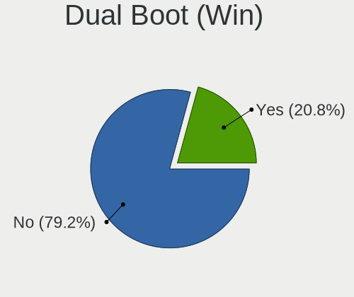
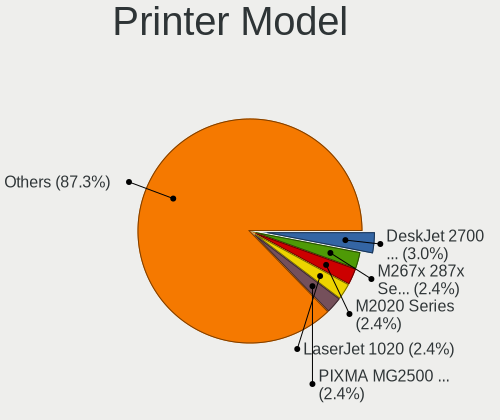

Linux Mint - Tested Hardware & Statistics (Notebooks)
-----------------------------------------------------

A project to collect tested hardware configurations for Linux Mint.

Anyone can contribute to this report by the [hw-probe](https://github.com/linuxhw/hw-probe) tool:

    sudo -E hw-probe -all -upload

Please contribute! Especially if your hardware is rare.

Contents
--------

* [ Test Cases ](#test-cases)

* [ System ](#system)
  - [ OS                       ](#os)
  - [ OS Family                ](#os-family)
  - [ Kernel                   ](#kernel)
  - [ Kernel Family            ](#kernel-family)
  - [ Kernel Major Ver.        ](#kernel-major-ver)
  - [ Arch                     ](#arch)
  - [ DE                       ](#de)
  - [ Display Server           ](#display-server)
  - [ Display Manager          ](#display-manager)
  - [ OS Lang                  ](#os-lang)
  - [ Boot Mode                ](#boot-mode)
  - [ Filesystem               ](#filesystem)
  - [ Part. scheme             ](#part-scheme)
  - [ Dual Boot with Linux/BSD ](#dual-boot-with-linuxbsd)
  - [ Dual Boot (Win)          ](#dual-boot-win)

* [ Board ](#board)
  - [ Vendor                   ](#vendor)
  - [ Model                    ](#model)
  - [ Model Family             ](#model-family)
  - [ MFG Year                 ](#mfg-year)
  - [ Form Factor              ](#form-factor)
  - [ Secure Boot              ](#secure-boot)
  - [ Coreboot                 ](#coreboot)
  - [ RAM Size                 ](#ram-size)
  - [ RAM Used                 ](#ram-used)
  - [ Total Drives             ](#total-drives)
  - [ Has CD-ROM               ](#has-cd-rom)
  - [ Has Ethernet             ](#has-ethernet)
  - [ Has WiFi                 ](#has-wifi)
  - [ Has Bluetooth            ](#has-bluetooth)

* [ Location ](#location)
  - [ Country                  ](#country)
  - [ City                     ](#city)

* [ Drives ](#drives)
  - [ Drive Vendor             ](#drive-vendor)
  - [ Drive Model              ](#drive-model)
  - [ HDD Vendor               ](#hdd-vendor)
  - [ SSD Vendor               ](#ssd-vendor)
  - [ Drive Kind               ](#drive-kind)
  - [ Drive Connector          ](#drive-connector)
  - [ Drive Size               ](#drive-size)
  - [ Space Total              ](#space-total)
  - [ Space Used               ](#space-used)
  - [ Malfunc. Drives          ](#malfunc-drives)
  - [ Malfunc. Drive Vendor    ](#malfunc-drive-vendor)
  - [ Malfunc. HDD Vendor      ](#malfunc-hdd-vendor)
  - [ Malfunc. Drive Kind      ](#malfunc-drive-kind)
  - [ Failed Drives            ](#failed-drives)
  - [ Failed Drive Vendor      ](#failed-drive-vendor)
  - [ Drive Status             ](#drive-status)

* [ Storage controller ](#storage-controller)
  - [ Storage Vendor           ](#storage-vendor)
  - [ Storage Model            ](#storage-model)
  - [ Storage Kind             ](#storage-kind)

* [ Processor ](#processor)
  - [ CPU Vendor               ](#cpu-vendor)
  - [ CPU Model                ](#cpu-model)
  - [ CPU Model Family         ](#cpu-model-family)
  - [ CPU Cores                ](#cpu-cores)
  - [ CPU Sockets              ](#cpu-sockets)
  - [ CPU Threads              ](#cpu-threads)
  - [ CPU Op-Modes             ](#cpu-op-modes)
  - [ CPU Microcode            ](#cpu-microcode)
  - [ CPU Microarch            ](#cpu-microarch)

* [ Graphics ](#graphics)
  - [ GPU Vendor               ](#gpu-vendor)
  - [ GPU Model                ](#gpu-model)
  - [ GPU Combo                ](#gpu-combo)
  - [ GPU Driver               ](#gpu-driver)
  - [ GPU Memory               ](#gpu-memory)

* [ Monitor ](#monitor)
  - [ Monitor Vendor           ](#monitor-vendor)
  - [ Monitor Model            ](#monitor-model)
  - [ Monitor Resolution       ](#monitor-resolution)
  - [ Monitor Diagonal         ](#monitor-diagonal)
  - [ Monitor Width            ](#monitor-width)
  - [ Aspect Ratio             ](#aspect-ratio)
  - [ Monitor Area             ](#monitor-area)
  - [ Pixel Density            ](#pixel-density)
  - [ Multiple Monitors        ](#multiple-monitors)

* [ Network ](#network)
  - [ Net Controller Vendor    ](#net-controller-vendor)
  - [ Net Controller Model     ](#net-controller-model)
  - [ Wireless Vendor          ](#wireless-vendor)
  - [ Wireless Model           ](#wireless-model)
  - [ Ethernet Vendor          ](#ethernet-vendor)
  - [ Ethernet Model           ](#ethernet-model)
  - [ Net Controller Kind      ](#net-controller-kind)
  - [ Used Controller          ](#used-controller)
  - [ NICs                     ](#nics)
  - [ IPv6                     ](#ipv6)

* [ Bluetooth ](#bluetooth)
  - [ Bluetooth Vendor         ](#bluetooth-vendor)
  - [ Bluetooth Model          ](#bluetooth-model)

* [ Sound ](#sound)
  - [ Sound Vendor             ](#sound-vendor)
  - [ Sound Model              ](#sound-model)

* [ Memory ](#memory)
  - [ Memory Vendor            ](#memory-vendor)
  - [ Memory Model             ](#memory-model)
  - [ Memory Kind              ](#memory-kind)
  - [ Memory Form Factor       ](#memory-form-factor)
  - [ Memory Size              ](#memory-size)
  - [ Memory Speed             ](#memory-speed)

* [ Printers & scanners ](#printers--scanners)
  - [ Printer Vendor           ](#printer-vendor)
  - [ Printer Model            ](#printer-model)
  - [ Scanner Vendor           ](#scanner-vendor)
  - [ Scanner Model            ](#scanner-model)

* [ Camera ](#camera)
  - [ Camera Vendor            ](#camera-vendor)
  - [ Camera Model             ](#camera-model)

* [ Security ](#security)
  - [ Fingerprint Vendor       ](#fingerprint-vendor)
  - [ Fingerprint Model        ](#fingerprint-model)
  - [ Chipcard Vendor          ](#chipcard-vendor)
  - [ Chipcard Model           ](#chipcard-model)

* [ Unsupported ](#unsupported)
  - [ Unsupported Devices      ](#unsupported-devices)
  - [ Unsupported Device Types ](#unsupported-device-types)

Test Cases
----------

Total: 11188

| Vendor        | Model                       | Probe                                                      | Date         |
|---------------|-----------------------------|------------------------------------------------------------|--------------|
| Positivo      | Mobile                      | [640bc1a962](https://linux-hardware.org/?probe=640bc1a962) | Oct 01, 2022 |
| ASUSTek       | K54LY                       | [98197c818f](https://linux-hardware.org/?probe=98197c818f) | Oct 01, 2022 |
| ASUSTek       | VivoBook_ASUSLaptop E410... | [462f9bbdbe](https://linux-hardware.org/?probe=462f9bbdbe) | Oct 01, 2022 |
| Toshiba       | Satellite L55-B             | [f3680300d7](https://linux-hardware.org/?probe=f3680300d7) | Oct 01, 2022 |
| Fujitsu       | LIFEBOOK A6210              | [73c4e6626f](https://linux-hardware.org/?probe=73c4e6626f) | Oct 01, 2022 |
| Lenovo        | ThinkPad T440 20B6005JUS    | [f12950ed92](https://linux-hardware.org/?probe=f12950ed92) | Oct 01, 2022 |
| Lenovo        | ThinkPad T440 20B6005JUS    | [b395d9ce9b](https://linux-hardware.org/?probe=b395d9ce9b) | Oct 01, 2022 |
| Dell          | G3 3500                     | [245ebaabe5](https://linux-hardware.org/?probe=245ebaabe5) | Oct 01, 2022 |
| Samsung       | 950XDB/951XDB/950XDY        | [5c5353c8b6](https://linux-hardware.org/?probe=5c5353c8b6) | Oct 01, 2022 |
| Lenovo        | IdeaPad 330-15IKB 81FE      | [b62ddbdab0](https://linux-hardware.org/?probe=b62ddbdab0) | Oct 01, 2022 |
| Fujitsu       | LIFEBOOK A6210              | [dffb22efdc](https://linux-hardware.org/?probe=dffb22efdc) | Oct 01, 2022 |
| Timi          | TM1709                      | [33022811a8](https://linux-hardware.org/?probe=33022811a8) | Oct 01, 2022 |
| HP            | ZBook 17 G4                 | [1476da42c3](https://linux-hardware.org/?probe=1476da42c3) | Sep 30, 2022 |
| Lenovo        | IdeaPad 3 15ITL6 82H8       | [92f9efe077](https://linux-hardware.org/?probe=92f9efe077) | Sep 30, 2022 |
| Lenovo        | G460 20041                  | [130c0489f9](https://linux-hardware.org/?probe=130c0489f9) | Sep 30, 2022 |
| Dell          | Inspiron 16 Plus 7620       | [73e2559339](https://linux-hardware.org/?probe=73e2559339) | Sep 30, 2022 |
| Lenovo        | ThinkBook 13s G2 ITL 20V... | [e829c9c0c6](https://linux-hardware.org/?probe=e829c9c0c6) | Sep 30, 2022 |
| Acer          | Aspire A715-74G             | [17abc08754](https://linux-hardware.org/?probe=17abc08754) | Sep 30, 2022 |
| Acer          | Aspire A315-56              | [1ee3922873](https://linux-hardware.org/?probe=1ee3922873) | Sep 30, 2022 |
| Positivo      | Mobile                      | [dcf8b09bec](https://linux-hardware.org/?probe=dcf8b09bec) | Sep 30, 2022 |
| Positivo      | Mobile                      | [6d2584bcb8](https://linux-hardware.org/?probe=6d2584bcb8) | Sep 30, 2022 |
| HP            | Pavilion dv8000 (ET839UA... | [46ef409fa9](https://linux-hardware.org/?probe=46ef409fa9) | Sep 30, 2022 |
| Dell          | Inspiron 3505               | [097825430f](https://linux-hardware.org/?probe=097825430f) | Sep 30, 2022 |
| Dell          | Inspiron 15-3567            | [5f1d0e6142](https://linux-hardware.org/?probe=5f1d0e6142) | Sep 30, 2022 |
| Dell          | Inspiron 15-3567            | [70a80b4201](https://linux-hardware.org/?probe=70a80b4201) | Sep 30, 2022 |
| Toshiba       | Satellite S70-A             | [7c6b3e14ce](https://linux-hardware.org/?probe=7c6b3e14ce) | Sep 30, 2022 |
| Toshiba       | Satellite L670              | [3b3e7965a5](https://linux-hardware.org/?probe=3b3e7965a5) | Sep 29, 2022 |
| GHIA          | LFI3H                       | [4233e4e6c5](https://linux-hardware.org/?probe=4233e4e6c5) | Sep 29, 2022 |
| GHIA          | LFI3H                       | [482e78460a](https://linux-hardware.org/?probe=482e78460a) | Sep 29, 2022 |
| AMI           | Cherry Trail CR             | [58caf99a77](https://linux-hardware.org/?probe=58caf99a77) | Sep 29, 2022 |
| HP            | EliteBook 6930p             | [56e5d25094](https://linux-hardware.org/?probe=56e5d25094) | Sep 29, 2022 |
| HP            | Laptop 15-db0xxx            | [8f42666f03](https://linux-hardware.org/?probe=8f42666f03) | Sep 29, 2022 |
| Dell          | Latitude E6330              | [b075fbcb56](https://linux-hardware.org/?probe=b075fbcb56) | Sep 29, 2022 |
| Dell          | Inspiron 1564               | [d9dd05aa12](https://linux-hardware.org/?probe=d9dd05aa12) | Sep 29, 2022 |
| Dell          | Inspiron 7347               | [ac3079df8c](https://linux-hardware.org/?probe=ac3079df8c) | Sep 29, 2022 |
| Dell          | Inspiron 7347               | [144cad649c](https://linux-hardware.org/?probe=144cad649c) | Sep 29, 2022 |
| Dell          | Latitude E6430              | [f3e5e0005d](https://linux-hardware.org/?probe=f3e5e0005d) | Sep 29, 2022 |
| Lenovo        | IdeaPad S145-15AST 81N3     | [96c4c8ba02](https://linux-hardware.org/?probe=96c4c8ba02) | Sep 28, 2022 |
| Chuwi         | GemiBook Pro                | [fb12905329](https://linux-hardware.org/?probe=fb12905329) | Sep 28, 2022 |
| LG Electro... | C400-G.BC22P1               | [a325f5eb86](https://linux-hardware.org/?probe=a325f5eb86) | Sep 28, 2022 |
| Samsung       | 750XED                      | [dcb54d69f8](https://linux-hardware.org/?probe=dcb54d69f8) | Sep 27, 2022 |
| Toshiba       | QOSMIO X70-B                | [04589a6a6c](https://linux-hardware.org/?probe=04589a6a6c) | Sep 27, 2022 |
| Dell          | Latitude E6540              | [27c854b1a0](https://linux-hardware.org/?probe=27c854b1a0) | Sep 27, 2022 |
| Lenovo        | G780                        | [057a86bcdc](https://linux-hardware.org/?probe=057a86bcdc) | Sep 27, 2022 |
| Toshiba       | Satellite C50-B             | [3cea1ede58](https://linux-hardware.org/?probe=3cea1ede58) | Sep 27, 2022 |
| Dell          | XPS 17 9700                 | [cd6dcf0de8](https://linux-hardware.org/?probe=cd6dcf0de8) | Sep 27, 2022 |
| Standard      | AHV                         | [a80b2d344d](https://linux-hardware.org/?probe=a80b2d344d) | Sep 27, 2022 |
| Fujitsu Si... | ESPRIMO Mobile V5535        | [6f4452adc5](https://linux-hardware.org/?probe=6f4452adc5) | Sep 27, 2022 |
| ASUSTek       | K53SV                       | [d2801f9560](https://linux-hardware.org/?probe=d2801f9560) | Sep 26, 2022 |
| Lenovo        | V15 G2 ALC 82KD             | [3c0a494baa](https://linux-hardware.org/?probe=3c0a494baa) | Sep 26, 2022 |
| Fujitsu       | LIFEBOOK A544               | [6e4694775c](https://linux-hardware.org/?probe=6e4694775c) | Sep 26, 2022 |
| HP            | Laptop 17-cp0xxx            | [fa6a915235](https://linux-hardware.org/?probe=fa6a915235) | Sep 26, 2022 |
| HP            | G42                         | [39a4836398](https://linux-hardware.org/?probe=39a4836398) | Sep 26, 2022 |
| MSI           | GE75 Raider 8SF             | [094a9b115b](https://linux-hardware.org/?probe=094a9b115b) | Sep 26, 2022 |
| HP            | Pavilion g7                 | [19b206ba2f](https://linux-hardware.org/?probe=19b206ba2f) | Sep 25, 2022 |
| ASUSTek       | VivoBook_ASUSLaptop X340... | [7be473c3c6](https://linux-hardware.org/?probe=7be473c3c6) | Sep 25, 2022 |
| Timi          | RedmiBook 16                | [0a65bab615](https://linux-hardware.org/?probe=0a65bab615) | Sep 25, 2022 |
| Lenovo        | ThinkPad X250 20CL001DMS    | [7662278b86](https://linux-hardware.org/?probe=7662278b86) | Sep 25, 2022 |
| HUAWEI        | KLVL-WXXW                   | [6828f26ab2](https://linux-hardware.org/?probe=6828f26ab2) | Sep 25, 2022 |
| Lenovo        | ThinkPad T14 Gen 3 21AHC... | [0e69d41fef](https://linux-hardware.org/?probe=0e69d41fef) | Sep 25, 2022 |
| ASUSTek       | ZenBook UX325EA_UX325EA     | [2854d30785](https://linux-hardware.org/?probe=2854d30785) | Sep 25, 2022 |
| Samsung       | RV411/RV511/E3511/S3511/... | [939bba43d1](https://linux-hardware.org/?probe=939bba43d1) | Sep 25, 2022 |
| Dell          | Inspiron 3442               | [7fb024bb5d](https://linux-hardware.org/?probe=7fb024bb5d) | Sep 25, 2022 |
| HP            | 255 G5                      | [2a8f595510](https://linux-hardware.org/?probe=2a8f595510) | Sep 24, 2022 |
| Dell          | Inspiron 3442               | [1190ad2886](https://linux-hardware.org/?probe=1190ad2886) | Sep 24, 2022 |
| Dell          | Inspiron 1440               | [c928a944c0](https://linux-hardware.org/?probe=c928a944c0) | Sep 24, 2022 |
| ASUSTek       | X55U                        | [e8b140c0cc](https://linux-hardware.org/?probe=e8b140c0cc) | Sep 24, 2022 |
| ASUSTek       | X55U                        | [863a5df6ad](https://linux-hardware.org/?probe=863a5df6ad) | Sep 24, 2022 |
| Lenovo        | ThinkPad T430 23476Y7       | [8488ad9e53](https://linux-hardware.org/?probe=8488ad9e53) | Sep 24, 2022 |
| Lenovo        | ThinkPad E15 Gen 4 21ED0... | [b7a5cfcf9c](https://linux-hardware.org/?probe=b7a5cfcf9c) | Sep 24, 2022 |
| Lenovo        | ThinkPad L14 Gen 1 20U50... | [dc165f65b5](https://linux-hardware.org/?probe=dc165f65b5) | Sep 24, 2022 |
| Dell          | Inspiron 16 Plus 7620       | [977d73b98a](https://linux-hardware.org/?probe=977d73b98a) | Sep 24, 2022 |
| Dell          | Latitude E5510              | [04f4e9a803](https://linux-hardware.org/?probe=04f4e9a803) | Sep 24, 2022 |
| HP            | Pavilion dv8000 (ET839UA... | [70404f465f](https://linux-hardware.org/?probe=70404f465f) | Sep 24, 2022 |
| Dell          | Latitude E5570              | [df18be69a3](https://linux-hardware.org/?probe=df18be69a3) | Sep 24, 2022 |
| HP            | Laptop 17-bs0xx             | [33398b1a21](https://linux-hardware.org/?probe=33398b1a21) | Sep 23, 2022 |
| Lenovo        | Y50-70 Touch 20349          | [f038a5908f](https://linux-hardware.org/?probe=f038a5908f) | Sep 23, 2022 |
| Toshiba       | ENCORE 2 WT8-B              | [b9cd7b49d3](https://linux-hardware.org/?probe=b9cd7b49d3) | Sep 23, 2022 |
| Lenovo        | ThinkPad E15 Gen 4 21ED0... | [e8e1108a58](https://linux-hardware.org/?probe=e8e1108a58) | Sep 23, 2022 |
| Dell          | Precision 7710              | [c48bccbee4](https://linux-hardware.org/?probe=c48bccbee4) | Sep 23, 2022 |
| Acer          | TravelMate P256-MG          | [0a7c58d00a](https://linux-hardware.org/?probe=0a7c58d00a) | Sep 23, 2022 |
| Acer          | Aspire 5532                 | [b427a13b9b](https://linux-hardware.org/?probe=b427a13b9b) | Sep 22, 2022 |
| Dell          | Inspiron 1721               | [ab0eb7f4ce](https://linux-hardware.org/?probe=ab0eb7f4ce) | Sep 22, 2022 |
| Fujitsu       | LIFEBOOK A544               | [648fb5c63e](https://linux-hardware.org/?probe=648fb5c63e) | Sep 22, 2022 |
| ASUSTek       | Zenbook UX5401ZAS_UX5401... | [fc2ea7b0a0](https://linux-hardware.org/?probe=fc2ea7b0a0) | Sep 22, 2022 |
| ASUSTek       | G750JM                      | [2e53c11312](https://linux-hardware.org/?probe=2e53c11312) | Sep 22, 2022 |
| Lenovo        | ThinkPad E560 20EV002FUS    | [2d8eefaf6a](https://linux-hardware.org/?probe=2d8eefaf6a) | Sep 22, 2022 |
| Dell          | Latitude E6320              | [452304d040](https://linux-hardware.org/?probe=452304d040) | Sep 22, 2022 |
| HP            | Pavilion dv4000 (PX306UA... | [372160583e](https://linux-hardware.org/?probe=372160583e) | Sep 22, 2022 |
| Sony          | VPCEB1Z1E                   | [37fea84df6](https://linux-hardware.org/?probe=37fea84df6) | Sep 22, 2022 |
| Lenovo        | IdeaPad 5 14ALC05 82LM      | [641ad27b06](https://linux-hardware.org/?probe=641ad27b06) | Sep 22, 2022 |
| Dell          | Latitude E6510              | [fa644f90c4](https://linux-hardware.org/?probe=fa644f90c4) | Sep 22, 2022 |
| Chuwi         | HeroBook Pro                | [76be3ff1db](https://linux-hardware.org/?probe=76be3ff1db) | Sep 22, 2022 |
| Lenovo        | ThinkPad W520 4270CTO       | [cae7b3dc49](https://linux-hardware.org/?probe=cae7b3dc49) | Sep 22, 2022 |
| Sony          | SVE15125CBW                 | [50b65906b1](https://linux-hardware.org/?probe=50b65906b1) | Sep 22, 2022 |
| MSI           | GT70 2OC/2OD                | [c6a0b0d987](https://linux-hardware.org/?probe=c6a0b0d987) | Sep 22, 2022 |
| HP            | Pavilion dv8000 (ET839UA... | [dd994c3f70](https://linux-hardware.org/?probe=dd994c3f70) | Sep 22, 2022 |
| Lenovo        | ThinkPad Edge E320 1298A... | [869b076838](https://linux-hardware.org/?probe=869b076838) | Sep 21, 2022 |
| ASUSTek       | VivoBook_ASUSLaptop X509... | [afd66066bc](https://linux-hardware.org/?probe=afd66066bc) | Sep 21, 2022 |
| Lenovo        | ThinkPad X230 23255Z6       | [25cc23e2ad](https://linux-hardware.org/?probe=25cc23e2ad) | Sep 21, 2022 |
| Lenovo        | ThinkPad T61 6468AE1        | [8719597c22](https://linux-hardware.org/?probe=8719597c22) | Sep 21, 2022 |
| Acer          | Aspire ES1-111M             | [04f08de672](https://linux-hardware.org/?probe=04f08de672) | Sep 21, 2022 |
| Apple         | MacBookPro8,1               | [d97b8fc0ed](https://linux-hardware.org/?probe=d97b8fc0ed) | Sep 21, 2022 |
| HUAWEI        | KLVL-WXXW                   | [8e46e07b3a](https://linux-hardware.org/?probe=8e46e07b3a) | Sep 21, 2022 |
| Lenovo        | G40-80 80E4                 | [575b85b038](https://linux-hardware.org/?probe=575b85b038) | Sep 21, 2022 |
| HP            | Pavilion dv8000 (ET839UA... | [79f0e7d5a2](https://linux-hardware.org/?probe=79f0e7d5a2) | Sep 21, 2022 |
| Lenovo        | G40-80 80E4                 | [18a0a2158c](https://linux-hardware.org/?probe=18a0a2158c) | Sep 21, 2022 |
| Dell          | Latitude 3540               | [7e56d744b7](https://linux-hardware.org/?probe=7e56d744b7) | Sep 21, 2022 |
| Dell          | Latitude 3540               | [0216f52b36](https://linux-hardware.org/?probe=0216f52b36) | Sep 21, 2022 |
| Lenovo        | ThinkPad E15 Gen 4 21EDC... | [910b604abc](https://linux-hardware.org/?probe=910b604abc) | Sep 21, 2022 |
| Dell          | Latitude E6540              | [08bd609dbe](https://linux-hardware.org/?probe=08bd609dbe) | Sep 20, 2022 |
| LG Electro... | C400-G.BC22P1               | [b5aad7f903](https://linux-hardware.org/?probe=b5aad7f903) | Sep 20, 2022 |
| Dell          | Latitude E7240              | [6db3839532](https://linux-hardware.org/?probe=6db3839532) | Sep 20, 2022 |
| Dell          | Latitude E7240              | [21dc4700da](https://linux-hardware.org/?probe=21dc4700da) | Sep 20, 2022 |
| Framework     | Laptop                      | [dd163cfa96](https://linux-hardware.org/?probe=dd163cfa96) | Sep 20, 2022 |
| Toshiba       | Satellite L875-11M          | [42f3498e9e](https://linux-hardware.org/?probe=42f3498e9e) | Sep 20, 2022 |
| Lenovo        | ThinkPad T61 6468AE1        | [028ead1680](https://linux-hardware.org/?probe=028ead1680) | Sep 20, 2022 |
| Dell          | Latitude E6420              | [e46ce42e90](https://linux-hardware.org/?probe=e46ce42e90) | Sep 20, 2022 |
| Dell          | Latitude E4310              | [06dc3db422](https://linux-hardware.org/?probe=06dc3db422) | Sep 20, 2022 |
| Acer          | Aspire E5-532               | [1d0f80e0f1](https://linux-hardware.org/?probe=1d0f80e0f1) | Sep 20, 2022 |
| Acer          | Aspire E5-532               | [f349ec9700](https://linux-hardware.org/?probe=f349ec9700) | Sep 20, 2022 |
| Lenovo        | B570e 476025G               | [ab67a90ba7](https://linux-hardware.org/?probe=ab67a90ba7) | Sep 20, 2022 |
| HUAWEI        | BOM-WXX9                    | [d30c6c5b9b](https://linux-hardware.org/?probe=d30c6c5b9b) | Sep 20, 2022 |
| HUAWEI        | BOM-WXX9                    | [f2906f8b8d](https://linux-hardware.org/?probe=f2906f8b8d) | Sep 19, 2022 |
| LG Electro... | C400-G.BC31P1               | [66c8977810](https://linux-hardware.org/?probe=66c8977810) | Sep 19, 2022 |
| Samsung       | 350V5C/351V5C/3540VC/344... | [85952e171d](https://linux-hardware.org/?probe=85952e171d) | Sep 19, 2022 |
| HP            | Pavilion dv8000 (ET839UA... | [66596e407c](https://linux-hardware.org/?probe=66596e407c) | Sep 19, 2022 |
| Chuwi         | HeroBook Pro                | [3759658825](https://linux-hardware.org/?probe=3759658825) | Sep 19, 2022 |
| HP            | Pavilion dv6                | [9c52e7d0f0](https://linux-hardware.org/?probe=9c52e7d0f0) | Sep 19, 2022 |
| Samsung       | R530/R730/R540              | [3062da6263](https://linux-hardware.org/?probe=3062da6263) | Sep 19, 2022 |
| Acer          | Aspire A515-51G             | [3f987553d9](https://linux-hardware.org/?probe=3f987553d9) | Sep 18, 2022 |
| ASUSTek       | VivoBook_ASUSLaptop E410... | [b707354c65](https://linux-hardware.org/?probe=b707354c65) | Sep 18, 2022 |
| Samsung       | Lumpy                       | [9c1fd4f253](https://linux-hardware.org/?probe=9c1fd4f253) | Sep 18, 2022 |
| HP            | Pavilion dv8000 (ET839UA... | [2e1e251503](https://linux-hardware.org/?probe=2e1e251503) | Sep 18, 2022 |
| HP            | Pavilion dv8000 (ET839UA... | [5f56e8b10f](https://linux-hardware.org/?probe=5f56e8b10f) | Sep 18, 2022 |
| Lenovo        | G780                        | [eb3df9a17e](https://linux-hardware.org/?probe=eb3df9a17e) | Sep 18, 2022 |
| Lenovo        | ThinkPad X200 7458VL3       | [700ff6630e](https://linux-hardware.org/?probe=700ff6630e) | Sep 18, 2022 |
| Samsung       | R430/P430                   | [50cf13ed55](https://linux-hardware.org/?probe=50cf13ed55) | Sep 18, 2022 |
| HP            | 2000                        | [0020624077](https://linux-hardware.org/?probe=0020624077) | Sep 18, 2022 |
| Lenovo        | ThinkPad T580 20L9001YRT    | [7ac55602e6](https://linux-hardware.org/?probe=7ac55602e6) | Sep 18, 2022 |
| Lenovo        | ThinkPad E480 20KQS00000    | [c3c44800e7](https://linux-hardware.org/?probe=c3c44800e7) | Sep 18, 2022 |
| Dell          | Latitude E5420              | [7416dc3fb1](https://linux-hardware.org/?probe=7416dc3fb1) | Sep 18, 2022 |
| Acer          | Swift SF314-57              | [8c905d820d](https://linux-hardware.org/?probe=8c905d820d) | Sep 17, 2022 |
| Lenovo        | G780                        | [04f924450d](https://linux-hardware.org/?probe=04f924450d) | Sep 17, 2022 |
| Medion        | Akoya S6213T                | [6fb8ca6c1b](https://linux-hardware.org/?probe=6fb8ca6c1b) | Sep 17, 2022 |
| Dell          | XPS 13 9360                 | [af2f12093c](https://linux-hardware.org/?probe=af2f12093c) | Sep 17, 2022 |
| Dell          | Inspiron 15-3567            | [7ef8a544c4](https://linux-hardware.org/?probe=7ef8a544c4) | Sep 17, 2022 |
| MSI           | Katana GF66 12UD            | [fde2d03f98](https://linux-hardware.org/?probe=fde2d03f98) | Sep 17, 2022 |
| Dell          | Latitude E5400              | [9859a54bc4](https://linux-hardware.org/?probe=9859a54bc4) | Sep 17, 2022 |
| Lenovo        | ThinkPad X230 2325CZ1       | [b484febc13](https://linux-hardware.org/?probe=b484febc13) | Sep 17, 2022 |
| HP            | Laptop 15-da0xxx            | [6341f27d68](https://linux-hardware.org/?probe=6341f27d68) | Sep 16, 2022 |
| Dell          | Inspiron 1545               | [cc3af3e194](https://linux-hardware.org/?probe=cc3af3e194) | Sep 16, 2022 |
| Dell          | Inspiron 1545               | [598341495c](https://linux-hardware.org/?probe=598341495c) | Sep 16, 2022 |
| Alienware     | M17xR4                      | [210bd15049](https://linux-hardware.org/?probe=210bd15049) | Sep 16, 2022 |
| Lenovo        | Legion 5 15ACH6H 82JU       | [7a390e81b1](https://linux-hardware.org/?probe=7a390e81b1) | Sep 16, 2022 |
| HP            | Compaq 6720s                | [75bc6df1df](https://linux-hardware.org/?probe=75bc6df1df) | Sep 16, 2022 |
| Dell          | Precision 7520              | [5deca1e73b](https://linux-hardware.org/?probe=5deca1e73b) | Sep 16, 2022 |
| Lenovo        | Z50-70 20354                | [fafabb8c1f](https://linux-hardware.org/?probe=fafabb8c1f) | Sep 16, 2022 |
| Dell          | Inspiron 15-3552            | [583d7c550e](https://linux-hardware.org/?probe=583d7c550e) | Sep 16, 2022 |
| Dell          | Inspiron 15-3567            | [3ea454c43f](https://linux-hardware.org/?probe=3ea454c43f) | Sep 16, 2022 |
| Lenovo        | IdeaPad 5 15ABA7 82SG       | [4bc5802227](https://linux-hardware.org/?probe=4bc5802227) | Sep 16, 2022 |
| Daten Tecn... | DT02-M4                     | [0096dc6b88](https://linux-hardware.org/?probe=0096dc6b88) | Sep 16, 2022 |
| Daten Tecn... | DT02-M4                     | [09e9990a2f](https://linux-hardware.org/?probe=09e9990a2f) | Sep 16, 2022 |
| Dell          | Latitude 5410               | [f476f4e380](https://linux-hardware.org/?probe=f476f4e380) | Sep 16, 2022 |
| HP            | ProBook 4530s               | [821a6eda47](https://linux-hardware.org/?probe=821a6eda47) | Sep 16, 2022 |
| Lenovo        | IdeaPad 110S-11IBR          | [32e42e0b52](https://linux-hardware.org/?probe=32e42e0b52) | Sep 15, 2022 |
| Samsung       | Lumpy                       | [1ea9c40a42](https://linux-hardware.org/?probe=1ea9c40a42) | Sep 15, 2022 |
| ASUSTek       | X555LD                      | [12d6e02796](https://linux-hardware.org/?probe=12d6e02796) | Sep 15, 2022 |
| HP            | 2000                        | [17e86a7d4b](https://linux-hardware.org/?probe=17e86a7d4b) | Sep 15, 2022 |
| Lenovo        | IdeaPad Gaming 3 15IMH05... | [e965de4ced](https://linux-hardware.org/?probe=e965de4ced) | Sep 15, 2022 |
| Panasonic     | CF-53JWX1CFG                | [f4e1cd21d9](https://linux-hardware.org/?probe=f4e1cd21d9) | Sep 15, 2022 |
| ASUSTek       | VivoBook_ASUSLaptop X421... | [38fa0eaf03](https://linux-hardware.org/?probe=38fa0eaf03) | Sep 15, 2022 |
| ASUSTek       | VivoBook_ASUSLaptop X421... | [72c53fd3c8](https://linux-hardware.org/?probe=72c53fd3c8) | Sep 15, 2022 |
| HP            | ProBook 455 15.6 inch G9... | [027a02cfc2](https://linux-hardware.org/?probe=027a02cfc2) | Sep 15, 2022 |
| Acer          | Aspire E5-571G              | [0a02b8ef94](https://linux-hardware.org/?probe=0a02b8ef94) | Sep 15, 2022 |
| Lenovo        | Slim 7 14IAP7 82SX          | [9dc2707813](https://linux-hardware.org/?probe=9dc2707813) | Sep 15, 2022 |
| HP            | 240 G7 Notebook PC          | [09f7be676c](https://linux-hardware.org/?probe=09f7be676c) | Sep 15, 2022 |
| HP            | 240 G7 Notebook PC          | [2225605b31](https://linux-hardware.org/?probe=2225605b31) | Sep 15, 2022 |
| Acer          | Aspire 6530                 | [9b356c761d](https://linux-hardware.org/?probe=9b356c761d) | Sep 14, 2022 |
| Lenovo        | ThinkPad T510 4349BR8       | [d60b0c8539](https://linux-hardware.org/?probe=d60b0c8539) | Sep 14, 2022 |
| Lenovo        | V15 G2 ALC 82KD             | [4053fdc410](https://linux-hardware.org/?probe=4053fdc410) | Sep 14, 2022 |
| HP            | Laptop 15-da0xxx            | [82140783de](https://linux-hardware.org/?probe=82140783de) | Sep 14, 2022 |
| ASUSTek       | VivoBook_ASUSLaptop X515... | [54ea6ab133](https://linux-hardware.org/?probe=54ea6ab133) | Sep 14, 2022 |
| HP            | Unknown                     | [692825c1eb](https://linux-hardware.org/?probe=692825c1eb) | Sep 14, 2022 |
| HP            | Laptop 17-cp0xxx            | [8d189da7a7](https://linux-hardware.org/?probe=8d189da7a7) | Sep 14, 2022 |
| HP            | Laptop 17-cp0xxx            | [614b601d46](https://linux-hardware.org/?probe=614b601d46) | Sep 14, 2022 |
| Lenovo        | IdeaPad 110-15ISK 80UD      | [277daa8d6d](https://linux-hardware.org/?probe=277daa8d6d) | Sep 14, 2022 |
| Dell          | Inspiron 15-3567            | [5006dca507](https://linux-hardware.org/?probe=5006dca507) | Sep 14, 2022 |
| Dell          | Inspiron 3558               | [51e0624bf7](https://linux-hardware.org/?probe=51e0624bf7) | Sep 13, 2022 |
| Acer          | Aspire 5742G                | [051893f147](https://linux-hardware.org/?probe=051893f147) | Sep 13, 2022 |
| ASUSTek       | VivoBook_ASUSLaptop X515... | [fa652e45e1](https://linux-hardware.org/?probe=fa652e45e1) | Sep 13, 2022 |
| ASUSTek       | ASUS EXPERTBOOK P5440FA_... | [d441c68f40](https://linux-hardware.org/?probe=d441c68f40) | Sep 13, 2022 |
| Dell          | Latitude 5480               | [59bcf57d5b](https://linux-hardware.org/?probe=59bcf57d5b) | Sep 13, 2022 |
| Apple         | MacBookPro5,3               | [3e00c86066](https://linux-hardware.org/?probe=3e00c86066) | Sep 13, 2022 |
| Lenovo        | ThinkPad E15 Gen 2 20TD0... | [aa9d57c27e](https://linux-hardware.org/?probe=aa9d57c27e) | Sep 13, 2022 |
| Apple         | MacBookPro5,3               | [9211f5de76](https://linux-hardware.org/?probe=9211f5de76) | Sep 13, 2022 |
| Lenovo        | G50-70 20351                | [4105fc929e](https://linux-hardware.org/?probe=4105fc929e) | Sep 13, 2022 |
| Acer          | Aspire A315-42              | [6121dfd67d](https://linux-hardware.org/?probe=6121dfd67d) | Sep 13, 2022 |
| HP            | ENVY 15                     | [fdb07294df](https://linux-hardware.org/?probe=fdb07294df) | Sep 13, 2022 |
| HUAWEI        | HBB-WX9                     | [30b6cc18c5](https://linux-hardware.org/?probe=30b6cc18c5) | Sep 13, 2022 |
| ASUSTek       | X550CC                      | [cb36241a3b](https://linux-hardware.org/?probe=cb36241a3b) | Sep 13, 2022 |
| Acer          | Aspire 5349                 | [39f83f7692](https://linux-hardware.org/?probe=39f83f7692) | Sep 13, 2022 |
| Dell          | Inspiron 13-7378            | [689047aef1](https://linux-hardware.org/?probe=689047aef1) | Sep 13, 2022 |
| Dell          | XPS 17 9700                 | [24eaecfdd8](https://linux-hardware.org/?probe=24eaecfdd8) | Sep 13, 2022 |
| Lenovo        | ThinkPad T540p 20BF002CM... | [3343da6005](https://linux-hardware.org/?probe=3343da6005) | Sep 12, 2022 |
| Toshiba       | Satellite L50D-B            | [2d09796251](https://linux-hardware.org/?probe=2d09796251) | Sep 12, 2022 |
| HP            | Laptop 17-cp0xxx            | [78068a1338](https://linux-hardware.org/?probe=78068a1338) | Sep 12, 2022 |
| Acer          | Aspire 6930G                | [cb054f2964](https://linux-hardware.org/?probe=cb054f2964) | Sep 12, 2022 |
| Samsung       | RV415/RV515                 | [bc83707f72](https://linux-hardware.org/?probe=bc83707f72) | Sep 12, 2022 |
| Dell          | Latitude E6540              | [e23aacd364](https://linux-hardware.org/?probe=e23aacd364) | Sep 12, 2022 |
| Samsung       | R530/R730/R540              | [9149fde5c5](https://linux-hardware.org/?probe=9149fde5c5) | Sep 12, 2022 |
| HP            | Laptop 17-cp0xxx            | [4005fc56a4](https://linux-hardware.org/?probe=4005fc56a4) | Sep 12, 2022 |
| Dell          | Inspiron 13-7378            | [4e7d1fc8a7](https://linux-hardware.org/?probe=4e7d1fc8a7) | Sep 12, 2022 |
| ASUSTek       | VivoBook_ASUS Laptop E40... | [2fdf233a71](https://linux-hardware.org/?probe=2fdf233a71) | Sep 12, 2022 |
| HP            | OMEN by Gaming Laptop 16... | [60d15f4f46](https://linux-hardware.org/?probe=60d15f4f46) | Sep 12, 2022 |
| Dell          | XPS 13 9350                 | [e137564f6b](https://linux-hardware.org/?probe=e137564f6b) | Sep 12, 2022 |
| Lenovo        | ThinkPad W540 20BG0016US    | [9f0543edc4](https://linux-hardware.org/?probe=9f0543edc4) | Sep 11, 2022 |
| Dell          | Latitude 3190               | [14d836c020](https://linux-hardware.org/?probe=14d836c020) | Sep 11, 2022 |
| HP            | Pavilion Laptop 15-ck0xx    | [390223e073](https://linux-hardware.org/?probe=390223e073) | Sep 11, 2022 |
| Gigabyte      | AORUS 17 KE4                | [d22756fbc1](https://linux-hardware.org/?probe=d22756fbc1) | Sep 11, 2022 |
| Lenovo        | IdeaPad 110-15ISK 80UD      | [6f309073f2](https://linux-hardware.org/?probe=6f309073f2) | Sep 11, 2022 |
| Hampoo        | Cherry Trail CR Hampoo_r... | [8d76919c1a](https://linux-hardware.org/?probe=8d76919c1a) | Sep 11, 2022 |
| Acer          | Aspire 6530                 | [89af5e8adb](https://linux-hardware.org/?probe=89af5e8adb) | Sep 11, 2022 |
| Acer          | Aspire 6530                 | [1798b7751a](https://linux-hardware.org/?probe=1798b7751a) | Sep 11, 2022 |
| Lenovo        | ZHAOYANG E47                | [7f1fab5ff0](https://linux-hardware.org/?probe=7f1fab5ff0) | Sep 11, 2022 |
| Lenovo        | IdeaPad 3 15ITL05 81X8      | [4ff88a6670](https://linux-hardware.org/?probe=4ff88a6670) | Sep 11, 2022 |
| Apple         | MacBookPro13,1              | [4b7f579852](https://linux-hardware.org/?probe=4b7f579852) | Sep 11, 2022 |
| Dell          | XPS 15 9500                 | [a400135c2f](https://linux-hardware.org/?probe=a400135c2f) | Sep 11, 2022 |
| Acer          | Aspire ES1-411              | [064b2bd5f2](https://linux-hardware.org/?probe=064b2bd5f2) | Sep 11, 2022 |
| Lenovo        | ThinkPad X1 Carbon Gen 8... | [a7a06f548f](https://linux-hardware.org/?probe=a7a06f548f) | Sep 11, 2022 |
| HP            | EliteBook 840 G5            | [0f40490437](https://linux-hardware.org/?probe=0f40490437) | Sep 11, 2022 |
| UMAX          | VisionBook N15G Plus        | [d17fb4f8f9](https://linux-hardware.org/?probe=d17fb4f8f9) | Sep 11, 2022 |
| Packard Be... | EasyNote LE69KB             | [a008db4da9](https://linux-hardware.org/?probe=a008db4da9) | Sep 11, 2022 |
| GPU Compan... | GWTN141-10                  | [8380b841fd](https://linux-hardware.org/?probe=8380b841fd) | Sep 10, 2022 |
| MSI           | GF75 Thin 10SC              | [be99178497](https://linux-hardware.org/?probe=be99178497) | Sep 10, 2022 |
| ASUSTek       | K53E                        | [d39f35f5d9](https://linux-hardware.org/?probe=d39f35f5d9) | Sep 10, 2022 |
| Toshiba       | Satellite C55-A-1JL         | [906f27f221](https://linux-hardware.org/?probe=906f27f221) | Sep 10, 2022 |
| ASUSTek       | N61Vn                       | [788cf883c5](https://linux-hardware.org/?probe=788cf883c5) | Sep 10, 2022 |
| Dell          | Precision 3550              | [e29e0944e6](https://linux-hardware.org/?probe=e29e0944e6) | Sep 10, 2022 |
| HP            | ZBook 15 G5                 | [fe1d0da2fc](https://linux-hardware.org/?probe=fe1d0da2fc) | Sep 10, 2022 |
| Lenovo        | G50-70 20351                | [633c0eae94](https://linux-hardware.org/?probe=633c0eae94) | Sep 09, 2022 |
| Apple         | MacBookPro9,2               | [228136508c](https://linux-hardware.org/?probe=228136508c) | Sep 09, 2022 |
| Lenovo        | ThinkPad P14s Gen 2a 21A... | [603514ef84](https://linux-hardware.org/?probe=603514ef84) | Sep 09, 2022 |
| Lenovo        | ThinkPad X1 Carbon Gen 8... | [7492f8d01a](https://linux-hardware.org/?probe=7492f8d01a) | Sep 09, 2022 |
| Lenovo        | IdeaPad 110S-11IBR          | [b1c1a2e4e0](https://linux-hardware.org/?probe=b1c1a2e4e0) | Sep 09, 2022 |
| Dell          | Vostro 3550                 | [f04353bb0e](https://linux-hardware.org/?probe=f04353bb0e) | Sep 08, 2022 |
| Acer          | Aspire ES1-411              | [d3df9a2592](https://linux-hardware.org/?probe=d3df9a2592) | Sep 08, 2022 |
| Digibras      | US41II1                     | [890a4894cf](https://linux-hardware.org/?probe=890a4894cf) | Sep 08, 2022 |
| Toshiba       | Satellite C55-A-1JL         | [d229fa96f3](https://linux-hardware.org/?probe=d229fa96f3) | Sep 08, 2022 |
| HP            | Pavilion dv4000 (PX306UA... | [7f7d86b36e](https://linux-hardware.org/?probe=7f7d86b36e) | Sep 08, 2022 |
| Dell          | Latitude E6540              | [5700f37281](https://linux-hardware.org/?probe=5700f37281) | Sep 08, 2022 |
| Dell          | Latitude E7470              | [4a2f647549](https://linux-hardware.org/?probe=4a2f647549) | Sep 08, 2022 |
| Google        | Akemi                       | [459c9226ed](https://linux-hardware.org/?probe=459c9226ed) | Sep 07, 2022 |
| HP            | EliteBook 8440p             | [5cf26fac4d](https://linux-hardware.org/?probe=5cf26fac4d) | Sep 07, 2022 |
| Dell          | Inspiron 3593               | [fd6ab0c9e5](https://linux-hardware.org/?probe=fd6ab0c9e5) | Sep 07, 2022 |
| Dell          | Inspiron 5584               | [3691775658](https://linux-hardware.org/?probe=3691775658) | Sep 07, 2022 |
| Dell          | Studio 1747                 | [42ae5d9dbe](https://linux-hardware.org/?probe=42ae5d9dbe) | Sep 07, 2022 |
| Toshiba       | Satellite C660              | [e7ad5166eb](https://linux-hardware.org/?probe=e7ad5166eb) | Sep 07, 2022 |
| HP            | Pavilion Notebook           | [062f15a645](https://linux-hardware.org/?probe=062f15a645) | Sep 07, 2022 |
| Samsung       | 300E4A/300E5A/300E7A        | [35ead5350d](https://linux-hardware.org/?probe=35ead5350d) | Sep 07, 2022 |
| Lenovo        | ThinkPad T400 2767E53       | [104331cf4c](https://linux-hardware.org/?probe=104331cf4c) | Sep 07, 2022 |
| HP            | ProBook 430 G3              | [f1b171fc10](https://linux-hardware.org/?probe=f1b171fc10) | Sep 06, 2022 |
| Lenovo        | ThinkPad 11e 3rd Gen 20G... | [a3cd19321c](https://linux-hardware.org/?probe=a3cd19321c) | Sep 06, 2022 |
| ASUSTek       | VivoBook_ASUSLaptop M340... | [aa4d4912e2](https://linux-hardware.org/?probe=aa4d4912e2) | Sep 06, 2022 |
| Samsung       | 755XDA                      | [58091d8a85](https://linux-hardware.org/?probe=58091d8a85) | Sep 06, 2022 |
| Dell          | Latitude E6520              | [8d45b1f987](https://linux-hardware.org/?probe=8d45b1f987) | Sep 06, 2022 |
| ASUSTek       | X550CC                      | [ef103b9abb](https://linux-hardware.org/?probe=ef103b9abb) | Sep 06, 2022 |
| ASUSTek       | P751JF                      | [6f3898fe12](https://linux-hardware.org/?probe=6f3898fe12) | Sep 06, 2022 |
| Acer          | Extensa 5230                | [a5546cc97c](https://linux-hardware.org/?probe=a5546cc97c) | Sep 06, 2022 |
| Samsung       | 755XDA                      | [a2013be10e](https://linux-hardware.org/?probe=a2013be10e) | Sep 06, 2022 |
| ASUSTek       | X550CC                      | [264006f609](https://linux-hardware.org/?probe=264006f609) | Sep 06, 2022 |
| Apple         | MacBookPro10,1              | [e9e7867de9](https://linux-hardware.org/?probe=e9e7867de9) | Sep 06, 2022 |
| Apple         | MacBookPro10,1              | [bbd84689a3](https://linux-hardware.org/?probe=bbd84689a3) | Sep 06, 2022 |
| Dell          | Inspiron 16 5620            | [5a1fe06c62](https://linux-hardware.org/?probe=5a1fe06c62) | Sep 06, 2022 |
| Acer          | Aspire 5920G                | [af0e5553e9](https://linux-hardware.org/?probe=af0e5553e9) | Sep 05, 2022 |
| Lenovo        | ThinkPad X230 23252UU       | [0853f0ca45](https://linux-hardware.org/?probe=0853f0ca45) | Sep 05, 2022 |
| Dell          | Latitude E6530              | [9e0c4566c5](https://linux-hardware.org/?probe=9e0c4566c5) | Sep 05, 2022 |
| Gateway       | NS30                        | [2ade42aacf](https://linux-hardware.org/?probe=2ade42aacf) | Sep 05, 2022 |
| ASUSTek       | VivoBook_ASUSLaptop X421... | [b1edd48233](https://linux-hardware.org/?probe=b1edd48233) | Sep 05, 2022 |
| Lenovo        | IdeaPad 110S-11IBR          | [4b6000493a](https://linux-hardware.org/?probe=4b6000493a) | Sep 05, 2022 |
| Lenovo        | IdeaPad 3 15ARE05 81W4      | [999dde8580](https://linux-hardware.org/?probe=999dde8580) | Sep 05, 2022 |
| ASUSTek       | VivoBook_ASUSLaptop X515... | [3aa5926982](https://linux-hardware.org/?probe=3aa5926982) | Sep 05, 2022 |
| Lenovo        | ThinkPad X1 Carbon 34601... | [00e7f83f25](https://linux-hardware.org/?probe=00e7f83f25) | Sep 05, 2022 |
| Apple         | MacBookAir7,2               | [2efecd6c36](https://linux-hardware.org/?probe=2efecd6c36) | Sep 05, 2022 |
| ASUSTek       | ROG Strix G713QM_G713QM     | [27d4905678](https://linux-hardware.org/?probe=27d4905678) | Sep 04, 2022 |
| Acer          | Aspire A515-45              | [89baeb107f](https://linux-hardware.org/?probe=89baeb107f) | Sep 04, 2022 |
| Google        | Akemi                       | [5f47a081e3](https://linux-hardware.org/?probe=5f47a081e3) | Sep 04, 2022 |
| Toshiba       | Satellite L50-B             | [1aedf1fdc1](https://linux-hardware.org/?probe=1aedf1fdc1) | Sep 04, 2022 |
| Lenovo        | G40-80 80JE                 | [c876beae17](https://linux-hardware.org/?probe=c876beae17) | Sep 04, 2022 |
| Apple         | MacBookPro5,1               | [beec88b95c](https://linux-hardware.org/?probe=beec88b95c) | Sep 04, 2022 |
| Lenovo        | E31-80 80MX                 | [0eecb590e6](https://linux-hardware.org/?probe=0eecb590e6) | Sep 04, 2022 |
| ASUSTek       | VivoBook_ASUSLaptop X415... | [35e98b0a2a](https://linux-hardware.org/?probe=35e98b0a2a) | Sep 04, 2022 |
| ASUSTek       | VivoBook_ASUSLaptop X415... | [985872733c](https://linux-hardware.org/?probe=985872733c) | Sep 04, 2022 |
| Lenovo        | ThinkPad E15 Gen 3 20YGC... | [e61768b292](https://linux-hardware.org/?probe=e61768b292) | Sep 04, 2022 |
| ASUSTek       | ROG Strix G713QM_G713QM     | [874553b1fd](https://linux-hardware.org/?probe=874553b1fd) | Sep 04, 2022 |
| Lenovo        | ThinkPad T470s W10DG 20J... | [0a309ba168](https://linux-hardware.org/?probe=0a309ba168) | Sep 04, 2022 |
| Lenovo        | ThinkPad T470s W10DG 20J... | [0a4fea005a](https://linux-hardware.org/?probe=0a4fea005a) | Sep 04, 2022 |
| Lenovo        | ThinkPad T440p 20AWS17N0... | [0a729ebdd9](https://linux-hardware.org/?probe=0a729ebdd9) | Sep 04, 2022 |
| HP            | Presario CQ61               | [5ef0184c8e](https://linux-hardware.org/?probe=5ef0184c8e) | Sep 04, 2022 |
| Lenovo        | G40-80 80JE                 | [e6fa43e12e](https://linux-hardware.org/?probe=e6fa43e12e) | Sep 04, 2022 |
| Dell          | Latitude 7200 2-in-1        | [67de9b81be](https://linux-hardware.org/?probe=67de9b81be) | Sep 04, 2022 |
| Toshiba       | Satellite Pro C660          | [4e2e6fe4ea](https://linux-hardware.org/?probe=4e2e6fe4ea) | Sep 03, 2022 |
| ASUSTek       | K61IC                       | [d85b0c9b4f](https://linux-hardware.org/?probe=d85b0c9b4f) | Sep 03, 2022 |
| ASUSTek       | X551MA                      | [84339ff991](https://linux-hardware.org/?probe=84339ff991) | Sep 03, 2022 |
| Dell          | Latitude 3510               | [9477575b26](https://linux-hardware.org/?probe=9477575b26) | Sep 03, 2022 |
| Acer          | TravelMate P653-M           | [c0fcc47188](https://linux-hardware.org/?probe=c0fcc47188) | Sep 03, 2022 |
| Timi          | RedmiBook Pro 15S           | [74c07405db](https://linux-hardware.org/?probe=74c07405db) | Sep 03, 2022 |
| Daten Tecn... | DT02-M4                     | [b697980a15](https://linux-hardware.org/?probe=b697980a15) | Sep 03, 2022 |
| Lenovo        | ThinkPad X1 Carbon 4th 2... | [ae224152de](https://linux-hardware.org/?probe=ae224152de) | Sep 03, 2022 |
| Lenovo        | V15 G2 ALC 82KD             | [6109fc3fa8](https://linux-hardware.org/?probe=6109fc3fa8) | Sep 02, 2022 |
| Lenovo        | V15 G2 ALC 82KD             | [9f98c80601](https://linux-hardware.org/?probe=9f98c80601) | Sep 02, 2022 |
| ASUSTek       | X756UAM                     | [23f0391963](https://linux-hardware.org/?probe=23f0391963) | Sep 02, 2022 |
| ASUSTek       | ASUS TUF Gaming A17 FA70... | [be1fece9bd](https://linux-hardware.org/?probe=be1fece9bd) | Sep 02, 2022 |
| ASUSTek       | ASUS TUF Gaming A17 FA70... | [8e1f677318](https://linux-hardware.org/?probe=8e1f677318) | Sep 02, 2022 |
| Apple         | MacBookPro5,1               | [e9c17c2743](https://linux-hardware.org/?probe=e9c17c2743) | Sep 02, 2022 |
| Acer          | Aspire 5942                 | [c2c893f2c2](https://linux-hardware.org/?probe=c2c893f2c2) | Sep 02, 2022 |
| Acer          | Aspire 5942                 | [4dbb8891ef](https://linux-hardware.org/?probe=4dbb8891ef) | Sep 02, 2022 |
| ASUSTek       | X75VC                       | [3cd89c5ac3](https://linux-hardware.org/?probe=3cd89c5ac3) | Sep 02, 2022 |
| Dell          | Latitude E6520              | [8f097a1a3f](https://linux-hardware.org/?probe=8f097a1a3f) | Sep 02, 2022 |
| Dell          | Inspiron 5559               | [c7b43caa52](https://linux-hardware.org/?probe=c7b43caa52) | Sep 01, 2022 |
| HP            | Laptop 15-db1xxx            | [51b19bb74b](https://linux-hardware.org/?probe=51b19bb74b) | Sep 01, 2022 |
| Acer          | Aspire 5742G                | [1ed15181cb](https://linux-hardware.org/?probe=1ed15181cb) | Sep 01, 2022 |
| Dell          | Inspiron 15-3567            | [5b1f25ca62](https://linux-hardware.org/?probe=5b1f25ca62) | Sep 01, 2022 |
| Acer          | Aspire V5-431               | [5ac694007d](https://linux-hardware.org/?probe=5ac694007d) | Sep 01, 2022 |
| HP            | EliteBook 830 G8 Noteboo... | [814c094769](https://linux-hardware.org/?probe=814c094769) | Sep 01, 2022 |
| ASUSTek       | VivoBook_ASUS Laptop X50... | [9da6412308](https://linux-hardware.org/?probe=9da6412308) | Sep 01, 2022 |
| Medion        | E6227                       | [e6ca2257e7](https://linux-hardware.org/?probe=e6ca2257e7) | Sep 01, 2022 |
| Daten Tecn... | DT02-M4                     | [6e337cb132](https://linux-hardware.org/?probe=6e337cb132) | Sep 01, 2022 |
| Alienware     | m15 R4                      | [267e4bb2dd](https://linux-hardware.org/?probe=267e4bb2dd) | Sep 01, 2022 |
| Daten Tecn... | DT02-M4                     | [cdac9cafaf](https://linux-hardware.org/?probe=cdac9cafaf) | Sep 01, 2022 |
| Apple         | MacBookPro5,1               | [4c90105342](https://linux-hardware.org/?probe=4c90105342) | Sep 01, 2022 |
| Lenovo        | Legion Y530-15ICH 81FV      | [c9fcbe9935](https://linux-hardware.org/?probe=c9fcbe9935) | Sep 01, 2022 |
| Lenovo        | Legion Y530-15ICH 81FV      | [52efef286f](https://linux-hardware.org/?probe=52efef286f) | Sep 01, 2022 |
| Acer          | Aspire 5810T                | [6f807b1a84](https://linux-hardware.org/?probe=6f807b1a84) | Sep 01, 2022 |
| Toshiba       | PORTEGE M800                | [547ef88897](https://linux-hardware.org/?probe=547ef88897) | Aug 31, 2022 |
| Toshiba       | PORTEGE M800                | [355cc5a1ec](https://linux-hardware.org/?probe=355cc5a1ec) | Aug 31, 2022 |
| Samsung       | 340XAA/350XAA/550XAA        | [c1d60c7b0b](https://linux-hardware.org/?probe=c1d60c7b0b) | Aug 31, 2022 |
| Samsung       | 340XAA/350XAA/550XAA        | [dafd789095](https://linux-hardware.org/?probe=dafd789095) | Aug 31, 2022 |
| Dell          | Inspiron 7720               | [97883c54a3](https://linux-hardware.org/?probe=97883c54a3) | Aug 31, 2022 |
| The Wareho... | E2037                       | [e9599d1061](https://linux-hardware.org/?probe=e9599d1061) | Aug 31, 2022 |
| Lenovo        | ThinkPad T400 2767E53       | [454c7382bd](https://linux-hardware.org/?probe=454c7382bd) | Aug 31, 2022 |
| HP            | EliteBook 840 G5            | [e4b0cb981a](https://linux-hardware.org/?probe=e4b0cb981a) | Aug 31, 2022 |
| Lenovo        | ThinkPad L540 20AUA06000    | [e2fd79b86e](https://linux-hardware.org/?probe=e2fd79b86e) | Aug 30, 2022 |
| Dell          | Inspiron N5110              | [9fe8c04ec6](https://linux-hardware.org/?probe=9fe8c04ec6) | Aug 30, 2022 |
| Lenovo        | IdeaPad S340-14API 81NB     | [aa35aacc70](https://linux-hardware.org/?probe=aa35aacc70) | Aug 30, 2022 |
| Lenovo        | ThinkPad Edge E535 3260E... | [05141be4a5](https://linux-hardware.org/?probe=05141be4a5) | Aug 30, 2022 |
| ASUSTek       | F3F                         | [57c5732aaa](https://linux-hardware.org/?probe=57c5732aaa) | Aug 30, 2022 |
| HP            | Laptop 17-cp0xxx            | [62c06b8d9c](https://linux-hardware.org/?probe=62c06b8d9c) | Aug 30, 2022 |
| Acer          | Aspire 5680                 | [e58163df64](https://linux-hardware.org/?probe=e58163df64) | Aug 30, 2022 |
| Dell          | Latitude E5270              | [d61a2cd74a](https://linux-hardware.org/?probe=d61a2cd74a) | Aug 30, 2022 |
| Lenovo        | IdeaPad S340-14API 81NB     | [4d2ce353d4](https://linux-hardware.org/?probe=4d2ce353d4) | Aug 30, 2022 |
| Apple         | MacBookPro5,1               | [468eeca88b](https://linux-hardware.org/?probe=468eeca88b) | Aug 30, 2022 |
| HP            | ProBook 4540s               | [0509af43f4](https://linux-hardware.org/?probe=0509af43f4) | Aug 30, 2022 |
| HP            | 2000                        | [106a330325](https://linux-hardware.org/?probe=106a330325) | Aug 30, 2022 |
| Lenovo        | ThinkPad X1 Carbon Gen 8... | [adcfb8a267](https://linux-hardware.org/?probe=adcfb8a267) | Aug 30, 2022 |
| HP            | EliteBook 8440p             | [1f0f196305](https://linux-hardware.org/?probe=1f0f196305) | Aug 29, 2022 |
| Acer          | Aspire E1-571G              | [414795a69b](https://linux-hardware.org/?probe=414795a69b) | Aug 29, 2022 |
| HP            | 2000                        | [9705fe4434](https://linux-hardware.org/?probe=9705fe4434) | Aug 29, 2022 |
| ASUSTek       | VivoBook_ASUSLaptop X512... | [fc5f863965](https://linux-hardware.org/?probe=fc5f863965) | Aug 29, 2022 |
| HP            | ProBook 6550b               | [662065bfe2](https://linux-hardware.org/?probe=662065bfe2) | Aug 29, 2022 |
| Dell          | Latitude 3440               | [3e3f5ac9ab](https://linux-hardware.org/?probe=3e3f5ac9ab) | Aug 29, 2022 |
| Dell          | Vostro 14 5410              | [2d4b907d84](https://linux-hardware.org/?probe=2d4b907d84) | Aug 29, 2022 |
| Lenovo        | ThinkPad P14s Gen 2a 21A... | [b3c97eb801](https://linux-hardware.org/?probe=b3c97eb801) | Aug 29, 2022 |
| Plaisio       | Turbo X                     | [ae92ead1ca](https://linux-hardware.org/?probe=ae92ead1ca) | Aug 29, 2022 |
| Lenovo        | ThinkPad P14s Gen 2a 21A... | [748d6f1523](https://linux-hardware.org/?probe=748d6f1523) | Aug 29, 2022 |
| Lenovo        | V145-15AST 81MT             | [40b9d37c2a](https://linux-hardware.org/?probe=40b9d37c2a) | Aug 29, 2022 |
| HP            | EliteBook 8560w             | [0ea43b9010](https://linux-hardware.org/?probe=0ea43b9010) | Aug 29, 2022 |
| Lenovo        | ThinkPad T400 2767E53       | [ee3156dfc5](https://linux-hardware.org/?probe=ee3156dfc5) | Aug 29, 2022 |
| Lenovo        | G70-80 80FF                 | [8ac571d297](https://linux-hardware.org/?probe=8ac571d297) | Aug 28, 2022 |
| Lenovo        | G70-80 80FF                 | [3f2eb2720b](https://linux-hardware.org/?probe=3f2eb2720b) | Aug 28, 2022 |
| Lenovo        | ThinkPad X1 Carbon 6th 2... | [a8acbb8d0b](https://linux-hardware.org/?probe=a8acbb8d0b) | Aug 28, 2022 |
| Dell          | Inspiron MM061              | [7d69c012fb](https://linux-hardware.org/?probe=7d69c012fb) | Aug 28, 2022 |
| ASUSTek       | VivoBook_ASUSLaptop X509... | [dd415db306](https://linux-hardware.org/?probe=dd415db306) | Aug 28, 2022 |
| ASUSTek       | N71Jv                       | [b30a3030ae](https://linux-hardware.org/?probe=b30a3030ae) | Aug 28, 2022 |
| Dell          | Latitude E6400              | [666ba32534](https://linux-hardware.org/?probe=666ba32534) | Aug 28, 2022 |
| Lenovo        | IdeaPad 3 15ITL05 81X8      | [8b4125a88a](https://linux-hardware.org/?probe=8b4125a88a) | Aug 28, 2022 |
| ASUSTek       | ZenBook UX333FA_UX333FA     | [a66f7c7a3a](https://linux-hardware.org/?probe=a66f7c7a3a) | Aug 28, 2022 |
| Acer          | V3-771                      | [3efe8f2f41](https://linux-hardware.org/?probe=3efe8f2f41) | Aug 28, 2022 |
| Lenovo        | G700 20251                  | [25e0f764b5](https://linux-hardware.org/?probe=25e0f764b5) | Aug 28, 2022 |
| Dell          | Inspiron 3505               | [32f22bef7f](https://linux-hardware.org/?probe=32f22bef7f) | Aug 28, 2022 |
| Dell          | Latitude E5510              | [50831b94bf](https://linux-hardware.org/?probe=50831b94bf) | Aug 28, 2022 |
| Dell          | Inspiron 3537               | [d7bec5678a](https://linux-hardware.org/?probe=d7bec5678a) | Aug 27, 2022 |
| Dell          | Inspiron 1501               | [8ec322c539](https://linux-hardware.org/?probe=8ec322c539) | Aug 27, 2022 |
| Lenovo        | ThinkPad T14s Gen 1 20UJ... | [e86eacb6b4](https://linux-hardware.org/?probe=e86eacb6b4) | Aug 27, 2022 |
| HP            | ENVY Notebook               | [c43c52b493](https://linux-hardware.org/?probe=c43c52b493) | Aug 27, 2022 |
| Apple         | MacBookPro11,3              | [0008869bb6](https://linux-hardware.org/?probe=0008869bb6) | Aug 27, 2022 |
| Apple         | MacBookPro11,3              | [c0e9a2e062](https://linux-hardware.org/?probe=c0e9a2e062) | Aug 27, 2022 |
| TrekStor      | Primebook P14               | [d3237a664d](https://linux-hardware.org/?probe=d3237a664d) | Aug 27, 2022 |
| MSI           | GL72 6QF                    | [1ffe55389e](https://linux-hardware.org/?probe=1ffe55389e) | Aug 27, 2022 |
| Acer          | Aspire 8920                 | [b93b80fdbd](https://linux-hardware.org/?probe=b93b80fdbd) | Aug 27, 2022 |
| MSI           | GL72 6QF                    | [46b40c3c67](https://linux-hardware.org/?probe=46b40c3c67) | Aug 27, 2022 |
| HP            | OMEN by Laptop 15z-en100    | [41f0deff42](https://linux-hardware.org/?probe=41f0deff42) | Aug 27, 2022 |
| Alienware     | m15 R6                      | [d39642f1ce](https://linux-hardware.org/?probe=d39642f1ce) | Aug 26, 2022 |
| HP            | OMEN by Laptop 15z-en100    | [04c6e61e44](https://linux-hardware.org/?probe=04c6e61e44) | Aug 26, 2022 |
| ASUSTek       | X550CC                      | [8b85141416](https://linux-hardware.org/?probe=8b85141416) | Aug 26, 2022 |
| ASUSTek       | VivoBook_ASUSLaptop M340... | [3f94d521d4](https://linux-hardware.org/?probe=3f94d521d4) | Aug 26, 2022 |
| Fujitsu       | LIFEBOOK E752               | [adf76251c5](https://linux-hardware.org/?probe=adf76251c5) | Aug 26, 2022 |
| Fujitsu       | LIFEBOOK E752               | [7c7a83f951](https://linux-hardware.org/?probe=7c7a83f951) | Aug 26, 2022 |
| ASUSTek       | X542URR                     | [11867009b0](https://linux-hardware.org/?probe=11867009b0) | Aug 26, 2022 |
| Acer          | Aspire 5942                 | [528e0a954b](https://linux-hardware.org/?probe=528e0a954b) | Aug 26, 2022 |
| ASUSTek       | X542URR                     | [909b7dcd37](https://linux-hardware.org/?probe=909b7dcd37) | Aug 26, 2022 |
| Daten Tecn... | DT02-M4                     | [c8d0dcb323](https://linux-hardware.org/?probe=c8d0dcb323) | Aug 26, 2022 |
| ASUSTek       | K72Jk                       | [d456f7083c](https://linux-hardware.org/?probe=d456f7083c) | Aug 26, 2022 |
| Schenker      | VISION 15 (SVS15E21)        | [010f9d02e1](https://linux-hardware.org/?probe=010f9d02e1) | Aug 26, 2022 |
| Razer         | Blade                       | [7d825be87d](https://linux-hardware.org/?probe=7d825be87d) | Aug 26, 2022 |
| Apple         | MacBookAir7,2               | [faf049bedc](https://linux-hardware.org/?probe=faf049bedc) | Aug 26, 2022 |
| Apple         | MacBookAir7,2               | [eed296b506](https://linux-hardware.org/?probe=eed296b506) | Aug 26, 2022 |
| Dell          | Latitude 5300               | [f336b3aeaf](https://linux-hardware.org/?probe=f336b3aeaf) | Aug 26, 2022 |
| Daten Tecn... | DT02-M4                     | [f2de49c59b](https://linux-hardware.org/?probe=f2de49c59b) | Aug 26, 2022 |
| Daten Tecn... | DT02-M4                     | [21e69486fd](https://linux-hardware.org/?probe=21e69486fd) | Aug 26, 2022 |
| Apple         | MacBookPro8,1               | [c94e06f68f](https://linux-hardware.org/?probe=c94e06f68f) | Aug 26, 2022 |
| Acer          | Aspire 5680                 | [8ee728569a](https://linux-hardware.org/?probe=8ee728569a) | Aug 25, 2022 |
| ASUSTek       | K52Jc                       | [5c10927d11](https://linux-hardware.org/?probe=5c10927d11) | Aug 25, 2022 |
| Apple         | MacBookPro8,1               | [7be66c9d4c](https://linux-hardware.org/?probe=7be66c9d4c) | Aug 25, 2022 |
| Lenovo        | IdeaPad S340-15IWL 81N8     | [adf697ae96](https://linux-hardware.org/?probe=adf697ae96) | Aug 25, 2022 |
| ASUSTek       | N61Vg                       | [30be913709](https://linux-hardware.org/?probe=30be913709) | Aug 25, 2022 |
| Apple         | MacBookPro5,1               | [6efab17b42](https://linux-hardware.org/?probe=6efab17b42) | Aug 25, 2022 |
| HP            | OMEN by Laptop 16-c0xxx     | [2a441a673b](https://linux-hardware.org/?probe=2a441a673b) | Aug 25, 2022 |
| HP            | ProBook 640 G2              | [fc50d4e200](https://linux-hardware.org/?probe=fc50d4e200) | Aug 25, 2022 |
| Panasonic     | CF-53AAGZXDX                | [e4bc97855b](https://linux-hardware.org/?probe=e4bc97855b) | Aug 25, 2022 |
| HP            | 15                          | [832c6247b2](https://linux-hardware.org/?probe=832c6247b2) | Aug 25, 2022 |
| Dell          | Precision M4800             | [b00f73e4a3](https://linux-hardware.org/?probe=b00f73e4a3) | Aug 24, 2022 |
| HP            | Compaq CQ58                 | [c4f7e439a9](https://linux-hardware.org/?probe=c4f7e439a9) | Aug 24, 2022 |
| Lenovo        | IdeaPad S205 10382EG        | [f87311cbd3](https://linux-hardware.org/?probe=f87311cbd3) | Aug 24, 2022 |
| ASUSTek       | X705UAP                     | [eacfc15b6c](https://linux-hardware.org/?probe=eacfc15b6c) | Aug 24, 2022 |
| Acer          | TravelMate 5742G            | [37418dc2c7](https://linux-hardware.org/?probe=37418dc2c7) | Aug 24, 2022 |
| ASUSTek       | X751LD                      | [4306baa541](https://linux-hardware.org/?probe=4306baa541) | Aug 24, 2022 |
| HP            | 2000                        | [a17502ee0a](https://linux-hardware.org/?probe=a17502ee0a) | Aug 24, 2022 |
| Razer         | Blade                       | [b552b446f0](https://linux-hardware.org/?probe=b552b446f0) | Aug 24, 2022 |
| Razer         | Blade                       | [d13a0c3cda](https://linux-hardware.org/?probe=d13a0c3cda) | Aug 24, 2022 |
| HP            | Compaq 6735s                | [4e52bb6ecb](https://linux-hardware.org/?probe=4e52bb6ecb) | Aug 23, 2022 |
| Samsung       | RV411/RV511/E3511/S3511/... | [3507cf3eab](https://linux-hardware.org/?probe=3507cf3eab) | Aug 23, 2022 |
| Google        | Snappy                      | [89c9384dc4](https://linux-hardware.org/?probe=89c9384dc4) | Aug 23, 2022 |
| Acer          | Nitro AN517-51              | [e53f196e21](https://linux-hardware.org/?probe=e53f196e21) | Aug 23, 2022 |
| Lenovo        | B570e HuronRiver Platfor... | [0c5ed030a3](https://linux-hardware.org/?probe=0c5ed030a3) | Aug 23, 2022 |
| Toshiba       | Satellite L855              | [07b2f24172](https://linux-hardware.org/?probe=07b2f24172) | Aug 23, 2022 |
| Sony          | VGN-NR210FH                 | [8c007bfa55](https://linux-hardware.org/?probe=8c007bfa55) | Aug 23, 2022 |
| HP            | EliteBook 820 G3            | [5cb6011138](https://linux-hardware.org/?probe=5cb6011138) | Aug 23, 2022 |
| HUAWEI        | BOHK-WAX9X                  | [c2f58df994](https://linux-hardware.org/?probe=c2f58df994) | Aug 22, 2022 |
| AMI           | Unknown                     | [b6004987ab](https://linux-hardware.org/?probe=b6004987ab) | Aug 22, 2022 |
| Apple         | MacBookPro8,1               | [88bb92c310](https://linux-hardware.org/?probe=88bb92c310) | Aug 22, 2022 |
| ASUSTek       | K53E                        | [65ddd1bb6f](https://linux-hardware.org/?probe=65ddd1bb6f) | Aug 22, 2022 |
| Dell          | Latitude 7420               | [ebbef2bf39](https://linux-hardware.org/?probe=ebbef2bf39) | Aug 22, 2022 |
| Dell          | Latitude 5521               | [b14afc8c75](https://linux-hardware.org/?probe=b14afc8c75) | Aug 22, 2022 |
| Apple         | MacBookPro12,1              | [222fd7ac34](https://linux-hardware.org/?probe=222fd7ac34) | Aug 22, 2022 |
| Dell          | Latitude E6540              | [546fed0c24](https://linux-hardware.org/?probe=546fed0c24) | Aug 22, 2022 |
| Dell          | Inspiron 13-5368            | [9d0f972a5f](https://linux-hardware.org/?probe=9d0f972a5f) | Aug 22, 2022 |
| Lenovo        | ThinkPad X230 2324BB5       | [0c6c383c92](https://linux-hardware.org/?probe=0c6c383c92) | Aug 22, 2022 |
| Apple         | MacBookPro12,1              | [e4dec4681f](https://linux-hardware.org/?probe=e4dec4681f) | Aug 22, 2022 |
| HP            | Mini 110-3100               | [1e27123078](https://linux-hardware.org/?probe=1e27123078) | Aug 22, 2022 |
| Acer          | Aspire 5742G                | [546164ada0](https://linux-hardware.org/?probe=546164ada0) | Aug 22, 2022 |
| HP            | 2000                        | [8462eb5175](https://linux-hardware.org/?probe=8462eb5175) | Aug 22, 2022 |
| HP            | Pavilion dv7                | [81b7ddb4e9](https://linux-hardware.org/?probe=81b7ddb4e9) | Aug 21, 2022 |
| Samsung       | 550XCJ/550XCR               | [cae0d518ee](https://linux-hardware.org/?probe=cae0d518ee) | Aug 21, 2022 |
| HP            | Pavilion 15                 | [c8d31e4708](https://linux-hardware.org/?probe=c8d31e4708) | Aug 21, 2022 |
| Medion        | P7816                       | [086f9ac20c](https://linux-hardware.org/?probe=086f9ac20c) | Aug 20, 2022 |
| Dell          | Latitude E5530 non-vPro     | [d0737ad7f1](https://linux-hardware.org/?probe=d0737ad7f1) | Aug 20, 2022 |
| HP            | Compaq 6735s                | [5cfcfab468](https://linux-hardware.org/?probe=5cfcfab468) | Aug 20, 2022 |
| ASUSTek       | VivoBook_ASUSLaptop X712... | [2fda694b9c](https://linux-hardware.org/?probe=2fda694b9c) | Aug 20, 2022 |
| Apple         | MacBookPro11,3              | [51a98d93a6](https://linux-hardware.org/?probe=51a98d93a6) | Aug 20, 2022 |
| GPU Compan... | GWTN141-10                  | [3bb80937c1](https://linux-hardware.org/?probe=3bb80937c1) | Aug 20, 2022 |
| ASUSTek       | ASUS TUF Gaming A15 FA50... | [ac28d2918e](https://linux-hardware.org/?probe=ac28d2918e) | Aug 20, 2022 |
| HP            | Compaq CQ58                 | [59fadaa084](https://linux-hardware.org/?probe=59fadaa084) | Aug 20, 2022 |
| ASUSTek       | X756UAK                     | [6db3b2a7bc](https://linux-hardware.org/?probe=6db3b2a7bc) | Aug 20, 2022 |
| Dell          | Precision 7750              | [53e5baea4e](https://linux-hardware.org/?probe=53e5baea4e) | Aug 20, 2022 |
| Acer          | Aspire one 1-431            | [cd1755e81d](https://linux-hardware.org/?probe=cd1755e81d) | Aug 20, 2022 |
| Lenovo        | ThinkPad L540 20AUA06000    | [7783d3ca34](https://linux-hardware.org/?probe=7783d3ca34) | Aug 20, 2022 |
| GPU Compan... | GWTN141-10                  | [ba4a181e92](https://linux-hardware.org/?probe=ba4a181e92) | Aug 20, 2022 |
| HP            | Stream Laptop 14-cb1XX      | [7ab9912d76](https://linux-hardware.org/?probe=7ab9912d76) | Aug 19, 2022 |
| Acer          | Aspire E5-575G              | [771804393e](https://linux-hardware.org/?probe=771804393e) | Aug 19, 2022 |
| HP            | HDX16                       | [46e0559af0](https://linux-hardware.org/?probe=46e0559af0) | Aug 19, 2022 |
| ASUSTek       | ASUS TUF Gaming A15 FA50... | [b97f13141f](https://linux-hardware.org/?probe=b97f13141f) | Aug 19, 2022 |
| HP            | HDX16                       | [fb119a9cb4](https://linux-hardware.org/?probe=fb119a9cb4) | Aug 19, 2022 |
| HP            | EliteBook 8460p             | [1eca9d2f2d](https://linux-hardware.org/?probe=1eca9d2f2d) | Aug 19, 2022 |
| Samsung       | 700Z3A/700Z4A/700Z5A/700... | [71b36edb04](https://linux-hardware.org/?probe=71b36edb04) | Aug 19, 2022 |
| HP            | 15                          | [166efee25e](https://linux-hardware.org/?probe=166efee25e) | Aug 19, 2022 |
| Lenovo        | ThinkPad P50 20EN0005PG     | [69c8e5eedc](https://linux-hardware.org/?probe=69c8e5eedc) | Aug 19, 2022 |
| Apple         | MacBookPro9,2               | [23fb1e2721](https://linux-hardware.org/?probe=23fb1e2721) | Aug 19, 2022 |
| Apple         | MacBookPro9,2               | [eb35a0b474](https://linux-hardware.org/?probe=eb35a0b474) | Aug 18, 2022 |
| Dell          | Latitude E6420              | [588755599f](https://linux-hardware.org/?probe=588755599f) | Aug 18, 2022 |
| Apple         | MacBook2,1                  | [46208653fa](https://linux-hardware.org/?probe=46208653fa) | Aug 18, 2022 |
| ASUSTek       | X542UQR                     | [4c8af9dc73](https://linux-hardware.org/?probe=4c8af9dc73) | Aug 18, 2022 |
| ASUSTek       | ASUS TUF Gaming F15 FX50... | [9619850e97](https://linux-hardware.org/?probe=9619850e97) | Aug 18, 2022 |
| Toshiba       | QOSMIO X70-B                | [9d599f3d84](https://linux-hardware.org/?probe=9d599f3d84) | Aug 18, 2022 |
| HP            | Pavilion g6                 | [edcd723a3f](https://linux-hardware.org/?probe=edcd723a3f) | Aug 18, 2022 |
| ASUSTek       | ASUS EXPERTBOOK P5440FA_... | [eb159f06ab](https://linux-hardware.org/?probe=eb159f06ab) | Aug 17, 2022 |
| ASUSTek       | ASUS EXPERTBOOK P5440FA_... | [36fb0e2471](https://linux-hardware.org/?probe=36fb0e2471) | Aug 17, 2022 |
| Acer          | Aspire V3-771               | [dc65bd0f38](https://linux-hardware.org/?probe=dc65bd0f38) | Aug 17, 2022 |
| ASUSTek       | X542UQR                     | [8236615818](https://linux-hardware.org/?probe=8236615818) | Aug 17, 2022 |
| Unknown       | Unknown                     | [66053f0e50](https://linux-hardware.org/?probe=66053f0e50) | Aug 17, 2022 |
| HP            | Notebook                    | [784ad31f68](https://linux-hardware.org/?probe=784ad31f68) | Aug 17, 2022 |
| Chuwi         | LarkBook X                  | [b3c5eba91b](https://linux-hardware.org/?probe=b3c5eba91b) | Aug 17, 2022 |
| Lenovo        | Unknown                     | [d6a318092b](https://linux-hardware.org/?probe=d6a318092b) | Aug 16, 2022 |
| Lenovo        | Unknown                     | [a8af2e8de4](https://linux-hardware.org/?probe=a8af2e8de4) | Aug 16, 2022 |
| HP            | 2000                        | [9ac959eca8](https://linux-hardware.org/?probe=9ac959eca8) | Aug 15, 2022 |
| HP            | 2000                        | [caf3781c13](https://linux-hardware.org/?probe=caf3781c13) | Aug 15, 2022 |
| AMI           | Unknown                     | [a1a8c0b2c5](https://linux-hardware.org/?probe=a1a8c0b2c5) | Aug 15, 2022 |
| Lenovo        | IdeaPad 3 17ADA05 81W2      | [da0503d5dd](https://linux-hardware.org/?probe=da0503d5dd) | Aug 15, 2022 |
| ASUSTek       | B43E                        | [dccc24ad88](https://linux-hardware.org/?probe=dccc24ad88) | Aug 15, 2022 |
| Toshiba       | dynabook T75/RW             | [ff35aa835d](https://linux-hardware.org/?probe=ff35aa835d) | Aug 15, 2022 |
| Samsung       | 700Z3A/700Z4A/700Z5A/700... | [82c1a32493](https://linux-hardware.org/?probe=82c1a32493) | Aug 15, 2022 |
| Acer          | AO725                       | [3ee4520923](https://linux-hardware.org/?probe=3ee4520923) | Aug 15, 2022 |
| ASUSTek       | N551VW                      | [b84ee36534](https://linux-hardware.org/?probe=b84ee36534) | Aug 15, 2022 |
| ASUSTek       | N551VW                      | [b4daacb47f](https://linux-hardware.org/?probe=b4daacb47f) | Aug 15, 2022 |
| HP            | 240 G7 Notebook PC          | [24849a5c23](https://linux-hardware.org/?probe=24849a5c23) | Aug 15, 2022 |
| Lenovo        | G470 20078                  | [cafdc06a51](https://linux-hardware.org/?probe=cafdc06a51) | Aug 14, 2022 |
| HP            | EliteBook 8560w             | [86b3f33331](https://linux-hardware.org/?probe=86b3f33331) | Aug 14, 2022 |
| HP            | EliteBook 8560w             | [4ea7538e24](https://linux-hardware.org/?probe=4ea7538e24) | Aug 14, 2022 |
| ASUSTek       | X756UXM                     | [68be00c00d](https://linux-hardware.org/?probe=68be00c00d) | Aug 14, 2022 |
| Acer          | Swift SF114-34              | [b70232aabe](https://linux-hardware.org/?probe=b70232aabe) | Aug 14, 2022 |
| Lenovo        | ThinkPad W540 20BHS0F206    | [7f24672b73](https://linux-hardware.org/?probe=7f24672b73) | Aug 14, 2022 |
| Lenovo        | IdeaPad S130-11IGM 81J1     | [cacd0ad0a8](https://linux-hardware.org/?probe=cacd0ad0a8) | Aug 14, 2022 |
| Unknown       | Unknown                     | [5cdd2332d5](https://linux-hardware.org/?probe=5cdd2332d5) | Aug 14, 2022 |
| Dell          | Inspiron 5420               | [83b14f40e6](https://linux-hardware.org/?probe=83b14f40e6) | Aug 14, 2022 |
| Acer          | Aspire 6930G                | [c0ba049caf](https://linux-hardware.org/?probe=c0ba049caf) | Aug 14, 2022 |
| Acer          | Aspire 3100                 | [8ea61dbd3c](https://linux-hardware.org/?probe=8ea61dbd3c) | Aug 14, 2022 |
| Dell          | Inspiron 15-3567            | [42223a802a](https://linux-hardware.org/?probe=42223a802a) | Aug 14, 2022 |
| HUAWEI        | NBLK-WAX9X                  | [4dec80cf41](https://linux-hardware.org/?probe=4dec80cf41) | Aug 13, 2022 |
| Toshiba       | Satellite C660              | [50d9a2d6fe](https://linux-hardware.org/?probe=50d9a2d6fe) | Aug 13, 2022 |
| Alienware     | x15 R2                      | [1d415b648a](https://linux-hardware.org/?probe=1d415b648a) | Aug 13, 2022 |
| Lenovo        | ThinkPad T430s 2356A89      | [4a52da1c38](https://linux-hardware.org/?probe=4a52da1c38) | Aug 13, 2022 |
| Lenovo        | ThinkPad T430s 2356A89      | [f71b1992c9](https://linux-hardware.org/?probe=f71b1992c9) | Aug 13, 2022 |
| Acer          | Aspire A515-56              | [e93f8de88b](https://linux-hardware.org/?probe=e93f8de88b) | Aug 13, 2022 |
| Acer          | Aspire A515-56              | [e429237c05](https://linux-hardware.org/?probe=e429237c05) | Aug 13, 2022 |
| Notebook      | N9x0TC                      | [a809b1cf7b](https://linux-hardware.org/?probe=a809b1cf7b) | Aug 13, 2022 |
| Foxconn       | Kangaroo Mobile Desktop     | [1b9f19b21e](https://linux-hardware.org/?probe=1b9f19b21e) | Aug 13, 2022 |
| Google        | Celes                       | [f6716098f9](https://linux-hardware.org/?probe=f6716098f9) | Aug 13, 2022 |
| Samsung       | 550XDA                      | [4964cf32aa](https://linux-hardware.org/?probe=4964cf32aa) | Aug 12, 2022 |
| ASUSTek       | UX303LAB                    | [169419cea0](https://linux-hardware.org/?probe=169419cea0) | Aug 12, 2022 |
| Dell          | Latitude 5521               | [39f7c1e9ce](https://linux-hardware.org/?probe=39f7c1e9ce) | Aug 12, 2022 |
| Lenovo        | ThinkPad T480 20L6SBD000    | [b0bbce7c9d](https://linux-hardware.org/?probe=b0bbce7c9d) | Aug 12, 2022 |
| ASUSTek       | G53SW                       | [4aa126ad5b](https://linux-hardware.org/?probe=4aa126ad5b) | Aug 12, 2022 |
| HUAWEI        | BOM-WXX9                    | [902894a02b](https://linux-hardware.org/?probe=902894a02b) | Aug 12, 2022 |
| Samsung       | R430/R480/R440              | [39323c99dc](https://linux-hardware.org/?probe=39323c99dc) | Aug 12, 2022 |
| Positivo      | Q4128C-S                    | [4f8b07c958](https://linux-hardware.org/?probe=4f8b07c958) | Aug 12, 2022 |
| HP            | EliteBook 2760p             | [0ce6a49a7f](https://linux-hardware.org/?probe=0ce6a49a7f) | Aug 12, 2022 |
| ASUSTek       | VivoBook 15_ASUS Laptop ... | [f41308ccdc](https://linux-hardware.org/?probe=f41308ccdc) | Aug 12, 2022 |
| Lenovo        | ThinkPad T540p 20BFA0MN0... | [396a40a489](https://linux-hardware.org/?probe=396a40a489) | Aug 12, 2022 |
| HP            | Laptop 15-da0xxx            | [70ea8b51c8](https://linux-hardware.org/?probe=70ea8b51c8) | Aug 12, 2022 |
| Lenovo        | IdeaPad Slim 1-14AST-05 ... | [279c16c1e3](https://linux-hardware.org/?probe=279c16c1e3) | Aug 12, 2022 |
| Lenovo        | ThinkPad X200 7458VL3       | [82762528a7](https://linux-hardware.org/?probe=82762528a7) | Aug 12, 2022 |
| Apple         | MacBookPro9,2               | [f48110428f](https://linux-hardware.org/?probe=f48110428f) | Aug 11, 2022 |
| Packard Be... | EasyNote LE69KB             | [8e79ac1a3e](https://linux-hardware.org/?probe=8e79ac1a3e) | Aug 11, 2022 |
| Lenovo        | Legion 5 15IMH05H 81Y6      | [24534c03df](https://linux-hardware.org/?probe=24534c03df) | Aug 11, 2022 |
| Intel         | (R) Education Tablet        | [a9b5863c1a](https://linux-hardware.org/?probe=a9b5863c1a) | Aug 11, 2022 |
| Lenovo        | ThinkPad E590 20NB0029MC    | [233b3cdd54](https://linux-hardware.org/?probe=233b3cdd54) | Aug 11, 2022 |
| Apple         | MacBookPro5,1               | [ab09f2f44b](https://linux-hardware.org/?probe=ab09f2f44b) | Aug 11, 2022 |
| Dell          | Latitude E6420              | [c5ce4b0bff](https://linux-hardware.org/?probe=c5ce4b0bff) | Aug 10, 2022 |
| Dell          | Latitude 5521               | [25f117c439](https://linux-hardware.org/?probe=25f117c439) | Aug 10, 2022 |
| Toshiba       | Satellite L300              | [b5eb0f557d](https://linux-hardware.org/?probe=b5eb0f557d) | Aug 10, 2022 |
| HP            | EliteBook 840r G4           | [d8dded5468](https://linux-hardware.org/?probe=d8dded5468) | Aug 10, 2022 |
| HP            | EliteBook 840r G4           | [cbe6c79fc8](https://linux-hardware.org/?probe=cbe6c79fc8) | Aug 10, 2022 |
| Lenovo        | IdeaPad 5 Pro 14ITL6 82L... | [f8c3a3a610](https://linux-hardware.org/?probe=f8c3a3a610) | Aug 10, 2022 |
| HP            | ProBook 4540s               | [426365299d](https://linux-hardware.org/?probe=426365299d) | Aug 10, 2022 |
| Lenovo        | ThinkPad W530 2447D87       | [f987585f09](https://linux-hardware.org/?probe=f987585f09) | Aug 10, 2022 |
| HP            | OMEN by Laptop 15-dh1xxx    | [1bc504293c](https://linux-hardware.org/?probe=1bc504293c) | Aug 10, 2022 |
| Dell          | Latitude E5450              | [19b094ca76](https://linux-hardware.org/?probe=19b094ca76) | Aug 09, 2022 |
| Lenovo        | V3000 80KV                  | [32c1aa64cf](https://linux-hardware.org/?probe=32c1aa64cf) | Aug 09, 2022 |
| Lenovo        | G500 20236                  | [08df57d0e3](https://linux-hardware.org/?probe=08df57d0e3) | Aug 09, 2022 |
| Lenovo        | ThinkPad T520 423946U       | [c65d210466](https://linux-hardware.org/?probe=c65d210466) | Aug 09, 2022 |
| Lenovo        | G570 4334                   | [8da94d8c9a](https://linux-hardware.org/?probe=8da94d8c9a) | Aug 09, 2022 |
| AMI           | Intel                       | [8d8db9dc8b](https://linux-hardware.org/?probe=8d8db9dc8b) | Aug 09, 2022 |
| Sony          | SVF1521L1RW                 | [c5f143f93d](https://linux-hardware.org/?probe=c5f143f93d) | Aug 09, 2022 |
| AMI           | Intel                       | [0958b0a578](https://linux-hardware.org/?probe=0958b0a578) | Aug 09, 2022 |
| ASUSTek       | X751LD                      | [e9d631e886](https://linux-hardware.org/?probe=e9d631e886) | Aug 08, 2022 |
| ASUSTek       | X200MA                      | [f5a57fdc48](https://linux-hardware.org/?probe=f5a57fdc48) | Aug 08, 2022 |
| Acer          | Aspire A315-56              | [95de2fe5b3](https://linux-hardware.org/?probe=95de2fe5b3) | Aug 08, 2022 |
| Dell          | Latitude E6420              | [54981e31fa](https://linux-hardware.org/?probe=54981e31fa) | Aug 08, 2022 |
| Apple         | MacBook2,1                  | [d3f41ae4fb](https://linux-hardware.org/?probe=d3f41ae4fb) | Aug 08, 2022 |
| Google        | Treeya                      | [11f77c6171](https://linux-hardware.org/?probe=11f77c6171) | Aug 08, 2022 |
| HP            | Mini 110-3100               | [f91eefcb06](https://linux-hardware.org/?probe=f91eefcb06) | Aug 07, 2022 |
| Lenovo        | ThinkPad E560 20EV002FUS    | [37aba41425](https://linux-hardware.org/?probe=37aba41425) | Aug 07, 2022 |
| HP            | Victus by Laptop 16-e0xx... | [98a74dfffd](https://linux-hardware.org/?probe=98a74dfffd) | Aug 07, 2022 |
| Lenovo        | Unknown                     | [f92b651e32](https://linux-hardware.org/?probe=f92b651e32) | Aug 07, 2022 |
| Lenovo        | Unknown                     | [4fe504845e](https://linux-hardware.org/?probe=4fe504845e) | Aug 07, 2022 |
| Toshiba       | dynabook R732/G             | [82ef8736b3](https://linux-hardware.org/?probe=82ef8736b3) | Aug 07, 2022 |
| HP            | Laptop 17-by3xxx            | [8ef73154f3](https://linux-hardware.org/?probe=8ef73154f3) | Aug 07, 2022 |
| HP            | Laptop 17-by3xxx            | [f6e0bbd5d6](https://linux-hardware.org/?probe=f6e0bbd5d6) | Aug 07, 2022 |
| HP            | EliteBook 2540p             | [14e0900f42](https://linux-hardware.org/?probe=14e0900f42) | Aug 06, 2022 |
| Matsushita... | CF-52DCABZBM                | [2778e96587](https://linux-hardware.org/?probe=2778e96587) | Aug 06, 2022 |
| HUAWEI        | NBLK-WAX9X                  | [2826163ef7](https://linux-hardware.org/?probe=2826163ef7) | Aug 06, 2022 |
| Lenovo        | ThinkPad T430 2350B58       | [9c945add4e](https://linux-hardware.org/?probe=9c945add4e) | Aug 06, 2022 |
| System76      | Oryx Pro                    | [60bd35b24f](https://linux-hardware.org/?probe=60bd35b24f) | Aug 06, 2022 |
| Lenovo        | ThinkPad T430 2350B58       | [d1ab7d1d36](https://linux-hardware.org/?probe=d1ab7d1d36) | Aug 06, 2022 |
| Dell          | Latitude E5470              | [7663151d4a](https://linux-hardware.org/?probe=7663151d4a) | Aug 06, 2022 |
| Packard Be... | EasyNote LS11HR             | [0f1a9e4af2](https://linux-hardware.org/?probe=0f1a9e4af2) | Aug 06, 2022 |
| Lenovo        | Yoga SLIM 7-14ARE05 82A2    | [091235281e](https://linux-hardware.org/?probe=091235281e) | Aug 06, 2022 |
| HP            | Laptop 15-bs0xx             | [7e9b1406b1](https://linux-hardware.org/?probe=7e9b1406b1) | Aug 06, 2022 |
| Lenovo        | ThinkPad T440p 20AWS17N0... | [89b2da04d8](https://linux-hardware.org/?probe=89b2da04d8) | Aug 06, 2022 |
| ASUSTek       | VivoBook 17_ASUS Laptop ... | [12dd099419](https://linux-hardware.org/?probe=12dd099419) | Aug 06, 2022 |
| Sony          | VPCSB35FB                   | [edbd7a9cb8](https://linux-hardware.org/?probe=edbd7a9cb8) | Aug 06, 2022 |
| Apple         | MacBookPro9,2               | [a1b55cc875](https://linux-hardware.org/?probe=a1b55cc875) | Aug 06, 2022 |
| Lenovo        | ThinkBook 15 G3 ACL 21A4    | [a449c3a1b5](https://linux-hardware.org/?probe=a449c3a1b5) | Aug 05, 2022 |
| Acer          | AO756                       | [4bc715a31c](https://linux-hardware.org/?probe=4bc715a31c) | Aug 05, 2022 |
| Acer          | Aspire A515-56G             | [3df2b6b19b](https://linux-hardware.org/?probe=3df2b6b19b) | Aug 05, 2022 |
| Medion        | P6612                       | [ecf722df7c](https://linux-hardware.org/?probe=ecf722df7c) | Aug 05, 2022 |
| Lenovo        | Yoga SLIM 7-14ARE05 82A2    | [431684d65c](https://linux-hardware.org/?probe=431684d65c) | Aug 05, 2022 |
| Lenovo        | ThinkBook 15 G3 ACL 21A4    | [e6c4370f10](https://linux-hardware.org/?probe=e6c4370f10) | Aug 05, 2022 |
| Lenovo        | Yoga 300-11IBY 80M0         | [237cf11989](https://linux-hardware.org/?probe=237cf11989) | Aug 05, 2022 |
| Lenovo        | Yoga 300-11IBY 80M0         | [aec2ac880f](https://linux-hardware.org/?probe=aec2ac880f) | Aug 05, 2022 |
| Lenovo        | IdeaPad 3 14ITL6 82H7       | [fa0a089121](https://linux-hardware.org/?probe=fa0a089121) | Aug 05, 2022 |
| ASUSTek       | VivoBook_ASUSLaptop X530... | [4acbeffc03](https://linux-hardware.org/?probe=4acbeffc03) | Aug 05, 2022 |
| OnLogic       | Helix3X0                    | [4704efd8b5](https://linux-hardware.org/?probe=4704efd8b5) | Aug 05, 2022 |
| OnLogic       | Helix3X0                    | [fe16142cb8](https://linux-hardware.org/?probe=fe16142cb8) | Aug 05, 2022 |
| Dell          | Latitude 5521               | [813f58280f](https://linux-hardware.org/?probe=813f58280f) | Aug 04, 2022 |
| Acer          | Aspire E5-571               | [a249c68580](https://linux-hardware.org/?probe=a249c68580) | Aug 04, 2022 |
| Dell          | Latitude 5521               | [d8ee57e2d5](https://linux-hardware.org/?probe=d8ee57e2d5) | Aug 04, 2022 |
| Dell          | Inspiron 3583               | [7f2e8ddf72](https://linux-hardware.org/?probe=7f2e8ddf72) | Aug 04, 2022 |
| Apple         | MacBook4,1                  | [96645b0a94](https://linux-hardware.org/?probe=96645b0a94) | Aug 04, 2022 |
| Notebook      | NJ50_70CU                   | [fc31dfa99e](https://linux-hardware.org/?probe=fc31dfa99e) | Aug 04, 2022 |
| Dell          | Latitude E5520              | [1e3f6832b1](https://linux-hardware.org/?probe=1e3f6832b1) | Aug 04, 2022 |
| Acer          | Aspire A515-55              | [3ef0714d78](https://linux-hardware.org/?probe=3ef0714d78) | Aug 04, 2022 |
| HUAWEI        | HVY-WXX9                    | [06852d59ac](https://linux-hardware.org/?probe=06852d59ac) | Aug 04, 2022 |
| HUAWEI        | HVY-WXX9                    | [057187b6c9](https://linux-hardware.org/?probe=057187b6c9) | Aug 04, 2022 |
| Samsung       | 300E4C/300E5C/300E7C        | [8bd9c2f957](https://linux-hardware.org/?probe=8bd9c2f957) | Aug 04, 2022 |
| Dell          | Latitude E6430s             | [542db6380a](https://linux-hardware.org/?probe=542db6380a) | Aug 04, 2022 |
| OnLogic       | Helix3X0                    | [8ca2fd3322](https://linux-hardware.org/?probe=8ca2fd3322) | Aug 04, 2022 |
| Acer          | Aspire 5820TG               | [c07c231f70](https://linux-hardware.org/?probe=c07c231f70) | Aug 04, 2022 |
| HP            | Pavilion 17                 | [cbbaa8f0db](https://linux-hardware.org/?probe=cbbaa8f0db) | Aug 03, 2022 |
| Apple         | MacBookPro9,2               | [f0479b116f](https://linux-hardware.org/?probe=f0479b116f) | Aug 03, 2022 |
| Apple         | MacBookPro9,2               | [245834865d](https://linux-hardware.org/?probe=245834865d) | Aug 03, 2022 |
| Acer          | Aspire A315-56              | [aed4690a47](https://linux-hardware.org/?probe=aed4690a47) | Aug 03, 2022 |
| HP            | 255 G6 Notebook PC          | [9f2e2f9442](https://linux-hardware.org/?probe=9f2e2f9442) | Aug 03, 2022 |
| Dell          | Latitude E6430              | [82abc4b330](https://linux-hardware.org/?probe=82abc4b330) | Aug 03, 2022 |
| HP            | ProBook 650 G1              | [da1731c1d2](https://linux-hardware.org/?probe=da1731c1d2) | Aug 03, 2022 |
| Acer          | Aspire E5-476G              | [9c842ec71c](https://linux-hardware.org/?probe=9c842ec71c) | Aug 03, 2022 |
| Lenovo        | 3000 G530 4151/200          | [8e9bf5b1f9](https://linux-hardware.org/?probe=8e9bf5b1f9) | Aug 03, 2022 |
| Dell          | XPS 9320                    | [9b24b29553](https://linux-hardware.org/?probe=9b24b29553) | Aug 03, 2022 |
| Dell          | XPS 15 9550                 | [fe2d85b49b](https://linux-hardware.org/?probe=fe2d85b49b) | Aug 03, 2022 |
| LG Electro... | R480-L.B211P1               | [307f422c53](https://linux-hardware.org/?probe=307f422c53) | Aug 03, 2022 |
| HP            | ProBook 455 G7              | [86bdcba616](https://linux-hardware.org/?probe=86bdcba616) | Aug 02, 2022 |
| Dell          | Latitude E6420              | [59c6623274](https://linux-hardware.org/?probe=59c6623274) | Aug 02, 2022 |
| HP            | Laptop 17-cp0xxx            | [eedeb321f6](https://linux-hardware.org/?probe=eedeb321f6) | Aug 02, 2022 |
| Dell          | G3 3500                     | [440b43e5e5](https://linux-hardware.org/?probe=440b43e5e5) | Aug 02, 2022 |
| Lenovo        | ThinkPad X230 23245NJ       | [3c85e43b86](https://linux-hardware.org/?probe=3c85e43b86) | Aug 01, 2022 |
| Acer          | Aspire 7741                 | [4e266f6d7f](https://linux-hardware.org/?probe=4e266f6d7f) | Jul 31, 2022 |
| Acer          | Aspire 7741                 | [932a460553](https://linux-hardware.org/?probe=932a460553) | Jul 31, 2022 |
| Lenovo        | IdeaPad 110S-11IBR          | [22ac116859](https://linux-hardware.org/?probe=22ac116859) | Jul 31, 2022 |
| Lenovo        | IdeaPad 110S-11IBR          | [02e0db6837](https://linux-hardware.org/?probe=02e0db6837) | Jul 31, 2022 |
| Dell          | Latitude E6400              | [6962d36f57](https://linux-hardware.org/?probe=6962d36f57) | Jul 31, 2022 |
| HP            | Stream Notebook PC 13       | [d736692861](https://linux-hardware.org/?probe=d736692861) | Jul 31, 2022 |
| HP            | ProBook 645 G1              | [f5035ff86e](https://linux-hardware.org/?probe=f5035ff86e) | Jul 31, 2022 |
| Google        | Cyan                        | [34f759ebd1](https://linux-hardware.org/?probe=34f759ebd1) | Jul 31, 2022 |
| HP            | Laptop 15-dy3xxx            | [e54cde5e86](https://linux-hardware.org/?probe=e54cde5e86) | Jul 31, 2022 |
| HP            | Pavilion TS 14 Sleekbook    | [9264052a8c](https://linux-hardware.org/?probe=9264052a8c) | Jul 31, 2022 |
| Fujitsu       | LIFEBOOK S936               | [90a08a49a3](https://linux-hardware.org/?probe=90a08a49a3) | Jul 31, 2022 |
| Fujitsu       | LIFEBOOK S936               | [1af46d1c56](https://linux-hardware.org/?probe=1af46d1c56) | Jul 31, 2022 |
| Acer          | Aspire A315-54K             | [d090bce067](https://linux-hardware.org/?probe=d090bce067) | Jul 30, 2022 |
| Dell          | XPS 13 9380                 | [7463861dcf](https://linux-hardware.org/?probe=7463861dcf) | Jul 30, 2022 |
| Sony          | SVE1511Y1ESI                | [7e5ced1b91](https://linux-hardware.org/?probe=7e5ced1b91) | Jul 30, 2022 |
| Lenovo        | ThinkPad T14 Gen 2i 20W0... | [a2f1dbe3f7](https://linux-hardware.org/?probe=a2f1dbe3f7) | Jul 30, 2022 |
| Google        | Auron_Paine                 | [0ac60b52f1](https://linux-hardware.org/?probe=0ac60b52f1) | Jul 30, 2022 |
| Acer          | Peppy                       | [d8f9cbdb86](https://linux-hardware.org/?probe=d8f9cbdb86) | Jul 30, 2022 |
| Lenovo        | IdeaPad Gaming 3 15ACH6 ... | [0dce3ee4a5](https://linux-hardware.org/?probe=0dce3ee4a5) | Jul 30, 2022 |
| Acer          | Peppy                       | [6f4ce7e1f9](https://linux-hardware.org/?probe=6f4ce7e1f9) | Jul 30, 2022 |
| Lenovo        | IdeaPad Gaming 3 15ACH6 ... | [90fec04191](https://linux-hardware.org/?probe=90fec04191) | Jul 30, 2022 |
| AMI           | T3 MRD                      | [7e0a2ced92](https://linux-hardware.org/?probe=7e0a2ced92) | Jul 29, 2022 |
| ASUSTek       | T100TAM                     | [fca54dfc19](https://linux-hardware.org/?probe=fca54dfc19) | Jul 29, 2022 |
| ASUSTek       | T100TAM                     | [4321f0776b](https://linux-hardware.org/?probe=4321f0776b) | Jul 29, 2022 |
| HP            | 255 G8 Notebook PC          | [e271ff9bf8](https://linux-hardware.org/?probe=e271ff9bf8) | Jul 29, 2022 |
| HP            | EliteBook 8570w             | [37c6d6abde](https://linux-hardware.org/?probe=37c6d6abde) | Jul 29, 2022 |
| Dell          | Latitude 9420               | [1ee70bdfc6](https://linux-hardware.org/?probe=1ee70bdfc6) | Jul 29, 2022 |
| HP            | Pavilion Laptop 15-eh1xx... | [53a117cd64](https://linux-hardware.org/?probe=53a117cd64) | Jul 29, 2022 |
| HP            | Pavilion Laptop 15-eh1xx... | [e943a26cec](https://linux-hardware.org/?probe=e943a26cec) | Jul 29, 2022 |
| HP            | Pavilion 15                 | [e6bfde2a29](https://linux-hardware.org/?probe=e6bfde2a29) | Jul 29, 2022 |
| Acer          | Aspire 7520                 | [934f648cb3](https://linux-hardware.org/?probe=934f648cb3) | Jul 28, 2022 |
| MSI           | GT72S 6QE                   | [9cb4896eba](https://linux-hardware.org/?probe=9cb4896eba) | Jul 28, 2022 |
| ASUSTek       | X75A                        | [646a5239a8](https://linux-hardware.org/?probe=646a5239a8) | Jul 28, 2022 |
| HP            | OMEN by Laptop 15-dc0xxx    | [ec8af984d2](https://linux-hardware.org/?probe=ec8af984d2) | Jul 28, 2022 |
| Notebook      | NL4x_NL5xLU                 | [12d6dbed8b](https://linux-hardware.org/?probe=12d6dbed8b) | Jul 28, 2022 |
| HP            | Laptop 15-bw0xx             | [1c661d6eea](https://linux-hardware.org/?probe=1c661d6eea) | Jul 28, 2022 |
| Acer          | Aspire 5755G                | [ba944df1b9](https://linux-hardware.org/?probe=ba944df1b9) | Jul 28, 2022 |
| HP            | 255 G8 Notebook PC          | [ceb1b7da41](https://linux-hardware.org/?probe=ceb1b7da41) | Jul 28, 2022 |
| HP            | OMEN by Laptop 15-dc0xxx    | [cd00cf1bbe](https://linux-hardware.org/?probe=cd00cf1bbe) | Jul 28, 2022 |
| HP            | ProBook 645 G1              | [5e19387465](https://linux-hardware.org/?probe=5e19387465) | Jul 28, 2022 |
| HP            | ProBook 645 G1              | [8774828c9b](https://linux-hardware.org/?probe=8774828c9b) | Jul 28, 2022 |
| HP            | ZBook Fury 15.6 inch G8 ... | [ce7d32f9d0](https://linux-hardware.org/?probe=ce7d32f9d0) | Jul 28, 2022 |
| Positivo      | Mobile                      | [a8719171ea](https://linux-hardware.org/?probe=a8719171ea) | Jul 28, 2022 |
| Positivo      | Mobile                      | [422b663a21](https://linux-hardware.org/?probe=422b663a21) | Jul 28, 2022 |
| Unknown       | Unknown                     | [f14e834c32](https://linux-hardware.org/?probe=f14e834c32) | Jul 28, 2022 |
| HP            | Pavilion g7                 | [02040b1ca1](https://linux-hardware.org/?probe=02040b1ca1) | Jul 27, 2022 |
| Lenovo        | ThinkPad P50 20EQS4QL11     | [bc3633b5a0](https://linux-hardware.org/?probe=bc3633b5a0) | Jul 27, 2022 |
| HP            | Pavilion dv5                | [5e73f42d72](https://linux-hardware.org/?probe=5e73f42d72) | Jul 27, 2022 |
| Acer          | Aspire 4732Z                | [3d23b4bbdc](https://linux-hardware.org/?probe=3d23b4bbdc) | Jul 27, 2022 |
| Dell          | Latitude 7480               | [86fd278e6d](https://linux-hardware.org/?probe=86fd278e6d) | Jul 27, 2022 |
| Notebook      | P7xxDM(-G)                  | [5ec2e8ed2b](https://linux-hardware.org/?probe=5ec2e8ed2b) | Jul 27, 2022 |
| Lenovo        | ThinkBook 15 G3 ACL 21A4    | [b4a9542143](https://linux-hardware.org/?probe=b4a9542143) | Jul 27, 2022 |
| HP            | 250 G6 Notebook PC          | [ae677e8869](https://linux-hardware.org/?probe=ae677e8869) | Jul 27, 2022 |
| HP            | Pavilion g6                 | [a57cf84361](https://linux-hardware.org/?probe=a57cf84361) | Jul 27, 2022 |
| Lenovo        | IdeaPad 120S-11IAP 81A4     | [c872c322dc](https://linux-hardware.org/?probe=c872c322dc) | Jul 27, 2022 |
| HP            | Laptop 17-cp0xxx            | [761563e485](https://linux-hardware.org/?probe=761563e485) | Jul 27, 2022 |
| HP            | Pavilion dv2                | [1d7f92e6ac](https://linux-hardware.org/?probe=1d7f92e6ac) | Jul 27, 2022 |
| HP            | EliteBook 840 G1            | [2dc0ffa0d1](https://linux-hardware.org/?probe=2dc0ffa0d1) | Jul 26, 2022 |
| Intel         | powered classmate PC        | [5ef3ce99dc](https://linux-hardware.org/?probe=5ef3ce99dc) | Jul 26, 2022 |
| HUAWEI        | BOM-WXX9                    | [d748013457](https://linux-hardware.org/?probe=d748013457) | Jul 26, 2022 |
| HP            | OMEN by Laptop 15z-en100    | [d796f6c916](https://linux-hardware.org/?probe=d796f6c916) | Jul 26, 2022 |
| Intel         | powered classmate PC        | [53e2fcbd36](https://linux-hardware.org/?probe=53e2fcbd36) | Jul 26, 2022 |
| Lenovo        | G50-70 20351                | [4ddfbb6ad8](https://linux-hardware.org/?probe=4ddfbb6ad8) | Jul 26, 2022 |
| Lenovo        | ThinkPad SL510 28477MG      | [23c5c0f139](https://linux-hardware.org/?probe=23c5c0f139) | Jul 26, 2022 |
| Dell          | Inspiron 14-3467            | [1c2babaa0a](https://linux-hardware.org/?probe=1c2babaa0a) | Jul 26, 2022 |
| eMachines     | D730                        | [4cba9849a0](https://linux-hardware.org/?probe=4cba9849a0) | Jul 26, 2022 |
| Dell          | Latitude 3400               | [3412e8deac](https://linux-hardware.org/?probe=3412e8deac) | Jul 26, 2022 |
| GPU Compan... | GWNR71517                   | [44ce7e516b](https://linux-hardware.org/?probe=44ce7e516b) | Jul 26, 2022 |
| MSI           | GS40 6QE Phantom            | [137d7c8701](https://linux-hardware.org/?probe=137d7c8701) | Jul 26, 2022 |
| MSI           | GS40 6QE Phantom            | [76bd6feebe](https://linux-hardware.org/?probe=76bd6feebe) | Jul 26, 2022 |
| Daten Tecn... | DT02-M4                     | [8719e60f77](https://linux-hardware.org/?probe=8719e60f77) | Jul 25, 2022 |
| HP            | 245 G7 Notebook PC          | [07c70033f5](https://linux-hardware.org/?probe=07c70033f5) | Jul 25, 2022 |
| Dell          | Latitude 3440               | [a47121441e](https://linux-hardware.org/?probe=a47121441e) | Jul 25, 2022 |
| ASUSTek       | X751LD                      | [0c7a0b98b4](https://linux-hardware.org/?probe=0c7a0b98b4) | Jul 25, 2022 |
| Acer          | Aspire 5749                 | [fa3b08453b](https://linux-hardware.org/?probe=fa3b08453b) | Jul 25, 2022 |
| Notebook      | N150ZU                      | [6956315543](https://linux-hardware.org/?probe=6956315543) | Jul 25, 2022 |
| HP            | EliteBook 855 G8 Noteboo... | [d93f50bcf7](https://linux-hardware.org/?probe=d93f50bcf7) | Jul 25, 2022 |
| Panasonic     | FZ55-2                      | [a190a7d890](https://linux-hardware.org/?probe=a190a7d890) | Jul 25, 2022 |
| Apple         | MacBookAir6,2               | [608ea688bb](https://linux-hardware.org/?probe=608ea688bb) | Jul 25, 2022 |
| ASUSTek       | VivoBook 15_ASUS Laptop ... | [414aede111](https://linux-hardware.org/?probe=414aede111) | Jul 25, 2022 |
| HP            | G61                         | [1586fc0cba](https://linux-hardware.org/?probe=1586fc0cba) | Jul 25, 2022 |
| Fujitsu Si... | AMILO Pi 3540               | [3a17370c3f](https://linux-hardware.org/?probe=3a17370c3f) | Jul 25, 2022 |
| Lenovo        | G570 4334                   | [e4c223e83e](https://linux-hardware.org/?probe=e4c223e83e) | Jul 25, 2022 |
| Chuwi         | GemiBook Pro                | [fbc796621e](https://linux-hardware.org/?probe=fbc796621e) | Jul 25, 2022 |
| Dell          | G3 3579                     | [96fab186c3](https://linux-hardware.org/?probe=96fab186c3) | Jul 24, 2022 |
| Dell          | Latitude E6540              | [281f1b4a30](https://linux-hardware.org/?probe=281f1b4a30) | Jul 24, 2022 |
| Packard Be... | EasyNote_MX52-B-122GE       | [4072fa2654](https://linux-hardware.org/?probe=4072fa2654) | Jul 24, 2022 |
| HUAWEI        | BOM-WXX9                    | [0b50c88cc8](https://linux-hardware.org/?probe=0b50c88cc8) | Jul 24, 2022 |
| Dell          | Latitude E4300              | [47cbd9b7d7](https://linux-hardware.org/?probe=47cbd9b7d7) | Jul 24, 2022 |
| Google        | Auron_Paine                 | [d3ec1ad15c](https://linux-hardware.org/?probe=d3ec1ad15c) | Jul 24, 2022 |
| Unknown       | Unknown                     | [d1cdc426eb](https://linux-hardware.org/?probe=d1cdc426eb) | Jul 24, 2022 |
| Unknown       | Unknown                     | [e2718112a7](https://linux-hardware.org/?probe=e2718112a7) | Jul 24, 2022 |
| HP            | 255 G7 Notebook PC          | [8dba689d5c](https://linux-hardware.org/?probe=8dba689d5c) | Jul 24, 2022 |
| HUAWEI        | BOM-WXX9                    | [10c3aa036f](https://linux-hardware.org/?probe=10c3aa036f) | Jul 23, 2022 |
| HUAWEI        | BOM-WXX9                    | [2c2ddc37dd](https://linux-hardware.org/?probe=2c2ddc37dd) | Jul 23, 2022 |
| HP            | Laptop 14-df0xxx            | [b17f379bd1](https://linux-hardware.org/?probe=b17f379bd1) | Jul 23, 2022 |
| HP            | EliteBook 2560p             | [6493da2069](https://linux-hardware.org/?probe=6493da2069) | Jul 23, 2022 |
| Apple         | MacBook4,1                  | [012b0c7fa9](https://linux-hardware.org/?probe=012b0c7fa9) | Jul 23, 2022 |
| HP            | EliteBook 8470p             | [886e4c6e35](https://linux-hardware.org/?probe=886e4c6e35) | Jul 23, 2022 |
| ASUSTek       | X540LJ                      | [fc5c252e6e](https://linux-hardware.org/?probe=fc5c252e6e) | Jul 23, 2022 |
| Acer          | Aspire 5730                 | [b4877f21ad](https://linux-hardware.org/?probe=b4877f21ad) | Jul 23, 2022 |
| HP            | Compaq CQ58                 | [73199f32a4](https://linux-hardware.org/?probe=73199f32a4) | Jul 23, 2022 |
| Wortmann      | CR700                       | [3aa2d086b9](https://linux-hardware.org/?probe=3aa2d086b9) | Jul 23, 2022 |
| Wortmann      | CR700                       | [27d04b5577](https://linux-hardware.org/?probe=27d04b5577) | Jul 23, 2022 |
| Lenovo        | G50-30 80G0                 | [597fb27e56](https://linux-hardware.org/?probe=597fb27e56) | Jul 23, 2022 |
| HP            | EliteBook Folio 1040 G1     | [4c0cb4fd92](https://linux-hardware.org/?probe=4c0cb4fd92) | Jul 23, 2022 |
| Acer          | Aspire 5735                 | [f9c86e76f8](https://linux-hardware.org/?probe=f9c86e76f8) | Jul 23, 2022 |
| Lenovo        | G50-30 80G0                 | [8b1930ddbd](https://linux-hardware.org/?probe=8b1930ddbd) | Jul 22, 2022 |
| MSI           | Raider GE76 12UGS           | [65c50de21a](https://linux-hardware.org/?probe=65c50de21a) | Jul 22, 2022 |
| MSI           | Raider GE76 12UGS           | [6dba304ba4](https://linux-hardware.org/?probe=6dba304ba4) | Jul 22, 2022 |
| Apple         | MacBookPro5,1               | [4bae560f04](https://linux-hardware.org/?probe=4bae560f04) | Jul 22, 2022 |
| Dell          | Latitude E5450              | [b3e3c79dae](https://linux-hardware.org/?probe=b3e3c79dae) | Jul 22, 2022 |
| HP            | Laptop 14-dq0xxx            | [c1674c5929](https://linux-hardware.org/?probe=c1674c5929) | Jul 22, 2022 |
| Lenovo        | IdeaPad 120S-11IAP 81A4     | [85475685f1](https://linux-hardware.org/?probe=85475685f1) | Jul 22, 2022 |
| ASUSTek       | X750JN                      | [4b0039d0ae](https://linux-hardware.org/?probe=4b0039d0ae) | Jul 22, 2022 |
| Lenovo        | ThinkPad T450 20BUS04A0B    | [afc6d3d00a](https://linux-hardware.org/?probe=afc6d3d00a) | Jul 22, 2022 |
| Sony          | SVF15318SNB                 | [176c871bf8](https://linux-hardware.org/?probe=176c871bf8) | Jul 22, 2022 |
| Unknown       | Unknown                     | [a93e6b77ec](https://linux-hardware.org/?probe=a93e6b77ec) | Jul 22, 2022 |
| Dell          | Latitude E5450              | [aed8e36388](https://linux-hardware.org/?probe=aed8e36388) | Jul 22, 2022 |
| Apple         | MacBook4,1                  | [c444890ad0](https://linux-hardware.org/?probe=c444890ad0) | Jul 21, 2022 |
| Toshiba       | Satellite U920T             | [6915cd343b](https://linux-hardware.org/?probe=6915cd343b) | Jul 21, 2022 |
| Dell          | Latitude E5450              | [c0e1145ccf](https://linux-hardware.org/?probe=c0e1145ccf) | Jul 21, 2022 |
| Dell          | Latitude E6540              | [4688c6f312](https://linux-hardware.org/?probe=4688c6f312) | Jul 21, 2022 |
| HP            | Laptop 17-cp0xxx            | [30229a5c84](https://linux-hardware.org/?probe=30229a5c84) | Jul 21, 2022 |
| Apple         | MacBook4,1                  | [9122678102](https://linux-hardware.org/?probe=9122678102) | Jul 21, 2022 |
| Lenovo        | B40-70 80F3                 | [6f5d960fdc](https://linux-hardware.org/?probe=6f5d960fdc) | Jul 21, 2022 |
| Lenovo        | B40-70 80F3                 | [2543aa4d88](https://linux-hardware.org/?probe=2543aa4d88) | Jul 21, 2022 |
| Lenovo        | ThinkPad T470 20HES0MV00    | [15d59d77ec](https://linux-hardware.org/?probe=15d59d77ec) | Jul 21, 2022 |
| Panasonic     | CF-53JAWZYDE                | [c1c835cb11](https://linux-hardware.org/?probe=c1c835cb11) | Jul 21, 2022 |
| Acer          | Aspire R3-131T              | [c3722806fe](https://linux-hardware.org/?probe=c3722806fe) | Jul 21, 2022 |
| Acer          | Aspire V5-572P              | [b86d775234](https://linux-hardware.org/?probe=b86d775234) | Jul 20, 2022 |
| ARCELIK       | 1S7-GNB1586B1I5             | [e9a81688b3](https://linux-hardware.org/?probe=e9a81688b3) | Jul 20, 2022 |
| Alienware     | 17 R5                       | [29b538f1c0](https://linux-hardware.org/?probe=29b538f1c0) | Jul 20, 2022 |
| ASUSTek       | ASUS TUF Gaming F17 FX70... | [891e670c98](https://linux-hardware.org/?probe=891e670c98) | Jul 20, 2022 |
| Dell          | Latitude E5430 non-vPro     | [cb0d99b389](https://linux-hardware.org/?probe=cb0d99b389) | Jul 20, 2022 |
| ASUSTek       | ASUS TUF Gaming F17 FX70... | [8c6669501d](https://linux-hardware.org/?probe=8c6669501d) | Jul 20, 2022 |
| Dell          | Latitude 7390               | [805bb4b206](https://linux-hardware.org/?probe=805bb4b206) | Jul 20, 2022 |
| Dell          | Latitude E5440              | [3b30865387](https://linux-hardware.org/?probe=3b30865387) | Jul 20, 2022 |
| Lenovo        | V145-15AST 81MT             | [1fe9c66d6d](https://linux-hardware.org/?probe=1fe9c66d6d) | Jul 20, 2022 |
| ASUSTek       | VivoBook 15_ASUS Laptop ... | [69bd4cdcd9](https://linux-hardware.org/?probe=69bd4cdcd9) | Jul 19, 2022 |
| ASUSTek       | X555LN                      | [f74458bf19](https://linux-hardware.org/?probe=f74458bf19) | Jul 19, 2022 |
| HP            | Pavilion 17                 | [95a312c2f8](https://linux-hardware.org/?probe=95a312c2f8) | Jul 19, 2022 |
| ASUSTek       | X555LN                      | [720cc9c1ce](https://linux-hardware.org/?probe=720cc9c1ce) | Jul 19, 2022 |
| Lenovo        | B580 4377A5G                | [09d503e36e](https://linux-hardware.org/?probe=09d503e36e) | Jul 19, 2022 |
| Digma         | EVE 14 C411                 | [73153be7cd](https://linux-hardware.org/?probe=73153be7cd) | Jul 19, 2022 |
| Lenovo        | B560                        | [c21d90f29d](https://linux-hardware.org/?probe=c21d90f29d) | Jul 19, 2022 |
| HP            | EliteBook 8560p             | [584fe927af](https://linux-hardware.org/?probe=584fe927af) | Jul 19, 2022 |
| ASUSTek       | T100HAN                     | [1f0ac1399c](https://linux-hardware.org/?probe=1f0ac1399c) | Jul 18, 2022 |
| ASUSTek       | ZenBook UX534FTC_UX534FT    | [359405a48a](https://linux-hardware.org/?probe=359405a48a) | Jul 18, 2022 |
| Lenovo        | G700                        | [8a01327fb1](https://linux-hardware.org/?probe=8a01327fb1) | Jul 18, 2022 |
| HP            | ProBook 645 G1              | [4fae290326](https://linux-hardware.org/?probe=4fae290326) | Jul 18, 2022 |
| HP            | ProBook 645 G1              | [98df31ec81](https://linux-hardware.org/?probe=98df31ec81) | Jul 18, 2022 |
| HP            | ProBook 6570b               | [db3db082b6](https://linux-hardware.org/?probe=db3db082b6) | Jul 18, 2022 |
| HP            | ProBook 650 G1              | [e540c6e30d](https://linux-hardware.org/?probe=e540c6e30d) | Jul 18, 2022 |
| Apple         | MacBookPro9,1               | [ced057bb18](https://linux-hardware.org/?probe=ced057bb18) | Jul 17, 2022 |
| Apple         | MacBookPro14,1              | [f69082ab85](https://linux-hardware.org/?probe=f69082ab85) | Jul 17, 2022 |
| Acer          | Aspire SW3-016              | [c48cdf5576](https://linux-hardware.org/?probe=c48cdf5576) | Jul 17, 2022 |
| Dell          | System Vostro 3450          | [8c0f346c80](https://linux-hardware.org/?probe=8c0f346c80) | Jul 17, 2022 |
| Fujitsu       | LIFEBOOK A512               | [10d55703f6](https://linux-hardware.org/?probe=10d55703f6) | Jul 17, 2022 |
| ASUSTek       | X450CC                      | [34e900f5f3](https://linux-hardware.org/?probe=34e900f5f3) | Jul 17, 2022 |
| Acer          | V3-771                      | [809bd80b9a](https://linux-hardware.org/?probe=809bd80b9a) | Jul 17, 2022 |
| Apple         | MacBookAir6,2               | [cc9185a171](https://linux-hardware.org/?probe=cc9185a171) | Jul 17, 2022 |
| HP            | Pavilion TS 14 Sleekbook    | [3ad14bad6c](https://linux-hardware.org/?probe=3ad14bad6c) | Jul 17, 2022 |
| HP            | Pavilion TS 14 Sleekbook    | [3cb2b54c37](https://linux-hardware.org/?probe=3cb2b54c37) | Jul 17, 2022 |
| Acer          | Aspire 5100                 | [9c493e29aa](https://linux-hardware.org/?probe=9c493e29aa) | Jul 17, 2022 |
| Acer          | Aspire 5100                 | [b84af59235](https://linux-hardware.org/?probe=b84af59235) | Jul 17, 2022 |
| Unknown       | Unknown                     | [765fbc916f](https://linux-hardware.org/?probe=765fbc916f) | Jul 16, 2022 |
| HP            | Pavilion g7                 | [9230cd5f0e](https://linux-hardware.org/?probe=9230cd5f0e) | Jul 16, 2022 |
| HP            | Victus by Laptop 16-e1xx... | [7d2b9cb588](https://linux-hardware.org/?probe=7d2b9cb588) | Jul 16, 2022 |
| HP            | Laptop 17-cp0xxx            | [17803a39aa](https://linux-hardware.org/?probe=17803a39aa) | Jul 16, 2022 |
| Dell          | Studio 1737                 | [b31591dce2](https://linux-hardware.org/?probe=b31591dce2) | Jul 16, 2022 |
| Dell          | Studio 1737                 | [963aa6b87f](https://linux-hardware.org/?probe=963aa6b87f) | Jul 16, 2022 |
| Lenovo        | ThinkPad W550s 20E2000PU... | [ee30c1c248](https://linux-hardware.org/?probe=ee30c1c248) | Jul 16, 2022 |
| HP            | ProBook 650 G5              | [471b64a407](https://linux-hardware.org/?probe=471b64a407) | Jul 16, 2022 |
| Lenovo        | ThinkPad T410 25379UG       | [00478c63ba](https://linux-hardware.org/?probe=00478c63ba) | Jul 16, 2022 |
| Acer          | Aspire A515-55              | [e762750617](https://linux-hardware.org/?probe=e762750617) | Jul 16, 2022 |
| HP            | Compaq nx7300 (RU373ES#A... | [3004f1d2b9](https://linux-hardware.org/?probe=3004f1d2b9) | Jul 16, 2022 |
| Dell          | Inspiron 5584               | [d40f956c16](https://linux-hardware.org/?probe=d40f956c16) | Jul 16, 2022 |
| Dell          | Inspiron 7520               | [018cb3fd15](https://linux-hardware.org/?probe=018cb3fd15) | Jul 16, 2022 |
| Acer          | Aspire A515-55              | [c020ff87e8](https://linux-hardware.org/?probe=c020ff87e8) | Jul 16, 2022 |
| Toshiba       | Satellite Pro C660          | [9196a0ceb8](https://linux-hardware.org/?probe=9196a0ceb8) | Jul 16, 2022 |
| NSX           | SB142G                      | [12329702b6](https://linux-hardware.org/?probe=12329702b6) | Jul 15, 2022 |
| Dell          | Inspiron 15-3552            | [d0bd509f9f](https://linux-hardware.org/?probe=d0bd509f9f) | Jul 15, 2022 |
| Toshiba       | Satellite Pro C660          | [fe173bf190](https://linux-hardware.org/?probe=fe173bf190) | Jul 15, 2022 |
| Dell          | Inspiron 15-3552            | [8366fa0fe6](https://linux-hardware.org/?probe=8366fa0fe6) | Jul 15, 2022 |
| Lenovo        | ThinkPad X220 4291W3B       | [050bd3b17d](https://linux-hardware.org/?probe=050bd3b17d) | Jul 15, 2022 |
| HP            | Laptop 17-ca1xxx            | [68e5da78cd](https://linux-hardware.org/?probe=68e5da78cd) | Jul 15, 2022 |
| Positivo      | S14CT01                     | [eac9cd386b](https://linux-hardware.org/?probe=eac9cd386b) | Jul 15, 2022 |
| ASUSTek       | T200TA                      | [294375ffbd](https://linux-hardware.org/?probe=294375ffbd) | Jul 15, 2022 |
| Dell          | Latitude E7450              | [4bab712ccc](https://linux-hardware.org/?probe=4bab712ccc) | Jul 15, 2022 |
| Lenovo        | ThinkPad X250 20CLA1VECD    | [f3e0ebd16e](https://linux-hardware.org/?probe=f3e0ebd16e) | Jul 15, 2022 |
| Lenovo        | ThinkPad X250 20CLA1VECD    | [ab1472b3cd](https://linux-hardware.org/?probe=ab1472b3cd) | Jul 15, 2022 |
| Apple         | MacBookAir9,1               | [eb3aef5b3d](https://linux-hardware.org/?probe=eb3aef5b3d) | Jul 15, 2022 |
| Acer          | Extensa 215-32              | [bd34d99acc](https://linux-hardware.org/?probe=bd34d99acc) | Jul 15, 2022 |
| Lenovo        | B40-70 80F3                 | [e862c2992c](https://linux-hardware.org/?probe=e862c2992c) | Jul 15, 2022 |
| ASUSTek       | K54LY                       | [9b66e8ad0e](https://linux-hardware.org/?probe=9b66e8ad0e) | Jul 14, 2022 |
| Intel         | V14                         | [ae556446b0](https://linux-hardware.org/?probe=ae556446b0) | Jul 14, 2022 |
| Lenovo        | IdeaPad 3 15ITL6 82H8       | [a8d726c8b2](https://linux-hardware.org/?probe=a8d726c8b2) | Jul 14, 2022 |
| Dell          | Inspiron 3583               | [7d979b7804](https://linux-hardware.org/?probe=7d979b7804) | Jul 14, 2022 |
| Dell          | Inspiron 3583               | [a9c5381fd8](https://linux-hardware.org/?probe=a9c5381fd8) | Jul 14, 2022 |
| Lenovo        | V470 HuronRiver Platform    | [021fb24a0a](https://linux-hardware.org/?probe=021fb24a0a) | Jul 14, 2022 |
| Lenovo        | V470 HuronRiver Platform    | [f3b112e72a](https://linux-hardware.org/?probe=f3b112e72a) | Jul 14, 2022 |
| ASUSTek       | P50IJ                       | [889eae47c2](https://linux-hardware.org/?probe=889eae47c2) | Jul 14, 2022 |
| AMI           | T3 MRD                      | [d29d5d14c8](https://linux-hardware.org/?probe=d29d5d14c8) | Jul 14, 2022 |
| Dell          | Inspiron 5437               | [1f59d159c7](https://linux-hardware.org/?probe=1f59d159c7) | Jul 14, 2022 |
| HP            | 250 G6 Notebook PC          | [00deb1f759](https://linux-hardware.org/?probe=00deb1f759) | Jul 13, 2022 |
| Lenovo        | G50-45 80E3                 | [10f3f2b135](https://linux-hardware.org/?probe=10f3f2b135) | Jul 13, 2022 |
| Toshiba       | Satellite L55-B             | [0e0ba8274b](https://linux-hardware.org/?probe=0e0ba8274b) | Jul 13, 2022 |
| Toshiba       | Satellite L55-B             | [a7bebd622f](https://linux-hardware.org/?probe=a7bebd622f) | Jul 13, 2022 |
| ASUSTek       | VivoBook_ASUSLaptop X515... | [1843672503](https://linux-hardware.org/?probe=1843672503) | Jul 13, 2022 |
| Lenovo        | G700                        | [570674bf0a](https://linux-hardware.org/?probe=570674bf0a) | Jul 13, 2022 |
| Panasonic     | CF-S10EYADR                 | [1990cd2a08](https://linux-hardware.org/?probe=1990cd2a08) | Jul 13, 2022 |
| Lenovo        | B40-70 80F3                 | [12ed88e5d1](https://linux-hardware.org/?probe=12ed88e5d1) | Jul 13, 2022 |
| Sony          | VPCEB3L1E                   | [310a2ada05](https://linux-hardware.org/?probe=310a2ada05) | Jul 13, 2022 |
| Acer          | Predator G9-792             | [d0d99a1c25](https://linux-hardware.org/?probe=d0d99a1c25) | Jul 13, 2022 |
| Sony          | VPCEB3L1E                   | [247411abde](https://linux-hardware.org/?probe=247411abde) | Jul 13, 2022 |
| Acer          | Aspire R3-131T              | [4126a95603](https://linux-hardware.org/?probe=4126a95603) | Jul 13, 2022 |
| ASUSTek       | VivoBook_ASUSLaptop X515... | [6f4f758127](https://linux-hardware.org/?probe=6f4f758127) | Jul 12, 2022 |
| MSI           | Katana GF66 12UD            | [2822036910](https://linux-hardware.org/?probe=2822036910) | Jul 12, 2022 |
| MSI           | Katana GF66 12UD            | [470a18c94b](https://linux-hardware.org/?probe=470a18c94b) | Jul 12, 2022 |
| Lenovo        | Yoga 500-15IBD 80N6         | [b9a6630267](https://linux-hardware.org/?probe=b9a6630267) | Jul 12, 2022 |
| Dell          | Inspiron N5040              | [1d5f083ba9](https://linux-hardware.org/?probe=1d5f083ba9) | Jul 12, 2022 |
| Lenovo        | ThinkBook 13s-IML 20RR      | [be909dd3b4](https://linux-hardware.org/?probe=be909dd3b4) | Jul 12, 2022 |
| Acer          | Aspire one 1-431            | [cc1080bf2f](https://linux-hardware.org/?probe=cc1080bf2f) | Jul 12, 2022 |
| Apple         | MacBookPro14,1              | [4bffd61105](https://linux-hardware.org/?probe=4bffd61105) | Jul 12, 2022 |
| Dell          | Inspiron 14-3467            | [0b8175d706](https://linux-hardware.org/?probe=0b8175d706) | Jul 12, 2022 |
| Samsung       | 905S3G/906S3G/915S3G/930... | [24dc866c51](https://linux-hardware.org/?probe=24dc866c51) | Jul 11, 2022 |
| Dell          | Latitude E6500              | [e1ad93da4a](https://linux-hardware.org/?probe=e1ad93da4a) | Jul 11, 2022 |
| HUAWEI        | NBLK-WAX9X                  | [3699c0b282](https://linux-hardware.org/?probe=3699c0b282) | Jul 10, 2022 |
| ASUSTek       | VivoBook_ASUSLaptop X521... | [66d25fd585](https://linux-hardware.org/?probe=66d25fd585) | Jul 10, 2022 |
| Dell          | Inspiron 14-3467            | [6f6ccba766](https://linux-hardware.org/?probe=6f6ccba766) | Jul 10, 2022 |
| Sony          | VGN-NW270F                  | [81c369f3c6](https://linux-hardware.org/?probe=81c369f3c6) | Jul 10, 2022 |
| TPVAOC        | AA183M                      | [a2dcc0c977](https://linux-hardware.org/?probe=a2dcc0c977) | Jul 10, 2022 |
| Acer          | Aspire A715-75G             | [4d0187940b](https://linux-hardware.org/?probe=4d0187940b) | Jul 10, 2022 |
| HP            | Laptop 15s-eq0xxx           | [c57f2f9a8b](https://linux-hardware.org/?probe=c57f2f9a8b) | Jul 10, 2022 |
| Toshiba       | Satellite C660              | [fe5741239b](https://linux-hardware.org/?probe=fe5741239b) | Jul 10, 2022 |
| Lenovo        | ThinkPad T530 2392ARU       | [91e0a1ac52](https://linux-hardware.org/?probe=91e0a1ac52) | Jul 10, 2022 |
| Dell          | Latitude E7440              | [f9e4c6639d](https://linux-hardware.org/?probe=f9e4c6639d) | Jul 09, 2022 |
| ASUSTek       | X75A1                       | [4bd18943fb](https://linux-hardware.org/?probe=4bd18943fb) | Jul 09, 2022 |
| ASUSTek       | X75A1                       | [3da162d001](https://linux-hardware.org/?probe=3da162d001) | Jul 09, 2022 |
| HP            | Laptop 15s-eq0xxx           | [21a1d522e9](https://linux-hardware.org/?probe=21a1d522e9) | Jul 09, 2022 |
| Dell          | Latitude E6440              | [495237a0b0](https://linux-hardware.org/?probe=495237a0b0) | Jul 09, 2022 |
| Samsung       | 750XDA                      | [ea175c3e28](https://linux-hardware.org/?probe=ea175c3e28) | Jul 09, 2022 |
| Dell          | Latitude 5520               | [6e9be54f47](https://linux-hardware.org/?probe=6e9be54f47) | Jul 09, 2022 |
| MSI           | GF63 Thin 11UC              | [ecfb5f39c5](https://linux-hardware.org/?probe=ecfb5f39c5) | Jul 09, 2022 |
| Coradir       | Coradir/ES10IS5             | [f6e9e6fb39](https://linux-hardware.org/?probe=f6e9e6fb39) | Jul 09, 2022 |
| Acer          | Aspire 5349                 | [6772c90520](https://linux-hardware.org/?probe=6772c90520) | Jul 08, 2022 |
| MSI           | GP60 2QE                    | [9ca68d3ac0](https://linux-hardware.org/?probe=9ca68d3ac0) | Jul 08, 2022 |
| Timi          | RedmiBook 16                | [f0965eac08](https://linux-hardware.org/?probe=f0965eac08) | Jul 08, 2022 |
| Acer          | Aspire R3-131T              | [749a597089](https://linux-hardware.org/?probe=749a597089) | Jul 08, 2022 |
| Prestigio     | Multipad Visconte V         | [d582eea1af](https://linux-hardware.org/?probe=d582eea1af) | Jul 08, 2022 |
| Sony          | VPCEB3L1E                   | [9af59fca26](https://linux-hardware.org/?probe=9af59fca26) | Jul 08, 2022 |
| Lenovo        | ThinkPad T14s Gen 2a 20X... | [b28cec57f9](https://linux-hardware.org/?probe=b28cec57f9) | Jul 07, 2022 |
| Lenovo        | ThinkPad E590 20NB004RAD    | [0fae763631](https://linux-hardware.org/?probe=0fae763631) | Jul 07, 2022 |
| Dell          | Inspiron 1440               | [cb9b1dda1f](https://linux-hardware.org/?probe=cb9b1dda1f) | Jul 07, 2022 |
| HP            | 250 G5 Notebook PC          | [8bc3b9d194](https://linux-hardware.org/?probe=8bc3b9d194) | Jul 07, 2022 |
| Lenovo        | ThinkPad T410 2537W2L       | [a2e55ad8ac](https://linux-hardware.org/?probe=a2e55ad8ac) | Jul 07, 2022 |
| Lenovo        | IdeaPad 3 17ADA05 81W2      | [e8806ee656](https://linux-hardware.org/?probe=e8806ee656) | Jul 07, 2022 |
| Samsung       | Q430/Q530                   | [a3b8c95131](https://linux-hardware.org/?probe=a3b8c95131) | Jul 07, 2022 |
| Acer          | Nitro AN515-51              | [0b57ab5b5b](https://linux-hardware.org/?probe=0b57ab5b5b) | Jul 07, 2022 |
| Acer          | Swift SFX14-41G             | [24ad86ecb9](https://linux-hardware.org/?probe=24ad86ecb9) | Jul 07, 2022 |
| ASUSTek       | X553MA                      | [80d9c382cd](https://linux-hardware.org/?probe=80d9c382cd) | Jul 07, 2022 |
| ASUSTek       | X553MA                      | [9082e63d7d](https://linux-hardware.org/?probe=9082e63d7d) | Jul 07, 2022 |
| Timi          | RedmiBook 16                | [7e2193bae0](https://linux-hardware.org/?probe=7e2193bae0) | Jul 07, 2022 |
| ASUSTek       | VivoBook 15_ASUS Laptop ... | [9a1caea5bf](https://linux-hardware.org/?probe=9a1caea5bf) | Jul 07, 2022 |
| ASUSTek       | VivoBook 15_ASUS Laptop ... | [274f459142](https://linux-hardware.org/?probe=274f459142) | Jul 07, 2022 |
| Sony          | VGN-FS415B                  | [0387163846](https://linux-hardware.org/?probe=0387163846) | Jul 06, 2022 |
| Acer          | Aspire 5742G                | [3d76189da7](https://linux-hardware.org/?probe=3d76189da7) | Jul 06, 2022 |
| MSI           | Prestige 14 A10SC           | [f1632a7901](https://linux-hardware.org/?probe=f1632a7901) | Jul 06, 2022 |
| HP            | ProBook 4530s               | [db207530bc](https://linux-hardware.org/?probe=db207530bc) | Jul 06, 2022 |
| HP            | Notebook                    | [9b87d6ee2d](https://linux-hardware.org/?probe=9b87d6ee2d) | Jul 06, 2022 |
| Dell          | Inspiron 7560               | [d9e6fd6bc2](https://linux-hardware.org/?probe=d9e6fd6bc2) | Jul 06, 2022 |
| Dell          | Inspiron 3580               | [d4b0749f86](https://linux-hardware.org/?probe=d4b0749f86) | Jul 06, 2022 |
| HP            | Pavilion dv7                | [ee1a040981](https://linux-hardware.org/?probe=ee1a040981) | Jul 06, 2022 |
| Google        | Aleena                      | [33110c34a9](https://linux-hardware.org/?probe=33110c34a9) | Jul 06, 2022 |
| HP            | 250 G8 Notebook PC          | [ad7894af25](https://linux-hardware.org/?probe=ad7894af25) | Jul 05, 2022 |
| Acer          | Aspire 5738                 | [3b93414575](https://linux-hardware.org/?probe=3b93414575) | Jul 05, 2022 |
| Lenovo        | IdeaPad 5 14ALC05 82LM      | [876553ad6c](https://linux-hardware.org/?probe=876553ad6c) | Jul 05, 2022 |
| HP            | ZBook 14u G4                | [834c8034b6](https://linux-hardware.org/?probe=834c8034b6) | Jul 05, 2022 |
| HP            | Compaq Presario CQ40        | [ca07c0428a](https://linux-hardware.org/?probe=ca07c0428a) | Jul 05, 2022 |
| HP            | EliteBook 840 G6            | [d6dccd6ed7](https://linux-hardware.org/?probe=d6dccd6ed7) | Jul 05, 2022 |
| Dell          | Latitude E7450              | [0826a3ca22](https://linux-hardware.org/?probe=0826a3ca22) | Jul 05, 2022 |
| Acer          | Nitro AN515-54              | [2292096a08](https://linux-hardware.org/?probe=2292096a08) | Jul 05, 2022 |
| Samsung       | 300E5M/300E5L               | [03926dc548](https://linux-hardware.org/?probe=03926dc548) | Jul 05, 2022 |
| Acer          | Aspire R3-131T              | [748f42be21](https://linux-hardware.org/?probe=748f42be21) | Jul 05, 2022 |
| Dell          | Inspiron 13-5378            | [f941e990ab](https://linux-hardware.org/?probe=f941e990ab) | Jul 04, 2022 |
| HP            | ProBook 4530s               | [75f69f2c15](https://linux-hardware.org/?probe=75f69f2c15) | Jul 04, 2022 |
| ASUSTek       | FX503VD                     | [3f26062c31](https://linux-hardware.org/?probe=3f26062c31) | Jul 04, 2022 |
| ASUSTek       | FX503VD                     | [3749a75218](https://linux-hardware.org/?probe=3749a75218) | Jul 04, 2022 |
| Lenovo        | IdeaPad 700-15ISK 80RU      | [582d281a5c](https://linux-hardware.org/?probe=582d281a5c) | Jul 04, 2022 |
| Acer          | Aspire R3-131T              | [f525b5f3b0](https://linux-hardware.org/?probe=f525b5f3b0) | Jul 04, 2022 |
| HP            | ZBook 15 G3                 | [da3ec8c317](https://linux-hardware.org/?probe=da3ec8c317) | Jul 04, 2022 |
| Lenovo        | IdeaPad S145-15IIL 81W8     | [31226ebc70](https://linux-hardware.org/?probe=31226ebc70) | Jul 04, 2022 |
| Thomson       | N17CSL512                   | [11d0b3229b](https://linux-hardware.org/?probe=11d0b3229b) | Jul 04, 2022 |
| Lenovo        | ThinkPad Edge E320 1298A... | [842be4aea2](https://linux-hardware.org/?probe=842be4aea2) | Jul 04, 2022 |
| NSX           | SB142G                      | [58158ab261](https://linux-hardware.org/?probe=58158ab261) | Jul 04, 2022 |
| ASUSTek       | VivoBook_ASUSLaptop X530... | [eb9c212159](https://linux-hardware.org/?probe=eb9c212159) | Jul 04, 2022 |
| HP            | ENVY 17                     | [213f20a93a](https://linux-hardware.org/?probe=213f20a93a) | Jul 03, 2022 |
| System76      | Oryx Pro                    | [ecc1d416a9](https://linux-hardware.org/?probe=ecc1d416a9) | Jul 03, 2022 |
| Lenovo        | G550 2958                   | [028f85bee3](https://linux-hardware.org/?probe=028f85bee3) | Jul 03, 2022 |
| Thomson       | N17V3C8WH512                | [118835a499](https://linux-hardware.org/?probe=118835a499) | Jul 03, 2022 |
| Dell          | Latitude E5530 non-vPro     | [81344973a1](https://linux-hardware.org/?probe=81344973a1) | Jul 03, 2022 |
| Lenovo        | ThinkPad W520 4284D47       | [a5ad48eeb5](https://linux-hardware.org/?probe=a5ad48eeb5) | Jul 03, 2022 |
| AVERATEC      | 2500 Series                 | [4d793c3846](https://linux-hardware.org/?probe=4d793c3846) | Jul 03, 2022 |
| Dell          | Latitude E7450              | [3fb39439f1](https://linux-hardware.org/?probe=3fb39439f1) | Jul 03, 2022 |
| Dell          | Venue 10 Pro 5056           | [7676cdf093](https://linux-hardware.org/?probe=7676cdf093) | Jul 02, 2022 |
| HP            | Laptop 17-ca0xxx            | [acf74c21f8](https://linux-hardware.org/?probe=acf74c21f8) | Jul 02, 2022 |
| Dell          | Latitude E6530              | [80c63376ae](https://linux-hardware.org/?probe=80c63376ae) | Jul 02, 2022 |
| Lenovo        | B590 37612ZG                | [fd6668e0e7](https://linux-hardware.org/?probe=fd6668e0e7) | Jul 02, 2022 |
| Dell          | Inspiron 5415               | [d906735fe5](https://linux-hardware.org/?probe=d906735fe5) | Jul 02, 2022 |
| TrekStor      | Primebook P14               | [b98e31f342](https://linux-hardware.org/?probe=b98e31f342) | Jul 02, 2022 |
| Lenovo        | IdeaPad S145-15IIL 81W8     | [dffcf6cd44](https://linux-hardware.org/?probe=dffcf6cd44) | Jul 02, 2022 |
| Lenovo        | IdeaPad S145-15IIL 81W8     | [54a9d6bcb3](https://linux-hardware.org/?probe=54a9d6bcb3) | Jul 02, 2022 |
| TrekStor      | Primebook P14               | [1097411bc8](https://linux-hardware.org/?probe=1097411bc8) | Jul 02, 2022 |
| Lenovo        | ThinkPad P15s Gen 1 20T4... | [0e23c1fc2b](https://linux-hardware.org/?probe=0e23c1fc2b) | Jul 02, 2022 |
| Dell          | Latitude E6400              | [d7b28806a9](https://linux-hardware.org/?probe=d7b28806a9) | Jul 02, 2022 |
| Dell          | Inspiron 3790               | [be4d1d8e1a](https://linux-hardware.org/?probe=be4d1d8e1a) | Jul 02, 2022 |
| Dell          | Inspiron 3790               | [6499131c93](https://linux-hardware.org/?probe=6499131c93) | Jul 02, 2022 |
| Samsung       | RV420/RV520/RV720/E3530/... | [affc21d7de](https://linux-hardware.org/?probe=affc21d7de) | Jul 02, 2022 |
| HP            | ProBook 440 G5              | [f2efd3673e](https://linux-hardware.org/?probe=f2efd3673e) | Jul 01, 2022 |
| Dell          | Latitude 7530               | [0d40af60b2](https://linux-hardware.org/?probe=0d40af60b2) | Jul 01, 2022 |
| Acer          | Aspire 5536                 | [67bb645804](https://linux-hardware.org/?probe=67bb645804) | Jul 01, 2022 |
| Sony          | VPCEA26FG                   | [b72a4de42b](https://linux-hardware.org/?probe=b72a4de42b) | Jul 01, 2022 |
| Lenovo        | ThinkPad T430 23501F9       | [e4bd671886](https://linux-hardware.org/?probe=e4bd671886) | Jul 01, 2022 |
| Lenovo        | G700                        | [b0c0b2b8ef](https://linux-hardware.org/?probe=b0c0b2b8ef) | Jul 01, 2022 |
| Lenovo        | ThinkBook 15 G2 ITL 20VE    | [7cdf221ced](https://linux-hardware.org/?probe=7cdf221ced) | Jul 01, 2022 |
| Lenovo        | ThinkPad T430 2342CTO       | [eaba15d64b](https://linux-hardware.org/?probe=eaba15d64b) | Jul 01, 2022 |
| HP            | Presario CQ56               | [af108b4933](https://linux-hardware.org/?probe=af108b4933) | Jun 30, 2022 |
| Thomson       | N17V3C8WH512                | [518a227ae9](https://linux-hardware.org/?probe=518a227ae9) | Jun 30, 2022 |
| Dell          | Inspiron N5110              | [142c1c4ef2](https://linux-hardware.org/?probe=142c1c4ef2) | Jun 30, 2022 |
| Dell          | Inspiron 1720               | [67853c7ab3](https://linux-hardware.org/?probe=67853c7ab3) | Jun 30, 2022 |
| Lenovo        | G500 20236                  | [32916f6607](https://linux-hardware.org/?probe=32916f6607) | Jun 30, 2022 |
| ASUSTek       | ZenBook UX435EG_UX435EG     | [8a63aad484](https://linux-hardware.org/?probe=8a63aad484) | Jun 30, 2022 |
| ASUSTek       | ZenBook UX435EG_UX435EG     | [1aafce44d8](https://linux-hardware.org/?probe=1aafce44d8) | Jun 30, 2022 |
| Toshiba       | Satellite A665              | [72011aa2aa](https://linux-hardware.org/?probe=72011aa2aa) | Jun 30, 2022 |
| Lenovo        | IdeaPad L340-15IWL 81LG     | [99c4a61b01](https://linux-hardware.org/?probe=99c4a61b01) | Jun 30, 2022 |
| HP            | EliteBook Folio 9470m       | [7c7fdefa8d](https://linux-hardware.org/?probe=7c7fdefa8d) | Jun 30, 2022 |
| Lenovo        | IdeaPad S145-14AST 81ST     | [0e09c926c1](https://linux-hardware.org/?probe=0e09c926c1) | Jun 30, 2022 |
| Dell          | Latitude E6410              | [f0fd0d2bd0](https://linux-hardware.org/?probe=f0fd0d2bd0) | Jun 29, 2022 |
| Lenovo        | IdeaPad 3 14IML05 81WA      | [282d2ad16b](https://linux-hardware.org/?probe=282d2ad16b) | Jun 29, 2022 |
| Dell          | Latitude 3410               | [050678128c](https://linux-hardware.org/?probe=050678128c) | Jun 29, 2022 |
| Lenovo        | ThinkPad T530 24295L4       | [1bdf25550e](https://linux-hardware.org/?probe=1bdf25550e) | Jun 29, 2022 |
| Acer          | Aspire A314-35              | [dfdd48254c](https://linux-hardware.org/?probe=dfdd48254c) | Jun 29, 2022 |
| ASUSTek       | VivoBook_ASUSLaptop X530... | [9de675d3d1](https://linux-hardware.org/?probe=9de675d3d1) | Jun 29, 2022 |
| ASUSTek       | Zephyrus G GU502DU_GA502... | [17cb04c5f5](https://linux-hardware.org/?probe=17cb04c5f5) | Jun 29, 2022 |
| Acer          | Predator G3-572             | [505efe3b72](https://linux-hardware.org/?probe=505efe3b72) | Jun 28, 2022 |
| Dell          | Inspiron 1720               | [dff7498f41](https://linux-hardware.org/?probe=dff7498f41) | Jun 28, 2022 |
| Acer          | Aspire E5-722               | [eda8e07df0](https://linux-hardware.org/?probe=eda8e07df0) | Jun 28, 2022 |
| Acer          | Aspire E5-722               | [7270206115](https://linux-hardware.org/?probe=7270206115) | Jun 28, 2022 |
| HP            | Pavilion Laptop 15-eg0xx... | [3fd9c5042f](https://linux-hardware.org/?probe=3fd9c5042f) | Jun 27, 2022 |
| Lenovo        | IdeaPad 3 14ITL05 81X7      | [326fe14258](https://linux-hardware.org/?probe=326fe14258) | Jun 27, 2022 |
| HP            | Pavilion Laptop 15-eg0xx... | [bde3725b5d](https://linux-hardware.org/?probe=bde3725b5d) | Jun 27, 2022 |
| Dell          | Latitude E5430 non-vPro     | [f5c50bf737](https://linux-hardware.org/?probe=f5c50bf737) | Jun 27, 2022 |
| Lenovo        | ThinkPad W520 4270CTO       | [3d239f8254](https://linux-hardware.org/?probe=3d239f8254) | Jun 27, 2022 |
| Apple         | MacBook5,2                  | [11aefd7938](https://linux-hardware.org/?probe=11aefd7938) | Jun 26, 2022 |
| HP            | EliteBook 2560p             | [47b4db95ed](https://linux-hardware.org/?probe=47b4db95ed) | Jun 26, 2022 |
| HP            | Laptop 17-by4xxx            | [8e280af34e](https://linux-hardware.org/?probe=8e280af34e) | Jun 26, 2022 |
| Positivo      | S14CT01                     | [b973795a61](https://linux-hardware.org/?probe=b973795a61) | Jun 26, 2022 |
| ASUSTek       | FX503VD                     | [f0e913f715](https://linux-hardware.org/?probe=f0e913f715) | Jun 26, 2022 |
| HP            | Pavilion dv7                | [5dd67bc68a](https://linux-hardware.org/?probe=5dd67bc68a) | Jun 25, 2022 |
| Acer          | Aspire 5736Z                | [868525a45e](https://linux-hardware.org/?probe=868525a45e) | Jun 25, 2022 |
| Acer          | Aspire 5736Z                | [ba78e0dde2](https://linux-hardware.org/?probe=ba78e0dde2) | Jun 24, 2022 |
| HUAWEI        | NBLK-WAX9X                  | [93ba65d03c](https://linux-hardware.org/?probe=93ba65d03c) | Jun 24, 2022 |
| Sony          | VGN-FS415B                  | [00d146d9f4](https://linux-hardware.org/?probe=00d146d9f4) | Jun 24, 2022 |
| Samsung       | 370E4K                      | [d930d75576](https://linux-hardware.org/?probe=d930d75576) | Jun 24, 2022 |
| Medion        | E6416 MD99553               | [565cf137ea](https://linux-hardware.org/?probe=565cf137ea) | Jun 24, 2022 |

...

See full list of test cases in the file [Test_Cases.md](</Dist/Linux_Mint/Notebook/Test_Cases.md>).

System
------

OS
--

Installed operating systems

| Name            | Notebooks | Percent |
|-----------------|-----------|---------|
| Linux Mint 20.3 | 1382      | 17.8%   |
| Linux Mint 20.2 | 1303      | 16.78%  |
| Linux Mint 20.1 | 1216      | 15.66%  |
| Linux Mint 19.3 | 1213      | 15.62%  |
| Linux Mint 20   | 1101      | 14.18%  |
| Linux Mint 19.1 | 472       | 6.08%   |
| Linux Mint 19.2 | 422       | 5.43%   |
| Linux Mint 21   | 266       | 3.43%   |
| Linux Mint 19   | 190       | 2.45%   |
| Linux Mint 18.3 | 148       | 1.91%   |
| Linux Mint 18.2 | 21        | 0.27%   |
| Linux Mint 18.1 | 12        | 0.15%   |
| Linux Mint 18   | 10        | 0.13%   |
| Linux Mint 17.3 | 4         | 0.05%   |
| Linux Mint 17   | 2         | 0.03%   |
| Linux Mint 17.2 | 1         | 0.01%   |
| Linux Mint 15   | 1         | 0.01%   |
| Linux Mint 13   | 1         | 0.01%   |

OS Family
---------

OS without a version

| Name       | Notebooks | Percent |
|------------|-----------|---------|
| Linux Mint | 7240      | 100%    |

Kernel
------

Version of the Linux kernel

| Version           | Notebooks | Percent |
|-------------------|-----------|---------|
| 5.4.0-91-generic  | 393       | 4.57%   |
| 5.4.0-58-generic  | 282       | 3.28%   |
| 5.4.0-74-generic  | 262       | 3.05%   |
| 5.4.0-42-generic  | 218       | 2.53%   |
| 5.0.0-32-generic  | 211       | 2.45%   |
| 5.4.0-65-generic  | 174       | 2.02%   |
| 5.4.0-80-generic  | 160       | 1.86%   |
| 5.4.0-66-generic  | 156       | 1.81%   |
| 5.4.0-77-generic  | 155       | 1.8%    |
| 5.4.0-81-generic  | 152       | 1.77%   |
| 5.4.0-72-generic  | 144       | 1.67%   |
| 5.4.0-100-generic | 140       | 1.63%   |
| 5.4.0-73-generic  | 139       | 1.62%   |
| 5.4.0-122-generic | 133       | 1.55%   |
| 5.4.0-70-generic  | 132       | 1.53%   |
| 5.4.0-90-generic  | 127       | 1.48%   |
| 4.15.0-54-generic | 127       | 1.48%   |
| 4.15.0-20-generic | 125       | 1.45%   |
| 5.4.0-89-generic  | 122       | 1.42%   |
| 5.4.0-107-generic | 118       | 1.37%   |
| 5.4.0-88-generic  | 116       | 1.35%   |
| 5.4.0-26-generic  | 114       | 1.32%   |
| 5.4.0-109-generic | 111       | 1.29%   |
| 5.4.0-48-generic  | 110       | 1.28%   |
| 5.4.0-96-generic  | 98        | 1.14%   |
| 5.15.0-47-generic | 97        | 1.13%   |
| 5.15.0-46-generic | 95        | 1.1%    |
| 5.3.0-46-generic  | 92        | 1.07%   |
| 5.4.0-84-generic  | 91        | 1.06%   |
| 5.4.0-121-generic | 87        | 1.01%   |
| 5.3.0-51-generic  | 79        | 0.92%   |
| 5.3.0-53-generic  | 78        | 0.91%   |
| 5.4.0-104-generic | 76        | 0.88%   |
| 5.4.0-52-generic  | 75        | 0.87%   |
| 5.4.0-99-generic  | 74        | 0.86%   |
| 5.0.0-37-generic  | 72        | 0.84%   |
| 4.15.0-46-generic | 70        | 0.81%   |
| 5.3.0-40-generic  | 68        | 0.79%   |
| 5.4.0-40-generic  | 66        | 0.77%   |
| 5.4.0-110-generic | 65        | 0.76%   |

Kernel Family
-------------

Linux kernel without a distro release

| Version | Notebooks | Percent |
|---------|-----------|---------|
| 5.4.0   | 4469      | 58.36%  |
| 4.15.0  | 1064      | 13.89%  |
| 5.3.0   | 516       | 6.74%   |
| 5.15.0  | 328       | 4.28%   |
| 5.0.0   | 320       | 4.18%   |
| 5.13.0  | 190       | 2.48%   |
| 5.8.0   | 176       | 2.3%    |
| 5.11.0  | 161       | 2.1%    |
| 4.10.0  | 51        | 0.67%   |
| 4.18.0  | 36        | 0.47%   |
| 4.4.0   | 33        | 0.43%   |
| 5.14.0  | 32        | 0.42%   |
| 4.13.0  | 32        | 0.42%   |
| 5.10.0  | 22        | 0.29%   |
| 5.6.0   | 13        | 0.17%   |
| 4.8.0   | 11        | 0.14%   |
| 5.7.1   | 7         | 0.09%   |
| 5.9.8   | 4         | 0.05%   |
| 5.9.0   | 4         | 0.05%   |
| 5.9.1   | 3         | 0.04%   |
| 5.7.11  | 3         | 0.04%   |
| 5.7.0   | 3         | 0.04%   |
| 5.5.0   | 3         | 0.04%   |
| 5.4.2   | 3         | 0.04%   |
| 5.18.2  | 3         | 0.04%   |
| 5.18.12 | 3         | 0.04%   |
| 5.17.5  | 3         | 0.04%   |
| 5.9.4   | 2         | 0.03%   |
| 5.9.10  | 2         | 0.03%   |
| 5.8.9   | 2         | 0.03%   |
| 5.8.16  | 2         | 0.03%   |
| 5.8.10  | 2         | 0.03%   |
| 5.6.2   | 2         | 0.03%   |
| 5.3.8   | 2         | 0.03%   |
| 5.3.6   | 2         | 0.03%   |
| 5.3.11  | 2         | 0.03%   |
| 5.2.0   | 2         | 0.03%   |
| 5.19.0  | 2         | 0.03%   |
| 5.18.10 | 2         | 0.03%   |
| 5.17.6  | 2         | 0.03%   |

Kernel Major Ver.
-----------------

Linux kernel major version

| Version | Notebooks | Percent |
|---------|-----------|---------|
| 5.4     | 4477      | 58.52%  |
| 4.15    | 1066      | 13.93%  |
| 5.3     | 527       | 6.89%   |
| 5.15    | 343       | 4.48%   |
| 5.0     | 323       | 4.22%   |
| 5.13    | 195       | 2.55%   |
| 5.8     | 186       | 2.43%   |
| 5.11    | 164       | 2.14%   |
| 4.10    | 51        | 0.67%   |
| 5.14    | 38        | 0.5%    |
| 4.18    | 38        | 0.5%    |
| 5.10    | 33        | 0.43%   |
| 4.4     | 33        | 0.43%   |
| 4.13    | 33        | 0.43%   |
| 5.6     | 19        | 0.25%   |
| 5.9     | 18        | 0.24%   |
| 5.7     | 15        | 0.2%    |
| 5.18    | 11        | 0.14%   |
| 4.8     | 11        | 0.14%   |
| 5.17    | 9         | 0.12%   |
| 5.12    | 9         | 0.12%   |
| 5.16    | 8         | 0.1%    |
| 5.5     | 6         | 0.08%   |
| 5.1     | 6         | 0.08%   |
| 5.2     | 5         | 0.07%   |
| 4.19    | 5         | 0.07%   |
| 5.19    | 4         | 0.05%   |
| 4.20    | 3         | 0.04%   |
| 4.16    | 2         | 0.03%   |
| 3.13    | 2         | 0.03%   |
| Unknown | 2         | 0.03%   |
| 5       | 1         | 0.01%   |
| 4.7     | 1         | 0.01%   |
| 4.17    | 1         | 0.01%   |
| 4.12    | 1         | 0.01%   |
| 4.11    | 1         | 0.01%   |
| 3.8     | 1         | 0.01%   |
| 3.2     | 1         | 0.01%   |
| 3.19    | 1         | 0.01%   |
| 3.16    | 1         | 0.01%   |

Arch
----

OS architecture (x86_64, i586, etc.)

| Name   | Notebooks | Percent |
|--------|-----------|---------|
| x86_64 | 6838      | 94.4%   |
| i686   | 406       | 5.6%    |

DE
--

Desktop Environment

| Name          | Notebooks | Percent |
|---------------|-----------|---------|
| X-Cinnamon    | 4051      | 54.43%  |
| Cinnamon      | 862       | 11.58%  |
| MATE          | 817       | 10.98%  |
| XFCE          | 766       | 10.29%  |
| Unknown       | 702       | 9.43%   |
| GNOME         | 192       | 2.58%   |
| KDE5          | 18        | 0.24%   |
| KDE           | 17        | 0.23%   |
| i3            | 8         | 0.11%   |
| Deepin        | 3         | 0.04%   |
| Budgie        | 2         | 0.03%   |
| Pantheon      | 1         | 0.01%   |
| LXQt          | 1         | 0.01%   |
| LXDE          | 1         | 0.01%   |
| KDE4          | 1         | 0.01%   |
| GNOME Classic | 1         | 0.01%   |

Display Server
--------------

X11 or Wayland

| Name    | Notebooks | Percent |
|---------|-----------|---------|
| X11     | 7226      | 99.7%   |
| Wayland | 10        | 0.14%   |
| Tty     | 7         | 0.1%    |
| Unknown | 5         | 0.07%   |

Display Manager
---------------

SDDM, LightDM, etc.

| Name    | Notebooks | Percent |
|---------|-----------|---------|
| Unknown | 4452      | 60.3%   |
| LightDM | 1520      | 20.59%  |
| TDM     | 1331      | 18.03%  |
| MDM     | 39        | 0.53%   |
| GDM     | 22        | 0.3%    |
| SDDM    | 17        | 0.23%   |
| GDM3    | 2         | 0.03%   |

OS Lang
-------

Language

| Lang    | Notebooks | Percent |
|---------|-----------|---------|
| en_US   | 1842      | 25.06%  |
| de_DE   | 994       | 13.52%  |
| Unknown | 932       | 12.68%  |
| pt_BR   | 638       | 8.68%   |
| ru_RU   | 319       | 4.34%   |
| en_GB   | 290       | 3.95%   |
| fr_FR   | 282       | 3.84%   |
| C       | 254       | 3.46%   |
| it_IT   | 150       | 2.04%   |
| pl_PL   | 148       | 2.01%   |
| es_ES   | 141       | 1.92%   |
| en_CA   | 134       | 1.82%   |
| en_IN   | 96        | 1.31%   |
| en_AU   | 94        | 1.28%   |
| nl_NL   | 67        | 0.91%   |
| cs_CZ   | 57        | 0.78%   |
| en_ZA   | 56        | 0.76%   |
| es_MX   | 52        | 0.71%   |
| es_AR   | 51        | 0.69%   |
| hu_HU   | 48        | 0.65%   |
| de_AT   | 44        | 0.6%    |
| ru_UA   | 43        | 0.59%   |
| pt_PT   | 43        | 0.59%   |
| de_CH   | 36        | 0.49%   |
| tr_TR   | 32        | 0.44%   |
| sv_SE   | 29        | 0.39%   |
| fi_FI   | 25        | 0.34%   |
| fr_CA   | 23        | 0.31%   |
| es_CO   | 23        | 0.31%   |
| es_CL   | 23        | 0.31%   |
| el_GR   | 22        | 0.3%    |
| zh_CN   | 20        | 0.27%   |
| sk_SK   | 20        | 0.27%   |
| fr_BE   | 20        | 0.27%   |
| en_NZ   | 19        | 0.26%   |
| bg_BG   | 19        | 0.26%   |
| nl_BE   | 18        | 0.24%   |
| en_IE   | 18        | 0.24%   |
| uk_UA   | 16        | 0.22%   |
| en_PH   | 14        | 0.19%   |

Boot Mode
---------

EFI or BIOS

| Mode | Notebooks | Percent |
|------|-----------|---------|
| EFI  | 3668      | 50.11%  |
| BIOS | 3652      | 49.89%  |

Filesystem
----------

Type of filesystem

| Type     | Notebooks | Percent |
|----------|-----------|---------|
| Ext4     | 6305      | 86.03%  |
| Unknown  | 644       | 8.79%   |
| Overlay  | 233       | 3.18%   |
| Btrfs    | 93        | 1.27%   |
| Xfs      | 15        | 0.2%    |
| Ext3     | 15        | 0.2%    |
| Ext2     | 12        | 0.16%   |
| Zfs      | 6         | 0.08%   |
| Aufs     | 2         | 0.03%   |
| XXXXX    | 1         | 0.01%   |
| Reiserfs | 1         | 0.01%   |
| Jfs      | 1         | 0.01%   |
| ExX4     | 1         | 0.01%   |

Part. scheme
------------

Scheme of partitioning

| Type    | Notebooks | Percent |
|---------|-----------|---------|
| Unknown | 4534      | 61.86%  |
| GPT     | 1880      | 25.65%  |
| MBR     | 915       | 12.48%  |

Dual Boot with Linux/BSD
------------------------

Hosting more than one Linux/BSD

| Dual boot | Notebooks | Percent |
|-----------|-----------|---------|
| No        | 6867      | 94.33%  |
| Yes       | 413       | 5.67%   |

Dual Boot (Win)
---------------

Hosting Linux and Windows

| Dual boot | Notebooks | Percent |
|-----------|-----------|---------|
| No        | 5994      | 82.22%  |
| Yes       | 1296      | 17.78%  |

Board
-----

Vendor
------

Motherboard manufacturer

| Name                | Notebooks | Percent |
|---------------------|-----------|---------|
| Hewlett-Packard     | 1486      | 20.52%  |
| Lenovo              | 1290      | 17.82%  |
| Dell                | 1088      | 15.03%  |
| Acer                | 758       | 10.47%  |
| ASUSTek Computer    | 711       | 9.82%   |
| Toshiba             | 277       | 3.83%   |
| Samsung Electronics | 236       | 3.26%   |
| Apple               | 165       | 2.28%   |
| Sony                | 134       | 1.85%   |
| MSI                 | 95        | 1.31%   |
| Medion              | 72        | 0.99%   |
| Positivo            | 67        | 0.93%   |
| Fujitsu             | 60        | 0.83%   |
| Notebook            | 51        | 0.7%    |
| Google              | 51        | 0.7%    |
| Unknown             | 48        | 0.66%   |
| Packard Bell        | 44        | 0.61%   |
| Fujitsu Siemens     | 42        | 0.58%   |
| HUAWEI              | 35        | 0.48%   |
| LG Electronics      | 25        | 0.35%   |
| Alienware           | 23        | 0.32%   |
| Intel               | 20        | 0.28%   |
| Gateway             | 20        | 0.28%   |
| Timi                | 19        | 0.26%   |
| Itautec             | 18        | 0.25%   |
| eMachines           | 18        | 0.25%   |
| Digibras            | 18        | 0.25%   |
| Chuwi               | 17        | 0.23%   |
| Panasonic           | 15        | 0.21%   |
| Clevo               | 15        | 0.21%   |
| Semp Toshiba        | 14        | 0.19%   |
| TUXEDO              | 12        | 0.17%   |
| GPU Company         | 11        | 0.15%   |
| AMI                 | 11        | 0.15%   |
| Gigabyte Technology | 10        | 0.14%   |
| OEM                 | 9         | 0.12%   |
| Compal              | 8         | 0.11%   |
| Teclast             | 7         | 0.1%    |
| Schenker            | 7         | 0.1%    |
| Pegatron            | 7         | 0.1%    |

Model
-----

Motherboard model

| Name                         | Notebooks | Percent |
|------------------------------|-----------|---------|
| Unknown                      | 80        | 1.1%    |
| HP Notebook                  | 58        | 0.8%    |
| HP Pavilion g6               | 37        | 0.51%   |
| HP Pavilion dv6              | 35        | 0.48%   |
| ASUS P50IJ                   | 30        | 0.41%   |
| HP Laptop 15-bw0xx           | 29        | 0.4%    |
| HP Pavilion dv7              | 28        | 0.39%   |
| HP Pavilion 15               | 28        | 0.39%   |
| Positivo Mobile              | 25        | 0.35%   |
| Dell Inspiron 15-3567        | 23        | 0.32%   |
| HP Laptop 15-bs0xx           | 19        | 0.26%   |
| Dell Latitude E6420          | 19        | 0.26%   |
| Dell Inspiron 1545           | 19        | 0.26%   |
| Dell Latitude E6410          | 18        | 0.25%   |
| HP Pavilion g7               | 17        | 0.23%   |
| HP 15                        | 17        | 0.23%   |
| Dell Latitude E6430          | 17        | 0.23%   |
| Dell Latitude E6400          | 16        | 0.22%   |
| Apple MacBookPro8,1          | 16        | 0.22%   |
| HP Pavilion Notebook         | 15        | 0.21%   |
| Dell Latitude E6540          | 15        | 0.21%   |
| Apple MacBookPro9,2          | 15        | 0.21%   |
| Samsung 300E4C/300E5C/300E7C | 14        | 0.19%   |
| HP ProBook 4540s             | 14        | 0.19%   |
| Dell Inspiron 1525           | 14        | 0.19%   |
| Lenovo G50-70 20351          | 13        | 0.18%   |
| HP EliteBook 8460p           | 13        | 0.18%   |
| Dell Inspiron 3583           | 13        | 0.18%   |
| Samsung 340XAA/350XAA/550XAA | 12        | 0.17%   |
| HP Laptop 15-db0xxx          | 12        | 0.17%   |
| HP Laptop 15-bs1xx           | 12        | 0.17%   |
| HP G42                       | 12        | 0.17%   |
| HP EliteBook 840 G1          | 12        | 0.17%   |
| HP 2000                      | 12        | 0.17%   |
| Dell Latitude E6510          | 12        | 0.17%   |
| Dell Inspiron 5570           | 12        | 0.17%   |
| Acer Swift SF114-34          | 12        | 0.17%   |
| Toshiba Satellite C660       | 11        | 0.15%   |
| HP ProBook 4530s             | 11        | 0.15%   |
| HP G62                       | 11        | 0.15%   |

Model Family
------------

Motherboard model prefix

| Name                  | Notebooks | Percent |
|-----------------------|-----------|---------|
| Lenovo ThinkPad       | 583       | 8.05%   |
| Acer Aspire           | 562       | 7.76%   |
| Dell Inspiron         | 430       | 5.94%   |
| Dell Latitude         | 378       | 5.22%   |
| HP Pavilion           | 356       | 4.92%   |
| Lenovo IdeaPad        | 348       | 4.81%   |
| HP Laptop             | 242       | 3.34%   |
| Toshiba Satellite     | 233       | 3.22%   |
| HP ProBook            | 197       | 2.72%   |
| HP EliteBook          | 191       | 2.64%   |
| ASUS VivoBook         | 95        | 1.31%   |
| Dell Vostro           | 90        | 1.24%   |
| Unknown               | 80        | 1.1%    |
| HP Compaq             | 69        | 0.95%   |
| Dell XPS              | 68        | 0.94%   |
| HP Notebook           | 58        | 0.8%    |
| Fujitsu LIFEBOOK      | 54        | 0.75%   |
| Dell Precision        | 52        | 0.72%   |
| HP 250                | 43        | 0.59%   |
| HP ENVY               | 40        | 0.55%   |
| Acer Swift            | 40        | 0.55%   |
| Packard Bell EasyNote | 38        | 0.52%   |
| HP ZBook              | 32        | 0.44%   |
| Acer TravelMate       | 31        | 0.43%   |
| ASUS P50IJ            | 30        | 0.41%   |
| Acer Extensa          | 30        | 0.41%   |
| HP 255                | 29        | 0.4%    |
| ASUS ZenBook          | 29        | 0.4%    |
| Lenovo Legion         | 26        | 0.36%   |
| HP Presario           | 26        | 0.36%   |
| Positivo Mobile       | 25        | 0.35%   |
| Lenovo Yoga           | 25        | 0.35%   |
| Apple MacBookPro8     | 24        | 0.33%   |
| Acer Nitro            | 24        | 0.33%   |
| HP OMEN               | 23        | 0.32%   |
| Fujitsu Siemens AMILO | 23        | 0.32%   |
| ASUS ASUS             | 22        | 0.3%    |
| ASUS TUF              | 20        | 0.28%   |
| Apple MacBookPro9     | 20        | 0.28%   |
| HP 15                 | 19        | 0.26%   |

MFG Year
--------

Motherboard manufacture year

| Year    | Notebooks | Percent |
|---------|-----------|---------|
| 2011    | 709       | 9.79%   |
| 2012    | 684       | 9.45%   |
| 2013    | 603       | 8.33%   |
| 2019    | 516       | 7.13%   |
| 2010    | 500       | 6.91%   |
| 2018    | 491       | 6.78%   |
| 2020    | 461       | 6.37%   |
| 2017    | 453       | 6.26%   |
| 2014    | 422       | 5.83%   |
| 2016    | 421       | 5.81%   |
| 2008    | 412       | 5.69%   |
| 2015    | 410       | 5.66%   |
| 2021    | 380       | 5.25%   |
| 2009    | 325       | 4.49%   |
| 2007    | 239       | 3.3%    |
| 2006    | 98        | 1.35%   |
| 2022    | 58        | 0.8%    |
| 2005    | 33        | 0.46%   |
| 2004    | 12        | 0.17%   |
| Unknown | 10        | 0.14%   |
| 2003    | 3         | 0.04%   |

Form Factor
-----------

Physical design of the computer

| Name     | Notebooks | Percent |
|----------|-----------|---------|
| Notebook | 7240      | 100%    |

Secure Boot
-----------

Enabled or disabled

| State    | Notebooks | Percent |
|----------|-----------|---------|
| Disabled | 6494      | 89.09%  |
| Enabled  | 795       | 10.91%  |

Coreboot
--------

Have coreboot on board

| Used | Notebooks | Percent |
|------|-----------|---------|
| No   | 7181      | 99.19%  |
| Yes  | 59        | 0.81%   |

RAM Size
--------

Total RAM memory

| Size in GB  | Notebooks | Percent |
|-------------|-----------|---------|
| 4.01-8.0    | 2105      | 28.75%  |
| 3.01-4.0    | 2074      | 28.32%  |
| 8.01-16.0   | 1141      | 15.58%  |
| 16.01-24.0  | 883       | 12.06%  |
| 1.01-2.0    | 557       | 7.61%   |
| 32.01-64.0  | 201       | 2.74%   |
| 2.01-3.0    | 198       | 2.7%    |
| 0.51-1.0    | 87        | 1.19%   |
| 24.01-32.0  | 52        | 0.71%   |
| 64.01-256.0 | 24        | 0.33%   |
| 0.01-0.5    | 1         | 0.01%   |

RAM Used
--------

Used RAM memory

| Used GB    | Notebooks | Percent |
|------------|-----------|---------|
| 1.01-2.0   | 3426      | 43.11%  |
| 2.01-3.0   | 1976      | 24.86%  |
| 3.01-4.0   | 829       | 10.43%  |
| 0.51-1.0   | 792       | 9.96%   |
| 4.01-8.0   | 714       | 8.98%   |
| 8.01-16.0  | 128       | 1.61%   |
| 0.01-0.5   | 65        | 0.82%   |
| 16.01-24.0 | 12        | 0.15%   |
| Unknown    | 4         | 0.05%   |
| 24.01-32.0 | 2         | 0.03%   |

Total Drives
------------

Number of drives on board

| Drives | Notebooks | Percent |
|--------|-----------|---------|
| 1      | 5329      | 72.14%  |
| 2      | 1753      | 23.73%  |
| 3      | 205       | 2.78%   |
| 0      | 62        | 0.84%   |
| 4      | 25        | 0.34%   |
| 5      | 9         | 0.12%   |
| 7      | 2         | 0.03%   |
| 9      | 1         | 0.01%   |
| 6      | 1         | 0.01%   |

Has CD-ROM
----------

Has CD-ROM on board

| Presented | Notebooks | Percent |
|-----------|-----------|---------|
| No        | 3830      | 52.65%  |
| Yes       | 3444      | 47.35%  |

Has Ethernet
------------

Has Ethernet on board

| Presented | Notebooks | Percent |
|-----------|-----------|---------|
| Yes       | 6257      | 86.18%  |
| No        | 1003      | 13.82%  |

Has WiFi
--------

Has WiFi module

| Presented | Notebooks | Percent |
|-----------|-----------|---------|
| Yes       | 7097      | 97.96%  |
| No        | 148       | 2.04%   |

Has Bluetooth
-------------

Has Bluetooth module

| Presented | Notebooks | Percent |
|-----------|-----------|---------|
| Yes       | 5038      | 68.74%  |
| No        | 2291      | 31.26%  |

Location
--------

Country
-------

Geographic location (country)

| Country      | Notebooks | Percent |
|--------------|-----------|---------|
| Germany      | 1153      | 15.83%  |
| USA          | 1080      | 14.83%  |
| Brazil       | 879       | 12.07%  |
| Russia       | 530       | 7.28%   |
| France       | 313       | 4.3%    |
| UK           | 274       | 3.76%   |
| Italy        | 191       | 2.62%   |
| Spain        | 183       | 2.51%   |
| Poland       | 183       | 2.51%   |
| Canada       | 178       | 2.44%   |
| Ukraine      | 152       | 2.09%   |
| Netherlands  | 140       | 1.92%   |
| India        | 117       | 1.61%   |
| Australia    | 107       | 1.47%   |
| Mexico       | 86        | 1.18%   |
| Belgium      | 85        | 1.17%   |
| Czechia      | 81        | 1.11%   |
| Austria      | 76        | 1.04%   |
| Switzerland  | 75        | 1.03%   |
| Portugal     | 72        | 0.99%   |
| Argentina    | 69        | 0.95%   |
| Turkey       | 67        | 0.92%   |
| South Africa | 61        | 0.84%   |
| Hungary      | 61        | 0.84%   |
| Sweden       | 60        | 0.82%   |
| Greece       | 49        | 0.67%   |
| Finland      | 48        | 0.66%   |
| Bulgaria     | 48        | 0.66%   |
| Romania      | 42        | 0.58%   |
| Colombia     | 39        | 0.54%   |
| Slovakia     | 36        | 0.49%   |
| Denmark      | 33        | 0.45%   |
| Norway       | 32        | 0.44%   |
| Indonesia    | 32        | 0.44%   |
| Chile        | 31        | 0.43%   |
| Belarus      | 30        | 0.41%   |
| New Zealand  | 26        | 0.36%   |
| China        | 25        | 0.34%   |
| Ireland      | 24        | 0.33%   |
| Serbia       | 22        | 0.3%    |

City
----

Geographic location (city)

| City              | Notebooks | Percent |
|-------------------|-----------|---------|
| Moscow            | 138       | 1.79%   |
| Berlin            | 108       | 1.4%    |
| Sao Paulo         | 97        | 1.26%   |
| St Petersburg     | 60        | 0.78%   |
| Rockville         | 54        | 0.7%    |
| Rio de Janeiro    | 53        | 0.69%   |
| Kyiv              | 51        | 0.66%   |
| Vienna            | 50        | 0.65%   |
| Paris             | 47        | 0.61%   |
| Warsaw            | 41        | 0.53%   |
| Munich            | 39        | 0.51%   |
| Milan             | 39        | 0.51%   |
| Hamburg           | 37        | 0.48%   |
| Frankfurt am Main | 34        | 0.44%   |
| Sydney            | 33        | 0.43%   |
| Chicago           | 29        | 0.38%   |
| Prague            | 28        | 0.36%   |
| Porto Alegre      | 28        | 0.36%   |
| Madrid            | 27        | 0.35%   |
| Cologne           | 27        | 0.35%   |
| Istanbul          | 26        | 0.34%   |
| Curitiba          | 26        | 0.34%   |
| Belo Horizonte    | 26        | 0.34%   |
| Stuttgart         | 24        | 0.31%   |
| Sofia             | 24        | 0.31%   |
| Amsterdam         | 24        | 0.31%   |
| Braslia         | 23        | 0.3%    |
| Toronto           | 22        | 0.29%   |
| Melbourne         | 22        | 0.29%   |
| Leipzig           | 21        | 0.27%   |
| Fortaleza         | 21        | 0.27%   |
| Barcelona         | 21        | 0.27%   |
| Zurich            | 20        | 0.26%   |
| Rome              | 20        | 0.26%   |
| Montreal          | 20        | 0.26%   |
| London            | 20        | 0.26%   |
| Krasnodar         | 20        | 0.26%   |
| Helsinki          | 20        | 0.26%   |
| Athens            | 20        | 0.26%   |
| Recife            | 19        | 0.25%   |

Drives
------

Drive Vendor
------------

Hard drive vendors

| Vendor                    | Notebooks | Drives | Percent |
|---------------------------|-----------|--------|---------|
| WDC                       | 1262      | 1585   | 14.22%  |
| Seagate                   | 1249      | 1541   | 14.07%  |
| Samsung Electronics       | 1116      | 1464   | 12.58%  |
| Toshiba                   | 833       | 1005   | 9.39%   |
| Unknown                   | 543       | 729    | 6.12%   |
| SanDisk                   | 477       | 643    | 5.38%   |
| Kingston                  | 467       | 571    | 5.26%   |
| Hitachi                   | 368       | 451    | 4.15%   |
| Crucial                   | 279       | 378    | 3.14%   |
| HGST                      | 261       | 335    | 2.94%   |
| SK hynix                  | 252       | 288    | 2.84%   |
| Intel                     | 202       | 265    | 2.28%   |
| A-DATA Technology         | 120       | 158    | 1.35%   |
| Micron Technology         | 114       | 145    | 1.28%   |
| Fujitsu                   | 86        | 106    | 0.97%   |
| China                     | 86        | 107    | 0.97%   |
| Apple                     | 84        | 104    | 0.95%   |
| KIOXIA                    | 65        | 79     | 0.73%   |
| LITEON                    | 58        | 76     | 0.65%   |
| Intenso                   | 49        | 60     | 0.55%   |
| PNY                       | 46        | 54     | 0.52%   |
| LITEONIT                  | 39        | 47     | 0.44%   |
| SPCC                      | 38        | 50     | 0.43%   |
| Transcend                 | 35        | 43     | 0.39%   |
| Phison                    | 35        | 42     | 0.39%   |
| Patriot                   | 33        | 46     | 0.37%   |
| OCZ                       | 32        | 40     | 0.36%   |
| Goodram                   | 28        | 38     | 0.32%   |
| KingSpec                  | 27        | 32     | 0.3%    |
| JMicron Technology        | 26        | 35     | 0.29%   |
| Unknown                   | 24        | 27     | 0.27%   |
| Netac                     | 21        | 22     | 0.24%   |
| Apacer                    | 19        | 22     | 0.21%   |
| Corsair                   | 17        | 18     | 0.19%   |
| SSSTC                     | 16        | 16     | 0.18%   |
| Plextor                   | 16        | 20     | 0.18%   |
| Team                      | 13        | 14     | 0.15%   |
| SABRENT                   | 13        | 15     | 0.15%   |
| Micron/Crucial Technology | 12        | 15     | 0.14%   |
| Lexar                     | 12        | 17     | 0.14%   |

Drive Model
-----------

Hard drive models

| Model                               | Notebooks | Percent |
|-------------------------------------|-----------|---------|
| Seagate ST1000LM024 HN-M101MBB 1TB  | 145       | 1.58%   |
| Unknown MMC Card  32GB              | 137       | 1.49%   |
| Toshiba MQ01ABD100 1TB              | 134       | 1.46%   |
| Seagate ST1000LM035-1RK172 1TB      | 133       | 1.45%   |
| Kingston SA400S37240G 240GB SSD     | 122       | 1.33%   |
| Toshiba MQ01ABF050 500GB            | 101       | 1.1%    |
| Seagate ST9500325AS 500GB           | 91        | 0.99%   |
| Seagate ST500LT012-1DG142 500GB     | 90        | 0.98%   |
| Unknown MMC Card  64GB              | 83        | 0.9%    |
| Toshiba MQ04ABF100 1TB              | 81        | 0.88%   |
| Seagate ST500LM012 HN-M500MBB 500GB | 65        | 0.71%   |
| Unknown MMC Card  128GB             | 63        | 0.69%   |
| Kingston SA400S37480G 480GB SSD     | 62        | 0.68%   |
| Samsung SSD 860 EVO 500GB           | 61        | 0.66%   |
| HGST HTS721010A9E630 1TB            | 58        | 0.63%   |
| HGST HTS545050A7E680 500GB          | 56        | 0.61%   |
| Unknown MMC Card  16GB              | 51        | 0.56%   |
| Samsung SSD 850 EVO 500GB           | 50        | 0.54%   |
| Kingston SA400S37120G 120GB SSD     | 50        | 0.54%   |
| Samsung SSD 850 EVO 250GB           | 46        | 0.5%    |
| WDC WD10JPVX-22JC3T0 1TB            | 45        | 0.49%   |
| HGST HTS541010A9E680 1TB            | 43        | 0.47%   |
| Seagate ST500LT012-9WS142 500GB     | 42        | 0.46%   |
| SanDisk NVMe SSD Drive 512GB        | 42        | 0.46%   |
| Samsung SSD 860 EVO 1TB             | 42        | 0.46%   |
| Samsung NVMe SSD Drive 512GB        | 42        | 0.46%   |
| SanDisk SSD PLUS 240GB              | 40        | 0.44%   |
| Crucial CT500MX500SSD1 500GB        | 39        | 0.43%   |
| Samsung NVMe SSD Drive 256GB        | 37        | 0.4%    |
| Crucial CT1000MX500SSD1 1TB         | 36        | 0.39%   |
| WDC WD10SPZX-24Z10 1TB              | 35        | 0.38%   |
| Seagate Expansion 1TB               | 35        | 0.38%   |
| Samsung SSD 840 EVO 500GB           | 34        | 0.37%   |
| Seagate ST9320325AS 320GB           | 33        | 0.36%   |
| Crucial CT240BX500SSD1 240GB        | 32        | 0.35%   |
| WDC WD10SPZX-21Z10T0 1TB            | 31        | 0.34%   |
| Toshiba MQ01ABD075 752GB            | 31        | 0.34%   |
| Seagate ST9500420AS 500GB           | 31        | 0.34%   |
| Seagate ST1000LM048-2E7172 1TB      | 31        | 0.34%   |
| Hitachi HTS547575A9E384 752GB       | 31        | 0.34%   |

HDD Vendor
----------

Hard disk drive vendors

| Vendor              | Notebooks | Drives | Percent |
|---------------------|-----------|--------|---------|
| Seagate             | 1228      | 1507   | 32.63%  |
| WDC                 | 955       | 1174   | 25.38%  |
| Toshiba             | 691       | 820    | 18.36%  |
| Hitachi             | 368       | 451    | 9.78%   |
| HGST                | 261       | 335    | 6.94%   |
| Samsung Electronics | 97        | 112    | 2.58%   |
| Fujitsu             | 85        | 104    | 2.26%   |
| Unknown             | 28        | 37     | 0.74%   |
| Apple               | 15        | 16     | 0.4%    |
| JMicron Technology  | 4         | 5      | 0.11%   |
| HGST HTS            | 4         | 6      | 0.11%   |
| USB3.0              | 3         | 4      | 0.08%   |
| ASMT                | 3         | 4      | 0.08%   |
| USB                 | 2         | 2      | 0.05%   |
| PHD 3.0             | 2         | 2      | 0.05%   |
| IBM/Hitachi         | 2         | 2      | 0.05%   |
| HGST HUS            | 2         | 2      | 0.05%   |
| ASMedia             | 2         | 2      | 0.05%   |
| Apricorn            | 2         | 4      | 0.05%   |
| SILICONMOTION       | 1         | 2      | 0.03%   |
| SAGE                | 1         | 2      | 0.03%   |
| Maxtor              | 1         | 1      | 0.03%   |
| KESU                | 1         | 1      | 0.03%   |
| Intenso             | 1         | 1      | 0.03%   |
| Inateck             | 1         | 1      | 0.03%   |
| Dell                | 1         | 1      | 0.03%   |
| ASUSTOR             | 1         | 2      | 0.03%   |
| APPLE HD            | 1         | 1      | 0.03%   |

SSD Vendor
----------

Solid state drive vendors

| Vendor              | Notebooks | Drives | Percent |
|---------------------|-----------|--------|---------|
| Samsung Electronics | 657       | 867    | 21.76%  |
| Kingston            | 397       | 493    | 13.15%  |
| SanDisk             | 348       | 470    | 11.53%  |
| Crucial             | 265       | 364    | 8.78%   |
| WDC                 | 186       | 232    | 6.16%   |
| A-DATA Technology   | 108       | 145    | 3.58%   |
| China               | 86        | 107    | 2.85%   |
| Intel               | 78        | 112    | 2.58%   |
| Toshiba             | 59        | 72     | 1.95%   |
| Micron Technology   | 56        | 76     | 1.85%   |
| SK hynix            | 55        | 69     | 1.82%   |
| LITEON              | 55        | 73     | 1.82%   |
| Apple               | 46        | 52     | 1.52%   |
| PNY                 | 43        | 51     | 1.42%   |
| Intenso             | 41        | 49     | 1.36%   |
| LITEONIT            | 39        | 47     | 1.29%   |
| SPCC                | 35        | 47     | 1.16%   |
| Transcend           | 33        | 41     | 1.09%   |
| OCZ                 | 32        | 40     | 1.06%   |
| Patriot             | 31        | 44     | 1.03%   |
| GOODRAM             | 28        | 38     | 0.93%   |
| KingSpec            | 27        | 32     | 0.89%   |
| Netac               | 19        | 20     | 0.63%   |
| Apacer              | 18        | 21     | 0.6%    |
| Plextor             | 14        | 18     | 0.46%   |
| Team                | 12        | 13     | 0.4%    |
| Lexar               | 12        | 17     | 0.4%    |
| Corsair             | 12        | 13     | 0.4%    |
| KingDian            | 11        | 17     | 0.36%   |
| Teclast             | 10        | 11     | 0.33%   |
| Gigabyte Technology | 10        | 13     | 0.33%   |
| Unknown             | 9         | 12     | 0.3%    |
| TO Exter            | 8         | 10     | 0.26%   |
| Seagate             | 8         | 12     | 0.26%   |
| Hewlett-Packard     | 8         | 9      | 0.26%   |
| Dogfish             | 8         | 13     | 0.26%   |
| BHT                 | 8         | 8      | 0.26%   |
| Union Memory        | 6         | 7      | 0.2%    |
| Phison              | 6         | 9      | 0.2%    |
| Mushkin             | 5         | 11     | 0.17%   |

Drive Kind
----------

HDD or SSD

| Kind    | Notebooks | Drives | Percent |
|---------|-----------|--------|---------|
| HDD     | 3655      | 4601   | 42.74%  |
| SSD     | 2824      | 3922   | 33.03%  |
| NVMe    | 1412      | 1825   | 16.51%  |
| MMC     | 536       | 716    | 6.27%   |
| Unknown | 124       | 150    | 1.45%   |

Drive Connector
---------------

SATA, SAS, NVMe, etc.

| Type | Notebooks | Drives | Percent |
|------|-----------|--------|---------|
| SATA | 5844      | 8313   | 72.46%  |
| NVMe | 1389      | 1786   | 17.22%  |
| MMC  | 536       | 716    | 6.65%   |
| SAS  | 296       | 399    | 3.67%   |

Drive Size
----------

Size of hard drive

| Size in TB | Notebooks | Drives | Percent |
|------------|-----------|--------|---------|
| 0.01-0.5   | 4449      | 6009   | 70.12%  |
| 0.51-1.0   | 1716      | 2237   | 27.04%  |
| 1.01-2.0   | 149       | 232    | 2.35%   |
| 3.01-4.0   | 18        | 24     | 0.28%   |
| 4.01-10.0  | 11        | 19     | 0.17%   |
| 2.01-3.0   | 1         | 1      | 0.02%   |
| 10.01-20.0 | 1         | 1      | 0.02%   |

Space Total
-----------

Amount of disk space available on the file system

| Size in GB     | Notebooks | Percent |
|----------------|-----------|---------|
| 101-250        | 2434      | 32.41%  |
| 251-500        | 2155      | 28.69%  |
| 501-1000       | 1131      | 15.06%  |
| 51-100         | 573       | 7.63%   |
| 1001-2000      | 395       | 5.26%   |
| 21-50          | 363       | 4.83%   |
| 1-20           | 233       | 3.1%    |
| More than 3000 | 96        | 1.28%   |
| 2001-3000      | 90        | 1.2%    |
| Unknown        | 41        | 0.55%   |

Space Used
----------

Amount of used disk space

| Used GB        | Notebooks | Percent |
|----------------|-----------|---------|
| 1-20           | 2500      | 31.6%   |
| 21-50          | 1857      | 23.47%  |
| 101-250        | 1223      | 15.46%  |
| 51-100         | 1216      | 15.37%  |
| 251-500        | 609       | 7.7%    |
| 501-1000       | 300       | 3.79%   |
| 1001-2000      | 112       | 1.42%   |
| Unknown        | 41        | 0.52%   |
| More than 3000 | 28        | 0.35%   |
| 2001-3000      | 25        | 0.32%   |

Malfunc. Drives
---------------

Drive models with a malfunction

| Model                               | Notebooks | Drives | Percent |
|-------------------------------------|-----------|--------|---------|
| Seagate ST9500325AS 500GB           | 18        | 20     | 3.31%   |
| Seagate ST1000LM024 HN-M101MBB 1TB  | 18        | 18     | 3.31%   |
| Seagate ST1000LM035-1RK172 1TB      | 16        | 23     | 2.94%   |
| HGST HTS545050A7E680 500GB          | 16        | 37     | 2.94%   |
| Toshiba MQ01ABD100 1TB              | 11        | 12     | 2.02%   |
| Seagate ST500LT012-9WS142 500GB     | 11        | 12     | 2.02%   |
| Seagate ST500LT012-1DG142 500GB     | 11        | 12     | 2.02%   |
| Toshiba MQ01ABF050 500GB            | 9         | 10     | 1.65%   |
| Seagate ST500LM012 HN-M500MBB 500GB | 9         | 10     | 1.65%   |
| HGST HTS725050A7E630 500GB          | 9         | 9      | 1.65%   |
| LITEON CV8-8E128-HP 128GB SSD       | 8         | 10     | 1.47%   |
| HGST HTS541010A9E680 1TB            | 8         | 8      | 1.47%   |
| Toshiba MK7575GSX 752GB             | 7         | 7      | 1.29%   |
| Hitachi HTS547575A9E384 752GB       | 7         | 7      | 1.29%   |
| HGST HTS721010A9E630 1TB            | 7         | 7      | 1.29%   |
| Seagate ST9500420AS 500GB           | 6         | 6      | 1.1%    |
| Seagate ST9320325AS 320GB           | 6         | 6      | 1.1%    |
| Toshiba MK3265GSX 320GB             | 5         | 5      | 0.92%   |
| SanDisk SD9SN8W-128G-1006 128GB SSD | 5         | 5      | 0.92%   |
| SanDisk SD8SN8U-128G-1006 128GB SSD | 5         | 7      | 0.92%   |
| Hitachi HTS547550A9E384 500GB       | 5         | 5      | 0.92%   |
| WDC WD5000LPVX-22V0TT0 500GB        | 4         | 4      | 0.74%   |
| WDC WD10JPVX-60JC3T0 1TB            | 4         | 5      | 0.74%   |
| WDC WD10JPVX-22JC3T0 1TB            | 4         | 4      | 0.74%   |
| Toshiba MQ04ABF100 1TB              | 4         | 4      | 0.74%   |
| Toshiba MK1652GSX 160GB             | 4         | 4      | 0.74%   |
| Seagate ST9250315AS 250GB           | 4         | 4      | 0.74%   |
| Seagate ST500LM021-1KJ152 500GB     | 4         | 4      | 0.74%   |
| Seagate ST500LM000-SSHD-8GB         | 4         | 4      | 0.74%   |
| Seagate ST320LT020-9YG142 320GB     | 4         | 4      | 0.74%   |
| Seagate ST1000LM014-1EJ164 1TB      | 4         | 4      | 0.74%   |
| Hitachi HTS545050A7E380 500GB       | 4         | 4      | 0.74%   |
| Hitachi HTS545025B9A300 250GB       | 4         | 4      | 0.74%   |
| Hitachi HTS543232A7A384 320GB       | 4         | 4      | 0.74%   |
| HGST HTS545050A7E380 500GB          | 4         | 5      | 0.74%   |
| WDC WDS240G2G0B-00EPW0 240GB SSD    | 3         | 3      | 0.55%   |
| WDC WD5000LPVT-22G33T0 500GB        | 3         | 3      | 0.55%   |
| Toshiba MK5059GSXP 500GB            | 3         | 3      | 0.55%   |
| Seagate ST9750420AS 752GB           | 3         | 3      | 0.55%   |
| Seagate ST9500423AS 500GB           | 3         | 3      | 0.55%   |

Malfunc. Drive Vendor
---------------------

Vendors of faulty drives

| Vendor              | Notebooks | Drives | Percent |
|---------------------|-----------|--------|---------|
| Seagate             | 159       | 175    | 29.28%  |
| Toshiba             | 80        | 87     | 14.73%  |
| WDC                 | 70        | 79     | 12.89%  |
| Hitachi             | 56        | 58     | 10.31%  |
| HGST                | 50        | 72     | 9.21%   |
| SanDisk             | 28        | 33     | 5.16%   |
| Samsung Electronics | 13        | 13     | 2.39%   |
| Kingston            | 13        | 13     | 2.39%   |
| Crucial             | 12        | 16     | 2.21%   |
| Intel               | 11        | 11     | 2.03%   |
| SK hynix            | 8         | 10     | 1.47%   |
| LITEON              | 8         | 10     | 1.47%   |
| Fujitsu             | 5         | 5      | 0.92%   |
| Micron Technology   | 4         | 6      | 0.74%   |
| A-DATA Technology   | 4         | 4      | 0.74%   |
| LITEONIT            | 3         | 3      | 0.55%   |
| Apple               | 3         | 3      | 0.55%   |
| OCZ                 | 2         | 2      | 0.37%   |
| China               | 2         | 2      | 0.37%   |
| XPG                 | 1         | 1      | 0.18%   |
| WDC WDS2            | 1         | 1      | 0.18%   |
| Transcend           | 1         | 1      | 0.18%   |
| SSSTC               | 1         | 1      | 0.18%   |
| PNY                 | 1         | 1      | 0.18%   |
| Patriot             | 1         | 1      | 0.18%   |
| Lenovo              | 1         | 1      | 0.18%   |
| KingSpec            | 1         | 1      | 0.18%   |
| JMicron Technology  | 1         | 1      | 0.18%   |
| JDa                 | 1         | 1      | 0.18%   |
| JD                  | 1         | 1      | 0.18%   |
| HGST HTS            | 1         | 1      | 0.18%   |

Malfunc. HDD Vendor
-------------------

Vendors of faulty HDD drives

| Vendor              | Notebooks | Drives | Percent |
|---------------------|-----------|--------|---------|
| Seagate             | 159       | 175    | 37.68%  |
| Toshiba             | 75        | 81     | 17.77%  |
| WDC                 | 66        | 75     | 15.64%  |
| Hitachi             | 56        | 58     | 13.27%  |
| HGST                | 50        | 72     | 11.85%  |
| Samsung Electronics | 8         | 8      | 1.9%    |
| Fujitsu             | 5         | 5      | 1.18%   |
| JMicron Technology  | 1         | 1      | 0.24%   |
| HGST HTS            | 1         | 1      | 0.24%   |
| Apple               | 1         | 1      | 0.24%   |

Malfunc. Drive Kind
-------------------

Kinds of faulty drives

| Kind | Notebooks | Drives | Percent |
|------|-----------|--------|---------|
| HDD  | 420       | 477    | 77.78%  |
| SSD  | 113       | 130    | 20.93%  |
| NVMe | 7         | 7      | 1.3%    |

Failed Drives
-------------

Failed drive models

| Model                                          | Notebooks | Drives | Percent |
|------------------------------------------------|-----------|--------|---------|
| WDC WD5000LPVX-80V0TT0 500GB                   | 2         | 2      | 18.18%  |
| Toshiba THNSN5512GPU7 512GB                    | 1         | 1      | 9.09%   |
| Toshiba MQ01ABF032 320GB                       | 1         | 1      | 9.09%   |
| Toshiba MQ01ABD075 752GB                       | 1         | 1      | 9.09%   |
| Seagate ST9160821AS 160GB                      | 1         | 1      | 9.09%   |
| Seagate ST500LM012 HN-M500MBB 500GB            | 1         | 1      | 9.09%   |
| Seagate ST1000LM 024 HN-M101MBB 1TB            | 1         | 1      | 9.09%   |
| Micron Technology 1100_MTFDDAV256TBN 256GB SSD | 1         | 1      | 9.09%   |
| Hitachi HTS547550A9E384 500GB                  | 1         | 1      | 9.09%   |
| HGST HTS545050A7E380 500GB                     | 1         | 1      | 9.09%   |

Failed Drive Vendor
-------------------

Failed drive vendors

| Vendor            | Notebooks | Drives | Percent |
|-------------------|-----------|--------|---------|
| Toshiba           | 3         | 3      | 27.27%  |
| Seagate           | 3         | 3      | 27.27%  |
| WDC               | 2         | 2      | 18.18%  |
| Micron Technology | 1         | 1      | 9.09%   |
| Hitachi           | 1         | 1      | 9.09%   |
| HGST              | 1         | 1      | 9.09%   |

Drive Status
------------

Number of failed and malfunc. drives

| Status   | Notebooks | Drives | Percent |
|----------|-----------|--------|---------|
| Detected | 4766      | 7455   | 62.46%  |
| Works    | 2323      | 3133   | 30.44%  |
| Malfunc  | 530       | 614    | 6.95%   |
| Failed   | 11        | 11     | 0.14%   |
| Limited  | 1         | 1      | 0.01%   |

Storage controller
------------------

Storage Vendor
--------------

Storage controller vendors

| Vendor                           | Notebooks | Percent |
|----------------------------------|-----------|---------|
| Intel                            | 5441      | 68.83%  |
| AMD                              | 933       | 11.8%   |
| Samsung Electronics              | 417       | 5.28%   |
| SanDisk                          | 244       | 3.09%   |
| SK hynix                         | 189       | 2.39%   |
| Toshiba America Info Systems     | 88        | 1.11%   |
| Kingston Technology Company      | 71        | 0.9%    |
| KIOXIA                           | 67        | 0.85%   |
| Nvidia                           | 63        | 0.8%    |
| Silicon Integrated Systems [SiS] | 59        | 0.75%   |
| Micron Technology                | 58        | 0.73%   |
| Phison Electronics               | 42        | 0.53%   |
| Union Memory (Shenzhen)          | 29        | 0.37%   |
| Solid State Storage Technology   | 24        | 0.3%    |
| Micron/Crucial Technology        | 23        | 0.29%   |
| Apple                            | 22        | 0.28%   |
| ADATA Technology                 | 22        | 0.28%   |
| Silicon Motion                   | 20        | 0.25%   |
| VIA Technologies                 | 17        | 0.22%   |
| Realtek Semiconductor            | 14        | 0.18%   |
| Lite-On Technology               | 12        | 0.15%   |
| JMicron Technology               | 10        | 0.13%   |
| Marvell Technology Group         | 9         | 0.11%   |
| Lenovo                           | 8         | 0.1%    |
| Silicon Image                    | 6         | 0.08%   |
| ASMedia Technology               | 4         | 0.05%   |
| Seagate Technology               | 3         | 0.04%   |
| Yangtze Memory Technologies      | 2         | 0.03%   |
| Shenzhen Longsys Electronics     | 2         | 0.03%   |
| OCZ Technology Group             | 2         | 0.03%   |
| MAXIO Technology (Hangzhou)      | 2         | 0.03%   |
| ULi Electronics                  | 1         | 0.01%   |
| Biwin Storage Technology         | 1         | 0.01%   |

Storage Model
-------------

Storage controller models

| Model                                                                            | Notebooks | Percent |
|----------------------------------------------------------------------------------|-----------|---------|
| AMD FCH SATA Controller [AHCI mode]                                              | 722       | 8.33%   |
| Intel 7 Series Chipset Family 6-port SATA Controller [AHCI mode]                 | 702       | 8.1%    |
| Intel Sunrise Point-LP SATA Controller [AHCI mode]                               | 540       | 6.23%   |
| Intel 6 Series/C200 Series Chipset Family 6 port Mobile SATA AHCI Controller     | 504       | 5.81%   |
| Intel 82801 Mobile SATA Controller [RAID mode]                                   | 398       | 4.59%   |
| Intel 82801IBM/IEM (ICH9M/ICH9M-E) 4 port SATA Controller [AHCI mode]            | 370       | 4.27%   |
| Intel 8 Series SATA Controller 1 [AHCI mode]                                     | 327       | 3.77%   |
| Intel 5 Series/3400 Series Chipset 4 port SATA AHCI Controller                   | 265       | 3.06%   |
| Intel Wildcat Point-LP SATA Controller [AHCI Mode]                               | 205       | 2.37%   |
| Intel 82801HM/HEM (ICH8M/ICH8M-E) IDE Controller                                 | 203       | 2.34%   |
| Intel 8 Series/C220 Series Chipset Family 6-port SATA Controller 1 [AHCI mode]   | 198       | 2.28%   |
| Samsung NVMe SSD Controller SM981/PM981/PM983                                    | 194       | 2.24%   |
| Intel 82801HM/HEM (ICH8M/ICH8M-E) SATA Controller [AHCI mode]                    | 171       | 1.97%   |
| Intel 5 Series/3400 Series Chipset 6 port SATA AHCI Controller                   | 132       | 1.52%   |
| Intel Cannon Lake Mobile PCH SATA AHCI Controller                                | 131       | 1.51%   |
| Intel Atom Processor E3800 Series SATA AHCI Controller                           | 130       | 1.5%    |
| AMD SB7x0/SB8x0/SB9x0 SATA Controller [AHCI mode]                                | 130       | 1.5%    |
| Intel Volume Management Device NVMe RAID Controller                              | 124       | 1.43%   |
| Intel Celeron/Pentium Silver Processor SATA Controller                           | 117       | 1.35%   |
| Samsung NVMe SSD Controller 980                                                  | 114       | 1.32%   |
| Intel 82801GBM/GHM (ICH7-M Family) SATA Controller [IDE mode]                    | 104       | 1.2%    |
| Intel Atom/Celeron/Pentium Processor x5-E8000/J3xxx/N3xxx Series SATA Controller | 103       | 1.19%   |
| Intel HM170/QM170 Chipset SATA Controller [AHCI Mode]                            | 98        | 1.13%   |
| Intel Tiger Lake-LP SATA Controller                                              | 87        | 1%      |
| Intel Cannon Point-LP SATA Controller [AHCI Mode]                                | 85        | 0.98%   |
| Intel NM10/ICH7 Family SATA Controller [AHCI mode]                               | 84        | 0.97%   |
| Intel 82801G (ICH7 Family) IDE Controller                                        | 77        | 0.89%   |
| Intel SSD 660P Series                                                            | 72        | 0.83%   |
| SanDisk WD Blue SN550 NVMe SSD                                                   | 70        | 0.81%   |
| KIOXIA NVMe SSD Controller BG4                                                   | 65        | 0.75%   |
| Intel Comet Lake SATA AHCI Controller                                            | 62        | 0.72%   |
| SK hynix BC501 NVMe Solid State Drive                                            | 60        | 0.69%   |
| Silicon Integrated Systems [SiS] 5513 IDE Controller                             | 59        | 0.68%   |
| Intel Celeron N3350/Pentium N4200/Atom E3900 Series SATA AHCI Controller         | 59        | 0.68%   |
| Micron Non-Volatile memory controller                                            | 58        | 0.67%   |
| SanDisk WD Black SN750 / PC SN730 NVMe SSD                                       | 56        | 0.65%   |
| Intel 82801GBM/GHM (ICH7-M Family) SATA Controller [AHCI mode]                   | 53        | 0.61%   |
| Silicon Integrated Systems [SiS] SATA Controller / IDE mode                      | 50        | 0.58%   |
| SK hynix Gold P31 SSD                                                            | 48        | 0.55%   |
| SK hynix BC511                                                                   | 48        | 0.55%   |

Storage Kind
------------

Kind of storage controller (IDE, SATA, NVMe, SAS, ...)

| Kind | Notebooks | Percent |
|------|-----------|---------|
| SATA | 5554      | 66.93%  |
| NVMe | 1391      | 16.76%  |
| IDE  | 816       | 9.83%   |
| RAID | 537       | 6.47%   |

Processor
---------

CPU Vendor
----------

Processor vendors

| Vendor       | Notebooks | Percent |
|--------------|-----------|---------|
| Intel        | 6051      | 83.58%  |
| AMD          | 1188      | 16.41%  |
| CentaurHauls | 1         | 0.01%   |

CPU Model
---------

Processor models

| Model                                         | Notebooks | Percent |
|-----------------------------------------------|-----------|---------|
| Intel Core i5-7200U CPU @ 2.50GHz             | 100       | 1.38%   |
| Intel Core i5-3210M CPU @ 2.50GHz             | 98        | 1.35%   |
| Intel Core i5-8250U CPU @ 1.60GHz             | 97        | 1.34%   |
| Intel Core i5-2520M CPU @ 2.50GHz             | 85        | 1.17%   |
| Intel 11th Gen Core i5-1135G7 @ 2.40GHz       | 81        | 1.12%   |
| Intel Core i5-3320M CPU @ 2.60GHz             | 78        | 1.08%   |
| AMD Ryzen 5 3500U with Radeon Vega Mobile Gfx | 75        | 1.04%   |
| Intel Core i5-8265U CPU @ 1.60GHz             | 69        | 0.95%   |
| Intel Core i5-4210U CPU @ 1.70GHz             | 69        | 0.95%   |
| Intel Celeron CPU N3060 @ 1.60GHz             | 69        | 0.95%   |
| Intel Core i7-8565U CPU @ 1.80GHz             | 65        | 0.9%    |
| Intel Core i5-6200U CPU @ 2.30GHz             | 64        | 0.88%   |
| Intel Core i3-6006U CPU @ 2.00GHz             | 64        | 0.88%   |
| Intel Core i7-8550U CPU @ 1.80GHz             | 62        | 0.86%   |
| Intel Core i7-8750H CPU @ 2.20GHz             | 61        | 0.84%   |
| Intel Core i5-2450M CPU @ 2.50GHz             | 60        | 0.83%   |
| Intel 11th Gen Core i7-1165G7 @ 2.80GHz       | 60        | 0.83%   |
| Intel Core i5-3230M CPU @ 2.60GHz             | 58        | 0.8%    |
| Intel Core i5-4200U CPU @ 1.60GHz             | 55        | 0.76%   |
| Intel Core i5-5200U CPU @ 2.20GHz             | 54        | 0.75%   |
| Intel Core i5 CPU M 520 @ 2.40GHz             | 53        | 0.73%   |
| Intel Core i7-6700HQ CPU @ 2.60GHz            | 52        | 0.72%   |
| Intel Core i3-5005U CPU @ 2.00GHz             | 51        | 0.7%    |
| Intel Core i3-2350M CPU @ 2.30GHz             | 50        | 0.69%   |
| Intel Core i7-9750H CPU @ 2.60GHz             | 49        | 0.68%   |
| Intel Celeron CPU N2840 @ 2.16GHz             | 49        | 0.68%   |
| Intel Atom x5-Z8350 CPU @ 1.44GHz             | 48        | 0.66%   |
| Intel Core i3-3110M CPU @ 2.40GHz             | 47        | 0.65%   |
| Intel Core i5-2410M CPU @ 2.30GHz             | 45        | 0.62%   |
| Intel Core i5-10210U CPU @ 1.60GHz            | 44        | 0.61%   |
| Intel Core i7-7700HQ CPU @ 2.80GHz            | 43        | 0.59%   |
| Intel Core i7-7500U CPU @ 2.70GHz             | 43        | 0.59%   |
| Intel Core i5-6300U CPU @ 2.40GHz             | 43        | 0.59%   |
| Intel Core i7-5500U CPU @ 2.40GHz             | 42        | 0.58%   |
| Intel Core i3-2310M CPU @ 2.10GHz             | 42        | 0.58%   |
| Intel Core i3 CPU M 370 @ 2.40GHz             | 42        | 0.58%   |
| Intel Core 2 Duo CPU P8600 @ 2.40GHz          | 41        | 0.57%   |
| AMD Ryzen 5 5500U with Radeon Graphics        | 41        | 0.57%   |
| Intel Core i7-4500U CPU @ 1.80GHz             | 39        | 0.54%   |
| Intel Core i5-2430M CPU @ 2.40GHz             | 39        | 0.54%   |

CPU Model Family
----------------

Processor model prefix

| Model                   | Notebooks | Percent |
|-------------------------|-----------|---------|
| Intel Core i5           | 1749      | 24.14%  |
| Intel Core i7           | 1273      | 17.57%  |
| Intel Core i3           | 767       | 10.59%  |
| Intel Celeron           | 518       | 7.15%   |
| Intel Core 2 Duo        | 476       | 6.57%   |
| Other                   | 293       | 4.04%   |
| Intel Pentium           | 280       | 3.87%   |
| Intel Atom              | 254       | 3.51%   |
| AMD Ryzen 5             | 212       | 2.93%   |
| AMD Ryzen 7             | 151       | 2.08%   |
| AMD A6                  | 103       | 1.42%   |
| Intel Pentium Dual-Core | 101       | 1.39%   |
| AMD A4                  | 89        | 1.23%   |
| Intel Pentium Dual      | 81        | 1.12%   |
| AMD A8                  | 70        | 0.97%   |
| Intel Core 2            | 65        | 0.9%    |
| Intel Genuine           | 63        | 0.87%   |
| AMD A10                 | 58        | 0.8%    |
| AMD Ryzen 3             | 51        | 0.7%    |
| AMD E                   | 51        | 0.7%    |
| Intel Pentium Silver    | 43        | 0.59%   |
| AMD E2                  | 41        | 0.57%   |
| AMD E1                  | 41        | 0.57%   |
| AMD Turion 64 X2 Mobile | 39        | 0.54%   |
| Intel Celeron M         | 32        | 0.44%   |
| AMD Ryzen 7 PRO         | 29        | 0.4%    |
| Intel Pentium M         | 22        | 0.3%    |
| Intel Core i9           | 18        | 0.25%   |
| Intel Celeron Dual-Core | 18        | 0.25%   |
| AMD Athlon II Dual-Core | 15        | 0.21%   |
| AMD Athlon              | 15        | 0.21%   |
| Intel Core Duo          | 14        | 0.19%   |
| AMD Ryzen 9             | 14        | 0.19%   |
| AMD A12                 | 13        | 0.18%   |
| AMD C-60                | 12        | 0.17%   |
| AMD Athlon II           | 12        | 0.17%   |
| AMD Turion 64 Mobile    | 11        | 0.15%   |
| AMD Athlon X2           | 10        | 0.14%   |
| AMD Athlon 64 X2        | 10        | 0.14%   |
| AMD Ryzen 5 PRO         | 9         | 0.12%   |

CPU Cores
---------

Number of processor cores

| Number | Notebooks | Percent |
|--------|-----------|---------|
| 2      | 4532      | 62.56%  |
| 4      | 1902      | 26.26%  |
| 1      | 308       | 4.25%   |
| 6      | 283       | 3.91%   |
| 8      | 193       | 2.66%   |
| 14     | 12        | 0.17%   |
| 10     | 5         | 0.07%   |
| 12     | 4         | 0.06%   |
| 3      | 4         | 0.06%   |
| 5      | 1         | 0.01%   |

CPU Sockets
-----------

Number of sockets

| Number | Notebooks | Percent |
|--------|-----------|---------|
| 1      | 7240      | 100%    |

CPU Threads
-----------

Threads per core (Hyper-Threading)

| Number | Notebooks | Percent |
|--------|-----------|---------|
| 2      | 4694      | 64.8%   |
| 1      | 2549      | 35.19%  |
| 4      | 1         | 0.01%   |

CPU Op-Modes
------------

CPU Operation Modes (32-bit, 64-bit)

| Op mode        | Notebooks | Percent |
|----------------|-----------|---------|
| 32-bit, 64-bit | 6652      | 91.12%  |
| Unknown        | 502       | 6.88%   |
| 32-bit         | 146       | 2%      |

CPU Microcode
-------------

Microcode number

| Number     | Notebooks | Percent |
|------------|-----------|---------|
| 0x206a7    | 673       | 9.14%   |
| 0x306a9    | 612       | 8.31%   |
| Unknown    | 587       | 7.97%   |
| 0x40651    | 350       | 4.75%   |
| 0x1067a    | 346       | 4.7%    |
| 0x20655    | 285       | 3.87%   |
| 0x406e3    | 241       | 3.27%   |
| 0x306d4    | 227       | 3.08%   |
| 0x306c3    | 210       | 2.85%   |
| 0x806ea    | 203       | 2.76%   |
| 0x806c1    | 196       | 2.66%   |
| 0x6fd      | 194       | 2.63%   |
| 0x806e9    | 185       | 2.51%   |
| 0x806ec    | 172       | 2.33%   |
| 0x30678    | 153       | 2.08%   |
| 0x906ea    | 152       | 2.06%   |
| 0x406c4    | 145       | 1.97%   |
| 0x20652    | 116       | 1.57%   |
| 0x10676    | 116       | 1.57%   |
| 0x06006705 | 91        | 1.24%   |
| 0x08108109 | 86        | 1.17%   |
| 0x05000119 | 77        | 1.05%   |
| 0x706e5    | 76        | 1.03%   |
| 0x506e3    | 76        | 1.03%   |
| 0x406c3    | 72        | 0.98%   |
| 0x08108102 | 71        | 0.96%   |
| 0x106ca    | 70        | 0.95%   |
| 0x08600106 | 69        | 0.94%   |
| 0x806eb    | 68        | 0.92%   |
| 0x706a1    | 65        | 0.88%   |
| 0x906e9    | 64        | 0.87%   |
| 0xa0652    | 63        | 0.86%   |
| 0x07030105 | 61        | 0.83%   |
| 0x506c9    | 60        | 0.81%   |
| 0x0a50000c | 58        | 0.79%   |
| 0x706a8    | 57        | 0.77%   |
| 0x08608103 | 54        | 0.73%   |
| 0x06001119 | 54        | 0.73%   |
| 0x6f6      | 52        | 0.71%   |
| 0x03000027 | 47        | 0.64%   |

CPU Microarch
-------------

Microarchitecture

| Name             | Notebooks | Percent |
|------------------|-----------|---------|
| KabyLake         | 943       | 13.02%  |
| SandyBridge      | 702       | 9.69%   |
| IvyBridge        | 658       | 9.09%   |
| Haswell          | 601       | 8.3%    |
| Penryn           | 480       | 6.63%   |
| Westmere         | 419       | 5.79%   |
| Silvermont       | 401       | 5.54%   |
| Skylake          | 352       | 4.86%   |
| Core             | 344       | 4.75%   |
| Broadwell        | 238       | 3.29%   |
| TigerLake        | 204       | 2.82%   |
| Excavator        | 184       | 2.54%   |
| Zen+             | 171       | 2.36%   |
| Bonnell          | 143       | 1.97%   |
| Zen 2            | 128       | 1.77%   |
| Goldmont plus    | 126       | 1.74%   |
| P6               | 106       | 1.46%   |
| Icelake          | 105       | 1.45%   |
| Unknown          | 104       | 1.44%   |
| Bobcat           | 98        | 1.35%   |
| Puma             | 89        | 1.23%   |
| CometLake        | 82        | 1.13%   |
| K8 Hammer        | 77        | 1.06%   |
| Zen 3            | 66        | 0.91%   |
| Piledriver       | 63        | 0.87%   |
| Goldmont         | 63        | 0.87%   |
| K10              | 58        | 0.8%    |
| Jaguar           | 54        | 0.75%   |
| K10 Llano        | 50        | 0.69%   |
| Zen              | 42        | 0.58%   |
| Nehalem          | 30        | 0.41%   |
| K8 & K10 hybrid  | 21        | 0.29%   |
| Steamroller      | 13        | 0.18%   |
| Alderlake Hybrid | 10        | 0.14%   |
| Tremont          | 9         | 0.12%   |
| NetBurst         | 7         | 0.1%    |
| K6               | 1         | 0.01%   |

Graphics
--------

GPU Vendor
----------

Vendors of graphics cards

| Vendor                           | Notebooks | Percent |
|----------------------------------|-----------|---------|
| Intel                            | 5385      | 61.12%  |
| AMD                              | 1766      | 20.04%  |
| Nvidia                           | 1595      | 18.1%   |
| Silicon Integrated Systems [SiS] | 51        | 0.58%   |
| VIA Technologies                 | 13        | 0.15%   |
| S3 Graphics                      | 1         | 0.01%   |

GPU Model
---------

Graphics card models

| Model                                                                                    | Notebooks | Percent |
|------------------------------------------------------------------------------------------|-----------|---------|
| Intel 2nd Generation Core Processor Family Integrated Graphics Controller                | 645       | 6.97%   |
| Intel 3rd Gen Core processor Graphics Controller                                         | 625       | 6.75%   |
| Intel Haswell-ULT Integrated Graphics Controller                                         | 359       | 3.88%   |
| Intel Mobile 4 Series Chipset Integrated Graphics Controller                             | 320       | 3.46%   |
| Intel Core Processor Integrated Graphics Controller                                      | 299       | 3.23%   |
| Intel Skylake GT2 [HD Graphics 520]                                                      | 232       | 2.51%   |
| Intel Atom/Celeron/Pentium Processor x5-E8000/J3xxx/N3xxx Integrated Graphics Controller | 225       | 2.43%   |
| Intel 4th Gen Core Processor Integrated Graphics Controller                              | 213       | 2.3%    |
| Intel HD Graphics 5500                                                                   | 203       | 2.19%   |
| Intel UHD Graphics 620                                                                   | 201       | 2.17%   |
| Intel HD Graphics 620                                                                    | 194       | 2.1%    |
| Intel Atom Processor Z36xxx/Z37xxx Series Graphics & Display                             | 176       | 1.9%    |
| AMD Picasso/Raven 2 [Radeon Vega Series / Radeon Vega Mobile Series]                     | 174       | 1.88%   |
| Intel TigerLake-LP GT2 [Iris Xe Graphics]                                                | 164       | 1.77%   |
| Intel WhiskeyLake-U GT2 [UHD Graphics 620]                                               | 161       | 1.74%   |
| Intel CoffeeLake-H GT2 [UHD Graphics 630]                                                | 153       | 1.65%   |
| Intel Mobile GM965/GL960 Integrated Graphics Controller (secondary)                      | 146       | 1.58%   |
| Intel Mobile GM965/GL960 Integrated Graphics Controller (primary)                        | 146       | 1.58%   |
| AMD Stoney [Radeon R2/R3/R4/R5 Graphics]                                                 | 134       | 1.45%   |
| Intel Mobile 945GM/GMS/GME, 943/940GML Express Integrated Graphics Controller            | 129       | 1.39%   |
| AMD Renoir                                                                               | 125       | 1.35%   |
| Intel GeminiLake [UHD Graphics 600]                                                      | 97        | 1.05%   |
| Intel Mobile 945GM/GMS, 943/940GML Express Integrated Graphics Controller                | 88        | 0.95%   |
| Intel CometLake-U GT2 [UHD Graphics]                                                     | 87        | 0.94%   |
| AMD Sun XT [Radeon HD 8670A/8670M/8690M / R5 M330 / M430 / Radeon 520 Mobile]            | 87        | 0.94%   |
| Nvidia GF117M [GeForce 610M/710M/810M/820M / GT 620M/625M/630M/720M]                     | 85        | 0.92%   |
| AMD Topaz XT [Radeon R7 M260/M265 / M340/M360 / M440/M445 / 530/535 / 620/625 Mobile]    | 85        | 0.92%   |
| Intel Atom Processor D4xx/D5xx/N4xx/N5xx Integrated Graphics Controller                  | 73        | 0.79%   |
| Intel HD Graphics 530                                                                    | 71        | 0.77%   |
| AMD Lucienne                                                                             | 71        | 0.77%   |
| AMD Seymour [Radeon HD 6400M/7400M Series]                                               | 70        | 0.76%   |
| Intel HD Graphics 630                                                                    | 63        | 0.68%   |
| Nvidia GP107M [GeForce GTX 1050 Mobile]                                                  | 61        | 0.66%   |
| Intel CometLake-H GT2 [UHD Graphics]                                                     | 61        | 0.66%   |
| Intel Iris Plus Graphics G1 (Ice Lake)                                                   | 60        | 0.65%   |
| AMD Cezanne                                                                              | 60        | 0.65%   |
| AMD Park [Mobility Radeon HD 5430/5450/5470]                                             | 59        | 0.64%   |
| AMD Mullins [Radeon R4/R5 Graphics]                                                      | 54        | 0.58%   |
| AMD Wani [Radeon R5/R6/R7 Graphics]                                                      | 50        | 0.54%   |
| Nvidia TU117M [GeForce GTX 1650 Mobile / Max-Q]                                          | 49        | 0.53%   |

GPU Combo
---------

Combinations of graphics cards

| Name            | Notebooks | Percent |
|-----------------|-----------|---------|
| 1 x Intel       | 3888      | 53.64%  |
| 1 x AMD         | 1193      | 16.46%  |
| Intel + Nvidia  | 1147      | 15.83%  |
| 1 x Nvidia      | 373       | 5.15%   |
| Intel + AMD     | 345       | 4.76%   |
| 2 x AMD         | 158       | 2.18%   |
| AMD + Nvidia    | 68        | 0.94%   |
| 1 x SiS         | 51        | 0.7%    |
| 1 x VIA         | 13        | 0.18%   |
| 2 x Nvidia      | 7         | 0.1%    |
| Other           | 4         | 0.06%   |
| 1 x S3 Graphics | 1         | 0.01%   |

GPU Driver
----------

Free vs proprietary

| Driver      | Notebooks | Percent |
|-------------|-----------|---------|
| Free        | 5967      | 81.71%  |
| Proprietary | 951       | 13.02%  |
| Unknown     | 385       | 5.27%   |

GPU Memory
----------

Total video memory

| Size in GB | Notebooks | Percent |
|------------|-----------|---------|
| Unknown    | 4090      | 55.39%  |
| 0.01-0.5   | 1146      | 15.52%  |
| 1.01-2.0   | 1139      | 15.43%  |
| 0.51-1.0   | 459       | 6.22%   |
| 3.01-4.0   | 422       | 5.72%   |
| 5.01-6.0   | 70        | 0.95%   |
| 7.01-8.0   | 40        | 0.54%   |
| 2.01-3.0   | 17        | 0.23%   |
| 8.01-16.0  | 1         | 0.01%   |

Monitor
-------

Monitor Vendor
--------------

Monitor vendors

| Vendor                  | Notebooks | Percent |
|-------------------------|-----------|---------|
| AU Optronics            | 1601      | 21.06%  |
| LG Display              | 1215      | 15.98%  |
| Chimei Innolux          | 903       | 11.88%  |
| Samsung Electronics     | 895       | 11.77%  |
| BOE                     | 853       | 11.22%  |
| Chi Mei Optoelectronics | 251       | 3.3%    |
| Apple                   | 170       | 2.24%   |
| Lenovo                  | 155       | 2.04%   |
| Goldstar                | 155       | 2.04%   |
| Dell                    | 143       | 1.88%   |
| LG Philips              | 116       | 1.53%   |
| Sharp                   | 89        | 1.17%   |
| PANDA                   | 84        | 1.1%    |
| InfoVision              | 77        | 1.01%   |
| Hewlett-Packard         | 73        | 0.96%   |
| Philips                 | 69        | 0.91%   |
| Acer                    | 66        | 0.87%   |
| AOC                     | 55        | 0.72%   |
| CPT                     | 54        | 0.71%   |
| Sony                    | 52        | 0.68%   |
| BenQ                    | 42        | 0.55%   |
| Seiko/Epson             | 33        | 0.43%   |
| HannStar                | 30        | 0.39%   |
| Ancor Communications    | 30        | 0.39%   |
| Toshiba                 | 29        | 0.38%   |
| LGD                     | 27        | 0.36%   |
| InnoLux Display         | 27        | 0.36%   |
| Iiyama                  | 25        | 0.33%   |
| Quanta Display          | 23        | 0.3%    |
| Panasonic               | 14        | 0.18%   |
| NEC Computers           | 11        | 0.14%   |
| ViewSonic               | 10        | 0.13%   |
| Unknown                 | 9         | 0.12%   |
| Vestel Elektronik       | 8         | 0.11%   |
| LPL                     | 8         | 0.11%   |
| ASUSTek Computer        | 8         | 0.11%   |
| JDI                     | 7         | 0.09%   |
| IBM                     | 7         | 0.09%   |
| Fujitsu Siemens         | 7         | 0.09%   |
| CSO                     | 7         | 0.09%   |

Monitor Model
-------------

Monitor models

| Model                                                                     | Notebooks | Percent |
|---------------------------------------------------------------------------|-----------|---------|
| Samsung Electronics LCD Monitor SEC5441 1366x768 353x198mm 15.9-inch      | 78        | 1.02%   |
| Chimei Innolux LCD Monitor CMN15DB 1366x768 344x193mm 15.5-inch           | 76        | 0.99%   |
| AU Optronics LCD Monitor AUO38ED 1920x1080 344x193mm 15.5-inch            | 66        | 0.86%   |
| LG Display LCD Monitor LGD02DC 1366x768 344x194mm 15.5-inch               | 55        | 0.72%   |
| AU Optronics LCD Monitor AUO23EC 1366x768 344x193mm 15.5-inch             | 53        | 0.69%   |
| AU Optronics LCD Monitor AUO71EC 1366x768 344x193mm 15.5-inch             | 52        | 0.68%   |
| AU Optronics LCD Monitor AUO21ED 1920x1080 344x193mm 15.5-inch            | 49        | 0.64%   |
| AU Optronics LCD Monitor AUO22EC 1366x768 344x193mm 15.5-inch             | 46        | 0.6%    |
| BOE LCD Monitor BOE06A5 1366x768 344x194mm 15.5-inch                      | 40        | 0.52%   |
| AU Optronics LCD Monitor AUO61ED 1920x1080 344x194mm 15.5-inch            | 40        | 0.52%   |
| AU Optronics LCD Monitor AUO26EC 1366x768 344x193mm 15.5-inch             | 38        | 0.49%   |
| Chi Mei Optoelectronics LCD Monitor CMO15A7 1366x768 344x193mm 15.5-inch  | 36        | 0.47%   |
| LG Display LCD Monitor LGD033A 1366x768 344x194mm 15.5-inch               | 35        | 0.46%   |
| AU Optronics LCD Monitor AUO45EC 1366x768 344x193mm 15.5-inch             | 35        | 0.46%   |
| Chimei Innolux LCD Monitor CMN14D4 1920x1080 309x173mm 13.9-inch          | 34        | 0.44%   |
| InfoVision LCD Monitor IVO03F4 1024x600 223x125mm 10.1-inch               | 31        | 0.4%    |
| Chimei Innolux LCD Monitor CMN15F5 1920x1080 344x193mm 15.5-inch          | 31        | 0.4%    |
| BOE LCD Monitor BOE0696 1366x768 309x173mm 13.9-inch                      | 31        | 0.4%    |
| Chimei Innolux LCD Monitor CMN15E6 1366x768 344x193mm 15.5-inch           | 30        | 0.39%   |
| AU Optronics LCD Monitor AUO21EC 1366x768 344x193mm 15.5-inch             | 30        | 0.39%   |
| AU Optronics LCD Monitor AUO2E3C 1366x768 309x173mm 13.9-inch             | 29        | 0.38%   |
| BOE LCD Monitor BOE0687 1920x1080 344x193mm 15.5-inch                     | 27        | 0.35%   |
| AU Optronics LCD Monitor AUO40EC 1366x768 344x193mm 15.5-inch             | 24        | 0.31%   |
| AU Optronics LCD Monitor AUO313C 1366x768 309x173mm 13.9-inch             | 24        | 0.31%   |
| Chimei Innolux LCD Monitor CMN15DC 1366x768 344x193mm 15.5-inch           | 23        | 0.3%    |
| BOE LCD Monitor BOE06A4 1366x768 344x194mm 15.5-inch                      | 23        | 0.3%    |
| AU Optronics LCD Monitor AUO20EC 1366x768 344x193mm 15.5-inch             | 23        | 0.3%    |
| LG Display LCD Monitor LGD039F 1366x768 345x194mm 15.6-inch               | 22        | 0.29%   |
| Lenovo LCD Monitor LEN40B0 1366x768 344x194mm 15.5-inch                   | 22        | 0.29%   |
| Chi Mei Optoelectronics LCD Monitor CMO1720 1920x1080 382x215mm 17.3-inch | 22        | 0.29%   |
| AU Optronics LCD Monitor AUO183C 1366x768 309x173mm 13.9-inch             | 22        | 0.29%   |
| AU Optronics LCD Monitor AUO159E 1600x900 382x214mm 17.2-inch             | 22        | 0.29%   |
| AU Optronics LCD Monitor AUO139E 1600x900 382x214mm 17.2-inch             | 22        | 0.29%   |
| Chimei Innolux LCD Monitor CMN1735 1920x1080 382x215mm 17.3-inch          | 21        | 0.27%   |
| Chimei Innolux LCD Monitor CMN15D5 1920x1080 344x193mm 15.5-inch          | 21        | 0.27%   |
| BOE LCD Monitor BOE0812 1920x1080 344x194mm 15.5-inch                     | 21        | 0.27%   |
| BOE LCD Monitor BOE0672 1366x768 344x194mm 15.5-inch                      | 21        | 0.27%   |
| AU Optronics LCD Monitor AUO106C 1366x768 277x156mm 12.5-inch             | 21        | 0.27%   |
| LG Display LCD Monitor LGD038E 1366x768 344x194mm 15.5-inch               | 20        | 0.26%   |
| Chimei Innolux LCD Monitor CMN15E7 1920x1080 344x193mm 15.5-inch          | 20        | 0.26%   |

Monitor Resolution
------------------

Monitor screen resolution

| Resolution         | Notebooks | Percent |
|--------------------|-----------|---------|
| 1366x768 (WXGA)    | 3038      | 41.53%  |
| 1920x1080 (FHD)    | 2244      | 30.67%  |
| 1600x900 (HD+)     | 532       | 7.27%   |
| 1280x800 (WXGA)    | 459       | 6.27%   |
| 1440x900 (WXGA+)   | 194       | 2.65%   |
| 3840x2160 (4K)     | 153       | 2.09%   |
| 1920x1200 (WUXGA)  | 97        | 1.33%   |
| 1024x600           | 81        | 1.11%   |
| 1680x1050 (WSXGA+) | 67        | 0.92%   |
| 1280x1024 (SXGA)   | 62        | 0.85%   |
| 2560x1440 (QHD)    | 60        | 0.82%   |
| 1360x768           | 40        | 0.55%   |
| 2560x1080          | 29        | 0.4%    |
| 2880x1800          | 27        | 0.37%   |
| 2560x1600          | 26        | 0.36%   |
| Unknown            | 25        | 0.34%   |
| 1024x768 (XGA)     | 23        | 0.31%   |
| 1680x945           | 16        | 0.22%   |
| 3200x1800 (QHD+)   | 15        | 0.21%   |
| 3440x1440          | 13        | 0.18%   |
| 2160x1440          | 13        | 0.18%   |
| 1920x540           | 12        | 0.16%   |
| 3000x2000          | 8         | 0.11%   |
| 3840x2400          | 7         | 0.1%    |
| 3072x1920          | 7         | 0.1%    |
| 1280x720 (HD)      | 6         | 0.08%   |
| 2256x1504          | 5         | 0.07%   |
| 3840x1080          | 4         | 0.05%   |
| 1920x1280          | 4         | 0.05%   |
| 1400x1050          | 4         | 0.05%   |
| 1280x768           | 4         | 0.05%   |
| 1600x1200          | 3         | 0.04%   |
| 3840x1200          | 2         | 0.03%   |
| 3456x2160          | 2         | 0.03%   |
| 3286x1080          | 2         | 0.03%   |
| 3200x2000          | 2         | 0.03%   |
| 3200x1200          | 2         | 0.03%   |
| 2304x1440          | 2         | 0.03%   |
| 2288x1287          | 2         | 0.03%   |
| 1024x576           | 2         | 0.03%   |

Monitor Diagonal
----------------

Diagonal size in inches

| Inches  | Notebooks | Percent |
|---------|-----------|---------|
| 15      | 3443      | 45.31%  |
| 13      | 889       | 11.7%   |
| 14      | 875       | 11.52%  |
| 17      | 665       | 8.75%   |
| 11      | 190       | 2.5%    |
| 12      | 184       | 2.42%   |
| Unknown | 175       | 2.3%    |
| 24      | 167       | 2.2%    |
| 23      | 148       | 1.95%   |
| 27      | 134       | 1.76%   |
| 21      | 126       | 1.66%   |
| 18      | 92        | 1.21%   |
| 10      | 84        | 1.11%   |
| 19      | 70        | 0.92%   |
| 31      | 50        | 0.66%   |
| 34      | 42        | 0.55%   |
| 22      | 40        | 0.53%   |
| 72      | 35        | 0.46%   |
| 16      | 30        | 0.39%   |
| 84      | 22        | 0.29%   |
| 20      | 22        | 0.29%   |
| 32      | 18        | 0.24%   |
| 40      | 16        | 0.21%   |
| 54      | 11        | 0.14%   |
| 25      | 10        | 0.13%   |
| 28      | 7         | 0.09%   |
| 8       | 7         | 0.09%   |
| 26      | 6         | 0.08%   |
| 65      | 5         | 0.07%   |
| 47      | 4         | 0.05%   |
| 74      | 3         | 0.04%   |
| 52      | 3         | 0.04%   |
| 48      | 3         | 0.04%   |
| 46      | 2         | 0.03%   |
| 42      | 2         | 0.03%   |
| 41      | 2         | 0.03%   |
| 39      | 2         | 0.03%   |
| 37      | 2         | 0.03%   |
| 33      | 2         | 0.03%   |
| 29      | 2         | 0.03%   |

Monitor Width
-------------

Physical width

| Width in mm | Notebooks | Percent |
|-------------|-----------|---------|
| 301-350     | 4746      | 62.79%  |
| 201-300     | 826       | 10.93%  |
| 351-400     | 800       | 10.58%  |
| 501-600     | 436       | 5.77%   |
| 401-500     | 313       | 4.14%   |
| Unknown     | 175       | 2.32%   |
| 601-700     | 76        | 1.01%   |
| 701-800     | 62        | 0.82%   |
| 1501-2000   | 60        | 0.79%   |
| 1001-1500   | 31        | 0.41%   |
| 801-900     | 21        | 0.28%   |
| 101-200     | 7         | 0.09%   |
| 901-1000    | 5         | 0.07%   |
| 1-100       | 1         | 0.01%   |

Aspect Ratio
------------

Proportional relationship between the width and the height

| Ratio   | Notebooks | Percent |
|---------|-----------|---------|
| 16/9    | 5719      | 82.88%  |
| 16/10   | 842       | 12.2%   |
| Unknown | 147       | 2.13%   |
| 5/4     | 60        | 0.87%   |
| 3/2     | 47        | 0.68%   |
| 21/9    | 42        | 0.61%   |
| 4/3     | 36        | 0.52%   |
| 6/5     | 4         | 0.06%   |
| 32/9    | 2         | 0.03%   |
| 1.96    | 1         | 0.01%   |

Monitor Area
------------

Area in inch

| Area in inch | Notebooks | Percent |
|----------------|-----------|---------|
| 101-110        | 3435      | 45.25%  |
| 81-90          | 1479      | 19.48%  |
| 121-130        | 539       | 7.1%    |
| 201-250        | 400       | 5.27%   |
| 71-80          | 280       | 3.69%   |
| 51-60          | 190       | 2.5%    |
| 61-70          | 177       | 2.33%   |
| Unknown        | 175       | 2.31%   |
| 301-350        | 137       | 1.8%    |
| 151-200        | 136       | 1.79%   |
| 351-500        | 118       | 1.55%   |
| 141-150        | 105       | 1.38%   |
| 131-140        | 103       | 1.36%   |
| 41-50          | 85        | 1.12%   |
| More than 1000 | 82        | 1.08%   |
| 251-300        | 58        | 0.76%   |
| 501-1000       | 35        | 0.46%   |
| 91-100         | 31        | 0.41%   |
| 111-120        | 18        | 0.24%   |
| 1-40           | 8         | 0.11%   |

Pixel Density
-------------

Pixels per inch

| Density       | Notebooks | Percent |
|---------------|-----------|---------|
| 101-120       | 3215      | 43.1%   |
| 121-160       | 2289      | 30.68%  |
| 51-100        | 1328      | 17.8%   |
| 161-240       | 239       | 3.2%    |
| Unknown       | 175       | 2.35%   |
| 1-50          | 109       | 1.46%   |
| More than 240 | 105       | 1.41%   |

Multiple Monitors
-----------------

Total monitors connected

| Total | Notebooks | Percent |
|-------|-----------|---------|
| 1     | 5986      | 81.48%  |
| 2     | 924       | 12.58%  |
| 0     | 363       | 4.94%   |
| 3     | 71        | 0.97%   |
| 4     | 3         | 0.04%   |

Network
-------

Net Controller Vendor
---------------------

Controller vendors

| Vendor                            | Notebooks | Percent |
|-----------------------------------|-----------|---------|
| Realtek Semiconductor             | 4075      | 33.88%  |
| Intel                             | 3070      | 25.52%  |
| Qualcomm Atheros                  | 2208      | 18.36%  |
| Broadcom                          | 969       | 8.06%   |
| Marvell Technology Group          | 222       | 1.85%   |
| Broadcom Limited                  | 217       | 1.8%    |
| Ralink                            | 178       | 1.48%   |
| Ralink Technology                 | 97        | 0.81%   |
| MediaTek                          | 80        | 0.67%   |
| TP-Link                           | 76        | 0.63%   |
| Samsung Electronics               | 54        | 0.45%   |
| JMicron Technology                | 54        | 0.45%   |
| Dell                              | 54        | 0.45%   |
| ASIX Electronics                  | 54        | 0.45%   |
| Silicon Integrated Systems [SiS]  | 51        | 0.42%   |
| Ericsson Business Mobile Networks | 46        | 0.38%   |
| Nvidia                            | 44        | 0.37%   |
| Xiaomi                            | 38        | 0.32%   |
| Huawei Technologies               | 38        | 0.32%   |
| Hewlett-Packard                   | 37        | 0.31%   |
| Sierra Wireless                   | 35        | 0.29%   |
| DisplayLink                       | 21        | 0.17%   |
| Edimax Technology                 | 20        | 0.17%   |
| Qualcomm Atheros Communications   | 17        | 0.14%   |
| Qualcomm                          | 16        | 0.13%   |
| NetGear                           | 16        | 0.13%   |
| Motorola PCS                      | 16        | 0.13%   |
| Attansic Technology               | 16        | 0.13%   |
| Lenovo                            | 15        | 0.12%   |
| VIA Technologies                  | 14        | 0.12%   |
| ASUSTek Computer                  | 14        | 0.12%   |
| D-Link                            | 12        | 0.1%    |
| Belkin Components                 | 11        | 0.09%   |
| ICS Advent                        | 9         | 0.07%   |
| D-Link System                     | 9         | 0.07%   |
| Linksys                           | 7         | 0.06%   |
| AMD                               | 7         | 0.06%   |
| T & A Mobile Phones               | 6         | 0.05%   |
| Google                            | 6         | 0.05%   |
| Microsoft                         | 5         | 0.04%   |

Net Controller Model
--------------------

Controller models

| Model                                                                   | Notebooks | Percent |
|-------------------------------------------------------------------------|-----------|---------|
| Realtek RTL8111/8168/8411 PCI Express Gigabit Ethernet Controller       | 2321      | 16.18%  |
| Realtek RTL810xE PCI Express Fast Ethernet controller                   | 1055      | 7.36%   |
| Qualcomm Atheros AR9285 Wireless Network Adapter (PCI-Express)          | 388       | 2.71%   |
| Qualcomm Atheros AR9485 Wireless Network Adapter                        | 354       | 2.47%   |
| Qualcomm Atheros QCA9377 802.11ac Wireless Network Adapter              | 347       | 2.42%   |
| Qualcomm Atheros QCA9565 / AR9565 Wireless Network Adapter              | 319       | 2.22%   |
| Intel 82579LM Gigabit Network Connection (Lewisville)                   | 317       | 2.21%   |
| Intel Wireless 7260                                                     | 247       | 1.72%   |
| Realtek RTL8821CE 802.11ac PCIe Wireless Network Adapter                | 234       | 1.63%   |
| Intel Centrino Advanced-N 6205 [Taylor Peak]                            | 222       | 1.55%   |
| Broadcom BCM4313 802.11bgn Wireless Network Adapter                     | 207       | 1.44%   |
| Intel Wireless 8265 / 8275                                              | 175       | 1.22%   |
| Intel Wireless 7265                                                     | 170       | 1.19%   |
| Intel Wi-Fi 6 AX200                                                     | 167       | 1.16%   |
| Realtek RTL8153 Gigabit Ethernet Adapter                                | 144       | 1%      |
| Intel PRO/Wireless 3945ABG [Golan] Network Connection                   | 144       | 1%      |
| Broadcom BCM43142 802.11b/g/n                                           | 144       | 1%      |
| Intel Wi-Fi 6 AX201                                                     | 139       | 0.97%   |
| Qualcomm Atheros AR242x / AR542x Wireless Network Adapter (PCI-Express) | 135       | 0.94%   |
| Qualcomm Atheros QCA6174 802.11ac Wireless Network Adapter              | 127       | 0.89%   |
| Realtek RTL8723BE PCIe Wireless Network Adapter                         | 125       | 0.87%   |
| Realtek RTL8822CE 802.11ac PCIe Wireless Network Adapter                | 124       | 0.86%   |
| Intel Wireless 8260                                                     | 120       | 0.84%   |
| Intel Wireless 3165                                                     | 119       | 0.83%   |
| Qualcomm Atheros AR8151 v2.0 Gigabit Ethernet                           | 115       | 0.8%    |
| Realtek RTL8723DE Wireless Network Adapter                              | 112       | 0.78%   |
| Realtek RTL8188CE 802.11b/g/n WiFi Adapter                              | 110       | 0.77%   |
| Intel Wireless 3160                                                     | 109       | 0.76%   |
| Intel Cannon Lake PCH CNVi WiFi                                         | 103       | 0.72%   |
| Intel 82577LM Gigabit Network Connection                                | 103       | 0.72%   |
| Intel WiFi Link 5100                                                    | 90        | 0.63%   |
| Realtek 802.11ac NIC                                                    | 84        | 0.59%   |
| Ralink RT3290 Wireless 802.11n 1T/1R PCIe                               | 82        | 0.57%   |
| Intel Centrino Ultimate-N 6300                                          | 82        | 0.57%   |
| Intel Centrino Advanced-N 6200                                          | 81        | 0.56%   |
| Intel Cannon Point-LP CNVi [Wireless-AC]                                | 80        | 0.56%   |
| Qualcomm Atheros AR9462 Wireless Network Adapter                        | 78        | 0.54%   |
| Intel Ethernet Connection I218-LM                                       | 77        | 0.54%   |
| Intel Comet Lake PCH-LP CNVi WiFi                                       | 74        | 0.52%   |
| Intel 82567LM Gigabit Network Connection                                | 73        | 0.51%   |

Wireless Vendor
---------------

Wireless vendors

| Vendor                                | Notebooks | Percent |
|---------------------------------------|-----------|---------|
| Intel                                 | 2895      | 38.22%  |
| Qualcomm Atheros                      | 1906      | 25.16%  |
| Realtek Semiconductor                 | 1261      | 16.65%  |
| Broadcom                              | 736       | 9.72%   |
| Ralink                                | 178       | 2.35%   |
| Broadcom Limited                      | 137       | 1.81%   |
| Ralink Technology                     | 97        | 1.28%   |
| TP-Link                               | 70        | 0.92%   |
| MediaTek                              | 70        | 0.92%   |
| Sierra Wireless                       | 35        | 0.46%   |
| Dell                                  | 26        | 0.34%   |
| Edimax Technology                     | 20        | 0.26%   |
| Qualcomm Atheros Communications       | 17        | 0.22%   |
| NetGear                               | 15        | 0.2%    |
| ASUSTek Computer                      | 14        | 0.18%   |
| D-Link                                | 11        | 0.15%   |
| Belkin Components                     | 11        | 0.15%   |
| Ericsson Business Mobile Networks     | 9         | 0.12%   |
| D-Link System                         | 9         | 0.12%   |
| Hewlett-Packard                       | 7         | 0.09%   |
| Qualcomm                              | 6         | 0.08%   |
| Microsoft                             | 5         | 0.07%   |
| Linksys                               | 5         | 0.07%   |
| Micro Star International              | 4         | 0.05%   |
| FIBOCOM                               | 4         | 0.05%   |
| AVM                                   | 4         | 0.05%   |
| ZyDAS                                 | 2         | 0.03%   |
| TRENDnet                              | 2         | 0.03%   |
| Sitecom Europe                        | 2         | 0.03%   |
| Marvell Technology Group              | 2         | 0.03%   |
| Fujitsu Siemens Computers             | 2         | 0.03%   |
| 802.11g Adapter [Linksys WUSB54GC v3] | 2         | 0.03%   |
| Xiaomi                                | 1         | 0.01%   |
| Winbond Electronics                   | 1         | 0.01%   |
| Texas Instruments                     | 1         | 0.01%   |
| Silicon Integrated Systems [SiS]      | 1         | 0.01%   |
| Senao                                 | 1         | 0.01%   |
| Philips (or NXP)                      | 1         | 0.01%   |
| Pegatron                              | 1         | 0.01%   |
| Mercucys                              | 1         | 0.01%   |

Wireless Model
--------------

Wireless models

| Model                                                                   | Notebooks | Percent |
|-------------------------------------------------------------------------|-----------|---------|
| Qualcomm Atheros AR9285 Wireless Network Adapter (PCI-Express)          | 388       | 5.08%   |
| Qualcomm Atheros AR9485 Wireless Network Adapter                        | 354       | 4.63%   |
| Qualcomm Atheros QCA9377 802.11ac Wireless Network Adapter              | 347       | 4.54%   |
| Qualcomm Atheros QCA9565 / AR9565 Wireless Network Adapter              | 319       | 4.18%   |
| Intel Wireless 7260                                                     | 247       | 3.23%   |
| Realtek RTL8821CE 802.11ac PCIe Wireless Network Adapter                | 234       | 3.06%   |
| Intel Centrino Advanced-N 6205 [Taylor Peak]                            | 222       | 2.91%   |
| Broadcom BCM4313 802.11bgn Wireless Network Adapter                     | 207       | 2.71%   |
| Intel Wireless 8265 / 8275                                              | 175       | 2.29%   |
| Intel Wireless 7265                                                     | 170       | 2.23%   |
| Intel Wi-Fi 6 AX200                                                     | 167       | 2.19%   |
| Intel PRO/Wireless 3945ABG [Golan] Network Connection                   | 144       | 1.88%   |
| Broadcom BCM43142 802.11b/g/n                                           | 144       | 1.88%   |
| Intel Wi-Fi 6 AX201                                                     | 139       | 1.82%   |
| Qualcomm Atheros AR242x / AR542x Wireless Network Adapter (PCI-Express) | 135       | 1.77%   |
| Qualcomm Atheros QCA6174 802.11ac Wireless Network Adapter              | 127       | 1.66%   |
| Realtek RTL8723BE PCIe Wireless Network Adapter                         | 125       | 1.64%   |
| Realtek RTL8822CE 802.11ac PCIe Wireless Network Adapter                | 124       | 1.62%   |
| Intel Wireless 8260                                                     | 120       | 1.57%   |
| Intel Wireless 3165                                                     | 119       | 1.56%   |
| Realtek RTL8723DE Wireless Network Adapter                              | 112       | 1.47%   |
| Realtek RTL8188CE 802.11b/g/n WiFi Adapter                              | 110       | 1.44%   |
| Intel Wireless 3160                                                     | 109       | 1.43%   |
| Intel Cannon Lake PCH CNVi WiFi                                         | 103       | 1.35%   |
| Intel WiFi Link 5100                                                    | 90        | 1.18%   |
| Realtek 802.11ac NIC                                                    | 84        | 1.1%    |
| Ralink RT3290 Wireless 802.11n 1T/1R PCIe                               | 82        | 1.07%   |
| Intel Centrino Ultimate-N 6300                                          | 82        | 1.07%   |
| Intel Centrino Advanced-N 6200                                          | 81        | 1.06%   |
| Intel Cannon Point-LP CNVi [Wireless-AC]                                | 80        | 1.05%   |
| Qualcomm Atheros AR9462 Wireless Network Adapter                        | 78        | 1.02%   |
| Intel Comet Lake PCH-LP CNVi WiFi                                       | 74        | 0.97%   |
| Intel Centrino Wireless-N 2230                                          | 72        | 0.94%   |
| Realtek RTL8822BE 802.11a/b/g/n/ac WiFi adapter                         | 69        | 0.9%    |
| Intel Dual Band Wireless-AC 3165 Plus Bluetooth                         | 67        | 0.88%   |
| Qualcomm Atheros AR928X Wireless Network Adapter (PCI-Express)          | 66        | 0.86%   |
| Qualcomm Atheros AR9287 Wireless Network Adapter (PCI-Express)          | 66        | 0.86%   |
| Intel Centrino Advanced-N 6235                                          | 65        | 0.85%   |
| Intel PRO/Wireless 4965 AG or AGN [Kedron] Network Connection           | 59        | 0.77%   |
| Intel Dual Band Wireless-AC 3168NGW [Stone Peak]                        | 56        | 0.73%   |

Ethernet Vendor
---------------

Ethernet vendors

| Vendor                                 | Notebooks | Percent |
|----------------------------------------|-----------|---------|
| Realtek Semiconductor                  | 3612      | 55.71%  |
| Intel                                  | 1141      | 17.6%   |
| Qualcomm Atheros                       | 569       | 8.78%   |
| Broadcom                               | 370       | 5.71%   |
| Marvell Technology Group               | 220       | 3.39%   |
| Broadcom Limited                       | 87        | 1.34%   |
| JMicron Technology                     | 54        | 0.83%   |
| ASIX Electronics                       | 54        | 0.83%   |
| Samsung Electronics                    | 52        | 0.8%    |
| Silicon Integrated Systems [SiS]       | 49        | 0.76%   |
| Nvidia                                 | 43        | 0.66%   |
| Xiaomi                                 | 37        | 0.57%   |
| Huawei Technologies                    | 24        | 0.37%   |
| DisplayLink                            | 21        | 0.32%   |
| Attansic Technology                    | 16        | 0.25%   |
| Lenovo                                 | 15        | 0.23%   |
| VIA Technologies                       | 14        | 0.22%   |
| Motorola PCS                           | 11        | 0.17%   |
| Hewlett-Packard                        | 10        | 0.15%   |
| Qualcomm                               | 9         | 0.14%   |
| MediaTek                               | 9         | 0.14%   |
| ICS Advent                             | 9         | 0.14%   |
| TP-Link                                | 6         | 0.09%   |
| Google                                 | 6         | 0.09%   |
| HMD Global                             | 5         | 0.08%   |
| Apple                                  | 5         | 0.08%   |
| T & A Mobile Phones                    | 4         | 0.06%   |
| OPPO Electronics                       | 3         | 0.05%   |
| ZTE WCDMA Technologies MSM             | 2         | 0.03%   |
| Sony Ericsson Mobile Communications AB | 2         | 0.03%   |
| OnePlus Technology (Shenzhen)          | 2         | 0.03%   |
| MosChip Semiconductor                  | 2         | 0.03%   |
| Microchip Technology                   | 2         | 0.03%   |
| Linksys                                | 2         | 0.03%   |
| Vimtron Electronics                    | 1         | 0.02%   |
| ULi Electronics                        | 1         | 0.02%   |
| Spreadtrum Communications              | 1         | 0.02%   |
| Promise Technology                     | 1         | 0.02%   |
| NTmore                                 | 1         | 0.02%   |
| Novatel Wireless                       | 1         | 0.02%   |

Ethernet Model
--------------

Ethernet models

| Model                                                                          | Notebooks | Percent |
|--------------------------------------------------------------------------------|-----------|---------|
| Realtek RTL8111/8168/8411 PCI Express Gigabit Ethernet Controller              | 2321      | 35.6%   |
| Realtek RTL810xE PCI Express Fast Ethernet controller                          | 1055      | 16.18%  |
| Intel 82579LM Gigabit Network Connection (Lewisville)                          | 317       | 4.86%   |
| Realtek RTL8153 Gigabit Ethernet Adapter                                       | 144       | 2.21%   |
| Qualcomm Atheros AR8151 v2.0 Gigabit Ethernet                                  | 115       | 1.76%   |
| Intel 82577LM Gigabit Network Connection                                       | 103       | 1.58%   |
| Intel Ethernet Connection I218-LM                                              | 77        | 1.18%   |
| Intel 82567LM Gigabit Network Connection                                       | 73        | 1.12%   |
| Marvell Group 88E8040 PCI-E Fast Ethernet Controller                           | 70        | 1.07%   |
| Intel Ethernet Connection I217-LM                                              | 70        | 1.07%   |
| Intel Ethernet Connection I219-LM                                              | 64        | 0.98%   |
| Realtek RTL-8100/8101L/8139 PCI Fast Ethernet Adapter                          | 60        | 0.92%   |
| Qualcomm Atheros AR8131 Gigabit Ethernet                                       | 58        | 0.89%   |
| Broadcom NetLink BCM57785 Gigabit Ethernet PCIe                                | 58        | 0.89%   |
| Qualcomm Atheros AR8121/AR8113/AR8114 Gigabit or Fast Ethernet                 | 54        | 0.83%   |
| Intel Ethernet Connection (3) I218-LM                                          | 53        | 0.81%   |
| Qualcomm Atheros AR8161 Gigabit Ethernet                                       | 52        | 0.8%    |
| Broadcom NetLink BCM57780 Gigabit Ethernet PCIe                                | 47        | 0.72%   |
| Silicon Integrated Systems [SiS] 191 Gigabit Ethernet Adapter                  | 46        | 0.71%   |
| Intel Ethernet Connection (4) I219-LM                                          | 45        | 0.69%   |
| Qualcomm Atheros AR8152 v2.0 Fast Ethernet                                     | 43        | 0.66%   |
| Broadcom NetXtreme BCM57765 Gigabit Ethernet PCIe                              | 43        | 0.66%   |
| ASIX AX88179 Gigabit Ethernet                                                  | 42        | 0.64%   |
| JMicron JMC250 PCI Express Gigabit Ethernet Controller                         | 41        | 0.63%   |
| Qualcomm Atheros QCA8172 Fast Ethernet                                         | 37        | 0.57%   |
| Qualcomm Atheros AR8162 Fast Ethernet                                          | 36        | 0.55%   |
| Samsung Galaxy series, misc. (tethering mode)                                  | 34        | 0.52%   |
| Qualcomm Atheros AR8132 Fast Ethernet                                          | 34        | 0.52%   |
| Xiaomi Mi/Redmi series (RNDIS)                                                 | 33        | 0.51%   |
| Intel 82579V Gigabit Network Connection                                        | 31        | 0.48%   |
| Marvell Group 88E8055 PCI-E Gigabit Ethernet Controller                        | 30        | 0.46%   |
| Intel Ethernet Connection (4) I219-V                                           | 29        | 0.44%   |
| Broadcom NetLink BCM5787M Gigabit Ethernet PCI Express                         | 29        | 0.44%   |
| Qualcomm Atheros Killer E220x Gigabit Ethernet Controller                      | 28        | 0.43%   |
| Marvell Group Yukon Optima 88E8059 [PCIe Gigabit Ethernet Controller with AVB] | 28        | 0.43%   |
| Realtek RTL8152 Fast Ethernet Adapter                                          | 26        | 0.4%    |
| Qualcomm Atheros QCA8171 Gigabit Ethernet                                      | 26        | 0.4%    |
| Intel Ethernet Connection I219-V                                               | 26        | 0.4%    |
| Broadcom NetXtreme BCM5764M Gigabit Ethernet PCIe                              | 26        | 0.4%    |
| Broadcom BCM4401-B0 100Base-TX                                                 | 26        | 0.4%    |

Net Controller Kind
-------------------

Ethernet, WiFi or modem

| Kind     | Notebooks | Percent |
|----------|-----------|---------|
| WiFi     | 7100      | 52.47%  |
| Ethernet | 6249      | 46.18%  |
| Modem    | 169       | 1.25%   |
| Unknown  | 13        | 0.1%    |

Used Controller
---------------

Currently used network controller

| Kind     | Notebooks | Percent |
|----------|-----------|---------|
| WiFi     | 5865      | 77.05%  |
| Ethernet | 1744      | 22.91%  |
| Unknown  | 2         | 0.03%   |
| Modem    | 1         | 0.01%   |

NICs
----

Total network controllers on board

| Total | Notebooks | Percent |
|-------|-----------|---------|
| 2     | 5812      | 80.17%  |
| 1     | 1262      | 17.41%  |
| 0     | 139       | 1.92%   |
| 3     | 37        | 0.51%   |

IPv6
----

IPv6 vs IPv4

| Used | Notebooks | Percent |
|------|-----------|---------|
| No   | 6064      | 82.09%  |
| Yes  | 1323      | 17.91%  |

Bluetooth
---------

Bluetooth Vendor
----------------

Controller vendors

| Vendor                          | Notebooks | Percent |
|---------------------------------|-----------|---------|
| Intel                           | 1887      | 37.11%  |
| Qualcomm Atheros Communications | 651       | 12.8%   |
| Realtek Semiconductor           | 634       | 12.47%  |
| Broadcom                        | 389       | 7.65%   |
| Lite-On Technology              | 266       | 5.23%   |
| IMC Networks                    | 233       | 4.58%   |
| Foxconn / Hon Hai               | 179       | 3.52%   |
| Apple                           | 145       | 2.85%   |
| Dell                            | 126       | 2.48%   |
| Cambridge Silicon Radio         | 108       | 2.12%   |
| Hewlett-Packard                 | 106       | 2.08%   |
| Ralink                          | 82        | 1.61%   |
| Toshiba                         | 65        | 1.28%   |
| ASUSTek Computer                | 34        | 0.67%   |
| Foxconn International           | 30        | 0.59%   |
| Alps Electric                   | 30        | 0.59%   |
| Ralink Technology               | 28        | 0.55%   |
| Realtek                         | 23        | 0.45%   |
| Chicony Electronics             | 11        | 0.22%   |
| Qcom                            | 10        | 0.2%    |
| Unknown                         | 8         | 0.16%   |
| Taiyo Yuden                     | 8         | 0.16%   |
| MediaTek                        | 8         | 0.16%   |
| Askey Computer                  | 7         | 0.14%   |
| Edimax Technology               | 4         | 0.08%   |
| Micro Star International        | 3         | 0.06%   |
| Fujitsu                         | 3         | 0.06%   |
| Dynex                           | 3         | 0.06%   |
| TP-Link                         | 1         | 0.02%   |
| Primax Electronics              | 1         | 0.02%   |
| Opticis                         | 1         | 0.02%   |
| Belkin Components               | 1         | 0.02%   |

Bluetooth Model
---------------

Controller models

| Model                                               | Notebooks | Percent |
|-----------------------------------------------------|-----------|---------|
| Intel Bluetooth wireless interface                  | 908       | 17.85%  |
| Realtek Bluetooth Radio                             | 348       | 6.84%   |
| Qualcomm Atheros  Bluetooth Device                  | 300       | 5.9%    |
| Intel Bluetooth 9460/9560 Jefferson Peak (JfP)      | 276       | 5.43%   |
| Intel AX201 Bluetooth                               | 245       | 4.82%   |
| Realtek  Bluetooth 4.2 Adapter                      | 223       | 4.38%   |
| Intel AX200 Bluetooth                               | 162       | 3.18%   |
| Intel Centrino Bluetooth Wireless Transceiver       | 119       | 2.34%   |
| Qualcomm Atheros AR3011 Bluetooth                   | 111       | 2.18%   |
| Qualcomm Atheros AR3012 Bluetooth 4.0               | 109       | 2.14%   |
| Cambridge Silicon Radio Bluetooth Dongle (HCI mode) | 108       | 2.12%   |
| Lite-On Qualcomm Atheros QCA9377 Bluetooth          | 104       | 2.04%   |
| Ralink RT3290 Bluetooth                             | 82        | 1.61%   |
| IMC Networks Bluetooth Device                       | 71        | 1.4%    |
| Apple Bluetooth Host Controller                     | 71        | 1.4%    |
| IMC Networks Bluetooth Radio                        | 67        | 1.32%   |
| Intel Centrino Advanced-N 6230 Bluetooth adapter    | 65        | 1.28%   |
| Foxconn / Hon Hai Bluetooth Device                  | 62        | 1.22%   |
| HP Broadcom 2070 Bluetooth Combo                    | 56        | 1.1%    |
| Lite-On Atheros AR3012 Bluetooth                    | 52        | 1.02%   |
| Intel Wireless-AC 3168 Bluetooth                    | 52        | 1.02%   |
| Qualcomm Atheros QCA61x4 Bluetooth 4.0              | 49        | 0.96%   |
| Lite-On Bluetooth Device                            | 49        | 0.96%   |
| Broadcom BCM2045B (BDC-2.1)                         | 48        | 0.94%   |
| HP Bluetooth 2.0 Interface [Broadcom BCM2045]       | 45        | 0.88%   |
| Apple Bluetooth USB Host Controller                 | 44        | 0.86%   |
| Broadcom BCM20702 Bluetooth 4.0 [ThinkPad]          | 43        | 0.85%   |
| Dell DW375 Bluetooth Module                         | 42        | 0.83%   |
| Qualcomm Atheros AR9462 Bluetooth                   | 39        | 0.77%   |
| Broadcom BCM2045 Bluetooth                          | 35        | 0.69%   |
| Broadcom BCM43142A0 Bluetooth 4.0                   | 34        | 0.67%   |
| Broadcom BCM2070 Bluetooth 2.1 + EDR                | 32        | 0.63%   |
| Foxconn International BCM43142A0 Bluetooth module   | 30        | 0.59%   |
| IMC Networks Atheros AR3012 Bluetooth 4.0 Adapter   | 29        | 0.57%   |
| Realtek RTL8723B Bluetooth                          | 27        | 0.53%   |
| Intel Wireless-AC 9260 Bluetooth Adapter            | 27        | 0.53%   |
| Foxconn / Hon Hai Bluetooth USB Host Controller     | 27        | 0.53%   |
| Qualcomm Atheros Bluetooth USB Host Controller      | 26        | 0.51%   |
| Realtek RTL8822BE Bluetooth 4.2 Adapter             | 25        | 0.49%   |
| IMC Networks Wireless_Device                        | 25        | 0.49%   |

Sound
-----

Sound Vendor
------------

Sound card vendors

| Vendor                                       | Notebooks | Percent |
|----------------------------------------------|-----------|---------|
| Intel                                        | 5812      | 69.55%  |
| AMD                                          | 1401      | 16.76%  |
| Nvidia                                       | 717       | 8.58%   |
| C-Media Electronics                          | 64        | 0.77%   |
| Silicon Integrated Systems [SiS]             | 59        | 0.71%   |
| Logitech                                     | 35        | 0.42%   |
| JMTek                                        | 18        | 0.22%   |
| Texas Instruments                            | 17        | 0.2%    |
| Realtek Semiconductor                        | 17        | 0.2%    |
| VIA Technologies                             | 16        | 0.19%   |
| Plantronics                                  | 16        | 0.19%   |
| GN Netcom                                    | 15        | 0.18%   |
| Lenovo                                       | 14        | 0.17%   |
| Generalplus Technology                       | 13        | 0.16%   |
| Apple                                        | 12        | 0.14%   |
| Kingston Technology                          | 11        | 0.13%   |
| SteelSeries ApS                              | 9         | 0.11%   |
| Creative Technology                          | 9         | 0.11%   |
| Hewlett-Packard                              | 8         | 0.1%    |
| Microsoft                                    | 6         | 0.07%   |
| Tenx Technology                              | 4         | 0.05%   |
| Razer USA                                    | 4         | 0.05%   |
| Corsair                                      | 4         | 0.05%   |
| Sony                                         | 3         | 0.04%   |
| Samson Technologies                          | 3         | 0.04%   |
| PreSonus Audio Electronics                   | 3         | 0.04%   |
| OPPO Electronics                             | 3         | 0.04%   |
| Focusrite-Novation                           | 3         | 0.04%   |
| BR25                                         | 3         | 0.04%   |
| BEHRINGER International                      | 3         | 0.04%   |
| Trust                                        | 2         | 0.02%   |
| RODE Microphones                             | 2         | 0.02%   |
| QinHeng Electronics                          | 2         | 0.02%   |
| KORG                                         | 2         | 0.02%   |
| DSEA A/S                                     | 2         | 0.02%   |
| Cambridge Silicon Radio                      | 2         | 0.02%   |
| Bose                                         | 2         | 0.02%   |
| AKAI                                         | 2         | 0.02%   |
| Zoran Co. Personal Media Division (Nogatech) | 1         | 0.01%   |
| XMOS                                         | 1         | 0.01%   |

Sound Model
-----------

Sound card models

| Model                                                                                             | Notebooks | Percent |
|---------------------------------------------------------------------------------------------------|-----------|---------|
| Intel 7 Series/C216 Chipset Family High Definition Audio Controller                               | 804       | 7.88%   |
| Intel Sunrise Point-LP HD Audio                                                                   | 688       | 6.74%   |
| Intel 6 Series/C200 Series Chipset Family High Definition Audio Controller                        | 552       | 5.41%   |
| AMD Family 17h/19h HD Audio Controller                                                            | 472       | 4.63%   |
| Intel 5 Series/3400 Series Chipset High Definition Audio                                          | 449       | 4.4%    |
| Intel 82801I (ICH9 Family) HD Audio Controller                                                    | 433       | 4.24%   |
| Intel 8 Series HD Audio Controller                                                                | 362       | 3.55%   |
| Intel Haswell-ULT HD Audio Controller                                                             | 359       | 3.52%   |
| AMD FCH Azalia Controller                                                                         | 306       | 3%      |
| Intel NM10/ICH7 Family High Definition Audio Controller                                           | 266       | 2.61%   |
| AMD Renoir Radeon High Definition Audio Controller                                                | 244       | 2.39%   |
| Intel Broadwell-U Audio Controller                                                                | 238       | 2.33%   |
| Intel 8 Series/C220 Series Chipset High Definition Audio Controller                               | 238       | 2.33%   |
| Intel Wildcat Point-LP High Definition Audio Controller                                           | 235       | 2.3%    |
| Intel 82801H (ICH8 Family) HD Audio Controller                                                    | 216       | 2.12%   |
| Intel Xeon E3-1200 v3/4th Gen Core Processor HD Audio Controller                                  | 204       | 2%      |
| Intel Tiger Lake-LP Smart Sound Technology Audio Controller                                       | 203       | 1.99%   |
| AMD Raven/Raven2/Fenghuang HDMI/DP Audio Controller                                               | 200       | 1.96%   |
| AMD Kabini HDMI/DP Audio                                                                          | 191       | 1.87%   |
| AMD SBx00 Azalia (Intel HDA)                                                                      | 179       | 1.75%   |
| Intel Cannon Lake PCH cAVS                                                                        | 176       | 1.72%   |
| Intel Cannon Point-LP High Definition Audio Controller                                            | 173       | 1.7%    |
| AMD Family 15h (Models 60h-6fh) Audio Controller                                                  | 173       | 1.7%    |
| Intel Atom Processor Z36xxx/Z37xxx Series High Definition Audio Controller                        | 150       | 1.47%   |
| Intel Atom/Celeron/Pentium Processor x5-E8000/J3xxx/N3xxx Series High Definition Audio Controller | 144       | 1.41%   |
| AMD High Definition Audio Controller                                                              | 134       | 1.31%   |
| Intel Celeron/Pentium Silver Processor High Definition Audio                                      | 125       | 1.22%   |
| Intel Comet Lake PCH-LP cAVS                                                                      | 103       | 1.01%   |
| Nvidia GF108 High Definition Audio Controller                                                     | 88        | 0.86%   |
| Intel 100 Series/C230 Series Chipset Family HD Audio Controller                                   | 86        | 0.84%   |
| Intel Ice Lake-LP Smart Sound Technology Audio Controller                                         | 79        | 0.77%   |
| AMD Wrestler HDMI Audio                                                                           | 72        | 0.71%   |
| Intel CM238 HD Audio Controller                                                                   | 71        | 0.7%    |
| Intel Comet Lake PCH cAVS                                                                         | 70        | 0.69%   |
| Nvidia TU107 GeForce GTX 1650 High Definition Audio Controller                                    | 68        | 0.67%   |
| AMD Cedar HDMI Audio [Radeon HD 5400/6300/7300 Series]                                            | 64        | 0.63%   |
| Intel Celeron N3350/Pentium N4200/Atom E3900 Series Audio Cluster                                 | 63        | 0.62%   |
| AMD Trinity HDMI Audio Controller                                                                 | 63        | 0.62%   |
| Silicon Integrated Systems [SiS] Azalia Audio Controller                                          | 55        | 0.54%   |
| Nvidia High Definition Audio Controller                                                           | 55        | 0.54%   |

Memory
------

Memory Vendor
-------------

Memory module vendors

| Vendor              | Notebooks | Percent |
|---------------------|-----------|---------|
| Samsung Electronics | 1024      | 27.28%  |
| SK hynix            | 846       | 22.54%  |
| Micron Technology   | 424       | 11.3%   |
| Kingston            | 332       | 8.85%   |
| Unknown             | 266       | 7.09%   |
| Crucial             | 150       | 4%      |
| Elpida              | 105       | 2.8%    |
| Ramaxel Technology  | 102       | 2.72%   |
| A-DATA Technology   | 76        | 2.03%   |
| Smart               | 64        | 1.71%   |
| Nanya Technology    | 55        | 1.47%   |
| Corsair             | 54        | 1.44%   |
| Unknown (ABCD)      | 46        | 1.23%   |
| Teikon              | 17        | 0.45%   |
| G.Skill             | 15        | 0.4%    |
| Transcend           | 13        | 0.35%   |
| ASint Technology    | 12        | 0.32%   |
| Apacer              | 11        | 0.29%   |
| GOODRAM             | 9         | 0.24%   |
| Team                | 8         | 0.21%   |
| Smart Brazil        | 8         | 0.21%   |
| Unknown             | 8         | 0.21%   |
| Patriot             | 7         | 0.19%   |
| Avant               | 7         | 0.19%   |
| Goldkey             | 6         | 0.16%   |
| Qimonda             | 5         | 0.13%   |
| PNY                 | 5         | 0.13%   |
| Kllisre             | 5         | 0.13%   |
| SHARETRONIC         | 4         | 0.11%   |
| Sesame              | 4         | 0.11%   |
| Multilaser          | 4         | 0.11%   |
| High Bridge         | 4         | 0.11%   |
| Toshiba             | 3         | 0.08%   |
| CSX                 | 3         | 0.08%   |
| AMD                 | 3         | 0.08%   |
| 48spaces            | 3         | 0.08%   |
| Unknown (08AE)      | 2         | 0.05%   |
| Timetec             | 2         | 0.05%   |
| Silicon Power       | 2         | 0.05%   |
| Qumo                | 2         | 0.05%   |

Memory Model
------------

Memory module models

| Model                                                            | Notebooks | Percent |
|------------------------------------------------------------------|-----------|---------|
| Samsung RAM M471A5244CB0-CTD 4GB SODIMM DDR4 3266MT/s            | 58        | 1.45%   |
| Samsung RAM M471B5273DH0-CH9 4GB SODIMM DDR3 1334MT/s            | 52        | 1.3%    |
| SK hynix RAM HMA81GS6AFR8N-UH 8192MB SODIMM DDR4 2667MT/s        | 49        | 1.22%   |
| Unknown (ABCD) RAM 123456789012345678 1GB SODIMM LPDDR4 2400MT/s | 44        | 1.1%    |
| Samsung RAM M471B5173QH0-YK0 4GB SODIMM DDR3 1600MT/s            | 42        | 1.05%   |
| Samsung RAM M471B5173DB0-YK0 4GB SODIMM DDR3 1600MT/s            | 42        | 1.05%   |
| SK hynix RAM HMT451S6BFR8A-PB 4096MB SODIMM DDR3 1600MT/s        | 41        | 1.02%   |
| Samsung RAM M471B5173EB0-YK0 4GB SODIMM DDR3 1600MT/s            | 41        | 1.02%   |
| Samsung RAM M471A1G44AB0-CWE 8GB SODIMM DDR4 3200MT/s            | 39        | 0.97%   |
| SK hynix RAM HMT351S6CFR8C-PB 4GB SODIMM DDR3 1600MT/s           | 37        | 0.92%   |
| Samsung RAM M471B5273CH0-CH9 4GB SODIMM DDR3 1334MT/s            | 35        | 0.87%   |
| Samsung RAM M471A5244CB0-CRC 4GB SODIMM DDR4 2667MT/s            | 34        | 0.85%   |
| Samsung RAM M471A1K43DB1-CWE 8192MB SODIMM DDR4 3200MT/s         | 31        | 0.77%   |
| Samsung RAM M471A1K43CB1-CRC 8GB SODIMM DDR4 2667MT/s            | 30        | 0.75%   |
| SK hynix RAM HMT41GS6BFR8A-PB 8GB SODIMM DDR3 1600MT/s           | 29        | 0.72%   |
| Samsung RAM M471B1G73QH0-YK0 8192MB SODIMM DDR3 1600MT/s         | 29        | 0.72%   |
| Micron RAM 4ATF51264HZ-2G6E1 4GB SODIMM DDR4 2667MT/s            | 28        | 0.7%    |
| Samsung RAM M471A5244CB0-CWE 4GB SODIMM DDR4 3200MT/s            | 27        | 0.67%   |
| SK hynix RAM HMT451S6AFR8A-PB 4GB SODIMM DDR3 1600MT/s           | 26        | 0.65%   |
| Samsung RAM M471B1G73DB0-YK0 8GB SODIMM DDR3 1600MT/s            | 26        | 0.65%   |
| Unknown RAM Module 2048MB SODIMM DDR2 667MT/s                    | 25        | 0.62%   |
| Micron RAM 4ATF51264HZ-3G2J1 4GB SODIMM DDR4 3200MT/s            | 25        | 0.62%   |
| SK hynix RAM HMA81GS6CJR8N-VK 8192MB SODIMM DDR4 2667MT/s        | 24        | 0.6%    |
| Samsung RAM M471B5773CHS-CH9 2GB SODIMM DDR3 4199MT/s            | 23        | 0.57%   |
| Micron RAM 8ATF1G64HZ-2G6E1 8GB SODIMM DDR4 2667MT/s             | 23        | 0.57%   |
| SK hynix RAM HMA851S6CJR6N-VK 4GB SODIMM DDR4 2667MT/s           | 22        | 0.55%   |
| Samsung RAM M471B5273DH0-CK0 4096MB SODIMM DDR3 1600MT/s         | 22        | 0.55%   |
| Samsung RAM M471A1K43CB1-CTD 8GB SODIMM DDR4 2667MT/s            | 21        | 0.52%   |
| SK hynix RAM HMA851S6AFR6N-UH 4GB SODIMM DDR4 2667MT/s           | 20        | 0.5%    |
| SK hynix RAM HMA81GS6DJR8N-XN 8GB SODIMM DDR4 3200MT/s           | 20        | 0.5%    |
| Samsung RAM M471B5773DH0-CH9 2GB SODIMM DDR3 1600MT/s            | 20        | 0.5%    |
| Samsung RAM M471A1K43EB1-CWE 8GB SODIMM DDR4 3200MT/s            | 20        | 0.5%    |
| Samsung RAM M471B5273CH0-CK0 4GB SODIMM DDR3 1600MT/s            | 19        | 0.47%   |
| Samsung RAM M471B1G73EB0-YK0 8GB SODIMM DDR3 1600MT/s            | 19        | 0.47%   |
| Samsung RAM M471A1K43DB1-CTD 8GB SODIMM DDR4 2667MT/s            | 19        | 0.47%   |
| SK hynix RAM HMT351S6EFR8A-PB 4GB SODIMM DDR3 1600MT/s           | 18        | 0.45%   |
| Unknown RAM Module 4096MB SODIMM DDR3                            | 17        | 0.42%   |
| SK hynix RAM HMT451S6BFR8A-PB 4GB SODIMM DDR3 1600MT/s           | 17        | 0.42%   |
| SK hynix RAM HMT41GS6AFR8A-PB 8GB SODIMM DDR3 1600MT/s           | 17        | 0.42%   |
| SK hynix RAM HMAA1GS6CJR6N-XN 8GB SODIMM DDR4 3200MT/s           | 17        | 0.42%   |

Memory Kind
-----------

Memory module kinds

| Kind    | Notebooks | Percent |
|---------|-----------|---------|
| DDR3    | 1406      | 44.54%  |
| DDR4    | 1234      | 39.09%  |
| DDR2    | 150       | 4.75%   |
| LPDDR4  | 144       | 4.56%   |
| SDRAM   | 83        | 2.63%   |
| LPDDR3  | 72        | 2.28%   |
| Unknown | 22        | 0.7%    |
| DDR     | 20        | 0.63%   |
| DRAM    | 16        | 0.51%   |
| LPDDR5  | 4         | 0.13%   |
| DDR5    | 4         | 0.13%   |
| RAM     | 2         | 0.06%   |

Memory Form Factor
------------------

Physical design of the memory module

| Name         | Notebooks | Percent |
|--------------|-----------|---------|
| SODIMM       | 2888      | 92.03%  |
| Row Of Chips | 197       | 6.28%   |
| DIMM         | 24        | 0.76%   |
| Chip         | 16        | 0.51%   |
| Unknown      | 13        | 0.41%   |

Memory Size
-----------

Memory module size

| Size  | Notebooks | Percent |
|-------|-----------|---------|
| 4096  | 1346      | 38.95%  |
| 8192  | 1121      | 32.44%  |
| 2048  | 534       | 15.45%  |
| 16384 | 295       | 8.54%   |
| 1024  | 118       | 3.41%   |
| 32768 | 28        | 0.81%   |
| 512   | 11        | 0.32%   |
| 256   | 2         | 0.06%   |
| 1536  | 1         | 0.03%   |

Memory Speed
------------

Memory module speed

| Speed   | Notebooks | Percent |
|---------|-----------|---------|
| 1600    | 969       | 28.14%  |
| 2667    | 611       | 17.75%  |
| 3200    | 421       | 12.23%  |
| 2400    | 269       | 7.81%   |
| 1334    | 237       | 6.88%   |
| 1333    | 184       | 5.34%   |
| 2133    | 137       | 3.98%   |
| Unknown | 86        | 2.5%    |
| 667     | 79        | 2.29%   |
| 1067    | 64        | 1.86%   |
| 3266    | 58        | 1.68%   |
| 4267    | 48        | 1.39%   |
| 4199    | 45        | 1.31%   |
| 800     | 40        | 1.16%   |
| 1066    | 35        | 1.02%   |
| 1867    | 32        | 0.93%   |
| 2048    | 26        | 0.76%   |
| 975     | 16        | 0.46%   |
| 8400    | 14        | 0.41%   |
| 533     | 14        | 0.41%   |
| 4800    | 9         | 0.26%   |
| 4266    | 8         | 0.23%   |
| 333     | 5         | 0.15%   |
| 6400    | 4         | 0.12%   |
| 3000    | 4         | 0.12%   |
| 1639    | 4         | 0.12%   |
| 1200    | 4         | 0.12%   |
| 400     | 4         | 0.12%   |
| 1866    | 3         | 0.09%   |
| 933     | 3         | 0.09%   |
| 2933    | 2         | 0.06%   |
| 1776    | 2         | 0.06%   |
| 3733    | 1         | 0.03%   |
| 2800    | 1         | 0.03%   |
| 2267    | 1         | 0.03%   |
| 1777    | 1         | 0.03%   |
| 1400    | 1         | 0.03%   |
| 266     | 1         | 0.03%   |

Printers & scanners
-------------------

Printer Vendor
--------------

Printer device vendors

| Vendor                | Notebooks | Percent |
|-----------------------|-----------|---------|
| Hewlett-Packard       | 33        | 34.02%  |
| Canon                 | 23        | 23.71%  |
| Brother Industries    | 15        | 15.46%  |
| Samsung Electronics   | 9         | 9.28%   |
| Seiko Epson           | 7         | 7.22%   |
| Kyocera               | 4         | 4.12%   |
| Prolific Technology   | 2         | 2.06%   |
| STMicroelectronics    | 1         | 1.03%   |
| QinHeng Electronics   | 1         | 1.03%   |
| Lexmark International | 1         | 1.03%   |
| Dell                  | 1         | 1.03%   |

Printer Model
-------------

Printer device models

| Model                                                     | Notebooks | Percent |
|-----------------------------------------------------------|-----------|---------|
| HP DeskJet 2700 series                                    | 4         | 4.04%   |
| Canon PIXMA MG2500 Series                                 | 4         | 4.04%   |
| Seiko Epson L805 Series                                   | 2         | 2.02%   |
| Seiko Epson ET-2710 Series                                | 2         | 2.02%   |
| Samsung M267x 287x Series                                 | 2         | 2.02%   |
| Prolific PL2305 Parallel Port                             | 2         | 2.02%   |
| Kyocera Mita FS-820                                       | 2         | 2.02%   |
| HP OfficeJet 3830 series                                  | 2         | 2.02%   |
| HP LaserJet P2035                                         | 2         | 2.02%   |
| HP Ink Tank Wireless 410 series                           | 2         | 2.02%   |
| HP ENVY 4520 series                                       | 2         | 2.02%   |
| HP Deskjet 2540 series                                    | 2         | 2.02%   |
| HP Deskjet 1000 J110 series                               | 2         | 2.02%   |
| Canon PIXMA MX920 Series                                  | 2         | 2.02%   |
| Canon LBP6030w/6018w                                      | 2         | 2.02%   |
| STMicroelectronics LED badge -- mini LED display -- 11x44 | 1         | 1.01%   |
| Seiko Epson WF-3520 Series                                | 1         | 1.01%   |
| Seiko Epson WF-2830 Series                                | 1         | 1.01%   |
| Seiko Epson L395 Series                                   | 1         | 1.01%   |
| Samsung SCX-6545 Series                                   | 1         | 1.01%   |
| Samsung ML-2510 Series                                    | 1         | 1.01%   |
| Samsung ML-216x Series Laser Printer                      | 1         | 1.01%   |
| Samsung ML-1660 Series                                    | 1         | 1.01%   |
| Samsung M2070 Series                                      | 1         | 1.01%   |
| Samsung M2020 Series                                      | 1         | 1.01%   |
| Samsung CLP-300 Series                                    | 1         | 1.01%   |
| QinHeng CH340S                                            | 1         | 1.01%   |
| Lexmark International InkJet Color Printer                | 1         | 1.01%   |
| Kyocera FS-1030D printer                                  | 1         | 1.01%   |
| Kyocera ECOSYS M5526cdw                                   | 1         | 1.01%   |
| HP OfficeJet Pro 8030 series                              | 1         | 1.01%   |
| HP LaserJet Professional P 1102w                          | 1         | 1.01%   |
| HP LaserJet Pro M404-M405                                 | 1         | 1.01%   |
| HP LaserJet P1505n                                        | 1         | 1.01%   |
| HP LaserJet CP 1025                                       | 1         | 1.01%   |
| HP LaserJet 1020                                          | 1         | 1.01%   |
| HP LaserJet 1018                                          | 1         | 1.01%   |
| HP ENVY 5000 series                                       | 1         | 1.01%   |
| HP DeskJet F4100 Printer series                           | 1         | 1.01%   |
| HP Deskjet F2280 series                                   | 1         | 1.01%   |

Scanner Vendor
--------------

Scanner device vendors

| Vendor            | Notebooks | Percent |
|-------------------|-----------|---------|
| Canon             | 12        | 66.67%  |
| Hewlett-Packard   | 3         | 16.67%  |
| Seiko Epson       | 1         | 5.56%   |
| Canon Electronics | 1         | 5.56%   |
| AGFA-Gevaert NV   | 1         | 5.56%   |

Scanner Model
-------------

Scanner device models

| Model                                       | Notebooks | Percent |
|---------------------------------------------|-----------|---------|
| Seiko Epson GT-X820 [Perfection V600 Photo] | 1         | 5.26%   |
| HP ScanJet 5300c/5370c                      | 1         | 5.26%   |
| HP ScanJet 2400c                            | 1         | 5.26%   |
| HP ScanJet 2200c                            | 1         | 5.26%   |
| Canon P-150 Scanner                         | 1         | 5.26%   |
| Canon CanoScan N670U/N676U/LiDE 20          | 1         | 5.26%   |
| Canon CanoScan N650U/N656U                  | 1         | 5.26%   |
| Canon CanoScan LiDE 700F                    | 1         | 5.26%   |
| Canon CanoScan LiDE 600F                    | 1         | 5.26%   |
| Canon CanoScan LiDE 500F                    | 1         | 5.26%   |
| Canon CanoScan LiDE 220                     | 1         | 5.26%   |
| Canon CanoScan LiDE 120                     | 1         | 5.26%   |
| Canon CanoScan LiDE 110                     | 1         | 5.26%   |
| Canon CanoScan LiDE 100                     | 1         | 5.26%   |
| Canon CanoScan 4400F                        | 1         | 5.26%   |
| Canon CanoScan 4200F                        | 1         | 5.26%   |
| Canon CanoScan 3200F                        | 1         | 5.26%   |
| Canon CanoScan 1220U                        | 1         | 5.26%   |
| AGFA-Gevaert NV SnapScan 1212U (?)          | 1         | 5.26%   |

Camera
------

Camera Vendor
-------------

Camera device vendors

| Vendor                                 | Notebooks | Percent |
|----------------------------------------|-----------|---------|
| Chicony Electronics                    | 1568      | 25.29%  |
| IMC Networks                           | 539       | 8.69%   |
| Realtek Semiconductor                  | 496       | 8%      |
| Microdia                               | 479       | 7.73%   |
| Acer                                   | 467       | 7.53%   |
| Sunplus Innovation Technology          | 382       | 6.16%   |
| Suyin                                  | 326       | 5.26%   |
| Quanta                                 | 315       | 5.08%   |
| Cheng Uei Precision Industry (Foxlink) | 311       | 5.02%   |
| Silicon Motion                         | 170       | 2.74%   |
| Syntek                                 | 168       | 2.71%   |
| Lite-On Technology                     | 124       | 2%      |
| Alcor Micro                            | 109       | 1.76%   |
| Apple                                  | 107       | 1.73%   |
| Ricoh                                  | 83        | 1.34%   |
| Logitech                               | 60        | 0.97%   |
| Luxvisions Innotech Limited            | 58        | 0.94%   |
| Importek                               | 44        | 0.71%   |
| Z-Star Microelectronics                | 43        | 0.69%   |
| Samsung Electronics                    | 43        | 0.69%   |
| Lenovo                                 | 34        | 0.55%   |
| ALi                                    | 31        | 0.5%    |
| Primax Electronics                     | 29        | 0.47%   |
| OmniVision Technologies                | 17        | 0.27%   |
| DigiTech                               | 17        | 0.27%   |
| Sonix Technology                       | 13        | 0.21%   |
| SunplusIT                              | 11        | 0.18%   |
| icSpring                               | 11        | 0.18%   |
| Y Media                                | 8         | 0.13%   |
| Microsoft                              | 8         | 0.13%   |
| GEMBIRD                                | 8         | 0.13%   |
| Sunplus Technology                     | 7         | 0.11%   |
| Generalplus Technology                 | 7         | 0.11%   |
| Jieli Technology                       | 6         | 0.1%    |
| Intel                                  | 6         | 0.1%    |
| Unknown                                | 5         | 0.08%   |
| LG Electronics                         | 5         | 0.08%   |
| Image Processor                        | 5         | 0.08%   |
| Trust                                  | 4         | 0.06%   |
| Creative Technology                    | 4         | 0.06%   |

Camera Model
------------

Camera device models

| Model                                            | Notebooks | Percent |
|--------------------------------------------------|-----------|---------|
| Chicony Integrated Camera                        | 214       | 3.44%   |
| Microdia Integrated_Webcam_HD                    | 155       | 2.49%   |
| Chicony HD WebCam                                | 151       | 2.43%   |
| Realtek Integrated_Webcam_HD                     | 114       | 1.83%   |
| Sunplus Integrated_Webcam_HD                     | 111       | 1.78%   |
| IMC Networks USB2.0 HD UVC WebCam                | 108       | 1.74%   |
| IMC Networks Integrated Camera                   | 101       | 1.62%   |
| Acer Integrated Camera                           | 83        | 1.33%   |
| Chicony USB 2.0 Camera                           | 72        | 1.16%   |
| IMC Networks USB2.0 VGA UVC WebCam               | 67        | 1.08%   |
| Acer Lenovo EasyCamera                           | 65        | 1.05%   |
| Realtek USB Camera                               | 62        | 1%      |
| Chicony USB2.0 HD UVC WebCam                     | 60        | 0.96%   |
| Chicony HP Truevision HD                         | 59        | 0.95%   |
| Microdia Integrated Webcam                       | 58        | 0.93%   |
| Cheng Uei Precision Industry (Foxlink) HP Webcam | 57        | 0.92%   |
| Chicony HP Webcam                                | 55        | 0.88%   |
| Syntek Integrated Camera                         | 54        | 0.87%   |
| Chicony HP HD Camera                             | 54        | 0.87%   |
| Chicony Lenovo EasyCamera                        | 53        | 0.85%   |
| Sunplus HD WebCam                                | 52        | 0.84%   |
| Chicony HP TrueVision HD Camera                  | 51        | 0.82%   |
| Chicony EasyCamera                               | 49        | 0.79%   |
| Acer BisonCam, NB Pro                            | 49        | 0.79%   |
| Quanta HD User Facing                            | 48        | 0.77%   |
| Quanta VGA WebCam                                | 47        | 0.76%   |
| Syntek Lenovo EasyCamera                         | 46        | 0.74%   |
| Quanta HP TrueVision HD Camera                   | 45        | 0.72%   |
| Lite-On Integrated Camera                        | 45        | 0.72%   |
| Chicony HD User Facing                           | 44        | 0.71%   |
| Chicony TOSHIBA Web Camera - HD                  | 43        | 0.69%   |
| Quanta HP Webcam                                 | 42        | 0.68%   |
| Apple FaceTime HD Camera                         | 42        | 0.68%   |
| Acer EasyCamera                                  | 42        | 0.68%   |
| Samsung Galaxy A5 (MTP)                          | 41        | 0.66%   |
| Chicony VGA WebCam                               | 41        | 0.66%   |
| Chicony USB2.0 VGA UVC WebCam                    | 40        | 0.64%   |
| Cheng Uei Precision Industry (Foxlink) Webcam    | 40        | 0.64%   |
| Suyin Acer/HP Integrated Webcam [CN0314]         | 39        | 0.63%   |
| Realtek Integrated Webcam                        | 39        | 0.63%   |

Security
--------

Fingerprint Vendor
------------------

Fingerprint sensor vendors

| Vendor                     | Notebooks | Percent |
|----------------------------|-----------|---------|
| Validity Sensors           | 425       | 43.02%  |
| Synaptics                  | 150       | 15.18%  |
| AuthenTec                  | 105       | 10.63%  |
| Upek                       | 95        | 9.62%   |
| Shenzhen Goodix Technology | 79        | 8%      |
| Elan Microelectronics      | 55        | 5.57%   |
| LighTuning Technology      | 50        | 5.06%   |
| STMicroelectronics         | 22        | 2.23%   |
| HOLTEK                     | 3         | 0.3%    |
| Focal-systems.Corp         | 3         | 0.3%    |
| Suprema                    | 1         | 0.1%    |

Fingerprint Model
-----------------

Fingerprint sensor models

| Model                                                                      | Notebooks | Percent |
|----------------------------------------------------------------------------|-----------|---------|
| Upek Biometric Touchchip/Touchstrip Fingerprint Sensor                     | 91        | 9.21%   |
| Validity Sensors VFS495 Fingerprint Reader                                 | 90        | 9.11%   |
| Validity Sensors VFS5011 Fingerprint Reader                                | 49        | 4.96%   |
| Validity Sensors VFS 5011 fingerprint sensor                               | 46        | 4.66%   |
| Shenzhen Goodix  FingerPrint Device                                        | 44        | 4.45%   |
| Synaptics Prometheus MIS Touch Fingerprint Reader                          | 42        | 4.25%   |
| Validity Sensors VFS471 Fingerprint Reader                                 | 40        | 4.05%   |
| Validity Sensors Fingerprint scanner                                       | 35        | 3.54%   |
| Validity Sensors VFS491                                                    | 32        | 3.24%   |
| Unknown                                                                    | 30        | 3.04%   |
| Elan ELAN:Fingerprint                                                      | 29        | 2.94%   |
| AuthenTec AES2810                                                          | 29        | 2.94%   |
| Validity Sensors VFS451 Fingerprint Reader                                 | 24        | 2.43%   |
| Shenzhen Goodix Fingerprint Reader                                         | 23        | 2.33%   |
| Elan ELAN:ARM-M4                                                           | 23        | 2.33%   |
| AuthenTec AES1600                                                          | 23        | 2.33%   |
| STMicroelectronics Fingerprint Reader                                      | 22        | 2.23%   |
| LighTuning EgisTec Touch Fingerprint Sensor                                | 21        | 2.13%   |
| Synaptics Metallica MIS Touch Fingerprint Reader                           | 20        | 2.02%   |
| Validity Sensors VFS301 Fingerprint Reader                                 | 19        | 1.92%   |
| Validity Sensors Swipe Fingerprint Sensor                                  | 19        | 1.92%   |
| AuthenTec AES2501 Fingerprint Sensor                                       | 18        | 1.82%   |
| AuthenTec Fingerprint Sensor                                               | 17        | 1.72%   |
| Validity Sensors Synaptics WBDI                                            | 16        | 1.62%   |
| Synaptics Metallica MOH Touch Fingerprint Reader                           | 16        | 1.62%   |
| LighTuning ES603 Swipe Fingerprint Sensor                                  | 16        | 1.62%   |
| Validity Sensors VFS101 Fingerprint Reader                                 | 15        | 1.52%   |
| Synaptics  VFS7552 Touch Fingerprint Sensor with PurePrint                 | 15        | 1.52%   |
| LighTuning Fingerprint Reader                                              | 13        | 1.32%   |
| Validity Sensors VFS7500 Touch Fingerprint Sensor                          | 12        | 1.21%   |
| Validity Sensors Synaptics VFS7552 Touch Fingerprint Sensor with PurePrint | 12        | 1.21%   |
| Synaptics  FS7604 Touch Fingerprint Sensor with PurePrint                  | 12        | 1.21%   |
| Shenzhen Goodix FingerPrint                                                | 12        | 1.21%   |
| Synaptics  WBDI                                                            | 11        | 1.11%   |
| AuthenTec AES2550 Fingerprint Sensor                                       | 9         | 0.91%   |
| AuthenTec AES1660 Fingerprint Sensor                                       | 8         | 0.81%   |
| Validity Sensors VFS Fingerprint sensor                                    | 7         | 0.71%   |
| Validity Sensors VFS300 Fingerprint Reader                                 | 6         | 0.61%   |
| Upek TCS5B Fingerprint sensor                                              | 4         | 0.4%    |
| Synaptics WBDI Device                                                      | 3         | 0.3%    |

Chipcard Vendor
---------------

Chipcard module vendors

| Vendor                    | Notebooks | Percent |
|---------------------------|-----------|---------|
| Broadcom                  | 239       | 48.48%  |
| Alcor Micro               | 104       | 21.1%   |
| O2 Micro                  | 55        | 11.16%  |
| Upek                      | 37        | 7.51%   |
| Lenovo                    | 35        | 7.1%    |
| Gemalto (was Gemplus)     | 7         | 1.42%   |
| SCM Microsystems          | 5         | 1.01%   |
| Realtek Semiconductor     | 3         | 0.61%   |
| OmniKey                   | 2         | 0.41%   |
| NXP Semiconductors        | 1         | 0.2%    |
| In Focus Systems          | 1         | 0.2%    |
| Giesecke & Devrient       | 1         | 0.2%    |
| Cherry                    | 1         | 0.2%    |
| C3PO                      | 1         | 0.2%    |
| Aladdin Knowledge Systems | 1         | 0.2%    |

Chipcard Model
--------------

Chipcard module models

| Model                                                                        | Notebooks | Percent |
|------------------------------------------------------------------------------|-----------|---------|
| Broadcom BCM5880 Secure Applications Processor                               | 115       | 23.33%  |
| Alcor Micro AU9540 Smartcard Reader                                          | 102       | 20.69%  |
| Broadcom BCM5880 Secure Applications Processor with fingerprint swipe sensor | 53        | 10.75%  |
| O2 Micro OZ776 CCID Smartcard Reader                                         | 44        | 8.92%   |
| Broadcom 5880                                                                | 43        | 8.72%   |
| Upek TouchChip Fingerprint Coprocessor (WBF advanced mode)                   | 37        | 7.51%   |
| Lenovo Integrated Smart Card Reader                                          | 35        | 7.1%    |
| Broadcom 58200                                                               | 24        | 4.87%   |
| O2 Micro Oz776 SmartCard Reader                                              | 11        | 2.23%   |
| Gemalto (was Gemplus) Compact Smart Card Reader Writer                       | 5         | 1.01%   |
| Broadcom BCM5880 Secure Applications Processor with fingerprint touch sensor | 4         | 0.81%   |
| Realtek Semiconductor Smart Card Reader Interface                            | 3         | 0.61%   |
| SCM Microsystems SCR35xx Smart Card Reader                                   | 2         | 0.41%   |
| SCM Microsystems SCR3340 - ExpressCard54 Smart Card Reader                   | 2         | 0.41%   |
| Gemalto (was Gemplus) GemPC Twin SmartCard Reader                            | 2         | 0.41%   |
| Alcor Micro Watchdata W 1981                                                 | 2         | 0.41%   |
| SCM Microsystems SCR331-LC1 / SCR3310 SmartCard Reader                       | 1         | 0.2%    |
| OmniKey CardMan 4321                                                         | 1         | 0.2%    |
| OmniKey CardMan 1021                                                         | 1         | 0.2%    |
| NXP Semiconductors PR533                                                     | 1         | 0.2%    |
| In Focus Systems EMV Smartcard Reader                                        | 1         | 0.2%    |
| Giesecke & Devrient StarSign CUT                                             | 1         | 0.2%    |
| Cherry SmartCard Reader Keyboard KC 1000 SC                                  | 1         | 0.2%    |
| C3PO USB SMART CARD READER                                                   | 1         | 0.2%    |
| Aladdin Knowledge Systems Token JC                                           | 1         | 0.2%    |

Unsupported
-----------

Unsupported Devices
-------------------

Total unsupported devices on board

| Total | Notebooks | Percent |
|-------|-----------|---------|
| 0     | 4651      | 62.89%  |
| 1     | 2126      | 28.75%  |
| 2     | 489       | 6.61%   |
| 3     | 84        | 1.14%   |
| 4     | 27        | 0.37%   |
| 5     | 9         | 0.12%   |
| 6     | 7         | 0.09%   |
| 7     | 2         | 0.03%   |

Unsupported Device Types
------------------------

Types of unsupported devices

| Type                     | Notebooks | Percent |
|--------------------------|-----------|---------|
| Fingerprint reader       | 977       | 28.77%  |
| Graphics card            | 782       | 23.03%  |
| Chipcard                 | 469       | 13.81%  |
| Net/wireless             | 455       | 13.4%   |
| Multimedia controller    | 179       | 5.27%   |
| Bluetooth                | 122       | 3.59%   |
| Storage                  | 91        | 2.68%   |
| Communication controller | 78        | 2.3%    |
| Camera                   | 56        | 1.65%   |
| Sound                    | 52        | 1.53%   |
| Modem                    | 34        | 1%      |
| Card reader              | 30        | 0.88%   |
| Net/ethernet             | 25        | 0.74%   |
| Flash memory             | 23        | 0.68%   |
| Network                  | 6         | 0.18%   |
| Storage/ide              | 5         | 0.15%   |
| Unassigned class         | 4         | 0.12%   |
| Tv card                  | 2         | 0.06%   |
| Firewire controller      | 2         | 0.06%   |
| Unclassified device      | 1         | 0.03%   |
| Storage/raid             | 1         | 0.03%   |
| Storage/nvme             | 1         | 0.03%   |
| Dvb card                 | 1         | 0.03%   |

