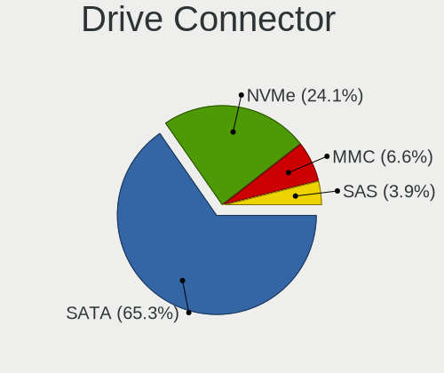
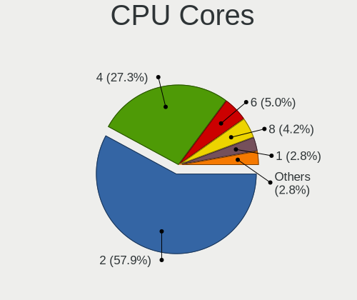
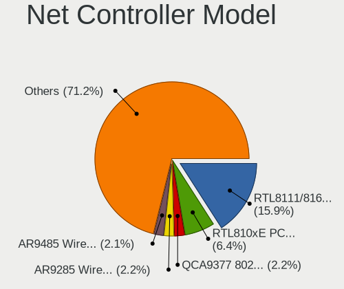

Linux Mint - Tested Hardware & Statistics (Notebooks)
-----------------------------------------------------

A project to collect tested hardware configurations for Linux Mint.

Anyone can contribute to this report by the [hw-probe](https://github.com/linuxhw/hw-probe) tool:

    sudo -E hw-probe -all -upload

Please contribute! Especially if your hardware is rare.

Contents
--------

* [ Test Cases ](#test-cases)

* [ System ](#system)
  - [ OS                       ](#os)
  - [ OS Family                ](#os-family)
  - [ Kernel                   ](#kernel)
  - [ Kernel Family            ](#kernel-family)
  - [ Kernel Major Ver.        ](#kernel-major-ver)
  - [ Arch                     ](#arch)
  - [ DE                       ](#de)
  - [ Display Server           ](#display-server)
  - [ Display Manager          ](#display-manager)
  - [ OS Lang                  ](#os-lang)
  - [ Boot Mode                ](#boot-mode)
  - [ Filesystem               ](#filesystem)
  - [ Part. scheme             ](#part-scheme)
  - [ Dual Boot with Linux/BSD ](#dual-boot-with-linuxbsd)
  - [ Dual Boot (Win)          ](#dual-boot-win)

* [ Board ](#board)
  - [ Vendor                   ](#vendor)
  - [ Model                    ](#model)
  - [ Model Family             ](#model-family)
  - [ MFG Year                 ](#mfg-year)
  - [ Form Factor              ](#form-factor)
  - [ Secure Boot              ](#secure-boot)
  - [ Coreboot                 ](#coreboot)
  - [ RAM Size                 ](#ram-size)
  - [ RAM Used                 ](#ram-used)
  - [ Total Drives             ](#total-drives)
  - [ Has CD-ROM               ](#has-cd-rom)
  - [ Has Ethernet             ](#has-ethernet)
  - [ Has WiFi                 ](#has-wifi)
  - [ Has Bluetooth            ](#has-bluetooth)

* [ Location ](#location)
  - [ Country                  ](#country)
  - [ City                     ](#city)

* [ Drives ](#drives)
  - [ Drive Vendor             ](#drive-vendor)
  - [ Drive Model              ](#drive-model)
  - [ HDD Vendor               ](#hdd-vendor)
  - [ SSD Vendor               ](#ssd-vendor)
  - [ Drive Kind               ](#drive-kind)
  - [ Drive Connector          ](#drive-connector)
  - [ Drive Size               ](#drive-size)
  - [ Space Total              ](#space-total)
  - [ Space Used               ](#space-used)
  - [ Malfunc. Drives          ](#malfunc-drives)
  - [ Malfunc. Drive Vendor    ](#malfunc-drive-vendor)
  - [ Malfunc. HDD Vendor      ](#malfunc-hdd-vendor)
  - [ Malfunc. Drive Kind      ](#malfunc-drive-kind)
  - [ Failed Drives            ](#failed-drives)
  - [ Failed Drive Vendor      ](#failed-drive-vendor)
  - [ Drive Status             ](#drive-status)

* [ Storage controller ](#storage-controller)
  - [ Storage Vendor           ](#storage-vendor)
  - [ Storage Model            ](#storage-model)
  - [ Storage Kind             ](#storage-kind)

* [ Processor ](#processor)
  - [ CPU Vendor               ](#cpu-vendor)
  - [ CPU Model                ](#cpu-model)
  - [ CPU Model Family         ](#cpu-model-family)
  - [ CPU Cores                ](#cpu-cores)
  - [ CPU Sockets              ](#cpu-sockets)
  - [ CPU Threads              ](#cpu-threads)
  - [ CPU Op-Modes             ](#cpu-op-modes)
  - [ CPU Microcode            ](#cpu-microcode)
  - [ CPU Microarch            ](#cpu-microarch)

* [ Graphics ](#graphics)
  - [ GPU Vendor               ](#gpu-vendor)
  - [ GPU Model                ](#gpu-model)
  - [ GPU Combo                ](#gpu-combo)
  - [ GPU Driver               ](#gpu-driver)
  - [ GPU Memory               ](#gpu-memory)

* [ Monitor ](#monitor)
  - [ Monitor Vendor           ](#monitor-vendor)
  - [ Monitor Model            ](#monitor-model)
  - [ Monitor Resolution       ](#monitor-resolution)
  - [ Monitor Diagonal         ](#monitor-diagonal)
  - [ Monitor Width            ](#monitor-width)
  - [ Aspect Ratio             ](#aspect-ratio)
  - [ Monitor Area             ](#monitor-area)
  - [ Pixel Density            ](#pixel-density)
  - [ Multiple Monitors        ](#multiple-monitors)

* [ Network ](#network)
  - [ Net Controller Vendor    ](#net-controller-vendor)
  - [ Net Controller Model     ](#net-controller-model)
  - [ Wireless Vendor          ](#wireless-vendor)
  - [ Wireless Model           ](#wireless-model)
  - [ Ethernet Vendor          ](#ethernet-vendor)
  - [ Ethernet Model           ](#ethernet-model)
  - [ Net Controller Kind      ](#net-controller-kind)
  - [ Used Controller          ](#used-controller)
  - [ NICs                     ](#nics)
  - [ IPv6                     ](#ipv6)

* [ Bluetooth ](#bluetooth)
  - [ Bluetooth Vendor         ](#bluetooth-vendor)
  - [ Bluetooth Model          ](#bluetooth-model)

* [ Sound ](#sound)
  - [ Sound Vendor             ](#sound-vendor)
  - [ Sound Model              ](#sound-model)

* [ Memory ](#memory)
  - [ Memory Vendor            ](#memory-vendor)
  - [ Memory Model             ](#memory-model)
  - [ Memory Kind              ](#memory-kind)
  - [ Memory Form Factor       ](#memory-form-factor)
  - [ Memory Size              ](#memory-size)
  - [ Memory Speed             ](#memory-speed)

* [ Printers & scanners ](#printers--scanners)
  - [ Printer Vendor           ](#printer-vendor)
  - [ Printer Model            ](#printer-model)
  - [ Scanner Vendor           ](#scanner-vendor)
  - [ Scanner Model            ](#scanner-model)

* [ Camera ](#camera)
  - [ Camera Vendor            ](#camera-vendor)
  - [ Camera Model             ](#camera-model)

* [ Security ](#security)
  - [ Fingerprint Vendor       ](#fingerprint-vendor)
  - [ Fingerprint Model        ](#fingerprint-model)
  - [ Chipcard Vendor          ](#chipcard-vendor)
  - [ Chipcard Model           ](#chipcard-model)

* [ Unsupported ](#unsupported)
  - [ Unsupported Devices      ](#unsupported-devices)
  - [ Unsupported Device Types ](#unsupported-device-types)

Test Cases
----------

Total: 12675

| Vendor        | Model                       | Probe                                                      | Date         |
|---------------|-----------------------------|------------------------------------------------------------|--------------|
| Apple         | MacBookPro12,1              | [6e089e22b1](https://linux-hardware.org/?probe=6e089e22b1) | Feb 01, 2023 |
| Lenovo        | ThinkPad T400 6473PMG       | [07cba1c44b](https://linux-hardware.org/?probe=07cba1c44b) | Feb 01, 2023 |
| Acer          | Aspire 5750G                | [a8a3f37ad8](https://linux-hardware.org/?probe=a8a3f37ad8) | Feb 01, 2023 |
| Lenovo        | IdeaPad 3 17ITL6 82H9       | [eaaf15f3f6](https://linux-hardware.org/?probe=eaaf15f3f6) | Feb 01, 2023 |
| Dell          | Latitude E6440              | [8712bed802](https://linux-hardware.org/?probe=8712bed802) | Feb 01, 2023 |
| Dell          | Latitude E6440              | [09b61adc0b](https://linux-hardware.org/?probe=09b61adc0b) | Feb 01, 2023 |
| Fujitsu       | LIFEBOOK E744               | [b048f7d3e1](https://linux-hardware.org/?probe=b048f7d3e1) | Feb 01, 2023 |
| Lenovo        | ThinkPad T560 20FJS44L0B    | [06bf3870a5](https://linux-hardware.org/?probe=06bf3870a5) | Jan 31, 2023 |
| Lenovo        | ThinkPad T530 2394A11       | [e7946fa600](https://linux-hardware.org/?probe=e7946fa600) | Jan 31, 2023 |
| ASUSTek       | VivoBook_ASUS Laptop E21... | [478c456288](https://linux-hardware.org/?probe=478c456288) | Jan 31, 2023 |
| HP            | ENVY 15                     | [c688eb85bb](https://linux-hardware.org/?probe=c688eb85bb) | Jan 31, 2023 |
| Notebook      | W35xSTQ_370ST               | [b52cc29e08](https://linux-hardware.org/?probe=b52cc29e08) | Jan 31, 2023 |
| HP            | 255 15.6 inch G9 Noteboo... | [7758d7c535](https://linux-hardware.org/?probe=7758d7c535) | Jan 31, 2023 |
| ASUSTek       | VivoBook_ASUSLaptop X421... | [1cfa73407d](https://linux-hardware.org/?probe=1cfa73407d) | Jan 31, 2023 |
| Acer          | Aspire E5-575G              | [463b7f859f](https://linux-hardware.org/?probe=463b7f859f) | Jan 31, 2023 |
| HP            | EliteBook 840 G1            | [9b91cecab9](https://linux-hardware.org/?probe=9b91cecab9) | Jan 31, 2023 |
| Notebook      | W35xSTQ_370ST               | [b33ec828fc](https://linux-hardware.org/?probe=b33ec828fc) | Jan 31, 2023 |
| Toshiba       | Satellite R630              | [52ffe609b8](https://linux-hardware.org/?probe=52ffe609b8) | Jan 31, 2023 |
| Dell          | Latitude E6530              | [140543c98c](https://linux-hardware.org/?probe=140543c98c) | Jan 31, 2023 |
| HP            | EliteBook 2560p             | [798466ab86](https://linux-hardware.org/?probe=798466ab86) | Jan 31, 2023 |
| Lenovo        | ThinkPad T440 20B7S2GS0W    | [46008b3d38](https://linux-hardware.org/?probe=46008b3d38) | Jan 31, 2023 |
| HP            | Pavilion Gaming Laptop 1... | [9fd1916420](https://linux-hardware.org/?probe=9fd1916420) | Jan 31, 2023 |
| HP            | Sona                        | [36a3d72172](https://linux-hardware.org/?probe=36a3d72172) | Jan 31, 2023 |
| HP            | Pavilion Gaming Laptop 1... | [318f007db6](https://linux-hardware.org/?probe=318f007db6) | Jan 31, 2023 |
| Lenovo        | G40-80 80JE                 | [bb5d758714](https://linux-hardware.org/?probe=bb5d758714) | Jan 31, 2023 |
| Lenovo        | ThinkPad E560 20EV002FUS    | [0110b731e7](https://linux-hardware.org/?probe=0110b731e7) | Jan 31, 2023 |
| HP            | Pavilion dv6                | [c84439bfbf](https://linux-hardware.org/?probe=c84439bfbf) | Jan 31, 2023 |
| Lenovo        | ThinkPad E560 20EV002FUS    | [faa0a5a1ff](https://linux-hardware.org/?probe=faa0a5a1ff) | Jan 31, 2023 |
| Lenovo        | G40-80 80JE                 | [e5dc585024](https://linux-hardware.org/?probe=e5dc585024) | Jan 31, 2023 |
| Lenovo        | ThinkPad T500 2055AZ1       | [1086813401](https://linux-hardware.org/?probe=1086813401) | Jan 30, 2023 |
| Lenovo        | ThinkPad T500 2055AZ1       | [0b43f40c2a](https://linux-hardware.org/?probe=0b43f40c2a) | Jan 30, 2023 |
| HP            | 255 15.6 inch G9 Noteboo... | [5201a076f6](https://linux-hardware.org/?probe=5201a076f6) | Jan 30, 2023 |
| HP            | Pavilion 15                 | [e3adac798e](https://linux-hardware.org/?probe=e3adac798e) | Jan 30, 2023 |
| Acer          | Aspire ES1-512              | [0d254e85dd](https://linux-hardware.org/?probe=0d254e85dd) | Jan 30, 2023 |
| Acer          | Aspire E5-575G              | [532f5a8dbe](https://linux-hardware.org/?probe=532f5a8dbe) | Jan 30, 2023 |
| Lenovo        | ThinkPad E15 Gen 2 20TD0... | [f6be582448](https://linux-hardware.org/?probe=f6be582448) | Jan 30, 2023 |
| Apple         | MacBookPro5,2               | [4cb11c2a78](https://linux-hardware.org/?probe=4cb11c2a78) | Jan 30, 2023 |
| MSI           | Raider GE76 12UE            | [c69bbc917b](https://linux-hardware.org/?probe=c69bbc917b) | Jan 30, 2023 |
| Acer          | Aspire E5-771               | [389651889c](https://linux-hardware.org/?probe=389651889c) | Jan 30, 2023 |
| HP            | Laptop 17-ak0xx             | [6e6f32430a](https://linux-hardware.org/?probe=6e6f32430a) | Jan 30, 2023 |
| Fujitsu Si... | LIFEBOOK E8310              | [bc685693a6](https://linux-hardware.org/?probe=bc685693a6) | Jan 30, 2023 |
| Dell          | Latitude E6420              | [68908b991a](https://linux-hardware.org/?probe=68908b991a) | Jan 30, 2023 |
| HP            | EliteBook 8560p             | [f03a63f76a](https://linux-hardware.org/?probe=f03a63f76a) | Jan 30, 2023 |
| ASUSTek       | X550LC                      | [4c50999862](https://linux-hardware.org/?probe=4c50999862) | Jan 30, 2023 |
| ASUSTek       | X550LC                      | [41d606bbe8](https://linux-hardware.org/?probe=41d606bbe8) | Jan 30, 2023 |
| MSI           | GE75 Raider 10SF            | [85d2ae302d](https://linux-hardware.org/?probe=85d2ae302d) | Jan 30, 2023 |
| ASUSTek       | F5VL                        | [07e0539a43](https://linux-hardware.org/?probe=07e0539a43) | Jan 30, 2023 |
| Avell High... | B.ON                        | [721fbbdeb2](https://linux-hardware.org/?probe=721fbbdeb2) | Jan 30, 2023 |
| ASUSTek       | X507UA                      | [49cc52b5b2](https://linux-hardware.org/?probe=49cc52b5b2) | Jan 29, 2023 |
| Lenovo        | ThinkPad L15 Gen 2 20X30... | [fddcdb0f47](https://linux-hardware.org/?probe=fddcdb0f47) | Jan 29, 2023 |
| Lenovo        | V15 G2 ALC 82KD             | [9f76193ccc](https://linux-hardware.org/?probe=9f76193ccc) | Jan 29, 2023 |
| Acer          | Aspire E5-553               | [8200b57a5b](https://linux-hardware.org/?probe=8200b57a5b) | Jan 29, 2023 |
| HP            | Pavilion 15                 | [c5ac9f6d89](https://linux-hardware.org/?probe=c5ac9f6d89) | Jan 29, 2023 |
| Acer          | Aspire E5-553               | [3ac195a476](https://linux-hardware.org/?probe=3ac195a476) | Jan 29, 2023 |
| MSI           | CR700                       | [35d1ff1eac](https://linux-hardware.org/?probe=35d1ff1eac) | Jan 29, 2023 |
| Alienware     | x17 R2                      | [d004749696](https://linux-hardware.org/?probe=d004749696) | Jan 29, 2023 |
| Alienware     | x17 R2                      | [350244db5d](https://linux-hardware.org/?probe=350244db5d) | Jan 29, 2023 |
| Lenovo        | ThinkPad E14 Gen 3 20Y7C... | [66ab929a6c](https://linux-hardware.org/?probe=66ab929a6c) | Jan 29, 2023 |
| HP            | ProBook 640 G2              | [7b08eeb50c](https://linux-hardware.org/?probe=7b08eeb50c) | Jan 29, 2023 |
| HP            | Pavilion dv7                | [f27e7c24c1](https://linux-hardware.org/?probe=f27e7c24c1) | Jan 29, 2023 |
| Lenovo        | Yoga Slim 7 Carbon 13ITL... | [d3936466af](https://linux-hardware.org/?probe=d3936466af) | Jan 29, 2023 |
| HP            | Laptop 17-cp2xxx            | [e04f33db90](https://linux-hardware.org/?probe=e04f33db90) | Jan 28, 2023 |
| INSYS         | GW1-W149                    | [5a4337006d](https://linux-hardware.org/?probe=5a4337006d) | Jan 28, 2023 |
| HP            | Pavilion dv8000 (ET839UA... | [3e7c902731](https://linux-hardware.org/?probe=3e7c902731) | Jan 28, 2023 |
| Lenovo        | ThinkPad L15 Gen 1 20U4S... | [a8e2d5b5f0](https://linux-hardware.org/?probe=a8e2d5b5f0) | Jan 28, 2023 |
| ASUSTek       | X200MA                      | [1c1f2d4d5b](https://linux-hardware.org/?probe=1c1f2d4d5b) | Jan 28, 2023 |
| Lenovo        | IdeaPad 330S-15ARR 81FB     | [95053898dc](https://linux-hardware.org/?probe=95053898dc) | Jan 28, 2023 |
| Acer          | Aspire ES1-711              | [3aa8f67a82](https://linux-hardware.org/?probe=3aa8f67a82) | Jan 28, 2023 |
| Apple         | MacBookPro16,1              | [06f297243d](https://linux-hardware.org/?probe=06f297243d) | Jan 28, 2023 |
| Notebook      | P9XXEN_EF_ED                | [991bb71df8](https://linux-hardware.org/?probe=991bb71df8) | Jan 28, 2023 |
| Notebook      | P9XXEN_EF_ED                | [d86e915f12](https://linux-hardware.org/?probe=d86e915f12) | Jan 28, 2023 |
| Lenovo        | ThinkPad X270 W10DG 20K6... | [ee4a3f359b](https://linux-hardware.org/?probe=ee4a3f359b) | Jan 27, 2023 |
| Samsung       | RV415/RV515                 | [fd9d67e4b8](https://linux-hardware.org/?probe=fd9d67e4b8) | Jan 27, 2023 |
| Acer          | Aspire E5-774               | [86e3285b31](https://linux-hardware.org/?probe=86e3285b31) | Jan 27, 2023 |
| HP            | Laptop 15-bs0xx             | [9b10308469](https://linux-hardware.org/?probe=9b10308469) | Jan 27, 2023 |
| HP            | Laptop 17-cp2xxx            | [e0a29b46da](https://linux-hardware.org/?probe=e0a29b46da) | Jan 27, 2023 |
| HP            | ZBook 15 G2                 | [b9793eca79](https://linux-hardware.org/?probe=b9793eca79) | Jan 27, 2023 |
| HP            | 255 G8 Notebook PC          | [23a84c76b8](https://linux-hardware.org/?probe=23a84c76b8) | Jan 27, 2023 |
| HUAWEI        | HVY-WXX9                    | [dddf41f4e3](https://linux-hardware.org/?probe=dddf41f4e3) | Jan 27, 2023 |
| Lenovo        | IdeaPad 330-17IKB 81DM      | [117d80ff4d](https://linux-hardware.org/?probe=117d80ff4d) | Jan 27, 2023 |
| HP            | ENVY 4                      | [55ee9d4ca9](https://linux-hardware.org/?probe=55ee9d4ca9) | Jan 27, 2023 |
| Lenovo        | IdeaPad 3 15ALC6 82MF       | [93be3d62c4](https://linux-hardware.org/?probe=93be3d62c4) | Jan 27, 2023 |
| Lenovo        | IdeaPad S145-15AST 81N3     | [c354539ab4](https://linux-hardware.org/?probe=c354539ab4) | Jan 27, 2023 |
| Samsung       | 340XAA/350XAA/550XAA        | [b4d0bbaf56](https://linux-hardware.org/?probe=b4d0bbaf56) | Jan 27, 2023 |
| Dell          | Latitude E6540              | [2e014cf1ba](https://linux-hardware.org/?probe=2e014cf1ba) | Jan 27, 2023 |
| Dell          | Inspiron 5468               | [d155136857](https://linux-hardware.org/?probe=d155136857) | Jan 27, 2023 |
| AXDIA Inte... | WINPAD V10                  | [ba8bdae82f](https://linux-hardware.org/?probe=ba8bdae82f) | Jan 27, 2023 |
| Samsung       | 340XAA/350XAA/550XAA        | [05dac90dec](https://linux-hardware.org/?probe=05dac90dec) | Jan 27, 2023 |
| Timi          | Mi NoteBook Pro             | [33905a4ee9](https://linux-hardware.org/?probe=33905a4ee9) | Jan 26, 2023 |
| HP            | EliteBook Folio 1040 G1     | [4811286faf](https://linux-hardware.org/?probe=4811286faf) | Jan 26, 2023 |
| Toshiba       | Satellite Pro C50-A-1FD     | [7f7198cdcb](https://linux-hardware.org/?probe=7f7198cdcb) | Jan 26, 2023 |
| Lenovo        | Yoga 2 11 20332             | [6faa58b4a1](https://linux-hardware.org/?probe=6faa58b4a1) | Jan 26, 2023 |
| Lenovo        | Yoga 2 11 20332             | [f437e45107](https://linux-hardware.org/?probe=f437e45107) | Jan 26, 2023 |
| Dell          | Vostro 3458                 | [3beffe6710](https://linux-hardware.org/?probe=3beffe6710) | Jan 26, 2023 |
| Google        | Robo360                     | [ea88345040](https://linux-hardware.org/?probe=ea88345040) | Jan 26, 2023 |
| Google        | Robo360                     | [8bd94d81f4](https://linux-hardware.org/?probe=8bd94d81f4) | Jan 26, 2023 |
| Dell          | Latitude 5490               | [b392e71ce5](https://linux-hardware.org/?probe=b392e71ce5) | Jan 26, 2023 |
| HP            | 355 G2                      | [66f901e77a](https://linux-hardware.org/?probe=66f901e77a) | Jan 26, 2023 |
| HP            | Pavilion 15                 | [e3ac708616](https://linux-hardware.org/?probe=e3ac708616) | Jan 26, 2023 |
| Dell          | XPS 17 9700                 | [759ae65214](https://linux-hardware.org/?probe=759ae65214) | Jan 26, 2023 |
| Apple         | MacBookAir4,1               | [45ea832a59](https://linux-hardware.org/?probe=45ea832a59) | Jan 26, 2023 |
| Lenovo        | V14-ADA 82C6                | [4d5aa34028](https://linux-hardware.org/?probe=4d5aa34028) | Jan 25, 2023 |
| HP            | 255 G8 Notebook PC          | [d8e161e2b0](https://linux-hardware.org/?probe=d8e161e2b0) | Jan 25, 2023 |
| Acer          | Aspire E1-571G              | [ed297cfa3b](https://linux-hardware.org/?probe=ed297cfa3b) | Jan 25, 2023 |
| Lenovo        | Yoga 2 11 20332             | [9dfb8ac7b0](https://linux-hardware.org/?probe=9dfb8ac7b0) | Jan 25, 2023 |
| Acer          | Aspire A315-55G             | [70559c048c](https://linux-hardware.org/?probe=70559c048c) | Jan 25, 2023 |
| ASUSTek       | VivoBook_ASUSLaptop X712... | [26abf66da5](https://linux-hardware.org/?probe=26abf66da5) | Jan 25, 2023 |
| HP            | Laptop 15-bw0xx             | [821bd6d2aa](https://linux-hardware.org/?probe=821bd6d2aa) | Jan 25, 2023 |
| HP            | EliteBook 820 G2            | [7b93d7477b](https://linux-hardware.org/?probe=7b93d7477b) | Jan 25, 2023 |
| Acer          | Aspire A517-53G             | [2a1ad07cce](https://linux-hardware.org/?probe=2a1ad07cce) | Jan 25, 2023 |
| ASUSTek       | K72Jr                       | [9b7c80b059](https://linux-hardware.org/?probe=9b7c80b059) | Jan 25, 2023 |
| HP            | ProBook 6440b               | [25c4dbbe9c](https://linux-hardware.org/?probe=25c4dbbe9c) | Jan 24, 2023 |
| Lenovo        | IdeaPad 310-15IKB 80TV      | [cfd65f9e9e](https://linux-hardware.org/?probe=cfd65f9e9e) | Jan 24, 2023 |
| Sony          | VGN-NW21MF_W                | [dd4ac0a026](https://linux-hardware.org/?probe=dd4ac0a026) | Jan 24, 2023 |
| Digibras      | NH4CU03                     | [7de7df58a3](https://linux-hardware.org/?probe=7de7df58a3) | Jan 24, 2023 |
| Digibras      | NH4CU03                     | [fce5f618d8](https://linux-hardware.org/?probe=fce5f618d8) | Jan 24, 2023 |
| ASUSTek       | X540LJ                      | [41c91fdc7b](https://linux-hardware.org/?probe=41c91fdc7b) | Jan 24, 2023 |
| ASUSTek       | X540LJ                      | [199569e288](https://linux-hardware.org/?probe=199569e288) | Jan 24, 2023 |
| LG Electro... | 17Z90Q-G.AA79G              | [275f0a83ab](https://linux-hardware.org/?probe=275f0a83ab) | Jan 24, 2023 |
| HP            | EliteBook 2560p             | [f57750e125](https://linux-hardware.org/?probe=f57750e125) | Jan 24, 2023 |
| UMAX          | VisionBook 14Wr Plus        | [16e64883d7](https://linux-hardware.org/?probe=16e64883d7) | Jan 24, 2023 |
| HP            | EliteBook 745 G2            | [0d073c35f4](https://linux-hardware.org/?probe=0d073c35f4) | Jan 24, 2023 |
| HP            | Pavilion g6                 | [c34bc63cb0](https://linux-hardware.org/?probe=c34bc63cb0) | Jan 24, 2023 |
| HP            | Pavilion g6                 | [a9a199e6f7](https://linux-hardware.org/?probe=a9a199e6f7) | Jan 24, 2023 |
| HP            | Pavilion Laptop 15-eh1xx... | [11cca63b74](https://linux-hardware.org/?probe=11cca63b74) | Jan 24, 2023 |
| Lenovo        | ThinkPad T470p 20J60018G... | [b45a52bc35](https://linux-hardware.org/?probe=b45a52bc35) | Jan 24, 2023 |
| Lenovo        | G700 20251                  | [0745c6189f](https://linux-hardware.org/?probe=0745c6189f) | Jan 23, 2023 |
| ASUSTek       | M51Tr                       | [03ed788f55](https://linux-hardware.org/?probe=03ed788f55) | Jan 23, 2023 |
| ASUSTek       | M51Tr                       | [d1f821e376](https://linux-hardware.org/?probe=d1f821e376) | Jan 23, 2023 |
| Acer          | Aspire 5734Z                | [aaa9f9e142](https://linux-hardware.org/?probe=aaa9f9e142) | Jan 23, 2023 |
| Notebook      | W65_67SH                    | [f80b7fddba](https://linux-hardware.org/?probe=f80b7fddba) | Jan 23, 2023 |
| Dell          | Inspiron N5040              | [d3d4b5a577](https://linux-hardware.org/?probe=d3d4b5a577) | Jan 23, 2023 |
| Lenovo        | ThinkPad Edge E540 20C60... | [cbd812094c](https://linux-hardware.org/?probe=cbd812094c) | Jan 23, 2023 |
| Acer          | Aspire E1-421               | [16277f992b](https://linux-hardware.org/?probe=16277f992b) | Jan 23, 2023 |
| Lenovo        | ThinkPad X121e 3055A18      | [97ef868fa0](https://linux-hardware.org/?probe=97ef868fa0) | Jan 23, 2023 |
| Lenovo        | ThinkPad X121e 3055A18      | [780e3b2071](https://linux-hardware.org/?probe=780e3b2071) | Jan 23, 2023 |
| MicroByte     | ezbook                      | [ee3c30939d](https://linux-hardware.org/?probe=ee3c30939d) | Jan 23, 2023 |
| ASUSTek       | G75VW                       | [917f63e659](https://linux-hardware.org/?probe=917f63e659) | Jan 23, 2023 |
| Fujitsu       | LIFEBOOK A544               | [972194ff6e](https://linux-hardware.org/?probe=972194ff6e) | Jan 23, 2023 |
| HP            | ZBook 15 G2                 | [5e4253b22d](https://linux-hardware.org/?probe=5e4253b22d) | Jan 23, 2023 |
| Lenovo        | IdeaPad 100-15IBD 80QQ      | [e9124adb70](https://linux-hardware.org/?probe=e9124adb70) | Jan 23, 2023 |
| Acer          | Aspire 5680                 | [b4b7ebe3f9](https://linux-hardware.org/?probe=b4b7ebe3f9) | Jan 23, 2023 |
| HP            | ZBook 15 G4                 | [81ec9ba8b3](https://linux-hardware.org/?probe=81ec9ba8b3) | Jan 23, 2023 |
| ASUSTek       | K72Jr                       | [54313c1c76](https://linux-hardware.org/?probe=54313c1c76) | Jan 23, 2023 |
| Apple         | MacBook5,1                  | [094f86e39f](https://linux-hardware.org/?probe=094f86e39f) | Jan 23, 2023 |
| HUAWEI        | KLVL-WXX9                   | [5cd697d63d](https://linux-hardware.org/?probe=5cd697d63d) | Jan 23, 2023 |
| ASUSTek       | GL552VX                     | [d196ac82e2](https://linux-hardware.org/?probe=d196ac82e2) | Jan 23, 2023 |
| Lenovo        | Z51-70 80K6                 | [f0cce92dd4](https://linux-hardware.org/?probe=f0cce92dd4) | Jan 23, 2023 |
| Lenovo        | G50-70 20351                | [e0da886a95](https://linux-hardware.org/?probe=e0da886a95) | Jan 23, 2023 |
| Lenovo        | Flex 2-15D 20377            | [e4a2f02d89](https://linux-hardware.org/?probe=e4a2f02d89) | Jan 23, 2023 |
| GPU Compan... | GWNR71517                   | [77d4494f3b](https://linux-hardware.org/?probe=77d4494f3b) | Jan 23, 2023 |
| GPU Compan... | GWNR71517                   | [f3d76bcb70](https://linux-hardware.org/?probe=f3d76bcb70) | Jan 23, 2023 |
| Fujitsu       | LIFEBOOK U554               | [22bf4111de](https://linux-hardware.org/?probe=22bf4111de) | Jan 23, 2023 |
| Sony          | SVE1513C5E                  | [bff960bae2](https://linux-hardware.org/?probe=bff960bae2) | Jan 23, 2023 |
| Unknown       | Unknown                     | [8d3d4aa328](https://linux-hardware.org/?probe=8d3d4aa328) | Jan 23, 2023 |
| Lenovo        | ThinkPad X200 7458VL3       | [3a91fa2c72](https://linux-hardware.org/?probe=3a91fa2c72) | Jan 23, 2023 |
| HP            | 540                         | [a4a7b26f42](https://linux-hardware.org/?probe=a4a7b26f42) | Jan 23, 2023 |
| Wortmann      | CR700                       | [0d40cf0690](https://linux-hardware.org/?probe=0d40cf0690) | Jan 22, 2023 |
| HUAWEI        | NBLK-WAX9X                  | [8941c8857e](https://linux-hardware.org/?probe=8941c8857e) | Jan 22, 2023 |
| Dell          | Inspiron 3521               | [ff122405db](https://linux-hardware.org/?probe=ff122405db) | Jan 22, 2023 |
| Dell          | Inspiron 3521               | [bb77ccdda7](https://linux-hardware.org/?probe=bb77ccdda7) | Jan 22, 2023 |
| Toshiba       | QOSMIO X70-B                | [a7219ed5ef](https://linux-hardware.org/?probe=a7219ed5ef) | Jan 22, 2023 |
| Acer          | Aspire 5755G                | [1bf0fe4342](https://linux-hardware.org/?probe=1bf0fe4342) | Jan 22, 2023 |
| Acer          | Extensa 215-21              | [9bc19f3d42](https://linux-hardware.org/?probe=9bc19f3d42) | Jan 22, 2023 |
| Apple         | MacBookPro5,3               | [2375f407c7](https://linux-hardware.org/?probe=2375f407c7) | Jan 22, 2023 |
| HP            | ProBook 450 G3              | [a3ce3d4a23](https://linux-hardware.org/?probe=a3ce3d4a23) | Jan 22, 2023 |
| Acer          | Aspire 5680                 | [b2792832c2](https://linux-hardware.org/?probe=b2792832c2) | Jan 22, 2023 |
| Lenovo        | 14w 81MQ000JUS              | [83704151ae](https://linux-hardware.org/?probe=83704151ae) | Jan 22, 2023 |
| HP            | ProBook 4330s               | [f96c2452d3](https://linux-hardware.org/?probe=f96c2452d3) | Jan 22, 2023 |
| HP            | Pavilion 17                 | [0ba46e91d2](https://linux-hardware.org/?probe=0ba46e91d2) | Jan 22, 2023 |
| Lenovo        | IdeaPad 320-15AST 80XV      | [dcc2324c10](https://linux-hardware.org/?probe=dcc2324c10) | Jan 22, 2023 |
| Lenovo        | ThinkPad T530 2394A11       | [7cc89d144b](https://linux-hardware.org/?probe=7cc89d144b) | Jan 22, 2023 |
| Lenovo        | IdeaPad 3 15IGL05 81WQ      | [57ed6980d4](https://linux-hardware.org/?probe=57ed6980d4) | Jan 22, 2023 |
| Dell          | Latitude E5510              | [03f0dbc05c](https://linux-hardware.org/?probe=03f0dbc05c) | Jan 22, 2023 |
| ASUSTek       | UX360CA                     | [98fa78d117](https://linux-hardware.org/?probe=98fa78d117) | Jan 22, 2023 |
| MSI           | PS42 Modern 8MO             | [dfb621ce10](https://linux-hardware.org/?probe=dfb621ce10) | Jan 22, 2023 |
| MSI           | PS42 Modern 8MO             | [e1d7b236d3](https://linux-hardware.org/?probe=e1d7b236d3) | Jan 22, 2023 |
| Lenovo        | ThinkPad T530 2394A11       | [1e88d6e7ca](https://linux-hardware.org/?probe=1e88d6e7ca) | Jan 21, 2023 |
| Lenovo        | IdeaPad 720S-13ARR 81BR     | [992ecbe8dc](https://linux-hardware.org/?probe=992ecbe8dc) | Jan 21, 2023 |
| Dell          | Inspiron 5379               | [070a24694c](https://linux-hardware.org/?probe=070a24694c) | Jan 21, 2023 |
| Lenovo        | ThinkPad E15 Gen 4 21EDC... | [7fb655b498](https://linux-hardware.org/?probe=7fb655b498) | Jan 21, 2023 |
| Lenovo        | ThinkPad E15 Gen 4 21EDC... | [397b4da9ab](https://linux-hardware.org/?probe=397b4da9ab) | Jan 21, 2023 |
| HP            | ProBook 4520s               | [ab9f74eb2c](https://linux-hardware.org/?probe=ab9f74eb2c) | Jan 21, 2023 |
| MSI           | GP75 Leopard 9SD            | [5b41a33a67](https://linux-hardware.org/?probe=5b41a33a67) | Jan 21, 2023 |
| Lenovo        | B570e HuronRiver Platfor... | [fcce46f618](https://linux-hardware.org/?probe=fcce46f618) | Jan 21, 2023 |
| Lenovo        | ThinkPad T420 4180AQ3       | [567ae7f5ba](https://linux-hardware.org/?probe=567ae7f5ba) | Jan 21, 2023 |
| Lenovo        | B570e HuronRiver Platfor... | [f79928ed4d](https://linux-hardware.org/?probe=f79928ed4d) | Jan 21, 2023 |
| Toshiba       | Satellite S70-A             | [45648850c8](https://linux-hardware.org/?probe=45648850c8) | Jan 21, 2023 |
| Lenovo        | IdeaPad 5 14ALC05 82LM      | [bccb4a4afe](https://linux-hardware.org/?probe=bccb4a4afe) | Jan 21, 2023 |
| Lenovo        | IdeaPad 320-15IKB 80YH      | [fa251ca13c](https://linux-hardware.org/?probe=fa251ca13c) | Jan 21, 2023 |
| Lenovo        | IdeaPad 320-15IKB 80YH      | [965d1fa09f](https://linux-hardware.org/?probe=965d1fa09f) | Jan 20, 2023 |
| Acer          | Aspire A315-55G             | [b8660798ec](https://linux-hardware.org/?probe=b8660798ec) | Jan 20, 2023 |
| Acer          | V5WE2                       | [021281441e](https://linux-hardware.org/?probe=021281441e) | Jan 20, 2023 |
| Acer          | Aspire E5-571               | [a37e873516](https://linux-hardware.org/?probe=a37e873516) | Jan 20, 2023 |
| Lenovo        | IdeaPad 5 Pro 14ARH7 82S... | [fb9f62bcc7](https://linux-hardware.org/?probe=fb9f62bcc7) | Jan 20, 2023 |
| HP            | Laptop 15-dy3xxx            | [1053d34e69](https://linux-hardware.org/?probe=1053d34e69) | Jan 20, 2023 |
| Acer          | Aspire E5-573G              | [c87740267f](https://linux-hardware.org/?probe=c87740267f) | Jan 20, 2023 |
| Acer          | Extensa 215-21              | [e39e842e0d](https://linux-hardware.org/?probe=e39e842e0d) | Jan 20, 2023 |
| Apple         | MacBookAir7,2               | [cdaf37c421](https://linux-hardware.org/?probe=cdaf37c421) | Jan 20, 2023 |
| Acer          | Aspire A515-57              | [3041b852df](https://linux-hardware.org/?probe=3041b852df) | Jan 20, 2023 |
| Toshiba       | NB520                       | [0252e3bec1](https://linux-hardware.org/?probe=0252e3bec1) | Jan 20, 2023 |
| Lenovo        | IdeaPad 5 14ALC05 82LM      | [32962bb00f](https://linux-hardware.org/?probe=32962bb00f) | Jan 20, 2023 |
| Unknown       | X133                        | [ad31153d58](https://linux-hardware.org/?probe=ad31153d58) | Jan 20, 2023 |
| Dell          | XPS 13 9305                 | [5175eeeff4](https://linux-hardware.org/?probe=5175eeeff4) | Jan 20, 2023 |
| Lenovo        | IdeaPad 5 15ALC05 82LN      | [f7fcfb7b18](https://linux-hardware.org/?probe=f7fcfb7b18) | Jan 19, 2023 |
| Dell          | Precision M6600             | [4d697ebfd5](https://linux-hardware.org/?probe=4d697ebfd5) | Jan 19, 2023 |
| Dell          | Inspiron 16 Plus 7620       | [9326386ab1](https://linux-hardware.org/?probe=9326386ab1) | Jan 19, 2023 |
| HP            | Pavilion g6                 | [d828f8f4a8](https://linux-hardware.org/?probe=d828f8f4a8) | Jan 19, 2023 |
| Dell          | Inspiron 16 Plus 7620       | [0a3c8bbba5](https://linux-hardware.org/?probe=0a3c8bbba5) | Jan 19, 2023 |
| Lenovo        | ThinkPad X230 2325AS7       | [71a521018d](https://linux-hardware.org/?probe=71a521018d) | Jan 19, 2023 |
| HP            | Pavilion g6                 | [282b1007ac](https://linux-hardware.org/?probe=282b1007ac) | Jan 19, 2023 |
| HP            | Unknown                     | [b82faadc9d](https://linux-hardware.org/?probe=b82faadc9d) | Jan 19, 2023 |
| Lenovo        | IdeaPad 320-17AST 80XW      | [ae0457cc50](https://linux-hardware.org/?probe=ae0457cc50) | Jan 19, 2023 |
| Unknown       | Unknown                     | [591e4fb21f](https://linux-hardware.org/?probe=591e4fb21f) | Jan 19, 2023 |
| Apple         | MacBookPro11,1              | [67e4dd8f10](https://linux-hardware.org/?probe=67e4dd8f10) | Jan 19, 2023 |
| ASUSTek       | X501A                       | [2f573ed7f1](https://linux-hardware.org/?probe=2f573ed7f1) | Jan 19, 2023 |
| ASUSTek       | X501A                       | [a1c3cee60f](https://linux-hardware.org/?probe=a1c3cee60f) | Jan 19, 2023 |
| MSI           | VR630                       | [943c1d68fa](https://linux-hardware.org/?probe=943c1d68fa) | Jan 19, 2023 |
| Apple         | MacBookPro14,3              | [82a49878eb](https://linux-hardware.org/?probe=82a49878eb) | Jan 19, 2023 |
| HP            | 15 Notebook PC              | [5405ae6181](https://linux-hardware.org/?probe=5405ae6181) | Jan 19, 2023 |
| HP            | ProBook 430 G1              | [3591fb1d6c](https://linux-hardware.org/?probe=3591fb1d6c) | Jan 19, 2023 |
| Compal        | Unknown                     | [81abfdb7d5](https://linux-hardware.org/?probe=81abfdb7d5) | Jan 19, 2023 |
| ASUSTek       | VivoBook E14 E402WAS        | [39f2ca64d4](https://linux-hardware.org/?probe=39f2ca64d4) | Jan 19, 2023 |
| Dell          | Inspiron 5737               | [8111e45229](https://linux-hardware.org/?probe=8111e45229) | Jan 19, 2023 |
| PC Special... | Elimina Iv 17               | [72e46e7bad](https://linux-hardware.org/?probe=72e46e7bad) | Jan 18, 2023 |
| Dell          | Inspiron 15 3511            | [cb9b356a27](https://linux-hardware.org/?probe=cb9b356a27) | Jan 18, 2023 |
| Compal        | Unknown                     | [14cc4178d9](https://linux-hardware.org/?probe=14cc4178d9) | Jan 18, 2023 |
| Lenovo        | V570 1066AJU                | [0dca70d8ea](https://linux-hardware.org/?probe=0dca70d8ea) | Jan 18, 2023 |
| Lenovo        | IdeaPad 3 15ALC6 82KU       | [79ad95dada](https://linux-hardware.org/?probe=79ad95dada) | Jan 18, 2023 |
| Apple         | MacBookPro5,5               | [3dba9611d3](https://linux-hardware.org/?probe=3dba9611d3) | Jan 18, 2023 |
| Dell          | Inspiron 15 3511            | [8f9cf93045](https://linux-hardware.org/?probe=8f9cf93045) | Jan 18, 2023 |
| Acer          | Aspire E1-421               | [855c9b8e45](https://linux-hardware.org/?probe=855c9b8e45) | Jan 18, 2023 |
| Apple         | MacBookPro6,2               | [95074766b9](https://linux-hardware.org/?probe=95074766b9) | Jan 18, 2023 |
| Lenovo        | IdeaPad 110S-11IBR 80WG     | [6d93895cac](https://linux-hardware.org/?probe=6d93895cac) | Jan 18, 2023 |
| HP            | OMEN by Laptop 15-ce0xx     | [8c4a206094](https://linux-hardware.org/?probe=8c4a206094) | Jan 18, 2023 |
| Dell          | G5 5590                     | [c2a3296ba7](https://linux-hardware.org/?probe=c2a3296ba7) | Jan 18, 2023 |
| HP            | Laptop 15-dy2xxx            | [7e61f98275](https://linux-hardware.org/?probe=7e61f98275) | Jan 18, 2023 |
| ASUSTek       | E200HA                      | [f17b69afa1](https://linux-hardware.org/?probe=f17b69afa1) | Jan 18, 2023 |
| ASUSTek       | X505BP                      | [ec4d653e2f](https://linux-hardware.org/?probe=ec4d653e2f) | Jan 17, 2023 |
| Lenovo        | ThinkPad T420 4236V6S       | [3ab44ae2f5](https://linux-hardware.org/?probe=3ab44ae2f5) | Jan 17, 2023 |
| Dell          | Studio 1735                 | [96d3df9639](https://linux-hardware.org/?probe=96d3df9639) | Jan 17, 2023 |
| Toshiba       | Satellite C55-B             | [fb0d5dad17](https://linux-hardware.org/?probe=fb0d5dad17) | Jan 17, 2023 |
| HP            | 15 Notebook PC              | [8b4d292adf](https://linux-hardware.org/?probe=8b4d292adf) | Jan 17, 2023 |
| Toshiba       | Satellite C55-B             | [c8566c8460](https://linux-hardware.org/?probe=c8566c8460) | Jan 17, 2023 |
| HP            | Laptop 15-dw3xxx            | [ccce363b13](https://linux-hardware.org/?probe=ccce363b13) | Jan 17, 2023 |
| Acer          | Aspire ES1-524              | [b442110a7d](https://linux-hardware.org/?probe=b442110a7d) | Jan 17, 2023 |
| Dell          | Inspiron 3583               | [79b74ef79b](https://linux-hardware.org/?probe=79b74ef79b) | Jan 16, 2023 |
| Dell          | Latitude E6230              | [92a496c87d](https://linux-hardware.org/?probe=92a496c87d) | Jan 16, 2023 |
| Dell          | Latitude E6230              | [0750c24bd9](https://linux-hardware.org/?probe=0750c24bd9) | Jan 16, 2023 |
| HP            | 255 G2                      | [e3f8ff1bdc](https://linux-hardware.org/?probe=e3f8ff1bdc) | Jan 16, 2023 |
| Dell          | Latitude E7240              | [38d3c2b0e7](https://linux-hardware.org/?probe=38d3c2b0e7) | Jan 16, 2023 |
| Dell          | Latitude E7240              | [768ef76206](https://linux-hardware.org/?probe=768ef76206) | Jan 16, 2023 |
| HUAWEI        | HVY-WXX9                    | [0663975741](https://linux-hardware.org/?probe=0663975741) | Jan 16, 2023 |
| Acer          | Aspire ES1-524              | [5b084da850](https://linux-hardware.org/?probe=5b084da850) | Jan 16, 2023 |
| Acer          | Aspire 5680                 | [dc5f6d7ac6](https://linux-hardware.org/?probe=dc5f6d7ac6) | Jan 16, 2023 |
| Lenovo        | IdeaPad 110S-11IBR 80WG     | [b1581dd523](https://linux-hardware.org/?probe=b1581dd523) | Jan 16, 2023 |
| Medion        | E6214                       | [b30ab20f02](https://linux-hardware.org/?probe=b30ab20f02) | Jan 16, 2023 |
| Acer          | Aspire V3-571G              | [c43319f7fe](https://linux-hardware.org/?probe=c43319f7fe) | Jan 16, 2023 |
| Lenovo        | IdeaPad 5 15ALC05 82LN      | [6841633faf](https://linux-hardware.org/?probe=6841633faf) | Jan 16, 2023 |
| Lenovo        | ThinkPad X13 Gen 2i 20WL... | [92815c2da0](https://linux-hardware.org/?probe=92815c2da0) | Jan 16, 2023 |
| HP            | Pavilion 17                 | [895f75daf7](https://linux-hardware.org/?probe=895f75daf7) | Jan 16, 2023 |
| Dell          | Latitude 7480               | [83af73ce9c](https://linux-hardware.org/?probe=83af73ce9c) | Jan 16, 2023 |
| Dell          | Inspiron 5570               | [5905971b70](https://linux-hardware.org/?probe=5905971b70) | Jan 16, 2023 |
| HP            | Laptop 17-ca1xxx            | [ec0dcfaac5](https://linux-hardware.org/?probe=ec0dcfaac5) | Jan 15, 2023 |
| Lenovo        | ThinkPad E560 20EV002FUS    | [422c191fe5](https://linux-hardware.org/?probe=422c191fe5) | Jan 15, 2023 |
| Lenovo        | ThinkPad P15s Gen 1 20T4... | [138f888e23](https://linux-hardware.org/?probe=138f888e23) | Jan 15, 2023 |
| HP            | OMEN Laptop 15-en0xxx       | [7100a33e7e](https://linux-hardware.org/?probe=7100a33e7e) | Jan 15, 2023 |
| Lenovo        | IdeaPad 5 14ALC05 82LM      | [b30f0e2202](https://linux-hardware.org/?probe=b30f0e2202) | Jan 15, 2023 |
| HP            | 15 Notebook PC              | [91e7453ded](https://linux-hardware.org/?probe=91e7453ded) | Jan 15, 2023 |
| Acer          | Aspire V3-571G              | [08124c16a2](https://linux-hardware.org/?probe=08124c16a2) | Jan 15, 2023 |
| Acer          | Aspire E1-572G              | [55fe8f2e99](https://linux-hardware.org/?probe=55fe8f2e99) | Jan 15, 2023 |
| Lenovo        | ThinkPad X1 Carbon 5th 2... | [dca583bf2e](https://linux-hardware.org/?probe=dca583bf2e) | Jan 15, 2023 |
| Acer          | Aspire E1-572G              | [8e8dfb80cb](https://linux-hardware.org/?probe=8e8dfb80cb) | Jan 15, 2023 |
| Apple         | MacBook5,1                  | [51581940b0](https://linux-hardware.org/?probe=51581940b0) | Jan 15, 2023 |
| Toshiba       | Satellite Pro C50-A-1E6     | [9ec7c970da](https://linux-hardware.org/?probe=9ec7c970da) | Jan 15, 2023 |
| Acer          | TravelMate P253             | [15c26878b5](https://linux-hardware.org/?probe=15c26878b5) | Jan 15, 2023 |
| Acer          | Aspire R3-131T              | [268413b274](https://linux-hardware.org/?probe=268413b274) | Jan 15, 2023 |
| Multilaser    | UB23X LINUX                 | [34a7d43639](https://linux-hardware.org/?probe=34a7d43639) | Jan 15, 2023 |
| Multilaser    | UB23X LINUX                 | [029812488b](https://linux-hardware.org/?probe=029812488b) | Jan 15, 2023 |
| Dell          | Inspiron 5370               | [78b4039791](https://linux-hardware.org/?probe=78b4039791) | Jan 15, 2023 |
| ASUSTek       | X45C                        | [677c0ac809](https://linux-hardware.org/?probe=677c0ac809) | Jan 15, 2023 |
| Apple         | MacBookPro9,2               | [6194c3a2fe](https://linux-hardware.org/?probe=6194c3a2fe) | Jan 15, 2023 |
| Lenovo        | ThinkPad T420 4236V6S       | [a24b95f891](https://linux-hardware.org/?probe=a24b95f891) | Jan 15, 2023 |
| Apple         | MacBookPro9,2               | [4776fc6062](https://linux-hardware.org/?probe=4776fc6062) | Jan 15, 2023 |
| Lenovo        | ThinkPad T420 4236V6S       | [f9fe88837c](https://linux-hardware.org/?probe=f9fe88837c) | Jan 15, 2023 |
| Lenovo        | ThinkPad T420 4236V6S       | [59607f5e75](https://linux-hardware.org/?probe=59607f5e75) | Jan 15, 2023 |
| MSI           | Stealth GS77 12UHS          | [0dba4d0126](https://linux-hardware.org/?probe=0dba4d0126) | Jan 14, 2023 |
| ASUSTek       | N501VW                      | [5f9c2eebd4](https://linux-hardware.org/?probe=5f9c2eebd4) | Jan 14, 2023 |
| Lenovo        | G50-80 80L0                 | [08a00eef73](https://linux-hardware.org/?probe=08a00eef73) | Jan 14, 2023 |
| Lenovo        | IdeaPad 5 15ALC05 82LN      | [32f2651aa1](https://linux-hardware.org/?probe=32f2651aa1) | Jan 14, 2023 |
| Samsung       | RV411/RV511/E3511/S3511/... | [e5c76bef74](https://linux-hardware.org/?probe=e5c76bef74) | Jan 14, 2023 |
| Samsung       | RV411/RV511/E3511/S3511/... | [2a08ec8e9e](https://linux-hardware.org/?probe=2a08ec8e9e) | Jan 14, 2023 |
| Fujitsu       | FMVNF70YX                   | [2817102c87](https://linux-hardware.org/?probe=2817102c87) | Jan 14, 2023 |
| Google        | Shyvana                     | [619c8620bb](https://linux-hardware.org/?probe=619c8620bb) | Jan 14, 2023 |
| Toshiba       | Satellite Pro C850-1HD      | [d9ecac6816](https://linux-hardware.org/?probe=d9ecac6816) | Jan 14, 2023 |
| Medion        | E6214                       | [4ee7aa5359](https://linux-hardware.org/?probe=4ee7aa5359) | Jan 14, 2023 |
| HP            | 255 15.6 inch G9 Noteboo... | [0b51dca7c2](https://linux-hardware.org/?probe=0b51dca7c2) | Jan 14, 2023 |
| HP            | Laptop 14-dk1xxx            | [e6ef702c76](https://linux-hardware.org/?probe=e6ef702c76) | Jan 14, 2023 |
| HUAWEI        | HVY-WXX9                    | [267e6c9b77](https://linux-hardware.org/?probe=267e6c9b77) | Jan 14, 2023 |
| System76      | Oryx Pro                    | [e6223d6ff6](https://linux-hardware.org/?probe=e6223d6ff6) | Jan 14, 2023 |
| MSI           | Stealth GS77 12UHS          | [6a6636d3ba](https://linux-hardware.org/?probe=6a6636d3ba) | Jan 14, 2023 |
| HP            | 250 G4 Notebook PC          | [dda4a9ae38](https://linux-hardware.org/?probe=dda4a9ae38) | Jan 14, 2023 |
| ASUSTek       | X550LD                      | [60b21ee22f](https://linux-hardware.org/?probe=60b21ee22f) | Jan 14, 2023 |
| Lenovo        | Z50-70 20354                | [426bac7c70](https://linux-hardware.org/?probe=426bac7c70) | Jan 14, 2023 |
| ASUSTek       | X751SA                      | [658c4a4cbd](https://linux-hardware.org/?probe=658c4a4cbd) | Jan 14, 2023 |
| Acer          | Aspire E5-575G              | [4332a351bf](https://linux-hardware.org/?probe=4332a351bf) | Jan 13, 2023 |
| Lenovo        | ThinkPad T14 Gen 1 20S1S... | [828d390087](https://linux-hardware.org/?probe=828d390087) | Jan 13, 2023 |
| Lenovo        | IdeaPad 100S-14IBR 80R9     | [b0308f4270](https://linux-hardware.org/?probe=b0308f4270) | Jan 13, 2023 |
| Acer          | Aspire A315-59              | [ca332b4905](https://linux-hardware.org/?probe=ca332b4905) | Jan 13, 2023 |
| ASUSTek       | N71Jv                       | [084f05b7dc](https://linux-hardware.org/?probe=084f05b7dc) | Jan 13, 2023 |
| Teclast       | F6 Plus                     | [27cd155156](https://linux-hardware.org/?probe=27cd155156) | Jan 13, 2023 |
| Acer          | Aspire M5-481T              | [e2030307c8](https://linux-hardware.org/?probe=e2030307c8) | Jan 13, 2023 |
| Dell          | Inspiron 1012               | [ae34ca229c](https://linux-hardware.org/?probe=ae34ca229c) | Jan 13, 2023 |
| Lenovo        | ThinkPad X13 Gen 2i 20WL... | [b2965791cb](https://linux-hardware.org/?probe=b2965791cb) | Jan 13, 2023 |
| Lenovo        | ThinkPad X13 Gen 2i 20WL... | [093e5ffc06](https://linux-hardware.org/?probe=093e5ffc06) | Jan 13, 2023 |
| Samsung       | SR700                       | [329a7864c0](https://linux-hardware.org/?probe=329a7864c0) | Jan 13, 2023 |
| Acer          | Swift SF514-52T             | [feb261f5f5](https://linux-hardware.org/?probe=feb261f5f5) | Jan 13, 2023 |
| Dell          | Inspiron 14 5425            | [da209b9388](https://linux-hardware.org/?probe=da209b9388) | Jan 13, 2023 |
| HP            | Pavilion dv8000 (ET839UA... | [eeec2db688](https://linux-hardware.org/?probe=eeec2db688) | Jan 13, 2023 |
| Dell          | Latitude E6420              | [ea94fc4f3b](https://linux-hardware.org/?probe=ea94fc4f3b) | Jan 13, 2023 |
| ASUSTek       | X45C                        | [0cf650bc7b](https://linux-hardware.org/?probe=0cf650bc7b) | Jan 13, 2023 |
| Lenovo        | G700                        | [85eb225e8f](https://linux-hardware.org/?probe=85eb225e8f) | Jan 13, 2023 |
| ASUSTek       | N501VW                      | [176a3488df](https://linux-hardware.org/?probe=176a3488df) | Jan 12, 2023 |
| UMAX          | VisionBook 14Wr Plus        | [10f4ae9765](https://linux-hardware.org/?probe=10f4ae9765) | Jan 12, 2023 |
| Dell          | System Vostro 3750          | [91b0444e5e](https://linux-hardware.org/?probe=91b0444e5e) | Jan 12, 2023 |
| UMAX          | VisionBook 14Wr Plus        | [48531d8e05](https://linux-hardware.org/?probe=48531d8e05) | Jan 12, 2023 |
| Lenovo        | ThinkPad P15v Gen 3 21D9... | [c5c3a43aee](https://linux-hardware.org/?probe=c5c3a43aee) | Jan 12, 2023 |
| Samsung       | RF510/RF410/RF710           | [9d63c96c7a](https://linux-hardware.org/?probe=9d63c96c7a) | Jan 12, 2023 |
| Acer          | Aspire A515-47              | [724b34c969](https://linux-hardware.org/?probe=724b34c969) | Jan 12, 2023 |
| HP            | Pavilion Sleekbook 14 PC    | [86a6601ce5](https://linux-hardware.org/?probe=86a6601ce5) | Jan 12, 2023 |
| HP            | 250 G8 Notebook PC          | [b1c15f0198](https://linux-hardware.org/?probe=b1c15f0198) | Jan 12, 2023 |
| Lenovo        | G500 20236                  | [6a873e3df8](https://linux-hardware.org/?probe=6a873e3df8) | Jan 12, 2023 |
| ASUSTek       | TUF Gaming FX505DT_FX505... | [182eb9ffa1](https://linux-hardware.org/?probe=182eb9ffa1) | Jan 12, 2023 |
| Lenovo        | IdeaPad 5 Pro 14ITL6 82L... | [f4d63c1053](https://linux-hardware.org/?probe=f4d63c1053) | Jan 12, 2023 |
| HP            | OMEN by Laptop 15-ce0xx     | [8844f4d921](https://linux-hardware.org/?probe=8844f4d921) | Jan 12, 2023 |
| GPU Compan... | GWTN156-11                  | [21ff64f06c](https://linux-hardware.org/?probe=21ff64f06c) | Jan 12, 2023 |
| Lenovo        | IdeaPadFlex 15D 20334       | [c5379f6dc1](https://linux-hardware.org/?probe=c5379f6dc1) | Jan 12, 2023 |
| HP            | Pavilion dv6                | [43e7923f04](https://linux-hardware.org/?probe=43e7923f04) | Jan 11, 2023 |
| Acer          | Aspire E1-572G              | [a75a92fb92](https://linux-hardware.org/?probe=a75a92fb92) | Jan 11, 2023 |
| Dell          | Latitude E6530              | [b73c66e6a3](https://linux-hardware.org/?probe=b73c66e6a3) | Jan 11, 2023 |
| Lenovo        | IdeaPad 5 14ALC05 82LM      | [3168aeca84](https://linux-hardware.org/?probe=3168aeca84) | Jan 11, 2023 |
| Dell          | Studio 1749                 | [28a19b2c03](https://linux-hardware.org/?probe=28a19b2c03) | Jan 11, 2023 |
| ASUSTek       | E200HA                      | [828a42310a](https://linux-hardware.org/?probe=828a42310a) | Jan 11, 2023 |
| ASUSTek       | T200TAC                     | [5f39b8c967](https://linux-hardware.org/?probe=5f39b8c967) | Jan 11, 2023 |
| TrekStor      | Primebook_P15               | [bed85f0f24](https://linux-hardware.org/?probe=bed85f0f24) | Jan 11, 2023 |
| TrekStor      | Primebook_P15               | [969e8f8e1a](https://linux-hardware.org/?probe=969e8f8e1a) | Jan 11, 2023 |
| Acer          | Aspire E1-572G              | [2e6257a227](https://linux-hardware.org/?probe=2e6257a227) | Jan 11, 2023 |
| Lenovo        | ThinkPad Edge E330 33544... | [d6464d2317](https://linux-hardware.org/?probe=d6464d2317) | Jan 11, 2023 |
| HP            | Pavilion dv6000 (RY604EA... | [a8ec5eb86a](https://linux-hardware.org/?probe=a8ec5eb86a) | Jan 11, 2023 |
| HP            | EliteBook 840 G8 Noteboo... | [47dc9e02ff](https://linux-hardware.org/?probe=47dc9e02ff) | Jan 11, 2023 |
| HP            | ProBook 4740s               | [c3bb35dec6](https://linux-hardware.org/?probe=c3bb35dec6) | Jan 11, 2023 |
| Dell          | Latitude 5490               | [fbcd805f1d](https://linux-hardware.org/?probe=fbcd805f1d) | Jan 11, 2023 |
| HP            | Pavilion Notebook           | [2132701432](https://linux-hardware.org/?probe=2132701432) | Jan 11, 2023 |
| HP            | Laptop 15-rb0xx             | [fd8d969adb](https://linux-hardware.org/?probe=fd8d969adb) | Jan 11, 2023 |
| Acer          | Aspire 5734Z                | [33220e4114](https://linux-hardware.org/?probe=33220e4114) | Jan 11, 2023 |
| Lenovo        | ThinkPad T450s 20BX001PU... | [c6e3650e2b](https://linux-hardware.org/?probe=c6e3650e2b) | Jan 10, 2023 |
| Lenovo        | IdeaPad 5 14ALC05 82LM      | [da042ea505](https://linux-hardware.org/?probe=da042ea505) | Jan 10, 2023 |
| Lenovo        | ThinkPad X240 20AL0097US    | [0d8aa36ed1](https://linux-hardware.org/?probe=0d8aa36ed1) | Jan 10, 2023 |
| HP            | Pavilion Notebook           | [f70bd958b7](https://linux-hardware.org/?probe=f70bd958b7) | Jan 10, 2023 |
| Fujitsu       | LIFEBOOK U7511              | [a170a45756](https://linux-hardware.org/?probe=a170a45756) | Jan 10, 2023 |
| ASUSTek       | N501VW                      | [07d13b3b0b](https://linux-hardware.org/?probe=07d13b3b0b) | Jan 10, 2023 |
| HP            | Pavilion Notebook           | [937414941b](https://linux-hardware.org/?probe=937414941b) | Jan 10, 2023 |
| Acer          | Swift SF314-52              | [2dc4c5a4d8](https://linux-hardware.org/?probe=2dc4c5a4d8) | Jan 10, 2023 |
| HUAWEI        | HVY-WXX9                    | [8c86504bdd](https://linux-hardware.org/?probe=8c86504bdd) | Jan 10, 2023 |
| HUAWEI        | HVY-WXX9                    | [ea97a4c5bd](https://linux-hardware.org/?probe=ea97a4c5bd) | Jan 10, 2023 |
| MSI           | Modern 15 A11M              | [5b55647c95](https://linux-hardware.org/?probe=5b55647c95) | Jan 10, 2023 |
| ASUSTek       | K55VD                       | [401e0c3743](https://linux-hardware.org/?probe=401e0c3743) | Jan 10, 2023 |
| Lenovo        | IdeaPad Gaming 3 15ARH05... | [322e6e6dbe](https://linux-hardware.org/?probe=322e6e6dbe) | Jan 10, 2023 |
| Lenovo        | ThinkPad X240 20AL0097US    | [61d3423bb0](https://linux-hardware.org/?probe=61d3423bb0) | Jan 10, 2023 |
| ASUSTek       | X750JN                      | [8dbf1ec828](https://linux-hardware.org/?probe=8dbf1ec828) | Jan 10, 2023 |
| ASUSTek       | Q304UAK                     | [0d9b77f4e3](https://linux-hardware.org/?probe=0d9b77f4e3) | Jan 10, 2023 |
| Lenovo        | ThinkPad T420 4236A38       | [302f3a5ebe](https://linux-hardware.org/?probe=302f3a5ebe) | Jan 10, 2023 |
| MSI           | GS63VR 7RF                  | [95aadb3cc4](https://linux-hardware.org/?probe=95aadb3cc4) | Jan 09, 2023 |
| HP            | EliteBook Folio 9470m       | [56d01875b1](https://linux-hardware.org/?probe=56d01875b1) | Jan 09, 2023 |
| HP            | EliteBook Folio 9470m       | [f2c506955a](https://linux-hardware.org/?probe=f2c506955a) | Jan 09, 2023 |
| Dell          | Inspiron N4050              | [fbb23cdb65](https://linux-hardware.org/?probe=fbb23cdb65) | Jan 09, 2023 |
| Toshiba       | Satellite P300              | [d35d765c2f](https://linux-hardware.org/?probe=d35d765c2f) | Jan 09, 2023 |
| Acer          | Aspire 5734Z                | [407971d87c](https://linux-hardware.org/?probe=407971d87c) | Jan 09, 2023 |
| Chuwi         | GemiBook Pro                | [8718fd7c70](https://linux-hardware.org/?probe=8718fd7c70) | Jan 09, 2023 |
| ASUSTek       | K50IJ                       | [2f4bf7dfec](https://linux-hardware.org/?probe=2f4bf7dfec) | Jan 09, 2023 |
| Samsung       | 305E4A/305E5A/305E7A        | [930ac46758](https://linux-hardware.org/?probe=930ac46758) | Jan 09, 2023 |
| VALE          | Notebook Classic C140       | [afe262fc54](https://linux-hardware.org/?probe=afe262fc54) | Jan 09, 2023 |
| Tactus        | GeoBook 140                 | [19395bff11](https://linux-hardware.org/?probe=19395bff11) | Jan 09, 2023 |
| Chuwi         | GemiBook Pro                | [0987968523](https://linux-hardware.org/?probe=0987968523) | Jan 09, 2023 |
| GPU Compan... | GWNR71517                   | [5626a7c211](https://linux-hardware.org/?probe=5626a7c211) | Jan 09, 2023 |
| ASUSTek       | VivoBook_ASUSLaptop X530... | [f884203e84](https://linux-hardware.org/?probe=f884203e84) | Jan 09, 2023 |
| ASUSTek       | VivoBook_ASUSLaptop X530... | [b518c0a817](https://linux-hardware.org/?probe=b518c0a817) | Jan 09, 2023 |
| ASUSTek       | ROG Zephyrus G14 GA402RK... | [c40da5fa45](https://linux-hardware.org/?probe=c40da5fa45) | Jan 09, 2023 |
| ASUSTek       | ROG Zephyrus G14 GA402RK... | [cba89c99ed](https://linux-hardware.org/?probe=cba89c99ed) | Jan 09, 2023 |
| Lenovo        | ThinkPad E580 20KTS0TF00    | [179af39858](https://linux-hardware.org/?probe=179af39858) | Jan 08, 2023 |
| ASUSTek       | K50C                        | [266dd917fe](https://linux-hardware.org/?probe=266dd917fe) | Jan 08, 2023 |
| GPU Compan... | GWNR71517                   | [11cb3f9636](https://linux-hardware.org/?probe=11cb3f9636) | Jan 08, 2023 |
| HP            | Pavilion dv8000 (ET839UA... | [c8e96fe453](https://linux-hardware.org/?probe=c8e96fe453) | Jan 08, 2023 |
| Apple         | MacBookPro8,2               | [0a7899316d](https://linux-hardware.org/?probe=0a7899316d) | Jan 08, 2023 |
| Lenovo        | ThinkPad T420 4236A38       | [b95882e5cf](https://linux-hardware.org/?probe=b95882e5cf) | Jan 08, 2023 |
| Notebook      | W65_67SH                    | [09761dd51c](https://linux-hardware.org/?probe=09761dd51c) | Jan 08, 2023 |
| Dell          | Inspiron N4050              | [9464593531](https://linux-hardware.org/?probe=9464593531) | Jan 08, 2023 |
| Medion        | WIM 2070                    | [892fd03e9f](https://linux-hardware.org/?probe=892fd03e9f) | Jan 08, 2023 |
| Dell          | Inspiron 5515               | [4ac3eb8314](https://linux-hardware.org/?probe=4ac3eb8314) | Jan 08, 2023 |
| Lenovo        | ThinkPad T460 20FMS0BX0T    | [e05bd2254f](https://linux-hardware.org/?probe=e05bd2254f) | Jan 08, 2023 |
| ASUSTek       | ROG Zephyrus G14 GA402RJ... | [de3c61df29](https://linux-hardware.org/?probe=de3c61df29) | Jan 08, 2023 |
| ASUSTek       | E200HA                      | [f84fb1bab3](https://linux-hardware.org/?probe=f84fb1bab3) | Jan 08, 2023 |
| Acer          | Swift SF314-56              | [e6b40c7d28](https://linux-hardware.org/?probe=e6b40c7d28) | Jan 08, 2023 |
| ASUSTek       | ZenBook UX425QA_UM425QA     | [c721dc5ba1](https://linux-hardware.org/?probe=c721dc5ba1) | Jan 08, 2023 |
| Lenovo        | ThinkPad P52 20M9000GUS     | [03368bf3ea](https://linux-hardware.org/?probe=03368bf3ea) | Jan 08, 2023 |
| Lenovo        | ThinkPad P52 20M9000GUS     | [627b6beebe](https://linux-hardware.org/?probe=627b6beebe) | Jan 08, 2023 |
| Jumper        | EZbook                      | [f7850bbafc](https://linux-hardware.org/?probe=f7850bbafc) | Jan 08, 2023 |
| HP            | Pavilion g7                 | [7bf5576635](https://linux-hardware.org/?probe=7bf5576635) | Jan 08, 2023 |
| Lenovo        | ThinkPad W520 4284A24       | [263e00840a](https://linux-hardware.org/?probe=263e00840a) | Jan 08, 2023 |
| Toshiba       | Satellite C660              | [c7fc660dd7](https://linux-hardware.org/?probe=c7fc660dd7) | Jan 08, 2023 |
| MSI           | GF63 8RC                    | [9222c5a0a6](https://linux-hardware.org/?probe=9222c5a0a6) | Jan 08, 2023 |
| GPU Compan... | GWTC71427                   | [dedf6e1e51](https://linux-hardware.org/?probe=dedf6e1e51) | Jan 08, 2023 |
| ASUSTek       | F5VL                        | [14d0f34cf0](https://linux-hardware.org/?probe=14d0f34cf0) | Jan 07, 2023 |
| ASUSTek       | VivoBook_ASUSLaptop X530... | [83ec1382a3](https://linux-hardware.org/?probe=83ec1382a3) | Jan 07, 2023 |
| ASUSTek       | VivoBook_ASUSLaptop X530... | [354b2538a4](https://linux-hardware.org/?probe=354b2538a4) | Jan 07, 2023 |
| Acer          | TravelMate P256-MG          | [e090a2b61c](https://linux-hardware.org/?probe=e090a2b61c) | Jan 07, 2023 |
| Standard      | MB40II                      | [4abb5712cc](https://linux-hardware.org/?probe=4abb5712cc) | Jan 07, 2023 |
| Lenovo        | ThinkPad X220 4291T4Y       | [b1c7c505b2](https://linux-hardware.org/?probe=b1c7c505b2) | Jan 07, 2023 |
| HP            | Laptop 15s-eq2xxx           | [d1eaa576e7](https://linux-hardware.org/?probe=d1eaa576e7) | Jan 07, 2023 |
| Panasonic     | CF-53AAGZXDX                | [c15c808abc](https://linux-hardware.org/?probe=c15c808abc) | Jan 07, 2023 |
| Panasonic     | CF-53AAGZXDX                | [84fcdc69ce](https://linux-hardware.org/?probe=84fcdc69ce) | Jan 07, 2023 |
| Medion        | WIM 2070                    | [6535d6abc1](https://linux-hardware.org/?probe=6535d6abc1) | Jan 07, 2023 |
| ASUSTek       | F5VL                        | [d160920830](https://linux-hardware.org/?probe=d160920830) | Jan 07, 2023 |
| ASUSTek       | F5VL                        | [b1d2d42252](https://linux-hardware.org/?probe=b1d2d42252) | Jan 07, 2023 |
| Google        | Kled                        | [6380ae012e](https://linux-hardware.org/?probe=6380ae012e) | Jan 07, 2023 |
| HP            | Pavilion dv8000 (ET839UA... | [15eaac1fac](https://linux-hardware.org/?probe=15eaac1fac) | Jan 07, 2023 |
| Acer          | Predator PT515-51           | [a5b722d720](https://linux-hardware.org/?probe=a5b722d720) | Jan 07, 2023 |
| HP            | 15 TS                       | [b7d7cd9daf](https://linux-hardware.org/?probe=b7d7cd9daf) | Jan 07, 2023 |
| Google        | Kled                        | [3cb98a4497](https://linux-hardware.org/?probe=3cb98a4497) | Jan 07, 2023 |
| Acer          | Aspire A517-52G             | [26c56a55c9](https://linux-hardware.org/?probe=26c56a55c9) | Jan 06, 2023 |
| Acer          | Aspire A517-52G             | [a79502b9b6](https://linux-hardware.org/?probe=a79502b9b6) | Jan 06, 2023 |
| UMAX          | VisionBook N14G Plus        | [412180b4de](https://linux-hardware.org/?probe=412180b4de) | Jan 06, 2023 |
| GPU Compan... | GWTN156-2BK                 | [263354b92e](https://linux-hardware.org/?probe=263354b92e) | Jan 06, 2023 |
| GPU Compan... | GWTC71427                   | [578591d8b5](https://linux-hardware.org/?probe=578591d8b5) | Jan 06, 2023 |
| ASUSTek       | X301A1                      | [e575482522](https://linux-hardware.org/?probe=e575482522) | Jan 06, 2023 |
| GPU Compan... | GWTC71427                   | [bc09a520a4](https://linux-hardware.org/?probe=bc09a520a4) | Jan 06, 2023 |
| Lenovo        | ThinkPad T450s 20BX001PU... | [4d2721777a](https://linux-hardware.org/?probe=4d2721777a) | Jan 06, 2023 |
| GPU Compan... | GWTN156-2BK                 | [99bf8fff2f](https://linux-hardware.org/?probe=99bf8fff2f) | Jan 06, 2023 |
| Dell          | Inspiron N5040              | [f5444a2d93](https://linux-hardware.org/?probe=f5444a2d93) | Jan 05, 2023 |
| Apple         | MacBookPro4,1               | [9fd9040304](https://linux-hardware.org/?probe=9fd9040304) | Jan 05, 2023 |
| Lenovo        | ThinkPad T450s 20BX001PU... | [907ceedda1](https://linux-hardware.org/?probe=907ceedda1) | Jan 05, 2023 |
| Lenovo        | G580 20157                  | [c0199fa7bf](https://linux-hardware.org/?probe=c0199fa7bf) | Jan 05, 2023 |
| HP            | 350 G1                      | [09f234d211](https://linux-hardware.org/?probe=09f234d211) | Jan 05, 2023 |
| GPU Compan... | GWTN156-2BK                 | [d9fa2355b0](https://linux-hardware.org/?probe=d9fa2355b0) | Jan 05, 2023 |
| Acer          | Aspire A715-74G             | [e0cf0ea368](https://linux-hardware.org/?probe=e0cf0ea368) | Jan 05, 2023 |
| ASUSTek       | X405UA                      | [c56206ea8a](https://linux-hardware.org/?probe=c56206ea8a) | Jan 05, 2023 |
| Lenovo        | ThinkPad P52 20M9000GUS     | [4a73380324](https://linux-hardware.org/?probe=4a73380324) | Jan 05, 2023 |
| MSI           | GE70 2PE                    | [4e912eef24](https://linux-hardware.org/?probe=4e912eef24) | Jan 05, 2023 |
| Lenovo        | ThinkPad E560 20EV002FUS    | [9d5bb6ecb9](https://linux-hardware.org/?probe=9d5bb6ecb9) | Jan 05, 2023 |
| Avell High... | B.ON                        | [99a8cc2270](https://linux-hardware.org/?probe=99a8cc2270) | Jan 05, 2023 |
| Timi          | RedmiBook 16                | [dca6d06bf4](https://linux-hardware.org/?probe=dca6d06bf4) | Jan 05, 2023 |
| ASUSTek       | K54HR                       | [a0ec3679d5](https://linux-hardware.org/?probe=a0ec3679d5) | Jan 05, 2023 |
| HUAWEI        | KPL-W0X                     | [591d1b0ea9](https://linux-hardware.org/?probe=591d1b0ea9) | Jan 04, 2023 |
| HP            | Pavilion 17                 | [fe325358d6](https://linux-hardware.org/?probe=fe325358d6) | Jan 04, 2023 |
| Sony          | VPCEH2D0E                   | [78367f11f5](https://linux-hardware.org/?probe=78367f11f5) | Jan 04, 2023 |
| Acer          | Aspire A515-51G             | [628e5fab6a](https://linux-hardware.org/?probe=628e5fab6a) | Jan 04, 2023 |
| Toshiba       | Satellite C870-19R          | [53cb3dfc80](https://linux-hardware.org/?probe=53cb3dfc80) | Jan 04, 2023 |
| HP            | Pavilion dv6                | [9f0fb0adf5](https://linux-hardware.org/?probe=9f0fb0adf5) | Jan 04, 2023 |
| Notebook      | W35xSTQ_370ST               | [81d0c15927](https://linux-hardware.org/?probe=81d0c15927) | Jan 04, 2023 |
| Acer          | Aspire A315-59              | [c166af4a6a](https://linux-hardware.org/?probe=c166af4a6a) | Jan 04, 2023 |
| Acer          | Aspire A315-59              | [427a19e69c](https://linux-hardware.org/?probe=427a19e69c) | Jan 04, 2023 |
| Notebook      | W35xSTQ_370ST               | [79baa63c26](https://linux-hardware.org/?probe=79baa63c26) | Jan 04, 2023 |
| Lenovo        | Z51-70 80K6                 | [19a3a4f1c3](https://linux-hardware.org/?probe=19a3a4f1c3) | Jan 04, 2023 |
| Lenovo        | Z51-70 80K6                 | [c1a3bf015a](https://linux-hardware.org/?probe=c1a3bf015a) | Jan 04, 2023 |
| HP            | Pavilion 15                 | [9cf74b665b](https://linux-hardware.org/?probe=9cf74b665b) | Jan 04, 2023 |
| Dell          | Precision 7720              | [81ca42c5dc](https://linux-hardware.org/?probe=81ca42c5dc) | Jan 04, 2023 |
| HP            | Pavilion 15                 | [c33e367298](https://linux-hardware.org/?probe=c33e367298) | Jan 04, 2023 |
| HP            | Pavilion dv8000 (ET839UA... | [3d589a827c](https://linux-hardware.org/?probe=3d589a827c) | Jan 04, 2023 |
| Monster       | Huma H5 V3.2                | [cab22e2b7b](https://linux-hardware.org/?probe=cab22e2b7b) | Jan 04, 2023 |
| Dell          | Latitude E6530              | [d672d063d8](https://linux-hardware.org/?probe=d672d063d8) | Jan 04, 2023 |
| Acer          | Aspire E1-531G              | [9b5a0200df](https://linux-hardware.org/?probe=9b5a0200df) | Jan 04, 2023 |
| HP            | Laptop 17-ca1xxx            | [8832b1bbf2](https://linux-hardware.org/?probe=8832b1bbf2) | Jan 04, 2023 |
| Lenovo        | ThinkPad T14 Gen 1 20S1S... | [8e885883c6](https://linux-hardware.org/?probe=8e885883c6) | Jan 03, 2023 |
| HP            | Laptop 17-ca1xxx            | [fa12a88d9d](https://linux-hardware.org/?probe=fa12a88d9d) | Jan 03, 2023 |
| HP            | Laptop 15s-fq1xxx           | [488e1f656c](https://linux-hardware.org/?probe=488e1f656c) | Jan 03, 2023 |
| Dell          | Inspiron N5040              | [12ac0f9187](https://linux-hardware.org/?probe=12ac0f9187) | Jan 03, 2023 |
| Medion        | P7621                       | [6ce2ef1abc](https://linux-hardware.org/?probe=6ce2ef1abc) | Jan 03, 2023 |
| ASUSTek       | ASUS TUF Gaming F15 FX50... | [307c51149d](https://linux-hardware.org/?probe=307c51149d) | Jan 03, 2023 |
| HP            | 250 G2                      | [430425dd1c](https://linux-hardware.org/?probe=430425dd1c) | Jan 03, 2023 |
| Unknown       | Unknown                     | [dba4431951](https://linux-hardware.org/?probe=dba4431951) | Jan 03, 2023 |
| HP            | ProBook 450 15.6 inch G9... | [1a3964dd30](https://linux-hardware.org/?probe=1a3964dd30) | Jan 03, 2023 |
| Lenovo        | ThinkPad E550 20DF0030US    | [31d3e37e7f](https://linux-hardware.org/?probe=31d3e37e7f) | Jan 03, 2023 |
| Notebook      | NK50S5_SZ                   | [16bb085a83](https://linux-hardware.org/?probe=16bb085a83) | Jan 03, 2023 |
| HP            | Laptop 15s-fq1xxx           | [d0ac402ed9](https://linux-hardware.org/?probe=d0ac402ed9) | Jan 03, 2023 |
| Notebook      | NK50S5_SZ                   | [046de21bc2](https://linux-hardware.org/?probe=046de21bc2) | Jan 03, 2023 |
| HP            | ProBook 450 G0              | [eb2116c5e2](https://linux-hardware.org/?probe=eb2116c5e2) | Jan 03, 2023 |
| Dell          | XPS 13 7390                 | [b45f76c172](https://linux-hardware.org/?probe=b45f76c172) | Jan 03, 2023 |
| Toshiba       | Satellite C55-B             | [ca0fb0b78b](https://linux-hardware.org/?probe=ca0fb0b78b) | Jan 03, 2023 |
| Toshiba       | Satellite C55-B             | [84831717dd](https://linux-hardware.org/?probe=84831717dd) | Jan 03, 2023 |
| Acer          | Aspire E1-531G              | [47813fa627](https://linux-hardware.org/?probe=47813fa627) | Jan 03, 2023 |
| Acer          | Aspire VN7-571G             | [88e5718807](https://linux-hardware.org/?probe=88e5718807) | Jan 03, 2023 |
| HP            | ProBook 470 G5              | [aa8715fc5c](https://linux-hardware.org/?probe=aa8715fc5c) | Jan 03, 2023 |
| Toshiba       | Satellite Pro S500          | [1b8d741ea3](https://linux-hardware.org/?probe=1b8d741ea3) | Jan 03, 2023 |
| HP            | 350 G1                      | [0929eec44b](https://linux-hardware.org/?probe=0929eec44b) | Jan 03, 2023 |
| GPU Compan... | GWTC116-2                   | [bd4a14b13a](https://linux-hardware.org/?probe=bd4a14b13a) | Jan 02, 2023 |
| GPU Compan... | GWTC116-2                   | [cf528a57d4](https://linux-hardware.org/?probe=cf528a57d4) | Jan 02, 2023 |
| HP            | Stream Notebook             | [0cacfea12c](https://linux-hardware.org/?probe=0cacfea12c) | Jan 02, 2023 |
| Lenovo        | ThinkPad X1 Carbon 3rd 2... | [7d9173e643](https://linux-hardware.org/?probe=7d9173e643) | Jan 02, 2023 |
| Google        | Chell                       | [02a0ae3bea](https://linux-hardware.org/?probe=02a0ae3bea) | Jan 02, 2023 |
| Acer          | Predator PT515-51           | [e494612bca](https://linux-hardware.org/?probe=e494612bca) | Jan 02, 2023 |
| Dell          | Latitude E6430              | [8a439e6953](https://linux-hardware.org/?probe=8a439e6953) | Jan 02, 2023 |
| Positivo      | H14CU01                     | [f668eee758](https://linux-hardware.org/?probe=f668eee758) | Jan 02, 2023 |
| HP            | Pavilion dv6500             | [4b131ceaf5](https://linux-hardware.org/?probe=4b131ceaf5) | Jan 02, 2023 |
| MSI           | PE60 6QE                    | [c331237e28](https://linux-hardware.org/?probe=c331237e28) | Jan 02, 2023 |
| Unknown       | Unknown                     | [e4608bbed6](https://linux-hardware.org/?probe=e4608bbed6) | Jan 02, 2023 |
| MSI           | PE60 6QE                    | [1ce680cb4d](https://linux-hardware.org/?probe=1ce680cb4d) | Jan 01, 2023 |
| Sony          | VPCEL3S1E                   | [b57b0db39c](https://linux-hardware.org/?probe=b57b0db39c) | Jan 01, 2023 |
| HP            | Laptop 15-dy2xxx            | [8c76b9ad8e](https://linux-hardware.org/?probe=8c76b9ad8e) | Jan 01, 2023 |
| HP            | 255 15.6 inch G9 Noteboo... | [20d1d26e61](https://linux-hardware.org/?probe=20d1d26e61) | Jan 01, 2023 |
| Acer          | TravelMate P253             | [a90b917fbe](https://linux-hardware.org/?probe=a90b917fbe) | Jan 01, 2023 |
| HP            | Compaq 6535b                | [920eb3fe11](https://linux-hardware.org/?probe=920eb3fe11) | Jan 01, 2023 |
| HUAWEI        | BOHB-WAX9                   | [8c9e803e01](https://linux-hardware.org/?probe=8c9e803e01) | Jan 01, 2023 |
| Gigabyte      | RC14UD                      | [24d32a2b05](https://linux-hardware.org/?probe=24d32a2b05) | Jan 01, 2023 |
| HP            | Compaq 6535b                | [5a18f95620](https://linux-hardware.org/?probe=5a18f95620) | Jan 01, 2023 |
| Google        | Blooglet                    | [711ca24e79](https://linux-hardware.org/?probe=711ca24e79) | Jan 01, 2023 |
| HUAWEI        | NBLK-WAX9X                  | [2391058f73](https://linux-hardware.org/?probe=2391058f73) | Jan 01, 2023 |
| Dell          | Latitude 7370               | [cf1f751fbf](https://linux-hardware.org/?probe=cf1f751fbf) | Dec 31, 2022 |
| ASUSTek       | UX31E                       | [58391b15a5](https://linux-hardware.org/?probe=58391b15a5) | Dec 31, 2022 |
| ASUSTek       | X540YA                      | [37ef421251](https://linux-hardware.org/?probe=37ef421251) | Dec 31, 2022 |
| Dell          | Inspiron 1420               | [fe6a8714da](https://linux-hardware.org/?probe=fe6a8714da) | Dec 31, 2022 |
| Dell          | Latitude 7370               | [c9423665bb](https://linux-hardware.org/?probe=c9423665bb) | Dec 31, 2022 |
| Dell          | Latitude D620               | [5337d0b0f9](https://linux-hardware.org/?probe=5337d0b0f9) | Dec 31, 2022 |
| Dell          | Latitude D620               | [ea81d9f6a5](https://linux-hardware.org/?probe=ea81d9f6a5) | Dec 31, 2022 |
| HP            | Pavilion 17                 | [c87d61d0cd](https://linux-hardware.org/?probe=c87d61d0cd) | Dec 31, 2022 |
| HP            | Pavilion 17                 | [bbf52af119](https://linux-hardware.org/?probe=bbf52af119) | Dec 31, 2022 |
| Lenovo        | IdeaPad 320-15ISK 80XH      | [fc108fb0d8](https://linux-hardware.org/?probe=fc108fb0d8) | Dec 31, 2022 |
| Dell          | G15 5520                    | [2e82f45fb6](https://linux-hardware.org/?probe=2e82f45fb6) | Dec 30, 2022 |
| Acer          | Aspire E5-576G              | [883bd1cd8d](https://linux-hardware.org/?probe=883bd1cd8d) | Dec 30, 2022 |
| Chuwi         | HeroBook Pro                | [cdc31b8338](https://linux-hardware.org/?probe=cdc31b8338) | Dec 30, 2022 |
| Acer          | Predator G3-572             | [ab03199a79](https://linux-hardware.org/?probe=ab03199a79) | Dec 30, 2022 |
| Compaq        | CQ-27                       | [fc5b98e1db](https://linux-hardware.org/?probe=fc5b98e1db) | Dec 30, 2022 |
| Lenovo        | ThinkPad T14 Gen 1 20S00... | [347dc56d43](https://linux-hardware.org/?probe=347dc56d43) | Dec 30, 2022 |
| HP            | Pavilion Gaming Laptop 1... | [c28fb2edb2](https://linux-hardware.org/?probe=c28fb2edb2) | Dec 30, 2022 |
| Lenovo        | G575 4383                   | [7c203c43cc](https://linux-hardware.org/?probe=7c203c43cc) | Dec 30, 2022 |
| Lenovo        | G575 4383                   | [c9656285fc](https://linux-hardware.org/?probe=c9656285fc) | Dec 30, 2022 |
| HP            | Pavilion dv7                | [6ba364face](https://linux-hardware.org/?probe=6ba364face) | Dec 30, 2022 |
| HP            | Laptop 17-ca2xxx            | [add21e3026](https://linux-hardware.org/?probe=add21e3026) | Dec 30, 2022 |
| HP            | 250 G8 Notebook PC          | [6b8db26ab8](https://linux-hardware.org/?probe=6b8db26ab8) | Dec 30, 2022 |
| Acer          | Aspire A115-32              | [7c8ec90c8a](https://linux-hardware.org/?probe=7c8ec90c8a) | Dec 30, 2022 |
| Dell          | Inspiron 5593               | [bf0f36d69a](https://linux-hardware.org/?probe=bf0f36d69a) | Dec 30, 2022 |
| Lenovo        | ThinkPad T430 23426FU       | [eec74990ca](https://linux-hardware.org/?probe=eec74990ca) | Dec 30, 2022 |
| Dell          | Inspiron N5110              | [08682d735c](https://linux-hardware.org/?probe=08682d735c) | Dec 30, 2022 |
| Acer          | Predator G3-572             | [f99480426f](https://linux-hardware.org/?probe=f99480426f) | Dec 29, 2022 |
| Dell          | Latitude E6430              | [8ecaae98d3](https://linux-hardware.org/?probe=8ecaae98d3) | Dec 29, 2022 |
| Lenovo        | G40-30 80FY                 | [49bb82ca4b](https://linux-hardware.org/?probe=49bb82ca4b) | Dec 29, 2022 |
| Lenovo        | IdeaPad 320-14IAP 80XQ      | [e133481ab3](https://linux-hardware.org/?probe=e133481ab3) | Dec 29, 2022 |
| Lenovo        | IdeaPad 5 Pro 14ITL6 82L... | [6c836dde26](https://linux-hardware.org/?probe=6c836dde26) | Dec 29, 2022 |
| Dell          | Latitude E6410              | [0ee655e2cc](https://linux-hardware.org/?probe=0ee655e2cc) | Dec 29, 2022 |
| Acer          | Aspire 4820TG               | [77721c13c4](https://linux-hardware.org/?probe=77721c13c4) | Dec 29, 2022 |
| Acer          | Aspire A515-55              | [296961ae2d](https://linux-hardware.org/?probe=296961ae2d) | Dec 29, 2022 |
| ASUSTek       | GL553VD                     | [9c4eab8774](https://linux-hardware.org/?probe=9c4eab8774) | Dec 29, 2022 |
| Acer          | Aspire AV14-51              | [4f92ccde69](https://linux-hardware.org/?probe=4f92ccde69) | Dec 29, 2022 |
| Acer          | Aspire 5680                 | [c14cfe5386](https://linux-hardware.org/?probe=c14cfe5386) | Dec 29, 2022 |
| Shenzhen W... | TANK56                      | [4cd3e6c8e4](https://linux-hardware.org/?probe=4cd3e6c8e4) | Dec 29, 2022 |
| ASUSTek       | N551JM                      | [932615a484](https://linux-hardware.org/?probe=932615a484) | Dec 29, 2022 |
| TrekStor      | Primebook P14               | [c22676280e](https://linux-hardware.org/?probe=c22676280e) | Dec 29, 2022 |
| Acer          | Aspire V3-772               | [9f431b484a](https://linux-hardware.org/?probe=9f431b484a) | Dec 29, 2022 |
| Lenovo        | IdeaPad 330-15IKB 81DE      | [2ea31ca86e](https://linux-hardware.org/?probe=2ea31ca86e) | Dec 29, 2022 |
| Lenovo        | ThinkPad X240 20AL007AMZ    | [bcb9b7a061](https://linux-hardware.org/?probe=bcb9b7a061) | Dec 29, 2022 |
| HP            | ZBook 17 G4                 | [86eec5f93c](https://linux-hardware.org/?probe=86eec5f93c) | Dec 29, 2022 |
| Lenovo        | ThinkPad T430 23426FU       | [9e4e7d1738](https://linux-hardware.org/?probe=9e4e7d1738) | Dec 29, 2022 |
| Lenovo        | ThinkPad T490s 20NYS9MJ0... | [8489abdbe7](https://linux-hardware.org/?probe=8489abdbe7) | Dec 29, 2022 |
| Unknown       | Unknown                     | [0c7bea2d0f](https://linux-hardware.org/?probe=0c7bea2d0f) | Dec 29, 2022 |
| Lenovo        | IdeaPad Gaming 3 15ACH6 ... | [0760eec7e2](https://linux-hardware.org/?probe=0760eec7e2) | Dec 28, 2022 |
| HP            | Compaq 6730s                | [9294bf57da](https://linux-hardware.org/?probe=9294bf57da) | Dec 28, 2022 |
| HP            | EliteBook 2540p             | [ec9251ac5d](https://linux-hardware.org/?probe=ec9251ac5d) | Dec 28, 2022 |
| HP            | Mini 100e                   | [dd184e04ad](https://linux-hardware.org/?probe=dd184e04ad) | Dec 28, 2022 |
| Fujitsu       | LIFEBOOK A544               | [efdc6bb5cb](https://linux-hardware.org/?probe=efdc6bb5cb) | Dec 28, 2022 |
| HP            | EliteBook 850 G6            | [b30d6f1b58](https://linux-hardware.org/?probe=b30d6f1b58) | Dec 28, 2022 |
| HP            | Laptop 15-dw0xxx            | [7c2b9af9c3](https://linux-hardware.org/?probe=7c2b9af9c3) | Dec 28, 2022 |
| HP            | EliteBook 820 G3            | [3c494dd1eb](https://linux-hardware.org/?probe=3c494dd1eb) | Dec 28, 2022 |
| HP            | EliteBook 8440p             | [6674099744](https://linux-hardware.org/?probe=6674099744) | Dec 27, 2022 |
| Packard Be... | EasyNote TJ65               | [57bfe7c99d](https://linux-hardware.org/?probe=57bfe7c99d) | Dec 27, 2022 |
| ASUSTek       | VivoBook_ASUSLaptop X712... | [2c2b5135eb](https://linux-hardware.org/?probe=2c2b5135eb) | Dec 27, 2022 |
| Dell          | Latitude 5420               | [06dc453cbc](https://linux-hardware.org/?probe=06dc453cbc) | Dec 27, 2022 |
| HP            | EliteBook 820 G3            | [95555948a2](https://linux-hardware.org/?probe=95555948a2) | Dec 27, 2022 |
| HP            | 255 15.6 inch G9 Noteboo... | [dc9d334f95](https://linux-hardware.org/?probe=dc9d334f95) | Dec 27, 2022 |
| Dell          | Venue 11 Pro 5130           | [c68cba64e9](https://linux-hardware.org/?probe=c68cba64e9) | Dec 27, 2022 |
| Dell          | Latitude 3510               | [ac931934de](https://linux-hardware.org/?probe=ac931934de) | Dec 27, 2022 |
| Dell          | Latitude 3510               | [5db1cf6cb6](https://linux-hardware.org/?probe=5db1cf6cb6) | Dec 27, 2022 |
| HP            | Notebook                    | [8ba42c8ebc](https://linux-hardware.org/?probe=8ba42c8ebc) | Dec 27, 2022 |
| Lenovo        | ThinkPad X1 Carbon 6th 2... | [a7b2bad562](https://linux-hardware.org/?probe=a7b2bad562) | Dec 27, 2022 |
| Dell          | Inspiron 5579               | [6fbb0cbd09](https://linux-hardware.org/?probe=6fbb0cbd09) | Dec 27, 2022 |
| Dell          | Inspiron 5579               | [838cda532a](https://linux-hardware.org/?probe=838cda532a) | Dec 27, 2022 |
| GPU Compan... | GWTN156-3BK                 | [7c9c57b704](https://linux-hardware.org/?probe=7c9c57b704) | Dec 27, 2022 |
| Acer          | Swift SF314-56              | [41ca6b15cf](https://linux-hardware.org/?probe=41ca6b15cf) | Dec 26, 2022 |
| HP            | Mini 100e                   | [bf749ac406](https://linux-hardware.org/?probe=bf749ac406) | Dec 26, 2022 |
| Lenovo        | Legion Y7000P 81LD          | [d27a1b703b](https://linux-hardware.org/?probe=d27a1b703b) | Dec 26, 2022 |
| HP            | Laptop 15-dy2xxx            | [8e2393e7b4](https://linux-hardware.org/?probe=8e2393e7b4) | Dec 26, 2022 |
| ASUSTek       | K61IC                       | [4c34b8d5a1](https://linux-hardware.org/?probe=4c34b8d5a1) | Dec 26, 2022 |
| Dell          | Latitude E6400              | [435ac90ddc](https://linux-hardware.org/?probe=435ac90ddc) | Dec 26, 2022 |
| HP            | Compaq 6730s                | [ac1ae104e8](https://linux-hardware.org/?probe=ac1ae104e8) | Dec 26, 2022 |
| Dell          | Latitude E4310              | [f63df6ad2c](https://linux-hardware.org/?probe=f63df6ad2c) | Dec 26, 2022 |
| HP            | Compaq 6730s                | [0cc88159aa](https://linux-hardware.org/?probe=0cc88159aa) | Dec 26, 2022 |
| ASUSTek       | X550LD                      | [e0a09344e0](https://linux-hardware.org/?probe=e0a09344e0) | Dec 26, 2022 |
| ASUSTek       | X550LD                      | [d6948e7207](https://linux-hardware.org/?probe=d6948e7207) | Dec 26, 2022 |
| Samsung       | RV420/RV520/RV720/E3530/... | [4665d79293](https://linux-hardware.org/?probe=4665d79293) | Dec 25, 2022 |
| MSI           | CR700                       | [92b97fec48](https://linux-hardware.org/?probe=92b97fec48) | Dec 25, 2022 |
| MSI           | CR700                       | [df25c10894](https://linux-hardware.org/?probe=df25c10894) | Dec 25, 2022 |
| Lenovo        | IdeaPad 3 15ADA05 81W1      | [ff90a6a029](https://linux-hardware.org/?probe=ff90a6a029) | Dec 25, 2022 |
| Lenovo        | ThinkPad L14 Gen 3 21C1C... | [f27b950cd8](https://linux-hardware.org/?probe=f27b950cd8) | Dec 25, 2022 |
| Acer          | Aspire A515-57G             | [2e82fb3f66](https://linux-hardware.org/?probe=2e82fb3f66) | Dec 25, 2022 |
| HP            | 2000                        | [7abc0ff528](https://linux-hardware.org/?probe=7abc0ff528) | Dec 25, 2022 |
| Sony          | SVE15133CNB                 | [40ac0f9ffc](https://linux-hardware.org/?probe=40ac0f9ffc) | Dec 25, 2022 |
| Lenovo        | ThinkPad T500 2055A38       | [90a67d3589](https://linux-hardware.org/?probe=90a67d3589) | Dec 25, 2022 |
| MSI           | GP62M 7REX                  | [f49c90b8dc](https://linux-hardware.org/?probe=f49c90b8dc) | Dec 25, 2022 |
| ASUSTek       | X750JN                      | [a604b57c92](https://linux-hardware.org/?probe=a604b57c92) | Dec 25, 2022 |
| Lenovo        | ThinkBook 15p Gen 2 21B1    | [bc961748be](https://linux-hardware.org/?probe=bc961748be) | Dec 25, 2022 |
| Lenovo        | ThinkPad L530 24781P9       | [fd8de03405](https://linux-hardware.org/?probe=fd8de03405) | Dec 25, 2022 |
| Lenovo        | Yoga 2 13 20344             | [9d8bce4c41](https://linux-hardware.org/?probe=9d8bce4c41) | Dec 25, 2022 |
| Acer          | Aspire ES1-523              | [41211efaae](https://linux-hardware.org/?probe=41211efaae) | Dec 25, 2022 |
| Chuwi         | HeroBook Air                | [ccd5d4bac3](https://linux-hardware.org/?probe=ccd5d4bac3) | Dec 25, 2022 |
| Lenovo        | IdeaPad S145-15API 81V7     | [c95a4418f0](https://linux-hardware.org/?probe=c95a4418f0) | Dec 24, 2022 |
| ASUSTek       | Q502LA                      | [386702ad8a](https://linux-hardware.org/?probe=386702ad8a) | Dec 24, 2022 |
| HP            | Stream Laptop 14-cb1xxx     | [a36ea47b5c](https://linux-hardware.org/?probe=a36ea47b5c) | Dec 24, 2022 |
| Toshiba       | Satellite P755              | [723232bde6](https://linux-hardware.org/?probe=723232bde6) | Dec 24, 2022 |
| Lenovo        | IdeaPad Gaming 3 15ARH7 ... | [44c6de2137](https://linux-hardware.org/?probe=44c6de2137) | Dec 24, 2022 |
| Samsung       | RF511/RF411/RF711           | [b0a9f1ed91](https://linux-hardware.org/?probe=b0a9f1ed91) | Dec 24, 2022 |
| ASUSTek       | K52JT                       | [915e35ba2b](https://linux-hardware.org/?probe=915e35ba2b) | Dec 24, 2022 |
| ASUSTek       | X750JN                      | [cc5facc858](https://linux-hardware.org/?probe=cc5facc858) | Dec 23, 2022 |
| HP            | Pavilion g7                 | [5620f164c9](https://linux-hardware.org/?probe=5620f164c9) | Dec 23, 2022 |
| Lenovo        | Legion 7 16ITHg6 82K6       | [2c6f47974f](https://linux-hardware.org/?probe=2c6f47974f) | Dec 23, 2022 |
| Chuwi         | HeroBook Air                | [8f4eea6be8](https://linux-hardware.org/?probe=8f4eea6be8) | Dec 23, 2022 |
| HP            | ZBook Firefly 15 G7 Mobi... | [64e7d7f26c](https://linux-hardware.org/?probe=64e7d7f26c) | Dec 23, 2022 |
| Lenovo        | Y50-70 Touch 20349          | [9266f8399c](https://linux-hardware.org/?probe=9266f8399c) | Dec 23, 2022 |
| Acer          | Aspire ES1-523              | [476f9315a1](https://linux-hardware.org/?probe=476f9315a1) | Dec 23, 2022 |
| Google        | Bobba360                    | [bdad461cec](https://linux-hardware.org/?probe=bdad461cec) | Dec 23, 2022 |
| Acer          | Aspire M5-481T              | [22eafd12e4](https://linux-hardware.org/?probe=22eafd12e4) | Dec 23, 2022 |
| Acer          | Aspire M5-481T              | [f250052dff](https://linux-hardware.org/?probe=f250052dff) | Dec 23, 2022 |
| ASUSTek       | VivoBook_ASUSLaptop X521... | [aeb7addbc3](https://linux-hardware.org/?probe=aeb7addbc3) | Dec 23, 2022 |
| ASUSTek       | VivoBook_ASUSLaptop X521... | [2a0cacc27e](https://linux-hardware.org/?probe=2a0cacc27e) | Dec 23, 2022 |
| Positivo      | C4128E-S                    | [2fce43e57f](https://linux-hardware.org/?probe=2fce43e57f) | Dec 23, 2022 |
| Toshiba       | Satellite C70D-B            | [82cc0b362d](https://linux-hardware.org/?probe=82cc0b362d) | Dec 23, 2022 |
| HP            | Laptop 15-db0xxx            | [3e269dcad0](https://linux-hardware.org/?probe=3e269dcad0) | Dec 23, 2022 |
| HP            | Laptop 15-db0xxx            | [27f289cf57](https://linux-hardware.org/?probe=27f289cf57) | Dec 23, 2022 |
| Dell          | Latitude 7490               | [d5223c073b](https://linux-hardware.org/?probe=d5223c073b) | Dec 23, 2022 |
| ASUSTek       | TUF Gaming FX705DT_FX705... | [5ce0dacccf](https://linux-hardware.org/?probe=5ce0dacccf) | Dec 23, 2022 |
| Fujitsu       | LIFEBOOK AH544              | [431eac7d11](https://linux-hardware.org/?probe=431eac7d11) | Dec 22, 2022 |
| HP            | Compaq 6730b (GW687AV)      | [8c936284b0](https://linux-hardware.org/?probe=8c936284b0) | Dec 22, 2022 |
| Acer          | Aspire ES1-311              | [e5d7bd61f1](https://linux-hardware.org/?probe=e5d7bd61f1) | Dec 22, 2022 |
| Unknown       | Unknown                     | [c9637c2acf](https://linux-hardware.org/?probe=c9637c2acf) | Dec 22, 2022 |
| Lenovo        | ThinkPad T14 Gen 2i 20W0... | [451f22ab12](https://linux-hardware.org/?probe=451f22ab12) | Dec 22, 2022 |
| Lenovo        | IdeaPad 3 17ABA7 82RQ       | [9100b276c2](https://linux-hardware.org/?probe=9100b276c2) | Dec 22, 2022 |
| eMachines     | E725                        | [86939210d0](https://linux-hardware.org/?probe=86939210d0) | Dec 22, 2022 |
| HP            | Pavilion Laptop 15-cs3xx... | [a62d8c781d](https://linux-hardware.org/?probe=a62d8c781d) | Dec 22, 2022 |
| Lenovo        | G510 20238                  | [b5fcbb8663](https://linux-hardware.org/?probe=b5fcbb8663) | Dec 22, 2022 |
| Lenovo        | G510 20238                  | [2489f01426](https://linux-hardware.org/?probe=2489f01426) | Dec 22, 2022 |
| Acer          | Aspire ES1-523              | [d034bb7c92](https://linux-hardware.org/?probe=d034bb7c92) | Dec 22, 2022 |
| Acer          | Aspire ES1-523              | [806aa49648](https://linux-hardware.org/?probe=806aa49648) | Dec 22, 2022 |
| Dell          | Latitude E7250              | [9d6fed05b1](https://linux-hardware.org/?probe=9d6fed05b1) | Dec 22, 2022 |
| HP            | ProBook 450 15.6 inch G9... | [e160bf6ea0](https://linux-hardware.org/?probe=e160bf6ea0) | Dec 22, 2022 |
| Lenovo        | ThinkPad T470 W10DG 20JN... | [54fb90def3](https://linux-hardware.org/?probe=54fb90def3) | Dec 22, 2022 |
| Lenovo        | ThinkPad X1 Carbon 4th 2... | [a2d763d722](https://linux-hardware.org/?probe=a2d763d722) | Dec 21, 2022 |
| ASUSTek       | ASUS TUF Gaming A15 FA50... | [92515d8a95](https://linux-hardware.org/?probe=92515d8a95) | Dec 21, 2022 |
| Acer          | Gateway NE46Rs1             | [45a25a89d7](https://linux-hardware.org/?probe=45a25a89d7) | Dec 21, 2022 |
| ASUSTek       | S500CA                      | [305c04a6ce](https://linux-hardware.org/?probe=305c04a6ce) | Dec 21, 2022 |
| Acer          | Aspire ES1-523              | [3528a9d40f](https://linux-hardware.org/?probe=3528a9d40f) | Dec 21, 2022 |
| Acer          | Aspire 5680                 | [9b188c358e](https://linux-hardware.org/?probe=9b188c358e) | Dec 21, 2022 |
| HP            | 255 15.6 inch G9 Noteboo... | [54b5dfbdbb](https://linux-hardware.org/?probe=54b5dfbdbb) | Dec 21, 2022 |
| Schenker      | XMG APEX 15 MAX (E22)       | [6b46538fea](https://linux-hardware.org/?probe=6b46538fea) | Dec 21, 2022 |
| Lenovo        | IdeaPad 510S-14ISK 80TK     | [97d8552a67](https://linux-hardware.org/?probe=97d8552a67) | Dec 21, 2022 |
| ASUSTek       | N55SF                       | [b1d6a6a73d](https://linux-hardware.org/?probe=b1d6a6a73d) | Dec 21, 2022 |
| Dell          | Inspiron 15 3511            | [e7bf0c0a09](https://linux-hardware.org/?probe=e7bf0c0a09) | Dec 21, 2022 |
| Lenovo        | ThinkPad X250 20CM001PGE    | [8d98e783c2](https://linux-hardware.org/?probe=8d98e783c2) | Dec 21, 2022 |
| ASUSTek       | N55SF                       | [bbec56fa90](https://linux-hardware.org/?probe=bbec56fa90) | Dec 21, 2022 |
| Dell          | Latitude E6420              | [3244fe3048](https://linux-hardware.org/?probe=3244fe3048) | Dec 20, 2022 |
| Lenovo        | ThinkPad X230 2325AEG       | [5000a7274b](https://linux-hardware.org/?probe=5000a7274b) | Dec 20, 2022 |
| Medion        | P7621                       | [eced009b2a](https://linux-hardware.org/?probe=eced009b2a) | Dec 20, 2022 |
| Lenovo        | IdeaPad S145-15AST 81N3     | [87d3186549](https://linux-hardware.org/?probe=87d3186549) | Dec 20, 2022 |
| Acer          | Swift SF314-56              | [ffeb38a953](https://linux-hardware.org/?probe=ffeb38a953) | Dec 20, 2022 |
| Dell          | Latitude E6430              | [a1db0f0a18](https://linux-hardware.org/?probe=a1db0f0a18) | Dec 20, 2022 |
| Lenovo        | IdeaPad 5 Pro 14ITL6 82L... | [a7364cab6e](https://linux-hardware.org/?probe=a7364cab6e) | Dec 20, 2022 |
| Multilaser    | UB23X LINUX                 | [9f7503d89d](https://linux-hardware.org/?probe=9f7503d89d) | Dec 20, 2022 |
| Dell          | Latitude E6420              | [7d592f1759](https://linux-hardware.org/?probe=7d592f1759) | Dec 20, 2022 |
| Lenovo        | IdeaPad S145-15AST 81N3     | [d79e681980](https://linux-hardware.org/?probe=d79e681980) | Dec 19, 2022 |
| Multilaser    | UB23X LINUX                 | [502d9cd6ce](https://linux-hardware.org/?probe=502d9cd6ce) | Dec 19, 2022 |
| Dell          | Inspiron N5050              | [41fb3c537a](https://linux-hardware.org/?probe=41fb3c537a) | Dec 19, 2022 |
| Lenovo        | IdeaPad S145-15AST 81N3     | [72bfd0a0f6](https://linux-hardware.org/?probe=72bfd0a0f6) | Dec 19, 2022 |
| Fujitsu Si... | LIFEBOOK T5010              | [9f5485a1ed](https://linux-hardware.org/?probe=9f5485a1ed) | Dec 19, 2022 |
| Fujitsu Si... | LIFEBOOK T5010              | [e7fe928198](https://linux-hardware.org/?probe=e7fe928198) | Dec 19, 2022 |
| HP            | Pavilion g6                 | [4ffa593ffe](https://linux-hardware.org/?probe=4ffa593ffe) | Dec 19, 2022 |
| HP            | Pavilion g6                 | [ede790ce3c](https://linux-hardware.org/?probe=ede790ce3c) | Dec 19, 2022 |
| Lenovo        | ThinkPad T450 20BUS0EW11    | [9fca55febc](https://linux-hardware.org/?probe=9fca55febc) | Dec 19, 2022 |
| Lenovo        | ThinkPad T450 20BUS0EW11    | [57605a26eb](https://linux-hardware.org/?probe=57605a26eb) | Dec 19, 2022 |
| Packard Be... | EasyNote TR85               | [6c56016ed0](https://linux-hardware.org/?probe=6c56016ed0) | Dec 19, 2022 |
| Packard Be... | EasyNote TR85               | [abd93a5cca](https://linux-hardware.org/?probe=abd93a5cca) | Dec 19, 2022 |
| Lenovo        | IdeaPad 5 14ARE05 81YM      | [c20be92503](https://linux-hardware.org/?probe=c20be92503) | Dec 19, 2022 |
| HP            | 620                         | [c5ed6ae3bf](https://linux-hardware.org/?probe=c5ed6ae3bf) | Dec 19, 2022 |
| Lenovo        | ThinkPad T430 2347CM9       | [cc1c68fe85](https://linux-hardware.org/?probe=cc1c68fe85) | Dec 19, 2022 |
| Dell          | MXG071                      | [b999ae7bba](https://linux-hardware.org/?probe=b999ae7bba) | Dec 19, 2022 |
| Dell          | MXG071                      | [587b5fb932](https://linux-hardware.org/?probe=587b5fb932) | Dec 19, 2022 |
| Lenovo        | ThinkPad L15 Gen 2 20X30... | [3a6e0b953f](https://linux-hardware.org/?probe=3a6e0b953f) | Dec 19, 2022 |
| Dell          | Latitude E6440              | [3b6ac9ce59](https://linux-hardware.org/?probe=3b6ac9ce59) | Dec 19, 2022 |
| HP            | ProBook 4530s               | [2c6a27a08d](https://linux-hardware.org/?probe=2c6a27a08d) | Dec 19, 2022 |
| HP            | ProBook 4530s               | [19892439d6](https://linux-hardware.org/?probe=19892439d6) | Dec 19, 2022 |
| HUAWEI        | NBLK-WAX9X                  | [686a93a02a](https://linux-hardware.org/?probe=686a93a02a) | Dec 19, 2022 |
| ASUSTek       | ASUS EXPERTBOOK B1400CEA... | [1489f7e01d](https://linux-hardware.org/?probe=1489f7e01d) | Dec 18, 2022 |
| Samsung       | 350V5C/351V5C/3540VC/344... | [44a96b54b6](https://linux-hardware.org/?probe=44a96b54b6) | Dec 18, 2022 |
| Acer          | Swift SF314-56              | [3d8b3f7f82](https://linux-hardware.org/?probe=3d8b3f7f82) | Dec 18, 2022 |
| AXDIA Inte... | myBook PRO14 SE V2          | [14b79d7a8b](https://linux-hardware.org/?probe=14b79d7a8b) | Dec 18, 2022 |
| Dell          | Inspiron 7720               | [f29071b4a8](https://linux-hardware.org/?probe=f29071b4a8) | Dec 18, 2022 |
| Acer          | Aspire A517-52G             | [225e2eaae8](https://linux-hardware.org/?probe=225e2eaae8) | Dec 18, 2022 |
| GTZS          | Unknown                     | [e3260fee79](https://linux-hardware.org/?probe=e3260fee79) | Dec 18, 2022 |
| Dell          | Latitude E7470              | [262849f0f6](https://linux-hardware.org/?probe=262849f0f6) | Dec 18, 2022 |
| ASUSTek       | K55A                        | [6129e825d9](https://linux-hardware.org/?probe=6129e825d9) | Dec 18, 2022 |
| ASUSTek       | X555UJ                      | [94a9979dd8](https://linux-hardware.org/?probe=94a9979dd8) | Dec 18, 2022 |
| Lenovo        | ThinkBook 15 G3 ACL 21A4    | [4b86a906e7](https://linux-hardware.org/?probe=4b86a906e7) | Dec 18, 2022 |
| Lenovo        | IdeaPad Z570 10249UU        | [2160e3e2c3](https://linux-hardware.org/?probe=2160e3e2c3) | Dec 18, 2022 |
| ASUSTek       | VivoBook_ASUSLaptop X530... | [071b57d5f6](https://linux-hardware.org/?probe=071b57d5f6) | Dec 18, 2022 |
| HP            | Laptop 15s-fq2xxx           | [ab6fd91b71](https://linux-hardware.org/?probe=ab6fd91b71) | Dec 17, 2022 |
| Acer          | Aspire 5680                 | [64f5eb2f4b](https://linux-hardware.org/?probe=64f5eb2f4b) | Dec 17, 2022 |
| Samsung       | RV415/RV515                 | [dcf4e8200b](https://linux-hardware.org/?probe=dcf4e8200b) | Dec 17, 2022 |
| Acer          | Aspire E1-531               | [633910e332](https://linux-hardware.org/?probe=633910e332) | Dec 17, 2022 |
| Sony          | VPCCW21FX                   | [9d82e3655b](https://linux-hardware.org/?probe=9d82e3655b) | Dec 17, 2022 |
| MSI           | GF75 Thin 10SCSXR           | [09cdbbcf3f](https://linux-hardware.org/?probe=09cdbbcf3f) | Dec 17, 2022 |
| Toshiba       | Satellite S70-A             | [3eddeb0d68](https://linux-hardware.org/?probe=3eddeb0d68) | Dec 17, 2022 |
| Lenovo        | ThinkPad E15 Gen 3 20YG0... | [f82368713d](https://linux-hardware.org/?probe=f82368713d) | Dec 17, 2022 |
| HUAWEI        | KLVL-WXXW                   | [1deb35f268](https://linux-hardware.org/?probe=1deb35f268) | Dec 17, 2022 |
| Toshiba       | Satellite C70D-B            | [182e467ce6](https://linux-hardware.org/?probe=182e467ce6) | Dec 17, 2022 |
| MSI           | GF75 Thin 10SCSXR           | [8f884fc451](https://linux-hardware.org/?probe=8f884fc451) | Dec 17, 2022 |
| Apple         | MacBookPro8,2               | [4ed1785ef7](https://linux-hardware.org/?probe=4ed1785ef7) | Dec 17, 2022 |
| HP            | EliteBook 820 G3            | [5e5909e93f](https://linux-hardware.org/?probe=5e5909e93f) | Dec 17, 2022 |
| Dell          | Inspiron N7010              | [de5dc0c3ea](https://linux-hardware.org/?probe=de5dc0c3ea) | Dec 17, 2022 |
| Dell          | Latitude E5570              | [cc58177561](https://linux-hardware.org/?probe=cc58177561) | Dec 17, 2022 |
| Acer          | Extensa 7630EZ              | [e17ca259c0](https://linux-hardware.org/?probe=e17ca259c0) | Dec 16, 2022 |
| HP            | Pavilion Aero Laptop 13-... | [9f0911ee6b](https://linux-hardware.org/?probe=9f0911ee6b) | Dec 16, 2022 |
| Acer          | Extensa 7630EZ              | [fac3dd4a6c](https://linux-hardware.org/?probe=fac3dd4a6c) | Dec 16, 2022 |
| Lenovo        | ThinkPad T570 20H9S04C00    | [f3093ba13c](https://linux-hardware.org/?probe=f3093ba13c) | Dec 16, 2022 |
| Chuwi         | HeroBook Air                | [6da143680b](https://linux-hardware.org/?probe=6da143680b) | Dec 16, 2022 |
| Dell          | Inspiron 1501               | [1bb0000755](https://linux-hardware.org/?probe=1bb0000755) | Dec 16, 2022 |
| Acer          | Aspire A515-57              | [4e9bbbaa1f](https://linux-hardware.org/?probe=4e9bbbaa1f) | Dec 16, 2022 |
| HUAWEI        | BOM-WXX9                    | [dd664077fe](https://linux-hardware.org/?probe=dd664077fe) | Dec 16, 2022 |
| HP            | Laptop 15s-fq2xxx           | [d9c3d0a5cd](https://linux-hardware.org/?probe=d9c3d0a5cd) | Dec 16, 2022 |
| HP            | HDX16                       | [6be9713552](https://linux-hardware.org/?probe=6be9713552) | Dec 15, 2022 |
| Avell High... | A60 MUV                     | [204d35bad7](https://linux-hardware.org/?probe=204d35bad7) | Dec 15, 2022 |
| HP            | EliteBook 850 G2            | [d0d30cd96f](https://linux-hardware.org/?probe=d0d30cd96f) | Dec 14, 2022 |
| ASUSTek       | K53U                        | [cbbffb5194](https://linux-hardware.org/?probe=cbbffb5194) | Dec 14, 2022 |
| HP            | Laptop 15-da2xxx            | [cd64f27416](https://linux-hardware.org/?probe=cd64f27416) | Dec 14, 2022 |
| Lenovo        | IdeaPad S145-15IWL 81MV     | [b7d1538f13](https://linux-hardware.org/?probe=b7d1538f13) | Dec 14, 2022 |
| ASUSTek       | X550VX                      | [0ee46688fb](https://linux-hardware.org/?probe=0ee46688fb) | Dec 14, 2022 |
| Acer          | Aspire ES1-531              | [36bd6688bb](https://linux-hardware.org/?probe=36bd6688bb) | Dec 14, 2022 |
| Acer          | Aspire ES1-531              | [ed5d274c1a](https://linux-hardware.org/?probe=ed5d274c1a) | Dec 14, 2022 |
| Lenovo        | ThinkPad W541 20EGS06T00    | [2cdb5f249e](https://linux-hardware.org/?probe=2cdb5f249e) | Dec 14, 2022 |
| MSI           | GL73 8RC                    | [770d74f714](https://linux-hardware.org/?probe=770d74f714) | Dec 14, 2022 |
| Dell          | Latitude E7450              | [196b96ea5e](https://linux-hardware.org/?probe=196b96ea5e) | Dec 14, 2022 |
| HP            | Pavilion Gaming Laptop 1... | [c476fb8f49](https://linux-hardware.org/?probe=c476fb8f49) | Dec 13, 2022 |
| Lenovo        | Yoga Slim 7 14ARE05 82A2    | [6e2b72eefe](https://linux-hardware.org/?probe=6e2b72eefe) | Dec 13, 2022 |
| Dell          | Latitude E4310              | [dd3e716d03](https://linux-hardware.org/?probe=dd3e716d03) | Dec 13, 2022 |
| Lenovo        | B71-80 80RJ                 | [8369524e4e](https://linux-hardware.org/?probe=8369524e4e) | Dec 13, 2022 |
| Lenovo        | IdeaPad 110-15ACL 80TJ      | [5d00840ad3](https://linux-hardware.org/?probe=5d00840ad3) | Dec 13, 2022 |
| Lenovo        | Yoga Slim 7 14ARE05 82A2    | [5dd8c45fee](https://linux-hardware.org/?probe=5dd8c45fee) | Dec 13, 2022 |
| Lenovo        | ThinkPad P14s Gen 2a 21A... | [1129626fee](https://linux-hardware.org/?probe=1129626fee) | Dec 13, 2022 |
| Dynabook      | Satellite Pro C50-H-11D     | [f2f233cc99](https://linux-hardware.org/?probe=f2f233cc99) | Dec 13, 2022 |
| HP            | EliteBook 820 G3            | [ff5b82cee3](https://linux-hardware.org/?probe=ff5b82cee3) | Dec 13, 2022 |
| Lenovo        | IdeaPad S145-14IGM 81MW     | [9866855d37](https://linux-hardware.org/?probe=9866855d37) | Dec 13, 2022 |
| Lenovo        | ThinkPad SL510 2847A72      | [77518bc6c6](https://linux-hardware.org/?probe=77518bc6c6) | Dec 13, 2022 |
| Dell          | System Inspiron 7720        | [8e5e2683e3](https://linux-hardware.org/?probe=8e5e2683e3) | Dec 13, 2022 |
| Lenovo        | ThinkPad T400 647419G       | [a73b681605](https://linux-hardware.org/?probe=a73b681605) | Dec 13, 2022 |
| Apple         | MacBookPro8,2               | [05ef133104](https://linux-hardware.org/?probe=05ef133104) | Dec 12, 2022 |
| ASUSTek       | VivoBook_ASUSLaptop X530... | [ca560a74e4](https://linux-hardware.org/?probe=ca560a74e4) | Dec 12, 2022 |
| HP            | EliteBook 820 G3            | [1e0eec72b2](https://linux-hardware.org/?probe=1e0eec72b2) | Dec 12, 2022 |
| Unknown       | Unknown                     | [535aa05a37](https://linux-hardware.org/?probe=535aa05a37) | Dec 12, 2022 |
| GPU Compan... | GWTC116-2                   | [fcb499b33f](https://linux-hardware.org/?probe=fcb499b33f) | Dec 12, 2022 |
| GPU Compan... | GWTC116-2                   | [d29d953915](https://linux-hardware.org/?probe=d29d953915) | Dec 12, 2022 |
| Dell          | XPS L521X                   | [c69c906797](https://linux-hardware.org/?probe=c69c906797) | Dec 12, 2022 |
| ASUSTek       | VivoBook 15_ASUS Laptop ... | [ce1ae34933](https://linux-hardware.org/?probe=ce1ae34933) | Dec 12, 2022 |
| Lenovo        | ThinkPad T61 8891CTO        | [438785c8af](https://linux-hardware.org/?probe=438785c8af) | Dec 12, 2022 |
| Toshiba       | Satellite C70D-B            | [56adac1fcb](https://linux-hardware.org/?probe=56adac1fcb) | Dec 12, 2022 |
| MSI           | Summit E16FlipEvo A12MT     | [426289da4e](https://linux-hardware.org/?probe=426289da4e) | Dec 11, 2022 |
| HP            | EliteBook 8570w             | [367579550b](https://linux-hardware.org/?probe=367579550b) | Dec 11, 2022 |
| HP            | Pavilion TS 11              | [db2a3e8ebb](https://linux-hardware.org/?probe=db2a3e8ebb) | Dec 11, 2022 |
| Toshiba       | Satellite L455              | [e92985332e](https://linux-hardware.org/?probe=e92985332e) | Dec 11, 2022 |
| Lenovo        | IdeaPad 320-17AST 80XW      | [474f4f4c43](https://linux-hardware.org/?probe=474f4f4c43) | Dec 11, 2022 |
| HP            | Pavilion g6                 | [964081eed7](https://linux-hardware.org/?probe=964081eed7) | Dec 11, 2022 |
| Google        | Blooglet                    | [a9d65d2144](https://linux-hardware.org/?probe=a9d65d2144) | Dec 11, 2022 |
| HP            | EliteBook 830 G6            | [cea4c76b9d](https://linux-hardware.org/?probe=cea4c76b9d) | Dec 11, 2022 |
| Alienware     | M17xR4                      | [9781f15a4b](https://linux-hardware.org/?probe=9781f15a4b) | Dec 11, 2022 |
| Toshiba       | Satellite S70-A             | [662bfb443c](https://linux-hardware.org/?probe=662bfb443c) | Dec 11, 2022 |
| Sony          | VPCEE27FL                   | [dd2bc8b6ff](https://linux-hardware.org/?probe=dd2bc8b6ff) | Dec 10, 2022 |
| Dell          | Inspiron 1545               | [31ad9ff6a7](https://linux-hardware.org/?probe=31ad9ff6a7) | Dec 10, 2022 |
| Dell          | Inspiron 1545               | [f147df85e6](https://linux-hardware.org/?probe=f147df85e6) | Dec 10, 2022 |
| Dell          | Inspiron 13-5378            | [2a7d96e2eb](https://linux-hardware.org/?probe=2a7d96e2eb) | Dec 10, 2022 |
| HP            | ENVY Notebook               | [a51327749c](https://linux-hardware.org/?probe=a51327749c) | Dec 10, 2022 |
| HP            | EliteBook 840 G1            | [350102190e](https://linux-hardware.org/?probe=350102190e) | Dec 10, 2022 |
| HP            | EliteBook 840 G1            | [688e981eee](https://linux-hardware.org/?probe=688e981eee) | Dec 10, 2022 |
| Acer          | Aspire ES1-512              | [c9313e3820](https://linux-hardware.org/?probe=c9313e3820) | Dec 10, 2022 |
| Lenovo        | IdeaPad 3 17ABA7 82RQ       | [829b36bf0f](https://linux-hardware.org/?probe=829b36bf0f) | Dec 10, 2022 |
| Lenovo        | ThinkPad T510 4349WHC       | [290bcc9d81](https://linux-hardware.org/?probe=290bcc9d81) | Dec 10, 2022 |
| HP            | ZBook 15 G3                 | [798cc5d6fa](https://linux-hardware.org/?probe=798cc5d6fa) | Dec 10, 2022 |
| ASUSTek       | K75VM                       | [dcf550e3ae](https://linux-hardware.org/?probe=dcf550e3ae) | Dec 10, 2022 |
| ASUSTek       | K75VM                       | [3dd374de1a](https://linux-hardware.org/?probe=3dd374de1a) | Dec 09, 2022 |
| Google        | Babytiger                   | [eccc497375](https://linux-hardware.org/?probe=eccc497375) | Dec 09, 2022 |
| Lenovo        | Flex 2-15 20405             | [34e9561e23](https://linux-hardware.org/?probe=34e9561e23) | Dec 09, 2022 |
| Google        | Babytiger                   | [8a865ee5c3](https://linux-hardware.org/?probe=8a865ee5c3) | Dec 09, 2022 |
| ASUSTek       | VivoBook_ASUSLaptop X530... | [ed7cb7fb48](https://linux-hardware.org/?probe=ed7cb7fb48) | Dec 09, 2022 |
| ASUSTek       | VivoBook_ASUSLaptop X509... | [18b2579f75](https://linux-hardware.org/?probe=18b2579f75) | Dec 09, 2022 |
| MSI           | GP66 Leopard 11UG           | [daffbd93fb](https://linux-hardware.org/?probe=daffbd93fb) | Dec 09, 2022 |
| Dell          | Latitude 7390               | [79812ceedd](https://linux-hardware.org/?probe=79812ceedd) | Dec 09, 2022 |
| Acer          | Swift SF314-511             | [c3c6c2f4fc](https://linux-hardware.org/?probe=c3c6c2f4fc) | Dec 09, 2022 |
| Samsung       | 530U3C/530U4C/532U3C        | [63e4c154a2](https://linux-hardware.org/?probe=63e4c154a2) | Dec 09, 2022 |
| Google        | Chell                       | [8719579038](https://linux-hardware.org/?probe=8719579038) | Dec 09, 2022 |
| MSI           | GF72 8RD                    | [f943786d2c](https://linux-hardware.org/?probe=f943786d2c) | Dec 09, 2022 |
| Google        | Blooglet                    | [241c0f4331](https://linux-hardware.org/?probe=241c0f4331) | Dec 09, 2022 |
| Acer          | TravelMate B117-M           | [00ff19b078](https://linux-hardware.org/?probe=00ff19b078) | Dec 08, 2022 |
| Notebook      | P65_P67SA                   | [4f79e1d964](https://linux-hardware.org/?probe=4f79e1d964) | Dec 08, 2022 |
| Acer          | Swift SF515-51T             | [6c3140ce31](https://linux-hardware.org/?probe=6c3140ce31) | Dec 08, 2022 |
| Toshiba       | Satellite S70-A             | [fa940c8e7a](https://linux-hardware.org/?probe=fa940c8e7a) | Dec 08, 2022 |
| Google        | Nami                        | [9861d341a7](https://linux-hardware.org/?probe=9861d341a7) | Dec 08, 2022 |
| Google        | Auron_Paine                 | [b920aea233](https://linux-hardware.org/?probe=b920aea233) | Dec 08, 2022 |
| Lenovo        | ThinkPad T510 4349WHC       | [fd6203739f](https://linux-hardware.org/?probe=fd6203739f) | Dec 08, 2022 |
| Alienware     | M17xR4                      | [49d5102ce9](https://linux-hardware.org/?probe=49d5102ce9) | Dec 08, 2022 |
| HP            | EliteBook 8730w             | [780eecb7f6](https://linux-hardware.org/?probe=780eecb7f6) | Dec 08, 2022 |
| HP            | Laptop 17-by3xxx            | [2f1a22d949](https://linux-hardware.org/?probe=2f1a22d949) | Dec 08, 2022 |
| Apple         | MacBookPro6,1               | [6bb486dbb5](https://linux-hardware.org/?probe=6bb486dbb5) | Dec 07, 2022 |
| Lenovo        | B71-80 80RJ                 | [b08283f242](https://linux-hardware.org/?probe=b08283f242) | Dec 07, 2022 |
| ASUSTek       | N55SF                       | [cfb7b0f7ad](https://linux-hardware.org/?probe=cfb7b0f7ad) | Dec 07, 2022 |
| Apple         | MacBookPro12,1              | [e15b555b1a](https://linux-hardware.org/?probe=e15b555b1a) | Dec 07, 2022 |
| Lenovo        | V15 G2 ITL 82KB             | [bf8647ecdc](https://linux-hardware.org/?probe=bf8647ecdc) | Dec 07, 2022 |
| Lenovo        | V15 G2 ITL 82KB             | [dfc7911df2](https://linux-hardware.org/?probe=dfc7911df2) | Dec 07, 2022 |
| Apple         | MacBookPro9,2               | [27dc9420ed](https://linux-hardware.org/?probe=27dc9420ed) | Dec 07, 2022 |
| Apple         | MacBookPro9,2               | [9b7c1953a6](https://linux-hardware.org/?probe=9b7c1953a6) | Dec 07, 2022 |
| Lenovo        | ThinkPad T510 4349WHC       | [8ddc2eef9c](https://linux-hardware.org/?probe=8ddc2eef9c) | Dec 07, 2022 |
| ASUSTek       | VivoBook 15_ASUS Laptop ... | [db53a5df72](https://linux-hardware.org/?probe=db53a5df72) | Dec 07, 2022 |
| Acer          | Swift SF314-42              | [4c5be8eaf3](https://linux-hardware.org/?probe=4c5be8eaf3) | Dec 07, 2022 |
| Lenovo        | ThinkPad X270 20HN001NUS    | [249d7f1263](https://linux-hardware.org/?probe=249d7f1263) | Dec 07, 2022 |
| HP            | Notebook                    | [37eead7e86](https://linux-hardware.org/?probe=37eead7e86) | Dec 07, 2022 |
| ASUSTek       | VivoBook_ASUSLaptop X530... | [388bcfc8e6](https://linux-hardware.org/?probe=388bcfc8e6) | Dec 07, 2022 |
| Lenovo        | G570 20079                  | [4f31a3f1b9](https://linux-hardware.org/?probe=4f31a3f1b9) | Dec 07, 2022 |
| Lenovo        | G570 20079                  | [e17df2feb2](https://linux-hardware.org/?probe=e17df2feb2) | Dec 07, 2022 |
| Dell          | Inspiron 7720               | [180d05d4c1](https://linux-hardware.org/?probe=180d05d4c1) | Dec 06, 2022 |
| Apple         | MacBookPro6,1               | [68fa42c5f5](https://linux-hardware.org/?probe=68fa42c5f5) | Dec 06, 2022 |
| ASUSTek       | VivoBook_ASUSLaptop X530... | [ce36965c1f](https://linux-hardware.org/?probe=ce36965c1f) | Dec 06, 2022 |
| Lenovo        | ThinkPad P17 Gen 1 20SN0... | [3327de3dc5](https://linux-hardware.org/?probe=3327de3dc5) | Dec 06, 2022 |
| Apple         | MacBook4,1                  | [109d33ef14](https://linux-hardware.org/?probe=109d33ef14) | Dec 06, 2022 |
| Acer          | Aspire A515-51G             | [10f8aab734](https://linux-hardware.org/?probe=10f8aab734) | Dec 06, 2022 |
| Lenovo        | IdeaPad 320-15IKB 80YH      | [87d3ead3ba](https://linux-hardware.org/?probe=87d3ead3ba) | Dec 06, 2022 |
| MSI           | Pulse GL66 12UEK            | [ea01a2005e](https://linux-hardware.org/?probe=ea01a2005e) | Dec 06, 2022 |
| Lenovo        | ThinkPad T460 20FMS2291X    | [312119ddbd](https://linux-hardware.org/?probe=312119ddbd) | Dec 06, 2022 |
| Dell          | Latitude E6440              | [425331326b](https://linux-hardware.org/?probe=425331326b) | Dec 06, 2022 |
| Dell          | Latitude E5430 vPro         | [9ccc3c8d05](https://linux-hardware.org/?probe=9ccc3c8d05) | Dec 06, 2022 |
| Dell          | Latitude E6420              | [3d516c4ca3](https://linux-hardware.org/?probe=3d516c4ca3) | Dec 06, 2022 |
| Acer          | Swift SF313-52              | [3dfa942513](https://linux-hardware.org/?probe=3dfa942513) | Dec 06, 2022 |
| Acer          | Aspire F5-573               | [c5f8c3ee20](https://linux-hardware.org/?probe=c5f8c3ee20) | Dec 06, 2022 |
| MSI           | Pulse GL66 12UEK            | [4438c9636c](https://linux-hardware.org/?probe=4438c9636c) | Dec 06, 2022 |
| HP            | EliteBook 2560p             | [bbe22c0ea7](https://linux-hardware.org/?probe=bbe22c0ea7) | Dec 06, 2022 |
| HP            | ProBook 650 G1              | [d080bb3fe0](https://linux-hardware.org/?probe=d080bb3fe0) | Dec 05, 2022 |
| HP            | ProBook 650 G1              | [8e3bfa4f20](https://linux-hardware.org/?probe=8e3bfa4f20) | Dec 05, 2022 |
| Acidanther... | MacBookPro16,1              | [10e08ba745](https://linux-hardware.org/?probe=10e08ba745) | Dec 05, 2022 |
| Google        | Chell                       | [3ffe532315](https://linux-hardware.org/?probe=3ffe532315) | Dec 05, 2022 |
| Dynabook      | PORTEGE X40-J               | [3f1fc426b0](https://linux-hardware.org/?probe=3f1fc426b0) | Dec 05, 2022 |
| HP            | Pavilion g6                 | [d2b43c2803](https://linux-hardware.org/?probe=d2b43c2803) | Dec 05, 2022 |
| Dell          | Inspiron 15-3567            | [ab7d61cced](https://linux-hardware.org/?probe=ab7d61cced) | Dec 05, 2022 |
| HP            | EliteBook 2560p             | [21462d212f](https://linux-hardware.org/?probe=21462d212f) | Dec 05, 2022 |
| Lenovo        | Legion Y540-15IRH-PG0 81... | [d632edc927](https://linux-hardware.org/?probe=d632edc927) | Dec 05, 2022 |
| Acer          | One Z1401                   | [835ad73eff](https://linux-hardware.org/?probe=835ad73eff) | Dec 05, 2022 |
| HP            | EliteBook 840 G2            | [ff90421b87](https://linux-hardware.org/?probe=ff90421b87) | Dec 05, 2022 |
| HP            | EliteBook 840 G1            | [3bc6ea9cfa](https://linux-hardware.org/?probe=3bc6ea9cfa) | Dec 05, 2022 |
| Lenovo        | Legion Y540-15IRH-PG0 81... | [412bffea3b](https://linux-hardware.org/?probe=412bffea3b) | Dec 05, 2022 |
| HP            | EliteBook 840 G1            | [aaed16d626](https://linux-hardware.org/?probe=aaed16d626) | Dec 05, 2022 |
| HP            | EliteBook 840 G2            | [cd63efdbd4](https://linux-hardware.org/?probe=cd63efdbd4) | Dec 05, 2022 |
| ASUSTek       | X555LJ                      | [a849daba2b](https://linux-hardware.org/?probe=a849daba2b) | Dec 05, 2022 |
| Acer          | Aspire V3-772               | [942312fe9e](https://linux-hardware.org/?probe=942312fe9e) | Dec 05, 2022 |
| ASUSTek       | TUF Gaming FX505DT_FX505... | [2ac449d25f](https://linux-hardware.org/?probe=2ac449d25f) | Dec 05, 2022 |
| Lenovo        | Flex 2-15 20405             | [f1d48bd497](https://linux-hardware.org/?probe=f1d48bd497) | Dec 05, 2022 |
| Lenovo        | IdeaPad 3 15ITL05 81X8      | [d74f52b716](https://linux-hardware.org/?probe=d74f52b716) | Dec 05, 2022 |
| Lenovo        | ThinkPad T14 Gen 1 20UES... | [7a802a74b7](https://linux-hardware.org/?probe=7a802a74b7) | Dec 04, 2022 |
| Lenovo        | ThinkPad T450 20BUS00700    | [141e7e9992](https://linux-hardware.org/?probe=141e7e9992) | Dec 04, 2022 |
| Fujitsu Si... | ESPRIMO Mobile V5515        | [8d5c8e8f4d](https://linux-hardware.org/?probe=8d5c8e8f4d) | Dec 04, 2022 |
| HP            | Laptop 17-ca0xxx            | [eea07d92b7](https://linux-hardware.org/?probe=eea07d92b7) | Dec 04, 2022 |
| Dell          | Latitude 7290               | [3f0e476980](https://linux-hardware.org/?probe=3f0e476980) | Dec 04, 2022 |
| ASUSTek       | X750JN                      | [af27460f17](https://linux-hardware.org/?probe=af27460f17) | Dec 04, 2022 |
| Google        | Lars                        | [efe9cef4b9](https://linux-hardware.org/?probe=efe9cef4b9) | Dec 04, 2022 |
| Samsung       | 270E5J/2570EJ               | [084c39f0b7](https://linux-hardware.org/?probe=084c39f0b7) | Dec 04, 2022 |
| Toshiba       | Satellite A210              | [05f690559c](https://linux-hardware.org/?probe=05f690559c) | Dec 03, 2022 |
| Toshiba       | Satellite A210              | [b911bfbb6c](https://linux-hardware.org/?probe=b911bfbb6c) | Dec 03, 2022 |
| Lenovo        | Flex 2-15 20405             | [1c7a361986](https://linux-hardware.org/?probe=1c7a361986) | Dec 03, 2022 |
| SGIN          | laptop                      | [1c676d77ee](https://linux-hardware.org/?probe=1c676d77ee) | Dec 03, 2022 |
| Acer          | Aspire A315-59              | [abc4c3e5c6](https://linux-hardware.org/?probe=abc4c3e5c6) | Dec 03, 2022 |
| Acer          | Aspire E5-575G              | [dddc2b5f29](https://linux-hardware.org/?probe=dddc2b5f29) | Dec 03, 2022 |
| HP            | 250 G8 Notebook PC          | [f6bba1c80e](https://linux-hardware.org/?probe=f6bba1c80e) | Dec 03, 2022 |
| Google        | Lars                        | [ad022bfd93](https://linux-hardware.org/?probe=ad022bfd93) | Dec 03, 2022 |
| HP            | Pavilion 15                 | [87de142ecd](https://linux-hardware.org/?probe=87de142ecd) | Dec 03, 2022 |
| Lenovo        | ThinkPad T440p 20AWS17N0... | [716a6802ca](https://linux-hardware.org/?probe=716a6802ca) | Dec 03, 2022 |
| Acer          | TravelMate B117-M           | [0b86a9c3b9](https://linux-hardware.org/?probe=0b86a9c3b9) | Dec 03, 2022 |
| ASUSTek       | VivoBook_ASUSLaptop X509... | [c0f7c4b788](https://linux-hardware.org/?probe=c0f7c4b788) | Dec 03, 2022 |
| Sony          | SVE14A18ECH                 | [4ea36d0512](https://linux-hardware.org/?probe=4ea36d0512) | Dec 03, 2022 |
| Google        | Blooglet                    | [045f75ab43](https://linux-hardware.org/?probe=045f75ab43) | Dec 03, 2022 |
| ONE-NETBOO... | One-Mix3 Pro                | [1ae0144b92](https://linux-hardware.org/?probe=1ae0144b92) | Dec 03, 2022 |
| HP            | Laptop 14-dk0xxx            | [0b2fa11453](https://linux-hardware.org/?probe=0b2fa11453) | Dec 03, 2022 |
| Dell          | System XPS L502X            | [16dd4457fb](https://linux-hardware.org/?probe=16dd4457fb) | Dec 03, 2022 |
| Dell          | G15 5515                    | [218e5c2825](https://linux-hardware.org/?probe=218e5c2825) | Dec 03, 2022 |
| Lenovo        | G580 2189                   | [80fe3f7171](https://linux-hardware.org/?probe=80fe3f7171) | Dec 03, 2022 |
| Dell          | Inspiron 15-7568            | [9887f68589](https://linux-hardware.org/?probe=9887f68589) | Dec 03, 2022 |
| Apple         | MacBook7,1                  | [2ac1c5691b](https://linux-hardware.org/?probe=2ac1c5691b) | Dec 02, 2022 |
| Dell          | Vostro 5502                 | [86341e8306](https://linux-hardware.org/?probe=86341e8306) | Dec 02, 2022 |
| Lenovo        | ThinkPad R400 7439UN4       | [45ab8bdd27](https://linux-hardware.org/?probe=45ab8bdd27) | Dec 02, 2022 |
| HP            | Stream Notebook             | [dc16cc5c95](https://linux-hardware.org/?probe=dc16cc5c95) | Dec 02, 2022 |
| Dell          | Latitude E5530 non-vPro     | [fe5fd075f2](https://linux-hardware.org/?probe=fe5fd075f2) | Dec 02, 2022 |
| Dell          | Latitude E5530 non-vPro     | [476f1de597](https://linux-hardware.org/?probe=476f1de597) | Dec 02, 2022 |
| HP            | ProBook 6550b               | [564bf050f2](https://linux-hardware.org/?probe=564bf050f2) | Dec 02, 2022 |
| Lenovo        | B590 20208                  | [367c0f8907](https://linux-hardware.org/?probe=367c0f8907) | Dec 02, 2022 |
| MSI           | GL73 8RC                    | [3e35cfb524](https://linux-hardware.org/?probe=3e35cfb524) | Dec 02, 2022 |
| HP            | ENVY Notebook               | [0c514cccfb](https://linux-hardware.org/?probe=0c514cccfb) | Dec 02, 2022 |
| Dell          | Latitude E6410              | [92bae2f9d5](https://linux-hardware.org/?probe=92bae2f9d5) | Dec 02, 2022 |
| TUXEDO        | Book BA1510                 | [0e6c8cb124](https://linux-hardware.org/?probe=0e6c8cb124) | Dec 02, 2022 |
| LG Electro... | 17Z90Q-G.AA79G              | [4ebebe7785](https://linux-hardware.org/?probe=4ebebe7785) | Dec 01, 2022 |
| HP            | Stream Laptop 14-cb1XX      | [e8ecfcc3cd](https://linux-hardware.org/?probe=e8ecfcc3cd) | Dec 01, 2022 |
| MSI           | GF72 8RD                    | [c03f783ea5](https://linux-hardware.org/?probe=c03f783ea5) | Dec 01, 2022 |
| HP            | Stream Laptop 14-cb1XX      | [80c9d45a14](https://linux-hardware.org/?probe=80c9d45a14) | Dec 01, 2022 |
| Packard Be... | DOT S                       | [bb05d9a173](https://linux-hardware.org/?probe=bb05d9a173) | Dec 01, 2022 |
| Acer          | Aspire 3830TG               | [8bb246cbaa](https://linux-hardware.org/?probe=8bb246cbaa) | Dec 01, 2022 |
| Acer          | Aspire 3830TG               | [46bcb20e26](https://linux-hardware.org/?probe=46bcb20e26) | Dec 01, 2022 |
| HP            | Pavilion dv8000 (ET839UA... | [5b22a7d584](https://linux-hardware.org/?probe=5b22a7d584) | Dec 01, 2022 |
| Lenovo        | ThinkPad T420 4236V6S       | [5900d34c9a](https://linux-hardware.org/?probe=5900d34c9a) | Dec 01, 2022 |
| Lenovo        | ThinkPad L560 20F10034MX    | [34842eb8d9](https://linux-hardware.org/?probe=34842eb8d9) | Dec 01, 2022 |
| Mediacom      | SmartBook 14 FullHD - SB... | [1df1f552ff](https://linux-hardware.org/?probe=1df1f552ff) | Dec 01, 2022 |
| Acer          | Aspire 5750G                | [a8236e24a5](https://linux-hardware.org/?probe=a8236e24a5) | Dec 01, 2022 |
| Dell          | Latitude E7470              | [457187e169](https://linux-hardware.org/?probe=457187e169) | Dec 01, 2022 |
| Acer          | Aspire 5750G                | [198d7f2534](https://linux-hardware.org/?probe=198d7f2534) | Dec 01, 2022 |
| Samsung       | 355V4C/356V4C/3445VC/354... | [65fa0de0a2](https://linux-hardware.org/?probe=65fa0de0a2) | Dec 01, 2022 |
| Dell          | Latitude E7240              | [0945377dfb](https://linux-hardware.org/?probe=0945377dfb) | Dec 01, 2022 |
| In-Sing       | NK81J                       | [bca0a3709f](https://linux-hardware.org/?probe=bca0a3709f) | Dec 01, 2022 |
| Dell          | Latitude E7470              | [b24884fe44](https://linux-hardware.org/?probe=b24884fe44) | Dec 01, 2022 |
| HP            | Pavilion dv8000 (ET839UA... | [19c2f41d14](https://linux-hardware.org/?probe=19c2f41d14) | Dec 01, 2022 |
| Apple         | MacBookPro11,4              | [138689463a](https://linux-hardware.org/?probe=138689463a) | Dec 01, 2022 |
| GPU Compan... | GWTC116-2                   | [d004be9ab6](https://linux-hardware.org/?probe=d004be9ab6) | Dec 01, 2022 |
| Apple         | MacBookPro11,4              | [16d0cef78c](https://linux-hardware.org/?probe=16d0cef78c) | Dec 01, 2022 |
| Dell          | Inspiron MM061              | [703ef1c899](https://linux-hardware.org/?probe=703ef1c899) | Nov 30, 2022 |
| HUAWEI        | KLVL-WXX9                   | [ea8b9066f6](https://linux-hardware.org/?probe=ea8b9066f6) | Nov 30, 2022 |
| Lenovo        | IdeaPad 310-15IAP 80TT      | [3aa3302b92](https://linux-hardware.org/?probe=3aa3302b92) | Nov 30, 2022 |
| HP            | ElitePad 1000 G2            | [0b05465735](https://linux-hardware.org/?probe=0b05465735) | Nov 30, 2022 |
| Acer          | Aspire A315-34              | [6bf371252b](https://linux-hardware.org/?probe=6bf371252b) | Nov 30, 2022 |
| GPU Compan... | GWTN156-2BK                 | [1ed3629f61](https://linux-hardware.org/?probe=1ed3629f61) | Nov 30, 2022 |
| HP            | ZBook 15v G5                | [aabc35ae2a](https://linux-hardware.org/?probe=aabc35ae2a) | Nov 30, 2022 |
| Dell          | Latitude E6440              | [0c3dd709dd](https://linux-hardware.org/?probe=0c3dd709dd) | Nov 30, 2022 |
| Acer          | Aspire E5-575G              | [1ca5144296](https://linux-hardware.org/?probe=1ca5144296) | Nov 30, 2022 |
| Acer          | Aspire E5-575               | [b393262562](https://linux-hardware.org/?probe=b393262562) | Nov 30, 2022 |
| GPU Compan... | GWTN156-2BK                 | [dbba08e68e](https://linux-hardware.org/?probe=dbba08e68e) | Nov 30, 2022 |
| Tactus        | GeoBook 140                 | [91342e56df](https://linux-hardware.org/?probe=91342e56df) | Nov 29, 2022 |
| Acer          | Aspire A315-34              | [56bb76fb28](https://linux-hardware.org/?probe=56bb76fb28) | Nov 29, 2022 |
| HP            | Pavilion 17                 | [431ce9bd18](https://linux-hardware.org/?probe=431ce9bd18) | Nov 29, 2022 |
| Apple         | MacBookAir8,1               | [7581ef0e85](https://linux-hardware.org/?probe=7581ef0e85) | Nov 29, 2022 |
| HUAWEI        | CREM-WXX9                   | [ddad96715a](https://linux-hardware.org/?probe=ddad96715a) | Nov 29, 2022 |
| HP            | Pavilion g6                 | [fefac15f4c](https://linux-hardware.org/?probe=fefac15f4c) | Nov 29, 2022 |
| HP            | Victus by Laptop 16-d0xx... | [dae405ee81](https://linux-hardware.org/?probe=dae405ee81) | Nov 29, 2022 |
| ASUSTek       | G751JL                      | [1bfbfafe68](https://linux-hardware.org/?probe=1bfbfafe68) | Nov 29, 2022 |
| ASUSTek       | VivoBook_ASUSLaptop X512... | [140872c53d](https://linux-hardware.org/?probe=140872c53d) | Nov 29, 2022 |
| Lenovo        | IdeaPad 510S-14ISK 80TK     | [687d4d78a4](https://linux-hardware.org/?probe=687d4d78a4) | Nov 29, 2022 |
| Dell          | Latitude E5440              | [90d18073d6](https://linux-hardware.org/?probe=90d18073d6) | Nov 29, 2022 |
| HP            | Laptop 14s-fq0xxx           | [e71c023456](https://linux-hardware.org/?probe=e71c023456) | Nov 29, 2022 |
| Thomson       | N17V3C8WH512                | [b89cd0328a](https://linux-hardware.org/?probe=b89cd0328a) | Nov 29, 2022 |
| AMI           | Intel                       | [3e2e312c6e](https://linux-hardware.org/?probe=3e2e312c6e) | Nov 29, 2022 |
| Acer          | Aspire A315-22              | [c52689296b](https://linux-hardware.org/?probe=c52689296b) | Nov 29, 2022 |
| Unknown       | Unknown                     | [d2789773ef](https://linux-hardware.org/?probe=d2789773ef) | Nov 29, 2022 |
| Acer          | Aspire A315-59              | [f7a1cff386](https://linux-hardware.org/?probe=f7a1cff386) | Nov 28, 2022 |
| Chuwi         | HeroBook Pro                | [df7f48022d](https://linux-hardware.org/?probe=df7f48022d) | Nov 28, 2022 |
| Chuwi         | HeroBook Pro                | [c8e48e2c0f](https://linux-hardware.org/?probe=c8e48e2c0f) | Nov 28, 2022 |
| Lenovo        | G700 20251                  | [49167f9f67](https://linux-hardware.org/?probe=49167f9f67) | Nov 28, 2022 |
| Unknown       | Unknown                     | [390854c8dd](https://linux-hardware.org/?probe=390854c8dd) | Nov 28, 2022 |
| HP            | EliteBook Folio 9480m       | [7f9d229259](https://linux-hardware.org/?probe=7f9d229259) | Nov 28, 2022 |
| ASUSTek       | X453MA                      | [f30a5c4808](https://linux-hardware.org/?probe=f30a5c4808) | Nov 28, 2022 |
| HP            | 255 G6 Notebook PC          | [e17172d1c5](https://linux-hardware.org/?probe=e17172d1c5) | Nov 28, 2022 |
| Dell          | Latitude E6320              | [bcbdb4bf67](https://linux-hardware.org/?probe=bcbdb4bf67) | Nov 28, 2022 |
| Dell          | Latitude E6320              | [f77e444066](https://linux-hardware.org/?probe=f77e444066) | Nov 28, 2022 |
| Acer          | TravelMate B113             | [567c2d2e20](https://linux-hardware.org/?probe=567c2d2e20) | Nov 28, 2022 |
| HUAWEI        | BOD-WXX9                    | [5b2f9bfd5c](https://linux-hardware.org/?probe=5b2f9bfd5c) | Nov 28, 2022 |
| Dell          | Latitude E6420              | [15ee6e2e20](https://linux-hardware.org/?probe=15ee6e2e20) | Nov 28, 2022 |
| Lenovo        | Flex 2-15 20405             | [7e37de4475](https://linux-hardware.org/?probe=7e37de4475) | Nov 28, 2022 |
| Dell          | Latitude E6420              | [251fb963fe](https://linux-hardware.org/?probe=251fb963fe) | Nov 28, 2022 |
| ASUSTek       | TUF Gaming FX705GM_FX705... | [3515e0a362](https://linux-hardware.org/?probe=3515e0a362) | Nov 27, 2022 |
| Lenovo        | S20-30 Touch 20434          | [63d2134051](https://linux-hardware.org/?probe=63d2134051) | Nov 27, 2022 |
| HP            | EliteBook 8460p             | [a39632439e](https://linux-hardware.org/?probe=a39632439e) | Nov 27, 2022 |
| HP            | ENVY Laptop 17-ce1xxx       | [60c25a49bc](https://linux-hardware.org/?probe=60c25a49bc) | Nov 27, 2022 |
| Unknown       | Unknown                     | [9e16a80342](https://linux-hardware.org/?probe=9e16a80342) | Nov 27, 2022 |
| Jumper        | EZbook                      | [a93aa75e5f](https://linux-hardware.org/?probe=a93aa75e5f) | Nov 27, 2022 |
| ASUSTek       | E402SA                      | [05983f8566](https://linux-hardware.org/?probe=05983f8566) | Nov 26, 2022 |
| Lenovo        | Legion 5 Pro 16ARH7H 82R... | [7a5c0ebf68](https://linux-hardware.org/?probe=7a5c0ebf68) | Nov 26, 2022 |
| MSI           | GF72 8RD                    | [fb92041c1b](https://linux-hardware.org/?probe=fb92041c1b) | Nov 26, 2022 |
| Lenovo        | ThinkPad X1 Carbon 34601... | [ed678da106](https://linux-hardware.org/?probe=ed678da106) | Nov 26, 2022 |
| Lenovo        | ThinkPad T460s 20FAS4KH0... | [585b6910fa](https://linux-hardware.org/?probe=585b6910fa) | Nov 26, 2022 |
| Lenovo        | ThinkPad T460s 20FAS4KH0... | [138231da75](https://linux-hardware.org/?probe=138231da75) | Nov 26, 2022 |
| ASUSTek       | T100TA                      | [2734591eb0](https://linux-hardware.org/?probe=2734591eb0) | Nov 26, 2022 |
| ASUSTek       | ZenBook UX450FDX_UX480FD    | [694d1d5e96](https://linux-hardware.org/?probe=694d1d5e96) | Nov 26, 2022 |
| Lenovo        | G40-80 80JE                 | [47d9a5f1ca](https://linux-hardware.org/?probe=47d9a5f1ca) | Nov 26, 2022 |
| Lenovo        | G40-80 80JE                 | [5d324af4d0](https://linux-hardware.org/?probe=5d324af4d0) | Nov 26, 2022 |
| Acer          | Nitro AN515-54              | [e82fa602d4](https://linux-hardware.org/?probe=e82fa602d4) | Nov 26, 2022 |
| Acer          | Nitro AN515-54              | [604339bd15](https://linux-hardware.org/?probe=604339bd15) | Nov 26, 2022 |
| HP            | OMEN by Laptop 15t-ek000    | [4189c96f5e](https://linux-hardware.org/?probe=4189c96f5e) | Nov 26, 2022 |
| HP            | Pavilion ZV6100 (EC356UA... | [c6fcc7764f](https://linux-hardware.org/?probe=c6fcc7764f) | Nov 26, 2022 |
| Samsung       | RV410/RV510/S3510/E3510     | [cd5eb0566d](https://linux-hardware.org/?probe=cd5eb0566d) | Nov 26, 2022 |
| Lenovo        | ThinkPad T14 Gen 1 20S0C... | [b669fa97c4](https://linux-hardware.org/?probe=b669fa97c4) | Nov 26, 2022 |
| Samsung       | RC530/RC730                 | [64515ff8b1](https://linux-hardware.org/?probe=64515ff8b1) | Nov 26, 2022 |
| MSI           | GE62 2QC                    | [6bdf66b3b6](https://linux-hardware.org/?probe=6bdf66b3b6) | Nov 26, 2022 |
| MSI           | MS-16G1                     | [8d8233d2a9](https://linux-hardware.org/?probe=8d8233d2a9) | Nov 25, 2022 |
| Acer          | Aspire 5349                 | [82be349d91](https://linux-hardware.org/?probe=82be349d91) | Nov 25, 2022 |
| ASUSTek       | ZenBook UX333FA_UX333FA     | [02eeb74e28](https://linux-hardware.org/?probe=02eeb74e28) | Nov 25, 2022 |
| HP            | ProBook 450 G6              | [d044aabfec](https://linux-hardware.org/?probe=d044aabfec) | Nov 25, 2022 |
| HP            | Pavilion Laptop 15-ck0xx    | [4393448090](https://linux-hardware.org/?probe=4393448090) | Nov 25, 2022 |
| Lenovo        | ThinkPad E15 Gen 4 21EDC... | [90fcc2d8d5](https://linux-hardware.org/?probe=90fcc2d8d5) | Nov 24, 2022 |
| Alienware     | M17xR3                      | [438f3639aa](https://linux-hardware.org/?probe=438f3639aa) | Nov 24, 2022 |
| Dell          | Inspiron 15 3520            | [7c53fcc73b](https://linux-hardware.org/?probe=7c53fcc73b) | Nov 24, 2022 |

...

See full list of test cases in the file [Test_Cases.md](</Dist/Linux_Mint/Notebook/Test_Cases.md>).

System
------

OS
--

Installed operating systems

| Name            | Notebooks | Percent |
|-----------------|-----------|---------|
| Linux Mint 20.3 | 1561      | 17.73%  |
| Linux Mint 20.2 | 1327      | 15.07%  |
| Linux Mint 19.3 | 1226      | 13.93%  |
| Linux Mint 20.1 | 1224      | 13.9%   |
| Linux Mint 20   | 1120      | 12.72%  |
| Linux Mint 21   | 730       | 8.29%   |
| Linux Mint 19.1 | 474       | 5.38%   |
| Linux Mint 19.2 | 426       | 4.84%   |
| Linux Mint 21.1 | 319       | 3.62%   |
| Linux Mint 19   | 194       | 2.2%    |
| Linux Mint 18.3 | 150       | 1.7%    |
| Linux Mint 18.2 | 21        | 0.24%   |
| Linux Mint 18.1 | 12        | 0.14%   |
| Linux Mint 18   | 10        | 0.11%   |
| Linux Mint 17.3 | 4         | 0.05%   |
| Linux Mint 17   | 2         | 0.02%   |
| Linux Mint 17.2 | 1         | 0.01%   |
| Linux Mint 15   | 1         | 0.01%   |
| Linux Mint 13   | 1         | 0.01%   |

OS Family
---------

OS without a version

| Name       | Notebooks | Percent |
|------------|-----------|---------|
| Linux Mint | 8175      | 100%    |

Kernel
------

Version of the Linux kernel

| Version           | Notebooks | Percent |
|-------------------|-----------|---------|
| 5.4.0-91-generic  | 402       | 4.13%   |
| 5.4.0-58-generic  | 282       | 2.89%   |
| 5.15.0-56-generic | 274       | 2.81%   |
| 5.4.0-74-generic  | 264       | 2.71%   |
| 5.4.0-42-generic  | 218       | 2.24%   |
| 5.0.0-32-generic  | 212       | 2.18%   |
| 5.4.0-65-generic  | 175       | 1.8%    |
| 5.4.0-80-generic  | 160       | 1.64%   |
| 5.4.0-77-generic  | 156       | 1.6%    |
| 5.4.0-66-generic  | 156       | 1.6%    |
| 5.4.0-81-generic  | 152       | 1.56%   |
| 5.4.0-72-generic  | 144       | 1.48%   |
| 5.4.0-100-generic | 142       | 1.46%   |
| 5.4.0-73-generic  | 139       | 1.43%   |
| 5.4.0-122-generic | 136       | 1.4%    |
| 5.15.0-58-generic | 134       | 1.38%   |
| 5.4.0-70-generic  | 132       | 1.35%   |
| 4.15.0-20-generic | 130       | 1.33%   |
| 4.15.0-54-generic | 129       | 1.32%   |
| 5.4.0-90-generic  | 127       | 1.3%    |
| 5.15.0-52-generic | 124       | 1.27%   |
| 5.4.0-89-generic  | 123       | 1.26%   |
| 5.4.0-107-generic | 121       | 1.24%   |
| 5.4.0-26-generic  | 118       | 1.21%   |
| 5.4.0-88-generic  | 115       | 1.18%   |
| 5.4.0-109-generic | 111       | 1.14%   |
| 5.4.0-48-generic  | 110       | 1.13%   |
| 5.15.0-41-generic | 108       | 1.11%   |
| 5.15.0-47-generic | 99        | 1.02%   |
| 5.4.0-96-generic  | 98        | 1.01%   |
| 5.15.0-46-generic | 95        | 0.98%   |
| 5.3.0-46-generic  | 92        | 0.94%   |
| 5.4.0-84-generic  | 91        | 0.93%   |
| 5.4.0-121-generic | 86        | 0.88%   |
| 5.15.0-48-generic | 85        | 0.87%   |
| 5.15.0-53-generic | 84        | 0.86%   |
| 5.3.0-51-generic  | 79        | 0.81%   |
| 5.3.0-53-generic  | 78        | 0.8%    |
| 5.4.0-104-generic | 77        | 0.79%   |
| 5.4.0-52-generic  | 75        | 0.77%   |

Kernel Family
-------------

Linux kernel without a distro release

| Version | Notebooks | Percent |
|---------|-----------|---------|
| 5.4.0   | 4658      | 53.77%  |
| 4.15.0  | 1077      | 12.43%  |
| 5.15.0  | 1075      | 12.41%  |
| 5.3.0   | 516       | 5.96%   |
| 5.0.0   | 321       | 3.71%   |
| 5.13.0  | 191       | 2.2%    |
| 5.8.0   | 177       | 2.04%   |
| 5.11.0  | 162       | 1.87%   |
| 4.10.0  | 51        | 0.59%   |
| 5.14.0  | 38        | 0.44%   |
| 4.18.0  | 36        | 0.42%   |
| 4.4.0   | 33        | 0.38%   |
| 4.13.0  | 32        | 0.37%   |
| 5.10.0  | 22        | 0.25%   |
| 5.6.0   | 13        | 0.15%   |
| 5.19.0  | 13        | 0.15%   |
| 4.8.0   | 11        | 0.13%   |
| 6.0.0   | 10        | 0.12%   |
| 5.7.1   | 8         | 0.09%   |
| 5.17.0  | 8         | 0.09%   |
| 5.9.8   | 4         | 0.05%   |
| 5.9.0   | 4         | 0.05%   |
| 6.1.0   | 3         | 0.03%   |
| 5.9.1   | 3         | 0.03%   |
| 5.7.11  | 3         | 0.03%   |
| 5.7.0   | 3         | 0.03%   |
| 5.5.0   | 3         | 0.03%   |
| 5.4.2   | 3         | 0.03%   |
| 5.18.2  | 3         | 0.03%   |
| 5.18.12 | 3         | 0.03%   |
| 5.17.5  | 3         | 0.03%   |
| Unknown | 3         | 0.03%   |
| 6.1.4   | 2         | 0.02%   |
| 6.0.9   | 2         | 0.02%   |
| 5.9.4   | 2         | 0.02%   |
| 5.9.10  | 2         | 0.02%   |
| 5.8.9   | 2         | 0.02%   |
| 5.8.16  | 2         | 0.02%   |
| 5.8.10  | 2         | 0.02%   |
| 5.6.2   | 2         | 0.02%   |

Kernel Major Ver.
-----------------

Linux kernel major version

| Version | Notebooks | Percent |
|---------|-----------|---------|
| 5.4     | 4666      | 53.9%   |
| 5.15    | 1092      | 12.62%  |
| 4.15    | 1079      | 12.47%  |
| 5.3     | 527       | 6.09%   |
| 5.0     | 324       | 3.74%   |
| 5.13    | 196       | 2.26%   |
| 5.8     | 187       | 2.16%   |
| 5.11    | 165       | 1.91%   |
| 4.10    | 51        | 0.59%   |
| 5.14    | 44        | 0.51%   |
| 4.18    | 38        | 0.44%   |
| 5.10    | 34        | 0.39%   |
| 4.4     | 33        | 0.38%   |
| 4.13    | 33        | 0.38%   |
| 5.6     | 19        | 0.22%   |
| 5.9     | 18        | 0.21%   |
| 6.0     | 16        | 0.18%   |
| 5.7     | 16        | 0.18%   |
| 5.19    | 15        | 0.17%   |
| 5.17    | 15        | 0.17%   |
| 5.18    | 11        | 0.13%   |
| 4.8     | 11        | 0.13%   |
| 5.16    | 9         | 0.1%    |
| 5.12    | 9         | 0.1%    |
| 6.1     | 7         | 0.08%   |
| 5.5     | 6         | 0.07%   |
| 5.1     | 6         | 0.07%   |
| 5.2     | 5         | 0.06%   |
| 4.19    | 5         | 0.06%   |
| 4.20    | 3         | 0.03%   |
| Unknown | 3         | 0.03%   |
| 4.16    | 2         | 0.02%   |
| 3.13    | 2         | 0.02%   |
| 5       | 1         | 0.01%   |
| 4.7     | 1         | 0.01%   |
| 4.17    | 1         | 0.01%   |
| 4.12    | 1         | 0.01%   |
| 4.11    | 1         | 0.01%   |
| 3.8     | 1         | 0.01%   |
| 3.2     | 1         | 0.01%   |

Arch
----

OS architecture (x86_64, i586, etc.)

| Name   | Notebooks | Percent |
|--------|-----------|---------|
| x86_64 | 7770      | 95%     |
| i686   | 409       | 5%      |

DE
--

Desktop Environment

| Name          | Notebooks | Percent |
|---------------|-----------|---------|
| X-Cinnamon    | 4746      | 56.51%  |
| MATE          | 915       | 10.9%   |
| Cinnamon      | 886       | 10.55%  |
| XFCE          | 879       | 10.47%  |
| Unknown       | 705       | 8.39%   |
| GNOME         | 205       | 2.44%   |
| KDE5          | 22        | 0.26%   |
| KDE           | 17        | 0.2%    |
| i3            | 9         | 0.11%   |
| Deepin        | 3         | 0.04%   |
| Pantheon      | 2         | 0.02%   |
| Budgie        | 2         | 0.02%   |
| Trinity       | 1         | 0.01%   |
| qtile         | 1         | 0.01%   |
| openbox       | 1         | 0.01%   |
| LXQt          | 1         | 0.01%   |
| LXDE          | 1         | 0.01%   |
| KDE4          | 1         | 0.01%   |
| GNOME Classic | 1         | 0.01%   |

Display Server
--------------

X11 or Wayland

| Name    | Notebooks | Percent |
|---------|-----------|---------|
| X11     | 8159      | 99.67%  |
| Wayland | 13        | 0.16%   |
| Tty     | 8         | 0.1%    |
| Unknown | 6         | 0.07%   |

Display Manager
---------------

SDDM, LightDM, etc.

| Name    | Notebooks | Percent |
|---------|-----------|---------|
| Unknown | 4904      | 58.76%  |
| LightDM | 2022      | 24.23%  |
| TDM     | 1331      | 15.95%  |
| MDM     | 40        | 0.48%   |
| GDM     | 23        | 0.28%   |
| SDDM    | 17        | 0.2%    |
| GDM3    | 8         | 0.1%    |
| LXDM    | 1         | 0.01%   |

OS Lang
-------

Language

| Lang    | Notebooks | Percent |
|---------|-----------|---------|
| en_US   | 2151      | 25.93%  |
| de_DE   | 1103      | 13.29%  |
| Unknown | 936       | 11.28%  |
| pt_BR   | 690       | 8.32%   |
| ru_RU   | 370       | 4.46%   |
| fr_FR   | 342       | 4.12%   |
| en_GB   | 324       | 3.91%   |
| C       | 291       | 3.51%   |
| it_IT   | 208       | 2.51%   |
| pl_PL   | 170       | 2.05%   |
| es_ES   | 162       | 1.95%   |
| en_CA   | 158       | 1.9%    |
| en_IN   | 106       | 1.28%   |
| en_AU   | 105       | 1.27%   |
| nl_NL   | 81        | 0.98%   |
| cs_CZ   | 65        | 0.78%   |
| es_MX   | 63        | 0.76%   |
| en_ZA   | 60        | 0.72%   |
| hu_HU   | 57        | 0.69%   |
| es_AR   | 54        | 0.65%   |
| pt_PT   | 51        | 0.61%   |
| de_AT   | 49        | 0.59%   |
| ru_UA   | 47        | 0.57%   |
| de_CH   | 40        | 0.48%   |
| tr_TR   | 39        | 0.47%   |
| sv_SE   | 33        | 0.4%    |
| es_CL   | 29        | 0.35%   |
| fr_CA   | 28        | 0.34%   |
| el_GR   | 26        | 0.31%   |
| fi_FI   | 25        | 0.3%    |
| zh_CN   | 23        | 0.28%   |
| es_CO   | 23        | 0.28%   |
| sk_SK   | 22        | 0.27%   |
| fr_BE   | 22        | 0.27%   |
| en_NZ   | 22        | 0.27%   |
| bg_BG   | 22        | 0.27%   |
| en_IE   | 21        | 0.25%   |
| nl_BE   | 19        | 0.23%   |
| uk_UA   | 17        | 0.2%    |
| en_PH   | 16        | 0.19%   |

Boot Mode
---------

EFI or BIOS

| Mode | Notebooks | Percent |
|------|-----------|---------|
| EFI  | 4319      | 52.21%  |
| BIOS | 3953      | 47.79%  |

Filesystem
----------

Type of filesystem

| Type     | Notebooks | Percent |
|----------|-----------|---------|
| Ext4     | 7186      | 86.91%  |
| Unknown  | 644       | 7.79%   |
| Overlay  | 264       | 3.19%   |
| Btrfs    | 101       | 1.22%   |
| Zfs      | 19        | 0.23%   |
| Xfs      | 19        | 0.23%   |
| Ext3     | 17        | 0.21%   |
| Ext2     | 12        | 0.15%   |
| Aufs     | 2         | 0.02%   |
| XXXXX    | 1         | 0.01%   |
| Reiserfs | 1         | 0.01%   |
| Jfs      | 1         | 0.01%   |
| ExX4     | 1         | 0.01%   |

Part. scheme
------------

Scheme of partitioning

| Type    | Notebooks | Percent |
|---------|-----------|---------|
| Unknown | 4981      | 60.09%  |
| GPT     | 2317      | 27.95%  |
| MBR     | 991       | 11.96%  |

Dual Boot with Linux/BSD
------------------------

Hosting more than one Linux/BSD

| Dual boot | Notebooks | Percent |
|-----------|-----------|---------|
| No        | 7763      | 94.43%  |
| Yes       | 458       | 5.57%   |

Dual Boot (Win)
---------------

Hosting Linux and Windows

| Dual boot | Notebooks | Percent |
|-----------|-----------|---------|
| No        | 6756      | 82.05%  |
| Yes       | 1478      | 17.95%  |

Board
-----

Vendor
------

Motherboard manufacturer

| Name                | Notebooks | Percent |
|---------------------|-----------|---------|
| Hewlett-Packard     | 1670      | 20.43%  |
| Lenovo              | 1473      | 18.02%  |
| Dell                | 1206      | 14.75%  |
| Acer                | 854       | 10.45%  |
| ASUSTek Computer    | 814       | 9.96%   |
| Toshiba             | 296       | 3.62%   |
| Samsung Electronics | 255       | 3.12%   |
| Apple               | 195       | 2.39%   |
| Sony                | 146       | 1.79%   |
| MSI                 | 123       | 1.5%    |
| Medion              | 76        | 0.93%   |
| Positivo            | 71        | 0.87%   |
| Google              | 67        | 0.82%   |
| Fujitsu             | 67        | 0.82%   |
| Unknown             | 55        | 0.67%   |
| Notebook            | 54        | 0.66%   |
| HUAWEI              | 50        | 0.61%   |
| Packard Bell        | 47        | 0.57%   |
| Fujitsu Siemens     | 44        | 0.54%   |
| LG Electronics      | 26        | 0.32%   |
| Alienware           | 25        | 0.31%   |
| Timi                | 21        | 0.26%   |
| GPU Company         | 21        | 0.26%   |
| Intel               | 20        | 0.24%   |
| Gateway             | 20        | 0.24%   |
| Chuwi               | 20        | 0.24%   |
| eMachines           | 19        | 0.23%   |
| Digibras            | 19        | 0.23%   |
| Itautec             | 18        | 0.22%   |
| Semp Toshiba        | 15        | 0.18%   |
| Panasonic           | 15        | 0.18%   |
| Clevo               | 15        | 0.18%   |
| TUXEDO              | 13        | 0.16%   |
| Gigabyte Technology | 12        | 0.15%   |
| AMI                 | 12        | 0.15%   |
| OEM                 | 9         | 0.11%   |
| Compal              | 9         | 0.11%   |
| Teclast             | 8         | 0.1%    |
| Schenker            | 8         | 0.1%    |
| Compaq              | 8         | 0.1%    |

Model
-----

Motherboard model

| Name                         | Notebooks | Percent |
|------------------------------|-----------|---------|
| Unknown                      | 90        | 1.1%    |
| HP Notebook                  | 60        | 0.73%   |
| HP Pavilion g6               | 44        | 0.54%   |
| HP Pavilion dv6              | 39        | 0.48%   |
| HP Pavilion 15               | 33        | 0.4%    |
| HP Pavilion dv7              | 30        | 0.37%   |
| HP Laptop 15-bw0xx           | 30        | 0.37%   |
| ASUS P50IJ                   | 30        | 0.37%   |
| Positivo Mobile              | 25        | 0.31%   |
| Dell Inspiron 15-3567        | 24        | 0.29%   |
| HP Laptop 15-bs0xx           | 21        | 0.26%   |
| Dell Latitude E6420          | 21        | 0.26%   |
| HP 15                        | 20        | 0.24%   |
| Dell Latitude E6410          | 20        | 0.24%   |
| Dell Inspiron 1545           | 20        | 0.24%   |
| HP Pavilion Notebook         | 19        | 0.23%   |
| HP Pavilion g7               | 19        | 0.23%   |
| Dell Latitude E6540          | 18        | 0.22%   |
| Dell Latitude E6430          | 18        | 0.22%   |
| Apple MacBookPro9,2          | 18        | 0.22%   |
| Dell Latitude E6400          | 17        | 0.21%   |
| Apple MacBookPro8,1          | 17        | 0.21%   |
| Samsung 300E4C/300E5C/300E7C | 15        | 0.18%   |
| HP ProBook 4530s             | 15        | 0.18%   |
| HP EliteBook 840 G1          | 15        | 0.18%   |
| Dell Inspiron 1525           | 15        | 0.18%   |
| HP ProBook 4540s             | 14        | 0.17%   |
| HP Pavilion 17               | 14        | 0.17%   |
| HP EliteBook 8460p           | 14        | 0.17%   |
| Samsung 340XAA/350XAA/550XAA | 13        | 0.16%   |
| Lenovo G50-70 20351          | 13        | 0.16%   |
| HP Laptop 15-db0xxx          | 13        | 0.16%   |
| HP Laptop 15-bs1xx           | 13        | 0.16%   |
| HP EliteBook 8470p           | 13        | 0.16%   |
| HP 2000                      | 13        | 0.16%   |
| Dell Latitude E6510          | 13        | 0.16%   |
| Dell Inspiron 5570           | 13        | 0.16%   |
| Dell Inspiron 3583           | 13        | 0.16%   |
| HP G42                       | 12        | 0.15%   |
| Dell Latitude D630           | 12        | 0.15%   |

Model Family
------------

Motherboard model prefix

| Name                  | Notebooks | Percent |
|-----------------------|-----------|---------|
| Lenovo ThinkPad       | 666       | 8.15%   |
| Acer Aspire           | 638       | 7.8%    |
| Dell Inspiron         | 470       | 5.75%   |
| Dell Latitude         | 427       | 5.22%   |
| Lenovo IdeaPad        | 404       | 4.94%   |
| HP Pavilion           | 397       | 4.86%   |
| HP Laptop             | 270       | 3.3%    |
| Toshiba Satellite     | 251       | 3.07%   |
| HP EliteBook          | 225       | 2.75%   |
| HP ProBook            | 220       | 2.69%   |
| ASUS VivoBook         | 108       | 1.32%   |
| Dell Vostro           | 93        | 1.14%   |
| Unknown               | 90        | 1.1%    |
| Dell XPS              | 76        | 0.93%   |
| HP Compaq             | 75        | 0.92%   |
| HP Notebook           | 60        | 0.73%   |
| Fujitsu LIFEBOOK      | 60        | 0.73%   |
| Dell Precision        | 55        | 0.67%   |
| HP 250                | 48        | 0.59%   |
| HP ENVY               | 47        | 0.57%   |
| Acer Swift            | 47        | 0.57%   |
| Packard Bell EasyNote | 41        | 0.5%    |
| HP ZBook              | 41        | 0.5%    |
| Acer TravelMate       | 35        | 0.43%   |
| HP 255                | 33        | 0.4%    |
| ASUS ZenBook          | 33        | 0.4%    |
| Lenovo Legion         | 32        | 0.39%   |
| Acer Extensa          | 32        | 0.39%   |
| ASUS P50IJ            | 30        | 0.37%   |
| Lenovo Yoga           | 28        | 0.34%   |
| HP OMEN               | 28        | 0.34%   |
| Apple MacBookPro8     | 28        | 0.34%   |
| HP Presario           | 26        | 0.32%   |
| ASUS ASUS             | 26        | 0.32%   |
| Acer Nitro            | 26        | 0.32%   |
| Positivo Mobile       | 25        | 0.31%   |
| HP 15                 | 24        | 0.29%   |
| ASUS TUF              | 24        | 0.29%   |
| Fujitsu Siemens AMILO | 23        | 0.28%   |
| Apple MacBookPro9     | 23        | 0.28%   |

MFG Year
--------

Motherboard manufacture year

| Year    | Notebooks | Percent |
|---------|-----------|---------|
| 2011    | 783       | 9.58%   |
| 2012    | 754       | 9.22%   |
| 2013    | 671       | 8.21%   |
| 2019    | 584       | 7.14%   |
| 2018    | 534       | 6.53%   |
| 2010    | 533       | 6.52%   |
| 2020    | 532       | 6.51%   |
| 2017    | 514       | 6.29%   |
| 2021    | 492       | 6.02%   |
| 2016    | 477       | 5.83%   |
| 2014    | 477       | 5.83%   |
| 2015    | 473       | 5.79%   |
| 2008    | 451       | 5.52%   |
| 2009    | 355       | 4.34%   |
| 2007    | 255       | 3.12%   |
| 2022    | 126       | 1.54%   |
| 2006    | 104       | 1.27%   |
| 2005    | 34        | 0.42%   |
| 2004    | 12        | 0.15%   |
| Unknown | 10        | 0.12%   |
| 2003    | 3         | 0.04%   |
| 2023    | 1         | 0.01%   |

Form Factor
-----------

Physical design of the computer

| Name     | Notebooks | Percent |
|----------|-----------|---------|
| Notebook | 8175      | 100%    |

Secure Boot
-----------

Enabled or disabled

| State    | Notebooks | Percent |
|----------|-----------|---------|
| Disabled | 7277      | 88.37%  |
| Enabled  | 958       | 11.63%  |

Coreboot
--------

Have coreboot on board

| Used | Notebooks | Percent |
|------|-----------|---------|
| No   | 8099      | 99.06%  |
| Yes  | 77        | 0.94%   |

RAM Size
--------

Total RAM memory

| Size in GB  | Notebooks | Percent |
|-------------|-----------|---------|
| 4.01-8.0    | 2419      | 29.24%  |
| 3.01-4.0    | 2304      | 27.85%  |
| 8.01-16.0   | 1278      | 15.45%  |
| 16.01-24.0  | 1034      | 12.5%   |
| 1.01-2.0    | 598       | 7.23%   |
| 32.01-64.0  | 242       | 2.93%   |
| 2.01-3.0    | 211       | 2.55%   |
| 0.51-1.0    | 89        | 1.08%   |
| 24.01-32.0  | 62        | 0.75%   |
| 64.01-256.0 | 34        | 0.41%   |
| 0.01-0.5    | 1         | 0.01%   |

RAM Used
--------

Used RAM memory

| Used GB    | Notebooks | Percent |
|------------|-----------|---------|
| 1.01-2.0   | 3796      | 42.23%  |
| 2.01-3.0   | 2292      | 25.5%   |
| 3.01-4.0   | 987       | 10.98%  |
| 0.51-1.0   | 838       | 9.32%   |
| 4.01-8.0   | 836       | 9.3%    |
| 8.01-16.0  | 153       | 1.7%    |
| 0.01-0.5   | 65        | 0.72%   |
| 16.01-24.0 | 15        | 0.17%   |
| Unknown    | 4         | 0.04%   |
| 24.01-32.0 | 2         | 0.02%   |

Total Drives
------------

Number of drives on board

| Drives | Notebooks | Percent |
|--------|-----------|---------|
| 1      | 6046      | 72.43%  |
| 2      | 1959      | 23.47%  |
| 3      | 230       | 2.76%   |
| 0      | 71        | 0.85%   |
| 4      | 28        | 0.34%   |
| 5      | 9         | 0.11%   |
| 7      | 2         | 0.02%   |
| 9      | 1         | 0.01%   |
| 6      | 1         | 0.01%   |

Has CD-ROM
----------

Has CD-ROM on board

| Presented | Notebooks | Percent |
|-----------|-----------|---------|
| No        | 4411      | 53.67%  |
| Yes       | 3807      | 46.33%  |

Has Ethernet
------------

Has Ethernet on board

| Presented | Notebooks | Percent |
|-----------|-----------|---------|
| Yes       | 7001      | 85.37%  |
| No        | 1200      | 14.63%  |

Has WiFi
--------

Has WiFi module

| Presented | Notebooks | Percent |
|-----------|-----------|---------|
| Yes       | 8013      | 97.95%  |
| No        | 168       | 2.05%   |

Has Bluetooth
-------------

Has Bluetooth module

| Presented | Notebooks | Percent |
|-----------|-----------|---------|
| Yes       | 5774      | 69.8%   |
| No        | 2498      | 30.2%   |

Location
--------

Country
-------

Geographic location (country)

| Country      | Notebooks | Percent |
|--------------|-----------|---------|
| Germany      | 1277      | 15.52%  |
| USA          | 1222      | 14.85%  |
| Brazil       | 943       | 11.46%  |
| Russia       | 578       | 7.02%   |
| France       | 373       | 4.53%   |
| UK           | 305       | 3.71%   |
| Italy        | 272       | 3.31%   |
| Poland       | 213       | 2.59%   |
| Spain        | 210       | 2.55%   |
| Canada       | 208       | 2.53%   |
| Netherlands  | 163       | 1.98%   |
| Ukraine      | 159       | 1.93%   |
| India        | 128       | 1.56%   |
| Australia    | 121       | 1.47%   |
| Mexico       | 99        | 1.2%    |
| Czechia      | 96        | 1.17%   |
| Belgium      | 93        | 1.13%   |
| Austria      | 88        | 1.07%   |
| Switzerland  | 87        | 1.06%   |
| Portugal     | 83        | 1.01%   |
| Turkey       | 82        | 1%      |
| Argentina    | 74        | 0.9%    |
| Hungary      | 73        | 0.89%   |
| Sweden       | 70        | 0.85%   |
| South Africa | 66        | 0.8%    |
| Greece       | 61        | 0.74%   |
| Bulgaria     | 54        | 0.66%   |
| Finland      | 52        | 0.63%   |
| Romania      | 49        | 0.6%    |
| Slovakia     | 40        | 0.49%   |
| Denmark      | 39        | 0.47%   |
| Colombia     | 39        | 0.47%   |
| Chile        | 37        | 0.45%   |
| Norway       | 34        | 0.41%   |
| Indonesia    | 34        | 0.41%   |
| Belarus      | 31        | 0.38%   |
| Ireland      | 30        | 0.36%   |
| New Zealand  | 29        | 0.35%   |
| China        | 27        | 0.33%   |
| Serbia       | 25        | 0.3%    |

City
----

Geographic location (city)

| City              | Notebooks | Percent |
|-------------------|-----------|---------|
| Moscow            | 151       | 1.73%   |
| Berlin            | 118       | 1.35%   |
| Sao Paulo         | 105       | 1.2%    |
| St Petersburg     | 65        | 0.75%   |
| Vienna            | 57        | 0.65%   |
| Rio de Janeiro    | 57        | 0.65%   |
| Paris             | 57        | 0.65%   |
| Rockville         | 54        | 0.62%   |
| Kyiv              | 53        | 0.61%   |
| Milan             | 50        | 0.57%   |
| Warsaw            | 48        | 0.55%   |
| Hamburg           | 46        | 0.53%   |
| Munich            | 42        | 0.48%   |
| Frankfurt am Main | 42        | 0.48%   |
| Sydney            | 36        | 0.41%   |
| Madrid            | 33        | 0.38%   |
| Cologne           | 32        | 0.37%   |
| Chicago           | 32        | 0.37%   |
| Prague            | 31        | 0.36%   |
| Porto Alegre      | 31        | 0.36%   |
| Curitiba          | 31        | 0.36%   |
| Istanbul          | 30        | 0.34%   |
| Rome              | 29        | 0.33%   |
| Belo Horizonte    | 29        | 0.33%   |
| Amsterdam         | 29        | 0.33%   |
| Sofia             | 27        | 0.31%   |
| London            | 27        | 0.31%   |
| Stuttgart         | 26        | 0.3%    |
| Budapest          | 26        | 0.3%    |
| Athens            | 26        | 0.3%    |
| Zurich            | 25        | 0.29%   |
| Melbourne         | 25        | 0.29%   |
| Barcelona         | 25        | 0.29%   |
| Toronto           | 23        | 0.26%   |
| Montreal          | 23        | 0.26%   |
| Helsinki          | 23        | 0.26%   |
| Braslia         | 23        | 0.26%   |
| Mexico City       | 22        | 0.25%   |
| Leipzig           | 22        | 0.25%   |
| Krasnodar         | 22        | 0.25%   |

Drives
------

Drive Vendor
------------

Hard drive vendors

| Vendor              | Notebooks | Drives | Percent |
|---------------------|-----------|--------|---------|
| WDC                 | 1387      | 1757   | 13.82%  |
| Seagate             | 1353      | 1666   | 13.49%  |
| Samsung Electronics | 1290      | 1696   | 12.86%  |
| Toshiba             | 903       | 1096   | 9%      |
| Unknown             | 641       | 859    | 6.39%   |
| Kingston            | 536       | 651    | 5.34%   |
| SanDisk             | 533       | 720    | 5.31%   |
| Hitachi             | 402       | 489    | 4.01%   |
| Crucial             | 314       | 430    | 3.13%   |
| SK hynix            | 289       | 330    | 2.88%   |
| HGST                | 289       | 374    | 2.88%   |
| Intel               | 237       | 306    | 2.36%   |
| Micron Technology   | 149       | 191    | 1.49%   |
| A-DATA Technology   | 141       | 182    | 1.41%   |
| China               | 104       | 130    | 1.04%   |
| Fujitsu             | 96        | 123    | 0.96%   |
| Apple               | 92        | 113    | 0.92%   |
| KIOXIA              | 75        | 92     | 0.75%   |
| LITEON              | 64        | 82     | 0.64%   |
| Intenso             | 55        | 68     | 0.55%   |
| PNY                 | 52        | 62     | 0.52%   |
| LITEONIT            | 43        | 52     | 0.43%   |
| Transcend           | 40        | 50     | 0.4%    |
| SPCC                | 40        | 52     | 0.4%    |
| Phison              | 38        | 46     | 0.38%   |
| Patriot             | 37        | 53     | 0.37%   |
| OCZ                 | 37        | 46     | 0.37%   |
| Unknown             | 35        | 38     | 0.35%   |
| GOODRAM             | 34        | 45     | 0.34%   |
| KingSpec            | 30        | 36     | 0.3%    |
| JMicron Technology  | 30        | 39     | 0.3%    |
| Netac               | 28        | 30     | 0.28%   |
| Apacer              | 23        | 26     | 0.23%   |
| SSSTC               | 19        | 20     | 0.19%   |
| Lexar               | 18        | 23     | 0.18%   |
| Corsair             | 18        | 19     | 0.18%   |
| Plextor             | 17        | 21     | 0.17%   |
| Team                | 16        | 18     | 0.16%   |
| Silicon Motion      | 16        | 18     | 0.16%   |
| UMIS                | 15        | 16     | 0.15%   |

Drive Model
-----------

Hard drive models

| Model                                  | Notebooks | Percent |
|----------------------------------------|-----------|---------|
| Unknown MMC Card  32GB                 | 160       | 1.54%   |
| Seagate ST1000LM024 HN-M101MBB 1TB     | 155       | 1.49%   |
| Seagate ST1000LM035-1RK172 1TB         | 149       | 1.44%   |
| Kingston SA400S37240G 240GB SSD        | 146       | 1.41%   |
| Toshiba MQ01ABD100 1TB                 | 142       | 1.37%   |
| Toshiba MQ01ABF050 500GB               | 113       | 1.09%   |
| Unknown MMC Card  64GB                 | 110       | 1.06%   |
| Seagate ST9500325AS 500GB              | 98        | 0.94%   |
| Seagate ST500LT012-1DG142 500GB        | 94        | 0.91%   |
| Toshiba MQ04ABF100 1TB                 | 89        | 0.86%   |
| Unknown MMC Card  128GB                | 77        | 0.74%   |
| Kingston SA400S37480G 480GB SSD        | 74        | 0.71%   |
| Samsung SSD 860 EVO 500GB              | 73        | 0.7%    |
| Seagate ST500LM012 HN-M500MBB 500GB    | 68        | 0.66%   |
| HGST HTS721010A9E630 1TB               | 61        | 0.59%   |
| HGST HTS545050A7E680 500GB             | 59        | 0.57%   |
| Samsung SSD 850 EVO 500GB              | 57        | 0.55%   |
| Unknown MMC Card  16GB                 | 55        | 0.53%   |
| Kingston SA400S37120G 120GB SSD        | 55        | 0.53%   |
| WDC WD10JPVX-22JC3T0 1TB               | 53        | 0.51%   |
| Samsung SSD 850 EVO 250GB              | 52        | 0.5%    |
| HGST HTS541010A9E680 1TB               | 51        | 0.49%   |
| Samsung SSD 860 EVO 1TB                | 48        | 0.46%   |
| Seagate ST500LT012-9WS142 500GB        | 47        | 0.45%   |
| Crucial CT500MX500SSD1 500GB           | 46        | 0.44%   |
| SanDisk NVMe SSD Drive 512GB           | 43        | 0.41%   |
| Samsung NVMe SSD Drive 512GB           | 42        | 0.4%    |
| SanDisk SSD PLUS 240GB                 | 40        | 0.39%   |
| Seagate Expansion 240GB                | 39        | 0.38%   |
| Crucial CT1000MX500SSD1 1TB            | 39        | 0.38%   |
| WDC WD10SPZX-24Z10 1TB                 | 38        | 0.37%   |
| Samsung SM963 2.5" NVMe PCIe SSD 256GB | 37        | 0.36%   |
| Seagate ST9320325AS 320GB              | 36        | 0.35%   |
| Seagate ST1000LM048-2E7172 1TB         | 36        | 0.35%   |
| Crucial CT240BX500SSD1 240GB           | 36        | 0.35%   |
| WDC WD10SPZX-21Z10T0 1TB               | 35        | 0.34%   |
| Unknown                                | 35        | 0.34%   |
| WDC WDS240G2G0A-00JH30 240GB SSD       | 34        | 0.33%   |
| WDC WD5000LPVX-22V0TT0 500GB           | 34        | 0.33%   |
| Samsung SSD 840 EVO 500GB              | 34        | 0.33%   |

HDD Vendor
----------

Hard disk drive vendors

| Vendor              | Notebooks | Drives | Percent |
|---------------------|-----------|--------|---------|
| Seagate             | 1332      | 1632   | 32.64%  |
| WDC                 | 1031      | 1278   | 25.26%  |
| Toshiba             | 735       | 877    | 18.01%  |
| Hitachi             | 402       | 489    | 9.85%   |
| HGST                | 289       | 374    | 7.08%   |
| Samsung Electronics | 102       | 122    | 2.5%    |
| Fujitsu             | 95        | 121    | 2.33%   |
| Unknown             | 29        | 39     | 0.71%   |
| Apple               | 15        | 16     | 0.37%   |
| SABRENT             | 12        | 15     | 0.29%   |
| ASMT                | 6         | 8      | 0.15%   |
| USB3.0              | 4         | 5      | 0.1%    |
| JMicron Technology  | 4         | 5      | 0.1%    |
| HGST HTS            | 4         | 6      | 0.1%    |
| USB                 | 2         | 2      | 0.05%   |
| PHD 3.0             | 2         | 2      | 0.05%   |
| IBM/Hitachi         | 2         | 2      | 0.05%   |
| HGST HUS            | 2         | 2      | 0.05%   |
| ASMedia             | 2         | 2      | 0.05%   |
| Apricorn            | 2         | 4      | 0.05%   |
| SILICONMOTION       | 1         | 2      | 0.02%   |
| SAGE                | 1         | 2      | 0.02%   |
| Pioneer             | 1         | 1      | 0.02%   |
| Maxtor              | 1         | 1      | 0.02%   |
| KESU                | 1         | 1      | 0.02%   |
| Intenso             | 1         | 1      | 0.02%   |
| Dell                | 1         | 1      | 0.02%   |
| ASUSTOR             | 1         | 2      | 0.02%   |
| APPLE HD            | 1         | 1      | 0.02%   |

SSD Vendor
----------

Solid state drive vendors

| Vendor              | Notebooks | Drives | Percent |
|---------------------|-----------|--------|---------|
| Samsung Electronics | 745       | 984    | 21.53%  |
| Kingston            | 454       | 558    | 13.12%  |
| SanDisk             | 384       | 521    | 11.1%   |
| Crucial             | 298       | 414    | 8.61%   |
| WDC                 | 209       | 261    | 6.04%   |
| A-DATA Technology   | 124       | 164    | 3.58%   |
| China               | 104       | 130    | 3.01%   |
| Intel               | 91        | 127    | 2.63%   |
| Toshiba             | 67        | 81     | 1.94%   |
| Micron Technology   | 63        | 88     | 1.82%   |
| SK hynix            | 62        | 77     | 1.79%   |
| LITEON              | 61        | 79     | 1.76%   |
| Apple               | 51        | 58     | 1.47%   |
| PNY                 | 49        | 59     | 1.42%   |
| Intenso             | 46        | 57     | 1.33%   |
| LITEONIT            | 43        | 52     | 1.24%   |
| Transcend           | 37        | 47     | 1.07%   |
| OCZ                 | 37        | 46     | 1.07%   |
| SPCC                | 36        | 48     | 1.04%   |
| Patriot             | 35        | 51     | 1.01%   |
| GOODRAM             | 33        | 44     | 0.95%   |
| KingSpec            | 30        | 36     | 0.87%   |
| Netac               | 26        | 28     | 0.75%   |
| Apacer              | 22        | 25     | 0.64%   |
| Lexar               | 17        | 22     | 0.49%   |
| Team                | 15        | 17     | 0.43%   |
| Plextor             | 15        | 19     | 0.43%   |
| JMicron Technology  | 15        | 20     | 0.43%   |
| Corsair             | 12        | 13     | 0.35%   |
| Unknown             | 12        | 14     | 0.35%   |
| Teclast             | 11        | 12     | 0.32%   |
| KingDian            | 11        | 18     | 0.32%   |
| Dogfish             | 11        | 17     | 0.32%   |
| Hewlett-Packard     | 10        | 11     | 0.29%   |
| Gigabyte Technology | 10        | 12     | 0.29%   |
| TO Exter            | 9         | 11     | 0.26%   |
| BHT                 | 9         | 9      | 0.26%   |
| Seagate             | 8         | 12     | 0.23%   |
| KingFast            | 7         | 7      | 0.2%    |
| Union Memory        | 6         | 7      | 0.17%   |

Drive Kind
----------

HDD or SSD

| Kind    | Notebooks | Drives | Percent |
|---------|-----------|--------|---------|
| HDD     | 3955      | 5013   | 41%     |
| SSD     | 3239      | 4483   | 33.58%  |
| NVMe    | 1671      | 2173   | 17.32%  |
| MMC     | 640       | 854    | 6.63%   |
| Unknown | 142       | 174    | 1.47%   |

Drive Connector
---------------

SATA, SAS, NVMe, etc.

| Type | Notebooks | Drives | Percent |
|------|-----------|--------|---------|
| SATA | 6473      | 9237   | 71.06%  |
| NVMe | 1664      | 2162   | 18.27%  |
| MMC  | 640       | 854    | 7.03%   |
| SAS  | 332       | 444    | 3.64%   |

Drive Size
----------

Size of hard drive

| Size in TB | Notebooks | Drives | Percent |
|------------|-----------|--------|---------|
| 0.01-0.5   | 4940      | 6704   | 70.11%  |
| 0.51-1.0   | 1894      | 2474   | 26.88%  |
| 1.01-2.0   | 158       | 243    | 2.24%   |
| 3.01-4.0   | 27        | 35     | 0.38%   |
| 4.01-10.0  | 26        | 39     | 0.37%   |
| 10.01-20.0 | 1         | 1      | 0.01%   |

Space Total
-----------

Amount of disk space available on the file system

| Size in GB     | Notebooks | Percent |
|----------------|-----------|---------|
| 101-250        | 2769      | 32.6%   |
| 251-500        | 2438      | 28.7%   |
| 501-1000       | 1266      | 14.9%   |
| 51-100         | 646       | 7.6%    |
| 1001-2000      | 455       | 5.36%   |
| 21-50          | 402       | 4.73%   |
| 1-20           | 264       | 3.11%   |
| 2001-3000      | 103       | 1.21%   |
| More than 3000 | 102       | 1.2%    |
| Unknown        | 50        | 0.59%   |

Space Used
----------

Amount of used disk space

| Used GB        | Notebooks | Percent |
|----------------|-----------|---------|
| 1-20           | 2787      | 31.17%  |
| 21-50          | 2131      | 23.84%  |
| 101-250        | 1390      | 15.55%  |
| 51-100         | 1366      | 15.28%  |
| 251-500        | 695       | 7.77%   |
| 501-1000       | 339       | 3.79%   |
| 1001-2000      | 124       | 1.39%   |
| Unknown        | 50        | 0.56%   |
| More than 3000 | 31        | 0.35%   |
| 2001-3000      | 27        | 0.3%    |

Malfunc. Drives
---------------

Drive models with a malfunction

| Model                               | Notebooks | Drives | Percent |
|-------------------------------------|-----------|--------|---------|
| Seagate ST9500325AS 500GB           | 21        | 24     | 3.42%   |
| Seagate ST1000LM024 HN-M101MBB 1TB  | 19        | 19     | 3.09%   |
| Seagate ST1000LM035-1RK172 1TB      | 18        | 25     | 2.93%   |
| HGST HTS545050A7E680 500GB          | 18        | 39     | 2.93%   |
| Seagate ST500LT012-9WS142 500GB     | 15        | 16     | 2.44%   |
| Seagate ST500LT012-1DG142 500GB     | 12        | 13     | 1.95%   |
| Toshiba MQ01ABF050 500GB            | 11        | 12     | 1.79%   |
| Toshiba MQ01ABD100 1TB              | 11        | 13     | 1.79%   |
| Seagate ST500LM012 HN-M500MBB 500GB | 9         | 10     | 1.47%   |
| HGST HTS725050A7E630 500GB          | 9         | 9      | 1.47%   |
| HGST HTS541010A9E680 1TB            | 9         | 9      | 1.47%   |
| LITEON CV8-8E128-HP 128GB SSD       | 8         | 10     | 1.3%    |
| HGST HTS721010A9E630 1TB            | 8         | 8      | 1.3%    |
| Toshiba MK7575GSX 752GB             | 7         | 7      | 1.14%   |
| Hitachi HTS547575A9E384 752GB       | 7         | 7      | 1.14%   |
| Seagate ST9500420AS 500GB           | 6         | 6      | 0.98%   |
| Seagate ST9320325AS 320GB           | 6         | 6      | 0.98%   |
| HGST HTS545050A7E380 500GB          | 6         | 7      | 0.98%   |
| WDC WD10JPVX-22JC3T0 1TB            | 5         | 5      | 0.81%   |
| Toshiba MQ04ABF100 1TB              | 5         | 5      | 0.81%   |
| Toshiba MK3265GSX 320GB             | 5         | 5      | 0.81%   |
| Seagate ST9250315AS 250GB           | 5         | 5      | 0.81%   |
| SanDisk SD9SN8W-128G-1006 128GB SSD | 5         | 5      | 0.81%   |
| SanDisk SD8SN8U-128G-1006 128GB SSD | 5         | 7      | 0.81%   |
| Hitachi HTS547550A9E384 500GB       | 5         | 5      | 0.81%   |
| WDC WD5000LPVX-22V0TT0 500GB        | 4         | 4      | 0.65%   |
| WDC WD10JPVX-60JC3T0 1TB            | 4         | 6      | 0.65%   |
| Toshiba MK1652GSX 160GB             | 4         | 4      | 0.65%   |
| Seagate ST9250410AS 250GB           | 4         | 4      | 0.65%   |
| Seagate ST500LM021-1KJ152 500GB     | 4         | 4      | 0.65%   |
| Seagate ST500LM000-SSHD-8GB         | 4         | 4      | 0.65%   |
| Seagate ST320LT020-9YG142 320GB     | 4         | 4      | 0.65%   |
| Seagate ST2000LM007-1R8174 2TB      | 4         | 4      | 0.65%   |
| Seagate ST1000LM014-1EJ164 1TB      | 4         | 4      | 0.65%   |
| Hitachi HTS545050A7E380 500GB       | 4         | 4      | 0.65%   |
| Hitachi HTS545025B9A300 250GB       | 4         | 4      | 0.65%   |
| Hitachi HTS543232A7A384 320GB       | 4         | 4      | 0.65%   |
| WDC WDS240G2G0B-00EPW0 240GB SSD    | 3         | 3      | 0.49%   |
| WDC WD5000LPVT-22G33T0 500GB        | 3         | 3      | 0.49%   |
| Toshiba MK5059GSXP 500GB            | 3         | 3      | 0.49%   |

Malfunc. Drive Vendor
---------------------

Vendors of faulty drives

| Vendor              | Notebooks | Drives | Percent |
|---------------------|-----------|--------|---------|
| Seagate             | 181       | 200    | 29.58%  |
| Toshiba             | 85        | 93     | 13.89%  |
| WDC                 | 76        | 87     | 12.42%  |
| Hitachi             | 62        | 64     | 10.13%  |
| HGST                | 57        | 79     | 9.31%   |
| SanDisk             | 29        | 34     | 4.74%   |
| Samsung Electronics | 18        | 22     | 2.94%   |
| Kingston            | 17        | 17     | 2.78%   |
| Intel               | 16        | 16     | 2.61%   |
| Crucial             | 12        | 18     | 1.96%   |
| SK hynix            | 9         | 11     | 1.47%   |
| LITEON              | 8         | 10     | 1.31%   |
| Fujitsu             | 7         | 7      | 1.14%   |
| Micron Technology   | 5         | 7      | 0.82%   |
| LITEONIT            | 4         | 4      | 0.65%   |
| A-DATA Technology   | 4         | 4      | 0.65%   |
| China               | 3         | 3      | 0.49%   |
| Apple               | 3         | 3      | 0.49%   |
| OCZ                 | 2         | 2      | 0.33%   |
| KingSpec            | 2         | 2      | 0.33%   |
| XPG                 | 1         | 1      | 0.16%   |
| WDC WDS2            | 1         | 1      | 0.16%   |
| Transcend           | 1         | 1      | 0.16%   |
| SSSTC               | 1         | 1      | 0.16%   |
| PNY                 | 1         | 2      | 0.16%   |
| Patriot             | 1         | 1      | 0.16%   |
| Lenovo              | 1         | 1      | 0.16%   |
| JMicron Technology  | 1         | 1      | 0.16%   |
| JDa                 | 1         | 1      | 0.16%   |
| JD                  | 1         | 1      | 0.16%   |
| HGST HTS            | 1         | 1      | 0.16%   |
| Hewlett-Packard     | 1         | 1      | 0.16%   |

Malfunc. HDD Vendor
-------------------

Vendors of faulty HDD drives

| Vendor              | Notebooks | Drives | Percent |
|---------------------|-----------|--------|---------|
| Seagate             | 181       | 200    | 38.51%  |
| Toshiba             | 80        | 87     | 17.02%  |
| WDC                 | 71        | 82     | 15.11%  |
| Hitachi             | 62        | 64     | 13.19%  |
| HGST                | 57        | 79     | 12.13%  |
| Samsung Electronics | 9         | 13     | 1.91%   |
| Fujitsu             | 7         | 7      | 1.49%   |
| JMicron Technology  | 1         | 1      | 0.21%   |
| HGST HTS            | 1         | 1      | 0.21%   |
| Apple               | 1         | 1      | 0.21%   |

Malfunc. Drive Kind
-------------------

Kinds of faulty drives

| Kind | Notebooks | Drives | Percent |
|------|-----------|--------|---------|
| HDD  | 466       | 535    | 76.77%  |
| SSD  | 133       | 153    | 21.91%  |
| NVMe | 8         | 8      | 1.32%   |

Failed Drives
-------------

Failed drive models

| Model                                          | Notebooks | Drives | Percent |
|------------------------------------------------|-----------|--------|---------|
| WDC WD5000LPVX-80V0TT0 500GB                   | 2         | 2      | 18.18%  |
| Toshiba THNSN5512GPU7 512GB                    | 1         | 1      | 9.09%   |
| Toshiba MQ01ABF032 320GB                       | 1         | 1      | 9.09%   |
| Toshiba MQ01ABD075 752GB                       | 1         | 1      | 9.09%   |
| Seagate ST9160821AS 160GB                      | 1         | 1      | 9.09%   |
| Seagate ST500LM012 HN-M500MBB 500GB            | 1         | 1      | 9.09%   |
| Seagate ST1000LM 024 HN-M101MBB 1TB            | 1         | 1      | 9.09%   |
| Micron Technology 1100_MTFDDAV256TBN 256GB SSD | 1         | 1      | 9.09%   |
| Hitachi HTS547550A9E384 500GB                  | 1         | 1      | 9.09%   |
| HGST HTS545050A7E380 500GB                     | 1         | 1      | 9.09%   |

Failed Drive Vendor
-------------------

Failed drive vendors

| Vendor            | Notebooks | Drives | Percent |
|-------------------|-----------|--------|---------|
| Toshiba           | 3         | 3      | 27.27%  |
| Seagate           | 3         | 3      | 27.27%  |
| WDC               | 2         | 2      | 18.18%  |
| Micron Technology | 1         | 1      | 9.09%   |
| Hitachi           | 1         | 1      | 9.09%   |
| HGST              | 1         | 1      | 9.09%   |

Drive Status
------------

Number of failed and malfunc. drives

| Status   | Notebooks | Drives | Percent |
|----------|-----------|--------|---------|
| Detected | 5282      | 8305   | 61.28%  |
| Works    | 2729      | 3684   | 31.66%  |
| Malfunc  | 596       | 696    | 6.91%   |
| Failed   | 11        | 11     | 0.13%   |
| Limited  | 1         | 1      | 0.01%   |

Storage controller
------------------

Storage Vendor
--------------

Storage controller vendors

| Vendor                           | Notebooks | Percent |
|----------------------------------|-----------|---------|
| Intel                            | 6100      | 67.97%  |
| AMD                              | 1042      | 11.61%  |
| Samsung Electronics              | 503       | 5.61%   |
| SanDisk                          | 288       | 3.21%   |
| SK hynix                         | 215       | 2.4%    |
| Toshiba America Info Systems     | 103       | 1.15%   |
| Kingston Technology Company      | 89        | 0.99%   |
| Micron Technology                | 87        | 0.97%   |
| KIOXIA                           | 78        | 0.87%   |
| Nvidia                           | 77        | 0.86%   |
| Silicon Integrated Systems [SiS] | 65        | 0.72%   |
| Phison Electronics               | 57        | 0.64%   |
| Union Memory (Shenzhen)          | 36        | 0.4%    |
| Solid State Storage Technology   | 28        | 0.31%   |
| Micron/Crucial Technology        | 26        | 0.29%   |
| ADATA Technology                 | 26        | 0.29%   |
| Silicon Motion                   | 25        | 0.28%   |
| Apple                            | 25        | 0.28%   |
| VIA Technologies                 | 17        | 0.19%   |
| Realtek Semiconductor            | 16        | 0.18%   |
| Lite-On Technology               | 12        | 0.13%   |
| Marvell Technology Group         | 11        | 0.12%   |
| JMicron Technology               | 10        | 0.11%   |
| Lenovo                           | 8         | 0.09%   |
| Silicon Image                    | 6         | 0.07%   |
| ASMedia Technology               | 5         | 0.06%   |
| Shenzhen Longsys Electronics     | 4         | 0.04%   |
| Yangtze Memory Technologies      | 3         | 0.03%   |
| Seagate Technology               | 3         | 0.03%   |
| OCZ Technology Group             | 3         | 0.03%   |
| MAXIO Technology (Hangzhou)      | 3         | 0.03%   |
| ULi Electronics                  | 1         | 0.01%   |
| Transcend                        | 1         | 0.01%   |
| Biwin Storage Technology         | 1         | 0.01%   |

Storage Model
-------------

Storage controller models

| Model                                                                            | Notebooks | Percent |
|----------------------------------------------------------------------------------|-----------|---------|
| AMD FCH SATA Controller [AHCI mode]                                              | 815       | 8.3%    |
| Intel 7 Series Chipset Family 6-port SATA Controller [AHCI mode]                 | 769       | 7.83%   |
| Intel Sunrise Point-LP SATA Controller [AHCI mode]                               | 607       | 6.18%   |
| Intel 6 Series/C200 Series Chipset Family 6 port Mobile SATA AHCI Controller     | 553       | 5.63%   |
| Intel 82801 Mobile SATA Controller [RAID mode]                                   | 453       | 4.61%   |
| Intel 82801IBM/IEM (ICH9M/ICH9M-E) 4 port SATA Controller [AHCI mode]            | 402       | 4.09%   |
| Intel 8 Series SATA Controller 1 [AHCI mode]                                     | 373       | 3.8%    |
| Intel 5 Series/3400 Series Chipset 4 port SATA AHCI Controller                   | 290       | 2.95%   |
| Intel Wildcat Point-LP SATA Controller [AHCI Mode]                               | 233       | 2.37%   |
| Intel 8 Series/C220 Series Chipset Family 6-port SATA Controller 1 [AHCI mode]   | 226       | 2.3%    |
| Samsung NVMe SSD Controller SM981/PM981/PM983                                    | 221       | 2.25%   |
| Intel 82801HM/HEM (ICH8M/ICH8M-E) IDE Controller                                 | 217       | 2.21%   |
| Intel 82801HM/HEM (ICH8M/ICH8M-E) SATA Controller [AHCI mode]                    | 186       | 1.89%   |
| Intel Volume Management Device NVMe RAID Controller                              | 160       | 1.63%   |
| Intel Celeron/Pentium Silver Processor SATA Controller                           | 151       | 1.54%   |
| Intel Cannon Lake Mobile PCH SATA AHCI Controller                                | 146       | 1.49%   |
| Samsung NVMe SSD Controller 980                                                  | 142       | 1.45%   |
| Intel Atom Processor E3800 Series SATA AHCI Controller                           | 142       | 1.45%   |
| Intel 5 Series/3400 Series Chipset 6 port SATA AHCI Controller                   | 139       | 1.41%   |
| AMD SB7x0/SB8x0/SB9x0 SATA Controller [AHCI mode]                                | 139       | 1.41%   |
| Intel Atom/Celeron/Pentium Processor x5-E8000/J3xxx/N3xxx Series SATA Controller | 120       | 1.22%   |
| Intel HM170/QM170 Chipset SATA Controller [AHCI Mode]                            | 112       | 1.14%   |
| Intel 82801GBM/GHM (ICH7-M Family) SATA Controller [IDE mode]                    | 108       | 1.1%    |
| Intel Tiger Lake-LP SATA Controller                                              | 104       | 1.06%   |
| Intel Cannon Point-LP SATA Controller [AHCI Mode]                                | 91        | 0.93%   |
| Intel NM10/ICH7 Family SATA Controller [AHCI mode]                               | 88        | 0.9%    |
| Micron Non-Volatile memory controller                                            | 87        | 0.89%   |
| Intel SSD 660P Series                                                            | 85        | 0.87%   |
| SanDisk WD Blue SN550 NVMe SSD                                                   | 80        | 0.81%   |
| Intel 82801G (ICH7 Family) IDE Controller                                        | 79        | 0.8%    |
| Intel Celeron N3350/Pentium N4200/Atom E3900 Series SATA AHCI Controller         | 76        | 0.77%   |
| KIOXIA NVMe SSD Controller BG4                                                   | 72        | 0.73%   |
| Intel Comet Lake SATA AHCI Controller                                            | 69        | 0.7%    |
| SanDisk WD Black SN750 / PC SN730 NVMe SSD                                       | 67        | 0.68%   |
| Silicon Integrated Systems [SiS] 5513 IDE Controller                             | 65        | 0.66%   |
| SK hynix BC501 NVMe Solid State Drive                                            | 64        | 0.65%   |
| SK hynix Gold P31/PC711 NVMe Solid State Drive                                   | 62        | 0.63%   |
| Silicon Integrated Systems [SiS] SATA Controller / IDE mode                      | 56        | 0.57%   |
| Samsung NVMe SSD Controller SM961/PM961/SM963                                    | 54        | 0.55%   |
| Intel 82801GBM/GHM (ICH7-M Family) SATA Controller [AHCI mode]                   | 53        | 0.54%   |

Storage Kind
------------

Kind of storage controller (IDE, SATA, NVMe, SAS, ...)

| Kind | Notebooks | Percent |
|------|-----------|---------|
| SATA | 6232      | 66.25%  |
| NVMe | 1666      | 17.71%  |
| IDE  | 880       | 9.35%   |
| RAID | 629       | 6.69%   |

Processor
---------

CPU Vendor
----------

Processor vendors

| Vendor       | Notebooks | Percent |
|--------------|-----------|---------|
| Intel        | 6827      | 83.51%  |
| AMD          | 1347      | 16.48%  |
| CentaurHauls | 1         | 0.01%   |

CPU Model
---------

Processor models

| Model                                         | Notebooks | Percent |
|-----------------------------------------------|-----------|---------|
| Intel Core i5-7200U CPU @ 2.50GHz             | 111       | 1.36%   |
| Intel Core i5-3210M CPU @ 2.50GHz             | 109       | 1.33%   |
| Intel Core i5-8250U CPU @ 1.60GHz             | 103       | 1.26%   |
| Intel 11th Gen Core i5-1135G7 @ 2.40GHz       | 99        | 1.21%   |
| Intel Core i5-2520M CPU @ 2.50GHz             | 94        | 1.15%   |
| Intel Core i5-3320M CPU @ 2.60GHz             | 85        | 1.04%   |
| AMD Ryzen 5 3500U with Radeon Vega Mobile Gfx | 83        | 1.01%   |
| Intel Core i5-4210U CPU @ 1.70GHz             | 77        | 0.94%   |
| Intel Celeron CPU N3060 @ 1.60GHz             | 76        | 0.93%   |
| Intel Core i7-8550U CPU @ 1.80GHz             | 75        | 0.92%   |
| Intel Core i5-6200U CPU @ 2.30GHz             | 75        | 0.92%   |
| Intel Core i5-8265U CPU @ 1.60GHz             | 73        | 0.89%   |
| Intel 11th Gen Core i7-1165G7 @ 2.80GHz       | 72        | 0.88%   |
| Intel Core i7-8565U CPU @ 1.80GHz             | 70        | 0.86%   |
| Intel Core i3-6006U CPU @ 2.00GHz             | 69        | 0.84%   |
| Intel Core i7-8750H CPU @ 2.20GHz             | 68        | 0.83%   |
| Intel Core i5-2450M CPU @ 2.50GHz             | 66        | 0.81%   |
| Intel Core i5-3230M CPU @ 2.60GHz             | 63        | 0.77%   |
| Intel Core i5-5200U CPU @ 2.20GHz             | 62        | 0.76%   |
| Intel Core i5-4200U CPU @ 1.60GHz             | 62        | 0.76%   |
| Intel Core i7-6700HQ CPU @ 2.60GHz            | 58        | 0.71%   |
| Intel Celeron CPU N2840 @ 2.16GHz             | 57        | 0.7%    |
| Intel Core i5 CPU M 520 @ 2.40GHz             | 56        | 0.68%   |
| Intel Core i7-9750H CPU @ 2.60GHz             | 54        | 0.66%   |
| Intel Core i7-7700HQ CPU @ 2.80GHz            | 54        | 0.66%   |
| Intel Core i3-5005U CPU @ 2.00GHz             | 54        | 0.66%   |
| Intel Core i3-3110M CPU @ 2.40GHz             | 54        | 0.66%   |
| Intel Celeron N4020 CPU @ 1.10GHz             | 53        | 0.65%   |
| Intel Core i5-6300U CPU @ 2.40GHz             | 52        | 0.64%   |
| Intel Core i5-2410M CPU @ 2.30GHz             | 52        | 0.64%   |
| Intel Core i3-2350M CPU @ 2.30GHz             | 52        | 0.64%   |
| Intel Atom x5-Z8350 CPU @ 1.44GHz             | 52        | 0.64%   |
| Intel Core i5-10210U CPU @ 1.60GHz            | 50        | 0.61%   |
| Intel Core 2 Duo CPU P8600 @ 2.40GHz          | 48        | 0.59%   |
| AMD Ryzen 5 5500U with Radeon Graphics        | 48        | 0.59%   |
| Intel Core i7-7500U CPU @ 2.70GHz             | 47        | 0.57%   |
| Intel Core i5-2430M CPU @ 2.40GHz             | 47        | 0.57%   |
| Intel Core i7-5500U CPU @ 2.40GHz             | 46        | 0.56%   |
| Intel Core i3-4005U CPU @ 1.70GHz             | 46        | 0.56%   |
| Intel Core i3-2310M CPU @ 2.10GHz             | 45        | 0.55%   |

CPU Model Family
----------------

Processor model prefix

| Model                   | Notebooks | Percent |
|-------------------------|-----------|---------|
| Intel Core i5           | 1989      | 24.31%  |
| Intel Core i7           | 1429      | 17.47%  |
| Intel Core i3           | 843       | 10.3%   |
| Intel Celeron           | 605       | 7.4%    |
| Intel Core 2 Duo        | 530       | 6.48%   |
| Other                   | 382       | 4.67%   |
| Intel Pentium           | 310       | 3.79%   |
| Intel Atom              | 273       | 3.34%   |
| AMD Ryzen 5             | 258       | 3.15%   |
| AMD Ryzen 7             | 176       | 2.15%   |
| Intel Pentium Dual-Core | 113       | 1.38%   |
| AMD A6                  | 112       | 1.37%   |
| AMD A4                  | 95        | 1.16%   |
| Intel Pentium Dual      | 84        | 1.03%   |
| AMD A8                  | 78        | 0.95%   |
| Intel Core 2            | 70        | 0.86%   |
| Intel Genuine           | 65        | 0.79%   |
| AMD A10                 | 63        | 0.77%   |
| AMD Ryzen 3             | 61        | 0.75%   |
| AMD E                   | 56        | 0.68%   |
| Intel Pentium Silver    | 48        | 0.59%   |
| AMD E1                  | 47        | 0.57%   |
| AMD E2                  | 46        | 0.56%   |
| AMD Turion 64 X2 Mobile | 42        | 0.51%   |
| Intel Celeron M         | 32        | 0.39%   |
| AMD Ryzen 7 PRO         | 32        | 0.39%   |
| Intel Pentium M         | 22        | 0.27%   |
| Intel Core i9           | 19        | 0.23%   |
| Intel Celeron Dual-Core | 19        | 0.23%   |
| AMD Ryzen 9             | 17        | 0.21%   |
| AMD Athlon              | 16        | 0.2%    |
| AMD Athlon II Dual-Core | 15        | 0.18%   |
| AMD A12                 | 15        | 0.18%   |
| Intel Core Duo          | 14        | 0.17%   |
| AMD Athlon II           | 13        | 0.16%   |
| AMD C-60                | 12        | 0.15%   |
| AMD Athlon X2           | 12        | 0.15%   |
| AMD Athlon 64 X2        | 12        | 0.15%   |
| AMD Turion 64 Mobile    | 11        | 0.13%   |
| AMD Ryzen 5 PRO         | 11        | 0.13%   |

CPU Cores
---------

Number of processor cores

| Number | Notebooks | Percent |
|--------|-----------|---------|
| 2      | 5062      | 61.89%  |
| 4      | 2183      | 26.69%  |
| 6      | 336       | 4.11%   |
| 1      | 319       | 3.9%    |
| 8      | 226       | 2.76%   |
| 14     | 24        | 0.29%   |
| 10     | 14        | 0.17%   |
| 12     | 9         | 0.11%   |
| 3      | 4         | 0.05%   |
| 5      | 2         | 0.02%   |

CPU Sockets
-----------

Number of sockets

| Number | Notebooks | Percent |
|--------|-----------|---------|
| 1      | 8175      | 100%    |

CPU Threads
-----------

Threads per core (Hyper-Threading)

| Number | Notebooks | Percent |
|--------|-----------|---------|
| 2      | 5348      | 65.39%  |
| 1      | 2829      | 34.59%  |
| 4      | 2         | 0.02%   |

CPU Op-Modes
------------

CPU Operation Modes (32-bit, 64-bit)

| Op mode        | Notebooks | Percent |
|----------------|-----------|---------|
| 32-bit, 64-bit | 7587      | 92.12%  |
| Unknown        | 502       | 6.1%    |
| 32-bit         | 147       | 1.78%   |

CPU Microcode
-------------

Microcode number

| Number     | Notebooks | Percent |
|------------|-----------|---------|
| 0x206a7    | 743       | 8.92%   |
| 0x306a9    | 675       | 8.11%   |
| Unknown    | 659       | 7.91%   |
| 0x40651    | 397       | 4.77%   |
| 0x1067a    | 385       | 4.62%   |
| 0x20655    | 309       | 3.71%   |
| 0x406e3    | 280       | 3.36%   |
| 0x306d4    | 262       | 3.15%   |
| 0x306c3    | 241       | 2.89%   |
| 0x806c1    | 234       | 2.81%   |
| 0x806ea    | 233       | 2.8%    |
| 0x6fd      | 211       | 2.53%   |
| 0x806e9    | 208       | 2.5%    |
| 0x806ec    | 201       | 2.41%   |
| 0x906ea    | 171       | 2.05%   |
| 0x30678    | 170       | 2.04%   |
| 0x406c4    | 159       | 1.91%   |
| 0x10676    | 129       | 1.55%   |
| 0x20652    | 127       | 1.53%   |
| 0x06006705 | 104       | 1.25%   |
| 0x08108109 | 102       | 1.23%   |
| 0x706e5    | 87        | 1.04%   |
| 0x706a8    | 84        | 1.01%   |
| 0x506e3    | 83        | 1%      |
| 0x406c3    | 83        | 1%      |
| 0x05000119 | 82        | 0.98%   |
| 0x08108102 | 80        | 0.96%   |
| 0x706a1    | 78        | 0.94%   |
| 0x0a50000c | 77        | 0.92%   |
| 0x906e9    | 76        | 0.91%   |
| 0x506c9    | 76        | 0.91%   |
| 0x08600106 | 76        | 0.91%   |
| 0x106ca    | 73        | 0.88%   |
| 0xa0652    | 72        | 0.86%   |
| 0x806eb    | 71        | 0.85%   |
| 0x07030105 | 67        | 0.8%    |
| 0x08608103 | 63        | 0.76%   |
| 0x06001119 | 57        | 0.68%   |
| 0x6f6      | 56        | 0.67%   |
| 0x0700010f | 52        | 0.62%   |

CPU Microarch
-------------

Microarchitecture

| Name             | Notebooks | Percent |
|------------------|-----------|---------|
| KabyLake         | 1069      | 13.07%  |
| SandyBridge      | 775       | 9.48%   |
| IvyBridge        | 724       | 8.85%   |
| Haswell          | 687       | 8.4%    |
| Penryn           | 533       | 6.52%   |
| Westmere         | 456       | 5.58%   |
| Silvermont       | 447       | 5.47%   |
| Skylake          | 402       | 4.92%   |
| Core             | 369       | 4.51%   |
| Broadwell        | 275       | 3.36%   |
| TigerLake        | 246       | 3.01%   |
| Excavator        | 205       | 2.51%   |
| Zen+             | 198       | 2.42%   |
| Goldmont plus    | 166       | 2.03%   |
| Bonnell          | 147       | 1.8%    |
| Zen 2            | 142       | 1.74%   |
| Icelake          | 128       | 1.56%   |
| Unknown          | 127       | 1.55%   |
| P6               | 107       | 1.31%   |
| Bobcat           | 106       | 1.3%    |
| Puma             | 100       | 1.22%   |
| CometLake        | 94        | 1.15%   |
| Zen 3            | 88        | 1.08%   |
| K8 Hammer        | 84        | 1.03%   |
| Goldmont         | 82        | 1%      |
| Piledriver       | 66        | 0.81%   |
| Jaguar           | 61        | 0.75%   |
| K10              | 59        | 0.72%   |
| K10 Llano        | 55        | 0.67%   |
| Zen              | 49        | 0.6%    |
| Alderlake Hybrid | 40        | 0.49%   |
| Nehalem          | 30        | 0.37%   |
| K8 & K10 hybrid  | 25        | 0.31%   |
| Tremont          | 15        | 0.18%   |
| Steamroller      | 14        | 0.17%   |
| NetBurst         | 7         | 0.09%   |
| K6               | 1         | 0.01%   |

Graphics
--------

GPU Vendor
----------

Vendors of graphics cards

| Vendor                           | Notebooks | Percent |
|----------------------------------|-----------|---------|
| Intel                            | 6094      | 61.17%  |
| AMD                              | 1973      | 19.81%  |
| Nvidia                           | 1827      | 18.34%  |
| Silicon Integrated Systems [SiS] | 54        | 0.54%   |
| VIA Technologies                 | 13        | 0.13%   |
| S3 Graphics                      | 1         | 0.01%   |

GPU Model
---------

Graphics card models

| Model                                                                                    | Notebooks | Percent |
|------------------------------------------------------------------------------------------|-----------|---------|
| Intel 2nd Generation Core Processor Family Integrated Graphics Controller                | 712       | 6.82%   |
| Intel 3rd Gen Core processor Graphics Controller                                         | 687       | 6.58%   |
| Intel Haswell-ULT Integrated Graphics Controller                                         | 411       | 3.94%   |
| Intel Mobile 4 Series Chipset Integrated Graphics Controller                             | 346       | 3.32%   |
| Intel Core Processor Integrated Graphics Controller                                      | 329       | 3.15%   |
| Intel Skylake GT2 [HD Graphics 520]                                                      | 265       | 2.54%   |
| Intel Atom/Celeron/Pentium Processor x5-E8000/J3xxx/N3xxx Integrated Graphics Controller | 251       | 2.4%    |
| Intel 4th Gen Core Processor Integrated Graphics Controller                              | 244       | 2.34%   |
| Intel HD Graphics 5500                                                                   | 233       | 2.23%   |
| Intel UHD Graphics 620                                                                   | 229       | 2.19%   |
| Intel HD Graphics 620                                                                    | 225       | 2.16%   |
| AMD Picasso/Raven 2 [Radeon Vega Series / Radeon Vega Mobile Series]                     | 201       | 1.93%   |
| Intel TigerLake-LP GT2 [Iris Xe Graphics]                                                | 198       | 1.9%    |
| Intel Atom Processor Z36xxx/Z37xxx Series Graphics & Display                             | 196       | 1.88%   |
| Intel WhiskeyLake-U GT2 [UHD Graphics 620]                                               | 175       | 1.68%   |
| Intel CoffeeLake-H GT2 [UHD Graphics 630]                                                | 173       | 1.66%   |
| Intel Mobile GM965/GL960 Integrated Graphics Controller (secondary)                      | 154       | 1.48%   |
| Intel Mobile GM965/GL960 Integrated Graphics Controller (primary)                        | 154       | 1.48%   |
| AMD Stoney [Radeon R2/R3/R4/R5 Graphics]                                                 | 150       | 1.44%   |
| AMD Renoir                                                                               | 139       | 1.33%   |
| Intel GeminiLake [UHD Graphics 600]                                                      | 133       | 1.27%   |
| Intel Mobile 945GM/GMS/GME, 943/940GML Express Integrated Graphics Controller            | 132       | 1.26%   |
| Intel CometLake-U GT2 [UHD Graphics]                                                     | 106       | 1.02%   |
| Nvidia GF117M [GeForce 610M/710M/810M/820M / GT 620M/625M/630M/720M]                     | 99        | 0.95%   |
| AMD Topaz XT [Radeon R7 M260/M265 / M340/M360 / M440/M445 / 530/535 / 620/625 Mobile]    | 95        | 0.91%   |
| AMD Sun XT [Radeon HD 8670A/8670M/8690M / R5 M330 / M430 / Radeon 520 Mobile]            | 94        | 0.9%    |
| Intel Mobile 945GM/GMS, 943/940GML Express Integrated Graphics Controller                | 91        | 0.87%   |
| AMD Lucienne                                                                             | 84        | 0.8%    |
| Intel HD Graphics 530                                                                    | 78        | 0.75%   |
| AMD Seymour [Radeon HD 6400M/7400M Series]                                               | 78        | 0.75%   |
| Intel Atom Processor D4xx/D5xx/N4xx/N5xx Integrated Graphics Controller                  | 76        | 0.73%   |
| Intel HD Graphics 630                                                                    | 74        | 0.71%   |
| Intel CometLake-H GT2 [UHD Graphics]                                                     | 71        | 0.68%   |
| AMD Cezanne [Radeon Vega Series / Radeon Vega Mobile Series]                             | 71        | 0.68%   |
| Nvidia GP107M [GeForce GTX 1050 Mobile]                                                  | 70        | 0.67%   |
| Intel Iris Plus Graphics G1 (Ice Lake)                                                   | 68        | 0.65%   |
| AMD Park [Mobility Radeon HD 5430/5450/5470]                                             | 61        | 0.58%   |
| AMD Mullins [Radeon R4/R5 Graphics]                                                      | 61        | 0.58%   |
| Intel HD Graphics 500                                                                    | 59        | 0.57%   |
| Nvidia TU117M [GeForce GTX 1650 Mobile / Max-Q]                                          | 58        | 0.56%   |

GPU Combo
---------

Combinations of graphics cards

| Name            | Notebooks | Percent |
|-----------------|-----------|---------|
| 1 x Intel       | 4393      | 53.68%  |
| 1 x AMD         | 1337      | 16.34%  |
| Intel + Nvidia  | 1316      | 16.08%  |
| 1 x Nvidia      | 417       | 5.1%    |
| Intel + AMD     | 376       | 4.59%   |
| 2 x AMD         | 175       | 2.14%   |
| AMD + Nvidia    | 83        | 1.01%   |
| 1 x SiS         | 54        | 0.66%   |
| 1 x VIA         | 13        | 0.16%   |
| 2 x Nvidia      | 10        | 0.12%   |
| Other           | 9         | 0.11%   |
| 1 x S3 Graphics | 1         | 0.01%   |

GPU Driver
----------

Free vs proprietary

| Driver      | Notebooks | Percent |
|-------------|-----------|---------|
| Free        | 6757      | 81.94%  |
| Proprietary | 1081      | 13.11%  |
| Unknown     | 408       | 4.95%   |

GPU Memory
----------

Total video memory

| Size in GB | Notebooks | Percent |
|------------|-----------|---------|
| Unknown    | 4718      | 56.57%  |
| 0.01-0.5   | 1271      | 15.24%  |
| 1.01-2.0   | 1235      | 14.81%  |
| 0.51-1.0   | 520       | 6.24%   |
| 3.01-4.0   | 449       | 5.38%   |
| 5.01-6.0   | 79        | 0.95%   |
| 7.01-8.0   | 47        | 0.56%   |
| 2.01-3.0   | 19        | 0.23%   |
| 8.01-16.0  | 2         | 0.02%   |

Monitor
-------

Monitor Vendor
--------------

Monitor vendors

| Vendor                  | Notebooks | Percent |
|-------------------------|-----------|---------|
| AU Optronics            | 1802      | 20.84%  |
| LG Display              | 1349      | 15.6%   |
| Chimei Innolux          | 1073      | 12.41%  |
| BOE                     | 1019      | 11.79%  |
| Samsung Electronics     | 990       | 11.45%  |
| Chi Mei Optoelectronics | 270       | 3.12%   |
| Apple                   | 199       | 2.3%    |
| Goldstar                | 172       | 1.99%   |
| Lenovo                  | 168       | 1.94%   |
| Dell                    | 160       | 1.85%   |
| LG Philips              | 126       | 1.46%   |
| Sharp                   | 100       | 1.16%   |
| PANDA                   | 99        | 1.15%   |
| InfoVision              | 91        | 1.05%   |
| Hewlett-Packard         | 88        | 1.02%   |
| Philips                 | 78        | 0.9%    |
| Acer                    | 76        | 0.88%   |
| AOC                     | 64        | 0.74%   |
| CPT                     | 60        | 0.69%   |
| Sony                    | 57        | 0.66%   |
| BenQ                    | 47        | 0.54%   |
| Seiko/Epson             | 35        | 0.4%    |
| Ancor Communications    | 35        | 0.4%    |
| Toshiba                 | 31        | 0.36%   |
| HannStar                | 31        | 0.36%   |
| LGD                     | 28        | 0.32%   |
| InnoLux Display         | 28        | 0.32%   |
| Iiyama                  | 27        | 0.31%   |
| Quanta Display          | 23        | 0.27%   |
| Panasonic               | 16        | 0.19%   |
| ViewSonic               | 14        | 0.16%   |
| NEC Computers           | 11        | 0.13%   |
| Vestel Elektronik       | 10        | 0.12%   |
| Unknown                 | 10        | 0.12%   |
| CSO                     | 10        | 0.12%   |
| JDI                     | 9         | 0.1%    |
| ASUSTek Computer        | 9         | 0.1%    |
| Nvidia                  | 8         | 0.09%   |
| LPL                     | 8         | 0.09%   |
| Fujitsu Siemens         | 8         | 0.09%   |

Monitor Model
-------------

Monitor models

| Model                                                                     | Notebooks | Percent |
|---------------------------------------------------------------------------|-----------|---------|
| Samsung Electronics LCD Monitor SEC5441 1366x768 344x194mm 15.5-inch      | 89        | 1.02%   |
| Chimei Innolux LCD Monitor CMN15DB 1366x768 344x193mm 15.5-inch           | 79        | 0.91%   |
| AU Optronics LCD Monitor AUO38ED 1920x1080 344x193mm 15.5-inch            | 72        | 0.83%   |
| LG Display LCD Monitor LGD02DC 1366x768 344x194mm 15.5-inch               | 65        | 0.74%   |
| AU Optronics LCD Monitor AUO23EC 1366x768 344x193mm 15.5-inch             | 56        | 0.64%   |
| AU Optronics LCD Monitor AUO71EC 1366x768 344x193mm 15.5-inch             | 55        | 0.63%   |
| AU Optronics LCD Monitor AUO21ED 1920x1080 344x194mm 15.5-inch            | 51        | 0.58%   |
| AU Optronics LCD Monitor AUO22EC 1366x768 344x193mm 15.5-inch             | 49        | 0.56%   |
| AU Optronics LCD Monitor AUO61ED 1920x1080 344x194mm 15.5-inch            | 44        | 0.5%    |
| AU Optronics LCD Monitor AUO26EC 1366x768 344x193mm 15.5-inch             | 43        | 0.49%   |
| BOE LCD Monitor BOE06A5 1366x768 344x194mm 15.5-inch                      | 42        | 0.48%   |
| AU Optronics LCD Monitor AUO45EC 1366x768 344x193mm 15.5-inch             | 40        | 0.46%   |
| Chimei Innolux LCD Monitor CMN14D4 1920x1080 309x173mm 13.9-inch          | 39        | 0.45%   |
| Chi Mei Optoelectronics LCD Monitor CMO15A7 1366x768 344x193mm 15.5-inch  | 39        | 0.45%   |
| Chimei Innolux LCD Monitor CMN15F5 1920x1080 344x193mm 15.5-inch          | 38        | 0.44%   |
| LG Display LCD Monitor LGD033A 1366x768 344x194mm 15.5-inch               | 36        | 0.41%   |
| AU Optronics LCD Monitor AUO21EC 1366x768 344x193mm 15.5-inch             | 35        | 0.4%    |
| InfoVision LCD Monitor IVO03F4 1024x600 223x125mm 10.1-inch               | 34        | 0.39%   |
| Chimei Innolux LCD Monitor CMN15E6 1366x768 344x193mm 15.5-inch           | 33        | 0.38%   |
| Chimei Innolux LCD Monitor CMN15DC 1366x768 344x193mm 15.5-inch           | 33        | 0.38%   |
| AU Optronics LCD Monitor AUO2E3C 1366x768 309x173mm 13.9-inch             | 33        | 0.38%   |
| BOE LCD Monitor BOE0696 1366x768 309x173mm 13.9-inch                      | 32        | 0.37%   |
| Chimei Innolux LCD Monitor CMN15E7 1920x1080 344x193mm 15.5-inch          | 30        | 0.34%   |
| BOE LCD Monitor BOE0687 1920x1080 344x193mm 15.5-inch                     | 28        | 0.32%   |
| AU Optronics LCD Monitor AUO313C 1366x768 309x173mm 13.9-inch             | 27        | 0.31%   |
| AU Optronics LCD Monitor AUO40EC 1366x768 344x193mm 15.5-inch             | 26        | 0.3%    |
| AU Optronics LCD Monitor AUO20EC 1366x768 344x193mm 15.5-inch             | 26        | 0.3%    |
| BOE LCD Monitor BOE0812 1920x1080 344x194mm 15.5-inch                     | 25        | 0.29%   |
| BOE LCD Monitor BOE06A4 1366x768 344x194mm 15.5-inch                      | 24        | 0.28%   |
| BOE LCD Monitor BOE0672 1366x768 344x194mm 15.5-inch                      | 24        | 0.28%   |
| AU Optronics LCD Monitor AUO235C 1366x768 256x144mm 11.6-inch             | 24        | 0.28%   |
| AU Optronics LCD Monitor AUO183C 1366x768 309x173mm 13.9-inch             | 24        | 0.28%   |
| AU Optronics LCD Monitor AUO159E 1600x900 382x214mm 17.2-inch             | 24        | 0.28%   |
| AU Optronics LCD Monitor AUO139E 1600x900 380x210mm 17.1-inch             | 24        | 0.28%   |
| AU Optronics LCD Monitor AUO106C 1366x768 276x155mm 12.5-inch             | 24        | 0.28%   |
| LG Display LCD Monitor LGD046F 1920x1080 344x194mm 15.5-inch              | 23        | 0.26%   |
| LG Display LCD Monitor LGD039F 1366x768 345x194mm 15.6-inch               | 23        | 0.26%   |
| Lenovo LCD Monitor LEN40B0 1366x768 344x194mm 15.5-inch                   | 23        | 0.26%   |
| Chimei Innolux LCD Monitor CMN15AB 1366x768 344x194mm 15.5-inch           | 23        | 0.26%   |
| Chi Mei Optoelectronics LCD Monitor CMO1720 1920x1080 382x215mm 17.3-inch | 23        | 0.26%   |

Monitor Resolution
------------------

Monitor screen resolution

| Resolution         | Notebooks | Percent |
|--------------------|-----------|---------|
| 1366x768 (WXGA)    | 3379      | 40.63%  |
| 1920x1080 (FHD)    | 2644      | 31.79%  |
| 1600x900 (HD+)     | 602       | 7.24%   |
| 1280x800 (WXGA)    | 498       | 5.99%   |
| 1440x900 (WXGA+)   | 216       | 2.6%    |
| 3840x2160 (4K)     | 182       | 2.19%   |
| 1920x1200 (WUXGA)  | 111       | 1.33%   |
| 1024x600           | 84        | 1.01%   |
| 2560x1440 (QHD)    | 83        | 1%      |
| 1680x1050 (WSXGA+) | 75        | 0.9%    |
| 1280x1024 (SXGA)   | 63        | 0.76%   |
| 1360x768           | 41        | 0.49%   |
| 2560x1600          | 40        | 0.48%   |
| 2560x1080          | 32        | 0.38%   |
| 2880x1800          | 29        | 0.35%   |
| Unknown            | 26        | 0.31%   |
| 1024x768 (XGA)     | 23        | 0.28%   |
| 2160x1440          | 18        | 0.22%   |
| 3200x1800 (QHD+)   | 17        | 0.2%    |
| 1680x945           | 17        | 0.2%    |
| 3440x1440          | 15        | 0.18%   |
| 1920x540           | 13        | 0.16%   |
| 3000x2000          | 11        | 0.13%   |
| 3072x1920          | 9         | 0.11%   |
| 3840x2400          | 8         | 0.1%    |
| 2256x1504          | 8         | 0.1%    |
| 1280x720 (HD)      | 7         | 0.08%   |
| 3840x1080          | 5         | 0.06%   |
| 1920x1280          | 5         | 0.06%   |
| 1400x1050          | 5         | 0.06%   |
| 1600x1200          | 4         | 0.05%   |
| 1280x768           | 4         | 0.05%   |
| 3200x2000          | 3         | 0.04%   |
| 3840x1200          | 2         | 0.02%   |
| 3456x2160          | 2         | 0.02%   |
| 3286x1080          | 2         | 0.02%   |
| 3200x1200          | 2         | 0.02%   |
| 2304x1440          | 2         | 0.02%   |
| 2288x1287          | 2         | 0.02%   |
| 1280x960           | 2         | 0.02%   |

Monitor Diagonal
----------------

Diagonal size in inches

| Inches  | Notebooks | Percent |
|---------|-----------|---------|
| 15      | 3882      | 44.93%  |
| 13      | 1027      | 11.89%  |
| 14      | 1006      | 11.64%  |
| 17      | 761       | 8.81%   |
| 11      | 219       | 2.53%   |
| 12      | 208       | 2.41%   |
| 24      | 190       | 2.2%    |
| Unknown | 188       | 2.18%   |
| 23      | 177       | 2.05%   |
| 27      | 146       | 1.69%   |
| 21      | 146       | 1.69%   |
| 18      | 100       | 1.16%   |
| 10      | 87        | 1.01%   |
| 19      | 74        | 0.86%   |
| 31      | 62        | 0.72%   |
| 34      | 47        | 0.54%   |
| 22      | 43        | 0.5%    |
| 16      | 43        | 0.5%    |
| 72      | 37        | 0.43%   |
| 84      | 28        | 0.32%   |
| 20      | 28        | 0.32%   |
| 40      | 26        | 0.3%    |
| 32      | 22        | 0.25%   |
| 54      | 11        | 0.13%   |
| 25      | 10        | 0.12%   |
| 8       | 8         | 0.09%   |
| 28      | 7         | 0.08%   |
| 26      | 7         | 0.08%   |
| 65      | 6         | 0.07%   |
| 48      | 4         | 0.05%   |
| 47      | 4         | 0.05%   |
| 46      | 4         | 0.05%   |
| 74      | 3         | 0.03%   |
| 52      | 3         | 0.03%   |
| 42      | 3         | 0.03%   |
| 33      | 3         | 0.03%   |
| 29      | 3         | 0.03%   |
| 41      | 2         | 0.02%   |
| 39      | 2         | 0.02%   |
| 37      | 2         | 0.02%   |

Monitor Width
-------------

Physical width

| Width in mm | Notebooks | Percent |
|-------------|-----------|---------|
| 301-350     | 5377      | 62.56%  |
| 201-300     | 951       | 11.06%  |
| 351-400     | 918       | 10.68%  |
| 501-600     | 494       | 5.75%   |
| 401-500     | 352       | 4.1%    |
| Unknown     | 188       | 2.19%   |
| 601-700     | 90        | 1.05%   |
| 701-800     | 73        | 0.85%   |
| 1501-2000   | 68        | 0.79%   |
| 1001-1500   | 37        | 0.43%   |
| 801-900     | 32        | 0.37%   |
| 101-200     | 8         | 0.09%   |
| 901-1000    | 6         | 0.07%   |
| 1-100       | 1         | 0.01%   |

Aspect Ratio
------------

Proportional relationship between the width and the height

| Ratio   | Notebooks | Percent |
|---------|-----------|---------|
| 16/9    | 6516      | 83.23%  |
| 16/10   | 938       | 11.98%  |
| Unknown | 155       | 1.98%   |
| 5/4     | 62        | 0.79%   |
| 3/2     | 61        | 0.78%   |
| 21/9    | 48        | 0.61%   |
| 4/3     | 40        | 0.51%   |
| 6/5     | 4         | 0.05%   |
| 32/9    | 3         | 0.04%   |
| 1.96    | 1         | 0.01%   |
| 0.62    | 1         | 0.01%   |

Monitor Area
------------

Area in inch

| Area in inch | Notebooks | Percent |
|----------------|-----------|---------|
| 101-110        | 3875      | 44.89%  |
| 81-90          | 1698      | 19.67%  |
| 121-130        | 615       | 7.12%   |
| 201-250        | 462       | 5.35%   |
| 71-80          | 328       | 3.8%    |
| 51-60          | 219       | 2.54%   |
| 61-70          | 200       | 2.32%   |
| Unknown        | 188       | 2.18%   |
| 151-200        | 151       | 1.75%   |
| 301-350        | 150       | 1.74%   |
| 351-500        | 140       | 1.62%   |
| 131-140        | 120       | 1.39%   |
| 141-150        | 117       | 1.36%   |
| More than 1000 | 94        | 1.09%   |
| 41-50          | 88        | 1.02%   |
| 251-300        | 63        | 0.73%   |
| 501-1000       | 51        | 0.59%   |
| 91-100         | 36        | 0.42%   |
| 111-120        | 28        | 0.32%   |
| 1-40           | 9         | 0.1%    |

Pixel Density
-------------

Pixels per inch

| Density       | Notebooks | Percent |
|---------------|-----------|---------|
| 101-120       | 3579      | 42.21%  |
| 121-160       | 2685      | 31.66%  |
| 51-100        | 1484      | 17.5%   |
| 161-240       | 302       | 3.56%   |
| Unknown       | 188       | 2.22%   |
| More than 240 | 124       | 1.46%   |
| 1-50          | 118       | 1.39%   |

Multiple Monitors
-----------------

Total monitors connected

| Total | Notebooks | Percent |
|-------|-----------|---------|
| 1     | 6775      | 81.6%   |
| 2     | 1059      | 12.75%  |
| 0     | 385       | 4.64%   |
| 3     | 80        | 0.96%   |
| 4     | 4         | 0.05%   |

Network
-------

Net Controller Vendor
---------------------

Controller vendors

| Vendor                            | Notebooks | Percent |
|-----------------------------------|-----------|---------|
| Realtek Semiconductor             | 4565      | 33.81%  |
| Intel                             | 3494      | 25.88%  |
| Qualcomm Atheros                  | 2452      | 18.16%  |
| Broadcom                          | 1061      | 7.86%   |
| Broadcom Limited                  | 247       | 1.83%   |
| Marvell Technology Group          | 239       | 1.77%   |
| Ralink                            | 195       | 1.44%   |
| Ralink Technology                 | 107       | 0.79%   |
| MediaTek                          | 101       | 0.75%   |
| TP-Link                           | 92        | 0.68%   |
| ASIX Electronics                  | 63        | 0.47%   |
| Samsung Electronics               | 61        | 0.45%   |
| Dell                              | 58        | 0.43%   |
| Nvidia                            | 56        | 0.41%   |
| JMicron Technology                | 56        | 0.41%   |
| Silicon Integrated Systems [SiS]  | 53        | 0.39%   |
| Ericsson Business Mobile Networks | 50        | 0.37%   |
| Xiaomi                            | 45        | 0.33%   |
| Huawei Technologies               | 44        | 0.33%   |
| Sierra Wireless                   | 43        | 0.32%   |
| Hewlett-Packard                   | 40        | 0.3%    |
| DisplayLink                       | 25        | 0.19%   |
| Qualcomm                          | 22        | 0.16%   |
| Edimax Technology                 | 21        | 0.16%   |
| NetGear                           | 20        | 0.15%   |
| Qualcomm Atheros Communications   | 19        | 0.14%   |
| Motorola PCS                      | 19        | 0.14%   |
| Lenovo                            | 17        | 0.13%   |
| Attansic Technology               | 17        | 0.13%   |
| ASUSTek Computer                  | 16        | 0.12%   |
| VIA Technologies                  | 14        | 0.1%    |
| D-Link                            | 14        | 0.1%    |
| ICS Advent                        | 13        | 0.1%    |
| Belkin Components                 | 12        | 0.09%   |
| D-Link System                     | 9         | 0.07%   |
| Linksys                           | 8         | 0.06%   |
| AMD                               | 8         | 0.06%   |
| Microsoft                         | 7         | 0.05%   |
| Google                            | 7         | 0.05%   |
| T & A Mobile Phones               | 6         | 0.04%   |

Net Controller Model
--------------------

Controller models

| Model                                                                   | Notebooks | Percent |
|-------------------------------------------------------------------------|-----------|---------|
| Realtek RTL8111/8168/8411 PCI Express Gigabit Ethernet Controller       | 2599      | 16.12%  |
| Realtek RTL810xE PCI Express Fast Ethernet controller                   | 1151      | 7.14%   |
| Qualcomm Atheros AR9285 Wireless Network Adapter (PCI-Express)          | 421       | 2.61%   |
| Qualcomm Atheros QCA9377 802.11ac Wireless Network Adapter              | 397       | 2.46%   |
| Qualcomm Atheros AR9485 Wireless Network Adapter                        | 392       | 2.43%   |
| Qualcomm Atheros QCA9565 / AR9565 Wireless Network Adapter              | 361       | 2.24%   |
| Intel 82579LM Gigabit Network Connection (Lewisville)                   | 346       | 2.15%   |
| Intel Wireless 7260                                                     | 281       | 1.74%   |
| Realtek RTL8821CE 802.11ac PCIe Wireless Network Adapter                | 272       | 1.69%   |
| Intel Centrino Advanced-N 6205 [Taylor Peak]                            | 235       | 1.46%   |
| Broadcom BCM4313 802.11bgn Wireless Network Adapter                     | 224       | 1.39%   |
| Intel Wireless 7265                                                     | 206       | 1.28%   |
| Intel Wireless 8265 / 8275                                              | 205       | 1.27%   |
| Intel Wi-Fi 6 AX200                                                     | 190       | 1.18%   |
| Intel Wi-Fi 6 AX201                                                     | 165       | 1.02%   |
| Realtek RTL8153 Gigabit Ethernet Adapter                                | 162       | 1%      |
| Broadcom BCM43142 802.11b/g/n                                           | 157       | 0.97%   |
| Intel PRO/Wireless 3945ABG [Golan] Network Connection                   | 155       | 0.96%   |
| Realtek RTL8723BE PCIe Wireless Network Adapter                         | 146       | 0.91%   |
| Qualcomm Atheros AR242x / AR542x Wireless Network Adapter (PCI-Express) | 146       | 0.91%   |
| Realtek RTL8822CE 802.11ac PCIe Wireless Network Adapter                | 145       | 0.9%    |
| Qualcomm Atheros QCA6174 802.11ac Wireless Network Adapter              | 144       | 0.89%   |
| Intel Wireless 8260                                                     | 143       | 0.89%   |
| Intel Wireless 3165                                                     | 136       | 0.84%   |
| Qualcomm Atheros AR8151 v2.0 Gigabit Ethernet                           | 132       | 0.82%   |
| Realtek RTL8723DE Wireless Network Adapter                              | 119       | 0.74%   |
| Realtek RTL8188CE 802.11b/g/n WiFi Adapter                              | 119       | 0.74%   |
| Intel Wireless 3160                                                     | 117       | 0.73%   |
| Intel Cannon Lake PCH CNVi WiFi                                         | 117       | 0.73%   |
| Intel 82577LM Gigabit Network Connection                                | 108       | 0.67%   |
| Intel WiFi Link 5100                                                    | 96        | 0.6%    |
| Ralink RT3290 Wireless 802.11n 1T/1R PCIe                               | 95        | 0.59%   |
| Intel Ethernet Connection I218-LM                                       | 95        | 0.59%   |
| Intel Cannon Point-LP CNVi [Wireless-AC]                                | 91        | 0.56%   |
| Intel Comet Lake PCH-LP CNVi WiFi                                       | 90        | 0.56%   |
| Intel Centrino Ultimate-N 6300                                          | 90        | 0.56%   |
| Qualcomm Atheros AR9462 Wireless Network Adapter                        | 88        | 0.55%   |
| Intel Centrino Advanced-N 6200                                          | 86        | 0.53%   |
| Intel Ethernet Connection I217-LM                                       | 82        | 0.51%   |
| Intel 82567LM Gigabit Network Connection                                | 81        | 0.5%    |

Wireless Vendor
---------------

Wireless vendors

| Vendor                                | Notebooks | Percent |
|---------------------------------------|-----------|---------|
| Intel                                 | 3293      | 38.49%  |
| Qualcomm Atheros                      | 2120      | 24.78%  |
| Realtek Semiconductor                 | 1449      | 16.94%  |
| Broadcom                              | 804       | 9.4%    |
| Ralink                                | 195       | 2.28%   |
| Broadcom Limited                      | 160       | 1.87%   |
| Ralink Technology                     | 107       | 1.25%   |
| MediaTek                              | 88        | 1.03%   |
| TP-Link                               | 86        | 1.01%   |
| Sierra Wireless                       | 43        | 0.5%    |
| Dell                                  | 29        | 0.34%   |
| Edimax Technology                     | 21        | 0.25%   |
| Qualcomm Atheros Communications       | 19        | 0.22%   |
| NetGear                               | 19        | 0.22%   |
| ASUSTek Computer                      | 16        | 0.19%   |
| D-Link                                | 13        | 0.15%   |
| Belkin Components                     | 12        | 0.14%   |
| Ericsson Business Mobile Networks     | 10        | 0.12%   |
| D-Link System                         | 9         | 0.11%   |
| Hewlett-Packard                       | 8         | 0.09%   |
| Qualcomm                              | 7         | 0.08%   |
| Microsoft                             | 6         | 0.07%   |
| Linksys                               | 6         | 0.07%   |
| Micro Star International              | 4         | 0.05%   |
| Fibocom                               | 4         | 0.05%   |
| AVM                                   | 4         | 0.05%   |
| ZyDAS                                 | 2         | 0.02%   |
| TRENDnet                              | 2         | 0.02%   |
| Sitecom Europe                        | 2         | 0.02%   |
| Marvell Technology Group              | 2         | 0.02%   |
| Fujitsu Siemens Computers             | 2         | 0.02%   |
| 802.11g Adapter [Linksys WUSB54GC v3] | 2         | 0.02%   |
| Xiaomi                                | 1         | 0.01%   |
| Winbond Electronics                   | 1         | 0.01%   |
| Texas Instruments                     | 1         | 0.01%   |
| Silicon Integrated Systems [SiS]      | 1         | 0.01%   |
| Senao                                 | 1         | 0.01%   |
| Philips (or NXP)                      | 1         | 0.01%   |
| Pegatron                              | 1         | 0.01%   |
| Mercucys                              | 1         | 0.01%   |

Wireless Model
--------------

Wireless models

| Model                                                                   | Notebooks | Percent |
|-------------------------------------------------------------------------|-----------|---------|
| Qualcomm Atheros AR9285 Wireless Network Adapter (PCI-Express)          | 421       | 4.88%   |
| Qualcomm Atheros QCA9377 802.11ac Wireless Network Adapter              | 397       | 4.6%    |
| Qualcomm Atheros AR9485 Wireless Network Adapter                        | 392       | 4.54%   |
| Qualcomm Atheros QCA9565 / AR9565 Wireless Network Adapter              | 361       | 4.18%   |
| Intel Wireless 7260                                                     | 281       | 3.26%   |
| Realtek RTL8821CE 802.11ac PCIe Wireless Network Adapter                | 272       | 3.15%   |
| Intel Centrino Advanced-N 6205 [Taylor Peak]                            | 235       | 2.72%   |
| Broadcom BCM4313 802.11bgn Wireless Network Adapter                     | 224       | 2.59%   |
| Intel Wireless 7265                                                     | 206       | 2.39%   |
| Intel Wireless 8265 / 8275                                              | 205       | 2.37%   |
| Intel Wi-Fi 6 AX200                                                     | 190       | 2.2%    |
| Intel Wi-Fi 6 AX201                                                     | 165       | 1.91%   |
| Broadcom BCM43142 802.11b/g/n                                           | 157       | 1.82%   |
| Intel PRO/Wireless 3945ABG [Golan] Network Connection                   | 155       | 1.8%    |
| Realtek RTL8723BE PCIe Wireless Network Adapter                         | 146       | 1.69%   |
| Qualcomm Atheros AR242x / AR542x Wireless Network Adapter (PCI-Express) | 146       | 1.69%   |
| Realtek RTL8822CE 802.11ac PCIe Wireless Network Adapter                | 145       | 1.68%   |
| Qualcomm Atheros QCA6174 802.11ac Wireless Network Adapter              | 144       | 1.67%   |
| Intel Wireless 8260                                                     | 143       | 1.66%   |
| Intel Wireless 3165                                                     | 136       | 1.58%   |
| Realtek RTL8723DE Wireless Network Adapter                              | 119       | 1.38%   |
| Realtek RTL8188CE 802.11b/g/n WiFi Adapter                              | 119       | 1.38%   |
| Intel Wireless 3160                                                     | 117       | 1.36%   |
| Intel Cannon Lake PCH CNVi WiFi                                         | 117       | 1.36%   |
| Intel WiFi Link 5100                                                    | 96        | 1.11%   |
| Ralink RT3290 Wireless 802.11n 1T/1R PCIe                               | 95        | 1.1%    |
| Intel Cannon Point-LP CNVi [Wireless-AC]                                | 91        | 1.05%   |
| Intel Comet Lake PCH-LP CNVi WiFi                                       | 90        | 1.04%   |
| Intel Centrino Ultimate-N 6300                                          | 90        | 1.04%   |
| Qualcomm Atheros AR9462 Wireless Network Adapter                        | 88        | 1.02%   |
| Intel Centrino Advanced-N 6200                                          | 86        | 1%      |
| Realtek RTL8822BE 802.11a/b/g/n/ac WiFi adapter                         | 78        | 0.9%    |
| Intel Centrino Wireless-N 2230                                          | 77        | 0.89%   |
| Intel Dual Band Wireless-AC 3165 Plus Bluetooth                         | 74        | 0.86%   |
| Qualcomm Atheros AR9287 Wireless Network Adapter (PCI-Express)          | 73        | 0.85%   |
| Intel Centrino Advanced-N 6235                                          | 73        | 0.85%   |
| Qualcomm Atheros AR928X Wireless Network Adapter (PCI-Express)          | 72        | 0.83%   |
| MediaTek MT7921 802.11ax PCI Express Wireless Network Adapter           | 69        | 0.8%    |
| Realtek RTL8188EE Wireless Network Adapter                              | 64        | 0.74%   |
| Intel Comet Lake PCH CNVi WiFi                                          | 64        | 0.74%   |

Ethernet Vendor
---------------

Ethernet vendors

| Vendor                                 | Notebooks | Percent |
|----------------------------------------|-----------|---------|
| Realtek Semiconductor                  | 4020      | 55.41%  |
| Intel                                  | 1312      | 18.08%  |
| Qualcomm Atheros                       | 628       | 8.66%   |
| Broadcom                               | 407       | 5.61%   |
| Marvell Technology Group               | 237       | 3.27%   |
| Broadcom Limited                       | 94        | 1.3%    |
| ASIX Electronics                       | 63        | 0.87%   |
| Samsung Electronics                    | 59        | 0.81%   |
| JMicron Technology                     | 56        | 0.77%   |
| Nvidia                                 | 55        | 0.76%   |
| Silicon Integrated Systems [SiS]       | 51        | 0.7%    |
| Xiaomi                                 | 44        | 0.61%   |
| Huawei Technologies                    | 28        | 0.39%   |
| DisplayLink                            | 25        | 0.34%   |
| Lenovo                                 | 17        | 0.23%   |
| Attansic Technology                    | 17        | 0.23%   |
| VIA Technologies                       | 14        | 0.19%   |
| Qualcomm                               | 14        | 0.19%   |
| Motorola PCS                           | 13        | 0.18%   |
| ICS Advent                             | 13        | 0.18%   |
| MediaTek                               | 12        | 0.17%   |
| Hewlett-Packard                        | 11        | 0.15%   |
| Google                                 | 7         | 0.1%    |
| TP-Link                                | 6         | 0.08%   |
| Apple                                  | 6         | 0.08%   |
| HMD Global                             | 5         | 0.07%   |
| T & A Mobile Phones                    | 4         | 0.06%   |
| OPPO Electronics                       | 4         | 0.06%   |
| MosChip Semiconductor                  | 3         | 0.04%   |
| ZTE WCDMA Technologies MSM             | 2         | 0.03%   |
| Sony Ericsson Mobile Communications AB | 2         | 0.03%   |
| OnePlus Technology (Shenzhen)          | 2         | 0.03%   |
| Microchip Technology                   | 2         | 0.03%   |
| Linksys                                | 2         | 0.03%   |
| HTC (High Tech Computer)               | 2         | 0.03%   |
| Vimtron Electronics                    | 1         | 0.01%   |
| ULi Electronics                        | 1         | 0.01%   |
| Spreadtrum Communications              | 1         | 0.01%   |
| Promise Technology                     | 1         | 0.01%   |
| NTmore                                 | 1         | 0.01%   |

Ethernet Model
--------------

Ethernet models

| Model                                                                          | Notebooks | Percent |
|--------------------------------------------------------------------------------|-----------|---------|
| Realtek RTL8111/8168/8411 PCI Express Gigabit Ethernet Controller              | 2599      | 35.62%  |
| Realtek RTL810xE PCI Express Fast Ethernet controller                          | 1151      | 15.77%  |
| Intel 82579LM Gigabit Network Connection (Lewisville)                          | 346       | 4.74%   |
| Realtek RTL8153 Gigabit Ethernet Adapter                                       | 162       | 2.22%   |
| Qualcomm Atheros AR8151 v2.0 Gigabit Ethernet                                  | 132       | 1.81%   |
| Intel 82577LM Gigabit Network Connection                                       | 108       | 1.48%   |
| Intel Ethernet Connection I218-LM                                              | 95        | 1.3%    |
| Intel Ethernet Connection I217-LM                                              | 82        | 1.12%   |
| Intel 82567LM Gigabit Network Connection                                       | 81        | 1.11%   |
| Intel Ethernet Connection I219-LM                                              | 77        | 1.06%   |
| Marvell Group 88E8040 PCI-E Fast Ethernet Controller                           | 74        | 1.01%   |
| Intel Ethernet Connection (3) I218-LM                                          | 68        | 0.93%   |
| Broadcom NetLink BCM57785 Gigabit Ethernet PCIe                                | 66        | 0.9%    |
| Realtek RTL-8100/8101L/8139 PCI Fast Ethernet Adapter                          | 63        | 0.86%   |
| Qualcomm Atheros AR8131 Gigabit Ethernet                                       | 63        | 0.86%   |
| Intel Ethernet Connection (4) I219-LM                                          | 59        | 0.81%   |
| Qualcomm Atheros AR8121/AR8113/AR8114 Gigabit or Fast Ethernet                 | 58        | 0.79%   |
| Qualcomm Atheros AR8161 Gigabit Ethernet                                       | 55        | 0.75%   |
| Broadcom NetXtreme BCM57765 Gigabit Ethernet PCIe                              | 50        | 0.69%   |
| ASIX AX88179 Gigabit Ethernet                                                  | 50        | 0.69%   |
| Broadcom NetLink BCM57780 Gigabit Ethernet PCIe                                | 49        | 0.67%   |
| Silicon Integrated Systems [SiS] 191 Gigabit Ethernet Adapter                  | 48        | 0.66%   |
| Qualcomm Atheros AR8152 v2.0 Fast Ethernet                                     | 47        | 0.64%   |
| JMicron JMC250 PCI Express Gigabit Ethernet Controller                         | 43        | 0.59%   |
| Qualcomm Atheros QCA8172 Fast Ethernet                                         | 41        | 0.56%   |
| Samsung Galaxy series, misc. (tethering mode)                                  | 40        | 0.55%   |
| Xiaomi Mi/Redmi series (RNDIS)                                                 | 39        | 0.53%   |
| Qualcomm Atheros AR8162 Fast Ethernet                                          | 39        | 0.53%   |
| Qualcomm Atheros AR8132 Fast Ethernet                                          | 38        | 0.52%   |
| Realtek RTL8152 Fast Ethernet Adapter                                          | 35        | 0.48%   |
| Intel 82579V Gigabit Network Connection                                        | 34        | 0.47%   |
| Marvell Group 88E8055 PCI-E Gigabit Ethernet Controller                        | 33        | 0.45%   |
| Qualcomm Atheros QCA8171 Gigabit Ethernet                                      | 31        | 0.42%   |
| Intel Ethernet Connection I219-V                                               | 31        | 0.42%   |
| Intel Ethernet Connection (4) I219-V                                           | 31        | 0.42%   |
| Qualcomm Atheros Killer E220x Gigabit Ethernet Controller                      | 30        | 0.41%   |
| Broadcom NetXtreme BCM5764M Gigabit Ethernet PCIe                              | 30        | 0.41%   |
| Broadcom NetLink BCM5787M Gigabit Ethernet PCI Express                         | 30        | 0.41%   |
| Broadcom NetLink BCM5784M Gigabit Ethernet PCIe                                | 30        | 0.41%   |
| Marvell Group Yukon Optima 88E8059 [PCIe Gigabit Ethernet Controller with AVB] | 29        | 0.4%    |

Net Controller Kind
-------------------

Ethernet, WiFi or modem

| Kind     | Notebooks | Percent |
|----------|-----------|---------|
| WiFi     | 8015      | 52.72%  |
| Ethernet | 6993      | 46%     |
| Modem    | 178       | 1.17%   |
| Unknown  | 17        | 0.11%   |

Used Controller
---------------

Currently used network controller

| Kind     | Notebooks | Percent |
|----------|-----------|---------|
| WiFi     | 6640      | 77.29%  |
| Ethernet | 1948      | 22.67%  |
| Unknown  | 2         | 0.02%   |
| Modem    | 1         | 0.01%   |

NICs
----

Total network controllers on board

| Total | Notebooks | Percent |
|-------|-----------|---------|
| 2     | 6484      | 79.21%  |
| 1     | 1484      | 18.13%  |
| 0     | 176       | 2.15%   |
| 3     | 42        | 0.51%   |

IPv6
----

IPv6 vs IPv4

| Used | Notebooks | Percent |
|------|-----------|---------|
| No   | 6719      | 80.5%   |
| Yes  | 1628      | 19.5%   |

Bluetooth
---------

Bluetooth Vendor
----------------

Controller vendors

| Vendor                          | Notebooks | Percent |
|---------------------------------|-----------|---------|
| Intel                           | 2201      | 37.76%  |
| Realtek Semiconductor           | 735       | 12.61%  |
| Qualcomm Atheros Communications | 719       | 12.33%  |
| Broadcom                        | 431       | 7.39%   |
| Lite-On Technology              | 310       | 5.32%   |
| IMC Networks                    | 270       | 4.63%   |
| Foxconn / Hon Hai               | 207       | 3.55%   |
| Apple                           | 171       | 2.93%   |
| Dell                            | 139       | 2.38%   |
| Hewlett-Packard                 | 122       | 2.09%   |
| Cambridge Silicon Radio         | 118       | 2.02%   |
| Ralink                          | 95        | 1.63%   |
| Toshiba                         | 77        | 1.32%   |
| ASUSTek Computer                | 40        | 0.69%   |
| Foxconn International           | 32        | 0.55%   |
| Alps Electric                   | 31        | 0.53%   |
| Realtek                         | 29        | 0.5%    |
| Ralink Technology               | 29        | 0.5%    |
| Chicony Electronics             | 11        | 0.19%   |
| Qcom                            | 10        | 0.17%   |
| Taiyo Yuden                     | 9         | 0.15%   |
| Unknown                         | 8         | 0.14%   |
| MediaTek                        | 8         | 0.14%   |
| Askey Computer                  | 7         | 0.12%   |
| Edimax Technology               | 4         | 0.07%   |
| Micro Star International        | 3         | 0.05%   |
| Fujitsu                         | 3         | 0.05%   |
| Dynex                           | 3         | 0.05%   |
| TP-Link                         | 2         | 0.03%   |
| Opticis                         | 2         | 0.03%   |
| Primax Electronics              | 1         | 0.02%   |
| Belkin Components               | 1         | 0.02%   |
| Unknown                         | 1         | 0.02%   |

Bluetooth Model
---------------

Controller models

| Model                                               | Notebooks | Percent |
|-----------------------------------------------------|-----------|---------|
| Intel Bluetooth wireless interface                  | 1050      | 18%     |
| Realtek Bluetooth Radio                             | 397       | 6.81%   |
| Qualcomm Atheros  Bluetooth Device                  | 334       | 5.73%   |
| Intel Bluetooth Device                              | 329       | 5.64%   |
| Intel Bluetooth 9460/9560 Jefferson Peak (JfP)      | 324       | 5.56%   |
| Realtek  Bluetooth 4.2 Adapter                      | 241       | 4.13%   |
| Intel AX200 Bluetooth                               | 184       | 3.16%   |
| Lite-On Bluetooth Device                            | 177       | 3.03%   |
| Intel Centrino Bluetooth Wireless Transceiver       | 132       | 2.26%   |
| Qualcomm Atheros AR3012 Bluetooth 4.0               | 123       | 2.11%   |
| Qualcomm Atheros AR3011 Bluetooth                   | 119       | 2.04%   |
| Cambridge Silicon Radio Bluetooth Dongle (HCI mode) | 118       | 2.02%   |
| Ralink RT3290 Bluetooth                             | 95        | 1.63%   |
| IMC Networks Bluetooth Device                       | 89        | 1.53%   |
| Apple Bluetooth Host Controller                     | 86        | 1.47%   |
| IMC Networks Bluetooth Radio                        | 74        | 1.27%   |
| Intel Centrino Advanced-N 6230 Bluetooth adapter    | 71        | 1.22%   |
| Foxconn / Hon Hai Bluetooth Device                  | 68        | 1.17%   |
| HP Broadcom 2070 Bluetooth Combo                    | 65        | 1.11%   |
| Lite-On Atheros AR3012 Bluetooth                    | 62        | 1.06%   |
| Intel Wireless-AC 3168 Bluetooth                    | 58        | 0.99%   |
| Qualcomm Atheros QCA61x4 Bluetooth 4.0              | 55        | 0.94%   |
| Broadcom BCM2045B (BDC-2.1)                         | 54        | 0.93%   |
| HP Bluetooth 2.0 Interface [Broadcom BCM2045]       | 52        | 0.89%   |
| Apple Bluetooth USB Host Controller                 | 52        | 0.89%   |
| Dell DW375 Bluetooth Module                         | 46        | 0.79%   |
| Broadcom BCM20702 Bluetooth 4.0 [ThinkPad]          | 46        | 0.79%   |
| Qualcomm Atheros AR9462 Bluetooth                   | 42        | 0.72%   |
| Broadcom BCM43142A0 Bluetooth 4.0                   | 38        | 0.65%   |
| Broadcom BCM2045 Bluetooth                          | 38        | 0.65%   |
| Broadcom BCM2070 Bluetooth 2.1 + EDR                | 36        | 0.62%   |
| IMC Networks Atheros AR3012 Bluetooth 4.0 Adapter   | 34        | 0.58%   |
| Foxconn International BCM43142A0 Bluetooth module   | 32        | 0.55%   |
| Realtek RTL8723B Bluetooth                          | 31        | 0.53%   |
| Intel Wireless-AC 9260 Bluetooth Adapter            | 31        | 0.53%   |
| IMC Networks Wireless_Device                        | 31        | 0.53%   |
| Foxconn / Hon Hai Bluetooth USB Host Controller     | 30        | 0.51%   |
| Realtek Bluetooth Radio                             | 29        | 0.5%    |
| Realtek RTL8822BE Bluetooth 4.2 Adapter             | 28        | 0.48%   |
| Broadcom HP Portable SoftSailing                    | 27        | 0.46%   |

Sound
-----

Sound Vendor
------------

Sound card vendors

| Vendor                                       | Notebooks | Percent |
|----------------------------------------------|-----------|---------|
| Intel                                        | 6557      | 69.2%   |
| AMD                                          | 1575      | 16.62%  |
| Nvidia                                       | 842       | 8.89%   |
| C-Media Electronics                          | 72        | 0.76%   |
| Silicon Integrated Systems [SiS]             | 65        | 0.69%   |
| Logitech                                     | 39        | 0.41%   |
| Texas Instruments                            | 21        | 0.22%   |
| GN Netcom                                    | 21        | 0.22%   |
| Plantronics                                  | 19        | 0.2%    |
| Lenovo                                       | 19        | 0.2%    |
| JMTek                                        | 19        | 0.2%    |
| Realtek Semiconductor                        | 17        | 0.18%   |
| VIA Technologies                             | 16        | 0.17%   |
| Generalplus Technology                       | 16        | 0.17%   |
| Apple                                        | 14        | 0.15%   |
| Kingston Technology                          | 13        | 0.14%   |
| Hewlett-Packard                              | 11        | 0.12%   |
| Creative Technology                          | 11        | 0.12%   |
| SteelSeries ApS                              | 9         | 0.09%   |
| Razer USA                                    | 6         | 0.06%   |
| Microsoft                                    | 6         | 0.06%   |
| Sony                                         | 5         | 0.05%   |
| Corsair                                      | 5         | 0.05%   |
| Tenx Technology                              | 4         | 0.04%   |
| Samson Technologies                          | 4         | 0.04%   |
| PreSonus Audio Electronics                   | 4         | 0.04%   |
| Jieli Technology                             | 4         | 0.04%   |
| Trust                                        | 3         | 0.03%   |
| OPPO Electronics                             | 3         | 0.03%   |
| Focusrite-Novation                           | 3         | 0.03%   |
| Dell                                         | 3         | 0.03%   |
| BEHRINGER International                      | 3         | 0.03%   |
| Zoran Co. Personal Media Division (Nogatech) | 2         | 0.02%   |
| XMOS                                         | 2         | 0.02%   |
| Silicon Motion                               | 2         | 0.02%   |
| Sennheiser Communications                    | 2         | 0.02%   |
| RODE Microphones                             | 2         | 0.02%   |
| QinHeng Electronics                          | 2         | 0.02%   |
| Micro Star International                     | 2         | 0.02%   |
| KORG                                         | 2         | 0.02%   |

Sound Model
-----------

Sound card models

| Model                                                                                             | Notebooks | Percent |
|---------------------------------------------------------------------------------------------------|-----------|---------|
| Intel 7 Series/C216 Chipset Family High Definition Audio Controller                               | 885       | 7.64%   |
| Intel Sunrise Point-LP HD Audio                                                                   | 786       | 6.79%   |
| Intel 6 Series/C200 Series Chipset Family High Definition Audio Controller                        | 610       | 5.27%   |
| AMD Family 17h/19h HD Audio Controller                                                            | 553       | 4.78%   |
| Intel 5 Series/3400 Series Chipset High Definition Audio                                          | 486       | 4.2%    |
| Intel 82801I (ICH9 Family) HD Audio Controller                                                    | 472       | 4.08%   |
| Intel 8 Series HD Audio Controller                                                                | 414       | 3.58%   |
| Intel Haswell-ULT HD Audio Controller                                                             | 411       | 3.55%   |
| AMD FCH Azalia Controller                                                                         | 336       | 2.9%    |
| AMD Renoir Radeon High Definition Audio Controller                                                | 288       | 2.49%   |
| Intel NM10/ICH7 Family High Definition Audio Controller                                           | 275       | 2.38%   |
| Intel Broadwell-U Audio Controller                                                                | 275       | 2.38%   |
| Intel 8 Series/C220 Series Chipset High Definition Audio Controller                               | 273       | 2.36%   |
| Intel Wildcat Point-LP High Definition Audio Controller                                           | 271       | 2.34%   |
| Intel Tiger Lake-LP Smart Sound Technology Audio Controller                                       | 245       | 2.12%   |
| Intel Xeon E3-1200 v3/4th Gen Core Processor HD Audio Controller                                  | 234       | 2.02%   |
| Intel 82801H (ICH8 Family) HD Audio Controller                                                    | 234       | 2.02%   |
| AMD Raven/Raven2/Fenghuang HDMI/DP Audio Controller                                               | 229       | 1.98%   |
| AMD Kabini HDMI/DP Audio                                                                          | 214       | 1.85%   |
| Intel Cannon Lake PCH cAVS                                                                        | 197       | 1.7%    |
| AMD Family 15h (Models 60h-6fh) Audio Controller                                                  | 193       | 1.67%   |
| AMD SBx00 Azalia (Intel HDA)                                                                      | 190       | 1.64%   |
| Intel Cannon Point-LP High Definition Audio Controller                                            | 187       | 1.62%   |
| Intel Celeron/Pentium Silver Processor High Definition Audio                                      | 165       | 1.43%   |
| Intel Atom Processor Z36xxx/Z37xxx Series High Definition Audio Controller                        | 163       | 1.41%   |
| Intel Atom/Celeron/Pentium Processor x5-E8000/J3xxx/N3xxx Series High Definition Audio Controller | 162       | 1.4%    |
| AMD High Definition Audio Controller                                                              | 150       | 1.3%    |
| Intel Comet Lake PCH-LP cAVS                                                                      | 122       | 1.05%   |
| Nvidia GF108 High Definition Audio Controller                                                     | 104       | 0.9%    |
| Intel 100 Series/C230 Series Chipset Family HD Audio Controller                                   | 94        | 0.81%   |
| Intel Ice Lake-LP Smart Sound Technology Audio Controller                                         | 93        | 0.8%    |
| Intel CM238 HD Audio Controller                                                                   | 86        | 0.74%   |
| Intel Celeron N3350/Pentium N4200/Atom E3900 Series Audio Cluster                                 | 82        | 0.71%   |
| Intel Comet Lake PCH cAVS                                                                         | 80        | 0.69%   |
| Nvidia TU107 GeForce GTX 1650 High Definition Audio Controller                                    | 78        | 0.67%   |
| AMD Wrestler HDMI Audio                                                                           | 78        | 0.67%   |
| AMD Cedar HDMI Audio [Radeon HD 5400/6300/7300 Series]                                            | 67        | 0.58%   |
| AMD Trinity HDMI Audio Controller                                                                 | 66        | 0.57%   |
| Nvidia GP107GL High Definition Audio Controller                                                   | 63        | 0.54%   |
| Silicon Integrated Systems [SiS] Azalia Audio Controller                                          | 61        | 0.53%   |

Memory
------

Memory Vendor
-------------

Memory module vendors

| Vendor              | Notebooks | Percent |
|---------------------|-----------|---------|
| Samsung Electronics | 1189      | 27.15%  |
| SK hynix            | 981       | 22.4%   |
| Micron Technology   | 509       | 11.62%  |
| Kingston            | 368       | 8.4%    |
| Unknown             | 309       | 7.06%   |
| Crucial             | 186       | 4.25%   |
| Elpida              | 117       | 2.67%   |
| Ramaxel Technology  | 114       | 2.6%    |
| A-DATA Technology   | 91        | 2.08%   |
| Unknown (ABCD)      | 67        | 1.53%   |
| Smart               | 67        | 1.53%   |
| Nanya Technology    | 64        | 1.46%   |
| Corsair             | 62        | 1.42%   |
| Teikon              | 18        | 0.41%   |
| G.Skill             | 18        | 0.41%   |
| Transcend           | 16        | 0.37%   |
| Apacer              | 14        | 0.32%   |
| ASint Technology    | 13        | 0.3%    |
| Unknown             | 12        | 0.27%   |
| GOODRAM             | 11        | 0.25%   |
| Team                | 10        | 0.23%   |
| Smart Brazil        | 9         | 0.21%   |
| Patriot             | 8         | 0.18%   |
| Avant               | 8         | 0.18%   |
| PNY                 | 7         | 0.16%   |
| Goldkey             | 7         | 0.16%   |
| Kllisre             | 6         | 0.14%   |
| SHARETRONIC         | 5         | 0.11%   |
| Sesame              | 5         | 0.11%   |
| Qimonda             | 5         | 0.11%   |
| AMD                 | 5         | 0.11%   |
| Toshiba             | 4         | 0.09%   |
| Multilaser          | 4         | 0.09%   |
| High Bridge         | 4         | 0.09%   |
| Timetec             | 3         | 0.07%   |
| PUSKILL             | 3         | 0.07%   |
| fef5                | 3         | 0.07%   |
| CSX                 | 3         | 0.07%   |
| 48spaces            | 3         | 0.07%   |
| ZIFEI               | 2         | 0.05%   |

Memory Model
------------

Memory module models

| Model                                                            | Notebooks | Percent |
|------------------------------------------------------------------|-----------|---------|
| Unknown (ABCD) RAM 123456789012345678 2GB SODIMM LPDDR4 2400MT/s | 64        | 1.37%   |
| Samsung RAM M471A5244CB0-CTD 4GB SODIMM DDR4 3266MT/s            | 64        | 1.37%   |
| Samsung RAM M471B5273DH0-CH9 4GB SODIMM DDR3 1334MT/s            | 57        | 1.22%   |
| SK hynix RAM HMA81GS6AFR8N-UH 8192MB SODIMM DDR4 2667MT/s        | 54        | 1.16%   |
| Samsung RAM M471B5173DB0-YK0 4GB SODIMM DDR3 1600MT/s            | 51        | 1.09%   |
| Samsung RAM M471B5173QH0-YK0 4GB SODIMM DDR3 1600MT/s            | 48        | 1.03%   |
| Samsung RAM M471B5173EB0-YK0 4GB SODIMM DDR3 1600MT/s            | 47        | 1.01%   |
| SK hynix RAM HMT451S6BFR8A-PB 4096MB SODIMM DDR3 1600MT/s        | 46        | 0.99%   |
| SK hynix RAM HMT41GS6BFR8A-PB 8GB SODIMM DDR3 1600MT/s           | 45        | 0.96%   |
| Samsung RAM M471A1G44AB0-CWE 8GB SODIMM DDR4 3200MT/s            | 43        | 0.92%   |
| SK hynix RAM HMT351S6CFR8C-PB 4GB SODIMM DDR3 1600MT/s           | 39        | 0.84%   |
| Samsung RAM M471B5273CH0-CH9 4GB SODIMM DDR3 1334MT/s            | 39        | 0.84%   |
| Samsung RAM M471A5244CB0-CRC 4GB SODIMM DDR4 2667MT/s            | 38        | 0.81%   |
| Samsung RAM M471B1G73QH0-YK0 8GB SODIMM DDR3 1867MT/s            | 36        | 0.77%   |
| Samsung RAM M471A5244CB0-CWE 4GB SODIMM DDR4 3200MT/s            | 34        | 0.73%   |
| Samsung RAM M471A1K43DB1-CWE 8GB SODIMM DDR4 3200MT/s            | 34        | 0.73%   |
| Samsung RAM M471A1K43CB1-CRC 8GB SODIMM DDR4 2667MT/s            | 34        | 0.73%   |
| Micron RAM 4ATF51264HZ-2G6E1 4GB SODIMM DDR4 2667MT/s            | 34        | 0.73%   |
| SK hynix RAM HMT451S6AFR8A-PB 4GB SODIMM DDR3 1600MT/s           | 33        | 0.71%   |
| Samsung RAM M471B1G73DB0-YK0 8GB SODIMM DDR3 1600MT/s            | 32        | 0.69%   |
| SK hynix RAM HMA81GS6CJR8N-VK 8GB SODIMM DDR4 2667MT/s           | 31        | 0.66%   |
| Unknown RAM Module 2048MB SODIMM DDR2 667MT/s                    | 28        | 0.6%    |
| SK hynix RAM HMAA1GS6CJR6N-XN 8GB SODIMM DDR4 3200MT/s           | 28        | 0.6%    |
| SK hynix RAM HMA81GS6DJR8N-XN 8GB SODIMM DDR4 3200MT/s           | 27        | 0.58%   |
| Samsung RAM M471A1K43CB1-CTD 8GB SODIMM DDR4 2667MT/s            | 26        | 0.56%   |
| Micron RAM 4ATF51264HZ-3G2J1 4GB SODIMM DDR4 3200MT/s            | 26        | 0.56%   |
| Samsung RAM M471B5773CHS-CH9 2GB SODIMM DDR3 4199MT/s            | 24        | 0.51%   |
| Samsung RAM M471B5273DH0-CK0 4GB SODIMM DDR3 1600MT/s            | 24        | 0.51%   |
| Micron RAM 8ATF1G64HZ-2G6E1 8GB SODIMM DDR4 2667MT/s             | 24        | 0.51%   |
| SK hynix RAM HMA851S6AFR6N-UH 4GB SODIMM DDR4 2667MT/s           | 23        | 0.49%   |
| Samsung RAM M471B1G73EB0-YK0 8GB SODIMM DDR3 1600MT/s            | 23        | 0.49%   |
| Samsung RAM M471A1K43EB1-CWE 8GB SODIMM DDR4 3200MT/s            | 23        | 0.49%   |
| SK hynix RAM HMT451S6BFR8A-PB 4GB SODIMM DDR3 1600MT/s           | 22        | 0.47%   |
| SK hynix RAM HMT351S6EFR8A-PB 4GB SODIMM DDR3 1600MT/s           | 22        | 0.47%   |
| Samsung RAM M471B5773DH0-CH9 2GB SODIMM DDR3 1600MT/s            | 22        | 0.47%   |
| SK hynix RAM HMT41GS6AFR8A-PB 8GB SODIMM DDR3 1600MT/s           | 21        | 0.45%   |
| SK hynix RAM HMA81GS6JJR8N-VK 8GB SODIMM DDR4 2667MT/s           | 21        | 0.45%   |
| Samsung RAM M471A1K43DB1-CTD 8GB SODIMM DDR4 2667MT/s            | 21        | 0.45%   |
| Crucial RAM CT102464BF160B.C16 8192MB SODIMM DDR3 1600MT/s       | 21        | 0.45%   |
| Micron RAM 8KTF51264HZ-1G6E1 4GB SODIMM DDR3 1600MT/s            | 20        | 0.43%   |

Memory Kind
-----------

Memory module kinds

| Kind    | Notebooks | Percent |
|---------|-----------|---------|
| DDR3    | 1609      | 43.73%  |
| DDR4    | 1455      | 39.55%  |
| LPDDR4  | 182       | 4.95%   |
| DDR2    | 169       | 4.59%   |
| SDRAM   | 92        | 2.5%    |
| LPDDR3  | 87        | 2.36%   |
| DDR     | 22        | 0.6%    |
| Unknown | 22        | 0.6%    |
| DRAM    | 17        | 0.46%   |
| DDR5    | 14        | 0.38%   |
| LPDDR5  | 8         | 0.22%   |
| RAM     | 2         | 0.05%   |

Memory Form Factor
------------------

Physical design of the memory module

| Name         | Notebooks | Percent |
|--------------|-----------|---------|
| SODIMM       | 3350      | 91.48%  |
| Row Of Chips | 243       | 6.64%   |
| DIMM         | 28        | 0.76%   |
| Chip         | 21        | 0.57%   |
| Unknown      | 20        | 0.55%   |

Memory Size
-----------

Memory module size

| Size  | Notebooks | Percent |
|-------|-----------|---------|
| 4096  | 1475      | 36.62%  |
| 8192  | 1407      | 34.93%  |
| 2048  | 601       | 14.92%  |
| 16384 | 363       | 9.01%   |
| 1024  | 131       | 3.25%   |
| 32768 | 35        | 0.87%   |
| 512   | 11        | 0.27%   |
| 256   | 2         | 0.05%   |
| 3072  | 1         | 0.02%   |
| 1536  | 1         | 0.02%   |
| 8     | 1         | 0.02%   |

Memory Speed
------------

Memory module speed

| Speed   | Notebooks | Percent |
|---------|-----------|---------|
| 1600    | 1117      | 27.9%   |
| 2667    | 694       | 17.34%  |
| 3200    | 528       | 13.19%  |
| 2400    | 334       | 8.34%   |
| 1334    | 259       | 6.47%   |
| 1333    | 202       | 5.05%   |
| 2133    | 155       | 3.87%   |
| Unknown | 93        | 2.32%   |
| 667     | 91        | 2.27%   |
| 1067    | 76        | 1.9%    |
| 3266    | 64        | 1.6%    |
| 4267    | 55        | 1.37%   |
| 4199    | 50        | 1.25%   |
| 1867    | 45        | 1.12%   |
| 800     | 44        | 1.1%    |
| 1066    | 39        | 0.97%   |
| 2048    | 27        | 0.67%   |
| 8400    | 20        | 0.5%    |
| 4800    | 18        | 0.45%   |
| 975     | 18        | 0.45%   |
| 533     | 14        | 0.35%   |
| 4266    | 10        | 0.25%   |
| 6400    | 8         | 0.2%    |
| 333     | 8         | 0.2%    |
| 1639    | 5         | 0.12%   |
| 1200    | 5         | 0.12%   |
| 3000    | 4         | 0.1%    |
| 1866    | 4         | 0.1%    |
| 933     | 4         | 0.1%    |
| 400     | 4         | 0.1%    |
| 1776    | 2         | 0.05%   |
| 3733    | 1         | 0.02%   |
| 2933    | 1         | 0.02%   |
| 2800    | 1         | 0.02%   |
| 2267    | 1         | 0.02%   |
| 1400    | 1         | 0.02%   |
| 266     | 1         | 0.02%   |

Printers & scanners
-------------------

Printer Vendor
--------------

Printer device vendors

| Vendor                | Notebooks | Percent |
|-----------------------|-----------|---------|
| Hewlett-Packard       | 34        | 32.08%  |
| Canon                 | 23        | 21.7%   |
| Brother Industries    | 18        | 16.98%  |
| Samsung Electronics   | 14        | 13.21%  |
| Seiko Epson           | 7         | 6.6%    |
| Kyocera               | 4         | 3.77%   |
| Prolific Technology   | 2         | 1.89%   |
| STMicroelectronics    | 1         | 0.94%   |
| QinHeng Electronics   | 1         | 0.94%   |
| Lexmark International | 1         | 0.94%   |
| Dell                  | 1         | 0.94%   |

Printer Model
-------------

Printer device models

| Model                                                     | Notebooks | Percent |
|-----------------------------------------------------------|-----------|---------|
| HP DeskJet 2700 series                                    | 4         | 3.7%    |
| Canon PIXMA MG2500 Series                                 | 4         | 3.7%    |
| Samsung M267x 287x Series                                 | 3         | 2.78%   |
| Seiko Epson L805 Series                                   | 2         | 1.85%   |
| Seiko Epson ET-2710 Series                                | 2         | 1.85%   |
| Samsung M2020 Series                                      | 2         | 1.85%   |
| Prolific PL2305 Parallel Port                             | 2         | 1.85%   |
| Kyocera Mita FS-820                                       | 2         | 1.85%   |
| HP OfficeJet 3830 series                                  | 2         | 1.85%   |
| HP LaserJet P2035                                         | 2         | 1.85%   |
| HP Ink Tank Wireless 410 series                           | 2         | 1.85%   |
| HP ENVY 4520 series                                       | 2         | 1.85%   |
| HP Deskjet 2540 series                                    | 2         | 1.85%   |
| HP Deskjet 1000 J110 series                               | 2         | 1.85%   |
| Canon PIXMA MX920 Series                                  | 2         | 1.85%   |
| Canon LBP6030w/6018w                                      | 2         | 1.85%   |
| STMicroelectronics LED badge -- mini LED display -- 11x44 | 1         | 0.93%   |
| Seiko Epson WF-3520 Series                                | 1         | 0.93%   |
| Seiko Epson WF-2830 Series                                | 1         | 0.93%   |
| Seiko Epson L396 Series                                   | 1         | 0.93%   |
| Samsung SCX-6545 Series                                   | 1         | 0.93%   |
| Samsung SCX-3400 Series                                   | 1         | 0.93%   |
| Samsung ML-2950 Series                                    | 1         | 0.93%   |
| Samsung ML-2510 Series                                    | 1         | 0.93%   |
| Samsung ML-216x Series Laser Printer                      | 1         | 0.93%   |
| Samsung ML-1660 Series                                    | 1         | 0.93%   |
| Samsung M2070 Series                                      | 1         | 0.93%   |
| Samsung CLP-300 Series                                    | 1         | 0.93%   |
| Samsung C3060 Series                                      | 1         | 0.93%   |
| QinHeng CH340S                                            | 1         | 0.93%   |
| Lexmark International InkJet Color Printer                | 1         | 0.93%   |
| Kyocera FS-1030D printer                                  | 1         | 0.93%   |
| Kyocera ECOSYS M5526cdw                                   | 1         | 0.93%   |
| HP OfficeJet Pro 8030 series                              | 1         | 0.93%   |
| HP LaserJet Professional P 1102w                          | 1         | 0.93%   |
| HP LaserJet Pro M404-M405                                 | 1         | 0.93%   |
| HP LaserJet P1505n                                        | 1         | 0.93%   |
| HP LaserJet CP 1025                                       | 1         | 0.93%   |
| HP LaserJet 1020                                          | 1         | 0.93%   |
| HP LaserJet 1018                                          | 1         | 0.93%   |

Scanner Vendor
--------------

Scanner device vendors

| Vendor            | Notebooks | Percent |
|-------------------|-----------|---------|
| Canon             | 14        | 70%     |
| Hewlett-Packard   | 3         | 15%     |
| Seiko Epson       | 1         | 5%      |
| Canon Electronics | 1         | 5%      |
| AGFA-Gevaert NV   | 1         | 5%      |

Scanner Model
-------------

Scanner device models

| Model                                       | Notebooks | Percent |
|---------------------------------------------|-----------|---------|
| Canon CanoScan LiDE 120                     | 2         | 9.52%   |
| Canon CanoScan LiDE 110                     | 2         | 9.52%   |
| Seiko Epson GT-X820 [Perfection V600 Photo] | 1         | 4.76%   |
| HP ScanJet 5300c/5370c                      | 1         | 4.76%   |
| HP ScanJet 2400c                            | 1         | 4.76%   |
| HP ScanJet 2200c                            | 1         | 4.76%   |
| Canon P-150 Scanner                         | 1         | 4.76%   |
| Canon CanoScan N670U/N676U/LiDE 20          | 1         | 4.76%   |
| Canon CanoScan N650U/N656U                  | 1         | 4.76%   |
| Canon CanoScan LiDE 700F                    | 1         | 4.76%   |
| Canon CanoScan LiDE 600F                    | 1         | 4.76%   |
| Canon CanoScan LiDE 500F                    | 1         | 4.76%   |
| Canon CanoScan LiDE 220                     | 1         | 4.76%   |
| Canon CanoScan LiDE 100                     | 1         | 4.76%   |
| Canon CanoScan 4400F                        | 1         | 4.76%   |
| Canon CanoScan 4200F                        | 1         | 4.76%   |
| Canon CanoScan 3200F                        | 1         | 4.76%   |
| Canon CanoScan 1220U                        | 1         | 4.76%   |
| AGFA-Gevaert NV SnapScan 1212U (?)          | 1         | 4.76%   |

Camera
------

Camera Vendor
-------------

Camera device vendors

| Vendor                                 | Notebooks | Percent |
|----------------------------------------|-----------|---------|
| Chicony Electronics                    | 1784      | 25.34%  |
| IMC Networks                           | 611       | 8.68%   |
| Realtek Semiconductor                  | 556       | 7.9%    |
| Microdia                               | 547       | 7.77%   |
| Acer                                   | 544       | 7.73%   |
| Sunplus Innovation Technology          | 427       | 6.06%   |
| Suyin                                  | 355       | 5.04%   |
| Cheng Uei Precision Industry (Foxlink) | 355       | 5.04%   |
| Quanta                                 | 354       | 5.03%   |
| Syntek                                 | 187       | 2.66%   |
| Silicon Motion                         | 181       | 2.57%   |
| Lite-On Technology                     | 145       | 2.06%   |
| Apple                                  | 129       | 1.83%   |
| Alcor Micro                            | 123       | 1.75%   |
| Ricoh                                  | 89        | 1.26%   |
| Luxvisions Innotech Limited            | 78        | 1.11%   |
| Logitech                               | 68        | 0.97%   |
| Samsung Electronics                    | 52        | 0.74%   |
| Z-Star Microelectronics                | 48        | 0.68%   |
| Importek                               | 44        | 0.62%   |
| Lenovo                                 | 41        | 0.58%   |
| Primax Electronics                     | 33        | 0.47%   |
| ALi                                    | 33        | 0.47%   |
| OmniVision Technologies                | 19        | 0.27%   |
| icSpring                               | 19        | 0.27%   |
| DigiTech                               | 18        | 0.26%   |
| SunplusIT                              | 17        | 0.24%   |
| Sonix Technology                       | 16        | 0.23%   |
| Y Media                                | 12        | 0.17%   |
| Microsoft                              | 9         | 0.13%   |
| Generalplus Technology                 | 9         | 0.13%   |
| GEMBIRD                                | 9         | 0.13%   |
| Sunplus Technology                     | 7         | 0.1%    |
| Intel                                  | 7         | 0.1%    |
| Jieli Technology                       | 6         | 0.09%   |
| Unknown                                | 5         | 0.07%   |
| LG Electronics                         | 5         | 0.07%   |
| Image Processor                        | 5         | 0.07%   |
| Trust                                  | 4         | 0.06%   |
| HRY                                    | 4         | 0.06%   |

Camera Model
------------

Camera device models

| Model                                                   | Notebooks | Percent |
|---------------------------------------------------------|-----------|---------|
| Chicony Integrated Camera                               | 249       | 3.53%   |
| Chicony HD WebCam                                       | 199       | 2.82%   |
| Microdia Integrated_Webcam_HD                           | 164       | 2.32%   |
| Realtek Integrated_Webcam_HD                            | 125       | 1.77%   |
| IMC Networks USB2.0 HD UVC WebCam                       | 125       | 1.77%   |
| Sunplus Integrated_Webcam_HD                            | 122       | 1.73%   |
| IMC Networks Integrated Camera                          | 116       | 1.64%   |
| Acer Integrated Camera                                  | 108       | 1.53%   |
| Acer Lenovo EasyCamera                                  | 94        | 1.33%   |
| IMC Networks USB2.0 VGA UVC WebCam                      | 76        | 1.08%   |
| Microdia Integrated Webcam                              | 71        | 1.01%   |
| Chicony HP Truevision HD                                | 69        | 0.98%   |
| Realtek USB Camera                                      | 68        | 0.96%   |
| Chicony USB2.0 HD UVC WebCam                            | 68        | 0.96%   |
| Chicony USB 2.0 Camera                                  | 66        | 0.93%   |
| Syntek Integrated Camera                                | 64        | 0.91%   |
| Chicony HP HD Camera                                    | 63        | 0.89%   |
| Cheng Uei Precision Industry (Foxlink) HP Webcam        | 61        | 0.86%   |
| Sunplus HD WebCam                                       | 59        | 0.84%   |
| Chicony HP Webcam                                       | 58        | 0.82%   |
| Chicony HP Truevision HD camera                         | 58        | 0.82%   |
| Chicony EasyCamera                                      | 58        | 0.82%   |
| Chicony Lenovo EasyCamera                               | 57        | 0.81%   |
| Lite-On Integrated Camera                               | 53        | 0.75%   |
| Quanta VGA WebCam                                       | 52        | 0.74%   |
| Quanta HD User Facing                                   | 51        | 0.72%   |
| Acer BisonCam, NB Pro                                   | 51        | 0.72%   |
| Samsung Galaxy A5 (MTP)                                 | 50        | 0.71%   |
| Quanta HP TrueVision HD Camera                          | 50        | 0.71%   |
| Syntek Lenovo EasyCamera                                | 49        | 0.69%   |
| Apple FaceTime HD Camera                                | 49        | 0.69%   |
| Chicony VGA Webcam                                      | 48        | 0.68%   |
| Chicony USB2.0 VGA UVC WebCam                           | 47        | 0.67%   |
| Chicony HD User Facing                                  | 47        | 0.67%   |
| Acer EasyCamera                                         | 47        | 0.67%   |
| Quanta HP Webcam                                        | 45        | 0.64%   |
| Suyin Acer/HP Integrated Webcam [CN0314]                | 43        | 0.61%   |
| Suyin HP Truevision HD                                  | 41        | 0.58%   |
| Realtek Integrated Webcam                               | 41        | 0.58%   |
| Cheng Uei Precision Industry (Foxlink) HP Truevision HD | 40        | 0.57%   |

Security
--------

Fingerprint Vendor
------------------

Fingerprint sensor vendors

| Vendor                     | Notebooks | Percent |
|----------------------------|-----------|---------|
| Validity Sensors           | 490       | 43.13%  |
| Synaptics                  | 176       | 15.49%  |
| AuthenTec                  | 120       | 10.56%  |
| Upek                       | 98        | 8.63%   |
| Shenzhen Goodix Technology | 94        | 8.27%   |
| Elan Microelectronics      | 65        | 5.72%   |
| LighTuning Technology      | 58        | 5.11%   |
| STMicroelectronics         | 22        | 1.94%   |
| Focal-systems.Corp         | 6         | 0.53%   |
| HOLTEK                     | 3         | 0.26%   |
| Next Biometrics            | 2         | 0.18%   |
| Suprema                    | 1         | 0.09%   |
| GDMicroelectronics         | 1         | 0.09%   |

Fingerprint Model
-----------------

Fingerprint sensor models

| Model                                                                      | Notebooks | Percent |
|----------------------------------------------------------------------------|-----------|---------|
| Validity Sensors VFS495 Fingerprint Reader                                 | 108       | 9.51%   |
| Upek Biometric Touchchip/Touchstrip Fingerprint Sensor                     | 94        | 8.27%   |
| Shenzhen Goodix  FingerPrint Device                                        | 57        | 5.02%   |
| Validity Sensors VFS 5011 fingerprint sensor                               | 55        | 4.84%   |
| Validity Sensors VFS5011 Fingerprint Reader                                | 52        | 4.58%   |
| Synaptics Prometheus MIS Touch Fingerprint Reader                          | 50        | 4.4%    |
| Validity Sensors VFS471 Fingerprint Reader                                 | 48        | 4.23%   |
| Unknown                                                                    | 42        | 3.7%    |
| AuthenTec AES2810                                                          | 39        | 3.43%   |
| Validity Sensors Fingerprint scanner                                       | 38        | 3.35%   |
| Validity Sensors VFS491                                                    | 36        | 3.17%   |
| Elan ELAN:Fingerprint                                                      | 32        | 2.82%   |
| Elan ELAN:ARM-M4                                                           | 30        | 2.64%   |
| Validity Sensors VFS451 Fingerprint Reader                                 | 27        | 2.38%   |
| LighTuning EgisTec Touch Fingerprint Sensor                                | 27        | 2.38%   |
| Shenzhen Goodix Fingerprint Reader                                         | 25        | 2.2%    |
| AuthenTec AES1600                                                          | 25        | 2.2%    |
| Validity Sensors Synaptics WBDI                                            | 23        | 2.02%   |
| Validity Sensors Swipe Fingerprint Sensor                                  | 23        | 2.02%   |
| Synaptics Metallica MIS Touch Fingerprint Reader                           | 22        | 1.94%   |
| STMicroelectronics Fingerprint Reader                                      | 22        | 1.94%   |
| Validity Sensors VFS301 Fingerprint Reader                                 | 20        | 1.76%   |
| AuthenTec AES2501 Fingerprint Sensor                                       | 20        | 1.76%   |
| LighTuning ES603 Swipe Fingerprint Sensor                                  | 18        | 1.58%   |
| AuthenTec Fingerprint Sensor                                               | 18        | 1.58%   |
| Validity Sensors VFS101 Fingerprint Reader                                 | 16        | 1.41%   |
| Synaptics  VFS7552 Touch Fingerprint Sensor with PurePrint                 | 16        | 1.41%   |
| Synaptics Metallica MOH Touch Fingerprint Reader                           | 16        | 1.41%   |
| Validity Sensors Synaptics VFS7552 Touch Fingerprint Sensor with PurePrint | 14        | 1.23%   |
| Validity Sensors VFS7500 Touch Fingerprint Sensor                          | 13        | 1.14%   |
| Synaptics  WBDI                                                            | 13        | 1.14%   |
| Synaptics  FS7604 Touch Fingerprint Sensor with PurePrint                  | 13        | 1.14%   |
| LighTuning Fingerprint Reader                                              | 13        | 1.14%   |
| Shenzhen Goodix FingerPrint                                                | 12        | 1.06%   |
| AuthenTec AES2550 Fingerprint Sensor                                       | 9         | 0.79%   |
| Validity Sensors VFS Fingerprint sensor                                    | 8         | 0.7%    |
| AuthenTec AES1660 Fingerprint Sensor                                       | 8         | 0.7%    |
| Validity Sensors VFS300 Fingerprint Reader                                 | 6         | 0.53%   |
| Focal-systems.Corp FT9201Fingerprint.                                      | 6         | 0.53%   |
| Upek TCS5B Fingerprint sensor                                              | 4         | 0.35%   |

Chipcard Vendor
---------------

Chipcard module vendors

| Vendor                    | Notebooks | Percent |
|---------------------------|-----------|---------|
| Broadcom                  | 267       | 48.11%  |
| Alcor Micro               | 127       | 22.88%  |
| O2 Micro                  | 59        | 10.63%  |
| Upek                      | 38        | 6.85%   |
| Lenovo                    | 38        | 6.85%   |
| Gemalto (was Gemplus)     | 7         | 1.26%   |
| SCM Microsystems          | 6         | 1.08%   |
| Realtek Semiconductor     | 4         | 0.72%   |
| OmniKey                   | 2         | 0.36%   |
| NXP Semiconductors        | 1         | 0.18%   |
| In Focus Systems          | 1         | 0.18%   |
| Giesecke & Devrient       | 1         | 0.18%   |
| Clay Logic                | 1         | 0.18%   |
| Cherry                    | 1         | 0.18%   |
| C3PO                      | 1         | 0.18%   |
| Aladdin Knowledge Systems | 1         | 0.18%   |

Chipcard Model
--------------

Chipcard module models

| Model                                                                        | Notebooks | Percent |
|------------------------------------------------------------------------------|-----------|---------|
| Broadcom BCM5880 Secure Applications Processor                               | 125       | 22.52%  |
| Alcor Micro AU9540 Smartcard Reader                                          | 125       | 22.52%  |
| Broadcom BCM5880 Secure Applications Processor with fingerprint swipe sensor | 62        | 11.17%  |
| Broadcom 5880                                                                | 50        | 9.01%   |
| O2 Micro OZ776 CCID Smartcard Reader                                         | 47        | 8.47%   |
| Upek TouchChip Fingerprint Coprocessor (WBF advanced mode)                   | 38        | 6.85%   |
| Lenovo Integrated Smart Card Reader                                          | 38        | 6.85%   |
| Broadcom 58200                                                               | 26        | 4.68%   |
| O2 Micro Oz776 SmartCard Reader                                              | 12        | 2.16%   |
| Gemalto (was Gemplus) Compact Smart Card Reader Writer                       | 5         | 0.9%    |
| Realtek Semiconductor Smart Card Reader Interface                            | 4         | 0.72%   |
| Broadcom BCM5880 Secure Applications Processor with fingerprint touch sensor | 4         | 0.72%   |
| SCM Microsystems SCR35xx Smart Card Reader                                   | 2         | 0.36%   |
| SCM Microsystems SCR3340 - ExpressCard54 Smart Card Reader                   | 2         | 0.36%   |
| SCM Microsystems SCR331-LC1 / SCR3310 SmartCard Reader                       | 2         | 0.36%   |
| Gemalto (was Gemplus) GemPC Twin SmartCard Reader                            | 2         | 0.36%   |
| Alcor Micro Watchdata W 1981                                                 | 2         | 0.36%   |
| OmniKey CardMan 4321                                                         | 1         | 0.18%   |
| OmniKey CardMan 1021                                                         | 1         | 0.18%   |
| NXP Semiconductors PR533                                                     | 1         | 0.18%   |
| In Focus Systems EMV Smartcard Reader                                        | 1         | 0.18%   |
| Giesecke & Devrient StarSign CUT                                             | 1         | 0.18%   |
| Clay Logic Nitrokey Pro                                                      | 1         | 0.18%   |
| Cherry SmartCard Reader Keyboard KC 1000 SC                                  | 1         | 0.18%   |
| C3PO USB SMART CARD READER                                                   | 1         | 0.18%   |
| Aladdin Knowledge Systems Token JC                                           | 1         | 0.18%   |

Unsupported
-----------

Unsupported Devices
-------------------

Total unsupported devices on board

| Total | Notebooks | Percent |
|-------|-----------|---------|
| 0     | 5206      | 62.35%  |
| 1     | 2411      | 28.88%  |
| 2     | 584       | 6.99%   |
| 3     | 101       | 1.21%   |
| 4     | 29        | 0.35%   |
| 5     | 9         | 0.11%   |
| 6     | 7         | 0.08%   |
| 7     | 2         | 0.02%   |

Unsupported Device Types
------------------------

Types of unsupported devices

| Type                     | Notebooks | Percent |
|--------------------------|-----------|---------|
| Fingerprint reader       | 1119      | 28.63%  |
| Graphics card            | 957       | 24.48%  |
| Chipcard                 | 528       | 13.51%  |
| Net/wireless             | 502       | 12.84%  |
| Multimedia controller    | 202       | 5.17%   |
| Bluetooth                | 141       | 3.61%   |
| Storage                  | 99        | 2.53%   |
| Communication controller | 82        | 2.1%    |
| Camera                   | 72        | 1.84%   |
| Sound                    | 58        | 1.48%   |
| Modem                    | 35        | 0.9%    |
| Card reader              | 32        | 0.82%   |
| Net/ethernet             | 27        | 0.69%   |
| Flash memory             | 24        | 0.61%   |
| Network                  | 11        | 0.28%   |
| Storage/ide              | 6         | 0.15%   |
| Unassigned class         | 4         | 0.1%    |
| Tv card                  | 2         | 0.05%   |
| Firewire controller      | 2         | 0.05%   |
| Dvb card                 | 2         | 0.05%   |
| Wireless                 | 1         | 0.03%   |
| Unclassified device      | 1         | 0.03%   |
| Storage/raid             | 1         | 0.03%   |
| Storage/nvme             | 1         | 0.03%   |

