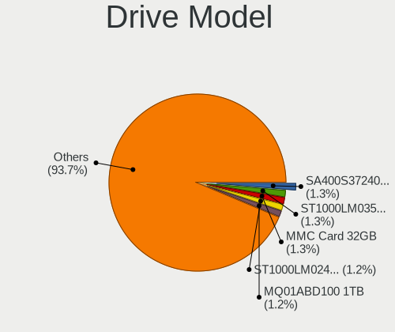
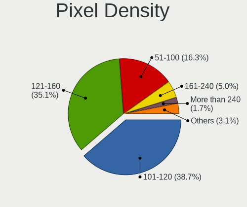
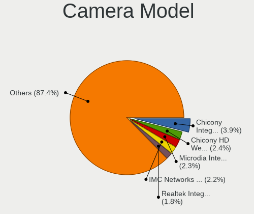

Linux Mint - Tested Hardware & Statistics (Notebooks)
-----------------------------------------------------

A project to collect tested hardware configurations for Linux Mint.

Anyone can contribute to this report by the [hw-probe](https://github.com/linuxhw/hw-probe) tool:

    sudo -E hw-probe -all -upload

Please contribute! Especially if your hardware is rare.

Contents
--------

* [ Test Cases ](#test-cases)

* [ System ](#system)
  - [ OS                       ](#os)
  - [ OS Family                ](#os-family)
  - [ Kernel                   ](#kernel)
  - [ Kernel Family            ](#kernel-family)
  - [ Kernel Major Ver.        ](#kernel-major-ver)
  - [ Arch                     ](#arch)
  - [ DE                       ](#de)
  - [ Display Server           ](#display-server)
  - [ Display Manager          ](#display-manager)
  - [ OS Lang                  ](#os-lang)
  - [ Boot Mode                ](#boot-mode)
  - [ Filesystem               ](#filesystem)
  - [ Part. scheme             ](#part-scheme)
  - [ Dual Boot with Linux/BSD ](#dual-boot-with-linuxbsd)
  - [ Dual Boot (Win)          ](#dual-boot-win)

* [ Board ](#board)
  - [ Vendor                   ](#vendor)
  - [ Model                    ](#model)
  - [ Model Family             ](#model-family)
  - [ MFG Year                 ](#mfg-year)
  - [ Form Factor              ](#form-factor)
  - [ Secure Boot              ](#secure-boot)
  - [ Coreboot                 ](#coreboot)
  - [ RAM Size                 ](#ram-size)
  - [ RAM Used                 ](#ram-used)
  - [ Total Drives             ](#total-drives)
  - [ Has CD-ROM               ](#has-cd-rom)
  - [ Has Ethernet             ](#has-ethernet)
  - [ Has WiFi                 ](#has-wifi)
  - [ Has Bluetooth            ](#has-bluetooth)

* [ Location ](#location)
  - [ Country                  ](#country)
  - [ City                     ](#city)

* [ Drives ](#drives)
  - [ Drive Vendor             ](#drive-vendor)
  - [ Drive Model              ](#drive-model)
  - [ HDD Vendor               ](#hdd-vendor)
  - [ SSD Vendor               ](#ssd-vendor)
  - [ Drive Kind               ](#drive-kind)
  - [ Drive Connector          ](#drive-connector)
  - [ Drive Size               ](#drive-size)
  - [ Space Total              ](#space-total)
  - [ Space Used               ](#space-used)
  - [ Malfunc. Drives          ](#malfunc-drives)
  - [ Malfunc. Drive Vendor    ](#malfunc-drive-vendor)
  - [ Malfunc. HDD Vendor      ](#malfunc-hdd-vendor)
  - [ Malfunc. Drive Kind      ](#malfunc-drive-kind)
  - [ Failed Drives            ](#failed-drives)
  - [ Failed Drive Vendor      ](#failed-drive-vendor)
  - [ Drive Status             ](#drive-status)

* [ Storage controller ](#storage-controller)
  - [ Storage Vendor           ](#storage-vendor)
  - [ Storage Model            ](#storage-model)
  - [ Storage Kind             ](#storage-kind)

* [ Processor ](#processor)
  - [ CPU Vendor               ](#cpu-vendor)
  - [ CPU Model                ](#cpu-model)
  - [ CPU Model Family         ](#cpu-model-family)
  - [ CPU Cores                ](#cpu-cores)
  - [ CPU Sockets              ](#cpu-sockets)
  - [ CPU Threads              ](#cpu-threads)
  - [ CPU Op-Modes             ](#cpu-op-modes)
  - [ CPU Microcode            ](#cpu-microcode)
  - [ CPU Microarch            ](#cpu-microarch)

* [ Graphics ](#graphics)
  - [ GPU Vendor               ](#gpu-vendor)
  - [ GPU Model                ](#gpu-model)
  - [ GPU Combo                ](#gpu-combo)
  - [ GPU Driver               ](#gpu-driver)
  - [ GPU Memory               ](#gpu-memory)

* [ Monitor ](#monitor)
  - [ Monitor Vendor           ](#monitor-vendor)
  - [ Monitor Model            ](#monitor-model)
  - [ Monitor Resolution       ](#monitor-resolution)
  - [ Monitor Diagonal         ](#monitor-diagonal)
  - [ Monitor Width            ](#monitor-width)
  - [ Aspect Ratio             ](#aspect-ratio)
  - [ Monitor Area             ](#monitor-area)
  - [ Pixel Density            ](#pixel-density)
  - [ Multiple Monitors        ](#multiple-monitors)

* [ Network ](#network)
  - [ Net Controller Vendor    ](#net-controller-vendor)
  - [ Net Controller Model     ](#net-controller-model)
  - [ Wireless Vendor          ](#wireless-vendor)
  - [ Wireless Model           ](#wireless-model)
  - [ Ethernet Vendor          ](#ethernet-vendor)
  - [ Ethernet Model           ](#ethernet-model)
  - [ Net Controller Kind      ](#net-controller-kind)
  - [ Used Controller          ](#used-controller)
  - [ NICs                     ](#nics)
  - [ IPv6                     ](#ipv6)

* [ Bluetooth ](#bluetooth)
  - [ Bluetooth Vendor         ](#bluetooth-vendor)
  - [ Bluetooth Model          ](#bluetooth-model)

* [ Sound ](#sound)
  - [ Sound Vendor             ](#sound-vendor)
  - [ Sound Model              ](#sound-model)

* [ Memory ](#memory)
  - [ Memory Vendor            ](#memory-vendor)
  - [ Memory Model             ](#memory-model)
  - [ Memory Kind              ](#memory-kind)
  - [ Memory Form Factor       ](#memory-form-factor)
  - [ Memory Size              ](#memory-size)
  - [ Memory Speed             ](#memory-speed)

* [ Printers & scanners ](#printers--scanners)
  - [ Printer Vendor           ](#printer-vendor)
  - [ Printer Model            ](#printer-model)
  - [ Scanner Vendor           ](#scanner-vendor)
  - [ Scanner Model            ](#scanner-model)

* [ Camera ](#camera)
  - [ Camera Vendor            ](#camera-vendor)
  - [ Camera Model             ](#camera-model)

* [ Security ](#security)
  - [ Fingerprint Vendor       ](#fingerprint-vendor)
  - [ Fingerprint Model        ](#fingerprint-model)
  - [ Chipcard Vendor          ](#chipcard-vendor)
  - [ Chipcard Model           ](#chipcard-model)

* [ Unsupported ](#unsupported)
  - [ Unsupported Devices      ](#unsupported-devices)
  - [ Unsupported Device Types ](#unsupported-device-types)

Test Cases
----------

Total: 13072

| Vendor        | Model                       | Probe                                                      | Date         |
|---------------|-----------------------------|------------------------------------------------------------|--------------|
| Acer          | Aspire E5-571G              | [fc0bc59c04](https://linux-hardware.org/?probe=fc0bc59c04) | Feb 28, 2023 |
| Lenovo        | ThinkPad T460 20FMS0700A    | [89a11e0826](https://linux-hardware.org/?probe=89a11e0826) | Feb 28, 2023 |
| Lenovo        | ThinkPad T430 2349KDG       | [ea95af537c](https://linux-hardware.org/?probe=ea95af537c) | Feb 28, 2023 |
| Dell          | Inspiron N5010              | [a1a44c0054](https://linux-hardware.org/?probe=a1a44c0054) | Feb 28, 2023 |
| Lenovo        | ThinkPad T460 20FMS0700A    | [c45e0040f7](https://linux-hardware.org/?probe=c45e0040f7) | Feb 28, 2023 |
| Lenovo        | ThinkPad T460 20FMS78014    | [6fb2d54abe](https://linux-hardware.org/?probe=6fb2d54abe) | Feb 28, 2023 |
| Gigabyte      | AERO 15-X9                  | [18d00993bf](https://linux-hardware.org/?probe=18d00993bf) | Feb 28, 2023 |
| Lenovo        | ThinkBook 14 G3 ACL 21A2    | [470d9f4591](https://linux-hardware.org/?probe=470d9f4591) | Feb 28, 2023 |
| ASUSTek       | E202SA                      | [bccde0c9a5](https://linux-hardware.org/?probe=bccde0c9a5) | Feb 28, 2023 |
| HP            | Laptop 15-gw0xxx            | [e05606240c](https://linux-hardware.org/?probe=e05606240c) | Feb 28, 2023 |
| Dell          | Inspiron N5110              | [e35a1076a1](https://linux-hardware.org/?probe=e35a1076a1) | Feb 28, 2023 |
| Dell          | Inspiron N5110              | [5a6d88e081](https://linux-hardware.org/?probe=5a6d88e081) | Feb 28, 2023 |
| HP            | 240 G4 Notebook PC          | [02744836e7](https://linux-hardware.org/?probe=02744836e7) | Feb 28, 2023 |
| Toshiba       | Satellite S70-A             | [7e849f93ca](https://linux-hardware.org/?probe=7e849f93ca) | Feb 28, 2023 |
| Acer          | Aspire 5750G                | [34b5806bcf](https://linux-hardware.org/?probe=34b5806bcf) | Feb 28, 2023 |
| Intel Clie... | LAPRC510                    | [6d9a8edb0c](https://linux-hardware.org/?probe=6d9a8edb0c) | Feb 28, 2023 |
| Acer          | Aspire A715-76              | [b9f52dc0f3](https://linux-hardware.org/?probe=b9f52dc0f3) | Feb 27, 2023 |
| HP            | Pavilion dv6                | [a19aa34db7](https://linux-hardware.org/?probe=a19aa34db7) | Feb 27, 2023 |
| Dell          | XPS 15 7590                 | [e1777784ac](https://linux-hardware.org/?probe=e1777784ac) | Feb 27, 2023 |
| Dell          | XPS 13 9360                 | [08cdbe3442](https://linux-hardware.org/?probe=08cdbe3442) | Feb 27, 2023 |
| HP            | ENVY Laptop 17-cr0xxx       | [3f0d63ab15](https://linux-hardware.org/?probe=3f0d63ab15) | Feb 27, 2023 |
| ASUSTek       | VivoBook_ASUS Laptop X50... | [05d3c9f96c](https://linux-hardware.org/?probe=05d3c9f96c) | Feb 27, 2023 |
| ASUSTek       | VivoBook_ASUS Laptop X50... | [f70d3317a2](https://linux-hardware.org/?probe=f70d3317a2) | Feb 27, 2023 |
| ASUSTek       | E402MA                      | [c49b50f583](https://linux-hardware.org/?probe=c49b50f583) | Feb 27, 2023 |
| ASUSTek       | E402MA                      | [4083a9232f](https://linux-hardware.org/?probe=4083a9232f) | Feb 27, 2023 |
| HP            | Pavilion TS 14              | [37296c42c3](https://linux-hardware.org/?probe=37296c42c3) | Feb 27, 2023 |
| Apple         | MacBookAir6,2               | [0fb60ed4e2](https://linux-hardware.org/?probe=0fb60ed4e2) | Feb 27, 2023 |
| Lenovo        | ThinkPad Edge E540 20C60... | [8de57c03d5](https://linux-hardware.org/?probe=8de57c03d5) | Feb 27, 2023 |
| Dell          | Latitude E5440              | [25cf039ffd](https://linux-hardware.org/?probe=25cf039ffd) | Feb 27, 2023 |
| ASUSTek       | X751LK                      | [ba7e4e84ff](https://linux-hardware.org/?probe=ba7e4e84ff) | Feb 27, 2023 |
| Dell          | Latitude E5440              | [5546f00169](https://linux-hardware.org/?probe=5546f00169) | Feb 26, 2023 |
| HP            | 430                         | [f90c967f06](https://linux-hardware.org/?probe=f90c967f06) | Feb 26, 2023 |
| Lenovo        | IdeaPad 3 15IML05 81WR      | [b19a229c5c](https://linux-hardware.org/?probe=b19a229c5c) | Feb 26, 2023 |
| Acer          | Aspire V3-371               | [0855d319b4](https://linux-hardware.org/?probe=0855d319b4) | Feb 26, 2023 |
| Dell          | Latitude E5450              | [62ce48db27](https://linux-hardware.org/?probe=62ce48db27) | Feb 26, 2023 |
| ASUSTek       | X540NA                      | [8bca0d4eb5](https://linux-hardware.org/?probe=8bca0d4eb5) | Feb 26, 2023 |
| Samsung       | N150P                       | [436f0b863b](https://linux-hardware.org/?probe=436f0b863b) | Feb 26, 2023 |
| HP            | ProBook 470 G1              | [8044704386](https://linux-hardware.org/?probe=8044704386) | Feb 26, 2023 |
| HP            | Notebook                    | [06dba3c8b3](https://linux-hardware.org/?probe=06dba3c8b3) | Feb 26, 2023 |
| Lenovo        | IdeaPad 3 15IGL05 82BU      | [75e601b927](https://linux-hardware.org/?probe=75e601b927) | Feb 26, 2023 |
| Dell          | Inspiron 16 5620            | [1b83626bdf](https://linux-hardware.org/?probe=1b83626bdf) | Feb 26, 2023 |
| Direkt-Tek    | DTLAPY133-1                 | [df87b3b645](https://linux-hardware.org/?probe=df87b3b645) | Feb 26, 2023 |
| Dell          | XPS L701X                   | [ad6ca78b72](https://linux-hardware.org/?probe=ad6ca78b72) | Feb 26, 2023 |
| ASUSTek       | T100HAN                     | [bde9736ffd](https://linux-hardware.org/?probe=bde9736ffd) | Feb 26, 2023 |
| GPU Compan... | GWTC116-2                   | [1475770a2a](https://linux-hardware.org/?probe=1475770a2a) | Feb 25, 2023 |
| Acer          | Aspire A715-42G             | [c7ef2b6e58](https://linux-hardware.org/?probe=c7ef2b6e58) | Feb 25, 2023 |
| HP            | 250 G3                      | [6a3d2238ba](https://linux-hardware.org/?probe=6a3d2238ba) | Feb 25, 2023 |
| HP            | Pavilion Gaming Laptop 1... | [3aae5788cf](https://linux-hardware.org/?probe=3aae5788cf) | Feb 25, 2023 |
| Medion        | Akoya E6412T                | [9859dd29a7](https://linux-hardware.org/?probe=9859dd29a7) | Feb 25, 2023 |
| Lenovo        | V130-15IKB 81HN             | [9ac60693d9](https://linux-hardware.org/?probe=9ac60693d9) | Feb 25, 2023 |
| HP            | Laptop 15s-eq2xxx           | [3142c6a90c](https://linux-hardware.org/?probe=3142c6a90c) | Feb 25, 2023 |
| ASUSTek       | T100HAN                     | [fd75fdb59f](https://linux-hardware.org/?probe=fd75fdb59f) | Feb 25, 2023 |
| MSI           | Modern 14 B10MW             | [4f9e90413b](https://linux-hardware.org/?probe=4f9e90413b) | Feb 25, 2023 |
| Acer          | Aspire E1-572G              | [438df492a0](https://linux-hardware.org/?probe=438df492a0) | Feb 25, 2023 |
| HP            | ENVY 17                     | [08db7a8be2](https://linux-hardware.org/?probe=08db7a8be2) | Feb 25, 2023 |
| HP            | ENVY 17                     | [0ad15a7e01](https://linux-hardware.org/?probe=0ad15a7e01) | Feb 25, 2023 |
| Samsung       | RV415/RV515                 | [23c0509d46](https://linux-hardware.org/?probe=23c0509d46) | Feb 25, 2023 |
| Lenovo        | ThinkPad T460 20FMS78014    | [4eb96e5571](https://linux-hardware.org/?probe=4eb96e5571) | Feb 25, 2023 |
| HP            | Pavilion Gaming Laptop 1... | [c85bd630f0](https://linux-hardware.org/?probe=c85bd630f0) | Feb 25, 2023 |
| Apple         | MacBookPro5,5               | [faf8e8fcc4](https://linux-hardware.org/?probe=faf8e8fcc4) | Feb 24, 2023 |
| HP            | EliteBook Folio 9470m       | [8cc1fdf5b4](https://linux-hardware.org/?probe=8cc1fdf5b4) | Feb 24, 2023 |
| HP            | Compaq 6715s (KE061ET#AB... | [ba0a8c88a7](https://linux-hardware.org/?probe=ba0a8c88a7) | Feb 24, 2023 |
| Lenovo        | ThinkPad T15g Gen 2i 20Y... | [faeee1c46c](https://linux-hardware.org/?probe=faeee1c46c) | Feb 24, 2023 |
| Lenovo        | G50-80 80E5                 | [759b3114be](https://linux-hardware.org/?probe=759b3114be) | Feb 24, 2023 |
| Dell          | Latitude 5490               | [ccde867e7d](https://linux-hardware.org/?probe=ccde867e7d) | Feb 24, 2023 |
| Acer          | Aspire E1-572G              | [39bfe03a28](https://linux-hardware.org/?probe=39bfe03a28) | Feb 24, 2023 |
| Dell          | Precision M4600             | [901a8de667](https://linux-hardware.org/?probe=901a8de667) | Feb 24, 2023 |
| Acer          | Aspire 5732Z                | [2cb9f58eae](https://linux-hardware.org/?probe=2cb9f58eae) | Feb 24, 2023 |
| Lenovo        | ThinkPad T460 20FMS78014    | [1a7328ecb9](https://linux-hardware.org/?probe=1a7328ecb9) | Feb 24, 2023 |
| Positivo      | Q464C-O                     | [cda1faecb1](https://linux-hardware.org/?probe=cda1faecb1) | Feb 24, 2023 |
| HP            | Pavilion Laptop 15-cs3xx... | [a8fbcbec0e](https://linux-hardware.org/?probe=a8fbcbec0e) | Feb 23, 2023 |
| Toshiba       | Satellite C70D-B            | [0c69e8ef9b](https://linux-hardware.org/?probe=0c69e8ef9b) | Feb 23, 2023 |
| Toshiba       | Satellite C70D-B            | [bcae8ff254](https://linux-hardware.org/?probe=bcae8ff254) | Feb 23, 2023 |
| Dell          | Latitude 5530               | [dbbcb7502c](https://linux-hardware.org/?probe=dbbcb7502c) | Feb 23, 2023 |
| Dell          | Latitude 5530               | [d620cdcce0](https://linux-hardware.org/?probe=d620cdcce0) | Feb 23, 2023 |
| ASUSTek       | X553MA                      | [09df6de7db](https://linux-hardware.org/?probe=09df6de7db) | Feb 23, 2023 |
| Dell          | Latitude 3420               | [86fd73d1e3](https://linux-hardware.org/?probe=86fd73d1e3) | Feb 23, 2023 |
| Lenovo        | ThinkPad T460 20FMS78014    | [5d98aa89cd](https://linux-hardware.org/?probe=5d98aa89cd) | Feb 23, 2023 |
| Medion        | E6214                       | [601f9c64cf](https://linux-hardware.org/?probe=601f9c64cf) | Feb 23, 2023 |
| Samsung       | 700Z3A/700Z4A/700Z5A/700... | [fe07c5db6d](https://linux-hardware.org/?probe=fe07c5db6d) | Feb 23, 2023 |
| MSI           | GE63VR 7RF                  | [b9aeb1ce18](https://linux-hardware.org/?probe=b9aeb1ce18) | Feb 23, 2023 |
| HP            | Laptop 15-da0xxx            | [78c0de43af](https://linux-hardware.org/?probe=78c0de43af) | Feb 23, 2023 |
| HP            | Pavilion 15                 | [48439104ea](https://linux-hardware.org/?probe=48439104ea) | Feb 23, 2023 |
| Positivo      | Q464C                       | [1b08f16a08](https://linux-hardware.org/?probe=1b08f16a08) | Feb 22, 2023 |
| Dell          | Inspiron 5565               | [d88dce11ff](https://linux-hardware.org/?probe=d88dce11ff) | Feb 22, 2023 |
| Dell          | Inspiron N5110              | [9b00bf7704](https://linux-hardware.org/?probe=9b00bf7704) | Feb 22, 2023 |
| ASUSTek       | VivoBook_ASUSLaptop X509... | [0dba794459](https://linux-hardware.org/?probe=0dba794459) | Feb 22, 2023 |
| HP            | EliteBook 820 G4            | [de79cbb975](https://linux-hardware.org/?probe=de79cbb975) | Feb 22, 2023 |
| Google        | Astronaut                   | [71e8582f54](https://linux-hardware.org/?probe=71e8582f54) | Feb 22, 2023 |
| Google        | Astronaut                   | [4949e50dad](https://linux-hardware.org/?probe=4949e50dad) | Feb 22, 2023 |
| Unknown       | Unknown                     | [68e0988789](https://linux-hardware.org/?probe=68e0988789) | Feb 22, 2023 |
| Sony          | SVE1713A6EW                 | [55d2085f4b](https://linux-hardware.org/?probe=55d2085f4b) | Feb 22, 2023 |
| Lenovo        | G50-80 80E5                 | [d196877f8d](https://linux-hardware.org/?probe=d196877f8d) | Feb 22, 2023 |
| HUAWEI        | CREF-XX                     | [e523c006bf](https://linux-hardware.org/?probe=e523c006bf) | Feb 22, 2023 |
| Sony          | VGN-NW11S_T                 | [ee3de294d6](https://linux-hardware.org/?probe=ee3de294d6) | Feb 22, 2023 |
| Lenovo        | G50-80 80E5                 | [9485c15a78](https://linux-hardware.org/?probe=9485c15a78) | Feb 22, 2023 |
| Lenovo        | ThinkPad X1 Carbon 5th 2... | [d47bf72cc8](https://linux-hardware.org/?probe=d47bf72cc8) | Feb 22, 2023 |
| HP            | Laptop 15-ef1xxx            | [0897c4ed73](https://linux-hardware.org/?probe=0897c4ed73) | Feb 22, 2023 |
| HP            | ENVY 17                     | [f705060f1e](https://linux-hardware.org/?probe=f705060f1e) | Feb 22, 2023 |
| HP            | ENVY 17                     | [bf86e7904b](https://linux-hardware.org/?probe=bf86e7904b) | Feb 22, 2023 |
| Gateway       | NV79                        | [e66a3dc233](https://linux-hardware.org/?probe=e66a3dc233) | Feb 22, 2023 |
| Acer          | TravelMate P256-MG          | [4dbdb229c5](https://linux-hardware.org/?probe=4dbdb229c5) | Feb 21, 2023 |
| Lenovo        | ThinkPad T520 4243RP3       | [06f3b4eece](https://linux-hardware.org/?probe=06f3b4eece) | Feb 21, 2023 |
| HP            | 250 G3                      | [638d8fa72b](https://linux-hardware.org/?probe=638d8fa72b) | Feb 21, 2023 |
| HP            | 250 G3                      | [eaf1a8a9ca](https://linux-hardware.org/?probe=eaf1a8a9ca) | Feb 21, 2023 |
| MSI           | GF72 8RD                    | [cf6dad63da](https://linux-hardware.org/?probe=cf6dad63da) | Feb 21, 2023 |
| Lenovo        | B570e HuronRiver Platfor... | [be36fee6eb](https://linux-hardware.org/?probe=be36fee6eb) | Feb 21, 2023 |
| HP            | Pavilion dv7                | [1ecf49cbaf](https://linux-hardware.org/?probe=1ecf49cbaf) | Feb 21, 2023 |
| Dell          | Latitude E7470              | [6b5f9db086](https://linux-hardware.org/?probe=6b5f9db086) | Feb 21, 2023 |
| ASUSTek       | K70IC                       | [e5aad61a1b](https://linux-hardware.org/?probe=e5aad61a1b) | Feb 21, 2023 |
| Acer          | Aspire V5-552PG             | [6030cc4d8a](https://linux-hardware.org/?probe=6030cc4d8a) | Feb 21, 2023 |
| Tactus        | GeoBook 140                 | [e6ab3a56ec](https://linux-hardware.org/?probe=e6ab3a56ec) | Feb 21, 2023 |
| Dell          | Precision M4600             | [2bdbf753b0](https://linux-hardware.org/?probe=2bdbf753b0) | Feb 21, 2023 |
| HP            | 1000                        | [91faf9460d](https://linux-hardware.org/?probe=91faf9460d) | Feb 21, 2023 |
| Dell          | Latitude 5420               | [231c7534d3](https://linux-hardware.org/?probe=231c7534d3) | Feb 21, 2023 |
| Lenovo        | ThinkPad R61 8933W4S        | [fec1a43d91](https://linux-hardware.org/?probe=fec1a43d91) | Feb 21, 2023 |
| Insyde        | CherryTrail                 | [819fd0183b](https://linux-hardware.org/?probe=819fd0183b) | Feb 21, 2023 |
| ASUSTek       | UX410UQK                    | [0a23974b1b](https://linux-hardware.org/?probe=0a23974b1b) | Feb 21, 2023 |
| TUXEDO        | Pulse 15 Gen1               | [e1c694b371](https://linux-hardware.org/?probe=e1c694b371) | Feb 20, 2023 |
| ASUSTek       | ROG Zephyrus M16 GU603HE... | [c51d4ef82a](https://linux-hardware.org/?probe=c51d4ef82a) | Feb 20, 2023 |
| Dell          | Vostro 3491                 | [d557c581cf](https://linux-hardware.org/?probe=d557c581cf) | Feb 20, 2023 |
| Lenovo        | G40-80 80JE                 | [e7e12370af](https://linux-hardware.org/?probe=e7e12370af) | Feb 20, 2023 |
| Acer          | Aspire 5740                 | [2b9a742da7](https://linux-hardware.org/?probe=2b9a742da7) | Feb 20, 2023 |
| HP            | Laptop 15-rb0xx             | [3dd7359a43](https://linux-hardware.org/?probe=3dd7359a43) | Feb 20, 2023 |
| HP            | Laptop 15-rb0xx             | [53ef54922c](https://linux-hardware.org/?probe=53ef54922c) | Feb 20, 2023 |
| TUXEDO        | Unknown                     | [0f60fd3519](https://linux-hardware.org/?probe=0f60fd3519) | Feb 20, 2023 |
| TUXEDO        | Unknown                     | [5faa7cf993](https://linux-hardware.org/?probe=5faa7cf993) | Feb 20, 2023 |
| Acer          | Aspire M5-583P              | [0beb710e7c](https://linux-hardware.org/?probe=0beb710e7c) | Feb 20, 2023 |
| Acer          | Aspire M5-583P              | [e4e9744dc5](https://linux-hardware.org/?probe=e4e9744dc5) | Feb 20, 2023 |
| HP            | EliteBook 840 G3            | [b20071bc70](https://linux-hardware.org/?probe=b20071bc70) | Feb 20, 2023 |
| ASUSTek       | ROG Zephyrus M16 GU603HE... | [2ccbfb422e](https://linux-hardware.org/?probe=2ccbfb422e) | Feb 20, 2023 |
| HP            | Pavilion 15                 | [7c652212fb](https://linux-hardware.org/?probe=7c652212fb) | Feb 19, 2023 |
| Acer          | Aspire 5734Z                | [a6cb13e7d4](https://linux-hardware.org/?probe=a6cb13e7d4) | Feb 19, 2023 |
| Medion        | Akoya E4214 MD99570         | [3cd9667646](https://linux-hardware.org/?probe=3cd9667646) | Feb 19, 2023 |
| HP            | Pavilion 15                 | [cecc8c4a23](https://linux-hardware.org/?probe=cecc8c4a23) | Feb 19, 2023 |
| Acer          | Aspire A317-33              | [7427fa6886](https://linux-hardware.org/?probe=7427fa6886) | Feb 19, 2023 |
| Lenovo        | Legion 5 15ACH6A 82NW       | [8ca2b786db](https://linux-hardware.org/?probe=8ca2b786db) | Feb 19, 2023 |
| Unknown       | Unknown                     | [e48cf758d0](https://linux-hardware.org/?probe=e48cf758d0) | Feb 19, 2023 |
| HP            | Pavilion g6                 | [39b27e9850](https://linux-hardware.org/?probe=39b27e9850) | Feb 19, 2023 |
| Dell          | Latitude E5450              | [2642ea7e3d](https://linux-hardware.org/?probe=2642ea7e3d) | Feb 19, 2023 |
| ASUSTek       | P553UA                      | [b999af6719](https://linux-hardware.org/?probe=b999af6719) | Feb 19, 2023 |
| Lenovo        | ThinkPad P50 20EQS14H00     | [de5c7ac3f6](https://linux-hardware.org/?probe=de5c7ac3f6) | Feb 19, 2023 |
| HP            | Stream Laptop 14-ax0XX      | [47e6250a37](https://linux-hardware.org/?probe=47e6250a37) | Feb 19, 2023 |
| HP            | EliteBook 840 G1            | [b916da5116](https://linux-hardware.org/?probe=b916da5116) | Feb 19, 2023 |
| Packard Be... | EasyNote TJ65               | [2c98b99901](https://linux-hardware.org/?probe=2c98b99901) | Feb 19, 2023 |
| ASUSTek       | X202E                       | [6627e10e70](https://linux-hardware.org/?probe=6627e10e70) | Feb 19, 2023 |
| Acer          | Aspire A515-41G             | [e06b3509f1](https://linux-hardware.org/?probe=e06b3509f1) | Feb 19, 2023 |
| Panasonic     | CF-S10CDHEDM                | [7228f7a915](https://linux-hardware.org/?probe=7228f7a915) | Feb 19, 2023 |
| Lenovo        | B590 20208                  | [59810216a8](https://linux-hardware.org/?probe=59810216a8) | Feb 18, 2023 |
| Samsung       | 350V5C/351V5C/3540VC/344... | [238f636180](https://linux-hardware.org/?probe=238f636180) | Feb 18, 2023 |
| Avell High... | B.ON                        | [d7f2dafd5e](https://linux-hardware.org/?probe=d7f2dafd5e) | Feb 18, 2023 |
| HP            | Pavilion dv8000 (ET839UA... | [6b7a3b68f3](https://linux-hardware.org/?probe=6b7a3b68f3) | Feb 18, 2023 |
| Medion        | Akoya S4220 MD99820         | [31e6881e43](https://linux-hardware.org/?probe=31e6881e43) | Feb 18, 2023 |
| Chuwi         | HeroBook Pro                | [f49ba07c1e](https://linux-hardware.org/?probe=f49ba07c1e) | Feb 18, 2023 |
| Acer          | Aspire E1-572G              | [b98e23ae68](https://linux-hardware.org/?probe=b98e23ae68) | Feb 18, 2023 |
| Lenovo        | ThinkPad E14 Gen 3 20Y70... | [ce2d0361d1](https://linux-hardware.org/?probe=ce2d0361d1) | Feb 18, 2023 |
| Acer          | Aspire 5920G                | [5132814eb1](https://linux-hardware.org/?probe=5132814eb1) | Feb 18, 2023 |
| Acer          | Aspire A515-45              | [01a17523fa](https://linux-hardware.org/?probe=01a17523fa) | Feb 18, 2023 |
| Acer          | Aspire A515-45              | [6b59c75dec](https://linux-hardware.org/?probe=6b59c75dec) | Feb 18, 2023 |
| Jumper        | EZbook                      | [35f7c6a28a](https://linux-hardware.org/?probe=35f7c6a28a) | Feb 18, 2023 |
| CSL-Comput... | YOGABOOK                    | [89abf11ce7](https://linux-hardware.org/?probe=89abf11ce7) | Feb 18, 2023 |
| Apple         | MacBookPro5,5               | [595103a203](https://linux-hardware.org/?probe=595103a203) | Feb 18, 2023 |
| Dell          | Latitude E6440              | [96e9e43a2e](https://linux-hardware.org/?probe=96e9e43a2e) | Feb 17, 2023 |
| Sony          | VGN-NW21MF_W                | [e46cfcff64](https://linux-hardware.org/?probe=e46cfcff64) | Feb 17, 2023 |
| Acer          | Aspire A515-57              | [d1cf9358f7](https://linux-hardware.org/?probe=d1cf9358f7) | Feb 17, 2023 |
| Toshiba       | Satellite S70-A             | [3361f06add](https://linux-hardware.org/?probe=3361f06add) | Feb 17, 2023 |
| Insyde        | CherryTrail                 | [5a9384c22b](https://linux-hardware.org/?probe=5a9384c22b) | Feb 17, 2023 |
| HP            | Pavilion Laptop 15-eg0xx... | [4577d3d99d](https://linux-hardware.org/?probe=4577d3d99d) | Feb 17, 2023 |
| MSI           | Modern 14 B5M               | [d951f389f3](https://linux-hardware.org/?probe=d951f389f3) | Feb 17, 2023 |
| ASUSTek       | X553SA                      | [dc294f018e](https://linux-hardware.org/?probe=dc294f018e) | Feb 17, 2023 |
| Lenovo        | ThinkPad T520 4243W83       | [e6abb63f33](https://linux-hardware.org/?probe=e6abb63f33) | Feb 17, 2023 |
| HP            | Laptop 15-gw0xxx            | [4bcd17d5a6](https://linux-hardware.org/?probe=4bcd17d5a6) | Feb 17, 2023 |
| ASUSTek       | ZenBook UX425EA_UX425EA     | [bb1c4209c7](https://linux-hardware.org/?probe=bb1c4209c7) | Feb 17, 2023 |
| Google        | Coral                       | [7a9869ff50](https://linux-hardware.org/?probe=7a9869ff50) | Feb 17, 2023 |
| HP            | G61                         | [52bb3c7afb](https://linux-hardware.org/?probe=52bb3c7afb) | Feb 17, 2023 |
| Acer          | Aspire A515-43              | [d78b367423](https://linux-hardware.org/?probe=d78b367423) | Feb 17, 2023 |
| Lenovo        | ThinkBook 14-IIL 20SL       | [3042108dae](https://linux-hardware.org/?probe=3042108dae) | Feb 16, 2023 |
| Acer          | Aspire 5741G                | [b39c940cfd](https://linux-hardware.org/?probe=b39c940cfd) | Feb 16, 2023 |
| Medion        | P651x series                | [23b3fb7ce5](https://linux-hardware.org/?probe=23b3fb7ce5) | Feb 16, 2023 |
| MSI           | GF75 Thin 10UEK             | [a1b9683bcc](https://linux-hardware.org/?probe=a1b9683bcc) | Feb 16, 2023 |
| Acer          | Aspire V3-372               | [bde68b3ed7](https://linux-hardware.org/?probe=bde68b3ed7) | Feb 16, 2023 |
| Lenovo        | ThinkPad X250 20CM001XMC    | [1026c10fa9](https://linux-hardware.org/?probe=1026c10fa9) | Feb 16, 2023 |
| Toshiba       | Satellite P750              | [6f5f99b514](https://linux-hardware.org/?probe=6f5f99b514) | Feb 16, 2023 |
| HP            | Pavilion dv7                | [130fe12846](https://linux-hardware.org/?probe=130fe12846) | Feb 16, 2023 |
| HP            | Pavilion dv7                | [7ca9bf386b](https://linux-hardware.org/?probe=7ca9bf386b) | Feb 16, 2023 |
| HP            | ENVY Laptop 17m-cg1xxx      | [7db097724e](https://linux-hardware.org/?probe=7db097724e) | Feb 16, 2023 |
| Medion        | E7220                       | [dd9de8bf69](https://linux-hardware.org/?probe=dd9de8bf69) | Feb 15, 2023 |
| Acer          | Aspire ES1-512              | [a21a70af4c](https://linux-hardware.org/?probe=a21a70af4c) | Feb 15, 2023 |
| HP            | Laptop 15-ef2xxx            | [6f8fadfe19](https://linux-hardware.org/?probe=6f8fadfe19) | Feb 15, 2023 |
| Acer          | Extensa 215-21              | [917c8f4ccb](https://linux-hardware.org/?probe=917c8f4ccb) | Feb 15, 2023 |
| ASUSTek       | F6A                         | [3660446fe5](https://linux-hardware.org/?probe=3660446fe5) | Feb 15, 2023 |
| HP            | Pavilion Gaming Laptop 1... | [138e1ff0a8](https://linux-hardware.org/?probe=138e1ff0a8) | Feb 15, 2023 |
| Acer          | Swift SF314-42              | [938edcc32a](https://linux-hardware.org/?probe=938edcc32a) | Feb 15, 2023 |
| Dell          | G3 3779                     | [cc77f75f3d](https://linux-hardware.org/?probe=cc77f75f3d) | Feb 15, 2023 |
| ASUSTek       | X750JN                      | [ef05f94b03](https://linux-hardware.org/?probe=ef05f94b03) | Feb 15, 2023 |
| Lenovo        | G470 20078                  | [8385999199](https://linux-hardware.org/?probe=8385999199) | Feb 15, 2023 |
| GPU Compan... | GWTN141-4                   | [1492f5c475](https://linux-hardware.org/?probe=1492f5c475) | Feb 15, 2023 |
| Google        | Dragonair                   | [446b22bd3f](https://linux-hardware.org/?probe=446b22bd3f) | Feb 14, 2023 |
| Dell          | Latitude E7240              | [6c131e6c56](https://linux-hardware.org/?probe=6c131e6c56) | Feb 14, 2023 |
| Lenovo        | ThinkPad T460 20FMS1GX0C    | [22ee871680](https://linux-hardware.org/?probe=22ee871680) | Feb 14, 2023 |
| Lenovo        | ThinkPad T430 2349KDG       | [a471eab123](https://linux-hardware.org/?probe=a471eab123) | Feb 14, 2023 |
| Lenovo        | ThinkPad E14 Gen 4 21EB0... | [6c07807921](https://linux-hardware.org/?probe=6c07807921) | Feb 14, 2023 |
| Acer          | Aspire 7250G                | [5f5cec8261](https://linux-hardware.org/?probe=5f5cec8261) | Feb 14, 2023 |
| Acer          | Aspire V5-123               | [30a24a1bb6](https://linux-hardware.org/?probe=30a24a1bb6) | Feb 14, 2023 |
| Lenovo        | ThinkPad X1 Carbon 5th 2... | [1a20fdd090](https://linux-hardware.org/?probe=1a20fdd090) | Feb 14, 2023 |
| Lenovo        | ThinkPad X1 Carbon 5th 2... | [3384ced1ca](https://linux-hardware.org/?probe=3384ced1ca) | Feb 14, 2023 |
| Fujitsu       | LIFEBOOK E754               | [469896ac73](https://linux-hardware.org/?probe=469896ac73) | Feb 14, 2023 |
| EPSON DIRE... | Endeavor NY2200S            | [2be0a1a8a0](https://linux-hardware.org/?probe=2be0a1a8a0) | Feb 14, 2023 |
| EPSON DIRE... | Endeavor NY2200S            | [29b669f143](https://linux-hardware.org/?probe=29b669f143) | Feb 14, 2023 |
| HP            | Laptop 15-da2xxx            | [41bf5d50f8](https://linux-hardware.org/?probe=41bf5d50f8) | Feb 14, 2023 |
| HP            | Pavilion 15                 | [7f54c595f1](https://linux-hardware.org/?probe=7f54c595f1) | Feb 14, 2023 |
| Lenovo        | ThinkPad E14 Gen 2 20TBS... | [28db1ad82e](https://linux-hardware.org/?probe=28db1ad82e) | Feb 14, 2023 |
| HP            | ENVY 17                     | [d07a7a99de](https://linux-hardware.org/?probe=d07a7a99de) | Feb 14, 2023 |
| Acer          | Nitro AN517-55              | [65a9371e13](https://linux-hardware.org/?probe=65a9371e13) | Feb 14, 2023 |
| Dell          | Inspiron 5402               | [805931ad5f](https://linux-hardware.org/?probe=805931ad5f) | Feb 14, 2023 |
| Toshiba       | Satellite S70-A             | [dae43cdc3b](https://linux-hardware.org/?probe=dae43cdc3b) | Feb 14, 2023 |
| Samsung       | R530/R730/P530              | [c3bef1932e](https://linux-hardware.org/?probe=c3bef1932e) | Feb 13, 2023 |
| Dell          | Inspiron 3505               | [ba53e8885b](https://linux-hardware.org/?probe=ba53e8885b) | Feb 13, 2023 |
| Toshiba       | Satellite S70-A             | [c946e26e5e](https://linux-hardware.org/?probe=c946e26e5e) | Feb 13, 2023 |
| Apple         | MacBook5,2                  | [72b8d495ff](https://linux-hardware.org/?probe=72b8d495ff) | Feb 13, 2023 |
| Positivo      | CHT14B                      | [859e8a3c17](https://linux-hardware.org/?probe=859e8a3c17) | Feb 13, 2023 |
| Acer          | Predator G3-571             | [5253b17542](https://linux-hardware.org/?probe=5253b17542) | Feb 13, 2023 |
| HP            | ProBook 4340s               | [caed0e9f2d](https://linux-hardware.org/?probe=caed0e9f2d) | Feb 13, 2023 |
| Acer          | TravelMate 8572G            | [7049ab32d4](https://linux-hardware.org/?probe=7049ab32d4) | Feb 13, 2023 |
| Positivo      | CHT14B                      | [2d5b910ed3](https://linux-hardware.org/?probe=2d5b910ed3) | Feb 13, 2023 |
| Dell          | Latitude E5570              | [16e090c63c](https://linux-hardware.org/?probe=16e090c63c) | Feb 13, 2023 |
| Lenovo        | ThinkBook 16p Gen 2 20YM    | [eb40144624](https://linux-hardware.org/?probe=eb40144624) | Feb 13, 2023 |
| HP            | Stream Laptop 14-ax0XX      | [cfeb6479d1](https://linux-hardware.org/?probe=cfeb6479d1) | Feb 13, 2023 |
| HP            | ZBook Firefly 16 inch G9... | [d1c4626fd3](https://linux-hardware.org/?probe=d1c4626fd3) | Feb 13, 2023 |
| Lenovo        | ThinkPad T440s 20ARS1VL0... | [d4b5ca228c](https://linux-hardware.org/?probe=d4b5ca228c) | Feb 13, 2023 |
| HP            | Pavilion dv2500             | [bea8c0162f](https://linux-hardware.org/?probe=bea8c0162f) | Feb 12, 2023 |
| HP            | ENVY 15                     | [efc0c8427a](https://linux-hardware.org/?probe=efc0c8427a) | Feb 12, 2023 |
| ASUSTek       | K45VS                       | [faf4fc0251](https://linux-hardware.org/?probe=faf4fc0251) | Feb 12, 2023 |
| Apple         | MacBookPro11,5              | [78e7a0ae85](https://linux-hardware.org/?probe=78e7a0ae85) | Feb 12, 2023 |
| Dell          | Vostro 3400                 | [89365a25ee](https://linux-hardware.org/?probe=89365a25ee) | Feb 12, 2023 |
| Lenovo        | ThinkPad T470s 20HGS1LM0... | [8ee6dd00d1](https://linux-hardware.org/?probe=8ee6dd00d1) | Feb 12, 2023 |
| Lenovo        | ThinkPad L460 20FVS25H01    | [37383d8798](https://linux-hardware.org/?probe=37383d8798) | Feb 12, 2023 |
| Acer          | Aspire 8942G                | [d517f63625](https://linux-hardware.org/?probe=d517f63625) | Feb 12, 2023 |
| HUAWEI        | BOM-WXX9                    | [c798855263](https://linux-hardware.org/?probe=c798855263) | Feb 12, 2023 |
| HP            | Compaq 6720s                | [4b8e0e10e0](https://linux-hardware.org/?probe=4b8e0e10e0) | Feb 12, 2023 |
| HP            | Compaq 6720s                | [a23186bb63](https://linux-hardware.org/?probe=a23186bb63) | Feb 11, 2023 |
| Dell          | XPS 15 9500                 | [6c7c2ab736](https://linux-hardware.org/?probe=6c7c2ab736) | Feb 11, 2023 |
| Lenovo        | ThinkPad T440p 20AWS0XX0... | [404cac8b60](https://linux-hardware.org/?probe=404cac8b60) | Feb 11, 2023 |
| HP            | Notebook                    | [b0f08012f1](https://linux-hardware.org/?probe=b0f08012f1) | Feb 11, 2023 |
| Lenovo        | ThinkPad X270 20HN001NUS    | [4ea8b48d8d](https://linux-hardware.org/?probe=4ea8b48d8d) | Feb 11, 2023 |
| MSI           | GX700                       | [11154709fd](https://linux-hardware.org/?probe=11154709fd) | Feb 11, 2023 |
| HUAWEI        | BOD-WXX9                    | [18cd6aad2c](https://linux-hardware.org/?probe=18cd6aad2c) | Feb 11, 2023 |
| Acer          | Aspire V3-772               | [95875d4afc](https://linux-hardware.org/?probe=95875d4afc) | Feb 11, 2023 |
| HP            | Notebook                    | [523c719e5b](https://linux-hardware.org/?probe=523c719e5b) | Feb 11, 2023 |
| HP            | Notebook                    | [d4e29128dd](https://linux-hardware.org/?probe=d4e29128dd) | Feb 11, 2023 |
| Acer          | Aspire E1-572G              | [0498a9f264](https://linux-hardware.org/?probe=0498a9f264) | Feb 11, 2023 |
| Acer          | Aspire E1-572G              | [b844af0fa2](https://linux-hardware.org/?probe=b844af0fa2) | Feb 11, 2023 |
| Lenovo        | ThinkPad T560 20FHA03TGE    | [31ae950d04](https://linux-hardware.org/?probe=31ae950d04) | Feb 11, 2023 |
| HP            | ZBook 17 G3                 | [f0dff8ed53](https://linux-hardware.org/?probe=f0dff8ed53) | Feb 11, 2023 |
| HP            | Presario V6000 (RN927UA#... | [0524b3b524](https://linux-hardware.org/?probe=0524b3b524) | Feb 11, 2023 |
| MSI           | GL73 8RC                    | [cb01fc38d0](https://linux-hardware.org/?probe=cb01fc38d0) | Feb 10, 2023 |
| HP            | EliteBook 820 G3            | [c1ac37fee3](https://linux-hardware.org/?probe=c1ac37fee3) | Feb 10, 2023 |
| MSI           | Prestige 15 A11SCX          | [a82372e461](https://linux-hardware.org/?probe=a82372e461) | Feb 10, 2023 |
| ASUSTek       | 1015PE                      | [81f71f26fc](https://linux-hardware.org/?probe=81f71f26fc) | Feb 10, 2023 |
| HUAWEI        | KLVD-WXX9                   | [ade78d235c](https://linux-hardware.org/?probe=ade78d235c) | Feb 10, 2023 |
| Sony          | SVE1713A6EW                 | [69f94c30bf](https://linux-hardware.org/?probe=69f94c30bf) | Feb 10, 2023 |
| HP            | Pavilion dv7                | [2d2e867259](https://linux-hardware.org/?probe=2d2e867259) | Feb 10, 2023 |
| HP            | ZBook 17 G3                 | [bd09c6036f](https://linux-hardware.org/?probe=bd09c6036f) | Feb 10, 2023 |
| Fujitsu Si... | LIFEBOOK S6410              | [427ae6ff82](https://linux-hardware.org/?probe=427ae6ff82) | Feb 10, 2023 |
| Dell          | Latitude 5290 2-in-1        | [c56001eede](https://linux-hardware.org/?probe=c56001eede) | Feb 10, 2023 |
| ASUSTek       | X75VC                       | [7ae38b7947](https://linux-hardware.org/?probe=7ae38b7947) | Feb 10, 2023 |
| Lenovo        | IdeaPad 3 17IML05 81WC      | [9da08e5265](https://linux-hardware.org/?probe=9da08e5265) | Feb 10, 2023 |
| Intel         | HuronRiver Platform         | [e3ad5a0e88](https://linux-hardware.org/?probe=e3ad5a0e88) | Feb 10, 2023 |
| Sony          | SVE1713A6EW                 | [61bffa9573](https://linux-hardware.org/?probe=61bffa9573) | Feb 10, 2023 |
| HP            | Pavilion 15                 | [8e014440da](https://linux-hardware.org/?probe=8e014440da) | Feb 10, 2023 |
| HP            | Pavilion 15                 | [65cc737783](https://linux-hardware.org/?probe=65cc737783) | Feb 10, 2023 |
| HP            | Pavilion dv8000 (ET839UA... | [0a74293474](https://linux-hardware.org/?probe=0a74293474) | Feb 10, 2023 |
| Dell          | Inspiron 5402               | [52125d1623](https://linux-hardware.org/?probe=52125d1623) | Feb 10, 2023 |
| HP            | Pavilion dv9500             | [0d7e58014a](https://linux-hardware.org/?probe=0d7e58014a) | Feb 10, 2023 |
| ASUSTek       | UX430UNR                    | [f0b972d056](https://linux-hardware.org/?probe=f0b972d056) | Feb 10, 2023 |
| Schenker      | XMG CORE (REN/E21)          | [d5ae0e820f](https://linux-hardware.org/?probe=d5ae0e820f) | Feb 10, 2023 |
| Lenovo        | ThinkPad E15 Gen 4 21EES... | [22012a9e81](https://linux-hardware.org/?probe=22012a9e81) | Feb 09, 2023 |
| Lenovo        | Yoga 500-15IBD 80N6         | [077853b2db](https://linux-hardware.org/?probe=077853b2db) | Feb 09, 2023 |
| ASUSTek       | X455YA                      | [ba987663d8](https://linux-hardware.org/?probe=ba987663d8) | Feb 09, 2023 |
| HUAWEI        | BOD-WXX9                    | [a410a7b784](https://linux-hardware.org/?probe=a410a7b784) | Feb 09, 2023 |
| Dell          | Latitude E6510              | [1588e685b9](https://linux-hardware.org/?probe=1588e685b9) | Feb 09, 2023 |
| Heptagon S... | HQ-BOX2 Server              | [476197a287](https://linux-hardware.org/?probe=476197a287) | Feb 09, 2023 |
| ASUSTek       | ZenBook UX425JA_UX425JA     | [a087803ded](https://linux-hardware.org/?probe=a087803ded) | Feb 09, 2023 |
| Lenovo        | ThinkPad T460 20FMS78014    | [c5d2f396c3](https://linux-hardware.org/?probe=c5d2f396c3) | Feb 09, 2023 |
| Lenovo        | IdeaPad 320-15AST 80XV      | [08f3d3b7d8](https://linux-hardware.org/?probe=08f3d3b7d8) | Feb 09, 2023 |
| Lenovo        | IdeaPad 320-15AST 80XV      | [0cb6963914](https://linux-hardware.org/?probe=0cb6963914) | Feb 09, 2023 |
| Apple         | MacBook10,1                 | [1d29cd0c56](https://linux-hardware.org/?probe=1d29cd0c56) | Feb 09, 2023 |
| HUAWEI        | BOD-WXX9                    | [1d05e35623](https://linux-hardware.org/?probe=1d05e35623) | Feb 09, 2023 |
| HP            | Pavilion dv8000 (ET839UA... | [d236f5fa51](https://linux-hardware.org/?probe=d236f5fa51) | Feb 09, 2023 |
| Dell          | Latitude E6430              | [3321163984](https://linux-hardware.org/?probe=3321163984) | Feb 09, 2023 |
| Lenovo        | ThinkPad E15 Gen 4 21EES... | [5a4721b1bd](https://linux-hardware.org/?probe=5a4721b1bd) | Feb 08, 2023 |
| Lenovo        | IdeaPad S145-15IWL 81S9     | [43968e7a27](https://linux-hardware.org/?probe=43968e7a27) | Feb 08, 2023 |
| HP            | EliteBook 850 G3            | [7091e6ba95](https://linux-hardware.org/?probe=7091e6ba95) | Feb 08, 2023 |
| Acer          | Aspire S7-391               | [3777a7d1e9](https://linux-hardware.org/?probe=3777a7d1e9) | Feb 08, 2023 |
| Dell          | Latitude 7390               | [9f8f6c68cc](https://linux-hardware.org/?probe=9f8f6c68cc) | Feb 08, 2023 |
| Acer          | Aspire A317-33              | [9c91956bd3](https://linux-hardware.org/?probe=9c91956bd3) | Feb 08, 2023 |
| Lenovo        | ThinkPad X121e 305166G      | [04993e2b06](https://linux-hardware.org/?probe=04993e2b06) | Feb 08, 2023 |
| Dell          | Latitude E7450              | [2513ec83c8](https://linux-hardware.org/?probe=2513ec83c8) | Feb 08, 2023 |
| Alienware     | M14xR2                      | [601b0373af](https://linux-hardware.org/?probe=601b0373af) | Feb 08, 2023 |
| HP            | EliteBook 745 G2            | [35cb1bce53](https://linux-hardware.org/?probe=35cb1bce53) | Feb 08, 2023 |
| HP            | EliteBook 745 G2            | [ce120b023c](https://linux-hardware.org/?probe=ce120b023c) | Feb 08, 2023 |
| HP            | ZBook 15 G2                 | [20d7058e4f](https://linux-hardware.org/?probe=20d7058e4f) | Feb 08, 2023 |
| Apple         | MacBookAir6,1               | [72d2220b42](https://linux-hardware.org/?probe=72d2220b42) | Feb 07, 2023 |
| ASUSTek       | VivoBook_ASUSLaptop X521... | [d47dacfb72](https://linux-hardware.org/?probe=d47dacfb72) | Feb 07, 2023 |
| MSI           | CX600                       | [7478d44927](https://linux-hardware.org/?probe=7478d44927) | Feb 07, 2023 |
| Acer          | Aspire E5-553               | [5e951ad06d](https://linux-hardware.org/?probe=5e951ad06d) | Feb 07, 2023 |
| Acer          | Aspire A515-57G             | [dd6c2cbcc6](https://linux-hardware.org/?probe=dd6c2cbcc6) | Feb 07, 2023 |
| Google        | Grunt                       | [1bbc4ae776](https://linux-hardware.org/?probe=1bbc4ae776) | Feb 07, 2023 |
| Acer          | Aspire A515-57G             | [470857588f](https://linux-hardware.org/?probe=470857588f) | Feb 07, 2023 |
| Acer          | Aspire ES1-524              | [04bdcf0721](https://linux-hardware.org/?probe=04bdcf0721) | Feb 07, 2023 |
| Dell          | Latitude E4300              | [aaad0477e4](https://linux-hardware.org/?probe=aaad0477e4) | Feb 07, 2023 |
| Unknown       | Unknown                     | [83e2eaf929](https://linux-hardware.org/?probe=83e2eaf929) | Feb 07, 2023 |
| Dell          | Latitude 7390               | [698cdea248](https://linux-hardware.org/?probe=698cdea248) | Feb 07, 2023 |
| Toshiba       | Satellite P75-A             | [eacc9fb2eb](https://linux-hardware.org/?probe=eacc9fb2eb) | Feb 07, 2023 |
| ASUSTek       | X455LF                      | [d60cd149fb](https://linux-hardware.org/?probe=d60cd149fb) | Feb 07, 2023 |
| HP            | ENVY Laptop 17-cr0xxx       | [b7ab00ddb1](https://linux-hardware.org/?probe=b7ab00ddb1) | Feb 07, 2023 |
| Toshiba       | Satellite C850D-B615        | [66a7f0123f](https://linux-hardware.org/?probe=66a7f0123f) | Feb 07, 2023 |
| HP            | ENVY 4                      | [0344f89eea](https://linux-hardware.org/?probe=0344f89eea) | Feb 07, 2023 |
| Lenovo        | G470 20078                  | [eca9b95b61](https://linux-hardware.org/?probe=eca9b95b61) | Feb 07, 2023 |
| ASUSTek       | VivoBook_ASUSLaptop X712... | [8b26ec07a6](https://linux-hardware.org/?probe=8b26ec07a6) | Feb 07, 2023 |
| HP            | Pavilion dv8000 (ET839UA... | [ebe5940bd7](https://linux-hardware.org/?probe=ebe5940bd7) | Feb 07, 2023 |
| Google        | Asuka                       | [f4287eb578](https://linux-hardware.org/?probe=f4287eb578) | Feb 07, 2023 |
| HP            | EliteBook 835 G8 Noteboo... | [3797cf0990](https://linux-hardware.org/?probe=3797cf0990) | Feb 07, 2023 |
| Apple         | MacBookAir7,2               | [0a94d67455](https://linux-hardware.org/?probe=0a94d67455) | Feb 07, 2023 |
| Dell          | Inspiron N5010              | [c3f85cc6ff](https://linux-hardware.org/?probe=c3f85cc6ff) | Feb 07, 2023 |
| Lenovo        | Yoga 710-11IKB 80V6         | [b76e804001](https://linux-hardware.org/?probe=b76e804001) | Feb 07, 2023 |
| ASUSTek       | X75VC                       | [d383aec031](https://linux-hardware.org/?probe=d383aec031) | Feb 06, 2023 |
| HP            | Laptop 17-cp2xxx            | [1274b728e9](https://linux-hardware.org/?probe=1274b728e9) | Feb 06, 2023 |
| Acer          | Aspire ES1-512              | [75b3a6b384](https://linux-hardware.org/?probe=75b3a6b384) | Feb 06, 2023 |
| HP            | ProBook 4720s               | [96ec8d979e](https://linux-hardware.org/?probe=96ec8d979e) | Feb 06, 2023 |
| HP            | Laptop 17z-ca200            | [4866eb7547](https://linux-hardware.org/?probe=4866eb7547) | Feb 06, 2023 |
| Lenovo        | ThinkPad T460 20FMS0VG25    | [9a537c89c7](https://linux-hardware.org/?probe=9a537c89c7) | Feb 06, 2023 |
| Acer          | Aspire A515-44              | [62c2c59f82](https://linux-hardware.org/?probe=62c2c59f82) | Feb 06, 2023 |
| ASUSTek       | X550JF                      | [c8f1b71cfd](https://linux-hardware.org/?probe=c8f1b71cfd) | Feb 06, 2023 |
| Fujitsu Si... | AMILO Pa 1538               | [a2876a567b](https://linux-hardware.org/?probe=a2876a567b) | Feb 06, 2023 |
| Lenovo        | IdeaPad 5 Pro 16ARH7 82S... | [e0a869c67b](https://linux-hardware.org/?probe=e0a869c67b) | Feb 06, 2023 |
| Notebook      | W35xSTQ_370ST               | [0a4e03a5e7](https://linux-hardware.org/?probe=0a4e03a5e7) | Feb 06, 2023 |
| Notebook      | W35xSTQ_370ST               | [8f088caae3](https://linux-hardware.org/?probe=8f088caae3) | Feb 06, 2023 |
| Lenovo        | ThinkPad T410 2537AT1       | [8b3c0ec4e9](https://linux-hardware.org/?probe=8b3c0ec4e9) | Feb 06, 2023 |
| HP            | Notebook                    | [41f5c97a09](https://linux-hardware.org/?probe=41f5c97a09) | Feb 06, 2023 |
| Lenovo        | ThinkPad SL510 2847A72      | [dbde7285e5](https://linux-hardware.org/?probe=dbde7285e5) | Feb 06, 2023 |
| Dell          | Inspiron 1764               | [fe67ffc7e9](https://linux-hardware.org/?probe=fe67ffc7e9) | Feb 06, 2023 |
| Dell          | Latitude E7470              | [5c8d26c4ff](https://linux-hardware.org/?probe=5c8d26c4ff) | Feb 05, 2023 |
| Dell          | Latitude E7470              | [d68227808b](https://linux-hardware.org/?probe=d68227808b) | Feb 05, 2023 |
| Acer          | Aspire A515-44              | [daac708489](https://linux-hardware.org/?probe=daac708489) | Feb 05, 2023 |
| HP            | Pavilion Gaming Laptop 1... | [24a06b8c0c](https://linux-hardware.org/?probe=24a06b8c0c) | Feb 05, 2023 |
| HP            | EliteBook 820 G2            | [e8c0f3b7de](https://linux-hardware.org/?probe=e8c0f3b7de) | Feb 05, 2023 |
| Dell          | G15 5515                    | [8624b4209d](https://linux-hardware.org/?probe=8624b4209d) | Feb 05, 2023 |
| HP            | EliteBook 820 G2            | [eb5a23a73b](https://linux-hardware.org/?probe=eb5a23a73b) | Feb 05, 2023 |
| Acer          | Aspire A515-52G             | [3152274587](https://linux-hardware.org/?probe=3152274587) | Feb 05, 2023 |
| Fujitsu Si... | AMILO Pro Edition V3505     | [475265e1f8](https://linux-hardware.org/?probe=475265e1f8) | Feb 05, 2023 |
| Toshiba       | Satellite A300              | [d9e6b637ca](https://linux-hardware.org/?probe=d9e6b637ca) | Feb 05, 2023 |
| Acer          | Aspire E1-572G              | [c22ab7647c](https://linux-hardware.org/?probe=c22ab7647c) | Feb 05, 2023 |
| Sony          | VPCEH1J8E                   | [073520ab38](https://linux-hardware.org/?probe=073520ab38) | Feb 05, 2023 |
| Lenovo        | ThinkBook 14s-IWL 20RM      | [dbef2c679a](https://linux-hardware.org/?probe=dbef2c679a) | Feb 05, 2023 |
| Apple         | MacBookPro6,2               | [4d2653610f](https://linux-hardware.org/?probe=4d2653610f) | Feb 05, 2023 |
| Lenovo        | G50-80 80E5                 | [baf04bdc65](https://linux-hardware.org/?probe=baf04bdc65) | Feb 05, 2023 |
| Acer          | Aspire E5-573G              | [b7760210a8](https://linux-hardware.org/?probe=b7760210a8) | Feb 05, 2023 |
| Dell          | Precision M4800             | [adf2618bce](https://linux-hardware.org/?probe=adf2618bce) | Feb 05, 2023 |
| Lenovo        | ThinkBook 14s-IWL 20RM      | [14fb68ece0](https://linux-hardware.org/?probe=14fb68ece0) | Feb 05, 2023 |
| Unknown       | M-140BI5                    | [32f4028033](https://linux-hardware.org/?probe=32f4028033) | Feb 05, 2023 |
| HP            | Pavilion dv8000 (ET839UA... | [f3f4d9fc40](https://linux-hardware.org/?probe=f3f4d9fc40) | Feb 04, 2023 |
| Evolute       | SFX-65                      | [7b37b32f92](https://linux-hardware.org/?probe=7b37b32f92) | Feb 04, 2023 |
| Lenovo        | ThinkPad T410 2537CS0       | [8b6fbfa8f5](https://linux-hardware.org/?probe=8b6fbfa8f5) | Feb 04, 2023 |
| HP            | Pavilion dv7                | [e7b6c27948](https://linux-hardware.org/?probe=e7b6c27948) | Feb 04, 2023 |
| HP            | Pavilion 15                 | [00ebdfe948](https://linux-hardware.org/?probe=00ebdfe948) | Feb 04, 2023 |
| HP            | Pavilion dv7                | [b08ab3c55c](https://linux-hardware.org/?probe=b08ab3c55c) | Feb 04, 2023 |
| GEO           | GeoBook 240                 | [861adcda52](https://linux-hardware.org/?probe=861adcda52) | Feb 04, 2023 |
| Teclast       | F7S                         | [d4384ca831](https://linux-hardware.org/?probe=d4384ca831) | Feb 04, 2023 |
| GEO           | GeoBook 140                 | [a91fdaa5da](https://linux-hardware.org/?probe=a91fdaa5da) | Feb 04, 2023 |
| Acer          | Nitro AN515-43              | [8fd252af27](https://linux-hardware.org/?probe=8fd252af27) | Feb 04, 2023 |
| ASUSTek       | X550LC                      | [f22682c35f](https://linux-hardware.org/?probe=f22682c35f) | Feb 04, 2023 |
| HP            | Pavilion 15                 | [a5508059a1](https://linux-hardware.org/?probe=a5508059a1) | Feb 04, 2023 |
| Lenovo        | IdeaPad S130-14IGM 81J2     | [bac184b151](https://linux-hardware.org/?probe=bac184b151) | Feb 04, 2023 |
| HP            | Compaq Presario CQ40        | [de29ca3277](https://linux-hardware.org/?probe=de29ca3277) | Feb 04, 2023 |
| HP            | Pavilion Laptop 15-cw1xx... | [44aed7e81a](https://linux-hardware.org/?probe=44aed7e81a) | Feb 04, 2023 |
| Dell          | Precision 7550              | [9608ff008d](https://linux-hardware.org/?probe=9608ff008d) | Feb 04, 2023 |
| MSI           | GF63 Thin 11UD              | [8b60b63594](https://linux-hardware.org/?probe=8b60b63594) | Feb 04, 2023 |
| Acer          | Aspire ES1-512              | [278fbf008f](https://linux-hardware.org/?probe=278fbf008f) | Feb 03, 2023 |
| HUAWEI        | KLVD-WXX9                   | [9b4215e241](https://linux-hardware.org/?probe=9b4215e241) | Feb 03, 2023 |
| HUAWEI        | KLVD-WXX9                   | [c0cd867b7b](https://linux-hardware.org/?probe=c0cd867b7b) | Feb 03, 2023 |
| HP            | 250 G6 Notebook PC          | [2be7a67960](https://linux-hardware.org/?probe=2be7a67960) | Feb 03, 2023 |
| Lenovo        | ThinkPad T480 20L6S29E1S    | [3f3e5b3a1e](https://linux-hardware.org/?probe=3f3e5b3a1e) | Feb 03, 2023 |
| Lenovo        | ThinkPad X220 4291W3B       | [7f21116bf5](https://linux-hardware.org/?probe=7f21116bf5) | Feb 03, 2023 |
| Unknown       | Unknown                     | [473e2a88ed](https://linux-hardware.org/?probe=473e2a88ed) | Feb 02, 2023 |
| Unknown       | Unknown                     | [fcf96d41f6](https://linux-hardware.org/?probe=fcf96d41f6) | Feb 02, 2023 |
| Dell          | Latitude 3330               | [4f60600638](https://linux-hardware.org/?probe=4f60600638) | Feb 02, 2023 |
| Lenovo        | G700 20251                  | [2eb468b1b9](https://linux-hardware.org/?probe=2eb468b1b9) | Feb 02, 2023 |
| Lenovo        | ThinkPad T420s 4173CTO      | [232ff7a382](https://linux-hardware.org/?probe=232ff7a382) | Feb 02, 2023 |
| HP            | 250 G6 Notebook PC          | [a0b5d1c73c](https://linux-hardware.org/?probe=a0b5d1c73c) | Feb 02, 2023 |
| Acer          | Aspire ES1-572              | [09d76d7d2a](https://linux-hardware.org/?probe=09d76d7d2a) | Feb 02, 2023 |
| Samsung       | 340XAA/350XAA/550XAA        | [92d639c0f4](https://linux-hardware.org/?probe=92d639c0f4) | Feb 02, 2023 |
| Dell          | XPS 13 7390                 | [f86eaa6db8](https://linux-hardware.org/?probe=f86eaa6db8) | Feb 02, 2023 |
| AVITA         | NE14A2                      | [c5d9f8e3ac](https://linux-hardware.org/?probe=c5d9f8e3ac) | Feb 02, 2023 |
| HP            | Presario CQ43               | [76bfeffd5f](https://linux-hardware.org/?probe=76bfeffd5f) | Feb 02, 2023 |
| Lenovo        | G40-80 80JE                 | [9a5e6fd61e](https://linux-hardware.org/?probe=9a5e6fd61e) | Feb 02, 2023 |
| Acer          | Aspire E1-572               | [c4e6e989f5](https://linux-hardware.org/?probe=c4e6e989f5) | Feb 01, 2023 |
| Apple         | MacBookPro12,1              | [6e089e22b1](https://linux-hardware.org/?probe=6e089e22b1) | Feb 01, 2023 |
| Lenovo        | ThinkPad T400 6473PMG       | [07cba1c44b](https://linux-hardware.org/?probe=07cba1c44b) | Feb 01, 2023 |
| Acer          | Aspire 5750G                | [a8a3f37ad8](https://linux-hardware.org/?probe=a8a3f37ad8) | Feb 01, 2023 |
| Lenovo        | IdeaPad 3 17ITL6 82H9       | [eaaf15f3f6](https://linux-hardware.org/?probe=eaaf15f3f6) | Feb 01, 2023 |
| Dell          | Latitude E6440              | [8712bed802](https://linux-hardware.org/?probe=8712bed802) | Feb 01, 2023 |
| Dell          | Latitude E6440              | [09b61adc0b](https://linux-hardware.org/?probe=09b61adc0b) | Feb 01, 2023 |
| Fujitsu       | LIFEBOOK E744               | [b048f7d3e1](https://linux-hardware.org/?probe=b048f7d3e1) | Feb 01, 2023 |
| Lenovo        | ThinkPad T560 20FJS44L0B    | [06bf3870a5](https://linux-hardware.org/?probe=06bf3870a5) | Jan 31, 2023 |
| Lenovo        | ThinkPad T530 2394A11       | [e7946fa600](https://linux-hardware.org/?probe=e7946fa600) | Jan 31, 2023 |
| ASUSTek       | VivoBook_ASUS Laptop E21... | [478c456288](https://linux-hardware.org/?probe=478c456288) | Jan 31, 2023 |
| HP            | ENVY 15                     | [c688eb85bb](https://linux-hardware.org/?probe=c688eb85bb) | Jan 31, 2023 |
| Notebook      | W35xSTQ_370ST               | [b52cc29e08](https://linux-hardware.org/?probe=b52cc29e08) | Jan 31, 2023 |
| HP            | 255 15.6 inch G9 Noteboo... | [7758d7c535](https://linux-hardware.org/?probe=7758d7c535) | Jan 31, 2023 |
| ASUSTek       | VivoBook_ASUSLaptop X421... | [1cfa73407d](https://linux-hardware.org/?probe=1cfa73407d) | Jan 31, 2023 |
| Acer          | Aspire E5-575G              | [463b7f859f](https://linux-hardware.org/?probe=463b7f859f) | Jan 31, 2023 |
| HP            | EliteBook 840 G1            | [9b91cecab9](https://linux-hardware.org/?probe=9b91cecab9) | Jan 31, 2023 |
| Notebook      | W35xSTQ_370ST               | [b33ec828fc](https://linux-hardware.org/?probe=b33ec828fc) | Jan 31, 2023 |
| Toshiba       | Satellite R630              | [52ffe609b8](https://linux-hardware.org/?probe=52ffe609b8) | Jan 31, 2023 |
| Dell          | Latitude E6530              | [140543c98c](https://linux-hardware.org/?probe=140543c98c) | Jan 31, 2023 |
| HP            | EliteBook 2560p             | [798466ab86](https://linux-hardware.org/?probe=798466ab86) | Jan 31, 2023 |
| Lenovo        | ThinkPad T440 20B7S2GS0W    | [46008b3d38](https://linux-hardware.org/?probe=46008b3d38) | Jan 31, 2023 |
| HP            | Pavilion Gaming Laptop 1... | [9fd1916420](https://linux-hardware.org/?probe=9fd1916420) | Jan 31, 2023 |
| HP            | Sona                        | [36a3d72172](https://linux-hardware.org/?probe=36a3d72172) | Jan 31, 2023 |
| HP            | Pavilion Gaming Laptop 1... | [318f007db6](https://linux-hardware.org/?probe=318f007db6) | Jan 31, 2023 |
| Lenovo        | G40-80 80JE                 | [bb5d758714](https://linux-hardware.org/?probe=bb5d758714) | Jan 31, 2023 |
| Lenovo        | ThinkPad E560 20EV002FUS    | [0110b731e7](https://linux-hardware.org/?probe=0110b731e7) | Jan 31, 2023 |
| HP            | Pavilion dv6                | [c84439bfbf](https://linux-hardware.org/?probe=c84439bfbf) | Jan 31, 2023 |
| Lenovo        | ThinkPad E560 20EV002FUS    | [faa0a5a1ff](https://linux-hardware.org/?probe=faa0a5a1ff) | Jan 31, 2023 |
| Lenovo        | G40-80 80JE                 | [e5dc585024](https://linux-hardware.org/?probe=e5dc585024) | Jan 31, 2023 |
| Lenovo        | ThinkPad T500 2055AZ1       | [1086813401](https://linux-hardware.org/?probe=1086813401) | Jan 30, 2023 |
| Lenovo        | ThinkPad T500 2055AZ1       | [0b43f40c2a](https://linux-hardware.org/?probe=0b43f40c2a) | Jan 30, 2023 |
| HP            | 255 15.6 inch G9 Noteboo... | [5201a076f6](https://linux-hardware.org/?probe=5201a076f6) | Jan 30, 2023 |
| HP            | Pavilion 15                 | [e3adac798e](https://linux-hardware.org/?probe=e3adac798e) | Jan 30, 2023 |
| Acer          | Aspire ES1-512              | [0d254e85dd](https://linux-hardware.org/?probe=0d254e85dd) | Jan 30, 2023 |
| Acer          | Aspire E5-575G              | [532f5a8dbe](https://linux-hardware.org/?probe=532f5a8dbe) | Jan 30, 2023 |
| Lenovo        | ThinkPad E15 Gen 2 20TD0... | [f6be582448](https://linux-hardware.org/?probe=f6be582448) | Jan 30, 2023 |
| Apple         | MacBookPro5,2               | [4cb11c2a78](https://linux-hardware.org/?probe=4cb11c2a78) | Jan 30, 2023 |
| MSI           | Raider GE76 12UE            | [c69bbc917b](https://linux-hardware.org/?probe=c69bbc917b) | Jan 30, 2023 |
| Acer          | Aspire E5-771               | [389651889c](https://linux-hardware.org/?probe=389651889c) | Jan 30, 2023 |
| HP            | Laptop 17-ak0xx             | [6e6f32430a](https://linux-hardware.org/?probe=6e6f32430a) | Jan 30, 2023 |
| Fujitsu Si... | LIFEBOOK E8310              | [bc685693a6](https://linux-hardware.org/?probe=bc685693a6) | Jan 30, 2023 |
| Dell          | Latitude E6420              | [68908b991a](https://linux-hardware.org/?probe=68908b991a) | Jan 30, 2023 |
| HP            | EliteBook 8560p             | [f03a63f76a](https://linux-hardware.org/?probe=f03a63f76a) | Jan 30, 2023 |
| ASUSTek       | X550LC                      | [4c50999862](https://linux-hardware.org/?probe=4c50999862) | Jan 30, 2023 |
| ASUSTek       | X550LC                      | [41d606bbe8](https://linux-hardware.org/?probe=41d606bbe8) | Jan 30, 2023 |
| MSI           | GE75 Raider 10SF            | [85d2ae302d](https://linux-hardware.org/?probe=85d2ae302d) | Jan 30, 2023 |
| ASUSTek       | F5VL                        | [07e0539a43](https://linux-hardware.org/?probe=07e0539a43) | Jan 30, 2023 |
| Avell High... | B.ON                        | [721fbbdeb2](https://linux-hardware.org/?probe=721fbbdeb2) | Jan 30, 2023 |
| ASUSTek       | X507UA                      | [49cc52b5b2](https://linux-hardware.org/?probe=49cc52b5b2) | Jan 29, 2023 |
| Lenovo        | ThinkPad L15 Gen 2 20X30... | [fddcdb0f47](https://linux-hardware.org/?probe=fddcdb0f47) | Jan 29, 2023 |
| Lenovo        | V15 G2 ALC 82KD             | [9f76193ccc](https://linux-hardware.org/?probe=9f76193ccc) | Jan 29, 2023 |
| Acer          | Aspire E5-553               | [8200b57a5b](https://linux-hardware.org/?probe=8200b57a5b) | Jan 29, 2023 |
| HP            | Pavilion 15                 | [c5ac9f6d89](https://linux-hardware.org/?probe=c5ac9f6d89) | Jan 29, 2023 |
| Acer          | Aspire E5-553               | [3ac195a476](https://linux-hardware.org/?probe=3ac195a476) | Jan 29, 2023 |
| MSI           | CR700                       | [35d1ff1eac](https://linux-hardware.org/?probe=35d1ff1eac) | Jan 29, 2023 |
| Alienware     | x17 R2                      | [d004749696](https://linux-hardware.org/?probe=d004749696) | Jan 29, 2023 |
| Alienware     | x17 R2                      | [350244db5d](https://linux-hardware.org/?probe=350244db5d) | Jan 29, 2023 |
| Lenovo        | ThinkPad E14 Gen 3 20Y7C... | [66ab929a6c](https://linux-hardware.org/?probe=66ab929a6c) | Jan 29, 2023 |
| HP            | ProBook 640 G2              | [7b08eeb50c](https://linux-hardware.org/?probe=7b08eeb50c) | Jan 29, 2023 |
| HP            | Pavilion dv7                | [f27e7c24c1](https://linux-hardware.org/?probe=f27e7c24c1) | Jan 29, 2023 |
| Lenovo        | Yoga Slim 7 Carbon 13ITL... | [d3936466af](https://linux-hardware.org/?probe=d3936466af) | Jan 29, 2023 |
| HP            | Laptop 17-cp2xxx            | [e04f33db90](https://linux-hardware.org/?probe=e04f33db90) | Jan 28, 2023 |
| INSYS         | GW1-W149                    | [5a4337006d](https://linux-hardware.org/?probe=5a4337006d) | Jan 28, 2023 |
| HP            | Pavilion dv8000 (ET839UA... | [3e7c902731](https://linux-hardware.org/?probe=3e7c902731) | Jan 28, 2023 |
| Lenovo        | ThinkPad L15 Gen 1 20U4S... | [a8e2d5b5f0](https://linux-hardware.org/?probe=a8e2d5b5f0) | Jan 28, 2023 |
| ASUSTek       | X200MA                      | [1c1f2d4d5b](https://linux-hardware.org/?probe=1c1f2d4d5b) | Jan 28, 2023 |
| Lenovo        | IdeaPad 330S-15ARR 81FB     | [95053898dc](https://linux-hardware.org/?probe=95053898dc) | Jan 28, 2023 |
| Acer          | Aspire ES1-711              | [3aa8f67a82](https://linux-hardware.org/?probe=3aa8f67a82) | Jan 28, 2023 |
| Apple         | MacBookPro16,1              | [06f297243d](https://linux-hardware.org/?probe=06f297243d) | Jan 28, 2023 |
| Notebook      | P9XXEN_EF_ED                | [991bb71df8](https://linux-hardware.org/?probe=991bb71df8) | Jan 28, 2023 |
| Notebook      | P9XXEN_EF_ED                | [d86e915f12](https://linux-hardware.org/?probe=d86e915f12) | Jan 28, 2023 |
| Lenovo        | ThinkPad X270 W10DG 20K6... | [ee4a3f359b](https://linux-hardware.org/?probe=ee4a3f359b) | Jan 27, 2023 |
| Samsung       | RV415/RV515                 | [fd9d67e4b8](https://linux-hardware.org/?probe=fd9d67e4b8) | Jan 27, 2023 |
| Acer          | Aspire E5-774               | [86e3285b31](https://linux-hardware.org/?probe=86e3285b31) | Jan 27, 2023 |
| HP            | Laptop 15-bs0xx             | [9b10308469](https://linux-hardware.org/?probe=9b10308469) | Jan 27, 2023 |
| HP            | Laptop 17-cp2xxx            | [e0a29b46da](https://linux-hardware.org/?probe=e0a29b46da) | Jan 27, 2023 |
| HP            | ZBook 15 G2                 | [b9793eca79](https://linux-hardware.org/?probe=b9793eca79) | Jan 27, 2023 |
| HP            | 255 G8 Notebook PC          | [23a84c76b8](https://linux-hardware.org/?probe=23a84c76b8) | Jan 27, 2023 |
| HUAWEI        | HVY-WXX9                    | [dddf41f4e3](https://linux-hardware.org/?probe=dddf41f4e3) | Jan 27, 2023 |
| Lenovo        | IdeaPad 330-17IKB 81DM      | [117d80ff4d](https://linux-hardware.org/?probe=117d80ff4d) | Jan 27, 2023 |
| HP            | ENVY 4                      | [55ee9d4ca9](https://linux-hardware.org/?probe=55ee9d4ca9) | Jan 27, 2023 |
| Lenovo        | IdeaPad 3 15ALC6 82MF       | [93be3d62c4](https://linux-hardware.org/?probe=93be3d62c4) | Jan 27, 2023 |
| Lenovo        | IdeaPad S145-15AST 81N3     | [c354539ab4](https://linux-hardware.org/?probe=c354539ab4) | Jan 27, 2023 |
| Samsung       | 340XAA/350XAA/550XAA        | [b4d0bbaf56](https://linux-hardware.org/?probe=b4d0bbaf56) | Jan 27, 2023 |
| Dell          | Latitude E6540              | [2e014cf1ba](https://linux-hardware.org/?probe=2e014cf1ba) | Jan 27, 2023 |
| Dell          | Inspiron 5468               | [d155136857](https://linux-hardware.org/?probe=d155136857) | Jan 27, 2023 |
| AXDIA Inte... | WINPAD V10                  | [ba8bdae82f](https://linux-hardware.org/?probe=ba8bdae82f) | Jan 27, 2023 |
| Samsung       | 340XAA/350XAA/550XAA        | [05dac90dec](https://linux-hardware.org/?probe=05dac90dec) | Jan 27, 2023 |
| Timi          | Mi NoteBook Pro             | [33905a4ee9](https://linux-hardware.org/?probe=33905a4ee9) | Jan 26, 2023 |
| HP            | EliteBook Folio 1040 G1     | [4811286faf](https://linux-hardware.org/?probe=4811286faf) | Jan 26, 2023 |
| Toshiba       | Satellite Pro C50-A-1FD     | [7f7198cdcb](https://linux-hardware.org/?probe=7f7198cdcb) | Jan 26, 2023 |
| Lenovo        | Yoga 2 11 20332             | [6faa58b4a1](https://linux-hardware.org/?probe=6faa58b4a1) | Jan 26, 2023 |
| Lenovo        | Yoga 2 11 20332             | [f437e45107](https://linux-hardware.org/?probe=f437e45107) | Jan 26, 2023 |
| Dell          | Vostro 3458                 | [3beffe6710](https://linux-hardware.org/?probe=3beffe6710) | Jan 26, 2023 |
| Google        | Robo360                     | [ea88345040](https://linux-hardware.org/?probe=ea88345040) | Jan 26, 2023 |
| Google        | Robo360                     | [8bd94d81f4](https://linux-hardware.org/?probe=8bd94d81f4) | Jan 26, 2023 |
| Dell          | Latitude 5490               | [b392e71ce5](https://linux-hardware.org/?probe=b392e71ce5) | Jan 26, 2023 |
| HP            | 355 G2                      | [66f901e77a](https://linux-hardware.org/?probe=66f901e77a) | Jan 26, 2023 |
| HP            | Pavilion 15                 | [e3ac708616](https://linux-hardware.org/?probe=e3ac708616) | Jan 26, 2023 |
| Dell          | XPS 17 9700                 | [759ae65214](https://linux-hardware.org/?probe=759ae65214) | Jan 26, 2023 |
| Apple         | MacBookAir4,1               | [45ea832a59](https://linux-hardware.org/?probe=45ea832a59) | Jan 26, 2023 |
| Lenovo        | V14-ADA 82C6                | [4d5aa34028](https://linux-hardware.org/?probe=4d5aa34028) | Jan 25, 2023 |
| HP            | 255 G8 Notebook PC          | [d8e161e2b0](https://linux-hardware.org/?probe=d8e161e2b0) | Jan 25, 2023 |
| Acer          | Aspire E1-571G              | [ed297cfa3b](https://linux-hardware.org/?probe=ed297cfa3b) | Jan 25, 2023 |
| Lenovo        | Yoga 2 11 20332             | [9dfb8ac7b0](https://linux-hardware.org/?probe=9dfb8ac7b0) | Jan 25, 2023 |
| Acer          | Aspire A315-55G             | [70559c048c](https://linux-hardware.org/?probe=70559c048c) | Jan 25, 2023 |
| ASUSTek       | VivoBook_ASUSLaptop X712... | [26abf66da5](https://linux-hardware.org/?probe=26abf66da5) | Jan 25, 2023 |
| HP            | Laptop 15-bw0xx             | [821bd6d2aa](https://linux-hardware.org/?probe=821bd6d2aa) | Jan 25, 2023 |
| HP            | EliteBook 820 G2            | [7b93d7477b](https://linux-hardware.org/?probe=7b93d7477b) | Jan 25, 2023 |
| Acer          | Aspire A517-53G             | [2a1ad07cce](https://linux-hardware.org/?probe=2a1ad07cce) | Jan 25, 2023 |
| ASUSTek       | K72Jr                       | [9b7c80b059](https://linux-hardware.org/?probe=9b7c80b059) | Jan 25, 2023 |
| HP            | ProBook 6440b               | [25c4dbbe9c](https://linux-hardware.org/?probe=25c4dbbe9c) | Jan 24, 2023 |
| Lenovo        | IdeaPad 310-15IKB 80TV      | [cfd65f9e9e](https://linux-hardware.org/?probe=cfd65f9e9e) | Jan 24, 2023 |
| Sony          | VGN-NW21MF_W                | [dd4ac0a026](https://linux-hardware.org/?probe=dd4ac0a026) | Jan 24, 2023 |
| Digibras      | NH4CU03                     | [7de7df58a3](https://linux-hardware.org/?probe=7de7df58a3) | Jan 24, 2023 |
| Digibras      | NH4CU03                     | [fce5f618d8](https://linux-hardware.org/?probe=fce5f618d8) | Jan 24, 2023 |
| ASUSTek       | X540LJ                      | [41c91fdc7b](https://linux-hardware.org/?probe=41c91fdc7b) | Jan 24, 2023 |
| ASUSTek       | X540LJ                      | [199569e288](https://linux-hardware.org/?probe=199569e288) | Jan 24, 2023 |
| LG Electro... | 17Z90Q-G.AA79G              | [275f0a83ab](https://linux-hardware.org/?probe=275f0a83ab) | Jan 24, 2023 |
| HP            | EliteBook 2560p             | [f57750e125](https://linux-hardware.org/?probe=f57750e125) | Jan 24, 2023 |
| UMAX          | VisionBook 14Wr Plus        | [16e64883d7](https://linux-hardware.org/?probe=16e64883d7) | Jan 24, 2023 |
| HP            | EliteBook 745 G2            | [0d073c35f4](https://linux-hardware.org/?probe=0d073c35f4) | Jan 24, 2023 |
| HP            | Pavilion g6                 | [c34bc63cb0](https://linux-hardware.org/?probe=c34bc63cb0) | Jan 24, 2023 |
| HP            | Pavilion g6                 | [a9a199e6f7](https://linux-hardware.org/?probe=a9a199e6f7) | Jan 24, 2023 |
| HP            | Pavilion Laptop 15-eh1xx... | [11cca63b74](https://linux-hardware.org/?probe=11cca63b74) | Jan 24, 2023 |
| Lenovo        | ThinkPad T470p 20J60018G... | [b45a52bc35](https://linux-hardware.org/?probe=b45a52bc35) | Jan 24, 2023 |
| Lenovo        | G700 20251                  | [0745c6189f](https://linux-hardware.org/?probe=0745c6189f) | Jan 23, 2023 |
| ASUSTek       | M51Tr                       | [03ed788f55](https://linux-hardware.org/?probe=03ed788f55) | Jan 23, 2023 |
| ASUSTek       | M51Tr                       | [d1f821e376](https://linux-hardware.org/?probe=d1f821e376) | Jan 23, 2023 |
| Acer          | Aspire 5734Z                | [aaa9f9e142](https://linux-hardware.org/?probe=aaa9f9e142) | Jan 23, 2023 |
| Notebook      | W65_67SH                    | [f80b7fddba](https://linux-hardware.org/?probe=f80b7fddba) | Jan 23, 2023 |
| Dell          | Inspiron N5040              | [d3d4b5a577](https://linux-hardware.org/?probe=d3d4b5a577) | Jan 23, 2023 |
| Lenovo        | ThinkPad Edge E540 20C60... | [cbd812094c](https://linux-hardware.org/?probe=cbd812094c) | Jan 23, 2023 |
| Acer          | Aspire E1-421               | [16277f992b](https://linux-hardware.org/?probe=16277f992b) | Jan 23, 2023 |
| Lenovo        | ThinkPad X121e 3055A18      | [97ef868fa0](https://linux-hardware.org/?probe=97ef868fa0) | Jan 23, 2023 |
| Lenovo        | ThinkPad X121e 3055A18      | [780e3b2071](https://linux-hardware.org/?probe=780e3b2071) | Jan 23, 2023 |
| MicroByte     | ezbook                      | [ee3c30939d](https://linux-hardware.org/?probe=ee3c30939d) | Jan 23, 2023 |
| ASUSTek       | G75VW                       | [917f63e659](https://linux-hardware.org/?probe=917f63e659) | Jan 23, 2023 |
| Fujitsu       | LIFEBOOK A544               | [972194ff6e](https://linux-hardware.org/?probe=972194ff6e) | Jan 23, 2023 |
| HP            | ZBook 15 G2                 | [5e4253b22d](https://linux-hardware.org/?probe=5e4253b22d) | Jan 23, 2023 |
| Lenovo        | IdeaPad 100-15IBD 80QQ      | [e9124adb70](https://linux-hardware.org/?probe=e9124adb70) | Jan 23, 2023 |
| Acer          | Aspire 5680                 | [b4b7ebe3f9](https://linux-hardware.org/?probe=b4b7ebe3f9) | Jan 23, 2023 |
| HP            | ZBook 15 G4                 | [81ec9ba8b3](https://linux-hardware.org/?probe=81ec9ba8b3) | Jan 23, 2023 |
| ASUSTek       | K72Jr                       | [54313c1c76](https://linux-hardware.org/?probe=54313c1c76) | Jan 23, 2023 |
| Apple         | MacBook5,1                  | [094f86e39f](https://linux-hardware.org/?probe=094f86e39f) | Jan 23, 2023 |
| HUAWEI        | KLVL-WXX9                   | [5cd697d63d](https://linux-hardware.org/?probe=5cd697d63d) | Jan 23, 2023 |
| ASUSTek       | GL552VX                     | [d196ac82e2](https://linux-hardware.org/?probe=d196ac82e2) | Jan 23, 2023 |
| Lenovo        | Z51-70 80K6                 | [f0cce92dd4](https://linux-hardware.org/?probe=f0cce92dd4) | Jan 23, 2023 |
| Lenovo        | G50-70 20351                | [e0da886a95](https://linux-hardware.org/?probe=e0da886a95) | Jan 23, 2023 |
| Lenovo        | Flex 2-15D 20377            | [e4a2f02d89](https://linux-hardware.org/?probe=e4a2f02d89) | Jan 23, 2023 |
| GPU Compan... | GWNR71517                   | [77d4494f3b](https://linux-hardware.org/?probe=77d4494f3b) | Jan 23, 2023 |
| GPU Compan... | GWNR71517                   | [f3d76bcb70](https://linux-hardware.org/?probe=f3d76bcb70) | Jan 23, 2023 |
| Fujitsu       | LIFEBOOK U554               | [22bf4111de](https://linux-hardware.org/?probe=22bf4111de) | Jan 23, 2023 |
| Sony          | SVE1513C5E                  | [bff960bae2](https://linux-hardware.org/?probe=bff960bae2) | Jan 23, 2023 |
| Unknown       | Unknown                     | [8d3d4aa328](https://linux-hardware.org/?probe=8d3d4aa328) | Jan 23, 2023 |
| Lenovo        | ThinkPad X200 7458VL3       | [3a91fa2c72](https://linux-hardware.org/?probe=3a91fa2c72) | Jan 23, 2023 |
| HP            | 540                         | [a4a7b26f42](https://linux-hardware.org/?probe=a4a7b26f42) | Jan 23, 2023 |
| Wortmann      | CR700                       | [0d40cf0690](https://linux-hardware.org/?probe=0d40cf0690) | Jan 22, 2023 |
| HUAWEI        | NBLK-WAX9X                  | [8941c8857e](https://linux-hardware.org/?probe=8941c8857e) | Jan 22, 2023 |
| Dell          | Inspiron 3521               | [ff122405db](https://linux-hardware.org/?probe=ff122405db) | Jan 22, 2023 |
| Dell          | Inspiron 3521               | [bb77ccdda7](https://linux-hardware.org/?probe=bb77ccdda7) | Jan 22, 2023 |
| Toshiba       | QOSMIO X70-B                | [a7219ed5ef](https://linux-hardware.org/?probe=a7219ed5ef) | Jan 22, 2023 |
| Acer          | Aspire 5755G                | [1bf0fe4342](https://linux-hardware.org/?probe=1bf0fe4342) | Jan 22, 2023 |
| Acer          | Extensa 215-21              | [9bc19f3d42](https://linux-hardware.org/?probe=9bc19f3d42) | Jan 22, 2023 |
| Apple         | MacBookPro5,3               | [2375f407c7](https://linux-hardware.org/?probe=2375f407c7) | Jan 22, 2023 |
| HP            | ProBook 450 G3              | [a3ce3d4a23](https://linux-hardware.org/?probe=a3ce3d4a23) | Jan 22, 2023 |
| Acer          | Aspire 5680                 | [b2792832c2](https://linux-hardware.org/?probe=b2792832c2) | Jan 22, 2023 |
| Lenovo        | 14w 81MQ000JUS              | [83704151ae](https://linux-hardware.org/?probe=83704151ae) | Jan 22, 2023 |
| HP            | ProBook 4330s               | [f96c2452d3](https://linux-hardware.org/?probe=f96c2452d3) | Jan 22, 2023 |
| HP            | Pavilion 17                 | [0ba46e91d2](https://linux-hardware.org/?probe=0ba46e91d2) | Jan 22, 2023 |
| Lenovo        | IdeaPad 320-15AST 80XV      | [dcc2324c10](https://linux-hardware.org/?probe=dcc2324c10) | Jan 22, 2023 |
| Lenovo        | ThinkPad T530 2394A11       | [7cc89d144b](https://linux-hardware.org/?probe=7cc89d144b) | Jan 22, 2023 |
| Lenovo        | IdeaPad 3 15IGL05 81WQ      | [57ed6980d4](https://linux-hardware.org/?probe=57ed6980d4) | Jan 22, 2023 |
| Dell          | Latitude E5510              | [03f0dbc05c](https://linux-hardware.org/?probe=03f0dbc05c) | Jan 22, 2023 |
| ASUSTek       | UX360CA                     | [98fa78d117](https://linux-hardware.org/?probe=98fa78d117) | Jan 22, 2023 |
| MSI           | PS42 Modern 8MO             | [dfb621ce10](https://linux-hardware.org/?probe=dfb621ce10) | Jan 22, 2023 |
| MSI           | PS42 Modern 8MO             | [e1d7b236d3](https://linux-hardware.org/?probe=e1d7b236d3) | Jan 22, 2023 |
| Lenovo        | ThinkPad T530 2394A11       | [1e88d6e7ca](https://linux-hardware.org/?probe=1e88d6e7ca) | Jan 21, 2023 |
| Lenovo        | IdeaPad 720S-13ARR 81BR     | [992ecbe8dc](https://linux-hardware.org/?probe=992ecbe8dc) | Jan 21, 2023 |
| Dell          | Inspiron 5379               | [070a24694c](https://linux-hardware.org/?probe=070a24694c) | Jan 21, 2023 |
| Lenovo        | ThinkPad E15 Gen 4 21EDC... | [7fb655b498](https://linux-hardware.org/?probe=7fb655b498) | Jan 21, 2023 |
| Lenovo        | ThinkPad E15 Gen 4 21EDC... | [397b4da9ab](https://linux-hardware.org/?probe=397b4da9ab) | Jan 21, 2023 |
| HP            | ProBook 4520s               | [ab9f74eb2c](https://linux-hardware.org/?probe=ab9f74eb2c) | Jan 21, 2023 |
| MSI           | GP75 Leopard 9SD            | [5b41a33a67](https://linux-hardware.org/?probe=5b41a33a67) | Jan 21, 2023 |
| Lenovo        | B570e HuronRiver Platfor... | [fcce46f618](https://linux-hardware.org/?probe=fcce46f618) | Jan 21, 2023 |
| Lenovo        | ThinkPad T420 4180AQ3       | [567ae7f5ba](https://linux-hardware.org/?probe=567ae7f5ba) | Jan 21, 2023 |
| Lenovo        | B570e HuronRiver Platfor... | [f79928ed4d](https://linux-hardware.org/?probe=f79928ed4d) | Jan 21, 2023 |
| Toshiba       | Satellite S70-A             | [45648850c8](https://linux-hardware.org/?probe=45648850c8) | Jan 21, 2023 |
| Lenovo        | IdeaPad 5 14ALC05 82LM      | [bccb4a4afe](https://linux-hardware.org/?probe=bccb4a4afe) | Jan 21, 2023 |
| Lenovo        | IdeaPad 320-15IKB 80YH      | [fa251ca13c](https://linux-hardware.org/?probe=fa251ca13c) | Jan 21, 2023 |
| Lenovo        | IdeaPad 320-15IKB 80YH      | [965d1fa09f](https://linux-hardware.org/?probe=965d1fa09f) | Jan 20, 2023 |
| Acer          | Aspire A315-55G             | [b8660798ec](https://linux-hardware.org/?probe=b8660798ec) | Jan 20, 2023 |
| Acer          | V5WE2                       | [021281441e](https://linux-hardware.org/?probe=021281441e) | Jan 20, 2023 |
| Acer          | Aspire E5-571               | [a37e873516](https://linux-hardware.org/?probe=a37e873516) | Jan 20, 2023 |
| Lenovo        | IdeaPad 5 Pro 14ARH7 82S... | [fb9f62bcc7](https://linux-hardware.org/?probe=fb9f62bcc7) | Jan 20, 2023 |
| HP            | Laptop 15-dy3xxx            | [1053d34e69](https://linux-hardware.org/?probe=1053d34e69) | Jan 20, 2023 |
| Acer          | Aspire E5-573G              | [c87740267f](https://linux-hardware.org/?probe=c87740267f) | Jan 20, 2023 |
| Acer          | Extensa 215-21              | [e39e842e0d](https://linux-hardware.org/?probe=e39e842e0d) | Jan 20, 2023 |
| Apple         | MacBookAir7,2               | [cdaf37c421](https://linux-hardware.org/?probe=cdaf37c421) | Jan 20, 2023 |
| Acer          | Aspire A515-57              | [3041b852df](https://linux-hardware.org/?probe=3041b852df) | Jan 20, 2023 |
| Toshiba       | NB520                       | [0252e3bec1](https://linux-hardware.org/?probe=0252e3bec1) | Jan 20, 2023 |
| Lenovo        | IdeaPad 5 14ALC05 82LM      | [32962bb00f](https://linux-hardware.org/?probe=32962bb00f) | Jan 20, 2023 |
| Unknown       | X133                        | [ad31153d58](https://linux-hardware.org/?probe=ad31153d58) | Jan 20, 2023 |
| Dell          | XPS 13 9305                 | [5175eeeff4](https://linux-hardware.org/?probe=5175eeeff4) | Jan 20, 2023 |
| Lenovo        | IdeaPad 5 15ALC05 82LN      | [f7fcfb7b18](https://linux-hardware.org/?probe=f7fcfb7b18) | Jan 19, 2023 |
| Dell          | Precision M6600             | [4d697ebfd5](https://linux-hardware.org/?probe=4d697ebfd5) | Jan 19, 2023 |
| Dell          | Inspiron 16 Plus 7620       | [9326386ab1](https://linux-hardware.org/?probe=9326386ab1) | Jan 19, 2023 |
| HP            | Pavilion g6                 | [d828f8f4a8](https://linux-hardware.org/?probe=d828f8f4a8) | Jan 19, 2023 |
| Dell          | Inspiron 16 Plus 7620       | [0a3c8bbba5](https://linux-hardware.org/?probe=0a3c8bbba5) | Jan 19, 2023 |
| Lenovo        | ThinkPad X230 2325AS7       | [71a521018d](https://linux-hardware.org/?probe=71a521018d) | Jan 19, 2023 |
| HP            | Pavilion g6                 | [282b1007ac](https://linux-hardware.org/?probe=282b1007ac) | Jan 19, 2023 |
| HP            | Unknown                     | [b82faadc9d](https://linux-hardware.org/?probe=b82faadc9d) | Jan 19, 2023 |
| Lenovo        | IdeaPad 320-17AST 80XW      | [ae0457cc50](https://linux-hardware.org/?probe=ae0457cc50) | Jan 19, 2023 |
| Unknown       | Unknown                     | [591e4fb21f](https://linux-hardware.org/?probe=591e4fb21f) | Jan 19, 2023 |
| Apple         | MacBookPro11,1              | [67e4dd8f10](https://linux-hardware.org/?probe=67e4dd8f10) | Jan 19, 2023 |
| ASUSTek       | X501A                       | [2f573ed7f1](https://linux-hardware.org/?probe=2f573ed7f1) | Jan 19, 2023 |
| ASUSTek       | X501A                       | [a1c3cee60f](https://linux-hardware.org/?probe=a1c3cee60f) | Jan 19, 2023 |
| MSI           | VR630                       | [943c1d68fa](https://linux-hardware.org/?probe=943c1d68fa) | Jan 19, 2023 |
| Apple         | MacBookPro14,3              | [82a49878eb](https://linux-hardware.org/?probe=82a49878eb) | Jan 19, 2023 |
| HP            | 15 Notebook PC              | [5405ae6181](https://linux-hardware.org/?probe=5405ae6181) | Jan 19, 2023 |
| HP            | ProBook 430 G1              | [3591fb1d6c](https://linux-hardware.org/?probe=3591fb1d6c) | Jan 19, 2023 |
| Compal        | Unknown                     | [81abfdb7d5](https://linux-hardware.org/?probe=81abfdb7d5) | Jan 19, 2023 |
| ASUSTek       | VivoBook E14 E402WAS        | [39f2ca64d4](https://linux-hardware.org/?probe=39f2ca64d4) | Jan 19, 2023 |
| Dell          | Inspiron 5737               | [8111e45229](https://linux-hardware.org/?probe=8111e45229) | Jan 19, 2023 |
| PC Special... | Elimina Iv 17               | [72e46e7bad](https://linux-hardware.org/?probe=72e46e7bad) | Jan 18, 2023 |
| Dell          | Inspiron 15 3511            | [cb9b356a27](https://linux-hardware.org/?probe=cb9b356a27) | Jan 18, 2023 |
| Compal        | Unknown                     | [14cc4178d9](https://linux-hardware.org/?probe=14cc4178d9) | Jan 18, 2023 |
| Lenovo        | V570 1066AJU                | [0dca70d8ea](https://linux-hardware.org/?probe=0dca70d8ea) | Jan 18, 2023 |
| Lenovo        | IdeaPad 3 15ALC6 82KU       | [79ad95dada](https://linux-hardware.org/?probe=79ad95dada) | Jan 18, 2023 |
| Apple         | MacBookPro5,5               | [3dba9611d3](https://linux-hardware.org/?probe=3dba9611d3) | Jan 18, 2023 |
| Dell          | Inspiron 15 3511            | [8f9cf93045](https://linux-hardware.org/?probe=8f9cf93045) | Jan 18, 2023 |
| Acer          | Aspire E1-421               | [855c9b8e45](https://linux-hardware.org/?probe=855c9b8e45) | Jan 18, 2023 |
| Apple         | MacBookPro6,2               | [95074766b9](https://linux-hardware.org/?probe=95074766b9) | Jan 18, 2023 |
| Lenovo        | IdeaPad 110S-11IBR 80WG     | [6d93895cac](https://linux-hardware.org/?probe=6d93895cac) | Jan 18, 2023 |
| HP            | OMEN by Laptop 15-ce0xx     | [8c4a206094](https://linux-hardware.org/?probe=8c4a206094) | Jan 18, 2023 |
| Dell          | G5 5590                     | [c2a3296ba7](https://linux-hardware.org/?probe=c2a3296ba7) | Jan 18, 2023 |
| HP            | Laptop 15-dy2xxx            | [7e61f98275](https://linux-hardware.org/?probe=7e61f98275) | Jan 18, 2023 |
| ASUSTek       | E200HA                      | [f17b69afa1](https://linux-hardware.org/?probe=f17b69afa1) | Jan 18, 2023 |
| ASUSTek       | X505BP                      | [ec4d653e2f](https://linux-hardware.org/?probe=ec4d653e2f) | Jan 17, 2023 |
| Lenovo        | ThinkPad T420 4236V6S       | [3ab44ae2f5](https://linux-hardware.org/?probe=3ab44ae2f5) | Jan 17, 2023 |
| Dell          | Studio 1735                 | [96d3df9639](https://linux-hardware.org/?probe=96d3df9639) | Jan 17, 2023 |
| Toshiba       | Satellite C55-B             | [fb0d5dad17](https://linux-hardware.org/?probe=fb0d5dad17) | Jan 17, 2023 |
| HP            | 15 Notebook PC              | [8b4d292adf](https://linux-hardware.org/?probe=8b4d292adf) | Jan 17, 2023 |
| Toshiba       | Satellite C55-B             | [c8566c8460](https://linux-hardware.org/?probe=c8566c8460) | Jan 17, 2023 |
| HP            | Laptop 15-dw3xxx            | [ccce363b13](https://linux-hardware.org/?probe=ccce363b13) | Jan 17, 2023 |
| Acer          | Aspire ES1-524              | [b442110a7d](https://linux-hardware.org/?probe=b442110a7d) | Jan 17, 2023 |
| Dell          | Inspiron 3583               | [79b74ef79b](https://linux-hardware.org/?probe=79b74ef79b) | Jan 16, 2023 |
| Dell          | Latitude E6230              | [92a496c87d](https://linux-hardware.org/?probe=92a496c87d) | Jan 16, 2023 |
| Dell          | Latitude E6230              | [0750c24bd9](https://linux-hardware.org/?probe=0750c24bd9) | Jan 16, 2023 |
| HP            | 255 G2                      | [e3f8ff1bdc](https://linux-hardware.org/?probe=e3f8ff1bdc) | Jan 16, 2023 |
| Dell          | Latitude E7240              | [38d3c2b0e7](https://linux-hardware.org/?probe=38d3c2b0e7) | Jan 16, 2023 |
| Dell          | Latitude E7240              | [768ef76206](https://linux-hardware.org/?probe=768ef76206) | Jan 16, 2023 |
| HUAWEI        | HVY-WXX9                    | [0663975741](https://linux-hardware.org/?probe=0663975741) | Jan 16, 2023 |
| Acer          | Aspire ES1-524              | [5b084da850](https://linux-hardware.org/?probe=5b084da850) | Jan 16, 2023 |
| Acer          | Aspire 5680                 | [dc5f6d7ac6](https://linux-hardware.org/?probe=dc5f6d7ac6) | Jan 16, 2023 |
| Lenovo        | IdeaPad 110S-11IBR 80WG     | [b1581dd523](https://linux-hardware.org/?probe=b1581dd523) | Jan 16, 2023 |
| Medion        | E6214                       | [b30ab20f02](https://linux-hardware.org/?probe=b30ab20f02) | Jan 16, 2023 |
| Acer          | Aspire V3-571G              | [c43319f7fe](https://linux-hardware.org/?probe=c43319f7fe) | Jan 16, 2023 |
| Lenovo        | IdeaPad 5 15ALC05 82LN      | [6841633faf](https://linux-hardware.org/?probe=6841633faf) | Jan 16, 2023 |
| Lenovo        | ThinkPad X13 Gen 2i 20WL... | [92815c2da0](https://linux-hardware.org/?probe=92815c2da0) | Jan 16, 2023 |
| HP            | Pavilion 17                 | [895f75daf7](https://linux-hardware.org/?probe=895f75daf7) | Jan 16, 2023 |
| Dell          | Latitude 7480               | [83af73ce9c](https://linux-hardware.org/?probe=83af73ce9c) | Jan 16, 2023 |
| Dell          | Inspiron 5570               | [5905971b70](https://linux-hardware.org/?probe=5905971b70) | Jan 16, 2023 |
| HP            | Laptop 17-ca1xxx            | [ec0dcfaac5](https://linux-hardware.org/?probe=ec0dcfaac5) | Jan 15, 2023 |
| Lenovo        | ThinkPad E560 20EV002FUS    | [422c191fe5](https://linux-hardware.org/?probe=422c191fe5) | Jan 15, 2023 |
| Lenovo        | ThinkPad P15s Gen 1 20T4... | [138f888e23](https://linux-hardware.org/?probe=138f888e23) | Jan 15, 2023 |
| HP            | OMEN Laptop 15-en0xxx       | [7100a33e7e](https://linux-hardware.org/?probe=7100a33e7e) | Jan 15, 2023 |
| Lenovo        | IdeaPad 5 14ALC05 82LM      | [b30f0e2202](https://linux-hardware.org/?probe=b30f0e2202) | Jan 15, 2023 |
| HP            | 15 Notebook PC              | [91e7453ded](https://linux-hardware.org/?probe=91e7453ded) | Jan 15, 2023 |
| Acer          | Aspire V3-571G              | [08124c16a2](https://linux-hardware.org/?probe=08124c16a2) | Jan 15, 2023 |
| Acer          | Aspire E1-572G              | [55fe8f2e99](https://linux-hardware.org/?probe=55fe8f2e99) | Jan 15, 2023 |
| Lenovo        | ThinkPad X1 Carbon 5th 2... | [dca583bf2e](https://linux-hardware.org/?probe=dca583bf2e) | Jan 15, 2023 |
| Acer          | Aspire E1-572G              | [8e8dfb80cb](https://linux-hardware.org/?probe=8e8dfb80cb) | Jan 15, 2023 |
| Apple         | MacBook5,1                  | [51581940b0](https://linux-hardware.org/?probe=51581940b0) | Jan 15, 2023 |
| Toshiba       | Satellite Pro C50-A-1E6     | [9ec7c970da](https://linux-hardware.org/?probe=9ec7c970da) | Jan 15, 2023 |
| Acer          | TravelMate P253             | [15c26878b5](https://linux-hardware.org/?probe=15c26878b5) | Jan 15, 2023 |
| Acer          | Aspire R3-131T              | [268413b274](https://linux-hardware.org/?probe=268413b274) | Jan 15, 2023 |
| Multilaser    | UB23X LINUX                 | [34a7d43639](https://linux-hardware.org/?probe=34a7d43639) | Jan 15, 2023 |
| Multilaser    | UB23X LINUX                 | [029812488b](https://linux-hardware.org/?probe=029812488b) | Jan 15, 2023 |
| Dell          | Inspiron 5370               | [78b4039791](https://linux-hardware.org/?probe=78b4039791) | Jan 15, 2023 |
| ASUSTek       | X45C                        | [677c0ac809](https://linux-hardware.org/?probe=677c0ac809) | Jan 15, 2023 |
| Apple         | MacBookPro9,2               | [6194c3a2fe](https://linux-hardware.org/?probe=6194c3a2fe) | Jan 15, 2023 |
| Lenovo        | ThinkPad T420 4236V6S       | [a24b95f891](https://linux-hardware.org/?probe=a24b95f891) | Jan 15, 2023 |
| Apple         | MacBookPro9,2               | [4776fc6062](https://linux-hardware.org/?probe=4776fc6062) | Jan 15, 2023 |
| Lenovo        | ThinkPad T420 4236V6S       | [f9fe88837c](https://linux-hardware.org/?probe=f9fe88837c) | Jan 15, 2023 |
| Lenovo        | ThinkPad T420 4236V6S       | [59607f5e75](https://linux-hardware.org/?probe=59607f5e75) | Jan 15, 2023 |
| MSI           | Stealth GS77 12UHS          | [0dba4d0126](https://linux-hardware.org/?probe=0dba4d0126) | Jan 14, 2023 |
| ASUSTek       | N501VW                      | [5f9c2eebd4](https://linux-hardware.org/?probe=5f9c2eebd4) | Jan 14, 2023 |
| Lenovo        | G50-80 80L0                 | [08a00eef73](https://linux-hardware.org/?probe=08a00eef73) | Jan 14, 2023 |
| Lenovo        | IdeaPad 5 15ALC05 82LN      | [32f2651aa1](https://linux-hardware.org/?probe=32f2651aa1) | Jan 14, 2023 |
| Samsung       | RV411/RV511/E3511/S3511/... | [e5c76bef74](https://linux-hardware.org/?probe=e5c76bef74) | Jan 14, 2023 |
| Samsung       | RV411/RV511/E3511/S3511/... | [2a08ec8e9e](https://linux-hardware.org/?probe=2a08ec8e9e) | Jan 14, 2023 |
| Fujitsu       | FMVNF70YX                   | [2817102c87](https://linux-hardware.org/?probe=2817102c87) | Jan 14, 2023 |
| Google        | Shyvana                     | [619c8620bb](https://linux-hardware.org/?probe=619c8620bb) | Jan 14, 2023 |
| Toshiba       | Satellite Pro C850-1HD      | [d9ecac6816](https://linux-hardware.org/?probe=d9ecac6816) | Jan 14, 2023 |
| Medion        | E6214                       | [4ee7aa5359](https://linux-hardware.org/?probe=4ee7aa5359) | Jan 14, 2023 |
| HP            | 255 15.6 inch G9 Noteboo... | [0b51dca7c2](https://linux-hardware.org/?probe=0b51dca7c2) | Jan 14, 2023 |
| HP            | Laptop 14-dk1xxx            | [e6ef702c76](https://linux-hardware.org/?probe=e6ef702c76) | Jan 14, 2023 |
| HUAWEI        | HVY-WXX9                    | [267e6c9b77](https://linux-hardware.org/?probe=267e6c9b77) | Jan 14, 2023 |
| System76      | Oryx Pro                    | [e6223d6ff6](https://linux-hardware.org/?probe=e6223d6ff6) | Jan 14, 2023 |
| MSI           | Stealth GS77 12UHS          | [6a6636d3ba](https://linux-hardware.org/?probe=6a6636d3ba) | Jan 14, 2023 |
| HP            | 250 G4 Notebook PC          | [dda4a9ae38](https://linux-hardware.org/?probe=dda4a9ae38) | Jan 14, 2023 |
| ASUSTek       | X550LD                      | [60b21ee22f](https://linux-hardware.org/?probe=60b21ee22f) | Jan 14, 2023 |
| Lenovo        | Z50-70 20354                | [426bac7c70](https://linux-hardware.org/?probe=426bac7c70) | Jan 14, 2023 |
| ASUSTek       | X751SA                      | [658c4a4cbd](https://linux-hardware.org/?probe=658c4a4cbd) | Jan 14, 2023 |
| Acer          | Aspire E5-575G              | [4332a351bf](https://linux-hardware.org/?probe=4332a351bf) | Jan 13, 2023 |
| Lenovo        | ThinkPad T14 Gen 1 20S1S... | [828d390087](https://linux-hardware.org/?probe=828d390087) | Jan 13, 2023 |
| Lenovo        | IdeaPad 100S-14IBR 80R9     | [b0308f4270](https://linux-hardware.org/?probe=b0308f4270) | Jan 13, 2023 |
| Acer          | Aspire A315-59              | [ca332b4905](https://linux-hardware.org/?probe=ca332b4905) | Jan 13, 2023 |
| ASUSTek       | N71Jv                       | [084f05b7dc](https://linux-hardware.org/?probe=084f05b7dc) | Jan 13, 2023 |
| Teclast       | F6 Plus                     | [27cd155156](https://linux-hardware.org/?probe=27cd155156) | Jan 13, 2023 |
| Acer          | Aspire M5-481T              | [e2030307c8](https://linux-hardware.org/?probe=e2030307c8) | Jan 13, 2023 |
| Dell          | Inspiron 1012               | [ae34ca229c](https://linux-hardware.org/?probe=ae34ca229c) | Jan 13, 2023 |
| Lenovo        | ThinkPad X13 Gen 2i 20WL... | [b2965791cb](https://linux-hardware.org/?probe=b2965791cb) | Jan 13, 2023 |
| Lenovo        | ThinkPad X13 Gen 2i 20WL... | [093e5ffc06](https://linux-hardware.org/?probe=093e5ffc06) | Jan 13, 2023 |
| Samsung       | SR700                       | [329a7864c0](https://linux-hardware.org/?probe=329a7864c0) | Jan 13, 2023 |
| Acer          | Swift SF514-52T             | [feb261f5f5](https://linux-hardware.org/?probe=feb261f5f5) | Jan 13, 2023 |
| Dell          | Inspiron 14 5425            | [da209b9388](https://linux-hardware.org/?probe=da209b9388) | Jan 13, 2023 |
| HP            | Pavilion dv8000 (ET839UA... | [eeec2db688](https://linux-hardware.org/?probe=eeec2db688) | Jan 13, 2023 |
| Dell          | Latitude E6420              | [ea94fc4f3b](https://linux-hardware.org/?probe=ea94fc4f3b) | Jan 13, 2023 |
| ASUSTek       | X45C                        | [0cf650bc7b](https://linux-hardware.org/?probe=0cf650bc7b) | Jan 13, 2023 |
| Lenovo        | G700                        | [85eb225e8f](https://linux-hardware.org/?probe=85eb225e8f) | Jan 13, 2023 |
| ASUSTek       | N501VW                      | [176a3488df](https://linux-hardware.org/?probe=176a3488df) | Jan 12, 2023 |
| UMAX          | VisionBook 14Wr Plus        | [10f4ae9765](https://linux-hardware.org/?probe=10f4ae9765) | Jan 12, 2023 |
| Dell          | System Vostro 3750          | [91b0444e5e](https://linux-hardware.org/?probe=91b0444e5e) | Jan 12, 2023 |
| UMAX          | VisionBook 14Wr Plus        | [48531d8e05](https://linux-hardware.org/?probe=48531d8e05) | Jan 12, 2023 |
| Lenovo        | ThinkPad P15v Gen 3 21D9... | [c5c3a43aee](https://linux-hardware.org/?probe=c5c3a43aee) | Jan 12, 2023 |
| Samsung       | RF510/RF410/RF710           | [9d63c96c7a](https://linux-hardware.org/?probe=9d63c96c7a) | Jan 12, 2023 |
| Acer          | Aspire A515-47              | [724b34c969](https://linux-hardware.org/?probe=724b34c969) | Jan 12, 2023 |
| HP            | Pavilion Sleekbook 14 PC    | [86a6601ce5](https://linux-hardware.org/?probe=86a6601ce5) | Jan 12, 2023 |
| HP            | 250 G8 Notebook PC          | [b1c15f0198](https://linux-hardware.org/?probe=b1c15f0198) | Jan 12, 2023 |
| Lenovo        | G500 20236                  | [6a873e3df8](https://linux-hardware.org/?probe=6a873e3df8) | Jan 12, 2023 |
| ASUSTek       | TUF Gaming FX505DT_FX505... | [182eb9ffa1](https://linux-hardware.org/?probe=182eb9ffa1) | Jan 12, 2023 |
| Lenovo        | IdeaPad 5 Pro 14ITL6 82L... | [f4d63c1053](https://linux-hardware.org/?probe=f4d63c1053) | Jan 12, 2023 |
| HP            | OMEN by Laptop 15-ce0xx     | [8844f4d921](https://linux-hardware.org/?probe=8844f4d921) | Jan 12, 2023 |
| GPU Compan... | GWTN156-11                  | [21ff64f06c](https://linux-hardware.org/?probe=21ff64f06c) | Jan 12, 2023 |
| Lenovo        | IdeaPadFlex 15D 20334       | [c5379f6dc1](https://linux-hardware.org/?probe=c5379f6dc1) | Jan 12, 2023 |
| HP            | Pavilion dv6                | [43e7923f04](https://linux-hardware.org/?probe=43e7923f04) | Jan 11, 2023 |
| Acer          | Aspire E1-572G              | [a75a92fb92](https://linux-hardware.org/?probe=a75a92fb92) | Jan 11, 2023 |
| Dell          | Latitude E6530              | [b73c66e6a3](https://linux-hardware.org/?probe=b73c66e6a3) | Jan 11, 2023 |
| Lenovo        | IdeaPad 5 14ALC05 82LM      | [3168aeca84](https://linux-hardware.org/?probe=3168aeca84) | Jan 11, 2023 |
| Dell          | Studio 1749                 | [28a19b2c03](https://linux-hardware.org/?probe=28a19b2c03) | Jan 11, 2023 |
| ASUSTek       | E200HA                      | [828a42310a](https://linux-hardware.org/?probe=828a42310a) | Jan 11, 2023 |
| ASUSTek       | T200TAC                     | [5f39b8c967](https://linux-hardware.org/?probe=5f39b8c967) | Jan 11, 2023 |
| TrekStor      | Primebook_P15               | [bed85f0f24](https://linux-hardware.org/?probe=bed85f0f24) | Jan 11, 2023 |
| TrekStor      | Primebook_P15               | [969e8f8e1a](https://linux-hardware.org/?probe=969e8f8e1a) | Jan 11, 2023 |
| Acer          | Aspire E1-572G              | [2e6257a227](https://linux-hardware.org/?probe=2e6257a227) | Jan 11, 2023 |
| Lenovo        | ThinkPad Edge E330 33544... | [d6464d2317](https://linux-hardware.org/?probe=d6464d2317) | Jan 11, 2023 |
| HP            | Pavilion dv6000 (RY604EA... | [a8ec5eb86a](https://linux-hardware.org/?probe=a8ec5eb86a) | Jan 11, 2023 |
| HP            | EliteBook 840 G8 Noteboo... | [47dc9e02ff](https://linux-hardware.org/?probe=47dc9e02ff) | Jan 11, 2023 |
| HP            | ProBook 4740s               | [c3bb35dec6](https://linux-hardware.org/?probe=c3bb35dec6) | Jan 11, 2023 |
| Dell          | Latitude 5490               | [fbcd805f1d](https://linux-hardware.org/?probe=fbcd805f1d) | Jan 11, 2023 |
| HP            | Pavilion Notebook           | [2132701432](https://linux-hardware.org/?probe=2132701432) | Jan 11, 2023 |
| HP            | Laptop 15-rb0xx             | [fd8d969adb](https://linux-hardware.org/?probe=fd8d969adb) | Jan 11, 2023 |
| Acer          | Aspire 5734Z                | [33220e4114](https://linux-hardware.org/?probe=33220e4114) | Jan 11, 2023 |
| Lenovo        | ThinkPad T450s 20BX001PU... | [c6e3650e2b](https://linux-hardware.org/?probe=c6e3650e2b) | Jan 10, 2023 |
| Lenovo        | IdeaPad 5 14ALC05 82LM      | [da042ea505](https://linux-hardware.org/?probe=da042ea505) | Jan 10, 2023 |
| Lenovo        | ThinkPad X240 20AL0097US    | [0d8aa36ed1](https://linux-hardware.org/?probe=0d8aa36ed1) | Jan 10, 2023 |
| HP            | Pavilion Notebook           | [f70bd958b7](https://linux-hardware.org/?probe=f70bd958b7) | Jan 10, 2023 |
| Fujitsu       | LIFEBOOK U7511              | [a170a45756](https://linux-hardware.org/?probe=a170a45756) | Jan 10, 2023 |
| ASUSTek       | N501VW                      | [07d13b3b0b](https://linux-hardware.org/?probe=07d13b3b0b) | Jan 10, 2023 |
| HP            | Pavilion Notebook           | [937414941b](https://linux-hardware.org/?probe=937414941b) | Jan 10, 2023 |
| Acer          | Swift SF314-52              | [2dc4c5a4d8](https://linux-hardware.org/?probe=2dc4c5a4d8) | Jan 10, 2023 |
| HUAWEI        | HVY-WXX9                    | [8c86504bdd](https://linux-hardware.org/?probe=8c86504bdd) | Jan 10, 2023 |
| HUAWEI        | HVY-WXX9                    | [ea97a4c5bd](https://linux-hardware.org/?probe=ea97a4c5bd) | Jan 10, 2023 |
| MSI           | Modern 15 A11M              | [5b55647c95](https://linux-hardware.org/?probe=5b55647c95) | Jan 10, 2023 |
| ASUSTek       | K55VD                       | [401e0c3743](https://linux-hardware.org/?probe=401e0c3743) | Jan 10, 2023 |
| Lenovo        | IdeaPad Gaming 3 15ARH05... | [322e6e6dbe](https://linux-hardware.org/?probe=322e6e6dbe) | Jan 10, 2023 |
| Lenovo        | ThinkPad X240 20AL0097US    | [61d3423bb0](https://linux-hardware.org/?probe=61d3423bb0) | Jan 10, 2023 |
| ASUSTek       | X750JN                      | [8dbf1ec828](https://linux-hardware.org/?probe=8dbf1ec828) | Jan 10, 2023 |
| ASUSTek       | Q304UAK                     | [0d9b77f4e3](https://linux-hardware.org/?probe=0d9b77f4e3) | Jan 10, 2023 |
| Lenovo        | ThinkPad T420 4236A38       | [302f3a5ebe](https://linux-hardware.org/?probe=302f3a5ebe) | Jan 10, 2023 |
| MSI           | GS63VR 7RF                  | [95aadb3cc4](https://linux-hardware.org/?probe=95aadb3cc4) | Jan 09, 2023 |
| HP            | EliteBook Folio 9470m       | [56d01875b1](https://linux-hardware.org/?probe=56d01875b1) | Jan 09, 2023 |
| HP            | EliteBook Folio 9470m       | [f2c506955a](https://linux-hardware.org/?probe=f2c506955a) | Jan 09, 2023 |
| Dell          | Inspiron N4050              | [fbb23cdb65](https://linux-hardware.org/?probe=fbb23cdb65) | Jan 09, 2023 |
| Toshiba       | Satellite P300              | [d35d765c2f](https://linux-hardware.org/?probe=d35d765c2f) | Jan 09, 2023 |
| Acer          | Aspire 5734Z                | [407971d87c](https://linux-hardware.org/?probe=407971d87c) | Jan 09, 2023 |
| Chuwi         | GemiBook Pro                | [8718fd7c70](https://linux-hardware.org/?probe=8718fd7c70) | Jan 09, 2023 |
| ASUSTek       | K50IJ                       | [2f4bf7dfec](https://linux-hardware.org/?probe=2f4bf7dfec) | Jan 09, 2023 |
| Samsung       | 305E4A/305E5A/305E7A        | [930ac46758](https://linux-hardware.org/?probe=930ac46758) | Jan 09, 2023 |
| VALE          | Notebook Classic C140       | [afe262fc54](https://linux-hardware.org/?probe=afe262fc54) | Jan 09, 2023 |
| Tactus        | GeoBook 140                 | [19395bff11](https://linux-hardware.org/?probe=19395bff11) | Jan 09, 2023 |
| Chuwi         | GemiBook Pro                | [0987968523](https://linux-hardware.org/?probe=0987968523) | Jan 09, 2023 |
| GPU Compan... | GWNR71517                   | [5626a7c211](https://linux-hardware.org/?probe=5626a7c211) | Jan 09, 2023 |
| ASUSTek       | VivoBook_ASUSLaptop X530... | [f884203e84](https://linux-hardware.org/?probe=f884203e84) | Jan 09, 2023 |
| ASUSTek       | VivoBook_ASUSLaptop X530... | [b518c0a817](https://linux-hardware.org/?probe=b518c0a817) | Jan 09, 2023 |
| ASUSTek       | ROG Zephyrus G14 GA402RK... | [c40da5fa45](https://linux-hardware.org/?probe=c40da5fa45) | Jan 09, 2023 |
| ASUSTek       | ROG Zephyrus G14 GA402RK... | [cba89c99ed](https://linux-hardware.org/?probe=cba89c99ed) | Jan 09, 2023 |
| Lenovo        | ThinkPad E580 20KTS0TF00    | [179af39858](https://linux-hardware.org/?probe=179af39858) | Jan 08, 2023 |
| ASUSTek       | K50C                        | [266dd917fe](https://linux-hardware.org/?probe=266dd917fe) | Jan 08, 2023 |
| GPU Compan... | GWNR71517                   | [11cb3f9636](https://linux-hardware.org/?probe=11cb3f9636) | Jan 08, 2023 |
| HP            | Pavilion dv8000 (ET839UA... | [c8e96fe453](https://linux-hardware.org/?probe=c8e96fe453) | Jan 08, 2023 |
| Apple         | MacBookPro8,2               | [0a7899316d](https://linux-hardware.org/?probe=0a7899316d) | Jan 08, 2023 |
| Lenovo        | ThinkPad T420 4236A38       | [b95882e5cf](https://linux-hardware.org/?probe=b95882e5cf) | Jan 08, 2023 |
| Notebook      | W65_67SH                    | [09761dd51c](https://linux-hardware.org/?probe=09761dd51c) | Jan 08, 2023 |
| Dell          | Inspiron N4050              | [9464593531](https://linux-hardware.org/?probe=9464593531) | Jan 08, 2023 |
| Medion        | WIM 2070                    | [892fd03e9f](https://linux-hardware.org/?probe=892fd03e9f) | Jan 08, 2023 |
| Dell          | Inspiron 5515               | [4ac3eb8314](https://linux-hardware.org/?probe=4ac3eb8314) | Jan 08, 2023 |
| Lenovo        | ThinkPad T460 20FMS0BX0T    | [e05bd2254f](https://linux-hardware.org/?probe=e05bd2254f) | Jan 08, 2023 |
| ASUSTek       | ROG Zephyrus G14 GA402RJ... | [de3c61df29](https://linux-hardware.org/?probe=de3c61df29) | Jan 08, 2023 |
| ASUSTek       | E200HA                      | [f84fb1bab3](https://linux-hardware.org/?probe=f84fb1bab3) | Jan 08, 2023 |
| Acer          | Swift SF314-56              | [e6b40c7d28](https://linux-hardware.org/?probe=e6b40c7d28) | Jan 08, 2023 |
| ASUSTek       | ZenBook UX425QA_UM425QA     | [c721dc5ba1](https://linux-hardware.org/?probe=c721dc5ba1) | Jan 08, 2023 |
| Lenovo        | ThinkPad P52 20M9000GUS     | [03368bf3ea](https://linux-hardware.org/?probe=03368bf3ea) | Jan 08, 2023 |
| Lenovo        | ThinkPad P52 20M9000GUS     | [627b6beebe](https://linux-hardware.org/?probe=627b6beebe) | Jan 08, 2023 |
| Jumper        | EZbook                      | [f7850bbafc](https://linux-hardware.org/?probe=f7850bbafc) | Jan 08, 2023 |
| HP            | Pavilion g7                 | [7bf5576635](https://linux-hardware.org/?probe=7bf5576635) | Jan 08, 2023 |
| Lenovo        | ThinkPad W520 4284A24       | [263e00840a](https://linux-hardware.org/?probe=263e00840a) | Jan 08, 2023 |
| Toshiba       | Satellite C660              | [c7fc660dd7](https://linux-hardware.org/?probe=c7fc660dd7) | Jan 08, 2023 |
| MSI           | GF63 8RC                    | [9222c5a0a6](https://linux-hardware.org/?probe=9222c5a0a6) | Jan 08, 2023 |
| GPU Compan... | GWTC71427                   | [dedf6e1e51](https://linux-hardware.org/?probe=dedf6e1e51) | Jan 08, 2023 |
| ASUSTek       | F5VL                        | [14d0f34cf0](https://linux-hardware.org/?probe=14d0f34cf0) | Jan 07, 2023 |
| ASUSTek       | VivoBook_ASUSLaptop X530... | [83ec1382a3](https://linux-hardware.org/?probe=83ec1382a3) | Jan 07, 2023 |
| ASUSTek       | VivoBook_ASUSLaptop X530... | [354b2538a4](https://linux-hardware.org/?probe=354b2538a4) | Jan 07, 2023 |
| Acer          | TravelMate P256-MG          | [e090a2b61c](https://linux-hardware.org/?probe=e090a2b61c) | Jan 07, 2023 |
| Standard      | MB40II                      | [4abb5712cc](https://linux-hardware.org/?probe=4abb5712cc) | Jan 07, 2023 |
| Lenovo        | ThinkPad X220 4291T4Y       | [b1c7c505b2](https://linux-hardware.org/?probe=b1c7c505b2) | Jan 07, 2023 |
| HP            | Laptop 15s-eq2xxx           | [d1eaa576e7](https://linux-hardware.org/?probe=d1eaa576e7) | Jan 07, 2023 |
| Panasonic     | CF-53AAGZXDX                | [c15c808abc](https://linux-hardware.org/?probe=c15c808abc) | Jan 07, 2023 |
| Panasonic     | CF-53AAGZXDX                | [84fcdc69ce](https://linux-hardware.org/?probe=84fcdc69ce) | Jan 07, 2023 |
| Medion        | WIM 2070                    | [6535d6abc1](https://linux-hardware.org/?probe=6535d6abc1) | Jan 07, 2023 |
| ASUSTek       | F5VL                        | [d160920830](https://linux-hardware.org/?probe=d160920830) | Jan 07, 2023 |
| ASUSTek       | F5VL                        | [b1d2d42252](https://linux-hardware.org/?probe=b1d2d42252) | Jan 07, 2023 |
| Google        | Kled                        | [6380ae012e](https://linux-hardware.org/?probe=6380ae012e) | Jan 07, 2023 |
| HP            | Pavilion dv8000 (ET839UA... | [15eaac1fac](https://linux-hardware.org/?probe=15eaac1fac) | Jan 07, 2023 |
| Acer          | Predator PT515-51           | [a5b722d720](https://linux-hardware.org/?probe=a5b722d720) | Jan 07, 2023 |
| HP            | 15 TS                       | [b7d7cd9daf](https://linux-hardware.org/?probe=b7d7cd9daf) | Jan 07, 2023 |
| Google        | Kled                        | [3cb98a4497](https://linux-hardware.org/?probe=3cb98a4497) | Jan 07, 2023 |
| Acer          | Aspire A517-52G             | [26c56a55c9](https://linux-hardware.org/?probe=26c56a55c9) | Jan 06, 2023 |
| Acer          | Aspire A517-52G             | [a79502b9b6](https://linux-hardware.org/?probe=a79502b9b6) | Jan 06, 2023 |
| UMAX          | VisionBook N14G Plus        | [412180b4de](https://linux-hardware.org/?probe=412180b4de) | Jan 06, 2023 |
| GPU Compan... | GWTN156-2BK                 | [263354b92e](https://linux-hardware.org/?probe=263354b92e) | Jan 06, 2023 |
| GPU Compan... | GWTC71427                   | [578591d8b5](https://linux-hardware.org/?probe=578591d8b5) | Jan 06, 2023 |
| ASUSTek       | X301A1                      | [e575482522](https://linux-hardware.org/?probe=e575482522) | Jan 06, 2023 |
| GPU Compan... | GWTC71427                   | [bc09a520a4](https://linux-hardware.org/?probe=bc09a520a4) | Jan 06, 2023 |
| Lenovo        | ThinkPad T450s 20BX001PU... | [4d2721777a](https://linux-hardware.org/?probe=4d2721777a) | Jan 06, 2023 |
| GPU Compan... | GWTN156-2BK                 | [99bf8fff2f](https://linux-hardware.org/?probe=99bf8fff2f) | Jan 06, 2023 |
| Dell          | Inspiron N5040              | [f5444a2d93](https://linux-hardware.org/?probe=f5444a2d93) | Jan 05, 2023 |
| Apple         | MacBookPro4,1               | [9fd9040304](https://linux-hardware.org/?probe=9fd9040304) | Jan 05, 2023 |
| Lenovo        | ThinkPad T450s 20BX001PU... | [907ceedda1](https://linux-hardware.org/?probe=907ceedda1) | Jan 05, 2023 |
| Lenovo        | G580 20157                  | [c0199fa7bf](https://linux-hardware.org/?probe=c0199fa7bf) | Jan 05, 2023 |
| HP            | 350 G1                      | [09f234d211](https://linux-hardware.org/?probe=09f234d211) | Jan 05, 2023 |
| GPU Compan... | GWTN156-2BK                 | [d9fa2355b0](https://linux-hardware.org/?probe=d9fa2355b0) | Jan 05, 2023 |
| Acer          | Aspire A715-74G             | [e0cf0ea368](https://linux-hardware.org/?probe=e0cf0ea368) | Jan 05, 2023 |
| ASUSTek       | X405UA                      | [c56206ea8a](https://linux-hardware.org/?probe=c56206ea8a) | Jan 05, 2023 |
| Lenovo        | ThinkPad P52 20M9000GUS     | [4a73380324](https://linux-hardware.org/?probe=4a73380324) | Jan 05, 2023 |
| MSI           | GE70 2PE                    | [4e912eef24](https://linux-hardware.org/?probe=4e912eef24) | Jan 05, 2023 |
| Lenovo        | ThinkPad E560 20EV002FUS    | [9d5bb6ecb9](https://linux-hardware.org/?probe=9d5bb6ecb9) | Jan 05, 2023 |
| Avell High... | B.ON                        | [99a8cc2270](https://linux-hardware.org/?probe=99a8cc2270) | Jan 05, 2023 |
| Timi          | RedmiBook 16                | [dca6d06bf4](https://linux-hardware.org/?probe=dca6d06bf4) | Jan 05, 2023 |
| ASUSTek       | K54HR                       | [a0ec3679d5](https://linux-hardware.org/?probe=a0ec3679d5) | Jan 05, 2023 |
| HUAWEI        | KPL-W0X                     | [591d1b0ea9](https://linux-hardware.org/?probe=591d1b0ea9) | Jan 04, 2023 |
| HP            | Pavilion 17                 | [fe325358d6](https://linux-hardware.org/?probe=fe325358d6) | Jan 04, 2023 |
| Sony          | VPCEH2D0E                   | [78367f11f5](https://linux-hardware.org/?probe=78367f11f5) | Jan 04, 2023 |
| Acer          | Aspire A515-51G             | [628e5fab6a](https://linux-hardware.org/?probe=628e5fab6a) | Jan 04, 2023 |
| Toshiba       | Satellite C870-19R          | [53cb3dfc80](https://linux-hardware.org/?probe=53cb3dfc80) | Jan 04, 2023 |
| HP            | Pavilion dv6                | [9f0fb0adf5](https://linux-hardware.org/?probe=9f0fb0adf5) | Jan 04, 2023 |
| Notebook      | W35xSTQ_370ST               | [81d0c15927](https://linux-hardware.org/?probe=81d0c15927) | Jan 04, 2023 |
| Acer          | Aspire A315-59              | [c166af4a6a](https://linux-hardware.org/?probe=c166af4a6a) | Jan 04, 2023 |
| Acer          | Aspire A315-59              | [427a19e69c](https://linux-hardware.org/?probe=427a19e69c) | Jan 04, 2023 |
| Notebook      | W35xSTQ_370ST               | [79baa63c26](https://linux-hardware.org/?probe=79baa63c26) | Jan 04, 2023 |
| Lenovo        | Z51-70 80K6                 | [19a3a4f1c3](https://linux-hardware.org/?probe=19a3a4f1c3) | Jan 04, 2023 |
| Lenovo        | Z51-70 80K6                 | [c1a3bf015a](https://linux-hardware.org/?probe=c1a3bf015a) | Jan 04, 2023 |
| HP            | Pavilion 15                 | [9cf74b665b](https://linux-hardware.org/?probe=9cf74b665b) | Jan 04, 2023 |
| Dell          | Precision 7720              | [81ca42c5dc](https://linux-hardware.org/?probe=81ca42c5dc) | Jan 04, 2023 |
| HP            | Pavilion 15                 | [c33e367298](https://linux-hardware.org/?probe=c33e367298) | Jan 04, 2023 |
| HP            | Pavilion dv8000 (ET839UA... | [3d589a827c](https://linux-hardware.org/?probe=3d589a827c) | Jan 04, 2023 |
| Monster       | Huma H5 V3.2                | [cab22e2b7b](https://linux-hardware.org/?probe=cab22e2b7b) | Jan 04, 2023 |
| Dell          | Latitude E6530              | [d672d063d8](https://linux-hardware.org/?probe=d672d063d8) | Jan 04, 2023 |
| Acer          | Aspire E1-531G              | [9b5a0200df](https://linux-hardware.org/?probe=9b5a0200df) | Jan 04, 2023 |
| HP            | Laptop 17-ca1xxx            | [8832b1bbf2](https://linux-hardware.org/?probe=8832b1bbf2) | Jan 04, 2023 |
| Lenovo        | ThinkPad T14 Gen 1 20S1S... | [8e885883c6](https://linux-hardware.org/?probe=8e885883c6) | Jan 03, 2023 |
| HP            | Laptop 17-ca1xxx            | [fa12a88d9d](https://linux-hardware.org/?probe=fa12a88d9d) | Jan 03, 2023 |
| HP            | Laptop 15s-fq1xxx           | [488e1f656c](https://linux-hardware.org/?probe=488e1f656c) | Jan 03, 2023 |
| Dell          | Inspiron N5040              | [12ac0f9187](https://linux-hardware.org/?probe=12ac0f9187) | Jan 03, 2023 |
| Medion        | P7621                       | [6ce2ef1abc](https://linux-hardware.org/?probe=6ce2ef1abc) | Jan 03, 2023 |
| ASUSTek       | ASUS TUF Gaming F15 FX50... | [307c51149d](https://linux-hardware.org/?probe=307c51149d) | Jan 03, 2023 |
| HP            | 250 G2                      | [430425dd1c](https://linux-hardware.org/?probe=430425dd1c) | Jan 03, 2023 |
| Unknown       | Unknown                     | [dba4431951](https://linux-hardware.org/?probe=dba4431951) | Jan 03, 2023 |
| HP            | ProBook 450 15.6 inch G9... | [1a3964dd30](https://linux-hardware.org/?probe=1a3964dd30) | Jan 03, 2023 |
| Lenovo        | ThinkPad E550 20DF0030US    | [31d3e37e7f](https://linux-hardware.org/?probe=31d3e37e7f) | Jan 03, 2023 |
| Notebook      | NK50S5_SZ                   | [16bb085a83](https://linux-hardware.org/?probe=16bb085a83) | Jan 03, 2023 |
| HP            | Laptop 15s-fq1xxx           | [d0ac402ed9](https://linux-hardware.org/?probe=d0ac402ed9) | Jan 03, 2023 |
| Notebook      | NK50S5_SZ                   | [046de21bc2](https://linux-hardware.org/?probe=046de21bc2) | Jan 03, 2023 |
| HP            | ProBook 450 G0              | [eb2116c5e2](https://linux-hardware.org/?probe=eb2116c5e2) | Jan 03, 2023 |
| Dell          | XPS 13 7390                 | [b45f76c172](https://linux-hardware.org/?probe=b45f76c172) | Jan 03, 2023 |
| Toshiba       | Satellite C55-B             | [ca0fb0b78b](https://linux-hardware.org/?probe=ca0fb0b78b) | Jan 03, 2023 |
| Toshiba       | Satellite C55-B             | [84831717dd](https://linux-hardware.org/?probe=84831717dd) | Jan 03, 2023 |
| Acer          | Aspire E1-531G              | [47813fa627](https://linux-hardware.org/?probe=47813fa627) | Jan 03, 2023 |
| Acer          | Aspire VN7-571G             | [88e5718807](https://linux-hardware.org/?probe=88e5718807) | Jan 03, 2023 |
| HP            | ProBook 470 G5              | [aa8715fc5c](https://linux-hardware.org/?probe=aa8715fc5c) | Jan 03, 2023 |
| Toshiba       | Satellite Pro S500          | [1b8d741ea3](https://linux-hardware.org/?probe=1b8d741ea3) | Jan 03, 2023 |
| HP            | 350 G1                      | [0929eec44b](https://linux-hardware.org/?probe=0929eec44b) | Jan 03, 2023 |
| GPU Compan... | GWTC116-2                   | [bd4a14b13a](https://linux-hardware.org/?probe=bd4a14b13a) | Jan 02, 2023 |
| GPU Compan... | GWTC116-2                   | [cf528a57d4](https://linux-hardware.org/?probe=cf528a57d4) | Jan 02, 2023 |
| HP            | Stream Notebook             | [0cacfea12c](https://linux-hardware.org/?probe=0cacfea12c) | Jan 02, 2023 |
| Lenovo        | ThinkPad X1 Carbon 3rd 2... | [7d9173e643](https://linux-hardware.org/?probe=7d9173e643) | Jan 02, 2023 |
| Google        | Chell                       | [02a0ae3bea](https://linux-hardware.org/?probe=02a0ae3bea) | Jan 02, 2023 |
| Acer          | Predator PT515-51           | [e494612bca](https://linux-hardware.org/?probe=e494612bca) | Jan 02, 2023 |
| Dell          | Latitude E6430              | [8a439e6953](https://linux-hardware.org/?probe=8a439e6953) | Jan 02, 2023 |
| Positivo      | H14CU01                     | [f668eee758](https://linux-hardware.org/?probe=f668eee758) | Jan 02, 2023 |
| HP            | Pavilion dv6500             | [4b131ceaf5](https://linux-hardware.org/?probe=4b131ceaf5) | Jan 02, 2023 |
| MSI           | PE60 6QE                    | [c331237e28](https://linux-hardware.org/?probe=c331237e28) | Jan 02, 2023 |
| Unknown       | Unknown                     | [e4608bbed6](https://linux-hardware.org/?probe=e4608bbed6) | Jan 02, 2023 |
| MSI           | PE60 6QE                    | [1ce680cb4d](https://linux-hardware.org/?probe=1ce680cb4d) | Jan 01, 2023 |
| Sony          | VPCEL3S1E                   | [b57b0db39c](https://linux-hardware.org/?probe=b57b0db39c) | Jan 01, 2023 |
| HP            | Laptop 15-dy2xxx            | [8c76b9ad8e](https://linux-hardware.org/?probe=8c76b9ad8e) | Jan 01, 2023 |
| HP            | 255 15.6 inch G9 Noteboo... | [20d1d26e61](https://linux-hardware.org/?probe=20d1d26e61) | Jan 01, 2023 |
| Acer          | TravelMate P253             | [a90b917fbe](https://linux-hardware.org/?probe=a90b917fbe) | Jan 01, 2023 |
| HP            | Compaq 6535b                | [920eb3fe11](https://linux-hardware.org/?probe=920eb3fe11) | Jan 01, 2023 |
| HUAWEI        | BOHB-WAX9                   | [8c9e803e01](https://linux-hardware.org/?probe=8c9e803e01) | Jan 01, 2023 |
| Gigabyte      | RC14UD                      | [24d32a2b05](https://linux-hardware.org/?probe=24d32a2b05) | Jan 01, 2023 |
| HP            | Compaq 6535b                | [5a18f95620](https://linux-hardware.org/?probe=5a18f95620) | Jan 01, 2023 |
| Google        | Blooglet                    | [711ca24e79](https://linux-hardware.org/?probe=711ca24e79) | Jan 01, 2023 |
| HUAWEI        | NBLK-WAX9X                  | [2391058f73](https://linux-hardware.org/?probe=2391058f73) | Jan 01, 2023 |
| Dell          | Latitude 7370               | [cf1f751fbf](https://linux-hardware.org/?probe=cf1f751fbf) | Dec 31, 2022 |
| ASUSTek       | UX31E                       | [58391b15a5](https://linux-hardware.org/?probe=58391b15a5) | Dec 31, 2022 |
| ASUSTek       | X540YA                      | [37ef421251](https://linux-hardware.org/?probe=37ef421251) | Dec 31, 2022 |
| Dell          | Inspiron 1420               | [fe6a8714da](https://linux-hardware.org/?probe=fe6a8714da) | Dec 31, 2022 |
| Dell          | Latitude 7370               | [c9423665bb](https://linux-hardware.org/?probe=c9423665bb) | Dec 31, 2022 |
| Dell          | Latitude D620               | [5337d0b0f9](https://linux-hardware.org/?probe=5337d0b0f9) | Dec 31, 2022 |
| Dell          | Latitude D620               | [ea81d9f6a5](https://linux-hardware.org/?probe=ea81d9f6a5) | Dec 31, 2022 |
| HP            | Pavilion 17                 | [c87d61d0cd](https://linux-hardware.org/?probe=c87d61d0cd) | Dec 31, 2022 |
| HP            | Pavilion 17                 | [bbf52af119](https://linux-hardware.org/?probe=bbf52af119) | Dec 31, 2022 |
| Lenovo        | IdeaPad 320-15ISK 80XH      | [fc108fb0d8](https://linux-hardware.org/?probe=fc108fb0d8) | Dec 31, 2022 |
| Dell          | G15 5520                    | [2e82f45fb6](https://linux-hardware.org/?probe=2e82f45fb6) | Dec 30, 2022 |
| Acer          | Aspire E5-576G              | [883bd1cd8d](https://linux-hardware.org/?probe=883bd1cd8d) | Dec 30, 2022 |
| Chuwi         | HeroBook Pro                | [cdc31b8338](https://linux-hardware.org/?probe=cdc31b8338) | Dec 30, 2022 |
| Acer          | Predator G3-572             | [ab03199a79](https://linux-hardware.org/?probe=ab03199a79) | Dec 30, 2022 |
| Compaq        | CQ-27                       | [fc5b98e1db](https://linux-hardware.org/?probe=fc5b98e1db) | Dec 30, 2022 |
| Lenovo        | ThinkPad T14 Gen 1 20S00... | [347dc56d43](https://linux-hardware.org/?probe=347dc56d43) | Dec 30, 2022 |
| HP            | Pavilion Gaming Laptop 1... | [c28fb2edb2](https://linux-hardware.org/?probe=c28fb2edb2) | Dec 30, 2022 |
| Lenovo        | G575 4383                   | [7c203c43cc](https://linux-hardware.org/?probe=7c203c43cc) | Dec 30, 2022 |
| Lenovo        | G575 4383                   | [c9656285fc](https://linux-hardware.org/?probe=c9656285fc) | Dec 30, 2022 |
| HP            | Pavilion dv7                | [6ba364face](https://linux-hardware.org/?probe=6ba364face) | Dec 30, 2022 |
| HP            | Laptop 17-ca2xxx            | [add21e3026](https://linux-hardware.org/?probe=add21e3026) | Dec 30, 2022 |
| HP            | 250 G8 Notebook PC          | [6b8db26ab8](https://linux-hardware.org/?probe=6b8db26ab8) | Dec 30, 2022 |
| Acer          | Aspire A115-32              | [7c8ec90c8a](https://linux-hardware.org/?probe=7c8ec90c8a) | Dec 30, 2022 |
| Dell          | Inspiron 5593               | [bf0f36d69a](https://linux-hardware.org/?probe=bf0f36d69a) | Dec 30, 2022 |
| Lenovo        | ThinkPad T430 23426FU       | [eec74990ca](https://linux-hardware.org/?probe=eec74990ca) | Dec 30, 2022 |
| Dell          | Inspiron N5110              | [08682d735c](https://linux-hardware.org/?probe=08682d735c) | Dec 30, 2022 |
| Acer          | Predator G3-572             | [f99480426f](https://linux-hardware.org/?probe=f99480426f) | Dec 29, 2022 |
| Dell          | Latitude E6430              | [8ecaae98d3](https://linux-hardware.org/?probe=8ecaae98d3) | Dec 29, 2022 |
| Lenovo        | G40-30 80FY                 | [49bb82ca4b](https://linux-hardware.org/?probe=49bb82ca4b) | Dec 29, 2022 |
| Lenovo        | IdeaPad 320-14IAP 80XQ      | [e133481ab3](https://linux-hardware.org/?probe=e133481ab3) | Dec 29, 2022 |
| Lenovo        | IdeaPad 5 Pro 14ITL6 82L... | [6c836dde26](https://linux-hardware.org/?probe=6c836dde26) | Dec 29, 2022 |
| Dell          | Latitude E6410              | [0ee655e2cc](https://linux-hardware.org/?probe=0ee655e2cc) | Dec 29, 2022 |
| Acer          | Aspire 4820TG               | [77721c13c4](https://linux-hardware.org/?probe=77721c13c4) | Dec 29, 2022 |
| Acer          | Aspire A515-55              | [296961ae2d](https://linux-hardware.org/?probe=296961ae2d) | Dec 29, 2022 |
| ASUSTek       | GL553VD                     | [9c4eab8774](https://linux-hardware.org/?probe=9c4eab8774) | Dec 29, 2022 |
| Acer          | Aspire AV14-51              | [4f92ccde69](https://linux-hardware.org/?probe=4f92ccde69) | Dec 29, 2022 |
| Acer          | Aspire 5680                 | [c14cfe5386](https://linux-hardware.org/?probe=c14cfe5386) | Dec 29, 2022 |
| Shenzhen W... | TANK56                      | [4cd3e6c8e4](https://linux-hardware.org/?probe=4cd3e6c8e4) | Dec 29, 2022 |
| ASUSTek       | N551JM                      | [932615a484](https://linux-hardware.org/?probe=932615a484) | Dec 29, 2022 |
| TrekStor      | Primebook P14               | [c22676280e](https://linux-hardware.org/?probe=c22676280e) | Dec 29, 2022 |
| Acer          | Aspire V3-772               | [9f431b484a](https://linux-hardware.org/?probe=9f431b484a) | Dec 29, 2022 |
| Lenovo        | IdeaPad 330-15IKB 81DE      | [2ea31ca86e](https://linux-hardware.org/?probe=2ea31ca86e) | Dec 29, 2022 |
| Lenovo        | ThinkPad X240 20AL007AMZ    | [bcb9b7a061](https://linux-hardware.org/?probe=bcb9b7a061) | Dec 29, 2022 |
| HP            | ZBook 17 G4                 | [86eec5f93c](https://linux-hardware.org/?probe=86eec5f93c) | Dec 29, 2022 |
| Lenovo        | ThinkPad T430 23426FU       | [9e4e7d1738](https://linux-hardware.org/?probe=9e4e7d1738) | Dec 29, 2022 |
| Lenovo        | ThinkPad T490s 20NYS9MJ0... | [8489abdbe7](https://linux-hardware.org/?probe=8489abdbe7) | Dec 29, 2022 |
| Unknown       | Unknown                     | [0c7bea2d0f](https://linux-hardware.org/?probe=0c7bea2d0f) | Dec 29, 2022 |
| Lenovo        | IdeaPad Gaming 3 15ACH6 ... | [0760eec7e2](https://linux-hardware.org/?probe=0760eec7e2) | Dec 28, 2022 |
| HP            | Compaq 6730s                | [9294bf57da](https://linux-hardware.org/?probe=9294bf57da) | Dec 28, 2022 |
| HP            | EliteBook 2540p             | [ec9251ac5d](https://linux-hardware.org/?probe=ec9251ac5d) | Dec 28, 2022 |
| HP            | Mini 100e                   | [dd184e04ad](https://linux-hardware.org/?probe=dd184e04ad) | Dec 28, 2022 |
| Fujitsu       | LIFEBOOK A544               | [efdc6bb5cb](https://linux-hardware.org/?probe=efdc6bb5cb) | Dec 28, 2022 |
| HP            | EliteBook 850 G6            | [b30d6f1b58](https://linux-hardware.org/?probe=b30d6f1b58) | Dec 28, 2022 |
| HP            | Laptop 15-dw0xxx            | [7c2b9af9c3](https://linux-hardware.org/?probe=7c2b9af9c3) | Dec 28, 2022 |
| HP            | EliteBook 820 G3            | [3c494dd1eb](https://linux-hardware.org/?probe=3c494dd1eb) | Dec 28, 2022 |
| HP            | EliteBook 8440p             | [6674099744](https://linux-hardware.org/?probe=6674099744) | Dec 27, 2022 |
| Packard Be... | EasyNote TJ65               | [57bfe7c99d](https://linux-hardware.org/?probe=57bfe7c99d) | Dec 27, 2022 |
| ASUSTek       | VivoBook_ASUSLaptop X712... | [2c2b5135eb](https://linux-hardware.org/?probe=2c2b5135eb) | Dec 27, 2022 |
| Dell          | Latitude 5420               | [06dc453cbc](https://linux-hardware.org/?probe=06dc453cbc) | Dec 27, 2022 |
| HP            | EliteBook 820 G3            | [95555948a2](https://linux-hardware.org/?probe=95555948a2) | Dec 27, 2022 |
| HP            | 255 15.6 inch G9 Noteboo... | [dc9d334f95](https://linux-hardware.org/?probe=dc9d334f95) | Dec 27, 2022 |
| Dell          | Venue 11 Pro 5130           | [c68cba64e9](https://linux-hardware.org/?probe=c68cba64e9) | Dec 27, 2022 |
| Dell          | Latitude 3510               | [ac931934de](https://linux-hardware.org/?probe=ac931934de) | Dec 27, 2022 |
| Dell          | Latitude 3510               | [5db1cf6cb6](https://linux-hardware.org/?probe=5db1cf6cb6) | Dec 27, 2022 |
| HP            | Notebook                    | [8ba42c8ebc](https://linux-hardware.org/?probe=8ba42c8ebc) | Dec 27, 2022 |
| Lenovo        | ThinkPad X1 Carbon 6th 2... | [a7b2bad562](https://linux-hardware.org/?probe=a7b2bad562) | Dec 27, 2022 |
| Dell          | Inspiron 5579               | [6fbb0cbd09](https://linux-hardware.org/?probe=6fbb0cbd09) | Dec 27, 2022 |
| Dell          | Inspiron 5579               | [838cda532a](https://linux-hardware.org/?probe=838cda532a) | Dec 27, 2022 |
| GPU Compan... | GWTN156-3BK                 | [7c9c57b704](https://linux-hardware.org/?probe=7c9c57b704) | Dec 27, 2022 |
| Acer          | Swift SF314-56              | [41ca6b15cf](https://linux-hardware.org/?probe=41ca6b15cf) | Dec 26, 2022 |
| HP            | Mini 100e                   | [bf749ac406](https://linux-hardware.org/?probe=bf749ac406) | Dec 26, 2022 |
| Lenovo        | Legion Y7000P 81LD          | [d27a1b703b](https://linux-hardware.org/?probe=d27a1b703b) | Dec 26, 2022 |
| HP            | Laptop 15-dy2xxx            | [8e2393e7b4](https://linux-hardware.org/?probe=8e2393e7b4) | Dec 26, 2022 |
| ASUSTek       | K61IC                       | [4c34b8d5a1](https://linux-hardware.org/?probe=4c34b8d5a1) | Dec 26, 2022 |
| Dell          | Latitude E6400              | [435ac90ddc](https://linux-hardware.org/?probe=435ac90ddc) | Dec 26, 2022 |
| HP            | Compaq 6730s                | [ac1ae104e8](https://linux-hardware.org/?probe=ac1ae104e8) | Dec 26, 2022 |
| Dell          | Latitude E4310              | [f63df6ad2c](https://linux-hardware.org/?probe=f63df6ad2c) | Dec 26, 2022 |
| HP            | Compaq 6730s                | [0cc88159aa](https://linux-hardware.org/?probe=0cc88159aa) | Dec 26, 2022 |
| ASUSTek       | X550LD                      | [e0a09344e0](https://linux-hardware.org/?probe=e0a09344e0) | Dec 26, 2022 |
| ASUSTek       | X550LD                      | [d6948e7207](https://linux-hardware.org/?probe=d6948e7207) | Dec 26, 2022 |
| Samsung       | RV420/RV520/RV720/E3530/... | [4665d79293](https://linux-hardware.org/?probe=4665d79293) | Dec 25, 2022 |
| MSI           | CR700                       | [92b97fec48](https://linux-hardware.org/?probe=92b97fec48) | Dec 25, 2022 |
| MSI           | CR700                       | [df25c10894](https://linux-hardware.org/?probe=df25c10894) | Dec 25, 2022 |
| Lenovo        | IdeaPad 3 15ADA05 81W1      | [ff90a6a029](https://linux-hardware.org/?probe=ff90a6a029) | Dec 25, 2022 |
| Lenovo        | ThinkPad L14 Gen 3 21C1C... | [f27b950cd8](https://linux-hardware.org/?probe=f27b950cd8) | Dec 25, 2022 |
| Acer          | Aspire A515-57G             | [2e82fb3f66](https://linux-hardware.org/?probe=2e82fb3f66) | Dec 25, 2022 |
| HP            | 2000                        | [7abc0ff528](https://linux-hardware.org/?probe=7abc0ff528) | Dec 25, 2022 |
| Sony          | SVE15133CNB                 | [40ac0f9ffc](https://linux-hardware.org/?probe=40ac0f9ffc) | Dec 25, 2022 |

...

See full list of test cases in the file [Test_Cases.md](</Dist/Linux_Mint/Notebook/Test_Cases.md>).

System
------

OS
--

Installed operating systems

| Name            | Notebooks | Percent |
|-----------------|-----------|---------|
| Linux Mint 20.3 | 1596      | 17.59%  |
| Linux Mint 20.2 | 1331      | 14.67%  |
| Linux Mint 19.3 | 1231      | 13.57%  |
| Linux Mint 20.1 | 1224      | 13.49%  |
| Linux Mint 20   | 1121      | 12.36%  |
| Linux Mint 21   | 747       | 8.23%   |
| Linux Mint 21.1 | 525       | 5.79%   |
| Linux Mint 19.1 | 475       | 5.24%   |
| Linux Mint 19.2 | 427       | 4.71%   |
| Linux Mint 19   | 194       | 2.14%   |
| Linux Mint 18.3 | 150       | 1.65%   |
| Linux Mint 18.2 | 21        | 0.23%   |
| Linux Mint 18.1 | 12        | 0.13%   |
| Linux Mint 18   | 10        | 0.11%   |
| Linux Mint 17.3 | 4         | 0.04%   |
| Linux Mint 17   | 2         | 0.02%   |
| Linux Mint 17.2 | 1         | 0.01%   |
| Linux Mint 15   | 1         | 0.01%   |
| Linux Mint 13   | 1         | 0.01%   |

OS Family
---------

OS without a version

| Name       | Notebooks | Percent |
|------------|-----------|---------|
| Linux Mint | 8432      | 100%    |

Kernel
------

Version of the Linux kernel

| Version           | Notebooks | Percent |
|-------------------|-----------|---------|
| 5.4.0-91-generic  | 404       | 4.02%   |
| 5.15.0-56-generic | 297       | 2.96%   |
| 5.4.0-58-generic  | 282       | 2.81%   |
| 5.4.0-74-generic  | 265       | 2.64%   |
| 5.4.0-42-generic  | 218       | 2.17%   |
| 5.0.0-32-generic  | 213       | 2.12%   |
| 5.15.0-58-generic | 203       | 2.02%   |
| 5.4.0-65-generic  | 175       | 1.74%   |
| 5.4.0-80-generic  | 160       | 1.59%   |
| 5.4.0-77-generic  | 156       | 1.55%   |
| 5.4.0-66-generic  | 156       | 1.55%   |
| 5.4.0-81-generic  | 152       | 1.51%   |
| 5.4.0-72-generic  | 144       | 1.43%   |
| 5.4.0-100-generic | 143       | 1.42%   |
| 5.4.0-73-generic  | 139       | 1.38%   |
| 5.4.0-122-generic | 136       | 1.35%   |
| 5.4.0-70-generic  | 132       | 1.31%   |
| 5.15.0-60-generic | 130       | 1.29%   |
| 4.15.0-20-generic | 130       | 1.29%   |
| 4.15.0-54-generic | 129       | 1.28%   |
| 5.4.0-90-generic  | 127       | 1.26%   |
| 5.15.0-52-generic | 124       | 1.23%   |
| 5.4.0-89-generic  | 123       | 1.22%   |
| 5.4.0-107-generic | 121       | 1.2%    |
| 5.4.0-26-generic  | 118       | 1.18%   |
| 5.4.0-88-generic  | 115       | 1.15%   |
| 5.4.0-109-generic | 112       | 1.12%   |
| 5.15.0-41-generic | 112       | 1.12%   |
| 5.4.0-48-generic  | 110       | 1.1%    |
| 5.15.0-47-generic | 99        | 0.99%   |
| 5.4.0-96-generic  | 98        | 0.98%   |
| 5.15.0-46-generic | 95        | 0.95%   |
| 5.3.0-46-generic  | 92        | 0.92%   |
| 5.4.0-84-generic  | 91        | 0.91%   |
| 5.4.0-121-generic | 86        | 0.86%   |
| 5.15.0-48-generic | 86        | 0.86%   |
| 5.15.0-53-generic | 84        | 0.84%   |
| 5.3.0-51-generic  | 79        | 0.79%   |
| 5.3.0-53-generic  | 78        | 0.78%   |
| 5.4.0-104-generic | 77        | 0.77%   |

Kernel Family
-------------

Linux kernel without a distro release

| Version | Notebooks | Percent |
|---------|-----------|---------|
| 5.4.0   | 4694      | 52.55%  |
| 5.15.0  | 1280      | 14.33%  |
| 4.15.0  | 1079      | 12.08%  |
| 5.3.0   | 516       | 5.78%   |
| 5.0.0   | 322       | 3.6%    |
| 5.13.0  | 191       | 2.14%   |
| 5.8.0   | 177       | 1.98%   |
| 5.11.0  | 162       | 1.81%   |
| 4.10.0  | 51        | 0.57%   |
| 5.14.0  | 38        | 0.43%   |
| 4.18.0  | 36        | 0.4%    |
| 4.4.0   | 33        | 0.37%   |
| 4.13.0  | 32        | 0.36%   |
| 5.19.0  | 29        | 0.32%   |
| 5.10.0  | 22        | 0.25%   |
| 5.6.0   | 13        | 0.15%   |
| 4.8.0   | 11        | 0.12%   |
| 6.0.0   | 10        | 0.11%   |
| 5.17.0  | 9         | 0.1%    |
| 5.7.1   | 8         | 0.09%   |
| 6.1.0   | 4         | 0.04%   |
| 5.9.8   | 4         | 0.04%   |
| 5.9.0   | 4         | 0.04%   |
| 6.0.9   | 3         | 0.03%   |
| 5.9.1   | 3         | 0.03%   |
| 5.7.11  | 3         | 0.03%   |
| 5.7.0   | 3         | 0.03%   |
| 5.5.0   | 3         | 0.03%   |
| 5.4.2   | 3         | 0.03%   |
| 5.18.2  | 3         | 0.03%   |
| 5.18.12 | 3         | 0.03%   |
| 5.17.5  | 3         | 0.03%   |
| Unknown | 3         | 0.03%   |
| 6.2.0   | 2         | 0.02%   |
| 6.1.4   | 2         | 0.02%   |
| 5.9.4   | 2         | 0.02%   |
| 5.9.10  | 2         | 0.02%   |
| 5.8.9   | 2         | 0.02%   |
| 5.8.16  | 2         | 0.02%   |
| 5.8.10  | 2         | 0.02%   |

Kernel Major Ver.
-----------------

Linux kernel major version

| Version | Notebooks | Percent |
|---------|-----------|---------|
| 5.4     | 4702      | 52.68%  |
| 5.15    | 1297      | 14.53%  |
| 4.15    | 1081      | 12.11%  |
| 5.3     | 527       | 5.9%    |
| 5.0     | 325       | 3.64%   |
| 5.13    | 196       | 2.2%    |
| 5.8     | 187       | 2.1%    |
| 5.11    | 165       | 1.85%   |
| 4.10    | 51        | 0.57%   |
| 5.14    | 44        | 0.49%   |
| 4.18    | 38        | 0.43%   |
| 5.10    | 34        | 0.38%   |
| 4.4     | 33        | 0.37%   |
| 4.13    | 33        | 0.37%   |
| 5.19    | 31        | 0.35%   |
| 5.6     | 19        | 0.21%   |
| 5.9     | 18        | 0.2%    |
| 6.0     | 17        | 0.19%   |
| 5.7     | 16        | 0.18%   |
| 5.17    | 16        | 0.18%   |
| 6.1     | 13        | 0.15%   |
| 5.18    | 11        | 0.12%   |
| 4.8     | 11        | 0.12%   |
| 5.16    | 9         | 0.1%    |
| 5.12    | 9         | 0.1%    |
| 5.5     | 6         | 0.07%   |
| 5.1     | 6         | 0.07%   |
| 5.2     | 5         | 0.06%   |
| 4.19    | 5         | 0.06%   |
| 4.20    | 3         | 0.03%   |
| Unknown | 3         | 0.03%   |
| 6.2     | 2         | 0.02%   |
| 4.16    | 2         | 0.02%   |
| 3.13    | 2         | 0.02%   |
| 5       | 1         | 0.01%   |
| 4.7     | 1         | 0.01%   |
| 4.17    | 1         | 0.01%   |
| 4.12    | 1         | 0.01%   |
| 4.11    | 1         | 0.01%   |
| 3.8     | 1         | 0.01%   |

Arch
----

OS architecture (x86_64, i586, etc.)

| Name   | Notebooks | Percent |
|--------|-----------|---------|
| x86_64 | 8025      | 95.13%  |
| i686   | 411       | 4.87%   |

DE
--

Desktop Environment

| Name           | Notebooks | Percent |
|----------------|-----------|---------|
| X-Cinnamon     | 4927      | 56.91%  |
| MATE           | 943       | 10.89%  |
| XFCE           | 916       | 10.58%  |
| Cinnamon       | 891       | 10.29%  |
| Unknown        | 705       | 8.14%   |
| GNOME          | 209       | 2.41%   |
| KDE5           | 24        | 0.28%   |
| KDE            | 17        | 0.2%    |
| i3             | 9         | 0.1%    |
| Deepin         | 3         | 0.03%   |
| Pantheon       | 2         | 0.02%   |
| LXDE           | 2         | 0.02%   |
| Budgie         | 2         | 0.02%   |
| Trinity        | 1         | 0.01%   |
| qtile          | 1         | 0.01%   |
| openbox        | 1         | 0.01%   |
| LXQt           | 1         | 0.01%   |
| KDE4           | 1         | 0.01%   |
| i3-with-shmlog | 1         | 0.01%   |
| GNOME Classic  | 1         | 0.01%   |

Display Server
--------------

X11 or Wayland

| Name    | Notebooks | Percent |
|---------|-----------|---------|
| X11     | 8414      | 99.64%  |
| Wayland | 14        | 0.17%   |
| Tty     | 10        | 0.12%   |
| Unknown | 6         | 0.07%   |

Display Manager
---------------

SDDM, LightDM, etc.

| Name    | Notebooks | Percent |
|---------|-----------|---------|
| Unknown | 5029      | 58.43%  |
| LightDM | 2155      | 25.04%  |
| TDM     | 1331      | 15.46%  |
| MDM     | 40        | 0.46%   |
| GDM     | 23        | 0.27%   |
| SDDM    | 18        | 0.21%   |
| GDM3    | 9         | 0.1%    |
| LXDM    | 2         | 0.02%   |

OS Lang
-------

Language

| Lang    | Notebooks | Percent |
|---------|-----------|---------|
| en_US   | 2223      | 25.98%  |
| de_DE   | 1154      | 13.49%  |
| Unknown | 937       | 10.95%  |
| pt_BR   | 703       | 8.22%   |
| ru_RU   | 382       | 4.46%   |
| fr_FR   | 351       | 4.1%    |
| en_GB   | 332       | 3.88%   |
| C       | 301       | 3.52%   |
| it_IT   | 222       | 2.59%   |
| pl_PL   | 177       | 2.07%   |
| es_ES   | 168       | 1.96%   |
| en_CA   | 164       | 1.92%   |
| en_IN   | 110       | 1.29%   |
| en_AU   | 108       | 1.26%   |
| nl_NL   | 82        | 0.96%   |
| cs_CZ   | 68        | 0.79%   |
| es_MX   | 64        | 0.75%   |
| en_ZA   | 62        | 0.72%   |
| hu_HU   | 59        | 0.69%   |
| es_AR   | 56        | 0.65%   |
| pt_PT   | 53        | 0.62%   |
| de_AT   | 51        | 0.6%    |
| ru_UA   | 48        | 0.56%   |
| de_CH   | 43        | 0.5%    |
| tr_TR   | 39        | 0.46%   |
| sv_SE   | 36        | 0.42%   |
| es_CL   | 31        | 0.36%   |
| fr_CA   | 28        | 0.33%   |
| fi_FI   | 26        | 0.3%    |
| el_GR   | 26        | 0.3%    |
| es_CO   | 25        | 0.29%   |
| en_NZ   | 25        | 0.29%   |
| sk_SK   | 24        | 0.28%   |
| zh_CN   | 23        | 0.27%   |
| fr_BE   | 22        | 0.26%   |
| bg_BG   | 22        | 0.26%   |
| en_IE   | 21        | 0.25%   |
| nl_BE   | 19        | 0.22%   |
| uk_UA   | 17        | 0.2%    |
| en_PH   | 17        | 0.2%    |

Boot Mode
---------

EFI or BIOS

| Mode | Notebooks | Percent |
|------|-----------|---------|
| EFI  | 4494      | 52.68%  |
| BIOS | 4037      | 47.32%  |

Filesystem
----------

Type of filesystem

| Type     | Notebooks | Percent |
|----------|-----------|---------|
| Ext4     | 7433      | 87.18%  |
| Unknown  | 644       | 7.55%   |
| Overlay  | 272       | 3.19%   |
| Btrfs    | 103       | 1.21%   |
| Zfs      | 20        | 0.23%   |
| Xfs      | 19        | 0.22%   |
| Ext3     | 17        | 0.2%    |
| Ext2     | 12        | 0.14%   |
| Aufs     | 2         | 0.02%   |
| XXXXX    | 1         | 0.01%   |
| Reiserfs | 1         | 0.01%   |
| Jfs      | 1         | 0.01%   |
| ExX4     | 1         | 0.01%   |

Part. scheme
------------

Scheme of partitioning

| Type    | Notebooks | Percent |
|---------|-----------|---------|
| Unknown | 5107      | 59.72%  |
| GPT     | 2422      | 28.32%  |
| MBR     | 1022      | 11.95%  |

Dual Boot with Linux/BSD
------------------------

Hosting more than one Linux/BSD

| Dual boot | Notebooks | Percent |
|-----------|-----------|---------|
| No        | 7994      | 94.27%  |
| Yes       | 486       | 5.73%   |

Dual Boot (Win)
---------------

Hosting Linux and Windows

| Dual boot | Notebooks | Percent |
|-----------|-----------|---------|
| No        | 6966      | 82.01%  |
| Yes       | 1528      | 17.99%  |

Board
-----

Vendor
------

Motherboard manufacturer

| Name                | Notebooks | Percent |
|---------------------|-----------|---------|
| Hewlett-Packard     | 1724      | 20.45%  |
| Lenovo              | 1517      | 17.99%  |
| Dell                | 1241      | 14.72%  |
| Acer                | 885       | 10.5%   |
| ASUSTek Computer    | 836       | 9.91%   |
| Toshiba             | 301       | 3.57%   |
| Samsung Electronics | 258       | 3.06%   |
| Apple               | 203       | 2.41%   |
| Sony                | 149       | 1.77%   |
| MSI                 | 132       | 1.57%   |
| Medion              | 81        | 0.96%   |
| Positivo            | 74        | 0.88%   |
| Google              | 71        | 0.84%   |
| Fujitsu             | 68        | 0.81%   |
| Unknown             | 59        | 0.7%    |
| Notebook            | 54        | 0.64%   |
| HUAWEI              | 52        | 0.62%   |
| Packard Bell        | 47        | 0.56%   |
| Fujitsu Siemens     | 46        | 0.55%   |
| LG Electronics      | 26        | 0.31%   |
| Alienware           | 26        | 0.31%   |
| GPU Company         | 23        | 0.27%   |
| Timi                | 21        | 0.25%   |
| Intel               | 21        | 0.25%   |
| Gateway             | 21        | 0.25%   |
| Chuwi               | 20        | 0.24%   |
| eMachines           | 19        | 0.23%   |
| Digibras            | 19        | 0.23%   |
| Itautec             | 18        | 0.21%   |
| Panasonic           | 16        | 0.19%   |
| TUXEDO              | 15        | 0.18%   |
| Semp Toshiba        | 15        | 0.18%   |
| Clevo               | 15        | 0.18%   |
| Gigabyte Technology | 13        | 0.15%   |
| AMI                 | 12        | 0.14%   |
| Teclast             | 9         | 0.11%   |
| Schenker            | 9         | 0.11%   |
| OEM                 | 9         | 0.11%   |
| Compal              | 9         | 0.11%   |
| Compaq              | 8         | 0.09%   |

Model
-----

Motherboard model

| Name                         | Notebooks | Percent |
|------------------------------|-----------|---------|
| Unknown                      | 95        | 1.13%   |
| HP Notebook                  | 64        | 0.76%   |
| HP Pavilion g6               | 45        | 0.53%   |
| HP Pavilion dv6              | 40        | 0.47%   |
| HP Pavilion 15               | 35        | 0.42%   |
| HP Pavilion dv7              | 32        | 0.38%   |
| HP Laptop 15-bw0xx           | 30        | 0.36%   |
| ASUS P50IJ                   | 30        | 0.36%   |
| Positivo Mobile              | 25        | 0.3%    |
| Dell Inspiron 15-3567        | 24        | 0.28%   |
| HP Laptop 15-bs0xx           | 21        | 0.25%   |
| Dell Latitude E6420          | 21        | 0.25%   |
| HP 15                        | 20        | 0.24%   |
| Dell Latitude E6410          | 20        | 0.24%   |
| Dell Inspiron 1545           | 20        | 0.24%   |
| HP Pavilion Notebook         | 19        | 0.23%   |
| HP Pavilion g7               | 19        | 0.23%   |
| Dell Latitude E6430          | 19        | 0.23%   |
| Dell Latitude E6540          | 18        | 0.21%   |
| Apple MacBookPro9,2          | 18        | 0.21%   |
| Dell Latitude E6400          | 17        | 0.2%    |
| Apple MacBookPro8,1          | 17        | 0.2%    |
| HP EliteBook 840 G1          | 16        | 0.19%   |
| Samsung 300E4C/300E5C/300E7C | 15        | 0.18%   |
| HP ProBook 4530s             | 15        | 0.18%   |
| Dell Inspiron 1525           | 15        | 0.18%   |
| HP ProBook 4540s             | 14        | 0.17%   |
| HP Pavilion 17               | 14        | 0.17%   |
| HP EliteBook 8460p           | 14        | 0.17%   |
| Dell Latitude E6510          | 14        | 0.17%   |
| Samsung 340XAA/350XAA/550XAA | 13        | 0.15%   |
| Lenovo G50-70 20351          | 13        | 0.15%   |
| HP Laptop 15-db0xxx          | 13        | 0.15%   |
| HP Laptop 15-bs1xx           | 13        | 0.15%   |
| HP EliteBook 8470p           | 13        | 0.15%   |
| HP 2000                      | 13        | 0.15%   |
| Dell Inspiron N5110          | 13        | 0.15%   |
| Dell Inspiron 5570           | 13        | 0.15%   |
| Dell Inspiron 3583           | 13        | 0.15%   |
| HP G42                       | 12        | 0.14%   |

Model Family
------------

Motherboard model prefix

| Name                  | Notebooks | Percent |
|-----------------------|-----------|---------|
| Lenovo ThinkPad       | 691       | 8.19%   |
| Acer Aspire           | 664       | 7.87%   |
| Dell Inspiron         | 480       | 5.69%   |
| Dell Latitude         | 441       | 5.23%   |
| HP Pavilion           | 412       | 4.89%   |
| Lenovo IdeaPad        | 410       | 4.86%   |
| HP Laptop             | 275       | 3.26%   |
| Toshiba Satellite     | 256       | 3.04%   |
| HP EliteBook          | 232       | 2.75%   |
| HP ProBook            | 223       | 2.64%   |
| ASUS VivoBook         | 110       | 1.3%    |
| Dell Vostro           | 95        | 1.13%   |
| Unknown               | 95        | 1.13%   |
| Dell XPS              | 80        | 0.95%   |
| HP Compaq             | 78        | 0.93%   |
| HP Notebook           | 64        | 0.76%   |
| Fujitsu LIFEBOOK      | 61        | 0.72%   |
| Dell Precision        | 58        | 0.69%   |
| HP ENVY               | 51        | 0.6%    |
| HP 250                | 51        | 0.6%    |
| Acer Swift            | 48        | 0.57%   |
| HP ZBook              | 43        | 0.51%   |
| Packard Bell EasyNote | 41        | 0.49%   |
| Acer TravelMate       | 36        | 0.43%   |
| ASUS ZenBook          | 35        | 0.42%   |
| Lenovo Legion         | 33        | 0.39%   |
| HP 255                | 33        | 0.39%   |
| Acer Extensa          | 32        | 0.38%   |
| Lenovo Yoga           | 30        | 0.36%   |
| ASUS P50IJ            | 30        | 0.36%   |
| HP Presario           | 28        | 0.33%   |
| HP OMEN               | 28        | 0.33%   |
| Apple MacBookPro8     | 28        | 0.33%   |
| Acer Nitro            | 28        | 0.33%   |
| ASUS ASUS             | 26        | 0.31%   |
| Positivo Mobile       | 25        | 0.3%    |
| HP 15                 | 24        | 0.28%   |
| Fujitsu Siemens AMILO | 24        | 0.28%   |
| ASUS TUF              | 24        | 0.28%   |
| Lenovo ThinkBook      | 23        | 0.27%   |

MFG Year
--------

Motherboard manufacture year

| Year    | Notebooks | Percent |
|---------|-----------|---------|
| 2011    | 805       | 9.55%   |
| 2012    | 764       | 9.06%   |
| 2013    | 695       | 8.24%   |
| 2019    | 597       | 7.08%   |
| 2020    | 556       | 6.59%   |
| 2010    | 549       | 6.51%   |
| 2018    | 546       | 6.48%   |
| 2017    | 526       | 6.24%   |
| 2021    | 520       | 6.17%   |
| 2016    | 493       | 5.85%   |
| 2015    | 493       | 5.85%   |
| 2014    | 489       | 5.8%    |
| 2008    | 463       | 5.49%   |
| 2009    | 362       | 4.29%   |
| 2007    | 262       | 3.11%   |
| 2022    | 141       | 1.67%   |
| 2006    | 106       | 1.26%   |
| 2005    | 34        | 0.4%    |
| 2004    | 12        | 0.14%   |
| Unknown | 10        | 0.12%   |
| 2023    | 6         | 0.07%   |
| 2003    | 3         | 0.04%   |

Form Factor
-----------

Physical design of the computer

| Name     | Notebooks | Percent |
|----------|-----------|---------|
| Notebook | 8432      | 100%    |

Secure Boot
-----------

Enabled or disabled

| State    | Notebooks | Percent |
|----------|-----------|---------|
| Disabled | 7497      | 88.27%  |
| Enabled  | 996       | 11.73%  |

Coreboot
--------

Have coreboot on board

| Used | Notebooks | Percent |
|------|-----------|---------|
| No   | 8352      | 99.04%  |
| Yes  | 81        | 0.96%   |

RAM Size
--------

Total RAM memory

| Size in GB  | Notebooks | Percent |
|-------------|-----------|---------|
| 4.01-8.0    | 2488      | 29.16%  |
| 3.01-4.0    | 2374      | 27.83%  |
| 8.01-16.0   | 1320      | 15.47%  |
| 16.01-24.0  | 1079      | 12.65%  |
| 1.01-2.0    | 612       | 7.17%   |
| 32.01-64.0  | 255       | 2.99%   |
| 2.01-3.0    | 211       | 2.47%   |
| 0.51-1.0    | 91        | 1.07%   |
| 24.01-32.0  | 63        | 0.74%   |
| 64.01-256.0 | 37        | 0.43%   |
| 0.01-0.5    | 1         | 0.01%   |

RAM Used
--------

Used RAM memory

| Used GB    | Notebooks | Percent |
|------------|-----------|---------|
| 1.01-2.0   | 3898      | 42.06%  |
| 2.01-3.0   | 2369      | 25.56%  |
| 3.01-4.0   | 1030      | 11.11%  |
| 4.01-8.0   | 870       | 9.39%   |
| 0.51-1.0   | 853       | 9.2%    |
| 8.01-16.0  | 160       | 1.73%   |
| 0.01-0.5   | 67        | 0.72%   |
| 16.01-24.0 | 15        | 0.16%   |
| Unknown    | 4         | 0.04%   |
| 24.01-32.0 | 2         | 0.02%   |

Total Drives
------------

Number of drives on board

| Drives | Notebooks | Percent |
|--------|-----------|---------|
| 1      | 6240      | 72.47%  |
| 2      | 2021      | 23.47%  |
| 3      | 236       | 2.74%   |
| 0      | 72        | 0.84%   |
| 4      | 29        | 0.34%   |
| 5      | 9         | 0.1%    |
| 7      | 2         | 0.02%   |
| 9      | 1         | 0.01%   |
| 6      | 1         | 0.01%   |

Has CD-ROM
----------

Has CD-ROM on board

| Presented | Notebooks | Percent |
|-----------|-----------|---------|
| No        | 4578      | 54.02%  |
| Yes       | 3897      | 45.98%  |

Has Ethernet
------------

Has Ethernet on board

| Presented | Notebooks | Percent |
|-----------|-----------|---------|
| Yes       | 7207      | 85.21%  |
| No        | 1251      | 14.79%  |

Has WiFi
--------

Has WiFi module

| Presented | Notebooks | Percent |
|-----------|-----------|---------|
| Yes       | 8247      | 97.72%  |
| No        | 192       | 2.28%   |

Has Bluetooth
-------------

Has Bluetooth module

| Presented | Notebooks | Percent |
|-----------|-----------|---------|
| Yes       | 5971      | 69.98%  |
| No        | 2561      | 30.02%  |

Location
--------

Country
-------

Geographic location (country)

| Country      | Notebooks | Percent |
|--------------|-----------|---------|
| Germany      | 1333      | 15.71%  |
| USA          | 1255      | 14.79%  |
| Brazil       | 959       | 11.3%   |
| Russia       | 587       | 6.92%   |
| France       | 383       | 4.51%   |
| UK           | 312       | 3.68%   |
| Italy        | 293       | 3.45%   |
| Poland       | 219       | 2.58%   |
| Spain        | 218       | 2.57%   |
| Canada       | 215       | 2.53%   |
| Netherlands  | 168       | 1.98%   |
| Ukraine      | 161       | 1.9%    |
| India        | 132       | 1.56%   |
| Australia    | 125       | 1.47%   |
| Mexico       | 101       | 1.19%   |
| Czechia      | 99        | 1.17%   |
| Belgium      | 93        | 1.1%    |
| Switzerland  | 91        | 1.07%   |
| Austria      | 91        | 1.07%   |
| Portugal     | 86        | 1.01%   |
| Turkey       | 82        | 0.97%   |
| Argentina    | 77        | 0.91%   |
| Hungary      | 75        | 0.88%   |
| Sweden       | 74        | 0.87%   |
| South Africa | 68        | 0.8%    |
| Greece       | 61        | 0.72%   |
| Bulgaria     | 55        | 0.65%   |
| Finland      | 54        | 0.64%   |
| Romania      | 50        | 0.59%   |
| Slovakia     | 45        | 0.53%   |
| Colombia     | 41        | 0.48%   |
| Denmark      | 39        | 0.46%   |
| Chile        | 39        | 0.46%   |
| Indonesia    | 37        | 0.44%   |
| Norway       | 34        | 0.4%    |
| Belarus      | 33        | 0.39%   |
| New Zealand  | 32        | 0.38%   |
| Ireland      | 31        | 0.37%   |
| China        | 27        | 0.32%   |
| Serbia       | 25        | 0.29%   |

City
----

Geographic location (city)

| City              | Notebooks | Percent |
|-------------------|-----------|---------|
| Moscow            | 153       | 1.7%    |
| Berlin            | 122       | 1.36%   |
| Sao Paulo         | 105       | 1.17%   |
| St Petersburg     | 65        | 0.72%   |
| Vienna            | 58        | 0.65%   |
| Rio de Janeiro    | 58        | 0.65%   |
| Paris             | 58        | 0.65%   |
| Milan             | 55        | 0.61%   |
| Rockville         | 54        | 0.6%    |
| Kyiv              | 53        | 0.59%   |
| Warsaw            | 49        | 0.54%   |
| Hamburg           | 46        | 0.51%   |
| Munich            | 45        | 0.5%    |
| Frankfurt am Main | 43        | 0.48%   |
| Sydney            | 39        | 0.43%   |
| Madrid            | 35        | 0.39%   |
| Rome              | 32        | 0.36%   |
| Prague            | 32        | 0.36%   |
| Curitiba          | 32        | 0.36%   |
| Cologne           | 32        | 0.36%   |
| Chicago           | 32        | 0.36%   |
| Porto Alegre      | 31        | 0.34%   |
| Istanbul          | 30        | 0.33%   |
| Belo Horizonte    | 30        | 0.33%   |
| Amsterdam         | 30        | 0.33%   |
| Barcelona         | 28        | 0.31%   |
| Sofia             | 27        | 0.3%    |
| London            | 27        | 0.3%    |
| Budapest          | 27        | 0.3%    |
| Stuttgart         | 26        | 0.29%   |
| Athens            | 26        | 0.29%   |
| Zurich            | 25        | 0.28%   |
| Melbourne         | 25        | 0.28%   |
| Helsinki          | 24        | 0.27%   |
| Toronto           | 23        | 0.26%   |
| Montreal          | 23        | 0.26%   |
| Leipzig           | 23        | 0.26%   |
| Braslia         | 23        | 0.26%   |
| Mexico City       | 22        | 0.24%   |
| Krasnodar         | 22        | 0.24%   |

Drives
------

Drive Vendor
------------

Hard drive vendors

| Vendor              | Notebooks | Drives | Percent |
|---------------------|-----------|--------|---------|
| WDC                 | 1418      | 1795   | 13.7%   |
| Seagate             | 1380      | 1700   | 13.33%  |
| Samsung Electronics | 1329      | 1746   | 12.84%  |
| Toshiba             | 929       | 1123   | 8.98%   |
| Unknown             | 667       | 891    | 6.44%   |
| SanDisk             | 560       | 755    | 5.41%   |
| Kingston            | 552       | 672    | 5.33%   |
| Hitachi             | 409       | 497    | 3.95%   |
| Crucial             | 331       | 456    | 3.2%    |
| HGST                | 300       | 390    | 2.9%    |
| SK hynix            | 298       | 341    | 2.88%   |
| Intel               | 249       | 322    | 2.41%   |
| Micron Technology   | 154       | 199    | 1.49%   |
| A-DATA Technology   | 144       | 188    | 1.39%   |
| China               | 108       | 136    | 1.04%   |
| Fujitsu             | 97        | 125    | 0.94%   |
| Apple               | 96        | 118    | 0.93%   |
| KIOXIA              | 77        | 94     | 0.74%   |
| LITEON              | 65        | 83     | 0.63%   |
| Intenso             | 61        | 74     | 0.59%   |
| PNY                 | 53        | 63     | 0.51%   |
| LITEONIT            | 44        | 53     | 0.43%   |
| Transcend           | 43        | 53     | 0.42%   |
| SPCC                | 43        | 55     | 0.42%   |
| Phison              | 40        | 48     | 0.39%   |
| Patriot             | 40        | 56     | 0.39%   |
| OCZ                 | 37        | 46     | 0.36%   |
| Unknown             | 36        | 40     | 0.35%   |
| GOODRAM             | 35        | 47     | 0.34%   |
| Netac               | 31        | 34     | 0.3%    |
| KingSpec            | 31        | 37     | 0.3%    |
| JMicron Technology  | 31        | 40     | 0.3%    |
| Apacer              | 23        | 26     | 0.22%   |
| SSSTC               | 20        | 21     | 0.19%   |
| Lexar               | 19        | 24     | 0.18%   |
| UMIS                | 18        | 19     | 0.17%   |
| Corsair             | 18        | 19     | 0.17%   |
| Plextor             | 17        | 21     | 0.16%   |
| Team                | 16        | 18     | 0.15%   |
| Silicon Motion      | 16        | 18     | 0.15%   |

Drive Model
-----------

Hard drive models

| Model                                  | Notebooks | Percent |
|----------------------------------------|-----------|---------|
| Unknown MMC Card  32GB                 | 166       | 1.55%   |
| Seagate ST1000LM024 HN-M101MBB 1TB     | 157       | 1.47%   |
| Seagate ST1000LM035-1RK172 1TB         | 153       | 1.43%   |
| Kingston SA400S37240G 240GB SSD        | 150       | 1.4%    |
| Toshiba MQ01ABD100 1TB                 | 143       | 1.34%   |
| Unknown MMC Card  64GB                 | 119       | 1.11%   |
| Toshiba MQ01ABF050 500GB               | 119       | 1.11%   |
| Seagate ST9500325AS 500GB              | 102       | 0.95%   |
| Seagate ST500LT012-1DG142 500GB        | 96        | 0.9%    |
| Toshiba MQ04ABF100 1TB                 | 90        | 0.84%   |
| Unknown MMC Card  128GB                | 79        | 0.74%   |
| Kingston SA400S37480G 480GB SSD        | 77        | 0.72%   |
| Samsung SSD 860 EVO 500GB              | 73        | 0.68%   |
| Seagate ST500LM012 HN-M500MBB 500GB    | 69        | 0.64%   |
| HGST HTS721010A9E630 1TB               | 63        | 0.59%   |
| HGST HTS545050A7E680 500GB             | 62        | 0.58%   |
| Unknown MMC Card  16GB                 | 58        | 0.54%   |
| Samsung SSD 850 EVO 500GB              | 57        | 0.53%   |
| Kingston SA400S37120G 120GB SSD        | 56        | 0.52%   |
| Samsung SSD 850 EVO 250GB              | 54        | 0.5%    |
| WDC WD10JPVX-22JC3T0 1TB               | 53        | 0.49%   |
| HGST HTS541010A9E680 1TB               | 52        | 0.49%   |
| Samsung SSD 860 EVO 1TB                | 50        | 0.47%   |
| Crucial CT500MX500SSD1 500GB           | 49        | 0.46%   |
| Seagate ST500LT012-9WS142 500GB        | 47        | 0.44%   |
| SanDisk NVMe SSD Drive 512GB           | 44        | 0.41%   |
| Samsung NVMe SSD Drive 512GB           | 42        | 0.39%   |
| SanDisk SSD PLUS 240GB                 | 41        | 0.38%   |
| Crucial CT1000MX500SSD1 1TB            | 41        | 0.38%   |
| Crucial CT240BX500SSD1 240GB           | 40        | 0.37%   |
| Seagate Expansion 1TB                  | 39        | 0.36%   |
| WDC WD10SPZX-24Z10 1TB                 | 38        | 0.35%   |
| Seagate ST1000LM048-2E7172 1TB         | 38        | 0.35%   |
| WDC WD10SPZX-21Z10T0 1TB               | 37        | 0.35%   |
| Samsung SM963 2.5" NVMe PCIe SSD 256GB | 37        | 0.35%   |
| Seagate ST9320325AS 320GB              | 36        | 0.34%   |
| Unknown                                | 36        | 0.34%   |
| WDC WDS240G2G0A-00JH30 240GB SSD       | 34        | 0.32%   |
| WDC WD5000LPVX-22V0TT0 500GB           | 34        | 0.32%   |
| Seagate ST9500420AS 500GB              | 34        | 0.32%   |

HDD Vendor
----------

Hard disk drive vendors

| Vendor              | Notebooks | Drives | Percent |
|---------------------|-----------|--------|---------|
| Seagate             | 1359      | 1666   | 32.5%   |
| WDC                 | 1051      | 1305   | 25.14%  |
| Toshiba             | 753       | 895    | 18.01%  |
| Hitachi             | 409       | 497    | 9.78%   |
| HGST                | 300       | 390    | 7.18%   |
| Samsung Electronics | 103       | 125    | 2.46%   |
| Fujitsu             | 96        | 123    | 2.3%    |
| Unknown             | 30        | 40     | 0.72%   |
| JMicron Technology  | 20        | 26     | 0.48%   |
| Apple               | 15        | 16     | 0.36%   |
| SABRENT             | 12        | 15     | 0.29%   |
| USB3.0              | 4         | 5      | 0.1%    |
| HGST HTS            | 4         | 6      | 0.1%    |
| ASMT                | 4         | 5      | 0.1%    |
| USB                 | 2         | 2      | 0.05%   |
| PHD 3.0             | 2         | 2      | 0.05%   |
| IBM/Hitachi         | 2         | 2      | 0.05%   |
| HGST HUS            | 2         | 2      | 0.05%   |
| ASMedia             | 2         | 2      | 0.05%   |
| Apricorn            | 2         | 4      | 0.05%   |
| SILICONMOTION       | 1         | 2      | 0.02%   |
| SAGE                | 1         | 2      | 0.02%   |
| Pioneer             | 1         | 1      | 0.02%   |
| Maxtor              | 1         | 1      | 0.02%   |
| KESU                | 1         | 1      | 0.02%   |
| Intenso             | 1         | 1      | 0.02%   |
| Dell                | 1         | 1      | 0.02%   |
| ASUSTOR             | 1         | 2      | 0.02%   |
| APPLE HD            | 1         | 1      | 0.02%   |

SSD Vendor
----------

Solid state drive vendors

| Vendor              | Notebooks | Drives | Percent |
|---------------------|-----------|--------|---------|
| Samsung Electronics | 764       | 1009   | 21.43%  |
| Kingston            | 468       | 577    | 13.13%  |
| SanDisk             | 402       | 546    | 11.28%  |
| Crucial             | 312       | 437    | 8.75%   |
| WDC                 | 213       | 264    | 5.97%   |
| A-DATA Technology   | 125       | 167    | 3.51%   |
| China               | 108       | 136    | 3.03%   |
| Intel               | 96        | 132    | 2.69%   |
| Toshiba             | 70        | 85     | 1.96%   |
| Micron Technology   | 64        | 89     | 1.8%    |
| SK hynix            | 63        | 79     | 1.77%   |
| LITEON              | 61        | 79     | 1.71%   |
| Apple               | 54        | 61     | 1.51%   |
| Intenso             | 51        | 62     | 1.43%   |
| PNY                 | 50        | 60     | 1.4%    |
| LITEONIT            | 44        | 53     | 1.23%   |
| Transcend           | 40        | 50     | 1.12%   |
| SPCC                | 38        | 50     | 1.07%   |
| Patriot             | 38        | 54     | 1.07%   |
| OCZ                 | 37        | 46     | 1.04%   |
| GOODRAM             | 34        | 46     | 0.95%   |
| KingSpec            | 31        | 37     | 0.87%   |
| Netac               | 29        | 32     | 0.81%   |
| Apacer              | 22        | 25     | 0.62%   |
| Lexar               | 18        | 23     | 0.5%    |
| Team                | 15        | 17     | 0.42%   |
| Plextor             | 15        | 19     | 0.42%   |
| Teclast             | 12        | 13     | 0.34%   |
| Dogfish             | 12        | 18     | 0.34%   |
| Corsair             | 12        | 13     | 0.34%   |
| Unknown             | 12        | 14     | 0.34%   |
| KingDian            | 11        | 18     | 0.31%   |
| Hewlett-Packard     | 10        | 11     | 0.28%   |
| Gigabyte Technology | 10        | 12     | 0.28%   |
| TO Exter            | 9         | 11     | 0.25%   |
| BHT                 | 9         | 9      | 0.25%   |
| Seagate             | 8         | 12     | 0.22%   |
| KingFast            | 8         | 8      | 0.22%   |
| Union Memory        | 6         | 7      | 0.17%   |
| Phison              | 6         | 9      | 0.17%   |

Drive Kind
----------

HDD or SSD

| Kind    | Notebooks | Drives | Percent |
|---------|-----------|--------|---------|
| HDD     | 4048      | 5140   | 40.69%  |
| SSD     | 3340      | 4621   | 33.57%  |
| NVMe    | 1748      | 2271   | 17.57%  |
| MMC     | 668       | 888    | 6.71%   |
| Unknown | 145       | 180    | 1.46%   |

Drive Connector
---------------

SATA, SAS, NVMe, etc.

| Type | Notebooks | Drives | Percent |
|------|-----------|--------|---------|
| SATA | 6652      | 9498   | 70.77%  |
| NVMe | 1741      | 2260   | 18.52%  |
| MMC  | 668       | 888    | 7.11%   |
| SAS  | 339       | 454    | 3.61%   |

Drive Size
----------

Size of hard drive

| Size in TB | Notebooks | Drives | Percent |
|------------|-----------|--------|---------|
| 0.01-0.5   | 5081      | 6886   | 70.12%  |
| 0.51-1.0   | 1959      | 2551   | 27.04%  |
| 1.01-2.0   | 162       | 260    | 2.24%   |
| 4.01-10.0  | 27        | 40     | 0.37%   |
| 3.01-4.0   | 14        | 20     | 0.19%   |
| 2.01-3.0   | 3         | 4      | 0.04%   |

Space Total
-----------

Amount of disk space available on the file system

| Size in GB     | Notebooks | Percent |
|----------------|-----------|---------|
| 101-250        | 2853      | 32.58%  |
| 251-500        | 2515      | 28.72%  |
| 501-1000       | 1304      | 14.89%  |
| 51-100         | 672       | 7.67%   |
| 1001-2000      | 467       | 5.33%   |
| 21-50          | 411       | 4.69%   |
| 1-20           | 274       | 3.13%   |
| 2001-3000      | 106       | 1.21%   |
| More than 3000 | 105       | 1.2%    |
| Unknown        | 51        | 0.58%   |

Space Used
----------

Amount of used disk space

| Used GB        | Notebooks | Percent |
|----------------|-----------|---------|
| 1-20           | 2850      | 30.91%  |
| 21-50          | 2213      | 24%     |
| 101-250        | 1446      | 15.68%  |
| 51-100         | 1412      | 15.32%  |
| 251-500        | 711       | 7.71%   |
| 501-1000       | 349       | 3.79%   |
| 1001-2000      | 128       | 1.39%   |
| Unknown        | 51        | 0.55%   |
| More than 3000 | 32        | 0.35%   |
| 2001-3000      | 27        | 0.29%   |

Malfunc. Drives
---------------

Drive models with a malfunction

| Model                               | Notebooks | Drives | Percent |
|-------------------------------------|-----------|--------|---------|
| Seagate ST9500325AS 500GB           | 21        | 24     | 3.32%   |
| Seagate ST1000LM024 HN-M101MBB 1TB  | 21        | 21     | 3.32%   |
| Seagate ST1000LM035-1RK172 1TB      | 18        | 25     | 2.85%   |
| HGST HTS545050A7E680 500GB          | 18        | 39     | 2.85%   |
| Seagate ST500LT012-9WS142 500GB     | 15        | 16     | 2.37%   |
| Toshiba MQ01ABF050 500GB            | 12        | 13     | 1.9%    |
| Seagate ST500LT012-1DG142 500GB     | 12        | 13     | 1.9%    |
| Toshiba MQ01ABD100 1TB              | 11        | 13     | 1.74%   |
| HGST HTS725050A7E630 500GB          | 10        | 10     | 1.58%   |
| Seagate ST500LM012 HN-M500MBB 500GB | 9         | 10     | 1.42%   |
| HGST HTS541010A9E680 1TB            | 9         | 9      | 1.42%   |
| LITEON CV8-8E128-HP 128GB SSD       | 8         | 10     | 1.27%   |
| HGST HTS721010A9E630 1TB            | 8         | 8      | 1.27%   |
| Toshiba MK7575GSX 752GB             | 7         | 7      | 1.11%   |
| Hitachi HTS547575A9E384 752GB       | 7         | 7      | 1.11%   |
| Toshiba MQ04ABF100 1TB              | 6         | 6      | 0.95%   |
| Seagate ST9500420AS 500GB           | 6         | 6      | 0.95%   |
| Seagate ST9320325AS 320GB           | 6         | 6      | 0.95%   |
| HGST HTS545050A7E380 500GB          | 6         | 7      | 0.95%   |
| WDC WD10JPVX-22JC3T0 1TB            | 5         | 5      | 0.79%   |
| Toshiba MK3265GSX 320GB             | 5         | 5      | 0.79%   |
| Seagate ST9250315AS 250GB           | 5         | 5      | 0.79%   |
| SanDisk SD9SN8W-128G-1006 128GB SSD | 5         | 5      | 0.79%   |
| SanDisk SD8SN8U-128G-1006 128GB SSD | 5         | 7      | 0.79%   |
| Hitachi HTS547550A9E384 500GB       | 5         | 5      | 0.79%   |
| WDC WD5000LPVX-22V0TT0 500GB        | 4         | 4      | 0.63%   |
| WDC WD10JPVX-60JC3T0 1TB            | 4         | 6      | 0.63%   |
| Toshiba MK1652GSX 160GB             | 4         | 4      | 0.63%   |
| Seagate ST9250410AS 250GB           | 4         | 4      | 0.63%   |
| Seagate ST500LM021-1KJ152 500GB     | 4         | 4      | 0.63%   |
| Seagate ST500LM000-SSHD-8GB         | 4         | 4      | 0.63%   |
| Seagate ST320LT020-9YG142 320GB     | 4         | 4      | 0.63%   |
| Seagate ST2000LM007-1R8174 2TB      | 4         | 4      | 0.63%   |
| Seagate ST1000LM014-1EJ164 1TB      | 4         | 4      | 0.63%   |
| SanDisk SSD PLUS 240GB              | 4         | 4      | 0.63%   |
| Hitachi HTS545050A7E380 500GB       | 4         | 4      | 0.63%   |
| Hitachi HTS545025B9A300 250GB       | 4         | 4      | 0.63%   |
| Hitachi HTS543232A7A384 320GB       | 4         | 4      | 0.63%   |
| HGST HTS541075A9E680 752GB          | 4         | 5      | 0.63%   |
| WDC WDS240G2G0B-00EPW0 240GB SSD    | 3         | 3      | 0.47%   |

Malfunc. Drive Vendor
---------------------

Vendors of faulty drives

| Vendor              | Notebooks | Drives | Percent |
|---------------------|-----------|--------|---------|
| Seagate             | 186       | 206    | 29.52%  |
| Toshiba             | 87        | 95     | 13.81%  |
| WDC                 | 76        | 87     | 12.06%  |
| Hitachi             | 62        | 64     | 9.84%   |
| HGST                | 59        | 82     | 9.37%   |
| SanDisk             | 32        | 38     | 5.08%   |
| Samsung Electronics | 19        | 24     | 3.02%   |
| Kingston            | 17        | 17     | 2.7%    |
| Intel               | 16        | 16     | 2.54%   |
| Crucial             | 13        | 20     | 2.06%   |
| SK hynix            | 10        | 12     | 1.59%   |
| LITEON              | 8         | 10     | 1.27%   |
| Fujitsu             | 7         | 8      | 1.11%   |
| Micron Technology   | 5         | 7      | 0.79%   |
| LITEONIT            | 4         | 4      | 0.63%   |
| China               | 4         | 4      | 0.63%   |
| A-DATA Technology   | 4         | 4      | 0.63%   |
| Apple               | 3         | 3      | 0.48%   |
| OCZ                 | 2         | 2      | 0.32%   |
| Lenovo              | 2         | 2      | 0.32%   |
| KingSpec            | 2         | 2      | 0.32%   |
| XPG                 | 1         | 1      | 0.16%   |
| WDC WDS2            | 1         | 1      | 0.16%   |
| Transcend           | 1         | 1      | 0.16%   |
| SSSTC               | 1         | 1      | 0.16%   |
| PNY                 | 1         | 2      | 0.16%   |
| Patriot             | 1         | 1      | 0.16%   |
| KingFast            | 1         | 1      | 0.16%   |
| JMicron Technology  | 1         | 1      | 0.16%   |
| JDa                 | 1         | 1      | 0.16%   |
| JD                  | 1         | 1      | 0.16%   |
| HGST HTS            | 1         | 1      | 0.16%   |
| Hewlett-Packard     | 1         | 1      | 0.16%   |

Malfunc. HDD Vendor
-------------------

Vendors of faulty HDD drives

| Vendor              | Notebooks | Drives | Percent |
|---------------------|-----------|--------|---------|
| Seagate             | 186       | 206    | 38.83%  |
| Toshiba             | 82        | 89     | 17.12%  |
| WDC                 | 71        | 82     | 14.82%  |
| Hitachi             | 62        | 64     | 12.94%  |
| HGST                | 59        | 82     | 12.32%  |
| Samsung Electronics | 9         | 14     | 1.88%   |
| Fujitsu             | 7         | 8      | 1.46%   |
| JMicron Technology  | 1         | 1      | 0.21%   |
| HGST HTS            | 1         | 1      | 0.21%   |
| Apple               | 1         | 1      | 0.21%   |

Malfunc. Drive Kind
-------------------

Kinds of faulty drives

| Kind | Notebooks | Drives | Percent |
|------|-----------|--------|---------|
| HDD  | 475       | 548    | 76%     |
| SSD  | 140       | 162    | 22.4%   |
| NVMe | 10        | 10     | 1.6%    |

Failed Drives
-------------

Failed drive models

| Model                                          | Notebooks | Drives | Percent |
|------------------------------------------------|-----------|--------|---------|
| WDC WD5000LPVX-80V0TT0 500GB                   | 2         | 2      | 16.67%  |
| Toshiba THNSN5512GPU7 512GB                    | 1         | 1      | 8.33%   |
| Toshiba MQ01ABF032 320GB                       | 1         | 1      | 8.33%   |
| Toshiba MQ01ABD075 752GB                       | 1         | 1      | 8.33%   |
| Seagate ST9160821AS 160GB                      | 1         | 1      | 8.33%   |
| Seagate ST500LM012 HN-M500MBB 500GB            | 1         | 1      | 8.33%   |
| Seagate ST1000LM 024 HN-M101MBB 1TB            | 1         | 1      | 8.33%   |
| Micron Technology 1100_MTFDDAV256TBN 256GB SSD | 1         | 1      | 8.33%   |
| Hitachi HTS547550A9E384 500GB                  | 1         | 1      | 8.33%   |
| HGST HTS545050A7E380 500GB                     | 1         | 1      | 8.33%   |
| HGST HTS541010B7E610 1TB                       | 1         | 1      | 8.33%   |

Failed Drive Vendor
-------------------

Failed drive vendors

| Vendor            | Notebooks | Drives | Percent |
|-------------------|-----------|--------|---------|
| Toshiba           | 3         | 3      | 25%     |
| Seagate           | 3         | 3      | 25%     |
| WDC               | 2         | 2      | 16.67%  |
| HGST              | 2         | 2      | 16.67%  |
| Micron Technology | 1         | 1      | 8.33%   |
| Hitachi           | 1         | 1      | 8.33%   |

Drive Status
------------

Number of failed and malfunc. drives

| Status   | Notebooks | Drives | Percent |
|----------|-----------|--------|---------|
| Detected | 5428      | 8542   | 61.02%  |
| Works    | 2840      | 3825   | 31.93%  |
| Malfunc  | 614       | 720    | 6.9%    |
| Failed   | 12        | 12     | 0.13%   |
| Limited  | 1         | 1      | 0.01%   |

Storage controller
------------------

Storage Vendor
--------------

Storage controller vendors

| Vendor                           | Notebooks | Percent |
|----------------------------------|-----------|---------|
| Intel                            | 6271      | 67.73%  |
| AMD                              | 1073      | 11.59%  |
| Samsung Electronics              | 525       | 5.67%   |
| SanDisk                          | 302       | 3.26%   |
| SK hynix                         | 223       | 2.41%   |
| Toshiba America Info Systems     | 107       | 1.16%   |
| Kingston Technology Company      | 92        | 0.99%   |
| Micron Technology                | 91        | 0.98%   |
| Nvidia                           | 83        | 0.9%    |
| KIOXIA                           | 80        | 0.86%   |
| Silicon Integrated Systems [SiS] | 66        | 0.71%   |
| Phison Electronics               | 60        | 0.65%   |
| Union Memory (Shenzhen)          | 39        | 0.42%   |
| Solid State Storage Technology   | 29        | 0.31%   |
| Micron/Crucial Technology        | 29        | 0.31%   |
| ADATA Technology                 | 27        | 0.29%   |
| Apple                            | 26        | 0.28%   |
| Silicon Motion                   | 25        | 0.27%   |
| VIA Technologies                 | 17        | 0.18%   |
| Realtek Semiconductor            | 17        | 0.18%   |
| Lite-On Technology               | 15        | 0.16%   |
| Marvell Technology Group         | 12        | 0.13%   |
| Lenovo                           | 10        | 0.11%   |
| JMicron Technology               | 10        | 0.11%   |
| Silicon Image                    | 6         | 0.06%   |
| ASMedia Technology               | 5         | 0.05%   |
| Shenzhen Longsys Electronics     | 4         | 0.04%   |
| Yangtze Memory Technologies      | 3         | 0.03%   |
| Seagate Technology               | 3         | 0.03%   |
| OCZ Technology Group             | 3         | 0.03%   |
| MAXIO Technology (Hangzhou)      | 3         | 0.03%   |
| ULi Electronics                  | 1         | 0.01%   |
| Transcend                        | 1         | 0.01%   |
| Biwin Storage Technology         | 1         | 0.01%   |

Storage Model
-------------

Storage controller models

| Model                                                                            | Notebooks | Percent |
|----------------------------------------------------------------------------------|-----------|---------|
| AMD FCH SATA Controller [AHCI mode]                                              | 839       | 8.28%   |
| Intel 7 Series Chipset Family 6-port SATA Controller [AHCI mode]                 | 780       | 7.7%    |
| Intel Sunrise Point-LP SATA Controller [AHCI mode]                               | 627       | 6.19%   |
| Intel 6 Series/C200 Series Chipset Family 6 port Mobile SATA AHCI Controller     | 569       | 5.61%   |
| Intel 82801 Mobile SATA Controller [RAID mode]                                   | 467       | 4.61%   |
| Intel 82801IBM/IEM (ICH9M/ICH9M-E) 4 port SATA Controller [AHCI mode]            | 408       | 4.03%   |
| Intel 8 Series SATA Controller 1 [AHCI mode]                                     | 382       | 3.77%   |
| Intel 5 Series/3400 Series Chipset 4 port SATA AHCI Controller                   | 298       | 2.94%   |
| Intel Wildcat Point-LP SATA Controller [AHCI Mode]                               | 240       | 2.37%   |
| Intel 8 Series/C220 Series Chipset Family 6-port SATA Controller 1 [AHCI mode]   | 233       | 2.3%    |
| Samsung NVMe SSD Controller SM981/PM981/PM983                                    | 226       | 2.23%   |
| Intel 82801HM/HEM (ICH8M/ICH8M-E) IDE Controller                                 | 223       | 2.2%    |
| Intel 82801HM/HEM (ICH8M/ICH8M-E) SATA Controller [AHCI mode]                    | 192       | 1.89%   |
| Intel Volume Management Device NVMe RAID Controller                              | 168       | 1.66%   |
| Intel Celeron/Pentium Silver Processor SATA Controller                           | 161       | 1.59%   |
| Intel Cannon Lake Mobile PCH SATA AHCI Controller                                | 151       | 1.49%   |
| Samsung NVMe SSD Controller 980                                                  | 150       | 1.48%   |
| Intel Atom Processor E3800 Series SATA AHCI Controller                           | 146       | 1.44%   |
| Intel 5 Series/3400 Series Chipset 6 port SATA AHCI Controller                   | 145       | 1.43%   |
| AMD SB7x0/SB8x0/SB9x0 SATA Controller [AHCI mode]                                | 144       | 1.42%   |
| Intel Atom/Celeron/Pentium Processor x5-E8000/J3xxx/N3xxx Series SATA Controller | 124       | 1.22%   |
| Intel HM170/QM170 Chipset SATA Controller [AHCI Mode]                            | 114       | 1.12%   |
| Intel 82801GBM/GHM (ICH7-M Family) SATA Controller [IDE mode]                    | 108       | 1.07%   |
| Intel Tiger Lake-LP SATA Controller                                              | 107       | 1.06%   |
| Intel Cannon Point-LP SATA Controller [AHCI Mode]                                | 93        | 0.92%   |
| Micron Non-Volatile memory controller                                            | 91        | 0.9%    |
| Intel NM10/ICH7 Family SATA Controller [AHCI mode]                               | 90        | 0.89%   |
| Intel SSD 660P Series                                                            | 87        | 0.86%   |
| SanDisk WD Blue SN550 NVMe SSD                                                   | 86        | 0.85%   |
| Intel Celeron N3350/Pentium N4200/Atom E3900 Series SATA AHCI Controller         | 80        | 0.79%   |
| Intel 82801G (ICH7 Family) IDE Controller                                        | 80        | 0.79%   |
| KIOXIA NVMe SSD Controller BG4                                                   | 74        | 0.73%   |
| Intel Comet Lake SATA AHCI Controller                                            | 72        | 0.71%   |
| SK hynix Gold P31/PC711 NVMe Solid State Drive                                   | 68        | 0.67%   |
| SanDisk WD Black SN750 / PC SN730 NVMe SSD                                       | 67        | 0.66%   |
| Silicon Integrated Systems [SiS] 5513 IDE Controller                             | 66        | 0.65%   |
| SK hynix BC501 NVMe Solid State Drive                                            | 65        | 0.64%   |
| Silicon Integrated Systems [SiS] SATA Controller / IDE mode                      | 57        | 0.56%   |
| SanDisk Non-Volatile memory controller                                           | 55        | 0.54%   |
| Samsung NVMe SSD Controller SM961/PM961/SM963                                    | 55        | 0.54%   |

Storage Kind
------------

Kind of storage controller (IDE, SATA, NVMe, SAS, ...)

| Kind | Notebooks | Percent |
|------|-----------|---------|
| SATA | 6418      | 66.1%   |
| NVMe | 1743      | 17.95%  |
| IDE  | 897       | 9.24%   |
| RAID | 651       | 6.71%   |

Processor
---------

CPU Vendor
----------

Processor vendors

| Vendor       | Notebooks | Percent |
|--------------|-----------|---------|
| Intel        | 7037      | 83.46%  |
| AMD          | 1394      | 16.53%  |
| CentaurHauls | 1         | 0.01%   |

CPU Model
---------

Processor models

| Model                                         | Notebooks | Percent |
|-----------------------------------------------|-----------|---------|
| Intel Core i5-7200U CPU @ 2.50GHz             | 114       | 1.35%   |
| Intel Core i5-3210M CPU @ 2.50GHz             | 111       | 1.32%   |
| Intel Core i5-8250U CPU @ 1.60GHz             | 105       | 1.24%   |
| Intel 11th Gen Core i5-1135G7 @ 2.40GHz       | 100       | 1.18%   |
| Intel Core i5-2520M CPU @ 2.50GHz             | 96        | 1.14%   |
| Intel Core i5-3320M CPU @ 2.60GHz             | 85        | 1.01%   |
| AMD Ryzen 5 3500U with Radeon Vega Mobile Gfx | 83        | 0.98%   |
| Intel Celeron CPU N3060 @ 1.60GHz             | 79        | 0.94%   |
| Intel Core i5-6200U CPU @ 2.30GHz             | 78        | 0.92%   |
| Intel Core i5-4210U CPU @ 1.70GHz             | 78        | 0.92%   |
| Intel 11th Gen Core i7-1165G7 @ 2.80GHz       | 78        | 0.92%   |
| Intel Core i5-8265U CPU @ 1.60GHz             | 76        | 0.9%    |
| Intel Core i7-8550U CPU @ 1.80GHz             | 75        | 0.89%   |
| Intel Core i7-8565U CPU @ 1.80GHz             | 71        | 0.84%   |
| Intel Core i7-8750H CPU @ 2.20GHz             | 70        | 0.83%   |
| Intel Core i3-6006U CPU @ 2.00GHz             | 69        | 0.82%   |
| Intel Core i5-2450M CPU @ 2.50GHz             | 67        | 0.79%   |
| Intel Core i5-4200U CPU @ 1.60GHz             | 64        | 0.76%   |
| Intel Core i5-3230M CPU @ 2.60GHz             | 64        | 0.76%   |
| Intel Core i5-5200U CPU @ 2.20GHz             | 63        | 0.75%   |
| Intel Core i5-6300U CPU @ 2.40GHz             | 60        | 0.71%   |
| Intel Celeron CPU N2840 @ 2.16GHz             | 59        | 0.7%    |
| Intel Core i7-6700HQ CPU @ 2.60GHz            | 58        | 0.69%   |
| Intel Celeron N4020 CPU @ 1.10GHz             | 58        | 0.69%   |
| Intel Core i5 CPU M 520 @ 2.40GHz             | 57        | 0.68%   |
| Intel Core i3-5005U CPU @ 2.00GHz             | 57        | 0.68%   |
| Intel Atom x5-Z8350 CPU @ 1.44GHz             | 57        | 0.68%   |
| Intel Core i7-7700HQ CPU @ 2.80GHz            | 56        | 0.66%   |
| Intel Core i7-9750H CPU @ 2.60GHz             | 54        | 0.64%   |
| Intel Core i3-3110M CPU @ 2.40GHz             | 54        | 0.64%   |
| Intel Core i5-2410M CPU @ 2.30GHz             | 52        | 0.62%   |
| Intel Core i3-2350M CPU @ 2.30GHz             | 52        | 0.62%   |
| Intel Core i5-10210U CPU @ 1.60GHz            | 51        | 0.6%    |
| AMD Ryzen 5 5500U with Radeon Graphics        | 51        | 0.6%    |
| Intel Core i7-7500U CPU @ 2.70GHz             | 48        | 0.57%   |
| Intel Core i7-5500U CPU @ 2.40GHz             | 48        | 0.57%   |
| Intel Core i5-2430M CPU @ 2.40GHz             | 48        | 0.57%   |
| Intel Core i3-2310M CPU @ 2.10GHz             | 48        | 0.57%   |
| Intel Core i3 CPU M 370 @ 2.40GHz             | 48        | 0.57%   |
| Intel Core 2 Duo CPU P8600 @ 2.40GHz          | 48        | 0.57%   |

CPU Model Family
----------------

Processor model prefix

| Model                   | Notebooks | Percent |
|-------------------------|-----------|---------|
| Intel Core i5           | 2045      | 24.24%  |
| Intel Core i7           | 1469      | 17.41%  |
| Intel Core i3           | 868       | 10.29%  |
| Intel Celeron           | 629       | 7.45%   |
| Intel Core 2 Duo        | 546       | 6.47%   |
| Other                   | 405       | 4.8%    |
| Intel Pentium           | 322       | 3.82%   |
| Intel Atom              | 281       | 3.33%   |
| AMD Ryzen 5             | 266       | 3.15%   |
| AMD Ryzen 7             | 191       | 2.26%   |
| Intel Pentium Dual-Core | 116       | 1.37%   |
| AMD A6                  | 114       | 1.35%   |
| AMD A4                  | 95        | 1.13%   |
| Intel Pentium Dual      | 84        | 1%      |
| AMD A8                  | 82        | 0.97%   |
| Intel Core 2            | 70        | 0.83%   |
| Intel Genuine           | 66        | 0.78%   |
| AMD Ryzen 3             | 64        | 0.76%   |
| AMD A10                 | 64        | 0.76%   |
| AMD E                   | 61        | 0.72%   |
| Intel Pentium Silver    | 49        | 0.58%   |
| AMD E2                  | 48        | 0.57%   |
| AMD E1                  | 48        | 0.57%   |
| AMD Turion 64 X2 Mobile | 44        | 0.52%   |
| Intel Celeron M         | 32        | 0.38%   |
| AMD Ryzen 7 PRO         | 32        | 0.38%   |
| Intel Pentium M         | 22        | 0.26%   |
| Intel Core i9           | 19        | 0.23%   |
| Intel Celeron Dual-Core | 19        | 0.23%   |
| AMD Ryzen 9             | 17        | 0.2%    |
| AMD Athlon              | 16        | 0.19%   |
| AMD A12                 | 16        | 0.19%   |
| AMD Athlon II Dual-Core | 15        | 0.18%   |
| Intel Core Duo          | 14        | 0.17%   |
| AMD Athlon II           | 14        | 0.17%   |
| AMD Athlon 64 X2        | 13        | 0.15%   |
| AMD Ryzen 5 PRO         | 12        | 0.14%   |
| AMD C-60                | 12        | 0.14%   |
| AMD Athlon X2           | 12        | 0.14%   |
| AMD Turion 64 Mobile    | 11        | 0.13%   |

CPU Cores
---------

Number of processor cores

| Number | Notebooks | Percent |
|--------|-----------|---------|
| 2      | 5209      | 61.75%  |
| 4      | 2253      | 26.71%  |
| 6      | 348       | 4.13%   |
| 1      | 321       | 3.81%   |
| 8      | 242       | 2.87%   |
| 14     | 27        | 0.32%   |
| 10     | 17        | 0.2%    |
| 12     | 13        | 0.15%   |
| 3      | 4         | 0.05%   |
| 5      | 2         | 0.02%   |

CPU Sockets
-----------

Number of sockets

| Number | Notebooks | Percent |
|--------|-----------|---------|
| 1      | 8432      | 100%    |

CPU Threads
-----------

Threads per core (Hyper-Threading)

| Number | Notebooks | Percent |
|--------|-----------|---------|
| 2      | 5522      | 65.46%  |
| 1      | 2912      | 34.52%  |
| 4      | 2         | 0.02%   |

CPU Op-Modes
------------

CPU Operation Modes (32-bit, 64-bit)

| Op mode        | Notebooks | Percent |
|----------------|-----------|---------|
| 32-bit, 64-bit | 7843      | 92.35%  |
| Unknown        | 502       | 5.91%   |
| 32-bit         | 148       | 1.74%   |

CPU Microcode
-------------

Microcode number

| Number     | Notebooks | Percent |
|------------|-----------|---------|
| 0x206a7    | 759       | 8.84%   |
| 0x306a9    | 689       | 8.02%   |
| Unknown    | 679       | 7.91%   |
| 0x40651    | 409       | 4.76%   |
| 0x1067a    | 395       | 4.6%    |
| 0x20655    | 315       | 3.67%   |
| 0x406e3    | 293       | 3.41%   |
| 0x306d4    | 271       | 3.16%   |
| 0x306c3    | 247       | 2.88%   |
| 0x806c1    | 241       | 2.81%   |
| 0x806ea    | 238       | 2.77%   |
| 0x806e9    | 217       | 2.53%   |
| 0x6fd      | 216       | 2.51%   |
| 0x806ec    | 207       | 2.41%   |
| 0x906ea    | 177       | 2.06%   |
| 0x30678    | 174       | 2.03%   |
| 0x406c4    | 167       | 1.94%   |
| 0x20652    | 134       | 1.56%   |
| 0x10676    | 130       | 1.51%   |
| 0x08108109 | 109       | 1.27%   |
| 0x06006705 | 105       | 1.22%   |
| 0x706e5    | 92        | 1.07%   |
| 0x706a8    | 91        | 1.06%   |
| 0x406c3    | 87        | 1.01%   |
| 0x05000119 | 87        | 1.01%   |
| 0x506e3    | 85        | 0.99%   |
| 0x506c9    | 82        | 0.95%   |
| 0x706a1    | 81        | 0.94%   |
| 0x0a50000c | 81        | 0.94%   |
| 0x08108102 | 81        | 0.94%   |
| 0x906e9    | 77        | 0.9%    |
| 0x08600106 | 77        | 0.9%    |
| 0xa0652    | 75        | 0.87%   |
| 0x106ca    | 75        | 0.87%   |
| 0x806eb    | 74        | 0.86%   |
| 0x07030105 | 70        | 0.81%   |
| 0x08608103 | 69        | 0.8%    |
| 0x06001119 | 59        | 0.69%   |
| 0x6f6      | 56        | 0.65%   |
| 0x0700010f | 53        | 0.62%   |

CPU Microarch
-------------

Microarchitecture

| Name             | Notebooks | Percent |
|------------------|-----------|---------|
| KabyLake         | 1100      | 13.04%  |
| SandyBridge      | 792       | 9.39%   |
| IvyBridge        | 738       | 8.75%   |
| Haswell          | 708       | 8.39%   |
| Penryn           | 545       | 6.46%   |
| Westmere         | 470       | 5.57%   |
| Silvermont       | 463       | 5.49%   |
| Skylake          | 417       | 4.94%   |
| Core             | 376       | 4.46%   |
| Broadwell        | 284       | 3.37%   |
| TigerLake        | 256       | 3.03%   |
| Excavator        | 208       | 2.47%   |
| Zen+             | 205       | 2.43%   |
| Goldmont plus    | 176       | 2.09%   |
| Bonnell          | 149       | 1.77%   |
| Zen 2            | 147       | 1.74%   |
| Unknown          | 138       | 1.64%   |
| Icelake          | 136       | 1.61%   |
| Bobcat           | 112       | 1.33%   |
| P6               | 108       | 1.28%   |
| Puma             | 103       | 1.22%   |
| CometLake        | 97        | 1.15%   |
| Zen 3            | 95        | 1.13%   |
| Goldmont         | 88        | 1.04%   |
| K8 Hammer        | 87        | 1.03%   |
| Piledriver       | 68        | 0.81%   |
| Jaguar           | 63        | 0.75%   |
| K10              | 60        | 0.71%   |
| K10 Llano        | 55        | 0.65%   |
| Zen              | 49        | 0.58%   |
| Alderlake Hybrid | 49        | 0.58%   |
| Nehalem          | 31        | 0.37%   |
| K8 & K10 hybrid  | 25        | 0.3%    |
| Tremont          | 16        | 0.19%   |
| Steamroller      | 14        | 0.17%   |
| NetBurst         | 7         | 0.08%   |
| K6               | 1         | 0.01%   |

Graphics
--------

GPU Vendor
----------

Vendors of graphics cards

| Vendor                           | Notebooks | Percent |
|----------------------------------|-----------|---------|
| Intel                            | 6282      | 61.16%  |
| AMD                              | 2032      | 19.78%  |
| Nvidia                           | 1889      | 18.39%  |
| Silicon Integrated Systems [SiS] | 54        | 0.53%   |
| VIA Technologies                 | 13        | 0.13%   |
| S3 Graphics                      | 1         | 0.01%   |
| ASPEED Technology                | 1         | 0.01%   |

GPU Model
---------

Graphics card models

| Model                                                                                    | Notebooks | Percent |
|------------------------------------------------------------------------------------------|-----------|---------|
| Intel 2nd Generation Core Processor Family Integrated Graphics Controller                | 729       | 6.78%   |
| Intel 3rd Gen Core processor Graphics Controller                                         | 700       | 6.51%   |
| Intel Haswell-ULT Integrated Graphics Controller                                         | 424       | 3.94%   |
| Intel Mobile 4 Series Chipset Integrated Graphics Controller                             | 349       | 3.24%   |
| Intel Core Processor Integrated Graphics Controller                                      | 337       | 3.13%   |
| Intel Skylake GT2 [HD Graphics 520]                                                      | 277       | 2.58%   |
| Intel Atom/Celeron/Pentium Processor x5-E8000/J3xxx/N3xxx Integrated Graphics Controller | 263       | 2.44%   |
| Intel 4th Gen Core Processor Integrated Graphics Controller                              | 251       | 2.33%   |
| Intel HD Graphics 5500                                                                   | 241       | 2.24%   |
| Intel UHD Graphics 620                                                                   | 233       | 2.17%   |
| Intel HD Graphics 620                                                                    | 232       | 2.16%   |
| AMD Picasso/Raven 2 [Radeon Vega Series / Radeon Vega Mobile Series]                     | 208       | 1.93%   |
| Intel TigerLake-LP GT2 [Iris Xe Graphics]                                                | 207       | 1.92%   |
| Intel Atom Processor Z36xxx/Z37xxx Series Graphics & Display                             | 200       | 1.86%   |
| Intel WhiskeyLake-U GT2 [UHD Graphics 620]                                               | 179       | 1.66%   |
| Intel CoffeeLake-H GT2 [UHD Graphics 630]                                                | 179       | 1.66%   |
| Intel Mobile GM965/GL960 Integrated Graphics Controller (secondary)                      | 156       | 1.45%   |
| Intel Mobile GM965/GL960 Integrated Graphics Controller (primary)                        | 156       | 1.45%   |
| AMD Stoney [Radeon R2/R3/R4/R5 Graphics]                                                 | 152       | 1.41%   |
| AMD Renoir                                                                               | 144       | 1.34%   |
| Intel GeminiLake [UHD Graphics 600]                                                      | 142       | 1.32%   |
| Intel Mobile 945GM/GMS/GME, 943/940GML Express Integrated Graphics Controller            | 133       | 1.24%   |
| Intel CometLake-U GT2 [UHD Graphics]                                                     | 111       | 1.03%   |
| Nvidia GF117M [GeForce 610M/710M/810M/820M / GT 620M/625M/630M/720M]                     | 102       | 0.95%   |
| AMD Sun XT [Radeon HD 8670A/8670M/8690M / R5 M330 / M430 / Radeon 520 Mobile]            | 96        | 0.89%   |
| AMD Topaz XT [Radeon R7 M260/M265 / M340/M360 / M440/M445 / 530/535 / 620/625 Mobile]    | 95        | 0.88%   |
| Intel Mobile 945GM/GMS, 943/940GML Express Integrated Graphics Controller                | 92        | 0.86%   |
| AMD Lucienne                                                                             | 91        | 0.85%   |
| Intel HD Graphics 530                                                                    | 80        | 0.74%   |
| AMD Seymour [Radeon HD 6400M/7400M Series]                                               | 79        | 0.73%   |
| Intel Atom Processor D4xx/D5xx/N4xx/N5xx Integrated Graphics Controller                  | 78        | 0.73%   |
| Intel HD Graphics 630                                                                    | 76        | 0.71%   |
| AMD Cezanne [Radeon Vega Series / Radeon Vega Mobile Series]                             | 75        | 0.7%    |
| Intel CometLake-H GT2 [UHD Graphics]                                                     | 74        | 0.69%   |
| Nvidia GP107M [GeForce GTX 1050 Mobile]                                                  | 73        | 0.68%   |
| Intel Iris Plus Graphics G1 (Ice Lake)                                                   | 72        | 0.67%   |
| Intel HD Graphics 500                                                                    | 64        | 0.59%   |
| AMD Mullins [Radeon R4/R5 Graphics]                                                      | 64        | 0.59%   |
| AMD Park [Mobility Radeon HD 5430/5450/5470]                                             | 62        | 0.58%   |
| Nvidia TU117M [GeForce GTX 1650 Mobile / Max-Q]                                          | 59        | 0.55%   |

GPU Combo
---------

Combinations of graphics cards

| Name             | Notebooks | Percent |
|------------------|-----------|---------|
| 1 x Intel        | 4532      | 53.68%  |
| 1 x AMD          | 1379      | 16.33%  |
| Intel + Nvidia   | 1359      | 16.1%   |
| 1 x Nvidia       | 433       | 5.13%   |
| Intel + AMD      | 382       | 4.52%   |
| 2 x AMD          | 181       | 2.14%   |
| AMD + Nvidia     | 87        | 1.03%   |
| 1 x SiS          | 54        | 0.64%   |
| 1 x VIA          | 13        | 0.15%   |
| Other            | 10        | 0.12%   |
| 2 x Nvidia       | 10        | 0.12%   |
| 1 x S3 Graphics  | 1         | 0.01%   |
| 1 x ASPEED       | 1         | 0.01%   |
| AMD + 2 x Nvidia | 1         | 0.01%   |

GPU Driver
----------

Free vs proprietary

| Driver      | Notebooks | Percent |
|-------------|-----------|---------|
| Free        | 6982      | 82.07%  |
| Proprietary | 1114      | 13.1%   |
| Unknown     | 411       | 4.83%   |

GPU Memory
----------

Total video memory

| Size in GB | Notebooks | Percent |
|------------|-----------|---------|
| Unknown    | 4885      | 56.78%  |
| 0.01-0.5   | 1312      | 15.25%  |
| 1.01-2.0   | 1257      | 14.61%  |
| 0.51-1.0   | 541       | 6.29%   |
| 3.01-4.0   | 456       | 5.3%    |
| 5.01-6.0   | 81        | 0.94%   |
| 7.01-8.0   | 49        | 0.57%   |
| 2.01-3.0   | 19        | 0.22%   |
| 8.01-16.0  | 3         | 0.03%   |

Monitor
-------

Monitor Vendor
--------------

Monitor vendors

| Vendor                  | Notebooks | Percent |
|-------------------------|-----------|---------|
| AU Optronics            | 1869      | 20.94%  |
| LG Display              | 1385      | 15.51%  |
| Chimei Innolux          | 1118      | 12.52%  |
| BOE                     | 1064      | 11.92%  |
| Samsung Electronics     | 1009      | 11.3%   |
| Chi Mei Optoelectronics | 274       | 3.07%   |
| Apple                   | 208       | 2.33%   |
| Goldstar                | 176       | 1.97%   |
| Lenovo                  | 170       | 1.9%    |
| Dell                    | 165       | 1.85%   |
| LG Philips              | 129       | 1.45%   |
| PANDA                   | 104       | 1.17%   |
| Sharp                   | 102       | 1.14%   |
| InfoVision              | 93        | 1.04%   |
| Hewlett-Packard         | 92        | 1.03%   |
| Philips                 | 79        | 0.88%   |
| Acer                    | 79        | 0.88%   |
| AOC                     | 66        | 0.74%   |
| CPT                     | 62        | 0.69%   |
| Sony                    | 57        | 0.64%   |
| BenQ                    | 51        | 0.57%   |
| Ancor Communications    | 37        | 0.41%   |
| Seiko/Epson             | 35        | 0.39%   |
| HannStar                | 32        | 0.36%   |
| Toshiba                 | 31        | 0.35%   |
| LGD                     | 30        | 0.34%   |
| InnoLux Display         | 29        | 0.32%   |
| Iiyama                  | 27        | 0.3%    |
| Quanta Display          | 23        | 0.26%   |
| Panasonic               | 16        | 0.18%   |
| ViewSonic               | 15        | 0.17%   |
| CSO                     | 13        | 0.15%   |
| NEC Computers           | 11        | 0.12%   |
| Vestel Elektronik       | 10        | 0.11%   |
| Unknown                 | 10        | 0.11%   |
| ASUSTek Computer        | 10        | 0.11%   |
| JDI                     | 9         | 0.1%    |
| Eizo                    | 9         | 0.1%    |
| Nvidia                  | 8         | 0.09%   |
| LPL                     | 8         | 0.09%   |

Monitor Model
-------------

Monitor models

| Model                                                                    | Notebooks | Percent |
|--------------------------------------------------------------------------|-----------|---------|
| Samsung Electronics LCD Monitor SEC5441 1366x768 293x165mm 13.2-inch     | 89        | 0.99%   |
| Chimei Innolux LCD Monitor CMN15DB 1366x768 344x193mm 15.5-inch          | 81        | 0.9%    |
| AU Optronics LCD Monitor AUO38ED 1920x1080 344x193mm 15.5-inch           | 73        | 0.81%   |
| LG Display LCD Monitor LGD02DC 1366x768 344x194mm 15.5-inch              | 69        | 0.77%   |
| AU Optronics LCD Monitor AUO23EC 1366x768 344x193mm 15.5-inch            | 56        | 0.62%   |
| AU Optronics LCD Monitor AUO71EC 1366x768 344x193mm 15.5-inch            | 55        | 0.61%   |
| AU Optronics LCD Monitor AUO21ED 1920x1080 344x193mm 15.5-inch           | 52        | 0.58%   |
| AU Optronics LCD Monitor AUO22EC 1366x768 344x193mm 15.5-inch            | 49        | 0.54%   |
| AU Optronics LCD Monitor AUO61ED 1920x1080 344x193mm 15.5-inch           | 44        | 0.49%   |
| BOE LCD Monitor BOE06A5 1366x768 344x194mm 15.5-inch                     | 43        | 0.48%   |
| AU Optronics LCD Monitor AUO26EC 1366x768 344x193mm 15.5-inch            | 43        | 0.48%   |
| AU Optronics LCD Monitor AUO45EC 1366x768 344x193mm 15.5-inch            | 41        | 0.45%   |
| Chimei Innolux LCD Monitor CMN15F5 1920x1080 344x193mm 15.5-inch         | 40        | 0.44%   |
| Chimei Innolux LCD Monitor CMN14D4 1920x1080 309x173mm 13.9-inch         | 40        | 0.44%   |
| Chi Mei Optoelectronics LCD Monitor CMO15A7 1366x768 344x193mm 15.5-inch | 39        | 0.43%   |
| LG Display LCD Monitor LGD033A 1366x768 344x194mm 15.5-inch              | 37        | 0.41%   |
| Chimei Innolux LCD Monitor CMN15E6 1366x768 344x193mm 15.5-inch          | 35        | 0.39%   |
| AU Optronics LCD Monitor AUO2E3C 1366x768 309x173mm 13.9-inch            | 35        | 0.39%   |
| AU Optronics LCD Monitor AUO21EC 1366x768 344x193mm 15.5-inch            | 35        | 0.39%   |
| InfoVision LCD Monitor IVO03F4 1024x600 223x125mm 10.1-inch              | 34        | 0.38%   |
| BOE LCD Monitor BOE0696 1366x768 309x173mm 13.9-inch                     | 34        | 0.38%   |
| Chimei Innolux LCD Monitor CMN15E7 1920x1080 344x193mm 15.5-inch         | 33        | 0.37%   |
| Chimei Innolux LCD Monitor CMN15DC 1366x768 344x193mm 15.5-inch          | 33        | 0.37%   |
| BOE LCD Monitor BOE0687 1920x1080 344x193mm 15.5-inch                    | 29        | 0.32%   |
| AU Optronics LCD Monitor AUO313C 1366x768 309x173mm 13.9-inch            | 28        | 0.31%   |
| AU Optronics LCD Monitor AUO183C 1366x768 309x173mm 13.9-inch            | 28        | 0.31%   |
| AU Optronics LCD Monitor AUO20EC 1366x768 344x193mm 15.5-inch            | 27        | 0.3%    |
| AU Optronics LCD Monitor AUO40EC 1366x768 344x193mm 15.5-inch            | 26        | 0.29%   |
| BOE LCD Monitor BOE0812 1920x1080 344x194mm 15.5-inch                    | 25        | 0.28%   |
| AU Optronics LCD Monitor AUO139E 1600x900 382x214mm 17.2-inch            | 25        | 0.28%   |
| BOE LCD Monitor BOE06A4 1366x768 344x194mm 15.5-inch                     | 24        | 0.27%   |
| BOE LCD Monitor BOE0672 1366x768 344x194mm 15.5-inch                     | 24        | 0.27%   |
| AU Optronics LCD Monitor AUO235C 1366x768 256x144mm 11.6-inch            | 24        | 0.27%   |
| AU Optronics LCD Monitor AUO159E 1600x900 382x214mm 17.2-inch            | 24        | 0.27%   |
| AU Optronics LCD Monitor AUO106C 1366x768 277x156mm 12.5-inch            | 24        | 0.27%   |
| LG Display LCD Monitor LGD046F 1920x1080 344x194mm 15.5-inch             | 23        | 0.26%   |
| LG Display LCD Monitor LGD039F 1366x768 345x194mm 15.6-inch              | 23        | 0.26%   |
| Lenovo LCD Monitor LEN40B0 1366x768 345x194mm 15.6-inch                  | 23        | 0.26%   |
| Chimei Innolux LCD Monitor CMN1735 1920x1080 382x215mm 17.3-inch         | 23        | 0.26%   |
| Chimei Innolux LCD Monitor CMN15CA 1366x768 344x193mm 15.5-inch          | 23        | 0.26%   |

Monitor Resolution
------------------

Monitor screen resolution

| Resolution         | Notebooks | Percent |
|--------------------|-----------|---------|
| 1366x768 (WXGA)    | 3470      | 40.42%  |
| 1920x1080 (FHD)    | 2752      | 32.06%  |
| 1600x900 (HD+)     | 623       | 7.26%   |
| 1280x800 (WXGA)    | 510       | 5.94%   |
| 1440x900 (WXGA+)   | 222       | 2.59%   |
| 3840x2160 (4K)     | 186       | 2.17%   |
| 1920x1200 (WUXGA)  | 117       | 1.36%   |
| 2560x1440 (QHD)    | 90        | 1.05%   |
| 1024x600           | 86        | 1%      |
| 1680x1050 (WSXGA+) | 78        | 0.91%   |
| 1280x1024 (SXGA)   | 63        | 0.73%   |
| 2560x1600          | 42        | 0.49%   |
| 1360x768           | 41        | 0.48%   |
| 2560x1080          | 33        | 0.38%   |
| 2880x1800          | 29        | 0.34%   |
| Unknown            | 26        | 0.3%    |
| 1024x768 (XGA)     | 23        | 0.27%   |
| 2160x1440          | 19        | 0.22%   |
| 3200x1800 (QHD+)   | 17        | 0.2%    |
| 1680x945           | 17        | 0.2%    |
| 3440x1440          | 15        | 0.17%   |
| 1920x540           | 14        | 0.16%   |
| 3000x2000          | 11        | 0.13%   |
| 3072x1920          | 9         | 0.1%    |
| 3840x2400          | 8         | 0.09%   |
| 2256x1504          | 8         | 0.09%   |
| 1280x720 (HD)      | 7         | 0.08%   |
| 3840x1080          | 5         | 0.06%   |
| 1920x1280          | 5         | 0.06%   |
| 1400x1050          | 5         | 0.06%   |
| 1600x1200          | 4         | 0.05%   |
| 1280x768           | 4         | 0.05%   |
| 3200x2000          | 3         | 0.03%   |
| 2304x1440          | 3         | 0.03%   |
| 3840x1200          | 2         | 0.02%   |
| 3456x2160          | 2         | 0.02%   |
| 3286x1080          | 2         | 0.02%   |
| 3200x1200          | 2         | 0.02%   |
| 2520x1680          | 2         | 0.02%   |
| 2288x1287          | 2         | 0.02%   |

Monitor Diagonal
----------------

Diagonal size in inches

| Inches  | Notebooks | Percent |
|---------|-----------|---------|
| 15      | 3978      | 44.58%  |
| 13      | 1085      | 12.16%  |
| 14      | 1039      | 11.64%  |
| 17      | 791       | 8.86%   |
| 11      | 228       | 2.56%   |
| 12      | 213       | 2.39%   |
| 24      | 202       | 2.26%   |
| Unknown | 192       | 2.15%   |
| 23      | 181       | 2.03%   |
| 27      | 153       | 1.71%   |
| 21      | 148       | 1.66%   |
| 18      | 103       | 1.15%   |
| 10      | 89        | 1%      |
| 19      | 74        | 0.83%   |
| 31      | 64        | 0.72%   |
| 16      | 49        | 0.55%   |
| 34      | 48        | 0.54%   |
| 22      | 45        | 0.5%    |
| 72      | 37        | 0.41%   |
| 84      | 29        | 0.33%   |
| 20      | 28        | 0.31%   |
| 40      | 27        | 0.3%    |
| 32      | 23        | 0.26%   |
| 54      | 11        | 0.12%   |
| 25      | 10        | 0.11%   |
| 8       | 8         | 0.09%   |
| 28      | 7         | 0.08%   |
| 26      | 7         | 0.08%   |
| 65      | 6         | 0.07%   |
| 48      | 5         | 0.06%   |
| 47      | 4         | 0.04%   |
| 46      | 4         | 0.04%   |
| 42      | 4         | 0.04%   |
| 33      | 4         | 0.04%   |
| 74      | 3         | 0.03%   |
| 52      | 3         | 0.03%   |
| 29      | 3         | 0.03%   |
| 41      | 2         | 0.02%   |
| 39      | 2         | 0.02%   |
| 37      | 2         | 0.02%   |

Monitor Width
-------------

Physical width

| Width in mm | Notebooks | Percent |
|-------------|-----------|---------|
| 301-350     | 5552      | 62.54%  |
| 201-300     | 984       | 11.08%  |
| 351-400     | 949       | 10.69%  |
| 501-600     | 515       | 5.8%    |
| 401-500     | 359       | 4.04%   |
| Unknown     | 192       | 2.16%   |
| 601-700     | 94        | 1.06%   |
| 701-800     | 76        | 0.86%   |
| 1501-2000   | 69        | 0.78%   |
| 1001-1500   | 38        | 0.43%   |
| 801-900     | 33        | 0.37%   |
| 101-200     | 8         | 0.09%   |
| 901-1000    | 7         | 0.08%   |
| 1-100       | 1         | 0.01%   |

Aspect Ratio
------------

Proportional relationship between the width and the height

| Ratio   | Notebooks | Percent |
|---------|-----------|---------|
| 16/9    | 6733      | 83.31%  |
| 16/10   | 967       | 11.96%  |
| Unknown | 158       | 1.95%   |
| 3/2     | 63        | 0.78%   |
| 5/4     | 62        | 0.77%   |
| 21/9    | 49        | 0.61%   |
| 4/3     | 40        | 0.49%   |
| 6/5     | 4         | 0.05%   |
| 32/9    | 4         | 0.05%   |
| 1.96    | 1         | 0.01%   |
| 0.62    | 1         | 0.01%   |

Monitor Area
------------

Area in inch

| Area in inch | Notebooks | Percent |
|----------------|-----------|---------|
| 101-110        | 3971      | 44.54%  |
| 81-90          | 1778      | 19.94%  |
| 121-130        | 639       | 7.17%   |
| 201-250        | 479       | 5.37%   |
| 71-80          | 339       | 3.8%    |
| 51-60          | 228       | 2.56%   |
| 61-70          | 205       | 2.3%    |
| Unknown        | 192       | 2.15%   |
| 301-350        | 157       | 1.76%   |
| 151-200        | 152       | 1.7%    |
| 351-500        | 145       | 1.63%   |
| 131-140        | 126       | 1.41%   |
| 141-150        | 120       | 1.35%   |
| More than 1000 | 96        | 1.08%   |
| 41-50          | 90        | 1.01%   |
| 251-300        | 66        | 0.74%   |
| 501-1000       | 53        | 0.59%   |
| 91-100         | 36        | 0.4%    |
| 111-120        | 34        | 0.38%   |
| 1-40           | 9         | 0.1%    |

Pixel Density
-------------

Pixels per inch

| Density       | Notebooks | Percent |
|---------------|-----------|---------|
| 101-120       | 3686      | 42.09%  |
| 121-160       | 2795      | 31.91%  |
| 51-100        | 1523      | 17.39%  |
| 161-240       | 317       | 3.62%   |
| Unknown       | 192       | 2.19%   |
| More than 240 | 125       | 1.43%   |
| 1-50          | 120       | 1.37%   |

Multiple Monitors
-----------------

Total monitors connected

| Total | Notebooks | Percent |
|-------|-----------|---------|
| 1     | 6999      | 81.72%  |
| 2     | 1091      | 12.74%  |
| 0     | 388       | 4.53%   |
| 3     | 83        | 0.97%   |
| 4     | 4         | 0.05%   |

Network
-------

Net Controller Vendor
---------------------

Controller vendors

| Vendor                            | Notebooks | Percent |
|-----------------------------------|-----------|---------|
| Realtek Semiconductor             | 4700      | 33.82%  |
| Intel                             | 3610      | 25.97%  |
| Qualcomm Atheros                  | 2509      | 18.05%  |
| Broadcom                          | 1093      | 7.86%   |
| Broadcom Limited                  | 257       | 1.85%   |
| Marvell Technology Group          | 244       | 1.76%   |
| Ralink                            | 201       | 1.45%   |
| Ralink Technology                 | 109       | 0.78%   |
| MediaTek                          | 107       | 0.77%   |
| TP-Link                           | 97        | 0.7%    |
| ASIX Electronics                  | 64        | 0.46%   |
| Samsung Electronics               | 62        | 0.45%   |
| Nvidia                            | 61        | 0.44%   |
| Dell                              | 61        | 0.44%   |
| JMicron Technology                | 57        | 0.41%   |
| Silicon Integrated Systems [SiS]  | 54        | 0.39%   |
| Ericsson Business Mobile Networks | 50        | 0.36%   |
| Xiaomi                            | 48        | 0.35%   |
| Huawei Technologies               | 46        | 0.33%   |
| Sierra Wireless                   | 44        | 0.32%   |
| Hewlett-Packard                   | 42        | 0.3%    |
| DisplayLink                       | 26        | 0.19%   |
| Qualcomm                          | 22        | 0.16%   |
| Edimax Technology                 | 21        | 0.15%   |
| NetGear                           | 20        | 0.14%   |
| Qualcomm Atheros Communications   | 19        | 0.14%   |
| Motorola PCS                      | 19        | 0.14%   |
| Lenovo                            | 17        | 0.12%   |
| Attansic Technology               | 17        | 0.12%   |
| ASUSTek Computer                  | 16        | 0.12%   |
| D-Link                            | 15        | 0.11%   |
| VIA Technologies                  | 14        | 0.1%    |
| ICS Advent                        | 13        | 0.09%   |
| Belkin Components                 | 12        | 0.09%   |
| D-Link System                     | 9         | 0.06%   |
| AMD                               | 8         | 0.06%   |
| Microsoft                         | 7         | 0.05%   |
| Google                            | 7         | 0.05%   |
| T & A Mobile Phones               | 6         | 0.04%   |
| Linksys                           | 6         | 0.04%   |

Net Controller Model
--------------------

Controller models

| Model                                                                   | Notebooks | Percent |
|-------------------------------------------------------------------------|-----------|---------|
| Realtek RTL8111/8168/8411 PCI Express Gigabit Ethernet Controller       | 2671      | 16.08%  |
| Realtek RTL810xE PCI Express Fast Ethernet controller                   | 1183      | 7.12%   |
| Qualcomm Atheros AR9285 Wireless Network Adapter (PCI-Express)          | 433       | 2.61%   |
| Qualcomm Atheros QCA9377 802.11ac Wireless Network Adapter              | 404       | 2.43%   |
| Qualcomm Atheros AR9485 Wireless Network Adapter                        | 397       | 2.39%   |
| Qualcomm Atheros QCA9565 / AR9565 Wireless Network Adapter              | 368       | 2.22%   |
| Intel 82579LM Gigabit Network Connection (Lewisville)                   | 353       | 2.13%   |
| Intel Wireless 7260                                                     | 289       | 1.74%   |
| Realtek RTL8821CE 802.11ac PCIe Wireless Network Adapter                | 284       | 1.71%   |
| Intel Centrino Advanced-N 6205 [Taylor Peak]                            | 239       | 1.44%   |
| Broadcom BCM4313 802.11bgn Wireless Network Adapter                     | 229       | 1.38%   |
| Intel Wireless 8265 / 8275                                              | 213       | 1.28%   |
| Intel Wireless 7265                                                     | 213       | 1.28%   |
| Intel Wi-Fi 6 AX200                                                     | 197       | 1.19%   |
| Intel Wi-Fi 6 AX201                                                     | 174       | 1.05%   |
| Realtek RTL8153 Gigabit Ethernet Adapter                                | 170       | 1.02%   |
| Broadcom BCM43142 802.11b/g/n                                           | 164       | 0.99%   |
| Intel PRO/Wireless 3945ABG [Golan] Network Connection                   | 156       | 0.94%   |
| Intel Wireless 8260                                                     | 155       | 0.93%   |
| Qualcomm Atheros QCA6174 802.11ac Wireless Network Adapter              | 152       | 0.92%   |
| Realtek RTL8723BE PCIe Wireless Network Adapter                         | 150       | 0.9%    |
| Qualcomm Atheros AR242x / AR542x Wireless Network Adapter (PCI-Express) | 147       | 0.89%   |
| Realtek RTL8822CE 802.11ac PCIe Wireless Network Adapter                | 146       | 0.88%   |
| Intel Wireless 3165                                                     | 138       | 0.83%   |
| Qualcomm Atheros AR8151 v2.0 Gigabit Ethernet                           | 136       | 0.82%   |
| Realtek RTL8188CE 802.11b/g/n WiFi Adapter                              | 122       | 0.73%   |
| Intel Wireless 3160                                                     | 121       | 0.73%   |
| Realtek RTL8723DE Wireless Network Adapter                              | 120       | 0.72%   |
| Intel Cannon Lake PCH CNVi WiFi                                         | 120       | 0.72%   |
| Intel 82577LM Gigabit Network Connection                                | 110       | 0.66%   |
| Ralink RT3290 Wireless 802.11n 1T/1R PCIe                               | 100       | 0.6%    |
| Intel WiFi Link 5100                                                    | 99        | 0.6%    |
| Intel Ethernet Connection I218-LM                                       | 98        | 0.59%   |
| Intel Comet Lake PCH-LP CNVi WiFi                                       | 94        | 0.57%   |
| Intel Cannon Point-LP CNVi [Wireless-AC]                                | 93        | 0.56%   |
| Intel Centrino Ultimate-N 6300                                          | 92        | 0.55%   |
| Qualcomm Atheros AR9462 Wireless Network Adapter                        | 90        | 0.54%   |
| Intel Centrino Advanced-N 6200                                          | 87        | 0.52%   |
| Intel Ethernet Connection I219-LM                                       | 85        | 0.51%   |
| Intel Ethernet Connection I217-LM                                       | 84        | 0.51%   |

Wireless Vendor
---------------

Wireless vendors

| Vendor                                | Notebooks | Percent |
|---------------------------------------|-----------|---------|
| Intel                                 | 3406      | 38.69%  |
| Qualcomm Atheros                      | 2169      | 24.64%  |
| Realtek Semiconductor                 | 1496      | 16.99%  |
| Broadcom                              | 830       | 9.43%   |
| Ralink                                | 201       | 2.28%   |
| Broadcom Limited                      | 167       | 1.9%    |
| Ralink Technology                     | 109       | 1.24%   |
| TP-Link                               | 91        | 1.03%   |
| MediaTek                              | 76        | 0.86%   |
| Sierra Wireless                       | 44        | 0.5%    |
| Dell                                  | 31        | 0.35%   |
| Edimax Technology                     | 21        | 0.24%   |
| Qualcomm Atheros Communications       | 19        | 0.22%   |
| NetGear                               | 19        | 0.22%   |
| ASUSTek Computer                      | 16        | 0.18%   |
| D-Link                                | 14        | 0.16%   |
| Belkin Components                     | 12        | 0.14%   |
| Ericsson Business Mobile Networks     | 10        | 0.11%   |
| Hewlett-Packard                       | 9         | 0.1%    |
| D-Link System                         | 9         | 0.1%    |
| Qualcomm                              | 7         | 0.08%   |
| Microsoft                             | 6         | 0.07%   |
| Micro Star International              | 4         | 0.05%   |
| Linksys                               | 4         | 0.05%   |
| Fibocom                               | 4         | 0.05%   |
| AVM                                   | 4         | 0.05%   |
| 802.11g Adapter [Linksys WUSB54GC v3] | 4         | 0.05%   |
| ZyDAS                                 | 2         | 0.02%   |
| TRENDnet                              | 2         | 0.02%   |
| Sitecom Europe                        | 2         | 0.02%   |
| Philips (or NXP)                      | 2         | 0.02%   |
| Marvell Technology Group              | 2         | 0.02%   |
| Fujitsu Siemens Computers             | 2         | 0.02%   |
| Xiaomi                                | 1         | 0.01%   |
| Winbond Electronics                   | 1         | 0.01%   |
| Texas Instruments                     | 1         | 0.01%   |
| Silicon Integrated Systems [SiS]      | 1         | 0.01%   |
| Senao                                 | 1         | 0.01%   |
| Pegatron                              | 1         | 0.01%   |
| Mercucys                              | 1         | 0.01%   |

Wireless Model
--------------

Wireless models

| Model                                                                   | Notebooks | Percent |
|-------------------------------------------------------------------------|-----------|---------|
| Qualcomm Atheros AR9285 Wireless Network Adapter (PCI-Express)          | 433       | 4.87%   |
| Qualcomm Atheros QCA9377 802.11ac Wireless Network Adapter              | 404       | 4.55%   |
| Qualcomm Atheros AR9485 Wireless Network Adapter                        | 397       | 4.47%   |
| Qualcomm Atheros QCA9565 / AR9565 Wireless Network Adapter              | 368       | 4.14%   |
| Intel Wireless 7260                                                     | 289       | 3.25%   |
| Realtek RTL8821CE 802.11ac PCIe Wireless Network Adapter                | 284       | 3.2%    |
| Intel Centrino Advanced-N 6205 [Taylor Peak]                            | 239       | 2.69%   |
| Broadcom BCM4313 802.11bgn Wireless Network Adapter                     | 229       | 2.58%   |
| Intel Wireless 8265 / 8275                                              | 213       | 2.4%    |
| Intel Wireless 7265                                                     | 213       | 2.4%    |
| Intel Wi-Fi 6 AX200                                                     | 197       | 2.22%   |
| Intel Wi-Fi 6 AX201                                                     | 174       | 1.96%   |
| Broadcom BCM43142 802.11b/g/n                                           | 164       | 1.85%   |
| Intel PRO/Wireless 3945ABG [Golan] Network Connection                   | 156       | 1.76%   |
| Intel Wireless 8260                                                     | 155       | 1.74%   |
| Qualcomm Atheros QCA6174 802.11ac Wireless Network Adapter              | 152       | 1.71%   |
| Realtek RTL8723BE PCIe Wireless Network Adapter                         | 150       | 1.69%   |
| Qualcomm Atheros AR242x / AR542x Wireless Network Adapter (PCI-Express) | 147       | 1.65%   |
| Realtek RTL8822CE 802.11ac PCIe Wireless Network Adapter                | 146       | 1.64%   |
| Intel Wireless 3165                                                     | 138       | 1.55%   |
| Realtek RTL8188CE 802.11b/g/n WiFi Adapter                              | 122       | 1.37%   |
| Intel Wireless 3160                                                     | 121       | 1.36%   |
| Realtek RTL8723DE Wireless Network Adapter                              | 120       | 1.35%   |
| Intel Cannon Lake PCH CNVi WiFi                                         | 120       | 1.35%   |
| Ralink RT3290 Wireless 802.11n 1T/1R PCIe                               | 100       | 1.13%   |
| Intel WiFi Link 5100                                                    | 99        | 1.11%   |
| Intel Comet Lake PCH-LP CNVi WiFi                                       | 94        | 1.06%   |
| Intel Cannon Point-LP CNVi [Wireless-AC]                                | 93        | 1.05%   |
| Intel Centrino Ultimate-N 6300                                          | 92        | 1.04%   |
| Qualcomm Atheros AR9462 Wireless Network Adapter                        | 90        | 1.01%   |
| Intel Centrino Advanced-N 6200                                          | 87        | 0.98%   |
| Realtek RTL8822BE 802.11a/b/g/n/ac WiFi adapter                         | 80        | 0.9%    |
| Intel Centrino Wireless-N 2230                                          | 78        | 0.88%   |
| Intel Dual Band Wireless-AC 3165 Plus Bluetooth                         | 77        | 0.87%   |
| Qualcomm Atheros AR928X Wireless Network Adapter (PCI-Express)          | 76        | 0.86%   |
| Intel Centrino Advanced-N 6235                                          | 75        | 0.84%   |
| Qualcomm Atheros AR9287 Wireless Network Adapter (PCI-Express)          | 74        | 0.83%   |
| Realtek RTL8188EE Wireless Network Adapter                              | 67        | 0.75%   |
| Intel Comet Lake PCH CNVi WiFi                                          | 67        | 0.75%   |
| Intel PRO/Wireless 4965 AG or AGN [Kedron] Network Connection           | 66        | 0.74%   |

Ethernet Vendor
---------------

Ethernet vendors

| Vendor                                 | Notebooks | Percent |
|----------------------------------------|-----------|---------|
| Realtek Semiconductor                  | 4137      | 55.3%   |
| Intel                                  | 1354      | 18.1%   |
| Qualcomm Atheros                       | 645       | 8.62%   |
| Broadcom                               | 415       | 5.55%   |
| Marvell Technology Group               | 242       | 3.23%   |
| Broadcom Limited                       | 97        | 1.3%    |
| ASIX Electronics                       | 64        | 0.86%   |
| Samsung Electronics                    | 60        | 0.8%    |
| Nvidia                                 | 60        | 0.8%    |
| JMicron Technology                     | 57        | 0.76%   |
| Silicon Integrated Systems [SiS]       | 52        | 0.7%    |
| Xiaomi                                 | 47        | 0.63%   |
| MediaTek                               | 30        | 0.4%    |
| Huawei Technologies                    | 29        | 0.39%   |
| DisplayLink                            | 26        | 0.35%   |
| Lenovo                                 | 17        | 0.23%   |
| Attansic Technology                    | 17        | 0.23%   |
| VIA Technologies                       | 14        | 0.19%   |
| Qualcomm                               | 14        | 0.19%   |
| Motorola PCS                           | 13        | 0.17%   |
| ICS Advent                             | 13        | 0.17%   |
| Hewlett-Packard                        | 12        | 0.16%   |
| Google                                 | 7         | 0.09%   |
| TP-Link                                | 6         | 0.08%   |
| Apple                                  | 6         | 0.08%   |
| HMD Global                             | 5         | 0.07%   |
| T & A Mobile Phones                    | 4         | 0.05%   |
| OPPO                                   | 4         | 0.05%   |
| MosChip Semiconductor                  | 3         | 0.04%   |
| ZTE WCDMA Technologies MSM             | 2         | 0.03%   |
| Sony Ericsson Mobile Communications AB | 2         | 0.03%   |
| OnePlus Technology (Shenzhen)          | 2         | 0.03%   |
| Microchip Technology                   | 2         | 0.03%   |
| Linksys                                | 2         | 0.03%   |
| LG Electronics                         | 2         | 0.03%   |
| HTC (High Tech Computer)               | 2         | 0.03%   |
| Vimtron Electronics                    | 1         | 0.01%   |
| ULi Electronics                        | 1         | 0.01%   |
| Spreadtrum Communications              | 1         | 0.01%   |
| Promise Technology                     | 1         | 0.01%   |

Ethernet Model
--------------

Ethernet models

| Model                                                                          | Notebooks | Percent |
|--------------------------------------------------------------------------------|-----------|---------|
| Realtek RTL8111/8168/8411 PCI Express Gigabit Ethernet Controller              | 2671      | 35.49%  |
| Realtek RTL810xE PCI Express Fast Ethernet controller                          | 1183      | 15.72%  |
| Intel 82579LM Gigabit Network Connection (Lewisville)                          | 353       | 4.69%   |
| Realtek RTL8153 Gigabit Ethernet Adapter                                       | 170       | 2.26%   |
| Qualcomm Atheros AR8151 v2.0 Gigabit Ethernet                                  | 136       | 1.81%   |
| Intel 82577LM Gigabit Network Connection                                       | 110       | 1.46%   |
| Intel Ethernet Connection I218-LM                                              | 98        | 1.3%    |
| Intel Ethernet Connection I219-LM                                              | 85        | 1.13%   |
| Intel Ethernet Connection I217-LM                                              | 84        | 1.12%   |
| Intel 82567LM Gigabit Network Connection                                       | 82        | 1.09%   |
| Marvell Group 88E8040 PCI-E Fast Ethernet Controller                           | 75        | 1%      |
| Intel Ethernet Connection (3) I218-LM                                          | 71        | 0.94%   |
| Broadcom NetLink BCM57785 Gigabit Ethernet PCIe                                | 67        | 0.89%   |
| Qualcomm Atheros AR8131 Gigabit Ethernet                                       | 64        | 0.85%   |
| Intel Ethernet Connection (4) I219-LM                                          | 64        | 0.85%   |
| Realtek RTL-8100/8101L/8139 PCI Fast Ethernet Adapter                          | 63        | 0.84%   |
| Qualcomm Atheros AR8121/AR8113/AR8114 Gigabit or Fast Ethernet                 | 58        | 0.77%   |
| Qualcomm Atheros AR8161 Gigabit Ethernet                                       | 57        | 0.76%   |
| Broadcom NetLink BCM57780 Gigabit Ethernet PCIe                                | 52        | 0.69%   |
| Qualcomm Atheros AR8152 v2.0 Fast Ethernet                                     | 50        | 0.66%   |
| Broadcom NetXtreme BCM57765 Gigabit Ethernet PCIe                              | 50        | 0.66%   |
| ASIX AX88179 Gigabit Ethernet                                                  | 50        | 0.66%   |
| Silicon Integrated Systems [SiS] 191 Gigabit Ethernet Adapter                  | 49        | 0.65%   |
| JMicron JMC250 PCI Express Gigabit Ethernet Controller                         | 44        | 0.58%   |
| Qualcomm Atheros QCA8172 Fast Ethernet                                         | 42        | 0.56%   |
| Xiaomi Mi/Redmi series (RNDIS)                                                 | 41        | 0.54%   |
| Samsung Galaxy series, misc. (tethering mode)                                  | 40        | 0.53%   |
| Qualcomm Atheros AR8162 Fast Ethernet                                          | 40        | 0.53%   |
| Qualcomm Atheros AR8132 Fast Ethernet                                          | 38        | 0.5%    |
| Realtek RTL8152 Fast Ethernet Adapter                                          | 37        | 0.49%   |
| Marvell Group 88E8055 PCI-E Gigabit Ethernet Controller                        | 35        | 0.46%   |
| Qualcomm Atheros QCA8171 Gigabit Ethernet                                      | 34        | 0.45%   |
| Intel 82579V Gigabit Network Connection                                        | 34        | 0.45%   |
| Intel Ethernet Connection I219-V                                               | 32        | 0.43%   |
| Intel Ethernet Connection (4) I219-V                                           | 32        | 0.43%   |
| Broadcom NetLink BCM5787M Gigabit Ethernet PCI Express                         | 32        | 0.43%   |
| Nvidia MCP79 Ethernet                                                          | 31        | 0.41%   |
| Broadcom NetXtreme BCM5764M Gigabit Ethernet PCIe                              | 31        | 0.41%   |
| Qualcomm Atheros Killer E220x Gigabit Ethernet Controller                      | 30        | 0.4%    |
| Marvell Group Yukon Optima 88E8059 [PCIe Gigabit Ethernet Controller with AVB] | 30        | 0.4%    |

Net Controller Kind
-------------------

Ethernet, WiFi or modem

| Kind     | Notebooks | Percent |
|----------|-----------|---------|
| WiFi     | 8249      | 52.73%  |
| Ethernet | 7198      | 46.01%  |
| Modem    | 180       | 1.15%   |
| Unknown  | 17        | 0.11%   |

Used Controller
---------------

Currently used network controller

| Kind     | Notebooks | Percent |
|----------|-----------|---------|
| WiFi     | 6838      | 77.25%  |
| Ethernet | 2011      | 22.72%  |
| Unknown  | 2         | 0.02%   |
| Modem    | 1         | 0.01%   |

NICs
----

Total network controllers on board

| Total | Notebooks | Percent |
|-------|-----------|---------|
| 2     | 6672      | 79.01%  |
| 1     | 1542      | 18.26%  |
| 0     | 187       | 2.21%   |
| 3     | 42        | 0.5%    |
| 7     | 1         | 0.01%   |

IPv6
----

IPv6 vs IPv4

| Used | Notebooks | Percent |
|------|-----------|---------|
| No   | 6888      | 80.01%  |
| Yes  | 1721      | 19.99%  |

Bluetooth
---------

Bluetooth Vendor
----------------

Controller vendors

| Vendor                          | Notebooks | Percent |
|---------------------------------|-----------|---------|
| Intel                           | 2290      | 37.98%  |
| Realtek Semiconductor           | 764       | 12.67%  |
| Qualcomm Atheros Communications | 732       | 12.14%  |
| Broadcom                        | 440       | 7.3%    |
| Lite-On Technology              | 327       | 5.42%   |
| IMC Networks                    | 278       | 4.61%   |
| Foxconn / Hon Hai               | 213       | 3.53%   |
| Apple                           | 178       | 2.95%   |
| Dell                            | 144       | 2.39%   |
| Hewlett-Packard                 | 123       | 2.04%   |
| Cambridge Silicon Radio         | 121       | 2.01%   |
| Ralink                          | 100       | 1.66%   |
| Toshiba                         | 79        | 1.31%   |
| ASUSTek Computer                | 41        | 0.68%   |
| Foxconn International           | 33        | 0.55%   |
| Alps Electric                   | 33        | 0.55%   |
| Realtek                         | 29        | 0.48%   |
| Ralink Technology               | 29        | 0.48%   |
| Qcom                            | 11        | 0.18%   |
| Chicony Electronics             | 11        | 0.18%   |
| Taiyo Yuden                     | 10        | 0.17%   |
| Unknown                         | 8         | 0.13%   |
| MediaTek                        | 8         | 0.13%   |
| Askey Computer                  | 7         | 0.12%   |
| Edimax Technology               | 4         | 0.07%   |
| Micro Star International        | 3         | 0.05%   |
| Fujitsu                         | 3         | 0.05%   |
| Dynex                           | 3         | 0.05%   |
| TP-Link                         | 2         | 0.03%   |
| Opticis                         | 2         | 0.03%   |
| Primax Electronics              | 1         | 0.02%   |
| Belkin Components               | 1         | 0.02%   |
| Unknown                         | 1         | 0.02%   |

Bluetooth Model
---------------

Controller models

| Model                                               | Notebooks | Percent |
|-----------------------------------------------------|-----------|---------|
| Intel Bluetooth wireless interface                  | 1090      | 18.07%  |
| Realtek Bluetooth Radio                             | 417       | 6.91%   |
| Qualcomm Atheros  Bluetooth Device                  | 338       | 5.6%    |
| Intel Bluetooth 9460/9560 Jefferson Peak (JfP)      | 335       | 5.55%   |
| Intel AX201 Bluetooth                               | 320       | 5.31%   |
| Realtek  Bluetooth 4.2 Adapter                      | 248       | 4.11%   |
| Intel AX200 Bluetooth                               | 190       | 3.15%   |
| Intel Centrino Bluetooth Wireless Transceiver       | 135       | 2.24%   |
| Qualcomm Atheros AR3011 Bluetooth                   | 125       | 2.07%   |
| Qualcomm Atheros AR3012 Bluetooth 4.0               | 124       | 2.06%   |
| Lite-On Qualcomm Atheros QCA9377 Bluetooth          | 123       | 2.04%   |
| Cambridge Silicon Radio Bluetooth Dongle (HCI mode) | 121       | 2.01%   |
| Ralink RT3290 Bluetooth                             | 100       | 1.66%   |
| IMC Networks Bluetooth Device                       | 94        | 1.56%   |
| Apple Bluetooth Host Controller                     | 89        | 1.48%   |
| Intel Centrino Advanced-N 6230 Bluetooth adapter    | 74        | 1.23%   |
| IMC Networks Bluetooth Radio                        | 74        | 1.23%   |
| Foxconn / Hon Hai Bluetooth Device                  | 70        | 1.16%   |
| HP Broadcom 2070 Bluetooth Combo                    | 65        | 1.08%   |
| Lite-On Atheros AR3012 Bluetooth                    | 64        | 1.06%   |
| Lite-On Bluetooth Device                            | 62        | 1.03%   |
| Intel Wireless-AC 3168 Bluetooth                    | 59        | 0.98%   |
| Qualcomm Atheros QCA61x4 Bluetooth 4.0              | 56        | 0.93%   |
| Broadcom BCM2045B (BDC-2.1)                         | 55        | 0.91%   |
| Apple Bluetooth USB Host Controller                 | 55        | 0.91%   |
| HP Bluetooth 2.0 Interface [Broadcom BCM2045]       | 53        | 0.88%   |
| Dell DW375 Bluetooth Module                         | 49        | 0.81%   |
| Broadcom BCM20702 Bluetooth 4.0 [ThinkPad]          | 47        | 0.78%   |
| Qualcomm Atheros AR9462 Bluetooth                   | 42        | 0.7%    |
| Broadcom BCM43142A0 Bluetooth 4.0                   | 40        | 0.66%   |
| Broadcom BCM2045 Bluetooth                          | 39        | 0.65%   |
| Broadcom BCM2070 Bluetooth 2.1 + EDR                | 37        | 0.61%   |
| IMC Networks Atheros AR3012 Bluetooth 4.0 Adapter   | 34        | 0.56%   |
| Foxconn International BCM43142A0 Bluetooth module   | 33        | 0.55%   |
| Intel Wireless-AC 9260 Bluetooth Adapter            | 32        | 0.53%   |
| IMC Networks Wireless_Device                        | 32        | 0.53%   |
| Realtek RTL8723B Bluetooth                          | 31        | 0.51%   |
| Intel Bluetooth Device                              | 31        | 0.51%   |
| Foxconn / Hon Hai Bluetooth USB Host Controller     | 31        | 0.51%   |
| Realtek RTL8822BE Bluetooth 4.2 Adapter             | 28        | 0.46%   |

Sound
-----

Sound Vendor
------------

Sound card vendors

| Vendor                                       | Notebooks | Percent |
|----------------------------------------------|-----------|---------|
| Intel                                        | 6755      | 69.1%   |
| AMD                                          | 1627      | 16.64%  |
| Nvidia                                       | 879       | 8.99%   |
| C-Media Electronics                          | 74        | 0.76%   |
| Silicon Integrated Systems [SiS]             | 66        | 0.68%   |
| Logitech                                     | 40        | 0.41%   |
| GN Netcom                                    | 24        | 0.25%   |
| Texas Instruments                            | 21        | 0.21%   |
| Plantronics                                  | 20        | 0.2%    |
| Lenovo                                       | 19        | 0.19%   |
| JMTek                                        | 19        | 0.19%   |
| Realtek Semiconductor                        | 17        | 0.17%   |
| VIA Technologies                             | 16        | 0.16%   |
| Generalplus Technology                       | 16        | 0.16%   |
| Apple                                        | 14        | 0.14%   |
| Kingston Technology                          | 13        | 0.13%   |
| Hewlett-Packard                              | 11        | 0.11%   |
| Creative Technology                          | 11        | 0.11%   |
| SteelSeries ApS                              | 10        | 0.1%    |
| Razer USA                                    | 6         | 0.06%   |
| Microsoft                                    | 6         | 0.06%   |
| Corsair                                      | 6         | 0.06%   |
| Sony                                         | 5         | 0.05%   |
| Jieli Technology                             | 5         | 0.05%   |
| Tenx Technology                              | 4         | 0.04%   |
| Samson Technologies                          | 4         | 0.04%   |
| PreSonus Audio Electronics                   | 4         | 0.04%   |
| Focusrite-Novation                           | 4         | 0.04%   |
| Trust                                        | 3         | 0.03%   |
| Silicon Motion                               | 3         | 0.03%   |
| OPPO Electronics                             | 3         | 0.03%   |
| DSEA A/S                                     | 3         | 0.03%   |
| Dell                                         | 3         | 0.03%   |
| BEHRINGER International                      | 3         | 0.03%   |
| Zoran Co. Personal Media Division (Nogatech) | 2         | 0.02%   |
| XMOS                                         | 2         | 0.02%   |
| RODE Microphones                             | 2         | 0.02%   |
| QinHeng Electronics                          | 2         | 0.02%   |
| Micro Star International                     | 2         | 0.02%   |
| KORG                                         | 2         | 0.02%   |

Sound Model
-----------

Sound card models

| Model                                                                                             | Notebooks | Percent |
|---------------------------------------------------------------------------------------------------|-----------|---------|
| Intel 7 Series/C216 Chipset Family High Definition Audio Controller                               | 900       | 7.53%   |
| Intel Sunrise Point-LP HD Audio                                                                   | 813       | 6.8%    |
| Intel 6 Series/C200 Series Chipset Family High Definition Audio Controller                        | 626       | 5.24%   |
| AMD Family 17h/19h HD Audio Controller                                                            | 580       | 4.85%   |
| Intel 5 Series/3400 Series Chipset High Definition Audio                                          | 501       | 4.19%   |
| Intel 82801I (ICH9 Family) HD Audio Controller                                                    | 480       | 4.02%   |
| Intel 8 Series HD Audio Controller                                                                | 427       | 3.57%   |
| Intel Haswell-ULT HD Audio Controller                                                             | 424       | 3.55%   |
| AMD FCH Azalia Controller                                                                         | 344       | 2.88%   |
| AMD Renoir Radeon High Definition Audio Controller                                                | 304       | 2.54%   |
| Intel Broadwell-U Audio Controller                                                                | 284       | 2.38%   |
| Intel 8 Series/C220 Series Chipset High Definition Audio Controller                               | 281       | 2.35%   |
| Intel Wildcat Point-LP High Definition Audio Controller                                           | 280       | 2.34%   |
| Intel NM10/ICH7 Family High Definition Audio Controller                                           | 278       | 2.33%   |
| Intel Tiger Lake-LP Smart Sound Technology Audio Controller                                       | 255       | 2.13%   |
| Intel Xeon E3-1200 v3/4th Gen Core Processor HD Audio Controller                                  | 241       | 2.02%   |
| Intel 82801H (ICH8 Family) HD Audio Controller                                                    | 240       | 2.01%   |
| AMD Raven/Raven2/Fenghuang HDMI/DP Audio Controller                                               | 235       | 1.97%   |
| AMD Kabini HDMI/DP Audio                                                                          | 220       | 1.84%   |
| Intel Cannon Lake PCH cAVS                                                                        | 203       | 1.7%    |
| AMD SBx00 Azalia (Intel HDA)                                                                      | 197       | 1.65%   |
| AMD Family 15h (Models 60h-6fh) Audio Controller                                                  | 196       | 1.64%   |
| Intel Cannon Point-LP High Definition Audio Controller                                            | 191       | 1.6%    |
| Intel Celeron/Pentium Silver Processor High Definition Audio                                      | 175       | 1.46%   |
| Intel Atom/Celeron/Pentium Processor x5-E8000/J3xxx/N3xxx Series High Definition Audio Controller | 168       | 1.41%   |
| Intel Atom Processor Z36xxx/Z37xxx Series High Definition Audio Controller                        | 167       | 1.4%    |
| AMD High Definition Audio Controller                                                              | 152       | 1.27%   |
| Intel Comet Lake PCH-LP cAVS                                                                      | 127       | 1.06%   |
| Nvidia GF108 High Definition Audio Controller                                                     | 110       | 0.92%   |
| Intel Ice Lake-LP Smart Sound Technology Audio Controller                                         | 98        | 0.82%   |
| Intel 100 Series/C230 Series Chipset Family HD Audio Controller                                   | 96        | 0.8%    |
| Intel CM238 HD Audio Controller                                                                   | 88        | 0.74%   |
| Intel Celeron N3350/Pentium N4200/Atom E3900 Series Audio Cluster                                 | 88        | 0.74%   |
| Intel Comet Lake PCH cAVS                                                                         | 83        | 0.69%   |
| AMD Wrestler HDMI Audio                                                                           | 82        | 0.69%   |
| Nvidia TU107 GeForce GTX 1650 High Definition Audio Controller                                    | 79        | 0.66%   |
| AMD Trinity HDMI Audio Controller                                                                 | 68        | 0.57%   |
| Nvidia GP107GL High Definition Audio Controller                                                   | 67        | 0.56%   |
| AMD Cedar HDMI Audio [Radeon HD 5400/6300/7300 Series]                                            | 67        | 0.56%   |
| Silicon Integrated Systems [SiS] Azalia Audio Controller                                          | 62        | 0.52%   |

Memory
------

Memory Vendor
-------------

Memory module vendors

| Vendor              | Notebooks | Percent |
|---------------------|-----------|---------|
| Samsung Electronics | 1240      | 27.35%  |
| SK hynix            | 1013      | 22.34%  |
| Micron Technology   | 524       | 11.56%  |
| Kingston            | 378       | 8.34%   |
| Unknown             | 320       | 7.06%   |
| Crucial             | 194       | 4.28%   |
| Elpida              | 120       | 2.65%   |
| Ramaxel Technology  | 119       | 2.62%   |
| A-DATA Technology   | 93        | 2.05%   |
| Unknown (ABCD)      | 70        | 1.54%   |
| Smart               | 67        | 1.48%   |
| Nanya Technology    | 65        | 1.43%   |
| Corsair             | 63        | 1.39%   |
| G.Skill             | 19        | 0.42%   |
| Teikon              | 18        | 0.4%    |
| Transcend           | 17        | 0.37%   |
| Unknown             | 15        | 0.33%   |
| ASint Technology    | 14        | 0.31%   |
| Apacer              | 14        | 0.31%   |
| Team                | 11        | 0.24%   |
| GOODRAM             | 11        | 0.24%   |
| Smart Brazil        | 10        | 0.22%   |
| Patriot             | 8         | 0.18%   |
| Avant               | 8         | 0.18%   |
| PNY                 | 7         | 0.15%   |
| Goldkey             | 7         | 0.15%   |
| Sesame              | 6         | 0.13%   |
| Qimonda             | 6         | 0.13%   |
| Kllisre             | 6         | 0.13%   |
| SHARETRONIC         | 5         | 0.11%   |
| AMD                 | 5         | 0.11%   |
| Toshiba             | 4         | 0.09%   |
| Multilaser          | 4         | 0.09%   |
| High Bridge         | 4         | 0.09%   |
| fef5                | 4         | 0.09%   |
| 48spaces            | 4         | 0.09%   |
| Timetec             | 3         | 0.07%   |
| PUSKILL             | 3         | 0.07%   |
| CSX                 | 3         | 0.07%   |
| ZIFEI               | 2         | 0.04%   |

Memory Model
------------

Memory module models

| Model                                                            | Notebooks | Percent |
|------------------------------------------------------------------|-----------|---------|
| SK hynix RAM HMT451S6BFR8A-PB 4GB SODIMM DDR3 1600MT/s           | 70        | 1.45%   |
| Unknown (ABCD) RAM 123456789012345678 2GB SODIMM LPDDR4 2400MT/s | 67        | 1.39%   |
| Samsung RAM M471A5244CB0-CTD 4GB SODIMM DDR4 3266MT/s            | 64        | 1.32%   |
| Samsung RAM M471B5273DH0-CH9 4GB SODIMM DDR3 1334MT/s            | 59        | 1.22%   |
| SK hynix RAM HMA81GS6AFR8N-UH 8GB SODIMM DDR4 2667MT/s           | 56        | 1.16%   |
| Samsung RAM M471B5173DB0-YK0 4GB SODIMM DDR3 1600MT/s            | 53        | 1.1%    |
| Samsung RAM M471B5173EB0-YK0 4GB SODIMM DDR3 1600MT/s            | 51        | 1.06%   |
| Samsung RAM M471B5173QH0-YK0 4GB SODIMM DDR3 1600MT/s            | 50        | 1.03%   |
| SK hynix RAM HMT41GS6BFR8A-PB 8GB SODIMM DDR3 1600MT/s           | 47        | 0.97%   |
| SK hynix RAM HMT351S6CFR8C-PB 4GB SODIMM DDR3 1600MT/s           | 46        | 0.95%   |
| Samsung RAM M471A1G44AB0-CWE 8GB SODIMM DDR4 3200MT/s            | 46        | 0.95%   |
| Samsung RAM M471B5273CH0-CH9 4GB SODIMM DDR3 1334MT/s            | 41        | 0.85%   |
| Samsung RAM M471A5244CB0-CRC 4GB SODIMM DDR4 2667MT/s            | 39        | 0.81%   |
| SK hynix RAM HMT451S6AFR8A-PB 4GB SODIMM DDR3 1600MT/s           | 38        | 0.79%   |
| Samsung RAM M471B1G73QH0-YK0 8GB SODIMM DDR3 1867MT/s            | 36        | 0.75%   |
| Samsung RAM M471B1G73DB0-YK0 8192MB SODIMM DDR3 1600MT/s         | 36        | 0.75%   |
| Samsung RAM M471A1K43DB1-CWE 8GB SODIMM DDR4 3200MT/s            | 36        | 0.75%   |
| Samsung RAM M471A1K43CB1-CRC 8GB SODIMM DDR4 2667MT/s            | 36        | 0.75%   |
| Micron RAM 4ATF51264HZ-2G6E1 4GB SODIMM DDR4 2667MT/s            | 36        | 0.75%   |
| Samsung RAM M471A5244CB0-CWE 4GB SODIMM DDR4 3200MT/s            | 34        | 0.7%    |
| SK hynix RAM HMA81GS6CJR8N-VK 8GB SODIMM DDR4 2667MT/s           | 31        | 0.64%   |
| Unknown RAM Module 2048MB SODIMM DDR2 667MT/s                    | 28        | 0.58%   |
| SK hynix RAM HMA81GS6DJR8N-XN 8GB SODIMM DDR4 3200MT/s           | 27        | 0.56%   |
| Samsung RAM M471A1K43EB1-CWE 8GB SODIMM DDR4 3200MT/s            | 27        | 0.56%   |
| Micron RAM 4ATF51264HZ-3G2J1 4GB SODIMM DDR4 3200MT/s            | 27        | 0.56%   |
| SK hynix RAM HMA851S6CJR6N-VK 4GB SODIMM DDR4 2667MT/s           | 26        | 0.54%   |
| Samsung RAM M471A1K43CB1-CTD 8GB SODIMM DDR4 2667MT/s            | 26        | 0.54%   |
| Samsung RAM M471B1G73EB0-YK0 8192MB SODIMM DDR3 1600MT/s         | 25        | 0.52%   |
| Samsung RAM M471B5773CHS-CH9 2GB SODIMM DDR3 4199MT/s            | 24        | 0.5%    |
| Samsung RAM M471B5273DH0-CK0 4GB SODIMM DDR3 1600MT/s            | 24        | 0.5%    |
| Micron RAM 8ATF1G64HZ-2G6E1 8GB SODIMM DDR4 2667MT/s             | 24        | 0.5%    |
| SK hynix RAM HMT351S6EFR8A-PB 4GB SODIMM DDR3 1600MT/s           | 23        | 0.48%   |
| SK hynix RAM HMA851S6AFR6N-UH 4GB SODIMM DDR4 2667MT/s           | 23        | 0.48%   |
| Samsung RAM M471B5773DH0-CH9 2GB SODIMM DDR3 1600MT/s            | 23        | 0.48%   |
| Samsung RAM M471A1K43DB1-CTD 8GB SODIMM DDR4 2667MT/s            | 22        | 0.46%   |
| SK hynix RAM HMT41GS6AFR8A-PB 8GB SODIMM DDR3 1600MT/s           | 21        | 0.43%   |
| SK hynix RAM HMA81GS6JJR8N-VK 8GB SODIMM DDR4 2667MT/s           | 21        | 0.43%   |
| Micron RAM 8KTF51264HZ-1G6E1 4GB SODIMM DDR3 1600MT/s            | 21        | 0.43%   |
| Crucial RAM CT102464BF160B.C16 8192MB SODIMM DDR3 1600MT/s       | 21        | 0.43%   |
| Samsung RAM M471A2K43CB1-CTD 16GB SODIMM DDR4 8400MT/s           | 20        | 0.41%   |

Memory Kind
-----------

Memory module kinds

| Kind    | Notebooks | Percent |
|---------|-----------|---------|
| DDR3    | 1659      | 43.53%  |
| DDR4    | 1515      | 39.75%  |
| LPDDR4  | 187       | 4.91%   |
| DDR2    | 173       | 4.54%   |
| SDRAM   | 96        | 2.52%   |
| LPDDR3  | 91        | 2.39%   |
| Unknown | 24        | 0.63%   |
| DDR     | 23        | 0.6%    |
| DRAM    | 17        | 0.45%   |
| DDR5    | 15        | 0.39%   |
| LPDDR5  | 9         | 0.24%   |
| RAM     | 2         | 0.05%   |

Memory Form Factor
------------------

Physical design of the memory module

| Name         | Notebooks | Percent |
|--------------|-----------|---------|
| SODIMM       | 3473      | 91.44%  |
| Row Of Chips | 252       | 6.64%   |
| DIMM         | 28        | 0.74%   |
| Chip         | 23        | 0.61%   |
| Unknown      | 22        | 0.58%   |

Memory Size
-----------

Memory module size

| Size  | Notebooks | Percent |
|-------|-----------|---------|
| 4096  | 1519      | 36.46%  |
| 8192  | 1454      | 34.9%   |
| 2048  | 621       | 14.91%  |
| 16384 | 379       | 9.1%    |
| 1024  | 134       | 3.22%   |
| 32768 | 42        | 1.01%   |
| 512   | 12        | 0.29%   |
| 256   | 2         | 0.05%   |
| 3072  | 1         | 0.02%   |
| 1536  | 1         | 0.02%   |
| 8     | 1         | 0.02%   |

Memory Speed
------------

Memory module speed

| Speed   | Notebooks | Percent |
|---------|-----------|---------|
| 1600    | 1158      | 27.96%  |
| 2667    | 715       | 17.27%  |
| 3200    | 564       | 13.62%  |
| 2400    | 340       | 8.21%   |
| 1334    | 265       | 6.4%    |
| 1333    | 205       | 4.95%   |
| 2133    | 158       | 3.82%   |
| 667     | 97        | 2.34%   |
| Unknown | 95        | 2.29%   |
| 1067    | 77        | 1.86%   |
| 3266    | 65        | 1.57%   |
| 4267    | 56        | 1.35%   |
| 4199    | 52        | 1.26%   |
| 1867    | 48        | 1.16%   |
| 800     | 44        | 1.06%   |
| 1066    | 39        | 0.94%   |
| 2048    | 29        | 0.7%    |
| 8400    | 21        | 0.51%   |
| 4800    | 19        | 0.46%   |
| 975     | 18        | 0.43%   |
| 533     | 14        | 0.34%   |
| 4266    | 10        | 0.24%   |
| 6400    | 9         | 0.22%   |
| 333     | 8         | 0.19%   |
| 1866    | 5         | 0.12%   |
| 1639    | 5         | 0.12%   |
| 1200    | 5         | 0.12%   |
| 3000    | 4         | 0.1%    |
| 933     | 4         | 0.1%    |
| 400     | 4         | 0.1%    |
| 1776    | 2         | 0.05%   |
| 3733    | 1         | 0.02%   |
| 2933    | 1         | 0.02%   |
| 2800    | 1         | 0.02%   |
| 2267    | 1         | 0.02%   |
| 1400    | 1         | 0.02%   |
| 266     | 1         | 0.02%   |

Printers & scanners
-------------------

Printer Vendor
--------------

Printer device vendors

| Vendor                | Notebooks | Percent |
|-----------------------|-----------|---------|
| Hewlett-Packard       | 35        | 32.11%  |
| Canon                 | 23        | 21.1%   |
| Brother Industries    | 18        | 16.51%  |
| Samsung Electronics   | 14        | 12.84%  |
| Seiko Epson           | 8         | 7.34%   |
| Kyocera               | 4         | 3.67%   |
| Prolific Technology   | 2         | 1.83%   |
| STMicroelectronics    | 1         | 0.92%   |
| QinHeng Electronics   | 1         | 0.92%   |
| Lexmark International | 1         | 0.92%   |
| Dell                  | 1         | 0.92%   |
| BIXOLON               | 1         | 0.92%   |

Printer Model
-------------

Printer device models

| Model                                                     | Notebooks | Percent |
|-----------------------------------------------------------|-----------|---------|
| HP DeskJet 2700 series                                    | 4         | 3.6%    |
| Canon PIXMA MG2500 Series                                 | 4         | 3.6%    |
| Samsung M267x 287x Series                                 | 3         | 2.7%    |
| Seiko Epson L805 Series                                   | 2         | 1.8%    |
| Seiko Epson ET-2710 Series                                | 2         | 1.8%    |
| Samsung M2020 Series                                      | 2         | 1.8%    |
| Prolific PL2305 Parallel Port                             | 2         | 1.8%    |
| Kyocera Mita FS-820                                       | 2         | 1.8%    |
| HP OfficeJet 3830 series                                  | 2         | 1.8%    |
| HP LaserJet P2035                                         | 2         | 1.8%    |
| HP Ink Tank Wireless 410 series                           | 2         | 1.8%    |
| HP ENVY 4520 series                                       | 2         | 1.8%    |
| HP Deskjet 2540 series                                    | 2         | 1.8%    |
| HP Deskjet 1000 J110 series                               | 2         | 1.8%    |
| Canon PIXMA MX920 Series                                  | 2         | 1.8%    |
| Canon LBP6030w/6018w                                      | 2         | 1.8%    |
| STMicroelectronics LED badge -- mini LED display -- 11x44 | 1         | 0.9%    |
| Seiko Epson WF-3520 Series                                | 1         | 0.9%    |
| Seiko Epson WF-2830 Series                                | 1         | 0.9%    |
| Seiko Epson Thermal Receipt Printer [TM-T20]              | 1         | 0.9%    |
| Seiko Epson L396 Series                                   | 1         | 0.9%    |
| Samsung SCX-6545 Series                                   | 1         | 0.9%    |
| Samsung SCX-3400 Series                                   | 1         | 0.9%    |
| Samsung ML-2950 Series                                    | 1         | 0.9%    |
| Samsung ML-2510 Series                                    | 1         | 0.9%    |
| Samsung ML-216x Series Laser Printer                      | 1         | 0.9%    |
| Samsung ML-1660 Series                                    | 1         | 0.9%    |
| Samsung M2070 Series                                      | 1         | 0.9%    |
| Samsung CLP-300 Series                                    | 1         | 0.9%    |
| Samsung C3060 Series                                      | 1         | 0.9%    |
| QinHeng CH340S                                            | 1         | 0.9%    |
| Lexmark International InkJet Color Printer                | 1         | 0.9%    |
| Kyocera FS-1030D printer                                  | 1         | 0.9%    |
| Kyocera ECOSYS M5526cdw                                   | 1         | 0.9%    |
| HP OfficeJet Pro 8030 series                              | 1         | 0.9%    |
| HP Officejet J4500 series                                 | 1         | 0.9%    |
| HP LaserJet Professional P 1102w                          | 1         | 0.9%    |
| HP LaserJet Pro M404-M405                                 | 1         | 0.9%    |
| HP LaserJet P1505n                                        | 1         | 0.9%    |
| HP LaserJet CP 1025                                       | 1         | 0.9%    |

Scanner Vendor
--------------

Scanner device vendors

| Vendor            | Notebooks | Percent |
|-------------------|-----------|---------|
| Canon             | 14        | 70%     |
| Hewlett-Packard   | 3         | 15%     |
| Seiko Epson       | 1         | 5%      |
| Canon Electronics | 1         | 5%      |
| AGFA-Gevaert NV   | 1         | 5%      |

Scanner Model
-------------

Scanner device models

| Model                                       | Notebooks | Percent |
|---------------------------------------------|-----------|---------|
| Canon CanoScan LiDE 120                     | 2         | 9.52%   |
| Canon CanoScan LiDE 110                     | 2         | 9.52%   |
| Seiko Epson GT-X820 [Perfection V600 Photo] | 1         | 4.76%   |
| HP ScanJet 5300c/5370c                      | 1         | 4.76%   |
| HP ScanJet 2400c                            | 1         | 4.76%   |
| HP ScanJet 2200c                            | 1         | 4.76%   |
| Canon P-150 Scanner                         | 1         | 4.76%   |
| Canon CanoScan N670U/N676U/LiDE 20          | 1         | 4.76%   |
| Canon CanoScan N650U/N656U                  | 1         | 4.76%   |
| Canon CanoScan LiDE 700F                    | 1         | 4.76%   |
| Canon CanoScan LiDE 600F                    | 1         | 4.76%   |
| Canon CanoScan LiDE 500F                    | 1         | 4.76%   |
| Canon CanoScan LiDE 220                     | 1         | 4.76%   |
| Canon CanoScan LiDE 100                     | 1         | 4.76%   |
| Canon CanoScan 4400F                        | 1         | 4.76%   |
| Canon CanoScan 4200F                        | 1         | 4.76%   |
| Canon CanoScan 3200F                        | 1         | 4.76%   |
| Canon CanoScan 1220U                        | 1         | 4.76%   |
| AGFA-Gevaert NV SnapScan 1212U (?)          | 1         | 4.76%   |

Camera
------

Camera Vendor
-------------

Camera device vendors

| Vendor                                 | Notebooks | Percent |
|----------------------------------------|-----------|---------|
| Chicony Electronics                    | 1840      | 25.31%  |
| IMC Networks                           | 626       | 8.61%   |
| Realtek Semiconductor                  | 574       | 7.9%    |
| Microdia                               | 568       | 7.81%   |
| Acer                                   | 559       | 7.69%   |
| Sunplus Innovation Technology          | 439       | 6.04%   |
| Quanta                                 | 372       | 5.12%   |
| Cheng Uei Precision Industry (Foxlink) | 368       | 5.06%   |
| Suyin                                  | 365       | 5.02%   |
| Syntek                                 | 187       | 2.57%   |
| Silicon Motion                         | 183       | 2.52%   |
| Lite-On Technology                     | 150       | 2.06%   |
| Apple                                  | 133       | 1.83%   |
| Alcor Micro                            | 130       | 1.79%   |
| Ricoh                                  | 90        | 1.24%   |
| Logitech                               | 69        | 0.95%   |
| Luxvisions Innotech Limited            | 68        | 0.94%   |
| Samsung Electronics                    | 54        | 0.74%   |
| Z-Star Microelectronics                | 49        | 0.67%   |
| Importek                               | 44        | 0.61%   |
| Lenovo                                 | 42        | 0.58%   |
| ALi                                    | 35        | 0.48%   |
| Primax Electronics                     | 33        | 0.45%   |
| icSpring                               | 23        | 0.32%   |
| OmniVision Technologies                | 19        | 0.26%   |
| DigiTech                               | 19        | 0.26%   |
| Sonix Technology                       | 17        | 0.23%   |
| SunplusIT                              | 16        | 0.22%   |
| Y Media                                | 12        | 0.17%   |
| DLEQNA19IFK6G2                         | 12        | 0.17%   |
| Bison Electronics                      | 11        | 0.15%   |
| Generalplus Technology                 | 10        | 0.14%   |
| Microsoft                              | 9         | 0.12%   |
| GEMBIRD                                | 9         | 0.12%   |
| Sunplus Technology                     | 8         | 0.11%   |
| Jieli Technology                       | 7         | 0.1%    |
| Intel                                  | 7         | 0.1%    |
| Unknown                                | 6         | 0.08%   |
| LG Electronics                         | 5         | 0.07%   |
| Image Processor                        | 5         | 0.07%   |

Camera Model
------------

Camera device models

| Model                                            | Notebooks | Percent |
|--------------------------------------------------|-----------|---------|
| Chicony Integrated Camera                        | 261       | 3.58%   |
| Chicony HD WebCam                                | 205       | 2.81%   |
| Microdia Integrated_Webcam_HD                    | 173       | 2.37%   |
| Realtek Integrated_Webcam_HD                     | 130       | 1.78%   |
| IMC Networks USB2.0 HD UVC WebCam                | 129       | 1.77%   |
| Sunplus Integrated_Webcam_HD                     | 123       | 1.69%   |
| IMC Networks Integrated Camera                   | 118       | 1.62%   |
| Acer Integrated Camera                           | 114       | 1.56%   |
| IMC Networks USB2.0 VGA UVC WebCam               | 78        | 1.07%   |
| Acer Lenovo EasyCamera                           | 74        | 1.01%   |
| Microdia Integrated Webcam                       | 73        | 1%      |
| Chicony USB2.0 HD UVC WebCam                     | 69        | 0.95%   |
| Chicony HP Truevision HD                         | 69        | 0.95%   |
| Chicony USB 2.0 Camera                           | 67        | 0.92%   |
| Syntek Integrated Camera                         | 64        | 0.88%   |
| Cheng Uei Precision Industry (Foxlink) HP Webcam | 64        | 0.88%   |
| Chicony HP HD Camera                             | 63        | 0.86%   |
| Sunplus HD WebCam                                | 61        | 0.84%   |
| Chicony HP TrueVision HD Camera                  | 61        | 0.84%   |
| Chicony HP Webcam                                | 59        | 0.81%   |
| Chicony EasyCamera                               | 59        | 0.81%   |
| Chicony Lenovo EasyCamera                        | 58        | 0.8%    |
| Quanta HD User Facing                            | 55        | 0.75%   |
| Realtek USB Camera                               | 53        | 0.73%   |
| Lite-On Integrated Camera                        | 53        | 0.73%   |
| Samsung Galaxy A5 (MTP)                          | 52        | 0.71%   |
| Quanta VGA WebCam                                | 52        | 0.71%   |
| Acer BisonCam, NB Pro                            | 52        | 0.71%   |
| Quanta HP TrueVision HD Camera                   | 51        | 0.7%    |
| Chicony USB2.0 VGA UVC WebCam                    | 51        | 0.7%    |
| Chicony VGA WebCam                               | 50        | 0.69%   |
| Chicony HD User Facing                           | 50        | 0.69%   |
| Syntek Lenovo EasyCamera                         | 49        | 0.67%   |
| Chicony TOSHIBA Web Camera - HD                  | 49        | 0.67%   |
| Apple FaceTime HD Camera                         | 49        | 0.67%   |
| Acer Lenovo Integrated Webcam                    | 48        | 0.66%   |
| Quanta HP Webcam                                 | 45        | 0.62%   |
| Cheng Uei Precision Industry (Foxlink) Webcam    | 45        | 0.62%   |
| Acer HD Webcam                                   | 45        | 0.62%   |
| Acer EasyCamera                                  | 45        | 0.62%   |

Security
--------

Fingerprint Vendor
------------------

Fingerprint sensor vendors

| Vendor                     | Notebooks | Percent |
|----------------------------|-----------|---------|
| Validity Sensors           | 511       | 43.56%  |
| Synaptics                  | 180       | 15.35%  |
| AuthenTec                  | 122       | 10.4%   |
| Upek                       | 100       | 8.53%   |
| Shenzhen Goodix Technology | 98        | 8.35%   |
| Elan Microelectronics      | 67        | 5.71%   |
| LighTuning Technology      | 60        | 5.12%   |
| STMicroelectronics         | 22        | 1.88%   |
| Focal-systems.Corp         | 6         | 0.51%   |
| HOLTEK                     | 3         | 0.26%   |
| Next Biometrics            | 2         | 0.17%   |
| Suprema                    | 1         | 0.09%   |
| GDMicroelectronics         | 1         | 0.09%   |

Fingerprint Model
-----------------

Fingerprint sensor models

| Model                                                                      | Notebooks | Percent |
|----------------------------------------------------------------------------|-----------|---------|
| Validity Sensors VFS495 Fingerprint Reader                                 | 114       | 9.72%   |
| Upek Biometric Touchchip/Touchstrip Fingerprint Sensor                     | 96        | 8.18%   |
| Shenzhen Goodix  FingerPrint Device                                        | 60        | 5.12%   |
| Validity Sensors VFS 5011 fingerprint sensor                               | 58        | 4.94%   |
| Validity Sensors VFS5011 Fingerprint Reader                                | 54        | 4.6%    |
| Synaptics Prometheus MIS Touch Fingerprint Reader                          | 51        | 4.35%   |
| Validity Sensors VFS471 Fingerprint Reader                                 | 48        | 4.09%   |
| Unknown                                                                    | 44        | 3.75%   |
| Validity Sensors Fingerprint scanner                                       | 39        | 3.32%   |
| AuthenTec AES2810                                                          | 39        | 3.32%   |
| Validity Sensors VFS491                                                    | 37        | 3.15%   |
| Elan ELAN:Fingerprint                                                      | 33        | 2.81%   |
| Elan ELAN:ARM-M4                                                           | 30        | 2.56%   |
| Validity Sensors VFS451 Fingerprint Reader                                 | 28        | 2.39%   |
| LighTuning EgisTec Touch Fingerprint Sensor                                | 27        | 2.3%    |
| Validity Sensors Synaptics WBDI                                            | 26        | 2.22%   |
| AuthenTec AES1600                                                          | 26        | 2.22%   |
| Shenzhen Goodix Fingerprint Reader                                         | 25        | 2.13%   |
| Validity Sensors Swipe Fingerprint Sensor                                  | 24        | 2.05%   |
| Synaptics Metallica MIS Touch Fingerprint Reader                           | 23        | 1.96%   |
| STMicroelectronics Fingerprint Reader                                      | 22        | 1.88%   |
| AuthenTec AES2501 Fingerprint Sensor                                       | 21        | 1.79%   |
| Validity Sensors VFS301 Fingerprint Reader                                 | 20        | 1.71%   |
| LighTuning ES603 Swipe Fingerprint Sensor                                  | 18        | 1.53%   |
| AuthenTec Fingerprint Sensor                                               | 18        | 1.53%   |
| Validity Sensors VFS101 Fingerprint Reader                                 | 17        | 1.45%   |
| Synaptics  VFS7552 Touch Fingerprint Sensor with PurePrint                 | 16        | 1.36%   |
| Synaptics Metallica MOH Touch Fingerprint Reader                           | 16        | 1.36%   |
| LighTuning Fingerprint Reader                                              | 15        | 1.28%   |
| Validity Sensors VFS7500 Touch Fingerprint Sensor                          | 14        | 1.19%   |
| Validity Sensors Synaptics VFS7552 Touch Fingerprint Sensor with PurePrint | 14        | 1.19%   |
| Synaptics  WBDI                                                            | 13        | 1.11%   |
| Synaptics  FS7604 Touch Fingerprint Sensor with PurePrint                  | 13        | 1.11%   |
| Shenzhen Goodix FingerPrint                                                | 13        | 1.11%   |
| Validity Sensors VFS Fingerprint sensor                                    | 9         | 0.77%   |
| AuthenTec AES2550 Fingerprint Sensor                                       | 9         | 0.77%   |
| AuthenTec AES1660 Fingerprint Sensor                                       | 8         | 0.68%   |
| Validity Sensors VFS300 Fingerprint Reader                                 | 6         | 0.51%   |
| Focal-systems.Corp FT9201Fingerprint.                                      | 6         | 0.51%   |
| Upek TCS5B Fingerprint sensor                                              | 4         | 0.34%   |

Chipcard Vendor
---------------

Chipcard module vendors

| Vendor                    | Notebooks | Percent |
|---------------------------|-----------|---------|
| Broadcom                  | 277       | 48.6%   |
| Alcor Micro               | 131       | 22.98%  |
| O2 Micro                  | 59        | 10.35%  |
| Upek                      | 39        | 6.84%   |
| Lenovo                    | 38        | 6.67%   |
| Gemalto (was Gemplus)     | 7         | 1.23%   |
| SCM Microsystems          | 6         | 1.05%   |
| Realtek Semiconductor     | 4         | 0.7%    |
| OmniKey                   | 2         | 0.35%   |
| NXP Semiconductors        | 1         | 0.18%   |
| In Focus Systems          | 1         | 0.18%   |
| Giesecke & Devrient       | 1         | 0.18%   |
| Clay Logic                | 1         | 0.18%   |
| Cherry                    | 1         | 0.18%   |
| C3PO                      | 1         | 0.18%   |
| Aladdin Knowledge Systems | 1         | 0.18%   |

Chipcard Model
--------------

Chipcard module models

| Model                                                                        | Notebooks | Percent |
|------------------------------------------------------------------------------|-----------|---------|
| Broadcom BCM5880 Secure Applications Processor                               | 132       | 23.16%  |
| Alcor Micro AU9540 Smartcard Reader                                          | 129       | 22.63%  |
| Broadcom BCM5880 Secure Applications Processor with fingerprint swipe sensor | 62        | 10.88%  |
| Broadcom 5880                                                                | 51        | 8.95%   |
| O2 Micro OZ776 CCID Smartcard Reader                                         | 47        | 8.25%   |
| Upek TouchChip Fingerprint Coprocessor (WBF advanced mode)                   | 39        | 6.84%   |
| Lenovo Integrated Smart Card Reader                                          | 38        | 6.67%   |
| Broadcom 58200                                                               | 28        | 4.91%   |
| O2 Micro Oz776 SmartCard Reader                                              | 12        | 2.11%   |
| Gemalto (was Gemplus) Compact Smart Card Reader Writer                       | 5         | 0.88%   |
| Realtek Semiconductor Smart Card Reader Interface                            | 4         | 0.7%    |
| Broadcom BCM5880 Secure Applications Processor with fingerprint touch sensor | 4         | 0.7%    |
| SCM Microsystems SCR35xx Smart Card Reader                                   | 2         | 0.35%   |
| SCM Microsystems SCR3340 - ExpressCard54 Smart Card Reader                   | 2         | 0.35%   |
| SCM Microsystems SCR331-LC1 / SCR3310 SmartCard Reader                       | 2         | 0.35%   |
| Gemalto (was Gemplus) GemPC Twin SmartCard Reader                            | 2         | 0.35%   |
| Alcor Micro Watchdata W 1981                                                 | 2         | 0.35%   |
| OmniKey CardMan 4321                                                         | 1         | 0.18%   |
| OmniKey CardMan 1021                                                         | 1         | 0.18%   |
| NXP Semiconductors PR533                                                     | 1         | 0.18%   |
| In Focus Systems EMV Smartcard Reader                                        | 1         | 0.18%   |
| Giesecke & Devrient StarSign CUT                                             | 1         | 0.18%   |
| Clay Logic Nitrokey Pro                                                      | 1         | 0.18%   |
| Cherry SmartCard Reader Keyboard KC 1000 SC                                  | 1         | 0.18%   |
| C3PO USB SMART CARD READER                                                   | 1         | 0.18%   |
| Aladdin Knowledge Systems Token JC                                           | 1         | 0.18%   |

Unsupported
-----------

Unsupported Devices
-------------------

Total unsupported devices on board

| Total | Notebooks | Percent |
|-------|-----------|---------|
| 0     | 5362      | 62.23%  |
| 1     | 2509      | 29.12%  |
| 2     | 600       | 6.96%   |
| 3     | 99        | 1.15%   |
| 4     | 28        | 0.32%   |
| 5     | 9         | 0.1%    |
| 6     | 7         | 0.08%   |
| 7     | 2         | 0.02%   |

Unsupported Device Types
------------------------

Types of unsupported devices

| Type                     | Notebooks | Percent |
|--------------------------|-----------|---------|
| Fingerprint reader       | 1156      | 28.75%  |
| Graphics card            | 969       | 24.1%   |
| Chipcard                 | 543       | 13.5%   |
| Net/wireless             | 517       | 12.86%  |
| Multimedia controller    | 214       | 5.32%   |
| Bluetooth                | 147       | 3.66%   |
| Storage                  | 102       | 2.54%   |
| Communication controller | 83        | 2.06%   |
| Camera                   | 79        | 1.96%   |
| Sound                    | 58        | 1.44%   |
| Modem                    | 35        | 0.87%   |
| Card reader              | 32        | 0.8%    |
| Net/ethernet             | 27        | 0.67%   |
| Flash memory             | 25        | 0.62%   |
| Network                  | 13        | 0.32%   |
| Storage/ide              | 6         | 0.15%   |
| Unassigned class         | 5         | 0.12%   |
| Tv card                  | 2         | 0.05%   |
| Firewire controller      | 2         | 0.05%   |
| Dvb card                 | 2         | 0.05%   |
| Wireless                 | 1         | 0.02%   |
| Unclassified device      | 1         | 0.02%   |
| Storage/raid             | 1         | 0.02%   |
| Storage/nvme             | 1         | 0.02%   |

