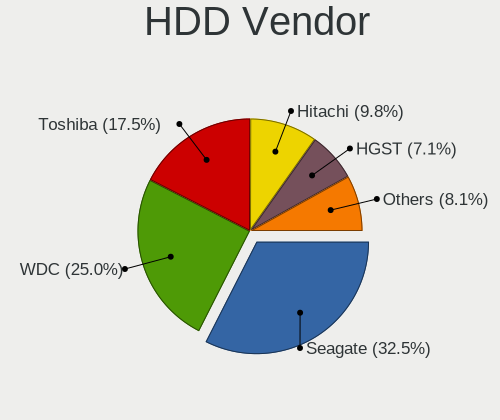
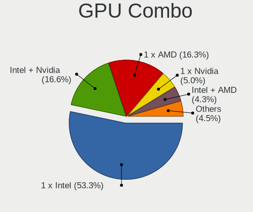

Linux Mint - Tested Hardware & Statistics (Notebooks)
-----------------------------------------------------

A project to collect tested hardware configurations for Linux Mint.

Anyone can contribute to this report by the [hw-probe](https://github.com/linuxhw/hw-probe) tool:

    sudo -E hw-probe -all -upload

Please contribute! Especially if your hardware is rare.

Contents
--------

* [ Test Cases ](#test-cases)

* [ System ](#system)
  - [ OS                       ](#os)
  - [ OS Family                ](#os-family)
  - [ Kernel                   ](#kernel)
  - [ Kernel Family            ](#kernel-family)
  - [ Kernel Major Ver.        ](#kernel-major-ver)
  - [ Arch                     ](#arch)
  - [ DE                       ](#de)
  - [ Display Server           ](#display-server)
  - [ Display Manager          ](#display-manager)
  - [ OS Lang                  ](#os-lang)
  - [ Boot Mode                ](#boot-mode)
  - [ Filesystem               ](#filesystem)
  - [ Part. scheme             ](#part-scheme)
  - [ Dual Boot with Linux/BSD ](#dual-boot-with-linuxbsd)
  - [ Dual Boot (Win)          ](#dual-boot-win)

* [ Board ](#board)
  - [ Vendor                   ](#vendor)
  - [ Model                    ](#model)
  - [ Model Family             ](#model-family)
  - [ MFG Year                 ](#mfg-year)
  - [ Form Factor              ](#form-factor)
  - [ Secure Boot              ](#secure-boot)
  - [ Coreboot                 ](#coreboot)
  - [ RAM Size                 ](#ram-size)
  - [ RAM Used                 ](#ram-used)
  - [ Total Drives             ](#total-drives)
  - [ Has CD-ROM               ](#has-cd-rom)
  - [ Has Ethernet             ](#has-ethernet)
  - [ Has WiFi                 ](#has-wifi)
  - [ Has Bluetooth            ](#has-bluetooth)

* [ Location ](#location)
  - [ Country                  ](#country)
  - [ City                     ](#city)

* [ Drives ](#drives)
  - [ Drive Vendor             ](#drive-vendor)
  - [ Drive Model              ](#drive-model)
  - [ HDD Vendor               ](#hdd-vendor)
  - [ SSD Vendor               ](#ssd-vendor)
  - [ Drive Kind               ](#drive-kind)
  - [ Drive Connector          ](#drive-connector)
  - [ Drive Size               ](#drive-size)
  - [ Space Total              ](#space-total)
  - [ Space Used               ](#space-used)
  - [ Malfunc. Drives          ](#malfunc-drives)
  - [ Malfunc. Drive Vendor    ](#malfunc-drive-vendor)
  - [ Malfunc. HDD Vendor      ](#malfunc-hdd-vendor)
  - [ Malfunc. Drive Kind      ](#malfunc-drive-kind)
  - [ Failed Drives            ](#failed-drives)
  - [ Failed Drive Vendor      ](#failed-drive-vendor)
  - [ Drive Status             ](#drive-status)

* [ Storage controller ](#storage-controller)
  - [ Storage Vendor           ](#storage-vendor)
  - [ Storage Model            ](#storage-model)
  - [ Storage Kind             ](#storage-kind)

* [ Processor ](#processor)
  - [ CPU Vendor               ](#cpu-vendor)
  - [ CPU Model                ](#cpu-model)
  - [ CPU Model Family         ](#cpu-model-family)
  - [ CPU Cores                ](#cpu-cores)
  - [ CPU Sockets              ](#cpu-sockets)
  - [ CPU Threads              ](#cpu-threads)
  - [ CPU Op-Modes             ](#cpu-op-modes)
  - [ CPU Microcode            ](#cpu-microcode)
  - [ CPU Microarch            ](#cpu-microarch)

* [ Graphics ](#graphics)
  - [ GPU Vendor               ](#gpu-vendor)
  - [ GPU Model                ](#gpu-model)
  - [ GPU Combo                ](#gpu-combo)
  - [ GPU Driver               ](#gpu-driver)
  - [ GPU Memory               ](#gpu-memory)

* [ Monitor ](#monitor)
  - [ Monitor Vendor           ](#monitor-vendor)
  - [ Monitor Model            ](#monitor-model)
  - [ Monitor Resolution       ](#monitor-resolution)
  - [ Monitor Diagonal         ](#monitor-diagonal)
  - [ Monitor Width            ](#monitor-width)
  - [ Aspect Ratio             ](#aspect-ratio)
  - [ Monitor Area             ](#monitor-area)
  - [ Pixel Density            ](#pixel-density)
  - [ Multiple Monitors        ](#multiple-monitors)

* [ Network ](#network)
  - [ Net Controller Vendor    ](#net-controller-vendor)
  - [ Net Controller Model     ](#net-controller-model)
  - [ Wireless Vendor          ](#wireless-vendor)
  - [ Wireless Model           ](#wireless-model)
  - [ Ethernet Vendor          ](#ethernet-vendor)
  - [ Ethernet Model           ](#ethernet-model)
  - [ Net Controller Kind      ](#net-controller-kind)
  - [ Used Controller          ](#used-controller)
  - [ NICs                     ](#nics)
  - [ IPv6                     ](#ipv6)

* [ Bluetooth ](#bluetooth)
  - [ Bluetooth Vendor         ](#bluetooth-vendor)
  - [ Bluetooth Model          ](#bluetooth-model)

* [ Sound ](#sound)
  - [ Sound Vendor             ](#sound-vendor)
  - [ Sound Model              ](#sound-model)

* [ Memory ](#memory)
  - [ Memory Vendor            ](#memory-vendor)
  - [ Memory Model             ](#memory-model)
  - [ Memory Kind              ](#memory-kind)
  - [ Memory Form Factor       ](#memory-form-factor)
  - [ Memory Size              ](#memory-size)
  - [ Memory Speed             ](#memory-speed)

* [ Printers & scanners ](#printers--scanners)
  - [ Printer Vendor           ](#printer-vendor)
  - [ Printer Model            ](#printer-model)
  - [ Scanner Vendor           ](#scanner-vendor)
  - [ Scanner Model            ](#scanner-model)

* [ Camera ](#camera)
  - [ Camera Vendor            ](#camera-vendor)
  - [ Camera Model             ](#camera-model)

* [ Security ](#security)
  - [ Fingerprint Vendor       ](#fingerprint-vendor)
  - [ Fingerprint Model        ](#fingerprint-model)
  - [ Chipcard Vendor          ](#chipcard-vendor)
  - [ Chipcard Model           ](#chipcard-model)

* [ Unsupported ](#unsupported)
  - [ Unsupported Devices      ](#unsupported-devices)
  - [ Unsupported Device Types ](#unsupported-device-types)

Test Cases
----------

Total: 14281

| Vendor        | Model                       | Probe                                                      | Date         |
|---------------|-----------------------------|------------------------------------------------------------|--------------|
| Lenovo        | ThinkPad T440p 20AN0069U... | [a2ddfa44e7](https://linux-hardware.org/?probe=a2ddfa44e7) | Jun 10, 2023 |
| Apple         | MacBookPro11,3              | [b7dfbae839](https://linux-hardware.org/?probe=b7dfbae839) | Jun 10, 2023 |
| HP            | Pavilion dv6                | [1388a433de](https://linux-hardware.org/?probe=1388a433de) | Jun 10, 2023 |
| Lenovo        | IdeaPad N580 20182          | [8990fd0b51](https://linux-hardware.org/?probe=8990fd0b51) | Jun 10, 2023 |
| HP            | EliteBook 840 G2            | [770045a9fc](https://linux-hardware.org/?probe=770045a9fc) | Jun 10, 2023 |
| Apple         | MacBookPro9,2               | [3554e00d28](https://linux-hardware.org/?probe=3554e00d28) | Jun 10, 2023 |
| Samsung       | N102SP/N100SP/N101SP        | [c31b0e5f30](https://linux-hardware.org/?probe=c31b0e5f30) | Jun 10, 2023 |
| Lenovo        | IdeaPad Gaming 3 15ARH05... | [bdca36306b](https://linux-hardware.org/?probe=bdca36306b) | Jun 10, 2023 |
| Gigabyte      | P57V6                       | [a2ce7ccc80](https://linux-hardware.org/?probe=a2ce7ccc80) | Jun 09, 2023 |
| Dell          | Vostro 3500                 | [c64ff76dba](https://linux-hardware.org/?probe=c64ff76dba) | Jun 09, 2023 |
| Sony          | VPCEB2AFD                   | [1d9d6ddd74](https://linux-hardware.org/?probe=1d9d6ddd74) | Jun 09, 2023 |
| Dell          | Latitude 5420               | [956a995580](https://linux-hardware.org/?probe=956a995580) | Jun 09, 2023 |
| Dell          | Precision M4600             | [a79a783515](https://linux-hardware.org/?probe=a79a783515) | Jun 09, 2023 |
| HP            | 255 15.6 inch G9 Noteboo... | [50c36acc0d](https://linux-hardware.org/?probe=50c36acc0d) | Jun 09, 2023 |
| Fujitsu       | LIFEBOOK E754               | [4d09f42447](https://linux-hardware.org/?probe=4d09f42447) | Jun 09, 2023 |
| HP            | EliteBook 8440p             | [b88712538e](https://linux-hardware.org/?probe=b88712538e) | Jun 09, 2023 |
| Panasonic     | CF-S10CDHEDM                | [19b6085754](https://linux-hardware.org/?probe=19b6085754) | Jun 09, 2023 |
| Lenovo        | IdeaPad 3 14ALC6 82KT       | [c35e22de2b](https://linux-hardware.org/?probe=c35e22de2b) | Jun 09, 2023 |
| Lenovo        | IdeaPad 3 14ALC6 82KT       | [68be9da7f1](https://linux-hardware.org/?probe=68be9da7f1) | Jun 09, 2023 |
| HP            | Notebook                    | [e292bb9d5a](https://linux-hardware.org/?probe=e292bb9d5a) | Jun 09, 2023 |
| HP            | EliteBook 8440p             | [51bfdec531](https://linux-hardware.org/?probe=51bfdec531) | Jun 09, 2023 |
| HP            | Laptop 15-ef1xxx            | [931b9e2b05](https://linux-hardware.org/?probe=931b9e2b05) | Jun 08, 2023 |
| Lenovo        | ThinkPad X280 20KES5SE22    | [c25a510191](https://linux-hardware.org/?probe=c25a510191) | Jun 08, 2023 |
| Lenovo        | Z50-70 20354                | [28a5b69096](https://linux-hardware.org/?probe=28a5b69096) | Jun 08, 2023 |
| ASUSTek       | X580VN                      | [8c1cf3f164](https://linux-hardware.org/?probe=8c1cf3f164) | Jun 08, 2023 |
| HP            | EliteBook 840 G3            | [cd3bb98a1e](https://linux-hardware.org/?probe=cd3bb98a1e) | Jun 08, 2023 |
| Micro Comp... | NUCXI7                      | [3b930f4e22](https://linux-hardware.org/?probe=3b930f4e22) | Jun 08, 2023 |
| ASUSTek       | VivoBook_ASUSLaptop X160... | [3acaedf40f](https://linux-hardware.org/?probe=3acaedf40f) | Jun 08, 2023 |
| Apple         | MacBook4,1                  | [c8ee97b7b9](https://linux-hardware.org/?probe=c8ee97b7b9) | Jun 07, 2023 |
| HP            | 255 15.6 inch G9 Noteboo... | [73fa9d854f](https://linux-hardware.org/?probe=73fa9d854f) | Jun 07, 2023 |
| ASUSTek       | ASUS TUF Gaming A15 FA50... | [6a98d856ee](https://linux-hardware.org/?probe=6a98d856ee) | Jun 07, 2023 |
| Lenovo        | IdeaPad S340-15IIL 81WL     | [6062ee64a9](https://linux-hardware.org/?probe=6062ee64a9) | Jun 07, 2023 |
| Acer          | Predator PT515-51           | [0a6efd54ad](https://linux-hardware.org/?probe=0a6efd54ad) | Jun 07, 2023 |
| HP            | Pavilion Notebook           | [9ef95ad480](https://linux-hardware.org/?probe=9ef95ad480) | Jun 07, 2023 |
| Samsung       | 450R5J/450R5Q/4550RJ        | [4b679d78eb](https://linux-hardware.org/?probe=4b679d78eb) | Jun 07, 2023 |
| MSI           | GE70 2PE                    | [c62d13879f](https://linux-hardware.org/?probe=c62d13879f) | Jun 06, 2023 |
| ASUSTek       | VivoBook_ASUSLaptop M650... | [1e5a50fa47](https://linux-hardware.org/?probe=1e5a50fa47) | Jun 06, 2023 |
| Lenovo        | V330-15IKB 81AX             | [476a44deee](https://linux-hardware.org/?probe=476a44deee) | Jun 06, 2023 |
| Lenovo        | IdeaPad Z500 20202          | [2f138401f6](https://linux-hardware.org/?probe=2f138401f6) | Jun 06, 2023 |
| Acer          | Aspire V5-572P              | [cdb5005799](https://linux-hardware.org/?probe=cdb5005799) | Jun 06, 2023 |
| Acer          | Aspire V5-572P              | [49745927a0](https://linux-hardware.org/?probe=49745927a0) | Jun 06, 2023 |
| Dell          | Precision M4800             | [f1c43c9acd](https://linux-hardware.org/?probe=f1c43c9acd) | Jun 06, 2023 |
| Acer          | Aspire A517-53              | [a039ca0054](https://linux-hardware.org/?probe=a039ca0054) | Jun 05, 2023 |
| Compaq        | CQ-27                       | [ae3d9bce8c](https://linux-hardware.org/?probe=ae3d9bce8c) | Jun 05, 2023 |
| Acer          | Nitro AN515-52              | [e9d79e576b](https://linux-hardware.org/?probe=e9d79e576b) | Jun 05, 2023 |
| Acer          | Aspire ES1-711              | [5534470ef5](https://linux-hardware.org/?probe=5534470ef5) | Jun 05, 2023 |
| Acer          | Aspire ES1-571              | [ed19db3614](https://linux-hardware.org/?probe=ed19db3614) | Jun 05, 2023 |
| HP            | Laptop 17-cp0xxx            | [b142b6de06](https://linux-hardware.org/?probe=b142b6de06) | Jun 05, 2023 |
| HP            | EliteBook 840 G3            | [7c35e9a268](https://linux-hardware.org/?probe=7c35e9a268) | Jun 04, 2023 |
| Jumper        | EZbook                      | [950179fe29](https://linux-hardware.org/?probe=950179fe29) | Jun 04, 2023 |
| Lenovo        | ThinkPad T480 20L6S29E1S    | [4d9e4fb129](https://linux-hardware.org/?probe=4d9e4fb129) | Jun 04, 2023 |
| Dell          | Latitude E5440              | [02b3462a2c](https://linux-hardware.org/?probe=02b3462a2c) | Jun 04, 2023 |
| HP            | Compaq Presario CQ60        | [5716ed966d](https://linux-hardware.org/?probe=5716ed966d) | Jun 04, 2023 |
| HP            | Compaq Presario CQ60        | [a3d127e3ba](https://linux-hardware.org/?probe=a3d127e3ba) | Jun 04, 2023 |
| Acer          | Aspire E5-573G              | [3ef3c9ec82](https://linux-hardware.org/?probe=3ef3c9ec82) | Jun 04, 2023 |
| HP            | EliteBook 840 G1            | [4840dda2e3](https://linux-hardware.org/?probe=4840dda2e3) | Jun 04, 2023 |
| Acer          | Swift SF316-51              | [4ba1405836](https://linux-hardware.org/?probe=4ba1405836) | Jun 04, 2023 |
| Acer          | Aspire E1-572P              | [a90316cac7](https://linux-hardware.org/?probe=a90316cac7) | Jun 04, 2023 |
| Toshiba       | Satellite Pro L300          | [968005c798](https://linux-hardware.org/?probe=968005c798) | Jun 04, 2023 |
| Lenovo        | ThinkPad T430 2349DS5       | [e6492d37d8](https://linux-hardware.org/?probe=e6492d37d8) | Jun 03, 2023 |
| Alienware     | M15x                        | [4b17185ae7](https://linux-hardware.org/?probe=4b17185ae7) | Jun 03, 2023 |
| ASUSTek       | ROG Strix G712LW_G712LW     | [04fdc3c3b8](https://linux-hardware.org/?probe=04fdc3c3b8) | Jun 03, 2023 |
| Dell          | Precision 5540              | [f9f2304792](https://linux-hardware.org/?probe=f9f2304792) | Jun 03, 2023 |
| HP            | Compaq Presario CQ60        | [2378902ae8](https://linux-hardware.org/?probe=2378902ae8) | Jun 03, 2023 |
| Toshiba       | Satellite C55t-C            | [3b83df3cc9](https://linux-hardware.org/?probe=3b83df3cc9) | Jun 03, 2023 |
| Toshiba       | Satellite L50-C             | [7b1b547b11](https://linux-hardware.org/?probe=7b1b547b11) | Jun 03, 2023 |
| HP            | Laptop 14-bw0xx             | [3958079ad5](https://linux-hardware.org/?probe=3958079ad5) | Jun 03, 2023 |
| Lenovo        | ThinkPad 11e 5th Gen 20L... | [2f018635f3](https://linux-hardware.org/?probe=2f018635f3) | Jun 03, 2023 |
| Acer          | Aspire A515-45              | [f661806559](https://linux-hardware.org/?probe=f661806559) | Jun 02, 2023 |
| Dell          | Latitude E5470              | [daa15a6cb0](https://linux-hardware.org/?probe=daa15a6cb0) | Jun 02, 2023 |
| Dell          | Latitude E5470              | [92d3a8b502](https://linux-hardware.org/?probe=92d3a8b502) | Jun 02, 2023 |
| Dell          | Latitude E6410              | [096873c567](https://linux-hardware.org/?probe=096873c567) | Jun 02, 2023 |
| Dell          | Inspiron N4030              | [3c92b81349](https://linux-hardware.org/?probe=3c92b81349) | Jun 02, 2023 |
| Dell          | Inspiron N4030              | [1aca93ba38](https://linux-hardware.org/?probe=1aca93ba38) | Jun 02, 2023 |
| Lenovo        | ThinkPad T470 W10DG 20JN... | [2cacb34a0d](https://linux-hardware.org/?probe=2cacb34a0d) | Jun 02, 2023 |
| Apple         | MacBookPro12,1              | [f8e0e519ad](https://linux-hardware.org/?probe=f8e0e519ad) | Jun 02, 2023 |
| Lenovo        | IdeaPad 320-15IKB 80YH      | [55c7d4b615](https://linux-hardware.org/?probe=55c7d4b615) | Jun 02, 2023 |
| HP            | 420                         | [0e369b273b](https://linux-hardware.org/?probe=0e369b273b) | Jun 02, 2023 |
| HP            | Split 13 x2 PC              | [5e3ae671cc](https://linux-hardware.org/?probe=5e3ae671cc) | Jun 01, 2023 |
| Lenovo        | IdeaPad 5 14ALC05 82LM      | [97b54068b7](https://linux-hardware.org/?probe=97b54068b7) | Jun 01, 2023 |
| Packard Be... | EasyNote TK11BZ             | [b1cbe3b6a6](https://linux-hardware.org/?probe=b1cbe3b6a6) | Jun 01, 2023 |
| HP            | Pavilion dv6600             | [5e2867ee61](https://linux-hardware.org/?probe=5e2867ee61) | Jun 01, 2023 |
| Lenovo        | ThinkPad W510 4391B49       | [1e1004a387](https://linux-hardware.org/?probe=1e1004a387) | Jun 01, 2023 |
| Acer          | Aspire A515-45              | [17621fb846](https://linux-hardware.org/?probe=17621fb846) | Jun 01, 2023 |
| ASUSTek       | N750JV                      | [acc54fe70f](https://linux-hardware.org/?probe=acc54fe70f) | Jun 01, 2023 |
| Acer          | Aspire A515-45              | [a57949da97](https://linux-hardware.org/?probe=a57949da97) | Jun 01, 2023 |
| Lenovo        | V17 G3 IAP 82U1             | [1be071e25d](https://linux-hardware.org/?probe=1be071e25d) | May 31, 2023 |
| Sony          | SVT1121B2EW                 | [67819a243c](https://linux-hardware.org/?probe=67819a243c) | May 31, 2023 |
| HP            | Pavilion Laptop 15-cs2xx... | [2bb50cdcc7](https://linux-hardware.org/?probe=2bb50cdcc7) | May 31, 2023 |
| Lenovo        | V15 G2 ALC 82KD             | [f168bc9d53](https://linux-hardware.org/?probe=f168bc9d53) | May 31, 2023 |
| Acer          | Aspire A515-45              | [f93dd394e8](https://linux-hardware.org/?probe=f93dd394e8) | May 31, 2023 |
| ASUSTek       | VivoBook_ASUSLaptop X515... | [1ea9c869ff](https://linux-hardware.org/?probe=1ea9c869ff) | May 31, 2023 |
| Toshiba       | Satellite C645D             | [dc642a7011](https://linux-hardware.org/?probe=dc642a7011) | May 31, 2023 |
| Toshiba       | Satellite C645D             | [32407daaa6](https://linux-hardware.org/?probe=32407daaa6) | May 31, 2023 |
| Google        | Bobba                       | [d47a75a3aa](https://linux-hardware.org/?probe=d47a75a3aa) | May 31, 2023 |
| Google        | Bobba                       | [9e2c41879c](https://linux-hardware.org/?probe=9e2c41879c) | May 31, 2023 |
| Lenovo        | IdeaPad 320-15IKB 80YH      | [1b457302ec](https://linux-hardware.org/?probe=1b457302ec) | May 31, 2023 |
| ASUSTek       | ZenBook UX425EA_UX425EA     | [b4b6bfda0c](https://linux-hardware.org/?probe=b4b6bfda0c) | May 31, 2023 |
| Acer          | E5-551G-871W                | [8034a1ee0b](https://linux-hardware.org/?probe=8034a1ee0b) | May 30, 2023 |
| Samsung       | R610                        | [4e3be533ba](https://linux-hardware.org/?probe=4e3be533ba) | May 30, 2023 |
| Acer          | Aspire 5749                 | [3bca2af88d](https://linux-hardware.org/?probe=3bca2af88d) | May 30, 2023 |
| Toshiba       | Satellite R630              | [5bf801ac1f](https://linux-hardware.org/?probe=5bf801ac1f) | May 30, 2023 |
| HP            | ENVY 15                     | [ad3cf182fe](https://linux-hardware.org/?probe=ad3cf182fe) | May 30, 2023 |
| Dell          | Vostro 15 3515              | [6bec5a03df](https://linux-hardware.org/?probe=6bec5a03df) | May 30, 2023 |
| Dell          | Inspiron 15-3567            | [dc6256036e](https://linux-hardware.org/?probe=dc6256036e) | May 30, 2023 |
| ASUSTek       | VivoBook_ASUSLaptop M650... | [7653baa0f8](https://linux-hardware.org/?probe=7653baa0f8) | May 30, 2023 |
| Dell          | Latitude 5400               | [fb192b5416](https://linux-hardware.org/?probe=fb192b5416) | May 30, 2023 |
| Lenovo        | Y520-15IKBN 80WK            | [e9830d0123](https://linux-hardware.org/?probe=e9830d0123) | May 29, 2023 |
| Dell          | Latitude 5400               | [838b2db21b](https://linux-hardware.org/?probe=838b2db21b) | May 29, 2023 |
| ASUSTek       | VivoBook_ASUSLaptop M650... | [89bb5ff663](https://linux-hardware.org/?probe=89bb5ff663) | May 29, 2023 |
| ASUSTek       | VivoBook_ASUSLaptop X415... | [9fce8d1e40](https://linux-hardware.org/?probe=9fce8d1e40) | May 29, 2023 |
| Acer          | Aspire ES1-571              | [6f75ba50c1](https://linux-hardware.org/?probe=6f75ba50c1) | May 29, 2023 |
| ASUSTek       | VivoBook_ASUSLaptop X515... | [04e1a849d0](https://linux-hardware.org/?probe=04e1a849d0) | May 29, 2023 |
| ASUSTek       | X550LD                      | [e091c09373](https://linux-hardware.org/?probe=e091c09373) | May 29, 2023 |
| GPU Compan... | GWTC116-2                   | [075486801a](https://linux-hardware.org/?probe=075486801a) | May 29, 2023 |
| Fujitsu       | CELSIUS H720                | [d7d19435c2](https://linux-hardware.org/?probe=d7d19435c2) | May 29, 2023 |
| HP            | Laptop 17-cp0xxx            | [5ac36928a5](https://linux-hardware.org/?probe=5ac36928a5) | May 28, 2023 |
| Acer          | Aspire ES1-571              | [a3da42e0e9](https://linux-hardware.org/?probe=a3da42e0e9) | May 28, 2023 |
| ASUSTek       | ZenBook UX431DA_UM431DA     | [22cbc01649](https://linux-hardware.org/?probe=22cbc01649) | May 28, 2023 |
| HP            | Compaq 6730s                | [fe2b8b63ac](https://linux-hardware.org/?probe=fe2b8b63ac) | May 28, 2023 |
| Apple         | MacBookPro16,2              | [993b013d0a](https://linux-hardware.org/?probe=993b013d0a) | May 28, 2023 |
| ASUSTek       | ROG Strix G713RW_G713RW     | [ef1ea73723](https://linux-hardware.org/?probe=ef1ea73723) | May 27, 2023 |
| ASUSTek       | TUF Gaming FX505DT_FX505... | [cb238efd5e](https://linux-hardware.org/?probe=cb238efd5e) | May 27, 2023 |
| Acer          | TravelMate 5735Z            | [9eea76e3ee](https://linux-hardware.org/?probe=9eea76e3ee) | May 27, 2023 |
| Wortmann      | CR700                       | [189f1ae92b](https://linux-hardware.org/?probe=189f1ae92b) | May 27, 2023 |
| HP            | 15                          | [f5373f2397](https://linux-hardware.org/?probe=f5373f2397) | May 27, 2023 |
| Acer          | Aspire ES1-571              | [029ea88e3b](https://linux-hardware.org/?probe=029ea88e3b) | May 27, 2023 |
| HP            | 15                          | [f30c3b3a95](https://linux-hardware.org/?probe=f30c3b3a95) | May 27, 2023 |
| Apple         | MacBookPro15,4              | [9ee2d1266b](https://linux-hardware.org/?probe=9ee2d1266b) | May 27, 2023 |
| Samsung       | 355V4C/356V4C/3445VC/354... | [9984b363d1](https://linux-hardware.org/?probe=9984b363d1) | May 27, 2023 |
| Samsung       | 270E5G/270E5U               | [affdf49716](https://linux-hardware.org/?probe=affdf49716) | May 27, 2023 |
| ASUSTek       | ASUS TUF Gaming A17 FA70... | [efe0b55153](https://linux-hardware.org/?probe=efe0b55153) | May 27, 2023 |
| Lenovo        | ThinkPad L512 44473HU       | [f9a27ab76b](https://linux-hardware.org/?probe=f9a27ab76b) | May 27, 2023 |
| Samsung       | 270E5G/270E5U               | [106bd355da](https://linux-hardware.org/?probe=106bd355da) | May 27, 2023 |
| Positivo      | C14CR21TV                   | [f3907d940d](https://linux-hardware.org/?probe=f3907d940d) | May 27, 2023 |
| HP            | 1000                        | [f3b014fa71](https://linux-hardware.org/?probe=f3b014fa71) | May 27, 2023 |
| Lenovo        | Unknown                     | [dbf5c576b2](https://linux-hardware.org/?probe=dbf5c576b2) | May 27, 2023 |
| Dell          | Latitude 5430               | [a0697218cc](https://linux-hardware.org/?probe=a0697218cc) | May 27, 2023 |
| HP            | Pavilion dm4                | [708daa02e2](https://linux-hardware.org/?probe=708daa02e2) | May 26, 2023 |
| HP            | Pavilion Laptop 14-ec0xx... | [4662e37743](https://linux-hardware.org/?probe=4662e37743) | May 26, 2023 |
| MSI           | CX700                       | [ecb1aaf9c1](https://linux-hardware.org/?probe=ecb1aaf9c1) | May 26, 2023 |
| Compumax C... | ONIX-CEL-0001               | [2f5d8e6789](https://linux-hardware.org/?probe=2f5d8e6789) | May 26, 2023 |
| HP            | ZBook Firefly 15 G7 Mobi... | [1b3b8c1912](https://linux-hardware.org/?probe=1b3b8c1912) | May 26, 2023 |
| Lenovo        | ThinkPad P51 20HJS01Q04     | [520eb0074c](https://linux-hardware.org/?probe=520eb0074c) | May 26, 2023 |
| Lenovo        | Slim 7 ProX 14ARH7 82V2     | [8558865a17](https://linux-hardware.org/?probe=8558865a17) | May 26, 2023 |
| Lenovo        | ThinkPad T450 20BUS06B00    | [d86873ceab](https://linux-hardware.org/?probe=d86873ceab) | May 26, 2023 |
| Itautec       | Infoway                     | [03be6afc10](https://linux-hardware.org/?probe=03be6afc10) | May 26, 2023 |
| Dell          | Latitude 7400               | [11ee0dea04](https://linux-hardware.org/?probe=11ee0dea04) | May 26, 2023 |
| Dell          | XPS 15 9570                 | [9723f3e325](https://linux-hardware.org/?probe=9723f3e325) | May 26, 2023 |
| Intel Clie... | LAPBC710                    | [7ed6d7079c](https://linux-hardware.org/?probe=7ed6d7079c) | May 26, 2023 |
| HP            | ZBook 15 G2                 | [b6d4eff333](https://linux-hardware.org/?probe=b6d4eff333) | May 26, 2023 |
| Acer          | TravelMate 6292             | [0a4cb3e4b3](https://linux-hardware.org/?probe=0a4cb3e4b3) | May 25, 2023 |
| HP            | ZBook 15 G2                 | [baae1e4c8b](https://linux-hardware.org/?probe=baae1e4c8b) | May 25, 2023 |
| Sony          | SVF1521B4E                  | [d6eaf68ef4](https://linux-hardware.org/?probe=d6eaf68ef4) | May 25, 2023 |
| Acer          | Aspire A515-54G             | [a6c2011fb0](https://linux-hardware.org/?probe=a6c2011fb0) | May 25, 2023 |
| Sony          | SVF1521B4E                  | [03c5deb4cc](https://linux-hardware.org/?probe=03c5deb4cc) | May 25, 2023 |
| Acer          | Aspire V3-371               | [f9200e891b](https://linux-hardware.org/?probe=f9200e891b) | May 25, 2023 |
| Acer          | Aspire A515-54G             | [e58d4b4aee](https://linux-hardware.org/?probe=e58d4b4aee) | May 25, 2023 |
| Lenovo        | IdeaPad Flex-14API 81SS     | [6e2419fcbf](https://linux-hardware.org/?probe=6e2419fcbf) | May 25, 2023 |
| Lenovo        | IdeaPad 3 15ADA05 81W1      | [3f7beed595](https://linux-hardware.org/?probe=3f7beed595) | May 25, 2023 |
| Lenovo        | IdeaPad 500-15ISK 80NT      | [a88cd7c5a6](https://linux-hardware.org/?probe=a88cd7c5a6) | May 25, 2023 |
| ASUSTek       | X551MA                      | [d72352c0dc](https://linux-hardware.org/?probe=d72352c0dc) | May 25, 2023 |
| Dell          | Latitude D630               | [ac84af2a69](https://linux-hardware.org/?probe=ac84af2a69) | May 25, 2023 |
| Compal        | JHL90 REFERENCE             | [0c115d29f3](https://linux-hardware.org/?probe=0c115d29f3) | May 25, 2023 |
| Dell          | Latitude 3330               | [a4c33168fa](https://linux-hardware.org/?probe=a4c33168fa) | May 25, 2023 |
| PHILCO ELE... | PNB15.6AP34H1W10            | [dc91cb92af](https://linux-hardware.org/?probe=dc91cb92af) | May 25, 2023 |
| ASUSTek       | ASUS TUF Gaming A17 FA70... | [ab42ac444e](https://linux-hardware.org/?probe=ab42ac444e) | May 24, 2023 |
| Fujitsu       | LIFEBOOK E752               | [0c7493d8d3](https://linux-hardware.org/?probe=0c7493d8d3) | May 24, 2023 |
| Lenovo        | ThinkPad T431s 20ACA01V0... | [253f7d5359](https://linux-hardware.org/?probe=253f7d5359) | May 24, 2023 |
| Dell          | Latitude D630               | [9e4709b942](https://linux-hardware.org/?probe=9e4709b942) | May 24, 2023 |
| Dell          | Inspiron 5567               | [24e9acec30](https://linux-hardware.org/?probe=24e9acec30) | May 24, 2023 |
| Dell          | Precision 5570              | [f014c35d45](https://linux-hardware.org/?probe=f014c35d45) | May 24, 2023 |
| Acer          | Aspire V3-731               | [d07d017c32](https://linux-hardware.org/?probe=d07d017c32) | May 24, 2023 |
| IX1401        | Unknown                     | [f1799b6c3a](https://linux-hardware.org/?probe=f1799b6c3a) | May 24, 2023 |
| DEXP          | Aquilon C14                 | [357a7caaf8](https://linux-hardware.org/?probe=357a7caaf8) | May 24, 2023 |
| DEXP          | Aquilon C14                 | [cd3dc35687](https://linux-hardware.org/?probe=cd3dc35687) | May 24, 2023 |
| Lenovo        | ThinkPad T410 2537AT1       | [babbb757c6](https://linux-hardware.org/?probe=babbb757c6) | May 24, 2023 |
| Acer          | Aspire E5-571G              | [6531b22151](https://linux-hardware.org/?probe=6531b22151) | May 24, 2023 |
| ASUSTek       | K73BR                       | [2b59c4c84c](https://linux-hardware.org/?probe=2b59c4c84c) | May 24, 2023 |
| Lenovo        | IdeaPad S340-15IIL 81WL     | [e8bc14fc34](https://linux-hardware.org/?probe=e8bc14fc34) | May 23, 2023 |
| Lenovo        | IdeaPad S340-15IIL 81WL     | [c5615351bb](https://linux-hardware.org/?probe=c5615351bb) | May 23, 2023 |
| HP            | Laptop 17-by3xxx            | [dcafbb2a69](https://linux-hardware.org/?probe=dcafbb2a69) | May 23, 2023 |
| HP            | Laptop 17-by3xxx            | [cbe27885cb](https://linux-hardware.org/?probe=cbe27885cb) | May 23, 2023 |
| Unknown       | Unknown                     | [da302bee4e](https://linux-hardware.org/?probe=da302bee4e) | May 23, 2023 |
| Lenovo        | ThinkPad Z13 Gen 1 21D2C... | [2cf9c98869](https://linux-hardware.org/?probe=2cf9c98869) | May 23, 2023 |
| Lenovo        | ThinkPad Z13 Gen 1 21D2C... | [4da667cc7e](https://linux-hardware.org/?probe=4da667cc7e) | May 23, 2023 |
| Dell          | Inspiron 5759               | [52b95d45ca](https://linux-hardware.org/?probe=52b95d45ca) | May 23, 2023 |
| Lenovo        | ThinkPad X250 20CLS65E00    | [e65932f3a9](https://linux-hardware.org/?probe=e65932f3a9) | May 23, 2023 |
| Acer          | Aspire A515-54              | [8db69494ad](https://linux-hardware.org/?probe=8db69494ad) | May 23, 2023 |
| Lenovo        | ThinkPad E460 20ETCTO1WW    | [cd2c3fbd45](https://linux-hardware.org/?probe=cd2c3fbd45) | May 23, 2023 |
| HP            | Notebook                    | [6e7c128799](https://linux-hardware.org/?probe=6e7c128799) | May 23, 2023 |
| Matsushita... | CF-W7BWAYZL3                | [a00f38be95](https://linux-hardware.org/?probe=a00f38be95) | May 23, 2023 |
| Sony          | SVE1513Q1ESI                | [eef57d6c26](https://linux-hardware.org/?probe=eef57d6c26) | May 23, 2023 |
| Medion        | E6224                       | [65c26a4a09](https://linux-hardware.org/?probe=65c26a4a09) | May 23, 2023 |
| Medion        | E6224                       | [8e10b22b1f](https://linux-hardware.org/?probe=8e10b22b1f) | May 23, 2023 |
| Dell          | Latitude 7490               | [f689b559e8](https://linux-hardware.org/?probe=f689b559e8) | May 22, 2023 |
| Acer          | Aspire V3-371               | [c6276aaa0c](https://linux-hardware.org/?probe=c6276aaa0c) | May 22, 2023 |
| ASUSTek       | Zenbook UM6702RA_RM6702R... | [03e6dd8808](https://linux-hardware.org/?probe=03e6dd8808) | May 22, 2023 |
| Acer          | Extensa 5635Z               | [dcff2c30c6](https://linux-hardware.org/?probe=dcff2c30c6) | May 22, 2023 |
| Dell          | Inspiron 3443               | [35923f74b5](https://linux-hardware.org/?probe=35923f74b5) | May 22, 2023 |
| Lenovo        | ThinkPad X230 2325AC2       | [bc1633cf27](https://linux-hardware.org/?probe=bc1633cf27) | May 22, 2023 |
| Lenovo        | Unknown                     | [563922ce1c](https://linux-hardware.org/?probe=563922ce1c) | May 22, 2023 |
| HP            | Laptop 17-cp0xxx            | [0148c19bc7](https://linux-hardware.org/?probe=0148c19bc7) | May 22, 2023 |
| Acer          | Aspire E1-470P              | [aecff3f4a9](https://linux-hardware.org/?probe=aecff3f4a9) | May 21, 2023 |
| Acer          | Aspire E5-571P              | [7130cf8b4e](https://linux-hardware.org/?probe=7130cf8b4e) | May 21, 2023 |
| Dell          | Inspiron 5402               | [0bc344e305](https://linux-hardware.org/?probe=0bc344e305) | May 21, 2023 |
| Lenovo        | ThinkPad T410 2537V32       | [cece14e931](https://linux-hardware.org/?probe=cece14e931) | May 21, 2023 |
| Acer          | Aspire A515-52G             | [a80648e2a4](https://linux-hardware.org/?probe=a80648e2a4) | May 21, 2023 |
| Samsung       | 350V5C/351V5C/3540VC/344... | [03b17bc271](https://linux-hardware.org/?probe=03b17bc271) | May 21, 2023 |
| Acer          | Aspire V5-572P              | [99f4730d26](https://linux-hardware.org/?probe=99f4730d26) | May 21, 2023 |
| Sony          | SVF1521B4E                  | [89c04d3b34](https://linux-hardware.org/?probe=89c04d3b34) | May 21, 2023 |
| HP            | Unknown                     | [8894bf0f31](https://linux-hardware.org/?probe=8894bf0f31) | May 21, 2023 |
| Apple         | MacBookPro15,1              | [438d9b5e18](https://linux-hardware.org/?probe=438d9b5e18) | May 21, 2023 |
| Sony          | VPCEL36FJ                   | [c372bac204](https://linux-hardware.org/?probe=c372bac204) | May 21, 2023 |
| Acer          | Aspire V5-572P              | [456d6c8887](https://linux-hardware.org/?probe=456d6c8887) | May 21, 2023 |
| Apple         | MacBookAir7,2               | [7687732509](https://linux-hardware.org/?probe=7687732509) | May 20, 2023 |
| Dell          | Inspiron N4050              | [ec1357e74e](https://linux-hardware.org/?probe=ec1357e74e) | May 20, 2023 |
| Alienware     | 17 R4                       | [c928d1557b](https://linux-hardware.org/?probe=c928d1557b) | May 20, 2023 |
| Lenovo        | G580 20150                  | [87e60904b9](https://linux-hardware.org/?probe=87e60904b9) | May 20, 2023 |
| Toshiba       | Satellite C870-1FZ          | [1f2563578e](https://linux-hardware.org/?probe=1f2563578e) | May 20, 2023 |
| HP            | EliteBook 840 G2            | [f0eaf024c8](https://linux-hardware.org/?probe=f0eaf024c8) | May 20, 2023 |
| HP            | Compaq 6730s                | [632961079b](https://linux-hardware.org/?probe=632961079b) | May 20, 2023 |
| Sony          | VPCSB35FG                   | [81d2592989](https://linux-hardware.org/?probe=81d2592989) | May 20, 2023 |
| Sony          | VPCSB35FG                   | [828fb24994](https://linux-hardware.org/?probe=828fb24994) | May 20, 2023 |
| Packard Be... | EasyNote MH36               | [a77cfa4947](https://linux-hardware.org/?probe=a77cfa4947) | May 20, 2023 |
| Lenovo        | ThinkPad L15 Gen 1 20U7S... | [2e78e77fef](https://linux-hardware.org/?probe=2e78e77fef) | May 19, 2023 |
| Eii           | WSA116                      | [cff66832fd](https://linux-hardware.org/?probe=cff66832fd) | May 19, 2023 |
| HP            | Notebook                    | [3664846c35](https://linux-hardware.org/?probe=3664846c35) | May 19, 2023 |
| ASUSTek       | ASUS EXPERTBOOK B2402CBA... | [13d783ec86](https://linux-hardware.org/?probe=13d783ec86) | May 19, 2023 |
| Dell          | Latitude E5430 non-vPro     | [6d6cdfc735](https://linux-hardware.org/?probe=6d6cdfc735) | May 19, 2023 |
| Apple         | MacBookPro11,3              | [3de00073ba](https://linux-hardware.org/?probe=3de00073ba) | May 19, 2023 |
| HP            | Laptop 17-ca0xxx            | [c1f8fc5eed](https://linux-hardware.org/?probe=c1f8fc5eed) | May 19, 2023 |
| Lenovo        | ThinkPad T400 2767E53       | [5cd6c87b7e](https://linux-hardware.org/?probe=5cd6c87b7e) | May 18, 2023 |
| Lenovo        | ThinkPad T490s 20NXS01Y0... | [277ed003ce](https://linux-hardware.org/?probe=277ed003ce) | May 18, 2023 |
| HP            | EliteBook 745 G4            | [7c6154717b](https://linux-hardware.org/?probe=7c6154717b) | May 18, 2023 |
| HP            | Laptop 14s-dq0xxx           | [6173aa2164](https://linux-hardware.org/?probe=6173aa2164) | May 18, 2023 |
| HP            | Stream Notebook PC 14       | [835c46e8e2](https://linux-hardware.org/?probe=835c46e8e2) | May 18, 2023 |
| ASUSTek       | K73SV                       | [d1d5700b2c](https://linux-hardware.org/?probe=d1d5700b2c) | May 18, 2023 |
| Lenovo        | ThinkPad Z13 Gen 1 21D20... | [8c15641d9d](https://linux-hardware.org/?probe=8c15641d9d) | May 18, 2023 |
| Dell          | Latitude E7240              | [208261238e](https://linux-hardware.org/?probe=208261238e) | May 18, 2023 |
| Dell          | Latitude E7240              | [faf148036f](https://linux-hardware.org/?probe=faf148036f) | May 18, 2023 |
| Dell          | Latitude E6410              | [3718cd0c74](https://linux-hardware.org/?probe=3718cd0c74) | May 18, 2023 |
| ASUSTek       | X541SA                      | [c88acf1dbc](https://linux-hardware.org/?probe=c88acf1dbc) | May 18, 2023 |
| Medion        | E6232                       | [a447a0aba0](https://linux-hardware.org/?probe=a447a0aba0) | May 18, 2023 |
| Alcor Digi... | Snugbook N1431              | [a04e4c387e](https://linux-hardware.org/?probe=a04e4c387e) | May 17, 2023 |
| HP            | Pavilion Laptop 15-eg1xx... | [b5aef01bc9](https://linux-hardware.org/?probe=b5aef01bc9) | May 17, 2023 |
| HP            | EliteBook 820 G2            | [200610da74](https://linux-hardware.org/?probe=200610da74) | May 17, 2023 |
| Unknown       | Unknown                     | [0323142e79](https://linux-hardware.org/?probe=0323142e79) | May 17, 2023 |
| HP            | Laptop 17-ca0xxx            | [f93ee0d717](https://linux-hardware.org/?probe=f93ee0d717) | May 17, 2023 |
| Unknown       | Unknown                     | [d734e52f59](https://linux-hardware.org/?probe=d734e52f59) | May 17, 2023 |
| HP            | Laptop 14s-dq0xxx           | [0a08d453f7](https://linux-hardware.org/?probe=0a08d453f7) | May 17, 2023 |
| Dell          | Latitude E7240              | [1990186432](https://linux-hardware.org/?probe=1990186432) | May 17, 2023 |
| Lenovo        | ThinkPad Edge E530 62722... | [baa1b942cf](https://linux-hardware.org/?probe=baa1b942cf) | May 17, 2023 |
| ASUSTek       | G750JM                      | [2a93ec6ed8](https://linux-hardware.org/?probe=2a93ec6ed8) | May 17, 2023 |
| Dell          | Vostro 5402                 | [00e3bf6a3e](https://linux-hardware.org/?probe=00e3bf6a3e) | May 17, 2023 |
| Lenovo        | ThinkPad T470 W10DG 20JN... | [44bc1d8d62](https://linux-hardware.org/?probe=44bc1d8d62) | May 17, 2023 |
| Dell          | Latitude E5510              | [74ecc09f16](https://linux-hardware.org/?probe=74ecc09f16) | May 17, 2023 |
| Dell          | Latitude 7430               | [eb576d7c2a](https://linux-hardware.org/?probe=eb576d7c2a) | May 17, 2023 |
| Dell          | Inspiron 5759               | [228fa2798d](https://linux-hardware.org/?probe=228fa2798d) | May 16, 2023 |
| Dell          | Inspiron 5759               | [32d4567b37](https://linux-hardware.org/?probe=32d4567b37) | May 16, 2023 |
| HP            | Laptop 15-bw0xx             | [87689f0ec7](https://linux-hardware.org/?probe=87689f0ec7) | May 16, 2023 |
| Lenovo        | V14 G2 ALC 82KC             | [de2456eae8](https://linux-hardware.org/?probe=de2456eae8) | May 16, 2023 |
| Acer          | Nitro AN515-45              | [62e3c494bd](https://linux-hardware.org/?probe=62e3c494bd) | May 16, 2023 |
| HUAWEI        | KLVD-WXX9                   | [93805fe2f6](https://linux-hardware.org/?probe=93805fe2f6) | May 16, 2023 |
| Dell          | Latitude E5530 non-vPro     | [1d5a340968](https://linux-hardware.org/?probe=1d5a340968) | May 16, 2023 |
| SLIMBOOK      | Executive                   | [0a70f31ce9](https://linux-hardware.org/?probe=0a70f31ce9) | May 16, 2023 |
| ASUSTek       | X541UAK                     | [00685614c4](https://linux-hardware.org/?probe=00685614c4) | May 16, 2023 |
| HP            | EliteBook 850 G5            | [1b444989b5](https://linux-hardware.org/?probe=1b444989b5) | May 16, 2023 |
| ASUSTek       | VivoBook_ASUSLaptop X515... | [c62b63f5bf](https://linux-hardware.org/?probe=c62b63f5bf) | May 16, 2023 |
| Lenovo        | ThinkPad L15 Gen 2 20X30... | [24cb48f7d7](https://linux-hardware.org/?probe=24cb48f7d7) | May 16, 2023 |
| HP            | ProBook 6570b               | [7d8b9d4be1](https://linux-hardware.org/?probe=7d8b9d4be1) | May 16, 2023 |
| Acer          | One Z1402                   | [390a684064](https://linux-hardware.org/?probe=390a684064) | May 16, 2023 |
| Dell          | Precision 5540              | [a97a05dd0e](https://linux-hardware.org/?probe=a97a05dd0e) | May 16, 2023 |
| PHILCO ELE... | PNB15.6AP34H1W10            | [4c4c7467ec](https://linux-hardware.org/?probe=4c4c7467ec) | May 16, 2023 |
| Positivo      | Q4128C-S                    | [05c0522fe3](https://linux-hardware.org/?probe=05c0522fe3) | May 16, 2023 |
| eMachines     | E625                        | [8638b2b8c8](https://linux-hardware.org/?probe=8638b2b8c8) | May 15, 2023 |
| Lenovo        | IdeaPad 320-15IKB 80YH      | [fe4f47ccc9](https://linux-hardware.org/?probe=fe4f47ccc9) | May 15, 2023 |
| Dell          | Inspiron N5010              | [98f448ed70](https://linux-hardware.org/?probe=98f448ed70) | May 15, 2023 |
| Sony          | SVF1521B4E                  | [ec03e769b8](https://linux-hardware.org/?probe=ec03e769b8) | May 15, 2023 |
| Dell          | Precision 7520              | [cbfb960bae](https://linux-hardware.org/?probe=cbfb960bae) | May 15, 2023 |
| Dell          | Precision 7520              | [a42d1a8bf5](https://linux-hardware.org/?probe=a42d1a8bf5) | May 15, 2023 |
| Toshiba       | Satellite Pro R50-B         | [dda235ab03](https://linux-hardware.org/?probe=dda235ab03) | May 15, 2023 |
| Toshiba       | Satellite Pro R50-B         | [f9535b38b0](https://linux-hardware.org/?probe=f9535b38b0) | May 15, 2023 |
| Dell          | Latitude E6530              | [632b8094e3](https://linux-hardware.org/?probe=632b8094e3) | May 15, 2023 |
| ASUSTek       | VivoBook_ASUSLaptop M760... | [a8bef903b0](https://linux-hardware.org/?probe=a8bef903b0) | May 15, 2023 |
| Lenovo        | IdeaPad S145-15API 81UT     | [3466945196](https://linux-hardware.org/?probe=3466945196) | May 15, 2023 |
| Sony          | VGN-FW51MF_H                | [572b403a00](https://linux-hardware.org/?probe=572b403a00) | May 14, 2023 |
| Sony          | VGN-FW51MF_H                | [0b0cc4f60e](https://linux-hardware.org/?probe=0b0cc4f60e) | May 14, 2023 |
| Lenovo        | ThinkBook 15p Gen 2 21B1    | [83537861c1](https://linux-hardware.org/?probe=83537861c1) | May 14, 2023 |
| Mediacom      | SmartBook 14 FullHD - SB... | [ca65ed1052](https://linux-hardware.org/?probe=ca65ed1052) | May 14, 2023 |
| MSI           | GF65 Thin 10UE              | [7d8bb12818](https://linux-hardware.org/?probe=7d8bb12818) | May 14, 2023 |
| Dell          | Precision 5540              | [22e1b4dbd4](https://linux-hardware.org/?probe=22e1b4dbd4) | May 14, 2023 |
| Mediacom      | SmartBook 14 FullHD - SB... | [1bb0ed422e](https://linux-hardware.org/?probe=1bb0ed422e) | May 14, 2023 |
| Lenovo        | Legion Y540-15IRH 81RJ      | [9eb38c956d](https://linux-hardware.org/?probe=9eb38c956d) | May 14, 2023 |
| ASUSTek       | S451LB                      | [f43e2b2679](https://linux-hardware.org/?probe=f43e2b2679) | May 13, 2023 |
| HP            | Pavilion g6                 | [ae314222ad](https://linux-hardware.org/?probe=ae314222ad) | May 13, 2023 |
| ASUSTek       | X551CA                      | [df0583682c](https://linux-hardware.org/?probe=df0583682c) | May 13, 2023 |
| Acer          | Aspire ES1-531              | [56cdac831f](https://linux-hardware.org/?probe=56cdac831f) | May 13, 2023 |
| Lenovo        | IdeaPad 3 15ITL05 81X8      | [01506a3b08](https://linux-hardware.org/?probe=01506a3b08) | May 13, 2023 |
| Jumper        | EZbook                      | [56321a4f9c](https://linux-hardware.org/?probe=56321a4f9c) | May 13, 2023 |
| Fujitsu Si... | LIFEBOOK T5010              | [374128840e](https://linux-hardware.org/?probe=374128840e) | May 13, 2023 |
| HP            | Notebook                    | [ee7a6bde04](https://linux-hardware.org/?probe=ee7a6bde04) | May 13, 2023 |
| ASUSTek       | X411UA                      | [bd54bb7c02](https://linux-hardware.org/?probe=bd54bb7c02) | May 12, 2023 |
| Samsung       | 350V5C/351V5C/3540VC/344... | [6950584e4c](https://linux-hardware.org/?probe=6950584e4c) | May 12, 2023 |
| GPU Compan... | GWTN156-5                   | [be1ad465e4](https://linux-hardware.org/?probe=be1ad465e4) | May 12, 2023 |
| Digma         | EVE 15 P417 NP3158CXW01     | [2a93dcb797](https://linux-hardware.org/?probe=2a93dcb797) | May 12, 2023 |
| Lenovo        | ThinkPad X230 232578G       | [d71435c79a](https://linux-hardware.org/?probe=d71435c79a) | May 12, 2023 |
| Lenovo        | ThinkPad X230 232578G       | [62e7f77fdc](https://linux-hardware.org/?probe=62e7f77fdc) | May 12, 2023 |
| HP            | Pavilion Sleekbook 15       | [db2c740451](https://linux-hardware.org/?probe=db2c740451) | May 12, 2023 |
| Dell          | Latitude E7450              | [9dbbae1356](https://linux-hardware.org/?probe=9dbbae1356) | May 12, 2023 |
| HP            | 255 G7 Notebook PC          | [341a5673f2](https://linux-hardware.org/?probe=341a5673f2) | May 12, 2023 |
| Unknown       | Unknown                     | [00f98129ce](https://linux-hardware.org/?probe=00f98129ce) | May 11, 2023 |
| Acer          | Aspire E5-553G              | [cd65f81693](https://linux-hardware.org/?probe=cd65f81693) | May 11, 2023 |
| HP            | Laptop 14-dk0xxx            | [e644ef3b24](https://linux-hardware.org/?probe=e644ef3b24) | May 11, 2023 |
| Lenovo        | ThinkPad P50 20EN0037MD     | [f1a58d3a7f](https://linux-hardware.org/?probe=f1a58d3a7f) | May 11, 2023 |
| Dell          | Vostro 3501                 | [c6cb7f265a](https://linux-hardware.org/?probe=c6cb7f265a) | May 11, 2023 |
| ASUSTek       | VivoBook 15_ASUS Laptop ... | [af96be2497](https://linux-hardware.org/?probe=af96be2497) | May 11, 2023 |
| Dell          | Latitude E6430              | [48d104f2db](https://linux-hardware.org/?probe=48d104f2db) | May 11, 2023 |
| Dell          | XPS 15 9560                 | [62abfc3d83](https://linux-hardware.org/?probe=62abfc3d83) | May 11, 2023 |
| Dell          | XPS 15 9560                 | [4c714fc6ea](https://linux-hardware.org/?probe=4c714fc6ea) | May 11, 2023 |
| HP            | EliteBook 840 G6            | [bd7c97ad54](https://linux-hardware.org/?probe=bd7c97ad54) | May 11, 2023 |
| Mediacom      | SmartBook 14 FullHD - SB... | [e03da60adf](https://linux-hardware.org/?probe=e03da60adf) | May 11, 2023 |
| ASUSTek       | X411UA                      | [bc27160391](https://linux-hardware.org/?probe=bc27160391) | May 10, 2023 |
| Toshiba       | Satellite C660D             | [0337ec13a6](https://linux-hardware.org/?probe=0337ec13a6) | May 10, 2023 |
| ASUSTek       | X75VC                       | [cb14c4b8e0](https://linux-hardware.org/?probe=cb14c4b8e0) | May 10, 2023 |
| Dell          | Latitude E5530 non-vPro     | [07bcb8d332](https://linux-hardware.org/?probe=07bcb8d332) | May 10, 2023 |
| Acer          | Aspire 5332                 | [e74870bf17](https://linux-hardware.org/?probe=e74870bf17) | May 10, 2023 |
| HP            | Pavilion Gaming Laptop 1... | [b192a6461f](https://linux-hardware.org/?probe=b192a6461f) | May 10, 2023 |
| HP            | Presario CQ62               | [7619e0cff9](https://linux-hardware.org/?probe=7619e0cff9) | May 10, 2023 |
| HP            | Pavilion g7                 | [3a153ae1cb](https://linux-hardware.org/?probe=3a153ae1cb) | May 10, 2023 |
| HP            | Pavilion Gaming Laptop 1... | [3ea1fd6554](https://linux-hardware.org/?probe=3ea1fd6554) | May 10, 2023 |
| Medion        | E6232                       | [46e240ed2c](https://linux-hardware.org/?probe=46e240ed2c) | May 10, 2023 |
| Irbis         | NB143                       | [b4dd25345a](https://linux-hardware.org/?probe=b4dd25345a) | May 10, 2023 |
| HP            | Laptop 17-by2xxx            | [21faeddba9](https://linux-hardware.org/?probe=21faeddba9) | May 10, 2023 |
| Dell          | Latitude E5530 non-vPro     | [c821704a04](https://linux-hardware.org/?probe=c821704a04) | May 10, 2023 |
| Acer          | Aspire E5-553G              | [5312325c90](https://linux-hardware.org/?probe=5312325c90) | May 10, 2023 |
| HP            | Laptop 17-cp0xxx            | [b32a7122fc](https://linux-hardware.org/?probe=b32a7122fc) | May 10, 2023 |
| Dell          | XPS 9315                    | [291a190f04](https://linux-hardware.org/?probe=291a190f04) | May 10, 2023 |
| Notebook      | N150ZU                      | [bfd69adf4e](https://linux-hardware.org/?probe=bfd69adf4e) | May 10, 2023 |
| HP            | Pavilion dv6                | [735f9b7ee4](https://linux-hardware.org/?probe=735f9b7ee4) | May 10, 2023 |
| Acer          | Nitro AN515-42              | [ecc5e7ad1f](https://linux-hardware.org/?probe=ecc5e7ad1f) | May 10, 2023 |
| Acer          | Nitro AN515-42              | [9e6cff0c4b](https://linux-hardware.org/?probe=9e6cff0c4b) | May 10, 2023 |
| Alienware     | m15 R4                      | [fd952a9ef1](https://linux-hardware.org/?probe=fd952a9ef1) | May 09, 2023 |
| Lenovo        | ThinkPad T440s 20ARS06C0... | [543cce00c7](https://linux-hardware.org/?probe=543cce00c7) | May 09, 2023 |
| Dell          | Latitude 7420               | [4b8927333b](https://linux-hardware.org/?probe=4b8927333b) | May 09, 2023 |
| ASUSTek       | ROG Zephyrus G14 GA402RJ... | [8284f97803](https://linux-hardware.org/?probe=8284f97803) | May 09, 2023 |
| Sony          | SVT1312B4E                  | [dc0f581bc3](https://linux-hardware.org/?probe=dc0f581bc3) | May 09, 2023 |
| Lenovo        | ThinkPad T480 20L6S91L00    | [82c3d7dd74](https://linux-hardware.org/?probe=82c3d7dd74) | May 09, 2023 |
| Dell          | Latitude 7400               | [dd232bb43b](https://linux-hardware.org/?probe=dd232bb43b) | May 09, 2023 |
| Bluechip C... | TRAVELline B15W33           | [53091b3af6](https://linux-hardware.org/?probe=53091b3af6) | May 09, 2023 |
| ASUSTek       | X553MA                      | [4ab42c06ea](https://linux-hardware.org/?probe=4ab42c06ea) | May 09, 2023 |
| ASUSTek       | X553MA                      | [0952e2922b](https://linux-hardware.org/?probe=0952e2922b) | May 09, 2023 |
| Acer          | Aspire A515-45              | [922a0d7b9e](https://linux-hardware.org/?probe=922a0d7b9e) | May 09, 2023 |
| Acer          | Aspire A515-45              | [4df8233d54](https://linux-hardware.org/?probe=4df8233d54) | May 09, 2023 |
| Acer          | Aspire A514-54              | [dafa2886a3](https://linux-hardware.org/?probe=dafa2886a3) | May 09, 2023 |
| Lenovo        | ThinkPad P14s Gen 2a 21A... | [fba089b3d4](https://linux-hardware.org/?probe=fba089b3d4) | May 09, 2023 |
| Lenovo        | ThinkPad P14s Gen 2a 21A... | [f3abd29ef8](https://linux-hardware.org/?probe=f3abd29ef8) | May 09, 2023 |
| Fujitsu Si... | AMILO Pro Series V3525      | [6272f76b0b](https://linux-hardware.org/?probe=6272f76b0b) | May 09, 2023 |
| HP            | 255 G5                      | [4ed50eeba3](https://linux-hardware.org/?probe=4ed50eeba3) | May 09, 2023 |
| Lenovo        | ThinkPad T420 4180DS6       | [0d214af5a5](https://linux-hardware.org/?probe=0d214af5a5) | May 09, 2023 |
| Lenovo        | IdeaPad Gaming 3 15ARH05... | [4e95a5b88e](https://linux-hardware.org/?probe=4e95a5b88e) | May 08, 2023 |
| Fujitsu Si... | AMILO Pro Series V3525      | [e3cc11d5e4](https://linux-hardware.org/?probe=e3cc11d5e4) | May 08, 2023 |
| Acer          | Aspire A515-45              | [8f9a64c245](https://linux-hardware.org/?probe=8f9a64c245) | May 08, 2023 |
| ASUSTek       | ROG Strix G513QY_G513QY     | [3211c828a2](https://linux-hardware.org/?probe=3211c828a2) | May 08, 2023 |
| HP            | Compaq 6910p                | [c17dc1abcf](https://linux-hardware.org/?probe=c17dc1abcf) | May 08, 2023 |
| Samsung       | 550XBE/350XBE               | [479ad5c021](https://linux-hardware.org/?probe=479ad5c021) | May 08, 2023 |
| HP            | Laptop 15-da1xxx            | [e1313af3e6](https://linux-hardware.org/?probe=e1313af3e6) | May 08, 2023 |
| Lenovo        | G700 20251                  | [de7d5668d5](https://linux-hardware.org/?probe=de7d5668d5) | May 08, 2023 |
| HP            | Laptop 14-dq2xxx            | [0a639ba55d](https://linux-hardware.org/?probe=0a639ba55d) | May 08, 2023 |
| Acer          | Aspire 5732Z                | [ec45ea6206](https://linux-hardware.org/?probe=ec45ea6206) | May 08, 2023 |
| HUAWEI        | NBLB-WAX9N                  | [0ebb311510](https://linux-hardware.org/?probe=0ebb311510) | May 08, 2023 |
| Fujitsu       | LIFEBOOK E751               | [8a3bd16269](https://linux-hardware.org/?probe=8a3bd16269) | May 08, 2023 |
| Dell          | Precision 7520              | [351f777615](https://linux-hardware.org/?probe=351f777615) | May 08, 2023 |
| Apple         | MacBook3,1                  | [fca1201c9f](https://linux-hardware.org/?probe=fca1201c9f) | May 07, 2023 |
| Acer          | Aspire 8930                 | [1ec5df3fc1](https://linux-hardware.org/?probe=1ec5df3fc1) | May 07, 2023 |
| MSI           | GS70 2PC Stealth            | [370f9304b6](https://linux-hardware.org/?probe=370f9304b6) | May 07, 2023 |
| Toshiba       | Satellite C660              | [e80daaa2a0](https://linux-hardware.org/?probe=e80daaa2a0) | May 07, 2023 |
| Toshiba       | PORTEGE Z930                | [f87cd6e36c](https://linux-hardware.org/?probe=f87cd6e36c) | May 07, 2023 |
| Acer          | Aspire A715-72G             | [4915fb92ad](https://linux-hardware.org/?probe=4915fb92ad) | May 07, 2023 |
| HP            | Pavilion 11                 | [696ac990d2](https://linux-hardware.org/?probe=696ac990d2) | May 07, 2023 |
| Itautec       | Infoway a7420               | [52788f2c92](https://linux-hardware.org/?probe=52788f2c92) | May 07, 2023 |
| HP            | 2000                        | [0b62e5790b](https://linux-hardware.org/?probe=0b62e5790b) | May 07, 2023 |
| Fujitsu       | T900                        | [d0233bc511](https://linux-hardware.org/?probe=d0233bc511) | May 06, 2023 |
| HP            | Laptop 17-ca0xxx            | [96099a3217](https://linux-hardware.org/?probe=96099a3217) | May 06, 2023 |
| Dell          | Latitude E5430 non-vPro     | [59cdec7fce](https://linux-hardware.org/?probe=59cdec7fce) | May 06, 2023 |
| eMachines     | eME728                      | [031e24359e](https://linux-hardware.org/?probe=031e24359e) | May 06, 2023 |
| Sony          | SVF1521M6E                  | [82f869d683](https://linux-hardware.org/?probe=82f869d683) | May 06, 2023 |
| MSI           | GS43VR 7RE                  | [4eb5973faa](https://linux-hardware.org/?probe=4eb5973faa) | May 06, 2023 |
| HP            | Pavilion 15                 | [308afd60ea](https://linux-hardware.org/?probe=308afd60ea) | May 06, 2023 |
| Lenovo        | IdeaPad U510 20191          | [23414f0626](https://linux-hardware.org/?probe=23414f0626) | May 06, 2023 |
| HP            | Notebook                    | [74f9f1122e](https://linux-hardware.org/?probe=74f9f1122e) | May 06, 2023 |
| Acer          | Aspire E5-571G              | [4b45fabd96](https://linux-hardware.org/?probe=4b45fabd96) | May 05, 2023 |
| Lenovo        | IdeaPad 330-15AST 81D6      | [483415e8cb](https://linux-hardware.org/?probe=483415e8cb) | May 05, 2023 |
| Medion        | P8614                       | [831518705e](https://linux-hardware.org/?probe=831518705e) | May 05, 2023 |
| HP            | Pavilion 15                 | [2f59970cf9](https://linux-hardware.org/?probe=2f59970cf9) | May 05, 2023 |
| Acer          | Aspire E5-576               | [a73b11b28f](https://linux-hardware.org/?probe=a73b11b28f) | May 05, 2023 |
| Dell          | Latitude E5430 non-vPro     | [e9cfd8b8c4](https://linux-hardware.org/?probe=e9cfd8b8c4) | May 05, 2023 |
| Lenovo        | ThinkPad Edge E320 12988... | [5d3d3fb42e](https://linux-hardware.org/?probe=5d3d3fb42e) | May 05, 2023 |
| HUAWEI        | NBD-WXX9                    | [207442de78](https://linux-hardware.org/?probe=207442de78) | May 05, 2023 |
| ASUSTek       | ROG Strix G513RC_G513RC     | [d1dc588f69](https://linux-hardware.org/?probe=d1dc588f69) | May 05, 2023 |
| Lenovo        | ThinkPad W540 20BHS1J000    | [228aec8c45](https://linux-hardware.org/?probe=228aec8c45) | May 05, 2023 |
| Dell          | Latitude 5401               | [671e11d184](https://linux-hardware.org/?probe=671e11d184) | May 05, 2023 |
| HP            | Pavilion g4                 | [55a4a7978e](https://linux-hardware.org/?probe=55a4a7978e) | May 04, 2023 |
| HP            | Laptop 14-dq2xxx            | [856494ea85](https://linux-hardware.org/?probe=856494ea85) | May 04, 2023 |
| HP            | Pavilion Laptop 15-eh1xx... | [cc11b2dcde](https://linux-hardware.org/?probe=cc11b2dcde) | May 04, 2023 |
| Lenovo        | G50-30 80G0                 | [b322652461](https://linux-hardware.org/?probe=b322652461) | May 04, 2023 |
| Avell High... | C62 LIV                     | [b53a07f1a3](https://linux-hardware.org/?probe=b53a07f1a3) | May 04, 2023 |
| HP            | ProBook 650 G1              | [0cbc314c84](https://linux-hardware.org/?probe=0cbc314c84) | May 04, 2023 |
| ASUSTek       | ROG Strix G513RC_G513RC     | [9d3ea79ded](https://linux-hardware.org/?probe=9d3ea79ded) | May 04, 2023 |
| ASUSTek       | K61IC                       | [727b9fae92](https://linux-hardware.org/?probe=727b9fae92) | May 03, 2023 |
| Sony          | SVF1521G1EW                 | [b84b2ed08a](https://linux-hardware.org/?probe=b84b2ed08a) | May 03, 2023 |
| Acer          | Swift SF515-51T             | [80d7446f47](https://linux-hardware.org/?probe=80d7446f47) | May 03, 2023 |
| Dell          | Latitude E6420              | [3a89155791](https://linux-hardware.org/?probe=3a89155791) | May 03, 2023 |
| HP            | Pavilion dm4                | [cb567d8263](https://linux-hardware.org/?probe=cb567d8263) | May 03, 2023 |
| Acer          | TravelMate 5720             | [ad56dc6f51](https://linux-hardware.org/?probe=ad56dc6f51) | May 03, 2023 |
| Lenovo        | Yoga 7 16IRL8 82YN          | [71ec2fc5ea](https://linux-hardware.org/?probe=71ec2fc5ea) | May 03, 2023 |
| Lenovo        | Yoga 7 16IRL8 82YN          | [6936dcf305](https://linux-hardware.org/?probe=6936dcf305) | May 03, 2023 |
| HUAWEI        | BOM-WXX9                    | [fd0dee0606](https://linux-hardware.org/?probe=fd0dee0606) | May 03, 2023 |
| Dell          | Latitude 5480               | [a8b85d06d8](https://linux-hardware.org/?probe=a8b85d06d8) | May 03, 2023 |
| Fujitsu       | LIFEBOOK E752               | [22f50229d9](https://linux-hardware.org/?probe=22f50229d9) | May 03, 2023 |
| Apple         | MacBookPro12,1              | [ff5236b993](https://linux-hardware.org/?probe=ff5236b993) | May 03, 2023 |
| HP            | EliteBook 840 G3            | [f87b1ac774](https://linux-hardware.org/?probe=f87b1ac774) | May 03, 2023 |
| HP            | EliteBook 840 G3            | [d8b268f8f7](https://linux-hardware.org/?probe=d8b268f8f7) | May 03, 2023 |
| Acer          | Aspire V5-572P              | [a2e6cae633](https://linux-hardware.org/?probe=a2e6cae633) | May 02, 2023 |
| Acer          | Aspire V5-572P              | [00d2e57fb9](https://linux-hardware.org/?probe=00d2e57fb9) | May 02, 2023 |
| Packard Be... | EasyNote LJ65               | [795672236a](https://linux-hardware.org/?probe=795672236a) | May 02, 2023 |
| Packard Be... | EasyNote LJ65               | [77860cab79](https://linux-hardware.org/?probe=77860cab79) | May 02, 2023 |
| Dell          | Latitude 5400               | [62ecd90f1f](https://linux-hardware.org/?probe=62ecd90f1f) | May 02, 2023 |
| Unknown       | Unknown                     | [5434cb77bf](https://linux-hardware.org/?probe=5434cb77bf) | May 02, 2023 |
| Lenovo        | ThinkBook 15p Gen 2 21B1    | [0a9bdb3cea](https://linux-hardware.org/?probe=0a9bdb3cea) | May 02, 2023 |
| HP            | EliteBook 845 14 inch G9... | [528ba302c0](https://linux-hardware.org/?probe=528ba302c0) | May 02, 2023 |
| Google        | Kip                         | [19b726ec68](https://linux-hardware.org/?probe=19b726ec68) | May 02, 2023 |
| HP            | Pavilion g4                 | [1b616f1b81](https://linux-hardware.org/?probe=1b616f1b81) | May 02, 2023 |
| Intel Clie... | LAPRC510                    | [40c181b615](https://linux-hardware.org/?probe=40c181b615) | May 02, 2023 |
| Apple         | MacBook5,1                  | [69bee37d88](https://linux-hardware.org/?probe=69bee37d88) | May 01, 2023 |
| Toshiba       | Satellite C870-1FZ          | [dfbf38e06f](https://linux-hardware.org/?probe=dfbf38e06f) | May 01, 2023 |
| Timi          | RedmiBook 16                | [01706331eb](https://linux-hardware.org/?probe=01706331eb) | May 01, 2023 |
| Dell          | XPS 15 9570                 | [5b8daf89b4](https://linux-hardware.org/?probe=5b8daf89b4) | May 01, 2023 |
| Dell          | XPS 15 9570                 | [0f39841ca1](https://linux-hardware.org/?probe=0f39841ca1) | May 01, 2023 |
| ASUSTek       | ZenBook UX535LI             | [35adc352dd](https://linux-hardware.org/?probe=35adc352dd) | May 01, 2023 |
| ASUSTek       | K52Jc                       | [ae414cf185](https://linux-hardware.org/?probe=ae414cf185) | May 01, 2023 |
| Acer          | Aspire E5-521G              | [9ddcbd7a95](https://linux-hardware.org/?probe=9ddcbd7a95) | May 01, 2023 |
| Lenovo        | IdeaPad 320-15IKB 80XL      | [1605338d8f](https://linux-hardware.org/?probe=1605338d8f) | May 01, 2023 |
| HP            | 15                          | [17b9906d58](https://linux-hardware.org/?probe=17b9906d58) | May 01, 2023 |
| HP            | 15                          | [8fb1f3c8f8](https://linux-hardware.org/?probe=8fb1f3c8f8) | May 01, 2023 |
| Lenovo        | IdeaPad 1 15AMN7 82VG       | [4607549f5a](https://linux-hardware.org/?probe=4607549f5a) | May 01, 2023 |
| ASUSTek       | VivoBook_ASUSLaptop X712... | [925b5748b9](https://linux-hardware.org/?probe=925b5748b9) | May 01, 2023 |
| ASUSTek       | VivoBook_ASUSLaptop E410... | [44bea19730](https://linux-hardware.org/?probe=44bea19730) | May 01, 2023 |
| Lenovo        | IdeaPad 1 15AMN7 82VG       | [754b22a59c](https://linux-hardware.org/?probe=754b22a59c) | May 01, 2023 |
| ASUSTek       | VivoBook_ASUSLaptop E410... | [3de4215710](https://linux-hardware.org/?probe=3de4215710) | May 01, 2023 |
| Lenovo        | ThinkPad T480 20L6S91L00    | [fe2f2e420f](https://linux-hardware.org/?probe=fe2f2e420f) | May 01, 2023 |
| ASUSTek       | ASUS TUF Gaming F15 FX50... | [d1b974c33a](https://linux-hardware.org/?probe=d1b974c33a) | May 01, 2023 |
| Lenovo        | B490 20205                  | [c786307607](https://linux-hardware.org/?probe=c786307607) | May 01, 2023 |
| Lenovo        | B490 20205                  | [bc1fdb2575](https://linux-hardware.org/?probe=bc1fdb2575) | May 01, 2023 |
| Dell          | Inspiron 5567               | [910f08075b](https://linux-hardware.org/?probe=910f08075b) | Apr 30, 2023 |
| ASUSTek       | VivoBook_ASUSLaptop E510... | [2dd85470a0](https://linux-hardware.org/?probe=2dd85470a0) | Apr 30, 2023 |
| Lenovo        | ThinkPad T470s W10DG 20J... | [3695c070f9](https://linux-hardware.org/?probe=3695c070f9) | Apr 30, 2023 |
| Medion        | P6630                       | [93abad41dd](https://linux-hardware.org/?probe=93abad41dd) | Apr 30, 2023 |
| Lenovo        | ThinkPad X230 2325V1K       | [d630569df9](https://linux-hardware.org/?probe=d630569df9) | Apr 30, 2023 |
| Thomson       | NEO14A-4WH128               | [be47cb81e5](https://linux-hardware.org/?probe=be47cb81e5) | Apr 30, 2023 |
| Fujitsu       | LIFEBOOK E734               | [f99ecceaeb](https://linux-hardware.org/?probe=f99ecceaeb) | Apr 30, 2023 |
| Fujitsu       | LIFEBOOK E734               | [31fa8aa587](https://linux-hardware.org/?probe=31fa8aa587) | Apr 30, 2023 |
| Dell          | Latitude E5520              | [43e2d970b5](https://linux-hardware.org/?probe=43e2d970b5) | Apr 30, 2023 |
| ASUSTek       | ROG Zephyrus Duo 16 GX65... | [cc20d89b69](https://linux-hardware.org/?probe=cc20d89b69) | Apr 30, 2023 |
| Toshiba       | Satellite Pro R50-C         | [56f112d60c](https://linux-hardware.org/?probe=56f112d60c) | Apr 30, 2023 |
| HP            | 255 G6 Notebook PC          | [d99135522b](https://linux-hardware.org/?probe=d99135522b) | Apr 30, 2023 |
| Lenovo        | IdeaPad 330-15IKB 81DE      | [1ba3883d83](https://linux-hardware.org/?probe=1ba3883d83) | Apr 30, 2023 |
| Lenovo        | ThinkPad T14 Gen 1 20S0S... | [2bc3c5303f](https://linux-hardware.org/?probe=2bc3c5303f) | Apr 30, 2023 |
| HP            | EliteBook 840 G1            | [6f4c134615](https://linux-hardware.org/?probe=6f4c134615) | Apr 29, 2023 |
| MSI           | P65 Creator 9SF             | [4e682b2c20](https://linux-hardware.org/?probe=4e682b2c20) | Apr 29, 2023 |
| Acer          | Aspire E5-722               | [d02052aeab](https://linux-hardware.org/?probe=d02052aeab) | Apr 29, 2023 |
| Lenovo        | Legion 5 17ACH6H 82JY       | [32f6248b20](https://linux-hardware.org/?probe=32f6248b20) | Apr 29, 2023 |
| Lenovo        | Legion 5 17ACH6H 82JY       | [9f604fc816](https://linux-hardware.org/?probe=9f604fc816) | Apr 29, 2023 |
| Medion        | X681X                       | [f65ca1e461](https://linux-hardware.org/?probe=f65ca1e461) | Apr 29, 2023 |
| Acer          | Aspire 8950G                | [348a7d728c](https://linux-hardware.org/?probe=348a7d728c) | Apr 29, 2023 |
| Acer          | Aspire V5-552G              | [07c58a5169](https://linux-hardware.org/?probe=07c58a5169) | Apr 29, 2023 |
| HP            | Pavilion dv8000 (ET839UA... | [59b9a9ceb3](https://linux-hardware.org/?probe=59b9a9ceb3) | Apr 29, 2023 |
| Lenovo        | ThinkPad T16 Gen 1 21BWS... | [09d6d7e570](https://linux-hardware.org/?probe=09d6d7e570) | Apr 28, 2023 |
| Toshiba       | Satellite C55t-C            | [8e2bc6ab21](https://linux-hardware.org/?probe=8e2bc6ab21) | Apr 28, 2023 |
| HP            | Pavilion dv7                | [e3f05fe37f](https://linux-hardware.org/?probe=e3f05fe37f) | Apr 28, 2023 |
| HP            | Pavilion dv7                | [da542ba626](https://linux-hardware.org/?probe=da542ba626) | Apr 28, 2023 |
| Notebook      | W35xSTQ_370ST               | [a68f02482d](https://linux-hardware.org/?probe=a68f02482d) | Apr 28, 2023 |
| Samsung       | 300E4A/300E5A/300E7A        | [1e7a947d41](https://linux-hardware.org/?probe=1e7a947d41) | Apr 28, 2023 |
| Lenovo        | IdeaPad 330-15IKB 81DE      | [8c4ba894b4](https://linux-hardware.org/?probe=8c4ba894b4) | Apr 28, 2023 |
| Dell          | Latitude 5430               | [644e44f95a](https://linux-hardware.org/?probe=644e44f95a) | Apr 28, 2023 |
| Dell          | Latitude D630               | [0fecf73eea](https://linux-hardware.org/?probe=0fecf73eea) | Apr 28, 2023 |
| Lenovo        | IdeaPad 330-14AST 81D5      | [c1616fcd6c](https://linux-hardware.org/?probe=c1616fcd6c) | Apr 28, 2023 |
| Lenovo        | ThinkPad X1 Carbon Gen 9... | [ed7c1abb38](https://linux-hardware.org/?probe=ed7c1abb38) | Apr 28, 2023 |
| Acer          | Aspire V5-572P              | [4fa79fb180](https://linux-hardware.org/?probe=4fa79fb180) | Apr 28, 2023 |
| HP            | Presario CQ43               | [c14c79b3cf](https://linux-hardware.org/?probe=c14c79b3cf) | Apr 28, 2023 |
| Acer          | Aspire V5-572P              | [fdc85a159b](https://linux-hardware.org/?probe=fdc85a159b) | Apr 28, 2023 |
| ASUSTek       | ROG Zephyrus G15 GA503QE... | [9a7a15dae3](https://linux-hardware.org/?probe=9a7a15dae3) | Apr 27, 2023 |
| GPU Compan... | GWTN141-4                   | [633f19ff2d](https://linux-hardware.org/?probe=633f19ff2d) | Apr 27, 2023 |
| HUAWEI        | BOHB-WAX9                   | [858404838d](https://linux-hardware.org/?probe=858404838d) | Apr 27, 2023 |
| HUAWEI        | BOHB-WAX9                   | [0bf066e179](https://linux-hardware.org/?probe=0bf066e179) | Apr 27, 2023 |
| ASUSTek       | ASUS BR1100CKA BR1100CKA... | [c5db27dd0c](https://linux-hardware.org/?probe=c5db27dd0c) | Apr 27, 2023 |
| Lenovo        | ThinkPad T470 W10DG 20JN... | [57261fe5ec](https://linux-hardware.org/?probe=57261fe5ec) | Apr 27, 2023 |
| Dell          | Latitude E7270              | [5bacf4eea3](https://linux-hardware.org/?probe=5bacf4eea3) | Apr 27, 2023 |
| Lenovo        | IdeaPad 5 14ALC05 82LM      | [e1b7846c92](https://linux-hardware.org/?probe=e1b7846c92) | Apr 27, 2023 |
| ASUSTek       | ASUS TUF Gaming A15 FA50... | [b6bd42eb71](https://linux-hardware.org/?probe=b6bd42eb71) | Apr 27, 2023 |
| ASUSTek       | ROG Zephyrus G15 GA503QE... | [754fc44526](https://linux-hardware.org/?probe=754fc44526) | Apr 27, 2023 |
| HP            | 2000                        | [d0fa0a6256](https://linux-hardware.org/?probe=d0fa0a6256) | Apr 26, 2023 |
| Acer          | TravelMate 6593             | [58dce8147e](https://linux-hardware.org/?probe=58dce8147e) | Apr 26, 2023 |
| Timi          | RedmiBook Pro 15S           | [7153e7fbe0](https://linux-hardware.org/?probe=7153e7fbe0) | Apr 26, 2023 |
| ASUSTek       | VivoBook_ASUSLaptop X509... | [e0f4a4d0f4](https://linux-hardware.org/?probe=e0f4a4d0f4) | Apr 26, 2023 |
| Acer          | Aspire 7250                 | [8e8e082e3d](https://linux-hardware.org/?probe=8e8e082e3d) | Apr 26, 2023 |
| HP            | EliteBook 840 G2            | [a3065a1b59](https://linux-hardware.org/?probe=a3065a1b59) | Apr 26, 2023 |
| Wortmann      | TERRA_MOBILE_1749           | [2d40a711f9](https://linux-hardware.org/?probe=2d40a711f9) | Apr 26, 2023 |
| Lenovo        | ThinkPad P15s Gen 1 20T4... | [67a77ff775](https://linux-hardware.org/?probe=67a77ff775) | Apr 26, 2023 |
| Dell          | G15 5510                    | [1a6db1dc2b](https://linux-hardware.org/?probe=1a6db1dc2b) | Apr 26, 2023 |
| ASUSTek       | X550LB                      | [053e93702b](https://linux-hardware.org/?probe=053e93702b) | Apr 26, 2023 |
| Lenovo        | V14 G2 ALC 82KC             | [f9671dc0a4](https://linux-hardware.org/?probe=f9671dc0a4) | Apr 26, 2023 |
| HP            | Pavilion 15                 | [a8bd7a401e](https://linux-hardware.org/?probe=a8bd7a401e) | Apr 26, 2023 |
| Apple         | MacBookAir7,2               | [7cbf188375](https://linux-hardware.org/?probe=7cbf188375) | Apr 26, 2023 |
| Apple         | MacBookAir7,2               | [b94d783285](https://linux-hardware.org/?probe=b94d783285) | Apr 26, 2023 |
| ASUSTek       | K73BR                       | [547b19cd2c](https://linux-hardware.org/?probe=547b19cd2c) | Apr 26, 2023 |
| Dell          | Latitude 5430               | [75ac9d10bf](https://linux-hardware.org/?probe=75ac9d10bf) | Apr 26, 2023 |
| ASUSTek       | ROG Zephyrus G15 GA503QE... | [379a1710e5](https://linux-hardware.org/?probe=379a1710e5) | Apr 25, 2023 |
| HP            | 2000                        | [14e1ed7540](https://linux-hardware.org/?probe=14e1ed7540) | Apr 25, 2023 |
| HP            | 2000                        | [9e1ae856e4](https://linux-hardware.org/?probe=9e1ae856e4) | Apr 25, 2023 |
| Lenovo        | ThinkPad T520 4243W4L       | [bcdd9e5f74](https://linux-hardware.org/?probe=bcdd9e5f74) | Apr 25, 2023 |
| Dell          | Inspiron 5570               | [dd27aa0575](https://linux-hardware.org/?probe=dd27aa0575) | Apr 25, 2023 |
| Dell          | Latitude E5470              | [3eb401d939](https://linux-hardware.org/?probe=3eb401d939) | Apr 25, 2023 |
| Dell          | Inspiron 5570               | [e0eef23b19](https://linux-hardware.org/?probe=e0eef23b19) | Apr 25, 2023 |
| Samsung       | RV411/RV511/E3511/S3511/... | [afcce1c52c](https://linux-hardware.org/?probe=afcce1c52c) | Apr 25, 2023 |
| ASUSTek       | K52JK                       | [dd0ced2f54](https://linux-hardware.org/?probe=dd0ced2f54) | Apr 25, 2023 |
| HUAWEI        | BOHB-WAX9                   | [40df32580a](https://linux-hardware.org/?probe=40df32580a) | Apr 25, 2023 |
| Dell          | Latitude 5420               | [8c1a7992c0](https://linux-hardware.org/?probe=8c1a7992c0) | Apr 25, 2023 |
| Acer          | Aspire A514-54              | [19ca73662f](https://linux-hardware.org/?probe=19ca73662f) | Apr 25, 2023 |
| Google        | Sasuke                      | [7615a1b1e5](https://linux-hardware.org/?probe=7615a1b1e5) | Apr 25, 2023 |
| HP            | Pavilion dv8000 (ET839UA... | [cc14ce03b0](https://linux-hardware.org/?probe=cc14ce03b0) | Apr 25, 2023 |
| ASUSTek       | VivoBook_ASUSLaptop X513... | [ebc99a93ab](https://linux-hardware.org/?probe=ebc99a93ab) | Apr 25, 2023 |
| GPU Compan... | GWTN156-5                   | [afe12152a5](https://linux-hardware.org/?probe=afe12152a5) | Apr 25, 2023 |
| Lenovo        | ThinkPad W520 4270CTO       | [029abbccfc](https://linux-hardware.org/?probe=029abbccfc) | Apr 25, 2023 |
| Dell          | Latitude E5470              | [37fabb89aa](https://linux-hardware.org/?probe=37fabb89aa) | Apr 25, 2023 |
| GPU Compan... | GWTN156-2BK                 | [9dd0969eaf](https://linux-hardware.org/?probe=9dd0969eaf) | Apr 24, 2023 |
| ASUSTek       | K53SM                       | [92ac292547](https://linux-hardware.org/?probe=92ac292547) | Apr 24, 2023 |
| Lenovo        | ThinkPad W520 4270CTO       | [fb80fac677](https://linux-hardware.org/?probe=fb80fac677) | Apr 24, 2023 |
| Dell          | Latitude E6540              | [ba8579b1a5](https://linux-hardware.org/?probe=ba8579b1a5) | Apr 24, 2023 |
| Toshiba       | Satellite L15W-B            | [5d1177f899](https://linux-hardware.org/?probe=5d1177f899) | Apr 24, 2023 |
| Dell          | Inspiron 11-3168            | [5ac6392b05](https://linux-hardware.org/?probe=5ac6392b05) | Apr 24, 2023 |
| Acer          | Aspire A515-46              | [16acb0ba22](https://linux-hardware.org/?probe=16acb0ba22) | Apr 24, 2023 |
| HP            | ProBook 4530s               | [316cfd6876](https://linux-hardware.org/?probe=316cfd6876) | Apr 24, 2023 |
| HP            | Laptop 15-db0xxx            | [e4fd112564](https://linux-hardware.org/?probe=e4fd112564) | Apr 24, 2023 |
| Acer          | Aspire V5-122P              | [baf567c71f](https://linux-hardware.org/?probe=baf567c71f) | Apr 23, 2023 |
| HP            | ZBook 17 G2                 | [5eec26bec0](https://linux-hardware.org/?probe=5eec26bec0) | Apr 23, 2023 |
| Sony          | VPCEH3U1E                   | [6fa28ef21c](https://linux-hardware.org/?probe=6fa28ef21c) | Apr 23, 2023 |
| HP            | ProBook 6570b               | [4e2ba781e2](https://linux-hardware.org/?probe=4e2ba781e2) | Apr 23, 2023 |
| HUAWEI        | BOHB-WAX9                   | [b906572f4b](https://linux-hardware.org/?probe=b906572f4b) | Apr 23, 2023 |
| DERE          | X16                         | [8c51699ade](https://linux-hardware.org/?probe=8c51699ade) | Apr 23, 2023 |
| Dell          | Inspiron 5559               | [e959cc70fa](https://linux-hardware.org/?probe=e959cc70fa) | Apr 23, 2023 |
| HP            | 255 15.6 inch G9 Noteboo... | [af2d38aec0](https://linux-hardware.org/?probe=af2d38aec0) | Apr 23, 2023 |
| Lenovo        | ThinkPad T410 2537AT1       | [8e7059747e](https://linux-hardware.org/?probe=8e7059747e) | Apr 23, 2023 |
| Lenovo        | IdeaPad 3 15ALC6 82KU       | [db614f561e](https://linux-hardware.org/?probe=db614f561e) | Apr 23, 2023 |
| Dell          | Latitude E6410              | [33a88dea30](https://linux-hardware.org/?probe=33a88dea30) | Apr 23, 2023 |
| Dell          | Latitude E6410              | [86d20cdb51](https://linux-hardware.org/?probe=86d20cdb51) | Apr 23, 2023 |
| Lenovo        | ThinkBook Plus G3 IAP 21... | [208510e39a](https://linux-hardware.org/?probe=208510e39a) | Apr 23, 2023 |
| ASUSTek       | K52JU                       | [74fdb1fa53](https://linux-hardware.org/?probe=74fdb1fa53) | Apr 23, 2023 |
| Dell          | Latitude E5570              | [1a6b35e077](https://linux-hardware.org/?probe=1a6b35e077) | Apr 22, 2023 |
| Alcor Digi... | Snugbook N1431              | [eeb69d730b](https://linux-hardware.org/?probe=eeb69d730b) | Apr 22, 2023 |
| Lenovo        | ThinkPad 13 2nd Gen 20J1... | [936e6fc768](https://linux-hardware.org/?probe=936e6fc768) | Apr 22, 2023 |
| Lenovo        | ThinkPad 13 2nd Gen 20J1... | [e0763f0f69](https://linux-hardware.org/?probe=e0763f0f69) | Apr 22, 2023 |
| ASUSTek       | ZenBook UX425UG_Q408UG      | [38661d17e0](https://linux-hardware.org/?probe=38661d17e0) | Apr 22, 2023 |
| HP            | ProBook 440 G7              | [50408f04cb](https://linux-hardware.org/?probe=50408f04cb) | Apr 22, 2023 |
| Lenovo        | ThinkPad X230T 343824G      | [2df9760e40](https://linux-hardware.org/?probe=2df9760e40) | Apr 22, 2023 |
| Apple         | MacBook6,1                  | [47ea666f74](https://linux-hardware.org/?probe=47ea666f74) | Apr 21, 2023 |
| Toshiba       | Satellite L50-C             | [11f0485b1a](https://linux-hardware.org/?probe=11f0485b1a) | Apr 21, 2023 |
| Toshiba       | Satellite L50-C             | [969bbe5df0](https://linux-hardware.org/?probe=969bbe5df0) | Apr 21, 2023 |
| HP            | EliteBook 850 G5            | [ba9bbe1e70](https://linux-hardware.org/?probe=ba9bbe1e70) | Apr 21, 2023 |
| HP            | Laptop 17-cp0xxx            | [17c955a974](https://linux-hardware.org/?probe=17c955a974) | Apr 21, 2023 |
| HP            | Pavilion dv6000 (RV010UA... | [cf7d33c62e](https://linux-hardware.org/?probe=cf7d33c62e) | Apr 20, 2023 |
| ASUSTek       | K61IC                       | [985a269b26](https://linux-hardware.org/?probe=985a269b26) | Apr 20, 2023 |
| HP            | EliteBook 8460p             | [ea7f9b7eef](https://linux-hardware.org/?probe=ea7f9b7eef) | Apr 20, 2023 |
| HP            | EliteBook 8460p             | [d3526466e8](https://linux-hardware.org/?probe=d3526466e8) | Apr 20, 2023 |
| Chuwi         | HeroBook Pro                | [e8332849a1](https://linux-hardware.org/?probe=e8332849a1) | Apr 20, 2023 |
| MSI           | CR61 3M                     | [0ee98cd841](https://linux-hardware.org/?probe=0ee98cd841) | Apr 20, 2023 |
| Lenovo        | IdeaPad Y700-15ISK 80NV     | [50c44b15eb](https://linux-hardware.org/?probe=50c44b15eb) | Apr 20, 2023 |
| Acer          | TravelMate 5320             | [fa41e30258](https://linux-hardware.org/?probe=fa41e30258) | Apr 20, 2023 |
| Lenovo        | IdeaPad Y700-15ISK 80NV     | [9cb44b75f5](https://linux-hardware.org/?probe=9cb44b75f5) | Apr 20, 2023 |
| ASUSTek       | G771JW                      | [fd6d8a7cd7](https://linux-hardware.org/?probe=fd6d8a7cd7) | Apr 20, 2023 |
| HP            | ZBook Firefly 15 G7 Mobi... | [80eb73afe8](https://linux-hardware.org/?probe=80eb73afe8) | Apr 20, 2023 |
| MSI           | Modern 14 A10RAS            | [fbd4693aef](https://linux-hardware.org/?probe=fbd4693aef) | Apr 20, 2023 |
| GPU Compan... | GWTC116-2                   | [9e85f47757](https://linux-hardware.org/?probe=9e85f47757) | Apr 20, 2023 |
| HP            | 250 G8 Notebook PC          | [e57b4bd7fa](https://linux-hardware.org/?probe=e57b4bd7fa) | Apr 20, 2023 |
| Lenovo        | IdeaPad S145-14IGM 81MW     | [5cb6709055](https://linux-hardware.org/?probe=5cb6709055) | Apr 20, 2023 |
| Unknown       | Unknown                     | [83c6b6137d](https://linux-hardware.org/?probe=83c6b6137d) | Apr 20, 2023 |
| ASUSTek       | T100TAF                     | [9e59d428d2](https://linux-hardware.org/?probe=9e59d428d2) | Apr 19, 2023 |
| Acer          | Extensa 2540                | [c47272dcf1](https://linux-hardware.org/?probe=c47272dcf1) | Apr 19, 2023 |
| Dell          | Latitude 7490               | [90177fdac8](https://linux-hardware.org/?probe=90177fdac8) | Apr 19, 2023 |
| Dell          | Latitude 7490               | [182c7ea2b4](https://linux-hardware.org/?probe=182c7ea2b4) | Apr 19, 2023 |
| Acer          | Aspire 5738                 | [fc12fc0a9d](https://linux-hardware.org/?probe=fc12fc0a9d) | Apr 19, 2023 |
| Lenovo        | V15 G2 ALC 82KD             | [017d095061](https://linux-hardware.org/?probe=017d095061) | Apr 19, 2023 |
| Dell          | XPS 15 7590                 | [abcb6ed7e8](https://linux-hardware.org/?probe=abcb6ed7e8) | Apr 19, 2023 |
| Dell          | Inspiron 7577               | [84ae892fb4](https://linux-hardware.org/?probe=84ae892fb4) | Apr 19, 2023 |
| Acer          | AS5755                      | [1c163eb17f](https://linux-hardware.org/?probe=1c163eb17f) | Apr 19, 2023 |
| ASUSTek       | X75VC                       | [68e8f66056](https://linux-hardware.org/?probe=68e8f66056) | Apr 19, 2023 |
| Lenovo        | ThinkPad P70 20ESS0TW00     | [42b45f646d](https://linux-hardware.org/?probe=42b45f646d) | Apr 19, 2023 |
| Dell          | Inspiron 3593               | [5ac8ce1eb9](https://linux-hardware.org/?probe=5ac8ce1eb9) | Apr 19, 2023 |
| Samsung       | NC210/NC110                 | [f87a34e474](https://linux-hardware.org/?probe=f87a34e474) | Apr 19, 2023 |
| Samsung       | NC210/NC110                 | [9cacd6f238](https://linux-hardware.org/?probe=9cacd6f238) | Apr 19, 2023 |
| ASUSTek       | VivoBook_ASUSLaptop X515... | [5c100e01f6](https://linux-hardware.org/?probe=5c100e01f6) | Apr 19, 2023 |
| ASUSTek       | VivoBook_ASUSLaptop X515... | [67030bc167](https://linux-hardware.org/?probe=67030bc167) | Apr 19, 2023 |
| HP            | Pavilion g6                 | [7a96ad05f1](https://linux-hardware.org/?probe=7a96ad05f1) | Apr 19, 2023 |
| HP            | Pavilion 15                 | [3a855386b4](https://linux-hardware.org/?probe=3a855386b4) | Apr 18, 2023 |
| Lenovo        | ThinkPad X13 Gen 2i 20WL... | [315be40dae](https://linux-hardware.org/?probe=315be40dae) | Apr 18, 2023 |
| Acer          | TravelMate 7750             | [16afdc422d](https://linux-hardware.org/?probe=16afdc422d) | Apr 18, 2023 |
| Dell          | Inspiron 3583               | [6a837bdf4d](https://linux-hardware.org/?probe=6a837bdf4d) | Apr 18, 2023 |
| Dell          | Latitude E5550              | [ce824f113c](https://linux-hardware.org/?probe=ce824f113c) | Apr 18, 2023 |
| Dell          | Latitude E5550              | [7611d6e018](https://linux-hardware.org/?probe=7611d6e018) | Apr 18, 2023 |
| HP            | 250 15.6 inch G9 Noteboo... | [3166a23ce1](https://linux-hardware.org/?probe=3166a23ce1) | Apr 18, 2023 |
| Toshiba       | Satellite L45-B             | [6869e08d2d](https://linux-hardware.org/?probe=6869e08d2d) | Apr 18, 2023 |
| Samsung       | 750XDA                      | [89f13174bc](https://linux-hardware.org/?probe=89f13174bc) | Apr 18, 2023 |
| HP            | Pavilion Laptop 15-ck0xx    | [e9278fb49b](https://linux-hardware.org/?probe=e9278fb49b) | Apr 18, 2023 |
| HP            | Laptop 15-da1xxx            | [c7a5aadd85](https://linux-hardware.org/?probe=c7a5aadd85) | Apr 18, 2023 |
| Acer          | Aspire 5336                 | [ddf5053ffa](https://linux-hardware.org/?probe=ddf5053ffa) | Apr 18, 2023 |
| HP            | Pavilion g6                 | [3b0ab63643](https://linux-hardware.org/?probe=3b0ab63643) | Apr 17, 2023 |
| Lenovo        | ThinkPad E15 Gen 3 20YGC... | [d12e0064fc](https://linux-hardware.org/?probe=d12e0064fc) | Apr 17, 2023 |
| HP            | Pavilion 17                 | [b06b49ac95](https://linux-hardware.org/?probe=b06b49ac95) | Apr 17, 2023 |
| Samsung       | 700Z3A/700Z4A/700Z5A/700... | [acd0161868](https://linux-hardware.org/?probe=acd0161868) | Apr 17, 2023 |
| Acer          | Aspire 7736                 | [0f53f9450f](https://linux-hardware.org/?probe=0f53f9450f) | Apr 16, 2023 |
| ASUSTek       | K52F                        | [a6b8e3a78c](https://linux-hardware.org/?probe=a6b8e3a78c) | Apr 16, 2023 |
| HP            | Laptop 15s-eq2xxx           | [325fbee473](https://linux-hardware.org/?probe=325fbee473) | Apr 16, 2023 |
| HP            | 240 G2                      | [ca6ae60a2b](https://linux-hardware.org/?probe=ca6ae60a2b) | Apr 16, 2023 |
| HP            | EliteBook 840 G1            | [5994a04ee0](https://linux-hardware.org/?probe=5994a04ee0) | Apr 16, 2023 |
| Dell          | Latitude 7530               | [133059c3d6](https://linux-hardware.org/?probe=133059c3d6) | Apr 16, 2023 |
| HUAWEI        | BOHK-WAX9X                  | [8b6a2af9ce](https://linux-hardware.org/?probe=8b6a2af9ce) | Apr 16, 2023 |
| ASUSTek       | VivoBook_ASUSLaptop S540... | [a7b2caaba8](https://linux-hardware.org/?probe=a7b2caaba8) | Apr 16, 2023 |
| Lenovo        | IdeaPad 330-15ARR 81D2      | [872416fe62](https://linux-hardware.org/?probe=872416fe62) | Apr 16, 2023 |
| Acer          | AO722                       | [af4e100c16](https://linux-hardware.org/?probe=af4e100c16) | Apr 15, 2023 |
| Dell          | Precision M4500             | [52f0958abf](https://linux-hardware.org/?probe=52f0958abf) | Apr 15, 2023 |
| Dell          | Precision M4500             | [0d948fdd8a](https://linux-hardware.org/?probe=0d948fdd8a) | Apr 15, 2023 |
| HP            | OMEN by Laptop 15-ce0xx     | [da62023f35](https://linux-hardware.org/?probe=da62023f35) | Apr 15, 2023 |
| ASUSTek       | Zenbook UM3402YA_UM3402Y... | [5ef76fe165](https://linux-hardware.org/?probe=5ef76fe165) | Apr 15, 2023 |
| ASUSTek       | X756UJ                      | [a374f8dd26](https://linux-hardware.org/?probe=a374f8dd26) | Apr 15, 2023 |
| Acer          | Aspire A515-57              | [ecc22845f7](https://linux-hardware.org/?probe=ecc22845f7) | Apr 15, 2023 |
| Medion        | E7220                       | [ab189f426b](https://linux-hardware.org/?probe=ab189f426b) | Apr 15, 2023 |
| HP            | Stream Laptop 11-aj0xxx     | [47521a22ef](https://linux-hardware.org/?probe=47521a22ef) | Apr 15, 2023 |
| Sony          | VPCSB1V9E                   | [2764fa4b5d](https://linux-hardware.org/?probe=2764fa4b5d) | Apr 15, 2023 |
| Dell          | Latitude E5520              | [5e04eeccae](https://linux-hardware.org/?probe=5e04eeccae) | Apr 15, 2023 |
| ASUSTek       | G771JW                      | [f534984150](https://linux-hardware.org/?probe=f534984150) | Apr 15, 2023 |
| Acer          | Aspire 5336                 | [7613566248](https://linux-hardware.org/?probe=7613566248) | Apr 15, 2023 |
| HP            | EliteBook 8460p             | [4ff38d2aec](https://linux-hardware.org/?probe=4ff38d2aec) | Apr 15, 2023 |
| HP            | Pavilion 15                 | [a51b096e12](https://linux-hardware.org/?probe=a51b096e12) | Apr 15, 2023 |
| HP            | Pavilion 15                 | [1f524a54fc](https://linux-hardware.org/?probe=1f524a54fc) | Apr 15, 2023 |
| Apple         | MacBookPro7,1               | [3470b35550](https://linux-hardware.org/?probe=3470b35550) | Apr 15, 2023 |
| Toshiba       | QOSMIO F750                 | [590801670a](https://linux-hardware.org/?probe=590801670a) | Apr 15, 2023 |
| HP            | EliteBook 8570p             | [b259f47200](https://linux-hardware.org/?probe=b259f47200) | Apr 15, 2023 |
| HP            | ZBook 14u G5                | [fcf729207a](https://linux-hardware.org/?probe=fcf729207a) | Apr 15, 2023 |
| ASUSTek       | X302LJ                      | [e045b269b1](https://linux-hardware.org/?probe=e045b269b1) | Apr 14, 2023 |
| HP            | Pavilion Notebook           | [758a109ab4](https://linux-hardware.org/?probe=758a109ab4) | Apr 14, 2023 |
| Gateway       | NV79                        | [c473a48634](https://linux-hardware.org/?probe=c473a48634) | Apr 14, 2023 |
| Gateway       | NV79                        | [065f2d8215](https://linux-hardware.org/?probe=065f2d8215) | Apr 14, 2023 |
| Lenovo        | ThinkPad X250 20CLS0YR00    | [59dd927928](https://linux-hardware.org/?probe=59dd927928) | Apr 14, 2023 |
| HP            | Laptop 17-cp0xxx            | [6b11fc87a5](https://linux-hardware.org/?probe=6b11fc87a5) | Apr 14, 2023 |
| HP            | Elite x2 1012 G1            | [3d58a731c0](https://linux-hardware.org/?probe=3d58a731c0) | Apr 14, 2023 |
| Lenovo        | ThinkPad T480s 20L8S1QX0... | [67ef588216](https://linux-hardware.org/?probe=67ef588216) | Apr 14, 2023 |
| Acer          | Aspire V5-571PG             | [779ba5da31](https://linux-hardware.org/?probe=779ba5da31) | Apr 14, 2023 |
| HP            | ProBook 6570b               | [af45cce5b8](https://linux-hardware.org/?probe=af45cce5b8) | Apr 14, 2023 |
| Lenovo        | ThinkPad E15 Gen 3 20YG0... | [7ec2b3ff95](https://linux-hardware.org/?probe=7ec2b3ff95) | Apr 14, 2023 |
| HUAWEI        | NBLK-WAX9X                  | [5ef7e46837](https://linux-hardware.org/?probe=5ef7e46837) | Apr 14, 2023 |
| HP            | EliteBook 8460p             | [17065aab4b](https://linux-hardware.org/?probe=17065aab4b) | Apr 14, 2023 |
| ASUSTek       | X75VCP                      | [a02f8565dd](https://linux-hardware.org/?probe=a02f8565dd) | Apr 14, 2023 |
| HP            | Laptop 15-bs2xx             | [98fe5fdf22](https://linux-hardware.org/?probe=98fe5fdf22) | Apr 14, 2023 |
| ASUSTek       | Zenbook UX3402ZA_UX3402Z... | [bd9c1c1e6d](https://linux-hardware.org/?probe=bd9c1c1e6d) | Apr 14, 2023 |
| HP            | Laptop 15-bs2xx             | [635bf4080d](https://linux-hardware.org/?probe=635bf4080d) | Apr 14, 2023 |
| Lenovo        | IdeaPad 110-15ACL 80TJ      | [eb800f7d1b](https://linux-hardware.org/?probe=eb800f7d1b) | Apr 14, 2023 |
| ASUSTek       | X75VCP                      | [5ecb1bb650](https://linux-hardware.org/?probe=5ecb1bb650) | Apr 13, 2023 |
| Lenovo        | ThinkPad T410 2537NY6       | [977014ae11](https://linux-hardware.org/?probe=977014ae11) | Apr 13, 2023 |
| Dell          | XPS 9315                    | [1f7a1dcd81](https://linux-hardware.org/?probe=1f7a1dcd81) | Apr 13, 2023 |
| Dell          | Inspiron 5567               | [220e98667f](https://linux-hardware.org/?probe=220e98667f) | Apr 13, 2023 |
| Compal        | JHL90 REFERENCE             | [6d4660e720](https://linux-hardware.org/?probe=6d4660e720) | Apr 13, 2023 |
| Wortmann      | TERRA_MOBILE_1160           | [d40eed27fd](https://linux-hardware.org/?probe=d40eed27fd) | Apr 13, 2023 |
| HP            | EliteBook 845 G8 Noteboo... | [b3c9b78fec](https://linux-hardware.org/?probe=b3c9b78fec) | Apr 13, 2023 |
| HP            | EliteBook 8570p             | [ec6dc0883b](https://linux-hardware.org/?probe=ec6dc0883b) | Apr 13, 2023 |
| Dell          | Inspiron 1525               | [c518902ba7](https://linux-hardware.org/?probe=c518902ba7) | Apr 13, 2023 |
| Positivo      | H14SU08                     | [8e8d14728f](https://linux-hardware.org/?probe=8e8d14728f) | Apr 13, 2023 |
| Dell          | Latitude 7300               | [1064b58edb](https://linux-hardware.org/?probe=1064b58edb) | Apr 13, 2023 |
| Acer          | Aspire 5720Z                | [1ac7eb0d0c](https://linux-hardware.org/?probe=1ac7eb0d0c) | Apr 13, 2023 |
| Lenovo        | ThinkPad X1 Carbon 5th 2... | [5f9d78ce70](https://linux-hardware.org/?probe=5f9d78ce70) | Apr 13, 2023 |
| HP            | Pavilion dv6000 (RV010UA... | [a6431b23f6](https://linux-hardware.org/?probe=a6431b23f6) | Apr 12, 2023 |
| Acer          | Aspire 5734Z                | [3d22417a7b](https://linux-hardware.org/?probe=3d22417a7b) | Apr 12, 2023 |
| Dell          | Latitude 7390               | [9859e63f40](https://linux-hardware.org/?probe=9859e63f40) | Apr 12, 2023 |
| HP            | ProBook 450 G7              | [cccf1dadac](https://linux-hardware.org/?probe=cccf1dadac) | Apr 12, 2023 |
| HP            | 255 15.6 inch G9 Noteboo... | [b98cc92cd1](https://linux-hardware.org/?probe=b98cc92cd1) | Apr 12, 2023 |
| ASUSTek       | VivoBook_ASUSLaptop X340... | [468d9ef4bf](https://linux-hardware.org/?probe=468d9ef4bf) | Apr 12, 2023 |
| Dell          | Latitude 5420               | [248e22982d](https://linux-hardware.org/?probe=248e22982d) | Apr 12, 2023 |
| Lenovo        | ThinkPad X1 Carbon Gen 1... | [a2c9f95f36](https://linux-hardware.org/?probe=a2c9f95f36) | Apr 12, 2023 |
| Lenovo        | ThinkPad X1 Carbon Gen 1... | [26358515bc](https://linux-hardware.org/?probe=26358515bc) | Apr 12, 2023 |
| Lenovo        | ThinkPad X1 Carbon Gen 1... | [509dbf780c](https://linux-hardware.org/?probe=509dbf780c) | Apr 12, 2023 |
| HP            | 635                         | [416f1683f6](https://linux-hardware.org/?probe=416f1683f6) | Apr 12, 2023 |
| Dell          | Latitude 7390               | [5c446957c5](https://linux-hardware.org/?probe=5c446957c5) | Apr 12, 2023 |
| ASUSTek       | X555LJ                      | [a2ac7579a9](https://linux-hardware.org/?probe=a2ac7579a9) | Apr 11, 2023 |
| HP            | Pavilion dv7                | [7cec7666c8](https://linux-hardware.org/?probe=7cec7666c8) | Apr 11, 2023 |
| HP            | Pavilion dv7                | [e3583c2121](https://linux-hardware.org/?probe=e3583c2121) | Apr 11, 2023 |
| Sony          | VPCEB3J1E                   | [1405405cbb](https://linux-hardware.org/?probe=1405405cbb) | Apr 11, 2023 |
| Acer          | Aspire E5-471               | [6e44530b23](https://linux-hardware.org/?probe=6e44530b23) | Apr 11, 2023 |
| HP            | Pavilion g6                 | [f4190d2c4e](https://linux-hardware.org/?probe=f4190d2c4e) | Apr 11, 2023 |
| Acer          | Aspire A515-47              | [8a78c5b08f](https://linux-hardware.org/?probe=8a78c5b08f) | Apr 11, 2023 |
| MACHENIKE     | S16                         | [29c566f7b3](https://linux-hardware.org/?probe=29c566f7b3) | Apr 11, 2023 |
| HP            | Pavilion Sleekbook 15       | [dae979ddc0](https://linux-hardware.org/?probe=dae979ddc0) | Apr 11, 2023 |
| Gigabyte      | X7X7                        | [8f58573ff3](https://linux-hardware.org/?probe=8f58573ff3) | Apr 11, 2023 |
| HP            | Pavilion Sleekbook 15       | [e6e26b16f3](https://linux-hardware.org/?probe=e6e26b16f3) | Apr 11, 2023 |
| Dell          | Inspiron N5110              | [4506c94bfd](https://linux-hardware.org/?probe=4506c94bfd) | Apr 11, 2023 |
| Lenovo        | ThinkPad T450s 20BX001AU... | [e556e1c09b](https://linux-hardware.org/?probe=e556e1c09b) | Apr 10, 2023 |
| Apple         | MacBookPro8,1               | [5a903505c7](https://linux-hardware.org/?probe=5a903505c7) | Apr 10, 2023 |
| HP            | Pavilion 15                 | [cd77493427](https://linux-hardware.org/?probe=cd77493427) | Apr 09, 2023 |
| Lenovo        | Legion 5 15ACH6H 82JU       | [a2dcc97485](https://linux-hardware.org/?probe=a2dcc97485) | Apr 09, 2023 |
| Acer          | Extensa 2519                | [cd402c5753](https://linux-hardware.org/?probe=cd402c5753) | Apr 09, 2023 |
| HUAWEI        | NBLK-WAX9X                  | [85dce7d0b2](https://linux-hardware.org/?probe=85dce7d0b2) | Apr 09, 2023 |
| Dell          | Vostro 2521                 | [fdb9903ab4](https://linux-hardware.org/?probe=fdb9903ab4) | Apr 09, 2023 |
| HP            | EliteBook 2560p             | [bc5cbcd2cb](https://linux-hardware.org/?probe=bc5cbcd2cb) | Apr 09, 2023 |
| HP            | Pavilion Sleekbook 15 PC    | [0bbe9702ca](https://linux-hardware.org/?probe=0bbe9702ca) | Apr 09, 2023 |
| ASUSTek       | K52Jc                       | [0e6d01e44d](https://linux-hardware.org/?probe=0e6d01e44d) | Apr 09, 2023 |
| Lenovo        | Legion 5 15ACH6H 82JU       | [7033d674d8](https://linux-hardware.org/?probe=7033d674d8) | Apr 09, 2023 |
| DEXP          | Aquilon C15                 | [3f921dc410](https://linux-hardware.org/?probe=3f921dc410) | Apr 09, 2023 |
| Lenovo        | V14-ADA 82C6                | [23a244aaf4](https://linux-hardware.org/?probe=23a244aaf4) | Apr 09, 2023 |
| Dell          | Inspiron N5110              | [6514811aaf](https://linux-hardware.org/?probe=6514811aaf) | Apr 09, 2023 |
| Dell          | Latitude E6440              | [8153a28710](https://linux-hardware.org/?probe=8153a28710) | Apr 09, 2023 |
| AMI           | Intel                       | [f35d255c12](https://linux-hardware.org/?probe=f35d255c12) | Apr 09, 2023 |
| Apple         | MacBook3,1                  | [ee2678d76f](https://linux-hardware.org/?probe=ee2678d76f) | Apr 09, 2023 |
| ASUSTek       | K52Jc                       | [594a8d9a89](https://linux-hardware.org/?probe=594a8d9a89) | Apr 08, 2023 |
| Acer          | Aspire 5336                 | [6e419f3401](https://linux-hardware.org/?probe=6e419f3401) | Apr 08, 2023 |
| ASUSTek       | G751JT                      | [91ad3a3599](https://linux-hardware.org/?probe=91ad3a3599) | Apr 08, 2023 |
| Acer          | Aspire E5-573               | [368e4f8489](https://linux-hardware.org/?probe=368e4f8489) | Apr 08, 2023 |
| HUAWEI        | KLVL-WXX9                   | [441d7f391e](https://linux-hardware.org/?probe=441d7f391e) | Apr 08, 2023 |
| Google        | Chell                       | [6773d4dfa4](https://linux-hardware.org/?probe=6773d4dfa4) | Apr 08, 2023 |
| Google        | Chell                       | [e3b39c88bb](https://linux-hardware.org/?probe=e3b39c88bb) | Apr 08, 2023 |
| Samsung       | 300E4A/300E5A/300E7A        | [370d1404f2](https://linux-hardware.org/?probe=370d1404f2) | Apr 08, 2023 |
| Google        | Chell                       | [9880223a74](https://linux-hardware.org/?probe=9880223a74) | Apr 08, 2023 |
| Samsung       | 400B4C/400B5C/200B4C/200... | [8026ca606e](https://linux-hardware.org/?probe=8026ca606e) | Apr 07, 2023 |
| HP            | Pavilion Laptop 15-cs3xx... | [1e9120783f](https://linux-hardware.org/?probe=1e9120783f) | Apr 07, 2023 |
| Samsung       | 730U3E/740U3E               | [7d4b6838e2](https://linux-hardware.org/?probe=7d4b6838e2) | Apr 07, 2023 |
| Dell          | Latitude E5570              | [7d6ff0e0d8](https://linux-hardware.org/?probe=7d6ff0e0d8) | Apr 07, 2023 |
| HP            | EliteBook 840 G7 Noteboo... | [413528fa5a](https://linux-hardware.org/?probe=413528fa5a) | Apr 07, 2023 |
| HP            | G61                         | [8eec217a3a](https://linux-hardware.org/?probe=8eec217a3a) | Apr 07, 2023 |
| Lenovo        | ThinkPad T14 Gen 1 20UD0... | [ce99d19d7c](https://linux-hardware.org/?probe=ce99d19d7c) | Apr 07, 2023 |
| Toshiba       | Satellite C855-12N          | [69e30b2fd8](https://linux-hardware.org/?probe=69e30b2fd8) | Apr 07, 2023 |
| Apple         | MacBookPro13,3              | [77c6d48d6b](https://linux-hardware.org/?probe=77c6d48d6b) | Apr 06, 2023 |
| Lenovo        | ThinkPad X121e 3045A63      | [e9fa009df9](https://linux-hardware.org/?probe=e9fa009df9) | Apr 06, 2023 |
| Acer          | Aspire 5250                 | [bf0fc7e5d1](https://linux-hardware.org/?probe=bf0fc7e5d1) | Apr 06, 2023 |
| Dell          | Latitude E6530              | [05d2e25f08](https://linux-hardware.org/?probe=05d2e25f08) | Apr 06, 2023 |
| Dell          | Precision 7560              | [b474fb4429](https://linux-hardware.org/?probe=b474fb4429) | Apr 06, 2023 |
| Apple         | MacBookPro14,1              | [e2b1578d42](https://linux-hardware.org/?probe=e2b1578d42) | Apr 06, 2023 |
| Apple         | MacBookPro14,1              | [2cd7831b58](https://linux-hardware.org/?probe=2cd7831b58) | Apr 06, 2023 |
| Apple         | MacBookPro9,2               | [f29d8154a2](https://linux-hardware.org/?probe=f29d8154a2) | Apr 06, 2023 |
| HP            | Stream Laptop 14-cb1XX      | [09e999c97c](https://linux-hardware.org/?probe=09e999c97c) | Apr 05, 2023 |
| Samsung       | 730U3E/740U3E               | [2be8e6430c](https://linux-hardware.org/?probe=2be8e6430c) | Apr 05, 2023 |
| Dell          | Latitude E5440              | [771f3d8665](https://linux-hardware.org/?probe=771f3d8665) | Apr 05, 2023 |
| HP            | EliteBook Revolve 810 G3    | [51ed70d60b](https://linux-hardware.org/?probe=51ed70d60b) | Apr 05, 2023 |
| HP            | EliteBook Revolve 810 G3    | [67b183cf26](https://linux-hardware.org/?probe=67b183cf26) | Apr 05, 2023 |
| Google        | Bard                        | [cc1d159d0c](https://linux-hardware.org/?probe=cc1d159d0c) | Apr 05, 2023 |
| Dynabook      | Satellite Pro C50-E-11H     | [705d5f2396](https://linux-hardware.org/?probe=705d5f2396) | Apr 05, 2023 |
| Medion        | P17615                      | [61ab0b70f3](https://linux-hardware.org/?probe=61ab0b70f3) | Apr 05, 2023 |
| Acer          | Aspire A315-42              | [5d0731fb7a](https://linux-hardware.org/?probe=5d0731fb7a) | Apr 05, 2023 |
| Dell          | Latitude 5480               | [40ec4e3ec9](https://linux-hardware.org/?probe=40ec4e3ec9) | Apr 04, 2023 |
| HP            | ProBook 450 G1              | [f49ec499ed](https://linux-hardware.org/?probe=f49ec499ed) | Apr 04, 2023 |
| MSI           | PS42 Modern 8MO             | [60633671a2](https://linux-hardware.org/?probe=60633671a2) | Apr 04, 2023 |
| ASUSTek       | ASUS TUF Gaming F15 FX50... | [d006e94e8f](https://linux-hardware.org/?probe=d006e94e8f) | Apr 04, 2023 |
| GPU Compan... | GWTN156-2BK                 | [16efe41291](https://linux-hardware.org/?probe=16efe41291) | Apr 04, 2023 |
| Lenovo        | G700                        | [898ca706bb](https://linux-hardware.org/?probe=898ca706bb) | Apr 04, 2023 |
| Samsung       | 90X3A                       | [e377691a42](https://linux-hardware.org/?probe=e377691a42) | Apr 04, 2023 |
| HUAWEI        | HVY-WXX9                    | [858597558c](https://linux-hardware.org/?probe=858597558c) | Apr 03, 2023 |
| HUAWEI        | HVY-WXX9                    | [7b761dc41f](https://linux-hardware.org/?probe=7b761dc41f) | Apr 03, 2023 |
| Apple         | MacBookPro12,1              | [b1168b92c0](https://linux-hardware.org/?probe=b1168b92c0) | Apr 03, 2023 |
| HP            | 255 15.6 inch G9 Noteboo... | [b55be43d4c](https://linux-hardware.org/?probe=b55be43d4c) | Apr 03, 2023 |
| HP            | 255 15.6 inch G9 Noteboo... | [78bda6a16c](https://linux-hardware.org/?probe=78bda6a16c) | Apr 03, 2023 |
| HP            | Pavilion 17                 | [487bc77c07](https://linux-hardware.org/?probe=487bc77c07) | Apr 03, 2023 |
| Lenovo        | IdeaPad Gaming 3 15ARH7 ... | [a6c0f30f2f](https://linux-hardware.org/?probe=a6c0f30f2f) | Apr 03, 2023 |
| Dell          | Latitude E6430              | [dbba791c56](https://linux-hardware.org/?probe=dbba791c56) | Apr 03, 2023 |
| Lenovo        | ThinkBook 14s-IWL 20RM      | [7cecfd6e7f](https://linux-hardware.org/?probe=7cecfd6e7f) | Apr 03, 2023 |
| Acer          | TravelMate P653-M           | [baf1d359e3](https://linux-hardware.org/?probe=baf1d359e3) | Apr 02, 2023 |
| Dell          | Latitude E5430 non-vPro     | [2381932095](https://linux-hardware.org/?probe=2381932095) | Apr 02, 2023 |
| Lenovo        | Flex 2-14 20404             | [cc341f3faf](https://linux-hardware.org/?probe=cc341f3faf) | Apr 02, 2023 |
| Sony          | SVF1521A6EW                 | [e382f0f4f1](https://linux-hardware.org/?probe=e382f0f4f1) | Apr 02, 2023 |
| Lenovo        | Legion Y530-15ICH-1060 8... | [36c7cf7a43](https://linux-hardware.org/?probe=36c7cf7a43) | Apr 02, 2023 |
| HUAWEI        | BOHB-WAX9                   | [68dade8d0a](https://linux-hardware.org/?probe=68dade8d0a) | Apr 02, 2023 |
| Lenovo        | ThinkPad T530 24291Z5       | [d585ff50e6](https://linux-hardware.org/?probe=d585ff50e6) | Apr 02, 2023 |
| AMI           | Intel                       | [fd8a39b865](https://linux-hardware.org/?probe=fd8a39b865) | Apr 02, 2023 |
| AMI           | Intel                       | [fc770f5eea](https://linux-hardware.org/?probe=fc770f5eea) | Apr 02, 2023 |
| Acer          | TravelMate 5744             | [d0712ae83c](https://linux-hardware.org/?probe=d0712ae83c) | Apr 02, 2023 |
| Acer          | Aspire 4738Z                | [20e13078ef](https://linux-hardware.org/?probe=20e13078ef) | Apr 02, 2023 |
| ASUSTek       | X451CA                      | [81002767d0](https://linux-hardware.org/?probe=81002767d0) | Apr 02, 2023 |
| Eii           | WSA116                      | [00bf1c190b](https://linux-hardware.org/?probe=00bf1c190b) | Apr 01, 2023 |
| HUAWEI        | BOM-WXX9                    | [1113516797](https://linux-hardware.org/?probe=1113516797) | Apr 01, 2023 |
| Apple         | MacBookAir5,2               | [5a1cd8556c](https://linux-hardware.org/?probe=5a1cd8556c) | Apr 01, 2023 |
| Acer          | Nitro AN517-54              | [82d28ac7c0](https://linux-hardware.org/?probe=82d28ac7c0) | Apr 01, 2023 |
| Lenovo        | G50-45 80E3                 | [059e2e5858](https://linux-hardware.org/?probe=059e2e5858) | Apr 01, 2023 |
| Acer          | Aspire A515-56              | [a959d79d84](https://linux-hardware.org/?probe=a959d79d84) | Apr 01, 2023 |
| Acer          | Aspire A515-56              | [db53e1a333](https://linux-hardware.org/?probe=db53e1a333) | Apr 01, 2023 |
| Lenovo        | IdeaPad L340-15IRH Gamin... | [27fbf62ba0](https://linux-hardware.org/?probe=27fbf62ba0) | Apr 01, 2023 |
| Dell          | Latitude E7470              | [ee66bc49a5](https://linux-hardware.org/?probe=ee66bc49a5) | Apr 01, 2023 |
| Valve         | Jupiter                     | [816e9cb6f6](https://linux-hardware.org/?probe=816e9cb6f6) | Apr 01, 2023 |
| Lenovo        | IdeaPad Gaming 3 15ACH6 ... | [0a028a43f8](https://linux-hardware.org/?probe=0a028a43f8) | Apr 01, 2023 |
| HP            | Pavilion x2 Detachable      | [363d925d25](https://linux-hardware.org/?probe=363d925d25) | Apr 01, 2023 |
| ASUSTek       | X556UAK                     | [24f79c68f6](https://linux-hardware.org/?probe=24f79c68f6) | Mar 31, 2023 |
| Positivo      | S14CT01                     | [a47919fcc4](https://linux-hardware.org/?probe=a47919fcc4) | Mar 31, 2023 |
| Acer          | Aspire E5-571               | [45887eb5f3](https://linux-hardware.org/?probe=45887eb5f3) | Mar 31, 2023 |
| Acer          | TravelMate 8172Z            | [10cc090653](https://linux-hardware.org/?probe=10cc090653) | Mar 31, 2023 |
| Fujitsu Si... | AMILO A Series              | [e551dfea34](https://linux-hardware.org/?probe=e551dfea34) | Mar 31, 2023 |
| HP            | EliteBook 2530p (KR059AV... | [e7f9bce466](https://linux-hardware.org/?probe=e7f9bce466) | Mar 31, 2023 |
| HP            | EliteBook 1040 14 inch G... | [488dc3a686](https://linux-hardware.org/?probe=488dc3a686) | Mar 31, 2023 |
| Dell          | Inspiron 5567               | [fe5578a96e](https://linux-hardware.org/?probe=fe5578a96e) | Mar 31, 2023 |
| HP            | EliteBook 1040 14 inch G... | [bf1af4af46](https://linux-hardware.org/?probe=bf1af4af46) | Mar 31, 2023 |
| Dell          | Latitude 7490               | [06928c624b](https://linux-hardware.org/?probe=06928c624b) | Mar 31, 2023 |
| ASUSTek       | N552VX                      | [cacf95c277](https://linux-hardware.org/?probe=cacf95c277) | Mar 30, 2023 |
| HP            | Pavilion Laptop 15-cw1xx... | [f5db7a6030](https://linux-hardware.org/?probe=f5db7a6030) | Mar 30, 2023 |
| Lenovo        | Flex 2-14 20404             | [f24b481b5b](https://linux-hardware.org/?probe=f24b481b5b) | Mar 30, 2023 |
| Sony          | SVF1521C2EW                 | [978ae8afac](https://linux-hardware.org/?probe=978ae8afac) | Mar 30, 2023 |
| Acer          | Aspire A515-52G             | [8f357ff3e8](https://linux-hardware.org/?probe=8f357ff3e8) | Mar 30, 2023 |
| Fujitsu       | LIFEBOOK E781               | [581f3f6547](https://linux-hardware.org/?probe=581f3f6547) | Mar 30, 2023 |
| HP            | Laptop 15s-fq2xxx           | [f78b6ab8c5](https://linux-hardware.org/?probe=f78b6ab8c5) | Mar 30, 2023 |
| HP            | Pavilion Laptop 15-cs1xx... | [c68415cbb6](https://linux-hardware.org/?probe=c68415cbb6) | Mar 30, 2023 |
| Google        | Dragonair                   | [3f9f70991f](https://linux-hardware.org/?probe=3f9f70991f) | Mar 30, 2023 |
| Lenovo        | Unknown                     | [04d5f7141a](https://linux-hardware.org/?probe=04d5f7141a) | Mar 30, 2023 |
| HP            | Laptop 15-dy2xxx            | [50f1a552d8](https://linux-hardware.org/?probe=50f1a552d8) | Mar 30, 2023 |
| HUAWEI        | BOHB-WAX9                   | [6ade0ea04f](https://linux-hardware.org/?probe=6ade0ea04f) | Mar 30, 2023 |
| ASUSTek       | ZenBook UX431FAC_UX431FA    | [60e9294662](https://linux-hardware.org/?probe=60e9294662) | Mar 29, 2023 |
| Notebook      | N8xxEP6                     | [bb4ab60dc1](https://linux-hardware.org/?probe=bb4ab60dc1) | Mar 29, 2023 |
| ASUSTek       | F7L                         | [8d6f90f843](https://linux-hardware.org/?probe=8d6f90f843) | Mar 29, 2023 |
| HP            | Laptop 17-by0xxx            | [89a0332dfd](https://linux-hardware.org/?probe=89a0332dfd) | Mar 29, 2023 |
| ASUSTek       | F7L                         | [cdc5ab3b8a](https://linux-hardware.org/?probe=cdc5ab3b8a) | Mar 29, 2023 |
| Lenovo        | ThinkPad T460p 20HYSJKDO... | [1d24c2743f](https://linux-hardware.org/?probe=1d24c2743f) | Mar 29, 2023 |
| Samsung       | 370E4K                      | [68e9294ac9](https://linux-hardware.org/?probe=68e9294ac9) | Mar 29, 2023 |
| HUAWEI        | BOHK-WAX9X                  | [3836173aad](https://linux-hardware.org/?probe=3836173aad) | Mar 29, 2023 |
| Clevo         | W150HNM/W170HN              | [8a86bbf31c](https://linux-hardware.org/?probe=8a86bbf31c) | Mar 29, 2023 |
| HUAWEI        | BOHK-WAX9X                  | [46a8636dfd](https://linux-hardware.org/?probe=46a8636dfd) | Mar 29, 2023 |
| HP            | Mini 1103                   | [f28121cfc6](https://linux-hardware.org/?probe=f28121cfc6) | Mar 29, 2023 |
| Apple         | MacBookPro8,3               | [90fadbf903](https://linux-hardware.org/?probe=90fadbf903) | Mar 28, 2023 |
| Dell          | Latitude 3520               | [a175e08fce](https://linux-hardware.org/?probe=a175e08fce) | Mar 28, 2023 |
| Dell          | Latitude 3520               | [9c7a9b9282](https://linux-hardware.org/?probe=9c7a9b9282) | Mar 28, 2023 |
| HP            | ProBook 640 G1              | [c9ac2eb353](https://linux-hardware.org/?probe=c9ac2eb353) | Mar 28, 2023 |
| Lenovo        | ThinkPad X1 Carbon 7th 2... | [78e2b83e31](https://linux-hardware.org/?probe=78e2b83e31) | Mar 28, 2023 |
| Dell          | G3 3579                     | [55b5db4326](https://linux-hardware.org/?probe=55b5db4326) | Mar 28, 2023 |
| Unknown       | Unknown                     | [d89991a0f3](https://linux-hardware.org/?probe=d89991a0f3) | Mar 28, 2023 |
| ASUSTek       | N61Jq                       | [0ca1f04770](https://linux-hardware.org/?probe=0ca1f04770) | Mar 28, 2023 |
| Apple         | MacBookPro5,1               | [b06257fd9c](https://linux-hardware.org/?probe=b06257fd9c) | Mar 28, 2023 |
| Sony          | SVF1521C2EW                 | [2bafb0a0e4](https://linux-hardware.org/?probe=2bafb0a0e4) | Mar 28, 2023 |
| Apple         | MacBookPro5,1               | [3a0d77d195](https://linux-hardware.org/?probe=3a0d77d195) | Mar 28, 2023 |
| Lenovo        | IdeaPad S145-14IWL          | [91f36f67a4](https://linux-hardware.org/?probe=91f36f67a4) | Mar 28, 2023 |
| Dell          | Inspiron N5110              | [2b09d1f769](https://linux-hardware.org/?probe=2b09d1f769) | Mar 28, 2023 |
| Unknown       | Unknown                     | [be297867f3](https://linux-hardware.org/?probe=be297867f3) | Mar 28, 2023 |
| Lenovo        | Legion 5 15ACH6H 82JU       | [08e7388619](https://linux-hardware.org/?probe=08e7388619) | Mar 27, 2023 |
| Dell          | Inspiron 5735               | [823a6ece98](https://linux-hardware.org/?probe=823a6ece98) | Mar 27, 2023 |
| ASUSTek       | X45A                        | [a0401520d5](https://linux-hardware.org/?probe=a0401520d5) | Mar 27, 2023 |
| ASUSTek       | X45A                        | [dbe8e77436](https://linux-hardware.org/?probe=dbe8e77436) | Mar 27, 2023 |
| ASUSTek       | X45A                        | [675de376da](https://linux-hardware.org/?probe=675de376da) | Mar 27, 2023 |
| Acer          | Aspire 7745G                | [9303cda87a](https://linux-hardware.org/?probe=9303cda87a) | Mar 27, 2023 |
| Dell          | XPS 15 9530                 | [c5a3b374a7](https://linux-hardware.org/?probe=c5a3b374a7) | Mar 27, 2023 |
| Dell          | XPS 13 7390                 | [aaeb6059a2](https://linux-hardware.org/?probe=aaeb6059a2) | Mar 27, 2023 |
| Haier         | S15                         | [a75654fe8a](https://linux-hardware.org/?probe=a75654fe8a) | Mar 27, 2023 |
| HP            | ProBook 6550b               | [4629264a10](https://linux-hardware.org/?probe=4629264a10) | Mar 27, 2023 |
| Samsung       | N150P/N210P/N220P           | [70d943698c](https://linux-hardware.org/?probe=70d943698c) | Mar 27, 2023 |
| HP            | EliteBook 840 G5            | [405ce5a9c8](https://linux-hardware.org/?probe=405ce5a9c8) | Mar 27, 2023 |
| Acer          | TravelMate P653-M           | [625243d39f](https://linux-hardware.org/?probe=625243d39f) | Mar 26, 2023 |
| Toshiba       | Satellite C55t-C            | [758abe1fb4](https://linux-hardware.org/?probe=758abe1fb4) | Mar 26, 2023 |
| Dell          | Latitude E7450              | [523d3dc9fa](https://linux-hardware.org/?probe=523d3dc9fa) | Mar 26, 2023 |
| HP            | Pavilion dv7                | [6ae381093b](https://linux-hardware.org/?probe=6ae381093b) | Mar 26, 2023 |
| Fujitsu Si... | AMILO A Series              | [58391da932](https://linux-hardware.org/?probe=58391da932) | Mar 26, 2023 |
| Lenovo        | ThinkPad T520 4243RP3       | [38fa314d2f](https://linux-hardware.org/?probe=38fa314d2f) | Mar 26, 2023 |
| Acer          | Aspire 7741                 | [176930d8ed](https://linux-hardware.org/?probe=176930d8ed) | Mar 26, 2023 |
| Apple         | MacBookPro5,1               | [10eec43a14](https://linux-hardware.org/?probe=10eec43a14) | Mar 26, 2023 |
| HP            | 620                         | [550c23f9a3](https://linux-hardware.org/?probe=550c23f9a3) | Mar 26, 2023 |
| Acer          | Aspire 7741                 | [d41b865ed2](https://linux-hardware.org/?probe=d41b865ed2) | Mar 26, 2023 |
| ASUSTek       | T100HAN                     | [c1f3b9658c](https://linux-hardware.org/?probe=c1f3b9658c) | Mar 26, 2023 |
| Gigabyte      | G5 KF                       | [5275b7d43a](https://linux-hardware.org/?probe=5275b7d43a) | Mar 26, 2023 |
| Gigabyte      | G5 KF                       | [9dd2faffb3](https://linux-hardware.org/?probe=9dd2faffb3) | Mar 26, 2023 |
| ASUSTek       | T100HAN                     | [3f74c992e7](https://linux-hardware.org/?probe=3f74c992e7) | Mar 26, 2023 |
| HUAWEI        | BOD-WXX9                    | [bee83a6b50](https://linux-hardware.org/?probe=bee83a6b50) | Mar 26, 2023 |
| Dell          | Inspiron N5110              | [8fde777c54](https://linux-hardware.org/?probe=8fde777c54) | Mar 26, 2023 |
| Dell          | Latitude 3590               | [5d1ac262f4](https://linux-hardware.org/?probe=5d1ac262f4) | Mar 26, 2023 |
| Acer          | Aspire A515-43              | [1812fe9a19](https://linux-hardware.org/?probe=1812fe9a19) | Mar 26, 2023 |
| Acer          | Aspire A515-43              | [a302d93972](https://linux-hardware.org/?probe=a302d93972) | Mar 26, 2023 |
| ASUSTek       | E200HA                      | [5dfef9c764](https://linux-hardware.org/?probe=5dfef9c764) | Mar 26, 2023 |
| Lenovo        | Y520-15IKBN 80WK            | [8a6705ba5a](https://linux-hardware.org/?probe=8a6705ba5a) | Mar 26, 2023 |
| Lenovo        | Y520-15IKBN 80WK            | [d1427e69b3](https://linux-hardware.org/?probe=d1427e69b3) | Mar 26, 2023 |
| ASUSTek       | X55U                        | [764682127e](https://linux-hardware.org/?probe=764682127e) | Mar 26, 2023 |
| HP            | ProBook 430 G6              | [cd14b86548](https://linux-hardware.org/?probe=cd14b86548) | Mar 25, 2023 |
| Lenovo        | ThinkPad E15 Gen 4 21EES... | [79c876bced](https://linux-hardware.org/?probe=79c876bced) | Mar 25, 2023 |
| Dell          | Latitude 5520               | [47372d09fe](https://linux-hardware.org/?probe=47372d09fe) | Mar 25, 2023 |
| Dell          | Latitude 5520               | [0c69ef5724](https://linux-hardware.org/?probe=0c69ef5724) | Mar 25, 2023 |
| HP            | Laptop 15-dw3xxx            | [3b8cd70b69](https://linux-hardware.org/?probe=3b8cd70b69) | Mar 25, 2023 |
| HP            | Pavilion Laptop 14-ce3xx... | [1ea635d2a0](https://linux-hardware.org/?probe=1ea635d2a0) | Mar 25, 2023 |
| Medion        | E6214                       | [0dd02b9353](https://linux-hardware.org/?probe=0dd02b9353) | Mar 25, 2023 |
| Lenovo        | ThinkPad E15 Gen 4 21EES... | [257fa4c383](https://linux-hardware.org/?probe=257fa4c383) | Mar 25, 2023 |
| Toshiba       | KIRA                        | [e96de49ce8](https://linux-hardware.org/?probe=e96de49ce8) | Mar 25, 2023 |
| Toshiba       | Satellite L50D-B            | [d2ce6bb555](https://linux-hardware.org/?probe=d2ce6bb555) | Mar 25, 2023 |
| Acer          | Aspire E1-572G              | [cef20904d7](https://linux-hardware.org/?probe=cef20904d7) | Mar 25, 2023 |
| Acer          | Aspire 7736                 | [af392f60cc](https://linux-hardware.org/?probe=af392f60cc) | Mar 25, 2023 |
| Acer          | Aspire 7736                 | [bbe13d4e0b](https://linux-hardware.org/?probe=bbe13d4e0b) | Mar 25, 2023 |
| HP            | Pavilion dv6                | [29a94d3d9e](https://linux-hardware.org/?probe=29a94d3d9e) | Mar 25, 2023 |
| HP            | Pavilion dv6                | [c3a6c3f669](https://linux-hardware.org/?probe=c3a6c3f669) | Mar 25, 2023 |
| AXDIA Inte... | myBook PRO14 SE V2          | [0e604dc9d0](https://linux-hardware.org/?probe=0e604dc9d0) | Mar 24, 2023 |
| HP            | EliteBook 840 G5            | [4e8606a29d](https://linux-hardware.org/?probe=4e8606a29d) | Mar 24, 2023 |
| Dell          | XPS 15 9550                 | [b6bb271247](https://linux-hardware.org/?probe=b6bb271247) | Mar 24, 2023 |
| ASUSTek       | K52Jr                       | [a88997ecfd](https://linux-hardware.org/?probe=a88997ecfd) | Mar 24, 2023 |
| Acer          | Aspire R5-471T              | [a08f9a9f41](https://linux-hardware.org/?probe=a08f9a9f41) | Mar 24, 2023 |
| Toshiba       | Satellite C855-12N          | [cb9692876c](https://linux-hardware.org/?probe=cb9692876c) | Mar 24, 2023 |
| Samsung       | 300E4A/300E5A/300E7A        | [d77c81e9e3](https://linux-hardware.org/?probe=d77c81e9e3) | Mar 24, 2023 |
| Lenovo        | ThinkBook 15 G3 ACL 21A4    | [2f1e23e614](https://linux-hardware.org/?probe=2f1e23e614) | Mar 24, 2023 |
| Lenovo        | ThinkPad Edge E530 62722... | [479f7f7a25](https://linux-hardware.org/?probe=479f7f7a25) | Mar 23, 2023 |
| HP            | Pavilion 15                 | [6c184935d3](https://linux-hardware.org/?probe=6c184935d3) | Mar 23, 2023 |
| HP            | Pavilion dv7                | [c0cec2e941](https://linux-hardware.org/?probe=c0cec2e941) | Mar 23, 2023 |
| MSI           | GP72 7RE                    | [729f2297cb](https://linux-hardware.org/?probe=729f2297cb) | Mar 23, 2023 |
| Lenovo        | ThinkPad P1 Gen 5 21DC00... | [b286fb0216](https://linux-hardware.org/?probe=b286fb0216) | Mar 23, 2023 |
| Lenovo        | G580                        | [367ed9241a](https://linux-hardware.org/?probe=367ed9241a) | Mar 23, 2023 |
| Lenovo        | Y520-15IKBA 80WY            | [e32f728881](https://linux-hardware.org/?probe=e32f728881) | Mar 23, 2023 |
| ASUSTek       | VivoBook_ASUSLaptop E203... | [036c2c771c](https://linux-hardware.org/?probe=036c2c771c) | Mar 23, 2023 |
| ASUSTek       | VivoBook_ASUSLaptop X415... | [fe3c64d71e](https://linux-hardware.org/?probe=fe3c64d71e) | Mar 23, 2023 |
| Samsung       | 530U3C/530U4C/532U3C        | [64c4a47e0e](https://linux-hardware.org/?probe=64c4a47e0e) | Mar 23, 2023 |
| Lenovo        | ThinkPad L15 Gen 2 20X30... | [74be0519cc](https://linux-hardware.org/?probe=74be0519cc) | Mar 22, 2023 |
| Lenovo        | G580                        | [6ee526d77a](https://linux-hardware.org/?probe=6ee526d77a) | Mar 22, 2023 |
| Dell          | Latitude 5480               | [5886784510](https://linux-hardware.org/?probe=5886784510) | Mar 22, 2023 |
| Dell          | Inspiron 1750               | [007a0b3bb7](https://linux-hardware.org/?probe=007a0b3bb7) | Mar 22, 2023 |
| Getac         | B300-X                      | [82ea6e2287](https://linux-hardware.org/?probe=82ea6e2287) | Mar 22, 2023 |
| Acer          | Aspire R5-471T              | [1970e6ac31](https://linux-hardware.org/?probe=1970e6ac31) | Mar 22, 2023 |
| Lenovo        | ThinkPad E15 Gen 3 20YG0... | [e664e55602](https://linux-hardware.org/?probe=e664e55602) | Mar 22, 2023 |
| Lenovo        | ThinkPad E15 Gen 3 20YG0... | [e7a984f733](https://linux-hardware.org/?probe=e7a984f733) | Mar 22, 2023 |
| Lenovo        | G50-80 80E5                 | [f6ad6626ff](https://linux-hardware.org/?probe=f6ad6626ff) | Mar 22, 2023 |
| HP            | Pavilion dv4                | [20adc36857](https://linux-hardware.org/?probe=20adc36857) | Mar 22, 2023 |
| Lenovo        | ThinkPad X121e 3045A63      | [f4830d41d6](https://linux-hardware.org/?probe=f4830d41d6) | Mar 21, 2023 |
| Acer          | Aspire ES1-512              | [901b9b1b6b](https://linux-hardware.org/?probe=901b9b1b6b) | Mar 21, 2023 |
| Toshiba       | Satellite C50-A             | [2a448ff4d4](https://linux-hardware.org/?probe=2a448ff4d4) | Mar 21, 2023 |
| Unknown       | Unknown                     | [31ee1d66d8](https://linux-hardware.org/?probe=31ee1d66d8) | Mar 21, 2023 |
| HP            | Pavilion g6                 | [abd4bb0963](https://linux-hardware.org/?probe=abd4bb0963) | Mar 21, 2023 |
| HP            | Pavilion g6                 | [4dcebf6a41](https://linux-hardware.org/?probe=4dcebf6a41) | Mar 21, 2023 |
| Acer          | Aspire 5253                 | [56b1138062](https://linux-hardware.org/?probe=56b1138062) | Mar 21, 2023 |
| Acer          | Aspire 5253                 | [1fe782c379](https://linux-hardware.org/?probe=1fe782c379) | Mar 21, 2023 |
| MSI           | Katana GF76 11UE            | [bacac82182](https://linux-hardware.org/?probe=bacac82182) | Mar 20, 2023 |
| HP            | EliteBook 8440p             | [0ec744551c](https://linux-hardware.org/?probe=0ec744551c) | Mar 20, 2023 |
| Dell          | Latitude E6520              | [82f97b14f4](https://linux-hardware.org/?probe=82f97b14f4) | Mar 20, 2023 |
| HUAWEI        | HVY-WXX9                    | [fba4a165e3](https://linux-hardware.org/?probe=fba4a165e3) | Mar 20, 2023 |
| Dell          | Latitude E6520              | [7f92514d4e](https://linux-hardware.org/?probe=7f92514d4e) | Mar 20, 2023 |
| HP            | ProBook 470 G5              | [8335a6ae9b](https://linux-hardware.org/?probe=8335a6ae9b) | Mar 20, 2023 |
| Lenovo        | ThinkBook 15 G4 ABA 21DL    | [ade941e14d](https://linux-hardware.org/?probe=ade941e14d) | Mar 20, 2023 |
| Google        | Sand                        | [cac2f4493e](https://linux-hardware.org/?probe=cac2f4493e) | Mar 20, 2023 |
| HP            | Laptop 17-cp0xxx            | [2611e4ac10](https://linux-hardware.org/?probe=2611e4ac10) | Mar 20, 2023 |
| HP            | EliteBook 8560p             | [c990bd18a4](https://linux-hardware.org/?probe=c990bd18a4) | Mar 20, 2023 |
| Dell          | XPS MXC062                  | [a1913f3e4a](https://linux-hardware.org/?probe=a1913f3e4a) | Mar 20, 2023 |
| Dell          | Inspiron 7537               | [2f49af2368](https://linux-hardware.org/?probe=2f49af2368) | Mar 20, 2023 |
| Fujitsu Si... | LIFEBOOK S7110              | [ba879b76da](https://linux-hardware.org/?probe=ba879b76da) | Mar 19, 2023 |
| Dell          | Vostro 3501                 | [d6eab8fd1d](https://linux-hardware.org/?probe=d6eab8fd1d) | Mar 19, 2023 |
| Fujitsu Si... | LIFEBOOK S7110              | [547559d982](https://linux-hardware.org/?probe=547559d982) | Mar 19, 2023 |
| HP            | ProBook 430 G4              | [6c83c2a089](https://linux-hardware.org/?probe=6c83c2a089) | Mar 19, 2023 |
| Lenovo        | G50-30 80G0                 | [255de14ecc](https://linux-hardware.org/?probe=255de14ecc) | Mar 19, 2023 |
| HP            | Notebook                    | [85e86b10d3](https://linux-hardware.org/?probe=85e86b10d3) | Mar 19, 2023 |
| HP            | Laptop 14-dq0xxx            | [0486774825](https://linux-hardware.org/?probe=0486774825) | Mar 19, 2023 |
| Lenovo        | ThinkPad T410 2518A3G       | [eb61c430a6](https://linux-hardware.org/?probe=eb61c430a6) | Mar 19, 2023 |
| Lenovo        | ThinkPad T410 2518A3G       | [b09af2bf7d](https://linux-hardware.org/?probe=b09af2bf7d) | Mar 19, 2023 |
| MSI           | Katana GF76 11UE            | [b357741a4b](https://linux-hardware.org/?probe=b357741a4b) | Mar 19, 2023 |
| Juana Mans... | SF20GM7                     | [708f22e8d7](https://linux-hardware.org/?probe=708f22e8d7) | Mar 19, 2023 |
| HP            | Pavilion dv7                | [d42628a0e9](https://linux-hardware.org/?probe=d42628a0e9) | Mar 19, 2023 |
| HP            | Pavilion Sleekbook 15 PC    | [28092bd4a4](https://linux-hardware.org/?probe=28092bd4a4) | Mar 19, 2023 |
| Schenker      | VISION 15 (SVS15E21)        | [c88d5f831a](https://linux-hardware.org/?probe=c88d5f831a) | Mar 19, 2023 |
| HP            | Pavilion Sleekbook 14 PC    | [964d71f3f2](https://linux-hardware.org/?probe=964d71f3f2) | Mar 19, 2023 |
| HP            | 250 G5 Notebook PC          | [4a4c44f0dd](https://linux-hardware.org/?probe=4a4c44f0dd) | Mar 18, 2023 |
| Dell          | Inspiron 1120               | [d864592854](https://linux-hardware.org/?probe=d864592854) | Mar 18, 2023 |
| Acer          | Aspire 8930                 | [46b84b6b7d](https://linux-hardware.org/?probe=46b84b6b7d) | Mar 18, 2023 |
| Samsung       | 940XFG                      | [566a4046f6](https://linux-hardware.org/?probe=566a4046f6) | Mar 18, 2023 |
| HP            | 250 G8 Notebook PC          | [aade64a567](https://linux-hardware.org/?probe=aade64a567) | Mar 18, 2023 |
| HP            | 250 G8 Notebook PC          | [db16a820b3](https://linux-hardware.org/?probe=db16a820b3) | Mar 18, 2023 |
| Samsung       | 550XDA                      | [210e5d9e14](https://linux-hardware.org/?probe=210e5d9e14) | Mar 17, 2023 |
| HP            | 250 G8 Notebook PC          | [aa1530ca30](https://linux-hardware.org/?probe=aa1530ca30) | Mar 17, 2023 |
| HP            | ProBook 6570b               | [f5c9cd8419](https://linux-hardware.org/?probe=f5c9cd8419) | Mar 17, 2023 |
| Lenovo        | Yoga S740-14IIL 81RS        | [e4eb6f31af](https://linux-hardware.org/?probe=e4eb6f31af) | Mar 17, 2023 |
| Apple         | MacBookPro11,1              | [b56e51e40b](https://linux-hardware.org/?probe=b56e51e40b) | Mar 17, 2023 |
| ASUSTek       | ROG Strix G533QM_G533QM     | [14f30effbe](https://linux-hardware.org/?probe=14f30effbe) | Mar 17, 2023 |
| Lenovo        | G40-80 80E4                 | [70b2fab92b](https://linux-hardware.org/?probe=70b2fab92b) | Mar 17, 2023 |
| Lenovo        | IdeaPad 3 15IGL05 81WQ      | [49bb337156](https://linux-hardware.org/?probe=49bb337156) | Mar 17, 2023 |
| Lenovo        | IdeaPad 520-15IKB 81BF      | [d762fe2bf3](https://linux-hardware.org/?probe=d762fe2bf3) | Mar 17, 2023 |
| HP            | Laptop 15-dw0xxx            | [f52bd099e3](https://linux-hardware.org/?probe=f52bd099e3) | Mar 17, 2023 |
| Lenovo        | IdeaPad 3 15ALC6 82KU       | [7df2952615](https://linux-hardware.org/?probe=7df2952615) | Mar 17, 2023 |
| Dell          | Latitude 5400               | [ad4f5d5a60](https://linux-hardware.org/?probe=ad4f5d5a60) | Mar 17, 2023 |
| Dell          | G5 5590                     | [9686d438e6](https://linux-hardware.org/?probe=9686d438e6) | Mar 17, 2023 |
| Samsung       | R519/R719                   | [9e1cdf3582](https://linux-hardware.org/?probe=9e1cdf3582) | Mar 17, 2023 |
| ASUSTek       | K61IC                       | [045474725b](https://linux-hardware.org/?probe=045474725b) | Mar 17, 2023 |
| Apple         | MacBook8,1                  | [a3ef4e5a56](https://linux-hardware.org/?probe=a3ef4e5a56) | Mar 16, 2023 |
| HP            | Laptop 15-dy1xxx            | [63893daa0f](https://linux-hardware.org/?probe=63893daa0f) | Mar 16, 2023 |
| HP            | Pavilion Sleekbook 15 PC    | [e5ec1e2903](https://linux-hardware.org/?probe=e5ec1e2903) | Mar 16, 2023 |
| Lenovo        | Unknown                     | [8bdf0bf41b](https://linux-hardware.org/?probe=8bdf0bf41b) | Mar 16, 2023 |
| Lenovo        | ThinkPad Edge E530 62722... | [fac1a255b7](https://linux-hardware.org/?probe=fac1a255b7) | Mar 16, 2023 |
| Apple         | MacBookPro12,1              | [c6f835ae33](https://linux-hardware.org/?probe=c6f835ae33) | Mar 16, 2023 |
| HP            | Pavilion dv8000 (ET839UA... | [ae37b87da6](https://linux-hardware.org/?probe=ae37b87da6) | Mar 16, 2023 |
| ASUSTek       | VivoBook_ASUSLaptop X712... | [684375b9a0](https://linux-hardware.org/?probe=684375b9a0) | Mar 16, 2023 |
| Dell          | XPS 15 9520                 | [b4d62a4f2a](https://linux-hardware.org/?probe=b4d62a4f2a) | Mar 15, 2023 |
| Lenovo        | ThinkPad T470 W10DG 20JN... | [90b20cc9a1](https://linux-hardware.org/?probe=90b20cc9a1) | Mar 15, 2023 |
| Lenovo        | IdeaPad 320-15IKB 80XL      | [46d1e1d803](https://linux-hardware.org/?probe=46d1e1d803) | Mar 15, 2023 |
| Lenovo        | IdeaPad 320-15IKB 80XL      | [b110af35d5](https://linux-hardware.org/?probe=b110af35d5) | Mar 15, 2023 |
| HP            | Laptop 15-da0xxx            | [ccd15bcfae](https://linux-hardware.org/?probe=ccd15bcfae) | Mar 15, 2023 |
| Google        | Rabbid                      | [621762ceec](https://linux-hardware.org/?probe=621762ceec) | Mar 15, 2023 |
| HP            | Pavilion Sleekbook 15 PC    | [8272edb058](https://linux-hardware.org/?probe=8272edb058) | Mar 15, 2023 |
| HP            | Presario CQ62               | [de3f9781c1](https://linux-hardware.org/?probe=de3f9781c1) | Mar 15, 2023 |
| Samsung       | 550P5C/550P7C               | [1cf7cdcd75](https://linux-hardware.org/?probe=1cf7cdcd75) | Mar 15, 2023 |
| HP            | Presario CQ62               | [7067f4d820](https://linux-hardware.org/?probe=7067f4d820) | Mar 15, 2023 |
| Dell          | Inspiron 5559               | [966cfad104](https://linux-hardware.org/?probe=966cfad104) | Mar 15, 2023 |
| ASUSTek       | N61Jq                       | [706eca5e8a](https://linux-hardware.org/?probe=706eca5e8a) | Mar 15, 2023 |
| Dell          | Inspiron 5559               | [2aa85f401e](https://linux-hardware.org/?probe=2aa85f401e) | Mar 15, 2023 |
| ASUSTek       | UX32A                       | [05121bc6af](https://linux-hardware.org/?probe=05121bc6af) | Mar 15, 2023 |
| Dell          | Precision M3800             | [4c945c1a11](https://linux-hardware.org/?probe=4c945c1a11) | Mar 15, 2023 |
| Standard      | SF20BA                      | [e85dc022b5](https://linux-hardware.org/?probe=e85dc022b5) | Mar 15, 2023 |
| Toshiba       | PORTEGE Z30t-C              | [7098d7537b](https://linux-hardware.org/?probe=7098d7537b) | Mar 15, 2023 |
| ASUSTek       | VivoBook_ASUSLaptop X712... | [c1f62d3ed5](https://linux-hardware.org/?probe=c1f62d3ed5) | Mar 15, 2023 |

...

See full list of test cases in the file [Test_Cases.md](</Dist/Linux_Mint/Notebook/Test_Cases.md>).

System
------

OS
--

Installed operating systems

| Name            | Notebooks | Percent |
|-----------------|-----------|---------|
| Linux Mint 20.3 | 1682      | 16.98%  |
| Linux Mint 20.2 | 1338      | 13.51%  |
| Linux Mint 19.3 | 1234      | 12.46%  |
| Linux Mint 20.1 | 1231      | 12.43%  |
| Linux Mint 21.1 | 1166      | 11.77%  |
| Linux Mint 20   | 1131      | 11.42%  |
| Linux Mint 21   | 816       | 8.24%   |
| Linux Mint 19.1 | 476       | 4.81%   |
| Linux Mint 19.2 | 430       | 4.34%   |
| Linux Mint 19   | 195       | 1.97%   |
| Linux Mint 18.3 | 152       | 1.53%   |
| Linux Mint 18.2 | 22        | 0.22%   |
| Linux Mint 18.1 | 12        | 0.12%   |
| Linux Mint 18   | 10        | 0.1%    |
| Linux Mint 17.3 | 4         | 0.04%   |
| Linux Mint 17   | 2         | 0.02%   |
| Linux Mint 17.2 | 1         | 0.01%   |
| Linux Mint 15   | 1         | 0.01%   |
| Linux Mint 13   | 1         | 0.01%   |

OS Family
---------

OS without a version

| Name       | Notebooks | Percent |
|------------|-----------|---------|
| Linux Mint | 9202      | 100%    |

Kernel
------

Version of the Linux kernel

| Version           | Notebooks | Percent |
|-------------------|-----------|---------|
| 5.4.0-91-generic  | 407       | 3.7%    |
| 5.15.0-56-generic | 368       | 3.35%   |
| 5.4.0-58-generic  | 285       | 2.59%   |
| 5.4.0-74-generic  | 266       | 2.42%   |
| 5.4.0-42-generic  | 218       | 1.98%   |
| 5.0.0-32-generic  | 213       | 1.94%   |
| 5.15.0-58-generic | 210       | 1.91%   |
| 5.4.0-65-generic  | 175       | 1.59%   |
| 5.4.0-80-generic  | 160       | 1.46%   |
| 5.15.0-67-generic | 158       | 1.44%   |
| 5.4.0-66-generic  | 157       | 1.43%   |
| 5.4.0-77-generic  | 156       | 1.42%   |
| 5.15.0-60-generic | 153       | 1.39%   |
| 5.4.0-81-generic  | 152       | 1.38%   |
| 5.4.0-72-generic  | 144       | 1.31%   |
| 5.4.0-100-generic | 143       | 1.3%    |
| 5.4.0-73-generic  | 140       | 1.27%   |
| 5.4.0-122-generic | 137       | 1.25%   |
| 5.4.0-70-generic  | 132       | 1.2%    |
| 5.15.0-69-generic | 131       | 1.19%   |
| 4.15.0-54-generic | 131       | 1.19%   |
| 4.15.0-20-generic | 130       | 1.18%   |
| 5.4.0-90-generic  | 127       | 1.16%   |
| 5.15.0-52-generic | 127       | 1.16%   |
| 5.15.0-41-generic | 125       | 1.14%   |
| 5.4.0-89-generic  | 123       | 1.12%   |
| 5.4.0-26-generic  | 121       | 1.1%    |
| 5.4.0-107-generic | 121       | 1.1%    |
| 5.15.0-71-generic | 121       | 1.1%    |
| 5.4.0-88-generic  | 115       | 1.05%   |
| 5.4.0-109-generic | 112       | 1.02%   |
| 5.4.0-48-generic  | 110       | 1%      |
| 5.15.0-47-generic | 99        | 0.9%    |
| 5.4.0-96-generic  | 98        | 0.89%   |
| 5.15.0-46-generic | 95        | 0.86%   |
| 5.3.0-46-generic  | 92        | 0.84%   |
| 5.4.0-84-generic  | 91        | 0.83%   |
| 5.4.0-121-generic | 87        | 0.79%   |
| 5.15.0-48-generic | 86        | 0.78%   |
| 5.15.0-53-generic | 84        | 0.76%   |

Kernel Family
-------------

Linux kernel without a distro release

| Version | Notebooks | Percent |
|---------|-----------|---------|
| 5.4.0   | 4788      | 49.08%  |
| 5.15.0  | 1894      | 19.41%  |
| 4.15.0  | 1086      | 11.13%  |
| 5.3.0   | 516       | 5.29%   |
| 5.0.0   | 322       | 3.3%    |
| 5.13.0  | 191       | 1.96%   |
| 5.8.0   | 177       | 1.81%   |
| 5.11.0  | 162       | 1.66%   |
| 5.19.0  | 97        | 0.99%   |
| 4.10.0  | 51        | 0.52%   |
| 5.14.0  | 39        | 0.4%    |
| 4.18.0  | 36        | 0.37%   |
| 4.4.0   | 33        | 0.34%   |
| 4.13.0  | 32        | 0.33%   |
| 5.10.0  | 22        | 0.23%   |
| 6.1.0   | 14        | 0.14%   |
| 5.6.0   | 13        | 0.13%   |
| 5.17.0  | 11        | 0.11%   |
| 4.8.0   | 11        | 0.11%   |
| 6.0.0   | 10        | 0.1%    |
| 5.7.1   | 8         | 0.08%   |
| 6.0.9   | 4         | 0.04%   |
| 5.9.8   | 4         | 0.04%   |
| 5.9.0   | 4         | 0.04%   |
| 6.3.4   | 3         | 0.03%   |
| 6.2.0   | 3         | 0.03%   |
| 5.9.1   | 3         | 0.03%   |
| 5.7.11  | 3         | 0.03%   |
| 5.7.0   | 3         | 0.03%   |
| 5.5.0   | 3         | 0.03%   |
| 5.4.2   | 3         | 0.03%   |
| 5.18.2  | 3         | 0.03%   |
| 5.18.12 | 3         | 0.03%   |
| 5.17.6  | 3         | 0.03%   |
| 5.17.5  | 3         | 0.03%   |
| Unknown | 3         | 0.03%   |
| 6.3.5   | 2         | 0.02%   |
| 6.3.2   | 2         | 0.02%   |
| 6.2.8   | 2         | 0.02%   |
| 6.2.7   | 2         | 0.02%   |

Kernel Major Ver.
-----------------

Linux kernel major version

| Version | Notebooks | Percent |
|---------|-----------|---------|
| 5.4     | 4796      | 49.19%  |
| 5.15    | 1911      | 19.6%   |
| 4.15    | 1088      | 11.16%  |
| 5.3     | 527       | 5.41%   |
| 5.0     | 325       | 3.33%   |
| 5.13    | 196       | 2.01%   |
| 5.8     | 187       | 1.92%   |
| 5.11    | 165       | 1.69%   |
| 5.19    | 99        | 1.02%   |
| 4.10    | 51        | 0.52%   |
| 5.14    | 45        | 0.46%   |
| 4.18    | 38        | 0.39%   |
| 5.10    | 34        | 0.35%   |
| 4.4     | 33        | 0.34%   |
| 4.13    | 33        | 0.34%   |
| 6.1     | 26        | 0.27%   |
| 6.0     | 19        | 0.19%   |
| 5.6     | 19        | 0.19%   |
| 5.17    | 19        | 0.19%   |
| 5.9     | 18        | 0.18%   |
| 5.7     | 16        | 0.16%   |
| 6.2     | 15        | 0.15%   |
| 5.18    | 11        | 0.11%   |
| 4.8     | 11        | 0.11%   |
| 5.16    | 9         | 0.09%   |
| 5.12    | 9         | 0.09%   |
| 6.3     | 8         | 0.08%   |
| 5.5     | 6         | 0.06%   |
| 5.1     | 6         | 0.06%   |
| 5.2     | 5         | 0.05%   |
| 4.19    | 5         | 0.05%   |
| 4.20    | 3         | 0.03%   |
| Unknown | 3         | 0.03%   |
| 4.16    | 2         | 0.02%   |
| 3.13    | 2         | 0.02%   |
| 5       | 1         | 0.01%   |
| 4.7     | 1         | 0.01%   |
| 4.17    | 1         | 0.01%   |
| 4.12    | 1         | 0.01%   |
| 4.11    | 1         | 0.01%   |

Arch
----

OS architecture (x86_64, i586, etc.)

| Name   | Notebooks | Percent |
|--------|-----------|---------|
| x86_64 | 8795      | 95.54%  |
| i686   | 411       | 4.46%   |

DE
--

Desktop Environment

| Name           | Notebooks | Percent |
|----------------|-----------|---------|
| X-Cinnamon     | 5478      | 58.01%  |
| XFCE           | 1030      | 10.91%  |
| MATE           | 1028      | 10.89%  |
| Cinnamon       | 908       | 9.61%   |
| Unknown        | 707       | 7.49%   |
| GNOME          | 216       | 2.29%   |
| KDE5           | 30        | 0.32%   |
| KDE            | 17        | 0.18%   |
| i3             | 10        | 0.11%   |
| Deepin         | 3         | 0.03%   |
| Budgie         | 3         | 0.03%   |
| Pantheon       | 2         | 0.02%   |
| LXDE           | 2         | 0.02%   |
| Trinity        | 1         | 0.01%   |
| qtile          | 1         | 0.01%   |
| openbox        | 1         | 0.01%   |
| LXQt           | 1         | 0.01%   |
| KDE4           | 1         | 0.01%   |
| Jwm            | 1         | 0.01%   |
| i3-with-shmlog | 1         | 0.01%   |
| GNUstep        | 1         | 0.01%   |
| GNOME Classic  | 1         | 0.01%   |
| fluxbox        | 1         | 0.01%   |

Display Server
--------------

X11 or Wayland

| Name    | Notebooks | Percent |
|---------|-----------|---------|
| X11     | 9179      | 99.62%  |
| Wayland | 17        | 0.18%   |
| Tty     | 12        | 0.13%   |
| Unknown | 6         | 0.07%   |

Display Manager
---------------

SDDM, LightDM, etc.

| Name    | Notebooks | Percent |
|---------|-----------|---------|
| Unknown | 5359      | 57.05%  |
| LightDM | 2603      | 27.71%  |
| TDM     | 1331      | 14.17%  |
| MDM     | 40        | 0.43%   |
| GDM     | 24        | 0.26%   |
| SDDM    | 21        | 0.22%   |
| GDM3    | 14        | 0.15%   |
| LXDM    | 2         | 0.02%   |

OS Lang
-------

Language

| Lang    | Notebooks | Percent |
|---------|-----------|---------|
| en_US   | 2444      | 26.18%  |
| de_DE   | 1272      | 13.62%  |
| Unknown | 939       | 10.06%  |
| pt_BR   | 736       | 7.88%   |
| ru_RU   | 416       | 4.46%   |
| fr_FR   | 407       | 4.36%   |
| en_GB   | 365       | 3.91%   |
| C       | 346       | 3.71%   |
| it_IT   | 251       | 2.69%   |
| pl_PL   | 197       | 2.11%   |
| es_ES   | 190       | 2.04%   |
| en_CA   | 182       | 1.95%   |
| en_IN   | 121       | 1.3%    |
| en_AU   | 114       | 1.22%   |
| nl_NL   | 92        | 0.99%   |
| es_MX   | 74        | 0.79%   |
| cs_CZ   | 72        | 0.77%   |
| en_ZA   | 71        | 0.76%   |
| hu_HU   | 64        | 0.69%   |
| es_AR   | 63        | 0.67%   |
| de_AT   | 59        | 0.63%   |
| pt_PT   | 55        | 0.59%   |
| ru_UA   | 48        | 0.51%   |
| de_CH   | 48        | 0.51%   |
| tr_TR   | 44        | 0.47%   |
| sv_SE   | 38        | 0.41%   |
| es_CL   | 35        | 0.37%   |
| fi_FI   | 34        | 0.36%   |
| fr_CA   | 31        | 0.33%   |
| en_NZ   | 30        | 0.32%   |
| es_CO   | 29        | 0.31%   |
| en_IE   | 27        | 0.29%   |
| el_GR   | 27        | 0.29%   |
| sk_SK   | 26        | 0.28%   |
| zh_CN   | 24        | 0.26%   |
| fr_BE   | 24        | 0.26%   |
| bg_BG   | 23        | 0.25%   |
| nl_BE   | 20        | 0.21%   |
| uk_UA   | 19        | 0.2%    |
| en_PH   | 18        | 0.19%   |

Boot Mode
---------

EFI or BIOS

| Mode | Notebooks | Percent |
|------|-----------|---------|
| EFI  | 5035      | 54.06%  |
| BIOS | 4279      | 45.94%  |

Filesystem
----------

Type of filesystem

| Type     | Notebooks | Percent |
|----------|-----------|---------|
| Ext4     | 8132      | 87.38%  |
| Unknown  | 644       | 6.92%   |
| Overlay  | 315       | 3.38%   |
| Btrfs    | 117       | 1.26%   |
| Zfs      | 34        | 0.37%   |
| Xfs      | 21        | 0.23%   |
| Ext3     | 17        | 0.18%   |
| Ext2     | 12        | 0.13%   |
| Tmpfs    | 8         | 0.09%   |
| Aufs     | 2         | 0.02%   |
| XXXXX    | 1         | 0.01%   |
| Reiserfs | 1         | 0.01%   |
| Jfs      | 1         | 0.01%   |
| ExX4     | 1         | 0.01%   |

Part. scheme
------------

Scheme of partitioning

| Type    | Notebooks | Percent |
|---------|-----------|---------|
| Unknown | 5434      | 58.17%  |
| GPT     | 2832      | 30.32%  |
| MBR     | 1075      | 11.51%  |

Dual Boot with Linux/BSD
------------------------

Hosting more than one Linux/BSD

| Dual boot | Notebooks | Percent |
|-----------|-----------|---------|
| No        | 8710      | 94.03%  |
| Yes       | 553       | 5.97%   |

Dual Boot (Win)
---------------

Hosting Linux and Windows

| Dual boot | Notebooks | Percent |
|-----------|-----------|---------|
| No        | 7559      | 81.51%  |
| Yes       | 1715      | 18.49%  |

Board
-----

Vendor
------

Motherboard manufacturer

| Name                | Notebooks | Percent |
|---------------------|-----------|---------|
| Hewlett-Packard     | 1857      | 20.18%  |
| Lenovo              | 1671      | 18.16%  |
| Dell                | 1348      | 14.65%  |
| Acer                | 971       | 10.55%  |
| ASUSTek Computer    | 922       | 10.02%  |
| Toshiba             | 323       | 3.51%   |
| Samsung Electronics | 280       | 3.04%   |
| Apple               | 231       | 2.51%   |
| Sony                | 162       | 1.76%   |
| MSI                 | 142       | 1.54%   |
| Medion              | 88        | 0.96%   |
| Google              | 80        | 0.87%   |
| Positivo            | 78        | 0.85%   |
| Fujitsu             | 74        | 0.8%    |
| Unknown             | 64        | 0.7%    |
| HUAWEI              | 62        | 0.67%   |
| Notebook            | 57        | 0.62%   |
| Packard Bell        | 50        | 0.54%   |
| Fujitsu Siemens     | 50        | 0.54%   |
| GPU Company         | 27        | 0.29%   |
| Alienware           | 27        | 0.29%   |
| LG Electronics      | 26        | 0.28%   |
| Timi                | 22        | 0.24%   |
| Intel               | 21        | 0.23%   |
| Gateway             | 21        | 0.23%   |
| eMachines           | 21        | 0.23%   |
| Chuwi               | 21        | 0.23%   |
| Digibras            | 20        | 0.22%   |
| Itautec             | 19        | 0.21%   |
| TUXEDO              | 16        | 0.17%   |
| Panasonic           | 16        | 0.17%   |
| Gigabyte Technology | 16        | 0.17%   |
| Clevo               | 16        | 0.17%   |
| Semp Toshiba        | 15        | 0.16%   |
| AMI                 | 14        | 0.15%   |
| Schenker            | 10        | 0.11%   |
| Teclast             | 9         | 0.1%    |
| OEM                 | 9         | 0.1%    |
| Compaq              | 9         | 0.1%    |
| Compal              | 9         | 0.1%    |

Model
-----

Motherboard model

| Name                         | Notebooks | Percent |
|------------------------------|-----------|---------|
| Unknown                      | 104       | 1.13%   |
| HP Notebook                  | 69        | 0.75%   |
| HP Pavilion g6               | 48        | 0.52%   |
| HP Pavilion dv6              | 43        | 0.47%   |
| HP Pavilion 15               | 40        | 0.43%   |
| HP Pavilion dv7              | 37        | 0.4%    |
| HP Laptop 15-bw0xx           | 30        | 0.33%   |
| ASUS P50IJ                   | 30        | 0.33%   |
| Positivo Mobile              | 25        | 0.27%   |
| Dell Inspiron 15-3567        | 24        | 0.26%   |
| Dell Latitude E6410          | 23        | 0.25%   |
| HP Laptop 15-bs0xx           | 22        | 0.24%   |
| Dell Latitude E6430          | 22        | 0.24%   |
| HP 15                        | 21        | 0.23%   |
| Dell Latitude E6420          | 21        | 0.23%   |
| HP Pavilion Notebook         | 20        | 0.22%   |
| HP Pavilion g7               | 20        | 0.22%   |
| Dell Inspiron 1545           | 20        | 0.22%   |
| Apple MacBookPro9,2          | 20        | 0.22%   |
| HP EliteBook 840 G1          | 19        | 0.21%   |
| Dell Latitude E6540          | 19        | 0.21%   |
| Apple MacBookPro8,1          | 18        | 0.2%    |
| Dell Latitude E6400          | 17        | 0.18%   |
| HP Pavilion 17               | 16        | 0.17%   |
| HP EliteBook 8460p           | 16        | 0.17%   |
| Dell Inspiron 1525           | 16        | 0.17%   |
| Samsung 300E4C/300E5C/300E7C | 15        | 0.16%   |
| HP ProBook 4530s             | 15        | 0.16%   |
| HP 2000                      | 15        | 0.16%   |
| HP ProBook 4540s             | 14        | 0.15%   |
| Dell Latitude E6510          | 14        | 0.15%   |
| Dell Latitude D630           | 14        | 0.15%   |
| Dell Inspiron N5110          | 14        | 0.15%   |
| Dell Inspiron 3583           | 14        | 0.15%   |
| Samsung 340XAA/350XAA/550XAA | 13        | 0.14%   |
| Lenovo G50-70 20351          | 13        | 0.14%   |
| HP Laptop 15-db0xxx          | 13        | 0.14%   |
| HP Laptop 15-bs1xx           | 13        | 0.14%   |
| HP EliteBook 8470p           | 13        | 0.14%   |
| Dell Latitude E5430 non-vPro | 13        | 0.14%   |

Model Family
------------

Motherboard model prefix

| Name                  | Notebooks | Percent |
|-----------------------|-----------|---------|
| Lenovo ThinkPad       | 767       | 8.34%   |
| Acer Aspire           | 725       | 7.88%   |
| Dell Inspiron         | 501       | 5.44%   |
| Dell Latitude         | 492       | 5.35%   |
| HP Pavilion           | 453       | 4.92%   |
| Lenovo IdeaPad        | 450       | 4.89%   |
| HP Laptop             | 296       | 3.22%   |
| Toshiba Satellite     | 274       | 2.98%   |
| HP EliteBook          | 258       | 2.8%    |
| HP ProBook            | 235       | 2.55%   |
| ASUS VivoBook         | 128       | 1.39%   |
| Unknown               | 104       | 1.13%   |
| Dell Vostro           | 102       | 1.11%   |
| Dell XPS              | 93        | 1.01%   |
| HP Compaq             | 81        | 0.88%   |
| HP Notebook           | 69        | 0.75%   |
| Dell Precision        | 68        | 0.74%   |
| Fujitsu LIFEBOOK      | 65        | 0.71%   |
| HP 250                | 54        | 0.59%   |
| HP ENVY               | 51        | 0.55%   |
| Acer Swift            | 51        | 0.55%   |
| Acer TravelMate       | 46        | 0.5%    |
| HP ZBook              | 45        | 0.49%   |
| Packard Bell EasyNote | 44        | 0.48%   |
| ASUS ZenBook          | 43        | 0.47%   |
| Lenovo Legion         | 39        | 0.42%   |
| HP 255                | 36        | 0.39%   |
| Acer Extensa          | 35        | 0.38%   |
| Lenovo Yoga           | 33        | 0.36%   |
| ASUS ASUS             | 33        | 0.36%   |
| Acer Nitro            | 32        | 0.35%   |
| HP Presario           | 31        | 0.34%   |
| ASUS ROG              | 30        | 0.33%   |
| ASUS P50IJ            | 30        | 0.33%   |
| Apple MacBookPro8     | 30        | 0.33%   |
| Lenovo ThinkBook      | 29        | 0.32%   |
| HP OMEN               | 29        | 0.32%   |
| Fujitsu Siemens AMILO | 26        | 0.28%   |
| Positivo Mobile       | 25        | 0.27%   |
| HP 15                 | 25        | 0.27%   |

MFG Year
--------

Motherboard manufacture year

| Year    | Notebooks | Percent |
|---------|-----------|---------|
| 2011    | 861       | 9.36%   |
| 2012    | 826       | 8.98%   |
| 2013    | 753       | 8.18%   |
| 2019    | 653       | 7.1%    |
| 2021    | 617       | 6.71%   |
| 2020    | 606       | 6.59%   |
| 2010    | 598       | 6.5%    |
| 2018    | 590       | 6.41%   |
| 2017    | 562       | 6.11%   |
| 2015    | 542       | 5.89%   |
| 2014    | 528       | 5.74%   |
| 2016    | 526       | 5.72%   |
| 2008    | 488       | 5.3%    |
| 2009    | 386       | 4.19%   |
| 2007    | 276       | 3%      |
| 2022    | 206       | 2.24%   |
| 2006    | 107       | 1.16%   |
| 2005    | 35        | 0.38%   |
| 2023    | 16        | 0.17%   |
| 2004    | 12        | 0.13%   |
| Unknown | 11        | 0.12%   |
| 2003    | 3         | 0.03%   |

Form Factor
-----------

Physical design of the computer

| Name     | Notebooks | Percent |
|----------|-----------|---------|
| Notebook | 9202      | 100%    |

Secure Boot
-----------

Enabled or disabled

| State    | Notebooks | Percent |
|----------|-----------|---------|
| Disabled | 8199      | 88.4%   |
| Enabled  | 1076      | 11.6%   |

Coreboot
--------

Have coreboot on board

| Used | Notebooks | Percent |
|------|-----------|---------|
| No   | 9113      | 99.02%  |
| Yes  | 90        | 0.98%   |

RAM Size
--------

Total RAM memory

| Size in GB  | Notebooks | Percent |
|-------------|-----------|---------|
| 4.01-8.0    | 2734      | 29.36%  |
| 3.01-4.0    | 2537      | 27.24%  |
| 8.01-16.0   | 1460      | 15.68%  |
| 16.01-24.0  | 1205      | 12.94%  |
| 1.01-2.0    | 647       | 6.95%   |
| 32.01-64.0  | 295       | 3.17%   |
| 2.01-3.0    | 226       | 2.43%   |
| 0.51-1.0    | 91        | 0.98%   |
| 24.01-32.0  | 73        | 0.78%   |
| 64.01-256.0 | 44        | 0.47%   |
| 0.01-0.5    | 1         | 0.01%   |

RAM Used
--------

Used RAM memory

| Used GB    | Notebooks | Percent |
|------------|-----------|---------|
| 1.01-2.0   | 4177      | 41.26%  |
| 2.01-3.0   | 2633      | 26.01%  |
| 3.01-4.0   | 1139      | 11.25%  |
| 4.01-8.0   | 995       | 9.83%   |
| 0.51-1.0   | 897       | 8.86%   |
| 8.01-16.0  | 186       | 1.84%   |
| 0.01-0.5   | 68        | 0.67%   |
| 16.01-24.0 | 21        | 0.21%   |
| 24.01-32.0 | 4         | 0.04%   |
| Unknown    | 4         | 0.04%   |

Total Drives
------------

Number of drives on board

| Drives | Notebooks | Percent |
|--------|-----------|---------|
| 1      | 6802      | 72.38%  |
| 2      | 2223      | 23.65%  |
| 3      | 254       | 2.7%    |
| 0      | 74        | 0.79%   |
| 4      | 31        | 0.33%   |
| 5      | 9         | 0.1%    |
| 7      | 2         | 0.02%   |
| 9      | 1         | 0.01%   |
| 8      | 1         | 0.01%   |
| 6      | 1         | 0.01%   |

Has CD-ROM
----------

Has CD-ROM on board

| Presented | Notebooks | Percent |
|-----------|-----------|---------|
| No        | 5055      | 54.65%  |
| Yes       | 4194      | 45.35%  |

Has Ethernet
------------

Has Ethernet on board

| Presented | Notebooks | Percent |
|-----------|-----------|---------|
| Yes       | 7811      | 84.62%  |
| No        | 1420      | 15.38%  |

Has WiFi
--------

Has WiFi module

| Presented | Notebooks | Percent |
|-----------|-----------|---------|
| Yes       | 9021      | 97.96%  |
| No        | 188       | 2.04%   |

Has Bluetooth
-------------

Has Bluetooth module

| Presented | Notebooks | Percent |
|-----------|-----------|---------|
| Yes       | 6565      | 70.52%  |
| No        | 2745      | 29.48%  |

Location
--------

Country
-------

Geographic location (country)

| Country      | Notebooks | Percent |
|--------------|-----------|---------|
| Germany      | 1468      | 15.84%  |
| USA          | 1354      | 14.61%  |
| Brazil       | 999       | 10.78%  |
| Russia       | 615       | 6.64%   |
| France       | 441       | 4.76%   |
| UK           | 344       | 3.71%   |
| Italy        | 329       | 3.55%   |
| Poland       | 254       | 2.74%   |
| Spain        | 244       | 2.63%   |
| Canada       | 236       | 2.55%   |
| Netherlands  | 188       | 2.03%   |
| Ukraine      | 164       | 1.77%   |
| India        | 144       | 1.55%   |
| Australia    | 132       | 1.42%   |
| Mexico       | 114       | 1.23%   |
| Czechia      | 104       | 1.12%   |
| Switzerland  | 103       | 1.11%   |
| Austria      | 100       | 1.08%   |
| Belgium      | 96        | 1.04%   |
| Turkey       | 92        | 0.99%   |
| Portugal     | 88        | 0.95%   |
| Sweden       | 84        | 0.91%   |
| Hungary      | 84        | 0.91%   |
| Argentina    | 84        | 0.91%   |
| South Africa | 78        | 0.84%   |
| Greece       | 68        | 0.73%   |
| Finland      | 67        | 0.72%   |
| Romania      | 61        | 0.66%   |
| Bulgaria     | 58        | 0.63%   |
| Slovakia     | 48        | 0.52%   |
| Indonesia    | 46        | 0.5%    |
| Colombia     | 46        | 0.5%    |
| Chile        | 45        | 0.49%   |
| Denmark      | 41        | 0.44%   |
| Ireland      | 38        | 0.41%   |
| Norway       | 37        | 0.4%    |
| New Zealand  | 37        | 0.4%    |
| Belarus      | 37        | 0.4%    |
| China        | 28        | 0.3%    |
| Israel       | 27        | 0.29%   |

City
----

Geographic location (city)

| City              | Notebooks | Percent |
|-------------------|-----------|---------|
| Moscow            | 163       | 1.66%   |
| Berlin            | 133       | 1.35%   |
| Sao Paulo         | 110       | 1.12%   |
| St Petersburg     | 67        | 0.68%   |
| Paris             | 66        | 0.67%   |
| Vienna            | 64        | 0.65%   |
| Warsaw            | 61        | 0.62%   |
| Rio de Janeiro    | 60        | 0.61%   |
| Milan             | 58        | 0.59%   |
| Rockville         | 54        | 0.55%   |
| Kyiv              | 53        | 0.54%   |
| Munich            | 52        | 0.53%   |
| Hamburg           | 50        | 0.51%   |
| Frankfurt am Main | 47        | 0.48%   |
| Sydney            | 42        | 0.43%   |
| Madrid            | 38        | 0.39%   |
| Curitiba          | 35        | 0.36%   |
| Cologne           | 35        | 0.36%   |
| Rome              | 34        | 0.35%   |
| Chicago           | 34        | 0.35%   |
| Prague            | 33        | 0.34%   |
| Istanbul          | 33        | 0.34%   |
| Budapest          | 33        | 0.34%   |
| Belo Horizonte    | 33        | 0.34%   |
| Amsterdam         | 33        | 0.34%   |
| Porto Alegre      | 31        | 0.31%   |
| Helsinki          | 31        | 0.31%   |
| Barcelona         | 30        | 0.3%    |
| Stuttgart         | 29        | 0.29%   |
| Sofia             | 29        | 0.29%   |
| London            | 29        | 0.29%   |
| Zurich            | 28        | 0.28%   |
| Toronto           | 28        | 0.28%   |
| Melbourne         | 27        | 0.27%   |
| Athens            | 27        | 0.27%   |
| Leipzig           | 26        | 0.26%   |
| Krasnodar         | 26        | 0.26%   |
| Montreal          | 25        | 0.25%   |
| Fortaleza         | 24        | 0.24%   |
| Braslia         | 24        | 0.24%   |

Drives
------

Drive Vendor
------------

Hard drive vendors

| Vendor                    | Notebooks | Drives | Percent |
|---------------------------|-----------|--------|---------|
| WDC                       | 1510      | 1912   | 13.34%  |
| Seagate                   | 1471      | 1827   | 12.99%  |
| Samsung Electronics       | 1462      | 1931   | 12.92%  |
| Toshiba                   | 990       | 1202   | 8.75%   |
| Unknown                   | 717       | 964    | 6.33%   |
| SanDisk                   | 617       | 830    | 5.45%   |
| Kingston                  | 603       | 730    | 5.33%   |
| Hitachi                   | 446       | 540    | 3.94%   |
| Crucial                   | 369       | 505    | 3.26%   |
| SK hynix                  | 346       | 391    | 3.06%   |
| HGST                      | 318       | 415    | 2.81%   |
| Intel                     | 286       | 364    | 2.53%   |
| Micron Technology         | 180       | 233    | 1.59%   |
| A-DATA Technology         | 160       | 206    | 1.41%   |
| China                     | 128       | 159    | 1.13%   |
| Apple                     | 110       | 137    | 0.97%   |
| Fujitsu                   | 100       | 130    | 0.88%   |
| KIOXIA                    | 87        | 105    | 0.77%   |
| LITEON                    | 71        | 90     | 0.63%   |
| Intenso                   | 70        | 89     | 0.62%   |
| PNY                       | 57        | 68     | 0.5%    |
| Unknown                   | 50        | 57     | 0.44%   |
| Transcend                 | 48        | 59     | 0.42%   |
| LITEONIT                  | 48        | 57     | 0.42%   |
| SPCC                      | 47        | 61     | 0.42%   |
| Phison                    | 44        | 53     | 0.39%   |
| Patriot                   | 44        | 61     | 0.39%   |
| GOODRAM                   | 41        | 55     | 0.36%   |
| OCZ                       | 38        | 48     | 0.34%   |
| JMicron Technology        | 35        | 44     | 0.31%   |
| Netac                     | 34        | 38     | 0.3%    |
| KingSpec                  | 33        | 40     | 0.29%   |
| Apacer                    | 25        | 29     | 0.22%   |
| Silicon Motion            | 23        | 28     | 0.2%    |
| Lexar                     | 22        | 27     | 0.19%   |
| UMIS                      | 21        | 22     | 0.19%   |
| SSSTC                     | 21        | 22     | 0.19%   |
| Plextor                   | 19        | 23     | 0.17%   |
| Phison Electronics        | 18        | 24     | 0.16%   |
| Micron/Crucial Technology | 18        | 24     | 0.16%   |

Drive Model
-----------

Hard drive models

| Model                               | Notebooks | Percent |
|-------------------------------------|-----------|---------|
| Unknown MMC Card  32GB              | 174       | 1.49%   |
| Seagate ST1000LM024 HN-M101MBB 1TB  | 169       | 1.44%   |
| Seagate ST1000LM035-1RK172 1TB      | 168       | 1.44%   |
| Kingston SA400S37240G 240GB SSD     | 164       | 1.4%    |
| Toshiba MQ01ABD100 1TB              | 152       | 1.3%    |
| Unknown MMC Card  64GB              | 129       | 1.1%    |
| Toshiba MQ01ABF050 500GB            | 124       | 1.06%   |
| Seagate ST9500325AS 500GB           | 106       | 0.91%   |
| Seagate ST500LT012-1DG142 500GB     | 101       | 0.86%   |
| Toshiba MQ04ABF100 1TB              | 96        | 0.82%   |
| Samsung SSD 860 EVO 500GB           | 86        | 0.73%   |
| Unknown MMC Card  128GB             | 85        | 0.73%   |
| Kingston SA400S37480G 480GB SSD     | 82        | 0.7%    |
| Seagate ST500LM012 HN-M500MBB 500GB | 72        | 0.62%   |
| HGST HTS721010A9E630 1TB            | 69        | 0.59%   |
| HGST HTS545050A7E680 500GB          | 63        | 0.54%   |
| Samsung SSD 850 EVO 250GB           | 62        | 0.53%   |
| Unknown MMC Card  16GB              | 61        | 0.52%   |
| Samsung SSD 850 EVO 500GB           | 61        | 0.52%   |
| Kingston SA400S37120G 120GB SSD     | 61        | 0.52%   |
| WDC WD10JPVX-22JC3T0 1TB            | 59        | 0.5%    |
| HGST HTS541010A9E680 1TB            | 55        | 0.47%   |
| Samsung SSD 860 EVO 1TB             | 52        | 0.44%   |
| Crucial CT500MX500SSD1 500GB        | 51        | 0.44%   |
| Seagate ST500LT012-9WS142 500GB     | 50        | 0.43%   |
| Unknown                             | 50        | 0.43%   |
| Crucial CT1000MX500SSD1 1TB         | 48        | 0.41%   |
| SanDisk NVMe SSD Drive 512GB        | 46        | 0.39%   |
| Seagate Expansion 1TB               | 42        | 0.36%   |
| SanDisk SSD PLUS 240GB              | 42        | 0.36%   |
| Samsung NVMe SSD Drive 512GB        | 42        | 0.36%   |
| Crucial CT240BX500SSD1 240GB        | 42        | 0.36%   |
| WDC WD10SPZX-24Z10 1TB              | 41        | 0.35%   |
| Seagate ST1000LM048-2E7172 1TB      | 41        | 0.35%   |
| WDC WD10SPZX-21Z10T0 1TB            | 40        | 0.34%   |
| WDC WDS240G2G0A-00JH30 240GB SSD    | 38        | 0.32%   |
| Toshiba MQ01ABD075 752GB            | 37        | 0.32%   |
| Samsung NVMe SSD Drive 256GB        | 37        | 0.32%   |
| HGST HTS725050A7E630 500GB          | 37        | 0.32%   |
| WDC WD5000LPVX-22V0TT0 500GB        | 36        | 0.31%   |

HDD Vendor
----------

Hard disk drive vendors

| Vendor              | Notebooks | Drives | Percent |
|---------------------|-----------|--------|---------|
| Seagate             | 1446      | 1786   | 32.71%  |
| WDC                 | 1111      | 1383   | 25.13%  |
| Toshiba             | 796       | 947    | 18%     |
| Hitachi             | 446       | 540    | 10.09%  |
| HGST                | 318       | 415    | 7.19%   |
| Samsung Electronics | 108       | 133    | 2.44%   |
| Fujitsu             | 99        | 128    | 2.24%   |
| Unknown             | 33        | 43     | 0.75%   |
| Apple               | 15        | 16     | 0.34%   |
| External            | 6         | 7      | 0.14%   |
| USB3.0              | 5         | 6      | 0.11%   |
| ASMT                | 5         | 6      | 0.11%   |
| ASMedia             | 5         | 5      | 0.11%   |
| JMicron Technology  | 4         | 5      | 0.09%   |
| HGST HTS            | 4         | 6      | 0.09%   |
| PHD 3.0             | 2         | 2      | 0.05%   |
| Intenso             | 2         | 2      | 0.05%   |
| IBM/Hitachi         | 2         | 2      | 0.05%   |
| HGST HUS            | 2         | 2      | 0.05%   |
| Apricorn            | 2         | 4      | 0.05%   |
| USB                 | 1         | 1      | 0.02%   |
| SILICONMOTION       | 1         | 2      | 0.02%   |
| SAGE                | 1         | 2      | 0.02%   |
| Pioneer             | 1         | 1      | 0.02%   |
| Maxtor              | 1         | 1      | 0.02%   |
| KESU                | 1         | 1      | 0.02%   |
| Inateck             | 1         | 1      | 0.02%   |
| Dell                | 1         | 1      | 0.02%   |
| ASUSTOR             | 1         | 2      | 0.02%   |
| APPLE HD            | 1         | 1      | 0.02%   |

SSD Vendor
----------

Solid state drive vendors

| Vendor              | Notebooks | Drives | Percent |
|---------------------|-----------|--------|---------|
| Samsung Electronics | 829       | 1099   | 21.04%  |
| Kingston            | 507       | 623    | 12.86%  |
| SanDisk             | 435       | 590    | 11.04%  |
| Crucial             | 346       | 481    | 8.78%   |
| WDC                 | 224       | 277    | 5.68%   |
| A-DATA Technology   | 137       | 180    | 3.48%   |
| China               | 128       | 159    | 3.25%   |
| Intel               | 106       | 144    | 2.69%   |
| Toshiba             | 79        | 96     | 2%      |
| Micron Technology   | 70        | 95     | 1.78%   |
| SK hynix            | 68        | 85     | 1.73%   |
| LITEON              | 65        | 84     | 1.65%   |
| Apple               | 62        | 71     | 1.57%   |
| Intenso             | 59        | 76     | 1.5%    |
| PNY                 | 54        | 65     | 1.37%   |
| LITEONIT            | 48        | 57     | 1.22%   |
| Transcend           | 44        | 55     | 1.12%   |
| SPCC                | 41        | 54     | 1.04%   |
| Patriot             | 41        | 58     | 1.04%   |
| GOODRAM             | 40        | 54     | 1.01%   |
| OCZ                 | 38        | 48     | 0.96%   |
| KingSpec            | 33        | 40     | 0.84%   |
| Netac               | 31        | 35     | 0.79%   |
| Apacer              | 24        | 28     | 0.61%   |
| Lexar               | 21        | 26     | 0.53%   |
| JMicron Technology  | 18        | 23     | 0.46%   |
| Plextor             | 17        | 21     | 0.43%   |
| Team                | 16        | 18     | 0.41%   |
| Unknown             | 16        | 18     | 0.41%   |
| SABRENT             | 15        | 18     | 0.38%   |
| Teclast             | 12        | 13     | 0.3%    |
| KingDian            | 12        | 20     | 0.3%    |
| Hewlett-Packard     | 12        | 13     | 0.3%    |
| Dogfish             | 12        | 18     | 0.3%    |
| Corsair             | 12        | 13     | 0.3%    |
| KingFast            | 11        | 11     | 0.28%   |
| Gigabyte Technology | 11        | 15     | 0.28%   |
| BHT                 | 11        | 11     | 0.28%   |
| TO Exter            | 9         | 11     | 0.23%   |
| Seagate             | 8         | 12     | 0.2%    |

Drive Kind
----------

HDD or SSD

| Kind    | Notebooks | Drives | Percent |
|---------|-----------|--------|---------|
| HDD     | 4288      | 5451   | 39.44%  |
| SSD     | 3673      | 5096   | 33.78%  |
| NVMe    | 2031      | 2633   | 18.68%  |
| MMC     | 725       | 972    | 6.67%   |
| Unknown | 155       | 195    | 1.43%   |

Drive Connector
---------------

SATA, SAS, NVMe, etc.

| Type | Notebooks | Drives | Percent |
|------|-----------|--------|---------|
| SATA | 7161      | 10240  | 69.56%  |
| NVMe | 2027      | 2627   | 19.69%  |
| MMC  | 725       | 972    | 7.04%   |
| SAS  | 382       | 508    | 3.71%   |

Drive Size
----------

Size of hard drive

| Size in TB | Notebooks | Drives | Percent |
|------------|-----------|--------|---------|
| 0.01-0.5   | 5453      | 7384   | 69.7%   |
| 0.51-1.0   | 2123      | 2791   | 27.14%  |
| 1.01-2.0   | 183       | 285    | 2.34%   |
| 3.01-4.0   | 25        | 36     | 0.32%   |
| 4.01-10.0  | 23        | 32     | 0.29%   |
| 10.01-20.0 | 15        | 18     | 0.19%   |
| 2.01-3.0   | 1         | 1      | 0.01%   |

Space Total
-----------

Amount of disk space available on the file system

| Size in GB     | Notebooks | Percent |
|----------------|-----------|---------|
| 101-250        | 3112      | 32.5%   |
| 251-500        | 2723      | 28.44%  |
| 501-1000       | 1440      | 15.04%  |
| 51-100         | 721       | 7.53%   |
| 1001-2000      | 521       | 5.44%   |
| 21-50          | 440       | 4.6%    |
| 1-20           | 320       | 3.34%   |
| More than 3000 | 124       | 1.3%    |
| 2001-3000      | 116       | 1.21%   |
| Unknown        | 58        | 0.61%   |

Space Used
----------

Amount of used disk space

| Used GB        | Notebooks | Percent |
|----------------|-----------|---------|
| 1-20           | 3056      | 30.34%  |
| 21-50          | 2439      | 24.22%  |
| 101-250        | 1583      | 15.72%  |
| 51-100         | 1545      | 15.34%  |
| 251-500        | 781       | 7.75%   |
| 501-1000       | 395       | 3.92%   |
| 1001-2000      | 142       | 1.41%   |
| Unknown        | 58        | 0.58%   |
| 2001-3000      | 38        | 0.38%   |
| More than 3000 | 34        | 0.34%   |

Malfunc. Drives
---------------

Drive models with a malfunction

| Model                               | Notebooks | Drives | Percent |
|-------------------------------------|-----------|--------|---------|
| Seagate ST1000LM024 HN-M101MBB 1TB  | 26        | 26     | 3.7%    |
| Seagate ST9500325AS 500GB           | 25        | 29     | 3.56%   |
| Seagate ST1000LM035-1RK172 1TB      | 18        | 25     | 2.56%   |
| HGST HTS545050A7E680 500GB          | 18        | 40     | 2.56%   |
| Seagate ST500LT012-9WS142 500GB     | 17        | 19     | 2.42%   |
| Toshiba MQ01ABD100 1TB              | 13        | 15     | 1.85%   |
| Seagate ST500LT012-1DG142 500GB     | 13        | 14     | 1.85%   |
| Toshiba MQ01ABF050 500GB            | 12        | 13     | 1.71%   |
| Seagate ST500LM012 HN-M500MBB 500GB | 11        | 12     | 1.56%   |
| HGST HTS725050A7E630 500GB          | 10        | 10     | 1.42%   |
| HGST HTS541010A9E680 1TB            | 10        | 10     | 1.42%   |
| HGST HTS721010A9E630 1TB            | 9         | 9      | 1.28%   |
| LITEON CV8-8E128-HP 128GB SSD       | 8         | 10     | 1.14%   |
| Toshiba MK7575GSX 752GB             | 7         | 7      | 1%      |
| Seagate ST9320325AS 320GB           | 7         | 7      | 1%      |
| Hitachi HTS547575A9E384 752GB       | 7         | 7      | 1%      |
| WDC WD5000LPVX-22V0TT0 500GB        | 6         | 6      | 0.85%   |
| Toshiba MQ04ABF100 1TB              | 6         | 6      | 0.85%   |
| Seagate ST9500420AS 500GB           | 6         | 6      | 0.85%   |
| Hitachi HTS547550A9E384 500GB       | 6         | 6      | 0.85%   |
| Hitachi HTS545050A7E380 500GB       | 6         | 6      | 0.85%   |
| HGST HTS545050A7E380 500GB          | 6         | 7      | 0.85%   |
| WDC WD10JPVX-22JC3T0 1TB            | 5         | 5      | 0.71%   |
| Toshiba MK3265GSX 320GB             | 5         | 5      | 0.71%   |
| Seagate ST9250315AS 250GB           | 5         | 5      | 0.71%   |
| SanDisk SD9SN8W-128G-1006 128GB SSD | 5         | 5      | 0.71%   |
| SanDisk SD8SN8U-128G-1006 128GB SSD | 5         | 7      | 0.71%   |
| Hitachi HTS725050A9A364 500GB       | 5         | 6      | 0.71%   |
| Hitachi HTS545025B9A300 250GB       | 5         | 5      | 0.71%   |
| WDC WD10JPVX-60JC3T0 1TB            | 4         | 7      | 0.57%   |
| Toshiba MK1652GSX 160GB             | 4         | 4      | 0.57%   |
| Seagate ST9250410AS 250GB           | 4         | 4      | 0.57%   |
| Seagate ST500LM021-1KJ152 500GB     | 4         | 4      | 0.57%   |
| Seagate ST500LM000-SSHD-8GB         | 4         | 4      | 0.57%   |
| Seagate ST320LT020-9YG142 320GB     | 4         | 4      | 0.57%   |
| Seagate ST2000LM007-1R8174 2TB      | 4         | 4      | 0.57%   |
| Seagate ST1000LM048-2E7172 1TB      | 4         | 4      | 0.57%   |
| Seagate ST1000LM014-1EJ164 1TB      | 4         | 4      | 0.57%   |
| SanDisk SSD PLUS 240GB              | 4         | 4      | 0.57%   |
| Kingston SV300S37A120G 120GB SSD    | 4         | 4      | 0.57%   |

Malfunc. Drive Vendor
---------------------

Vendors of faulty drives

| Vendor              | Notebooks | Drives | Percent |
|---------------------|-----------|--------|---------|
| Seagate             | 207       | 230    | 29.53%  |
| Toshiba             | 97        | 105    | 13.84%  |
| WDC                 | 84        | 96     | 11.98%  |
| Hitachi             | 75        | 77     | 10.7%   |
| HGST                | 61        | 86     | 8.7%    |
| SanDisk             | 32        | 38     | 4.56%   |
| Samsung Electronics | 19        | 26     | 2.71%   |
| Kingston            | 19        | 19     | 2.71%   |
| Intel               | 17        | 17     | 2.43%   |
| SK hynix            | 14        | 17     | 2%      |
| Crucial             | 14        | 21     | 2%      |
| LITEON              | 9         | 11     | 1.28%   |
| Fujitsu             | 8         | 11     | 1.14%   |
| China               | 7         | 7      | 1%      |
| Micron Technology   | 5         | 7      | 0.71%   |
| A-DATA Technology   | 5         | 5      | 0.71%   |
| LITEONIT            | 4         | 4      | 0.57%   |
| Apple               | 3         | 3      | 0.43%   |
| Transcend           | 2         | 2      | 0.29%   |
| OCZ                 | 2         | 2      | 0.29%   |
| Lenovo              | 2         | 2      | 0.29%   |
| KingSpec            | 2         | 2      | 0.29%   |
| XPG                 | 1         | 1      | 0.14%   |
| WDC WDS2            | 1         | 1      | 0.14%   |
| SSSTC               | 1         | 1      | 0.14%   |
| Silicon Motion      | 1         | 1      | 0.14%   |
| PNY                 | 1         | 2      | 0.14%   |
| Patriot             | 1         | 1      | 0.14%   |
| KingFast            | 1         | 1      | 0.14%   |
| JMicron Technology  | 1         | 1      | 0.14%   |
| JDa                 | 1         | 1      | 0.14%   |
| JD                  | 1         | 1      | 0.14%   |
| HGST HTS            | 1         | 1      | 0.14%   |
| Hewlett-Packard     | 1         | 1      | 0.14%   |
| ASMT                | 1         | 1      | 0.14%   |

Malfunc. HDD Vendor
-------------------

Vendors of faulty HDD drives

| Vendor              | Notebooks | Drives | Percent |
|---------------------|-----------|--------|---------|
| Seagate             | 207       | 230    | 38.76%  |
| Toshiba             | 91        | 98     | 17.04%  |
| WDC                 | 79        | 91     | 14.79%  |
| Hitachi             | 75        | 77     | 14.04%  |
| HGST                | 61        | 86     | 11.42%  |
| Samsung Electronics | 9         | 16     | 1.69%   |
| Fujitsu             | 8         | 11     | 1.5%    |
| JMicron Technology  | 1         | 1      | 0.19%   |
| HGST HTS            | 1         | 1      | 0.19%   |
| ASMT                | 1         | 1      | 0.19%   |
| Apple               | 1         | 1      | 0.19%   |

Malfunc. Drive Kind
-------------------

Kinds of faulty drives

| Kind | Notebooks | Drives | Percent |
|------|-----------|--------|---------|
| HDD  | 530       | 613    | 76.15%  |
| SSD  | 153       | 176    | 21.98%  |
| NVMe | 13        | 13     | 1.87%   |

Failed Drives
-------------

Failed drive models

| Model                                          | Notebooks | Drives | Percent |
|------------------------------------------------|-----------|--------|---------|
| WDC WD5000LPVX-80V0TT0 500GB                   | 2         | 2      | 16.67%  |
| Toshiba THNSN5512GPU7 512GB                    | 1         | 1      | 8.33%   |
| Toshiba MQ01ABF032 320GB                       | 1         | 1      | 8.33%   |
| Toshiba MQ01ABD075 752GB                       | 1         | 1      | 8.33%   |
| Seagate ST9160821AS 160GB                      | 1         | 1      | 8.33%   |
| Seagate ST500LM012 HN-M500MBB 500GB            | 1         | 1      | 8.33%   |
| Seagate ST1000LM 024 HN-M101MBB 1TB            | 1         | 1      | 8.33%   |
| Micron Technology 1100_MTFDDAV256TBN 256GB SSD | 1         | 1      | 8.33%   |
| Hitachi HTS547550A9E384 500GB                  | 1         | 1      | 8.33%   |
| HGST HTS545050A7E380 500GB                     | 1         | 1      | 8.33%   |
| HGST HTS541010B7E610 1TB                       | 1         | 1      | 8.33%   |

Failed Drive Vendor
-------------------

Failed drive vendors

| Vendor            | Notebooks | Drives | Percent |
|-------------------|-----------|--------|---------|
| Toshiba           | 3         | 3      | 25%     |
| Seagate           | 3         | 3      | 25%     |
| WDC               | 2         | 2      | 16.67%  |
| HGST              | 2         | 2      | 16.67%  |
| Micron Technology | 1         | 1      | 8.33%   |
| Hitachi           | 1         | 1      | 8.33%   |

Drive Status
------------

Number of failed and malfunc. drives

| Status   | Notebooks | Drives | Percent |
|----------|-----------|--------|---------|
| Detected | 5818      | 9221   | 59.81%  |
| Works    | 3213      | 4311   | 33.03%  |
| Malfunc  | 684       | 802    | 7.03%   |
| Failed   | 12        | 12     | 0.12%   |
| Limited  | 1         | 1      | 0.01%   |

Storage controller
------------------

Storage Vendor
--------------

Storage controller vendors

| Vendor                           | Notebooks | Percent |
|----------------------------------|-----------|---------|
| Intel                            | 6790      | 66.84%  |
| AMD                              | 1166      | 11.48%  |
| Samsung Electronics              | 599       | 5.9%    |
| Sandisk                          | 348       | 3.43%   |
| SK hynix                         | 266       | 2.62%   |
| Toshiba America Info Systems     | 114       | 1.12%   |
| Micron Technology                | 111       | 1.09%   |
| Kingston Technology Company      | 109       | 1.07%   |
| Nvidia                           | 92        | 0.91%   |
| KIOXIA                           | 92        | 0.91%   |
| Phison Electronics               | 69        | 0.68%   |
| Silicon Integrated Systems [SiS] | 68        | 0.67%   |
| Union Memory (Shenzhen)          | 44        | 0.43%   |
| Micron/Crucial Technology        | 37        | 0.36%   |
| Silicon Motion                   | 36        | 0.35%   |
| Solid State Storage Technology   | 33        | 0.32%   |
| ADATA Technology                 | 33        | 0.32%   |
| Apple                            | 31        | 0.31%   |
| Realtek Semiconductor            | 19        | 0.19%   |
| Lite-On Technology               | 19        | 0.19%   |
| VIA Technologies                 | 17        | 0.17%   |
| Marvell Technology Group         | 12        | 0.12%   |
| Lenovo                           | 10        | 0.1%    |
| JMicron Technology               | 10        | 0.1%    |
| Silicon Image                    | 6         | 0.06%   |
| ASMedia Technology               | 6         | 0.06%   |
| Shenzhen Longsys Electronics     | 5         | 0.05%   |
| MAXIO Technology (Hangzhou)      | 5         | 0.05%   |
| Yangtze Memory Technologies      | 3         | 0.03%   |
| Seagate Technology               | 3         | 0.03%   |
| OCZ Technology Group             | 3         | 0.03%   |
| ULi Electronics                  | 1         | 0.01%   |
| Transcend                        | 1         | 0.01%   |
| Biwin Storage Technology         | 1         | 0.01%   |

Storage Model
-------------

Storage controller models

| Model                                                                            | Notebooks | Percent |
|----------------------------------------------------------------------------------|-----------|---------|
| AMD FCH SATA Controller [AHCI mode]                                              | 909       | 8.19%   |
| Intel 7 Series Chipset Family 6-port SATA Controller [AHCI mode]                 | 843       | 7.59%   |
| Intel Sunrise Point-LP SATA Controller [AHCI mode]                               | 670       | 6.04%   |
| Intel 6 Series/C200 Series Chipset Family 6 port Mobile SATA AHCI Controller     | 605       | 5.45%   |
| Intel 82801 Mobile SATA Controller [RAID mode]                                   | 506       | 4.56%   |
| Intel 82801IBM/IEM (ICH9M/ICH9M-E) 4 port SATA Controller [AHCI mode]            | 436       | 3.93%   |
| Intel 8 Series SATA Controller 1 [AHCI mode]                                     | 411       | 3.7%    |
| Intel 5 Series/3400 Series Chipset 4 port SATA AHCI Controller                   | 323       | 2.91%   |
| Intel Wildcat Point-LP SATA Controller [AHCI Mode]                               | 269       | 2.42%   |
| Intel 8 Series/C220 Series Chipset Family 6-port SATA Controller 1 [AHCI mode]   | 253       | 2.28%   |
| Samsung NVMe SSD Controller SM981/PM981/PM983                                    | 247       | 2.23%   |
| Intel 82801HM/HEM (ICH8M/ICH8M-E) IDE Controller                                 | 237       | 2.13%   |
| Intel 82801HM/HEM (ICH8M/ICH8M-E) SATA Controller [AHCI mode]                    | 202       | 1.82%   |
| Intel Volume Management Device NVMe RAID Controller                              | 201       | 1.81%   |
| Intel Celeron/Pentium Silver Processor SATA Controller                           | 186       | 1.68%   |
| Samsung NVMe SSD Controller 980                                                  | 177       | 1.59%   |
| Intel Cannon Lake Mobile PCH SATA AHCI Controller                                | 165       | 1.49%   |
| AMD SB7x0/SB8x0/SB9x0 SATA Controller [AHCI mode]                                | 164       | 1.48%   |
| Intel 5 Series/3400 Series Chipset 6 port SATA AHCI Controller                   | 163       | 1.47%   |
| Intel Atom Processor E3800 Series SATA AHCI Controller                           | 152       | 1.37%   |
| Intel Atom/Celeron/Pentium Processor x5-E8000/J3xxx/N3xxx Series SATA Controller | 128       | 1.15%   |
| Intel Tiger Lake-LP SATA Controller                                              | 125       | 1.13%   |
| Intel HM170/QM170 Chipset SATA Controller [AHCI Mode]                            | 125       | 1.13%   |
| Micron NVMe Storage Controller                                                   | 109       | 0.98%   |
| Intel 82801GBM/GHM (ICH7-M Family) SATA Controller [IDE mode]                    | 109       | 0.98%   |
| Intel Cannon Point-LP SATA Controller [AHCI Mode]                                | 105       | 0.95%   |
| SanDisk WD Blue SN550 NVMe SSD                                                   | 98        | 0.88%   |
| Intel SSD 660P Series                                                            | 94        | 0.85%   |
| Intel NM10/ICH7 Family SATA Controller [AHCI mode]                               | 94        | 0.85%   |
| KIOXIA NVMe SSD Controller BG4                                                   | 86        | 0.77%   |
| Intel Celeron N3350/Pentium N4200/Atom E3900 Series SATA AHCI Controller         | 86        | 0.77%   |
| SK hynix Gold P31/PC711 NVMe Solid State Drive                                   | 85        | 0.77%   |
| Intel 82801G (ICH7 Family) IDE Controller                                        | 82        | 0.74%   |
| Intel Comet Lake SATA AHCI Controller                                            | 76        | 0.68%   |
| SanDisk WD Black SN750 / PC SN730 NVMe SSD                                       | 74        | 0.67%   |
| SK hynix BC501 NVMe Solid State Drive                                            | 72        | 0.65%   |
| Silicon Integrated Systems [SiS] 5513 IDE Controller                             | 68        | 0.61%   |
| Samsung NVMe SSD Controller PM9A1/PM9A3/980PRO                                   | 64        | 0.58%   |
| SK hynix BC511                                                                   | 58        | 0.52%   |
| Silicon Integrated Systems [SiS] SATA Controller / IDE mode                      | 58        | 0.52%   |

Storage Kind
------------

Kind of storage controller (IDE, SATA, NVMe, SAS, ...)

| Kind | Notebooks | Percent |
|------|-----------|---------|
| SATA | 6955      | 65.31%  |
| NVMe | 2029      | 19.05%  |
| IDE  | 937       | 8.8%    |
| RAID | 729       | 6.85%   |

Processor
---------

CPU Vendor
----------

Processor vendors

| Vendor       | Notebooks | Percent |
|--------------|-----------|---------|
| Intel        | 7655      | 83.19%  |
| AMD          | 1546      | 16.8%   |
| CentaurHauls | 1         | 0.01%   |

CPU Model
---------

Processor models

| Model                                         | Notebooks | Percent |
|-----------------------------------------------|-----------|---------|
| Intel Core i5-7200U CPU @ 2.50GHz             | 126       | 1.37%   |
| Intel Core i5-3210M CPU @ 2.50GHz             | 116       | 1.26%   |
| Intel 11th Gen Core i5-1135G7 @ 2.40GHz       | 115       | 1.25%   |
| Intel Core i5-8250U CPU @ 1.60GHz             | 109       | 1.18%   |
| Intel Core i5-2520M CPU @ 2.50GHz             | 103       | 1.12%   |
| Intel Core i5-3320M CPU @ 2.60GHz             | 95        | 1.03%   |
| AMD Ryzen 5 3500U with Radeon Vega Mobile Gfx | 89        | 0.97%   |
| Intel Core i5-8265U CPU @ 1.60GHz             | 86        | 0.93%   |
| Intel Core i5-6200U CPU @ 2.30GHz             | 86        | 0.93%   |
| Intel Core i5-4210U CPU @ 1.70GHz             | 85        | 0.92%   |
| Intel 11th Gen Core i7-1165G7 @ 2.80GHz       | 85        | 0.92%   |
| Intel Celeron CPU N3060 @ 1.60GHz             | 82        | 0.89%   |
| Intel Core i7-8550U CPU @ 1.80GHz             | 79        | 0.86%   |
| Intel Core i7-8750H CPU @ 2.20GHz             | 75        | 0.81%   |
| Intel Core i7-8565U CPU @ 1.80GHz             | 75        | 0.81%   |
| Intel Core i5-2450M CPU @ 2.50GHz             | 73        | 0.79%   |
| Intel Core i5-5200U CPU @ 2.20GHz             | 72        | 0.78%   |
| Intel Core i5-4200U CPU @ 1.60GHz             | 71        | 0.77%   |
| Intel Core i5-3230M CPU @ 2.60GHz             | 71        | 0.77%   |
| Intel Celeron N4020 CPU @ 1.10GHz             | 71        | 0.77%   |
| Intel Core i3-6006U CPU @ 2.00GHz             | 70        | 0.76%   |
| Intel Core i5 CPU M 520 @ 2.40GHz             | 68        | 0.74%   |
| Intel Core i5-6300U CPU @ 2.40GHz             | 66        | 0.72%   |
| Intel Core i3-5005U CPU @ 2.00GHz             | 65        | 0.71%   |
| AMD Ryzen 5 5500U with Radeon Graphics        | 65        | 0.71%   |
| Intel Core i7-7700HQ CPU @ 2.80GHz            | 62        | 0.67%   |
| Intel Core i7-6700HQ CPU @ 2.60GHz            | 61        | 0.66%   |
| Intel Celeron CPU N2840 @ 2.16GHz             | 60        | 0.65%   |
| Intel Atom x5-Z8350 CPU @ 1.44GHz             | 60        | 0.65%   |
| Intel Core i7-9750H CPU @ 2.60GHz             | 59        | 0.64%   |
| Intel Core i3-3110M CPU @ 2.40GHz             | 58        | 0.63%   |
| Intel Core i5-10210U CPU @ 1.60GHz            | 56        | 0.61%   |
| Intel Core i5-2410M CPU @ 2.30GHz             | 54        | 0.59%   |
| Intel Core i5-1035G1 CPU @ 1.00GHz            | 53        | 0.58%   |
| Intel Core i3-2350M CPU @ 2.30GHz             | 53        | 0.58%   |
| Intel Core i3 CPU M 370 @ 2.40GHz             | 53        | 0.58%   |
| Intel Core i7-5500U CPU @ 2.40GHz             | 52        | 0.56%   |
| Intel Core i3-4005U CPU @ 1.70GHz             | 52        | 0.56%   |
| Intel Core i7-7500U CPU @ 2.70GHz             | 51        | 0.55%   |
| Intel Core i5-2430M CPU @ 2.40GHz             | 51        | 0.55%   |

CPU Model Family
----------------

Processor model prefix

| Model                   | Notebooks | Percent |
|-------------------------|-----------|---------|
| Intel Core i5           | 2242      | 24.35%  |
| Intel Core i7           | 1594      | 17.31%  |
| Intel Core i3           | 937       | 10.17%  |
| Intel Celeron           | 690       | 7.49%   |
| Intel Core 2 Duo        | 578       | 6.28%   |
| Other                   | 486       | 5.28%   |
| Intel Pentium           | 342       | 3.71%   |
| AMD Ryzen 5             | 306       | 3.32%   |
| Intel Atom              | 292       | 3.17%   |
| AMD Ryzen 7             | 216       | 2.35%   |
| Intel Pentium Dual-Core | 128       | 1.39%   |
| AMD A6                  | 121       | 1.31%   |
| AMD A4                  | 101       | 1.1%    |
| AMD A8                  | 87        | 0.94%   |
| Intel Pentium Dual      | 86        | 0.93%   |
| AMD Ryzen 3             | 78        | 0.85%   |
| AMD E                   | 74        | 0.8%    |
| Intel Core 2            | 73        | 0.79%   |
| Intel Genuine           | 67        | 0.73%   |
| AMD A10                 | 66        | 0.72%   |
| Intel Pentium Silver    | 52        | 0.56%   |
| AMD E1                  | 50        | 0.54%   |
| AMD E2                  | 48        | 0.52%   |
| AMD Turion 64 X2 Mobile | 45        | 0.49%   |
| AMD Ryzen 7 PRO         | 38        | 0.41%   |
| Intel Celeron M         | 32        | 0.35%   |
| AMD Ryzen 9             | 26        | 0.28%   |
| Intel Pentium M         | 22        | 0.24%   |
| Intel Celeron Dual-Core | 21        | 0.23%   |
| Intel Core i9           | 19        | 0.21%   |
| AMD Athlon              | 19        | 0.21%   |
| AMD Athlon II Dual-Core | 16        | 0.17%   |
| AMD A12                 | 16        | 0.17%   |
| AMD Athlon II           | 15        | 0.16%   |
| Intel Core Duo          | 14        | 0.15%   |
| AMD Ryzen 5 PRO         | 14        | 0.15%   |
| AMD C-60                | 14        | 0.15%   |
| AMD Athlon 64 X2        | 14        | 0.15%   |
| AMD Athlon X2           | 12        | 0.13%   |
| AMD Turion 64 Mobile    | 11        | 0.12%   |

CPU Cores
---------

Number of processor cores

| Number | Notebooks | Percent |
|--------|-----------|---------|
| 2      | 5618      | 61.02%  |
| 4      | 2483      | 26.97%  |
| 6      | 396       | 4.3%    |
| 1      | 332       | 3.61%   |
| 8      | 283       | 3.07%   |
| 14     | 38        | 0.41%   |
| 10     | 30        | 0.33%   |
| 12     | 19        | 0.21%   |
| 3      | 4         | 0.04%   |
| 5      | 3         | 0.03%   |
| 16     | 1         | 0.01%   |

CPU Sockets
-----------

Number of sockets

| Number | Notebooks | Percent |
|--------|-----------|---------|
| 1      | 9202      | 100%    |

CPU Threads
-----------

Threads per core (Hyper-Threading)

| Number | Notebooks | Percent |
|--------|-----------|---------|
| 2      | 6089      | 66.14%  |
| 1      | 3115      | 33.84%  |
| 4      | 2         | 0.02%   |

CPU Op-Modes
------------

CPU Operation Modes (32-bit, 64-bit)

| Op mode        | Notebooks | Percent |
|----------------|-----------|---------|
| 32-bit, 64-bit | 8615      | 92.98%  |
| Unknown        | 502       | 5.42%   |
| 32-bit         | 148       | 1.6%    |

CPU Microcode
-------------

Microcode number

| Number     | Notebooks | Percent |
|------------|-----------|---------|
| 0x206a7    | 808       | 8.62%   |
| Unknown    | 756       | 8.06%   |
| 0x306a9    | 751       | 8.01%   |
| 0x40651    | 441       | 4.7%    |
| 0x1067a    | 425       | 4.53%   |
| 0x20655    | 341       | 3.64%   |
| 0x406e3    | 314       | 3.35%   |
| 0x306d4    | 304       | 3.24%   |
| 0x806c1    | 272       | 2.9%    |
| 0x306c3    | 264       | 2.82%   |
| 0x806ea    | 262       | 2.79%   |
| 0x806e9    | 233       | 2.48%   |
| 0x806ec    | 232       | 2.47%   |
| 0x6fd      | 224       | 2.39%   |
| 0x906ea    | 189       | 2.02%   |
| 0x30678    | 181       | 1.93%   |
| 0x406c4    | 174       | 1.86%   |
| 0x20652    | 145       | 1.55%   |
| 0x10676    | 136       | 1.45%   |
| 0x08108109 | 120       | 1.28%   |
| 0x706a8    | 110       | 1.17%   |
| 0x06006705 | 110       | 1.17%   |
| 0x706e5    | 104       | 1.11%   |
| 0x05000119 | 99        | 1.06%   |
| 0x0a50000c | 98        | 1.04%   |
| 0x506e3    | 95        | 1.01%   |
| 0x406c3    | 92        | 0.98%   |
| 0x906e9    | 90        | 0.96%   |
| 0x706a1    | 89        | 0.95%   |
| 0x506c9    | 89        | 0.95%   |
| 0x08608103 | 88        | 0.94%   |
| 0x08600106 | 85        | 0.91%   |
| 0x08108102 | 85        | 0.91%   |
| 0x806eb    | 82        | 0.87%   |
| 0xa0652    | 81        | 0.86%   |
| 0x106ca    | 78        | 0.83%   |
| 0x07030105 | 75        | 0.8%    |
| 0x06001119 | 63        | 0.67%   |
| 0x6f6      | 58        | 0.62%   |
| 0x0700010f | 57        | 0.61%   |

CPU Microarch
-------------

Microarchitecture

| Name             | Notebooks | Percent |
|------------------|-----------|---------|
| KabyLake         | 1211      | 13.15%  |
| SandyBridge      | 844       | 9.17%   |
| IvyBridge        | 801       | 8.7%    |
| Haswell          | 764       | 8.3%    |
| Penryn           | 583       | 6.33%   |
| Westmere         | 509       | 5.53%   |
| Silvermont       | 483       | 5.25%   |
| Skylake          | 451       | 4.9%    |
| Core             | 394       | 4.28%   |
| Broadwell        | 321       | 3.49%   |
| TigerLake        | 297       | 3.23%   |
| Zen+             | 222       | 2.41%   |
| Excavator        | 214       | 2.32%   |
| Goldmont plus    | 206       | 2.24%   |
| Unknown          | 186       | 2.02%   |
| Zen 2            | 158       | 1.72%   |
| Icelake          | 155       | 1.68%   |
| Bonnell          | 153       | 1.66%   |
| Bobcat           | 129       | 1.4%    |
| Zen 3            | 120       | 1.3%    |
| Puma             | 112       | 1.22%   |
| P6               | 108       | 1.17%   |
| CometLake        | 103       | 1.12%   |
| Goldmont         | 97        | 1.05%   |
| K8 Hammer        | 91        | 0.99%   |
| Alderlake Hybrid | 75        | 0.81%   |
| Piledriver       | 72        | 0.78%   |
| Jaguar           | 67        | 0.73%   |
| K10              | 64        | 0.7%    |
| K10 Llano        | 56        | 0.61%   |
| Zen              | 53        | 0.58%   |
| Nehalem          | 37        | 0.4%    |
| K8 & K10 hybrid  | 28        | 0.3%    |
| Tremont          | 20        | 0.22%   |
| Steamroller      | 15        | 0.16%   |
| NetBurst         | 7         | 0.08%   |
| K6               | 1         | 0.01%   |

Graphics
--------

GPU Vendor
----------

Vendors of graphics cards

| Vendor                           | Notebooks | Percent |
|----------------------------------|-----------|---------|
| Intel                            | 6849      | 61.02%  |
| AMD                              | 2227      | 19.84%  |
| Nvidia                           | 2079      | 18.52%  |
| Silicon Integrated Systems [SiS] | 54        | 0.48%   |
| VIA Technologies                 | 13        | 0.12%   |
| S3 Graphics                      | 1         | 0.01%   |
| ASPEED Technology                | 1         | 0.01%   |

GPU Model
---------

Graphics card models

| Model                                                                                    | Notebooks | Percent |
|------------------------------------------------------------------------------------------|-----------|---------|
| Intel 2nd Generation Core Processor Family Integrated Graphics Controller                | 777       | 6.62%   |
| Intel 3rd Gen Core processor Graphics Controller                                         | 763       | 6.5%    |
| Intel Haswell-ULT Integrated Graphics Controller                                         | 456       | 3.89%   |
| Intel Mobile 4 Series Chipset Integrated Graphics Controller                             | 369       | 3.14%   |
| Intel Core Processor Integrated Graphics Controller                                      | 366       | 3.12%   |
| Intel Skylake GT2 [HD Graphics 520]                                                      | 298       | 2.54%   |
| Intel Atom/Celeron/Pentium Processor x5-E8000/J3xxx/N3xxx Integrated Graphics Controller | 275       | 2.34%   |
| Intel HD Graphics 5500                                                                   | 271       | 2.31%   |
| Intel 4th Gen Core Processor Integrated Graphics Controller                              | 270       | 2.3%    |
| Intel HD Graphics 620                                                                    | 255       | 2.17%   |
| Intel UHD Graphics 620                                                                   | 253       | 2.16%   |
| Intel TigerLake-LP GT2 [Iris Xe Graphics]                                                | 240       | 2.04%   |
| AMD Picasso/Raven 2 [Radeon Vega Series / Radeon Vega Mobile Series]                     | 226       | 1.93%   |
| Intel Atom Processor Z36xxx/Z37xxx Series Graphics & Display                             | 208       | 1.77%   |
| Intel WhiskeyLake-U GT2 [UHD Graphics 620]                                               | 201       | 1.71%   |
| Intel CoffeeLake-H GT2 [UHD Graphics 630]                                                | 193       | 1.64%   |
| Intel GeminiLake [UHD Graphics 600]                                                      | 170       | 1.45%   |
| Intel Mobile GM965/GL960 Integrated Graphics Controller (secondary)                      | 168       | 1.43%   |
| Intel Mobile GM965/GL960 Integrated Graphics Controller (primary)                        | 168       | 1.43%   |
| AMD Stoney [Radeon R2/R3/R4/R5 Graphics]                                                 | 156       | 1.33%   |
| AMD Renoir                                                                               | 155       | 1.32%   |
| Intel Mobile 945GM/GMS/GME, 943/940GML Express Integrated Graphics Controller            | 136       | 1.16%   |
| Intel CometLake-U GT2 [UHD Graphics]                                                     | 121       | 1.03%   |
| Nvidia GF117M [GeForce 610M/710M/810M/820M / GT 620M/625M/630M/720M]                     | 119       | 1.01%   |
| AMD Lucienne                                                                             | 116       | 0.99%   |
| AMD Sun XT [Radeon HD 8670A/8670M/8690M / R5 M330 / M430 / Radeon 520 Mobile]            | 108       | 0.92%   |
| AMD Topaz XT [Radeon R7 M260/M265 / M340/M360 / M440/M445 / 530/535 / 620/625 Mobile]    | 102       | 0.87%   |
| Intel Mobile 945GM/GMS, 943/940GML Express Integrated Graphics Controller                | 95        | 0.81%   |
| AMD Cezanne [Radeon Vega Series / Radeon Vega Mobile Series]                             | 93        | 0.79%   |
| Intel HD Graphics 530                                                                    | 89        | 0.76%   |
| Intel HD Graphics 630                                                                    | 88        | 0.75%   |
| AMD Seymour [Radeon HD 6400M/7400M Series]                                               | 84        | 0.72%   |
| Intel Iris Plus Graphics G1 (Ice Lake)                                                   | 81        | 0.69%   |
| Intel Atom Processor D4xx/D5xx/N4xx/N5xx Integrated Graphics Controller                  | 81        | 0.69%   |
| Nvidia GP107M [GeForce GTX 1050 Mobile]                                                  | 79        | 0.67%   |
| Intel CometLake-H GT2 [UHD Graphics]                                                     | 79        | 0.67%   |
| Intel HD Graphics 500                                                                    | 71        | 0.6%    |
| AMD Mullins [Radeon R4/R5 Graphics]                                                      | 71        | 0.6%    |
| Nvidia TU117M [GeForce GTX 1650 Mobile / Max-Q]                                          | 67        | 0.57%   |
| AMD Park [Mobility Radeon HD 5430/5450/5470]                                             | 64        | 0.55%   |

GPU Combo
---------

Combinations of graphics cards

| Name             | Notebooks | Percent |
|------------------|-----------|---------|
| 1 x Intel        | 4939      | 53.6%   |
| 1 x AMD          | 1509      | 16.38%  |
| Intel + Nvidia   | 1486      | 16.13%  |
| 1 x Nvidia       | 470       | 5.1%    |
| Intel + AMD      | 412       | 4.47%   |
| 2 x AMD          | 192       | 2.08%   |
| AMD + Nvidia     | 111       | 1.2%    |
| 1 x SiS          | 54        | 0.59%   |
| Other            | 13        | 0.14%   |
| 1 x VIA          | 13        | 0.14%   |
| 2 x Nvidia       | 12        | 0.13%   |
| 1 x S3 Graphics  | 1         | 0.01%   |
| 1 x ASPEED       | 1         | 0.01%   |
| AMD + 2 x Nvidia | 1         | 0.01%   |

GPU Driver
----------

Free vs proprietary

| Driver      | Notebooks | Percent |
|-------------|-----------|---------|
| Free        | 7638      | 82.26%  |
| Proprietary | 1218      | 13.12%  |
| Unknown     | 429       | 4.62%   |

GPU Memory
----------

Total video memory

| Size in GB | Notebooks | Percent |
|------------|-----------|---------|
| Unknown    | 5376      | 57.26%  |
| 0.01-0.5   | 1426      | 15.19%  |
| 1.01-2.0   | 1342      | 14.29%  |
| 0.51-1.0   | 594       | 6.33%   |
| 3.01-4.0   | 480       | 5.11%   |
| 5.01-6.0   | 88        | 0.94%   |
| 7.01-8.0   | 55        | 0.59%   |
| 2.01-3.0   | 22        | 0.23%   |
| 8.01-16.0  | 5         | 0.05%   |

Monitor
-------

Monitor Vendor
--------------

Monitor vendors

| Vendor                  | Notebooks | Percent |
|-------------------------|-----------|---------|
| AU Optronics            | 1986      | 20.42%  |
| LG Display              | 1504      | 15.47%  |
| Chimei Innolux          | 1240      | 12.75%  |
| BOE                     | 1170      | 12.03%  |
| Samsung Electronics     | 1105      | 11.36%  |
| Chi Mei Optoelectronics | 291       | 2.99%   |
| Apple                   | 237       | 2.44%   |
| Goldstar                | 193       | 1.98%   |
| Lenovo                  | 188       | 1.93%   |
| Dell                    | 182       | 1.87%   |
| LG Philips              | 133       | 1.37%   |
| Sharp                   | 117       | 1.2%    |
| PANDA                   | 116       | 1.19%   |
| Hewlett-Packard         | 106       | 1.09%   |
| InfoVision              | 101       | 1.04%   |
| Philips                 | 87        | 0.89%   |
| Acer                    | 84        | 0.86%   |
| AOC                     | 69        | 0.71%   |
| CPT                     | 63        | 0.65%   |
| Sony                    | 59        | 0.61%   |
| BenQ                    | 58        | 0.6%    |
| Ancor Communications    | 39        | 0.4%    |
| Seiko/Epson             | 37        | 0.38%   |
| Toshiba                 | 34        | 0.35%   |
| HannStar                | 34        | 0.35%   |
| LGD                     | 32        | 0.33%   |
| Iiyama                  | 32        | 0.33%   |
| InnoLux Display         | 30        | 0.31%   |
| Quanta Display          | 24        | 0.25%   |
| CSO                     | 21        | 0.22%   |
| Panasonic               | 18        | 0.19%   |
| ViewSonic               | 17        | 0.17%   |
| Vestel Elektronik       | 11        | 0.11%   |
| Unknown                 | 11        | 0.11%   |
| NEC Computers           | 11        | 0.11%   |
| Fujitsu Siemens         | 10        | 0.1%    |
| Eizo                    | 10        | 0.1%    |
| ASUSTek Computer        | 10        | 0.1%    |
| JDI                     | 9         | 0.09%   |
| IBM                     | 9         | 0.09%   |

Monitor Model
-------------

Monitor models

| Model                                                                    | Notebooks | Percent |
|--------------------------------------------------------------------------|-----------|---------|
| Samsung Electronics LCD Monitor SEC5441 1280x800 331x207mm 15.4-inch     | 95        | 0.97%   |
| Chimei Innolux LCD Monitor CMN15DB 1366x768 344x193mm 15.5-inch          | 87        | 0.89%   |
| AU Optronics LCD Monitor AUO38ED 1920x1080 344x193mm 15.5-inch           | 78        | 0.79%   |
| LG Display LCD Monitor LGD02DC 1366x768 344x194mm 15.5-inch              | 72        | 0.73%   |
| AU Optronics LCD Monitor AUO23EC 1366x768 344x193mm 15.5-inch            | 59        | 0.6%    |
| AU Optronics LCD Monitor AUO71EC 1366x768 344x193mm 15.5-inch            | 57        | 0.58%   |
| AU Optronics LCD Monitor AUO21ED 1920x1080 344x194mm 15.5-inch           | 56        | 0.57%   |
| AU Optronics LCD Monitor AUO22EC 1366x768 344x193mm 15.5-inch            | 50        | 0.51%   |
| Chimei Innolux LCD Monitor CMN15F5 1920x1080 344x193mm 15.5-inch         | 48        | 0.49%   |
| AU Optronics LCD Monitor AUO26EC 1366x768 344x193mm 15.5-inch            | 47        | 0.48%   |
| Chimei Innolux LCD Monitor CMN14D4 1920x1080 309x173mm 13.9-inch         | 44        | 0.45%   |
| BOE LCD Monitor BOE06A5 1366x768 344x194mm 15.5-inch                     | 44        | 0.45%   |
| AU Optronics LCD Monitor AUO45EC 1366x768 344x193mm 15.5-inch            | 44        | 0.45%   |
| LG Display LCD Monitor LGD033A 1366x768 344x194mm 15.5-inch              | 41        | 0.42%   |
| Chi Mei Optoelectronics LCD Monitor CMO15A7 1366x768 344x193mm 15.5-inch | 40        | 0.41%   |
| Chimei Innolux LCD Monitor CMN15E7 1920x1080 344x193mm 15.5-inch         | 38        | 0.39%   |
| AU Optronics LCD Monitor AUO21EC 1366x768 344x193mm 15.5-inch            | 38        | 0.39%   |
| Chimei Innolux LCD Monitor CMN15E6 1366x768 344x193mm 15.5-inch          | 37        | 0.38%   |
| AU Optronics LCD Monitor AUO2E3C 1366x768 309x173mm 13.9-inch            | 36        | 0.37%   |
| BOE LCD Monitor BOE0696 1366x768 309x173mm 13.9-inch                     | 35        | 0.36%   |
| InfoVision LCD Monitor IVO03F4 1024x600 223x125mm 10.1-inch              | 34        | 0.35%   |
| Chimei Innolux LCD Monitor CMN15DC 1366x768 344x193mm 15.5-inch          | 34        | 0.35%   |
| AU Optronics LCD Monitor AUO20EC 1366x768 344x193mm 15.5-inch            | 33        | 0.34%   |
| BOE LCD Monitor BOE0687 1920x1080 344x193mm 15.5-inch                    | 31        | 0.32%   |
| AU Optronics LCD Monitor AUO313C 1366x768 309x173mm 13.9-inch            | 31        | 0.32%   |
| AU Optronics LCD Monitor AUO183C 1366x768 309x173mm 13.9-inch            | 29        | 0.3%    |
| AU Optronics LCD Monitor AUO139E 1600x900 382x214mm 17.2-inch            | 29        | 0.3%    |
| AU Optronics LCD Monitor AUO106C 1366x768 276x155mm 12.5-inch            | 28        | 0.29%   |
| Chimei Innolux LCD Monitor CMN15CA 1366x768 344x193mm 15.5-inch          | 27        | 0.27%   |
| AU Optronics LCD Monitor AUO40EC 1366x768 344x193mm 15.5-inch            | 27        | 0.27%   |
| LG Display LCD Monitor LGD039F 1366x768 345x194mm 15.6-inch              | 26        | 0.26%   |
| Chimei Innolux LCD Monitor CMN1735 1920x1080 382x215mm 17.3-inch         | 26        | 0.26%   |
| BOE LCD Monitor BOE0812 1920x1080 344x194mm 15.5-inch                    | 26        | 0.26%   |
| Samsung Electronics LCD Monitor SEC544B 1600x900 310x174mm 14.0-inch     | 25        | 0.25%   |
| Lenovo LCD Monitor LEN40B0 1366x768 345x194mm 15.6-inch                  | 25        | 0.25%   |
| BOE LCD Monitor BOE06A4 1366x768 344x194mm 15.5-inch                     | 25        | 0.25%   |
| AU Optronics LCD Monitor AUO235C 1366x768 256x144mm 11.6-inch            | 25        | 0.25%   |
| AU Optronics LCD Monitor AUO159E 1600x900 382x214mm 17.2-inch            | 25        | 0.25%   |
| LG Display LCD Monitor LGD046F 1920x1080 345x194mm 15.6-inch             | 24        | 0.24%   |
| Lenovo LCD Monitor LEN40B1 1600x900 345x194mm 15.6-inch                  | 24        | 0.24%   |

Monitor Resolution
------------------

Monitor screen resolution

| Resolution         | Notebooks | Percent |
|--------------------|-----------|---------|
| 1366x768 (WXGA)    | 3723      | 39.8%   |
| 1920x1080 (FHD)    | 3037      | 32.47%  |
| 1600x900 (HD+)     | 684       | 7.31%   |
| 1280x800 (WXGA)    | 538       | 5.75%   |
| 1440x900 (WXGA+)   | 238       | 2.54%   |
| 3840x2160 (4K)     | 206       | 2.2%    |
| 1920x1200 (WUXGA)  | 134       | 1.43%   |
| 2560x1440 (QHD)    | 113       | 1.21%   |
| 1024x600           | 88        | 0.94%   |
| 1680x1050 (WSXGA+) | 85        | 0.91%   |
| 1280x1024 (SXGA)   | 69        | 0.74%   |
| 2560x1600          | 56        | 0.6%    |
| 1360x768           | 44        | 0.47%   |
| 2880x1800          | 41        | 0.44%   |
| 2560x1080          | 35        | 0.37%   |
| Unknown            | 28        | 0.3%    |
| 1024x768 (XGA)     | 23        | 0.25%   |
| 2160x1440          | 20        | 0.21%   |
| 1680x945           | 18        | 0.19%   |
| 3440x1440          | 17        | 0.18%   |
| 3200x1800 (QHD+)   | 17        | 0.18%   |
| 1920x540           | 17        | 0.18%   |
| 3000x2000          | 11        | 0.12%   |
| 3840x2400          | 10        | 0.11%   |
| 3072x1920          | 10        | 0.11%   |
| 2256x1504          | 8         | 0.09%   |
| 3840x1080          | 7         | 0.07%   |
| 1280x720 (HD)      | 7         | 0.07%   |
| 1920x1280          | 6         | 0.06%   |
| 3200x2000          | 5         | 0.05%   |
| 1400x1050          | 5         | 0.05%   |
| 2304x1440          | 4         | 0.04%   |
| 1600x1200          | 4         | 0.04%   |
| 1280x768           | 4         | 0.04%   |
| 3456x2160          | 3         | 0.03%   |
| 3840x1200          | 2         | 0.02%   |
| 3286x1080          | 2         | 0.02%   |
| 3200x1200          | 2         | 0.02%   |
| 2520x1680          | 2         | 0.02%   |
| 2288x1287          | 2         | 0.02%   |

Monitor Diagonal
----------------

Diagonal size in inches

| Inches  | Notebooks | Percent |
|---------|-----------|---------|
| 15      | 4285      | 44.05%  |
| 13      | 1184      | 12.17%  |
| 14      | 1159      | 11.92%  |
| 17      | 870       | 8.94%   |
| 11      | 248       | 2.55%   |
| 24      | 233       | 2.4%    |
| 12      | 231       | 2.37%   |
| Unknown | 203       | 2.09%   |
| 23      | 194       | 1.99%   |
| 21      | 170       | 1.75%   |
| 27      | 162       | 1.67%   |
| 18      | 114       | 1.17%   |
| 10      | 91        | 0.94%   |
| 19      | 77        | 0.79%   |
| 31      | 72        | 0.74%   |
| 16      | 61        | 0.63%   |
| 34      | 52        | 0.53%   |
| 22      | 48        | 0.49%   |
| 72      | 39        | 0.4%    |
| 20      | 33        | 0.34%   |
| 84      | 30        | 0.31%   |
| 40      | 29        | 0.3%    |
| 32      | 24        | 0.25%   |
| 54      | 13        | 0.13%   |
| 25      | 13        | 0.13%   |
| 26      | 9         | 0.09%   |
| 8       | 8         | 0.08%   |
| 28      | 7         | 0.07%   |
| 65      | 6         | 0.06%   |
| 52      | 5         | 0.05%   |
| 48      | 5         | 0.05%   |
| 46      | 5         | 0.05%   |
| 29      | 5         | 0.05%   |
| 47      | 4         | 0.04%   |
| 42      | 4         | 0.04%   |
| 36      | 4         | 0.04%   |
| 33      | 4         | 0.04%   |
| 74      | 3         | 0.03%   |
| 49      | 3         | 0.03%   |
| 50      | 2         | 0.02%   |

Monitor Width
-------------

Physical width

| Width in mm | Notebooks | Percent |
|-------------|-----------|---------|
| 301-350     | 6029      | 62.33%  |
| 201-300     | 1070      | 11.06%  |
| 351-400     | 1044      | 10.79%  |
| 501-600     | 568       | 5.87%   |
| 401-500     | 397       | 4.1%    |
| Unknown     | 203       | 2.1%    |
| 601-700     | 106       | 1.1%    |
| 701-800     | 84        | 0.87%   |
| 1501-2000   | 72        | 0.74%   |
| 1001-1500   | 46        | 0.48%   |
| 801-900     | 36        | 0.37%   |
| 101-200     | 8         | 0.08%   |
| 901-1000    | 8         | 0.08%   |
| 1-100       | 2         | 0.02%   |

Aspect Ratio
------------

Proportional relationship between the width and the height

| Ratio   | Notebooks | Percent |
|---------|-----------|---------|
| 16/9    | 7329      | 83.22%  |
| 16/10   | 1068      | 12.13%  |
| Unknown | 166       | 1.88%   |
| 3/2     | 67        | 0.76%   |
| 5/4     | 66        | 0.75%   |
| 21/9    | 53        | 0.6%    |
| 4/3     | 43        | 0.49%   |
| 32/9    | 7         | 0.08%   |
| 6/5     | 4         | 0.05%   |
| 3.40    | 1         | 0.01%   |
| 1.96    | 1         | 0.01%   |
| 0.67    | 1         | 0.01%   |
| 0.62    | 1         | 0.01%   |

Monitor Area
------------

Area in inch

| Area in inch | Notebooks | Percent |
|----------------|-----------|---------|
| 101-110        | 4274      | 43.99%  |
| 81-90          | 1968      | 20.26%  |
| 121-130        | 707       | 7.28%   |
| 201-250        | 532       | 5.48%   |
| 71-80          | 364       | 3.75%   |
| 51-60          | 249       | 2.56%   |
| 61-70          | 223       | 2.3%    |
| Unknown        | 203       | 2.09%   |
| 301-350        | 167       | 1.72%   |
| 151-200        | 165       | 1.7%    |
| 351-500        | 160       | 1.65%   |
| 131-140        | 136       | 1.4%    |
| 141-150        | 131       | 1.35%   |
| More than 1000 | 104       | 1.07%   |
| 41-50          | 92        | 0.95%   |
| 251-300        | 80        | 0.82%   |
| 501-1000       | 63        | 0.65%   |
| 111-120        | 49        | 0.5%    |
| 91-100         | 39        | 0.4%    |
| 1-40           | 10        | 0.1%    |

Pixel Density
-------------

Pixels per inch

| Density       | Notebooks | Percent |
|---------------|-----------|---------|
| 101-120       | 3972      | 41.64%  |
| 121-160       | 3085      | 32.34%  |
| 51-100        | 1637      | 17.16%  |
| 161-240       | 365       | 3.83%   |
| Unknown       | 203       | 2.13%   |
| More than 240 | 149       | 1.56%   |
| 1-50          | 129       | 1.35%   |

Multiple Monitors
-----------------

Total monitors connected

| Total | Notebooks | Percent |
|-------|-----------|---------|
| 1     | 7637      | 81.73%  |
| 2     | 1196      | 12.8%   |
| 0     | 404       | 4.32%   |
| 3     | 102       | 1.09%   |
| 4     | 5         | 0.05%   |

Network
-------

Net Controller Vendor
---------------------

Controller vendors

| Vendor                            | Notebooks | Percent |
|-----------------------------------|-----------|---------|
| Realtek Semiconductor             | 5095      | 33.7%   |
| Intel                             | 3983      | 26.35%  |
| Qualcomm Atheros                  | 2665      | 17.63%  |
| Broadcom                          | 1188      | 7.86%   |
| Broadcom Limited                  | 274       | 1.81%   |
| Marvell Technology Group          | 257       | 1.7%    |
| Ralink                            | 214       | 1.42%   |
| MediaTek                          | 144       | 0.95%   |
| TP-Link                           | 112       | 0.74%   |
| Ralink Technology                 | 112       | 0.74%   |
| ASIX Electronics                  | 76        | 0.5%    |
| Samsung Electronics               | 70        | 0.46%   |
| Nvidia                            | 68        | 0.45%   |
| JMicron Technology                | 63        | 0.42%   |
| Dell                              | 63        | 0.42%   |
| Ericsson Business Mobile Networks | 61        | 0.4%    |
| Silicon Integrated Systems [SiS]  | 57        | 0.38%   |
| Xiaomi                            | 52        | 0.34%   |
| Sierra Wireless                   | 48        | 0.32%   |
| Huawei Technologies               | 48        | 0.32%   |
| Hewlett-Packard                   | 44        | 0.29%   |
| DisplayLink                       | 29        | 0.19%   |
| Qualcomm                          | 28        | 0.19%   |
| NetGear                           | 23        | 0.15%   |
| Edimax Technology                 | 23        | 0.15%   |
| Motorola PCS                      | 22        | 0.15%   |
| Qualcomm Atheros Communications   | 20        | 0.13%   |
| Lenovo                            | 20        | 0.13%   |
| ASUSTek Computer                  | 18        | 0.12%   |
| Attansic Technology               | 17        | 0.11%   |
| ICS Advent                        | 16        | 0.11%   |
| D-Link                            | 16        | 0.11%   |
| VIA Technologies                  | 14        | 0.09%   |
| Belkin Components                 | 13        | 0.09%   |
| Google                            | 9         | 0.06%   |
| D-Link System                     | 9         | 0.06%   |
| AMD                               | 8         | 0.05%   |
| T & A Mobile Phones               | 7         | 0.05%   |
| Microsoft                         | 7         | 0.05%   |
| Apple                             | 7         | 0.05%   |

Net Controller Model
--------------------

Controller models

| Model                                                                   | Notebooks | Percent |
|-------------------------------------------------------------------------|-----------|---------|
| Realtek RTL8111/8168/8411 PCI Express Gigabit Ethernet Controller       | 2888      | 15.97%  |
| Realtek RTL810xE PCI Express Fast Ethernet controller                   | 1262      | 6.98%   |
| Qualcomm Atheros AR9285 Wireless Network Adapter (PCI-Express)          | 454       | 2.51%   |
| Qualcomm Atheros QCA9377 802.11ac Wireless Network Adapter              | 426       | 2.36%   |
| Qualcomm Atheros AR9485 Wireless Network Adapter                        | 415       | 2.29%   |
| Qualcomm Atheros QCA9565 / AR9565 Wireless Network Adapter              | 393       | 2.17%   |
| Intel 82579LM Gigabit Network Connection (Lewisville)                   | 382       | 2.11%   |
| Realtek RTL8821CE 802.11ac PCIe Wireless Network Adapter                | 313       | 1.73%   |
| Intel Wireless 7260                                                     | 313       | 1.73%   |
| Intel Centrino Advanced-N 6205 [Taylor Peak]                            | 264       | 1.46%   |
| Intel Wireless 8265 / 8275                                              | 238       | 1.32%   |
| Intel Wireless 7265                                                     | 238       | 1.32%   |
| Broadcom BCM4313 802.11bgn Wireless Network Adapter                     | 238       | 1.32%   |
| Intel Wi-Fi 6 AX200                                                     | 211       | 1.17%   |
| Intel Wi-Fi 6 AX201                                                     | 200       | 1.11%   |
| Realtek RTL8153 Gigabit Ethernet Adapter                                | 193       | 1.07%   |
| Broadcom BCM43142 802.11b/g/n                                           | 180       | 1%      |
| Realtek RTL8822CE 802.11ac PCIe Wireless Network Adapter                | 175       | 0.97%   |
| Qualcomm Atheros QCA6174 802.11ac Wireless Network Adapter              | 171       | 0.95%   |
| Intel Wireless 8260                                                     | 171       | 0.95%   |
| Realtek RTL8723BE PCIe Wireless Network Adapter                         | 162       | 0.9%    |
| Intel PRO/Wireless 3945ABG [Golan] Network Connection                   | 162       | 0.9%    |
| Qualcomm Atheros AR242x / AR542x Wireless Network Adapter (PCI-Express) | 151       | 0.83%   |
| Intel Wireless 3165                                                     | 149       | 0.82%   |
| Qualcomm Atheros AR8151 v2.0 Gigabit Ethernet                           | 146       | 0.81%   |
| Intel Wireless 3160                                                     | 131       | 0.72%   |
| Realtek RTL8188CE 802.11b/g/n WiFi Adapter                              | 129       | 0.71%   |
| Realtek RTL8723DE Wireless Network Adapter                              | 125       | 0.69%   |
| Intel Cannon Lake PCH CNVi WiFi                                         | 125       | 0.69%   |
| Intel 82577LM Gigabit Network Connection                                | 125       | 0.69%   |
| Intel Cannon Point-LP CNVi [Wireless-AC]                                | 108       | 0.6%    |
| Ralink RT3290 Wireless 802.11n 1T/1R PCIe                               | 106       | 0.59%   |
| Intel WiFi Link 5100                                                    | 106       | 0.59%   |
| Intel Ethernet Connection I218-LM                                       | 106       | 0.59%   |
| Intel Comet Lake PCH-LP CNVi WiFi                                       | 103       | 0.57%   |
| MediaTek MT7921 802.11ax PCI Express Wireless Network Adapter           | 99        | 0.55%   |
| Intel Centrino Ultimate-N 6300                                          | 99        | 0.55%   |
| Intel Centrino Advanced-N 6200                                          | 99        | 0.55%   |
| Qualcomm Atheros AR9462 Wireless Network Adapter                        | 95        | 0.53%   |
| Intel Ethernet Connection I219-LM                                       | 93        | 0.51%   |

Wireless Vendor
---------------

Wireless vendors

| Vendor                                | Notebooks | Percent |
|---------------------------------------|-----------|---------|
| Intel                                 | 3763      | 39.15%  |
| Qualcomm Atheros                      | 2299      | 23.92%  |
| Realtek Semiconductor                 | 1641      | 17.07%  |
| Broadcom                              | 904       | 9.41%   |
| Ralink                                | 214       | 2.23%   |
| Broadcom Limited                      | 176       | 1.83%   |
| MediaTek                              | 131       | 1.36%   |
| Ralink Technology                     | 112       | 1.17%   |
| TP-Link                               | 98        | 1.02%   |
| Sierra Wireless                       | 48        | 0.5%    |
| Dell                                  | 33        | 0.34%   |
| Edimax Technology                     | 23        | 0.24%   |
| NetGear                               | 22        | 0.23%   |
| Qualcomm Atheros Communications       | 20        | 0.21%   |
| ASUSTek Computer                      | 18        | 0.19%   |
| D-Link                                | 15        | 0.16%   |
| Belkin Components                     | 13        | 0.14%   |
| Qualcomm                              | 11        | 0.11%   |
| Hewlett-Packard                       | 9         | 0.09%   |
| D-Link System                         | 9         | 0.09%   |
| Microsoft                             | 6         | 0.06%   |
| Fibocom                               | 5         | 0.05%   |
| AVM                                   | 5         | 0.05%   |
| Micro Star International              | 4         | 0.04%   |
| Linksys                               | 4         | 0.04%   |
| 802.11g Adapter [Linksys WUSB54GC v3] | 4         | 0.04%   |
| ZyDAS                                 | 2         | 0.02%   |
| TRENDnet                              | 2         | 0.02%   |
| Sitecom Europe                        | 2         | 0.02%   |
| Silicon Integrated Systems [SiS]      | 2         | 0.02%   |
| Philips (or NXP)                      | 2         | 0.02%   |
| Marvell Technology Group              | 2         | 0.02%   |
| Fujitsu Siemens Computers             | 2         | 0.02%   |
| ZyXEL Communications                  | 1         | 0.01%   |
| Xiaomi                                | 1         | 0.01%   |
| Winbond Electronics                   | 1         | 0.01%   |
| Texas Instruments                     | 1         | 0.01%   |
| Senao                                 | 1         | 0.01%   |
| Pegatron                              | 1         | 0.01%   |
| Mercucys                              | 1         | 0.01%   |

Wireless Model
--------------

Wireless models

| Model                                                                   | Notebooks | Percent |
|-------------------------------------------------------------------------|-----------|---------|
| Qualcomm Atheros AR9285 Wireless Network Adapter (PCI-Express)          | 454       | 4.68%   |
| Qualcomm Atheros QCA9377 802.11ac Wireless Network Adapter              | 426       | 4.39%   |
| Qualcomm Atheros AR9485 Wireless Network Adapter                        | 415       | 4.28%   |
| Qualcomm Atheros QCA9565 / AR9565 Wireless Network Adapter              | 393       | 4.05%   |
| Realtek RTL8821CE 802.11ac PCIe Wireless Network Adapter                | 313       | 3.23%   |
| Intel Wireless 7260                                                     | 313       | 3.23%   |
| Intel Centrino Advanced-N 6205 [Taylor Peak]                            | 264       | 2.72%   |
| Intel Wireless 8265 / 8275                                              | 238       | 2.46%   |
| Intel Wireless 7265                                                     | 238       | 2.46%   |
| Broadcom BCM4313 802.11bgn Wireless Network Adapter                     | 238       | 2.46%   |
| Intel Wi-Fi 6 AX200                                                     | 211       | 2.18%   |
| Intel Wi-Fi 6 AX201                                                     | 200       | 2.06%   |
| Broadcom BCM43142 802.11b/g/n                                           | 180       | 1.86%   |
| Realtek RTL8822CE 802.11ac PCIe Wireless Network Adapter                | 175       | 1.81%   |
| Qualcomm Atheros QCA6174 802.11ac Wireless Network Adapter              | 171       | 1.76%   |
| Intel Wireless 8260                                                     | 171       | 1.76%   |
| Realtek RTL8723BE PCIe Wireless Network Adapter                         | 162       | 1.67%   |
| Intel PRO/Wireless 3945ABG [Golan] Network Connection                   | 162       | 1.67%   |
| Qualcomm Atheros AR242x / AR542x Wireless Network Adapter (PCI-Express) | 151       | 1.56%   |
| Intel Wireless 3165                                                     | 149       | 1.54%   |
| Intel Wireless 3160                                                     | 131       | 1.35%   |
| Realtek RTL8188CE 802.11b/g/n WiFi Adapter                              | 129       | 1.33%   |
| Realtek RTL8723DE Wireless Network Adapter                              | 125       | 1.29%   |
| Intel Cannon Lake PCH CNVi WiFi                                         | 125       | 1.29%   |
| Intel Cannon Point-LP CNVi [Wireless-AC]                                | 108       | 1.11%   |
| Ralink RT3290 Wireless 802.11n 1T/1R PCIe                               | 106       | 1.09%   |
| Intel WiFi Link 5100                                                    | 106       | 1.09%   |
| Intel Comet Lake PCH-LP CNVi WiFi                                       | 103       | 1.06%   |
| MediaTek MT7921 802.11ax PCI Express Wireless Network Adapter           | 99        | 1.02%   |
| Intel Centrino Ultimate-N 6300                                          | 99        | 1.02%   |
| Intel Centrino Advanced-N 6200                                          | 99        | 1.02%   |
| Qualcomm Atheros AR9462 Wireless Network Adapter                        | 95        | 0.98%   |
| Intel Dual Band Wireless-AC 3165 Plus Bluetooth                         | 86        | 0.89%   |
| Intel Centrino Advanced-N 6235                                          | 85        | 0.88%   |
| Realtek RTL8822BE 802.11a/b/g/n/ac WiFi adapter                         | 83        | 0.86%   |
| Qualcomm Atheros AR928X Wireless Network Adapter (PCI-Express)          | 83        | 0.86%   |
| Intel Centrino Wireless-N 2230                                          | 83        | 0.86%   |
| Qualcomm Atheros AR9287 Wireless Network Adapter (PCI-Express)          | 82        | 0.85%   |
| Intel Alder Lake-P PCH CNVi WiFi                                        | 75        | 0.77%   |
| Intel Comet Lake PCH CNVi WiFi                                          | 73        | 0.75%   |

Ethernet Vendor
---------------

Ethernet vendors

| Vendor                                 | Notebooks | Percent |
|----------------------------------------|-----------|---------|
| Realtek Semiconductor                  | 4464      | 55.17%  |
| Intel                                  | 1505      | 18.6%   |
| Qualcomm Atheros                       | 694       | 8.58%   |
| Broadcom                               | 445       | 5.5%    |
| Marvell Technology Group               | 255       | 3.15%   |
| Broadcom Limited                       | 105       | 1.3%    |
| ASIX Electronics                       | 76        | 0.94%   |
| Nvidia                                 | 67        | 0.83%   |
| JMicron Technology                     | 63        | 0.78%   |
| Silicon Integrated Systems [SiS]       | 54        | 0.67%   |
| Xiaomi                                 | 51        | 0.63%   |
| Samsung Electronics                    | 49        | 0.61%   |
| Huawei Technologies                    | 29        | 0.36%   |
| DisplayLink                            | 29        | 0.36%   |
| Lenovo                                 | 20        | 0.25%   |
| Attansic Technology                    | 17        | 0.21%   |
| Qualcomm                               | 16        | 0.2%    |
| Motorola PCS                           | 16        | 0.2%    |
| ICS Advent                             | 16        | 0.2%    |
| TP-Link                                | 15        | 0.19%   |
| VIA Technologies                       | 14        | 0.17%   |
| Hewlett-Packard                        | 14        | 0.17%   |
| MediaTek                               | 12        | 0.15%   |
| Google                                 | 9         | 0.11%   |
| Apple                                  | 7         | 0.09%   |
| OPPO Electronics                       | 6         | 0.07%   |
| HMD Global                             | 5         | 0.06%   |
| T & A Mobile Phones                    | 4         | 0.05%   |
| MosChip Semiconductor                  | 3         | 0.04%   |
| ZTE WCDMA Technologies MSM             | 2         | 0.02%   |
| Sony Ericsson Mobile Communications AB | 2         | 0.02%   |
| OnePlus Technology (Shenzhen)          | 2         | 0.02%   |
| Microchip Technology                   | 2         | 0.02%   |
| Linksys                                | 2         | 0.02%   |
| LG Electronics                         | 2         | 0.02%   |
| HTC (High Tech Computer)               | 2         | 0.02%   |
| Vimtron Electronics                    | 1         | 0.01%   |
| ULi Electronics                        | 1         | 0.01%   |
| Spreadtrum Communications              | 1         | 0.01%   |
| Promise Technology                     | 1         | 0.01%   |

Ethernet Model
--------------

Ethernet models

| Model                                                             | Notebooks | Percent |
|-------------------------------------------------------------------|-----------|---------|
| Realtek RTL8111/8168/8411 PCI Express Gigabit Ethernet Controller | 2888      | 35.45%  |
| Realtek RTL810xE PCI Express Fast Ethernet controller             | 1262      | 15.49%  |
| Intel 82579LM Gigabit Network Connection (Lewisville)             | 382       | 4.69%   |
| Realtek RTL8153 Gigabit Ethernet Adapter                          | 193       | 2.37%   |
| Qualcomm Atheros AR8151 v2.0 Gigabit Ethernet                     | 146       | 1.79%   |
| Intel 82577LM Gigabit Network Connection                          | 125       | 1.53%   |
| Intel Ethernet Connection I218-LM                                 | 106       | 1.3%    |
| Intel Ethernet Connection I219-LM                                 | 93        | 1.14%   |
| Intel Ethernet Connection I217-LM                                 | 91        | 1.12%   |
| Intel 82567LM Gigabit Network Connection                          | 86        | 1.06%   |
| Intel Ethernet Connection (3) I218-LM                             | 80        | 0.98%   |
| Marvell Group 88E8040 PCI-E Fast Ethernet Controller              | 78        | 0.96%   |
| Intel Ethernet Connection (4) I219-LM                             | 77        | 0.95%   |
| Qualcomm Atheros AR8131 Gigabit Ethernet                          | 71        | 0.87%   |
| Broadcom NetLink BCM57785 Gigabit Ethernet PCIe                   | 68        | 0.83%   |
| Realtek RTL-8100/8101L/8139 PCI Fast Ethernet Adapter             | 63        | 0.77%   |
| Qualcomm Atheros AR8161 Gigabit Ethernet                          | 62        | 0.76%   |
| Qualcomm Atheros AR8121/AR8113/AR8114 Gigabit or Fast Ethernet    | 61        | 0.75%   |
| ASIX AX88179 Gigabit Ethernet                                     | 60        | 0.74%   |
| Qualcomm Atheros AR8152 v2.0 Fast Ethernet                        | 57        | 0.7%    |
| Broadcom NetLink BCM57780 Gigabit Ethernet PCIe                   | 57        | 0.7%    |
| Broadcom NetXtreme BCM57765 Gigabit Ethernet PCIe                 | 54        | 0.66%   |
| Silicon Integrated Systems [SiS] 191 Gigabit Ethernet Adapter     | 50        | 0.61%   |
| JMicron JMC250 PCI Express Gigabit Ethernet Controller            | 49        | 0.6%    |
| Xiaomi Mi/Redmi series (RNDIS)                                    | 45        | 0.55%   |
| Realtek RTL8152 Fast Ethernet Adapter                             | 45        | 0.55%   |
| Samsung Galaxy series, misc. (tethering mode)                     | 44        | 0.54%   |
| Qualcomm Atheros QCA8172 Fast Ethernet                            | 43        | 0.53%   |
| Qualcomm Atheros AR8162 Fast Ethernet                             | 42        | 0.52%   |
| Qualcomm Atheros AR8132 Fast Ethernet                             | 41        | 0.5%    |
| Marvell Group 88E8055 PCI-E Gigabit Ethernet Controller           | 40        | 0.49%   |
| Intel 82579V Gigabit Network Connection                           | 39        | 0.48%   |
| Qualcomm Atheros QCA8171 Gigabit Ethernet                         | 38        | 0.47%   |
| Intel Ethernet Connection (4) I219-V                              | 36        | 0.44%   |
| Broadcom NetLink BCM5787M Gigabit Ethernet PCI Express            | 36        | 0.44%   |
| Nvidia MCP79 Ethernet                                             | 35        | 0.43%   |
| Intel Ethernet Connection I219-V                                  | 35        | 0.43%   |
| Broadcom NetLink BCM5784M Gigabit Ethernet PCIe                   | 34        | 0.42%   |
| Broadcom NetXtreme BCM5764M Gigabit Ethernet PCIe                 | 33        | 0.41%   |
| Qualcomm Atheros Killer E220x Gigabit Ethernet Controller         | 32        | 0.39%   |

Net Controller Kind
-------------------

Ethernet, WiFi or modem

| Kind     | Notebooks | Percent |
|----------|-----------|---------|
| WiFi     | 9023      | 52.86%  |
| Ethernet | 7800      | 45.7%   |
| Modem    | 226       | 1.32%   |
| Unknown  | 20        | 0.12%   |

Used Controller
---------------

Currently used network controller

| Kind     | Notebooks | Percent |
|----------|-----------|---------|
| WiFi     | 7500      | 77.54%  |
| Ethernet | 2169      | 22.43%  |
| Unknown  | 2         | 0.02%   |
| Modem    | 1         | 0.01%   |

NICs
----

Total network controllers on board

| Total | Notebooks | Percent |
|-------|-----------|---------|
| 2     | 7228      | 78.44%  |
| 1     | 1732      | 18.8%   |
| 0     | 208       | 2.26%   |
| 3     | 46        | 0.5%    |
| 7     | 1         | 0.01%   |

IPv6
----

IPv6 vs IPv4

| Used | Notebooks | Percent |
|------|-----------|---------|
| No   | 7403      | 78.75%  |
| Yes  | 1998      | 21.25%  |

Bluetooth
---------

Bluetooth Vendor
----------------

Controller vendors

| Vendor                          | Notebooks | Percent |
|---------------------------------|-----------|---------|
| Intel                           | 2552      | 38.5%   |
| Realtek Semiconductor           | 840       | 12.67%  |
| Qualcomm Atheros Communications | 779       | 11.75%  |
| Broadcom                        | 481       | 7.26%   |
| Lite-On Technology              | 361       | 5.45%   |
| IMC Networks                    | 303       | 4.57%   |
| Foxconn / Hon Hai               | 244       | 3.68%   |
| Apple                           | 199       | 3%      |
| Dell                            | 153       | 2.31%   |
| Cambridge Silicon Radio         | 131       | 1.98%   |
| Hewlett-Packard                 | 129       | 1.95%   |
| Ralink                          | 106       | 1.6%    |
| Toshiba                         | 87        | 1.31%   |
| ASUSTek Computer                | 45        | 0.68%   |
| Realtek                         | 35        | 0.53%   |
| Foxconn International           | 34        | 0.51%   |
| Alps Electric                   | 34        | 0.51%   |
| Ralink Technology               | 31        | 0.47%   |
| Taiyo Yuden                     | 13        | 0.2%    |
| Qcom                            | 11        | 0.17%   |
| Chicony Electronics             | 11        | 0.17%   |
| Smart Modular Technologies      | 9         | 0.14%   |
| MediaTek                        | 9         | 0.14%   |
| Askey Computer                  | 7         | 0.11%   |
| Edimax Technology               | 4         | 0.06%   |
| USI                             | 3         | 0.05%   |
| Opticis                         | 3         | 0.05%   |
| Micro Star International        | 3         | 0.05%   |
| Fujitsu                         | 3         | 0.05%   |
| Dynex                           | 3         | 0.05%   |
| TP-Link                         | 2         | 0.03%   |
| Primax Electronics              | 1         | 0.02%   |
| Logitech                        | 1         | 0.02%   |
| Belkin Components               | 1         | 0.02%   |
| Unknown                         | 1         | 0.02%   |

Bluetooth Model
---------------

Controller models

| Model                                               | Notebooks | Percent |
|-----------------------------------------------------|-----------|---------|
| Intel Bluetooth wireless interface                  | 1199      | 18.08%  |
| Realtek Bluetooth Radio                             | 474       | 7.15%   |
| Intel Bluetooth 9460/9560 Jefferson Peak (JfP)      | 369       | 5.56%   |
| Intel AX201 Bluetooth                               | 367       | 5.53%   |
| Qualcomm Atheros  Bluetooth Device                  | 361       | 5.44%   |
| Realtek  Bluetooth 4.2 Adapter                      | 258       | 3.89%   |
| Intel AX200 Bluetooth                               | 204       | 3.08%   |
| Intel Centrino Bluetooth Wireless Transceiver       | 149       | 2.25%   |
| Intel Bluetooth Device                              | 135       | 2.04%   |
| Qualcomm Atheros AR3011 Bluetooth                   | 132       | 1.99%   |
| Cambridge Silicon Radio Bluetooth Dongle (HCI mode) | 131       | 1.98%   |
| Qualcomm Atheros AR3012 Bluetooth 4.0               | 130       | 1.96%   |
| Lite-On Qualcomm Atheros QCA9377 Bluetooth          | 126       | 1.9%    |
| Ralink RT3290 Bluetooth                             | 106       | 1.6%    |
| Apple Bluetooth Host Controller                     | 102       | 1.54%   |
| IMC Networks Bluetooth Device                       | 99        | 1.49%   |
| IMC Networks Bluetooth Radio                        | 84        | 1.27%   |
| Foxconn / Hon Hai Bluetooth Device                  | 76        | 1.15%   |
| Lite-On Atheros AR3012 Bluetooth                    | 72        | 1.09%   |
| Lite-On Bluetooth Device                            | 68        | 1.03%   |
| HP Broadcom 2070 Bluetooth Combo                    | 68        | 1.03%   |
| Broadcom BCM2045B (BDC-2.1)                         | 65        | 0.98%   |
| Intel Wireless-AC 3168 Bluetooth                    | 64        | 0.97%   |
| Qualcomm Atheros QCA61x4 Bluetooth 4.0              | 63        | 0.95%   |
| Apple Bluetooth USB Host Controller                 | 59        | 0.89%   |
| HP Bluetooth 2.0 Interface [Broadcom BCM2045]       | 56        | 0.84%   |
| Dell DW375 Bluetooth Module                         | 53        | 0.8%    |
| Broadcom BCM20702 Bluetooth 4.0 [ThinkPad]          | 53        | 0.8%    |
| Qualcomm Atheros AR9462 Bluetooth                   | 44        | 0.66%   |
| Broadcom BCM2045 Bluetooth                          | 44        | 0.66%   |
| Broadcom BCM43142A0 Bluetooth 4.0                   | 42        | 0.63%   |
| IMC Networks Wireless_Device                        | 40        | 0.6%    |
| Broadcom BCM2070 Bluetooth 2.1 + EDR                | 38        | 0.57%   |
| Lite-On Wireless_Device                             | 37        | 0.56%   |
| Realtek RTL8723B Bluetooth                          | 35        | 0.53%   |
| Realtek Bluetooth Radio                             | 35        | 0.53%   |
| Intel Wireless-AC 9260 Bluetooth Adapter            | 35        | 0.53%   |
| IMC Networks Atheros AR3012 Bluetooth 4.0 Adapter   | 34        | 0.51%   |
| Foxconn International BCM43142A0 Bluetooth module   | 34        | 0.51%   |
| Intel AX210 Bluetooth                               | 32        | 0.48%   |

Sound
-----

Sound Vendor
------------

Sound card vendors

| Vendor                                       | Notebooks | Percent |
|----------------------------------------------|-----------|---------|
| Intel                                        | 7357      | 68.71%  |
| AMD                                          | 1792      | 16.74%  |
| Nvidia                                       | 981       | 9.16%   |
| C-Media Electronics                          | 78        | 0.73%   |
| Silicon Integrated Systems [SiS]             | 68        | 0.64%   |
| Logitech                                     | 49        | 0.46%   |
| GN Netcom                                    | 28        | 0.26%   |
| Texas Instruments                            | 23        | 0.21%   |
| Generalplus Technology                       | 23        | 0.21%   |
| Plantronics                                  | 22        | 0.21%   |
| Lenovo                                       | 22        | 0.21%   |
| JMTek                                        | 20        | 0.19%   |
| Realtek Semiconductor                        | 18        | 0.17%   |
| Kingston Technology                          | 18        | 0.17%   |
| Apple                                        | 17        | 0.16%   |
| VIA Technologies                             | 16        | 0.15%   |
| Hewlett-Packard                              | 12        | 0.11%   |
| Creative Technology                          | 11        | 0.1%    |
| SteelSeries ApS                              | 10        | 0.09%   |
| BR23                                         | 7         | 0.07%   |
| Razer USA                                    | 6         | 0.06%   |
| Microsoft                                    | 6         | 0.06%   |
| Corsair                                      | 6         | 0.06%   |
| Sony                                         | 5         | 0.05%   |
| Focusrite-Novation                           | 5         | 0.05%   |
| Dell                                         | 5         | 0.05%   |
| Trust                                        | 4         | 0.04%   |
| Tenx Technology                              | 4         | 0.04%   |
| Samson Technologies                          | 4         | 0.04%   |
| PreSonus Audio Electronics                   | 4         | 0.04%   |
| BEHRINGER International                      | 4         | 0.04%   |
| Zoran Co. Personal Media Division (Nogatech) | 3         | 0.03%   |
| Silicon Motion                               | 3         | 0.03%   |
| OPPO Electronics                             | 3         | 0.03%   |
| ASUSTek Computer                             | 3         | 0.03%   |
| XMOS                                         | 2         | 0.02%   |
| RODE Microphones                             | 2         | 0.02%   |
| QinHeng Electronics                          | 2         | 0.02%   |
| Micro Star International                     | 2         | 0.02%   |
| KORG                                         | 2         | 0.02%   |

Sound Model
-----------

Sound card models

| Model                                                                                             | Notebooks | Percent |
|---------------------------------------------------------------------------------------------------|-----------|---------|
| Intel 7 Series/C216 Chipset Family High Definition Audio Controller                               | 974       | 7.44%   |
| Intel Sunrise Point-LP HD Audio                                                                   | 880       | 6.72%   |
| AMD Family 17h/19h HD Audio Controller                                                            | 673       | 5.14%   |
| Intel 6 Series/C200 Series Chipset Family High Definition Audio Controller                        | 667       | 5.09%   |
| Intel 5 Series/3400 Series Chipset High Definition Audio                                          | 546       | 4.17%   |
| Intel 82801I (ICH9 Family) HD Audio Controller                                                    | 512       | 3.91%   |
| Intel 8 Series HD Audio Controller                                                                | 460       | 3.51%   |
| Intel Haswell-ULT HD Audio Controller                                                             | 458       | 3.5%    |
| AMD FCH Azalia Controller                                                                         | 364       | 2.78%   |
| AMD Renoir Radeon High Definition Audio Controller                                                | 358       | 2.73%   |
| Intel Broadwell-U Audio Controller                                                                | 321       | 2.45%   |
| Intel Wildcat Point-LP High Definition Audio Controller                                           | 315       | 2.41%   |
| Intel 8 Series/C220 Series Chipset High Definition Audio Controller                               | 303       | 2.31%   |
| Intel Tiger Lake-LP Smart Sound Technology Audio Controller                                       | 296       | 2.26%   |
| Intel NM10/ICH7 Family High Definition Audio Controller                                           | 285       | 2.18%   |
| Intel Xeon E3-1200 v3/4th Gen Core Processor HD Audio Controller                                  | 257       | 1.96%   |
| AMD Raven/Raven2/Fenghuang HDMI/DP Audio Controller                                               | 255       | 1.95%   |
| Intel 82801H (ICH8 Family) HD Audio Controller                                                    | 254       | 1.94%   |
| AMD Kabini HDMI/DP Audio                                                                          | 235       | 1.79%   |
| AMD SBx00 Azalia (Intel HDA)                                                                      | 220       | 1.68%   |
| Intel Cannon Lake PCH cAVS                                                                        | 218       | 1.66%   |
| Intel Cannon Point-LP High Definition Audio Controller                                            | 216       | 1.65%   |
| Intel Celeron/Pentium Silver Processor High Definition Audio                                      | 205       | 1.57%   |
| AMD Family 15h (Models 60h-6fh) Audio Controller                                                  | 202       | 1.54%   |
| Intel Atom/Celeron/Pentium Processor x5-E8000/J3xxx/N3xxx Series High Definition Audio Controller | 174       | 1.33%   |
| Intel Atom Processor Z36xxx/Z37xxx Series High Definition Audio Controller                        | 174       | 1.33%   |
| AMD High Definition Audio Controller                                                              | 156       | 1.19%   |
| Intel Comet Lake PCH-LP cAVS                                                                      | 137       | 1.05%   |
| Nvidia GF108 High Definition Audio Controller                                                     | 119       | 0.91%   |
| Intel Ice Lake-LP Smart Sound Technology Audio Controller                                         | 111       | 0.85%   |
| Intel 100 Series/C230 Series Chipset Family HD Audio Controller                                   | 107       | 0.82%   |
| Intel CM238 HD Audio Controller                                                                   | 103       | 0.79%   |
| Intel Celeron N3350/Pentium N4200/Atom E3900 Series Audio Cluster                                 | 97        | 0.74%   |
| AMD Wrestler HDMI Audio                                                                           | 93        | 0.71%   |
| Intel Comet Lake PCH cAVS                                                                         | 89        | 0.68%   |
| Nvidia TU107 GeForce GTX 1650 High Definition Audio Controller                                    | 86        | 0.66%   |
| Intel Alder Lake PCH-P High Definition Audio Controller                                           | 86        | 0.66%   |
| Nvidia High Definition Audio Controller                                                           | 73        | 0.56%   |
| AMD Trinity HDMI Audio Controller                                                                 | 72        | 0.55%   |
| Nvidia GP107GL High Definition Audio Controller                                                   | 70        | 0.53%   |

Memory
------

Memory Vendor
-------------

Memory module vendors

| Vendor              | Notebooks | Percent |
|---------------------|-----------|---------|
| Samsung Electronics | 1383      | 27.22%  |
| SK hynix            | 1145      | 22.54%  |
| Micron Technology   | 588       | 11.57%  |
| Kingston            | 416       | 8.19%   |
| Unknown             | 350       | 6.89%   |
| Crucial             | 220       | 4.33%   |
| Ramaxel Technology  | 137       | 2.7%    |
| Elpida              | 135       | 2.66%   |
| A-DATA Technology   | 99        | 1.95%   |
| Unknown (ABCD)      | 82        | 1.61%   |
| Smart               | 73        | 1.44%   |
| Nanya Technology    | 71        | 1.4%    |
| Corsair             | 71        | 1.4%    |
| G.Skill             | 22        | 0.43%   |
| Teikon              | 19        | 0.37%   |
| Unknown             | 18        | 0.35%   |
| Transcend           | 17        | 0.33%   |
| ASint Technology    | 15        | 0.3%    |
| Apacer              | 14        | 0.28%   |
| Team                | 13        | 0.26%   |
| GOODRAM             | 12        | 0.24%   |
| Patriot             | 11        | 0.22%   |
| Smart Brazil        | 10        | 0.2%    |
| Qimonda             | 9         | 0.18%   |
| Avant               | 9         | 0.18%   |
| PNY                 | 7         | 0.14%   |
| Goldkey             | 7         | 0.14%   |
| Sesame              | 6         | 0.12%   |
| Kllisre             | 6         | 0.12%   |
| fef5                | 6         | 0.12%   |
| AMD                 | 6         | 0.12%   |
| SHARETRONIC         | 5         | 0.1%    |
| High Bridge         | 5         | 0.1%    |
| 48spaces            | 5         | 0.1%    |
| Toshiba             | 4         | 0.08%   |
| Timetec             | 4         | 0.08%   |
| PUSKILL             | 4         | 0.08%   |
| Multilaser          | 4         | 0.08%   |
| Silicon Power       | 3         | 0.06%   |
| Lexar               | 3         | 0.06%   |

Memory Model
------------

Memory module models

| Model                                                            | Notebooks | Percent |
|------------------------------------------------------------------|-----------|---------|
| Unknown (ABCD) RAM 123456789012345678 2GB SODIMM LPDDR4 2400MT/s | 78        | 1.44%   |
| SK hynix RAM HMT451S6BFR8A-PB 4GB SODIMM DDR3 1600MT/s           | 74        | 1.37%   |
| Samsung RAM M471A5244CB0-CTD 4GB SODIMM DDR4 3266MT/s            | 66        | 1.22%   |
| SK hynix RAM HMA81GS6AFR8N-UH 8GB SODIMM DDR4 2667MT/s           | 63        | 1.16%   |
| Samsung RAM M471B5273DH0-CH9 4GB SODIMM DDR3 1334MT/s            | 63        | 1.16%   |
| Samsung RAM M471B5173QH0-YK0 4GB SODIMM DDR3 1600MT/s            | 57        | 1.05%   |
| Samsung RAM M471B5173DB0-YK0 4GB SODIMM DDR3 1600MT/s            | 57        | 1.05%   |
| Samsung RAM M471B5173EB0-YK0 4GB SODIMM DDR3 1600MT/s            | 55        | 1.01%   |
| SK hynix RAM HMT41GS6BFR8A-PB 8GB SODIMM DDR3 1600MT/s           | 53        | 0.98%   |
| SK hynix RAM HMT351S6CFR8C-PB 4GB SODIMM DDR3 1600MT/s           | 52        | 0.96%   |
| Samsung RAM M471B5273CH0-CH9 4GB SODIMM DDR3 1334MT/s            | 48        | 0.89%   |
| Samsung RAM M471A1G44AB0-CWE 8GB SODIMM DDR4 3200MT/s            | 48        | 0.89%   |
| SK hynix RAM HMT451S6AFR8A-PB 4GB SODIMM DDR3 1600MT/s           | 43        | 0.79%   |
| Samsung RAM M471A5244CB0-CRC 4GB SODIMM DDR4 2667MT/s            | 43        | 0.79%   |
| Samsung RAM M471B1G73QH0-YK0 8GB SODIMM DDR3 1867MT/s            | 42        | 0.78%   |
| Samsung RAM M471B1G73DB0-YK0 8GB SODIMM DDR3 1600MT/s            | 40        | 0.74%   |
| Samsung RAM M471A1K43DB1-CWE 8GB SODIMM DDR4 3200MT/s            | 38        | 0.7%    |
| Micron RAM 4ATF51264HZ-2G6E1 4GB SODIMM DDR4 2667MT/s            | 38        | 0.7%    |
| Samsung RAM M471A5244CB0-CWE 4GB SODIMM DDR4 3200MT/s            | 37        | 0.68%   |
| Samsung RAM M471A1K43CB1-CRC 8GB SODIMM DDR4 2667MT/s            | 37        | 0.68%   |
| SK hynix RAM HMA81GS6DJR8N-XN 8GB SODIMM DDR4 3200MT/s           | 34        | 0.63%   |
| SK hynix RAM HMA81GS6CJR8N-VK 8GB SODIMM DDR4 2667MT/s           | 33        | 0.61%   |
| Samsung RAM M471A1K43EB1-CWE 8GB SODIMM DDR4 3200MT/s            | 32        | 0.59%   |
| Samsung RAM M471A1K43CB1-CTD 8GB SODIMM DDR4 2667MT/s            | 30        | 0.55%   |
| Micron RAM 4ATF51264HZ-3G2J1 4GB SODIMM DDR4 3200MT/s            | 29        | 0.54%   |
| Unknown RAM Module 2048MB SODIMM DDR2 667MT/s                    | 28        | 0.52%   |
| SK hynix RAM HMAA1GS6CJR6N-XN 8GB SODIMM DDR4 3200MT/s           | 27        | 0.5%    |
| SK hynix RAM HMA851S6CJR6N-VK 4GB SODIMM DDR4 2667MT/s           | 27        | 0.5%    |
| Samsung RAM M471B5773CHS-CH9 2GB SODIMM DDR3 4199MT/s            | 27        | 0.5%    |
| Samsung RAM M471B5273DH0-CK0 4GB SODIMM DDR3 1600MT/s            | 27        | 0.5%    |
| SK hynix RAM HMT41GS6AFR8A-PB 8GB SODIMM DDR3 1600MT/s           | 26        | 0.48%   |
| SK hynix RAM HMT351S6EFR8A-PB 4GB SODIMM DDR3 1600MT/s           | 26        | 0.48%   |
| SK hynix RAM HMA81GS6JJR8N-VK 8GB SODIMM DDR4 2667MT/s           | 26        | 0.48%   |
| Samsung RAM M471B1G73EB0-YK0 8GB SODIMM DDR3 1600MT/s            | 26        | 0.48%   |
| Samsung RAM M471B5773DH0-CH9 2GB SODIMM DDR3 1600MT/s            | 25        | 0.46%   |
| Micron RAM 8KTF51264HZ-1G6E1 4GB SODIMM DDR3 1600MT/s            | 25        | 0.46%   |
| Micron RAM 8ATF1G64HZ-2G6E1 8GB SODIMM DDR4 2667MT/s             | 25        | 0.46%   |
| SK hynix RAM HMA851S6AFR6N-UH 4GB SODIMM DDR4 2667MT/s           | 24        | 0.44%   |
| Samsung RAM M471A1G44AB0-CWE 8GB Row Of Chips DDR4 3200MT/s      | 24        | 0.44%   |
| Samsung RAM M471A1K43DB1-CTD 8GB SODIMM DDR4 2667MT/s            | 23        | 0.42%   |

Memory Kind
-----------

Memory module kinds

| Kind    | Notebooks | Percent |
|---------|-----------|---------|
| DDR3    | 1835      | 42.88%  |
| DDR4    | 1705      | 39.85%  |
| LPDDR4  | 222       | 5.19%   |
| DDR2    | 195       | 4.56%   |
| SDRAM   | 105       | 2.45%   |
| LPDDR3  | 99        | 2.31%   |
| Unknown | 29        | 0.68%   |
| DDR5    | 26        | 0.61%   |
| DDR     | 23        | 0.54%   |
| LPDDR5  | 21        | 0.49%   |
| DRAM    | 17        | 0.4%    |
| RAM     | 2         | 0.05%   |

Memory Form Factor
------------------

Physical design of the memory module

| Name         | Notebooks | Percent |
|--------------|-----------|---------|
| SODIMM       | 3887      | 91.03%  |
| Row Of Chips | 299       | 7%      |
| DIMM         | 29        | 0.68%   |
| Unknown      | 29        | 0.68%   |
| Chip         | 26        | 0.61%   |

Memory Size
-----------

Memory module size

| Size  | Notebooks | Percent |
|-------|-----------|---------|
| 4096  | 1668      | 35.51%  |
| 8192  | 1657      | 35.28%  |
| 2048  | 677       | 14.41%  |
| 16384 | 473       | 10.07%  |
| 1024  | 152       | 3.24%   |
| 32768 | 51        | 1.09%   |
| 512   | 13        | 0.28%   |
| 1536  | 2         | 0.04%   |
| 256   | 2         | 0.04%   |
| 3072  | 1         | 0.02%   |
| 8     | 1         | 0.02%   |

Memory Speed
------------

Memory module speed

| Speed   | Notebooks | Percent |
|---------|-----------|---------|
| 1600    | 1276      | 27.48%  |
| 2667    | 797       | 17.17%  |
| 3200    | 662       | 14.26%  |
| 2400    | 375       | 8.08%   |
| 1334    | 304       | 6.55%   |
| 1333    | 217       | 4.67%   |
| 2133    | 172       | 3.7%    |
| 667     | 110       | 2.37%   |
| Unknown | 102       | 2.2%    |
| 1067    | 86        | 1.85%   |
| 4267    | 68        | 1.46%   |
| 3266    | 67        | 1.44%   |
| 4199    | 56        | 1.21%   |
| 800     | 55        | 1.18%   |
| 1867    | 52        | 1.12%   |
| 1066    | 41        | 0.88%   |
| 2048    | 33        | 0.71%   |
| 4800    | 30        | 0.65%   |
| 8400    | 23        | 0.5%    |
| 6400    | 21        | 0.45%   |
| 975     | 19        | 0.41%   |
| 533     | 16        | 0.34%   |
| 4266    | 12        | 0.26%   |
| 333     | 9         | 0.19%   |
| 1866    | 5         | 0.11%   |
| 1639    | 5         | 0.11%   |
| 1200    | 5         | 0.11%   |
| 3733    | 4         | 0.09%   |
| 3000    | 4         | 0.09%   |
| 933     | 4         | 0.09%   |
| 400     | 4         | 0.09%   |
| 2933    | 2         | 0.04%   |
| 1776    | 2         | 0.04%   |
| 2800    | 1         | 0.02%   |
| 2267    | 1         | 0.02%   |
| 1777    | 1         | 0.02%   |
| 1400    | 1         | 0.02%   |
| 266     | 1         | 0.02%   |

Printers & scanners
-------------------

Printer Vendor
--------------

Printer device vendors

| Vendor                | Notebooks | Percent |
|-----------------------|-----------|---------|
| Hewlett-Packard       | 38        | 32.2%   |
| Canon                 | 26        | 22.03%  |
| Brother Industries    | 20        | 16.95%  |
| Samsung Electronics   | 14        | 11.86%  |
| Seiko Epson           | 8         | 6.78%   |
| Kyocera               | 5         | 4.24%   |
| Prolific Technology   | 2         | 1.69%   |
| STMicroelectronics    | 1         | 0.85%   |
| QinHeng Electronics   | 1         | 0.85%   |
| Lexmark International | 1         | 0.85%   |
| Dell                  | 1         | 0.85%   |
| BIXOLON               | 1         | 0.85%   |

Printer Model
-------------

Printer device models

| Model                                                     | Notebooks | Percent |
|-----------------------------------------------------------|-----------|---------|
| HP DeskJet 2700 series                                    | 4         | 3.33%   |
| Canon PIXMA MG2500 Series                                 | 4         | 3.33%   |
| Samsung M267x 287x Series                                 | 3         | 2.5%    |
| Seiko Epson L805 Series                                   | 2         | 1.67%   |
| Seiko Epson ET-2710 Series                                | 2         | 1.67%   |
| Samsung M2020 Series                                      | 2         | 1.67%   |
| Prolific PL2305 Parallel Port                             | 2         | 1.67%   |
| Kyocera Mita FS-820                                       | 2         | 1.67%   |
| HP OfficeJet 3830 series                                  | 2         | 1.67%   |
| HP LaserJet P2035                                         | 2         | 1.67%   |
| HP LaserJet 1020                                          | 2         | 1.67%   |
| HP Ink Tank Wireless 410 series                           | 2         | 1.67%   |
| HP ENVY 4520 series                                       | 2         | 1.67%   |
| HP Deskjet 2540 series                                    | 2         | 1.67%   |
| HP Deskjet 1000 J110 series                               | 2         | 1.67%   |
| Canon PIXMA MX920 Series                                  | 2         | 1.67%   |
| Canon LBP6030w/6018w                                      | 2         | 1.67%   |
| STMicroelectronics LED badge -- mini LED display -- 11x44 | 1         | 0.83%   |
| Seiko Epson WF-3520 Series                                | 1         | 0.83%   |
| Seiko Epson WF-2830 Series                                | 1         | 0.83%   |
| Seiko Epson Thermal Receipt Printer [TM-T20]              | 1         | 0.83%   |
| Seiko Epson L396 Series                                   | 1         | 0.83%   |
| Samsung SCX-6545 Series                                   | 1         | 0.83%   |
| Samsung SCX-3400 Series                                   | 1         | 0.83%   |
| Samsung ML-2950 Series                                    | 1         | 0.83%   |
| Samsung ML-2510 Series                                    | 1         | 0.83%   |
| Samsung ML-216x Series Laser Printer                      | 1         | 0.83%   |
| Samsung ML-1660 Series                                    | 1         | 0.83%   |
| Samsung M2070 Series                                      | 1         | 0.83%   |
| Samsung CLP-300 Series                                    | 1         | 0.83%   |
| Samsung C3060 Series                                      | 1         | 0.83%   |
| QinHeng CH340S                                            | 1         | 0.83%   |
| Lexmark International InkJet Color Printer                | 1         | 0.83%   |
| Kyocera FS-1030D printer                                  | 1         | 0.83%   |
| Kyocera ECOSYS M5526cdw                                   | 1         | 0.83%   |
| Kyocera ECOSYS M3550idn                                   | 1         | 0.83%   |
| HP OfficeJet Pro 8030 series                              | 1         | 0.83%   |
| HP Officejet J4500 series                                 | 1         | 0.83%   |
| HP OfficeJet 4650 series                                  | 1         | 0.83%   |
| HP LaserJet Professional P 1102w                          | 1         | 0.83%   |

Scanner Vendor
--------------

Scanner device vendors

| Vendor            | Notebooks | Percent |
|-------------------|-----------|---------|
| Canon             | 17        | 73.91%  |
| Hewlett-Packard   | 3         | 13.04%  |
| Seiko Epson       | 1         | 4.35%   |
| Canon Electronics | 1         | 4.35%   |
| AGFA-Gevaert NV   | 1         | 4.35%   |

Scanner Model
-------------

Scanner device models

| Model                                       | Notebooks | Percent |
|---------------------------------------------|-----------|---------|
| Canon CanoScan LiDE 120                     | 3         | 12.5%   |
| Canon CanoScan LiDE 110                     | 2         | 8.33%   |
| Canon CanoScan LiDE 100                     | 2         | 8.33%   |
| Seiko Epson GT-X820 [Perfection V600 Photo] | 1         | 4.17%   |
| HP ScanJet 5300c/5370c                      | 1         | 4.17%   |
| HP ScanJet 2400c                            | 1         | 4.17%   |
| HP ScanJet 2200c                            | 1         | 4.17%   |
| Canon P-150 Scanner                         | 1         | 4.17%   |
| Canon CanoScan N670U/N676U/LiDE 20          | 1         | 4.17%   |
| Canon CanoScan N650U/N656U                  | 1         | 4.17%   |
| Canon CanoScan LiDE 700F                    | 1         | 4.17%   |
| Canon CanoScan LiDE 600F                    | 1         | 4.17%   |
| Canon CanoScan LiDE 500F                    | 1         | 4.17%   |
| Canon CanoScan LIDE 25                      | 1         | 4.17%   |
| Canon CanoScan LiDE 220                     | 1         | 4.17%   |
| Canon CanoScan 4400F                        | 1         | 4.17%   |
| Canon CanoScan 4200F                        | 1         | 4.17%   |
| Canon CanoScan 3200F                        | 1         | 4.17%   |
| Canon CanoScan 1220U                        | 1         | 4.17%   |
| AGFA-Gevaert NV SnapScan 1212U (?)          | 1         | 4.17%   |

Camera
------

Camera Vendor
-------------

Camera device vendors

| Vendor                                 | Notebooks | Percent |
|----------------------------------------|-----------|---------|
| Chicony Electronics                    | 2020      | 25.36%  |
| IMC Networks                           | 687       | 8.63%   |
| Realtek Semiconductor                  | 619       | 7.77%   |
| Microdia                               | 619       | 7.77%   |
| Sunplus Innovation Technology          | 473       | 5.94%   |
| Quanta                                 | 412       | 5.17%   |
| Cheng Uei Precision Industry (Foxlink) | 403       | 5.06%   |
| Suyin                                  | 389       | 4.88%   |
| Bison Electronics                      | 373       | 4.68%   |
| Acer                                   | 248       | 3.11%   |
| Syntek                                 | 207       | 2.6%    |
| Silicon Motion                         | 197       | 2.47%   |
| Lite-On Technology                     | 161       | 2.02%   |
| Apple                                  | 146       | 1.83%   |
| Alcor Micro                            | 141       | 1.77%   |
| Ricoh                                  | 97        | 1.22%   |
| Luxvisions Innotech Limited            | 92        | 1.16%   |
| Logitech                               | 90        | 1.13%   |
| Samsung Electronics                    | 56        | 0.7%    |
| Z-Star Microelectronics                | 53        | 0.67%   |
| Lenovo                                 | 51        | 0.64%   |
| Importek                               | 46        | 0.58%   |
| ALi                                    | 42        | 0.53%   |
| Primax Electronics                     | 34        | 0.43%   |
| icSpring                               | 28        | 0.35%   |
| Sonix Technology                       | 26        | 0.33%   |
| OmniVision Technologies                | 20        | 0.25%   |
| DigiTech                               | 19        | 0.24%   |
| SunplusIT                              | 18        | 0.23%   |
| Y Media                                | 16        | 0.2%    |
| Microsoft                              | 11        | 0.14%   |
| Generalplus Technology                 | 11        | 0.14%   |
| Intel                                  | 9         | 0.11%   |
| GEMBIRD                                | 9         | 0.11%   |
| Sunplus Technology                     | 8         | 0.1%    |
| Jieli Technology                       | 7         | 0.09%   |
| LG Electronics                         | 5         | 0.06%   |
| Image Processor                        | 5         | 0.06%   |
| Trust                                  | 4         | 0.05%   |
| HRY                                    | 4         | 0.05%   |

Camera Model
------------

Camera device models

| Model                                            | Notebooks | Percent |
|--------------------------------------------------|-----------|---------|
| Chicony Integrated Camera                        | 297       | 3.72%   |
| Chicony HD WebCam                                | 216       | 2.7%    |
| Microdia Integrated_Webcam_HD                    | 191       | 2.39%   |
| IMC Networks USB2.0 HD UVC WebCam                | 149       | 1.87%   |
| Realtek Integrated_Webcam_HD                     | 143       | 1.79%   |
| Sunplus Integrated_Webcam_HD                     | 134       | 1.68%   |
| IMC Networks Integrated Camera                   | 130       | 1.63%   |
| IMC Networks USB2.0 VGA UVC WebCam               | 83        | 1.04%   |
| Bison Integrated Camera                          | 83        | 1.04%   |
| Microdia Integrated Webcam                       | 76        | 0.95%   |
| Chicony HP Truevision HD                         | 76        | 0.95%   |
| Chicony USB2.0 HD UVC WebCam                     | 75        | 0.94%   |
| Syntek Integrated Camera                         | 74        | 0.93%   |
| Chicony HP HD Camera                             | 71        | 0.89%   |
| Realtek USB Camera                               | 70        | 0.88%   |
| Chicony USB 2.0 Camera                           | 69        | 0.86%   |
| Quanta VGA WebCam                                | 65        | 0.81%   |
| Quanta HD User Facing                            | 65        | 0.81%   |
| Cheng Uei Precision Industry (Foxlink) HP Webcam | 65        | 0.81%   |
| Sunplus HD WebCam                                | 64        | 0.8%    |
| Chicony HP Truevision HD camera                  | 63        | 0.79%   |
| Chicony HP Webcam                                | 62        | 0.78%   |
| Chicony Lenovo EasyCamera                        | 60        | 0.75%   |
| Chicony HD User Facing                           | 60        | 0.75%   |
| Chicony EasyCamera                               | 60        | 0.75%   |
| Quanta HP TrueVision HD Camera                   | 59        | 0.74%   |
| Lite-On Integrated Camera                        | 56        | 0.7%    |
| Chicony USB2.0 VGA UVC WebCam                    | 56        | 0.7%    |
| Chicony TOSHIBA Web Camera - HD                  | 56        | 0.7%    |
| Samsung Galaxy series, misc. (MTP mode)          | 54        | 0.68%   |
| Chicony VGA Webcam                               | 54        | 0.68%   |
| Syntek Lenovo EasyCamera                         | 53        | 0.66%   |
| Apple FaceTime HD Camera                         | 53        | 0.66%   |
| Acer Integrated Camera                           | 51        | 0.64%   |
| Cheng Uei Precision Industry (Foxlink) Webcam    | 50        | 0.63%   |
| Alcor Micro USB 2.0 Camera                       | 50        | 0.63%   |
| Suyin HP TrueVision HD                           | 47        | 0.59%   |
| Bison Lenovo EasyCamera                          | 47        | 0.59%   |
| Suyin Acer/HP Integrated Webcam [CN0314]         | 46        | 0.58%   |
| Realtek Integrated Webcam                        | 46        | 0.58%   |

Security
--------

Fingerprint Vendor
------------------

Fingerprint sensor vendors

| Vendor                             | Notebooks | Percent |
|------------------------------------|-----------|---------|
| Validity Sensors                   | 551       | 42.55%  |
| Synaptics                          | 204       | 15.75%  |
| AuthenTec                          | 136       | 10.5%   |
| Shenzhen Goodix Technology         | 113       | 8.73%   |
| Upek                               | 111       | 8.57%   |
| Elan Microelectronics              | 75        | 5.79%   |
| LighTuning Technology              | 64        | 4.94%   |
| STMicroelectronics                 | 23        | 1.78%   |
| Focal-systems.Corp                 | 7         | 0.54%   |
| HOLTEK                             | 4         | 0.31%   |
| Realtek USB2.0 Finger Print Bridge | 3         | 0.23%   |
| Next Biometrics                    | 2         | 0.15%   |
| Suprema                            | 1         | 0.08%   |
| GDMicroelectronics                 | 1         | 0.08%   |

Fingerprint Model
-----------------

Fingerprint sensor models

| Model                                                                      | Notebooks | Percent |
|----------------------------------------------------------------------------|-----------|---------|
| Validity Sensors VFS495 Fingerprint Reader                                 | 124       | 9.58%   |
| Upek Biometric Touchchip/Touchstrip Fingerprint Sensor                     | 107       | 8.26%   |
| Shenzhen Goodix  Fingerprint Device                                        | 74        | 5.71%   |
| Validity Sensors VFS 5011 fingerprint sensor                               | 62        | 4.79%   |
| Synaptics Prometheus MIS Touch Fingerprint Reader                          | 58        | 4.48%   |
| Validity Sensors VFS5011 Fingerprint Reader                                | 55        | 4.25%   |
| Validity Sensors VFS471 Fingerprint Reader                                 | 49        | 3.78%   |
| Validity Sensors Fingerprint scanner                                       | 42        | 3.24%   |
| AuthenTec AES2810                                                          | 42        | 3.24%   |
| Validity Sensors VFS491                                                    | 39        | 3.01%   |
| Elan ELAN:ARM-M4                                                           | 38        | 2.93%   |
| Elan ELAN:Fingerprint                                                      | 33        | 2.55%   |
| Validity Sensors VFS451 Fingerprint Reader                                 | 31        | 2.39%   |
| Validity Sensors Synaptics WBDI                                            | 29        | 2.24%   |
| LighTuning EgisTec Touch Fingerprint Sensor                                | 28        | 2.16%   |
| Synaptics Metallica MIS Touch Fingerprint Reader                           | 27        | 2.08%   |
| Shenzhen Goodix Fingerprint Reader                                         | 26        | 2.01%   |
| AuthenTec AES1600                                                          | 26        | 2.01%   |
| Validity Sensors Swipe Fingerprint Sensor                                  | 24        | 1.85%   |
| AuthenTec Fingerprint Sensor                                               | 24        | 1.85%   |
| Validity Sensors VFS301 Fingerprint Reader                                 | 23        | 1.78%   |
| STMicroelectronics Fingerprint Reader                                      | 23        | 1.78%   |
| AuthenTec AES2501 Fingerprint Sensor                                       | 22        | 1.7%    |
| Validity Sensors VFS101 Fingerprint Reader                                 | 20        | 1.54%   |
| LighTuning ES603 Swipe Fingerprint Sensor                                  | 19        | 1.47%   |
| Validity Sensors Synaptics VFS7552 Touch Fingerprint Sensor with PurePrint | 18        | 1.39%   |
| Validity Sensors VFS7500 Touch Fingerprint Sensor                          | 17        | 1.31%   |
| Synaptics  VFS7552 Touch Fingerprint Sensor with PurePrint                 | 17        | 1.31%   |
| LighTuning Fingerprint Reader                                              | 17        | 1.31%   |
| Synaptics  FS7604 Touch Fingerprint Sensor with PurePrint                  | 16        | 1.24%   |
| Synaptics Metallica MOH Touch Fingerprint Reader                           | 16        | 1.24%   |
| Synaptics  WBDI                                                            | 14        | 1.08%   |
| Shenzhen Goodix FingerPrint                                                | 13        | 1%      |
| Synaptics UWP WBDI                                                         | 12        | 0.93%   |
| AuthenTec AES2550 Fingerprint Sensor                                       | 12        | 0.93%   |
| Synaptics WBDI Fingerprint Reader USB 086                                  | 11        | 0.85%   |
| Validity Sensors VFS Fingerprint sensor                                    | 9         | 0.69%   |
| AuthenTec AES1660 Fingerprint Sensor                                       | 9         | 0.69%   |
| Synaptics UWP WBDI Device                                                  | 8         | 0.62%   |
| Synaptics FS7604 Touch Fingerprint Sensor with PurePrint                   | 8         | 0.62%   |

Chipcard Vendor
---------------

Chipcard module vendors

| Vendor                    | Notebooks | Percent |
|---------------------------|-----------|---------|
| Broadcom                  | 304       | 47.95%  |
| Alcor Micro               | 146       | 23.03%  |
| O2 Micro                  | 66        | 10.41%  |
| Upek                      | 46        | 7.26%   |
| Lenovo                    | 42        | 6.62%   |
| Gemalto (was Gemplus)     | 8         | 1.26%   |
| SCM Microsystems          | 6         | 0.95%   |
| Realtek Semiconductor     | 4         | 0.63%   |
| OmniKey                   | 3         | 0.47%   |
| Reiner SCT Kartensysteme  | 1         | 0.16%   |
| NXP Semiconductors        | 1         | 0.16%   |
| In Focus Systems          | 1         | 0.16%   |
| Giesecke & Devrient       | 1         | 0.16%   |
| Clay Logic                | 1         | 0.16%   |
| Cherry                    | 1         | 0.16%   |
| C3PO                      | 1         | 0.16%   |
| BIT4ID                    | 1         | 0.16%   |
| Aladdin Knowledge Systems | 1         | 0.16%   |

Chipcard Model
--------------

Chipcard module models

| Model                                                                        | Notebooks | Percent |
|------------------------------------------------------------------------------|-----------|---------|
| Alcor Micro AU9540 Smartcard Reader                                          | 143       | 22.56%  |
| Broadcom BCM5880 Secure Applications Processor                               | 140       | 22.08%  |
| Broadcom BCM5880 Secure Applications Processor with fingerprint swipe sensor | 66        | 10.41%  |
| Broadcom 5880                                                                | 57        | 8.99%   |
| O2 Micro OZ776 CCID Smartcard Reader                                         | 54        | 8.52%   |
| Upek TouchChip Fingerprint Coprocessor (WBF advanced mode)                   | 46        | 7.26%   |
| Lenovo Integrated Smart Card Reader                                          | 42        | 6.62%   |
| Broadcom 58200                                                               | 37        | 5.84%   |
| O2 Micro Oz776 SmartCard Reader                                              | 12        | 1.89%   |
| Gemalto (was Gemplus) Compact Smart Card Reader Writer                       | 5         | 0.79%   |
| Realtek Semiconductor Smart Card Reader Interface                            | 4         | 0.63%   |
| Broadcom BCM5880 Secure Applications Processor with fingerprint touch sensor | 4         | 0.63%   |
| Gemalto (was Gemplus) GemPC Twin SmartCard Reader                            | 3         | 0.47%   |
| SCM Microsystems SCR35xx Smart Card Reader                                   | 2         | 0.32%   |
| SCM Microsystems SCR3340 - ExpressCard54 Smart Card Reader                   | 2         | 0.32%   |
| SCM Microsystems SCR331-LC1 / SCR3310 SmartCard Reader                       | 2         | 0.32%   |
| Alcor Micro Watchdata W 1981                                                 | 2         | 0.32%   |
| Reiner SCT Kartensysteme cyberJack RFID basis contactless smartcard reader   | 1         | 0.16%   |
| OmniKey CardMan 4321                                                         | 1         | 0.16%   |
| OmniKey CardMan 3021 / 3121                                                  | 1         | 0.16%   |
| OmniKey CardMan 1021                                                         | 1         | 0.16%   |
| NXP Semiconductors PR533                                                     | 1         | 0.16%   |
| In Focus Systems EMV Smartcard Reader                                        | 1         | 0.16%   |
| Giesecke & Devrient StarSign CUT                                             | 1         | 0.16%   |
| Clay Logic Nitrokey Pro                                                      | 1         | 0.16%   |
| Cherry SmartCard Reader Keyboard KC 1000 SC                                  | 1         | 0.16%   |
| C3PO USB SMART CARD READER                                                   | 1         | 0.16%   |
| BIT4ID miniLector EVO                                                        | 1         | 0.16%   |
| Alcor Micro EMV Smartcard Reader                                             | 1         | 0.16%   |
| Aladdin Knowledge Systems Token JC                                           | 1         | 0.16%   |

Unsupported
-----------

Unsupported Devices
-------------------

Total unsupported devices on board

| Total | Notebooks | Percent |
|-------|-----------|---------|
| 0     | 5861      | 62.26%  |
| 1     | 2761      | 29.33%  |
| 2     | 636       | 6.76%   |
| 3     | 105       | 1.12%   |
| 4     | 31        | 0.33%   |
| 5     | 10        | 0.11%   |
| 6     | 7         | 0.07%   |
| 7     | 2         | 0.02%   |

Unsupported Device Types
------------------------

Types of unsupported devices

| Type                     | Notebooks | Percent |
|--------------------------|-----------|---------|
| Fingerprint reader       | 1279      | 29.26%  |
| Graphics card            | 993       | 22.72%  |
| Chipcard                 | 604       | 13.82%  |
| Net/wireless             | 559       | 12.79%  |
| Multimedia controller    | 243       | 5.56%   |
| Bluetooth                | 162       | 3.71%   |
| Storage                  | 109       | 2.49%   |
| Camera                   | 101       | 2.31%   |
| Communication controller | 87        | 1.99%   |
| Sound                    | 63        | 1.44%   |
| Modem                    | 39        | 0.89%   |
| Card reader              | 35        | 0.8%    |
| Net/ethernet             | 29        | 0.66%   |
| Flash memory             | 27        | 0.62%   |
| Network                  | 17        | 0.39%   |
| Storage/ide              | 7         | 0.16%   |
| Unassigned class         | 5         | 0.11%   |
| Dvb card                 | 3         | 0.07%   |
| Unclassified device      | 2         | 0.05%   |
| Tv card                  | 2         | 0.05%   |
| Firewire controller      | 2         | 0.05%   |
| Wireless                 | 1         | 0.02%   |
| Storage/raid             | 1         | 0.02%   |
| Storage/nvme             | 1         | 0.02%   |

