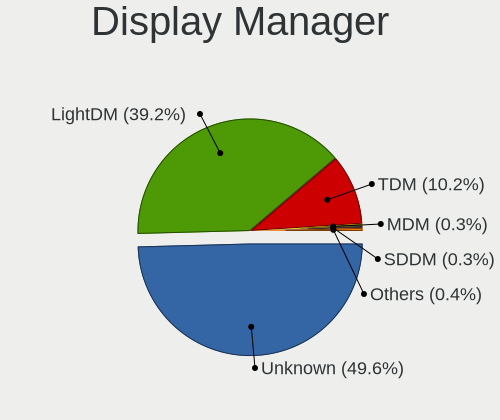
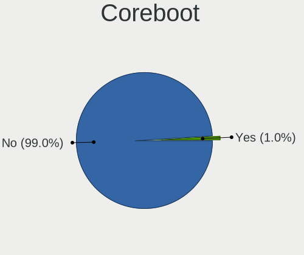
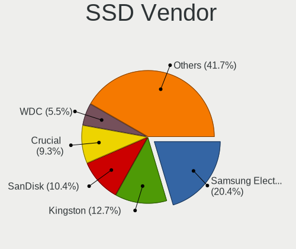
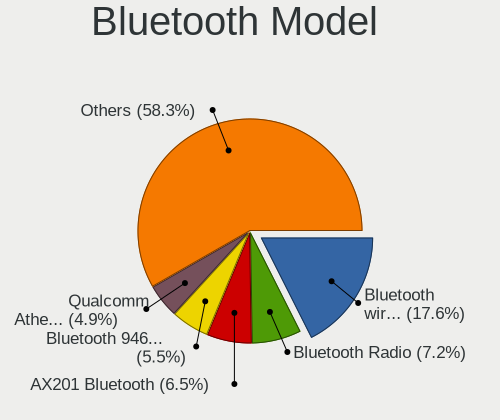

Linux Mint - Tested Hardware & Statistics (Notebooks)
-----------------------------------------------------

A project to collect tested hardware configurations for Linux Mint.

Anyone can contribute to this report by the [hw-probe](https://github.com/linuxhw/hw-probe) tool:

    sudo -E hw-probe -all -upload

Please contribute! Especially if your hardware is rare.

Contents
--------

* [ Test Cases ](#test-cases)

* [ System ](#system)
  - [ OS                       ](#os)
  - [ OS Family                ](#os-family)
  - [ Kernel                   ](#kernel)
  - [ Kernel Family            ](#kernel-family)
  - [ Kernel Major Ver.        ](#kernel-major-ver)
  - [ Arch                     ](#arch)
  - [ DE                       ](#de)
  - [ Display Server           ](#display-server)
  - [ Display Manager          ](#display-manager)
  - [ OS Lang                  ](#os-lang)
  - [ Boot Mode                ](#boot-mode)
  - [ Filesystem               ](#filesystem)
  - [ Part. scheme             ](#part-scheme)
  - [ Dual Boot with Linux/BSD ](#dual-boot-with-linuxbsd)
  - [ Dual Boot (Win)          ](#dual-boot-win)

* [ Board ](#board)
  - [ Vendor                   ](#vendor)
  - [ Model                    ](#model)
  - [ Model Family             ](#model-family)
  - [ MFG Year                 ](#mfg-year)
  - [ Form Factor              ](#form-factor)
  - [ Secure Boot              ](#secure-boot)
  - [ Coreboot                 ](#coreboot)
  - [ RAM Size                 ](#ram-size)
  - [ RAM Used                 ](#ram-used)
  - [ Total Drives             ](#total-drives)
  - [ Has CD-ROM               ](#has-cd-rom)
  - [ Has Ethernet             ](#has-ethernet)
  - [ Has WiFi                 ](#has-wifi)
  - [ Has Bluetooth            ](#has-bluetooth)

* [ Location ](#location)
  - [ Country                  ](#country)
  - [ City                     ](#city)

* [ Drives ](#drives)
  - [ Drive Vendor             ](#drive-vendor)
  - [ Drive Model              ](#drive-model)
  - [ HDD Vendor               ](#hdd-vendor)
  - [ SSD Vendor               ](#ssd-vendor)
  - [ Drive Kind               ](#drive-kind)
  - [ Drive Connector          ](#drive-connector)
  - [ Drive Size               ](#drive-size)
  - [ Space Total              ](#space-total)
  - [ Space Used               ](#space-used)
  - [ Malfunc. Drives          ](#malfunc-drives)
  - [ Malfunc. Drive Vendor    ](#malfunc-drive-vendor)
  - [ Malfunc. HDD Vendor      ](#malfunc-hdd-vendor)
  - [ Malfunc. Drive Kind      ](#malfunc-drive-kind)
  - [ Failed Drives            ](#failed-drives)
  - [ Failed Drive Vendor      ](#failed-drive-vendor)
  - [ Drive Status             ](#drive-status)

* [ Storage controller ](#storage-controller)
  - [ Storage Vendor           ](#storage-vendor)
  - [ Storage Model            ](#storage-model)
  - [ Storage Kind             ](#storage-kind)

* [ Processor ](#processor)
  - [ CPU Vendor               ](#cpu-vendor)
  - [ CPU Model                ](#cpu-model)
  - [ CPU Model Family         ](#cpu-model-family)
  - [ CPU Cores                ](#cpu-cores)
  - [ CPU Sockets              ](#cpu-sockets)
  - [ CPU Threads              ](#cpu-threads)
  - [ CPU Op-Modes             ](#cpu-op-modes)
  - [ CPU Microcode            ](#cpu-microcode)
  - [ CPU Microarch            ](#cpu-microarch)

* [ Graphics ](#graphics)
  - [ GPU Vendor               ](#gpu-vendor)
  - [ GPU Model                ](#gpu-model)
  - [ GPU Combo                ](#gpu-combo)
  - [ GPU Driver               ](#gpu-driver)
  - [ GPU Memory               ](#gpu-memory)

* [ Monitor ](#monitor)
  - [ Monitor Vendor           ](#monitor-vendor)
  - [ Monitor Model            ](#monitor-model)
  - [ Monitor Resolution       ](#monitor-resolution)
  - [ Monitor Diagonal         ](#monitor-diagonal)
  - [ Monitor Width            ](#monitor-width)
  - [ Aspect Ratio             ](#aspect-ratio)
  - [ Monitor Area             ](#monitor-area)
  - [ Pixel Density            ](#pixel-density)
  - [ Multiple Monitors        ](#multiple-monitors)

* [ Network ](#network)
  - [ Net Controller Vendor    ](#net-controller-vendor)
  - [ Net Controller Model     ](#net-controller-model)
  - [ Wireless Vendor          ](#wireless-vendor)
  - [ Wireless Model           ](#wireless-model)
  - [ Ethernet Vendor          ](#ethernet-vendor)
  - [ Ethernet Model           ](#ethernet-model)
  - [ Net Controller Kind      ](#net-controller-kind)
  - [ Used Controller          ](#used-controller)
  - [ NICs                     ](#nics)
  - [ IPv6                     ](#ipv6)

* [ Bluetooth ](#bluetooth)
  - [ Bluetooth Vendor         ](#bluetooth-vendor)
  - [ Bluetooth Model          ](#bluetooth-model)

* [ Sound ](#sound)
  - [ Sound Vendor             ](#sound-vendor)
  - [ Sound Model              ](#sound-model)

* [ Memory ](#memory)
  - [ Memory Vendor            ](#memory-vendor)
  - [ Memory Model             ](#memory-model)
  - [ Memory Kind              ](#memory-kind)
  - [ Memory Form Factor       ](#memory-form-factor)
  - [ Memory Size              ](#memory-size)
  - [ Memory Speed             ](#memory-speed)

* [ Printers & scanners ](#printers--scanners)
  - [ Printer Vendor           ](#printer-vendor)
  - [ Printer Model            ](#printer-model)
  - [ Scanner Vendor           ](#scanner-vendor)
  - [ Scanner Model            ](#scanner-model)

* [ Camera ](#camera)
  - [ Camera Vendor            ](#camera-vendor)
  - [ Camera Model             ](#camera-model)

* [ Security ](#security)
  - [ Fingerprint Vendor       ](#fingerprint-vendor)
  - [ Fingerprint Model        ](#fingerprint-model)
  - [ Chipcard Vendor          ](#chipcard-vendor)
  - [ Chipcard Model           ](#chipcard-model)

* [ Unsupported ](#unsupported)
  - [ Unsupported Devices      ](#unsupported-devices)
  - [ Unsupported Device Types ](#unsupported-device-types)

Test Cases
----------

Total: 11770

| Vendor        | Model                       | Probe                                                      | Date         |
|---------------|-----------------------------|------------------------------------------------------------|--------------|
| HP            | Stream Laptop 14-cb1XX      | [e8ecfcc3cd](https://linux-hardware.org/?probe=e8ecfcc3cd) | Dec 01, 2022 |
| MSI           | GF72 8RD                    | [c03f783ea5](https://linux-hardware.org/?probe=c03f783ea5) | Dec 01, 2022 |
| HP            | Stream Laptop 14-cb1XX      | [80c9d45a14](https://linux-hardware.org/?probe=80c9d45a14) | Dec 01, 2022 |
| Packard Be... | DOT S                       | [bb05d9a173](https://linux-hardware.org/?probe=bb05d9a173) | Dec 01, 2022 |
| Acer          | Aspire 3830TG               | [8bb246cbaa](https://linux-hardware.org/?probe=8bb246cbaa) | Dec 01, 2022 |
| Acer          | Aspire 3830TG               | [46bcb20e26](https://linux-hardware.org/?probe=46bcb20e26) | Dec 01, 2022 |
| HP            | Pavilion dv8000 (ET839UA... | [5b22a7d584](https://linux-hardware.org/?probe=5b22a7d584) | Dec 01, 2022 |
| Lenovo        | ThinkPad T420 4236V6S       | [5900d34c9a](https://linux-hardware.org/?probe=5900d34c9a) | Dec 01, 2022 |
| Lenovo        | ThinkPad L560 20F10034MX    | [34842eb8d9](https://linux-hardware.org/?probe=34842eb8d9) | Dec 01, 2022 |
| Mediacom      | SmartBook 14 FullHD - SB... | [1df1f552ff](https://linux-hardware.org/?probe=1df1f552ff) | Dec 01, 2022 |
| Acer          | Aspire 5750G                | [a8236e24a5](https://linux-hardware.org/?probe=a8236e24a5) | Dec 01, 2022 |
| Dell          | Latitude E7470              | [457187e169](https://linux-hardware.org/?probe=457187e169) | Dec 01, 2022 |
| Acer          | Aspire 5750G                | [198d7f2534](https://linux-hardware.org/?probe=198d7f2534) | Dec 01, 2022 |
| Samsung       | 355V4C/356V4C/3445VC/354... | [65fa0de0a2](https://linux-hardware.org/?probe=65fa0de0a2) | Dec 01, 2022 |
| Dell          | Latitude E7240              | [0945377dfb](https://linux-hardware.org/?probe=0945377dfb) | Dec 01, 2022 |
| In-Sing       | NK81J                       | [bca0a3709f](https://linux-hardware.org/?probe=bca0a3709f) | Dec 01, 2022 |
| Dell          | Latitude E7470              | [b24884fe44](https://linux-hardware.org/?probe=b24884fe44) | Dec 01, 2022 |
| HP            | Pavilion dv8000 (ET839UA... | [19c2f41d14](https://linux-hardware.org/?probe=19c2f41d14) | Dec 01, 2022 |
| Apple         | MacBookPro11,4              | [138689463a](https://linux-hardware.org/?probe=138689463a) | Dec 01, 2022 |
| GPU Compan... | GWTC116-2                   | [d004be9ab6](https://linux-hardware.org/?probe=d004be9ab6) | Dec 01, 2022 |
| Apple         | MacBookPro11,4              | [16d0cef78c](https://linux-hardware.org/?probe=16d0cef78c) | Dec 01, 2022 |
| Dell          | Inspiron MM061              | [703ef1c899](https://linux-hardware.org/?probe=703ef1c899) | Nov 30, 2022 |
| HUAWEI        | KLVL-WXX9                   | [ea8b9066f6](https://linux-hardware.org/?probe=ea8b9066f6) | Nov 30, 2022 |
| Lenovo        | IdeaPad 310-15IAP 80TT      | [3aa3302b92](https://linux-hardware.org/?probe=3aa3302b92) | Nov 30, 2022 |
| HP            | ElitePad 1000 G2            | [0b05465735](https://linux-hardware.org/?probe=0b05465735) | Nov 30, 2022 |
| Acer          | Aspire A315-34              | [6bf371252b](https://linux-hardware.org/?probe=6bf371252b) | Nov 30, 2022 |
| GPU Compan... | GWTN156-2BK                 | [1ed3629f61](https://linux-hardware.org/?probe=1ed3629f61) | Nov 30, 2022 |
| HP            | ZBook 15v G5                | [aabc35ae2a](https://linux-hardware.org/?probe=aabc35ae2a) | Nov 30, 2022 |
| Dell          | Latitude E6440              | [0c3dd709dd](https://linux-hardware.org/?probe=0c3dd709dd) | Nov 30, 2022 |
| Acer          | Aspire E5-575G              | [1ca5144296](https://linux-hardware.org/?probe=1ca5144296) | Nov 30, 2022 |
| Acer          | Aspire E5-575               | [b393262562](https://linux-hardware.org/?probe=b393262562) | Nov 30, 2022 |
| GPU Compan... | GWTN156-2BK                 | [dbba08e68e](https://linux-hardware.org/?probe=dbba08e68e) | Nov 30, 2022 |
| Tactus        | GeoBook 140                 | [91342e56df](https://linux-hardware.org/?probe=91342e56df) | Nov 29, 2022 |
| Acer          | Aspire A315-34              | [56bb76fb28](https://linux-hardware.org/?probe=56bb76fb28) | Nov 29, 2022 |
| HP            | Pavilion 17                 | [431ce9bd18](https://linux-hardware.org/?probe=431ce9bd18) | Nov 29, 2022 |
| Apple         | MacBookAir8,1               | [7581ef0e85](https://linux-hardware.org/?probe=7581ef0e85) | Nov 29, 2022 |
| HUAWEI        | CREM-WXX9                   | [ddad96715a](https://linux-hardware.org/?probe=ddad96715a) | Nov 29, 2022 |
| HP            | Pavilion g6                 | [fefac15f4c](https://linux-hardware.org/?probe=fefac15f4c) | Nov 29, 2022 |
| HP            | Victus by Laptop 16-d0xx... | [dae405ee81](https://linux-hardware.org/?probe=dae405ee81) | Nov 29, 2022 |
| ASUSTek       | G751JL                      | [1bfbfafe68](https://linux-hardware.org/?probe=1bfbfafe68) | Nov 29, 2022 |
| ASUSTek       | VivoBook_ASUSLaptop X512... | [140872c53d](https://linux-hardware.org/?probe=140872c53d) | Nov 29, 2022 |
| Lenovo        | IdeaPad 510S-14ISK 80TK     | [687d4d78a4](https://linux-hardware.org/?probe=687d4d78a4) | Nov 29, 2022 |
| Dell          | Latitude E5440              | [90d18073d6](https://linux-hardware.org/?probe=90d18073d6) | Nov 29, 2022 |
| HP            | Laptop 14s-fq0xxx           | [e71c023456](https://linux-hardware.org/?probe=e71c023456) | Nov 29, 2022 |
| Thomson       | N17V3C8WH512                | [b89cd0328a](https://linux-hardware.org/?probe=b89cd0328a) | Nov 29, 2022 |
| AMI           | Intel                       | [3e2e312c6e](https://linux-hardware.org/?probe=3e2e312c6e) | Nov 29, 2022 |
| Acer          | Aspire A315-22              | [c52689296b](https://linux-hardware.org/?probe=c52689296b) | Nov 29, 2022 |
| Unknown       | Unknown                     | [d2789773ef](https://linux-hardware.org/?probe=d2789773ef) | Nov 29, 2022 |
| Acer          | Aspire A315-59              | [f7a1cff386](https://linux-hardware.org/?probe=f7a1cff386) | Nov 28, 2022 |
| Chuwi         | HeroBook Pro                | [df7f48022d](https://linux-hardware.org/?probe=df7f48022d) | Nov 28, 2022 |
| Chuwi         | HeroBook Pro                | [c8e48e2c0f](https://linux-hardware.org/?probe=c8e48e2c0f) | Nov 28, 2022 |
| Lenovo        | G700 20251                  | [49167f9f67](https://linux-hardware.org/?probe=49167f9f67) | Nov 28, 2022 |
| Unknown       | Unknown                     | [390854c8dd](https://linux-hardware.org/?probe=390854c8dd) | Nov 28, 2022 |
| HP            | EliteBook Folio 9480m       | [7f9d229259](https://linux-hardware.org/?probe=7f9d229259) | Nov 28, 2022 |
| ASUSTek       | X453MA                      | [f30a5c4808](https://linux-hardware.org/?probe=f30a5c4808) | Nov 28, 2022 |
| HP            | 255 G6 Notebook PC          | [e17172d1c5](https://linux-hardware.org/?probe=e17172d1c5) | Nov 28, 2022 |
| Dell          | Latitude E6320              | [bcbdb4bf67](https://linux-hardware.org/?probe=bcbdb4bf67) | Nov 28, 2022 |
| Dell          | Latitude E6320              | [f77e444066](https://linux-hardware.org/?probe=f77e444066) | Nov 28, 2022 |
| Acer          | TravelMate B113             | [567c2d2e20](https://linux-hardware.org/?probe=567c2d2e20) | Nov 28, 2022 |
| HUAWEI        | BOD-WXX9                    | [5b2f9bfd5c](https://linux-hardware.org/?probe=5b2f9bfd5c) | Nov 28, 2022 |
| Dell          | Latitude E6420              | [15ee6e2e20](https://linux-hardware.org/?probe=15ee6e2e20) | Nov 28, 2022 |
| Lenovo        | Flex 2-15 20405             | [7e37de4475](https://linux-hardware.org/?probe=7e37de4475) | Nov 28, 2022 |
| Dell          | Latitude E6420              | [251fb963fe](https://linux-hardware.org/?probe=251fb963fe) | Nov 28, 2022 |
| ASUSTek       | TUF Gaming FX705GM_FX705... | [3515e0a362](https://linux-hardware.org/?probe=3515e0a362) | Nov 27, 2022 |
| Lenovo        | S20-30 Touch 20434          | [63d2134051](https://linux-hardware.org/?probe=63d2134051) | Nov 27, 2022 |
| HP            | EliteBook 8460p             | [a39632439e](https://linux-hardware.org/?probe=a39632439e) | Nov 27, 2022 |
| HP            | ENVY Laptop 17-ce1xxx       | [60c25a49bc](https://linux-hardware.org/?probe=60c25a49bc) | Nov 27, 2022 |
| Unknown       | Unknown                     | [9e16a80342](https://linux-hardware.org/?probe=9e16a80342) | Nov 27, 2022 |
| Jumper        | EZbook                      | [a93aa75e5f](https://linux-hardware.org/?probe=a93aa75e5f) | Nov 27, 2022 |
| ASUSTek       | E402SA                      | [05983f8566](https://linux-hardware.org/?probe=05983f8566) | Nov 26, 2022 |
| Lenovo        | Legion 5 Pro 16ARH7H 82R... | [7a5c0ebf68](https://linux-hardware.org/?probe=7a5c0ebf68) | Nov 26, 2022 |
| MSI           | GF72 8RD                    | [fb92041c1b](https://linux-hardware.org/?probe=fb92041c1b) | Nov 26, 2022 |
| Lenovo        | ThinkPad X1 Carbon 34601... | [ed678da106](https://linux-hardware.org/?probe=ed678da106) | Nov 26, 2022 |
| Lenovo        | ThinkPad T460s 20FAS4KH0... | [585b6910fa](https://linux-hardware.org/?probe=585b6910fa) | Nov 26, 2022 |
| Lenovo        | ThinkPad T460s 20FAS4KH0... | [138231da75](https://linux-hardware.org/?probe=138231da75) | Nov 26, 2022 |
| ASUSTek       | T100TA                      | [2734591eb0](https://linux-hardware.org/?probe=2734591eb0) | Nov 26, 2022 |
| ASUSTek       | ZenBook UX450FDX_UX480FD    | [694d1d5e96](https://linux-hardware.org/?probe=694d1d5e96) | Nov 26, 2022 |
| Lenovo        | G40-80 80JE                 | [47d9a5f1ca](https://linux-hardware.org/?probe=47d9a5f1ca) | Nov 26, 2022 |
| Lenovo        | G40-80 80JE                 | [5d324af4d0](https://linux-hardware.org/?probe=5d324af4d0) | Nov 26, 2022 |
| Acer          | Nitro AN515-54              | [e82fa602d4](https://linux-hardware.org/?probe=e82fa602d4) | Nov 26, 2022 |
| Acer          | Nitro AN515-54              | [604339bd15](https://linux-hardware.org/?probe=604339bd15) | Nov 26, 2022 |
| HP            | OMEN by Laptop 15t-ek000    | [4189c96f5e](https://linux-hardware.org/?probe=4189c96f5e) | Nov 26, 2022 |
| HP            | Pavilion ZV6100 (EC356UA... | [c6fcc7764f](https://linux-hardware.org/?probe=c6fcc7764f) | Nov 26, 2022 |
| Samsung       | RV410/RV510/S3510/E3510     | [cd5eb0566d](https://linux-hardware.org/?probe=cd5eb0566d) | Nov 26, 2022 |
| Lenovo        | ThinkPad T14 Gen 1 20S0C... | [b669fa97c4](https://linux-hardware.org/?probe=b669fa97c4) | Nov 26, 2022 |
| Samsung       | RC530/RC730                 | [64515ff8b1](https://linux-hardware.org/?probe=64515ff8b1) | Nov 26, 2022 |
| MSI           | GE62 2QC                    | [6bdf66b3b6](https://linux-hardware.org/?probe=6bdf66b3b6) | Nov 26, 2022 |
| MSI           | MS-16G1                     | [8d8233d2a9](https://linux-hardware.org/?probe=8d8233d2a9) | Nov 25, 2022 |
| Acer          | Aspire 5349                 | [82be349d91](https://linux-hardware.org/?probe=82be349d91) | Nov 25, 2022 |
| ASUSTek       | ZenBook UX333FA_UX333FA     | [02eeb74e28](https://linux-hardware.org/?probe=02eeb74e28) | Nov 25, 2022 |
| HP            | ProBook 450 G6              | [d044aabfec](https://linux-hardware.org/?probe=d044aabfec) | Nov 25, 2022 |
| HP            | Pavilion Laptop 15-ck0xx    | [4393448090](https://linux-hardware.org/?probe=4393448090) | Nov 25, 2022 |
| Lenovo        | ThinkPad E15 Gen 4 21EDC... | [90fcc2d8d5](https://linux-hardware.org/?probe=90fcc2d8d5) | Nov 24, 2022 |
| Alienware     | M17xR3                      | [438f3639aa](https://linux-hardware.org/?probe=438f3639aa) | Nov 24, 2022 |
| Dell          | Inspiron 15 3520            | [7c53fcc73b](https://linux-hardware.org/?probe=7c53fcc73b) | Nov 24, 2022 |
| Dell          | Latitude E6540              | [5c474a2cdb](https://linux-hardware.org/?probe=5c474a2cdb) | Nov 24, 2022 |
| Lenovo        | Flex 2-15 20405             | [054a6670b3](https://linux-hardware.org/?probe=054a6670b3) | Nov 24, 2022 |
| HP            | Laptop 15-dw0xxx            | [894c4e9ebf](https://linux-hardware.org/?probe=894c4e9ebf) | Nov 24, 2022 |
| Dell          | Latitude E6440              | [21d39df616](https://linux-hardware.org/?probe=21d39df616) | Nov 24, 2022 |
| Acer          | Aspire R3-131T              | [5395a2556c](https://linux-hardware.org/?probe=5395a2556c) | Nov 24, 2022 |
| Aquarius      | NS685U R11                  | [0a9856bad0](https://linux-hardware.org/?probe=0a9856bad0) | Nov 24, 2022 |
| Lenovo        | ThinkPad T460 20FMS0VG25    | [06221c9746](https://linux-hardware.org/?probe=06221c9746) | Nov 24, 2022 |
| Razer         | Blade Stealth               | [98889c6c3e](https://linux-hardware.org/?probe=98889c6c3e) | Nov 23, 2022 |
| Lenovo        | V15 G2 ALC 82KD             | [6646978243](https://linux-hardware.org/?probe=6646978243) | Nov 23, 2022 |
| Lenovo        | V15 G2 ALC 82KD             | [ddcb37ea55](https://linux-hardware.org/?probe=ddcb37ea55) | Nov 23, 2022 |
| Apple         | MacBookAir7,1               | [f735b3e731](https://linux-hardware.org/?probe=f735b3e731) | Nov 23, 2022 |
| Lenovo        | ThinkPad T460 20FMS0VG25    | [b00a1e7f6a](https://linux-hardware.org/?probe=b00a1e7f6a) | Nov 23, 2022 |
| HP            | EliteBook 2560p             | [4c27c5511f](https://linux-hardware.org/?probe=4c27c5511f) | Nov 23, 2022 |
| Lenovo        | ThinkPad P15v Gen 3 21D9... | [f02593fc75](https://linux-hardware.org/?probe=f02593fc75) | Nov 23, 2022 |
| Dell          | Inspiron 5567               | [96e8bf5249](https://linux-hardware.org/?probe=96e8bf5249) | Nov 23, 2022 |
| HP            | Pavilion dv7                | [aa62e3eea2](https://linux-hardware.org/?probe=aa62e3eea2) | Nov 23, 2022 |
| Dell          | G3 3579                     | [7f4d27ea26](https://linux-hardware.org/?probe=7f4d27ea26) | Nov 23, 2022 |
| Dell          | Latitude E5440              | [9a39d45cee](https://linux-hardware.org/?probe=9a39d45cee) | Nov 22, 2022 |
| Lenovo        | ThinkPad T450 20BUS08L00    | [080bbeb75a](https://linux-hardware.org/?probe=080bbeb75a) | Nov 22, 2022 |
| Lenovo        | ThinkPad T450 20BUS08L00    | [31ddbc5ee3](https://linux-hardware.org/?probe=31ddbc5ee3) | Nov 22, 2022 |
| HP            | Pavilion dv5                | [2a497ff54f](https://linux-hardware.org/?probe=2a497ff54f) | Nov 22, 2022 |
| HP            | Notebook                    | [ab824250b9](https://linux-hardware.org/?probe=ab824250b9) | Nov 22, 2022 |
| Dell          | Latitude 5480               | [5b9f1e717c](https://linux-hardware.org/?probe=5b9f1e717c) | Nov 21, 2022 |
| Acer          | TravelMate 5760             | [54c460334e](https://linux-hardware.org/?probe=54c460334e) | Nov 21, 2022 |
| ASUSTek       | E200HA                      | [635e9fe863](https://linux-hardware.org/?probe=635e9fe863) | Nov 21, 2022 |
| Lenovo        | ThinkPad T450 20BUA0AEIG    | [48956b6f61](https://linux-hardware.org/?probe=48956b6f61) | Nov 21, 2022 |
| Lenovo        | IdeaPad Slim 1-14AST-05 ... | [c3048ea26d](https://linux-hardware.org/?probe=c3048ea26d) | Nov 21, 2022 |
| HP            | EliteBook 840 G5            | [62ffc22eea](https://linux-hardware.org/?probe=62ffc22eea) | Nov 21, 2022 |
| HP            | Pavilion Notebook           | [9599fd68a9](https://linux-hardware.org/?probe=9599fd68a9) | Nov 21, 2022 |
| Lenovo        | ThinkPad T440 20B7000LGE    | [9194594686](https://linux-hardware.org/?probe=9194594686) | Nov 21, 2022 |
| Dell          | Latitude E5440              | [6d90726959](https://linux-hardware.org/?probe=6d90726959) | Nov 21, 2022 |
| Toshiba       | IS 1422                     | [aa59e6576d](https://linux-hardware.org/?probe=aa59e6576d) | Nov 21, 2022 |
| MSI           | CX700                       | [69c6ae1f04](https://linux-hardware.org/?probe=69c6ae1f04) | Nov 20, 2022 |
| HP            | 15                          | [51711b792f](https://linux-hardware.org/?probe=51711b792f) | Nov 20, 2022 |
| HP            | Pavilion 17                 | [fb907a2d35](https://linux-hardware.org/?probe=fb907a2d35) | Nov 20, 2022 |
| Lenovo        | Z50-70 20354                | [4de72c5631](https://linux-hardware.org/?probe=4de72c5631) | Nov 20, 2022 |
| HP            | Pavilion 17                 | [7af6f3d045](https://linux-hardware.org/?probe=7af6f3d045) | Nov 20, 2022 |
| HP            | EliteBook 830 G7 Noteboo... | [1b60e76184](https://linux-hardware.org/?probe=1b60e76184) | Nov 20, 2022 |
| HP            | ENVY Laptop 13-ba1xxx       | [4a270e871f](https://linux-hardware.org/?probe=4a270e871f) | Nov 20, 2022 |
| ASUSTek       | F5VL                        | [05614f05b7](https://linux-hardware.org/?probe=05614f05b7) | Nov 20, 2022 |
| ASUSTek       | F5VL                        | [a95f905ff3](https://linux-hardware.org/?probe=a95f905ff3) | Nov 20, 2022 |
| GPU Compan... | GWTN156-2BK                 | [ed63205687](https://linux-hardware.org/?probe=ed63205687) | Nov 20, 2022 |
| Lenovo        | IdeaPad Gaming 3 15ACH6 ... | [d8f53f887a](https://linux-hardware.org/?probe=d8f53f887a) | Nov 20, 2022 |
| Lenovo        | IdeaPad Gaming 3 15ACH6 ... | [c967893dd4](https://linux-hardware.org/?probe=c967893dd4) | Nov 20, 2022 |
| HP            | ZBook 15 G4                 | [ad20223c29](https://linux-hardware.org/?probe=ad20223c29) | Nov 20, 2022 |
| Samsung       | RC410/RC510/RC710           | [06a337fda3](https://linux-hardware.org/?probe=06a337fda3) | Nov 20, 2022 |
| Samsung       | RC410/RC510/RC710           | [965d9d2f5c](https://linux-hardware.org/?probe=965d9d2f5c) | Nov 20, 2022 |
| Irbis         | NB121                       | [32a784f767](https://linux-hardware.org/?probe=32a784f767) | Nov 20, 2022 |
| ASUSTek       | K50IJ                       | [c57a9ae3d5](https://linux-hardware.org/?probe=c57a9ae3d5) | Nov 19, 2022 |
| Apple         | MacBookPro5,1               | [4f04b7d627](https://linux-hardware.org/?probe=4f04b7d627) | Nov 19, 2022 |
| ASUSTek       | K50IJ                       | [99ed91b58d](https://linux-hardware.org/?probe=99ed91b58d) | Nov 19, 2022 |
| Toshiba       | Satellite L50D-B            | [68d1c8a80a](https://linux-hardware.org/?probe=68d1c8a80a) | Nov 19, 2022 |
| ASUSTek       | B451JA                      | [faeb294d65](https://linux-hardware.org/?probe=faeb294d65) | Nov 19, 2022 |
| MSI           | GP62M 7REX                  | [2125546b68](https://linux-hardware.org/?probe=2125546b68) | Nov 19, 2022 |
| Acer          | Aspire A515-44G             | [51035e77a1](https://linux-hardware.org/?probe=51035e77a1) | Nov 19, 2022 |
| Digma         | EVE 15 C423 ES5069EW        | [9737dae1ac](https://linux-hardware.org/?probe=9737dae1ac) | Nov 19, 2022 |
| MSI           | GP62M 7REX                  | [6ea684de8c](https://linux-hardware.org/?probe=6ea684de8c) | Nov 19, 2022 |
| ALLDOCUBE     | i1405S                      | [551bc2b1e6](https://linux-hardware.org/?probe=551bc2b1e6) | Nov 19, 2022 |
| Toshiba       | QOSMIO X70-A                | [75f0b58b20](https://linux-hardware.org/?probe=75f0b58b20) | Nov 19, 2022 |
| Alienware     | m15 R4                      | [2db8555d73](https://linux-hardware.org/?probe=2db8555d73) | Nov 18, 2022 |
| Acer          | Aspire V3-772G              | [bc46ec232a](https://linux-hardware.org/?probe=bc46ec232a) | Nov 18, 2022 |
| ASUSTek       | VivoBook_ASUSLaptop X509... | [d7992855ba](https://linux-hardware.org/?probe=d7992855ba) | Nov 18, 2022 |
| ASUSTek       | ASUS TUF Gaming F15 FX50... | [ea12bf4774](https://linux-hardware.org/?probe=ea12bf4774) | Nov 18, 2022 |
| Dell          | Inspiron 3793               | [fb5878b057](https://linux-hardware.org/?probe=fb5878b057) | Nov 18, 2022 |
| HP            | Laptop 15-da2xxx            | [e55a0e2ae1](https://linux-hardware.org/?probe=e55a0e2ae1) | Nov 18, 2022 |
| HP            | Elite x2 1012 G1            | [ef366c64fe](https://linux-hardware.org/?probe=ef366c64fe) | Nov 18, 2022 |
| Samsung       | R610                        | [b6c7aa2939](https://linux-hardware.org/?probe=b6c7aa2939) | Nov 18, 2022 |
| Lenovo        | IdeaPad 320-15ABR 80XS      | [af679e6195](https://linux-hardware.org/?probe=af679e6195) | Nov 17, 2022 |
| ASUSTek       | VivoBook_ASUSLaptop X509... | [8e17476123](https://linux-hardware.org/?probe=8e17476123) | Nov 17, 2022 |
| Acer          | Aspire V3-371               | [b184d85960](https://linux-hardware.org/?probe=b184d85960) | Nov 17, 2022 |
| Apple         | MacBook4,1                  | [06c160b1a8](https://linux-hardware.org/?probe=06c160b1a8) | Nov 16, 2022 |
| ASUSTek       | VivoBook_ASUSLaptop X509... | [f48e29fef2](https://linux-hardware.org/?probe=f48e29fef2) | Nov 16, 2022 |
| Toshiba       | Satellite L10W-B-101        | [544ad40774](https://linux-hardware.org/?probe=544ad40774) | Nov 16, 2022 |
| Acer          | Aspire A315-42              | [121ed6e51d](https://linux-hardware.org/?probe=121ed6e51d) | Nov 16, 2022 |
| HP            | Pavilion dv9500             | [65a473401c](https://linux-hardware.org/?probe=65a473401c) | Nov 16, 2022 |
| Sony          | SVE14A15FBB                 | [1b368520d1](https://linux-hardware.org/?probe=1b368520d1) | Nov 16, 2022 |
| HP            | Pavilion dv8000 (ET839UA... | [d0bcf66bd1](https://linux-hardware.org/?probe=d0bcf66bd1) | Nov 16, 2022 |
| Lenovo        | ThinkPad T440 20B6009TUS    | [57ae2fbd3c](https://linux-hardware.org/?probe=57ae2fbd3c) | Nov 16, 2022 |
| AMI           | Intel                       | [36327e3aca](https://linux-hardware.org/?probe=36327e3aca) | Nov 16, 2022 |
| HP            | Pavilion Laptop 15-eh2xx... | [21cd2084c5](https://linux-hardware.org/?probe=21cd2084c5) | Nov 16, 2022 |
| AMI           | Intel                       | [ac36a02403](https://linux-hardware.org/?probe=ac36a02403) | Nov 16, 2022 |
| Lenovo        | IdeaPad 1 14IAU7 82QC       | [12073cb314](https://linux-hardware.org/?probe=12073cb314) | Nov 16, 2022 |
| ALLDOCUBE     | i1405S                      | [f35dc553a2](https://linux-hardware.org/?probe=f35dc553a2) | Nov 16, 2022 |
| HP            | Laptop 15-da2xxx            | [b1ed3e6190](https://linux-hardware.org/?probe=b1ed3e6190) | Nov 16, 2022 |
| Lenovo        | ThinkPad T14 Gen 2i 20W0... | [f8eb11ba08](https://linux-hardware.org/?probe=f8eb11ba08) | Nov 15, 2022 |
| Dell          | XPS 15 9550                 | [12ec05ef8f](https://linux-hardware.org/?probe=12ec05ef8f) | Nov 15, 2022 |
| Acer          | Aspire 5742G                | [4a80ba0608](https://linux-hardware.org/?probe=4a80ba0608) | Nov 15, 2022 |
| Dell          | Inspiron N5050              | [ddc155c281](https://linux-hardware.org/?probe=ddc155c281) | Nov 15, 2022 |
| HP            | 250 G6 Notebook PC          | [439fe62e2e](https://linux-hardware.org/?probe=439fe62e2e) | Nov 15, 2022 |
| ASUSTek       | T100HAN                     | [f973b6bcd4](https://linux-hardware.org/?probe=f973b6bcd4) | Nov 15, 2022 |
| Lenovo        | IdeaPad 5 14ITL05 82FE      | [b59bffff0b](https://linux-hardware.org/?probe=b59bffff0b) | Nov 15, 2022 |
| Lenovo        | IdeaPad 5 14ITL05 82FE      | [e9182b2177](https://linux-hardware.org/?probe=e9182b2177) | Nov 15, 2022 |
| Dell          | Latitude E6510              | [21a6415538](https://linux-hardware.org/?probe=21a6415538) | Nov 15, 2022 |
| Dell          | Inspiron 3505               | [ce754fa34b](https://linux-hardware.org/?probe=ce754fa34b) | Nov 15, 2022 |
| Dell          | Latitude E6510              | [3ce2f9981f](https://linux-hardware.org/?probe=3ce2f9981f) | Nov 15, 2022 |
| Dell          | Latitude E7450              | [3020a4edfc](https://linux-hardware.org/?probe=3020a4edfc) | Nov 15, 2022 |
| ASUSTek       | K50IJ                       | [c7ac1636bc](https://linux-hardware.org/?probe=c7ac1636bc) | Nov 15, 2022 |
| Dell          | Inspiron 7501               | [15cd1d588f](https://linux-hardware.org/?probe=15cd1d588f) | Nov 15, 2022 |
| Lenovo        | IdeaPad 5 15ALC05 82LN      | [d82617ae65](https://linux-hardware.org/?probe=d82617ae65) | Nov 15, 2022 |
| Chuwi         | GemiBook Pro                | [d9b2356cf0](https://linux-hardware.org/?probe=d9b2356cf0) | Nov 15, 2022 |
| Acer          | Aspire ES1-572              | [a21cf96dd6](https://linux-hardware.org/?probe=a21cf96dd6) | Nov 15, 2022 |
| Acer          | Aspire ES1-572              | [14e272fe11](https://linux-hardware.org/?probe=14e272fe11) | Nov 15, 2022 |
| Acer          | Aspire E5-722               | [7e26ae7fe8](https://linux-hardware.org/?probe=7e26ae7fe8) | Nov 14, 2022 |
| Dell          | Latitude E6320              | [a4767dfe35](https://linux-hardware.org/?probe=a4767dfe35) | Nov 14, 2022 |
| Acer          | Aspire A315-42              | [333067d4c6](https://linux-hardware.org/?probe=333067d4c6) | Nov 14, 2022 |
| ASUSTek       | X502CA                      | [b47b397c38](https://linux-hardware.org/?probe=b47b397c38) | Nov 14, 2022 |
| Acer          | Aspire 5600                 | [9fe2a7d245](https://linux-hardware.org/?probe=9fe2a7d245) | Nov 14, 2022 |
| MSI           | MAG Z590 TOMAHAWK WIFI      | [ccbda507a9](https://linux-hardware.org/?probe=ccbda507a9) | Nov 14, 2022 |
| Samsung       | RV411                       | [ded212573f](https://linux-hardware.org/?probe=ded212573f) | Nov 14, 2022 |
| Toshiba       | Satellite L50D-B            | [6c53b0c32d](https://linux-hardware.org/?probe=6c53b0c32d) | Nov 14, 2022 |
| Acer          | Aspire V3-771               | [5682e576ad](https://linux-hardware.org/?probe=5682e576ad) | Nov 14, 2022 |
| Lenovo        | IdeaPad 320-17AST 80XW      | [d8e3815f50](https://linux-hardware.org/?probe=d8e3815f50) | Nov 14, 2022 |
| Lenovo        | ThinkBook 14 G2 ITL 20VD    | [1de723e880](https://linux-hardware.org/?probe=1de723e880) | Nov 14, 2022 |
| Lenovo        | ThinkPad T450 20BUS1S81K    | [ee3fb9c9d2](https://linux-hardware.org/?probe=ee3fb9c9d2) | Nov 14, 2022 |
| Lenovo        | G50-80 80R0                 | [35193d2431](https://linux-hardware.org/?probe=35193d2431) | Nov 14, 2022 |
| Multilaser    | PC121                       | [5870f0d565](https://linux-hardware.org/?probe=5870f0d565) | Nov 14, 2022 |
| Acer          | Aspire VN7-791              | [736c2f5664](https://linux-hardware.org/?probe=736c2f5664) | Nov 14, 2022 |
| Lenovo        | Flex 2-15 20405             | [d360e03bd5](https://linux-hardware.org/?probe=d360e03bd5) | Nov 13, 2022 |
| Lenovo        | Flex 2-15 20405             | [6024035af3](https://linux-hardware.org/?probe=6024035af3) | Nov 13, 2022 |
| HP            | EliteBook 6930p             | [4b6c28bf91](https://linux-hardware.org/?probe=4b6c28bf91) | Nov 13, 2022 |
| Lenovo        | ThinkPad L490 20Q5CTO1WW    | [575d67b22c](https://linux-hardware.org/?probe=575d67b22c) | Nov 13, 2022 |
| Medion        | E4254 MD63100               | [b38503d9ac](https://linux-hardware.org/?probe=b38503d9ac) | Nov 13, 2022 |
| HP            | Laptop 15-dw3xxx            | [146a0f987b](https://linux-hardware.org/?probe=146a0f987b) | Nov 13, 2022 |
| ASUSTek       | A6JC                        | [dce6c2a8f4](https://linux-hardware.org/?probe=dce6c2a8f4) | Nov 13, 2022 |
| Medion        | E4254 MD63100               | [bc622b98f9](https://linux-hardware.org/?probe=bc622b98f9) | Nov 13, 2022 |
| Lenovo        | ThinkPad T530 2429A11       | [f5aa671555](https://linux-hardware.org/?probe=f5aa671555) | Nov 13, 2022 |
| Lenovo        | IdeaPadFlex 14 20308        | [04a42845bf](https://linux-hardware.org/?probe=04a42845bf) | Nov 12, 2022 |
| Acer          | Aspire 3830TG               | [2ce4863890](https://linux-hardware.org/?probe=2ce4863890) | Nov 12, 2022 |
| Lenovo        | ThinkPad E15 Gen 4 21EDC... | [a174d2b2b3](https://linux-hardware.org/?probe=a174d2b2b3) | Nov 12, 2022 |
| Lenovo        | ThinkPad X1 Carbon 5th 2... | [be205ddec9](https://linux-hardware.org/?probe=be205ddec9) | Nov 12, 2022 |
| Dell          | Latitude D630               | [ef49631a3c](https://linux-hardware.org/?probe=ef49631a3c) | Nov 12, 2022 |
| MSI           | GF65 Thin 9SD               | [07d4e41a25](https://linux-hardware.org/?probe=07d4e41a25) | Nov 12, 2022 |
| Lenovo        | G580 20150                  | [cae1dbbb12](https://linux-hardware.org/?probe=cae1dbbb12) | Nov 12, 2022 |
| HP            | 15                          | [bebef9206b](https://linux-hardware.org/?probe=bebef9206b) | Nov 12, 2022 |
| Lenovo        | ThinkPad A285 20MX000HMX    | [d199e5d35b](https://linux-hardware.org/?probe=d199e5d35b) | Nov 12, 2022 |
| Dell          | Latitude 7480               | [62d1e401a4](https://linux-hardware.org/?probe=62d1e401a4) | Nov 12, 2022 |
| ASUSTek       | X550LC                      | [2cfd92452e](https://linux-hardware.org/?probe=2cfd92452e) | Nov 12, 2022 |
| HP            | ZBook 15 G3                 | [824c0f9b36](https://linux-hardware.org/?probe=824c0f9b36) | Nov 12, 2022 |
| ASUSTek       | VivoBook_ASUSLaptop X512... | [0d6bd34095](https://linux-hardware.org/?probe=0d6bd34095) | Nov 12, 2022 |
| HP            | Compaq 6820s                | [c852376664](https://linux-hardware.org/?probe=c852376664) | Nov 12, 2022 |
| HP            | Compaq 6820s                | [dee9dbd56f](https://linux-hardware.org/?probe=dee9dbd56f) | Nov 12, 2022 |
| Dell          | XPS 15 9560                 | [cbfad6591d](https://linux-hardware.org/?probe=cbfad6591d) | Nov 12, 2022 |
| Standard      | MB40II                      | [c95529c90a](https://linux-hardware.org/?probe=c95529c90a) | Nov 12, 2022 |
| MSI           | GF65 Thin 9SD               | [17b1c5bc7c](https://linux-hardware.org/?probe=17b1c5bc7c) | Nov 12, 2022 |
| MSI           | GF65 Thin 9SD               | [f0b46e9613](https://linux-hardware.org/?probe=f0b46e9613) | Nov 11, 2022 |
| Lenovo        | ThinkPad S1 Yoga 20CD003... | [4406929fb6](https://linux-hardware.org/?probe=4406929fb6) | Nov 11, 2022 |
| HP            | Pavilion 15                 | [f6125d7605](https://linux-hardware.org/?probe=f6125d7605) | Nov 11, 2022 |
| HP            | Pavilion 15                 | [a598e64905](https://linux-hardware.org/?probe=a598e64905) | Nov 11, 2022 |
| Dell          | Latitude E6540              | [5ac9150dae](https://linux-hardware.org/?probe=5ac9150dae) | Nov 11, 2022 |
| HP            | EliteBook 850 G5            | [331a1db69d](https://linux-hardware.org/?probe=331a1db69d) | Nov 11, 2022 |
| HP            | Pavilion g4                 | [44162d8878](https://linux-hardware.org/?probe=44162d8878) | Nov 11, 2022 |
| HP            | OMEN by Laptop 15-ce0xx     | [08963a61fb](https://linux-hardware.org/?probe=08963a61fb) | Nov 10, 2022 |
| Lenovo        | Legion 7 16ITHg6 82K6       | [eebc3537d1](https://linux-hardware.org/?probe=eebc3537d1) | Nov 09, 2022 |
| Lenovo        | Y520-15IKBM 80YY            | [36b3c3d634](https://linux-hardware.org/?probe=36b3c3d634) | Nov 09, 2022 |
| ASUSTek       | K501UB                      | [c0f4434ec3](https://linux-hardware.org/?probe=c0f4434ec3) | Nov 09, 2022 |
| HP            | 15                          | [c301aa00eb](https://linux-hardware.org/?probe=c301aa00eb) | Nov 09, 2022 |
| Lenovo        | IdeaPad 100S-11IBY 80R2     | [1cee1a7bd4](https://linux-hardware.org/?probe=1cee1a7bd4) | Nov 09, 2022 |
| HP            | ProBook 640 G1              | [3189f08179](https://linux-hardware.org/?probe=3189f08179) | Nov 09, 2022 |
| Google        | Atlas                       | [77922a522d](https://linux-hardware.org/?probe=77922a522d) | Nov 09, 2022 |
| Google        | Atlas                       | [829fcb8f6a](https://linux-hardware.org/?probe=829fcb8f6a) | Nov 09, 2022 |
| Acer          | Aspire 5742                 | [9c688c611e](https://linux-hardware.org/?probe=9c688c611e) | Nov 09, 2022 |
| Infinix       | INBOOK X2                   | [d342b7930f](https://linux-hardware.org/?probe=d342b7930f) | Nov 09, 2022 |
| MSI           | GE62 2QC                    | [513a929878](https://linux-hardware.org/?probe=513a929878) | Nov 08, 2022 |
| Google        | Cyan                        | [814cdea7b3](https://linux-hardware.org/?probe=814cdea7b3) | Nov 08, 2022 |
| ASUSTek       | N61Vg                       | [5205b24cb0](https://linux-hardware.org/?probe=5205b24cb0) | Nov 08, 2022 |
| Acer          | Aspire A515-51G             | [7f498c5723](https://linux-hardware.org/?probe=7f498c5723) | Nov 08, 2022 |
| Sony          | VGN-CS11Z_R                 | [865efadfee](https://linux-hardware.org/?probe=865efadfee) | Nov 08, 2022 |
| Mediacom      | SmartBook 14 FullHD - SB... | [2e0a3f4943](https://linux-hardware.org/?probe=2e0a3f4943) | Nov 08, 2022 |
| Lenovo        | ThinkPad W541 20EGS0V700    | [d03ec65abc](https://linux-hardware.org/?probe=d03ec65abc) | Nov 08, 2022 |
| ASUSTek       | UL30A                       | [a7ede6f17c](https://linux-hardware.org/?probe=a7ede6f17c) | Nov 08, 2022 |
| Toshiba       | Satellite C50-A-1HF         | [8384350121](https://linux-hardware.org/?probe=8384350121) | Nov 08, 2022 |
| Dell          | Latitude E5550              | [fb23ef865d](https://linux-hardware.org/?probe=fb23ef865d) | Nov 08, 2022 |
| Dell          | Latitude E5550              | [61527de973](https://linux-hardware.org/?probe=61527de973) | Nov 08, 2022 |
| Google        | Lick                        | [8a161ee3b6](https://linux-hardware.org/?probe=8a161ee3b6) | Nov 08, 2022 |
| Acer          | Aspire A314-35              | [14751e1ae3](https://linux-hardware.org/?probe=14751e1ae3) | Nov 08, 2022 |
| Lenovo        | ThinkPad T495 20NKS01Y00    | [9c3a72fffb](https://linux-hardware.org/?probe=9c3a72fffb) | Nov 07, 2022 |
| HP            | 240 G1                      | [2240f45c47](https://linux-hardware.org/?probe=2240f45c47) | Nov 07, 2022 |
| HP            | Pavilion Sleekbook 14 PC    | [589354a449](https://linux-hardware.org/?probe=589354a449) | Nov 07, 2022 |
| Unknown       | Unknown                     | [010a383efa](https://linux-hardware.org/?probe=010a383efa) | Nov 07, 2022 |
| HP            | EliteBook 8470p             | [e94c6ad334](https://linux-hardware.org/?probe=e94c6ad334) | Nov 07, 2022 |
| ASUSTek       | UX490UAR                    | [dc90947100](https://linux-hardware.org/?probe=dc90947100) | Nov 07, 2022 |
| ASUSTek       | ROG Zephyrus G14 GA401IV... | [3febd144a4](https://linux-hardware.org/?probe=3febd144a4) | Nov 07, 2022 |
| ASUSTek       | K52Jr                       | [7be3408f46](https://linux-hardware.org/?probe=7be3408f46) | Nov 07, 2022 |
| Lenovo        | G475 20080                  | [f0f78f8e7e](https://linux-hardware.org/?probe=f0f78f8e7e) | Nov 07, 2022 |
| Lenovo        | ThinkPad T470p 20J60018G... | [b9650901a5](https://linux-hardware.org/?probe=b9650901a5) | Nov 07, 2022 |
| Lenovo        | IdeaPad 320-17AST 80XW      | [08c701b06d](https://linux-hardware.org/?probe=08c701b06d) | Nov 06, 2022 |
| HP            | EliteBook 2570p             | [2ac38253fa](https://linux-hardware.org/?probe=2ac38253fa) | Nov 06, 2022 |
| Acer          | Aspire 5742                 | [028e3c3f64](https://linux-hardware.org/?probe=028e3c3f64) | Nov 06, 2022 |
| Samsung       | 550XDA                      | [a57a40964e](https://linux-hardware.org/?probe=a57a40964e) | Nov 06, 2022 |
| HP            | Pavilion dv8000 (ET839UA... | [5cee459a0f](https://linux-hardware.org/?probe=5cee459a0f) | Nov 06, 2022 |
| DNS           | W9x0LU                      | [2ebfe190c5](https://linux-hardware.org/?probe=2ebfe190c5) | Nov 06, 2022 |
| ASUSTek       | VivoBook_ASUSLaptop E203... | [d793aac21d](https://linux-hardware.org/?probe=d793aac21d) | Nov 06, 2022 |
| MSI           | GS60 6QE                    | [0e3f36f88f](https://linux-hardware.org/?probe=0e3f36f88f) | Nov 06, 2022 |
| Dell          | Inspiron 15-3552            | [f72391a03b](https://linux-hardware.org/?probe=f72391a03b) | Nov 05, 2022 |
| Toshiba       | Satellite P55-B             | [2633d644c5](https://linux-hardware.org/?probe=2633d644c5) | Nov 05, 2022 |
| Toshiba       | Satellite P55-B             | [9bee514d84](https://linux-hardware.org/?probe=9bee514d84) | Nov 05, 2022 |
| HP            | EliteBook 8560w             | [79ef8c0fb9](https://linux-hardware.org/?probe=79ef8c0fb9) | Nov 05, 2022 |
| HP            | Laptop 15-bs0xx             | [431f0124a5](https://linux-hardware.org/?probe=431f0124a5) | Nov 05, 2022 |
| Dell          | G3 3500                     | [36918f305b](https://linux-hardware.org/?probe=36918f305b) | Nov 05, 2022 |
| Samsung       | 270E5J/2570EJ               | [1466580b6e](https://linux-hardware.org/?probe=1466580b6e) | Nov 05, 2022 |
| Toshiba       | Satellite L500              | [0d6bb9cde0](https://linux-hardware.org/?probe=0d6bb9cde0) | Nov 05, 2022 |
| Toshiba       | Satellite L500              | [3d7692d178](https://linux-hardware.org/?probe=3d7692d178) | Nov 05, 2022 |
| Lenovo        | IdeaPad 110-15ACL 80TJ      | [ece385acfe](https://linux-hardware.org/?probe=ece385acfe) | Nov 05, 2022 |
| Dell          | Inspiron 11-3168            | [71fac7ca47](https://linux-hardware.org/?probe=71fac7ca47) | Nov 05, 2022 |
| Lenovo        | Legion 7 16ITHg6 82K6       | [88a69a9a20](https://linux-hardware.org/?probe=88a69a9a20) | Nov 05, 2022 |
| Toshiba       | IS 1422                     | [2ea67b9fac](https://linux-hardware.org/?probe=2ea67b9fac) | Nov 05, 2022 |
| Lenovo        | IdeaPad 3 14IIL05 81WD      | [c42e078d94](https://linux-hardware.org/?probe=c42e078d94) | Nov 04, 2022 |
| Lenovo        | B71-80 80RJ                 | [25e9f48d6e](https://linux-hardware.org/?probe=25e9f48d6e) | Nov 04, 2022 |
| Acer          | Aspire A715-74G             | [fa89b7a988](https://linux-hardware.org/?probe=fa89b7a988) | Nov 04, 2022 |
| HP            | EliteBook Folio 1040 G1     | [1582ffa7f2](https://linux-hardware.org/?probe=1582ffa7f2) | Nov 04, 2022 |
| HP            | Pavilion g6                 | [38b8d5a898](https://linux-hardware.org/?probe=38b8d5a898) | Nov 04, 2022 |
| Acer          | Aspire 5738                 | [f5ac63680f](https://linux-hardware.org/?probe=f5ac63680f) | Nov 04, 2022 |
| Lenovo        | ThinkPad W541 20EGS2M300    | [28ebd68fbc](https://linux-hardware.org/?probe=28ebd68fbc) | Nov 04, 2022 |
| Lenovo        | ThinkPad W541 20EGS2M300    | [9dd90ba8d3](https://linux-hardware.org/?probe=9dd90ba8d3) | Nov 04, 2022 |
| ASUSTek       | VivoBook_ASUSLaptop X712... | [cc28dc5c8b](https://linux-hardware.org/?probe=cc28dc5c8b) | Nov 04, 2022 |
| HP            | ZBook 15 G3                 | [c9c8a9e899](https://linux-hardware.org/?probe=c9c8a9e899) | Nov 04, 2022 |
| Sony          | VPCEB4L1E                   | [5448ca63bc](https://linux-hardware.org/?probe=5448ca63bc) | Nov 04, 2022 |
| Dell          | G3 3590                     | [03fec4f4d4](https://linux-hardware.org/?probe=03fec4f4d4) | Nov 04, 2022 |
| HP            | EliteBook 2570p             | [2c28f25521](https://linux-hardware.org/?probe=2c28f25521) | Nov 03, 2022 |
| Lenovo        | G580 20150                  | [64c65685da](https://linux-hardware.org/?probe=64c65685da) | Nov 03, 2022 |
| Acer          | Swift SF314-56              | [71d2233bad](https://linux-hardware.org/?probe=71d2233bad) | Nov 03, 2022 |
| HP            | Laptop 17-ca0xxx            | [af3aa996df](https://linux-hardware.org/?probe=af3aa996df) | Nov 03, 2022 |
| Lenovo        | ThinkPad E15 Gen 4 21EDC... | [bf3996f87d](https://linux-hardware.org/?probe=bf3996f87d) | Nov 03, 2022 |
| ASUSTek       | K50IJ                       | [5aa399c2c2](https://linux-hardware.org/?probe=5aa399c2c2) | Nov 03, 2022 |
| Acer          | Swift SF314-56              | [02a825cde6](https://linux-hardware.org/?probe=02a825cde6) | Nov 03, 2022 |
| Dell          | Inspiron 5379               | [329ecd4e64](https://linux-hardware.org/?probe=329ecd4e64) | Nov 03, 2022 |
| Samsung       | RV411/RV511/E3511/S3511/... | [43609f5bd5](https://linux-hardware.org/?probe=43609f5bd5) | Nov 03, 2022 |
| HP            | EliteBook 8570p             | [00fcfee8fa](https://linux-hardware.org/?probe=00fcfee8fa) | Nov 03, 2022 |
| HP            | EliteBook 8470p             | [d754cc7217](https://linux-hardware.org/?probe=d754cc7217) | Nov 03, 2022 |
| UMAX          | VisionBook N15G Plus        | [eba9cd6286](https://linux-hardware.org/?probe=eba9cd6286) | Nov 03, 2022 |
| Lenovo        | IdeaPad 120S-14IAP 81A5     | [dfe209bf08](https://linux-hardware.org/?probe=dfe209bf08) | Nov 03, 2022 |
| Star Labs     | StarBook                    | [1cfe5c0920](https://linux-hardware.org/?probe=1cfe5c0920) | Nov 02, 2022 |
| Lenovo        | IdeaPad 110-15ACL 80TJ      | [3bd662e577](https://linux-hardware.org/?probe=3bd662e577) | Nov 02, 2022 |
| Dell          | G15 5515                    | [92f1423303](https://linux-hardware.org/?probe=92f1423303) | Nov 02, 2022 |
| ASUSTek       | X540SAA                     | [ccaedd7155](https://linux-hardware.org/?probe=ccaedd7155) | Nov 02, 2022 |
| Lenovo        | ThinkPad E15 Gen 3 20YHS... | [a3b1926b7e](https://linux-hardware.org/?probe=a3b1926b7e) | Nov 02, 2022 |
| Lenovo        | G560 0679                   | [c97e8f3436](https://linux-hardware.org/?probe=c97e8f3436) | Nov 02, 2022 |
| HP            | EliteBook 2730p             | [79830976d8](https://linux-hardware.org/?probe=79830976d8) | Nov 02, 2022 |
| Dell          | G15 5515                    | [dae7c630d5](https://linux-hardware.org/?probe=dae7c630d5) | Nov 02, 2022 |
| Dell          | Inspiron 15-3567            | [a9b57edf35](https://linux-hardware.org/?probe=a9b57edf35) | Nov 02, 2022 |
| Dell          | Inspiron 15 3511            | [5786a01590](https://linux-hardware.org/?probe=5786a01590) | Nov 02, 2022 |
| HP            | ProBook 4530s               | [6490664312](https://linux-hardware.org/?probe=6490664312) | Nov 01, 2022 |
| Lenovo        | IdeaPad 320-17AST 80XW      | [9fa0489d64](https://linux-hardware.org/?probe=9fa0489d64) | Nov 01, 2022 |
| HP            | ProBook 4530s               | [34682f3bfe](https://linux-hardware.org/?probe=34682f3bfe) | Nov 01, 2022 |
| Lenovo        | IdeaPad 320-17AST 80XW      | [411a5da53c](https://linux-hardware.org/?probe=411a5da53c) | Nov 01, 2022 |
| Apple         | MacBookPro9,2               | [4cdb36db63](https://linux-hardware.org/?probe=4cdb36db63) | Nov 01, 2022 |
| HUAWEI        | MACHC-WAX9                  | [e4f3828910](https://linux-hardware.org/?probe=e4f3828910) | Nov 01, 2022 |
| ASUSTek       | N61Vg                       | [27f288e5f1](https://linux-hardware.org/?probe=27f288e5f1) | Nov 01, 2022 |
| HP            | ZBook 15 G2                 | [05eeb9e341](https://linux-hardware.org/?probe=05eeb9e341) | Nov 01, 2022 |
| Packard Be... | EasyNote TE11BZ             | [0301f1ddf1](https://linux-hardware.org/?probe=0301f1ddf1) | Oct 31, 2022 |
| ASUSTek       | K54L                        | [200f6044c2](https://linux-hardware.org/?probe=200f6044c2) | Oct 31, 2022 |
| Lenovo        | G700                        | [9bf9b4e263](https://linux-hardware.org/?probe=9bf9b4e263) | Oct 31, 2022 |
| HP            | Pavilion Laptop 14-ec1xx... | [1563c60737](https://linux-hardware.org/?probe=1563c60737) | Oct 31, 2022 |
| Lenovo        | ThinkPad L15 Gen 2 20X30... | [a75bc2ff26](https://linux-hardware.org/?probe=a75bc2ff26) | Oct 30, 2022 |
| HP            | Laptop 15-bs1xx             | [fabbcc9035](https://linux-hardware.org/?probe=fabbcc9035) | Oct 30, 2022 |
| ASUSTek       | G74Sx                       | [c24c24ab27](https://linux-hardware.org/?probe=c24c24ab27) | Oct 30, 2022 |
| HP            | 15                          | [34e1ac4cbe](https://linux-hardware.org/?probe=34e1ac4cbe) | Oct 30, 2022 |
| Lenovo        | V110-15IAP 80TG             | [01d8b89e0d](https://linux-hardware.org/?probe=01d8b89e0d) | Oct 30, 2022 |
| Dell          | Studio 1735                 | [8f070a2831](https://linux-hardware.org/?probe=8f070a2831) | Oct 30, 2022 |
| Lenovo        | V110-15IAP 80TG             | [183feb626d](https://linux-hardware.org/?probe=183feb626d) | Oct 30, 2022 |
| HP            | ProBook 6540b               | [be9c128b00](https://linux-hardware.org/?probe=be9c128b00) | Oct 30, 2022 |
| HP            | ProBook 6560b               | [89feda4b09](https://linux-hardware.org/?probe=89feda4b09) | Oct 30, 2022 |
| HP            | Unknown                     | [6e024c825e](https://linux-hardware.org/?probe=6e024c825e) | Oct 30, 2022 |
| HP            | Laptop 17-by1xxx            | [b3e8975edf](https://linux-hardware.org/?probe=b3e8975edf) | Oct 29, 2022 |
| ASUSTek       | E200HA                      | [18ca81370b](https://linux-hardware.org/?probe=18ca81370b) | Oct 29, 2022 |
| HP            | Laptop 17-bs0xx             | [68238274ff](https://linux-hardware.org/?probe=68238274ff) | Oct 29, 2022 |
| ASUSTek       | E200HA                      | [0a95698cb6](https://linux-hardware.org/?probe=0a95698cb6) | Oct 29, 2022 |
| Dell          | XPS 13 9370                 | [7bf374b38a](https://linux-hardware.org/?probe=7bf374b38a) | Oct 29, 2022 |
| HP            | Pavilion dv8000 (ET839UA... | [ce9df2cf8f](https://linux-hardware.org/?probe=ce9df2cf8f) | Oct 29, 2022 |
| SANTECH       | PCx0Dx                      | [24462321e8](https://linux-hardware.org/?probe=24462321e8) | Oct 29, 2022 |
| Acer          | Nitro AN515-52              | [38570237ac](https://linux-hardware.org/?probe=38570237ac) | Oct 29, 2022 |
| Acer          | Nitro AN515-52              | [5551d222b2](https://linux-hardware.org/?probe=5551d222b2) | Oct 29, 2022 |
| ASUSTek       | X751NV                      | [9ef2717db0](https://linux-hardware.org/?probe=9ef2717db0) | Oct 29, 2022 |
| Lenovo        | ThinkPad T14 Gen 1 20UDC... | [1d4a6dc6dc](https://linux-hardware.org/?probe=1d4a6dc6dc) | Oct 29, 2022 |
| Lenovo        | ThinkPad T14 Gen 1 20UDC... | [a1694d3adc](https://linux-hardware.org/?probe=a1694d3adc) | Oct 29, 2022 |
| ASUSTek       | K55VJ                       | [6dc11e517b](https://linux-hardware.org/?probe=6dc11e517b) | Oct 29, 2022 |
| Wortmann      | CR700                       | [7030308edf](https://linux-hardware.org/?probe=7030308edf) | Oct 29, 2022 |
| Dell          | Inspiron 7737               | [f352df76ef](https://linux-hardware.org/?probe=f352df76ef) | Oct 29, 2022 |
| Lenovo        | ThinkPad T450s 20BWS0DD0... | [973a3662b9](https://linux-hardware.org/?probe=973a3662b9) | Oct 29, 2022 |
| Kruger&Mat... | KM1406                      | [70b8441ccf](https://linux-hardware.org/?probe=70b8441ccf) | Oct 29, 2022 |
| Dell          | Inspiron 3583               | [4f6c1e374f](https://linux-hardware.org/?probe=4f6c1e374f) | Oct 29, 2022 |
| ASUSTek       | K50C                        | [af80714f09](https://linux-hardware.org/?probe=af80714f09) | Oct 29, 2022 |
| Acer          | Aspire SW5-012              | [90dd31edc8](https://linux-hardware.org/?probe=90dd31edc8) | Oct 29, 2022 |
| ASUSTek       | K50C                        | [ca606469d8](https://linux-hardware.org/?probe=ca606469d8) | Oct 29, 2022 |
| Prestigio     | PSB141S01                   | [646d3fd287](https://linux-hardware.org/?probe=646d3fd287) | Oct 28, 2022 |
| Lenovo        | ThinkPad Edge E320 1298R... | [c79d1e6209](https://linux-hardware.org/?probe=c79d1e6209) | Oct 28, 2022 |
| ASUSTek       | ASUS TUF Gaming F15 FX50... | [8429395d7d](https://linux-hardware.org/?probe=8429395d7d) | Oct 28, 2022 |
| Dell          | Latitude 5531               | [a7ff9a34d2](https://linux-hardware.org/?probe=a7ff9a34d2) | Oct 28, 2022 |
| Dell          | Latitude 5531               | [73ddced77b](https://linux-hardware.org/?probe=73ddced77b) | Oct 28, 2022 |
| Fujitsu       | LIFEBOOK U728               | [c5867e7dd3](https://linux-hardware.org/?probe=c5867e7dd3) | Oct 28, 2022 |
| ASUSTek       | ASUS TUF Gaming F15 FX50... | [366e5edec9](https://linux-hardware.org/?probe=366e5edec9) | Oct 28, 2022 |
| Dell          | XPS 15 9510                 | [d3879c6bb0](https://linux-hardware.org/?probe=d3879c6bb0) | Oct 28, 2022 |
| HP            | EliteBook 820 G2            | [7056cf1574](https://linux-hardware.org/?probe=7056cf1574) | Oct 28, 2022 |
| HP            | Pavilion dv8000 (ET839UA... | [2829b0b18f](https://linux-hardware.org/?probe=2829b0b18f) | Oct 28, 2022 |
| Unknown       | Unknown                     | [c867c45a75](https://linux-hardware.org/?probe=c867c45a75) | Oct 28, 2022 |
| Samsung       | 275E4E/275E5E               | [d3aebcbac6](https://linux-hardware.org/?probe=d3aebcbac6) | Oct 27, 2022 |
| Unknown       | Unknown                     | [967c2c956d](https://linux-hardware.org/?probe=967c2c956d) | Oct 27, 2022 |
| Dell          | Inspiron 15-7568            | [ae536fa220](https://linux-hardware.org/?probe=ae536fa220) | Oct 27, 2022 |
| Lenovo        | ThinkPad E15 Gen 4 21E6C... | [7ffc8c3537](https://linux-hardware.org/?probe=7ffc8c3537) | Oct 27, 2022 |
| Acer          | Aspire A315-54              | [6de38f7802](https://linux-hardware.org/?probe=6de38f7802) | Oct 27, 2022 |
| ASUSTek       | Q304UAK                     | [2c51d603ee](https://linux-hardware.org/?probe=2c51d603ee) | Oct 27, 2022 |
| HP            | ProBook 6560b               | [222a5c2dbe](https://linux-hardware.org/?probe=222a5c2dbe) | Oct 27, 2022 |
| ASUSTek       | Q304UAK                     | [4b624e6f98](https://linux-hardware.org/?probe=4b624e6f98) | Oct 27, 2022 |
| HUAWEI        | NBLB-WAX9N                  | [3541e2e011](https://linux-hardware.org/?probe=3541e2e011) | Oct 27, 2022 |
| HP            | ProBook 640 G1              | [b096155d39](https://linux-hardware.org/?probe=b096155d39) | Oct 27, 2022 |
| Acer          | Swift SF314-512             | [951c734c1b](https://linux-hardware.org/?probe=951c734c1b) | Oct 27, 2022 |
| MSI           | Katana GF66 12UC            | [9b8f917e6b](https://linux-hardware.org/?probe=9b8f917e6b) | Oct 27, 2022 |
| HP            | ProBook 450 G3              | [4aa258716b](https://linux-hardware.org/?probe=4aa258716b) | Oct 26, 2022 |
| HP            | ProBook 450 G3              | [26d1b8b2b2](https://linux-hardware.org/?probe=26d1b8b2b2) | Oct 26, 2022 |
| Acer          | Aspire A315-21              | [14f5f5ceeb](https://linux-hardware.org/?probe=14f5f5ceeb) | Oct 26, 2022 |
| HP            | ProBook 640 G1              | [e30a33bfd8](https://linux-hardware.org/?probe=e30a33bfd8) | Oct 26, 2022 |
| Google        | Akemi                       | [45fd84f413](https://linux-hardware.org/?probe=45fd84f413) | Oct 26, 2022 |
| HP            | EliteBook 840 G5            | [4b28c73302](https://linux-hardware.org/?probe=4b28c73302) | Oct 26, 2022 |
| Dell          | Latitude E4300              | [8ee3fadd0b](https://linux-hardware.org/?probe=8ee3fadd0b) | Oct 26, 2022 |
| HP            | Pavilion dv8000 (ET839UA... | [c19eaa0502](https://linux-hardware.org/?probe=c19eaa0502) | Oct 26, 2022 |
| HP            | Pavilion dv6                | [03e2594419](https://linux-hardware.org/?probe=03e2594419) | Oct 25, 2022 |
| Dell          | Precision 5560              | [c6cfa3f96d](https://linux-hardware.org/?probe=c6cfa3f96d) | Oct 25, 2022 |
| Dell          | Precision 5560              | [e0dce17c1f](https://linux-hardware.org/?probe=e0dce17c1f) | Oct 25, 2022 |
| Lenovo        | ThinkPad P16s Gen 1 21CK... | [814da05eec](https://linux-hardware.org/?probe=814da05eec) | Oct 25, 2022 |
| Lenovo        | IdeaPad 320-15AST 80XV      | [80177955c3](https://linux-hardware.org/?probe=80177955c3) | Oct 25, 2022 |
| Lenovo        | G40-80 80JE                 | [97dfa18602](https://linux-hardware.org/?probe=97dfa18602) | Oct 25, 2022 |
| Toshiba       | Satellite U920t             | [268814e9ab](https://linux-hardware.org/?probe=268814e9ab) | Oct 25, 2022 |
| HP            | EliteBook 8570p             | [c3ec764ff3](https://linux-hardware.org/?probe=c3ec764ff3) | Oct 25, 2022 |
| HP            | 8433 11                     | [81740a5a8e](https://linux-hardware.org/?probe=81740a5a8e) | Oct 25, 2022 |
| Lenovo        | IdeaPad 5 15IIL05 81YK      | [18931ec5f6](https://linux-hardware.org/?probe=18931ec5f6) | Oct 25, 2022 |
| Lenovo        | V15-IIL 82C5                | [a56ad41b2f](https://linux-hardware.org/?probe=a56ad41b2f) | Oct 25, 2022 |
| HP            | 250 G6 Notebook PC          | [e2baff543b](https://linux-hardware.org/?probe=e2baff543b) | Oct 24, 2022 |
| Sony          | SVE1712Z1EB                 | [23b6ac5cde](https://linux-hardware.org/?probe=23b6ac5cde) | Oct 24, 2022 |
| Olivetti      | Olibook P75B                | [a1b4023949](https://linux-hardware.org/?probe=a1b4023949) | Oct 24, 2022 |
| Dell          | Studio 1735                 | [21959a7db7](https://linux-hardware.org/?probe=21959a7db7) | Oct 24, 2022 |
| ASUSTek       | VivoBook_ASUSLaptop X571... | [e198c305e4](https://linux-hardware.org/?probe=e198c305e4) | Oct 24, 2022 |
| HP            | Laptop 17-cp0xxx            | [4a818d766f](https://linux-hardware.org/?probe=4a818d766f) | Oct 24, 2022 |
| Dell          | Latitude E7240              | [33c37015df](https://linux-hardware.org/?probe=33c37015df) | Oct 24, 2022 |
| ASUSTek       | X550LC                      | [75c0c3e97b](https://linux-hardware.org/?probe=75c0c3e97b) | Oct 24, 2022 |
| Dell          | XPS L412Z                   | [92d8a4b47a](https://linux-hardware.org/?probe=92d8a4b47a) | Oct 24, 2022 |
| Apple         | MacBookAir7,2               | [7b901320c7](https://linux-hardware.org/?probe=7b901320c7) | Oct 24, 2022 |
| Apple         | MacBookAir7,2               | [daac29aff2](https://linux-hardware.org/?probe=daac29aff2) | Oct 24, 2022 |
| Dell          | Studio 1735                 | [4385640990](https://linux-hardware.org/?probe=4385640990) | Oct 23, 2022 |
| ASUSTek       | X550EA                      | [6a7b7a70a5](https://linux-hardware.org/?probe=6a7b7a70a5) | Oct 23, 2022 |
| ASUSTek       | VivoBook_ASUSLaptop X512... | [4c0e49ae2b](https://linux-hardware.org/?probe=4c0e49ae2b) | Oct 23, 2022 |
| ASUSTek       | X550EA                      | [e2c2ac571f](https://linux-hardware.org/?probe=e2c2ac571f) | Oct 23, 2022 |
| Chuwi         | HeroBook Air                | [753874362e](https://linux-hardware.org/?probe=753874362e) | Oct 23, 2022 |
| MSI           | Modern 14 C12M              | [2991b1a2cf](https://linux-hardware.org/?probe=2991b1a2cf) | Oct 23, 2022 |
| MSI           | Modern 14 C12M              | [2015c6f7fc](https://linux-hardware.org/?probe=2015c6f7fc) | Oct 23, 2022 |
| Schenker      | VISION 15 (SVS15E21)        | [8138e910ce](https://linux-hardware.org/?probe=8138e910ce) | Oct 23, 2022 |
| HP            | 15                          | [5baa47ecd1](https://linux-hardware.org/?probe=5baa47ecd1) | Oct 23, 2022 |
| Apple         | MacBookPro8,1               | [33bef6bb6f](https://linux-hardware.org/?probe=33bef6bb6f) | Oct 23, 2022 |
| Acer          | Aspire A315-53              | [5388646329](https://linux-hardware.org/?probe=5388646329) | Oct 23, 2022 |
| Apple         | MacBookPro8,1               | [da114c9e74](https://linux-hardware.org/?probe=da114c9e74) | Oct 23, 2022 |
| ASUSTek       | VivoBook 12_ASUS Laptop ... | [62bdd854b4](https://linux-hardware.org/?probe=62bdd854b4) | Oct 23, 2022 |
| Dell          | Vostro 1520                 | [a5106ca47d](https://linux-hardware.org/?probe=a5106ca47d) | Oct 22, 2022 |
| Dell          | XPS 13 9305                 | [8fec9e2536](https://linux-hardware.org/?probe=8fec9e2536) | Oct 22, 2022 |
| Lenovo        | Legion Y730-17ICH 81HG      | [c9a85159dd](https://linux-hardware.org/?probe=c9a85159dd) | Oct 22, 2022 |
| Acer          | TravelMate P256-M           | [7ca952de68](https://linux-hardware.org/?probe=7ca952de68) | Oct 22, 2022 |
| ASUSTek       | ROG Zephyrus G14 GA402RJ... | [1f26696990](https://linux-hardware.org/?probe=1f26696990) | Oct 22, 2022 |
| Lenovo        | Legion Y730-17ICH 81HG      | [15a66ac64c](https://linux-hardware.org/?probe=15a66ac64c) | Oct 22, 2022 |
| Dell          | Latitude E4300              | [fb144bfcb2](https://linux-hardware.org/?probe=fb144bfcb2) | Oct 22, 2022 |
| ASUSTek       | X550LN                      | [7a6daf6023](https://linux-hardware.org/?probe=7a6daf6023) | Oct 22, 2022 |
| Acer          | Aspire A315-53              | [72f0c231fb](https://linux-hardware.org/?probe=72f0c231fb) | Oct 21, 2022 |
| Positivo      | S14CT01                     | [1a5f77c8f9](https://linux-hardware.org/?probe=1a5f77c8f9) | Oct 21, 2022 |
| MAXDATA       | obook2-1                    | [c7e03dae2f](https://linux-hardware.org/?probe=c7e03dae2f) | Oct 21, 2022 |
| HP            | EliteBook 820 G1            | [7abef2546e](https://linux-hardware.org/?probe=7abef2546e) | Oct 21, 2022 |
| Google        | Treeya                      | [1a93d190b0](https://linux-hardware.org/?probe=1a93d190b0) | Oct 21, 2022 |
| Dell          | Latitude E5530 non-vPro     | [de5adb6775](https://linux-hardware.org/?probe=de5adb6775) | Oct 21, 2022 |
| MAXDATA       | obook2-1                    | [0f73d884ff](https://linux-hardware.org/?probe=0f73d884ff) | Oct 21, 2022 |
| Acer          | Aspire S3                   | [a24603a142](https://linux-hardware.org/?probe=a24603a142) | Oct 20, 2022 |
| Gigabyte      | X7X7                        | [f2c35e3917](https://linux-hardware.org/?probe=f2c35e3917) | Oct 20, 2022 |
| Lenovo        | G780                        | [986b0fdbd0](https://linux-hardware.org/?probe=986b0fdbd0) | Oct 20, 2022 |
| Toshiba       | Satellite C660              | [3632c8a48d](https://linux-hardware.org/?probe=3632c8a48d) | Oct 20, 2022 |
| HP            | EliteBook 840 G5            | [ef1acaa7da](https://linux-hardware.org/?probe=ef1acaa7da) | Oct 20, 2022 |
| HP            | EliteBook 840 G5            | [3ec2887574](https://linux-hardware.org/?probe=3ec2887574) | Oct 20, 2022 |
| Lenovo        | ThinkPad L15 Gen 2 20X30... | [f5073cd7a2](https://linux-hardware.org/?probe=f5073cd7a2) | Oct 20, 2022 |
| ASUSTek       | X540SAA                     | [e3fef524ee](https://linux-hardware.org/?probe=e3fef524ee) | Oct 20, 2022 |
| Lenovo        | G505s 20255                 | [a105e25fa5](https://linux-hardware.org/?probe=a105e25fa5) | Oct 20, 2022 |
| GPU Compan... | GWNR71517                   | [27ae96160e](https://linux-hardware.org/?probe=27ae96160e) | Oct 20, 2022 |
| GPU Compan... | GWNR71517                   | [d55bceb8fb](https://linux-hardware.org/?probe=d55bceb8fb) | Oct 19, 2022 |
| Toshiba       | Satellite A300              | [ce897bc567](https://linux-hardware.org/?probe=ce897bc567) | Oct 19, 2022 |
| Lenovo        | ThinkPad T460s 20FAS1Q10... | [a96060006f](https://linux-hardware.org/?probe=a96060006f) | Oct 19, 2022 |
| Alcor Digi... | Snugbook N1431              | [eb7940e5a4](https://linux-hardware.org/?probe=eb7940e5a4) | Oct 19, 2022 |
| HP            | EliteBook 840 G6            | [e5f7b07e9c](https://linux-hardware.org/?probe=e5f7b07e9c) | Oct 19, 2022 |
| Acer          | Aspire V5-571PG             | [e00a049460](https://linux-hardware.org/?probe=e00a049460) | Oct 19, 2022 |
| HP            | EliteBook 840 G6            | [25bb674789](https://linux-hardware.org/?probe=25bb674789) | Oct 19, 2022 |
| Dell          | XPS L412Z                   | [eb1b1f7950](https://linux-hardware.org/?probe=eb1b1f7950) | Oct 19, 2022 |
| ASUSTek       | N82JV                       | [7157bb5872](https://linux-hardware.org/?probe=7157bb5872) | Oct 19, 2022 |
| Lenovo        | IdeaPad 330-15IKB 81DE      | [6271fbb0fb](https://linux-hardware.org/?probe=6271fbb0fb) | Oct 19, 2022 |
| HUAWEI        | MACHD-WXX9                  | [5086e64fed](https://linux-hardware.org/?probe=5086e64fed) | Oct 19, 2022 |
| HP            | Pavilion Notebook           | [0d145a7293](https://linux-hardware.org/?probe=0d145a7293) | Oct 19, 2022 |
| Dell          | Latitude E7440              | [5c81fc2db0](https://linux-hardware.org/?probe=5c81fc2db0) | Oct 19, 2022 |
| Alcor Digi... | Snugbook N1431              | [098e362854](https://linux-hardware.org/?probe=098e362854) | Oct 19, 2022 |
| HP            | ENVY Laptop 17-bw0xxx       | [6b7263006f](https://linux-hardware.org/?probe=6b7263006f) | Oct 18, 2022 |
| Dell          | G15 5510                    | [1286ecf9dd](https://linux-hardware.org/?probe=1286ecf9dd) | Oct 18, 2022 |
| HP            | 15                          | [072d4ee592](https://linux-hardware.org/?probe=072d4ee592) | Oct 18, 2022 |
| Lenovo        | ThinkPad T15g Gen 1 20US... | [ec42bc932e](https://linux-hardware.org/?probe=ec42bc932e) | Oct 18, 2022 |
| HP            | Laptop 17-bs0xx             | [369934a06c](https://linux-hardware.org/?probe=369934a06c) | Oct 18, 2022 |
| Acer          | Aspire 5830T                | [2423f8bf08](https://linux-hardware.org/?probe=2423f8bf08) | Oct 18, 2022 |
| Acer          | Swift SF314-54              | [04fed978ae](https://linux-hardware.org/?probe=04fed978ae) | Oct 18, 2022 |
| HP            | ZBook 14u G5                | [151433ee2e](https://linux-hardware.org/?probe=151433ee2e) | Oct 18, 2022 |
| MOTILE        | M141                        | [c9ca7c65f0](https://linux-hardware.org/?probe=c9ca7c65f0) | Oct 18, 2022 |
| HP            | EliteBook Folio 9470m       | [c1e67135ac](https://linux-hardware.org/?probe=c1e67135ac) | Oct 18, 2022 |
| Acer          | Aspire E5-573               | [baf225a894](https://linux-hardware.org/?probe=baf225a894) | Oct 17, 2022 |
| Monster       | TULPAR T5 V21.6             | [eaeb6f6610](https://linux-hardware.org/?probe=eaeb6f6610) | Oct 17, 2022 |
| HUAWEI        | BOM-WXX9                    | [594b141136](https://linux-hardware.org/?probe=594b141136) | Oct 17, 2022 |
| Lenovo        | IdeaPad Gaming 3 15ACH6 ... | [a4ebad3748](https://linux-hardware.org/?probe=a4ebad3748) | Oct 17, 2022 |
| Acer          | Aspire 6930                 | [7ef117fa52](https://linux-hardware.org/?probe=7ef117fa52) | Oct 17, 2022 |
| Apple         | MacBook5,1                  | [84200c663d](https://linux-hardware.org/?probe=84200c663d) | Oct 17, 2022 |
| Toshiba       | Satellite U920t             | [75918848c4](https://linux-hardware.org/?probe=75918848c4) | Oct 17, 2022 |
| Toshiba       | Satellite U920t             | [9eb5519133](https://linux-hardware.org/?probe=9eb5519133) | Oct 17, 2022 |
| Multilaser    | PC024                       | [892f53a067](https://linux-hardware.org/?probe=892f53a067) | Oct 17, 2022 |
| ASUSTek       | X553MA                      | [71cfc713af](https://linux-hardware.org/?probe=71cfc713af) | Oct 17, 2022 |
| ASUSTek       | M70Vn                       | [e9301bdee2](https://linux-hardware.org/?probe=e9301bdee2) | Oct 16, 2022 |
| ASUSTek       | ROG Zephyrus G14 GA401QM... | [62fd5f4526](https://linux-hardware.org/?probe=62fd5f4526) | Oct 16, 2022 |
| Dell          | Latitude 3500               | [d578b45420](https://linux-hardware.org/?probe=d578b45420) | Oct 16, 2022 |
| HP            | 245 G7 Notebook PC          | [c164c2ab59](https://linux-hardware.org/?probe=c164c2ab59) | Oct 16, 2022 |
| HP            | Notebook                    | [f88b853298](https://linux-hardware.org/?probe=f88b853298) | Oct 16, 2022 |
| Acer          | Aspire 5742G                | [79a5162024](https://linux-hardware.org/?probe=79a5162024) | Oct 16, 2022 |
| Thomson       | NEO14A-4WH128               | [daa7836c39](https://linux-hardware.org/?probe=daa7836c39) | Oct 16, 2022 |
| Dell          | Latitude E7450              | [500311a1b8](https://linux-hardware.org/?probe=500311a1b8) | Oct 16, 2022 |
| Acer          | Aspire V3-571               | [8457aa21e7](https://linux-hardware.org/?probe=8457aa21e7) | Oct 16, 2022 |
| HP            | Laptop 17-bs0xx             | [090cc3b6c5](https://linux-hardware.org/?probe=090cc3b6c5) | Oct 16, 2022 |
| Dell          | Inspiron 3505               | [ea75db9cc9](https://linux-hardware.org/?probe=ea75db9cc9) | Oct 16, 2022 |
| HP            | ZBook 14u G5                | [c35a9f90e8](https://linux-hardware.org/?probe=c35a9f90e8) | Oct 15, 2022 |
| ASUSTek       | X751NV                      | [174ee8f3e7](https://linux-hardware.org/?probe=174ee8f3e7) | Oct 15, 2022 |
| Google        | Coral                       | [a1811601a0](https://linux-hardware.org/?probe=a1811601a0) | Oct 15, 2022 |
| Google        | Coral                       | [93a674ea2b](https://linux-hardware.org/?probe=93a674ea2b) | Oct 15, 2022 |
| HP            | Pavilion ZV6100 (EC356UA... | [a001b5a9f9](https://linux-hardware.org/?probe=a001b5a9f9) | Oct 15, 2022 |
| ASUSTek       | ZenBook UX431DA_UM431DA     | [7d6c345f35](https://linux-hardware.org/?probe=7d6c345f35) | Oct 15, 2022 |
| Samsung       | 300E5EV/300E4EV/270E5EV/... | [6a0a056c36](https://linux-hardware.org/?probe=6a0a056c36) | Oct 15, 2022 |
| Acer          | AOD270                      | [7fbd540e61](https://linux-hardware.org/?probe=7fbd540e61) | Oct 15, 2022 |
| Acer          | Aspire 7730ZG               | [4796b36078](https://linux-hardware.org/?probe=4796b36078) | Oct 15, 2022 |
| HP            | ENVY Notebook               | [ae760be223](https://linux-hardware.org/?probe=ae760be223) | Oct 15, 2022 |
| Compaq        | 420                         | [cc3fae2a79](https://linux-hardware.org/?probe=cc3fae2a79) | Oct 15, 2022 |
| HP            | ZBook Firefly 14 inch G8... | [b7a5ca0670](https://linux-hardware.org/?probe=b7a5ca0670) | Oct 15, 2022 |
| ASUSTek       | X541UV                      | [ba7c1c3d83](https://linux-hardware.org/?probe=ba7c1c3d83) | Oct 14, 2022 |
| Lenovo        | V15 G2 IJL 82QY             | [240811f34a](https://linux-hardware.org/?probe=240811f34a) | Oct 14, 2022 |
| Samsung       | 300E5EV/300E4EV/270E5EV/... | [fefb833511](https://linux-hardware.org/?probe=fefb833511) | Oct 14, 2022 |
| Getac         | V110G3                      | [09cd83f0ec](https://linux-hardware.org/?probe=09cd83f0ec) | Oct 14, 2022 |
| Google        | Dragonair                   | [4cfbc6aeac](https://linux-hardware.org/?probe=4cfbc6aeac) | Oct 14, 2022 |
| Lenovo        | V15 G2 ALC 82KD             | [bc23ce28e0](https://linux-hardware.org/?probe=bc23ce28e0) | Oct 14, 2022 |
| Lenovo        | ThinkPad E595 20NF001HMX    | [1ae4e8967a](https://linux-hardware.org/?probe=1ae4e8967a) | Oct 14, 2022 |
| Qilive        | QW20141BSP                  | [a497e419fe](https://linux-hardware.org/?probe=a497e419fe) | Oct 13, 2022 |
| ASUSTek       | X502CA                      | [1243c07d09](https://linux-hardware.org/?probe=1243c07d09) | Oct 13, 2022 |
| ASUSTek       | X502CA                      | [064718ff22](https://linux-hardware.org/?probe=064718ff22) | Oct 13, 2022 |
| HP            | EliteBook 840 G1            | [fe9dde997d](https://linux-hardware.org/?probe=fe9dde997d) | Oct 13, 2022 |
| ASUSTek       | X553MA                      | [256cb98ed8](https://linux-hardware.org/?probe=256cb98ed8) | Oct 13, 2022 |
| Acer          | Swift SF314-57              | [5eafc7c12c](https://linux-hardware.org/?probe=5eafc7c12c) | Oct 13, 2022 |
| HUAWEI        | MACHD-WXX9                  | [5f0c4b3acb](https://linux-hardware.org/?probe=5f0c4b3acb) | Oct 13, 2022 |
| Dell          | Latitude E5550              | [fc1fa79f81](https://linux-hardware.org/?probe=fc1fa79f81) | Oct 13, 2022 |
| Dell          | Inspiron 5759               | [2656af4553](https://linux-hardware.org/?probe=2656af4553) | Oct 13, 2022 |
| Dell          | Precision 3550              | [e4d97d0229](https://linux-hardware.org/?probe=e4d97d0229) | Oct 13, 2022 |
| Acer          | Aspire 5732Z                | [b75d98cfc2](https://linux-hardware.org/?probe=b75d98cfc2) | Oct 13, 2022 |
| Daten Tecn... | DT02-M4                     | [d800a06da5](https://linux-hardware.org/?probe=d800a06da5) | Oct 12, 2022 |
| Daten Tecn... | DT02-M4                     | [9d4c4f0c96](https://linux-hardware.org/?probe=9d4c4f0c96) | Oct 12, 2022 |
| HUAWEI        | HVY-WXX9                    | [a2ec61226c](https://linux-hardware.org/?probe=a2ec61226c) | Oct 12, 2022 |
| HP            | EliteBook 8570p             | [51954462c5](https://linux-hardware.org/?probe=51954462c5) | Oct 12, 2022 |
| Dell          | G3 3500                     | [831b4e147e](https://linux-hardware.org/?probe=831b4e147e) | Oct 12, 2022 |
| ASUSTek       | M70Vn                       | [62cb9744e6](https://linux-hardware.org/?probe=62cb9744e6) | Oct 12, 2022 |
| ASUSTek       | X751LD                      | [230969c119](https://linux-hardware.org/?probe=230969c119) | Oct 12, 2022 |
| ASUSTek       | VivoBook_ASUSLaptop X512... | [f7f3439df7](https://linux-hardware.org/?probe=f7f3439df7) | Oct 11, 2022 |
| Lenovo        | IdeaPad 320-15IKB Touch ... | [89ee3db150](https://linux-hardware.org/?probe=89ee3db150) | Oct 11, 2022 |
| Acer          | Aspire ES1-571              | [3e2cf72b67](https://linux-hardware.org/?probe=3e2cf72b67) | Oct 11, 2022 |
| Acer          | Aspire ES1-571              | [6c313eca4e](https://linux-hardware.org/?probe=6c313eca4e) | Oct 11, 2022 |
| HP            | Laptop 17-by4xxx            | [392c089837](https://linux-hardware.org/?probe=392c089837) | Oct 10, 2022 |
| Acer          | Aspire E1-572               | [4097531dec](https://linux-hardware.org/?probe=4097531dec) | Oct 10, 2022 |
| Dell          | Latitude E7240              | [3f9f9c38d1](https://linux-hardware.org/?probe=3f9f9c38d1) | Oct 10, 2022 |
| HP            | Pavilion dv8000 (ET839UA... | [b8e434e4db](https://linux-hardware.org/?probe=b8e434e4db) | Oct 10, 2022 |
| ASUSTek       | VivoBook 12_ASUS Laptop ... | [989fe39fa7](https://linux-hardware.org/?probe=989fe39fa7) | Oct 10, 2022 |
| Sony          | VGN-N21E_W                  | [464905b4f8](https://linux-hardware.org/?probe=464905b4f8) | Oct 10, 2022 |
| Letni         | Z156                        | [994c588906](https://linux-hardware.org/?probe=994c588906) | Oct 10, 2022 |
| ASUSTek       | VivoBook_ASUSLaptop X571... | [98a14153ba](https://linux-hardware.org/?probe=98a14153ba) | Oct 10, 2022 |
| ASUSTek       | VivoBook_ASUSLaptop X571... | [58eb34d574](https://linux-hardware.org/?probe=58eb34d574) | Oct 10, 2022 |
| HP            | Compaq 6710b (GB887EA#AC... | [9f2e301993](https://linux-hardware.org/?probe=9f2e301993) | Oct 10, 2022 |
| HP            | Compaq 6710b (GB887EA#AC... | [af662698b9](https://linux-hardware.org/?probe=af662698b9) | Oct 10, 2022 |
| Lenovo        | V15 G2 ALC 82KD             | [e860301211](https://linux-hardware.org/?probe=e860301211) | Oct 09, 2022 |
| HP            | Pavilion g6                 | [582de9d5d6](https://linux-hardware.org/?probe=582de9d5d6) | Oct 09, 2022 |
| HP            | Pavilion g6                 | [f1b7cbae01](https://linux-hardware.org/?probe=f1b7cbae01) | Oct 09, 2022 |
| Lenovo        | ThinkPad E15 Gen 4 21EES... | [cd06846004](https://linux-hardware.org/?probe=cd06846004) | Oct 09, 2022 |
| Lenovo        | ThinkPad E15 Gen 4 21EES... | [2f4281aaaf](https://linux-hardware.org/?probe=2f4281aaaf) | Oct 09, 2022 |
| Lenovo        | ThinkBook 14-IIL 20SL       | [71ef13e7f5](https://linux-hardware.org/?probe=71ef13e7f5) | Oct 09, 2022 |
| Dell          | Vostro 1520                 | [2de097618b](https://linux-hardware.org/?probe=2de097618b) | Oct 09, 2022 |
| MSI           | MS-7A34                     | [9f2f5898d2](https://linux-hardware.org/?probe=9f2f5898d2) | Oct 09, 2022 |
| MSI           | MS-7A34                     | [2b1c4c2738](https://linux-hardware.org/?probe=2b1c4c2738) | Oct 09, 2022 |
| Acer          | Aspire V5-471               | [46e5edbd41](https://linux-hardware.org/?probe=46e5edbd41) | Oct 08, 2022 |
| Fujitsu Si... | AMILO Pa 1538               | [11d843f241](https://linux-hardware.org/?probe=11d843f241) | Oct 08, 2022 |
| Sony          | VGN-AR71J                   | [57348f6a71](https://linux-hardware.org/?probe=57348f6a71) | Oct 08, 2022 |
| Lenovo        | ThinkPad T495 20NKS01Y00    | [ff4f9614fd](https://linux-hardware.org/?probe=ff4f9614fd) | Oct 08, 2022 |
| HP            | Pavilion Sleekbook 14 PC    | [acd8e18972](https://linux-hardware.org/?probe=acd8e18972) | Oct 08, 2022 |
| Dell          | Inspiron 3583               | [35b77097e9](https://linux-hardware.org/?probe=35b77097e9) | Oct 08, 2022 |
| Lenovo        | ThinkPad X200 7458EB2       | [70673f67bd](https://linux-hardware.org/?probe=70673f67bd) | Oct 08, 2022 |
| Lenovo        | IdeaPad 3 17IML05 81WC      | [1b720b4302](https://linux-hardware.org/?probe=1b720b4302) | Oct 08, 2022 |
| Toshiba       | Satellite P200              | [55e4a786bd](https://linux-hardware.org/?probe=55e4a786bd) | Oct 08, 2022 |
| Apple         | MacBookAir6,2               | [9f434d86be](https://linux-hardware.org/?probe=9f434d86be) | Oct 08, 2022 |
| Dell          | Venue 11 Pro 5130           | [776d52e413](https://linux-hardware.org/?probe=776d52e413) | Oct 08, 2022 |
| Dell          | Inspiron 3520               | [5cf6d495ff](https://linux-hardware.org/?probe=5cf6d495ff) | Oct 08, 2022 |
| Lenovo        | IdeaPad Z500 5931           | [76791672ad](https://linux-hardware.org/?probe=76791672ad) | Oct 08, 2022 |
| Dell          | Inspiron 3537               | [39b5d635aa](https://linux-hardware.org/?probe=39b5d635aa) | Oct 08, 2022 |
| Lenovo        | IdeaPad 120S-14IAP 81A5     | [b3b9f964b7](https://linux-hardware.org/?probe=b3b9f964b7) | Oct 08, 2022 |
| Standard      | MB40II                      | [97b446abda](https://linux-hardware.org/?probe=97b446abda) | Oct 08, 2022 |
| Unknown       | Unknown                     | [b941499384](https://linux-hardware.org/?probe=b941499384) | Oct 08, 2022 |
| Quanta        | TWS                         | [f7ba149979](https://linux-hardware.org/?probe=f7ba149979) | Oct 08, 2022 |
| Samsung       | RC530/RC730                 | [ee62bfc634](https://linux-hardware.org/?probe=ee62bfc634) | Oct 07, 2022 |
| Lenovo        | IdeaPad Slim 1-14AST-05 ... | [dc99eb14fb](https://linux-hardware.org/?probe=dc99eb14fb) | Oct 07, 2022 |
| Timi          | RedmiBook Pro 15S           | [108ff1fbdd](https://linux-hardware.org/?probe=108ff1fbdd) | Oct 07, 2022 |
| Apple         | MacBookPro9,2               | [acc90115ba](https://linux-hardware.org/?probe=acc90115ba) | Oct 06, 2022 |
| Lenovo        | IdeaPad Slim 1-14AST-05 ... | [2bcb266a0a](https://linux-hardware.org/?probe=2bcb266a0a) | Oct 06, 2022 |
| Fujitsu       | LIFEBOOK E752               | [b7c6acd46c](https://linux-hardware.org/?probe=b7c6acd46c) | Oct 06, 2022 |
| ASUSTek       | VivoBook_ASUSLaptop X509... | [19c7d98b00](https://linux-hardware.org/?probe=19c7d98b00) | Oct 06, 2022 |
| ASUSTek       | X580VD                      | [16d2a296c8](https://linux-hardware.org/?probe=16d2a296c8) | Oct 06, 2022 |
| Positivo      | W940SU2                     | [d403edabc4](https://linux-hardware.org/?probe=d403edabc4) | Oct 06, 2022 |
| HP            | ProBook 650 G2              | [9a79250780](https://linux-hardware.org/?probe=9a79250780) | Oct 06, 2022 |
| Sony          | SVF15A13SAB                 | [7c39add556](https://linux-hardware.org/?probe=7c39add556) | Oct 06, 2022 |
| HONOR         | BOD-WXX9                    | [26c4b5f06a](https://linux-hardware.org/?probe=26c4b5f06a) | Oct 06, 2022 |
| ASUSTek       | 1001PXD                     | [524e4ab046](https://linux-hardware.org/?probe=524e4ab046) | Oct 06, 2022 |
| ASUSTek       | X55U                        | [88b9f9be12](https://linux-hardware.org/?probe=88b9f9be12) | Oct 05, 2022 |
| Toshiba       | Satellite L10W-B-101        | [403446f5ce](https://linux-hardware.org/?probe=403446f5ce) | Oct 05, 2022 |
| HP            | EliteBook 8470p             | [4ba28bc3a8](https://linux-hardware.org/?probe=4ba28bc3a8) | Oct 05, 2022 |
| HP            | ProBook 450 G3              | [16b58b369a](https://linux-hardware.org/?probe=16b58b369a) | Oct 05, 2022 |
| Apple         | MacBookPro9,2               | [62e168299d](https://linux-hardware.org/?probe=62e168299d) | Oct 05, 2022 |
| Microtech     | EBL14                       | [8420051a94](https://linux-hardware.org/?probe=8420051a94) | Oct 05, 2022 |
| Dell          | Inspiron 3558               | [6f34c34ca6](https://linux-hardware.org/?probe=6f34c34ca6) | Oct 05, 2022 |
| Dell          | Inspiron 3558               | [0c5818ef54](https://linux-hardware.org/?probe=0c5818ef54) | Oct 05, 2022 |
| Acer          | Aspire S3                   | [ab3226a7fe](https://linux-hardware.org/?probe=ab3226a7fe) | Oct 05, 2022 |
| HP            | ZBook 17 G4                 | [d97c3b286d](https://linux-hardware.org/?probe=d97c3b286d) | Oct 04, 2022 |
| Lenovo        | IdeaPad 5 15ALC05 82LN      | [d059117188](https://linux-hardware.org/?probe=d059117188) | Oct 04, 2022 |
| HP            | Notebook                    | [58dd536d7d](https://linux-hardware.org/?probe=58dd536d7d) | Oct 04, 2022 |
| Lenovo        | ThinkPad T520 424329U       | [3e16bd83b6](https://linux-hardware.org/?probe=3e16bd83b6) | Oct 04, 2022 |
| HP            | ProBook 4530s               | [8be2220d0f](https://linux-hardware.org/?probe=8be2220d0f) | Oct 04, 2022 |
| HP            | Laptop 17-by4xxx            | [e0a8530172](https://linux-hardware.org/?probe=e0a8530172) | Oct 04, 2022 |
| Dell          | Inspiron 1525               | [77f9a2e79a](https://linux-hardware.org/?probe=77f9a2e79a) | Oct 04, 2022 |
| Medion        | E7214                       | [c4ee9367cf](https://linux-hardware.org/?probe=c4ee9367cf) | Oct 04, 2022 |
| Medion        | E7214                       | [e8e78221ca](https://linux-hardware.org/?probe=e8e78221ca) | Oct 04, 2022 |
| ASUSTek       | VivoBook_ASUSLaptop X512... | [de59de7b14](https://linux-hardware.org/?probe=de59de7b14) | Oct 04, 2022 |
| Dell          | Latitude E6540              | [2deb597bbe](https://linux-hardware.org/?probe=2deb597bbe) | Oct 04, 2022 |
| Samsung       | R530/R730/R540              | [82629aeacd](https://linux-hardware.org/?probe=82629aeacd) | Oct 04, 2022 |
| Acer          | Aspire ES1-523              | [a80da55e0c](https://linux-hardware.org/?probe=a80da55e0c) | Oct 04, 2022 |
| HP            | ProBook 640 G2              | [e4cc03e802](https://linux-hardware.org/?probe=e4cc03e802) | Oct 03, 2022 |
| Dell          | Inspiron N5040              | [8ccfb39433](https://linux-hardware.org/?probe=8ccfb39433) | Oct 03, 2022 |
| Lenovo        | IdeaPad 3 15ADA05 81W1      | [ee4c1a5f66](https://linux-hardware.org/?probe=ee4c1a5f66) | Oct 03, 2022 |
| Toshiba       | Satellite M50D-A            | [6eaada1ab0](https://linux-hardware.org/?probe=6eaada1ab0) | Oct 03, 2022 |
| Dell          | Latitude E5540              | [9804fbe4c4](https://linux-hardware.org/?probe=9804fbe4c4) | Oct 03, 2022 |
| HP            | EliteBook 840 G1            | [5bcba21765](https://linux-hardware.org/?probe=5bcba21765) | Oct 03, 2022 |
| ASUSTek       | ASUS TUF Gaming F15 FX50... | [f8224dfb59](https://linux-hardware.org/?probe=f8224dfb59) | Oct 03, 2022 |
| Samsung       | 300E4C/300E5C/300E7C        | [bd8ce563ff](https://linux-hardware.org/?probe=bd8ce563ff) | Oct 03, 2022 |
| HP            | ENVY 15                     | [950623d8b2](https://linux-hardware.org/?probe=950623d8b2) | Oct 02, 2022 |
| HP            | OMEN by Laptop              | [971859f63e](https://linux-hardware.org/?probe=971859f63e) | Oct 02, 2022 |
| Dell          | Inspiron 16 Plus 7620       | [23475045f2](https://linux-hardware.org/?probe=23475045f2) | Oct 02, 2022 |
| ASUSTek       | G752VS                      | [49ca9b71c8](https://linux-hardware.org/?probe=49ca9b71c8) | Oct 02, 2022 |
| ASUSTek       | K55VJ                       | [e405dee0bd](https://linux-hardware.org/?probe=e405dee0bd) | Oct 02, 2022 |
| Dell          | Inspiron 15 7510            | [521636075a](https://linux-hardware.org/?probe=521636075a) | Oct 02, 2022 |
| Samsung       | 275E4E/275E5E               | [ba82d9366c](https://linux-hardware.org/?probe=ba82d9366c) | Oct 02, 2022 |
| ASUSTek       | K54LY                       | [7c19c1f557](https://linux-hardware.org/?probe=7c19c1f557) | Oct 02, 2022 |
| HP            | EliteBook 840 G1            | [3f70868547](https://linux-hardware.org/?probe=3f70868547) | Oct 02, 2022 |
| Positivo      | Mobile                      | [640bc1a962](https://linux-hardware.org/?probe=640bc1a962) | Oct 01, 2022 |
| ASUSTek       | K54LY                       | [98197c818f](https://linux-hardware.org/?probe=98197c818f) | Oct 01, 2022 |
| ASUSTek       | VivoBook_ASUSLaptop E410... | [462f9bbdbe](https://linux-hardware.org/?probe=462f9bbdbe) | Oct 01, 2022 |
| Toshiba       | Satellite L55-B             | [f3680300d7](https://linux-hardware.org/?probe=f3680300d7) | Oct 01, 2022 |
| Fujitsu       | LIFEBOOK A6210              | [73c4e6626f](https://linux-hardware.org/?probe=73c4e6626f) | Oct 01, 2022 |
| Lenovo        | ThinkPad T440 20B6005JUS    | [f12950ed92](https://linux-hardware.org/?probe=f12950ed92) | Oct 01, 2022 |
| Lenovo        | ThinkPad T440 20B6005JUS    | [b395d9ce9b](https://linux-hardware.org/?probe=b395d9ce9b) | Oct 01, 2022 |
| Dell          | G3 3500                     | [245ebaabe5](https://linux-hardware.org/?probe=245ebaabe5) | Oct 01, 2022 |
| Samsung       | 950XDB/951XDB/950XDY        | [5c5353c8b6](https://linux-hardware.org/?probe=5c5353c8b6) | Oct 01, 2022 |
| Lenovo        | IdeaPad 330-15IKB 81FE      | [b62ddbdab0](https://linux-hardware.org/?probe=b62ddbdab0) | Oct 01, 2022 |
| Fujitsu       | LIFEBOOK A6210              | [dffb22efdc](https://linux-hardware.org/?probe=dffb22efdc) | Oct 01, 2022 |
| Timi          | TM1709                      | [33022811a8](https://linux-hardware.org/?probe=33022811a8) | Oct 01, 2022 |
| HP            | ZBook 17 G4                 | [1476da42c3](https://linux-hardware.org/?probe=1476da42c3) | Sep 30, 2022 |
| Lenovo        | IdeaPad 3 15ITL6 82H8       | [92f9efe077](https://linux-hardware.org/?probe=92f9efe077) | Sep 30, 2022 |
| Lenovo        | G460 20041                  | [130c0489f9](https://linux-hardware.org/?probe=130c0489f9) | Sep 30, 2022 |
| Dell          | Inspiron 16 Plus 7620       | [73e2559339](https://linux-hardware.org/?probe=73e2559339) | Sep 30, 2022 |
| Lenovo        | ThinkBook 13s G2 ITL 20V... | [e829c9c0c6](https://linux-hardware.org/?probe=e829c9c0c6) | Sep 30, 2022 |
| Acer          | Aspire A715-74G             | [17abc08754](https://linux-hardware.org/?probe=17abc08754) | Sep 30, 2022 |
| Acer          | Aspire A315-56              | [1ee3922873](https://linux-hardware.org/?probe=1ee3922873) | Sep 30, 2022 |
| Positivo      | Mobile                      | [dcf8b09bec](https://linux-hardware.org/?probe=dcf8b09bec) | Sep 30, 2022 |
| Positivo      | Mobile                      | [6d2584bcb8](https://linux-hardware.org/?probe=6d2584bcb8) | Sep 30, 2022 |
| Dell          | Inspiron 3505               | [097825430f](https://linux-hardware.org/?probe=097825430f) | Sep 30, 2022 |
| Dell          | Inspiron 15-3567            | [5f1d0e6142](https://linux-hardware.org/?probe=5f1d0e6142) | Sep 30, 2022 |
| Dell          | Inspiron 15-3567            | [70a80b4201](https://linux-hardware.org/?probe=70a80b4201) | Sep 30, 2022 |
| Toshiba       | Satellite S70-A             | [7c6b3e14ce](https://linux-hardware.org/?probe=7c6b3e14ce) | Sep 30, 2022 |
| Toshiba       | Satellite L670              | [3b3e7965a5](https://linux-hardware.org/?probe=3b3e7965a5) | Sep 29, 2022 |
| GHIA          | LFI3H                       | [4233e4e6c5](https://linux-hardware.org/?probe=4233e4e6c5) | Sep 29, 2022 |
| GHIA          | LFI3H                       | [482e78460a](https://linux-hardware.org/?probe=482e78460a) | Sep 29, 2022 |
| AMI           | Cherry Trail CR             | [58caf99a77](https://linux-hardware.org/?probe=58caf99a77) | Sep 29, 2022 |
| HP            | EliteBook 6930p             | [56e5d25094](https://linux-hardware.org/?probe=56e5d25094) | Sep 29, 2022 |
| HP            | Laptop 15-db0xxx            | [8f42666f03](https://linux-hardware.org/?probe=8f42666f03) | Sep 29, 2022 |
| Dell          | Latitude E6330              | [b075fbcb56](https://linux-hardware.org/?probe=b075fbcb56) | Sep 29, 2022 |
| Dell          | Inspiron 1564               | [d9dd05aa12](https://linux-hardware.org/?probe=d9dd05aa12) | Sep 29, 2022 |
| Dell          | Inspiron 7347               | [ac3079df8c](https://linux-hardware.org/?probe=ac3079df8c) | Sep 29, 2022 |
| Dell          | Inspiron 7347               | [144cad649c](https://linux-hardware.org/?probe=144cad649c) | Sep 29, 2022 |
| Dell          | Latitude E6430              | [f3e5e0005d](https://linux-hardware.org/?probe=f3e5e0005d) | Sep 29, 2022 |
| Lenovo        | IdeaPad S145-15AST 81N3     | [96c4c8ba02](https://linux-hardware.org/?probe=96c4c8ba02) | Sep 28, 2022 |
| Chuwi         | GemiBook Pro                | [fb12905329](https://linux-hardware.org/?probe=fb12905329) | Sep 28, 2022 |
| LG Electro... | C400-G.BC22P1               | [a325f5eb86](https://linux-hardware.org/?probe=a325f5eb86) | Sep 28, 2022 |
| Samsung       | 750XED                      | [dcb54d69f8](https://linux-hardware.org/?probe=dcb54d69f8) | Sep 27, 2022 |
| Toshiba       | QOSMIO X70-B                | [04589a6a6c](https://linux-hardware.org/?probe=04589a6a6c) | Sep 27, 2022 |
| Dell          | Latitude E6540              | [27c854b1a0](https://linux-hardware.org/?probe=27c854b1a0) | Sep 27, 2022 |
| Lenovo        | G780                        | [057a86bcdc](https://linux-hardware.org/?probe=057a86bcdc) | Sep 27, 2022 |
| Toshiba       | Satellite C50-B             | [3cea1ede58](https://linux-hardware.org/?probe=3cea1ede58) | Sep 27, 2022 |
| Dell          | XPS 17 9700                 | [cd6dcf0de8](https://linux-hardware.org/?probe=cd6dcf0de8) | Sep 27, 2022 |
| Standard      | AHV                         | [a80b2d344d](https://linux-hardware.org/?probe=a80b2d344d) | Sep 27, 2022 |
| Fujitsu Si... | ESPRIMO Mobile V5535        | [6f4452adc5](https://linux-hardware.org/?probe=6f4452adc5) | Sep 27, 2022 |
| ASUSTek       | K53SV                       | [d2801f9560](https://linux-hardware.org/?probe=d2801f9560) | Sep 26, 2022 |
| Lenovo        | V15 G2 ALC 82KD             | [3c0a494baa](https://linux-hardware.org/?probe=3c0a494baa) | Sep 26, 2022 |
| Fujitsu       | LIFEBOOK A544               | [6e4694775c](https://linux-hardware.org/?probe=6e4694775c) | Sep 26, 2022 |
| HP            | Laptop 17-cp0xxx            | [fa6a915235](https://linux-hardware.org/?probe=fa6a915235) | Sep 26, 2022 |
| HP            | G42                         | [39a4836398](https://linux-hardware.org/?probe=39a4836398) | Sep 26, 2022 |
| MSI           | GE75 Raider 8SF             | [094a9b115b](https://linux-hardware.org/?probe=094a9b115b) | Sep 26, 2022 |
| HP            | Pavilion g7                 | [19b206ba2f](https://linux-hardware.org/?probe=19b206ba2f) | Sep 25, 2022 |
| ASUSTek       | VivoBook_ASUSLaptop X340... | [7be473c3c6](https://linux-hardware.org/?probe=7be473c3c6) | Sep 25, 2022 |
| Timi          | RedmiBook 16                | [0a65bab615](https://linux-hardware.org/?probe=0a65bab615) | Sep 25, 2022 |
| Lenovo        | ThinkPad X250 20CL001DMS    | [7662278b86](https://linux-hardware.org/?probe=7662278b86) | Sep 25, 2022 |
| HUAWEI        | KLVL-WXXW                   | [6828f26ab2](https://linux-hardware.org/?probe=6828f26ab2) | Sep 25, 2022 |
| Lenovo        | ThinkPad T14 Gen 3 21AHC... | [0e69d41fef](https://linux-hardware.org/?probe=0e69d41fef) | Sep 25, 2022 |
| ASUSTek       | ZenBook UX325EA_UX325EA     | [2854d30785](https://linux-hardware.org/?probe=2854d30785) | Sep 25, 2022 |
| Samsung       | RV411/RV511/E3511/S3511/... | [939bba43d1](https://linux-hardware.org/?probe=939bba43d1) | Sep 25, 2022 |
| Dell          | Inspiron 3442               | [7fb024bb5d](https://linux-hardware.org/?probe=7fb024bb5d) | Sep 25, 2022 |
| HP            | 255 G5                      | [2a8f595510](https://linux-hardware.org/?probe=2a8f595510) | Sep 24, 2022 |
| Dell          | Inspiron 3442               | [1190ad2886](https://linux-hardware.org/?probe=1190ad2886) | Sep 24, 2022 |
| Dell          | Inspiron 1440               | [c928a944c0](https://linux-hardware.org/?probe=c928a944c0) | Sep 24, 2022 |
| ASUSTek       | X55U                        | [863a5df6ad](https://linux-hardware.org/?probe=863a5df6ad) | Sep 24, 2022 |
| Lenovo        | ThinkPad T430 23476Y7       | [8488ad9e53](https://linux-hardware.org/?probe=8488ad9e53) | Sep 24, 2022 |
| Lenovo        | ThinkPad E15 Gen 4 21ED0... | [b7a5cfcf9c](https://linux-hardware.org/?probe=b7a5cfcf9c) | Sep 24, 2022 |
| Lenovo        | ThinkPad L14 Gen 1 20U50... | [dc165f65b5](https://linux-hardware.org/?probe=dc165f65b5) | Sep 24, 2022 |
| Dell          | Inspiron 16 Plus 7620       | [977d73b98a](https://linux-hardware.org/?probe=977d73b98a) | Sep 24, 2022 |
| Dell          | Latitude E5510              | [04f4e9a803](https://linux-hardware.org/?probe=04f4e9a803) | Sep 24, 2022 |
| Dell          | Latitude E5570              | [df18be69a3](https://linux-hardware.org/?probe=df18be69a3) | Sep 24, 2022 |
| HP            | Laptop 17-bs0xx             | [33398b1a21](https://linux-hardware.org/?probe=33398b1a21) | Sep 23, 2022 |
| Lenovo        | Y50-70 Touch 20349          | [f038a5908f](https://linux-hardware.org/?probe=f038a5908f) | Sep 23, 2022 |
| Toshiba       | ENCORE 2 WT8-B              | [b9cd7b49d3](https://linux-hardware.org/?probe=b9cd7b49d3) | Sep 23, 2022 |
| Lenovo        | ThinkPad E15 Gen 4 21ED0... | [e8e1108a58](https://linux-hardware.org/?probe=e8e1108a58) | Sep 23, 2022 |
| Dell          | Precision 7710              | [c48bccbee4](https://linux-hardware.org/?probe=c48bccbee4) | Sep 23, 2022 |
| Acer          | TravelMate P256-MG          | [0a7c58d00a](https://linux-hardware.org/?probe=0a7c58d00a) | Sep 23, 2022 |
| Acer          | Aspire 5532                 | [b427a13b9b](https://linux-hardware.org/?probe=b427a13b9b) | Sep 22, 2022 |
| Dell          | Inspiron 1721               | [ab0eb7f4ce](https://linux-hardware.org/?probe=ab0eb7f4ce) | Sep 22, 2022 |
| Fujitsu       | LIFEBOOK A544               | [648fb5c63e](https://linux-hardware.org/?probe=648fb5c63e) | Sep 22, 2022 |
| ASUSTek       | Zenbook UX5401ZAS_UX5401... | [fc2ea7b0a0](https://linux-hardware.org/?probe=fc2ea7b0a0) | Sep 22, 2022 |
| ASUSTek       | G750JM                      | [2e53c11312](https://linux-hardware.org/?probe=2e53c11312) | Sep 22, 2022 |
| Lenovo        | ThinkPad E560 20EV002FUS    | [2d8eefaf6a](https://linux-hardware.org/?probe=2d8eefaf6a) | Sep 22, 2022 |
| Dell          | Latitude E6320              | [452304d040](https://linux-hardware.org/?probe=452304d040) | Sep 22, 2022 |
| HP            | Pavilion dv4000 (PX306UA... | [372160583e](https://linux-hardware.org/?probe=372160583e) | Sep 22, 2022 |
| Sony          | VPCEB1Z1E                   | [37fea84df6](https://linux-hardware.org/?probe=37fea84df6) | Sep 22, 2022 |
| Lenovo        | IdeaPad 5 14ALC05 82LM      | [641ad27b06](https://linux-hardware.org/?probe=641ad27b06) | Sep 22, 2022 |
| Dell          | Latitude E6510              | [fa644f90c4](https://linux-hardware.org/?probe=fa644f90c4) | Sep 22, 2022 |
| Chuwi         | HeroBook Pro                | [76be3ff1db](https://linux-hardware.org/?probe=76be3ff1db) | Sep 22, 2022 |
| Lenovo        | ThinkPad W520 4270CTO       | [cae7b3dc49](https://linux-hardware.org/?probe=cae7b3dc49) | Sep 22, 2022 |
| Sony          | SVE15125CBW                 | [50b65906b1](https://linux-hardware.org/?probe=50b65906b1) | Sep 22, 2022 |
| MSI           | GT70 2OC/2OD                | [c6a0b0d987](https://linux-hardware.org/?probe=c6a0b0d987) | Sep 22, 2022 |
| Lenovo        | ThinkPad Edge E320 1298A... | [869b076838](https://linux-hardware.org/?probe=869b076838) | Sep 21, 2022 |
| ASUSTek       | VivoBook_ASUSLaptop X509... | [afd66066bc](https://linux-hardware.org/?probe=afd66066bc) | Sep 21, 2022 |
| Lenovo        | ThinkPad X230 23255Z6       | [25cc23e2ad](https://linux-hardware.org/?probe=25cc23e2ad) | Sep 21, 2022 |
| Lenovo        | ThinkPad T61 6468AE1        | [8719597c22](https://linux-hardware.org/?probe=8719597c22) | Sep 21, 2022 |
| Acer          | Aspire ES1-111M             | [04f08de672](https://linux-hardware.org/?probe=04f08de672) | Sep 21, 2022 |
| Apple         | MacBookPro8,1               | [d97b8fc0ed](https://linux-hardware.org/?probe=d97b8fc0ed) | Sep 21, 2022 |
| HUAWEI        | KLVL-WXXW                   | [8e46e07b3a](https://linux-hardware.org/?probe=8e46e07b3a) | Sep 21, 2022 |
| Lenovo        | G40-80 80E4                 | [575b85b038](https://linux-hardware.org/?probe=575b85b038) | Sep 21, 2022 |
| Lenovo        | G40-80 80E4                 | [18a0a2158c](https://linux-hardware.org/?probe=18a0a2158c) | Sep 21, 2022 |
| Dell          | Latitude 3540               | [7e56d744b7](https://linux-hardware.org/?probe=7e56d744b7) | Sep 21, 2022 |
| Dell          | Latitude 3540               | [0216f52b36](https://linux-hardware.org/?probe=0216f52b36) | Sep 21, 2022 |
| Lenovo        | ThinkPad E15 Gen 4 21EDC... | [910b604abc](https://linux-hardware.org/?probe=910b604abc) | Sep 21, 2022 |
| Dell          | Latitude E6540              | [08bd609dbe](https://linux-hardware.org/?probe=08bd609dbe) | Sep 20, 2022 |
| LG Electro... | C400-G.BC22P1               | [b5aad7f903](https://linux-hardware.org/?probe=b5aad7f903) | Sep 20, 2022 |
| Dell          | Latitude E7240              | [6db3839532](https://linux-hardware.org/?probe=6db3839532) | Sep 20, 2022 |
| Dell          | Latitude E7240              | [21dc4700da](https://linux-hardware.org/?probe=21dc4700da) | Sep 20, 2022 |
| Framework     | Laptop                      | [dd163cfa96](https://linux-hardware.org/?probe=dd163cfa96) | Sep 20, 2022 |
| Toshiba       | Satellite L875-11M          | [42f3498e9e](https://linux-hardware.org/?probe=42f3498e9e) | Sep 20, 2022 |
| Lenovo        | ThinkPad T61 6468AE1        | [028ead1680](https://linux-hardware.org/?probe=028ead1680) | Sep 20, 2022 |
| Dell          | Latitude E6420              | [e46ce42e90](https://linux-hardware.org/?probe=e46ce42e90) | Sep 20, 2022 |
| Dell          | Latitude E4310              | [06dc3db422](https://linux-hardware.org/?probe=06dc3db422) | Sep 20, 2022 |
| Acer          | Aspire E5-532               | [1d0f80e0f1](https://linux-hardware.org/?probe=1d0f80e0f1) | Sep 20, 2022 |
| Acer          | Aspire E5-532               | [f349ec9700](https://linux-hardware.org/?probe=f349ec9700) | Sep 20, 2022 |
| Lenovo        | B570e 476025G               | [ab67a90ba7](https://linux-hardware.org/?probe=ab67a90ba7) | Sep 20, 2022 |
| HUAWEI        | BOM-WXX9                    | [f2906f8b8d](https://linux-hardware.org/?probe=f2906f8b8d) | Sep 19, 2022 |
| LG Electro... | C400-G.BC31P1               | [66c8977810](https://linux-hardware.org/?probe=66c8977810) | Sep 19, 2022 |
| Samsung       | 350V5C/351V5C/3540VC/344... | [85952e171d](https://linux-hardware.org/?probe=85952e171d) | Sep 19, 2022 |
| HP            | Pavilion dv8000 (ET839UA... | [66596e407c](https://linux-hardware.org/?probe=66596e407c) | Sep 19, 2022 |
| Chuwi         | HeroBook Pro                | [3759658825](https://linux-hardware.org/?probe=3759658825) | Sep 19, 2022 |
| HP            | Pavilion dv6                | [9c52e7d0f0](https://linux-hardware.org/?probe=9c52e7d0f0) | Sep 19, 2022 |
| Samsung       | R530/R730/R540              | [3062da6263](https://linux-hardware.org/?probe=3062da6263) | Sep 19, 2022 |
| Acer          | Aspire A515-51G             | [3f987553d9](https://linux-hardware.org/?probe=3f987553d9) | Sep 18, 2022 |
| ASUSTek       | VivoBook_ASUSLaptop E410... | [b707354c65](https://linux-hardware.org/?probe=b707354c65) | Sep 18, 2022 |
| Samsung       | Lumpy                       | [9c1fd4f253](https://linux-hardware.org/?probe=9c1fd4f253) | Sep 18, 2022 |
| HP            | Pavilion dv8000 (ET839UA... | [2e1e251503](https://linux-hardware.org/?probe=2e1e251503) | Sep 18, 2022 |
| HP            | Pavilion dv8000 (ET839UA... | [5f56e8b10f](https://linux-hardware.org/?probe=5f56e8b10f) | Sep 18, 2022 |
| Lenovo        | G780                        | [eb3df9a17e](https://linux-hardware.org/?probe=eb3df9a17e) | Sep 18, 2022 |
| Lenovo        | ThinkPad X200 7458VL3       | [700ff6630e](https://linux-hardware.org/?probe=700ff6630e) | Sep 18, 2022 |
| Samsung       | R430/P430                   | [50cf13ed55](https://linux-hardware.org/?probe=50cf13ed55) | Sep 18, 2022 |
| HP            | 2000                        | [0020624077](https://linux-hardware.org/?probe=0020624077) | Sep 18, 2022 |
| Lenovo        | ThinkPad T580 20L9001YRT    | [7ac55602e6](https://linux-hardware.org/?probe=7ac55602e6) | Sep 18, 2022 |
| Lenovo        | ThinkPad E480 20KQS00000    | [c3c44800e7](https://linux-hardware.org/?probe=c3c44800e7) | Sep 18, 2022 |
| Dell          | Latitude E5420              | [7416dc3fb1](https://linux-hardware.org/?probe=7416dc3fb1) | Sep 18, 2022 |
| Acer          | Swift SF314-57              | [8c905d820d](https://linux-hardware.org/?probe=8c905d820d) | Sep 17, 2022 |
| Lenovo        | G780                        | [04f924450d](https://linux-hardware.org/?probe=04f924450d) | Sep 17, 2022 |
| Medion        | Akoya S6213T                | [6fb8ca6c1b](https://linux-hardware.org/?probe=6fb8ca6c1b) | Sep 17, 2022 |
| Dell          | XPS 13 9360                 | [af2f12093c](https://linux-hardware.org/?probe=af2f12093c) | Sep 17, 2022 |
| Dell          | Inspiron 15-3567            | [7ef8a544c4](https://linux-hardware.org/?probe=7ef8a544c4) | Sep 17, 2022 |
| MSI           | Katana GF66 12UD            | [fde2d03f98](https://linux-hardware.org/?probe=fde2d03f98) | Sep 17, 2022 |
| Dell          | Latitude E5400              | [9859a54bc4](https://linux-hardware.org/?probe=9859a54bc4) | Sep 17, 2022 |
| Lenovo        | ThinkPad X230 2325CZ1       | [b484febc13](https://linux-hardware.org/?probe=b484febc13) | Sep 17, 2022 |
| HP            | Laptop 15-da0xxx            | [6341f27d68](https://linux-hardware.org/?probe=6341f27d68) | Sep 16, 2022 |
| Dell          | Inspiron 1545               | [cc3af3e194](https://linux-hardware.org/?probe=cc3af3e194) | Sep 16, 2022 |
| Dell          | Inspiron 1545               | [598341495c](https://linux-hardware.org/?probe=598341495c) | Sep 16, 2022 |
| Alienware     | M17xR4                      | [210bd15049](https://linux-hardware.org/?probe=210bd15049) | Sep 16, 2022 |
| Lenovo        | Legion 5 15ACH6H 82JU       | [7a390e81b1](https://linux-hardware.org/?probe=7a390e81b1) | Sep 16, 2022 |
| HP            | Compaq 6720s                | [75bc6df1df](https://linux-hardware.org/?probe=75bc6df1df) | Sep 16, 2022 |
| Dell          | Precision 7520              | [5deca1e73b](https://linux-hardware.org/?probe=5deca1e73b) | Sep 16, 2022 |
| Lenovo        | Z50-70 20354                | [fafabb8c1f](https://linux-hardware.org/?probe=fafabb8c1f) | Sep 16, 2022 |
| Dell          | Inspiron 15-3552            | [583d7c550e](https://linux-hardware.org/?probe=583d7c550e) | Sep 16, 2022 |
| Dell          | Inspiron 15-3567            | [3ea454c43f](https://linux-hardware.org/?probe=3ea454c43f) | Sep 16, 2022 |
| Lenovo        | IdeaPad 5 15ABA7 82SG       | [4bc5802227](https://linux-hardware.org/?probe=4bc5802227) | Sep 16, 2022 |
| Dell          | Latitude 5410               | [f476f4e380](https://linux-hardware.org/?probe=f476f4e380) | Sep 16, 2022 |
| HP            | ProBook 4530s               | [821a6eda47](https://linux-hardware.org/?probe=821a6eda47) | Sep 16, 2022 |
| Lenovo        | IdeaPad 110S-11IBR          | [32e42e0b52](https://linux-hardware.org/?probe=32e42e0b52) | Sep 15, 2022 |
| Samsung       | Lumpy                       | [1ea9c40a42](https://linux-hardware.org/?probe=1ea9c40a42) | Sep 15, 2022 |
| ASUSTek       | X555LD                      | [12d6e02796](https://linux-hardware.org/?probe=12d6e02796) | Sep 15, 2022 |
| HP            | 2000                        | [17e86a7d4b](https://linux-hardware.org/?probe=17e86a7d4b) | Sep 15, 2022 |
| Lenovo        | IdeaPad Gaming 3 15IMH05... | [e965de4ced](https://linux-hardware.org/?probe=e965de4ced) | Sep 15, 2022 |
| Panasonic     | CF-53JWX1CFG                | [f4e1cd21d9](https://linux-hardware.org/?probe=f4e1cd21d9) | Sep 15, 2022 |
| ASUSTek       | VivoBook_ASUSLaptop X421... | [38fa0eaf03](https://linux-hardware.org/?probe=38fa0eaf03) | Sep 15, 2022 |
| ASUSTek       | VivoBook_ASUSLaptop X421... | [72c53fd3c8](https://linux-hardware.org/?probe=72c53fd3c8) | Sep 15, 2022 |
| HP            | ProBook 455 15.6 inch G9... | [027a02cfc2](https://linux-hardware.org/?probe=027a02cfc2) | Sep 15, 2022 |
| Acer          | Aspire E5-571G              | [0a02b8ef94](https://linux-hardware.org/?probe=0a02b8ef94) | Sep 15, 2022 |
| Lenovo        | Slim 7 14IAP7 82SX          | [9dc2707813](https://linux-hardware.org/?probe=9dc2707813) | Sep 15, 2022 |
| HP            | 240 G7 Notebook PC          | [09f7be676c](https://linux-hardware.org/?probe=09f7be676c) | Sep 15, 2022 |
| Acer          | Aspire 6530                 | [9b356c761d](https://linux-hardware.org/?probe=9b356c761d) | Sep 14, 2022 |
| Lenovo        | ThinkPad T510 4349BR8       | [d60b0c8539](https://linux-hardware.org/?probe=d60b0c8539) | Sep 14, 2022 |
| HP            | Laptop 15-da0xxx            | [82140783de](https://linux-hardware.org/?probe=82140783de) | Sep 14, 2022 |
| ASUSTek       | VivoBook_ASUSLaptop X515... | [54ea6ab133](https://linux-hardware.org/?probe=54ea6ab133) | Sep 14, 2022 |
| HP            | Unknown                     | [692825c1eb](https://linux-hardware.org/?probe=692825c1eb) | Sep 14, 2022 |
| HP            | Laptop 17-cp0xxx            | [8d189da7a7](https://linux-hardware.org/?probe=8d189da7a7) | Sep 14, 2022 |
| Lenovo        | IdeaPad 110-15ISK 80UD      | [277daa8d6d](https://linux-hardware.org/?probe=277daa8d6d) | Sep 14, 2022 |
| Dell          | Inspiron 15-3567            | [5006dca507](https://linux-hardware.org/?probe=5006dca507) | Sep 14, 2022 |
| Dell          | Inspiron 3558               | [51e0624bf7](https://linux-hardware.org/?probe=51e0624bf7) | Sep 13, 2022 |
| Acer          | Aspire 5742G                | [051893f147](https://linux-hardware.org/?probe=051893f147) | Sep 13, 2022 |
| ASUSTek       | VivoBook_ASUSLaptop X515... | [fa652e45e1](https://linux-hardware.org/?probe=fa652e45e1) | Sep 13, 2022 |
| ASUSTek       | ASUS EXPERTBOOK P5440FA_... | [d441c68f40](https://linux-hardware.org/?probe=d441c68f40) | Sep 13, 2022 |
| Dell          | Latitude 5480               | [59bcf57d5b](https://linux-hardware.org/?probe=59bcf57d5b) | Sep 13, 2022 |
| Apple         | MacBookPro5,3               | [3e00c86066](https://linux-hardware.org/?probe=3e00c86066) | Sep 13, 2022 |
| Lenovo        | ThinkPad E15 Gen 2 20TD0... | [aa9d57c27e](https://linux-hardware.org/?probe=aa9d57c27e) | Sep 13, 2022 |
| Apple         | MacBookPro5,3               | [9211f5de76](https://linux-hardware.org/?probe=9211f5de76) | Sep 13, 2022 |
| Lenovo        | G50-70 20351                | [4105fc929e](https://linux-hardware.org/?probe=4105fc929e) | Sep 13, 2022 |
| Acer          | Aspire A315-42              | [6121dfd67d](https://linux-hardware.org/?probe=6121dfd67d) | Sep 13, 2022 |
| HP            | ENVY 15                     | [fdb07294df](https://linux-hardware.org/?probe=fdb07294df) | Sep 13, 2022 |
| HUAWEI        | HBB-WX9                     | [30b6cc18c5](https://linux-hardware.org/?probe=30b6cc18c5) | Sep 13, 2022 |
| ASUSTek       | X550CC                      | [cb36241a3b](https://linux-hardware.org/?probe=cb36241a3b) | Sep 13, 2022 |
| Acer          | Aspire 5349                 | [39f83f7692](https://linux-hardware.org/?probe=39f83f7692) | Sep 13, 2022 |
| Dell          | Inspiron 13-7378            | [689047aef1](https://linux-hardware.org/?probe=689047aef1) | Sep 13, 2022 |
| Dell          | XPS 17 9700                 | [24eaecfdd8](https://linux-hardware.org/?probe=24eaecfdd8) | Sep 13, 2022 |
| Lenovo        | ThinkPad T540p 20BF002CM... | [3343da6005](https://linux-hardware.org/?probe=3343da6005) | Sep 12, 2022 |
| Toshiba       | Satellite L50D-B            | [2d09796251](https://linux-hardware.org/?probe=2d09796251) | Sep 12, 2022 |
| HP            | Laptop 17-cp0xxx            | [78068a1338](https://linux-hardware.org/?probe=78068a1338) | Sep 12, 2022 |
| Acer          | Aspire 6930G                | [cb054f2964](https://linux-hardware.org/?probe=cb054f2964) | Sep 12, 2022 |
| Samsung       | RV415/RV515                 | [bc83707f72](https://linux-hardware.org/?probe=bc83707f72) | Sep 12, 2022 |
| Dell          | Latitude E6540              | [e23aacd364](https://linux-hardware.org/?probe=e23aacd364) | Sep 12, 2022 |
| Samsung       | R530/R730/R540              | [9149fde5c5](https://linux-hardware.org/?probe=9149fde5c5) | Sep 12, 2022 |
| HP            | Laptop 17-cp0xxx            | [4005fc56a4](https://linux-hardware.org/?probe=4005fc56a4) | Sep 12, 2022 |
| Dell          | Inspiron 13-7378            | [4e7d1fc8a7](https://linux-hardware.org/?probe=4e7d1fc8a7) | Sep 12, 2022 |
| ASUSTek       | VivoBook_ASUS Laptop E40... | [2fdf233a71](https://linux-hardware.org/?probe=2fdf233a71) | Sep 12, 2022 |
| HP            | OMEN by Gaming Laptop 16... | [60d15f4f46](https://linux-hardware.org/?probe=60d15f4f46) | Sep 12, 2022 |
| Dell          | XPS 13 9350                 | [e137564f6b](https://linux-hardware.org/?probe=e137564f6b) | Sep 12, 2022 |
| Lenovo        | ThinkPad W540 20BG0016US    | [9f0543edc4](https://linux-hardware.org/?probe=9f0543edc4) | Sep 11, 2022 |
| Dell          | Latitude 3190               | [14d836c020](https://linux-hardware.org/?probe=14d836c020) | Sep 11, 2022 |
| HP            | Pavilion Laptop 15-ck0xx    | [390223e073](https://linux-hardware.org/?probe=390223e073) | Sep 11, 2022 |
| Gigabyte      | AORUS 17 KE4                | [d22756fbc1](https://linux-hardware.org/?probe=d22756fbc1) | Sep 11, 2022 |
| Lenovo        | IdeaPad 110-15ISK 80UD      | [6f309073f2](https://linux-hardware.org/?probe=6f309073f2) | Sep 11, 2022 |
| Hampoo        | Cherry Trail CR Hampoo_r... | [8d76919c1a](https://linux-hardware.org/?probe=8d76919c1a) | Sep 11, 2022 |
| Acer          | Aspire 6530                 | [89af5e8adb](https://linux-hardware.org/?probe=89af5e8adb) | Sep 11, 2022 |
| Acer          | Aspire 6530                 | [1798b7751a](https://linux-hardware.org/?probe=1798b7751a) | Sep 11, 2022 |
| Lenovo        | ZHAOYANG E47                | [7f1fab5ff0](https://linux-hardware.org/?probe=7f1fab5ff0) | Sep 11, 2022 |
| Lenovo        | IdeaPad 3 15ITL05 81X8      | [4ff88a6670](https://linux-hardware.org/?probe=4ff88a6670) | Sep 11, 2022 |
| Apple         | MacBookPro13,1              | [4b7f579852](https://linux-hardware.org/?probe=4b7f579852) | Sep 11, 2022 |
| Dell          | XPS 15 9500                 | [a400135c2f](https://linux-hardware.org/?probe=a400135c2f) | Sep 11, 2022 |
| Acer          | Aspire ES1-411              | [064b2bd5f2](https://linux-hardware.org/?probe=064b2bd5f2) | Sep 11, 2022 |
| Lenovo        | ThinkPad X1 Carbon Gen 8... | [a7a06f548f](https://linux-hardware.org/?probe=a7a06f548f) | Sep 11, 2022 |
| HP            | EliteBook 840 G5            | [0f40490437](https://linux-hardware.org/?probe=0f40490437) | Sep 11, 2022 |
| UMAX          | VisionBook N15G Plus        | [d17fb4f8f9](https://linux-hardware.org/?probe=d17fb4f8f9) | Sep 11, 2022 |
| Packard Be... | EasyNote LE69KB             | [a008db4da9](https://linux-hardware.org/?probe=a008db4da9) | Sep 11, 2022 |
| GPU Compan... | GWTN141-10                  | [8380b841fd](https://linux-hardware.org/?probe=8380b841fd) | Sep 10, 2022 |
| MSI           | GF75 Thin 10SC              | [be99178497](https://linux-hardware.org/?probe=be99178497) | Sep 10, 2022 |
| ASUSTek       | K53E                        | [d39f35f5d9](https://linux-hardware.org/?probe=d39f35f5d9) | Sep 10, 2022 |
| Toshiba       | Satellite C55-A-1JL         | [906f27f221](https://linux-hardware.org/?probe=906f27f221) | Sep 10, 2022 |
| ASUSTek       | N61Vn                       | [788cf883c5](https://linux-hardware.org/?probe=788cf883c5) | Sep 10, 2022 |
| Dell          | Precision 3550              | [e29e0944e6](https://linux-hardware.org/?probe=e29e0944e6) | Sep 10, 2022 |
| HP            | ZBook 15 G5                 | [fe1d0da2fc](https://linux-hardware.org/?probe=fe1d0da2fc) | Sep 10, 2022 |
| Lenovo        | G50-70 20351                | [633c0eae94](https://linux-hardware.org/?probe=633c0eae94) | Sep 09, 2022 |
| Apple         | MacBookPro9,2               | [228136508c](https://linux-hardware.org/?probe=228136508c) | Sep 09, 2022 |
| Lenovo        | ThinkPad P14s Gen 2a 21A... | [603514ef84](https://linux-hardware.org/?probe=603514ef84) | Sep 09, 2022 |
| Lenovo        | IdeaPad 110S-11IBR          | [b1c1a2e4e0](https://linux-hardware.org/?probe=b1c1a2e4e0) | Sep 09, 2022 |
| Dell          | Vostro 3550                 | [f04353bb0e](https://linux-hardware.org/?probe=f04353bb0e) | Sep 08, 2022 |
| Acer          | Aspire ES1-411              | [d3df9a2592](https://linux-hardware.org/?probe=d3df9a2592) | Sep 08, 2022 |
| Digibras      | US41II1                     | [890a4894cf](https://linux-hardware.org/?probe=890a4894cf) | Sep 08, 2022 |
| Toshiba       | Satellite C55-A-1JL         | [d229fa96f3](https://linux-hardware.org/?probe=d229fa96f3) | Sep 08, 2022 |
| Dell          | Latitude E6540              | [5700f37281](https://linux-hardware.org/?probe=5700f37281) | Sep 08, 2022 |
| Dell          | Latitude E7470              | [4a2f647549](https://linux-hardware.org/?probe=4a2f647549) | Sep 08, 2022 |
| Google        | Akemi                       | [459c9226ed](https://linux-hardware.org/?probe=459c9226ed) | Sep 07, 2022 |
| HP            | EliteBook 8440p             | [5cf26fac4d](https://linux-hardware.org/?probe=5cf26fac4d) | Sep 07, 2022 |
| Dell          | Inspiron 3593               | [fd6ab0c9e5](https://linux-hardware.org/?probe=fd6ab0c9e5) | Sep 07, 2022 |
| Dell          | Inspiron 5584               | [3691775658](https://linux-hardware.org/?probe=3691775658) | Sep 07, 2022 |
| Dell          | Studio 1747                 | [42ae5d9dbe](https://linux-hardware.org/?probe=42ae5d9dbe) | Sep 07, 2022 |
| Toshiba       | Satellite C660              | [e7ad5166eb](https://linux-hardware.org/?probe=e7ad5166eb) | Sep 07, 2022 |
| HP            | Pavilion Notebook           | [062f15a645](https://linux-hardware.org/?probe=062f15a645) | Sep 07, 2022 |
| Samsung       | 300E4A/300E5A/300E7A        | [35ead5350d](https://linux-hardware.org/?probe=35ead5350d) | Sep 07, 2022 |
| Lenovo        | ThinkPad T400 2767E53       | [104331cf4c](https://linux-hardware.org/?probe=104331cf4c) | Sep 07, 2022 |
| HP            | ProBook 430 G3              | [f1b171fc10](https://linux-hardware.org/?probe=f1b171fc10) | Sep 06, 2022 |
| Lenovo        | ThinkPad 11e 3rd Gen 20G... | [a3cd19321c](https://linux-hardware.org/?probe=a3cd19321c) | Sep 06, 2022 |
| ASUSTek       | VivoBook_ASUSLaptop M340... | [aa4d4912e2](https://linux-hardware.org/?probe=aa4d4912e2) | Sep 06, 2022 |
| Samsung       | 755XDA                      | [58091d8a85](https://linux-hardware.org/?probe=58091d8a85) | Sep 06, 2022 |
| Dell          | Latitude E6520              | [8d45b1f987](https://linux-hardware.org/?probe=8d45b1f987) | Sep 06, 2022 |
| ASUSTek       | X550CC                      | [ef103b9abb](https://linux-hardware.org/?probe=ef103b9abb) | Sep 06, 2022 |
| ASUSTek       | P751JF                      | [6f3898fe12](https://linux-hardware.org/?probe=6f3898fe12) | Sep 06, 2022 |
| Acer          | Extensa 5230                | [a5546cc97c](https://linux-hardware.org/?probe=a5546cc97c) | Sep 06, 2022 |
| Samsung       | 755XDA                      | [a2013be10e](https://linux-hardware.org/?probe=a2013be10e) | Sep 06, 2022 |
| ASUSTek       | X550CC                      | [264006f609](https://linux-hardware.org/?probe=264006f609) | Sep 06, 2022 |
| Apple         | MacBookPro10,1              | [e9e7867de9](https://linux-hardware.org/?probe=e9e7867de9) | Sep 06, 2022 |
| Apple         | MacBookPro10,1              | [bbd84689a3](https://linux-hardware.org/?probe=bbd84689a3) | Sep 06, 2022 |
| Dell          | Inspiron 16 5620            | [5a1fe06c62](https://linux-hardware.org/?probe=5a1fe06c62) | Sep 06, 2022 |
| Acer          | Aspire 5920G                | [af0e5553e9](https://linux-hardware.org/?probe=af0e5553e9) | Sep 05, 2022 |
| Lenovo        | ThinkPad X230 23252UU       | [0853f0ca45](https://linux-hardware.org/?probe=0853f0ca45) | Sep 05, 2022 |
| Dell          | Latitude E6530              | [9e0c4566c5](https://linux-hardware.org/?probe=9e0c4566c5) | Sep 05, 2022 |
| Gateway       | NS30                        | [2ade42aacf](https://linux-hardware.org/?probe=2ade42aacf) | Sep 05, 2022 |
| ASUSTek       | VivoBook_ASUSLaptop X421... | [b1edd48233](https://linux-hardware.org/?probe=b1edd48233) | Sep 05, 2022 |
| Lenovo        | IdeaPad 3 15ARE05 81W4      | [999dde8580](https://linux-hardware.org/?probe=999dde8580) | Sep 05, 2022 |
| ASUSTek       | VivoBook_ASUSLaptop X515... | [3aa5926982](https://linux-hardware.org/?probe=3aa5926982) | Sep 05, 2022 |
| Lenovo        | ThinkPad X1 Carbon 34601... | [00e7f83f25](https://linux-hardware.org/?probe=00e7f83f25) | Sep 05, 2022 |
| Apple         | MacBookAir7,2               | [2efecd6c36](https://linux-hardware.org/?probe=2efecd6c36) | Sep 05, 2022 |
| ASUSTek       | ROG Strix G713QM_G713QM     | [27d4905678](https://linux-hardware.org/?probe=27d4905678) | Sep 04, 2022 |
| Acer          | Aspire A515-45              | [89baeb107f](https://linux-hardware.org/?probe=89baeb107f) | Sep 04, 2022 |
| Google        | Akemi                       | [5f47a081e3](https://linux-hardware.org/?probe=5f47a081e3) | Sep 04, 2022 |
| Toshiba       | Satellite L50-B             | [1aedf1fdc1](https://linux-hardware.org/?probe=1aedf1fdc1) | Sep 04, 2022 |
| Lenovo        | G40-80 80JE                 | [c876beae17](https://linux-hardware.org/?probe=c876beae17) | Sep 04, 2022 |
| Apple         | MacBookPro5,1               | [beec88b95c](https://linux-hardware.org/?probe=beec88b95c) | Sep 04, 2022 |
| Lenovo        | E31-80 80MX                 | [0eecb590e6](https://linux-hardware.org/?probe=0eecb590e6) | Sep 04, 2022 |
| ASUSTek       | VivoBook_ASUSLaptop X415... | [35e98b0a2a](https://linux-hardware.org/?probe=35e98b0a2a) | Sep 04, 2022 |
| ASUSTek       | VivoBook_ASUSLaptop X415... | [985872733c](https://linux-hardware.org/?probe=985872733c) | Sep 04, 2022 |
| Lenovo        | ThinkPad E15 Gen 3 20YGC... | [e61768b292](https://linux-hardware.org/?probe=e61768b292) | Sep 04, 2022 |
| ASUSTek       | ROG Strix G713QM_G713QM     | [874553b1fd](https://linux-hardware.org/?probe=874553b1fd) | Sep 04, 2022 |
| Lenovo        | ThinkPad T470s W10DG 20J... | [0a309ba168](https://linux-hardware.org/?probe=0a309ba168) | Sep 04, 2022 |
| Lenovo        | ThinkPad T470s W10DG 20J... | [0a4fea005a](https://linux-hardware.org/?probe=0a4fea005a) | Sep 04, 2022 |
| Lenovo        | ThinkPad T440p 20AWS17N0... | [0a729ebdd9](https://linux-hardware.org/?probe=0a729ebdd9) | Sep 04, 2022 |
| HP            | Presario CQ61               | [5ef0184c8e](https://linux-hardware.org/?probe=5ef0184c8e) | Sep 04, 2022 |
| Lenovo        | G40-80 80JE                 | [e6fa43e12e](https://linux-hardware.org/?probe=e6fa43e12e) | Sep 04, 2022 |
| Dell          | Latitude 7200 2-in-1        | [67de9b81be](https://linux-hardware.org/?probe=67de9b81be) | Sep 04, 2022 |
| Toshiba       | Satellite Pro C660          | [4e2e6fe4ea](https://linux-hardware.org/?probe=4e2e6fe4ea) | Sep 03, 2022 |
| ASUSTek       | K61IC                       | [d85b0c9b4f](https://linux-hardware.org/?probe=d85b0c9b4f) | Sep 03, 2022 |
| ASUSTek       | X551MA                      | [84339ff991](https://linux-hardware.org/?probe=84339ff991) | Sep 03, 2022 |
| Dell          | Latitude 3510               | [9477575b26](https://linux-hardware.org/?probe=9477575b26) | Sep 03, 2022 |
| Acer          | TravelMate P653-M           | [c0fcc47188](https://linux-hardware.org/?probe=c0fcc47188) | Sep 03, 2022 |
| Timi          | RedmiBook Pro 15S           | [74c07405db](https://linux-hardware.org/?probe=74c07405db) | Sep 03, 2022 |
| Daten Tecn... | DT02-M4                     | [b697980a15](https://linux-hardware.org/?probe=b697980a15) | Sep 03, 2022 |
| Lenovo        | ThinkPad X1 Carbon 4th 2... | [ae224152de](https://linux-hardware.org/?probe=ae224152de) | Sep 03, 2022 |
| Lenovo        | V15 G2 ALC 82KD             | [6109fc3fa8](https://linux-hardware.org/?probe=6109fc3fa8) | Sep 02, 2022 |
| Lenovo        | V15 G2 ALC 82KD             | [9f98c80601](https://linux-hardware.org/?probe=9f98c80601) | Sep 02, 2022 |
| ASUSTek       | X756UAM                     | [23f0391963](https://linux-hardware.org/?probe=23f0391963) | Sep 02, 2022 |
| ASUSTek       | ASUS TUF Gaming A17 FA70... | [be1fece9bd](https://linux-hardware.org/?probe=be1fece9bd) | Sep 02, 2022 |
| ASUSTek       | ASUS TUF Gaming A17 FA70... | [8e1f677318](https://linux-hardware.org/?probe=8e1f677318) | Sep 02, 2022 |
| Acer          | Aspire 5942                 | [c2c893f2c2](https://linux-hardware.org/?probe=c2c893f2c2) | Sep 02, 2022 |
| ASUSTek       | X75VC                       | [3cd89c5ac3](https://linux-hardware.org/?probe=3cd89c5ac3) | Sep 02, 2022 |
| Dell          | Latitude E6520              | [8f097a1a3f](https://linux-hardware.org/?probe=8f097a1a3f) | Sep 02, 2022 |
| Dell          | Inspiron 5559               | [c7b43caa52](https://linux-hardware.org/?probe=c7b43caa52) | Sep 01, 2022 |
| HP            | Laptop 15-db1xxx            | [51b19bb74b](https://linux-hardware.org/?probe=51b19bb74b) | Sep 01, 2022 |
| Dell          | Inspiron 15-3567            | [5b1f25ca62](https://linux-hardware.org/?probe=5b1f25ca62) | Sep 01, 2022 |
| Acer          | Aspire V5-431               | [5ac694007d](https://linux-hardware.org/?probe=5ac694007d) | Sep 01, 2022 |
| HP            | EliteBook 830 G8 Noteboo... | [814c094769](https://linux-hardware.org/?probe=814c094769) | Sep 01, 2022 |
| ASUSTek       | VivoBook_ASUS Laptop X50... | [9da6412308](https://linux-hardware.org/?probe=9da6412308) | Sep 01, 2022 |
| Medion        | E6227                       | [e6ca2257e7](https://linux-hardware.org/?probe=e6ca2257e7) | Sep 01, 2022 |
| Daten Tecn... | DT02-M4                     | [6e337cb132](https://linux-hardware.org/?probe=6e337cb132) | Sep 01, 2022 |
| Alienware     | m15 R4                      | [267e4bb2dd](https://linux-hardware.org/?probe=267e4bb2dd) | Sep 01, 2022 |
| Daten Tecn... | DT02-M4                     | [cdac9cafaf](https://linux-hardware.org/?probe=cdac9cafaf) | Sep 01, 2022 |
| Apple         | MacBookPro5,1               | [4c90105342](https://linux-hardware.org/?probe=4c90105342) | Sep 01, 2022 |
| Lenovo        | Legion Y530-15ICH 81FV      | [c9fcbe9935](https://linux-hardware.org/?probe=c9fcbe9935) | Sep 01, 2022 |
| Lenovo        | Legion Y530-15ICH 81FV      | [52efef286f](https://linux-hardware.org/?probe=52efef286f) | Sep 01, 2022 |
| Acer          | Aspire 5810T                | [6f807b1a84](https://linux-hardware.org/?probe=6f807b1a84) | Sep 01, 2022 |
| Toshiba       | PORTEGE M800                | [547ef88897](https://linux-hardware.org/?probe=547ef88897) | Aug 31, 2022 |
| Toshiba       | PORTEGE M800                | [355cc5a1ec](https://linux-hardware.org/?probe=355cc5a1ec) | Aug 31, 2022 |
| Samsung       | 340XAA/350XAA/550XAA        | [c1d60c7b0b](https://linux-hardware.org/?probe=c1d60c7b0b) | Aug 31, 2022 |
| Samsung       | 340XAA/350XAA/550XAA        | [dafd789095](https://linux-hardware.org/?probe=dafd789095) | Aug 31, 2022 |
| Dell          | Inspiron 7720               | [97883c54a3](https://linux-hardware.org/?probe=97883c54a3) | Aug 31, 2022 |
| The Wareho... | E2037                       | [e9599d1061](https://linux-hardware.org/?probe=e9599d1061) | Aug 31, 2022 |
| Lenovo        | ThinkPad T400 2767E53       | [454c7382bd](https://linux-hardware.org/?probe=454c7382bd) | Aug 31, 2022 |
| HP            | EliteBook 840 G5            | [e4b0cb981a](https://linux-hardware.org/?probe=e4b0cb981a) | Aug 31, 2022 |
| Lenovo        | ThinkPad L540 20AUA06000    | [e2fd79b86e](https://linux-hardware.org/?probe=e2fd79b86e) | Aug 30, 2022 |
| Dell          | Inspiron N5110              | [9fe8c04ec6](https://linux-hardware.org/?probe=9fe8c04ec6) | Aug 30, 2022 |
| Lenovo        | IdeaPad S340-14API 81NB     | [aa35aacc70](https://linux-hardware.org/?probe=aa35aacc70) | Aug 30, 2022 |
| Lenovo        | ThinkPad Edge E535 3260E... | [05141be4a5](https://linux-hardware.org/?probe=05141be4a5) | Aug 30, 2022 |
| ASUSTek       | F3F                         | [57c5732aaa](https://linux-hardware.org/?probe=57c5732aaa) | Aug 30, 2022 |
| HP            | Laptop 17-cp0xxx            | [62c06b8d9c](https://linux-hardware.org/?probe=62c06b8d9c) | Aug 30, 2022 |
| Acer          | Aspire 5680                 | [e58163df64](https://linux-hardware.org/?probe=e58163df64) | Aug 30, 2022 |
| Dell          | Latitude E5270              | [d61a2cd74a](https://linux-hardware.org/?probe=d61a2cd74a) | Aug 30, 2022 |
| Lenovo        | IdeaPad S340-14API 81NB     | [4d2ce353d4](https://linux-hardware.org/?probe=4d2ce353d4) | Aug 30, 2022 |
| HP            | ProBook 4540s               | [0509af43f4](https://linux-hardware.org/?probe=0509af43f4) | Aug 30, 2022 |
| HP            | 2000                        | [106a330325](https://linux-hardware.org/?probe=106a330325) | Aug 30, 2022 |
| Lenovo        | ThinkPad X1 Carbon Gen 8... | [adcfb8a267](https://linux-hardware.org/?probe=adcfb8a267) | Aug 30, 2022 |
| HP            | EliteBook 8440p             | [1f0f196305](https://linux-hardware.org/?probe=1f0f196305) | Aug 29, 2022 |
| Acer          | Aspire E1-571G              | [414795a69b](https://linux-hardware.org/?probe=414795a69b) | Aug 29, 2022 |
| HP            | 2000                        | [9705fe4434](https://linux-hardware.org/?probe=9705fe4434) | Aug 29, 2022 |
| ASUSTek       | VivoBook_ASUSLaptop X512... | [fc5f863965](https://linux-hardware.org/?probe=fc5f863965) | Aug 29, 2022 |
| HP            | ProBook 6550b               | [662065bfe2](https://linux-hardware.org/?probe=662065bfe2) | Aug 29, 2022 |
| Dell          | Latitude 3440               | [3e3f5ac9ab](https://linux-hardware.org/?probe=3e3f5ac9ab) | Aug 29, 2022 |
| Dell          | Vostro 14 5410              | [2d4b907d84](https://linux-hardware.org/?probe=2d4b907d84) | Aug 29, 2022 |
| Lenovo        | ThinkPad P14s Gen 2a 21A... | [b3c97eb801](https://linux-hardware.org/?probe=b3c97eb801) | Aug 29, 2022 |
| Plaisio       | Turbo X                     | [ae92ead1ca](https://linux-hardware.org/?probe=ae92ead1ca) | Aug 29, 2022 |
| Lenovo        | ThinkPad P14s Gen 2a 21A... | [748d6f1523](https://linux-hardware.org/?probe=748d6f1523) | Aug 29, 2022 |
| Lenovo        | V145-15AST 81MT             | [40b9d37c2a](https://linux-hardware.org/?probe=40b9d37c2a) | Aug 29, 2022 |
| HP            | EliteBook 8560w             | [0ea43b9010](https://linux-hardware.org/?probe=0ea43b9010) | Aug 29, 2022 |
| Lenovo        | ThinkPad T400 2767E53       | [ee3156dfc5](https://linux-hardware.org/?probe=ee3156dfc5) | Aug 29, 2022 |
| Lenovo        | G70-80 80FF                 | [8ac571d297](https://linux-hardware.org/?probe=8ac571d297) | Aug 28, 2022 |
| Lenovo        | G70-80 80FF                 | [3f2eb2720b](https://linux-hardware.org/?probe=3f2eb2720b) | Aug 28, 2022 |
| Lenovo        | ThinkPad X1 Carbon 6th 2... | [a8acbb8d0b](https://linux-hardware.org/?probe=a8acbb8d0b) | Aug 28, 2022 |
| Dell          | Inspiron MM061              | [7d69c012fb](https://linux-hardware.org/?probe=7d69c012fb) | Aug 28, 2022 |
| ASUSTek       | VivoBook_ASUSLaptop X509... | [dd415db306](https://linux-hardware.org/?probe=dd415db306) | Aug 28, 2022 |

...

See full list of test cases in the file [Test_Cases.md](</Dist/Linux_Mint/Notebook/Test_Cases.md>).

System
------

OS
--

Installed operating systems

| Name            | Notebooks | Percent |
|-----------------|-----------|---------|
| Linux Mint 20.3 | 1482      | 18.06%  |
| Linux Mint 20.2 | 1318      | 16.06%  |
| Linux Mint 19.3 | 1223      | 14.91%  |
| Linux Mint 20.1 | 1219      | 14.86%  |
| Linux Mint 20   | 1110      | 13.53%  |
| Linux Mint 21   | 561       | 6.84%   |
| Linux Mint 19.1 | 473       | 5.76%   |
| Linux Mint 19.2 | 425       | 5.18%   |
| Linux Mint 19   | 192       | 2.34%   |
| Linux Mint 18.3 | 150       | 1.83%   |
| Linux Mint 18.2 | 21        | 0.26%   |
| Linux Mint 18.1 | 12        | 0.15%   |
| Linux Mint 18   | 10        | 0.12%   |
| Linux Mint 17.3 | 4         | 0.05%   |
| Linux Mint 17   | 2         | 0.02%   |
| Linux Mint 17.2 | 1         | 0.01%   |
| Linux Mint 15   | 1         | 0.01%   |
| Linux Mint 13   | 1         | 0.01%   |

OS Family
---------

OS without a version

| Name       | Notebooks | Percent |
|------------|-----------|---------|
| Linux Mint | 7649      | 100%    |

Kernel
------

Version of the Linux kernel

| Version           | Notebooks | Percent |
|-------------------|-----------|---------|
| 5.4.0-91-generic  | 397       | 4.37%   |
| 5.4.0-58-generic  | 282       | 3.1%    |
| 5.4.0-74-generic  | 263       | 2.89%   |
| 5.4.0-42-generic  | 218       | 2.4%    |
| 5.0.0-32-generic  | 212       | 2.33%   |
| 5.4.0-65-generic  | 175       | 1.92%   |
| 5.4.0-80-generic  | 160       | 1.76%   |
| 5.4.0-77-generic  | 156       | 1.72%   |
| 5.4.0-66-generic  | 156       | 1.72%   |
| 5.4.0-81-generic  | 152       | 1.67%   |
| 5.4.0-72-generic  | 144       | 1.58%   |
| 5.4.0-100-generic | 142       | 1.56%   |
| 5.4.0-73-generic  | 139       | 1.53%   |
| 5.4.0-122-generic | 136       | 1.5%    |
| 5.4.0-70-generic  | 132       | 1.45%   |
| 4.15.0-54-generic | 128       | 1.41%   |
| 4.15.0-20-generic | 128       | 1.41%   |
| 5.4.0-90-generic  | 127       | 1.4%    |
| 5.15.0-52-generic | 123       | 1.35%   |
| 5.4.0-89-generic  | 122       | 1.34%   |
| 5.4.0-107-generic | 121       | 1.33%   |
| 5.4.0-26-generic  | 116       | 1.28%   |
| 5.4.0-88-generic  | 115       | 1.26%   |
| 5.4.0-109-generic | 111       | 1.22%   |
| 5.4.0-48-generic  | 110       | 1.21%   |
| 5.15.0-47-generic | 99        | 1.09%   |
| 5.4.0-96-generic  | 98        | 1.08%   |
| 5.15.0-46-generic | 95        | 1.04%   |
| 5.3.0-46-generic  | 92        | 1.01%   |
| 5.4.0-84-generic  | 91        | 1%      |
| 5.15.0-41-generic | 89        | 0.98%   |
| 5.4.0-121-generic | 86        | 0.95%   |
| 5.15.0-48-generic | 83        | 0.91%   |
| 5.3.0-51-generic  | 79        | 0.87%   |
| 5.3.0-53-generic  | 78        | 0.86%   |
| 5.4.0-104-generic | 77        | 0.85%   |
| 5.4.0-52-generic  | 75        | 0.82%   |
| 5.4.0-99-generic  | 74        | 0.81%   |
| 5.15.0-53-generic | 72        | 0.79%   |
| 5.0.0-37-generic  | 72        | 0.79%   |

Kernel Family
-------------

Linux kernel without a distro release

| Version | Notebooks | Percent |
|---------|-----------|---------|
| 5.4.0   | 4572      | 56.47%  |
| 4.15.0  | 1073      | 13.25%  |
| 5.15.0  | 629       | 7.77%   |
| 5.3.0   | 516       | 6.37%   |
| 5.0.0   | 321       | 3.96%   |
| 5.13.0  | 192       | 2.37%   |
| 5.8.0   | 176       | 2.17%   |
| 5.11.0  | 162       | 2%      |
| 4.10.0  | 51        | 0.63%   |
| 5.14.0  | 36        | 0.44%   |
| 4.18.0  | 36        | 0.44%   |
| 4.4.0   | 33        | 0.41%   |
| 4.13.0  | 32        | 0.4%    |
| 5.10.0  | 22        | 0.27%   |
| 5.6.0   | 13        | 0.16%   |
| 4.8.0   | 11        | 0.14%   |
| 5.7.1   | 8         | 0.1%    |
| 6.0.0   | 6         | 0.07%   |
| 5.17.0  | 5         | 0.06%   |
| 5.9.8   | 4         | 0.05%   |
| 5.9.0   | 4         | 0.05%   |
| 5.9.1   | 3         | 0.04%   |
| 5.7.11  | 3         | 0.04%   |
| 5.7.0   | 3         | 0.04%   |
| 5.5.0   | 3         | 0.04%   |
| 5.4.2   | 3         | 0.04%   |
| 5.18.2  | 3         | 0.04%   |
| 5.18.12 | 3         | 0.04%   |
| 5.17.5  | 3         | 0.04%   |
| Unknown | 3         | 0.04%   |
| 5.9.4   | 2         | 0.02%   |
| 5.9.10  | 2         | 0.02%   |
| 5.8.9   | 2         | 0.02%   |
| 5.8.16  | 2         | 0.02%   |
| 5.8.10  | 2         | 0.02%   |
| 5.6.2   | 2         | 0.02%   |
| 5.3.8   | 2         | 0.02%   |
| 5.3.6   | 2         | 0.02%   |
| 5.3.11  | 2         | 0.02%   |
| 5.2.0   | 2         | 0.02%   |

Kernel Major Ver.
-----------------

Linux kernel major version

| Version | Notebooks | Percent |
|---------|-----------|---------|
| 5.4     | 4580      | 56.62%  |
| 4.15    | 1075      | 13.29%  |
| 5.15    | 645       | 7.97%   |
| 5.3     | 527       | 6.52%   |
| 5.0     | 324       | 4.01%   |
| 5.13    | 197       | 2.44%   |
| 5.8     | 186       | 2.3%    |
| 5.11    | 165       | 2.04%   |
| 4.10    | 51        | 0.63%   |
| 5.14    | 42        | 0.52%   |
| 4.18    | 38        | 0.47%   |
| 5.10    | 33        | 0.41%   |
| 4.4     | 33        | 0.41%   |
| 4.13    | 33        | 0.41%   |
| 5.6     | 19        | 0.23%   |
| 5.9     | 18        | 0.22%   |
| 5.7     | 16        | 0.2%    |
| 5.17    | 12        | 0.15%   |
| 5.18    | 11        | 0.14%   |
| 4.8     | 11        | 0.14%   |
| 6.0     | 10        | 0.12%   |
| 5.16    | 9         | 0.11%   |
| 5.12    | 9         | 0.11%   |
| 5.5     | 6         | 0.07%   |
| 5.1     | 6         | 0.07%   |
| 5.2     | 5         | 0.06%   |
| 4.19    | 5         | 0.06%   |
| 5.19    | 4         | 0.05%   |
| 4.20    | 3         | 0.04%   |
| Unknown | 3         | 0.04%   |
| 4.16    | 2         | 0.02%   |
| 3.13    | 2         | 0.02%   |
| 5       | 1         | 0.01%   |
| 4.7     | 1         | 0.01%   |
| 4.17    | 1         | 0.01%   |
| 4.12    | 1         | 0.01%   |
| 4.11    | 1         | 0.01%   |
| 3.8     | 1         | 0.01%   |
| 3.2     | 1         | 0.01%   |
| 3.19    | 1         | 0.01%   |

Arch
----

OS architecture (x86_64, i586, etc.)

| Name   | Notebooks | Percent |
|--------|-----------|---------|
| x86_64 | 7245      | 94.67%  |
| i686   | 408       | 5.33%   |

DE
--

Desktop Environment

| Name          | Notebooks | Percent |
|---------------|-----------|---------|
| X-Cinnamon    | 4340      | 55.22%  |
| Cinnamon      | 875       | 11.13%  |
| MATE          | 869       | 11.06%  |
| XFCE          | 815       | 10.37%  |
| Unknown       | 705       | 8.97%   |
| GNOME         | 197       | 2.51%   |
| KDE5          | 22        | 0.28%   |
| KDE           | 17        | 0.22%   |
| i3            | 8         | 0.1%    |
| Deepin        | 3         | 0.04%   |
| Budgie        | 2         | 0.03%   |
| qtile         | 1         | 0.01%   |
| Pantheon      | 1         | 0.01%   |
| openbox       | 1         | 0.01%   |
| LXQt          | 1         | 0.01%   |
| LXDE          | 1         | 0.01%   |
| KDE4          | 1         | 0.01%   |
| GNOME Classic | 1         | 0.01%   |

Display Server
--------------

X11 or Wayland

| Name    | Notebooks | Percent |
|---------|-----------|---------|
| X11     | 7633      | 99.67%  |
| Wayland | 12        | 0.16%   |
| Tty     | 8         | 0.1%    |
| Unknown | 5         | 0.07%   |

Display Manager
---------------

SDDM, LightDM, etc.

| Name    | Notebooks | Percent |
|---------|-----------|---------|
| Unknown | 4656      | 59.65%  |
| LightDM | 1736      | 22.24%  |
| TDM     | 1331      | 17.05%  |
| MDM     | 40        | 0.51%   |
| GDM     | 22        | 0.28%   |
| SDDM    | 17        | 0.22%   |
| GDM3    | 4         | 0.05%   |

OS Lang
-------

Language

| Lang    | Notebooks | Percent |
|---------|-----------|---------|
| en_US   | 1980      | 25.5%   |
| de_DE   | 1033      | 13.3%   |
| Unknown | 936       | 12.05%  |
| pt_BR   | 661       | 8.51%   |
| ru_RU   | 345       | 4.44%   |
| fr_FR   | 310       | 3.99%   |
| en_GB   | 303       | 3.9%    |
| C       | 269       | 3.46%   |
| it_IT   | 176       | 2.27%   |
| pl_PL   | 156       | 2.01%   |
| es_ES   | 152       | 1.96%   |
| en_CA   | 144       | 1.85%   |
| en_AU   | 101       | 1.3%    |
| en_IN   | 98        | 1.26%   |
| nl_NL   | 75        | 0.97%   |
| cs_CZ   | 61        | 0.79%   |
| en_ZA   | 58        | 0.75%   |
| es_MX   | 56        | 0.72%   |
| hu_HU   | 53        | 0.68%   |
| es_AR   | 52        | 0.67%   |
| pt_PT   | 46        | 0.59%   |
| de_AT   | 45        | 0.58%   |
| ru_UA   | 44        | 0.57%   |
| de_CH   | 38        | 0.49%   |
| tr_TR   | 34        | 0.44%   |
| sv_SE   | 30        | 0.39%   |
| es_CL   | 29        | 0.37%   |
| fr_CA   | 27        | 0.35%   |
| fi_FI   | 25        | 0.32%   |
| el_GR   | 24        | 0.31%   |
| es_CO   | 23        | 0.3%    |
| zh_CN   | 22        | 0.28%   |
| sk_SK   | 21        | 0.27%   |
| bg_BG   | 21        | 0.27%   |
| fr_BE   | 20        | 0.26%   |
| en_NZ   | 20        | 0.26%   |
| en_IE   | 19        | 0.24%   |
| nl_BE   | 18        | 0.23%   |
| uk_UA   | 16        | 0.21%   |
| en_PH   | 15        | 0.19%   |

Boot Mode
---------

EFI or BIOS

| Mode | Notebooks | Percent |
|------|-----------|---------|
| EFI  | 3941      | 50.92%  |
| BIOS | 3798      | 49.08%  |

Filesystem
----------

Type of filesystem

| Type     | Notebooks | Percent |
|----------|-----------|---------|
| Ext4     | 6692      | 86.45%  |
| Unknown  | 644       | 8.32%   |
| Overlay  | 246       | 3.18%   |
| Btrfs    | 97        | 1.25%   |
| Xfs      | 17        | 0.22%   |
| Ext3     | 16        | 0.21%   |
| Ext2     | 12        | 0.16%   |
| Zfs      | 11        | 0.14%   |
| Aufs     | 2         | 0.03%   |
| XXXXX    | 1         | 0.01%   |
| Reiserfs | 1         | 0.01%   |
| Jfs      | 1         | 0.01%   |
| ExX4     | 1         | 0.01%   |

Part. scheme
------------

Scheme of partitioning

| Type    | Notebooks | Percent |
|---------|-----------|---------|
| Unknown | 4736      | 61.07%  |
| GPT     | 2067      | 26.65%  |
| MBR     | 952       | 12.28%  |

Dual Boot with Linux/BSD
------------------------

Hosting more than one Linux/BSD

| Dual boot | Notebooks | Percent |
|-----------|-----------|---------|
| No        | 7259      | 94.36%  |
| Yes       | 434       | 5.64%   |

Dual Boot (Win)
---------------

Hosting Linux and Windows

| Dual boot | Notebooks | Percent |
|-----------|-----------|---------|
| No        | 6328      | 82.15%  |
| Yes       | 1375      | 17.85%  |

Board
-----

Vendor
------

Motherboard manufacturer

| Name                | Notebooks | Percent |
|---------------------|-----------|---------|
| Hewlett-Packard     | 1566      | 20.47%  |
| Lenovo              | 1360      | 17.78%  |
| Dell                | 1144      | 14.96%  |
| Acer                | 802       | 10.49%  |
| ASUSTek Computer    | 761       | 9.95%   |
| Toshiba             | 285       | 3.73%   |
| Samsung Electronics | 247       | 3.23%   |
| Apple               | 175       | 2.29%   |
| Sony                | 140       | 1.83%   |
| MSI                 | 106       | 1.39%   |
| Medion              | 74        | 0.97%   |
| Positivo            | 69        | 0.9%    |
| Fujitsu             | 62        | 0.81%   |
| Google              | 57        | 0.75%   |
| Notebook            | 51        | 0.67%   |
| Unknown             | 51        | 0.67%   |
| Packard Bell        | 45        | 0.59%   |
| HUAWEI              | 42        | 0.55%   |
| Fujitsu Siemens     | 42        | 0.55%   |
| LG Electronics      | 25        | 0.33%   |
| Alienware           | 24        | 0.31%   |
| Timi                | 20        | 0.26%   |
| Intel               | 20        | 0.26%   |
| Gateway             | 20        | 0.26%   |
| Itautec             | 18        | 0.24%   |
| eMachines           | 18        | 0.24%   |
| Digibras            | 18        | 0.24%   |
| Chuwi               | 18        | 0.24%   |
| Semp Toshiba        | 15        | 0.2%    |
| Panasonic           | 15        | 0.2%    |
| Clevo               | 15        | 0.2%    |
| GPU Company         | 14        | 0.18%   |
| TUXEDO              | 12        | 0.16%   |
| AMI                 | 12        | 0.16%   |
| Gigabyte Technology | 11        | 0.14%   |
| OEM                 | 9         | 0.12%   |
| Compal              | 8         | 0.1%    |
| Thomson             | 7         | 0.09%   |
| Teclast             | 7         | 0.09%   |
| Schenker            | 7         | 0.09%   |

Model
-----

Motherboard model

| Name                         | Notebooks | Percent |
|------------------------------|-----------|---------|
| Unknown                      | 84        | 1.1%    |
| HP Notebook                  | 60        | 0.78%   |
| HP Pavilion g6               | 39        | 0.51%   |
| HP Pavilion dv6              | 36        | 0.47%   |
| ASUS P50IJ                   | 30        | 0.39%   |
| HP Pavilion dv7              | 29        | 0.38%   |
| HP Pavilion 15               | 29        | 0.38%   |
| HP Laptop 15-bw0xx           | 29        | 0.38%   |
| Positivo Mobile              | 25        | 0.33%   |
| Dell Inspiron 15-3567        | 24        | 0.31%   |
| Dell Latitude E6420          | 21        | 0.27%   |
| HP Laptop 15-bs0xx           | 20        | 0.26%   |
| HP 15                        | 20        | 0.26%   |
| Dell Inspiron 1545           | 19        | 0.25%   |
| Dell Latitude E6410          | 18        | 0.24%   |
| HP Pavilion Notebook         | 17        | 0.22%   |
| HP Pavilion g7               | 17        | 0.22%   |
| Dell Latitude E6540          | 17        | 0.22%   |
| Dell Latitude E6430          | 17        | 0.22%   |
| Apple MacBookPro8,1          | 17        | 0.22%   |
| Dell Latitude E6400          | 16        | 0.21%   |
| Apple MacBookPro9,2          | 16        | 0.21%   |
| Samsung 300E4C/300E5C/300E7C | 15        | 0.2%    |
| Dell Inspiron 1525           | 15        | 0.2%    |
| HP ProBook 4540s             | 14        | 0.18%   |
| HP ProBook 4530s             | 14        | 0.18%   |
| HP EliteBook 8460p           | 14        | 0.18%   |
| Lenovo G50-70 20351          | 13        | 0.17%   |
| HP Laptop 15-bs1xx           | 13        | 0.17%   |
| HP EliteBook 8470p           | 13        | 0.17%   |
| HP EliteBook 840 G1          | 13        | 0.17%   |
| Dell Latitude E6510          | 13        | 0.17%   |
| Dell Inspiron 3583           | 13        | 0.17%   |
| Samsung 340XAA/350XAA/550XAA | 12        | 0.16%   |
| HP Pavilion 17               | 12        | 0.16%   |
| HP Laptop 15-db0xxx          | 12        | 0.16%   |
| HP G42                       | 12        | 0.16%   |
| HP 2000                      | 12        | 0.16%   |
| Dell Latitude D630           | 12        | 0.16%   |
| Dell Inspiron 5570           | 12        | 0.16%   |

Model Family
------------

Motherboard model prefix

| Name                  | Notebooks | Percent |
|-----------------------|-----------|---------|
| Lenovo ThinkPad       | 613       | 8.01%   |
| Acer Aspire           | 597       | 7.8%    |
| Dell Inspiron         | 448       | 5.86%   |
| Dell Latitude         | 403       | 5.27%   |
| HP Pavilion           | 372       | 4.86%   |
| Lenovo IdeaPad        | 371       | 4.85%   |
| HP Laptop             | 253       | 3.31%   |
| Toshiba Satellite     | 240       | 3.14%   |
| HP ProBook            | 209       | 2.73%   |
| HP EliteBook          | 206       | 2.69%   |
| ASUS VivoBook         | 103       | 1.35%   |
| Dell Vostro           | 91        | 1.19%   |
| Unknown               | 84        | 1.1%    |
| Dell XPS              | 73        | 0.95%   |
| HP Compaq             | 71        | 0.93%   |
| HP Notebook           | 60        | 0.78%   |
| Fujitsu LIFEBOOK      | 56        | 0.73%   |
| Dell Precision        | 53        | 0.69%   |
| HP ENVY               | 44        | 0.58%   |
| HP 250                | 44        | 0.58%   |
| Acer Swift            | 43        | 0.56%   |
| Packard Bell EasyNote | 39        | 0.51%   |
| HP ZBook              | 37        | 0.48%   |
| Acer TravelMate       | 34        | 0.44%   |
| ASUS ZenBook          | 32        | 0.42%   |
| ASUS P50IJ            | 30        | 0.39%   |
| Acer Extensa          | 30        | 0.39%   |
| Lenovo Legion         | 29        | 0.38%   |
| HP 255                | 29        | 0.38%   |
| HP Presario           | 26        | 0.34%   |
| HP OMEN               | 26        | 0.34%   |
| Acer Nitro            | 26        | 0.34%   |
| Positivo Mobile       | 25        | 0.33%   |
| Lenovo Yoga           | 25        | 0.33%   |
| Apple MacBookPro8     | 25        | 0.33%   |
| ASUS ASUS             | 24        | 0.31%   |
| Fujitsu Siemens AMILO | 23        | 0.3%    |
| HP 15                 | 22        | 0.29%   |
| Dell G3               | 21        | 0.27%   |
| ASUS TUF              | 21        | 0.27%   |

MFG Year
--------

Motherboard manufacture year

| Year    | Notebooks | Percent |
|---------|-----------|---------|
| 2011    | 743       | 9.71%   |
| 2012    | 705       | 9.22%   |
| 2013    | 638       | 8.34%   |
| 2019    | 551       | 7.2%    |
| 2010    | 513       | 6.71%   |
| 2018    | 512       | 6.69%   |
| 2020    | 492       | 6.43%   |
| 2017    | 479       | 6.26%   |
| 2016    | 453       | 5.92%   |
| 2014    | 442       | 5.78%   |
| 2015    | 439       | 5.74%   |
| 2021    | 431       | 5.63%   |
| 2008    | 427       | 5.58%   |
| 2009    | 336       | 4.39%   |
| 2007    | 246       | 3.22%   |
| 2006    | 101       | 1.32%   |
| 2022    | 82        | 1.07%   |
| 2005    | 34        | 0.44%   |
| 2004    | 12        | 0.16%   |
| Unknown | 10        | 0.13%   |
| 2003    | 3         | 0.04%   |

Form Factor
-----------

Physical design of the computer

| Name     | Notebooks | Percent |
|----------|-----------|---------|
| Notebook | 7649      | 100%    |

Secure Boot
-----------

Enabled or disabled

| State    | Notebooks | Percent |
|----------|-----------|---------|
| Disabled | 6840      | 88.75%  |
| Enabled  | 867       | 11.25%  |

Coreboot
--------

Have coreboot on board

| Used | Notebooks | Percent |
|------|-----------|---------|
| No   | 7584      | 99.15%  |
| Yes  | 65        | 0.85%   |

RAM Size
--------

Total RAM memory

| Size in GB  | Notebooks | Percent |
|-------------|-----------|---------|
| 4.01-8.0    | 2232      | 28.85%  |
| 3.01-4.0    | 2171      | 28.06%  |
| 8.01-16.0   | 1205      | 15.57%  |
| 16.01-24.0  | 952       | 12.3%   |
| 1.01-2.0    | 584       | 7.55%   |
| 32.01-64.0  | 217       | 2.8%    |
| 2.01-3.0    | 202       | 2.61%   |
| 0.51-1.0    | 88        | 1.14%   |
| 24.01-32.0  | 56        | 0.72%   |
| 64.01-256.0 | 29        | 0.37%   |
| 0.01-0.5    | 1         | 0.01%   |

RAM Used
--------

Used RAM memory

| Used GB    | Notebooks | Percent |
|------------|-----------|---------|
| 1.01-2.0   | 3588      | 42.72%  |
| 2.01-3.0   | 2117      | 25.21%  |
| 3.01-4.0   | 883       | 10.51%  |
| 0.51-1.0   | 812       | 9.67%   |
| 4.01-8.0   | 772       | 9.19%   |
| 8.01-16.0  | 142       | 1.69%   |
| 0.01-0.5   | 65        | 0.77%   |
| 16.01-24.0 | 13        | 0.15%   |
| Unknown    | 4         | 0.05%   |
| 24.01-32.0 | 2         | 0.02%   |

Total Drives
------------

Number of drives on board

| Drives | Notebooks | Percent |
|--------|-----------|---------|
| 1      | 5636      | 72.19%  |
| 2      | 1848      | 23.67%  |
| 3      | 218       | 2.79%   |
| 0      | 65        | 0.83%   |
| 4      | 27        | 0.35%   |
| 5      | 9         | 0.12%   |
| 7      | 2         | 0.03%   |
| 9      | 1         | 0.01%   |
| 6      | 1         | 0.01%   |

Has CD-ROM
----------

Has CD-ROM on board

| Presented | Notebooks | Percent |
|-----------|-----------|---------|
| No        | 4085      | 53.13%  |
| Yes       | 3604      | 46.87%  |

Has Ethernet
------------

Has Ethernet on board

| Presented | Notebooks | Percent |
|-----------|-----------|---------|
| Yes       | 6578      | 85.74%  |
| No        | 1094      | 14.26%  |

Has WiFi
--------

Has WiFi module

| Presented | Notebooks | Percent |
|-----------|-----------|---------|
| Yes       | 7494      | 97.9%   |
| No        | 161       | 2.1%    |

Has Bluetooth
-------------

Has Bluetooth module

| Presented | Notebooks | Percent |
|-----------|-----------|---------|
| Yes       | 5350      | 69.1%   |
| No        | 2392      | 30.9%   |

Location
--------

Country
-------

Geographic location (country)

| Country      | Notebooks | Percent |
|--------------|-----------|---------|
| Germany      | 1198      | 15.56%  |
| USA          | 1143      | 14.85%  |
| Brazil       | 907       | 11.78%  |
| Russia       | 557       | 7.24%   |
| France       | 342       | 4.44%   |
| UK           | 285       | 3.7%    |
| Italy        | 226       | 2.94%   |
| Spain        | 199       | 2.59%   |
| Poland       | 195       | 2.53%   |
| Canada       | 194       | 2.52%   |
| Ukraine      | 154       | 2%      |
| Netherlands  | 153       | 1.99%   |
| India        | 119       | 1.55%   |
| Australia    | 116       | 1.51%   |
| Mexico       | 91        | 1.18%   |
| Czechia      | 87        | 1.13%   |
| Belgium      | 85        | 1.1%    |
| Switzerland  | 80        | 1.04%   |
| Austria      | 80        | 1.04%   |
| Portugal     | 78        | 1.01%   |
| Turkey       | 73        | 0.95%   |
| Argentina    | 72        | 0.94%   |
| Hungary      | 67        | 0.87%   |
| Sweden       | 63        | 0.82%   |
| South Africa | 63        | 0.82%   |
| Greece       | 55        | 0.71%   |
| Bulgaria     | 51        | 0.66%   |
| Finland      | 49        | 0.64%   |
| Romania      | 46        | 0.6%    |
| Colombia     | 39        | 0.51%   |
| Slovakia     | 37        | 0.48%   |
| Chile        | 37        | 0.48%   |
| Denmark      | 35        | 0.45%   |
| Norway       | 33        | 0.43%   |
| Indonesia    | 32        | 0.42%   |
| Belarus      | 31        | 0.4%    |
| New Zealand  | 27        | 0.35%   |
| Ireland      | 27        | 0.35%   |
| China        | 26        | 0.34%   |
| Serbia       | 23        | 0.3%    |

City
----

Geographic location (city)

| City              | Notebooks | Percent |
|-------------------|-----------|---------|
| Moscow            | 144       | 1.77%   |
| Berlin            | 114       | 1.4%    |
| Sao Paulo         | 102       | 1.25%   |
| St Petersburg     | 62        | 0.76%   |
| Rio de Janeiro    | 55        | 0.68%   |
| Vienna            | 54        | 0.66%   |
| Rockville         | 54        | 0.66%   |
| Paris             | 53        | 0.65%   |
| Kyiv              | 52        | 0.64%   |
| Milan             | 45        | 0.55%   |
| Warsaw            | 43        | 0.53%   |
| Munich            | 41        | 0.5%    |
| Hamburg           | 39        | 0.48%   |
| Sydney            | 35        | 0.43%   |
| Frankfurt am Main | 34        | 0.42%   |
| Madrid            | 32        | 0.39%   |
| Porto Alegre      | 31        | 0.38%   |
| Chicago           | 31        | 0.38%   |
| Prague            | 29        | 0.36%   |
| Cologne           | 29        | 0.36%   |
| Amsterdam         | 29        | 0.36%   |
| Istanbul          | 28        | 0.34%   |
| Curitiba          | 28        | 0.34%   |
| Belo Horizonte    | 28        | 0.34%   |
| Sofia             | 26        | 0.32%   |
| Stuttgart         | 24        | 0.3%    |
| Rome              | 24        | 0.3%    |
| Melbourne         | 24        | 0.3%    |
| Barcelona         | 24        | 0.3%    |
| Athens            | 24        | 0.3%    |
| Braslia         | 23        | 0.28%   |
| Zurich            | 22        | 0.27%   |
| Toronto           | 22        | 0.27%   |
| London            | 22        | 0.27%   |
| Krasnodar         | 22        | 0.27%   |
| Montreal          | 21        | 0.26%   |
| Leipzig           | 21        | 0.26%   |
| Fortaleza         | 21        | 0.26%   |
| Budapest          | 21        | 0.26%   |
| Helsinki          | 20        | 0.25%   |

Drives
------

Drive Vendor
------------

Hard drive vendors

| Vendor                    | Notebooks | Drives | Percent |
|---------------------------|-----------|--------|---------|
| WDC                       | 1316      | 1660   | 14.03%  |
| Seagate                   | 1302      | 1601   | 13.88%  |
| Samsung Electronics       | 1198      | 1572   | 12.77%  |
| Toshiba                   | 870       | 1049   | 9.27%   |
| Unknown                   | 588       | 786    | 6.27%   |
| SanDisk                   | 505       | 680    | 5.38%   |
| Kingston                  | 492       | 602    | 5.24%   |
| Hitachi                   | 382       | 467    | 4.07%   |
| Crucial                   | 289       | 393    | 3.08%   |
| HGST                      | 276       | 354    | 2.94%   |
| SK hynix                  | 267       | 304    | 2.85%   |
| Intel                     | 215       | 280    | 2.29%   |
| Micron Technology         | 129       | 163    | 1.37%   |
| A-DATA Technology         | 127       | 166    | 1.35%   |
| China                     | 95        | 119    | 1.01%   |
| Fujitsu                   | 91        | 116    | 0.97%   |
| Apple                     | 89        | 109    | 0.95%   |
| KIOXIA                    | 66        | 82     | 0.7%    |
| LITEON                    | 60        | 78     | 0.64%   |
| PNY                       | 49        | 58     | 0.52%   |
| Intenso                   | 49        | 60     | 0.52%   |
| LITEONIT                  | 40        | 49     | 0.43%   |
| SPCC                      | 39        | 51     | 0.42%   |
| Transcend                 | 37        | 45     | 0.39%   |
| Phison                    | 35        | 42     | 0.37%   |
| Patriot                   | 35        | 49     | 0.37%   |
| OCZ                       | 35        | 43     | 0.37%   |
| Unknown                   | 31        | 35     | 0.33%   |
| KingSpec                  | 29        | 35     | 0.31%   |
| GOODRAM                   | 29        | 40     | 0.31%   |
| JMicron Technology        | 28        | 37     | 0.3%    |
| Netac                     | 24        | 25     | 0.26%   |
| Apacer                    | 19        | 22     | 0.2%    |
| SSSTC                     | 17        | 17     | 0.18%   |
| Plextor                   | 17        | 21     | 0.18%   |
| Corsair                   | 17        | 18     | 0.18%   |
| Team                      | 15        | 16     | 0.16%   |
| Micron/Crucial Technology | 15        | 19     | 0.16%   |
| Lexar                     | 14        | 19     | 0.15%   |
| Silicon Motion            | 13        | 15     | 0.14%   |

Drive Model
-----------

Hard drive models

| Model                                  | Notebooks | Percent |
|----------------------------------------|-----------|---------|
| Unknown MMC Card  32GB                 | 148       | 1.52%   |
| Seagate ST1000LM024 HN-M101MBB 1TB     | 147       | 1.51%   |
| Seagate ST1000LM035-1RK172 1TB         | 143       | 1.47%   |
| Toshiba MQ01ABD100 1TB                 | 139       | 1.43%   |
| Kingston SA400S37240G 240GB SSD        | 132       | 1.36%   |
| Toshiba MQ01ABF050 500GB               | 108       | 1.11%   |
| Unknown MMC Card  64GB                 | 98        | 1.01%   |
| Seagate ST9500325AS 500GB              | 93        | 0.96%   |
| Seagate ST500LT012-1DG142 500GB        | 93        | 0.96%   |
| Toshiba MQ04ABF100 1TB                 | 85        | 0.88%   |
| Unknown MMC Card  128GB                | 69        | 0.71%   |
| Seagate ST500LM012 HN-M500MBB 500GB    | 67        | 0.69%   |
| Samsung SSD 860 EVO 500GB              | 64        | 0.66%   |
| Kingston SA400S37480G 480GB SSD        | 63        | 0.65%   |
| HGST HTS721010A9E630 1TB               | 61        | 0.63%   |
| HGST HTS545050A7E680 500GB             | 56        | 0.58%   |
| Kingston SA400S37120G 120GB SSD        | 54        | 0.56%   |
| Samsung SSD 850 EVO 500GB              | 53        | 0.55%   |
| Unknown MMC Card  16GB                 | 51        | 0.53%   |
| WDC WD10JPVX-22JC3T0 1TB               | 49        | 0.5%    |
| Samsung SSD 850 EVO 250GB              | 49        | 0.5%    |
| HGST HTS541010A9E680 1TB               | 46        | 0.47%   |
| Seagate ST500LT012-9WS142 500GB        | 44        | 0.45%   |
| Samsung SSD 860 EVO 1TB                | 44        | 0.45%   |
| SanDisk NVMe SSD Drive 512GB           | 43        | 0.44%   |
| Crucial CT500MX500SSD1 500GB           | 43        | 0.44%   |
| Samsung NVMe SSD Drive 512GB           | 42        | 0.43%   |
| SanDisk SSD PLUS 240GB                 | 40        | 0.41%   |
| Seagate Expansion 1TB                  | 37        | 0.38%   |
| Samsung SM963 2.5" NVMe PCIe SSD 256GB | 37        | 0.38%   |
| WDC WD10SPZX-24Z10 1TB                 | 36        | 0.37%   |
| Crucial CT1000MX500SSD1 1TB            | 36        | 0.37%   |
| WDC WD10SPZX-21Z10T0 1TB               | 34        | 0.35%   |
| Samsung SSD 840 EVO 500GB              | 34        | 0.35%   |
| Seagate ST9500420AS 500GB              | 33        | 0.34%   |
| Seagate ST9320325AS 320GB              | 33        | 0.34%   |
| Seagate ST1000LM048-2E7172 1TB         | 33        | 0.34%   |
| Crucial CT240BX500SSD1 240GB           | 33        | 0.34%   |
| Toshiba MQ01ABD075 752GB               | 32        | 0.33%   |
| WDC WD5000LPVX-22V0TT0 500GB           | 31        | 0.32%   |

HDD Vendor
----------

Hard disk drive vendors

| Vendor              | Notebooks | Drives | Percent |
|---------------------|-----------|--------|---------|
| Seagate             | 1281      | 1567   | 32.76%  |
| WDC                 | 987       | 1219   | 25.24%  |
| Toshiba             | 716       | 850    | 18.31%  |
| Hitachi             | 382       | 467    | 9.77%   |
| HGST                | 276       | 354    | 7.06%   |
| Samsung Electronics | 97        | 115    | 2.48%   |
| Fujitsu             | 90        | 114    | 2.3%    |
| Unknown             | 28        | 38     | 0.72%   |
| Apple               | 15        | 16     | 0.38%   |
| ASMT                | 6         | 8      | 0.15%   |
| JMicron Technology  | 4         | 5      | 0.1%    |
| HGST HTS            | 4         | 6      | 0.1%    |
| USB                 | 2         | 2      | 0.05%   |
| PHD 3.0             | 2         | 2      | 0.05%   |
| Initio              | 2         | 2      | 0.05%   |
| IBM/Hitachi         | 2         | 2      | 0.05%   |
| HGST HUS            | 2         | 2      | 0.05%   |
| ASMedia             | 2         | 2      | 0.05%   |
| Apricorn            | 2         | 4      | 0.05%   |
| USB3.0              | 1         | 1      | 0.03%   |
| SILICONMOTION       | 1         | 2      | 0.03%   |
| SAGE                | 1         | 2      | 0.03%   |
| Maxtor              | 1         | 1      | 0.03%   |
| KESU                | 1         | 1      | 0.03%   |
| Intenso             | 1         | 1      | 0.03%   |
| Inateck             | 1         | 1      | 0.03%   |
| Dell                | 1         | 1      | 0.03%   |
| ASUSTOR             | 1         | 2      | 0.03%   |
| APPLE HD            | 1         | 1      | 0.03%   |

SSD Vendor
----------

Solid state drive vendors

| Vendor              | Notebooks | Drives | Percent |
|---------------------|-----------|--------|---------|
| Samsung Electronics | 700       | 920    | 21.85%  |
| Kingston            | 416       | 516    | 12.98%  |
| SanDisk             | 366       | 496    | 11.42%  |
| Crucial             | 274       | 378    | 8.55%   |
| WDC                 | 196       | 245    | 6.12%   |
| A-DATA Technology   | 114       | 152    | 3.56%   |
| China               | 95        | 119    | 2.97%   |
| Intel               | 81        | 116    | 2.53%   |
| Toshiba             | 63        | 76     | 1.97%   |
| Micron Technology   | 57        | 79     | 1.78%   |
| LITEON              | 57        | 75     | 1.78%   |
| SK hynix            | 55        | 70     | 1.72%   |
| Apple               | 49        | 55     | 1.53%   |
| PNY                 | 46        | 55     | 1.44%   |
| Intenso             | 41        | 50     | 1.28%   |
| LITEONIT            | 40        | 49     | 1.25%   |
| SPCC                | 36        | 48     | 1.12%   |
| Transcend           | 35        | 43     | 1.09%   |
| OCZ                 | 35        | 43     | 1.09%   |
| Patriot             | 33        | 47     | 1.03%   |
| KingSpec            | 29        | 35     | 0.91%   |
| GOODRAM             | 28        | 39     | 0.87%   |
| Netac               | 22        | 23     | 0.69%   |
| Apacer              | 18        | 21     | 0.56%   |
| Plextor             | 15        | 19     | 0.47%   |
| Team                | 14        | 15     | 0.44%   |
| Lexar               | 14        | 19     | 0.44%   |
| JMicron Technology  | 14        | 19     | 0.44%   |
| Unknown             | 14        | 17     | 0.44%   |
| Corsair             | 12        | 13     | 0.37%   |
| KingDian            | 11        | 18     | 0.34%   |
| Teclast             | 10        | 11     | 0.31%   |
| Gigabyte Technology | 10        | 12     | 0.31%   |
| TO Exter            | 9         | 11     | 0.28%   |
| Dogfish             | 9         | 14     | 0.28%   |
| Seagate             | 8         | 12     | 0.25%   |
| Hewlett-Packard     | 8         | 9      | 0.25%   |
| BHT                 | 8         | 8      | 0.25%   |
| Union Memory        | 6         | 7      | 0.19%   |
| Phison              | 6         | 9      | 0.19%   |

Drive Kind
----------

HDD or SSD

| Kind    | Notebooks | Drives | Percent |
|---------|-----------|--------|---------|
| HDD     | 3794      | 4788   | 42%     |
| SSD     | 2998      | 4157   | 33.19%  |
| NVMe    | 1525      | 1970   | 16.88%  |
| MMC     | 585       | 779    | 6.48%   |
| Unknown | 131       | 162    | 1.45%   |

Drive Connector
---------------

SATA, SAS, NVMe, etc.

| Type | Notebooks | Drives | Percent |
|------|-----------|--------|---------|
| SATA | 6113      | 8708   | 71.72%  |
| NVMe | 1512      | 1947   | 17.74%  |
| MMC  | 585       | 779    | 6.86%   |
| SAS  | 313       | 422    | 3.67%   |

Drive Size
----------

Size of hard drive

| Size in TB | Notebooks | Drives | Percent |
|------------|-----------|--------|---------|
| 0.01-0.5   | 4640      | 6266   | 69.7%   |
| 0.51-1.0   | 1817      | 2381   | 27.29%  |
| 1.01-2.0   | 156       | 235    | 2.34%   |
| 4.01-10.0  | 26        | 41     | 0.39%   |
| 3.01-4.0   | 14        | 18     | 0.21%   |
| 2.01-3.0   | 2         | 2      | 0.03%   |
| 10.01-20.0 | 2         | 2      | 0.03%   |

Space Total
-----------

Amount of disk space available on the file system

| Size in GB     | Notebooks | Percent |
|----------------|-----------|---------|
| 101-250        | 2578      | 32.47%  |
| 251-500        | 2270      | 28.59%  |
| 501-1000       | 1190      | 14.99%  |
| 51-100         | 604       | 7.61%   |
| 1001-2000      | 425       | 5.35%   |
| 21-50          | 385       | 4.85%   |
| 1-20           | 245       | 3.09%   |
| More than 3000 | 100       | 1.26%   |
| 2001-3000      | 96        | 1.21%   |
| Unknown        | 46        | 0.58%   |

Space Used
----------

Amount of used disk space

| Used GB        | Notebooks | Percent |
|----------------|-----------|---------|
| 1-20           | 2619      | 31.32%  |
| 21-50          | 1979      | 23.67%  |
| 101-250        | 1302      | 15.57%  |
| 51-100         | 1269      | 15.18%  |
| 251-500        | 651       | 7.79%   |
| 501-1000       | 319       | 3.82%   |
| 1001-2000      | 120       | 1.44%   |
| Unknown        | 46        | 0.55%   |
| More than 3000 | 29        | 0.35%   |
| 2001-3000      | 27        | 0.32%   |

Malfunc. Drives
---------------

Drive models with a malfunction

| Model                               | Notebooks | Drives | Percent |
|-------------------------------------|-----------|--------|---------|
| Seagate ST9500325AS 500GB           | 19        | 21     | 3.31%   |
| Seagate ST1000LM024 HN-M101MBB 1TB  | 18        | 18     | 3.14%   |
| Seagate ST1000LM035-1RK172 1TB      | 17        | 24     | 2.96%   |
| HGST HTS545050A7E680 500GB          | 16        | 37     | 2.79%   |
| Seagate ST500LT012-9WS142 500GB     | 13        | 14     | 2.26%   |
| Seagate ST500LT012-1DG142 500GB     | 12        | 13     | 2.09%   |
| Toshiba MQ01ABD100 1TB              | 11        | 12     | 1.92%   |
| Toshiba MQ01ABF050 500GB            | 10        | 11     | 1.74%   |
| Seagate ST500LM012 HN-M500MBB 500GB | 9         | 10     | 1.57%   |
| HGST HTS725050A7E630 500GB          | 9         | 9      | 1.57%   |
| LITEON CV8-8E128-HP 128GB SSD       | 8         | 10     | 1.39%   |
| HGST HTS721010A9E630 1TB            | 8         | 8      | 1.39%   |
| HGST HTS541010A9E680 1TB            | 8         | 8      | 1.39%   |
| Toshiba MK7575GSX 752GB             | 7         | 7      | 1.22%   |
| Hitachi HTS547575A9E384 752GB       | 7         | 7      | 1.22%   |
| Seagate ST9500420AS 500GB           | 6         | 6      | 1.05%   |
| Seagate ST9320325AS 320GB           | 6         | 6      | 1.05%   |
| WDC WD10JPVX-22JC3T0 1TB            | 5         | 5      | 0.87%   |
| Toshiba MQ04ABF100 1TB              | 5         | 5      | 0.87%   |
| Toshiba MK3265GSX 320GB             | 5         | 5      | 0.87%   |
| SanDisk SD9SN8W-128G-1006 128GB SSD | 5         | 5      | 0.87%   |
| SanDisk SD8SN8U-128G-1006 128GB SSD | 5         | 7      | 0.87%   |
| Hitachi HTS547550A9E384 500GB       | 5         | 5      | 0.87%   |
| HGST HTS545050A7E380 500GB          | 5         | 6      | 0.87%   |
| WDC WD5000LPVX-22V0TT0 500GB        | 4         | 4      | 0.7%    |
| WDC WD10JPVX-60JC3T0 1TB            | 4         | 6      | 0.7%    |
| Toshiba MK1652GSX 160GB             | 4         | 4      | 0.7%    |
| Seagate ST9250410AS 250GB           | 4         | 4      | 0.7%    |
| Seagate ST9250315AS 250GB           | 4         | 4      | 0.7%    |
| Seagate ST500LM021-1KJ152 500GB     | 4         | 4      | 0.7%    |
| Seagate ST500LM000-SSHD-8GB         | 4         | 4      | 0.7%    |
| Seagate ST320LT020-9YG142 320GB     | 4         | 4      | 0.7%    |
| Seagate ST1000LM014-1EJ164 1TB      | 4         | 4      | 0.7%    |
| Hitachi HTS545050A7E380 500GB       | 4         | 4      | 0.7%    |
| Hitachi HTS545025B9A300 250GB       | 4         | 4      | 0.7%    |
| Hitachi HTS543232A7A384 320GB       | 4         | 4      | 0.7%    |
| WDC WDS240G2G0B-00EPW0 240GB SSD    | 3         | 3      | 0.52%   |
| WDC WD5000LPVT-22G33T0 500GB        | 3         | 3      | 0.52%   |
| Toshiba MK5059GSXP 500GB            | 3         | 3      | 0.52%   |
| Seagate ST9750420AS 752GB           | 3         | 3      | 0.52%   |

Malfunc. Drive Vendor
---------------------

Vendors of faulty drives

| Vendor              | Notebooks | Drives | Percent |
|---------------------|-----------|--------|---------|
| Seagate             | 172       | 188    | 30.07%  |
| Toshiba             | 83        | 90     | 14.51%  |
| WDC                 | 73        | 84     | 12.76%  |
| Hitachi             | 60        | 62     | 10.49%  |
| HGST                | 52        | 74     | 9.09%   |
| SanDisk             | 28        | 33     | 4.9%    |
| Samsung Electronics | 15        | 18     | 2.62%   |
| Kingston            | 14        | 14     | 2.45%   |
| Intel               | 12        | 12     | 2.1%    |
| Crucial             | 12        | 16     | 2.1%    |
| SK hynix            | 8         | 10     | 1.4%    |
| LITEON              | 8         | 10     | 1.4%    |
| Fujitsu             | 5         | 5      | 0.87%   |
| Micron Technology   | 4         | 6      | 0.7%    |
| A-DATA Technology   | 4         | 4      | 0.7%    |
| LITEONIT            | 3         | 3      | 0.52%   |
| Apple               | 3         | 3      | 0.52%   |
| OCZ                 | 2         | 2      | 0.35%   |
| China               | 2         | 2      | 0.35%   |
| XPG                 | 1         | 1      | 0.17%   |
| WDC WDS2            | 1         | 1      | 0.17%   |
| Transcend           | 1         | 1      | 0.17%   |
| SSSTC               | 1         | 1      | 0.17%   |
| PNY                 | 1         | 2      | 0.17%   |
| Patriot             | 1         | 1      | 0.17%   |
| Lenovo              | 1         | 1      | 0.17%   |
| KingSpec            | 1         | 1      | 0.17%   |
| JMicron Technology  | 1         | 1      | 0.17%   |
| JDa                 | 1         | 1      | 0.17%   |
| JD                  | 1         | 1      | 0.17%   |
| HGST HTS            | 1         | 1      | 0.17%   |

Malfunc. HDD Vendor
-------------------

Vendors of faulty HDD drives

| Vendor              | Notebooks | Drives | Percent |
|---------------------|-----------|--------|---------|
| Seagate             | 172       | 188    | 38.48%  |
| Toshiba             | 78        | 84     | 17.45%  |
| WDC                 | 69        | 80     | 15.44%  |
| Hitachi             | 60        | 62     | 13.42%  |
| HGST                | 52        | 74     | 11.63%  |
| Samsung Electronics | 8         | 11     | 1.79%   |
| Fujitsu             | 5         | 5      | 1.12%   |
| JMicron Technology  | 1         | 1      | 0.22%   |
| HGST HTS            | 1         | 1      | 0.22%   |
| Apple               | 1         | 1      | 0.22%   |

Malfunc. Drive Kind
-------------------

Kinds of faulty drives

| Kind | Notebooks | Drives | Percent |
|------|-----------|--------|---------|
| HDD  | 444       | 507    | 78.17%  |
| SSD  | 117       | 135    | 20.6%   |
| NVMe | 7         | 7      | 1.23%   |

Failed Drives
-------------

Failed drive models

| Model                                          | Notebooks | Drives | Percent |
|------------------------------------------------|-----------|--------|---------|
| WDC WD5000LPVX-80V0TT0 500GB                   | 2         | 2      | 18.18%  |
| Toshiba THNSN5512GPU7 512GB                    | 1         | 1      | 9.09%   |
| Toshiba MQ01ABF032 320GB                       | 1         | 1      | 9.09%   |
| Toshiba MQ01ABD075 752GB                       | 1         | 1      | 9.09%   |
| Seagate ST9160821AS 160GB                      | 1         | 1      | 9.09%   |
| Seagate ST500LM012 HN-M500MBB 500GB            | 1         | 1      | 9.09%   |
| Seagate ST1000LM 024 HN-M101MBB 1TB            | 1         | 1      | 9.09%   |
| Micron Technology 1100_MTFDDAV256TBN 256GB SSD | 1         | 1      | 9.09%   |
| Hitachi HTS547550A9E384 500GB                  | 1         | 1      | 9.09%   |
| HGST HTS545050A7E380 500GB                     | 1         | 1      | 9.09%   |

Failed Drive Vendor
-------------------

Failed drive vendors

| Vendor            | Notebooks | Drives | Percent |
|-------------------|-----------|--------|---------|
| Toshiba           | 3         | 3      | 27.27%  |
| Seagate           | 3         | 3      | 27.27%  |
| WDC               | 2         | 2      | 18.18%  |
| Micron Technology | 1         | 1      | 9.09%   |
| Hitachi           | 1         | 1      | 9.09%   |
| HGST              | 1         | 1      | 9.09%   |

Drive Status
------------

Number of failed and malfunc. drives

| Status   | Notebooks | Drives | Percent |
|----------|-----------|--------|---------|
| Detected | 4995      | 7814   | 61.93%  |
| Works    | 2500      | 3381   | 31%     |
| Malfunc  | 558       | 649    | 6.92%   |
| Failed   | 11        | 11     | 0.14%   |
| Limited  | 1         | 1      | 0.01%   |

Storage controller
------------------

Storage Vendor
--------------

Storage controller vendors

| Vendor                           | Notebooks | Percent |
|----------------------------------|-----------|---------|
| Intel                            | 5736      | 68.5%   |
| AMD                              | 975       | 11.64%  |
| Samsung Electronics              | 459       | 5.48%   |
| SanDisk                          | 264       | 3.15%   |
| SK hynix                         | 201       | 2.4%    |
| Toshiba America Info Systems     | 94        | 1.12%   |
| Kingston Technology Company      | 80        | 0.96%   |
| Micron Technology                | 72        | 0.86%   |
| KIOXIA                           | 68        | 0.81%   |
| Nvidia                           | 66        | 0.79%   |
| Silicon Integrated Systems [SiS] | 62        | 0.74%   |
| Phison Electronics               | 47        | 0.56%   |
| Union Memory (Shenzhen)          | 32        | 0.38%   |
| Solid State Storage Technology   | 26        | 0.31%   |
| Micron/Crucial Technology        | 26        | 0.31%   |
| Apple                            | 24        | 0.29%   |
| Silicon Motion                   | 22        | 0.26%   |
| ADATA Technology                 | 22        | 0.26%   |
| VIA Technologies                 | 17        | 0.2%    |
| Realtek Semiconductor            | 15        | 0.18%   |
| Lite-On Technology               | 12        | 0.14%   |
| Marvell Technology Group         | 10        | 0.12%   |
| JMicron Technology               | 10        | 0.12%   |
| Lenovo                           | 8         | 0.1%    |
| Silicon Image                    | 6         | 0.07%   |
| ASMedia Technology               | 5         | 0.06%   |
| Shenzhen Longsys Electronics     | 3         | 0.04%   |
| Seagate Technology               | 3         | 0.04%   |
| OCZ Technology Group             | 3         | 0.04%   |
| Yangtze Memory Technologies      | 2         | 0.02%   |
| MAXIO Technology (Hangzhou)      | 2         | 0.02%   |
| ULi Electronics                  | 1         | 0.01%   |
| Biwin Storage Technology         | 1         | 0.01%   |

Storage Model
-------------

Storage controller models

| Model                                                                            | Notebooks | Percent |
|----------------------------------------------------------------------------------|-----------|---------|
| AMD FCH SATA Controller [AHCI mode]                                              | 758       | 8.26%   |
| Intel 7 Series Chipset Family 6-port SATA Controller [AHCI mode]                 | 725       | 7.9%    |
| Intel Sunrise Point-LP SATA Controller [AHCI mode]                               | 569       | 6.2%    |
| Intel 6 Series/C200 Series Chipset Family 6 port Mobile SATA AHCI Controller     | 528       | 5.76%   |
| Intel 82801 Mobile SATA Controller [RAID mode]                                   | 423       | 4.61%   |
| Intel 82801IBM/IEM (ICH9M/ICH9M-E) 4 port SATA Controller [AHCI mode]            | 385       | 4.2%    |
| Intel 8 Series SATA Controller 1 [AHCI mode]                                     | 348       | 3.79%   |
| Intel 5 Series/3400 Series Chipset 4 port SATA AHCI Controller                   | 277       | 3.02%   |
| Intel Wildcat Point-LP SATA Controller [AHCI Mode]                               | 216       | 2.35%   |
| Intel 8 Series/C220 Series Chipset Family 6-port SATA Controller 1 [AHCI mode]   | 213       | 2.32%   |
| Intel 82801HM/HEM (ICH8M/ICH8M-E) IDE Controller                                 | 210       | 2.29%   |
| Samsung NVMe SSD Controller SM981/PM981/PM983                                    | 207       | 2.26%   |
| Intel 82801HM/HEM (ICH8M/ICH8M-E) SATA Controller [AHCI mode]                    | 178       | 1.94%   |
| Intel Volume Management Device NVMe RAID Controller                              | 138       | 1.5%    |
| Intel Cannon Lake Mobile PCH SATA AHCI Controller                                | 137       | 1.49%   |
| Intel Atom Processor E3800 Series SATA AHCI Controller                           | 134       | 1.46%   |
| Intel 5 Series/3400 Series Chipset 6 port SATA AHCI Controller                   | 134       | 1.46%   |
| AMD SB7x0/SB8x0/SB9x0 SATA Controller [AHCI mode]                                | 132       | 1.44%   |
| Intel Celeron/Pentium Silver Processor SATA Controller                           | 129       | 1.41%   |
| Samsung NVMe SSD Controller 980                                                  | 126       | 1.37%   |
| Intel Atom/Celeron/Pentium Processor x5-E8000/J3xxx/N3xxx Series SATA Controller | 113       | 1.23%   |
| Intel 82801GBM/GHM (ICH7-M Family) SATA Controller [IDE mode]                    | 106       | 1.16%   |
| Intel HM170/QM170 Chipset SATA Controller [AHCI Mode]                            | 104       | 1.13%   |
| Intel Tiger Lake-LP SATA Controller                                              | 94        | 1.02%   |
| Intel Cannon Point-LP SATA Controller [AHCI Mode]                                | 88        | 0.96%   |
| Intel NM10/ICH7 Family SATA Controller [AHCI mode]                               | 86        | 0.94%   |
| Intel 82801G (ICH7 Family) IDE Controller                                        | 79        | 0.86%   |
| Intel SSD 660P Series                                                            | 78        | 0.85%   |
| SanDisk WD Blue SN550 NVMe SSD                                                   | 77        | 0.84%   |
| Micron Non-Volatile memory controller                                            | 72        | 0.78%   |
| Intel Celeron N3350/Pentium N4200/Atom E3900 Series SATA AHCI Controller         | 71        | 0.77%   |
| KIOXIA NVMe SSD Controller BG4                                                   | 66        | 0.72%   |
| Intel Comet Lake SATA AHCI Controller                                            | 66        | 0.72%   |
| SK hynix BC501 NVMe Solid State Drive                                            | 63        | 0.69%   |
| Silicon Integrated Systems [SiS] 5513 IDE Controller                             | 62        | 0.68%   |
| SanDisk WD Black SN750 / PC SN730 NVMe SSD                                       | 58        | 0.63%   |
| SK hynix Gold P31/PC711 NVMe Solid State Drive                                   | 53        | 0.58%   |
| Silicon Integrated Systems [SiS] SATA Controller / IDE mode                      | 53        | 0.58%   |
| Intel 82801GBM/GHM (ICH7-M Family) SATA Controller [AHCI mode]                   | 53        | 0.58%   |
| Samsung NVMe SSD Controller SM961/PM961/SM963                                    | 50        | 0.55%   |

Storage Kind
------------

Kind of storage controller (IDE, SATA, NVMe, SAS, ...)

| Kind | Notebooks | Percent |
|------|-----------|---------|
| SATA | 5847      | 66.61%  |
| NVMe | 1514      | 17.25%  |
| IDE  | 840       | 9.57%   |
| RAID | 577       | 6.57%   |

Processor
---------

CPU Vendor
----------

Processor vendors

| Vendor       | Notebooks | Percent |
|--------------|-----------|---------|
| Intel        | 6397      | 83.63%  |
| AMD          | 1251      | 16.36%  |
| CentaurHauls | 1         | 0.01%   |

CPU Model
---------

Processor models

| Model                                         | Notebooks | Percent |
|-----------------------------------------------|-----------|---------|
| Intel Core i5-7200U CPU @ 2.50GHz             | 104       | 1.36%   |
| Intel Core i5-3210M CPU @ 2.50GHz             | 101       | 1.32%   |
| Intel Core i5-8250U CPU @ 1.60GHz             | 98        | 1.28%   |
| Intel Core i5-2520M CPU @ 2.50GHz             | 92        | 1.2%    |
| Intel 11th Gen Core i5-1135G7 @ 2.40GHz       | 85        | 1.11%   |
| AMD Ryzen 5 3500U with Radeon Vega Mobile Gfx | 81        | 1.06%   |
| Intel Core i5-3320M CPU @ 2.60GHz             | 80        | 1.04%   |
| Intel Celeron CPU N3060 @ 1.60GHz             | 74        | 0.97%   |
| Intel Core i5-8265U CPU @ 1.60GHz             | 70        | 0.91%   |
| Intel Core i5-6200U CPU @ 2.30GHz             | 70        | 0.91%   |
| Intel Core i5-4210U CPU @ 1.70GHz             | 70        | 0.91%   |
| Intel Core i7-8565U CPU @ 1.80GHz             | 69        | 0.9%    |
| Intel Core i7-8550U CPU @ 1.80GHz             | 69        | 0.9%    |
| Intel 11th Gen Core i7-1165G7 @ 2.80GHz       | 67        | 0.88%   |
| Intel Core i7-8750H CPU @ 2.20GHz             | 65        | 0.85%   |
| Intel Core i3-6006U CPU @ 2.00GHz             | 64        | 0.84%   |
| Intel Core i5-2450M CPU @ 2.50GHz             | 63        | 0.82%   |
| Intel Core i5-3230M CPU @ 2.60GHz             | 60        | 0.78%   |
| Intel Core i5-4200U CPU @ 1.60GHz             | 57        | 0.74%   |
| Intel Core i7-6700HQ CPU @ 2.60GHz            | 55        | 0.72%   |
| Intel Core i5-5200U CPU @ 2.20GHz             | 55        | 0.72%   |
| Intel Core i5 CPU M 520 @ 2.40GHz             | 54        | 0.71%   |
| Intel Core i3-5005U CPU @ 2.00GHz             | 52        | 0.68%   |
| Intel Celeron CPU N2840 @ 2.16GHz             | 52        | 0.68%   |
| Intel Atom x5-Z8350 CPU @ 1.44GHz             | 52        | 0.68%   |
| Intel Core i7-9750H CPU @ 2.60GHz             | 50        | 0.65%   |
| Intel Core i7-7700HQ CPU @ 2.80GHz            | 50        | 0.65%   |
| Intel Core i3-3110M CPU @ 2.40GHz             | 50        | 0.65%   |
| Intel Core i3-2350M CPU @ 2.30GHz             | 50        | 0.65%   |
| Intel Core i5-2410M CPU @ 2.30GHz             | 49        | 0.64%   |
| Intel Core i5-6300U CPU @ 2.40GHz             | 47        | 0.61%   |
| Intel Core i5-10210U CPU @ 1.60GHz            | 46        | 0.6%    |
| Intel Core i7-7500U CPU @ 2.70GHz             | 45        | 0.59%   |
| Intel Core i7-5500U CPU @ 2.40GHz             | 44        | 0.57%   |
| Intel Core i3-2310M CPU @ 2.10GHz             | 43        | 0.56%   |
| Intel Core i5-2430M CPU @ 2.40GHz             | 42        | 0.55%   |
| Intel Core i5-1035G1 CPU @ 1.00GHz            | 42        | 0.55%   |
| Intel Core i3-4005U CPU @ 1.70GHz             | 42        | 0.55%   |
| Intel Core i3 CPU M 370 @ 2.40GHz             | 42        | 0.55%   |
| Intel Core 2 Duo CPU P8600 @ 2.40GHz          | 42        | 0.55%   |

CPU Model Family
----------------

Processor model prefix

| Model                   | Notebooks | Percent |
|-------------------------|-----------|---------|
| Intel Core i5           | 1852      | 24.19%  |
| Intel Core i7           | 1350      | 17.64%  |
| Intel Core i3           | 797       | 10.41%  |
| Intel Celeron           | 558       | 7.29%   |
| Intel Core 2 Duo        | 497       | 6.49%   |
| Other                   | 328       | 4.28%   |
| Intel Pentium           | 297       | 3.88%   |
| Intel Atom              | 268       | 3.5%    |
| AMD Ryzen 5             | 227       | 2.97%   |
| AMD Ryzen 7             | 165       | 2.16%   |
| AMD A6                  | 108       | 1.41%   |
| Intel Pentium Dual-Core | 106       | 1.38%   |
| AMD A4                  | 91        | 1.19%   |
| Intel Pentium Dual      | 83        | 1.08%   |
| AMD A8                  | 72        | 0.94%   |
| Intel Core 2            | 68        | 0.89%   |
| Intel Genuine           | 64        | 0.84%   |
| AMD A10                 | 60        | 0.78%   |
| AMD Ryzen 3             | 53        | 0.69%   |
| AMD E                   | 51        | 0.67%   |
| AMD E1                  | 46        | 0.6%    |
| Intel Pentium Silver    | 45        | 0.59%   |
| AMD E2                  | 41        | 0.54%   |
| AMD Turion 64 X2 Mobile | 40        | 0.52%   |
| Intel Celeron M         | 32        | 0.42%   |
| AMD Ryzen 7 PRO         | 30        | 0.39%   |
| Intel Pentium M         | 22        | 0.29%   |
| Intel Core i9           | 18        | 0.24%   |
| Intel Celeron Dual-Core | 18        | 0.24%   |
| AMD Ryzen 9             | 16        | 0.21%   |
| AMD Athlon II Dual-Core | 15        | 0.2%    |
| AMD Athlon              | 15        | 0.2%    |
| Intel Core Duo          | 14        | 0.18%   |
| AMD A12                 | 14        | 0.18%   |
| AMD C-60                | 12        | 0.16%   |
| AMD Athlon II           | 12        | 0.16%   |
| AMD Turion 64 Mobile    | 11        | 0.14%   |
| AMD Ryzen 5 PRO         | 11        | 0.14%   |
| AMD Athlon 64 X2        | 11        | 0.14%   |
| AMD Athlon X2           | 10        | 0.13%   |

CPU Cores
---------

Number of processor cores

| Number | Notebooks | Percent |
|--------|-----------|---------|
| 2      | 4754      | 62.12%  |
| 4      | 2034      | 26.58%  |
| 1      | 314       | 4.1%    |
| 6      | 303       | 3.96%   |
| 8      | 215       | 2.81%   |
| 14     | 15        | 0.2%    |
| 10     | 8         | 0.1%    |
| 12     | 5         | 0.07%   |
| 3      | 4         | 0.05%   |
| 5      | 1         | 0.01%   |

CPU Sockets
-----------

Number of sockets

| Number | Notebooks | Percent |
|--------|-----------|---------|
| 1      | 7649      | 100%    |

CPU Threads
-----------

Threads per core (Hyper-Threading)

| Number | Notebooks | Percent |
|--------|-----------|---------|
| 2      | 4974      | 64.99%  |
| 1      | 2677      | 34.98%  |
| 4      | 2         | 0.03%   |

CPU Op-Modes
------------

CPU Operation Modes (32-bit, 64-bit)

| Op mode        | Notebooks | Percent |
|----------------|-----------|---------|
| 32-bit, 64-bit | 7062      | 91.6%   |
| Unknown        | 502       | 6.51%   |
| 32-bit         | 146       | 1.89%   |

CPU Microcode
-------------

Microcode number

| Number     | Notebooks | Percent |
|------------|-----------|---------|
| 0x206a7    | 705       | 9.05%   |
| 0x306a9    | 633       | 8.13%   |
| Unknown    | 623       | 8%      |
| 0x40651    | 371       | 4.76%   |
| 0x1067a    | 360       | 4.62%   |
| 0x20655    | 296       | 3.8%    |
| 0x406e3    | 255       | 3.27%   |
| 0x306d4    | 241       | 3.09%   |
| 0x306c3    | 226       | 2.9%    |
| 0x806ea    | 215       | 2.76%   |
| 0x806c1    | 210       | 2.7%    |
| 0x6fd      | 202       | 2.59%   |
| 0x806e9    | 196       | 2.52%   |
| 0x806ec    | 186       | 2.39%   |
| 0x906ea    | 162       | 2.08%   |
| 0x30678    | 160       | 2.05%   |
| 0x406c4    | 155       | 1.99%   |
| 0x10676    | 124       | 1.59%   |
| 0x20652    | 121       | 1.55%   |
| 0x06006705 | 97        | 1.25%   |
| 0x08108109 | 94        | 1.21%   |
| 0x706e5    | 80        | 1.03%   |
| 0x406c3    | 80        | 1.03%   |
| 0x506e3    | 79        | 1.01%   |
| 0x05000119 | 78        | 1%      |
| 0x08108102 | 74        | 0.95%   |
| 0x506c9    | 73        | 0.94%   |
| 0x706a1    | 72        | 0.92%   |
| 0x08600106 | 72        | 0.92%   |
| 0x906e9    | 71        | 0.91%   |
| 0x106ca    | 71        | 0.91%   |
| 0x806eb    | 70        | 0.9%    |
| 0xa0652    | 69        | 0.89%   |
| 0x0a50000c | 67        | 0.86%   |
| 0x07030105 | 65        | 0.83%   |
| 0x706a8    | 64        | 0.82%   |
| 0x06001119 | 56        | 0.72%   |
| 0x6f6      | 55        | 0.71%   |
| 0x08608103 | 55        | 0.71%   |
| 0x0700010f | 49        | 0.63%   |

CPU Microarch
-------------

Microarchitecture

| Name             | Notebooks | Percent |
|------------------|-----------|---------|
| KabyLake         | 1003      | 13.11%  |
| SandyBridge      | 735       | 9.6%    |
| IvyBridge        | 680       | 8.89%   |
| Haswell          | 643       | 8.4%    |
| Penryn           | 501       | 6.55%   |
| Westmere         | 435       | 5.68%   |
| Silvermont       | 428       | 5.59%   |
| Skylake          | 373       | 4.87%   |
| Core             | 356       | 4.65%   |
| Broadwell        | 253       | 3.31%   |
| TigerLake        | 219       | 2.86%   |
| Excavator        | 192       | 2.51%   |
| Zen+             | 183       | 2.39%   |
| Bonnell          | 145       | 1.89%   |
| Goldmont plus    | 140       | 1.83%   |
| Zen 2            | 134       | 1.75%   |
| IceLake          | 118       | 1.54%   |
| Unknown          | 112       | 1.46%   |
| P6               | 106       | 1.39%   |
| Bobcat           | 101       | 1.32%   |
| Puma             | 94        | 1.23%   |
| CometLake        | 89        | 1.16%   |
| K8 Hammer        | 80        | 1.05%   |
| Zen 3            | 76        | 0.99%   |
| Goldmont         | 76        | 0.99%   |
| Piledriver       | 65        | 0.85%   |
| K10              | 58        | 0.76%   |
| Jaguar           | 58        | 0.76%   |
| K10 Llano        | 50        | 0.65%   |
| Zen              | 45        | 0.59%   |
| Nehalem          | 30        | 0.39%   |
| K8 & K10 hybrid  | 22        | 0.29%   |
| Alderlake Hybrid | 19        | 0.25%   |
| Tremont          | 13        | 0.17%   |
| Steamroller      | 13        | 0.17%   |
| NetBurst         | 7         | 0.09%   |
| K6               | 1         | 0.01%   |

Graphics
--------

GPU Vendor
----------

Vendors of graphics cards

| Vendor                           | Notebooks | Percent |
|----------------------------------|-----------|---------|
| Intel                            | 5703      | 61.25%  |
| AMD                              | 1851      | 19.88%  |
| Nvidia                           | 1691      | 18.16%  |
| Silicon Integrated Systems [SiS] | 52        | 0.56%   |
| VIA Technologies                 | 13        | 0.14%   |
| S3 Graphics                      | 1         | 0.01%   |

GPU Model
---------

Graphics card models

| Model                                                                                    | Notebooks | Percent |
|------------------------------------------------------------------------------------------|-----------|---------|
| Intel 2nd Generation Core Processor Family Integrated Graphics Controller                | 677       | 6.93%   |
| Intel 3rd Gen Core processor Graphics Controller                                         | 646       | 6.61%   |
| Intel Haswell-ULT Integrated Graphics Controller                                         | 384       | 3.93%   |
| Intel Mobile 4 Series Chipset Integrated Graphics Controller                             | 328       | 3.36%   |
| Intel Core Processor Integrated Graphics Controller                                      | 314       | 3.21%   |
| Intel Skylake GT2 [HD Graphics 520]                                                      | 247       | 2.53%   |
| Intel Atom/Celeron/Pentium Processor x5-E8000/J3xxx/N3xxx Integrated Graphics Controller | 244       | 2.5%    |
| Intel 4th Gen Core Processor Integrated Graphics Controller                              | 227       | 2.32%   |
| Intel HD Graphics 5500                                                                   | 215       | 2.2%    |
| Intel UHD Graphics 620                                                                   | 213       | 2.18%   |
| Intel HD Graphics 620                                                                    | 210       | 2.15%   |
| AMD Picasso/Raven 2 [Radeon Vega Series / Radeon Vega Mobile Series]                     | 186       | 1.9%    |
| Intel Atom Processor Z36xxx/Z37xxx Series Graphics & Display                             | 184       | 1.88%   |
| Intel TigerLake-LP GT2 [Iris Xe Graphics]                                                | 175       | 1.79%   |
| Intel WhiskeyLake-U GT2 [UHD Graphics 620]                                               | 169       | 1.73%   |
| Intel CoffeeLake-H GT2 [UHD Graphics 630]                                                | 164       | 1.68%   |
| Intel Mobile GM965/GL960 Integrated Graphics Controller (secondary)                      | 150       | 1.54%   |
| Intel Mobile GM965/GL960 Integrated Graphics Controller (primary)                        | 150       | 1.54%   |
| AMD Stoney [Radeon R2/R3/R4/R5 Graphics]                                                 | 140       | 1.43%   |
| Intel Mobile 945GM/GMS/GME, 943/940GML Express Integrated Graphics Controller            | 131       | 1.34%   |
| AMD Renoir                                                                               | 131       | 1.34%   |
| Intel GeminiLake [UHD Graphics 600]                                                      | 110       | 1.13%   |
| Intel CometLake-U GT2 [UHD Graphics]                                                     | 96        | 0.98%   |
| Nvidia GF117M [GeForce 610M/710M/810M/820M / GT 620M/625M/630M/720M]                     | 91        | 0.93%   |
| AMD Sun XT [Radeon HD 8670A/8670M/8690M / R5 M330 / M430 / Radeon 520 Mobile]            | 91        | 0.93%   |
| Intel Mobile 945GM/GMS, 943/940GML Express Integrated Graphics Controller                | 90        | 0.92%   |
| AMD Topaz XT [Radeon R7 M260/M265 / M340/M360 / M440/M445 / 530/535 / 620/625 Mobile]    | 88        | 0.9%    |
| Intel Atom Processor D4xx/D5xx/N4xx/N5xx Integrated Graphics Controller                  | 74        | 0.76%   |
| AMD Lucienne                                                                             | 74        | 0.76%   |
| Intel HD Graphics 530                                                                    | 73        | 0.75%   |
| AMD Seymour [Radeon HD 6400M/7400M Series]                                               | 73        | 0.75%   |
| Intel HD Graphics 630                                                                    | 68        | 0.7%    |
| Nvidia GP107M [GeForce GTX 1050 Mobile]                                                  | 67        | 0.69%   |
| Intel CometLake-H GT2 [UHD Graphics]                                                     | 67        | 0.69%   |
| AMD Cezanne [Radeon Vega Series / Radeon Vega Mobile Series]                             | 66        | 0.68%   |
| Intel Iris Plus Graphics G1 (Ice Lake)                                                   | 65        | 0.67%   |
| AMD Park [Mobility Radeon HD 5430/5450/5470]                                             | 60        | 0.61%   |
| AMD Mullins [Radeon R4/R5 Graphics]                                                      | 57        | 0.58%   |
| Intel HD Graphics 500                                                                    | 55        | 0.56%   |
| Nvidia TU117M [GeForce GTX 1650 Mobile / Max-Q]                                          | 53        | 0.54%   |

GPU Combo
---------

Combinations of graphics cards

| Name            | Notebooks | Percent |
|-----------------|-----------|---------|
| 1 x Intel       | 4121      | 53.81%  |
| 1 x AMD         | 1252      | 16.35%  |
| Intel + Nvidia  | 1220      | 15.93%  |
| 1 x Nvidia      | 389       | 5.08%   |
| Intel + AMD     | 357       | 4.66%   |
| 2 x AMD         | 165       | 2.15%   |
| AMD + Nvidia    | 75        | 0.98%   |
| 1 x SiS         | 52        | 0.68%   |
| 1 x VIA         | 13        | 0.17%   |
| 2 x Nvidia      | 8         | 0.1%    |
| Other           | 5         | 0.07%   |
| 1 x S3 Graphics | 1         | 0.01%   |

GPU Driver
----------

Free vs proprietary

| Driver      | Notebooks | Percent |
|-------------|-----------|---------|
| Free        | 6319      | 81.88%  |
| Proprietary | 1006      | 13.04%  |
| Unknown     | 392       | 5.08%   |

GPU Memory
----------

Total video memory

| Size in GB | Notebooks | Percent |
|------------|-----------|---------|
| Unknown    | 4371      | 56.02%  |
| 0.01-0.5   | 1197      | 15.34%  |
| 1.01-2.0   | 1182      | 15.15%  |
| 0.51-1.0   | 481       | 6.17%   |
| 3.01-4.0   | 432       | 5.54%   |
| 5.01-6.0   | 75        | 0.96%   |
| 7.01-8.0   | 44        | 0.56%   |
| 2.01-3.0   | 19        | 0.24%   |
| 8.01-16.0  | 1         | 0.01%   |

Monitor
-------

Monitor Vendor
--------------

Monitor vendors

| Vendor                  | Notebooks | Percent |
|-------------------------|-----------|---------|
| AU Optronics            | 1688      | 20.93%  |
| LG Display              | 1267      | 15.71%  |
| Chimei Innolux          | 982       | 12.18%  |
| Samsung Electronics     | 938       | 11.63%  |
| BOE                     | 923       | 11.44%  |
| Chi Mei Optoelectronics | 255       | 3.16%   |
| Apple                   | 180       | 2.23%   |
| Goldstar                | 161       | 2%      |
| Lenovo                  | 159       | 1.97%   |
| Dell                    | 151       | 1.87%   |
| LG Philips              | 122       | 1.51%   |
| Sharp                   | 96        | 1.19%   |
| PANDA                   | 91        | 1.13%   |
| InfoVision              | 87        | 1.08%   |
| Hewlett-Packard         | 80        | 0.99%   |
| Philips                 | 75        | 0.93%   |
| Acer                    | 71        | 0.88%   |
| AOC                     | 60        | 0.74%   |
| CPT                     | 57        | 0.71%   |
| Sony                    | 54        | 0.67%   |
| BenQ                    | 42        | 0.52%   |
| Seiko/Epson             | 34        | 0.42%   |
| Ancor Communications    | 34        | 0.42%   |
| Toshiba                 | 30        | 0.37%   |
| HannStar                | 30        | 0.37%   |
| InnoLux Display         | 28        | 0.35%   |
| LGD                     | 27        | 0.33%   |
| Iiyama                  | 26        | 0.32%   |
| Quanta Display          | 23        | 0.29%   |
| Panasonic               | 14        | 0.17%   |
| ViewSonic               | 11        | 0.14%   |
| NEC Computers           | 11        | 0.14%   |
| Vestel Elektronik       | 10        | 0.12%   |
| Unknown                 | 10        | 0.12%   |
| JDI                     | 9         | 0.11%   |
| LPL                     | 8         | 0.1%    |
| Fujitsu Siemens         | 8         | 0.1%    |
| CSO                     | 8         | 0.1%    |
| ASUSTek Computer        | 8         | 0.1%    |
| Nvidia                  | 7         | 0.09%   |

Monitor Model
-------------

Monitor models

| Model                                                                     | Notebooks | Percent |
|---------------------------------------------------------------------------|-----------|---------|
| Samsung Electronics LCD Monitor SEC5441 1366x768 344x194mm 15.5-inch      | 85        | 1.04%   |
| Chimei Innolux LCD Monitor CMN15DB 1366x768 344x193mm 15.5-inch           | 77        | 0.95%   |
| AU Optronics LCD Monitor AUO38ED 1920x1080 344x193mm 15.5-inch            | 67        | 0.82%   |
| LG Display LCD Monitor LGD02DC 1366x768 344x194mm 15.5-inch               | 58        | 0.71%   |
| AU Optronics LCD Monitor AUO23EC 1366x768 344x193mm 15.5-inch             | 56        | 0.69%   |
| AU Optronics LCD Monitor AUO71EC 1366x768 344x193mm 15.5-inch             | 53        | 0.65%   |
| AU Optronics LCD Monitor AUO21ED 1920x1080 344x193mm 15.5-inch            | 51        | 0.63%   |
| AU Optronics LCD Monitor AUO22EC 1366x768 344x193mm 15.5-inch             | 48        | 0.59%   |
| AU Optronics LCD Monitor AUO61ED 1920x1080 344x193mm 15.5-inch            | 42        | 0.52%   |
| BOE LCD Monitor BOE06A5 1366x768 344x194mm 15.5-inch                      | 41        | 0.5%    |
| AU Optronics LCD Monitor AUO26EC 1366x768 344x193mm 15.5-inch             | 40        | 0.49%   |
| Chimei Innolux LCD Monitor CMN14D4 1920x1080 309x173mm 13.9-inch          | 37        | 0.45%   |
| Chi Mei Optoelectronics LCD Monitor CMO15A7 1366x768 344x193mm 15.5-inch  | 37        | 0.45%   |
| LG Display LCD Monitor LGD033A 1366x768 344x194mm 15.5-inch               | 36        | 0.44%   |
| AU Optronics LCD Monitor AUO45EC 1366x768 344x193mm 15.5-inch             | 36        | 0.44%   |
| InfoVision LCD Monitor IVO03F4 1920x1080 344x193mm 15.5-inch              | 34        | 0.42%   |
| Chimei Innolux LCD Monitor CMN15F5 1920x1080 344x193mm 15.5-inch          | 34        | 0.42%   |
| Chimei Innolux LCD Monitor CMN15E6 1366x768 344x193mm 15.5-inch           | 32        | 0.39%   |
| BOE LCD Monitor BOE0696 1366x768 309x173mm 13.9-inch                      | 32        | 0.39%   |
| AU Optronics LCD Monitor AUO21EC 1366x768 344x193mm 15.5-inch             | 32        | 0.39%   |
| AU Optronics LCD Monitor AUO2E3C 1366x768 309x173mm 13.9-inch             | 31        | 0.38%   |
| Chimei Innolux LCD Monitor CMN15DC 1366x768 344x193mm 15.5-inch           | 27        | 0.33%   |
| BOE LCD Monitor BOE0687 1920x1080 344x193mm 15.5-inch                     | 27        | 0.33%   |
| AU Optronics LCD Monitor AUO313C 1366x768 309x173mm 13.9-inch             | 27        | 0.33%   |
| BOE LCD Monitor BOE06A4 1366x768 344x194mm 15.5-inch                      | 24        | 0.29%   |
| AU Optronics LCD Monitor AUO40EC 1366x768 344x193mm 15.5-inch             | 24        | 0.29%   |
| AU Optronics LCD Monitor AUO139E 1600x900 382x214mm 17.2-inch             | 24        | 0.29%   |
| Lenovo LCD Monitor LEN40B0 1366x768 345x194mm 15.6-inch                   | 23        | 0.28%   |
| Chimei Innolux LCD Monitor CMN15AB 1366x768 344x194mm 15.5-inch           | 23        | 0.28%   |
| BOE LCD Monitor BOE0812 1920x1080 344x194mm 15.5-inch                     | 23        | 0.28%   |
| AU Optronics LCD Monitor AUO20EC 1366x768 344x193mm 15.5-inch             | 23        | 0.28%   |
| AU Optronics LCD Monitor AUO183C 1366x768 309x173mm 13.9-inch             | 23        | 0.28%   |
| LG Display LCD Monitor LGD046F 1920x1080 345x194mm 15.6-inch              | 22        | 0.27%   |
| LG Display LCD Monitor LGD039F 1366x768 345x194mm 15.6-inch               | 22        | 0.27%   |
| Chimei Innolux LCD Monitor CMN1735 1920x1080 382x215mm 17.3-inch          | 22        | 0.27%   |
| Chi Mei Optoelectronics LCD Monitor CMO1720 1920x1080 382x215mm 17.3-inch | 22        | 0.27%   |
| BOE LCD Monitor BOE0672 1366x768 344x194mm 15.5-inch                      | 22        | 0.27%   |
| AU Optronics LCD Monitor AUO159E 1600x900 382x214mm 17.2-inch             | 22        | 0.27%   |
| Chimei Innolux LCD Monitor CMN15E7 1920x1080 344x193mm 15.5-inch          | 21        | 0.26%   |
| Chimei Innolux LCD Monitor CMN15D5 1920x1080 344x193mm 15.5-inch          | 21        | 0.26%   |

Monitor Resolution
------------------

Monitor screen resolution

| Resolution         | Notebooks | Percent |
|--------------------|-----------|---------|
| 1366x768 (WXGA)    | 3189      | 41.1%   |
| 1920x1080 (FHD)    | 2420      | 31.19%  |
| 1600x900 (HD+)     | 563       | 7.26%   |
| 1280x800 (WXGA)    | 472       | 6.08%   |
| 1440x900 (WXGA+)   | 205       | 2.64%   |
| 3840x2160 (4K)     | 168       | 2.16%   |
| 1920x1200 (WUXGA)  | 104       | 1.34%   |
| 1024x600           | 82        | 1.06%   |
| 2560x1440 (QHD)    | 72        | 0.93%   |
| 1680x1050 (WSXGA+) | 68        | 0.88%   |
| 1280x1024 (SXGA)   | 64        | 0.82%   |
| 1360x768           | 41        | 0.53%   |
| 2560x1600          | 31        | 0.4%    |
| 2560x1080          | 30        | 0.39%   |
| 2880x1800          | 28        | 0.36%   |
| Unknown            | 26        | 0.34%   |
| 1024x768 (XGA)     | 23        | 0.3%    |
| 3200x1800 (QHD+)   | 16        | 0.21%   |
| 1680x945           | 16        | 0.21%   |
| 2160x1440          | 15        | 0.19%   |
| 3440x1440          | 14        | 0.18%   |
| 1920x540           | 13        | 0.17%   |
| 3000x2000          | 11        | 0.14%   |
| 3840x2400          | 7         | 0.09%   |
| 3072x1920          | 7         | 0.09%   |
| 1280x720 (HD)      | 7         | 0.09%   |
| 2256x1504          | 5         | 0.06%   |
| 1920x1280          | 5         | 0.06%   |
| 3840x1080          | 4         | 0.05%   |
| 1400x1050          | 4         | 0.05%   |
| 1280x768           | 4         | 0.05%   |
| 3200x2000          | 3         | 0.04%   |
| 1600x1200          | 3         | 0.04%   |
| 3840x1200          | 2         | 0.03%   |
| 3456x2160          | 2         | 0.03%   |
| 3286x1080          | 2         | 0.03%   |
| 3200x1200          | 2         | 0.03%   |
| 2304x1440          | 2         | 0.03%   |
| 2288x1287          | 2         | 0.03%   |
| 1280x960           | 2         | 0.03%   |

Monitor Diagonal
----------------

Diagonal size in inches

| Inches  | Notebooks | Percent |
|---------|-----------|---------|
| 15      | 3632      | 45.06%  |
| 13      | 954       | 11.84%  |
| 14      | 930       | 11.54%  |
| 17      | 708       | 8.78%   |
| 11      | 205       | 2.54%   |
| 12      | 192       | 2.38%   |
| 24      | 180       | 2.23%   |
| Unknown | 180       | 2.23%   |
| 23      | 161       | 2%      |
| 27      | 140       | 1.74%   |
| 21      | 134       | 1.66%   |
| 18      | 99        | 1.23%   |
| 10      | 85        | 1.05%   |
| 19      | 71        | 0.88%   |
| 31      | 55        | 0.68%   |
| 34      | 44        | 0.55%   |
| 22      | 41        | 0.51%   |
| 72      | 36        | 0.45%   |
| 16      | 35        | 0.43%   |
| 20      | 26        | 0.32%   |
| 84      | 25        | 0.31%   |
| 32      | 22        | 0.27%   |
| 40      | 17        | 0.21%   |
| 54      | 11        | 0.14%   |
| 25      | 10        | 0.12%   |
| 28      | 7         | 0.09%   |
| 26      | 7         | 0.09%   |
| 8       | 7         | 0.09%   |
| 65      | 6         | 0.07%   |
| 47      | 4         | 0.05%   |
| 74      | 3         | 0.04%   |
| 52      | 3         | 0.04%   |
| 48      | 3         | 0.04%   |
| 46      | 3         | 0.04%   |
| 33      | 3         | 0.04%   |
| 29      | 3         | 0.04%   |
| 42      | 2         | 0.02%   |
| 41      | 2         | 0.02%   |
| 39      | 2         | 0.02%   |
| 37      | 2         | 0.02%   |

Monitor Width
-------------

Physical width

| Width in mm | Notebooks | Percent |
|-------------|-----------|---------|
| 301-350     | 5021      | 62.63%  |
| 201-300     | 879       | 10.96%  |
| 351-400     | 854       | 10.65%  |
| 501-600     | 465       | 5.8%    |
| 401-500     | 332       | 4.14%   |
| Unknown     | 180       | 2.25%   |
| 601-700     | 83        | 1.04%   |
| 701-800     | 69        | 0.86%   |
| 1501-2000   | 64        | 0.8%    |
| 1001-1500   | 34        | 0.42%   |
| 801-900     | 23        | 0.29%   |
| 101-200     | 7         | 0.09%   |
| 901-1000    | 5         | 0.06%   |
| 1-100       | 1         | 0.01%   |

Aspect Ratio
------------

Proportional relationship between the width and the height

| Ratio   | Notebooks | Percent |
|---------|-----------|---------|
| 16/9    | 6075      | 83.14%  |
| 16/10   | 878       | 12.02%  |
| Unknown | 149       | 2.04%   |
| 5/4     | 62        | 0.85%   |
| 3/2     | 54        | 0.74%   |
| 21/9    | 45        | 0.62%   |
| 4/3     | 37        | 0.51%   |
| 6/5     | 4         | 0.05%   |
| 32/9    | 2         | 0.03%   |
| 1.96    | 1         | 0.01%   |

Monitor Area
------------

Area in inch

| Area in inch | Notebooks | Percent |
|----------------|-----------|---------|
| 101-110        | 3623      | 45%     |
| 81-90          | 1575      | 19.56%  |
| 121-130        | 571       | 7.09%   |
| 201-250        | 430       | 5.34%   |
| 71-80          | 303       | 3.76%   |
| 51-60          | 205       | 2.55%   |
| 61-70          | 185       | 2.3%    |
| Unknown        | 180       | 2.24%   |
| 301-350        | 144       | 1.79%   |
| 151-200        | 143       | 1.78%   |
| 351-500        | 130       | 1.61%   |
| 141-150        | 114       | 1.42%   |
| 131-140        | 112       | 1.39%   |
| More than 1000 | 89        | 1.11%   |
| 41-50          | 86        | 1.07%   |
| 251-300        | 60        | 0.75%   |
| 501-1000       | 38        | 0.47%   |
| 91-100         | 32        | 0.4%    |
| 111-120        | 24        | 0.3%    |
| 1-40           | 8         | 0.1%    |

Pixel Density
-------------

Pixels per inch

| Density       | Notebooks | Percent |
|---------------|-----------|---------|
| 101-120       | 3374      | 42.65%  |
| 121-160       | 2459      | 31.09%  |
| 51-100        | 1405      | 17.76%  |
| 161-240       | 265       | 3.35%   |
| Unknown       | 180       | 2.28%   |
| More than 240 | 114       | 1.44%   |
| 1-50          | 113       | 1.43%   |

Multiple Monitors
-----------------

Total monitors connected

| Total | Notebooks | Percent |
|-------|-----------|---------|
| 1     | 6327      | 81.48%  |
| 2     | 988       | 12.72%  |
| 0     | 371       | 4.78%   |
| 3     | 76        | 0.98%   |
| 4     | 3         | 0.04%   |

Network
-------

Net Controller Vendor
---------------------

Controller vendors

| Vendor                            | Notebooks | Percent |
|-----------------------------------|-----------|---------|
| Realtek Semiconductor             | 4280      | 33.8%   |
| Intel                             | 3262      | 25.76%  |
| Qualcomm Atheros                  | 2316      | 18.29%  |
| Broadcom                          | 1003      | 7.92%   |
| Broadcom Limited                  | 231       | 1.82%   |
| Marvell Technology Group          | 229       | 1.81%   |
| Ralink                            | 186       | 1.47%   |
| Ralink Technology                 | 100       | 0.79%   |
| MediaTek                          | 88        | 0.7%    |
| TP-Link                           | 83        | 0.66%   |
| ASIX Electronics                  | 59        | 0.47%   |
| Samsung Electronics               | 58        | 0.46%   |
| Dell                              | 56        | 0.44%   |
| JMicron Technology                | 55        | 0.43%   |
| Silicon Integrated Systems [SiS]  | 52        | 0.41%   |
| Nvidia                            | 47        | 0.37%   |
| Ericsson Business Mobile Networks | 46        | 0.36%   |
| Huawei Technologies               | 41        | 0.32%   |
| Xiaomi                            | 39        | 0.31%   |
| Sierra Wireless                   | 39        | 0.31%   |
| Hewlett-Packard                   | 39        | 0.31%   |
| DisplayLink                       | 23        | 0.18%   |
| Edimax Technology                 | 20        | 0.16%   |
| NetGear                           | 19        | 0.15%   |
| Qualcomm Atheros Communications   | 18        | 0.14%   |
| Qualcomm                          | 18        | 0.14%   |
| Motorola PCS                      | 17        | 0.13%   |
| Attansic Technology               | 17        | 0.13%   |
| Lenovo                            | 15        | 0.12%   |
| ASUSTek Computer                  | 15        | 0.12%   |
| VIA Technologies                  | 14        | 0.11%   |
| D-Link                            | 13        | 0.1%    |
| ICS Advent                        | 11        | 0.09%   |
| Belkin Components                 | 11        | 0.09%   |
| D-Link System                     | 9         | 0.07%   |
| AMD                               | 8         | 0.06%   |
| Linksys                           | 7         | 0.06%   |
| Google                            | 7         | 0.06%   |
| T & A Mobile Phones               | 6         | 0.05%   |
| Microsoft                         | 6         | 0.05%   |

Net Controller Model
--------------------

Controller models

| Model                                                                   | Notebooks | Percent |
|-------------------------------------------------------------------------|-----------|---------|
| Realtek RTL8111/8168/8411 PCI Express Gigabit Ethernet Controller       | 2436      | 16.12%  |
| Realtek RTL810xE PCI Express Fast Ethernet controller                   | 1101      | 7.29%   |
| Qualcomm Atheros AR9285 Wireless Network Adapter (PCI-Express)          | 400       | 2.65%   |
| Qualcomm Atheros QCA9377 802.11ac Wireless Network Adapter              | 370       | 2.45%   |
| Qualcomm Atheros AR9485 Wireless Network Adapter                        | 370       | 2.45%   |
| Qualcomm Atheros QCA9565 / AR9565 Wireless Network Adapter              | 334       | 2.21%   |
| Intel 82579LM Gigabit Network Connection (Lewisville)                   | 328       | 2.17%   |
| Intel Wireless 7260                                                     | 264       | 1.75%   |
| Realtek RTL8821CE 802.11ac PCIe Wireless Network Adapter                | 246       | 1.63%   |
| Intel Centrino Advanced-N 6205 [Taylor Peak]                            | 227       | 1.5%    |
| Broadcom BCM4313 802.11bgn Wireless Network Adapter                     | 214       | 1.42%   |
| Intel Wireless 8265 / 8275                                              | 190       | 1.26%   |
| Intel Wireless 7265                                                     | 186       | 1.23%   |
| Intel Wi-Fi 6 AX200                                                     | 176       | 1.16%   |
| Realtek RTL8153 Gigabit Ethernet Adapter                                | 152       | 1.01%   |
| Intel Wi-Fi 6 AX201                                                     | 150       | 0.99%   |
| Broadcom BCM43142 802.11b/g/n                                           | 149       | 0.99%   |
| Intel PRO/Wireless 3945ABG [Golan] Network Connection                   | 148       | 0.98%   |
| Qualcomm Atheros AR242x / AR542x Wireless Network Adapter (PCI-Express) | 140       | 0.93%   |
| Realtek RTL8723BE PCIe Wireless Network Adapter                         | 136       | 0.9%    |
| Qualcomm Atheros QCA6174 802.11ac Wireless Network Adapter              | 136       | 0.9%    |
| Intel Wireless 8260                                                     | 130       | 0.86%   |
| Realtek RTL8822CE 802.11ac PCIe Wireless Network Adapter                | 128       | 0.85%   |
| Intel Wireless 3165                                                     | 127       | 0.84%   |
| Qualcomm Atheros AR8151 v2.0 Gigabit Ethernet                           | 124       | 0.82%   |
| Realtek RTL8723DE Wireless Network Adapter                              | 115       | 0.76%   |
| Realtek RTL8188CE 802.11b/g/n WiFi Adapter                              | 115       | 0.76%   |
| Intel Wireless 3160                                                     | 113       | 0.75%   |
| Intel Cannon Lake PCH CNVi WiFi                                         | 110       | 0.73%   |
| Intel 82577LM Gigabit Network Connection                                | 104       | 0.69%   |
| Intel WiFi Link 5100                                                    | 93        | 0.62%   |
| Ralink RT3290 Wireless 802.11n 1T/1R PCIe                               | 88        | 0.58%   |
| Intel Ethernet Connection I218-LM                                       | 88        | 0.58%   |
| Intel Centrino Ultimate-N 6300                                          | 86        | 0.57%   |
| Qualcomm Atheros AR9462 Wireless Network Adapter                        | 85        | 0.56%   |
| Intel Cannon Point-LP CNVi [Wireless-AC]                                | 85        | 0.56%   |
| Intel Centrino Advanced-N 6200                                          | 83        | 0.55%   |
| Intel Comet Lake PCH-LP CNVi WiFi                                       | 82        | 0.54%   |
| Intel Ethernet Connection I217-LM                                       | 76        | 0.5%    |
| Intel 82567LM Gigabit Network Connection                                | 75        | 0.5%    |

Wireless Vendor
---------------

Wireless vendors

| Vendor                                | Notebooks | Percent |
|---------------------------------------|-----------|---------|
| Intel                                 | 3078      | 38.48%  |
| Qualcomm Atheros                      | 2001      | 25.01%  |
| Realtek Semiconductor                 | 1336      | 16.7%   |
| Broadcom                              | 760       | 9.5%    |
| Ralink                                | 186       | 2.33%   |
| Broadcom Limited                      | 148       | 1.85%   |
| Ralink Technology                     | 100       | 1.25%   |
| TP-Link                               | 77        | 0.96%   |
| MediaTek                              | 77        | 0.96%   |
| Sierra Wireless                       | 39        | 0.49%   |
| Dell                                  | 27        | 0.34%   |
| Edimax Technology                     | 20        | 0.25%   |
| Qualcomm Atheros Communications       | 18        | 0.23%   |
| NetGear                               | 18        | 0.23%   |
| Hewlett-Packard                       | 18        | 0.23%   |
| ASUSTek Computer                      | 15        | 0.19%   |
| Belkin Components                     | 11        | 0.14%   |
| D-Link                                | 10        | 0.13%   |
| D-Link System                         | 9         | 0.11%   |
| Qualcomm                              | 7         | 0.09%   |
| Microsoft                             | 5         | 0.06%   |
| Linksys                               | 5         | 0.06%   |
| Micro Star International              | 4         | 0.05%   |
| Fibocom                               | 4         | 0.05%   |
| AVM                                   | 4         | 0.05%   |
| ZyDAS                                 | 2         | 0.03%   |
| TRENDnet                              | 2         | 0.03%   |
| Sitecom Europe                        | 2         | 0.03%   |
| Marvell Technology Group              | 2         | 0.03%   |
| Fujitsu Siemens Computers             | 2         | 0.03%   |
| 802.11g Adapter [Linksys WUSB54GC v3] | 2         | 0.03%   |
| Xiaomi                                | 1         | 0.01%   |
| Winbond Electronics                   | 1         | 0.01%   |
| Texas Instruments                     | 1         | 0.01%   |
| Silicon Integrated Systems [SiS]      | 1         | 0.01%   |
| Senao                                 | 1         | 0.01%   |
| Philips (or NXP)                      | 1         | 0.01%   |
| Pegatron                              | 1         | 0.01%   |
| Mercucys                              | 1         | 0.01%   |
| Encore Electronics                    | 1         | 0.01%   |

Wireless Model
--------------

Wireless models

| Model                                                                   | Notebooks | Percent |
|-------------------------------------------------------------------------|-----------|---------|
| Qualcomm Atheros AR9285 Wireless Network Adapter (PCI-Express)          | 400       | 4.96%   |
| Qualcomm Atheros QCA9377 802.11ac Wireless Network Adapter              | 370       | 4.58%   |
| Qualcomm Atheros AR9485 Wireless Network Adapter                        | 370       | 4.58%   |
| Qualcomm Atheros QCA9565 / AR9565 Wireless Network Adapter              | 334       | 4.14%   |
| Intel Wireless 7260                                                     | 264       | 3.27%   |
| Realtek RTL8821CE 802.11ac PCIe Wireless Network Adapter                | 246       | 3.05%   |
| Intel Centrino Advanced-N 6205 [Taylor Peak]                            | 227       | 2.81%   |
| Broadcom BCM4313 802.11bgn Wireless Network Adapter                     | 214       | 2.65%   |
| Intel Wireless 8265 / 8275                                              | 190       | 2.35%   |
| Intel Wireless 7265                                                     | 186       | 2.3%    |
| Intel Wi-Fi 6 AX200                                                     | 176       | 2.18%   |
| Intel Wi-Fi 6 AX201                                                     | 150       | 1.86%   |
| Broadcom BCM43142 802.11b/g/n                                           | 149       | 1.85%   |
| Intel PRO/Wireless 3945ABG [Golan] Network Connection                   | 148       | 1.83%   |
| Qualcomm Atheros AR242x / AR542x Wireless Network Adapter (PCI-Express) | 140       | 1.73%   |
| Realtek RTL8723BE PCIe Wireless Network Adapter                         | 136       | 1.69%   |
| Qualcomm Atheros QCA6174 802.11ac Wireless Network Adapter              | 136       | 1.69%   |
| Intel Wireless 8260                                                     | 130       | 1.61%   |
| Realtek RTL8822CE 802.11ac PCIe Wireless Network Adapter                | 128       | 1.59%   |
| Intel Wireless 3165                                                     | 127       | 1.57%   |
| Realtek RTL8723DE Wireless Network Adapter                              | 115       | 1.43%   |
| Realtek RTL8188CE 802.11b/g/n WiFi Adapter                              | 115       | 1.43%   |
| Intel Wireless 3160                                                     | 113       | 1.4%    |
| Intel Cannon Lake PCH CNVi WiFi                                         | 110       | 1.36%   |
| Intel WiFi Link 5100                                                    | 93        | 1.15%   |
| Ralink RT3290 Wireless 802.11n 1T/1R PCIe                               | 88        | 1.09%   |
| Intel Centrino Ultimate-N 6300                                          | 86        | 1.07%   |
| Qualcomm Atheros AR9462 Wireless Network Adapter                        | 85        | 1.05%   |
| Intel Cannon Point-LP CNVi [Wireless-AC]                                | 85        | 1.05%   |
| Intel Centrino Advanced-N 6200                                          | 83        | 1.03%   |
| Intel Comet Lake PCH-LP CNVi WiFi                                       | 82        | 1.02%   |
| Realtek RTL8822BE 802.11a/b/g/n/ac WiFi adapter                         | 73        | 0.9%    |
| Intel Centrino Wireless-N 2230                                          | 73        | 0.9%    |
| Qualcomm Atheros AR9287 Wireless Network Adapter (PCI-Express)          | 72        | 0.89%   |
| Intel Dual Band Wireless-AC 3165 Plus Bluetooth                         | 72        | 0.89%   |
| Intel Centrino Advanced-N 6235                                          | 69        | 0.86%   |
| Qualcomm Atheros AR928X Wireless Network Adapter (PCI-Express)          | 68        | 0.84%   |
| MediaTek MT7921 802.11ax PCI Express Wireless Network Adapter           | 60        | 0.74%   |
| Intel PRO/Wireless 4965 AG or AGN [Kedron] Network Connection           | 60        | 0.74%   |
| Intel Comet Lake PCH CNVi WiFi                                          | 60        | 0.74%   |

Ethernet Vendor
---------------

Ethernet vendors

| Vendor                                 | Notebooks | Percent |
|----------------------------------------|-----------|---------|
| Realtek Semiconductor                  | 3787      | 55.63%  |
| Intel                                  | 1215      | 17.85%  |
| Qualcomm Atheros                       | 597       | 8.77%   |
| Broadcom                               | 384       | 5.64%   |
| Marvell Technology Group               | 227       | 3.33%   |
| Broadcom Limited                       | 90        | 1.32%   |
| ASIX Electronics                       | 59        | 0.87%   |
| Samsung Electronics                    | 56        | 0.82%   |
| JMicron Technology                     | 55        | 0.81%   |
| Silicon Integrated Systems [SiS]       | 50        | 0.73%   |
| Nvidia                                 | 46        | 0.68%   |
| Xiaomi                                 | 38        | 0.56%   |
| Huawei Technologies                    | 27        | 0.4%    |
| DisplayLink                            | 23        | 0.34%   |
| Attansic Technology                    | 17        | 0.25%   |
| Lenovo                                 | 15        | 0.22%   |
| VIA Technologies                       | 14        | 0.21%   |
| Motorola PCS                           | 12        | 0.18%   |
| ICS Advent                             | 11        | 0.16%   |
| Qualcomm                               | 10        | 0.15%   |
| MediaTek                               | 10        | 0.15%   |
| Google                                 | 7         | 0.1%    |
| TP-Link                                | 6         | 0.09%   |
| HMD Global                             | 5         | 0.07%   |
| Apple                                  | 5         | 0.07%   |
| T & A Mobile Phones                    | 4         | 0.06%   |
| OPPO Electronics                       | 4         | 0.06%   |
| MosChip Semiconductor                  | 3         | 0.04%   |
| D-Link                                 | 3         | 0.04%   |
| ZTE WCDMA Technologies MSM             | 2         | 0.03%   |
| Sony Ericsson Mobile Communications AB | 2         | 0.03%   |
| OnePlus Technology (Shenzhen)          | 2         | 0.03%   |
| Microchip Technology                   | 2         | 0.03%   |
| Linksys                                | 2         | 0.03%   |
| Vimtron Electronics                    | 1         | 0.01%   |
| ULi Electronics                        | 1         | 0.01%   |
| Spreadtrum Communications              | 1         | 0.01%   |
| Promise Technology                     | 1         | 0.01%   |
| NTmore                                 | 1         | 0.01%   |
| Novatel Wireless                       | 1         | 0.01%   |

Ethernet Model
--------------

Ethernet models

| Model                                                                          | Notebooks | Percent |
|--------------------------------------------------------------------------------|-----------|---------|
| Realtek RTL8111/8168/8411 PCI Express Gigabit Ethernet Controller              | 2436      | 35.58%  |
| Realtek RTL810xE PCI Express Fast Ethernet controller                          | 1101      | 16.08%  |
| Intel 82579LM Gigabit Network Connection (Lewisville)                          | 328       | 4.79%   |
| Realtek RTL8153 Gigabit Ethernet Adapter                                       | 152       | 2.22%   |
| Qualcomm Atheros AR8151 v2.0 Gigabit Ethernet                                  | 124       | 1.81%   |
| Intel 82577LM Gigabit Network Connection                                       | 104       | 1.52%   |
| Intel Ethernet Connection I218-LM                                              | 88        | 1.29%   |
| Intel Ethernet Connection I217-LM                                              | 76        | 1.11%   |
| Intel 82567LM Gigabit Network Connection                                       | 75        | 1.1%    |
| Marvell Group 88E8040 PCI-E Fast Ethernet Controller                           | 73        | 1.07%   |
| Intel Ethernet Connection I219-LM                                              | 70        | 1.02%   |
| Realtek RTL-8100/8101L/8139 PCI Fast Ethernet Adapter                          | 62        | 0.91%   |
| Intel Ethernet Connection (3) I218-LM                                          | 61        | 0.89%   |
| Broadcom NetLink BCM57785 Gigabit Ethernet PCIe                                | 61        | 0.89%   |
| Qualcomm Atheros AR8131 Gigabit Ethernet                                       | 60        | 0.88%   |
| Qualcomm Atheros AR8121/AR8113/AR8114 Gigabit or Fast Ethernet                 | 57        | 0.83%   |
| Qualcomm Atheros AR8161 Gigabit Ethernet                                       | 54        | 0.79%   |
| Intel Ethernet Connection (4) I219-LM                                          | 52        | 0.76%   |
| Broadcom NetLink BCM57780 Gigabit Ethernet PCIe                                | 49        | 0.72%   |
| Silicon Integrated Systems [SiS] 191 Gigabit Ethernet Adapter                  | 47        | 0.69%   |
| ASIX AX88179 Gigabit Ethernet                                                  | 46        | 0.67%   |
| Qualcomm Atheros AR8152 v2.0 Fast Ethernet                                     | 45        | 0.66%   |
| Broadcom NetXtreme BCM57765 Gigabit Ethernet PCIe                              | 45        | 0.66%   |
| JMicron JMC250 PCI Express Gigabit Ethernet Controller                         | 42        | 0.61%   |
| Qualcomm Atheros QCA8172 Fast Ethernet                                         | 39        | 0.57%   |
| Samsung Galaxy series, misc. (tethering mode)                                  | 37        | 0.54%   |
| Qualcomm Atheros AR8162 Fast Ethernet                                          | 37        | 0.54%   |
| Qualcomm Atheros AR8132 Fast Ethernet                                          | 36        | 0.53%   |
| Xiaomi Mi/Redmi series (RNDIS)                                                 | 34        | 0.5%    |
| Intel 82579V Gigabit Network Connection                                        | 34        | 0.5%    |
| Marvell Group 88E8055 PCI-E Gigabit Ethernet Controller                        | 30        | 0.44%   |
| Intel Ethernet Connection (4) I219-V                                           | 30        | 0.44%   |
| Realtek RTL8152 Fast Ethernet Adapter                                          | 29        | 0.42%   |
| Qualcomm Atheros Killer E220x Gigabit Ethernet Controller                      | 29        | 0.42%   |
| Marvell Group Yukon Optima 88E8059 [PCIe Gigabit Ethernet Controller with AVB] | 29        | 0.42%   |
| Broadcom NetLink BCM5787M Gigabit Ethernet PCI Express                         | 29        | 0.42%   |
| Intel Ethernet Connection I219-V                                               | 28        | 0.41%   |
| Broadcom NetXtreme BCM5764M Gigabit Ethernet PCIe                              | 27        | 0.39%   |
| Broadcom NetLink BCM5784M Gigabit Ethernet PCIe                                | 27        | 0.39%   |
| Broadcom BCM4401-B0 100Base-TX                                                 | 27        | 0.39%   |

Net Controller Kind
-------------------

Ethernet, WiFi or modem

| Kind     | Notebooks | Percent |
|----------|-----------|---------|
| WiFi     | 7496      | 52.57%  |
| Ethernet | 6570      | 46.07%  |
| Modem    | 181       | 1.27%   |
| Unknown  | 13        | 0.09%   |

Used Controller
---------------

Currently used network controller

| Kind     | Notebooks | Percent |
|----------|-----------|---------|
| WiFi     | 6204      | 77.23%  |
| Ethernet | 1826      | 22.73%  |
| Unknown  | 2         | 0.02%   |
| Modem    | 1         | 0.01%   |

NICs
----

Total network controllers on board

| Total | Notebooks | Percent |
|-------|-----------|---------|
| 2     | 6102      | 79.67%  |
| 1     | 1357      | 17.72%  |
| 0     | 160       | 2.09%   |
| 3     | 40        | 0.52%   |

IPv6
----

IPv6 vs IPv4

| Used | Notebooks | Percent |
|------|-----------|---------|
| No   | 6362      | 81.54%  |
| Yes  | 1440      | 18.46%  |

Bluetooth
---------

Bluetooth Vendor
----------------

Controller vendors

| Vendor                          | Notebooks | Percent |
|---------------------------------|-----------|---------|
| Intel                           | 2032      | 37.62%  |
| Qualcomm Atheros Communications | 678       | 12.55%  |
| Realtek Semiconductor           | 672       | 12.44%  |
| Broadcom                        | 399       | 7.39%   |
| Lite-On Technology              | 281       | 5.2%    |
| IMC Networks                    | 248       | 4.59%   |
| Foxconn / Hon Hai               | 193       | 3.57%   |
| Apple                           | 154       | 2.85%   |
| Dell                            | 133       | 2.46%   |
| Hewlett-Packard                 | 114       | 2.11%   |
| Cambridge Silicon Radio         | 114       | 2.11%   |
| Ralink                          | 88        | 1.63%   |
| Toshiba                         | 70        | 1.3%    |
| ASUSTek Computer                | 37        | 0.69%   |
| Foxconn International           | 32        | 0.59%   |
| Alps Electric                   | 31        | 0.57%   |
| Ralink Technology               | 29        | 0.54%   |
| Realtek                         | 25        | 0.46%   |
| Chicony Electronics             | 11        | 0.2%    |
| Qcom                            | 10        | 0.19%   |
| Unknown                         | 8         | 0.15%   |
| Taiyo Yuden                     | 8         | 0.15%   |
| MediaTek                        | 8         | 0.15%   |
| Askey Computer                  | 7         | 0.13%   |
| Edimax Technology               | 4         | 0.07%   |
| Micro Star International        | 3         | 0.06%   |
| Fujitsu                         | 3         | 0.06%   |
| Dynex                           | 3         | 0.06%   |
| Opticis                         | 2         | 0.04%   |
| TP-Link                         | 1         | 0.02%   |
| Primax Electronics              | 1         | 0.02%   |
| Belkin Components               | 1         | 0.02%   |
| Unknown                         | 1         | 0.02%   |

Bluetooth Model
---------------

Controller models

| Model                                               | Notebooks | Percent |
|-----------------------------------------------------|-----------|---------|
| Intel Bluetooth wireless interface                  | 974       | 18.03%  |
| Realtek Bluetooth Radio                             | 377       | 6.98%   |
| Qualcomm Atheros  Bluetooth Device                  | 312       | 5.77%   |
| Intel Bluetooth 9460/9560 Jefferson Peak (JfP)      | 304       | 5.63%   |
| Intel AX201 Bluetooth                               | 272       | 5.03%   |
| Realtek  Bluetooth 4.2 Adapter                      | 231       | 4.28%   |
| Intel AX200 Bluetooth                               | 171       | 3.16%   |
| Intel Centrino Bluetooth Wireless Transceiver       | 123       | 2.28%   |
| Qualcomm Atheros AR3012 Bluetooth 4.0               | 116       | 2.15%   |
| Cambridge Silicon Radio Bluetooth Dongle (HCI mode) | 114       | 2.11%   |
| Qualcomm Atheros AR3011 Bluetooth                   | 113       | 2.09%   |
| Lite-On Qualcomm Atheros QCA9377 Bluetooth          | 113       | 2.09%   |
| Ralink RT3290 Bluetooth                             | 88        | 1.63%   |
| IMC Networks Bluetooth Device                       | 79        | 1.46%   |
| Apple Bluetooth Host Controller                     | 75        | 1.39%   |
| IMC Networks Bluetooth Radio                        | 69        | 1.28%   |
| Intel Centrino Advanced-N 6230 Bluetooth adapter    | 67        | 1.24%   |
| Foxconn / Hon Hai Bluetooth Device                  | 65        | 1.2%    |
| HP Broadcom 2070 Bluetooth Combo                    | 61        | 1.13%   |
| Lite-On Atheros AR3012 Bluetooth                    | 54        | 1%      |
| Intel Wireless-AC 3168 Bluetooth                    | 54        | 1%      |
| Qualcomm Atheros QCA61x4 Bluetooth 4.0              | 53        | 0.98%   |
| Lite-On Bluetooth Device                            | 51        | 0.94%   |
| Broadcom BCM2045B (BDC-2.1)                         | 50        | 0.93%   |
| HP Bluetooth 2.0 Interface [Broadcom BCM2045]       | 48        | 0.89%   |
| Apple Bluetooth USB Host Controller                 | 48        | 0.89%   |
| Dell DW375 Bluetooth Module                         | 46        | 0.85%   |
| Broadcom BCM20702 Bluetooth 4.0 [ThinkPad]          | 43        | 0.8%    |
| Qualcomm Atheros AR9462 Bluetooth                   | 40        | 0.74%   |
| Broadcom BCM2045 Bluetooth                          | 35        | 0.65%   |
| Broadcom BCM43142A0 Bluetooth 4.0                   | 34        | 0.63%   |
| Broadcom BCM2070 Bluetooth 2.1 + EDR                | 34        | 0.63%   |
| Foxconn International BCM43142A0 Bluetooth module   | 32        | 0.59%   |
| Intel Wireless-AC 9260 Bluetooth Adapter            | 30        | 0.56%   |
| IMC Networks Atheros AR3012 Bluetooth 4.0 Adapter   | 30        | 0.56%   |
| IMC Networks Wireless_Device                        | 29        | 0.54%   |
| Realtek RTL8723B Bluetooth                          | 28        | 0.52%   |
| Foxconn / Hon Hai Bluetooth USB Host Controller     | 28        | 0.52%   |
| Qualcomm Atheros Bluetooth USB Host Controller      | 26        | 0.48%   |
| Broadcom HP Portable SoftSailing                    | 26        | 0.48%   |

Sound
-----

Sound Vendor
------------

Sound card vendors

| Vendor                                       | Notebooks | Percent |
|----------------------------------------------|-----------|---------|
| Intel                                        | 6142      | 69.49%  |
| AMD                                          | 1471      | 16.64%  |
| Nvidia                                       | 766       | 8.67%   |
| C-Media Electronics                          | 68        | 0.77%   |
| Silicon Integrated Systems [SiS]             | 62        | 0.7%    |
| Logitech                                     | 36        | 0.41%   |
| JMTek                                        | 19        | 0.21%   |
| Texas Instruments                            | 18        | 0.2%    |
| GN Netcom                                    | 18        | 0.2%    |
| Realtek Semiconductor                        | 17        | 0.19%   |
| Plantronics                                  | 17        | 0.19%   |
| VIA Technologies                             | 16        | 0.18%   |
| Lenovo                                       | 15        | 0.17%   |
| Generalplus Technology                       | 13        | 0.15%   |
| Apple                                        | 13        | 0.15%   |
| Kingston Technology                          | 12        | 0.14%   |
| Creative Technology                          | 11        | 0.12%   |
| SteelSeries ApS                              | 9         | 0.1%    |
| Hewlett-Packard                              | 8         | 0.09%   |
| Microsoft                                    | 6         | 0.07%   |
| Sony                                         | 5         | 0.06%   |
| Razer USA                                    | 5         | 0.06%   |
| Corsair                                      | 5         | 0.06%   |
| Tenx Technology                              | 4         | 0.05%   |
| PreSonus Audio Electronics                   | 4         | 0.05%   |
| WL80                                         | 3         | 0.03%   |
| Samson Technologies                          | 3         | 0.03%   |
| OPPO Electronics                             | 3         | 0.03%   |
| Focusrite-Novation                           | 3         | 0.03%   |
| Dell                                         | 3         | 0.03%   |
| BEHRINGER International                      | 3         | 0.03%   |
| Zoran Co. Personal Media Division (Nogatech) | 2         | 0.02%   |
| Trust                                        | 2         | 0.02%   |
| Silicon Motion                               | 2         | 0.02%   |
| Sennheiser Communications                    | 2         | 0.02%   |
| RODE Microphones                             | 2         | 0.02%   |
| QinHeng Electronics                          | 2         | 0.02%   |
| Micro Star International                     | 2         | 0.02%   |
| KORG                                         | 2         | 0.02%   |
| GYROCOM C&C                                  | 2         | 0.02%   |

Sound Model
-----------

Sound card models

| Model                                                                                             | Notebooks | Percent |
|---------------------------------------------------------------------------------------------------|-----------|---------|
| Intel 7 Series/C216 Chipset Family High Definition Audio Controller                               | 830       | 7.69%   |
| Intel Sunrise Point-LP HD Audio                                                                   | 730       | 6.76%   |
| Intel 6 Series/C200 Series Chipset Family High Definition Audio Controller                        | 581       | 5.38%   |
| AMD Family 17h/19h HD Audio Controller                                                            | 504       | 4.67%   |
| Intel 5 Series/3400 Series Chipset High Definition Audio                                          | 465       | 4.31%   |
| Intel 82801I (ICH9 Family) HD Audio Controller                                                    | 449       | 4.16%   |
| Intel 8 Series HD Audio Controller                                                                | 387       | 3.58%   |
| Intel Haswell-ULT HD Audio Controller                                                             | 384       | 3.56%   |
| AMD FCH Azalia Controller                                                                         | 319       | 2.95%   |
| Intel NM10/ICH7 Family High Definition Audio Controller                                           | 271       | 2.51%   |
| AMD Renoir Radeon High Definition Audio Controller                                                | 261       | 2.42%   |
| Intel 8 Series/C220 Series Chipset High Definition Audio Controller                               | 256       | 2.37%   |
| Intel Broadwell-U Audio Controller                                                                | 253       | 2.34%   |
| Intel Wildcat Point-LP High Definition Audio Controller                                           | 249       | 2.31%   |
| Intel 82801H (ICH8 Family) HD Audio Controller                                                    | 224       | 2.07%   |
| Intel Xeon E3-1200 v3/4th Gen Core Processor HD Audio Controller                                  | 218       | 2.02%   |
| Intel Tiger Lake-LP Smart Sound Technology Audio Controller                                       | 218       | 2.02%   |
| AMD Raven/Raven2/Fenghuang HDMI/DP Audio Controller                                               | 213       | 1.97%   |
| AMD Kabini HDMI/DP Audio                                                                          | 202       | 1.87%   |
| Intel Cannon Lake PCH cAVS                                                                        | 187       | 1.73%   |
| Intel Cannon Point-LP High Definition Audio Controller                                            | 181       | 1.68%   |
| AMD SBx00 Azalia (Intel HDA)                                                                      | 181       | 1.68%   |
| AMD Family 15h (Models 60h-6fh) Audio Controller                                                  | 180       | 1.67%   |
| Intel Atom/Celeron/Pentium Processor x5-E8000/J3xxx/N3xxx Series High Definition Audio Controller | 155       | 1.44%   |
| Intel Atom Processor Z36xxx/Z37xxx Series High Definition Audio Controller                        | 154       | 1.43%   |
| AMD High Definition Audio Controller                                                              | 140       | 1.3%    |
| Intel Celeron/Pentium Silver Processor High Definition Audio                                      | 139       | 1.29%   |
| Intel Comet Lake PCH-LP cAVS                                                                      | 112       | 1.04%   |
| Nvidia GF108 High Definition Audio Controller                                                     | 95        | 0.88%   |
| Intel 100 Series/C230 Series Chipset Family HD Audio Controller                                   | 89        | 0.82%   |
| Intel Ice Lake-LP Smart Sound Technology Audio Controller                                         | 86        | 0.8%    |
| Intel CM238 HD Audio Controller                                                                   | 79        | 0.73%   |
| Intel Comet Lake PCH cAVS                                                                         | 76        | 0.7%    |
| Intel Celeron N3350/Pentium N4200/Atom E3900 Series Audio Cluster                                 | 76        | 0.7%    |
| AMD Wrestler HDMI Audio                                                                           | 74        | 0.69%   |
| Nvidia TU107 GeForce GTX 1650 High Definition Audio Controller                                    | 72        | 0.67%   |
| AMD Trinity HDMI Audio Controller                                                                 | 65        | 0.6%    |
| AMD Cedar HDMI Audio [Radeon HD 5400/6300/7300 Series]                                            | 65        | 0.6%    |
| Nvidia GP107GL High Definition Audio Controller                                                   | 59        | 0.55%   |
| Silicon Integrated Systems [SiS] Azalia Audio Controller                                          | 58        | 0.54%   |

Memory
------

Memory Vendor
-------------

Memory module vendors

| Vendor              | Notebooks | Percent |
|---------------------|-----------|---------|
| Samsung Electronics | 1101      | 27.39%  |
| SK hynix            | 899       | 22.36%  |
| Micron Technology   | 463       | 11.52%  |
| Kingston            | 348       | 8.66%   |
| Unknown             | 286       | 7.11%   |
| Crucial             | 164       | 4.08%   |
| Ramaxel Technology  | 109       | 2.71%   |
| Elpida              | 107       | 2.66%   |
| A-DATA Technology   | 82        | 2.04%   |
| Smart               | 65        | 1.62%   |
| Nanya Technology    | 60        | 1.49%   |
| Unknown (ABCD)      | 56        | 1.39%   |
| Corsair             | 54        | 1.34%   |
| Teikon              | 17        | 0.42%   |
| G.Skill             | 17        | 0.42%   |
| Transcend           | 15        | 0.37%   |
| ASint Technology    | 13        | 0.32%   |
| Apacer              | 12        | 0.3%    |
| Team                | 9         | 0.22%   |
| GOODRAM             | 9         | 0.22%   |
| Unknown             | 9         | 0.22%   |
| Smart Brazil        | 8         | 0.2%    |
| Patriot             | 7         | 0.17%   |
| Avant               | 7         | 0.17%   |
| PNY                 | 6         | 0.15%   |
| Goldkey             | 6         | 0.15%   |
| Qimonda             | 5         | 0.12%   |
| Kllisre             | 5         | 0.12%   |
| AMD                 | 5         | 0.12%   |
| SHARETRONIC         | 4         | 0.1%    |
| Sesame              | 4         | 0.1%    |
| Multilaser          | 4         | 0.1%    |
| High Bridge         | 4         | 0.1%    |
| Toshiba             | 3         | 0.07%   |
| Timetec             | 3         | 0.07%   |
| CSX                 | 3         | 0.07%   |
| 48spaces            | 3         | 0.07%   |
| ZIFEI               | 2         | 0.05%   |
| Unknown (08AE)      | 2         | 0.05%   |
| Silicon Power       | 2         | 0.05%   |

Memory Model
------------

Memory module models

| Model                                                            | Notebooks | Percent |
|------------------------------------------------------------------|-----------|---------|
| SK hynix RAM HMT451S6BFR8A-PB 4GB SODIMM DDR3 1600MT/s           | 64        | 1.49%   |
| Samsung RAM M471A5244CB0-CTD 4GB SODIMM DDR4 3266MT/s            | 61        | 1.42%   |
| Unknown (ABCD) RAM 123456789012345678 2GB SODIMM LPDDR4 2400MT/s | 54        | 1.26%   |
| Samsung RAM M471B5273DH0-CH9 4GB SODIMM DDR3 1334MT/s            | 54        | 1.26%   |
| SK hynix RAM HMA81GS6AFR8N-UH 8GB SODIMM DDR4 2667MT/s           | 51        | 1.19%   |
| Samsung RAM M471B5173DB0-YK0 4096MB SODIMM DDR3 1600MT/s         | 49        | 1.14%   |
| Samsung RAM M471B5173QH0-YK0 4GB SODIMM DDR3 1600MT/s            | 45        | 1.05%   |
| Samsung RAM M471B5173EB0-YK0 4GB SODIMM DDR3 1600MT/s            | 43        | 1%      |
| Samsung RAM M471A1G44AB0-CWE 8GB SODIMM DDR4 3200MT/s            | 41        | 0.96%   |
| SK hynix RAM HMT351S6CFR8C-PB 4GB SODIMM DDR3 1600MT/s           | 40        | 0.93%   |
| Samsung RAM M471B5273CH0-CH9 4GB SODIMM DDR3 1334MT/s            | 37        | 0.86%   |
| SK hynix RAM HMT41GS6BFR8A-PB 8GB SODIMM DDR3 1600MT/s           | 36        | 0.84%   |
| Samsung RAM M471A5244CB0-CRC 4GB SODIMM DDR4 2667MT/s            | 36        | 0.84%   |
| SK hynix RAM HMT451S6AFR8A-PB 4GB SODIMM DDR3 1600MT/s           | 32        | 0.75%   |
| Samsung RAM M471B1G73QH0-YK0 8GB SODIMM DDR3 1600MT/s            | 32        | 0.75%   |
| Samsung RAM M471A1K43DB1-CWE 8192MB SODIMM DDR4 3200MT/s         | 32        | 0.75%   |
| Samsung RAM M471A1K43CB1-CRC 8GB SODIMM DDR4 2667MT/s            | 32        | 0.75%   |
| SK hynix RAM HMA81GS6CJR8N-VK 8GB SODIMM DDR4 2667MT/s           | 31        | 0.72%   |
| Samsung RAM M471B1G73DB0-YK0 8GB SODIMM DDR3 1600MT/s            | 31        | 0.72%   |
| Samsung RAM M471A5244CB0-CWE 4096MB SODIMM DDR4 3200MT/s         | 30        | 0.7%    |
| Micron RAM 4ATF51264HZ-2G6E1 4GB SODIMM DDR4 2667MT/s            | 30        | 0.7%    |
| Micron RAM 4ATF51264HZ-3G2J1 4GB SODIMM DDR4 3200MT/s            | 26        | 0.61%   |
| Unknown RAM Module 2048MB SODIMM DDR2 667MT/s                    | 25        | 0.58%   |
| Samsung RAM M471A1K43CB1-CTD 8GB SODIMM DDR4 2667MT/s            | 24        | 0.56%   |
| SK hynix RAM HMA81GS6DJR8N-XN 8GB SODIMM DDR4 3200MT/s           | 23        | 0.54%   |
| Samsung RAM M471B5773CHS-CH9 2048MB SODIMM DDR3 4199MT/s         | 23        | 0.54%   |
| Micron RAM 8ATF1G64HZ-2G6E1 8GB SODIMM DDR4 2667MT/s             | 23        | 0.54%   |
| SK hynix RAM HMA851S6CJR6N-VK 4GB SODIMM DDR4 2667MT/s           | 22        | 0.51%   |
| Samsung RAM M471B5273DH0-CK0 4GB SODIMM DDR3 1600MT/s            | 22        | 0.51%   |
| SK hynix RAM HMT41GS6AFR8A-PB 8GB SODIMM DDR3 1600MT/s           | 21        | 0.49%   |
| Samsung RAM M471B5773DH0-CH9 2GB SODIMM DDR3 1600MT/s            | 21        | 0.49%   |
| SK hynix RAM HMAA1GS6CJR6N-XN 8GB SODIMM DDR4 3200MT/s           | 20        | 0.47%   |
| SK hynix RAM HMA851S6AFR6N-UH 4GB SODIMM DDR4 2667MT/s           | 20        | 0.47%   |
| SK hynix RAM HMA81GS6JJR8N-VK 8GB SODIMM DDR4 2667MT/s           | 20        | 0.47%   |
| Samsung RAM M471B1G73EB0-YK0 8GB SODIMM DDR3 1600MT/s            | 20        | 0.47%   |
| Samsung RAM M471A1K43EB1-CWE 8GB SODIMM DDR4 3200MT/s            | 20        | 0.47%   |
| Samsung RAM M471A1K43DB1-CTD 8GB SODIMM DDR4 2667MT/s            | 20        | 0.47%   |
| Samsung RAM M471B5273CH0-CK0 4GB SODIMM DDR3 1600MT/s            | 19        | 0.44%   |
| Unknown RAM Module 4096MB SODIMM DDR3                            | 18        | 0.42%   |
| Crucial RAM CT102464BF160B.C16 8GB SODIMM DDR3 1600MT/s          | 18        | 0.42%   |

Memory Kind
-----------

Memory module kinds

| Kind    | Notebooks | Percent |
|---------|-----------|---------|
| DDR3    | 1492      | 44.16%  |
| DDR4    | 1330      | 39.36%  |
| LPDDR4  | 162       | 4.79%   |
| DDR2    | 155       | 4.59%   |
| SDRAM   | 88        | 2.6%    |
| LPDDR3  | 80        | 2.37%   |
| DDR     | 21        | 0.62%   |
| Unknown | 20        | 0.59%   |
| DRAM    | 16        | 0.47%   |
| DDR5    | 8         | 0.24%   |
| LPDDR5  | 5         | 0.15%   |
| RAM     | 2         | 0.06%   |

Memory Form Factor
------------------

Physical design of the memory module

| Name         | Notebooks | Percent |
|--------------|-----------|---------|
| SODIMM       | 3083      | 91.76%  |
| Row Of Chips | 218       | 6.49%   |
| DIMM         | 25        | 0.74%   |
| Chip         | 19        | 0.57%   |
| Unknown      | 15        | 0.45%   |

Memory Size
-----------

Memory module size

| Size  | Notebooks | Percent |
|-------|-----------|---------|
| 4096  | 1378      | 37.29%  |
| 8192  | 1266      | 34.26%  |
| 2048  | 558       | 15.1%   |
| 16384 | 321       | 8.69%   |
| 1024  | 126       | 3.41%   |
| 32768 | 32        | 0.87%   |
| 512   | 11        | 0.3%    |
| 256   | 2         | 0.05%   |
| 1536  | 1         | 0.03%   |

Memory Speed
------------

Memory module speed

| Speed   | Notebooks | Percent |
|---------|-----------|---------|
| 1600    | 1030      | 27.94%  |
| 2667    | 647       | 17.55%  |
| 3200    | 467       | 12.67%  |
| 2400    | 297       | 8.06%   |
| 1334    | 247       | 6.7%    |
| 1333    | 194       | 5.26%   |
| 2133    | 148       | 4.02%   |
| Unknown | 90        | 2.44%   |
| 667     | 83        | 2.25%   |
| 1067    | 67        | 1.82%   |
| 3266    | 61        | 1.65%   |
| 4267    | 52        | 1.41%   |
| 4199    | 47        | 1.28%   |
| 1066    | 40        | 1.09%   |
| 800     | 40        | 1.09%   |
| 1867    | 36        | 0.98%   |
| 2048    | 27        | 0.73%   |
| 8400    | 17        | 0.46%   |
| 975     | 16        | 0.43%   |
| 533     | 14        | 0.38%   |
| 4800    | 12        | 0.33%   |
| 4266    | 9         | 0.24%   |
| 6400    | 5         | 0.14%   |
| 1639    | 5         | 0.14%   |
| 333     | 5         | 0.14%   |
| 3000    | 4         | 0.11%   |
| 1866    | 4         | 0.11%   |
| 1200    | 4         | 0.11%   |
| 933     | 4         | 0.11%   |
| 400     | 4         | 0.11%   |
| 2933    | 2         | 0.05%   |
| 1776    | 2         | 0.05%   |
| 3733    | 1         | 0.03%   |
| 2800    | 1         | 0.03%   |
| 2267    | 1         | 0.03%   |
| 1777    | 1         | 0.03%   |
| 1400    | 1         | 0.03%   |
| 266     | 1         | 0.03%   |

Printers & scanners
-------------------

Printer Vendor
--------------

Printer device vendors

| Vendor                | Notebooks | Percent |
|-----------------------|-----------|---------|
| Hewlett-Packard       | 34        | 33.33%  |
| Canon                 | 23        | 22.55%  |
| Brother Industries    | 17        | 16.67%  |
| Samsung Electronics   | 11        | 10.78%  |
| Seiko Epson           | 7         | 6.86%   |
| Kyocera               | 4         | 3.92%   |
| Prolific Technology   | 2         | 1.96%   |
| STMicroelectronics    | 1         | 0.98%   |
| QinHeng Electronics   | 1         | 0.98%   |
| Lexmark International | 1         | 0.98%   |
| Dell                  | 1         | 0.98%   |

Printer Model
-------------

Printer device models

| Model                                                     | Notebooks | Percent |
|-----------------------------------------------------------|-----------|---------|
| HP DeskJet 2700 series                                    | 4         | 3.85%   |
| Canon PIXMA MG2500 Series                                 | 4         | 3.85%   |
| Samsung M267x 287x Series                                 | 3         | 2.88%   |
| Seiko Epson L805 Series                                   | 2         | 1.92%   |
| Seiko Epson L3150 Series                                  | 2         | 1.92%   |
| Prolific PL2305 Parallel Port                             | 2         | 1.92%   |
| Kyocera Mita FS-820                                       | 2         | 1.92%   |
| HP OfficeJet 3830 series                                  | 2         | 1.92%   |
| HP LaserJet P2035                                         | 2         | 1.92%   |
| HP Ink Tank Wireless 410 series                           | 2         | 1.92%   |
| HP ENVY 4520 series                                       | 2         | 1.92%   |
| HP Deskjet 2540 series                                    | 2         | 1.92%   |
| HP Deskjet 1000 J110 series                               | 2         | 1.92%   |
| Canon PIXMA MX920 Series                                  | 2         | 1.92%   |
| Canon LBP6030w/6018w                                      | 2         | 1.92%   |
| STMicroelectronics LED badge -- mini LED display -- 11x44 | 1         | 0.96%   |
| Seiko Epson WF-3520 Series                                | 1         | 0.96%   |
| Seiko Epson WF-2830 Series                                | 1         | 0.96%   |
| Seiko Epson ET-2600 Series                                | 1         | 0.96%   |
| Samsung SCX-6545 Series                                   | 1         | 0.96%   |
| Samsung ML-2510 Series                                    | 1         | 0.96%   |
| Samsung ML-216x Series Laser Printer                      | 1         | 0.96%   |
| Samsung ML-1660 Series                                    | 1         | 0.96%   |
| Samsung M2070 Series                                      | 1         | 0.96%   |
| Samsung M2020 Series                                      | 1         | 0.96%   |
| Samsung CLP-300 Series                                    | 1         | 0.96%   |
| Samsung C3060 Series                                      | 1         | 0.96%   |
| QinHeng CH340S                                            | 1         | 0.96%   |
| Lexmark International InkJet Color Printer                | 1         | 0.96%   |
| Kyocera FS-1030D printer                                  | 1         | 0.96%   |
| Kyocera ECOSYS M5526cdw                                   | 1         | 0.96%   |
| HP OfficeJet Pro 8030 series                              | 1         | 0.96%   |
| HP LaserJet Professional P 1102w                          | 1         | 0.96%   |
| HP LaserJet Pro M404-M405                                 | 1         | 0.96%   |
| HP LaserJet P1505n                                        | 1         | 0.96%   |
| HP LaserJet CP 1025                                       | 1         | 0.96%   |
| HP LaserJet 1020                                          | 1         | 0.96%   |
| HP LaserJet 1018                                          | 1         | 0.96%   |
| HP ENVY 5000 series                                       | 1         | 0.96%   |
| HP DeskJet F4100 Printer series                           | 1         | 0.96%   |

Scanner Vendor
--------------

Scanner device vendors

| Vendor            | Notebooks | Percent |
|-------------------|-----------|---------|
| Canon             | 12        | 66.67%  |
| Hewlett-Packard   | 3         | 16.67%  |
| Seiko Epson       | 1         | 5.56%   |
| Canon Electronics | 1         | 5.56%   |
| AGFA-Gevaert NV   | 1         | 5.56%   |

Scanner Model
-------------

Scanner device models

| Model                                       | Notebooks | Percent |
|---------------------------------------------|-----------|---------|
| Seiko Epson GT-X820 [Perfection V600 Photo] | 1         | 5.26%   |
| HP ScanJet 5300c/5370c                      | 1         | 5.26%   |
| HP ScanJet 2400c                            | 1         | 5.26%   |
| HP ScanJet 2200c                            | 1         | 5.26%   |
| Canon P-150 Scanner                         | 1         | 5.26%   |
| Canon CanoScan N670U/N676U/LiDE 20          | 1         | 5.26%   |
| Canon CanoScan N650U/N656U                  | 1         | 5.26%   |
| Canon CanoScan LiDE 700F                    | 1         | 5.26%   |
| Canon CanoScan LiDE 600F                    | 1         | 5.26%   |
| Canon CanoScan LiDE 500F                    | 1         | 5.26%   |
| Canon CanoScan LiDE 220                     | 1         | 5.26%   |
| Canon CanoScan LiDE 120                     | 1         | 5.26%   |
| Canon CanoScan LiDE 110                     | 1         | 5.26%   |
| Canon CanoScan LiDE 100                     | 1         | 5.26%   |
| Canon CanoScan 4400F                        | 1         | 5.26%   |
| Canon CanoScan 4200F                        | 1         | 5.26%   |
| Canon CanoScan 3200F                        | 1         | 5.26%   |
| Canon CanoScan 1220U                        | 1         | 5.26%   |
| AGFA-Gevaert NV SnapScan 1212U (?)          | 1         | 5.26%   |

Camera
------

Camera Vendor
-------------

Camera device vendors

| Vendor                                 | Notebooks | Percent |
|----------------------------------------|-----------|---------|
| Chicony Electronics                    | 1659      | 25.28%  |
| IMC Networks                           | 570       | 8.69%   |
| Realtek Semiconductor                  | 515       | 7.85%   |
| Microdia                               | 507       | 7.73%   |
| Acer                                   | 502       | 7.65%   |
| Sunplus Innovation Technology          | 408       | 6.22%   |
| Suyin                                  | 342       | 5.21%   |
| Cheng Uei Precision Industry (Foxlink) | 332       | 5.06%   |
| Quanta                                 | 330       | 5.03%   |
| Silicon Motion                         | 175       | 2.67%   |
| Syntek                                 | 174       | 2.65%   |
| Lite-On Technology                     | 134       | 2.04%   |
| Alcor Micro                            | 117       | 1.78%   |
| Apple                                  | 112       | 1.71%   |
| Ricoh                                  | 87        | 1.33%   |
| Logitech                               | 65        | 0.99%   |
| Luxvisions Innotech Limited            | 52        | 0.79%   |
| Z-Star Microelectronics                | 47        | 0.72%   |
| Samsung Electronics                    | 45        | 0.69%   |
| Importek                               | 44        | 0.67%   |
| Lenovo                                 | 35        | 0.53%   |
| ALi                                    | 32        | 0.49%   |
| Primax Electronics                     | 31        | 0.47%   |
| DigiTech                               | 18        | 0.27%   |
| OmniVision Technologies                | 17        | 0.26%   |
| Sonix Technology                       | 15        | 0.23%   |
| DJKANA19IDX53W                         | 15        | 0.23%   |
| USB Camera                             | 14        | 0.21%   |
| SunplusIT                              | 12        | 0.18%   |
| Y Media                                | 10        | 0.15%   |
| Microsoft                              | 9         | 0.14%   |
| GEMBIRD                                | 9         | 0.14%   |
| Generalplus Technology                 | 8         | 0.12%   |
| Sunplus Technology                     | 7         | 0.11%   |
| Jieli Technology                       | 6         | 0.09%   |
| Intel                                  | 6         | 0.09%   |
| Unknown                                | 5         | 0.08%   |
| LG Electronics                         | 5         | 0.08%   |
| Image Processor                        | 5         | 0.08%   |
| Trust                                  | 4         | 0.06%   |

Camera Model
------------

Camera device models

| Model                                            | Notebooks | Percent |
|--------------------------------------------------|-----------|---------|
| Chicony integrated camera                        | 228       | 3.46%   |
| Chicony HD WebCam                                | 163       | 2.48%   |
| Microdia Integrated_Webcam_HD                    | 151       | 2.29%   |
| Sunplus Integrated_Webcam_HD                     | 121       | 1.84%   |
| Realtek Integrated_Webcam_HD                     | 119       | 1.81%   |
| IMC Networks USB2.0 HD UVC WebCam                | 117       | 1.78%   |
| IMC Networks Integrated Camera                   | 107       | 1.63%   |
| Acer Integrated Camera                           | 92        | 1.4%    |
| Chicony USB 2.0 Camera                           | 74        | 1.12%   |
| Realtek USB Camera                               | 71        | 1.08%   |
| IMC Networks USB2.0 VGA UVC WebCam               | 70        | 1.06%   |
| Acer Lenovo EasyCamera                           | 69        | 1.05%   |
| Chicony USB2.0 HD UVC WebCam                     | 66        | 1%      |
| Microdia Integrated Webcam                       | 64        | 0.97%   |
| Chicony HP Truevision HD                         | 62        | 0.94%   |
| Chicony HP HD Camera                             | 58        | 0.88%   |
| Cheng Uei Precision Industry (Foxlink) HP Webcam | 58        | 0.88%   |
| Sunplus HD WebCam                                | 57        | 0.87%   |
| Syntek Integrated Camera                         | 56        | 0.85%   |
| Chicony HP Webcam                                | 56        | 0.85%   |
| Chicony EasyCamera                               | 55        | 0.84%   |
| Chicony Lenovo EasyCamera                        | 54        | 0.82%   |
| Chicony HP TrueVision HD Camera                  | 54        | 0.82%   |
| Quanta VGA WebCam                                | 50        | 0.76%   |
| Acer BisonCam, NB Pro                            | 50        | 0.76%   |
| Quanta HD User Facing                            | 49        | 0.74%   |
| Quanta HP TrueVision HD Camera                   | 48        | 0.73%   |
| Lite-On Integrated Camera                        | 48        | 0.73%   |
| Syntek Lenovo EasyCamera                         | 47        | 0.71%   |
| Chicony VGA WebCam                               | 47        | 0.71%   |
| Acer EasyCamera                                  | 46        | 0.7%    |
| Quanta HP Webcam                                 | 44        | 0.67%   |
| Chicony USB2.0 VGA UVC WebCam                    | 44        | 0.67%   |
| Chicony HD User Facing                           | 44        | 0.67%   |
| Apple FaceTime HD Camera                         | 44        | 0.67%   |
| Samsung Galaxy series, misc. (MTP mode)          | 43        | 0.65%   |
| Chicony TOSHIBA Web Camera - HD                  | 43        | 0.65%   |
| Suyin Acer/HP Integrated Webcam [CN0314]         | 42        | 0.64%   |
| Acer Lenovo Integrated Webcam                    | 42        | 0.64%   |
| Alcor Micro USB 2.0 Camera                       | 40        | 0.61%   |

Security
--------

Fingerprint Vendor
------------------

Fingerprint sensor vendors

| Vendor                     | Notebooks | Percent |
|----------------------------|-----------|---------|
| Validity Sensors           | 455       | 43.33%  |
| Synaptics                  | 160       | 15.24%  |
| AuthenTec                  | 109       | 10.38%  |
| Upek                       | 96        | 9.14%   |
| Shenzhen Goodix Technology | 86        | 8.19%   |
| Elan Microelectronics      | 61        | 5.81%   |
| LighTuning Technology      | 52        | 4.95%   |
| STMicroelectronics         | 22        | 2.1%    |
| Focal-systems.Corp         | 4         | 0.38%   |
| HOLTEK                     | 3         | 0.29%   |
| Suprema                    | 1         | 0.1%    |
| GDMicroelectronics         | 1         | 0.1%    |

Fingerprint Model
-----------------

Fingerprint sensor models

| Model                                                                      | Notebooks | Percent |
|----------------------------------------------------------------------------|-----------|---------|
| Validity Sensors VFS495 Fingerprint Reader                                 | 99        | 9.43%   |
| Upek Biometric Touchchip/Touchstrip Fingerprint Sensor                     | 92        | 8.76%   |
| Validity Sensors VFS 5011 fingerprint sensor                               | 51        | 4.86%   |
| Shenzhen Goodix  Fingerprint Device                                        | 50        | 4.76%   |
| Validity Sensors VFS5011 Fingerprint Reader                                | 49        | 4.67%   |
| Synaptics Prometheus MIS Touch Fingerprint Reader                          | 46        | 4.38%   |
| Validity Sensors VFS471 Fingerprint Reader                                 | 45        | 4.29%   |
| Validity Sensors Fingerprint scanner                                       | 36        | 3.43%   |
| Validity Sensors VFS491                                                    | 34        | 3.24%   |
| Unknown                                                                    | 34        | 3.24%   |
| Elan ELAN:Fingerprint                                                      | 32        | 3.05%   |
| AuthenTec AES2810                                                          | 31        | 2.95%   |
| Elan ELAN:ARM-M4                                                           | 26        | 2.48%   |
| Validity Sensors VFS451 Fingerprint Reader                                 | 25        | 2.38%   |
| Shenzhen Goodix Fingerprint Reader                                         | 24        | 2.29%   |
| AuthenTec AES1600                                                          | 24        | 2.29%   |
| LighTuning EgisTec Touch Fingerprint Sensor                                | 23        | 2.19%   |
| STMicroelectronics Fingerprint Reader                                      | 22        | 2.1%    |
| Validity Sensors Swipe Fingerprint Sensor                                  | 21        | 2%      |
| Synaptics Metallica MIS Touch Fingerprint Reader                           | 20        | 1.9%    |
| Validity Sensors VFS301 Fingerprint Reader                                 | 19        | 1.81%   |
| AuthenTec AES2501 Fingerprint Sensor                                       | 19        | 1.81%   |
| Validity Sensors Synaptics WBDI                                            | 18        | 1.71%   |
| AuthenTec Fingerprint Sensor                                               | 17        | 1.62%   |
| Synaptics  VFS7552 Touch Fingerprint Sensor with PurePrint                 | 16        | 1.52%   |
| Synaptics Metallica MOH Touch Fingerprint Reader                           | 16        | 1.52%   |
| LighTuning ES603 Swipe Fingerprint Sensor                                  | 16        | 1.52%   |
| Validity Sensors VFS101 Fingerprint Reader                                 | 15        | 1.43%   |
| Validity Sensors Synaptics VFS7552 Touch Fingerprint Sensor with PurePrint | 14        | 1.33%   |
| LighTuning Fingerprint Reader                                              | 13        | 1.24%   |
| Validity Sensors VFS7500 Touch Fingerprint Sensor                          | 12        | 1.14%   |
| Synaptics  WBDI                                                            | 12        | 1.14%   |
| Synaptics  FS7604 Touch Fingerprint Sensor with PurePrint                  | 12        | 1.14%   |
| Shenzhen Goodix FingerPrint                                                | 12        | 1.14%   |
| AuthenTec AES2550 Fingerprint Sensor                                       | 9         | 0.86%   |
| Validity Sensors VFS Fingerprint sensor                                    | 8         | 0.76%   |
| AuthenTec AES1660 Fingerprint Sensor                                       | 8         | 0.76%   |
| Validity Sensors VFS300 Fingerprint Reader                                 | 6         | 0.57%   |
| Upek TCS5B Fingerprint sensor                                              | 4         | 0.38%   |
| Focal-systems.Corp FT9201Fingerprint.                                      | 4         | 0.38%   |

Chipcard Vendor
---------------

Chipcard module vendors

| Vendor                    | Notebooks | Percent |
|---------------------------|-----------|---------|
| Broadcom                  | 252       | 48%     |
| Alcor Micro               | 118       | 22.48%  |
| O2 Micro                  | 57        | 10.86%  |
| Upek                      | 37        | 7.05%   |
| Lenovo                    | 36        | 6.86%   |
| Gemalto (was Gemplus)     | 7         | 1.33%   |
| SCM Microsystems          | 6         | 1.14%   |
| Realtek Semiconductor     | 3         | 0.57%   |
| OmniKey                   | 2         | 0.38%   |
| NXP Semiconductors        | 1         | 0.19%   |
| In Focus Systems          | 1         | 0.19%   |
| Giesecke & Devrient       | 1         | 0.19%   |
| Clay Logic                | 1         | 0.19%   |
| Cherry                    | 1         | 0.19%   |
| C3PO                      | 1         | 0.19%   |
| Aladdin Knowledge Systems | 1         | 0.19%   |

Chipcard Model
--------------

Chipcard module models

| Model                                                                        | Notebooks | Percent |
|------------------------------------------------------------------------------|-----------|---------|
| Broadcom BCM5880 Secure Applications Processor                               | 121       | 23.05%  |
| Alcor Micro AU9540 Smartcard Reader                                          | 116       | 22.1%   |
| Broadcom BCM5880 Secure Applications Processor with fingerprint swipe sensor | 57        | 10.86%  |
| O2 Micro OZ776 CCID Smartcard Reader                                         | 46        | 8.76%   |
| Broadcom 5880                                                                | 45        | 8.57%   |
| Upek TouchChip Fingerprint Coprocessor (WBF advanced mode)                   | 37        | 7.05%   |
| Lenovo Integrated Smart Card Reader                                          | 36        | 6.86%   |
| Broadcom 58200                                                               | 25        | 4.76%   |
| O2 Micro Oz776 SmartCard Reader                                              | 11        | 2.1%    |
| Gemalto (was Gemplus) Compact Smart Card Reader Writer                       | 5         | 0.95%   |
| Broadcom BCM5880 Secure Applications Processor with fingerprint touch sensor | 4         | 0.76%   |
| Realtek Semiconductor Smart Card Reader Interface                            | 3         | 0.57%   |
| SCM Microsystems SCR35xx Smart Card Reader                                   | 2         | 0.38%   |
| SCM Microsystems SCR3340 - ExpressCard54 Smart Card Reader                   | 2         | 0.38%   |
| SCM Microsystems SCR331-LC1 / SCR3310 SmartCard Reader                       | 2         | 0.38%   |
| Gemalto (was Gemplus) GemPC Twin SmartCard Reader                            | 2         | 0.38%   |
| Alcor Micro Watchdata W 1981                                                 | 2         | 0.38%   |
| OmniKey CardMan 4321                                                         | 1         | 0.19%   |
| OmniKey CardMan 1021                                                         | 1         | 0.19%   |
| NXP Semiconductors PR533                                                     | 1         | 0.19%   |
| In Focus Systems EMV Smartcard Reader                                        | 1         | 0.19%   |
| Giesecke & Devrient StarSign CUT                                             | 1         | 0.19%   |
| Clay Logic Nitrokey Pro                                                      | 1         | 0.19%   |
| Cherry SmartCard Reader Keyboard KC 1000 SC                                  | 1         | 0.19%   |
| C3PO USB SMART CARD READER                                                   | 1         | 0.19%   |
| Aladdin Knowledge Systems Token JC                                           | 1         | 0.19%   |

Unsupported
-----------

Unsupported Devices
-------------------

Total unsupported devices on board

| Total | Notebooks | Percent |
|-------|-----------|---------|
| 0     | 4922      | 63%     |
| 1     | 2250      | 28.8%   |
| 2     | 509       | 6.51%   |
| 3     | 86        | 1.1%    |
| 4     | 28        | 0.36%   |
| 5     | 9         | 0.12%   |
| 6     | 7         | 0.09%   |
| 7     | 2         | 0.03%   |

Unsupported Device Types
------------------------

Types of unsupported devices

| Type                     | Notebooks | Percent |
|--------------------------|-----------|---------|
| Fingerprint reader       | 1037      | 29.07%  |
| Graphics card            | 805       | 22.57%  |
| Chipcard                 | 499       | 13.99%  |
| Net/wireless             | 479       | 13.43%  |
| Multimedia controller    | 191       | 5.35%   |
| Bluetooth                | 129       | 3.62%   |
| Storage                  | 94        | 2.64%   |
| Communication controller | 81        | 2.27%   |
| Camera                   | 60        | 1.68%   |
| Sound                    | 56        | 1.57%   |
| Modem                    | 34        | 0.95%   |
| Card reader              | 31        | 0.87%   |
| Net/ethernet             | 25        | 0.7%    |
| Flash memory             | 23        | 0.64%   |
| Network                  | 7         | 0.2%    |
| Storage/ide              | 5         | 0.14%   |
| Unassigned class         | 3         | 0.08%   |
| Tv card                  | 2         | 0.06%   |
| Firewire controller      | 2         | 0.06%   |
| Unclassified device      | 1         | 0.03%   |
| Storage/raid             | 1         | 0.03%   |
| Storage/nvme             | 1         | 0.03%   |
| Dvb card                 | 1         | 0.03%   |

