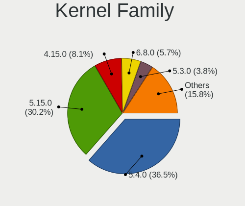
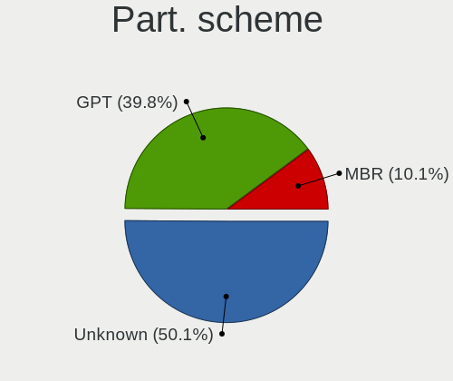
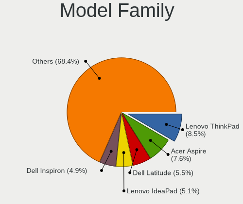
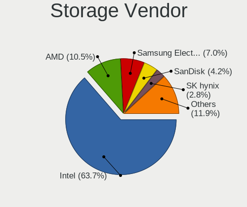
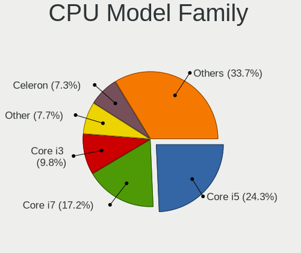
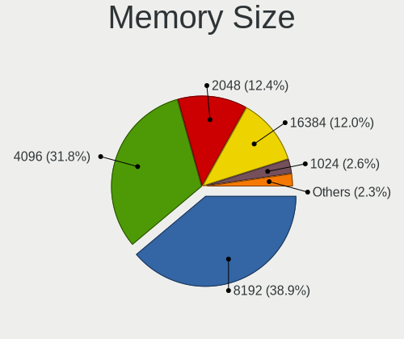

Linux Mint - Tested Hardware & Statistics (Notebooks)
-----------------------------------------------------

A project to collect tested hardware configurations for Linux Mint.

Anyone can contribute to this report by the [hw-probe](https://github.com/linuxhw/hw-probe) tool:

    sudo -E hw-probe -all -upload

Please contribute! Especially if your hardware is rare.

Contents
--------

* [ Test Cases ](#test-cases)

* [ System ](#system)
  - [ OS                       ](#os)
  - [ OS Family                ](#os-family)
  - [ Kernel                   ](#kernel)
  - [ Kernel Family            ](#kernel-family)
  - [ Kernel Major Ver.        ](#kernel-major-ver)
  - [ Arch                     ](#arch)
  - [ DE                       ](#de)
  - [ Display Server           ](#display-server)
  - [ Display Manager          ](#display-manager)
  - [ OS Lang                  ](#os-lang)
  - [ Boot Mode                ](#boot-mode)
  - [ Filesystem               ](#filesystem)
  - [ Part. scheme             ](#part-scheme)
  - [ Dual Boot with Linux/BSD ](#dual-boot-with-linuxbsd)
  - [ Dual Boot (Win)          ](#dual-boot-win)

* [ Board ](#board)
  - [ Vendor                   ](#vendor)
  - [ Model                    ](#model)
  - [ Model Family             ](#model-family)
  - [ MFG Year                 ](#mfg-year)
  - [ Form Factor              ](#form-factor)
  - [ Secure Boot              ](#secure-boot)
  - [ Coreboot                 ](#coreboot)
  - [ RAM Size                 ](#ram-size)
  - [ RAM Used                 ](#ram-used)
  - [ Total Drives             ](#total-drives)
  - [ Has CD-ROM               ](#has-cd-rom)
  - [ Has Ethernet             ](#has-ethernet)
  - [ Has WiFi                 ](#has-wifi)
  - [ Has Bluetooth            ](#has-bluetooth)

* [ Location ](#location)
  - [ Country                  ](#country)
  - [ City                     ](#city)

* [ Drives ](#drives)
  - [ Drive Vendor             ](#drive-vendor)
  - [ Drive Model              ](#drive-model)
  - [ HDD Vendor               ](#hdd-vendor)
  - [ SSD Vendor               ](#ssd-vendor)
  - [ Drive Kind               ](#drive-kind)
  - [ Drive Connector          ](#drive-connector)
  - [ Drive Size               ](#drive-size)
  - [ Space Total              ](#space-total)
  - [ Space Used               ](#space-used)
  - [ Malfunc. Drives          ](#malfunc-drives)
  - [ Malfunc. Drive Vendor    ](#malfunc-drive-vendor)
  - [ Malfunc. HDD Vendor      ](#malfunc-hdd-vendor)
  - [ Malfunc. Drive Kind      ](#malfunc-drive-kind)
  - [ Failed Drives            ](#failed-drives)
  - [ Failed Drive Vendor      ](#failed-drive-vendor)
  - [ Drive Status             ](#drive-status)

* [ Storage controller ](#storage-controller)
  - [ Storage Vendor           ](#storage-vendor)
  - [ Storage Model            ](#storage-model)
  - [ Storage Kind             ](#storage-kind)

* [ Processor ](#processor)
  - [ CPU Vendor               ](#cpu-vendor)
  - [ CPU Model                ](#cpu-model)
  - [ CPU Model Family         ](#cpu-model-family)
  - [ CPU Cores                ](#cpu-cores)
  - [ CPU Sockets              ](#cpu-sockets)
  - [ CPU Threads              ](#cpu-threads)
  - [ CPU Op-Modes             ](#cpu-op-modes)
  - [ CPU Microcode            ](#cpu-microcode)
  - [ CPU Microarch            ](#cpu-microarch)

* [ Graphics ](#graphics)
  - [ GPU Vendor               ](#gpu-vendor)
  - [ GPU Model                ](#gpu-model)
  - [ GPU Combo                ](#gpu-combo)
  - [ GPU Driver               ](#gpu-driver)
  - [ GPU Memory               ](#gpu-memory)

* [ Monitor ](#monitor)
  - [ Monitor Vendor           ](#monitor-vendor)
  - [ Monitor Model            ](#monitor-model)
  - [ Monitor Resolution       ](#monitor-resolution)
  - [ Monitor Diagonal         ](#monitor-diagonal)
  - [ Monitor Width            ](#monitor-width)
  - [ Aspect Ratio             ](#aspect-ratio)
  - [ Monitor Area             ](#monitor-area)
  - [ Pixel Density            ](#pixel-density)
  - [ Multiple Monitors        ](#multiple-monitors)

* [ Network ](#network)
  - [ Net Controller Vendor    ](#net-controller-vendor)
  - [ Net Controller Model     ](#net-controller-model)
  - [ Wireless Vendor          ](#wireless-vendor)
  - [ Wireless Model           ](#wireless-model)
  - [ Ethernet Vendor          ](#ethernet-vendor)
  - [ Ethernet Model           ](#ethernet-model)
  - [ Net Controller Kind      ](#net-controller-kind)
  - [ Used Controller          ](#used-controller)
  - [ NICs                     ](#nics)
  - [ IPv6                     ](#ipv6)

* [ Bluetooth ](#bluetooth)
  - [ Bluetooth Vendor         ](#bluetooth-vendor)
  - [ Bluetooth Model          ](#bluetooth-model)

* [ Sound ](#sound)
  - [ Sound Vendor             ](#sound-vendor)
  - [ Sound Model              ](#sound-model)

* [ Memory ](#memory)
  - [ Memory Vendor            ](#memory-vendor)
  - [ Memory Model             ](#memory-model)
  - [ Memory Kind              ](#memory-kind)
  - [ Memory Form Factor       ](#memory-form-factor)
  - [ Memory Size              ](#memory-size)
  - [ Memory Speed             ](#memory-speed)

* [ Printers & scanners ](#printers--scanners)
  - [ Printer Vendor           ](#printer-vendor)
  - [ Printer Model            ](#printer-model)
  - [ Scanner Vendor           ](#scanner-vendor)
  - [ Scanner Model            ](#scanner-model)

* [ Camera ](#camera)
  - [ Camera Vendor            ](#camera-vendor)
  - [ Camera Model             ](#camera-model)

* [ Security ](#security)
  - [ Fingerprint Vendor       ](#fingerprint-vendor)
  - [ Fingerprint Model        ](#fingerprint-model)
  - [ Chipcard Vendor          ](#chipcard-vendor)
  - [ Chipcard Model           ](#chipcard-model)

* [ Unsupported ](#unsupported)
  - [ Unsupported Devices      ](#unsupported-devices)
  - [ Unsupported Device Types ](#unsupported-device-types)

Test Cases
----------

Total: 10869

| Vendor        | Model                       | Probe                                                      | Date         |
|---------------|-----------------------------|------------------------------------------------------------|--------------|
| Dell          | Inspiron 5559               | [c7b43caa52](https://linux-hardware.org/?probe=c7b43caa52) | Sep 01, 2022 |
| HP            | Laptop 15-db1xxx            | [51b19bb74b](https://linux-hardware.org/?probe=51b19bb74b) | Sep 01, 2022 |
| Acer          | Aspire 5742G                | [1ed15181cb](https://linux-hardware.org/?probe=1ed15181cb) | Sep 01, 2022 |
| Dell          | Inspiron 15-3567            | [5b1f25ca62](https://linux-hardware.org/?probe=5b1f25ca62) | Sep 01, 2022 |
| Acer          | Aspire V5-431               | [5ac694007d](https://linux-hardware.org/?probe=5ac694007d) | Sep 01, 2022 |
| HP            | EliteBook 830 G8 Noteboo... | [814c094769](https://linux-hardware.org/?probe=814c094769) | Sep 01, 2022 |
| ASUSTek       | VivoBook_ASUS Laptop X50... | [9da6412308](https://linux-hardware.org/?probe=9da6412308) | Sep 01, 2022 |
| Medion        | E6227                       | [e6ca2257e7](https://linux-hardware.org/?probe=e6ca2257e7) | Sep 01, 2022 |
| Daten Tecn... | DT02-M4                     | [6e337cb132](https://linux-hardware.org/?probe=6e337cb132) | Sep 01, 2022 |
| Alienware     | m15 R4                      | [267e4bb2dd](https://linux-hardware.org/?probe=267e4bb2dd) | Sep 01, 2022 |
| Daten Tecn... | DT02-M4                     | [cdac9cafaf](https://linux-hardware.org/?probe=cdac9cafaf) | Sep 01, 2022 |
| Apple         | MacBookPro5,1               | [4c90105342](https://linux-hardware.org/?probe=4c90105342) | Sep 01, 2022 |
| Lenovo        | Legion Y530-15ICH 81FV      | [c9fcbe9935](https://linux-hardware.org/?probe=c9fcbe9935) | Sep 01, 2022 |
| Lenovo        | Legion Y530-15ICH 81FV      | [52efef286f](https://linux-hardware.org/?probe=52efef286f) | Sep 01, 2022 |
| Acer          | Aspire 5810T                | [6f807b1a84](https://linux-hardware.org/?probe=6f807b1a84) | Sep 01, 2022 |
| Toshiba       | PORTEGE M800                | [547ef88897](https://linux-hardware.org/?probe=547ef88897) | Aug 31, 2022 |
| Toshiba       | PORTEGE M800                | [355cc5a1ec](https://linux-hardware.org/?probe=355cc5a1ec) | Aug 31, 2022 |
| Samsung       | 340XAA/350XAA/550XAA        | [c1d60c7b0b](https://linux-hardware.org/?probe=c1d60c7b0b) | Aug 31, 2022 |
| Samsung       | 340XAA/350XAA/550XAA        | [dafd789095](https://linux-hardware.org/?probe=dafd789095) | Aug 31, 2022 |
| Dell          | Inspiron 7720               | [97883c54a3](https://linux-hardware.org/?probe=97883c54a3) | Aug 31, 2022 |
| The Wareho... | E2037                       | [e9599d1061](https://linux-hardware.org/?probe=e9599d1061) | Aug 31, 2022 |
| Lenovo        | ThinkPad T400 2767E53       | [454c7382bd](https://linux-hardware.org/?probe=454c7382bd) | Aug 31, 2022 |
| HP            | EliteBook 840 G5            | [e4b0cb981a](https://linux-hardware.org/?probe=e4b0cb981a) | Aug 31, 2022 |
| Lenovo        | ThinkPad L540 20AUA06000    | [e2fd79b86e](https://linux-hardware.org/?probe=e2fd79b86e) | Aug 30, 2022 |
| Dell          | Inspiron N5110              | [9fe8c04ec6](https://linux-hardware.org/?probe=9fe8c04ec6) | Aug 30, 2022 |
| Lenovo        | IdeaPad S340-14API 81NB     | [aa35aacc70](https://linux-hardware.org/?probe=aa35aacc70) | Aug 30, 2022 |
| Lenovo        | ThinkPad Edge E535 3260E... | [05141be4a5](https://linux-hardware.org/?probe=05141be4a5) | Aug 30, 2022 |
| ASUSTek       | F3F                         | [57c5732aaa](https://linux-hardware.org/?probe=57c5732aaa) | Aug 30, 2022 |
| HP            | Laptop 17-cp0xxx            | [62c06b8d9c](https://linux-hardware.org/?probe=62c06b8d9c) | Aug 30, 2022 |
| Acer          | Aspire 5680                 | [e58163df64](https://linux-hardware.org/?probe=e58163df64) | Aug 30, 2022 |
| Dell          | Latitude E5270              | [d61a2cd74a](https://linux-hardware.org/?probe=d61a2cd74a) | Aug 30, 2022 |
| Lenovo        | IdeaPad S340-14API 81NB     | [4d2ce353d4](https://linux-hardware.org/?probe=4d2ce353d4) | Aug 30, 2022 |
| Apple         | MacBookPro5,1               | [468eeca88b](https://linux-hardware.org/?probe=468eeca88b) | Aug 30, 2022 |
| HP            | ProBook 4540s               | [0509af43f4](https://linux-hardware.org/?probe=0509af43f4) | Aug 30, 2022 |
| HP            | 2000                        | [106a330325](https://linux-hardware.org/?probe=106a330325) | Aug 30, 2022 |
| Lenovo        | ThinkPad X1 Carbon Gen 8... | [adcfb8a267](https://linux-hardware.org/?probe=adcfb8a267) | Aug 30, 2022 |
| HP            | EliteBook 8440p             | [1f0f196305](https://linux-hardware.org/?probe=1f0f196305) | Aug 29, 2022 |
| Acer          | Aspire E1-571G              | [414795a69b](https://linux-hardware.org/?probe=414795a69b) | Aug 29, 2022 |
| HP            | 2000                        | [9705fe4434](https://linux-hardware.org/?probe=9705fe4434) | Aug 29, 2022 |
| ASUSTek       | VivoBook_ASUSLaptop X512... | [fc5f863965](https://linux-hardware.org/?probe=fc5f863965) | Aug 29, 2022 |
| HP            | ProBook 6550b               | [662065bfe2](https://linux-hardware.org/?probe=662065bfe2) | Aug 29, 2022 |
| Dell          | Latitude 3440               | [3e3f5ac9ab](https://linux-hardware.org/?probe=3e3f5ac9ab) | Aug 29, 2022 |
| Dell          | Vostro 14 5410              | [2d4b907d84](https://linux-hardware.org/?probe=2d4b907d84) | Aug 29, 2022 |
| Lenovo        | ThinkPad P14s Gen 2a 21A... | [b3c97eb801](https://linux-hardware.org/?probe=b3c97eb801) | Aug 29, 2022 |
| Plaisio       | Turbo X                     | [ae92ead1ca](https://linux-hardware.org/?probe=ae92ead1ca) | Aug 29, 2022 |
| Lenovo        | ThinkPad P14s Gen 2a 21A... | [748d6f1523](https://linux-hardware.org/?probe=748d6f1523) | Aug 29, 2022 |
| Lenovo        | V145-15AST 81MT             | [40b9d37c2a](https://linux-hardware.org/?probe=40b9d37c2a) | Aug 29, 2022 |
| HP            | EliteBook 8560w             | [0ea43b9010](https://linux-hardware.org/?probe=0ea43b9010) | Aug 29, 2022 |
| Lenovo        | ThinkPad T400 2767E53       | [ee3156dfc5](https://linux-hardware.org/?probe=ee3156dfc5) | Aug 29, 2022 |
| Lenovo        | G70-80 80FF                 | [8ac571d297](https://linux-hardware.org/?probe=8ac571d297) | Aug 28, 2022 |
| Lenovo        | G70-80 80FF                 | [3f2eb2720b](https://linux-hardware.org/?probe=3f2eb2720b) | Aug 28, 2022 |
| Lenovo        | ThinkPad X1 Carbon 6th 2... | [a8acbb8d0b](https://linux-hardware.org/?probe=a8acbb8d0b) | Aug 28, 2022 |
| Dell          | Inspiron MM061              | [7d69c012fb](https://linux-hardware.org/?probe=7d69c012fb) | Aug 28, 2022 |
| ASUSTek       | VivoBook_ASUSLaptop X509... | [dd415db306](https://linux-hardware.org/?probe=dd415db306) | Aug 28, 2022 |
| ASUSTek       | N71Jv                       | [b30a3030ae](https://linux-hardware.org/?probe=b30a3030ae) | Aug 28, 2022 |
| Dell          | Latitude E6400              | [666ba32534](https://linux-hardware.org/?probe=666ba32534) | Aug 28, 2022 |
| Lenovo        | IdeaPad 3 15ITL05 81X8      | [8b4125a88a](https://linux-hardware.org/?probe=8b4125a88a) | Aug 28, 2022 |
| ASUSTek       | ZenBook UX333FA_UX333FA     | [a66f7c7a3a](https://linux-hardware.org/?probe=a66f7c7a3a) | Aug 28, 2022 |
| Acer          | V3-771                      | [3efe8f2f41](https://linux-hardware.org/?probe=3efe8f2f41) | Aug 28, 2022 |
| Lenovo        | G700 20251                  | [25e0f764b5](https://linux-hardware.org/?probe=25e0f764b5) | Aug 28, 2022 |
| Dell          | Inspiron 3505               | [32f22bef7f](https://linux-hardware.org/?probe=32f22bef7f) | Aug 28, 2022 |
| Dell          | Latitude E5510              | [50831b94bf](https://linux-hardware.org/?probe=50831b94bf) | Aug 28, 2022 |
| Dell          | Inspiron 3537               | [d7bec5678a](https://linux-hardware.org/?probe=d7bec5678a) | Aug 27, 2022 |
| Dell          | Inspiron 1501               | [8ec322c539](https://linux-hardware.org/?probe=8ec322c539) | Aug 27, 2022 |
| Lenovo        | ThinkPad T14s Gen 1 20UJ... | [e86eacb6b4](https://linux-hardware.org/?probe=e86eacb6b4) | Aug 27, 2022 |
| HP            | ENVY Notebook               | [c43c52b493](https://linux-hardware.org/?probe=c43c52b493) | Aug 27, 2022 |
| Apple         | MacBookPro11,3              | [0008869bb6](https://linux-hardware.org/?probe=0008869bb6) | Aug 27, 2022 |
| Apple         | MacBookPro11,3              | [c0e9a2e062](https://linux-hardware.org/?probe=c0e9a2e062) | Aug 27, 2022 |
| TrekStor      | Primebook P14               | [d3237a664d](https://linux-hardware.org/?probe=d3237a664d) | Aug 27, 2022 |
| MSI           | GL72 6QF                    | [1ffe55389e](https://linux-hardware.org/?probe=1ffe55389e) | Aug 27, 2022 |
| Acer          | Aspire 8920                 | [b93b80fdbd](https://linux-hardware.org/?probe=b93b80fdbd) | Aug 27, 2022 |
| MSI           | GL72 6QF                    | [46b40c3c67](https://linux-hardware.org/?probe=46b40c3c67) | Aug 27, 2022 |
| HP            | OMEN by Laptop 15z-en100    | [41f0deff42](https://linux-hardware.org/?probe=41f0deff42) | Aug 27, 2022 |
| Alienware     | m15 R6                      | [d39642f1ce](https://linux-hardware.org/?probe=d39642f1ce) | Aug 26, 2022 |
| HP            | OMEN by Laptop 15z-en100    | [04c6e61e44](https://linux-hardware.org/?probe=04c6e61e44) | Aug 26, 2022 |
| ASUSTek       | X550CC                      | [8b85141416](https://linux-hardware.org/?probe=8b85141416) | Aug 26, 2022 |
| ASUSTek       | VivoBook_ASUSLaptop M340... | [3f94d521d4](https://linux-hardware.org/?probe=3f94d521d4) | Aug 26, 2022 |
| Fujitsu       | LIFEBOOK E752               | [adf76251c5](https://linux-hardware.org/?probe=adf76251c5) | Aug 26, 2022 |
| Fujitsu       | LIFEBOOK E752               | [7c7a83f951](https://linux-hardware.org/?probe=7c7a83f951) | Aug 26, 2022 |
| ASUSTek       | X542URR                     | [11867009b0](https://linux-hardware.org/?probe=11867009b0) | Aug 26, 2022 |
| Acer          | Aspire 5942                 | [528e0a954b](https://linux-hardware.org/?probe=528e0a954b) | Aug 26, 2022 |
| ASUSTek       | X542URR                     | [909b7dcd37](https://linux-hardware.org/?probe=909b7dcd37) | Aug 26, 2022 |
| Daten Tecn... | DT02-M4                     | [c8d0dcb323](https://linux-hardware.org/?probe=c8d0dcb323) | Aug 26, 2022 |
| ASUSTek       | K72Jk                       | [d456f7083c](https://linux-hardware.org/?probe=d456f7083c) | Aug 26, 2022 |
| Schenker      | VISION 15 (SVS15E21)        | [010f9d02e1](https://linux-hardware.org/?probe=010f9d02e1) | Aug 26, 2022 |
| Razer         | Blade                       | [7d825be87d](https://linux-hardware.org/?probe=7d825be87d) | Aug 26, 2022 |
| Apple         | MacBookAir7,2               | [faf049bedc](https://linux-hardware.org/?probe=faf049bedc) | Aug 26, 2022 |
| Apple         | MacBookAir7,2               | [eed296b506](https://linux-hardware.org/?probe=eed296b506) | Aug 26, 2022 |
| Dell          | Latitude 5300               | [f336b3aeaf](https://linux-hardware.org/?probe=f336b3aeaf) | Aug 26, 2022 |
| Daten Tecn... | DT02-M4                     | [f2de49c59b](https://linux-hardware.org/?probe=f2de49c59b) | Aug 26, 2022 |
| Daten Tecn... | DT02-M4                     | [21e69486fd](https://linux-hardware.org/?probe=21e69486fd) | Aug 26, 2022 |
| Apple         | MacBookPro8,1               | [c94e06f68f](https://linux-hardware.org/?probe=c94e06f68f) | Aug 26, 2022 |
| Acer          | Aspire 5680                 | [8ee728569a](https://linux-hardware.org/?probe=8ee728569a) | Aug 25, 2022 |
| ASUSTek       | K52Jc                       | [5c10927d11](https://linux-hardware.org/?probe=5c10927d11) | Aug 25, 2022 |
| Apple         | MacBookPro8,1               | [7be66c9d4c](https://linux-hardware.org/?probe=7be66c9d4c) | Aug 25, 2022 |
| Lenovo        | IdeaPad S340-15IWL 81N8     | [adf697ae96](https://linux-hardware.org/?probe=adf697ae96) | Aug 25, 2022 |
| ASUSTek       | N61Vg                       | [30be913709](https://linux-hardware.org/?probe=30be913709) | Aug 25, 2022 |
| Apple         | MacBookPro5,1               | [6efab17b42](https://linux-hardware.org/?probe=6efab17b42) | Aug 25, 2022 |
| HP            | OMEN by Laptop 16-c0xxx     | [2a441a673b](https://linux-hardware.org/?probe=2a441a673b) | Aug 25, 2022 |
| HP            | ProBook 640 G2              | [fc50d4e200](https://linux-hardware.org/?probe=fc50d4e200) | Aug 25, 2022 |
| Panasonic     | CF-53AAGZXDX                | [e4bc97855b](https://linux-hardware.org/?probe=e4bc97855b) | Aug 25, 2022 |
| HP            | 15                          | [832c6247b2](https://linux-hardware.org/?probe=832c6247b2) | Aug 25, 2022 |
| Dell          | Precision M4800             | [b00f73e4a3](https://linux-hardware.org/?probe=b00f73e4a3) | Aug 24, 2022 |
| HP            | Compaq CQ58                 | [c4f7e439a9](https://linux-hardware.org/?probe=c4f7e439a9) | Aug 24, 2022 |
| Lenovo        | IdeaPad S205 10382EG        | [f87311cbd3](https://linux-hardware.org/?probe=f87311cbd3) | Aug 24, 2022 |
| ASUSTek       | X705UAP                     | [eacfc15b6c](https://linux-hardware.org/?probe=eacfc15b6c) | Aug 24, 2022 |
| Acer          | TravelMate 5742G            | [37418dc2c7](https://linux-hardware.org/?probe=37418dc2c7) | Aug 24, 2022 |
| ASUSTek       | X751LD                      | [4306baa541](https://linux-hardware.org/?probe=4306baa541) | Aug 24, 2022 |
| HP            | 2000                        | [a17502ee0a](https://linux-hardware.org/?probe=a17502ee0a) | Aug 24, 2022 |
| Razer         | Blade                       | [b552b446f0](https://linux-hardware.org/?probe=b552b446f0) | Aug 24, 2022 |
| Razer         | Blade                       | [d13a0c3cda](https://linux-hardware.org/?probe=d13a0c3cda) | Aug 24, 2022 |
| HP            | Compaq 6735s                | [4e52bb6ecb](https://linux-hardware.org/?probe=4e52bb6ecb) | Aug 23, 2022 |
| Samsung       | RV411/RV511/E3511/S3511/... | [3507cf3eab](https://linux-hardware.org/?probe=3507cf3eab) | Aug 23, 2022 |
| Google        | Snappy                      | [89c9384dc4](https://linux-hardware.org/?probe=89c9384dc4) | Aug 23, 2022 |
| Acer          | Nitro AN517-51              | [e53f196e21](https://linux-hardware.org/?probe=e53f196e21) | Aug 23, 2022 |
| Lenovo        | B570e HuronRiver Platfor... | [0c5ed030a3](https://linux-hardware.org/?probe=0c5ed030a3) | Aug 23, 2022 |
| Toshiba       | Satellite L855              | [07b2f24172](https://linux-hardware.org/?probe=07b2f24172) | Aug 23, 2022 |
| Sony          | VGN-NR210FH                 | [8c007bfa55](https://linux-hardware.org/?probe=8c007bfa55) | Aug 23, 2022 |
| HP            | EliteBook 820 G3            | [5cb6011138](https://linux-hardware.org/?probe=5cb6011138) | Aug 23, 2022 |
| HUAWEI        | BOHK-WAX9X                  | [c2f58df994](https://linux-hardware.org/?probe=c2f58df994) | Aug 22, 2022 |
| AMI           | Unknown                     | [b6004987ab](https://linux-hardware.org/?probe=b6004987ab) | Aug 22, 2022 |
| Apple         | MacBookPro8,1               | [88bb92c310](https://linux-hardware.org/?probe=88bb92c310) | Aug 22, 2022 |
| ASUSTek       | K53E                        | [65ddd1bb6f](https://linux-hardware.org/?probe=65ddd1bb6f) | Aug 22, 2022 |
| Dell          | Latitude 7420               | [ebbef2bf39](https://linux-hardware.org/?probe=ebbef2bf39) | Aug 22, 2022 |
| Dell          | Latitude 5521               | [b14afc8c75](https://linux-hardware.org/?probe=b14afc8c75) | Aug 22, 2022 |
| Apple         | MacBookPro12,1              | [222fd7ac34](https://linux-hardware.org/?probe=222fd7ac34) | Aug 22, 2022 |
| Dell          | Latitude E6540              | [546fed0c24](https://linux-hardware.org/?probe=546fed0c24) | Aug 22, 2022 |
| Dell          | Inspiron 13-5368            | [9d0f972a5f](https://linux-hardware.org/?probe=9d0f972a5f) | Aug 22, 2022 |
| Lenovo        | ThinkPad X230 2324BB5       | [0c6c383c92](https://linux-hardware.org/?probe=0c6c383c92) | Aug 22, 2022 |
| Apple         | MacBookPro12,1              | [e4dec4681f](https://linux-hardware.org/?probe=e4dec4681f) | Aug 22, 2022 |
| HP            | Mini 110-3100               | [1e27123078](https://linux-hardware.org/?probe=1e27123078) | Aug 22, 2022 |
| Acer          | Aspire 5742G                | [546164ada0](https://linux-hardware.org/?probe=546164ada0) | Aug 22, 2022 |
| HP            | 2000                        | [8462eb5175](https://linux-hardware.org/?probe=8462eb5175) | Aug 22, 2022 |
| HP            | Pavilion dv7                | [81b7ddb4e9](https://linux-hardware.org/?probe=81b7ddb4e9) | Aug 21, 2022 |
| Samsung       | 550XCJ/550XCR               | [cae0d518ee](https://linux-hardware.org/?probe=cae0d518ee) | Aug 21, 2022 |
| HP            | Pavilion 15                 | [c8d31e4708](https://linux-hardware.org/?probe=c8d31e4708) | Aug 21, 2022 |
| Medion        | P7816                       | [086f9ac20c](https://linux-hardware.org/?probe=086f9ac20c) | Aug 20, 2022 |
| Dell          | Latitude E5530 non-vPro     | [d0737ad7f1](https://linux-hardware.org/?probe=d0737ad7f1) | Aug 20, 2022 |
| HP            | Compaq 6735s                | [5cfcfab468](https://linux-hardware.org/?probe=5cfcfab468) | Aug 20, 2022 |
| ASUSTek       | VivoBook_ASUSLaptop X712... | [2fda694b9c](https://linux-hardware.org/?probe=2fda694b9c) | Aug 20, 2022 |
| Apple         | MacBookPro11,3              | [51a98d93a6](https://linux-hardware.org/?probe=51a98d93a6) | Aug 20, 2022 |
| GPU Compan... | GWTN141-10                  | [3bb80937c1](https://linux-hardware.org/?probe=3bb80937c1) | Aug 20, 2022 |
| ASUSTek       | ASUS TUF Gaming A15 FA50... | [ac28d2918e](https://linux-hardware.org/?probe=ac28d2918e) | Aug 20, 2022 |
| HP            | Compaq CQ58                 | [59fadaa084](https://linux-hardware.org/?probe=59fadaa084) | Aug 20, 2022 |
| ASUSTek       | X756UAK                     | [6db3b2a7bc](https://linux-hardware.org/?probe=6db3b2a7bc) | Aug 20, 2022 |
| Dell          | Precision 7750              | [53e5baea4e](https://linux-hardware.org/?probe=53e5baea4e) | Aug 20, 2022 |
| Acer          | Aspire one 1-431            | [cd1755e81d](https://linux-hardware.org/?probe=cd1755e81d) | Aug 20, 2022 |
| Lenovo        | ThinkPad L540 20AUA06000    | [7783d3ca34](https://linux-hardware.org/?probe=7783d3ca34) | Aug 20, 2022 |
| GPU Compan... | GWTN141-10                  | [ba4a181e92](https://linux-hardware.org/?probe=ba4a181e92) | Aug 20, 2022 |
| HP            | Stream Laptop 14-cb1XX      | [7ab9912d76](https://linux-hardware.org/?probe=7ab9912d76) | Aug 19, 2022 |
| Acer          | Aspire E5-575G              | [771804393e](https://linux-hardware.org/?probe=771804393e) | Aug 19, 2022 |
| HP            | HDX16                       | [46e0559af0](https://linux-hardware.org/?probe=46e0559af0) | Aug 19, 2022 |
| ASUSTek       | ASUS TUF Gaming A15 FA50... | [b97f13141f](https://linux-hardware.org/?probe=b97f13141f) | Aug 19, 2022 |
| HP            | HDX16                       | [fb119a9cb4](https://linux-hardware.org/?probe=fb119a9cb4) | Aug 19, 2022 |
| HP            | EliteBook 8460p             | [1eca9d2f2d](https://linux-hardware.org/?probe=1eca9d2f2d) | Aug 19, 2022 |
| Samsung       | 700Z3A/700Z4A/700Z5A/700... | [71b36edb04](https://linux-hardware.org/?probe=71b36edb04) | Aug 19, 2022 |
| HP            | 15                          | [166efee25e](https://linux-hardware.org/?probe=166efee25e) | Aug 19, 2022 |
| Lenovo        | ThinkPad P50 20EN0005PG     | [69c8e5eedc](https://linux-hardware.org/?probe=69c8e5eedc) | Aug 19, 2022 |
| Apple         | MacBookPro9,2               | [23fb1e2721](https://linux-hardware.org/?probe=23fb1e2721) | Aug 19, 2022 |
| Apple         | MacBookPro9,2               | [eb35a0b474](https://linux-hardware.org/?probe=eb35a0b474) | Aug 18, 2022 |
| Dell          | Latitude E6420              | [588755599f](https://linux-hardware.org/?probe=588755599f) | Aug 18, 2022 |
| Apple         | MacBook2,1                  | [46208653fa](https://linux-hardware.org/?probe=46208653fa) | Aug 18, 2022 |
| ASUSTek       | X542UQR                     | [4c8af9dc73](https://linux-hardware.org/?probe=4c8af9dc73) | Aug 18, 2022 |
| ASUSTek       | ASUS TUF Gaming F15 FX50... | [9619850e97](https://linux-hardware.org/?probe=9619850e97) | Aug 18, 2022 |
| Toshiba       | QOSMIO X70-B                | [9d599f3d84](https://linux-hardware.org/?probe=9d599f3d84) | Aug 18, 2022 |
| HP            | Pavilion g6                 | [edcd723a3f](https://linux-hardware.org/?probe=edcd723a3f) | Aug 18, 2022 |
| ASUSTek       | ASUS EXPERTBOOK P5440FA_... | [eb159f06ab](https://linux-hardware.org/?probe=eb159f06ab) | Aug 17, 2022 |
| ASUSTek       | ASUS EXPERTBOOK P5440FA_... | [36fb0e2471](https://linux-hardware.org/?probe=36fb0e2471) | Aug 17, 2022 |
| Acer          | Aspire V3-771               | [dc65bd0f38](https://linux-hardware.org/?probe=dc65bd0f38) | Aug 17, 2022 |
| ASUSTek       | X542UQR                     | [8236615818](https://linux-hardware.org/?probe=8236615818) | Aug 17, 2022 |
| Unknown       | Unknown                     | [66053f0e50](https://linux-hardware.org/?probe=66053f0e50) | Aug 17, 2022 |
| HP            | Notebook                    | [784ad31f68](https://linux-hardware.org/?probe=784ad31f68) | Aug 17, 2022 |
| Chuwi         | LarkBook X                  | [b3c5eba91b](https://linux-hardware.org/?probe=b3c5eba91b) | Aug 17, 2022 |
| Lenovo        | Unknown                     | [d6a318092b](https://linux-hardware.org/?probe=d6a318092b) | Aug 16, 2022 |
| Lenovo        | Unknown                     | [a8af2e8de4](https://linux-hardware.org/?probe=a8af2e8de4) | Aug 16, 2022 |
| HP            | 2000                        | [9ac959eca8](https://linux-hardware.org/?probe=9ac959eca8) | Aug 15, 2022 |
| HP            | 2000                        | [caf3781c13](https://linux-hardware.org/?probe=caf3781c13) | Aug 15, 2022 |
| AMI           | Unknown                     | [a1a8c0b2c5](https://linux-hardware.org/?probe=a1a8c0b2c5) | Aug 15, 2022 |
| Lenovo        | IdeaPad 3 17ADA05 81W2      | [da0503d5dd](https://linux-hardware.org/?probe=da0503d5dd) | Aug 15, 2022 |
| ASUSTek       | B43E                        | [dccc24ad88](https://linux-hardware.org/?probe=dccc24ad88) | Aug 15, 2022 |
| Toshiba       | dynabook T75/RW             | [ff35aa835d](https://linux-hardware.org/?probe=ff35aa835d) | Aug 15, 2022 |
| Samsung       | 700Z3A/700Z4A/700Z5A/700... | [82c1a32493](https://linux-hardware.org/?probe=82c1a32493) | Aug 15, 2022 |
| Acer          | AO725                       | [3ee4520923](https://linux-hardware.org/?probe=3ee4520923) | Aug 15, 2022 |
| ASUSTek       | N551VW                      | [b84ee36534](https://linux-hardware.org/?probe=b84ee36534) | Aug 15, 2022 |
| ASUSTek       | N551VW                      | [b4daacb47f](https://linux-hardware.org/?probe=b4daacb47f) | Aug 15, 2022 |
| HP            | 240 G7 Notebook PC          | [24849a5c23](https://linux-hardware.org/?probe=24849a5c23) | Aug 15, 2022 |
| Lenovo        | G470 20078                  | [cafdc06a51](https://linux-hardware.org/?probe=cafdc06a51) | Aug 14, 2022 |
| HP            | EliteBook 8560w             | [86b3f33331](https://linux-hardware.org/?probe=86b3f33331) | Aug 14, 2022 |
| HP            | EliteBook 8560w             | [4ea7538e24](https://linux-hardware.org/?probe=4ea7538e24) | Aug 14, 2022 |
| ASUSTek       | X756UXM                     | [68be00c00d](https://linux-hardware.org/?probe=68be00c00d) | Aug 14, 2022 |
| Acer          | Swift SF114-34              | [b70232aabe](https://linux-hardware.org/?probe=b70232aabe) | Aug 14, 2022 |
| Lenovo        | ThinkPad W540 20BHS0F206    | [7f24672b73](https://linux-hardware.org/?probe=7f24672b73) | Aug 14, 2022 |
| Lenovo        | IdeaPad S130-11IGM 81J1     | [cacd0ad0a8](https://linux-hardware.org/?probe=cacd0ad0a8) | Aug 14, 2022 |
| Unknown       | Unknown                     | [5cdd2332d5](https://linux-hardware.org/?probe=5cdd2332d5) | Aug 14, 2022 |
| Dell          | Inspiron 5420               | [83b14f40e6](https://linux-hardware.org/?probe=83b14f40e6) | Aug 14, 2022 |
| Acer          | Aspire 6930G                | [c0ba049caf](https://linux-hardware.org/?probe=c0ba049caf) | Aug 14, 2022 |
| Acer          | Aspire 3100                 | [8ea61dbd3c](https://linux-hardware.org/?probe=8ea61dbd3c) | Aug 14, 2022 |
| Dell          | Inspiron 15-3567            | [42223a802a](https://linux-hardware.org/?probe=42223a802a) | Aug 14, 2022 |
| HUAWEI        | NBLK-WAX9X                  | [4dec80cf41](https://linux-hardware.org/?probe=4dec80cf41) | Aug 13, 2022 |
| Toshiba       | Satellite C660              | [50d9a2d6fe](https://linux-hardware.org/?probe=50d9a2d6fe) | Aug 13, 2022 |
| Alienware     | x15 R2                      | [1d415b648a](https://linux-hardware.org/?probe=1d415b648a) | Aug 13, 2022 |
| Lenovo        | ThinkPad T430s 2356A89      | [4a52da1c38](https://linux-hardware.org/?probe=4a52da1c38) | Aug 13, 2022 |
| Lenovo        | ThinkPad T430s 2356A89      | [f71b1992c9](https://linux-hardware.org/?probe=f71b1992c9) | Aug 13, 2022 |
| Acer          | Aspire A515-56              | [e93f8de88b](https://linux-hardware.org/?probe=e93f8de88b) | Aug 13, 2022 |
| Acer          | Aspire A515-56              | [e429237c05](https://linux-hardware.org/?probe=e429237c05) | Aug 13, 2022 |
| Notebook      | N9x0TC                      | [a809b1cf7b](https://linux-hardware.org/?probe=a809b1cf7b) | Aug 13, 2022 |
| Foxconn       | Kangaroo Mobile Desktop     | [1b9f19b21e](https://linux-hardware.org/?probe=1b9f19b21e) | Aug 13, 2022 |
| Google        | Celes                       | [f6716098f9](https://linux-hardware.org/?probe=f6716098f9) | Aug 13, 2022 |
| Samsung       | 550XDA                      | [4964cf32aa](https://linux-hardware.org/?probe=4964cf32aa) | Aug 12, 2022 |
| ASUSTek       | UX303LAB                    | [169419cea0](https://linux-hardware.org/?probe=169419cea0) | Aug 12, 2022 |
| Dell          | Latitude 5521               | [39f7c1e9ce](https://linux-hardware.org/?probe=39f7c1e9ce) | Aug 12, 2022 |
| Lenovo        | ThinkPad T480 20L6SBD000    | [b0bbce7c9d](https://linux-hardware.org/?probe=b0bbce7c9d) | Aug 12, 2022 |
| ASUSTek       | G53SW                       | [4aa126ad5b](https://linux-hardware.org/?probe=4aa126ad5b) | Aug 12, 2022 |
| HUAWEI        | BOM-WXX9                    | [902894a02b](https://linux-hardware.org/?probe=902894a02b) | Aug 12, 2022 |
| Samsung       | R430/R480/R440              | [39323c99dc](https://linux-hardware.org/?probe=39323c99dc) | Aug 12, 2022 |
| Positivo      | Q4128C-S                    | [4f8b07c958](https://linux-hardware.org/?probe=4f8b07c958) | Aug 12, 2022 |
| HP            | EliteBook 2760p             | [0ce6a49a7f](https://linux-hardware.org/?probe=0ce6a49a7f) | Aug 12, 2022 |
| ASUSTek       | VivoBook 15_ASUS Laptop ... | [f41308ccdc](https://linux-hardware.org/?probe=f41308ccdc) | Aug 12, 2022 |
| Lenovo        | ThinkPad T540p 20BFA0MN0... | [396a40a489](https://linux-hardware.org/?probe=396a40a489) | Aug 12, 2022 |
| HP            | Laptop 15-da0xxx            | [70ea8b51c8](https://linux-hardware.org/?probe=70ea8b51c8) | Aug 12, 2022 |
| Lenovo        | IdeaPad Slim 1-14AST-05 ... | [279c16c1e3](https://linux-hardware.org/?probe=279c16c1e3) | Aug 12, 2022 |
| Lenovo        | ThinkPad X200 7458VL3       | [82762528a7](https://linux-hardware.org/?probe=82762528a7) | Aug 12, 2022 |
| Apple         | MacBookPro9,2               | [f48110428f](https://linux-hardware.org/?probe=f48110428f) | Aug 11, 2022 |
| Packard Be... | EasyNote LE69KB             | [8e79ac1a3e](https://linux-hardware.org/?probe=8e79ac1a3e) | Aug 11, 2022 |
| Lenovo        | Legion 5 15IMH05H 81Y6      | [24534c03df](https://linux-hardware.org/?probe=24534c03df) | Aug 11, 2022 |
| Intel         | (R) Education Tablet        | [a9b5863c1a](https://linux-hardware.org/?probe=a9b5863c1a) | Aug 11, 2022 |
| Lenovo        | ThinkPad E590 20NB0029MC    | [233b3cdd54](https://linux-hardware.org/?probe=233b3cdd54) | Aug 11, 2022 |
| Apple         | MacBookPro5,1               | [ab09f2f44b](https://linux-hardware.org/?probe=ab09f2f44b) | Aug 11, 2022 |
| Dell          | Latitude E6420              | [c5ce4b0bff](https://linux-hardware.org/?probe=c5ce4b0bff) | Aug 10, 2022 |
| Dell          | Latitude 5521               | [25f117c439](https://linux-hardware.org/?probe=25f117c439) | Aug 10, 2022 |
| Toshiba       | Satellite L300              | [b5eb0f557d](https://linux-hardware.org/?probe=b5eb0f557d) | Aug 10, 2022 |
| HP            | EliteBook 840r G4           | [d8dded5468](https://linux-hardware.org/?probe=d8dded5468) | Aug 10, 2022 |
| HP            | EliteBook 840r G4           | [cbe6c79fc8](https://linux-hardware.org/?probe=cbe6c79fc8) | Aug 10, 2022 |
| Lenovo        | IdeaPad 5 Pro 14ITL6 82L... | [f8c3a3a610](https://linux-hardware.org/?probe=f8c3a3a610) | Aug 10, 2022 |
| HP            | ProBook 4540s               | [426365299d](https://linux-hardware.org/?probe=426365299d) | Aug 10, 2022 |
| Lenovo        | ThinkPad W530 2447D87       | [f987585f09](https://linux-hardware.org/?probe=f987585f09) | Aug 10, 2022 |
| HP            | OMEN by Laptop 15-dh1xxx    | [1bc504293c](https://linux-hardware.org/?probe=1bc504293c) | Aug 10, 2022 |
| Dell          | Latitude E5450              | [19b094ca76](https://linux-hardware.org/?probe=19b094ca76) | Aug 09, 2022 |
| Lenovo        | V3000 80KV                  | [32c1aa64cf](https://linux-hardware.org/?probe=32c1aa64cf) | Aug 09, 2022 |
| Lenovo        | G500 20236                  | [08df57d0e3](https://linux-hardware.org/?probe=08df57d0e3) | Aug 09, 2022 |
| Lenovo        | ThinkPad T520 423946U       | [c65d210466](https://linux-hardware.org/?probe=c65d210466) | Aug 09, 2022 |
| Lenovo        | G570 4334                   | [8da94d8c9a](https://linux-hardware.org/?probe=8da94d8c9a) | Aug 09, 2022 |
| AMI           | Intel                       | [8d8db9dc8b](https://linux-hardware.org/?probe=8d8db9dc8b) | Aug 09, 2022 |
| Sony          | SVF1521L1RW                 | [c5f143f93d](https://linux-hardware.org/?probe=c5f143f93d) | Aug 09, 2022 |
| AMI           | Intel                       | [0958b0a578](https://linux-hardware.org/?probe=0958b0a578) | Aug 09, 2022 |
| ASUSTek       | X751LD                      | [e9d631e886](https://linux-hardware.org/?probe=e9d631e886) | Aug 08, 2022 |
| ASUSTek       | X200MA                      | [f5a57fdc48](https://linux-hardware.org/?probe=f5a57fdc48) | Aug 08, 2022 |
| Acer          | Aspire A315-56              | [95de2fe5b3](https://linux-hardware.org/?probe=95de2fe5b3) | Aug 08, 2022 |
| Dell          | Latitude E6420              | [54981e31fa](https://linux-hardware.org/?probe=54981e31fa) | Aug 08, 2022 |
| Apple         | MacBook2,1                  | [d3f41ae4fb](https://linux-hardware.org/?probe=d3f41ae4fb) | Aug 08, 2022 |
| Google        | Treeya                      | [11f77c6171](https://linux-hardware.org/?probe=11f77c6171) | Aug 08, 2022 |
| HP            | Mini 110-3100               | [f91eefcb06](https://linux-hardware.org/?probe=f91eefcb06) | Aug 07, 2022 |
| Lenovo        | ThinkPad E560 20EV002FUS    | [37aba41425](https://linux-hardware.org/?probe=37aba41425) | Aug 07, 2022 |
| HP            | Victus by Laptop 16-e0xx... | [98a74dfffd](https://linux-hardware.org/?probe=98a74dfffd) | Aug 07, 2022 |
| Lenovo        | Unknown                     | [f92b651e32](https://linux-hardware.org/?probe=f92b651e32) | Aug 07, 2022 |
| Lenovo        | Unknown                     | [4fe504845e](https://linux-hardware.org/?probe=4fe504845e) | Aug 07, 2022 |
| Toshiba       | dynabook R732/G             | [82ef8736b3](https://linux-hardware.org/?probe=82ef8736b3) | Aug 07, 2022 |
| HP            | Laptop 17-by3xxx            | [8ef73154f3](https://linux-hardware.org/?probe=8ef73154f3) | Aug 07, 2022 |
| HP            | Laptop 17-by3xxx            | [f6e0bbd5d6](https://linux-hardware.org/?probe=f6e0bbd5d6) | Aug 07, 2022 |
| HP            | EliteBook 2540p             | [14e0900f42](https://linux-hardware.org/?probe=14e0900f42) | Aug 06, 2022 |
| Matsushita... | CF-52DCABZBM                | [2778e96587](https://linux-hardware.org/?probe=2778e96587) | Aug 06, 2022 |
| HUAWEI        | NBLK-WAX9X                  | [2826163ef7](https://linux-hardware.org/?probe=2826163ef7) | Aug 06, 2022 |
| Lenovo        | ThinkPad T430 2350B58       | [9c945add4e](https://linux-hardware.org/?probe=9c945add4e) | Aug 06, 2022 |
| System76      | Oryx Pro                    | [60bd35b24f](https://linux-hardware.org/?probe=60bd35b24f) | Aug 06, 2022 |
| Lenovo        | ThinkPad T430 2350B58       | [d1ab7d1d36](https://linux-hardware.org/?probe=d1ab7d1d36) | Aug 06, 2022 |
| Dell          | Latitude E5470              | [7663151d4a](https://linux-hardware.org/?probe=7663151d4a) | Aug 06, 2022 |
| Packard Be... | EasyNote LS11HR             | [0f1a9e4af2](https://linux-hardware.org/?probe=0f1a9e4af2) | Aug 06, 2022 |
| Lenovo        | Yoga SLIM 7-14ARE05 82A2    | [091235281e](https://linux-hardware.org/?probe=091235281e) | Aug 06, 2022 |
| HP            | Laptop 15-bs0xx             | [7e9b1406b1](https://linux-hardware.org/?probe=7e9b1406b1) | Aug 06, 2022 |
| Lenovo        | ThinkPad T440p 20AWS17N0... | [89b2da04d8](https://linux-hardware.org/?probe=89b2da04d8) | Aug 06, 2022 |
| ASUSTek       | VivoBook 17_ASUS Laptop ... | [12dd099419](https://linux-hardware.org/?probe=12dd099419) | Aug 06, 2022 |
| Sony          | VPCSB35FB                   | [edbd7a9cb8](https://linux-hardware.org/?probe=edbd7a9cb8) | Aug 06, 2022 |
| Apple         | MacBookPro9,2               | [a1b55cc875](https://linux-hardware.org/?probe=a1b55cc875) | Aug 06, 2022 |
| Lenovo        | ThinkBook 15 G3 ACL 21A4    | [a449c3a1b5](https://linux-hardware.org/?probe=a449c3a1b5) | Aug 05, 2022 |
| Acer          | AO756                       | [4bc715a31c](https://linux-hardware.org/?probe=4bc715a31c) | Aug 05, 2022 |
| Acer          | Aspire A515-56G             | [3df2b6b19b](https://linux-hardware.org/?probe=3df2b6b19b) | Aug 05, 2022 |
| Medion        | P6612                       | [ecf722df7c](https://linux-hardware.org/?probe=ecf722df7c) | Aug 05, 2022 |
| Lenovo        | Yoga SLIM 7-14ARE05 82A2    | [431684d65c](https://linux-hardware.org/?probe=431684d65c) | Aug 05, 2022 |
| Lenovo        | ThinkBook 15 G3 ACL 21A4    | [e6c4370f10](https://linux-hardware.org/?probe=e6c4370f10) | Aug 05, 2022 |
| Lenovo        | Yoga 300-11IBY 80M0         | [237cf11989](https://linux-hardware.org/?probe=237cf11989) | Aug 05, 2022 |
| Lenovo        | Yoga 300-11IBY 80M0         | [aec2ac880f](https://linux-hardware.org/?probe=aec2ac880f) | Aug 05, 2022 |
| Lenovo        | IdeaPad 3 14ITL6 82H7       | [fa0a089121](https://linux-hardware.org/?probe=fa0a089121) | Aug 05, 2022 |
| ASUSTek       | VivoBook_ASUSLaptop X530... | [4acbeffc03](https://linux-hardware.org/?probe=4acbeffc03) | Aug 05, 2022 |
| OnLogic       | Helix3X0                    | [4704efd8b5](https://linux-hardware.org/?probe=4704efd8b5) | Aug 05, 2022 |
| OnLogic       | Helix3X0                    | [fe16142cb8](https://linux-hardware.org/?probe=fe16142cb8) | Aug 05, 2022 |
| Dell          | Latitude 5521               | [813f58280f](https://linux-hardware.org/?probe=813f58280f) | Aug 04, 2022 |
| Acer          | Aspire E5-571               | [a249c68580](https://linux-hardware.org/?probe=a249c68580) | Aug 04, 2022 |
| Dell          | Latitude 5521               | [d8ee57e2d5](https://linux-hardware.org/?probe=d8ee57e2d5) | Aug 04, 2022 |
| Dell          | Inspiron 3583               | [7f2e8ddf72](https://linux-hardware.org/?probe=7f2e8ddf72) | Aug 04, 2022 |
| Apple         | MacBook4,1                  | [96645b0a94](https://linux-hardware.org/?probe=96645b0a94) | Aug 04, 2022 |
| Notebook      | NJ50_70CU                   | [fc31dfa99e](https://linux-hardware.org/?probe=fc31dfa99e) | Aug 04, 2022 |
| Dell          | Latitude E5520              | [1e3f6832b1](https://linux-hardware.org/?probe=1e3f6832b1) | Aug 04, 2022 |
| Acer          | Aspire A515-55              | [3ef0714d78](https://linux-hardware.org/?probe=3ef0714d78) | Aug 04, 2022 |
| HUAWEI        | HVY-WXX9                    | [06852d59ac](https://linux-hardware.org/?probe=06852d59ac) | Aug 04, 2022 |
| HUAWEI        | HVY-WXX9                    | [057187b6c9](https://linux-hardware.org/?probe=057187b6c9) | Aug 04, 2022 |
| Samsung       | 300E4C/300E5C/300E7C        | [8bd9c2f957](https://linux-hardware.org/?probe=8bd9c2f957) | Aug 04, 2022 |
| Dell          | Latitude E6430s             | [542db6380a](https://linux-hardware.org/?probe=542db6380a) | Aug 04, 2022 |
| OnLogic       | Helix3X0                    | [8ca2fd3322](https://linux-hardware.org/?probe=8ca2fd3322) | Aug 04, 2022 |
| Acer          | Aspire 5820TG               | [c07c231f70](https://linux-hardware.org/?probe=c07c231f70) | Aug 04, 2022 |
| HP            | Pavilion 17                 | [cbbaa8f0db](https://linux-hardware.org/?probe=cbbaa8f0db) | Aug 03, 2022 |
| Apple         | MacBookPro9,2               | [f0479b116f](https://linux-hardware.org/?probe=f0479b116f) | Aug 03, 2022 |
| Apple         | MacBookPro9,2               | [245834865d](https://linux-hardware.org/?probe=245834865d) | Aug 03, 2022 |
| Acer          | Aspire A315-56              | [aed4690a47](https://linux-hardware.org/?probe=aed4690a47) | Aug 03, 2022 |
| HP            | 255 G6 Notebook PC          | [9f2e2f9442](https://linux-hardware.org/?probe=9f2e2f9442) | Aug 03, 2022 |
| Dell          | Latitude E6430              | [82abc4b330](https://linux-hardware.org/?probe=82abc4b330) | Aug 03, 2022 |
| HP            | ProBook 650 G1              | [da1731c1d2](https://linux-hardware.org/?probe=da1731c1d2) | Aug 03, 2022 |
| Acer          | Aspire E5-476G              | [9c842ec71c](https://linux-hardware.org/?probe=9c842ec71c) | Aug 03, 2022 |
| Lenovo        | 3000 G530 4151/200          | [8e9bf5b1f9](https://linux-hardware.org/?probe=8e9bf5b1f9) | Aug 03, 2022 |
| Dell          | XPS 9320                    | [9b24b29553](https://linux-hardware.org/?probe=9b24b29553) | Aug 03, 2022 |
| Dell          | XPS 15 9550                 | [fe2d85b49b](https://linux-hardware.org/?probe=fe2d85b49b) | Aug 03, 2022 |
| LG Electro... | R480-L.B211P1               | [307f422c53](https://linux-hardware.org/?probe=307f422c53) | Aug 03, 2022 |
| HP            | ProBook 455 G7              | [86bdcba616](https://linux-hardware.org/?probe=86bdcba616) | Aug 02, 2022 |
| Dell          | Latitude E6420              | [59c6623274](https://linux-hardware.org/?probe=59c6623274) | Aug 02, 2022 |
| HP            | Laptop 17-cp0xxx            | [eedeb321f6](https://linux-hardware.org/?probe=eedeb321f6) | Aug 02, 2022 |
| Dell          | G3 3500                     | [440b43e5e5](https://linux-hardware.org/?probe=440b43e5e5) | Aug 02, 2022 |
| Lenovo        | ThinkPad X230 23245NJ       | [3c85e43b86](https://linux-hardware.org/?probe=3c85e43b86) | Aug 01, 2022 |
| Acer          | Aspire 7741                 | [4e266f6d7f](https://linux-hardware.org/?probe=4e266f6d7f) | Jul 31, 2022 |
| Acer          | Aspire 7741                 | [932a460553](https://linux-hardware.org/?probe=932a460553) | Jul 31, 2022 |
| Lenovo        | IdeaPad 110S-11IBR          | [22ac116859](https://linux-hardware.org/?probe=22ac116859) | Jul 31, 2022 |
| Lenovo        | IdeaPad 110S-11IBR          | [02e0db6837](https://linux-hardware.org/?probe=02e0db6837) | Jul 31, 2022 |
| Dell          | Latitude E6400              | [6962d36f57](https://linux-hardware.org/?probe=6962d36f57) | Jul 31, 2022 |
| HP            | Stream Notebook PC 13       | [d736692861](https://linux-hardware.org/?probe=d736692861) | Jul 31, 2022 |
| HP            | ProBook 645 G1              | [f5035ff86e](https://linux-hardware.org/?probe=f5035ff86e) | Jul 31, 2022 |
| Google        | Cyan                        | [34f759ebd1](https://linux-hardware.org/?probe=34f759ebd1) | Jul 31, 2022 |
| HP            | Laptop 15-dy3xxx            | [e54cde5e86](https://linux-hardware.org/?probe=e54cde5e86) | Jul 31, 2022 |
| HP            | Pavilion TS 14 Sleekbook    | [9264052a8c](https://linux-hardware.org/?probe=9264052a8c) | Jul 31, 2022 |
| Fujitsu       | LIFEBOOK S936               | [90a08a49a3](https://linux-hardware.org/?probe=90a08a49a3) | Jul 31, 2022 |
| Fujitsu       | LIFEBOOK S936               | [1af46d1c56](https://linux-hardware.org/?probe=1af46d1c56) | Jul 31, 2022 |
| Acer          | Aspire A315-54K             | [d090bce067](https://linux-hardware.org/?probe=d090bce067) | Jul 30, 2022 |
| Dell          | XPS 13 9380                 | [7463861dcf](https://linux-hardware.org/?probe=7463861dcf) | Jul 30, 2022 |
| Sony          | SVE1511Y1ESI                | [7e5ced1b91](https://linux-hardware.org/?probe=7e5ced1b91) | Jul 30, 2022 |
| Lenovo        | ThinkPad T14 Gen 2i 20W0... | [a2f1dbe3f7](https://linux-hardware.org/?probe=a2f1dbe3f7) | Jul 30, 2022 |
| Google        | Auron_Paine                 | [0ac60b52f1](https://linux-hardware.org/?probe=0ac60b52f1) | Jul 30, 2022 |
| Acer          | Peppy                       | [d8f9cbdb86](https://linux-hardware.org/?probe=d8f9cbdb86) | Jul 30, 2022 |
| Lenovo        | IdeaPad Gaming 3 15ACH6 ... | [0dce3ee4a5](https://linux-hardware.org/?probe=0dce3ee4a5) | Jul 30, 2022 |
| Acer          | Peppy                       | [6f4ce7e1f9](https://linux-hardware.org/?probe=6f4ce7e1f9) | Jul 30, 2022 |
| Lenovo        | IdeaPad Gaming 3 15ACH6 ... | [90fec04191](https://linux-hardware.org/?probe=90fec04191) | Jul 30, 2022 |
| AMI           | T3 MRD                      | [7e0a2ced92](https://linux-hardware.org/?probe=7e0a2ced92) | Jul 29, 2022 |
| ASUSTek       | T100TAM                     | [fca54dfc19](https://linux-hardware.org/?probe=fca54dfc19) | Jul 29, 2022 |
| ASUSTek       | T100TAM                     | [4321f0776b](https://linux-hardware.org/?probe=4321f0776b) | Jul 29, 2022 |
| HP            | 255 G8 Notebook PC          | [e271ff9bf8](https://linux-hardware.org/?probe=e271ff9bf8) | Jul 29, 2022 |
| HP            | EliteBook 8570w             | [37c6d6abde](https://linux-hardware.org/?probe=37c6d6abde) | Jul 29, 2022 |
| Dell          | Latitude 9420               | [1ee70bdfc6](https://linux-hardware.org/?probe=1ee70bdfc6) | Jul 29, 2022 |
| HP            | Pavilion Laptop 15-eh1xx... | [53a117cd64](https://linux-hardware.org/?probe=53a117cd64) | Jul 29, 2022 |
| HP            | Pavilion Laptop 15-eh1xx... | [e943a26cec](https://linux-hardware.org/?probe=e943a26cec) | Jul 29, 2022 |
| HP            | Pavilion 15                 | [e6bfde2a29](https://linux-hardware.org/?probe=e6bfde2a29) | Jul 29, 2022 |
| Acer          | Aspire 7520                 | [934f648cb3](https://linux-hardware.org/?probe=934f648cb3) | Jul 28, 2022 |
| MSI           | GT72S 6QE                   | [9cb4896eba](https://linux-hardware.org/?probe=9cb4896eba) | Jul 28, 2022 |
| ASUSTek       | X75A                        | [646a5239a8](https://linux-hardware.org/?probe=646a5239a8) | Jul 28, 2022 |
| HP            | OMEN by Laptop 15-dc0xxx    | [ec8af984d2](https://linux-hardware.org/?probe=ec8af984d2) | Jul 28, 2022 |
| Notebook      | NL4x_NL5xLU                 | [12d6dbed8b](https://linux-hardware.org/?probe=12d6dbed8b) | Jul 28, 2022 |
| HP            | Laptop 15-bw0xx             | [1c661d6eea](https://linux-hardware.org/?probe=1c661d6eea) | Jul 28, 2022 |
| Acer          | Aspire 5755G                | [ba944df1b9](https://linux-hardware.org/?probe=ba944df1b9) | Jul 28, 2022 |
| HP            | 255 G8 Notebook PC          | [ceb1b7da41](https://linux-hardware.org/?probe=ceb1b7da41) | Jul 28, 2022 |
| HP            | OMEN by Laptop 15-dc0xxx    | [cd00cf1bbe](https://linux-hardware.org/?probe=cd00cf1bbe) | Jul 28, 2022 |
| HP            | ProBook 645 G1              | [5e19387465](https://linux-hardware.org/?probe=5e19387465) | Jul 28, 2022 |
| HP            | ProBook 645 G1              | [8774828c9b](https://linux-hardware.org/?probe=8774828c9b) | Jul 28, 2022 |
| HP            | ZBook Fury 15.6 inch G8 ... | [ce7d32f9d0](https://linux-hardware.org/?probe=ce7d32f9d0) | Jul 28, 2022 |
| Positivo      | Mobile                      | [a8719171ea](https://linux-hardware.org/?probe=a8719171ea) | Jul 28, 2022 |
| Positivo      | Mobile                      | [422b663a21](https://linux-hardware.org/?probe=422b663a21) | Jul 28, 2022 |
| Unknown       | Unknown                     | [f14e834c32](https://linux-hardware.org/?probe=f14e834c32) | Jul 28, 2022 |
| HP            | Pavilion g7                 | [02040b1ca1](https://linux-hardware.org/?probe=02040b1ca1) | Jul 27, 2022 |
| Lenovo        | ThinkPad P50 20EQS4QL11     | [bc3633b5a0](https://linux-hardware.org/?probe=bc3633b5a0) | Jul 27, 2022 |
| HP            | Pavilion dv5                | [5e73f42d72](https://linux-hardware.org/?probe=5e73f42d72) | Jul 27, 2022 |
| Acer          | Aspire 4732Z                | [3d23b4bbdc](https://linux-hardware.org/?probe=3d23b4bbdc) | Jul 27, 2022 |
| Dell          | Latitude 7480               | [86fd278e6d](https://linux-hardware.org/?probe=86fd278e6d) | Jul 27, 2022 |
| Notebook      | P7xxDM(-G)                  | [5ec2e8ed2b](https://linux-hardware.org/?probe=5ec2e8ed2b) | Jul 27, 2022 |
| Lenovo        | ThinkBook 15 G3 ACL 21A4    | [b4a9542143](https://linux-hardware.org/?probe=b4a9542143) | Jul 27, 2022 |
| HP            | 250 G6 Notebook PC          | [ae677e8869](https://linux-hardware.org/?probe=ae677e8869) | Jul 27, 2022 |
| HP            | Pavilion g6                 | [a57cf84361](https://linux-hardware.org/?probe=a57cf84361) | Jul 27, 2022 |
| Lenovo        | IdeaPad 120S-11IAP 81A4     | [c872c322dc](https://linux-hardware.org/?probe=c872c322dc) | Jul 27, 2022 |
| HP            | Laptop 17-cp0xxx            | [761563e485](https://linux-hardware.org/?probe=761563e485) | Jul 27, 2022 |
| HP            | Pavilion dv2                | [1d7f92e6ac](https://linux-hardware.org/?probe=1d7f92e6ac) | Jul 27, 2022 |
| HP            | EliteBook 840 G1            | [2dc0ffa0d1](https://linux-hardware.org/?probe=2dc0ffa0d1) | Jul 26, 2022 |
| Intel         | powered classmate PC        | [5ef3ce99dc](https://linux-hardware.org/?probe=5ef3ce99dc) | Jul 26, 2022 |
| HUAWEI        | BOM-WXX9                    | [d748013457](https://linux-hardware.org/?probe=d748013457) | Jul 26, 2022 |
| HP            | OMEN by Laptop 15z-en100    | [d796f6c916](https://linux-hardware.org/?probe=d796f6c916) | Jul 26, 2022 |
| Intel         | powered classmate PC        | [53e2fcbd36](https://linux-hardware.org/?probe=53e2fcbd36) | Jul 26, 2022 |
| Lenovo        | G50-70 20351                | [4ddfbb6ad8](https://linux-hardware.org/?probe=4ddfbb6ad8) | Jul 26, 2022 |
| Lenovo        | ThinkPad SL510 28477MG      | [23c5c0f139](https://linux-hardware.org/?probe=23c5c0f139) | Jul 26, 2022 |
| Dell          | Inspiron 14-3467            | [1c2babaa0a](https://linux-hardware.org/?probe=1c2babaa0a) | Jul 26, 2022 |
| eMachines     | D730                        | [4cba9849a0](https://linux-hardware.org/?probe=4cba9849a0) | Jul 26, 2022 |
| Dell          | Latitude 3400               | [3412e8deac](https://linux-hardware.org/?probe=3412e8deac) | Jul 26, 2022 |
| GPU Compan... | GWNR71517                   | [44ce7e516b](https://linux-hardware.org/?probe=44ce7e516b) | Jul 26, 2022 |
| MSI           | GS40 6QE Phantom            | [137d7c8701](https://linux-hardware.org/?probe=137d7c8701) | Jul 26, 2022 |
| MSI           | GS40 6QE Phantom            | [76bd6feebe](https://linux-hardware.org/?probe=76bd6feebe) | Jul 26, 2022 |
| Daten Tecn... | DT02-M4                     | [8719e60f77](https://linux-hardware.org/?probe=8719e60f77) | Jul 25, 2022 |
| HP            | 245 G7 Notebook PC          | [07c70033f5](https://linux-hardware.org/?probe=07c70033f5) | Jul 25, 2022 |
| Dell          | Latitude 3440               | [a47121441e](https://linux-hardware.org/?probe=a47121441e) | Jul 25, 2022 |
| ASUSTek       | X751LD                      | [0c7a0b98b4](https://linux-hardware.org/?probe=0c7a0b98b4) | Jul 25, 2022 |
| Acer          | Aspire 5749                 | [fa3b08453b](https://linux-hardware.org/?probe=fa3b08453b) | Jul 25, 2022 |
| Notebook      | N150ZU                      | [6956315543](https://linux-hardware.org/?probe=6956315543) | Jul 25, 2022 |
| HP            | EliteBook 855 G8 Noteboo... | [d93f50bcf7](https://linux-hardware.org/?probe=d93f50bcf7) | Jul 25, 2022 |
| Panasonic     | FZ55-2                      | [a190a7d890](https://linux-hardware.org/?probe=a190a7d890) | Jul 25, 2022 |
| Apple         | MacBookAir6,2               | [608ea688bb](https://linux-hardware.org/?probe=608ea688bb) | Jul 25, 2022 |
| ASUSTek       | VivoBook 15_ASUS Laptop ... | [414aede111](https://linux-hardware.org/?probe=414aede111) | Jul 25, 2022 |
| HP            | G61                         | [1586fc0cba](https://linux-hardware.org/?probe=1586fc0cba) | Jul 25, 2022 |
| Fujitsu Si... | AMILO Pi 3540               | [3a17370c3f](https://linux-hardware.org/?probe=3a17370c3f) | Jul 25, 2022 |
| Lenovo        | G570 4334                   | [e4c223e83e](https://linux-hardware.org/?probe=e4c223e83e) | Jul 25, 2022 |
| Chuwi         | GemiBook Pro                | [fbc796621e](https://linux-hardware.org/?probe=fbc796621e) | Jul 25, 2022 |
| Dell          | G3 3579                     | [96fab186c3](https://linux-hardware.org/?probe=96fab186c3) | Jul 24, 2022 |
| Dell          | Latitude E6540              | [281f1b4a30](https://linux-hardware.org/?probe=281f1b4a30) | Jul 24, 2022 |
| Packard Be... | EasyNote_MX52-B-122GE       | [4072fa2654](https://linux-hardware.org/?probe=4072fa2654) | Jul 24, 2022 |
| HUAWEI        | BOM-WXX9                    | [0b50c88cc8](https://linux-hardware.org/?probe=0b50c88cc8) | Jul 24, 2022 |
| Dell          | Latitude E4300              | [47cbd9b7d7](https://linux-hardware.org/?probe=47cbd9b7d7) | Jul 24, 2022 |
| Google        | Auron_Paine                 | [d3ec1ad15c](https://linux-hardware.org/?probe=d3ec1ad15c) | Jul 24, 2022 |
| Unknown       | Unknown                     | [d1cdc426eb](https://linux-hardware.org/?probe=d1cdc426eb) | Jul 24, 2022 |
| Unknown       | Unknown                     | [e2718112a7](https://linux-hardware.org/?probe=e2718112a7) | Jul 24, 2022 |
| HP            | 255 G7 Notebook PC          | [8dba689d5c](https://linux-hardware.org/?probe=8dba689d5c) | Jul 24, 2022 |
| HUAWEI        | BOM-WXX9                    | [10c3aa036f](https://linux-hardware.org/?probe=10c3aa036f) | Jul 23, 2022 |
| HUAWEI        | BOM-WXX9                    | [2c2ddc37dd](https://linux-hardware.org/?probe=2c2ddc37dd) | Jul 23, 2022 |
| HP            | Laptop 14-df0xxx            | [b17f379bd1](https://linux-hardware.org/?probe=b17f379bd1) | Jul 23, 2022 |
| HP            | EliteBook 2560p             | [6493da2069](https://linux-hardware.org/?probe=6493da2069) | Jul 23, 2022 |
| Apple         | MacBook4,1                  | [012b0c7fa9](https://linux-hardware.org/?probe=012b0c7fa9) | Jul 23, 2022 |
| HP            | EliteBook 8470p             | [886e4c6e35](https://linux-hardware.org/?probe=886e4c6e35) | Jul 23, 2022 |
| ASUSTek       | X540LJ                      | [fc5c252e6e](https://linux-hardware.org/?probe=fc5c252e6e) | Jul 23, 2022 |
| Acer          | Aspire 5730                 | [b4877f21ad](https://linux-hardware.org/?probe=b4877f21ad) | Jul 23, 2022 |
| HP            | Compaq CQ58                 | [73199f32a4](https://linux-hardware.org/?probe=73199f32a4) | Jul 23, 2022 |
| Wortmann      | CR700                       | [3aa2d086b9](https://linux-hardware.org/?probe=3aa2d086b9) | Jul 23, 2022 |
| Wortmann      | CR700                       | [27d04b5577](https://linux-hardware.org/?probe=27d04b5577) | Jul 23, 2022 |
| Lenovo        | G50-30 80G0                 | [597fb27e56](https://linux-hardware.org/?probe=597fb27e56) | Jul 23, 2022 |
| HP            | EliteBook Folio 1040 G1     | [4c0cb4fd92](https://linux-hardware.org/?probe=4c0cb4fd92) | Jul 23, 2022 |
| Acer          | Aspire 5735                 | [f9c86e76f8](https://linux-hardware.org/?probe=f9c86e76f8) | Jul 23, 2022 |
| Lenovo        | G50-30 80G0                 | [8b1930ddbd](https://linux-hardware.org/?probe=8b1930ddbd) | Jul 22, 2022 |
| MSI           | Raider GE76 12UGS           | [65c50de21a](https://linux-hardware.org/?probe=65c50de21a) | Jul 22, 2022 |
| MSI           | Raider GE76 12UGS           | [6dba304ba4](https://linux-hardware.org/?probe=6dba304ba4) | Jul 22, 2022 |
| Apple         | MacBookPro5,1               | [4bae560f04](https://linux-hardware.org/?probe=4bae560f04) | Jul 22, 2022 |
| Dell          | Latitude E5450              | [b3e3c79dae](https://linux-hardware.org/?probe=b3e3c79dae) | Jul 22, 2022 |
| HP            | Laptop 14-dq0xxx            | [c1674c5929](https://linux-hardware.org/?probe=c1674c5929) | Jul 22, 2022 |
| Lenovo        | IdeaPad 120S-11IAP 81A4     | [85475685f1](https://linux-hardware.org/?probe=85475685f1) | Jul 22, 2022 |
| ASUSTek       | X750JN                      | [4b0039d0ae](https://linux-hardware.org/?probe=4b0039d0ae) | Jul 22, 2022 |
| Lenovo        | ThinkPad T450 20BUS04A0B    | [afc6d3d00a](https://linux-hardware.org/?probe=afc6d3d00a) | Jul 22, 2022 |
| Sony          | SVF15318SNB                 | [176c871bf8](https://linux-hardware.org/?probe=176c871bf8) | Jul 22, 2022 |
| Unknown       | Unknown                     | [a93e6b77ec](https://linux-hardware.org/?probe=a93e6b77ec) | Jul 22, 2022 |
| Dell          | Latitude E5450              | [aed8e36388](https://linux-hardware.org/?probe=aed8e36388) | Jul 22, 2022 |
| Apple         | MacBook4,1                  | [c444890ad0](https://linux-hardware.org/?probe=c444890ad0) | Jul 21, 2022 |
| Toshiba       | Satellite U920T             | [6915cd343b](https://linux-hardware.org/?probe=6915cd343b) | Jul 21, 2022 |
| Dell          | Latitude E5450              | [c0e1145ccf](https://linux-hardware.org/?probe=c0e1145ccf) | Jul 21, 2022 |
| Dell          | Latitude E6540              | [4688c6f312](https://linux-hardware.org/?probe=4688c6f312) | Jul 21, 2022 |
| HP            | Laptop 17-cp0xxx            | [30229a5c84](https://linux-hardware.org/?probe=30229a5c84) | Jul 21, 2022 |
| Apple         | MacBook4,1                  | [9122678102](https://linux-hardware.org/?probe=9122678102) | Jul 21, 2022 |
| Lenovo        | B40-70 80F3                 | [6f5d960fdc](https://linux-hardware.org/?probe=6f5d960fdc) | Jul 21, 2022 |
| Lenovo        | B40-70 80F3                 | [2543aa4d88](https://linux-hardware.org/?probe=2543aa4d88) | Jul 21, 2022 |
| Lenovo        | ThinkPad T470 20HES0MV00    | [15d59d77ec](https://linux-hardware.org/?probe=15d59d77ec) | Jul 21, 2022 |
| Panasonic     | CF-53JAWZYDE                | [c1c835cb11](https://linux-hardware.org/?probe=c1c835cb11) | Jul 21, 2022 |
| Acer          | Aspire R3-131T              | [c3722806fe](https://linux-hardware.org/?probe=c3722806fe) | Jul 21, 2022 |
| Acer          | Aspire V5-572P              | [b86d775234](https://linux-hardware.org/?probe=b86d775234) | Jul 20, 2022 |
| ARCELIK       | 1S7-GNB1586B1I5             | [e9a81688b3](https://linux-hardware.org/?probe=e9a81688b3) | Jul 20, 2022 |
| Alienware     | 17 R5                       | [29b538f1c0](https://linux-hardware.org/?probe=29b538f1c0) | Jul 20, 2022 |
| ASUSTek       | ASUS TUF Gaming F17 FX70... | [891e670c98](https://linux-hardware.org/?probe=891e670c98) | Jul 20, 2022 |
| Dell          | Latitude E5430 non-vPro     | [cb0d99b389](https://linux-hardware.org/?probe=cb0d99b389) | Jul 20, 2022 |
| ASUSTek       | ASUS TUF Gaming F17 FX70... | [8c6669501d](https://linux-hardware.org/?probe=8c6669501d) | Jul 20, 2022 |
| Dell          | Latitude 7390               | [805bb4b206](https://linux-hardware.org/?probe=805bb4b206) | Jul 20, 2022 |
| Dell          | Latitude E5440              | [3b30865387](https://linux-hardware.org/?probe=3b30865387) | Jul 20, 2022 |
| Lenovo        | V145-15AST 81MT             | [1fe9c66d6d](https://linux-hardware.org/?probe=1fe9c66d6d) | Jul 20, 2022 |
| ASUSTek       | VivoBook 15_ASUS Laptop ... | [69bd4cdcd9](https://linux-hardware.org/?probe=69bd4cdcd9) | Jul 19, 2022 |
| ASUSTek       | X555LN                      | [f74458bf19](https://linux-hardware.org/?probe=f74458bf19) | Jul 19, 2022 |
| HP            | Pavilion 17                 | [95a312c2f8](https://linux-hardware.org/?probe=95a312c2f8) | Jul 19, 2022 |
| ASUSTek       | X555LN                      | [720cc9c1ce](https://linux-hardware.org/?probe=720cc9c1ce) | Jul 19, 2022 |
| Lenovo        | B580 4377A5G                | [09d503e36e](https://linux-hardware.org/?probe=09d503e36e) | Jul 19, 2022 |
| Digma         | EVE 14 C411                 | [73153be7cd](https://linux-hardware.org/?probe=73153be7cd) | Jul 19, 2022 |
| Lenovo        | B560                        | [c21d90f29d](https://linux-hardware.org/?probe=c21d90f29d) | Jul 19, 2022 |
| HP            | EliteBook 8560p             | [584fe927af](https://linux-hardware.org/?probe=584fe927af) | Jul 19, 2022 |
| ASUSTek       | T100HAN                     | [1f0ac1399c](https://linux-hardware.org/?probe=1f0ac1399c) | Jul 18, 2022 |
| ASUSTek       | ZenBook UX534FTC_UX534FT    | [359405a48a](https://linux-hardware.org/?probe=359405a48a) | Jul 18, 2022 |
| Lenovo        | G700                        | [8a01327fb1](https://linux-hardware.org/?probe=8a01327fb1) | Jul 18, 2022 |
| HP            | ProBook 645 G1              | [4fae290326](https://linux-hardware.org/?probe=4fae290326) | Jul 18, 2022 |
| HP            | ProBook 645 G1              | [98df31ec81](https://linux-hardware.org/?probe=98df31ec81) | Jul 18, 2022 |
| HP            | ProBook 6570b               | [db3db082b6](https://linux-hardware.org/?probe=db3db082b6) | Jul 18, 2022 |
| HP            | ProBook 650 G1              | [e540c6e30d](https://linux-hardware.org/?probe=e540c6e30d) | Jul 18, 2022 |
| Apple         | MacBookPro9,1               | [ced057bb18](https://linux-hardware.org/?probe=ced057bb18) | Jul 17, 2022 |
| Apple         | MacBookPro14,1              | [f69082ab85](https://linux-hardware.org/?probe=f69082ab85) | Jul 17, 2022 |
| Acer          | Aspire SW3-016              | [c48cdf5576](https://linux-hardware.org/?probe=c48cdf5576) | Jul 17, 2022 |
| Dell          | System Vostro 3450          | [8c0f346c80](https://linux-hardware.org/?probe=8c0f346c80) | Jul 17, 2022 |
| Fujitsu       | LIFEBOOK A512               | [10d55703f6](https://linux-hardware.org/?probe=10d55703f6) | Jul 17, 2022 |
| ASUSTek       | X450CC                      | [34e900f5f3](https://linux-hardware.org/?probe=34e900f5f3) | Jul 17, 2022 |
| Acer          | V3-771                      | [809bd80b9a](https://linux-hardware.org/?probe=809bd80b9a) | Jul 17, 2022 |
| Apple         | MacBookAir6,2               | [cc9185a171](https://linux-hardware.org/?probe=cc9185a171) | Jul 17, 2022 |
| HP            | Pavilion TS 14 Sleekbook    | [3ad14bad6c](https://linux-hardware.org/?probe=3ad14bad6c) | Jul 17, 2022 |
| HP            | Pavilion TS 14 Sleekbook    | [3cb2b54c37](https://linux-hardware.org/?probe=3cb2b54c37) | Jul 17, 2022 |
| Acer          | Aspire 5100                 | [9c493e29aa](https://linux-hardware.org/?probe=9c493e29aa) | Jul 17, 2022 |
| Acer          | Aspire 5100                 | [b84af59235](https://linux-hardware.org/?probe=b84af59235) | Jul 17, 2022 |
| Unknown       | Unknown                     | [765fbc916f](https://linux-hardware.org/?probe=765fbc916f) | Jul 16, 2022 |
| HP            | Pavilion g7                 | [9230cd5f0e](https://linux-hardware.org/?probe=9230cd5f0e) | Jul 16, 2022 |
| HP            | Victus by Laptop 16-e1xx... | [7d2b9cb588](https://linux-hardware.org/?probe=7d2b9cb588) | Jul 16, 2022 |
| HP            | Laptop 17-cp0xxx            | [17803a39aa](https://linux-hardware.org/?probe=17803a39aa) | Jul 16, 2022 |
| Dell          | Studio 1737                 | [b31591dce2](https://linux-hardware.org/?probe=b31591dce2) | Jul 16, 2022 |
| Dell          | Studio 1737                 | [963aa6b87f](https://linux-hardware.org/?probe=963aa6b87f) | Jul 16, 2022 |
| Lenovo        | ThinkPad W550s 20E2000PU... | [ee30c1c248](https://linux-hardware.org/?probe=ee30c1c248) | Jul 16, 2022 |
| HP            | ProBook 650 G5              | [471b64a407](https://linux-hardware.org/?probe=471b64a407) | Jul 16, 2022 |
| Lenovo        | ThinkPad T410 25379UG       | [00478c63ba](https://linux-hardware.org/?probe=00478c63ba) | Jul 16, 2022 |
| Acer          | Aspire A515-55              | [e762750617](https://linux-hardware.org/?probe=e762750617) | Jul 16, 2022 |
| HP            | Compaq nx7300 (RU373ES#A... | [3004f1d2b9](https://linux-hardware.org/?probe=3004f1d2b9) | Jul 16, 2022 |
| Dell          | Inspiron 5584               | [d40f956c16](https://linux-hardware.org/?probe=d40f956c16) | Jul 16, 2022 |
| Dell          | Inspiron 7520               | [018cb3fd15](https://linux-hardware.org/?probe=018cb3fd15) | Jul 16, 2022 |
| Acer          | Aspire A515-55              | [c020ff87e8](https://linux-hardware.org/?probe=c020ff87e8) | Jul 16, 2022 |
| Toshiba       | Satellite Pro C660          | [9196a0ceb8](https://linux-hardware.org/?probe=9196a0ceb8) | Jul 16, 2022 |
| NSX           | SB142G                      | [12329702b6](https://linux-hardware.org/?probe=12329702b6) | Jul 15, 2022 |
| Dell          | Inspiron 15-3552            | [d0bd509f9f](https://linux-hardware.org/?probe=d0bd509f9f) | Jul 15, 2022 |
| Toshiba       | Satellite Pro C660          | [fe173bf190](https://linux-hardware.org/?probe=fe173bf190) | Jul 15, 2022 |
| Dell          | Inspiron 15-3552            | [8366fa0fe6](https://linux-hardware.org/?probe=8366fa0fe6) | Jul 15, 2022 |
| Lenovo        | ThinkPad X220 4291W3B       | [050bd3b17d](https://linux-hardware.org/?probe=050bd3b17d) | Jul 15, 2022 |
| HP            | Laptop 17-ca1xxx            | [68e5da78cd](https://linux-hardware.org/?probe=68e5da78cd) | Jul 15, 2022 |
| Positivo      | S14CT01                     | [eac9cd386b](https://linux-hardware.org/?probe=eac9cd386b) | Jul 15, 2022 |
| ASUSTek       | T200TA                      | [294375ffbd](https://linux-hardware.org/?probe=294375ffbd) | Jul 15, 2022 |
| Dell          | Latitude E7450              | [4bab712ccc](https://linux-hardware.org/?probe=4bab712ccc) | Jul 15, 2022 |
| Lenovo        | ThinkPad X250 20CLA1VECD    | [f3e0ebd16e](https://linux-hardware.org/?probe=f3e0ebd16e) | Jul 15, 2022 |
| Lenovo        | ThinkPad X250 20CLA1VECD    | [ab1472b3cd](https://linux-hardware.org/?probe=ab1472b3cd) | Jul 15, 2022 |
| Apple         | MacBookAir9,1               | [eb3aef5b3d](https://linux-hardware.org/?probe=eb3aef5b3d) | Jul 15, 2022 |
| Acer          | Extensa 215-32              | [bd34d99acc](https://linux-hardware.org/?probe=bd34d99acc) | Jul 15, 2022 |
| Lenovo        | B40-70 80F3                 | [e862c2992c](https://linux-hardware.org/?probe=e862c2992c) | Jul 15, 2022 |
| ASUSTek       | K54LY                       | [9b66e8ad0e](https://linux-hardware.org/?probe=9b66e8ad0e) | Jul 14, 2022 |
| Intel         | V14                         | [ae556446b0](https://linux-hardware.org/?probe=ae556446b0) | Jul 14, 2022 |
| Lenovo        | IdeaPad 3 15ITL6 82H8       | [a8d726c8b2](https://linux-hardware.org/?probe=a8d726c8b2) | Jul 14, 2022 |
| Dell          | Inspiron 3583               | [7d979b7804](https://linux-hardware.org/?probe=7d979b7804) | Jul 14, 2022 |
| Dell          | Inspiron 3583               | [a9c5381fd8](https://linux-hardware.org/?probe=a9c5381fd8) | Jul 14, 2022 |
| Lenovo        | V470 HuronRiver Platform    | [021fb24a0a](https://linux-hardware.org/?probe=021fb24a0a) | Jul 14, 2022 |
| Lenovo        | V470 HuronRiver Platform    | [f3b112e72a](https://linux-hardware.org/?probe=f3b112e72a) | Jul 14, 2022 |
| ASUSTek       | P50IJ                       | [889eae47c2](https://linux-hardware.org/?probe=889eae47c2) | Jul 14, 2022 |
| AMI           | T3 MRD                      | [d29d5d14c8](https://linux-hardware.org/?probe=d29d5d14c8) | Jul 14, 2022 |
| Dell          | Inspiron 5437               | [1f59d159c7](https://linux-hardware.org/?probe=1f59d159c7) | Jul 14, 2022 |
| HP            | 250 G6 Notebook PC          | [00deb1f759](https://linux-hardware.org/?probe=00deb1f759) | Jul 13, 2022 |
| Lenovo        | G50-45 80E3                 | [10f3f2b135](https://linux-hardware.org/?probe=10f3f2b135) | Jul 13, 2022 |
| Toshiba       | Satellite L55-B             | [0e0ba8274b](https://linux-hardware.org/?probe=0e0ba8274b) | Jul 13, 2022 |
| Toshiba       | Satellite L55-B             | [a7bebd622f](https://linux-hardware.org/?probe=a7bebd622f) | Jul 13, 2022 |
| ASUSTek       | VivoBook_ASUSLaptop X515... | [1843672503](https://linux-hardware.org/?probe=1843672503) | Jul 13, 2022 |
| Lenovo        | G700                        | [570674bf0a](https://linux-hardware.org/?probe=570674bf0a) | Jul 13, 2022 |
| Panasonic     | CF-S10EYADR                 | [1990cd2a08](https://linux-hardware.org/?probe=1990cd2a08) | Jul 13, 2022 |
| Lenovo        | B40-70 80F3                 | [12ed88e5d1](https://linux-hardware.org/?probe=12ed88e5d1) | Jul 13, 2022 |
| Sony          | VPCEB3L1E                   | [310a2ada05](https://linux-hardware.org/?probe=310a2ada05) | Jul 13, 2022 |
| Acer          | Predator G9-792             | [d0d99a1c25](https://linux-hardware.org/?probe=d0d99a1c25) | Jul 13, 2022 |
| Sony          | VPCEB3L1E                   | [247411abde](https://linux-hardware.org/?probe=247411abde) | Jul 13, 2022 |
| Acer          | Aspire R3-131T              | [4126a95603](https://linux-hardware.org/?probe=4126a95603) | Jul 13, 2022 |
| ASUSTek       | VivoBook_ASUSLaptop X515... | [6f4f758127](https://linux-hardware.org/?probe=6f4f758127) | Jul 12, 2022 |
| MSI           | Katana GF66 12UD            | [2822036910](https://linux-hardware.org/?probe=2822036910) | Jul 12, 2022 |
| MSI           | Katana GF66 12UD            | [470a18c94b](https://linux-hardware.org/?probe=470a18c94b) | Jul 12, 2022 |
| Lenovo        | Yoga 500-15IBD 80N6         | [b9a6630267](https://linux-hardware.org/?probe=b9a6630267) | Jul 12, 2022 |
| Dell          | Inspiron N5040              | [1d5f083ba9](https://linux-hardware.org/?probe=1d5f083ba9) | Jul 12, 2022 |
| Lenovo        | ThinkBook 13s-IML 20RR      | [be909dd3b4](https://linux-hardware.org/?probe=be909dd3b4) | Jul 12, 2022 |
| Acer          | Aspire one 1-431            | [cc1080bf2f](https://linux-hardware.org/?probe=cc1080bf2f) | Jul 12, 2022 |
| Apple         | MacBookPro14,1              | [4bffd61105](https://linux-hardware.org/?probe=4bffd61105) | Jul 12, 2022 |
| Dell          | Inspiron 14-3467            | [0b8175d706](https://linux-hardware.org/?probe=0b8175d706) | Jul 12, 2022 |
| Samsung       | 905S3G/906S3G/915S3G/930... | [24dc866c51](https://linux-hardware.org/?probe=24dc866c51) | Jul 11, 2022 |
| Dell          | Latitude E6500              | [e1ad93da4a](https://linux-hardware.org/?probe=e1ad93da4a) | Jul 11, 2022 |
| HUAWEI        | NBLK-WAX9X                  | [3699c0b282](https://linux-hardware.org/?probe=3699c0b282) | Jul 10, 2022 |
| ASUSTek       | VivoBook_ASUSLaptop X521... | [66d25fd585](https://linux-hardware.org/?probe=66d25fd585) | Jul 10, 2022 |
| Dell          | Inspiron 14-3467            | [6f6ccba766](https://linux-hardware.org/?probe=6f6ccba766) | Jul 10, 2022 |
| Sony          | VGN-NW270F                  | [81c369f3c6](https://linux-hardware.org/?probe=81c369f3c6) | Jul 10, 2022 |
| TPVAOC        | AA183M                      | [a2dcc0c977](https://linux-hardware.org/?probe=a2dcc0c977) | Jul 10, 2022 |
| Acer          | Aspire A715-75G             | [4d0187940b](https://linux-hardware.org/?probe=4d0187940b) | Jul 10, 2022 |
| HP            | Laptop 15s-eq0xxx           | [c57f2f9a8b](https://linux-hardware.org/?probe=c57f2f9a8b) | Jul 10, 2022 |
| Toshiba       | Satellite C660              | [fe5741239b](https://linux-hardware.org/?probe=fe5741239b) | Jul 10, 2022 |
| Lenovo        | ThinkPad T530 2392ARU       | [91e0a1ac52](https://linux-hardware.org/?probe=91e0a1ac52) | Jul 10, 2022 |
| Dell          | Latitude E7440              | [f9e4c6639d](https://linux-hardware.org/?probe=f9e4c6639d) | Jul 09, 2022 |
| ASUSTek       | X75A1                       | [4bd18943fb](https://linux-hardware.org/?probe=4bd18943fb) | Jul 09, 2022 |
| ASUSTek       | X75A1                       | [3da162d001](https://linux-hardware.org/?probe=3da162d001) | Jul 09, 2022 |
| HP            | Laptop 15s-eq0xxx           | [21a1d522e9](https://linux-hardware.org/?probe=21a1d522e9) | Jul 09, 2022 |
| Dell          | Latitude E6440              | [495237a0b0](https://linux-hardware.org/?probe=495237a0b0) | Jul 09, 2022 |
| Samsung       | 750XDA                      | [ea175c3e28](https://linux-hardware.org/?probe=ea175c3e28) | Jul 09, 2022 |
| Dell          | Latitude 5520               | [6e9be54f47](https://linux-hardware.org/?probe=6e9be54f47) | Jul 09, 2022 |
| MSI           | GF63 Thin 11UC              | [ecfb5f39c5](https://linux-hardware.org/?probe=ecfb5f39c5) | Jul 09, 2022 |
| Coradir       | Coradir/ES10IS5             | [f6e9e6fb39](https://linux-hardware.org/?probe=f6e9e6fb39) | Jul 09, 2022 |
| Acer          | Aspire 5349                 | [6772c90520](https://linux-hardware.org/?probe=6772c90520) | Jul 08, 2022 |
| MSI           | GP60 2QE                    | [9ca68d3ac0](https://linux-hardware.org/?probe=9ca68d3ac0) | Jul 08, 2022 |
| Timi          | RedmiBook 16                | [f0965eac08](https://linux-hardware.org/?probe=f0965eac08) | Jul 08, 2022 |
| Acer          | Aspire R3-131T              | [749a597089](https://linux-hardware.org/?probe=749a597089) | Jul 08, 2022 |
| Prestigio     | Multipad Visconte V         | [d582eea1af](https://linux-hardware.org/?probe=d582eea1af) | Jul 08, 2022 |
| Sony          | VPCEB3L1E                   | [9af59fca26](https://linux-hardware.org/?probe=9af59fca26) | Jul 08, 2022 |
| Lenovo        | ThinkPad T14s Gen 2a 20X... | [b28cec57f9](https://linux-hardware.org/?probe=b28cec57f9) | Jul 07, 2022 |
| Lenovo        | ThinkPad E590 20NB004RAD    | [0fae763631](https://linux-hardware.org/?probe=0fae763631) | Jul 07, 2022 |
| Dell          | Inspiron 1440               | [cb9b1dda1f](https://linux-hardware.org/?probe=cb9b1dda1f) | Jul 07, 2022 |
| HP            | 250 G5 Notebook PC          | [8bc3b9d194](https://linux-hardware.org/?probe=8bc3b9d194) | Jul 07, 2022 |
| Lenovo        | ThinkPad T410 2537W2L       | [a2e55ad8ac](https://linux-hardware.org/?probe=a2e55ad8ac) | Jul 07, 2022 |
| Lenovo        | IdeaPad 3 17ADA05 81W2      | [e8806ee656](https://linux-hardware.org/?probe=e8806ee656) | Jul 07, 2022 |
| Samsung       | Q430/Q530                   | [a3b8c95131](https://linux-hardware.org/?probe=a3b8c95131) | Jul 07, 2022 |
| Acer          | Nitro AN515-51              | [0b57ab5b5b](https://linux-hardware.org/?probe=0b57ab5b5b) | Jul 07, 2022 |
| Acer          | Swift SFX14-41G             | [24ad86ecb9](https://linux-hardware.org/?probe=24ad86ecb9) | Jul 07, 2022 |
| ASUSTek       | X553MA                      | [80d9c382cd](https://linux-hardware.org/?probe=80d9c382cd) | Jul 07, 2022 |
| ASUSTek       | X553MA                      | [9082e63d7d](https://linux-hardware.org/?probe=9082e63d7d) | Jul 07, 2022 |
| Timi          | RedmiBook 16                | [7e2193bae0](https://linux-hardware.org/?probe=7e2193bae0) | Jul 07, 2022 |
| ASUSTek       | VivoBook 15_ASUS Laptop ... | [9a1caea5bf](https://linux-hardware.org/?probe=9a1caea5bf) | Jul 07, 2022 |
| ASUSTek       | VivoBook 15_ASUS Laptop ... | [274f459142](https://linux-hardware.org/?probe=274f459142) | Jul 07, 2022 |
| Sony          | VGN-FS415B                  | [0387163846](https://linux-hardware.org/?probe=0387163846) | Jul 06, 2022 |
| Acer          | Aspire 5742G                | [3d76189da7](https://linux-hardware.org/?probe=3d76189da7) | Jul 06, 2022 |
| MSI           | Prestige 14 A10SC           | [f1632a7901](https://linux-hardware.org/?probe=f1632a7901) | Jul 06, 2022 |
| HP            | ProBook 4530s               | [db207530bc](https://linux-hardware.org/?probe=db207530bc) | Jul 06, 2022 |
| HP            | Notebook                    | [9b87d6ee2d](https://linux-hardware.org/?probe=9b87d6ee2d) | Jul 06, 2022 |
| Dell          | Inspiron 7560               | [d9e6fd6bc2](https://linux-hardware.org/?probe=d9e6fd6bc2) | Jul 06, 2022 |
| Dell          | Inspiron 3580               | [d4b0749f86](https://linux-hardware.org/?probe=d4b0749f86) | Jul 06, 2022 |
| HP            | Pavilion dv7                | [ee1a040981](https://linux-hardware.org/?probe=ee1a040981) | Jul 06, 2022 |
| Google        | Aleena                      | [33110c34a9](https://linux-hardware.org/?probe=33110c34a9) | Jul 06, 2022 |
| HP            | 250 G8 Notebook PC          | [ad7894af25](https://linux-hardware.org/?probe=ad7894af25) | Jul 05, 2022 |
| Acer          | Aspire 5738                 | [3b93414575](https://linux-hardware.org/?probe=3b93414575) | Jul 05, 2022 |
| Lenovo        | IdeaPad 5 14ALC05 82LM      | [876553ad6c](https://linux-hardware.org/?probe=876553ad6c) | Jul 05, 2022 |
| HP            | ZBook 14u G4                | [834c8034b6](https://linux-hardware.org/?probe=834c8034b6) | Jul 05, 2022 |
| HP            | Compaq Presario CQ40        | [ca07c0428a](https://linux-hardware.org/?probe=ca07c0428a) | Jul 05, 2022 |
| HP            | EliteBook 840 G6            | [d6dccd6ed7](https://linux-hardware.org/?probe=d6dccd6ed7) | Jul 05, 2022 |
| Dell          | Latitude E7450              | [0826a3ca22](https://linux-hardware.org/?probe=0826a3ca22) | Jul 05, 2022 |
| Acer          | Nitro AN515-54              | [2292096a08](https://linux-hardware.org/?probe=2292096a08) | Jul 05, 2022 |
| Samsung       | 300E5M/300E5L               | [03926dc548](https://linux-hardware.org/?probe=03926dc548) | Jul 05, 2022 |
| Acer          | Aspire R3-131T              | [748f42be21](https://linux-hardware.org/?probe=748f42be21) | Jul 05, 2022 |
| Dell          | Inspiron 13-5378            | [f941e990ab](https://linux-hardware.org/?probe=f941e990ab) | Jul 04, 2022 |
| HP            | ProBook 4530s               | [75f69f2c15](https://linux-hardware.org/?probe=75f69f2c15) | Jul 04, 2022 |
| ASUSTek       | FX503VD                     | [3f26062c31](https://linux-hardware.org/?probe=3f26062c31) | Jul 04, 2022 |
| ASUSTek       | FX503VD                     | [3749a75218](https://linux-hardware.org/?probe=3749a75218) | Jul 04, 2022 |
| Lenovo        | IdeaPad 700-15ISK 80RU      | [582d281a5c](https://linux-hardware.org/?probe=582d281a5c) | Jul 04, 2022 |
| Acer          | Aspire R3-131T              | [f525b5f3b0](https://linux-hardware.org/?probe=f525b5f3b0) | Jul 04, 2022 |
| HP            | ZBook 15 G3                 | [da3ec8c317](https://linux-hardware.org/?probe=da3ec8c317) | Jul 04, 2022 |
| Lenovo        | IdeaPad S145-15IIL 81W8     | [31226ebc70](https://linux-hardware.org/?probe=31226ebc70) | Jul 04, 2022 |
| Thomson       | N17CSL512                   | [11d0b3229b](https://linux-hardware.org/?probe=11d0b3229b) | Jul 04, 2022 |
| Lenovo        | ThinkPad Edge E320 1298A... | [842be4aea2](https://linux-hardware.org/?probe=842be4aea2) | Jul 04, 2022 |
| NSX           | SB142G                      | [58158ab261](https://linux-hardware.org/?probe=58158ab261) | Jul 04, 2022 |
| ASUSTek       | VivoBook_ASUSLaptop X530... | [eb9c212159](https://linux-hardware.org/?probe=eb9c212159) | Jul 04, 2022 |
| HP            | ENVY 17                     | [213f20a93a](https://linux-hardware.org/?probe=213f20a93a) | Jul 03, 2022 |
| System76      | Oryx Pro                    | [ecc1d416a9](https://linux-hardware.org/?probe=ecc1d416a9) | Jul 03, 2022 |
| Lenovo        | G550 2958                   | [028f85bee3](https://linux-hardware.org/?probe=028f85bee3) | Jul 03, 2022 |
| Thomson       | N17V3C8WH512                | [118835a499](https://linux-hardware.org/?probe=118835a499) | Jul 03, 2022 |
| Dell          | Latitude E5530 non-vPro     | [81344973a1](https://linux-hardware.org/?probe=81344973a1) | Jul 03, 2022 |
| Lenovo        | ThinkPad W520 4284D47       | [a5ad48eeb5](https://linux-hardware.org/?probe=a5ad48eeb5) | Jul 03, 2022 |
| AVERATEC      | 2500 Series                 | [4d793c3846](https://linux-hardware.org/?probe=4d793c3846) | Jul 03, 2022 |
| Dell          | Latitude E7450              | [3fb39439f1](https://linux-hardware.org/?probe=3fb39439f1) | Jul 03, 2022 |
| Dell          | Venue 10 Pro 5056           | [7676cdf093](https://linux-hardware.org/?probe=7676cdf093) | Jul 02, 2022 |
| HP            | Laptop 17-ca0xxx            | [acf74c21f8](https://linux-hardware.org/?probe=acf74c21f8) | Jul 02, 2022 |
| Dell          | Latitude E6530              | [80c63376ae](https://linux-hardware.org/?probe=80c63376ae) | Jul 02, 2022 |
| Lenovo        | B590 37612ZG                | [fd6668e0e7](https://linux-hardware.org/?probe=fd6668e0e7) | Jul 02, 2022 |
| Dell          | Inspiron 5415               | [d906735fe5](https://linux-hardware.org/?probe=d906735fe5) | Jul 02, 2022 |
| TrekStor      | Primebook P14               | [b98e31f342](https://linux-hardware.org/?probe=b98e31f342) | Jul 02, 2022 |
| Lenovo        | IdeaPad S145-15IIL 81W8     | [dffcf6cd44](https://linux-hardware.org/?probe=dffcf6cd44) | Jul 02, 2022 |
| Lenovo        | IdeaPad S145-15IIL 81W8     | [54a9d6bcb3](https://linux-hardware.org/?probe=54a9d6bcb3) | Jul 02, 2022 |
| TrekStor      | Primebook P14               | [1097411bc8](https://linux-hardware.org/?probe=1097411bc8) | Jul 02, 2022 |
| Lenovo        | ThinkPad P15s Gen 1 20T4... | [0e23c1fc2b](https://linux-hardware.org/?probe=0e23c1fc2b) | Jul 02, 2022 |
| Dell          | Latitude E6400              | [d7b28806a9](https://linux-hardware.org/?probe=d7b28806a9) | Jul 02, 2022 |
| Dell          | Inspiron 3790               | [be4d1d8e1a](https://linux-hardware.org/?probe=be4d1d8e1a) | Jul 02, 2022 |
| Dell          | Inspiron 3790               | [6499131c93](https://linux-hardware.org/?probe=6499131c93) | Jul 02, 2022 |
| Samsung       | RV420/RV520/RV720/E3530/... | [affc21d7de](https://linux-hardware.org/?probe=affc21d7de) | Jul 02, 2022 |
| HP            | ProBook 440 G5              | [f2efd3673e](https://linux-hardware.org/?probe=f2efd3673e) | Jul 01, 2022 |
| Dell          | Latitude 7530               | [0d40af60b2](https://linux-hardware.org/?probe=0d40af60b2) | Jul 01, 2022 |
| Acer          | Aspire 5536                 | [67bb645804](https://linux-hardware.org/?probe=67bb645804) | Jul 01, 2022 |
| Sony          | VPCEA26FG                   | [b72a4de42b](https://linux-hardware.org/?probe=b72a4de42b) | Jul 01, 2022 |
| Lenovo        | ThinkPad T430 23501F9       | [e4bd671886](https://linux-hardware.org/?probe=e4bd671886) | Jul 01, 2022 |
| Lenovo        | G700                        | [b0c0b2b8ef](https://linux-hardware.org/?probe=b0c0b2b8ef) | Jul 01, 2022 |
| Lenovo        | ThinkBook 15 G2 ITL 20VE    | [7cdf221ced](https://linux-hardware.org/?probe=7cdf221ced) | Jul 01, 2022 |
| Lenovo        | ThinkPad T430 2342CTO       | [eaba15d64b](https://linux-hardware.org/?probe=eaba15d64b) | Jul 01, 2022 |
| HP            | Presario CQ56               | [af108b4933](https://linux-hardware.org/?probe=af108b4933) | Jun 30, 2022 |
| Thomson       | N17V3C8WH512                | [518a227ae9](https://linux-hardware.org/?probe=518a227ae9) | Jun 30, 2022 |
| Dell          | Inspiron N5110              | [142c1c4ef2](https://linux-hardware.org/?probe=142c1c4ef2) | Jun 30, 2022 |
| Dell          | Inspiron 1720               | [67853c7ab3](https://linux-hardware.org/?probe=67853c7ab3) | Jun 30, 2022 |
| Lenovo        | G500 20236                  | [32916f6607](https://linux-hardware.org/?probe=32916f6607) | Jun 30, 2022 |
| ASUSTek       | ZenBook UX435EG_UX435EG     | [8a63aad484](https://linux-hardware.org/?probe=8a63aad484) | Jun 30, 2022 |
| ASUSTek       | ZenBook UX435EG_UX435EG     | [1aafce44d8](https://linux-hardware.org/?probe=1aafce44d8) | Jun 30, 2022 |
| Toshiba       | Satellite A665              | [72011aa2aa](https://linux-hardware.org/?probe=72011aa2aa) | Jun 30, 2022 |
| Lenovo        | IdeaPad L340-15IWL 81LG     | [99c4a61b01](https://linux-hardware.org/?probe=99c4a61b01) | Jun 30, 2022 |
| HP            | EliteBook Folio 9470m       | [7c7fdefa8d](https://linux-hardware.org/?probe=7c7fdefa8d) | Jun 30, 2022 |
| Lenovo        | IdeaPad S145-14AST 81ST     | [0e09c926c1](https://linux-hardware.org/?probe=0e09c926c1) | Jun 30, 2022 |
| Dell          | Latitude E6410              | [f0fd0d2bd0](https://linux-hardware.org/?probe=f0fd0d2bd0) | Jun 29, 2022 |
| Lenovo        | IdeaPad 3 14IML05 81WA      | [282d2ad16b](https://linux-hardware.org/?probe=282d2ad16b) | Jun 29, 2022 |
| Dell          | Latitude 3410               | [050678128c](https://linux-hardware.org/?probe=050678128c) | Jun 29, 2022 |
| Lenovo        | ThinkPad T530 24295L4       | [1bdf25550e](https://linux-hardware.org/?probe=1bdf25550e) | Jun 29, 2022 |
| Acer          | Aspire A314-35              | [dfdd48254c](https://linux-hardware.org/?probe=dfdd48254c) | Jun 29, 2022 |
| ASUSTek       | VivoBook_ASUSLaptop X530... | [9de675d3d1](https://linux-hardware.org/?probe=9de675d3d1) | Jun 29, 2022 |
| ASUSTek       | Zephyrus G GU502DU_GA502... | [17cb04c5f5](https://linux-hardware.org/?probe=17cb04c5f5) | Jun 29, 2022 |
| Acer          | Predator G3-572             | [505efe3b72](https://linux-hardware.org/?probe=505efe3b72) | Jun 28, 2022 |
| Dell          | Inspiron 1720               | [dff7498f41](https://linux-hardware.org/?probe=dff7498f41) | Jun 28, 2022 |
| Acer          | Aspire E5-722               | [eda8e07df0](https://linux-hardware.org/?probe=eda8e07df0) | Jun 28, 2022 |
| Acer          | Aspire E5-722               | [7270206115](https://linux-hardware.org/?probe=7270206115) | Jun 28, 2022 |
| HP            | Pavilion Laptop 15-eg0xx... | [3fd9c5042f](https://linux-hardware.org/?probe=3fd9c5042f) | Jun 27, 2022 |
| Lenovo        | IdeaPad 3 14ITL05 81X7      | [326fe14258](https://linux-hardware.org/?probe=326fe14258) | Jun 27, 2022 |
| HP            | Pavilion Laptop 15-eg0xx... | [bde3725b5d](https://linux-hardware.org/?probe=bde3725b5d) | Jun 27, 2022 |
| Dell          | Latitude E5430 non-vPro     | [f5c50bf737](https://linux-hardware.org/?probe=f5c50bf737) | Jun 27, 2022 |
| Lenovo        | ThinkPad W520 4270CTO       | [3d239f8254](https://linux-hardware.org/?probe=3d239f8254) | Jun 27, 2022 |
| Apple         | MacBook5,2                  | [11aefd7938](https://linux-hardware.org/?probe=11aefd7938) | Jun 26, 2022 |
| HP            | EliteBook 2560p             | [47b4db95ed](https://linux-hardware.org/?probe=47b4db95ed) | Jun 26, 2022 |
| HP            | Laptop 17-by4xxx            | [8e280af34e](https://linux-hardware.org/?probe=8e280af34e) | Jun 26, 2022 |
| Positivo      | S14CT01                     | [b973795a61](https://linux-hardware.org/?probe=b973795a61) | Jun 26, 2022 |
| ASUSTek       | FX503VD                     | [f0e913f715](https://linux-hardware.org/?probe=f0e913f715) | Jun 26, 2022 |
| HP            | Pavilion dv7                | [5dd67bc68a](https://linux-hardware.org/?probe=5dd67bc68a) | Jun 25, 2022 |
| Acer          | Aspire 5736Z                | [868525a45e](https://linux-hardware.org/?probe=868525a45e) | Jun 25, 2022 |
| Acer          | Aspire 5736Z                | [ba78e0dde2](https://linux-hardware.org/?probe=ba78e0dde2) | Jun 24, 2022 |
| HUAWEI        | NBLK-WAX9X                  | [93ba65d03c](https://linux-hardware.org/?probe=93ba65d03c) | Jun 24, 2022 |
| Sony          | VGN-FS415B                  | [00d146d9f4](https://linux-hardware.org/?probe=00d146d9f4) | Jun 24, 2022 |
| Samsung       | 370E4K                      | [d930d75576](https://linux-hardware.org/?probe=d930d75576) | Jun 24, 2022 |
| Medion        | E6416 MD99553               | [565cf137ea](https://linux-hardware.org/?probe=565cf137ea) | Jun 24, 2022 |
| HP            | 15                          | [91c97ad34a](https://linux-hardware.org/?probe=91c97ad34a) | Jun 24, 2022 |
| Google        | Kip                         | [d21adde488](https://linux-hardware.org/?probe=d21adde488) | Jun 24, 2022 |
| Apple         | MacBook9,1                  | [e6f1068c91](https://linux-hardware.org/?probe=e6f1068c91) | Jun 24, 2022 |
| HP            | Presario CQ62               | [2f136051c9](https://linux-hardware.org/?probe=2f136051c9) | Jun 24, 2022 |
| HP            | Laptop 17-by4xxx            | [da0fba3690](https://linux-hardware.org/?probe=da0fba3690) | Jun 24, 2022 |
| Samsung       | RF510/RF410/RF710           | [c68de3d559](https://linux-hardware.org/?probe=c68de3d559) | Jun 23, 2022 |
| Lenovo        | IdeaPad 330-15ARR 81D2      | [822554f0be](https://linux-hardware.org/?probe=822554f0be) | Jun 23, 2022 |
| HP            | Presario CQ62               | [9beeb6d3c2](https://linux-hardware.org/?probe=9beeb6d3c2) | Jun 23, 2022 |
| Lenovo        | ThinkPad E490s 20NG0002A... | [4cce05dc1c](https://linux-hardware.org/?probe=4cce05dc1c) | Jun 23, 2022 |
| HP            | ProBook 470 G5              | [eb69e60578](https://linux-hardware.org/?probe=eb69e60578) | Jun 23, 2022 |
| Apple         | MacBook5,1                  | [1860dff362](https://linux-hardware.org/?probe=1860dff362) | Jun 23, 2022 |
| ASUSTek       | ZenBook 13 UX331UAL         | [2a6cf3648a](https://linux-hardware.org/?probe=2a6cf3648a) | Jun 23, 2022 |
| ASUSTek       | ZenBook 13 UX331UAL         | [8f59d4ab27](https://linux-hardware.org/?probe=8f59d4ab27) | Jun 23, 2022 |
| HP            | Pavilion Laptop 15-cs3xx... | [13d9478b12](https://linux-hardware.org/?probe=13d9478b12) | Jun 22, 2022 |
| Clevo         | C5500Q/C4505                | [3e8926ebed](https://linux-hardware.org/?probe=3e8926ebed) | Jun 22, 2022 |
| Clevo         | C5500Q/C4505                | [86f38f22bc](https://linux-hardware.org/?probe=86f38f22bc) | Jun 22, 2022 |
| HP            | Laptop 15s-fq3xxx           | [7c68febb1e](https://linux-hardware.org/?probe=7c68febb1e) | Jun 22, 2022 |
| Lenovo        | G50-30 80G0                 | [f82628e802](https://linux-hardware.org/?probe=f82628e802) | Jun 21, 2022 |
| Toshiba       | Satellite L50D-B            | [500756a7e3](https://linux-hardware.org/?probe=500756a7e3) | Jun 21, 2022 |
| Lenovo        | G50-30 80G0                 | [402aec2b04](https://linux-hardware.org/?probe=402aec2b04) | Jun 21, 2022 |
| Dell          | Latitude E5530 non-vPro     | [2229f26fdc](https://linux-hardware.org/?probe=2229f26fdc) | Jun 21, 2022 |
| Lenovo        | IdeaPad 330-15ARR 81D2      | [47b04cd99f](https://linux-hardware.org/?probe=47b04cd99f) | Jun 21, 2022 |
| Lenovo        | ThinkPad W541 20EFCTO1WW    | [8b520f803c](https://linux-hardware.org/?probe=8b520f803c) | Jun 21, 2022 |
| Dell          | Inspiron 15 7000 Gaming     | [d98d060a72](https://linux-hardware.org/?probe=d98d060a72) | Jun 21, 2022 |
| Lenovo        | V14 G2 ITL 82NM             | [8c6cc60dc6](https://linux-hardware.org/?probe=8c6cc60dc6) | Jun 21, 2022 |
| Lenovo        | G500 20236                  | [0b0fd88a41](https://linux-hardware.org/?probe=0b0fd88a41) | Jun 20, 2022 |
| Dell          | Inspiron 15-7568            | [289df144af](https://linux-hardware.org/?probe=289df144af) | Jun 20, 2022 |
| MSI           | CR70 2M/CX70 2OC/CX70 2O... | [e6bb96869e](https://linux-hardware.org/?probe=e6bb96869e) | Jun 19, 2022 |
| Google        | Cyan                        | [2bc717cb69](https://linux-hardware.org/?probe=2bc717cb69) | Jun 19, 2022 |
| HP            | 550                         | [1db816d0b2](https://linux-hardware.org/?probe=1db816d0b2) | Jun 19, 2022 |
| HP            | EliteBook 855 G8 Noteboo... | [3633097ca7](https://linux-hardware.org/?probe=3633097ca7) | Jun 19, 2022 |
| Apple         | MacBookAir6,1               | [665cfa446b](https://linux-hardware.org/?probe=665cfa446b) | Jun 18, 2022 |
| HP            | Laptop 15-bs0xx             | [aa89682b09](https://linux-hardware.org/?probe=aa89682b09) | Jun 18, 2022 |
| Dell          | Latitude E6540              | [e023336620](https://linux-hardware.org/?probe=e023336620) | Jun 18, 2022 |
| Lenovo        | ThinkPad T470 W10DG 20JN... | [f399990b6e](https://linux-hardware.org/?probe=f399990b6e) | Jun 18, 2022 |
| Acer          | Predator PT515-51           | [24bd2a69db](https://linux-hardware.org/?probe=24bd2a69db) | Jun 18, 2022 |
| HP            | EliteBook 855 G8 Noteboo... | [18ab49a0b4](https://linux-hardware.org/?probe=18ab49a0b4) | Jun 18, 2022 |
| Lenovo        | IdeaPad 3 14IML05 81WA      | [5caa4002f1](https://linux-hardware.org/?probe=5caa4002f1) | Jun 17, 2022 |
| HP            | 255 G7 Notebook PC          | [b64463b913](https://linux-hardware.org/?probe=b64463b913) | Jun 17, 2022 |
| Samsung       | 700Z3A/700Z4A/700Z5A/700... | [615f9fac37](https://linux-hardware.org/?probe=615f9fac37) | Jun 17, 2022 |
| Lenovo        | IdeaPad 100-15IBY 80MJ      | [73f958fb35](https://linux-hardware.org/?probe=73f958fb35) | Jun 17, 2022 |
| iClever       | IC-T01                      | [f82c34c612](https://linux-hardware.org/?probe=f82c34c612) | Jun 17, 2022 |
| Chuwi         | HeroBook Air                | [e2bfe7dd8f](https://linux-hardware.org/?probe=e2bfe7dd8f) | Jun 17, 2022 |
| Dell          | Latitude E6420              | [5ed4263a65](https://linux-hardware.org/?probe=5ed4263a65) | Jun 17, 2022 |
| Apple         | MacBookAir6,2               | [f75b5004f9](https://linux-hardware.org/?probe=f75b5004f9) | Jun 17, 2022 |
| Gateway       | NE513                       | [c33ad72253](https://linux-hardware.org/?probe=c33ad72253) | Jun 17, 2022 |
| Dell          | Latitude E7470              | [38f779438a](https://linux-hardware.org/?probe=38f779438a) | Jun 16, 2022 |
| ASUSTek       | K46CA                       | [51480da29e](https://linux-hardware.org/?probe=51480da29e) | Jun 16, 2022 |
| Lenovo        | G70-70 80HW                 | [de123e03c3](https://linux-hardware.org/?probe=de123e03c3) | Jun 16, 2022 |
| Lenovo        | G70-70 80HW                 | [31aa19ff98](https://linux-hardware.org/?probe=31aa19ff98) | Jun 16, 2022 |
| Samsung       | 530U3C/530U4C/532U3C        | [b07048db74](https://linux-hardware.org/?probe=b07048db74) | Jun 16, 2022 |
| Unknown       | Unknown                     | [812caba8bf](https://linux-hardware.org/?probe=812caba8bf) | Jun 16, 2022 |
| Dell          | Latitude 3510               | [4b6e3aeb9e](https://linux-hardware.org/?probe=4b6e3aeb9e) | Jun 16, 2022 |
| Lenovo        | B40-70 80F3                 | [91d92999db](https://linux-hardware.org/?probe=91d92999db) | Jun 16, 2022 |
| Lenovo        | B40-70 80F3                 | [41495c085a](https://linux-hardware.org/?probe=41495c085a) | Jun 16, 2022 |
| Lenovo        | ThinkPad X230 232032U       | [5485a88d4c](https://linux-hardware.org/?probe=5485a88d4c) | Jun 16, 2022 |
| HP            | Laptop 15-ra0xx             | [947ca74beb](https://linux-hardware.org/?probe=947ca74beb) | Jun 16, 2022 |
| Positivo      | S14CT01                     | [8305005ba5](https://linux-hardware.org/?probe=8305005ba5) | Jun 16, 2022 |
| HP            | Laptop 15-ra0xx             | [70ed4ebad8](https://linux-hardware.org/?probe=70ed4ebad8) | Jun 16, 2022 |
| HP            | ProBook 455 G3              | [507dcf06fc](https://linux-hardware.org/?probe=507dcf06fc) | Jun 16, 2022 |
| Tactus        | GeoBook 140                 | [f90bf7ff86](https://linux-hardware.org/?probe=f90bf7ff86) | Jun 16, 2022 |
| HP            | ProBook 455 G3              | [64794fafd4](https://linux-hardware.org/?probe=64794fafd4) | Jun 16, 2022 |
| Lenovo        | IdeaPad 5 14ARE05 81YM      | [322a8b0f1b](https://linux-hardware.org/?probe=322a8b0f1b) | Jun 15, 2022 |
| mPTech        | ARC 11.6 128GB HD           | [b9469e3ae8](https://linux-hardware.org/?probe=b9469e3ae8) | Jun 15, 2022 |
| Positivo      | W540EU                      | [d3a4747118](https://linux-hardware.org/?probe=d3a4747118) | Jun 15, 2022 |
| Positivo      | W540EU                      | [f11b5a9607](https://linux-hardware.org/?probe=f11b5a9607) | Jun 15, 2022 |
| Lenovo        | IdeaPad Gaming 3 15ACH6 ... | [324a862c58](https://linux-hardware.org/?probe=324a862c58) | Jun 14, 2022 |
| Dell          | Inspiron N7010              | [149eb0bab7](https://linux-hardware.org/?probe=149eb0bab7) | Jun 14, 2022 |
| Dell          | Precision 7730              | [25e4063967](https://linux-hardware.org/?probe=25e4063967) | Jun 14, 2022 |
| Unknown       | Unknown                     | [80289b06c1](https://linux-hardware.org/?probe=80289b06c1) | Jun 14, 2022 |
| Acer          | Aspire 5742G                | [54117a5f91](https://linux-hardware.org/?probe=54117a5f91) | Jun 14, 2022 |
| Acer          | Aspire E5-722               | [3085e9b7ad](https://linux-hardware.org/?probe=3085e9b7ad) | Jun 14, 2022 |
| Lenovo        | ThinkPad X220 4291W3B       | [d93e3607c6](https://linux-hardware.org/?probe=d93e3607c6) | Jun 14, 2022 |
| MSI           | Modern 15 A5M               | [bd16d5829c](https://linux-hardware.org/?probe=bd16d5829c) | Jun 14, 2022 |
| Lenovo        | IdeaPad 3 15IML05 81WB      | [aa4ef3154d](https://linux-hardware.org/?probe=aa4ef3154d) | Jun 14, 2022 |
| Toshiba       | Satellite C75D-B            | [4aadb94aa0](https://linux-hardware.org/?probe=4aadb94aa0) | Jun 14, 2022 |
| Sony          | VPCM120AL                   | [9eb0e19bd0](https://linux-hardware.org/?probe=9eb0e19bd0) | Jun 13, 2022 |
| ASUSTek       | X55U                        | [187c8f0949](https://linux-hardware.org/?probe=187c8f0949) | Jun 13, 2022 |
| HP            | 255 G6 Notebook PC          | [81cc363d30](https://linux-hardware.org/?probe=81cc363d30) | Jun 13, 2022 |
| Intel         | (R) Education Tablet        | [a776aa706c](https://linux-hardware.org/?probe=a776aa706c) | Jun 13, 2022 |
| Clevo         | W150ER                      | [9121da24a8](https://linux-hardware.org/?probe=9121da24a8) | Jun 13, 2022 |
| Fujitsu       | LIFEBOOK E734               | [58d2209eba](https://linux-hardware.org/?probe=58d2209eba) | Jun 13, 2022 |
| Fujitsu       | LIFEBOOK E734               | [c4a3df9d50](https://linux-hardware.org/?probe=c4a3df9d50) | Jun 13, 2022 |
| Intel         | (R) Education Tablet        | [8c47e36905](https://linux-hardware.org/?probe=8c47e36905) | Jun 13, 2022 |
| Lenovo        | V17-IIL 82GX                | [a639f862ec](https://linux-hardware.org/?probe=a639f862ec) | Jun 13, 2022 |
| Positivo      | W540EU                      | [4f2ffc5663](https://linux-hardware.org/?probe=4f2ffc5663) | Jun 13, 2022 |
| Lenovo        | G50-70 20351                | [b4b03244a8](https://linux-hardware.org/?probe=b4b03244a8) | Jun 12, 2022 |
| HUAWEI        | NBLK-WAX9X                  | [390f872011](https://linux-hardware.org/?probe=390f872011) | Jun 12, 2022 |
| Dell          | Inspiron 15 7000 Gaming     | [7a52f63b9e](https://linux-hardware.org/?probe=7a52f63b9e) | Jun 12, 2022 |
| Google        | Babytiger                   | [18f6f97122](https://linux-hardware.org/?probe=18f6f97122) | Jun 12, 2022 |
| Dell          | Latitude E5440              | [1b298e03e4](https://linux-hardware.org/?probe=1b298e03e4) | Jun 12, 2022 |
| Lenovo        | B570e HuronRiver Platfor... | [36d14e049c](https://linux-hardware.org/?probe=36d14e049c) | Jun 12, 2022 |
| HUAWEI        | NBLK-WAX9X                  | [d711509916](https://linux-hardware.org/?probe=d711509916) | Jun 12, 2022 |
| Lenovo        | M490s 20214                 | [961e8807e9](https://linux-hardware.org/?probe=961e8807e9) | Jun 12, 2022 |
| Razer         | Blade                       | [5c32fa6f6d](https://linux-hardware.org/?probe=5c32fa6f6d) | Jun 12, 2022 |
| Lenovo        | ThinkPad X250 20CLA1VECD    | [e3df184136](https://linux-hardware.org/?probe=e3df184136) | Jun 12, 2022 |
| HP            | ProBook 470 G4              | [29f73d7f11](https://linux-hardware.org/?probe=29f73d7f11) | Jun 12, 2022 |
| Google        | Relm                        | [e2f09e631c](https://linux-hardware.org/?probe=e2f09e631c) | Jun 12, 2022 |
| Google        | Relm                        | [640d21afcb](https://linux-hardware.org/?probe=640d21afcb) | Jun 12, 2022 |
| Samsung       | 300E5K/300E5Q               | [d327f4dd9d](https://linux-hardware.org/?probe=d327f4dd9d) | Jun 12, 2022 |
| HUAWEI        | HBB-WX9                     | [879560b5fd](https://linux-hardware.org/?probe=879560b5fd) | Jun 12, 2022 |
| ASUSTek       | X750JN                      | [519b2526f2](https://linux-hardware.org/?probe=519b2526f2) | Jun 11, 2022 |
| HP            | Pavilion dv6                | [c8e7eea8fc](https://linux-hardware.org/?probe=c8e7eea8fc) | Jun 11, 2022 |
| Acer          | Aspire A315-55G             | [54d5f67813](https://linux-hardware.org/?probe=54d5f67813) | Jun 11, 2022 |
| Dell          | Inspiron 15-3567            | [fbb6c8fdcf](https://linux-hardware.org/?probe=fbb6c8fdcf) | Jun 11, 2022 |
| Acer          | Aspire F5-571G              | [1b8a4ba214](https://linux-hardware.org/?probe=1b8a4ba214) | Jun 11, 2022 |
| Acer          | Aspire E1-572G              | [18543989e5](https://linux-hardware.org/?probe=18543989e5) | Jun 11, 2022 |
| Dell          | Vostro 5470                 | [8268a00416](https://linux-hardware.org/?probe=8268a00416) | Jun 11, 2022 |
| Toshiba       | Satellite Pro S300L         | [1d2ccb561b](https://linux-hardware.org/?probe=1d2ccb561b) | Jun 11, 2022 |
| ASUSTek       | K52F                        | [cce08db024](https://linux-hardware.org/?probe=cce08db024) | Jun 11, 2022 |
| ASUSTek       | K52F                        | [c0f08a9b2a](https://linux-hardware.org/?probe=c0f08a9b2a) | Jun 11, 2022 |
| Acer          | Aspire A514-54              | [cae48f5ba1](https://linux-hardware.org/?probe=cae48f5ba1) | Jun 10, 2022 |
| Packard Be... | EasyNote LJ71               | [9d7b8418c9](https://linux-hardware.org/?probe=9d7b8418c9) | Jun 10, 2022 |
| Toshiba       | Satellite L50-B             | [ce4d95c7bf](https://linux-hardware.org/?probe=ce4d95c7bf) | Jun 10, 2022 |
| Unknown       | Unknown                     | [4588bf49bf](https://linux-hardware.org/?probe=4588bf49bf) | Jun 10, 2022 |
| Dell          | Latitude D630               | [7e2c04fe28](https://linux-hardware.org/?probe=7e2c04fe28) | Jun 10, 2022 |
| Dell          | Latitude E5430 non-vPro     | [1522067ebd](https://linux-hardware.org/?probe=1522067ebd) | Jun 10, 2022 |
| Gadnic        | NOT00A1                     | [d63fbf4c2e](https://linux-hardware.org/?probe=d63fbf4c2e) | Jun 10, 2022 |
| Lenovo        | IdeaPad Y700-15ACZ 80NY     | [479a01b8d8](https://linux-hardware.org/?probe=479a01b8d8) | Jun 10, 2022 |
| Dell          | G3 3500                     | [6bd6190df7](https://linux-hardware.org/?probe=6bd6190df7) | Jun 09, 2022 |
| HP            | Compaq 6715b (GR667ET#AB... | [44de2345bb](https://linux-hardware.org/?probe=44de2345bb) | Jun 09, 2022 |
| HUAWEI        | NBLB-WAX9N                  | [e24239a843](https://linux-hardware.org/?probe=e24239a843) | Jun 09, 2022 |
| HP            | EliteBook 8460p             | [81563f56b6](https://linux-hardware.org/?probe=81563f56b6) | Jun 09, 2022 |
| Acer          | Aspire A315-56              | [013eee2829](https://linux-hardware.org/?probe=013eee2829) | Jun 09, 2022 |
| Lenovo        | ThinkPad T430 2349BZ7       | [9bdfb4461b](https://linux-hardware.org/?probe=9bdfb4461b) | Jun 09, 2022 |
| Lenovo        | ThinkPad T480 20L60016TX    | [5fd8ac7ab6](https://linux-hardware.org/?probe=5fd8ac7ab6) | Jun 09, 2022 |
| Dell          | Latitude E5570              | [ce4d3bb373](https://linux-hardware.org/?probe=ce4d3bb373) | Jun 09, 2022 |
| Acer          | Aspire V5-531               | [3a462d28a4](https://linux-hardware.org/?probe=3a462d28a4) | Jun 08, 2022 |
| Acer          | Aspire E5-722               | [a096ce91cf](https://linux-hardware.org/?probe=a096ce91cf) | Jun 08, 2022 |
| Acer          | Aspire E5-722               | [10fbd3326b](https://linux-hardware.org/?probe=10fbd3326b) | Jun 08, 2022 |
| Dell          | Inspiron 13-7378            | [347f139fde](https://linux-hardware.org/?probe=347f139fde) | Jun 08, 2022 |
| ASUSTek       | K54LY                       | [39ad69783e](https://linux-hardware.org/?probe=39ad69783e) | Jun 08, 2022 |
| Lenovo        | ThinkPad L540 20AUA06000    | [b92aaddad5](https://linux-hardware.org/?probe=b92aaddad5) | Jun 07, 2022 |
| Lenovo        | IdeaPadFlex 3 11IGL05 82... | [5ffb0e31a2](https://linux-hardware.org/?probe=5ffb0e31a2) | Jun 07, 2022 |
| Toshiba       | Satellite L55-B             | [38c0d1cebc](https://linux-hardware.org/?probe=38c0d1cebc) | Jun 07, 2022 |
| Acer          | Aspire R3-131T              | [1dab354de2](https://linux-hardware.org/?probe=1dab354de2) | Jun 07, 2022 |
| ASUSTek       | TUF Gaming FX705DT_FX705... | [9400ad4984](https://linux-hardware.org/?probe=9400ad4984) | Jun 06, 2022 |
| Lenovo        | Legion 5 17ACH6H 82JY       | [56ab62d27b](https://linux-hardware.org/?probe=56ab62d27b) | Jun 06, 2022 |
| ASUSTek       | VivoBook_ASUSLaptop X512... | [bb45ea0490](https://linux-hardware.org/?probe=bb45ea0490) | Jun 06, 2022 |
| Alienware     | M15x                        | [6d4e513283](https://linux-hardware.org/?probe=6d4e513283) | Jun 06, 2022 |
| HP            | ProBook 440 G2              | [47ef7a04b9](https://linux-hardware.org/?probe=47ef7a04b9) | Jun 06, 2022 |
| Lenovo        | ThinkPad T480 20L5000AUK    | [0bf67e4018](https://linux-hardware.org/?probe=0bf67e4018) | Jun 06, 2022 |
| HP            | Pavilion 17                 | [b2a29d34f0](https://linux-hardware.org/?probe=b2a29d34f0) | Jun 05, 2022 |
| Lenovo        | IdeaPad S145-15IIL 81W8     | [5f64f824aa](https://linux-hardware.org/?probe=5f64f824aa) | Jun 05, 2022 |
| Pegatron      | A15W8                       | [251e5009f4](https://linux-hardware.org/?probe=251e5009f4) | Jun 05, 2022 |
| Itautec       | Infoway w7430               | [51234f2d08](https://linux-hardware.org/?probe=51234f2d08) | Jun 04, 2022 |
| HP            | Victus by Laptop 16z-e00... | [577c6ab744](https://linux-hardware.org/?probe=577c6ab744) | Jun 04, 2022 |
| MSI           | GP72 6QF                    | [4f62904f80](https://linux-hardware.org/?probe=4f62904f80) | Jun 04, 2022 |
| Lenovo        | G505s 20255                 | [bb717ce01e](https://linux-hardware.org/?probe=bb717ce01e) | Jun 04, 2022 |
| Lenovo        | IdeaPad 530S-15IKB 81EV     | [41f0428c2b](https://linux-hardware.org/?probe=41f0428c2b) | Jun 04, 2022 |
| HP            | Victus by Laptop 16z-e00... | [ac91896c8d](https://linux-hardware.org/?probe=ac91896c8d) | Jun 04, 2022 |
| Lenovo        | ThinkPad T430 2349NM8       | [44e08ed5c6](https://linux-hardware.org/?probe=44e08ed5c6) | Jun 04, 2022 |
| Medion        | P6630                       | [c1de1611b8](https://linux-hardware.org/?probe=c1de1611b8) | Jun 04, 2022 |
| Lenovo        | IdeaPad S145-15IIL 81W8     | [b563da5d39](https://linux-hardware.org/?probe=b563da5d39) | Jun 04, 2022 |
| Lenovo        | ThinkPad T460 20FMS2A200    | [4fdc64b516](https://linux-hardware.org/?probe=4fdc64b516) | Jun 04, 2022 |
| Lenovo        | ThinkPad E470 20H2S01A00    | [b98fdbbd2b](https://linux-hardware.org/?probe=b98fdbbd2b) | Jun 04, 2022 |
| Packard Be... | EasyNote LS11HR             | [78cae55082](https://linux-hardware.org/?probe=78cae55082) | Jun 04, 2022 |
| Dell          | Inspiron 13 5310            | [5a1a71dcfd](https://linux-hardware.org/?probe=5a1a71dcfd) | Jun 03, 2022 |
| Dell          | Inspiron 3542               | [cf46fd5c4e](https://linux-hardware.org/?probe=cf46fd5c4e) | Jun 03, 2022 |
| Lenovo        | Z51-70 80K6                 | [b29848facc](https://linux-hardware.org/?probe=b29848facc) | Jun 03, 2022 |
| ASUSTek       | X202EP                      | [58fed0acb4](https://linux-hardware.org/?probe=58fed0acb4) | Jun 03, 2022 |
| win elemen... | MoreFine S500+              | [eafff91c80](https://linux-hardware.org/?probe=eafff91c80) | Jun 03, 2022 |
| HP            | Pavilion dm1                | [2ca6074176](https://linux-hardware.org/?probe=2ca6074176) | Jun 03, 2022 |
| HP            | Pavilion dm1                | [daf8d1688d](https://linux-hardware.org/?probe=daf8d1688d) | Jun 03, 2022 |
| HP            | Pavilion Laptop 15-cs3xx... | [c07bc79afc](https://linux-hardware.org/?probe=c07bc79afc) | Jun 03, 2022 |
| eMachines     | eME732                      | [c6d57c850c](https://linux-hardware.org/?probe=c6d57c850c) | Jun 03, 2022 |
| Dell          | Inspiron 3542               | [94db4f10be](https://linux-hardware.org/?probe=94db4f10be) | Jun 03, 2022 |
| ASUSTek       | 1001PX                      | [097a218d03](https://linux-hardware.org/?probe=097a218d03) | Jun 03, 2022 |
| ASUSTek       | ZenBook UX534FTC_UX534FT    | [bee032d58f](https://linux-hardware.org/?probe=bee032d58f) | Jun 03, 2022 |
| ASUSTek       | U52F                        | [7c956a7bb0](https://linux-hardware.org/?probe=7c956a7bb0) | Jun 03, 2022 |
| Dell          | Inspiron N5040              | [de5931de8c](https://linux-hardware.org/?probe=de5931de8c) | Jun 03, 2022 |
| Lenovo        | ThinkPad L540 20AUA06000    | [e092cd8ab5](https://linux-hardware.org/?probe=e092cd8ab5) | Jun 02, 2022 |
| HP            | Laptop 17-cn0xxx            | [fdadc859f1](https://linux-hardware.org/?probe=fdadc859f1) | Jun 02, 2022 |
| LG Electro... | P420-G.BC43P1               | [79d3401930](https://linux-hardware.org/?probe=79d3401930) | Jun 02, 2022 |
| Dell          | G5 5590                     | [4e53892479](https://linux-hardware.org/?probe=4e53892479) | Jun 02, 2022 |
| Samsung       | 750XED                      | [1a900ee340](https://linux-hardware.org/?probe=1a900ee340) | Jun 02, 2022 |
| HP            | Compaq nx7300 (RU464EA#A... | [a44ec57985](https://linux-hardware.org/?probe=a44ec57985) | Jun 02, 2022 |
| HP            | Presario CQ57               | [9f87592293](https://linux-hardware.org/?probe=9f87592293) | Jun 02, 2022 |
| Toshiba       | Satellite L755D             | [f8a7342871](https://linux-hardware.org/?probe=f8a7342871) | Jun 02, 2022 |
| Acer          | Extensa 5230                | [c91bfad8ad](https://linux-hardware.org/?probe=c91bfad8ad) | Jun 02, 2022 |
| LG Electro... | P420-G.BC43P1               | [a7ea71d295](https://linux-hardware.org/?probe=a7ea71d295) | Jun 02, 2022 |
| Monster       | ABRA A5 V15.8               | [a284d50bb9](https://linux-hardware.org/?probe=a284d50bb9) | Jun 01, 2022 |
| HP            | Pavilion 17                 | [426dba3868](https://linux-hardware.org/?probe=426dba3868) | Jun 01, 2022 |
| HP            | HDX 18                      | [1faddc5267](https://linux-hardware.org/?probe=1faddc5267) | Jun 01, 2022 |
| Positivo      | Mobile                      | [96a729443e](https://linux-hardware.org/?probe=96a729443e) | Jun 01, 2022 |
| Acer          | Aspire S3                   | [a78c44019e](https://linux-hardware.org/?probe=a78c44019e) | Jun 01, 2022 |
| Acer          | Aspire 5742G                | [65f67bae3c](https://linux-hardware.org/?probe=65f67bae3c) | Jun 01, 2022 |
| ASUSTek       | ROG Zephyrus G14 GA401QM    | [8db5953984](https://linux-hardware.org/?probe=8db5953984) | Jun 01, 2022 |
| Positivo      | Mobile                      | [f1346a5d99](https://linux-hardware.org/?probe=f1346a5d99) | Jun 01, 2022 |
| Acer          | Aspire 5742G                | [41cad28720](https://linux-hardware.org/?probe=41cad28720) | Jun 01, 2022 |
| Dell          | XPS 15 9560                 | [52d59f2e3c](https://linux-hardware.org/?probe=52d59f2e3c) | Jun 01, 2022 |
| Lenovo        | G450 2949                   | [081d9f0387](https://linux-hardware.org/?probe=081d9f0387) | Jun 01, 2022 |
| VIT           | M2420                       | [c2ea650175](https://linux-hardware.org/?probe=c2ea650175) | Jun 01, 2022 |
| Acer          | AOD270                      | [383c9f83c6](https://linux-hardware.org/?probe=383c9f83c6) | Jun 01, 2022 |
| Dell          | Inspiron 5521               | [4fdf9880d4](https://linux-hardware.org/?probe=4fdf9880d4) | May 31, 2022 |
| HP            | Presario C500 (RT155EA#A... | [5eb3ee9cc2](https://linux-hardware.org/?probe=5eb3ee9cc2) | May 31, 2022 |
| HP            | EliteBook 8440p             | [4df2d3c129](https://linux-hardware.org/?probe=4df2d3c129) | May 31, 2022 |
| Lenovo        | G450 2949                   | [20a00b739f](https://linux-hardware.org/?probe=20a00b739f) | May 31, 2022 |
| Lenovo        | IdeaPad S145-14IWL 81MU     | [0709fef0e8](https://linux-hardware.org/?probe=0709fef0e8) | May 31, 2022 |
| HP            | EliteBook 2570p             | [dabb678748](https://linux-hardware.org/?probe=dabb678748) | May 31, 2022 |
| Positivo      | C14CR21TV                   | [caf01d40f1](https://linux-hardware.org/?probe=caf01d40f1) | May 31, 2022 |
| Acer          | Aspire A315-55G             | [8fb35bd970](https://linux-hardware.org/?probe=8fb35bd970) | May 31, 2022 |
| Apple         | MacBookAir4,1               | [a0b4c18cd0](https://linux-hardware.org/?probe=a0b4c18cd0) | May 31, 2022 |
| Acer          | TravelMate P256-MG          | [22b617425d](https://linux-hardware.org/?probe=22b617425d) | May 31, 2022 |
| Acer          | TravelMate P256-MG          | [ab330f08f1](https://linux-hardware.org/?probe=ab330f08f1) | May 31, 2022 |
| Dell          | Vostro 3590                 | [e7f7489e9e](https://linux-hardware.org/?probe=e7f7489e9e) | May 30, 2022 |
| Lenovo        | ThinkPad T530 2394C98       | [b5aebb2490](https://linux-hardware.org/?probe=b5aebb2490) | May 30, 2022 |
| Notebook      | V15x_V17xPNKPNJPNH          | [9ded10943d](https://linux-hardware.org/?probe=9ded10943d) | May 30, 2022 |
| Dell          | Latitude 5400               | [0440362644](https://linux-hardware.org/?probe=0440362644) | May 30, 2022 |
| Dell          | Latitude 5520               | [03622600a8](https://linux-hardware.org/?probe=03622600a8) | May 30, 2022 |
| HP            | G62                         | [34f47b753d](https://linux-hardware.org/?probe=34f47b753d) | May 29, 2022 |
| Acer          | Swift SF314-54              | [cacc1a50c2](https://linux-hardware.org/?probe=cacc1a50c2) | May 29, 2022 |
| HP            | 240 G2                      | [6fc3a4bb99](https://linux-hardware.org/?probe=6fc3a4bb99) | May 29, 2022 |
| Lenovo        | G580 20150                  | [60128f5782](https://linux-hardware.org/?probe=60128f5782) | May 29, 2022 |
| Acer          | Swift SF314-54              | [eb522816a1](https://linux-hardware.org/?probe=eb522816a1) | May 29, 2022 |
| Positivo B... | VJFE51F11X-B0111H           | [68a3e8d432](https://linux-hardware.org/?probe=68a3e8d432) | May 29, 2022 |
| ASUSTek       | ASUS EXPERTBOOK P5440FA_... | [a0e5cf5b03](https://linux-hardware.org/?probe=a0e5cf5b03) | May 29, 2022 |
| Lenovo        | ThinkPad L15 Gen 2 20X30... | [03a4099a33](https://linux-hardware.org/?probe=03a4099a33) | May 28, 2022 |
| Samsung       | 535U3C                      | [e9f7102573](https://linux-hardware.org/?probe=e9f7102573) | May 28, 2022 |
| Medion        | P6630                       | [7f5b714dfc](https://linux-hardware.org/?probe=7f5b714dfc) | May 28, 2022 |
| Dell          | G3 3590                     | [59b0590542](https://linux-hardware.org/?probe=59b0590542) | May 28, 2022 |
| HP            | 250 G3                      | [bddc428262](https://linux-hardware.org/?probe=bddc428262) | May 28, 2022 |
| HP            | 250 G3                      | [911bf39209](https://linux-hardware.org/?probe=911bf39209) | May 28, 2022 |
| HP            | 255 G7 Notebook PC          | [6d1dde1e5f](https://linux-hardware.org/?probe=6d1dde1e5f) | May 28, 2022 |
| Medion        | E6220                       | [7eae842473](https://linux-hardware.org/?probe=7eae842473) | May 28, 2022 |
| Medion        | P6812                       | [b5416af5fd](https://linux-hardware.org/?probe=b5416af5fd) | May 28, 2022 |
| Framework     | Laptop                      | [03475f758c](https://linux-hardware.org/?probe=03475f758c) | May 28, 2022 |
| Medion        | X6816                       | [69e3c742fe](https://linux-hardware.org/?probe=69e3c742fe) | May 27, 2022 |
| MSI           | PR600                       | [09b736e706](https://linux-hardware.org/?probe=09b736e706) | May 27, 2022 |
| HP            | ENVY TS 15                  | [cde5dba599](https://linux-hardware.org/?probe=cde5dba599) | May 27, 2022 |
| HP            | ENVY TS 15                  | [e6ee61fdd8](https://linux-hardware.org/?probe=e6ee61fdd8) | May 27, 2022 |
| Lenovo        | V320-17IKB 81AH             | [c5d9a03264](https://linux-hardware.org/?probe=c5d9a03264) | May 27, 2022 |
| Lenovo        | IdeaPad 520-15IKB 81BF      | [37d87b9245](https://linux-hardware.org/?probe=37d87b9245) | May 27, 2022 |
| Lenovo        | ThinkPad E15 Gen 3 20YG0... | [071bc80c0b](https://linux-hardware.org/?probe=071bc80c0b) | May 27, 2022 |
| Acer          | Aspire A315-55G             | [c6088aecb4](https://linux-hardware.org/?probe=c6088aecb4) | May 27, 2022 |
| Dell          | Latitude 5480               | [6056df9c22](https://linux-hardware.org/?probe=6056df9c22) | May 27, 2022 |
| Google        | Kasumi                      | [112d887e7a](https://linux-hardware.org/?probe=112d887e7a) | May 27, 2022 |
| Google        | Kasumi                      | [9c5ae593d2](https://linux-hardware.org/?probe=9c5ae593d2) | May 27, 2022 |
| Acer          | AOD257                      | [149baf3a7b](https://linux-hardware.org/?probe=149baf3a7b) | May 26, 2022 |
| Acer          | Swift SF314-42              | [42577fc274](https://linux-hardware.org/?probe=42577fc274) | May 26, 2022 |
| Acer          | Swift SF314-42              | [08f7af683d](https://linux-hardware.org/?probe=08f7af683d) | May 26, 2022 |
| Lenovo        | ThinkPad T430 23501F9       | [4144c1bc41](https://linux-hardware.org/?probe=4144c1bc41) | May 26, 2022 |
| LG Electro... | 17Z90P-G.AA89G              | [2908c86fa6](https://linux-hardware.org/?probe=2908c86fa6) | May 26, 2022 |
| Fujitsu Si... | AMILO Xi 3650               | [1a6213307d](https://linux-hardware.org/?probe=1a6213307d) | May 26, 2022 |
| HONOR         | HLYL-WXX9                   | [57d71fca8a](https://linux-hardware.org/?probe=57d71fca8a) | May 26, 2022 |
| Samsung       | 550XDA                      | [6a497c5971](https://linux-hardware.org/?probe=6a497c5971) | May 25, 2022 |
| Alienware     | x17 R1                      | [a4cfdafe9d](https://linux-hardware.org/?probe=a4cfdafe9d) | May 25, 2022 |
| Acer          | Aspire 6930G                | [a07fb7cbcd](https://linux-hardware.org/?probe=a07fb7cbcd) | May 25, 2022 |
| Acer          | Aspire A315-56              | [8a2f221830](https://linux-hardware.org/?probe=8a2f221830) | May 25, 2022 |
| Dell          | Latitude 5420               | [fedd7d10fb](https://linux-hardware.org/?probe=fedd7d10fb) | May 25, 2022 |
| Itautec       | Infoway w7430               | [876a0fae15](https://linux-hardware.org/?probe=876a0fae15) | May 25, 2022 |
| Acer          | Aspire S3                   | [d91145e274](https://linux-hardware.org/?probe=d91145e274) | May 25, 2022 |
| MSI           | GP70 2PE                    | [8c01d681b1](https://linux-hardware.org/?probe=8c01d681b1) | May 25, 2022 |
| Dell          | Studio 1555                 | [2b61592333](https://linux-hardware.org/?probe=2b61592333) | May 25, 2022 |
| Lenovo        | G400 20235                  | [351b94ec15](https://linux-hardware.org/?probe=351b94ec15) | May 25, 2022 |
| Lenovo        | ThinkPad T470 W10DG 20JM... | [284a30af50](https://linux-hardware.org/?probe=284a30af50) | May 25, 2022 |
| Acer          | Aspire S3-391               | [d7289b7bd6](https://linux-hardware.org/?probe=d7289b7bd6) | May 25, 2022 |
| Dell          | Inspiron 15-7568            | [7e52decd6c](https://linux-hardware.org/?probe=7e52decd6c) | May 25, 2022 |
| Lenovo        | IdeaPad 5 Pro 16ACH6 82L... | [2d28231751](https://linux-hardware.org/?probe=2d28231751) | May 25, 2022 |
| Dell          | Latitude E7450              | [3f8f8b3b23](https://linux-hardware.org/?probe=3f8f8b3b23) | May 25, 2022 |
| Wortmann      | TERRA_MOBILE_1450           | [8606815d58](https://linux-hardware.org/?probe=8606815d58) | May 24, 2022 |
| HP            | Pavilion TS 14 Sleekbook    | [18a9e78640](https://linux-hardware.org/?probe=18a9e78640) | May 24, 2022 |
| ASUSTek       | 1001PXD                     | [8c3e0451e1](https://linux-hardware.org/?probe=8c3e0451e1) | May 24, 2022 |
| Lenovo        | ThinkPad E14 20RAS0KX00     | [9df127ec26](https://linux-hardware.org/?probe=9df127ec26) | May 24, 2022 |
| ASUSTek       | VivoBook 15_ASUS Laptop ... | [4f941ba9fe](https://linux-hardware.org/?probe=4f941ba9fe) | May 24, 2022 |
| HP            | 250 G6 Notebook PC          | [e9ef612051](https://linux-hardware.org/?probe=e9ef612051) | May 23, 2022 |
| Dell          | XPS 13 9360                 | [d49650c67c](https://linux-hardware.org/?probe=d49650c67c) | May 23, 2022 |
| Dell          | Inspiron 3502               | [b934f2b201](https://linux-hardware.org/?probe=b934f2b201) | May 23, 2022 |
| BOX           | W54_W94_W955TU,-T,-C        | [a36f54939d](https://linux-hardware.org/?probe=a36f54939d) | May 23, 2022 |
| Lenovo        | ThinkPad T440p 20AWS17N0... | [0a9f7ecc76](https://linux-hardware.org/?probe=0a9f7ecc76) | May 23, 2022 |
| Lenovo        | IdeaPad S145-14IWL 81MU     | [add4882c79](https://linux-hardware.org/?probe=add4882c79) | May 23, 2022 |
| LG Electro... | 17Z90P-G.AA89G              | [62c8debd61](https://linux-hardware.org/?probe=62c8debd61) | May 23, 2022 |
| Sony          | SVE14113ELW                 | [647c09a7be](https://linux-hardware.org/?probe=647c09a7be) | May 23, 2022 |
| ASUSTek       | VivoBook_ASUSLaptop X509... | [68b7552bfa](https://linux-hardware.org/?probe=68b7552bfa) | May 23, 2022 |
| Acer          | Aspire A115-32              | [c850b0c266](https://linux-hardware.org/?probe=c850b0c266) | May 23, 2022 |
| Toshiba       | TECRA R850                  | [aa0bfd6c6a](https://linux-hardware.org/?probe=aa0bfd6c6a) | May 22, 2022 |
| Lenovo        | IdeaPad S206 2638           | [2cc2003078](https://linux-hardware.org/?probe=2cc2003078) | May 22, 2022 |
| Acer          | TravelMate P2510-G2-MG      | [d736bb9da8](https://linux-hardware.org/?probe=d736bb9da8) | May 22, 2022 |
| Lenovo        | B490 37722FP                | [ec2c933c63](https://linux-hardware.org/?probe=ec2c933c63) | May 22, 2022 |
| Toshiba       | Satellite Radius P55W-B     | [5b9c197c67](https://linux-hardware.org/?probe=5b9c197c67) | May 22, 2022 |
| Samsung       | RF510/RF410/RF710           | [c146b79bd6](https://linux-hardware.org/?probe=c146b79bd6) | May 22, 2022 |
| HP            | EliteBook 8470p             | [ba9a4dd332](https://linux-hardware.org/?probe=ba9a4dd332) | May 22, 2022 |
| Lenovo        | IdeaPad 5 Pro 14ITL6 82L... | [aaf4857517](https://linux-hardware.org/?probe=aaf4857517) | May 21, 2022 |
| Samsung       | 550XDA                      | [37cd026470](https://linux-hardware.org/?probe=37cd026470) | May 21, 2022 |
| Samsung       | 550XDA                      | [dc90dc647b](https://linux-hardware.org/?probe=dc90dc647b) | May 21, 2022 |
| Google        | Kasumi                      | [6e04238da2](https://linux-hardware.org/?probe=6e04238da2) | May 21, 2022 |
| Acer          | Aspire E5-573               | [e31114a6b2](https://linux-hardware.org/?probe=e31114a6b2) | May 21, 2022 |
| HP            | Notebook                    | [7e7b774d40](https://linux-hardware.org/?probe=7e7b774d40) | May 21, 2022 |
| Dell          | Inspiron 15-3567            | [327da044de](https://linux-hardware.org/?probe=327da044de) | May 20, 2022 |
| Dell          | Inspiron 5452               | [16cb0f8cab](https://linux-hardware.org/?probe=16cb0f8cab) | May 20, 2022 |
| Acer          | V3-771                      | [8bcab66496](https://linux-hardware.org/?probe=8bcab66496) | May 20, 2022 |
| Acer          | Aspire A315-56              | [7ee53cbe1b](https://linux-hardware.org/?probe=7ee53cbe1b) | May 20, 2022 |
| Acer          | Extensa 2509                | [46df59d8b3](https://linux-hardware.org/?probe=46df59d8b3) | May 19, 2022 |
| Lenovo        | ThinkPad X230 23255Z6       | [a3bc898bef](https://linux-hardware.org/?probe=a3bc898bef) | May 19, 2022 |
| ASUSTek       | P50IJ                       | [5458cbfe9b](https://linux-hardware.org/?probe=5458cbfe9b) | May 19, 2022 |
| Lenovo        | IdeaPad S145-15IGM 81WT     | [08052ba55e](https://linux-hardware.org/?probe=08052ba55e) | May 19, 2022 |
| Dell          | Precision M4500             | [8f3b6f7e89](https://linux-hardware.org/?probe=8f3b6f7e89) | May 19, 2022 |
| Packard Be... | DOT S                       | [2ccdc340c9](https://linux-hardware.org/?probe=2ccdc340c9) | May 19, 2022 |
| ASUSTek       | K73BR                       | [9344159530](https://linux-hardware.org/?probe=9344159530) | May 19, 2022 |
| Dell          | Inspiron 5755               | [f0e2daf83f](https://linux-hardware.org/?probe=f0e2daf83f) | May 18, 2022 |
| MSI           | PS63 Modern 8M              | [1c7a25463d](https://linux-hardware.org/?probe=1c7a25463d) | May 18, 2022 |
| Lenovo        | ThinkPad L540 20AUA06000    | [6406f26e69](https://linux-hardware.org/?probe=6406f26e69) | May 18, 2022 |
| Lenovo        | G505 20240                  | [6c4aff8f5f](https://linux-hardware.org/?probe=6c4aff8f5f) | May 18, 2022 |
| ASUSTek       | VivoBook_ASUSLaptop X530... | [020f190608](https://linux-hardware.org/?probe=020f190608) | May 18, 2022 |
| Acer          | Aspire A315-21              | [8f9f8c2634](https://linux-hardware.org/?probe=8f9f8c2634) | May 18, 2022 |
| MSI           | GS63 Stealth 8RE            | [fead5c194e](https://linux-hardware.org/?probe=fead5c194e) | May 18, 2022 |
| MSI           | GS63 Stealth 8RE            | [da579f24ed](https://linux-hardware.org/?probe=da579f24ed) | May 18, 2022 |
| HP            | Pavilion Notebook           | [2e663e698c](https://linux-hardware.org/?probe=2e663e698c) | May 18, 2022 |
| HP            | Laptop 17-cn0xxx            | [39bb2b41e5](https://linux-hardware.org/?probe=39bb2b41e5) | May 18, 2022 |
| Acer          | Aspire 3100                 | [47e42883f4](https://linux-hardware.org/?probe=47e42883f4) | May 18, 2022 |
| Acer          | Extensa 5230                | [c3bc919821](https://linux-hardware.org/?probe=c3bc919821) | May 18, 2022 |
| Dell          | Inspiron 3442               | [5c9ce47f76](https://linux-hardware.org/?probe=5c9ce47f76) | May 17, 2022 |
| Lenovo        | G580 20150                  | [ec5867b2f7](https://linux-hardware.org/?probe=ec5867b2f7) | May 17, 2022 |
| Lenovo        | G580 20150                  | [9b06242456](https://linux-hardware.org/?probe=9b06242456) | May 17, 2022 |
| ASUSTek       | X55U                        | [29fe54133b](https://linux-hardware.org/?probe=29fe54133b) | May 17, 2022 |
| Dell          | System Vostro 3450          | [b2a981160c](https://linux-hardware.org/?probe=b2a981160c) | May 16, 2022 |
| Dell          | System Vostro 3450          | [e311d7c4c2](https://linux-hardware.org/?probe=e311d7c4c2) | May 16, 2022 |
| GPU Compan... | GWTC116-2                   | [e0c17d6d85](https://linux-hardware.org/?probe=e0c17d6d85) | May 16, 2022 |
| Acer          | Aspire 5810T                | [1cf713e3df](https://linux-hardware.org/?probe=1cf713e3df) | May 16, 2022 |
| HP            | Pavilion g6                 | [a81310b255](https://linux-hardware.org/?probe=a81310b255) | May 16, 2022 |
| Lenovo        | ThinkPad W520 4270CTO       | [bc304649a7](https://linux-hardware.org/?probe=bc304649a7) | May 16, 2022 |
| HP            | EliteBook 840 G1            | [8cf3f8fd7c](https://linux-hardware.org/?probe=8cf3f8fd7c) | May 16, 2022 |
| Dell          | Latitude 7480               | [72c4d9450d](https://linux-hardware.org/?probe=72c4d9450d) | May 16, 2022 |
| HP            | EliteBook 2560p             | [04c60d52d9](https://linux-hardware.org/?probe=04c60d52d9) | May 16, 2022 |
| Notebook      | N8xEJEK                     | [e214afb251](https://linux-hardware.org/?probe=e214afb251) | May 16, 2022 |
| HP            | ProBook 6550b               | [30fe7aecd2](https://linux-hardware.org/?probe=30fe7aecd2) | May 16, 2022 |
| Apple         | MacBookAir4,1               | [c4773713e6](https://linux-hardware.org/?probe=c4773713e6) | May 16, 2022 |
| Apple         | MacBookAir4,1               | [928416ecd0](https://linux-hardware.org/?probe=928416ecd0) | May 16, 2022 |
| Packard Be... | EasyNote LE69KB             | [71c0982b04](https://linux-hardware.org/?probe=71c0982b04) | May 15, 2022 |
| Acer          | Aspire 7560G                | [ad0230c428](https://linux-hardware.org/?probe=ad0230c428) | May 15, 2022 |
| Clevo         | M540SS                      | [9860619027](https://linux-hardware.org/?probe=9860619027) | May 15, 2022 |
| Clevo         | M540SS                      | [e2fa8573fb](https://linux-hardware.org/?probe=e2fa8573fb) | May 15, 2022 |
| Dell          | Inspiron 3583               | [3589bb82ad](https://linux-hardware.org/?probe=3589bb82ad) | May 15, 2022 |
| Lenovo        | ThinkPad T450s 20BWS4X50... | [0fb588c686](https://linux-hardware.org/?probe=0fb588c686) | May 15, 2022 |
| Dell          | Inspiron N5110              | [2555fd899e](https://linux-hardware.org/?probe=2555fd899e) | May 15, 2022 |
| Google        | Candy                       | [5d6a19a743](https://linux-hardware.org/?probe=5d6a19a743) | May 15, 2022 |
| Irbis         | NB144                       | [abb6000f0b](https://linux-hardware.org/?probe=abb6000f0b) | May 14, 2022 |
| Lenovo        | ThinkPad L420 7829AA4       | [9c1bbe8cf2](https://linux-hardware.org/?probe=9c1bbe8cf2) | May 14, 2022 |
| AXDIA Inte... | MYBOOK 14                   | [8b3a5eff38](https://linux-hardware.org/?probe=8b3a5eff38) | May 14, 2022 |
| Lenovo        | G500 20236                  | [5f97d51402](https://linux-hardware.org/?probe=5f97d51402) | May 14, 2022 |
| AXDIA Inte... | MYBOOK 14                   | [cd683452e0](https://linux-hardware.org/?probe=cd683452e0) | May 14, 2022 |
| HP            | ProBook 645 G1              | [771f25ecc9](https://linux-hardware.org/?probe=771f25ecc9) | May 14, 2022 |
| Google        | Careena                     | [ac42795ee1](https://linux-hardware.org/?probe=ac42795ee1) | May 14, 2022 |
| ASUSTek       | VivoBook_ASUSLaptop X515... | [60d56e6b15](https://linux-hardware.org/?probe=60d56e6b15) | May 13, 2022 |
| Sony          | VGN-SZ430N                  | [7cb5638ef4](https://linux-hardware.org/?probe=7cb5638ef4) | May 13, 2022 |
| Dell          | XPS 15 9520                 | [dc49445fa0](https://linux-hardware.org/?probe=dc49445fa0) | May 13, 2022 |
| Lenovo        | G500s Touch 20263           | [b4eee1a9d3](https://linux-hardware.org/?probe=b4eee1a9d3) | May 13, 2022 |
| Lenovo        | ThinkPad X61 7673AQ5        | [42a17c86f4](https://linux-hardware.org/?probe=42a17c86f4) | May 13, 2022 |
| Dell          | G3 3779                     | [75a0c428dd](https://linux-hardware.org/?probe=75a0c428dd) | May 13, 2022 |
| HP            | Laptop 15-db1xxx            | [f6262ce7f2](https://linux-hardware.org/?probe=f6262ce7f2) | May 12, 2022 |
| Lenovo        | G500s Touch 20263           | [ec66549e3a](https://linux-hardware.org/?probe=ec66549e3a) | May 12, 2022 |
| Acer          | Aspire 5737Z                | [47aec48396](https://linux-hardware.org/?probe=47aec48396) | May 12, 2022 |
| HP            | ProBook 4330s               | [52494be83b](https://linux-hardware.org/?probe=52494be83b) | May 12, 2022 |
| Samsung       | 340XAA/350XAA/550XAA        | [c5f3dd19f8](https://linux-hardware.org/?probe=c5f3dd19f8) | May 12, 2022 |
| Samsung       | 550XDA                      | [c65f7949af](https://linux-hardware.org/?probe=c65f7949af) | May 12, 2022 |
| Samsung       | RF510/RF410/RF710           | [8134289438](https://linux-hardware.org/?probe=8134289438) | May 12, 2022 |
| Acer          | Aspire E5-476G              | [98b0999339](https://linux-hardware.org/?probe=98b0999339) | May 12, 2022 |
| Acer          | Aspire E5-476G              | [c4e0e740bb](https://linux-hardware.org/?probe=c4e0e740bb) | May 12, 2022 |
| Dell          | Inspiron N4050              | [6f91dbbb6b](https://linux-hardware.org/?probe=6f91dbbb6b) | May 12, 2022 |
| HP            | EliteBook 8470p             | [0773b6244e](https://linux-hardware.org/?probe=0773b6244e) | May 11, 2022 |
| Dell          | Inspiron 3583               | [5b2b56f445](https://linux-hardware.org/?probe=5b2b56f445) | May 11, 2022 |
| GPU Compan... | GWTC116-2                   | [365b5a7ab2](https://linux-hardware.org/?probe=365b5a7ab2) | May 11, 2022 |
| Dell          | Inspiron 3543               | [3a940a3394](https://linux-hardware.org/?probe=3a940a3394) | May 11, 2022 |
| Lenovo        | V15-IIL 82C5                | [b02040672d](https://linux-hardware.org/?probe=b02040672d) | May 11, 2022 |
| Dell          | Vostro 3560                 | [81285b26f8](https://linux-hardware.org/?probe=81285b26f8) | May 11, 2022 |
| Acer          | Aspire 5742G                | [f720d9e031](https://linux-hardware.org/?probe=f720d9e031) | May 11, 2022 |
| Lenovo        | ZHAOYANG K4e-ITL 82F8       | [b0db2e2b60](https://linux-hardware.org/?probe=b0db2e2b60) | May 11, 2022 |
| Lenovo        | ZHAOYANG K4e-ITL 82F8       | [f62715aee5](https://linux-hardware.org/?probe=f62715aee5) | May 11, 2022 |
| Acer          | Aspire 6930                 | [18c49ee073](https://linux-hardware.org/?probe=18c49ee073) | May 11, 2022 |
| Chuwi         | HeroBook Air                | [7a535f9f30](https://linux-hardware.org/?probe=7a535f9f30) | May 11, 2022 |
| Acer          | Nitro AN515-54              | [db343a530d](https://linux-hardware.org/?probe=db343a530d) | May 11, 2022 |
| HP            | Pavilion Laptop 14-ec0xx... | [1745c245c9](https://linux-hardware.org/?probe=1745c245c9) | May 10, 2022 |
| Dell          | Latitude E6540              | [c56dd08285](https://linux-hardware.org/?probe=c56dd08285) | May 10, 2022 |
| Lenovo        | G500 20236                  | [844405420f](https://linux-hardware.org/?probe=844405420f) | May 10, 2022 |
| Dell          | Latitude 5414               | [dcc032e592](https://linux-hardware.org/?probe=dcc032e592) | May 10, 2022 |
| Lenovo        | G500 20236                  | [84c21454ef](https://linux-hardware.org/?probe=84c21454ef) | May 10, 2022 |
| Lenovo        | IdeaPad Z400 Touch VIWZ1    | [d15f71eff4](https://linux-hardware.org/?probe=d15f71eff4) | May 10, 2022 |
| HP            | EliteBook 2560p             | [debc8c7d47](https://linux-hardware.org/?probe=debc8c7d47) | May 10, 2022 |
| Acer          | Aspire E5-551               | [bef0e3659e](https://linux-hardware.org/?probe=bef0e3659e) | May 10, 2022 |
| HP            | ProBook 4540s               | [6a2ef09e6e](https://linux-hardware.org/?probe=6a2ef09e6e) | May 10, 2022 |
| Unknown       | Unknown                     | [0099d17388](https://linux-hardware.org/?probe=0099d17388) | May 10, 2022 |
| Lenovo        | Flex 2-14 20404             | [92ea1dc23f](https://linux-hardware.org/?probe=92ea1dc23f) | May 10, 2022 |
| Apple         | MacBookPro9,2               | [4be09b4aae](https://linux-hardware.org/?probe=4be09b4aae) | May 10, 2022 |
| Acer          | Aspire 6930                 | [ed0189e5ec](https://linux-hardware.org/?probe=ed0189e5ec) | May 10, 2022 |
| Acer          | Aspire 6930                 | [5a43e79289](https://linux-hardware.org/?probe=5a43e79289) | May 09, 2022 |
| Samsung       | 350V5C/351V5C/3540VC/344... | [9e81b04453](https://linux-hardware.org/?probe=9e81b04453) | May 09, 2022 |
| DTRI          | DT592BU                     | [dcfbac9737](https://linux-hardware.org/?probe=dcfbac9737) | May 09, 2022 |
| HP            | G62                         | [51ef1487fb](https://linux-hardware.org/?probe=51ef1487fb) | May 09, 2022 |
| HP            | G62                         | [e6f78066c8](https://linux-hardware.org/?probe=e6f78066c8) | May 09, 2022 |
| Dell          | Latitude E7240              | [993f764137](https://linux-hardware.org/?probe=993f764137) | May 08, 2022 |
| Dell          | Latitude E7240              | [f0ad64884c](https://linux-hardware.org/?probe=f0ad64884c) | May 08, 2022 |
| MSI           | Summit E16Flip A12UCT       | [f36a82b0fb](https://linux-hardware.org/?probe=f36a82b0fb) | May 08, 2022 |
| MSI           | Summit E16Flip A12UCT       | [70da3bb599](https://linux-hardware.org/?probe=70da3bb599) | May 08, 2022 |
| Lenovo        | IdeaPad S340-14IWL 81N7     | [98439b17f3](https://linux-hardware.org/?probe=98439b17f3) | May 08, 2022 |
| ASUSTek       | K93SM                       | [c756deba7d](https://linux-hardware.org/?probe=c756deba7d) | May 08, 2022 |
| Lenovo        | G510 20238                  | [8a5f88eca1](https://linux-hardware.org/?probe=8a5f88eca1) | May 08, 2022 |
| Lenovo        | ThinkPad X220 4291WSH       | [8080b9becd](https://linux-hardware.org/?probe=8080b9becd) | May 08, 2022 |
| HP            | Compaq Presario CQ60        | [9d27bd494e](https://linux-hardware.org/?probe=9d27bd494e) | May 08, 2022 |
| Alienware     | Area-51m R2                 | [73f52aff10](https://linux-hardware.org/?probe=73f52aff10) | May 08, 2022 |
| Lenovo        | IdeaPad S145-15IIL 81W8     | [dd31ac3d4d](https://linux-hardware.org/?probe=dd31ac3d4d) | May 08, 2022 |
| Medion        | E15303                      | [2373b66a69](https://linux-hardware.org/?probe=2373b66a69) | May 07, 2022 |
| Medion        | E15303                      | [ce48fe222c](https://linux-hardware.org/?probe=ce48fe222c) | May 07, 2022 |
| Lenovo        | IdeaPad Y910-17ISK 80V1     | [24fd8458cf](https://linux-hardware.org/?probe=24fd8458cf) | May 07, 2022 |
| HP            | ZBook 15 G5                 | [4a3960f047](https://linux-hardware.org/?probe=4a3960f047) | May 07, 2022 |
| ASUSTek       | VivoBook_ASUSLaptop X515... | [bd6e42ac60](https://linux-hardware.org/?probe=bd6e42ac60) | May 07, 2022 |
| HP            | Pavilion 11 x360 PC         | [a1271c4465](https://linux-hardware.org/?probe=a1271c4465) | May 07, 2022 |
| Acer          | Aspire 5810T                | [8d9b944789](https://linux-hardware.org/?probe=8d9b944789) | May 07, 2022 |
| Lenovo        | ThinkPad T440p 20AN00DEU... | [b13325e763](https://linux-hardware.org/?probe=b13325e763) | May 06, 2022 |
| HP            | Laptop 17-by4xxx            | [f9fa385bcf](https://linux-hardware.org/?probe=f9fa385bcf) | May 06, 2022 |
| HP            | Laptop 14-bw0xx             | [018dd03bdb](https://linux-hardware.org/?probe=018dd03bdb) | May 06, 2022 |
| Apple         | MacBookPro8,2               | [87e8930fcf](https://linux-hardware.org/?probe=87e8930fcf) | May 06, 2022 |
| HUAWEI        | BOM-WXX9                    | [35746e52a6](https://linux-hardware.org/?probe=35746e52a6) | May 05, 2022 |
| Lenovo        | IdeaPad S340-15API 81NC     | [be10abdbfc](https://linux-hardware.org/?probe=be10abdbfc) | May 05, 2022 |
| Lenovo        | IdeaPad 3 15ALC6 82KU       | [3d07e8a45e](https://linux-hardware.org/?probe=3d07e8a45e) | May 05, 2022 |
| Dell          | Latitude E5430 non-vPro     | [2075bfcc02](https://linux-hardware.org/?probe=2075bfcc02) | May 05, 2022 |
| Dell          | Latitude E5430 non-vPro     | [71f8f45765](https://linux-hardware.org/?probe=71f8f45765) | May 05, 2022 |
| HP            | ProBook 450 G5              | [cfa52783d2](https://linux-hardware.org/?probe=cfa52783d2) | May 05, 2022 |
| Acer          | Aspire A315-41G             | [af3af97b7d](https://linux-hardware.org/?probe=af3af97b7d) | May 05, 2022 |
| Dell          | Studio 1555                 | [c02949a388](https://linux-hardware.org/?probe=c02949a388) | May 05, 2022 |
| Apple         | MacBookPro5,1               | [d6293e8334](https://linux-hardware.org/?probe=d6293e8334) | May 05, 2022 |
| Dell          | Latitude 3420               | [9cb2524716](https://linux-hardware.org/?probe=9cb2524716) | May 04, 2022 |
| ASUSTek       | K93SM                       | [e59c89868b](https://linux-hardware.org/?probe=e59c89868b) | May 04, 2022 |
| Notebook      | PD5x_7xPNP_PNN_PNT          | [0afdbf373d](https://linux-hardware.org/?probe=0afdbf373d) | May 04, 2022 |
| Notebook      | PD5x_7xPNP_PNN_PNT          | [a30b11f1a0](https://linux-hardware.org/?probe=a30b11f1a0) | May 04, 2022 |
| Acer          | Aspire A315-34              | [3ed5a6d961](https://linux-hardware.org/?probe=3ed5a6d961) | May 04, 2022 |
| MSI           | Prestige 15 A12UC           | [2b86e2ca60](https://linux-hardware.org/?probe=2b86e2ca60) | May 04, 2022 |
| Lenovo        | V310-15ISK 80SY             | [1a791b0fd5](https://linux-hardware.org/?probe=1a791b0fd5) | May 04, 2022 |
| Lenovo        | V310-15ISK 80SY             | [3846d07c7f](https://linux-hardware.org/?probe=3846d07c7f) | May 04, 2022 |
| HP            | ProBook 640 G2              | [50ccff3e1a](https://linux-hardware.org/?probe=50ccff3e1a) | May 04, 2022 |
| MSI           | CR70 2M/CX70 2OC/CX70 2O... | [c72447a3ea](https://linux-hardware.org/?probe=c72447a3ea) | May 03, 2022 |
| Lenovo        | ThinkPad X230 2325H50       | [5bd84d8490](https://linux-hardware.org/?probe=5bd84d8490) | May 03, 2022 |
| Lenovo        | G50-70 20351                | [95a85a5620](https://linux-hardware.org/?probe=95a85a5620) | May 03, 2022 |
| Lenovo        | ThinkPad E15 Gen 2 20T80... | [f9db97e5d3](https://linux-hardware.org/?probe=f9db97e5d3) | May 03, 2022 |
| HP            | Pavilion Laptop 14-bf0xx    | [4dcc86a60e](https://linux-hardware.org/?probe=4dcc86a60e) | May 03, 2022 |
| HP            | Compaq 15                   | [201778c9ef](https://linux-hardware.org/?probe=201778c9ef) | May 03, 2022 |
| Lenovo        | ThinkPad X131e 336838U      | [543ee221b3](https://linux-hardware.org/?probe=543ee221b3) | May 03, 2022 |
| Lenovo        | IdeaPad 100S-14IBR 80R9     | [d8b5fec9fe](https://linux-hardware.org/?probe=d8b5fec9fe) | May 03, 2022 |
| Lenovo        | IdeaPad Slim 7 14ITL05 8... | [3eaa8fece6](https://linux-hardware.org/?probe=3eaa8fece6) | May 03, 2022 |
| Acer          | Aspire 5742G                | [37dfe53a95](https://linux-hardware.org/?probe=37dfe53a95) | May 02, 2022 |
| Acer          | Aspire 5742G                | [aff42aff28](https://linux-hardware.org/?probe=aff42aff28) | May 02, 2022 |
| Lenovo        | ThinkPad X240 20AL00FGMB    | [afba42bf24](https://linux-hardware.org/?probe=afba42bf24) | May 02, 2022 |
| Lenovo        | ThinkPad T420 4177Q5U       | [b4c3ba0e32](https://linux-hardware.org/?probe=b4c3ba0e32) | May 02, 2022 |
| Lenovo        | ThinkPad T420 4177Q5U       | [81a02f0bb6](https://linux-hardware.org/?probe=81a02f0bb6) | May 02, 2022 |
| ASUSTek       | X705UAP                     | [5703c517d1](https://linux-hardware.org/?probe=5703c517d1) | May 02, 2022 |
| HP            | EliteBook 8470p             | [990f36a507](https://linux-hardware.org/?probe=990f36a507) | May 02, 2022 |
| Acer          | Aspire E1-532               | [88080c45b1](https://linux-hardware.org/?probe=88080c45b1) | May 02, 2022 |
| ASUSTek       | X580VD                      | [920fb8f8d8](https://linux-hardware.org/?probe=920fb8f8d8) | May 01, 2022 |
| HP            | Notebook                    | [3bdd2a5e96](https://linux-hardware.org/?probe=3bdd2a5e96) | May 01, 2022 |
| Fujitsu Si... | AMILO Xi 3650               | [f28a16f8de](https://linux-hardware.org/?probe=f28a16f8de) | May 01, 2022 |
| Lenovo        | IdeaPad 3 15ALC6 82KU       | [7206b41211](https://linux-hardware.org/?probe=7206b41211) | May 01, 2022 |
| Dell          | Inspiron 7559               | [37b324ecf9](https://linux-hardware.org/?probe=37b324ecf9) | May 01, 2022 |
| HP            | ProBook 640 G8 Notebook ... | [dc1b877e42](https://linux-hardware.org/?probe=dc1b877e42) | May 01, 2022 |
| Dell          | Precision M2800             | [deffc81ac5](https://linux-hardware.org/?probe=deffc81ac5) | Apr 30, 2022 |
| Lenovo        | G510 20238                  | [07e8a61019](https://linux-hardware.org/?probe=07e8a61019) | Apr 30, 2022 |
| ASUSTek       | UX31A                       | [59228e735e](https://linux-hardware.org/?probe=59228e735e) | Apr 30, 2022 |
| Dell          | Inspiron N4050              | [6d8f615203](https://linux-hardware.org/?probe=6d8f615203) | Apr 30, 2022 |
| Lenovo        | IdeaPad Z510 20287          | [058184d73c](https://linux-hardware.org/?probe=058184d73c) | Apr 30, 2022 |
| Acer          | Aspire E5-774G              | [32426089be](https://linux-hardware.org/?probe=32426089be) | Apr 30, 2022 |
| HP            | Pavilion dv7                | [f66df9ca5b](https://linux-hardware.org/?probe=f66df9ca5b) | Apr 30, 2022 |
| HP            | Pavilion dv7                | [150931746e](https://linux-hardware.org/?probe=150931746e) | Apr 30, 2022 |
| MSI           | PS63 Modern 8M              | [06f3f7a100](https://linux-hardware.org/?probe=06f3f7a100) | Apr 30, 2022 |
| Dell          | Latitude 7390               | [bbf3908118](https://linux-hardware.org/?probe=bbf3908118) | Apr 30, 2022 |
| ASUSTek       | UX303LAB                    | [4d47234d72](https://linux-hardware.org/?probe=4d47234d72) | Apr 30, 2022 |
| Timi          | TM1701                      | [f81bb7efbe](https://linux-hardware.org/?probe=f81bb7efbe) | Apr 30, 2022 |
| Lenovo        | IdeaPad S145-15IWL 81MV     | [05db30a69b](https://linux-hardware.org/?probe=05db30a69b) | Apr 30, 2022 |
| Dell          | Latitude 5490               | [9445f416cb](https://linux-hardware.org/?probe=9445f416cb) | Apr 30, 2022 |
| Lenovo        | Legion 7 16ACHg6 82N6       | [bad5b7036e](https://linux-hardware.org/?probe=bad5b7036e) | Apr 29, 2022 |
| Dell          | Latitude 5520               | [d35917a603](https://linux-hardware.org/?probe=d35917a603) | Apr 29, 2022 |
| Dell          | Latitude 5520               | [9851c7847d](https://linux-hardware.org/?probe=9851c7847d) | Apr 29, 2022 |
| Toshiba       | Satellite C650              | [58539bbf0a](https://linux-hardware.org/?probe=58539bbf0a) | Apr 29, 2022 |
| MSI           | CR70 2M/CX70 2OC/CX70 2O... | [454226474b](https://linux-hardware.org/?probe=454226474b) | Apr 29, 2022 |
| HP            | ProBook 645 G4              | [0a4b56ae27](https://linux-hardware.org/?probe=0a4b56ae27) | Apr 29, 2022 |
| Lenovo        | ThinkPad E15 Gen 2 20T80... | [637af2dcc6](https://linux-hardware.org/?probe=637af2dcc6) | Apr 29, 2022 |
| Apple         | MacBookPro8,2               | [50c8a02c35](https://linux-hardware.org/?probe=50c8a02c35) | Apr 29, 2022 |
| Lenovo        | ThinkPad T420 4180PC4       | [6c69039594](https://linux-hardware.org/?probe=6c69039594) | Apr 28, 2022 |
| Dell          | Inspiron 5570               | [8105c6bf09](https://linux-hardware.org/?probe=8105c6bf09) | Apr 28, 2022 |
| HP            | ProBook 645 G4              | [1546b59830](https://linux-hardware.org/?probe=1546b59830) | Apr 28, 2022 |
| HP            | Pavilion Laptop 15-cs3xx... | [ac2800ef82](https://linux-hardware.org/?probe=ac2800ef82) | Apr 28, 2022 |
| Acer          | Swift SF314-57              | [d48d0527ee](https://linux-hardware.org/?probe=d48d0527ee) | Apr 28, 2022 |
| Lenovo        | G50-45 80E3                 | [910267bbd5](https://linux-hardware.org/?probe=910267bbd5) | Apr 28, 2022 |
| Lenovo        | G50-45 80E3                 | [22dd67107b](https://linux-hardware.org/?probe=22dd67107b) | Apr 28, 2022 |
| Notebook      | W65_67SZ                    | [11d3972448](https://linux-hardware.org/?probe=11d3972448) | Apr 28, 2022 |
| Lenovo        | V14 G2 ITL Ua 82KA          | [f191c49754](https://linux-hardware.org/?probe=f191c49754) | Apr 28, 2022 |
| Unknown       | Unknown                     | [a55db1f065](https://linux-hardware.org/?probe=a55db1f065) | Apr 28, 2022 |
| Sony          | VPCEH3F1R                   | [2d78f4b2b5](https://linux-hardware.org/?probe=2d78f4b2b5) | Apr 28, 2022 |
| Lenovo        | Legion 5 15ACH6 82JW        | [e962d2016e](https://linux-hardware.org/?probe=e962d2016e) | Apr 28, 2022 |
| Dell          | Inspiron 3583               | [740919a383](https://linux-hardware.org/?probe=740919a383) | Apr 28, 2022 |
| Packard Be... | DOT S                       | [d0231bab8b](https://linux-hardware.org/?probe=d0231bab8b) | Apr 28, 2022 |
| Unknown       | Unknown                     | [5e2ffd2f9a](https://linux-hardware.org/?probe=5e2ffd2f9a) | Apr 28, 2022 |
| Dell          | Inspiron 3543               | [7fb19b7da4](https://linux-hardware.org/?probe=7fb19b7da4) | Apr 27, 2022 |
| HP            | EliteBook 840 G2            | [8c0c59e517](https://linux-hardware.org/?probe=8c0c59e517) | Apr 27, 2022 |
| Lenovo        | ThinkPad R61 7735WRF        | [81c8577ab7](https://linux-hardware.org/?probe=81c8577ab7) | Apr 27, 2022 |
| Alienware     | M18xR2                      | [3853b17e46](https://linux-hardware.org/?probe=3853b17e46) | Apr 27, 2022 |
| Lenovo        | ThinkPad T470 W10DG 20JM... | [81aed15a37](https://linux-hardware.org/?probe=81aed15a37) | Apr 27, 2022 |
| Lenovo        | ThinkPad X220 4291WSH       | [21fcbc1850](https://linux-hardware.org/?probe=21fcbc1850) | Apr 27, 2022 |
| Toshiba       | Satellite L735D             | [4bd23809e6](https://linux-hardware.org/?probe=4bd23809e6) | Apr 27, 2022 |
| ASUSTek       | X705UA                      | [8c12b4587e](https://linux-hardware.org/?probe=8c12b4587e) | Apr 26, 2022 |
| Samsung       | 755XDA                      | [eea7e3a0d3](https://linux-hardware.org/?probe=eea7e3a0d3) | Apr 26, 2022 |
| Lenovo        | AILZx                       | [efa15d667f](https://linux-hardware.org/?probe=efa15d667f) | Apr 26, 2022 |
| HP            | Laptop 14-cf3xxx            | [e049bbd414](https://linux-hardware.org/?probe=e049bbd414) | Apr 26, 2022 |
| Acer          | NC-E5-573-36PM              | [a98a807776](https://linux-hardware.org/?probe=a98a807776) | Apr 26, 2022 |
| HP            | Notebook                    | [975bc190a2](https://linux-hardware.org/?probe=975bc190a2) | Apr 26, 2022 |
| Fujitsu Si... | AMILO Xi 3650               | [5661c025c7](https://linux-hardware.org/?probe=5661c025c7) | Apr 26, 2022 |
| Notebook      | W35xSTQ_370ST               | [ef4f066fba](https://linux-hardware.org/?probe=ef4f066fba) | Apr 26, 2022 |
| Fujitsu Si... | AMILO Xi 3650               | [c33c4a0ca2](https://linux-hardware.org/?probe=c33c4a0ca2) | Apr 26, 2022 |
| Fujitsu       | LIFEBOOK A531               | [4d2a2873fb](https://linux-hardware.org/?probe=4d2a2873fb) | Apr 26, 2022 |
| Google        | Relm                        | [edd0a8864b](https://linux-hardware.org/?probe=edd0a8864b) | Apr 26, 2022 |
| Dell          | Latitude E6540              | [c3e7bcf701](https://linux-hardware.org/?probe=c3e7bcf701) | Apr 26, 2022 |
| HP            | Stream Laptop 11-ak0xxx     | [8bd50984ef](https://linux-hardware.org/?probe=8bd50984ef) | Apr 25, 2022 |
| Lenovo        | Legion 7 16ACHg6 82N6       | [a65d23d316](https://linux-hardware.org/?probe=a65d23d316) | Apr 25, 2022 |
| Toshiba       | Satellite S55-C             | [05afb55e10](https://linux-hardware.org/?probe=05afb55e10) | Apr 25, 2022 |
| HP            | EliteBook 8440p             | [c854b74386](https://linux-hardware.org/?probe=c854b74386) | Apr 25, 2022 |
| Lenovo        | ThinkPad T400 2767B77       | [54b2615503](https://linux-hardware.org/?probe=54b2615503) | Apr 25, 2022 |
| HP            | Pro Tablet 608 G1           | [a8b97ee7cf](https://linux-hardware.org/?probe=a8b97ee7cf) | Apr 25, 2022 |
| Dell          | Inspiron 15 7000 Gaming     | [b1b4ea439d](https://linux-hardware.org/?probe=b1b4ea439d) | Apr 25, 2022 |
| HP            | Pavilion 17                 | [8a86695a31](https://linux-hardware.org/?probe=8a86695a31) | Apr 25, 2022 |
| Notebook      | NLx0MU                      | [5d65012d75](https://linux-hardware.org/?probe=5d65012d75) | Apr 24, 2022 |
| MSI           | GP72 6QF                    | [8a2ac9964c](https://linux-hardware.org/?probe=8a2ac9964c) | Apr 24, 2022 |
| Toshiba       | PORTEGE M800                | [20f2ac516c](https://linux-hardware.org/?probe=20f2ac516c) | Apr 24, 2022 |
| Lenovo        | ThinkPad P1 Gen 4i 20Y30... | [b1895460f6](https://linux-hardware.org/?probe=b1895460f6) | Apr 24, 2022 |
| Lenovo        | ThinkPad P1 Gen 4i 20Y30... | [11e7429c51](https://linux-hardware.org/?probe=11e7429c51) | Apr 24, 2022 |
| Alienware     | 17 R2                       | [93cc7785c3](https://linux-hardware.org/?probe=93cc7785c3) | Apr 24, 2022 |
| HP            | Pavilion dv6                | [83093f24ef](https://linux-hardware.org/?probe=83093f24ef) | Apr 24, 2022 |
| Dell          | Latitude E6530              | [87a016871d](https://linux-hardware.org/?probe=87a016871d) | Apr 24, 2022 |
| BLAUPUNKT     | Discovery 1011WI            | [c20b87673e](https://linux-hardware.org/?probe=c20b87673e) | Apr 24, 2022 |
| Apple         | MacBookAir6,1               | [6c717bc636](https://linux-hardware.org/?probe=6c717bc636) | Apr 24, 2022 |
| HP            | Pavilion Gaming Laptop 1... | [2bb4e3b744](https://linux-hardware.org/?probe=2bb4e3b744) | Apr 23, 2022 |
| HP            | Pavilion Gaming Laptop 1... | [9beab176cd](https://linux-hardware.org/?probe=9beab176cd) | Apr 23, 2022 |
| Dell          | Latitude 5401               | [d115db916d](https://linux-hardware.org/?probe=d115db916d) | Apr 23, 2022 |
| Dell          | Latitude 5401               | [c9f380ea26](https://linux-hardware.org/?probe=c9f380ea26) | Apr 23, 2022 |
| HP            | EliteBook 8440p             | [487f1a4924](https://linux-hardware.org/?probe=487f1a4924) | Apr 23, 2022 |
| HP            | Pavilion 17                 | [851d01ca2e](https://linux-hardware.org/?probe=851d01ca2e) | Apr 23, 2022 |
| Lenovo        | IdeaPad 3 15ITL6 82H8       | [d1111c70c7](https://linux-hardware.org/?probe=d1111c70c7) | Apr 23, 2022 |
| Dell          | Inspiron 3583               | [d9c8361847](https://linux-hardware.org/?probe=d9c8361847) | Apr 23, 2022 |
| Dell          | Inspiron 3542               | [0c301210d8](https://linux-hardware.org/?probe=0c301210d8) | Apr 22, 2022 |
| HP            | Pavilion dv6                | [16e2c4e6d3](https://linux-hardware.org/?probe=16e2c4e6d3) | Apr 22, 2022 |
| Lenovo        | ThinkPad L15 Gen 1 20U70... | [618d8cab02](https://linux-hardware.org/?probe=618d8cab02) | Apr 22, 2022 |
| Acer          | Aspire V3-771               | [f36e209172](https://linux-hardware.org/?probe=f36e209172) | Apr 22, 2022 |
| Lenovo        | IdeaPad 320-15IKB 80YH      | [f5f36d1c44](https://linux-hardware.org/?probe=f5f36d1c44) | Apr 22, 2022 |
| MSI           | Pulse GL76 11UEK            | [beff2fb2f8](https://linux-hardware.org/?probe=beff2fb2f8) | Apr 22, 2022 |
| HP            | Compaq nx7300 (RU608ES#A... | [8910c29183](https://linux-hardware.org/?probe=8910c29183) | Apr 22, 2022 |
| Google        | Enguarde                    | [dbace8fc61](https://linux-hardware.org/?probe=dbace8fc61) | Apr 22, 2022 |
| Acer          | Aspire 8930                 | [aaf1f1994a](https://linux-hardware.org/?probe=aaf1f1994a) | Apr 22, 2022 |
| Acer          | Extensa 2519                | [f8cca8cf47](https://linux-hardware.org/?probe=f8cca8cf47) | Apr 21, 2022 |
| HP            | EliteBook Folio 9470m       | [13136bcf8d](https://linux-hardware.org/?probe=13136bcf8d) | Apr 21, 2022 |
| Lenovo        | IdeaPad 3 17ITL6 82H9       | [e958c0d823](https://linux-hardware.org/?probe=e958c0d823) | Apr 21, 2022 |
| Acer          | TravelMate P653-M           | [208913a075](https://linux-hardware.org/?probe=208913a075) | Apr 21, 2022 |
| Apple         | MacBookPro7,1               | [2641eee3f1](https://linux-hardware.org/?probe=2641eee3f1) | Apr 21, 2022 |
| Dell          | Inspiron 15-3567            | [761f4046fa](https://linux-hardware.org/?probe=761f4046fa) | Apr 21, 2022 |
| Lenovo        | 3000 N200 0769EQG           | [d9bbff0c4d](https://linux-hardware.org/?probe=d9bbff0c4d) | Apr 21, 2022 |
| Toshiba       | Satellite P75-A             | [7530153886](https://linux-hardware.org/?probe=7530153886) | Apr 21, 2022 |
| Toshiba       | Satellite P75-A             | [c9e373245c](https://linux-hardware.org/?probe=c9e373245c) | Apr 21, 2022 |
| Toshiba       | Satellite C55-C             | [a7dd57eb03](https://linux-hardware.org/?probe=a7dd57eb03) | Apr 21, 2022 |
| Acer          | Nitro AN515-55              | [49bb0bd1ff](https://linux-hardware.org/?probe=49bb0bd1ff) | Apr 21, 2022 |
| Toshiba       | Satellite Pro L850-B339     | [d884eeae8f](https://linux-hardware.org/?probe=d884eeae8f) | Apr 20, 2022 |
| Lenovo        | ThinkPad T440p 20AWS1Y90... | [de746c72d1](https://linux-hardware.org/?probe=de746c72d1) | Apr 20, 2022 |
| Acer          | Swift SF114-34              | [f2bfb22fea](https://linux-hardware.org/?probe=f2bfb22fea) | Apr 20, 2022 |
| Dell          | Inspiron N5040              | [9069ecddb3](https://linux-hardware.org/?probe=9069ecddb3) | Apr 20, 2022 |
| Lenovo        | G50-70 20351                | [270da8f08a](https://linux-hardware.org/?probe=270da8f08a) | Apr 20, 2022 |
| HP            | Pavilion dv6                | [8a3a510921](https://linux-hardware.org/?probe=8a3a510921) | Apr 20, 2022 |
| Acer          | Aspire A315-23              | [5593faa826](https://linux-hardware.org/?probe=5593faa826) | Apr 20, 2022 |
| HP            | 625                         | [1d14c84fe9](https://linux-hardware.org/?probe=1d14c84fe9) | Apr 20, 2022 |
| Notebook      | NL5xNU                      | [bc83a39684](https://linux-hardware.org/?probe=bc83a39684) | Apr 20, 2022 |
| Lenovo        | ThinkPad L390 20NR001EPG    | [d83b89a414](https://linux-hardware.org/?probe=d83b89a414) | Apr 20, 2022 |
| eMachines     | D730                        | [09350021b3](https://linux-hardware.org/?probe=09350021b3) | Apr 20, 2022 |
| Lenovo        | ThinkPad E480 20KN001QGE    | [6d0ba64623](https://linux-hardware.org/?probe=6d0ba64623) | Apr 19, 2022 |
| Dell          | Latitude E6520              | [33502900d8](https://linux-hardware.org/?probe=33502900d8) | Apr 19, 2022 |
| HP            | Laptop 15-da1xxx            | [85f9b41fe4](https://linux-hardware.org/?probe=85f9b41fe4) | Apr 19, 2022 |
| Acer          | Aspire A315-23              | [4b9d2c67fe](https://linux-hardware.org/?probe=4b9d2c67fe) | Apr 19, 2022 |
| Toshiba       | Satellite C850-F31Q         | [e7a2a2ff69](https://linux-hardware.org/?probe=e7a2a2ff69) | Apr 19, 2022 |
| Microtech     | ebookPro                    | [78932bce82](https://linux-hardware.org/?probe=78932bce82) | Apr 19, 2022 |
| HP            | Laptop 15-db1xxx            | [93159530ba](https://linux-hardware.org/?probe=93159530ba) | Apr 19, 2022 |
| Sony          | VGN-SZ120P                  | [550f0939eb](https://linux-hardware.org/?probe=550f0939eb) | Apr 19, 2022 |
| Samsung       | 370E4K                      | [b3d7575f01](https://linux-hardware.org/?probe=b3d7575f01) | Apr 18, 2022 |
| Sony          | VGN-SZ120P                  | [d8af65a51a](https://linux-hardware.org/?probe=d8af65a51a) | Apr 18, 2022 |
| Acer          | Aspire V7-482PG             | [40eb526de9](https://linux-hardware.org/?probe=40eb526de9) | Apr 18, 2022 |
| HP            | Laptop 15-dw1xxx            | [f3b566f07e](https://linux-hardware.org/?probe=f3b566f07e) | Apr 18, 2022 |
| HP            | Laptop 15-dw1xxx            | [f94fb1535f](https://linux-hardware.org/?probe=f94fb1535f) | Apr 18, 2022 |
| HP            | OMEN by Laptop              | [7178bd9e1d](https://linux-hardware.org/?probe=7178bd9e1d) | Apr 18, 2022 |
| Packard Be... | EasyNote LE69KB             | [0afcb896ee](https://linux-hardware.org/?probe=0afcb896ee) | Apr 18, 2022 |
| Acer          | Aspire 7730ZG               | [4129ff8d3a](https://linux-hardware.org/?probe=4129ff8d3a) | Apr 18, 2022 |
| Lenovo        | ThinkPad Edge E430 3254C... | [df0e3664e4](https://linux-hardware.org/?probe=df0e3664e4) | Apr 17, 2022 |
| HP            | Laptop 17-ca3xxx            | [3fa04a4195](https://linux-hardware.org/?probe=3fa04a4195) | Apr 17, 2022 |
| Dell          | Latitude E6440              | [33955db41e](https://linux-hardware.org/?probe=33955db41e) | Apr 17, 2022 |
| Dell          | Latitude 5490               | [04964a95f3](https://linux-hardware.org/?probe=04964a95f3) | Apr 17, 2022 |
| Positivo      | Mobile                      | [0cfa1a5e22](https://linux-hardware.org/?probe=0cfa1a5e22) | Apr 17, 2022 |
| Lenovo        | ThinkPad L15 Gen 1 20U4S... | [e5c667382f](https://linux-hardware.org/?probe=e5c667382f) | Apr 17, 2022 |
| Lenovo        | ThinkPad L14 Gen 2 20X2S... | [e0676b8bc5](https://linux-hardware.org/?probe=e0676b8bc5) | Apr 17, 2022 |
| HP            | Victus by Laptop 16-d0xx... | [020929c7b4](https://linux-hardware.org/?probe=020929c7b4) | Apr 17, 2022 |
| Lenovo        | ThinkPad L14 Gen 2 20X2S... | [61bf43c506](https://linux-hardware.org/?probe=61bf43c506) | Apr 17, 2022 |
| HP            | Pavilion Laptop 14-dv0xx... | [e040a4511b](https://linux-hardware.org/?probe=e040a4511b) | Apr 17, 2022 |
| Acer          | Aspire R3-131T              | [48f584f713](https://linux-hardware.org/?probe=48f584f713) | Apr 17, 2022 |
| ASUSTek       | PU401LAC                    | [08a76b8cb8](https://linux-hardware.org/?probe=08a76b8cb8) | Apr 17, 2022 |
| Dell          | Inspiron 1501               | [ef65603ba9](https://linux-hardware.org/?probe=ef65603ba9) | Apr 17, 2022 |
| Apple         | MacBookPro8,2               | [f273c6051a](https://linux-hardware.org/?probe=f273c6051a) | Apr 17, 2022 |
| HP            | Pavilion dv6500             | [000a991767](https://linux-hardware.org/?probe=000a991767) | Apr 17, 2022 |
| Apple         | MacBookPro7,1               | [4def2a51dc](https://linux-hardware.org/?probe=4def2a51dc) | Apr 17, 2022 |
| HP            | Laptop 17-cp0xxx            | [e9fccc0549](https://linux-hardware.org/?probe=e9fccc0549) | Apr 16, 2022 |
| Dell          | Latitude 7480               | [7c543b7a6e](https://linux-hardware.org/?probe=7c543b7a6e) | Apr 16, 2022 |
| Dell          | Venue 11 Pro 5130           | [333287a94f](https://linux-hardware.org/?probe=333287a94f) | Apr 16, 2022 |
| HP            | Pavilion Laptop 14-dv0xx... | [579d91eebd](https://linux-hardware.org/?probe=579d91eebd) | Apr 16, 2022 |
| Dell          | XPS 15 9560                 | [c540449ce7](https://linux-hardware.org/?probe=c540449ce7) | Apr 16, 2022 |
| ASUSTek       | X550LN                      | [2a0b2ae677](https://linux-hardware.org/?probe=2a0b2ae677) | Apr 16, 2022 |
| HP            | Pavilion 17                 | [acb0c7fd0e](https://linux-hardware.org/?probe=acb0c7fd0e) | Apr 16, 2022 |
| Lenovo        | ThinkPad T440p 20AWS1Y90... | [a572c901ca](https://linux-hardware.org/?probe=a572c901ca) | Apr 15, 2022 |
| Dell          | Inspiron 5570               | [066d125002](https://linux-hardware.org/?probe=066d125002) | Apr 15, 2022 |
| HP            | Pavilion Laptop 15-eg0xx... | [53cc2d28a7](https://linux-hardware.org/?probe=53cc2d28a7) | Apr 15, 2022 |
| HP            | Pavilion 17                 | [014f42ecee](https://linux-hardware.org/?probe=014f42ecee) | Apr 15, 2022 |
| Lenovo        | IdeaPad 3 15ALC6 82KU       | [4645168704](https://linux-hardware.org/?probe=4645168704) | Apr 15, 2022 |
| HP            | Pavilion Laptop 15-eg0xx... | [b1e71b5b4c](https://linux-hardware.org/?probe=b1e71b5b4c) | Apr 15, 2022 |
| Lenovo        | ThinkPad E14 Gen 2 20TB0... | [3b30ef3d55](https://linux-hardware.org/?probe=3b30ef3d55) | Apr 15, 2022 |
| Lenovo        | ThinkPad T495 20NK000MGE    | [558688bdc2](https://linux-hardware.org/?probe=558688bdc2) | Apr 15, 2022 |
| Toshiba       | NB520                       | [105666a973](https://linux-hardware.org/?probe=105666a973) | Apr 15, 2022 |
| HP            | ProBook 430 G1              | [c42de00504](https://linux-hardware.org/?probe=c42de00504) | Apr 15, 2022 |
| HP            | ProBook 430 G7              | [a084a48023](https://linux-hardware.org/?probe=a084a48023) | Apr 15, 2022 |
| Lenovo        | ThinkPad E14 Gen 3 20YDS... | [b228a9bf01](https://linux-hardware.org/?probe=b228a9bf01) | Apr 15, 2022 |
| Dell          | Inspiron 3542               | [78da1f043b](https://linux-hardware.org/?probe=78da1f043b) | Apr 15, 2022 |
| Lenovo        | ThinkPad E15 Gen 2 20T80... | [77cf6f482e](https://linux-hardware.org/?probe=77cf6f482e) | Apr 15, 2022 |
| Dell          | Latitude E5470              | [9391400fc7](https://linux-hardware.org/?probe=9391400fc7) | Apr 14, 2022 |
| Acer          | TravelMate P256-MG          | [55b07b48b3](https://linux-hardware.org/?probe=55b07b48b3) | Apr 14, 2022 |
| HP            | ENVY 13                     | [4b0b543bdf](https://linux-hardware.org/?probe=4b0b543bdf) | Apr 14, 2022 |
| Lenovo        | ThinkPad T450 20BV000AUS    | [85267dc4f7](https://linux-hardware.org/?probe=85267dc4f7) | Apr 14, 2022 |
| HP            | G42                         | [e717533860](https://linux-hardware.org/?probe=e717533860) | Apr 14, 2022 |
| Lenovo        | Legion 7 15IMH05 81YT       | [25c2200e11](https://linux-hardware.org/?probe=25c2200e11) | Apr 14, 2022 |
| Lenovo        | ThinkPad T490s 20NX003UM... | [60dca75a93](https://linux-hardware.org/?probe=60dca75a93) | Apr 14, 2022 |
| Dell          | Latitude E6520              | [b10c0f8457](https://linux-hardware.org/?probe=b10c0f8457) | Apr 14, 2022 |
| Apple         | MacBookPro10,1              | [471a8b1d51](https://linux-hardware.org/?probe=471a8b1d51) | Apr 14, 2022 |
| Lenovo        | ThinkPad Edge E430 3254C... | [155a0f970f](https://linux-hardware.org/?probe=155a0f970f) | Apr 13, 2022 |
| Dell          | Latitude D630               | [dbee98e342](https://linux-hardware.org/?probe=dbee98e342) | Apr 13, 2022 |
| Acer          | Swift SF114-32              | [e970f67c93](https://linux-hardware.org/?probe=e970f67c93) | Apr 13, 2022 |
| TUXEDO        | InfinityBook S 15 Gen6      | [d198614ac8](https://linux-hardware.org/?probe=d198614ac8) | Apr 13, 2022 |
| Dell          | Precision 5760              | [546a52d1a9](https://linux-hardware.org/?probe=546a52d1a9) | Apr 13, 2022 |
| Dell          | Precision 5760              | [11cd26ed64](https://linux-hardware.org/?probe=11cd26ed64) | Apr 13, 2022 |
| Apple         | MacBookPro11,1              | [3f181a161f](https://linux-hardware.org/?probe=3f181a161f) | Apr 13, 2022 |
| LG Electro... | 16Z90P-K.AA78A1             | [f7d44e9cd6](https://linux-hardware.org/?probe=f7d44e9cd6) | Apr 13, 2022 |
| HP            | ZBook 17 G3                 | [24b2dc344a](https://linux-hardware.org/?probe=24b2dc344a) | Apr 13, 2022 |
| Unknown       | Unknown                     | [3a9245cdab](https://linux-hardware.org/?probe=3a9245cdab) | Apr 13, 2022 |
| Acer          | Aspire 7750G                | [64ff7776eb](https://linux-hardware.org/?probe=64ff7776eb) | Apr 13, 2022 |
| Lenovo        | ThinkPad T14 Gen 1 20UDC... | [3005f99e03](https://linux-hardware.org/?probe=3005f99e03) | Apr 13, 2022 |
| Dell          | Inspiron 3542               | [b41fc0fac0](https://linux-hardware.org/?probe=b41fc0fac0) | Apr 13, 2022 |
| HP            | EliteBook 840 G1            | [d06a50d75c](https://linux-hardware.org/?probe=d06a50d75c) | Apr 13, 2022 |
| Dell          | Inspiron 5502               | [f39e4ba3dd](https://linux-hardware.org/?probe=f39e4ba3dd) | Apr 13, 2022 |
| Dell          | Inspiron 5415               | [5ad4aa0994](https://linux-hardware.org/?probe=5ad4aa0994) | Apr 13, 2022 |
| Sony          | VGN-CS31S_W                 | [148f5f1564](https://linux-hardware.org/?probe=148f5f1564) | Apr 12, 2022 |
| Fujitsu       | LIFEBOOK E751               | [54de39efb5](https://linux-hardware.org/?probe=54de39efb5) | Apr 12, 2022 |
| Lenovo        | IdeaPad 3 15ALC6 82KU       | [6565c955db](https://linux-hardware.org/?probe=6565c955db) | Apr 12, 2022 |
| HP            | ZBook Power G7 Mobile Wo... | [fba984b898](https://linux-hardware.org/?probe=fba984b898) | Apr 11, 2022 |
| Lenovo        | Y310                        | [09b47046f3](https://linux-hardware.org/?probe=09b47046f3) | Apr 11, 2022 |
| Lenovo        | ThinkPad P51 20HJS1GU00     | [8f92a8ffda](https://linux-hardware.org/?probe=8f92a8ffda) | Apr 11, 2022 |
| Dell          | Latitude E5530 non-vPro     | [7a90612309](https://linux-hardware.org/?probe=7a90612309) | Apr 11, 2022 |
| Medion        | P6612                       | [14a3483a73](https://linux-hardware.org/?probe=14a3483a73) | Apr 11, 2022 |
| Medion        | P6612                       | [7ac5186e28](https://linux-hardware.org/?probe=7ac5186e28) | Apr 11, 2022 |
| Google        | Akali 360                   | [dccccb359b](https://linux-hardware.org/?probe=dccccb359b) | Apr 11, 2022 |
| HP            | Notebook                    | [de9a13770b](https://linux-hardware.org/?probe=de9a13770b) | Apr 11, 2022 |
| Lenovo        | ThinkPad X230 23255Z6       | [4a9a1b9415](https://linux-hardware.org/?probe=4a9a1b9415) | Apr 11, 2022 |
| Toshiba       | Satellite C50D-A0386        | [31b131cc55](https://linux-hardware.org/?probe=31b131cc55) | Apr 11, 2022 |
| Acer          | Aspire E5-571G              | [8afbbeeec0](https://linux-hardware.org/?probe=8afbbeeec0) | Apr 11, 2022 |
| Samsung       | SX10P                       | [818c4884b1](https://linux-hardware.org/?probe=818c4884b1) | Apr 11, 2022 |
| HP            | Pavilion g6                 | [19ccaef18f](https://linux-hardware.org/?probe=19ccaef18f) | Apr 11, 2022 |
| HP            | Pavilion g6                 | [dabfb4bb05](https://linux-hardware.org/?probe=dabfb4bb05) | Apr 11, 2022 |
| Toshiba       | Satellite L735D             | [47f0119635](https://linux-hardware.org/?probe=47f0119635) | Apr 10, 2022 |
| Lenovo        | IdeaPad 110-15ISK 80UD      | [e1b3743bc7](https://linux-hardware.org/?probe=e1b3743bc7) | Apr 10, 2022 |
| TUXEDO        | N15_17RD                    | [f4ad87db26](https://linux-hardware.org/?probe=f4ad87db26) | Apr 10, 2022 |
| Lenovo        | G500 20236                  | [6feb6018af](https://linux-hardware.org/?probe=6feb6018af) | Apr 10, 2022 |
| ASUSTek       | VivoBook_ASUSLaptop X509... | [f4d9933ef2](https://linux-hardware.org/?probe=f4d9933ef2) | Apr 10, 2022 |
| Acer          | Aspire A517-52G             | [27d8eebf76](https://linux-hardware.org/?probe=27d8eebf76) | Apr 10, 2022 |
| MECHREVO      | Taitan Series GM7TG0M       | [948d29a218](https://linux-hardware.org/?probe=948d29a218) | Apr 10, 2022 |
| HP            | G7000                       | [11280d88c6](https://linux-hardware.org/?probe=11280d88c6) | Apr 10, 2022 |
| Lenovo        | ThinkPad X220 4291AN3       | [848b7902d8](https://linux-hardware.org/?probe=848b7902d8) | Apr 10, 2022 |
| HP            | Laptop 15-da0xxx            | [7187b2e6ee](https://linux-hardware.org/?probe=7187b2e6ee) | Apr 10, 2022 |
| Acer          | Aspire 5742G                | [cff76ec96f](https://linux-hardware.org/?probe=cff76ec96f) | Apr 10, 2022 |
| Acer          | Aspire 5742G                | [d61b8a12b8](https://linux-hardware.org/?probe=d61b8a12b8) | Apr 10, 2022 |
| Acer          | TravelMate 4670             | [f5067e581b](https://linux-hardware.org/?probe=f5067e581b) | Apr 09, 2022 |
| HP            | Pavilion TS 11              | [9a817f6695](https://linux-hardware.org/?probe=9a817f6695) | Apr 09, 2022 |
| Acer          | Aspire E5-774G              | [5d6cbe9aa4](https://linux-hardware.org/?probe=5d6cbe9aa4) | Apr 09, 2022 |
| Lenovo        | IdeaPad U430 Touch 20270    | [dc2a98fe3d](https://linux-hardware.org/?probe=dc2a98fe3d) | Apr 09, 2022 |
| ASUSTek       | P50IJ                       | [406b6b3862](https://linux-hardware.org/?probe=406b6b3862) | Apr 09, 2022 |
| eMachines     | eM350                       | [13c805d75b](https://linux-hardware.org/?probe=13c805d75b) | Apr 09, 2022 |
| ASUSTek       | X750JN                      | [dad9d965c5](https://linux-hardware.org/?probe=dad9d965c5) | Apr 09, 2022 |
| Lenovo        | ThinkPad T470 20HD000VUS    | [6bcb6b6f6d](https://linux-hardware.org/?probe=6bcb6b6f6d) | Apr 09, 2022 |
| ASUSTek       | X553MA                      | [68e49479b4](https://linux-hardware.org/?probe=68e49479b4) | Apr 09, 2022 |
| HP            | Compaq 15                   | [e3c3ac6478](https://linux-hardware.org/?probe=e3c3ac6478) | Apr 09, 2022 |
| Lenovo        | IdeaPad 5 14ALC05 82LM      | [225f8e5c86](https://linux-hardware.org/?probe=225f8e5c86) | Apr 09, 2022 |
| HP            | G42                         | [32fad98d60](https://linux-hardware.org/?probe=32fad98d60) | Apr 09, 2022 |
| Lenovo        | IdeaPad S206 2638           | [6236abf04e](https://linux-hardware.org/?probe=6236abf04e) | Apr 08, 2022 |
| Positivo      | S14CT01                     | [a98fcbb9f2](https://linux-hardware.org/?probe=a98fcbb9f2) | Apr 08, 2022 |
| Lenovo        | IdeaPad 100-15IBY 80MJ      | [cc20b36aaa](https://linux-hardware.org/?probe=cc20b36aaa) | Apr 08, 2022 |
| Toshiba       | Satellite C655D             | [a9090685e6](https://linux-hardware.org/?probe=a9090685e6) | Apr 08, 2022 |
| HP            | Pavilion Laptop 15-cc1xx    | [a8c92b8a4c](https://linux-hardware.org/?probe=a8c92b8a4c) | Apr 08, 2022 |
| Dell          | Latitude E7250              | [ba9c744af5](https://linux-hardware.org/?probe=ba9c744af5) | Apr 08, 2022 |
| HP            | ENVY 17                     | [dc478e704e](https://linux-hardware.org/?probe=dc478e704e) | Apr 08, 2022 |
| HP            | ENVY 17                     | [41b4c812c5](https://linux-hardware.org/?probe=41b4c812c5) | Apr 08, 2022 |
| Lenovo        | ThinkPad E15 Gen 2 20T80... | [556d9d27ef](https://linux-hardware.org/?probe=556d9d27ef) | Apr 07, 2022 |
| Foxconn       | Kangaroo Mobile Desktop     | [8e602bc358](https://linux-hardware.org/?probe=8e602bc358) | Apr 07, 2022 |
| Foxconn       | Kangaroo Mobile Desktop     | [7309102f77](https://linux-hardware.org/?probe=7309102f77) | Apr 07, 2022 |
| Dell          | Inspiron 3543               | [a03fac6f8d](https://linux-hardware.org/?probe=a03fac6f8d) | Apr 07, 2022 |
| Dell          | Inspiron 3543               | [cd57728495](https://linux-hardware.org/?probe=cd57728495) | Apr 07, 2022 |
| HP            | EliteBook 840 G2            | [691c061ef4](https://linux-hardware.org/?probe=691c061ef4) | Apr 07, 2022 |
| Lenovo        | ThinkPad T470 20HD000VUS    | [8067eb22b2](https://linux-hardware.org/?probe=8067eb22b2) | Apr 07, 2022 |
| Lenovo        | G560 20042                  | [945def6907](https://linux-hardware.org/?probe=945def6907) | Apr 07, 2022 |
| Lenovo        | ThinkPad T450s 20BWS0PF0... | [e73d2ba91e](https://linux-hardware.org/?probe=e73d2ba91e) | Apr 07, 2022 |
| Lenovo        | ThinkPad W540 20BHS07808    | [3c88ca7afd](https://linux-hardware.org/?probe=3c88ca7afd) | Apr 07, 2022 |
| ASUSTek       | N750JV                      | [9b4200359d](https://linux-hardware.org/?probe=9b4200359d) | Apr 07, 2022 |
| HP            | 625                         | [940d71be52](https://linux-hardware.org/?probe=940d71be52) | Apr 07, 2022 |
| Dell          | Studio 1747                 | [e1e79d7825](https://linux-hardware.org/?probe=e1e79d7825) | Apr 07, 2022 |
| Medion        | WIM2140                     | [881f38fd33](https://linux-hardware.org/?probe=881f38fd33) | Apr 06, 2022 |
| ASUSTek       | M51Vr                       | [8c372dbb91](https://linux-hardware.org/?probe=8c372dbb91) | Apr 06, 2022 |
| ASUSTek       | M51Vr                       | [c59285fd20](https://linux-hardware.org/?probe=c59285fd20) | Apr 06, 2022 |
| Dell          | Studio 1747                 | [4c452dc4f5](https://linux-hardware.org/?probe=4c452dc4f5) | Apr 06, 2022 |
| ASUSTek       | VivoBook E14 E402YA_E402... | [9536873aca](https://linux-hardware.org/?probe=9536873aca) | Apr 06, 2022 |
| Packard Be... | EasyNote MH45               | [5e33894ebd](https://linux-hardware.org/?probe=5e33894ebd) | Apr 06, 2022 |
| Positivo      | Mobile                      | [024848f840](https://linux-hardware.org/?probe=024848f840) | Apr 06, 2022 |
| Lenovo        | IdeaPad L3 15IML05 81Y3     | [03b34db583](https://linux-hardware.org/?probe=03b34db583) | Apr 05, 2022 |
| Lenovo        | Legion 5 15ACH6 82JW        | [de29cbd8d8](https://linux-hardware.org/?probe=de29cbd8d8) | Apr 05, 2022 |
| Toshiba       | Satellite P755              | [b3601d9299](https://linux-hardware.org/?probe=b3601d9299) | Apr 05, 2022 |
| LincPlus      | LINNCPLUS P1                | [742273ee3f](https://linux-hardware.org/?probe=742273ee3f) | Apr 05, 2022 |
| HP            | EliteBook 6930p             | [7427928bef](https://linux-hardware.org/?probe=7427928bef) | Apr 05, 2022 |
| ASUSTek       | ROG Strix G513QM_G513QM     | [bdca066ba3](https://linux-hardware.org/?probe=bdca066ba3) | Apr 05, 2022 |
| Dell          | XPS 15 9560                 | [02f61ec71d](https://linux-hardware.org/?probe=02f61ec71d) | Apr 05, 2022 |
| Lenovo        | ThinkBook 13s G2 ITL 20V... | [38036fe92b](https://linux-hardware.org/?probe=38036fe92b) | Apr 05, 2022 |
| Dell          | Latitude E7270              | [e71de9a286](https://linux-hardware.org/?probe=e71de9a286) | Apr 04, 2022 |
| Dell          | Latitude 3190               | [bac14a83cf](https://linux-hardware.org/?probe=bac14a83cf) | Apr 04, 2022 |
| Apple         | MacBookPro9,2               | [6fe78737f4](https://linux-hardware.org/?probe=6fe78737f4) | Apr 04, 2022 |
| Lenovo        | ThinkPad L470 20J5A240CD    | [2c7d1c1f02](https://linux-hardware.org/?probe=2c7d1c1f02) | Apr 04, 2022 |
| ASUSTek       | X550LC                      | [bc017137e8](https://linux-hardware.org/?probe=bc017137e8) | Apr 04, 2022 |
| Lenovo        | IdeaPad L3 15IML05 81Y3     | [e7a152d30a](https://linux-hardware.org/?probe=e7a152d30a) | Apr 04, 2022 |
| Acer          | AO725                       | [2dbcfcbab4](https://linux-hardware.org/?probe=2dbcfcbab4) | Apr 04, 2022 |
| HP            | 630                         | [555bedb0cd](https://linux-hardware.org/?probe=555bedb0cd) | Apr 04, 2022 |
| ASUSTek       | ZenBook UX434DA_UM433DA     | [d7d4ac2b9a](https://linux-hardware.org/?probe=d7d4ac2b9a) | Apr 04, 2022 |
| Medion        | E6228                       | [c3fadd4b16](https://linux-hardware.org/?probe=c3fadd4b16) | Apr 03, 2022 |
| Quanmax       | Platin SE                   | [5090da9cbf](https://linux-hardware.org/?probe=5090da9cbf) | Apr 03, 2022 |
| Lenovo        | ThinkPad T14 Gen 1 20UES... | [94a9015090](https://linux-hardware.org/?probe=94a9015090) | Apr 03, 2022 |
| Lenovo        | ThinkPad X220 Tablet 429... | [aea5a553d9](https://linux-hardware.org/?probe=aea5a553d9) | Apr 03, 2022 |
| Lenovo        | G50-30 80G0                 | [be1de1d236](https://linux-hardware.org/?probe=be1de1d236) | Apr 03, 2022 |
| Lenovo        | ThinkPad L430 2465D16       | [411bc7237f](https://linux-hardware.org/?probe=411bc7237f) | Apr 03, 2022 |
| HP            | ProBook 445 G8 Notebook ... | [2f79554fe5](https://linux-hardware.org/?probe=2f79554fe5) | Apr 03, 2022 |
| HP            | Stream Notebook PC 13       | [1874ac7edf](https://linux-hardware.org/?probe=1874ac7edf) | Apr 03, 2022 |
| Quanmax       | Platin SE                   | [2388fe9587](https://linux-hardware.org/?probe=2388fe9587) | Apr 03, 2022 |
| ASUSTek       | ZenBook UX434DA_UM433DA     | [f9ab989993](https://linux-hardware.org/?probe=f9ab989993) | Apr 02, 2022 |
| Dell          | XPS 13 9343                 | [cf8c999bb1](https://linux-hardware.org/?probe=cf8c999bb1) | Apr 02, 2022 |
| Positivo      | S14CT01                     | [93170d0c1b](https://linux-hardware.org/?probe=93170d0c1b) | Apr 02, 2022 |
| Medion        | E6228                       | [07c511bcb4](https://linux-hardware.org/?probe=07c511bcb4) | Apr 02, 2022 |
| Lenovo        | ThinkPad T520 4243W83       | [79c6231f19](https://linux-hardware.org/?probe=79c6231f19) | Apr 02, 2022 |
| CSL-Comput... | R Evolve C14i               | [4b2a6fd90c](https://linux-hardware.org/?probe=4b2a6fd90c) | Apr 02, 2022 |
| Dell          | XPS 13 9360                 | [0c15b6cd16](https://linux-hardware.org/?probe=0c15b6cd16) | Apr 02, 2022 |
| ASUSTek       | N551ZU                      | [30a4ec4504](https://linux-hardware.org/?probe=30a4ec4504) | Apr 01, 2022 |
| Acer          | Aspire 5735                 | [9e91d55a6d](https://linux-hardware.org/?probe=9e91d55a6d) | Apr 01, 2022 |
| Toshiba       | Satellite L300              | [d3d1814f5d](https://linux-hardware.org/?probe=d3d1814f5d) | Apr 01, 2022 |
| ASUSTek       | VivoBook_ASUSLaptop X513... | [086261ecef](https://linux-hardware.org/?probe=086261ecef) | Apr 01, 2022 |
| HP            | G42                         | [4768d00265](https://linux-hardware.org/?probe=4768d00265) | Apr 01, 2022 |
| Toshiba       | TECRA M11                   | [c81e18c0f3](https://linux-hardware.org/?probe=c81e18c0f3) | Apr 01, 2022 |
| Samsung       | 305U1A                      | [f69394d574](https://linux-hardware.org/?probe=f69394d574) | Apr 01, 2022 |
| Samsung       | 300E4Z/300E5Z/300E7Z        | [071753c493](https://linux-hardware.org/?probe=071753c493) | Mar 31, 2022 |
| Chuwi         | GemiBook Pro                | [d8f7bd6e5d](https://linux-hardware.org/?probe=d8f7bd6e5d) | Mar 31, 2022 |
| Microtech     | ebookPro                    | [8f16156037](https://linux-hardware.org/?probe=8f16156037) | Mar 31, 2022 |
| Acer          | Aspire A315-21              | [b0bacf15b5](https://linux-hardware.org/?probe=b0bacf15b5) | Mar 31, 2022 |
| Dell          | Latitude 6430U              | [5a17c91b91](https://linux-hardware.org/?probe=5a17c91b91) | Mar 31, 2022 |
| HP            | Pavilion Aero Laptop 13-... | [a167953088](https://linux-hardware.org/?probe=a167953088) | Mar 31, 2022 |
| Dell          | Vostro 3550                 | [ad4ec3bdab](https://linux-hardware.org/?probe=ad4ec3bdab) | Mar 31, 2022 |
| Fujitsu Si... | ESPRIMO Mobile V5535        | [1a946533b6](https://linux-hardware.org/?probe=1a946533b6) | Mar 31, 2022 |
| Exo           | Smart XQ5c                  | [5653a02bd3](https://linux-hardware.org/?probe=5653a02bd3) | Mar 31, 2022 |
| Lenovo        | IdeaPad 5 14IIL05 81YH      | [9db5eb67b3](https://linux-hardware.org/?probe=9db5eb67b3) | Mar 31, 2022 |
| MSI           | Alpha15 A3DD                | [f65aacae8e](https://linux-hardware.org/?probe=f65aacae8e) | Mar 31, 2022 |
| Lenovo        | IdeaPad 5 14IIL05 81YH      | [90ec98a922](https://linux-hardware.org/?probe=90ec98a922) | Mar 31, 2022 |
| HP            | ProBook 4340s               | [01f68c1cca](https://linux-hardware.org/?probe=01f68c1cca) | Mar 31, 2022 |
| Lenovo        | ThinkPad P50 20EQS4QL11     | [3c1ccf405a](https://linux-hardware.org/?probe=3c1ccf405a) | Mar 31, 2022 |
| MSI           | Alpha15 A3DD                | [92d79067a7](https://linux-hardware.org/?probe=92d79067a7) | Mar 31, 2022 |
| HP            | Laptop 17-ca2xxx            | [216b7bdf70](https://linux-hardware.org/?probe=216b7bdf70) | Mar 31, 2022 |
| Schenker      | XMG NEO (M19, RTX 2060)     | [5c85c4efaf](https://linux-hardware.org/?probe=5c85c4efaf) | Mar 31, 2022 |
| HP            | 630                         | [889f8a3ade](https://linux-hardware.org/?probe=889f8a3ade) | Mar 31, 2022 |
| Acer          | Aspire A315-55G             | [d5e0c99be3](https://linux-hardware.org/?probe=d5e0c99be3) | Mar 30, 2022 |
| Dell          | Latitude 3410               | [fd37f4137d](https://linux-hardware.org/?probe=fd37f4137d) | Mar 30, 2022 |
| HP            | 255 G5                      | [a90f8842e7](https://linux-hardware.org/?probe=a90f8842e7) | Mar 30, 2022 |
| HP            | Laptop 17-ca2xxx            | [d0de552c9f](https://linux-hardware.org/?probe=d0de552c9f) | Mar 30, 2022 |
| HP            | Laptop 14-dq1xxx            | [9a1238141d](https://linux-hardware.org/?probe=9a1238141d) | Mar 30, 2022 |
| ASUSTek       | P50IJ                       | [7b544e4318](https://linux-hardware.org/?probe=7b544e4318) | Mar 30, 2022 |
| HP            | ProBook 440 G5              | [5ef3a5fd60](https://linux-hardware.org/?probe=5ef3a5fd60) | Mar 30, 2022 |
| Toshiba       | Satellite C655              | [dfa1ad49a0](https://linux-hardware.org/?probe=dfa1ad49a0) | Mar 30, 2022 |
| Toshiba       | Satellite C50-A             | [6616cb2c88](https://linux-hardware.org/?probe=6616cb2c88) | Mar 30, 2022 |
| Dell          | Studio 1555                 | [db9f06343c](https://linux-hardware.org/?probe=db9f06343c) | Mar 30, 2022 |
| eMachines     | E725                        | [b9538ae9f6](https://linux-hardware.org/?probe=b9538ae9f6) | Mar 30, 2022 |
| HP            | Pavilion dv6700             | [a1f8e27996](https://linux-hardware.org/?probe=a1f8e27996) | Mar 30, 2022 |
| Dell          | Inspiron 15-3567            | [323f2d9a1c](https://linux-hardware.org/?probe=323f2d9a1c) | Mar 30, 2022 |
| eMachines     | E725                        | [df552113fb](https://linux-hardware.org/?probe=df552113fb) | Mar 30, 2022 |
| Lenovo        | ThinkPad W520 42823CG       | [81d5068bf3](https://linux-hardware.org/?probe=81d5068bf3) | Mar 29, 2022 |
| Lenovo        | IdeaPad 3 15IML05 81WR      | [8d3e053ed8](https://linux-hardware.org/?probe=8d3e053ed8) | Mar 29, 2022 |
| Fujitsu       | LIFEBOOK S752               | [73c18f75a9](https://linux-hardware.org/?probe=73c18f75a9) | Mar 29, 2022 |
| Fujitsu Si... | ESPRIMO Mobile V6555        | [b6b724342d](https://linux-hardware.org/?probe=b6b724342d) | Mar 29, 2022 |
| MSI           | Stealth GS77 12UGS          | [d36f19cf34](https://linux-hardware.org/?probe=d36f19cf34) | Mar 29, 2022 |
| HP            | Notebook                    | [c53a6a41a2](https://linux-hardware.org/?probe=c53a6a41a2) | Mar 29, 2022 |
| Apple         | MacBookPro9,2               | [1ea47adec9](https://linux-hardware.org/?probe=1ea47adec9) | Mar 29, 2022 |
| HP            | Pavilion ze2000 (EK813EA... | [fc14123c0f](https://linux-hardware.org/?probe=fc14123c0f) | Mar 28, 2022 |
| Lenovo        | ThinkPad X200 7458FDG       | [273e92c386](https://linux-hardware.org/?probe=273e92c386) | Mar 28, 2022 |
| GPU Compan... | GWTC116-2                   | [9163c709cf](https://linux-hardware.org/?probe=9163c709cf) | Mar 28, 2022 |
| HP            | Stream Laptop 14-ax0XX      | [2b7fe29925](https://linux-hardware.org/?probe=2b7fe29925) | Mar 28, 2022 |
| Apple         | MacBookPro14,1              | [35d3d94c48](https://linux-hardware.org/?probe=35d3d94c48) | Mar 28, 2022 |
| Acer          | Predator G9-792             | [79ee722c5d](https://linux-hardware.org/?probe=79ee722c5d) | Mar 28, 2022 |
| Acer          | Predator G9-792             | [ad06ecca1d](https://linux-hardware.org/?probe=ad06ecca1d) | Mar 28, 2022 |
| Chuwi         | LapBook SE                  | [69b963a8c0](https://linux-hardware.org/?probe=69b963a8c0) | Mar 28, 2022 |
| Toshiba       | Satellite C70-C-1G2         | [034bb894e8](https://linux-hardware.org/?probe=034bb894e8) | Mar 28, 2022 |
| HP            | Laptop 17-ca2xxx            | [f499c7de86](https://linux-hardware.org/?probe=f499c7de86) | Mar 28, 2022 |
| Multilaser    | PC13X_DS                    | [7f7481d038](https://linux-hardware.org/?probe=7f7481d038) | Mar 27, 2022 |
| Lenovo        | IdeaPad 500-15ISK 80NT      | [cbff113cb3](https://linux-hardware.org/?probe=cbff113cb3) | Mar 27, 2022 |
| Lenovo        | IdeaPad 500-15ISK 80NT      | [a725ee0e42](https://linux-hardware.org/?probe=a725ee0e42) | Mar 27, 2022 |
| Lenovo        | ThinkPad X200 7458FDG       | [c53390efae](https://linux-hardware.org/?probe=c53390efae) | Mar 27, 2022 |
| SHENZHEN Y... | A8S PRO                     | [b4a38330e4](https://linux-hardware.org/?probe=b4a38330e4) | Mar 27, 2022 |
| Dell          | Vostro 2520                 | [3e2f399fd8](https://linux-hardware.org/?probe=3e2f399fd8) | Mar 27, 2022 |
| HP            | EliteBook 2560p             | [124d170dc9](https://linux-hardware.org/?probe=124d170dc9) | Mar 27, 2022 |
| Acer          | Aspire E1-472               | [e2a4e96dff](https://linux-hardware.org/?probe=e2a4e96dff) | Mar 27, 2022 |
| Samsung       | RV420/RV520/RV720/E3530/... | [972823a7b3](https://linux-hardware.org/?probe=972823a7b3) | Mar 27, 2022 |
| Toshiba       | Satellite A105              | [5e63e884cf](https://linux-hardware.org/?probe=5e63e884cf) | Mar 26, 2022 |
| HP            | Laptop 17-cn0xxx            | [e058d02926](https://linux-hardware.org/?probe=e058d02926) | Mar 26, 2022 |
| HP            | Pavilion g6                 | [79ebe026b7](https://linux-hardware.org/?probe=79ebe026b7) | Mar 26, 2022 |
| Acer          | Aspire 6530                 | [d5dbe99079](https://linux-hardware.org/?probe=d5dbe99079) | Mar 26, 2022 |
| MAXDATA       | ECO4510IW                   | [d731c99bf8](https://linux-hardware.org/?probe=d731c99bf8) | Mar 26, 2022 |
| Sony          | VGN-FW21E                   | [77c49f23fd](https://linux-hardware.org/?probe=77c49f23fd) | Mar 26, 2022 |
| SHENZHEN Y... | A8S PRO                     | [90d0fd195b](https://linux-hardware.org/?probe=90d0fd195b) | Mar 26, 2022 |
| HP            | Pavilion g6                 | [4a6403215e](https://linux-hardware.org/?probe=4a6403215e) | Mar 26, 2022 |
| HP            | Laptop 15-dw3xxx            | [49eb5762eb](https://linux-hardware.org/?probe=49eb5762eb) | Mar 26, 2022 |
| ASUSTek       | P50IJ                       | [4f3b835a1e](https://linux-hardware.org/?probe=4f3b835a1e) | Mar 26, 2022 |
| Samsung       | RV420/RV520/RV720/E3530/... | [a087e0e731](https://linux-hardware.org/?probe=a087e0e731) | Mar 25, 2022 |
| ASUSTek       | K70IJ                       | [90b9aed933](https://linux-hardware.org/?probe=90b9aed933) | Mar 25, 2022 |
| HP            | ProBook 6460b               | [fcba632427](https://linux-hardware.org/?probe=fcba632427) | Mar 25, 2022 |
| HP            | Pavilion Gaming Laptop 1... | [c527847cd3](https://linux-hardware.org/?probe=c527847cd3) | Mar 25, 2022 |
| HP            | ProBook 6460b               | [c301eab574](https://linux-hardware.org/?probe=c301eab574) | Mar 25, 2022 |
| HP            | EliteBook Folio 1040 G1     | [bbdb3c316f](https://linux-hardware.org/?probe=bbdb3c316f) | Mar 25, 2022 |
| HP            | EliteBook Folio 1040 G1     | [6096fbc1ba](https://linux-hardware.org/?probe=6096fbc1ba) | Mar 25, 2022 |
| Apple         | MacBookPro7,1               | [6e0eef7b54](https://linux-hardware.org/?probe=6e0eef7b54) | Mar 25, 2022 |
| HP            | 630                         | [dcad0005cb](https://linux-hardware.org/?probe=dcad0005cb) | Mar 25, 2022 |
| ASUSTek       | G75VW                       | [2e006b534b](https://linux-hardware.org/?probe=2e006b534b) | Mar 25, 2022 |
| Samsung       | 550XDA                      | [3b0cca4251](https://linux-hardware.org/?probe=3b0cca4251) | Mar 25, 2022 |
| Sony          | SVE14A25CLB                 | [2e6afba454](https://linux-hardware.org/?probe=2e6afba454) | Mar 25, 2022 |
| HP            | Laptop 17-cn0xxx            | [9400fdbebf](https://linux-hardware.org/?probe=9400fdbebf) | Mar 24, 2022 |
| Lenovo        | G500 20236                  | [bb5a60710e](https://linux-hardware.org/?probe=bb5a60710e) | Mar 24, 2022 |
| HP            | Victus by Laptop 16-e0xx... | [4ba4683a05](https://linux-hardware.org/?probe=4ba4683a05) | Mar 24, 2022 |
| HP            | Laptop 14s-fq0xxx           | [0a68b0e55c](https://linux-hardware.org/?probe=0a68b0e55c) | Mar 24, 2022 |
| HP            | Laptop 15-dy3xxx            | [a3e561b9bc](https://linux-hardware.org/?probe=a3e561b9bc) | Mar 24, 2022 |
| Acer          | Aspire 5740                 | [853a141588](https://linux-hardware.org/?probe=853a141588) | Mar 24, 2022 |
| Notebook      | NL5xRU                      | [2766f55bb8](https://linux-hardware.org/?probe=2766f55bb8) | Mar 24, 2022 |
| Lenovo        | G500 20236                  | [da34cf7e5c](https://linux-hardware.org/?probe=da34cf7e5c) | Mar 24, 2022 |
| Lenovo        | ThinkPad L15 Gen 2 20X30... | [ed949b0853](https://linux-hardware.org/?probe=ed949b0853) | Mar 24, 2022 |
| Lenovo        | ThinkPad L15 Gen 2 20X30... | [684a4fd3c3](https://linux-hardware.org/?probe=684a4fd3c3) | Mar 24, 2022 |
| HP            | G60                         | [f45e7aa896](https://linux-hardware.org/?probe=f45e7aa896) | Mar 24, 2022 |
| HP            | ENVY Laptop 13-ad0xx        | [9d5011b41d](https://linux-hardware.org/?probe=9d5011b41d) | Mar 23, 2022 |
| Sony          | VPCSB35FG                   | [79d0465072](https://linux-hardware.org/?probe=79d0465072) | Mar 23, 2022 |
| Teclast       | F15Plus 2                   | [0aa346d34a](https://linux-hardware.org/?probe=0aa346d34a) | Mar 23, 2022 |
| Toshiba       | Satellite C75D-A            | [8e595c777b](https://linux-hardware.org/?probe=8e595c777b) | Mar 23, 2022 |
| HP            | Laptop 17-by1xxx            | [b56ffe462f](https://linux-hardware.org/?probe=b56ffe462f) | Mar 23, 2022 |
| Positivo      | H14BT58                     | [3380c2e20d](https://linux-hardware.org/?probe=3380c2e20d) | Mar 23, 2022 |
| Dell          | Latitude E5420              | [b15d85a6e9](https://linux-hardware.org/?probe=b15d85a6e9) | Mar 22, 2022 |
| Thomson       | N17C8SR1T                   | [cbdfe9edf6](https://linux-hardware.org/?probe=cbdfe9edf6) | Mar 22, 2022 |
| Thomson       | N17C8SR1T                   | [1e426be12c](https://linux-hardware.org/?probe=1e426be12c) | Mar 22, 2022 |
| ASUSTek       | K50IN                       | [02326ae250](https://linux-hardware.org/?probe=02326ae250) | Mar 22, 2022 |
| Toshiba       | Satellite P755              | [f8d12d8ab9](https://linux-hardware.org/?probe=f8d12d8ab9) | Mar 22, 2022 |
| Acer          | Aspire A515-51              | [d4a6d3de3e](https://linux-hardware.org/?probe=d4a6d3de3e) | Mar 22, 2022 |
| Acer          | Aspire 5100                 | [87b141a6ce](https://linux-hardware.org/?probe=87b141a6ce) | Mar 22, 2022 |
| Dell          | Inspiron 7547               | [af0de64399](https://linux-hardware.org/?probe=af0de64399) | Mar 22, 2022 |
| Dell          | Inspiron 5437               | [3b5a987609](https://linux-hardware.org/?probe=3b5a987609) | Mar 22, 2022 |
| Alienware     | M15x                        | [d4ec607218](https://linux-hardware.org/?probe=d4ec607218) | Mar 22, 2022 |
| LG Electro... | R480-L.B211P1               | [0ab46e5aba](https://linux-hardware.org/?probe=0ab46e5aba) | Mar 22, 2022 |
| ASUSTek       | K40AD                       | [fb42294eb8](https://linux-hardware.org/?probe=fb42294eb8) | Mar 21, 2022 |
| HP            | 250 G3                      | [78f15f6ada](https://linux-hardware.org/?probe=78f15f6ada) | Mar 21, 2022 |
| Gigabyte      | AERO 15 YD                  | [ce6cc28ca1](https://linux-hardware.org/?probe=ce6cc28ca1) | Mar 21, 2022 |
| Gigabyte      | AERO 15 YD                  | [35da4bbe2c](https://linux-hardware.org/?probe=35da4bbe2c) | Mar 21, 2022 |
| Acer          | TravelMate P256-MG          | [ec8aff9fc7](https://linux-hardware.org/?probe=ec8aff9fc7) | Mar 21, 2022 |
| Lenovo        | ThinkPad T430s 2356GRU      | [d19e2a8c06](https://linux-hardware.org/?probe=d19e2a8c06) | Mar 21, 2022 |
| Fujitsu Si... | ESPRIMO Mobile V5505        | [db687b8693](https://linux-hardware.org/?probe=db687b8693) | Mar 21, 2022 |
| LincPlus      | LINNCPLUS P1                | [ae221ac3a7](https://linux-hardware.org/?probe=ae221ac3a7) | Mar 21, 2022 |
| Fujitsu Si... | AMILO Pro Edition V3545     | [be2c23f4a5](https://linux-hardware.org/?probe=be2c23f4a5) | Mar 21, 2022 |
| HP            | ProBook 430 G2              | [57038c6fd7](https://linux-hardware.org/?probe=57038c6fd7) | Mar 21, 2022 |
| DIODE         | MS-N014                     | [0b95290c21](https://linux-hardware.org/?probe=0b95290c21) | Mar 21, 2022 |
| Lenovo        | ThinkPad X230 23251Q0       | [0a705ba05c](https://linux-hardware.org/?probe=0a705ba05c) | Mar 21, 2022 |
| Lenovo        | IdeaPad 520-15IKB 81BF      | [26545ed686](https://linux-hardware.org/?probe=26545ed686) | Mar 21, 2022 |
| HP            | ProBook 430 G1              | [9f295312dc](https://linux-hardware.org/?probe=9f295312dc) | Mar 21, 2022 |
| ASUSTek       | X705UA                      | [5b05567a86](https://linux-hardware.org/?probe=5b05567a86) | Mar 21, 2022 |
| Lenovo        | ThinkPad 20LB000DZA         | [e4b122e82a](https://linux-hardware.org/?probe=e4b122e82a) | Mar 21, 2022 |
| HP            | 2000                        | [88c00b222a](https://linux-hardware.org/?probe=88c00b222a) | Mar 21, 2022 |
| Google        | Nautilus                    | [a0b462dbe1](https://linux-hardware.org/?probe=a0b462dbe1) | Mar 21, 2022 |
| HP            | 2000                        | [a81c5796af](https://linux-hardware.org/?probe=a81c5796af) | Mar 20, 2022 |
| Lenovo        | ThinkPad T430 2349D53       | [26cd5cf250](https://linux-hardware.org/?probe=26cd5cf250) | Mar 20, 2022 |
| Acer          | Aspire A515-41G             | [50fe287748](https://linux-hardware.org/?probe=50fe287748) | Mar 20, 2022 |
| HP            | ProBook 445 G8 Notebook ... | [a4c3638822](https://linux-hardware.org/?probe=a4c3638822) | Mar 20, 2022 |
| Lenovo        | ThinkPad 20LB000DZA         | [879224cf79](https://linux-hardware.org/?probe=879224cf79) | Mar 20, 2022 |
| MicroByte     | ezbook                      | [d1e89638df](https://linux-hardware.org/?probe=d1e89638df) | Mar 20, 2022 |
| HP            | G60                         | [1c6928748c](https://linux-hardware.org/?probe=1c6928748c) | Mar 20, 2022 |
| Lenovo        | ThinkPad P72 20MBCTO1WW     | [ceb4f22239](https://linux-hardware.org/?probe=ceb4f22239) | Mar 20, 2022 |
| Lenovo        | ThinkPad Edge E330 33544... | [f7a309abe4](https://linux-hardware.org/?probe=f7a309abe4) | Mar 20, 2022 |
| Lenovo        | G510 20238                  | [2de5cec732](https://linux-hardware.org/?probe=2de5cec732) | Mar 20, 2022 |
| ASUSTek       | K73SV                       | [515f3d895e](https://linux-hardware.org/?probe=515f3d895e) | Mar 19, 2022 |
| ASUSTek       | K73SV                       | [34bd1f29eb](https://linux-hardware.org/?probe=34bd1f29eb) | Mar 19, 2022 |
| Lenovo        | ThinkPad P72 20MBCTO1WW     | [7a5bd54a22](https://linux-hardware.org/?probe=7a5bd54a22) | Mar 19, 2022 |
| HP            | ProBook 640 G2              | [17ceb0fd9f](https://linux-hardware.org/?probe=17ceb0fd9f) | Mar 19, 2022 |
| Apple         | MacBookPro5,5               | [1570699278](https://linux-hardware.org/?probe=1570699278) | Mar 19, 2022 |
| HP            | OMEN by Laptop 16-c0xxx     | [2b2b775570](https://linux-hardware.org/?probe=2b2b775570) | Mar 19, 2022 |
| Dell          | Latitude E6400              | [a4e3e37f01](https://linux-hardware.org/?probe=a4e3e37f01) | Mar 19, 2022 |
| Toshiba       | Satellite A215              | [71640615db](https://linux-hardware.org/?probe=71640615db) | Mar 19, 2022 |
| Insignia      | NS-P11W7100                 | [20aa266b33](https://linux-hardware.org/?probe=20aa266b33) | Mar 19, 2022 |
| ASUSTek       | 1001PXD                     | [dada1a7622](https://linux-hardware.org/?probe=dada1a7622) | Mar 19, 2022 |
| Sony          | VPCEB1S1E                   | [4b9ad8654e](https://linux-hardware.org/?probe=4b9ad8654e) | Mar 19, 2022 |
| ASUSTek       | X705UAR                     | [c84459b828](https://linux-hardware.org/?probe=c84459b828) | Mar 19, 2022 |
| Toshiba       | Satellite C70-C-1G2         | [ebd5bb48d0](https://linux-hardware.org/?probe=ebd5bb48d0) | Mar 19, 2022 |
| Lenovo        | G50-70 20351                | [a129b881b0](https://linux-hardware.org/?probe=a129b881b0) | Mar 19, 2022 |
| Dell          | Latitude 3510               | [f24ba2791e](https://linux-hardware.org/?probe=f24ba2791e) | Mar 19, 2022 |
| HP            | EliteBook 8460p             | [6004782573](https://linux-hardware.org/?probe=6004782573) | Mar 19, 2022 |
| ASUSTek       | K52F                        | [b064184bd6](https://linux-hardware.org/?probe=b064184bd6) | Mar 19, 2022 |
| Acer          | Swift SF114-34              | [0bdc39720e](https://linux-hardware.org/?probe=0bdc39720e) | Mar 19, 2022 |
| HP            | ProBook 640 G2              | [9024337e9f](https://linux-hardware.org/?probe=9024337e9f) | Mar 19, 2022 |
| HP            | Laptop 15s-fq2xxx           | [3e69b565cd](https://linux-hardware.org/?probe=3e69b565cd) | Mar 19, 2022 |
| Samsung       | N150/N210/N220              | [7f8d86ea0e](https://linux-hardware.org/?probe=7f8d86ea0e) | Mar 19, 2022 |
| Acer          | Aspire A517-52              | [29db8ae2f8](https://linux-hardware.org/?probe=29db8ae2f8) | Mar 18, 2022 |
| Acer          | Swift SF114-34              | [3de3cfea52](https://linux-hardware.org/?probe=3de3cfea52) | Mar 18, 2022 |
| HP            | Pavilion 15                 | [efb1a65f52](https://linux-hardware.org/?probe=efb1a65f52) | Mar 18, 2022 |
| HP            | Pavilion 15                 | [a2c3aac64f](https://linux-hardware.org/?probe=a2c3aac64f) | Mar 18, 2022 |
| Samsung       | R59P/R60P/R61P              | [3c656a76fc](https://linux-hardware.org/?probe=3c656a76fc) | Mar 18, 2022 |
| Itautec       | Infoway w7535               | [e963149321](https://linux-hardware.org/?probe=e963149321) | Mar 18, 2022 |
| MSI           | GT80 2QE                    | [d49ae40664](https://linux-hardware.org/?probe=d49ae40664) | Mar 17, 2022 |
| Lenovo        | IdeaPad 3 15ALC6 82KU       | [12249482c6](https://linux-hardware.org/?probe=12249482c6) | Mar 17, 2022 |
| HP            | Presario CQ57               | [052d5a695c](https://linux-hardware.org/?probe=052d5a695c) | Mar 17, 2022 |
| HP            | ENVY 15                     | [dedaac11a1](https://linux-hardware.org/?probe=dedaac11a1) | Mar 17, 2022 |
| HP            | ENVY dv6                    | [39ff0aa86d](https://linux-hardware.org/?probe=39ff0aa86d) | Mar 17, 2022 |
| Lenovo        | ThinkPad T570 20HAS0QB00    | [b5b110b57d](https://linux-hardware.org/?probe=b5b110b57d) | Mar 17, 2022 |
| HP            | 15                          | [ed686ef502](https://linux-hardware.org/?probe=ed686ef502) | Mar 17, 2022 |
| HP            | Laptop 14-cf3xxx            | [faae36d70e](https://linux-hardware.org/?probe=faae36d70e) | Mar 17, 2022 |
| Positivo      | VJF155F11UAR                | [39b60a2ef4](https://linux-hardware.org/?probe=39b60a2ef4) | Mar 17, 2022 |
| HP            | Laptop 14-cf3xxx            | [4d5aa250a1](https://linux-hardware.org/?probe=4d5aa250a1) | Mar 17, 2022 |
| Sony          | VGN-NR11Z_S                 | [db19537f6e](https://linux-hardware.org/?probe=db19537f6e) | Mar 16, 2022 |
| HP            | Laptop 15-bw0xx             | [221de9592b](https://linux-hardware.org/?probe=221de9592b) | Mar 16, 2022 |
| Lenovo        | ThinkPad X1 Carbon Gen 9... | [8c94df31c1](https://linux-hardware.org/?probe=8c94df31c1) | Mar 16, 2022 |
| HP            | ProBook 455 G8 Notebook ... | [f2d0951af4](https://linux-hardware.org/?probe=f2d0951af4) | Mar 16, 2022 |
| Toshiba       | Satellite C75-A             | [3a690077f0](https://linux-hardware.org/?probe=3a690077f0) | Mar 16, 2022 |
| Acer          | Aspire V5-531               | [35a2f77398](https://linux-hardware.org/?probe=35a2f77398) | Mar 16, 2022 |
| Dell          | XPS 17 9710                 | [34da0f3cdb](https://linux-hardware.org/?probe=34da0f3cdb) | Mar 16, 2022 |
| HP            | Beats 15                    | [7313ce7e1c](https://linux-hardware.org/?probe=7313ce7e1c) | Mar 16, 2022 |
| Samsung       | RV420/RV520/RV720/E3530/... | [13baa252d4](https://linux-hardware.org/?probe=13baa252d4) | Mar 16, 2022 |
| HP            | Laptop 17-cn0xxx            | [cf2893ebfd](https://linux-hardware.org/?probe=cf2893ebfd) | Mar 16, 2022 |
| Dell          | XPS 15 7590                 | [624b149362](https://linux-hardware.org/?probe=624b149362) | Mar 15, 2022 |
| HP            | Notebook                    | [9f8b00a91e](https://linux-hardware.org/?probe=9f8b00a91e) | Mar 15, 2022 |
| LincPlus      | LINNCPLUS P1                | [7ae63f253a](https://linux-hardware.org/?probe=7ae63f253a) | Mar 15, 2022 |
| Acer          | Aspire 7750G                | [880e4559ea](https://linux-hardware.org/?probe=880e4559ea) | Mar 15, 2022 |
| Acer          | Aspire 3830T                | [bad3a5c2d7](https://linux-hardware.org/?probe=bad3a5c2d7) | Mar 15, 2022 |
| Lenovo        | IdeaPad 130S-11IGM 81KT     | [11141a22b9](https://linux-hardware.org/?probe=11141a22b9) | Mar 15, 2022 |
| Lenovo        | ThinkPad X200 7458FDG       | [0fa518d174](https://linux-hardware.org/?probe=0fa518d174) | Mar 15, 2022 |
| HP            | Laptop 15-dy3xxx            | [181a27f454](https://linux-hardware.org/?probe=181a27f454) | Mar 15, 2022 |
| Dell          | XPS 13 9310                 | [acef37559c](https://linux-hardware.org/?probe=acef37559c) | Mar 14, 2022 |
| Dell          | XPS 13 9310                 | [884e853e6f](https://linux-hardware.org/?probe=884e853e6f) | Mar 14, 2022 |
| Acer          | Aspire V5-531               | [29bb11a9da](https://linux-hardware.org/?probe=29bb11a9da) | Mar 14, 2022 |
| Dell          | G3 3500                     | [65879fdfa3](https://linux-hardware.org/?probe=65879fdfa3) | Mar 14, 2022 |
| Positivo      | C14RV01                     | [c3bea5a62d](https://linux-hardware.org/?probe=c3bea5a62d) | Mar 14, 2022 |
| Lenovo        | IdeaPad 5 14ALC05 82LM      | [6e3228111a](https://linux-hardware.org/?probe=6e3228111a) | Mar 14, 2022 |
| Dell          | Inspiron 3521               | [7bf2683ce7](https://linux-hardware.org/?probe=7bf2683ce7) | Mar 13, 2022 |
| Lenovo        | 3000 N200 0769ALU           | [f30edee226](https://linux-hardware.org/?probe=f30edee226) | Mar 13, 2022 |
| HP            | Pavilion Gaming Laptop 1... | [79a7c69b79](https://linux-hardware.org/?probe=79a7c69b79) | Mar 13, 2022 |
| HP            | Laptop 15s-eq0xxx           | [321ad64376](https://linux-hardware.org/?probe=321ad64376) | Mar 13, 2022 |
| Samsung       | RV420/RV520/RV720/E3530/... | [a4b13c65c3](https://linux-hardware.org/?probe=a4b13c65c3) | Mar 13, 2022 |
| Acer          | TravelMate B113             | [e4b608fade](https://linux-hardware.org/?probe=e4b608fade) | Mar 13, 2022 |
| Lenovo        | IdeaPad 100-15IBY 80MJ      | [1a9459872a](https://linux-hardware.org/?probe=1a9459872a) | Mar 13, 2022 |
| Acer          | Nitro AN515-52              | [ffe65ae454](https://linux-hardware.org/?probe=ffe65ae454) | Mar 13, 2022 |
| HP            | Pavilion Laptop 14-ec0xx... | [207cbc96ad](https://linux-hardware.org/?probe=207cbc96ad) | Mar 13, 2022 |
| Dell          | Inspiron 5770               | [fc12718113](https://linux-hardware.org/?probe=fc12718113) | Mar 13, 2022 |
| Dell          | Inspiron 5770               | [8a7c1daf70](https://linux-hardware.org/?probe=8a7c1daf70) | Mar 13, 2022 |
| HP            | ProBook 4530s               | [061de41ec5](https://linux-hardware.org/?probe=061de41ec5) | Mar 13, 2022 |
| HP            | Laptop 15s-eq0xxx           | [d5bc8e4202](https://linux-hardware.org/?probe=d5bc8e4202) | Mar 13, 2022 |
| ASUSTek       | X540YA                      | [189a024100](https://linux-hardware.org/?probe=189a024100) | Mar 12, 2022 |
| HP            | Pavilion dm4                | [994eb45f2d](https://linux-hardware.org/?probe=994eb45f2d) | Mar 12, 2022 |
| ASUSTek       | X540YA                      | [5ad420d2d3](https://linux-hardware.org/?probe=5ad420d2d3) | Mar 12, 2022 |
| HP            | Pavilion dm4                | [603ede9010](https://linux-hardware.org/?probe=603ede9010) | Mar 12, 2022 |
| HP            | Pavilion Laptop 14-ec0xx... | [8bef130be1](https://linux-hardware.org/?probe=8bef130be1) | Mar 12, 2022 |
| Dell          | Latitude E5420              | [330df8b88f](https://linux-hardware.org/?probe=330df8b88f) | Mar 12, 2022 |
| Lenovo        | ThinkPad X220 4291WSH       | [e1e251e8aa](https://linux-hardware.org/?probe=e1e251e8aa) | Mar 12, 2022 |
| Dell          | Latitude 5480               | [d7fe091593](https://linux-hardware.org/?probe=d7fe091593) | Mar 12, 2022 |
| HP            | EliteBook 2560p             | [b12027d55b](https://linux-hardware.org/?probe=b12027d55b) | Mar 12, 2022 |
| Lenovo        | ThinkPad E15 20RES12P00     | [200b3a0b69](https://linux-hardware.org/?probe=200b3a0b69) | Mar 12, 2022 |
| ASUSTek       | F5RL                        | [aed8a7279f](https://linux-hardware.org/?probe=aed8a7279f) | Mar 12, 2022 |
| Lenovo        | Y310                        | [96745135a2](https://linux-hardware.org/?probe=96745135a2) | Mar 12, 2022 |
| Samsung       | R59P/R60P/R61P              | [733d90f097](https://linux-hardware.org/?probe=733d90f097) | Mar 12, 2022 |
| Packard Be... | EasyNote TS13SB             | [9d702d33cb](https://linux-hardware.org/?probe=9d702d33cb) | Mar 12, 2022 |
| Acer          | Swift SF314-42              | [1ff677c35a](https://linux-hardware.org/?probe=1ff677c35a) | Mar 12, 2022 |
| HP            | Compaq Presario CQ60        | [767b1b8d8a](https://linux-hardware.org/?probe=767b1b8d8a) | Mar 12, 2022 |
| Dell          | Inspiron 3185               | [aeb0fd4285](https://linux-hardware.org/?probe=aeb0fd4285) | Mar 12, 2022 |
| Dell          | Inspiron 3185               | [d5da8049b1](https://linux-hardware.org/?probe=d5da8049b1) | Mar 12, 2022 |
| Acer          | Aspire A515-54              | [e5242e79bd](https://linux-hardware.org/?probe=e5242e79bd) | Mar 11, 2022 |
| Fujitsu       | Unknown                     | [f5e22dbcd5](https://linux-hardware.org/?probe=f5e22dbcd5) | Mar 11, 2022 |
| Toshiba       | Satellite L350D             | [9e9c1b741b](https://linux-hardware.org/?probe=9e9c1b741b) | Mar 11, 2022 |
| ASUSTek       | VivoBook 15_ASUS Laptop ... | [f735730566](https://linux-hardware.org/?probe=f735730566) | Mar 11, 2022 |
| ASUSTek       | VivoBook 15_ASUS Laptop ... | [e8ffb57db8](https://linux-hardware.org/?probe=e8ffb57db8) | Mar 11, 2022 |
| Lenovo        | ThinkPad T460 20FN002SUS    | [841857dd45](https://linux-hardware.org/?probe=841857dd45) | Mar 11, 2022 |
| Dell          | XPS 13 9305                 | [69fd2b147f](https://linux-hardware.org/?probe=69fd2b147f) | Mar 11, 2022 |
| Acer          | Aspire 3100                 | [0429db8c01](https://linux-hardware.org/?probe=0429db8c01) | Mar 11, 2022 |
| HP            | Pavilion g6                 | [570c07ee5c](https://linux-hardware.org/?probe=570c07ee5c) | Mar 10, 2022 |
| Dell          | Latitude E6440              | [b15d6eb8fb](https://linux-hardware.org/?probe=b15d6eb8fb) | Mar 10, 2022 |
| Dell          | Precision M4500             | [e7bec31798](https://linux-hardware.org/?probe=e7bec31798) | Mar 10, 2022 |
| Dell          | Precision M4500             | [7df433d476](https://linux-hardware.org/?probe=7df433d476) | Mar 10, 2022 |
| HP            | Pavilion dv7                | [d4c070b714](https://linux-hardware.org/?probe=d4c070b714) | Mar 10, 2022 |
| Lenovo        | IdeaPad 3 15ALC6 82KU       | [8f01a08655](https://linux-hardware.org/?probe=8f01a08655) | Mar 10, 2022 |
| MSI           | VR630                       | [323001418f](https://linux-hardware.org/?probe=323001418f) | Mar 10, 2022 |
| Quanta        | TW8/SW8/DW8                 | [463ca7f3a3](https://linux-hardware.org/?probe=463ca7f3a3) | Mar 10, 2022 |
| Dell          | Latitude E5430 non-vPro     | [282f0e1f65](https://linux-hardware.org/?probe=282f0e1f65) | Mar 10, 2022 |
| Positivo      | S14CT01                     | [89ff3431e1](https://linux-hardware.org/?probe=89ff3431e1) | Mar 09, 2022 |
| Dell          | Vostro 3560                 | [42f4724835](https://linux-hardware.org/?probe=42f4724835) | Mar 09, 2022 |
| Toshiba       | TECRA Z50-A                 | [cc5f0f79dd](https://linux-hardware.org/?probe=cc5f0f79dd) | Mar 09, 2022 |
| HP            | EliteBook 840 G2            | [b22eb4fbeb](https://linux-hardware.org/?probe=b22eb4fbeb) | Mar 09, 2022 |
| Lenovo        | G510 20238                  | [c8929cd98b](https://linux-hardware.org/?probe=c8929cd98b) | Mar 09, 2022 |
| Acer          | Swift SF314-42              | [b8d6b520a5](https://linux-hardware.org/?probe=b8d6b520a5) | Mar 08, 2022 |
| ASUSTek       | X541UV                      | [6bed69bcdb](https://linux-hardware.org/?probe=6bed69bcdb) | Mar 08, 2022 |
| Micromax      | Canvas Laptab LT777         | [7ff8a61256](https://linux-hardware.org/?probe=7ff8a61256) | Mar 08, 2022 |
| Lenovo        | ThinkPad L15 Gen 2a 20X7... | [68422c3f35](https://linux-hardware.org/?probe=68422c3f35) | Mar 08, 2022 |
| HP            | Pavilion zd8000 (EL052EA... | [18f42a184c](https://linux-hardware.org/?probe=18f42a184c) | Mar 08, 2022 |
| HP            | ProBook 6560b               | [42020405ab](https://linux-hardware.org/?probe=42020405ab) | Mar 08, 2022 |
| Dell          | Vostro 5391                 | [2dddd7b8df](https://linux-hardware.org/?probe=2dddd7b8df) | Mar 08, 2022 |
| Sony          | VPCSB35FG                   | [b8a266ddc0](https://linux-hardware.org/?probe=b8a266ddc0) | Mar 08, 2022 |
| Acer          | Swift SF314-42              | [ee29c46e67](https://linux-hardware.org/?probe=ee29c46e67) | Mar 08, 2022 |
| HP            | EliteBook 2760p             | [04f075f04a](https://linux-hardware.org/?probe=04f075f04a) | Mar 08, 2022 |
| Lenovo        | Legion 5 15ACH6 82JW        | [7cf1e6f3af](https://linux-hardware.org/?probe=7cf1e6f3af) | Mar 08, 2022 |
| Dell          | Latitude E6430              | [e32f5b40a1](https://linux-hardware.org/?probe=e32f5b40a1) | Mar 07, 2022 |
| HP            | EliteBook 745 G3            | [64771feb72](https://linux-hardware.org/?probe=64771feb72) | Mar 07, 2022 |
| Acer          | Aspire E5-551G              | [18bc15734f](https://linux-hardware.org/?probe=18bc15734f) | Mar 07, 2022 |
| Fujitsu       | LIFEBOOK E751               | [c46fa05c07](https://linux-hardware.org/?probe=c46fa05c07) | Mar 07, 2022 |
| Lenovo        | ThinkPad X250 20CM001XMC    | [3667f5b9e9](https://linux-hardware.org/?probe=3667f5b9e9) | Mar 07, 2022 |
| Sony          | SVE15111EBS                 | [5e2a00d875](https://linux-hardware.org/?probe=5e2a00d875) | Mar 07, 2022 |
| HP            | 255 G3                      | [cd0bde08da](https://linux-hardware.org/?probe=cd0bde08da) | Mar 07, 2022 |
| HP            | G42                         | [a6ea4c70b4](https://linux-hardware.org/?probe=a6ea4c70b4) | Mar 07, 2022 |
| HP            | G42                         | [77c16390cc](https://linux-hardware.org/?probe=77c16390cc) | Mar 07, 2022 |
| Sony          | SVE15111EBS                 | [49294d3345](https://linux-hardware.org/?probe=49294d3345) | Mar 06, 2022 |
| Sony          | SVE15111EBS                 | [f6c420fad1](https://linux-hardware.org/?probe=f6c420fad1) | Mar 06, 2022 |
| Sony          | SVE15111EBS                 | [2a9bee0a38](https://linux-hardware.org/?probe=2a9bee0a38) | Mar 06, 2022 |
| Acer          | Aspire A315-55G             | [2dd27496c9](https://linux-hardware.org/?probe=2dd27496c9) | Mar 06, 2022 |
| ASUSTek       | ASUS TUF Gaming A15 FA50... | [5546a82362](https://linux-hardware.org/?probe=5546a82362) | Mar 06, 2022 |
| Lenovo        | Z50-75 80EC                 | [ff0b74c0b7](https://linux-hardware.org/?probe=ff0b74c0b7) | Mar 06, 2022 |
| Lenovo        | IdeaPad 1 11IGL05 81VT      | [35f0ef9cb6](https://linux-hardware.org/?probe=35f0ef9cb6) | Mar 06, 2022 |
| HP            | Pavilion Gaming Laptop 1... | [c0af09f04d](https://linux-hardware.org/?probe=c0af09f04d) | Mar 06, 2022 |
| Acer          | Aspire E5-571               | [c2f6faf193](https://linux-hardware.org/?probe=c2f6faf193) | Mar 06, 2022 |
| Dell          | Inspiron 5437               | [6b892c83ff](https://linux-hardware.org/?probe=6b892c83ff) | Mar 06, 2022 |
| Lenovo        | IdeaPadFlex 15D 20334       | [f5724fa5f6](https://linux-hardware.org/?probe=f5724fa5f6) | Mar 06, 2022 |
| Lenovo        | IdeaPadFlex 15D 20334       | [8955525fc5](https://linux-hardware.org/?probe=8955525fc5) | Mar 06, 2022 |
| Dell          | Inspiron 5570               | [c2d75f15a4](https://linux-hardware.org/?probe=c2d75f15a4) | Mar 05, 2022 |
| Dell          | Inspiron 5570               | [8965098d65](https://linux-hardware.org/?probe=8965098d65) | Mar 05, 2022 |
| Lenovo        | ThinkPad T530 2359CTO       | [ceec77f198](https://linux-hardware.org/?probe=ceec77f198) | Mar 05, 2022 |
| Positivo B... | VJC141F11X-B0111L           | [5699a5d3e2](https://linux-hardware.org/?probe=5699a5d3e2) | Mar 05, 2022 |
| HP            | EliteBook 2560p             | [0d4a567ac4](https://linux-hardware.org/?probe=0d4a567ac4) | Mar 05, 2022 |
| Unknown       | Unknown                     | [c447074d2b](https://linux-hardware.org/?probe=c447074d2b) | Mar 05, 2022 |
| HP            | Pavilion Laptop 15-eh0xx... | [441febf3e4](https://linux-hardware.org/?probe=441febf3e4) | Mar 05, 2022 |
| Teclast       | F15Plus 2                   | [35e76a0681](https://linux-hardware.org/?probe=35e76a0681) | Mar 05, 2022 |
| Acer          | TravelMate B113             | [12d09f53a2](https://linux-hardware.org/?probe=12d09f53a2) | Mar 05, 2022 |
| Lenovo        | G50-70 20351                | [0f4e501d1f](https://linux-hardware.org/?probe=0f4e501d1f) | Mar 05, 2022 |
| Lenovo        | ThinkPad X1 Carbon 3rd 2... | [c719d350e4](https://linux-hardware.org/?probe=c719d350e4) | Mar 05, 2022 |
| Dell          | Inspiron 3501               | [b3ed851b52](https://linux-hardware.org/?probe=b3ed851b52) | Mar 05, 2022 |
| Dell          | Inspiron 3501               | [3422206208](https://linux-hardware.org/?probe=3422206208) | Mar 05, 2022 |
| Samsung       | 767XCL                      | [fddef2f8df](https://linux-hardware.org/?probe=fddef2f8df) | Mar 05, 2022 |
| HP            | Pavilion Notebook 15-bc5... | [2862f94170](https://linux-hardware.org/?probe=2862f94170) | Mar 05, 2022 |
| ASUSTek       | X705UA                      | [90b627cc35](https://linux-hardware.org/?probe=90b627cc35) | Mar 04, 2022 |
| ASUSTek       | VivoBook_ASUSLaptop X530... | [3e2bee1e62](https://linux-hardware.org/?probe=3e2bee1e62) | Mar 04, 2022 |
| Apple         | MacBookPro8,3               | [87a5df55b8](https://linux-hardware.org/?probe=87a5df55b8) | Mar 04, 2022 |
| Acer          | Aspire E5-553G              | [5597750b89](https://linux-hardware.org/?probe=5597750b89) | Mar 03, 2022 |
| ASUSTek       | ROG Strix G513IC_G513IC     | [c480ac2c0f](https://linux-hardware.org/?probe=c480ac2c0f) | Mar 03, 2022 |
| Lenovo        | ThinkPad X260 20F5S5QU00    | [a715e66cac](https://linux-hardware.org/?probe=a715e66cac) | Mar 03, 2022 |
| Acer          | Aspire R3-131T              | [98d5649b75](https://linux-hardware.org/?probe=98d5649b75) | Mar 03, 2022 |
| ASUSTek       | UX303LAB                    | [019eeb069d](https://linux-hardware.org/?probe=019eeb069d) | Mar 03, 2022 |
| HP            | EliteBook 2560p             | [bfe5a63158](https://linux-hardware.org/?probe=bfe5a63158) | Mar 03, 2022 |
| HP            | 15                          | [1d090e42e2](https://linux-hardware.org/?probe=1d090e42e2) | Mar 03, 2022 |
| HP            | 15                          | [c9a13c5150](https://linux-hardware.org/?probe=c9a13c5150) | Mar 03, 2022 |
| Lenovo        | IdeaPad Gaming 3 15ACH6 ... | [53d74176e9](https://linux-hardware.org/?probe=53d74176e9) | Mar 03, 2022 |
| Unknown       | Unknown                     | [40bfdf6d39](https://linux-hardware.org/?probe=40bfdf6d39) | Mar 03, 2022 |
| ASUSTek       | VivoBook_ASUSLaptop X513... | [2c44722344](https://linux-hardware.org/?probe=2c44722344) | Mar 03, 2022 |
| HP            | Laptop 15-bs0xx             | [fd7ea23a2a](https://linux-hardware.org/?probe=fd7ea23a2a) | Mar 03, 2022 |
| HP            | ZBook 15                    | [e6360d2766](https://linux-hardware.org/?probe=e6360d2766) | Mar 03, 2022 |
| Lenovo        | IdeaPad 1 11IGL05 81VT      | [806101c474](https://linux-hardware.org/?probe=806101c474) | Mar 03, 2022 |
| ASUSTek       | E200HA                      | [69ec87e43a](https://linux-hardware.org/?probe=69ec87e43a) | Mar 02, 2022 |
| Lenovo        | ThinkPad X250 20CM001XMC    | [66cdff8786](https://linux-hardware.org/?probe=66cdff8786) | Mar 02, 2022 |
| Positivo      | S14SL01                     | [7cea537f9c](https://linux-hardware.org/?probe=7cea537f9c) | Mar 02, 2022 |
| Positivo      | S14SL01                     | [066bae4a89](https://linux-hardware.org/?probe=066bae4a89) | Mar 02, 2022 |
| Unknown       | Unknown                     | [b048e096b2](https://linux-hardware.org/?probe=b048e096b2) | Mar 02, 2022 |
| Lenovo        | ThinkPad W520 4282A62       | [e099871671](https://linux-hardware.org/?probe=e099871671) | Mar 02, 2022 |
| Acer          | Aspire A514-54              | [15a6be2c77](https://linux-hardware.org/?probe=15a6be2c77) | Mar 02, 2022 |
| HP            | Unknown                     | [4c84c909eb](https://linux-hardware.org/?probe=4c84c909eb) | Mar 02, 2022 |
| Lenovo        | ThinkPad E14 Gen 3 20YDS... | [ac1c3aef05](https://linux-hardware.org/?probe=ac1c3aef05) | Mar 02, 2022 |
| Apple         | MacBookPro14,1              | [d49f254257](https://linux-hardware.org/?probe=d49f254257) | Mar 01, 2022 |
| Acer          | Aspire A515-54G             | [06455796f9](https://linux-hardware.org/?probe=06455796f9) | Mar 01, 2022 |
| HP            | Pavilion dv7                | [f1e2817a55](https://linux-hardware.org/?probe=f1e2817a55) | Mar 01, 2022 |
| HP            | Laptop 17-bs0xx             | [86ed155040](https://linux-hardware.org/?probe=86ed155040) | Mar 01, 2022 |
| Apple         | MacBookPro14,1              | [f7ec74d562](https://linux-hardware.org/?probe=f7ec74d562) | Mar 01, 2022 |
| Acer          | TravelMate 5760Z            | [b22c36a345](https://linux-hardware.org/?probe=b22c36a345) | Mar 01, 2022 |
| Dell          | G5 5590                     | [8ad93084cd](https://linux-hardware.org/?probe=8ad93084cd) | Mar 01, 2022 |
| Clevo         | M540SS                      | [50fafbe5e8](https://linux-hardware.org/?probe=50fafbe5e8) | Mar 01, 2022 |
| Apple         | MacBookPro14,1              | [2f3df06ebb](https://linux-hardware.org/?probe=2f3df06ebb) | Mar 01, 2022 |
| Samsung       | 350V5C/350V5X/350V4C/350... | [693e94bdb6](https://linux-hardware.org/?probe=693e94bdb6) | Mar 01, 2022 |
| Apple         | MacBookPro14,1              | [602b7a92c8](https://linux-hardware.org/?probe=602b7a92c8) | Mar 01, 2022 |
| Samsung       | 370E4K                      | [2aaabbb5c7](https://linux-hardware.org/?probe=2aaabbb5c7) | Mar 01, 2022 |
| HP            | ZBook 15 G2                 | [d0945e8b7d](https://linux-hardware.org/?probe=d0945e8b7d) | Feb 28, 2022 |
| Acer          | Aspire E5-553G              | [f38fb6bf3f](https://linux-hardware.org/?probe=f38fb6bf3f) | Feb 28, 2022 |
| HP            | Pavilion Laptop 15z-eh00... | [4a1ecb3836](https://linux-hardware.org/?probe=4a1ecb3836) | Feb 28, 2022 |
| HP            | ProBook 4520s               | [05dc6c2114](https://linux-hardware.org/?probe=05dc6c2114) | Feb 28, 2022 |
| ASUSTek       | Q552UB                      | [4e9d83f1db](https://linux-hardware.org/?probe=4e9d83f1db) | Feb 28, 2022 |
| Toshiba       | Satellite S55-C             | [e194d9993d](https://linux-hardware.org/?probe=e194d9993d) | Feb 28, 2022 |
| Lenovo        | ThinkPad W520 4282A62       | [db22c50475](https://linux-hardware.org/?probe=db22c50475) | Feb 28, 2022 |
| Acer          | TravelMate 5760Z            | [da8a65dcfc](https://linux-hardware.org/?probe=da8a65dcfc) | Feb 28, 2022 |
| Lenovo        | ThinkPad L420 7829W8S       | [beb58a9384](https://linux-hardware.org/?probe=beb58a9384) | Feb 28, 2022 |
| Sony          | VPCEH2E0E                   | [8f42776e23](https://linux-hardware.org/?probe=8f42776e23) | Feb 28, 2022 |
| ASUSTek       | ASUS EXPERTBOOK P2451FA_... | [6875bd20ab](https://linux-hardware.org/?probe=6875bd20ab) | Feb 28, 2022 |
| HONOR         | HLYL-WXX9                   | [c2de0e3f1c](https://linux-hardware.org/?probe=c2de0e3f1c) | Feb 28, 2022 |
| HP            | 350 G2                      | [61e56d2d17](https://linux-hardware.org/?probe=61e56d2d17) | Feb 28, 2022 |
| ASUSTek       | Q552UB                      | [a7b0988441](https://linux-hardware.org/?probe=a7b0988441) | Feb 28, 2022 |
| HP            | ProBook 450 G8 Notebook ... | [c4b3104959](https://linux-hardware.org/?probe=c4b3104959) | Feb 28, 2022 |
| Lenovo        | Z50-75 80EC                 | [7b706624c6](https://linux-hardware.org/?probe=7b706624c6) | Feb 27, 2022 |
| Lenovo        | Z50-75 80EC                 | [edf65ba872](https://linux-hardware.org/?probe=edf65ba872) | Feb 27, 2022 |
| ASUSTek       | X705UA                      | [7259618c61](https://linux-hardware.org/?probe=7259618c61) | Feb 27, 2022 |
| Medion        | E6226                       | [ef3a4be7c2](https://linux-hardware.org/?probe=ef3a4be7c2) | Feb 27, 2022 |
| Medion        | P6812                       | [b458fbb9de](https://linux-hardware.org/?probe=b458fbb9de) | Feb 27, 2022 |
| Toshiba       | QOSMIO F60                  | [20bc8b40ec](https://linux-hardware.org/?probe=20bc8b40ec) | Feb 27, 2022 |
| Toshiba       | Satellite P875              | [293395fb3d](https://linux-hardware.org/?probe=293395fb3d) | Feb 27, 2022 |
| Toshiba       | Satellite P875              | [5633c3611b](https://linux-hardware.org/?probe=5633c3611b) | Feb 27, 2022 |
| HP            | EliteBook 8570w             | [a97a0ba0ee](https://linux-hardware.org/?probe=a97a0ba0ee) | Feb 27, 2022 |
| Samsung       | NC210/NC110                 | [a593b663f7](https://linux-hardware.org/?probe=a593b663f7) | Feb 27, 2022 |
| ECT           | ONE UNIQUE BOOK R4-0        | [e4cacb360f](https://linux-hardware.org/?probe=e4cacb360f) | Feb 27, 2022 |
| Samsung       | NC210/NC110                 | [c9670fc791](https://linux-hardware.org/?probe=c9670fc791) | Feb 27, 2022 |
| ASUSTek       | K43E                        | [484fd9a41a](https://linux-hardware.org/?probe=484fd9a41a) | Feb 27, 2022 |
| Acer          | Aspire E1-472               | [3a735fdbc9](https://linux-hardware.org/?probe=3a735fdbc9) | Feb 27, 2022 |
| Dell          | Latitude 5410               | [e60bd93366](https://linux-hardware.org/?probe=e60bd93366) | Feb 26, 2022 |
| Dell          | Latitude 5410               | [c45d593e00](https://linux-hardware.org/?probe=c45d593e00) | Feb 26, 2022 |
| HP            | 2000                        | [b7ee3a3415](https://linux-hardware.org/?probe=b7ee3a3415) | Feb 26, 2022 |
| Lenovo        | ThinkPad T520 4243W4K       | [41c5dd8a4a](https://linux-hardware.org/?probe=41c5dd8a4a) | Feb 26, 2022 |
| HP            | Laptop 17-cn0xxx            | [7da971b4f7](https://linux-hardware.org/?probe=7da971b4f7) | Feb 26, 2022 |
| HP            | Laptop 17-cn0xxx            | [9baeef9b55](https://linux-hardware.org/?probe=9baeef9b55) | Feb 26, 2022 |
| Dell          | Inspiron 13-7378            | [4f3c001854](https://linux-hardware.org/?probe=4f3c001854) | Feb 26, 2022 |
| Positivo B... | VJFE52F11X-B1111S           | [893011f788](https://linux-hardware.org/?probe=893011f788) | Feb 26, 2022 |
| ASUSTek       | ASUS TUF Gaming A15 FA50... | [ea12d27cf9](https://linux-hardware.org/?probe=ea12d27cf9) | Feb 26, 2022 |
| ASUSTek       | VivoBook_ASUS Laptop E41... | [c0adf77f3f](https://linux-hardware.org/?probe=c0adf77f3f) | Feb 26, 2022 |
| Lenovo        | 40684WG                     | [a384c932ce](https://linux-hardware.org/?probe=a384c932ce) | Feb 26, 2022 |
| HP            | Laptop 17-ca0xxx            | [1605fccc92](https://linux-hardware.org/?probe=1605fccc92) | Feb 26, 2022 |
| Dell          | XPS 15 9570                 | [bdf3ae4fb0](https://linux-hardware.org/?probe=bdf3ae4fb0) | Feb 26, 2022 |
| Lenovo        | ThinkPad E15 20RD001CGE     | [caae85eba1](https://linux-hardware.org/?probe=caae85eba1) | Feb 25, 2022 |
| Lenovo        | IdeaPad 5 15ARE05 81YQ      | [261cea53b5](https://linux-hardware.org/?probe=261cea53b5) | Feb 25, 2022 |
| Dell          | XPS 13 9343                 | [f2cb3c2498](https://linux-hardware.org/?probe=f2cb3c2498) | Feb 25, 2022 |
| Lenovo        | IdeaPad 330-15ARR 81D2      | [dfa7bfc79a](https://linux-hardware.org/?probe=dfa7bfc79a) | Feb 25, 2022 |
| Acer          | Aspire 6530                 | [70fdb15452](https://linux-hardware.org/?probe=70fdb15452) | Feb 25, 2022 |
| Lenovo        | IdeaPad 310-15ISK 80UH      | [9e276a3e5b](https://linux-hardware.org/?probe=9e276a3e5b) | Feb 25, 2022 |
| ASUSTek       | ASUS TUF Gaming A15 FA50... | [b3e65653c6](https://linux-hardware.org/?probe=b3e65653c6) | Feb 25, 2022 |
| Dell          | Venue 10 Pro 5056           | [faf162367f](https://linux-hardware.org/?probe=faf162367f) | Feb 25, 2022 |
| Monster       | ABRA A5 V16.6               | [61707e5a4b](https://linux-hardware.org/?probe=61707e5a4b) | Feb 25, 2022 |
| Dell          | Inspiron 7501               | [5da52fb35a](https://linux-hardware.org/?probe=5da52fb35a) | Feb 25, 2022 |
| Dell          | Latitude E5500              | [a3969591c7](https://linux-hardware.org/?probe=a3969591c7) | Feb 25, 2022 |
| Lenovo        | ThinkPad E15 Gen 2 20TD0... | [8166a6711c](https://linux-hardware.org/?probe=8166a6711c) | Feb 25, 2022 |
| Google        | Stout                       | [5d6d43c8d1](https://linux-hardware.org/?probe=5d6d43c8d1) | Feb 25, 2022 |
| Lenovo        | IdeaPad S540-14API 81NH     | [4cb3686ee5](https://linux-hardware.org/?probe=4cb3686ee5) | Feb 24, 2022 |
| HP            | EliteBook 820 G4            | [2d4387b0f4](https://linux-hardware.org/?probe=2d4387b0f4) | Feb 24, 2022 |
| Acer          | Aspire A517-52G             | [640aca6d9f](https://linux-hardware.org/?probe=640aca6d9f) | Feb 24, 2022 |
| Lenovo        | ThinkPad T61 6468AE1        | [8ce87acc24](https://linux-hardware.org/?probe=8ce87acc24) | Feb 24, 2022 |
| HP            | ProBook 4540s               | [6bc6c84af5](https://linux-hardware.org/?probe=6bc6c84af5) | Feb 24, 2022 |
| Dell          | Latitude E5570              | [c74046ca07](https://linux-hardware.org/?probe=c74046ca07) | Feb 24, 2022 |
| ASUSTek       | X751LK                      | [231b6d4413](https://linux-hardware.org/?probe=231b6d4413) | Feb 24, 2022 |
| Samsung       | RV411/RV511/E3511/S3511/... | [7f2fc1617a](https://linux-hardware.org/?probe=7f2fc1617a) | Feb 24, 2022 |
| HP            | Pavilion dm1                | [cc944526a3](https://linux-hardware.org/?probe=cc944526a3) | Feb 24, 2022 |
| HP            | Pavilion dm1                | [6553871bc1](https://linux-hardware.org/?probe=6553871bc1) | Feb 24, 2022 |
| ASUSTek       | X551MA                      | [4796f04ae9](https://linux-hardware.org/?probe=4796f04ae9) | Feb 24, 2022 |
| ASUSTek       | ASUS EXPERTBOOK B1500CEA... | [ffa7218795](https://linux-hardware.org/?probe=ffa7218795) | Feb 24, 2022 |
| ASUSTek       | X551MA                      | [1a3cbf4e30](https://linux-hardware.org/?probe=1a3cbf4e30) | Feb 24, 2022 |
| Toshiba       | Satellite C50-A             | [b1f2dbfcc3](https://linux-hardware.org/?probe=b1f2dbfcc3) | Feb 23, 2022 |
| HP            | Compaq 6730s                | [4ef0d3d150](https://linux-hardware.org/?probe=4ef0d3d150) | Feb 23, 2022 |
| Google        | Terra                       | [54163369b2](https://linux-hardware.org/?probe=54163369b2) | Feb 23, 2022 |
| HP            | Laptop 15s-eq2xxx           | [5710ee5e2e](https://linux-hardware.org/?probe=5710ee5e2e) | Feb 23, 2022 |
| HP            | Laptop 15s-eq2xxx           | [d271d58ebd](https://linux-hardware.org/?probe=d271d58ebd) | Feb 23, 2022 |
| HP            | Pavilion Notebook 15-bc5... | [46b3194e02](https://linux-hardware.org/?probe=46b3194e02) | Feb 23, 2022 |
| HP            | Laptop 15-db0xxx            | [8443b3c441](https://linux-hardware.org/?probe=8443b3c441) | Feb 23, 2022 |
| Acer          | Aspire 5920G                | [57bf2bd14b](https://linux-hardware.org/?probe=57bf2bd14b) | Feb 23, 2022 |
| Sony          | VPCEC2S1E                   | [be321607b0](https://linux-hardware.org/?probe=be321607b0) | Feb 23, 2022 |
| HP            | 2000                        | [e467d658a8](https://linux-hardware.org/?probe=e467d658a8) | Feb 23, 2022 |
| HP            | ZBook 15 G2                 | [9da3311797](https://linux-hardware.org/?probe=9da3311797) | Feb 23, 2022 |
| Acer          | Nitro AN515-54              | [ab7a966683](https://linux-hardware.org/?probe=ab7a966683) | Feb 23, 2022 |
| HP            | Pavilion 17                 | [a764257e87](https://linux-hardware.org/?probe=a764257e87) | Feb 23, 2022 |
| HP            | Pavilion 17                 | [fb04348031](https://linux-hardware.org/?probe=fb04348031) | Feb 22, 2022 |
| Lenovo        | IdeaPad N581 7505           | [1d5722d382](https://linux-hardware.org/?probe=1d5722d382) | Feb 22, 2022 |
| Dell          | Latitude E5550              | [7eb0675554](https://linux-hardware.org/?probe=7eb0675554) | Feb 22, 2022 |
| Lenovo        | ThinkPad T14s Gen 1 20UH... | [2f36c10f42](https://linux-hardware.org/?probe=2f36c10f42) | Feb 22, 2022 |
| Lenovo        | ThinkPad Edge E540 20C60... | [bedd29ee73](https://linux-hardware.org/?probe=bedd29ee73) | Feb 22, 2022 |
| Dell          | Inspiron 7348               | [0565061605](https://linux-hardware.org/?probe=0565061605) | Feb 22, 2022 |
| HP            | Pavilion TS 11              | [31b6cc89df](https://linux-hardware.org/?probe=31b6cc89df) | Feb 22, 2022 |
| Apple         | MacBookPro1,1               | [555ecdf4e9](https://linux-hardware.org/?probe=555ecdf4e9) | Feb 22, 2022 |
| Apple         | MacBookPro1,1               | [8ebe1ad906](https://linux-hardware.org/?probe=8ebe1ad906) | Feb 22, 2022 |
| HP            | Laptop 17-ca0xxx            | [bd328495db](https://linux-hardware.org/?probe=bd328495db) | Feb 22, 2022 |
| HP            | Mini 210-1100               | [fabcf91b6c](https://linux-hardware.org/?probe=fabcf91b6c) | Feb 22, 2022 |
| HP            | Mini 210-1100               | [55d5641a6b](https://linux-hardware.org/?probe=55d5641a6b) | Feb 22, 2022 |
| HP            | Laptop 15-bw0xx             | [c0e22044ea](https://linux-hardware.org/?probe=c0e22044ea) | Feb 21, 2022 |
| Dell          | Inspiron 5759               | [89c67bc757](https://linux-hardware.org/?probe=89c67bc757) | Feb 21, 2022 |
| Acer          | Aspire 7750G                | [7dd126b81d](https://linux-hardware.org/?probe=7dd126b81d) | Feb 21, 2022 |
| System76      | Oryx Pro                    | [866ec3184e](https://linux-hardware.org/?probe=866ec3184e) | Feb 21, 2022 |
| Notebook      | NP5x_NP7xHH_HJ_HK           | [04622692c4](https://linux-hardware.org/?probe=04622692c4) | Feb 21, 2022 |
| Lenovo        | ThinkPad X230 2324UN9       | [be259bc9c2](https://linux-hardware.org/?probe=be259bc9c2) | Feb 21, 2022 |
| HP            | ENVY dv6                    | [6d07aead9f](https://linux-hardware.org/?probe=6d07aead9f) | Feb 21, 2022 |
| MSI           | GT70 2OC/2OD                | [bae169d343](https://linux-hardware.org/?probe=bae169d343) | Feb 21, 2022 |
| Acer          | Extensa 2530                | [208565c7ea](https://linux-hardware.org/?probe=208565c7ea) | Feb 21, 2022 |
| Acer          | AOD270                      | [491fbe6832](https://linux-hardware.org/?probe=491fbe6832) | Feb 21, 2022 |
| Acer          | AOD270                      | [90f9f56240](https://linux-hardware.org/?probe=90f9f56240) | Feb 21, 2022 |
| ASUSTek       | VivoBook 15_ASUS Laptop ... | [41b5d73df1](https://linux-hardware.org/?probe=41b5d73df1) | Feb 21, 2022 |
| Lenovo        | Y520-15IKBN 80WK            | [59476747e2](https://linux-hardware.org/?probe=59476747e2) | Feb 20, 2022 |
| Lenovo        | IdeaPad N581 7505           | [cef4ec8fe6](https://linux-hardware.org/?probe=cef4ec8fe6) | Feb 20, 2022 |
| HP            | EliteBook 2560p             | [aea94057eb](https://linux-hardware.org/?probe=aea94057eb) | Feb 20, 2022 |
| HP            | 250 G4 Notebook PC          | [7d3c0014c0](https://linux-hardware.org/?probe=7d3c0014c0) | Feb 20, 2022 |
| Dell          | Latitude E7240              | [56e2e00db1](https://linux-hardware.org/?probe=56e2e00db1) | Feb 20, 2022 |
| Dell          | Latitude E7240              | [2d5df75b0d](https://linux-hardware.org/?probe=2d5df75b0d) | Feb 20, 2022 |
| Chuwi         | GemiBook Pro                | [2b35ab322f](https://linux-hardware.org/?probe=2b35ab322f) | Feb 20, 2022 |
| Lenovo        | ThinkPad S1 Yoga 20CD003... | [14748ba63b](https://linux-hardware.org/?probe=14748ba63b) | Feb 20, 2022 |
| Fujitsu       | LIFEBOOK E734               | [d521b9e2fa](https://linux-hardware.org/?probe=d521b9e2fa) | Feb 20, 2022 |
| Timi          | TM1701                      | [587e166278](https://linux-hardware.org/?probe=587e166278) | Feb 20, 2022 |
| Lenovo        | G50-70 20351                | [5ff1a9a4b3](https://linux-hardware.org/?probe=5ff1a9a4b3) | Feb 20, 2022 |
| ASUSTek       | U32U                        | [f7b7d4d2db](https://linux-hardware.org/?probe=f7b7d4d2db) | Feb 20, 2022 |
| ASUSTek       | U32U                        | [1cb943e596](https://linux-hardware.org/?probe=1cb943e596) | Feb 20, 2022 |
| ZEPTO         | ZNOTE                       | [5ff5c2b966](https://linux-hardware.org/?probe=5ff5c2b966) | Feb 20, 2022 |
| HP            | Pavilion dv9700             | [13e90c97af](https://linux-hardware.org/?probe=13e90c97af) | Feb 20, 2022 |
| Toshiba       | Satellite Pro C850          | [132557a51b](https://linux-hardware.org/?probe=132557a51b) | Feb 20, 2022 |
| Acer          | Aspire M5-583P              | [b821aeba3b](https://linux-hardware.org/?probe=b821aeba3b) | Feb 20, 2022 |
| HP            | Notebook                    | [6d501d45fd](https://linux-hardware.org/?probe=6d501d45fd) | Feb 20, 2022 |
| Dell          | Inspiron 7737               | [cc09141607](https://linux-hardware.org/?probe=cc09141607) | Feb 19, 2022 |
| Mediacom      | SmartBook 14 FullHD - SB... | [bf747a6763](https://linux-hardware.org/?probe=bf747a6763) | Feb 19, 2022 |
| Dell          | Inspiron 5590               | [f1f8a3c656](https://linux-hardware.org/?probe=f1f8a3c656) | Feb 19, 2022 |
| Lenovo        | G50-70 20351                | [9c8c1d0b8d](https://linux-hardware.org/?probe=9c8c1d0b8d) | Feb 19, 2022 |
| Acer          | Aspire A515-46              | [cd29d4f87f](https://linux-hardware.org/?probe=cd29d4f87f) | Feb 19, 2022 |
| Acer          | Aspire A515-46              | [2e76e65b0b](https://linux-hardware.org/?probe=2e76e65b0b) | Feb 19, 2022 |
| HP            | 255 G7 Notebook PC          | [42d59b0801](https://linux-hardware.org/?probe=42d59b0801) | Feb 19, 2022 |
| HP            | 255 G7 Notebook PC          | [bd096baf97](https://linux-hardware.org/?probe=bd096baf97) | Feb 19, 2022 |
| Lenovo        | ThinkPad Yoga 11e 20DAS0... | [49f5048540](https://linux-hardware.org/?probe=49f5048540) | Feb 19, 2022 |
| Lenovo        | IdeaPad N581 7505           | [71d0987faf](https://linux-hardware.org/?probe=71d0987faf) | Feb 19, 2022 |
| Lenovo        | G50-70 20351                | [c88beca866](https://linux-hardware.org/?probe=c88beca866) | Feb 19, 2022 |
| Toshiba       | Satellite S855D             | [2bbaf480f8](https://linux-hardware.org/?probe=2bbaf480f8) | Feb 19, 2022 |
| TUXEDO        | InfinityBook Pro 14 Gen6    | [16e742d300](https://linux-hardware.org/?probe=16e742d300) | Feb 19, 2022 |
| MSI           | GE60 2OC\2OD\2OE            | [9a1b100a82](https://linux-hardware.org/?probe=9a1b100a82) | Feb 19, 2022 |
| Chuwi         | HeroBook Air                | [1955975178](https://linux-hardware.org/?probe=1955975178) | Feb 18, 2022 |
| Dell          | Inspiron 7773               | [f2f40a2b71](https://linux-hardware.org/?probe=f2f40a2b71) | Feb 18, 2022 |
| Toshiba       | Satellite L350D             | [00eac655e9](https://linux-hardware.org/?probe=00eac655e9) | Feb 18, 2022 |
| HP            | Laptop 15-da2xxx            | [a504846e92](https://linux-hardware.org/?probe=a504846e92) | Feb 18, 2022 |
| Unknown       | Unknown                     | [e0ce842fa6](https://linux-hardware.org/?probe=e0ce842fa6) | Feb 18, 2022 |
| ASUSTek       | X550LC                      | [b6e0cd1dc2](https://linux-hardware.org/?probe=b6e0cd1dc2) | Feb 18, 2022 |
| HP            | Presario CQ57               | [a2b1454dcf](https://linux-hardware.org/?probe=a2b1454dcf) | Feb 18, 2022 |
| Dell          | Latitude E5430 non-vPro     | [e0837f8e22](https://linux-hardware.org/?probe=e0837f8e22) | Feb 18, 2022 |
| HP            | Pavilion Gaming Notebook    | [b0cf9aa220](https://linux-hardware.org/?probe=b0cf9aa220) | Feb 18, 2022 |
| HP            | EliteBook 845 G7 Noteboo... | [160f376cfa](https://linux-hardware.org/?probe=160f376cfa) | Feb 17, 2022 |
| HP            | Notebook                    | [a3d5180134](https://linux-hardware.org/?probe=a3d5180134) | Feb 17, 2022 |
| ASUSTek       | X55U                        | [6c24712e3e](https://linux-hardware.org/?probe=6c24712e3e) | Feb 17, 2022 |
| Hyundai Te... | Thinnote 13                 | [16d5bcb194](https://linux-hardware.org/?probe=16d5bcb194) | Feb 17, 2022 |
| Dell          | Latitude D630               | [e427bda7a4](https://linux-hardware.org/?probe=e427bda7a4) | Feb 17, 2022 |
| Dell          | Latitude D630               | [bca39271ba](https://linux-hardware.org/?probe=bca39271ba) | Feb 17, 2022 |
| Toshiba       | Satellite Z830              | [80ef3b4bda](https://linux-hardware.org/?probe=80ef3b4bda) | Feb 17, 2022 |
| Google        | Chell                       | [46b95ce3a4](https://linux-hardware.org/?probe=46b95ce3a4) | Feb 17, 2022 |
| Notebook      | W35xSTQ_370ST               | [dbace2cf5d](https://linux-hardware.org/?probe=dbace2cf5d) | Feb 17, 2022 |
| Acer          | Aspire 7750G                | [04abab1a9f](https://linux-hardware.org/?probe=04abab1a9f) | Feb 17, 2022 |
| HP            | Pavilion Laptop 15-eh0xx... | [c38638517e](https://linux-hardware.org/?probe=c38638517e) | Feb 17, 2022 |
| HP            | Pavilion Laptop 15-eh0xx... | [64b2c75dae](https://linux-hardware.org/?probe=64b2c75dae) | Feb 16, 2022 |
| Toshiba       | Satellite C50-A             | [48ddc0e01d](https://linux-hardware.org/?probe=48ddc0e01d) | Feb 16, 2022 |
| HP            | ProBook 4520s               | [04fd51b48e](https://linux-hardware.org/?probe=04fd51b48e) | Feb 16, 2022 |
| Lenovo        | IdeaPad S206 2638           | [d646606f2b](https://linux-hardware.org/?probe=d646606f2b) | Feb 16, 2022 |
| HP            | Pavilion 15                 | [191168c7ae](https://linux-hardware.org/?probe=191168c7ae) | Feb 16, 2022 |
| Jumper        | EZbook                      | [4e3450d009](https://linux-hardware.org/?probe=4e3450d009) | Feb 16, 2022 |
| Acer          | Aspire V3-771               | [1046915c3b](https://linux-hardware.org/?probe=1046915c3b) | Feb 16, 2022 |
| ASUSTek       | GL702VMK                    | [a87200e9ba](https://linux-hardware.org/?probe=a87200e9ba) | Feb 16, 2022 |
| ASUSTek       | X550JX                      | [9f76eff077](https://linux-hardware.org/?probe=9f76eff077) | Feb 16, 2022 |
| Dell          | Inspiron 7591               | [f5cc709342](https://linux-hardware.org/?probe=f5cc709342) | Feb 16, 2022 |
| HP            | Pavilion dm4                | [b7657b2b49](https://linux-hardware.org/?probe=b7657b2b49) | Feb 16, 2022 |
| HP            | Laptop 15s-fq2xxx           | [1d89d4df7c](https://linux-hardware.org/?probe=1d89d4df7c) | Feb 16, 2022 |
| eMachines     | D730                        | [b1b46f9a2f](https://linux-hardware.org/?probe=b1b46f9a2f) | Feb 16, 2022 |
| Lenovo        | IdeaPad 330-15ICH 81FK      | [9ef9950470](https://linux-hardware.org/?probe=9ef9950470) | Feb 15, 2022 |
| HP            | Pavilion dv6                | [012e2b5d56](https://linux-hardware.org/?probe=012e2b5d56) | Feb 15, 2022 |
| HP            | Pavilion Gaming Laptop 1... | [d9fab8e3ae](https://linux-hardware.org/?probe=d9fab8e3ae) | Feb 15, 2022 |
| Acer          | Aspire ES1-572              | [ca8f1af83d](https://linux-hardware.org/?probe=ca8f1af83d) | Feb 15, 2022 |
| HP            | EliteBook 2570p             | [cd8a9df065](https://linux-hardware.org/?probe=cd8a9df065) | Feb 15, 2022 |
| Acer          | Aspire ES1-572              | [9d72302b5a](https://linux-hardware.org/?probe=9d72302b5a) | Feb 15, 2022 |
| Acer          | Aspire 7750G                | [fa1880e655](https://linux-hardware.org/?probe=fa1880e655) | Feb 15, 2022 |
| Dell          | Inspiron 5468               | [06eaa64926](https://linux-hardware.org/?probe=06eaa64926) | Feb 15, 2022 |
| Dell          | Inspiron 5415               | [3324e66890](https://linux-hardware.org/?probe=3324e66890) | Feb 15, 2022 |
| Lenovo        | ThinkPad E14 Gen 3 20YDS... | [00241ec5d1](https://linux-hardware.org/?probe=00241ec5d1) | Feb 15, 2022 |
| Lenovo        | ThinkPad E14 Gen 3 20YDS... | [5fb9066caf](https://linux-hardware.org/?probe=5fb9066caf) | Feb 15, 2022 |
| Dell          | Latitude E7240              | [bed3e63b1e](https://linux-hardware.org/?probe=bed3e63b1e) | Feb 15, 2022 |
| Dell          | Latitude E5510              | [2a245fe558](https://linux-hardware.org/?probe=2a245fe558) | Feb 15, 2022 |
| HP            | Grunt                       | [5d685ec102](https://linux-hardware.org/?probe=5d685ec102) | Feb 15, 2022 |
| Getac         | V100-X                      | [396c65c24c](https://linux-hardware.org/?probe=396c65c24c) | Feb 15, 2022 |
| Apple         | MacBookPro15,1              | [7476b3c414](https://linux-hardware.org/?probe=7476b3c414) | Feb 15, 2022 |
| HUAWEI        | NBLB-WAX9N                  | [70a12c10dc](https://linux-hardware.org/?probe=70a12c10dc) | Feb 14, 2022 |
| HP            | ProBook 6560b               | [425caa152d](https://linux-hardware.org/?probe=425caa152d) | Feb 14, 2022 |
| MSI           | WT72 2OM                    | [e266645b4a](https://linux-hardware.org/?probe=e266645b4a) | Feb 14, 2022 |
| Lenovo        | IdeaPad Z400 Touch VIWZ1    | [dfe8d18c8d](https://linux-hardware.org/?probe=dfe8d18c8d) | Feb 14, 2022 |
| MSI           | Delta 15 A5EFK              | [0937e1da6a](https://linux-hardware.org/?probe=0937e1da6a) | Feb 14, 2022 |
| Lenovo        | ThinkPad T430 2344BPU       | [11cba4d091](https://linux-hardware.org/?probe=11cba4d091) | Feb 14, 2022 |
| HUAWEI        | BOHB-WAX9                   | [34bb725d27](https://linux-hardware.org/?probe=34bb725d27) | Feb 14, 2022 |
| Lenovo        | ThinkPad T495 20NK000MGE    | [af354b9537](https://linux-hardware.org/?probe=af354b9537) | Feb 14, 2022 |
| Lenovo        | Legion 5 17ACH6H 82JY       | [bb3eff2968](https://linux-hardware.org/?probe=bb3eff2968) | Feb 14, 2022 |
| Lenovo        | Legion 5 17ACH6H 82JY       | [58151d10c8](https://linux-hardware.org/?probe=58151d10c8) | Feb 14, 2022 |
| HP            | Laptop 15-da2xxx            | [51dfcad0d4](https://linux-hardware.org/?probe=51dfcad0d4) | Feb 14, 2022 |
| Medion        | E7419 MD60025               | [dc41d8a6ad](https://linux-hardware.org/?probe=dc41d8a6ad) | Feb 14, 2022 |
| LG Electro... | 17Z90N-R.AAC8U1             | [c91fcd6163](https://linux-hardware.org/?probe=c91fcd6163) | Feb 14, 2022 |
| MSI           | Delta 15 A5EFK              | [581ebd9976](https://linux-hardware.org/?probe=581ebd9976) | Feb 13, 2022 |
| HP            | Laptop 17-ca0xxx            | [ae2c01b44b](https://linux-hardware.org/?probe=ae2c01b44b) | Feb 13, 2022 |
| HP            | Pavilion Notebook           | [26e3c961d2](https://linux-hardware.org/?probe=26e3c961d2) | Feb 13, 2022 |
| HUAWEI        | BOHB-WAX9                   | [3dd59d8ebe](https://linux-hardware.org/?probe=3dd59d8ebe) | Feb 13, 2022 |
| Acer          | Aspire A315-21              | [a8496ddfda](https://linux-hardware.org/?probe=a8496ddfda) | Feb 13, 2022 |
| ASUSTek       | F5VL                        | [acdfe6952b](https://linux-hardware.org/?probe=acdfe6952b) | Feb 13, 2022 |
| Google        | Ultima                      | [02007b3643](https://linux-hardware.org/?probe=02007b3643) | Feb 13, 2022 |
| Apple         | MacBookAir6,2               | [d7da9b2ff3](https://linux-hardware.org/?probe=d7da9b2ff3) | Feb 13, 2022 |
| Acer          | AOA150                      | [aeb35f9f12](https://linux-hardware.org/?probe=aeb35f9f12) | Feb 13, 2022 |
| Acer          | AOA150                      | [7d493dd5d5](https://linux-hardware.org/?probe=7d493dd5d5) | Feb 13, 2022 |
| Dell          | Inspiron 5415               | [c2bd021f7e](https://linux-hardware.org/?probe=c2bd021f7e) | Feb 13, 2022 |
| HP            | Pavilion 17                 | [7e4c073be5](https://linux-hardware.org/?probe=7e4c073be5) | Feb 13, 2022 |
| Lenovo        | G570 4334                   | [f5cef9fe9b](https://linux-hardware.org/?probe=f5cef9fe9b) | Feb 13, 2022 |
| HP            | Laptop 15s-eq2xxx           | [3d94b9cb7b](https://linux-hardware.org/?probe=3d94b9cb7b) | Feb 12, 2022 |
| Apple         | MacBookPro8,2               | [f507246fa5](https://linux-hardware.org/?probe=f507246fa5) | Feb 12, 2022 |
| Dell          | Latitude 5490               | [4de050de9d](https://linux-hardware.org/?probe=4de050de9d) | Feb 12, 2022 |
| Lenovo        | Yoga 300-11IBR 80M1         | [ef662fd605](https://linux-hardware.org/?probe=ef662fd605) | Feb 12, 2022 |
| Dell          | Latitude E5540              | [b5d2027192](https://linux-hardware.org/?probe=b5d2027192) | Feb 12, 2022 |
| Lenovo        | G50-30 80G0                 | [a72bae3658](https://linux-hardware.org/?probe=a72bae3658) | Feb 12, 2022 |
| Lenovo        | G50-70 20351                | [3ea53e359a](https://linux-hardware.org/?probe=3ea53e359a) | Feb 12, 2022 |
| Dell          | Inspiron 3521               | [9d346703c8](https://linux-hardware.org/?probe=9d346703c8) | Feb 12, 2022 |
| Dell          | Inspiron 3521               | [3521af1005](https://linux-hardware.org/?probe=3521af1005) | Feb 12, 2022 |
| Positivo      | N4340                       | [45302cfd33](https://linux-hardware.org/?probe=45302cfd33) | Feb 12, 2022 |
| Acer          | Aspire A317-53              | [32799e446c](https://linux-hardware.org/?probe=32799e446c) | Feb 12, 2022 |
| Acer          | Aspire A317-53              | [adfe16b8de](https://linux-hardware.org/?probe=adfe16b8de) | Feb 11, 2022 |
| Jumper        | EZbook                      | [cd54502eab](https://linux-hardware.org/?probe=cd54502eab) | Feb 11, 2022 |
| Acer          | Predator PH317-54           | [8fb9ac25be](https://linux-hardware.org/?probe=8fb9ac25be) | Feb 11, 2022 |
| HP            | 255 G3                      | [73426584f7](https://linux-hardware.org/?probe=73426584f7) | Feb 11, 2022 |
| ASUSTek       | K50C                        | [01079b722b](https://linux-hardware.org/?probe=01079b722b) | Feb 11, 2022 |
| Primux Tec... | Ioxbook1402MC               | [0127dcc4e7](https://linux-hardware.org/?probe=0127dcc4e7) | Feb 11, 2022 |
| ASUSTek       | K50C                        | [8bb8c751f8](https://linux-hardware.org/?probe=8bb8c751f8) | Feb 11, 2022 |
| Toshiba       | Satellite C70D-B            | [da80f94d2d](https://linux-hardware.org/?probe=da80f94d2d) | Feb 11, 2022 |
| HP            | EliteBook 8570p             | [2f39eed854](https://linux-hardware.org/?probe=2f39eed854) | Feb 11, 2022 |
| ASUSTek       | N501JW                      | [7937164c8a](https://linux-hardware.org/?probe=7937164c8a) | Feb 11, 2022 |
| HP            | EliteBook 8570p             | [226740ea93](https://linux-hardware.org/?probe=226740ea93) | Feb 11, 2022 |
| Acer          | Aspire 5750G                | [c541dd3db7](https://linux-hardware.org/?probe=c541dd3db7) | Feb 11, 2022 |
| HP            | 250 G5 Notebook PC          | [1e1f5d2acb](https://linux-hardware.org/?probe=1e1f5d2acb) | Feb 11, 2022 |
| HP            | Pavilion dv8000 (RE428EA... | [2c68e5e29b](https://linux-hardware.org/?probe=2c68e5e29b) | Feb 11, 2022 |
| HP            | Pavilion dv8000 (RE428EA... | [548187b430](https://linux-hardware.org/?probe=548187b430) | Feb 11, 2022 |
| Dell          | Inspiron 3543               | [0372c4e606](https://linux-hardware.org/?probe=0372c4e606) | Feb 11, 2022 |
| HP            | EliteBook 8530w             | [4588f74e2e](https://linux-hardware.org/?probe=4588f74e2e) | Feb 11, 2022 |
| HONOR         | HLYL-WXX9                   | [56b8d26422](https://linux-hardware.org/?probe=56b8d26422) | Feb 11, 2022 |
| HP            | EliteBook 2760p             | [a43d2b69e8](https://linux-hardware.org/?probe=a43d2b69e8) | Feb 11, 2022 |
| HP            | ProBook 650 G2              | [3011f6c63e](https://linux-hardware.org/?probe=3011f6c63e) | Feb 10, 2022 |
| ASUSTek       | X555LA                      | [14ba525422](https://linux-hardware.org/?probe=14ba525422) | Feb 10, 2022 |
| HP            | Pavilion Laptop 15-eg0xx... | [766e937263](https://linux-hardware.org/?probe=766e937263) | Feb 10, 2022 |
| Lenovo        | IdeaPad 310-15ISK 80UH      | [bd8513dc66](https://linux-hardware.org/?probe=bd8513dc66) | Feb 10, 2022 |
| Sony          | SVE1711V1EB                 | [28da9a136f](https://linux-hardware.org/?probe=28da9a136f) | Feb 10, 2022 |
| HP            | Notebook                    | [d90ba0e218](https://linux-hardware.org/?probe=d90ba0e218) | Feb 10, 2022 |
| Sony          | SVE1711V1EB                 | [ce823abe6e](https://linux-hardware.org/?probe=ce823abe6e) | Feb 10, 2022 |
| Apple         | MacBookPro8,3               | [186ddd0338](https://linux-hardware.org/?probe=186ddd0338) | Feb 10, 2022 |
| Samsung       | N150/N210/N220              | [62ec97c0fb](https://linux-hardware.org/?probe=62ec97c0fb) | Feb 10, 2022 |
| HP            | Pavilion 15                 | [72991a7822](https://linux-hardware.org/?probe=72991a7822) | Feb 10, 2022 |
| Insyde        | CherryTrail                 | [fba78e9c05](https://linux-hardware.org/?probe=fba78e9c05) | Feb 10, 2022 |
| ASUSTek       | UX31E                       | [aca3703360](https://linux-hardware.org/?probe=aca3703360) | Feb 09, 2022 |
| ASUSTek       | 1005PXD                     | [bf74331771](https://linux-hardware.org/?probe=bf74331771) | Feb 09, 2022 |
| Lenovo        | IdeaPad 5 Pro 16ACH6 82L... | [baf12e4099](https://linux-hardware.org/?probe=baf12e4099) | Feb 09, 2022 |
| HP            | Pavilion g6                 | [fc1a305abe](https://linux-hardware.org/?probe=fc1a305abe) | Feb 09, 2022 |
| ASUSTek       | X200MA                      | [dfb7099c69](https://linux-hardware.org/?probe=dfb7099c69) | Feb 09, 2022 |
| Positivo B... | VJFE52F11X-B1111S           | [75e404cde1](https://linux-hardware.org/?probe=75e404cde1) | Feb 09, 2022 |
| HP            | Pavilion dv7                | [03b19f857f](https://linux-hardware.org/?probe=03b19f857f) | Feb 09, 2022 |
| Acer          | Aspire A715-74G             | [f997cd1dda](https://linux-hardware.org/?probe=f997cd1dda) | Feb 09, 2022 |
| Fujitsu       | LIFEBOOK E5510              | [1d2114c1b6](https://linux-hardware.org/?probe=1d2114c1b6) | Feb 09, 2022 |
| Fujitsu       | LIFEBOOK E5510              | [34c2c0477f](https://linux-hardware.org/?probe=34c2c0477f) | Feb 09, 2022 |
| HP            | Laptop 14s-fq1xxx           | [5cda79bc7f](https://linux-hardware.org/?probe=5cda79bc7f) | Feb 09, 2022 |
| Samsung       | RV411/RV511/E3511/S3511/... | [6140bf02fa](https://linux-hardware.org/?probe=6140bf02fa) | Feb 09, 2022 |
| Lenovo        | IdeaPad S206 2638           | [704b267347](https://linux-hardware.org/?probe=704b267347) | Feb 08, 2022 |
| Lenovo        | ThinkPad SL510 28752NG      | [eafad796e8](https://linux-hardware.org/?probe=eafad796e8) | Feb 08, 2022 |
| ASUSTek       | VivoBook_ASUSLaptop X512... | [6ee082de04](https://linux-hardware.org/?probe=6ee082de04) | Feb 08, 2022 |
| HP            | Pavilion Gaming Laptop 1... | [af4419f6e4](https://linux-hardware.org/?probe=af4419f6e4) | Feb 08, 2022 |
| ASUSTek       | VivoBook_ASUSLaptop X512... | [534c935b15](https://linux-hardware.org/?probe=534c935b15) | Feb 08, 2022 |
| Lenovo        | G500 20236                  | [d2d157214f](https://linux-hardware.org/?probe=d2d157214f) | Feb 08, 2022 |
| HP            | Pavilion Gaming Laptop 1... | [b14fd9654f](https://linux-hardware.org/?probe=b14fd9654f) | Feb 08, 2022 |
| Samsung       | 700Z3A/700Z4A/700Z5A/700... | [397136d976](https://linux-hardware.org/?probe=397136d976) | Feb 08, 2022 |
| Lenovo        | G50-30 80G0                 | [b05f08f7d5](https://linux-hardware.org/?probe=b05f08f7d5) | Feb 08, 2022 |
| Dell          | Latitude 5480               | [a57eb8e517](https://linux-hardware.org/?probe=a57eb8e517) | Feb 08, 2022 |
| Jumper        | EZbook                      | [7872f21b91](https://linux-hardware.org/?probe=7872f21b91) | Feb 08, 2022 |
| Acer          | Predator G9-792             | [8404f2e6d1](https://linux-hardware.org/?probe=8404f2e6d1) | Feb 08, 2022 |
| Lenovo        | E31-70 80KX                 | [d4fe754aa4](https://linux-hardware.org/?probe=d4fe754aa4) | Feb 07, 2022 |
| HP            | EliteBook 745 G3            | [d8651f36f1](https://linux-hardware.org/?probe=d8651f36f1) | Feb 07, 2022 |
| Lenovo        | Y310                        | [11bab215f5](https://linux-hardware.org/?probe=11bab215f5) | Feb 07, 2022 |
| Dell          | Latitude E5410              | [fd73c50faa](https://linux-hardware.org/?probe=fd73c50faa) | Feb 07, 2022 |
| Dell          | Latitude 5420               | [3c5cf0b4e7](https://linux-hardware.org/?probe=3c5cf0b4e7) | Feb 07, 2022 |
| Acer          | Okinawa                     | [e3251d31b8](https://linux-hardware.org/?probe=e3251d31b8) | Feb 07, 2022 |
| Lenovo        | ThinkPad T400 2764CTO       | [b2fe60ad9e](https://linux-hardware.org/?probe=b2fe60ad9e) | Feb 07, 2022 |
| Lenovo        | ThinkPad E490 20N9A02FBR    | [f7c6505e86](https://linux-hardware.org/?probe=f7c6505e86) | Feb 07, 2022 |
| Lenovo        | ThinkPad X200s 746644U      | [7f881d9b5a](https://linux-hardware.org/?probe=7f881d9b5a) | Feb 07, 2022 |
| Fujitsu Si... | AMILO Pa 1538               | [5715780bfc](https://linux-hardware.org/?probe=5715780bfc) | Feb 06, 2022 |
| ASUSTek       | VivoBook_ASUSLaptop X513... | [99770a5e77](https://linux-hardware.org/?probe=99770a5e77) | Feb 06, 2022 |
| Positivo      | C14CU51                     | [c3d5c7e4a7](https://linux-hardware.org/?probe=c3d5c7e4a7) | Feb 06, 2022 |
| Dell          | Latitude E6530              | [ba102745b3](https://linux-hardware.org/?probe=ba102745b3) | Feb 06, 2022 |
| Notebook      | W35xSTQ_370ST               | [eefc90186a](https://linux-hardware.org/?probe=eefc90186a) | Feb 06, 2022 |
| Acer          | TravelMate 5720             | [9db7cd9351](https://linux-hardware.org/?probe=9db7cd9351) | Feb 06, 2022 |
| Lenovo        | IdeaPad 330-15IKB 81DC      | [da3b8d9778](https://linux-hardware.org/?probe=da3b8d9778) | Feb 06, 2022 |
| HP            | Laptop 15-bw0xx             | [dcdaeb15ce](https://linux-hardware.org/?probe=dcdaeb15ce) | Feb 06, 2022 |
| Dell          | Latitude 7370               | [f308a9e24e](https://linux-hardware.org/?probe=f308a9e24e) | Feb 06, 2022 |
| Primux Tec... | Ioxbook1402MC               | [2ea417a1d7](https://linux-hardware.org/?probe=2ea417a1d7) | Feb 06, 2022 |
| Chuwi         | HeroBook Pro                | [9f5da53181](https://linux-hardware.org/?probe=9f5da53181) | Feb 06, 2022 |
| ASUSTek       | N61Ja                       | [77e8b534fb](https://linux-hardware.org/?probe=77e8b534fb) | Feb 05, 2022 |
| Lenovo        | ThinkPad T495 20NK000MGE    | [d1f7916bfd](https://linux-hardware.org/?probe=d1f7916bfd) | Feb 05, 2022 |
| HP            | EliteBook 2760p             | [7003664899](https://linux-hardware.org/?probe=7003664899) | Feb 05, 2022 |
| ASUSTek       | ZenBook UX425QA_UM425QA     | [404624d969](https://linux-hardware.org/?probe=404624d969) | Feb 05, 2022 |
| Dell          | Latitude E7440              | [03d4a4af15](https://linux-hardware.org/?probe=03d4a4af15) | Feb 05, 2022 |
| Lenovo        | G550 2958                   | [f3966e661a](https://linux-hardware.org/?probe=f3966e661a) | Feb 05, 2022 |
| Apple         | MacBookPro7,1               | [ace4bb0837](https://linux-hardware.org/?probe=ace4bb0837) | Feb 05, 2022 |
| Apple         | MacBookPro7,1               | [beeb5ea0d7](https://linux-hardware.org/?probe=beeb5ea0d7) | Feb 05, 2022 |
| Dell          | Inspiron 13-7378            | [8efedfdad5](https://linux-hardware.org/?probe=8efedfdad5) | Feb 05, 2022 |
| ASUSTek       | N61Ja                       | [3fee6a87f0](https://linux-hardware.org/?probe=3fee6a87f0) | Feb 05, 2022 |
| Itautec       | Infoway w7730               | [c3d571b041](https://linux-hardware.org/?probe=c3d571b041) | Feb 05, 2022 |
| Acer          | Aspire 5551                 | [9287291d62](https://linux-hardware.org/?probe=9287291d62) | Feb 04, 2022 |
| HP            | EliteBook 850 G2            | [1d7838e1a8](https://linux-hardware.org/?probe=1d7838e1a8) | Feb 04, 2022 |
| HP            | Pavilion 15                 | [fd92bbd20e](https://linux-hardware.org/?probe=fd92bbd20e) | Feb 04, 2022 |
| Lenovo        | ThinkPad X131e 33711Q7      | [2423cfbdf7](https://linux-hardware.org/?probe=2423cfbdf7) | Feb 04, 2022 |
| LG Electro... | X170-LS10K                  | [903d819a69](https://linux-hardware.org/?probe=903d819a69) | Feb 04, 2022 |
| ASUSTek       | K53E                        | [7e4a0fcc49](https://linux-hardware.org/?probe=7e4a0fcc49) | Feb 04, 2022 |
| Apple         | MacBookPro5,5               | [6214ebbf3e](https://linux-hardware.org/?probe=6214ebbf3e) | Feb 04, 2022 |
| Dell          | Latitude E6510              | [cd2f303041](https://linux-hardware.org/?probe=cd2f303041) | Feb 04, 2022 |
| Positivo      | Mobile                      | [762406b308](https://linux-hardware.org/?probe=762406b308) | Feb 04, 2022 |
| Acer          | Aspire 5738                 | [fc543d0d57](https://linux-hardware.org/?probe=fc543d0d57) | Feb 03, 2022 |
| Dell          | Latitude E6530              | [a465763aa6](https://linux-hardware.org/?probe=a465763aa6) | Feb 03, 2022 |
| Lenovo        | ThinkPad X200s 746644U      | [8cb4210893](https://linux-hardware.org/?probe=8cb4210893) | Feb 03, 2022 |
| ASUSTek       | N750JV                      | [bd64d6f2dc](https://linux-hardware.org/?probe=bd64d6f2dc) | Feb 03, 2022 |
| HP            | Laptop 14-bw0xx             | [fa4a95f3a5](https://linux-hardware.org/?probe=fa4a95f3a5) | Feb 03, 2022 |
| ASUSTek       | ROG Strix G713IH_G713IH     | [b4c8891709](https://linux-hardware.org/?probe=b4c8891709) | Feb 03, 2022 |
| Acer          | Aspire ES1-571              | [80e97bbb78](https://linux-hardware.org/?probe=80e97bbb78) | Feb 03, 2022 |
| Lenovo        | IdeaPad 330-15IKB 81DE      | [8e10000c1a](https://linux-hardware.org/?probe=8e10000c1a) | Feb 03, 2022 |
| Lenovo        | Legion 5 15ACH6 82JW        | [b5d54059d7](https://linux-hardware.org/?probe=b5d54059d7) | Feb 03, 2022 |
| Dell          | Inspiron 7520               | [f260feda72](https://linux-hardware.org/?probe=f260feda72) | Feb 03, 2022 |
| Medion        | P7612                       | [e1c076ee06](https://linux-hardware.org/?probe=e1c076ee06) | Feb 03, 2022 |
| HP            | 240 G7                      | [48bc3b139b](https://linux-hardware.org/?probe=48bc3b139b) | Feb 03, 2022 |
| Dell          | Inspiron 5737               | [ef4f1645ec](https://linux-hardware.org/?probe=ef4f1645ec) | Feb 03, 2022 |
| HP            | Laptop 14-fq0xxx            | [bf58fe4baf](https://linux-hardware.org/?probe=bf58fe4baf) | Feb 03, 2022 |
| Google        | Careena                     | [6d684ce669](https://linux-hardware.org/?probe=6d684ce669) | Feb 02, 2022 |
| Apple         | MacBookPro11,1              | [788939c01d](https://linux-hardware.org/?probe=788939c01d) | Feb 02, 2022 |
| ASUSTek       | ZenBook UX434FAC_UX434FA    | [c5cf391447](https://linux-hardware.org/?probe=c5cf391447) | Feb 02, 2022 |
| Intel         | W7650                       | [930e8f9b6a](https://linux-hardware.org/?probe=930e8f9b6a) | Feb 02, 2022 |
| Dell          | Latitude 14 Rugged (5404... | [e416e71401](https://linux-hardware.org/?probe=e416e71401) | Feb 02, 2022 |
| Intel         | W7650                       | [5ea44e43ef](https://linux-hardware.org/?probe=5ea44e43ef) | Feb 02, 2022 |
| Acer          | Aspire R7-572               | [cc4a5e9f7d](https://linux-hardware.org/?probe=cc4a5e9f7d) | Feb 02, 2022 |
| Apple         | MacBookPro16,1              | [2707a539f1](https://linux-hardware.org/?probe=2707a539f1) | Feb 02, 2022 |
| ASUSTek       | F5RL                        | [09497d2017](https://linux-hardware.org/?probe=09497d2017) | Feb 02, 2022 |
| ASUSTek       | F5RL                        | [77baf7aac1](https://linux-hardware.org/?probe=77baf7aac1) | Feb 02, 2022 |
| Schenker      | XMG NEO (TGL/M21)           | [3cfaf3e233](https://linux-hardware.org/?probe=3cfaf3e233) | Feb 02, 2022 |
| Dell          | G3 3500                     | [141e63ae77](https://linux-hardware.org/?probe=141e63ae77) | Feb 02, 2022 |
| Lenovo        | ThinkPad 11e 20DAS0VG00     | [ed24128e17](https://linux-hardware.org/?probe=ed24128e17) | Feb 02, 2022 |
| Dell          | Inspiron 7501               | [5f664815d0](https://linux-hardware.org/?probe=5f664815d0) | Feb 02, 2022 |
| Dell          | Inspiron 5551               | [73eb00f1ca](https://linux-hardware.org/?probe=73eb00f1ca) | Feb 01, 2022 |
| ASUSTek       | M51Tr                       | [d9f7af9fd5](https://linux-hardware.org/?probe=d9f7af9fd5) | Feb 01, 2022 |
| MSI           | GL73 8RC                    | [597e463fc8](https://linux-hardware.org/?probe=597e463fc8) | Feb 01, 2022 |
| Dell          | Latitude E6540              | [18efa9b80a](https://linux-hardware.org/?probe=18efa9b80a) | Feb 01, 2022 |
| Apple         | MacBookAir7,1               | [9e5a5dc6cf](https://linux-hardware.org/?probe=9e5a5dc6cf) | Feb 01, 2022 |
| Dell          | Precision M6800             | [560b1d25be](https://linux-hardware.org/?probe=560b1d25be) | Feb 01, 2022 |
| Dell          | Latitude 7370               | [2f8111fcee](https://linux-hardware.org/?probe=2f8111fcee) | Feb 01, 2022 |
| Medion        | E16402                      | [1abbc6f368](https://linux-hardware.org/?probe=1abbc6f368) | Feb 01, 2022 |
| ASUSTek       | N750JV                      | [dc4c5eb361](https://linux-hardware.org/?probe=dc4c5eb361) | Feb 01, 2022 |
| ASUSTek       | X71Vn                       | [d780a75ddd](https://linux-hardware.org/?probe=d780a75ddd) | Feb 01, 2022 |
| Lenovo        | ThinkPad Edge E530c 3366... | [b69439c244](https://linux-hardware.org/?probe=b69439c244) | Feb 01, 2022 |
| ASUSTek       | N53Ta                       | [7b343f4dfd](https://linux-hardware.org/?probe=7b343f4dfd) | Feb 01, 2022 |
| ASUSTek       | ZenBook UX425UA_UM425UA     | [213079780b](https://linux-hardware.org/?probe=213079780b) | Jan 31, 2022 |
| Dell          | Latitude E4200              | [35dbab3b2e](https://linux-hardware.org/?probe=35dbab3b2e) | Jan 31, 2022 |
| Lenovo        | Y310                        | [e72f6125db](https://linux-hardware.org/?probe=e72f6125db) | Jan 31, 2022 |
| AMI           | Intel                       | [33011a4745](https://linux-hardware.org/?probe=33011a4745) | Jan 31, 2022 |
| AMI           | Intel                       | [f749123fdd](https://linux-hardware.org/?probe=f749123fdd) | Jan 31, 2022 |
| Dell          | Latitude 7370               | [42b6b1684b](https://linux-hardware.org/?probe=42b6b1684b) | Jan 31, 2022 |
| ASUSTek       | 1005PXD                     | [43666c16cb](https://linux-hardware.org/?probe=43666c16cb) | Jan 31, 2022 |
| Acer          | Aspire E5-575G              | [8536ac76ad](https://linux-hardware.org/?probe=8536ac76ad) | Jan 31, 2022 |
| Lenovo        | ThinkPad T460 20FN002SUS    | [331c4ad121](https://linux-hardware.org/?probe=331c4ad121) | Jan 31, 2022 |
| Itautec       | Infoway a7420               | [b58a27017b](https://linux-hardware.org/?probe=b58a27017b) | Jan 31, 2022 |
| HP            | ProBook 4310s               | [d256362c70](https://linux-hardware.org/?probe=d256362c70) | Jan 30, 2022 |
| HP            | ProBook 4310s               | [333d4b626a](https://linux-hardware.org/?probe=333d4b626a) | Jan 30, 2022 |
| Lenovo        | ThinkPad X1 Carbon 5th 2... | [3b9602c67c](https://linux-hardware.org/?probe=3b9602c67c) | Jan 30, 2022 |
| Lenovo        | ThinkPad E15 Gen 2 20TES... | [d899ce769f](https://linux-hardware.org/?probe=d899ce769f) | Jan 30, 2022 |
| Lenovo        | ThinkPad T430 2344C4U       | [22a451ebeb](https://linux-hardware.org/?probe=22a451ebeb) | Jan 30, 2022 |
| HP            | Pavilion dv6                | [fbffc66434](https://linux-hardware.org/?probe=fbffc66434) | Jan 30, 2022 |
| Acer          | Aspire A514-54              | [094fd8e853](https://linux-hardware.org/?probe=094fd8e853) | Jan 29, 2022 |
| HP            | EliteBook 8540p             | [d4ac78c832](https://linux-hardware.org/?probe=d4ac78c832) | Jan 29, 2022 |
| Sony          | SVE1712W1EB                 | [c6b525e9c3](https://linux-hardware.org/?probe=c6b525e9c3) | Jan 29, 2022 |
| Sony          | SVE1712W1EB                 | [c780c90c73](https://linux-hardware.org/?probe=c780c90c73) | Jan 29, 2022 |
| Dell          | Precision M4800             | [8f91ff2d57](https://linux-hardware.org/?probe=8f91ff2d57) | Jan 29, 2022 |
| Dell          | Inspiron 5575               | [a44bcaad04](https://linux-hardware.org/?probe=a44bcaad04) | Jan 29, 2022 |
| Dell          | Inspiron 5575               | [5de052536c](https://linux-hardware.org/?probe=5de052536c) | Jan 29, 2022 |
| Acer          | Aspire 5920G                | [130c29c76e](https://linux-hardware.org/?probe=130c29c76e) | Jan 29, 2022 |
| HP            | Pavilion g7                 | [02214b67ab](https://linux-hardware.org/?probe=02214b67ab) | Jan 29, 2022 |
| Dell          | Vostro 3300                 | [4213d2a7a3](https://linux-hardware.org/?probe=4213d2a7a3) | Jan 29, 2022 |
| Lenovo        | G50-30 80G0                 | [2390502c8f](https://linux-hardware.org/?probe=2390502c8f) | Jan 29, 2022 |
| HP            | ProBook 450 G5              | [39511f4010](https://linux-hardware.org/?probe=39511f4010) | Jan 29, 2022 |
| Dell          | Vostro 3560                 | [27250b902e](https://linux-hardware.org/?probe=27250b902e) | Jan 29, 2022 |
| ASUSTek       | VivoBook_ASUSLaptop X513... | [5e9f8a1c0d](https://linux-hardware.org/?probe=5e9f8a1c0d) | Jan 29, 2022 |
| Toshiba       | Satellite S55-C             | [467509424b](https://linux-hardware.org/?probe=467509424b) | Jan 28, 2022 |
| HP            | ENVY dv7                    | [de42492833](https://linux-hardware.org/?probe=de42492833) | Jan 28, 2022 |
| HP            | ProBook 6470b               | [4b5c31c103](https://linux-hardware.org/?probe=4b5c31c103) | Jan 28, 2022 |
| HP            | Stream Laptop 11-ah1XX      | [968becce0d](https://linux-hardware.org/?probe=968becce0d) | Jan 28, 2022 |
| ASUSTek       | K53E                        | [5b9eafbda7](https://linux-hardware.org/?probe=5b9eafbda7) | Jan 28, 2022 |
| Apple         | MacBookAir6,2               | [91e0482e42](https://linux-hardware.org/?probe=91e0482e42) | Jan 28, 2022 |
| ASUSTek       | K53E                        | [4a8119fb58](https://linux-hardware.org/?probe=4a8119fb58) | Jan 28, 2022 |
| Lenovo        | G50-45 80E3                 | [72ebc9511d](https://linux-hardware.org/?probe=72ebc9511d) | Jan 28, 2022 |
| HP            | Pavilion 14                 | [a071e84631](https://linux-hardware.org/?probe=a071e84631) | Jan 28, 2022 |
| Apple         | MacBookAir6,2               | [f25c578f5a](https://linux-hardware.org/?probe=f25c578f5a) | Jan 28, 2022 |
| Timi          | TM1701                      | [c4387537b3](https://linux-hardware.org/?probe=c4387537b3) | Jan 28, 2022 |
| Dell          | Latitude E6410              | [8f9cad1934](https://linux-hardware.org/?probe=8f9cad1934) | Jan 28, 2022 |
| ASUSTek       | P50IJ                       | [28f19cf5c5](https://linux-hardware.org/?probe=28f19cf5c5) | Jan 28, 2022 |
| Timi          | TM1701                      | [90877c2a8a](https://linux-hardware.org/?probe=90877c2a8a) | Jan 28, 2022 |
| Acer          | Aspire 5742                 | [9c70e5839f](https://linux-hardware.org/?probe=9c70e5839f) | Jan 28, 2022 |
| Acer          | Aspire 5742                 | [26b0b3cf7b](https://linux-hardware.org/?probe=26b0b3cf7b) | Jan 28, 2022 |
| HP            | EliteBook 8560p (WX788AV... | [72877b2566](https://linux-hardware.org/?probe=72877b2566) | Jan 28, 2022 |
| Unknown       | Unknown                     | [a6e928b122](https://linux-hardware.org/?probe=a6e928b122) | Jan 28, 2022 |
| ASUSTek       | K55VD                       | [a2e3ba2bd6](https://linux-hardware.org/?probe=a2e3ba2bd6) | Jan 28, 2022 |
| ASUSTek       | K55VD                       | [ce77a09245](https://linux-hardware.org/?probe=ce77a09245) | Jan 28, 2022 |
| Dell          | Inspiron 7560               | [ce1c4e39c2](https://linux-hardware.org/?probe=ce1c4e39c2) | Jan 28, 2022 |
| Samsung       | 750XDA                      | [e83c271e2e](https://linux-hardware.org/?probe=e83c271e2e) | Jan 28, 2022 |
| Acer          | Predator G9-792             | [863bce4abe](https://linux-hardware.org/?probe=863bce4abe) | Jan 28, 2022 |
| HP            | Pavilion g7                 | [64f1eb2dbe](https://linux-hardware.org/?probe=64f1eb2dbe) | Jan 28, 2022 |
| Dell          | Inspiron 15-3567            | [eb4d280c2e](https://linux-hardware.org/?probe=eb4d280c2e) | Jan 28, 2022 |
| Acer          | Nitro AN515-53              | [dfcbe10351](https://linux-hardware.org/?probe=dfcbe10351) | Jan 28, 2022 |
| HP            | EliteBook 840 G5            | [01c1515f57](https://linux-hardware.org/?probe=01c1515f57) | Jan 28, 2022 |
| ASUSTek       | ZenBook UX425UAZ_UM425UA... | [29594870b8](https://linux-hardware.org/?probe=29594870b8) | Jan 27, 2022 |
| Lenovo        | ThinkPad Edge E431 62779... | [622d718c89](https://linux-hardware.org/?probe=622d718c89) | Jan 27, 2022 |
| Dell          | Latitude E6540              | [d8b4400094](https://linux-hardware.org/?probe=d8b4400094) | Jan 27, 2022 |
| HP            | Notebook                    | [6512b403d0](https://linux-hardware.org/?probe=6512b403d0) | Jan 27, 2022 |
| HP            | Notebook                    | [1a7e931039](https://linux-hardware.org/?probe=1a7e931039) | Jan 27, 2022 |
| Toshiba       | Satellite C660D             | [d6498c16bb](https://linux-hardware.org/?probe=d6498c16bb) | Jan 27, 2022 |
| ASUSTek       | K50C                        | [a285a1e873](https://linux-hardware.org/?probe=a285a1e873) | Jan 27, 2022 |
| HP            | Laptop 15-da2xxx            | [46a8013ef6](https://linux-hardware.org/?probe=46a8013ef6) | Jan 27, 2022 |
| ASUSTek       | ROG Strix G713IH_G713IH     | [c42d3ff769](https://linux-hardware.org/?probe=c42d3ff769) | Jan 27, 2022 |
| Dell          | Latitude E5430 non-vPro     | [1330d31221](https://linux-hardware.org/?probe=1330d31221) | Jan 27, 2022 |
| Lenovo        | G550 20023                  | [8035475525](https://linux-hardware.org/?probe=8035475525) | Jan 27, 2022 |
| Dell          | Vostro 3500                 | [a952a9ecbb](https://linux-hardware.org/?probe=a952a9ecbb) | Jan 27, 2022 |
| Dell          | Latitude E5570              | [7b6a4470d6](https://linux-hardware.org/?probe=7b6a4470d6) | Jan 27, 2022 |
| Dell          | Latitude E5430 non-vPro     | [c4490b9719](https://linux-hardware.org/?probe=c4490b9719) | Jan 27, 2022 |
| Acer          | Swift SF114-34              | [ee5c4855a1](https://linux-hardware.org/?probe=ee5c4855a1) | Jan 27, 2022 |
| Dell          | Inspiron 1525               | [2f8d3c427c](https://linux-hardware.org/?probe=2f8d3c427c) | Jan 27, 2022 |
| Sony          | SVE14A15FBP                 | [df5205f4d5](https://linux-hardware.org/?probe=df5205f4d5) | Jan 27, 2022 |
| Toshiba       | Satellite L750              | [6a8c5526f8](https://linux-hardware.org/?probe=6a8c5526f8) | Jan 27, 2022 |
| Lenovo        | Yoga 2 13 20344             | [f73f06a58d](https://linux-hardware.org/?probe=f73f06a58d) | Jan 27, 2022 |
| Dell          | Vostro 15-3568              | [e5664c23d0](https://linux-hardware.org/?probe=e5664c23d0) | Jan 26, 2022 |
| Primux Tec... | Ioxbook1402MC               | [75b13d530c](https://linux-hardware.org/?probe=75b13d530c) | Jan 26, 2022 |
| Clevo         | W2xxHSQ                     | [5dd572e97b](https://linux-hardware.org/?probe=5dd572e97b) | Jan 26, 2022 |
| Acer          | Aspire E5-574G              | [0dab243a9d](https://linux-hardware.org/?probe=0dab243a9d) | Jan 26, 2022 |
| Acer          | Aspire E5-574G              | [eedcd1e054](https://linux-hardware.org/?probe=eedcd1e054) | Jan 26, 2022 |
| Dell          | Vostro 3578                 | [a95dfa8bc8](https://linux-hardware.org/?probe=a95dfa8bc8) | Jan 26, 2022 |
| HP            | Laptop 14-bp0xx             | [ae2fdf9953](https://linux-hardware.org/?probe=ae2fdf9953) | Jan 26, 2022 |
| ASUSTek       | ZenBook UX425UA_UM425UA     | [24ae03e093](https://linux-hardware.org/?probe=24ae03e093) | Jan 26, 2022 |
| HP            | EliteBook 745 G2            | [90543005e2](https://linux-hardware.org/?probe=90543005e2) | Jan 26, 2022 |
| Acer          | Extensa 2510                | [1fcabc0254](https://linux-hardware.org/?probe=1fcabc0254) | Jan 26, 2022 |
| Acer          | Aspire V3-772               | [52bad055e2](https://linux-hardware.org/?probe=52bad055e2) | Jan 26, 2022 |
| Samsung       | 550XCJ/550XCR               | [934887404f](https://linux-hardware.org/?probe=934887404f) | Jan 26, 2022 |
| Lenovo        | IdeaPad 320-15IKB 80YH      | [8f09e74061](https://linux-hardware.org/?probe=8f09e74061) | Jan 26, 2022 |
| Lenovo        | ThinkPad E15 Gen 2 20TD0... | [2c22ac6a5f](https://linux-hardware.org/?probe=2c22ac6a5f) | Jan 25, 2022 |
| Lenovo        | IdeaPad 110-15ISK 80UD      | [37ec4f5294](https://linux-hardware.org/?probe=37ec4f5294) | Jan 25, 2022 |
| ASUSTek       | VivoBook_ASUSLaptop X515... | [b7cb93aff2](https://linux-hardware.org/?probe=b7cb93aff2) | Jan 25, 2022 |
| Sony          | SVS13125PBB                 | [ad2c655a36](https://linux-hardware.org/?probe=ad2c655a36) | Jan 25, 2022 |
| GPD           | P2 MAX                      | [03407f0cc0](https://linux-hardware.org/?probe=03407f0cc0) | Jan 25, 2022 |
| Compal        | Unknown                     | [d1d374e6df](https://linux-hardware.org/?probe=d1d374e6df) | Jan 25, 2022 |
| Samsung       | RV411/RV511/E3511/S3511/... | [fd43369ab4](https://linux-hardware.org/?probe=fd43369ab4) | Jan 25, 2022 |
| Lenovo        | ThinkPad T590 20N5S7D300    | [3fcdce23b5](https://linux-hardware.org/?probe=3fcdce23b5) | Jan 25, 2022 |
| Medion        | P7612                       | [50be4d531e](https://linux-hardware.org/?probe=50be4d531e) | Jan 25, 2022 |
| Lenovo        | ThinkPad E15 Gen 3 20YGC... | [d1bc8d2e34](https://linux-hardware.org/?probe=d1bc8d2e34) | Jan 25, 2022 |
| Lenovo        | ThinkPad T520 4243W83       | [698c80468a](https://linux-hardware.org/?probe=698c80468a) | Jan 25, 2022 |
| Google        | Banjo                       | [d4d91bc085](https://linux-hardware.org/?probe=d4d91bc085) | Jan 25, 2022 |
| Google        | Banjo                       | [7076147878](https://linux-hardware.org/?probe=7076147878) | Jan 25, 2022 |
| Dell          | Inspiron 5566               | [184ff94e21](https://linux-hardware.org/?probe=184ff94e21) | Jan 25, 2022 |
| Sony          | VPCEH2Q1E                   | [60b1c9da3d](https://linux-hardware.org/?probe=60b1c9da3d) | Jan 25, 2022 |
| Acer          | Okinawa                     | [e74688510a](https://linux-hardware.org/?probe=e74688510a) | Jan 24, 2022 |
| HP            | Pavilion TS 11              | [6d62bb9596](https://linux-hardware.org/?probe=6d62bb9596) | Jan 24, 2022 |
| HP            | ProBook 6570b               | [681a804c88](https://linux-hardware.org/?probe=681a804c88) | Jan 24, 2022 |
| ASUSTek       | VivoBook_ASUSLaptop X712... | [dbeeb0a6f3](https://linux-hardware.org/?probe=dbeeb0a6f3) | Jan 24, 2022 |
| Dell          | Latitude D531               | [e9e8fa864a](https://linux-hardware.org/?probe=e9e8fa864a) | Jan 24, 2022 |
| HP            | Pavilion Laptop 14-dv0xx... | [d44db9ca0d](https://linux-hardware.org/?probe=d44db9ca0d) | Jan 24, 2022 |
| Acer          | Aspire 8920                 | [c2a3d58f23](https://linux-hardware.org/?probe=c2a3d58f23) | Jan 24, 2022 |
| Panasonic     | CF-31AAP192M                | [36f10be186](https://linux-hardware.org/?probe=36f10be186) | Jan 24, 2022 |
| Acer          | Aspire E5-521               | [8bd70502e5](https://linux-hardware.org/?probe=8bd70502e5) | Jan 24, 2022 |
| Lenovo        | ThinkPad P50 20ENS1KF00     | [530c7cf41b](https://linux-hardware.org/?probe=530c7cf41b) | Jan 24, 2022 |
| Lenovo        | ThinkPad P50 20ENS1KF00     | [2a59b11e02](https://linux-hardware.org/?probe=2a59b11e02) | Jan 24, 2022 |
| Acer          | Aspire MM1-571              | [981399b18e](https://linux-hardware.org/?probe=981399b18e) | Jan 23, 2022 |
| win elemen... | MoreFine S500+              | [d7767ce266](https://linux-hardware.org/?probe=d7767ce266) | Jan 23, 2022 |
| win elemen... | MoreFine S500+              | [d63a6d7de6](https://linux-hardware.org/?probe=d63a6d7de6) | Jan 23, 2022 |
| Lenovo        | ThinkPad E15 Gen 2 20TD0... | [4a6810d5a7](https://linux-hardware.org/?probe=4a6810d5a7) | Jan 23, 2022 |
| Lenovo        | ThinkPad E15 Gen 2 20TD0... | [ca09a3fe8f](https://linux-hardware.org/?probe=ca09a3fe8f) | Jan 23, 2022 |
| Lenovo        | IdeaPad Y500 9541           | [f9fd02faac](https://linux-hardware.org/?probe=f9fd02faac) | Jan 23, 2022 |
| Lenovo        | IdeaPad Y500 9541           | [47e812ac04](https://linux-hardware.org/?probe=47e812ac04) | Jan 23, 2022 |
| HP            | EliteBook 820 G1            | [5eec7ca4eb](https://linux-hardware.org/?probe=5eec7ca4eb) | Jan 23, 2022 |
| HP            | ProBook 4540s               | [4dea69e6af](https://linux-hardware.org/?probe=4dea69e6af) | Jan 23, 2022 |
| Acer          | Aspire MM1-571              | [e2a322209e](https://linux-hardware.org/?probe=e2a322209e) | Jan 23, 2022 |
| Lenovo        | ThinkPad T560 20FJS2PN00    | [e9f3d5c785](https://linux-hardware.org/?probe=e9f3d5c785) | Jan 23, 2022 |
| Acer          | Aspire 3000                 | [743815e34a](https://linux-hardware.org/?probe=743815e34a) | Jan 23, 2022 |
| Acer          | Aspire 3000                 | [d9989e0ab6](https://linux-hardware.org/?probe=d9989e0ab6) | Jan 23, 2022 |
| Sony          | VPCF11M1E                   | [ef13dd6491](https://linux-hardware.org/?probe=ef13dd6491) | Jan 23, 2022 |
| Timi          | TM1701                      | [009607599c](https://linux-hardware.org/?probe=009607599c) | Jan 23, 2022 |
| Timi          | TM1701                      | [970d4699a6](https://linux-hardware.org/?probe=970d4699a6) | Jan 23, 2022 |
| Acer          | Aspire E1-572G              | [26dbe44da4](https://linux-hardware.org/?probe=26dbe44da4) | Jan 23, 2022 |
| Phoenix/Si... | M7x0S                       | [85f4d256df](https://linux-hardware.org/?probe=85f4d256df) | Jan 23, 2022 |
| Phoenix/Si... | M7x0S                       | [1c646d422a](https://linux-hardware.org/?probe=1c646d422a) | Jan 23, 2022 |
| Dell          | Vostro 1014                 | [16809ca9dd](https://linux-hardware.org/?probe=16809ca9dd) | Jan 22, 2022 |
| ASUSTek       | E200HA                      | [2c53d21746](https://linux-hardware.org/?probe=2c53d21746) | Jan 22, 2022 |
| ASUSTek       | E200HA                      | [02be439ac8](https://linux-hardware.org/?probe=02be439ac8) | Jan 22, 2022 |
| Lenovo        | IdeaPad S340-15API 81NC     | [529d021548](https://linux-hardware.org/?probe=529d021548) | Jan 22, 2022 |
| Medion        | Akoya E6412T                | [c6d08ba1cd](https://linux-hardware.org/?probe=c6d08ba1cd) | Jan 22, 2022 |
| Samsung       | N150P/N210P/N220P           | [72a04dc661](https://linux-hardware.org/?probe=72a04dc661) | Jan 22, 2022 |
| Dell          | Latitude E6400              | [c18fa2fa99](https://linux-hardware.org/?probe=c18fa2fa99) | Jan 22, 2022 |
| Apple         | MacBookPro5,3               | [e0b61bcde4](https://linux-hardware.org/?probe=e0b61bcde4) | Jan 22, 2022 |
| HP            | EliteBook 820 G1            | [d1b7b2f8ac](https://linux-hardware.org/?probe=d1b7b2f8ac) | Jan 22, 2022 |
| Dell          | Inspiron 5720               | [4dab658338](https://linux-hardware.org/?probe=4dab658338) | Jan 22, 2022 |
| HP            | Pavilion Notebook           | [a4095aa748](https://linux-hardware.org/?probe=a4095aa748) | Jan 22, 2022 |
| Dell          | Inspiron 5559               | [523cba2431](https://linux-hardware.org/?probe=523cba2431) | Jan 22, 2022 |
| Lenovo        | ThinkBook 15 G2 ARE 20VG    | [08deab0e09](https://linux-hardware.org/?probe=08deab0e09) | Jan 21, 2022 |
| Google        | Banon                       | [3e792337e2](https://linux-hardware.org/?probe=3e792337e2) | Jan 21, 2022 |
| Google        | Banon                       | [c4cfb244b1](https://linux-hardware.org/?probe=c4cfb244b1) | Jan 21, 2022 |
| Lenovo        | ThinkBook 15 G2 ARE 20VG    | [a6d89f6ae1](https://linux-hardware.org/?probe=a6d89f6ae1) | Jan 21, 2022 |
| Acer          | Aspire 6530                 | [e24f819ce4](https://linux-hardware.org/?probe=e24f819ce4) | Jan 21, 2022 |
| Sony          | SVS13125PBB                 | [6f5c214fe0](https://linux-hardware.org/?probe=6f5c214fe0) | Jan 21, 2022 |
| Microtech     | ebookPro                    | [a89d17d11c](https://linux-hardware.org/?probe=a89d17d11c) | Jan 21, 2022 |
| Lenovo        | IdeaPad S145-15AST 81N3     | [3b58afceea](https://linux-hardware.org/?probe=3b58afceea) | Jan 21, 2022 |
| Sony          | SVE14A15FGB                 | [c35af68d7b](https://linux-hardware.org/?probe=c35af68d7b) | Jan 21, 2022 |
| Fujitsu       | CELSIUS H780                | [ce41095f91](https://linux-hardware.org/?probe=ce41095f91) | Jan 21, 2022 |
| ASUSTek       | K52Dr                       | [2a8b6d5bf4](https://linux-hardware.org/?probe=2a8b6d5bf4) | Jan 21, 2022 |
| Fujitsu       | CELSIUS H780                | [942aeb3b0f](https://linux-hardware.org/?probe=942aeb3b0f) | Jan 21, 2022 |
| Positivo      | ES10IS2                     | [c4980689e4](https://linux-hardware.org/?probe=c4980689e4) | Jan 21, 2022 |
| Lenovo        | G400 20235                  | [cba5cda239](https://linux-hardware.org/?probe=cba5cda239) | Jan 21, 2022 |
| Lenovo        | ThinkPad X1 Carbon 7th 2... | [e00760f649](https://linux-hardware.org/?probe=e00760f649) | Jan 21, 2022 |
| Lenovo        | IdeaPad S145-15IIL 81W8     | [df25e2a6d4](https://linux-hardware.org/?probe=df25e2a6d4) | Jan 21, 2022 |
| Fujitsu       | LIFEBOOK LH532              | [0459069843](https://linux-hardware.org/?probe=0459069843) | Jan 21, 2022 |
| Lenovo        | IdeaPad S145-15IIL 81W8     | [7439a5647b](https://linux-hardware.org/?probe=7439a5647b) | Jan 21, 2022 |
| HP            | G72                         | [c0a0b7ffd6](https://linux-hardware.org/?probe=c0a0b7ffd6) | Jan 20, 2022 |
| HP            | G72                         | [733121ba38](https://linux-hardware.org/?probe=733121ba38) | Jan 20, 2022 |
| Acer          | Extensa 2511                | [c1b88d129e](https://linux-hardware.org/?probe=c1b88d129e) | Jan 20, 2022 |
| Gateway       | M-7315U                     | [a3dd138789](https://linux-hardware.org/?probe=a3dd138789) | Jan 20, 2022 |
| Notebook      | W35xSTQ_370ST               | [8f642142b5](https://linux-hardware.org/?probe=8f642142b5) | Jan 20, 2022 |
| Fujitsu       | LIFEBOOK LH532              | [58be376485](https://linux-hardware.org/?probe=58be376485) | Jan 20, 2022 |
| HP            | Pavilion dv6                | [c4aa8264e3](https://linux-hardware.org/?probe=c4aa8264e3) | Jan 19, 2022 |
| ASUSTek       | ROG Strix G713IH_G713IH     | [ff7be689c1](https://linux-hardware.org/?probe=ff7be689c1) | Jan 19, 2022 |
| Lenovo        | Yoga 300-11IBY 80M0         | [087fb6774c](https://linux-hardware.org/?probe=087fb6774c) | Jan 19, 2022 |
| Dell          | Inspiron 5721               | [5310b893aa](https://linux-hardware.org/?probe=5310b893aa) | Jan 19, 2022 |
| Timi          | RedmiBook Pro 14            | [b243482994](https://linux-hardware.org/?probe=b243482994) | Jan 19, 2022 |
| Samsung       | 270E5K/270E5Q/271E5K/257... | [0779d5bf00](https://linux-hardware.org/?probe=0779d5bf00) | Jan 19, 2022 |
| HP            | Pavilion TS 11              | [d4187f35fd](https://linux-hardware.org/?probe=d4187f35fd) | Jan 19, 2022 |
| HONOR         | HLYL-WXX9                   | [442f689118](https://linux-hardware.org/?probe=442f689118) | Jan 19, 2022 |
| ASUSTek       | G74Sx                       | [3e5038609a](https://linux-hardware.org/?probe=3e5038609a) | Jan 19, 2022 |
| Apple         | MacBookPro6,2               | [ffbdba3219](https://linux-hardware.org/?probe=ffbdba3219) | Jan 19, 2022 |
| Dell          | Latitude E6400              | [9965d83095](https://linux-hardware.org/?probe=9965d83095) | Jan 19, 2022 |
| Samsung       | 550XDA                      | [cf44d057a0](https://linux-hardware.org/?probe=cf44d057a0) | Jan 19, 2022 |
| HP            | 250 G5 Notebook PC          | [677a43f9a4](https://linux-hardware.org/?probe=677a43f9a4) | Jan 18, 2022 |
| ASUSTek       | G74Sx                       | [ad3f9e91a5](https://linux-hardware.org/?probe=ad3f9e91a5) | Jan 18, 2022 |
| Fujitsu Si... | AMILO Pa 1538               | [4828d5f734](https://linux-hardware.org/?probe=4828d5f734) | Jan 18, 2022 |
| Acer          | Aspire V3-771               | [2bf1416bf5](https://linux-hardware.org/?probe=2bf1416bf5) | Jan 18, 2022 |
| Lenovo        | ThinkPad T560 20FJS2PN00    | [11340212f2](https://linux-hardware.org/?probe=11340212f2) | Jan 18, 2022 |
| Dell          | Latitude 3510               | [47793faf9f](https://linux-hardware.org/?probe=47793faf9f) | Jan 18, 2022 |
| ONDA          | OBOOK 11                    | [5fe65e1ffe](https://linux-hardware.org/?probe=5fe65e1ffe) | Jan 18, 2022 |
| Lenovo        | IdeaPad S145-15API 81V7     | [839a67f960](https://linux-hardware.org/?probe=839a67f960) | Jan 18, 2022 |
| Dell          | Inspiron 3442               | [d8fc419747](https://linux-hardware.org/?probe=d8fc419747) | Jan 18, 2022 |
| Positivo      | Mobile                      | [5f360ec080](https://linux-hardware.org/?probe=5f360ec080) | Jan 18, 2022 |
| Acer          | Aspire ES1-512              | [ca83027c67](https://linux-hardware.org/?probe=ca83027c67) | Jan 18, 2022 |
| Lenovo        | V580 20147                  | [b59112177d](https://linux-hardware.org/?probe=b59112177d) | Jan 17, 2022 |
| Jumper        | EZbook                      | [c6f783a8ad](https://linux-hardware.org/?probe=c6f783a8ad) | Jan 17, 2022 |
| HUAWEI        | KLVL-WXX9                   | [877ef4a50a](https://linux-hardware.org/?probe=877ef4a50a) | Jan 17, 2022 |
| Dell          | Latitude E5420              | [cc0c3b60d6](https://linux-hardware.org/?probe=cc0c3b60d6) | Jan 17, 2022 |
| ASUSTek       | F7SR                        | [986fe60df0](https://linux-hardware.org/?probe=986fe60df0) | Jan 17, 2022 |
| ASUSTek       | F7SR                        | [0b18b5e31b](https://linux-hardware.org/?probe=0b18b5e31b) | Jan 17, 2022 |
| Jumper        | EZbook                      | [f476b26c5b](https://linux-hardware.org/?probe=f476b26c5b) | Jan 17, 2022 |
| Samsung       | RV411/RV511/E3511/S3511/... | [92d72ff4a1](https://linux-hardware.org/?probe=92d72ff4a1) | Jan 17, 2022 |
| ASUSTek       | VivoBook_ASUSLaptop X521... | [1478a3da5a](https://linux-hardware.org/?probe=1478a3da5a) | Jan 17, 2022 |
| Toshiba       | Satellite E55-A             | [8a15b36d87](https://linux-hardware.org/?probe=8a15b36d87) | Jan 17, 2022 |
| HP            | EliteBook 820 G1            | [39b90ab9c3](https://linux-hardware.org/?probe=39b90ab9c3) | Jan 17, 2022 |
| LG Electro... | U460-G.BK51P1               | [de3d27183a](https://linux-hardware.org/?probe=de3d27183a) | Jan 17, 2022 |
| ASUSTek       | VivoBook_ASUSLaptop X515... | [b27ed63a97](https://linux-hardware.org/?probe=b27ed63a97) | Jan 16, 2022 |
| HP            | OMEN by Laptop 15-ce0xx     | [f2bae7651d](https://linux-hardware.org/?probe=f2bae7651d) | Jan 16, 2022 |
| Compal        | NBLBX                       | [87344a7bf7](https://linux-hardware.org/?probe=87344a7bf7) | Jan 16, 2022 |
| ASUSTek       | TUF Gaming FX705GE_FX705... | [80a80d7619](https://linux-hardware.org/?probe=80a80d7619) | Jan 16, 2022 |
| Samsung       | R580/R590                   | [be1e77de84](https://linux-hardware.org/?probe=be1e77de84) | Jan 16, 2022 |
| Lenovo        | IdeaPad 3 15IIL05 81WE      | [1420a76247](https://linux-hardware.org/?probe=1420a76247) | Jan 16, 2022 |
| Samsung       | 550XDA                      | [14e342e56d](https://linux-hardware.org/?probe=14e342e56d) | Jan 16, 2022 |
| HP            | Pavilion Laptop 15-cs2xx... | [cf36481feb](https://linux-hardware.org/?probe=cf36481feb) | Jan 16, 2022 |
| Samsung       | 550XDA                      | [6c0b2cc195](https://linux-hardware.org/?probe=6c0b2cc195) | Jan 16, 2022 |
| Lenovo        | Yoga Slim 7 14IIL05 82A1    | [dd69f44bab](https://linux-hardware.org/?probe=dd69f44bab) | Jan 15, 2022 |
| Dell          | Latitude 3380               | [f8be5a7361](https://linux-hardware.org/?probe=f8be5a7361) | Jan 15, 2022 |
| Lenovo        | ThinkPad T420 4236SWF       | [eff9f0ec21](https://linux-hardware.org/?probe=eff9f0ec21) | Jan 15, 2022 |
| ASUSTek       | X553MA                      | [a1f88f8fc7](https://linux-hardware.org/?probe=a1f88f8fc7) | Jan 15, 2022 |
| Lenovo        | ThinkPad E15 Gen 3 20YG0... | [d423649ed2](https://linux-hardware.org/?probe=d423649ed2) | Jan 15, 2022 |
| Toshiba       | Satellite C55-C             | [80fb337bde](https://linux-hardware.org/?probe=80fb337bde) | Jan 15, 2022 |
| HP            | 255 G8 Notebook PC          | [4981efd820](https://linux-hardware.org/?probe=4981efd820) | Jan 15, 2022 |
| LG Electro... | 16Z90P-K.AA72A1             | [5c76ea5424](https://linux-hardware.org/?probe=5c76ea5424) | Jan 15, 2022 |
| Acer          | Aspire A315-51              | [841d415fa4](https://linux-hardware.org/?probe=841d415fa4) | Jan 15, 2022 |
| Acer          | Extensa 2510G               | [0e581165b2](https://linux-hardware.org/?probe=0e581165b2) | Jan 15, 2022 |
| HP            | 250 G4 Notebook PC          | [62299ae38a](https://linux-hardware.org/?probe=62299ae38a) | Jan 15, 2022 |
| Lenovo        | IdeaPad Z585                | [a72e69708b](https://linux-hardware.org/?probe=a72e69708b) | Jan 14, 2022 |
| Lenovo        | IdeaPad 1 14IGL05 81VU      | [eaa9f0160c](https://linux-hardware.org/?probe=eaa9f0160c) | Jan 14, 2022 |
| Samsung       | 350V5C/351V5C/3540VC/344... | [b4ee61dfc0](https://linux-hardware.org/?probe=b4ee61dfc0) | Jan 14, 2022 |
| HP            | 255 G8 Notebook PC          | [0c8c377e5c](https://linux-hardware.org/?probe=0c8c377e5c) | Jan 14, 2022 |
| Lenovo        | G50-70 20351                | [0e27bd03c9](https://linux-hardware.org/?probe=0e27bd03c9) | Jan 14, 2022 |
| ASUSTek       | X550CC                      | [aa8734376b](https://linux-hardware.org/?probe=aa8734376b) | Jan 14, 2022 |
| LG Electro... | X170-LS10K                  | [cfd887ad1b](https://linux-hardware.org/?probe=cfd887ad1b) | Jan 14, 2022 |
| Lenovo        | ThinkPad P15s Gen 1 20T4... | [4cefa23802](https://linux-hardware.org/?probe=4cefa23802) | Jan 14, 2022 |
| ASUSTek       | P50IJ                       | [d9634f128a](https://linux-hardware.org/?probe=d9634f128a) | Jan 14, 2022 |
| HUAWEI        | NBLB-WAX9N                  | [5e11c31117](https://linux-hardware.org/?probe=5e11c31117) | Jan 14, 2022 |
| Medion        | WIM2100                     | [04cebe2ee2](https://linux-hardware.org/?probe=04cebe2ee2) | Jan 14, 2022 |
| HP            | Pavilion Gaming Laptop-c... | [bc679e8ef6](https://linux-hardware.org/?probe=bc679e8ef6) | Jan 14, 2022 |
| HP            | EliteBook 840 G5            | [bb88ede230](https://linux-hardware.org/?probe=bb88ede230) | Jan 14, 2022 |
| Dell          | Inspiron 3520               | [883c5886f4](https://linux-hardware.org/?probe=883c5886f4) | Jan 14, 2022 |
| Lenovo        | IdeaPad Z500 20202          | [ba41989095](https://linux-hardware.org/?probe=ba41989095) | Jan 14, 2022 |
| ASUSTek       | ZenBook UX425EA_UX425EA     | [50669a06d2](https://linux-hardware.org/?probe=50669a06d2) | Jan 14, 2022 |
| LG Electro... | R580-G.BP21P1               | [925fe25a7c](https://linux-hardware.org/?probe=925fe25a7c) | Jan 13, 2022 |
| HP            | Pavilion dv9700             | [d91d90792c](https://linux-hardware.org/?probe=d91d90792c) | Jan 13, 2022 |
| ASUSTek       | UL30A                       | [c2406eee73](https://linux-hardware.org/?probe=c2406eee73) | Jan 13, 2022 |
| Dell          | Latitude E7270              | [0ff9ce0841](https://linux-hardware.org/?probe=0ff9ce0841) | Jan 13, 2022 |
| ASUSTek       | X553MA                      | [3260495670](https://linux-hardware.org/?probe=3260495670) | Jan 13, 2022 |
| Dell          | Latitude 5480               | [c1f1846378](https://linux-hardware.org/?probe=c1f1846378) | Jan 13, 2022 |
| HP            | Notebook                    | [3467478289](https://linux-hardware.org/?probe=3467478289) | Jan 13, 2022 |
| Toshiba       | Satellite C55D-B            | [d6f113fd12](https://linux-hardware.org/?probe=d6f113fd12) | Jan 13, 2022 |
| Lenovo        | Flex 2-15 20405             | [c04294818e](https://linux-hardware.org/?probe=c04294818e) | Jan 13, 2022 |
| Dell          | XPS 15 9510                 | [642e01d970](https://linux-hardware.org/?probe=642e01d970) | Jan 13, 2022 |
| Microtech     | ebookPro                    | [8312a78bd0](https://linux-hardware.org/?probe=8312a78bd0) | Jan 13, 2022 |
| Packard Be... | EasyNote ENTE70BH           | [decd20a2d5](https://linux-hardware.org/?probe=decd20a2d5) | Jan 13, 2022 |
| HP            | 250 G6 Notebook PC          | [21abeb1980](https://linux-hardware.org/?probe=21abeb1980) | Jan 12, 2022 |
| Toshiba       | Satellite Pro L770-15L      | [e69ea4b4d3](https://linux-hardware.org/?probe=e69ea4b4d3) | Jan 12, 2022 |
| Acer          | Aspire A515-51              | [b4c83278e2](https://linux-hardware.org/?probe=b4c83278e2) | Jan 12, 2022 |
| Acer          | Aspire 5742G                | [b52aa0b2f9](https://linux-hardware.org/?probe=b52aa0b2f9) | Jan 12, 2022 |
| Acer          | Aspire 5742G                | [a3ae9a4799](https://linux-hardware.org/?probe=a3ae9a4799) | Jan 12, 2022 |
| Lenovo        | Flex 2-15 20405             | [fef770b1ad](https://linux-hardware.org/?probe=fef770b1ad) | Jan 12, 2022 |
| HP            | Laptop 14-df0xxx            | [af636a0455](https://linux-hardware.org/?probe=af636a0455) | Jan 12, 2022 |
| HP            | Pavilion Laptop 14-dv0xx... | [7e083c332f](https://linux-hardware.org/?probe=7e083c332f) | Jan 12, 2022 |
| HP            | ProBook 635 Aero G8 Note... | [06f3fa0e22](https://linux-hardware.org/?probe=06f3fa0e22) | Jan 12, 2022 |
| HP            | ProBook 635 Aero G8 Note... | [ec88cd8e93](https://linux-hardware.org/?probe=ec88cd8e93) | Jan 12, 2022 |
| HP            | Laptop 15s-eq0xxx           | [94d85b9f5b](https://linux-hardware.org/?probe=94d85b9f5b) | Jan 12, 2022 |
| Timi          | RedmiBook Pro 14            | [c115b553a2](https://linux-hardware.org/?probe=c115b553a2) | Jan 12, 2022 |
| Dell          | Inspiron 3505               | [7ada292e47](https://linux-hardware.org/?probe=7ada292e47) | Jan 11, 2022 |
| Lenovo        | ThinkPad T500 2089A35       | [7d6198b88a](https://linux-hardware.org/?probe=7d6198b88a) | Jan 11, 2022 |
| Fujitsu       | Unknown                     | [676535d4a5](https://linux-hardware.org/?probe=676535d4a5) | Jan 11, 2022 |
| Toshiba       | Satellite P870              | [e046040d73](https://linux-hardware.org/?probe=e046040d73) | Jan 11, 2022 |
| Acer          | Aspire V5-471               | [7411a4cc5e](https://linux-hardware.org/?probe=7411a4cc5e) | Jan 11, 2022 |
| ASUSTek       | P50IJ                       | [1376c55324](https://linux-hardware.org/?probe=1376c55324) | Jan 11, 2022 |
| HP            | EliteBook 745 G2            | [c6fcec0f71](https://linux-hardware.org/?probe=c6fcec0f71) | Jan 11, 2022 |
| Medion        | P6612                       | [5329dc71cf](https://linux-hardware.org/?probe=5329dc71cf) | Jan 11, 2022 |
| ASUSTek       | P50IJ                       | [3b1832fd6f](https://linux-hardware.org/?probe=3b1832fd6f) | Jan 11, 2022 |
| Lenovo        | ThinkPad T495s 20QJ0012G... | [57b3cff7ce](https://linux-hardware.org/?probe=57b3cff7ce) | Jan 11, 2022 |
| ASUSTek       | X550LC                      | [b4de8de24e](https://linux-hardware.org/?probe=b4de8de24e) | Jan 11, 2022 |
| Dell          | Latitude E6410              | [8cd72717eb](https://linux-hardware.org/?probe=8cd72717eb) | Jan 11, 2022 |
| MSI           | GF63 Thin 9SC               | [0914f76b4d](https://linux-hardware.org/?probe=0914f76b4d) | Jan 11, 2022 |
| Lenovo        | ThinkPad X240 20AL00CQAU    | [9f36bf55ba](https://linux-hardware.org/?probe=9f36bf55ba) | Jan 11, 2022 |
| Toshiba       | Satellite L655              | [2b631e3642](https://linux-hardware.org/?probe=2b631e3642) | Jan 11, 2022 |
| Dell          | Inspiron N5110              | [79eb4b2eee](https://linux-hardware.org/?probe=79eb4b2eee) | Jan 11, 2022 |
| Dell          | Latitude 7280               | [80f69f0294](https://linux-hardware.org/?probe=80f69f0294) | Jan 11, 2022 |
| HP            | G70                         | [5db05fe4eb](https://linux-hardware.org/?probe=5db05fe4eb) | Jan 10, 2022 |
| ASUSTek       | X550CA                      | [8f9c010abb](https://linux-hardware.org/?probe=8f9c010abb) | Jan 10, 2022 |
| HP            | ProBook 450 G5              | [940915d1b8](https://linux-hardware.org/?probe=940915d1b8) | Jan 10, 2022 |
| Schenker      | VISION 15 (SVS15E21)        | [f922873be6](https://linux-hardware.org/?probe=f922873be6) | Jan 10, 2022 |
| Notebook      | W35xSTQ_370ST               | [3941188ea5](https://linux-hardware.org/?probe=3941188ea5) | Jan 10, 2022 |
| Dell          | Latitude E6540              | [fcc3620eca](https://linux-hardware.org/?probe=fcc3620eca) | Jan 10, 2022 |
| Acer          | Aspire 8930                 | [f6a0d1a6db](https://linux-hardware.org/?probe=f6a0d1a6db) | Jan 10, 2022 |
| Samsung       | N150P/N210P/N220P           | [7d5ceb70bb](https://linux-hardware.org/?probe=7d5ceb70bb) | Jan 10, 2022 |
| ASUSTek       | N750JV                      | [35339ffa21](https://linux-hardware.org/?probe=35339ffa21) | Jan 10, 2022 |
| Dell          | Latitude 7420               | [88acc177f9](https://linux-hardware.org/?probe=88acc177f9) | Jan 10, 2022 |
| VIT           | M2421                       | [c6cc8a474d](https://linux-hardware.org/?probe=c6cc8a474d) | Jan 10, 2022 |
| Lenovo        | ThinkPad T420 42361P0       | [01499828ce](https://linux-hardware.org/?probe=01499828ce) | Jan 09, 2022 |
| HP            | EliteBook 1030 G1           | [73839f5dd5](https://linux-hardware.org/?probe=73839f5dd5) | Jan 09, 2022 |
| Dell          | Inspiron 15-3567            | [e36e312cf4](https://linux-hardware.org/?probe=e36e312cf4) | Jan 09, 2022 |
| ASUSTek       | X450LC                      | [8228658808](https://linux-hardware.org/?probe=8228658808) | Jan 09, 2022 |
| Lenovo        | G700 20251                  | [fa5244fec6](https://linux-hardware.org/?probe=fa5244fec6) | Jan 09, 2022 |
| Acer          | Aspire E5-571G              | [3265422783](https://linux-hardware.org/?probe=3265422783) | Jan 09, 2022 |
| Dell          | Inspiron 7560               | [18daf15e61](https://linux-hardware.org/?probe=18daf15e61) | Jan 09, 2022 |
| Sony          | VGN-FZ21Z                   | [6291085e58](https://linux-hardware.org/?probe=6291085e58) | Jan 09, 2022 |
| Acer          | Aspire 5551                 | [ce439720ef](https://linux-hardware.org/?probe=ce439720ef) | Jan 09, 2022 |
| Acer          | Aspire SW5-111              | [7407c41377](https://linux-hardware.org/?probe=7407c41377) | Jan 09, 2022 |
| Dell          | Latitude E7250              | [e586dba516](https://linux-hardware.org/?probe=e586dba516) | Jan 09, 2022 |
| Dell          | Inspiron 3505               | [4b13bad9ae](https://linux-hardware.org/?probe=4b13bad9ae) | Jan 09, 2022 |
| Dell          | Latitude E6410              | [dbefd6b26f](https://linux-hardware.org/?probe=dbefd6b26f) | Jan 09, 2022 |
| HP            | Laptop 15-db1xxx            | [4248372160](https://linux-hardware.org/?probe=4248372160) | Jan 09, 2022 |
| Lenovo        | IdeaPad 330-15IKB 81FD      | [ceb31a41b4](https://linux-hardware.org/?probe=ceb31a41b4) | Jan 08, 2022 |
| Dell          | XPS 12-9Q33                 | [76584be753](https://linux-hardware.org/?probe=76584be753) | Jan 08, 2022 |
| Lenovo        | ThinkPad E595 20NFS0NG00    | [74f08c1917](https://linux-hardware.org/?probe=74f08c1917) | Jan 08, 2022 |
| Dell          | Latitude 5480               | [c572bd1eac](https://linux-hardware.org/?probe=c572bd1eac) | Jan 08, 2022 |
| Lenovo        | ThinkPad R500 2714AAG       | [e53d263950](https://linux-hardware.org/?probe=e53d263950) | Jan 08, 2022 |
| Toshiba       | Satellite L355              | [67f6de6410](https://linux-hardware.org/?probe=67f6de6410) | Jan 08, 2022 |
| Acer          | Aspire A315-42              | [3a370523c5](https://linux-hardware.org/?probe=3a370523c5) | Jan 08, 2022 |
| IBM           | ThinkPad T43 1872W26        | [b5cf237473](https://linux-hardware.org/?probe=b5cf237473) | Jan 08, 2022 |
| Acer          | Aspire A315-42              | [d3dbc77cb6](https://linux-hardware.org/?probe=d3dbc77cb6) | Jan 08, 2022 |
| ASUSTek       | B43E                        | [885fc6e55b](https://linux-hardware.org/?probe=885fc6e55b) | Jan 08, 2022 |
| Dell          | Latitude E7440              | [9d89ac124e](https://linux-hardware.org/?probe=9d89ac124e) | Jan 08, 2022 |
| Dell          | Inspiron 7560               | [a17707c45d](https://linux-hardware.org/?probe=a17707c45d) | Jan 08, 2022 |
| HP            | Laptop 15-da0xxx            | [4e21fb8625](https://linux-hardware.org/?probe=4e21fb8625) | Jan 08, 2022 |
| HP            | Laptop 15-da0xxx            | [a6b32b67b4](https://linux-hardware.org/?probe=a6b32b67b4) | Jan 08, 2022 |
| Sony          | VGN-FZ21Z                   | [c4ac286105](https://linux-hardware.org/?probe=c4ac286105) | Jan 08, 2022 |
| Lenovo        | IdeaPad S145-15API 81V7     | [6c9118e320](https://linux-hardware.org/?probe=6c9118e320) | Jan 08, 2022 |
| Dell          | Inspiron 5547               | [68419d009b](https://linux-hardware.org/?probe=68419d009b) | Jan 08, 2022 |
| HP            | Laptop 17-cn0xxx            | [3d5989c45f](https://linux-hardware.org/?probe=3d5989c45f) | Jan 08, 2022 |
| ASUSTek       | ZenBook UX433FA_UX433FA     | [d2ba1882c0](https://linux-hardware.org/?probe=d2ba1882c0) | Jan 08, 2022 |
| Dell          | XPS 15 9510                 | [d3bd574234](https://linux-hardware.org/?probe=d3bd574234) | Jan 07, 2022 |
| Toshiba       | Satellite C55D-B            | [36db4a2091](https://linux-hardware.org/?probe=36db4a2091) | Jan 07, 2022 |
| ASUSTek       | K70IO                       | [f4332a9d8c](https://linux-hardware.org/?probe=f4332a9d8c) | Jan 07, 2022 |
| HP            | Notebook                    | [97eb40cec9](https://linux-hardware.org/?probe=97eb40cec9) | Jan 07, 2022 |
| Dell          | Inspiron 5770               | [2ed6156ec8](https://linux-hardware.org/?probe=2ed6156ec8) | Jan 07, 2022 |
| ASUSTek       | ROG Strix G733QS_G733QS     | [4d67659f6c](https://linux-hardware.org/?probe=4d67659f6c) | Jan 07, 2022 |
| ASUSTek       | ROG Strix G733QS_G733QS     | [b3428338c0](https://linux-hardware.org/?probe=b3428338c0) | Jan 07, 2022 |
| MSI           | Modern 14 B4MW              | [881a1adf4c](https://linux-hardware.org/?probe=881a1adf4c) | Jan 07, 2022 |
| HP            | ENVY 15                     | [ee0d28a571](https://linux-hardware.org/?probe=ee0d28a571) | Jan 07, 2022 |
| Dell          | Inspiron 5570               | [298e22210d](https://linux-hardware.org/?probe=298e22210d) | Jan 07, 2022 |
| Acer          | Aspire ES1-523              | [23c9b1e776](https://linux-hardware.org/?probe=23c9b1e776) | Jan 07, 2022 |
| Samsung       | 350V5C/351V5C/3540VC/344... | [4815545f1c](https://linux-hardware.org/?probe=4815545f1c) | Jan 07, 2022 |
| Toshiba       | Satellite L355              | [267df555aa](https://linux-hardware.org/?probe=267df555aa) | Jan 07, 2022 |
| ASUSTek       | GL752VW                     | [a9fad7fec4](https://linux-hardware.org/?probe=a9fad7fec4) | Jan 07, 2022 |
| HP            | Pavilion Gaming Laptop 1... | [79be6c615c](https://linux-hardware.org/?probe=79be6c615c) | Jan 07, 2022 |
| ASUSTek       | X550LA                      | [072658ab06](https://linux-hardware.org/?probe=072658ab06) | Jan 07, 2022 |
| Primux Tec... | Ioxbook1402MC               | [72a412217c](https://linux-hardware.org/?probe=72a412217c) | Jan 07, 2022 |
| Acer          | Aspire ES1-523              | [cf4fa3b6c2](https://linux-hardware.org/?probe=cf4fa3b6c2) | Jan 06, 2022 |
| Acer          | Aspire A515-45              | [5007c527a3](https://linux-hardware.org/?probe=5007c527a3) | Jan 06, 2022 |
| Acer          | Swift SF114-34              | [8a245360d3](https://linux-hardware.org/?probe=8a245360d3) | Jan 06, 2022 |
| ASUSTek       | UL30A                       | [b2682cb5fe](https://linux-hardware.org/?probe=b2682cb5fe) | Jan 06, 2022 |
| Apple         | MacBook3,1                  | [b384dcb200](https://linux-hardware.org/?probe=b384dcb200) | Jan 06, 2022 |
| Lenovo        | IdeaPad 330-15ARR 81D2      | [5db4183ee9](https://linux-hardware.org/?probe=5db4183ee9) | Jan 06, 2022 |
| Dell          | Vostro 3590                 | [56175de3d6](https://linux-hardware.org/?probe=56175de3d6) | Jan 05, 2022 |
| Dell          | Vostro 5402                 | [f586d10ee6](https://linux-hardware.org/?probe=f586d10ee6) | Jan 05, 2022 |
| Notebook      | W35xSTQ_370ST               | [f5948a8093](https://linux-hardware.org/?probe=f5948a8093) | Jan 05, 2022 |
| Acer          | Aspire E5-521               | [d10801b06e](https://linux-hardware.org/?probe=d10801b06e) | Jan 05, 2022 |
| Acer          | Aspire E5-521               | [014bf01c7d](https://linux-hardware.org/?probe=014bf01c7d) | Jan 05, 2022 |
| Lenovo        | ThinkPad E14 Gen 3 20YDS... | [bc5837ca50](https://linux-hardware.org/?probe=bc5837ca50) | Jan 05, 2022 |
| Dell          | Latitude E4310              | [c02d623a6c](https://linux-hardware.org/?probe=c02d623a6c) | Jan 05, 2022 |
| HP            | Pavilion x2 Detachable      | [7b43e5d7fd](https://linux-hardware.org/?probe=7b43e5d7fd) | Jan 05, 2022 |
| HP            | Laptop 17-ak0xx             | [fee6068743](https://linux-hardware.org/?probe=fee6068743) | Jan 05, 2022 |
| Dell          | Inspiron 5566               | [8355b9f07c](https://linux-hardware.org/?probe=8355b9f07c) | Jan 05, 2022 |
| Apple         | MacBookPro8,1               | [1359201efa](https://linux-hardware.org/?probe=1359201efa) | Jan 05, 2022 |
| Dell          | Latitude 5480               | [8a88e72831](https://linux-hardware.org/?probe=8a88e72831) | Jan 05, 2022 |
| Toshiba       | Satellite E45-B             | [171fa2ad90](https://linux-hardware.org/?probe=171fa2ad90) | Jan 05, 2022 |
| Sony          | VGN-SZ3XRP_C                | [2a2e07dcb4](https://linux-hardware.org/?probe=2a2e07dcb4) | Jan 05, 2022 |
| HP            | Unknown                     | [1fbb31af8d](https://linux-hardware.org/?probe=1fbb31af8d) | Jan 05, 2022 |
| HP            | EliteBook 8570p             | [f49baae9b5](https://linux-hardware.org/?probe=f49baae9b5) | Jan 05, 2022 |
| Unknown       | 1.0                         | [9a4ec4a899](https://linux-hardware.org/?probe=9a4ec4a899) | Jan 05, 2022 |
| Lenovo        | ThinkBook 15 G3 ACL 21A4    | [65d859bfe1](https://linux-hardware.org/?probe=65d859bfe1) | Jan 05, 2022 |
| HP            | EliteBook Folio 9470m       | [5ba18eeb2c](https://linux-hardware.org/?probe=5ba18eeb2c) | Jan 05, 2022 |
| HP            | ProBook 450 G2              | [86890c8e71](https://linux-hardware.org/?probe=86890c8e71) | Jan 04, 2022 |
| HP            | ProBook 450 G2              | [9e2ac77ec4](https://linux-hardware.org/?probe=9e2ac77ec4) | Jan 04, 2022 |
| Lenovo        | IdeaPad 1 14IGL05 81VU      | [19107fbdb2](https://linux-hardware.org/?probe=19107fbdb2) | Jan 04, 2022 |
| Lenovo        | ThinkPad T420 4236SWF       | [469e243f80](https://linux-hardware.org/?probe=469e243f80) | Jan 04, 2022 |
| Fujitsu       | LIFEBOOK E556               | [efedaea970](https://linux-hardware.org/?probe=efedaea970) | Jan 04, 2022 |
| Acer          | Aspire A315-58              | [26ce43dd78](https://linux-hardware.org/?probe=26ce43dd78) | Jan 04, 2022 |
| HP            | Pavilion Laptop 14-dv0xx... | [cd84c7dfde](https://linux-hardware.org/?probe=cd84c7dfde) | Jan 04, 2022 |
| ASUSTek       | K50AF                       | [b9dfc28776](https://linux-hardware.org/?probe=b9dfc28776) | Jan 04, 2022 |
| HP            | Pavilion Laptop 14-dv0xx... | [7ed7ce0cb7](https://linux-hardware.org/?probe=7ed7ce0cb7) | Jan 04, 2022 |
| Acer          | Predator PH315-53           | [7f928f794b](https://linux-hardware.org/?probe=7f928f794b) | Jan 04, 2022 |
| Lenovo        | IdeaPad 330-15IKB 81DC      | [e88914bd49](https://linux-hardware.org/?probe=e88914bd49) | Jan 04, 2022 |
| Acer          | Aspire A515-45              | [c8a27beaf7](https://linux-hardware.org/?probe=c8a27beaf7) | Jan 04, 2022 |
| Lenovo        | ThinkPad E14 Gen 3 20YDS... | [1515ea1b44](https://linux-hardware.org/?probe=1515ea1b44) | Jan 03, 2022 |
| Lenovo        | ThinkPad E14 Gen 3 20YDS... | [cd915e4292](https://linux-hardware.org/?probe=cd915e4292) | Jan 03, 2022 |
| Lenovo        | IdeaPad S206 2638           | [41ded5d332](https://linux-hardware.org/?probe=41ded5d332) | Jan 03, 2022 |
| Lenovo        | ThinkPad T420 4236SWF       | [93b24ead42](https://linux-hardware.org/?probe=93b24ead42) | Jan 03, 2022 |
| Wortmann      | TERRA_MOBILE_1512/1712      | [8c5491743e](https://linux-hardware.org/?probe=8c5491743e) | Jan 03, 2022 |
| Medion        | WIM2100                     | [7d7f456db4](https://linux-hardware.org/?probe=7d7f456db4) | Jan 03, 2022 |
| HP            | EliteBook 8540p             | [6130b11204](https://linux-hardware.org/?probe=6130b11204) | Jan 03, 2022 |
| Lenovo        | Yoga Slim 7 14ARE05 82A2    | [954bd9f15e](https://linux-hardware.org/?probe=954bd9f15e) | Jan 03, 2022 |
| Lenovo        | Yoga Slim 7 14ARE05 82A2    | [5a0df8b1d8](https://linux-hardware.org/?probe=5a0df8b1d8) | Jan 03, 2022 |
| HP            | ENVY TS 15                  | [bb57e8f3b9](https://linux-hardware.org/?probe=bb57e8f3b9) | Jan 03, 2022 |
| ASUSTek       | GL552JX                     | [248ec86597](https://linux-hardware.org/?probe=248ec86597) | Jan 03, 2022 |
| Toshiba       | Satellite E55-A             | [bce1407494](https://linux-hardware.org/?probe=bce1407494) | Jan 03, 2022 |
| HP            | EliteBook 8570p             | [89e8a067b2](https://linux-hardware.org/?probe=89e8a067b2) | Jan 02, 2022 |
| Apple         | MacBookPro12,1              | [fe5d00e8cd](https://linux-hardware.org/?probe=fe5d00e8cd) | Jan 02, 2022 |
| HP            | Compaq CQ58                 | [a6afbf78af](https://linux-hardware.org/?probe=a6afbf78af) | Jan 02, 2022 |
| ASUSTek       | N55SF                       | [545345d609](https://linux-hardware.org/?probe=545345d609) | Jan 02, 2022 |
| Alienware     | m17                         | [13da9fa1b3](https://linux-hardware.org/?probe=13da9fa1b3) | Jan 02, 2022 |
| Positivo      | Q464C                       | [6b04ee9d48](https://linux-hardware.org/?probe=6b04ee9d48) | Jan 02, 2022 |
| Dell          | Latitude 5520               | [6de07923b1](https://linux-hardware.org/?probe=6de07923b1) | Jan 02, 2022 |
| HP            | 250 G6 Notebook PC          | [3e475e9f7f](https://linux-hardware.org/?probe=3e475e9f7f) | Jan 02, 2022 |
| TUXEDO        | P65_67HSHP                  | [4d448637c0](https://linux-hardware.org/?probe=4d448637c0) | Jan 02, 2022 |
| HP            | 250 G6 Notebook PC          | [e24e5c3532](https://linux-hardware.org/?probe=e24e5c3532) | Jan 02, 2022 |
| Packard Be... | EasyNote_MX37-U-062IT       | [8a49321f63](https://linux-hardware.org/?probe=8a49321f63) | Jan 02, 2022 |
| ASUSTek       | F5RL                        | [a11c531cb9](https://linux-hardware.org/?probe=a11c531cb9) | Jan 02, 2022 |
| Lenovo        | ThinkPad T495 20NK000MGE    | [a829dd2913](https://linux-hardware.org/?probe=a829dd2913) | Jan 02, 2022 |
| Lenovo        | IdeaPad S130-11IGM 81J1     | [286ce69daf](https://linux-hardware.org/?probe=286ce69daf) | Jan 02, 2022 |
| Lenovo        | IdeaPad S130-11IGM 81J1     | [f5eafcc9e4](https://linux-hardware.org/?probe=f5eafcc9e4) | Jan 02, 2022 |
| Lenovo        | ThinkPad T430 2344BPU       | [5376576520](https://linux-hardware.org/?probe=5376576520) | Jan 02, 2022 |
| Lenovo        | IdeaPad S145-15IIL 81W8     | [1c550c0bba](https://linux-hardware.org/?probe=1c550c0bba) | Jan 02, 2022 |
| Dell          | Inspiron 3505               | [93bfe9066b](https://linux-hardware.org/?probe=93bfe9066b) | Jan 02, 2022 |
| Digibras      | NH4CU03                     | [ffd9717d80](https://linux-hardware.org/?probe=ffd9717d80) | Jan 02, 2022 |
| ASUSTek       | F5RL                        | [d391bef603](https://linux-hardware.org/?probe=d391bef603) | Jan 01, 2022 |
| Toshiba       | Satellite E55-A             | [4a90e7d383](https://linux-hardware.org/?probe=4a90e7d383) | Jan 01, 2022 |
| Dell          | Inspiron 5480               | [cf92148eac](https://linux-hardware.org/?probe=cf92148eac) | Jan 01, 2022 |
| ASUSTek       | X550VX                      | [768a6d9805](https://linux-hardware.org/?probe=768a6d9805) | Jan 01, 2022 |
| Dell          | Inspiron 7773               | [0bf61b4dc0](https://linux-hardware.org/?probe=0bf61b4dc0) | Jan 01, 2022 |
| Dell          | Vostro 3560                 | [de8eb0c2de](https://linux-hardware.org/?probe=de8eb0c2de) | Jan 01, 2022 |
| Dell          | Inspiron 7560               | [1521c2f202](https://linux-hardware.org/?probe=1521c2f202) | Jan 01, 2022 |
| Dell          | Inspiron 5458on             | [265cd0c910](https://linux-hardware.org/?probe=265cd0c910) | Dec 31, 2021 |
| Exo           | HR14                        | [3a16049e36](https://linux-hardware.org/?probe=3a16049e36) | Dec 31, 2021 |
| Exo           | HR14                        | [8c3bf46eb1](https://linux-hardware.org/?probe=8c3bf46eb1) | Dec 31, 2021 |
| ASUSTek       | ASUS TUF Gaming A15 FA50... | [5d0bdd04cd](https://linux-hardware.org/?probe=5d0bdd04cd) | Dec 31, 2021 |
| HP            | 550                         | [e6c48cf2f4](https://linux-hardware.org/?probe=e6c48cf2f4) | Dec 31, 2021 |
| Apple         | MacBookPro5,5               | [b9fdbff426](https://linux-hardware.org/?probe=b9fdbff426) | Dec 31, 2021 |
| Samsung       | 905S3G/906S3G/915S3G        | [7a756782d8](https://linux-hardware.org/?probe=7a756782d8) | Dec 31, 2021 |
| HP            | ZBook 15 G3                 | [e91280cb30](https://linux-hardware.org/?probe=e91280cb30) | Dec 31, 2021 |
| ZEPTO         | ZNOTE                       | [f81a927e9b](https://linux-hardware.org/?probe=f81a927e9b) | Dec 31, 2021 |
| Clevo         | Mobile 1540                 | [a95c590c05](https://linux-hardware.org/?probe=a95c590c05) | Dec 31, 2021 |
| Clevo         | Mobile 1540                 | [5d83d7995e](https://linux-hardware.org/?probe=5d83d7995e) | Dec 31, 2021 |
| Toshiba       | Satellite C55D-B            | [f86f3c715e](https://linux-hardware.org/?probe=f86f3c715e) | Dec 31, 2021 |
| Acer          | Swift SF514-55TA            | [3edb1a1943](https://linux-hardware.org/?probe=3edb1a1943) | Dec 30, 2021 |
| Dell          | XPS 13 9380                 | [30f398ec1c](https://linux-hardware.org/?probe=30f398ec1c) | Dec 30, 2021 |
| HP            | Pavilion g6                 | [4c4cc2921d](https://linux-hardware.org/?probe=4c4cc2921d) | Dec 30, 2021 |
| HP            | Laptop 15-bw0xx             | [39f8879e40](https://linux-hardware.org/?probe=39f8879e40) | Dec 30, 2021 |
| Acer          | Aspire A515-56              | [2d56f5db26](https://linux-hardware.org/?probe=2d56f5db26) | Dec 30, 2021 |
| Dell          | Latitude E6420              | [8154d18828](https://linux-hardware.org/?probe=8154d18828) | Dec 30, 2021 |
| HP            | ProBook 4720s               | [8dada6695e](https://linux-hardware.org/?probe=8dada6695e) | Dec 30, 2021 |
| Dell          | Vostro 3560                 | [ffc754462f](https://linux-hardware.org/?probe=ffc754462f) | Dec 30, 2021 |
| Dell          | Vostro 3560                 | [cd630222d7](https://linux-hardware.org/?probe=cd630222d7) | Dec 30, 2021 |
| Lenovo        | ThinkPad L15 Gen 2 20X30... | [40eee8c893](https://linux-hardware.org/?probe=40eee8c893) | Dec 30, 2021 |
| Google        | Quawks                      | [a0e6ccecc5](https://linux-hardware.org/?probe=a0e6ccecc5) | Dec 30, 2021 |
| Acer          | Swift SF114-34              | [280f3384c4](https://linux-hardware.org/?probe=280f3384c4) | Dec 30, 2021 |
| Wortmann      | TERRA_MOBILE_1512/1712      | [d29a371098](https://linux-hardware.org/?probe=d29a371098) | Dec 29, 2021 |
| ASUSTek       | ROG Zephyrus G14 GA401IV... | [5095c47f07](https://linux-hardware.org/?probe=5095c47f07) | Dec 29, 2021 |
| Dell          | Latitude 5480               | [e560c10eb8](https://linux-hardware.org/?probe=e560c10eb8) | Dec 29, 2021 |
| HP            | ProBook 4540s               | [20af449f2a](https://linux-hardware.org/?probe=20af449f2a) | Dec 29, 2021 |
| Acer          | Aspire 5715Z                | [d2074751d0](https://linux-hardware.org/?probe=d2074751d0) | Dec 29, 2021 |
| HP            | ProBook 4540s               | [99fb3303bb](https://linux-hardware.org/?probe=99fb3303bb) | Dec 29, 2021 |
| Toshiba       | Satellite C660              | [6f891ac715](https://linux-hardware.org/?probe=6f891ac715) | Dec 29, 2021 |
| Dell          | Latitude E5420m             | [6f5af5da5c](https://linux-hardware.org/?probe=6f5af5da5c) | Dec 29, 2021 |
| HP            | Compaq CQ58                 | [a1678d5672](https://linux-hardware.org/?probe=a1678d5672) | Dec 29, 2021 |
| HP            | 250 G7 Notebook PC          | [9ee8c0f205](https://linux-hardware.org/?probe=9ee8c0f205) | Dec 29, 2021 |
| Acer          | Aspire 5738                 | [86269a3e79](https://linux-hardware.org/?probe=86269a3e79) | Dec 29, 2021 |
| Samsung       | 350V5C/351V5C/3540VC/344... | [5ce89f7099](https://linux-hardware.org/?probe=5ce89f7099) | Dec 29, 2021 |
| HP            | Pavilion dv6                | [4c8838e815](https://linux-hardware.org/?probe=4c8838e815) | Dec 29, 2021 |
| Acer          | Aspire E1-572               | [ab9c63e097](https://linux-hardware.org/?probe=ab9c63e097) | Dec 28, 2021 |
| Lenovo        | IdeaPad 300S-11IBR 80KU     | [7772b7082b](https://linux-hardware.org/?probe=7772b7082b) | Dec 28, 2021 |
| HP            | OMEN by Laptop 16-c0xxx     | [97fabe51da](https://linux-hardware.org/?probe=97fabe51da) | Dec 28, 2021 |
| Notebook      | W35xSTQ_370ST               | [353e114386](https://linux-hardware.org/?probe=353e114386) | Dec 28, 2021 |
| Lenovo        | ThinkPad E595 20NFCTO1WW    | [04ebd359f1](https://linux-hardware.org/?probe=04ebd359f1) | Dec 28, 2021 |
| Acer          | Aspire A315-58              | [60d24fc389](https://linux-hardware.org/?probe=60d24fc389) | Dec 28, 2021 |
| HP            | EliteBook 850 G5            | [f385608043](https://linux-hardware.org/?probe=f385608043) | Dec 28, 2021 |
| Lenovo        | ThinkPad X201 3680MG1       | [54c076eb59](https://linux-hardware.org/?probe=54c076eb59) | Dec 28, 2021 |
| Dell          | Inspiron 7560               | [5ad630b5e5](https://linux-hardware.org/?probe=5ad630b5e5) | Dec 28, 2021 |
| Fujitsu Si... | AMILO Li 1818               | [9189d1790a](https://linux-hardware.org/?probe=9189d1790a) | Dec 28, 2021 |
| ASUSTek       | A7K                         | [787dfa2208](https://linux-hardware.org/?probe=787dfa2208) | Dec 28, 2021 |
| Acer          | Aspire ES1-523              | [a44334c02d](https://linux-hardware.org/?probe=a44334c02d) | Dec 28, 2021 |
| Acer          | Aspire E1-572               | [63f4428f24](https://linux-hardware.org/?probe=63f4428f24) | Dec 28, 2021 |
| ASUSTek       | ZenBook UX431FN_UX431FN     | [3dcb9b67ae](https://linux-hardware.org/?probe=3dcb9b67ae) | Dec 27, 2021 |
| Dell          | Precision 7560              | [bfb31f5a6c](https://linux-hardware.org/?probe=bfb31f5a6c) | Dec 27, 2021 |
| HP            | Pavilion dv7                | [79cc0303f4](https://linux-hardware.org/?probe=79cc0303f4) | Dec 27, 2021 |
| Acer          | Aspire 5680                 | [3d8d482ea9](https://linux-hardware.org/?probe=3d8d482ea9) | Dec 27, 2021 |
| Samsung       | 300E4A/300E5A/300E7A        | [8c9f72d757](https://linux-hardware.org/?probe=8c9f72d757) | Dec 27, 2021 |
| HP            | EliteBook 2540p             | [727a6e4072](https://linux-hardware.org/?probe=727a6e4072) | Dec 27, 2021 |
| Unknown       | Unknown                     | [434149847e](https://linux-hardware.org/?probe=434149847e) | Dec 27, 2021 |
| Alienware     | 14                          | [3f74c084d1](https://linux-hardware.org/?probe=3f74c084d1) | Dec 27, 2021 |
| Dell          | XPS 13 9305                 | [fcf909bf7b](https://linux-hardware.org/?probe=fcf909bf7b) | Dec 27, 2021 |
| Acer          | Aspire 5680                 | [792445969b](https://linux-hardware.org/?probe=792445969b) | Dec 27, 2021 |
| Casper        | NIRVANA NOTEBOOK            | [335c0fad04](https://linux-hardware.org/?probe=335c0fad04) | Dec 27, 2021 |
| ASUSTek       | VivoBook_ASUSLaptop X421... | [539ada99ee](https://linux-hardware.org/?probe=539ada99ee) | Dec 27, 2021 |
| Dell          | Latitude E5420              | [fa12c0d177](https://linux-hardware.org/?probe=fa12c0d177) | Dec 27, 2021 |
| Google        | Barla                       | [61c74be569](https://linux-hardware.org/?probe=61c74be569) | Dec 26, 2021 |
| Schenker      | SLIM15_SSL15L19             | [4fe1631e4c](https://linux-hardware.org/?probe=4fe1631e4c) | Dec 26, 2021 |
| HP            | ProBook 6450b               | [4790bd694c](https://linux-hardware.org/?probe=4790bd694c) | Dec 26, 2021 |
| HP            | ProBook 470 G1              | [0e99096fe2](https://linux-hardware.org/?probe=0e99096fe2) | Dec 26, 2021 |
| HP            | ProBook 6450b               | [b0439a1f8a](https://linux-hardware.org/?probe=b0439a1f8a) | Dec 26, 2021 |
| HP            | 300-250                     | [94f3405ce4](https://linux-hardware.org/?probe=94f3405ce4) | Dec 26, 2021 |
| HP            | Laptop 15z-ef2xxx           | [9c178e99a6](https://linux-hardware.org/?probe=9c178e99a6) | Dec 26, 2021 |
| Fujitsu       | LIFEBOOK S710               | [780fd4e74a](https://linux-hardware.org/?probe=780fd4e74a) | Dec 26, 2021 |
| Dell          | Inspiron 3505               | [fe87929ac5](https://linux-hardware.org/?probe=fe87929ac5) | Dec 26, 2021 |
| HP            | EliteBook 8470p             | [1a04f6b354](https://linux-hardware.org/?probe=1a04f6b354) | Dec 26, 2021 |
| Apple         | MacBookPro8,1               | [9fe5f60531](https://linux-hardware.org/?probe=9fe5f60531) | Dec 26, 2021 |
| Samsung       | R780/R778                   | [5bfacc89be](https://linux-hardware.org/?probe=5bfacc89be) | Dec 26, 2021 |
| HP            | Laptop 15z-ef2xxx           | [ce19845c8e](https://linux-hardware.org/?probe=ce19845c8e) | Dec 26, 2021 |
| HP            | ProBook 6570b               | [48ff4c0e05](https://linux-hardware.org/?probe=48ff4c0e05) | Dec 25, 2021 |
| HP            | Laptop 15z-ef2xxx           | [3a282fa8d1](https://linux-hardware.org/?probe=3a282fa8d1) | Dec 25, 2021 |
| Dell          | Latitude E5510              | [eadede4958](https://linux-hardware.org/?probe=eadede4958) | Dec 25, 2021 |
| HP            | Laptop 15z-ef2xxx           | [cb47ea2679](https://linux-hardware.org/?probe=cb47ea2679) | Dec 25, 2021 |
| Dell          | Latitude E6400              | [ff2ee90fee](https://linux-hardware.org/?probe=ff2ee90fee) | Dec 25, 2021 |
| HP            | Pavilion 14                 | [b212043e80](https://linux-hardware.org/?probe=b212043e80) | Dec 25, 2021 |
| HP            | 15 Notebook PC              | [e1c756e109](https://linux-hardware.org/?probe=e1c756e109) | Dec 24, 2021 |
| Dell          | Latitude E6510              | [1fa89129c0](https://linux-hardware.org/?probe=1fa89129c0) | Dec 24, 2021 |
| Acer          | Aspire A514-54              | [7df5a0df41](https://linux-hardware.org/?probe=7df5a0df41) | Dec 24, 2021 |
| Dell          | Inspiron 5502               | [020519cdfe](https://linux-hardware.org/?probe=020519cdfe) | Dec 24, 2021 |
| Microtech     | ebookPro                    | [4d9fd45acc](https://linux-hardware.org/?probe=4d9fd45acc) | Dec 24, 2021 |
| Google        | Quawks                      | [c7e95e5b21](https://linux-hardware.org/?probe=c7e95e5b21) | Dec 24, 2021 |
| HP            | EliteBook 2560p             | [4081d9b42b](https://linux-hardware.org/?probe=4081d9b42b) | Dec 24, 2021 |
| HP            | Pavilion Laptop 15-eh1xx... | [2b45b420ab](https://linux-hardware.org/?probe=2b45b420ab) | Dec 24, 2021 |
| Acer          | Aspire A514-54              | [e417320f51](https://linux-hardware.org/?probe=e417320f51) | Dec 24, 2021 |
| ASUSTek       | ZenBook UX325JA_UX325JA     | [c9cffe7310](https://linux-hardware.org/?probe=c9cffe7310) | Dec 24, 2021 |
| Dell          | Latitude 5480               | [5c91ed91a8](https://linux-hardware.org/?probe=5c91ed91a8) | Dec 24, 2021 |
| Acer          | Aspire 6530                 | [2a5d712f3a](https://linux-hardware.org/?probe=2a5d712f3a) | Dec 23, 2021 |
| Samsung       | 950XDB/951XDB/950XDY        | [edad019098](https://linux-hardware.org/?probe=edad019098) | Dec 23, 2021 |
| HP            | EliteBook Folio 9470m       | [9dd62bbf73](https://linux-hardware.org/?probe=9dd62bbf73) | Dec 23, 2021 |
| Dell          | Inspiron MP061              | [ecf9d462df](https://linux-hardware.org/?probe=ecf9d462df) | Dec 23, 2021 |
| Dell          | Latitude E6430              | [0ca6558e8a](https://linux-hardware.org/?probe=0ca6558e8a) | Dec 23, 2021 |
| Dell          | Inspiron 13-7368            | [89f2a3dab7](https://linux-hardware.org/?probe=89f2a3dab7) | Dec 23, 2021 |
| ASUSTek       | X551MA                      | [814766c52c](https://linux-hardware.org/?probe=814766c52c) | Dec 23, 2021 |
| Dell          | Inspiron 13-7368            | [11c912892d](https://linux-hardware.org/?probe=11c912892d) | Dec 23, 2021 |
| Lenovo        | ThinkPad Edge E540 20C60... | [14d7bc4e66](https://linux-hardware.org/?probe=14d7bc4e66) | Dec 22, 2021 |
| HP            | G72                         | [3f9bb90d00](https://linux-hardware.org/?probe=3f9bb90d00) | Dec 22, 2021 |
| HP            | EliteBook 8460p             | [ca26ae6ff8](https://linux-hardware.org/?probe=ca26ae6ff8) | Dec 22, 2021 |
| HP            | EliteBook 2540p             | [5ce9a3ea6c](https://linux-hardware.org/?probe=5ce9a3ea6c) | Dec 22, 2021 |
| HP            | Victus by Laptop 16-e0xx... | [254b5ea986](https://linux-hardware.org/?probe=254b5ea986) | Dec 22, 2021 |
| Lenovo        | ThinkPad T530 23591E1       | [ad52cba8cc](https://linux-hardware.org/?probe=ad52cba8cc) | Dec 22, 2021 |
| ASUSTek       | K53BY                       | [c699d6fcd9](https://linux-hardware.org/?probe=c699d6fcd9) | Dec 22, 2021 |
| Dell          | Inspiron 5437               | [c44547da71](https://linux-hardware.org/?probe=c44547da71) | Dec 22, 2021 |
| Sony          | VGN-AR71J                   | [b47c650edd](https://linux-hardware.org/?probe=b47c650edd) | Dec 22, 2021 |
| Lenovo        | IdeaPad P500 20210          | [ac1c897549](https://linux-hardware.org/?probe=ac1c897549) | Dec 22, 2021 |
| HP            | Pavilion x2 Detachable      | [a5673655a0](https://linux-hardware.org/?probe=a5673655a0) | Dec 22, 2021 |
| HP            | Pavilion 13 x360 PC         | [2b4a386759](https://linux-hardware.org/?probe=2b4a386759) | Dec 22, 2021 |
| eMachine      | Shadow-K8                   | [7fe9a118ab](https://linux-hardware.org/?probe=7fe9a118ab) | Dec 21, 2021 |
| ASUSTek       | F5VL                        | [2e237b62e5](https://linux-hardware.org/?probe=2e237b62e5) | Dec 21, 2021 |
| Apple         | MacBookPro11,1              | [ae120235f1](https://linux-hardware.org/?probe=ae120235f1) | Dec 21, 2021 |
| HP            | ZBook 15u G3                | [6d1e6100ef](https://linux-hardware.org/?probe=6d1e6100ef) | Dec 21, 2021 |
| HP            | Pavilion Laptop 15-eh1xx... | [6b40a0f2c5](https://linux-hardware.org/?probe=6b40a0f2c5) | Dec 21, 2021 |
| ASUSTek       | K53E                        | [da767b0719](https://linux-hardware.org/?probe=da767b0719) | Dec 21, 2021 |
| ASUSTek       | X55U                        | [6c10bfc423](https://linux-hardware.org/?probe=6c10bfc423) | Dec 21, 2021 |
| HP            | Pavilion Laptop 15-eh1xx... | [31c2b40e84](https://linux-hardware.org/?probe=31c2b40e84) | Dec 21, 2021 |
| Acer          | Aspire E1-471G              | [93b181f3fd](https://linux-hardware.org/?probe=93b181f3fd) | Dec 21, 2021 |
| ASUSTek       | VivoBook 15_ASUS Laptop ... | [9775119696](https://linux-hardware.org/?probe=9775119696) | Dec 21, 2021 |
| ASUSTek       | VivoBook 15_ASUS Laptop ... | [148afb76d9](https://linux-hardware.org/?probe=148afb76d9) | Dec 21, 2021 |
| Acer          | Aspire ES1-523              | [aa6f0cef81](https://linux-hardware.org/?probe=aa6f0cef81) | Dec 21, 2021 |
| ASUSTek       | X751SA                      | [3f2caa850f](https://linux-hardware.org/?probe=3f2caa850f) | Dec 21, 2021 |
| System76      | Oryx Pro                    | [8abd283045](https://linux-hardware.org/?probe=8abd283045) | Dec 20, 2021 |
| Google        | Kip                         | [8c60d949d0](https://linux-hardware.org/?probe=8c60d949d0) | Dec 20, 2021 |
| Medion        | Akoya E6424 MD99850         | [1212feacf6](https://linux-hardware.org/?probe=1212feacf6) | Dec 20, 2021 |
| HP            | EliteBook 8460p             | [59ec7afd71](https://linux-hardware.org/?probe=59ec7afd71) | Dec 20, 2021 |
| Microtech     | ebookPro                    | [cc50f8ba54](https://linux-hardware.org/?probe=cc50f8ba54) | Dec 20, 2021 |
| Apple         | MacBookPro8,1               | [70ebf43f36](https://linux-hardware.org/?probe=70ebf43f36) | Dec 20, 2021 |
| ASUSTek       | GL702ZC                     | [ff27d21705](https://linux-hardware.org/?probe=ff27d21705) | Dec 20, 2021 |
| Sony          | VGN-AW41JF_H                | [81075bb34d](https://linux-hardware.org/?probe=81075bb34d) | Dec 20, 2021 |
| HP            | Pavilion g7                 | [ad535a75cf](https://linux-hardware.org/?probe=ad535a75cf) | Dec 20, 2021 |
| HP            | Pavilion g7                 | [f81075d0f9](https://linux-hardware.org/?probe=f81075d0f9) | Dec 20, 2021 |
| GEO           | GeoBook 240                 | [fa4d747220](https://linux-hardware.org/?probe=fa4d747220) | Dec 20, 2021 |
| HP            | ZBook 15 G3                 | [a2a0923008](https://linux-hardware.org/?probe=a2a0923008) | Dec 20, 2021 |
| HP            | ZBook 15 G3                 | [0cba25aac5](https://linux-hardware.org/?probe=0cba25aac5) | Dec 20, 2021 |
| Sony          | VGN-AW41JF_H                | [093a892d37](https://linux-hardware.org/?probe=093a892d37) | Dec 20, 2021 |
| Lenovo        | ThinkPad T430 2349BZ7       | [81bfc82044](https://linux-hardware.org/?probe=81bfc82044) | Dec 20, 2021 |
| HP            | 250 G3                      | [819f26e4c2](https://linux-hardware.org/?probe=819f26e4c2) | Dec 19, 2021 |
| Chuwi         | HeroBook Air                | [e72bdf24a0](https://linux-hardware.org/?probe=e72bdf24a0) | Dec 19, 2021 |
| HP            | Pavilion dv3                | [8a8a99eb2e](https://linux-hardware.org/?probe=8a8a99eb2e) | Dec 19, 2021 |
| Dell          | Inspiron 3583               | [aaab97a820](https://linux-hardware.org/?probe=aaab97a820) | Dec 19, 2021 |
| MSI           | CR61 2M/CX61 2OC/CX61 2O... | [bbc3629ec1](https://linux-hardware.org/?probe=bbc3629ec1) | Dec 19, 2021 |
| Lenovo        | G585 20137                  | [7832d9f8f6](https://linux-hardware.org/?probe=7832d9f8f6) | Dec 19, 2021 |
| ASUSTek       | N501JW                      | [2b928f1e66](https://linux-hardware.org/?probe=2b928f1e66) | Dec 19, 2021 |
| Lenovo        | ThinkPad E15 Gen 2 20TD0... | [4fb320328c](https://linux-hardware.org/?probe=4fb320328c) | Dec 19, 2021 |
| ASUSTek       | ZenBook UX534FTC_UX534FT    | [4ef1aa1723](https://linux-hardware.org/?probe=4ef1aa1723) | Dec 19, 2021 |
| ASUSTek       | VivoBook_ASUSLaptop X515... | [bc183b3d0b](https://linux-hardware.org/?probe=bc183b3d0b) | Dec 19, 2021 |
| Dell          | Inspiron 1464               | [cdb4299c81](https://linux-hardware.org/?probe=cdb4299c81) | Dec 19, 2021 |
| Acer          | Aspire ES1-411              | [9a5ebb6379](https://linux-hardware.org/?probe=9a5ebb6379) | Dec 19, 2021 |
| Acer          | Aspire A515-45              | [f60056a164](https://linux-hardware.org/?probe=f60056a164) | Dec 18, 2021 |
| AVITA         | NS14A8                      | [0ae2523309](https://linux-hardware.org/?probe=0ae2523309) | Dec 18, 2021 |
| ASUSTek       | ROG Strix G713QM_G713QM     | [2f9bd4cca2](https://linux-hardware.org/?probe=2f9bd4cca2) | Dec 18, 2021 |
| Acer          | Swift SF314-42              | [0a02250a48](https://linux-hardware.org/?probe=0a02250a48) | Dec 18, 2021 |
| HP            | Unknown                     | [2c434a293e](https://linux-hardware.org/?probe=2c434a293e) | Dec 18, 2021 |
| Acer          | Aspire A517-52              | [f54723fd1e](https://linux-hardware.org/?probe=f54723fd1e) | Dec 18, 2021 |
| HP            | Unknown                     | [0d8dee396b](https://linux-hardware.org/?probe=0d8dee396b) | Dec 18, 2021 |
| Lenovo        | G50-70 20351                | [c030fb5c82](https://linux-hardware.org/?probe=c030fb5c82) | Dec 18, 2021 |
| HP            | ProBook 650 G1              | [9df4de48ed](https://linux-hardware.org/?probe=9df4de48ed) | Dec 18, 2021 |
| Dell          | Inspiron 3505               | [69fe91fa6d](https://linux-hardware.org/?probe=69fe91fa6d) | Dec 18, 2021 |
| Lenovo        | ThinkPad P14s Gen 2a 21A... | [a8713c0bd9](https://linux-hardware.org/?probe=a8713c0bd9) | Dec 18, 2021 |
| HP            | Pavilion dv7                | [e1ac371752](https://linux-hardware.org/?probe=e1ac371752) | Dec 18, 2021 |
| Lenovo        | V145-15AST 81MT             | [65abcab999](https://linux-hardware.org/?probe=65abcab999) | Dec 18, 2021 |
| ASUSTek       | ZenBook UX331FA_UX331FA     | [0239a8682e](https://linux-hardware.org/?probe=0239a8682e) | Dec 17, 2021 |
| Lenovo        | ThinkPad W541 20EGS07C01    | [5852ad7bef](https://linux-hardware.org/?probe=5852ad7bef) | Dec 17, 2021 |
| Dell          | Latitude E6540              | [34a510d675](https://linux-hardware.org/?probe=34a510d675) | Dec 17, 2021 |
| Lenovo        | ThinkPad T510 4349A49       | [109add4bfe](https://linux-hardware.org/?probe=109add4bfe) | Dec 17, 2021 |
| Acer          | Swift SF314-42              | [425ec426c3](https://linux-hardware.org/?probe=425ec426c3) | Dec 17, 2021 |
| Lenovo        | IdeaPad S145-15IGM 81WT     | [57431951a3](https://linux-hardware.org/?probe=57431951a3) | Dec 17, 2021 |
| Apple         | MacBookPro8,1               | [08df885431](https://linux-hardware.org/?probe=08df885431) | Dec 17, 2021 |
| Lenovo        | B570e HuronRiver Platfor... | [ede17eb3c9](https://linux-hardware.org/?probe=ede17eb3c9) | Dec 17, 2021 |
| ASUSTek       | VivoBook_ASUSLaptop X513... | [b5e3f9aedd](https://linux-hardware.org/?probe=b5e3f9aedd) | Dec 17, 2021 |
| HP            | Pavilion 15                 | [92071ce7a4](https://linux-hardware.org/?probe=92071ce7a4) | Dec 17, 2021 |
| Lenovo        | Flex 2-15 20405             | [20ba45ab7a](https://linux-hardware.org/?probe=20ba45ab7a) | Dec 17, 2021 |
| Panasonic     | CF-31ACB7FPM                | [5bf09b5bb5](https://linux-hardware.org/?probe=5bf09b5bb5) | Dec 16, 2021 |
| HP            | 250 G3                      | [3679b68735](https://linux-hardware.org/?probe=3679b68735) | Dec 16, 2021 |
| Dell          | Latitude E6440              | [20ada84379](https://linux-hardware.org/?probe=20ada84379) | Dec 16, 2021 |
| Acer          | Aspire A515-55G             | [3a30992eb0](https://linux-hardware.org/?probe=3a30992eb0) | Dec 16, 2021 |
| Timi          | RedmiBook Pro 14            | [62be8931a0](https://linux-hardware.org/?probe=62be8931a0) | Dec 16, 2021 |
| Dell          | Latitude E5410              | [433ad50dd3](https://linux-hardware.org/?probe=433ad50dd3) | Dec 16, 2021 |
| Samsung       | 300E4A/300E5A/300E7A        | [915303d28d](https://linux-hardware.org/?probe=915303d28d) | Dec 16, 2021 |
| HP            | Compaq Presario CQ40        | [15d1b4bba5](https://linux-hardware.org/?probe=15d1b4bba5) | Dec 16, 2021 |
| ASUSTek       | U52F                        | [83ce3a4c2e](https://linux-hardware.org/?probe=83ce3a4c2e) | Dec 16, 2021 |
| HP            | ProBook 6460b               | [cc83b0fb6f](https://linux-hardware.org/?probe=cc83b0fb6f) | Dec 16, 2021 |
| Acer          | Aspire 5750Z                | [6a4339303f](https://linux-hardware.org/?probe=6a4339303f) | Dec 15, 2021 |
| NEC Comput... | Packard Bell EasyNote       | [3f56973b16](https://linux-hardware.org/?probe=3f56973b16) | Dec 15, 2021 |
| Sony          | VPCEA3S1E                   | [87a583d203](https://linux-hardware.org/?probe=87a583d203) | Dec 15, 2021 |
| NEC Comput... | Packard Bell EasyNote       | [6ff5b1b0cf](https://linux-hardware.org/?probe=6ff5b1b0cf) | Dec 15, 2021 |
| Dell          | Studio 1555                 | [78aab072db](https://linux-hardware.org/?probe=78aab072db) | Dec 15, 2021 |
| PC Special... | TN1-156M                    | [979cb58b29](https://linux-hardware.org/?probe=979cb58b29) | Dec 15, 2021 |
| HP            | Laptop 17-ca0xxx            | [3ece9b4dbd](https://linux-hardware.org/?probe=3ece9b4dbd) | Dec 15, 2021 |
| Lenovo        | B590 62742QG                | [ac656d3824](https://linux-hardware.org/?probe=ac656d3824) | Dec 15, 2021 |
| MSI           | GV72 8RE                    | [6e135ecf11](https://linux-hardware.org/?probe=6e135ecf11) | Dec 15, 2021 |
| Acer          | Aspire E5-774G              | [59984816e6](https://linux-hardware.org/?probe=59984816e6) | Dec 15, 2021 |
| Dell          | Inspiron MP061              | [8f57caacb2](https://linux-hardware.org/?probe=8f57caacb2) | Dec 15, 2021 |
| ASUSTek       | X751LN                      | [f7489ee0ae](https://linux-hardware.org/?probe=f7489ee0ae) | Dec 15, 2021 |
| Toshiba       | Satellite L50-B             | [7d61b680b2](https://linux-hardware.org/?probe=7d61b680b2) | Dec 15, 2021 |
| Acer          | Nitro AN517-51              | [214ea4e512](https://linux-hardware.org/?probe=214ea4e512) | Dec 15, 2021 |
| ASUSTek       | K53E                        | [d6bec520cd](https://linux-hardware.org/?probe=d6bec520cd) | Dec 15, 2021 |
| Dell          | Inspiron 5493               | [5428eb6490](https://linux-hardware.org/?probe=5428eb6490) | Dec 15, 2021 |
| Lenovo        | B5400 20278                 | [866c638577](https://linux-hardware.org/?probe=866c638577) | Dec 15, 2021 |
| HP            | EliteBook 820 G1            | [da790c8178](https://linux-hardware.org/?probe=da790c8178) | Dec 14, 2021 |
| Lenovo        | ThinkPad T410 253725G       | [1a2ff02d4e](https://linux-hardware.org/?probe=1a2ff02d4e) | Dec 14, 2021 |
| Dell          | Inspiron 17-7779            | [3c40e26c27](https://linux-hardware.org/?probe=3c40e26c27) | Dec 14, 2021 |
| HP            | ProBook 430 G5              | [a0faef8a2b](https://linux-hardware.org/?probe=a0faef8a2b) | Dec 14, 2021 |
| HP            | Laptop 17-cp0xxx            | [0e5c9bd058](https://linux-hardware.org/?probe=0e5c9bd058) | Dec 14, 2021 |
| Acer          | Nitro AN517-51              | [9002ea7794](https://linux-hardware.org/?probe=9002ea7794) | Dec 14, 2021 |
| HP            | Laptop 17-cp0xxx            | [9f4433b81d](https://linux-hardware.org/?probe=9f4433b81d) | Dec 14, 2021 |
| Apple         | MacBookPro8,1               | [57e0db8bb3](https://linux-hardware.org/?probe=57e0db8bb3) | Dec 14, 2021 |
| Apple         | MacBookPro12,1              | [cc323f1fcc](https://linux-hardware.org/?probe=cc323f1fcc) | Dec 14, 2021 |
| Medion        | P651x series                | [350325a6a3](https://linux-hardware.org/?probe=350325a6a3) | Dec 14, 2021 |
| Medion        | P651x series                | [cc6aba4603](https://linux-hardware.org/?probe=cc6aba4603) | Dec 14, 2021 |
| Dell          | Inspiron 3793               | [f986757d36](https://linux-hardware.org/?probe=f986757d36) | Dec 14, 2021 |
| Dell          | Inspiron 3793               | [8462457866](https://linux-hardware.org/?probe=8462457866) | Dec 14, 2021 |
| Dell          | Latitude E6410              | [fc321454c3](https://linux-hardware.org/?probe=fc321454c3) | Dec 14, 2021 |
| Samsung       | 700Z3A/700Z4A/700Z5A/700... | [a4477f3eb2](https://linux-hardware.org/?probe=a4477f3eb2) | Dec 14, 2021 |
| Fujitsu Si... | LIFEBOOK S7220              | [b900afc57f](https://linux-hardware.org/?probe=b900afc57f) | Dec 14, 2021 |
| Lenovo        | ThinkPad L440 20ASA15T00    | [65db46eac3](https://linux-hardware.org/?probe=65db46eac3) | Dec 14, 2021 |
| Toshiba       | Satellite L350D             | [e32681daca](https://linux-hardware.org/?probe=e32681daca) | Dec 13, 2021 |
| Acer          | Aspire 6930G                | [6eca4edfb6](https://linux-hardware.org/?probe=6eca4edfb6) | Dec 13, 2021 |
| HP            | 250 G5 Notebook PC          | [4e0a6f267e](https://linux-hardware.org/?probe=4e0a6f267e) | Dec 13, 2021 |
| HP            | EliteBook 8440p             | [52432e7255](https://linux-hardware.org/?probe=52432e7255) | Dec 13, 2021 |
| Packard Be... | EasyNote LS11HR             | [6acd743eb4](https://linux-hardware.org/?probe=6acd743eb4) | Dec 13, 2021 |
| Lenovo        | IdeaPad S340-15IIL 81VW     | [515080ae76](https://linux-hardware.org/?probe=515080ae76) | Dec 13, 2021 |
| HP            | Laptop 17-ca0xxx            | [57c09d4de3](https://linux-hardware.org/?probe=57c09d4de3) | Dec 13, 2021 |
| Lenovo        | B570e HuronRiver Platfor... | [9368c49b52](https://linux-hardware.org/?probe=9368c49b52) | Dec 13, 2021 |
| Lenovo        | IdeaPad S145-15IGM 81WT     | [770a0db869](https://linux-hardware.org/?probe=770a0db869) | Dec 13, 2021 |
| Dell          | Inspiron 5551               | [480a5f421a](https://linux-hardware.org/?probe=480a5f421a) | Dec 13, 2021 |
| HP            | ProBook 6460b               | [09cf8d528a](https://linux-hardware.org/?probe=09cf8d528a) | Dec 13, 2021 |
| ASUSTek       | X541UAK                     | [9c83d97134](https://linux-hardware.org/?probe=9c83d97134) | Dec 12, 2021 |
| Acer          | TravelMate 5730             | [874aa641a7](https://linux-hardware.org/?probe=874aa641a7) | Dec 12, 2021 |
| Toshiba       | Satellite L40               | [207f5e1cfa](https://linux-hardware.org/?probe=207f5e1cfa) | Dec 12, 2021 |
| Lenovo        | ThinkPad X131e 336838U      | [9b67be7470](https://linux-hardware.org/?probe=9b67be7470) | Dec 12, 2021 |
| Sony          | SVF1521A1EW                 | [3ffae5f3ba](https://linux-hardware.org/?probe=3ffae5f3ba) | Dec 12, 2021 |
| Acer          | Aspire A314-22              | [655c34690e](https://linux-hardware.org/?probe=655c34690e) | Dec 12, 2021 |
| Dell          | Precision 3510              | [9297c4df3e](https://linux-hardware.org/?probe=9297c4df3e) | Dec 12, 2021 |
| HP            | ENVY Laptop 14-eb0xxx       | [f3e7994b41](https://linux-hardware.org/?probe=f3e7994b41) | Dec 12, 2021 |
| HP            | ProBook 4740s               | [0c46a57a91](https://linux-hardware.org/?probe=0c46a57a91) | Dec 12, 2021 |
| Acer          | Aspire A515-56              | [b09c99a197](https://linux-hardware.org/?probe=b09c99a197) | Dec 11, 2021 |
| Sony          | VGN-AR71J                   | [7885d13d4d](https://linux-hardware.org/?probe=7885d13d4d) | Dec 11, 2021 |
| Dell          | Studio 1555                 | [fd5812d386](https://linux-hardware.org/?probe=fd5812d386) | Dec 11, 2021 |
| Lenovo        | ThinkPad E495 20NECTO1WW    | [b34dcf2270](https://linux-hardware.org/?probe=b34dcf2270) | Dec 11, 2021 |
| ASUSTek       | X450LD                      | [b4f34fe662](https://linux-hardware.org/?probe=b4f34fe662) | Dec 11, 2021 |
| Lenovo        | G550 20023                  | [39aa70e7d6](https://linux-hardware.org/?probe=39aa70e7d6) | Dec 11, 2021 |
| Fujitsu Si... | AMILO Li 2727               | [531a29caeb](https://linux-hardware.org/?probe=531a29caeb) | Dec 11, 2021 |
| Lenovo        | ThinkPad E495 20NECTO1WW    | [eda70fd30b](https://linux-hardware.org/?probe=eda70fd30b) | Dec 11, 2021 |
| Lenovo        | ThinkPad T470 W10DG 20JM... | [b47ff7f818](https://linux-hardware.org/?probe=b47ff7f818) | Dec 11, 2021 |
| Lenovo        | IdeaPad 510S-13IKB 80V0     | [fe88e1083a](https://linux-hardware.org/?probe=fe88e1083a) | Dec 11, 2021 |
| Toshiba       | Satellite L500              | [aaab078915](https://linux-hardware.org/?probe=aaab078915) | Dec 11, 2021 |
| ASUSTek       | F5VL                        | [6b321ff76d](https://linux-hardware.org/?probe=6b321ff76d) | Dec 11, 2021 |
| Packard Be... | EasyNote LS11HR             | [d0c5d6098c](https://linux-hardware.org/?probe=d0c5d6098c) | Dec 11, 2021 |
| Lenovo        | ThinkPad Edge E135 33596... | [442ee6e27a](https://linux-hardware.org/?probe=442ee6e27a) | Dec 11, 2021 |
| ASUSTek       | ZenBook UX534FTC_UX534FT    | [ef15bb3fe0](https://linux-hardware.org/?probe=ef15bb3fe0) | Dec 11, 2021 |
| ASUSTek       | X510UQ                      | [1b14f17a6e](https://linux-hardware.org/?probe=1b14f17a6e) | Dec 11, 2021 |
| Acer          | Swift SF315-52              | [ca129fe84a](https://linux-hardware.org/?probe=ca129fe84a) | Dec 11, 2021 |
| Dell          | Vostro 3550                 | [ffd4903a50](https://linux-hardware.org/?probe=ffd4903a50) | Dec 11, 2021 |
| Dell          | Vostro 3550                 | [8fa258429d](https://linux-hardware.org/?probe=8fa258429d) | Dec 11, 2021 |
| Lenovo        | ThinkPad Edge E135 33596... | [efd6b18a4f](https://linux-hardware.org/?probe=efd6b18a4f) | Dec 11, 2021 |
| HP            | Presario CQ61               | [d2ad638844](https://linux-hardware.org/?probe=d2ad638844) | Dec 10, 2021 |
| Lenovo        | ThinkPad W530 24475HG       | [00379f5e66](https://linux-hardware.org/?probe=00379f5e66) | Dec 10, 2021 |
| Fujitsu       | LIFEBOOK NH570              | [330ca2bfcf](https://linux-hardware.org/?probe=330ca2bfcf) | Dec 10, 2021 |
| ASUSTek       | VivoBook 15_ASUS Laptop ... | [6424339164](https://linux-hardware.org/?probe=6424339164) | Dec 10, 2021 |
| Fujitsu Si... | LIFEBOOK S7220              | [903ab450d1](https://linux-hardware.org/?probe=903ab450d1) | Dec 10, 2021 |
| Acer          | Aspire A315-54K             | [ff36ae0b87](https://linux-hardware.org/?probe=ff36ae0b87) | Dec 10, 2021 |
| Packard Be... | EasyNote LS11HR             | [3448089011](https://linux-hardware.org/?probe=3448089011) | Dec 09, 2021 |
| Packard Be... | EasyNote LS11HR             | [c0f1d4fb91](https://linux-hardware.org/?probe=c0f1d4fb91) | Dec 09, 2021 |
| HP            | Notebook                    | [032be84586](https://linux-hardware.org/?probe=032be84586) | Dec 09, 2021 |
| Lenovo        | IdeaPad 320-15IKB 80YH      | [24da5b4ebe](https://linux-hardware.org/?probe=24da5b4ebe) | Dec 08, 2021 |
| Samsung       | R510/P510                   | [37a9793570](https://linux-hardware.org/?probe=37a9793570) | Dec 08, 2021 |
| Lenovo        | IdeaPad 320-15IKB 80YH      | [eff62b036a](https://linux-hardware.org/?probe=eff62b036a) | Dec 08, 2021 |
| Medion        | S17403                      | [6ae6e220dd](https://linux-hardware.org/?probe=6ae6e220dd) | Dec 08, 2021 |
| HP            | Pavilion dv6                | [9dd21ffaf4](https://linux-hardware.org/?probe=9dd21ffaf4) | Dec 08, 2021 |
| HP            | ENVY Laptop 17-ch0xxx       | [9f1dcca20a](https://linux-hardware.org/?probe=9f1dcca20a) | Dec 08, 2021 |
| Dell          | Latitude 3510               | [e2834c5ef6](https://linux-hardware.org/?probe=e2834c5ef6) | Dec 08, 2021 |
| Dell          | Inspiron 1525               | [ae154367e4](https://linux-hardware.org/?probe=ae154367e4) | Dec 08, 2021 |
| Medion        | Akoya E6424 MD99850         | [b2a39bc754](https://linux-hardware.org/?probe=b2a39bc754) | Dec 08, 2021 |
| Dell          | Latitude 3380               | [8e5d5c536a](https://linux-hardware.org/?probe=8e5d5c536a) | Dec 08, 2021 |
| Lenovo        | IdeaPad S145-15IIL 82DJ     | [b8c7e334d0](https://linux-hardware.org/?probe=b8c7e334d0) | Dec 08, 2021 |
| Fujitsu Si... | ESPRIMO Mobile V5535        | [5a2032216b](https://linux-hardware.org/?probe=5a2032216b) | Dec 08, 2021 |
| HP            | Pavilion 13 x360 PC         | [7c99339998](https://linux-hardware.org/?probe=7c99339998) | Dec 08, 2021 |
| Dell          | Latitude 3380               | [2a33093745](https://linux-hardware.org/?probe=2a33093745) | Dec 08, 2021 |
| Toshiba       | Satellite L40               | [e0b79ec8e8](https://linux-hardware.org/?probe=e0b79ec8e8) | Dec 07, 2021 |
| ASUSTek       | F5VL                        | [17ba6de7db](https://linux-hardware.org/?probe=17ba6de7db) | Dec 07, 2021 |
| ASUSTek       | VivoBook_ASUSLaptop X513... | [1dba035790](https://linux-hardware.org/?probe=1dba035790) | Dec 07, 2021 |
| Sony          | VPCSE1C5E                   | [fce9e586f5](https://linux-hardware.org/?probe=fce9e586f5) | Dec 07, 2021 |
| Medion        | Akoya E6424 MD99850         | [da1fb3b99e](https://linux-hardware.org/?probe=da1fb3b99e) | Dec 07, 2021 |
| Chuwi         | HeroBook Air                | [12438bddad](https://linux-hardware.org/?probe=12438bddad) | Dec 07, 2021 |
| Samsung       | R510/P510                   | [f55c0c88cc](https://linux-hardware.org/?probe=f55c0c88cc) | Dec 07, 2021 |
| Samsung       | 550XDA                      | [948f6de494](https://linux-hardware.org/?probe=948f6de494) | Dec 07, 2021 |
| Toshiba       | Satellite Pro A200          | [29468572fb](https://linux-hardware.org/?probe=29468572fb) | Dec 07, 2021 |
| Dell          | Inspiron 5505               | [e228758c8c](https://linux-hardware.org/?probe=e228758c8c) | Dec 07, 2021 |
| Dell          | Inspiron 1525               | [759aef7156](https://linux-hardware.org/?probe=759aef7156) | Dec 06, 2021 |
| Acer          | SF314-56-30PY               | [cb3688489d](https://linux-hardware.org/?probe=cb3688489d) | Dec 06, 2021 |
| Dell          | Latitude 3420               | [4885c88ddc](https://linux-hardware.org/?probe=4885c88ddc) | Dec 06, 2021 |
| Dell          | Latitude E6510              | [167adb232c](https://linux-hardware.org/?probe=167adb232c) | Dec 06, 2021 |
| Dell          | Latitude E6510              | [78d8c91258](https://linux-hardware.org/?probe=78d8c91258) | Dec 06, 2021 |
| Samsung       | NC10                        | [323152de74](https://linux-hardware.org/?probe=323152de74) | Dec 06, 2021 |
| HP            | 625                         | [94526be0dd](https://linux-hardware.org/?probe=94526be0dd) | Dec 06, 2021 |
| Winnovo       | V146                        | [1a711ee9ce](https://linux-hardware.org/?probe=1a711ee9ce) | Dec 06, 2021 |
| Winnovo       | V146                        | [ad65be135f](https://linux-hardware.org/?probe=ad65be135f) | Dec 06, 2021 |
| Sony          | VGN-CR41SR_P                | [88e3989cbd](https://linux-hardware.org/?probe=88e3989cbd) | Dec 06, 2021 |
| Sony          | VGN-CR41SR_P                | [04a6d1520b](https://linux-hardware.org/?probe=04a6d1520b) | Dec 06, 2021 |
| Toshiba       | IS-1253                     | [0b8914d4c8](https://linux-hardware.org/?probe=0b8914d4c8) | Dec 06, 2021 |
| ASUSTek       | T100HAN                     | [9ad6409a34](https://linux-hardware.org/?probe=9ad6409a34) | Dec 06, 2021 |
| HP            | EliteBook 2540p             | [e9992afde5](https://linux-hardware.org/?probe=e9992afde5) | Dec 06, 2021 |
| Acer          | Aspire 5732Z                | [f80423779a](https://linux-hardware.org/?probe=f80423779a) | Dec 05, 2021 |
| Dell          | Precision M90               | [2e56447259](https://linux-hardware.org/?probe=2e56447259) | Dec 05, 2021 |
| Dell          | Vostro 3405                 | [b2dc2ac6b8](https://linux-hardware.org/?probe=b2dc2ac6b8) | Dec 05, 2021 |
| Acer          | Swift SF114-32              | [06324a46eb](https://linux-hardware.org/?probe=06324a46eb) | Dec 05, 2021 |
| Acer          | Aspire E1-572G              | [0ec4596d55](https://linux-hardware.org/?probe=0ec4596d55) | Dec 05, 2021 |
| Lenovo        | B570e HuronRiver Platfor... | [5de0162643](https://linux-hardware.org/?probe=5de0162643) | Dec 05, 2021 |
| HUAWEI        | HN-WX9X                     | [a4266720ec](https://linux-hardware.org/?probe=a4266720ec) | Dec 05, 2021 |
| Acer          | Aspire A515-43              | [21d8f40b6c](https://linux-hardware.org/?probe=21d8f40b6c) | Dec 05, 2021 |
| Lenovo        | B570e HuronRiver Platfor... | [0ae4b59a10](https://linux-hardware.org/?probe=0ae4b59a10) | Dec 05, 2021 |
| Acer          | Aspire 5920G                | [2f3f4753d3](https://linux-hardware.org/?probe=2f3f4753d3) | Dec 05, 2021 |
| HP            | OMEN by Laptop 16-c0xxx     | [0eff93f620](https://linux-hardware.org/?probe=0eff93f620) | Dec 05, 2021 |
| Lenovo        | Legion 5 15ACH6H 82JU       | [ba2a31df8f](https://linux-hardware.org/?probe=ba2a31df8f) | Dec 05, 2021 |
| HP            | Laptop 17-by0xxx            | [ce922d87b9](https://linux-hardware.org/?probe=ce922d87b9) | Dec 05, 2021 |
| HUAWEI        | KLVL-WXX9                   | [c32e5cdf4e](https://linux-hardware.org/?probe=c32e5cdf4e) | Dec 04, 2021 |
| TrekStor      | Surfbook E11B               | [e969350819](https://linux-hardware.org/?probe=e969350819) | Dec 04, 2021 |
| HP            | Mini 110-3100               | [062175d1a5](https://linux-hardware.org/?probe=062175d1a5) | Dec 04, 2021 |
| HP            | Pavilion Laptop 15-cw1xx... | [e1b477bfb8](https://linux-hardware.org/?probe=e1b477bfb8) | Dec 04, 2021 |
| HP            | Laptop 15s-eq2xxx           | [98d2c21ee0](https://linux-hardware.org/?probe=98d2c21ee0) | Dec 04, 2021 |
| HP            | Mini 110-3100               | [1ac4b2626a](https://linux-hardware.org/?probe=1ac4b2626a) | Dec 04, 2021 |
| Acer          | Aspire 5810T                | [db8b8d11fa](https://linux-hardware.org/?probe=db8b8d11fa) | Dec 04, 2021 |
| Lenovo        | V130-15IKB 81HN             | [ba8aaa489d](https://linux-hardware.org/?probe=ba8aaa489d) | Dec 04, 2021 |
| HP            | EliteBook 8460p             | [626ec68b4a](https://linux-hardware.org/?probe=626ec68b4a) | Dec 04, 2021 |
| Samsung       | R519/R719                   | [91b6bb1589](https://linux-hardware.org/?probe=91b6bb1589) | Dec 04, 2021 |
| HP            | Pavilion 15                 | [62a93f4abd](https://linux-hardware.org/?probe=62a93f4abd) | Dec 04, 2021 |
| Acer          | Aspire 5251                 | [30ef0eefda](https://linux-hardware.org/?probe=30ef0eefda) | Dec 04, 2021 |
| HP            | OMEN by Laptop 16-c0xxx     | [4f078fc66d](https://linux-hardware.org/?probe=4f078fc66d) | Dec 04, 2021 |
| Dell          | Latitude 7380               | [42c739f878](https://linux-hardware.org/?probe=42c739f878) | Dec 04, 2021 |
| Sony          | SVE1711Q1EB                 | [a4e4d21671](https://linux-hardware.org/?probe=a4e4d21671) | Dec 04, 2021 |
| Acer          | Aspire ES1-533              | [a47fdce68f](https://linux-hardware.org/?probe=a47fdce68f) | Dec 03, 2021 |
| Acer          | Predator G9-791             | [fcdc04829e](https://linux-hardware.org/?probe=fcdc04829e) | Dec 03, 2021 |
| Acer          | Swift SF114-34              | [4aaf2b25c2](https://linux-hardware.org/?probe=4aaf2b25c2) | Dec 03, 2021 |
| ASUSTek       | X555BA                      | [30f34299fd](https://linux-hardware.org/?probe=30f34299fd) | Dec 03, 2021 |
| Lenovo        | ThinkPad T450s 20BWS0R70... | [24dd955337](https://linux-hardware.org/?probe=24dd955337) | Dec 03, 2021 |
| HP            | ProBook 470 G1              | [4359617795](https://linux-hardware.org/?probe=4359617795) | Dec 03, 2021 |
| Dell          | Precision 3560              | [dd0e4af9df](https://linux-hardware.org/?probe=dd0e4af9df) | Dec 03, 2021 |
| Lenovo        | IdeaPad 310-15ISK 80SM      | [81b2b16aab](https://linux-hardware.org/?probe=81b2b16aab) | Dec 03, 2021 |
| Sony          | SVE14A15FBP                 | [4a5895c643](https://linux-hardware.org/?probe=4a5895c643) | Dec 03, 2021 |
| Acer          | AOD255                      | [eae98753db](https://linux-hardware.org/?probe=eae98753db) | Dec 03, 2021 |
| Lenovo        | IdeaPad Gaming 3 15IMH05... | [59795a80ef](https://linux-hardware.org/?probe=59795a80ef) | Dec 03, 2021 |
| ASUSTek       | ZenBook UX425EA_BX425EA     | [c579de06b5](https://linux-hardware.org/?probe=c579de06b5) | Dec 03, 2021 |
| Dell          | Inspiron 5720               | [b4b3c9a44c](https://linux-hardware.org/?probe=b4b3c9a44c) | Dec 02, 2021 |
| Acer          | Aspire A515-56              | [77cded600e](https://linux-hardware.org/?probe=77cded600e) | Dec 02, 2021 |
| Acer          | Aspire A515-56              | [7691b4a03e](https://linux-hardware.org/?probe=7691b4a03e) | Dec 02, 2021 |
| Acer          | AOD255                      | [d2e31c1441](https://linux-hardware.org/?probe=d2e31c1441) | Dec 02, 2021 |
| Dell          | Latitude E7440              | [c0bb49bb97](https://linux-hardware.org/?probe=c0bb49bb97) | Dec 02, 2021 |
| Acer          | Aspire A515-45G             | [b798d76d7a](https://linux-hardware.org/?probe=b798d76d7a) | Dec 02, 2021 |
| Lenovo        | ThinkPad X240 20AMA0WRFR    | [13fe3346fd](https://linux-hardware.org/?probe=13fe3346fd) | Dec 02, 2021 |
| Lenovo        | IdeaPad Gaming 3 15ACH6 ... | [6ef4706e82](https://linux-hardware.org/?probe=6ef4706e82) | Dec 02, 2021 |
| HP            | Laptop 17-bs0xx             | [ed3fc54cf0](https://linux-hardware.org/?probe=ed3fc54cf0) | Dec 02, 2021 |
| ASUSTek       | X540LA                      | [ad502f5cb4](https://linux-hardware.org/?probe=ad502f5cb4) | Dec 02, 2021 |
| Acer          | Aspire A315-23              | [5c74762b22](https://linux-hardware.org/?probe=5c74762b22) | Dec 02, 2021 |
| HUAWEI        | KLVL-WXX9                   | [eed6b1cd5d](https://linux-hardware.org/?probe=eed6b1cd5d) | Dec 02, 2021 |
| Lenovo        | B575e 36852BG               | [3e096f868d](https://linux-hardware.org/?probe=3e096f868d) | Dec 02, 2021 |
| Lenovo        | ThinkPad L480 20LTS01800    | [96a9c34b93](https://linux-hardware.org/?probe=96a9c34b93) | Dec 01, 2021 |
| HP            | Pavilion dv6                | [640e1f0491](https://linux-hardware.org/?probe=640e1f0491) | Dec 01, 2021 |
| HP            | Laptop 15s-eq1xxx           | [c92a6d331c](https://linux-hardware.org/?probe=c92a6d331c) | Dec 01, 2021 |
| HP            | Pavilion dv9700             | [04546d549c](https://linux-hardware.org/?probe=04546d549c) | Dec 01, 2021 |
| HP            | Presario CQ56               | [cc3bb815a9](https://linux-hardware.org/?probe=cc3bb815a9) | Dec 01, 2021 |
| Dell          | Studio 1735                 | [86d1cdae24](https://linux-hardware.org/?probe=86d1cdae24) | Dec 01, 2021 |
| BANGHO        | CLOUD                       | [214c91e455](https://linux-hardware.org/?probe=214c91e455) | Dec 01, 2021 |
| Google        | Akemi                       | [0867d0658c](https://linux-hardware.org/?probe=0867d0658c) | Dec 01, 2021 |
| HP            | 250 G7 Notebook PC          | [9d78e99776](https://linux-hardware.org/?probe=9d78e99776) | Dec 01, 2021 |
| Lenovo        | ThinkPad T430 23501F9       | [1e7d7ad7cb](https://linux-hardware.org/?probe=1e7d7ad7cb) | Dec 01, 2021 |
| BANGHO        | MOV                         | [3e5867cd6a](https://linux-hardware.org/?probe=3e5867cd6a) | Dec 01, 2021 |
| Lenovo        | ThinkPad X270 W10DG 20K5... | [434b1bae42](https://linux-hardware.org/?probe=434b1bae42) | Dec 01, 2021 |
| Lenovo        | ThinkPad T430 23501F9       | [57b823e91b](https://linux-hardware.org/?probe=57b823e91b) | Nov 30, 2021 |
| Google        | Akemi                       | [2344df2c6b](https://linux-hardware.org/?probe=2344df2c6b) | Nov 30, 2021 |
| ASUSTek       | VivoBook_ASUSLaptop X513... | [74ce8e4fbe](https://linux-hardware.org/?probe=74ce8e4fbe) | Nov 30, 2021 |
| Dell          | Inspiron MP061              | [f4d9686e78](https://linux-hardware.org/?probe=f4d9686e78) | Nov 30, 2021 |
| HP            | 250 G5 Notebook PC          | [6cbd841bdc](https://linux-hardware.org/?probe=6cbd841bdc) | Nov 30, 2021 |
| HP            | EliteBook 840 G1            | [ca500cbb6c](https://linux-hardware.org/?probe=ca500cbb6c) | Nov 30, 2021 |
| Fujitsu       | LIFEBOOK AH531/GFO          | [af8104b01a](https://linux-hardware.org/?probe=af8104b01a) | Nov 30, 2021 |
| Lenovo        | ThinkPad L15 Gen 2a 20X7... | [d6ed09635e](https://linux-hardware.org/?probe=d6ed09635e) | Nov 30, 2021 |
| HP            | ProBook 640 G1              | [9c150bd1e6](https://linux-hardware.org/?probe=9c150bd1e6) | Nov 30, 2021 |
| ASUSTek       | T100TA                      | [493153bf7c](https://linux-hardware.org/?probe=493153bf7c) | Nov 30, 2021 |
| ASUSTek       | T100TA                      | [b98f644a91](https://linux-hardware.org/?probe=b98f644a91) | Nov 30, 2021 |
| Lenovo        | G560 20042                  | [ec6397d5a2](https://linux-hardware.org/?probe=ec6397d5a2) | Nov 30, 2021 |
| GPU Compan... | GWTN156-11                  | [29195e748b](https://linux-hardware.org/?probe=29195e748b) | Nov 30, 2021 |
| Sony          | VPCZ21V9E                   | [c3f0684070](https://linux-hardware.org/?probe=c3f0684070) | Nov 30, 2021 |
| Lenovo        | V110-15IKB 80TH             | [8e8f9d7961](https://linux-hardware.org/?probe=8e8f9d7961) | Nov 29, 2021 |
| Dell          | Vostro 2420                 | [3135a53e32](https://linux-hardware.org/?probe=3135a53e32) | Nov 29, 2021 |
| ASUSTek       | X501A                       | [eb126969cb](https://linux-hardware.org/?probe=eb126969cb) | Nov 29, 2021 |
| Sony          | SVE14117GNB                 | [5af55d3525](https://linux-hardware.org/?probe=5af55d3525) | Nov 29, 2021 |
| HP            | EliteBook 6930p             | [490af97802](https://linux-hardware.org/?probe=490af97802) | Nov 29, 2021 |
| HP            | EliteBook 6930p             | [3060493675](https://linux-hardware.org/?probe=3060493675) | Nov 29, 2021 |
| HP            | 625                         | [75b1dd3ee1](https://linux-hardware.org/?probe=75b1dd3ee1) | Nov 29, 2021 |
| HP            | ElitePad 1000 G2            | [1f9ff5886c](https://linux-hardware.org/?probe=1f9ff5886c) | Nov 29, 2021 |
| HP            | Pavilion 15                 | [c08d8f6418](https://linux-hardware.org/?probe=c08d8f6418) | Nov 28, 2021 |
| ASUSTek       | F5N                         | [fbfb7655ac](https://linux-hardware.org/?probe=fbfb7655ac) | Nov 28, 2021 |
| Acer          | Extensa 5635ZG              | [cb88e7d734](https://linux-hardware.org/?probe=cb88e7d734) | Nov 28, 2021 |
| Medion        | E7214                       | [560e62a8eb](https://linux-hardware.org/?probe=560e62a8eb) | Nov 28, 2021 |
| Acer          | Swift SF314-511             | [8e35f48f9f](https://linux-hardware.org/?probe=8e35f48f9f) | Nov 28, 2021 |
| Medion        | E7214                       | [afae80b905](https://linux-hardware.org/?probe=afae80b905) | Nov 28, 2021 |
| Lenovo        | IdeaPad 5 Pro 16ACH6 82L... | [6e63fb12a3](https://linux-hardware.org/?probe=6e63fb12a3) | Nov 28, 2021 |
| Dell          | Latitude D630               | [6044bc3e07](https://linux-hardware.org/?probe=6044bc3e07) | Nov 28, 2021 |
| Apple         | MacBookPro11,2              | [826ba30f64](https://linux-hardware.org/?probe=826ba30f64) | Nov 28, 2021 |
| HP            | Victus by Laptop 16-e0xx... | [94a08519cc](https://linux-hardware.org/?probe=94a08519cc) | Nov 28, 2021 |
| Dell          | Vostro 2420                 | [4dd6f799b3](https://linux-hardware.org/?probe=4dd6f799b3) | Nov 28, 2021 |
| Timi          | Mi NoteBook Pro             | [9bc4093f84](https://linux-hardware.org/?probe=9bc4093f84) | Nov 28, 2021 |
| HP            | ENVY 17                     | [5ad703d8db](https://linux-hardware.org/?probe=5ad703d8db) | Nov 28, 2021 |
| Dell          | MXG061                      | [72d7e58977](https://linux-hardware.org/?probe=72d7e58977) | Nov 28, 2021 |
| Dell          | G3 3579                     | [26c20a8325](https://linux-hardware.org/?probe=26c20a8325) | Nov 28, 2021 |
| ASUSTek       | X202EP                      | [0ac8fbbbd1](https://linux-hardware.org/?probe=0ac8fbbbd1) | Nov 27, 2021 |
| Dell          | Inspiron 5421               | [2bf059f608](https://linux-hardware.org/?probe=2bf059f608) | Nov 27, 2021 |
| Dell          | Inspiron 15 5518            | [55fe449c8d](https://linux-hardware.org/?probe=55fe449c8d) | Nov 27, 2021 |
| Login Info... | LOG-MB47II7                 | [1c2d866625](https://linux-hardware.org/?probe=1c2d866625) | Nov 27, 2021 |
| HP            | Victus by Laptop 16-e0xx... | [d33f38e279](https://linux-hardware.org/?probe=d33f38e279) | Nov 27, 2021 |
| Lenovo        | IdeaPad Gaming 3 15ARH05... | [82a3d5c144](https://linux-hardware.org/?probe=82a3d5c144) | Nov 27, 2021 |
| Apple         | MacBookPro8,2               | [d9d656a35c](https://linux-hardware.org/?probe=d9d656a35c) | Nov 27, 2021 |
| Toshiba       | Satellite Pro S300L         | [186950385f](https://linux-hardware.org/?probe=186950385f) | Nov 26, 2021 |
| GPU Compan... | GWTN156-11                  | [4f6b77c4bc](https://linux-hardware.org/?probe=4f6b77c4bc) | Nov 26, 2021 |
| Lenovo        | ThinkPad T460 20FMS0B400    | [0304c067bd](https://linux-hardware.org/?probe=0304c067bd) | Nov 26, 2021 |
| Dell          | Studio 1555                 | [7de9da3676](https://linux-hardware.org/?probe=7de9da3676) | Nov 26, 2021 |
| Toshiba       | Satellite A300              | [fc12a71dfe](https://linux-hardware.org/?probe=fc12a71dfe) | Nov 26, 2021 |
| ASUSTek       | P50IJ                       | [af38f32be0](https://linux-hardware.org/?probe=af38f32be0) | Nov 26, 2021 |
| Lenovo        | IdeaPad 100-14IBY 80MH      | [cd6f3e7b3d](https://linux-hardware.org/?probe=cd6f3e7b3d) | Nov 26, 2021 |
| Dell          | Inspiron 15 7000 Gaming     | [538c96bb62](https://linux-hardware.org/?probe=538c96bb62) | Nov 26, 2021 |
| Dell          | Inspiron N5050              | [f1ed3eefed](https://linux-hardware.org/?probe=f1ed3eefed) | Nov 26, 2021 |
| Samsung       | 300E4A/300E5A/300E7A/343... | [8ddedf25c1](https://linux-hardware.org/?probe=8ddedf25c1) | Nov 26, 2021 |
| Acer          | Aspire 7740                 | [b4e964d2fe](https://linux-hardware.org/?probe=b4e964d2fe) | Nov 25, 2021 |
| Lenovo        | ThinkPad X13 Gen 2i 20WK... | [7b9f86430d](https://linux-hardware.org/?probe=7b9f86430d) | Nov 25, 2021 |
| Lenovo        | ThinkPad X13 Gen 2i 20WK... | [c5aa70cf8a](https://linux-hardware.org/?probe=c5aa70cf8a) | Nov 25, 2021 |
| Acer          | Aspire 8950G                | [65fedc7848](https://linux-hardware.org/?probe=65fedc7848) | Nov 25, 2021 |
| ASUSTek       | 1101HA                      | [a97c9a7464](https://linux-hardware.org/?probe=a97c9a7464) | Nov 25, 2021 |
| ASUSTek       | 1101HA                      | [c54c721669](https://linux-hardware.org/?probe=c54c721669) | Nov 25, 2021 |
| Sony          | SVF1521A1EW                 | [52bd968f68](https://linux-hardware.org/?probe=52bd968f68) | Nov 25, 2021 |
| Lenovo        | ThinkPad P14s Gen 2a 21A... | [73b27d5257](https://linux-hardware.org/?probe=73b27d5257) | Nov 25, 2021 |
| Toshiba       | Satellite L640              | [0a00178792](https://linux-hardware.org/?probe=0a00178792) | Nov 25, 2021 |
| ASUSTek       | TUF Gaming FX506LI_FX506... | [93b6cabcb6](https://linux-hardware.org/?probe=93b6cabcb6) | Nov 25, 2021 |
| Dell          | Inspiron 5537               | [be435b0de0](https://linux-hardware.org/?probe=be435b0de0) | Nov 25, 2021 |
| Dell          | Inspiron 5537               | [d09709c348](https://linux-hardware.org/?probe=d09709c348) | Nov 25, 2021 |
| Dell          | Precision M4500             | [24e8489ff9](https://linux-hardware.org/?probe=24e8489ff9) | Nov 25, 2021 |
| HP            | Pavilion dv6                | [d3bf3153bf](https://linux-hardware.org/?probe=d3bf3153bf) | Nov 25, 2021 |
| Multilaser    | PC024                       | [7979d1f6b5](https://linux-hardware.org/?probe=7979d1f6b5) | Nov 25, 2021 |
| Sony          | SVE1713Y1EB                 | [8152d798ab](https://linux-hardware.org/?probe=8152d798ab) | Nov 24, 2021 |
| GPU Compan... | GWTN116-3                   | [0a6be4aa75](https://linux-hardware.org/?probe=0a6be4aa75) | Nov 24, 2021 |
| Samsung       | 305V4A/305V5A               | [6ff2518c69](https://linux-hardware.org/?probe=6ff2518c69) | Nov 24, 2021 |
| Lenovo        | IdeaPad 330-15AST 81D6      | [ef48db912e](https://linux-hardware.org/?probe=ef48db912e) | Nov 24, 2021 |
| ASUSTek       | F5VL                        | [e077f803d2](https://linux-hardware.org/?probe=e077f803d2) | Nov 24, 2021 |
| Lenovo        | ThinkPad T420 4238HK4       | [75988ea13b](https://linux-hardware.org/?probe=75988ea13b) | Nov 24, 2021 |
| HP            | EliteBook 850 G3            | [18d1fa0af4](https://linux-hardware.org/?probe=18d1fa0af4) | Nov 24, 2021 |
| Toshiba       | STI NA 1401                 | [e2440e4557](https://linux-hardware.org/?probe=e2440e4557) | Nov 24, 2021 |
| HP            | Laptop 17-ca2xxx            | [8e483cf65c](https://linux-hardware.org/?probe=8e483cf65c) | Nov 24, 2021 |
| Fujitsu Si... | AMILO Li 2727               | [a86286c5da](https://linux-hardware.org/?probe=a86286c5da) | Nov 24, 2021 |
| Dell          | Inspiron N5040              | [f0395c532b](https://linux-hardware.org/?probe=f0395c532b) | Nov 24, 2021 |
| Acer          | Aspire A515-54              | [35daf15c62](https://linux-hardware.org/?probe=35daf15c62) | Nov 24, 2021 |
| HP            | Pavilion g7                 | [c8b8a8bed7](https://linux-hardware.org/?probe=c8b8a8bed7) | Nov 24, 2021 |
| Panasonic     | CF-52PFN820G                | [fa0b157ddc](https://linux-hardware.org/?probe=fa0b157ddc) | Nov 24, 2021 |
| Notebook      | NJ50_70CU                   | [63f7a810e9](https://linux-hardware.org/?probe=63f7a810e9) | Nov 24, 2021 |

...

See full list of test cases in the file [Test_Cases.md](</Dist/Linux_Mint/Notebook/Test_Cases.md>).

System
------

OS
--

Installed operating systems

| Name            | Notebooks | Percent |
|-----------------|-----------|---------|
| Linux Mint 20.3 | 1327      | 17.57%  |
| Linux Mint 20.2 | 1293      | 17.12%  |
| Linux Mint 20.1 | 1215      | 16.09%  |
| Linux Mint 19.3 | 1212      | 16.05%  |
| Linux Mint 20   | 1099      | 14.55%  |
| Linux Mint 19.1 | 472       | 6.25%   |
| Linux Mint 19.2 | 421       | 5.58%   |
| Linux Mint 19   | 190       | 2.52%   |
| Linux Mint 18.3 | 148       | 1.96%   |
| Linux Mint 21   | 122       | 1.62%   |
| Linux Mint 18.2 | 21        | 0.28%   |
| Linux Mint 18.1 | 12        | 0.16%   |
| Linux Mint 18   | 10        | 0.13%   |
| Linux Mint 17.3 | 4         | 0.05%   |
| Linux Mint 17   | 2         | 0.03%   |
| Linux Mint 17.2 | 1         | 0.01%   |
| Linux Mint 15   | 1         | 0.01%   |
| Linux Mint 13   | 1         | 0.01%   |

OS Family
---------

OS without a version

| Name       | Notebooks | Percent |
|------------|-----------|---------|
| Linux Mint | 7049      | 100%    |

Kernel
------

Version of the Linux kernel

| Version           | Notebooks | Percent |
|-------------------|-----------|---------|
| 5.4.0-91-generic  | 393       | 4.7%    |
| 5.4.0-58-generic  | 282       | 3.37%   |
| 5.4.0-74-generic  | 260       | 3.11%   |
| 5.4.0-42-generic  | 218       | 2.61%   |
| 5.0.0-32-generic  | 211       | 2.52%   |
| 5.4.0-65-generic  | 174       | 2.08%   |
| 5.4.0-80-generic  | 159       | 1.9%    |
| 5.4.0-66-generic  | 156       | 1.87%   |
| 5.4.0-77-generic  | 154       | 1.84%   |
| 5.4.0-81-generic  | 152       | 1.82%   |
| 5.4.0-72-generic  | 144       | 1.72%   |
| 5.4.0-100-generic | 140       | 1.67%   |
| 5.4.0-73-generic  | 139       | 1.66%   |
| 5.4.0-70-generic  | 132       | 1.58%   |
| 5.4.0-122-generic | 132       | 1.58%   |
| 5.4.0-90-generic  | 126       | 1.51%   |
| 4.15.0-54-generic | 126       | 1.51%   |
| 4.15.0-20-generic | 125       | 1.5%    |
| 5.4.0-89-generic  | 122       | 1.46%   |
| 5.4.0-107-generic | 118       | 1.41%   |
| 5.4.0-88-generic  | 116       | 1.39%   |
| 5.4.0-26-generic  | 114       | 1.36%   |
| 5.4.0-48-generic  | 110       | 1.32%   |
| 5.4.0-109-generic | 110       | 1.32%   |
| 5.4.0-96-generic  | 98        | 1.17%   |
| 5.3.0-46-generic  | 92        | 1.1%    |
| 5.4.0-84-generic  | 91        | 1.09%   |
| 5.4.0-121-generic | 85        | 1.02%   |
| 5.15.0-46-generic | 83        | 0.99%   |
| 5.3.0-51-generic  | 79        | 0.94%   |
| 5.3.0-53-generic  | 78        | 0.93%   |
| 5.4.0-104-generic | 76        | 0.91%   |
| 5.4.0-52-generic  | 75        | 0.9%    |
| 5.4.0-99-generic  | 74        | 0.89%   |
| 5.0.0-37-generic  | 72        | 0.86%   |
| 4.15.0-46-generic | 70        | 0.84%   |
| 5.3.0-40-generic  | 68        | 0.81%   |
| 5.4.0-40-generic  | 66        | 0.79%   |
| 5.4.0-110-generic | 65        | 0.78%   |
| 5.4.0-62-generic  | 64        | 0.77%   |
| 5.4.0-113-generic | 63        | 0.75%   |
| 4.15.0-66-generic | 62        | 0.74%   |
| 5.4.0-56-generic  | 59        | 0.71%   |
| 5.4.0-92-generic  | 57        | 0.68%   |
| 4.15.0-70-generic | 57        | 0.68%   |
| 5.4.0-67-generic  | 56        | 0.67%   |
| 4.15.0-72-generic | 56        | 0.67%   |
| 5.3.0-28-generic  | 55        | 0.66%   |
| 5.4.0-54-generic  | 54        | 0.65%   |
| 4.15.0-47-generic | 53        | 0.63%   |
| 5.4.0-64-generic  | 52        | 0.62%   |
| 5.4.0-60-generic  | 51        | 0.61%   |
| 5.4.0-105-generic | 51        | 0.61%   |
| 5.4.0-45-generic  | 49        | 0.59%   |
| 5.4.0-94-generic  | 47        | 0.56%   |
| 5.4.0-47-generic  | 47        | 0.56%   |
| 5.3.0-42-generic  | 44        | 0.53%   |
| 4.15.0-65-generic | 44        | 0.53%   |
| 4.15.0-58-generic | 44        | 0.53%   |
| 5.13.0-27-generic | 43        | 0.51%   |

Kernel Family
-------------

Linux kernel without a distro release

| Version | Notebooks | Percent |
|---------|-----------|---------|
| 5.4.0   | 4417      | 59.33%  |
| 4.15.0  | 1063      | 14.28%  |
| 5.3.0   | 516       | 6.93%   |
| 5.0.0   | 320       | 4.3%    |
| 5.13.0  | 189       | 2.54%   |
| 5.8.0   | 175       | 2.35%   |
| 5.15.0  | 174       | 2.34%   |
| 5.11.0  | 161       | 2.16%   |
| 4.10.0  | 51        | 0.69%   |
| 4.18.0  | 36        | 0.48%   |
| 4.4.0   | 33        | 0.44%   |
| 4.13.0  | 32        | 0.43%   |
| 5.14.0  | 30        | 0.4%    |
| 5.10.0  | 22        | 0.3%    |
| 5.6.0   | 13        | 0.17%   |
| 4.8.0   | 11        | 0.15%   |
| 5.7.1   | 7         | 0.09%   |
| 5.9.8   | 4         | 0.05%   |
| 5.9.0   | 4         | 0.05%   |
| 5.9.1   | 3         | 0.04%   |
| 5.7.11  | 3         | 0.04%   |
| 5.7.0   | 3         | 0.04%   |
| 5.5.0   | 3         | 0.04%   |
| 5.4.2   | 3         | 0.04%   |
| 5.18.2  | 3         | 0.04%   |
| 5.18.12 | 3         | 0.04%   |
| 5.17.5  | 3         | 0.04%   |
| 5.9.4   | 2         | 0.03%   |
| 5.9.10  | 2         | 0.03%   |
| 5.8.9   | 2         | 0.03%   |
| 5.8.16  | 2         | 0.03%   |
| 5.8.10  | 2         | 0.03%   |
| 5.6.2   | 2         | 0.03%   |
| 5.3.8   | 2         | 0.03%   |
| 5.3.6   | 2         | 0.03%   |
| 5.3.11  | 2         | 0.03%   |
| 5.2.0   | 2         | 0.03%   |
| 5.19.0  | 2         | 0.03%   |
| 5.18.10 | 2         | 0.03%   |
| 5.17.6  | 2         | 0.03%   |
| 5.17.0  | 2         | 0.03%   |
| 5.16.0  | 2         | 0.03%   |
| 5.15.13 | 2         | 0.03%   |
| 5.15.11 | 2         | 0.03%   |
| 5.13.11 | 2         | 0.03%   |
| 5.12.5  | 2         | 0.03%   |
| 5.10.4  | 2         | 0.03%   |
| 5.10.12 | 2         | 0.03%   |
| 3.13.0  | 2         | 0.03%   |
| Unknown | 2         | 0.03%   |
| 5.9.9   | 1         | 0.01%   |
| 5.9.3   | 1         | 0.01%   |
| 5.9.16  | 1         | 0.01%   |
| 5.9.15  | 1         | 0.01%   |
| 5.9.12  | 1         | 0.01%   |
| 5.8.3   | 1         | 0.01%   |
| 5.8.2   | 1         | 0.01%   |
| 5.8.18  | 1         | 0.01%   |
| 5.8.13  | 1         | 0.01%   |
| 5.7.16  | 1         | 0.01%   |

Kernel Major Ver.
-----------------

Linux kernel major version

| Version | Notebooks | Percent |
|---------|-----------|---------|
| 5.4     | 4425      | 59.49%  |
| 4.15    | 1065      | 14.32%  |
| 5.3     | 527       | 7.09%   |
| 5.0     | 323       | 4.34%   |
| 5.13    | 194       | 2.61%   |
| 5.15    | 189       | 2.54%   |
| 5.8     | 185       | 2.49%   |
| 5.11    | 164       | 2.2%    |
| 4.10    | 51        | 0.69%   |
| 4.18    | 38        | 0.51%   |
| 5.14    | 36        | 0.48%   |
| 5.10    | 33        | 0.44%   |
| 4.4     | 33        | 0.44%   |
| 4.13    | 33        | 0.44%   |
| 5.6     | 19        | 0.26%   |
| 5.9     | 18        | 0.24%   |
| 5.7     | 15        | 0.2%    |
| 5.18    | 11        | 0.15%   |
| 4.8     | 11        | 0.15%   |
| 5.17    | 9         | 0.12%   |
| 5.12    | 9         | 0.12%   |
| 5.16    | 8         | 0.11%   |
| 5.5     | 6         | 0.08%   |
| 5.1     | 6         | 0.08%   |
| 5.2     | 5         | 0.07%   |
| 4.19    | 5         | 0.07%   |
| 4.20    | 3         | 0.04%   |
| 5.19    | 2         | 0.03%   |
| 4.16    | 2         | 0.03%   |
| 3.13    | 2         | 0.03%   |
| Unknown | 2         | 0.03%   |
| 5       | 1         | 0.01%   |
| 4.7     | 1         | 0.01%   |
| 4.17    | 1         | 0.01%   |
| 4.12    | 1         | 0.01%   |
| 4.11    | 1         | 0.01%   |
| 3.8     | 1         | 0.01%   |
| 3.2     | 1         | 0.01%   |
| 3.19    | 1         | 0.01%   |
| 3.16    | 1         | 0.01%   |

Arch
----

OS architecture (x86_64, i586, etc.)

| Name   | Notebooks | Percent |
|--------|-----------|---------|
| x86_64 | 6647      | 94.24%  |
| i686   | 406       | 5.76%   |

DE
--

Desktop Environment

| Name          | Notebooks | Percent |
|---------------|-----------|---------|
| X-Cinnamon    | 3920      | 54.08%  |
| Cinnamon      | 848       | 11.7%   |
| MATE          | 800       | 11.04%  |
| XFCE          | 745       | 10.28%  |
| Unknown       | 700       | 9.66%   |
| GNOME         | 185       | 2.55%   |
| KDE5          | 17        | 0.23%   |
| KDE           | 17        | 0.23%   |
| i3            | 7         | 0.1%    |
| Deepin        | 3         | 0.04%   |
| Budgie        | 2         | 0.03%   |
| Pantheon      | 1         | 0.01%   |
| LXQt          | 1         | 0.01%   |
| LXDE          | 1         | 0.01%   |
| KDE4          | 1         | 0.01%   |
| GNOME Classic | 1         | 0.01%   |

Display Server
--------------

X11 or Wayland

| Name    | Notebooks | Percent |
|---------|-----------|---------|
| X11     | 7037      | 99.72%  |
| Wayland | 8         | 0.11%   |
| Tty     | 7         | 0.1%    |
| Unknown | 5         | 0.07%   |

Display Manager
---------------

SDDM, LightDM, etc.

| Name    | Notebooks | Percent |
|---------|-----------|---------|
| Unknown | 4363      | 60.68%  |
| LightDM | 1418      | 19.72%  |
| TDM     | 1331      | 18.51%  |
| MDM     | 39        | 0.54%   |
| GDM     | 22        | 0.31%   |
| SDDM    | 16        | 0.22%   |
| GDM3    | 1         | 0.01%   |

OS Lang
-------

Language

| Lang    | Notebooks | Percent |
|---------|-----------|---------|
| en_US   | 1774      | 24.78%  |
| de_DE   | 970       | 13.55%  |
| Unknown | 931       | 13.01%  |
| pt_BR   | 625       | 8.73%   |
| ru_RU   | 312       | 4.36%   |
| en_GB   | 285       | 3.98%   |
| fr_FR   | 274       | 3.83%   |
| C       | 245       | 3.42%   |
| pl_PL   | 146       | 2.04%   |
| it_IT   | 139       | 1.94%   |
| es_ES   | 137       | 1.91%   |
| en_CA   | 122       | 1.7%    |
| en_IN   | 96        | 1.34%   |
| en_AU   | 89        | 1.24%   |
| nl_NL   | 64        | 0.89%   |
| en_ZA   | 56        | 0.78%   |
| cs_CZ   | 54        | 0.75%   |
| es_MX   | 50        | 0.7%    |
| es_AR   | 50        | 0.7%    |
| hu_HU   | 48        | 0.67%   |
| ru_UA   | 43        | 0.6%    |
| pt_PT   | 43        | 0.6%    |
| de_AT   | 42        | 0.59%   |
| de_CH   | 36        | 0.5%    |
| tr_TR   | 31        | 0.43%   |
| sv_SE   | 29        | 0.41%   |
| fi_FI   | 25        | 0.35%   |
| es_CO   | 23        | 0.32%   |
| fr_CA   | 22        | 0.31%   |
| el_GR   | 22        | 0.31%   |
| es_CL   | 21        | 0.29%   |
| zh_CN   | 20        | 0.28%   |
| sk_SK   | 19        | 0.27%   |
| fr_BE   | 19        | 0.27%   |
| en_NZ   | 19        | 0.27%   |
| bg_BG   | 19        | 0.27%   |
| en_IE   | 18        | 0.25%   |
| nl_BE   | 17        | 0.24%   |
| uk_UA   | 16        | 0.22%   |
| en_PH   | 14        | 0.2%    |
| da_DK   | 12        | 0.17%   |
| es_EC   | 11        | 0.15%   |
| ca_ES   | 11        | 0.15%   |
| ro_RO   | 10        | 0.14%   |
| en_IL   | 10        | 0.14%   |
| fr_CH   | 9         | 0.13%   |
| es_UY   | 9         | 0.13%   |
| es_PE   | 9         | 0.13%   |
| ja_JP   | 8         | 0.11%   |
| hr_HR   | 8         | 0.11%   |
| nb_NO   | 7         | 0.1%    |
| ko_KR   | 5         | 0.07%   |
| es_VE   | 5         | 0.07%   |
| lt_LT   | 4         | 0.06%   |
| id_ID   | 4         | 0.06%   |
| es_US   | 4         | 0.06%   |
| es_DO   | 4         | 0.06%   |
| es_CR   | 4         | 0.06%   |
| de_BE   | 4         | 0.06%   |
| th_TH   | 3         | 0.04%   |

Boot Mode
---------

EFI or BIOS

| Mode | Notebooks | Percent |
|------|-----------|---------|
| BIOS | 3580      | 50.23%  |
| EFI  | 3547      | 49.77%  |

Filesystem
----------

Type of filesystem

| Type     | Notebooks | Percent |
|----------|-----------|---------|
| Ext4     | 6127      | 85.85%  |
| Unknown  | 644       | 9.02%   |
| Overlay  | 225       | 3.15%   |
| Btrfs    | 90        | 1.26%   |
| Ext3     | 15        | 0.21%   |
| Xfs      | 14        | 0.2%    |
| Ext2     | 12        | 0.17%   |
| Zfs      | 4         | 0.06%   |
| Aufs     | 2         | 0.03%   |
| XXXXX    | 1         | 0.01%   |
| Reiserfs | 1         | 0.01%   |
| Jfs      | 1         | 0.01%   |
| ExX4     | 1         | 0.01%   |

Part. scheme
------------

Scheme of partitioning

| Type    | Notebooks | Percent |
|---------|-----------|---------|
| Unknown | 4445      | 62.28%  |
| GPT     | 1790      | 25.08%  |
| MBR     | 902       | 12.64%  |

Dual Boot with Linux/BSD
------------------------

Hosting more than one Linux/BSD

| Dual boot | Notebooks | Percent |
|-----------|-----------|---------|
| No        | 6692      | 94.4%   |
| Yes       | 397       | 5.6%    |

Dual Boot (Win)
---------------

Hosting Linux and Windows

| Dual boot | Notebooks | Percent |
|-----------|-----------|---------|
| No        | 5851      | 82.42%  |
| Yes       | 1248      | 17.58%  |

Board
-----

Vendor
------

Motherboard manufacturer

| Name                  | Notebooks | Percent |
|-----------------------|-----------|---------|
| Hewlett-Packard       | 1466      | 20.8%   |
| Lenovo                | 1246      | 17.68%  |
| Dell                  | 1049      | 14.88%  |
| Acer                  | 747       | 10.6%   |
| ASUSTek Computer      | 687       | 9.75%   |
| Toshiba               | 266       | 3.77%   |
| Samsung Electronics   | 228       | 3.23%   |
| Apple                 | 159       | 2.26%   |
| Sony                  | 132       | 1.87%   |
| MSI                   | 93        | 1.32%   |
| Medion                | 71        | 1.01%   |
| Positivo              | 66        | 0.94%   |
| Fujitsu               | 58        | 0.82%   |
| Notebook              | 51        | 0.72%   |
| Google                | 49        | 0.7%    |
| Unknown               | 48        | 0.68%   |
| Packard Bell          | 44        | 0.62%   |
| Fujitsu Siemens       | 41        | 0.58%   |
| HUAWEI                | 34        | 0.48%   |
| LG Electronics        | 23        | 0.33%   |
| Alienware             | 23        | 0.33%   |
| Intel                 | 20        | 0.28%   |
| Gateway               | 19        | 0.27%   |
| Itautec               | 18        | 0.26%   |
| eMachines             | 18        | 0.26%   |
| Timi                  | 17        | 0.24%   |
| Digibras              | 17        | 0.24%   |
| Clevo                 | 15        | 0.21%   |
| Chuwi                 | 15        | 0.21%   |
| Semp Toshiba          | 14        | 0.2%    |
| Panasonic             | 14        | 0.2%    |
| TUXEDO                | 12        | 0.17%   |
| GPU Company           | 11        | 0.16%   |
| AMI                   | 10        | 0.14%   |
| OEM                   | 9         | 0.13%   |
| Gigabyte Technology   | 9         | 0.13%   |
| Compal                | 8         | 0.11%   |
| Teclast               | 7         | 0.1%    |
| Schenker              | 7         | 0.1%    |
| Pegatron              | 7         | 0.1%    |
| Wortmann AG           | 6         | 0.09%   |
| Quanta                | 6         | 0.09%   |
| PC Specialist         | 6         | 0.09%   |
| Compaq                | 6         | 0.09%   |
| Thomson               | 5         | 0.07%   |
| Positivo Bahia - VAIO | 5         | 0.07%   |
| Insyde                | 5         | 0.07%   |
| Exo                   | 5         | 0.07%   |
| Digma                 | 5         | 0.07%   |
| AXDIA International   | 5         | 0.07%   |
| Philco                | 4         | 0.06%   |
| Jumper                | 4         | 0.06%   |
| IBM                   | 4         | 0.06%   |
| BANGHO                | 4         | 0.06%   |
| TrekStor              | 3         | 0.04%   |
| System76              | 3         | 0.04%   |
| Razer                 | 3         | 0.04%   |
| NEC Computers         | 3         | 0.04%   |
| Monster               | 3         | 0.04%   |
| MAXDATA               | 3         | 0.04%   |

Model
-----

Motherboard model

| Name                         | Notebooks | Percent |
|------------------------------|-----------|---------|
| Unknown                      | 79        | 1.12%   |
| HP Notebook                  | 58        | 0.82%   |
| HP Pavilion g6               | 37        | 0.52%   |
| HP Pavilion dv6              | 34        | 0.48%   |
| ASUS P50IJ                   | 30        | 0.43%   |
| HP Laptop 15-bw0xx           | 29        | 0.41%   |
| HP Pavilion dv7              | 28        | 0.4%    |
| HP Pavilion 15               | 28        | 0.4%    |
| Positivo Mobile              | 24        | 0.34%   |
| Dell Inspiron 15-3567        | 21        | 0.3%    |
| HP Laptop 15-bs0xx           | 19        | 0.27%   |
| Dell Latitude E6420          | 18        | 0.26%   |
| Dell Latitude E6410          | 18        | 0.26%   |
| Dell Inspiron 1545           | 18        | 0.26%   |
| HP 15                        | 17        | 0.24%   |
| HP Pavilion g7               | 16        | 0.23%   |
| Dell Latitude E6430          | 16        | 0.23%   |
| Dell Latitude E6400          | 16        | 0.23%   |
| Apple MacBookPro8,1          | 15        | 0.21%   |
| Samsung 300E4C/300E5C/300E7C | 14        | 0.2%    |
| HP ProBook 4540s             | 14        | 0.2%    |
| HP Pavilion Notebook         | 14        | 0.2%    |
| Dell Inspiron 1525           | 14        | 0.2%    |
| Apple MacBookPro9,2          | 14        | 0.2%    |
| HP EliteBook 8460p           | 13        | 0.18%   |
| Dell Latitude E6540          | 13        | 0.18%   |
| Dell Inspiron 3583           | 13        | 0.18%   |
| Samsung 340XAA/350XAA/550XAA | 12        | 0.17%   |
| Lenovo G50-70 20351          | 12        | 0.17%   |
| HP Laptop 15-bs1xx           | 12        | 0.17%   |
| HP G42                       | 12        | 0.17%   |
| HP EliteBook 840 G1          | 12        | 0.17%   |
| Dell Inspiron 5570           | 12        | 0.17%   |
| Acer Swift SF114-34          | 12        | 0.17%   |
| HP Laptop 15-db0xxx          | 11        | 0.16%   |
| HP G62                       | 11        | 0.16%   |
| HP EliteBook 8470p           | 11        | 0.16%   |
| HP EliteBook 8440p           | 11        | 0.16%   |
| HP 2000                      | 11        | 0.16%   |
| Dell Latitude E6510          | 11        | 0.16%   |
| Dell Latitude E5430 non-vPro | 11        | 0.16%   |
| Dell Latitude D630           | 11        | 0.16%   |
| Acer Aspire V3-771           | 11        | 0.16%   |
| Acer Aspire E5-571           | 11        | 0.16%   |
| Acer Aspire 7750G            | 11        | 0.16%   |
| Toshiba Satellite C660       | 10        | 0.14%   |
| HP ProBook 650 G1            | 10        | 0.14%   |
| HP ProBook 4530s             | 10        | 0.14%   |
| HP Pavilion 17               | 10        | 0.14%   |
| HP 255 G7 Notebook PC        | 10        | 0.14%   |
| Dell Latitude E7440          | 10        | 0.14%   |
| Dell Inspiron N5110          | 10        | 0.14%   |
| Dell Inspiron 7559           | 10        | 0.14%   |
| Dell Inspiron 3542           | 10        | 0.14%   |
| Dell Inspiron 3521           | 10        | 0.14%   |
| ASUS K53E                    | 10        | 0.14%   |
| Lenovo V145-15AST 81MT       | 9         | 0.13%   |
| Lenovo G570 20079            | 9         | 0.13%   |
| HP ProBook 6570b             | 9         | 0.13%   |
| HP Presario CQ57             | 9         | 0.13%   |

Model Family
------------

Motherboard model prefix

| Name                    | Notebooks | Percent |
|-------------------------|-----------|---------|
| Lenovo ThinkPad         | 563       | 7.99%   |
| Acer Aspire             | 552       | 7.83%   |
| Dell Inspiron           | 418       | 5.93%   |
| Dell Latitude           | 360       | 5.11%   |
| HP Pavilion             | 352       | 4.99%   |
| Lenovo IdeaPad          | 339       | 4.81%   |
| HP Laptop               | 240       | 3.4%    |
| Toshiba Satellite       | 223       | 3.16%   |
| HP ProBook              | 194       | 2.75%   |
| HP EliteBook            | 189       | 2.68%   |
| Dell Vostro             | 89        | 1.26%   |
| ASUS VivoBook           | 84        | 1.19%   |
| Unknown                 | 79        | 1.12%   |
| HP Compaq               | 68        | 0.96%   |
| Dell XPS                | 64        | 0.91%   |
| HP Notebook             | 58        | 0.82%   |
| Fujitsu LIFEBOOK        | 52        | 0.74%   |
| Dell Precision          | 49        | 0.7%    |
| HP 250                  | 43        | 0.61%   |
| HP ENVY                 | 39        | 0.55%   |
| Acer Swift              | 39        | 0.55%   |
| Packard Bell EasyNote   | 38        | 0.54%   |
| Acer TravelMate         | 31        | 0.44%   |
| HP ZBook                | 30        | 0.43%   |
| ASUS P50IJ              | 30        | 0.43%   |
| Acer Extensa            | 30        | 0.43%   |
| HP 255                  | 28        | 0.4%    |
| ASUS ZenBook            | 27        | 0.38%   |
| Lenovo Yoga             | 25        | 0.35%   |
| Lenovo Legion           | 25        | 0.35%   |
| HP Presario             | 25        | 0.35%   |
| Positivo Mobile         | 24        | 0.34%   |
| Acer Nitro              | 24        | 0.34%   |
| Fujitsu Siemens AMILO   | 23        | 0.33%   |
| Apple MacBookPro8       | 23        | 0.33%   |
| HP OMEN                 | 22        | 0.31%   |
| ASUS ASUS               | 21        | 0.3%    |
| ASUS TUF                | 20        | 0.28%   |
| HP 15                   | 19        | 0.27%   |
| Dell System             | 19        | 0.27%   |
| Dell G3                 | 19        | 0.27%   |
| Apple MacBookPro9       | 19        | 0.27%   |
| Itautec Infoway         | 18        | 0.26%   |
| Lenovo ThinkBook        | 17        | 0.24%   |
| HP Stream               | 17        | 0.24%   |
| ASUS ROG                | 15        | 0.21%   |
| Apple MacBookPro11      | 15        | 0.21%   |
| Samsung 300E4C          | 14        | 0.2%    |
| HP Mini                 | 14        | 0.2%    |
| Dell Studio             | 14        | 0.2%    |
| Toshiba TECRA           | 12        | 0.17%   |
| Samsung 340XAA          | 12        | 0.17%   |
| Lenovo G570             | 12        | 0.17%   |
| Lenovo G50-70           | 12        | 0.17%   |
| Lenovo 3000             | 12        | 0.17%   |
| HP G42                  | 12        | 0.17%   |
| Fujitsu Siemens ESPRIMO | 12        | 0.17%   |
| Acer Predator           | 12        | 0.17%   |
| Medion Akoya            | 11        | 0.16%   |
| HP G62                  | 11        | 0.16%   |

MFG Year
--------

Motherboard manufacture year

| Year    | Notebooks | Percent |
|---------|-----------|---------|
| 2011    | 700       | 9.93%   |
| 2012    | 673       | 9.55%   |
| 2013    | 592       | 8.4%    |
| 2019    | 508       | 7.21%   |
| 2018    | 484       | 6.87%   |
| 2010    | 477       | 6.77%   |
| 2017    | 447       | 6.34%   |
| 2020    | 446       | 6.33%   |
| 2016    | 413       | 5.86%   |
| 2008    | 406       | 5.76%   |
| 2014    | 403       | 5.72%   |
| 2015    | 398       | 5.65%   |
| 2021    | 356       | 5.05%   |
| 2009    | 317       | 4.5%    |
| 2007    | 236       | 3.35%   |
| 2006    | 97        | 1.38%   |
| 2022    | 38        | 0.54%   |
| 2005    | 33        | 0.47%   |
| 2004    | 12        | 0.17%   |
| Unknown | 10        | 0.14%   |
| 2003    | 3         | 0.04%   |

Form Factor
-----------

Physical design of the computer

| Name     | Notebooks | Percent |
|----------|-----------|---------|
| Notebook | 7049      | 100%    |

Secure Boot
-----------

Enabled or disabled

| State    | Notebooks | Percent |
|----------|-----------|---------|
| Disabled | 6330      | 89.18%  |
| Enabled  | 768       | 10.82%  |

Coreboot
--------

Have coreboot on board

| Used | Notebooks | Percent |
|------|-----------|---------|
| No   | 6993      | 99.21%  |
| Yes  | 56        | 0.79%   |

RAM Size
--------

Total RAM memory

| Size in GB  | Notebooks | Percent |
|-------------|-----------|---------|
| 4.01-8.0    | 2036      | 28.56%  |
| 3.01-4.0    | 2030      | 28.48%  |
| 8.01-16.0   | 1111      | 15.58%  |
| 16.01-24.0  | 855       | 11.99%  |
| 1.01-2.0    | 549       | 7.7%    |
| 2.01-3.0    | 197       | 2.76%   |
| 32.01-64.0  | 192       | 2.69%   |
| 0.51-1.0    | 87        | 1.22%   |
| 24.01-32.0  | 49        | 0.69%   |
| 64.01-256.0 | 22        | 0.31%   |
| 0.01-0.5    | 1         | 0.01%   |

RAM Used
--------

Used RAM memory

| Used GB    | Notebooks | Percent |
|------------|-----------|---------|
| 1.01-2.0   | 3352      | 43.32%  |
| 2.01-3.0   | 1924      | 24.87%  |
| 3.01-4.0   | 795       | 10.28%  |
| 0.51-1.0   | 782       | 10.11%  |
| 4.01-8.0   | 681       | 8.8%    |
| 8.01-16.0  | 120       | 1.55%   |
| 0.01-0.5   | 65        | 0.84%   |
| 16.01-24.0 | 12        | 0.16%   |
| Unknown    | 4         | 0.05%   |
| 24.01-32.0 | 2         | 0.03%   |

Total Drives
------------

Number of drives on board

| Drives | Notebooks | Percent |
|--------|-----------|---------|
| 1      | 5186      | 72.1%   |
| 2      | 1709      | 23.76%  |
| 3      | 200       | 2.78%   |
| 0      | 61        | 0.85%   |
| 4      | 25        | 0.35%   |
| 5      | 9         | 0.13%   |
| 7      | 2         | 0.03%   |
| 9      | 1         | 0.01%   |

Has CD-ROM
----------

Has CD-ROM on board

| Presented | Notebooks | Percent |
|-----------|-----------|---------|
| No        | 3672      | 51.82%  |
| Yes       | 3414      | 48.18%  |

Has Ethernet
------------

Has Ethernet on board

| Presented | Notebooks | Percent |
|-----------|-----------|---------|
| Yes       | 6101      | 86.31%  |
| No        | 968       | 13.69%  |

Has WiFi
--------

Has WiFi module

| Presented | Notebooks | Percent |
|-----------|-----------|---------|
| Yes       | 6910      | 97.96%  |
| No        | 144       | 2.04%   |

Has Bluetooth
-------------

Has Bluetooth module

| Presented | Notebooks | Percent |
|-----------|-----------|---------|
| Yes       | 4898      | 68.66%  |
| No        | 2236      | 31.34%  |

Location
--------

Country
-------

Geographic location (country)

| Country      | Notebooks | Percent |
|--------------|-----------|---------|
| Germany      | 1126      | 15.88%  |
| USA          | 1042      | 14.7%   |
| Brazil       | 865       | 12.2%   |
| Russia       | 519       | 7.32%   |
| France       | 304       | 4.29%   |
| UK           | 271       | 3.82%   |
| Poland       | 181       | 2.55%   |
| Spain        | 178       | 2.51%   |
| Italy        | 176       | 2.48%   |
| Canada       | 166       | 2.34%   |
| Ukraine      | 152       | 2.14%   |
| Netherlands  | 134       | 1.89%   |
| India        | 117       | 1.65%   |
| Australia    | 102       | 1.44%   |
| Mexico       | 83        | 1.17%   |
| Belgium      | 81        | 1.14%   |
| Czechia      | 76        | 1.07%   |
| Switzerland  | 75        | 1.06%   |
| Austria      | 73        | 1.03%   |
| Portugal     | 70        | 0.99%   |
| Argentina    | 68        | 0.96%   |
| Turkey       | 65        | 0.92%   |
| South Africa | 61        | 0.86%   |
| Hungary      | 61        | 0.86%   |
| Sweden       | 60        | 0.85%   |
| Greece       | 48        | 0.68%   |
| Bulgaria     | 48        | 0.68%   |
| Finland      | 47        | 0.66%   |
| Romania      | 40        | 0.56%   |
| Colombia     | 39        | 0.55%   |
| Slovakia     | 34        | 0.48%   |
| Denmark      | 33        | 0.47%   |
| Indonesia    | 31        | 0.44%   |
| Norway       | 30        | 0.42%   |
| Belarus      | 30        | 0.42%   |
| Chile        | 29        | 0.41%   |
| New Zealand  | 26        | 0.37%   |
| China        | 25        | 0.35%   |
| Ireland      | 23        | 0.32%   |
| Serbia       | 20        | 0.28%   |
| Japan        | 19        | 0.27%   |
| Thailand     | 18        | 0.25%   |
| Philippines  | 18        | 0.25%   |
| Israel       | 18        | 0.25%   |
| Morocco      | 15        | 0.21%   |
| Latvia       | 15        | 0.21%   |
| Ecuador      | 15        | 0.21%   |
| Croatia      | 15        | 0.21%   |
| Moldova      | 13        | 0.18%   |
| Estonia      | 13        | 0.18%   |
| Egypt        | 13        | 0.18%   |
| Uruguay      | 12        | 0.17%   |
| South Korea  | 12        | 0.17%   |
| Lithuania    | 11        | 0.16%   |
| Iran         | 11        | 0.16%   |
| Vietnam      | 9         | 0.13%   |
| Peru         | 9         | 0.13%   |
| Pakistan     | 8         | 0.11%   |
| Malaysia     | 8         | 0.11%   |
| Costa Rica   | 8         | 0.11%   |

City
----

Geographic location (city)

| City              | Notebooks | Percent |
|-------------------|-----------|---------|
| Moscow            | 133       | 1.78%   |
| Berlin            | 104       | 1.39%   |
| Sao Paulo         | 95        | 1.27%   |
| St Petersburg     | 59        | 0.79%   |
| Rockville         | 54        | 0.72%   |
| Rio de Janeiro    | 51        | 0.68%   |
| Kyiv              | 51        | 0.68%   |
| Vienna            | 48        | 0.64%   |
| Paris             | 46        | 0.61%   |
| Warsaw            | 41        | 0.55%   |
| Munich            | 38        | 0.51%   |
| Hamburg           | 37        | 0.49%   |
| Milan             | 36        | 0.48%   |
| Sydney            | 33        | 0.44%   |
| Frankfurt am Main | 30        | 0.4%    |
| Porto Alegre      | 28        | 0.37%   |
| Chicago           | 28        | 0.37%   |
| Cologne           | 27        | 0.36%   |
| Belo Horizonte    | 26        | 0.35%   |
| Prague            | 25        | 0.33%   |
| Curitiba          | 25        | 0.33%   |
| Stuttgart         | 24        | 0.32%   |
| Sofia             | 24        | 0.32%   |
| Madrid            | 24        | 0.32%   |
| Istanbul          | 24        | 0.32%   |
| Braslia         | 23        | 0.31%   |
| Amsterdam         | 22        | 0.29%   |
| Leipzig           | 21        | 0.28%   |
| Fortaleza         | 21        | 0.28%   |
| Barcelona         | 21        | 0.28%   |
| Zurich            | 20        | 0.27%   |
| Toronto           | 20        | 0.27%   |
| Rome              | 20        | 0.27%   |
| Melbourne         | 20        | 0.27%   |
| London            | 20        | 0.27%   |
| Recife            | 19        | 0.25%   |
| Montreal          | 19        | 0.25%   |
| Krasnodar         | 19        | 0.25%   |
| Helsinki          | 19        | 0.25%   |
| Budapest          | 19        | 0.25%   |
| Athens            | 19        | 0.25%   |
| Mexico City       | 18        | 0.24%   |
| Bogot           | 18        | 0.24%   |
| Novosibirsk       | 17        | 0.23%   |
| Lisbon            | 17        | 0.23%   |
| Johannesburg      | 17        | 0.23%   |
| Cape Town         | 17        | 0.23%   |
| Brussels          | 17        | 0.23%   |
| Bratislava        | 17        | 0.23%   |
| Minsk             | 16        | 0.21%   |
| Brisbane          | 16        | 0.21%   |
| Belgrade          | 16        | 0.21%   |
| Portland          | 15        | 0.2%    |
| Buenos Aires      | 15        | 0.2%    |
| Oslo              | 14        | 0.19%   |
| Nuremberg         | 14        | 0.19%   |
| New Delhi         | 14        | 0.19%   |
| Los Angeles       | 14        | 0.19%   |
| Dallas            | 14        | 0.19%   |
| Nizhniy Novgorod  | 13        | 0.17%   |

Drives
------

Drive Vendor
------------

Hard drive vendors

| Vendor                         | Notebooks | Drives | Percent |
|--------------------------------|-----------|--------|---------|
| WDC                            | 1236      | 1549   | 14.3%   |
| Seagate                        | 1234      | 1518   | 14.27%  |
| Samsung Electronics            | 1082      | 1420   | 12.52%  |
| Toshiba                        | 818       | 987    | 9.46%   |
| Unknown                        | 531       | 713    | 6.14%   |
| SanDisk                        | 460       | 620    | 5.32%   |
| Kingston                       | 454       | 552    | 5.25%   |
| Hitachi                        | 364       | 443    | 4.21%   |
| Crucial                        | 271       | 363    | 3.13%   |
| HGST                           | 254       | 326    | 2.94%   |
| SK hynix                       | 243       | 278    | 2.81%   |
| Intel                          | 196       | 255    | 2.27%   |
| A-DATA Technology              | 118       | 156    | 1.36%   |
| Micron Technology              | 105       | 135    | 1.21%   |
| Fujitsu                        | 84        | 103    | 0.97%   |
| China                          | 81        | 101    | 0.94%   |
| Apple                          | 81        | 100    | 0.94%   |
| KIOXIA                         | 63        | 75     | 0.73%   |
| LITEON                         | 55        | 72     | 0.64%   |
| Intenso                        | 47        | 55     | 0.54%   |
| PNY                            | 42        | 50     | 0.49%   |
| SPCC                           | 38        | 49     | 0.44%   |
| LITEONIT                       | 38        | 46     | 0.44%   |
| Transcend                      | 34        | 42     | 0.39%   |
| Phison                         | 33        | 39     | 0.38%   |
| OCZ                            | 32        | 40     | 0.37%   |
| Patriot                        | 31        | 43     | 0.36%   |
| KingSpec                       | 27        | 32     | 0.31%   |
| JMicron Technology             | 26        | 34     | 0.3%    |
| GOODRAM                        | 26        | 36     | 0.3%    |
| Unknown                        | 21        | 24     | 0.24%   |
| Netac                          | 20        | 21     | 0.23%   |
| Apacer                         | 19        | 22     | 0.22%   |
| Corsair                        | 17        | 18     | 0.2%    |
| SSSTC                          | 16        | 16     | 0.19%   |
| Plextor                        | 16        | 20     | 0.19%   |
| Team                           | 13        | 14     | 0.15%   |
| SABRENT                        | 13        | 15     | 0.15%   |
| Micron/Crucial Technology      | 12        | 15     | 0.14%   |
| Lexar                          | 12        | 16     | 0.14%   |
| Hewlett-Packard                | 12        | 13     | 0.14%   |
| Silicon Motion                 | 11        | 13     | 0.13%   |
| KingDian                       | 11        | 17     | 0.13%   |
| Gigabyte Technology            | 11        | 13     | 0.13%   |
| Union Memory                   | 10        | 12     | 0.12%   |
| Teclast                        | 10        | 11     | 0.12%   |
| KingFast                       | 10        | 12     | 0.12%   |
| ASMT                           | 10        | 13     | 0.12%   |
| Lenovo                         | 9         | 10     | 0.1%    |
| ADATA Technology               | 9         | 12     | 0.1%    |
| Union Memory (Shenzhen)        | 8         | 10     | 0.09%   |
| UMIS                           | 8         | 8      | 0.09%   |
| TO Exter                       | 8         | 10     | 0.09%   |
| Dogfish                        | 8         | 9      | 0.09%   |
| BHT                            | 8         | 8      | 0.09%   |
| XPG                            | 7         | 7      | 0.08%   |
| Lite-On                        | 7         | 10     | 0.08%   |
| Realtek Semiconductor          | 6         | 11     | 0.07%   |
| XrayDisk                       | 5         | 5      | 0.06%   |
| Solid State Storage Technology | 5         | 5      | 0.06%   |

Drive Model
-----------

Hard drive models

| Model                               | Notebooks | Percent |
|-------------------------------------|-----------|---------|
| Seagate ST1000LM024 HN-M101MBB 1TB  | 145       | 1.62%   |
| Unknown MMC Card  32GB              | 137       | 1.53%   |
| Seagate ST1000LM035-1RK172 1TB      | 133       | 1.49%   |
| Toshiba MQ01ABD100 1TB              | 129       | 1.44%   |
| Kingston SA400S37240G 240GB SSD     | 119       | 1.33%   |
| Toshiba MQ01ABF050 500GB            | 99        | 1.11%   |
| Seagate ST9500325AS 500GB           | 91        | 1.02%   |
| Seagate ST500LT012-1DG142 500GB     | 89        | 1%      |
| Unknown MMC Card  64GB              | 81        | 0.91%   |
| Toshiba MQ04ABF100 1TB              | 81        | 0.91%   |
| Unknown MMC Card  128GB             | 63        | 0.71%   |
| Seagate ST500LM012 HN-M500MBB 500GB | 62        | 0.69%   |
| Kingston SA400S37480G 480GB SSD     | 60        | 0.67%   |
| Samsung SSD 860 EVO 500GB           | 59        | 0.66%   |
| HGST HTS721010A9E630 1TB            | 55        | 0.62%   |
| HGST HTS545050A7E680 500GB          | 55        | 0.62%   |
| Unknown MMC Card  16GB              | 50        | 0.56%   |
| Kingston SA400S37120G 120GB SSD     | 49        | 0.55%   |
| Samsung SSD 850 EVO 500GB           | 47        | 0.53%   |
| WDC WD10JPVX-22JC3T0 1TB            | 45        | 0.5%    |
| Samsung SSD 850 EVO 250GB           | 44        | 0.49%   |
| Seagate ST500LT012-9WS142 500GB     | 42        | 0.47%   |
| HGST HTS541010A9E680 1TB            | 42        | 0.47%   |
| Samsung SSD 860 EVO 1TB             | 40        | 0.45%   |
| SanDisk NVMe SSD Drive 512GB        | 39        | 0.44%   |
| Samsung NVMe SSD Drive 512GB        | 39        | 0.44%   |
| Crucial CT500MX500SSD1 500GB        | 39        | 0.44%   |
| SanDisk SSD PLUS 240GB              | 38        | 0.43%   |
| Samsung NVMe SSD Drive 256GB        | 36        | 0.4%    |
| Seagate Expansion 500GB             | 35        | 0.39%   |
| Samsung SSD 840 EVO 500GB           | 34        | 0.38%   |
| Crucial CT1000MX500SSD1 1TB         | 34        | 0.38%   |
| WDC WD10SPZX-24Z10 1TB              | 33        | 0.37%   |
| Seagate ST9320325AS 320GB           | 33        | 0.37%   |
| Crucial CT240BX500SSD1 240GB        | 32        | 0.36%   |
| WDC WD10SPZX-21Z10T0 1TB            | 31        | 0.35%   |
| Toshiba MQ01ABD075 752GB            | 31        | 0.35%   |
| Seagate ST9500420AS 500GB           | 31        | 0.35%   |
| Hitachi HTS547575A9E384 752GB       | 31        | 0.35%   |
| WDC WD5000LPVX-22V0TT0 500GB        | 30        | 0.34%   |
| WDC WD3200BEVT-22ZCT0 320GB         | 30        | 0.34%   |
| Seagate ST1000LM048-2E7172 1TB      | 30        | 0.34%   |
| SanDisk NVMe SSD Drive 256GB        | 30        | 0.34%   |
| Intel NVMe SSD Drive 512GB          | 30        | 0.34%   |
| WDC WDS500G2B0A-00SM50 500GB SSD    | 29        | 0.32%   |
| SK hynix NVMe SSD Drive 256GB       | 29        | 0.32%   |
| WDC WDS240G2G0A-00JH30 240GB SSD    | 28        | 0.31%   |
| SK hynix NVMe SSD Drive 512GB       | 28        | 0.31%   |
| HGST HTS725050A7E630 500GB          | 28        | 0.31%   |
| Unknown SD/MMC/MS PRO 128GB         | 27        | 0.3%    |
| Samsung SSD 860 EVO 250GB           | 27        | 0.3%    |
| Kingston SV300S37A120G 120GB SSD    | 27        | 0.3%    |
| Toshiba MQ01ABD050 500GB            | 26        | 0.29%   |
| Seagate ST750LM022 HN-M750MBB 752GB | 25        | 0.28%   |
| Seagate ST2000LM007-1R8174 2TB      | 25        | 0.28%   |
| Hitachi HTS547550A9E384 500GB       | 25        | 0.28%   |
| HGST HTS545050A7E380 500GB          | 25        | 0.28%   |
| Seagate ST1000LM049-2GH172 1TB      | 24        | 0.27%   |
| WDC WD10JPVX-75JC3T0 1TB            | 22        | 0.25%   |
| Seagate ST500LM021-1KJ152 500GB     | 22        | 0.25%   |

HDD Vendor
----------

Hard disk drive vendors

| Vendor              | Notebooks | Drives | Percent |
|---------------------|-----------|--------|---------|
| Seagate             | 1213      | 1484   | 32.63%  |
| WDC                 | 935       | 1147   | 25.15%  |
| Toshiba             | 679       | 806    | 18.27%  |
| Hitachi             | 364       | 443    | 9.79%   |
| HGST                | 254       | 326    | 6.83%   |
| Samsung Electronics | 95        | 110    | 2.56%   |
| Fujitsu             | 83        | 101    | 2.23%   |
| Unknown             | 28        | 36     | 0.75%   |
| Apple               | 15        | 16     | 0.4%    |
| SABRENT             | 12        | 14     | 0.32%   |
| ASMT                | 6         | 8      | 0.16%   |
| ASMedia             | 5         | 5      | 0.13%   |
| JMicron Technology  | 4         | 5      | 0.11%   |
| USB3.0              | 3         | 4      | 0.08%   |
| HGST HTS            | 3         | 5      | 0.08%   |
| USB                 | 2         | 2      | 0.05%   |
| PHD 3.0             | 2         | 2      | 0.05%   |
| IBM/Hitachi         | 2         | 2      | 0.05%   |
| HGST HUS            | 2         | 2      | 0.05%   |
| Apricorn            | 2         | 4      | 0.05%   |
| SILICONMOTION       | 1         | 2      | 0.03%   |
| SAGE                | 1         | 2      | 0.03%   |
| Maxtor              | 1         | 1      | 0.03%   |
| KESU                | 1         | 1      | 0.03%   |
| Intenso             | 1         | 1      | 0.03%   |
| Dell                | 1         | 1      | 0.03%   |
| ASUSTOR             | 1         | 2      | 0.03%   |
| APPLE HD            | 1         | 1      | 0.03%   |

SSD Vendor
----------

Solid state drive vendors

| Vendor              | Notebooks | Drives | Percent |
|---------------------|-----------|--------|---------|
| Samsung Electronics | 642       | 845    | 21.81%  |
| Kingston            | 387       | 477    | 13.15%  |
| SanDisk             | 338       | 457    | 11.48%  |
| Crucial             | 257       | 349    | 8.73%   |
| WDC                 | 183       | 229    | 6.22%   |
| A-DATA Technology   | 106       | 143    | 3.6%    |
| China               | 81        | 101    | 2.75%   |
| Intel               | 75        | 108    | 2.55%   |
| Toshiba             | 58        | 71     | 1.97%   |
| Micron Technology   | 55        | 75     | 1.87%   |
| SK hynix            | 53        | 66     | 1.8%    |
| LITEON              | 52        | 69     | 1.77%   |
| Apple               | 44        | 50     | 1.5%    |
| PNY                 | 40        | 48     | 1.36%   |
| Intenso             | 39        | 46     | 1.33%   |
| LITEONIT            | 38        | 46     | 1.29%   |
| SPCC                | 35        | 46     | 1.19%   |
| Transcend           | 33        | 41     | 1.12%   |
| OCZ                 | 32        | 40     | 1.09%   |
| Patriot             | 29        | 41     | 0.99%   |
| KingSpec            | 27        | 32     | 0.92%   |
| GOODRAM             | 26        | 36     | 0.88%   |
| Netac               | 18        | 19     | 0.61%   |
| Apacer              | 18        | 21     | 0.61%   |
| Plextor             | 14        | 18     | 0.48%   |
| JMicron Technology  | 13        | 18     | 0.44%   |
| Team                | 12        | 13     | 0.41%   |
| Lexar               | 12        | 16     | 0.41%   |
| Corsair             | 12        | 13     | 0.41%   |
| KingDian            | 11        | 17     | 0.37%   |
| Teclast             | 10        | 11     | 0.34%   |
| Gigabyte Technology | 9         | 11     | 0.31%   |
| TO Exter            | 8         | 10     | 0.27%   |
| Seagate             | 8         | 12     | 0.27%   |
| Hewlett-Packard     | 8         | 9      | 0.27%   |
| Dogfish             | 8         | 9      | 0.27%   |
| BHT                 | 8         | 8      | 0.27%   |
| Unknown             | 8         | 11     | 0.27%   |
| Union Memory        | 6         | 7      | 0.2%    |
| Phison              | 6         | 9      | 0.2%    |
| KingFast            | 5         | 5      | 0.17%   |
| Verbatim            | 4         | 12     | 0.14%   |
| Unknown             | 4         | 4      | 0.14%   |
| Smart               | 4         | 4      | 0.14%   |
| Mushkin             | 4         | 10     | 0.14%   |
| FORESEE             | 4         | 6      | 0.14%   |
| MyDigitalSSD        | 3         | 6      | 0.1%    |
| LS                  | 3         | 3      | 0.1%    |
| Leven               | 3         | 4      | 0.1%    |
| KIOXIA-EXCERIA      | 3         | 4      | 0.1%    |
| Emtec               | 3         | 3      | 0.1%    |
| Drevo               | 3         | 3      | 0.1%    |
| XrayDisk            | 2         | 2      | 0.07%   |
| Vaseky              | 2         | 5      | 0.07%   |
| TCSUNBOW            | 2         | 10     | 0.07%   |
| Super Talent        | 2         | 4      | 0.07%   |
| S3+                 | 2         | 2      | 0.07%   |
| Pioneer             | 2         | 2      | 0.07%   |
| OWC                 | 2         | 2      | 0.07%   |
| ORICO               | 2         | 2      | 0.07%   |

Drive Kind
----------

HDD or SSD

| Kind    | Notebooks | Drives | Percent |
|---------|-----------|--------|---------|
| HDD     | 3606      | 4533   | 43.31%  |
| SSD     | 2749      | 3814   | 33.02%  |
| NVMe    | 1331      | 1711   | 15.99%  |
| MMC     | 521       | 698    | 6.26%   |
| Unknown | 119       | 142    | 1.43%   |

Drive Connector
---------------

SATA, SAS, NVMe, etc.

| Type | Notebooks | Drives | Percent |
|------|-----------|--------|---------|
| SATA | 5715      | 8107   | 72.77%  |
| NVMe | 1328      | 1705   | 16.91%  |
| MMC  | 521       | 698    | 6.63%   |
| SAS  | 290       | 388    | 3.69%   |

Drive Size
----------

Size of hard drive

| Size in TB | Notebooks | Drives | Percent |
|------------|-----------|--------|---------|
| 0.01-0.5   | 4382      | 5953   | 70.52%  |
| 0.51-1.0   | 1652      | 2121   | 26.59%  |
| 1.01-2.0   | 139       | 214    | 2.24%   |
| 3.01-4.0   | 24        | 34     | 0.39%   |
| 4.01-10.0  | 16        | 24     | 0.26%   |
| 10.01-20.0 | 1         | 1      | 0.02%   |

Space Total
-----------

Amount of disk space available on the file system

| Size in GB     | Notebooks | Percent |
|----------------|-----------|---------|
| 101-250        | 2366      | 32.37%  |
| 251-500        | 2111      | 28.88%  |
| 501-1000       | 1104      | 15.1%   |
| 51-100         | 552       | 7.55%   |
| 1001-2000      | 376       | 5.14%   |
| 21-50          | 358       | 4.9%    |
| 1-20           | 223       | 3.05%   |
| More than 3000 | 92        | 1.26%   |
| 2001-3000      | 89        | 1.22%   |
| Unknown        | 39        | 0.53%   |

Space Used
----------

Amount of used disk space

| Used GB        | Notebooks | Percent |
|----------------|-----------|---------|
| 1-20           | 2441      | 31.72%  |
| 21-50          | 1810      | 23.52%  |
| 101-250        | 1191      | 15.48%  |
| 51-100         | 1174      | 15.26%  |
| 251-500        | 592       | 7.69%   |
| 501-1000       | 286       | 3.72%   |
| 1001-2000      | 110       | 1.43%   |
| Unknown        | 39        | 0.51%   |
| More than 3000 | 28        | 0.36%   |
| 2001-3000      | 24        | 0.31%   |

Malfunc. Drives
---------------

Drive models with a malfunction

| Model                                    | Notebooks | Drives | Percent |
|------------------------------------------|-----------|--------|---------|
| Seagate ST9500325AS 500GB                | 18        | 20     | 3.36%   |
| Seagate ST1000LM024 HN-M101MBB 1TB       | 18        | 18     | 3.36%   |
| Seagate ST1000LM035-1RK172 1TB           | 16        | 23     | 2.99%   |
| HGST HTS545050A7E680 500GB               | 15        | 36     | 2.8%    |
| Seagate ST500LT012-9WS142 500GB          | 11        | 12     | 2.05%   |
| Seagate ST500LT012-1DG142 500GB          | 11        | 12     | 2.05%   |
| Toshiba MQ01ABD100 1TB                   | 10        | 11     | 1.87%   |
| Toshiba MQ01ABF050 500GB                 | 9         | 10     | 1.68%   |
| Seagate ST500LM012 HN-M500MBB 500GB      | 9         | 10     | 1.68%   |
| HGST HTS725050A7E630 500GB               | 9         | 9      | 1.68%   |
| LITEON CV8-8E128-HP 128GB SSD            | 8         | 10     | 1.49%   |
| HGST HTS541010A9E680 1TB                 | 8         | 8      | 1.49%   |
| Toshiba MK7575GSX 752GB                  | 7         | 7      | 1.31%   |
| Hitachi HTS547575A9E384 752GB            | 7         | 7      | 1.31%   |
| HGST HTS721010A9E630 1TB                 | 7         | 7      | 1.31%   |
| Seagate ST9500420AS 500GB                | 6         | 6      | 1.12%   |
| Seagate ST9320325AS 320GB                | 6         | 6      | 1.12%   |
| Toshiba MK3265GSX 320GB                  | 5         | 5      | 0.93%   |
| SanDisk SD9SN8W-128G-1006 128GB SSD      | 5         | 5      | 0.93%   |
| SanDisk SD8SN8U-128G-1006 128GB SSD      | 5         | 7      | 0.93%   |
| Hitachi HTS547550A9E384 500GB            | 5         | 5      | 0.93%   |
| WDC WD5000LPVX-22V0TT0 500GB             | 4         | 4      | 0.75%   |
| WDC WD10JPVX-60JC3T0 1TB                 | 4         | 5      | 0.75%   |
| WDC WD10JPVX-22JC3T0 1TB                 | 4         | 4      | 0.75%   |
| Toshiba MQ04ABF100 1TB                   | 4         | 4      | 0.75%   |
| Toshiba MK1652GSX 160GB                  | 4         | 4      | 0.75%   |
| Seagate ST9250315AS 250GB                | 4         | 4      | 0.75%   |
| Seagate ST500LM021-1KJ152 500GB          | 4         | 4      | 0.75%   |
| Seagate ST500LM000-SSHD-8GB              | 4         | 4      | 0.75%   |
| Seagate ST320LT020-9YG142 320GB          | 4         | 4      | 0.75%   |
| Hitachi HTS545050A7E380 500GB            | 4         | 4      | 0.75%   |
| Hitachi HTS545025B9A300 250GB            | 4         | 4      | 0.75%   |
| Hitachi HTS543232A7A384 320GB            | 4         | 4      | 0.75%   |
| HGST HTS545050A7E380 500GB               | 4         | 5      | 0.75%   |
| WDC WDS240G2G0B-00EPW0 240GB SSD         | 3         | 3      | 0.56%   |
| WDC WD5000LPVT-22G33T0 500GB             | 3         | 3      | 0.56%   |
| Toshiba MK5059GSXP 500GB                 | 3         | 3      | 0.56%   |
| Seagate ST9750420AS 752GB                | 3         | 3      | 0.56%   |
| Seagate ST9500423AS 500GB                | 3         | 3      | 0.56%   |
| Seagate ST9250410AS 250GB                | 3         | 3      | 0.56%   |
| Seagate ST750LM022 HN-M750MBB 752GB      | 3         | 3      | 0.56%   |
| Seagate ST2000LM007-1R8174 2TB           | 3         | 3      | 0.56%   |
| Seagate ST1000LM014-1EJ164 1TB           | 3         | 3      | 0.56%   |
| SanDisk SSD PLUS 240GB                   | 3         | 3      | 0.56%   |
| Hitachi HTS723232A7A364 320GB            | 3         | 3      | 0.56%   |
| Hitachi HTS545032B9A300 320GB            | 3         | 3      | 0.56%   |
| Hitachi HTS541010A9E680 1TB              | 3         | 3      | 0.56%   |
| Crucial CT525MX300SSD1 528GB             | 3         | 3      | 0.56%   |
| WDC WD7500BPVX-22JC3T0 752GB             | 2         | 2      | 0.37%   |
| WDC WD5000LPCX-24C6HT0 500GB             | 2         | 2      | 0.37%   |
| WDC WD5000BEVT-22ZAT0 500GB              | 2         | 2      | 0.37%   |
| WDC WD5000BEVT-22A0RT0 500GB             | 2         | 2      | 0.37%   |
| WDC WD3200BPVT-22JJ5T0 320GB             | 2         | 2      | 0.37%   |
| WDC WD3200BEKT-60V5T1 320GB              | 2         | 4      | 0.37%   |
| WDC WD2500BEVT-80A23T0 250GB             | 2         | 4      | 0.37%   |
| Toshiba THNSNK256GVN8 M.2 2280 256GB SSD | 2         | 3      | 0.37%   |
| Toshiba MQ01ACF050 500GB                 | 2         | 2      | 0.37%   |
| Toshiba MQ01ABD075 752GB                 | 2         | 2      | 0.37%   |
| Toshiba MK5075GSX 500GB                  | 2         | 2      | 0.37%   |
| Toshiba MK5065GSXF 500GB                 | 2         | 2      | 0.37%   |

Malfunc. Drive Vendor
---------------------

Vendors of faulty drives

| Vendor              | Notebooks | Drives | Percent |
|---------------------|-----------|--------|---------|
| Seagate             | 157       | 172    | 29.35%  |
| Toshiba             | 79        | 86     | 14.77%  |
| WDC                 | 70        | 79     | 13.08%  |
| Hitachi             | 56        | 58     | 10.47%  |
| HGST                | 49        | 71     | 9.16%   |
| SanDisk             | 28        | 33     | 5.23%   |
| Kingston            | 13        | 13     | 2.43%   |
| Samsung Electronics | 12        | 12     | 2.24%   |
| Crucial             | 12        | 16     | 2.24%   |
| Intel               | 10        | 10     | 1.87%   |
| LITEON              | 8         | 10     | 1.5%    |
| SK hynix            | 7         | 9      | 1.31%   |
| Fujitsu             | 5         | 5      | 0.93%   |
| Micron Technology   | 4         | 6      | 0.75%   |
| A-DATA Technology   | 4         | 4      | 0.75%   |
| LITEONIT            | 3         | 3      | 0.56%   |
| Apple               | 3         | 3      | 0.56%   |
| OCZ                 | 2         | 2      | 0.37%   |
| China               | 2         | 2      | 0.37%   |
| XPG                 | 1         | 1      | 0.19%   |
| WDC WDS2            | 1         | 1      | 0.19%   |
| Transcend           | 1         | 1      | 0.19%   |
| SSSTC               | 1         | 1      | 0.19%   |
| PNY                 | 1         | 1      | 0.19%   |
| Patriot             | 1         | 1      | 0.19%   |
| Lenovo              | 1         | 1      | 0.19%   |
| KingSpec            | 1         | 1      | 0.19%   |
| JMicron Technology  | 1         | 1      | 0.19%   |
| JDa                 | 1         | 1      | 0.19%   |
| HGST HTS            | 1         | 1      | 0.19%   |

Malfunc. HDD Vendor
-------------------

Vendors of faulty HDD drives

| Vendor              | Notebooks | Drives | Percent |
|---------------------|-----------|--------|---------|
| Seagate             | 157       | 172    | 37.65%  |
| Toshiba             | 74        | 80     | 17.75%  |
| WDC                 | 66        | 75     | 15.83%  |
| Hitachi             | 56        | 58     | 13.43%  |
| HGST                | 49        | 71     | 11.75%  |
| Samsung Electronics | 7         | 7      | 1.68%   |
| Fujitsu             | 5         | 5      | 1.2%    |
| JMicron Technology  | 1         | 1      | 0.24%   |
| HGST HTS            | 1         | 1      | 0.24%   |
| Apple               | 1         | 1      | 0.24%   |

Malfunc. Drive Kind
-------------------

Kinds of faulty drives

| Kind | Notebooks | Drives | Percent |
|------|-----------|--------|---------|
| HDD  | 415       | 471    | 78.01%  |
| SSD  | 110       | 127    | 20.68%  |
| NVMe | 7         | 7      | 1.32%   |

Failed Drives
-------------

Failed drive models

| Model                                          | Notebooks | Drives | Percent |
|------------------------------------------------|-----------|--------|---------|
| WDC WD5000LPVX-80V0TT0 500GB                   | 2         | 2      | 18.18%  |
| Toshiba THNSN5512GPU7 512GB                    | 1         | 1      | 9.09%   |
| Toshiba MQ01ABF032 320GB                       | 1         | 1      | 9.09%   |
| Toshiba MQ01ABD075 752GB                       | 1         | 1      | 9.09%   |
| Seagate ST9160821AS 160GB                      | 1         | 1      | 9.09%   |
| Seagate ST500LM012 HN-M500MBB 500GB            | 1         | 1      | 9.09%   |
| Seagate ST1000LM 024 HN-M101MBB 1TB            | 1         | 1      | 9.09%   |
| Micron Technology 1100_MTFDDAV256TBN 256GB SSD | 1         | 1      | 9.09%   |
| Hitachi HTS547550A9E384 500GB                  | 1         | 1      | 9.09%   |
| HGST HTS545050A7E380 500GB                     | 1         | 1      | 9.09%   |

Failed Drive Vendor
-------------------

Failed drive vendors

| Vendor            | Notebooks | Drives | Percent |
|-------------------|-----------|--------|---------|
| Toshiba           | 3         | 3      | 27.27%  |
| Seagate           | 3         | 3      | 27.27%  |
| WDC               | 2         | 2      | 18.18%  |
| Micron Technology | 1         | 1      | 9.09%   |
| Hitachi           | 1         | 1      | 9.09%   |
| HGST              | 1         | 1      | 9.09%   |

Drive Status
------------

Number of failed and malfunc. drives

| Status   | Notebooks | Drives | Percent |
|----------|-----------|--------|---------|
| Detected | 4659      | 7265   | 62.74%  |
| Works    | 2233      | 3016   | 30.07%  |
| Malfunc  | 522       | 605    | 7.03%   |
| Failed   | 11        | 11     | 0.15%   |
| Limited  | 1         | 1      | 0.01%   |

Storage controller
------------------

Storage Vendor
--------------

Storage controller vendors

| Vendor                           | Notebooks | Percent |
|----------------------------------|-----------|---------|
| Intel                            | 5307      | 69.04%  |
| AMD                              | 911       | 11.85%  |
| Samsung Electronics              | 399       | 5.19%   |
| SanDisk                          | 233       | 3.03%   |
| SK hynix                         | 184       | 2.39%   |
| Toshiba America Info Systems     | 85        | 1.11%   |
| Kingston Technology Company      | 68        | 0.88%   |
| KIOXIA                           | 66        | 0.86%   |
| Nvidia                           | 62        | 0.81%   |
| Silicon Integrated Systems [SiS] | 57        | 0.74%   |
| Micron Technology                | 51        | 0.66%   |
| Phison Electronics               | 38        | 0.49%   |
| Union Memory (Shenzhen)          | 25        | 0.33%   |
| Solid State Storage Technology   | 24        | 0.31%   |
| Micron/Crucial Technology        | 23        | 0.3%    |
| Apple                            | 21        | 0.27%   |
| ADATA Technology                 | 21        | 0.27%   |
| Silicon Motion                   | 19        | 0.25%   |
| VIA Technologies                 | 17        | 0.22%   |
| Realtek Semiconductor            | 14        | 0.18%   |
| Lite-On Technology               | 12        | 0.16%   |
| JMicron Technology               | 10        | 0.13%   |
| Marvell Technology Group         | 9         | 0.12%   |
| Lenovo                           | 8         | 0.1%    |
| Silicon Image                    | 6         | 0.08%   |
| ASMedia Technology               | 4         | 0.05%   |
| Seagate Technology               | 3         | 0.04%   |
| Yangtze Memory Technologies      | 2         | 0.03%   |
| Shenzhen Longsys Electronics     | 2         | 0.03%   |
| OCZ Technology Group             | 2         | 0.03%   |
| MAXIO Technology (Hangzhou)      | 2         | 0.03%   |
| ULi Electronics                  | 1         | 0.01%   |
| Biwin Storage Technology         | 1         | 0.01%   |

Storage Model
-------------

Storage controller models

| Model                                                                            | Notebooks | Percent |
|----------------------------------------------------------------------------------|-----------|---------|
| AMD FCH SATA Controller [AHCI mode]                                              | 706       | 8.37%   |
| Intel 7 Series Chipset Family 6-port SATA Controller [AHCI mode]                 | 688       | 8.16%   |
| Intel Sunrise Point-LP SATA Controller [AHCI mode]                               | 522       | 6.19%   |
| Intel 6 Series/C200 Series Chipset Family 6 port Mobile SATA AHCI Controller     | 496       | 5.88%   |
| Intel 82801 Mobile SATA Controller [RAID mode]                                   | 385       | 4.57%   |
| Intel 82801IBM/IEM (ICH9M/ICH9M-E) 4 port SATA Controller [AHCI mode]            | 364       | 4.32%   |
| Intel 8 Series SATA Controller 1 [AHCI mode]                                     | 319       | 3.78%   |
| Intel 5 Series/3400 Series Chipset 4 port SATA AHCI Controller                   | 254       | 3.01%   |
| Intel 82801HM/HEM (ICH8M/ICH8M-E) IDE Controller                                 | 200       | 2.37%   |
| Intel Wildcat Point-LP SATA Controller [AHCI Mode]                               | 199       | 2.36%   |
| Samsung NVMe SSD Controller SM981/PM981/PM983                                    | 189       | 2.24%   |
| Intel 8 Series/C220 Series Chipset Family 6-port SATA Controller 1 [AHCI mode]   | 189       | 2.24%   |
| Intel 82801HM/HEM (ICH8M/ICH8M-E) SATA Controller [AHCI mode]                    | 168       | 1.99%   |
| Intel Cannon Lake Mobile PCH SATA AHCI Controller                                | 129       | 1.53%   |
| Intel 5 Series/3400 Series Chipset 6 port SATA AHCI Controller                   | 128       | 1.52%   |
| Intel Atom Processor E3800 Series SATA AHCI Controller                           | 127       | 1.51%   |
| AMD SB7x0/SB8x0/SB9x0 SATA Controller [AHCI mode]                                | 126       | 1.49%   |
| Intel Volume Management Device NVMe RAID Controller                              | 116       | 1.38%   |
| Intel Celeron/Pentium Silver Processor SATA Controller                           | 111       | 1.32%   |
| Samsung NVMe SSD Controller 980                                                  | 105       | 1.25%   |
| Intel 82801GBM/GHM (ICH7-M Family) SATA Controller [IDE mode]                    | 104       | 1.23%   |
| Intel Atom/Celeron/Pentium Processor x5-E8000/J3xxx/N3xxx Series SATA Controller | 102       | 1.21%   |
| Intel HM170/QM170 Chipset SATA Controller [AHCI Mode]                            | 98        | 1.16%   |
| Intel Tiger Lake-LP SATA Controller                                              | 85        | 1.01%   |
| Intel Cannon Point-LP SATA Controller [AHCI Mode]                                | 85        | 1.01%   |
| Intel NM10/ICH7 Family SATA Controller [AHCI mode]                               | 84        | 1%      |
| Intel 82801G (ICH7 Family) IDE Controller                                        | 77        | 0.91%   |
| Intel SSD 660P Series                                                            | 71        | 0.84%   |
| SanDisk WD Blue SN550 NVMe SSD                                                   | 67        | 0.79%   |
| KIOXIA NVMe SSD Controller BG4                                                   | 64        | 0.76%   |
| Intel Comet Lake SATA AHCI Controller                                            | 59        | 0.7%    |
| Intel Celeron N3350/Pentium N4200/Atom E3900 Series SATA AHCI Controller         | 59        | 0.7%    |
| SK hynix BC501 NVMe Solid State Drive                                            | 58        | 0.69%   |
| Silicon Integrated Systems [SiS] 5513 IDE Controller                             | 57        | 0.68%   |
| SanDisk WD Black SN750 / PC SN730 NVMe SSD                                       | 56        | 0.66%   |
| Intel 82801GBM/GHM (ICH7-M Family) SATA Controller [AHCI mode]                   | 53        | 0.63%   |
| Micron Non-Volatile memory controller                                            | 51        | 0.6%    |
| SK hynix BC511                                                                   | 48        | 0.57%   |
| Silicon Integrated Systems [SiS] SATA Controller / IDE mode                      | 48        | 0.57%   |
| Intel 82801HM/HEM (ICH8M/ICH8M-E) SATA Controller [IDE mode]                     | 47        | 0.56%   |
| Samsung NVMe SSD Controller SM961/PM961/SM963                                    | 46        | 0.55%   |
| SK hynix Gold P31 SSD                                                            | 45        | 0.53%   |
| Intel 7 Series Chipset Family 4-port SATA Controller [IDE mode]                  | 42        | 0.5%    |
| Intel 7 Series Chipset Family 2-port SATA Controller [IDE mode]                  | 42        | 0.5%    |
| Intel Ice Lake-LP SATA Controller [AHCI mode]                                    | 41        | 0.49%   |
| AMD SB600 Non-Raid-5 SATA                                                        | 40        | 0.47%   |
| AMD SB600 IDE                                                                    | 40        | 0.47%   |
| Intel 5 Series/3400 Series Chipset 4 port SATA IDE Controller                    | 37        | 0.44%   |
| Intel 5 Series/3400 Series Chipset 2 port SATA IDE Controller                    | 37        | 0.44%   |
| Intel Q170/Q150/B150/H170/H110/Z170/CM236 Chipset SATA Controller [AHCI Mode]    | 36        | 0.43%   |
| Intel 82801IBM/IEM (ICH9M/ICH9M-E) 2 port SATA Controller [IDE mode]             | 36        | 0.43%   |
| SanDisk Non-Volatile memory controller                                           | 35        | 0.42%   |
| Toshiba America Info Systems XG6 NVMe SSD Controller                             | 32        | 0.38%   |
| SanDisk WD Blue SN500 / PC SN520 NVMe SSD                                        | 32        | 0.38%   |
| Intel 400 Series Chipset Family SATA AHCI Controller                             | 30        | 0.36%   |
| SK hynix Non-Volatile memory controller                                          | 26        | 0.31%   |
| SanDisk PC SN520 NVMe SSD                                                        | 26        | 0.31%   |
| Samsung NVMe SSD Controller PM9A1/PM9A3/980PRO                                   | 26        | 0.31%   |
| Kingston Company Company Non-Volatile memory controller                          | 26        | 0.31%   |
| AMD SB7x0/SB8x0/SB9x0 IDE Controller                                             | 26        | 0.31%   |

Storage Kind
------------

Kind of storage controller (IDE, SATA, NVMe, SAS, ...)

| Kind | Notebooks | Percent |
|------|-----------|---------|
| SATA | 5420      | 67.15%  |
| NVMe | 1331      | 16.49%  |
| IDE  | 804       | 9.96%   |
| RAID | 517       | 6.4%    |

Processor
---------

CPU Vendor
----------

Processor vendors

| Vendor       | Notebooks | Percent |
|--------------|-----------|---------|
| Intel        | 5891      | 83.57%  |
| AMD          | 1157      | 16.41%  |
| CentaurHauls | 1         | 0.01%   |

CPU Model
---------

Processor models

| Model                                         | Notebooks | Percent |
|-----------------------------------------------|-----------|---------|
| Intel Core i5-7200U CPU @ 2.50GHz             | 98        | 1.39%   |
| Intel Core i5-3210M CPU @ 2.50GHz             | 95        | 1.35%   |
| Intel Core i5-8250U CPU @ 1.60GHz             | 92        | 1.3%    |
| Intel Core i5-2520M CPU @ 2.50GHz             | 84        | 1.19%   |
| Intel 11th Gen Core i5-1135G7 @ 2.40GHz       | 77        | 1.09%   |
| Intel Core i5-3320M CPU @ 2.60GHz             | 74        | 1.05%   |
| AMD Ryzen 5 3500U with Radeon Vega Mobile Gfx | 74        | 1.05%   |
| Intel Core i5-8265U CPU @ 1.60GHz             | 69        | 0.98%   |
| Intel Celeron CPU N3060 @ 1.60GHz             | 69        | 0.98%   |
| Intel Core i5-4210U CPU @ 1.70GHz             | 67        | 0.95%   |
| Intel Core i7-8565U CPU @ 1.80GHz             | 65        | 0.92%   |
| Intel Core i7-8550U CPU @ 1.80GHz             | 62        | 0.88%   |
| Intel Core i3-6006U CPU @ 2.00GHz             | 62        | 0.88%   |
| Intel Core i5-6200U CPU @ 2.30GHz             | 60        | 0.85%   |
| Intel Core i7-8750H CPU @ 2.20GHz             | 59        | 0.84%   |
| Intel Core i5-2450M CPU @ 2.50GHz             | 59        | 0.84%   |
| Intel Core i5-3230M CPU @ 2.60GHz             | 58        | 0.82%   |
| Intel 11th Gen Core i7-1165G7 @ 2.80GHz       | 58        | 0.82%   |
| Intel Core i5-4200U CPU @ 1.60GHz             | 55        | 0.78%   |
| Intel Core i7-6700HQ CPU @ 2.60GHz            | 52        | 0.74%   |
| Intel Core i5-5200U CPU @ 2.20GHz             | 52        | 0.74%   |
| Intel Core i5 CPU M 520 @ 2.40GHz             | 52        | 0.74%   |
| Intel Core i7-9750H CPU @ 2.60GHz             | 49        | 0.69%   |
| Intel Core i3-5005U CPU @ 2.00GHz             | 49        | 0.69%   |
| Intel Core i3-2350M CPU @ 2.30GHz             | 49        | 0.69%   |
| Intel Atom x5-Z8350 CPU @ 1.44GHz             | 48        | 0.68%   |
| Intel Celeron CPU N2840 @ 2.16GHz             | 47        | 0.67%   |
| Intel Core i3-3110M CPU @ 2.40GHz             | 45        | 0.64%   |
| Intel Core i5-10210U CPU @ 1.60GHz            | 44        | 0.62%   |
| Intel Core i5-2410M CPU @ 2.30GHz             | 43        | 0.61%   |
| Intel Core i7-7700HQ CPU @ 2.80GHz            | 42        | 0.6%    |
| Intel Core i7-7500U CPU @ 2.70GHz             | 42        | 0.6%    |
| Intel Core i5-6300U CPU @ 2.40GHz             | 42        | 0.6%    |
| Intel Core i3 CPU M 370 @ 2.40GHz             | 42        | 0.6%    |
| Intel Core i7-5500U CPU @ 2.40GHz             | 41        | 0.58%   |
| Intel Core i3-2310M CPU @ 2.10GHz             | 40        | 0.57%   |
| Intel Core i7-4500U CPU @ 1.80GHz             | 39        | 0.55%   |
| Intel Core 2 Duo CPU P8600 @ 2.40GHz          | 39        | 0.55%   |
| Intel Core i7-2670QM CPU @ 2.20GHz            | 38        | 0.54%   |
| Intel Core i5-2430M CPU @ 2.40GHz             | 38        | 0.54%   |
| Intel Core 2 Duo CPU T6670 @ 2.20GHz          | 38        | 0.54%   |
| AMD Ryzen 5 5500U with Radeon Graphics        | 37        | 0.52%   |
| Intel Core i7-10510U CPU @ 1.80GHz            | 36        | 0.51%   |
| Intel Core i3-4005U CPU @ 1.70GHz             | 36        | 0.51%   |
| AMD Ryzen 5 4500U with Radeon Graphics        | 35        | 0.5%    |
| Intel Core i7-3630QM CPU @ 2.40GHz            | 34        | 0.48%   |
| Intel Atom CPU N270 @ 1.60GHz                 | 34        | 0.48%   |
| Intel Pentium Dual-Core CPU T4200 @ 2.00GHz   | 33        | 0.47%   |
| Intel Core i5-1035G1 CPU @ 1.00GHz            | 33        | 0.47%   |
| Intel Core i3 CPU M 380 @ 2.53GHz             | 33        | 0.47%   |
| Intel Celeron N4000 CPU @ 1.10GHz             | 33        | 0.47%   |
| Intel Core i7-4510U CPU @ 2.00GHz             | 32        | 0.45%   |
| Intel Core i5-4300U CPU @ 1.90GHz             | 32        | 0.45%   |
| Intel Core i5 CPU M 460 @ 2.53GHz             | 32        | 0.45%   |
| Intel Celeron N4020 CPU @ 1.10GHz             | 32        | 0.45%   |
| Intel Atom CPU N455 @ 1.66GHz                 | 32        | 0.45%   |
| AMD Ryzen 7 4700U with Radeon Graphics        | 32        | 0.45%   |
| Intel Core i7-10750H CPU @ 2.60GHz            | 31        | 0.44%   |
| Intel Core i5 CPU M 480 @ 2.67GHz             | 31        | 0.44%   |
| Intel Pentium Dual-Core CPU T4500 @ 2.30GHz   | 30        | 0.43%   |

CPU Model Family
----------------

Processor model prefix

| Model                          | Notebooks | Percent |
|--------------------------------|-----------|---------|
| Intel Core i5                  | 1691      | 23.98%  |
| Intel Core i7                  | 1250      | 17.72%  |
| Intel Core i3                  | 739       | 10.48%  |
| Intel Celeron                  | 507       | 7.19%   |
| Intel Core 2 Duo               | 468       | 6.64%   |
| Intel Pentium                  | 276       | 3.91%   |
| Other                          | 275       | 3.9%    |
| Intel Atom                     | 251       | 3.56%   |
| AMD Ryzen 5                    | 202       | 2.86%   |
| AMD Ryzen 7                    | 144       | 2.04%   |
| AMD A6                         | 100       | 1.42%   |
| Intel Pentium Dual-Core        | 99        | 1.4%    |
| AMD A4                         | 89        | 1.26%   |
| Intel Pentium Dual             | 80        | 1.13%   |
| AMD A8                         | 70        | 0.99%   |
| Intel Core 2                   | 65        | 0.92%   |
| Intel Genuine                  | 63        | 0.89%   |
| AMD A10                        | 58        | 0.82%   |
| AMD Ryzen 3                    | 50        | 0.71%   |
| AMD E                          | 50        | 0.71%   |
| Intel Pentium Silver           | 42        | 0.6%    |
| AMD E1                         | 41        | 0.58%   |
| AMD Turion 64 X2 Mobile        | 39        | 0.55%   |
| AMD E2                         | 39        | 0.55%   |
| Intel Celeron M                | 31        | 0.44%   |
| AMD Ryzen 7 PRO                | 27        | 0.38%   |
| Intel Pentium M                | 22        | 0.31%   |
| Intel Celeron Dual-Core        | 18        | 0.26%   |
| Intel Core i9                  | 16        | 0.23%   |
| Intel Core Duo                 | 14        | 0.2%    |
| AMD Ryzen 9                    | 14        | 0.2%    |
| AMD Athlon II Dual-Core        | 14        | 0.2%    |
| AMD Athlon                     | 14        | 0.2%    |
| AMD A12                        | 13        | 0.18%   |
| AMD C-60                       | 12        | 0.17%   |
| AMD Athlon II                  | 12        | 0.17%   |
| AMD Turion 64 Mobile           | 10        | 0.14%   |
| AMD Athlon X2                  | 10        | 0.14%   |
| AMD Ryzen 5 PRO                | 9         | 0.13%   |
| AMD Athlon 64 X2               | 9         | 0.13%   |
| Intel Pentium 4                | 7         | 0.1%    |
| AMD Turion II                  | 7         | 0.1%    |
| AMD Mobile Sempron             | 7         | 0.1%    |
| Intel Pentium Gold             | 6         | 0.09%   |
| AMD Phenom II                  | 6         | 0.09%   |
| AMD C-70                       | 6         | 0.09%   |
| Intel Xeon                     | 5         | 0.07%   |
| Intel Core m3                  | 5         | 0.07%   |
| Intel Core M                   | 5         | 0.07%   |
| AMD Turion II Dual-Core        | 5         | 0.07%   |
| AMD Sempron                    | 5         | 0.07%   |
| AMD FX                         | 5         | 0.07%   |
| AMD C-50                       | 5         | 0.07%   |
| Intel Core m5                  | 4         | 0.06%   |
| Intel Core 2 Solo              | 4         | 0.06%   |
| AMD Turion X2 Dual-Core Mobile | 4         | 0.06%   |
| Intel Core m7                  | 3         | 0.04%   |
| Intel Core 2 Extreme           | 3         | 0.04%   |
| AMD V140                       | 3         | 0.04%   |
| AMD V120                       | 3         | 0.04%   |

CPU Cores
---------

Number of processor cores

| Number | Notebooks | Percent |
|--------|-----------|---------|
| 2      | 4425      | 62.74%  |
| 4      | 1855      | 26.3%   |
| 1      | 303       | 4.3%    |
| 6      | 270       | 3.83%   |
| 8      | 182       | 2.58%   |
| 14     | 8         | 0.11%   |
| 3      | 4         | 0.06%   |
| 10     | 3         | 0.04%   |
| 12     | 2         | 0.03%   |
| 5      | 1         | 0.01%   |

CPU Sockets
-----------

Number of sockets

| Number | Notebooks | Percent |
|--------|-----------|---------|
| 1      | 7049      | 100%    |

CPU Threads
-----------

Threads per core (Hyper-Threading)

| Number | Notebooks | Percent |
|--------|-----------|---------|
| 2      | 4550      | 64.51%  |
| 1      | 2502      | 35.47%  |
| 4      | 1         | 0.01%   |

CPU Op-Modes
------------

CPU Operation Modes (32-bit, 64-bit)

| Op mode        | Notebooks | Percent |
|----------------|-----------|---------|
| 32-bit, 64-bit | 6460      | 90.88%  |
| Unknown        | 502       | 7.06%   |
| 32-bit         | 146       | 2.05%   |

CPU Microcode
-------------

Microcode number

| Number     | Notebooks | Percent |
|------------|-----------|---------|
| 0x206a7    | 661       | 9.21%   |
| 0x306a9    | 595       | 8.29%   |
| Unknown    | 566       | 7.89%   |
| 0x40651    | 341       | 4.75%   |
| 0x1067a    | 340       | 4.74%   |
| 0x20655    | 276       | 3.85%   |
| 0x406e3    | 231       | 3.22%   |
| 0x306d4    | 221       | 3.08%   |
| 0x306c3    | 200       | 2.79%   |
| 0x806ea    | 198       | 2.76%   |
| 0x6fd      | 191       | 2.66%   |
| 0x806c1    | 187       | 2.61%   |
| 0x806e9    | 181       | 2.52%   |
| 0x806ec    | 168       | 2.34%   |
| 0x906ea    | 150       | 2.09%   |
| 0x30678    | 149       | 2.08%   |
| 0x406c4    | 144       | 2.01%   |
| 0x10676    | 114       | 1.59%   |
| 0x20652    | 112       | 1.56%   |
| 0x06006705 | 90        | 1.25%   |
| 0x08108109 | 84        | 1.17%   |
| 0x506e3    | 75        | 1.05%   |
| 0x05000119 | 75        | 1.05%   |
| 0x706e5    | 71        | 0.99%   |
| 0x08108102 | 71        | 0.99%   |
| 0x406c3    | 70        | 0.98%   |
| 0x106ca    | 70        | 0.98%   |
| 0x806eb    | 68        | 0.95%   |
| 0x08600106 | 66        | 0.92%   |
| 0x906e9    | 64        | 0.89%   |
| 0x706a1    | 62        | 0.86%   |
| 0xa0652    | 60        | 0.84%   |
| 0x506c9    | 60        | 0.84%   |
| 0x07030105 | 60        | 0.84%   |
| 0x706a8    | 54        | 0.75%   |
| 0x06001119 | 53        | 0.74%   |
| 0x6f6      | 52        | 0.72%   |
| 0x0a50000c | 52        | 0.72%   |
| 0x08608103 | 52        | 0.72%   |
| 0x03000027 | 47        | 0.66%   |
| 0x6e8      | 45        | 0.63%   |
| 0x106c2    | 45        | 0.63%   |
| 0x0700010f | 45        | 0.63%   |
| 0x06006704 | 36        | 0.5%    |
| 0x10661    | 32        | 0.45%   |
| 0x010000c8 | 32        | 0.45%   |
| 0x08600104 | 29        | 0.4%    |
| 0x0810100b | 28        | 0.39%   |
| 0x106e5    | 27        | 0.38%   |
| 0x6fb      | 26        | 0.36%   |
| 0x6ec      | 25        | 0.35%   |
| 0x30661    | 25        | 0.35%   |
| 0x0600611a | 24        | 0.33%   |
| 0x906c0    | 23        | 0.32%   |
| 0x806d1    | 23        | 0.32%   |
| 0x6d8      | 23        | 0.32%   |
| 0x08600103 | 21        | 0.29%   |
| 0x906ed    | 19        | 0.26%   |
| 0x6fa      | 19        | 0.26%   |
| 0x6f2      | 17        | 0.24%   |

CPU Microarch
-------------

Microarchitecture

| Name             | Notebooks | Percent |
|------------------|-----------|---------|
| KabyLake         | 924       | 13.1%   |
| SandyBridge      | 689       | 9.77%   |
| IvyBridge        | 641       | 9.09%   |
| Haswell          | 582       | 8.25%   |
| Penryn           | 472       | 6.69%   |
| Westmere         | 405       | 5.74%   |
| Silvermont       | 393       | 5.57%   |
| Skylake          | 340       | 4.82%   |
| Core             | 339       | 4.81%   |
| Broadwell        | 231       | 3.28%   |
| TigerLake        | 194       | 2.75%   |
| Excavator        | 183       | 2.6%    |
| Zen+             | 169       | 2.4%    |
| Bonnell          | 143       | 2.03%   |
| Zen 2            | 125       | 1.77%   |
| Goldmont plus    | 120       | 1.7%    |
| P6               | 106       | 1.5%    |
| IceLake          | 99        | 1.4%    |
| Bobcat           | 96        | 1.36%   |
| Unknown          | 95        | 1.35%   |
| Puma             | 87        | 1.23%   |
| CometLake        | 76        | 1.08%   |
| K8 Hammer        | 74        | 1.05%   |
| Goldmont         | 63        | 0.89%   |
| Piledriver       | 62        | 0.88%   |
| Zen 3            | 58        | 0.82%   |
| K10              | 56        | 0.79%   |
| Jaguar           | 54        | 0.77%   |
| K10 Llano        | 50        | 0.71%   |
| Zen              | 41        | 0.58%   |
| Nehalem          | 29        | 0.41%   |
| K8 & K10 hybrid  | 21        | 0.3%    |
| Steamroller      | 13        | 0.18%   |
| Tremont          | 8         | 0.11%   |
| NetBurst         | 7         | 0.1%    |
| Alderlake Hybrid | 5         | 0.07%   |
| K6               | 1         | 0.01%   |

Graphics
--------

GPU Vendor
----------

Vendors of graphics cards

| Vendor                           | Notebooks | Percent |
|----------------------------------|-----------|---------|
| Intel                            | 5239      | 61.11%  |
| AMD                              | 1722      | 20.09%  |
| Nvidia                           | 1549      | 18.07%  |
| Silicon Integrated Systems [SiS] | 49        | 0.57%   |
| VIA Technologies                 | 13        | 0.15%   |
| S3 Graphics                      | 1         | 0.01%   |

GPU Model
---------

Graphics card models

| Model                                                                                    | Notebooks | Percent |
|------------------------------------------------------------------------------------------|-----------|---------|
| Intel 2nd Generation Core Processor Family Integrated Graphics Controller                | 633       | 7.02%   |
| Intel 3rd Gen Core processor Graphics Controller                                         | 609       | 6.76%   |
| Intel Haswell-ULT Integrated Graphics Controller                                         | 350       | 3.88%   |
| Intel Mobile 4 Series Chipset Integrated Graphics Controller                             | 314       | 3.48%   |
| Intel Core Processor Integrated Graphics Controller                                      | 290       | 3.22%   |
| Intel Skylake GT2 [HD Graphics 520]                                                      | 223       | 2.47%   |
| Intel Atom/Celeron/Pentium Processor x5-E8000/J3xxx/N3xxx Integrated Graphics Controller | 222       | 2.46%   |
| Intel 4th Gen Core Processor Integrated Graphics Controller                              | 203       | 2.25%   |
| Intel HD Graphics 5500                                                                   | 197       | 2.19%   |
| Intel UHD Graphics 620                                                                   | 195       | 2.16%   |
| Intel HD Graphics 620                                                                    | 189       | 2.1%    |
| AMD Picasso/Raven 2 [Radeon Vega Series / Radeon Vega Mobile Series]                     | 172       | 1.91%   |
| Intel Atom Processor Z36xxx/Z37xxx Series Graphics & Display                             | 171       | 1.9%    |
| Intel WhiskeyLake-U GT2 [UHD Graphics 620]                                               | 160       | 1.77%   |
| Intel TigerLake-LP GT2 [Iris Xe Graphics]                                                | 156       | 1.73%   |
| Intel CoffeeLake-H GT2 [UHD Graphics 630]                                                | 152       | 1.69%   |
| Intel Mobile GM965/GL960 Integrated Graphics Controller (secondary)                      | 146       | 1.62%   |
| Intel Mobile GM965/GL960 Integrated Graphics Controller (primary)                        | 146       | 1.62%   |
| AMD Stoney [Radeon R2/R3/R4/R5 Graphics]                                                 | 133       | 1.48%   |
| Intel Mobile 945GM/GMS/GME, 943/940GML Express Integrated Graphics Controller            | 129       | 1.43%   |
| AMD Renoir                                                                               | 122       | 1.35%   |
| Intel GeminiLake [UHD Graphics 600]                                                      | 92        | 1.02%   |
| Intel Mobile 945GM/GMS, 943/940GML Express Integrated Graphics Controller                | 88        | 0.98%   |
| AMD Sun XT [Radeon HD 8670A/8670M/8690M / R5 M330 / M430 / Radeon 520 Mobile]            | 87        | 0.97%   |
| Intel CometLake-U GT2 [UHD Graphics]                                                     | 84        | 0.93%   |
| AMD Topaz XT [Radeon R7 M260/M265 / M340/M360 / M440/M445 / 530/535 / 620/625 Mobile]    | 84        | 0.93%   |
| Nvidia GF117M [GeForce 610M/710M/810M/820M / GT 620M/625M/630M/720M]                     | 81        | 0.9%    |
| Intel Atom Processor D4xx/D5xx/N4xx/N5xx Integrated Graphics Controller                  | 73        | 0.81%   |
| Intel HD Graphics 530                                                                    | 70        | 0.78%   |
| AMD Seymour [Radeon HD 6400M/7400M Series]                                               | 70        | 0.78%   |
| AMD Lucienne                                                                             | 66        | 0.73%   |
| Nvidia GP107M [GeForce GTX 1050 Mobile]                                                  | 61        | 0.68%   |
| Intel HD Graphics 630                                                                    | 61        | 0.68%   |
| AMD Park [Mobility Radeon HD 5430/5450/5470]                                             | 57        | 0.63%   |
| Intel CometLake-H GT2 [UHD Graphics]                                                     | 56        | 0.62%   |
| AMD Cezanne                                                                              | 56        | 0.62%   |
| Intel Iris Plus Graphics G1 (Ice Lake)                                                   | 54        | 0.6%    |
| AMD Mullins [Radeon R4/R5 Graphics]                                                      | 53        | 0.59%   |
| AMD Wani [Radeon R5/R6/R7 Graphics]                                                      | 50        | 0.55%   |
| Nvidia GM108M [GeForce 840M]                                                             | 47        | 0.52%   |
| Silicon Integrated Systems [SiS] 771/671 PCIE VGA Display Adapter                        | 46        | 0.51%   |
| Nvidia TU117M [GeForce GTX 1650 Mobile / Max-Q]                                          | 46        | 0.51%   |
| AMD Thames [Radeon HD 7500M/7600M Series]                                                | 46        | 0.51%   |
| Intel HD Graphics 500                                                                    | 45        | 0.5%    |
| Nvidia GP108M [GeForce MX150]                                                            | 44        | 0.49%   |
| Intel Mobile 945GSE Express Integrated Graphics Controller                               | 41        | 0.45%   |
| AMD RS880M [Mobility Radeon HD 4225/4250]                                                | 41        | 0.45%   |
| Nvidia GM107M [GeForce GTX 960M]                                                         | 39        | 0.43%   |
| Intel Tiger Lake UHD Graphics                                                            | 38        | 0.42%   |
| AMD Raven Ridge [Radeon Vega Series / Radeon Vega Mobile Series]                         | 37        | 0.41%   |
| Nvidia TU116M [GeForce GTX 1660 Ti Mobile]                                               | 35        | 0.39%   |
| Nvidia GP107M [GeForce GTX 1050 Ti Mobile]                                               | 34        | 0.38%   |
| AMD Wrestler [Radeon HD 6310]                                                            | 34        | 0.38%   |
| Nvidia GK208M [GeForce GT 740M]                                                          | 31        | 0.34%   |
| Nvidia GP106M [GeForce GTX 1060 Mobile]                                                  | 29        | 0.32%   |
| Nvidia GM108M [GeForce 940MX]                                                            | 29        | 0.32%   |
| Intel GeminiLake [UHD Graphics 605]                                                      | 28        | 0.31%   |
| AMD Whistler [Radeon HD 6630M/6650M/6750M/7670M/7690M]                                   | 28        | 0.31%   |
| Nvidia GF108M [GeForce GT 620M/630M/635M/640M LE]                                        | 27        | 0.3%    |
| AMD Thames [Radeon HD 7550M/7570M/7650M]                                                 | 27        | 0.3%    |

GPU Combo
---------

Combinations of graphics cards

| Name            | Notebooks | Percent |
|-----------------|-----------|---------|
| 1 x Intel       | 3782      | 53.6%   |
| 1 x AMD         | 1162      | 16.47%  |
| Intel + Nvidia  | 1113      | 15.77%  |
| 1 x Nvidia      | 367       | 5.2%    |
| Intel + AMD     | 338       | 4.79%   |
| 2 x AMD         | 157       | 2.23%   |
| AMD + Nvidia    | 64        | 0.91%   |
| 1 x SiS         | 49        | 0.69%   |
| 1 x VIA         | 13        | 0.18%   |
| 2 x Nvidia      | 6         | 0.09%   |
| Other           | 4         | 0.06%   |
| 1 x S3 Graphics | 1         | 0.01%   |

GPU Driver
----------

Free vs proprietary

| Driver      | Notebooks | Percent |
|-------------|-----------|---------|
| Free        | 5805      | 81.65%  |
| Proprietary | 924       | 13%     |
| Unknown     | 381       | 5.36%   |

GPU Memory
----------

Total video memory

| Size in GB | Notebooks | Percent |
|------------|-----------|---------|
| Unknown    | 3962      | 55.13%  |
| 0.01-0.5   | 1120      | 15.58%  |
| 1.01-2.0   | 1117      | 15.54%  |
| 0.51-1.0   | 448       | 6.23%   |
| 3.01-4.0   | 413       | 5.75%   |
| 5.01-6.0   | 70        | 0.97%   |
| 7.01-8.0   | 39        | 0.54%   |
| 2.01-3.0   | 17        | 0.24%   |
| 8.01-16.0  | 1         | 0.01%   |

Monitor
-------

Monitor Vendor
--------------

Monitor vendors

| Vendor                  | Notebooks | Percent |
|-------------------------|-----------|---------|
| AU Optronics            | 1565      | 21.15%  |
| LG Display              | 1186      | 16.03%  |
| Chimei Innolux          | 875       | 11.83%  |
| Samsung Electronics     | 868       | 11.73%  |
| BOE                     | 822       | 11.11%  |
| Chi Mei Optoelectronics | 247       | 3.34%   |
| Apple                   | 164       | 2.22%   |
| Lenovo                  | 153       | 2.07%   |
| Goldstar                | 151       | 2.04%   |
| Dell                    | 139       | 1.88%   |
| LG Philips              | 111       | 1.5%    |
| Sharp                   | 84        | 1.14%   |
| PANDA                   | 83        | 1.12%   |
| InfoVision              | 76        | 1.03%   |
| Hewlett-Packard         | 72        | 0.97%   |
| Philips                 | 68        | 0.92%   |
| Acer                    | 64        | 0.86%   |
| AOC                     | 55        | 0.74%   |
| CPT                     | 54        | 0.73%   |
| Sony                    | 51        | 0.69%   |
| BenQ                    | 41        | 0.55%   |
| Seiko/Epson             | 33        | 0.45%   |
| HannStar                | 30        | 0.41%   |
| Ancor Communications    | 30        | 0.41%   |
| Toshiba                 | 28        | 0.38%   |
| LGD                     | 27        | 0.36%   |
| InnoLux Display         | 25        | 0.34%   |
| Iiyama                  | 24        | 0.32%   |
| Quanta Display          | 23        | 0.31%   |
| Panasonic               | 13        | 0.18%   |
| NEC Computers           | 11        | 0.15%   |
| ViewSonic               | 10        | 0.14%   |
| Unknown                 | 9         | 0.12%   |
| LPL                     | 8         | 0.11%   |
| ASUSTek Computer        | 8         | 0.11%   |
| Vestel Elektronik       | 7         | 0.09%   |
| JDI                     | 7         | 0.09%   |
| IBM                     | 7         | 0.09%   |
| Fujitsu Siemens         | 7         | 0.09%   |
| CSO                     | 7         | 0.09%   |
| Nvidia                  | 6         | 0.08%   |
| CMN                     | 6         | 0.08%   |
| Sceptre Tech            | 5         | 0.07%   |
| Medion                  | 5         | 0.07%   |
| Eizo                    | 5         | 0.07%   |
| MSI                     | 4         | 0.05%   |
| LG Electronics          | 4         | 0.05%   |
| KDC                     | 4         | 0.05%   |
| Insignia                | 4         | 0.05%   |
| HKC                     | 4         | 0.05%   |
| ___                     | 3         | 0.04%   |
| Tianma XM               | 3         | 0.04%   |
| SKY                     | 3         | 0.04%   |
| MTD                     | 3         | 0.04%   |
| Lenovo Group Limited    | 3         | 0.04%   |
| HYT                     | 3         | 0.04%   |
| Hitachi                 | 3         | 0.04%   |
| cPATH                   | 3         | 0.04%   |
| BOE Technology Group    | 3         | 0.04%   |
| AGO                     | 3         | 0.04%   |

Monitor Model
-------------

Monitor models

| Model                                                                     | Notebooks | Percent |
|---------------------------------------------------------------------------|-----------|---------|
| Samsung Electronics LCD Monitor SEC5441 1366x768 344x194mm 15.5-inch      | 75        | 1%      |
| Chimei Innolux LCD Monitor CMN15DB 1366x768 344x193mm 15.5-inch           | 74        | 0.99%   |
| AU Optronics LCD Monitor AUO38ED 1920x1080 344x193mm 15.5-inch            | 65        | 0.87%   |
| LG Display LCD Monitor LGD02DC 1366x768 344x194mm 15.5-inch               | 54        | 0.72%   |
| AU Optronics LCD Monitor AUO23EC 1366x768 344x193mm 15.5-inch             | 53        | 0.71%   |
| AU Optronics LCD Monitor AUO71EC 1366x768 344x193mm 15.5-inch             | 52        | 0.7%    |
| AU Optronics LCD Monitor AUO21ED 1920x1080 344x193mm 15.5-inch            | 48        | 0.64%   |
| AU Optronics LCD Monitor AUO22EC 1366x768 344x193mm 15.5-inch             | 46        | 0.62%   |
| AU Optronics LCD Monitor AUO61ED 1920x1080 344x193mm 15.5-inch            | 40        | 0.54%   |
| BOE LCD Monitor BOE06A5 1366x768 344x194mm 15.5-inch                      | 38        | 0.51%   |
| AU Optronics LCD Monitor AUO26EC 1366x768 344x193mm 15.5-inch             | 36        | 0.48%   |
| Chi Mei Optoelectronics LCD Monitor CMO15A7 1366x768 344x193mm 15.5-inch  | 35        | 0.47%   |
| LG Display LCD Monitor LGD033A 1366x768 344x194mm 15.5-inch               | 34        | 0.45%   |
| AU Optronics LCD Monitor AUO45EC 1366x768 344x193mm 15.5-inch             | 34        | 0.45%   |
| InfoVision LCD Monitor IVO03F4 1024x600 223x125mm 10.1-inch               | 31        | 0.41%   |
| Chimei Innolux LCD Monitor CMN14D4 1920x1080 309x173mm 13.9-inch          | 31        | 0.41%   |
| BOE LCD Monitor BOE0696 1366x768 309x173mm 13.9-inch                      | 31        | 0.41%   |
| AU Optronics LCD Monitor AUO21EC 1366x768 340x190mm 15.3-inch             | 30        | 0.4%    |
| Chimei Innolux LCD Monitor CMN15F5 1920x1080 344x193mm 15.5-inch          | 29        | 0.39%   |
| Chimei Innolux LCD Monitor CMN15E6 1366x768 344x193mm 15.5-inch           | 29        | 0.39%   |
| AU Optronics LCD Monitor AUO2E3C 1366x768 309x173mm 13.9-inch             | 29        | 0.39%   |
| BOE LCD Monitor BOE0687 1920x1080 344x193mm 15.5-inch                     | 27        | 0.36%   |
| AU Optronics LCD Monitor AUO313C 1366x768 309x173mm 13.9-inch             | 24        | 0.32%   |
| Chimei Innolux LCD Monitor CMN15DC 1366x768 344x193mm 15.5-inch           | 23        | 0.31%   |
| BOE LCD Monitor BOE06A4 1366x768 344x194mm 15.5-inch                      | 23        | 0.31%   |
| AU Optronics LCD Monitor AUO40EC 1366x768 344x193mm 15.5-inch             | 23        | 0.31%   |
| LG Display LCD Monitor LGD039F 1366x768 345x194mm 15.6-inch               | 22        | 0.29%   |
| Chi Mei Optoelectronics LCD Monitor CMO1720 1920x1080 382x215mm 17.3-inch | 22        | 0.29%   |
| AU Optronics LCD Monitor AUO20EC 1366x768 344x193mm 15.5-inch             | 22        | 0.29%   |
| AU Optronics LCD Monitor AUO183C 1366x768 309x173mm 13.9-inch             | 22        | 0.29%   |
| AU Optronics LCD Monitor AUO139E 1600x900 382x214mm 17.2-inch             | 22        | 0.29%   |
| Lenovo LCD Monitor LEN40B0 1366x768 344x193mm 15.5-inch                   | 21        | 0.28%   |
| Chimei Innolux LCD Monitor CMN1735 1920x1080 382x215mm 17.3-inch          | 21        | 0.28%   |
| BOE LCD Monitor BOE0812 1920x1080 344x194mm 15.5-inch                     | 21        | 0.28%   |
| AU Optronics LCD Monitor AUO159E 1600x900 382x214mm 17.2-inch             | 21        | 0.28%   |
| LG Display LCD Monitor LGD038E 1366x768 344x194mm 15.5-inch               | 20        | 0.27%   |
| Chimei Innolux LCD Monitor CMN15D5 1920x1080 344x193mm 15.5-inch          | 20        | 0.27%   |
| BOE LCD Monitor BOE0672 1366x768 344x194mm 15.5-inch                      | 20        | 0.27%   |
| AU Optronics LCD Monitor AUO106C 1366x768 277x156mm 12.5-inch             | 20        | 0.27%   |
| LG Display LCD Monitor LGD046F 1920x1080 345x194mm 15.6-inch              | 19        | 0.25%   |
| Chimei Innolux LCD Monitor CMN15CA 1366x768 344x193mm 15.5-inch           | 19        | 0.25%   |
| Chimei Innolux LCD Monitor CMN15AB 1366x768 344x193mm 15.5-inch           | 19        | 0.25%   |
| Chi Mei Optoelectronics LCD Monitor CMO1592 1366x768 350x190mm 15.7-inch  | 19        | 0.25%   |
| AU Optronics LCD Monitor AUO70EC 1366x768 344x193mm 15.5-inch             | 19        | 0.25%   |
| AU Optronics LCD Monitor AUO235C 1366x768 256x144mm 11.6-inch             | 19        | 0.25%   |
| LG Display LCD Monitor LGD0456 1366x768 344x194mm 15.5-inch               | 18        | 0.24%   |
| Lenovo LCD Monitor LEN40B1 1600x900 344x194mm 15.5-inch                   | 18        | 0.24%   |
| Chimei Innolux LCD Monitor CMN15E7 1920x1080 344x193mm 15.5-inch          | 18        | 0.24%   |
| LG Display LCD Monitor LGD033B 1366x768 344x194mm 15.5-inch               | 17        | 0.23%   |
| HannStar LCD Monitor HSD03E9 1024x600 220x129mm 10.0-inch                 | 17        | 0.23%   |
| AU Optronics LCD Monitor AUO193C 1366x768 309x173mm 13.9-inch             | 17        | 0.23%   |
| Samsung Electronics LCD Monitor SEC3245 1366x768 344x194mm 15.5-inch      | 16        | 0.21%   |
| LG Display LCD Monitor LGD02F2 1366x768 344x194mm 15.5-inch               | 16        | 0.21%   |
| LG Display LCD Monitor LGD02D8 1366x768 277x156mm 12.5-inch               | 16        | 0.21%   |
| BOE LCD Monitor BOE0757 1366x768 344x194mm 15.5-inch                      | 16        | 0.21%   |
| AU Optronics LCD Monitor AUO10EC 1366x768 344x193mm 15.5-inch             | 16        | 0.21%   |
| Samsung Electronics LCD Monitor SEC544B 1600x900 382x215mm 17.3-inch      | 15        | 0.2%    |
| Samsung Electronics LCD Monitor SEC384A 1366x768 344x194mm 15.5-inch      | 15        | 0.2%    |
| Samsung Electronics LCD Monitor SEC3741 1280x800 331x207mm 15.4-inch      | 15        | 0.2%    |
| Samsung Electronics LCD Monitor SEC324A 1366x768 344x194mm 15.5-inch      | 15        | 0.2%    |

Monitor Resolution
------------------

Monitor screen resolution

| Resolution         | Notebooks | Percent |
|--------------------|-----------|---------|
| 1366x768 (WXGA)    | 2967      | 41.68%  |
| 1920x1080 (FHD)    | 2175      | 30.56%  |
| 1600x900 (HD+)     | 517       | 7.26%   |
| 1280x800 (WXGA)    | 453       | 6.36%   |
| 1440x900 (WXGA+)   | 191       | 2.68%   |
| 3840x2160 (4K)     | 144       | 2.02%   |
| 1920x1200 (WUXGA)  | 91        | 1.28%   |
| 1024x600           | 81        | 1.14%   |
| 1680x1050 (WSXGA+) | 64        | 0.9%    |
| 2560x1440 (QHD)    | 62        | 0.87%   |
| 1280x1024 (SXGA)   | 61        | 0.86%   |
| 1360x768           | 39        | 0.55%   |
| 2560x1080          | 29        | 0.41%   |
| 2560x1600          | 26        | 0.37%   |
| Unknown            | 24        | 0.34%   |
| 1024x768 (XGA)     | 22        | 0.31%   |
| 2880x1800          | 21        | 0.3%    |
| 1680x945           | 16        | 0.22%   |
| 3200x1800 (QHD+)   | 15        | 0.21%   |
| 3440x1440          | 13        | 0.18%   |
| 1920x540           | 12        | 0.17%   |
| 2160x1440          | 11        | 0.15%   |
| 3000x2000          | 8         | 0.11%   |
| 3840x2400          | 6         | 0.08%   |
| 3072x1920          | 6         | 0.08%   |
| 1280x720 (HD)      | 6         | 0.08%   |
| 3840x1080          | 4         | 0.06%   |
| 2256x1504          | 4         | 0.06%   |
| 1400x1050          | 4         | 0.06%   |
| 1280x768           | 4         | 0.06%   |
| 1920x1280          | 3         | 0.04%   |
| 1600x1200          | 3         | 0.04%   |
| 3840x1200          | 2         | 0.03%   |
| 3456x2160          | 2         | 0.03%   |
| 3286x1080          | 2         | 0.03%   |
| 3200x1200          | 2         | 0.03%   |
| 2304x1440          | 2         | 0.03%   |
| 2288x1287          | 2         | 0.03%   |
| 1024x576           | 2         | 0.03%   |
| 7680x1080          | 1         | 0.01%   |
| 7040x1440          | 1         | 0.01%   |
| 5760x2160          | 1         | 0.01%   |
| 5760x1080          | 1         | 0.01%   |
| 4800x1800          | 1         | 0.01%   |
| 3600x1080          | 1         | 0.01%   |
| 3520x1080          | 1         | 0.01%   |
| 3360x1200          | 1         | 0.01%   |
| 3360x1080          | 1         | 0.01%   |
| 3280x1080          | 1         | 0.01%   |
| 3280x1050          | 1         | 0.01%   |
| 3200x2000          | 1         | 0.01%   |
| 3200x1080          | 1         | 0.01%   |
| 2880x1920          | 1         | 0.01%   |
| 2726x768           | 1         | 0.01%   |
| 2646x1024          | 1         | 0.01%   |
| 2640x800           | 1         | 0.01%   |
| 2560x1700          | 1         | 0.01%   |
| 2400x1600          | 1         | 0.01%   |
| 2240x1400          | 1         | 0.01%   |
| 1600x2560          | 1         | 0.01%   |

Monitor Diagonal
----------------

Diagonal size in inches

| Inches  | Notebooks | Percent |
|---------|-----------|---------|
| 15      | 3358      | 45.41%  |
| 13      | 860       | 11.63%  |
| 14      | 847       | 11.45%  |
| 17      | 644       | 8.71%   |
| 11      | 187       | 2.53%   |
| 12      | 179       | 2.42%   |
| Unknown | 174       | 2.35%   |
| 24      | 161       | 2.18%   |
| 23      | 143       | 1.93%   |
| 27      | 130       | 1.76%   |
| 21      | 124       | 1.68%   |
| 18      | 91        | 1.23%   |
| 10      | 84        | 1.14%   |
| 19      | 69        | 0.93%   |
| 31      | 49        | 0.66%   |
| 34      | 42        | 0.57%   |
| 22      | 38        | 0.51%   |
| 72      | 35        | 0.47%   |
| 16      | 27        | 0.37%   |
| 20      | 22        | 0.3%    |
| 84      | 21        | 0.28%   |
| 32      | 16        | 0.22%   |
| 40      | 15        | 0.2%    |
| 54      | 11        | 0.15%   |
| 25      | 10        | 0.14%   |
| 28      | 7         | 0.09%   |
| 8       | 7         | 0.09%   |
| 65      | 5         | 0.07%   |
| 47      | 4         | 0.05%   |
| 26      | 4         | 0.05%   |
| 74      | 3         | 0.04%   |
| 52      | 3         | 0.04%   |
| 48      | 3         | 0.04%   |
| 46      | 2         | 0.03%   |
| 42      | 2         | 0.03%   |
| 41      | 2         | 0.03%   |
| 39      | 2         | 0.03%   |
| 37      | 2         | 0.03%   |
| 33      | 2         | 0.03%   |
| 29      | 2         | 0.03%   |
| 64      | 1         | 0.01%   |
| 55      | 1         | 0.01%   |
| 50      | 1         | 0.01%   |
| 49      | 1         | 0.01%   |
| 43      | 1         | 0.01%   |
| 35      | 1         | 0.01%   |
| 9       | 1         | 0.01%   |
| 3       | 1         | 0.01%   |

Monitor Width
-------------

Physical width

| Width in mm | Notebooks | Percent |
|-------------|-----------|---------|
| 301-350     | 4623      | 62.84%  |
| 201-300     | 802       | 10.9%   |
| 351-400     | 773       | 10.51%  |
| 501-600     | 419       | 5.7%    |
| 401-500     | 308       | 4.19%   |
| Unknown     | 174       | 2.37%   |
| 601-700     | 75        | 1.02%   |
| 701-800     | 60        | 0.82%   |
| 1501-2000   | 59        | 0.8%    |
| 1001-1500   | 31        | 0.42%   |
| 801-900     | 20        | 0.27%   |
| 101-200     | 7         | 0.1%    |
| 901-1000    | 5         | 0.07%   |
| 1-100       | 1         | 0.01%   |

Aspect Ratio
------------

Proportional relationship between the width and the height

| Ratio   | Notebooks | Percent |
|---------|-----------|---------|
| 16/9    | 5568      | 82.93%  |
| 16/10   | 814       | 12.12%  |
| Unknown | 146       | 2.17%   |
| 5/4     | 59        | 0.88%   |
| 3/2     | 43        | 0.64%   |
| 21/9    | 42        | 0.63%   |
| 4/3     | 35        | 0.52%   |
| 6/5     | 4         | 0.06%   |
| 32/9    | 2         | 0.03%   |
| 1.96    | 1         | 0.01%   |

Monitor Area
------------

Area in inch

| Area in inch | Notebooks | Percent |
|----------------|-----------|---------|
| 101-110        | 3349      | 45.31%  |
| 81-90          | 1436      | 19.43%  |
| 121-130        | 520       | 7.04%   |
| 201-250        | 387       | 5.24%   |
| 71-80          | 268       | 3.63%   |
| 51-60          | 187       | 2.53%   |
| Unknown        | 174       | 2.35%   |
| 61-70          | 172       | 2.33%   |
| 151-200        | 134       | 1.81%   |
| 301-350        | 133       | 1.8%    |
| 351-500        | 115       | 1.56%   |
| 141-150        | 104       | 1.41%   |
| 131-140        | 101       | 1.37%   |
| 41-50          | 85        | 1.15%   |
| More than 1000 | 82        | 1.11%   |
| 251-300        | 55        | 0.74%   |
| 501-1000       | 34        | 0.46%   |
| 91-100         | 31        | 0.42%   |
| 111-120        | 16        | 0.22%   |
| 1-40           | 8         | 0.11%   |

Pixel Density
-------------

Pixels per inch

| Density       | Notebooks | Percent |
|---------------|-----------|---------|
| 101-120       | 3146      | 43.35%  |
| 121-160       | 2218      | 30.56%  |
| 51-100        | 1289      | 17.76%  |
| 161-240       | 227       | 3.13%   |
| Unknown       | 174       | 2.4%    |
| 1-50          | 107       | 1.47%   |
| More than 240 | 97        | 1.34%   |

Multiple Monitors
-----------------

Total monitors connected

| Total | Notebooks | Percent |
|-------|-----------|---------|
| 1     | 5817      | 81.36%  |
| 2     | 901       | 12.6%   |
| 0     | 359       | 5.02%   |
| 3     | 70        | 0.98%   |
| 4     | 3         | 0.04%   |

Network
-------

Net Controller Vendor
---------------------

Controller vendors

| Vendor                                 | Notebooks | Percent |
|----------------------------------------|-----------|---------|
| Realtek Semiconductor                  | 3975      | 33.97%  |
| Intel                                  | 2984      | 25.5%   |
| Qualcomm Atheros                       | 2153      | 18.4%   |
| Broadcom                               | 952       | 8.13%   |
| Marvell Technology Group               | 217       | 1.85%   |
| Broadcom Limited                       | 207       | 1.77%   |
| Ralink                                 | 177       | 1.51%   |
| Ralink Technology                      | 94        | 0.8%    |
| TP-Link                                | 72        | 0.62%   |
| MediaTek                               | 70        | 0.6%    |
| JMicron Technology                     | 53        | 0.45%   |
| Dell                                   | 52        | 0.44%   |
| Samsung Electronics                    | 51        | 0.44%   |
| Silicon Integrated Systems [SiS]       | 49        | 0.42%   |
| ASIX Electronics                       | 47        | 0.4%    |
| Ericsson Business Mobile Networks      | 46        | 0.39%   |
| Nvidia                                 | 43        | 0.37%   |
| Hewlett-Packard                        | 37        | 0.32%   |
| Huawei Technologies                    | 36        | 0.31%   |
| Xiaomi                                 | 35        | 0.3%    |
| Sierra Wireless                        | 34        | 0.29%   |
| DisplayLink                            | 21        | 0.18%   |
| Edimax Technology                      | 19        | 0.16%   |
| Qualcomm Atheros Communications        | 17        | 0.15%   |
| Motorola PCS                           | 16        | 0.14%   |
| Attansic Technology                    | 16        | 0.14%   |
| NetGear                                | 15        | 0.13%   |
| VIA Technologies                       | 14        | 0.12%   |
| Qualcomm                               | 14        | 0.12%   |
| ASUSTek Computer                       | 13        | 0.11%   |
| D-Link                                 | 12        | 0.1%    |
| Lenovo                                 | 11        | 0.09%   |
| Belkin Components                      | 11        | 0.09%   |
| ICS Advent                             | 9         | 0.08%   |
| D-Link System                          | 8         | 0.07%   |
| T & A Mobile Phones                    | 6         | 0.05%   |
| Google                                 | 6         | 0.05%   |
| AMD                                    | 6         | 0.05%   |
| Microsoft                              | 5         | 0.04%   |
| Apple                                  | 5         | 0.04%   |
| Toshiba                                | 4         | 0.03%   |
| Micro Star International               | 4         | 0.03%   |
| Linksys                                | 4         | 0.03%   |
| LG Electronics                         | 4         | 0.03%   |
| HMD Global                             | 4         | 0.03%   |
| Fibocom                                | 4         | 0.03%   |
| AVM                                    | 4         | 0.03%   |
| Arduino SA                             | 4         | 0.03%   |
| 802.11g Adapter [Linksys WUSB54GC v3]  | 4         | 0.03%   |
| ZTE WCDMA Technologies MSM             | 3         | 0.03%   |
| Realtek                                | 3         | 0.03%   |
| OPPO Electronics                       | 3         | 0.03%   |
| OnePlus Technology (Shenzhen)          | 3         | 0.03%   |
| ZyDAS                                  | 2         | 0.02%   |
| TRENDnet                               | 2         | 0.02%   |
| Sony Ericsson Mobile Communications AB | 2         | 0.02%   |
| Sitecom Europe                         | 2         | 0.02%   |
| SEGGER                                 | 2         | 0.02%   |
| MosChip Semiconductor                  | 2         | 0.02%   |
| HTC (High Tech Computer)               | 2         | 0.02%   |

Net Controller Model
--------------------

Controller models

| Model                                                                   | Notebooks | Percent |
|-------------------------------------------------------------------------|-----------|---------|
| Realtek RTL8111/8168/8411 PCI Express Gigabit Ethernet Controller       | 2266      | 16.22%  |
| Realtek RTL810xE PCI Express Fast Ethernet controller                   | 1034      | 7.4%    |
| Qualcomm Atheros AR9285 Wireless Network Adapter (PCI-Express)          | 375       | 2.68%   |
| Qualcomm Atheros AR9485 Wireless Network Adapter                        | 347       | 2.48%   |
| Qualcomm Atheros QCA9377 802.11ac Wireless Network Adapter              | 335       | 2.4%    |
| Qualcomm Atheros QCA9565 / AR9565 Wireless Network Adapter              | 310       | 2.22%   |
| Intel 82579LM Gigabit Network Connection (Lewisville)                   | 308       | 2.21%   |
| Intel Wireless 7260                                                     | 239       | 1.71%   |
| Realtek RTL8821CE 802.11ac PCIe Wireless Network Adapter                | 227       | 1.63%   |
| Intel Centrino Advanced-N 6205 [Taylor Peak]                            | 216       | 1.55%   |
| Broadcom BCM4313 802.11bgn Wireless Network Adapter                     | 206       | 1.47%   |
| Intel Wireless 8265 / 8275                                              | 168       | 1.2%    |
| Intel Wireless 7265                                                     | 167       | 1.2%    |
| Intel Wi-Fi 6 AX200                                                     | 164       | 1.17%   |
| Intel PRO/Wireless 3945ABG [Golan] Network Connection                   | 143       | 1.02%   |
| Broadcom BCM43142 802.11b/g/n                                           | 141       | 1.01%   |
| Realtek RTL8153 Gigabit Ethernet Adapter                                | 139       | 1%      |
| Qualcomm Atheros AR242x / AR542x Wireless Network Adapter (PCI-Express) | 134       | 0.96%   |
| Intel Wi-Fi 6 AX201                                                     | 133       | 0.95%   |
| Qualcomm Atheros QCA6174 802.11ac Wireless Network Adapter              | 124       | 0.89%   |
| Realtek RTL8723BE PCIe Wireless Network Adapter                         | 123       | 0.88%   |
| Realtek RTL8822CE 802.11ac PCIe Wireless Network Adapter                | 122       | 0.87%   |
| Intel Wireless 8260                                                     | 116       | 0.83%   |
| Intel Wireless 3165                                                     | 116       | 0.83%   |
| Qualcomm Atheros AR8151 v2.0 Gigabit Ethernet                           | 115       | 0.82%   |
| Realtek RTL8723DE Wireless Network Adapter                              | 110       | 0.79%   |
| Realtek RTL8188CE 802.11b/g/n WiFi Adapter                              | 109       | 0.78%   |
| Intel Wireless 3160                                                     | 104       | 0.74%   |
| Intel Cannon Lake PCH CNVi WiFi                                         | 101       | 0.72%   |
| Intel 82577LM Gigabit Network Connection                                | 100       | 0.72%   |
| Intel WiFi Link 5100                                                    | 89        | 0.64%   |
| Ralink RT3290 Wireless 802.11n 1T/1R PCIe                               | 81        | 0.58%   |
| Intel Centrino Advanced-N 6200                                          | 81        | 0.58%   |
| Intel Cannon Point-LP CNVi [Wireless-AC]                                | 79        | 0.57%   |
| Qualcomm Atheros AR9462 Wireless Network Adapter                        | 78        | 0.56%   |
| Intel Centrino Ultimate-N 6300                                          | 78        | 0.56%   |
| Intel Ethernet Connection I218-LM                                       | 75        | 0.54%   |
| Intel Centrino Wireless-N 2230                                          | 72        | 0.52%   |
| Intel 82567LM Gigabit Network Connection                                | 72        | 0.52%   |
| Intel Comet Lake PCH-LP CNVi WiFi                                       | 71        | 0.51%   |
| Realtek RTL8822BE 802.11a/b/g/n/ac WiFi adapter                         | 69        | 0.49%   |
| Marvell Group 88E8040 PCI-E Fast Ethernet Controller                    | 67        | 0.48%   |
| Intel Ethernet Connection I217-LM                                       | 66        | 0.47%   |
| Intel Dual Band Wireless-AC 3165 Plus Bluetooth                         | 66        | 0.47%   |
| Qualcomm Atheros AR928X Wireless Network Adapter (PCI-Express)          | 65        | 0.47%   |
| Qualcomm Atheros AR9287 Wireless Network Adapter (PCI-Express)          | 65        | 0.47%   |
| Intel Centrino Advanced-N 6235                                          | 64        | 0.46%   |
| Intel Ethernet Connection I219-LM                                       | 61        | 0.44%   |
| Realtek RTL-8100/8101L/8139 PCI Fast Ethernet Adapter                   | 59        | 0.42%   |
| Intel PRO/Wireless 4965 AG or AGN [Kedron] Network Connection           | 58        | 0.42%   |
| Broadcom NetLink BCM57785 Gigabit Ethernet PCIe                         | 58        | 0.42%   |
| Qualcomm Atheros AR8131 Gigabit Ethernet                                | 57        | 0.41%   |
| Intel Dual Band Wireless-AC 3168NGW [Stone Peak]                        | 56        | 0.4%    |
| Qualcomm Atheros AR8121/AR8113/AR8114 Gigabit or Fast Ethernet          | 54        | 0.39%   |
| Realtek RTL8188EE Wireless Network Adapter                              | 53        | 0.38%   |
| Intel Comet Lake PCH CNVi WiFi                                          | 53        | 0.38%   |
| Intel Ethernet Connection (3) I218-LM                                   | 52        | 0.37%   |
| Qualcomm Atheros AR8161 Gigabit Ethernet                                | 50        | 0.36%   |
| Broadcom BCM4312 802.11b/g LP-PHY                                       | 50        | 0.36%   |
| Intel Centrino Wireless-N 1030 [Rainbow Peak]                           | 48        | 0.34%   |

Wireless Vendor
---------------

Wireless vendors

| Vendor                                | Notebooks | Percent |
|---------------------------------------|-----------|---------|
| Intel                                 | 2814      | 38.24%  |
| Qualcomm Atheros                      | 1857      | 25.23%  |
| Realtek Semiconductor                 | 1234      | 16.77%  |
| Broadcom                              | 721       | 9.8%    |
| Ralink                                | 177       | 2.41%   |
| Broadcom Limited                      | 128       | 1.74%   |
| Ralink Technology                     | 94        | 1.28%   |
| TP-Link                               | 66        | 0.9%    |
| MediaTek                              | 60        | 0.82%   |
| Sierra Wireless                       | 25        | 0.34%   |
| Dell                                  | 24        | 0.33%   |
| Edimax Technology                     | 19        | 0.26%   |
| Qualcomm Atheros Communications       | 17        | 0.23%   |
| NetGear                               | 14        | 0.19%   |
| ASUSTek Computer                      | 13        | 0.18%   |
| D-Link                                | 11        | 0.15%   |
| Belkin Components                     | 11        | 0.15%   |
| Ericsson Business Mobile Networks     | 9         | 0.12%   |
| D-Link System                         | 8         | 0.11%   |
| Hewlett-Packard                       | 7         | 0.1%    |
| Microsoft                             | 5         | 0.07%   |
| Qualcomm                              | 4         | 0.05%   |
| Micro Star International              | 4         | 0.05%   |
| AVM                                   | 4         | 0.05%   |
| 802.11g Adapter [Linksys WUSB54GC v3] | 4         | 0.05%   |
| Realtek                               | 3         | 0.04%   |
| Fibocom                               | 3         | 0.04%   |
| ZyDAS                                 | 2         | 0.03%   |
| TRENDnet                              | 2         | 0.03%   |
| Sitecom Europe                        | 2         | 0.03%   |
| Marvell Technology Group              | 2         | 0.03%   |
| Linksys                               | 2         | 0.03%   |
| Fujitsu Siemens Computers             | 2         | 0.03%   |
| Xiaomi                                | 1         | 0.01%   |
| Winbond Electronics                   | 1         | 0.01%   |
| Texas Instruments                     | 1         | 0.01%   |
| Silicon Integrated Systems [SiS]      | 1         | 0.01%   |
| Senao                                 | 1         | 0.01%   |
| Philips (or NXP)                      | 1         | 0.01%   |
| Pegatron                              | 1         | 0.01%   |
| Mercucys                              | 1         | 0.01%   |
| Encore Electronics                    | 1         | 0.01%   |
| Acer NeWeb                            | 1         | 0.01%   |
| Accton Technology                     | 1         | 0.01%   |

Wireless Model
--------------

Wireless models

| Model                                                                   | Notebooks | Percent |
|-------------------------------------------------------------------------|-----------|---------|
| Qualcomm Atheros AR9285 Wireless Network Adapter (PCI-Express)          | 375       | 5.05%   |
| Qualcomm Atheros AR9485 Wireless Network Adapter                        | 347       | 4.67%   |
| Qualcomm Atheros QCA9377 802.11ac Wireless Network Adapter              | 335       | 4.51%   |
| Qualcomm Atheros QCA9565 / AR9565 Wireless Network Adapter              | 310       | 4.18%   |
| Intel Wireless 7260                                                     | 239       | 3.22%   |
| Realtek RTL8821CE 802.11ac PCIe Wireless Network Adapter                | 227       | 3.06%   |
| Intel Centrino Advanced-N 6205 [Taylor Peak]                            | 216       | 2.91%   |
| Broadcom BCM4313 802.11bgn Wireless Network Adapter                     | 206       | 2.77%   |
| Intel Wireless 8265 / 8275                                              | 168       | 2.26%   |
| Intel Wireless 7265                                                     | 167       | 2.25%   |
| Intel Wi-Fi 6 AX200                                                     | 164       | 2.21%   |
| Intel PRO/Wireless 3945ABG [Golan] Network Connection                   | 143       | 1.93%   |
| Broadcom BCM43142 802.11b/g/n                                           | 141       | 1.9%    |
| Qualcomm Atheros AR242x / AR542x Wireless Network Adapter (PCI-Express) | 134       | 1.8%    |
| Intel Wi-Fi 6 AX201                                                     | 133       | 1.79%   |
| Qualcomm Atheros QCA6174 802.11ac Wireless Network Adapter              | 124       | 1.67%   |
| Realtek RTL8723BE PCIe Wireless Network Adapter                         | 123       | 1.66%   |
| Realtek RTL8822CE 802.11ac PCIe Wireless Network Adapter                | 122       | 1.64%   |
| Intel Wireless 8260                                                     | 116       | 1.56%   |
| Intel Wireless 3165                                                     | 116       | 1.56%   |
| Realtek RTL8723DE Wireless Network Adapter                              | 110       | 1.48%   |
| Realtek RTL8188CE 802.11b/g/n WiFi Adapter                              | 109       | 1.47%   |
| Intel Wireless 3160                                                     | 104       | 1.4%    |
| Intel Cannon Lake PCH CNVi WiFi                                         | 101       | 1.36%   |
| Intel WiFi Link 5100                                                    | 89        | 1.2%    |
| Ralink RT3290 Wireless 802.11n 1T/1R PCIe                               | 81        | 1.09%   |
| Intel Centrino Advanced-N 6200                                          | 81        | 1.09%   |
| Intel Cannon Point-LP CNVi [Wireless-AC]                                | 79        | 1.06%   |
| Qualcomm Atheros AR9462 Wireless Network Adapter                        | 78        | 1.05%   |
| Intel Centrino Ultimate-N 6300                                          | 78        | 1.05%   |
| Intel Centrino Wireless-N 2230                                          | 72        | 0.97%   |
| Intel Comet Lake PCH-LP CNVi WiFi                                       | 71        | 0.96%   |
| Realtek RTL8822BE 802.11a/b/g/n/ac WiFi adapter                         | 69        | 0.93%   |
| Intel Dual Band Wireless-AC 3165 Plus Bluetooth                         | 66        | 0.89%   |
| Qualcomm Atheros AR928X Wireless Network Adapter (PCI-Express)          | 65        | 0.88%   |
| Qualcomm Atheros AR9287 Wireless Network Adapter (PCI-Express)          | 65        | 0.88%   |
| Intel Centrino Advanced-N 6235                                          | 64        | 0.86%   |
| Intel PRO/Wireless 4965 AG or AGN [Kedron] Network Connection           | 58        | 0.78%   |
| Intel Dual Band Wireless-AC 3168NGW [Stone Peak]                        | 56        | 0.75%   |
| Realtek RTL8188EE Wireless Network Adapter                              | 53        | 0.71%   |
| Intel Comet Lake PCH CNVi WiFi                                          | 53        | 0.71%   |
| Broadcom BCM4312 802.11b/g LP-PHY                                       | 50        | 0.67%   |
| Intel Centrino Wireless-N 1030 [Rainbow Peak]                           | 48        | 0.65%   |
| MediaTek MT7921 802.11ax PCI Express Wireless Network Adapter           | 47        | 0.63%   |
| Realtek RTL8191SEvB Wireless LAN Controller                             | 46        | 0.62%   |
| Realtek 802.11ac NIC                                                    | 45        | 0.61%   |
| Intel Centrino Wireless-N 1000 [Condor Peak]                            | 45        | 0.61%   |
| Broadcom BCM4331 802.11a/b/g/n                                          | 43        | 0.58%   |
| Broadcom BCM43228 802.11a/b/g/n                                         | 43        | 0.58%   |
| Intel PRO/Wireless 5100 AGN [Shiloh] Network Connection                 | 42        | 0.57%   |
| Broadcom BCM4311 802.11b/g WLAN                                         | 41        | 0.55%   |
| Realtek RTL8188EUS 802.11n Wireless Network Adapter                     | 39        | 0.53%   |
| Broadcom Limited BCM4312 802.11b/g LP-PHY                               | 39        | 0.53%   |
| Realtek RTL88x2bu [AC1200 Techkey]                                      | 37        | 0.5%    |
| Realtek RTL8723AE PCIe Wireless Network Adapter                         | 37        | 0.5%    |
| Ralink RT3090 Wireless 802.11n 1T/1R PCIe                               | 37        | 0.5%    |
| Broadcom BCM43224 802.11a/b/g/n                                         | 36        | 0.48%   |
| Realtek RTL8187B Wireless 802.11g 54Mbps Network Adapter                | 34        | 0.46%   |
| Ralink MT7601U Wireless Adapter                                         | 34        | 0.46%   |
| Intel Ice Lake-LP PCH CNVi WiFi                                         | 34        | 0.46%   |

Ethernet Vendor
---------------

Ethernet vendors

| Vendor                                 | Notebooks | Percent |
|----------------------------------------|-----------|---------|
| Realtek Semiconductor                  | 3529      | 55.8%   |
| Intel                                  | 1104      | 17.46%  |
| Qualcomm Atheros                       | 559       | 8.84%   |
| Broadcom                               | 364       | 5.76%   |
| Marvell Technology Group               | 215       | 3.4%    |
| Broadcom Limited                       | 85        | 1.34%   |
| JMicron Technology                     | 53        | 0.84%   |
| Samsung Electronics                    | 49        | 0.77%   |
| Silicon Integrated Systems [SiS]       | 47        | 0.74%   |
| ASIX Electronics                       | 47        | 0.74%   |
| Nvidia                                 | 42        | 0.66%   |
| Xiaomi                                 | 34        | 0.54%   |
| Huawei Technologies                    | 22        | 0.35%   |
| DisplayLink                            | 21        | 0.33%   |
| Attansic Technology                    | 16        | 0.25%   |
| VIA Technologies                       | 14        | 0.22%   |
| Motorola PCS                           | 11        | 0.17%   |
| Lenovo                                 | 11        | 0.17%   |
| Hewlett-Packard                        | 10        | 0.16%   |
| Sierra Wireless                        | 9         | 0.14%   |
| Qualcomm                               | 9         | 0.14%   |
| MediaTek                               | 9         | 0.14%   |
| ICS Advent                             | 9         | 0.14%   |
| TP-Link                                | 6         | 0.09%   |
| Google                                 | 6         | 0.09%   |
| Apple                                  | 5         | 0.08%   |
| T & A Mobile Phones                    | 4         | 0.06%   |
| HMD Global                             | 4         | 0.06%   |
| OPPO Electronics                       | 3         | 0.05%   |
| Sony Ericsson Mobile Communications AB | 2         | 0.03%   |
| OnePlus Technology (Shenzhen)          | 2         | 0.03%   |
| MosChip Semiconductor                  | 2         | 0.03%   |
| Linksys                                | 2         | 0.03%   |
| ZTE WCDMA Technologies MSM             | 1         | 0.02%   |
| Vimtron Electronics                    | 1         | 0.02%   |
| ULi Electronics                        | 1         | 0.02%   |
| Spreadtrum Communications              | 1         | 0.02%   |
| Promise Technology                     | 1         | 0.02%   |
| NTmore                                 | 1         | 0.02%   |
| Novatel Wireless                       | 1         | 0.02%   |
| Nokia Mobile Phones                    | 1         | 0.02%   |
| NetGear                                | 1         | 0.02%   |
| Microchip Technology                   | 1         | 0.02%   |
| LG Electronics                         | 1         | 0.02%   |
| HTC (High Tech Computer)               | 1         | 0.02%   |
| Gemtek                                 | 1         | 0.02%   |
| Fibocom                                | 1         | 0.02%   |
| Davicom Semiconductor                  | 1         | 0.02%   |
| D-Link                                 | 1         | 0.02%   |
| Android                                | 1         | 0.02%   |
| ADMtek                                 | 1         | 0.02%   |
| 3Com                                   | 1         | 0.02%   |

Ethernet Model
--------------

Ethernet models

| Model                                                                          | Notebooks | Percent |
|--------------------------------------------------------------------------------|-----------|---------|
| Realtek RTL8111/8168/8411 PCI Express Gigabit Ethernet Controller              | 2266      | 35.63%  |
| Realtek RTL810xE PCI Express Fast Ethernet controller                          | 1034      | 16.26%  |
| Intel 82579LM Gigabit Network Connection (Lewisville)                          | 308       | 4.84%   |
| Realtek RTL8153 Gigabit Ethernet Adapter                                       | 139       | 2.19%   |
| Qualcomm Atheros AR8151 v2.0 Gigabit Ethernet                                  | 115       | 1.81%   |
| Intel 82577LM Gigabit Network Connection                                       | 100       | 1.57%   |
| Intel Ethernet Connection I218-LM                                              | 75        | 1.18%   |
| Intel 82567LM Gigabit Network Connection                                       | 72        | 1.13%   |
| Marvell Group 88E8040 PCI-E Fast Ethernet Controller                           | 67        | 1.05%   |
| Intel Ethernet Connection I217-LM                                              | 66        | 1.04%   |
| Intel Ethernet Connection I219-LM                                              | 61        | 0.96%   |
| Realtek RTL-8100/8101L/8139 PCI Fast Ethernet Adapter                          | 59        | 0.93%   |
| Broadcom NetLink BCM57785 Gigabit Ethernet PCIe                                | 58        | 0.91%   |
| Qualcomm Atheros AR8131 Gigabit Ethernet                                       | 57        | 0.9%    |
| Qualcomm Atheros AR8121/AR8113/AR8114 Gigabit or Fast Ethernet                 | 54        | 0.85%   |
| Intel Ethernet Connection (3) I218-LM                                          | 52        | 0.82%   |
| Qualcomm Atheros AR8161 Gigabit Ethernet                                       | 50        | 0.79%   |
| Broadcom NetLink BCM57780 Gigabit Ethernet PCIe                                | 47        | 0.74%   |
| Silicon Integrated Systems [SiS] 191 Gigabit Ethernet Adapter                  | 44        | 0.69%   |
| Intel Ethernet Connection (4) I219-LM                                          | 43        | 0.68%   |
| Qualcomm Atheros AR8152 v2.0 Fast Ethernet                                     | 42        | 0.66%   |
| Broadcom NetXtreme BCM57765 Gigabit Ethernet PCIe                              | 41        | 0.64%   |
| JMicron JMC250 PCI Express Gigabit Ethernet Controller                         | 40        | 0.63%   |
| Qualcomm Atheros QCA8172 Fast Ethernet                                         | 37        | 0.58%   |
| ASIX AX88179 Gigabit Ethernet                                                  | 36        | 0.57%   |
| Qualcomm Atheros AR8162 Fast Ethernet                                          | 34        | 0.53%   |
| Qualcomm Atheros AR8132 Fast Ethernet                                          | 33        | 0.52%   |
| Xiaomi Mi/Redmi series (RNDIS)                                                 | 31        | 0.49%   |
| Samsung Galaxy series, misc. (tethering mode)                                  | 31        | 0.49%   |
| Intel 82579V Gigabit Network Connection                                        | 30        | 0.47%   |
| Marvell Group 88E8055 PCI-E Gigabit Ethernet Controller                        | 29        | 0.46%   |
| Qualcomm Atheros Killer E220x Gigabit Ethernet Controller                      | 28        | 0.44%   |
| Intel Ethernet Connection (4) I219-V                                           | 28        | 0.44%   |
| Broadcom NetLink BCM5787M Gigabit Ethernet PCI Express                         | 28        | 0.44%   |
| Marvell Group Yukon Optima 88E8059 [PCIe Gigabit Ethernet Controller with AVB] | 27        | 0.42%   |
| Realtek RTL8152 Fast Ethernet Adapter                                          | 26        | 0.41%   |
| Intel Ethernet Connection I219-V                                               | 26        | 0.41%   |
| Broadcom NetXtreme BCM5764M Gigabit Ethernet PCIe                              | 26        | 0.41%   |
| Broadcom NetLink BCM5784M Gigabit Ethernet PCIe                                | 25        | 0.39%   |
| Broadcom BCM4401-B0 100Base-TX                                                 | 25        | 0.39%   |
| Qualcomm Atheros QCA8171 Gigabit Ethernet                                      | 24        | 0.38%   |
| Qualcomm Atheros AR8152 v1.1 Fast Ethernet                                     | 24        | 0.38%   |
| Intel 82566MM Gigabit Network Connection                                       | 24        | 0.38%   |
| Qualcomm Atheros Killer E2400 Gigabit Ethernet Controller                      | 23        | 0.36%   |
| Broadcom NetLink BCM5906M Fast Ethernet PCI Express                            | 22        | 0.35%   |
| Broadcom Limited NetLink BCM57780 Gigabit Ethernet PCIe                        | 21        | 0.33%   |
| Broadcom NetXtreme BCM5761 Gigabit Ethernet PCIe                               | 20        | 0.31%   |
| Nvidia MCP79 Ethernet                                                          | 19        | 0.3%    |
| Intel Ethernet Connection I217-V                                               | 19        | 0.3%    |
| Marvell Group 88E8057 PCI-E Gigabit Ethernet Controller                        | 17        | 0.27%   |
| Intel Ethernet Connection (6) I219-V                                           | 16        | 0.25%   |
| Attansic AR8152 v2.0 Fast Ethernet                                             | 16        | 0.25%   |
| Huawei JNY-LX1                                                                 | 15        | 0.24%   |
| VIA VT6102/VT6103 [Rhine-II]                                                   | 14        | 0.22%   |
| Qualcomm Atheros Killer E2500 Gigabit Ethernet Controller                      | 14        | 0.22%   |
| Intel Ethernet Connection (2) I219-LM                                          | 14        | 0.22%   |
| Intel 82573L Gigabit Ethernet Controller                                       | 14        | 0.22%   |
| Broadcom NetXtreme BCM57786 Gigabit Ethernet PCIe                              | 14        | 0.22%   |
| Samsung GT-I9070 (network tethering, USB debugging enabled)                    | 13        | 0.2%    |
| Marvell Group 88E8058 PCI-E Gigabit Ethernet Controller                        | 13        | 0.2%    |

Net Controller Kind
-------------------

Ethernet, WiFi or modem

| Kind     | Notebooks | Percent |
|----------|-----------|---------|
| WiFi     | 6913      | 52.42%  |
| Ethernet | 6093      | 46.2%   |
| Modem    | 168       | 1.27%   |
| Unknown  | 13        | 0.1%    |

Used Controller
---------------

Currently used network controller

| Kind     | Notebooks | Percent |
|----------|-----------|---------|
| WiFi     | 5711      | 77.07%  |
| Ethernet | 1696      | 22.89%  |
| Unknown  | 2         | 0.03%   |
| Modem    | 1         | 0.01%   |

NICs
----

Total network controllers on board

| Total | Notebooks | Percent |
|-------|-----------|---------|
| 2     | 5675      | 80.39%  |
| 1     | 1213      | 17.18%  |
| 0     | 136       | 1.93%   |
| 3     | 35        | 0.5%    |

IPv6
----

IPv6 vs IPv4

| Used | Notebooks | Percent |
|------|-----------|---------|
| No   | 5939      | 82.59%  |
| Yes  | 1252      | 17.41%  |

Bluetooth
---------

Bluetooth Vendor
----------------

Controller vendors

| Vendor                          | Notebooks | Percent |
|---------------------------------|-----------|---------|
| Intel                           | 1828      | 36.98%  |
| Qualcomm Atheros Communications | 637       | 12.89%  |
| Realtek Semiconductor           | 624       | 12.62%  |
| Broadcom                        | 385       | 7.79%   |
| Lite-On Technology              | 260       | 5.26%   |
| IMC Networks                    | 215       | 4.35%   |
| Foxconn / Hon Hai               | 168       | 3.4%    |
| Apple                           | 140       | 2.83%   |
| Dell                            | 123       | 2.49%   |
| Cambridge Silicon Radio         | 106       | 2.14%   |
| Hewlett-Packard                 | 105       | 2.12%   |
| Ralink                          | 81        | 1.64%   |
| Toshiba                         | 63        | 1.27%   |
| ASUSTek Computer                | 33        | 0.67%   |
| Foxconn International           | 29        | 0.59%   |
| Alps Electric                   | 29        | 0.59%   |
| Ralink Technology               | 28        | 0.57%   |
| Realtek                         | 22        | 0.45%   |
| Chicony Electronics             | 11        | 0.22%   |
| Qcom                            | 10        | 0.2%    |
| Unknown                         | 8         | 0.16%   |
| MediaTek                        | 8         | 0.16%   |
| Taiyo Yuden                     | 7         | 0.14%   |
| Askey Computer                  | 7         | 0.14%   |
| Edimax Technology               | 4         | 0.08%   |
| Micro Star International        | 3         | 0.06%   |
| Fujitsu                         | 3         | 0.06%   |
| Dynex                           | 3         | 0.06%   |
| TP-Link                         | 1         | 0.02%   |
| Primax Electronics              | 1         | 0.02%   |
| Belkin Components               | 1         | 0.02%   |

Bluetooth Model
---------------

Controller models

| Model                                                                               | Notebooks | Percent |
|-------------------------------------------------------------------------------------|-----------|---------|
| Intel Bluetooth wireless interface                                                  | 881       | 17.82%  |
| Realtek Bluetooth Radio                                                             | 321       | 6.49%   |
| Qualcomm Atheros  Bluetooth Device                                                  | 295       | 5.97%   |
| Intel Bluetooth 9460/9560 Jefferson Peak (JfP)                                      | 270       | 5.46%   |
| Intel AX201 Bluetooth                                                               | 232       | 4.69%   |
| Realtek  Bluetooth 4.2 Adapter                                                      | 221       | 4.47%   |
| Intel AX200 Bluetooth                                                               | 159       | 3.22%   |
| Intel Centrino Bluetooth Wireless Transceiver                                       | 118       | 2.39%   |
| Qualcomm Atheros AR3012 Bluetooth 4.0                                               | 108       | 2.18%   |
| Qualcomm Atheros AR3011 Bluetooth                                                   | 107       | 2.16%   |
| Cambridge Silicon Radio Bluetooth Dongle (HCI mode)                                 | 106       | 2.14%   |
| Lite-On Qualcomm Atheros QCA9377 Bluetooth                                          | 101       | 2.04%   |
| Ralink RT3290 Bluetooth                                                             | 81        | 1.64%   |
| Apple Bluetooth Host Controller                                                     | 68        | 1.38%   |
| Intel Centrino Advanced-N 6230 Bluetooth adapter                                    | 65        | 1.31%   |
| IMC Networks Bluetooth Device                                                       | 65        | 1.31%   |
| IMC Networks Bluetooth Radio                                                        | 62        | 1.25%   |
| Foxconn / Hon Hai Bluetooth Device                                                  | 62        | 1.25%   |
| HP Broadcom 2070 Bluetooth Combo                                                    | 56        | 1.13%   |
| Intel Wireless-AC 3168 Bluetooth                                                    | 52        | 1.05%   |
| Lite-On Atheros AR3012 Bluetooth                                                    | 51        | 1.03%   |
| Lite-On Bluetooth Device                                                            | 48        | 0.97%   |
| Broadcom BCM2045B (BDC-2.1)                                                         | 48        | 0.97%   |
| Qualcomm Atheros QCA61x4 Bluetooth 4.0                                              | 47        | 0.95%   |
| HP Bluetooth 2.0 Interface [Broadcom BCM2045]                                       | 44        | 0.89%   |
| Apple Bluetooth USB Host Controller                                                 | 42        | 0.85%   |
| Dell DW375 Bluetooth Module                                                         | 41        | 0.83%   |
| Broadcom BCM20702 Bluetooth 4.0 [ThinkPad]                                          | 40        | 0.81%   |
| Qualcomm Atheros AR9462 Bluetooth                                                   | 37        | 0.75%   |
| Broadcom BCM2045 Bluetooth                                                          | 35        | 0.71%   |
| Broadcom BCM43142A0 Bluetooth 4.0                                                   | 34        | 0.69%   |
| Broadcom BCM2070 Bluetooth 2.1 + EDR                                                | 32        | 0.65%   |
| IMC Networks Atheros AR3012 Bluetooth 4.0 Adapter                                   | 29        | 0.59%   |
| Foxconn International BCM43142A0 Bluetooth module                                   | 29        | 0.59%   |
| Intel Wireless-AC 9260 Bluetooth Adapter                                            | 27        | 0.55%   |
| Realtek RTL8723B Bluetooth                                                          | 26        | 0.53%   |
| Qualcomm Atheros Bluetooth USB Host Controller                                      | 26        | 0.53%   |
| Foxconn / Hon Hai Bluetooth USB Host Controller                                     | 26        | 0.53%   |
| Realtek RTL8822BE Bluetooth 4.2 Adapter                                             | 25        | 0.51%   |
| Broadcom HP Portable SoftSailing                                                    | 25        | 0.51%   |
| Ralink Motorola BC4 Bluetooth 3.0+HS Adapter                                        | 24        | 0.49%   |
| Broadcom BCM2070 Bluetooth Device                                                   | 23        | 0.47%   |
| Realtek Bluetooth Radio                                                             | 22        | 0.44%   |
| Dell BCM20702A0 Bluetooth Module                                                    | 22        | 0.44%   |
| Apple Bluetooth HCI                                                                 | 21        | 0.42%   |
| Realtek RTL8821A Bluetooth                                                          | 20        | 0.4%    |
| IMC Networks Wireless_Device                                                        | 20        | 0.4%    |
| Dell Wireless 370 Bluetooth Mini-card                                               | 20        | 0.4%    |
| Foxconn / Hon Hai Foxconn T77H114 BCM2070 [Single-Chip Bluetooth 2.1 + EDR Adapter] | 18        | 0.36%   |
| Foxconn / Hon Hai BCM20702A0                                                        | 18        | 0.36%   |
| Broadcom BCM43142 Bluetooth 4.0                                                     | 18        | 0.36%   |
| Broadcom BCM2045B (BDC-2.1) [Bluetooth Controller]                                  | 18        | 0.36%   |
| Lite-On Wireless_Device                                                             | 16        | 0.32%   |
| Intel AX210 Bluetooth                                                               | 16        | 0.32%   |
| IMC Networks Bluetooth                                                              | 16        | 0.32%   |
| Broadcom BCM43142A0 Bluetooth Device                                                | 16        | 0.32%   |
| Broadcom BCM20702A0                                                                 | 15        | 0.3%    |
| Toshiba Bluetooth Device                                                            | 14        | 0.28%   |
| Lite-On Qualcomm Atheros Bluetooth                                                  | 14        | 0.28%   |
| Broadcom BCM2045B (BDC-2) [Bluetooth Controller]                                    | 14        | 0.28%   |

Sound
-----

Sound Vendor
------------

Sound card vendors

| Vendor                                          | Notebooks | Percent |
|-------------------------------------------------|-----------|---------|
| Intel                                           | 5658      | 69.63%  |
| AMD                                             | 1364      | 16.79%  |
| Nvidia                                          | 695       | 8.55%   |
| C-Media Electronics                             | 63        | 0.78%   |
| Silicon Integrated Systems [SiS]                | 57        | 0.7%    |
| Logitech                                        | 34        | 0.42%   |
| JMTek                                           | 18        | 0.22%   |
| Realtek Semiconductor                           | 17        | 0.21%   |
| VIA Technologies                                | 16        | 0.2%    |
| Texas Instruments                               | 16        | 0.2%    |
| Plantronics                                     | 15        | 0.18%   |
| GN Netcom                                       | 15        | 0.18%   |
| Generalplus Technology                          | 13        | 0.16%   |
| Apple                                           | 11        | 0.14%   |
| Lenovo                                          | 10        | 0.12%   |
| SteelSeries ApS                                 | 9         | 0.11%   |
| Kingston Technology                             | 9         | 0.11%   |
| Creative Technology                             | 9         | 0.11%   |
| Hewlett-Packard                                 | 7         | 0.09%   |
| Microsoft                                       | 6         | 0.07%   |
| Tenx Technology                                 | 4         | 0.05%   |
| Razer USA                                       | 4         | 0.05%   |
| Corsair                                         | 4         | 0.05%   |
| Sennheiser Communications                       | 3         | 0.04%   |
| Samson Technologies                             | 3         | 0.04%   |
| PreSonus Audio Electronics                      | 3         | 0.04%   |
| OPPO Electronics                                | 3         | 0.04%   |
| Focusrite-Novation                              | 3         | 0.04%   |
| BR25                                            | 3         | 0.04%   |
| Trust                                           | 2         | 0.02%   |
| Sony                                            | 2         | 0.02%   |
| QinHeng Electronics                             | 2         | 0.02%   |
| KORG                                            | 2         | 0.02%   |
| Cambridge Silicon Radio                         | 2         | 0.02%   |
| Bose                                            | 2         | 0.02%   |
| BEHRINGER International                         | 2         | 0.02%   |
| AKAI                                            | 2         | 0.02%   |
| Zoran Co. Personal Media Division (Nogatech)    | 1         | 0.01%   |
| XMOS                                            | 1         | 0.01%   |
| ULi Electronics                                 | 1         | 0.01%   |
| Turtle Beach                                    | 1         | 0.01%   |
| Thermaltake                                     | 1         | 0.01%   |
| Steinberg Soft-und Hardware                     | 1         | 0.01%   |
| Silicon Motion                                  | 1         | 0.01%   |
| Shure                                           | 1         | 0.01%   |
| Shenzhen Rapoo Technology                       | 1         | 0.01%   |
| RODE Microphones                                | 1         | 0.01%   |
| ROCCAT                                          | 1         | 0.01%   |
| Pixart Imaging                                  | 1         | 0.01%   |
| Pioneer                                         | 1         | 0.01%   |
| Panasonic (Matsushita)                          | 1         | 0.01%   |
| Native Instruments                              | 1         | 0.01%   |
| Micronas                                        | 1         | 0.01%   |
| Micro Star International                        | 1         | 0.01%   |
| Mark of the Unicorn                             | 1         | 0.01%   |
| M-Audio                                         | 1         | 0.01%   |
| Licensed by Sony Computer Entertainment America | 1         | 0.01%   |
| Lautsprecher Teufel                             | 1         | 0.01%   |
| GYROCOM C&C                                     | 1         | 0.01%   |
| Griffin Technology                              | 1         | 0.01%   |

Sound Model
-----------

Sound card models

| Model                                                                                             | Notebooks | Percent |
|---------------------------------------------------------------------------------------------------|-----------|---------|
| Intel 7 Series/C216 Chipset Family High Definition Audio Controller                               | 787       | 7.93%   |
| Intel Sunrise Point-LP HD Audio                                                                   | 666       | 6.71%   |
| Intel 6 Series/C200 Series Chipset Family High Definition Audio Controller                        | 539       | 5.43%   |
| AMD Family 17h/19h HD Audio Controller                                                            | 453       | 4.57%   |
| Intel 5 Series/3400 Series Chipset High Definition Audio                                          | 434       | 4.37%   |
| Intel 82801I (ICH9 Family) HD Audio Controller                                                    | 426       | 4.29%   |
| Intel 8 Series HD Audio Controller                                                                | 353       | 3.56%   |
| Intel Haswell-ULT HD Audio Controller                                                             | 351       | 3.54%   |
| AMD FCH Azalia Controller                                                                         | 302       | 3.04%   |
| Intel NM10/ICH7 Family High Definition Audio Controller                                           | 266       | 2.68%   |
| Intel Broadwell-U Audio Controller                                                                | 231       | 2.33%   |
| AMD Renoir Radeon High Definition Audio Controller                                                | 229       | 2.31%   |
| Intel Wildcat Point-LP High Definition Audio Controller                                           | 228       | 2.3%    |
| Intel 8 Series/C220 Series Chipset High Definition Audio Controller                               | 228       | 2.3%    |
| Intel 82801H (ICH8 Family) HD Audio Controller                                                    | 213       | 2.15%   |
| AMD Raven/Raven2/Fenghuang HDMI/DP Audio Controller                                               | 197       | 1.99%   |
| Intel Xeon E3-1200 v3/4th Gen Core Processor HD Audio Controller                                  | 194       | 1.96%   |
| Intel Tiger Lake-LP Smart Sound Technology Audio Controller                                       | 193       | 1.95%   |
| AMD Kabini HDMI/DP Audio                                                                          | 189       | 1.9%    |
| Intel Cannon Lake PCH cAVS                                                                        | 174       | 1.75%   |
| AMD SBx00 Azalia (Intel HDA)                                                                      | 174       | 1.75%   |
| Intel Cannon Point-LP High Definition Audio Controller                                            | 172       | 1.73%   |
| AMD Family 15h (Models 60h-6fh) Audio Controller                                                  | 172       | 1.73%   |
| Intel Atom Processor Z36xxx/Z37xxx Series High Definition Audio Controller                        | 146       | 1.47%   |
| Intel Atom/Celeron/Pentium Processor x5-E8000/J3xxx/N3xxx Series High Definition Audio Controller | 143       | 1.44%   |
| AMD High Definition Audio Controller                                                              | 133       | 1.34%   |
| Intel Celeron/Pentium Silver Processor High Definition Audio                                      | 119       | 1.2%    |
| Intel Comet Lake PCH-LP cAVS                                                                      | 99        | 1%      |
| Nvidia GF108 High Definition Audio Controller                                                     | 85        | 0.86%   |
| Intel 100 Series/C230 Series Chipset Family HD Audio Controller                                   | 85        | 0.86%   |
| Intel Ice Lake-LP Smart Sound Technology Audio Controller                                         | 73        | 0.74%   |
| AMD Wrestler HDMI Audio                                                                           | 70        | 0.71%   |
| Intel CM238 HD Audio Controller                                                                   | 69        | 0.7%    |
| Nvidia TU107 GeForce GTX 1650 High Definition Audio Controller                                    | 66        | 0.67%   |
| Intel Comet Lake PCH cAVS                                                                         | 65        | 0.66%   |
| Intel Celeron N3350/Pentium N4200/Atom E3900 Series Audio Cluster                                 | 63        | 0.63%   |
| AMD Cedar HDMI Audio [Radeon HD 5400/6300/7300 Series]                                            | 63        | 0.63%   |
| AMD Trinity HDMI Audio Controller                                                                 | 62        | 0.62%   |
| Silicon Integrated Systems [SiS] Azalia Audio Controller                                          | 53        | 0.53%   |
| Nvidia High Definition Audio Controller                                                           | 52        | 0.52%   |
| Nvidia GK107 HDMI Audio Controller                                                                | 51        | 0.51%   |
| Nvidia GP107GL High Definition Audio Controller                                                   | 50        | 0.5%    |
| AMD BeaverCreek HDMI Audio [Radeon HD 6500D and 6400G-6600G series]                               | 50        | 0.5%    |
| AMD RV710/730 HDMI Audio [Radeon HD 4000 series]                                                  | 49        | 0.49%   |
| Nvidia TU116 High Definition Audio Controller                                                     | 35        | 0.35%   |
| Nvidia TU106 High Definition Audio Controller                                                     | 35        | 0.35%   |
| Nvidia GT216 HDMI Audio Controller                                                                | 31        | 0.31%   |
| AMD RS880 HDMI Audio [Radeon HD 4200 Series]                                                      | 31        | 0.31%   |
| Nvidia GM107 High Definition Audio Controller [GeForce 940MX]                                     | 30        | 0.3%    |
| Nvidia MCP79 High Definition Audio                                                                | 28        | 0.28%   |
| Nvidia GP106 High Definition Audio Controller                                                     | 27        | 0.27%   |
| AMD Turks HDMI Audio [Radeon HD 6500/6600 / 6700M Series]                                         | 26        | 0.26%   |
| AMD Redwood HDMI Audio [Radeon HD 5000 Series]                                                    | 26        | 0.26%   |
| Nvidia GF119 HDMI Audio Controller                                                                | 25        | 0.25%   |
| Intel Tiger Lake-H HD Audio Controller                                                            | 24        | 0.24%   |
| Intel Jasper Lake HD Audio                                                                        | 23        | 0.23%   |
| AMD Caicos HDMI Audio [Radeon HD 6450 / 7450/8450/8490 OEM / R5 230/235/235X OEM]                 | 22        | 0.22%   |
| Nvidia GA106 High Definition Audio Controller                                                     | 18        | 0.18%   |
| C-Media Electronics Audio Adapter (Unitek Y-247A)                                                 | 18        | 0.18%   |
| Realtek Semiconductor USB Audio                                                                   | 17        | 0.17%   |

Memory
------

Memory Vendor
-------------

Memory module vendors

| Vendor                                           | Notebooks | Percent |
|--------------------------------------------------|-----------|---------|
| Samsung Electronics                              | 982       | 27.1%   |
| SK hynix                                         | 822       | 22.68%  |
| Micron Technology                                | 400       | 11.04%  |
| Kingston                                         | 324       | 8.94%   |
| Unknown                                          | 260       | 7.17%   |
| Crucial                                          | 144       | 3.97%   |
| Elpida                                           | 101       | 2.79%   |
| Ramaxel Technology                               | 100       | 2.76%   |
| A-DATA Technology                                | 75        | 2.07%   |
| Smart                                            | 62        | 1.71%   |
| Nanya Technology                                 | 54        | 1.49%   |
| Corsair                                          | 52        | 1.43%   |
| Unknown (ABCD)                                   | 45        | 1.24%   |
| Teikon                                           | 17        | 0.47%   |
| G.Skill                                          | 15        | 0.41%   |
| Transcend                                        | 12        | 0.33%   |
| ASint Technology                                 | 12        | 0.33%   |
| Apacer                                           | 11        | 0.3%    |
| Goodram                                          | 9         | 0.25%   |
| Team                                             | 8         | 0.22%   |
| Smart Brazil                                     | 8         | 0.22%   |
| Avant                                            | 7         | 0.19%   |
| Patriot                                          | 6         | 0.17%   |
| Goldkey                                          | 6         | 0.17%   |
| Unknown                                          | 6         | 0.17%   |
| Qimonda                                          | 5         | 0.14%   |
| PNY                                              | 5         | 0.14%   |
| Kllisre                                          | 5         | 0.14%   |
| SHARETRONIC                                      | 4         | 0.11%   |
| Multilaser                                       | 4         | 0.11%   |
| Toshiba                                          | 3         | 0.08%   |
| Sesame                                           | 3         | 0.08%   |
| High Bridge                                      | 3         | 0.08%   |
| CSX                                              | 3         | 0.08%   |
| AMD                                              | 3         | 0.08%   |
| 48spaces                                         | 3         | 0.08%   |
| Unknown (08AE)                                   | 2         | 0.06%   |
| Timetec                                          | 2         | 0.06%   |
| Silicon Power                                    | 2         | 0.06%   |
| Qumo                                             | 2         | 0.06%   |
| PUSKILL                                          | 2         | 0.06%   |
| Patriot Memory (PDP Systems)                     | 2         | 0.06%   |
| fef5                                             | 2         | 0.06%   |
| ZIFEI                                            | 1         | 0.03%   |
| Wilk                                             | 1         | 0.03%   |
| Veineda                                          | 1         | 0.03%   |
| Unknown (AB)                                     | 1         | 0.03%   |
| Unknown (0xC209)                                 | 1         | 0.03%   |
| Unknown (0x4D3420373054353636334642332D43463720) | 1         | 0.03%   |
| Unknown (094A)                                   | 1         | 0.03%   |
| Unknown (090E)                                   | 1         | 0.03%   |
| Unknown (02BA)                                   | 1         | 0.03%   |
| Unigen                                           | 1         | 0.03%   |
| Unifosa                                          | 1         | 0.03%   |
| Smart Modular                                    | 1         | 0.03%   |
| Positivo                                         | 1         | 0.03%   |
| OnBoard                                          | 1         | 0.03%   |
| Novatech                                         | 1         | 0.03%   |
| Neo Forza                                        | 1         | 0.03%   |
| MCI Computer                                     | 1         | 0.03%   |

Memory Model
------------

Memory module models

| Model                                                               | Notebooks | Percent |
|---------------------------------------------------------------------|-----------|---------|
| Samsung RAM M471A5244CB0-CTD 4096MB SODIMM DDR4 3266MT/s            | 56        | 1.45%   |
| SK hynix RAM HMT451S6BFR8A-PB 4GB SODIMM DDR3 1600MT/s              | 53        | 1.37%   |
| Samsung RAM M471B5273DH0-CH9 4096MB SODIMM DDR3 1334MT/s            | 52        | 1.34%   |
| SK hynix RAM HMA81GS6AFR8N-UH 8GB SODIMM DDR4 2667MT/s              | 46        | 1.19%   |
| Unknown (ABCD) RAM 123456789012345678 2048MB SODIMM LPDDR4 2400MT/s | 43        | 1.11%   |
| Samsung RAM M471B5173DB0-YK0 4096MB SODIMM DDR3 1600MT/s            | 42        | 1.08%   |
| Samsung RAM M471B5173QH0-YK0 4GB SODIMM DDR3 1600MT/s               | 40        | 1.03%   |
| Samsung RAM M471B5173EB0-YK0 4GB SODIMM DDR3 1600MT/s               | 39        | 1.01%   |
| SK hynix RAM HMT41GS6BFR8A-PB 8GB SODIMM DDR3 1600MT/s              | 37        | 0.96%   |
| SK hynix RAM HMT351S6CFR8C-PB 4GB SODIMM DDR3 1600MT/s              | 37        | 0.96%   |
| Samsung RAM M471A1G44AB0-CWE 8GB SODIMM DDR4 3200MT/s               | 37        | 0.96%   |
| Samsung RAM M471B5273CH0-CH9 4096MB SODIMM DDR3 1334MT/s            | 35        | 0.9%    |
| Samsung RAM M471A5244CB0-CRC 4GB SODIMM DDR4 2667MT/s               | 33        | 0.85%   |
| SK hynix RAM HMT451S6AFR8A-PB 4096MB SODIMM DDR3 1600MT/s           | 31        | 0.8%    |
| Samsung RAM M471A1K43DB1-CWE 8GB SODIMM DDR4 3200MT/s               | 30        | 0.77%   |
| SK hynix RAM HMA81GS6CJR8N-VK 8GB SODIMM DDR4 2667MT/s              | 29        | 0.75%   |
| Samsung RAM M471A1K43CB1-CRC 8GB SODIMM DDR4 2667MT/s               | 29        | 0.75%   |
| Micron RAM 4ATF51264HZ-2G6E1 4GB SODIMM DDR4 2667MT/s               | 28        | 0.72%   |
| Samsung RAM M471B1G73QH0-YK0 8GB SODIMM DDR3 1600MT/s               | 27        | 0.7%    |
| Unknown RAM Module 2048MB SODIMM DDR2 667MT/s                       | 25        | 0.65%   |
| Samsung RAM M471A5244CB0-CWE 4GB SODIMM DDR4 3200MT/s               | 25        | 0.65%   |
| Samsung RAM M471B1G73DB0-YK0 8GB SODIMM DDR3 1600MT/s               | 24        | 0.62%   |
| Micron RAM 8ATF1G64HZ-2G6E1 8GB SODIMM DDR4 2667MT/s                | 23        | 0.59%   |
| SK hynix RAM HMA851S6CJR6N-VK 4GB SODIMM DDR4 2667MT/s              | 22        | 0.57%   |
| Samsung RAM M471B5273DH0-CK0 4GB SODIMM DDR3 1600MT/s               | 22        | 0.57%   |
| Micron RAM 4ATF51264HZ-3G2J1 4GB SODIMM DDR4 3200MT/s               | 22        | 0.57%   |
| Samsung RAM M471B5773CHS-CH9 2GB SODIMM DDR3 4199MT/s               | 21        | 0.54%   |
| Samsung RAM M471A1K43CB1-CTD 8GB SODIMM DDR4 2667MT/s               | 21        | 0.54%   |
| SK hynix RAM HMA81GS6JJR8N-VK 8GB SODIMM DDR4 2667MT/s              | 20        | 0.52%   |
| SK hynix RAM HMA81GS6DJR8N-XN 8GB SODIMM DDR4 3200MT/s              | 20        | 0.52%   |
| Samsung RAM M471A1K43EB1-CWE 8GB SODIMM DDR4 3200MT/s               | 20        | 0.52%   |
| Samsung RAM M471B5773DH0-CH9 2048MB SODIMM DDR3 1600MT/s            | 19        | 0.49%   |
| Samsung RAM M471B5273CH0-CK0 4GB SODIMM DDR3 1600MT/s               | 19        | 0.49%   |
| Samsung RAM M471A1K43DB1-CTD 8GB SODIMM DDR4 2667MT/s               | 19        | 0.49%   |
| SK hynix RAM HMT351S6EFR8A-PB 4GB SODIMM DDR3 1600MT/s              | 18        | 0.46%   |
| SK hynix RAM HMA851S6AFR6N-UH 4GB SODIMM DDR4 2667MT/s              | 18        | 0.46%   |
| Samsung RAM M471B1G73EB0-YK0 8GB SODIMM DDR3 1600MT/s               | 18        | 0.46%   |
| Unknown RAM Module 4096MB SODIMM DDR3                               | 17        | 0.44%   |
| SK hynix RAM HMT41GS6AFR8A-PB 8GB SODIMM DDR3 1600MT/s              | 17        | 0.44%   |
| SK hynix RAM HMAA1GS6CJR6N-XN 8GB SODIMM DDR4 3200MT/s              | 16        | 0.41%   |
| Samsung RAM M471A5244BB0-CRC 4GB SODIMM DDR4 2667MT/s               | 16        | 0.41%   |
| Micron RAM 4ATF1G64HZ-3G2E1 8GB SODIMM DDR4 3200MT/s                | 16        | 0.41%   |
| Crucial RAM CT102464BF160B.C16 8GB SODIMM DDR3 1600MT/s             | 16        | 0.41%   |
| Unknown RAM Module 2048MB SODIMM DDR2                               | 15        | 0.39%   |
| Micron RAM 8KTF51264HZ-1G6E1 4096MB SODIMM DDR3 1600MT/s            | 15        | 0.39%   |
| SK hynix RAM HMA851S6AFR6N-UH 4GB SODIMM DDR4 2400MT/s              | 14        | 0.36%   |
| SK hynix RAM HMA41GS6AFR8N-TF 8GB SODIMM DDR4 2667MT/s              | 14        | 0.36%   |
| Samsung RAM M471A2K43DB1-CWE 16GB SODIMM DDR4 3200MT/s              | 14        | 0.36%   |
| Samsung RAM M471A2K43CB1-CTD 16GB SODIMM DDR4 8400MT/s              | 13        | 0.34%   |
| Crucial RAM CT102464BF160B.M16 8GB SODIMM DDR3 1600MT/s             | 13        | 0.34%   |
| SK hynix RAM Module 2048MB SODIMM DDR3 1600MT/s                     | 12        | 0.31%   |
| SK hynix RAM HYMP125S64CP8-S6 2GB SODIMM DDR2 800MT/s               | 12        | 0.31%   |
| SK hynix RAM HMA82GS6JJR8N-VK 16GB SODIMM DDR4 2667MT/s             | 12        | 0.31%   |
| SK hynix RAM HMA81GS6AFR8N-UH 8GB SODIMM DDR4 2400MT/s              | 12        | 0.31%   |
| Samsung RAM M471A2K43CB1-CRC 16GB SODIMM DDR4 2667MT/s              | 12        | 0.31%   |
| Nanya RAM NT4GC64B8HB0NS-CG 4GB SODIMM DDR3 1334MT/s                | 12        | 0.31%   |
| Micron RAM 4ATF51264HZ-2G3B1 4GB SODIMM DDR4 2400MT/s               | 12        | 0.31%   |
| Micron RAM 4ATF1G64HZ-3G2E2 8GB SODIMM DDR4 3200MT/s                | 12        | 0.31%   |
| Kingston RAM HP16D3LS1KBGH/4G 4GB SODIMM DDR3 1600MT/s              | 12        | 0.31%   |
| Elpida RAM EBJ41UF8BCS0-DJ-F 4GB SODIMM DDR3 1334MT/s               | 12        | 0.31%   |

Memory Kind
-----------

Memory module kinds

| Kind    | Notebooks | Percent |
|---------|-----------|---------|
| DDR3    | 1373      | 45.09%  |
| DDR4    | 1183      | 38.85%  |
| DDR2    | 147       | 4.83%   |
| LPDDR4  | 134       | 4.4%    |
| SDRAM   | 80        | 2.63%   |
| LPDDR3  | 68        | 2.23%   |
| Unknown | 23        | 0.76%   |
| DDR     | 20        | 0.66%   |
| DRAM    | 14        | 0.46%   |
| RAM     | 2         | 0.07%   |
| DDR5    | 1         | 0.03%   |

Memory Form Factor
------------------

Physical design of the memory module

| Name         | Notebooks | Percent |
|--------------|-----------|---------|
| SODIMM       | 2800      | 92.47%  |
| Row Of Chips | 181       | 5.98%   |
| DIMM         | 22        | 0.73%   |
| Unknown      | 13        | 0.43%   |
| Chip         | 12        | 0.4%    |

Memory Size
-----------

Memory module size

| Size  | Notebooks | Percent |
|-------|-----------|---------|
| 4096  | 1319      | 39.49%  |
| 8192  | 1073      | 32.13%  |
| 2048  | 520       | 15.57%  |
| 16384 | 274       | 8.2%    |
| 1024  | 116       | 3.47%   |
| 32768 | 25        | 0.75%   |
| 512   | 10        | 0.3%    |
| 256   | 2         | 0.06%   |
| 1536  | 1         | 0.03%   |

Memory Speed
------------

Memory module speed

| Speed   | Notebooks | Percent |
|---------|-----------|---------|
| 1600    | 947       | 28.49%  |
| 2667    | 593       | 17.84%  |
| 3200    | 390       | 11.73%  |
| 2400    | 257       | 7.73%   |
| 1334    | 231       | 6.95%   |
| 1333    | 181       | 5.45%   |
| 2133    | 135       | 4.06%   |
| Unknown | 84        | 2.53%   |
| 667     | 78        | 2.35%   |
| 1067    | 62        | 1.87%   |
| 3266    | 56        | 1.68%   |
| 4267    | 43        | 1.29%   |
| 4199    | 42        | 1.26%   |
| 800     | 40        | 1.2%    |
| 1066    | 34        | 1.02%   |
| 1867    | 29        | 0.87%   |
| 2048    | 26        | 0.78%   |
| 975     | 15        | 0.45%   |
| 8400    | 14        | 0.42%   |
| 533     | 14        | 0.42%   |
| 4266    | 8         | 0.24%   |
| 4800    | 7         | 0.21%   |
| 3000    | 4         | 0.12%   |
| 1639    | 4         | 0.12%   |
| 1200    | 4         | 0.12%   |
| 400     | 4         | 0.12%   |
| 333     | 4         | 0.12%   |
| 1866    | 3         | 0.09%   |
| 933     | 3         | 0.09%   |
| 6400    | 2         | 0.06%   |
| 2933    | 2         | 0.06%   |
| 1776    | 2         | 0.06%   |
| 3733    | 1         | 0.03%   |
| 2800    | 1         | 0.03%   |
| 2267    | 1         | 0.03%   |
| 1777    | 1         | 0.03%   |
| 1400    | 1         | 0.03%   |
| 266     | 1         | 0.03%   |

Printers & scanners
-------------------

Printer Vendor
--------------

Printer device vendors

| Vendor                | Notebooks | Percent |
|-----------------------|-----------|---------|
| Hewlett-Packard       | 31        | 32.98%  |
| Canon                 | 23        | 24.47%  |
| Brother Industries    | 15        | 15.96%  |
| Samsung Electronics   | 8         | 8.51%   |
| Seiko Epson           | 7         | 7.45%   |
| Kyocera               | 4         | 4.26%   |
| Prolific Technology   | 2         | 2.13%   |
| STMicroelectronics    | 1         | 1.06%   |
| QinHeng Electronics   | 1         | 1.06%   |
| Lexmark International | 1         | 1.06%   |
| Dell                  | 1         | 1.06%   |

Printer Model
-------------

Printer device models

| Model                                                     | Notebooks | Percent |
|-----------------------------------------------------------|-----------|---------|
| Canon PIXMA MG2500 Series                                 | 4         | 4.17%   |
| HP DeskJet 2700 series                                    | 3         | 3.13%   |
| Seiko Epson L805 Series                                   | 2         | 2.08%   |
| Seiko Epson L3150 Series                                  | 2         | 2.08%   |
| Samsung M267x 287x Series                                 | 2         | 2.08%   |
| Prolific PL2305 Parallel Port                             | 2         | 2.08%   |
| Kyocera Mita FS-820                                       | 2         | 2.08%   |
| HP OfficeJet 3830 series                                  | 2         | 2.08%   |
| HP LaserJet P2035                                         | 2         | 2.08%   |
| HP Ink Tank Wireless 410 series                           | 2         | 2.08%   |
| HP ENVY 4520 series                                       | 2         | 2.08%   |
| HP Deskjet 2540 series                                    | 2         | 2.08%   |
| HP Deskjet 1000 J110 series                               | 2         | 2.08%   |
| Canon PIXMA MX920 Series                                  | 2         | 2.08%   |
| Canon LBP6030/6030B/6018L                                 | 2         | 2.08%   |
| STMicroelectronics LED badge -- mini LED display -- 11x44 | 1         | 1.04%   |
| Seiko Epson WF-3520 Series                                | 1         | 1.04%   |
| Seiko Epson WF-2830 Series                                | 1         | 1.04%   |
| Seiko Epson L395 Series                                   | 1         | 1.04%   |
| Samsung SCX-6545 Series                                   | 1         | 1.04%   |
| Samsung ML-2510 Series                                    | 1         | 1.04%   |
| Samsung ML-216x Series Laser Printer                      | 1         | 1.04%   |
| Samsung ML-1660 Series                                    | 1         | 1.04%   |
| Samsung M2070 Series                                      | 1         | 1.04%   |
| Samsung CLP-300 Series                                    | 1         | 1.04%   |
| QinHeng CH340S                                            | 1         | 1.04%   |
| Lexmark International InkJet Color Printer                | 1         | 1.04%   |
| Kyocera FS-1030D printer                                  | 1         | 1.04%   |
| Kyocera ECOSYS M5526cdw                                   | 1         | 1.04%   |
| HP OfficeJet Pro 8030 series                              | 1         | 1.04%   |
| HP LaserJet Professional P 1102w                          | 1         | 1.04%   |
| HP LaserJet Pro M404-M405                                 | 1         | 1.04%   |
| HP LaserJet P1505n                                        | 1         | 1.04%   |
| HP LaserJet CP 1025                                       | 1         | 1.04%   |
| HP LaserJet 1020                                          | 1         | 1.04%   |
| HP LaserJet 1018                                          | 1         | 1.04%   |
| HP ENVY 5000 series                                       | 1         | 1.04%   |
| HP DeskJet F4100 Printer series                           | 1         | 1.04%   |
| HP Deskjet F2280 series                                   | 1         | 1.04%   |
| HP DeskJet 3630 series                                    | 1         | 1.04%   |
| HP Deskjet 3510 series                                    | 1         | 1.04%   |
| HP Deskjet 3050 J610 series                               | 1         | 1.04%   |
| HP DeskJet 2300 series                                    | 1         | 1.04%   |
| HP DeskJet 2130 series                                    | 1         | 1.04%   |
| HP DeskJet 1110 series                                    | 1         | 1.04%   |
| Dell Laser Printer 1720dn                                 | 1         | 1.04%   |
| Canon TS8000 series                                       | 1         | 1.04%   |
| Canon TS700 series                                        | 1         | 1.04%   |
| Canon PIXMA MX490 Series                                  | 1         | 1.04%   |
| Canon PIXMA MG3600 Series                                 | 1         | 1.04%   |
| Canon Pixma iP4500 Printer                                | 1         | 1.04%   |
| Canon MF4360-4390                                         | 1         | 1.04%   |
| Canon MF230 Series UFRII LT                               | 1         | 1.04%   |
| Canon MF210 Series                                        | 1         | 1.04%   |
| Canon MB5100 series                                       | 1         | 1.04%   |
| Canon LBP6020                                             | 1         | 1.04%   |
| Canon LBP2900                                             | 1         | 1.04%   |
| Canon iP1300                                              | 1         | 1.04%   |
| Canon G4000 series                                        | 1         | 1.04%   |
| Canon D530/D560                                           | 1         | 1.04%   |

Scanner Vendor
--------------

Scanner device vendors

| Vendor            | Notebooks | Percent |
|-------------------|-----------|---------|
| Canon             | 12        | 66.67%  |
| Hewlett-Packard   | 3         | 16.67%  |
| Seiko Epson       | 1         | 5.56%   |
| Canon Electronics | 1         | 5.56%   |
| AGFA-Gevaert NV   | 1         | 5.56%   |

Scanner Model
-------------

Scanner device models

| Model                                       | Notebooks | Percent |
|---------------------------------------------|-----------|---------|
| Seiko Epson GT-X820 [Perfection V600 Photo] | 1         | 5.26%   |
| HP ScanJet 5300c/5370c                      | 1         | 5.26%   |
| HP ScanJet 2400c                            | 1         | 5.26%   |
| HP ScanJet 2200c                            | 1         | 5.26%   |
| Canon P-150 Scanner                         | 1         | 5.26%   |
| Canon CanoScan N670U/N676U/LiDE 20          | 1         | 5.26%   |
| Canon CanoScan N650U/N656U                  | 1         | 5.26%   |
| Canon CanoScan LiDE 700F                    | 1         | 5.26%   |
| Canon CanoScan LiDE 600F                    | 1         | 5.26%   |
| Canon CanoScan LiDE 500F                    | 1         | 5.26%   |
| Canon CanoScan LiDE 220                     | 1         | 5.26%   |
| Canon CanoScan LiDE 120                     | 1         | 5.26%   |
| Canon CanoScan LiDE 110                     | 1         | 5.26%   |
| Canon CanoScan LiDE 100                     | 1         | 5.26%   |
| Canon CanoScan 4400F                        | 1         | 5.26%   |
| Canon CanoScan 4200F                        | 1         | 5.26%   |
| Canon CanoScan 3200F                        | 1         | 5.26%   |
| Canon CanoScan 1220U                        | 1         | 5.26%   |
| AGFA-Gevaert NV SnapScan 1212U (?)          | 1         | 5.26%   |

Camera
------

Camera Vendor
-------------

Camera device vendors

| Vendor                                 | Notebooks | Percent |
|----------------------------------------|-----------|---------|
| Chicony Electronics                    | 1524      | 25.28%  |
| IMC Networks                           | 521       | 8.64%   |
| Realtek Semiconductor                  | 482       | 7.99%   |
| Microdia                               | 461       | 7.65%   |
| Acer                                   | 445       | 7.38%   |
| Sunplus Innovation Technology          | 375       | 6.22%   |
| Suyin                                  | 322       | 5.34%   |
| Quanta                                 | 311       | 5.16%   |
| Cheng Uei Precision Industry (Foxlink) | 307       | 5.09%   |
| Silicon Motion                         | 167       | 2.77%   |
| Syntek                                 | 166       | 2.75%   |
| Lite-On Technology                     | 122       | 2.02%   |
| Alcor Micro                            | 107       | 1.77%   |
| Apple                                  | 103       | 1.71%   |
| Ricoh                                  | 83        | 1.38%   |
| Logitech                               | 58        | 0.96%   |
| Luxvisions Innotech Limited            | 55        | 0.91%   |
| Importek                               | 43        | 0.71%   |
| Z-Star Microelectronics                | 41        | 0.68%   |
| Samsung Electronics                    | 40        | 0.66%   |
| Lenovo                                 | 34        | 0.56%   |
| ALi                                    | 30        | 0.5%    |
| Primax Electronics                     | 28        | 0.46%   |
| OmniVision Technologies                | 16        | 0.27%   |
| DigiTech                               | 16        | 0.27%   |
| Sonix Technology                       | 11        | 0.18%   |
| icSpring                               | 10        | 0.17%   |
| SunplusIT                              | 9         | 0.15%   |
| Y Media                                | 8         | 0.13%   |
| Microsoft                              | 8         | 0.13%   |
| GEMBIRD                                | 8         | 0.13%   |
| Sunplus Technology                     | 7         | 0.12%   |
| Generalplus Technology                 | 7         | 0.12%   |
| Jieli Technology                       | 6         | 0.1%    |
| Intel                                  | 6         | 0.1%    |
| LG Electronics                         | 5         | 0.08%   |
| Image Processor                        | 5         | 0.08%   |
| Unknown                                | 4         | 0.07%   |
| Trust                                  | 4         | 0.07%   |
| Creative Technology                    | 4         | 0.07%   |
| Vimicro                                | 3         | 0.05%   |
| KYE Systems (Mouse Systems)            | 3         | 0.05%   |
| Genesys Logic                          | 3         | 0.05%   |
| eMPIA Technology                       | 3         | 0.05%   |
| Alpha Imaging Technology               | 3         | 0.05%   |
| Xiaomi                                 | 2         | 0.03%   |
| Tobii Technology AB                    | 2         | 0.03%   |
| SJ-180517-N                            | 2         | 0.03%   |
| Pixart Imaging                         | 2         | 0.03%   |
| Novatek Microelectronics               | 2         | 0.03%   |
| Mustek Systems                         | 2         | 0.03%   |
| MacroSilicon                           | 2         | 0.03%   |
| lihappe8                               | 2         | 0.03%   |
| JMicron Technology                     | 2         | 0.03%   |
| Huawei Technologies                    | 2         | 0.03%   |
| GenesysLogic Technology                | 2         | 0.03%   |
| Foxconn / Hon Hai                      | 2         | 0.03%   |
| Elecom                                 | 2         | 0.03%   |
| Cubeternet                             | 2         | 0.03%   |
| Arkmicro Technologies                  | 2         | 0.03%   |

Camera Model
------------

Camera device models

| Model                                                          | Notebooks | Percent |
|----------------------------------------------------------------|-----------|---------|
| Chicony Integrated Camera                                      | 204       | 3.37%   |
| Microdia Integrated_Webcam_HD                                  | 150       | 2.48%   |
| Chicony HD WebCam                                              | 146       | 2.41%   |
| Sunplus Integrated_Webcam_HD                                   | 109       | 1.8%    |
| Realtek Integrated_Webcam_HD                                   | 109       | 1.8%    |
| IMC Networks USB2.0 HD UVC WebCam                              | 104       | 1.72%   |
| IMC Networks Integrated Camera                                 | 97        | 1.6%    |
| Acer Integrated Camera                                         | 75        | 1.24%   |
| Chicony USB 2.0 Camera                                         | 71        | 1.17%   |
| IMC Networks USB2.0 VGA UVC WebCam                             | 62        | 1.03%   |
| Realtek USB Camera                                             | 59        | 0.98%   |
| Chicony HP Truevision HD                                       | 59        | 0.98%   |
| Acer Lenovo EasyCamera                                         | 59        | 0.98%   |
| Chicony USB2.0 HD UVC WebCam                                   | 57        | 0.94%   |
| Cheng Uei Precision Industry (Foxlink) HP Webcam               | 57        | 0.94%   |
| Microdia Integrated Webcam                                     | 55        | 0.91%   |
| Syntek Integrated Camera                                       | 53        | 0.88%   |
| Chicony HP Webcam                                              | 53        | 0.88%   |
| Sunplus HD WebCam                                              | 52        | 0.86%   |
| Chicony Lenovo EasyCamera                                      | 51        | 0.84%   |
| Chicony HP Truevision HD camera                                | 50        | 0.83%   |
| Chicony HP HD Camera                                           | 50        | 0.83%   |
| Acer BisonCam, NB Pro                                          | 49        | 0.81%   |
| Quanta HD User Facing                                          | 48        | 0.79%   |
| Chicony EasyCamera                                             | 48        | 0.79%   |
| Quanta VGA WebCam                                              | 46        | 0.76%   |
| Syntek Lenovo EasyCamera                                       | 45        | 0.74%   |
| Quanta HP TrueVision HD Camera                                 | 45        | 0.74%   |
| Lite-On Integrated Camera                                      | 44        | 0.73%   |
| Quanta HP Webcam                                               | 42        | 0.69%   |
| Chicony HD User Facing                                         | 42        | 0.69%   |
| Acer EasyCamera                                                | 42        | 0.69%   |
| Chicony VGA WebCam                                             | 41        | 0.68%   |
| Cheng Uei Precision Industry (Foxlink) Webcam                  | 40        | 0.66%   |
| Apple FaceTime HD Camera                                       | 40        | 0.66%   |
| Suyin Acer/HP Integrated Webcam [CN0314]                       | 39        | 0.65%   |
| Chicony TOSHIBA Web Camera - HD                                | 39        | 0.65%   |
| Samsung Galaxy series, misc. (MTP mode)                        | 38        | 0.63%   |
| Realtek Integrated Webcam                                      | 38        | 0.63%   |
| Chicony USB2.0 VGA UVC WebCam                                  | 38        | 0.63%   |
| Suyin HP Truevision HD                                         | 35        | 0.58%   |
| Cheng Uei Precision Industry (Foxlink) HP Truevision HD        | 35        | 0.58%   |
| Alcor Micro USB 2.0 Camera                                     | 35        | 0.58%   |
| Quanta HD Webcam                                               | 34        | 0.56%   |
| Acer Lenovo Integrated Webcam                                  | 34        | 0.56%   |
| IMC Networks USB2.0 UVC VGA WebCam                             | 33        | 0.55%   |
| Chicony FJ Camera                                              | 33        | 0.55%   |
| Microdia Laptop_Integrated_Webcam_HD                           | 31        | 0.51%   |
| IMC Networks UVC VGA Webcam                                    | 31        | 0.51%   |
| Acer HD Webcam                                                 | 31        | 0.51%   |
| Chicony HP HD Webcam                                           | 30        | 0.5%    |
| Sunplus HP HD Webcam [Fixed]                                   | 29        | 0.48%   |
| Cheng Uei Precision Industry (Foxlink) HP TrueVision HD Camera | 29        | 0.48%   |
| Silicon Motion WebCam SC-13HDL11939N                           | 28        | 0.46%   |
| Realtek Lenovo EasyCamera                                      | 28        | 0.46%   |
| Quanta HP Wide Vision HD Camera                                | 28        | 0.46%   |
| Chicony HP HD Webcam [Fixed]                                   | 28        | 0.46%   |
| Silicon Motion Web Camera                                      | 27        | 0.45%   |
| Realtek Acer 640 x 480 laptop camera                           | 27        | 0.45%   |
| Chicony CNF9055 Toshiba Webcam                                 | 27        | 0.45%   |

Security
--------

Fingerprint Vendor
------------------

Fingerprint sensor vendors

| Vendor                     | Notebooks | Percent |
|----------------------------|-----------|---------|
| Validity Sensors           | 414       | 43.04%  |
| Synaptics                  | 146       | 15.18%  |
| AuthenTec                  | 104       | 10.81%  |
| Upek                       | 94        | 9.77%   |
| Shenzhen Goodix Technology | 73        | 7.59%   |
| Elan Microelectronics      | 55        | 5.72%   |
| LighTuning Technology      | 48        | 4.99%   |
| STMicroelectronics         | 22        | 2.29%   |
| Focal-systems.Corp         | 3         | 0.31%   |
| HOLTEK                     | 2         | 0.21%   |
| Suprema                    | 1         | 0.1%    |

Fingerprint Model
-----------------

Fingerprint sensor models

| Model                                                                      | Notebooks | Percent |
|----------------------------------------------------------------------------|-----------|---------|
| Upek Biometric Touchchip/Touchstrip Fingerprint Sensor                     | 90        | 9.36%   |
| Validity Sensors VFS495 Fingerprint Reader                                 | 89        | 9.25%   |
| Validity Sensors VFS5011 Fingerprint Reader                                | 47        | 4.89%   |
| Validity Sensors VFS 5011 fingerprint sensor                               | 43        | 4.47%   |
| Synaptics Prometheus MIS Touch Fingerprint Reader                          | 41        | 4.26%   |
| Shenzhen Goodix  Fingerprint Device                                        | 41        | 4.26%   |
| Validity Sensors VFS471 Fingerprint Reader                                 | 39        | 4.05%   |
| Validity Sensors Fingerprint scanner                                       | 35        | 3.64%   |
| Validity Sensors VFS491                                                    | 32        | 3.33%   |
| Elan ELAN:Fingerprint                                                      | 29        | 3.01%   |
| Unknown                                                                    | 29        | 3.01%   |
| AuthenTec AES2810                                                          | 28        | 2.91%   |
| Validity Sensors VFS451 Fingerprint Reader                                 | 24        | 2.49%   |
| Shenzhen Goodix Fingerprint Reader                                         | 23        | 2.39%   |
| Elan ELAN:ARM-M4                                                           | 23        | 2.39%   |
| AuthenTec AES1600                                                          | 23        | 2.39%   |
| STMicroelectronics Fingerprint Reader                                      | 22        | 2.29%   |
| LighTuning EgisTec Touch Fingerprint Sensor                                | 20        | 2.08%   |
| Validity Sensors VFS301 Fingerprint Reader                                 | 19        | 1.98%   |
| Validity Sensors Swipe Fingerprint Sensor                                  | 19        | 1.98%   |
| Synaptics Metallica MIS Touch Fingerprint Reader                           | 19        | 1.98%   |
| AuthenTec AES2501 Fingerprint Sensor                                       | 18        | 1.87%   |
| AuthenTec Fingerprint Sensor                                               | 17        | 1.77%   |
| LighTuning ES603 Swipe Fingerprint Sensor                                  | 16        | 1.66%   |
| Validity Sensors VFS101 Fingerprint Reader                                 | 15        | 1.56%   |
| Validity Sensors Synaptics WBDI                                            | 15        | 1.56%   |
| Synaptics  VFS7552 Touch Fingerprint Sensor with PurePrint                 | 15        | 1.56%   |
| Synaptics Metallica MOH Touch Fingerprint Reader                           | 15        | 1.56%   |
| Synaptics  FS7604 Touch Fingerprint Sensor with PurePrint                  | 12        | 1.25%   |
| LighTuning Fingerprint Reader                                              | 12        | 1.25%   |
| Validity Sensors VFS7500 Touch Fingerprint Sensor                          | 11        | 1.14%   |
| Synaptics  WBDI                                                            | 11        | 1.14%   |
| Validity Sensors Synaptics VFS7552 Touch Fingerprint Sensor with PurePrint | 10        | 1.04%   |
| Shenzhen Goodix FingerPrint                                                | 9         | 0.94%   |
| AuthenTec AES2550 Fingerprint Sensor                                       | 9         | 0.94%   |
| AuthenTec AES1660 Fingerprint Sensor                                       | 8         | 0.83%   |
| Validity Sensors VFS Fingerprint sensor                                    | 7         | 0.73%   |
| Validity Sensors VFS300 Fingerprint Reader                                 | 6         | 0.62%   |
| Upek TCS5B Fingerprint sensor                                              | 4         | 0.42%   |
| Synaptics WBDI Device                                                      | 3         | 0.31%   |
| Focal-systems.Corp FT9201Fingerprint.                                      | 3         | 0.31%   |
| Elan fingerprint sensor [FeinTech FPS00200]                                | 3         | 0.31%   |
| Validity Sensors VFS7552 Touch Fingerprint Sensor                          | 2         | 0.21%   |
| HOLTEK FocalTech Fingerprint Device                                        | 2         | 0.21%   |
| Validity Sensors Synaptics VFS7552 Touch Fingerprint Sensor                | 1         | 0.1%    |
| Synaptics  WBDI Fingerprint Reader - USB 052                               | 1         | 0.1%    |
| Suprema SUP-SFR400(A) BioMini Fingerprint Reader                           | 1         | 0.1%    |
| AuthenTec AES3500 TruePrint Sensor                                         | 1         | 0.1%    |

Chipcard Vendor
---------------

Chipcard module vendors

| Vendor                    | Notebooks | Percent |
|---------------------------|-----------|---------|
| Broadcom                  | 230       | 48.32%  |
| Alcor Micro               | 99        | 20.8%   |
| O2 Micro                  | 55        | 11.55%  |
| Upek                      | 35        | 7.35%   |
| Lenovo                    | 35        | 7.35%   |
| Gemalto (was Gemplus)     | 7         | 1.47%   |
| SCM Microsystems          | 5         | 1.05%   |
| Realtek Semiconductor     | 3         | 0.63%   |
| OmniKey                   | 2         | 0.42%   |
| In Focus Systems          | 1         | 0.21%   |
| Giesecke & Devrient       | 1         | 0.21%   |
| Cherry                    | 1         | 0.21%   |
| C3PO                      | 1         | 0.21%   |
| Aladdin Knowledge Systems | 1         | 0.21%   |

Chipcard Model
--------------

Chipcard module models

| Model                                                                        | Notebooks | Percent |
|------------------------------------------------------------------------------|-----------|---------|
| Broadcom BCM5880 Secure Applications Processor                               | 112       | 23.53%  |
| Alcor Micro AU9540 Smartcard Reader                                          | 97        | 20.38%  |
| Broadcom BCM5880 Secure Applications Processor with fingerprint swipe sensor | 51        | 10.71%  |
| O2 Micro OZ776 CCID Smartcard Reader                                         | 44        | 9.24%   |
| Broadcom 5880                                                                | 40        | 8.4%    |
| Upek TouchChip Fingerprint Coprocessor (WBF advanced mode)                   | 35        | 7.35%   |
| Lenovo Integrated Smart Card Reader                                          | 35        | 7.35%   |
| Broadcom 58200                                                               | 24        | 5.04%   |
| O2 Micro Oz776 SmartCard Reader                                              | 11        | 2.31%   |
| Gemalto (was Gemplus) Compact Smart Card Reader Writer                       | 5         | 1.05%   |
| Realtek Semiconductor Smart Card Reader Interface                            | 3         | 0.63%   |
| Broadcom BCM5880 Secure Applications Processor with fingerprint touch sensor | 3         | 0.63%   |
| SCM Microsystems SCR35xx Smart Card Reader                                   | 2         | 0.42%   |
| SCM Microsystems SCR3340 - ExpressCard54 Smart Card Reader                   | 2         | 0.42%   |
| Gemalto (was Gemplus) GemPC Twin SmartCard Reader                            | 2         | 0.42%   |
| Alcor Micro Watchdata W 1981                                                 | 2         | 0.42%   |
| SCM Microsystems SCR331-LC1 / SCR3310 SmartCard Reader                       | 1         | 0.21%   |
| OmniKey CardMan 4321                                                         | 1         | 0.21%   |
| OmniKey CardMan 1021                                                         | 1         | 0.21%   |
| In Focus Systems EMV Smartcard Reader                                        | 1         | 0.21%   |
| Giesecke & Devrient StarSign CUT                                             | 1         | 0.21%   |
| Cherry SmartCard Reader Keyboard KC 1000 SC                                  | 1         | 0.21%   |
| C3PO USB SMART CARD READER                                                   | 1         | 0.21%   |
| Aladdin Knowledge Systems Token JC                                           | 1         | 0.21%   |

Unsupported
-----------

Unsupported Devices
-------------------

Total unsupported devices on board

| Total | Notebooks | Percent |
|-------|-----------|---------|
| 0     | 4536      | 63.02%  |
| 1     | 2069      | 28.74%  |
| 2     | 468       | 6.5%    |
| 3     | 81        | 1.13%   |
| 4     | 26        | 0.36%   |
| 5     | 9         | 0.13%   |
| 6     | 7         | 0.1%    |
| 7     | 2         | 0.03%   |

Unsupported Device Types
------------------------

Types of unsupported devices

| Type                     | Notebooks | Percent |
|--------------------------|-----------|---------|
| Fingerprint reader       | 951       | 28.91%  |
| Graphics card            | 759       | 23.07%  |
| Chipcard                 | 453       | 13.77%  |
| Net/wireless             | 441       | 13.4%   |
| Multimedia controller    | 173       | 5.26%   |
| Bluetooth                | 118       | 3.59%   |
| Storage                  | 86        | 2.61%   |
| Communication controller | 77        | 2.34%   |
| Camera                   | 51        | 1.55%   |
| Sound                    | 50        | 1.52%   |
| Modem                    | 34        | 1.03%   |
| Card reader              | 29        | 0.88%   |
| Net/ethernet             | 23        | 0.7%    |
| Flash memory             | 23        | 0.7%    |
| Network                  | 6         | 0.18%   |
| Storage/ide              | 5         | 0.15%   |
| Unassigned class         | 4         | 0.12%   |
| Firewire controller      | 2         | 0.06%   |
| Unclassified device      | 1         | 0.03%   |
| Tv card                  | 1         | 0.03%   |
| Storage/raid             | 1         | 0.03%   |
| Storage/nvme             | 1         | 0.03%   |
| Dvb card                 | 1         | 0.03%   |

