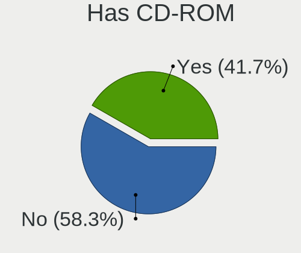
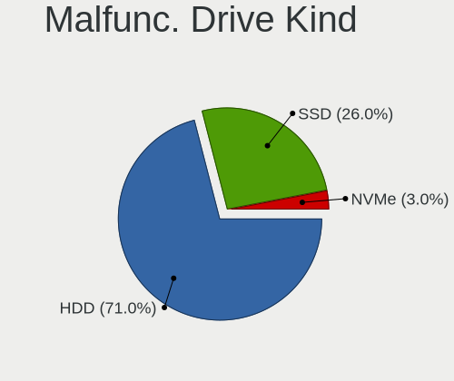
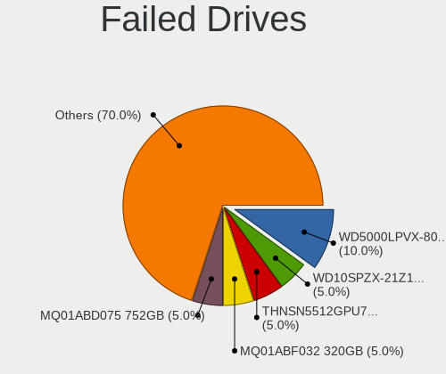
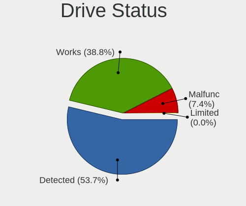
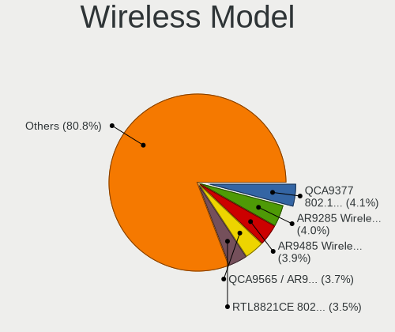
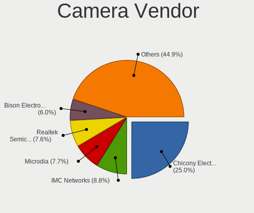

Linux Mint - Tested Hardware & Statistics (Notebooks)
-----------------------------------------------------

A project to collect tested hardware configurations for Linux Mint.

Anyone can contribute to this report by the [hw-probe](https://github.com/linuxhw/hw-probe) tool:

    sudo -E hw-probe -all -upload

Please contribute! Especially if your hardware is rare.

Contents
--------

* [ Test Cases ](#test-cases)

* [ System ](#system)
  - [ OS                       ](#os)
  - [ OS Family                ](#os-family)
  - [ Kernel                   ](#kernel)
  - [ Kernel Family            ](#kernel-family)
  - [ Kernel Major Ver.        ](#kernel-major-ver)
  - [ Arch                     ](#arch)
  - [ DE                       ](#de)
  - [ Display Server           ](#display-server)
  - [ Display Manager          ](#display-manager)
  - [ OS Lang                  ](#os-lang)
  - [ Boot Mode                ](#boot-mode)
  - [ Filesystem               ](#filesystem)
  - [ Part. scheme             ](#part-scheme)
  - [ Dual Boot with Linux/BSD ](#dual-boot-with-linuxbsd)
  - [ Dual Boot (Win)          ](#dual-boot-win)

* [ Board ](#board)
  - [ Vendor                   ](#vendor)
  - [ Model                    ](#model)
  - [ Model Family             ](#model-family)
  - [ MFG Year                 ](#mfg-year)
  - [ Form Factor              ](#form-factor)
  - [ Secure Boot              ](#secure-boot)
  - [ Coreboot                 ](#coreboot)
  - [ RAM Size                 ](#ram-size)
  - [ RAM Used                 ](#ram-used)
  - [ Total Drives             ](#total-drives)
  - [ Has CD-ROM               ](#has-cd-rom)
  - [ Has Ethernet             ](#has-ethernet)
  - [ Has WiFi                 ](#has-wifi)
  - [ Has Bluetooth            ](#has-bluetooth)

* [ Location ](#location)
  - [ Country                  ](#country)
  - [ City                     ](#city)

* [ Drives ](#drives)
  - [ Drive Vendor             ](#drive-vendor)
  - [ Drive Model              ](#drive-model)
  - [ HDD Vendor               ](#hdd-vendor)
  - [ SSD Vendor               ](#ssd-vendor)
  - [ Drive Kind               ](#drive-kind)
  - [ Drive Connector          ](#drive-connector)
  - [ Drive Size               ](#drive-size)
  - [ Space Total              ](#space-total)
  - [ Space Used               ](#space-used)
  - [ Malfunc. Drives          ](#malfunc-drives)
  - [ Malfunc. Drive Vendor    ](#malfunc-drive-vendor)
  - [ Malfunc. HDD Vendor      ](#malfunc-hdd-vendor)
  - [ Malfunc. Drive Kind      ](#malfunc-drive-kind)
  - [ Failed Drives            ](#failed-drives)
  - [ Failed Drive Vendor      ](#failed-drive-vendor)
  - [ Drive Status             ](#drive-status)

* [ Storage controller ](#storage-controller)
  - [ Storage Vendor           ](#storage-vendor)
  - [ Storage Model            ](#storage-model)
  - [ Storage Kind             ](#storage-kind)

* [ Processor ](#processor)
  - [ CPU Vendor               ](#cpu-vendor)
  - [ CPU Model                ](#cpu-model)
  - [ CPU Model Family         ](#cpu-model-family)
  - [ CPU Cores                ](#cpu-cores)
  - [ CPU Sockets              ](#cpu-sockets)
  - [ CPU Threads              ](#cpu-threads)
  - [ CPU Op-Modes             ](#cpu-op-modes)
  - [ CPU Microcode            ](#cpu-microcode)
  - [ CPU Microarch            ](#cpu-microarch)

* [ Graphics ](#graphics)
  - [ GPU Vendor               ](#gpu-vendor)
  - [ GPU Model                ](#gpu-model)
  - [ GPU Combo                ](#gpu-combo)
  - [ GPU Driver               ](#gpu-driver)
  - [ GPU Memory               ](#gpu-memory)

* [ Monitor ](#monitor)
  - [ Monitor Vendor           ](#monitor-vendor)
  - [ Monitor Model            ](#monitor-model)
  - [ Monitor Resolution       ](#monitor-resolution)
  - [ Monitor Diagonal         ](#monitor-diagonal)
  - [ Monitor Width            ](#monitor-width)
  - [ Aspect Ratio             ](#aspect-ratio)
  - [ Monitor Area             ](#monitor-area)
  - [ Pixel Density            ](#pixel-density)
  - [ Multiple Monitors        ](#multiple-monitors)

* [ Network ](#network)
  - [ Net Controller Vendor    ](#net-controller-vendor)
  - [ Net Controller Model     ](#net-controller-model)
  - [ Wireless Vendor          ](#wireless-vendor)
  - [ Wireless Model           ](#wireless-model)
  - [ Ethernet Vendor          ](#ethernet-vendor)
  - [ Ethernet Model           ](#ethernet-model)
  - [ Net Controller Kind      ](#net-controller-kind)
  - [ Used Controller          ](#used-controller)
  - [ NICs                     ](#nics)
  - [ IPv6                     ](#ipv6)

* [ Bluetooth ](#bluetooth)
  - [ Bluetooth Vendor         ](#bluetooth-vendor)
  - [ Bluetooth Model          ](#bluetooth-model)

* [ Sound ](#sound)
  - [ Sound Vendor             ](#sound-vendor)
  - [ Sound Model              ](#sound-model)

* [ Memory ](#memory)
  - [ Memory Vendor            ](#memory-vendor)
  - [ Memory Model             ](#memory-model)
  - [ Memory Kind              ](#memory-kind)
  - [ Memory Form Factor       ](#memory-form-factor)
  - [ Memory Size              ](#memory-size)
  - [ Memory Speed             ](#memory-speed)

* [ Printers & scanners ](#printers--scanners)
  - [ Printer Vendor           ](#printer-vendor)
  - [ Printer Model            ](#printer-model)
  - [ Scanner Vendor           ](#scanner-vendor)
  - [ Scanner Model            ](#scanner-model)

* [ Camera ](#camera)
  - [ Camera Vendor            ](#camera-vendor)
  - [ Camera Model             ](#camera-model)

* [ Security ](#security)
  - [ Fingerprint Vendor       ](#fingerprint-vendor)
  - [ Fingerprint Model        ](#fingerprint-model)
  - [ Chipcard Vendor          ](#chipcard-vendor)
  - [ Chipcard Model           ](#chipcard-model)

* [ Unsupported ](#unsupported)
  - [ Unsupported Devices      ](#unsupported-devices)
  - [ Unsupported Device Types ](#unsupported-device-types)

Test Cases
----------

Total: 15509

| Vendor        | Model                       | Probe                                                      | Date         |
|---------------|-----------------------------|------------------------------------------------------------|--------------|
| Lenovo        | V15 G4 IRU 83A1             | [c71241f73d](https://linux-hardware.org/?probe=c71241f73d) | Oct 01, 2023 |
| Lenovo        | V15 G4 IRU 83A1             | [b1af5494c8](https://linux-hardware.org/?probe=b1af5494c8) | Oct 01, 2023 |
| Panasonic     | CFSZ5-3                     | [9d0b849593](https://linux-hardware.org/?probe=9d0b849593) | Oct 01, 2023 |
| HP            | EliteBook 840 G8 Noteboo... | [9121e2ab8d](https://linux-hardware.org/?probe=9121e2ab8d) | Oct 01, 2023 |
| Panasonic     | CFSZ5-3                     | [f2c369cb00](https://linux-hardware.org/?probe=f2c369cb00) | Oct 01, 2023 |
| Lenovo        | Legion 5 Pro 16ITH6H 82J... | [61a08e5e89](https://linux-hardware.org/?probe=61a08e5e89) | Oct 01, 2023 |
| HP            | Laptop 17-cn2xxx            | [4a15c84784](https://linux-hardware.org/?probe=4a15c84784) | Sep 30, 2023 |
| Lenovo        | G505s 20255                 | [58a1c6e106](https://linux-hardware.org/?probe=58a1c6e106) | Sep 30, 2023 |
| Lenovo        | IdeaPad Y700-15ISK 80NV     | [d180995f93](https://linux-hardware.org/?probe=d180995f93) | Sep 30, 2023 |
| HP            | Pavilion Gaming Laptop 1... | [b3959728d3](https://linux-hardware.org/?probe=b3959728d3) | Sep 30, 2023 |
| Acer          | Aspire E5-571G              | [b223d9b4f5](https://linux-hardware.org/?probe=b223d9b4f5) | Sep 30, 2023 |
| Lenovo        | ThinkPad Edge E530 62722... | [681d3e6c86](https://linux-hardware.org/?probe=681d3e6c86) | Sep 30, 2023 |
| HP            | ProBook 645 G1              | [f5f538105c](https://linux-hardware.org/?probe=f5f538105c) | Sep 30, 2023 |
| Toshiba       | QOSMIO X770                 | [c747b27390](https://linux-hardware.org/?probe=c747b27390) | Sep 30, 2023 |
| Dell          | Latitude 7390               | [bd6d90d41e](https://linux-hardware.org/?probe=bd6d90d41e) | Sep 30, 2023 |
| Acer          | Aspire 7741                 | [80d27e2808](https://linux-hardware.org/?probe=80d27e2808) | Sep 30, 2023 |
| HP            | ZBook Studio G5             | [3f96bd2883](https://linux-hardware.org/?probe=3f96bd2883) | Sep 30, 2023 |
| ASUSTek       | ROG Strix G713PI_G713PI     | [a3af35a207](https://linux-hardware.org/?probe=a3af35a207) | Sep 29, 2023 |
| Sony          | VPCEB4J0E                   | [05864978df](https://linux-hardware.org/?probe=05864978df) | Sep 29, 2023 |
| Lenovo        | Legion 5 Pro 16ITH6H 82J... | [6e7e482b2d](https://linux-hardware.org/?probe=6e7e482b2d) | Sep 29, 2023 |
| Tectoy        | Pense Bem Notebook          | [6a6e6af34c](https://linux-hardware.org/?probe=6a6e6af34c) | Sep 29, 2023 |
| Dell          | XPS 13 9380                 | [9c2ba935b9](https://linux-hardware.org/?probe=9c2ba935b9) | Sep 29, 2023 |
| ASUSTek       | K55VJ                       | [4befa6db63](https://linux-hardware.org/?probe=4befa6db63) | Sep 29, 2023 |
| HP            | ZBook Studio G5             | [239b5a3fd5](https://linux-hardware.org/?probe=239b5a3fd5) | Sep 29, 2023 |
| Acer          | Swift SF114-34              | [9d618e345a](https://linux-hardware.org/?probe=9d618e345a) | Sep 29, 2023 |
| Dell          | Latitude E5450              | [0b77908612](https://linux-hardware.org/?probe=0b77908612) | Sep 29, 2023 |
| Dell          | Inspiron 7548               | [2c407b4ff5](https://linux-hardware.org/?probe=2c407b4ff5) | Sep 29, 2023 |
| Packard Be... | EasyNote TK36               | [1e8f79c726](https://linux-hardware.org/?probe=1e8f79c726) | Sep 29, 2023 |
| Lenovo        | ThinkPad T420s 4174PEG      | [cf650bb4af](https://linux-hardware.org/?probe=cf650bb4af) | Sep 29, 2023 |
| Toshiba       | Satellite P50-B-117         | [cecfba4e8f](https://linux-hardware.org/?probe=cecfba4e8f) | Sep 28, 2023 |
| Lenovo        | IdeaPad Y530                | [83a6d1b19b](https://linux-hardware.org/?probe=83a6d1b19b) | Sep 28, 2023 |
| Dell          | Latitude E6420              | [935d96843b](https://linux-hardware.org/?probe=935d96843b) | Sep 28, 2023 |
| HP            | OMEN Laptop 15-en1xxx       | [0a51882a60](https://linux-hardware.org/?probe=0a51882a60) | Sep 28, 2023 |
| HP            | OMEN Laptop 15-en1xxx       | [96ee1b2b2a](https://linux-hardware.org/?probe=96ee1b2b2a) | Sep 28, 2023 |
| HP            | Pavilion Laptop 14-ce3xx... | [3ecf3ff165](https://linux-hardware.org/?probe=3ecf3ff165) | Sep 28, 2023 |
| HP            | Pavilion Laptop 14-ce3xx... | [4c8dbd0780](https://linux-hardware.org/?probe=4c8dbd0780) | Sep 28, 2023 |
| Lenovo        | IdeaPad 3 14ALC6 82KT       | [dcf11408af](https://linux-hardware.org/?probe=dcf11408af) | Sep 28, 2023 |
| ASUSTek       | UX330CAK                    | [97bb5f9ea1](https://linux-hardware.org/?probe=97bb5f9ea1) | Sep 28, 2023 |
| Packard Be... | DOT S                       | [ccf952e34c](https://linux-hardware.org/?probe=ccf952e34c) | Sep 28, 2023 |
| Lenovo        | IdeaPad Gaming 3 15ACH6 ... | [426e8bd9c0](https://linux-hardware.org/?probe=426e8bd9c0) | Sep 28, 2023 |
| HP            | Victus by Gaming Laptop ... | [3c4c65947a](https://linux-hardware.org/?probe=3c4c65947a) | Sep 28, 2023 |
| Dell          | Inspiron 15-3567            | [d53c8ae481](https://linux-hardware.org/?probe=d53c8ae481) | Sep 28, 2023 |
| Dell          | XPS 17 9700                 | [38196b3712](https://linux-hardware.org/?probe=38196b3712) | Sep 28, 2023 |
| Packard Be... | EasyNote MH36               | [91fcf40898](https://linux-hardware.org/?probe=91fcf40898) | Sep 28, 2023 |
| Lenovo        | IdeaPad 320-15ABR 80XS      | [61980df9bc](https://linux-hardware.org/?probe=61980df9bc) | Sep 28, 2023 |
| Gigabyte      | P35V3                       | [573f9ea2f5](https://linux-hardware.org/?probe=573f9ea2f5) | Sep 28, 2023 |
| Sony          | VPCEB4J0E                   | [354e2be55e](https://linux-hardware.org/?probe=354e2be55e) | Sep 27, 2023 |
| Lenovo        | ThinkPad T430 2349S6S       | [e9b81983f2](https://linux-hardware.org/?probe=e9b81983f2) | Sep 27, 2023 |
| HUAWEI        | BOM-WXX9                    | [b5ce99a949](https://linux-hardware.org/?probe=b5ce99a949) | Sep 27, 2023 |
| Lenovo        | ThinkPad T480 20L6S5M000    | [58ddf5337a](https://linux-hardware.org/?probe=58ddf5337a) | Sep 27, 2023 |
| Toshiba       | Satellite P50-B-117         | [3931144171](https://linux-hardware.org/?probe=3931144171) | Sep 27, 2023 |
| Lenovo        | S10-3c 20074                | [b8adc3cf3e](https://linux-hardware.org/?probe=b8adc3cf3e) | Sep 27, 2023 |
| Dell          | XPS 17 9700                 | [c341826b7a](https://linux-hardware.org/?probe=c341826b7a) | Sep 27, 2023 |
| Acer          | Nitro AN515-44              | [0ba9157463](https://linux-hardware.org/?probe=0ba9157463) | Sep 27, 2023 |
| Acer          | Aspire A315-53              | [c20a9f8f96](https://linux-hardware.org/?probe=c20a9f8f96) | Sep 27, 2023 |
| Chuwi         | GemiBook Pro                | [4ea2bab759](https://linux-hardware.org/?probe=4ea2bab759) | Sep 27, 2023 |
| HP            | Pavilion dv6                | [5eaa895f6e](https://linux-hardware.org/?probe=5eaa895f6e) | Sep 26, 2023 |
| HP            | Pavilion dv6                | [f785da65ca](https://linux-hardware.org/?probe=f785da65ca) | Sep 26, 2023 |
| Lenovo        | ThinkPad T480s 20L8S77U1... | [4a3185fd78](https://linux-hardware.org/?probe=4a3185fd78) | Sep 26, 2023 |
| Acer          | Swift SF314-512             | [afdb68ccfe](https://linux-hardware.org/?probe=afdb68ccfe) | Sep 26, 2023 |
| Acer          | Swift SF314-512             | [d6982725f2](https://linux-hardware.org/?probe=d6982725f2) | Sep 26, 2023 |
| HP            | ProBook 430 G3              | [cc34f92566](https://linux-hardware.org/?probe=cc34f92566) | Sep 26, 2023 |
| Lenovo        | IdeaPad S340-15IIL 81WL     | [17bb721483](https://linux-hardware.org/?probe=17bb721483) | Sep 26, 2023 |
| AIR           | CX28000W                    | [b4a65a0403](https://linux-hardware.org/?probe=b4a65a0403) | Sep 26, 2023 |
| Acer          | Aspire 5750                 | [89dc9a349f](https://linux-hardware.org/?probe=89dc9a349f) | Sep 26, 2023 |
| Lenovo        | ThinkPad T430 2347H6U       | [7fc871cd5e](https://linux-hardware.org/?probe=7fc871cd5e) | Sep 26, 2023 |
| Acer          | Extensa 5635Z               | [19afe08920](https://linux-hardware.org/?probe=19afe08920) | Sep 25, 2023 |
| Samsung       | 300E5M/300E5L               | [1df46b6215](https://linux-hardware.org/?probe=1df46b6215) | Sep 25, 2023 |
| Google        | Banon                       | [172d512653](https://linux-hardware.org/?probe=172d512653) | Sep 25, 2023 |
| Google        | Banon                       | [0766aa6565](https://linux-hardware.org/?probe=0766aa6565) | Sep 25, 2023 |
| HP            | Notebook                    | [b59281115b](https://linux-hardware.org/?probe=b59281115b) | Sep 25, 2023 |
| HP            | Notebook                    | [896e2216de](https://linux-hardware.org/?probe=896e2216de) | Sep 25, 2023 |
| Acer          | Aspire A315-510P            | [794f8f35c8](https://linux-hardware.org/?probe=794f8f35c8) | Sep 25, 2023 |
| Acer          | Aspire A315-510P            | [89ba5bd7dd](https://linux-hardware.org/?probe=89ba5bd7dd) | Sep 25, 2023 |
| HP            | Laptop 17-ca0xxx            | [b094bb2ed3](https://linux-hardware.org/?probe=b094bb2ed3) | Sep 25, 2023 |
| Samsung       | 300E5M/300E5L               | [1d90b7b714](https://linux-hardware.org/?probe=1d90b7b714) | Sep 25, 2023 |
| Acer          | Nitro AN515-58              | [0c17f26ed8](https://linux-hardware.org/?probe=0c17f26ed8) | Sep 25, 2023 |
| Samsung       | N102SP/N100SP/N101SP        | [1aee55feca](https://linux-hardware.org/?probe=1aee55feca) | Sep 25, 2023 |
| HP            | Presario CQ43               | [b2663eb2fa](https://linux-hardware.org/?probe=b2663eb2fa) | Sep 25, 2023 |
| ASUSTek       | X550DP                      | [a743f84823](https://linux-hardware.org/?probe=a743f84823) | Sep 24, 2023 |
| Lenovo        | IdeaPad 330-17AST 81D7      | [0b8e5fc8d0](https://linux-hardware.org/?probe=0b8e5fc8d0) | Sep 24, 2023 |
| ASUSTek       | K55VM                       | [3dd45a6297](https://linux-hardware.org/?probe=3dd45a6297) | Sep 24, 2023 |
| HP            | Pavilion Laptop 15-eh2xx... | [b42e3e4395](https://linux-hardware.org/?probe=b42e3e4395) | Sep 24, 2023 |
| Lenovo        | ThinkPad T60 2623DAU        | [b5edbc8fbf](https://linux-hardware.org/?probe=b5edbc8fbf) | Sep 24, 2023 |
| Lenovo        | ThinkPad T60 2623DAU        | [144d6b3290](https://linux-hardware.org/?probe=144d6b3290) | Sep 24, 2023 |
| HP            | ProBook 6545b               | [b0abb62083](https://linux-hardware.org/?probe=b0abb62083) | Sep 24, 2023 |
| TrekStor      | Primebook P14               | [6664054d96](https://linux-hardware.org/?probe=6664054d96) | Sep 24, 2023 |
| Acer          | Aspire R3-131T              | [bf8f7a55ae](https://linux-hardware.org/?probe=bf8f7a55ae) | Sep 24, 2023 |
| Acer          | Aspire R3-131T              | [a426f4a94e](https://linux-hardware.org/?probe=a426f4a94e) | Sep 24, 2023 |
| Lenovo        | ThinkPad T470s 20HGS0YE0... | [20c9a90aca](https://linux-hardware.org/?probe=20c9a90aca) | Sep 24, 2023 |
| HUAWEI        | BOD-WXX9                    | [e688665729](https://linux-hardware.org/?probe=e688665729) | Sep 24, 2023 |
| Timi          | TM1701                      | [0e127afa68](https://linux-hardware.org/?probe=0e127afa68) | Sep 24, 2023 |
| Dell          | Latitude E5270              | [d091c4fa0e](https://linux-hardware.org/?probe=d091c4fa0e) | Sep 24, 2023 |
| Dell          | Latitude 7430               | [eb37e129e6](https://linux-hardware.org/?probe=eb37e129e6) | Sep 24, 2023 |
| HP            | Laptop 15-bs0xx             | [21620e61e1](https://linux-hardware.org/?probe=21620e61e1) | Sep 23, 2023 |
| Lenovo        | IdeaPad 330S-15ARR 81FB     | [b61b5cb7e3](https://linux-hardware.org/?probe=b61b5cb7e3) | Sep 23, 2023 |
| Dell          | Inspiron 1564               | [f4232cfca8](https://linux-hardware.org/?probe=f4232cfca8) | Sep 23, 2023 |
| Dell          | Latitude 3410               | [c5473f5f6c](https://linux-hardware.org/?probe=c5473f5f6c) | Sep 23, 2023 |
| HP            | 255 G8 Notebook PC          | [7fcb0a9529](https://linux-hardware.org/?probe=7fcb0a9529) | Sep 23, 2023 |
| Lenovo        | IdeaPad S145-15IIL 81W8     | [1809080d01](https://linux-hardware.org/?probe=1809080d01) | Sep 23, 2023 |
| Lenovo        | Y50-70 20378                | [d967e2d2a3](https://linux-hardware.org/?probe=d967e2d2a3) | Sep 23, 2023 |
| Lenovo        | Y50-70 20378                | [477998353b](https://linux-hardware.org/?probe=477998353b) | Sep 23, 2023 |
| HP            | Presario CQ43               | [d5ee5e4318](https://linux-hardware.org/?probe=d5ee5e4318) | Sep 23, 2023 |
| Dell          | Inspiron 1564               | [c84457748d](https://linux-hardware.org/?probe=c84457748d) | Sep 23, 2023 |
| Acer          | Aspire E5-574G              | [7ca9ce046e](https://linux-hardware.org/?probe=7ca9ce046e) | Sep 23, 2023 |
| HP            | Laptop 17-bs1xx             | [eb600e003d](https://linux-hardware.org/?probe=eb600e003d) | Sep 23, 2023 |
| HUAWEI        | BOM-WXX9                    | [830bf573b1](https://linux-hardware.org/?probe=830bf573b1) | Sep 23, 2023 |
| Turbo-X       | III_IPS64gb                 | [82a144fc1a](https://linux-hardware.org/?probe=82a144fc1a) | Sep 22, 2023 |
| HP            | ProBook 430 G3              | [67ac6fc0d9](https://linux-hardware.org/?probe=67ac6fc0d9) | Sep 22, 2023 |
| HP            | ProBook 430 G3              | [519a567ecb](https://linux-hardware.org/?probe=519a567ecb) | Sep 22, 2023 |
| Acer          | Aspire 7520                 | [5e16126a55](https://linux-hardware.org/?probe=5e16126a55) | Sep 21, 2023 |
| Packard Be... | EasyNote TE11HC             | [0d897e53cf](https://linux-hardware.org/?probe=0d897e53cf) | Sep 21, 2023 |
| PC Special... | Ionico 16                   | [dd18901106](https://linux-hardware.org/?probe=dd18901106) | Sep 21, 2023 |
| Dell          | Latitude 5420               | [c40b9df526](https://linux-hardware.org/?probe=c40b9df526) | Sep 21, 2023 |
| Dell          | Latitude 5420               | [9caba9ee44](https://linux-hardware.org/?probe=9caba9ee44) | Sep 21, 2023 |
| AMI           | Intel                       | [687044ba01](https://linux-hardware.org/?probe=687044ba01) | Sep 21, 2023 |
| Dell          | Inspiron 3542               | [3e66379f73](https://linux-hardware.org/?probe=3e66379f73) | Sep 21, 2023 |
| HP            | Pavilion dv7                | [a879a0a88f](https://linux-hardware.org/?probe=a879a0a88f) | Sep 21, 2023 |
| HP            | 630                         | [1ed6efc4de](https://linux-hardware.org/?probe=1ed6efc4de) | Sep 21, 2023 |
| Samsung       | 550XDA                      | [2d15b3f4ca](https://linux-hardware.org/?probe=2d15b3f4ca) | Sep 21, 2023 |
| HUAWEI        | NBLB-WAX9N                  | [a9cfc8946d](https://linux-hardware.org/?probe=a9cfc8946d) | Sep 21, 2023 |
| HP            | Elite x2 1012 G1            | [dbe6ba540f](https://linux-hardware.org/?probe=dbe6ba540f) | Sep 20, 2023 |
| Dell          | Latitude E5550              | [8e67cb247c](https://linux-hardware.org/?probe=8e67cb247c) | Sep 20, 2023 |
| HP            | Pavilion 17                 | [f95a376481](https://linux-hardware.org/?probe=f95a376481) | Sep 20, 2023 |
| Clevo         | E7130                       | [38de5c7699](https://linux-hardware.org/?probe=38de5c7699) | Sep 20, 2023 |
| Acer          | Aspire 7520                 | [bbba1d5ea4](https://linux-hardware.org/?probe=bbba1d5ea4) | Sep 20, 2023 |
| Wortmann      | TERRA_MOBILE_1749           | [869708c900](https://linux-hardware.org/?probe=869708c900) | Sep 20, 2023 |
| HP            | ProBook 440 14 inch G9 N... | [04cc7d1379](https://linux-hardware.org/?probe=04cc7d1379) | Sep 20, 2023 |
| Medion        | Akoya E7416                 | [f820e8515d](https://linux-hardware.org/?probe=f820e8515d) | Sep 19, 2023 |
| ASUSTek       | N56VB                       | [e4dae2f7c8](https://linux-hardware.org/?probe=e4dae2f7c8) | Sep 19, 2023 |
| ASUSTek       | N56VB                       | [79e8bd0911](https://linux-hardware.org/?probe=79e8bd0911) | Sep 19, 2023 |
| Acer          | Aspire ES1-571              | [561ce1b44d](https://linux-hardware.org/?probe=561ce1b44d) | Sep 19, 2023 |
| ASUSTek       | K52F                        | [8d4b7a978b](https://linux-hardware.org/?probe=8d4b7a978b) | Sep 19, 2023 |
| HUAWEI        | KLVL-WXXW                   | [efed6450c5](https://linux-hardware.org/?probe=efed6450c5) | Sep 19, 2023 |
| Dell          | Latitude E5540              | [759aeff4ee](https://linux-hardware.org/?probe=759aeff4ee) | Sep 19, 2023 |
| HP            | EliteBook 8570w             | [d90f46756b](https://linux-hardware.org/?probe=d90f46756b) | Sep 19, 2023 |
| Samsung       | 550XDA                      | [763631bfe7](https://linux-hardware.org/?probe=763631bfe7) | Sep 19, 2023 |
| HP            | ZBook Studio 16 inch G9 ... | [4bb581fb16](https://linux-hardware.org/?probe=4bb581fb16) | Sep 19, 2023 |
| HP            | 250 G8 Notebook PC          | [f31f049c9c](https://linux-hardware.org/?probe=f31f049c9c) | Sep 19, 2023 |
| HP            | Pavilion Notebook           | [f93723f676](https://linux-hardware.org/?probe=f93723f676) | Sep 19, 2023 |
| Acer          | Aspire ES1-420              | [db308e1798](https://linux-hardware.org/?probe=db308e1798) | Sep 19, 2023 |
| Lenovo        | IdeaPad 100-15IBD 80QQ      | [c26fb8a8da](https://linux-hardware.org/?probe=c26fb8a8da) | Sep 18, 2023 |
| HP            | Laptop 15-fc0xxx            | [50c2f9349d](https://linux-hardware.org/?probe=50c2f9349d) | Sep 18, 2023 |
| HP            | ProBook 650 G1              | [06d67bab4a](https://linux-hardware.org/?probe=06d67bab4a) | Sep 18, 2023 |
| HP            | Pavilion Gaming Laptop 1... | [5b5eb2a0a5](https://linux-hardware.org/?probe=5b5eb2a0a5) | Sep 18, 2023 |
| Lenovo        | Legion 5 17IMH05H 81Y8      | [b9f92fec9c](https://linux-hardware.org/?probe=b9f92fec9c) | Sep 17, 2023 |
| Dell          | Latitude E5430 non-vPro     | [09c45a1e2d](https://linux-hardware.org/?probe=09c45a1e2d) | Sep 17, 2023 |
| Dell          | Inspiron 5559               | [8bf4c79f98](https://linux-hardware.org/?probe=8bf4c79f98) | Sep 17, 2023 |
| Unknown       | M17PRO                      | [ccf362f14d](https://linux-hardware.org/?probe=ccf362f14d) | Sep 17, 2023 |
| Dell          | Latitude E6230              | [b454bff951](https://linux-hardware.org/?probe=b454bff951) | Sep 17, 2023 |
| HP            | OMEN by Gaming Laptop 16... | [f605659353](https://linux-hardware.org/?probe=f605659353) | Sep 17, 2023 |
| HP            | G72                         | [b77f2ba361](https://linux-hardware.org/?probe=b77f2ba361) | Sep 17, 2023 |
| MSI           | GF75 Thin 10SCSR            | [455a5e05f2](https://linux-hardware.org/?probe=455a5e05f2) | Sep 17, 2023 |
| Fujitsu       | Unknown                     | [1d942c9607](https://linux-hardware.org/?probe=1d942c9607) | Sep 17, 2023 |
| HP            | Laptop 15-da0xxx            | [43081eb0eb](https://linux-hardware.org/?probe=43081eb0eb) | Sep 17, 2023 |
| Acer          | Aspire 8950G                | [b73ee31092](https://linux-hardware.org/?probe=b73ee31092) | Sep 17, 2023 |
| HP            | Laptop 15-bs0xx             | [90a53d66ff](https://linux-hardware.org/?probe=90a53d66ff) | Sep 17, 2023 |
| ASUSTek       | X540SA                      | [68bc662ac9](https://linux-hardware.org/?probe=68bc662ac9) | Sep 17, 2023 |
| MSI           | GS43VR 7RE                  | [d9893a35c8](https://linux-hardware.org/?probe=d9893a35c8) | Sep 16, 2023 |
| Lenovo        | IdeaPad 320-15IKB 80YH      | [48ea99b656](https://linux-hardware.org/?probe=48ea99b656) | Sep 16, 2023 |
| Acer          | Aspire 5750Z                | [d42482a830](https://linux-hardware.org/?probe=d42482a830) | Sep 16, 2023 |
| Lenovo        | IdeaPad 320-15IKB 80YH      | [f95cfdee8d](https://linux-hardware.org/?probe=f95cfdee8d) | Sep 16, 2023 |
| Jumper        | EZbook                      | [bd0a13e867](https://linux-hardware.org/?probe=bd0a13e867) | Sep 16, 2023 |
| ASUSTek       | X542UQ                      | [6793d8c052](https://linux-hardware.org/?probe=6793d8c052) | Sep 16, 2023 |
| HP            | ProBook 450 15.6 inch G1... | [88caa6c959](https://linux-hardware.org/?probe=88caa6c959) | Sep 16, 2023 |
| HP            | ProBook 450 15.6 inch G1... | [5e0eae9363](https://linux-hardware.org/?probe=5e0eae9363) | Sep 16, 2023 |
| MSI           | PS42 8RB                    | [2fa07ede2a](https://linux-hardware.org/?probe=2fa07ede2a) | Sep 16, 2023 |
| HP            | EliteBook Folio 1040 G3     | [38a985d781](https://linux-hardware.org/?probe=38a985d781) | Sep 16, 2023 |
| Dell          | Latitude E6220              | [8a341bd0e2](https://linux-hardware.org/?probe=8a341bd0e2) | Sep 16, 2023 |
| Dell          | Inspiron 7520               | [7e4d172585](https://linux-hardware.org/?probe=7e4d172585) | Sep 16, 2023 |
| Dell          | Inspiron 7520               | [ade8d7589a](https://linux-hardware.org/?probe=ade8d7589a) | Sep 16, 2023 |
| Sony          | VGN-AR71J                   | [adcb1c52d0](https://linux-hardware.org/?probe=adcb1c52d0) | Sep 15, 2023 |
| HP            | Laptop 15-fc0xxx            | [c8ac03221f](https://linux-hardware.org/?probe=c8ac03221f) | Sep 15, 2023 |
| Timi          | Redmi Book Pro 15 2022      | [f9117dd665](https://linux-hardware.org/?probe=f9117dd665) | Sep 15, 2023 |
| Timi          | Redmi Book Pro 15 2022      | [c6cc55c6ec](https://linux-hardware.org/?probe=c6cc55c6ec) | Sep 15, 2023 |
| Acer          | Aspire A515-57G             | [b578b94ad4](https://linux-hardware.org/?probe=b578b94ad4) | Sep 15, 2023 |
| Dell          | Vostro 1510                 | [bf4d733039](https://linux-hardware.org/?probe=bf4d733039) | Sep 15, 2023 |
| HP            | Unknown                     | [2ee662b613](https://linux-hardware.org/?probe=2ee662b613) | Sep 15, 2023 |
| Lenovo        | G700 20251                  | [8e5d1fefba](https://linux-hardware.org/?probe=8e5d1fefba) | Sep 15, 2023 |
| ASUSTek       | UX530UX                     | [8651a15c57](https://linux-hardware.org/?probe=8651a15c57) | Sep 14, 2023 |
| Toshiba       | Satellite L875-11M          | [3774a26687](https://linux-hardware.org/?probe=3774a26687) | Sep 14, 2023 |
| Dell          | XPS 15 9560                 | [b0702745f5](https://linux-hardware.org/?probe=b0702745f5) | Sep 14, 2023 |
| ASUSTek       | ROG Strix G531GT_G531GT     | [b30ec0e0a8](https://linux-hardware.org/?probe=b30ec0e0a8) | Sep 14, 2023 |
| Acer          | Swift SF113-31              | [f165d66761](https://linux-hardware.org/?probe=f165d66761) | Sep 14, 2023 |
| Acer          | Nitro AN517-42              | [d7203a658a](https://linux-hardware.org/?probe=d7203a658a) | Sep 14, 2023 |
| Lenovo        | IdeaPad 3 14ALC6 82KT       | [361c6cb056](https://linux-hardware.org/?probe=361c6cb056) | Sep 14, 2023 |
| Fujitsu       | LIFEBOOK AH530              | [a3b023f0e4](https://linux-hardware.org/?probe=a3b023f0e4) | Sep 13, 2023 |
| ASUSTek       | K53SC                       | [814e80310b](https://linux-hardware.org/?probe=814e80310b) | Sep 13, 2023 |
| MSI           | GE63 7RD                    | [b0aac4eb91](https://linux-hardware.org/?probe=b0aac4eb91) | Sep 13, 2023 |
| Lenovo        | E41-55 82FJ                 | [20b3dd0858](https://linux-hardware.org/?probe=20b3dd0858) | Sep 13, 2023 |
| Dell          | Inspiron 15-3567            | [cb58094846](https://linux-hardware.org/?probe=cb58094846) | Sep 12, 2023 |
| Dell          | Latitude E5420              | [3d9680f20d](https://linux-hardware.org/?probe=3d9680f20d) | Sep 12, 2023 |
| Dell          | Latitude E5550              | [9044f3b345](https://linux-hardware.org/?probe=9044f3b345) | Sep 12, 2023 |
| Fujitsu Si... | AMILO Pa 1510               | [c75c8ce9d3](https://linux-hardware.org/?probe=c75c8ce9d3) | Sep 12, 2023 |
| Acer          | Nitro AN515-58              | [78a9c8ba47](https://linux-hardware.org/?probe=78a9c8ba47) | Sep 12, 2023 |
| Acer          | Nitro AN515-58              | [a8f64806fe](https://linux-hardware.org/?probe=a8f64806fe) | Sep 12, 2023 |
| Gateway       | NV55C                       | [1086491e2c](https://linux-hardware.org/?probe=1086491e2c) | Sep 12, 2023 |
| HP            | ProBook 4740s               | [7166a2d286](https://linux-hardware.org/?probe=7166a2d286) | Sep 12, 2023 |
| Dell          | Precision 7520              | [35bbdb93c9](https://linux-hardware.org/?probe=35bbdb93c9) | Sep 11, 2023 |
| Dell          | Latitude E5520              | [24f6f59bfa](https://linux-hardware.org/?probe=24f6f59bfa) | Sep 11, 2023 |
| ASUSTek       | VivoBook_ASUSLaptop X509... | [dbad37486d](https://linux-hardware.org/?probe=dbad37486d) | Sep 11, 2023 |
| Lenovo        | 3000 N200 0769EGG           | [69189d0f7a](https://linux-hardware.org/?probe=69189d0f7a) | Sep 11, 2023 |
| Lenovo        | 3000 N200 0769EGG           | [029772ad9a](https://linux-hardware.org/?probe=029772ad9a) | Sep 11, 2023 |
| ASUSTek       | X541UV                      | [a66fcc9edb](https://linux-hardware.org/?probe=a66fcc9edb) | Sep 11, 2023 |
| ASUSTek       | VivoBook_ASUSLaptop X150... | [83021c4304](https://linux-hardware.org/?probe=83021c4304) | Sep 11, 2023 |
| HP            | Laptop 15s-fq2xxx           | [366932ee55](https://linux-hardware.org/?probe=366932ee55) | Sep 11, 2023 |
| Unknown       | Unknown                     | [4944b22636](https://linux-hardware.org/?probe=4944b22636) | Sep 11, 2023 |
| MSI           | Katana GF66 11UG            | [817ece541a](https://linux-hardware.org/?probe=817ece541a) | Sep 10, 2023 |
| HP            | Victus by Gaming Laptop ... | [053a34d1f9](https://linux-hardware.org/?probe=053a34d1f9) | Sep 10, 2023 |
| Toshiba       | Satellite L875D             | [bec695a7b0](https://linux-hardware.org/?probe=bec695a7b0) | Sep 10, 2023 |
| ASUSTek       | VivoBook_ASUSLaptop X705... | [ff1ee4d114](https://linux-hardware.org/?probe=ff1ee4d114) | Sep 10, 2023 |
| Dell          | Inspiron 11-3168            | [57ef365bf9](https://linux-hardware.org/?probe=57ef365bf9) | Sep 10, 2023 |
| Dell          | Precision 3571              | [0790a2726f](https://linux-hardware.org/?probe=0790a2726f) | Sep 10, 2023 |
| Dell          | Precision 5540              | [061e46a96c](https://linux-hardware.org/?probe=061e46a96c) | Sep 10, 2023 |
| Dell          | Precision 3571              | [2d92d73c33](https://linux-hardware.org/?probe=2d92d73c33) | Sep 10, 2023 |
| Medion        | E11201                      | [c62ac67427](https://linux-hardware.org/?probe=c62ac67427) | Sep 10, 2023 |
| Google        | Treeya                      | [a4db63abbe](https://linux-hardware.org/?probe=a4db63abbe) | Sep 10, 2023 |
| HP            | Laptop 15-fd0xxx            | [470e6325a3](https://linux-hardware.org/?probe=470e6325a3) | Sep 10, 2023 |
| HP            | Pavilion g6                 | [f39fbfabcc](https://linux-hardware.org/?probe=f39fbfabcc) | Sep 10, 2023 |
| HP            | Pavilion g6                 | [e82f904ef8](https://linux-hardware.org/?probe=e82f904ef8) | Sep 10, 2023 |
| Lenovo        | ThinkPad X220 42872WS       | [9bd18b41ed](https://linux-hardware.org/?probe=9bd18b41ed) | Sep 09, 2023 |
| Lenovo        | G50-30 80G0                 | [bb0f6ff00d](https://linux-hardware.org/?probe=bb0f6ff00d) | Sep 09, 2023 |
| HP            | Pavilion dv8000 (ET839UA... | [6104b2383d](https://linux-hardware.org/?probe=6104b2383d) | Sep 09, 2023 |
| Packard Be... | EasyNote ENTG71BM           | [35f1ceedcb](https://linux-hardware.org/?probe=35f1ceedcb) | Sep 09, 2023 |
| HP            | 250 G6 Notebook PC          | [ceed789791](https://linux-hardware.org/?probe=ceed789791) | Sep 09, 2023 |
| ASUSTek       | G73Sw                       | [6f02ca6d43](https://linux-hardware.org/?probe=6f02ca6d43) | Sep 09, 2023 |
| Dell          | Studio 1737                 | [243f843004](https://linux-hardware.org/?probe=243f843004) | Sep 09, 2023 |
| Dell          | Studio 1737                 | [f6da29ffbb](https://linux-hardware.org/?probe=f6da29ffbb) | Sep 09, 2023 |
| LG Electro... | 14Z990-V.AR52D              | [9a0f106aa0](https://linux-hardware.org/?probe=9a0f106aa0) | Sep 08, 2023 |
| Lenovo        | ThinkPad E520 11433FU       | [eb0aa53dc9](https://linux-hardware.org/?probe=eb0aa53dc9) | Sep 08, 2023 |
| Lenovo        | IdeaPad 5 14ALC05 82LM      | [6651287f02](https://linux-hardware.org/?probe=6651287f02) | Sep 08, 2023 |
| HP            | ProBook 470 G3              | [f096164a16](https://linux-hardware.org/?probe=f096164a16) | Sep 08, 2023 |
| Packard Be... | EasyNote TE11HC             | [7f55f1b615](https://linux-hardware.org/?probe=7f55f1b615) | Sep 08, 2023 |
| Acer          | Nitro AN515-45              | [e7d0ece5a1](https://linux-hardware.org/?probe=e7d0ece5a1) | Sep 08, 2023 |
| Notebook      | W230SS                      | [7c611163a5](https://linux-hardware.org/?probe=7c611163a5) | Sep 08, 2023 |
| ASUSTek       | Zenbook UM3402YAR_UM3402... | [fac3b5ba62](https://linux-hardware.org/?probe=fac3b5ba62) | Sep 08, 2023 |
| HP            | EliteBook 8740w             | [e34200af0f](https://linux-hardware.org/?probe=e34200af0f) | Sep 08, 2023 |
| ASUSTek       | N56VZ                       | [37b42fff22](https://linux-hardware.org/?probe=37b42fff22) | Sep 07, 2023 |
| ASUSTek       | ASUS TUF Gaming F15 FX50... | [e207539e68](https://linux-hardware.org/?probe=e207539e68) | Sep 07, 2023 |
| Sony          | SVF1521V6EB                 | [1d08716b2c](https://linux-hardware.org/?probe=1d08716b2c) | Sep 07, 2023 |
| Dell          | Latitude E7240              | [79a666783a](https://linux-hardware.org/?probe=79a666783a) | Sep 07, 2023 |
| Samsung       | RF511/RF411/RF711           | [ef99cba7a5](https://linux-hardware.org/?probe=ef99cba7a5) | Sep 06, 2023 |
| Unknown       | Unknown                     | [16cb5e0d5b](https://linux-hardware.org/?probe=16cb5e0d5b) | Sep 06, 2023 |
| HUAWEI        | NBD-WXX9                    | [29e1f84537](https://linux-hardware.org/?probe=29e1f84537) | Sep 06, 2023 |
| Lenovo        | ThinkPad T580 20LAS01H00    | [129e989480](https://linux-hardware.org/?probe=129e989480) | Sep 06, 2023 |
| Timi          | Xiaomi Book Pro 14 2022     | [32c34f0aa2](https://linux-hardware.org/?probe=32c34f0aa2) | Sep 06, 2023 |
| Standard      | MB45II/MB45IN               | [1e46c6aa81](https://linux-hardware.org/?probe=1e46c6aa81) | Sep 06, 2023 |
| Samsung       | 340XAA/350XAA/550XAA        | [ba05ae3ca2](https://linux-hardware.org/?probe=ba05ae3ca2) | Sep 06, 2023 |
| Samsung       | 340XAA/350XAA/550XAA        | [299a459ec5](https://linux-hardware.org/?probe=299a459ec5) | Sep 06, 2023 |
| ASUSTek       | X75VC                       | [ba211ae5ca](https://linux-hardware.org/?probe=ba211ae5ca) | Sep 06, 2023 |
| ASUSTek       | K70IO                       | [bb32d5e30c](https://linux-hardware.org/?probe=bb32d5e30c) | Sep 06, 2023 |
| HP            | EliteBook 840 G1            | [1d1c8e33ff](https://linux-hardware.org/?probe=1d1c8e33ff) | Sep 06, 2023 |
| ASUSTek       | ASUS TUF Gaming A15 FA50... | [4ed976d4ba](https://linux-hardware.org/?probe=4ed976d4ba) | Sep 06, 2023 |
| Notebook      | W230SS                      | [3d9af4f57a](https://linux-hardware.org/?probe=3d9af4f57a) | Sep 06, 2023 |
| ASUSTek       | K70IO                       | [e4f165224f](https://linux-hardware.org/?probe=e4f165224f) | Sep 06, 2023 |
| Lenovo        | ThinkPad E580 20KS001JUK    | [8b44f9cbdc](https://linux-hardware.org/?probe=8b44f9cbdc) | Sep 06, 2023 |
| Dell          | Inspiron 5567               | [56c33713a8](https://linux-hardware.org/?probe=56c33713a8) | Sep 06, 2023 |
| Lenovo        | IdeaPad 1 14AMN7 82VF       | [dccf0aaf61](https://linux-hardware.org/?probe=dccf0aaf61) | Sep 06, 2023 |
| Lenovo        | IdeaPad 1 14AMN7 82VF       | [51e417460a](https://linux-hardware.org/?probe=51e417460a) | Sep 05, 2023 |
| Lenovo        | G570 4334                   | [ce571e2d16](https://linux-hardware.org/?probe=ce571e2d16) | Sep 05, 2023 |
| HP            | Laptop 15-da0xxx            | [326d057e96](https://linux-hardware.org/?probe=326d057e96) | Sep 05, 2023 |
| HP            | Pavilion dv8000 (ET839UA... | [7b717719f5](https://linux-hardware.org/?probe=7b717719f5) | Sep 05, 2023 |
| Notebook      | N9x0TC                      | [ea9c38200b](https://linux-hardware.org/?probe=ea9c38200b) | Sep 05, 2023 |
| MSI           | Prestige 14H B12UCX         | [75d602c66f](https://linux-hardware.org/?probe=75d602c66f) | Sep 05, 2023 |
| Acer          | Aspire 5750Z                | [5bec99a137](https://linux-hardware.org/?probe=5bec99a137) | Sep 05, 2023 |
| Apple         | MacBook8,1                  | [f2d8d7ffbb](https://linux-hardware.org/?probe=f2d8d7ffbb) | Sep 05, 2023 |
| HP            | Pavilion dv7                | [2d6aa7667d](https://linux-hardware.org/?probe=2d6aa7667d) | Sep 05, 2023 |
| Lenovo        | IdeaPad 100-14IBD 80RK      | [1a1c5e43bc](https://linux-hardware.org/?probe=1a1c5e43bc) | Sep 05, 2023 |
| Google        | Treeya                      | [fcc8d7d8a1](https://linux-hardware.org/?probe=fcc8d7d8a1) | Sep 05, 2023 |
| Inter Sale... | NID-11125DE                 | [2c94bcc096](https://linux-hardware.org/?probe=2c94bcc096) | Sep 05, 2023 |
| Dell          | Precision 5570              | [abddf843dd](https://linux-hardware.org/?probe=abddf843dd) | Sep 04, 2023 |
| TUXEDO        | Unknown                     | [c6b62e2a29](https://linux-hardware.org/?probe=c6b62e2a29) | Sep 04, 2023 |
| HP            | Pavilion dv9000 (RP249UA... | [ea5e3bac5f](https://linux-hardware.org/?probe=ea5e3bac5f) | Sep 04, 2023 |
| ASUSTek       | X75VC                       | [0830aad0cc](https://linux-hardware.org/?probe=0830aad0cc) | Sep 04, 2023 |
| Dell          | Inspiron 7580               | [b021fe57a6](https://linux-hardware.org/?probe=b021fe57a6) | Sep 04, 2023 |
| Lenovo        | ThinkPad E520 11433FU       | [ecc10a1197](https://linux-hardware.org/?probe=ecc10a1197) | Sep 04, 2023 |
| Lenovo        | IdeaPad S400 Touch VIUS3    | [d2ac233994](https://linux-hardware.org/?probe=d2ac233994) | Sep 04, 2023 |
| Acer          | Aspire 8930                 | [9901032e2b](https://linux-hardware.org/?probe=9901032e2b) | Sep 04, 2023 |
| Prestigio     | Smartbook PSB116A           | [d70df77a35](https://linux-hardware.org/?probe=d70df77a35) | Sep 04, 2023 |
| HP            | EliteBook 8440p             | [37e16bb39c](https://linux-hardware.org/?probe=37e16bb39c) | Sep 04, 2023 |
| Monster       | Huma H5 V3.2                | [75d95e264e](https://linux-hardware.org/?probe=75d95e264e) | Sep 04, 2023 |
| Acer          | Aspire 7741                 | [0b3868c6bc](https://linux-hardware.org/?probe=0b3868c6bc) | Sep 04, 2023 |
| Apple         | MacBookAir5,1               | [e24382ee44](https://linux-hardware.org/?probe=e24382ee44) | Sep 04, 2023 |
| Dell          | Latitude E5570              | [b4ca89038c](https://linux-hardware.org/?probe=b4ca89038c) | Sep 03, 2023 |
| Lenovo        | ThinkPad X220 42902WG       | [2326c36d78](https://linux-hardware.org/?probe=2326c36d78) | Sep 03, 2023 |
| Star Labs     | StarBook                    | [ac568bfcd4](https://linux-hardware.org/?probe=ac568bfcd4) | Sep 03, 2023 |
| Samsung       | RF511/RF411/RF711           | [522a10f139](https://linux-hardware.org/?probe=522a10f139) | Sep 03, 2023 |
| Acer          | Aspire 5750Z                | [f0b466e572](https://linux-hardware.org/?probe=f0b466e572) | Sep 03, 2023 |
| Medion        | Akoya E4214 MD99570         | [1454b9c6a8](https://linux-hardware.org/?probe=1454b9c6a8) | Sep 03, 2023 |
| Apple         | MacBookAir6,2               | [94da12d8d8](https://linux-hardware.org/?probe=94da12d8d8) | Sep 03, 2023 |
| Lenovo        | IdeaPad 3 15ALC6 82KU       | [a724d32006](https://linux-hardware.org/?probe=a724d32006) | Sep 03, 2023 |
| Dell          | Latitude E6400              | [9903b0fbea](https://linux-hardware.org/?probe=9903b0fbea) | Sep 03, 2023 |
| MSI           | Delta 15 A5EFK              | [8d2e359aec](https://linux-hardware.org/?probe=8d2e359aec) | Sep 03, 2023 |
| Lenovo        | ThinkPad T14 Gen 2a 20XK... | [024e3beca4](https://linux-hardware.org/?probe=024e3beca4) | Sep 03, 2023 |
| Thomson       | N14C4WH64                   | [3a5fd5b62b](https://linux-hardware.org/?probe=3a5fd5b62b) | Sep 03, 2023 |
| HP            | Laptop 15s-eq2xxx           | [88673d4088](https://linux-hardware.org/?probe=88673d4088) | Sep 03, 2023 |
| HP            | Laptop 15s-eq2xxx           | [6ed47558ae](https://linux-hardware.org/?probe=6ed47558ae) | Sep 03, 2023 |
| Lenovo        | ThinkPad L15 Gen 2 20X30... | [439817c540](https://linux-hardware.org/?probe=439817c540) | Sep 03, 2023 |
| Thomson       | N14C4WH64                   | [cdfa5060e6](https://linux-hardware.org/?probe=cdfa5060e6) | Sep 03, 2023 |
| HP            | Pavilion dv5                | [977c253ff5](https://linux-hardware.org/?probe=977c253ff5) | Sep 02, 2023 |
| Fujitsu Si... | AMILO Xa 1526               | [806eed53dc](https://linux-hardware.org/?probe=806eed53dc) | Sep 02, 2023 |
| Fujitsu Si... | AMILO Xa 1526               | [377d5352d8](https://linux-hardware.org/?probe=377d5352d8) | Sep 02, 2023 |
| Dell          | Latitude E6540              | [f9e2147255](https://linux-hardware.org/?probe=f9e2147255) | Sep 02, 2023 |
| Lenovo        | IdeaPad 110-15ISK 80UD      | [fdb735b431](https://linux-hardware.org/?probe=fdb735b431) | Sep 02, 2023 |
| Dell          | Latitude 5285               | [f1f48163f3](https://linux-hardware.org/?probe=f1f48163f3) | Sep 02, 2023 |
| HP            | Pavilion dv6                | [9190ad12c2](https://linux-hardware.org/?probe=9190ad12c2) | Sep 02, 2023 |
| Lenovo        | IdeaPad 3 15ALC6 82KU       | [c612e70205](https://linux-hardware.org/?probe=c612e70205) | Sep 02, 2023 |
| HP            | Pavilion Notebook           | [3143c94134](https://linux-hardware.org/?probe=3143c94134) | Sep 02, 2023 |
| Dell          | Precision 5540              | [3d800b12e0](https://linux-hardware.org/?probe=3d800b12e0) | Sep 02, 2023 |
| HP            | Pavilion dv8000 (ET839UA... | [affa07b412](https://linux-hardware.org/?probe=affa07b412) | Sep 02, 2023 |
| HP            | ProBook 470 G3              | [f6996b2905](https://linux-hardware.org/?probe=f6996b2905) | Sep 02, 2023 |
| Lenovo        | ThinkPad L570 20J9S07N00    | [88d1350771](https://linux-hardware.org/?probe=88d1350771) | Sep 01, 2023 |
| ASUSTek       | X555LJ                      | [571cdd8ecf](https://linux-hardware.org/?probe=571cdd8ecf) | Sep 01, 2023 |
| Lenovo        | ThinkPad T14 Gen 2i 20W1... | [de36e26c21](https://linux-hardware.org/?probe=de36e26c21) | Sep 01, 2023 |
| Lenovo        | ThinkPad L570 20J9S07N00    | [fe660fb390](https://linux-hardware.org/?probe=fe660fb390) | Sep 01, 2023 |
| Dell          | G15 5520                    | [9cfb8ce55a](https://linux-hardware.org/?probe=9cfb8ce55a) | Sep 01, 2023 |
| Lenovo        | IdeaPad 1 14ADA7 82R0       | [d70ba1aaf4](https://linux-hardware.org/?probe=d70ba1aaf4) | Sep 01, 2023 |
| eMachines     | eME442                      | [7b765f910c](https://linux-hardware.org/?probe=7b765f910c) | Sep 01, 2023 |
| Apple         | MacBookPro5,2               | [35df364c39](https://linux-hardware.org/?probe=35df364c39) | Sep 01, 2023 |
| Acer          | Aspire V3-771               | [67082ec830](https://linux-hardware.org/?probe=67082ec830) | Sep 01, 2023 |
| HP            | Pavilion 13                 | [ccf98e410b](https://linux-hardware.org/?probe=ccf98e410b) | Sep 01, 2023 |
| Lenovo        | ThinkBook 14 G3 ACL 21A2    | [0a715ba5aa](https://linux-hardware.org/?probe=0a715ba5aa) | Sep 01, 2023 |
| HP            | Pavilion 13                 | [b3e756ad21](https://linux-hardware.org/?probe=b3e756ad21) | Sep 01, 2023 |
| Google        | Barla                       | [1beaca005d](https://linux-hardware.org/?probe=1beaca005d) | Sep 01, 2023 |
| HP            | Presario CQ43               | [9a02828a68](https://linux-hardware.org/?probe=9a02828a68) | Sep 01, 2023 |
| ASUSTek       | X550CC                      | [0265cb5d01](https://linux-hardware.org/?probe=0265cb5d01) | Aug 31, 2023 |
| Acer          | Aspire V3-772               | [5cb3aa2368](https://linux-hardware.org/?probe=5cb3aa2368) | Aug 31, 2023 |
| HP            | Laptop 14-bw0xx             | [38db2f9e44](https://linux-hardware.org/?probe=38db2f9e44) | Aug 31, 2023 |
| Acer          | Aspire E5-475G              | [55542f9b89](https://linux-hardware.org/?probe=55542f9b89) | Aug 31, 2023 |
| Notebook      | N9x0TC                      | [f37b35c8dc](https://linux-hardware.org/?probe=f37b35c8dc) | Aug 31, 2023 |
| Lenovo        | IdeaPad 1 15ADA7 82R1       | [ed4fafcabd](https://linux-hardware.org/?probe=ed4fafcabd) | Aug 31, 2023 |
| Lenovo        | ThinkPad X200 7458AL7       | [763d0f46f4](https://linux-hardware.org/?probe=763d0f46f4) | Aug 31, 2023 |
| ASUSTek       | K53SD                       | [05b083817c](https://linux-hardware.org/?probe=05b083817c) | Aug 31, 2023 |
| Dell          | G3 3590                     | [810c7d1698](https://linux-hardware.org/?probe=810c7d1698) | Aug 31, 2023 |
| Notebook      | W230SS                      | [97cc6cc17f](https://linux-hardware.org/?probe=97cc6cc17f) | Aug 31, 2023 |
| ASUSTek       | X555LJ                      | [49b0bd793d](https://linux-hardware.org/?probe=49b0bd793d) | Aug 31, 2023 |
| MSI           | GS70 2OD                    | [1bc4bba326](https://linux-hardware.org/?probe=1bc4bba326) | Aug 31, 2023 |
| Acer          | Predator PH517-51           | [294343383a](https://linux-hardware.org/?probe=294343383a) | Aug 30, 2023 |
| Acer          | Predator PH517-51           | [adba295596](https://linux-hardware.org/?probe=adba295596) | Aug 30, 2023 |
| ASUSTek       | K53SD                       | [f6f76a2e9d](https://linux-hardware.org/?probe=f6f76a2e9d) | Aug 30, 2023 |
| Acer          | Aspire V3-112P              | [d0d0600273](https://linux-hardware.org/?probe=d0d0600273) | Aug 30, 2023 |
| Lenovo        | G50-80 80E5                 | [3977e85dce](https://linux-hardware.org/?probe=3977e85dce) | Aug 30, 2023 |
| HUAWEI        | NBLK-WAX9X                  | [4ac0615cbb](https://linux-hardware.org/?probe=4ac0615cbb) | Aug 30, 2023 |
| HP            | Pavilion Laptop 15-eh2xx... | [4bedf20d35](https://linux-hardware.org/?probe=4bedf20d35) | Aug 30, 2023 |
| HP            | Laptop 17-ca1xxx            | [a7b83b57e0](https://linux-hardware.org/?probe=a7b83b57e0) | Aug 30, 2023 |
| HP            | Laptop 17-ca1xxx            | [d7860c1c92](https://linux-hardware.org/?probe=d7860c1c92) | Aug 30, 2023 |
| Lenovo        | ThinkPad T420 4236MBG       | [dc28b42a00](https://linux-hardware.org/?probe=dc28b42a00) | Aug 30, 2023 |
| Google        | Liara                       | [e92684405f](https://linux-hardware.org/?probe=e92684405f) | Aug 30, 2023 |
| Lenovo        | Slim 7 ProX 14ARH7 82V2     | [d37f105f74](https://linux-hardware.org/?probe=d37f105f74) | Aug 30, 2023 |
| Lenovo        | IdeaPad 110-14IBR 80T6      | [de34a44939](https://linux-hardware.org/?probe=de34a44939) | Aug 29, 2023 |
| ASUSTek       | VivoBook_ASUSLaptop X509... | [48450e1a26](https://linux-hardware.org/?probe=48450e1a26) | Aug 29, 2023 |
| Lenovo        | IdeaPad 110-14IBR 80T6      | [776efe803f](https://linux-hardware.org/?probe=776efe803f) | Aug 29, 2023 |
| Lenovo        | IdeaPad 5 14ALC05 82LM      | [78d168c88e](https://linux-hardware.org/?probe=78d168c88e) | Aug 29, 2023 |
| HP            | Pavilion TS Sleekbook 14    | [c7108a7a23](https://linux-hardware.org/?probe=c7108a7a23) | Aug 29, 2023 |
| HP            | Split 13 x2 PC              | [ab71a69e7e](https://linux-hardware.org/?probe=ab71a69e7e) | Aug 28, 2023 |
| Google        | Treeya                      | [396f71a402](https://linux-hardware.org/?probe=396f71a402) | Aug 28, 2023 |
| ASUSTek       | Zenbook UM3402YAR_UM3402... | [4c46f7ae80](https://linux-hardware.org/?probe=4c46f7ae80) | Aug 28, 2023 |
| HP            | Split 13 x2 PC              | [3df006557e](https://linux-hardware.org/?probe=3df006557e) | Aug 28, 2023 |
| Apple         | MacBookPro11,3              | [a102cdc504](https://linux-hardware.org/?probe=a102cdc504) | Aug 28, 2023 |
| ASUSTek       | ASUS EXPERTBOOK B1500CBA... | [8cbbb0c64a](https://linux-hardware.org/?probe=8cbbb0c64a) | Aug 28, 2023 |
| Dell          | Inspiron 1501               | [a021a98920](https://linux-hardware.org/?probe=a021a98920) | Aug 27, 2023 |
| NSX           | SB142G                      | [43b576c576](https://linux-hardware.org/?probe=43b576c576) | Aug 27, 2023 |
| HP            | Laptop 14-cm0xxx            | [a1caab6466](https://linux-hardware.org/?probe=a1caab6466) | Aug 27, 2023 |
| Lenovo        | ThinkPad X250 20CLS0MN0A    | [4cfb3bf1b1](https://linux-hardware.org/?probe=4cfb3bf1b1) | Aug 27, 2023 |
| Samsung       | 300E4M/300E4S/300E4L        | [633ddecba0](https://linux-hardware.org/?probe=633ddecba0) | Aug 27, 2023 |
| Toshiba       | Satellite Pro NB10-A-110    | [ce30f81084](https://linux-hardware.org/?probe=ce30f81084) | Aug 27, 2023 |
| Lenovo        | ThinkPad L590 20Q70019GE    | [7df198a7b4](https://linux-hardware.org/?probe=7df198a7b4) | Aug 27, 2023 |
| ASUSTek       | TP300LA                     | [7588e955e3](https://linux-hardware.org/?probe=7588e955e3) | Aug 27, 2023 |
| HP            | Laptop 15-bs0xx             | [f8a316e74c](https://linux-hardware.org/?probe=f8a316e74c) | Aug 27, 2023 |
| Apple         | MacBookPro9,1               | [20eda7fab5](https://linux-hardware.org/?probe=20eda7fab5) | Aug 26, 2023 |
| Lenovo        | Z51-70 80K6                 | [d8bb515dfb](https://linux-hardware.org/?probe=d8bb515dfb) | Aug 26, 2023 |
| Lenovo        | IdeaPad 3 15IGL05 82BU      | [c0957b3538](https://linux-hardware.org/?probe=c0957b3538) | Aug 26, 2023 |
| Dell          | Precision M4800             | [89b88a1d3a](https://linux-hardware.org/?probe=89b88a1d3a) | Aug 26, 2023 |
| HP            | Notebook                    | [b27d20b450](https://linux-hardware.org/?probe=b27d20b450) | Aug 26, 2023 |
| Lenovo        | Legion 5 15ARH05H 82B1      | [5b1ded5f9e](https://linux-hardware.org/?probe=5b1ded5f9e) | Aug 26, 2023 |
| Wortmann      | TERRA_MOBILE_1749           | [d58f29d427](https://linux-hardware.org/?probe=d58f29d427) | Aug 26, 2023 |
| Samsung       | RV419/RV420                 | [77e9d34f16](https://linux-hardware.org/?probe=77e9d34f16) | Aug 26, 2023 |
| ASUSTek       | VivoBook_ASUSLaptop M160... | [b7cd2c007f](https://linux-hardware.org/?probe=b7cd2c007f) | Aug 26, 2023 |
| HUAWEI        | MACHR-WX9                   | [a8c4ca7aee](https://linux-hardware.org/?probe=a8c4ca7aee) | Aug 25, 2023 |
| HP            | 15                          | [76decc7899](https://linux-hardware.org/?probe=76decc7899) | Aug 25, 2023 |
| Samsung       | RV419/RV420                 | [275cd1500e](https://linux-hardware.org/?probe=275cd1500e) | Aug 25, 2023 |
| Fujitsu       | LIFEBOOK A530               | [01c6935221](https://linux-hardware.org/?probe=01c6935221) | Aug 25, 2023 |
| Lenovo        | Legion 7 16ARHA7 82UH       | [14805d08fd](https://linux-hardware.org/?probe=14805d08fd) | Aug 25, 2023 |
| TUXEDO        | Unknown                     | [13bb5e57f4](https://linux-hardware.org/?probe=13bb5e57f4) | Aug 25, 2023 |
| Dell          | Inspiron 15-3567            | [49769c9b38](https://linux-hardware.org/?probe=49769c9b38) | Aug 25, 2023 |
| Dell          | Inspiron 5547               | [1fde0105bf](https://linux-hardware.org/?probe=1fde0105bf) | Aug 25, 2023 |
| Notebook      | W230SS                      | [a479847abb](https://linux-hardware.org/?probe=a479847abb) | Aug 25, 2023 |
| PC Special... | Ionico 16                   | [78125c34b4](https://linux-hardware.org/?probe=78125c34b4) | Aug 25, 2023 |
| Lenovo        | V15-IIL 82C5                | [fbe986e246](https://linux-hardware.org/?probe=fbe986e246) | Aug 24, 2023 |
| Dell          | Vostro 2520                 | [96018ae096](https://linux-hardware.org/?probe=96018ae096) | Aug 24, 2023 |
| ASUSTek       | ASUS TUF Gaming F15 FX50... | [12ac0bf5ed](https://linux-hardware.org/?probe=12ac0bf5ed) | Aug 24, 2023 |
| Lenovo        | ThinkPad L15 Gen 2 20X30... | [f4af40c36f](https://linux-hardware.org/?probe=f4af40c36f) | Aug 24, 2023 |
| Google        | Rammus                      | [57b3596f63](https://linux-hardware.org/?probe=57b3596f63) | Aug 24, 2023 |
| Acer          | Aspire VN7-571G             | [c35939bf03](https://linux-hardware.org/?probe=c35939bf03) | Aug 24, 2023 |
| Acer          | Aspire VN7-571G             | [de43925ba1](https://linux-hardware.org/?probe=de43925ba1) | Aug 24, 2023 |
| Timi          | A35                         | [50e380e876](https://linux-hardware.org/?probe=50e380e876) | Aug 24, 2023 |
| Lenovo        | Legion 5 15ACH6H 82JU       | [3746b277b6](https://linux-hardware.org/?probe=3746b277b6) | Aug 24, 2023 |
| Lenovo        | Legion 5 15ACH6H 82JU       | [3e241db8f7](https://linux-hardware.org/?probe=3e241db8f7) | Aug 24, 2023 |
| Lenovo        | ThinkPad T460 20FMA00F00    | [370de86ed7](https://linux-hardware.org/?probe=370de86ed7) | Aug 24, 2023 |
| Dell          | Precision M4500             | [98b37ce3a4](https://linux-hardware.org/?probe=98b37ce3a4) | Aug 24, 2023 |
| Gigabyte      | G5 GE                       | [357d34e951](https://linux-hardware.org/?probe=357d34e951) | Aug 23, 2023 |
| HP            | EliteBook 8530w             | [3ee1fe77ce](https://linux-hardware.org/?probe=3ee1fe77ce) | Aug 23, 2023 |
| Apple         | MacBookPro8,3               | [3fa6f3e446](https://linux-hardware.org/?probe=3fa6f3e446) | Aug 23, 2023 |
| Lenovo        | Legion 5 Pro 16ACH6H 82J... | [38573350a3](https://linux-hardware.org/?probe=38573350a3) | Aug 23, 2023 |
| Lenovo        | V15 G2 ALC 82KD             | [5247fcf1af](https://linux-hardware.org/?probe=5247fcf1af) | Aug 23, 2023 |
| HP            | Victus by Gaming Laptop ... | [f79de96905](https://linux-hardware.org/?probe=f79de96905) | Aug 23, 2023 |
| ASUSTek       | G75VW                       | [7ef5fc5f0c](https://linux-hardware.org/?probe=7ef5fc5f0c) | Aug 23, 2023 |
| Lenovo        | IdeaPad S145-15API 81UT     | [ab538d0486](https://linux-hardware.org/?probe=ab538d0486) | Aug 23, 2023 |
| Samsung       | 370E4K                      | [074e0669c7](https://linux-hardware.org/?probe=074e0669c7) | Aug 22, 2023 |
| Dell          | XPS 15 9560                 | [e751db6fd4](https://linux-hardware.org/?probe=e751db6fd4) | Aug 22, 2023 |
| ASUSTek       | VivoBook_ASUSLaptop X150... | [131e36d487](https://linux-hardware.org/?probe=131e36d487) | Aug 22, 2023 |
| Apple         | MacBookPro8,1               | [06b5fb7c7f](https://linux-hardware.org/?probe=06b5fb7c7f) | Aug 22, 2023 |
| Dell          | Vostro 5471                 | [342ccb8530](https://linux-hardware.org/?probe=342ccb8530) | Aug 22, 2023 |
| HP            | Laptop 17-by0xxx            | [5de161ca2f](https://linux-hardware.org/?probe=5de161ca2f) | Aug 22, 2023 |
| HP            | Victus by Laptop 16-d0xx... | [845b1d4d76](https://linux-hardware.org/?probe=845b1d4d76) | Aug 22, 2023 |
| Dell          | Precision M4500             | [71b77267fd](https://linux-hardware.org/?probe=71b77267fd) | Aug 22, 2023 |
| Acer          | Aspire 5250                 | [8812e20762](https://linux-hardware.org/?probe=8812e20762) | Aug 22, 2023 |
| Apple         | MacBookPro13,1              | [73c6fa6546](https://linux-hardware.org/?probe=73c6fa6546) | Aug 22, 2023 |
| Acer          | Aspire V3-771               | [0a5af3a07b](https://linux-hardware.org/?probe=0a5af3a07b) | Aug 22, 2023 |
| Toshiba       | Satellite P500              | [41efb0cb7b](https://linux-hardware.org/?probe=41efb0cb7b) | Aug 22, 2023 |
| Lenovo        | IdeaPad 3 15ABA7 82RN       | [e8ac7d1737](https://linux-hardware.org/?probe=e8ac7d1737) | Aug 22, 2023 |
| HP            | 255 G5                      | [d7087d2b8f](https://linux-hardware.org/?probe=d7087d2b8f) | Aug 22, 2023 |
| HP            | 255 G5                      | [b16f43457c](https://linux-hardware.org/?probe=b16f43457c) | Aug 22, 2023 |
| ASUSTek       | VivoBook_ASUSLaptop M650... | [60c353baa1](https://linux-hardware.org/?probe=60c353baa1) | Aug 22, 2023 |
| Dell          | Inspiron 3537               | [1ad6c0c6d3](https://linux-hardware.org/?probe=1ad6c0c6d3) | Aug 22, 2023 |
| Lenovo        | IdeaPad L340-15IRH Gamin... | [272e3307fe](https://linux-hardware.org/?probe=272e3307fe) | Aug 21, 2023 |
| Acer          | Aspire 5750Z                | [8c15b251a7](https://linux-hardware.org/?probe=8c15b251a7) | Aug 21, 2023 |
| Apple         | MacBookPro12,1              | [fa1f2a4b75](https://linux-hardware.org/?probe=fa1f2a4b75) | Aug 21, 2023 |
| Toshiba       | Satellite C55-A             | [ef61a3ae6a](https://linux-hardware.org/?probe=ef61a3ae6a) | Aug 21, 2023 |
| HP            | Pavilion Sleekbook 14 PC    | [feeca36aa9](https://linux-hardware.org/?probe=feeca36aa9) | Aug 21, 2023 |
| Dell          | Studio 1558                 | [cbc26edae2](https://linux-hardware.org/?probe=cbc26edae2) | Aug 21, 2023 |
| HP            | Victus by Gaming Laptop ... | [c47971e406](https://linux-hardware.org/?probe=c47971e406) | Aug 21, 2023 |
| Dell          | Inspiron 5737               | [665dbda021](https://linux-hardware.org/?probe=665dbda021) | Aug 21, 2023 |
| Lenovo        | ThinkPad X230 2325H50       | [65dd59e7d2](https://linux-hardware.org/?probe=65dd59e7d2) | Aug 20, 2023 |
| Dell          | Inspiron 5447               | [811b2451ba](https://linux-hardware.org/?probe=811b2451ba) | Aug 20, 2023 |
| Acer          | Aspire 5750                 | [5b7f4b5a45](https://linux-hardware.org/?probe=5b7f4b5a45) | Aug 20, 2023 |
| Medion        | DEFENDER E10                | [8434727e07](https://linux-hardware.org/?probe=8434727e07) | Aug 20, 2023 |
| Kogan         | KAL14N360PA                 | [527a0d3cba](https://linux-hardware.org/?probe=527a0d3cba) | Aug 20, 2023 |
| ASUSTek       | K55A                        | [090e4d0a73](https://linux-hardware.org/?probe=090e4d0a73) | Aug 20, 2023 |
| Kogan         | KAL14N360PA                 | [b7cecb1518](https://linux-hardware.org/?probe=b7cecb1518) | Aug 20, 2023 |
| HP            | Laptop 17-by1xxx            | [658e65bba8](https://linux-hardware.org/?probe=658e65bba8) | Aug 20, 2023 |
| Lenovo        | Legion Y540-15IRH 81SX      | [30b645c7f4](https://linux-hardware.org/?probe=30b645c7f4) | Aug 20, 2023 |
| Lenovo        | Legion Y540-15IRH 81SX      | [47ed3b6bc8](https://linux-hardware.org/?probe=47ed3b6bc8) | Aug 20, 2023 |
| ASUSTek       | X540NA                      | [2f3758945b](https://linux-hardware.org/?probe=2f3758945b) | Aug 20, 2023 |
| HP            | Pavilion 15                 | [63e1b9e62c](https://linux-hardware.org/?probe=63e1b9e62c) | Aug 20, 2023 |
| ASUSTek       | ZenBook UX325EA_UX325EA     | [a435538cb2](https://linux-hardware.org/?probe=a435538cb2) | Aug 20, 2023 |
| Apple         | MacBookPro14,1              | [dc96aa9cee](https://linux-hardware.org/?probe=dc96aa9cee) | Aug 19, 2023 |
| Lenovo        | G50-30 80G0                 | [54c2ded452](https://linux-hardware.org/?probe=54c2ded452) | Aug 19, 2023 |
| Chuwi         | LapBook SE                  | [8c338913ab](https://linux-hardware.org/?probe=8c338913ab) | Aug 19, 2023 |
| HP            | ProBook 440 G8 Notebook ... | [66c64c5da8](https://linux-hardware.org/?probe=66c64c5da8) | Aug 19, 2023 |
| Dell          | Inspiron 1501               | [48f17500e2](https://linux-hardware.org/?probe=48f17500e2) | Aug 19, 2023 |
| HP            | Pavilion dv8000 (ET839UA... | [030cbe1086](https://linux-hardware.org/?probe=030cbe1086) | Aug 19, 2023 |
| Dell          | Latitude E7440              | [7a5bd0f1a6](https://linux-hardware.org/?probe=7a5bd0f1a6) | Aug 19, 2023 |
| HP            | 630                         | [ad9f585249](https://linux-hardware.org/?probe=ad9f585249) | Aug 19, 2023 |
| Lenovo        | IdeaPad 3 14ALC6 82KT       | [68df495196](https://linux-hardware.org/?probe=68df495196) | Aug 19, 2023 |
| HP            | Pavilion g7                 | [05c25f464a](https://linux-hardware.org/?probe=05c25f464a) | Aug 19, 2023 |
| ASUSTek       | UX410UQK                    | [cf7a7946dc](https://linux-hardware.org/?probe=cf7a7946dc) | Aug 19, 2023 |
| Dell          | Latitude E6410              | [5ae66b0d4a](https://linux-hardware.org/?probe=5ae66b0d4a) | Aug 18, 2023 |
| Dell          | Latitude 5540               | [d1f00897b3](https://linux-hardware.org/?probe=d1f00897b3) | Aug 18, 2023 |
| Lenovo        | V15-ADA 82C7                | [bb62633b47](https://linux-hardware.org/?probe=bb62633b47) | Aug 18, 2023 |
| Lenovo        | IdeaPad S145-15IGM 81MX     | [0dc75dae26](https://linux-hardware.org/?probe=0dc75dae26) | Aug 18, 2023 |
| HP            | Pavilion dv5                | [edaeac5770](https://linux-hardware.org/?probe=edaeac5770) | Aug 18, 2023 |
| Acer          | Aspire 5534                 | [f007a289ff](https://linux-hardware.org/?probe=f007a289ff) | Aug 18, 2023 |
| Acer          | Aspire 5534                 | [a26436f976](https://linux-hardware.org/?probe=a26436f976) | Aug 18, 2023 |
| Acer          | Aspire M5-583P              | [9af5e802dc](https://linux-hardware.org/?probe=9af5e802dc) | Aug 18, 2023 |
| Acer          | Predator PH317-52           | [c942508cf0](https://linux-hardware.org/?probe=c942508cf0) | Aug 18, 2023 |
| Dell          | Latitude D630               | [e8f61a39e7](https://linux-hardware.org/?probe=e8f61a39e7) | Aug 17, 2023 |
| HUAWEI        | BOM-WXX9                    | [e2078f93dd](https://linux-hardware.org/?probe=e2078f93dd) | Aug 17, 2023 |
| Dell          | Precision 5540              | [a0a36884a0](https://linux-hardware.org/?probe=a0a36884a0) | Aug 17, 2023 |
| Dell          | Inspiron 15-3567            | [1739e9ff2d](https://linux-hardware.org/?probe=1739e9ff2d) | Aug 17, 2023 |
| Google        | Reef                        | [39c0a2d33c](https://linux-hardware.org/?probe=39c0a2d33c) | Aug 17, 2023 |
| Google        | Reef                        | [67909b7748](https://linux-hardware.org/?probe=67909b7748) | Aug 17, 2023 |
| Daten Tecn... | DV3N-4                      | [7a95cb94da](https://linux-hardware.org/?probe=7a95cb94da) | Aug 17, 2023 |
| HUAWEI        | NBLK-WAX9X                  | [0438f450f4](https://linux-hardware.org/?probe=0438f450f4) | Aug 17, 2023 |
| Lenovo        | ThinkPad X200 7459Y8Y       | [3a707993c2](https://linux-hardware.org/?probe=3a707993c2) | Aug 16, 2023 |
| Lenovo        | ThinkPad X200 7459Y8Y       | [2f98dd0ac1](https://linux-hardware.org/?probe=2f98dd0ac1) | Aug 16, 2023 |
| Lenovo        | ThinkPad X240 20AMS0J003    | [c60cb88cbc](https://linux-hardware.org/?probe=c60cb88cbc) | Aug 16, 2023 |
| Lenovo        | ThinkPad P16 Gen 1 21D7S... | [6ada69d4d4](https://linux-hardware.org/?probe=6ada69d4d4) | Aug 16, 2023 |
| Acer          | Predator PT515-51           | [3eede93299](https://linux-hardware.org/?probe=3eede93299) | Aug 16, 2023 |
| HP            | Laptop 15-fc0xxx            | [52c59bb799](https://linux-hardware.org/?probe=52c59bb799) | Aug 16, 2023 |
| PC Special... | Ionico 16                   | [9f04bd8095](https://linux-hardware.org/?probe=9f04bd8095) | Aug 16, 2023 |
| HP            | Compaq Presario CQ60        | [fc9b14b9cb](https://linux-hardware.org/?probe=fc9b14b9cb) | Aug 15, 2023 |
| Dell          | XPS 13 9370                 | [6c07b9bb4b](https://linux-hardware.org/?probe=6c07b9bb4b) | Aug 15, 2023 |
| HP            | Pavilion Laptop 15-ck0xx    | [97ced089bf](https://linux-hardware.org/?probe=97ced089bf) | Aug 15, 2023 |
| Dell          | Inspiron 7590               | [4438df6adb](https://linux-hardware.org/?probe=4438df6adb) | Aug 15, 2023 |
| Lenovo        | IdeaPad Slim 5 14ABR8 82... | [1fcc89106f](https://linux-hardware.org/?probe=1fcc89106f) | Aug 15, 2023 |
| Chuwi         | HeroBook Pro                | [0122fef8fd](https://linux-hardware.org/?probe=0122fef8fd) | Aug 15, 2023 |
| HP            | Elite x2 1012 G1            | [07f71a9888](https://linux-hardware.org/?probe=07f71a9888) | Aug 15, 2023 |
| Lenovo        | IdeaPad 330-15IGM 81D1      | [78e1dba498](https://linux-hardware.org/?probe=78e1dba498) | Aug 15, 2023 |
| Lenovo        | G580                        | [ceeee3c405](https://linux-hardware.org/?probe=ceeee3c405) | Aug 15, 2023 |
| Positivo      | S14CT01                     | [e865565207](https://linux-hardware.org/?probe=e865565207) | Aug 15, 2023 |
| Dynabook      | Satellite Pro C50-E-11H     | [589af795e9](https://linux-hardware.org/?probe=589af795e9) | Aug 14, 2023 |
| Dell          | Latitude E6420              | [176a9c4f6d](https://linux-hardware.org/?probe=176a9c4f6d) | Aug 14, 2023 |
| ASUSTek       | ROG Zephyrus G14 GA401II... | [18d3d9a7c1](https://linux-hardware.org/?probe=18d3d9a7c1) | Aug 14, 2023 |
| Dell          | Inspiron 3537               | [0cd8f644e2](https://linux-hardware.org/?probe=0cd8f644e2) | Aug 14, 2023 |
| HP            | Pavilion Laptop 15-eg3xx... | [cfc638b4b2](https://linux-hardware.org/?probe=cfc638b4b2) | Aug 14, 2023 |
| Positivo      | Mobile                      | [4111fa6520](https://linux-hardware.org/?probe=4111fa6520) | Aug 14, 2023 |
| Toshiba       | Satellite C55-A             | [8db92e82f6](https://linux-hardware.org/?probe=8db92e82f6) | Aug 14, 2023 |
| GPU Compan... | GWTN156-5                   | [a1d052746a](https://linux-hardware.org/?probe=a1d052746a) | Aug 13, 2023 |
| Acer          | Extensa 5635Z               | [e1a35ce655](https://linux-hardware.org/?probe=e1a35ce655) | Aug 13, 2023 |
| BANGHO        | MOV                         | [db4769bd96](https://linux-hardware.org/?probe=db4769bd96) | Aug 13, 2023 |
| Samsung       | 300E4A/300E5A/300E7A        | [3bb3eaed7b](https://linux-hardware.org/?probe=3bb3eaed7b) | Aug 13, 2023 |
| HP            | 450                         | [242d41f5e9](https://linux-hardware.org/?probe=242d41f5e9) | Aug 13, 2023 |
| Dell          | Latitude E6410              | [8ed9952374](https://linux-hardware.org/?probe=8ed9952374) | Aug 13, 2023 |
| Dell          | Inspiron 5584               | [9fb83333a5](https://linux-hardware.org/?probe=9fb83333a5) | Aug 13, 2023 |
| Dell          | Precision M4500             | [a19e0d5977](https://linux-hardware.org/?probe=a19e0d5977) | Aug 13, 2023 |
| Lenovo        | G50-80 80E5                 | [837cbb2cf1](https://linux-hardware.org/?probe=837cbb2cf1) | Aug 13, 2023 |
| Thomson       | X6-4.32GR                   | [454fdb4295](https://linux-hardware.org/?probe=454fdb4295) | Aug 13, 2023 |
| Apple         | MacBookAir6,2               | [4eeea4cc95](https://linux-hardware.org/?probe=4eeea4cc95) | Aug 13, 2023 |
| Sony          | VPCEH14FM                   | [4709dcb41d](https://linux-hardware.org/?probe=4709dcb41d) | Aug 13, 2023 |
| Unknown       | Unknown                     | [920fb19700](https://linux-hardware.org/?probe=920fb19700) | Aug 12, 2023 |
| Lenovo        | G580 20150                  | [b296a33ab3](https://linux-hardware.org/?probe=b296a33ab3) | Aug 12, 2023 |
| Unknown       | Unknown                     | [21abd7288e](https://linux-hardware.org/?probe=21abd7288e) | Aug 12, 2023 |
| Multilaser    | PC024                       | [3311e26ac5](https://linux-hardware.org/?probe=3311e26ac5) | Aug 12, 2023 |
| Dell          | Inspiron 5558               | [5bb31ccda3](https://linux-hardware.org/?probe=5bb31ccda3) | Aug 12, 2023 |
| Lenovo        | ThinkPad X1 Carbon 6th 2... | [53c81d6d36](https://linux-hardware.org/?probe=53c81d6d36) | Aug 12, 2023 |
| HP            | Notebook                    | [de8a0230c4](https://linux-hardware.org/?probe=de8a0230c4) | Aug 11, 2023 |
| Dell          | Inspiron 5559               | [f3e1bb3812](https://linux-hardware.org/?probe=f3e1bb3812) | Aug 11, 2023 |
| Apple         | MacBookPro14,2              | [8b0d028b37](https://linux-hardware.org/?probe=8b0d028b37) | Aug 11, 2023 |
| HP            | 250 G3                      | [6ba303bc6b](https://linux-hardware.org/?probe=6ba303bc6b) | Aug 11, 2023 |
| HP            | Laptop 17-cp1xxx            | [ac523f4e3b](https://linux-hardware.org/?probe=ac523f4e3b) | Aug 11, 2023 |
| Fujitsu Si... | AMILO Xa 1526               | [0a1e2a7f23](https://linux-hardware.org/?probe=0a1e2a7f23) | Aug 11, 2023 |
| Fujitsu Si... | AMILO Xa 1526               | [742b085257](https://linux-hardware.org/?probe=742b085257) | Aug 11, 2023 |
| HP            | Pavilion dv6                | [1689b3fd44](https://linux-hardware.org/?probe=1689b3fd44) | Aug 11, 2023 |
| Leader        | SC404PRO                    | [6f24ee5e0c](https://linux-hardware.org/?probe=6f24ee5e0c) | Aug 11, 2023 |
| Acer          | Aspire E1-731               | [b75a766ee9](https://linux-hardware.org/?probe=b75a766ee9) | Aug 10, 2023 |
| ASUSTek       | VivoBook_ASUSLaptop X515... | [24629e2553](https://linux-hardware.org/?probe=24629e2553) | Aug 10, 2023 |
| Lenovo        | ThinkBook 16p Gen 2 20YM    | [82dde7d058](https://linux-hardware.org/?probe=82dde7d058) | Aug 10, 2023 |
| Fujitsu       | LIFEBOOK A530               | [05e64e3a0a](https://linux-hardware.org/?probe=05e64e3a0a) | Aug 10, 2023 |
| HP            | ZBook Studio 16 inch G9 ... | [e1462f1e3a](https://linux-hardware.org/?probe=e1462f1e3a) | Aug 10, 2023 |
| Toshiba       | Satellite C660              | [26597d8a51](https://linux-hardware.org/?probe=26597d8a51) | Aug 10, 2023 |
| Lenovo        | IdeaPad 320-15AST 80XV      | [0caf17e079](https://linux-hardware.org/?probe=0caf17e079) | Aug 10, 2023 |
| Fujitsu Si... | AMILO Xa 1526               | [a3b9be2f56](https://linux-hardware.org/?probe=a3b9be2f56) | Aug 10, 2023 |
| ASUSTek       | VivoBook_ASUSLaptop X170... | [75b55100a9](https://linux-hardware.org/?probe=75b55100a9) | Aug 10, 2023 |
| Dell          | Precision 5540              | [e68fee1e24](https://linux-hardware.org/?probe=e68fee1e24) | Aug 10, 2023 |
| HP            | EliteBook 8740w             | [69a5fc6981](https://linux-hardware.org/?probe=69a5fc6981) | Aug 10, 2023 |
| Lenovo        | IdeaPad 530S-14ARR 81H1     | [cec1060cd6](https://linux-hardware.org/?probe=cec1060cd6) | Aug 10, 2023 |
| ASUSTek       | ZenBook UX534FTC_UX534FT    | [26b98e8740](https://linux-hardware.org/?probe=26b98e8740) | Aug 09, 2023 |
| HP            | Victus by Gaming Laptop ... | [8b57037d50](https://linux-hardware.org/?probe=8b57037d50) | Aug 09, 2023 |
| Apple         | MacBookPro15,4              | [f63c9ffab9](https://linux-hardware.org/?probe=f63c9ffab9) | Aug 09, 2023 |
| Wortmann      | TERRA_MOBILE_1749           | [3986ff4298](https://linux-hardware.org/?probe=3986ff4298) | Aug 09, 2023 |
| HP            | EliteBook 830 G8 Noteboo... | [2f7f77225a](https://linux-hardware.org/?probe=2f7f77225a) | Aug 09, 2023 |
| HP            | EliteBook 840 G2            | [90291816a0](https://linux-hardware.org/?probe=90291816a0) | Aug 09, 2023 |
| ASUSTek       | ZenBook UX534FTC_UX534FT    | [68eb21c824](https://linux-hardware.org/?probe=68eb21c824) | Aug 09, 2023 |
| HP            | ProBook 4740s               | [1c56daf13e](https://linux-hardware.org/?probe=1c56daf13e) | Aug 09, 2023 |
| HP            | 2000                        | [fa62a90143](https://linux-hardware.org/?probe=fa62a90143) | Aug 09, 2023 |
| HP            | 255 G5                      | [d4adfe0ead](https://linux-hardware.org/?probe=d4adfe0ead) | Aug 09, 2023 |
| ASUSTek       | ROG Zephyrus G15 GA503RM... | [5a4c9f0e5a](https://linux-hardware.org/?probe=5a4c9f0e5a) | Aug 09, 2023 |
| HP            | Laptop 15-bw0xx             | [f23d951287](https://linux-hardware.org/?probe=f23d951287) | Aug 09, 2023 |
| HP            | Laptop 15-bw0xx             | [ff36238822](https://linux-hardware.org/?probe=ff36238822) | Aug 09, 2023 |
| Dell          | Inspiron 15-7568            | [745ebb5475](https://linux-hardware.org/?probe=745ebb5475) | Aug 09, 2023 |
| Lenovo        | IdeaPad 530S-14ARR 81H1     | [33beb40ea6](https://linux-hardware.org/?probe=33beb40ea6) | Aug 09, 2023 |
| Exo           | Smart Serie LT              | [08d7c1d923](https://linux-hardware.org/?probe=08d7c1d923) | Aug 09, 2023 |
| Sony          | VJF151                      | [b2768a0abf](https://linux-hardware.org/?probe=b2768a0abf) | Aug 09, 2023 |
| Lenovo        | ThinkPad T460 20FMA00F00    | [4bd13ae71d](https://linux-hardware.org/?probe=4bd13ae71d) | Aug 09, 2023 |
| Dell          | Inspiron 5584               | [33e964d1d6](https://linux-hardware.org/?probe=33e964d1d6) | Aug 09, 2023 |
| Lenovo        | ThinkPad E595 20NFCTO1WW    | [4f4c3a2b96](https://linux-hardware.org/?probe=4f4c3a2b96) | Aug 08, 2023 |
| ASUSTek       | VivoBook_ASUSLaptop X170... | [f48f680274](https://linux-hardware.org/?probe=f48f680274) | Aug 08, 2023 |
| Acer          | Aspire 8930                 | [1a39769fb2](https://linux-hardware.org/?probe=1a39769fb2) | Aug 08, 2023 |
| HP            | 255 G5                      | [b38a912e23](https://linux-hardware.org/?probe=b38a912e23) | Aug 08, 2023 |
| HP            | ZBook 15 G2                 | [cb340460b6](https://linux-hardware.org/?probe=cb340460b6) | Aug 08, 2023 |
| Lenovo        | IdeaPad 330-15IKB 81DC      | [f6b63d9967](https://linux-hardware.org/?probe=f6b63d9967) | Aug 08, 2023 |
| ASUSTek       | 1001P                       | [b4326c3c45](https://linux-hardware.org/?probe=b4326c3c45) | Aug 08, 2023 |
| Lenovo        | IdeaPad Slim 5 16IRL8 82... | [179beade50](https://linux-hardware.org/?probe=179beade50) | Aug 08, 2023 |
| HP            | Unknown                     | [567a10ceb2](https://linux-hardware.org/?probe=567a10ceb2) | Aug 08, 2023 |
| HP            | Laptop 15-bs0xx             | [2a7e23b825](https://linux-hardware.org/?probe=2a7e23b825) | Aug 08, 2023 |
| Dell          | XPS L501X                   | [60a937133c](https://linux-hardware.org/?probe=60a937133c) | Aug 08, 2023 |
| HP            | Pavilion 17                 | [4833cfdbd8](https://linux-hardware.org/?probe=4833cfdbd8) | Aug 08, 2023 |
| ASUSTek       | ROG Flow X13 GV301QE_GV3... | [c1062b9705](https://linux-hardware.org/?probe=c1062b9705) | Aug 07, 2023 |
| HP            | Elite x2 1012 G1            | [fea0f58ed5](https://linux-hardware.org/?probe=fea0f58ed5) | Aug 07, 2023 |
| Dell          | Latitude 7490               | [e7738263f7](https://linux-hardware.org/?probe=e7738263f7) | Aug 07, 2023 |
| Dell          | Latitude 7490               | [a3b95f2fc2](https://linux-hardware.org/?probe=a3b95f2fc2) | Aug 07, 2023 |
| Dell          | Vostro 1700                 | [009c767dae](https://linux-hardware.org/?probe=009c767dae) | Aug 07, 2023 |
| ASUSTek       | ROG Flow X13 GV301QE_GV3... | [46a7513850](https://linux-hardware.org/?probe=46a7513850) | Aug 07, 2023 |
| Wortmann      | TERRA_MOBILE_1749           | [22624fbda5](https://linux-hardware.org/?probe=22624fbda5) | Aug 07, 2023 |
| Acer          | Aspire V3-771               | [ebdbffb7da](https://linux-hardware.org/?probe=ebdbffb7da) | Aug 07, 2023 |
| Lenovo        | IdeaPad 100-15IBY 80MJ      | [6601d0d136](https://linux-hardware.org/?probe=6601d0d136) | Aug 07, 2023 |
| HP            | EliteBook 8470p             | [62d3a8d08d](https://linux-hardware.org/?probe=62d3a8d08d) | Aug 07, 2023 |
| Acer          | Aspire 5734Z                | [158671d9c9](https://linux-hardware.org/?probe=158671d9c9) | Aug 07, 2023 |
| ASUSTek       | VivoBook_ASUSLaptop M140... | [bd036e1e65](https://linux-hardware.org/?probe=bd036e1e65) | Aug 07, 2023 |
| ASUSTek       | N552VX                      | [1c616233ca](https://linux-hardware.org/?probe=1c616233ca) | Aug 07, 2023 |
| Medion        | M14L-256                    | [7d0a8921dc](https://linux-hardware.org/?probe=7d0a8921dc) | Aug 07, 2023 |
| ASUSTek       | N76VM                       | [083980d0fb](https://linux-hardware.org/?probe=083980d0fb) | Aug 07, 2023 |
| Lenovo        | ThinkPad E15 Gen 3 20YGC... | [804851c490](https://linux-hardware.org/?probe=804851c490) | Aug 07, 2023 |
| Acer          | Predator PT515-51           | [e08b7b4cd8](https://linux-hardware.org/?probe=e08b7b4cd8) | Aug 07, 2023 |
| HP            | EliteBook 8570p             | [99635bf61d](https://linux-hardware.org/?probe=99635bf61d) | Aug 06, 2023 |
| Dell          | Latitude E7270              | [e7209c4bb7](https://linux-hardware.org/?probe=e7209c4bb7) | Aug 06, 2023 |
| Dell          | Latitude E5520              | [132e7834f7](https://linux-hardware.org/?probe=132e7834f7) | Aug 06, 2023 |
| ASUSTek       | N76VM                       | [80d45ff242](https://linux-hardware.org/?probe=80d45ff242) | Aug 06, 2023 |
| Unknown       | Unknown                     | [66dd893ce8](https://linux-hardware.org/?probe=66dd893ce8) | Aug 06, 2023 |
| Fujitsu Si... | AMILO Xa 1526               | [3d49205e68](https://linux-hardware.org/?probe=3d49205e68) | Aug 06, 2023 |
| Acer          | AO756                       | [60475c9d52](https://linux-hardware.org/?probe=60475c9d52) | Aug 06, 2023 |
| Teclast       | F7S                         | [a844443394](https://linux-hardware.org/?probe=a844443394) | Aug 06, 2023 |
| Lenovo        | ThinkPad T430 2349DS5       | [763d98ad86](https://linux-hardware.org/?probe=763d98ad86) | Aug 06, 2023 |
| Dell          | Inspiron 5584               | [7a4e005f77](https://linux-hardware.org/?probe=7a4e005f77) | Aug 06, 2023 |
| Apple         | MacBookPro9,2               | [7eb29a371d](https://linux-hardware.org/?probe=7eb29a371d) | Aug 06, 2023 |
| ASUSTek       | S301LA                      | [cc5477fc6b](https://linux-hardware.org/?probe=cc5477fc6b) | Aug 05, 2023 |
| Acer          | Aspire E5-572G              | [846dce7b1b](https://linux-hardware.org/?probe=846dce7b1b) | Aug 05, 2023 |
| Multilaser    | PC024                       | [85a4bdd497](https://linux-hardware.org/?probe=85a4bdd497) | Aug 05, 2023 |
| Mediacom      | SmartBook 130 FullHD - M... | [3aa51361ae](https://linux-hardware.org/?probe=3aa51361ae) | Aug 05, 2023 |
| Lenovo        | 100w Gen 3 82HY             | [3feb7899d2](https://linux-hardware.org/?probe=3feb7899d2) | Aug 05, 2023 |
| Acer          | Aspire A715-72G             | [c95d1a55cd](https://linux-hardware.org/?probe=c95d1a55cd) | Aug 05, 2023 |
| Teclast       | F7S                         | [71ab18cda5](https://linux-hardware.org/?probe=71ab18cda5) | Aug 05, 2023 |
| HUAWEI        | HVY-WXX9                    | [9f813efccc](https://linux-hardware.org/?probe=9f813efccc) | Aug 05, 2023 |
| Lenovo        | IdeaPad 3 14ALC6 82KT       | [349326315f](https://linux-hardware.org/?probe=349326315f) | Aug 05, 2023 |
| Lenovo        | ThinkBook 14 G4+ ARA 21D... | [a089f6ff62](https://linux-hardware.org/?probe=a089f6ff62) | Aug 05, 2023 |
| Notebook      | NP5x_NP6x_NP7xRNJ_RNH       | [f4f8099774](https://linux-hardware.org/?probe=f4f8099774) | Aug 05, 2023 |
| Acer          | AS E5-523G                  | [b37e833d1e](https://linux-hardware.org/?probe=b37e833d1e) | Aug 05, 2023 |
| Dell          | Latitude E5500              | [95ddcb321c](https://linux-hardware.org/?probe=95ddcb321c) | Aug 05, 2023 |
| Acer          | Swift SF514-54GT            | [12ee4ed8f6](https://linux-hardware.org/?probe=12ee4ed8f6) | Aug 05, 2023 |
| Acer          | Swift SF514-54GT            | [5a2ed78e49](https://linux-hardware.org/?probe=5a2ed78e49) | Aug 05, 2023 |
| Gigabyte      | RC14UD                      | [6ad0758102](https://linux-hardware.org/?probe=6ad0758102) | Aug 04, 2023 |
| Lenovo        | ThinkPad L450 20DSS00M00    | [e9f9c0e216](https://linux-hardware.org/?probe=e9f9c0e216) | Aug 04, 2023 |
| Fujitsu       | FMVS75MWP                   | [506a18b94f](https://linux-hardware.org/?probe=506a18b94f) | Aug 04, 2023 |
| Dell          | Inspiron 15 3511            | [3cd247313d](https://linux-hardware.org/?probe=3cd247313d) | Aug 04, 2023 |
| Acer          | Aspire V5-572P              | [1d27d25f8d](https://linux-hardware.org/?probe=1d27d25f8d) | Aug 03, 2023 |
| PC Special... | Ionico 16                   | [0839bbc721](https://linux-hardware.org/?probe=0839bbc721) | Aug 03, 2023 |
| Sony          | SVF1521G1EW                 | [b46b664a9e](https://linux-hardware.org/?probe=b46b664a9e) | Aug 03, 2023 |
| Dell          | Latitude 5480               | [c52baac4e0](https://linux-hardware.org/?probe=c52baac4e0) | Aug 03, 2023 |
| Lenovo        | ThinkPad T400 6475R1G       | [481e1aa044](https://linux-hardware.org/?probe=481e1aa044) | Aug 03, 2023 |
| ASUSTek       | VivoBook_ASUSLaptop X170... | [7d86876920](https://linux-hardware.org/?probe=7d86876920) | Aug 03, 2023 |
| Lenovo        | ThinkPad P51s 20HCS0660Y    | [6e8234ed89](https://linux-hardware.org/?probe=6e8234ed89) | Aug 03, 2023 |
| Panasonic     | CF-31WBLAXLM                | [580b017d88](https://linux-hardware.org/?probe=580b017d88) | Aug 03, 2023 |
| Acer          | Aspire 5733                 | [f09853c0ed](https://linux-hardware.org/?probe=f09853c0ed) | Aug 03, 2023 |
| Lenovo        | IdeaPad 3 15ADA05 81W1      | [9171e8e6b9](https://linux-hardware.org/?probe=9171e8e6b9) | Aug 03, 2023 |
| HP            | ENVY 17                     | [ef244ad969](https://linux-hardware.org/?probe=ef244ad969) | Aug 02, 2023 |
| HP            | Pavilion Laptop 15-eg0xx... | [101e2e7e7e](https://linux-hardware.org/?probe=101e2e7e7e) | Aug 02, 2023 |
| HP            | Pavilion Laptop 15-eg0xx... | [16cafd9d32](https://linux-hardware.org/?probe=16cafd9d32) | Aug 02, 2023 |
| Lenovo        | ThinkPad X1 Carbon Gen 9... | [cf7cad0e02](https://linux-hardware.org/?probe=cf7cad0e02) | Aug 02, 2023 |
| Medion        | X681X                       | [8209a37737](https://linux-hardware.org/?probe=8209a37737) | Aug 02, 2023 |
| Positivo      | Q232B                       | [006d77a18c](https://linux-hardware.org/?probe=006d77a18c) | Aug 02, 2023 |
| Lenovo        | ThinkPad T480 20L5001BUS    | [b340a9e075](https://linux-hardware.org/?probe=b340a9e075) | Aug 02, 2023 |
| Dell          | Latitude 7280               | [40a53f89cf](https://linux-hardware.org/?probe=40a53f89cf) | Aug 02, 2023 |
| HP            | Pavilion dv5                | [58b4ce4ff9](https://linux-hardware.org/?probe=58b4ce4ff9) | Aug 02, 2023 |
| Toshiba       | Satellite C660              | [5e74aca4e7](https://linux-hardware.org/?probe=5e74aca4e7) | Aug 02, 2023 |
| ASUSTek       | VivoBook_ASUSLaptop X160... | [4a6b173235](https://linux-hardware.org/?probe=4a6b173235) | Aug 01, 2023 |
| Acer          | Aspire ES1-521              | [127d7abd32](https://linux-hardware.org/?probe=127d7abd32) | Aug 01, 2023 |
| Lenovo        | ThinkPad X250 20CM001PGE    | [9c5503cd84](https://linux-hardware.org/?probe=9c5503cd84) | Aug 01, 2023 |
| Acer          | Aspire ES1-311              | [6f59479d87](https://linux-hardware.org/?probe=6f59479d87) | Aug 01, 2023 |
| HP            | Pavilion 15                 | [c66316cd62](https://linux-hardware.org/?probe=c66316cd62) | Aug 01, 2023 |
| Lenovo        | IdeaPad 320-15AST 80XV      | [c74f4bde19](https://linux-hardware.org/?probe=c74f4bde19) | Aug 01, 2023 |
| Dell          | Latitude E6440              | [57ce920c06](https://linux-hardware.org/?probe=57ce920c06) | Aug 01, 2023 |
| Medion        | E5214                       | [98cb0db418](https://linux-hardware.org/?probe=98cb0db418) | Aug 01, 2023 |
| HP            | Pavilion 15                 | [1ad3dc2f1b](https://linux-hardware.org/?probe=1ad3dc2f1b) | Aug 01, 2023 |
| Teclast       | Tbolt 10 DG                 | [cd75496056](https://linux-hardware.org/?probe=cd75496056) | Aug 01, 2023 |
| HP            | Unknown                     | [a4d8377dfa](https://linux-hardware.org/?probe=a4d8377dfa) | Aug 01, 2023 |
| Itautec       | Infoway a7420               | [da7459a0ea](https://linux-hardware.org/?probe=da7459a0ea) | Aug 01, 2023 |
| HUAWEI        | HVY-WXX9                    | [39774f9f5d](https://linux-hardware.org/?probe=39774f9f5d) | Aug 01, 2023 |
| HP            | Compaq 6910p                | [6720872cd9](https://linux-hardware.org/?probe=6720872cd9) | Aug 01, 2023 |
| HUAWEI        | BOHB-WAX9                   | [7486c0a60b](https://linux-hardware.org/?probe=7486c0a60b) | Jul 31, 2023 |
| Dell          | Latitude 7640               | [ddb87f6cdb](https://linux-hardware.org/?probe=ddb87f6cdb) | Jul 31, 2023 |
| Acer          | Aspire R5-471T              | [443869016d](https://linux-hardware.org/?probe=443869016d) | Jul 31, 2023 |
| HP            | Pavilion 14                 | [313aedd888](https://linux-hardware.org/?probe=313aedd888) | Jul 31, 2023 |
| Wortmann      | CR700                       | [2f3379e14e](https://linux-hardware.org/?probe=2f3379e14e) | Jul 31, 2023 |
| Toshiba       | Satellite S855              | [d7d26e7de3](https://linux-hardware.org/?probe=d7d26e7de3) | Jul 31, 2023 |
| HP            | Laptop 17-bs0xx             | [49dac3f2d9](https://linux-hardware.org/?probe=49dac3f2d9) | Jul 31, 2023 |
| HP            | Laptop 17-bs0xx             | [aca7e14a0e](https://linux-hardware.org/?probe=aca7e14a0e) | Jul 31, 2023 |
| HP            | ProBook 4720s               | [f1e4220c67](https://linux-hardware.org/?probe=f1e4220c67) | Jul 31, 2023 |
| Lenovo        | V15-IGL 82C3                | [6c0a6fff0a](https://linux-hardware.org/?probe=6c0a6fff0a) | Jul 31, 2023 |
| HP            | Pavilion g7                 | [51997a6e91](https://linux-hardware.org/?probe=51997a6e91) | Jul 31, 2023 |
| HP            | Laptop 15-bs0xx             | [0b157cd8f7](https://linux-hardware.org/?probe=0b157cd8f7) | Jul 31, 2023 |
| Dell          | Vostro 1510                 | [8e49dde20d](https://linux-hardware.org/?probe=8e49dde20d) | Jul 31, 2023 |
| HP            | Laptop 17-cp0xxx            | [e8b1218a57](https://linux-hardware.org/?probe=e8b1218a57) | Jul 31, 2023 |
| Dell          | Vostro 1510                 | [8d6d8b9243](https://linux-hardware.org/?probe=8d6d8b9243) | Jul 31, 2023 |
| Dell          | Vostro 1510                 | [13e9f3fa3c](https://linux-hardware.org/?probe=13e9f3fa3c) | Jul 31, 2023 |
| Lenovo        | ThinkPad T460 20FMA00F00    | [9268d1c4f9](https://linux-hardware.org/?probe=9268d1c4f9) | Jul 30, 2023 |
| I-Life Dig... | ZED Air CX7                 | [2c897f0413](https://linux-hardware.org/?probe=2c897f0413) | Jul 30, 2023 |
| Lenovo        | IdeaPad 520-15IKB 81BF      | [8de1f944a7](https://linux-hardware.org/?probe=8de1f944a7) | Jul 30, 2023 |
| Acer          | Aspire 5741G                | [3c56ffebcb](https://linux-hardware.org/?probe=3c56ffebcb) | Jul 30, 2023 |
| Lenovo        | V15 G3 IAP 82TT             | [6ec734b217](https://linux-hardware.org/?probe=6ec734b217) | Jul 30, 2023 |
| Acer          | Aspire A315-56              | [522c7e4381](https://linux-hardware.org/?probe=522c7e4381) | Jul 30, 2023 |
| Lenovo        | ThinkPad T470s 20HGS0DT0... | [bd0d0f2888](https://linux-hardware.org/?probe=bd0d0f2888) | Jul 30, 2023 |
| HUAWEI        | BOM-WXX9                    | [583bc42f4e](https://linux-hardware.org/?probe=583bc42f4e) | Jul 30, 2023 |
| Dell          | Latitude 3510               | [8bfe0fe5fb](https://linux-hardware.org/?probe=8bfe0fe5fb) | Jul 30, 2023 |
| Unknown       | Unknown                     | [b5f5ef27a8](https://linux-hardware.org/?probe=b5f5ef27a8) | Jul 30, 2023 |
| Medion        | E5214                       | [d1c634ee07](https://linux-hardware.org/?probe=d1c634ee07) | Jul 30, 2023 |
| Dell          | Latitude E5570              | [1f9be76313](https://linux-hardware.org/?probe=1f9be76313) | Jul 30, 2023 |
| Dell          | Latitude E5430 non-vPro     | [3daec696c7](https://linux-hardware.org/?probe=3daec696c7) | Jul 30, 2023 |
| Dell          | Latitude E5520              | [09aa4e35c4](https://linux-hardware.org/?probe=09aa4e35c4) | Jul 30, 2023 |
| Lenovo        | ThinkPad T430 2344BZU       | [f7f737c592](https://linux-hardware.org/?probe=f7f737c592) | Jul 30, 2023 |
| Lenovo        | ThinkPad T430 2344BZU       | [d9c960b2b7](https://linux-hardware.org/?probe=d9c960b2b7) | Jul 30, 2023 |
| HP            | EliteBook 840 G5            | [c3101b6a76](https://linux-hardware.org/?probe=c3101b6a76) | Jul 30, 2023 |
| HP            | EliteBook 840 G5            | [915938d446](https://linux-hardware.org/?probe=915938d446) | Jul 30, 2023 |
| Acer          | Aspire A315-42              | [3d1aebd069](https://linux-hardware.org/?probe=3d1aebd069) | Jul 30, 2023 |
| Dell          | G5 5590                     | [2745b35776](https://linux-hardware.org/?probe=2745b35776) | Jul 29, 2023 |
| Lenovo        | G500s 20245                 | [eff9350e7f](https://linux-hardware.org/?probe=eff9350e7f) | Jul 29, 2023 |
| HP            | ZBook Fury 16 G9 Mobile ... | [2b50e2b375](https://linux-hardware.org/?probe=2b50e2b375) | Jul 29, 2023 |
| Acer          | Swift SF314-56              | [f4d6e0b148](https://linux-hardware.org/?probe=f4d6e0b148) | Jul 29, 2023 |
| MSI           | GT70 2PE                    | [d0ef2177c3](https://linux-hardware.org/?probe=d0ef2177c3) | Jul 29, 2023 |
| MSI           | GT70 2PE                    | [bc059e2204](https://linux-hardware.org/?probe=bc059e2204) | Jul 29, 2023 |
| Acer          | Swift SF315-52G             | [413fcf8114](https://linux-hardware.org/?probe=413fcf8114) | Jul 29, 2023 |
| VANT          | MOOVE15_2023                | [6943d341c4](https://linux-hardware.org/?probe=6943d341c4) | Jul 29, 2023 |
| Acer          | Swift SF314-56              | [63a49ff6dd](https://linux-hardware.org/?probe=63a49ff6dd) | Jul 29, 2023 |
| HP            | Pavilion dv5                | [d52d0f879a](https://linux-hardware.org/?probe=d52d0f879a) | Jul 29, 2023 |
| Acer          | Aspire A315-42              | [02d2d041f8](https://linux-hardware.org/?probe=02d2d041f8) | Jul 29, 2023 |
| Lenovo        | ThinkPad T520 4243JA1       | [410cebaba3](https://linux-hardware.org/?probe=410cebaba3) | Jul 28, 2023 |
| ASUSTek       | X555LJ                      | [690e49362b](https://linux-hardware.org/?probe=690e49362b) | Jul 28, 2023 |
| HP            | EliteBook 820 G4            | [63a72ed445](https://linux-hardware.org/?probe=63a72ed445) | Jul 28, 2023 |
| Acer          | Aspire 5810T                | [2d141d703d](https://linux-hardware.org/?probe=2d141d703d) | Jul 28, 2023 |
| Acer          | Aspire A515-52G             | [2ba77ece3b](https://linux-hardware.org/?probe=2ba77ece3b) | Jul 28, 2023 |
| Lenovo        | ThinkPad E15 Gen 4 21ED0... | [b9b1a625ee](https://linux-hardware.org/?probe=b9b1a625ee) | Jul 28, 2023 |
| HP            | Laptop 15s-eq2xxx           | [8fee6296fe](https://linux-hardware.org/?probe=8fee6296fe) | Jul 28, 2023 |
| Acer          | Aspire V3-771               | [4abc91d2fb](https://linux-hardware.org/?probe=4abc91d2fb) | Jul 28, 2023 |
| Lenovo        | ThinkPad W541 20EFS00N00    | [c9f80b56fc](https://linux-hardware.org/?probe=c9f80b56fc) | Jul 28, 2023 |
| Lenovo        | IdeaPad 3 17IML05 81WC      | [79acef5aba](https://linux-hardware.org/?probe=79acef5aba) | Jul 28, 2023 |
| Lenovo        | G40-45 80E1                 | [27af99ec54](https://linux-hardware.org/?probe=27af99ec54) | Jul 28, 2023 |
| TUXEDO        | Unknown                     | [9c46ee9f93](https://linux-hardware.org/?probe=9c46ee9f93) | Jul 28, 2023 |
| HP            | EliteBook 845 G8 Noteboo... | [dc2835b589](https://linux-hardware.org/?probe=dc2835b589) | Jul 28, 2023 |
| Lenovo        | ThinkPad T460 20FMS22905    | [f95fe4ced5](https://linux-hardware.org/?probe=f95fe4ced5) | Jul 28, 2023 |
| HP            | Laptop 17-cp1xxx            | [29a0a48515](https://linux-hardware.org/?probe=29a0a48515) | Jul 28, 2023 |
| Samsung       | 340XAA/350XAA/550XAA        | [8ca0357bf1](https://linux-hardware.org/?probe=8ca0357bf1) | Jul 28, 2023 |
| Google        | Reef                        | [96774077fc](https://linux-hardware.org/?probe=96774077fc) | Jul 28, 2023 |
| PC Special... | Ionico 16                   | [86d9ab8b73](https://linux-hardware.org/?probe=86d9ab8b73) | Jul 28, 2023 |
| PC Special... | Ionico 16                   | [6ea424234a](https://linux-hardware.org/?probe=6ea424234a) | Jul 28, 2023 |
| HP            | Pavilion 17                 | [eb4d13c329](https://linux-hardware.org/?probe=eb4d13c329) | Jul 28, 2023 |
| Alienware     | m17 R4                      | [eece2da9ed](https://linux-hardware.org/?probe=eece2da9ed) | Jul 27, 2023 |
| HP            | EliteBook 840 G3            | [b464dbd11c](https://linux-hardware.org/?probe=b464dbd11c) | Jul 27, 2023 |
| Acer          | Aspire 5810T                | [9b7b328324](https://linux-hardware.org/?probe=9b7b328324) | Jul 27, 2023 |
| Lenovo        | ThinkPad T480 20L6S55L00    | [5b3742984b](https://linux-hardware.org/?probe=5b3742984b) | Jul 27, 2023 |
| Lenovo        | ThinkPad L15 Gen 2 20X30... | [9c8b9571d9](https://linux-hardware.org/?probe=9c8b9571d9) | Jul 27, 2023 |
| HP            | EliteBook 845 G8 Noteboo... | [ac68775946](https://linux-hardware.org/?probe=ac68775946) | Jul 27, 2023 |
| HP            | EliteBook 8540w             | [d91f2ff8ba](https://linux-hardware.org/?probe=d91f2ff8ba) | Jul 27, 2023 |
| Lenovo        | ThinkPad E15 Gen 4 21ED0... | [9970afb7db](https://linux-hardware.org/?probe=9970afb7db) | Jul 27, 2023 |
| Acer          | Aspire A515-56              | [7c716b6ab0](https://linux-hardware.org/?probe=7c716b6ab0) | Jul 27, 2023 |
| Multilaser    | PC024                       | [fa5b5a3146](https://linux-hardware.org/?probe=fa5b5a3146) | Jul 27, 2023 |
| HP            | Laptop 17-cp0xxx            | [79ea58e0d1](https://linux-hardware.org/?probe=79ea58e0d1) | Jul 26, 2023 |
| PC Special... | Ionico 16                   | [5c91300246](https://linux-hardware.org/?probe=5c91300246) | Jul 26, 2023 |
| Apple         | MacBookPro5,2               | [e367e06cac](https://linux-hardware.org/?probe=e367e06cac) | Jul 25, 2023 |
| Acer          | Aspire 5560                 | [edd90996c4](https://linux-hardware.org/?probe=edd90996c4) | Jul 25, 2023 |
| MSI           | GL75 Leopard 10SFR          | [8b976f0d08](https://linux-hardware.org/?probe=8b976f0d08) | Jul 25, 2023 |
| Dell          | Inspiron 5570               | [fb125d5fcb](https://linux-hardware.org/?probe=fb125d5fcb) | Jul 25, 2023 |
| ECT           | ONE GAMING Laptop Carry ... | [335aad489c](https://linux-hardware.org/?probe=335aad489c) | Jul 25, 2023 |
| Positivo      | S14SL01                     | [7ee0f7e8d1](https://linux-hardware.org/?probe=7ee0f7e8d1) | Jul 25, 2023 |
| Lenovo        | Yoga S740-14IIL 81RS        | [e46d04faa8](https://linux-hardware.org/?probe=e46d04faa8) | Jul 25, 2023 |
| Lenovo        | Yoga S740-14IIL 81RS        | [0b7f69aaf6](https://linux-hardware.org/?probe=0b7f69aaf6) | Jul 25, 2023 |
| ASUSTek       | X540LJ                      | [798cadd754](https://linux-hardware.org/?probe=798cadd754) | Jul 25, 2023 |
| Lenovo        | ThinkPad T430 2347H91       | [0ed3c4bc6a](https://linux-hardware.org/?probe=0ed3c4bc6a) | Jul 25, 2023 |
| Compaq        | Presario CQ-23              | [b78363eeaf](https://linux-hardware.org/?probe=b78363eeaf) | Jul 25, 2023 |
| HP            | Pavilion dv8000 (ET839UA... | [562e6e1026](https://linux-hardware.org/?probe=562e6e1026) | Jul 25, 2023 |
| HP            | Pavilion Gaming Laptop 1... | [2ca3c71f4a](https://linux-hardware.org/?probe=2ca3c71f4a) | Jul 24, 2023 |
| ASUSTek       | VivoBook_ASUSLaptop E210... | [f4f494d289](https://linux-hardware.org/?probe=f4f494d289) | Jul 24, 2023 |
| Acer          | Aspire E1-571               | [24b5ed47e3](https://linux-hardware.org/?probe=24b5ed47e3) | Jul 24, 2023 |
| Teclast       | F15Plus 2                   | [53d02a90b1](https://linux-hardware.org/?probe=53d02a90b1) | Jul 24, 2023 |
| Lenovo        | V15 G2 ALC 82KD             | [ffb1e25ac0](https://linux-hardware.org/?probe=ffb1e25ac0) | Jul 24, 2023 |
| Dell          | Inspiron 5570               | [3d08e59ce3](https://linux-hardware.org/?probe=3d08e59ce3) | Jul 24, 2023 |
| Dell          | Latitude 2110               | [05a7868709](https://linux-hardware.org/?probe=05a7868709) | Jul 24, 2023 |
| Acer          | Aspire V5-572P              | [2033b22202](https://linux-hardware.org/?probe=2033b22202) | Jul 24, 2023 |
| Acer          | Aspire V5-572P              | [47b219049e](https://linux-hardware.org/?probe=47b219049e) | Jul 24, 2023 |
| Fujitsu       | LIFEBOOK A530               | [8c0fa80a0e](https://linux-hardware.org/?probe=8c0fa80a0e) | Jul 24, 2023 |
| Acer          | Aspire A715-74G             | [b27862dc34](https://linux-hardware.org/?probe=b27862dc34) | Jul 24, 2023 |
| ASUSTek       | VivoBook_ASUSLaptop X403... | [9fa1cd70a3](https://linux-hardware.org/?probe=9fa1cd70a3) | Jul 24, 2023 |
| LG Electro... | R490-G.BR51P1               | [eecedbc045](https://linux-hardware.org/?probe=eecedbc045) | Jul 24, 2023 |
| HP            | ProBook 635 Aero G8 Note... | [ff5392a180](https://linux-hardware.org/?probe=ff5392a180) | Jul 23, 2023 |
| Toshiba       | Satellite S55-A             | [af52c268cd](https://linux-hardware.org/?probe=af52c268cd) | Jul 23, 2023 |
| ASUSTek       | X555LAB                     | [0e40daefd2](https://linux-hardware.org/?probe=0e40daefd2) | Jul 23, 2023 |
| Acer          | Aspire V3-772               | [06eca9873d](https://linux-hardware.org/?probe=06eca9873d) | Jul 23, 2023 |
| Samsung       | 350V5C/351V5C/3540VC/344... | [10e8c0d4ad](https://linux-hardware.org/?probe=10e8c0d4ad) | Jul 23, 2023 |
| HP            | Pavilion Laptop 15-eh1xx... | [a700c95a0f](https://linux-hardware.org/?probe=a700c95a0f) | Jul 23, 2023 |
| ASUSTek       | B400A                       | [fa112861d2](https://linux-hardware.org/?probe=fa112861d2) | Jul 23, 2023 |
| Samsung       | 340XAA/350XAA/550XAA        | [c361b3b1ac](https://linux-hardware.org/?probe=c361b3b1ac) | Jul 22, 2023 |
| Apple         | MacBook5,1                  | [83d48bc8eb](https://linux-hardware.org/?probe=83d48bc8eb) | Jul 22, 2023 |
| Gateway       | NV57H                       | [3209dcf267](https://linux-hardware.org/?probe=3209dcf267) | Jul 22, 2023 |
| Gateway       | NV57H                       | [35dac8980f](https://linux-hardware.org/?probe=35dac8980f) | Jul 22, 2023 |
| Acer          | Aspire VN7-571G             | [9cb2aaa7da](https://linux-hardware.org/?probe=9cb2aaa7da) | Jul 22, 2023 |
| ASUSTek       | Zenbook UM5302TA_UM5302T... | [c06811057a](https://linux-hardware.org/?probe=c06811057a) | Jul 22, 2023 |
| Lenovo        | B590 20208                  | [41f2b0b599](https://linux-hardware.org/?probe=41f2b0b599) | Jul 21, 2023 |
| Lenovo        | IdeaPad 3 14ITL05 81X7      | [04c15ec0eb](https://linux-hardware.org/?probe=04c15ec0eb) | Jul 21, 2023 |
| Acer          | Aspire VN7-571G             | [d517bf7f3b](https://linux-hardware.org/?probe=d517bf7f3b) | Jul 21, 2023 |
| Dell          | Latitude E6540              | [706be0ab49](https://linux-hardware.org/?probe=706be0ab49) | Jul 21, 2023 |
| HP            | ProBook 470 G2              | [b7fc9c0c1a](https://linux-hardware.org/?probe=b7fc9c0c1a) | Jul 21, 2023 |
| ASUSTek       | VivoBook_ASUS Laptop X50... | [3db32d6c63](https://linux-hardware.org/?probe=3db32d6c63) | Jul 21, 2023 |
| Apple         | MacBookPro11,4              | [cce59a7f72](https://linux-hardware.org/?probe=cce59a7f72) | Jul 21, 2023 |
| HP            | Laptop 17-cp0xxx            | [0b18f9835b](https://linux-hardware.org/?probe=0b18f9835b) | Jul 21, 2023 |
| Toshiba       | Satellite A135              | [5bd6d0c2d8](https://linux-hardware.org/?probe=5bd6d0c2d8) | Jul 20, 2023 |
| Apple         | MacBookPro11,3              | [fcfe4df4c1](https://linux-hardware.org/?probe=fcfe4df4c1) | Jul 20, 2023 |
| MSI           | CR700                       | [5cde06d6b9](https://linux-hardware.org/?probe=5cde06d6b9) | Jul 20, 2023 |
| MSI           | CR700                       | [2b2e403f78](https://linux-hardware.org/?probe=2b2e403f78) | Jul 20, 2023 |
| Acer          | Aspire A317-53              | [d8e84157ab](https://linux-hardware.org/?probe=d8e84157ab) | Jul 20, 2023 |
| HP            | Elite x2 1012 G1            | [78f66f7c03](https://linux-hardware.org/?probe=78f66f7c03) | Jul 20, 2023 |
| Lenovo        | IdeaPad 530S-14ARR 81H1     | [a05f11a6b4](https://linux-hardware.org/?probe=a05f11a6b4) | Jul 20, 2023 |
| Lenovo        | IdeaPad 3 14ALC6 82KT       | [39ea43d323](https://linux-hardware.org/?probe=39ea43d323) | Jul 20, 2023 |
| Lenovo        | ThinkPad L15 Gen 2 20X30... | [a8f79a71f7](https://linux-hardware.org/?probe=a8f79a71f7) | Jul 20, 2023 |
| Lenovo        | IdeaPad 530S-14ARR 81H1     | [2e18524ef0](https://linux-hardware.org/?probe=2e18524ef0) | Jul 20, 2023 |
| AVITA         | NS14A6                      | [594afbeb74](https://linux-hardware.org/?probe=594afbeb74) | Jul 19, 2023 |
| Acer          | AN515-44                    | [171bd20f26](https://linux-hardware.org/?probe=171bd20f26) | Jul 19, 2023 |
| Gateway       | NV55C                       | [a87e93c2a7](https://linux-hardware.org/?probe=a87e93c2a7) | Jul 19, 2023 |
| Dell          | Inspiron N4050              | [42ddc0425b](https://linux-hardware.org/?probe=42ddc0425b) | Jul 19, 2023 |
| Chuwi         | CoreBook                    | [816be37c03](https://linux-hardware.org/?probe=816be37c03) | Jul 19, 2023 |
| Acer          | AN515-44                    | [c40876ce5f](https://linux-hardware.org/?probe=c40876ce5f) | Jul 19, 2023 |
| Fujitsu       | LIFEBOOK A512               | [adc2f71c13](https://linux-hardware.org/?probe=adc2f71c13) | Jul 19, 2023 |
| HP            | Compaq 6510b (KE135ET#AB... | [5f123a3842](https://linux-hardware.org/?probe=5f123a3842) | Jul 19, 2023 |
| Lenovo        | ThinkPad X390 20Q1S0HE00    | [9f95f31702](https://linux-hardware.org/?probe=9f95f31702) | Jul 19, 2023 |
| Lenovo        | G50-70 20351                | [a55acd567e](https://linux-hardware.org/?probe=a55acd567e) | Jul 19, 2023 |
| Acer          | Aspire A515-47              | [d2ed305ac1](https://linux-hardware.org/?probe=d2ed305ac1) | Jul 19, 2023 |
| HP            | ProBook 6550b               | [93a086f0e1](https://linux-hardware.org/?probe=93a086f0e1) | Jul 18, 2023 |
| Positivo      | W942SW_SW1                  | [f8f65185cd](https://linux-hardware.org/?probe=f8f65185cd) | Jul 18, 2023 |
| Dell          | Latitude 5480               | [2db18c20d1](https://linux-hardware.org/?probe=2db18c20d1) | Jul 18, 2023 |
| ASUSTek       | VivoBook_ASUSLaptop M650... | [8ce3a9560a](https://linux-hardware.org/?probe=8ce3a9560a) | Jul 18, 2023 |
| Dell          | Inspiron 15-3567            | [4b0ce11ac5](https://linux-hardware.org/?probe=4b0ce11ac5) | Jul 18, 2023 |
| Dell          | Inspiron 15-3567            | [4f7745f5de](https://linux-hardware.org/?probe=4f7745f5de) | Jul 18, 2023 |
| Lenovo        | IdeaPad 320-17ABR 80YN      | [17c6866da9](https://linux-hardware.org/?probe=17c6866da9) | Jul 18, 2023 |
| Dell          | Latitude E5510              | [3b006db4ec](https://linux-hardware.org/?probe=3b006db4ec) | Jul 18, 2023 |
| Dell          | Latitude 5480               | [30aaaf3ba8](https://linux-hardware.org/?probe=30aaaf3ba8) | Jul 18, 2023 |
| HP            | ProBook 6570b               | [0a74371e23](https://linux-hardware.org/?probe=0a74371e23) | Jul 18, 2023 |
| HP            | Laptop 15-dw1xxx            | [1efe34d39a](https://linux-hardware.org/?probe=1efe34d39a) | Jul 18, 2023 |
| Lenovo        | ThinkPad P1 Gen 4i 20Y4S... | [2f730cccf1](https://linux-hardware.org/?probe=2f730cccf1) | Jul 18, 2023 |
| Lenovo        | IdeaPad S145-15IWL 81S9     | [4cdb03ec24](https://linux-hardware.org/?probe=4cdb03ec24) | Jul 18, 2023 |
| Multilaser    | PC024                       | [b1220586b0](https://linux-hardware.org/?probe=b1220586b0) | Jul 18, 2023 |
| HP            | ENVY Notebook               | [6851019f20](https://linux-hardware.org/?probe=6851019f20) | Jul 17, 2023 |
| Lenovo        | V15 G4 AMN 82YU             | [b5e1bfb09d](https://linux-hardware.org/?probe=b5e1bfb09d) | Jul 17, 2023 |
| Lenovo        | V15 G4 AMN 82YU             | [bc8992d98a](https://linux-hardware.org/?probe=bc8992d98a) | Jul 17, 2023 |
| Lenovo        | IdeaPad 510-15ISK 80SR      | [958f57fd27](https://linux-hardware.org/?probe=958f57fd27) | Jul 17, 2023 |
| Multilaser    | PC024                       | [04c0168bce](https://linux-hardware.org/?probe=04c0168bce) | Jul 17, 2023 |
| Thomson       | X15I5-8TU512                | [f2d5a7b0d5](https://linux-hardware.org/?probe=f2d5a7b0d5) | Jul 17, 2023 |
| Multilaser    | PC204                       | [35e4b7c5c9](https://linux-hardware.org/?probe=35e4b7c5c9) | Jul 17, 2023 |
| ASUSTek       | VivoBook_ASUSLaptop X415... | [73cb939cd2](https://linux-hardware.org/?probe=73cb939cd2) | Jul 17, 2023 |
| Lenovo        | ThinkPad X240 20AMS07T00    | [0c460a8007](https://linux-hardware.org/?probe=0c460a8007) | Jul 17, 2023 |
| Toshiba       | Satellite L755              | [5bb24e4fff](https://linux-hardware.org/?probe=5bb24e4fff) | Jul 17, 2023 |
| Acer          | Aspire A315-43              | [f440759b5b](https://linux-hardware.org/?probe=f440759b5b) | Jul 17, 2023 |
| Acer          | Aspire A315-43              | [2e7199aa1a](https://linux-hardware.org/?probe=2e7199aa1a) | Jul 17, 2023 |
| Digibras      | NH4CU53                     | [14efcb6869](https://linux-hardware.org/?probe=14efcb6869) | Jul 17, 2023 |
| ASUSTek       | VivoBook_ASUSLaptop M160... | [12b07f78a0](https://linux-hardware.org/?probe=12b07f78a0) | Jul 17, 2023 |
| Dell          | Latitude E6420              | [7006e50178](https://linux-hardware.org/?probe=7006e50178) | Jul 17, 2023 |
| HP            | Laptop 15-dw1xxx            | [9ba8529960](https://linux-hardware.org/?probe=9ba8529960) | Jul 17, 2023 |
| Dell          | Inspiron 3593               | [0f3b6cf344](https://linux-hardware.org/?probe=0f3b6cf344) | Jul 16, 2023 |
| Acer          | Aspire 5920                 | [f574cf0363](https://linux-hardware.org/?probe=f574cf0363) | Jul 16, 2023 |
| Acer          | Aspire A317-53              | [9dd235116d](https://linux-hardware.org/?probe=9dd235116d) | Jul 16, 2023 |
| Intel         | powered classmate PC        | [fc6b28eb14](https://linux-hardware.org/?probe=fc6b28eb14) | Jul 16, 2023 |
| Lenovo        | ThinkPad X240 20AMA04FIV    | [e16d9ae667](https://linux-hardware.org/?probe=e16d9ae667) | Jul 16, 2023 |
| ASUSTek       | X555LAB                     | [85fcb1e2f0](https://linux-hardware.org/?probe=85fcb1e2f0) | Jul 16, 2023 |
| Toshiba       | Satellite P500              | [c72cbade9e](https://linux-hardware.org/?probe=c72cbade9e) | Jul 16, 2023 |
| Digma         | EVE 15 C413 ES5059EW        | [8898bab875](https://linux-hardware.org/?probe=8898bab875) | Jul 16, 2023 |
| Acer          | Aspire A315-43              | [9a14a53c9c](https://linux-hardware.org/?probe=9a14a53c9c) | Jul 16, 2023 |
| HP            | EliteBook 8440p             | [bf92089000](https://linux-hardware.org/?probe=bf92089000) | Jul 16, 2023 |
| ASUSTek       | N76VM                       | [b00f20954a](https://linux-hardware.org/?probe=b00f20954a) | Jul 16, 2023 |
| Dell          | Vostro 5470                 | [0e3bc07183](https://linux-hardware.org/?probe=0e3bc07183) | Jul 16, 2023 |
| Acer          | Aspire 5750                 | [e46208d592](https://linux-hardware.org/?probe=e46208d592) | Jul 16, 2023 |
| Digma         | EVE 15 C413 ES5059EW        | [c3f684db9d](https://linux-hardware.org/?probe=c3f684db9d) | Jul 16, 2023 |
| ASUSTek       | ZenBook UX425QA_UM425QA     | [35f3837811](https://linux-hardware.org/?probe=35f3837811) | Jul 16, 2023 |
| Acer          | Aspire V3-771               | [75d9ed2095](https://linux-hardware.org/?probe=75d9ed2095) | Jul 15, 2023 |
| Lenovo        | ThinkPad T440p 20AWS1200... | [0c4b8e49f8](https://linux-hardware.org/?probe=0c4b8e49f8) | Jul 15, 2023 |
| Lenovo        | B590 20208                  | [47ef0bfa06](https://linux-hardware.org/?probe=47ef0bfa06) | Jul 15, 2023 |
| Sony          | VPCEA2JFX                   | [f5fd470d10](https://linux-hardware.org/?probe=f5fd470d10) | Jul 15, 2023 |
| HP            | Pavilion 15                 | [95f81cdf21](https://linux-hardware.org/?probe=95f81cdf21) | Jul 15, 2023 |
| HP            | 15                          | [73b0c0312f](https://linux-hardware.org/?probe=73b0c0312f) | Jul 15, 2023 |
| Lenovo        | ThinkPad X240 20AMS07T00    | [8ce6db48b9](https://linux-hardware.org/?probe=8ce6db48b9) | Jul 15, 2023 |
| HP            | Pavilion dv7                | [e983b50085](https://linux-hardware.org/?probe=e983b50085) | Jul 15, 2023 |
| HUAWEI        | BOM-WXX9                    | [31ae047fcf](https://linux-hardware.org/?probe=31ae047fcf) | Jul 14, 2023 |
| Lenovo        | IdeaPad 320-15AST 80XV      | [20e49aa241](https://linux-hardware.org/?probe=20e49aa241) | Jul 14, 2023 |
| Lenovo        | IdeaPad Gaming 3 15IAH7 ... | [bcf8e9f2c3](https://linux-hardware.org/?probe=bcf8e9f2c3) | Jul 14, 2023 |
| HP            | Laptop 15s-fq2xxx           | [25bd8ff761](https://linux-hardware.org/?probe=25bd8ff761) | Jul 14, 2023 |
| Dell          | Latitude E6540              | [736ecfd882](https://linux-hardware.org/?probe=736ecfd882) | Jul 14, 2023 |
| Dell          | Latitude 5480               | [c74dc748f5](https://linux-hardware.org/?probe=c74dc748f5) | Jul 14, 2023 |
| Lenovo        | IdeaPad S145-14AST 81ST     | [dfe9381867](https://linux-hardware.org/?probe=dfe9381867) | Jul 14, 2023 |
| HP            | Pavilion HDX9000            | [34940122a6](https://linux-hardware.org/?probe=34940122a6) | Jul 14, 2023 |
| HP            | Victus by Laptop 16-e0xx... | [2b75a3a2b7](https://linux-hardware.org/?probe=2b75a3a2b7) | Jul 13, 2023 |
| Acer          | Aspire 5749                 | [fc6d20a364](https://linux-hardware.org/?probe=fc6d20a364) | Jul 13, 2023 |
| AIR           | CX30500                     | [ee0b27d980](https://linux-hardware.org/?probe=ee0b27d980) | Jul 13, 2023 |
| Fujitsu       | LIFEBOOK A530               | [da70565d12](https://linux-hardware.org/?probe=da70565d12) | Jul 13, 2023 |
| Apple         | MacBookPro11,2              | [c8c9b5b235](https://linux-hardware.org/?probe=c8c9b5b235) | Jul 13, 2023 |
| Apple         | MacBookPro11,2              | [599008ed1f](https://linux-hardware.org/?probe=599008ed1f) | Jul 13, 2023 |
| HP            | Unknown                     | [e36ee407e4](https://linux-hardware.org/?probe=e36ee407e4) | Jul 12, 2023 |
| Dell          | Vostro 1720                 | [1092a09130](https://linux-hardware.org/?probe=1092a09130) | Jul 12, 2023 |
| Panasonic     | CF-S10CDHEDM                | [55204a29c3](https://linux-hardware.org/?probe=55204a29c3) | Jul 12, 2023 |
| Acer          | Swift SF515-51T             | [9f8a8c63e6](https://linux-hardware.org/?probe=9f8a8c63e6) | Jul 12, 2023 |
| Dell          | Inspiron 7520               | [6e41d5db2d](https://linux-hardware.org/?probe=6e41d5db2d) | Jul 12, 2023 |
| HP            | EliteBook 745 G2            | [8f732d599e](https://linux-hardware.org/?probe=8f732d599e) | Jul 12, 2023 |
| ASUSTek       | VivoBook_ASUSLaptop X509... | [d16093199e](https://linux-hardware.org/?probe=d16093199e) | Jul 12, 2023 |
| Lenovo        | G550 2958                   | [3be8a7bcff](https://linux-hardware.org/?probe=3be8a7bcff) | Jul 12, 2023 |
| HP            | Laptop 17-ak0xx             | [19b530567f](https://linux-hardware.org/?probe=19b530567f) | Jul 12, 2023 |
| Positivo      | Donatello                   | [c9740822e6](https://linux-hardware.org/?probe=c9740822e6) | Jul 12, 2023 |
| HP            | Elite x2 1012 G1            | [09f6949e95](https://linux-hardware.org/?probe=09f6949e95) | Jul 12, 2023 |
| Acer          | Aspire A515-52G             | [639eb4733c](https://linux-hardware.org/?probe=639eb4733c) | Jul 12, 2023 |
| Dell          | XPS 12 9Q23                 | [5fb9db838e](https://linux-hardware.org/?probe=5fb9db838e) | Jul 12, 2023 |
| Lenovo        | ThinkPad T560 20FHA03TGE    | [1dbf924d0e](https://linux-hardware.org/?probe=1dbf924d0e) | Jul 12, 2023 |
| Lenovo        | G550 2958                   | [be3dc3329e](https://linux-hardware.org/?probe=be3dc3329e) | Jul 12, 2023 |
| Dell          | Inspiron 15-7579            | [cc7135762e](https://linux-hardware.org/?probe=cc7135762e) | Jul 12, 2023 |
| Dell          | G3 3590                     | [adf89d2bba](https://linux-hardware.org/?probe=adf89d2bba) | Jul 12, 2023 |
| ASUSTek       | P53E                        | [e8081090a3](https://linux-hardware.org/?probe=e8081090a3) | Jul 12, 2023 |
| Dell          | XPS 15 9530                 | [d78fb6bdd4](https://linux-hardware.org/?probe=d78fb6bdd4) | Jul 12, 2023 |
| ASUSTek       | ZenBook UX433FN_UX433FN     | [a78428eb21](https://linux-hardware.org/?probe=a78428eb21) | Jul 11, 2023 |
| Acer          | Extensa 7630G               | [47c7ddbf85](https://linux-hardware.org/?probe=47c7ddbf85) | Jul 11, 2023 |
| Thomson       | GEN15C8SL256                | [5820f59f33](https://linux-hardware.org/?probe=5820f59f33) | Jul 11, 2023 |
| Acer          | Aspire V3-771               | [057560f5ad](https://linux-hardware.org/?probe=057560f5ad) | Jul 11, 2023 |
| HP            | Pavilion dv7                | [6567f960df](https://linux-hardware.org/?probe=6567f960df) | Jul 11, 2023 |
| Lenovo        | IdeaPad Z570 10249UU        | [4179167c95](https://linux-hardware.org/?probe=4179167c95) | Jul 11, 2023 |
| ASUSTek       | ZenBook UX431FA             | [09edc8f932](https://linux-hardware.org/?probe=09edc8f932) | Jul 11, 2023 |
| Compumax C... | ONIX-CEL-0001               | [bd1c8f9529](https://linux-hardware.org/?probe=bd1c8f9529) | Jul 11, 2023 |
| AZW           | GT-R                        | [889125958a](https://linux-hardware.org/?probe=889125958a) | Jul 10, 2023 |
| Panasonic     | CF-C1BD06EFG                | [3b5ab4416a](https://linux-hardware.org/?probe=3b5ab4416a) | Jul 10, 2023 |
| Dell          | Inspiron 3593               | [4f417282b5](https://linux-hardware.org/?probe=4f417282b5) | Jul 10, 2023 |
| Lenovo        | ThinkPad T470 W10DG 20JN... | [56de408d31](https://linux-hardware.org/?probe=56de408d31) | Jul 10, 2023 |
| Thomson       | GEN15C8SL256                | [e6959db4b4](https://linux-hardware.org/?probe=e6959db4b4) | Jul 10, 2023 |
| HP            | EliteBook 745 G2            | [572e346587](https://linux-hardware.org/?probe=572e346587) | Jul 10, 2023 |
| Acer          | Extensa 5635Z               | [4967fbddb9](https://linux-hardware.org/?probe=4967fbddb9) | Jul 10, 2023 |
| Toshiba       | Satellite C850-1MN          | [dc54b6905e](https://linux-hardware.org/?probe=dc54b6905e) | Jul 10, 2023 |
| HP            | Notebook                    | [9242935b2b](https://linux-hardware.org/?probe=9242935b2b) | Jul 10, 2023 |
| Lenovo        | V15 G2 ALC 82KD             | [919d1fc65b](https://linux-hardware.org/?probe=919d1fc65b) | Jul 09, 2023 |
| Samsung       | 350V5C/351V5C/3540VC/344... | [215d2135b3](https://linux-hardware.org/?probe=215d2135b3) | Jul 09, 2023 |
| Samsung       | 340XAA/350XAA/550XAA        | [ccc541ee78](https://linux-hardware.org/?probe=ccc541ee78) | Jul 09, 2023 |
| Lenovo        | ThinkPad T520 42435JG       | [1e41ad8e38](https://linux-hardware.org/?probe=1e41ad8e38) | Jul 09, 2023 |
| Lenovo        | IdeaPad Pro 5 16ARP8 83A... | [acdb08441f](https://linux-hardware.org/?probe=acdb08441f) | Jul 09, 2023 |
| Packard Be... | EasyNote TE11HC             | [9b40832f50](https://linux-hardware.org/?probe=9b40832f50) | Jul 09, 2023 |
| HP            | EliteBook 840 G5            | [8a798fe917](https://linux-hardware.org/?probe=8a798fe917) | Jul 09, 2023 |
| Samsung       | R780                        | [20ca919523](https://linux-hardware.org/?probe=20ca919523) | Jul 09, 2023 |
| Samsung       | R780                        | [c5fb0ee6aa](https://linux-hardware.org/?probe=c5fb0ee6aa) | Jul 09, 2023 |
| HP            | Compaq Presario C700        | [32659f379c](https://linux-hardware.org/?probe=32659f379c) | Jul 09, 2023 |
| Dell          | XPS 15 9530                 | [513a03f793](https://linux-hardware.org/?probe=513a03f793) | Jul 08, 2023 |
| Dell          | Latitude E6220              | [d853b49fc7](https://linux-hardware.org/?probe=d853b49fc7) | Jul 08, 2023 |
| Acer          | Swift SF515-51T             | [9a9c9af000](https://linux-hardware.org/?probe=9a9c9af000) | Jul 08, 2023 |
| Toshiba       | PORTEGE M700                | [6a67dec7ab](https://linux-hardware.org/?probe=6a67dec7ab) | Jul 08, 2023 |
| HP            | Laptop 15z-ef3xxx           | [13c53198f6](https://linux-hardware.org/?probe=13c53198f6) | Jul 08, 2023 |
| Toshiba       | PORTEGE M700                | [b735ddd9a6](https://linux-hardware.org/?probe=b735ddd9a6) | Jul 08, 2023 |
| HP            | ProBook 650 G1              | [9b8d05afca](https://linux-hardware.org/?probe=9b8d05afca) | Jul 08, 2023 |
| Google        | Reef                        | [b3e829aa01](https://linux-hardware.org/?probe=b3e829aa01) | Jul 08, 2023 |
| Acer          | AS VN7-571G                 | [7e0ceb9818](https://linux-hardware.org/?probe=7e0ceb9818) | Jul 07, 2023 |
| Dell          | Latitude 7490               | [3734a0a9bf](https://linux-hardware.org/?probe=3734a0a9bf) | Jul 07, 2023 |
| Thomson       | N15C4SL128                  | [96909a5157](https://linux-hardware.org/?probe=96909a5157) | Jul 07, 2023 |
| HP            | Stream Laptop 14-cb1XX      | [883185ea85](https://linux-hardware.org/?probe=883185ea85) | Jul 07, 2023 |
| Apple         | MacBookPro11,4              | [4ea2a95674](https://linux-hardware.org/?probe=4ea2a95674) | Jul 07, 2023 |
| Timi          | RedmiBook 16                | [dbb5eb75b8](https://linux-hardware.org/?probe=dbb5eb75b8) | Jul 07, 2023 |
| Toshiba       | PORTEGE R30-C               | [f07f4d423b](https://linux-hardware.org/?probe=f07f4d423b) | Jul 07, 2023 |
| Lenovo        | ThinkPad L15 Gen 2 20X30... | [25bf789962](https://linux-hardware.org/?probe=25bf789962) | Jul 07, 2023 |
| Lenovo        | ThinkPad L15 Gen 2 20X30... | [a9e9fe8243](https://linux-hardware.org/?probe=a9e9fe8243) | Jul 07, 2023 |
| ASUSTek       | G73Jw                       | [79053de50e](https://linux-hardware.org/?probe=79053de50e) | Jul 07, 2023 |
| Acer          | Mammoth                     | [2cac6d75d0](https://linux-hardware.org/?probe=2cac6d75d0) | Jul 07, 2023 |
| Dell          | Inspiron N4030              | [7fca58229c](https://linux-hardware.org/?probe=7fca58229c) | Jul 07, 2023 |
| Dell          | Latitude D430               | [46dfd1e1ba](https://linux-hardware.org/?probe=46dfd1e1ba) | Jul 07, 2023 |
| MSI           | GP70 2QF                    | [5d6c0e9b23](https://linux-hardware.org/?probe=5d6c0e9b23) | Jul 06, 2023 |
| Dell          | Inspiron 15-3552            | [2584019194](https://linux-hardware.org/?probe=2584019194) | Jul 06, 2023 |
| ASUSTek       | X75VC                       | [636145e5c0](https://linux-hardware.org/?probe=636145e5c0) | Jul 06, 2023 |
| ASUSTek       | Strix GL504GM_GL504GM       | [b482f282a5](https://linux-hardware.org/?probe=b482f282a5) | Jul 06, 2023 |
| HP            | 255 G7 Notebook PC          | [12a6839453](https://linux-hardware.org/?probe=12a6839453) | Jul 06, 2023 |
| Lenovo        | ThinkPad T470 W10DG 20JN... | [bbce89859f](https://linux-hardware.org/?probe=bbce89859f) | Jul 06, 2023 |
| HP            | Laptop                      | [30a1d8ec1c](https://linux-hardware.org/?probe=30a1d8ec1c) | Jul 06, 2023 |
| Acer          | Aspire 5749                 | [c4bea06a7d](https://linux-hardware.org/?probe=c4bea06a7d) | Jul 06, 2023 |
| HP            | 240 G7 Notebook PC          | [9a3f397986](https://linux-hardware.org/?probe=9a3f397986) | Jul 06, 2023 |
| Lenovo        | G405                        | [2246272bf6](https://linux-hardware.org/?probe=2246272bf6) | Jul 05, 2023 |
| HP            | 250 G5 Notebook PC          | [99c60820c5](https://linux-hardware.org/?probe=99c60820c5) | Jul 05, 2023 |
| Thomson       | N15C4SL128                  | [8ba4bb3685](https://linux-hardware.org/?probe=8ba4bb3685) | Jul 05, 2023 |
| Sony          | SVF1521B4E                  | [31ca39bf23](https://linux-hardware.org/?probe=31ca39bf23) | Jul 05, 2023 |
| HUAWEI        | BOD-WXX9                    | [8121ccc8a9](https://linux-hardware.org/?probe=8121ccc8a9) | Jul 05, 2023 |
| Lenovo        | G500s 20245                 | [f5f96d51ed](https://linux-hardware.org/?probe=f5f96d51ed) | Jul 05, 2023 |
| ASUSTek       | VivoBook_ASUSLaptop X515... | [d8206bf6c6](https://linux-hardware.org/?probe=d8206bf6c6) | Jul 05, 2023 |
| HUAWEI        | BOD-WXX9                    | [656b411052](https://linux-hardware.org/?probe=656b411052) | Jul 05, 2023 |
| ASUSTek       | TP300LA                     | [7821a5e0e6](https://linux-hardware.org/?probe=7821a5e0e6) | Jul 05, 2023 |
| ASUSTek       | X556UR                      | [79d8c96e3c](https://linux-hardware.org/?probe=79d8c96e3c) | Jul 05, 2023 |
| Lenovo        | Yoga 510-14ISK 80UK         | [7a1c9a74b9](https://linux-hardware.org/?probe=7a1c9a74b9) | Jul 05, 2023 |
| Dell          | Latitude E6540              | [17ec85df62](https://linux-hardware.org/?probe=17ec85df62) | Jul 05, 2023 |
| Dell          | Latitude D430               | [004fc360af](https://linux-hardware.org/?probe=004fc360af) | Jul 05, 2023 |
| Lenovo        | ThinkPad Edge E530 32597... | [42d57cae0c](https://linux-hardware.org/?probe=42d57cae0c) | Jul 04, 2023 |
| Lenovo        | ThinkPad Edge E530 32597... | [5c31a4138d](https://linux-hardware.org/?probe=5c31a4138d) | Jul 04, 2023 |
| Lenovo        | ThinkPad W520 4270CTO       | [16400ce569](https://linux-hardware.org/?probe=16400ce569) | Jul 04, 2023 |
| Dell          | Latitude E6510              | [1f9e94e1cf](https://linux-hardware.org/?probe=1f9e94e1cf) | Jul 04, 2023 |
| Apple         | MacBookPro12,1              | [75dc3bfda0](https://linux-hardware.org/?probe=75dc3bfda0) | Jul 04, 2023 |
| ASUSTek       | ASUS TUF Gaming A15 FA50... | [a889efa719](https://linux-hardware.org/?probe=a889efa719) | Jul 04, 2023 |
| ASUSTek       | N76VM                       | [4ea34c4ac0](https://linux-hardware.org/?probe=4ea34c4ac0) | Jul 04, 2023 |
| ASUSTek       | VivoBook_ASUSLaptop M760... | [9f4c8a84be](https://linux-hardware.org/?probe=9f4c8a84be) | Jul 04, 2023 |
| MSI           | GP70 2QF                    | [a8ffe05f9f](https://linux-hardware.org/?probe=a8ffe05f9f) | Jul 03, 2023 |
| HP            | ProBook 4740s               | [c920d177db](https://linux-hardware.org/?probe=c920d177db) | Jul 03, 2023 |
| Toshiba       | Satellite C660              | [3e88dd8cd6](https://linux-hardware.org/?probe=3e88dd8cd6) | Jul 03, 2023 |
| HP            | Unknown                     | [8a69558bf4](https://linux-hardware.org/?probe=8a69558bf4) | Jul 03, 2023 |
| Sony          | SVF1521B4E                  | [ad4f5c5d91](https://linux-hardware.org/?probe=ad4f5c5d91) | Jul 03, 2023 |
| Dell          | Vostro 1220                 | [293d95dec2](https://linux-hardware.org/?probe=293d95dec2) | Jul 03, 2023 |
| Unknown       | Unknown                     | [849c84499e](https://linux-hardware.org/?probe=849c84499e) | Jul 03, 2023 |
| HUAWEI        | NBLK-WAX9X                  | [9ebec4e811](https://linux-hardware.org/?probe=9ebec4e811) | Jul 03, 2023 |
| HP            | ENVY Laptop 17-bw0xxx       | [ec124a24af](https://linux-hardware.org/?probe=ec124a24af) | Jul 02, 2023 |
| HP            | Pavilion dv7                | [7882337b7c](https://linux-hardware.org/?probe=7882337b7c) | Jul 02, 2023 |
| Google        | Relm                        | [ef72648bb6](https://linux-hardware.org/?probe=ef72648bb6) | Jul 02, 2023 |
| Dell          | Latitude E6320              | [6f9335ddfd](https://linux-hardware.org/?probe=6f9335ddfd) | Jul 02, 2023 |
| Acer          | Aspire ES1-571              | [08bf46431e](https://linux-hardware.org/?probe=08bf46431e) | Jul 02, 2023 |
| HP            | ZBook 15 G2                 | [c85bb607d4](https://linux-hardware.org/?probe=c85bb607d4) | Jul 02, 2023 |
| HP            | Pavilion 15                 | [2febd058ee](https://linux-hardware.org/?probe=2febd058ee) | Jul 02, 2023 |
| ASUSTek       | X556UQK                     | [b4560fc1c1](https://linux-hardware.org/?probe=b4560fc1c1) | Jul 02, 2023 |
| HP            | ProBook 6560b               | [3cce4feac3](https://linux-hardware.org/?probe=3cce4feac3) | Jul 02, 2023 |
| Apple         | MacBookPro6,2               | [57674c0fc8](https://linux-hardware.org/?probe=57674c0fc8) | Jul 02, 2023 |
| MSI           | GP70 2QF                    | [993cc6ebac](https://linux-hardware.org/?probe=993cc6ebac) | Jul 02, 2023 |
| Lenovo        | G550 2958                   | [d895cb5a47](https://linux-hardware.org/?probe=d895cb5a47) | Jul 02, 2023 |
| Lenovo        | G550 2958                   | [e408b71b8c](https://linux-hardware.org/?probe=e408b71b8c) | Jul 01, 2023 |
| Unknown       | Unknown                     | [8b4c8e0e14](https://linux-hardware.org/?probe=8b4c8e0e14) | Jul 01, 2023 |
| HP            | Stream Notebook PC 11       | [c1e18957a4](https://linux-hardware.org/?probe=c1e18957a4) | Jul 01, 2023 |
| Acer          | Swift SF314-42              | [c5820f8068](https://linux-hardware.org/?probe=c5820f8068) | Jul 01, 2023 |
| Samsung       | 350V5C/351V5C/3540VC/344... | [f923d36676](https://linux-hardware.org/?probe=f923d36676) | Jul 01, 2023 |
| HUAWEI        | BOM-WXX9                    | [13c1e56ca9](https://linux-hardware.org/?probe=13c1e56ca9) | Jul 01, 2023 |
| Infinix       | INBOOK X2 PLUS              | [9a74f19725](https://linux-hardware.org/?probe=9a74f19725) | Jul 01, 2023 |
| Lenovo        | IdeaPad 1 15ADA7 82R1       | [585ee2564e](https://linux-hardware.org/?probe=585ee2564e) | Jul 01, 2023 |
| ASUSTek       | X553MA                      | [969994628c](https://linux-hardware.org/?probe=969994628c) | Jun 30, 2023 |
| ASUSTek       | X553MA                      | [53a5b9567e](https://linux-hardware.org/?probe=53a5b9567e) | Jun 30, 2023 |
| HP            | Pavilion dv6                | [9e3a0f3a0b](https://linux-hardware.org/?probe=9e3a0f3a0b) | Jun 30, 2023 |
| Fujitsu       | LIFEBOOK P771               | [9d6575a3aa](https://linux-hardware.org/?probe=9d6575a3aa) | Jun 30, 2023 |
| HP            | Pavilion g6                 | [5d632e53c6](https://linux-hardware.org/?probe=5d632e53c6) | Jun 30, 2023 |
| HP            | EliteBook 820 G2            | [c99236ef84](https://linux-hardware.org/?probe=c99236ef84) | Jun 30, 2023 |
| ASUSTek       | N76VM                       | [df79346cd4](https://linux-hardware.org/?probe=df79346cd4) | Jun 30, 2023 |
| Acer          | Aspire E5-575               | [602d134940](https://linux-hardware.org/?probe=602d134940) | Jun 30, 2023 |
| Acer          | Aspire A315-56              | [3a814856ae](https://linux-hardware.org/?probe=3a814856ae) | Jun 30, 2023 |
| HP            | EliteBook 8760w             | [470630eb65](https://linux-hardware.org/?probe=470630eb65) | Jun 30, 2023 |
| Dell          | Latitude E6540              | [a526c901ee](https://linux-hardware.org/?probe=a526c901ee) | Jun 30, 2023 |
| UMAX          | VisionBook-N12R             | [6144190349](https://linux-hardware.org/?probe=6144190349) | Jun 30, 2023 |
| VALE          | Notebook Slim S132          | [3e381e10f7](https://linux-hardware.org/?probe=3e381e10f7) | Jun 30, 2023 |
| ASUSTek       | N76VM                       | [d770e894db](https://linux-hardware.org/?probe=d770e894db) | Jun 30, 2023 |
| Lenovo        | G50-30 80G0                 | [3c1007547d](https://linux-hardware.org/?probe=3c1007547d) | Jun 30, 2023 |

...

See full list of test cases in the file [Test_Cases.md](</Dist/Linux_Mint/Notebook/Test_Cases.md>).

System
------

OS
--

Installed operating systems

| Name              | Notebooks | Percent |
|-------------------|-----------|---------|
| Linux Mint 20.3   | 1727      | 16.03%  |
| Linux Mint 21.1   | 1469      | 13.64%  |
| Linux Mint 20.2   | 1348      | 12.51%  |
| Linux Mint 19.3   | 1241      | 11.52%  |
| Linux Mint 20.1   | 1233      | 11.45%  |
| Linux Mint 20     | 1142      | 10.6%   |
| Linux Mint 21     | 851       | 7.9%    |
| Linux Mint 19.1   | 477       | 4.43%   |
| Linux Mint 21.2   | 447       | 4.15%   |
| Linux Mint 19.2   | 431       | 4%      |
| Linux Mint 19     | 195       | 1.81%   |
| Linux Mint 18.3   | 156       | 1.45%   |
| Linux Mint 18.2   | 22        | 0.2%    |
| Linux Mint 18.1   | 12        | 0.11%   |
| Linux Mint 18     | 10        | 0.09%   |
| Linux Mint 17.3   | 4         | 0.04%   |
| Linux Mint 21.2.0 | 2         | 0.02%   |
| Linux Mint 17     | 2         | 0.02%   |
| Linux Mint 17.2   | 1         | 0.01%   |
| Linux Mint 15     | 1         | 0.01%   |
| Linux Mint 13     | 1         | 0.01%   |

OS Family
---------

OS without a version

| Name       | Notebooks | Percent |
|------------|-----------|---------|
| Linux Mint | 9972      | 100%    |

Kernel
------

Version of the Linux kernel

| Version           | Notebooks | Percent |
|-------------------|-----------|---------|
| 5.4.0-91-generic  | 411       | 3.44%   |
| 5.15.0-56-generic | 394       | 3.3%    |
| 5.4.0-58-generic  | 286       | 2.39%   |
| 5.4.0-74-generic  | 269       | 2.25%   |
| 5.4.0-42-generic  | 218       | 1.82%   |
| 5.0.0-32-generic  | 213       | 1.78%   |
| 5.15.0-76-generic | 212       | 1.77%   |
| 5.15.0-58-generic | 210       | 1.76%   |
| 5.4.0-65-generic  | 175       | 1.46%   |
| 5.4.0-80-generic  | 160       | 1.34%   |
| 5.15.0-67-generic | 160       | 1.34%   |
| 5.4.0-66-generic  | 157       | 1.31%   |
| 5.4.0-77-generic  | 156       | 1.31%   |
| 5.15.0-60-generic | 153       | 1.28%   |
| 5.4.0-81-generic  | 152       | 1.27%   |
| 5.4.0-72-generic  | 144       | 1.2%    |
| 5.4.0-100-generic | 143       | 1.2%    |
| 5.4.0-73-generic  | 140       | 1.17%   |
| 5.4.0-122-generic | 137       | 1.15%   |
| 5.15.0-69-generic | 133       | 1.11%   |
| 5.4.0-70-generic  | 132       | 1.1%    |
| 4.15.0-54-generic | 132       | 1.1%    |
| 4.15.0-20-generic | 130       | 1.09%   |
| 5.15.0-52-generic | 128       | 1.07%   |
| 5.15.0-41-generic | 128       | 1.07%   |
| 5.4.0-90-generic  | 127       | 1.06%   |
| 5.4.0-89-generic  | 123       | 1.03%   |
| 5.4.0-26-generic  | 123       | 1.03%   |
| 5.15.0-71-generic | 122       | 1.02%   |
| 5.4.0-107-generic | 121       | 1.01%   |
| 5.15.0-78-generic | 121       | 1.01%   |
| 5.4.0-88-generic  | 115       | 0.96%   |
| 5.4.0-109-generic | 112       | 0.94%   |
| 5.4.0-48-generic  | 110       | 0.92%   |
| 5.15.0-47-generic | 100       | 0.84%   |
| 5.4.0-96-generic  | 98        | 0.82%   |
| 5.15.0-73-generic | 97        | 0.81%   |
| 5.15.0-46-generic | 95        | 0.79%   |
| 5.3.0-46-generic  | 92        | 0.77%   |
| 5.4.0-84-generic  | 91        | 0.76%   |

Kernel Family
-------------

Linux kernel without a distro release

| Version | Notebooks | Percent |
|---------|-----------|---------|
| 5.4.0   | 4845      | 45.8%   |
| 5.15.0  | 2535      | 23.96%  |
| 4.15.0  | 1093      | 10.33%  |
| 5.3.0   | 516       | 4.88%   |
| 5.0.0   | 322       | 3.04%   |
| 5.13.0  | 191       | 1.81%   |
| 5.8.0   | 177       | 1.67%   |
| 5.11.0  | 162       | 1.53%   |
| 5.19.0  | 117       | 1.11%   |
| 6.2.0   | 57        | 0.54%   |
| 4.10.0  | 51        | 0.48%   |
| 5.14.0  | 40        | 0.38%   |
| 4.18.0  | 36        | 0.34%   |
| 4.4.0   | 33        | 0.31%   |
| 4.13.0  | 32        | 0.3%    |
| 6.1.0   | 24        | 0.23%   |
| 5.10.0  | 22        | 0.21%   |
| 5.6.0   | 13        | 0.12%   |
| 6.0.0   | 12        | 0.11%   |
| 5.17.0  | 12        | 0.11%   |
| 4.8.0   | 11        | 0.1%    |
| 5.7.1   | 8         | 0.08%   |
| 6.4.3   | 5         | 0.05%   |
| 6.5.0   | 4         | 0.04%   |
| 6.0.9   | 4         | 0.04%   |
| 5.9.8   | 4         | 0.04%   |
| 5.9.0   | 4         | 0.04%   |
| 6.4.6   | 3         | 0.03%   |
| 6.3.7   | 3         | 0.03%   |
| 6.3.4   | 3         | 0.03%   |
| 5.9.1   | 3         | 0.03%   |
| 5.7.11  | 3         | 0.03%   |
| 5.7.0   | 3         | 0.03%   |
| 5.5.0   | 3         | 0.03%   |
| 5.4.2   | 3         | 0.03%   |
| 5.18.2  | 3         | 0.03%   |
| 5.18.12 | 3         | 0.03%   |
| 5.17.6  | 3         | 0.03%   |
| 5.17.5  | 3         | 0.03%   |
| Unknown | 3         | 0.03%   |

Kernel Major Ver.
-----------------

Linux kernel major version

| Version | Notebooks | Percent |
|---------|-----------|---------|
| 5.4     | 4853      | 45.91%  |
| 5.15    | 2553      | 24.15%  |
| 4.15    | 1095      | 10.36%  |
| 5.3     | 527       | 4.99%   |
| 5.0     | 325       | 3.07%   |
| 5.13    | 196       | 1.85%   |
| 5.8     | 187       | 1.77%   |
| 5.11    | 165       | 1.56%   |
| 5.19    | 119       | 1.13%   |
| 6.2     | 69        | 0.65%   |
| 4.10    | 51        | 0.48%   |
| 5.14    | 46        | 0.44%   |
| 4.18    | 38        | 0.36%   |
| 6.1     | 36        | 0.34%   |
| 5.10    | 34        | 0.32%   |
| 4.4     | 33        | 0.31%   |
| 4.13    | 33        | 0.31%   |
| 6.0     | 21        | 0.2%    |
| 5.6     | 20        | 0.19%   |
| 5.17    | 20        | 0.19%   |
| 5.9     | 18        | 0.17%   |
| 5.7     | 16        | 0.15%   |
| 6.4     | 14        | 0.13%   |
| 6.3     | 13        | 0.12%   |
| 5.18    | 11        | 0.1%    |
| 4.8     | 11        | 0.1%    |
| 5.16    | 9         | 0.09%   |
| 5.12    | 9         | 0.09%   |
| 6.5     | 7         | 0.07%   |
| 5.5     | 6         | 0.06%   |
| 5.1     | 6         | 0.06%   |
| 5.2     | 5         | 0.05%   |
| 4.19    | 5         | 0.05%   |
| 4.20    | 3         | 0.03%   |
| Unknown | 3         | 0.03%   |
| 4.16    | 2         | 0.02%   |
| 3.13    | 2         | 0.02%   |
| 5       | 1         | 0.01%   |
| 4.7     | 1         | 0.01%   |
| 4.17    | 1         | 0.01%   |

Arch
----

OS architecture (x86_64, i586, etc.)

| Name   | Notebooks | Percent |
|--------|-----------|---------|
| x86_64 | 9565      | 95.88%  |
| i686   | 411       | 4.12%   |

DE
--

Desktop Environment

| Name           | Notebooks | Percent |
|----------------|-----------|---------|
| X-Cinnamon     | 6046      | 59.15%  |
| XFCE           | 1139      | 11.14%  |
| MATE           | 1099      | 10.75%  |
| Cinnamon       | 919       | 8.99%   |
| Unknown        | 712       | 6.97%   |
| GNOME          | 222       | 2.17%   |
| KDE5           | 34        | 0.33%   |
| KDE            | 17        | 0.17%   |
| i3             | 11        | 0.11%   |
| LXDE           | 3         | 0.03%   |
| Deepin         | 3         | 0.03%   |
| Budgie         | 3         | 0.03%   |
| Pantheon       | 2         | 0.02%   |
| Trinity        | 1         | 0.01%   |
| qtile          | 1         | 0.01%   |
| openbox        | 1         | 0.01%   |
| LXQt           | 1         | 0.01%   |
| KDE4           | 1         | 0.01%   |
| Jwm            | 1         | 0.01%   |
| i3-with-shmlog | 1         | 0.01%   |
| GNUstep        | 1         | 0.01%   |
| GNOME Classic  | 1         | 0.01%   |
| fluxbox        | 1         | 0.01%   |
| awesome        | 1         | 0.01%   |

Display Server
--------------

X11 or Wayland

| Name    | Notebooks | Percent |
|---------|-----------|---------|
| X11     | 9943      | 99.58%  |
| Wayland | 20        | 0.2%    |
| Tty     | 16        | 0.16%   |
| Unknown | 6         | 0.06%   |

Display Manager
---------------

SDDM, LightDM, etc.

| Name    | Notebooks | Percent |
|---------|-----------|---------|
| Unknown | 5711      | 56.11%  |
| LightDM | 3029      | 29.76%  |
| TDM     | 1331      | 13.08%  |
| MDM     | 40        | 0.39%   |
| SDDM    | 24        | 0.24%   |
| GDM     | 24        | 0.24%   |
| GDM3    | 17        | 0.17%   |
| LXDM    | 2         | 0.02%   |

OS Lang
-------

Language

| Lang    | Notebooks | Percent |
|---------|-----------|---------|
| en_US   | 2693      | 26.63%  |
| de_DE   | 1380      | 13.65%  |
| Unknown | 943       | 9.33%   |
| pt_BR   | 795       | 7.86%   |
| ru_RU   | 445       | 4.4%    |
| fr_FR   | 443       | 4.38%   |
| en_GB   | 400       | 3.96%   |
| C       | 386       | 3.82%   |
| it_IT   | 260       | 2.57%   |
| pl_PL   | 207       | 2.05%   |
| es_ES   | 204       | 2.02%   |
| en_CA   | 196       | 1.94%   |
| en_IN   | 137       | 1.35%   |
| en_AU   | 127       | 1.26%   |
| nl_NL   | 100       | 0.99%   |
| es_MX   | 81        | 0.8%    |
| cs_CZ   | 80        | 0.79%   |
| en_ZA   | 74        | 0.73%   |
| hu_HU   | 73        | 0.72%   |
| es_AR   | 72        | 0.71%   |
| de_AT   | 64        | 0.63%   |
| pt_PT   | 60        | 0.59%   |
| tr_TR   | 56        | 0.55%   |
| de_CH   | 55        | 0.54%   |
| ru_UA   | 51        | 0.5%    |
| sv_SE   | 41        | 0.41%   |
| es_CL   | 38        | 0.38%   |
| fi_FI   | 37        | 0.37%   |
| es_CO   | 37        | 0.37%   |
| fr_CA   | 36        | 0.36%   |
| sk_SK   | 30        | 0.3%    |
| en_NZ   | 30        | 0.3%    |
| en_IE   | 29        | 0.29%   |
| el_GR   | 29        | 0.29%   |
| fr_BE   | 27        | 0.27%   |
| zh_CN   | 24        | 0.24%   |
| bg_BG   | 23        | 0.23%   |
| uk_UA   | 21        | 0.21%   |
| nl_BE   | 21        | 0.21%   |
| en_PH   | 19        | 0.19%   |

Boot Mode
---------

EFI or BIOS

| Mode | Notebooks | Percent |
|------|-----------|---------|
| EFI  | 5580      | 55.24%  |
| BIOS | 4522      | 44.76%  |

Filesystem
----------

Type of filesystem

| Type     | Notebooks | Percent |
|----------|-----------|---------|
| Ext4     | 8818      | 87.46%  |
| Unknown  | 644       | 6.39%   |
| Overlay  | 350       | 3.47%   |
| Btrfs    | 130       | 1.29%   |
| Zfs      | 50        | 0.5%    |
| Tmpfs    | 29        | 0.29%   |
| Xfs      | 22        | 0.22%   |
| Ext3     | 19        | 0.19%   |
| Ext2     | 14        | 0.14%   |
| Aufs     | 2         | 0.02%   |
| XXXXX    | 1         | 0.01%   |
| Reiserfs | 1         | 0.01%   |
| Jfs      | 1         | 0.01%   |
| ExX4     | 1         | 0.01%   |

Part. scheme
------------

Scheme of partitioning

| Type    | Notebooks | Percent |
|---------|-----------|---------|
| Unknown | 5778      | 57.07%  |
| GPT     | 3224      | 31.84%  |
| MBR     | 1123      | 11.09%  |

Dual Boot with Linux/BSD
------------------------

Hosting more than one Linux/BSD

| Dual boot | Notebooks | Percent |
|-----------|-----------|---------|
| No        | 9428      | 93.93%  |
| Yes       | 609       | 6.07%   |

Dual Boot (Win)
---------------

Hosting Linux and Windows

| Dual boot | Notebooks | Percent |
|-----------|-----------|---------|
| No        | 8169      | 81.29%  |
| Yes       | 1880      | 18.71%  |

Board
-----

Vendor
------

Motherboard manufacturer

| Name                | Notebooks | Percent |
|---------------------|-----------|---------|
| Hewlett-Packard     | 2005      | 20.11%  |
| Lenovo              | 1819      | 18.24%  |
| Dell                | 1453      | 14.57%  |
| Acer                | 1052      | 10.55%  |
| ASUSTek Computer    | 1002      | 10.05%  |
| Toshiba             | 340       | 3.41%   |
| Samsung Electronics | 294       | 2.95%   |
| Apple               | 256       | 2.57%   |
| Sony                | 171       | 1.71%   |
| MSI                 | 155       | 1.55%   |
| Medion              | 94        | 0.94%   |
| Google              | 88        | 0.88%   |
| Positivo            | 85        | 0.85%   |
| Fujitsu             | 80        | 0.8%    |
| HUAWEI              | 78        | 0.78%   |
| Unknown             | 71        | 0.71%   |
| Notebook            | 59        | 0.59%   |
| Packard Bell        | 53        | 0.53%   |
| Fujitsu Siemens     | 52        | 0.52%   |
| Alienware           | 29        | 0.29%   |
| Timi                | 28        | 0.28%   |
| LG Electronics      | 28        | 0.28%   |
| GPU Company         | 27        | 0.27%   |
| Gateway             | 24        | 0.24%   |
| Chuwi               | 24        | 0.24%   |
| eMachines           | 23        | 0.23%   |
| Intel               | 22        | 0.22%   |
| Digibras            | 21        | 0.21%   |
| Itautec             | 20        | 0.2%    |
| Gigabyte Technology | 20        | 0.2%    |
| Panasonic           | 19        | 0.19%   |
| TUXEDO              | 17        | 0.17%   |
| Clevo               | 17        | 0.17%   |
| Semp Toshiba        | 15        | 0.15%   |
| AMI                 | 14        | 0.14%   |
| Thomson             | 13        | 0.13%   |
| Teclast             | 12        | 0.12%   |
| Schenker            | 10        | 0.1%    |
| Compaq              | 10        | 0.1%    |
| OEM                 | 9         | 0.09%   |

Model
-----

Motherboard model

| Name                         | Notebooks | Percent |
|------------------------------|-----------|---------|
| Unknown                      | 115       | 1.15%   |
| HP Notebook                  | 74        | 0.74%   |
| HP Pavilion g6               | 50        | 0.5%    |
| HP Pavilion dv6              | 47        | 0.47%   |
| HP Pavilion 15               | 42        | 0.42%   |
| HP Pavilion dv7              | 38        | 0.38%   |
| HP Laptop 15-bw0xx           | 30        | 0.3%    |
| ASUS P50IJ                   | 30        | 0.3%    |
| Dell Inspiron 15-3567        | 28        | 0.28%   |
| Positivo Mobile              | 26        | 0.26%   |
| Dell Latitude E6410          | 26        | 0.26%   |
| HP Laptop 15-bs0xx           | 24        | 0.24%   |
| HP 15                        | 23        | 0.23%   |
| HP Pavilion Notebook         | 22        | 0.22%   |
| Dell Latitude E6430          | 22        | 0.22%   |
| Dell Latitude E6420          | 22        | 0.22%   |
| HP Pavilion g7               | 21        | 0.21%   |
| Dell Latitude E6540          | 21        | 0.21%   |
| Apple MacBookPro9,2          | 21        | 0.21%   |
| HP EliteBook 840 G1          | 20        | 0.2%    |
| Dell Inspiron 1545           | 20        | 0.2%    |
| Apple MacBookPro8,1          | 20        | 0.2%    |
| Dell Latitude E6400          | 18        | 0.18%   |
| HP Pavilion 17               | 17        | 0.17%   |
| HP EliteBook 8460p           | 17        | 0.17%   |
| Dell Inspiron 1525           | 16        | 0.16%   |
| Samsung 300E4C/300E5C/300E7C | 15        | 0.15%   |
| HP ProBook 4530s             | 15        | 0.15%   |
| HP Laptop 15s-eq2xxx         | 15        | 0.15%   |
| HP 2000                      | 15        | 0.15%   |
| Dell Latitude E6510          | 15        | 0.15%   |
| Dell Latitude E5430 non-vPro | 15        | 0.15%   |
| Dell Latitude D630           | 15        | 0.15%   |
| Dell Inspiron 5570           | 15        | 0.15%   |
| Acer Aspire V3-771           | 15        | 0.15%   |
| Samsung 340XAA/350XAA/550XAA | 14        | 0.14%   |
| HP ProBook 650 G1            | 14        | 0.14%   |
| HP ProBook 4540s             | 14        | 0.14%   |
| HP Laptop 15-db0xxx          | 14        | 0.14%   |
| HP EliteBook 8470p           | 14        | 0.14%   |

Model Family
------------

Motherboard model prefix

| Name                  | Notebooks | Percent |
|-----------------------|-----------|---------|
| Lenovo ThinkPad       | 819       | 8.21%   |
| Acer Aspire           | 785       | 7.87%   |
| Dell Latitude         | 540       | 5.42%   |
| Dell Inspiron         | 531       | 5.32%   |
| Lenovo IdeaPad        | 501       | 5.02%   |
| HP Pavilion           | 479       | 4.8%    |
| HP Laptop             | 328       | 3.29%   |
| Toshiba Satellite     | 288       | 2.89%   |
| HP EliteBook          | 280       | 2.81%   |
| HP ProBook            | 254       | 2.55%   |
| ASUS VivoBook         | 146       | 1.46%   |
| Unknown               | 115       | 1.15%   |
| Dell Vostro           | 110       | 1.1%    |
| Dell XPS              | 103       | 1.03%   |
| HP Compaq             | 85        | 0.85%   |
| HP Notebook           | 74        | 0.74%   |
| Dell Precision        | 71        | 0.71%   |
| Fujitsu LIFEBOOK      | 70        | 0.7%    |
| Acer Swift            | 61        | 0.61%   |
| HP 250                | 58        | 0.58%   |
| HP ENVY               | 54        | 0.54%   |
| ASUS ZenBook          | 50        | 0.5%    |
| HP ZBook              | 49        | 0.49%   |
| Lenovo Legion         | 47        | 0.47%   |
| Packard Bell EasyNote | 46        | 0.46%   |
| Acer TravelMate       | 46        | 0.46%   |
| HP 255                | 40        | 0.4%    |
| ASUS ASUS             | 37        | 0.37%   |
| Acer Nitro            | 36        | 0.36%   |
| Acer Extensa          | 36        | 0.36%   |
| ASUS ROG              | 35        | 0.35%   |
| Lenovo Yoga           | 34        | 0.34%   |
| Lenovo ThinkBook      | 33        | 0.33%   |
| Apple MacBookPro8     | 33        | 0.33%   |
| HP Presario           | 32        | 0.32%   |
| HP OMEN               | 31        | 0.31%   |
| ASUS P50IJ            | 30        | 0.3%    |
| Fujitsu Siemens AMILO | 28        | 0.28%   |
| HP Stream             | 27        | 0.27%   |
| HP 15                 | 27        | 0.27%   |

MFG Year
--------

Motherboard manufacture year

| Year    | Notebooks | Percent |
|---------|-----------|---------|
| 2011    | 912       | 9.15%   |
| 2012    | 883       | 8.85%   |
| 2013    | 819       | 8.21%   |
| 2019    | 700       | 7.02%   |
| 2021    | 699       | 7.01%   |
| 2018    | 649       | 6.51%   |
| 2020    | 647       | 6.49%   |
| 2010    | 635       | 6.37%   |
| 2017    | 604       | 6.06%   |
| 2014    | 602       | 6.04%   |
| 2016    | 565       | 5.67%   |
| 2015    | 559       | 5.61%   |
| 2008    | 511       | 5.12%   |
| 2009    | 410       | 4.11%   |
| 2007    | 288       | 2.89%   |
| 2022    | 269       | 2.7%    |
| 2006    | 110       | 1.1%    |
| 2023    | 48        | 0.48%   |
| 2005    | 35        | 0.35%   |
| 2004    | 12        | 0.12%   |
| Unknown | 12        | 0.12%   |
| 2003    | 3         | 0.03%   |

Form Factor
-----------

Physical design of the computer

| Name     | Notebooks | Percent |
|----------|-----------|---------|
| Notebook | 9972      | 100%    |

Secure Boot
-----------

Enabled or disabled

| State    | Notebooks | Percent |
|----------|-----------|---------|
| Disabled | 8908      | 88.58%  |
| Enabled  | 1149      | 11.42%  |

Coreboot
--------

Have coreboot on board

| Used | Notebooks | Percent |
|------|-----------|---------|
| No   | 9872      | 98.99%  |
| Yes  | 101       | 1.01%   |

RAM Size
--------

Total RAM memory

| Size in GB  | Notebooks | Percent |
|-------------|-----------|---------|
| 4.01-8.0    | 3004      | 29.74%  |
| 3.01-4.0    | 2710      | 26.83%  |
| 8.01-16.0   | 1590      | 15.74%  |
| 16.01-24.0  | 1318      | 13.05%  |
| 1.01-2.0    | 672       | 6.65%   |
| 32.01-64.0  | 336       | 3.33%   |
| 2.01-3.0    | 238       | 2.36%   |
| 0.51-1.0    | 94        | 0.93%   |
| 24.01-32.0  | 85        | 0.84%   |
| 64.01-256.0 | 53        | 0.52%   |
| 0.01-0.5    | 1         | 0.01%   |

RAM Used
--------

Used RAM memory

| Used GB    | Notebooks | Percent |
|------------|-----------|---------|
| 1.01-2.0   | 4475      | 40.75%  |
| 2.01-3.0   | 2924      | 26.63%  |
| 3.01-4.0   | 1239      | 11.28%  |
| 4.01-8.0   | 1098      | 10%     |
| 0.51-1.0   | 925       | 8.42%   |
| 8.01-16.0  | 216       | 1.97%   |
| 0.01-0.5   | 68        | 0.62%   |
| 16.01-24.0 | 25        | 0.23%   |
| 24.01-32.0 | 5         | 0.05%   |
| Unknown    | 4         | 0.04%   |
| 32.01-64.0 | 2         | 0.02%   |

Total Drives
------------

Number of drives on board

| Drives | Notebooks | Percent |
|--------|-----------|---------|
| 1      | 7375      | 72.35%  |
| 2      | 2414      | 23.68%  |
| 3      | 276       | 2.71%   |
| 0      | 79        | 0.78%   |
| 4      | 34        | 0.33%   |
| 5      | 10        | 0.1%    |
| 7      | 2         | 0.02%   |
| 9      | 1         | 0.01%   |
| 8      | 1         | 0.01%   |
| 6      | 1         | 0.01%   |

Has CD-ROM
----------

Has CD-ROM on board

| Presented | Notebooks | Percent |
|-----------|-----------|---------|
| No        | 5554      | 55.41%  |
| Yes       | 4470      | 44.59%  |

Has Ethernet
------------

Has Ethernet on board

| Presented | Notebooks | Percent |
|-----------|-----------|---------|
| Yes       | 8403      | 84.01%  |
| No        | 1599      | 15.99%  |

Has WiFi
--------

Has WiFi module

| Presented | Notebooks | Percent |
|-----------|-----------|---------|
| Yes       | 9771      | 97.92%  |
| No        | 208       | 2.08%   |

Has Bluetooth
-------------

Has Bluetooth module

| Presented | Notebooks | Percent |
|-----------|-----------|---------|
| Yes       | 7148      | 70.85%  |
| No        | 2941      | 29.15%  |

Location
--------

Country
-------

Geographic location (country)

| Country      | Notebooks | Percent |
|--------------|-----------|---------|
| Germany      | 1590      | 15.83%  |
| USA          | 1459      | 14.53%  |
| Brazil       | 1069      | 10.64%  |
| Russia       | 652       | 6.49%   |
| France       | 478       | 4.76%   |
| UK           | 377       | 3.75%   |
| Italy        | 348       | 3.46%   |
| Poland       | 270       | 2.69%   |
| Spain        | 263       | 2.62%   |
| Canada       | 255       | 2.54%   |
| Netherlands  | 206       | 2.05%   |
| Ukraine      | 168       | 1.67%   |
| India        | 163       | 1.62%   |
| Australia    | 145       | 1.44%   |
| Mexico       | 130       | 1.29%   |
| Czechia      | 119       | 1.18%   |
| Switzerland  | 114       | 1.14%   |
| Austria      | 109       | 1.09%   |
| Turkey       | 106       | 1.06%   |
| Belgium      | 102       | 1.02%   |
| Portugal     | 99        | 0.99%   |
| Hungary      | 98        | 0.98%   |
| Argentina    | 97        | 0.97%   |
| Sweden       | 92        | 0.92%   |
| South Africa | 82        | 0.82%   |
| Greece       | 72        | 0.72%   |
| Finland      | 71        | 0.71%   |
| Romania      | 70        | 0.7%    |
| Bulgaria     | 62        | 0.62%   |
| Colombia     | 59        | 0.59%   |
| Slovakia     | 54        | 0.54%   |
| Indonesia    | 51        | 0.51%   |
| Denmark      | 49        | 0.49%   |
| Chile        | 48        | 0.48%   |
| Norway       | 41        | 0.41%   |
| Ireland      | 41        | 0.41%   |
| New Zealand  | 38        | 0.38%   |
| Belarus      | 38        | 0.38%   |
| Serbia       | 28        | 0.28%   |
| Japan        | 28        | 0.28%   |

City
----

Geographic location (city)

| City              | Notebooks | Percent |
|-------------------|-----------|---------|
| Moscow            | 174       | 1.63%   |
| Berlin            | 142       | 1.33%   |
| Sao Paulo         | 115       | 1.08%   |
| Paris             | 73        | 0.68%   |
| Vienna            | 72        | 0.67%   |
| St Petersburg     | 68        | 0.64%   |
| Warsaw            | 62        | 0.58%   |
| Rio de Janeiro    | 62        | 0.58%   |
| Milan             | 60        | 0.56%   |
| Munich            | 56        | 0.52%   |
| Rockville         | 55        | 0.51%   |
| Kyiv              | 55        | 0.51%   |
| Hamburg           | 53        | 0.5%    |
| Frankfurt am Main | 50        | 0.47%   |
| Sydney            | 45        | 0.42%   |
| Madrid            | 40        | 0.37%   |
| Curitiba          | 40        | 0.37%   |
| Cologne           | 39        | 0.37%   |
| Rome              | 37        | 0.35%   |
| Prague            | 37        | 0.35%   |
| Istanbul          | 37        | 0.35%   |
| Chicago           | 37        | 0.35%   |
| Budapest          | 36        | 0.34%   |
| Helsinki          | 35        | 0.33%   |
| Amsterdam         | 35        | 0.33%   |
| Belo Horizonte    | 34        | 0.32%   |
| Barcelona         | 33        | 0.31%   |
| Sofia             | 32        | 0.3%    |
| Porto Alegre      | 32        | 0.3%    |
| Zurich            | 31        | 0.29%   |
| Montreal          | 31        | 0.29%   |
| Toronto           | 30        | 0.28%   |
| Melbourne         | 30        | 0.28%   |
| Stuttgart         | 29        | 0.27%   |
| London            | 29        | 0.27%   |
| Krasnodar         | 28        | 0.26%   |
| Athens            | 28        | 0.26%   |
| Bratislava        | 27        | 0.25%   |
| Mexico City       | 26        | 0.24%   |
| Leipzig           | 26        | 0.24%   |

Drives
------

Drive Vendor
------------

Hard drive vendors

| Vendor                    | Notebooks | Drives | Percent |
|---------------------------|-----------|--------|---------|
| WDC                       | 1629      | 2061   | 13.25%  |
| Samsung Electronics       | 1598      | 2128   | 13%     |
| Seagate                   | 1556      | 1934   | 12.66%  |
| Toshiba                   | 1054      | 1289   | 8.57%   |
| Unknown                   | 768       | 1044   | 6.25%   |
| Sandisk                   | 681       | 911    | 5.54%   |
| Kingston                  | 651       | 790    | 5.3%    |
| Hitachi                   | 469       | 569    | 3.81%   |
| Crucial                   | 414       | 572    | 3.37%   |
| SK hynix                  | 378       | 429    | 3.07%   |
| HGST                      | 330       | 430    | 2.68%   |
| Intel                     | 322       | 414    | 2.62%   |
| Micron Technology         | 208       | 270    | 1.69%   |
| A-DATA Technology         | 173       | 223    | 1.41%   |
| China                     | 151       | 185    | 1.23%   |
| Apple                     | 128       | 158    | 1.04%   |
| Fujitsu                   | 104       | 142    | 0.85%   |
| KIOXIA                    | 99        | 119    | 0.81%   |
| LITEON                    | 78        | 98     | 0.63%   |
| Intenso                   | 75        | 94     | 0.61%   |
| Unknown                   | 61        | 69     | 0.5%    |
| PNY                       | 60        | 72     | 0.49%   |
| SPCC                      | 56        | 71     | 0.46%   |
| Transcend                 | 50        | 63     | 0.41%   |
| LITEONIT                  | 49        | 58     | 0.4%    |
| Patriot                   | 46        | 63     | 0.37%   |
| Phison                    | 45        | 55     | 0.37%   |
| GOODRAM                   | 42        | 57     | 0.34%   |
| JMicron Technology        | 40        | 49     | 0.33%   |
| OCZ                       | 38        | 48     | 0.31%   |
| Netac                     | 37        | 43     | 0.3%    |
| KingSpec                  | 35        | 42     | 0.28%   |
| Silicon Motion            | 30        | 37     | 0.24%   |
| Apacer                    | 29        | 33     | 0.24%   |
| Micron/Crucial Technology | 24        | 32     | 0.2%    |
| UMIS                      | 23        | 24     | 0.19%   |
| SSSTC                     | 23        | 24     | 0.19%   |
| Phison Electronics        | 23        | 32     | 0.19%   |
| Lexar                     | 23        | 28     | 0.19%   |
| Team                      | 20        | 22     | 0.16%   |

Drive Model
-----------

Hard drive models

| Model                               | Notebooks | Percent |
|-------------------------------------|-----------|---------|
| Unknown MMC Card  32GB              | 184       | 1.45%   |
| Seagate ST1000LM024 HN-M101MBB 1TB  | 184       | 1.45%   |
| Seagate ST1000LM035-1RK172 1TB      | 178       | 1.4%    |
| Kingston SA400S37240G 240GB SSD     | 171       | 1.35%   |
| Toshiba MQ01ABD100 1TB              | 165       | 1.3%    |
| Unknown MMC Card  64GB              | 137       | 1.08%   |
| Toshiba MQ01ABF050 500GB            | 133       | 1.05%   |
| Seagate ST9500325AS 500GB           | 108       | 0.85%   |
| Toshiba MQ04ABF100 1TB              | 107       | 0.84%   |
| Seagate ST500LT012-1DG142 500GB     | 104       | 0.82%   |
| Unknown MMC Card  128GB             | 90        | 0.71%   |
| Kingston SA400S37480G 480GB SSD     | 90        | 0.71%   |
| Samsung SSD 860 EVO 500GB           | 89        | 0.7%    |
| Seagate ST500LM012 HN-M500MBB 500GB | 77        | 0.61%   |
| HGST HTS721010A9E630 1TB            | 71        | 0.56%   |
| Samsung SSD 850 EVO 250GB           | 68        | 0.54%   |
| HGST HTS545050A7E680 500GB          | 66        | 0.52%   |
| Unknown MMC Card  16GB              | 65        | 0.51%   |
| Samsung SSD 850 EVO 500GB           | 64        | 0.5%    |
| Kingston SA400S37120G 120GB SSD     | 64        | 0.5%    |
| WDC WD10JPVX-22JC3T0 1TB            | 63        | 0.5%    |
| Crucial CT500MX500SSD1 500GB        | 62        | 0.49%   |
| Unknown                             | 61        | 0.48%   |
| HGST HTS541010A9E680 1TB            | 56        | 0.44%   |
| Samsung SSD 860 EVO 1TB             | 55        | 0.43%   |
| Seagate ST500LT012-9WS142 500GB     | 53        | 0.42%   |
| Crucial CT1000MX500SSD1 1TB         | 52        | 0.41%   |
| SanDisk NVMe SSD Drive 512GB        | 50        | 0.39%   |
| Crucial CT240BX500SSD1 240GB        | 47        | 0.37%   |
| SanDisk SSD PLUS 240GB              | 45        | 0.35%   |
| Seagate Expansion 1TB               | 43        | 0.34%   |
| WDC WD10SPZX-24Z10 1TB              | 42        | 0.33%   |
| Seagate ST1000LM048-2E7172 1TB      | 42        | 0.33%   |
| Samsung NVMe SSD Drive 512GB        | 42        | 0.33%   |
| WDC WDS240G2G0A-00JH30 240GB SSD    | 41        | 0.32%   |
| WDC WD10SPZX-21Z10T0 1TB            | 41        | 0.32%   |
| Hitachi HTS547575A9E384 752GB       | 40        | 0.31%   |
| Seagate ST9500420AS 500GB           | 39        | 0.31%   |
| HGST HTS725050A7E630 500GB          | 39        | 0.31%   |
| WDC WD5000LPVX-22V0TT0 500GB        | 38        | 0.3%    |

HDD Vendor
----------

Hard disk drive vendors

| Vendor              | Notebooks | Drives | Percent |
|---------------------|-----------|--------|---------|
| Seagate             | 1530      | 1892   | 32.46%  |
| WDC                 | 1194      | 1483   | 25.33%  |
| Toshiba             | 846       | 1008   | 17.95%  |
| Hitachi             | 469       | 569    | 9.95%   |
| HGST                | 330       | 430    | 7%      |
| Samsung Electronics | 117       | 148    | 2.48%   |
| Fujitsu             | 103       | 140    | 2.19%   |
| Unknown             | 39        | 49     | 0.83%   |
| SABRENT             | 17        | 20     | 0.36%   |
| Apple               | 16        | 17     | 0.34%   |
| External            | 7         | 8      | 0.15%   |
| USB3.0              | 6         | 7      | 0.13%   |
| USB                 | 5         | 5      | 0.11%   |
| JMicron Technology  | 4         | 5      | 0.08%   |
| HGST HTS            | 4         | 6      | 0.08%   |
| ASMT                | 3         | 4      | 0.06%   |
| SAGE                | 2         | 3      | 0.04%   |
| Intenso             | 2         | 2      | 0.04%   |
| Initio              | 2         | 2      | 0.04%   |
| IBM/Hitachi         | 2         | 2      | 0.04%   |
| HGST HUS            | 2         | 2      | 0.04%   |
| Apricorn            | 2         | 4      | 0.04%   |
| WD_BLACK            | 1         | 1      | 0.02%   |
| SSK                 | 1         | 1      | 0.02%   |
| SILICONMOTION       | 1         | 2      | 0.02%   |
| Pioneer             | 1         | 1      | 0.02%   |
| Maxtor              | 1         | 1      | 0.02%   |
| Maxone              | 1         | 1      | 0.02%   |
| KESU                | 1         | 1      | 0.02%   |
| Dell                | 1         | 1      | 0.02%   |
| ASUSTOR             | 1         | 2      | 0.02%   |
| ASMedia             | 1         | 1      | 0.02%   |
| APPLE HD            | 1         | 1      | 0.02%   |

SSD Vendor
----------

Solid state drive vendors

| Vendor              | Notebooks | Drives | Percent |
|---------------------|-----------|--------|---------|
| Samsung Electronics | 890       | 1195   | 20.78%  |
| Kingston            | 552       | 680    | 12.89%  |
| SanDisk             | 463       | 626    | 10.81%  |
| Crucial             | 386       | 541    | 9.01%   |
| WDC                 | 242       | 300    | 5.65%   |
| China               | 150       | 184    | 3.5%    |
| A-DATA Technology   | 148       | 195    | 3.46%   |
| Intel               | 119       | 159    | 2.78%   |
| Toshiba             | 86        | 109    | 2.01%   |
| Micron Technology   | 78        | 106    | 1.82%   |
| SK hynix            | 74        | 91     | 1.73%   |
| Apple               | 74        | 83     | 1.73%   |
| LITEON              | 71        | 91     | 1.66%   |
| Intenso             | 63        | 80     | 1.47%   |
| PNY                 | 57        | 69     | 1.33%   |
| SPCC                | 50        | 64     | 1.17%   |
| LITEONIT            | 49        | 58     | 1.14%   |
| Transcend           | 46        | 59     | 1.07%   |
| Patriot             | 43        | 60     | 1%      |
| GOODRAM             | 41        | 56     | 0.96%   |
| OCZ                 | 38        | 48     | 0.89%   |
| KingSpec            | 35        | 42     | 0.82%   |
| Netac               | 33        | 39     | 0.77%   |
| Apacer              | 27        | 31     | 0.63%   |
| JMicron Technology  | 22        | 27     | 0.51%   |
| Lexar               | 21        | 26     | 0.49%   |
| Team                | 19        | 21     | 0.44%   |
| Plextor             | 18        | 22     | 0.42%   |
| Unknown             | 18        | 21     | 0.42%   |
| Teclast             | 13        | 14     | 0.3%    |
| Hewlett-Packard     | 13        | 14     | 0.3%    |
| KingFast            | 12        | 12     | 0.28%   |
| KingDian            | 12        | 20     | 0.28%   |
| Dogfish             | 12        | 18     | 0.28%   |
| Corsair             | 12        | 13     | 0.28%   |
| Gigabyte Technology | 11        | 15     | 0.26%   |
| FORESEE             | 11        | 15     | 0.26%   |
| BHT                 | 11        | 11     | 0.26%   |
| TO Exter            | 9         | 11     | 0.21%   |
| Verbatim            | 8         | 19     | 0.19%   |

Drive Kind
----------

HDD or SSD

| Kind    | Notebooks | Drives | Percent |
|---------|-----------|--------|---------|
| HDD     | 4567      | 5819   | 38.73%  |
| SSD     | 3989      | 5557   | 33.83%  |
| NVMe    | 2289      | 2991   | 19.41%  |
| MMC     | 778       | 1055   | 6.6%    |
| Unknown | 168       | 215    | 1.42%   |

Drive Connector
---------------

SATA, SAS, NVMe, etc.

| Type | Notebooks | Drives | Percent |
|------|-----------|--------|---------|
| SATA | 7672      | 11033  | 68.73%  |
| NVMe | 2284      | 2983   | 20.46%  |
| MMC  | 778       | 1055   | 6.97%   |
| SAS  | 428       | 566    | 3.83%   |

Drive Size
----------

Size of hard drive

| Size in TB | Notebooks | Drives | Percent |
|------------|-----------|--------|---------|
| 0.01-0.5   | 5830      | 7940   | 69.44%  |
| 0.51-1.0   | 2314      | 3054   | 27.56%  |
| 1.01-2.0   | 198       | 306    | 2.36%   |
| 4.01-10.0  | 29        | 42     | 0.35%   |
| 3.01-4.0   | 21        | 30     | 0.25%   |
| 2.01-3.0   | 3         | 3      | 0.04%   |
| 10.01-20.0 | 1         | 1      | 0.01%   |

Space Total
-----------

Amount of disk space available on the file system

| Size in GB     | Notebooks | Percent |
|----------------|-----------|---------|
| 101-250        | 3362      | 32.39%  |
| 251-500        | 2944      | 28.36%  |
| 501-1000       | 1576      | 15.18%  |
| 51-100         | 774       | 7.46%   |
| 1001-2000      | 570       | 5.49%   |
| 21-50          | 469       | 4.52%   |
| 1-20           | 353       | 3.4%    |
| More than 3000 | 134       | 1.29%   |
| 2001-3000      | 127       | 1.22%   |
| Unknown        | 70        | 0.67%   |

Space Used
----------

Amount of used disk space

| Used GB        | Notebooks | Percent |
|----------------|-----------|---------|
| 1-20           | 3286      | 30.09%  |
| 21-50          | 2666      | 24.41%  |
| 101-250        | 1707      | 15.63%  |
| 51-100         | 1671      | 15.3%   |
| 251-500        | 859       | 7.87%   |
| 501-1000       | 429       | 3.93%   |
| 1001-2000      | 152       | 1.39%   |
| Unknown        | 70        | 0.64%   |
| 2001-3000      | 44        | 0.4%    |
| More than 3000 | 37        | 0.34%   |

Malfunc. Drives
---------------

Drive models with a malfunction

| Model                               | Notebooks | Drives | Percent |
|-------------------------------------|-----------|--------|---------|
| Seagate ST9500325AS 500GB           | 26        | 30     | 3.38%   |
| Seagate ST1000LM024 HN-M101MBB 1TB  | 26        | 26     | 3.38%   |
| Seagate ST500LT012-9WS142 500GB     | 19        | 21     | 2.47%   |
| Seagate ST1000LM035-1RK172 1TB      | 19        | 26     | 2.47%   |
| HGST HTS545050A7E680 500GB          | 19        | 41     | 2.47%   |
| Toshiba MQ01ABD100 1TB              | 16        | 18     | 2.08%   |
| Toshiba MQ01ABF050 500GB            | 15        | 16     | 1.95%   |
| Seagate ST500LT012-1DG142 500GB     | 14        | 15     | 1.82%   |
| Seagate ST500LM012 HN-M500MBB 500GB | 12        | 13     | 1.56%   |
| HGST HTS725050A7E630 500GB          | 11        | 11     | 1.43%   |
| LITEON CV8-8E128-HP 128GB SSD       | 10        | 12     | 1.3%    |
| HGST HTS541010A9E680 1TB            | 10        | 10     | 1.3%    |
| HGST HTS721010A9E630 1TB            | 9         | 9      | 1.17%   |
| Seagate ST9320325AS 320GB           | 8         | 8      | 1.04%   |
| WDC WD5000LPVX-22V0TT0 500GB        | 7         | 7      | 0.91%   |
| Toshiba MK7575GSX 752GB             | 7         | 7      | 0.91%   |
| Hitachi HTS547575A9E384 752GB       | 7         | 7      | 0.91%   |
| Hitachi HTS547550A9E384 500GB       | 7         | 7      | 0.91%   |
| WDC WD10JPVX-22JC3T0 1TB            | 6         | 6      | 0.78%   |
| Toshiba MQ04ABF100 1TB              | 6         | 6      | 0.78%   |
| Seagate ST9500420AS 500GB           | 6         | 6      | 0.78%   |
| Hitachi HTS545050A7E380 500GB       | 6         | 6      | 0.78%   |
| HGST HTS545050A7E380 500GB          | 6         | 7      | 0.78%   |
| Toshiba MK3265GSX 320GB             | 5         | 5      | 0.65%   |
| Seagate ST9250315AS 250GB           | 5         | 5      | 0.65%   |
| Seagate ST2000LM007-1R8174 2TB      | 5         | 5      | 0.65%   |
| SanDisk SD9SN8W-128G-1006 128GB SSD | 5         | 5      | 0.65%   |
| SanDisk SD8SN8U-128G-1006 128GB SSD | 5         | 7      | 0.65%   |
| Hitachi HTS725050A9A364 500GB       | 5         | 6      | 0.65%   |
| Hitachi HTS545025B9A300 250GB       | 5         | 5      | 0.65%   |
| Hitachi HTS543232A7A384 320GB       | 5         | 5      | 0.65%   |
| WDC WD10JPVX-60JC3T0 1TB            | 4         | 7      | 0.52%   |
| Toshiba MK1652GSX 160GB             | 4         | 4      | 0.52%   |
| Seagate ST9250410AS 250GB           | 4         | 4      | 0.52%   |
| Seagate ST500LM021-1KJ152 500GB     | 4         | 4      | 0.52%   |
| Seagate ST500LM000-SSHD-8GB         | 4         | 4      | 0.52%   |
| Seagate ST320LT020-9YG142 320GB     | 4         | 4      | 0.52%   |
| Seagate ST1000LM048-2E7172 1TB      | 4         | 4      | 0.52%   |
| Seagate ST1000LM014-1EJ164 1TB      | 4         | 4      | 0.52%   |
| SanDisk SSD PLUS 240GB              | 4         | 4      | 0.52%   |

Malfunc. Drive Vendor
---------------------

Vendors of faulty drives

| Vendor              | Notebooks | Drives | Percent |
|---------------------|-----------|--------|---------|
| Seagate             | 217       | 241    | 28.26%  |
| Toshiba             | 104       | 112    | 13.54%  |
| WDC                 | 97        | 110    | 12.63%  |
| Hitachi             | 80        | 84     | 10.42%  |
| HGST                | 65        | 90     | 8.46%   |
| SanDisk             | 34        | 40     | 4.43%   |
| Samsung Electronics | 24        | 33     | 3.13%   |
| Kingston            | 23        | 23     | 2.99%   |
| Intel               | 19        | 19     | 2.47%   |
| SK hynix            | 15        | 18     | 1.95%   |
| Crucial             | 15        | 23     | 1.95%   |
| LITEON              | 11        | 13     | 1.43%   |
| Fujitsu             | 9         | 15     | 1.17%   |
| China               | 9         | 10     | 1.17%   |
| Micron Technology   | 5         | 7      | 0.65%   |
| A-DATA Technology   | 5         | 5      | 0.65%   |
| LITEONIT            | 4         | 4      | 0.52%   |
| Apple               | 4         | 4      | 0.52%   |
| KingSpec            | 3         | 3      | 0.39%   |
| Transcend           | 2         | 2      | 0.26%   |
| SSSTC               | 2         | 2      | 0.26%   |
| OCZ                 | 2         | 2      | 0.26%   |
| Lenovo              | 2         | 2      | 0.26%   |
| XPG                 | 1         | 1      | 0.13%   |
| WDC WDS2            | 1         | 1      | 0.13%   |
| Supersonic          | 1         | 1      | 0.13%   |
| Silicon Motion      | 1         | 1      | 0.13%   |
| PNY                 | 1         | 2      | 0.13%   |
| Patriot             | 1         | 1      | 0.13%   |
| Netac               | 1         | 1      | 0.13%   |
| KingFast            | 1         | 1      | 0.13%   |
| JMicron Technology  | 1         | 1      | 0.13%   |
| JDa                 | 1         | 1      | 0.13%   |
| JD                  | 1         | 1      | 0.13%   |
| Inateck             | 1         | 1      | 0.13%   |
| HGST HTS            | 1         | 1      | 0.13%   |
| Hewlett-Packard     | 1         | 1      | 0.13%   |
| DTECHCO             | 1         | 1      | 0.13%   |
| ASMT                | 1         | 1      | 0.13%   |
| Unknown             | 1         | 1      | 0.13%   |

Malfunc. HDD Vendor
-------------------

Vendors of faulty HDD drives

| Vendor              | Notebooks | Drives | Percent |
|---------------------|-----------|--------|---------|
| Seagate             | 217       | 241    | 37.94%  |
| Toshiba             | 98        | 105    | 17.13%  |
| WDC                 | 90        | 103    | 15.73%  |
| Hitachi             | 80        | 84     | 13.99%  |
| HGST                | 65        | 90     | 11.36%  |
| Samsung Electronics | 9         | 17     | 1.57%   |
| Fujitsu             | 9         | 15     | 1.57%   |
| JMicron Technology  | 1         | 1      | 0.17%   |
| HGST HTS            | 1         | 1      | 0.17%   |
| ASMT                | 1         | 1      | 0.17%   |
| Apple               | 1         | 1      | 0.17%   |

Malfunc. Drive Kind
-------------------

Kinds of faulty drives

| Kind | Notebooks | Drives | Percent |
|------|-----------|--------|---------|
| HDD  | 567       | 659    | 74.41%  |
| SSD  | 179       | 204    | 23.49%  |
| NVMe | 16        | 17     | 2.1%    |

Failed Drives
-------------

Failed drive models

| Model                                           | Notebooks | Drives | Percent |
|-------------------------------------------------|-----------|--------|---------|
| WDC WD5000LPVX-80V0TT0 500GB                    | 2         | 2      | 14.29%  |
| Toshiba THNSN5512GPU7 512GB                     | 1         | 1      | 7.14%   |
| Toshiba MQ01ABF032 320GB                        | 1         | 1      | 7.14%   |
| Toshiba MQ01ABD075 752GB                        | 1         | 1      | 7.14%   |
| Seagate ST9160821AS 160GB                       | 1         | 1      | 7.14%   |
| Seagate ST500LM012 HN-M500MBB 500GB             | 1         | 1      | 7.14%   |
| Seagate ST1000LM 024 HN-M101MBB 1TB             | 1         | 1      | 7.14%   |
| Samsung Electronics MZMPC032HBCD-000H1 32GB SSD | 1         | 1      | 7.14%   |
| Samsung Electronics HM160HC 160GB               | 1         | 2      | 7.14%   |
| Micron Technology 1100_MTFDDAV256TBN 256GB SSD  | 1         | 1      | 7.14%   |
| Hitachi HTS547550A9E384 500GB                   | 1         | 1      | 7.14%   |
| HGST HTS545050A7E380 500GB                      | 1         | 1      | 7.14%   |
| HGST HTS541010B7E610 1TB                        | 1         | 1      | 7.14%   |

Failed Drive Vendor
-------------------

Failed drive vendors

| Vendor              | Notebooks | Drives | Percent |
|---------------------|-----------|--------|---------|
| Toshiba             | 3         | 3      | 21.43%  |
| Seagate             | 3         | 3      | 21.43%  |
| WDC                 | 2         | 2      | 14.29%  |
| Samsung Electronics | 2         | 3      | 14.29%  |
| HGST                | 2         | 2      | 14.29%  |
| Micron Technology   | 1         | 1      | 7.14%   |
| Hitachi             | 1         | 1      | 7.14%   |

Drive Status
------------

Number of failed and malfunc. drives

| Status   | Notebooks | Drives | Percent |
|----------|-----------|--------|---------|
| Detected | 6226      | 9964   | 59.01%  |
| Works    | 3561      | 4777   | 33.75%  |
| Malfunc  | 748       | 880    | 7.09%   |
| Failed   | 14        | 15     | 0.13%   |
| Limited  | 1         | 1      | 0.01%   |

Storage controller
------------------

Storage Vendor
--------------

Storage controller vendors

| Vendor                                  | Notebooks | Percent |
|-----------------------------------------|-----------|---------|
| Intel                                   | 7330      | 66.37%  |
| AMD                                     | 1240      | 11.23%  |
| Samsung Electronics                     | 674       | 6.1%    |
| SanDisk                                 | 401       | 3.63%   |
| SK hynix                                | 291       | 2.63%   |
| Micron Technology                       | 131       | 1.19%   |
| Toshiba America Info Systems            | 121       | 1.1%    |
| Kingston Technology Company             | 119       | 1.08%   |
| KIOXIA                                  | 105       | 0.95%   |
| Nvidia                                  | 96        | 0.87%   |
| Phison Electronics                      | 79        | 0.72%   |
| Silicon Integrated Systems [SiS]        | 68        | 0.62%   |
| Union Memory (Shenzhen)                 | 48        | 0.43%   |
| Micron/Crucial Technology               | 48        | 0.43%   |
| Silicon Motion                          | 43        | 0.39%   |
| Solid State Storage Technology          | 37        | 0.34%   |
| Apple                                   | 36        | 0.33%   |
| ADATA Technology                        | 36        | 0.33%   |
| Lite-On Technology                      | 20        | 0.18%   |
| Realtek Semiconductor                   | 19        | 0.17%   |
| VIA Technologies                        | 17        | 0.15%   |
| Marvell Technology Group                | 15        | 0.14%   |
| Lenovo                                  | 11        | 0.1%    |
| JMicron Technology                      | 10        | 0.09%   |
| Shenzhen Longsys Electronics            | 8         | 0.07%   |
| Silicon Image                           | 7         | 0.06%   |
| MAXIO Technology (Hangzhou)             | 7         | 0.06%   |
| ASMedia Technology                      | 7         | 0.06%   |
| Yangtze Memory Technologies             | 6         | 0.05%   |
| Seagate Technology                      | 4         | 0.04%   |
| OCZ Technology Group                    | 3         | 0.03%   |
| ULi Electronics                         | 1         | 0.01%   |
| Transcend                               | 1         | 0.01%   |
| Shenzhen Unionmemory Information System | 1         | 0.01%   |
| Netac Technology                        | 1         | 0.01%   |
| INNOGRIT                                | 1         | 0.01%   |
| Hosin Global Electronics                | 1         | 0.01%   |
| Biwin Storage Technology                | 1         | 0.01%   |

Storage Model
-------------

Storage controller models

| Model                                                                            | Notebooks | Percent |
|----------------------------------------------------------------------------------|-----------|---------|
| AMD FCH SATA Controller [AHCI mode]                                              | 974       | 8.09%   |
| Intel 7 Series Chipset Family 6-port SATA Controller [AHCI mode]                 | 905       | 7.52%   |
| Intel Sunrise Point-LP SATA Controller [AHCI mode]                               | 745       | 6.19%   |
| Intel 6 Series/C200 Series Chipset Family 6 port Mobile SATA AHCI Controller     | 649       | 5.39%   |
| Intel 82801 Mobile SATA Controller [RAID mode]                                   | 550       | 4.57%   |
| Intel 82801IBM/IEM (ICH9M/ICH9M-E) 4 port SATA Controller [AHCI mode]            | 457       | 3.8%    |
| Intel 8 Series SATA Controller 1 [AHCI mode]                                     | 446       | 3.7%    |
| Intel 5 Series/3400 Series Chipset 4 port SATA AHCI Controller                   | 347       | 2.88%   |
| Intel Wildcat Point-LP SATA Controller [AHCI Mode]                               | 292       | 2.43%   |
| Intel 8 Series/C220 Series Chipset Family 6-port SATA Controller 1 [AHCI mode]   | 272       | 2.26%   |
| Samsung NVMe SSD Controller SM981/PM981/PM983                                    | 270       | 2.24%   |
| Intel 82801HM/HEM (ICH8M/ICH8M-E) IDE Controller                                 | 251       | 2.08%   |
| Intel Volume Management Device NVMe RAID Controller                              | 226       | 1.88%   |
| Intel 82801HM/HEM (ICH8M/ICH8M-E) SATA Controller [AHCI mode]                    | 215       | 1.79%   |
| Intel Celeron/Pentium Silver Processor SATA Controller                           | 210       | 1.74%   |
| Samsung NVMe SSD Controller 980                                                  | 197       | 1.64%   |
| Intel Cannon Lake Mobile PCH SATA AHCI Controller                                | 180       | 1.49%   |
| Intel 5 Series/3400 Series Chipset 6 port SATA AHCI Controller                   | 173       | 1.44%   |
| AMD SB7x0/SB8x0/SB9x0 SATA Controller [AHCI mode]                                | 170       | 1.41%   |
| Intel Atom Processor E3800 Series SATA AHCI Controller                           | 163       | 1.35%   |
| Intel Tiger Lake-LP SATA Controller                                              | 136       | 1.13%   |
| Intel Atom/Celeron/Pentium Processor x5-E8000/J3xxx/N3xxx Series SATA Controller | 134       | 1.11%   |
| Intel HM170/QM170 Chipset SATA Controller [AHCI Mode]                            | 131       | 1.09%   |
| Intel Cannon Point-LP SATA Controller [AHCI Mode]                                | 110       | 0.91%   |
| Intel 82801GBM/GHM (ICH7-M Family) SATA Controller [IDE mode]                    | 110       | 0.91%   |
| SanDisk WD Blue SN550 NVMe SSD                                                   | 107       | 0.89%   |
| Intel SSD 660P Series                                                            | 100       | 0.83%   |
| Intel NM10/ICH7 Family SATA Controller [AHCI mode]                               | 99        | 0.82%   |
| SK hynix Gold P31/BC711/PC711 NVMe Solid State Drive                             | 98        | 0.81%   |
| KIOXIA NVMe SSD Controller BG4 (DRAM-less)                                       | 95        | 0.79%   |
| Intel Celeron N3350/Pentium N4200/Atom E3900 Series SATA AHCI Controller         | 93        | 0.77%   |
| Intel 82801G (ICH7 Family) IDE Controller                                        | 87        | 0.72%   |
| Intel Comet Lake SATA AHCI Controller                                            | 82        | 0.68%   |
| SanDisk WD Black SN750 / PC SN730 NVMe SSD                                       | 81        | 0.67%   |
| Samsung NVMe SSD Controller PM9A1/PM9A3/980PRO                                   | 76        | 0.63%   |
| SK hynix BC501 NVMe Solid State Drive                                            | 75        | 0.62%   |
| Silicon Integrated Systems [SiS] 5513 IDE Controller                             | 68        | 0.56%   |
| Intel Ice Lake-LP SATA Controller [AHCI mode]                                    | 63        | 0.52%   |
| SK hynix BC511 NVMe SSD                                                          | 62        | 0.51%   |
| Samsung NVMe SSD Controller SM961/PM961/SM963                                    | 62        | 0.51%   |

Storage Kind
------------

Kind of storage controller (IDE, SATA, NVMe, SAS, ...)

| Kind | Notebooks | Percent |
|------|-----------|---------|
| SATA | 7494      | 64.87%  |
| NVMe | 2286      | 19.79%  |
| IDE  | 975       | 8.44%   |
| RAID | 797       | 6.9%    |

Processor
---------

CPU Vendor
----------

Processor vendors

| Vendor       | Notebooks | Percent |
|--------------|-----------|---------|
| Intel        | 8282      | 83.05%  |
| AMD          | 1689      | 16.94%  |
| CentaurHauls | 1         | 0.01%   |

CPU Model
---------

Processor models

| Model                                         | Notebooks | Percent |
|-----------------------------------------------|-----------|---------|
| Intel Core i5-7200U CPU @ 2.50GHz             | 138       | 1.38%   |
| Intel Core i5-8250U CPU @ 1.60GHz             | 123       | 1.23%   |
| Intel 11th Gen Core i5-1135G7 @ 2.40GHz       | 123       | 1.23%   |
| Intel Core i5-3210M CPU @ 2.50GHz             | 120       | 1.2%    |
| Intel Core i5-2520M CPU @ 2.50GHz             | 111       | 1.11%   |
| Intel Core i5-3320M CPU @ 2.60GHz             | 100       | 1%      |
| Intel Core i5-6200U CPU @ 2.30GHz             | 99        | 0.99%   |
| Intel Core i5-8265U CPU @ 1.60GHz             | 94        | 0.94%   |
| Intel 11th Gen Core i7-1165G7 @ 2.80GHz       | 92        | 0.92%   |
| Intel Core i5-4210U CPU @ 1.70GHz             | 91        | 0.91%   |
| AMD Ryzen 5 3500U with Radeon Vega Mobile Gfx | 91        | 0.91%   |
| Intel Celeron CPU N3060 @ 1.60GHz             | 87        | 0.87%   |
| Intel Core i7-8550U CPU @ 1.80GHz             | 86        | 0.86%   |
| Intel Celeron N4020 CPU @ 1.10GHz             | 82        | 0.82%   |
| Intel Core i5-4200U CPU @ 1.60GHz             | 80        | 0.8%    |
| Intel Core i3-6006U CPU @ 2.00GHz             | 80        | 0.8%    |
| Intel Core i7-8565U CPU @ 1.80GHz             | 79        | 0.79%   |
| Intel Core i7-8750H CPU @ 2.20GHz             | 78        | 0.78%   |
| Intel Core i5-5200U CPU @ 2.20GHz             | 78        | 0.78%   |
| Intel Core i5-2450M CPU @ 2.50GHz             | 78        | 0.78%   |
| Intel Core i5-3230M CPU @ 2.60GHz             | 76        | 0.76%   |
| AMD Ryzen 5 5500U with Radeon Graphics        | 76        | 0.76%   |
| Intel Core i5-6300U CPU @ 2.40GHz             | 73        | 0.73%   |
| Intel Core i5 CPU M 520 @ 2.40GHz             | 73        | 0.73%   |
| Intel Core i3-5005U CPU @ 2.00GHz             | 72        | 0.72%   |
| Intel Core i7-7700HQ CPU @ 2.80GHz            | 65        | 0.65%   |
| Intel Core i7-6700HQ CPU @ 2.60GHz            | 65        | 0.65%   |
| Intel Core i3-3110M CPU @ 2.40GHz             | 65        | 0.65%   |
| Intel Celeron CPU N2840 @ 2.16GHz             | 65        | 0.65%   |
| Intel Atom x5-Z8350 CPU @ 1.44GHz             | 65        | 0.65%   |
| Intel Core i7-9750H CPU @ 2.60GHz             | 62        | 0.62%   |
| Intel Core i7-7500U CPU @ 2.70GHz             | 59        | 0.59%   |
| Intel Core i5-10210U CPU @ 1.60GHz            | 59        | 0.59%   |
| Intel Core i5-2410M CPU @ 2.30GHz             | 58        | 0.58%   |
| Intel Core i5-1035G1 CPU @ 1.00GHz            | 58        | 0.58%   |
| Intel Core i3-4005U CPU @ 1.70GHz             | 58        | 0.58%   |
| Intel Core i3 CPU M 370 @ 2.40GHz             | 58        | 0.58%   |
| Intel Core i7-5500U CPU @ 2.40GHz             | 56        | 0.56%   |
| Intel Core i3-2310M CPU @ 2.10GHz             | 56        | 0.56%   |
| Intel Core i3-2350M CPU @ 2.30GHz             | 55        | 0.55%   |

CPU Model Family
----------------

Processor model prefix

| Model                   | Notebooks | Percent |
|-------------------------|-----------|---------|
| Intel Core i5           | 2423      | 24.28%  |
| Intel Core i7           | 1725      | 17.28%  |
| Intel Core i3           | 1026      | 10.28%  |
| Intel Celeron           | 747       | 7.48%   |
| Intel Core 2 Duo        | 605       | 6.06%   |
| Other                   | 578       | 5.79%   |
| Intel Pentium           | 362       | 3.63%   |
| AMD Ryzen 5             | 348       | 3.49%   |
| Intel Atom              | 307       | 3.08%   |
| AMD Ryzen 7             | 245       | 2.45%   |
| Intel Pentium Dual-Core | 132       | 1.32%   |
| AMD A6                  | 130       | 1.3%    |
| AMD A4                  | 107       | 1.07%   |
| AMD A8                  | 91        | 0.91%   |
| Intel Pentium Dual      | 89        | 0.89%   |
| AMD Ryzen 3             | 86        | 0.86%   |
| Intel Core 2            | 76        | 0.76%   |
| AMD E                   | 75        | 0.75%   |
| AMD A10                 | 71        | 0.71%   |
| Intel Genuine           | 68        | 0.68%   |
| Intel Pentium Silver    | 55        | 0.55%   |
| AMD E1                  | 52        | 0.52%   |
| AMD E2                  | 51        | 0.51%   |
| AMD Turion 64 X2 Mobile | 48        | 0.48%   |
| AMD Ryzen 7 PRO         | 41        | 0.41%   |
| Intel Celeron M         | 33        | 0.33%   |
| AMD Ryzen 9             | 32        | 0.32%   |
| AMD Athlon              | 24        | 0.24%   |
| Intel Core i9           | 23        | 0.23%   |
| Intel Celeron Dual-Core | 23        | 0.23%   |
| Intel Pentium M         | 22        | 0.22%   |
| AMD Athlon II Dual-Core | 17        | 0.17%   |
| AMD A12                 | 17        | 0.17%   |
| AMD Athlon II           | 16        | 0.16%   |
| AMD Ryzen 5 PRO         | 15        | 0.15%   |
| AMD C-60                | 15        | 0.15%   |
| Intel Core Duo          | 14        | 0.14%   |
| AMD Athlon 64 X2        | 14        | 0.14%   |
| AMD Athlon X2           | 13        | 0.13%   |
| AMD Turion 64 Mobile    | 11        | 0.11%   |

CPU Cores
---------

Number of processor cores

| Number | Notebooks | Percent |
|--------|-----------|---------|
| 2      | 6045      | 60.58%  |
| 4      | 2677      | 26.83%  |
| 6      | 448       | 4.49%   |
| 1      | 342       | 3.43%   |
| 8      | 327       | 3.28%   |
| 14     | 52        | 0.52%   |
| 10     | 43        | 0.43%   |
| 12     | 32        | 0.32%   |
| 16     | 4         | 0.04%   |
| 3      | 4         | 0.04%   |
| 5      | 3         | 0.03%   |
| 24     | 1         | 0.01%   |

CPU Sockets
-----------

Number of sockets

| Number | Notebooks | Percent |
|--------|-----------|---------|
| 1      | 9972      | 100%    |

CPU Threads
-----------

Threads per core (Hyper-Threading)

| Number | Notebooks | Percent |
|--------|-----------|---------|
| 2      | 6676      | 66.91%  |
| 1      | 3299      | 33.07%  |
| 4      | 2         | 0.02%   |

CPU Op-Modes
------------

CPU Operation Modes (32-bit, 64-bit)

| Op mode        | Notebooks | Percent |
|----------------|-----------|---------|
| 32-bit, 64-bit | 9386      | 93.52%  |
| Unknown        | 502       | 5%      |
| 32-bit         | 148       | 1.47%   |

CPU Microcode
-------------

Microcode number

| Number     | Notebooks | Percent |
|------------|-----------|---------|
| Unknown    | 868       | 8.53%   |
| 0x206a7    | 867       | 8.52%   |
| 0x306a9    | 802       | 7.88%   |
| 0x40651    | 476       | 4.68%   |
| 0x1067a    | 443       | 4.35%   |
| 0x20655    | 363       | 3.57%   |
| 0x406e3    | 354       | 3.48%   |
| 0x306d4    | 329       | 3.23%   |
| 0x806c1    | 297       | 2.92%   |
| 0x806ea    | 285       | 2.8%    |
| 0x306c3    | 283       | 2.78%   |
| 0x806e9    | 262       | 2.57%   |
| 0x806ec    | 245       | 2.41%   |
| 0x6fd      | 236       | 2.32%   |
| 0x906ea    | 202       | 1.98%   |
| 0x30678    | 194       | 1.91%   |
| 0x406c4    | 184       | 1.81%   |
| 0x20652    | 158       | 1.55%   |
| 0x10676    | 140       | 1.38%   |
| 0x08108109 | 128       | 1.26%   |
| 0x706a8    | 125       | 1.23%   |
| 0x06006705 | 124       | 1.22%   |
| 0x706e5    | 117       | 1.15%   |
| 0x0a50000c | 109       | 1.07%   |
| 0x08608103 | 105       | 1.03%   |
| 0x05000119 | 101       | 0.99%   |
| 0x506e3    | 100       | 0.98%   |
| 0x706a1    | 97        | 0.95%   |
| 0x406c3    | 97        | 0.95%   |
| 0x506c9    | 94        | 0.92%   |
| 0x906e9    | 93        | 0.91%   |
| 0x08600106 | 89        | 0.87%   |
| 0x08108102 | 89        | 0.87%   |
| 0xa0652    | 87        | 0.85%   |
| 0x806eb    | 86        | 0.85%   |
| 0x106ca    | 82        | 0.81%   |
| 0x07030105 | 81        | 0.8%    |
| 0x06001119 | 67        | 0.66%   |
| 0x906a3    | 66        | 0.65%   |
| 0x6f6      | 61        | 0.6%    |

CPU Microarch
-------------

Microarchitecture

| Name             | Notebooks | Percent |
|------------------|-----------|---------|
| KabyLake         | 1315      | 13.18%  |
| SandyBridge      | 907       | 9.09%   |
| IvyBridge        | 855       | 8.57%   |
| Haswell          | 832       | 8.34%   |
| Penryn           | 608       | 6.09%   |
| Westmere         | 546       | 5.47%   |
| Silvermont       | 513       | 5.14%   |
| Skylake          | 500       | 5.01%   |
| Core             | 413       | 4.14%   |
| Broadwell        | 349       | 3.5%    |
| TigerLake        | 326       | 3.27%   |
| Unknown          | 237       | 2.38%   |
| Zen+             | 236       | 2.37%   |
| Excavator        | 234       | 2.35%   |
| Goldmont plus    | 231       | 2.32%   |
| Icelake          | 174       | 1.74%   |
| Zen 2            | 166       | 1.66%   |
| Bonnell          | 159       | 1.59%   |
| Zen 3            | 152       | 1.52%   |
| Bobcat           | 131       | 1.31%   |
| Puma             | 118       | 1.18%   |
| CometLake        | 111       | 1.11%   |
| P6               | 108       | 1.08%   |
| Alderlake Hybrid | 108       | 1.08%   |
| Goldmont         | 105       | 1.05%   |
| K8 Hammer        | 95        | 0.95%   |
| Piledriver       | 77        | 0.77%   |
| Jaguar           | 70        | 0.7%    |
| K10              | 68        | 0.68%   |
| Zen              | 59        | 0.59%   |
| K10 Llano        | 59        | 0.59%   |
| Nehalem          | 41        | 0.41%   |
| K8 & K10 hybrid  | 28        | 0.28%   |
| Tremont          | 22        | 0.22%   |
| Steamroller      | 15        | 0.15%   |
| NetBurst         | 7         | 0.07%   |
| Gracemont        | 2         | 0.02%   |
| K6               | 1         | 0.01%   |

Graphics
--------

GPU Vendor
----------

Vendors of graphics cards

| Vendor                           | Notebooks | Percent |
|----------------------------------|-----------|---------|
| Intel                            | 7425      | 60.94%  |
| AMD                              | 2416      | 19.83%  |
| Nvidia                           | 2275      | 18.67%  |
| Silicon Integrated Systems [SiS] | 54        | 0.44%   |
| VIA Technologies                 | 13        | 0.11%   |
| S3 Graphics                      | 1         | 0.01%   |
| ASPEED Technology                | 1         | 0.01%   |

GPU Model
---------

Graphics card models

| Model                                                                                    | Notebooks | Percent |
|------------------------------------------------------------------------------------------|-----------|---------|
| Intel 2nd Generation Core Processor Family Integrated Graphics Controller                | 834       | 6.56%   |
| Intel 3rd Gen Core processor Graphics Controller                                         | 813       | 6.39%   |
| Intel Haswell-ULT Integrated Graphics Controller                                         | 495       | 3.89%   |
| Intel Core Processor Integrated Graphics Controller                                      | 391       | 3.07%   |
| Intel Mobile 4 Series Chipset Integrated Graphics Controller                             | 382       | 3%      |
| Intel Skylake GT2 [HD Graphics 520]                                                      | 336       | 2.64%   |
| Intel HD Graphics 5500                                                                   | 294       | 2.31%   |
| Intel 4th Gen Core Processor Integrated Graphics Controller                              | 293       | 2.3%    |
| Intel Atom/Celeron/Pentium Processor x5-E8000/J3xxx/N3xxx Integrated Graphics Controller | 291       | 2.29%   |
| Intel HD Graphics 620                                                                    | 284       | 2.23%   |
| Intel UHD Graphics 620                                                                   | 283       | 2.22%   |
| Intel TigerLake-LP GT2 [Iris Xe Graphics]                                                | 260       | 2.04%   |
| AMD Picasso/Raven 2 [Radeon Vega Series / Radeon Vega Mobile Series]                     | 242       | 1.9%    |
| Intel Atom Processor Z36xxx/Z37xxx Series Graphics & Display                             | 222       | 1.74%   |
| Intel WhiskeyLake-U GT2 [UHD Graphics 620]                                               | 214       | 1.68%   |
| Intel CoffeeLake-H GT2 [UHD Graphics 630]                                                | 205       | 1.61%   |
| Intel GeminiLake [UHD Graphics 600]                                                      | 193       | 1.52%   |
| Intel Mobile GM965/GL960 Integrated Graphics Controller (secondary)                      | 178       | 1.4%    |
| Intel Mobile GM965/GL960 Integrated Graphics Controller (primary)                        | 178       | 1.4%    |
| AMD Stoney [Radeon R2/R3/R4/R5 Graphics]                                                 | 173       | 1.36%   |
| AMD Renoir                                                                               | 163       | 1.28%   |
| Intel Mobile 945GM/GMS/GME, 943/940GML Express Integrated Graphics Controller            | 138       | 1.08%   |
| AMD Lucienne                                                                             | 137       | 1.08%   |
| Intel CometLake-U GT2 [UHD Graphics]                                                     | 128       | 1.01%   |
| Nvidia GF117M [GeForce 610M/710M/810M/820M / GT 620M/625M/630M/720M]                     | 125       | 0.98%   |
| AMD Sun XT [Radeon HD 8670A/8670M/8690M / R5 M330 / M430 / Radeon 520 Mobile]            | 119       | 0.94%   |
| AMD Topaz XT [Radeon R7 M260/M265 / M340/M360 / M440/M445 / 530/535 / 620/625 Mobile]    | 112       | 0.88%   |
| AMD Cezanne [Radeon Vega Series / Radeon Vega Mobile Series]                             | 111       | 0.87%   |
| Intel Mobile 945GM/GMS, 943/940GML Express Integrated Graphics Controller                | 96        | 0.75%   |
| Intel HD Graphics 530                                                                    | 94        | 0.74%   |
| Intel Iris Plus Graphics G1 (Ice Lake)                                                   | 91        | 0.72%   |
| Intel HD Graphics 630                                                                    | 91        | 0.72%   |
| Intel CometLake-H GT2 [UHD Graphics]                                                     | 87        | 0.68%   |
| AMD Seymour [Radeon HD 6400M/7400M Series]                                               | 86        | 0.68%   |
| Intel Atom Processor D4xx/D5xx/N4xx/N5xx Integrated Graphics Controller                  | 85        | 0.67%   |
| Nvidia GP107M [GeForce GTX 1050 Mobile]                                                  | 82        | 0.64%   |
| Intel HD Graphics 500                                                                    | 78        | 0.61%   |
| AMD Mullins [Radeon R4/R5 Graphics]                                                      | 75        | 0.59%   |
| Nvidia TU117M [GeForce GTX 1650 Mobile / Max-Q]                                          | 72        | 0.57%   |
| Intel Alder Lake-P Integrated Graphics Controller                                        | 70        | 0.55%   |

GPU Combo
---------

Combinations of graphics cards

| Name             | Notebooks | Percent |
|------------------|-----------|---------|
| 1 x Intel        | 5343      | 53.51%  |
| 1 x AMD          | 1634      | 16.36%  |
| Intel + Nvidia   | 1619      | 16.21%  |
| 1 x Nvidia       | 512       | 5.13%   |
| Intel + AMD      | 448       | 4.49%   |
| 2 x AMD          | 201       | 2.01%   |
| AMD + Nvidia     | 130       | 1.3%    |
| 1 x SiS          | 54        | 0.54%   |
| 2 x Nvidia       | 14        | 0.14%   |
| Other            | 13        | 0.13%   |
| 1 x VIA          | 13        | 0.13%   |
| 2 x Intel        | 1         | 0.01%   |
| 1 x S3 Graphics  | 1         | 0.01%   |
| 1 x ASPEED       | 1         | 0.01%   |
| AMD + 2 x Nvidia | 1         | 0.01%   |

GPU Driver
----------

Free vs proprietary

| Driver      | Notebooks | Percent |
|-------------|-----------|---------|
| Free        | 8294      | 82.41%  |
| Proprietary | 1323      | 13.15%  |
| Unknown     | 447       | 4.44%   |

GPU Memory
----------

Total video memory

| Size in GB | Notebooks | Percent |
|------------|-----------|---------|
| Unknown    | 5871      | 57.72%  |
| 0.01-0.5   | 1540      | 15.14%  |
| 1.01-2.0   | 1426      | 14.02%  |
| 0.51-1.0   | 638       | 6.27%   |
| 3.01-4.0   | 507       | 4.98%   |
| 5.01-6.0   | 96        | 0.94%   |
| 7.01-8.0   | 61        | 0.6%    |
| 2.01-3.0   | 24        | 0.24%   |
| 8.01-16.0  | 8         | 0.08%   |

Monitor
-------

Monitor Vendor
--------------

Monitor vendors

| Vendor                  | Notebooks | Percent |
|-------------------------|-----------|---------|
| AU Optronics            | 2152      | 20.35%  |
| LG Display              | 1625      | 15.37%  |
| Chimei Innolux          | 1372      | 12.97%  |
| BOE                     | 1311      | 12.4%   |
| Samsung Electronics     | 1175      | 11.11%  |
| Chi Mei Optoelectronics | 318       | 3.01%   |
| Apple                   | 260       | 2.46%   |
| Goldstar                | 212       | 2%      |
| Lenovo                  | 198       | 1.87%   |
| Dell                    | 195       | 1.84%   |
| LG Philips              | 138       | 1.3%    |
| Sharp                   | 131       | 1.24%   |
| PANDA                   | 125       | 1.18%   |
| Hewlett-Packard         | 118       | 1.12%   |
| InfoVision              | 110       | 1.04%   |
| Philips                 | 91        | 0.86%   |
| Acer                    | 88        | 0.83%   |
| AOC                     | 76        | 0.72%   |
| Sony                    | 65        | 0.61%   |
| CPT                     | 64        | 0.61%   |
| BenQ                    | 63        | 0.6%    |
| Ancor Communications    | 41        | 0.39%   |
| Seiko/Epson             | 37        | 0.35%   |
| Toshiba                 | 35        | 0.33%   |
| HannStar                | 35        | 0.33%   |
| LGD                     | 34        | 0.32%   |
| Iiyama                  | 33        | 0.31%   |
| InnoLux Display         | 31        | 0.29%   |
| Quanta Display          | 25        | 0.24%   |
| CSO                     | 25        | 0.24%   |
| ViewSonic               | 21        | 0.2%    |
| Panasonic               | 20        | 0.19%   |
| Vestel Elektronik       | 12        | 0.11%   |
| Fujitsu Siemens         | 12        | 0.11%   |
| ASUSTek Computer        | 12        | 0.11%   |
| Unknown                 | 11        | 0.1%    |
| NEC Computers           | 11        | 0.1%    |
| JDI                     | 11        | 0.1%    |
| Eizo                    | 11        | 0.1%    |
| SLD                     | 10        | 0.09%   |

Monitor Model
-------------

Monitor models

| Model                                                                     | Notebooks | Percent |
|---------------------------------------------------------------------------|-----------|---------|
| Samsung Electronics LCD Monitor SEC5441 1366x768 344x194mm 15.5-inch      | 102       | 0.96%   |
| Chimei Innolux LCD Monitor CMN15DB 1366x768 344x193mm 15.5-inch           | 94        | 0.88%   |
| AU Optronics LCD Monitor AUO38ED 1920x1080 344x193mm 15.5-inch            | 83        | 0.78%   |
| LG Display LCD Monitor LGD02DC 1366x768 344x194mm 15.5-inch               | 81        | 0.76%   |
| AU Optronics LCD Monitor AUO71EC 1366x768 344x193mm 15.5-inch             | 63        | 0.59%   |
| AU Optronics LCD Monitor AUO23EC 1366x768 344x193mm 15.5-inch             | 61        | 0.57%   |
| AU Optronics LCD Monitor AUO21ED 1920x1080 344x194mm 15.5-inch            | 60        | 0.56%   |
| AU Optronics LCD Monitor AUO22EC 1366x768 344x193mm 15.5-inch             | 57        | 0.53%   |
| Chimei Innolux LCD Monitor CMN15F5 1920x1080 344x193mm 15.5-inch          | 52        | 0.49%   |
| AU Optronics LCD Monitor AUO26EC 1366x768 344x193mm 15.5-inch             | 52        | 0.49%   |
| Chimei Innolux LCD Monitor CMN14D4 1920x1080 309x173mm 13.9-inch          | 47        | 0.44%   |
| AU Optronics LCD Monitor AUO45EC 1366x768 344x193mm 15.5-inch             | 47        | 0.44%   |
| Chimei Innolux LCD Monitor CMN15E6 1366x768 344x193mm 15.5-inch           | 45        | 0.42%   |
| LG Display LCD Monitor LGD033A 1366x768 344x194mm 15.5-inch               | 44        | 0.41%   |
| BOE LCD Monitor BOE06A5 1366x768 344x194mm 15.5-inch                      | 44        | 0.41%   |
| Chi Mei Optoelectronics LCD Monitor CMO15A7 1366x768 344x193mm 15.5-inch  | 42        | 0.39%   |
| Chimei Innolux LCD Monitor CMN15E7 1920x1080 344x193mm 15.5-inch          | 41        | 0.38%   |
| BOE LCD Monitor BOE0696 1366x768 309x173mm 13.9-inch                      | 39        | 0.37%   |
| AU Optronics LCD Monitor AUO2E3C 1366x768 309x173mm 13.9-inch             | 38        | 0.36%   |
| AU Optronics LCD Monitor AUO21EC 1366x768 344x193mm 15.5-inch             | 38        | 0.36%   |
| Chimei Innolux LCD Monitor CMN15DC 1366x768 344x193mm 15.5-inch           | 35        | 0.33%   |
| InfoVision LCD Monitor IVO03F4 1366x768 344x193mm 15.5-inch               | 34        | 0.32%   |
| BOE LCD Monitor BOE0687 1920x1080 344x193mm 15.5-inch                     | 34        | 0.32%   |
| AU Optronics LCD Monitor AUO20EC 1366x768 344x193mm 15.5-inch             | 34        | 0.32%   |
| AU Optronics LCD Monitor AUO139E 1600x900 382x214mm 17.2-inch             | 33        | 0.31%   |
| Chimei Innolux LCD Monitor CMN15CA 1366x768 344x193mm 15.5-inch           | 32        | 0.3%    |
| BOE LCD Monitor BOE06A4 1366x768 344x194mm 15.5-inch                      | 32        | 0.3%    |
| AU Optronics LCD Monitor AUO313C 1366x768 309x173mm 13.9-inch             | 32        | 0.3%    |
| AU Optronics LCD Monitor AUO106C 1366x768 277x156mm 12.5-inch             | 32        | 0.3%    |
| BOE LCD Monitor BOE0812 1920x1080 344x194mm 15.5-inch                     | 31        | 0.29%   |
| LG Display LCD Monitor LGD039F 1366x768 345x194mm 15.6-inch               | 29        | 0.27%   |
| Chi Mei Optoelectronics LCD Monitor CMO1720 1920x1080 380x210mm 17.1-inch | 29        | 0.27%   |
| AU Optronics LCD Monitor AUO183C 1366x768 309x173mm 13.9-inch             | 29        | 0.27%   |
| LG Display LCD Monitor LGD046F 1920x1080 345x194mm 15.6-inch              | 27        | 0.25%   |
| AU Optronics LCD Monitor AUO40EC 1366x768 344x193mm 15.5-inch             | 27        | 0.25%   |
| AU Optronics LCD Monitor AUO159E 1600x900 382x214mm 17.2-inch             | 27        | 0.25%   |
| Samsung Electronics LCD Monitor SEC544B 1600x900 382x215mm 17.3-inch      | 26        | 0.24%   |
| Chimei Innolux LCD Monitor CMN1735 1920x1080 381x214mm 17.2-inch          | 26        | 0.24%   |
| Chimei Innolux LCD Monitor CMN15D5 1920x1080 344x193mm 15.5-inch          | 26        | 0.24%   |
| Chimei Innolux LCD Monitor CMN15AB 1366x768 344x193mm 15.5-inch           | 26        | 0.24%   |

Monitor Resolution
------------------

Monitor screen resolution

| Resolution         | Notebooks | Percent |
|--------------------|-----------|---------|
| 1366x768 (WXGA)    | 4006      | 39.43%  |
| 1920x1080 (FHD)    | 3357      | 33.04%  |
| 1600x900 (HD+)     | 731       | 7.19%   |
| 1280x800 (WXGA)    | 559       | 5.5%    |
| 1440x900 (WXGA+)   | 252       | 2.48%   |
| 3840x2160 (4K)     | 224       | 2.2%    |
| 1920x1200 (WUXGA)  | 160       | 1.57%   |
| 2560x1440 (QHD)    | 124       | 1.22%   |
| 1024x600           | 92        | 0.91%   |
| 1680x1050 (WSXGA+) | 89        | 0.88%   |
| 2560x1600          | 70        | 0.69%   |
| 1280x1024 (SXGA)   | 69        | 0.68%   |
| 2880x1800          | 53        | 0.52%   |
| 1360x768           | 44        | 0.43%   |
| 2560x1080          | 38        | 0.37%   |
| Unknown            | 29        | 0.29%   |
| 1024x768 (XGA)     | 25        | 0.25%   |
| 2160x1440          | 22        | 0.22%   |
| 3440x1440          | 20        | 0.2%    |
| 1920x540           | 20        | 0.2%    |
| 1680x945           | 20        | 0.2%    |
| 3200x1800 (QHD+)   | 18        | 0.18%   |
| 3000x2000          | 13        | 0.13%   |
| 3840x2400          | 12        | 0.12%   |
| 3072x1920          | 11        | 0.11%   |
| 2256x1504          | 9         | 0.09%   |
| 1280x720 (HD)      | 8         | 0.08%   |
| 3840x1080          | 7         | 0.07%   |
| 1920x1280          | 7         | 0.07%   |
| 3200x2000          | 6         | 0.06%   |
| 3456x2160          | 5         | 0.05%   |
| 2304x1440          | 5         | 0.05%   |
| 1400x1050          | 5         | 0.05%   |
| 1600x1200          | 4         | 0.04%   |
| 1280x768           | 4         | 0.04%   |
| 3840x1200          | 3         | 0.03%   |
| 1024x576           | 3         | 0.03%   |
| 3286x1080          | 2         | 0.02%   |
| 3200x1200          | 2         | 0.02%   |
| 2520x1680          | 2         | 0.02%   |

Monitor Diagonal
----------------

Diagonal size in inches

| Inches  | Notebooks | Percent |
|---------|-----------|---------|
| 15      | 4643      | 43.9%   |
| 13      | 1292      | 12.22%  |
| 14      | 1261      | 11.92%  |
| 17      | 954       | 9.02%   |
| 11      | 266       | 2.52%   |
| 12      | 252       | 2.38%   |
| 24      | 251       | 2.37%   |
| 23      | 212       | 2%      |
| Unknown | 209       | 1.98%   |
| 21      | 190       | 1.8%    |
| 27      | 179       | 1.69%   |
| 18      | 122       | 1.15%   |
| 10      | 96        | 0.91%   |
| 16      | 86        | 0.81%   |
| 19      | 82        | 0.78%   |
| 31      | 76        | 0.72%   |
| 34      | 57        | 0.54%   |
| 22      | 50        | 0.47%   |
| 72      | 41        | 0.39%   |
| 20      | 35        | 0.33%   |
| 84      | 33        | 0.31%   |
| 40      | 29        | 0.27%   |
| 32      | 24        | 0.23%   |
| 54      | 20        | 0.19%   |
| 25      | 13        | 0.12%   |
| 8       | 9         | 0.09%   |
| 28      | 8         | 0.08%   |
| 26      | 8         | 0.08%   |
| 65      | 6         | 0.06%   |
| 52      | 6         | 0.06%   |
| 36      | 6         | 0.06%   |
| 48      | 5         | 0.05%   |
| 46      | 5         | 0.05%   |
| 29      | 5         | 0.05%   |
| 86      | 4         | 0.04%   |
| 49      | 4         | 0.04%   |
| 42      | 4         | 0.04%   |
| 39      | 4         | 0.04%   |
| 33      | 4         | 0.04%   |
| 74      | 3         | 0.03%   |

Monitor Width
-------------

Physical width

| Width in mm | Notebooks | Percent |
|-------------|-----------|---------|
| 301-350     | 6560      | 62.39%  |
| 201-300     | 1158      | 11.01%  |
| 351-400     | 1147      | 10.91%  |
| 501-600     | 612       | 5.82%   |
| 401-500     | 431       | 4.1%    |
| Unknown     | 209       | 1.99%   |
| 601-700     | 114       | 1.08%   |
| 701-800     | 91        | 0.87%   |
| 1501-2000   | 77        | 0.73%   |
| 1001-1500   | 57        | 0.54%   |
| 801-900     | 39        | 0.37%   |
| 101-200     | 9         | 0.09%   |
| 901-1000    | 9         | 0.09%   |
| 1-100       | 2         | 0.02%   |

Aspect Ratio
------------

Proportional relationship between the width and the height

| Ratio   | Notebooks | Percent |
|---------|-----------|---------|
| 16/9    | 7967      | 83.25%  |
| 16/10   | 1166      | 12.18%  |
| Unknown | 171       | 1.79%   |
| 3/2     | 74        | 0.77%   |
| 5/4     | 69        | 0.72%   |
| 21/9    | 59        | 0.62%   |
| 4/3     | 41        | 0.43%   |
| 32/9    | 8         | 0.08%   |
| 6/5     | 5         | 0.05%   |
| 0.56    | 4         | 0.04%   |
| 0.62    | 2         | 0.02%   |
| 3.40    | 1         | 0.01%   |
| 1.96    | 1         | 0.01%   |
| 0.89    | 1         | 0.01%   |
| 0.67    | 1         | 0.01%   |

Monitor Area
------------

Area in inch

| Area in inch | Notebooks | Percent |
|----------------|-----------|---------|
| 101-110        | 4638      | 43.93%  |
| 81-90          | 2144      | 20.31%  |
| 121-130        | 775       | 7.34%   |
| 201-250        | 574       | 5.44%   |
| 71-80          | 395       | 3.74%   |
| 51-60          | 267       | 2.53%   |
| 61-70          | 244       | 2.31%   |
| Unknown        | 209       | 1.98%   |
| 301-350        | 181       | 1.71%   |
| 151-200        | 177       | 1.68%   |
| 351-500        | 172       | 1.63%   |
| 131-140        | 153       | 1.45%   |
| 141-150        | 139       | 1.32%   |
| More than 1000 | 124       | 1.17%   |
| 41-50          | 97        | 0.92%   |
| 251-300        | 86        | 0.81%   |
| 111-120        | 67        | 0.63%   |
| 501-1000       | 64        | 0.61%   |
| 91-100         | 41        | 0.39%   |
| 1-40           | 11        | 0.1%    |

Pixel Density
-------------

Pixels per inch

| Density       | Notebooks | Percent |
|---------------|-----------|---------|
| 101-120       | 4288      | 41.35%  |
| 121-160       | 3403      | 32.81%  |
| 51-100        | 1736      | 16.74%  |
| 161-240       | 418       | 4.03%   |
| Unknown       | 209       | 2.02%   |
| More than 240 | 171       | 1.65%   |
| 1-50          | 146       | 1.41%   |

Multiple Monitors
-----------------

Total monitors connected

| Total | Notebooks | Percent |
|-------|-----------|---------|
| 1     | 8297      | 81.91%  |
| 2     | 1293      | 12.76%  |
| 0     | 423       | 4.18%   |
| 3     | 111       | 1.1%    |
| 4     | 6         | 0.06%   |

Network
-------

Net Controller Vendor
---------------------

Controller vendors

| Vendor                            | Notebooks | Percent |
|-----------------------------------|-----------|---------|
| Realtek Semiconductor             | 5531      | 33.84%  |
| Intel                             | 4327      | 26.48%  |
| Qualcomm Atheros                  | 2828      | 17.3%   |
| Broadcom                          | 1276      | 7.81%   |
| Broadcom Limited                  | 303       | 1.85%   |
| Marvell Technology Group          | 264       | 1.62%   |
| Ralink                            | 227       | 1.39%   |
| MediaTek                          | 174       | 1.06%   |
| Ralink Technology                 | 126       | 0.77%   |
| TP-Link                           | 121       | 0.74%   |
| ASIX Electronics                  | 85        | 0.52%   |
| Samsung Electronics               | 82        | 0.5%    |
| Nvidia                            | 72        | 0.44%   |
| Ericsson Business Mobile Networks | 68        | 0.42%   |
| Dell                              | 68        | 0.42%   |
| JMicron Technology                | 67        | 0.41%   |
| Silicon Integrated Systems [SiS]  | 57        | 0.35%   |
| Xiaomi                            | 55        | 0.34%   |
| Huawei Technologies               | 53        | 0.32%   |
| Sierra Wireless                   | 50        | 0.31%   |
| Hewlett-Packard                   | 48        | 0.29%   |
| Qualcomm                          | 32        | 0.2%    |
| DisplayLink                       | 29        | 0.18%   |
| NetGear                           | 25        | 0.15%   |
| Edimax Technology                 | 25        | 0.15%   |
| Qualcomm Atheros Communications   | 24        | 0.15%   |
| Lenovo                            | 24        | 0.15%   |
| Motorola PCS                      | 23        | 0.14%   |
| ASUSTek Computer                  | 19        | 0.12%   |
| D-Link                            | 17        | 0.1%    |
| Attansic Technology               | 17        | 0.1%    |
| ICS Advent                        | 16        | 0.1%    |
| VIA Technologies                  | 14        | 0.09%   |
| Belkin Components                 | 13        | 0.08%   |
| Google                            | 11        | 0.07%   |
| D-Link System                     | 9         | 0.06%   |
| Apple                             | 8         | 0.05%   |
| AMD                               | 8         | 0.05%   |
| T & A Mobile Phones               | 7         | 0.04%   |
| OPPO Electronics                  | 7         | 0.04%   |

Net Controller Model
--------------------

Controller models

| Model                                                                   | Notebooks | Percent |
|-------------------------------------------------------------------------|-----------|---------|
| Realtek RTL8111/8168/8411 PCI Express Gigabit Ethernet Controller       | 3128      | 16%     |
| Realtek RTL810xE PCI Express Fast Ethernet controller                   | 1339      | 6.85%   |
| Qualcomm Atheros AR9285 Wireless Network Adapter (PCI-Express)          | 470       | 2.4%    |
| Qualcomm Atheros QCA9377 802.11ac Wireless Network Adapter              | 460       | 2.35%   |
| Qualcomm Atheros AR9485 Wireless Network Adapter                        | 441       | 2.26%   |
| Qualcomm Atheros QCA9565 / AR9565 Wireless Network Adapter              | 416       | 2.13%   |
| Intel 82579LM Gigabit Network Connection (Lewisville)                   | 406       | 2.08%   |
| Realtek RTL8821CE 802.11ac PCIe Wireless Network Adapter                | 348       | 1.78%   |
| Intel Wireless 7260                                                     | 332       | 1.7%    |
| Intel Centrino Advanced-N 6205 [Taylor Peak]                            | 285       | 1.46%   |
| Intel Wireless 8265 / 8275                                              | 261       | 1.34%   |
| Intel Wireless 7265                                                     | 256       | 1.31%   |
| Broadcom BCM4313 802.11bgn Wireless Network Adapter                     | 254       | 1.3%    |
| Intel Wi-Fi 6 AX200                                                     | 225       | 1.15%   |
| Intel Wi-Fi 6 AX201                                                     | 223       | 1.14%   |
| Realtek RTL8153 Gigabit Ethernet Adapter                                | 211       | 1.08%   |
| Realtek RTL8822CE 802.11ac PCIe Wireless Network Adapter                | 197       | 1.01%   |
| Broadcom BCM43142 802.11b/g/n                                           | 194       | 0.99%   |
| Intel Wireless 8260                                                     | 185       | 0.95%   |
| Qualcomm Atheros QCA6174 802.11ac Wireless Network Adapter              | 183       | 0.94%   |
| Realtek RTL8723BE PCIe Wireless Network Adapter                         | 175       | 0.9%    |
| Intel PRO/Wireless 3945ABG [Golan] Network Connection                   | 172       | 0.88%   |
| Intel Wireless 3165                                                     | 161       | 0.82%   |
| Qualcomm Atheros AR242x / AR542x Wireless Network Adapter (PCI-Express) | 156       | 0.8%    |
| Qualcomm Atheros AR8151 v2.0 Gigabit Ethernet                           | 154       | 0.79%   |
| Intel Wireless 3160                                                     | 147       | 0.75%   |
| Realtek RTL8188CE 802.11b/g/n WiFi Adapter                              | 139       | 0.71%   |
| Realtek RTL8723DE Wireless Network Adapter                              | 136       | 0.7%    |
| Intel 82577LM Gigabit Network Connection                                | 136       | 0.7%    |
| Intel Cannon Lake PCH CNVi WiFi                                         | 133       | 0.68%   |
| Ralink RT3290 Wireless 802.11n 1T/1R PCIe                               | 116       | 0.59%   |
| Intel Cannon Point-LP CNVi [Wireless-AC]                                | 116       | 0.59%   |
| MediaTek MT7921 802.11ax PCI Express Wireless Network Adapter           | 112       | 0.57%   |
| Intel WiFi Link 5100                                                    | 112       | 0.57%   |
| Intel Ethernet Connection I218-LM                                       | 111       | 0.57%   |
| Qualcomm Atheros AR9462 Wireless Network Adapter                        | 110       | 0.56%   |
| Intel Comet Lake PCH-LP CNVi WiFi                                       | 109       | 0.56%   |
| Intel Centrino Advanced-N 6200                                          | 108       | 0.55%   |
| Intel Ethernet Connection I219-LM                                       | 103       | 0.53%   |
| Intel Centrino Ultimate-N 6300                                          | 103       | 0.53%   |

Wireless Vendor
---------------

Wireless vendors

| Vendor                                | Notebooks | Percent |
|---------------------------------------|-----------|---------|
| Intel                                 | 4087      | 39.22%  |
| Qualcomm Atheros                      | 2442      | 23.43%  |
| Realtek Semiconductor                 | 1807      | 17.34%  |
| Broadcom                              | 970       | 9.31%   |
| Ralink                                | 227       | 2.18%   |
| Broadcom Limited                      | 194       | 1.86%   |
| MediaTek                              | 160       | 1.54%   |
| Ralink Technology                     | 126       | 1.21%   |
| TP-Link                               | 112       | 1.07%   |
| Sierra Wireless                       | 50        | 0.48%   |
| Dell                                  | 35        | 0.34%   |
| Edimax Technology                     | 25        | 0.24%   |
| Qualcomm Atheros Communications       | 24        | 0.23%   |
| NetGear                               | 24        | 0.23%   |
| ASUSTek Computer                      | 19        | 0.18%   |
| D-Link                                | 16        | 0.15%   |
| Qualcomm                              | 14        | 0.13%   |
| Belkin Components                     | 13        | 0.12%   |
| Hewlett-Packard                       | 10        | 0.1%    |
| D-Link System                         | 9         | 0.09%   |
| Microsoft                             | 6         | 0.06%   |
| Fibocom                               | 6         | 0.06%   |
| AVM                                   | 5         | 0.05%   |
| Micro Star International              | 4         | 0.04%   |
| Linksys                               | 4         | 0.04%   |
| 802.11g Adapter [Linksys WUSB54GC v3] | 4         | 0.04%   |
| ZyDAS                                 | 3         | 0.03%   |
| Fujitsu Siemens Computers             | 3         | 0.03%   |
| TRENDnet                              | 2         | 0.02%   |
| Sitecom Europe                        | 2         | 0.02%   |
| Silicon Integrated Systems [SiS]      | 2         | 0.02%   |
| Philips (or NXP)                      | 2         | 0.02%   |
| Marvell Technology Group              | 2         | 0.02%   |
| Accton Technology                     | 2         | 0.02%   |
| ZyXEL Communications                  | 1         | 0.01%   |
| Xiaomi                                | 1         | 0.01%   |
| Winbond Electronics                   | 1         | 0.01%   |
| Texas Instruments                     | 1         | 0.01%   |
| Senao                                 | 1         | 0.01%   |
| Pegatron                              | 1         | 0.01%   |

Wireless Model
--------------

Wireless models

| Model                                                                   | Notebooks | Percent |
|-------------------------------------------------------------------------|-----------|---------|
| Qualcomm Atheros AR9285 Wireless Network Adapter (PCI-Express)          | 470       | 4.47%   |
| Qualcomm Atheros QCA9377 802.11ac Wireless Network Adapter              | 460       | 4.38%   |
| Qualcomm Atheros AR9485 Wireless Network Adapter                        | 441       | 4.2%    |
| Qualcomm Atheros QCA9565 / AR9565 Wireless Network Adapter              | 416       | 3.96%   |
| Realtek RTL8821CE 802.11ac PCIe Wireless Network Adapter                | 348       | 3.31%   |
| Intel Wireless 7260                                                     | 332       | 3.16%   |
| Intel Centrino Advanced-N 6205 [Taylor Peak]                            | 285       | 2.71%   |
| Intel Wireless 8265 / 8275                                              | 261       | 2.48%   |
| Intel Wireless 7265                                                     | 256       | 2.44%   |
| Broadcom BCM4313 802.11bgn Wireless Network Adapter                     | 254       | 2.42%   |
| Intel Wi-Fi 6 AX200                                                     | 225       | 2.14%   |
| Intel Wi-Fi 6 AX201                                                     | 223       | 2.12%   |
| Realtek RTL8822CE 802.11ac PCIe Wireless Network Adapter                | 197       | 1.87%   |
| Broadcom BCM43142 802.11b/g/n                                           | 194       | 1.85%   |
| Intel Wireless 8260                                                     | 185       | 1.76%   |
| Qualcomm Atheros QCA6174 802.11ac Wireless Network Adapter              | 183       | 1.74%   |
| Realtek RTL8723BE PCIe Wireless Network Adapter                         | 175       | 1.66%   |
| Intel PRO/Wireless 3945ABG [Golan] Network Connection                   | 172       | 1.64%   |
| Intel Wireless 3165                                                     | 161       | 1.53%   |
| Qualcomm Atheros AR242x / AR542x Wireless Network Adapter (PCI-Express) | 156       | 1.48%   |
| Intel Wireless 3160                                                     | 147       | 1.4%    |
| Realtek RTL8188CE 802.11b/g/n WiFi Adapter                              | 139       | 1.32%   |
| Realtek RTL8723DE Wireless Network Adapter                              | 136       | 1.29%   |
| Intel Cannon Lake PCH CNVi WiFi                                         | 133       | 1.27%   |
| Ralink RT3290 Wireless 802.11n 1T/1R PCIe                               | 116       | 1.1%    |
| Intel Cannon Point-LP CNVi [Wireless-AC]                                | 116       | 1.1%    |
| MediaTek MT7921 802.11ax PCI Express Wireless Network Adapter           | 112       | 1.07%   |
| Intel WiFi Link 5100                                                    | 112       | 1.07%   |
| Qualcomm Atheros AR9462 Wireless Network Adapter                        | 110       | 1.05%   |
| Intel Comet Lake PCH-LP CNVi WiFi                                       | 109       | 1.04%   |
| Intel Centrino Advanced-N 6200                                          | 108       | 1.03%   |
| Intel Centrino Ultimate-N 6300                                          | 103       | 0.98%   |
| Intel Alder Lake-P PCH CNVi WiFi                                        | 92        | 0.88%   |
| Intel Dual Band Wireless-AC 3165 Plus Bluetooth                         | 91        | 0.87%   |
| Intel Centrino Advanced-N 6235                                          | 91        | 0.87%   |
| Qualcomm Atheros AR9287 Wireless Network Adapter (PCI-Express)          | 90        | 0.86%   |
| Intel Centrino Wireless-N 2230                                          | 88        | 0.84%   |
| Realtek RTL8822BE 802.11a/b/g/n/ac WiFi adapter                         | 87        | 0.83%   |
| Realtek 802.11n WLAN Adapter                                            | 86        | 0.82%   |
| Qualcomm Atheros AR928X Wireless Network Adapter (PCI-Express)          | 85        | 0.81%   |

Ethernet Vendor
---------------

Ethernet vendors

| Vendor                                 | Notebooks | Percent |
|----------------------------------------|-----------|---------|
| Realtek Semiconductor                  | 4813      | 55.15%  |
| Intel                                  | 1626      | 18.63%  |
| Qualcomm Atheros                       | 736       | 8.43%   |
| Broadcom                               | 483       | 5.53%   |
| Marvell Technology Group               | 262       | 3%      |
| Broadcom Limited                       | 117       | 1.34%   |
| ASIX Electronics                       | 85        | 0.97%   |
| Samsung Electronics                    | 80        | 0.92%   |
| Nvidia                                 | 71        | 0.81%   |
| JMicron Technology                     | 67        | 0.77%   |
| Xiaomi                                 | 54        | 0.62%   |
| Silicon Integrated Systems [SiS]       | 54        | 0.62%   |
| Huawei Technologies                    | 32        | 0.37%   |
| DisplayLink                            | 29        | 0.33%   |
| Lenovo                                 | 23        | 0.26%   |
| Qualcomm                               | 17        | 0.19%   |
| Motorola PCS                           | 17        | 0.19%   |
| Attansic Technology                    | 17        | 0.19%   |
| ICS Advent                             | 16        | 0.18%   |
| Hewlett-Packard                        | 16        | 0.18%   |
| VIA Technologies                       | 14        | 0.16%   |
| MediaTek                               | 13        | 0.15%   |
| Google                                 | 11        | 0.13%   |
| TP-Link                                | 9         | 0.1%    |
| Apple                                  | 8         | 0.09%   |
| OPPO Electronics                       | 7         | 0.08%   |
| T & A Mobile Phones                    | 6         | 0.07%   |
| HMD Global                             | 5         | 0.06%   |
| ZTE WCDMA Technologies MSM             | 4         | 0.05%   |
| OnePlus Technology (Shenzhen)          | 3         | 0.03%   |
| MosChip Semiconductor                  | 3         | 0.03%   |
| Sony Ericsson Mobile Communications AB | 2         | 0.02%   |
| Microchip Technology                   | 2         | 0.02%   |
| Linksys                                | 2         | 0.02%   |
| LG Electronics                         | 2         | 0.02%   |
| HTC (High Tech Computer)               | 2         | 0.02%   |
| Aquantia                               | 2         | 0.02%   |
| vivo                                   | 1         | 0.01%   |
| Vimtron Electronics                    | 1         | 0.01%   |
| ULi Electronics                        | 1         | 0.01%   |

Ethernet Model
--------------

Ethernet models

| Model                                                             | Notebooks | Percent |
|-------------------------------------------------------------------|-----------|---------|
| Realtek RTL8111/8168/8411 PCI Express Gigabit Ethernet Controller | 3128      | 35.59%  |
| Realtek RTL810xE PCI Express Fast Ethernet controller             | 1339      | 15.24%  |
| Intel 82579LM Gigabit Network Connection (Lewisville)             | 406       | 4.62%   |
| Realtek RTL8153 Gigabit Ethernet Adapter                          | 211       | 2.4%    |
| Qualcomm Atheros AR8151 v2.0 Gigabit Ethernet                     | 154       | 1.75%   |
| Intel 82577LM Gigabit Network Connection                          | 136       | 1.55%   |
| Intel Ethernet Connection I218-LM                                 | 111       | 1.26%   |
| Intel Ethernet Connection I219-LM                                 | 103       | 1.17%   |
| Intel Ethernet Connection I217-LM                                 | 99        | 1.13%   |
| Intel 82567LM Gigabit Network Connection                          | 90        | 1.02%   |
| Intel Ethernet Connection (4) I219-LM                             | 89        | 1.01%   |
| Intel Ethernet Connection (3) I218-LM                             | 84        | 0.96%   |
| Marvell Group 88E8040 PCI-E Fast Ethernet Controller              | 80        | 0.91%   |
| Broadcom NetLink BCM57785 Gigabit Ethernet PCIe                   | 77        | 0.88%   |
| Qualcomm Atheros AR8131 Gigabit Ethernet                          | 75        | 0.85%   |
| Qualcomm Atheros AR8161 Gigabit Ethernet                          | 68        | 0.77%   |
| ASIX AX88179 Gigabit Ethernet                                     | 68        | 0.77%   |
| Realtek RTL-8100/8101L/8139 PCI Fast Ethernet Adapter             | 65        | 0.74%   |
| Qualcomm Atheros AR8121/AR8113/AR8114 Gigabit or Fast Ethernet    | 63        | 0.72%   |
| Broadcom NetLink BCM57780 Gigabit Ethernet PCIe                   | 63        | 0.72%   |
| Qualcomm Atheros AR8152 v2.0 Fast Ethernet                        | 61        | 0.69%   |
| Broadcom NetXtreme BCM57765 Gigabit Ethernet PCIe                 | 59        | 0.67%   |
| JMicron JMC250 PCI Express Gigabit Ethernet Controller            | 51        | 0.58%   |
| Silicon Integrated Systems [SiS] 191 Gigabit Ethernet Adapter     | 50        | 0.57%   |
| Realtek RTL8152 Fast Ethernet Adapter                             | 50        | 0.57%   |
| Samsung Galaxy series, misc. (tethering mode)                     | 49        | 0.56%   |
| Xiaomi Mi/Redmi series (RNDIS)                                    | 46        | 0.52%   |
| Qualcomm Atheros QCA8172 Fast Ethernet                            | 46        | 0.52%   |
| Qualcomm Atheros AR8162 Fast Ethernet                             | 46        | 0.52%   |
| Qualcomm Atheros AR8132 Fast Ethernet                             | 43        | 0.49%   |
| Intel Ethernet Connection (4) I219-V                              | 43        | 0.49%   |
| Intel 82579V Gigabit Network Connection                           | 43        | 0.49%   |
| Marvell Group 88E8055 PCI-E Gigabit Ethernet Controller           | 41        | 0.47%   |
| Intel Ethernet Connection I219-V                                  | 39        | 0.44%   |
| Qualcomm Atheros QCA8171 Gigabit Ethernet                         | 38        | 0.43%   |
| Qualcomm Atheros Killer E220x Gigabit Ethernet Controller         | 37        | 0.42%   |
| Nvidia MCP79 Ethernet                                             | 37        | 0.42%   |
| Broadcom NetLink BCM5787M Gigabit Ethernet PCI Express            | 37        | 0.42%   |
| Broadcom NetXtreme BCM5764M Gigabit Ethernet PCIe                 | 36        | 0.41%   |
| Broadcom NetLink BCM5784M Gigabit Ethernet PCIe                   | 36        | 0.41%   |

Net Controller Kind
-------------------

Ethernet, WiFi or modem

| Kind     | Notebooks | Percent |
|----------|-----------|---------|
| WiFi     | 9773      | 53.09%  |
| Ethernet | 8392      | 45.58%  |
| Modem    | 226       | 1.23%   |
| Unknown  | 19        | 0.1%    |

Used Controller
---------------

Currently used network controller

| Kind     | Notebooks | Percent |
|----------|-----------|---------|
| WiFi     | 8140      | 77.68%  |
| Ethernet | 2336      | 22.29%  |
| Unknown  | 2         | 0.02%   |
| Modem    | 1         | 0.01%   |

NICs
----

Total network controllers on board

| Total | Notebooks | Percent |
|-------|-----------|---------|
| 2     | 7767      | 77.77%  |
| 1     | 1936      | 19.39%  |
| 0     | 232       | 2.32%   |
| 3     | 51        | 0.51%   |
| 7     | 1         | 0.01%   |

IPv6
----

IPv6 vs IPv4

| Used | Notebooks | Percent |
|------|-----------|---------|
| No   | 7902      | 77.55%  |
| Yes  | 2287      | 22.45%  |

Bluetooth
---------

Bluetooth Vendor
----------------

Controller vendors

| Vendor                          | Notebooks | Percent |
|---------------------------------|-----------|---------|
| Intel                           | 2794      | 38.69%  |
| Realtek Semiconductor           | 931       | 12.89%  |
| Qualcomm Atheros Communications | 831       | 11.51%  |
| Broadcom                        | 506       | 7.01%   |
| Lite-On Technology              | 383       | 5.3%    |
| IMC Networks                    | 337       | 4.67%   |
| Foxconn / Hon Hai               | 283       | 3.92%   |
| Apple                           | 219       | 3.03%   |
| Dell                            | 167       | 2.31%   |
| Cambridge Silicon Radio         | 139       | 1.92%   |
| Hewlett-Packard                 | 135       | 1.87%   |
| Ralink                          | 116       | 1.61%   |
| Toshiba                         | 90        | 1.25%   |
| ASUSTek Computer                | 46        | 0.64%   |
| Realtek                         | 43        | 0.6%    |
| Foxconn International           | 36        | 0.5%    |
| Alps Electric                   | 36        | 0.5%    |
| Ralink Technology               | 31        | 0.43%   |
| Taiyo Yuden                     | 13        | 0.18%   |
| Qcom                            | 12        | 0.17%   |
| Chicony Electronics             | 12        | 0.17%   |
| Askey Computer                  | 10        | 0.14%   |
| Smart Modular Technologies      | 9         | 0.12%   |
| MediaTek                        | 9         | 0.12%   |
| Opticis                         | 6         | 0.08%   |
| Fujitsu                         | 4         | 0.06%   |
| Edimax Technology               | 4         | 0.06%   |
| USI                             | 3         | 0.04%   |
| Micro Star International        | 3         | 0.04%   |
| Dynex                           | 3         | 0.04%   |
| TP-Link                         | 2         | 0.03%   |
| Actions                         | 2         | 0.03%   |
| Unknown                         | 2         | 0.03%   |
| Primax Electronics              | 1         | 0.01%   |
| Logitech                        | 1         | 0.01%   |
| Belkin Components               | 1         | 0.01%   |
| 8BitDo                          | 1         | 0.01%   |

Bluetooth Model
---------------

Controller models

| Model                                               | Notebooks | Percent |
|-----------------------------------------------------|-----------|---------|
| Intel Bluetooth wireless interface                  | 1297      | 17.95%  |
| Realtek Bluetooth Radio                             | 540       | 7.48%   |
| Intel AX201 Bluetooth                               | 408       | 5.65%   |
| Intel Bluetooth 9460/9560 Jefferson Peak (JfP)      | 401       | 5.55%   |
| Qualcomm Atheros  Bluetooth Device                  | 391       | 5.41%   |
| Realtek  Bluetooth 4.2 Adapter                      | 275       | 3.81%   |
| Intel AX200 Bluetooth                               | 218       | 3.02%   |
| Intel Centrino Bluetooth Wireless Transceiver       | 160       | 2.21%   |
| Cambridge Silicon Radio Bluetooth Dongle (HCI mode) | 139       | 1.92%   |
| Qualcomm Atheros AR3012 Bluetooth 4.0               | 136       | 1.88%   |
| Qualcomm Atheros AR3011 Bluetooth                   | 136       | 1.88%   |
| Lite-On Qualcomm Atheros QCA9377 Bluetooth          | 133       | 1.84%   |
| Ralink RT3290 Bluetooth                             | 116       | 1.61%   |
| Apple Bluetooth Host Controller                     | 113       | 1.56%   |
| IMC Networks Bluetooth Device                       | 107       | 1.48%   |
| IMC Networks Bluetooth Radio                        | 93        | 1.29%   |
| Foxconn / Hon Hai Bluetooth Device                  | 87        | 1.2%    |
| Intel Centrino Advanced-N 6230 Bluetooth adapter    | 84        | 1.16%   |
| Intel Bluetooth Device                              | 77        | 1.07%   |
| Lite-On Bluetooth Device                            | 75        | 1.04%   |
| Lite-On Atheros AR3012 Bluetooth                    | 74        | 1.02%   |
| Qualcomm Atheros QCA61x4 Bluetooth 4.0              | 71        | 0.98%   |
| HP Broadcom 2070 Bluetooth Combo                    | 71        | 0.98%   |
| Intel Wireless-AC 3168 Bluetooth                    | 70        | 0.97%   |
| Broadcom BCM2045B (BDC-2.1)                         | 68        | 0.94%   |
| Apple Bluetooth USB Host Controller                 | 66        | 0.91%   |
| HP Bluetooth 2.0 Interface [Broadcom BCM2045]       | 59        | 0.82%   |
| Dell DW375 Bluetooth Module                         | 59        | 0.82%   |
| Broadcom BCM20702 Bluetooth 4.0 [ThinkPad]          | 54        | 0.75%   |
| IMC Networks Wireless_Device                        | 51        | 0.71%   |
| Qualcomm Atheros AR9462 Bluetooth                   | 46        | 0.64%   |
| Broadcom BCM2045 Bluetooth                          | 46        | 0.64%   |
| Broadcom BCM43142A0 Bluetooth 4.0                   | 44        | 0.61%   |
| Realtek Bluetooth Radio                             | 43        | 0.6%    |
| Intel Wireless-AC 9260 Bluetooth Adapter            | 42        | 0.58%   |
| Lite-On Wireless_Device                             | 40        | 0.55%   |
| Intel AX210 Bluetooth                               | 39        | 0.54%   |
| IMC Networks Atheros AR3012 Bluetooth 4.0 Adapter   | 38        | 0.53%   |
| Broadcom BCM2070 Bluetooth 2.1 + EDR                | 38        | 0.53%   |
| Realtek RTL8723B Bluetooth                          | 37        | 0.51%   |

Sound
-----

Sound Vendor
------------

Sound card vendors

| Vendor                                       | Notebooks | Percent |
|----------------------------------------------|-----------|---------|
| Intel                                        | 7972      | 68.55%  |
| AMD                                          | 1944      | 16.72%  |
| Nvidia                                       | 1088      | 9.36%   |
| C-Media Electronics                          | 87        | 0.75%   |
| Silicon Integrated Systems [SiS]             | 68        | 0.58%   |
| Logitech                                     | 52        | 0.45%   |
| GN Netcom                                    | 34        | 0.29%   |
| Lenovo                                       | 26        | 0.22%   |
| Generalplus Technology                       | 25        | 0.21%   |
| Texas Instruments                            | 24        | 0.21%   |
| Plantronics                                  | 22        | 0.19%   |
| JMTek                                        | 22        | 0.19%   |
| Realtek Semiconductor                        | 19        | 0.16%   |
| Kingston Technology                          | 19        | 0.16%   |
| Apple                                        | 18        | 0.15%   |
| VIA Technologies                             | 16        | 0.14%   |
| Hewlett-Packard                              | 14        | 0.12%   |
| Creative Technology                          | 11        | 0.09%   |
| SteelSeries ApS                              | 10        | 0.09%   |
| Corsair                                      | 8         | 0.07%   |
| Razer USA                                    | 7         | 0.06%   |
| BR23                                         | 7         | 0.06%   |
| Microsoft                                    | 6         | 0.05%   |
| Focusrite-Novation                           | 6         | 0.05%   |
| Sony                                         | 5         | 0.04%   |
| Dell                                         | 5         | 0.04%   |
| ASUSTek Computer                             | 5         | 0.04%   |
| Trust                                        | 4         | 0.03%   |
| Tenx Technology                              | 4         | 0.03%   |
| Samson Technologies                          | 4         | 0.03%   |
| PreSonus Audio Electronics                   | 4         | 0.03%   |
| BEHRINGER International                      | 4         | 0.03%   |
| Zoran Co. Personal Media Division (Nogatech) | 3         | 0.03%   |
| Silicon Motion                               | 3         | 0.03%   |
| RODE Microphones                             | 3         | 0.03%   |
| OPPO Electronics                             | 3         | 0.03%   |
| Anlya.cn                                     | 3         | 0.03%   |
| XMOS                                         | 2         | 0.02%   |
| Sennheiser Communications                    | 2         | 0.02%   |
| ROCCAT                                       | 2         | 0.02%   |

Sound Model
-----------

Sound card models

| Model                                                                                             | Notebooks | Percent |
|---------------------------------------------------------------------------------------------------|-----------|---------|
| Intel 7 Series/C216 Chipset Family High Definition Audio Controller                               | 1041      | 7.32%   |
| Intel Sunrise Point-LP HD Audio                                                                   | 987       | 6.94%   |
| AMD Family 17h/19h HD Audio Controller                                                            | 760       | 5.34%   |
| Intel 6 Series/C200 Series Chipset Family High Definition Audio Controller                        | 717       | 5.04%   |
| Intel 5 Series/3400 Series Chipset High Definition Audio                                          | 587       | 4.13%   |
| Intel 82801I (ICH9 Family) HD Audio Controller                                                    | 534       | 3.75%   |
| Intel 8 Series HD Audio Controller                                                                | 500       | 3.51%   |
| Intel Haswell-ULT HD Audio Controller                                                             | 498       | 3.5%    |
| AMD Renoir Radeon High Definition Audio Controller                                                | 409       | 2.87%   |
| AMD FCH Azalia Controller                                                                         | 381       | 2.68%   |
| Intel Broadwell-U Audio Controller                                                                | 349       | 2.45%   |
| Intel Wildcat Point-LP High Definition Audio Controller                                           | 343       | 2.41%   |
| Intel 8 Series/C220 Series Chipset High Definition Audio Controller                               | 331       | 2.33%   |
| Intel Tiger Lake-LP Smart Sound Technology Audio Controller                                       | 325       | 2.28%   |
| Intel NM10/ICH7 Family High Definition Audio Controller                                           | 296       | 2.08%   |
| Intel Xeon E3-1200 v3/4th Gen Core Processor HD Audio Controller                                  | 278       | 1.95%   |
| AMD Raven/Raven2/Fenghuang HDMI/DP Audio Controller                                               | 275       | 1.93%   |
| Intel 82801H (ICH8 Family) HD Audio Controller                                                    | 268       | 1.88%   |
| AMD Kabini HDMI/DP Audio                                                                          | 247       | 1.74%   |
| Intel Cannon Lake PCH cAVS                                                                        | 234       | 1.64%   |
| Intel Celeron/Pentium Silver Processor High Definition Audio                                      | 230       | 1.62%   |
| Intel Cannon Point-LP High Definition Audio Controller                                            | 230       | 1.62%   |
| AMD SBx00 Azalia (Intel HDA)                                                                      | 227       | 1.6%    |
| AMD Family 15h (Models 60h-6fh) Audio Controller                                                  | 218       | 1.53%   |
| Intel Atom Processor Z36xxx/Z37xxx Series High Definition Audio Controller                        | 187       | 1.31%   |
| Intel Atom/Celeron/Pentium Processor x5-E8000/J3xxx/N3xxx Series High Definition Audio Controller | 182       | 1.28%   |
| AMD High Definition Audio Controller                                                              | 173       | 1.22%   |
| Intel Comet Lake PCH-LP cAVS                                                                      | 145       | 1.02%   |
| Nvidia GF108 High Definition Audio Controller                                                     | 125       | 0.88%   |
| Intel Ice Lake-LP Smart Sound Technology Audio Controller                                         | 124       | 0.87%   |
| Intel Alder Lake PCH-P High Definition Audio Controller                                           | 112       | 0.79%   |
| Intel 100 Series/C230 Series Chipset Family HD Audio Controller                                   | 112       | 0.79%   |
| Intel CM238 HD Audio Controller                                                                   | 106       | 0.75%   |
| Intel Celeron N3350/Pentium N4200/Atom E3900 Series Audio Cluster                                 | 105       | 0.74%   |
| Intel Comet Lake PCH cAVS                                                                         | 97        | 0.68%   |
| Nvidia TU107 GeForce GTX 1650 High Definition Audio Controller                                    | 96        | 0.67%   |
| AMD Wrestler HDMI Audio                                                                           | 94        | 0.66%   |
| Nvidia High Definition Audio Controller                                                           | 78        | 0.55%   |
| AMD Trinity HDMI Audio Controller                                                                 | 77        | 0.54%   |
| Nvidia GP107GL High Definition Audio Controller                                                   | 74        | 0.52%   |

Memory
------

Memory Vendor
-------------

Memory module vendors

| Vendor              | Notebooks | Percent |
|---------------------|-----------|---------|
| Samsung Electronics | 1518      | 27.11%  |
| SK hynix            | 1277      | 22.8%   |
| Micron Technology   | 651       | 11.63%  |
| Kingston            | 462       | 8.25%   |
| Unknown             | 370       | 6.61%   |
| Crucial             | 250       | 4.46%   |
| Elpida              | 150       | 2.68%   |
| Ramaxel Technology  | 143       | 2.55%   |
| A-DATA Technology   | 109       | 1.95%   |
| Unknown (ABCD)      | 97        | 1.73%   |
| Smart               | 77        | 1.38%   |
| Corsair             | 76        | 1.36%   |
| Nanya Technology    | 74        | 1.32%   |
| G.Skill             | 27        | 0.48%   |
| Unknown             | 23        | 0.41%   |
| Teikon              | 20        | 0.36%   |
| Transcend           | 18        | 0.32%   |
| Apacer              | 16        | 0.29%   |
| ASint Technology    | 15        | 0.27%   |
| Team                | 14        | 0.25%   |
| GOODRAM             | 14        | 0.25%   |
| Patriot             | 13        | 0.23%   |
| Smart Brazil        | 11        | 0.2%    |
| Avant               | 10        | 0.18%   |
| Qimonda             | 9         | 0.16%   |
| PNY                 | 7         | 0.13%   |
| Goldkey             | 7         | 0.13%   |
| Sesame              | 6         | 0.11%   |
| Multilaser          | 6         | 0.11%   |
| Kllisre             | 6         | 0.11%   |
| High Bridge         | 6         | 0.11%   |
| fef5                | 6         | 0.11%   |
| AMD                 | 6         | 0.11%   |
| SHARETRONIC         | 5         | 0.09%   |
| 48spaces            | 5         | 0.09%   |
| Toshiba             | 4         | 0.07%   |
| Timetec             | 4         | 0.07%   |
| Silicon Power       | 4         | 0.07%   |
| PUSKILL             | 4         | 0.07%   |
| Super Talent        | 3         | 0.05%   |

Memory Model
------------

Memory module models

| Model                                                            | Notebooks | Percent |
|------------------------------------------------------------------|-----------|---------|
| Unknown (ABCD) RAM 123456789012345678 1GB SODIMM LPDDR4 2400MT/s | 93        | 1.56%   |
| SK hynix RAM HMT451S6BFR8A-PB 4GB SODIMM DDR3 1600MT/s           | 73        | 1.23%   |
| SK hynix RAM HMA81GS6AFR8N-UH 8GB SODIMM DDR4 2667MT/s           | 71        | 1.19%   |
| Samsung RAM M471A5244CB0-CTD 4GB SODIMM DDR4 3266MT/s            | 69        | 1.16%   |
| Samsung RAM M471B5273DH0-CH9 4GB SODIMM DDR3 1334MT/s            | 67        | 1.12%   |
| Samsung RAM M471B5173DB0-YK0 4GB SODIMM DDR3 1600MT/s            | 62        | 1.04%   |
| Samsung RAM M471B5173QH0-YK0 4GB SODIMM DDR3 1600MT/s            | 61        | 1.02%   |
| Samsung RAM M471B5173EB0-YK0 4GB SODIMM DDR3 1600MT/s            | 59        | 0.99%   |
| SK hynix RAM HMT41GS6BFR8A-PB 8GB SODIMM DDR3 1600MT/s           | 58        | 0.97%   |
| SK hynix RAM HMT351S6CFR8C-PB 4GB SODIMM DDR3 1600MT/s           | 57        | 0.96%   |
| Samsung RAM M471A1G44AB0-CWE 8GB SODIMM DDR4 3200MT/s            | 54        | 0.91%   |
| SK hynix RAM HMAA1GS6CJR6N-XN 8GB SODIMM DDR4 3200MT/s           | 51        | 0.86%   |
| Samsung RAM M471B5273CH0-CH9 4GB SODIMM DDR3 1334MT/s            | 50        | 0.84%   |
| Samsung RAM M471A5244CB0-CRC 4GB SODIMM DDR4 2667MT/s            | 49        | 0.82%   |
| Samsung RAM M471B1G73DB0-YK0 8GB SODIMM DDR3 1600MT/s            | 46        | 0.77%   |
| SK hynix RAM HMT451S6AFR8A-PB 4GB SODIMM DDR3 1600MT/s           | 44        | 0.74%   |
| Samsung RAM M471B1G73QH0-YK0 8GB SODIMM DDR3 1867MT/s            | 44        | 0.74%   |
| Samsung RAM M471A5244CB0-CWE 4GB SODIMM DDR4 3200MT/s            | 43        | 0.72%   |
| Micron RAM 4ATF51264HZ-2G6E1 4GB SODIMM DDR4 2667MT/s            | 42        | 0.7%    |
| Samsung RAM M471A1K43EB1-CWE 8GB SODIMM DDR4 3200MT/s            | 39        | 0.65%   |
| Samsung RAM M471A1K43DB1-CWE 8GB SODIMM DDR4 3200MT/s            | 38        | 0.64%   |
| Samsung RAM M471A1K43CB1-CRC 8GB SODIMM DDR4 2667MT/s            | 38        | 0.64%   |
| SK hynix RAM HMA81GS6CJR8N-VK 8GB SODIMM DDR4 2667MT/s           | 34        | 0.57%   |
| Samsung RAM M471A1K43CB1-CTD 8GB SODIMM DDR4 2667MT/s            | 32        | 0.54%   |
| SK hynix RAM HMA81GS6JJR8N-VK 8GB SODIMM DDR4 2667MT/s           | 31        | 0.52%   |
| Samsung RAM M471B5773CHS-CH9 2GB SODIMM DDR3 4199MT/s            | 31        | 0.52%   |
| Samsung RAM M471B5273DH0-CK0 4GB SODIMM DDR3 1600MT/s            | 30        | 0.5%    |
| Samsung RAM M471B1G73EB0-YK0 8GB SODIMM DDR3 1600MT/s            | 30        | 0.5%    |
| Micron RAM 4ATF51264HZ-3G2J1 4GB SODIMM DDR4 3200MT/s            | 29        | 0.49%   |
| Unknown RAM Module 2048MB SODIMM DDR2 667MT/s                    | 28        | 0.47%   |
| Samsung RAM M471B5773DH0-CH9 2048MB SODIMM DDR3 1600MT/s         | 27        | 0.45%   |
| Samsung RAM M471A1K43DB1-CTD 8GB SODIMM DDR4 2667MT/s            | 26        | 0.44%   |
| Samsung RAM M471A1G44AB0-CWE 8GB Row Of Chips DDR4 3200MT/s      | 26        | 0.44%   |
| Micron RAM 8KTF51264HZ-1G6E1 4096MB SODIMM DDR3 1600MT/s         | 26        | 0.44%   |
| Micron RAM 8ATF1G64HZ-2G6E1 8GB SODIMM DDR4 2667MT/s             | 26        | 0.44%   |
| SK hynix RAM HMT351S6EFR8A-PB 4GB SODIMM DDR3 1600MT/s           | 25        | 0.42%   |
| SK hynix RAM HMA851S6AFR6N-UH 4GB SODIMM DDR4 2667MT/s           | 25        | 0.42%   |
| Samsung RAM M471A2K43CB1-CTD 16GB SODIMM DDR4 8400MT/s           | 24        | 0.4%    |
| Micron RAM 4ATF1G64HZ-3G2E1 8GB Row Of Chips DDR4 3200MT/s       | 24        | 0.4%    |
| Samsung RAM M471A2K43DB1-CWE 16384MB SODIMM DDR4 3200MT/s        | 23        | 0.39%   |

Memory Kind
-----------

Memory module kinds

| Kind    | Notebooks | Percent |
|---------|-----------|---------|
| DDR3    | 1984      | 42.07%  |
| DDR4    | 1899      | 40.27%  |
| LPDDR4  | 252       | 5.34%   |
| DDR2    | 210       | 4.45%   |
| LPDDR3  | 115       | 2.44%   |
| SDRAM   | 112       | 2.37%   |
| DDR5    | 39        | 0.83%   |
| LPDDR5  | 31        | 0.66%   |
| Unknown | 30        | 0.64%   |
| DDR     | 23        | 0.49%   |
| DRAM    | 19        | 0.4%    |
| RAM     | 2         | 0.04%   |

Memory Form Factor
------------------

Physical design of the memory module

| Name         | Notebooks | Percent |
|--------------|-----------|---------|
| SODIMM       | 4271      | 90.64%  |
| Row Of Chips | 354       | 7.51%   |
| DIMM         | 31        | 0.66%   |
| Unknown      | 30        | 0.64%   |
| Chip         | 26        | 0.55%   |

Memory Size
-----------

Memory module size

| Size  | Notebooks | Percent |
|-------|-----------|---------|
| 8192  | 1942      | 37.23%  |
| 4096  | 1762      | 33.78%  |
| 2048  | 724       | 13.88%  |
| 16384 | 529       | 10.14%  |
| 1024  | 160       | 3.07%   |
| 32768 | 80        | 1.53%   |
| 512   | 13        | 0.25%   |
| 1536  | 2         | 0.04%   |
| 256   | 2         | 0.04%   |
| 3072  | 1         | 0.02%   |
| 8     | 1         | 0.02%   |

Memory Speed
------------

Memory module speed

| Speed   | Notebooks | Percent |
|---------|-----------|---------|
| 1600    | 1388      | 27.13%  |
| 2667    | 865       | 16.91%  |
| 3200    | 778       | 15.21%  |
| 2400    | 411       | 8.03%   |
| 1334    | 319       | 6.24%   |
| 1333    | 234       | 4.57%   |
| 2133    | 194       | 3.79%   |
| 667     | 119       | 2.33%   |
| Unknown | 106       | 2.07%   |
| 1067    | 91        | 1.78%   |
| 4267    | 75        | 1.47%   |
| 3266    | 70        | 1.37%   |
| 4199    | 60        | 1.17%   |
| 800     | 60        | 1.17%   |
| 1867    | 58        | 1.13%   |
| 1066    | 46        | 0.9%    |
| 4800    | 41        | 0.8%    |
| 2048    | 36        | 0.7%    |
| 6400    | 31        | 0.61%   |
| 8400    | 26        | 0.51%   |
| 975     | 21        | 0.41%   |
| 533     | 17        | 0.33%   |
| 4266    | 15        | 0.29%   |
| 333     | 9         | 0.18%   |
| 1866    | 6         | 0.12%   |
| 3733    | 5         | 0.1%    |
| 3000    | 5         | 0.1%    |
| 1639    | 5         | 0.1%    |
| 1200    | 5         | 0.1%    |
| 933     | 4         | 0.08%   |
| 400     | 4         | 0.08%   |
| 5600    | 3         | 0.06%   |
| 2933    | 2         | 0.04%   |
| 1776    | 2         | 0.04%   |
| 2800    | 1         | 0.02%   |
| 2267    | 1         | 0.02%   |
| 1777    | 1         | 0.02%   |
| 1400    | 1         | 0.02%   |
| 266     | 1         | 0.02%   |

Printers & scanners
-------------------

Printer Vendor
--------------

Printer device vendors

| Vendor                | Notebooks | Percent |
|-----------------------|-----------|---------|
| Hewlett-Packard       | 43        | 33.08%  |
| Canon                 | 27        | 20.77%  |
| Brother Industries    | 21        | 16.15%  |
| Samsung Electronics   | 18        | 13.85%  |
| Seiko Epson           | 8         | 6.15%   |
| Kyocera               | 5         | 3.85%   |
| Prolific Technology   | 2         | 1.54%   |
| Lexmark International | 2         | 1.54%   |
| STMicroelectronics    | 1         | 0.77%   |
| QinHeng Electronics   | 1         | 0.77%   |
| Dell                  | 1         | 0.77%   |
| BIXOLON               | 1         | 0.77%   |

Printer Model
-------------

Printer device models

| Model                                                     | Notebooks | Percent |
|-----------------------------------------------------------|-----------|---------|
| HP DeskJet 2700 series                                    | 5         | 3.79%   |
| Samsung M267x 287x Series                                 | 4         | 3.03%   |
| Canon PIXMA MG2500 Series                                 | 4         | 3.03%   |
| Samsung M2020 Series                                      | 3         | 2.27%   |
| HP LaserJet 1020                                          | 3         | 2.27%   |
| Seiko Epson L805 Series                                   | 2         | 1.52%   |
| Seiko Epson ET-2710 Series                                | 2         | 1.52%   |
| Samsung M2070 Series                                      | 2         | 1.52%   |
| Prolific PL2305 Parallel Port                             | 2         | 1.52%   |
| Kyocera Mita FS-820                                       | 2         | 1.52%   |
| HP OfficeJet 3830 series                                  | 2         | 1.52%   |
| HP LaserJet P2035                                         | 2         | 1.52%   |
| HP LaserJet 1018                                          | 2         | 1.52%   |
| HP Ink Tank Wireless 410 series                           | 2         | 1.52%   |
| HP ENVY 4520 series                                       | 2         | 1.52%   |
| HP Deskjet 2540 series                                    | 2         | 1.52%   |
| HP DeskJet 2130 series                                    | 2         | 1.52%   |
| HP Deskjet 1000 J110 series                               | 2         | 1.52%   |
| Canon PIXMA MX920 Series                                  | 2         | 1.52%   |
| Canon LBP6030w/6018w                                      | 2         | 1.52%   |
| Canon LBP6020                                             | 2         | 1.52%   |
| STMicroelectronics LED badge -- mini LED display -- 11x44 | 1         | 0.76%   |
| Seiko Epson WF-3520 Series                                | 1         | 0.76%   |
| Seiko Epson WF-2830 Series                                | 1         | 0.76%   |
| Seiko Epson Thermal Receipt Printer [TM-T20]              | 1         | 0.76%   |
| Seiko Epson L396 Series                                   | 1         | 0.76%   |
| Samsung SCX-6545 Series                                   | 1         | 0.76%   |
| Samsung SCX-4100 Scanner                                  | 1         | 0.76%   |
| Samsung SCX-3400 Series                                   | 1         | 0.76%   |
| Samsung ML-2950 Series                                    | 1         | 0.76%   |
| Samsung ML-2510 Series                                    | 1         | 0.76%   |
| Samsung ML-216x Series Laser Printer                      | 1         | 0.76%   |
| Samsung ML-1660 Series                                    | 1         | 0.76%   |
| Samsung CLP-300 Series                                    | 1         | 0.76%   |
| Samsung C3060 Series                                      | 1         | 0.76%   |
| QinHeng CH340S                                            | 1         | 0.76%   |
| Lexmark International InkJet Color Printer                | 1         | 0.76%   |
| Lexmark International E350d                               | 1         | 0.76%   |
| Kyocera FS-1030D printer                                  | 1         | 0.76%   |
| Kyocera ECOSYS M5526cdw                                   | 1         | 0.76%   |

Scanner Vendor
--------------

Scanner device vendors

| Vendor            | Notebooks | Percent |
|-------------------|-----------|---------|
| Canon             | 18        | 75%     |
| Hewlett-Packard   | 3         | 12.5%   |
| Seiko Epson       | 1         | 4.17%   |
| Canon Electronics | 1         | 4.17%   |
| AGFA-Gevaert NV   | 1         | 4.17%   |

Scanner Model
-------------

Scanner device models

| Model                                       | Notebooks | Percent |
|---------------------------------------------|-----------|---------|
| Canon CanoScan LiDE 120                     | 3         | 12%     |
| Canon CanoScan LiDE 220                     | 2         | 8%      |
| Canon CanoScan LiDE 110                     | 2         | 8%      |
| Canon CanoScan LiDE 100                     | 2         | 8%      |
| Seiko Epson GT-X820 [Perfection V600 Photo] | 1         | 4%      |
| HP ScanJet 5300c/5370c                      | 1         | 4%      |
| HP ScanJet 2400c                            | 1         | 4%      |
| HP ScanJet 2200c                            | 1         | 4%      |
| Canon P-150 Scanner                         | 1         | 4%      |
| Canon CanoScan N670U/N676U/LiDE 20          | 1         | 4%      |
| Canon CanoScan N650U/N656U                  | 1         | 4%      |
| Canon CanoScan LiDE 700F                    | 1         | 4%      |
| Canon CanoScan LiDE 600F                    | 1         | 4%      |
| Canon CanoScan LiDE 500F                    | 1         | 4%      |
| Canon CanoScan LIDE 25                      | 1         | 4%      |
| Canon CanoScan 4400F                        | 1         | 4%      |
| Canon CanoScan 4200F                        | 1         | 4%      |
| Canon CanoScan 3200F                        | 1         | 4%      |
| Canon CanoScan 1220U                        | 1         | 4%      |
| AGFA-Gevaert NV SnapScan 1212U (?)          | 1         | 4%      |

Camera
------

Camera Vendor
-------------

Camera device vendors

| Vendor                                 | Notebooks | Percent |
|----------------------------------------|-----------|---------|
| Chicony Electronics                    | 2186      | 25.26%  |
| IMC Networks                           | 751       | 8.68%   |
| Microdia                               | 677       | 7.82%   |
| Realtek Semiconductor                  | 652       | 7.53%   |
| Sunplus Innovation Technology          | 512       | 5.92%   |
| Bison Electronics                      | 474       | 5.48%   |
| Quanta                                 | 466       | 5.39%   |
| Cheng Uei Precision Industry (Foxlink) | 432       | 4.99%   |
| Suyin                                  | 417       | 4.82%   |
| Syntek                                 | 226       | 2.61%   |
| Silicon Motion                         | 207       | 2.39%   |
| Acer                                   | 191       | 2.21%   |
| Lite-On Technology                     | 170       | 1.96%   |
| Apple                                  | 158       | 1.83%   |
| Alcor Micro                            | 153       | 1.77%   |
| Luxvisions Innotech Limited            | 113       | 1.31%   |
| Ricoh                                  | 104       | 1.2%    |
| Logitech                               | 94        | 1.09%   |
| Samsung Electronics                    | 58        | 0.67%   |
| Z-Star Microelectronics                | 55        | 0.64%   |
| Lenovo                                 | 52        | 0.6%    |
| Importek                               | 48        | 0.55%   |
| ALi                                    | 47        | 0.54%   |
| icSpring                               | 36        | 0.42%   |
| Sonix Technology                       | 34        | 0.39%   |
| Primax Electronics                     | 32        | 0.37%   |
| SunplusIT                              | 24        | 0.28%   |
| OmniVision Technologies                | 22        | 0.25%   |
| Y Media                                | 20        | 0.23%   |
| DigiTech                               | 20        | 0.23%   |
| Microsoft                              | 12        | 0.14%   |
| Generalplus Technology                 | 12        | 0.14%   |
| Sunplus Technology                     | 11        | 0.13%   |
| Intel                                  | 10        | 0.12%   |
| GEMBIRD                                | 10        | 0.12%   |
| Jieli Technology                       | 8         | 0.09%   |
| Colorado                               | 7         | 0.08%   |
| Genesys Logic                          | 6         | 0.07%   |
| LG Electronics                         | 5         | 0.06%   |
| Image Processor                        | 5         | 0.06%   |

Camera Model
------------

Camera device models

| Model                                                   | Notebooks | Percent |
|---------------------------------------------------------|-----------|---------|
| Chicony Integrated Camera                               | 324       | 3.73%   |
| Chicony HD WebCam                                       | 211       | 2.43%   |
| Microdia Integrated_Webcam_HD                           | 204       | 2.35%   |
| IMC Networks USB2.0 HD UVC WebCam                       | 165       | 1.9%    |
| Sunplus Integrated_Webcam_HD                            | 157       | 1.81%   |
| Realtek Integrated_Webcam_HD                            | 154       | 1.77%   |
| IMC Networks Integrated Camera                          | 144       | 1.66%   |
| Bison Integrated Camera                                 | 94        | 1.08%   |
| IMC Networks USB2.0 VGA UVC WebCam                      | 93        | 1.07%   |
| Microdia Integrated Webcam                              | 84        | 0.97%   |
| Chicony USB 2.0 Camera                                  | 84        | 0.97%   |
| Syntek Integrated Camera                                | 83        | 0.96%   |
| Chicony HP Truevision HD                                | 82        | 0.94%   |
| Sunplus HD WebCam                                       | 81        | 0.93%   |
| Chicony USB2.0 HD UVC WebCam                            | 81        | 0.93%   |
| Chicony HP TrueVision HD Camera                         | 77        | 0.89%   |
| Chicony HP HD Camera                                    | 77        | 0.89%   |
| Quanta HD User Facing                                   | 73        | 0.84%   |
| Chicony HP Webcam                                       | 68        | 0.78%   |
| Cheng Uei Precision Industry (Foxlink) HP Webcam        | 67        | 0.77%   |
| Quanta HP TrueVision HD Camera                          | 64        | 0.74%   |
| Chicony USB2.0 VGA UVC WebCam                           | 64        | 0.74%   |
| Chicony EasyCamera                                      | 64        | 0.74%   |
| Chicony Lenovo EasyCamera                               | 63        | 0.73%   |
| Chicony HD User Facing                                  | 63        | 0.73%   |
| Lite-On Integrated Camera                               | 62        | 0.71%   |
| Realtek USB Camera                                      | 61        | 0.7%    |
| Chicony VGA Webcam                                      | 59        | 0.68%   |
| Syntek Lenovo EasyCamera                                | 58        | 0.67%   |
| Apple FaceTime HD Camera                                | 58        | 0.67%   |
| Bison Lenovo EasyCamera                                 | 57        | 0.66%   |
| Samsung Galaxy series, misc. (MTP mode)                 | 56        | 0.65%   |
| Quanta VGA WebCam                                       | 55        | 0.63%   |
| Acer Integrated Camera                                  | 54        | 0.62%   |
| Suyin HP TrueVision HD                                  | 52        | 0.6%    |
| Quanta HP Webcam                                        | 52        | 0.6%    |
| Cheng Uei Precision Industry (Foxlink) Webcam           | 52        | 0.6%    |
| Cheng Uei Precision Industry (Foxlink) HP TrueVision HD | 50        | 0.58%   |
| Suyin Acer/HP Integrated Webcam [CN0314]                | 49        | 0.56%   |
| Realtek Integrated Webcam                               | 49        | 0.56%   |

Security
--------

Fingerprint Vendor
------------------

Fingerprint sensor vendors

| Vendor                             | Notebooks | Percent |
|------------------------------------|-----------|---------|
| Validity Sensors                   | 589       | 42.07%  |
| Synaptics                          | 222       | 15.86%  |
| AuthenTec                          | 144       | 10.29%  |
| Shenzhen Goodix Technology         | 130       | 9.29%   |
| Upek                               | 117       | 8.36%   |
| Elan Microelectronics              | 83        | 5.93%   |
| LighTuning Technology              | 69        | 4.93%   |
| STMicroelectronics                 | 26        | 1.86%   |
| Focal-systems.Corp                 | 8         | 0.57%   |
| Realtek USB2.0 Finger Print Bridge | 4         | 0.29%   |
| HOLTEK                             | 4         | 0.29%   |
| Next Biometrics                    | 2         | 0.14%   |
| Suprema                            | 1         | 0.07%   |
| GDMicroelectronics                 | 1         | 0.07%   |

Fingerprint Model
-----------------

Fingerprint sensor models

| Model                                                                      | Notebooks | Percent |
|----------------------------------------------------------------------------|-----------|---------|
| Validity Sensors VFS495 Fingerprint Reader                                 | 136       | 9.71%   |
| Upek Biometric Touchchip/Touchstrip Fingerprint Sensor                     | 113       | 8.07%   |
| Shenzhen Goodix  Fingerprint Device                                        | 86        | 6.14%   |
| Validity Sensors VFS 5011 fingerprint sensor                               | 66        | 4.71%   |
| Synaptics Prometheus MIS Touch Fingerprint Reader                          | 62        | 4.43%   |
| Validity Sensors VFS5011 Fingerprint Reader                                | 57        | 4.07%   |
| Validity Sensors VFS471 Fingerprint Reader                                 | 51        | 3.64%   |
| Validity Sensors Fingerprint scanner                                       | 45        | 3.21%   |
| AuthenTec AES2810                                                          | 44        | 3.14%   |
| Validity Sensors VFS491                                                    | 42        | 3%      |
| Elan ELAN:ARM-M4                                                           | 42        | 3%      |
| Validity Sensors VFS451 Fingerprint Reader                                 | 34        | 2.43%   |
| LighTuning EgisTec Touch Fingerprint Sensor                                | 33        | 2.36%   |
| Validity Sensors Synaptics WBDI                                            | 31        | 2.21%   |
| Synaptics Metallica MIS Touch Fingerprint Reader                           | 31        | 2.21%   |
| Elan ELAN:Fingerprint                                                      | 30        | 2.14%   |
| Shenzhen Goodix Fingerprint Reader                                         | 29        | 2.07%   |
| AuthenTec AES1600                                                          | 28        | 2%      |
| Validity Sensors Swipe Fingerprint Sensor                                  | 26        | 1.86%   |
| STMicroelectronics Fingerprint Reader                                      | 26        | 1.86%   |
| AuthenTec AES2501 Fingerprint Sensor                                       | 26        | 1.86%   |
| AuthenTec Fingerprint Sensor                                               | 24        | 1.71%   |
| Validity Sensors VFS301 Fingerprint Reader                                 | 23        | 1.64%   |
| Validity Sensors VFS101 Fingerprint Reader                                 | 23        | 1.64%   |
| Validity Sensors Synaptics VFS7552 Touch Fingerprint Sensor with PurePrint | 19        | 1.36%   |
| LighTuning ES603 Swipe Fingerprint Sensor                                  | 19        | 1.36%   |
| Validity Sensors VFS7500 Touch Fingerprint Sensor                          | 17        | 1.21%   |
| Synaptics  FS7604 Touch Fingerprint Sensor with PurePrint                  | 17        | 1.21%   |
| Synaptics Metallica MOH Touch Fingerprint Reader                           | 17        | 1.21%   |
| Synaptics Fingerprint reader [HP G6]                                       | 17        | 1.21%   |
| LighTuning Fingerprint Reader                                              | 17        | 1.21%   |
| Shenzhen Goodix FingerPrint                                                | 15        | 1.07%   |
| Synaptics  WBDI                                                            | 14        | 1%      |
| Synaptics FS7604 Touch Fingerprint Sensor with PurePrint                   | 13        | 0.93%   |
| Synaptics WBDI Fingerprint Reader USB 086                                  | 12        | 0.86%   |
| Synaptics UWP WBDI                                                         | 12        | 0.86%   |
| AuthenTec AES2550 Fingerprint Sensor                                       | 12        | 0.86%   |
| Validity Sensors VFS Fingerprint sensor                                    | 10        | 0.71%   |
| Synaptics UWP WBDI Device                                                  | 9         | 0.64%   |
| AuthenTec AES1660 Fingerprint Sensor                                       | 9         | 0.64%   |

Chipcard Vendor
---------------

Chipcard module vendors

| Vendor                    | Notebooks | Percent |
|---------------------------|-----------|---------|
| Broadcom                  | 331       | 48.75%  |
| Alcor Micro               | 154       | 22.68%  |
| O2 Micro                  | 68        | 10.01%  |
| Upek                      | 51        | 7.51%   |
| Lenovo                    | 43        | 6.33%   |
| Gemalto (was Gemplus)     | 8         | 1.18%   |
| SCM Microsystems          | 7         | 1.03%   |
| Realtek Semiconductor     | 4         | 0.59%   |
| OmniKey                   | 3         | 0.44%   |
| Cherry                    | 2         | 0.29%   |
| Reiner SCT Kartensysteme  | 1         | 0.15%   |
| NXP Semiconductors        | 1         | 0.15%   |
| In Focus Systems          | 1         | 0.15%   |
| Giesecke & Devrient       | 1         | 0.15%   |
| Clay Logic                | 1         | 0.15%   |
| C3PO                      | 1         | 0.15%   |
| BIT4ID                    | 1         | 0.15%   |
| Aladdin Knowledge Systems | 1         | 0.15%   |

Chipcard Model
--------------

Chipcard module models

| Model                                                                        | Notebooks | Percent |
|------------------------------------------------------------------------------|-----------|---------|
| Broadcom BCM5880 Secure Applications Processor                               | 152       | 22.39%  |
| Alcor Micro AU9540 Smartcard Reader                                          | 151       | 22.24%  |
| Broadcom BCM5880 Secure Applications Processor with fingerprint swipe sensor | 71        | 10.46%  |
| Broadcom 5880                                                                | 63        | 9.28%   |
| O2 Micro OZ776 CCID Smartcard Reader                                         | 55        | 8.1%    |
| Upek TouchChip Fingerprint Coprocessor (WBF advanced mode)                   | 51        | 7.51%   |
| Lenovo Integrated Smart Card Reader                                          | 43        | 6.33%   |
| Broadcom 58200                                                               | 41        | 6.04%   |
| O2 Micro Oz776 SmartCard Reader                                              | 13        | 1.91%   |
| Gemalto (was Gemplus) Compact Smart Card Reader Writer                       | 5         | 0.74%   |
| Realtek Semiconductor Smart Card Reader Interface                            | 4         | 0.59%   |
| Broadcom BCM5880 Secure Applications Processor with fingerprint touch sensor | 4         | 0.59%   |
| SCM Microsystems SCR331-LC1 / SCR3310 SmartCard Reader                       | 3         | 0.44%   |
| Gemalto (was Gemplus) GemPC Twin SmartCard Reader                            | 3         | 0.44%   |
| SCM Microsystems SCR35xx Smart Card Reader                                   | 2         | 0.29%   |
| SCM Microsystems SCR3340 - ExpressCard54 Smart Card Reader                   | 2         | 0.29%   |
| Cherry SmartCard Reader Keyboard KC 1000 SC                                  | 2         | 0.29%   |
| Alcor Micro Watchdata W 1981                                                 | 2         | 0.29%   |
| Reiner SCT Kartensysteme cyberJack RFID basis contactless smartcard reader   | 1         | 0.15%   |
| OmniKey CardMan 4321                                                         | 1         | 0.15%   |
| OmniKey CardMan 3021 / 3121                                                  | 1         | 0.15%   |
| OmniKey CardMan 1021                                                         | 1         | 0.15%   |
| NXP Semiconductors PR533                                                     | 1         | 0.15%   |
| In Focus Systems EMV Smartcard Reader                                        | 1         | 0.15%   |
| Giesecke & Devrient StarSign CUT                                             | 1         | 0.15%   |
| Clay Logic Nitrokey Pro                                                      | 1         | 0.15%   |
| C3PO USB SMART CARD READER                                                   | 1         | 0.15%   |
| BIT4ID miniLector EVO                                                        | 1         | 0.15%   |
| Alcor Micro EMV Smartcard Reader                                             | 1         | 0.15%   |
| Aladdin Knowledge Systems Token JC                                           | 1         | 0.15%   |

Unsupported
-----------

Unsupported Devices
-------------------

Total unsupported devices on board

| Total | Notebooks | Percent |
|-------|-----------|---------|
| 0     | 6305      | 61.78%  |
| 1     | 3016      | 29.55%  |
| 2     | 711       | 6.97%   |
| 3     | 121       | 1.19%   |
| 4     | 32        | 0.31%   |
| 5     | 10        | 0.1%    |
| 6     | 7         | 0.07%   |
| 7     | 2         | 0.02%   |
| 8     | 1         | 0.01%   |

Unsupported Device Types
------------------------

Types of unsupported devices

| Type                     | Notebooks | Percent |
|--------------------------|-----------|---------|
| Fingerprint reader       | 1383      | 28.73%  |
| Graphics card            | 1151      | 23.91%  |
| Chipcard                 | 646       | 13.42%  |
| Net/wireless             | 597       | 12.4%   |
| Multimedia controller    | 276       | 5.73%   |
| Bluetooth                | 179       | 3.72%   |
| Camera                   | 127       | 2.64%   |
| Storage                  | 120       | 2.49%   |
| Communication controller | 88        | 1.83%   |
| Sound                    | 67        | 1.39%   |
| Modem                    | 39        | 0.81%   |
| Card reader              | 36        | 0.75%   |
| Net/ethernet             | 33        | 0.69%   |
| Flash memory             | 27        | 0.56%   |
| Network                  | 17        | 0.35%   |
| Storage/ide              | 7         | 0.15%   |
| Unassigned class         | 5         | 0.1%    |
| Wireless                 | 3         | 0.06%   |
| Firewire controller      | 3         | 0.06%   |
| Dvb card                 | 3         | 0.06%   |
| Unclassified device      | 2         | 0.04%   |
| Tv card                  | 2         | 0.04%   |
| Storage/raid             | 1         | 0.02%   |
| Storage/nvme             | 1         | 0.02%   |

