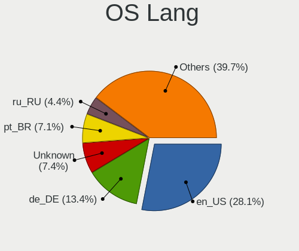

Linux Mint - Tested Hardware & Statistics (Notebooks)
-----------------------------------------------------

A project to collect tested hardware configurations for Linux Mint.

Anyone can contribute to this report by the [hw-probe](https://github.com/linuxhw/hw-probe) tool:

    sudo -E hw-probe -all -upload

Please contribute! Especially if your hardware is rare.

Contents
--------

* [ Test Cases ](#test-cases)

* [ System ](#system)
  - [ OS                       ](#os)
  - [ OS Family                ](#os-family)
  - [ Kernel                   ](#kernel)
  - [ Kernel Family            ](#kernel-family)
  - [ Kernel Major Ver.        ](#kernel-major-ver)
  - [ Arch                     ](#arch)
  - [ DE                       ](#de)
  - [ Display Server           ](#display-server)
  - [ Display Manager          ](#display-manager)
  - [ OS Lang                  ](#os-lang)
  - [ Boot Mode                ](#boot-mode)
  - [ Filesystem               ](#filesystem)
  - [ Part. scheme             ](#part-scheme)
  - [ Dual Boot with Linux/BSD ](#dual-boot-with-linuxbsd)
  - [ Dual Boot (Win)          ](#dual-boot-win)

* [ Board ](#board)
  - [ Vendor                   ](#vendor)
  - [ Model                    ](#model)
  - [ Model Family             ](#model-family)
  - [ MFG Year                 ](#mfg-year)
  - [ Form Factor              ](#form-factor)
  - [ Secure Boot              ](#secure-boot)
  - [ Coreboot                 ](#coreboot)
  - [ RAM Size                 ](#ram-size)
  - [ RAM Used                 ](#ram-used)
  - [ Total Drives             ](#total-drives)
  - [ Has CD-ROM               ](#has-cd-rom)
  - [ Has Ethernet             ](#has-ethernet)
  - [ Has WiFi                 ](#has-wifi)
  - [ Has Bluetooth            ](#has-bluetooth)

* [ Location ](#location)
  - [ Country                  ](#country)
  - [ City                     ](#city)

* [ Drives ](#drives)
  - [ Drive Vendor             ](#drive-vendor)
  - [ Drive Model              ](#drive-model)
  - [ HDD Vendor               ](#hdd-vendor)
  - [ SSD Vendor               ](#ssd-vendor)
  - [ Drive Kind               ](#drive-kind)
  - [ Drive Connector          ](#drive-connector)
  - [ Drive Size               ](#drive-size)
  - [ Space Total              ](#space-total)
  - [ Space Used               ](#space-used)
  - [ Malfunc. Drives          ](#malfunc-drives)
  - [ Malfunc. Drive Vendor    ](#malfunc-drive-vendor)
  - [ Malfunc. HDD Vendor      ](#malfunc-hdd-vendor)
  - [ Malfunc. Drive Kind      ](#malfunc-drive-kind)
  - [ Failed Drives            ](#failed-drives)
  - [ Failed Drive Vendor      ](#failed-drive-vendor)
  - [ Drive Status             ](#drive-status)

* [ Storage controller ](#storage-controller)
  - [ Storage Vendor           ](#storage-vendor)
  - [ Storage Model            ](#storage-model)
  - [ Storage Kind             ](#storage-kind)

* [ Processor ](#processor)
  - [ CPU Vendor               ](#cpu-vendor)
  - [ CPU Model                ](#cpu-model)
  - [ CPU Model Family         ](#cpu-model-family)
  - [ CPU Cores                ](#cpu-cores)
  - [ CPU Sockets              ](#cpu-sockets)
  - [ CPU Threads              ](#cpu-threads)
  - [ CPU Op-Modes             ](#cpu-op-modes)
  - [ CPU Microcode            ](#cpu-microcode)
  - [ CPU Microarch            ](#cpu-microarch)

* [ Graphics ](#graphics)
  - [ GPU Vendor               ](#gpu-vendor)
  - [ GPU Model                ](#gpu-model)
  - [ GPU Combo                ](#gpu-combo)
  - [ GPU Driver               ](#gpu-driver)
  - [ GPU Memory               ](#gpu-memory)

* [ Monitor ](#monitor)
  - [ Monitor Vendor           ](#monitor-vendor)
  - [ Monitor Model            ](#monitor-model)
  - [ Monitor Resolution       ](#monitor-resolution)
  - [ Monitor Diagonal         ](#monitor-diagonal)
  - [ Monitor Width            ](#monitor-width)
  - [ Aspect Ratio             ](#aspect-ratio)
  - [ Monitor Area             ](#monitor-area)
  - [ Pixel Density            ](#pixel-density)
  - [ Multiple Monitors        ](#multiple-monitors)

* [ Network ](#network)
  - [ Net Controller Vendor    ](#net-controller-vendor)
  - [ Net Controller Model     ](#net-controller-model)
  - [ Wireless Vendor          ](#wireless-vendor)
  - [ Wireless Model           ](#wireless-model)
  - [ Ethernet Vendor          ](#ethernet-vendor)
  - [ Ethernet Model           ](#ethernet-model)
  - [ Net Controller Kind      ](#net-controller-kind)
  - [ Used Controller          ](#used-controller)
  - [ NICs                     ](#nics)
  - [ IPv6                     ](#ipv6)

* [ Bluetooth ](#bluetooth)
  - [ Bluetooth Vendor         ](#bluetooth-vendor)
  - [ Bluetooth Model          ](#bluetooth-model)

* [ Sound ](#sound)
  - [ Sound Vendor             ](#sound-vendor)
  - [ Sound Model              ](#sound-model)

* [ Memory ](#memory)
  - [ Memory Vendor            ](#memory-vendor)
  - [ Memory Model             ](#memory-model)
  - [ Memory Kind              ](#memory-kind)
  - [ Memory Form Factor       ](#memory-form-factor)
  - [ Memory Size              ](#memory-size)
  - [ Memory Speed             ](#memory-speed)

* [ Printers & scanners ](#printers--scanners)
  - [ Printer Vendor           ](#printer-vendor)
  - [ Printer Model            ](#printer-model)
  - [ Scanner Vendor           ](#scanner-vendor)
  - [ Scanner Model            ](#scanner-model)

* [ Camera ](#camera)
  - [ Camera Vendor            ](#camera-vendor)
  - [ Camera Model             ](#camera-model)

* [ Security ](#security)
  - [ Fingerprint Vendor       ](#fingerprint-vendor)
  - [ Fingerprint Model        ](#fingerprint-model)
  - [ Chipcard Vendor          ](#chipcard-vendor)
  - [ Chipcard Model           ](#chipcard-model)

* [ Unsupported ](#unsupported)
  - [ Unsupported Devices      ](#unsupported-devices)
  - [ Unsupported Device Types ](#unsupported-device-types)

Test Cases
----------

Total: 17834

| Vendor        | Model                       | Probe                                                      | Date         |
|---------------|-----------------------------|------------------------------------------------------------|--------------|
| Lenovo        | ThinkPad E14 Gen 2 20TBS... | [4720614db4](https://linux-hardware.org/?probe=4720614db4) | May 09, 2024 |
| Panasonic     | FZ55-1                      | [5709bdb252](https://linux-hardware.org/?probe=5709bdb252) | May 09, 2024 |
| ASUSTek       | X550LD                      | [1c55e1acf7](https://linux-hardware.org/?probe=1c55e1acf7) | May 08, 2024 |
| Panasonic     | CF-53SAWZYMN                | [15a322275f](https://linux-hardware.org/?probe=15a322275f) | May 08, 2024 |
| Acer          | Swift SFX16-61G             | [9cbd40bfc7](https://linux-hardware.org/?probe=9cbd40bfc7) | May 08, 2024 |
| Sony          | SVE1412BCXB                 | [593942e0e3](https://linux-hardware.org/?probe=593942e0e3) | May 08, 2024 |
| HP            | Laptop 15-bs1xx             | [f3c9212dca](https://linux-hardware.org/?probe=f3c9212dca) | May 07, 2024 |
| Samsung       | RC530/RC730                 | [9e8af32b68](https://linux-hardware.org/?probe=9e8af32b68) | May 07, 2024 |
| Lenovo        | V145-15AST 81MT             | [f683d111b9](https://linux-hardware.org/?probe=f683d111b9) | May 07, 2024 |
| Lenovo        | V145-15AST 81MT             | [1f8035ccf5](https://linux-hardware.org/?probe=1f8035ccf5) | May 07, 2024 |
| Samsung       | 350V5C/351V5C/3540VC/344... | [5bc2e6635d](https://linux-hardware.org/?probe=5bc2e6635d) | May 06, 2024 |
| Apple         | MacBookAir7,2               | [c8f7c82599](https://linux-hardware.org/?probe=c8f7c82599) | May 06, 2024 |
| Acer          | Aspire 5310                 | [8e28475b52](https://linux-hardware.org/?probe=8e28475b52) | May 06, 2024 |
| Lenovo        | IdeaPad Pro 5 14AHP9 83D... | [f8f3623eac](https://linux-hardware.org/?probe=f8f3623eac) | May 06, 2024 |
| Toshiba       | Satellite C660D             | [8c4353e699](https://linux-hardware.org/?probe=8c4353e699) | May 06, 2024 |
| Alienware     | 17 R4                       | [99e296d142](https://linux-hardware.org/?probe=99e296d142) | May 06, 2024 |
| Lenovo        | IdeaPad 500-15ISK 80NT      | [63486fcdd6](https://linux-hardware.org/?probe=63486fcdd6) | May 05, 2024 |
| Lenovo        | IdeaPad 500-15ISK 80NT      | [61af632661](https://linux-hardware.org/?probe=61af632661) | May 05, 2024 |
| HUAWEI        | BOHK-WAX9X                  | [81e4b0e4f8](https://linux-hardware.org/?probe=81e4b0e4f8) | May 05, 2024 |
| Acer          | Aspire ES1-521              | [65ad890734](https://linux-hardware.org/?probe=65ad890734) | May 05, 2024 |
| ASUSTek       | F9E                         | [faf50e0119](https://linux-hardware.org/?probe=faf50e0119) | May 05, 2024 |
| ASUSTek       | ROG Strix G513IH_G513IH     | [5a6ae63a80](https://linux-hardware.org/?probe=5a6ae63a80) | May 05, 2024 |
| Dell          | Inspiron 16 Plus 7620       | [cd8ef2428b](https://linux-hardware.org/?probe=cd8ef2428b) | May 05, 2024 |
| Lenovo        | ThinkPad T480 20L50011US    | [06d6c1d0e2](https://linux-hardware.org/?probe=06d6c1d0e2) | May 05, 2024 |
| Lenovo        | ThinkPad X220 4291U1A       | [56fe72121d](https://linux-hardware.org/?probe=56fe72121d) | May 05, 2024 |
| Alienware     | 17 R4                       | [4ad46d150c](https://linux-hardware.org/?probe=4ad46d150c) | May 05, 2024 |
| HP            | Presario CQ42               | [809ae686e3](https://linux-hardware.org/?probe=809ae686e3) | May 05, 2024 |
| ASUSTek       | VivoBook_ASUSLaptop M650... | [5f2d3291b5](https://linux-hardware.org/?probe=5f2d3291b5) | May 05, 2024 |
| Lenovo        | ThinkPad T530 23942C2       | [f906a50af0](https://linux-hardware.org/?probe=f906a50af0) | May 03, 2024 |
| ASUSTek       | X553MA                      | [dc9e8b63f5](https://linux-hardware.org/?probe=dc9e8b63f5) | May 03, 2024 |
| Lenovo        | Yoga 7 16IRL8 82YN          | [a70e2b13ca](https://linux-hardware.org/?probe=a70e2b13ca) | May 03, 2024 |
| Dell          | Latitude E6540              | [186de5be73](https://linux-hardware.org/?probe=186de5be73) | May 03, 2024 |
| Apple         | MacBookAir7,2               | [4e2a6ab271](https://linux-hardware.org/?probe=4e2a6ab271) | May 03, 2024 |
| Lenovo        | ThinkPad T460 20FMS0VG25    | [754611f403](https://linux-hardware.org/?probe=754611f403) | May 03, 2024 |
| HP            | Pavilion Laptop 15-eh1xx... | [c94fe08160](https://linux-hardware.org/?probe=c94fe08160) | May 02, 2024 |
| HP            | Notebook                    | [3719fa55d8](https://linux-hardware.org/?probe=3719fa55d8) | May 02, 2024 |
| Acer          | Aspire A315-53G             | [d782707b53](https://linux-hardware.org/?probe=d782707b53) | May 02, 2024 |
| ASUSTek       | F9E                         | [29fd3412dc](https://linux-hardware.org/?probe=29fd3412dc) | May 02, 2024 |
| Lenovo        | IdeaPad 1 15AMN7 82VG       | [0740dd4f54](https://linux-hardware.org/?probe=0740dd4f54) | May 02, 2024 |
| Samsung       | RV411/RV511/E3511/S3511/... | [452d7c03be](https://linux-hardware.org/?probe=452d7c03be) | May 01, 2024 |
| HP            | Pavilion g6                 | [6568deae58](https://linux-hardware.org/?probe=6568deae58) | May 01, 2024 |
| HP            | Pavilion g6                 | [57a50655da](https://linux-hardware.org/?probe=57a50655da) | May 01, 2024 |
| Notebook      | V15x_V17xRNx                | [ec53c078f5](https://linux-hardware.org/?probe=ec53c078f5) | May 01, 2024 |
| Samsung       | 355V4C/356V4C/3445VC/354... | [b861055064](https://linux-hardware.org/?probe=b861055064) | May 01, 2024 |
| HP            | ProBook 450 15.6 inch G9... | [8a4bab899a](https://linux-hardware.org/?probe=8a4bab899a) | May 01, 2024 |
| Lenovo        | IdeaPad S145-15IWL 81S9     | [e7b0c31433](https://linux-hardware.org/?probe=e7b0c31433) | Apr 30, 2024 |
| Apple         | MacBookPro12,1              | [89a84d0398](https://linux-hardware.org/?probe=89a84d0398) | Apr 30, 2024 |
| Lenovo        | IdeaPad S145-15IWL 81S9     | [83497aeda8](https://linux-hardware.org/?probe=83497aeda8) | Apr 30, 2024 |
| Packard Be... | DOT SE                      | [25e87d67cc](https://linux-hardware.org/?probe=25e87d67cc) | Apr 30, 2024 |
| Packard Be... | DOT SE                      | [e8d7adfcce](https://linux-hardware.org/?probe=e8d7adfcce) | Apr 30, 2024 |
| Acer          | Aspire A514-55              | [3f25790115](https://linux-hardware.org/?probe=3f25790115) | Apr 30, 2024 |
| Acer          | Acadia V1.45                | [7dc83a3832](https://linux-hardware.org/?probe=7dc83a3832) | Apr 30, 2024 |
| Lenovo        | Legion 7 16ARHA7 82UH       | [5514986c5d](https://linux-hardware.org/?probe=5514986c5d) | Apr 30, 2024 |
| HUAWEI        | BoDE-WXX9                   | [3777b80728](https://linux-hardware.org/?probe=3777b80728) | Apr 30, 2024 |
| ASUSTek       | K53SD                       | [058d33ec3c](https://linux-hardware.org/?probe=058d33ec3c) | Apr 29, 2024 |
| iQual         | NQ1                         | [8c657ecc80](https://linux-hardware.org/?probe=8c657ecc80) | Apr 29, 2024 |
| HP            | 255 15.6 inch G9 Noteboo... | [184f4e1a7c](https://linux-hardware.org/?probe=184f4e1a7c) | Apr 29, 2024 |
| ASUSTek       | VivoBook_ASUSLaptop X415... | [20ce0be473](https://linux-hardware.org/?probe=20ce0be473) | Apr 29, 2024 |
| MSI           | GF75 Thin 10UE              | [07b5ec9d5d](https://linux-hardware.org/?probe=07b5ec9d5d) | Apr 29, 2024 |
| Lenovo        | IdeaPad 5 15ABA7 82SG       | [26e856b70a](https://linux-hardware.org/?probe=26e856b70a) | Apr 29, 2024 |
| ASUSTek       | UX32VD                      | [1377417777](https://linux-hardware.org/?probe=1377417777) | Apr 29, 2024 |
| Dell          | Precision M6800             | [394b2b0f31](https://linux-hardware.org/?probe=394b2b0f31) | Apr 28, 2024 |
| Sony          | SVF1521C5E                  | [9a899f2e80](https://linux-hardware.org/?probe=9a899f2e80) | Apr 28, 2024 |
| Lenovo        | ThinkPad E14 Gen 5 21JL0... | [5f82ffafd9](https://linux-hardware.org/?probe=5f82ffafd9) | Apr 28, 2024 |
| Samsung       | RC530/RC730                 | [ef8bb7edf5](https://linux-hardware.org/?probe=ef8bb7edf5) | Apr 28, 2024 |
| MSI           | GL75 Leopard 10SFK          | [2cde0c8054](https://linux-hardware.org/?probe=2cde0c8054) | Apr 28, 2024 |
| HP            | Pavilion dv6                | [3663f38683](https://linux-hardware.org/?probe=3663f38683) | Apr 28, 2024 |
| Dell          | Inspiron 3583               | [27c5b7b8d8](https://linux-hardware.org/?probe=27c5b7b8d8) | Apr 27, 2024 |
| Acer          | Aspire 5735                 | [bb36d187d1](https://linux-hardware.org/?probe=bb36d187d1) | Apr 27, 2024 |
| Novatech      | C141SC-N4                   | [bedb8538c8](https://linux-hardware.org/?probe=bedb8538c8) | Apr 27, 2024 |
| Novatech      | C141SC-N4                   | [f1534e7ed2](https://linux-hardware.org/?probe=f1534e7ed2) | Apr 27, 2024 |
| Lenovo        | ThinkPad T480 20L6SA5Q1L    | [1498235a91](https://linux-hardware.org/?probe=1498235a91) | Apr 27, 2024 |
| Lenovo        | ThinkPad T495 20NKS1YE00    | [8436983b86](https://linux-hardware.org/?probe=8436983b86) | Apr 27, 2024 |
| Lenovo        | ThinkPad W520 4270CTO       | [ab9e430693](https://linux-hardware.org/?probe=ab9e430693) | Apr 27, 2024 |
| Lenovo        | ThinkPad W520 4270CTO       | [e192aa886d](https://linux-hardware.org/?probe=e192aa886d) | Apr 27, 2024 |
| Samsung       | 355V4C/356V4C/3445VC/354... | [4b825a61db](https://linux-hardware.org/?probe=4b825a61db) | Apr 27, 2024 |
| ASUSTek       | S551LN                      | [e1fa85e2ad](https://linux-hardware.org/?probe=e1fa85e2ad) | Apr 27, 2024 |
| Acer          | Extensa 5230                | [3a0381ce01](https://linux-hardware.org/?probe=3a0381ce01) | Apr 27, 2024 |
| Dell          | Inspiron 15-7568            | [bc2dfb0b2f](https://linux-hardware.org/?probe=bc2dfb0b2f) | Apr 26, 2024 |
| ASUSTek       | X555LAB                     | [3b175a9a09](https://linux-hardware.org/?probe=3b175a9a09) | Apr 26, 2024 |
| HP            | ProBook 450 G1              | [02e056b32e](https://linux-hardware.org/?probe=02e056b32e) | Apr 26, 2024 |
| Apple         | MacBookAir7,2               | [cf8aa1d23a](https://linux-hardware.org/?probe=cf8aa1d23a) | Apr 26, 2024 |
| Acer          | Aspire one                  | [aa3dbeb28b](https://linux-hardware.org/?probe=aa3dbeb28b) | Apr 26, 2024 |
| HP            | EliteBook 820 G3            | [9f260f753a](https://linux-hardware.org/?probe=9f260f753a) | Apr 26, 2024 |
| Lenovo        | ThinkPad T470s 20HGS45C0... | [f39ba0b079](https://linux-hardware.org/?probe=f39ba0b079) | Apr 26, 2024 |
| Lenovo        | G510 20238                  | [f7d0515f40](https://linux-hardware.org/?probe=f7d0515f40) | Apr 26, 2024 |
| Apple         | MacBookAir5,1               | [dec330ffa3](https://linux-hardware.org/?probe=dec330ffa3) | Apr 25, 2024 |
| ASUSTek       | X553MA                      | [cb731fbd8f](https://linux-hardware.org/?probe=cb731fbd8f) | Apr 25, 2024 |
| Itronix       | GD8200                      | [8ef185190e](https://linux-hardware.org/?probe=8ef185190e) | Apr 25, 2024 |
| Apple         | MacBookPro5,2               | [ebae8ff385](https://linux-hardware.org/?probe=ebae8ff385) | Apr 24, 2024 |
| Lenovo        | ThinkPad T460 20FMS0VG25    | [3367162736](https://linux-hardware.org/?probe=3367162736) | Apr 24, 2024 |
| PC Special... | Ionico 16                   | [d75ee89a24](https://linux-hardware.org/?probe=d75ee89a24) | Apr 24, 2024 |
| HP            | Pavilion Gaming Notebook    | [9c5d8bd5fe](https://linux-hardware.org/?probe=9c5d8bd5fe) | Apr 23, 2024 |
| MECHREVO      | WUJIE14XA                   | [c43bb34bc6](https://linux-hardware.org/?probe=c43bb34bc6) | Apr 23, 2024 |
| Acer          | Aspire 4820TG               | [7f3e1cb872](https://linux-hardware.org/?probe=7f3e1cb872) | Apr 23, 2024 |
| Lenovo        | ThinkPad T420 4236RN1       | [4ad39fcdb5](https://linux-hardware.org/?probe=4ad39fcdb5) | Apr 23, 2024 |
| MSI           | GT72 2QD                    | [7899b804eb](https://linux-hardware.org/?probe=7899b804eb) | Apr 23, 2024 |
| HP            | Pavilion x2 Detachable      | [62dfe52148](https://linux-hardware.org/?probe=62dfe52148) | Apr 22, 2024 |
| HP            | Pavilion x2 Detachable      | [fadfc9adae](https://linux-hardware.org/?probe=fadfc9adae) | Apr 22, 2024 |
| Acer          | Aspire A315-56              | [994d2b8b2d](https://linux-hardware.org/?probe=994d2b8b2d) | Apr 22, 2024 |
| Notebook      | P15SM-A/SM1-A               | [76d49d1637](https://linux-hardware.org/?probe=76d49d1637) | Apr 22, 2024 |
| ASUSTek       | K56CB                       | [5ab318e135](https://linux-hardware.org/?probe=5ab318e135) | Apr 22, 2024 |
| Dell          | XPS 15 9530                 | [500ffeec7b](https://linux-hardware.org/?probe=500ffeec7b) | Apr 22, 2024 |
| Positivo      | Z100                        | [f445e8595a](https://linux-hardware.org/?probe=f445e8595a) | Apr 22, 2024 |
| Positivo      | Z100                        | [b2af17f7a0](https://linux-hardware.org/?probe=b2af17f7a0) | Apr 22, 2024 |
| HP            | Notebook                    | [65703ccbac](https://linux-hardware.org/?probe=65703ccbac) | Apr 21, 2024 |
| Lenovo        | ThinkPad T430u 86147LG      | [0ce4123de5](https://linux-hardware.org/?probe=0ce4123de5) | Apr 21, 2024 |
| ASUSTek       | K55DR                       | [3ae44053ef](https://linux-hardware.org/?probe=3ae44053ef) | Apr 21, 2024 |
| Medion        | M14L-256                    | [21ced95f8d](https://linux-hardware.org/?probe=21ced95f8d) | Apr 21, 2024 |
| Lenovo        | Legion 5 15IAH7H 82RB       | [fa1738d688](https://linux-hardware.org/?probe=fa1738d688) | Apr 21, 2024 |
| Lenovo        | ThinkPad E14 Gen 5 21JR0... | [7cecfee468](https://linux-hardware.org/?probe=7cecfee468) | Apr 21, 2024 |
| ASUSTek       | VivoBook_ASUSLaptop M160... | [09f4ed7915](https://linux-hardware.org/?probe=09f4ed7915) | Apr 21, 2024 |
| Lenovo        | B5400 80B6QB0               | [e7a82d8d18](https://linux-hardware.org/?probe=e7a82d8d18) | Apr 21, 2024 |
| MSI           | Modern 15 B12M              | [dbf027e01f](https://linux-hardware.org/?probe=dbf027e01f) | Apr 21, 2024 |
| Medion        | Akoya E6227                 | [180d5db57d](https://linux-hardware.org/?probe=180d5db57d) | Apr 20, 2024 |
| Acer          | Swift SF514-52T             | [d89f8a89a9](https://linux-hardware.org/?probe=d89f8a89a9) | Apr 20, 2024 |
| Notebook      | NJ50_70CU                   | [d0959d96c0](https://linux-hardware.org/?probe=d0959d96c0) | Apr 20, 2024 |
| Toshiba       | Satellite L50-C             | [ca2755b614](https://linux-hardware.org/?probe=ca2755b614) | Apr 20, 2024 |
| Toshiba       | Satellite L50-C             | [8eec3bacc7](https://linux-hardware.org/?probe=8eec3bacc7) | Apr 20, 2024 |
| HP            | ProBook 450 G8 Notebook ... | [6bb7ef988e](https://linux-hardware.org/?probe=6bb7ef988e) | Apr 20, 2024 |
| HP            | Pavilion Notebook           | [10939e0163](https://linux-hardware.org/?probe=10939e0163) | Apr 20, 2024 |
| Lenovo        | ThinkPad T430 2347AY1       | [b3392ca7e4](https://linux-hardware.org/?probe=b3392ca7e4) | Apr 20, 2024 |
| HP            | Pavilion Notebook           | [e4e64863d9](https://linux-hardware.org/?probe=e4e64863d9) | Apr 20, 2024 |
| HP            | ENVY 17                     | [2ff3b1ea53](https://linux-hardware.org/?probe=2ff3b1ea53) | Apr 20, 2024 |
| Lenovo        | Yoga Slim 7 14ITL05 82A3    | [1726cd6edd](https://linux-hardware.org/?probe=1726cd6edd) | Apr 20, 2024 |
| Sony          | SVF15213CDW                 | [b80f0ab84c](https://linux-hardware.org/?probe=b80f0ab84c) | Apr 20, 2024 |
| Acer          | Nitro AN515-54              | [17aeeed6cf](https://linux-hardware.org/?probe=17aeeed6cf) | Apr 20, 2024 |
| ASUSTek       | X751LX                      | [7be3e5016c](https://linux-hardware.org/?probe=7be3e5016c) | Apr 19, 2024 |
| Acer          | Aspire A315-31              | [d9c7cb3ef3](https://linux-hardware.org/?probe=d9c7cb3ef3) | Apr 19, 2024 |
| Carbon Sys... | Iridium 16                  | [dc8742a30f](https://linux-hardware.org/?probe=dc8742a30f) | Apr 19, 2024 |
| ASUSTek       | X751LX                      | [52041d2fb2](https://linux-hardware.org/?probe=52041d2fb2) | Apr 19, 2024 |
| Acer          | Aspire 7738                 | [dc56784ca7](https://linux-hardware.org/?probe=dc56784ca7) | Apr 19, 2024 |
| Acer          | Aspire A315-53G             | [3929f4890f](https://linux-hardware.org/?probe=3929f4890f) | Apr 19, 2024 |
| Unknown       | Unknown                     | [7d4668e73c](https://linux-hardware.org/?probe=7d4668e73c) | Apr 19, 2024 |
| Lenovo        | ThinkPad E16 Gen 1 21JT0... | [1a8e5b4d4c](https://linux-hardware.org/?probe=1a8e5b4d4c) | Apr 19, 2024 |
| Acer          | Aspire ES1-512              | [7e666ce610](https://linux-hardware.org/?probe=7e666ce610) | Apr 19, 2024 |
| Acer          | Predator PH315-52           | [62dede0f49](https://linux-hardware.org/?probe=62dede0f49) | Apr 19, 2024 |
| Lenovo        | ThinkPad T410 2539W2Q       | [9cb003f852](https://linux-hardware.org/?probe=9cb003f852) | Apr 18, 2024 |
| HP            | ZBook Power 15.6 inch G1... | [f82450896d](https://linux-hardware.org/?probe=f82450896d) | Apr 18, 2024 |
| Acer          | TravelMate P253             | [d3081b2d18](https://linux-hardware.org/?probe=d3081b2d18) | Apr 18, 2024 |
| Lenovo        | ThinkPad T440p 20AWS17N0... | [9f31e2ff86](https://linux-hardware.org/?probe=9f31e2ff86) | Apr 18, 2024 |
| Packard Be... | EasyNote LJ65               | [083f367ee6](https://linux-hardware.org/?probe=083f367ee6) | Apr 17, 2024 |
| Seco          | UDOO x86                    | [858d9abe37](https://linux-hardware.org/?probe=858d9abe37) | Apr 17, 2024 |
| Lenovo        | G505 20240                  | [e51eddb945](https://linux-hardware.org/?probe=e51eddb945) | Apr 17, 2024 |
| Dell          | Inspiron 7737               | [a19a0ef17f](https://linux-hardware.org/?probe=a19a0ef17f) | Apr 17, 2024 |
| Lenovo        | ThinkBook 13s G4 IAP 21A... | [600ef92371](https://linux-hardware.org/?probe=600ef92371) | Apr 17, 2024 |
| MSI           | GP75 Leopard 10SFK          | [31ffa81a38](https://linux-hardware.org/?probe=31ffa81a38) | Apr 17, 2024 |
| Acer          | Nitro AN515-54              | [e578380a3e](https://linux-hardware.org/?probe=e578380a3e) | Apr 17, 2024 |
| Acer          | Nitro AN515-58              | [983c22ff1b](https://linux-hardware.org/?probe=983c22ff1b) | Apr 17, 2024 |
| Lenovo        | ThinkPad L430 2466EN8       | [9a42213649](https://linux-hardware.org/?probe=9a42213649) | Apr 16, 2024 |
| Acer          | Aspire 5810T                | [3940c56991](https://linux-hardware.org/?probe=3940c56991) | Apr 16, 2024 |
| Lenovo        | ThinkPad T480s 20L8S02E0... | [4f6dc2dd34](https://linux-hardware.org/?probe=4f6dc2dd34) | Apr 16, 2024 |
| Acer          | Nitro AN515-58              | [88862b5c78](https://linux-hardware.org/?probe=88862b5c78) | Apr 16, 2024 |
| HP            | ProBook 450 G6              | [c41b024ad4](https://linux-hardware.org/?probe=c41b024ad4) | Apr 15, 2024 |
| Acer          | Aspire E1-531               | [7d6a4b8c41](https://linux-hardware.org/?probe=7d6a4b8c41) | Apr 15, 2024 |
| HP            | ProBook 450 G6              | [d1f51a03b0](https://linux-hardware.org/?probe=d1f51a03b0) | Apr 15, 2024 |
| Apple         | MacBookAir2,1               | [9145361a08](https://linux-hardware.org/?probe=9145361a08) | Apr 15, 2024 |
| Acer          | Aspire E1-531               | [d38bfe837e](https://linux-hardware.org/?probe=d38bfe837e) | Apr 15, 2024 |
| Lenovo        | Legion 5 15IAH7H 82RB       | [85f088ac78](https://linux-hardware.org/?probe=85f088ac78) | Apr 15, 2024 |
| Lenovo        | ThinkPad T410 2539W2Q       | [54c60f5622](https://linux-hardware.org/?probe=54c60f5622) | Apr 15, 2024 |
| Toshiba       | Satellite C70D-B            | [aec8c6b18e](https://linux-hardware.org/?probe=aec8c6b18e) | Apr 15, 2024 |
| Acer          | Nitro AN515-57              | [09b7f317ca](https://linux-hardware.org/?probe=09b7f317ca) | Apr 14, 2024 |
| MSI           | EX600                       | [df674cd3c0](https://linux-hardware.org/?probe=df674cd3c0) | Apr 14, 2024 |
| HP            | G56                         | [260bef5db7](https://linux-hardware.org/?probe=260bef5db7) | Apr 14, 2024 |
| HP            | G42                         | [3fc8c107a9](https://linux-hardware.org/?probe=3fc8c107a9) | Apr 14, 2024 |
| Apple         | MacBookAir2,1               | [94a43b871f](https://linux-hardware.org/?probe=94a43b871f) | Apr 14, 2024 |
| HP            | EliteBook 8570w             | [56b69c4112](https://linux-hardware.org/?probe=56b69c4112) | Apr 14, 2024 |
| Sony          | SVE1713L1EW                 | [11b61d3ce0](https://linux-hardware.org/?probe=11b61d3ce0) | Apr 14, 2024 |
| Samsung       | 300E4A/300E5A/300E7A/343... | [a1161960b8](https://linux-hardware.org/?probe=a1161960b8) | Apr 14, 2024 |
| Medion        | E6226                       | [be5a69a09e](https://linux-hardware.org/?probe=be5a69a09e) | Apr 14, 2024 |
| Lenovo        | ThinkPad X1 Nano Gen 1 2... | [617d302540](https://linux-hardware.org/?probe=617d302540) | Apr 14, 2024 |
| HP            | EliteBook 8760w             | [d405776640](https://linux-hardware.org/?probe=d405776640) | Apr 13, 2024 |
| HP            | Pavilion Notebook           | [cee4508310](https://linux-hardware.org/?probe=cee4508310) | Apr 13, 2024 |
| HUAWEI        | BOD-WXX9                    | [c8f3706c61](https://linux-hardware.org/?probe=c8f3706c61) | Apr 13, 2024 |
| Packard Be... | EasyNote TK36               | [0c3a4cf1cc](https://linux-hardware.org/?probe=0c3a4cf1cc) | Apr 13, 2024 |
| Acer          | Aspire A115-32              | [0aa771edc1](https://linux-hardware.org/?probe=0aa771edc1) | Apr 13, 2024 |
| ASUSTek       | X451MA                      | [8e0f92ef8c](https://linux-hardware.org/?probe=8e0f92ef8c) | Apr 13, 2024 |
| Medion        | E6226                       | [7337c330bf](https://linux-hardware.org/?probe=7337c330bf) | Apr 13, 2024 |
| Dell          | Inspiron 5567               | [d3a4e47ddb](https://linux-hardware.org/?probe=d3a4e47ddb) | Apr 13, 2024 |
| Dell          | Latitude E5570              | [91db6ada79](https://linux-hardware.org/?probe=91db6ada79) | Apr 13, 2024 |
| Dell          | Latitude E5270              | [31c5454d09](https://linux-hardware.org/?probe=31c5454d09) | Apr 12, 2024 |
| Lenovo        | ThinkPad X270 20HMS5QA00    | [1f5a7a6e2f](https://linux-hardware.org/?probe=1f5a7a6e2f) | Apr 12, 2024 |
| MSI           | Bravo 17 A4DDR              | [5296079f86](https://linux-hardware.org/?probe=5296079f86) | Apr 12, 2024 |
| Toshiba       | Satellite Pro C50-A-1C8     | [64265aeb0e](https://linux-hardware.org/?probe=64265aeb0e) | Apr 12, 2024 |
| Dell          | Inspiron 3180               | [1e6985a883](https://linux-hardware.org/?probe=1e6985a883) | Apr 12, 2024 |
| Samsung       | R530/R730                   | [8c14b05ec6](https://linux-hardware.org/?probe=8c14b05ec6) | Apr 12, 2024 |
| HP            | 240 G2                      | [330b73b67e](https://linux-hardware.org/?probe=330b73b67e) | Apr 12, 2024 |
| Lenovo        | IdeaPad S340-14API 81NB     | [a252dc6dd3](https://linux-hardware.org/?probe=a252dc6dd3) | Apr 12, 2024 |
| Lenovo        | ThinkPad E580 20KTS0TF00    | [30d9e28258](https://linux-hardware.org/?probe=30d9e28258) | Apr 12, 2024 |
| Samsung       | RV411/RV511/E3511/S3511/... | [4d6a9bb700](https://linux-hardware.org/?probe=4d6a9bb700) | Apr 12, 2024 |
| Samsung       | RV411/RV511/E3511/S3511/... | [e108ca29d2](https://linux-hardware.org/?probe=e108ca29d2) | Apr 12, 2024 |
| Dell          | Inspiron 3458               | [550b5dcdc0](https://linux-hardware.org/?probe=550b5dcdc0) | Apr 12, 2024 |
| HP            | Pavilion dv6700             | [fb46ed47a1](https://linux-hardware.org/?probe=fb46ed47a1) | Apr 12, 2024 |
| Dell          | Inspiron 3458               | [d263334708](https://linux-hardware.org/?probe=d263334708) | Apr 12, 2024 |
| Dell          | Inspiron 5555               | [dc25cca6b2](https://linux-hardware.org/?probe=dc25cca6b2) | Apr 11, 2024 |
| HP            | Pavilion Notebook           | [07ccfe7f99](https://linux-hardware.org/?probe=07ccfe7f99) | Apr 11, 2024 |
| ASUSTek       | VivoBook_ASUSLaptop X140... | [bb35cff518](https://linux-hardware.org/?probe=bb35cff518) | Apr 11, 2024 |
| Acer          | Nitro AN515-57              | [c7d6945bb3](https://linux-hardware.org/?probe=c7d6945bb3) | Apr 11, 2024 |
| Lenovo        | B50-70 20384                | [431d6db80a](https://linux-hardware.org/?probe=431d6db80a) | Apr 11, 2024 |
| HP            | 15                          | [1d363becea](https://linux-hardware.org/?probe=1d363becea) | Apr 11, 2024 |
| ASUSTek       | VivoBook_ASUSLaptop X150... | [fe388e2f15](https://linux-hardware.org/?probe=fe388e2f15) | Apr 11, 2024 |
| Unknown       | M17S                        | [40ecd83857](https://linux-hardware.org/?probe=40ecd83857) | Apr 11, 2024 |
| HP            | G56                         | [bd50fcdb8b](https://linux-hardware.org/?probe=bd50fcdb8b) | Apr 11, 2024 |
| ASUSTek       | Vivobook Go E1504FA_E150... | [4152c2b9a9](https://linux-hardware.org/?probe=4152c2b9a9) | Apr 11, 2024 |
| Acer          | Aspire A514-52              | [7019dcf4ea](https://linux-hardware.org/?probe=7019dcf4ea) | Apr 10, 2024 |
| HP            | Pavilion Laptop 15-ck0xx    | [94f56fe502](https://linux-hardware.org/?probe=94f56fe502) | Apr 10, 2024 |
| HP            | Pavilion Laptop 15-eh2xx... | [b7131cef2d](https://linux-hardware.org/?probe=b7131cef2d) | Apr 10, 2024 |
| HP            | Pavilion Laptop 15-eh2xx... | [7fa5b7e16f](https://linux-hardware.org/?probe=7fa5b7e16f) | Apr 10, 2024 |
| HUAWEI        | HVY-WXX9                    | [b215419382](https://linux-hardware.org/?probe=b215419382) | Apr 10, 2024 |
| HP            | ENVY Pro 4-b000 Ultraboo... | [64bbd1ee8c](https://linux-hardware.org/?probe=64bbd1ee8c) | Apr 10, 2024 |
| HP            | ENVY Pro 4-b000 Ultraboo... | [55a4b4a105](https://linux-hardware.org/?probe=55a4b4a105) | Apr 10, 2024 |
| HP            | OMEN X by Laptop 15-dg0x... | [9d5d84bae2](https://linux-hardware.org/?probe=9d5d84bae2) | Apr 10, 2024 |
| Lenovo        | ThinkPad L15 Gen 2 20X30... | [6988114e9a](https://linux-hardware.org/?probe=6988114e9a) | Apr 10, 2024 |
| Lenovo        | IdeaPad 5 15ITL05 82FG      | [c595905fcb](https://linux-hardware.org/?probe=c595905fcb) | Apr 10, 2024 |
| Dell          | Latitude 7290               | [8c904a8ecf](https://linux-hardware.org/?probe=8c904a8ecf) | Apr 10, 2024 |
| Lenovo        | ThinkPad L15 Gen 2 20X30... | [217f8e21a7](https://linux-hardware.org/?probe=217f8e21a7) | Apr 10, 2024 |
| HUAWEI        | BOM-WXX9                    | [67679cf1d8](https://linux-hardware.org/?probe=67679cf1d8) | Apr 10, 2024 |
| Dell          | Inspiron 15-3567            | [0b670a40da](https://linux-hardware.org/?probe=0b670a40da) | Apr 10, 2024 |
| Dell          | Inspiron 15-3567            | [657780c9cf](https://linux-hardware.org/?probe=657780c9cf) | Apr 09, 2024 |
| Dell          | Inspiron 5555               | [db69694381](https://linux-hardware.org/?probe=db69694381) | Apr 09, 2024 |
| Acer          | Aspire A315-24PT            | [65647bc9b4](https://linux-hardware.org/?probe=65647bc9b4) | Apr 09, 2024 |
| Lenovo        | IdeaPad S145-14IWL 81MU     | [b899a5846f](https://linux-hardware.org/?probe=b899a5846f) | Apr 09, 2024 |
| Dell          | Latitude E5510              | [923127ad28](https://linux-hardware.org/?probe=923127ad28) | Apr 09, 2024 |
| Acer          | Aspire A315-24P             | [7624144c62](https://linux-hardware.org/?probe=7624144c62) | Apr 08, 2024 |
| Google        | Magolor                     | [df74bd8187](https://linux-hardware.org/?probe=df74bd8187) | Apr 08, 2024 |
| Google        | Magolor                     | [dc67b995b5](https://linux-hardware.org/?probe=dc67b995b5) | Apr 08, 2024 |
| ASUSTek       | VivoBook_ASUSLaptop M160... | [26939f8d07](https://linux-hardware.org/?probe=26939f8d07) | Apr 08, 2024 |
| Toshiba       | Satellite Pro L670          | [6466d3ca99](https://linux-hardware.org/?probe=6466d3ca99) | Apr 08, 2024 |
| HUAWEI        | BoDE-WXX9                   | [535c311c9f](https://linux-hardware.org/?probe=535c311c9f) | Apr 08, 2024 |
| ASUSTek       | K55VM                       | [081e45fb7f](https://linux-hardware.org/?probe=081e45fb7f) | Apr 08, 2024 |
| Lenovo        | IdeaPad Y700-15ISK 80NV     | [9c0f217fbb](https://linux-hardware.org/?probe=9c0f217fbb) | Apr 07, 2024 |
| Lenovo        | IdeaPad 3 14ADA05 81W0      | [da48420d2a](https://linux-hardware.org/?probe=da48420d2a) | Apr 07, 2024 |
| Lenovo        | ThinkPad X250 20CLS21F00    | [9868b5573c](https://linux-hardware.org/?probe=9868b5573c) | Apr 07, 2024 |
| ASUSTek       | X502CA                      | [7be070b9f2](https://linux-hardware.org/?probe=7be070b9f2) | Apr 07, 2024 |
| Apple         | MacBookAir7,2               | [98695d52ec](https://linux-hardware.org/?probe=98695d52ec) | Apr 07, 2024 |
| HP            | ProBook 650 G2              | [693d207c41](https://linux-hardware.org/?probe=693d207c41) | Apr 07, 2024 |
| Samsung       | 350V5C/351V5C/3540VC/344... | [4802cbf930](https://linux-hardware.org/?probe=4802cbf930) | Apr 07, 2024 |
| Lenovo        | Unknown                     | [18961ee7a8](https://linux-hardware.org/?probe=18961ee7a8) | Apr 07, 2024 |
| Lenovo        | Unknown                     | [d74a81067e](https://linux-hardware.org/?probe=d74a81067e) | Apr 07, 2024 |
| Dell          | Latitude 7290               | [d6acda310b](https://linux-hardware.org/?probe=d6acda310b) | Apr 07, 2024 |
| HUAWEI        | HKD-WXX                     | [a1e39d45ea](https://linux-hardware.org/?probe=a1e39d45ea) | Apr 07, 2024 |
| Lenovo        | ThinkPad T510 4349BW3       | [c5a4aad672](https://linux-hardware.org/?probe=c5a4aad672) | Apr 07, 2024 |
| HP            | ProBook 650 G2              | [5e5491e5cd](https://linux-hardware.org/?probe=5e5491e5cd) | Apr 07, 2024 |
| GPU Compan... | GWTC116-2                   | [6c8bca1a6e](https://linux-hardware.org/?probe=6c8bca1a6e) | Apr 07, 2024 |
| Sony          | VPCEA3UFX                   | [78c3a51c50](https://linux-hardware.org/?probe=78c3a51c50) | Apr 07, 2024 |
| Sony          | VPCEA3UFX                   | [e3907afc62](https://linux-hardware.org/?probe=e3907afc62) | Apr 07, 2024 |
| Apple         | MacBookAir6,2               | [a63811031c](https://linux-hardware.org/?probe=a63811031c) | Apr 07, 2024 |
| Medion        | Akoya P7818                 | [5b8f93851b](https://linux-hardware.org/?probe=5b8f93851b) | Apr 07, 2024 |
| Lenovo        | G505 20240                  | [c4a98d7c4b](https://linux-hardware.org/?probe=c4a98d7c4b) | Apr 06, 2024 |
| Dell          | Latitude 7290               | [e8f80ff545](https://linux-hardware.org/?probe=e8f80ff545) | Apr 06, 2024 |
| Irbis         | NB264                       | [c64561eaa6](https://linux-hardware.org/?probe=c64561eaa6) | Apr 06, 2024 |
| Intel         | HuronRiver Platform         | [aa62416169](https://linux-hardware.org/?probe=aa62416169) | Apr 06, 2024 |
| Acer          | Aspire 5734Z                | [52fbe16cb9](https://linux-hardware.org/?probe=52fbe16cb9) | Apr 06, 2024 |
| Dell          | Latitude D630               | [10f9ff035c](https://linux-hardware.org/?probe=10f9ff035c) | Apr 06, 2024 |
| Dell          | Latitude E6440              | [0e13e0a879](https://linux-hardware.org/?probe=0e13e0a879) | Apr 06, 2024 |
| Samsung       | RV411/RV511/E3511/S3511/... | [872085ccb5](https://linux-hardware.org/?probe=872085ccb5) | Apr 06, 2024 |
| Acer          | Aspire A314-23P             | [ccf2ae716a](https://linux-hardware.org/?probe=ccf2ae716a) | Apr 06, 2024 |
| Apple         | MacBookAir7,2               | [a9d0144188](https://linux-hardware.org/?probe=a9d0144188) | Apr 05, 2024 |
| Alienware     | 15 R2                       | [87eb25aa1a](https://linux-hardware.org/?probe=87eb25aa1a) | Apr 05, 2024 |
| Alienware     | 15 R2                       | [145032bba4](https://linux-hardware.org/?probe=145032bba4) | Apr 05, 2024 |
| HP            | Pavilion Laptop 15-eg0xx... | [bd18b70366](https://linux-hardware.org/?probe=bd18b70366) | Apr 05, 2024 |
| Lenovo        | ThinkPad T410 2539W2Q       | [22001152a2](https://linux-hardware.org/?probe=22001152a2) | Apr 05, 2024 |
| Acer          | Extensa 2540                | [5bf929579c](https://linux-hardware.org/?probe=5bf929579c) | Apr 05, 2024 |
| Timi          | RedmiBook 16                | [cc9c19df85](https://linux-hardware.org/?probe=cc9c19df85) | Apr 05, 2024 |
| HP            | Pavilion Notebook           | [fa3180578d](https://linux-hardware.org/?probe=fa3180578d) | Apr 04, 2024 |
| Lenovo        | ThinkPad E14 Gen 5 21JR0... | [f7f399c411](https://linux-hardware.org/?probe=f7f399c411) | Apr 04, 2024 |
| Dell          | Latitude 7290               | [943479c493](https://linux-hardware.org/?probe=943479c493) | Apr 04, 2024 |
| Acer          | Aspire A115-32              | [ebca525b5d](https://linux-hardware.org/?probe=ebca525b5d) | Apr 04, 2024 |
| Lenovo        | ThinkPad X240 20AMS0RR00    | [667aa572cf](https://linux-hardware.org/?probe=667aa572cf) | Apr 04, 2024 |
| HUAWEI        | BoDE-WXX9                   | [1715f410ff](https://linux-hardware.org/?probe=1715f410ff) | Apr 04, 2024 |
| HUAWEI        | BoDE-WXX9                   | [331447abcd](https://linux-hardware.org/?probe=331447abcd) | Apr 04, 2024 |
| Lenovo        | ThinkPad X270 W10DG 20K5... | [16c1d7aa41](https://linux-hardware.org/?probe=16c1d7aa41) | Apr 04, 2024 |
| MSI           | GF65 Thin 10UE              | [8d0c1e98f2](https://linux-hardware.org/?probe=8d0c1e98f2) | Apr 04, 2024 |
| Fusion5       | A90B_Pro                    | [cb1fa593ef](https://linux-hardware.org/?probe=cb1fa593ef) | Apr 04, 2024 |
| Dell          | Precision 5540              | [bcdbeba906](https://linux-hardware.org/?probe=bcdbeba906) | Apr 04, 2024 |
| Acer          | Predator PH18-71            | [1c854f7ef4](https://linux-hardware.org/?probe=1c854f7ef4) | Apr 04, 2024 |
| Toshiba       | Satellite Pro L850-1L2      | [b8049607c2](https://linux-hardware.org/?probe=b8049607c2) | Apr 03, 2024 |
| Toshiba       | Satellite Pro L850-1L2      | [492fa43c95](https://linux-hardware.org/?probe=492fa43c95) | Apr 03, 2024 |
| Lenovo        | IdeaPad 510S-13ISK 80SJ     | [6124084b98](https://linux-hardware.org/?probe=6124084b98) | Apr 03, 2024 |
| Dell          | Vostro 3520                 | [2dbcd4c125](https://linux-hardware.org/?probe=2dbcd4c125) | Apr 03, 2024 |
| HP            | EliteBook 8470p             | [9f0fc743f7](https://linux-hardware.org/?probe=9f0fc743f7) | Apr 03, 2024 |
| HP            | 255 15.6 inch G10           | [79c4373ce0](https://linux-hardware.org/?probe=79c4373ce0) | Apr 03, 2024 |
| HP            | Laptop 17-by3xxx            | [d023b9d46a](https://linux-hardware.org/?probe=d023b9d46a) | Apr 03, 2024 |
| Dell          | Latitude E6520              | [57d6854a41](https://linux-hardware.org/?probe=57d6854a41) | Apr 03, 2024 |
| MSI           | GP62M 7REX                  | [133e02a808](https://linux-hardware.org/?probe=133e02a808) | Apr 03, 2024 |
| ASUSTek       | ASUS TUF Gaming F17 FX70... | [ba01b5b2ea](https://linux-hardware.org/?probe=ba01b5b2ea) | Apr 03, 2024 |
| ASUSTek       | ASUS EXPERTBOOK B5402CVA... | [6d0d8895f9](https://linux-hardware.org/?probe=6d0d8895f9) | Apr 02, 2024 |
| Acer          | Swift SF314-54              | [0d4fb9ea31](https://linux-hardware.org/?probe=0d4fb9ea31) | Apr 02, 2024 |
| HP            | Laptop 17-by4xxx            | [c189c89a4c](https://linux-hardware.org/?probe=c189c89a4c) | Apr 02, 2024 |
| Dell          | Latitude 5540               | [3feb2e9beb](https://linux-hardware.org/?probe=3feb2e9beb) | Apr 02, 2024 |
| ASUSTek       | VivoBook_ASUSLaptop X570... | [693ff3cfb1](https://linux-hardware.org/?probe=693ff3cfb1) | Apr 02, 2024 |
| Apple         | MacBookPro16,1              | [115add2bc9](https://linux-hardware.org/?probe=115add2bc9) | Apr 02, 2024 |
| Lenovo        | ThinkPad P14s Gen 1 20Y1... | [c017a6bbcd](https://linux-hardware.org/?probe=c017a6bbcd) | Apr 02, 2024 |
| Acer          | Nitro AN515-58              | [56d6828ee1](https://linux-hardware.org/?probe=56d6828ee1) | Apr 02, 2024 |
| Acer          | Aspire E5-575               | [1b68289c29](https://linux-hardware.org/?probe=1b68289c29) | Apr 01, 2024 |
| Dell          | Latitude E6500              | [f4c661e581](https://linux-hardware.org/?probe=f4c661e581) | Apr 01, 2024 |
| Mediacom      | M-SBE130                    | [09f5cada23](https://linux-hardware.org/?probe=09f5cada23) | Apr 01, 2024 |
| HP            | EliteBook 8440p             | [7fbd9cf2db](https://linux-hardware.org/?probe=7fbd9cf2db) | Apr 01, 2024 |
| Lenovo        | G470 20078                  | [191de11ee9](https://linux-hardware.org/?probe=191de11ee9) | Apr 01, 2024 |
| HP            | Laptop 17-cp2xxx            | [e31c81fe69](https://linux-hardware.org/?probe=e31c81fe69) | Apr 01, 2024 |
| Acer          | Nitro AN515-58              | [88b5d2f855](https://linux-hardware.org/?probe=88b5d2f855) | Apr 01, 2024 |
| Lenovo        | Legion 5 15ARH05H 82B1      | [7244a526b1](https://linux-hardware.org/?probe=7244a526b1) | Apr 01, 2024 |
| Samsung       | RV411/RV511/E3511/S3511/... | [647f73c4ba](https://linux-hardware.org/?probe=647f73c4ba) | Apr 01, 2024 |
| TrekStor      | Surfbook A13B               | [ca0eef1b3c](https://linux-hardware.org/?probe=ca0eef1b3c) | Apr 01, 2024 |
| Lenovo        | IdeaPad 300-17ISK 80QH      | [ab62e84f70](https://linux-hardware.org/?probe=ab62e84f70) | Mar 31, 2024 |
| Dell          | Precision M6700             | [9895312396](https://linux-hardware.org/?probe=9895312396) | Mar 31, 2024 |
| Acer          | Extensa 5630                | [8fee1914ea](https://linux-hardware.org/?probe=8fee1914ea) | Mar 31, 2024 |
| HP            | Presario CQ43               | [194f843d4b](https://linux-hardware.org/?probe=194f843d4b) | Mar 31, 2024 |
| Medion        | M14L-256                    | [28c0f833c0](https://linux-hardware.org/?probe=28c0f833c0) | Mar 31, 2024 |
| Lenovo        | ThinkPad X250 20CM003WMS    | [f9389cc6c5](https://linux-hardware.org/?probe=f9389cc6c5) | Mar 31, 2024 |
| Dell          | Inspiron 5415               | [1d11041809](https://linux-hardware.org/?probe=1d11041809) | Mar 31, 2024 |
| Apple         | MacBookPro16,1              | [73286f82e3](https://linux-hardware.org/?probe=73286f82e3) | Mar 31, 2024 |
| Apple         | MacBookPro5,2               | [36457ec4de](https://linux-hardware.org/?probe=36457ec4de) | Mar 31, 2024 |
| Samsung       | RV415                       | [24a62a71a5](https://linux-hardware.org/?probe=24a62a71a5) | Mar 30, 2024 |
| HP            | Laptop 17-ca1xxx            | [e88f2fde95](https://linux-hardware.org/?probe=e88f2fde95) | Mar 30, 2024 |
| Dell          | Inspiron N5040              | [79c89f3881](https://linux-hardware.org/?probe=79c89f3881) | Mar 30, 2024 |
| ASUSTek       | VivoBook_ASUSLaptop M160... | [f231d9a041](https://linux-hardware.org/?probe=f231d9a041) | Mar 30, 2024 |
| Lenovo        | ThinkPad W520 4270CTO       | [ce82dee244](https://linux-hardware.org/?probe=ce82dee244) | Mar 30, 2024 |
| HP            | Compaq 610                  | [f2abcd633e](https://linux-hardware.org/?probe=f2abcd633e) | Mar 30, 2024 |
| Dell          | G15 5525                    | [d32521f971](https://linux-hardware.org/?probe=d32521f971) | Mar 30, 2024 |
| Lenovo        | IdeaPad Gaming 3 15IHU6 ... | [7749361e37](https://linux-hardware.org/?probe=7749361e37) | Mar 30, 2024 |
| System76      | Oryx Pro                    | [577e73e857](https://linux-hardware.org/?probe=577e73e857) | Mar 29, 2024 |
| Lenovo        | ThinkPad X270 20HMS5QA00    | [c8e1d6d36a](https://linux-hardware.org/?probe=c8e1d6d36a) | Mar 29, 2024 |
| Notebook      | NJx0AU                      | [93425cb488](https://linux-hardware.org/?probe=93425cb488) | Mar 29, 2024 |
| Medion        | E6226                       | [6b8e087aa7](https://linux-hardware.org/?probe=6b8e087aa7) | Mar 28, 2024 |
| Acer          | Predator PH18-71            | [09854145ed](https://linux-hardware.org/?probe=09854145ed) | Mar 28, 2024 |
| HP            | Pavilion Notebook           | [e987865868](https://linux-hardware.org/?probe=e987865868) | Mar 28, 2024 |
| Timi          | TM1701                      | [7445efccfb](https://linux-hardware.org/?probe=7445efccfb) | Mar 28, 2024 |
| Dell          | Latitude E7440              | [506236e3d3](https://linux-hardware.org/?probe=506236e3d3) | Mar 28, 2024 |
| Medion        | E6226                       | [68db525087](https://linux-hardware.org/?probe=68db525087) | Mar 28, 2024 |
| HP            | EliteBook 840 G4            | [79814f384f](https://linux-hardware.org/?probe=79814f384f) | Mar 28, 2024 |
| HP            | EliteBook 840 G4            | [eea8a3164d](https://linux-hardware.org/?probe=eea8a3164d) | Mar 27, 2024 |
| HP            | Pavilion Notebook           | [3e40c71136](https://linux-hardware.org/?probe=3e40c71136) | Mar 27, 2024 |
| Acer          | Extensa 215-55              | [c8547aeab7](https://linux-hardware.org/?probe=c8547aeab7) | Mar 27, 2024 |
| Wortmann      | CR700                       | [e8bf0a5a61](https://linux-hardware.org/?probe=e8bf0a5a61) | Mar 27, 2024 |
| Lenovo        | IdeaPad Slim 5 16IRL8 82... | [24242425fc](https://linux-hardware.org/?probe=24242425fc) | Mar 27, 2024 |
| Acer          | Aspire 5750G                | [f15d6007f3](https://linux-hardware.org/?probe=f15d6007f3) | Mar 27, 2024 |
| Fujitsu       | LIFEBOOK E752               | [cb9025799c](https://linux-hardware.org/?probe=cb9025799c) | Mar 27, 2024 |
| ASUSTek       | UX430UAR                    | [c8e5df9c12](https://linux-hardware.org/?probe=c8e5df9c12) | Mar 26, 2024 |
| ASUSTek       | X550LD                      | [91112364b8](https://linux-hardware.org/?probe=91112364b8) | Mar 26, 2024 |
| HP            | Laptop 17-cn2xxx            | [395f66afc0](https://linux-hardware.org/?probe=395f66afc0) | Mar 26, 2024 |
| ASUSTek       | X550LD                      | [1c72f8459c](https://linux-hardware.org/?probe=1c72f8459c) | Mar 26, 2024 |
| HP            | Laptop 17-cn0xxx            | [0520ea7cea](https://linux-hardware.org/?probe=0520ea7cea) | Mar 26, 2024 |
| Lenovo        | Z50-70 20354                | [68838b01fa](https://linux-hardware.org/?probe=68838b01fa) | Mar 26, 2024 |
| Lenovo        | ThinkPad T430s 2356LPG      | [62264fdc8f](https://linux-hardware.org/?probe=62264fdc8f) | Mar 26, 2024 |
| HP            | Pavilion g6                 | [79088d1376](https://linux-hardware.org/?probe=79088d1376) | Mar 26, 2024 |
| HP            | Pavilion 15                 | [9b219cffd5](https://linux-hardware.org/?probe=9b219cffd5) | Mar 26, 2024 |
| ASUSTek       | ASUS EXPERTBOOK B2402CBA... | [de297d782e](https://linux-hardware.org/?probe=de297d782e) | Mar 26, 2024 |
| ASUSTek       | VivoBook_ASUSLaptop M160... | [d55fe0350b](https://linux-hardware.org/?probe=d55fe0350b) | Mar 26, 2024 |
| HP            | Pavilion Power Laptop 15... | [e38040b11f](https://linux-hardware.org/?probe=e38040b11f) | Mar 26, 2024 |
| Dell          | Inspiron N5110              | [797b6572e3](https://linux-hardware.org/?probe=797b6572e3) | Mar 26, 2024 |
| ASUSTek       | UX31E                       | [24d903a1a4](https://linux-hardware.org/?probe=24d903a1a4) | Mar 25, 2024 |
| ASUSTek       | UX31E                       | [d6f21c86f5](https://linux-hardware.org/?probe=d6f21c86f5) | Mar 25, 2024 |
| Acer          | Extensa 5620                | [194f62cafe](https://linux-hardware.org/?probe=194f62cafe) | Mar 25, 2024 |
| Lenovo        | Yoga Pro 9 16IRP8 83BY      | [d3533da3cc](https://linux-hardware.org/?probe=d3533da3cc) | Mar 25, 2024 |
| Fujitsu       | LIFEBOOK E752               | [2677c98a6d](https://linux-hardware.org/?probe=2677c98a6d) | Mar 25, 2024 |
| Dell          | Inspiron 15-3552            | [8e8be97701](https://linux-hardware.org/?probe=8e8be97701) | Mar 25, 2024 |
| Dell          | Inspiron 15-3552            | [b2d10c6b89](https://linux-hardware.org/?probe=b2d10c6b89) | Mar 25, 2024 |
| MSI           | Modern 15 B7M               | [29f1cd54e1](https://linux-hardware.org/?probe=29f1cd54e1) | Mar 24, 2024 |
| Ordissimo     | Lucie3                      | [76b68ca5f4](https://linux-hardware.org/?probe=76b68ca5f4) | Mar 24, 2024 |
| HP            | Pavilion g6                 | [49d0c7348f](https://linux-hardware.org/?probe=49d0c7348f) | Mar 24, 2024 |
| Acer          | Swift SF315-52G             | [03ba032080](https://linux-hardware.org/?probe=03ba032080) | Mar 24, 2024 |
| Mediacom      | SmartBook 14 FullHD - SB... | [75b22c5497](https://linux-hardware.org/?probe=75b22c5497) | Mar 24, 2024 |
| HP            | ProBook 6560b               | [752392c2eb](https://linux-hardware.org/?probe=752392c2eb) | Mar 24, 2024 |
| Dell          | Latitude E6540              | [d934512cbf](https://linux-hardware.org/?probe=d934512cbf) | Mar 24, 2024 |
| Dell          | Latitude E6540              | [d0f97030d5](https://linux-hardware.org/?probe=d0f97030d5) | Mar 24, 2024 |
| Dell          | Precision 7760              | [e432f01569](https://linux-hardware.org/?probe=e432f01569) | Mar 24, 2024 |
| Dell          | Latitude E6520              | [620a751c4e](https://linux-hardware.org/?probe=620a751c4e) | Mar 24, 2024 |
| HP            | EliteBook 820 G3            | [49d688fd51](https://linux-hardware.org/?probe=49d688fd51) | Mar 24, 2024 |
| Unknown       | Unknown                     | [fdd96eddca](https://linux-hardware.org/?probe=fdd96eddca) | Mar 23, 2024 |
| HP            | ZBook 17 G3                 | [8bbc4eaca3](https://linux-hardware.org/?probe=8bbc4eaca3) | Mar 23, 2024 |
| HP            | G62                         | [f87ae01466](https://linux-hardware.org/?probe=f87ae01466) | Mar 23, 2024 |
| HP            | G62                         | [aa25d3d398](https://linux-hardware.org/?probe=aa25d3d398) | Mar 23, 2024 |
| Dell          | Latitude 3510               | [2324bf3720](https://linux-hardware.org/?probe=2324bf3720) | Mar 23, 2024 |
| Lenovo        | V15 G4 AMN 82YU             | [bb3d04acc5](https://linux-hardware.org/?probe=bb3d04acc5) | Mar 23, 2024 |
| Lenovo        | V15 G4 AMN 82YU             | [3cab34a6cb](https://linux-hardware.org/?probe=3cab34a6cb) | Mar 23, 2024 |
| Lenovo        | ThinkPad L380 20M6A000AU    | [c2a8312e42](https://linux-hardware.org/?probe=c2a8312e42) | Mar 23, 2024 |
| HP            | Stream Laptop 14-ds0xxx     | [fa83aa2216](https://linux-hardware.org/?probe=fa83aa2216) | Mar 22, 2024 |
| Samsung       | 270E5G/270E5U               | [a6ca61fb86](https://linux-hardware.org/?probe=a6ca61fb86) | Mar 22, 2024 |
| Medion        | M14L-256                    | [d2fb66e78e](https://linux-hardware.org/?probe=d2fb66e78e) | Mar 22, 2024 |
| HP            | Laptop 17-by4xxx            | [85fba40285](https://linux-hardware.org/?probe=85fba40285) | Mar 22, 2024 |
| HP            | Pavilion Laptop 15-eh1xx... | [7f8e1827ff](https://linux-hardware.org/?probe=7f8e1827ff) | Mar 22, 2024 |
| Lenovo        | ThinkPad E14 20RA002LCD     | [0ee7bfce17](https://linux-hardware.org/?probe=0ee7bfce17) | Mar 22, 2024 |
| HP            | EliteBook 2560p             | [3508c82d1d](https://linux-hardware.org/?probe=3508c82d1d) | Mar 22, 2024 |
| HP            | Laptop 15-dw1xxx            | [cb5da69062](https://linux-hardware.org/?probe=cb5da69062) | Mar 22, 2024 |
| Lenovo        | Legion R9000P ARX8 82WM     | [458c974b3b](https://linux-hardware.org/?probe=458c974b3b) | Mar 22, 2024 |
| Lenovo        | ThinkPad E16 Gen 1 21JUS... | [83394e00aa](https://linux-hardware.org/?probe=83394e00aa) | Mar 22, 2024 |
| Lenovo        | ThinkPad T480s 20L8SF6G0... | [3692614ad5](https://linux-hardware.org/?probe=3692614ad5) | Mar 21, 2024 |
| Lenovo        | B590 20208                  | [89259828b2](https://linux-hardware.org/?probe=89259828b2) | Mar 21, 2024 |
| Lenovo        | IdeaPad 330-15AST 81D6      | [ea88da000b](https://linux-hardware.org/?probe=ea88da000b) | Mar 21, 2024 |
| Dell          | Latitude 5590               | [bae9210ad3](https://linux-hardware.org/?probe=bae9210ad3) | Mar 21, 2024 |
| Dell          | Inspiron 14-3452            | [1d762c03e9](https://linux-hardware.org/?probe=1d762c03e9) | Mar 21, 2024 |
| Dell          | Inspiron 14-3452            | [2951df6391](https://linux-hardware.org/?probe=2951df6391) | Mar 21, 2024 |
| HP            | ZBook 15 G2                 | [2ba706d8c9](https://linux-hardware.org/?probe=2ba706d8c9) | Mar 21, 2024 |
| Dell          | Latitude E6540              | [9b1a9a909f](https://linux-hardware.org/?probe=9b1a9a909f) | Mar 21, 2024 |
| Apple         | MacBookAir6,2               | [7ad0e474b2](https://linux-hardware.org/?probe=7ad0e474b2) | Mar 21, 2024 |
| TUXEDO        | Book BA1510                 | [4ca12df976](https://linux-hardware.org/?probe=4ca12df976) | Mar 21, 2024 |
| HP            | Laptop 15-dy2xxx            | [a72ba0acf1](https://linux-hardware.org/?probe=a72ba0acf1) | Mar 20, 2024 |
| Dell          | Precision M4600             | [ae97b86b04](https://linux-hardware.org/?probe=ae97b86b04) | Mar 20, 2024 |
| HP            | ZBook 15 G4                 | [1752ff36c3](https://linux-hardware.org/?probe=1752ff36c3) | Mar 20, 2024 |
| Dell          | Precision M4800             | [a6e69c7950](https://linux-hardware.org/?probe=a6e69c7950) | Mar 20, 2024 |
| Lenovo        | IdeaPad L340-15IRH Gamin... | [34d75fb399](https://linux-hardware.org/?probe=34d75fb399) | Mar 20, 2024 |
| Notebook      | N24_25BU                    | [6ae3f85d1b](https://linux-hardware.org/?probe=6ae3f85d1b) | Mar 20, 2024 |
| ASUSTek       | Zenbook UX3402ZA_UX3402Z... | [9ca2b22999](https://linux-hardware.org/?probe=9ca2b22999) | Mar 20, 2024 |
| HP            | Laptop 15-dw3xxx            | [a3fbb21c48](https://linux-hardware.org/?probe=a3fbb21c48) | Mar 20, 2024 |
| Apple         | MacBookPro9,1               | [f89d66368a](https://linux-hardware.org/?probe=f89d66368a) | Mar 20, 2024 |
| HP            | Laptop 15-dw3xxx            | [f49c4a1d34](https://linux-hardware.org/?probe=f49c4a1d34) | Mar 20, 2024 |
| Lenovo        | IdeaPad 100-15IBD 80QQ      | [fe203f4b3c](https://linux-hardware.org/?probe=fe203f4b3c) | Mar 20, 2024 |
| Acer          | Extensa 5630                | [8e43318d08](https://linux-hardware.org/?probe=8e43318d08) | Mar 20, 2024 |
| ASUSTek       | VivoBook_ASUSLaptop X170... | [f9379c9a06](https://linux-hardware.org/?probe=f9379c9a06) | Mar 20, 2024 |
| ASUSTek       | VivoBook_ASUSLaptop X160... | [27f28f94bf](https://linux-hardware.org/?probe=27f28f94bf) | Mar 20, 2024 |
| Acer          | Aspire A515-55              | [59baee47bb](https://linux-hardware.org/?probe=59baee47bb) | Mar 20, 2024 |
| Dell          | G3 3590                     | [9b4bd4862a](https://linux-hardware.org/?probe=9b4bd4862a) | Mar 20, 2024 |
| Toshiba       | Satellite S50D-A            | [9c1fad3c73](https://linux-hardware.org/?probe=9c1fad3c73) | Mar 20, 2024 |
| ASUSTek       | Zenbook 15 UM3504DA_UM35... | [30b121552a](https://linux-hardware.org/?probe=30b121552a) | Mar 19, 2024 |
| Acer          | Aspire A315-53              | [2ed442747f](https://linux-hardware.org/?probe=2ed442747f) | Mar 19, 2024 |
| Dell          | Inspiron 3593               | [15c60fc22c](https://linux-hardware.org/?probe=15c60fc22c) | Mar 19, 2024 |
| ASUSTek       | X55A                        | [9631a046b9](https://linux-hardware.org/?probe=9631a046b9) | Mar 19, 2024 |
| Dell          | Inspiron 5458               | [0a7979787f](https://linux-hardware.org/?probe=0a7979787f) | Mar 19, 2024 |
| Dell          | Inspiron 5458               | [21e80f0295](https://linux-hardware.org/?probe=21e80f0295) | Mar 19, 2024 |
| ASUSTek       | X580VD                      | [4171f75e00](https://linux-hardware.org/?probe=4171f75e00) | Mar 19, 2024 |
| HP            | Presario CQ57               | [d3278988e9](https://linux-hardware.org/?probe=d3278988e9) | Mar 19, 2024 |
| ASUSTek       | VivoBook_ASUSLaptop X409... | [4c0f4ab6ca](https://linux-hardware.org/?probe=4c0f4ab6ca) | Mar 19, 2024 |
| MSI           | GP66 Leopard 11UH           | [823fc7e3dc](https://linux-hardware.org/?probe=823fc7e3dc) | Mar 18, 2024 |
| ASUSTek       | VivoBook_ASUSLaptop X515... | [8fd2ffdd66](https://linux-hardware.org/?probe=8fd2ffdd66) | Mar 18, 2024 |
| ASUSTek       | VivoBook_ASUSLaptop X515... | [f1df9c555f](https://linux-hardware.org/?probe=f1df9c555f) | Mar 18, 2024 |
| THUNDEROBO... | 911AirXSD                   | [63b0cf2adf](https://linux-hardware.org/?probe=63b0cf2adf) | Mar 18, 2024 |
| THUNDEROBO... | 911AirXSD                   | [3f961a467e](https://linux-hardware.org/?probe=3f961a467e) | Mar 18, 2024 |
| Samsung       | R530/R730                   | [a6d84da06a](https://linux-hardware.org/?probe=a6d84da06a) | Mar 18, 2024 |
| Lenovo        | ThinkPad R400 278225C       | [dd04ea3d6b](https://linux-hardware.org/?probe=dd04ea3d6b) | Mar 18, 2024 |
| Fujitsu       | LIFEBOOK E751               | [3bbfd71663](https://linux-hardware.org/?probe=3bbfd71663) | Mar 18, 2024 |
| Dell          | Inspiron 13-5378            | [f39a93fbb5](https://linux-hardware.org/?probe=f39a93fbb5) | Mar 18, 2024 |
| Lenovo        | ThinkPad X201 3626A18       | [cc0161233f](https://linux-hardware.org/?probe=cc0161233f) | Mar 17, 2024 |
| HP            | EliteBook Folio 1040 G1     | [d971ff6b2d](https://linux-hardware.org/?probe=d971ff6b2d) | Mar 17, 2024 |
| Lenovo        | ThinkPad X230 2325CL7       | [9bde6bc531](https://linux-hardware.org/?probe=9bde6bc531) | Mar 17, 2024 |
| Samsung       | 350V5C/351V5C/3540VC/344... | [19f34423aa](https://linux-hardware.org/?probe=19f34423aa) | Mar 17, 2024 |
| HP            | ProBook 6560b               | [d14850d291](https://linux-hardware.org/?probe=d14850d291) | Mar 17, 2024 |
| Medion        | E15301                      | [a3f6fc8c36](https://linux-hardware.org/?probe=a3f6fc8c36) | Mar 17, 2024 |
| ASUSTek       | Zenbook UX3402ZA_UX3402Z... | [67c8bbbbec](https://linux-hardware.org/?probe=67c8bbbbec) | Mar 17, 2024 |
| Apple         | MacBookPro5,5               | [5a614ff487](https://linux-hardware.org/?probe=5a614ff487) | Mar 17, 2024 |
| HP            | EliteBook 8560p             | [0739a85ef8](https://linux-hardware.org/?probe=0739a85ef8) | Mar 17, 2024 |
| Lenovo        | ThinkPad T520 42404CG       | [f3311a7692](https://linux-hardware.org/?probe=f3311a7692) | Mar 17, 2024 |
| Dell          | Latitude E6540              | [864f594d20](https://linux-hardware.org/?probe=864f594d20) | Mar 16, 2024 |
| HP            | Pavilion Laptop 15-eh1xx... | [6ae797b598](https://linux-hardware.org/?probe=6ae797b598) | Mar 16, 2024 |
| Dell          | Inspiron 5521               | [215576ab98](https://linux-hardware.org/?probe=215576ab98) | Mar 16, 2024 |
| ASUSTek       | ASUS TUF Gaming A16 FA61... | [b844e6211b](https://linux-hardware.org/?probe=b844e6211b) | Mar 16, 2024 |
| Unknown       | Unknown                     | [d00c774230](https://linux-hardware.org/?probe=d00c774230) | Mar 16, 2024 |
| Lenovo        | ThinkPad T460p 20FWCTO1W... | [c72f5a3593](https://linux-hardware.org/?probe=c72f5a3593) | Mar 15, 2024 |
| Lenovo        | ThinkPad T460p 20FWCTO1W... | [858461bcf1](https://linux-hardware.org/?probe=858461bcf1) | Mar 15, 2024 |
| ASUSTek       | ASUS TUF Gaming F15 FX50... | [49ccd4595e](https://linux-hardware.org/?probe=49ccd4595e) | Mar 15, 2024 |
| Acer          | Aspire A715-41G             | [ff077f31e5](https://linux-hardware.org/?probe=ff077f31e5) | Mar 15, 2024 |
| HP            | 255 G8 Notebook PC          | [3ca5a10824](https://linux-hardware.org/?probe=3ca5a10824) | Mar 15, 2024 |
| Dell          | Latitude 5410               | [96bf31d4fd](https://linux-hardware.org/?probe=96bf31d4fd) | Mar 15, 2024 |
| Lenovo        | B50-10 80QR                 | [f120e923bd](https://linux-hardware.org/?probe=f120e923bd) | Mar 15, 2024 |
| Acer          | Aspire 5750G                | [05c00c1baf](https://linux-hardware.org/?probe=05c00c1baf) | Mar 15, 2024 |
| HP            | ProBook 450 15.6 inch G1... | [a8aed111bd](https://linux-hardware.org/?probe=a8aed111bd) | Mar 15, 2024 |
| HP            | ProBook 450 15.6 inch G1... | [e037e932e6](https://linux-hardware.org/?probe=e037e932e6) | Mar 15, 2024 |
| Casper        | NIRVANA NOTEBOOK            | [c5debcd029](https://linux-hardware.org/?probe=c5debcd029) | Mar 15, 2024 |
| Dell          | Inspiron 16 5635            | [057b0755e3](https://linux-hardware.org/?probe=057b0755e3) | Mar 15, 2024 |
| Google        | Jinlon                      | [fa586352f2](https://linux-hardware.org/?probe=fa586352f2) | Mar 14, 2024 |
| ASUSTek       | UX310UQK                    | [0d077de427](https://linux-hardware.org/?probe=0d077de427) | Mar 14, 2024 |
| Apple         | MacBookPro6,2               | [934138c03b](https://linux-hardware.org/?probe=934138c03b) | Mar 14, 2024 |
| Dell          | Inspiron 5521               | [5b5a5bc0dd](https://linux-hardware.org/?probe=5b5a5bc0dd) | Mar 14, 2024 |
| HP            | ENVY Notebook               | [ca5a74db11](https://linux-hardware.org/?probe=ca5a74db11) | Mar 14, 2024 |
| Lenovo        | ThinkPad T14 Gen 2i 20W0... | [a3c64dbf76](https://linux-hardware.org/?probe=a3c64dbf76) | Mar 14, 2024 |
| Apple         | MacBookAir6,2               | [7cddb85911](https://linux-hardware.org/?probe=7cddb85911) | Mar 14, 2024 |
| HP            | Laptop 15-bw0xx             | [2d543fb861](https://linux-hardware.org/?probe=2d543fb861) | Mar 14, 2024 |
| Dell          | Latitude 5521               | [0e9ce42ba8](https://linux-hardware.org/?probe=0e9ce42ba8) | Mar 14, 2024 |
| HP            | Laptop 15-dy2xxx            | [57bcbad84b](https://linux-hardware.org/?probe=57bcbad84b) | Mar 14, 2024 |
| HP            | ENVY Notebook               | [c54317e84a](https://linux-hardware.org/?probe=c54317e84a) | Mar 14, 2024 |
| ASUSTek       | VivoBook_ASUSLaptop X150... | [850ae02029](https://linux-hardware.org/?probe=850ae02029) | Mar 13, 2024 |
| Toshiba       | TECRA R940                  | [196adc3bd7](https://linux-hardware.org/?probe=196adc3bd7) | Mar 13, 2024 |
| Lenovo        | ThinkPad T450 20BUS1110E    | [e7931f2899](https://linux-hardware.org/?probe=e7931f2899) | Mar 13, 2024 |
| Lenovo        | ThinkPad T410 2537RA4       | [57b5973629](https://linux-hardware.org/?probe=57b5973629) | Mar 13, 2024 |
| Sony          | VPCEB3L1E                   | [9a422c9ac3](https://linux-hardware.org/?probe=9a422c9ac3) | Mar 13, 2024 |
| Toshiba       | Satellite Pro A50-C         | [165e0df252](https://linux-hardware.org/?probe=165e0df252) | Mar 13, 2024 |
| ASUSTek       | VivoBook_ASUSLaptop M150... | [32c04343f9](https://linux-hardware.org/?probe=32c04343f9) | Mar 13, 2024 |
| Acer          | Aspire ES1-571              | [e8fe3e1197](https://linux-hardware.org/?probe=e8fe3e1197) | Mar 13, 2024 |
| HP            | EliteBook 8560p             | [4a0fadfb7f](https://linux-hardware.org/?probe=4a0fadfb7f) | Mar 13, 2024 |
| Dell          | Vostro 1510                 | [2ff5f9302f](https://linux-hardware.org/?probe=2ff5f9302f) | Mar 12, 2024 |
| Dell          | Latitude 5290 2-in-1        | [201c221469](https://linux-hardware.org/?probe=201c221469) | Mar 12, 2024 |
| Toshiba       | TECRA Z40-A                 | [35673f4d11](https://linux-hardware.org/?probe=35673f4d11) | Mar 12, 2024 |
| Lenovo        | IdeaPad Gaming 3 15ARH05... | [5f739cf4a3](https://linux-hardware.org/?probe=5f739cf4a3) | Mar 12, 2024 |
| HP            | Laptop 17-ak0xx             | [a5d4f19046](https://linux-hardware.org/?probe=a5d4f19046) | Mar 12, 2024 |
| Intel         | IC4I                        | [a0eb949231](https://linux-hardware.org/?probe=a0eb949231) | Mar 12, 2024 |
| Lenovo        | IdeaPad 520-15IKB 81BF      | [dc0d7ec098](https://linux-hardware.org/?probe=dc0d7ec098) | Mar 12, 2024 |
| Apple         | MacBookAir4,2               | [0edcc6c6d9](https://linux-hardware.org/?probe=0edcc6c6d9) | Mar 12, 2024 |
| Lenovo        | ThinkPad T450 20BUS1110E    | [44f88ea045](https://linux-hardware.org/?probe=44f88ea045) | Mar 12, 2024 |
| Toshiba       | Satellite L305              | [559859c96a](https://linux-hardware.org/?probe=559859c96a) | Mar 12, 2024 |
| Toshiba       | Satellite L305              | [d0216c3ce4](https://linux-hardware.org/?probe=d0216c3ce4) | Mar 12, 2024 |
| ASUSTek       | K52JU                       | [f6f18b0e61](https://linux-hardware.org/?probe=f6f18b0e61) | Mar 12, 2024 |
| Dell          | Inspiron 3780               | [14981bc842](https://linux-hardware.org/?probe=14981bc842) | Mar 12, 2024 |
| Sony          | SVF1521B4E                  | [4d21f5cc6b](https://linux-hardware.org/?probe=4d21f5cc6b) | Mar 12, 2024 |
| Lenovo        | Legion Pro 7 16IRX8H 82W... | [0b3fb80ea7](https://linux-hardware.org/?probe=0b3fb80ea7) | Mar 12, 2024 |
| HUAWEI        | NBLK-WAX9X                  | [a64c6e1955](https://linux-hardware.org/?probe=a64c6e1955) | Mar 11, 2024 |
| DEXP          | C15-ICW300                  | [9965e88dba](https://linux-hardware.org/?probe=9965e88dba) | Mar 11, 2024 |
| Lenovo        | ThinkPad E14 Gen 2 20T60... | [879e485252](https://linux-hardware.org/?probe=879e485252) | Mar 11, 2024 |
| Lenovo        | ThinkPad T14 Gen 2i 20W0... | [7662b464fc](https://linux-hardware.org/?probe=7662b464fc) | Mar 11, 2024 |
| LG Electro... | 17Z90Q-G.AA79G              | [a7fb28d6ac](https://linux-hardware.org/?probe=a7fb28d6ac) | Mar 11, 2024 |
| DEXP          | C15-ICW300                  | [8d8494680f](https://linux-hardware.org/?probe=8d8494680f) | Mar 11, 2024 |
| Lenovo        | Yoga 7 16IRL8 82YN          | [5d521873b9](https://linux-hardware.org/?probe=5d521873b9) | Mar 10, 2024 |
| HP            | Compaq 6715s (RU656EA#AK... | [7bd9b5b150](https://linux-hardware.org/?probe=7bd9b5b150) | Mar 10, 2024 |
| ASUSTek       | VivoBook_ASUSLaptop X509... | [00ab8a1013](https://linux-hardware.org/?probe=00ab8a1013) | Mar 10, 2024 |
| HP            | EliteBook 840 G1            | [0d3d1372df](https://linux-hardware.org/?probe=0d3d1372df) | Mar 10, 2024 |
| Dell          | Latitude E6410              | [635faac1cf](https://linux-hardware.org/?probe=635faac1cf) | Mar 10, 2024 |
| Sony          | VPCEE4M1E                   | [ac90f6919d](https://linux-hardware.org/?probe=ac90f6919d) | Mar 10, 2024 |
| Google        | Falco                       | [80570cda95](https://linux-hardware.org/?probe=80570cda95) | Mar 10, 2024 |
| Dell          | Precision M4600             | [0dbbfe6b02](https://linux-hardware.org/?probe=0dbbfe6b02) | Mar 10, 2024 |
| Lenovo        | ThinkPad T440p 20AN0069U... | [772b0e88ed](https://linux-hardware.org/?probe=772b0e88ed) | Mar 09, 2024 |
| HP            | ProBook 450 G7              | [2226e08e91](https://linux-hardware.org/?probe=2226e08e91) | Mar 09, 2024 |
| Apple         | MacBookAir5,1               | [2a0406cf9b](https://linux-hardware.org/?probe=2a0406cf9b) | Mar 09, 2024 |
| HP            | ENVY 14                     | [ee7297877a](https://linux-hardware.org/?probe=ee7297877a) | Mar 09, 2024 |
| HP            | EliteBook 745 G6            | [3e4ccde716](https://linux-hardware.org/?probe=3e4ccde716) | Mar 09, 2024 |
| Dell          | Precision 5540              | [d6bf9d8d32](https://linux-hardware.org/?probe=d6bf9d8d32) | Mar 09, 2024 |
| Timi          | RedmiBook 14 II             | [7e5543467c](https://linux-hardware.org/?probe=7e5543467c) | Mar 08, 2024 |
| Timi          | RedmiBook 14 II             | [12e94f58fa](https://linux-hardware.org/?probe=12e94f58fa) | Mar 08, 2024 |
| Acer          | Aspire 7745G                | [d517a343f4](https://linux-hardware.org/?probe=d517a343f4) | Mar 08, 2024 |
| Lenovo        | IdeaPad 310-15ABR 80ST      | [2dbdac3057](https://linux-hardware.org/?probe=2dbdac3057) | Mar 08, 2024 |
| Lenovo        | ThinkPad X270 W10DG 20K5... | [3e50ab7eff](https://linux-hardware.org/?probe=3e50ab7eff) | Mar 08, 2024 |
| ASUSTek       | X55C                        | [5e08a0f9b3](https://linux-hardware.org/?probe=5e08a0f9b3) | Mar 08, 2024 |
| Acer          | Aspire 5730                 | [cba983dfb3](https://linux-hardware.org/?probe=cba983dfb3) | Mar 08, 2024 |
| ASUSTek       | VivoBook_ASUSLaptop X150... | [829d14a64a](https://linux-hardware.org/?probe=829d14a64a) | Mar 08, 2024 |
| Sony          | SVF14A1C5E                  | [4f4ef6647e](https://linux-hardware.org/?probe=4f4ef6647e) | Mar 08, 2024 |
| Sony          | SVF14A1C5E                  | [8043406012](https://linux-hardware.org/?probe=8043406012) | Mar 08, 2024 |
| Acer          | Aspire E5-573G              | [552f32dd1b](https://linux-hardware.org/?probe=552f32dd1b) | Mar 07, 2024 |
| Samsung       | 300E4C/300E5C/300E7C        | [5dda6dbf6f](https://linux-hardware.org/?probe=5dda6dbf6f) | Mar 07, 2024 |
| Samsung       | 305E4A/305E5A/305E7A        | [4b98a0bb80](https://linux-hardware.org/?probe=4b98a0bb80) | Mar 07, 2024 |
| Samsung       | 355V4C/356V4C/3445VC/354... | [eb169c5969](https://linux-hardware.org/?probe=eb169c5969) | Mar 07, 2024 |
| Lenovo        | ThinkPad T470 20HDS01L00    | [d3de9797e5](https://linux-hardware.org/?probe=d3de9797e5) | Mar 07, 2024 |
| Dell          | Latitude E6540              | [c6d8e8bdcb](https://linux-hardware.org/?probe=c6d8e8bdcb) | Mar 07, 2024 |
| Lenovo        | ThinkPad T460s 20FAS5LC0... | [2b04d5c43f](https://linux-hardware.org/?probe=2b04d5c43f) | Mar 07, 2024 |
| Dell          | Latitude E6230              | [6346054f15](https://linux-hardware.org/?probe=6346054f15) | Mar 07, 2024 |
| Wortmann      | CR700                       | [faed1b3618](https://linux-hardware.org/?probe=faed1b3618) | Mar 06, 2024 |
| HP            | Notebook                    | [653574ff70](https://linux-hardware.org/?probe=653574ff70) | Mar 06, 2024 |
| Toshiba       | Satellite C55-A             | [d807e6d948](https://linux-hardware.org/?probe=d807e6d948) | Mar 06, 2024 |
| Positivo      | C4500D                      | [48ef880987](https://linux-hardware.org/?probe=48ef880987) | Mar 06, 2024 |
| HP            | Pavilion Gaming Laptop 1... | [0189a53925](https://linux-hardware.org/?probe=0189a53925) | Mar 05, 2024 |
| Dell          | Precision M4600             | [4c78283748](https://linux-hardware.org/?probe=4c78283748) | Mar 05, 2024 |
| HP            | Pavilion Sleekbook 14 PC    | [225e16d7af](https://linux-hardware.org/?probe=225e16d7af) | Mar 05, 2024 |
| Acer          | Aspire A515-43              | [6575d01165](https://linux-hardware.org/?probe=6575d01165) | Mar 05, 2024 |
| ASUSTek       | X555LJ                      | [9e67d96b3f](https://linux-hardware.org/?probe=9e67d96b3f) | Mar 04, 2024 |
| ASUSTek       | EP121                       | [6f48afbbb5](https://linux-hardware.org/?probe=6f48afbbb5) | Mar 04, 2024 |
| Apple         | MacBookAir5,1               | [1f2de93d39](https://linux-hardware.org/?probe=1f2de93d39) | Mar 04, 2024 |
| ASUSTek       | K75VJ                       | [a6792c474c](https://linux-hardware.org/?probe=a6792c474c) | Mar 04, 2024 |
| Dell          | Precision 7510              | [a6eca5c0c7](https://linux-hardware.org/?probe=a6eca5c0c7) | Mar 03, 2024 |
| Sony          | VPCEH14FM                   | [1c972c39eb](https://linux-hardware.org/?probe=1c972c39eb) | Mar 03, 2024 |
| ASUSTek       | X550CC                      | [3e39b6abb1](https://linux-hardware.org/?probe=3e39b6abb1) | Mar 03, 2024 |
| HP            | Laptop 15s-eq2xxx           | [3f006bdf4d](https://linux-hardware.org/?probe=3f006bdf4d) | Mar 03, 2024 |
| Lenovo        | G50-70 20351                | [5e44c1add4](https://linux-hardware.org/?probe=5e44c1add4) | Mar 03, 2024 |
| Google        | Magolor                     | [f990ca633c](https://linux-hardware.org/?probe=f990ca633c) | Mar 03, 2024 |
| GPU Compan... | GWTN156-11                  | [fbf2f06dc1](https://linux-hardware.org/?probe=fbf2f06dc1) | Mar 02, 2024 |
| Mediacom      | M-SBE150                    | [04eb860353](https://linux-hardware.org/?probe=04eb860353) | Mar 02, 2024 |
| Apple         | MacBookAir6,1               | [3a8293228d](https://linux-hardware.org/?probe=3a8293228d) | Mar 02, 2024 |
| Fusion5       | T90B_Pro                    | [056ad31553](https://linux-hardware.org/?probe=056ad31553) | Mar 02, 2024 |
| MSI           | M670                        | [4dd9cf1975](https://linux-hardware.org/?probe=4dd9cf1975) | Mar 02, 2024 |
| HONOR         | NMH-WCX9                    | [80f1759519](https://linux-hardware.org/?probe=80f1759519) | Mar 02, 2024 |
| HONOR         | NMH-WCX9                    | [bd909cfa51](https://linux-hardware.org/?probe=bd909cfa51) | Mar 02, 2024 |
| HP            | Laptop 14-dq1xxx            | [72de749595](https://linux-hardware.org/?probe=72de749595) | Mar 02, 2024 |
| HP            | Notebook                    | [73f90ac3a8](https://linux-hardware.org/?probe=73f90ac3a8) | Mar 02, 2024 |
| HP            | Notebook                    | [19bd840f83](https://linux-hardware.org/?probe=19bd840f83) | Mar 02, 2024 |
| Dell          | System XPS L502X            | [d5d18e112c](https://linux-hardware.org/?probe=d5d18e112c) | Mar 01, 2024 |
| System76      | Galago Pro                  | [c7cb94f475](https://linux-hardware.org/?probe=c7cb94f475) | Mar 01, 2024 |
| HP            | EliteBook 845 14 inch G9... | [322cb37784](https://linux-hardware.org/?probe=322cb37784) | Mar 01, 2024 |
| Lenovo        | IdeaPad Slim 5 16IAH8 83... | [3408b2aa46](https://linux-hardware.org/?probe=3408b2aa46) | Mar 01, 2024 |
| Acer          | Nitro AN515-42              | [d0b8c0c8e3](https://linux-hardware.org/?probe=d0b8c0c8e3) | Mar 01, 2024 |
| Acer          | Nitro AN515-42              | [ea076d2fa1](https://linux-hardware.org/?probe=ea076d2fa1) | Mar 01, 2024 |
| HP            | EliteBook 2570p             | [ac593be45d](https://linux-hardware.org/?probe=ac593be45d) | Mar 01, 2024 |
| HP            | EliteBook 2570p             | [84f73212aa](https://linux-hardware.org/?probe=84f73212aa) | Mar 01, 2024 |
| HP            | Pavilion Notebook           | [7ba2ad81be](https://linux-hardware.org/?probe=7ba2ad81be) | Mar 01, 2024 |
| HP            | Pavilion Gaming Laptop 1... | [e56fe68193](https://linux-hardware.org/?probe=e56fe68193) | Mar 01, 2024 |
| ASUSTek       | X550LD                      | [12b2cea925](https://linux-hardware.org/?probe=12b2cea925) | Mar 01, 2024 |
| ASUSTek       | G551JM                      | [d653708caf](https://linux-hardware.org/?probe=d653708caf) | Feb 29, 2024 |
| Dell          | Latitude E6430              | [cd4739d2de](https://linux-hardware.org/?probe=cd4739d2de) | Feb 29, 2024 |
| Samsung       | 550XDA                      | [8d3ae1c4e8](https://linux-hardware.org/?probe=8d3ae1c4e8) | Feb 29, 2024 |
| ASUSTek       | G551JM                      | [b65b1f7639](https://linux-hardware.org/?probe=b65b1f7639) | Feb 29, 2024 |
| Fujitsu       | LIFEBOOK AH532              | [ba5f0d7f00](https://linux-hardware.org/?probe=ba5f0d7f00) | Feb 29, 2024 |
| Acer          | Aspire A514-55              | [ef8c724d25](https://linux-hardware.org/?probe=ef8c724d25) | Feb 29, 2024 |
| HP            | EliteBook 8560w             | [665f14f812](https://linux-hardware.org/?probe=665f14f812) | Feb 29, 2024 |
| Fujitsu       | LIFEBOOK E558               | [6e09a2b835](https://linux-hardware.org/?probe=6e09a2b835) | Feb 28, 2024 |
| ASUSTek       | VivoBook_ASUSLaptop M650... | [f9bec52131](https://linux-hardware.org/?probe=f9bec52131) | Feb 28, 2024 |
| Dell          | Inspiron 15 7000 Gaming     | [385221c459](https://linux-hardware.org/?probe=385221c459) | Feb 28, 2024 |
| ASUSTek       | K55A                        | [f4c8beefee](https://linux-hardware.org/?probe=f4c8beefee) | Feb 28, 2024 |
| Dell          | Latitude E6430              | [8d0f028ba1](https://linux-hardware.org/?probe=8d0f028ba1) | Feb 28, 2024 |
| Fujitsu       | LIFEBOOK A532               | [fb6f3bbf27](https://linux-hardware.org/?probe=fb6f3bbf27) | Feb 28, 2024 |
| Lenovo        | ThinkPad E15 Gen 4 21E60... | [47785deb15](https://linux-hardware.org/?probe=47785deb15) | Feb 28, 2024 |
| Lenovo        | G50-70 20351                | [7669e0cbb6](https://linux-hardware.org/?probe=7669e0cbb6) | Feb 28, 2024 |
| Lenovo        | ThinkPad T14 Gen 2i 20W0... | [1247f8ba53](https://linux-hardware.org/?probe=1247f8ba53) | Feb 28, 2024 |
| Dell          | Inspiron 3583               | [abc636bde8](https://linux-hardware.org/?probe=abc636bde8) | Feb 28, 2024 |
| Dell          | Inspiron 3593               | [1f3e9337bc](https://linux-hardware.org/?probe=1f3e9337bc) | Feb 27, 2024 |
| Acer          | Aspire A315-59              | [13cc993ee0](https://linux-hardware.org/?probe=13cc993ee0) | Feb 27, 2024 |
| ASUSTek       | E205SA                      | [447990dcac](https://linux-hardware.org/?probe=447990dcac) | Feb 27, 2024 |
| Dell          | XPS 15 9570                 | [dd352941f6](https://linux-hardware.org/?probe=dd352941f6) | Feb 27, 2024 |
| ASUSTek       | X555LN                      | [526a838db8](https://linux-hardware.org/?probe=526a838db8) | Feb 27, 2024 |
| Dell          | Latitude E6430              | [c5a0f97c32](https://linux-hardware.org/?probe=c5a0f97c32) | Feb 27, 2024 |
| Fujitsu       | LIFEBOOK AH512              | [e20168e1e5](https://linux-hardware.org/?probe=e20168e1e5) | Feb 27, 2024 |
| HP            | ProBook 6540b               | [f37e1b63b3](https://linux-hardware.org/?probe=f37e1b63b3) | Feb 27, 2024 |
| Lenovo        | G560 0679                   | [48e931ad75](https://linux-hardware.org/?probe=48e931ad75) | Feb 27, 2024 |
| HP            | Unknown                     | [0bd77335e5](https://linux-hardware.org/?probe=0bd77335e5) | Feb 27, 2024 |
| Apple         | MacBookAir6,1               | [9bd7e1abb9](https://linux-hardware.org/?probe=9bd7e1abb9) | Feb 26, 2024 |
| Acer          | Extensa 2540                | [13c12434f5](https://linux-hardware.org/?probe=13c12434f5) | Feb 26, 2024 |
| HP            | ProBook 4545s               | [d5673ad3a8](https://linux-hardware.org/?probe=d5673ad3a8) | Feb 26, 2024 |
| Lenovo        | ThinkPad T410 2537JC6       | [b022332d2d](https://linux-hardware.org/?probe=b022332d2d) | Feb 26, 2024 |
| Apple         | MacBookPro11,4              | [98c8a4fe04](https://linux-hardware.org/?probe=98c8a4fe04) | Feb 26, 2024 |
| HP            | Pavilion Notebook           | [c9179f0eed](https://linux-hardware.org/?probe=c9179f0eed) | Feb 26, 2024 |
| ASUSTek       | ASUS TUF Gaming A15 FA50... | [46a1483a14](https://linux-hardware.org/?probe=46a1483a14) | Feb 26, 2024 |
| Sony          | VGN-Z21WN_B                 | [46a3898a84](https://linux-hardware.org/?probe=46a3898a84) | Feb 25, 2024 |
| Toshiba       | TECRA Z40-A                 | [92f0adb70a](https://linux-hardware.org/?probe=92f0adb70a) | Feb 25, 2024 |
| Dell          | XPS 13 9350                 | [c4d66ff023](https://linux-hardware.org/?probe=c4d66ff023) | Feb 25, 2024 |
| Toshiba       | Satellite A500              | [ff10d941c4](https://linux-hardware.org/?probe=ff10d941c4) | Feb 25, 2024 |
| Lenovo        | IdeaPad 330-17AST 81D7      | [f2a3d2b20d](https://linux-hardware.org/?probe=f2a3d2b20d) | Feb 25, 2024 |
| Lenovo        | IdeaPad 330-17AST 81D7      | [3bc039c267](https://linux-hardware.org/?probe=3bc039c267) | Feb 25, 2024 |
| Toshiba       | Satellite CL10W-B-100       | [e9ba73a885](https://linux-hardware.org/?probe=e9ba73a885) | Feb 25, 2024 |
| Samsung       | R530/R730                   | [3a015000cf](https://linux-hardware.org/?probe=3a015000cf) | Feb 25, 2024 |
| ASUSTek       | N551JW                      | [fc16e6cd0f](https://linux-hardware.org/?probe=fc16e6cd0f) | Feb 24, 2024 |
| Dell          | Vostro 3550                 | [a00b765356](https://linux-hardware.org/?probe=a00b765356) | Feb 24, 2024 |
| Apple         | MacBook5,1                  | [675eeec8d4](https://linux-hardware.org/?probe=675eeec8d4) | Feb 24, 2024 |
| Medion        | P17619                      | [57441afe1f](https://linux-hardware.org/?probe=57441afe1f) | Feb 24, 2024 |
| Notebook      | P65_67HSHP                  | [034a2fa28a](https://linux-hardware.org/?probe=034a2fa28a) | Feb 24, 2024 |
| ASUSTek       | Zenbook 15 UM3504DA_UM35... | [ae27669ac1](https://linux-hardware.org/?probe=ae27669ac1) | Feb 23, 2024 |
| Lenovo        | ThinkPad E15 Gen 4 21E60... | [177dfe0e18](https://linux-hardware.org/?probe=177dfe0e18) | Feb 23, 2024 |
| Apple         | MacBookAir7,2               | [0c045a229d](https://linux-hardware.org/?probe=0c045a229d) | Feb 23, 2024 |
| Acer          | Aspire V3-771               | [74340232af](https://linux-hardware.org/?probe=74340232af) | Feb 23, 2024 |
| ASUSTek       | K55VD                       | [56c990d7bb](https://linux-hardware.org/?probe=56c990d7bb) | Feb 23, 2024 |
| Acer          | Aspire V3-771               | [05328efcfd](https://linux-hardware.org/?probe=05328efcfd) | Feb 23, 2024 |
| ASUSTek       | VivoBook_ASUSLaptop M160... | [cc665a7f07](https://linux-hardware.org/?probe=cc665a7f07) | Feb 23, 2024 |
| Lenovo        | IdeaPad 5 14ALC05 82LM      | [0525dc9544](https://linux-hardware.org/?probe=0525dc9544) | Feb 23, 2024 |
| ASUSTek       | VivoBook_ASUSLaptop X150... | [69c45a9701](https://linux-hardware.org/?probe=69c45a9701) | Feb 23, 2024 |
| Dell          | G15 5510                    | [fb27e848b8](https://linux-hardware.org/?probe=fb27e848b8) | Feb 23, 2024 |
| Unknown       | Unknown                     | [e8e63a7a1a](https://linux-hardware.org/?probe=e8e63a7a1a) | Feb 23, 2024 |
| Acer          | Aspire A315-53              | [df2380ffc9](https://linux-hardware.org/?probe=df2380ffc9) | Feb 22, 2024 |
| Acer          | Aspire A315-53              | [a55ad08e6f](https://linux-hardware.org/?probe=a55ad08e6f) | Feb 22, 2024 |
| ASUSTek       | VivoBook_ASUSLaptop M760... | [3514879254](https://linux-hardware.org/?probe=3514879254) | Feb 22, 2024 |
| ASUSTek       | VivoBook_ASUSLaptop M760... | [37b9530a2a](https://linux-hardware.org/?probe=37b9530a2a) | Feb 22, 2024 |
| HP            | Pavilion g7                 | [b2fc22f586](https://linux-hardware.org/?probe=b2fc22f586) | Feb 22, 2024 |
| HP            | Pavilion g7                 | [956682544d](https://linux-hardware.org/?probe=956682544d) | Feb 22, 2024 |
| ASUSTek       | N73SV                       | [43c5394e3c](https://linux-hardware.org/?probe=43c5394e3c) | Feb 22, 2024 |
| HP            | Pavilion Notebook           | [6cbdc00338](https://linux-hardware.org/?probe=6cbdc00338) | Feb 22, 2024 |
| Apple         | MacBookPro5,4               | [44c33e3e95](https://linux-hardware.org/?probe=44c33e3e95) | Feb 22, 2024 |
| HP            | ProBook 450 G8 Notebook ... | [01e2f39760](https://linux-hardware.org/?probe=01e2f39760) | Feb 22, 2024 |
| MSI           | Stealth GS66 12UHS          | [59e5efe4b4](https://linux-hardware.org/?probe=59e5efe4b4) | Feb 22, 2024 |
| Acer          | Aspire 5749                 | [2b4a6846b1](https://linux-hardware.org/?probe=2b4a6846b1) | Feb 21, 2024 |
| Dell          | Inspiron 3543               | [8891d1d31b](https://linux-hardware.org/?probe=8891d1d31b) | Feb 21, 2024 |
| Dell          | Inspiron 1501               | [bf3777bf7a](https://linux-hardware.org/?probe=bf3777bf7a) | Feb 21, 2024 |
| Dell          | Inspiron 1501               | [f131c871fb](https://linux-hardware.org/?probe=f131c871fb) | Feb 21, 2024 |
| Dell          | Inspiron 7520               | [a45218eac9](https://linux-hardware.org/?probe=a45218eac9) | Feb 21, 2024 |
| Gigabyte      | Sabre 17KV8                 | [ad888f4ad6](https://linux-hardware.org/?probe=ad888f4ad6) | Feb 21, 2024 |
| Dell          | Latitude 7490               | [a1ee7c47a5](https://linux-hardware.org/?probe=a1ee7c47a5) | Feb 21, 2024 |
| MSI           | GS43VR 7RE                  | [0200152c1c](https://linux-hardware.org/?probe=0200152c1c) | Feb 20, 2024 |
| HP            | 250 G6 Notebook PC          | [88ca3f1029](https://linux-hardware.org/?probe=88ca3f1029) | Feb 20, 2024 |
| Apple         | MacBookPro9,2               | [a308cdb145](https://linux-hardware.org/?probe=a308cdb145) | Feb 20, 2024 |
| Dell          | Vostro 3500                 | [1350ae4e0e](https://linux-hardware.org/?probe=1350ae4e0e) | Feb 20, 2024 |
| Dell          | Latitude 5590               | [97d36b66b8](https://linux-hardware.org/?probe=97d36b66b8) | Feb 20, 2024 |
| MSI           | GS43VR 7RE                  | [4675680f89](https://linux-hardware.org/?probe=4675680f89) | Feb 20, 2024 |
| XIAOMI        | Redmi Book Pro 15 2023      | [3b36efa1d0](https://linux-hardware.org/?probe=3b36efa1d0) | Feb 20, 2024 |
| ASUSTek       | K55A                        | [d3b37dc96a](https://linux-hardware.org/?probe=d3b37dc96a) | Feb 20, 2024 |
| Lenovo        | ThinkPad T440s 20AR003YA... | [3d46fdd354](https://linux-hardware.org/?probe=3d46fdd354) | Feb 20, 2024 |
| Sony          | VGN-SZ450N                  | [f873ef1dac](https://linux-hardware.org/?probe=f873ef1dac) | Feb 20, 2024 |
| Lenovo        | ThinkPad E15 Gen 4 21E60... | [5f4125642d](https://linux-hardware.org/?probe=5f4125642d) | Feb 19, 2024 |
| Chuwi         | Hero Book                   | [491887ab46](https://linux-hardware.org/?probe=491887ab46) | Feb 19, 2024 |
| Acer          | Swift SFG14-72              | [24e5b8861c](https://linux-hardware.org/?probe=24e5b8861c) | Feb 19, 2024 |
| Lenovo        | IdeaPad Gaming 3 15ARH05... | [ed14256987](https://linux-hardware.org/?probe=ed14256987) | Feb 19, 2024 |
| LG Electro... | 17Z90Q-K.AAC7U1             | [d93da08a72](https://linux-hardware.org/?probe=d93da08a72) | Feb 19, 2024 |
| Lenovo        | G50-70 20351                | [c190bc6464](https://linux-hardware.org/?probe=c190bc6464) | Feb 19, 2024 |
| Dell          | Latitude 7280               | [d75d0ddad6](https://linux-hardware.org/?probe=d75d0ddad6) | Feb 18, 2024 |
| HP            | EliteBook Folio 1040 G3     | [ea7d7d5062](https://linux-hardware.org/?probe=ea7d7d5062) | Feb 18, 2024 |
| HP            | EliteBook Folio 1040 G3     | [4ea7ea32d7](https://linux-hardware.org/?probe=4ea7ea32d7) | Feb 18, 2024 |
| Fujitsu Si... | ESPRIMO Mobile V6555        | [f38cb571f6](https://linux-hardware.org/?probe=f38cb571f6) | Feb 18, 2024 |
| Medion        | M14L-256                    | [b8b493a84b](https://linux-hardware.org/?probe=b8b493a84b) | Feb 18, 2024 |
| Dell          | Latitude E7240              | [4572babdfc](https://linux-hardware.org/?probe=4572babdfc) | Feb 18, 2024 |
| Dell          | Latitude 5580               | [7525d4aa92](https://linux-hardware.org/?probe=7525d4aa92) | Feb 18, 2024 |
| Samsung       | 350V5C/351V5C/3540VC/344... | [9ce35fd031](https://linux-hardware.org/?probe=9ce35fd031) | Feb 18, 2024 |
| Dell          | Latitude 5320               | [7c75206370](https://linux-hardware.org/?probe=7c75206370) | Feb 18, 2024 |
| Dell          | Latitude E5570              | [d1040245b4](https://linux-hardware.org/?probe=d1040245b4) | Feb 18, 2024 |
| Positivo      | S14CT01                     | [58466f1a8a](https://linux-hardware.org/?probe=58466f1a8a) | Feb 17, 2024 |
| HP            | ProBook 430 G5              | [0315e2f371](https://linux-hardware.org/?probe=0315e2f371) | Feb 17, 2024 |
| Fujitsu       | LIFEBOOK E751               | [4a6aaebdfd](https://linux-hardware.org/?probe=4a6aaebdfd) | Feb 17, 2024 |
| Lenovo        | IdeaPad S540-15IML 81NG     | [f1ca049d82](https://linux-hardware.org/?probe=f1ca049d82) | Feb 17, 2024 |
| Acer          | Aspire A315-54              | [c9ea6edeae](https://linux-hardware.org/?probe=c9ea6edeae) | Feb 17, 2024 |
| Lenovo        | G50-70 20351                | [8a338b52ec](https://linux-hardware.org/?probe=8a338b52ec) | Feb 17, 2024 |
| Lenovo        | IdeaPad 330-15IKB 81FE      | [4417761682](https://linux-hardware.org/?probe=4417761682) | Feb 17, 2024 |
| Lenovo        | Z50-70 20354                | [5f3d1618fe](https://linux-hardware.org/?probe=5f3d1618fe) | Feb 17, 2024 |
| Lenovo        | IdeaPad 3 15ITL6 82H8       | [cc96be20d0](https://linux-hardware.org/?probe=cc96be20d0) | Feb 17, 2024 |
| Lenovo        | IdeaPad 3 15ITL6 82H8       | [f4f3ecbe6d](https://linux-hardware.org/?probe=f4f3ecbe6d) | Feb 17, 2024 |
| Acer          | Aspire A115-32              | [c44dce4ee1](https://linux-hardware.org/?probe=c44dce4ee1) | Feb 17, 2024 |
| Lenovo        | Yoga Slim 7 ProX 14ARH7 ... | [7f6526b0a1](https://linux-hardware.org/?probe=7f6526b0a1) | Feb 17, 2024 |
| Acer          | Aspire ES1-572              | [d19442d88c](https://linux-hardware.org/?probe=d19442d88c) | Feb 17, 2024 |
| PC Special... | Lafite Pro III 17           | [668fa7887b](https://linux-hardware.org/?probe=668fa7887b) | Feb 17, 2024 |
| HP            | EliteBook 8760w             | [3ccaff2988](https://linux-hardware.org/?probe=3ccaff2988) | Feb 16, 2024 |
| Fujitsu       | LIFEBOOK AH530              | [75e8b88065](https://linux-hardware.org/?probe=75e8b88065) | Feb 16, 2024 |
| Lenovo        | ThinkPad T440 20B7S1W807    | [3e9febe253](https://linux-hardware.org/?probe=3e9febe253) | Feb 16, 2024 |
| Dell          | Latitude E6420              | [0aa3b70508](https://linux-hardware.org/?probe=0aa3b70508) | Feb 16, 2024 |
| ASUSTek       | VivoBook_ASUSLaptop K340... | [20b4dbbaf1](https://linux-hardware.org/?probe=20b4dbbaf1) | Feb 16, 2024 |
| ASUSTek       | VivoBook_ASUSLaptop K340... | [18e0d1bc40](https://linux-hardware.org/?probe=18e0d1bc40) | Feb 16, 2024 |
| HP            | Laptop 14-ck0xxx            | [d36ca0b771](https://linux-hardware.org/?probe=d36ca0b771) | Feb 16, 2024 |
| HP            | Laptop 14-ck0xxx            | [4317b0643f](https://linux-hardware.org/?probe=4317b0643f) | Feb 16, 2024 |
| Acer          | Aspire ES1-572              | [a6d4f0f832](https://linux-hardware.org/?probe=a6d4f0f832) | Feb 16, 2024 |
| ASUSTek       | VivoBook_ASUSLaptop X170... | [a5a7e5767f](https://linux-hardware.org/?probe=a5a7e5767f) | Feb 15, 2024 |
| Acer          | Nitro AN515-54              | [23fafe819b](https://linux-hardware.org/?probe=23fafe819b) | Feb 15, 2024 |
| Dell          | Latitude E5550              | [7a4a154f99](https://linux-hardware.org/?probe=7a4a154f99) | Feb 15, 2024 |
| HP            | Laptop 15s-fq2xxx           | [296e2aefe4](https://linux-hardware.org/?probe=296e2aefe4) | Feb 15, 2024 |
| ASUSTek       | ASUS TUF Gaming A17 FA70... | [5610552ec6](https://linux-hardware.org/?probe=5610552ec6) | Feb 15, 2024 |
| Dell          | Latitude E6410              | [e2aa6e19b1](https://linux-hardware.org/?probe=e2aa6e19b1) | Feb 15, 2024 |
| DNS           | N150SC                      | [46bc1e5295](https://linux-hardware.org/?probe=46bc1e5295) | Feb 15, 2024 |
| Lenovo        | Unknown                     | [a51f2dad65](https://linux-hardware.org/?probe=a51f2dad65) | Feb 15, 2024 |
| Acer          | Swift SF515-51T             | [15c680d4ba](https://linux-hardware.org/?probe=15c680d4ba) | Feb 14, 2024 |
| Acer          | Aspire A515-52G             | [229c364086](https://linux-hardware.org/?probe=229c364086) | Feb 14, 2024 |
| HP            | ZBook 17 G2                 | [4de7b2d7b1](https://linux-hardware.org/?probe=4de7b2d7b1) | Feb 14, 2024 |
| Lenovo        | ThinkPad T460 20FMS0VG25    | [7d411fdf29](https://linux-hardware.org/?probe=7d411fdf29) | Feb 14, 2024 |
| Lenovo        | ThinkPad T460 20FMS0VG25    | [d0f489b933](https://linux-hardware.org/?probe=d0f489b933) | Feb 14, 2024 |
| Dell          | Inspiron 3421               | [65865db6e2](https://linux-hardware.org/?probe=65865db6e2) | Feb 14, 2024 |
| Dell          | XPS 15 9560                 | [e9a8cc59a2](https://linux-hardware.org/?probe=e9a8cc59a2) | Feb 14, 2024 |
| Acer          | Swift SF314-511             | [a1282f62d4](https://linux-hardware.org/?probe=a1282f62d4) | Feb 14, 2024 |
| Dell          | XPS 13 9370                 | [b879bb14ec](https://linux-hardware.org/?probe=b879bb14ec) | Feb 14, 2024 |
| HP            | 245 G7 Notebook PC          | [3cf3ebf37d](https://linux-hardware.org/?probe=3cf3ebf37d) | Feb 14, 2024 |
| HP            | ProBook 455 15.6 inch G9... | [297569f7e6](https://linux-hardware.org/?probe=297569f7e6) | Feb 14, 2024 |
| Lenovo        | G50-70 20351                | [f014e18d87](https://linux-hardware.org/?probe=f014e18d87) | Feb 13, 2024 |
| HP            | Compaq CQ45                 | [62b54ac7d5](https://linux-hardware.org/?probe=62b54ac7d5) | Feb 13, 2024 |
| HP            | Compaq CQ45                 | [8c87c5a050](https://linux-hardware.org/?probe=8c87c5a050) | Feb 13, 2024 |
| HP            | Laptop 15-dy2xxx            | [c01fd6f695](https://linux-hardware.org/?probe=c01fd6f695) | Feb 13, 2024 |
| HP            | Laptop 15s-eq2xxx           | [4379a0a8ac](https://linux-hardware.org/?probe=4379a0a8ac) | Feb 13, 2024 |
| Lenovo        | Yoga Slim 6 14IRH8 83E0     | [24a7af00a5](https://linux-hardware.org/?probe=24a7af00a5) | Feb 13, 2024 |
| HP            | Laptop 15s-eq2xxx           | [92f61b45c5](https://linux-hardware.org/?probe=92f61b45c5) | Feb 13, 2024 |
| Acer          | Nitro AN515-43              | [8706954391](https://linux-hardware.org/?probe=8706954391) | Feb 13, 2024 |
| Dell          | Latitude 5580               | [37765cd0c7](https://linux-hardware.org/?probe=37765cd0c7) | Feb 12, 2024 |
| Lenovo        | ThinkPad L520 5017BK4       | [2b0c89c13f](https://linux-hardware.org/?probe=2b0c89c13f) | Feb 12, 2024 |
| Lenovo        | IdeaPad Pro 5 14IRH8 83A... | [8206bb1823](https://linux-hardware.org/?probe=8206bb1823) | Feb 12, 2024 |
| HP            | Pavilion Notebook           | [c6f9e9d9a1](https://linux-hardware.org/?probe=c6f9e9d9a1) | Feb 12, 2024 |
| HP            | Pavilion Notebook           | [1632a843dd](https://linux-hardware.org/?probe=1632a843dd) | Feb 12, 2024 |
| Lenovo        | ThinkPad L460 20FVS0F300    | [ded1a91bc6](https://linux-hardware.org/?probe=ded1a91bc6) | Feb 12, 2024 |
| Dell          | Inspiron 16 5630            | [8c5d8b3914](https://linux-hardware.org/?probe=8c5d8b3914) | Feb 12, 2024 |
| ASUSTek       | ROG Strix G732LXS_G732LX... | [771474eb5b](https://linux-hardware.org/?probe=771474eb5b) | Feb 11, 2024 |
| Lenovo        | ThinkPad L520 5016BG1       | [cb11451e09](https://linux-hardware.org/?probe=cb11451e09) | Feb 11, 2024 |
| HP            | Pavilion g7                 | [fb9d5315c4](https://linux-hardware.org/?probe=fb9d5315c4) | Feb 11, 2024 |
| HP            | Pavilion g7                 | [d93edf4e50](https://linux-hardware.org/?probe=d93edf4e50) | Feb 11, 2024 |
| Unknown       | Unknown                     | [4591429a40](https://linux-hardware.org/?probe=4591429a40) | Feb 11, 2024 |
| Acer          | Aspire E5-553G              | [4d31edfe6e](https://linux-hardware.org/?probe=4d31edfe6e) | Feb 10, 2024 |
| LincPlus      | LINNCPLUS P1                | [23bf6d0d24](https://linux-hardware.org/?probe=23bf6d0d24) | Feb 10, 2024 |
| Dell          | Latitude E7440              | [e4f0f96f3d](https://linux-hardware.org/?probe=e4f0f96f3d) | Feb 10, 2024 |
| HP            | Laptop 15-da0xxx            | [cc4ac646f5](https://linux-hardware.org/?probe=cc4ac646f5) | Feb 10, 2024 |
| Sony          | VPCZ12L9E                   | [605ead27d8](https://linux-hardware.org/?probe=605ead27d8) | Feb 10, 2024 |
| HP            | EliteBook 850 G4            | [29061c8aef](https://linux-hardware.org/?probe=29061c8aef) | Feb 09, 2024 |
| ASUSTek       | X510UA                      | [fc70581688](https://linux-hardware.org/?probe=fc70581688) | Feb 09, 2024 |
| Positivo      | Mobile                      | [56d0964730](https://linux-hardware.org/?probe=56d0964730) | Feb 09, 2024 |
| Acer          | Aspire VX5-591G             | [2fb2ff6aed](https://linux-hardware.org/?probe=2fb2ff6aed) | Feb 09, 2024 |
| HP            | EliteBook 840 G2            | [1d2b728697](https://linux-hardware.org/?probe=1d2b728697) | Feb 09, 2024 |
| ASUSTek       | 1215N                       | [f06b1fd4b9](https://linux-hardware.org/?probe=f06b1fd4b9) | Feb 09, 2024 |
| Acer          | Nitro AN515-43              | [fe3bc3a432](https://linux-hardware.org/?probe=fe3bc3a432) | Feb 09, 2024 |
| ADSC          | A21R                        | [3b2a13ce83](https://linux-hardware.org/?probe=3b2a13ce83) | Feb 09, 2024 |
| ASUSTek       | ROG Zephyrus M16 GU603HE    | [4654ffb767](https://linux-hardware.org/?probe=4654ffb767) | Feb 09, 2024 |
| Google        | Reks                        | [5e667c40ed](https://linux-hardware.org/?probe=5e667c40ed) | Feb 09, 2024 |
| Toshiba       | Satellite L675D             | [a5d1593bfb](https://linux-hardware.org/?probe=a5d1593bfb) | Feb 09, 2024 |
| HP            | Laptop 15-gw0xxx            | [101a4c09aa](https://linux-hardware.org/?probe=101a4c09aa) | Feb 09, 2024 |
| HP            | EliteBook 850 G4            | [bc7751b843](https://linux-hardware.org/?probe=bc7751b843) | Feb 09, 2024 |
| Lenovo        | ThinkPad P50 20EQS4QL11     | [4e07a33981](https://linux-hardware.org/?probe=4e07a33981) | Feb 08, 2024 |
| HP            | EliteBook 840 G5            | [e28911df4d](https://linux-hardware.org/?probe=e28911df4d) | Feb 08, 2024 |
| Lenovo        | ThinkPad T470s 20HG004LG... | [6a4dfe98f5](https://linux-hardware.org/?probe=6a4dfe98f5) | Feb 08, 2024 |
| Lenovo        | ThinkPad L13 Gen 2a 21AC... | [a07cdee250](https://linux-hardware.org/?probe=a07cdee250) | Feb 08, 2024 |
| ASUSTek       | VivoBook_ASUSLaptop M160... | [9ad66b528a](https://linux-hardware.org/?probe=9ad66b528a) | Feb 08, 2024 |
| ASUSTek       | K52F                        | [4189db1872](https://linux-hardware.org/?probe=4189db1872) | Feb 08, 2024 |
| HP            | ZBook 15 G3                 | [5a92c41eaa](https://linux-hardware.org/?probe=5a92c41eaa) | Feb 08, 2024 |
| Razer         | Blade 14 (2022) - RZ09-0... | [62662bb051](https://linux-hardware.org/?probe=62662bb051) | Feb 08, 2024 |
| Dell          | G3 3500                     | [bf7069e804](https://linux-hardware.org/?probe=bf7069e804) | Feb 07, 2024 |
| Acer          | Aspire 5742                 | [8ae2b73d2e](https://linux-hardware.org/?probe=8ae2b73d2e) | Feb 07, 2024 |
| Medion        | M14L-256                    | [f36647da46](https://linux-hardware.org/?probe=f36647da46) | Feb 07, 2024 |
| HP            | EliteBook 840 G5            | [8898fc6264](https://linux-hardware.org/?probe=8898fc6264) | Feb 07, 2024 |
| HP            | EliteBook 840 G5            | [8fb8a8b448](https://linux-hardware.org/?probe=8fb8a8b448) | Feb 07, 2024 |
| Packard Be... | EasyNote LS11SB             | [68b272971a](https://linux-hardware.org/?probe=68b272971a) | Feb 07, 2024 |
| Alienware     | M14xR2                      | [3f393c3eb9](https://linux-hardware.org/?probe=3f393c3eb9) | Feb 07, 2024 |
| Acer          | Aspire A515-56              | [0786192aa8](https://linux-hardware.org/?probe=0786192aa8) | Feb 07, 2024 |
| Chuwi         | GemiBook                    | [1ae6ed56c3](https://linux-hardware.org/?probe=1ae6ed56c3) | Feb 07, 2024 |
| MSI           | GE63 Raider RGB 8RF         | [2a4923db68](https://linux-hardware.org/?probe=2a4923db68) | Feb 06, 2024 |
| MSI           | GE63 Raider RGB 8RF         | [1a5b59f918](https://linux-hardware.org/?probe=1a5b59f918) | Feb 06, 2024 |
| Lenovo        | ThinkPad T520 42435JG       | [20367ed051](https://linux-hardware.org/?probe=20367ed051) | Feb 06, 2024 |
| Lenovo        | V14 G2 ITL 82NM             | [287f9807c6](https://linux-hardware.org/?probe=287f9807c6) | Feb 06, 2024 |
| Fujitsu       | LIFEBOOK E780               | [2ea90632c8](https://linux-hardware.org/?probe=2ea90632c8) | Feb 05, 2024 |
| NSX           | Celeron 14                  | [b949e80b9c](https://linux-hardware.org/?probe=b949e80b9c) | Feb 05, 2024 |
| Lenovo        | Legion Y540-15IRH 81SX      | [2fcbacb807](https://linux-hardware.org/?probe=2fcbacb807) | Feb 05, 2024 |
| Acer          | Extensa 2540                | [cf899621bf](https://linux-hardware.org/?probe=cf899621bf) | Feb 05, 2024 |
| Apple         | MacBookPro14,1              | [d49ec8ea07](https://linux-hardware.org/?probe=d49ec8ea07) | Feb 05, 2024 |
| HP            | Pavilion Laptop 15-ck0xx    | [957684670e](https://linux-hardware.org/?probe=957684670e) | Feb 05, 2024 |
| Dell          | XPS 13 9370                 | [6b837cdcba](https://linux-hardware.org/?probe=6b837cdcba) | Feb 05, 2024 |
| Lenovo        | Yoga 500-14IBD 80N4         | [7ff4cc5ea1](https://linux-hardware.org/?probe=7ff4cc5ea1) | Feb 05, 2024 |
| Acer          | TravelMate 6293             | [5f9a6b4618](https://linux-hardware.org/?probe=5f9a6b4618) | Feb 04, 2024 |
| Dell          | Inspiron 1501               | [2413df7d71](https://linux-hardware.org/?probe=2413df7d71) | Feb 04, 2024 |
| HP            | ProBook 430 G4              | [8ba7a7353d](https://linux-hardware.org/?probe=8ba7a7353d) | Feb 04, 2024 |
| ASUSTek       | UX310UQK                    | [6cbfcaba48](https://linux-hardware.org/?probe=6cbfcaba48) | Feb 04, 2024 |
| Dell          | Latitude E5410              | [936f9a08f2](https://linux-hardware.org/?probe=936f9a08f2) | Feb 04, 2024 |
| JP.ik         | T304                        | [ee3eed230a](https://linux-hardware.org/?probe=ee3eed230a) | Feb 04, 2024 |
| Dell          | Latitude E6530              | [2030311133](https://linux-hardware.org/?probe=2030311133) | Feb 04, 2024 |
| HP            | Notebook                    | [ce953173b7](https://linux-hardware.org/?probe=ce953173b7) | Feb 04, 2024 |
| HP            | EliteBook 8540w (WD930EA... | [bfccdcc4b1](https://linux-hardware.org/?probe=bfccdcc4b1) | Feb 04, 2024 |
| Dell          | Precision M4600             | [cb067a6945](https://linux-hardware.org/?probe=cb067a6945) | Feb 04, 2024 |
| ASUSTek       | X55U                        | [7c1923011b](https://linux-hardware.org/?probe=7c1923011b) | Feb 04, 2024 |
| Acer          | Swift SF314-512             | [21b0877477](https://linux-hardware.org/?probe=21b0877477) | Feb 04, 2024 |
| HP            | Pavilion dv5                | [9e1140f1c3](https://linux-hardware.org/?probe=9e1140f1c3) | Feb 04, 2024 |
| HP            | Pavilion dv5                | [e6f06d92e9](https://linux-hardware.org/?probe=e6f06d92e9) | Feb 04, 2024 |
| Lenovo        | IdeaPad S145-15IIL 82DJ     | [facb8efc9a](https://linux-hardware.org/?probe=facb8efc9a) | Feb 03, 2024 |
| Dell          | Inspiron 15 3511            | [fbddf7610e](https://linux-hardware.org/?probe=fbddf7610e) | Feb 03, 2024 |
| HP            | Pavilion dv5                | [e432ba24e7](https://linux-hardware.org/?probe=e432ba24e7) | Feb 03, 2024 |
| Acer          | Aspire A515-45              | [231124dfab](https://linux-hardware.org/?probe=231124dfab) | Feb 03, 2024 |
| Lenovo        | Unknown                     | [953b24f7e2](https://linux-hardware.org/?probe=953b24f7e2) | Feb 03, 2024 |
| MSI           | Modern 15 B5M               | [3deb5cf58d](https://linux-hardware.org/?probe=3deb5cf58d) | Feb 03, 2024 |
| Mediacom      | SmartBook 14 FullHD - SB... | [3041a45403](https://linux-hardware.org/?probe=3041a45403) | Feb 02, 2024 |
| nJoy Roman... | Ediam                       | [913590be87](https://linux-hardware.org/?probe=913590be87) | Feb 02, 2024 |
| HP            | EliteBook 850 G8 Noteboo... | [7c65739a72](https://linux-hardware.org/?probe=7c65739a72) | Feb 02, 2024 |
| Samsung       | 550P5C/550P7C               | [4d9464ae33](https://linux-hardware.org/?probe=4d9464ae33) | Feb 02, 2024 |
| Lenovo        | ThinkPad X270 W10DG 20K5... | [e7400919cd](https://linux-hardware.org/?probe=e7400919cd) | Feb 02, 2024 |
| Apple         | MacBook5,1                  | [48a998308b](https://linux-hardware.org/?probe=48a998308b) | Feb 02, 2024 |
| Dell          | Latitude 5511               | [e7d3018c34](https://linux-hardware.org/?probe=e7d3018c34) | Feb 02, 2024 |
| HP            | EliteBook 850 G8 Noteboo... | [133d556add](https://linux-hardware.org/?probe=133d556add) | Feb 02, 2024 |
| Lenovo        | ThinkPad T15g Gen 1 20UR... | [e3e01bd0ff](https://linux-hardware.org/?probe=e3e01bd0ff) | Feb 02, 2024 |
| ASUSTek       | X556UQK                     | [24b1509f61](https://linux-hardware.org/?probe=24b1509f61) | Feb 02, 2024 |
| HP            | 15                          | [b99530abd5](https://linux-hardware.org/?probe=b99530abd5) | Feb 01, 2024 |
| HP            | 15                          | [874ae10280](https://linux-hardware.org/?probe=874ae10280) | Feb 01, 2024 |
| Lenovo        | IdeaPad S340-15IWL 81N8     | [fd7240a3ee](https://linux-hardware.org/?probe=fd7240a3ee) | Feb 01, 2024 |
| Lenovo        | IdeaPad S340-15IWL 81N8     | [b3b900cffa](https://linux-hardware.org/?probe=b3b900cffa) | Feb 01, 2024 |
| Acer          | Aspire ES1-523              | [4344e68c86](https://linux-hardware.org/?probe=4344e68c86) | Feb 01, 2024 |
| ASUSTek       | ROG Strix G634JZ_G634JZ     | [4b8399084a](https://linux-hardware.org/?probe=4b8399084a) | Feb 01, 2024 |
| Acer          | Aspire A315-53              | [a3fde61a8b](https://linux-hardware.org/?probe=a3fde61a8b) | Feb 01, 2024 |
| ASUSTek       | GL552VW                     | [1579728415](https://linux-hardware.org/?probe=1579728415) | Feb 01, 2024 |
| Acer          | Aspire E5-722               | [2a4988436d](https://linux-hardware.org/?probe=2a4988436d) | Feb 01, 2024 |
| Apple         | MacBookPro11,2              | [92dd523802](https://linux-hardware.org/?probe=92dd523802) | Feb 01, 2024 |
| Acer          | Nitro AN515-58              | [84c37d0192](https://linux-hardware.org/?probe=84c37d0192) | Feb 01, 2024 |
| HP            | ENVY 14                     | [ffe9159226](https://linux-hardware.org/?probe=ffe9159226) | Feb 01, 2024 |
| Lenovo        | ThinkPad X230 Tablet 343... | [1c4d4deade](https://linux-hardware.org/?probe=1c4d4deade) | Feb 01, 2024 |
| Lenovo        | V15 G4 AMN 82YU             | [7bfa72f494](https://linux-hardware.org/?probe=7bfa72f494) | Feb 01, 2024 |
| Lenovo        | V15 G4 AMN 82YU             | [e17ca19651](https://linux-hardware.org/?probe=e17ca19651) | Feb 01, 2024 |
| Apple         | MacBookPro14,1              | [711c97e9af](https://linux-hardware.org/?probe=711c97e9af) | Feb 01, 2024 |
| HONOR         | BBR-WAX9                    | [a34e642fbe](https://linux-hardware.org/?probe=a34e642fbe) | Jan 31, 2024 |
| Mediacom      | SmartBook 14 FullHD - SB... | [53d7e5ce3c](https://linux-hardware.org/?probe=53d7e5ce3c) | Jan 31, 2024 |
| HP            | Pavilion 17                 | [27b6494c43](https://linux-hardware.org/?probe=27b6494c43) | Jan 31, 2024 |
| Dell          | Latitude E5410              | [d91781267c](https://linux-hardware.org/?probe=d91781267c) | Jan 31, 2024 |
| HP            | Pavilion Laptop 15-ck0xx    | [573d69639e](https://linux-hardware.org/?probe=573d69639e) | Jan 31, 2024 |
| ASUSTek       | VivoBook_ASUSLaptop M160... | [69eca6c154](https://linux-hardware.org/?probe=69eca6c154) | Jan 31, 2024 |
| Acer          | Aspire A315-59              | [7d06efe302](https://linux-hardware.org/?probe=7d06efe302) | Jan 31, 2024 |
| Packard Be... | EasyNote LS11SB             | [3dcf56426c](https://linux-hardware.org/?probe=3dcf56426c) | Jan 31, 2024 |
| Lenovo        | ThinkPad T450 20BUS0EW11    | [f7020952b0](https://linux-hardware.org/?probe=f7020952b0) | Jan 31, 2024 |
| Acer          | Aspire E5-473               | [0a294c97ee](https://linux-hardware.org/?probe=0a294c97ee) | Jan 31, 2024 |
| Lenovo        | IdeaPad S145-15IWL 81MV     | [16922386a7](https://linux-hardware.org/?probe=16922386a7) | Jan 31, 2024 |
| ASUSTek       | TP550LA                     | [2fa23ece92](https://linux-hardware.org/?probe=2fa23ece92) | Jan 31, 2024 |
| HP            | EliteBook 8560p             | [5d0eb85b93](https://linux-hardware.org/?probe=5d0eb85b93) | Jan 31, 2024 |
| Lenovo        | ThinkPad T430 23491R8       | [65c338c5ed](https://linux-hardware.org/?probe=65c338c5ed) | Jan 31, 2024 |
| Acer          | Aspire ES1-523              | [aece88cd9b](https://linux-hardware.org/?probe=aece88cd9b) | Jan 31, 2024 |
| Dell          | Inspiron 1520               | [371f061c1d](https://linux-hardware.org/?probe=371f061c1d) | Jan 31, 2024 |
| HP            | 255 G8 Notebook PC          | [62254b1636](https://linux-hardware.org/?probe=62254b1636) | Jan 31, 2024 |
| Acer          | Swift SFE16-43              | [efdafdd6fc](https://linux-hardware.org/?probe=efdafdd6fc) | Jan 30, 2024 |
| Schenker      | XMG APEX 15 MAX (E22)       | [cf8a09526d](https://linux-hardware.org/?probe=cf8a09526d) | Jan 30, 2024 |
| Lenovo        | IdeaPad 3 14ALC6 82KT       | [25fe740321](https://linux-hardware.org/?probe=25fe740321) | Jan 30, 2024 |
| Acer          | Aspire E1-571               | [daf8c42eca](https://linux-hardware.org/?probe=daf8c42eca) | Jan 30, 2024 |
| ASUSTek       | ZenBook UX425EA_UX425EA     | [d78102063d](https://linux-hardware.org/?probe=d78102063d) | Jan 30, 2024 |
| HP            | Pavilion dv6                | [654b331eac](https://linux-hardware.org/?probe=654b331eac) | Jan 30, 2024 |
| HP            | Pavilion dv6                | [69c00fe459](https://linux-hardware.org/?probe=69c00fe459) | Jan 30, 2024 |
| Toshiba       | NB250                       | [f6694e7f86](https://linux-hardware.org/?probe=f6694e7f86) | Jan 30, 2024 |
| Toshiba       | NB250                       | [635c466f5f](https://linux-hardware.org/?probe=635c466f5f) | Jan 30, 2024 |
| Chuwi         | GemiBook Plus               | [dd2a3f8fa2](https://linux-hardware.org/?probe=dd2a3f8fa2) | Jan 30, 2024 |
| Apple         | MacBookAir6,2               | [52ae0efd8e](https://linux-hardware.org/?probe=52ae0efd8e) | Jan 30, 2024 |
| HP            | Notebook                    | [6757d33e0e](https://linux-hardware.org/?probe=6757d33e0e) | Jan 30, 2024 |
| Dell          | Latitude E6540              | [a64ea19d4b](https://linux-hardware.org/?probe=a64ea19d4b) | Jan 29, 2024 |
| Lenovo        | ThinkPad T14 Gen 2a 20XK... | [40e2ad53e8](https://linux-hardware.org/?probe=40e2ad53e8) | Jan 29, 2024 |
| Lenovo        | IdeaPad 330-17AST 81D7      | [4983e50390](https://linux-hardware.org/?probe=4983e50390) | Jan 29, 2024 |
| MSI           | Modern 15 B5M               | [af1dd03737](https://linux-hardware.org/?probe=af1dd03737) | Jan 29, 2024 |
| MSI           | Bravo 15 C7VE               | [1510824aee](https://linux-hardware.org/?probe=1510824aee) | Jan 29, 2024 |
| HP            | ZBook Power 15.6 inch G1... | [6304caec55](https://linux-hardware.org/?probe=6304caec55) | Jan 29, 2024 |
| Dell          | Latitude E6410              | [1d71a03516](https://linux-hardware.org/?probe=1d71a03516) | Jan 29, 2024 |
| CyberPower... | Tracer II                   | [ca21b317a2](https://linux-hardware.org/?probe=ca21b317a2) | Jan 29, 2024 |
| HP            | EliteBook 2540p             | [65de0b33df](https://linux-hardware.org/?probe=65de0b33df) | Jan 29, 2024 |
| ASUSTek       | VivoBook_ASUSLaptop X150... | [510f28a7d3](https://linux-hardware.org/?probe=510f28a7d3) | Jan 29, 2024 |
| HP            | Laptop 15s-fq5xxx           | [4ab253480b](https://linux-hardware.org/?probe=4ab253480b) | Jan 29, 2024 |
| Acer          | Aspire 5741G                | [9c171324e3](https://linux-hardware.org/?probe=9c171324e3) | Jan 29, 2024 |
| Dell          | Inspiron 3583               | [a84cdbbf07](https://linux-hardware.org/?probe=a84cdbbf07) | Jan 28, 2024 |
| Lenovo        | B590 20208                  | [ea632b2785](https://linux-hardware.org/?probe=ea632b2785) | Jan 28, 2024 |
| Dell          | Latitude E6540              | [adb3309384](https://linux-hardware.org/?probe=adb3309384) | Jan 28, 2024 |
| ASUSTek       | K55VD                       | [099cfb3dcb](https://linux-hardware.org/?probe=099cfb3dcb) | Jan 28, 2024 |
| Medion        | M14L-256                    | [6bff8bee51](https://linux-hardware.org/?probe=6bff8bee51) | Jan 28, 2024 |
| HP            | Laptop 14s-fq0xxx           | [a0eeda1d5a](https://linux-hardware.org/?probe=a0eeda1d5a) | Jan 28, 2024 |
| ASUSTek       | K55A                        | [49e26738de](https://linux-hardware.org/?probe=49e26738de) | Jan 28, 2024 |
| Lenovo        | ThinkPad T510 43142PU       | [e27411aa1b](https://linux-hardware.org/?probe=e27411aa1b) | Jan 28, 2024 |
| Lenovo        | ThinkPad T490 20N3S8DK00    | [4e9cad214e](https://linux-hardware.org/?probe=4e9cad214e) | Jan 28, 2024 |
| ASUSTek       | ROG Zephyrus G14 GA401IV... | [8f0138becb](https://linux-hardware.org/?probe=8f0138becb) | Jan 27, 2024 |
| Dell          | XPS L421X                   | [7eab16ad73](https://linux-hardware.org/?probe=7eab16ad73) | Jan 27, 2024 |
| ASUSTek       | Vivobook Go E1504FA_E150... | [d8ab9529f3](https://linux-hardware.org/?probe=d8ab9529f3) | Jan 27, 2024 |
| ASUSTek       | K55VD                       | [d2e2ee4fa9](https://linux-hardware.org/?probe=d2e2ee4fa9) | Jan 27, 2024 |
| HP            | ProBook 6555b               | [53f9430f98](https://linux-hardware.org/?probe=53f9430f98) | Jan 27, 2024 |
| Acer          | Aspire A317-53              | [a07ae8de3f](https://linux-hardware.org/?probe=a07ae8de3f) | Jan 27, 2024 |
| HP            | EliteBook 8440p             | [09a25eb2a2](https://linux-hardware.org/?probe=09a25eb2a2) | Jan 27, 2024 |
| HP            | EliteBook 840 G3            | [84264495d3](https://linux-hardware.org/?probe=84264495d3) | Jan 27, 2024 |
| Lenovo        | IdeaPad Z360                | [4aa5d9bed9](https://linux-hardware.org/?probe=4aa5d9bed9) | Jan 27, 2024 |
| Acer          | Aspire VN7-793G             | [ad72ab37d3](https://linux-hardware.org/?probe=ad72ab37d3) | Jan 26, 2024 |
| INSYS         | GW1-W149                    | [a37edb118a](https://linux-hardware.org/?probe=a37edb118a) | Jan 26, 2024 |
| Dell          | Latitude 5440               | [af460e243b](https://linux-hardware.org/?probe=af460e243b) | Jan 26, 2024 |
| Notebook      | W35xSTQ_370ST               | [1f9e3c577b](https://linux-hardware.org/?probe=1f9e3c577b) | Jan 26, 2024 |
| Lenovo        | IdeaPad Z360                | [4a2c8d2c92](https://linux-hardware.org/?probe=4a2c8d2c92) | Jan 26, 2024 |
| Acer          | Aspire E5-574G              | [7fb3807471](https://linux-hardware.org/?probe=7fb3807471) | Jan 26, 2024 |
| Dell          | Latitude 3480               | [5ccc62ce95](https://linux-hardware.org/?probe=5ccc62ce95) | Jan 26, 2024 |
| Dell          | Latitude 5520               | [474446918a](https://linux-hardware.org/?probe=474446918a) | Jan 26, 2024 |
| ASUSTek       | ROG Zephyrus G14 GA401QM... | [90908253dd](https://linux-hardware.org/?probe=90908253dd) | Jan 26, 2024 |
| Dell          | Latitude 7490               | [be9a5bd794](https://linux-hardware.org/?probe=be9a5bd794) | Jan 25, 2024 |
| ASUSTek       | VivoBook_ASUSLaptop X150... | [516ae40374](https://linux-hardware.org/?probe=516ae40374) | Jan 25, 2024 |
| HP            | ProBook 440 G7              | [47b3929229](https://linux-hardware.org/?probe=47b3929229) | Jan 25, 2024 |
| Dell          | Latitude 7490               | [efec84713e](https://linux-hardware.org/?probe=efec84713e) | Jan 25, 2024 |
| Dell          | Latitude 5490               | [7315d78b91](https://linux-hardware.org/?probe=7315d78b91) | Jan 25, 2024 |
| Lenovo        | IdeaPad S340-14IIL 81VV     | [d530eec023](https://linux-hardware.org/?probe=d530eec023) | Jan 25, 2024 |
| Apple         | MacBookAir7,2               | [8f3ed76279](https://linux-hardware.org/?probe=8f3ed76279) | Jan 25, 2024 |
| Apple         | MacBook10,1                 | [da3e59958f](https://linux-hardware.org/?probe=da3e59958f) | Jan 24, 2024 |
| Dell          | Precision 7520              | [9d9cf5c93e](https://linux-hardware.org/?probe=9d9cf5c93e) | Jan 24, 2024 |
| HP            | 15 Notebook PC              | [0fa1b2cd9e](https://linux-hardware.org/?probe=0fa1b2cd9e) | Jan 24, 2024 |
| Dell          | Precision 7520              | [c0f81bad8c](https://linux-hardware.org/?probe=c0f81bad8c) | Jan 24, 2024 |
| ASUSTek       | Vivobook Go E1504GA_E150... | [47052e9985](https://linux-hardware.org/?probe=47052e9985) | Jan 24, 2024 |
| Lenovo        | IdeaPad 3 15IAU7 82RK       | [43807d61ce](https://linux-hardware.org/?probe=43807d61ce) | Jan 24, 2024 |
| Lenovo        | ThinkPad X1 Carbon 34604... | [8add6b9229](https://linux-hardware.org/?probe=8add6b9229) | Jan 24, 2024 |
| Lenovo        | IdeaPad 330-17IKB 81DM      | [c55c6dc13f](https://linux-hardware.org/?probe=c55c6dc13f) | Jan 24, 2024 |
| HP            | ZBook Firefly 14 inch G1... | [0bbf1a1e3d](https://linux-hardware.org/?probe=0bbf1a1e3d) | Jan 24, 2024 |
| Apple         | MacBookPro11,4              | [c63b13e441](https://linux-hardware.org/?probe=c63b13e441) | Jan 24, 2024 |
| Clevo         | M720SRS                     | [c0f6248edd](https://linux-hardware.org/?probe=c0f6248edd) | Jan 24, 2024 |
| Apple         | MacBookPro11,4              | [f48a5f9d3c](https://linux-hardware.org/?probe=f48a5f9d3c) | Jan 24, 2024 |
| Apple         | MacBookPro11,2              | [0f40e8d133](https://linux-hardware.org/?probe=0f40e8d133) | Jan 24, 2024 |
| AZW           | SEi                         | [cc4134e14b](https://linux-hardware.org/?probe=cc4134e14b) | Jan 24, 2024 |
| HP            | EliteBook 820 G3            | [abc0872688](https://linux-hardware.org/?probe=abc0872688) | Jan 24, 2024 |
| Fujitsu       | LIFEBOOK E780               | [d26e825efc](https://linux-hardware.org/?probe=d26e825efc) | Jan 23, 2024 |
| LDLC          | SPC-I                       | [518c66f608](https://linux-hardware.org/?probe=518c66f608) | Jan 23, 2024 |
| ASUSTek       | Vivobook Go E1504FA_E150... | [0ccaa8b707](https://linux-hardware.org/?probe=0ccaa8b707) | Jan 23, 2024 |
| Acer          | Aspire 5680                 | [0c6c1413f7](https://linux-hardware.org/?probe=0c6c1413f7) | Jan 23, 2024 |
| Apple         | MacBookPro8,1               | [bbacd3adf8](https://linux-hardware.org/?probe=bbacd3adf8) | Jan 23, 2024 |
| Dell          | Latitude E6430              | [8ca46d0333](https://linux-hardware.org/?probe=8ca46d0333) | Jan 23, 2024 |
| Lenovo        | IdeaPad 320-17ABR 80YN      | [9e41ae4dc7](https://linux-hardware.org/?probe=9e41ae4dc7) | Jan 23, 2024 |
| ASUSTek       | Vivobook Go E1504FA_E150... | [43c061d6de](https://linux-hardware.org/?probe=43c061d6de) | Jan 23, 2024 |
| Lenovo        | G710 20252                  | [2cbd0dd7d8](https://linux-hardware.org/?probe=2cbd0dd7d8) | Jan 23, 2024 |
| HP            | Laptop 15-dy3xxx            | [ddb53329c6](https://linux-hardware.org/?probe=ddb53329c6) | Jan 23, 2024 |
| Acer          | Aspire A715-74G             | [5692c7ee1e](https://linux-hardware.org/?probe=5692c7ee1e) | Jan 23, 2024 |
| Acer          | Aspire A715-74G             | [c4c4e2b5b1](https://linux-hardware.org/?probe=c4c4e2b5b1) | Jan 23, 2024 |
| Samsung       | 305V4A/305V5A               | [f5cf7e9fd4](https://linux-hardware.org/?probe=f5cf7e9fd4) | Jan 23, 2024 |
| Lenovo        | ThinkPad E15 Gen 4 21E60... | [a981e0b81f](https://linux-hardware.org/?probe=a981e0b81f) | Jan 22, 2024 |
| Clevo         | W150ER                      | [ff97b73a0d](https://linux-hardware.org/?probe=ff97b73a0d) | Jan 22, 2024 |
| Clevo         | W150ER                      | [d477c19fae](https://linux-hardware.org/?probe=d477c19fae) | Jan 22, 2024 |
| Clevo         | W150ER                      | [af918f19aa](https://linux-hardware.org/?probe=af918f19aa) | Jan 22, 2024 |
| Lenovo        | ThinkPad X250 20CLS3320C    | [5525303ee4](https://linux-hardware.org/?probe=5525303ee4) | Jan 22, 2024 |
| Acer          | Swift SF314-511             | [c4578284c8](https://linux-hardware.org/?probe=c4578284c8) | Jan 22, 2024 |
| Toshiba       | Satellite L305              | [d1fc38dbc2](https://linux-hardware.org/?probe=d1fc38dbc2) | Jan 22, 2024 |
| Toshiba       | Satellite L305              | [10fca3d0ef](https://linux-hardware.org/?probe=10fca3d0ef) | Jan 22, 2024 |
| Dell          | XPS 15 9560                 | [88ca13a30b](https://linux-hardware.org/?probe=88ca13a30b) | Jan 22, 2024 |
| Dell          | XPS 15 9560                 | [d7498f719e](https://linux-hardware.org/?probe=d7498f719e) | Jan 22, 2024 |
| MSI           | GP72 6QF                    | [0cbab5c5f1](https://linux-hardware.org/?probe=0cbab5c5f1) | Jan 21, 2024 |
| HP            | ProBook 455R G6             | [59026d385f](https://linux-hardware.org/?probe=59026d385f) | Jan 21, 2024 |
| Lenovo        | ThinkPad X201 3323DAG       | [27542f7432](https://linux-hardware.org/?probe=27542f7432) | Jan 21, 2024 |
| HP            | ProBook 650 G2              | [9d5289d615](https://linux-hardware.org/?probe=9d5289d615) | Jan 21, 2024 |
| Samsung       | 350V5C/351V5C/3540VC/344... | [73c6b8874b](https://linux-hardware.org/?probe=73c6b8874b) | Jan 21, 2024 |
| Acer          | Aspire SW3-016              | [01ee7724e0](https://linux-hardware.org/?probe=01ee7724e0) | Jan 21, 2024 |
| ASUSTek       | N53Jg                       | [63a02d2a23](https://linux-hardware.org/?probe=63a02d2a23) | Jan 21, 2024 |
| HP            | ProBook 450 G0              | [18424b46c5](https://linux-hardware.org/?probe=18424b46c5) | Jan 20, 2024 |
| Lenovo        | ThinkPad X270 W10DG 20K5... | [1b5e7e0d38](https://linux-hardware.org/?probe=1b5e7e0d38) | Jan 20, 2024 |
| HP            | ProBook 6570b               | [a70ac4fd39](https://linux-hardware.org/?probe=a70ac4fd39) | Jan 20, 2024 |
| Dell          | Inspiron 15 3511            | [d79a7275ed](https://linux-hardware.org/?probe=d79a7275ed) | Jan 20, 2024 |
| Lenovo        | Z50-70 20354                | [3260559363](https://linux-hardware.org/?probe=3260559363) | Jan 20, 2024 |
| ASUSTek       | VivoBook_ASUSLaptop M160... | [56d9c9b9a1](https://linux-hardware.org/?probe=56d9c9b9a1) | Jan 20, 2024 |
| ASUSTek       | VivoBook_ASUSLaptop X513... | [5797795e83](https://linux-hardware.org/?probe=5797795e83) | Jan 20, 2024 |
| Acer          | Aspire A317-53              | [6c73c05ed4](https://linux-hardware.org/?probe=6c73c05ed4) | Jan 20, 2024 |
| Acer          | Aspire A317-53              | [7010ff7fab](https://linux-hardware.org/?probe=7010ff7fab) | Jan 20, 2024 |
| Lenovo        | G40-80 80E4                 | [d03cd5d338](https://linux-hardware.org/?probe=d03cd5d338) | Jan 19, 2024 |
| Lenovo        | Legion 7 16ARHA7 82UH       | [f586c54d2c](https://linux-hardware.org/?probe=f586c54d2c) | Jan 19, 2024 |
| Apple         | MacBookAir6,2               | [12539bda5e](https://linux-hardware.org/?probe=12539bda5e) | Jan 19, 2024 |
| Fujitsu       | LIFEBOOK E780               | [e98f42d33f](https://linux-hardware.org/?probe=e98f42d33f) | Jan 19, 2024 |
| HP            | Pavilion dv7                | [f1d80ed16c](https://linux-hardware.org/?probe=f1d80ed16c) | Jan 19, 2024 |
| Lenovo        | IdeaPad 320-15IAP 80XR      | [feffbde1cd](https://linux-hardware.org/?probe=feffbde1cd) | Jan 19, 2024 |
| Lenovo        | IdeaPad 320-15IAP 80XR      | [68cbc15eec](https://linux-hardware.org/?probe=68cbc15eec) | Jan 19, 2024 |
| Dell          | Inspiron 3542               | [f6f263ee45](https://linux-hardware.org/?probe=f6f263ee45) | Jan 19, 2024 |
| HP            | Pavilion g6                 | [bac27c78e2](https://linux-hardware.org/?probe=bac27c78e2) | Jan 19, 2024 |
| HP            | Pavilion g6                 | [30da02f122](https://linux-hardware.org/?probe=30da02f122) | Jan 19, 2024 |
| Dell          | Inspiron 3542               | [d5ec8d5e80](https://linux-hardware.org/?probe=d5ec8d5e80) | Jan 18, 2024 |
| HP            | Pavilion dv3500             | [907b397e09](https://linux-hardware.org/?probe=907b397e09) | Jan 18, 2024 |
| CONNEX        | L1430-PRO-SL128             | [668f43d066](https://linux-hardware.org/?probe=668f43d066) | Jan 18, 2024 |
| Acer          | Aspire V3-772               | [6c1d2a4e4d](https://linux-hardware.org/?probe=6c1d2a4e4d) | Jan 18, 2024 |
| Medion        | M14L-256                    | [095760429f](https://linux-hardware.org/?probe=095760429f) | Jan 18, 2024 |
| Dell          | Precision 5680              | [f52bddf877](https://linux-hardware.org/?probe=f52bddf877) | Jan 18, 2024 |
| Dell          | Precision 5680              | [2585a4f840](https://linux-hardware.org/?probe=2585a4f840) | Jan 18, 2024 |
| Packard Be... | EasyNote TE69BM             | [351b144553](https://linux-hardware.org/?probe=351b144553) | Jan 18, 2024 |
| Lenovo        | IdeaPad S145-15IWL 81S9     | [3bb54b1a3a](https://linux-hardware.org/?probe=3bb54b1a3a) | Jan 18, 2024 |
| Acer          | Aspire 5750G                | [5cac95825f](https://linux-hardware.org/?probe=5cac95825f) | Jan 18, 2024 |
| Sony          | VPCF120FL                   | [6ada0707e6](https://linux-hardware.org/?probe=6ada0707e6) | Jan 18, 2024 |
| Fujitsu Si... | LIFEBOOK T5010              | [dbe2ea8160](https://linux-hardware.org/?probe=dbe2ea8160) | Jan 17, 2024 |
| Acer          | Aspire A515-54              | [4d6487e7f5](https://linux-hardware.org/?probe=4d6487e7f5) | Jan 17, 2024 |
| ASUSTek       | X541UAK                     | [bd74ab2cc7](https://linux-hardware.org/?probe=bd74ab2cc7) | Jan 17, 2024 |
| HP            | Pavilion 15                 | [d2e6250a2b](https://linux-hardware.org/?probe=d2e6250a2b) | Jan 17, 2024 |
| Unknown       | Unknown                     | [6e08825a5c](https://linux-hardware.org/?probe=6e08825a5c) | Jan 17, 2024 |
| Lenovo        | V110-15IAP 80TG             | [682b5589eb](https://linux-hardware.org/?probe=682b5589eb) | Jan 17, 2024 |
| HP            | Pavilion dv7                | [6f1149a7b7](https://linux-hardware.org/?probe=6f1149a7b7) | Jan 17, 2024 |
| HONOR         | HLYL-WXX9                   | [de76a39d7b](https://linux-hardware.org/?probe=de76a39d7b) | Jan 17, 2024 |
| Lenovo        | ThinkPad T450 20BUS1JD0B    | [90ef42b503](https://linux-hardware.org/?probe=90ef42b503) | Jan 17, 2024 |
| Lenovo        | ThinkPad T450 20BUS1JD0B    | [a3217b640d](https://linux-hardware.org/?probe=a3217b640d) | Jan 17, 2024 |
| ASUSTek       | Vivobook Go E1504FA_E150... | [f12e5f7ddc](https://linux-hardware.org/?probe=f12e5f7ddc) | Jan 16, 2024 |
| Lenovo        | ThinkPad T480 20L50010US    | [0260596a07](https://linux-hardware.org/?probe=0260596a07) | Jan 16, 2024 |
| Dell          | Latitude 7320               | [504564d120](https://linux-hardware.org/?probe=504564d120) | Jan 16, 2024 |
| Lenovo        | Yoga S740-14IIL 81RS        | [a3813e2aa2](https://linux-hardware.org/?probe=a3813e2aa2) | Jan 16, 2024 |
| HP            | 250 G5 Notebook PC          | [099418d854](https://linux-hardware.org/?probe=099418d854) | Jan 16, 2024 |
| Dell          | Latitude 5540               | [f8274c4df8](https://linux-hardware.org/?probe=f8274c4df8) | Jan 16, 2024 |
| Lenovo        | ThinkPad T580 20LAS5GE00    | [07609f8bbb](https://linux-hardware.org/?probe=07609f8bbb) | Jan 16, 2024 |
| Infinix       | INBOOK X1 NEO               | [ff730c7320](https://linux-hardware.org/?probe=ff730c7320) | Jan 16, 2024 |
| Lenovo        | B590 62743QG                | [53c2b981bf](https://linux-hardware.org/?probe=53c2b981bf) | Jan 16, 2024 |
| Lenovo        | G50-30 80G0                 | [469e8ffc49](https://linux-hardware.org/?probe=469e8ffc49) | Jan 16, 2024 |
| Lenovo        | G40-80 80E4                 | [b32403a45f](https://linux-hardware.org/?probe=b32403a45f) | Jan 16, 2024 |
| HP            | Victus by Gaming Laptop ... | [46ce0c3e7c](https://linux-hardware.org/?probe=46ce0c3e7c) | Jan 16, 2024 |
| Acer          | Aspire M5-583P              | [4141c83022](https://linux-hardware.org/?probe=4141c83022) | Jan 16, 2024 |

...

See full list of test cases in the file [Test_Cases.md](</Dist/Linux_Mint/Notebook/Test_Cases.md>).

System
------

OS
--

Installed operating systems

| Name              | Notebooks | Percent |
|-------------------|-----------|---------|
| Linux Mint 20.3   | 1809      | 14.54%  |
| Linux Mint 21.1   | 1568      | 12.61%  |
| Linux Mint 20.2   | 1365      | 10.97%  |
| Linux Mint 21.2   | 1297      | 10.43%  |
| Linux Mint 19.3   | 1251      | 10.06%  |
| Linux Mint 20.1   | 1244      | 10%     |
| Linux Mint 20     | 1153      | 9.27%   |
| Linux Mint 21     | 894       | 7.19%   |
| Linux Mint 21.3   | 535       | 4.3%    |
| Linux Mint 19.1   | 477       | 3.83%   |
| Linux Mint 19.2   | 433       | 3.48%   |
| Linux Mint 19     | 198       | 1.59%   |
| Linux Mint 18.3   | 158       | 1.27%   |
| Linux Mint 18.2   | 23        | 0.18%   |
| Linux Mint 18.1   | 12        | 0.1%    |
| Linux Mint 18     | 11        | 0.09%   |
| Linux Mint 17.3   | 4         | 0.03%   |
| Linux Mint 21.2.0 | 2         | 0.02%   |
| Linux Mint 17     | 2         | 0.02%   |
| Linux Mint 17.2   | 1         | 0.01%   |
| Linux Mint 15     | 1         | 0.01%   |
| Linux Mint 13     | 1         | 0.01%   |

OS Family
---------

OS without a version

| Name       | Notebooks | Percent |
|------------|-----------|---------|
| Linux Mint | 11470     | 100%    |

Kernel
------

Version of the Linux kernel

| Version           | Notebooks | Percent |
|-------------------|-----------|---------|
| 5.4.0-91-generic  | 411       | 2.98%   |
| 5.15.0-56-generic | 403       | 2.92%   |
| 5.15.0-91-generic | 324       | 2.35%   |
| 5.15.0-76-generic | 310       | 2.24%   |
| 5.4.0-58-generic  | 282       | 2.04%   |
| 5.4.0-74-generic  | 272       | 1.97%   |
| 5.4.0-42-generic  | 218       | 1.58%   |
| 5.0.0-32-generic  | 216       | 1.56%   |
| 5.15.0-58-generic | 209       | 1.51%   |
| 5.4.0-65-generic  | 175       | 1.27%   |
| 5.15.0-67-generic | 163       | 1.18%   |
| 5.4.0-80-generic  | 160       | 1.16%   |
| 5.4.0-66-generic  | 157       | 1.14%   |
| 5.4.0-77-generic  | 155       | 1.12%   |
| 5.15.0-60-generic | 155       | 1.12%   |
| 5.4.0-81-generic  | 152       | 1.1%    |
| 5.4.0-72-generic  | 144       | 1.04%   |
| 5.4.0-100-generic | 142       | 1.03%   |
| 5.4.0-73-generic  | 140       | 1.01%   |
| 5.4.0-122-generic | 138       | 1%      |
| 5.15.0-88-generic | 137       | 0.99%   |
| 5.15.0-41-generic | 134       | 0.97%   |
| 5.4.0-70-generic  | 133       | 0.96%   |
| 4.15.0-54-generic | 133       | 0.96%   |
| 5.15.0-69-generic | 131       | 0.95%   |
| 4.15.0-20-generic | 129       | 0.93%   |
| 5.15.0-52-generic | 128       | 0.93%   |
| 5.4.0-90-generic  | 127       | 0.92%   |
| 5.4.0-26-generic  | 126       | 0.91%   |
| 5.15.0-78-generic | 124       | 0.9%    |
| 5.15.0-71-generic | 124       | 0.9%    |
| 5.4.0-89-generic  | 122       | 0.88%   |
| 5.4.0-107-generic | 119       | 0.86%   |
| 5.4.0-88-generic  | 115       | 0.83%   |
| 5.4.0-48-generic  | 110       | 0.8%    |
| 5.4.0-109-generic | 110       | 0.8%    |
| 5.15.0-89-generic | 105       | 0.76%   |
| 5.15.0-47-generic | 101       | 0.73%   |
| 5.15.0-73-generic | 100       | 0.72%   |
| 5.4.0-96-generic  | 97        | 0.7%    |

Kernel Family
-------------

Linux kernel without a distro release

| Version | Notebooks | Percent |
|---------|-----------|---------|
| 5.4.0   | 4941      | 40.59%  |
| 5.15.0  | 3632      | 29.84%  |
| 4.15.0  | 1100      | 9.04%   |
| 5.3.0   | 516       | 4.24%   |
| 5.0.0   | 325       | 2.67%   |
| 5.13.0  | 202       | 1.66%   |
| 6.5.0   | 189       | 1.55%   |
| 6.2.0   | 187       | 1.54%   |
| 5.8.0   | 177       | 1.45%   |
| 5.11.0  | 163       | 1.34%   |
| 5.19.0  | 119       | 0.98%   |
| 4.10.0  | 51        | 0.42%   |
| 6.1.0   | 42        | 0.35%   |
| 5.14.0  | 41        | 0.34%   |
| 4.18.0  | 36        | 0.3%    |
| 4.4.0   | 35        | 0.29%   |
| 4.13.0  | 32        | 0.26%   |
| 5.10.0  | 25        | 0.21%   |
| 5.6.0   | 13        | 0.11%   |
| 5.17.0  | 12        | 0.1%    |
| 4.8.0   | 12        | 0.1%    |
| 6.0.0   | 11        | 0.09%   |
| 5.7.1   | 8         | 0.07%   |
| 6.4.3   | 6         | 0.05%   |
| 6.3.7   | 4         | 0.03%   |
| 6.0.9   | 4         | 0.03%   |
| 5.9.8   | 4         | 0.03%   |
| 5.9.0   | 4         | 0.03%   |
| 6.6.0   | 3         | 0.02%   |
| 6.5.7   | 3         | 0.02%   |
| 6.5.5   | 3         | 0.02%   |
| 6.3.5   | 3         | 0.02%   |
| 6.3.4   | 3         | 0.02%   |
| 6.2.9   | 3         | 0.02%   |
| 5.9.1   | 3         | 0.02%   |
| 5.7.11  | 3         | 0.02%   |
| 5.7.0   | 3         | 0.02%   |
| 5.5.0   | 3         | 0.02%   |
| 5.4.2   | 3         | 0.02%   |
| 5.18.2  | 3         | 0.02%   |

Kernel Major Ver.
-----------------

Linux kernel major version

| Version | Notebooks | Percent |
|---------|-----------|---------|
| 5.4     | 4949      | 40.69%  |
| 5.15    | 3650      | 30.01%  |
| 4.15    | 1102      | 9.06%   |
| 5.3     | 527       | 4.33%   |
| 5.0     | 328       | 2.7%    |
| 5.13    | 207       | 1.7%    |
| 6.2     | 202       | 1.66%   |
| 6.5     | 198       | 1.63%   |
| 5.8     | 187       | 1.54%   |
| 5.11    | 167       | 1.37%   |
| 5.19    | 121       | 0.99%   |
| 6.1     | 57        | 0.47%   |
| 4.10    | 51        | 0.42%   |
| 5.14    | 47        | 0.39%   |
| 4.18    | 38        | 0.31%   |
| 5.10    | 37        | 0.3%    |
| 4.4     | 35        | 0.29%   |
| 4.13    | 33        | 0.27%   |
| 5.17    | 21        | 0.17%   |
| 6.0     | 20        | 0.16%   |
| 5.6     | 20        | 0.16%   |
| 6.3     | 18        | 0.15%   |
| 5.9     | 18        | 0.15%   |
| 5.7     | 16        | 0.13%   |
| 6.4     | 14        | 0.12%   |
| 4.8     | 12        | 0.1%    |
| 5.18    | 11        | 0.09%   |
| 6.7     | 9         | 0.07%   |
| 5.16    | 8         | 0.07%   |
| 5.12    | 8         | 0.07%   |
| 6.6     | 7         | 0.06%   |
| 5.5     | 6         | 0.05%   |
| 5.1     | 6         | 0.05%   |
| 6.8     | 5         | 0.04%   |
| 5.2     | 5         | 0.04%   |
| 4.19    | 5         | 0.04%   |
| 4.20    | 3         | 0.02%   |
| Unknown | 3         | 0.02%   |
| 4.16    | 2         | 0.02%   |
| 3.13    | 2         | 0.02%   |

Arch
----

OS architecture (x86_64, i586, etc.)

| Name   | Notebooks | Percent |
|--------|-----------|---------|
| x86_64 | 11056     | 96.36%  |
| i686   | 418       | 3.64%   |

DE
--

Desktop Environment

| Name           | Notebooks | Percent |
|----------------|-----------|---------|
| X-Cinnamon     | 7205      | 61.39%  |
| XFCE           | 1295      | 11.03%  |
| MATE           | 1247      | 10.63%  |
| Cinnamon       | 935       | 7.97%   |
| Unknown        | 725       | 6.18%   |
| GNOME          | 232       | 1.98%   |
| KDE5           | 40        | 0.34%   |
| KDE            | 18        | 0.15%   |
| i3             | 12        | 0.1%    |
| Pantheon       | 3         | 0.03%   |
| LXQt           | 3         | 0.03%   |
| LXDE           | 3         | 0.03%   |
| Deepin         | 3         | 0.03%   |
| Budgie         | 3         | 0.03%   |
| Jwm            | 2         | 0.02%   |
| Trinity        | 1         | 0.01%   |
| qtile          | 1         | 0.01%   |
| openbox        | 1         | 0.01%   |
| KDE4           | 1         | 0.01%   |
| i3-with-shmlog | 1         | 0.01%   |
| GNUstep        | 1         | 0.01%   |
| GNOME Classic  | 1         | 0.01%   |
| fluxbox        | 1         | 0.01%   |
| Enlightenment  | 1         | 0.01%   |
| awesome        | 1         | 0.01%   |

Display Server
--------------

X11 or Wayland

| Name    | Notebooks | Percent |
|---------|-----------|---------|
| X11     | 11434     | 99.56%  |
| Wayland | 26        | 0.23%   |
| Tty     | 19        | 0.17%   |
| Unknown | 6         | 0.05%   |

Display Manager
---------------

SDDM, LightDM, etc.

| Name    | Notebooks | Percent |
|---------|-----------|---------|
| Unknown | 6246      | 53.34%  |
| LightDM | 4009      | 34.24%  |
| TDM     | 1335      | 11.4%   |
| MDM     | 41        | 0.35%   |
| SDDM    | 28        | 0.24%   |
| GDM3    | 24        | 0.2%    |
| GDM     | 24        | 0.2%    |
| LXDM    | 2         | 0.02%   |

OS Lang
-------

Language

| Lang    | Notebooks | Percent |
|---------|-----------|---------|
| en_US   | 3177      | 27.35%  |
| de_DE   | 1580      | 13.6%   |
| Unknown | 956       | 8.23%   |
| pt_BR   | 862       | 7.42%   |
| fr_FR   | 511       | 4.4%    |
| ru_RU   | 508       | 4.37%   |
| en_GB   | 465       | 4%      |
| C       | 460       | 3.96%   |
| it_IT   | 380       | 3.27%   |
| pl_PL   | 235       | 2.02%   |
| es_ES   | 235       | 2.02%   |
| en_CA   | 233       | 2.01%   |
| en_IN   | 153       | 1.32%   |
| en_AU   | 152       | 1.31%   |
| nl_NL   | 120       | 1.03%   |
| es_MX   | 97        | 0.84%   |
| hu_HU   | 85        | 0.73%   |
| cs_CZ   | 83        | 0.71%   |
| es_AR   | 82        | 0.71%   |
| en_ZA   | 82        | 0.71%   |
| de_AT   | 76        | 0.65%   |
| pt_PT   | 67        | 0.58%   |
| tr_TR   | 66        | 0.57%   |
| de_CH   | 63        | 0.54%   |
| ru_UA   | 52        | 0.45%   |
| es_CO   | 46        | 0.4%    |
| sv_SE   | 44        | 0.38%   |
| fr_CA   | 43        | 0.37%   |
| fi_FI   | 42        | 0.36%   |
| es_CL   | 41        | 0.35%   |
| en_IE   | 36        | 0.31%   |
| sk_SK   | 35        | 0.3%    |
| en_NZ   | 35        | 0.3%    |
| fr_BE   | 34        | 0.29%   |
| el_GR   | 33        | 0.28%   |
| zh_CN   | 28        | 0.24%   |
| da_DK   | 24        | 0.21%   |
| bg_BG   | 24        | 0.21%   |
| nl_BE   | 23        | 0.2%    |
| en_PH   | 23        | 0.2%    |

Boot Mode
---------

EFI or BIOS

| Mode | Notebooks | Percent |
|------|-----------|---------|
| EFI  | 6705      | 57.69%  |
| BIOS | 4917      | 42.31%  |

Filesystem
----------

Type of filesystem

| Type     | Notebooks | Percent |
|----------|-----------|---------|
| Ext4     | 10161     | 87.66%  |
| Unknown  | 644       | 5.56%   |
| Overlay  | 411       | 3.55%   |
| Btrfs    | 148       | 1.28%   |
| Tmpfs    | 80        | 0.69%   |
| Zfs      | 71        | 0.61%   |
| Xfs      | 29        | 0.25%   |
| Ext3     | 26        | 0.22%   |
| Ext2     | 15        | 0.13%   |
| Aufs     | 2         | 0.02%   |
| XXXXX    | 1         | 0.01%   |
| Reiserfs | 1         | 0.01%   |
| Jfs      | 1         | 0.01%   |
| ExX4     | 1         | 0.01%   |

Part. scheme
------------

Scheme of partitioning

| Type    | Notebooks | Percent |
|---------|-----------|---------|
| Unknown | 6296      | 54.03%  |
| GPT     | 4128      | 35.43%  |
| MBR     | 1228      | 10.54%  |

Dual Boot with Linux/BSD
------------------------

Hosting more than one Linux/BSD

| Dual boot | Notebooks | Percent |
|-----------|-----------|---------|
| No        | 10818     | 93.69%  |
| Yes       | 728       | 6.31%   |

Dual Boot (Win)
---------------

Hosting Linux and Windows

| Dual boot | Notebooks | Percent |
|-----------|-----------|---------|
| No        | 9315      | 80.53%  |
| Yes       | 2252      | 19.47%  |

Board
-----

Vendor
------

Motherboard manufacturer

| Name                | Notebooks | Percent |
|---------------------|-----------|---------|
| Hewlett-Packard     | 2264      | 19.74%  |
| Lenovo              | 2116      | 18.45%  |
| Dell                | 1647      | 14.36%  |
| Acer                | 1191      | 10.38%  |
| ASUSTek Computer    | 1179      | 10.28%  |
| Toshiba             | 386       | 3.37%   |
| Samsung Electronics | 323       | 2.82%   |
| Apple               | 322       | 2.81%   |
| Sony                | 197       | 1.72%   |
| MSI                 | 191       | 1.67%   |
| Medion              | 103       | 0.9%    |
| Google              | 101       | 0.88%   |
| Fujitsu             | 101       | 0.88%   |
| Positivo            | 93        | 0.81%   |
| HUAWEI              | 91        | 0.79%   |
| Unknown             | 85        | 0.74%   |
| Notebook            | 68        | 0.59%   |
| Packard Bell        | 63        | 0.55%   |
| Fujitsu Siemens     | 55        | 0.48%   |
| Alienware           | 38        | 0.33%   |
| Timi                | 32        | 0.28%   |
| LG Electronics      | 32        | 0.28%   |
| GPU Company         | 32        | 0.28%   |
| Chuwi               | 30        | 0.26%   |
| Intel               | 24        | 0.21%   |
| Gateway             | 24        | 0.21%   |
| Panasonic           | 23        | 0.2%    |
| eMachines           | 23        | 0.2%    |
| Gigabyte Technology | 22        | 0.19%   |
| Digibras            | 22        | 0.19%   |
| TUXEDO              | 20        | 0.17%   |
| Itautec             | 20        | 0.17%   |
| Clevo               | 20        | 0.17%   |
| Semp Toshiba        | 15        | 0.13%   |
| AMI                 | 15        | 0.13%   |
| Teclast             | 14        | 0.12%   |
| Thomson             | 13        | 0.11%   |
| Schenker            | 11        | 0.1%    |
| Mediacom            | 11        | 0.1%    |
| Jumper              | 11        | 0.1%    |

Model
-----

Motherboard model

| Name                         | Notebooks | Percent |
|------------------------------|-----------|---------|
| Unknown                      | 135       | 1.18%   |
| HP Notebook                  | 84        | 0.73%   |
| HP Pavilion g6               | 55        | 0.48%   |
| HP Pavilion dv6              | 50        | 0.44%   |
| HP Pavilion 15               | 46        | 0.4%    |
| HP Pavilion dv7              | 39        | 0.34%   |
| Dell Latitude E6410          | 33        | 0.29%   |
| HP Laptop 15-bw0xx           | 32        | 0.28%   |
| HP Pavilion Notebook         | 30        | 0.26%   |
| ASUS P50IJ                   | 30        | 0.26%   |
| Dell Latitude E6540          | 29        | 0.25%   |
| Dell Inspiron 15-3567        | 29        | 0.25%   |
| Positivo Mobile              | 27        | 0.24%   |
| Dell Latitude E6430          | 27        | 0.24%   |
| HP Pavilion g7               | 26        | 0.23%   |
| HP Laptop 15-bs0xx           | 26        | 0.23%   |
| HP 15                        | 25        | 0.22%   |
| Dell Latitude E6420          | 24        | 0.21%   |
| Apple MacBookPro9,2          | 24        | 0.21%   |
| Apple MacBookPro8,1          | 24        | 0.21%   |
| HP Pavilion 17               | 22        | 0.19%   |
| Dell Latitude E6400          | 22        | 0.19%   |
| Apple MacBookAir6,2          | 22        | 0.19%   |
| HP EliteBook 840 G1          | 21        | 0.18%   |
| Dell Inspiron 1545           | 20        | 0.17%   |
| HP Laptop 15-db0xxx          | 19        | 0.17%   |
| HP EliteBook 8460p           | 19        | 0.17%   |
| Apple MacBookAir7,2          | 18        | 0.16%   |
| Acer Aspire V3-771           | 18        | 0.16%   |
| Lenovo G50-70 20351          | 17        | 0.15%   |
| HP EliteBook 8440p           | 17        | 0.15%   |
| Dell Latitude E6440          | 17        | 0.15%   |
| Dell Inspiron 3583           | 17        | 0.15%   |
| Samsung 300E4C/300E5C/300E7C | 16        | 0.14%   |
| HP ProBook 4530s             | 16        | 0.14%   |
| HP Laptop 15s-eq2xxx         | 16        | 0.14%   |
| HP EliteBook 840 G5          | 16        | 0.14%   |
| HP EliteBook 840 G3          | 16        | 0.14%   |
| HP 2000                      | 16        | 0.14%   |
| Dell Latitude E5430 non-vPro | 16        | 0.14%   |

Model Family
------------

Motherboard model prefix

| Name                  | Notebooks | Percent |
|-----------------------|-----------|---------|
| Lenovo ThinkPad       | 962       | 8.39%   |
| Acer Aspire           | 880       | 7.67%   |
| Dell Latitude         | 638       | 5.56%   |
| Dell Inspiron         | 578       | 5.04%   |
| Lenovo IdeaPad        | 577       | 5.03%   |
| HP Pavilion           | 528       | 4.6%    |
| HP Laptop             | 372       | 3.24%   |
| HP EliteBook          | 325       | 2.83%   |
| Toshiba Satellite     | 323       | 2.82%   |
| HP ProBook            | 288       | 2.51%   |
| ASUS VivoBook         | 199       | 1.73%   |
| Unknown               | 135       | 1.18%   |
| Dell Vostro           | 118       | 1.03%   |
| Dell XPS              | 116       | 1.01%   |
| HP Compaq             | 91        | 0.79%   |
| Fujitsu LIFEBOOK      | 90        | 0.78%   |
| Dell Precision        | 89        | 0.78%   |
| HP Notebook           | 84        | 0.73%   |
| Acer Swift            | 75        | 0.65%   |
| HP 250                | 64        | 0.56%   |
| HP ENVY               | 63        | 0.55%   |
| Lenovo Legion         | 61        | 0.53%   |
| HP ZBook              | 60        | 0.52%   |
| ASUS ZenBook          | 60        | 0.52%   |
| Packard Bell EasyNote | 55        | 0.48%   |
| Acer Nitro            | 51        | 0.44%   |
| Acer TravelMate       | 50        | 0.44%   |
| ASUS ROG              | 48        | 0.42%   |
| ASUS ASUS             | 48        | 0.42%   |
| HP 255                | 47        | 0.41%   |
| Acer Extensa          | 43        | 0.37%   |
| Lenovo Yoga           | 41        | 0.36%   |
| Apple MacBookPro8     | 39        | 0.34%   |
| Lenovo ThinkBook      | 38        | 0.33%   |
| HP Presario           | 35        | 0.31%   |
| HP OMEN               | 34        | 0.3%    |
| Apple MacBookPro11    | 33        | 0.29%   |
| Apple MacBookPro9     | 32        | 0.28%   |
| HP Stream             | 31        | 0.27%   |
| HP 15                 | 30        | 0.26%   |

MFG Year
--------

Motherboard manufacture year

| Year    | Notebooks | Percent |
|---------|-----------|---------|
| 2011    | 1022      | 8.91%   |
| 2012    | 993       | 8.66%   |
| 2013    | 951       | 8.29%   |
| 2021    | 841       | 7.33%   |
| 2019    | 780       | 6.8%    |
| 2018    | 744       | 6.49%   |
| 2020    | 739       | 6.44%   |
| 2010    | 721       | 6.29%   |
| 2017    | 695       | 6.06%   |
| 2014    | 665       | 5.8%    |
| 2016    | 633       | 5.52%   |
| 2015    | 618       | 5.39%   |
| 2008    | 575       | 5.01%   |
| 2009    | 447       | 3.9%    |
| 2022    | 362       | 3.16%   |
| 2007    | 328       | 2.86%   |
| 2023    | 178       | 1.55%   |
| 2006    | 114       | 0.99%   |
| 2005    | 35        | 0.31%   |
| 2004    | 12        | 0.1%    |
| Unknown | 12        | 0.1%    |
| 2003    | 3         | 0.03%   |
| 2024    | 2         | 0.02%   |

Form Factor
-----------

Physical design of the computer

| Name     | Notebooks | Percent |
|----------|-----------|---------|
| Notebook | 11470     | 100%    |

Secure Boot
-----------

Enabled or disabled

| State    | Notebooks | Percent |
|----------|-----------|---------|
| Disabled | 10242     | 88.53%  |
| Enabled  | 1327      | 11.47%  |

Coreboot
--------

Have coreboot on board

| Used | Notebooks | Percent |
|------|-----------|---------|
| No   | 11356     | 99%     |
| Yes  | 115       | 1%      |

RAM Size
--------

Total RAM memory

| Size in GB  | Notebooks | Percent |
|-------------|-----------|---------|
| 4.01-8.0    | 3524      | 30.29%  |
| 3.01-4.0    | 3025      | 26%     |
| 8.01-16.0   | 1821      | 15.65%  |
| 16.01-24.0  | 1585      | 13.63%  |
| 1.01-2.0    | 713       | 6.13%   |
| 32.01-64.0  | 428       | 3.68%   |
| 2.01-3.0    | 256       | 2.2%    |
| 24.01-32.0  | 111       | 0.95%   |
| 0.51-1.0    | 95        | 0.82%   |
| 64.01-256.0 | 74        | 0.64%   |
| 0.01-0.5    | 1         | 0.01%   |

RAM Used
--------

Used RAM memory

| Used GB    | Notebooks | Percent |
|------------|-----------|---------|
| 1.01-2.0   | 5040      | 39.84%  |
| 2.01-3.0   | 3481      | 27.51%  |
| 3.01-4.0   | 1441      | 11.39%  |
| 4.01-8.0   | 1324      | 10.46%  |
| 0.51-1.0   | 987       | 7.8%    |
| 8.01-16.0  | 268       | 2.12%   |
| 0.01-0.5   | 69        | 0.55%   |
| 16.01-24.0 | 30        | 0.24%   |
| 24.01-32.0 | 5         | 0.04%   |
| Unknown    | 4         | 0.03%   |
| 32.01-64.0 | 3         | 0.02%   |

Total Drives
------------

Number of drives on board

| Drives | Notebooks | Percent |
|--------|-----------|---------|
| 1      | 8519      | 72.63%  |
| 2      | 2747      | 23.42%  |
| 3      | 317       | 2.7%    |
| 0      | 91        | 0.78%   |
| 4      | 39        | 0.33%   |
| 5      | 10        | 0.09%   |
| 7      | 2         | 0.02%   |
| 6      | 2         | 0.02%   |
| 9      | 1         | 0.01%   |
| 8      | 1         | 0.01%   |

Has CD-ROM
----------

Has CD-ROM on board

| Presented | Notebooks | Percent |
|-----------|-----------|---------|
| No        | 6542      | 56.74%  |
| Yes       | 4988      | 43.26%  |

Has Ethernet
------------

Has Ethernet on board

| Presented | Notebooks | Percent |
|-----------|-----------|---------|
| Yes       | 9580      | 83.28%  |
| No        | 1924      | 16.72%  |

Has WiFi
--------

Has WiFi module

| Presented | Notebooks | Percent |
|-----------|-----------|---------|
| Yes       | 11251     | 98.03%  |
| No        | 226       | 1.97%   |

Has Bluetooth
-------------

Has Bluetooth module

| Presented | Notebooks | Percent |
|-----------|-----------|---------|
| Yes       | 8342      | 71.88%  |
| No        | 3264      | 28.12%  |

Location
--------

Country
-------

Geographic location (country)

| Country      | Notebooks | Percent |
|--------------|-----------|---------|
| Germany      | 1821      | 15.76%  |
| USA          | 1702      | 14.73%  |
| Brazil       | 1152      | 9.97%   |
| Russia       | 715       | 6.19%   |
| France       | 560       | 4.85%   |
| Italy        | 486       | 4.21%   |
| UK           | 441       | 3.82%   |
| Spain        | 303       | 2.62%   |
| Poland       | 300       | 2.6%    |
| Canada       | 300       | 2.6%    |
| Netherlands  | 245       | 2.12%   |
| India        | 181       | 1.57%   |
| Ukraine      | 172       | 1.49%   |
| Australia    | 170       | 1.47%   |
| Mexico       | 150       | 1.3%    |
| Switzerland  | 141       | 1.22%   |
| Austria      | 134       | 1.16%   |
| Czechia      | 127       | 1.1%    |
| Turkey       | 126       | 1.09%   |
| Hungary      | 117       | 1.01%   |
| Belgium      | 113       | 0.98%   |
| Argentina    | 111       | 0.96%   |
| Sweden       | 110       | 0.95%   |
| Portugal     | 109       | 0.94%   |
| South Africa | 91        | 0.79%   |
| Romania      | 85        | 0.74%   |
| Greece       | 81        | 0.7%    |
| Finland      | 81        | 0.7%    |
| Bulgaria     | 71        | 0.61%   |
| Colombia     | 69        | 0.6%    |
| Slovakia     | 62        | 0.54%   |
| Indonesia    | 59        | 0.51%   |
| Denmark      | 57        | 0.49%   |
| Chile        | 53        | 0.46%   |
| Ireland      | 49        | 0.42%   |
| Norway       | 44        | 0.38%   |
| New Zealand  | 44        | 0.38%   |
| Belarus      | 43        | 0.37%   |
| Israel       | 34        | 0.29%   |
| Serbia       | 32        | 0.28%   |

City
----

Geographic location (city)

| City              | Notebooks | Percent |
|-------------------|-----------|---------|
| Moscow            | 184       | 1.5%    |
| Berlin            | 152       | 1.24%   |
| Sao Paulo         | 126       | 1.02%   |
| Vienna            | 88        | 0.72%   |
| Paris             | 83        | 0.67%   |
| Milan             | 82        | 0.67%   |
| St Petersburg     | 74        | 0.6%    |
| Warsaw            | 68        | 0.55%   |
| Rio de Janeiro    | 64        | 0.52%   |
| Munich            | 60        | 0.49%   |
| Hamburg           | 60        | 0.49%   |
| Rockville         | 55        | 0.45%   |
| Kyiv              | 55        | 0.45%   |
| Sydney            | 54        | 0.44%   |
| Frankfurt am Main | 53        | 0.43%   |
| Budapest          | 48        | 0.39%   |
| Madrid            | 47        | 0.38%   |
| Cologne           | 47        | 0.38%   |
| Amsterdam         | 47        | 0.38%   |
| Istanbul          | 45        | 0.37%   |
| Chicago           | 43        | 0.35%   |
| Rome              | 41        | 0.33%   |
| Prague            | 41        | 0.33%   |
| Curitiba          | 41        | 0.33%   |
| Helsinki          | 40        | 0.33%   |
| Montreal          | 38        | 0.31%   |
| Barcelona         | 37        | 0.3%    |
| Zurich            | 36        | 0.29%   |
| Sofia             | 36        | 0.29%   |
| Melbourne         | 36        | 0.29%   |
| Toronto           | 35        | 0.28%   |
| Belo Horizonte    | 35        | 0.28%   |
| Stuttgart         | 32        | 0.26%   |
| Porto Alegre      | 32        | 0.26%   |
| London            | 32        | 0.26%   |
| Athens            | 32        | 0.26%   |
| Leipzig           | 31        | 0.25%   |
| Mexico City       | 30        | 0.24%   |
| Bratislava        | 30        | 0.24%   |
| Braslia         | 30        | 0.24%   |

Drives
------

Drive Vendor
------------

Hard drive vendors

| Vendor                      | Notebooks | Drives | Percent |
|-----------------------------|-----------|--------|---------|
| Samsung Electronics         | 1892      | 2546   | 13.38%  |
| WDC                         | 1794      | 2276   | 12.69%  |
| Seagate                     | 1716      | 2141   | 12.14%  |
| Toshiba                     | 1157      | 1440   | 8.18%   |
| Unknown                     | 874       | 1189   | 6.18%   |
| SanDisk                     | 813       | 1097   | 5.75%   |
| Kingston                    | 752       | 917    | 5.32%   |
| Hitachi                     | 506       | 616    | 3.58%   |
| Crucial                     | 504       | 699    | 3.57%   |
| SK hynix                    | 433       | 492    | 3.06%   |
| Intel                       | 381       | 492    | 2.7%    |
| HGST                        | 361       | 469    | 2.55%   |
| Micron Technology           | 286       | 361    | 2.02%   |
| A-DATA Technology           | 196       | 254    | 1.39%   |
| China                       | 174       | 217    | 1.23%   |
| Apple                       | 162       | 197    | 1.15%   |
| KIOXIA                      | 123       | 148    | 0.87%   |
| Fujitsu                     | 112       | 155    | 0.79%   |
| Intenso                     | 96        | 124    | 0.68%   |
| Unknown                     | 87        | 104    | 0.62%   |
| LITEON                      | 84        | 106    | 0.59%   |
| SPCC                        | 71        | 87     | 0.5%    |
| PNY                         | 69        | 81     | 0.49%   |
| Phison                      | 57        | 67     | 0.4%    |
| Transcend                   | 55        | 69     | 0.39%   |
| Patriot                     | 55        | 73     | 0.39%   |
| LITEONIT                    | 51        | 60     | 0.36%   |
| JMicron Technology          | 47        | 57     | 0.33%   |
| GOODRAM                     | 45        | 61     | 0.32%   |
| Netac                       | 43        | 49     | 0.3%    |
| OCZ                         | 40        | 51     | 0.28%   |
| Silicon Motion              | 38        | 50     | 0.27%   |
| KingSpec                    | 38        | 46     | 0.27%   |
| Micron/Crucial Technology   | 33        | 45     | 0.23%   |
| Lexar                       | 31        | 36     | 0.22%   |
| Kingston Technology Company | 31        | 36     | 0.22%   |
| Apacer                      | 31        | 38     | 0.22%   |
| Phison Electronics          | 30        | 41     | 0.21%   |
| UMIS                        | 27        | 28     | 0.19%   |
| SSSTC                       | 27        | 29     | 0.19%   |

Drive Model
-----------

Hard drive models

| Model                                             | Notebooks | Percent |
|---------------------------------------------------|-----------|---------|
| Seagate ST1000LM035-1RK172 1TB                    | 203       | 1.39%   |
| Unknown MMC Card  32GB                            | 200       | 1.37%   |
| Kingston SA400S37240G 240GB SSD                   | 195       | 1.33%   |
| Seagate ST1000LM024 HN-M101MBB 1TB                | 193       | 1.32%   |
| Toshiba MQ01ABD100 1TB                            | 179       | 1.22%   |
| Unknown MMC Card  64GB                            | 151       | 1.03%   |
| Toshiba MQ01ABF050 500GB                          | 144       | 0.99%   |
| Seagate ST9500325AS 500GB                         | 121       | 0.83%   |
| Seagate ST500LT012-1DG142 500GB                   | 119       | 0.81%   |
| Toshiba MQ04ABF100 1TB                            | 118       | 0.81%   |
| Kingston SA400S37480G 480GB SSD                   | 102       | 0.7%    |
| Unknown MMC Card  128GB                           | 99        | 0.68%   |
| Samsung SSD 860 EVO 500GB                         | 97        | 0.66%   |
| Unknown                                           | 87        | 0.6%    |
| Samsung SSD 850 EVO 250GB                         | 82        | 0.56%   |
| HGST HTS721010A9E630 1TB                          | 82        | 0.56%   |
| Seagate ST500LM012 HN-M500MBB 500GB               | 81        | 0.55%   |
| Crucial CT500MX500SSD1 500GB                      | 76        | 0.52%   |
| Kingston SA400S37120G 120GB SSD                   | 74        | 0.51%   |
| HGST HTS545050A7E680 500GB                        | 71        | 0.49%   |
| Samsung SSD 850 EVO 500GB                         | 70        | 0.48%   |
| Unknown MMC Card  16GB                            | 68        | 0.47%   |
| WDC WD10JPVX-22JC3T0 1TB                          | 67        | 0.46%   |
| Crucial CT1000MX500SSD1 1TB                       | 64        | 0.44%   |
| SanDisk NVMe SSD Drive 512GB                      | 63        | 0.43%   |
| Samsung SSD 860 EVO 1TB                           | 61        | 0.42%   |
| HGST HTS541010A9E680 1TB                          | 59        | 0.4%    |
| Crucial CT240BX500SSD1 240GB                      | 55        | 0.38%   |
| Seagate ST500LT012-9WS142 500GB                   | 54        | 0.37%   |
| Seagate Expansion 2TB                             | 49        | 0.34%   |
| SanDisk SSD PLUS 240GB                            | 48        | 0.33%   |
| Crucial CT480BX500SSD1 480GB                      | 47        | 0.32%   |
| WDC WDS240G2G0A-00JH30 240GB SSD                  | 46        | 0.31%   |
| Unknown SD/MMC/MS PRO 128GB                       | 46        | 0.31%   |
| Seagate ST1000LM048-2E7172 1TB                    | 46        | 0.31%   |
| WDC WD5000LPVX-22V0TT0 500GB                      | 45        | 0.31%   |
| Samsung NVMe SSD Controller SM981/PM981/PM983 1TB | 44        | 0.3%    |
| WDC WD10SPZX-24Z10 1TB                            | 43        | 0.29%   |
| WDC WD10SPZX-21Z10T0 1TB                          | 43        | 0.29%   |
| HGST HTS725050A7E630 500GB                        | 43        | 0.29%   |

HDD Vendor
----------

Hard disk drive vendors

| Vendor              | Notebooks | Drives | Percent |
|---------------------|-----------|--------|---------|
| Seagate             | 1684      | 2090   | 32.54%  |
| WDC                 | 1305      | 1627   | 25.22%  |
| Toshiba             | 915       | 1109   | 17.68%  |
| Hitachi             | 506       | 616    | 9.78%   |
| HGST                | 361       | 469    | 6.98%   |
| Samsung Electronics | 124       | 162    | 2.4%    |
| Fujitsu             | 111       | 153    | 2.14%   |
| Unknown             | 47        | 57     | 0.91%   |
| JMicron Technology  | 30        | 37     | 0.58%   |
| SABRENT             | 20        | 23     | 0.39%   |
| Apple               | 17        | 19     | 0.33%   |
| TO Exter            | 9         | 11     | 0.17%   |
| HGST HTS            | 7         | 9      | 0.14%   |
| ASMT                | 4         | 5      | 0.08%   |
| Intenso             | 3         | 3      | 0.06%   |
| ASMedia             | 3         | 3      | 0.06%   |
| Apricorn            | 3         | 5      | 0.06%   |
| XrayDisk            | 2         | 4      | 0.04%   |
| USB                 | 2         | 2      | 0.04%   |
| SAGE                | 2         | 3      | 0.04%   |
| Initio              | 2         | 2      | 0.04%   |
| Inateck             | 2         | 2      | 0.04%   |
| IBM/Hitachi         | 2         | 2      | 0.04%   |
| HGST HUS            | 2         | 2      | 0.04%   |
| WD_BLACK            | 1         | 1      | 0.02%   |
| USB3.0              | 1         | 1      | 0.02%   |
| SILICONMOTION       | 1         | 2      | 0.02%   |
| Maxtor              | 1         | 1      | 0.02%   |
| Maxone              | 1         | 1      | 0.02%   |
| LaCie               | 1         | 1      | 0.02%   |
| KESU                | 1         | 1      | 0.02%   |
| FC-1307             | 1         | 2      | 0.02%   |
| External            | 1         | 1      | 0.02%   |
| Dell                | 1         | 1      | 0.02%   |
| ASUSTOR             | 1         | 2      | 0.02%   |
| APPLE HD            | 1         | 1      | 0.02%   |

SSD Vendor
----------

Solid state drive vendors

| Vendor              | Notebooks | Drives | Percent |
|---------------------|-----------|--------|---------|
| Samsung Electronics | 1019      | 1385   | 20.63%  |
| Kingston            | 636       | 784    | 12.88%  |
| SanDisk             | 528       | 725    | 10.69%  |
| Crucial             | 467       | 653    | 9.46%   |
| WDC                 | 267       | 330    | 5.41%   |
| China               | 173       | 216    | 3.5%    |
| A-DATA Technology   | 163       | 218    | 3.3%    |
| Intel               | 130       | 170    | 2.63%   |
| Toshiba             | 103       | 130    | 2.09%   |
| Apple               | 102       | 113    | 2.07%   |
| Micron Technology   | 90        | 120    | 1.82%   |
| SK hynix            | 84        | 101    | 1.7%    |
| Intenso             | 79        | 104    | 1.6%    |
| LITEON              | 75        | 97     | 1.52%   |
| PNY                 | 66        | 78     | 1.34%   |
| SPCC                | 63        | 78     | 1.28%   |
| Patriot             | 51        | 69     | 1.03%   |
| LITEONIT            | 51        | 60     | 1.03%   |
| Transcend           | 49        | 63     | 0.99%   |
| GOODRAM             | 44        | 60     | 0.89%   |
| OCZ                 | 40        | 51     | 0.81%   |
| Netac               | 38        | 44     | 0.77%   |
| KingSpec            | 38        | 46     | 0.77%   |
| Lexar               | 28        | 33     | 0.57%   |
| Apacer              | 28        | 35     | 0.57%   |
| Unknown             | 25        | 35     | 0.51%   |
| Team                | 24        | 28     | 0.49%   |
| Plextor             | 20        | 24     | 0.4%    |
| Teclast             | 16        | 17     | 0.32%   |
| Dogfish             | 16        | 24     | 0.32%   |
| Hewlett-Packard     | 14        | 15     | 0.28%   |
| Verbatim            | 13        | 25     | 0.26%   |
| KingDian            | 13        | 23     | 0.26%   |
| Gigabyte Technology | 13        | 17     | 0.26%   |
| KingFast            | 12        | 12     | 0.24%   |
| FORESEE             | 12        | 17     | 0.24%   |
| Corsair             | 12        | 13     | 0.24%   |
| BHT                 | 12        | 12     | 0.24%   |
| Seagate             | 10        | 15     | 0.2%    |
| XrayDisk            | 9         | 9      | 0.18%   |

Drive Kind
----------

HDD or SSD

| Kind    | Notebooks | Drives | Percent |
|---------|-----------|--------|---------|
| HDD     | 5008      | 6430   | 37.01%  |
| SSD     | 4608      | 6432   | 34.05%  |
| NVMe    | 2857      | 3775   | 21.11%  |
| MMC     | 874       | 1193   | 6.46%   |
| Unknown | 186       | 239    | 1.37%   |

Drive Connector
---------------

SATA, SAS, NVMe, etc.

| Type | Notebooks | Drives | Percent |
|------|-----------|--------|---------|
| SATA | 8622      | 12455  | 67.09%  |
| NVMe | 2849      | 3755   | 22.17%  |
| MMC  | 874       | 1193   | 6.8%    |
| SAS  | 506       | 666    | 3.94%   |

Drive Size
----------

Size of hard drive

| Size in TB | Notebooks | Drives | Percent |
|------------|-----------|--------|---------|
| 0.01-0.5   | 6535      | 8930   | 69.11%  |
| 0.51-1.0   | 2564      | 3390   | 27.12%  |
| 1.01-2.0   | 289       | 444    | 3.06%   |
| 3.01-4.0   | 40        | 60     | 0.42%   |
| 4.01-10.0  | 19        | 29     | 0.2%    |
| 10.01-20.0 | 6         | 6      | 0.06%   |
| 2.01-3.0   | 3         | 3      | 0.03%   |

Space Total
-----------

Amount of disk space available on the file system

| Size in GB     | Notebooks | Percent |
|----------------|-----------|---------|
| 101-250        | 3879      | 32.47%  |
| 251-500        | 3399      | 28.45%  |
| 501-1000       | 1816      | 15.2%   |
| 51-100         | 863       | 7.22%   |
| 1001-2000      | 660       | 5.52%   |
| 21-50          | 504       | 4.22%   |
| 1-20           | 425       | 3.56%   |
| More than 3000 | 162       | 1.36%   |
| 2001-3000      | 153       | 1.28%   |
| Unknown        | 87        | 0.73%   |

Space Used
----------

Amount of used disk space

| Used GB        | Notebooks | Percent |
|----------------|-----------|---------|
| 1-20           | 3673      | 29.23%  |
| 21-50          | 3081      | 24.52%  |
| 101-250        | 2025      | 16.12%  |
| 51-100         | 1937      | 15.42%  |
| 251-500        | 988       | 7.86%   |
| 501-1000       | 494       | 3.93%   |
| 1001-2000      | 182       | 1.45%   |
| Unknown        | 87        | 0.69%   |
| 2001-3000      | 54        | 0.43%   |
| More than 3000 | 44        | 0.35%   |

Malfunc. Drives
---------------

Drive models with a malfunction

| Model                               | Notebooks | Drives | Percent |
|-------------------------------------|-----------|--------|---------|
| Seagate ST9500325AS 500GB           | 31        | 35     | 3.49%   |
| Seagate ST1000LM024 HN-M101MBB 1TB  | 30        | 30     | 3.38%   |
| Seagate ST1000LM035-1RK172 1TB      | 23        | 30     | 2.59%   |
| HGST HTS545050A7E680 500GB          | 21        | 44     | 2.37%   |
| Seagate ST500LT012-9WS142 500GB     | 20        | 23     | 2.25%   |
| Toshiba MQ01ABD100 1TB              | 19        | 21     | 2.14%   |
| Toshiba MQ01ABF050 500GB            | 17        | 18     | 1.92%   |
| Seagate ST500LT012-1DG142 500GB     | 16        | 17     | 1.8%    |
| Seagate ST500LM012 HN-M500MBB 500GB | 12        | 13     | 1.35%   |
| HGST HTS721010A9E630 1TB            | 12        | 12     | 1.35%   |
| HGST HTS725050A7E630 500GB          | 11        | 11     | 1.24%   |
| LITEON CV8-8E128-HP 128GB SSD       | 10        | 12     | 1.13%   |
| HGST HTS541010A9E680 1TB            | 10        | 10     | 1.13%   |
| Hitachi HTS547550A9E384 500GB       | 9         | 9      | 1.01%   |
| WDC WD5000LPVX-22V0TT0 500GB        | 8         | 8      | 0.9%    |
| Seagate ST9320325AS 320GB           | 8         | 8      | 0.9%    |
| HGST HTS545050A7E380 500GB          | 8         | 9      | 0.9%    |
| Toshiba MQ04ABF100 1TB              | 7         | 7      | 0.79%   |
| Toshiba MK7575GSX 752GB             | 7         | 7      | 0.79%   |
| Seagate ST9500420AS 500GB           | 7         | 7      | 0.79%   |
| Seagate ST500LM021-1KJ152 500GB     | 7         | 7      | 0.79%   |
| Hitachi HTS547575A9E384 752GB       | 7         | 7      | 0.79%   |
| Hitachi HTS545050A7E380 500GB       | 7         | 7      | 0.79%   |
| Hitachi HTS545032B9A300 320GB       | 7         | 7      | 0.79%   |
| WDC WD10JPVX-22JC3T0 1TB            | 6         | 6      | 0.68%   |
| SanDisk SD9SN8W-128G-1006 128GB SSD | 6         | 6      | 0.68%   |
| Hitachi HTS545025B9A300 250GB       | 6         | 6      | 0.68%   |
| Toshiba MK3265GSX 320GB             | 5         | 5      | 0.56%   |
| Seagate ST9250315AS 250GB           | 5         | 5      | 0.56%   |
| Seagate ST2000LM007-1R8174 2TB      | 5         | 5      | 0.56%   |
| SanDisk SD8SN8U-128G-1006 128GB SSD | 5         | 7      | 0.56%   |
| Kingston SA400S37240G 240GB SSD     | 5         | 5      | 0.56%   |
| Hitachi HTS725050A9A364 500GB       | 5         | 6      | 0.56%   |
| Hitachi HTS543232A7A384 320GB       | 5         | 5      | 0.56%   |
| China SSD 128GB                     | 5         | 5      | 0.56%   |
| WDC WD10SPZX-60Z10T0 1TB            | 4         | 5      | 0.45%   |
| WDC WD10JPVX-60JC3T0 1TB            | 4         | 8      | 0.45%   |
| Toshiba MK5065GSXF 500GB            | 4         | 5      | 0.45%   |
| Toshiba MK1652GSX 160GB             | 4         | 4      | 0.45%   |
| Seagate ST9320423AS 320GB           | 4         | 5      | 0.45%   |

Malfunc. Drive Vendor
---------------------

Vendors of faulty drives

| Vendor              | Notebooks | Drives | Percent |
|---------------------|-----------|--------|---------|
| Seagate             | 243       | 269    | 27.46%  |
| Toshiba             | 120       | 130    | 13.56%  |
| WDC                 | 110       | 124    | 12.43%  |
| Hitachi             | 90        | 94     | 10.17%  |
| HGST                | 72        | 98     | 8.14%   |
| SanDisk             | 37        | 43     | 4.18%   |
| Samsung Electronics | 29        | 39     | 3.28%   |
| Kingston            | 29        | 29     | 3.28%   |
| Intel               | 24        | 24     | 2.71%   |
| SK hynix            | 23        | 26     | 2.6%    |
| Crucial             | 19        | 27     | 2.15%   |
| China               | 13        | 16     | 1.47%   |
| LITEON              | 12        | 14     | 1.36%   |
| Fujitsu             | 9         | 18     | 1.02%   |
| A-DATA Technology   | 7         | 7      | 0.79%   |
| Micron Technology   | 6         | 8      | 0.68%   |
| SSSTC               | 4         | 4      | 0.45%   |
| LITEONIT            | 4         | 4      | 0.45%   |
| KingSpec            | 4         | 5      | 0.45%   |
| Apple               | 4         | 4      | 0.45%   |
| Transcend           | 2         | 2      | 0.23%   |
| OCZ                 | 2         | 2      | 0.23%   |
| Lenovo              | 2         | 2      | 0.23%   |
| Unknown             | 2         | 3      | 0.23%   |
| XPG                 | 1         | 1      | 0.11%   |
| WDC WDS2            | 1         | 1      | 0.11%   |
| Supersonic          | 1         | 1      | 0.11%   |
| Silicon Motion      | 1         | 1      | 0.11%   |
| SED                 | 1         | 1      | 0.11%   |
| PNY                 | 1         | 2      | 0.11%   |
| Patriot             | 1         | 1      | 0.11%   |
| Netac               | 1         | 1      | 0.11%   |
| KingFast            | 1         | 1      | 0.11%   |
| JMicron Technology  | 1         | 1      | 0.11%   |
| JDa                 | 1         | 1      | 0.11%   |
| JD                  | 1         | 1      | 0.11%   |
| Inateck             | 1         | 1      | 0.11%   |
| HGST HTS            | 1         | 1      | 0.11%   |
| Hewlett-Packard     | 1         | 1      | 0.11%   |
| DTECHCO             | 1         | 1      | 0.11%   |

Malfunc. HDD Vendor
-------------------

Vendors of faulty HDD drives

| Vendor              | Notebooks | Drives | Percent |
|---------------------|-----------|--------|---------|
| Seagate             | 243       | 269    | 37.85%  |
| Toshiba             | 113       | 122    | 17.6%   |
| WDC                 | 100       | 114    | 15.58%  |
| Hitachi             | 90        | 94     | 14.02%  |
| HGST                | 72        | 98     | 11.21%  |
| Samsung Electronics | 10        | 19     | 1.56%   |
| Fujitsu             | 9         | 18     | 1.4%    |
| JMicron Technology  | 1         | 1      | 0.16%   |
| Inateck             | 1         | 1      | 0.16%   |
| HGST HTS            | 1         | 1      | 0.16%   |
| ASMT                | 1         | 1      | 0.16%   |
| Apple               | 1         | 1      | 0.16%   |

Malfunc. Drive Kind
-------------------

Kinds of faulty drives

| Kind | Notebooks | Drives | Percent |
|------|-----------|--------|---------|
| HDD  | 637       | 739    | 72.47%  |
| SSD  | 218       | 248    | 24.8%   |
| NVMe | 24        | 25     | 2.73%   |

Failed Drives
-------------

Failed drive models

| Model                                           | Notebooks | Drives | Percent |
|-------------------------------------------------|-----------|--------|---------|
| WDC WD5000LPVX-80V0TT0 500GB                    | 2         | 2      | 13.33%  |
| Toshiba THNSN5512GPU7 512GB                     | 1         | 1      | 6.67%   |
| Toshiba MQ01ABF032 320GB                        | 1         | 1      | 6.67%   |
| Toshiba MQ01ABD075 752GB                        | 1         | 1      | 6.67%   |
| Seagate ST9160821AS 160GB                       | 1         | 1      | 6.67%   |
| Seagate ST500LM012 HN-M500MBB 500GB             | 1         | 1      | 6.67%   |
| Seagate ST1000LM 024 HN-M101MBB 1TB             | 1         | 1      | 6.67%   |
| Samsung Electronics MZMPC032HBCD-000H1 32GB SSD | 1         | 1      | 6.67%   |
| Samsung Electronics HM160HC 160GB               | 1         | 5      | 6.67%   |
| Micron Technology 1100_MTFDDAV256TBN 256GB SSD  | 1         | 1      | 6.67%   |
| JMicron Technology Tech 250GB                   | 1         | 1      | 6.67%   |
| Hitachi HTS547550A9E384 500GB                   | 1         | 1      | 6.67%   |
| HGST HTS545050A7E380 500GB                      | 1         | 1      | 6.67%   |
| HGST HTS541010B7E610 1TB                        | 1         | 1      | 6.67%   |

Failed Drive Vendor
-------------------

Failed drive vendors

| Vendor              | Notebooks | Drives | Percent |
|---------------------|-----------|--------|---------|
| Toshiba             | 3         | 3      | 20%     |
| Seagate             | 3         | 3      | 20%     |
| WDC                 | 2         | 2      | 13.33%  |
| Samsung Electronics | 2         | 6      | 13.33%  |
| HGST                | 2         | 2      | 13.33%  |
| Micron Technology   | 1         | 1      | 6.67%   |
| JMicron Technology  | 1         | 1      | 6.67%   |
| Hitachi             | 1         | 1      | 6.67%   |

Drive Status
------------

Number of failed and malfunc. drives

| Status   | Notebooks | Drives | Percent |
|----------|-----------|--------|---------|
| Detected | 6908      | 11178  | 56.89%  |
| Works    | 4356      | 5859   | 35.87%  |
| Malfunc  | 863       | 1012   | 7.11%   |
| Failed   | 15        | 19     | 0.12%   |
| Limited  | 1         | 1      | 0.01%   |

Storage controller
------------------

Storage Vendor
--------------

Storage controller vendors

| Vendor                                  | Notebooks | Percent |
|-----------------------------------------|-----------|---------|
| Intel                                   | 8346      | 65.12%  |
| AMD                                     | 1396      | 10.89%  |
| Samsung Electronics                     | 842       | 6.57%   |
| SanDisk                                 | 499       | 3.89%   |
| SK hynix                                | 335       | 2.61%   |
| Micron Technology                       | 198       | 1.54%   |
| Kingston Technology Company             | 146       | 1.14%   |
| Toshiba America Info Systems            | 141       | 1.1%    |
| KIOXIA                                  | 132       | 1.03%   |
| Nvidia                                  | 113       | 0.88%   |
| Phison Electronics                      | 101       | 0.79%   |
| Silicon Integrated Systems [SiS]        | 69        | 0.54%   |
| Micron/Crucial Technology               | 65        | 0.51%   |
| Silicon Motion                          | 56        | 0.44%   |
| Union Memory (Shenzhen)                 | 52        | 0.41%   |
| ADATA Technology                        | 45        | 0.35%   |
| Solid State Storage Technology          | 43        | 0.34%   |
| Apple                                   | 41        | 0.32%   |
| Marvell Technology Group                | 26        | 0.2%    |
| Realtek Semiconductor                   | 23        | 0.18%   |
| Lite-On Technology                      | 23        | 0.18%   |
| VIA Technologies                        | 18        | 0.14%   |
| MAXIO Technology (Hangzhou)             | 17        | 0.13%   |
| Shenzhen Longsys Electronics            | 13        | 0.1%    |
| Lenovo                                  | 13        | 0.1%    |
| Yangtze Memory Technologies             | 10        | 0.08%   |
| JMicron Technology                      | 10        | 0.08%   |
| ASMedia Technology                      | 9         | 0.07%   |
| Solidigm                                | 7         | 0.05%   |
| Silicon Image                           | 7         | 0.05%   |
| Seagate Technology                      | 6         | 0.05%   |
| OCZ Technology Group                    | 3         | 0.02%   |
| Shenzhen Unionmemory Information System | 2         | 0.02%   |
| Netac Technology                        | 2         | 0.02%   |
| INNOGRIT                                | 2         | 0.02%   |
| Biwin Storage Technology                | 2         | 0.02%   |
| ULi Electronics                         | 1         | 0.01%   |
| Transcend                               | 1         | 0.01%   |
| ShenZhen TIGO Semiconductor             | 1         | 0.01%   |
| Hosin Global Electronics                | 1         | 0.01%   |

Storage Model
-------------

Storage controller models

| Model                                                                            | Notebooks | Percent |
|----------------------------------------------------------------------------------|-----------|---------|
| AMD FCH SATA Controller [AHCI mode]                                              | 1107      | 7.94%   |
| Intel 7 Series Chipset Family 6-port SATA Controller [AHCI mode]                 | 1015      | 7.28%   |
| Intel Sunrise Point-LP SATA Controller [AHCI mode]                               | 849       | 6.09%   |
| Intel 6 Series/C200 Series Chipset Family 6 port Mobile SATA AHCI Controller     | 730       | 5.24%   |
| Intel 82801 Mobile SATA Controller [RAID mode]                                   | 630       | 4.52%   |
| Intel 8 Series SATA Controller 1 [AHCI mode]                                     | 498       | 3.57%   |
| Intel 82801IBM/IEM (ICH9M/ICH9M-E) 4 port SATA Controller [AHCI mode]            | 493       | 3.54%   |
| Intel 5 Series/3400 Series Chipset 4 port SATA AHCI Controller                   | 391       | 2.8%    |
| Intel Wildcat Point-LP SATA Controller [AHCI Mode]                               | 333       | 2.39%   |
| Samsung NVMe SSD Controller SM981/PM981/PM983                                    | 325       | 2.33%   |
| Intel 8 Series/C220 Series Chipset Family 6-port SATA Controller 1 [AHCI mode]   | 308       | 2.21%   |
| Intel Volume Management Device NVMe RAID Controller                              | 305       | 2.19%   |
| Intel 82801HM/HEM (ICH8M/ICH8M-E) IDE Controller                                 | 266       | 1.91%   |
| Intel Celeron/Pentium Silver Processor SATA Controller                           | 250       | 1.79%   |
| Samsung NVMe SSD Controller 980 (DRAM-less)                                      | 240       | 1.72%   |
| Intel 82801HM/HEM (ICH8M/ICH8M-E) SATA Controller [AHCI mode]                    | 226       | 1.62%   |
| Intel Cannon Lake Mobile PCH SATA AHCI Controller                                | 200       | 1.43%   |
| Intel 5 Series/3400 Series Chipset 6 port SATA AHCI Controller                   | 197       | 1.41%   |
| Intel Atom Processor E3800 Series SATA AHCI Controller                           | 182       | 1.31%   |
| AMD SB7x0/SB8x0/SB9x0 SATA Controller [AHCI mode]                                | 182       | 1.31%   |
| Intel Tiger Lake-LP SATA Controller                                              | 172       | 1.23%   |
| Intel HM170/QM170 Chipset SATA Controller [AHCI Mode]                            | 156       | 1.12%   |
| Intel Atom/Celeron/Pentium Processor x5-E8000/J3xxx/N3xxx Series SATA Controller | 148       | 1.06%   |
| SanDisk Ultra 3D / WD Blue SN550 NVMe SSD                                        | 127       | 0.91%   |
| Intel Cannon Point-LP SATA Controller [AHCI Mode]                                | 127       | 0.91%   |
| Intel Celeron N3350/Pentium N4200/Atom E3900 Series SATA AHCI Controller         | 116       | 0.83%   |
| Intel 82801GBM/GHM (ICH7-M Family) SATA Controller [IDE mode]                    | 114       | 0.82%   |
| SK hynix Gold P31/BC711/PC711 NVMe Solid State Drive                             | 113       | 0.81%   |
| KIOXIA NVMe SSD Controller BG4 (DRAM-less)                                       | 109       | 0.78%   |
| Intel SSD 660P Series                                                            | 108       | 0.77%   |
| Intel Comet Lake SATA AHCI Controller                                            | 104       | 0.75%   |
| Samsung NVMe SSD Controller PM9A1/PM9A3/980PRO                                   | 102       | 0.73%   |
| Intel NM10/ICH7 Family SATA Controller [AHCI mode]                               | 102       | 0.73%   |
| SanDisk Extreme Pro / WD Black SN750 / PC SN730 / Red SN700 NVMe SSD             | 95        | 0.68%   |
| Intel 82801G (ICH7 Family) IDE Controller                                        | 92        | 0.66%   |
| SK hynix BC501 NVMe Solid State Drive                                            | 82        | 0.59%   |
| Samsung NVMe SSD Controller SM961/PM961/SM963                                    | 71        | 0.51%   |
| Intel Ice Lake-LP SATA Controller [AHCI mode]                                    | 70        | 0.5%    |
| SK hynix BC511 NVMe SSD                                                          | 68        | 0.49%   |
| Silicon Integrated Systems [SiS] 5513 IDE Controller                             | 68        | 0.49%   |

Storage Kind
------------

Kind of storage controller (IDE, SATA, NVMe, SAS, ...)

| Kind | Notebooks | Percent |
|------|-----------|---------|
| SATA | 8514      | 63.63%  |
| NVMe | 2850      | 21.3%   |
| IDE  | 1044      | 7.8%    |
| RAID | 973       | 7.27%   |

Processor
---------

CPU Vendor
----------

Processor vendors

| Vendor       | Notebooks | Percent |
|--------------|-----------|---------|
| Intel        | 9505      | 82.87%  |
| AMD          | 1964      | 17.12%  |
| CentaurHauls | 1         | 0.01%   |

CPU Model
---------

Processor models

| Model                                         | Notebooks | Percent |
|-----------------------------------------------|-----------|---------|
| Intel Core i5-7200U CPU @ 2.50GHz             | 154       | 1.34%   |
| Intel 11th Gen Core i5-1135G7 @ 2.40GHz       | 148       | 1.29%   |
| Intel Core i5-8250U CPU @ 1.60GHz             | 145       | 1.26%   |
| Intel Core i5-3210M CPU @ 2.50GHz             | 138       | 1.2%    |
| Intel Core i5-2520M CPU @ 2.50GHz             | 125       | 1.09%   |
| Intel Core i5-6200U CPU @ 2.30GHz             | 115       | 1%      |
| Intel 11th Gen Core i7-1165G7 @ 2.80GHz       | 108       | 0.94%   |
| AMD Ryzen 5 3500U with Radeon Vega Mobile Gfx | 107       | 0.93%   |
| Intel Core i5-8265U CPU @ 1.60GHz             | 106       | 0.92%   |
| Intel Core i5-4210U CPU @ 1.70GHz             | 106       | 0.92%   |
| Intel Core i5-3320M CPU @ 2.60GHz             | 106       | 0.92%   |
| Intel Core i7-8550U CPU @ 1.80GHz             | 105       | 0.91%   |
| Intel Celeron N4020 CPU @ 1.10GHz             | 101       | 0.88%   |
| Intel Celeron CPU N3060 @ 1.60GHz             | 94        | 0.82%   |
| AMD Ryzen 5 5500U with Radeon Graphics        | 90        | 0.78%   |
| Intel Core i5-4200U CPU @ 1.60GHz             | 89        | 0.78%   |
| Intel Core i5-5200U CPU @ 2.20GHz             | 87        | 0.76%   |
| Intel Core i5 CPU M 520 @ 2.40GHz             | 87        | 0.76%   |
| Intel Core i5-6300U CPU @ 2.40GHz             | 86        | 0.75%   |
| Intel Core i5-3230M CPU @ 2.60GHz             | 86        | 0.75%   |
| Intel Core i3-6006U CPU @ 2.00GHz             | 86        | 0.75%   |
| Intel Core i7-8565U CPU @ 1.80GHz             | 84        | 0.73%   |
| Intel Core i5-2450M CPU @ 2.50GHz             | 84        | 0.73%   |
| Intel Core i7-8750H CPU @ 2.20GHz             | 83        | 0.72%   |
| Intel Core i7-7700HQ CPU @ 2.80GHz            | 81        | 0.71%   |
| Intel Core i3-5005U CPU @ 2.00GHz             | 79        | 0.69%   |
| Intel Core i7-9750H CPU @ 2.60GHz             | 72        | 0.63%   |
| Intel Core i3-3110M CPU @ 2.40GHz             | 72        | 0.63%   |
| Intel Celeron CPU N2840 @ 2.16GHz             | 72        | 0.63%   |
| Intel Core i7-6700HQ CPU @ 2.60GHz            | 71        | 0.62%   |
| Intel Core i5-10210U CPU @ 1.60GHz            | 71        | 0.62%   |
| Intel Core i5-2410M CPU @ 2.30GHz             | 69        | 0.6%    |
| Intel Core i3 CPU M 370 @ 2.40GHz             | 68        | 0.59%   |
| Intel Atom x5-Z8350 CPU @ 1.44GHz             | 68        | 0.59%   |
| Intel Celeron CPU N3350 @ 1.10GHz             | 67        | 0.58%   |
| Intel Core i7-7500U CPU @ 2.70GHz             | 66        | 0.57%   |
| Intel Core i3-2310M CPU @ 2.10GHz             | 65        | 0.57%   |
| Intel Core i5-1035G1 CPU @ 1.00GHz            | 64        | 0.56%   |
| Intel 11th Gen Core i3-1115G4 @ 3.00GHz       | 64        | 0.56%   |
| Intel Core i7-5500U CPU @ 2.40GHz             | 63        | 0.55%   |

CPU Model Family
----------------

Processor model prefix

| Model                   | Notebooks | Percent |
|-------------------------|-----------|---------|
| Intel Core i5           | 2792      | 24.32%  |
| Intel Core i7           | 1990      | 17.33%  |
| Intel Core i3           | 1148      | 10%     |
| Intel Celeron           | 854       | 7.44%   |
| Other                   | 789       | 6.87%   |
| Intel Core 2 Duo        | 662       | 5.77%   |
| AMD Ryzen 5             | 421       | 3.67%   |
| Intel Pentium           | 397       | 3.46%   |
| Intel Atom              | 324       | 2.82%   |
| AMD Ryzen 7             | 304       | 2.65%   |
| AMD A6                  | 148       | 1.29%   |
| Intel Pentium Dual-Core | 140       | 1.22%   |
| AMD A4                  | 117       | 1.02%   |
| AMD A8                  | 106       | 0.92%   |
| AMD Ryzen 3             | 103       | 0.9%    |
| Intel Pentium Dual      | 96        | 0.84%   |
| AMD E                   | 82        | 0.71%   |
| Intel Core 2            | 80        | 0.7%    |
| AMD A10                 | 78        | 0.68%   |
| Intel Genuine           | 71        | 0.62%   |
| Intel Pentium Silver    | 67        | 0.58%   |
| AMD E2                  | 62        | 0.54%   |
| AMD E1                  | 57        | 0.5%    |
| AMD Turion 64 X2 Mobile | 51        | 0.44%   |
| AMD Ryzen 9             | 45        | 0.39%   |
| AMD Ryzen 7 PRO         | 44        | 0.38%   |
| Intel Celeron M         | 34        | 0.3%    |
| Intel Core i9           | 29        | 0.25%   |
| AMD Athlon              | 26        | 0.23%   |
| Intel Celeron Dual-Core | 25        | 0.22%   |
| Intel Pentium M         | 22        | 0.19%   |
| AMD Ryzen 5 PRO         | 22        | 0.19%   |
| AMD Athlon II           | 19        | 0.17%   |
| AMD A12                 | 19        | 0.17%   |
| AMD Athlon II Dual-Core | 18        | 0.16%   |
| AMD C-60                | 16        | 0.14%   |
| AMD Athlon 64 X2        | 15        | 0.13%   |
| Intel Core Duo          | 14        | 0.12%   |
| AMD Athlon X2           | 13        | 0.11%   |
| Intel Core m3           | 11        | 0.1%    |

CPU Cores
---------

Number of processor cores

| Number | Notebooks | Percent |
|--------|-----------|---------|
| 2      | 6821      | 59.43%  |
| 4      | 3106      | 27.06%  |
| 6      | 540       | 4.7%    |
| 8      | 416       | 3.62%   |
| 1      | 355       | 3.09%   |
| 10     | 90        | 0.78%   |
| 14     | 76        | 0.66%   |
| 12     | 54        | 0.47%   |
| 16     | 7         | 0.06%   |
| 24     | 5         | 0.04%   |
| 3      | 5         | 0.04%   |
| 5      | 3         | 0.03%   |

CPU Sockets
-----------

Number of sockets

| Number | Notebooks | Percent |
|--------|-----------|---------|
| 1      | 11470     | 100%    |

CPU Threads
-----------

Threads per core (Hyper-Threading)

| Number | Notebooks | Percent |
|--------|-----------|---------|
| 2      | 7817      | 68.12%  |
| 1      | 3657      | 31.87%  |
| 4      | 2         | 0.02%   |

CPU Op-Modes
------------

CPU Operation Modes (32-bit, 64-bit)

| Op mode        | Notebooks | Percent |
|----------------|-----------|---------|
| 32-bit, 64-bit | 10881     | 94.34%  |
| Unknown        | 502       | 4.35%   |
| 32-bit         | 151       | 1.31%   |

CPU Microcode
-------------

Microcode number

| Number     | Notebooks | Percent |
|------------|-----------|---------|
| Unknown    | 1202      | 10.24%  |
| 0x206a7    | 959       | 8.17%   |
| 0x306a9    | 900       | 7.67%   |
| 0x40651    | 541       | 4.61%   |
| 0x1067a    | 481       | 4.1%    |
| 0x20655    | 416       | 3.54%   |
| 0x406e3    | 394       | 3.36%   |
| 0x306d4    | 371       | 3.16%   |
| 0x806ea    | 340       | 2.9%    |
| 0x806c1    | 331       | 2.82%   |
| 0x306c3    | 317       | 2.7%    |
| 0x806e9    | 292       | 2.49%   |
| 0x806ec    | 288       | 2.45%   |
| 0x6fd      | 255       | 2.17%   |
| 0x906ea    | 220       | 1.87%   |
| 0x30678    | 206       | 1.76%   |
| 0x406c4    | 196       | 1.67%   |
| 0x20652    | 179       | 1.53%   |
| 0x10676    | 155       | 1.32%   |
| 0x706a8    | 154       | 1.31%   |
| 0x08108109 | 153       | 1.3%    |
| 0x06006705 | 139       | 1.18%   |
| 0x706e5    | 130       | 1.11%   |
| 0x0a50000c | 119       | 1.01%   |
| 0x906e9    | 114       | 0.97%   |
| 0x08608103 | 113       | 0.96%   |
| 0x406c3    | 112       | 0.95%   |
| 0x506e3    | 111       | 0.95%   |
| 0x05000119 | 110       | 0.94%   |
| 0x506c9    | 108       | 0.92%   |
| 0x706a1    | 103       | 0.88%   |
| 0x08600106 | 99        | 0.84%   |
| 0xa0652    | 97        | 0.83%   |
| 0x08108102 | 96        | 0.82%   |
| 0x07030105 | 93        | 0.79%   |
| 0x806eb    | 91        | 0.78%   |
| 0x106ca    | 84        | 0.72%   |
| 0x906a3    | 80        | 0.68%   |
| 0x06001119 | 75        | 0.64%   |
| 0x0700010f | 70        | 0.6%    |

CPU Microarch
-------------

Microarchitecture

| Name              | Notebooks | Percent |
|-------------------|-----------|---------|
| KabyLake          | 1537      | 13.39%  |
| SandyBridge       | 1020      | 8.89%   |
| IvyBridge         | 970       | 8.45%   |
| Haswell           | 947       | 8.25%   |
| Penryn            | 666       | 5.8%    |
| Westmere          | 625       | 5.45%   |
| Skylake           | 569       | 4.96%   |
| Silvermont        | 564       | 4.91%   |
| Core              | 439       | 3.83%   |
| Broadwell         | 402       | 3.5%    |
| TigerLake         | 396       | 3.45%   |
| Unknown           | 344       | 3%      |
| Goldmont plus     | 274       | 2.39%   |
| Zen+              | 268       | 2.34%   |
| Excavator         | 265       | 2.31%   |
| Icelake           | 200       | 1.74%   |
| Alderlake Hybrid  | 197       | 1.72%   |
| Zen 3             | 190       | 1.66%   |
| Zen 2             | 189       | 1.65%   |
| Bonnell           | 164       | 1.43%   |
| Bobcat            | 141       | 1.23%   |
| Puma              | 135       | 1.18%   |
| CometLake         | 133       | 1.16%   |
| Goldmont          | 128       | 1.12%   |
| P6                | 109       | 0.95%   |
| K8 Hammer         | 100       | 0.87%   |
| Piledriver        | 84        | 0.73%   |
| Jaguar            | 80        | 0.7%    |
| K10               | 77        | 0.67%   |
| K10 Llano         | 67        | 0.58%   |
| Zen               | 65        | 0.57%   |
| Nehalem           | 44        | 0.38%   |
| Tremont           | 31        | 0.27%   |
| K8 & K10 hybrid   | 28        | 0.24%   |
| Steamroller       | 17        | 0.15%   |
| NetBurst          | 7         | 0.06%   |
| Gracemont         | 3         | 0.03%   |
| Meteorlake Hybrid | 1         | 0.01%   |
| K6                | 1         | 0.01%   |

Graphics
--------

GPU Vendor
----------

Vendors of graphics cards

| Vendor                           | Notebooks | Percent |
|----------------------------------|-----------|---------|
| Intel                            | 8556      | 60.96%  |
| AMD                              | 2759      | 19.66%  |
| Nvidia                           | 2649      | 18.87%  |
| Silicon Integrated Systems [SiS] | 55        | 0.39%   |
| VIA Technologies                 | 14        | 0.1%    |
| S3 Graphics                      | 1         | 0.01%   |
| ASPEED Technology                | 1         | 0.01%   |

GPU Model
---------

Graphics card models

| Model                                                                                    | Notebooks | Percent |
|------------------------------------------------------------------------------------------|-----------|---------|
| Intel 2nd Generation Core Processor Family Integrated Graphics Controller                | 934       | 6.39%   |
| Intel 3rd Gen Core processor Graphics Controller                                         | 922       | 6.31%   |
| Intel Haswell-ULT Integrated Graphics Controller                                         | 565       | 3.86%   |
| Intel Core Processor Integrated Graphics Controller                                      | 453       | 3.1%    |
| Intel Mobile 4 Series Chipset Integrated Graphics Controller                             | 418       | 2.86%   |
| Intel Skylake GT2 [HD Graphics 520]                                                      | 384       | 2.63%   |
| Intel UHD Graphics 620                                                                   | 351       | 2.4%    |
| Intel HD Graphics 5500                                                                   | 333       | 2.28%   |
| Intel 4th Gen Core Processor Integrated Graphics Controller                              | 330       | 2.26%   |
| Intel Atom/Celeron/Pentium Processor x5-E8000/J3xxx/N3xxx Integrated Graphics Controller | 322       | 2.2%    |
| Intel HD Graphics 620                                                                    | 321       | 2.2%    |
| Intel TigerLake-LP GT2 [Iris Xe Graphics]                                                | 313       | 2.14%   |
| AMD Picasso/Raven 2 [Radeon Vega Series / Radeon Vega Mobile Series]                     | 275       | 1.88%   |
| Intel Atom Processor Z36xxx/Z37xxx Series Graphics & Display                             | 242       | 1.66%   |
| Intel WhiskeyLake-U GT2 [UHD Graphics 620]                                               | 239       | 1.63%   |
| Intel GeminiLake [UHD Graphics 600]                                                      | 228       | 1.56%   |
| Intel CoffeeLake-H GT2 [UHD Graphics 630]                                                | 225       | 1.54%   |
| AMD Stoney [Radeon R2/R3/R4/R5 Graphics]                                                 | 198       | 1.35%   |
| Intel Mobile GM965/GL960 Integrated Graphics Controller (secondary)                      | 189       | 1.29%   |
| Intel Mobile GM965/GL960 Integrated Graphics Controller (primary)                        | 189       | 1.29%   |
| AMD Renoir [Radeon RX Vega 6 (Ryzen 4000/5000 Mobile Series)]                            | 185       | 1.27%   |
| AMD Lucienne                                                                             | 157       | 1.07%   |
| Intel CometLake-U GT2 [UHD Graphics]                                                     | 154       | 1.05%   |
| Intel Mobile 945GM/GMS/GME, 943/940GML Express Integrated Graphics Controller            | 144       | 0.98%   |
| Nvidia GF117M [GeForce 610M/710M/810M/820M / GT 620M/625M/630M/720M]                     | 143       | 0.98%   |
| AMD Sun XT [Radeon HD 8670A/8670M/8690M / R5 M330 / M430 / Radeon 520 Mobile]            | 132       | 0.9%    |
| AMD Cezanne [Radeon Vega Series / Radeon Vega Mobile Series]                             | 128       | 0.88%   |
| AMD Topaz XT [Radeon R7 M260/M265 / M340/M360 / M440/M445 / 530/535 / 620/625 Mobile]    | 121       | 0.83%   |
| Nvidia TU117M [GeForce GTX 1650 Mobile / Max-Q]                                          | 120       | 0.82%   |
| Intel HD Graphics 630                                                                    | 112       | 0.77%   |
| Intel HD Graphics 530                                                                    | 109       | 0.75%   |
| Intel CometLake-H GT2 [UHD Graphics]                                                     | 106       | 0.73%   |
| Intel Iris Plus Graphics G1 (Ice Lake)                                                   | 104       | 0.71%   |
| Intel Mobile 945GM/GMS, 943/940GML Express Integrated Graphics Controller                | 101       | 0.69%   |
| Intel HD Graphics 500                                                                    | 98        | 0.67%   |
| AMD Seymour [Radeon HD 6400M/7400M Series]                                               | 97        | 0.66%   |
| Nvidia GP107M [GeForce GTX 1050 Mobile]                                                  | 95        | 0.65%   |
| Intel Atom Processor D4xx/D5xx/N4xx/N5xx Integrated Graphics Controller                  | 88        | 0.6%    |
| AMD Mullins [Radeon R4/R5 Graphics]                                                      | 87        | 0.6%    |
| Intel Tiger Lake-LP GT2 [UHD Graphics G4]                                                | 82        | 0.56%   |

GPU Combo
---------

Combinations of graphics cards

| Name                 | Notebooks | Percent |
|----------------------|-----------|---------|
| 1 x Intel            | 6162      | 53.66%  |
| Intel + Nvidia       | 1876      | 16.34%  |
| 1 x AMD              | 1857      | 16.17%  |
| 1 x Nvidia           | 588       | 5.12%   |
| Intel + AMD          | 499       | 4.35%   |
| 2 x AMD              | 228       | 1.99%   |
| AMD + Nvidia         | 171       | 1.49%   |
| 1 x SiS              | 55        | 0.48%   |
| 2 x Nvidia           | 15        | 0.13%   |
| Other                | 14        | 0.12%   |
| 1 x VIA              | 14        | 0.12%   |
| 2 x Intel            | 1         | 0.01%   |
| 2 x AMD + 1 x Nvidia | 1         | 0.01%   |
| 1 x S3 Graphics      | 1         | 0.01%   |
| 1 x ASPEED           | 1         | 0.01%   |
| AMD + 2 x Nvidia     | 1         | 0.01%   |

GPU Driver
----------

Free vs proprietary

| Driver      | Notebooks | Percent |
|-------------|-----------|---------|
| Free        | 9531      | 82.31%  |
| Proprietary | 1540      | 13.3%   |
| Unknown     | 508       | 4.39%   |

GPU Memory
----------

Total video memory

| Size in GB | Notebooks | Percent |
|------------|-----------|---------|
| Unknown    | 6864      | 58.71%  |
| 0.01-0.5   | 1738      | 14.87%  |
| 1.01-2.0   | 1566      | 13.39%  |
| 0.51-1.0   | 733       | 6.27%   |
| 3.01-4.0   | 548       | 4.69%   |
| 5.01-6.0   | 120       | 1.03%   |
| 7.01-8.0   | 84        | 0.72%   |
| 2.01-3.0   | 26        | 0.22%   |
| 8.01-16.0  | 12        | 0.1%    |

Monitor
-------

Monitor Vendor
--------------

Monitor vendors

| Vendor                  | Notebooks | Percent |
|-------------------------|-----------|---------|
| AU Optronics            | 2439      | 19.99%  |
| LG Display              | 1828      | 14.98%  |
| Chimei Innolux          | 1604      | 13.15%  |
| BOE                     | 1589      | 13.02%  |
| Samsung Electronics     | 1353      | 11.09%  |
| Chi Mei Optoelectronics | 350       | 2.87%   |
| Apple                   | 327       | 2.68%   |
| Goldstar                | 241       | 1.98%   |
| Lenovo                  | 232       | 1.9%    |
| Dell                    | 220       | 1.8%    |
| Sharp                   | 155       | 1.27%   |
| PANDA                   | 152       | 1.25%   |
| LG Philips              | 146       | 1.2%    |
| InfoVision              | 132       | 1.08%   |
| Hewlett-Packard         | 129       | 1.06%   |
| Philips                 | 104       | 0.85%   |
| Acer                    | 104       | 0.85%   |
| AOC                     | 85        | 0.7%    |
| BenQ                    | 78        | 0.64%   |
| Sony                    | 73        | 0.6%    |
| CPT                     | 66        | 0.54%   |
| Ancor Communications    | 48        | 0.39%   |
| Seiko/Epson             | 41        | 0.34%   |
| HannStar                | 38        | 0.31%   |
| Toshiba                 | 37        | 0.3%    |
| LGD                     | 36        | 0.3%    |
| Iiyama                  | 36        | 0.3%    |
| CSO                     | 34        | 0.28%   |
| InnoLux Display         | 31        | 0.25%   |
| ViewSonic               | 25        | 0.2%    |
| Quanta Display          | 25        | 0.2%    |
| Panasonic               | 25        | 0.2%    |
| ASUSTek Computer        | 18        | 0.15%   |
| Fujitsu Siemens         | 14        | 0.11%   |
| Vestel Elektronik       | 13        | 0.11%   |
| Unknown                 | 13        | 0.11%   |
| TMX                     | 13        | 0.11%   |
| Eizo                    | 13        | 0.11%   |
| SLD                     | 12        | 0.1%    |
| NEC Computers           | 12        | 0.1%    |

Monitor Model
-------------

Monitor models

| Model                                                                     | Notebooks | Percent |
|---------------------------------------------------------------------------|-----------|---------|
| Samsung Electronics LCD Monitor SEC5441 1366x768 344x194mm 15.5-inch      | 113       | 0.92%   |
| Chimei Innolux LCD Monitor CMN15DB 1366x768 344x193mm 15.5-inch           | 100       | 0.81%   |
| AU Optronics LCD Monitor AUO38ED 1920x1080 344x193mm 15.5-inch            | 94        | 0.76%   |
| LG Display LCD Monitor LGD02DC 1366x768 344x194mm 15.5-inch               | 91        | 0.74%   |
| AU Optronics LCD Monitor AUO21ED 1920x1080 344x193mm 15.5-inch            | 73        | 0.59%   |
| AU Optronics LCD Monitor AUO71EC 1366x768 344x193mm 15.5-inch             | 66        | 0.54%   |
| AU Optronics LCD Monitor AUO23EC 1366x768 344x193mm 15.5-inch             | 65        | 0.53%   |
| AU Optronics LCD Monitor AUO22EC 1366x768 344x193mm 15.5-inch             | 64        | 0.52%   |
| Chimei Innolux LCD Monitor CMN15F5 1920x1080 344x193mm 15.5-inch          | 62        | 0.5%    |
| AU Optronics LCD Monitor AUO26EC 1366x768 344x193mm 15.5-inch             | 59        | 0.48%   |
| Chimei Innolux LCD Monitor CMN15E7 1920x1080 344x193mm 15.5-inch          | 57        | 0.46%   |
| Chimei Innolux LCD Monitor CMN14D4 1920x1080 309x173mm 13.9-inch          | 57        | 0.46%   |
| AU Optronics LCD Monitor AUO45EC 1366x768 344x193mm 15.5-inch             | 53        | 0.43%   |
| Chimei Innolux LCD Monitor CMN15E6 1366x768 344x193mm 15.5-inch           | 50        | 0.41%   |
| LG Display LCD Monitor LGD033A 1366x768 344x194mm 15.5-inch               | 45        | 0.37%   |
| Chi Mei Optoelectronics LCD Monitor CMO15A7 1366x768 344x193mm 15.5-inch  | 45        | 0.37%   |
| BOE LCD Monitor BOE06A5 1366x768 344x194mm 15.5-inch                      | 45        | 0.37%   |
| AU Optronics LCD Monitor AUO2E3C 1366x768 309x173mm 13.9-inch             | 44        | 0.36%   |
| Chimei Innolux LCD Monitor CMN15DC 1366x768 344x193mm 15.5-inch           | 43        | 0.35%   |
| BOE LCD Monitor BOE0696 1366x768 309x173mm 13.9-inch                      | 42        | 0.34%   |
| AU Optronics LCD Monitor AUO21EC 1366x768 344x193mm 15.5-inch             | 40        | 0.32%   |
| AU Optronics LCD Monitor AUO20EC 1366x768 344x193mm 15.5-inch             | 38        | 0.31%   |
| BOE LCD Monitor BOE0687 1920x1080 344x193mm 15.5-inch                     | 37        | 0.3%    |
| InfoVision LCD Monitor IVO03F4 1920x1080 309x173mm 13.9-inch              | 35        | 0.28%   |
| BOE LCD Monitor BOE0812 1920x1080 344x194mm 15.5-inch                     | 35        | 0.28%   |
| BOE LCD Monitor BOE06A4 1366x768 344x194mm 15.5-inch                      | 35        | 0.28%   |
| AU Optronics LCD Monitor AUO139E 1600x900 382x214mm 17.2-inch             | 35        | 0.28%   |
| Chimei Innolux LCD Monitor CMN15CA 1366x768 344x193mm 15.5-inch           | 34        | 0.28%   |
| AU Optronics LCD Monitor AUO106C 1366x768 277x156mm 12.5-inch             | 33        | 0.27%   |
| Samsung Electronics LCD Monitor SEC544B 1600x900 310x174mm 14.0-inch      | 32        | 0.26%   |
| LG Display LCD Monitor LGD039F 1366x768 345x194mm 15.6-inch               | 32        | 0.26%   |
| Chimei Innolux LCD Monitor CMN15D5 1920x1080 344x193mm 15.5-inch          | 32        | 0.26%   |
| Chi Mei Optoelectronics LCD Monitor CMO1720 1920x1080 382x215mm 17.3-inch | 32        | 0.26%   |
| AU Optronics LCD Monitor AUO313C 1366x768 309x173mm 13.9-inch             | 32        | 0.26%   |
| AU Optronics LCD Monitor AUO10EC 1366x768 344x193mm 15.5-inch             | 32        | 0.26%   |
| Lenovo LCD Monitor LEN40B1 1600x900 345x194mm 15.6-inch                   | 31        | 0.25%   |
| AU Optronics LCD Monitor AUO183C 1366x768 309x173mm 13.9-inch             | 31        | 0.25%   |
| Lenovo LCD Monitor LEN40B0 1366x768 344x193mm 15.5-inch                   | 30        | 0.24%   |
| AU Optronics LCD Monitor AUO40EC 1366x768 344x193mm 15.5-inch             | 30        | 0.24%   |
| LG Display LCD Monitor LGD0456 1366x768 344x194mm 15.5-inch               | 29        | 0.24%   |

Monitor Resolution
------------------

Monitor screen resolution

| Resolution         | Notebooks | Percent |
|--------------------|-----------|---------|
| 1366x768 (WXGA)    | 4450      | 37.98%  |
| 1920x1080 (FHD)    | 4017      | 34.28%  |
| 1600x900 (HD+)     | 836       | 7.13%   |
| 1280x800 (WXGA)    | 619       | 5.28%   |
| 1440x900 (WXGA+)   | 295       | 2.52%   |
| 3840x2160 (4K)     | 269       | 2.3%    |
| 1920x1200 (WUXGA)  | 201       | 1.72%   |
| 2560x1440 (QHD)    | 162       | 1.38%   |
| 1680x1050 (WSXGA+) | 102       | 0.87%   |
| 1024x600           | 95        | 0.81%   |
| 2560x1600          | 92        | 0.79%   |
| 1280x1024 (SXGA)   | 72        | 0.61%   |
| 2880x1800          | 71        | 0.61%   |
| 1360x768           | 48        | 0.41%   |
| 2560x1080          | 42        | 0.36%   |
| Unknown            | 31        | 0.26%   |
| 1024x768 (XGA)     | 26        | 0.22%   |
| 3440x1440          | 25        | 0.21%   |
| 2160x1440          | 25        | 0.21%   |
| 3200x1800 (QHD+)   | 21        | 0.18%   |
| 1920x540           | 21        | 0.18%   |
| 1680x945           | 20        | 0.17%   |
| 3840x2400          | 14        | 0.12%   |
| 3200x2000          | 14        | 0.12%   |
| 3072x1920          | 14        | 0.12%   |
| 3000x2000          | 13        | 0.11%   |
| 1920x1280          | 11        | 0.09%   |
| 3840x1080          | 9         | 0.08%   |
| 2256x1504          | 9         | 0.08%   |
| 1280x720 (HD)      | 9         | 0.08%   |
| 3456x2160          | 6         | 0.05%   |
| 2304x1440          | 6         | 0.05%   |
| 2288x1287          | 5         | 0.04%   |
| 1600x1200          | 5         | 0.04%   |
| 1400x1050          | 5         | 0.04%   |
| 2880x1620          | 4         | 0.03%   |
| 1280x768           | 4         | 0.03%   |
| 3840x1200          | 3         | 0.03%   |
| 2520x1680          | 3         | 0.03%   |
| 1600x2560          | 3         | 0.03%   |

Monitor Diagonal
----------------

Diagonal size in inches

| Inches  | Notebooks | Percent |
|---------|-----------|---------|
| 15      | 5353      | 43.87%  |
| 13      | 1519      | 12.45%  |
| 14      | 1441      | 11.81%  |
| 17      | 1094      | 8.97%   |
| 24      | 306       | 2.51%   |
| 11      | 296       | 2.43%   |
| 12      | 295       | 2.42%   |
| 23      | 226       | 1.85%   |
| Unknown | 224       | 1.84%   |
| 27      | 219       | 1.79%   |
| 21      | 212       | 1.74%   |
| 18      | 138       | 1.13%   |
| 16      | 134       | 1.1%    |
| 10      | 101       | 0.83%   |
| 31      | 91        | 0.75%   |
| 19      | 89        | 0.73%   |
| 34      | 65        | 0.53%   |
| 22      | 56        | 0.46%   |
| 72      | 46        | 0.38%   |
| 20      | 40        | 0.33%   |
| 84      | 39        | 0.32%   |
| 40      | 34        | 0.28%   |
| 32      | 28        | 0.23%   |
| 54      | 20        | 0.16%   |
| 25      | 13        | 0.11%   |
| 26      | 10        | 0.08%   |
| 8       | 10        | 0.08%   |
| 65      | 9         | 0.07%   |
| 28      | 9         | 0.07%   |
| 52      | 8         | 0.07%   |
| 29      | 7         | 0.06%   |
| 49      | 6         | 0.05%   |
| 48      | 6         | 0.05%   |
| 36      | 6         | 0.05%   |
| 46      | 5         | 0.04%   |
| 39      | 5         | 0.04%   |
| 86      | 4         | 0.03%   |
| 42      | 4         | 0.03%   |
| 33      | 4         | 0.03%   |
| 74      | 3         | 0.02%   |

Monitor Width
-------------

Physical width

| Width in mm    | Notebooks | Percent |
|----------------|-----------|---------|
| 301-350        | 7602      | 62.63%  |
| 201-300        | 1334      | 10.99%  |
| 351-400        | 1316      | 10.84%  |
| 501-600        | 723       | 5.96%   |
| 401-500        | 481       | 3.96%   |
| Unknown        | 224       | 1.85%   |
| 601-700        | 129       | 1.06%   |
| 701-800        | 103       | 0.85%   |
| 1501-2000      | 89        | 0.73%   |
| 1001-1500      | 66        | 0.54%   |
| 801-900        | 47        | 0.39%   |
| 101-200        | 10        | 0.08%   |
| 901-1000       | 9         | 0.07%   |
| More than 2000 | 2         | 0.02%   |
| 1-100          | 2         | 0.02%   |

Aspect Ratio
------------

Proportional relationship between the width and the height

| Ratio   | Notebooks | Percent |
|---------|-----------|---------|
| 16/9    | 9190      | 83.21%  |
| 16/10   | 1375      | 12.45%  |
| Unknown | 181       | 1.64%   |
| 3/2     | 84        | 0.76%   |
| 5/4     | 72        | 0.65%   |
| 21/9    | 68        | 0.62%   |
| 4/3     | 44        | 0.4%    |
| 32/9    | 10        | 0.09%   |
| 6/5     | 5         | 0.05%   |
| 0.56    | 5         | 0.05%   |
| 1.00    | 2         | 0.02%   |
| 0.62    | 2         | 0.02%   |
| 3.40    | 1         | 0.01%   |
| 2.50    | 1         | 0.01%   |
| 1.96    | 1         | 0.01%   |
| 0.89    | 1         | 0.01%   |
| 0.67    | 1         | 0.01%   |
| 0.65    | 1         | 0.01%   |

Monitor Area
------------

Area in inch

| Area in inch | Notebooks | Percent |
|----------------|-----------|---------|
| 101-110        | 5351      | 43.93%  |
| 81-90          | 2478      | 20.34%  |
| 121-130        | 906       | 7.44%   |
| 201-250        | 645       | 5.29%   |
| 71-80          | 469       | 3.85%   |
| 51-60          | 297       | 2.44%   |
| 61-70          | 283       | 2.32%   |
| Unknown        | 224       | 1.84%   |
| 301-350        | 222       | 1.82%   |
| 351-500        | 203       | 1.67%   |
| 151-200        | 191       | 1.57%   |
| 131-140        | 167       | 1.37%   |
| 141-150        | 154       | 1.26%   |
| More than 1000 | 144       | 1.18%   |
| 251-300        | 111       | 0.91%   |
| 111-120        | 106       | 0.87%   |
| 41-50          | 102       | 0.84%   |
| 501-1000       | 73        | 0.6%    |
| 91-100         | 44        | 0.36%   |
| 1-40           | 12        | 0.1%    |

Pixel Density
-------------

Pixels per inch

| Density       | Notebooks | Percent |
|---------------|-----------|---------|
| 101-120       | 4790      | 39.99%  |
| 121-160       | 4103      | 34.25%  |
| 51-100        | 1954      | 16.31%  |
| 161-240       | 535       | 4.47%   |
| Unknown       | 224       | 1.87%   |
| More than 240 | 206       | 1.72%   |
| 1-50          | 166       | 1.39%   |

Multiple Monitors
-----------------

Total monitors connected

| Total | Notebooks | Percent |
|-------|-----------|---------|
| 1     | 9573      | 82.02%  |
| 2     | 1483      | 12.71%  |
| 0     | 482       | 4.13%   |
| 3     | 127       | 1.09%   |
| 4     | 6         | 0.05%   |

Network
-------

Net Controller Vendor
---------------------

Controller vendors

| Vendor                            | Notebooks | Percent |
|-----------------------------------|-----------|---------|
| Realtek Semiconductor             | 6292      | 33.62%  |
| Intel                             | 5054      | 27.01%  |
| Qualcomm Atheros                  | 3125      | 16.7%   |
| Broadcom                          | 1427      | 7.62%   |
| Broadcom Limited                  | 342       | 1.83%   |
| Marvell Technology Group          | 282       | 1.51%   |
| MediaTek                          | 278       | 1.49%   |
| Ralink                            | 254       | 1.36%   |
| TP-Link                           | 146       | 0.78%   |
| Ralink Technology                 | 134       | 0.72%   |
| Samsung Electronics               | 105       | 0.56%   |
| ASIX Electronics                  | 99        | 0.53%   |
| Dell                              | 89        | 0.48%   |
| Nvidia                            | 82        | 0.44%   |
| Ericsson Business Mobile Networks | 75        | 0.4%    |
| JMicron Technology                | 74        | 0.4%    |
| Xiaomi                            | 72        | 0.38%   |
| Sierra Wireless                   | 71        | 0.38%   |
| Huawei Technologies               | 60        | 0.32%   |
| Hewlett-Packard                   | 60        | 0.32%   |
| Silicon Integrated Systems [SiS]  | 58        | 0.31%   |
| DisplayLink                       | 42        | 0.22%   |
| Qualcomm                          | 39        | 0.21%   |
| Lenovo                            | 30        | 0.16%   |
| Qualcomm Atheros Communications   | 29        | 0.15%   |
| NetGear                           | 28        | 0.15%   |
| Motorola PCS                      | 28        | 0.15%   |
| Edimax Technology                 | 25        | 0.13%   |
| D-Link                            | 21        | 0.11%   |
| ASUSTek Computer                  | 20        | 0.11%   |
| Attansic Technology               | 18        | 0.1%    |
| ICS Advent                        | 16        | 0.09%   |
| VIA Technologies                  | 15        | 0.08%   |
| Google                            | 13        | 0.07%   |
| Belkin Components                 | 13        | 0.07%   |
| OPPO Electronics                  | 12        | 0.06%   |
| FIBOCOM                           | 9         | 0.05%   |
| D-Link System                     | 9         | 0.05%   |
| Apple                             | 9         | 0.05%   |
| AMD                               | 8         | 0.04%   |

Net Controller Model
--------------------

Controller models

| Model                                                                   | Notebooks | Percent |
|-------------------------------------------------------------------------|-----------|---------|
| Realtek RTL8111/8168/8211/8411 PCI Express Gigabit Ethernet Controller  | 3567      | 15.9%   |
| Realtek RTL810xE PCI Express Fast Ethernet controller                   | 1471      | 6.56%   |
| Qualcomm Atheros QCA9377 802.11ac Wireless Network Adapter              | 511       | 2.28%   |
| Qualcomm Atheros AR9285 Wireless Network Adapter (PCI-Express)          | 510       | 2.27%   |
| Qualcomm Atheros AR9485 Wireless Network Adapter                        | 488       | 2.18%   |
| Intel 82579LM Gigabit Network Connection (Lewisville)                   | 466       | 2.08%   |
| Qualcomm Atheros QCA9565 / AR9565 Wireless Network Adapter              | 458       | 2.04%   |
| Realtek RTL8821CE 802.11ac PCIe Wireless Network Adapter                | 405       | 1.81%   |
| Intel Wireless 7260                                                     | 370       | 1.65%   |
| Intel Wireless 8265 / 8275                                              | 327       | 1.46%   |
| Intel Centrino Advanced-N 6205 [Taylor Peak]                            | 322       | 1.44%   |
| Intel Wireless 7265                                                     | 294       | 1.31%   |
| Broadcom BCM4313 802.11bgn Wireless Network Adapter                     | 285       | 1.27%   |
| Intel Wi-Fi 6 AX201                                                     | 272       | 1.21%   |
| Intel Wi-Fi 6 AX200                                                     | 258       | 1.15%   |
| Realtek RTL8153 Gigabit Ethernet Adapter                                | 249       | 1.11%   |
| Intel Wireless 8260                                                     | 225       | 1%      |
| Broadcom BCM43142 802.11b/g/n                                           | 220       | 0.98%   |
| Realtek RTL8822CE 802.11ac PCIe Wireless Network Adapter                | 216       | 0.96%   |
| Qualcomm Atheros QCA6174 802.11ac Wireless Network Adapter              | 213       | 0.95%   |
| Realtek RTL8723BE PCIe Wireless Network Adapter                         | 202       | 0.9%    |
| Intel Wireless 3165                                                     | 184       | 0.82%   |
| Intel PRO/Wireless 3945ABG [Golan] Network Connection                   | 180       | 0.8%    |
| Qualcomm Atheros AR8151 v2.0 Gigabit Ethernet                           | 171       | 0.76%   |
| Qualcomm Atheros AR242x / AR542x Wireless Network Adapter (PCI-Express) | 165       | 0.74%   |
| Intel Wireless 3160                                                     | 164       | 0.73%   |
| Intel 82577LM Gigabit Network Connection                                | 162       | 0.72%   |
| Realtek RTL8188CE 802.11b/g/n WiFi Adapter                              | 156       | 0.7%    |
| MediaTek MT7921 802.11ax PCI Express Wireless Network Adapter           | 150       | 0.67%   |
| Realtek RTL8723DE Wireless Network Adapter                              | 149       | 0.66%   |
| Intel Cannon Lake PCH CNVi WiFi                                         | 145       | 0.65%   |
| Intel Comet Lake PCH-LP CNVi WiFi                                       | 130       | 0.58%   |
| Intel Cannon Point-LP CNVi [Wireless-AC]                                | 130       | 0.58%   |
| Intel Centrino Ultimate-N 6300                                          | 127       | 0.57%   |
| Intel Alder Lake-P PCH CNVi WiFi                                        | 127       | 0.57%   |
| Intel Ethernet Connection I218-LM                                       | 125       | 0.56%   |
| Intel Centrino Advanced-N 6200                                          | 125       | 0.56%   |
| Ralink RT3290 Wireless 802.11n 1T/1R PCIe                               | 124       | 0.55%   |
| Intel Ethernet Connection (4) I219-LM                                   | 124       | 0.55%   |
| Intel WiFi Link 5100                                                    | 122       | 0.54%   |

Wireless Vendor
---------------

Wireless vendors

| Vendor                                | Notebooks | Percent |
|---------------------------------------|-----------|---------|
| Intel                                 | 4785      | 39.81%  |
| Qualcomm Atheros                      | 2689      | 22.37%  |
| Realtek Semiconductor                 | 2079      | 17.29%  |
| Broadcom                              | 1090      | 9.07%   |
| MediaTek                              | 263       | 2.19%   |
| Ralink                                | 254       | 2.11%   |
| Broadcom Limited                      | 229       | 1.9%    |
| TP-Link                               | 136       | 1.13%   |
| Ralink Technology                     | 134       | 1.11%   |
| Sierra Wireless                       | 71        | 0.59%   |
| Dell                                  | 46        | 0.38%   |
| Qualcomm Atheros Communications       | 29        | 0.24%   |
| NetGear                               | 27        | 0.22%   |
| Edimax Technology                     | 25        | 0.21%   |
| Qualcomm                              | 20        | 0.17%   |
| D-Link                                | 20        | 0.17%   |
| ASUSTek Computer                      | 20        | 0.17%   |
| Hewlett-Packard                       | 13        | 0.11%   |
| Belkin Components                     | 13        | 0.11%   |
| FIBOCOM                               | 9         | 0.07%   |
| D-Link System                         | 9         | 0.07%   |
| Microsoft                             | 6         | 0.05%   |
| AVM                                   | 6         | 0.05%   |
| Linksys                               | 5         | 0.04%   |
| Micro Star International              | 4         | 0.03%   |
| 802.11g Adapter [Linksys WUSB54GC v3] | 4         | 0.03%   |
| ZyDAS                                 | 3         | 0.02%   |
| Sitecom Europe                        | 3         | 0.02%   |
| Fujitsu Siemens Computers             | 3         | 0.02%   |
| ZyXEL Communications                  | 2         | 0.02%   |
| TRENDnet                              | 2         | 0.02%   |
| Silicon Integrated Systems [SiS]      | 2         | 0.02%   |
| Philips (or NXP)                      | 2         | 0.02%   |
| Marvell Technology Group              | 2         | 0.02%   |
| Accton Technology                     | 2         | 0.02%   |
| Unknown                               | 2         | 0.02%   |
| ZTopInc                               | 1         | 0.01%   |
| Xiaomi                                | 1         | 0.01%   |
| Winbond Electronics                   | 1         | 0.01%   |
| Texas Instruments                     | 1         | 0.01%   |

Wireless Model
--------------

Wireless models

| Model                                                                   | Notebooks | Percent |
|-------------------------------------------------------------------------|-----------|---------|
| Qualcomm Atheros QCA9377 802.11ac Wireless Network Adapter              | 511       | 4.21%   |
| Qualcomm Atheros AR9285 Wireless Network Adapter (PCI-Express)          | 510       | 4.21%   |
| Qualcomm Atheros AR9485 Wireless Network Adapter                        | 488       | 4.02%   |
| Qualcomm Atheros QCA9565 / AR9565 Wireless Network Adapter              | 458       | 3.78%   |
| Realtek RTL8821CE 802.11ac PCIe Wireless Network Adapter                | 405       | 3.34%   |
| Intel Wireless 7260                                                     | 370       | 3.05%   |
| Intel Wireless 8265 / 8275                                              | 327       | 2.7%    |
| Intel Centrino Advanced-N 6205 [Taylor Peak]                            | 322       | 2.66%   |
| Intel Wireless 7265                                                     | 294       | 2.42%   |
| Broadcom BCM4313 802.11bgn Wireless Network Adapter                     | 285       | 2.35%   |
| Intel Wi-Fi 6 AX201                                                     | 272       | 2.24%   |
| Intel Wi-Fi 6 AX200                                                     | 258       | 2.13%   |
| Intel Wireless 8260                                                     | 225       | 1.86%   |
| Broadcom BCM43142 802.11b/g/n                                           | 220       | 1.81%   |
| Realtek RTL8822CE 802.11ac PCIe Wireless Network Adapter                | 216       | 1.78%   |
| Qualcomm Atheros QCA6174 802.11ac Wireless Network Adapter              | 213       | 1.76%   |
| Realtek RTL8723BE PCIe Wireless Network Adapter                         | 202       | 1.67%   |
| Intel Wireless 3165                                                     | 184       | 1.52%   |
| Intel PRO/Wireless 3945ABG [Golan] Network Connection                   | 180       | 1.48%   |
| Qualcomm Atheros AR242x / AR542x Wireless Network Adapter (PCI-Express) | 165       | 1.36%   |
| Intel Wireless 3160                                                     | 164       | 1.35%   |
| Realtek RTL8188CE 802.11b/g/n WiFi Adapter                              | 156       | 1.29%   |
| MediaTek MT7921 802.11ax PCI Express Wireless Network Adapter           | 150       | 1.24%   |
| Realtek RTL8723DE Wireless Network Adapter                              | 149       | 1.23%   |
| Intel Cannon Lake PCH CNVi WiFi                                         | 145       | 1.2%    |
| Intel Comet Lake PCH-LP CNVi WiFi                                       | 130       | 1.07%   |
| Intel Cannon Point-LP CNVi [Wireless-AC]                                | 130       | 1.07%   |
| Intel Centrino Ultimate-N 6300                                          | 127       | 1.05%   |
| Intel Alder Lake-P PCH CNVi WiFi                                        | 127       | 1.05%   |
| Intel Centrino Advanced-N 6200                                          | 125       | 1.03%   |
| Ralink RT3290 Wireless 802.11n 1T/1R PCIe                               | 124       | 1.02%   |
| Intel WiFi Link 5100                                                    | 122       | 1.01%   |
| Qualcomm Atheros AR9462 Wireless Network Adapter                        | 119       | 0.98%   |
| Intel Centrino Advanced-N 6235                                          | 119       | 0.98%   |
| Intel Dual Band Wireless-AC 3165 Plus Bluetooth                         | 109       | 0.9%    |
| Qualcomm Atheros AR9287 Wireless Network Adapter (PCI-Express)          | 107       | 0.88%   |
| Intel Comet Lake PCH CNVi WiFi                                          | 99        | 0.82%   |
| Realtek RTL8822BE 802.11a/b/g/n/ac WiFi adapter                         | 98        | 0.81%   |
| Intel Centrino Wireless-N 2230                                          | 96        | 0.79%   |
| Realtek RTL8188EE Wireless Network Adapter                              | 93        | 0.77%   |

Ethernet Vendor
---------------

Ethernet vendors

| Vendor                                 | Notebooks | Percent |
|----------------------------------------|-----------|---------|
| Realtek Semiconductor                  | 5452      | 54.81%  |
| Intel                                  | 1929      | 19.39%  |
| Qualcomm Atheros                       | 815       | 8.19%   |
| Broadcom                               | 540       | 5.43%   |
| Marvell Technology Group               | 280       | 2.81%   |
| Broadcom Limited                       | 121       | 1.22%   |
| Samsung Electronics                    | 103       | 1.04%   |
| ASIX Electronics                       | 99        | 1%      |
| Nvidia                                 | 81        | 0.81%   |
| JMicron Technology                     | 74        | 0.74%   |
| Xiaomi                                 | 71        | 0.71%   |
| Silicon Integrated Systems [SiS]       | 55        | 0.55%   |
| DisplayLink                            | 42        | 0.42%   |
| Huawei Technologies                    | 36        | 0.36%   |
| Lenovo                                 | 28        | 0.28%   |
| Motorola PCS                           | 22        | 0.22%   |
| Hewlett-Packard                        | 21        | 0.21%   |
| Qualcomm                               | 18        | 0.18%   |
| Attansic Technology                    | 18        | 0.18%   |
| ICS Advent                             | 16        | 0.16%   |
| VIA Technologies                       | 15        | 0.15%   |
| MediaTek                               | 14        | 0.14%   |
| Google                                 | 13        | 0.13%   |
| OPPO Electronics                       | 12        | 0.12%   |
| TP-Link                                | 10        | 0.1%    |
| Apple                                  | 9         | 0.09%   |
| T & A Mobile Phones                    | 6         | 0.06%   |
| HMD Global                             | 5         | 0.05%   |
| ZTE WCDMA Technologies MSM             | 4         | 0.04%   |
| OnePlus Technology (Shenzhen)          | 3         | 0.03%   |
| Novatel Wireless                       | 3         | 0.03%   |
| MosChip Semiconductor                  | 3         | 0.03%   |
| Sony Ericsson Mobile Communications AB | 2         | 0.02%   |
| Microchip Technology                   | 2         | 0.02%   |
| Linksys                                | 2         | 0.02%   |
| LG Electronics                         | 2         | 0.02%   |
| HTC (High Tech Computer)               | 2         | 0.02%   |
| Aquantia                               | 2         | 0.02%   |
| vivo                                   | 1         | 0.01%   |
| Vimtron Electronics                    | 1         | 0.01%   |

Ethernet Model
--------------

Ethernet models

| Model                                                                          | Notebooks | Percent |
|--------------------------------------------------------------------------------|-----------|---------|
| Realtek RTL8111/8168/8211/8411 PCI Express Gigabit Ethernet Controller         | 3567      | 35.59%  |
| Realtek RTL810xE PCI Express Fast Ethernet controller                          | 1471      | 14.68%  |
| Intel 82579LM Gigabit Network Connection (Lewisville)                          | 466       | 4.65%   |
| Realtek RTL8153 Gigabit Ethernet Adapter                                       | 249       | 2.48%   |
| Qualcomm Atheros AR8151 v2.0 Gigabit Ethernet                                  | 171       | 1.71%   |
| Intel 82577LM Gigabit Network Connection                                       | 162       | 1.62%   |
| Intel Ethernet Connection I218-LM                                              | 125       | 1.25%   |
| Intel Ethernet Connection (4) I219-LM                                          | 124       | 1.24%   |
| Intel Ethernet Connection I219-LM                                              | 121       | 1.21%   |
| Intel Ethernet Connection I217-LM                                              | 118       | 1.18%   |
| Intel 82567LM Gigabit Network Connection                                       | 101       | 1.01%   |
| Intel Ethernet Connection (3) I218-LM                                          | 99        | 0.99%   |
| Broadcom NetLink BCM57785 Gigabit Ethernet PCIe                                | 87        | 0.87%   |
| Qualcomm Atheros AR8131 Gigabit Ethernet                                       | 84        | 0.84%   |
| Marvell Group 88E8040 PCI-E Fast Ethernet Controller                           | 84        | 0.84%   |
| Qualcomm Atheros AR8161 Gigabit Ethernet                                       | 79        | 0.79%   |
| ASIX AX88179 Gigabit Ethernet                                                  | 78        | 0.78%   |
| Broadcom NetXtreme BCM57765 Gigabit Ethernet PCIe                              | 70        | 0.7%    |
| Broadcom NetLink BCM57780 Gigabit Ethernet PCIe                                | 68        | 0.68%   |
| Realtek RTL-8100/8101L/8139 PCI Fast Ethernet Adapter                          | 66        | 0.66%   |
| Qualcomm Atheros AR8121/AR8113/AR8114 Gigabit or Fast Ethernet                 | 66        | 0.66%   |
| Realtek RTL8152 Fast Ethernet Adapter                                          | 64        | 0.64%   |
| Qualcomm Atheros AR8152 v2.0 Fast Ethernet                                     | 64        | 0.64%   |
| Samsung Galaxy series, misc. (tethering mode)                                  | 63        | 0.63%   |
| Xiaomi Mi/Redmi series (RNDIS)                                                 | 58        | 0.58%   |
| JMicron JMC250 PCI Express Gigabit Ethernet Controller                         | 58        | 0.58%   |
| Qualcomm Atheros QCA8172 Fast Ethernet                                         | 53        | 0.53%   |
| Intel Ethernet Connection (4) I219-V                                           | 53        | 0.53%   |
| Intel 82579V Gigabit Network Connection                                        | 52        | 0.52%   |
| Silicon Integrated Systems [SiS] 191 Gigabit Ethernet Adapter                  | 51        | 0.51%   |
| Qualcomm Atheros AR8162 Fast Ethernet                                          | 51        | 0.51%   |
| Intel Ethernet Connection I219-V                                               | 49        | 0.49%   |
| Broadcom NetXtreme BCM5764M Gigabit Ethernet PCIe                              | 46        | 0.46%   |
| Qualcomm Atheros AR8132 Fast Ethernet                                          | 44        | 0.44%   |
| Nvidia MCP79 Ethernet                                                          | 44        | 0.44%   |
| Marvell Group 88E8055 PCI-E Gigabit Ethernet Controller                        | 43        | 0.43%   |
| Qualcomm Atheros Killer E220x Gigabit Ethernet Controller                      | 41        | 0.41%   |
| Qualcomm Atheros QCA8171 Gigabit Ethernet                                      | 40        | 0.4%    |
| Broadcom NetLink BCM5787M Gigabit Ethernet PCI Express                         | 40        | 0.4%    |
| Marvell Group Yukon Optima 88E8059 [PCIe Gigabit Ethernet Controller with AVB] | 39        | 0.39%   |

Net Controller Kind
-------------------

Ethernet, WiFi or modem

| Kind     | Notebooks | Percent |
|----------|-----------|---------|
| WiFi     | 11253     | 53.35%  |
| Ethernet | 9564      | 45.34%  |
| Modem    | 256       | 1.21%   |
| Unknown  | 20        | 0.09%   |

Used Controller
---------------

Currently used network controller

| Kind     | Notebooks | Percent |
|----------|-----------|---------|
| WiFi     | 9379      | 77.95%  |
| Ethernet | 2650      | 22.02%  |
| Unknown  | 2         | 0.02%   |
| Modem    | 1         | 0.01%   |

NICs
----

Total network controllers on board

| Total | Notebooks | Percent |
|-------|-----------|---------|
| 2     | 8823      | 76.82%  |
| 1     | 2334      | 20.32%  |
| 0     | 271       | 2.36%   |
| 3     | 55        | 0.48%   |
| 7     | 1         | 0.01%   |
| 4     | 1         | 0.01%   |

IPv6
----

IPv6 vs IPv4

| Used | Notebooks | Percent |
|------|-----------|---------|
| No   | 8952      | 76.33%  |
| Yes  | 2776      | 23.67%  |

Bluetooth
---------

Bluetooth Vendor
----------------

Controller vendors

| Vendor                          | Notebooks | Percent |
|---------------------------------|-----------|---------|
| Intel                           | 3335      | 39.52%  |
| Realtek Semiconductor           | 1071      | 12.69%  |
| Qualcomm Atheros Communications | 920       | 10.9%   |
| Broadcom                        | 568       | 6.73%   |
| Lite-On Technology              | 432       | 5.12%   |
| IMC Networks                    | 427       | 5.06%   |
| Foxconn / Hon Hai               | 343       | 4.06%   |
| Apple                           | 277       | 3.28%   |
| Dell                            | 187       | 2.22%   |
| Cambridge Silicon Radio         | 158       | 1.87%   |
| Hewlett-Packard                 | 155       | 1.84%   |
| Ralink                          | 124       | 1.47%   |
| Toshiba                         | 104       | 1.23%   |
| ASUSTek Computer                | 50        | 0.59%   |
| Realtek                         | 48        | 0.57%   |
| Alps Electric                   | 40        | 0.47%   |
| Foxconn International           | 39        | 0.46%   |
| Ralink Technology               | 33        | 0.39%   |
| MediaTek                        | 20        | 0.24%   |
| Askey Computer                  | 15        | 0.18%   |
| Taiyo Yuden                     | 14        | 0.17%   |
| Qcom                            | 13        | 0.15%   |
| Chicony Electronics             | 13        | 0.15%   |
| Smart Modular Technologies      | 10        | 0.12%   |
| Fujitsu                         | 7         | 0.08%   |
| USI                             | 6         | 0.07%   |
| Opticis                         | 6         | 0.07%   |
| Edimax Technology               | 5         | 0.06%   |
| Micro Star International        | 4         | 0.05%   |
| TP-Link                         | 3         | 0.04%   |
| Dynex                           | 3         | 0.04%   |
| Belkin Components               | 2         | 0.02%   |
| Actions                         | 2         | 0.02%   |
| Unknown                         | 2         | 0.02%   |
| Primax Electronics              | 1         | 0.01%   |
| Logitech                        | 1         | 0.01%   |
| 8BitDo                          | 1         | 0.01%   |

Bluetooth Model
---------------

Controller models

| Model                                               | Notebooks | Percent |
|-----------------------------------------------------|-----------|---------|
| Intel Bluetooth wireless interface                  | 1036      | 12.26%  |
| Realtek Bluetooth Radio                             | 620       | 7.34%   |
| Intel AX201 Bluetooth                               | 507       | 6%      |
| Intel Bluetooth Device                              | 485       | 5.74%   |
| Intel Bluetooth 9460/9560 Jefferson Peak (JfP)      | 467       | 5.53%   |
| Qualcomm Atheros  Bluetooth Device                  | 437       | 5.17%   |
| Realtek  Bluetooth 4.2 Adapter                      | 256       | 3.03%   |
| Intel AX200 Bluetooth                               | 252       | 2.98%   |
| Intel Centrino Bluetooth Wireless Transceiver       | 193       | 2.28%   |
| Cambridge Silicon Radio Bluetooth Dongle (HCI mode) | 158       | 1.87%   |
| Lite-On Qualcomm Atheros QCA9377 Bluetooth          | 152       | 1.8%    |
| Qualcomm Atheros AR3012 Bluetooth 4.0               | 151       | 1.79%   |
| Qualcomm Atheros AR3011 Bluetooth                   | 149       | 1.76%   |
| Apple Bluetooth Host Controller                     | 139       | 1.65%   |
| Intel AX211 Bluetooth                               | 131       | 1.55%   |
| Ralink RT3290 Bluetooth                             | 124       | 1.47%   |
| IMC Networks Bluetooth Device                       | 119       | 1.41%   |
| IMC Networks Bluetooth Radio                        | 110       | 1.3%    |
| IMC Networks Wireless_Device                        | 100       | 1.18%   |
| Foxconn / Hon Hai Bluetooth Device                  | 95        | 1.12%   |
| Apple Bluetooth USB Host Controller                 | 93        | 1.1%    |
| Intel Centrino Advanced-N 6230 Bluetooth adapter    | 88        | 1.04%   |
| HP Broadcom 2070 Bluetooth Combo                    | 88        | 1.04%   |
| Broadcom BCM2045B (BDC-2.1)                         | 85        | 1.01%   |
| Lite-On Bluetooth Device                            | 84        | 0.99%   |
| Qualcomm Atheros QCA61x4 Bluetooth 4.0              | 80        | 0.95%   |
| Intel Wireless-AC 3168 Bluetooth                    | 79        | 0.94%   |
| Lite-On Atheros AR3012 Bluetooth                    | 77        | 0.91%   |
| Realtek 802.11ac WLAN Adapter                       | 71        | 0.84%   |
| Dell DW375 Bluetooth Module                         | 65        | 0.77%   |
| Broadcom BCM20702 Bluetooth 4.0 [ThinkPad]          | 63        | 0.75%   |
| HP Bluetooth 2.0 Interface [Broadcom BCM2045]       | 62        | 0.73%   |
| Intel AX210 Bluetooth                               | 56        | 0.66%   |
| Qualcomm Atheros AR9462 Bluetooth                   | 51        | 0.6%    |
| Lite-On Wireless_Device                             | 51        | 0.6%    |
| Broadcom BCM2045 Bluetooth                          | 50        | 0.59%   |
| Realtek Bluetooth Radio                             | 48        | 0.57%   |
| Intel Wireless-AC 9260 Bluetooth Adapter            | 47        | 0.56%   |
| Broadcom BCM43142A0 Bluetooth 4.0                   | 47        | 0.56%   |
| IMC Networks Atheros AR3012 Bluetooth 4.0 Adapter   | 42        | 0.5%    |

Sound
-----

Sound Vendor
------------

Sound card vendors

| Vendor                                       | Notebooks | Percent |
|----------------------------------------------|-----------|---------|
| Intel                                        | 9163      | 68.17%  |
| AMD                                          | 2245      | 16.7%   |
| Nvidia                                       | 1318      | 9.81%   |
| C-Media Electronics                          | 100       | 0.74%   |
| Silicon Integrated Systems [SiS]             | 69        | 0.51%   |
| Logitech                                     | 59        | 0.44%   |
| GN Netcom                                    | 42        | 0.31%   |
| Generalplus Technology                       | 31        | 0.23%   |
| Lenovo                                       | 30        | 0.22%   |
| Texas Instruments                            | 27        | 0.2%    |
| JMTek                                        | 25        | 0.19%   |
| Plantronics                                  | 24        | 0.18%   |
| Realtek Semiconductor                        | 23        | 0.17%   |
| Apple                                        | 22        | 0.16%   |
| Kingston Technology                          | 19        | 0.14%   |
| VIA Technologies                             | 17        | 0.13%   |
| Hewlett-Packard                              | 17        | 0.13%   |
| SteelSeries ApS                              | 11        | 0.08%   |
| Creative Technology                          | 11        | 0.08%   |
| Razer USA                                    | 10        | 0.07%   |
| Focusrite-Novation                           | 9         | 0.07%   |
| Corsair                                      | 9         | 0.07%   |
| BR25                                         | 8         | 0.06%   |
| Sony                                         | 7         | 0.05%   |
| Microsoft                                    | 7         | 0.05%   |
| ASUSTek Computer                             | 7         | 0.05%   |
| DSEA A/S                                     | 6         | 0.04%   |
| Tenx Technology                              | 5         | 0.04%   |
| Dell                                         | 5         | 0.04%   |
| TX                                           | 4         | 0.03%   |
| Trust                                        | 4         | 0.03%   |
| Samson Technologies                          | 4         | 0.03%   |
| PreSonus Audio Electronics                   | 4         | 0.03%   |
| BEHRINGER International                      | 4         | 0.03%   |
| Zoran Co. Personal Media Division (Nogatech) | 3         | 0.02%   |
| Silicon Motion                               | 3         | 0.02%   |
| RODE Microphones                             | 3         | 0.02%   |
| OPPO Electronics                             | 3         | 0.02%   |
| Audio-Technica                               | 3         | 0.02%   |
| XMOS                                         | 2         | 0.01%   |

Sound Model
-----------

Sound card models

| Model                                                                                             | Notebooks | Percent |
|---------------------------------------------------------------------------------------------------|-----------|---------|
| Intel 7 Series/C216 Chipset Family High Definition Audio Controller                               | 1175      | 7.14%   |
| Intel Sunrise Point-LP HD Audio                                                                   | 1149      | 6.98%   |
| AMD Family 17h/19h HD Audio Controller                                                            | 934       | 5.68%   |
| Intel 6 Series/C200 Series Chipset Family High Definition Audio Controller                        | 811       | 4.93%   |
| Intel 5 Series/3400 Series Chipset High Definition Audio                                          | 668       | 4.06%   |
| Intel 82801I (ICH9 Family) HD Audio Controller                                                    | 578       | 3.51%   |
| Intel 8 Series HD Audio Controller                                                                | 571       | 3.47%   |
| Intel Haswell-ULT HD Audio Controller                                                             | 568       | 3.45%   |
| AMD Renoir Radeon High Definition Audio Controller                                                | 482       | 2.93%   |
| AMD FCH Azalia Controller                                                                         | 430       | 2.61%   |
| Intel Broadwell-U Audio Controller                                                                | 401       | 2.44%   |
| Intel Tiger Lake-LP Smart Sound Technology Audio Controller                                       | 395       | 2.4%    |
| Intel Wildcat Point-LP High Definition Audio Controller                                           | 394       | 2.39%   |
| Intel 8 Series/C220 Series Chipset High Definition Audio Controller                               | 376       | 2.28%   |
| Intel Xeon E3-1200 v3/4th Gen Core Processor HD Audio Controller                                  | 316       | 1.92%   |
| AMD Raven/Raven2/Fenghuang HDMI/DP Audio Controller                                               | 313       | 1.9%    |
| Intel NM10/ICH7 Family High Definition Audio Controller                                           | 307       | 1.87%   |
| Intel 82801H (ICH8 Family) HD Audio Controller                                                    | 285       | 1.73%   |
| AMD Kabini HDMI/DP Audio                                                                          | 280       | 1.7%    |
| Intel Celeron/Pentium Silver Processor High Definition Audio                                      | 273       | 1.66%   |
| Intel Cannon Point-LP High Definition Audio Controller                                            | 261       | 1.59%   |
| Intel Cannon Lake PCH cAVS                                                                        | 259       | 1.57%   |
| AMD Family 15h (Models 60h-6fh) Audio Controller                                                  | 248       | 1.51%   |
| AMD SBx00 Azalia (Intel HDA)                                                                      | 244       | 1.48%   |
| Intel Atom Processor Z36xxx/Z37xxx Series High Definition Audio Controller                        | 208       | 1.26%   |
| Intel Atom/Celeron/Pentium Processor x5-E8000/J3xxx/N3xxx Series High Definition Audio Controller | 201       | 1.22%   |
| AMD High Definition Audio Controller                                                              | 198       | 1.2%    |
| Intel Comet Lake PCH-LP cAVS                                                                      | 174       | 1.06%   |
| Intel Alder Lake PCH-P High Definition Audio Controller                                           | 167       | 1.01%   |
| Nvidia GF108 High Definition Audio Controller                                                     | 149       | 0.91%   |
| Intel Ice Lake-LP Smart Sound Technology Audio Controller                                         | 137       | 0.83%   |
| Intel CM238 HD Audio Controller                                                                   | 131       | 0.8%    |
| Intel 100 Series/C230 Series Chipset Family HD Audio Controller                                   | 129       | 0.78%   |
| Intel Celeron N3350/Pentium N4200/Atom E3900 Series Audio Cluster                                 | 128       | 0.78%   |
| Intel Comet Lake PCH cAVS                                                                         | 117       | 0.71%   |
| Nvidia TU107 GeForce GTX 1650 High Definition Audio Controller                                    | 113       | 0.69%   |
| AMD Wrestler HDMI Audio                                                                           | 100       | 0.61%   |
| Nvidia Audio device                                                                               | 95        | 0.58%   |
| Nvidia High Definition Audio Controller                                                           | 93        | 0.57%   |
| AMD Rembrandt Radeon High Definition Audio Controller                                             | 89        | 0.54%   |

Memory
------

Memory Vendor
-------------

Memory module vendors

| Vendor              | Notebooks | Percent |
|---------------------|-----------|---------|
| Samsung Electronics | 1840      | 27.25%  |
| SK hynix            | 1522      | 22.54%  |
| Micron Technology   | 828       | 12.26%  |
| Kingston            | 551       | 8.16%   |
| Unknown             | 425       | 6.29%   |
| Crucial             | 302       | 4.47%   |
| Elpida              | 183       | 2.71%   |
| Ramaxel Technology  | 161       | 2.38%   |
| A-DATA Technology   | 130       | 1.93%   |
| Unknown (ABCD)      | 128       | 1.9%    |
| Corsair             | 93        | 1.38%   |
| Nanya Technology    | 82        | 1.21%   |
| Smart               | 79        | 1.17%   |
| G.Skill             | 37        | 0.55%   |
| Unknown             | 37        | 0.55%   |
| Transcend           | 23        | 0.34%   |
| Patriot             | 21        | 0.31%   |
| Teikon              | 20        | 0.3%    |
| Team                | 20        | 0.3%    |
| Apacer              | 18        | 0.27%   |
| ASint Technology    | 16        | 0.24%   |
| Goodram             | 15        | 0.22%   |
| Smart Brazil        | 12        | 0.18%   |
| Avant               | 10        | 0.15%   |
| Qimonda             | 9         | 0.13%   |
| Goldkey             | 9         | 0.13%   |
| AMD                 | 9         | 0.13%   |
| Timetec             | 8         | 0.12%   |
| PNY                 | 7         | 0.1%    |
| High Bridge         | 7         | 0.1%    |
| Silicon Power       | 6         | 0.09%   |
| SHARETRONIC         | 6         | 0.09%   |
| Sesame              | 6         | 0.09%   |
| PUSKILL             | 6         | 0.09%   |
| Multilaser          | 6         | 0.09%   |
| Kllisre             | 6         | 0.09%   |
| fef5                | 6         | 0.09%   |
| CSX                 | 5         | 0.07%   |
| 48spaces            | 5         | 0.07%   |
| Toshiba             | 4         | 0.06%   |

Memory Model
------------

Memory module models

| Model                                                            | Notebooks | Percent |
|------------------------------------------------------------------|-----------|---------|
| Unknown (ABCD) RAM 123456789012345678 2GB SODIMM LPDDR4 2400MT/s | 123       | 1.72%   |
| SK hynix RAM HMT451S6BFR8A-PB 4GB SODIMM DDR3 1600MT/s           | 93        | 1.3%    |
| SK hynix RAM HMA81GS6AFR8N-UH 8GB SODIMM DDR4 2667MT/s           | 84        | 1.17%   |
| Samsung RAM M471A5244CB0-CTD 4GB SODIMM DDR4 3266MT/s            | 83        | 1.16%   |
| Samsung RAM M471B5273DH0-CH9 4GB SODIMM DDR3 1334MT/s            | 80        | 1.12%   |
| Samsung RAM M471B5173DB0-YK0 4GB SODIMM DDR3 1600MT/s            | 72        | 1%      |
| Samsung RAM M471B5173QH0-YK0 4GB SODIMM DDR3 1600MT/s            | 71        | 0.99%   |
| Samsung RAM M471B5173EB0-YK0 4GB SODIMM DDR3 1600MT/s            | 67        | 0.93%   |
| SK hynix RAM HMT41GS6BFR8A-PB 8GB SODIMM DDR3 1600MT/s           | 65        | 0.91%   |
| SK hynix RAM HMT351S6CFR8C-PB 4GB SODIMM DDR3 1600MT/s           | 65        | 0.91%   |
| Samsung RAM M471A1G44AB0-CWE 8192MB SODIMM DDR4 3200MT/s         | 64        | 0.89%   |
| Samsung RAM M471A5244CB0-CWE 4GB SODIMM DDR4 3200MT/s            | 59        | 0.82%   |
| SK hynix RAM HMAA1GS6CJR6N-XN 8GB SODIMM DDR4 3200MT/s           | 57        | 0.8%    |
| Samsung RAM M471B5273CH0-CH9 4GB SODIMM DDR3 1334MT/s            | 57        | 0.8%    |
| Samsung RAM M471B1G73QH0-YK0 8GB SODIMM DDR3 1600MT/s            | 57        | 0.8%    |
| Samsung RAM M471A1K43EB1-CWE 8GB SODIMM DDR4 3200MT/s            | 56        | 0.78%   |
| Samsung RAM M471B1G73DB0-YK0 8GB SODIMM DDR3 1600MT/s            | 54        | 0.75%   |
| Samsung RAM M471A5244CB0-CRC 4GB SODIMM DDR4 2667MT/s            | 54        | 0.75%   |
| Samsung RAM M471A1K43CB1-CRC 8GB SODIMM DDR4 2667MT/s            | 51        | 0.71%   |
| Micron RAM 4ATF51264HZ-2G6E1 4GB SODIMM DDR4 2667MT/s            | 49        | 0.68%   |
| Samsung RAM M471A1K43DB1-CWE 8GB SODIMM DDR4 3200MT/s            | 44        | 0.61%   |
| Samsung RAM M471A1K43CB1-CTD 8GB SODIMM DDR4 2667MT/s            | 39        | 0.54%   |
| Samsung RAM M471A1G44BB0-CWE 8GB SODIMM DDR4 3200MT/s            | 38        | 0.53%   |
| SK hynix RAM HMA81GS6JJR8N-VK 8GB SODIMM DDR4 2667MT/s           | 37        | 0.52%   |
| SK hynix RAM HMA81GS6CJR8N-VK 8GB SODIMM DDR4 2667MT/s           | 37        | 0.52%   |
| Unknown                                                          | 37        | 0.52%   |
| Micron RAM 4ATF51264HZ-3G2J1 4GB SODIMM DDR4 3200MT/s            | 36        | 0.5%    |
| Samsung RAM M471B1G73EB0-YK0 8GB SODIMM DDR3 1600MT/s            | 35        | 0.49%   |
| Samsung RAM M471B5773CHS-CH9 2048MB SODIMM DDR3 4199MT/s         | 33        | 0.46%   |
| Samsung RAM M471B5273DH0-CK0 4096MB SODIMM DDR3 1600MT/s         | 33        | 0.46%   |
| SK hynix RAM HMT451S6AFR8A-PB 4096MB SODIMM DDR3 1600MT/s        | 32        | 0.45%   |
| SK hynix RAM HMT41GS6AFR8A-PB 8GB SODIMM DDR3 1600MT/s           | 32        | 0.45%   |
| Samsung RAM M471A1K43DB1-CTD 8GB SODIMM DDR4 2667MT/s            | 32        | 0.45%   |
| Micron RAM 8KTF51264HZ-1G6E1 4GB SODIMM DDR3 1600MT/s            | 31        | 0.43%   |
| Samsung RAM M471B5773DH0-CH9 2GB SODIMM DDR3 1600MT/s            | 30        | 0.42%   |
| Samsung RAM M471A1G44AB0-CWE 8GB Row Of Chips DDR4 3200MT/s      | 30        | 0.42%   |
| Micron RAM 8ATF1G64HZ-2G6E1 8GB SODIMM DDR4 2667MT/s             | 30        | 0.42%   |
| Micron RAM 4ATF1G64HZ-3G2E1 8GB SODIMM DDR4 3200MT/s             | 29        | 0.4%    |
| Unknown RAM Module 2048MB SODIMM DDR2 667MT/s                    | 28        | 0.39%   |
| Crucial RAM CT102464BF160B.C16 8GB SODIMM DDR3 1600MT/s          | 28        | 0.39%   |

Memory Kind
-----------

Memory module kinds

| Kind    | Notebooks | Percent |
|---------|-----------|---------|
| DDR3    | 2335      | 41.04%  |
| DDR4    | 2315      | 40.69%  |
| LPDDR4  | 308       | 5.41%   |
| DDR2    | 234       | 4.11%   |
| LPDDR3  | 131       | 2.3%    |
| SDRAM   | 123       | 2.16%   |
| DDR5    | 81        | 1.42%   |
| LPDDR5  | 80        | 1.41%   |
| Unknown | 35        | 0.62%   |
| DDR     | 24        | 0.42%   |
| DRAM    | 21        | 0.37%   |
| RAM     | 2         | 0.04%   |

Memory Form Factor
------------------

Physical design of the memory module

| Name         | Notebooks | Percent |
|--------------|-----------|---------|
| SODIMM       | 5159      | 90.62%  |
| Row Of Chips | 431       | 7.57%   |
| Unknown      | 38        | 0.67%   |
| Chip         | 33        | 0.58%   |
| DIMM         | 32        | 0.56%   |

Memory Size
-----------

Memory module size

| Size  | Notebooks | Percent |
|-------|-----------|---------|
| 8192  | 2396      | 37.98%  |
| 4096  | 2064      | 32.72%  |
| 2048  | 847       | 13.43%  |
| 16384 | 690       | 10.94%  |
| 1024  | 179       | 2.84%   |
| 32768 | 111       | 1.76%   |
| 512   | 13        | 0.21%   |
| 1536  | 3         | 0.05%   |
| 256   | 2         | 0.03%   |
| 49152 | 1         | 0.02%   |
| 12288 | 1         | 0.02%   |
| 3072  | 1         | 0.02%   |
| 8     | 1         | 0.02%   |

Memory Speed
------------

Memory module speed

| Speed   | Notebooks | Percent |
|---------|-----------|---------|
| 1600    | 1618      | 26.24%  |
| 2667    | 1027      | 16.66%  |
| 3200    | 1007      | 16.33%  |
| 2400    | 488       | 7.92%   |
| 1334    | 374       | 6.07%   |
| 1333    | 269       | 4.36%   |
| 2133    | 231       | 3.75%   |
| 667     | 134       | 2.17%   |
| Unknown | 123       | 2%      |
| 1067    | 109       | 1.77%   |
| 4267    | 86        | 1.39%   |
| 3266    | 84        | 1.36%   |
| 1867    | 72        | 1.17%   |
| 4800    | 70        | 1.14%   |
| 800     | 69        | 1.12%   |
| 4199    | 67        | 1.09%   |
| 6400    | 66        | 1.07%   |
| 1066    | 53        | 0.86%   |
| 2048    | 40        | 0.65%   |
| 8400    | 30        | 0.49%   |
| 975     | 22        | 0.36%   |
| 4266    | 19        | 0.31%   |
| 533     | 18        | 0.29%   |
| 5600    | 17        | 0.28%   |
| 333     | 9         | 0.15%   |
| 5500    | 8         | 0.13%   |
| 3733    | 8         | 0.13%   |
| 1866    | 7         | 0.11%   |
| 3000    | 5         | 0.08%   |
| 1639    | 5         | 0.08%   |
| 1200    | 5         | 0.08%   |
| 7500    | 4         | 0.06%   |
| 933     | 4         | 0.06%   |
| 400     | 4         | 0.06%   |
| 7467    | 3         | 0.05%   |
| 2933    | 3         | 0.05%   |
| 1776    | 2         | 0.03%   |
| 2800    | 1         | 0.02%   |
| 2267    | 1         | 0.02%   |
| 1400    | 1         | 0.02%   |

Printers & scanners
-------------------

Printer Vendor
--------------

Printer device vendors

| Vendor                | Notebooks | Percent |
|-----------------------|-----------|---------|
| Hewlett-Packard       | 46        | 31.29%  |
| Canon                 | 31        | 21.09%  |
| Brother Industries    | 22        | 14.97%  |
| Samsung Electronics   | 21        | 14.29%  |
| Seiko Epson           | 13        | 8.84%   |
| Kyocera               | 5         | 3.4%    |
| Prolific Technology   | 3         | 2.04%   |
| Lexmark International | 2         | 1.36%   |
| STMicroelectronics    | 1         | 0.68%   |
| QinHeng Electronics   | 1         | 0.68%   |
| Dell                  | 1         | 0.68%   |
| BIXOLON               | 1         | 0.68%   |

Printer Model
-------------

Printer device models

| Model                                                     | Notebooks | Percent |
|-----------------------------------------------------------|-----------|---------|
| HP DeskJet 2700 series                                    | 5         | 3.33%   |
| Samsung M267x 287x Series                                 | 4         | 2.67%   |
| Samsung M2020 Series                                      | 4         | 2.67%   |
| HP LaserJet 1020                                          | 4         | 2.67%   |
| Canon PIXMA MG2500 Series                                 | 4         | 2.67%   |
| Seiko Epson ET-2710 Series                                | 3         | 2%      |
| Prolific PL2305 Parallel Port                             | 3         | 2%      |
| Canon CAPT USB Device                                     | 3         | 2%      |
| Seiko Epson L805 Series                                   | 2         | 1.33%   |
| Samsung SCX-3400 Series                                   | 2         | 1.33%   |
| Samsung ML-216x Series Laser Printer                      | 2         | 1.33%   |
| Samsung M2070 Series                                      | 2         | 1.33%   |
| Kyocera Mita FS-820                                       | 2         | 1.33%   |
| HP OfficeJet 4650 series                                  | 2         | 1.33%   |
| HP OfficeJet 3830 series                                  | 2         | 1.33%   |
| HP LaserJet 1018                                          | 2         | 1.33%   |
| HP Ink Tank Wireless 410 series                           | 2         | 1.33%   |
| HP HP LaserJet P2035                                      | 2         | 1.33%   |
| HP ENVY 4520 series                                       | 2         | 1.33%   |
| HP Deskjet 2540 series                                    | 2         | 1.33%   |
| HP DeskJet 2130 series                                    | 2         | 1.33%   |
| HP Deskjet 1000 J110 series                               | 2         | 1.33%   |
| Canon PIXMA MX920 Series                                  | 2         | 1.33%   |
| Canon LiDE 300                                            | 2         | 1.33%   |
| Canon LBP6030w/6018w                                      | 2         | 1.33%   |
| STMicroelectronics LED badge -- mini LED display -- 11x44 | 1         | 0.67%   |
| Seiko Epson XP-4100 Series                                | 1         | 0.67%   |
| Seiko Epson XP-2100 Series                                | 1         | 0.67%   |
| Seiko Epson XP-205 207 Series                             | 1         | 0.67%   |
| Seiko Epson WF-3520 Series                                | 1         | 0.67%   |
| Seiko Epson WF-2830 Series                                | 1         | 0.67%   |
| Seiko Epson Thermal Receipt Printer [TM-T20]              | 1         | 0.67%   |
| Seiko Epson L395 Series                                   | 1         | 0.67%   |
| Seiko Epson ET-2820 Series                                | 1         | 0.67%   |
| Samsung SCX-6545 Series                                   | 1         | 0.67%   |
| Samsung SCX-4100 Scanner                                  | 1         | 0.67%   |
| Samsung ML-2950 Series                                    | 1         | 0.67%   |
| Samsung ML-2510 Series                                    | 1         | 0.67%   |
| Samsung ML-1660 Series                                    | 1         | 0.67%   |
| Samsung CLP-300 Series                                    | 1         | 0.67%   |

Scanner Vendor
--------------

Scanner device vendors

| Vendor            | Notebooks | Percent |
|-------------------|-----------|---------|
| Canon             | 21        | 75%     |
| Hewlett-Packard   | 4         | 14.29%  |
| Seiko Epson       | 1         | 3.57%   |
| Canon Electronics | 1         | 3.57%   |
| AGFA-Gevaert NV   | 1         | 3.57%   |

Scanner Model
-------------

Scanner device models

| Model                                       | Notebooks | Percent |
|---------------------------------------------|-----------|---------|
| Canon CanoScan LiDE 120                     | 4         | 13.79%  |
| Canon CanoScan N670U/N676U/LiDE 20          | 2         | 6.9%    |
| Canon CanoScan LiDE 220                     | 2         | 6.9%    |
| Canon CanoScan LiDE 110                     | 2         | 6.9%    |
| Canon CanoScan LiDE 100                     | 2         | 6.9%    |
| Canon CanoScan 4400F                        | 2         | 6.9%    |
| Seiko Epson GT-X820 [Perfection V600 Photo] | 1         | 3.45%   |
| HP ScanJet 5300c/5370c                      | 1         | 3.45%   |
| HP Scanjet 300                              | 1         | 3.45%   |
| HP ScanJet 2400c                            | 1         | 3.45%   |
| HP ScanJet 2200c                            | 1         | 3.45%   |
| Canon P-150 Scanner                         | 1         | 3.45%   |
| Canon CanoScan N650U/N656U                  | 1         | 3.45%   |
| Canon CanoScan LiDE 700F                    | 1         | 3.45%   |
| Canon CanoScan LiDE 600F                    | 1         | 3.45%   |
| Canon CanoScan LiDE 500F                    | 1         | 3.45%   |
| Canon CanoScan LIDE 25                      | 1         | 3.45%   |
| Canon CanoScan 4200F                        | 1         | 3.45%   |
| Canon CanoScan 3200F                        | 1         | 3.45%   |
| Canon CanoScan 1220U                        | 1         | 3.45%   |
| AGFA-Gevaert NV SnapScan 1212U (?)          | 1         | 3.45%   |

Camera
------

Camera Vendor
-------------

Camera device vendors

| Vendor                                 | Notebooks | Percent |
|----------------------------------------|-----------|---------|
| Chicony Electronics                    | 2525      | 25.29%  |
| IMC Networks                           | 872       | 8.73%   |
| Microdia                               | 780       | 7.81%   |
| Realtek Semiconductor                  | 749       | 7.5%    |
| Sunplus Innovation Technology          | 584       | 5.85%   |
| Quanta                                 | 550       | 5.51%   |
| Bison Electronics                      | 494       | 4.95%   |
| Cheng Uei Precision Industry (Foxlink) | 482       | 4.83%   |
| Suyin                                  | 464       | 4.65%   |
| Acer                                   | 265       | 2.65%   |
| Syntek                                 | 255       | 2.55%   |
| Silicon Motion                         | 236       | 2.36%   |
| Apple                                  | 195       | 1.95%   |
| Lite-On Technology                     | 192       | 1.92%   |
| Alcor Micro                            | 174       | 1.74%   |
| Luxvisions Innotech Limited            | 147       | 1.47%   |
| Ricoh                                  | 123       | 1.23%   |
| Logitech                               | 107       | 1.07%   |
| Samsung Electronics                    | 66        | 0.66%   |
| Lenovo                                 | 62        | 0.62%   |
| Z-Star Microelectronics                | 57        | 0.57%   |
| Importek                               | 56        | 0.56%   |
| Sonix Technology                       | 52        | 0.52%   |
| ALi                                    | 51        | 0.51%   |
| Primax Electronics                     | 42        | 0.42%   |
| icSpring                               | 42        | 0.42%   |
| SunplusIT                              | 35        | 0.35%   |
| Y Media                                | 25        | 0.25%   |
| OmniVision Technologies                | 24        | 0.24%   |
| DigiTech                               | 22        | 0.22%   |
| Shinetech                              | 18        | 0.18%   |
| Microsoft                              | 14        | 0.14%   |
| Generalplus Technology                 | 13        | 0.13%   |
| Sunplus Technology                     | 12        | 0.12%   |
| Intel                                  | 11        | 0.11%   |
| GEMBIRD                                | 11        | 0.11%   |
| Jieli Technology                       | 9         | 0.09%   |
| Image Processor                        | 6         | 0.06%   |
| Genesys Logic                          | 6         | 0.06%   |
| BKX-210918                             | 6         | 0.06%   |

Camera Model
------------

Camera device models

| Model                                                   | Notebooks | Percent |
|---------------------------------------------------------|-----------|---------|
| Chicony Integrated Camera                               | 391       | 3.9%    |
| Chicony HD WebCam                                       | 248       | 2.47%   |
| Microdia Integrated_Webcam_HD                           | 235       | 2.35%   |
| IMC Networks USB2.0 HD UVC WebCam                       | 196       | 1.96%   |
| Realtek Integrated_Webcam_HD                            | 173       | 1.73%   |
| IMC Networks Integrated Camera                          | 172       | 1.72%   |
| Sunplus Integrated_Webcam_HD                            | 161       | 1.61%   |
| Bison Integrated Camera                                 | 126       | 1.26%   |
| Realtek USB Camera                                      | 114       | 1.14%   |
| Microdia Integrated Webcam                              | 103       | 1.03%   |
| IMC Networks USB2.0 VGA UVC WebCam                      | 103       | 1.03%   |
| Syntek Integrated Camera                                | 100       | 1%      |
| Quanta HD User Facing                                   | 96        | 0.96%   |
| Chicony HP Truevision HD                                | 93        | 0.93%   |
| Chicony USB2.0 HD UVC WebCam                            | 92        | 0.92%   |
| Chicony HP TrueVision HD Camera                         | 92        | 0.92%   |
| Chicony HP HD Camera                                    | 83        | 0.83%   |
| Sunplus HD WebCam                                       | 81        | 0.81%   |
| Chicony HD User Facing                                  | 77        | 0.77%   |
| Chicony TOSHIBA Web Camera - HD                         | 76        | 0.76%   |
| Quanta VGA WebCam                                       | 75        | 0.75%   |
| Chicony HP Webcam                                       | 74        | 0.74%   |
| Chicony EasyCamera                                      | 74        | 0.74%   |
| Chicony USB2.0 VGA UVC WebCam                           | 72        | 0.72%   |
| Cheng Uei Precision Industry (Foxlink) HP Webcam        | 72        | 0.72%   |
| Chicony Lenovo EasyCamera                               | 71        | 0.71%   |
| Quanta HP TrueVision HD Camera                          | 70        | 0.7%    |
| Lite-On Integrated Camera                               | 68        | 0.68%   |
| Chicony USB 2.0 Camera                                  | 68        | 0.68%   |
| Apple FaceTime HD Camera                                | 68        | 0.68%   |
| Chicony VGA WebCam                                      | 66        | 0.66%   |
| Syntek Lenovo EasyCamera                                | 65        | 0.65%   |
| Samsung Galaxy series, misc. (MTP mode)                 | 64        | 0.64%   |
| Apple Built-in iSight                                   | 62        | 0.62%   |
| Suyin HP Truevision HD                                  | 60        | 0.6%    |
| Cheng Uei Precision Industry (Foxlink) HP Truevision HD | 60        | 0.6%    |
| Acer Integrated Camera                                  | 59        | 0.59%   |
| Alcor Micro USB 2.0 PC cam                              | 57        | 0.57%   |
| Quanta HP Webcam                                        | 56        | 0.56%   |
| Chicony FJ Camera                                       | 56        | 0.56%   |

Security
--------

Fingerprint Vendor
------------------

Fingerprint sensor vendors

| Vendor                             | Notebooks | Percent |
|------------------------------------|-----------|---------|
| Validity Sensors                   | 680       | 41.74%  |
| Synaptics                          | 272       | 16.7%   |
| AuthenTec                          | 158       | 9.7%    |
| Shenzhen Goodix Technology         | 149       | 9.15%   |
| Upek                               | 132       | 8.1%    |
| Elan Microelectronics              | 104       | 6.38%   |
| LighTuning Technology              | 81        | 4.97%   |
| STMicroelectronics                 | 27        | 1.66%   |
| Focal-systems.Corp                 | 9         | 0.55%   |
| Realtek USB2.0 Finger Print Bridge | 6         | 0.37%   |
| HOLTEK                             | 5         | 0.31%   |
| Next Biometrics                    | 3         | 0.18%   |
| Suprema                            | 1         | 0.06%   |
| GDMicroelectronics                 | 1         | 0.06%   |
| FocalTech                          | 1         | 0.06%   |

Fingerprint Model
-----------------

Fingerprint sensor models

| Model                                                                      | Notebooks | Percent |
|----------------------------------------------------------------------------|-----------|---------|
| Validity Sensors VFS495 Fingerprint Reader                                 | 161       | 9.88%   |
| Upek Biometric Touchchip/Touchstrip Fingerprint Sensor                     | 126       | 7.73%   |
| Shenzhen Goodix  FingerPrint Device                                        | 103       | 6.32%   |
| Validity Sensors VFS 5011 fingerprint sensor                               | 75        | 4.6%    |
| Synaptics Prometheus MIS Touch Fingerprint Reader                          | 74        | 4.54%   |
| Validity Sensors VFS5011 Fingerprint Reader                                | 68        | 4.17%   |
| Validity Sensors VFS471 Fingerprint Reader                                 | 61        | 3.74%   |
| Validity Sensors Fingerprint scanner                                       | 50        | 3.07%   |
| Elan ELAN:Fingerprint                                                      | 50        | 3.07%   |
| Elan ELAN:ARM-M4                                                           | 50        | 3.07%   |
| AuthenTec AES2810                                                          | 48        | 2.95%   |
| Synaptics Metallica MIS Touch Fingerprint Reader                           | 47        | 2.89%   |
| Validity Sensors VFS491                                                    | 45        | 2.76%   |
| Validity Sensors VFS451 Fingerprint Reader                                 | 38        | 2.33%   |
| LighTuning EgisTec Touch Fingerprint Sensor                                | 38        | 2.33%   |
| Validity Sensors Synaptics WBDI                                            | 37        | 2.27%   |
| Validity Sensors Swipe Fingerprint Sensor                                  | 31        | 1.9%    |
| Shenzhen Goodix Fingerprint Reader                                         | 31        | 1.9%    |
| AuthenTec AES1600                                                          | 30        | 1.84%   |
| AuthenTec Fingerprint Sensor                                               | 28        | 1.72%   |
| STMicroelectronics Fingerprint Reader                                      | 27        | 1.66%   |
| AuthenTec AES2501 Fingerprint Sensor                                       | 27        | 1.66%   |
| Validity Sensors VFS101 Fingerprint Reader                                 | 26        | 1.6%    |
| Validity Sensors VFS301 Fingerprint Reader                                 | 24        | 1.47%   |
| LighTuning ES603 Swipe Fingerprint Sensor                                  | 23        | 1.41%   |
| Validity Sensors VFS7500 Touch Fingerprint Sensor                          | 22        | 1.35%   |
| Validity Sensors Synaptics VFS7552 Touch Fingerprint Sensor with PurePrint | 21        | 1.29%   |
| LighTuning Fingerprint Reader                                              | 20        | 1.23%   |
| Synaptics Metallica MOH Touch Fingerprint Reader                           | 19        | 1.17%   |
| Synaptics Fingerprint reader [HP G6]                                       | 19        | 1.17%   |
| Synaptics  WBDI                                                            | 18        | 1.1%    |
| Synaptics  FS7604 Touch Fingerprint Sensor with PurePrint                  | 18        | 1.1%    |
| Synaptics FS7604 Touch Fingerprint Sensor with PurePrint                   | 18        | 1.1%    |
| Synaptics WBDI Fingerprint Reader USB 086                                  | 15        | 0.92%   |
| Shenzhen Goodix FingerPrint                                                | 15        | 0.92%   |
| AuthenTec AES2550 Fingerprint Sensor                                       | 13        | 0.8%    |
| Validity Sensors VFS Fingerprint sensor                                    | 11        | 0.68%   |
| Synaptics UWP WBDI Device                                                  | 11        | 0.68%   |
| AuthenTec AES1660 Fingerprint Sensor                                       | 11        | 0.68%   |
| Synaptics WBDI                                                             | 9         | 0.55%   |

Chipcard Vendor
---------------

Chipcard module vendors

| Vendor                    | Notebooks | Percent |
|---------------------------|-----------|---------|
| Broadcom                  | 401       | 48.96%  |
| Alcor Micro               | 196       | 23.93%  |
| O2 Micro                  | 81        | 9.89%   |
| Upek                      | 58        | 7.08%   |
| Lenovo                    | 45        | 5.49%   |
| SCM Microsystems          | 9         | 1.1%    |
| Gemalto (was Gemplus)     | 8         | 0.98%   |
| Realtek Semiconductor     | 6         | 0.73%   |
| OmniKey                   | 3         | 0.37%   |
| Reiner SCT Kartensysteme  | 2         | 0.24%   |
| CHERRY                    | 2         | 0.24%   |
| NXP Semiconductors        | 1         | 0.12%   |
| In Focus Systems          | 1         | 0.12%   |
| Giesecke & Devrient       | 1         | 0.12%   |
| Clay Logic                | 1         | 0.12%   |
| C3PO                      | 1         | 0.12%   |
| Bit4id                    | 1         | 0.12%   |
| Aladdin Knowledge Systems | 1         | 0.12%   |
| Advanced Card Systems     | 1         | 0.12%   |

Chipcard Model
--------------

Chipcard module models

| Model                                                                        | Notebooks | Percent |
|------------------------------------------------------------------------------|-----------|---------|
| Alcor Micro AU9540 Smartcard Reader                                          | 192       | 23.44%  |
| Broadcom BCM5880 Secure Applications Processor                               | 174       | 21.25%  |
| Broadcom BCM5880 Secure Applications Processor with fingerprint swipe sensor | 84        | 10.26%  |
| Broadcom 5880                                                                | 80        | 9.77%   |
| O2 Micro OZ776 CCID Smartcard Reader                                         | 67        | 8.18%   |
| Upek TouchChip Fingerprint Coprocessor (WBF advanced mode)                   | 58        | 7.08%   |
| Broadcom 58200                                                               | 57        | 6.96%   |
| Lenovo Integrated Smart Card Reader                                          | 45        | 5.49%   |
| O2 Micro Oz776 SmartCard Reader                                              | 14        | 1.71%   |
| Realtek Semiconductor Smart Card Reader Interface                            | 6         | 0.73%   |
| Broadcom BCM5880 Secure Applications Processor with fingerprint touch sensor | 6         | 0.73%   |
| Gemalto (was Gemplus) Compact Smart Card Reader Writer                       | 5         | 0.61%   |
| SCM Microsystems SCR331-LC1 / SCR3310 SmartCard Reader                       | 4         | 0.49%   |
| SCM Microsystems SCR3340 - ExpressCard54 Smart Card Reader                   | 3         | 0.37%   |
| Gemalto (was Gemplus) GemPC Twin SmartCard Reader                            | 3         | 0.37%   |
| Alcor Micro Watchdata W 1981                                                 | 3         | 0.37%   |
| SCM Microsystems SCR35xx Smart Card Reader                                   | 2         | 0.24%   |
| Reiner SCT Kartensysteme cyberJack RFID basis contactless smartcard reader   | 2         | 0.24%   |
| CHERRY SmartCard Reader Keyboard KC 1000 SC                                  | 2         | 0.24%   |
| OmniKey CardMan 4321                                                         | 1         | 0.12%   |
| OmniKey CardMan 3021 / 3121                                                  | 1         | 0.12%   |
| OmniKey CardMan 1021                                                         | 1         | 0.12%   |
| NXP Semiconductors PR533                                                     | 1         | 0.12%   |
| In Focus Systems EMV Smartcard Reader                                        | 1         | 0.12%   |
| Giesecke & Devrient StarSign CUT                                             | 1         | 0.12%   |
| Clay Logic Nitrokey Pro                                                      | 1         | 0.12%   |
| C3PO USB SMART CARD READER                                                   | 1         | 0.12%   |
| Bit4id miniLector EVO                                                        | 1         | 0.12%   |
| Alcor Micro EMV Smartcard Reader                                             | 1         | 0.12%   |
| Aladdin Knowledge Systems Token JC                                           | 1         | 0.12%   |
| Advanced Card Systems ACR38 SmartCard Reader                                 | 1         | 0.12%   |

Unsupported
-----------

Unsupported Devices
-------------------

Total unsupported devices on board

| Total | Notebooks | Percent |
|-------|-----------|---------|
| 0     | 7201      | 61.27%  |
| 1     | 3539      | 30.11%  |
| 2     | 808       | 6.88%   |
| 3     | 145       | 1.23%   |
| 4     | 33        | 0.28%   |
| 6     | 11        | 0.09%   |
| 5     | 11        | 0.09%   |
| 7     | 2         | 0.02%   |
| 9     | 1         | 0.01%   |
| 8     | 1         | 0.01%   |

Unsupported Device Types
------------------------

Types of unsupported devices

| Type                     | Notebooks | Percent |
|--------------------------|-----------|---------|
| Fingerprint reader       | 1609      | 28.66%  |
| Graphics card            | 1289      | 22.96%  |
| Chipcard                 | 780       | 13.89%  |
| Net/wireless             | 705       | 12.56%  |
| Multimedia controller    | 319       | 5.68%   |
| Bluetooth                | 209       | 3.72%   |
| Camera                   | 178       | 3.17%   |
| Storage                  | 139       | 2.48%   |
| Communication controller | 99        | 1.76%   |
| Sound                    | 83        | 1.48%   |
| Card reader              | 42        | 0.75%   |
| Modem                    | 41        | 0.73%   |
| Net/ethernet             | 35        | 0.62%   |
| Flash memory             | 30        | 0.53%   |
| Network                  | 24        | 0.43%   |
| Storage/ide              | 8         | 0.14%   |
| Unassigned class         | 7         | 0.12%   |
| Firewire controller      | 4         | 0.07%   |
| Wireless                 | 3         | 0.05%   |
| Dvb card                 | 3         | 0.05%   |
| Unclassified device      | 2         | 0.04%   |
| Tv card                  | 2         | 0.04%   |
| Storage/raid             | 2         | 0.04%   |
| Storage/nvme             | 1         | 0.02%   |

