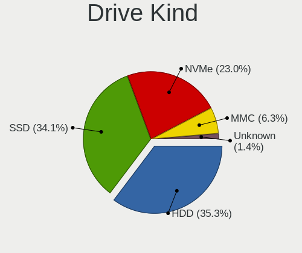
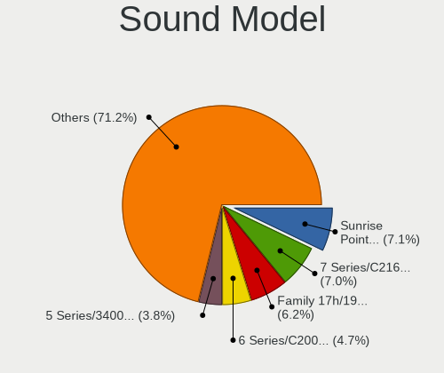
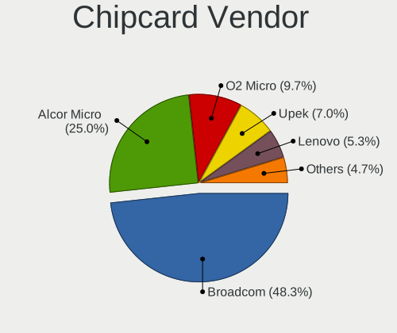

Linux Mint - Tested Hardware & Statistics (Notebooks)
-----------------------------------------------------

A project to collect tested hardware configurations for Linux Mint.

Anyone can contribute to this report by the [hw-probe](https://github.com/linuxhw/hw-probe) tool:

    sudo -E hw-probe -all -upload

Please contribute! Especially if your hardware is rare.

Contents
--------

* [ Test Cases ](#test-cases)

* [ System ](#system)
  - [ OS                       ](#os)
  - [ OS Family                ](#os-family)
  - [ Kernel                   ](#kernel)
  - [ Kernel Family            ](#kernel-family)
  - [ Kernel Major Ver.        ](#kernel-major-ver)
  - [ Arch                     ](#arch)
  - [ DE                       ](#de)
  - [ Display Server           ](#display-server)
  - [ Display Manager          ](#display-manager)
  - [ OS Lang                  ](#os-lang)
  - [ Boot Mode                ](#boot-mode)
  - [ Filesystem               ](#filesystem)
  - [ Part. scheme             ](#part-scheme)
  - [ Dual Boot with Linux/BSD ](#dual-boot-with-linuxbsd)
  - [ Dual Boot (Win)          ](#dual-boot-win)

* [ Board ](#board)
  - [ Vendor                   ](#vendor)
  - [ Model                    ](#model)
  - [ Model Family             ](#model-family)
  - [ MFG Year                 ](#mfg-year)
  - [ Form Factor              ](#form-factor)
  - [ Secure Boot              ](#secure-boot)
  - [ Coreboot                 ](#coreboot)
  - [ RAM Size                 ](#ram-size)
  - [ RAM Used                 ](#ram-used)
  - [ Total Drives             ](#total-drives)
  - [ Has CD-ROM               ](#has-cd-rom)
  - [ Has Ethernet             ](#has-ethernet)
  - [ Has WiFi                 ](#has-wifi)
  - [ Has Bluetooth            ](#has-bluetooth)

* [ Location ](#location)
  - [ Country                  ](#country)
  - [ City                     ](#city)

* [ Drives ](#drives)
  - [ Drive Vendor             ](#drive-vendor)
  - [ Drive Model              ](#drive-model)
  - [ HDD Vendor               ](#hdd-vendor)
  - [ SSD Vendor               ](#ssd-vendor)
  - [ Drive Kind               ](#drive-kind)
  - [ Drive Connector          ](#drive-connector)
  - [ Drive Size               ](#drive-size)
  - [ Space Total              ](#space-total)
  - [ Space Used               ](#space-used)
  - [ Malfunc. Drives          ](#malfunc-drives)
  - [ Malfunc. Drive Vendor    ](#malfunc-drive-vendor)
  - [ Malfunc. HDD Vendor      ](#malfunc-hdd-vendor)
  - [ Malfunc. Drive Kind      ](#malfunc-drive-kind)
  - [ Failed Drives            ](#failed-drives)
  - [ Failed Drive Vendor      ](#failed-drive-vendor)
  - [ Drive Status             ](#drive-status)

* [ Storage controller ](#storage-controller)
  - [ Storage Vendor           ](#storage-vendor)
  - [ Storage Model            ](#storage-model)
  - [ Storage Kind             ](#storage-kind)

* [ Processor ](#processor)
  - [ CPU Vendor               ](#cpu-vendor)
  - [ CPU Model                ](#cpu-model)
  - [ CPU Model Family         ](#cpu-model-family)
  - [ CPU Cores                ](#cpu-cores)
  - [ CPU Sockets              ](#cpu-sockets)
  - [ CPU Threads              ](#cpu-threads)
  - [ CPU Op-Modes             ](#cpu-op-modes)
  - [ CPU Microcode            ](#cpu-microcode)
  - [ CPU Microarch            ](#cpu-microarch)

* [ Graphics ](#graphics)
  - [ GPU Vendor               ](#gpu-vendor)
  - [ GPU Model                ](#gpu-model)
  - [ GPU Combo                ](#gpu-combo)
  - [ GPU Driver               ](#gpu-driver)
  - [ GPU Memory               ](#gpu-memory)

* [ Monitor ](#monitor)
  - [ Monitor Vendor           ](#monitor-vendor)
  - [ Monitor Model            ](#monitor-model)
  - [ Monitor Resolution       ](#monitor-resolution)
  - [ Monitor Diagonal         ](#monitor-diagonal)
  - [ Monitor Width            ](#monitor-width)
  - [ Aspect Ratio             ](#aspect-ratio)
  - [ Monitor Area             ](#monitor-area)
  - [ Pixel Density            ](#pixel-density)
  - [ Multiple Monitors        ](#multiple-monitors)

* [ Network ](#network)
  - [ Net Controller Vendor    ](#net-controller-vendor)
  - [ Net Controller Model     ](#net-controller-model)
  - [ Wireless Vendor          ](#wireless-vendor)
  - [ Wireless Model           ](#wireless-model)
  - [ Ethernet Vendor          ](#ethernet-vendor)
  - [ Ethernet Model           ](#ethernet-model)
  - [ Net Controller Kind      ](#net-controller-kind)
  - [ Used Controller          ](#used-controller)
  - [ NICs                     ](#nics)
  - [ IPv6                     ](#ipv6)

* [ Bluetooth ](#bluetooth)
  - [ Bluetooth Vendor         ](#bluetooth-vendor)
  - [ Bluetooth Model          ](#bluetooth-model)

* [ Sound ](#sound)
  - [ Sound Vendor             ](#sound-vendor)
  - [ Sound Model              ](#sound-model)

* [ Memory ](#memory)
  - [ Memory Vendor            ](#memory-vendor)
  - [ Memory Model             ](#memory-model)
  - [ Memory Kind              ](#memory-kind)
  - [ Memory Form Factor       ](#memory-form-factor)
  - [ Memory Size              ](#memory-size)
  - [ Memory Speed             ](#memory-speed)

* [ Printers & scanners ](#printers--scanners)
  - [ Printer Vendor           ](#printer-vendor)
  - [ Printer Model            ](#printer-model)
  - [ Scanner Vendor           ](#scanner-vendor)
  - [ Scanner Model            ](#scanner-model)

* [ Camera ](#camera)
  - [ Camera Vendor            ](#camera-vendor)
  - [ Camera Model             ](#camera-model)

* [ Security ](#security)
  - [ Fingerprint Vendor       ](#fingerprint-vendor)
  - [ Fingerprint Model        ](#fingerprint-model)
  - [ Chipcard Vendor          ](#chipcard-vendor)
  - [ Chipcard Model           ](#chipcard-model)

* [ Unsupported ](#unsupported)
  - [ Unsupported Devices      ](#unsupported-devices)
  - [ Unsupported Device Types ](#unsupported-device-types)

Test Cases
----------

Total: 19846

| Vendor        | Model                       | Probe                                                      | Date         |
|---------------|-----------------------------|------------------------------------------------------------|--------------|
| Samsung       | 940XGK                      | [7e994928cf](https://linux-hardware.org/?probe=7e994928cf) | Jan 06, 2025 |
| HP            | Laptop 15-bw0xx             | [63a7238333](https://linux-hardware.org/?probe=63a7238333) | Jan 06, 2025 |
| Intel Clie... | LAPBC710                    | [27e1a6b6c4](https://linux-hardware.org/?probe=27e1a6b6c4) | Jan 06, 2025 |
| Acer          | Nitro ANV15-51              | [657a86fee0](https://linux-hardware.org/?probe=657a86fee0) | Jan 06, 2025 |
| Dell          | Vostro 14-5480              | [30963b610d](https://linux-hardware.org/?probe=30963b610d) | Jan 06, 2025 |
| Dell          | Vostro 14-5480              | [5232467681](https://linux-hardware.org/?probe=5232467681) | Jan 05, 2025 |
| ASUSTek       | VivoBook_ASUSLaptop M370... | [3a6262bc2c](https://linux-hardware.org/?probe=3a6262bc2c) | Jan 05, 2025 |
| HP            | 250 G7 Notebook PC          | [0562d753f2](https://linux-hardware.org/?probe=0562d753f2) | Jan 05, 2025 |
| HP            | 250 G7 Notebook PC          | [0cf6343ea2](https://linux-hardware.org/?probe=0cf6343ea2) | Jan 05, 2025 |
| Acer          | Aspire 7520                 | [8633b8ad2a](https://linux-hardware.org/?probe=8633b8ad2a) | Jan 05, 2025 |
| Lenovo        | ThinkPad X1 Carbon 6th 2... | [34234d8404](https://linux-hardware.org/?probe=34234d8404) | Jan 05, 2025 |
| Dell          | XPS 13 9360                 | [fc246315b0](https://linux-hardware.org/?probe=fc246315b0) | Jan 05, 2025 |
| Acer          | Aspire A515-43              | [9afd1ddd9e](https://linux-hardware.org/?probe=9afd1ddd9e) | Jan 05, 2025 |
| Packard Be... | EasyNote TJ65               | [ef9f9ac2c6](https://linux-hardware.org/?probe=ef9f9ac2c6) | Jan 05, 2025 |
| Apple         | MacBookPro9,1               | [ae5a71dde0](https://linux-hardware.org/?probe=ae5a71dde0) | Jan 05, 2025 |
| Lenovo        | ThinkPad E580 20KTS0TF00    | [220c6d82f3](https://linux-hardware.org/?probe=220c6d82f3) | Jan 05, 2025 |
| HP            | Laptop 17-cp2xxx            | [f8146603c3](https://linux-hardware.org/?probe=f8146603c3) | Jan 05, 2025 |
| HP            | ProBook 445 G7              | [30f8996b5f](https://linux-hardware.org/?probe=30f8996b5f) | Jan 05, 2025 |
| HP            | Laptop 17-cp2xxx            | [48236cccfb](https://linux-hardware.org/?probe=48236cccfb) | Jan 05, 2025 |
| Samsung       | 300E4A/300E5A/300E7A/343... | [6bf558bdd0](https://linux-hardware.org/?probe=6bf558bdd0) | Jan 05, 2025 |
| Lenovo        | ThinkPad L15 Gen 1 20U30... | [b0b56ec993](https://linux-hardware.org/?probe=b0b56ec993) | Jan 05, 2025 |
| Lenovo        | ThinkPad T440p 20AN0069U... | [dbdff3ab95](https://linux-hardware.org/?probe=dbdff3ab95) | Jan 04, 2025 |
| Acer          | Swift SF713-51              | [0b49901d64](https://linux-hardware.org/?probe=0b49901d64) | Jan 04, 2025 |
| Acer          | Swift SF713-51              | [9dc8059968](https://linux-hardware.org/?probe=9dc8059968) | Jan 04, 2025 |
| Acer          | Aspire 5680                 | [404c14f822](https://linux-hardware.org/?probe=404c14f822) | Jan 04, 2025 |
| Lenovo        | ThinkPad E16 Gen 2 21M5C... | [891b36fe2c](https://linux-hardware.org/?probe=891b36fe2c) | Jan 04, 2025 |
| Lenovo        | ThinkPad E16 Gen 2 21M5C... | [7b5bde2cbf](https://linux-hardware.org/?probe=7b5bde2cbf) | Jan 04, 2025 |
| Dell          | Precision M4800             | [7c360180e7](https://linux-hardware.org/?probe=7c360180e7) | Jan 04, 2025 |
| ASUSTek       | VivoBook_ASUSLaptop X515... | [3eeaef91d5](https://linux-hardware.org/?probe=3eeaef91d5) | Jan 04, 2025 |
| ASUSTek       | VivoBook_ASUSLaptop X515... | [ca47c65b3a](https://linux-hardware.org/?probe=ca47c65b3a) | Jan 04, 2025 |
| Lenovo        | IdeaPad Slim 3 15AMN8 82... | [70d641dc76](https://linux-hardware.org/?probe=70d641dc76) | Jan 04, 2025 |
| Apple         | MacBookPro9,2               | [bc4630757c](https://linux-hardware.org/?probe=bc4630757c) | Jan 04, 2025 |
| Lenovo        | IdeaPad Slim 3 15AMN8 82... | [5c063c3aee](https://linux-hardware.org/?probe=5c063c3aee) | Jan 04, 2025 |
| Sony          | VPCSB1V9E                   | [b96a412efa](https://linux-hardware.org/?probe=b96a412efa) | Jan 03, 2025 |
| Alienware     | m16 R1                      | [a61a1d8c59](https://linux-hardware.org/?probe=a61a1d8c59) | Jan 03, 2025 |
| Apple         | MacBookPro9,2               | [905b0da038](https://linux-hardware.org/?probe=905b0da038) | Jan 03, 2025 |
| ASUSTek       | K55DR                       | [2a17dca919](https://linux-hardware.org/?probe=2a17dca919) | Jan 03, 2025 |
| HP            | Pavilion dv5                | [994c479b50](https://linux-hardware.org/?probe=994c479b50) | Jan 02, 2025 |
| HP            | OMEN by Laptop 15-dh1xxx    | [c1c82e2ff7](https://linux-hardware.org/?probe=c1c82e2ff7) | Jan 02, 2025 |
| Acer          | Aspire A315-24P             | [40320094a6](https://linux-hardware.org/?probe=40320094a6) | Jan 02, 2025 |
| Sony          | VPCSB1V9E                   | [4a49ef6e88](https://linux-hardware.org/?probe=4a49ef6e88) | Jan 02, 2025 |
| HP            | Notebook                    | [06877f4048](https://linux-hardware.org/?probe=06877f4048) | Jan 02, 2025 |
| Lenovo        | ThinkPad T450s 20BX0011G... | [6e3771b5de](https://linux-hardware.org/?probe=6e3771b5de) | Jan 02, 2025 |
| Lenovo        | Legion Slim 5 16ARP9 83E... | [f2904a45ad](https://linux-hardware.org/?probe=f2904a45ad) | Jan 02, 2025 |
| HP            | ENVY Laptop 17t-da000       | [c5fcd7ff93](https://linux-hardware.org/?probe=c5fcd7ff93) | Jan 02, 2025 |
| HP            | 15                          | [683e4b72b8](https://linux-hardware.org/?probe=683e4b72b8) | Jan 01, 2025 |
| ASUSTek       | ASUS TUF Gaming A16 FA60... | [bfe08359ed](https://linux-hardware.org/?probe=bfe08359ed) | Jan 01, 2025 |
| Lenovo        | IdeaPad S400 20195          | [9cb18b3ddd](https://linux-hardware.org/?probe=9cb18b3ddd) | Jan 01, 2025 |
| Notebook      | PD5x_7xSNC_SND_SNE          | [5765389ba6](https://linux-hardware.org/?probe=5765389ba6) | Jan 01, 2025 |
| HP            | Unknown                     | [d415ba61b5](https://linux-hardware.org/?probe=d415ba61b5) | Jan 01, 2025 |
| HP            | Unknown                     | [ce24e826ba](https://linux-hardware.org/?probe=ce24e826ba) | Jan 01, 2025 |
| HP            | Pavilion Notebook           | [2cd285f25b](https://linux-hardware.org/?probe=2cd285f25b) | Jan 01, 2025 |
| HP            | Pavilion Notebook           | [b20e70da0c](https://linux-hardware.org/?probe=b20e70da0c) | Jan 01, 2025 |
| Lenovo        | V15 G3 IAP 82TT             | [6bab72d854](https://linux-hardware.org/?probe=6bab72d854) | Jan 01, 2025 |
| Lenovo        | V15 G3 IAP 82TT             | [924cbed836](https://linux-hardware.org/?probe=924cbed836) | Jan 01, 2025 |
| Dell          | Precision M4800             | [4e3bd9cbb4](https://linux-hardware.org/?probe=4e3bd9cbb4) | Jan 01, 2025 |
| Toshiba       | Satellite C55-B             | [57036129ee](https://linux-hardware.org/?probe=57036129ee) | Jan 01, 2025 |
| Google        | Caroline                    | [4aef1f789f](https://linux-hardware.org/?probe=4aef1f789f) | Jan 01, 2025 |
| HUAWEI        | BoDE-WXX9                   | [b88f684622](https://linux-hardware.org/?probe=b88f684622) | Dec 31, 2024 |
| HP            | Pavilion Sleekbook 15       | [eb0ead6c49](https://linux-hardware.org/?probe=eb0ead6c49) | Dec 31, 2024 |
| Dell          | Latitude E6400              | [d5dcfbc839](https://linux-hardware.org/?probe=d5dcfbc839) | Dec 31, 2024 |
| Samsung       | 350V5C/351V5C/3540VC/344... | [299e38a1c7](https://linux-hardware.org/?probe=299e38a1c7) | Dec 31, 2024 |
| Acer          | Aspire A515-45              | [1a20ef9a3c](https://linux-hardware.org/?probe=1a20ef9a3c) | Dec 30, 2024 |
| ASUSTek       | K53BR                       | [077a4205f3](https://linux-hardware.org/?probe=077a4205f3) | Dec 30, 2024 |
| ASUSTek       | X71SL                       | [e9857b1f50](https://linux-hardware.org/?probe=e9857b1f50) | Dec 30, 2024 |
| HP            | EliteBook 655 15.6 inch ... | [6278369011](https://linux-hardware.org/?probe=6278369011) | Dec 30, 2024 |
| Lenovo        | IdeaPad 1 15IAU7 82QD       | [3d855d3f86](https://linux-hardware.org/?probe=3d855d3f86) | Dec 30, 2024 |
| Lenovo        | IdeaPad S340-15API 81NC     | [33dad31e6e](https://linux-hardware.org/?probe=33dad31e6e) | Dec 30, 2024 |
| VALE          | Notebook Slim S132          | [3275a28486](https://linux-hardware.org/?probe=3275a28486) | Dec 30, 2024 |
| HUAWEI        | KLVL-WXX9                   | [50d20229d8](https://linux-hardware.org/?probe=50d20229d8) | Dec 30, 2024 |
| Acer          | Aspire A515-45              | [9a29af74ff](https://linux-hardware.org/?probe=9a29af74ff) | Dec 30, 2024 |
| Dell          | Latitude E6320              | [0d3a82be0d](https://linux-hardware.org/?probe=0d3a82be0d) | Dec 30, 2024 |
| Lenovo        | Unknown                     | [89b1437fa2](https://linux-hardware.org/?probe=89b1437fa2) | Dec 29, 2024 |
| Lenovo        | ThinkPad E580 20KTS0TF00    | [3ca3276427](https://linux-hardware.org/?probe=3ca3276427) | Dec 29, 2024 |
| Apple         | MacBookPro5,5               | [843455b524](https://linux-hardware.org/?probe=843455b524) | Dec 29, 2024 |
| Acer          | TMP645-M                    | [0355ef9fb3](https://linux-hardware.org/?probe=0355ef9fb3) | Dec 29, 2024 |
| Apple         | MacBookAir2,1               | [3a01cb6d48](https://linux-hardware.org/?probe=3a01cb6d48) | Dec 29, 2024 |
| Dell          | Latitude E7270              | [5e521085a0](https://linux-hardware.org/?probe=5e521085a0) | Dec 29, 2024 |
| Lenovo        | ThinkBook 15 G5 ABP 21JF    | [ec36d41ebe](https://linux-hardware.org/?probe=ec36d41ebe) | Dec 29, 2024 |
| Maibenben     | Typhoon Series              | [6b1a0a45d2](https://linux-hardware.org/?probe=6b1a0a45d2) | Dec 29, 2024 |
| Dell          | Latitude E6420              | [462ab6cc57](https://linux-hardware.org/?probe=462ab6cc57) | Dec 29, 2024 |
| Apple         | MacBookPro11,4              | [6f5640dbff](https://linux-hardware.org/?probe=6f5640dbff) | Dec 28, 2024 |
| MSI           | GS60 6QE                    | [d2355f1bc6](https://linux-hardware.org/?probe=d2355f1bc6) | Dec 28, 2024 |
| MSI           | GS60 6QE                    | [335d033bc6](https://linux-hardware.org/?probe=335d033bc6) | Dec 28, 2024 |
| Acer          | Aspire A715-76G             | [2eac48d513](https://linux-hardware.org/?probe=2eac48d513) | Dec 28, 2024 |
| HP            | Laptop 15s-eq1xxx           | [9ce5b91ecb](https://linux-hardware.org/?probe=9ce5b91ecb) | Dec 28, 2024 |
| Google        | Robo                        | [fcc74e4162](https://linux-hardware.org/?probe=fcc74e4162) | Dec 28, 2024 |
| Apple         | MacBookPro8,1               | [c7e5641996](https://linux-hardware.org/?probe=c7e5641996) | Dec 27, 2024 |
| ASUSTek       | VivoBook_ASUSLaptop K660... | [b9d5bc89b8](https://linux-hardware.org/?probe=b9d5bc89b8) | Dec 27, 2024 |
| ASUSTek       | VivoBook_ASUSLaptop K660... | [03ce070dd2](https://linux-hardware.org/?probe=03ce070dd2) | Dec 27, 2024 |
| Lenovo        | G50-80 80E5                 | [fc91ff6b9f](https://linux-hardware.org/?probe=fc91ff6b9f) | Dec 27, 2024 |
| Acer          | Aspire 5515                 | [65f32786d9](https://linux-hardware.org/?probe=65f32786d9) | Dec 27, 2024 |
| HP            | Pavilion Gaming Laptop 1... | [701ff9b72f](https://linux-hardware.org/?probe=701ff9b72f) | Dec 27, 2024 |
| Toshiba       | Satellite L850              | [9c4810944d](https://linux-hardware.org/?probe=9c4810944d) | Dec 27, 2024 |
| Lenovo        | IdeaPad L340-15IRH Gamin... | [234883eac2](https://linux-hardware.org/?probe=234883eac2) | Dec 27, 2024 |
| Lenovo        | ThinkPad T14 Gen 2i 20W0... | [369cdd52d8](https://linux-hardware.org/?probe=369cdd52d8) | Dec 26, 2024 |
| ASUSTek       | K53E                        | [33ce8daf57](https://linux-hardware.org/?probe=33ce8daf57) | Dec 26, 2024 |
| MicroByte     | ezbook                      | [0e74630fca](https://linux-hardware.org/?probe=0e74630fca) | Dec 26, 2024 |
| MicroByte     | ezbook                      | [89e57e9b60](https://linux-hardware.org/?probe=89e57e9b60) | Dec 26, 2024 |
| Lenovo        | ThinkPad T14 Gen 2i 20W0... | [41e3dac21e](https://linux-hardware.org/?probe=41e3dac21e) | Dec 26, 2024 |
| HP            | EliteBook 820 G3            | [4804abe046](https://linux-hardware.org/?probe=4804abe046) | Dec 26, 2024 |
| Gateway       | NV55C                       | [060f326f5d](https://linux-hardware.org/?probe=060f326f5d) | Dec 26, 2024 |
| Gateway       | NV55C                       | [3cacf3568a](https://linux-hardware.org/?probe=3cacf3568a) | Dec 26, 2024 |
| Apple         | MacBookPro11,3              | [f82f2bf488](https://linux-hardware.org/?probe=f82f2bf488) | Dec 25, 2024 |
| Acer          | Aspire A317-52              | [75800ca5ab](https://linux-hardware.org/?probe=75800ca5ab) | Dec 25, 2024 |
| Acer          | Aspire A317-52              | [7893251832](https://linux-hardware.org/?probe=7893251832) | Dec 25, 2024 |
| Unknown       | MX16                        | [45e7d14b5b](https://linux-hardware.org/?probe=45e7d14b5b) | Dec 25, 2024 |
| Acer          | Extensa 5630                | [f522d51182](https://linux-hardware.org/?probe=f522d51182) | Dec 25, 2024 |
| HP            | EliteBook 840 G3            | [bae2eb1cb6](https://linux-hardware.org/?probe=bae2eb1cb6) | Dec 25, 2024 |
| ASUSTek       | VivoBook_ASUSLaptop X140... | [466079d6a0](https://linux-hardware.org/?probe=466079d6a0) | Dec 25, 2024 |
| Toshiba       | Satellite C655D             | [6d0f797746](https://linux-hardware.org/?probe=6d0f797746) | Dec 24, 2024 |
| Lenovo        | IdeaPad Gaming 3 16ARH7 ... | [8a07ac474c](https://linux-hardware.org/?probe=8a07ac474c) | Dec 24, 2024 |
| Fujitsu       | LIFEBOOK A357               | [695f75c7e1](https://linux-hardware.org/?probe=695f75c7e1) | Dec 24, 2024 |
| Acer          | Aspire E5-571               | [30ee5ab8eb](https://linux-hardware.org/?probe=30ee5ab8eb) | Dec 24, 2024 |
| Acer          | Aspire 5515                 | [b42e71f029](https://linux-hardware.org/?probe=b42e71f029) | Dec 24, 2024 |
| HP            | EliteBook 850 G4            | [d577b1a30c](https://linux-hardware.org/?probe=d577b1a30c) | Dec 24, 2024 |
| Acer          | Aspire 5742                 | [1464964b4c](https://linux-hardware.org/?probe=1464964b4c) | Dec 24, 2024 |
| Acer          | Swift SF314-59              | [fb10309ad2](https://linux-hardware.org/?probe=fb10309ad2) | Dec 24, 2024 |
| Acer          | Swift SF314-59              | [dc8395bb56](https://linux-hardware.org/?probe=dc8395bb56) | Dec 24, 2024 |
| eMachines     | E725                        | [c4c6cfaa36](https://linux-hardware.org/?probe=c4c6cfaa36) | Dec 23, 2024 |
| Lenovo        | ThinkPad X1 Carbon 6th 2... | [07df89f610](https://linux-hardware.org/?probe=07df89f610) | Dec 23, 2024 |
| ASUSTek       | N55SF                       | [6858c89a4c](https://linux-hardware.org/?probe=6858c89a4c) | Dec 23, 2024 |
| Lenovo        | ThinkPad T460s 20FAS09L0... | [e7eac1f625](https://linux-hardware.org/?probe=e7eac1f625) | Dec 23, 2024 |
| Acer          | Aspire 5517                 | [e8dbb7c265](https://linux-hardware.org/?probe=e8dbb7c265) | Dec 23, 2024 |
| TECNO Mobi... | MEGABOOK T15DA              | [eb2b432d23](https://linux-hardware.org/?probe=eb2b432d23) | Dec 22, 2024 |
| ASUSTek       | X555YI                      | [220480564a](https://linux-hardware.org/?probe=220480564a) | Dec 22, 2024 |
| Lenovo        | ThinkPad T430 2347G2P       | [31c6e468d6](https://linux-hardware.org/?probe=31c6e468d6) | Dec 22, 2024 |
| Dell          | Latitude E7470              | [2cc5b158d0](https://linux-hardware.org/?probe=2cc5b158d0) | Dec 22, 2024 |
| Toshiba       | Satellite Pro S500          | [4e2a69384d](https://linux-hardware.org/?probe=4e2a69384d) | Dec 22, 2024 |
| Lenovo        | ThinkPad X220 4290W4H       | [90831fdec2](https://linux-hardware.org/?probe=90831fdec2) | Dec 22, 2024 |
| Lenovo        | ThinkPad X220 4290W4H       | [c3d75237a3](https://linux-hardware.org/?probe=c3d75237a3) | Dec 22, 2024 |
| Toshiba       | Satellite L850              | [e71308eb8c](https://linux-hardware.org/?probe=e71308eb8c) | Dec 22, 2024 |
| Unknown       | MX16                        | [0c0601e23c](https://linux-hardware.org/?probe=0c0601e23c) | Dec 21, 2024 |
| Dell          | G15 5530                    | [c5dd0f5822](https://linux-hardware.org/?probe=c5dd0f5822) | Dec 21, 2024 |
| Lenovo        | ThinkPad T430 2347G2P       | [76ea7c137e](https://linux-hardware.org/?probe=76ea7c137e) | Dec 21, 2024 |
| Acer          | Swift SFG14-63              | [fcebbc10bd](https://linux-hardware.org/?probe=fcebbc10bd) | Dec 21, 2024 |
| Lenovo        | ThinkPad X250 20CLS11W0W    | [ca04e40dd4](https://linux-hardware.org/?probe=ca04e40dd4) | Dec 21, 2024 |
| HP            | EliteBook 8460p             | [963d7abc23](https://linux-hardware.org/?probe=963d7abc23) | Dec 21, 2024 |
| MSI           | CR61 2M/CX61 2OC/CX61 2O... | [7c8e20f877](https://linux-hardware.org/?probe=7c8e20f877) | Dec 21, 2024 |
| Dell          | G15 5530                    | [10287313ac](https://linux-hardware.org/?probe=10287313ac) | Dec 21, 2024 |
| HP            | Victus by Gaming Laptop ... | [7acc8a5af8](https://linux-hardware.org/?probe=7acc8a5af8) | Dec 21, 2024 |
| ASUSTek       | VivoBook_ASUSLaptop M160... | [c846ce8e60](https://linux-hardware.org/?probe=c846ce8e60) | Dec 21, 2024 |
| HP            | ENVY Laptop 13-ba1xxx       | [d286a3fd4a](https://linux-hardware.org/?probe=d286a3fd4a) | Dec 21, 2024 |
| HUAWEI        | MDG-XX                      | [1f5ee29f02](https://linux-hardware.org/?probe=1f5ee29f02) | Dec 21, 2024 |
| HP            | 255 G7 Notebook PC          | [441e9a9166](https://linux-hardware.org/?probe=441e9a9166) | Dec 21, 2024 |
| ASUSTek       | N501VW                      | [a68fb2f096](https://linux-hardware.org/?probe=a68fb2f096) | Dec 20, 2024 |
| Acer          | Aspire V3-371               | [ed218c23ae](https://linux-hardware.org/?probe=ed218c23ae) | Dec 20, 2024 |
| Unknown       | Unknown                     | [cec2654e16](https://linux-hardware.org/?probe=cec2654e16) | Dec 20, 2024 |
| Lenovo        | ThinkPad T430 23499C5       | [04426df402](https://linux-hardware.org/?probe=04426df402) | Dec 20, 2024 |
| Unknown       | Unknown                     | [8cedb6a671](https://linux-hardware.org/?probe=8cedb6a671) | Dec 20, 2024 |
| Dell          | Latitude 5500               | [23faa70238](https://linux-hardware.org/?probe=23faa70238) | Dec 20, 2024 |
| HP            | ProBook 450 G5              | [d884bdac45](https://linux-hardware.org/?probe=d884bdac45) | Dec 19, 2024 |
| Apple         | MacBookPro8,1               | [4d69e2afb5](https://linux-hardware.org/?probe=4d69e2afb5) | Dec 19, 2024 |
| Acer          | TravelMate 6292             | [a81468385b](https://linux-hardware.org/?probe=a81468385b) | Dec 19, 2024 |
| HP            | Pavilion dv6                | [d532497c6d](https://linux-hardware.org/?probe=d532497c6d) | Dec 19, 2024 |
| Samsung       | 550P5C/550P7C               | [0f7b61cd39](https://linux-hardware.org/?probe=0f7b61cd39) | Dec 19, 2024 |
| Lenovo        | ThinkPad E16 Gen 1 21JN0... | [dae98f533a](https://linux-hardware.org/?probe=dae98f533a) | Dec 19, 2024 |
| Lenovo        | ThinkPad E16 Gen 1 21JN0... | [5655debff7](https://linux-hardware.org/?probe=5655debff7) | Dec 19, 2024 |
| Apple         | MacBookAir6,1               | [ec57f00f41](https://linux-hardware.org/?probe=ec57f00f41) | Dec 19, 2024 |
| Apple         | MacBookAir6,1               | [16547e9167](https://linux-hardware.org/?probe=16547e9167) | Dec 19, 2024 |
| Lenovo        | ThinkPad X1 Carbon 2nd 2... | [5b148e6851](https://linux-hardware.org/?probe=5b148e6851) | Dec 19, 2024 |
| Acer          | Aspire A515-45              | [3cd12c751c](https://linux-hardware.org/?probe=3cd12c751c) | Dec 19, 2024 |
| Acer          | Aspire A515-57              | [5872cea5da](https://linux-hardware.org/?probe=5872cea5da) | Dec 19, 2024 |
| Lenovo        | ThinkPad E16 Gen 2 21M5C... | [224bf763b0](https://linux-hardware.org/?probe=224bf763b0) | Dec 19, 2024 |
| Acer          | Aspire A515-45              | [67b8e4d3e7](https://linux-hardware.org/?probe=67b8e4d3e7) | Dec 18, 2024 |
| Dell          | Latitude 7390               | [d446a06dc6](https://linux-hardware.org/?probe=d446a06dc6) | Dec 18, 2024 |
| Lenovo        | IdeaPad S340-15IWL 81N8     | [ccee342e62](https://linux-hardware.org/?probe=ccee342e62) | Dec 18, 2024 |
| ASUSTek       | X556UJ                      | [39a4e3dc48](https://linux-hardware.org/?probe=39a4e3dc48) | Dec 18, 2024 |
| Lenovo        | ThinkPad L13 Gen 1 20R4S... | [72af0dcd5c](https://linux-hardware.org/?probe=72af0dcd5c) | Dec 18, 2024 |
| ASUSTek       | VivoBook_ASUSLaptop X412... | [2748e82ed7](https://linux-hardware.org/?probe=2748e82ed7) | Dec 18, 2024 |
| Acer          | Aspire 1810TZ               | [1dd425b482](https://linux-hardware.org/?probe=1dd425b482) | Dec 17, 2024 |
| ASUSTek       | X550JF                      | [b2ddf9ed9e](https://linux-hardware.org/?probe=b2ddf9ed9e) | Dec 17, 2024 |
| Lenovo        | ThinkPad E16 Gen 2 21M5C... | [6a35db1aff](https://linux-hardware.org/?probe=6a35db1aff) | Dec 17, 2024 |
| Sony          | VGN-FZ31M                   | [11db51fc55](https://linux-hardware.org/?probe=11db51fc55) | Dec 17, 2024 |
| ASUSTek       | TUF Gaming B560-PLUS WIF... | [7e4e6bb310](https://linux-hardware.org/?probe=7e4e6bb310) | Dec 17, 2024 |
| Lenovo        | G570 PIWG1                  | [b41ab58347](https://linux-hardware.org/?probe=b41ab58347) | Dec 17, 2024 |
| Lenovo        | IdeaPad 1 15ALC7 82R4       | [1fd8e049e6](https://linux-hardware.org/?probe=1fd8e049e6) | Dec 17, 2024 |
| Lenovo        | LOQ 15IAX9 83GS             | [9121321176](https://linux-hardware.org/?probe=9121321176) | Dec 17, 2024 |
| HP            | Pavilion Gaming Laptop 1... | [d3c1363556](https://linux-hardware.org/?probe=d3c1363556) | Dec 17, 2024 |
| Lenovo        | IdeaPad 1 15IGL7 82V7       | [273d602adb](https://linux-hardware.org/?probe=273d602adb) | Dec 16, 2024 |
| Acer          | Aspire A315-23              | [e51fcf8215](https://linux-hardware.org/?probe=e51fcf8215) | Dec 16, 2024 |
| ASUSTek       | ASUS TUF Gaming F15 FX50... | [c955d4b757](https://linux-hardware.org/?probe=c955d4b757) | Dec 16, 2024 |
| HP            | Pavilion Laptop 15-eh3xx... | [2b58ebfebe](https://linux-hardware.org/?probe=2b58ebfebe) | Dec 16, 2024 |
| Apple         | MacBookPro11,1              | [a1a1361aa6](https://linux-hardware.org/?probe=a1a1361aa6) | Dec 16, 2024 |
| ASUSTek       | K55A                        | [7cba33fcaa](https://linux-hardware.org/?probe=7cba33fcaa) | Dec 15, 2024 |
| HP            | 250 G3                      | [33fd855839](https://linux-hardware.org/?probe=33fd855839) | Dec 15, 2024 |
| HP            | OMEN by Laptop 17-ck1xxx    | [a39d299b50](https://linux-hardware.org/?probe=a39d299b50) | Dec 15, 2024 |
| HUAWEI        | KPL-W0X                     | [d28acee099](https://linux-hardware.org/?probe=d28acee099) | Dec 15, 2024 |
| Lenovo        | ThinkPad T560 20FH0023MB    | [b073c6e731](https://linux-hardware.org/?probe=b073c6e731) | Dec 15, 2024 |
| HP            | Laptop 15-bw0xx             | [821c2b9cb8](https://linux-hardware.org/?probe=821c2b9cb8) | Dec 15, 2024 |
| HP            | Laptop 15s-eq2xxx           | [29ff45ca2d](https://linux-hardware.org/?probe=29ff45ca2d) | Dec 15, 2024 |
| ASUSTek       | K56CA                       | [89f8be5027](https://linux-hardware.org/?probe=89f8be5027) | Dec 15, 2024 |
| Clevo         | W25xHPx                     | [d99db89bfa](https://linux-hardware.org/?probe=d99db89bfa) | Dec 14, 2024 |
| Dell          | XPS 15 9510                 | [f66ce0b3ee](https://linux-hardware.org/?probe=f66ce0b3ee) | Dec 14, 2024 |
| HP            | Pavilion g6                 | [ef81588017](https://linux-hardware.org/?probe=ef81588017) | Dec 14, 2024 |
| Lenovo        | ThinkPad P53 20QQS6BR01     | [1fdb59d03d](https://linux-hardware.org/?probe=1fdb59d03d) | Dec 14, 2024 |
| Fujitsu       | LIFEBOOK E756               | [dc1040b8a0](https://linux-hardware.org/?probe=dc1040b8a0) | Dec 14, 2024 |
| Dell          | Inspiron 5570               | [2219eae21d](https://linux-hardware.org/?probe=2219eae21d) | Dec 14, 2024 |
| Lenovo        | ThinkPad E580 20KTS0TF00    | [3b4adb5d69](https://linux-hardware.org/?probe=3b4adb5d69) | Dec 13, 2024 |
| Samsung       | 550XDA                      | [6013fd585a](https://linux-hardware.org/?probe=6013fd585a) | Dec 13, 2024 |
| MSI           | GT70                        | [518f6c347b](https://linux-hardware.org/?probe=518f6c347b) | Dec 13, 2024 |
| ASUSTek       | ZenBook Pro Duo UX582HS_... | [bb2f76bd02](https://linux-hardware.org/?probe=bb2f76bd02) | Dec 13, 2024 |
| HP            | 15                          | [8fa4cdeeac](https://linux-hardware.org/?probe=8fa4cdeeac) | Dec 13, 2024 |
| HP            | 250 G4                      | [0d0786ce85](https://linux-hardware.org/?probe=0d0786ce85) | Dec 13, 2024 |
| Acer          | Predator PH315-51           | [e0925f342c](https://linux-hardware.org/?probe=e0925f342c) | Dec 13, 2024 |
| Fujitsu       | LIFEBOOK E756               | [a30104ce39](https://linux-hardware.org/?probe=a30104ce39) | Dec 13, 2024 |
| Dell          | Inspiron 3482               | [68b2169ef5](https://linux-hardware.org/?probe=68b2169ef5) | Dec 13, 2024 |
| Lenovo        | Legion Y7000P-1060 81LF     | [88846b9776](https://linux-hardware.org/?probe=88846b9776) | Dec 13, 2024 |
| HP            | Pavilion g6                 | [f6edf49c41](https://linux-hardware.org/?probe=f6edf49c41) | Dec 12, 2024 |
| Lenovo        | IdeaPad 320-15ISK 80XH      | [c32e429bab](https://linux-hardware.org/?probe=c32e429bab) | Dec 12, 2024 |
| Lenovo        | IdeaPad 320-15ISK 80XH      | [6a39708a5f](https://linux-hardware.org/?probe=6a39708a5f) | Dec 12, 2024 |
| Acer          | Nitro AN515-58              | [444ca7d70a](https://linux-hardware.org/?probe=444ca7d70a) | Dec 12, 2024 |
| Acer          | Swift SF514-54G             | [d8035002bc](https://linux-hardware.org/?probe=d8035002bc) | Dec 12, 2024 |
| Acer          | Aspire 5755G                | [b0c3abdc3c](https://linux-hardware.org/?probe=b0c3abdc3c) | Dec 12, 2024 |
| Acer          | Nitro AN515-58              | [b18d1c210a](https://linux-hardware.org/?probe=b18d1c210a) | Dec 12, 2024 |
| Dell          | Latitude E5520              | [ae424c49a4](https://linux-hardware.org/?probe=ae424c49a4) | Dec 12, 2024 |
| Dell          | Inspiron 15-3567            | [587f8ef283](https://linux-hardware.org/?probe=587f8ef283) | Dec 12, 2024 |
| MSI           | GL63 8RC                    | [d60ec33bf8](https://linux-hardware.org/?probe=d60ec33bf8) | Dec 12, 2024 |
| HP            | EliteBook 840 G6            | [23b390bd89](https://linux-hardware.org/?probe=23b390bd89) | Dec 11, 2024 |
| Lenovo        | Legion Pro 7 16ARX8H 82W... | [dd80038de7](https://linux-hardware.org/?probe=dd80038de7) | Dec 11, 2024 |
| HP            | ProBook 450 G8 Notebook ... | [54e889ddda](https://linux-hardware.org/?probe=54e889ddda) | Dec 11, 2024 |
| Apple         | MacBookPro12,1              | [229c569c62](https://linux-hardware.org/?probe=229c569c62) | Dec 10, 2024 |
| Apple         | MacBookPro12,1              | [deca3fd9a5](https://linux-hardware.org/?probe=deca3fd9a5) | Dec 10, 2024 |
| ASUSTek       | K46CA                       | [3f1038d713](https://linux-hardware.org/?probe=3f1038d713) | Dec 10, 2024 |
| ASUSTek       | X555QG                      | [4dadfdc86a](https://linux-hardware.org/?probe=4dadfdc86a) | Dec 10, 2024 |
| ASUSTek       | X551CA                      | [16fcf7261f](https://linux-hardware.org/?probe=16fcf7261f) | Dec 10, 2024 |
| Acer          | Aspire 7745G                | [ec6388b8ee](https://linux-hardware.org/?probe=ec6388b8ee) | Dec 10, 2024 |
| Toshiba       | PORTEGE X30-E               | [6c8506b8a9](https://linux-hardware.org/?probe=6c8506b8a9) | Dec 10, 2024 |
| Acer          | Aspire E5-573               | [0f87e3502b](https://linux-hardware.org/?probe=0f87e3502b) | Dec 10, 2024 |
| Acer          | Aspire E5-573               | [1d8c086425](https://linux-hardware.org/?probe=1d8c086425) | Dec 10, 2024 |
| ASUSTek       | UX550VD                     | [ec8a75d03e](https://linux-hardware.org/?probe=ec8a75d03e) | Dec 09, 2024 |
| Lenovo        | ThinkPad T540p 20BE004EU... | [78000a21a2](https://linux-hardware.org/?probe=78000a21a2) | Dec 09, 2024 |
| ASUSTek       | F3Sr                        | [5ae3280aa4](https://linux-hardware.org/?probe=5ae3280aa4) | Dec 09, 2024 |
| Apple         | MacBookPro11,1              | [f210133353](https://linux-hardware.org/?probe=f210133353) | Dec 09, 2024 |
| Dell          | XPS 15 9510                 | [ff4cc61f47](https://linux-hardware.org/?probe=ff4cc61f47) | Dec 09, 2024 |
| Lenovo        | IdeaPad 3 15IML05 81WR      | [54ae692554](https://linux-hardware.org/?probe=54ae692554) | Dec 09, 2024 |
| Toshiba       | PORTEGE X30-E               | [1be2e9c5d1](https://linux-hardware.org/?probe=1be2e9c5d1) | Dec 09, 2024 |
| Dell          | Inspiron 16 7640 2-in-1     | [8a6a2e5326](https://linux-hardware.org/?probe=8a6a2e5326) | Dec 09, 2024 |
| Dell          | XPS 13 9310                 | [f7daee63db](https://linux-hardware.org/?probe=f7daee63db) | Dec 09, 2024 |
| Dell          | Inspiron 5502               | [7bac372167](https://linux-hardware.org/?probe=7bac372167) | Dec 09, 2024 |
| Samsung       | 550XDA                      | [c9233c6566](https://linux-hardware.org/?probe=c9233c6566) | Dec 08, 2024 |
| Samsung       | 700T1C                      | [65e3d49cf3](https://linux-hardware.org/?probe=65e3d49cf3) | Dec 08, 2024 |
| Apple         | MacBookAir6,2               | [372b55e089](https://linux-hardware.org/?probe=372b55e089) | Dec 08, 2024 |
| Apple         | MacBookAir6,2               | [665e0a1167](https://linux-hardware.org/?probe=665e0a1167) | Dec 08, 2024 |
| HP            | ENVY Laptop 13-ba1xxx       | [01bb9bade5](https://linux-hardware.org/?probe=01bb9bade5) | Dec 08, 2024 |
| HP            | Laptop 15-bs0xx             | [03a9b913af](https://linux-hardware.org/?probe=03a9b913af) | Dec 08, 2024 |
| Lenovo        | ThinkPad T14 Gen 5 21ML0... | [875b1f63f7](https://linux-hardware.org/?probe=875b1f63f7) | Dec 08, 2024 |
| HUAWEI        | HVY-WXX9                    | [f5257ff538](https://linux-hardware.org/?probe=f5257ff538) | Dec 07, 2024 |
| Lenovo        | ThinkPad X131e 33671P9      | [ac080feaa5](https://linux-hardware.org/?probe=ac080feaa5) | Dec 07, 2024 |
| Dell          | Latitude E5530 non-vPro     | [0bce668ad9](https://linux-hardware.org/?probe=0bce668ad9) | Dec 07, 2024 |
| ASUSTek       | ZenBook Pro Duo UX582HS_... | [1771070dd0](https://linux-hardware.org/?probe=1771070dd0) | Dec 07, 2024 |
| HP            | Victus by Gaming Laptop ... | [b05f7c1be0](https://linux-hardware.org/?probe=b05f7c1be0) | Dec 07, 2024 |
| Unknown       | MX16                        | [b1e596210e](https://linux-hardware.org/?probe=b1e596210e) | Dec 07, 2024 |
| ASUSTek       | ASUS Vivobook S 16 M5606... | [a3dad268d2](https://linux-hardware.org/?probe=a3dad268d2) | Dec 06, 2024 |
| Lenovo        | ThinkPad X131e 33671P9      | [2ae8fcd4f0](https://linux-hardware.org/?probe=2ae8fcd4f0) | Dec 06, 2024 |
| Acer          | Swift SF314-52              | [4ac3dc04a3](https://linux-hardware.org/?probe=4ac3dc04a3) | Dec 06, 2024 |
| Lenovo        | IdeaPad Pro 5 16AHP9 83D... | [e6ba3df934](https://linux-hardware.org/?probe=e6ba3df934) | Dec 06, 2024 |
| Lenovo        | IdeaPad 3 15ALC6 82KU       | [fdd1f52e06](https://linux-hardware.org/?probe=fdd1f52e06) | Dec 06, 2024 |
| Dell          | Latitude 7410               | [08d8affa67](https://linux-hardware.org/?probe=08d8affa67) | Dec 06, 2024 |
| ASUSTek       | VivoBook 14_ASUS Laptop ... | [1b7baa72c2](https://linux-hardware.org/?probe=1b7baa72c2) | Dec 06, 2024 |
| Lenovo        | G580 2689K9G                | [e20fe2c6e5](https://linux-hardware.org/?probe=e20fe2c6e5) | Dec 06, 2024 |
| HP            | ProBook 650 G4              | [55466442f3](https://linux-hardware.org/?probe=55466442f3) | Dec 06, 2024 |
| NEC Comput... | PC-GN174FAAU                | [c90b112e13](https://linux-hardware.org/?probe=c90b112e13) | Dec 06, 2024 |
| eMachines     | E525                        | [b178c43fa2](https://linux-hardware.org/?probe=b178c43fa2) | Dec 06, 2024 |
| HUAWEI        | KPL-W0X                     | [4ae5f14084](https://linux-hardware.org/?probe=4ae5f14084) | Dec 06, 2024 |
| ASUSTek       | ASUS TUF Dash F15 FX517Z... | [c7fd2abe95](https://linux-hardware.org/?probe=c7fd2abe95) | Dec 06, 2024 |
| Lenovo        | ThinkPad X1 Carbon 6th 2... | [47ec30dab5](https://linux-hardware.org/?probe=47ec30dab5) | Dec 05, 2024 |
| Positivo      | Q4128C                      | [866dca1d74](https://linux-hardware.org/?probe=866dca1d74) | Dec 05, 2024 |
| ASUSTek       | ROG Strix G512LI            | [2d4be2eb08](https://linux-hardware.org/?probe=2d4be2eb08) | Dec 05, 2024 |
| ASUSTek       | ROG Strix G512LI            | [779e5bad75](https://linux-hardware.org/?probe=779e5bad75) | Dec 05, 2024 |
| Lenovo        | G500 20236                  | [4fad953dd2](https://linux-hardware.org/?probe=4fad953dd2) | Dec 05, 2024 |
| HP            | Pavilion 17                 | [12a5dae4b2](https://linux-hardware.org/?probe=12a5dae4b2) | Dec 05, 2024 |
| Fujitsu Si... | ESPRIMO Mobile D9510        | [4c23833013](https://linux-hardware.org/?probe=4c23833013) | Dec 05, 2024 |
| Acer          | Aspire VN7-592G             | [523273e955](https://linux-hardware.org/?probe=523273e955) | Dec 05, 2024 |
| HP            | ZBook Firefly 14 inch G9... | [77757b5ac1](https://linux-hardware.org/?probe=77757b5ac1) | Dec 05, 2024 |
| Lenovo        | IdeaPad Slim 5 16AHP9 83... | [a7fb4f1bc4](https://linux-hardware.org/?probe=a7fb4f1bc4) | Dec 04, 2024 |
| MSI           | GE60 2PE                    | [bab5d77c34](https://linux-hardware.org/?probe=bab5d77c34) | Dec 04, 2024 |
| Dell          | Inspiron 3505               | [3485dcd3fa](https://linux-hardware.org/?probe=3485dcd3fa) | Dec 04, 2024 |
| HP            | Laptop 15-db0xxx            | [7ded60c94b](https://linux-hardware.org/?probe=7ded60c94b) | Dec 04, 2024 |
| Lenovo        | ThinkPad E16 Gen 2 21MA0... | [32cafe357c](https://linux-hardware.org/?probe=32cafe357c) | Dec 04, 2024 |
| Lenovo        | B590 20208                  | [493ce963ab](https://linux-hardware.org/?probe=493ce963ab) | Dec 04, 2024 |
| Apple         | MacBookPro13,2              | [2e9baf39a4](https://linux-hardware.org/?probe=2e9baf39a4) | Dec 04, 2024 |
| Dell          | Latitude E6410              | [208eeccf87](https://linux-hardware.org/?probe=208eeccf87) | Dec 04, 2024 |
| Dell          | Inspiron 3542               | [f75f271653](https://linux-hardware.org/?probe=f75f271653) | Dec 03, 2024 |
| Dell          | Inspiron 3542               | [841b30c302](https://linux-hardware.org/?probe=841b30c302) | Dec 03, 2024 |
| ASUSTek       | ASUS TUF Gaming F15 FX50... | [5e4d4ad56d](https://linux-hardware.org/?probe=5e4d4ad56d) | Dec 03, 2024 |
| MSI           | Modern 15 A11MU             | [e338458691](https://linux-hardware.org/?probe=e338458691) | Dec 03, 2024 |
| Acer          | Swift SF314-43              | [133b87bc4b](https://linux-hardware.org/?probe=133b87bc4b) | Dec 03, 2024 |
| Lenovo        | ThinkPad T14 Gen 5 21MC0... | [e2e17a6a88](https://linux-hardware.org/?probe=e2e17a6a88) | Dec 03, 2024 |
| Acer          | Aspire 5517                 | [5c94640290](https://linux-hardware.org/?probe=5c94640290) | Dec 02, 2024 |
| ASUSTek       | X302LA                      | [772896b9d3](https://linux-hardware.org/?probe=772896b9d3) | Dec 02, 2024 |
| ASUSTek       | VivoBook_ASUSLaptop X140... | [bdb95c5d82](https://linux-hardware.org/?probe=bdb95c5d82) | Dec 02, 2024 |
| ASUSTek       | VivoBook_ASUSLaptop M760... | [8150c1fd65](https://linux-hardware.org/?probe=8150c1fd65) | Dec 02, 2024 |
| Sony          | VPCEA290X                   | [2b91ccab1c](https://linux-hardware.org/?probe=2b91ccab1c) | Dec 02, 2024 |
| HP            | ENVY m6 Sleekbook           | [1c326a70b7](https://linux-hardware.org/?probe=1c326a70b7) | Dec 02, 2024 |
| HP            | 250 G8 Notebook PC          | [20b2aa3eef](https://linux-hardware.org/?probe=20b2aa3eef) | Dec 01, 2024 |
| LG Electro... | 17Z90R-K.AA78A9             | [fb890bfff0](https://linux-hardware.org/?probe=fb890bfff0) | Dec 01, 2024 |
| ASUSTek       | ASUS TUF Gaming F15 FX50... | [eec68584ed](https://linux-hardware.org/?probe=eec68584ed) | Dec 01, 2024 |
| ASUSTek       | X450LN                      | [e249015d69](https://linux-hardware.org/?probe=e249015d69) | Dec 01, 2024 |
| Acer          | Aspire A315-54K             | [6b2b116a91](https://linux-hardware.org/?probe=6b2b116a91) | Dec 01, 2024 |
| HP            | Laptop 15-bw0xx             | [4809801b37](https://linux-hardware.org/?probe=4809801b37) | Dec 01, 2024 |
| HP            | ProBook 4720s               | [64ba29b9f2](https://linux-hardware.org/?probe=64ba29b9f2) | Dec 01, 2024 |
| HP            | ProBook 4720s               | [9cf24341ad](https://linux-hardware.org/?probe=9cf24341ad) | Dec 01, 2024 |
| ASUSTek       | ROG Zephyrus G16 GA605WI... | [a238dc1bf5](https://linux-hardware.org/?probe=a238dc1bf5) | Dec 01, 2024 |
| Acer          | Aspire A515-56              | [fc032f32ca](https://linux-hardware.org/?probe=fc032f32ca) | Dec 01, 2024 |
| Dell          | Inspiron 5559               | [bcea3803cc](https://linux-hardware.org/?probe=bcea3803cc) | Dec 01, 2024 |
| HP            | Pavilion Notebook           | [a3bbd871c9](https://linux-hardware.org/?probe=a3bbd871c9) | Dec 01, 2024 |
| ASUSTek       | VivoBook_ASUSLaptop X140... | [dce5b2ffb8](https://linux-hardware.org/?probe=dce5b2ffb8) | Dec 01, 2024 |
| Lenovo        | ThinkPad W530 2447L96       | [1259802e27](https://linux-hardware.org/?probe=1259802e27) | Nov 30, 2024 |
| Samsung       | 350V5C/351V5C/3540VC/344... | [e73426df00](https://linux-hardware.org/?probe=e73426df00) | Nov 30, 2024 |
| HUAWEI        | KPL-W0X                     | [09208f9363](https://linux-hardware.org/?probe=09208f9363) | Nov 29, 2024 |
| GPU Compan... | GWTN141-4                   | [b460de278e](https://linux-hardware.org/?probe=b460de278e) | Nov 29, 2024 |
| Lenovo        | ThinkPad T14 Gen 5 21MC0... | [a529dc0e1a](https://linux-hardware.org/?probe=a529dc0e1a) | Nov 29, 2024 |
| HP            | EliteBook 8540w             | [791b33a243](https://linux-hardware.org/?probe=791b33a243) | Nov 29, 2024 |
| Lenovo        | ThinkPad X260 20F5S39S03    | [84b5466fd5](https://linux-hardware.org/?probe=84b5466fd5) | Nov 29, 2024 |
| Lenovo        | ThinkPad T420 4236MBS       | [fa4e312428](https://linux-hardware.org/?probe=fa4e312428) | Nov 29, 2024 |
| Fujitsu       | LIFEBOOK U7410              | [44fe7ab3c3](https://linux-hardware.org/?probe=44fe7ab3c3) | Nov 29, 2024 |
| Lenovo        | ThinkPad T420 4236MBS       | [a0c22f5c5c](https://linux-hardware.org/?probe=a0c22f5c5c) | Nov 29, 2024 |
| Acer          | Aspire A315-51              | [faeb785d5d](https://linux-hardware.org/?probe=faeb785d5d) | Nov 29, 2024 |
| Acer          | Aspire A315-51              | [556d7a4e02](https://linux-hardware.org/?probe=556d7a4e02) | Nov 29, 2024 |
| Lenovo        | ThinkPad X260 20F5S39S03    | [85ba713a0d](https://linux-hardware.org/?probe=85ba713a0d) | Nov 28, 2024 |
| Acer          | Aspire A515-57              | [1efaac112f](https://linux-hardware.org/?probe=1efaac112f) | Nov 28, 2024 |
| MSI           | Prestige 15 A12SC           | [5479ee3a49](https://linux-hardware.org/?probe=5479ee3a49) | Nov 28, 2024 |
| Lenovo        | IdeaPad S540-15IWL 81NE     | [df0fa44b5d](https://linux-hardware.org/?probe=df0fa44b5d) | Nov 28, 2024 |
| ASUSTek       | K55A                        | [1cf283b131](https://linux-hardware.org/?probe=1cf283b131) | Nov 28, 2024 |
| Lenovo        | IdeaPad S145-15IWL 81S9     | [29af941409](https://linux-hardware.org/?probe=29af941409) | Nov 27, 2024 |
| Lenovo        | IdeaPad Y530                | [7581417b3e](https://linux-hardware.org/?probe=7581417b3e) | Nov 27, 2024 |
| ASUSTek       | ROG Strix G513IH_G513IH     | [00247be989](https://linux-hardware.org/?probe=00247be989) | Nov 27, 2024 |
| ASUSTek       | VivoBook_ASUSLaptop X712... | [e54c39ef6b](https://linux-hardware.org/?probe=e54c39ef6b) | Nov 27, 2024 |
| GTZS          | Unknown                     | [4d0aa1fbf2](https://linux-hardware.org/?probe=4d0aa1fbf2) | Nov 27, 2024 |
| Lenovo        | ThinkPad X1 Carbon 6th 2... | [5f5ae67cd6](https://linux-hardware.org/?probe=5f5ae67cd6) | Nov 27, 2024 |
| GTZS          | Unknown                     | [149906ed64](https://linux-hardware.org/?probe=149906ed64) | Nov 27, 2024 |
| HP            | 245 G8 Notebook PC          | [ab39483aa3](https://linux-hardware.org/?probe=ab39483aa3) | Nov 27, 2024 |
| HP            | Laptop 15-bw0xx             | [91bb956a52](https://linux-hardware.org/?probe=91bb956a52) | Nov 27, 2024 |
| Lenovo        | ThinkPad T540p 20BE00B1G... | [48dc32bd2f](https://linux-hardware.org/?probe=48dc32bd2f) | Nov 27, 2024 |
| Sony          | VGN-AR290G                  | [08f071931c](https://linux-hardware.org/?probe=08f071931c) | Nov 27, 2024 |
| HUAWEI        | KLVL-WXXW                   | [acfddbe112](https://linux-hardware.org/?probe=acfddbe112) | Nov 27, 2024 |
| ASUSTek       | S301LA                      | [433fca092e](https://linux-hardware.org/?probe=433fca092e) | Nov 27, 2024 |
| ASUSTek       | S301LA                      | [7a061c369d](https://linux-hardware.org/?probe=7a061c369d) | Nov 27, 2024 |
| Lenovo        | ThinkPad L430 24686FG       | [4e8a8081b5](https://linux-hardware.org/?probe=4e8a8081b5) | Nov 27, 2024 |
| HP            | ENVY Notebook               | [8f8d1df803](https://linux-hardware.org/?probe=8f8d1df803) | Nov 26, 2024 |
| ASUSTek       | Vivobook Go E1504FA_E150... | [305862420b](https://linux-hardware.org/?probe=305862420b) | Nov 26, 2024 |
| Acer          | Aspire A515-57              | [188c6dd437](https://linux-hardware.org/?probe=188c6dd437) | Nov 26, 2024 |
| Dell          | Precision M4600             | [b5825ab65b](https://linux-hardware.org/?probe=b5825ab65b) | Nov 26, 2024 |
| ASUSTek       | X550JX                      | [11c59b25e3](https://linux-hardware.org/?probe=11c59b25e3) | Nov 26, 2024 |
| Samsung       | 550XDA                      | [489626fc5e](https://linux-hardware.org/?probe=489626fc5e) | Nov 25, 2024 |
| HP            | Pavilion dv6700             | [773caa366b](https://linux-hardware.org/?probe=773caa366b) | Nov 25, 2024 |
| Lenovo        | G50-80 80E5                 | [25e30e94f0](https://linux-hardware.org/?probe=25e30e94f0) | Nov 25, 2024 |
| Dell          | Latitude D620               | [b6bcc2c7f0](https://linux-hardware.org/?probe=b6bcc2c7f0) | Nov 25, 2024 |
| Dell          | Inspiron MM061              | [b0e7029133](https://linux-hardware.org/?probe=b0e7029133) | Nov 24, 2024 |
| Lenovo        | IdeaPad 510-15IKB 80SV      | [fb7f3e2d23](https://linux-hardware.org/?probe=fb7f3e2d23) | Nov 24, 2024 |
| Toshiba       | Satellite C870-1FZ          | [c562c674ef](https://linux-hardware.org/?probe=c562c674ef) | Nov 24, 2024 |
| HP            | 350 G1                      | [cd83f0bc1a](https://linux-hardware.org/?probe=cd83f0bc1a) | Nov 24, 2024 |
| Lenovo        | G50-70 20351                | [6026b41852](https://linux-hardware.org/?probe=6026b41852) | Nov 24, 2024 |
| Lenovo        | ThinkPad E16 Gen 2 21MA0... | [1eef0335ea](https://linux-hardware.org/?probe=1eef0335ea) | Nov 24, 2024 |
| HP            | ZBook 15 G6                 | [481018cc85](https://linux-hardware.org/?probe=481018cc85) | Nov 24, 2024 |
| HP            | ZBook 15 G6                 | [6ff9c4de66](https://linux-hardware.org/?probe=6ff9c4de66) | Nov 23, 2024 |
| HP            | Pavilion Gaming Laptop 1... | [29f3adc75f](https://linux-hardware.org/?probe=29f3adc75f) | Nov 23, 2024 |
| Dell          | Latitude D630               | [05aad5cca5](https://linux-hardware.org/?probe=05aad5cca5) | Nov 23, 2024 |
| Lenovo        | IdeaPad 3 15ADA05 81W1      | [e591ff3d77](https://linux-hardware.org/?probe=e591ff3d77) | Nov 23, 2024 |
| Lenovo        | IdeaPad Gaming 3 15ARH7 ... | [9456b52471](https://linux-hardware.org/?probe=9456b52471) | Nov 23, 2024 |
| Acer          | Aspire VN7-791              | [44d9810a30](https://linux-hardware.org/?probe=44d9810a30) | Nov 23, 2024 |
| Lenovo        | ThinkPad L540 20AUS2JN00    | [69abfc5625](https://linux-hardware.org/?probe=69abfc5625) | Nov 23, 2024 |
| Lenovo        | ThinkPad L540 20AUS2JN00    | [eb120ca60e](https://linux-hardware.org/?probe=eb120ca60e) | Nov 23, 2024 |
| HP            | Laptop 15-dy2xxx            | [5c7f57dd6e](https://linux-hardware.org/?probe=5c7f57dd6e) | Nov 23, 2024 |
| HP            | Laptop 15-dw1xxx            | [ece4a1b062](https://linux-hardware.org/?probe=ece4a1b062) | Nov 23, 2024 |
| Dell          | Inspiron 16 Plus 7630       | [77ad7bcfd0](https://linux-hardware.org/?probe=77ad7bcfd0) | Nov 23, 2024 |
| ASUSTek       | M50SA                       | [132bb63eb4](https://linux-hardware.org/?probe=132bb63eb4) | Nov 23, 2024 |
| ASUSTek       | X550LA                      | [665f2c90f8](https://linux-hardware.org/?probe=665f2c90f8) | Nov 23, 2024 |
| Valve         | Jupiter                     | [686f29388c](https://linux-hardware.org/?probe=686f29388c) | Nov 23, 2024 |
| Lenovo        | ThinkPad X1 Carbon 3448B... | [d4fe97da45](https://linux-hardware.org/?probe=d4fe97da45) | Nov 23, 2024 |
| Clevo         | W240EL/W250ELQ/W270ELQ      | [d6a2cc4e3b](https://linux-hardware.org/?probe=d6a2cc4e3b) | Nov 23, 2024 |
| Dell          | Inspiron 5570               | [4791473238](https://linux-hardware.org/?probe=4791473238) | Nov 22, 2024 |
| ASUSTek       | N550JV                      | [9601e6c7a2](https://linux-hardware.org/?probe=9601e6c7a2) | Nov 22, 2024 |
| Apple         | MacBookPro11,3              | [43150c24ec](https://linux-hardware.org/?probe=43150c24ec) | Nov 22, 2024 |
| HUAWEI        | MACH-WX9                    | [ff5d8bcb47](https://linux-hardware.org/?probe=ff5d8bcb47) | Nov 22, 2024 |
| MSI           | GT75 Titan 8RG              | [4687248040](https://linux-hardware.org/?probe=4687248040) | Nov 22, 2024 |
| ASUSTek       | X550JX                      | [34bfe8d2b6](https://linux-hardware.org/?probe=34bfe8d2b6) | Nov 22, 2024 |
| ASUSTek       | X550JX                      | [3ee3360b2c](https://linux-hardware.org/?probe=3ee3360b2c) | Nov 22, 2024 |
| Lenovo        | ThinkPad E15 20RD001FGE     | [5f9ff35459](https://linux-hardware.org/?probe=5f9ff35459) | Nov 22, 2024 |
| MSI           | CR70 2M/CX70 2OC/CX70 2O... | [28c28f679e](https://linux-hardware.org/?probe=28c28f679e) | Nov 21, 2024 |
| HP            | Laptop 15-db0xxx            | [b32dd763f8](https://linux-hardware.org/?probe=b32dd763f8) | Nov 21, 2024 |
| HP            | Laptop 15-db0xxx            | [10a67e0a3b](https://linux-hardware.org/?probe=10a67e0a3b) | Nov 21, 2024 |
| HONOR         | BRI-XX                      | [fee72d5d1f](https://linux-hardware.org/?probe=fee72d5d1f) | Nov 21, 2024 |
| Dell          | Inspiron 7348               | [b06e93e9b8](https://linux-hardware.org/?probe=b06e93e9b8) | Nov 21, 2024 |
| BTO           | 15U1135                     | [cbb759b013](https://linux-hardware.org/?probe=cbb759b013) | Nov 21, 2024 |
| Lenovo        | ThinkPad X260 20F5S39S03    | [4d8f0f1f80](https://linux-hardware.org/?probe=4d8f0f1f80) | Nov 21, 2024 |
| Toshiba       | Satellite L55-C             | [e54f3fdcb1](https://linux-hardware.org/?probe=e54f3fdcb1) | Nov 21, 2024 |
| Lenovo        | V15 G4 IRU 83A1             | [d6a394affa](https://linux-hardware.org/?probe=d6a394affa) | Nov 21, 2024 |
| Samsung       | 340XAA/350XAA/550XAA        | [02d7d6b714](https://linux-hardware.org/?probe=02d7d6b714) | Nov 21, 2024 |
| Juana Mans... | SF20GM7                     | [3a223bc471](https://linux-hardware.org/?probe=3a223bc471) | Nov 21, 2024 |
| HP            | EliteBook 840 G3            | [351278b423](https://linux-hardware.org/?probe=351278b423) | Nov 20, 2024 |
| Acer          | Nitro AN16-41               | [951075dc66](https://linux-hardware.org/?probe=951075dc66) | Nov 20, 2024 |
| Apple         | MacBookPro11,3              | [696a65a496](https://linux-hardware.org/?probe=696a65a496) | Nov 20, 2024 |
| Notebook      | NJx0PU                      | [08850b8a76](https://linux-hardware.org/?probe=08850b8a76) | Nov 20, 2024 |
| Acer          | Nitro AN515-55              | [410a568ba4](https://linux-hardware.org/?probe=410a568ba4) | Nov 20, 2024 |
| ASUSTek       | VivoBook_ASUSLaptop M160... | [3d82ed94f2](https://linux-hardware.org/?probe=3d82ed94f2) | Nov 20, 2024 |
| Lenovo        | IdeaPad Slim 5 14AHP9 83... | [8ef5a175e9](https://linux-hardware.org/?probe=8ef5a175e9) | Nov 20, 2024 |
| HUAWEI        | HLYL-WXX9                   | [5c935e8904](https://linux-hardware.org/?probe=5c935e8904) | Nov 20, 2024 |
| HP            | EliteBook 645 G10           | [8dd0ba197c](https://linux-hardware.org/?probe=8dd0ba197c) | Nov 20, 2024 |
| ASUSTek       | VivoBook_ASUSLaptop X150... | [9365a57030](https://linux-hardware.org/?probe=9365a57030) | Nov 20, 2024 |
| Gigabyte      | AORUS 15G XC                | [8c74e5e5a5](https://linux-hardware.org/?probe=8c74e5e5a5) | Nov 19, 2024 |
| MSI           | Alpha 15 A4DEK              | [3712d8cab2](https://linux-hardware.org/?probe=3712d8cab2) | Nov 19, 2024 |
| MSI           | Alpha 15 A4DEK              | [6fce0dbd22](https://linux-hardware.org/?probe=6fce0dbd22) | Nov 19, 2024 |
| HP            | Pavilion Notebook           | [2b9dd0def5](https://linux-hardware.org/?probe=2b9dd0def5) | Nov 19, 2024 |
| Acer          | Nitro AN515-57              | [f639409dd9](https://linux-hardware.org/?probe=f639409dd9) | Nov 19, 2024 |
| Schenker      | WORK (M23)                  | [723ace2ce7](https://linux-hardware.org/?probe=723ace2ce7) | Nov 18, 2024 |
| ASUSTek       | ROG Zephyrus G14 GA401IV... | [b2a47cfa3d](https://linux-hardware.org/?probe=b2a47cfa3d) | Nov 18, 2024 |
| Fujitsu       | LIFEBOOK A3511              | [24fd2be895](https://linux-hardware.org/?probe=24fd2be895) | Nov 18, 2024 |
| Acer          | Aspire E1-531G              | [0dc612c4a9](https://linux-hardware.org/?probe=0dc612c4a9) | Nov 18, 2024 |
| Lenovo        | IdeaPad 3 17IAU7 82RL       | [dfef517ff6](https://linux-hardware.org/?probe=dfef517ff6) | Nov 18, 2024 |
| Chuwi         | CoreBook X                  | [da340df136](https://linux-hardware.org/?probe=da340df136) | Nov 18, 2024 |
| ASUSTek       | ASUS TUF Gaming F17 FX70... | [840bd96126](https://linux-hardware.org/?probe=840bd96126) | Nov 18, 2024 |
| Fujitsu       | LIFEBOOK S782               | [c1c26c2a49](https://linux-hardware.org/?probe=c1c26c2a49) | Nov 18, 2024 |
| Toshiba       | Satellite C55-A-1H9         | [936476ea78](https://linux-hardware.org/?probe=936476ea78) | Nov 17, 2024 |
| ASUSTek       | ASUS TUF Gaming A15 FA50... | [42db53d080](https://linux-hardware.org/?probe=42db53d080) | Nov 17, 2024 |
| ASUSTek       | ASUS TUF Gaming A15 FA50... | [2ce961a6cc](https://linux-hardware.org/?probe=2ce961a6cc) | Nov 17, 2024 |
| Samsung       | 350V5C/351V5C/3540VC/344... | [4dc44df22b](https://linux-hardware.org/?probe=4dc44df22b) | Nov 17, 2024 |
| ASUSTek       | ZenBook UX325EA_UX325EA     | [e1173e004c](https://linux-hardware.org/?probe=e1173e004c) | Nov 17, 2024 |
| HP            | Laptop 15-db0xxx            | [2991c67e5b](https://linux-hardware.org/?probe=2991c67e5b) | Nov 16, 2024 |
| Lenovo        | ThinkPad R500 2718WYZ       | [3fdd5bf502](https://linux-hardware.org/?probe=3fdd5bf502) | Nov 16, 2024 |
| Acer          | Aspire A315-59              | [2618a7a41d](https://linux-hardware.org/?probe=2618a7a41d) | Nov 16, 2024 |
| Apple         | MacBookAir7,2               | [32f96f8055](https://linux-hardware.org/?probe=32f96f8055) | Nov 16, 2024 |
| Acer          | Aspire E5-573G              | [f165a8de28](https://linux-hardware.org/?probe=f165a8de28) | Nov 16, 2024 |
| HP            | Victus by Gaming Laptop ... | [85f56f1048](https://linux-hardware.org/?probe=85f56f1048) | Nov 16, 2024 |
| Dell          | XPS 15 9550                 | [dbb67f8f26](https://linux-hardware.org/?probe=dbb67f8f26) | Nov 16, 2024 |
| Unknown       | Unknown                     | [1b2213821a](https://linux-hardware.org/?probe=1b2213821a) | Nov 16, 2024 |
| ASUSTek       | X541NA                      | [7da3668ced](https://linux-hardware.org/?probe=7da3668ced) | Nov 16, 2024 |
| Lenovo        | ThinkPad X230 2325FG0       | [fa4cd28ac7](https://linux-hardware.org/?probe=fa4cd28ac7) | Nov 15, 2024 |
| Lenovo        | ThinkPad E580 20KTS0TF00    | [e31ae6a9c2](https://linux-hardware.org/?probe=e31ae6a9c2) | Nov 15, 2024 |
| Toshiba       | Satellite C670-12E          | [937c86a907](https://linux-hardware.org/?probe=937c86a907) | Nov 15, 2024 |
| Acer          | Swift SF314-56              | [bff66e9070](https://linux-hardware.org/?probe=bff66e9070) | Nov 15, 2024 |
| Acer          | Swift SF314-56              | [6eb39aba44](https://linux-hardware.org/?probe=6eb39aba44) | Nov 15, 2024 |
| Apple         | MacBook5,2                  | [3473ef622c](https://linux-hardware.org/?probe=3473ef622c) | Nov 15, 2024 |
| HP            | Victus by Gaming Laptop ... | [315e6340af](https://linux-hardware.org/?probe=315e6340af) | Nov 15, 2024 |
| HP            | EliteBook 2560p             | [8284360284](https://linux-hardware.org/?probe=8284360284) | Nov 15, 2024 |
| Lenovo        | Legion Slim 5 16APH8 82Y... | [9c6847a0db](https://linux-hardware.org/?probe=9c6847a0db) | Nov 15, 2024 |
| Lenovo        | ThinkPad P15 Gen 2i 20YR... | [2e78d797ba](https://linux-hardware.org/?probe=2e78d797ba) | Nov 15, 2024 |
| Lenovo        | IdeaPadFlex 14D 20333       | [31832a497f](https://linux-hardware.org/?probe=31832a497f) | Nov 15, 2024 |
| Acer          | Aspire A15-41M              | [66ce96d1eb](https://linux-hardware.org/?probe=66ce96d1eb) | Nov 14, 2024 |
| Lenovo        | S40-70 80GQ                 | [b0d5d5f873](https://linux-hardware.org/?probe=b0d5d5f873) | Nov 14, 2024 |
| Dell          | Inspiron 16 7640 2-in-1     | [9f8600194b](https://linux-hardware.org/?probe=9f8600194b) | Nov 14, 2024 |
| VALE          | Notebook V15N               | [e67eac725e](https://linux-hardware.org/?probe=e67eac725e) | Nov 14, 2024 |
| Acer          | Aspire E5-573               | [898f0996ec](https://linux-hardware.org/?probe=898f0996ec) | Nov 14, 2024 |
| Apple         | MacBook5,1                  | [53e7f70e1d](https://linux-hardware.org/?probe=53e7f70e1d) | Nov 14, 2024 |
| Acer          | Aspire A114-31              | [f5c25ddebd](https://linux-hardware.org/?probe=f5c25ddebd) | Nov 14, 2024 |
| Apple         | MacBookPro14,1              | [d91dbccfee](https://linux-hardware.org/?probe=d91dbccfee) | Nov 13, 2024 |
| Schenker      | WORK (M23)                  | [e020544efb](https://linux-hardware.org/?probe=e020544efb) | Nov 13, 2024 |
| Acer          | Aspire E5-573               | [a38cf11ac1](https://linux-hardware.org/?probe=a38cf11ac1) | Nov 13, 2024 |
| HP            | EliteBook 8560p             | [3444aec985](https://linux-hardware.org/?probe=3444aec985) | Nov 13, 2024 |
| HP            | Laptop 15-db0xxx            | [2a24099cf1](https://linux-hardware.org/?probe=2a24099cf1) | Nov 13, 2024 |
| Advent        | Quantum Q200                | [bfc86b2a40](https://linux-hardware.org/?probe=bfc86b2a40) | Nov 13, 2024 |
| Advent        | Quantum Q200                | [7f8191560c](https://linux-hardware.org/?probe=7f8191560c) | Nov 13, 2024 |
| Advent        | Quantum Q200                | [234c47715e](https://linux-hardware.org/?probe=234c47715e) | Nov 13, 2024 |
| Advent        | Quantum Q200                | [8e96516066](https://linux-hardware.org/?probe=8e96516066) | Nov 13, 2024 |
| Advent        | Quantum Q200                | [fe6f2cf181](https://linux-hardware.org/?probe=fe6f2cf181) | Nov 13, 2024 |
| Advent        | Quantum Q200                | [0e59f90633](https://linux-hardware.org/?probe=0e59f90633) | Nov 13, 2024 |
| ASUSTek       | K52F                        | [b060379c4a](https://linux-hardware.org/?probe=b060379c4a) | Nov 12, 2024 |
| HP            | Compaq Presario CQ60        | [9a7a4cf8eb](https://linux-hardware.org/?probe=9a7a4cf8eb) | Nov 12, 2024 |
| Lenovo        | Legion S7 15ACH6 82K8       | [da707a443b](https://linux-hardware.org/?probe=da707a443b) | Nov 12, 2024 |
| Toshiba       | Satellite C50-B             | [1d473c3a6c](https://linux-hardware.org/?probe=1d473c3a6c) | Nov 12, 2024 |
| Acer          | Swift SFG14-63              | [a78bb7be5a](https://linux-hardware.org/?probe=a78bb7be5a) | Nov 12, 2024 |
| Dell          | Inspiron 5537               | [4590721008](https://linux-hardware.org/?probe=4590721008) | Nov 12, 2024 |
| Lenovo        | ThinkPad T490 20N3SAM500    | [c665d500e4](https://linux-hardware.org/?probe=c665d500e4) | Nov 12, 2024 |
| Toshiba       | Satellite L500              | [2ca4dd21b6](https://linux-hardware.org/?probe=2ca4dd21b6) | Nov 12, 2024 |
| HP            | Laptop 15-bw0xx             | [ee5c517d7f](https://linux-hardware.org/?probe=ee5c517d7f) | Nov 12, 2024 |
| mPTech        | ARC 11.6 128GB HD           | [107d02aac0](https://linux-hardware.org/?probe=107d02aac0) | Nov 12, 2024 |
| Lenovo        | ThinkPad E15 20RES6DF01     | [00f82a6232](https://linux-hardware.org/?probe=00f82a6232) | Nov 11, 2024 |
| Lenovo        | ThinkPad T460 20FMA09CGE    | [59f383a676](https://linux-hardware.org/?probe=59f383a676) | Nov 11, 2024 |
| ASUSTek       | VivoBook_ASUSLaptop X350... | [bb36db3f35](https://linux-hardware.org/?probe=bb36db3f35) | Nov 11, 2024 |
| ASUSTek       | X550CC                      | [9c9f50e48d](https://linux-hardware.org/?probe=9c9f50e48d) | Nov 11, 2024 |
| ASUSTek       | X550CC                      | [62c26e414e](https://linux-hardware.org/?probe=62c26e414e) | Nov 11, 2024 |
| HP            | Pavilion Laptop 15-eh2xx... | [db44b5c0bc](https://linux-hardware.org/?probe=db44b5c0bc) | Nov 11, 2024 |
| HP            | Laptop 14s-fq0xxx           | [3bd3e36ae6](https://linux-hardware.org/?probe=3bd3e36ae6) | Nov 11, 2024 |
| Lenovo        | ThinkPad X1 Carbon 6th 2... | [42460bd9bc](https://linux-hardware.org/?probe=42460bd9bc) | Nov 10, 2024 |
| Lenovo        | ThinkPad E490 20N8005UGE    | [8e3ec37ecb](https://linux-hardware.org/?probe=8e3ec37ecb) | Nov 10, 2024 |
| Apple         | MacBookPro11,1              | [49ea5db275](https://linux-hardware.org/?probe=49ea5db275) | Nov 10, 2024 |
| Lenovo        | ThinkPad X280 20KF0020US    | [d19401684e](https://linux-hardware.org/?probe=d19401684e) | Nov 10, 2024 |
| Unknown       | Unknown                     | [029b61efe8](https://linux-hardware.org/?probe=029b61efe8) | Nov 10, 2024 |
| Unknown       | Unknown                     | [f906247244](https://linux-hardware.org/?probe=f906247244) | Nov 10, 2024 |
| Lenovo        | ThinkPad E580 20KTS0TF00    | [c8e4e4682f](https://linux-hardware.org/?probe=c8e4e4682f) | Nov 10, 2024 |
| Google        | Sasuke                      | [753719e3df](https://linux-hardware.org/?probe=753719e3df) | Nov 10, 2024 |
| Lenovo        | IdeaPad 100-15IBD 80QQ      | [67ea5c25e9](https://linux-hardware.org/?probe=67ea5c25e9) | Nov 09, 2024 |
| Packard Be... | EasyNote TE69BM             | [c2296e4817](https://linux-hardware.org/?probe=c2296e4817) | Nov 09, 2024 |
| HP            | Pavilion Notebook           | [f28a41ee26](https://linux-hardware.org/?probe=f28a41ee26) | Nov 09, 2024 |
| HP            | ProBook 645 G4              | [fd6948a4e9](https://linux-hardware.org/?probe=fd6948a4e9) | Nov 09, 2024 |
| Lenovo        | ThinkPad P53 20QQS6BR01     | [73680bda72](https://linux-hardware.org/?probe=73680bda72) | Nov 09, 2024 |
| Lenovo        | ThinkPad T460s 20FAS03K0... | [e94531763d](https://linux-hardware.org/?probe=e94531763d) | Nov 09, 2024 |
| Lenovo        | ThinkPad E14 Gen 2 20T60... | [74b0d14e18](https://linux-hardware.org/?probe=74b0d14e18) | Nov 09, 2024 |
| ASUSTek       | VivoBook_ASUSLaptop X160... | [65814c0eac](https://linux-hardware.org/?probe=65814c0eac) | Nov 09, 2024 |
| Acer          | Predator PH315-53           | [f1266330e4](https://linux-hardware.org/?probe=f1266330e4) | Nov 08, 2024 |
| Acer          | Nitro AN517-55              | [1ef6262fa9](https://linux-hardware.org/?probe=1ef6262fa9) | Nov 08, 2024 |
| Lenovo        | Legion 5 Pro 16ITH6H 82J... | [f6e6f8fc08](https://linux-hardware.org/?probe=f6e6f8fc08) | Nov 08, 2024 |
| HP            | EliteBook 645 G10           | [2036b52974](https://linux-hardware.org/?probe=2036b52974) | Nov 08, 2024 |
| Dell          | XPS 13 9360                 | [67aea4785f](https://linux-hardware.org/?probe=67aea4785f) | Nov 08, 2024 |
| ASUSTek       | VivoBook_ASUSLaptop X340... | [467624f847](https://linux-hardware.org/?probe=467624f847) | Nov 08, 2024 |
| Google        | Phaser360                   | [ec6d54d78d](https://linux-hardware.org/?probe=ec6d54d78d) | Nov 08, 2024 |
| Google        | Phaser360                   | [4ea8772907](https://linux-hardware.org/?probe=4ea8772907) | Nov 08, 2024 |
| HP            | Laptop 15s-eq2xxx           | [79fe2bcc6c](https://linux-hardware.org/?probe=79fe2bcc6c) | Nov 07, 2024 |
| Dell          | Inspiron 5590               | [7ff5741bda](https://linux-hardware.org/?probe=7ff5741bda) | Nov 07, 2024 |
| Acer          | Aspire A317-54              | [8416c77efd](https://linux-hardware.org/?probe=8416c77efd) | Nov 07, 2024 |
| AXIOO         | Mybook-14E                  | [32f6d232e2](https://linux-hardware.org/?probe=32f6d232e2) | Nov 07, 2024 |
| Lenovo        | ThinkPad X200 7458AU2       | [37097fba8e](https://linux-hardware.org/?probe=37097fba8e) | Nov 07, 2024 |
| Lenovo        | ThinkPad L430 24686FG       | [ad1f01a426](https://linux-hardware.org/?probe=ad1f01a426) | Nov 07, 2024 |
| Dell          | XPS 13 9350                 | [990fb18551](https://linux-hardware.org/?probe=990fb18551) | Nov 07, 2024 |
| Lenovo        | IdeaPad Slim 3 15IAN8 82... | [08157e80b5](https://linux-hardware.org/?probe=08157e80b5) | Nov 07, 2024 |
| Sony          | SVE1412BCXB                 | [5ea1638ede](https://linux-hardware.org/?probe=5ea1638ede) | Nov 06, 2024 |
| Lenovo        | ThinkBook 13s-IML 20RR      | [bb20c1474d](https://linux-hardware.org/?probe=bb20c1474d) | Nov 06, 2024 |
| Acer          | Aspire A315-42              | [ca4ae3882e](https://linux-hardware.org/?probe=ca4ae3882e) | Nov 06, 2024 |
| Unknown       | Unknown                     | [9e2dbb429e](https://linux-hardware.org/?probe=9e2dbb429e) | Nov 06, 2024 |
| Unknown       | Unknown                     | [723fee0d9d](https://linux-hardware.org/?probe=723fee0d9d) | Nov 06, 2024 |
| MSI           | Stealth 16Studio A13VG      | [91aabef817](https://linux-hardware.org/?probe=91aabef817) | Nov 06, 2024 |
| HP            | EliteBook 840 G6            | [8393c4a337](https://linux-hardware.org/?probe=8393c4a337) | Nov 06, 2024 |
| SiComputer    | Nauta 01C                   | [8b68db0b84](https://linux-hardware.org/?probe=8b68db0b84) | Nov 05, 2024 |
| Dell          | XPS 13 9360                 | [41513bfa20](https://linux-hardware.org/?probe=41513bfa20) | Nov 05, 2024 |
| SiComputer    | Nauta 01C                   | [5ba3b6a0ce](https://linux-hardware.org/?probe=5ba3b6a0ce) | Nov 05, 2024 |
| Lenovo        | ThinkPad E14 Gen 6 21M3C... | [1d4fa6a2ca](https://linux-hardware.org/?probe=1d4fa6a2ca) | Nov 05, 2024 |
| Acer          | Aspire A515-47              | [8fda5ad748](https://linux-hardware.org/?probe=8fda5ad748) | Nov 05, 2024 |
| HP            | ProBook 430 G7              | [b26cf16938](https://linux-hardware.org/?probe=b26cf16938) | Nov 05, 2024 |
| Dell          | Latitude E5550              | [3084a85733](https://linux-hardware.org/?probe=3084a85733) | Nov 05, 2024 |
| ASUSTek       | G75VW                       | [a51b619e09](https://linux-hardware.org/?probe=a51b619e09) | Nov 05, 2024 |
| Medion        | Erazer P6679 MD60382        | [356678288a](https://linux-hardware.org/?probe=356678288a) | Nov 05, 2024 |
| Medion        | Erazer P6679 MD60382        | [a1fafb8c25](https://linux-hardware.org/?probe=a1fafb8c25) | Nov 05, 2024 |
| ASUSTek       | X555LAB                     | [dfd0aff2e1](https://linux-hardware.org/?probe=dfd0aff2e1) | Nov 05, 2024 |
| Toshiba       | Satellite L300              | [d155ee5eff](https://linux-hardware.org/?probe=d155ee5eff) | Nov 04, 2024 |
| ASUSTek       | TP300LD                     | [3a6d49031d](https://linux-hardware.org/?probe=3a6d49031d) | Nov 04, 2024 |
| Dell          | Latitude 5440               | [b13672d2ba](https://linux-hardware.org/?probe=b13672d2ba) | Nov 03, 2024 |
| ASUSTek       | TP300LD                     | [551c5bff17](https://linux-hardware.org/?probe=551c5bff17) | Nov 03, 2024 |
| Notebook      | W35xSTQ_370ST               | [952a8dfa82](https://linux-hardware.org/?probe=952a8dfa82) | Nov 03, 2024 |
| Apple         | MacBookAir7,2               | [7bae0fc172](https://linux-hardware.org/?probe=7bae0fc172) | Nov 03, 2024 |
| Lenovo        | LOQ 15IRH8 83EU             | [78e8d0380e](https://linux-hardware.org/?probe=78e8d0380e) | Nov 03, 2024 |
| Lenovo        | E31-80 80MX                 | [9819e05017](https://linux-hardware.org/?probe=9819e05017) | Nov 03, 2024 |
| Dell          | XPS 13 9343                 | [fd2b22b4e7](https://linux-hardware.org/?probe=fd2b22b4e7) | Nov 03, 2024 |
| Acer          | Aspire 8930                 | [539b9d9106](https://linux-hardware.org/?probe=539b9d9106) | Nov 03, 2024 |
| HP            | ProBook 4740s               | [c70841e454](https://linux-hardware.org/?probe=c70841e454) | Nov 03, 2024 |
| HP            | ProBook 4740s               | [83b863b76d](https://linux-hardware.org/?probe=83b863b76d) | Nov 03, 2024 |
| MSI           | GE40 2PC Dragon Eyes        | [f223d03632](https://linux-hardware.org/?probe=f223d03632) | Nov 03, 2024 |
| Lenovo        | G50-70 20351                | [b24412605d](https://linux-hardware.org/?probe=b24412605d) | Nov 02, 2024 |
| Lenovo        | ThinkPad X270 W10DG 20K5... | [3af0763887](https://linux-hardware.org/?probe=3af0763887) | Nov 02, 2024 |
| HP            | Compaq CQ45                 | [37a06dc980](https://linux-hardware.org/?probe=37a06dc980) | Nov 02, 2024 |
| HP            | ZBook 15 G3                 | [2c782f843a](https://linux-hardware.org/?probe=2c782f843a) | Nov 02, 2024 |
| HP            | Compaq CQ45                 | [eea008157b](https://linux-hardware.org/?probe=eea008157b) | Nov 02, 2024 |
| Dell          | XPS 13 9380                 | [a4c9bc1cdc](https://linux-hardware.org/?probe=a4c9bc1cdc) | Nov 02, 2024 |
| HUAWEI        | HKFG-XX                     | [af1fb5aee3](https://linux-hardware.org/?probe=af1fb5aee3) | Nov 02, 2024 |
| Toshiba       | Satellite C55t-A            | [fd95f967eb](https://linux-hardware.org/?probe=fd95f967eb) | Nov 02, 2024 |
| Lenovo        | ThinkPad X260 20F6S0HC00    | [7c0b766fa4](https://linux-hardware.org/?probe=7c0b766fa4) | Nov 02, 2024 |
| HP            | ENVY Notebook               | [2c49b001b6](https://linux-hardware.org/?probe=2c49b001b6) | Nov 01, 2024 |
| Dell          | Latitude 7390               | [fad43df9a7](https://linux-hardware.org/?probe=fad43df9a7) | Nov 01, 2024 |
| HP            | Laptop 17-by0xxx            | [1a22e3285e](https://linux-hardware.org/?probe=1a22e3285e) | Nov 01, 2024 |
| Lenovo        | ThinkPad X270 W10DG 20K5... | [8bc6139269](https://linux-hardware.org/?probe=8bc6139269) | Nov 01, 2024 |
| Dell          | Inspiron 15-3567            | [1a0c9fb790](https://linux-hardware.org/?probe=1a0c9fb790) | Nov 01, 2024 |
| Lenovo        | ThinkPad X1 Carbon 6th 2... | [212b448485](https://linux-hardware.org/?probe=212b448485) | Nov 01, 2024 |
| MSI           | Thin GF63 12VE              | [4d4ed4c9e5](https://linux-hardware.org/?probe=4d4ed4c9e5) | Nov 01, 2024 |
| HP            | Laptop 17-ak0xx             | [eae4c42672](https://linux-hardware.org/?probe=eae4c42672) | Nov 01, 2024 |
| HP            | ProBook 4535s               | [c347a426f0](https://linux-hardware.org/?probe=c347a426f0) | Nov 01, 2024 |
| HP            | ProBook 4535s               | [41c54d774c](https://linux-hardware.org/?probe=41c54d774c) | Nov 01, 2024 |
| HP            | Pavilion Laptop 15-eh3xx... | [f26159e727](https://linux-hardware.org/?probe=f26159e727) | Nov 01, 2024 |
| ASUSTek       | TP500LA                     | [a372c0252e](https://linux-hardware.org/?probe=a372c0252e) | Oct 31, 2024 |
| Dell          | Inspiron 3505               | [51667c2ae8](https://linux-hardware.org/?probe=51667c2ae8) | Oct 31, 2024 |
| Framework     | Laptop 13 (AMD Ryzen 704... | [59d0a18d21](https://linux-hardware.org/?probe=59d0a18d21) | Oct 31, 2024 |
| Dell          | Latitude 3500               | [c970903c57](https://linux-hardware.org/?probe=c970903c57) | Oct 31, 2024 |
| HP            | Laptop 17-ak0xx             | [8c97ff6143](https://linux-hardware.org/?probe=8c97ff6143) | Oct 31, 2024 |
| Lenovo        | ThinkPad X121e 30457KG      | [9242b92b87](https://linux-hardware.org/?probe=9242b92b87) | Oct 30, 2024 |
| Lenovo        | G70-70 80HW                 | [a205f6d355](https://linux-hardware.org/?probe=a205f6d355) | Oct 30, 2024 |
| Dell          | Vostro 3525                 | [d786c33fb3](https://linux-hardware.org/?probe=d786c33fb3) | Oct 30, 2024 |
| Lenovo        | ThinkPad P16 Gen 1 21D6C... | [a7f734337f](https://linux-hardware.org/?probe=a7f734337f) | Oct 30, 2024 |
| ASUSTek       | VivoBook_ASUSLaptop X150... | [b1695ef355](https://linux-hardware.org/?probe=b1695ef355) | Oct 30, 2024 |
| Dell          | Precision M4600             | [80d81a4a86](https://linux-hardware.org/?probe=80d81a4a86) | Oct 30, 2024 |
| HP            | EliteBook 850 G2            | [4909286cde](https://linux-hardware.org/?probe=4909286cde) | Oct 30, 2024 |
| Lenovo        | ThinkPad T550 20CJS1X200    | [b147253bdf](https://linux-hardware.org/?probe=b147253bdf) | Oct 30, 2024 |
| Dell          | Precision 3550              | [bb947a786c](https://linux-hardware.org/?probe=bb947a786c) | Oct 29, 2024 |
| Apple         | MacBookAir7,2               | [728cc4de51](https://linux-hardware.org/?probe=728cc4de51) | Oct 29, 2024 |
| Dell          | Inspiron 15-3567            | [dda32fb9f7](https://linux-hardware.org/?probe=dda32fb9f7) | Oct 29, 2024 |
| ASUSTek       | VivoBook_ASUSLaptop X160... | [d964408f00](https://linux-hardware.org/?probe=d964408f00) | Oct 29, 2024 |
| ASUSTek       | ASUS TUF Gaming A15 FA50... | [f293fc9c85](https://linux-hardware.org/?probe=f293fc9c85) | Oct 29, 2024 |
| Dynabook      | B65/ER                      | [8febbfeb09](https://linux-hardware.org/?probe=8febbfeb09) | Oct 29, 2024 |
| HP            | ENVY Laptop 17t-da000       | [065628553b](https://linux-hardware.org/?probe=065628553b) | Oct 29, 2024 |
| ASUSTek       | VivoBook_ASUSLaptop X150... | [513b4090c3](https://linux-hardware.org/?probe=513b4090c3) | Oct 29, 2024 |
| Dell          | Latitude E6510              | [6f5fdc54c6](https://linux-hardware.org/?probe=6f5fdc54c6) | Oct 28, 2024 |
| Acer          | Aspire E1-571               | [8f019a5780](https://linux-hardware.org/?probe=8f019a5780) | Oct 28, 2024 |
| LG Electro... | 15Z980-R.AP71U1             | [ef38af409d](https://linux-hardware.org/?probe=ef38af409d) | Oct 28, 2024 |
| HP            | Pavilion G4-2265BR NB PC    | [8a01da4323](https://linux-hardware.org/?probe=8a01da4323) | Oct 28, 2024 |
| Lenovo        | ThinkPad T460 20FMS0VG25    | [d1899e0a54](https://linux-hardware.org/?probe=d1899e0a54) | Oct 28, 2024 |
| ASUSTek       | VivoBook_ASUSLaptop X512... | [92ae87bbfc](https://linux-hardware.org/?probe=92ae87bbfc) | Oct 27, 2024 |
| Wortmann      | CR700                       | [0e6bd50e12](https://linux-hardware.org/?probe=0e6bd50e12) | Oct 27, 2024 |
| Dell          | G5 5590                     | [7f60ac1322](https://linux-hardware.org/?probe=7f60ac1322) | Oct 27, 2024 |
| Dell          | Inspiron N4020              | [11fefb4d88](https://linux-hardware.org/?probe=11fefb4d88) | Oct 27, 2024 |
| MSI           | GP73 Leopard 8RE            | [65450952dd](https://linux-hardware.org/?probe=65450952dd) | Oct 27, 2024 |
| CSL-Comput... | R Evolve C14i               | [5514e11c44](https://linux-hardware.org/?probe=5514e11c44) | Oct 27, 2024 |
| HP            | EliteBook 840 G4            | [50d7963840](https://linux-hardware.org/?probe=50d7963840) | Oct 27, 2024 |
| HP            | ProBook 445 G8 Notebook ... | [cb6b18c765](https://linux-hardware.org/?probe=cb6b18c765) | Oct 27, 2024 |
| Apple         | MacBookPro9,2               | [44d101182a](https://linux-hardware.org/?probe=44d101182a) | Oct 26, 2024 |
| HP            | EliteBook 840 G3            | [0274e38b5f](https://linux-hardware.org/?probe=0274e38b5f) | Oct 26, 2024 |
| Dell          | Latitude 5400               | [cf96ec5dfd](https://linux-hardware.org/?probe=cf96ec5dfd) | Oct 26, 2024 |
| Lenovo        | ThinkPad E15 Gen 3 20YG0... | [867ec138ac](https://linux-hardware.org/?probe=867ec138ac) | Oct 26, 2024 |
| ASUSTek       | X540SA                      | [5394d57322](https://linux-hardware.org/?probe=5394d57322) | Oct 26, 2024 |
| Lenovo        | ThinkPad E15 Gen 3 20YG0... | [99a8dede03](https://linux-hardware.org/?probe=99a8dede03) | Oct 26, 2024 |
| Acer          | Aspire ES1-531              | [048ad889ce](https://linux-hardware.org/?probe=048ad889ce) | Oct 26, 2024 |
| Lenovo        | IdeaPad Flex-14API 81SS     | [16b42659ef](https://linux-hardware.org/?probe=16b42659ef) | Oct 26, 2024 |
| Dell          | Latitude 5400               | [78787ef74c](https://linux-hardware.org/?probe=78787ef74c) | Oct 26, 2024 |
| Dell          | Latitude E7470              | [c0dfcdb1b1](https://linux-hardware.org/?probe=c0dfcdb1b1) | Oct 26, 2024 |
| Samsung       | 700Z3A/700Z4A/700Z5A/700... | [5cb40b6f68](https://linux-hardware.org/?probe=5cb40b6f68) | Oct 26, 2024 |
| Dell          | Latitude E7450              | [fe6cc50957](https://linux-hardware.org/?probe=fe6cc50957) | Oct 25, 2024 |
| HUAWEI        | BOM-WXX9                    | [13b8c0c21b](https://linux-hardware.org/?probe=13b8c0c21b) | Oct 25, 2024 |
| Fujitsu Si... | ESPRIMO Mobile V6555        | [a31222f7be](https://linux-hardware.org/?probe=a31222f7be) | Oct 25, 2024 |
| MSI           | GP60 2PE                    | [2be1a37bbf](https://linux-hardware.org/?probe=2be1a37bbf) | Oct 25, 2024 |
| Lenovo        | G560 20042                  | [50698eb6a2](https://linux-hardware.org/?probe=50698eb6a2) | Oct 25, 2024 |
| Acer          | Aspire ES1-531              | [a368de2b33](https://linux-hardware.org/?probe=a368de2b33) | Oct 25, 2024 |
| Apple         | MacBookPro5,5               | [64a2cc3677](https://linux-hardware.org/?probe=64a2cc3677) | Oct 25, 2024 |
| Apple         | MacBookAir6,1               | [12d7fc44d0](https://linux-hardware.org/?probe=12d7fc44d0) | Oct 25, 2024 |
| HP            | EliteBook 850 G3            | [da219384d9](https://linux-hardware.org/?probe=da219384d9) | Oct 25, 2024 |
| HP            | EliteBook 850 G3            | [4621956616](https://linux-hardware.org/?probe=4621956616) | Oct 25, 2024 |
| HUAWEI        | HVY-WXX9                    | [c25abc37fe](https://linux-hardware.org/?probe=c25abc37fe) | Oct 25, 2024 |
| HONOR         | NMH-WCX9                    | [662e0fbb83](https://linux-hardware.org/?probe=662e0fbb83) | Oct 25, 2024 |
| ASUSTek       | VivoBook_ASUSLaptop K360... | [a847cd49b4](https://linux-hardware.org/?probe=a847cd49b4) | Oct 24, 2024 |
| HONOR         | NMH-WCX9                    | [235f3f7ce3](https://linux-hardware.org/?probe=235f3f7ce3) | Oct 24, 2024 |
| ASUSTek       | Vivobook Go E1504FA_E150... | [1be74f7c3c](https://linux-hardware.org/?probe=1be74f7c3c) | Oct 24, 2024 |
| ASUSTek       | Vivobook Go E1504FA_E150... | [56fc85aac6](https://linux-hardware.org/?probe=56fc85aac6) | Oct 24, 2024 |
| Acer          | Nitro AN515-58              | [a898b84b4e](https://linux-hardware.org/?probe=a898b84b4e) | Oct 24, 2024 |
| HP            | Pavilion Laptop 14-ce3xx... | [369f95d3aa](https://linux-hardware.org/?probe=369f95d3aa) | Oct 24, 2024 |
| Dell          | Latitude 5520               | [630b2a70c1](https://linux-hardware.org/?probe=630b2a70c1) | Oct 23, 2024 |
| Dell          | Latitude 7480               | [bb80cb9188](https://linux-hardware.org/?probe=bb80cb9188) | Oct 23, 2024 |
| ASUSTek       | P50IJ                       | [2f110840da](https://linux-hardware.org/?probe=2f110840da) | Oct 23, 2024 |
| ASUSTek       | P50IJ                       | [caaa44b0c0](https://linux-hardware.org/?probe=caaa44b0c0) | Oct 23, 2024 |
| Clevo         | W7x0S                       | [b11743728f](https://linux-hardware.org/?probe=b11743728f) | Oct 23, 2024 |
| HP            | G60                         | [34dc5984dc](https://linux-hardware.org/?probe=34dc5984dc) | Oct 23, 2024 |
| Acer          | Swift SF114-34              | [81302e7270](https://linux-hardware.org/?probe=81302e7270) | Oct 23, 2024 |
| ASUSTek       | G75VW                       | [081cfe8e2d](https://linux-hardware.org/?probe=081cfe8e2d) | Oct 23, 2024 |
| Lenovo        | ThinkBook 15 G4 ABA 21DL    | [f2bbca3f47](https://linux-hardware.org/?probe=f2bbca3f47) | Oct 23, 2024 |
| HP            | ENVY Notebook               | [01f8794d83](https://linux-hardware.org/?probe=01f8794d83) | Oct 23, 2024 |
| ASUSTek       | VivoBook_ASUSLaptop X509... | [372ce92f90](https://linux-hardware.org/?probe=372ce92f90) | Oct 22, 2024 |
| Pegatron      | Spring Peak                 | [be6896811b](https://linux-hardware.org/?probe=be6896811b) | Oct 22, 2024 |
| Toshiba       | Satellite C855D             | [0aed926526](https://linux-hardware.org/?probe=0aed926526) | Oct 22, 2024 |
| Lenovo        | IdeaPad Slim 3 15ABR8 82... | [575d7775b2](https://linux-hardware.org/?probe=575d7775b2) | Oct 22, 2024 |
| ASUSTek       | VivoBook_ASUSLaptop X412... | [2b9158e95b](https://linux-hardware.org/?probe=2b9158e95b) | Oct 22, 2024 |
| Lenovo        | ThinkPad X200 7458AU2       | [745f05ce6d](https://linux-hardware.org/?probe=745f05ce6d) | Oct 22, 2024 |
| Dell          | Vostro V130                 | [5881fefc58](https://linux-hardware.org/?probe=5881fefc58) | Oct 22, 2024 |
| HP            | Laptop 15s-eq2xxx           | [b38a73732e](https://linux-hardware.org/?probe=b38a73732e) | Oct 22, 2024 |
| HP            | Laptop 15s-eq2xxx           | [2e73880d40](https://linux-hardware.org/?probe=2e73880d40) | Oct 22, 2024 |
| HP            | 240 G8 Notebook PC          | [b1cd26787e](https://linux-hardware.org/?probe=b1cd26787e) | Oct 22, 2024 |
| HP            | EliteBook Folio 9470m       | [8348d88897](https://linux-hardware.org/?probe=8348d88897) | Oct 22, 2024 |
| Lenovo        | ThinkPad P52s 20LB0026US    | [23151fe731](https://linux-hardware.org/?probe=23151fe731) | Oct 22, 2024 |
| Lenovo        | ThinkPad P16s Gen 3 21KS... | [269d64c6cc](https://linux-hardware.org/?probe=269d64c6cc) | Oct 22, 2024 |
| HP            | EliteBook Folio 9470m       | [248d1d4fac](https://linux-hardware.org/?probe=248d1d4fac) | Oct 22, 2024 |
| Lenovo        | ThinkPad L430 24686FG       | [6d653f02e9](https://linux-hardware.org/?probe=6d653f02e9) | Oct 21, 2024 |
| Dell          | Inspiron 1501               | [425478b36c](https://linux-hardware.org/?probe=425478b36c) | Oct 21, 2024 |
| Notebook      | W35xSTQ_370ST               | [31f25f9676](https://linux-hardware.org/?probe=31f25f9676) | Oct 21, 2024 |
| Lenovo        | IdeaPad Y530                | [2db5209b65](https://linux-hardware.org/?probe=2db5209b65) | Oct 21, 2024 |
| ASUSTek       | VivoBook_ASUS Laptop E41... | [2e20d6628f](https://linux-hardware.org/?probe=2e20d6628f) | Oct 21, 2024 |
| HP            | EliteBook 2560p             | [00cf35b270](https://linux-hardware.org/?probe=00cf35b270) | Oct 21, 2024 |
| Lenovo        | ThinkPad T14 Gen 1 20S00... | [5ae95f6a6d](https://linux-hardware.org/?probe=5ae95f6a6d) | Oct 21, 2024 |
| Lenovo        | ThinkPad E14 Gen 6 21M70... | [3be6a2a535](https://linux-hardware.org/?probe=3be6a2a535) | Oct 21, 2024 |
| Lenovo        | ThinkPad T490s 20NYS4200... | [c2b84c3eba](https://linux-hardware.org/?probe=c2b84c3eba) | Oct 21, 2024 |
| Lenovo        | ThinkPad T490s 20NYS4200... | [54dc21124b](https://linux-hardware.org/?probe=54dc21124b) | Oct 21, 2024 |
| Lenovo        | G500 20236                  | [bf956aac4d](https://linux-hardware.org/?probe=bf956aac4d) | Oct 21, 2024 |
| Dell          | Latitude E6420              | [007ca74afb](https://linux-hardware.org/?probe=007ca74afb) | Oct 21, 2024 |
| ASUSTek       | ZenBook UX393EA_UX393EA     | [596352b56b](https://linux-hardware.org/?probe=596352b56b) | Oct 21, 2024 |
| HP            | Pavilion dv6000 (RV010UA... | [7c10abfbff](https://linux-hardware.org/?probe=7c10abfbff) | Oct 20, 2024 |
| Lenovo        | ThinkPad T510 4313CTO       | [5d88f3a39b](https://linux-hardware.org/?probe=5d88f3a39b) | Oct 20, 2024 |
| Dell          | Latitude E6420              | [a6a2d8c1fe](https://linux-hardware.org/?probe=a6a2d8c1fe) | Oct 20, 2024 |
| ASUSTek       | N61Vg                       | [70e0fa41e5](https://linux-hardware.org/?probe=70e0fa41e5) | Oct 20, 2024 |
| Dell          | Latitude 5490               | [4517bae9c6](https://linux-hardware.org/?probe=4517bae9c6) | Oct 20, 2024 |
| HP            | Laptop 17-ak0xx             | [1e72059925](https://linux-hardware.org/?probe=1e72059925) | Oct 20, 2024 |
| HUAWEI        | KLVL-WXX9                   | [14a0caaf5b](https://linux-hardware.org/?probe=14a0caaf5b) | Oct 20, 2024 |
| Apple         | MacBookPro13,3              | [3ba6427a7d](https://linux-hardware.org/?probe=3ba6427a7d) | Oct 20, 2024 |
| Lenovo        | IdeaPad 330-17IKB 81DK      | [cd5f8e38ff](https://linux-hardware.org/?probe=cd5f8e38ff) | Oct 20, 2024 |
| HP            | Pavilion Laptop 15-eh0xx... | [a3a538d592](https://linux-hardware.org/?probe=a3a538d592) | Oct 19, 2024 |
| ASUSTek       | K75VJ                       | [2734067321](https://linux-hardware.org/?probe=2734067321) | Oct 19, 2024 |
| Acer          | Aspire A315-59              | [7ae3aa5864](https://linux-hardware.org/?probe=7ae3aa5864) | Oct 19, 2024 |
| HP            | Notebook                    | [c7b8ee7e95](https://linux-hardware.org/?probe=c7b8ee7e95) | Oct 19, 2024 |
| Acer          | AOD270                      | [01c9a30864](https://linux-hardware.org/?probe=01c9a30864) | Oct 19, 2024 |
| Acer          | Aspire V3-571G              | [58cd9eafa2](https://linux-hardware.org/?probe=58cd9eafa2) | Oct 19, 2024 |
| Acer          | AOD270                      | [484fb4dbb2](https://linux-hardware.org/?probe=484fb4dbb2) | Oct 19, 2024 |
| Lenovo        | Z50-70 20354                | [e15a88b4e1](https://linux-hardware.org/?probe=e15a88b4e1) | Oct 19, 2024 |
| HP            | EliteBook 840 G2            | [2ddfce8e17](https://linux-hardware.org/?probe=2ddfce8e17) | Oct 19, 2024 |
| AMI           | Intel                       | [eb14c5b7de](https://linux-hardware.org/?probe=eb14c5b7de) | Oct 19, 2024 |
| ASUSTek       | VivoBook_ASUSLaptop X415... | [d080b2015c](https://linux-hardware.org/?probe=d080b2015c) | Oct 19, 2024 |
| Lenovo        | IdeaPad 1 15IGL7 82VX       | [40864646b0](https://linux-hardware.org/?probe=40864646b0) | Oct 19, 2024 |
| Positivo      | C14CR21                     | [9712b3c674](https://linux-hardware.org/?probe=9712b3c674) | Oct 19, 2024 |
| MSI           | GE75 Raider 10SFS           | [de97b93d85](https://linux-hardware.org/?probe=de97b93d85) | Oct 19, 2024 |
| Dell          | XPS 13 9310                 | [5fc84cbd5e](https://linux-hardware.org/?probe=5fc84cbd5e) | Oct 19, 2024 |
| Acer          | Aspire E1-531               | [225705a8fb](https://linux-hardware.org/?probe=225705a8fb) | Oct 19, 2024 |
| Thomson       | NEO17C-8B1TCO               | [a1bac51e95](https://linux-hardware.org/?probe=a1bac51e95) | Oct 18, 2024 |
| Apple         | MacBookPro11,3              | [f812a9c7a8](https://linux-hardware.org/?probe=f812a9c7a8) | Oct 18, 2024 |
| HUAWEI        | CREM-WXX9                   | [a9071f6e6a](https://linux-hardware.org/?probe=a9071f6e6a) | Oct 18, 2024 |
| Lenovo        | ThinkPad T460 20FMS0VG25    | [c48d06d323](https://linux-hardware.org/?probe=c48d06d323) | Oct 18, 2024 |
| MSI           | GF63 Thin 9RCX              | [756f0e8d3a](https://linux-hardware.org/?probe=756f0e8d3a) | Oct 18, 2024 |
| Dell          | Inspiron 5567               | [85bcf1f8be](https://linux-hardware.org/?probe=85bcf1f8be) | Oct 18, 2024 |
| Dell          | Inspiron 5567               | [fa53612ac7](https://linux-hardware.org/?probe=fa53612ac7) | Oct 18, 2024 |
| ASUSTek       | UX32VD                      | [6545c1b857](https://linux-hardware.org/?probe=6545c1b857) | Oct 18, 2024 |
| Dell          | Precision 3550              | [de7ca5ea0e](https://linux-hardware.org/?probe=de7ca5ea0e) | Oct 18, 2024 |
| Dell          | Precision 3550              | [84f825b0d5](https://linux-hardware.org/?probe=84f825b0d5) | Oct 18, 2024 |
| Dell          | Latitude 5490               | [02c3a8a709](https://linux-hardware.org/?probe=02c3a8a709) | Oct 17, 2024 |
| Lenovo        | IdeaPad S145-15IWL 81S9     | [7b11e20229](https://linux-hardware.org/?probe=7b11e20229) | Oct 17, 2024 |
| System76      | Darter Pro                  | [a3b432217e](https://linux-hardware.org/?probe=a3b432217e) | Oct 17, 2024 |
| Lenovo        | IdeaPad S145-15IWL 81S9     | [dfd3357305](https://linux-hardware.org/?probe=dfd3357305) | Oct 17, 2024 |
| Apple         | MacBookPro11,5              | [5e9067ab6b](https://linux-hardware.org/?probe=5e9067ab6b) | Oct 17, 2024 |
| Lenovo        | V310-15IKB 80T3             | [4012f7ec75](https://linux-hardware.org/?probe=4012f7ec75) | Oct 17, 2024 |
| HP            | Pavilion Laptop 15-eh3xx... | [be1e94fceb](https://linux-hardware.org/?probe=be1e94fceb) | Oct 17, 2024 |
| HP            | Pavilion g7                 | [8bda753c4f](https://linux-hardware.org/?probe=8bda753c4f) | Oct 17, 2024 |
| ASUSTek       | ZenBook UX431FN             | [54c4e9d189](https://linux-hardware.org/?probe=54c4e9d189) | Oct 17, 2024 |
| Lenovo        | ThinkPad W520 4284GA2       | [d838c4f4a4](https://linux-hardware.org/?probe=d838c4f4a4) | Oct 17, 2024 |
| ASUSTek       | ZenBook UX431FN             | [d11c735e16](https://linux-hardware.org/?probe=d11c735e16) | Oct 17, 2024 |
| ASUSTek       | VivoBook_ASUSLaptop M160... | [d08cb08cb1](https://linux-hardware.org/?probe=d08cb08cb1) | Oct 17, 2024 |
| ASUSTek       | X555QA                      | [c336f00e4a](https://linux-hardware.org/?probe=c336f00e4a) | Oct 16, 2024 |
| Lenovo        | ThinkPad T450s 20BWS11H0... | [379d1eca88](https://linux-hardware.org/?probe=379d1eca88) | Oct 16, 2024 |
| Dell          | XPS 15 9530                 | [d5364f1ce5](https://linux-hardware.org/?probe=d5364f1ce5) | Oct 16, 2024 |
| Dell          | Inspiron 3583               | [0f4eaa8a55](https://linux-hardware.org/?probe=0f4eaa8a55) | Oct 16, 2024 |
| ASUSTek       | VivoBook_ASUSLaptop K360... | [dc830d2570](https://linux-hardware.org/?probe=dc830d2570) | Oct 16, 2024 |
| HP            | EliteBook 840 G5            | [b5ab5cf218](https://linux-hardware.org/?probe=b5ab5cf218) | Oct 16, 2024 |
| ASUSTek       | K60IJ                       | [a8df35497d](https://linux-hardware.org/?probe=a8df35497d) | Oct 16, 2024 |
| ASUSTek       | TUF Gaming B560-PLUS WIF... | [8951921831](https://linux-hardware.org/?probe=8951921831) | Oct 16, 2024 |
| ASUSTek       | X556URK                     | [e958271560](https://linux-hardware.org/?probe=e958271560) | Oct 16, 2024 |
| Acer          | Nitro ANV15-41              | [18f0945dc6](https://linux-hardware.org/?probe=18f0945dc6) | Oct 16, 2024 |
| Dell          | Inspiron 3583               | [593ebb6a9e](https://linux-hardware.org/?probe=593ebb6a9e) | Oct 15, 2024 |
| Lenovo        | G40-80 80KY                 | [ab7b67922e](https://linux-hardware.org/?probe=ab7b67922e) | Oct 15, 2024 |
| HP            | Stream Laptop 11-y0XX       | [f52f0612c7](https://linux-hardware.org/?probe=f52f0612c7) | Oct 15, 2024 |
| Timi          | RedmiBook Pro 15S           | [fe6bcab341](https://linux-hardware.org/?probe=fe6bcab341) | Oct 15, 2024 |
| Acer          | Aspire A515-51G             | [60faadeb76](https://linux-hardware.org/?probe=60faadeb76) | Oct 15, 2024 |
| HP            | Laptop 14s-fq1xxx           | [36ce072639](https://linux-hardware.org/?probe=36ce072639) | Oct 14, 2024 |
| HP            | ProBook 640 G2              | [dd2732b25b](https://linux-hardware.org/?probe=dd2732b25b) | Oct 14, 2024 |
| Lenovo        | ThinkPad T470 W10DG 20JM... | [148dfbf9ee](https://linux-hardware.org/?probe=148dfbf9ee) | Oct 14, 2024 |
| Lenovo        | ThinkPad T450 20BUS1CJ1C    | [af88bcc31f](https://linux-hardware.org/?probe=af88bcc31f) | Oct 14, 2024 |
| Lenovo        | V15 G2 ITL 82KB             | [b1fa5db79a](https://linux-hardware.org/?probe=b1fa5db79a) | Oct 14, 2024 |
| Acer          | Aspire A514-54              | [8277b194ec](https://linux-hardware.org/?probe=8277b194ec) | Oct 14, 2024 |
| Acer          | Aspire A517-53              | [79c5fb7bd9](https://linux-hardware.org/?probe=79c5fb7bd9) | Oct 14, 2024 |
| Lenovo        | ThinkPad L15 Gen 2 20X30... | [7d183cab91](https://linux-hardware.org/?probe=7d183cab91) | Oct 14, 2024 |
| Lenovo        | G700 20251                  | [ceee98f1cb](https://linux-hardware.org/?probe=ceee98f1cb) | Oct 14, 2024 |
| Dell          | Vostro 1015                 | [8326428537](https://linux-hardware.org/?probe=8326428537) | Oct 14, 2024 |
| ASUSTek       | TUF Gaming B560-PLUS WIF... | [68d1cb0540](https://linux-hardware.org/?probe=68d1cb0540) | Oct 14, 2024 |
| Lenovo        | ThinkPad T400 2768BB1       | [ac34bfed5b](https://linux-hardware.org/?probe=ac34bfed5b) | Oct 14, 2024 |
| Digma Pro     | Pro Breve DN15R7-ADXW02     | [fe8b51c017](https://linux-hardware.org/?probe=fe8b51c017) | Oct 14, 2024 |
| HP            | Pavilion TS 15              | [cfa7be7562](https://linux-hardware.org/?probe=cfa7be7562) | Oct 14, 2024 |
| Digma Pro     | Pro Breve DN15R7-ADXW02     | [34163783f1](https://linux-hardware.org/?probe=34163783f1) | Oct 14, 2024 |
| ASUSTek       | N56JN                       | [6b68f63d99](https://linux-hardware.org/?probe=6b68f63d99) | Oct 13, 2024 |
| ASUSTek       | K52F                        | [06a8fb0fc9](https://linux-hardware.org/?probe=06a8fb0fc9) | Oct 13, 2024 |
| HP            | Pavilion dv5                | [e38b14bacf](https://linux-hardware.org/?probe=e38b14bacf) | Oct 13, 2024 |
| HP            | Laptop 14-dg0xxx            | [3dc2166f97](https://linux-hardware.org/?probe=3dc2166f97) | Oct 13, 2024 |
| ASUSTek       | VivoBook_ASUSLaptop X512... | [7aa64c6ce6](https://linux-hardware.org/?probe=7aa64c6ce6) | Oct 13, 2024 |
| Lenovo        | ThinkPad X280 20KES1X314    | [88ac94082a](https://linux-hardware.org/?probe=88ac94082a) | Oct 13, 2024 |
| HP            | ProBook 440 G6              | [bac6dc44d9](https://linux-hardware.org/?probe=bac6dc44d9) | Oct 13, 2024 |
| Acer          | Aspire E1-570               | [294929aafa](https://linux-hardware.org/?probe=294929aafa) | Oct 12, 2024 |
| Lenovo        | IdeaPad S145-15AST 81N3     | [27e9d1c2a0](https://linux-hardware.org/?probe=27e9d1c2a0) | Oct 12, 2024 |
| Compaq        | Presario 21                 | [2f4ec418a1](https://linux-hardware.org/?probe=2f4ec418a1) | Oct 12, 2024 |
| Acer          | Aspire E5-573G              | [421c645551](https://linux-hardware.org/?probe=421c645551) | Oct 12, 2024 |
| ASUSTek       | K52Jc                       | [0caacbb235](https://linux-hardware.org/?probe=0caacbb235) | Oct 12, 2024 |
| Acer          | Aspire A315-44P             | [2233631987](https://linux-hardware.org/?probe=2233631987) | Oct 12, 2024 |
| ASUSTek       | P55VA                       | [853f4e5291](https://linux-hardware.org/?probe=853f4e5291) | Oct 12, 2024 |
| Dell          | Vostro 1510                 | [11a9cb433a](https://linux-hardware.org/?probe=11a9cb433a) | Oct 12, 2024 |
| HP            | ProBook 440 G6              | [8bd7f6e6ef](https://linux-hardware.org/?probe=8bd7f6e6ef) | Oct 12, 2024 |
| Samsung       | 700T1C                      | [4b23ed4627](https://linux-hardware.org/?probe=4b23ed4627) | Oct 12, 2024 |
| HP            | Notebook                    | [5d34e36859](https://linux-hardware.org/?probe=5d34e36859) | Oct 12, 2024 |
| Intel         | powered classmate PC        | [43678477ca](https://linux-hardware.org/?probe=43678477ca) | Oct 12, 2024 |
| Samsung       | R540/SA41/E452              | [87586f59e5](https://linux-hardware.org/?probe=87586f59e5) | Oct 11, 2024 |
| Apple         | MacBookAir4,2               | [a94be5dd83](https://linux-hardware.org/?probe=a94be5dd83) | Oct 11, 2024 |
| ASUSTek       | Zenbook UM5302TA_UM5302T... | [8b93ce175c](https://linux-hardware.org/?probe=8b93ce175c) | Oct 11, 2024 |
| Mediacom      | FlexBook 13 FullHD Edu- ... | [efc35c9550](https://linux-hardware.org/?probe=efc35c9550) | Oct 11, 2024 |
| Fujitsu       | LIFEBOOK E744               | [c7c8031f64](https://linux-hardware.org/?probe=c7c8031f64) | Oct 11, 2024 |
| Acer          | Aspire A317-54              | [9832e363ac](https://linux-hardware.org/?probe=9832e363ac) | Oct 11, 2024 |
| Schenker      | XMG PRO (Late 2021)         | [c3625debe4](https://linux-hardware.org/?probe=c3625debe4) | Oct 11, 2024 |
| Lenovo        | ThinkPad T480 20L6S0EY00    | [cd3a3144ba](https://linux-hardware.org/?probe=cd3a3144ba) | Oct 11, 2024 |
| Acer          | TM4750                      | [1418b7d2a1](https://linux-hardware.org/?probe=1418b7d2a1) | Oct 11, 2024 |
| Acer          | TM4750                      | [2d11754e5f](https://linux-hardware.org/?probe=2d11754e5f) | Oct 11, 2024 |
| ASUSTek       | X550LA                      | [1d3714dca2](https://linux-hardware.org/?probe=1d3714dca2) | Oct 10, 2024 |
| HP            | Pavilion Sleekbook 15       | [126a65a59e](https://linux-hardware.org/?probe=126a65a59e) | Oct 10, 2024 |
| ASUSTek       | ZenBook Pro Duo UX582HS_... | [b1844ad84f](https://linux-hardware.org/?probe=b1844ad84f) | Oct 10, 2024 |
| ASUSTek       | VivoBook_ASUSLaptop M160... | [030e35e278](https://linux-hardware.org/?probe=030e35e278) | Oct 10, 2024 |
| Acer          | Aspire A324-51              | [62f90fa076](https://linux-hardware.org/?probe=62f90fa076) | Oct 10, 2024 |
| Lenovo        | IdeaPad Slim 3 15IRU8 82... | [dfc74e85d1](https://linux-hardware.org/?probe=dfc74e85d1) | Oct 10, 2024 |
| Lenovo        | ThinkPad L15 Gen 1 20U4S... | [236b869a80](https://linux-hardware.org/?probe=236b869a80) | Oct 09, 2024 |
| Dell          | Latitude E6510              | [aa7e3657cb](https://linux-hardware.org/?probe=aa7e3657cb) | Oct 09, 2024 |
| Lenovo        | IdeaPad L340-17IRH Gamin... | [e30041ff72](https://linux-hardware.org/?probe=e30041ff72) | Oct 09, 2024 |
| Acer          | Nitro AN17-41               | [a28b7ce932](https://linux-hardware.org/?probe=a28b7ce932) | Oct 09, 2024 |
| HP            | ProBook 4520s               | [209e3b9aa0](https://linux-hardware.org/?probe=209e3b9aa0) | Oct 09, 2024 |
| Lenovo        | IdeaPad 100-15IBY 80MJ      | [8aa63aadfe](https://linux-hardware.org/?probe=8aa63aadfe) | Oct 09, 2024 |
| DEXP          | C15-ICW300                  | [ea81a1a2bd](https://linux-hardware.org/?probe=ea81a1a2bd) | Oct 09, 2024 |
| ASUSTek       | X555UB                      | [670b796747](https://linux-hardware.org/?probe=670b796747) | Oct 09, 2024 |
| Acer          | Aspire V3-531G              | [c024a5756f](https://linux-hardware.org/?probe=c024a5756f) | Oct 09, 2024 |
| HP            | EliteBook 850 G3            | [0f9927ed26](https://linux-hardware.org/?probe=0f9927ed26) | Oct 09, 2024 |
| Lenovo        | ThinkPad P52s 20LB0026US    | [239bd61272](https://linux-hardware.org/?probe=239bd61272) | Oct 09, 2024 |
| Lenovo        | ThinkPad P52s 20LB0026US    | [672ac83ca4](https://linux-hardware.org/?probe=672ac83ca4) | Oct 09, 2024 |
| ASUSTek       | Vivobook Go E1504FA_E150... | [58dc343bfd](https://linux-hardware.org/?probe=58dc343bfd) | Oct 08, 2024 |
| Apple         | MacBookAir7,2               | [d2f3a646e7](https://linux-hardware.org/?probe=d2f3a646e7) | Oct 08, 2024 |
| Apple         | MacBookAir7,2               | [d58d664863](https://linux-hardware.org/?probe=d58d664863) | Oct 08, 2024 |
| HP            | Notebook                    | [9fe720c73a](https://linux-hardware.org/?probe=9fe720c73a) | Oct 08, 2024 |
| Acer          | Aspire 5755G                | [adb773c9a0](https://linux-hardware.org/?probe=adb773c9a0) | Oct 08, 2024 |
| Apple         | MacBookAir7,2               | [94d19939d7](https://linux-hardware.org/?probe=94d19939d7) | Oct 08, 2024 |
| Lenovo        | ThinkPad T480 20L6S3RVUS    | [1cf61b220b](https://linux-hardware.org/?probe=1cf61b220b) | Oct 08, 2024 |
| Lenovo        | G580                        | [c0795dde28](https://linux-hardware.org/?probe=c0795dde28) | Oct 07, 2024 |
| Lenovo        | IdeaPad 110-15ISK 80UD      | [8eb97acc38](https://linux-hardware.org/?probe=8eb97acc38) | Oct 07, 2024 |
| Dell          | Latitude 5290 2-in-1        | [d0596c20f1](https://linux-hardware.org/?probe=d0596c20f1) | Oct 07, 2024 |
| Dell          | Latitude 7480               | [9c71766baa](https://linux-hardware.org/?probe=9c71766baa) | Oct 07, 2024 |
| ASUSTek       | ROG Strix G713RC_G713RC     | [133bbe5b66](https://linux-hardware.org/?probe=133bbe5b66) | Oct 07, 2024 |
| Lenovo        | Legion 5 15ACH6H 82JU       | [65d5585e42](https://linux-hardware.org/?probe=65d5585e42) | Oct 07, 2024 |
| HP            | Pro x2 612 G1 Tablet        | [cffabbc2b5](https://linux-hardware.org/?probe=cffabbc2b5) | Oct 07, 2024 |
| HP            | Pavilion Notebook           | [81c79a5d56](https://linux-hardware.org/?probe=81c79a5d56) | Oct 06, 2024 |
| Acer          | Aspire E5-575G              | [105a9e11b0](https://linux-hardware.org/?probe=105a9e11b0) | Oct 06, 2024 |
| Toshiba       | QOSMIO X775                 | [9b6f6a4efe](https://linux-hardware.org/?probe=9b6f6a4efe) | Oct 06, 2024 |
| Lenovo        | B590 20208                  | [5074fac8a1](https://linux-hardware.org/?probe=5074fac8a1) | Oct 06, 2024 |
| Acer          | Swift SF314-41              | [5049b3c066](https://linux-hardware.org/?probe=5049b3c066) | Oct 06, 2024 |
| Apple         | MacBookPro10,1              | [cea3fc9ffe](https://linux-hardware.org/?probe=cea3fc9ffe) | Oct 05, 2024 |
| HP            | ProBook 470 G2              | [f288dea930](https://linux-hardware.org/?probe=f288dea930) | Oct 05, 2024 |
| Acer          | Aspire A315-56              | [a8c3687b93](https://linux-hardware.org/?probe=a8c3687b93) | Oct 05, 2024 |
| Dynabook      | B65/ER                      | [bd458a3336](https://linux-hardware.org/?probe=bd458a3336) | Oct 05, 2024 |
| HP            | ProBook 650 G5              | [cc5a93c502](https://linux-hardware.org/?probe=cc5a93c502) | Oct 05, 2024 |
| Acer          | Aspire ES1-521              | [79bffd9a13](https://linux-hardware.org/?probe=79bffd9a13) | Oct 05, 2024 |
| HP            | ProBook 6460b               | [1d1b1f1089](https://linux-hardware.org/?probe=1d1b1f1089) | Oct 05, 2024 |
| Acer          | Aspire 5755G                | [b8949c6eea](https://linux-hardware.org/?probe=b8949c6eea) | Oct 05, 2024 |
| Lenovo        | IdeaPad 320-15ABR 80XS      | [bfb7f53bae](https://linux-hardware.org/?probe=bfb7f53bae) | Oct 05, 2024 |
| Dell          | Inspiron 5566               | [b6a6b14505](https://linux-hardware.org/?probe=b6a6b14505) | Oct 05, 2024 |
| Dell          | Inspiron 5566               | [3d3887c4a0](https://linux-hardware.org/?probe=3d3887c4a0) | Oct 05, 2024 |
| Timi          | TM1701                      | [414c890b2d](https://linux-hardware.org/?probe=414c890b2d) | Oct 04, 2024 |
| ASUSTek       | X556UQK                     | [33cc661319](https://linux-hardware.org/?probe=33cc661319) | Oct 04, 2024 |
| Lenovo        | IdeaPad 5 Pro 14ITL6 82L... | [b993fe4563](https://linux-hardware.org/?probe=b993fe4563) | Oct 04, 2024 |
| Lenovo        | ThinkBook 16 G7 IML 21MS    | [f8affb06fa](https://linux-hardware.org/?probe=f8affb06fa) | Oct 04, 2024 |
| HP            | 430                         | [361d07ebd0](https://linux-hardware.org/?probe=361d07ebd0) | Oct 04, 2024 |
| MSI           | Cyborg 15 A12VF             | [ffada548ee](https://linux-hardware.org/?probe=ffada548ee) | Oct 04, 2024 |
| HP            | Laptop 15-dw2xxx            | [402ba8dade](https://linux-hardware.org/?probe=402ba8dade) | Oct 04, 2024 |
| Dell          | Inspiron 1464               | [3dfbfb7472](https://linux-hardware.org/?probe=3dfbfb7472) | Oct 03, 2024 |
| Acer          | Extensa 2520G               | [73c77215fd](https://linux-hardware.org/?probe=73c77215fd) | Oct 03, 2024 |
| Lenovo        | ThinkPad R500 27147LG       | [ac2593c000](https://linux-hardware.org/?probe=ac2593c000) | Oct 03, 2024 |
| HP            | OMEN Transcend Gaming La... | [1d5ef3c0cd](https://linux-hardware.org/?probe=1d5ef3c0cd) | Oct 03, 2024 |
| HP            | Pavilion Gaming Laptop 1... | [9efe6c5689](https://linux-hardware.org/?probe=9efe6c5689) | Oct 03, 2024 |
| HP            | EliteBook 840 G6            | [f6d59bf1b8](https://linux-hardware.org/?probe=f6d59bf1b8) | Oct 02, 2024 |
| Acer          | Extensa 2520G               | [4ea06580b6](https://linux-hardware.org/?probe=4ea06580b6) | Oct 02, 2024 |
| Lenovo        | ThinkPad E580 20KSCTO1WW    | [ef65dcda3a](https://linux-hardware.org/?probe=ef65dcda3a) | Oct 02, 2024 |
| HP            | Laptop 15s-du1xxx           | [3baf2e3784](https://linux-hardware.org/?probe=3baf2e3784) | Oct 02, 2024 |
| MSI           | Sword 15 A11UD              | [01fd73ba0d](https://linux-hardware.org/?probe=01fd73ba0d) | Oct 02, 2024 |
| Acer          | Aspire A315-510P            | [7a6bda4554](https://linux-hardware.org/?probe=7a6bda4554) | Oct 02, 2024 |
| ASUSTek       | Zenbook UX5401EA_UX5401E... | [eec6ab8986](https://linux-hardware.org/?probe=eec6ab8986) | Oct 02, 2024 |
| Lenovo        | ThinkPad T450 20BV000BUS    | [fea43c3e4f](https://linux-hardware.org/?probe=fea43c3e4f) | Oct 02, 2024 |
| Acer          | Extensa 5630                | [82e344ce03](https://linux-hardware.org/?probe=82e344ce03) | Oct 02, 2024 |
| Acer          | Aspire 5810T                | [01c5df47a1](https://linux-hardware.org/?probe=01c5df47a1) | Oct 01, 2024 |
| ASUSTek       | S551LB                      | [98606e2cec](https://linux-hardware.org/?probe=98606e2cec) | Oct 01, 2024 |
| Lenovo        | ThinkPad T420 4177RVU       | [0500168edd](https://linux-hardware.org/?probe=0500168edd) | Oct 01, 2024 |
| Acer          | TravelMate P253             | [2eaa8a345c](https://linux-hardware.org/?probe=2eaa8a345c) | Sep 30, 2024 |
| Lenovo        | V17-IIL 82GX                | [8ecef203fa](https://linux-hardware.org/?probe=8ecef203fa) | Sep 30, 2024 |
| HP            | Laptop 15-fd0xxx            | [a61ba00701](https://linux-hardware.org/?probe=a61ba00701) | Sep 30, 2024 |
| Dell          | XPS 13 9350                 | [becb205c67](https://linux-hardware.org/?probe=becb205c67) | Sep 30, 2024 |
| Samsung       | RV415/RV515                 | [cd5b1b1d18](https://linux-hardware.org/?probe=cd5b1b1d18) | Sep 30, 2024 |
| Apple         | MacBookPro9,2               | [7096476c5e](https://linux-hardware.org/?probe=7096476c5e) | Sep 30, 2024 |
| Lenovo        | ThinkPad T490 20N3SAM500    | [2212ce4459](https://linux-hardware.org/?probe=2212ce4459) | Sep 30, 2024 |
| HP            | 240 G6 Notebook PC          | [68dd78918a](https://linux-hardware.org/?probe=68dd78918a) | Sep 30, 2024 |
| HP            | Pavilion Notebook           | [8444996d18](https://linux-hardware.org/?probe=8444996d18) | Sep 29, 2024 |
| HP            | Pavilion Notebook           | [73e4a232b6](https://linux-hardware.org/?probe=73e4a232b6) | Sep 29, 2024 |
| Dell          | Precision M4600             | [44a29a7f1d](https://linux-hardware.org/?probe=44a29a7f1d) | Sep 29, 2024 |
| Dell          | Precision 5570              | [27cfab17a6](https://linux-hardware.org/?probe=27cfab17a6) | Sep 29, 2024 |
| HP            | Pavilion dv6                | [624658c8f6](https://linux-hardware.org/?probe=624658c8f6) | Sep 29, 2024 |
| Lenovo        | ThinkPad A485 20MU000DMX    | [c79a269779](https://linux-hardware.org/?probe=c79a269779) | Sep 29, 2024 |
| Fujitsu       | LIFEBOOK A357               | [c75e882027](https://linux-hardware.org/?probe=c75e882027) | Sep 29, 2024 |
| Lenovo        | ThinkPad X1 Carbon 5th 2... | [cffa867b9e](https://linux-hardware.org/?probe=cffa867b9e) | Sep 29, 2024 |
| Dell          | Latitude E5470              | [77e0c3eadc](https://linux-hardware.org/?probe=77e0c3eadc) | Sep 29, 2024 |
| Medion        | P8610                       | [22bf7eca42](https://linux-hardware.org/?probe=22bf7eca42) | Sep 29, 2024 |
| ASUSTek       | E402SA                      | [05b9b51859](https://linux-hardware.org/?probe=05b9b51859) | Sep 28, 2024 |
| ASUSTek       | VivoBook_ASUSLaptop K650... | [23d85de192](https://linux-hardware.org/?probe=23d85de192) | Sep 28, 2024 |
| ASUSTek       | X540SA                      | [2d7db2ffb3](https://linux-hardware.org/?probe=2d7db2ffb3) | Sep 28, 2024 |
| Apple         | MacBookPro8,3               | [4843c502a4](https://linux-hardware.org/?probe=4843c502a4) | Sep 28, 2024 |
| Acer          | Aspire A515-51              | [0ddaea5e36](https://linux-hardware.org/?probe=0ddaea5e36) | Sep 27, 2024 |
| HP            | ProBook 4740s               | [8a7c9fbe9c](https://linux-hardware.org/?probe=8a7c9fbe9c) | Sep 27, 2024 |
| Acer          | Aspire 5551                 | [ec24805769](https://linux-hardware.org/?probe=ec24805769) | Sep 27, 2024 |
| Samsung       | 350V5C/351V5C/3540VC/344... | [fdeaf938be](https://linux-hardware.org/?probe=fdeaf938be) | Sep 27, 2024 |
| Unknown       | Unknown                     | [ce872708f4](https://linux-hardware.org/?probe=ce872708f4) | Sep 27, 2024 |
| Lenovo        | ThinkBook 14 G4 ABA 21DK    | [eb33c31279](https://linux-hardware.org/?probe=eb33c31279) | Sep 26, 2024 |
| Unknown       | Unknown                     | [966ea1586a](https://linux-hardware.org/?probe=966ea1586a) | Sep 26, 2024 |
| Acer          | Aspire A515-43              | [b75a789098](https://linux-hardware.org/?probe=b75a789098) | Sep 26, 2024 |
| Lenovo        | ThinkBook 14 G4 ABA 21DK    | [3b9fd6ff26](https://linux-hardware.org/?probe=3b9fd6ff26) | Sep 26, 2024 |
| Acer          | Aspire A515-43              | [265d53abb1](https://linux-hardware.org/?probe=265d53abb1) | Sep 26, 2024 |
| ASUSTek       | X580VD                      | [2af10010e4](https://linux-hardware.org/?probe=2af10010e4) | Sep 25, 2024 |
| HP            | Laptop 15-dw3xxx            | [57f92340c9](https://linux-hardware.org/?probe=57f92340c9) | Sep 25, 2024 |
| LG Electro... | 16Z90S-H.ADB9U1             | [e2ade51575](https://linux-hardware.org/?probe=e2ade51575) | Sep 25, 2024 |
| LG Electro... | 16Z90S-H.ADB9U1             | [82b2fcbca4](https://linux-hardware.org/?probe=82b2fcbca4) | Sep 25, 2024 |
| Compal        | QAL51                       | [9351cb5cce](https://linux-hardware.org/?probe=9351cb5cce) | Sep 25, 2024 |
| Dell          | Latitude E6520              | [7bc7db0af4](https://linux-hardware.org/?probe=7bc7db0af4) | Sep 25, 2024 |
| Dell          | Latitude E7250              | [bae9276346](https://linux-hardware.org/?probe=bae9276346) | Sep 25, 2024 |
| Lenovo        | ThinkPad T480s 20L70021U... | [a94e513527](https://linux-hardware.org/?probe=a94e513527) | Sep 25, 2024 |
| Lenovo        | IdeaPad L340-17IRH Gamin... | [ecea216c09](https://linux-hardware.org/?probe=ecea216c09) | Sep 25, 2024 |
| HONOR         | BRN-GXXX                    | [b00c12ca60](https://linux-hardware.org/?probe=b00c12ca60) | Sep 25, 2024 |
| Toshiba       | Satellite A215              | [208cc6a4e8](https://linux-hardware.org/?probe=208cc6a4e8) | Sep 25, 2024 |
| Lenovo        | Unknown                     | [4ce4f608b4](https://linux-hardware.org/?probe=4ce4f608b4) | Sep 25, 2024 |
| Framework     | Laptop 13 (AMD Ryzen 704... | [efa6b3bc8d](https://linux-hardware.org/?probe=efa6b3bc8d) | Sep 24, 2024 |
| AWOW          | VT11                        | [b7ef561209](https://linux-hardware.org/?probe=b7ef561209) | Sep 24, 2024 |
| HP            | Compaq 6730s                | [41a3ea4580](https://linux-hardware.org/?probe=41a3ea4580) | Sep 24, 2024 |
| Dell          | Latitude 5530               | [bfba40b6f7](https://linux-hardware.org/?probe=bfba40b6f7) | Sep 24, 2024 |
| Acer          | Aspire A315-56              | [cbb077bd93](https://linux-hardware.org/?probe=cbb077bd93) | Sep 24, 2024 |
| ASUSTek       | GL752VW                     | [c5cd9e0b02](https://linux-hardware.org/?probe=c5cd9e0b02) | Sep 24, 2024 |
| Positivo B... | VJFE42F11X-XXXXXX           | [5e4b29dffc](https://linux-hardware.org/?probe=5e4b29dffc) | Sep 24, 2024 |
| Positivo B... | VJFE42F11X-XXXXXX           | [585be08697](https://linux-hardware.org/?probe=585be08697) | Sep 24, 2024 |
| HP            | Pavilion Laptop 15-cw1xx... | [45ad5d65e3](https://linux-hardware.org/?probe=45ad5d65e3) | Sep 23, 2024 |
| Lenovo        | IdeaPad 3 15ABA7 82RN       | [833cd06b6e](https://linux-hardware.org/?probe=833cd06b6e) | Sep 23, 2024 |
| Lenovo        | Unknown                     | [64aa785a1a](https://linux-hardware.org/?probe=64aa785a1a) | Sep 23, 2024 |
| Dell          | Inspiron 1464               | [d270e309df](https://linux-hardware.org/?probe=d270e309df) | Sep 23, 2024 |
| HP            | ZBook 15 G2                 | [a20035f37b](https://linux-hardware.org/?probe=a20035f37b) | Sep 23, 2024 |
| Lenovo        | B590 20208                  | [30de561c8e](https://linux-hardware.org/?probe=30de561c8e) | Sep 23, 2024 |
| Samsung       | 500R5M/500R5W/501R5M        | [f0b8286153](https://linux-hardware.org/?probe=f0b8286153) | Sep 23, 2024 |
| Google        | Beetley                     | [d74cdc7af0](https://linux-hardware.org/?probe=d74cdc7af0) | Sep 23, 2024 |
| Lenovo        | Legion Pro 7 16IRX9H 83D... | [9e42f09067](https://linux-hardware.org/?probe=9e42f09067) | Sep 23, 2024 |
| Samsung       | 550XDA                      | [0743d55931](https://linux-hardware.org/?probe=0743d55931) | Sep 23, 2024 |
| Dell          | Inspiron 3583               | [6439b77bd4](https://linux-hardware.org/?probe=6439b77bd4) | Sep 23, 2024 |
| Haier         | Y11B                        | [98938d2d4a](https://linux-hardware.org/?probe=98938d2d4a) | Sep 22, 2024 |
| ASUSTek       | X551CA                      | [0b41e1433a](https://linux-hardware.org/?probe=0b41e1433a) | Sep 22, 2024 |
| GPU Compan... | GWTN156-1                   | [b2e72ec82e](https://linux-hardware.org/?probe=b2e72ec82e) | Sep 22, 2024 |
| HP            | ProBook 6570b               | [b123b2108d](https://linux-hardware.org/?probe=b123b2108d) | Sep 22, 2024 |
| Google        | Careena                     | [bff7611d3d](https://linux-hardware.org/?probe=bff7611d3d) | Sep 22, 2024 |
| Google        | Careena                     | [34debfe95a](https://linux-hardware.org/?probe=34debfe95a) | Sep 22, 2024 |
| Dell          | Latitude E5420              | [86ca4e5044](https://linux-hardware.org/?probe=86ca4e5044) | Sep 22, 2024 |
| Insyde        | CherryTrail                 | [aa218e8eef](https://linux-hardware.org/?probe=aa218e8eef) | Sep 22, 2024 |
| Insyde        | CherryTrail                 | [c314b95caf](https://linux-hardware.org/?probe=c314b95caf) | Sep 22, 2024 |
| HP            | Pavilion 15                 | [315c114fef](https://linux-hardware.org/?probe=315c114fef) | Sep 22, 2024 |
| Dell          | Latitude 5430               | [31f6be1458](https://linux-hardware.org/?probe=31f6be1458) | Sep 22, 2024 |
| Packard Be... | EasyNote TK11BZ             | [b3c8cdc2b8](https://linux-hardware.org/?probe=b3c8cdc2b8) | Sep 22, 2024 |
| Dell          | System XPS L502X            | [7dba1fe60d](https://linux-hardware.org/?probe=7dba1fe60d) | Sep 22, 2024 |
| Dell          | System XPS L502X            | [9249b886f3](https://linux-hardware.org/?probe=9249b886f3) | Sep 22, 2024 |
| Dell          | Inspiron 5767               | [79a423c743](https://linux-hardware.org/?probe=79a423c743) | Sep 22, 2024 |
| Lenovo        | ThinkPad T480s 20L8SF8H0... | [90d354fcc5](https://linux-hardware.org/?probe=90d354fcc5) | Sep 22, 2024 |
| ASUSTek       | ASUS EXPERTBOOK P2451FB_... | [bcd50e8573](https://linux-hardware.org/?probe=bcd50e8573) | Sep 21, 2024 |
| Lenovo        | IdeaPad 330-15ICH 81FK      | [d8b69ebd58](https://linux-hardware.org/?probe=d8b69ebd58) | Sep 21, 2024 |
| Medion        | E6224                       | [af32e57736](https://linux-hardware.org/?probe=af32e57736) | Sep 21, 2024 |
| HP            | EliteBook 840 G8 Noteboo... | [154782d5b4](https://linux-hardware.org/?probe=154782d5b4) | Sep 21, 2024 |
| Packard Be... | EasyNote TK11BZ             | [4bd75a4317](https://linux-hardware.org/?probe=4bd75a4317) | Sep 21, 2024 |
| Unknown       | Unknown                     | [405a8dc538](https://linux-hardware.org/?probe=405a8dc538) | Sep 21, 2024 |
| HP            | ZBook 15 G2                 | [79bdd4a9d0](https://linux-hardware.org/?probe=79bdd4a9d0) | Sep 21, 2024 |
| Unknown       | Unknown                     | [a44b2091b9](https://linux-hardware.org/?probe=a44b2091b9) | Sep 21, 2024 |
| HP            | Pavilion g7                 | [ceb5f143d2](https://linux-hardware.org/?probe=ceb5f143d2) | Sep 21, 2024 |
| Lenovo        | ThinkBook 16 G7 IML 21MS    | [9ea36acf55](https://linux-hardware.org/?probe=9ea36acf55) | Sep 21, 2024 |
| Acer          | Aspire A315-53              | [ef4a0dd777](https://linux-hardware.org/?probe=ef4a0dd777) | Sep 21, 2024 |
| Acer          | Swift SF314-57G             | [4becd67ee7](https://linux-hardware.org/?probe=4becd67ee7) | Sep 21, 2024 |
| Samsung       | 550XDA                      | [444b4a0ec4](https://linux-hardware.org/?probe=444b4a0ec4) | Sep 21, 2024 |
| Dell          | G15 5530                    | [2f8b770f56](https://linux-hardware.org/?probe=2f8b770f56) | Sep 20, 2024 |
| ASUSTek       | X556UV                      | [e1cc888fb2](https://linux-hardware.org/?probe=e1cc888fb2) | Sep 20, 2024 |
| Wortmann      | CR700                       | [3fade1540e](https://linux-hardware.org/?probe=3fade1540e) | Sep 20, 2024 |
| Dell          | Inspiron 14 Plus 7440       | [9d0658d394](https://linux-hardware.org/?probe=9d0658d394) | Sep 20, 2024 |
| Google        | Markarth                    | [d2d281ffc3](https://linux-hardware.org/?probe=d2d281ffc3) | Sep 20, 2024 |
| HUAWEI        | BOM-WXX9                    | [57e98389bd](https://linux-hardware.org/?probe=57e98389bd) | Sep 20, 2024 |
| ASUSTek       | ASUS TUF Gaming A17 FA70... | [a8bb2af7ad](https://linux-hardware.org/?probe=a8bb2af7ad) | Sep 20, 2024 |
| Acer          | Aspire A514-53G             | [0d459c25ca](https://linux-hardware.org/?probe=0d459c25ca) | Sep 20, 2024 |
| Lenovo        | IdeaPad S340-15API 81NC     | [a79f300c34](https://linux-hardware.org/?probe=a79f300c34) | Sep 20, 2024 |
| Acer          | Nitro AN517-54              | [884d237fbc](https://linux-hardware.org/?probe=884d237fbc) | Sep 20, 2024 |
| Samsung       | 750XFG                      | [682904fe09](https://linux-hardware.org/?probe=682904fe09) | Sep 19, 2024 |
| Lenovo        | V145-15AST 81MT             | [4ecf57356a](https://linux-hardware.org/?probe=4ecf57356a) | Sep 19, 2024 |
| HP            | Laptop 15-da0xxx            | [4661d1a9d7](https://linux-hardware.org/?probe=4661d1a9d7) | Sep 19, 2024 |
| Lenovo        | ThinkBook 13s G4 ARB 21A... | [278f322751](https://linux-hardware.org/?probe=278f322751) | Sep 19, 2024 |
| Chuwi         | CoreBook X                  | [4ed2e0d269](https://linux-hardware.org/?probe=4ed2e0d269) | Sep 19, 2024 |
| Lenovo        | ThinkPad L430 24686FG       | [4b56e663e1](https://linux-hardware.org/?probe=4b56e663e1) | Sep 19, 2024 |
| Lenovo        | ThinkPad W530 2463A52       | [68f2429248](https://linux-hardware.org/?probe=68f2429248) | Sep 19, 2024 |
| HP            | EliteBook 8460p             | [6f4f22f0bc](https://linux-hardware.org/?probe=6f4f22f0bc) | Sep 19, 2024 |
| TUXEDO        | Pulse 15 Gen1               | [593118e3d6](https://linux-hardware.org/?probe=593118e3d6) | Sep 18, 2024 |
| TUXEDO        | Pulse 15 Gen1               | [325d32029d](https://linux-hardware.org/?probe=325d32029d) | Sep 18, 2024 |
| Acer          | Nitro AN515-58              | [82685285ce](https://linux-hardware.org/?probe=82685285ce) | Sep 18, 2024 |
| Dell          | Inspiron 5559               | [6b59f7d31a](https://linux-hardware.org/?probe=6b59f7d31a) | Sep 18, 2024 |
| ASUSTek       | VivoBook S14 X430UA         | [1ecd2b5284](https://linux-hardware.org/?probe=1ecd2b5284) | Sep 18, 2024 |
| Apple         | MacBook5,2                  | [54a256f9f9](https://linux-hardware.org/?probe=54a256f9f9) | Sep 18, 2024 |
| Fujitsu       | LIFEBOOK A357               | [38dc3f6695](https://linux-hardware.org/?probe=38dc3f6695) | Sep 18, 2024 |
| ASUSTek       | TUF Gaming FX705GM_FX705... | [f685d93539](https://linux-hardware.org/?probe=f685d93539) | Sep 18, 2024 |
| HP            | Laptop 17-by0xxx            | [ea7e5b0a9a](https://linux-hardware.org/?probe=ea7e5b0a9a) | Sep 17, 2024 |
| ASUSTek       | X55VD                       | [423560a623](https://linux-hardware.org/?probe=423560a623) | Sep 17, 2024 |
| Lenovo        | Yoga 3 Pro-1370 80HE        | [d187fec2e1](https://linux-hardware.org/?probe=d187fec2e1) | Sep 17, 2024 |
| HP            | Pavilion dv4                | [4782f3225d](https://linux-hardware.org/?probe=4782f3225d) | Sep 17, 2024 |
| Acer          | Swift SFG14-71              | [4b218a449e](https://linux-hardware.org/?probe=4b218a449e) | Sep 17, 2024 |
| HP            | Pavilion 17                 | [215a093c5b](https://linux-hardware.org/?probe=215a093c5b) | Sep 17, 2024 |
| Lenovo        | ThinkPad L480 20LS0015UK    | [e03e84af7f](https://linux-hardware.org/?probe=e03e84af7f) | Sep 17, 2024 |
| Notebook      | NJx0PU                      | [fe58ff4619](https://linux-hardware.org/?probe=fe58ff4619) | Sep 17, 2024 |
| HP            | ProBook 640 G4              | [adfc1a0a31](https://linux-hardware.org/?probe=adfc1a0a31) | Sep 17, 2024 |
| ASUSTek       | VivoBook_ASUSLaptop X140... | [41eba95c35](https://linux-hardware.org/?probe=41eba95c35) | Sep 17, 2024 |
| Acer          | Aspire 5733                 | [68fe5110bf](https://linux-hardware.org/?probe=68fe5110bf) | Sep 17, 2024 |
| ALLDOCUBE     | i35AS                       | [d1b907b6ee](https://linux-hardware.org/?probe=d1b907b6ee) | Sep 17, 2024 |
| Acer          | Aspire 5742G                | [57b9c92152](https://linux-hardware.org/?probe=57b9c92152) | Sep 17, 2024 |
| HP            | G62                         | [ef53abac2a](https://linux-hardware.org/?probe=ef53abac2a) | Sep 16, 2024 |
| Intel Clie... | LAPBC710                    | [34ff40f9fc](https://linux-hardware.org/?probe=34ff40f9fc) | Sep 16, 2024 |
| Acer          | Swift SF114-34              | [4944f72f04](https://linux-hardware.org/?probe=4944f72f04) | Sep 16, 2024 |
| Acer          | Swift SF114-34              | [bcf2440d37](https://linux-hardware.org/?probe=bcf2440d37) | Sep 16, 2024 |
| Dell          | Latitude 5590               | [5a284e9384](https://linux-hardware.org/?probe=5a284e9384) | Sep 16, 2024 |
| Acer          | Aspire 5551                 | [0308878360](https://linux-hardware.org/?probe=0308878360) | Sep 16, 2024 |
| HP            | Pavilion g6                 | [a8ccca2f15](https://linux-hardware.org/?probe=a8ccca2f15) | Sep 16, 2024 |
| Lenovo        | G40-45 80E1                 | [0ce2994685](https://linux-hardware.org/?probe=0ce2994685) | Sep 16, 2024 |
| Apple         | MacBookPro16,1              | [23777c27ab](https://linux-hardware.org/?probe=23777c27ab) | Sep 15, 2024 |
| LincPlus      | LINNCPLUS P1                | [99ca25231b](https://linux-hardware.org/?probe=99ca25231b) | Sep 15, 2024 |
| Apple         | MacBookPro16,1              | [f5112ad5e2](https://linux-hardware.org/?probe=f5112ad5e2) | Sep 15, 2024 |
| Google        | Markarth                    | [1b54ca967e](https://linux-hardware.org/?probe=1b54ca967e) | Sep 15, 2024 |
| Dell          | Latitude E5470              | [b03d8fc762](https://linux-hardware.org/?probe=b03d8fc762) | Sep 15, 2024 |
| Dell          | Inspiron 5559               | [51884c16f5](https://linux-hardware.org/?probe=51884c16f5) | Sep 15, 2024 |
| Novatech      | P7xxTM1                     | [d775331611](https://linux-hardware.org/?probe=d775331611) | Sep 15, 2024 |
| Sony          | VGN-NS11Z_S                 | [f5b905b1f5](https://linux-hardware.org/?probe=f5b905b1f5) | Sep 15, 2024 |
| Dell          | Latitude E6430              | [54efabd523](https://linux-hardware.org/?probe=54efabd523) | Sep 15, 2024 |
| HP            | Laptop 15-dy1xxx            | [4838a7ffdd](https://linux-hardware.org/?probe=4838a7ffdd) | Sep 15, 2024 |
| HP            | Laptop 15-da0xxx            | [a219e18d0a](https://linux-hardware.org/?probe=a219e18d0a) | Sep 15, 2024 |
| HP            | Pavilion G4-2265BR NB PC    | [cbfcccf64c](https://linux-hardware.org/?probe=cbfcccf64c) | Sep 14, 2024 |
| HP            | EliteBook 850 G3            | [9cc143448e](https://linux-hardware.org/?probe=9cc143448e) | Sep 14, 2024 |
| HP            | 245 G7                      | [479ad2d2d8](https://linux-hardware.org/?probe=479ad2d2d8) | Sep 14, 2024 |
| AXDIA Inte... | WINBOOK 13                  | [ac236a8450](https://linux-hardware.org/?probe=ac236a8450) | Sep 14, 2024 |
| HP            | 250 G6 Notebook PC          | [0cef9d24bc](https://linux-hardware.org/?probe=0cef9d24bc) | Sep 13, 2024 |
| ASUSTek       | VivoBook_ASUSLaptop X509... | [58d0cd3141](https://linux-hardware.org/?probe=58d0cd3141) | Sep 13, 2024 |
| Lenovo        | LOQ 15IRH8 82XV             | [d25c00a2a3](https://linux-hardware.org/?probe=d25c00a2a3) | Sep 13, 2024 |
| ASUSTek       | VivoBook 15_ASUS Laptop ... | [a8541433e2](https://linux-hardware.org/?probe=a8541433e2) | Sep 13, 2024 |
| Lenovo        | IdeaPad L340-17IRH Gamin... | [4db992b55f](https://linux-hardware.org/?probe=4db992b55f) | Sep 13, 2024 |
| HP            | Pavilion Laptop 15-eh1xx... | [e9442ac0ef](https://linux-hardware.org/?probe=e9442ac0ef) | Sep 13, 2024 |
| Notebook      | W35xSTQ_370ST               | [0c950efbbc](https://linux-hardware.org/?probe=0c950efbbc) | Sep 12, 2024 |
| Fujitsu       | LIFEBOOK S710               | [f82e347a8e](https://linux-hardware.org/?probe=f82e347a8e) | Sep 12, 2024 |
| Mediacom      | WinPad 11,6 FullHD- WPU1... | [d402ec19c2](https://linux-hardware.org/?probe=d402ec19c2) | Sep 12, 2024 |
| ASUSTek       | K53SV                       | [abbacdadec](https://linux-hardware.org/?probe=abbacdadec) | Sep 12, 2024 |
| Dell          | Latitude E5510              | [ac093fca7b](https://linux-hardware.org/?probe=ac093fca7b) | Sep 12, 2024 |
| ASUSTek       | VivoBook 15_ASUS Laptop ... | [8da5010b73](https://linux-hardware.org/?probe=8da5010b73) | Sep 12, 2024 |

...

See full list of test cases in the file [Test_Cases.md](</Dist/Linux_Mint/Notebook/Test_Cases.md>).

System
------

OS
--

Installed operating systems

| Name              | Notebooks | Percent |
|-------------------|-----------|---------|
| Linux Mint 20.3   | 1847      | 13.24%  |
| Linux Mint 21.1   | 1605      | 11.5%   |
| Linux Mint 20.2   | 1372      | 9.83%   |
| Linux Mint 21.2   | 1362      | 9.76%   |
| Linux Mint 19.3   | 1258      | 9.02%   |
| Linux Mint 20.1   | 1249      | 8.95%   |
| Linux Mint 20     | 1159      | 8.31%   |
| Linux Mint 21.3   | 1130      | 8.1%    |
| Linux Mint 21     | 913       | 6.54%   |
| Linux Mint 22     | 724       | 5.19%   |
| Linux Mint 19.1   | 477       | 3.42%   |
| Linux Mint 19.2   | 433       | 3.1%    |
| Linux Mint 19     | 200       | 1.43%   |
| Linux Mint 18.3   | 158       | 1.13%   |
| Linux Mint 18.2   | 24        | 0.17%   |
| Linux Mint 18.1   | 12        | 0.09%   |
| Linux Mint 18     | 11        | 0.08%   |
| Linux Mint 22.1   | 5         | 0.04%   |
| Linux Mint 17.3   | 4         | 0.03%   |
| Linux Mint 21.2.0 | 3         | 0.02%   |
| Linux Mint 17     | 2         | 0.01%   |
| Linux Mint 21.3.0 | 1         | 0.01%   |
| Linux Mint 17.2   | 1         | 0.01%   |
| Linux Mint 15     | 1         | 0.01%   |
| Linux Mint 13     | 1         | 0.01%   |

OS Family
---------

OS without a version

| Name       | Notebooks | Percent |
|------------|-----------|---------|
| Linux Mint | 12856     | 100%    |

Kernel
------

Version of the Linux kernel

| Version           | Notebooks | Percent |
|-------------------|-----------|---------|
| 5.4.0-91-generic  | 412       | 2.66%   |
| 5.15.0-56-generic | 408       | 2.63%   |
| 5.15.0-91-generic | 375       | 2.42%   |
| 5.15.0-76-generic | 321       | 2.07%   |
| 5.4.0-58-generic  | 284       | 1.83%   |
| 5.4.0-74-generic  | 273       | 1.76%   |
| 5.4.0-42-generic  | 218       | 1.41%   |
| 5.0.0-32-generic  | 217       | 1.4%    |
| 5.15.0-58-generic | 211       | 1.36%   |
| 5.4.0-65-generic  | 175       | 1.13%   |
| 5.15.0-67-generic | 164       | 1.06%   |
| 5.4.0-80-generic  | 160       | 1.03%   |
| 5.4.0-66-generic  | 157       | 1.01%   |
| 5.4.0-77-generic  | 155       | 1%      |
| 5.15.0-60-generic | 155       | 1%      |
| 5.4.0-81-generic  | 152       | 0.98%   |
| 5.4.0-72-generic  | 144       | 0.93%   |
| 5.4.0-100-generic | 142       | 0.92%   |
| 5.4.0-73-generic  | 140       | 0.9%    |
| 5.4.0-122-generic | 139       | 0.9%    |
| 5.15.0-88-generic | 139       | 0.9%    |
| 5.15.0-41-generic | 135       | 0.87%   |
| 5.4.0-70-generic  | 133       | 0.86%   |
| 4.15.0-54-generic | 133       | 0.86%   |
| 5.15.0-69-generic | 131       | 0.85%   |
| 6.8.0-45-generic  | 129       | 0.83%   |
| 4.15.0-20-generic | 129       | 0.83%   |
| 5.15.0-52-generic | 128       | 0.83%   |
| 5.4.0-90-generic  | 127       | 0.82%   |
| 5.4.0-26-generic  | 127       | 0.82%   |
| 5.15.0-78-generic | 124       | 0.8%    |
| 5.15.0-71-generic | 124       | 0.8%    |
| 5.4.0-89-generic  | 122       | 0.79%   |
| 5.4.0-107-generic | 120       | 0.77%   |
| 5.4.0-88-generic  | 115       | 0.74%   |
| 5.4.0-109-generic | 111       | 0.72%   |
| 6.8.0-38-generic  | 110       | 0.71%   |
| 5.4.0-48-generic  | 110       | 0.71%   |
| 5.15.0-89-generic | 107       | 0.69%   |
| 5.15.0-73-generic | 101       | 0.65%   |

Kernel Family
-------------

Linux kernel without a distro release

| Version | Notebooks | Percent |
|---------|-----------|---------|
| 5.4.0   | 4994      | 36.5%   |
| 5.15.0  | 4126      | 30.15%  |
| 4.15.0  | 1103      | 8.06%   |
| 6.8.0   | 779       | 5.69%   |
| 5.3.0   | 516       | 3.77%   |
| 5.0.0   | 326       | 2.38%   |
| 6.5.0   | 322       | 2.35%   |
| 5.13.0  | 203       | 1.48%   |
| 6.2.0   | 190       | 1.39%   |
| 5.8.0   | 177       | 1.29%   |
| 5.11.0  | 163       | 1.19%   |
| 5.19.0  | 119       | 0.87%   |
| 4.10.0  | 51        | 0.37%   |
| 6.1.0   | 44        | 0.32%   |
| 5.14.0  | 41        | 0.3%    |
| 4.18.0  | 36        | 0.26%   |
| 4.4.0   | 35        | 0.26%   |
| 4.13.0  | 32        | 0.23%   |
| 5.10.0  | 25        | 0.18%   |
| 5.6.0   | 13        | 0.1%    |
| 5.17.0  | 13        | 0.1%    |
| 4.8.0   | 13        | 0.1%    |
| 6.0.0   | 11        | 0.08%   |
| 5.7.1   | 8         | 0.06%   |
| 6.4.3   | 6         | 0.04%   |
| 6.9.3   | 4         | 0.03%   |
| 6.3.7   | 4         | 0.03%   |
| 6.0.9   | 4         | 0.03%   |
| 5.9.8   | 4         | 0.03%   |
| 5.9.0   | 4         | 0.03%   |
| 5.17.6  | 4         | 0.03%   |
| 6.6.0   | 3         | 0.02%   |
| 6.5.7   | 3         | 0.02%   |
| 6.5.5   | 3         | 0.02%   |
| 6.3.5   | 3         | 0.02%   |
| 6.3.4   | 3         | 0.02%   |
| 6.2.9   | 3         | 0.02%   |
| 6.11.0  | 3         | 0.02%   |
| 5.9.1   | 3         | 0.02%   |
| 5.7.11  | 3         | 0.02%   |

Kernel Major Ver.
-----------------

Linux kernel major version

| Version | Notebooks | Percent |
|---------|-----------|---------|
| 5.4     | 5002      | 36.58%  |
| 5.15    | 4144      | 30.3%   |
| 4.15    | 1105      | 8.08%   |
| 6.8     | 784       | 5.73%   |
| 5.3     | 527       | 3.85%   |
| 6.5     | 331       | 2.42%   |
| 5.0     | 329       | 2.41%   |
| 5.13    | 208       | 1.52%   |
| 6.2     | 205       | 1.5%    |
| 5.8     | 187       | 1.37%   |
| 5.11    | 167       | 1.22%   |
| 5.19    | 121       | 0.88%   |
| 6.1     | 59        | 0.43%   |
| 4.10    | 51        | 0.37%   |
| 5.14    | 47        | 0.34%   |
| 4.18    | 38        | 0.28%   |
| 5.10    | 37        | 0.27%   |
| 4.4     | 35        | 0.26%   |
| 4.13    | 33        | 0.24%   |
| 5.17    | 24        | 0.18%   |
| 6.0     | 20        | 0.15%   |
| 5.6     | 20        | 0.15%   |
| 6.3     | 18        | 0.13%   |
| 5.9     | 18        | 0.13%   |
| 5.7     | 16        | 0.12%   |
| 6.4     | 15        | 0.11%   |
| 4.8     | 13        | 0.1%    |
| 6.10    | 12        | 0.09%   |
| 5.18    | 11        | 0.08%   |
| 6.9     | 10        | 0.07%   |
| 6.7     | 9         | 0.07%   |
| 6.6     | 8         | 0.06%   |
| 6.11    | 8         | 0.06%   |
| 5.16    | 8         | 0.06%   |
| 5.12    | 8         | 0.06%   |
| 6.12    | 6         | 0.04%   |
| 5.5     | 6         | 0.04%   |
| 5.1     | 6         | 0.04%   |
| 5.2     | 5         | 0.04%   |
| 4.19    | 5         | 0.04%   |

Arch
----

OS architecture (x86_64, i586, etc.)

| Name   | Notebooks | Percent |
|--------|-----------|---------|
| x86_64 | 12441     | 96.74%  |
| i686   | 419       | 3.26%   |

DE
--

Desktop Environment

| Name           | Notebooks | Percent |
|----------------|-----------|---------|
| X-Cinnamon     | 8313      | 63.26%  |
| XFCE           | 1451      | 11.04%  |
| MATE           | 1330      | 10.12%  |
| Cinnamon       | 951       | 7.24%   |
| Unknown        | 735       | 5.59%   |
| GNOME          | 249       | 1.89%   |
| KDE5           | 52        | 0.4%    |
| KDE            | 18        | 0.14%   |
| i3             | 13        | 0.1%    |
| LXQt           | 4         | 0.03%   |
| Pantheon       | 3         | 0.02%   |
| LXDE           | 3         | 0.02%   |
| Deepin         | 3         | 0.02%   |
| Budgie         | 3         | 0.02%   |
| jwm            | 2         | 0.02%   |
| Trinity        | 1         | 0.01%   |
| qtile          | 1         | 0.01%   |
| openbox        | 1         | 0.01%   |
| KDE4           | 1         | 0.01%   |
| i3-with-shmlog | 1         | 0.01%   |
| GNUstep        | 1         | 0.01%   |
| GNOME Classic  | 1         | 0.01%   |
| fluxbox        | 1         | 0.01%   |
| Enlightenment  | 1         | 0.01%   |
| bspwm          | 1         | 0.01%   |
| awesome        | 1         | 0.01%   |

Display Server
--------------

X11 or Wayland

| Name    | Notebooks | Percent |
|---------|-----------|---------|
| X11     | 12805     | 99.45%  |
| Wayland | 41        | 0.32%   |
| Tty     | 23        | 0.18%   |
| Unknown | 7         | 0.05%   |

Display Manager
---------------

SDDM, LightDM, etc.

| Name    | Notebooks | Percent |
|---------|-----------|---------|
| Unknown | 6506      | 49.58%  |
| LightDM | 5145      | 39.21%  |
| TDM     | 1335      | 10.17%  |
| MDM     | 41        | 0.31%   |
| SDDM    | 36        | 0.27%   |
| GDM3    | 32        | 0.24%   |
| GDM     | 24        | 0.18%   |
| LXDM    | 2         | 0.02%   |

OS Lang
-------

Language

| Lang    | Notebooks | Percent |
|---------|-----------|---------|
| en_US   | 3653      | 28.06%  |
| de_DE   | 1739      | 13.36%  |
| Unknown | 964       | 7.4%    |
| pt_BR   | 920       | 7.07%   |
| ru_RU   | 575       | 4.42%   |
| fr_FR   | 569       | 4.37%   |
| C       | 545       | 4.19%   |
| en_GB   | 519       | 3.99%   |
| it_IT   | 518       | 3.98%   |
| es_ES   | 260       | 2%      |
| en_CA   | 259       | 1.99%   |
| pl_PL   | 251       | 1.93%   |
| en_IN   | 187       | 1.44%   |
| en_AU   | 172       | 1.32%   |
| nl_NL   | 129       | 0.99%   |
| es_MX   | 104       | 0.8%    |
| es_AR   | 94        | 0.72%   |
| hu_HU   | 91        | 0.7%    |
| en_ZA   | 90        | 0.69%   |
| cs_CZ   | 88        | 0.68%   |
| tr_TR   | 84        | 0.65%   |
| de_AT   | 83        | 0.64%   |
| pt_PT   | 70        | 0.54%   |
| de_CH   | 67        | 0.51%   |
| ru_UA   | 53        | 0.41%   |
| es_CO   | 52        | 0.4%    |
| es_CL   | 50        | 0.38%   |
| sv_SE   | 47        | 0.36%   |
| fi_FI   | 45        | 0.35%   |
| fr_CA   | 44        | 0.34%   |
| en_IE   | 44        | 0.34%   |
| en_NZ   | 39        | 0.3%    |
| sk_SK   | 37        | 0.28%   |
| el_GR   | 37        | 0.28%   |
| fr_BE   | 36        | 0.28%   |
| zh_CN   | 33        | 0.25%   |
| nl_BE   | 29        | 0.22%   |
| en_PH   | 28        | 0.22%   |
| da_DK   | 27        | 0.21%   |
| bg_BG   | 27        | 0.21%   |

Boot Mode
---------

EFI or BIOS

| Mode | Notebooks | Percent |
|------|-----------|---------|
| EFI  | 7825      | 60.1%   |
| BIOS | 5196      | 39.9%   |

Filesystem
----------

Type of filesystem

| Type     | Notebooks | Percent |
|----------|-----------|---------|
| Ext4     | 11409     | 87.78%  |
| Unknown  | 646       | 4.97%   |
| Overlay  | 490       | 3.77%   |
| Btrfs    | 174       | 1.34%   |
| Tmpfs    | 116       | 0.89%   |
| Zfs      | 80        | 0.62%   |
| Xfs      | 31        | 0.24%   |
| Ext3     | 28        | 0.22%   |
| Ext2     | 17        | 0.13%   |
| Aufs     | 2         | 0.02%   |
| XXXXX    | 1         | 0.01%   |
| Reiserfs | 1         | 0.01%   |
| Jfs      | 1         | 0.01%   |
| ExX4     | 1         | 0.01%   |

Part. scheme
------------

Scheme of partitioning

| Type    | Notebooks | Percent |
|---------|-----------|---------|
| Unknown | 6547      | 50.11%  |
| GPT     | 5194      | 39.76%  |
| MBR     | 1324      | 10.13%  |

Dual Boot with Linux/BSD
------------------------

Hosting more than one Linux/BSD

| Dual boot | Notebooks | Percent |
|-----------|-----------|---------|
| No        | 12090     | 93.35%  |
| Yes       | 861       | 6.65%   |

Dual Boot (Win)
---------------

Hosting Linux and Windows

| Dual boot | Notebooks | Percent |
|-----------|-----------|---------|
| No        | 10276     | 79.24%  |
| Yes       | 2693      | 20.76%  |

Board
-----

Vendor
------

Motherboard manufacturer

| Name                | Notebooks | Percent |
|---------------------|-----------|---------|
| Hewlett-Packard     | 2512      | 19.54%  |
| Lenovo              | 2391      | 18.6%   |
| Dell                | 1814      | 14.11%  |
| ASUSTek Computer    | 1371      | 10.66%  |
| Acer                | 1342      | 10.44%  |
| Toshiba             | 410       | 3.19%   |
| Apple               | 378       | 2.94%   |
| Samsung Electronics | 344       | 2.68%   |
| MSI                 | 222       | 1.73%   |
| Sony                | 209       | 1.63%   |
| Fujitsu             | 116       | 0.9%    |
| Medion              | 115       | 0.89%   |
| Google              | 115       | 0.89%   |
| HUAWEI              | 114       | 0.89%   |
| Unknown             | 109       | 0.85%   |
| Positivo            | 98        | 0.76%   |
| Notebook            | 76        | 0.59%   |
| Packard Bell        | 67        | 0.52%   |
| Fujitsu Siemens     | 56        | 0.44%   |
| Alienware           | 42        | 0.33%   |
| LG Electronics      | 37        | 0.29%   |
| Timi                | 34        | 0.26%   |
| GPU Company         | 34        | 0.26%   |
| Chuwi               | 33        | 0.26%   |
| Gigabyte Technology | 27        | 0.21%   |
| Intel               | 26        | 0.2%    |
| Gateway             | 25        | 0.19%   |
| eMachines           | 25        | 0.19%   |
| Clevo               | 25        | 0.19%   |
| Panasonic           | 24        | 0.19%   |
| Digibras            | 22        | 0.17%   |
| TUXEDO              | 21        | 0.16%   |
| Itautec             | 20        | 0.16%   |
| AMI                 | 17        | 0.13%   |
| Thomson             | 15        | 0.12%   |
| Teclast             | 15        | 0.12%   |
| Semp Toshiba        | 15        | 0.12%   |
| Schenker            | 14        | 0.11%   |
| Mediacom            | 14        | 0.11%   |
| Jumper              | 12        | 0.09%   |

Model
-----

Motherboard model

| Name                  | Notebooks | Percent |
|-----------------------|-----------|---------|
| Unknown               | 163       | 1.27%   |
| HP Notebook           | 94        | 0.73%   |
| HP Pavilion g6        | 62        | 0.48%   |
| HP Pavilion dv6       | 57        | 0.44%   |
| HP Pavilion 15        | 47        | 0.37%   |
| HP Pavilion dv7       | 40        | 0.31%   |
| HP Pavilion Notebook  | 37        | 0.29%   |
| HP Laptop 15-bw0xx    | 36        | 0.28%   |
| Dell Latitude E6410   | 34        | 0.26%   |
| Dell Inspiron 15-3567 | 33        | 0.26%   |
| HP Pavilion g7        | 31        | 0.24%   |
| HP Laptop 15-bs0xx    | 31        | 0.24%   |
| ASUS P50IJ            | 31        | 0.24%   |
| Dell Latitude E6540   | 30        | 0.23%   |
| Positivo Mobile       | 29        | 0.23%   |
| Dell Latitude E6430   | 29        | 0.23%   |
| Apple MacBookPro9,2   | 29        | 0.23%   |
| HP 15                 | 28        | 0.22%   |
| Apple MacBookPro8,1   | 28        | 0.22%   |
| HP Pavilion 17        | 26        | 0.2%    |
| Dell Latitude E6420   | 26        | 0.2%    |
| Apple MacBookAir6,2   | 26        | 0.2%    |
| Apple MacBookAir7,2   | 24        | 0.19%   |
| HP Laptop 15s-eq2xxx  | 23        | 0.18%   |
| HP EliteBook 840 G1   | 23        | 0.18%   |
| Dell Latitude E6400   | 23        | 0.18%   |
| Lenovo G50-70 20351   | 21        | 0.16%   |
| HP Laptop 15-db0xxx   | 21        | 0.16%   |
| HP EliteBook 8460p    | 20        | 0.16%   |
| Dell Inspiron 1545    | 20        | 0.16%   |
| Dell Inspiron 3583    | 19        | 0.15%   |
| Acer Aspire V3-771    | 19        | 0.15%   |
| HP EliteBook 840 G5   | 18        | 0.14%   |
| HP EliteBook 840 G3   | 18        | 0.14%   |
| Dell Inspiron 5570    | 18        | 0.14%   |
| HP ProBook 4540s      | 17        | 0.13%   |
| HP G62                | 17        | 0.13%   |
| HP EliteBook 8440p    | 17        | 0.13%   |
| HP 2000               | 17        | 0.13%   |
| Dell Latitude E6510   | 17        | 0.13%   |

Model Family
------------

Motherboard model prefix

| Name                  | Notebooks | Percent |
|-----------------------|-----------|---------|
| Lenovo ThinkPad       | 1090      | 8.48%   |
| Acer Aspire           | 979       | 7.62%   |
| Dell Latitude         | 706       | 5.49%   |
| Lenovo IdeaPad        | 652       | 5.07%   |
| Dell Inspiron         | 633       | 4.92%   |
| HP Pavilion           | 592       | 4.6%    |
| HP Laptop             | 419       | 3.26%   |
| HP EliteBook          | 356       | 2.77%   |
| Toshiba Satellite     | 345       | 2.68%   |
| HP ProBook            | 318       | 2.47%   |
| ASUS VivoBook         | 265       | 2.06%   |
| Unknown               | 163       | 1.27%   |
| Dell XPS              | 135       | 1.05%   |
| Dell Vostro           | 122       | 0.95%   |
| Fujitsu LIFEBOOK      | 102       | 0.79%   |
| HP Compaq             | 99        | 0.77%   |
| Dell Precision        | 96        | 0.75%   |
| HP Notebook           | 94        | 0.73%   |
| Acer Swift            | 90        | 0.7%    |
| ASUS ZenBook          | 73        | 0.57%   |
| Lenovo Legion         | 71        | 0.55%   |
| HP ENVY               | 71        | 0.55%   |
| Acer Nitro            | 70        | 0.54%   |
| HP 250                | 69        | 0.54%   |
| ASUS ASUS             | 68        | 0.53%   |
| HP ZBook              | 67        | 0.52%   |
| Packard Bell EasyNote | 59        | 0.46%   |
| ASUS ROG              | 55        | 0.43%   |
| Acer TravelMate       | 55        | 0.43%   |
| HP 255                | 52        | 0.4%    |
| Apple MacBookPro11    | 47        | 0.37%   |
| Lenovo Yoga           | 46        | 0.36%   |
| Lenovo ThinkBook      | 46        | 0.36%   |
| Acer Extensa          | 46        | 0.36%   |
| Apple MacBookPro8     | 44        | 0.34%   |
| Apple MacBookPro9     | 38        | 0.3%    |
| HP OMEN               | 37        | 0.29%   |
| HP Presario           | 36        | 0.28%   |
| HP Stream             | 33        | 0.26%   |
| HP 15                 | 33        | 0.26%   |

MFG Year
--------

Motherboard manufacture year

| Year    | Notebooks | Percent |
|---------|-----------|---------|
| 2011    | 1106      | 8.6%    |
| 2012    | 1085      | 8.44%   |
| 2013    | 1052      | 8.18%   |
| 2021    | 954       | 7.42%   |
| 2019    | 867       | 6.74%   |
| 2020    | 844       | 6.57%   |
| 2018    | 821       | 6.39%   |
| 2017    | 794       | 6.18%   |
| 2010    | 758       | 5.9%    |
| 2014    | 726       | 5.65%   |
| 2016    | 701       | 5.45%   |
| 2015    | 669       | 5.2%    |
| 2008    | 616       | 4.79%   |
| 2009    | 482       | 3.75%   |
| 2022    | 473       | 3.68%   |
| 2007    | 345       | 2.68%   |
| 2023    | 304       | 2.36%   |
| 2006    | 123       | 0.96%   |
| 2024    | 74        | 0.58%   |
| 2005    | 35        | 0.27%   |
| 2004    | 12        | 0.09%   |
| Unknown | 12        | 0.09%   |
| 2003    | 3         | 0.02%   |

Form Factor
-----------

Physical design of the computer

| Name     | Notebooks | Percent |
|----------|-----------|---------|
| Notebook | 12856     | 100%    |

Secure Boot
-----------

Enabled or disabled

| State    | Notebooks | Percent |
|----------|-----------|---------|
| Disabled | 11408     | 88.01%  |
| Enabled  | 1554      | 11.99%  |

Coreboot
--------

Have coreboot on board

| Used | Notebooks | Percent |
|------|-----------|---------|
| No   | 12725     | 98.97%  |
| Yes  | 132       | 1.03%   |

RAM Size
--------

Total RAM memory

| Size in GB  | Notebooks | Percent |
|-------------|-----------|---------|
| 4.01-8.0    | 3962      | 30.4%   |
| 3.01-4.0    | 3243      | 24.88%  |
| 8.01-16.0   | 2091      | 16.04%  |
| 16.01-24.0  | 1851      | 14.2%   |
| 1.01-2.0    | 751       | 5.76%   |
| 32.01-64.0  | 535       | 4.1%    |
| 2.01-3.0    | 269       | 2.06%   |
| 24.01-32.0  | 134       | 1.03%   |
| 64.01-256.0 | 99        | 0.76%   |
| 0.51-1.0    | 97        | 0.74%   |
| 0.01-0.5    | 1         | 0.01%   |

RAM Used
--------

Used RAM memory

| Used GB    | Notebooks | Percent |
|------------|-----------|---------|
| 1.01-2.0   | 5431      | 38.31%  |
| 2.01-3.0   | 3995      | 28.18%  |
| 3.01-4.0   | 1706      | 12.03%  |
| 4.01-8.0   | 1572      | 11.09%  |
| 0.51-1.0   | 1020      | 7.19%   |
| 8.01-16.0  | 333       | 2.35%   |
| 0.01-0.5   | 70        | 0.49%   |
| 16.01-24.0 | 37        | 0.26%   |
| 24.01-32.0 | 5         | 0.04%   |
| 32.01-64.0 | 4         | 0.03%   |
| Unknown    | 4         | 0.03%   |

Total Drives
------------

Number of drives on board

| Drives | Notebooks | Percent |
|--------|-----------|---------|
| 1      | 9590      | 73%     |
| 2      | 3032      | 23.08%  |
| 3      | 355       | 2.7%    |
| 0      | 95        | 0.72%   |
| 4      | 47        | 0.36%   |
| 5      | 10        | 0.08%   |
| 8      | 2         | 0.02%   |
| 7      | 2         | 0.02%   |
| 6      | 2         | 0.02%   |
| 11     | 1         | 0.01%   |
| 9      | 1         | 0.01%   |

Has CD-ROM
----------

Has CD-ROM on board

| Presented | Notebooks | Percent |
|-----------|-----------|---------|
| No        | 7533      | 58.28%  |
| Yes       | 5392      | 41.72%  |

Has Ethernet
------------

Has Ethernet on board

| Presented | Notebooks | Percent |
|-----------|-----------|---------|
| Yes       | 10621     | 82.35%  |
| No        | 2277      | 17.65%  |

Has WiFi
--------

Has WiFi module

| Presented | Notebooks | Percent |
|-----------|-----------|---------|
| Yes       | 12557     | 97.6%   |
| No        | 309       | 2.4%    |

Has Bluetooth
-------------

Has Bluetooth module

| Presented | Notebooks | Percent |
|-----------|-----------|---------|
| Yes       | 9487      | 72.97%  |
| No        | 3515      | 27.03%  |

Location
--------

Country
-------

Geographic location (country)

| Country      | Notebooks | Percent |
|--------------|-----------|---------|
| Germany      | 2012      | 15.53%  |
| USA          | 1909      | 14.73%  |
| Brazil       | 1230      | 9.49%   |
| Russia       | 786       | 6.07%   |
| Italy        | 649       | 5.01%   |
| France       | 633       | 4.89%   |
| UK           | 486       | 3.75%   |
| Spain        | 335       | 2.59%   |
| Canada       | 330       | 2.55%   |
| Poland       | 326       | 2.52%   |
| Netherlands  | 272       | 2.1%    |
| India        | 223       | 1.72%   |
| Australia    | 192       | 1.48%   |
| Ukraine      | 174       | 1.34%   |
| Mexico       | 163       | 1.26%   |
| Switzerland  | 158       | 1.22%   |
| Turkey       | 151       | 1.17%   |
| Austria      | 146       | 1.13%   |
| Czechia      | 136       | 1.05%   |
| Hungary      | 129       | 1%      |
| Belgium      | 128       | 0.99%   |
| Argentina    | 128       | 0.99%   |
| Sweden       | 120       | 0.93%   |
| Portugal     | 119       | 0.92%   |
| Romania      | 102       | 0.79%   |
| South Africa | 101       | 0.78%   |
| Greece       | 89        | 0.69%   |
| Finland      | 86        | 0.66%   |
| Bulgaria     | 80        | 0.62%   |
| Colombia     | 78        | 0.6%    |
| Indonesia    | 75        | 0.58%   |
| Slovakia     | 64        | 0.49%   |
| Denmark      | 62        | 0.48%   |
| Chile        | 62        | 0.48%   |
| Ireland      | 58        | 0.45%   |
| Norway       | 52        | 0.4%    |
| New Zealand  | 50        | 0.39%   |
| Belarus      | 45        | 0.35%   |
| Japan        | 44        | 0.34%   |
| Serbia       | 37        | 0.29%   |

City
----

Geographic location (city)

| City              | Notebooks | Percent |
|-------------------|-----------|---------|
| Moscow            | 206       | 1.49%   |
| Berlin            | 172       | 1.25%   |
| Sao Paulo         | 134       | 0.97%   |
| Milan             | 105       | 0.76%   |
| Vienna            | 95        | 0.69%   |
| Paris             | 87        | 0.63%   |
| St Petersburg     | 80        | 0.58%   |
| Warsaw            | 71        | 0.51%   |
| Munich            | 70        | 0.51%   |
| Rio de Janeiro    | 67        | 0.49%   |
| Hamburg           | 65        | 0.47%   |
| Frankfurt am Main | 62        | 0.45%   |
| Sydney            | 61        | 0.44%   |
| Rome              | 56        | 0.41%   |
| Rockville         | 56        | 0.41%   |
| Kyiv              | 56        | 0.41%   |
| Istanbul          | 56        | 0.41%   |
| Budapest          | 55        | 0.4%    |
| Amsterdam         | 54        | 0.39%   |
| Madrid            | 51        | 0.37%   |
| Cologne           | 48        | 0.35%   |
| Chicago           | 47        | 0.34%   |
| Prague            | 46        | 0.33%   |
| Curitiba          | 44        | 0.32%   |
| Melbourne         | 43        | 0.31%   |
| Helsinki          | 43        | 0.31%   |
| Sofia             | 40        | 0.29%   |
| Toronto           | 39        | 0.28%   |
| Montreal          | 39        | 0.28%   |
| Barcelona         | 39        | 0.28%   |
| Zurich            | 38        | 0.28%   |
| Belo Horizonte    | 36        | 0.26%   |
| Athens            | 36        | 0.26%   |
| Porto Alegre      | 35        | 0.25%   |
| Bucharest         | 35        | 0.25%   |
| Stuttgart         | 34        | 0.25%   |
| London            | 34        | 0.25%   |
| Leipzig           | 34        | 0.25%   |
| Braslia         | 34        | 0.25%   |
| Mexico City       | 32        | 0.23%   |

Drives
------

Drive Vendor
------------

Hard drive vendors

| Vendor                      | Notebooks | Drives | Percent |
|-----------------------------|-----------|--------|---------|
| Samsung Electronics         | 2156      | 2897   | 13.6%   |
| WDC                         | 1942      | 2477   | 12.25%  |
| Seagate                     | 1830      | 2294   | 11.54%  |
| Toshiba                     | 1228      | 1542   | 7.75%   |
| Unknown                     | 951       | 1281   | 6%      |
| SanDisk                     | 941       | 1272   | 5.94%   |
| Kingston                    | 850       | 1040   | 5.36%   |
| Crucial                     | 581       | 814    | 3.66%   |
| Hitachi                     | 541       | 657    | 3.41%   |
| SK hynix                    | 518       | 594    | 3.27%   |
| Intel                       | 426       | 552    | 2.69%   |
| HGST                        | 393       | 503    | 2.48%   |
| Micron Technology           | 373       | 463    | 2.35%   |
| A-DATA Technology           | 213       | 276    | 1.34%   |
| Apple                       | 198       | 239    | 1.25%   |
| China                       | 186       | 233    | 1.17%   |
| KIOXIA                      | 156       | 186    | 0.98%   |
| Intenso                     | 120       | 151    | 0.76%   |
| Fujitsu                     | 118       | 162    | 0.74%   |
| Unknown                     | 103       | 129    | 0.65%   |
| LITEON                      | 95        | 120    | 0.6%    |
| SPCC                        | 86        | 103    | 0.54%   |
| PNY                         | 74        | 87     | 0.47%   |
| Phison                      | 69        | 81     | 0.44%   |
| Transcend                   | 67        | 81     | 0.42%   |
| Patriot                     | 61        | 79     | 0.38%   |
| LITEONIT                    | 57        | 69     | 0.36%   |
| JMicron Technology          | 57        | 72     | 0.36%   |
| Silicon Motion              | 49        | 62     | 0.31%   |
| GOODRAM                     | 48        | 64     | 0.3%    |
| Netac                       | 45        | 51     | 0.28%   |
| OCZ                         | 43        | 54     | 0.27%   |
| KingSpec                    | 41        | 49     | 0.26%   |
| Micron/Crucial Technology   | 38        | 53     | 0.24%   |
| Kingston Technology Company | 38        | 45     | 0.24%   |
| UMIS                        | 37        | 39     | 0.23%   |
| Lexar                       | 36        | 42     | 0.23%   |
| Apacer                      | 35        | 43     | 0.22%   |
| SSSTC                       | 34        | 36     | 0.21%   |
| Team                        | 33        | 40     | 0.21%   |

Drive Model
-----------

Hard drive models

| Model                                               | Notebooks | Percent |
|-----------------------------------------------------|-----------|---------|
| Kingston SA400S37240G 240GB SSD                     | 220       | 1.34%   |
| Seagate ST1000LM035-1RK172 1TB                      | 215       | 1.31%   |
| Unknown MMC Card  32GB                              | 207       | 1.26%   |
| Seagate ST1000LM024 HN-M101MBB 1TB                  | 200       | 1.22%   |
| Toshiba MQ01ABD100 1TB                              | 194       | 1.18%   |
| Toshiba MQ01ABF050 500GB                            | 156       | 0.95%   |
| Unknown MMC Card  64GB                              | 153       | 0.93%   |
| Seagate ST500LT012-1DG142 500GB                     | 133       | 0.81%   |
| Seagate ST9500325AS 500GB                           | 132       | 0.81%   |
| Toshiba MQ04ABF100 1TB                              | 125       | 0.76%   |
| Kingston SA400S37480G 480GB SSD                     | 118       | 0.72%   |
| Unknown MMC Card  128GB                             | 104       | 0.63%   |
| Samsung SSD 860 EVO 500GB                           | 103       | 0.63%   |
| Unknown                                             | 103       | 0.63%   |
| HGST HTS721010A9E630 1TB                            | 90        | 0.55%   |
| Samsung SSD 850 EVO 250GB                           | 88        | 0.54%   |
| Crucial CT500MX500SSD1 500GB                        | 86        | 0.52%   |
| Seagate ST500LM012 HN-M500MBB 500GB                 | 83        | 0.51%   |
| SanDisk NVMe SSD Drive 512GB                        | 77        | 0.47%   |
| Kingston SA400S37120G 120GB SSD                     | 77        | 0.47%   |
| HGST HTS545050A7E680 500GB                          | 77        | 0.47%   |
| Samsung SSD 850 EVO 500GB                           | 75        | 0.46%   |
| Unknown MMC Card  16GB                              | 72        | 0.44%   |
| WDC WD10JPVX-22JC3T0 1TB                            | 71        | 0.43%   |
| Crucial CT1000MX500SSD1 1TB                         | 68        | 0.41%   |
| Samsung SSD 860 EVO 1TB                             | 64        | 0.39%   |
| Crucial CT240BX500SSD1 240GB                        | 64        | 0.39%   |
| HGST HTS541010A9E680 1TB                            | 62        | 0.38%   |
| Seagate ST500LT012-9WS142 500GB                     | 59        | 0.36%   |
| Samsung NVMe SSD Controller SM981/PM981/PM983 512GB | 57        | 0.35%   |
| SanDisk NVMe SSD Drive 1TB                          | 55        | 0.34%   |
| SanDisk SSD PLUS 240GB                              | 53        | 0.32%   |
| Crucial CT480BX500SSD1 480GB                        | 52        | 0.32%   |
| WDC WDS240G2G0A-00JH30 240GB SSD                    | 51        | 0.31%   |
| WDC WD10SPZX-21Z10T0 1TB                            | 51        | 0.31%   |
| Unknown SD/MMC/MS PRO 128GB                         | 50        | 0.3%    |
| Seagate ST1000LM048-2E7172 1TB                      | 50        | 0.3%    |
| Seagate Expansion 1TB                               | 50        | 0.3%    |
| WDC WD10SPZX-24Z10 1TB                              | 46        | 0.28%   |
| Hitachi HTS547575A9E384 752GB                       | 46        | 0.28%   |

HDD Vendor
----------

Hard disk drive vendors

| Vendor              | Notebooks | Drives | Percent |
|---------------------|-----------|--------|---------|
| Seagate             | 1796      | 2240   | 32.49%  |
| WDC                 | 1384      | 1728   | 25.04%  |
| Toshiba             | 968       | 1183   | 17.51%  |
| Hitachi             | 541       | 657    | 9.79%   |
| HGST                | 393       | 503    | 7.11%   |
| Samsung Electronics | 127       | 166    | 2.3%    |
| Fujitsu             | 117       | 160    | 2.12%   |
| Unknown             | 50        | 60     | 0.9%    |
| JMicron Technology  | 33        | 44     | 0.6%    |
| SABRENT             | 21        | 24     | 0.38%   |
| Apple               | 18        | 20     | 0.33%   |
| TO Exter            | 12        | 14     | 0.22%   |
| External            | 9         | 10     | 0.16%   |
| ASMT                | 9         | 12     | 0.16%   |
| HGST HTS            | 7         | 9      | 0.13%   |
| USB                 | 5         | 5      | 0.09%   |
| Intenso             | 4         | 4      | 0.07%   |
| ASMedia             | 4         | 4      | 0.07%   |
| SAGE                | 3         | 4      | 0.05%   |
| Apricorn            | 3         | 5      | 0.05%   |
| XrayDisk            | 2         | 4      | 0.04%   |
| Initio              | 2         | 2      | 0.04%   |
| Inateck             | 2         | 2      | 0.04%   |
| IBM/Hitachi         | 2         | 2      | 0.04%   |
| HGST HUS            | 2         | 2      | 0.04%   |
| ASUSTOR             | 2         | 4      | 0.04%   |
| WD_BLACK            | 1         | 1      | 0.02%   |
| USB3.0              | 1         | 1      | 0.02%   |
| SILICONMOTION       | 1         | 2      | 0.02%   |
| Min Yi U            | 1         | 1      | 0.02%   |
| Maxtor              | 1         | 1      | 0.02%   |
| Maxone              | 1         | 1      | 0.02%   |
| LaCie               | 1         | 1      | 0.02%   |
| KESU                | 1         | 1      | 0.02%   |
| IB-AC703            | 1         | 1      | 0.02%   |
| FC-1307             | 1         | 2      | 0.02%   |
| Dell                | 1         | 1      | 0.02%   |
| APPLE HD            | 1         | 1      | 0.02%   |

SSD Vendor
----------

Solid state drive vendors

| Vendor              | Notebooks | Drives | Percent |
|---------------------|-----------|--------|---------|
| Samsung Electronics | 1129      | 1532   | 20.38%  |
| Kingston            | 705       | 871    | 12.73%  |
| SanDisk             | 577       | 796    | 10.42%  |
| Crucial             | 516       | 733    | 9.32%   |
| WDC                 | 302       | 380    | 5.45%   |
| China               | 185       | 232    | 3.34%   |
| A-DATA Technology   | 173       | 231    | 3.12%   |
| Intel               | 143       | 185    | 2.58%   |
| Apple               | 129       | 142    | 2.33%   |
| Toshiba             | 110       | 141    | 1.99%   |
| Micron Technology   | 106       | 141    | 1.91%   |
| Intenso             | 102       | 129    | 1.84%   |
| SK hynix            | 101       | 124    | 1.82%   |
| LITEON              | 86        | 111    | 1.55%   |
| SPCC                | 76        | 92     | 1.37%   |
| PNY                 | 71        | 84     | 1.28%   |
| Transcend           | 60        | 74     | 1.08%   |
| LITEONIT            | 57        | 69     | 1.03%   |
| Patriot             | 56        | 74     | 1.01%   |
| GOODRAM             | 47        | 63     | 0.85%   |
| OCZ                 | 43        | 54     | 0.78%   |
| Netac               | 41        | 47     | 0.74%   |
| KingSpec            | 41        | 49     | 0.74%   |
| Apacer              | 31        | 39     | 0.56%   |
| Lexar               | 30        | 35     | 0.54%   |
| Unknown             | 30        | 42     | 0.54%   |
| Team                | 29        | 34     | 0.52%   |
| Plextor             | 21        | 25     | 0.38%   |
| Teclast             | 19        | 20     | 0.34%   |
| Verbatim            | 17        | 29     | 0.31%   |
| Dogfish             | 17        | 25     | 0.31%   |
| KingDian            | 16        | 27     | 0.29%   |
| Hewlett-Packard     | 16        | 18     | 0.29%   |
| Corsair             | 15        | 16     | 0.27%   |
| FORESEE             | 14        | 19     | 0.25%   |
| Gigabyte Technology | 13        | 17     | 0.23%   |
| BHT                 | 13        | 13     | 0.23%   |
| KingFast            | 12        | 12     | 0.22%   |
| XrayDisk            | 11        | 11     | 0.2%    |
| Seagate             | 11        | 17     | 0.2%    |

Drive Kind
----------

HDD or SSD

| Kind    | Notebooks | Drives | Percent |
|---------|-----------|--------|---------|
| HDD     | 5344      | 6882   | 35.27%  |
| SSD     | 5165      | 7210   | 34.09%  |
| NVMe    | 3483      | 4611   | 22.99%  |
| MMC     | 953       | 1292   | 6.29%   |
| Unknown | 206       | 266    | 1.36%   |

Drive Connector
---------------

SATA, SAS, NVMe, etc.

| Type | Notebooks | Drives | Percent |
|------|-----------|--------|---------|
| SATA | 9415      | 13634  | 65.35%  |
| NVMe | 3474      | 4579   | 24.11%  |
| MMC  | 953       | 1292   | 6.61%   |
| SAS  | 566       | 756    | 3.93%   |

Drive Size
----------

Size of hard drive

| Size in TB | Notebooks | Drives | Percent |
|------------|-----------|--------|---------|
| 0.01-0.5   | 7088      | 9673   | 68.58%  |
| 0.51-1.0   | 2824      | 3784   | 27.32%  |
| 1.01-2.0   | 346       | 510    | 3.35%   |
| 3.01-4.0   | 42        | 65     | 0.41%   |
| 4.01-10.0  | 27        | 43     | 0.26%   |
| 10.01-20.0 | 7         | 15     | 0.07%   |
| 2.01-3.0   | 2         | 2      | 0.02%   |

Space Total
-----------

Amount of disk space available on the file system

| Size in GB     | Notebooks | Percent |
|----------------|-----------|---------|
| 101-250        | 4312      | 32.22%  |
| 251-500        | 3820      | 28.54%  |
| 501-1000       | 2036      | 15.21%  |
| 51-100         | 952       | 7.11%   |
| 1001-2000      | 758       | 5.66%   |
| 21-50          | 546       | 4.08%   |
| 1-20           | 495       | 3.7%    |
| More than 3000 | 194       | 1.45%   |
| 2001-3000      | 172       | 1.29%   |
| Unknown        | 99        | 0.74%   |

Space Used
----------

Amount of used disk space

| Used GB        | Notebooks | Percent |
|----------------|-----------|---------|
| 1-20           | 4078      | 28.96%  |
| 21-50          | 3443      | 24.45%  |
| 101-250        | 2291      | 16.27%  |
| 51-100         | 2165      | 15.38%  |
| 251-500        | 1120      | 7.95%   |
| 501-1000       | 563       | 4%      |
| 1001-2000      | 206       | 1.46%   |
| Unknown        | 99        | 0.7%    |
| 2001-3000      | 61        | 0.43%   |
| More than 3000 | 54        | 0.38%   |

Malfunc. Drives
---------------

Drive models with a malfunction

| Model                               | Notebooks | Drives | Percent |
|-------------------------------------|-----------|--------|---------|
| Seagate ST9500325AS 500GB           | 37        | 42     | 3.58%   |
| Seagate ST1000LM024 HN-M101MBB 1TB  | 33        | 33     | 3.19%   |
| Seagate ST1000LM035-1RK172 1TB      | 25        | 32     | 2.42%   |
| Seagate ST500LT012-9WS142 500GB     | 24        | 27     | 2.32%   |
| HGST HTS545050A7E680 500GB          | 24        | 47     | 2.32%   |
| Toshiba MQ01ABD100 1TB              | 23        | 26     | 2.22%   |
| Seagate ST500LT012-1DG142 500GB     | 21        | 22     | 2.03%   |
| Toshiba MQ01ABF050 500GB            | 20        | 22     | 1.93%   |
| HGST HTS721010A9E630 1TB            | 14        | 14     | 1.35%   |
| Seagate ST500LM012 HN-M500MBB 500GB | 13        | 14     | 1.26%   |
| HGST HTS725050A7E630 500GB          | 11        | 11     | 1.06%   |
| LITEON CV8-8E128-HP 128GB SSD       | 10        | 12     | 0.97%   |
| Hitachi HTS547575A9E384 752GB       | 10        | 10     | 0.97%   |
| Hitachi HTS547550A9E384 500GB       | 10        | 10     | 0.97%   |
| HGST HTS541010A9E680 1TB            | 10        | 10     | 0.97%   |
| Seagate ST9320325AS 320GB           | 9         | 9      | 0.87%   |
| Seagate ST500LM021-1KJ152 500GB     | 9         | 9      | 0.87%   |
| HGST HTS545050A7E380 500GB          | 9         | 10     | 0.87%   |
| WDC WD5000LPVX-22V0TT0 500GB        | 8         | 8      | 0.77%   |
| Toshiba MQ04ABF100 1TB              | 8         | 8      | 0.77%   |
| Seagate ST9500420AS 500GB           | 8         | 8      | 0.77%   |
| Hitachi HTS545050A7E380 500GB       | 8         | 8      | 0.77%   |
| Hitachi HTS545032B9A300 320GB       | 8         | 9      | 0.77%   |
| Toshiba MK7575GSX 752GB             | 7         | 7      | 0.68%   |
| Kingston SA400S37240G 240GB SSD     | 7         | 7      | 0.68%   |
| Hitachi HTS543232A7A384 320GB       | 7         | 7      | 0.68%   |
| WDC WDS240G2G0A-00JH30 240GB SSD    | 6         | 7      | 0.58%   |
| WDC WD10SPZX-60Z10T0 1TB            | 6         | 7      | 0.58%   |
| WDC WD10JPVX-22JC3T0 1TB            | 6         | 6      | 0.58%   |
| Seagate ST9320423AS 320GB           | 6         | 7      | 0.58%   |
| Seagate ST9250315AS 250GB           | 6         | 6      | 0.58%   |
| SanDisk SD9SN8W-128G-1006 128GB SSD | 6         | 6      | 0.58%   |
| Hitachi HTS725050A9A364 500GB       | 6         | 7      | 0.58%   |
| Hitachi HTS545025B9A300 250GB       | 6         | 6      | 0.58%   |
| Toshiba MK3265GSX 320GB             | 5         | 5      | 0.48%   |
| Seagate ST320LT020-9YG142 320GB     | 5         | 5      | 0.48%   |
| Seagate ST2000LM007-1R8174 2TB      | 5         | 5      | 0.48%   |
| SanDisk SSD PLUS 240GB              | 5         | 5      | 0.48%   |
| SanDisk SD8SN8U-128G-1006 128GB SSD | 5         | 7      | 0.48%   |
| Hitachi HTS723232A7A364 320GB       | 5         | 5      | 0.48%   |

Malfunc. Drive Vendor
---------------------

Vendors of faulty drives

| Vendor              | Notebooks | Drives | Percent |
|---------------------|-----------|--------|---------|
| Seagate             | 280       | 308    | 27.13%  |
| Toshiba             | 136       | 149    | 13.18%  |
| WDC                 | 133       | 149    | 12.89%  |
| Hitachi             | 104       | 110    | 10.08%  |
| HGST                | 80        | 106    | 7.75%   |
| SanDisk             | 42        | 48     | 4.07%   |
| Samsung Electronics | 37        | 49     | 3.59%   |
| Kingston            | 34        | 34     | 3.29%   |
| Intel               | 28        | 28     | 2.71%   |
| SK hynix            | 27        | 31     | 2.62%   |
| Crucial             | 24        | 35     | 2.33%   |
| LITEON              | 13        | 15     | 1.26%   |
| China               | 13        | 16     | 1.26%   |
| A-DATA Technology   | 11        | 11     | 1.07%   |
| Fujitsu             | 10        | 19     | 0.97%   |
| Micron Technology   | 7         | 9      | 0.68%   |
| LITEONIT            | 5         | 5      | 0.48%   |
| Apple               | 5         | 5      | 0.48%   |
| SSSTC               | 4         | 4      | 0.39%   |
| OCZ                 | 4         | 4      | 0.39%   |
| KingSpec            | 4         | 5      | 0.39%   |
| Transcend           | 2         | 2      | 0.19%   |
| Lenovo              | 2         | 2      | 0.19%   |
| Hewlett-Packard     | 2         | 2      | 0.19%   |
| Unknown             | 2         | 3      | 0.19%   |
| XPG                 | 1         | 1      | 0.1%    |
| WDC WDS2            | 1         | 1      | 0.1%    |
| TCSUNBOW            | 1         | 1      | 0.1%    |
| Supersonic          | 1         | 1      | 0.1%    |
| Silicon Motion      | 1         | 1      | 0.1%    |
| SED                 | 1         | 1      | 0.1%    |
| PNY                 | 1         | 2      | 0.1%    |
| Phison              | 1         | 1      | 0.1%    |
| Patriot             | 1         | 1      | 0.1%    |
| Netac               | 1         | 1      | 0.1%    |
| Leven               | 1         | 1      | 0.1%    |
| KingFast            | 1         | 1      | 0.1%    |
| JMicron Technology  | 1         | 1      | 0.1%    |
| JDa                 | 1         | 1      | 0.1%    |
| JD                  | 1         | 1      | 0.1%    |

Malfunc. HDD Vendor
-------------------

Vendors of faulty HDD drives

| Vendor              | Notebooks | Drives | Percent |
|---------------------|-----------|--------|---------|
| Seagate             | 280       | 308    | 38.2%   |
| Toshiba             | 128       | 140    | 17.46%  |
| WDC                 | 115       | 130    | 15.69%  |
| Hitachi             | 104       | 110    | 14.19%  |
| HGST                | 80        | 106    | 10.91%  |
| Samsung Electronics | 11        | 20     | 1.5%    |
| Fujitsu             | 10        | 19     | 1.36%   |
| JMicron Technology  | 1         | 1      | 0.14%   |
| Inateck             | 1         | 1      | 0.14%   |
| HGST HTS            | 1         | 1      | 0.14%   |
| ASMedia             | 1         | 1      | 0.14%   |
| Apple               | 1         | 1      | 0.14%   |

Malfunc. Drive Kind
-------------------

Kinds of faulty drives

| Kind | Notebooks | Drives | Percent |
|------|-----------|--------|---------|
| HDD  | 727       | 838    | 71%     |
| SSD  | 266       | 304    | 25.98%  |
| NVMe | 31        | 33     | 3.03%   |

Failed Drives
-------------

Failed drive models

| Model                                            | Notebooks | Drives | Percent |
|--------------------------------------------------|-----------|--------|---------|
| WDC WD5000LPVX-80V0TT0 500GB                     | 2         | 2      | 10%     |
| WDC WD10SPZX-21Z10T0 1TB                         | 1         | 1      | 5%      |
| Toshiba THNSN5512GPU7 512GB                      | 1         | 1      | 5%      |
| Toshiba MQ01ABF032 320GB                         | 1         | 1      | 5%      |
| Toshiba MQ01ABD075 752GB                         | 1         | 1      | 5%      |
| Seagate ST9160821AS 160GB                        | 1         | 1      | 5%      |
| Seagate ST500LM012 HN-M500MBB 500GB              | 1         | 1      | 5%      |
| Seagate ST1000LM 024 HN-M101MBB 1TB              | 1         | 1      | 5%      |
| SanDisk SSD i100 24GB                            | 1         | 1      | 5%      |
| Samsung Electronics MZMPC032HBCD-000H1 32GB SSD  | 1         | 1      | 5%      |
| Samsung Electronics MZ7TY256HDHP-000L1 256GB SSD | 1         | 1      | 5%      |
| Samsung Electronics HM160HC 160GB                | 1         | 5      | 5%      |
| Micron Technology 1100_MTFDDAV256TBN 256GB SSD   | 1         | 1      | 5%      |
| JMicron Technology Tech 250GB                    | 1         | 1      | 5%      |
| JM icron Tech 2TB                                | 1         | 1      | 5%      |
| Intel SSDSA2M080G2GC 80GB                        | 1         | 1      | 5%      |
| Hitachi HTS547550A9E384 500GB                    | 1         | 1      | 5%      |
| HGST HTS545050A7E380 500GB                       | 1         | 1      | 5%      |
| HGST HTS541010B7E610 1TB                         | 1         | 1      | 5%      |

Failed Drive Vendor
-------------------

Failed drive vendors

| Vendor              | Notebooks | Drives | Percent |
|---------------------|-----------|--------|---------|
| WDC                 | 3         | 3      | 15%     |
| Toshiba             | 3         | 3      | 15%     |
| Seagate             | 3         | 3      | 15%     |
| Samsung Electronics | 3         | 7      | 15%     |
| HGST                | 2         | 2      | 10%     |
| SanDisk             | 1         | 1      | 5%      |
| Micron Technology   | 1         | 1      | 5%      |
| JMicron Technology  | 1         | 1      | 5%      |
| JM icron            | 1         | 1      | 5%      |
| Intel               | 1         | 1      | 5%      |
| Hitachi             | 1         | 1      | 5%      |

Drive Status
------------

Number of failed and malfunc. drives

| Status   | Notebooks | Drives | Percent |
|----------|-----------|--------|---------|
| Detected | 7340      | 11925  | 53.74%  |
| Works    | 5293      | 7136   | 38.75%  |
| Malfunc  | 1004      | 1175   | 7.35%   |
| Failed   | 20        | 24     | 0.15%   |
| Limited  | 1         | 1      | 0.01%   |

Storage controller
------------------

Storage Vendor
--------------

Storage controller vendors

| Vendor                                  | Notebooks | Percent |
|-----------------------------------------|-----------|---------|
| Intel                                   | 9228      | 63.65%  |
| AMD                                     | 1520      | 10.48%  |
| Samsung Electronics                     | 1014      | 6.99%   |
| SanDisk                                 | 610       | 4.21%   |
| SK hynix                                | 400       | 2.76%   |
| Micron Technology                       | 273       | 1.88%   |
| Kingston Technology Company             | 182       | 1.26%   |
| KIOXIA                                  | 162       | 1.12%   |
| Toshiba America Info Systems            | 153       | 1.06%   |
| Nvidia                                  | 126       | 0.87%   |
| Phison Electronics                      | 121       | 0.83%   |
| Micron/Crucial Technology               | 95        | 0.66%   |
| Silicon Integrated Systems [SiS]        | 74        | 0.51%   |
| Silicon Motion                          | 69        | 0.48%   |
| Union Memory (Shenzhen)                 | 62        | 0.43%   |
| ADATA Technology                        | 58        | 0.4%    |
| Solid State Storage Technology          | 52        | 0.36%   |
| Apple                                   | 46        | 0.32%   |
| Marvell Technology Group                | 31        | 0.21%   |
| Realtek Semiconductor                   | 27        | 0.19%   |
| MAXIO Technology (Hangzhou)             | 27        | 0.19%   |
| Lite-On Technology                      | 23        | 0.16%   |
| Shenzhen Longsys Electronics            | 22        | 0.15%   |
| Solidigm                                | 19        | 0.13%   |
| VIA Technologies                        | 18        | 0.12%   |
| Lenovo                                  | 15        | 0.1%    |
| Yangtze Memory Technologies             | 12        | 0.08%   |
| JMicron Technology                      | 12        | 0.08%   |
| ASMedia Technology                      | 9         | 0.06%   |
| Silicon Image                           | 7         | 0.05%   |
| Seagate Technology                      | 6         | 0.04%   |
| Shenzhen Unionmemory Information System | 4         | 0.03%   |
| OCZ Technology Group                    | 3         | 0.02%   |
| Hosin Global Electronics                | 3         | 0.02%   |
| Biwin Storage Technology                | 3         | 0.02%   |
| Transcend                               | 2         | 0.01%   |
| Netac Technology                        | 2         | 0.01%   |
| INNOGRIT                                | 2         | 0.01%   |
| ULi Electronics                         | 1         | 0.01%   |
| Sony                                    | 1         | 0.01%   |

Storage Model
-------------

Storage controller models

| Model                                                                            | Notebooks | Percent |
|----------------------------------------------------------------------------------|-----------|---------|
| AMD FCH SATA Controller [AHCI mode]                                              | 1217      | 7.74%   |
| Intel 7 Series Chipset Family 6-port SATA Controller [AHCI mode]                 | 1118      | 7.11%   |
| Intel Sunrise Point-LP SATA Controller [AHCI mode]                               | 962       | 6.12%   |
| Intel 6 Series/C200 Series Chipset Family 6 port Mobile SATA AHCI Controller     | 791       | 5.03%   |
| Intel 82801 Mobile SATA Controller [RAID mode]                                   | 693       | 4.41%   |
| Intel 8 Series SATA Controller 1 [AHCI mode]                                     | 546       | 3.47%   |
| Intel 82801IBM/IEM (ICH9M/ICH9M-E) 4 port SATA Controller [AHCI mode]            | 525       | 3.34%   |
| Intel 5 Series/3400 Series Chipset 4 port SATA AHCI Controller                   | 422       | 2.68%   |
| Intel Volume Management Device NVMe RAID Controller                              | 391       | 2.49%   |
| Intel Wildcat Point-LP SATA Controller [AHCI Mode]                               | 370       | 2.35%   |
| Samsung NVMe SSD Controller SM981/PM981/PM983                                    | 366       | 2.33%   |
| Intel 8 Series/C220 Series Chipset Family 6-port SATA Controller 1 [AHCI mode]   | 336       | 2.14%   |
| Samsung NVMe SSD Controller 980 (DRAM-less)                                      | 284       | 1.81%   |
| Intel 82801HM/HEM (ICH8M/ICH8M-E) IDE Controller                                 | 284       | 1.81%   |
| Intel Celeron/Pentium Silver Processor SATA Controller                           | 276       | 1.75%   |
| Intel 82801HM/HEM (ICH8M/ICH8M-E) SATA Controller [AHCI mode]                    | 243       | 1.54%   |
| Intel Cannon Lake Mobile PCH SATA AHCI Controller                                | 225       | 1.43%   |
| Intel 5 Series/3400 Series Chipset 6 port SATA AHCI Controller                   | 207       | 1.32%   |
| Intel Tiger Lake-LP SATA Controller                                              | 194       | 1.23%   |
| AMD SB7x0/SB8x0/SB9x0 SATA Controller [AHCI mode]                                | 190       | 1.21%   |
| Intel Atom Processor E3800 Series SATA AHCI Controller                           | 189       | 1.2%    |
| Intel HM170/QM170 Chipset SATA Controller [AHCI Mode]                            | 173       | 1.1%    |
| Intel Atom/Celeron/Pentium Processor x5-E8000/J3xxx/N3xxx Series SATA Controller | 163       | 1.04%   |
| SanDisk Ultra 3D / WD PC SN530, IX SN530, Blue SN550 NVMe SSD (DRAM-less)        | 149       | 0.95%   |
| Intel Cannon Point-LP SATA Controller [AHCI Mode]                                | 145       | 0.92%   |
| Intel Celeron N3350/Pentium N4200/Atom E3900 Series SATA AHCI Controller         | 129       | 0.82%   |
| SK hynix Gold P31/BC711/PC711 NVMe Solid State Drive                             | 125       | 0.79%   |
| Samsung NVMe SSD Controller PM9A1/PM9A3/980PRO                                   | 123       | 0.78%   |
| Intel SSD 660P Series                                                            | 122       | 0.78%   |
| KIOXIA NVMe SSD Controller BG4 (DRAM-less)                                       | 121       | 0.77%   |
| Intel Comet Lake SATA AHCI Controller                                            | 120       | 0.76%   |
| Intel 82801GBM/GHM (ICH7-M Family) SATA Controller [IDE mode]                    | 117       | 0.74%   |
| Intel NM10/ICH7 Family SATA Controller [AHCI mode]                               | 106       | 0.67%   |
| SanDisk Extreme Pro / WD Black SN750 / PC SN730 / Red SN700 NVMe SSD             | 104       | 0.66%   |
| Intel 82801G (ICH7 Family) IDE Controller                                        | 94        | 0.6%    |
| SK hynix BC501 NVMe Solid State Drive                                            | 89        | 0.57%   |
| Intel Alder Lake-P SATA AHCI Controller                                          | 83        | 0.53%   |
| SK hynix BC511 NVMe SSD                                                          | 82        | 0.52%   |
| Intel Ice Lake-LP SATA Controller [AHCI mode]                                    | 81        | 0.51%   |
| Samsung NVMe SSD Controller SM961/PM961/SM963                                    | 80        | 0.51%   |

Storage Kind
------------

Kind of storage controller (IDE, SATA, NVMe, SAS, ...)

| Kind | Notebooks | Percent |
|------|-----------|---------|
| SATA | 9386      | 62.16%  |
| NVMe | 3472      | 22.99%  |
| RAID | 1145      | 7.58%   |
| IDE  | 1097      | 7.26%   |

Processor
---------

CPU Vendor
----------

Processor vendors

| Vendor       | Notebooks | Percent |
|--------------|-----------|---------|
| Intel        | 10613     | 82.55%  |
| AMD          | 2243      | 17.45%  |
| CentaurHauls | 1         | 0.01%   |

CPU Model
---------

Processor models

| Model                                         | Notebooks | Percent |
|-----------------------------------------------|-----------|---------|
| Intel Core i5-7200U CPU @ 2.50GHz             | 180       | 1.4%    |
| Intel 11th Gen Core i5-1135G7 @ 2.40GHz       | 168       | 1.31%   |
| Intel Core i5-8250U CPU @ 1.60GHz             | 165       | 1.28%   |
| Intel Core i5-3210M CPU @ 2.50GHz             | 150       | 1.17%   |
| Intel Core i5-2520M CPU @ 2.50GHz             | 137       | 1.06%   |
| Intel Core i5-6200U CPU @ 2.30GHz             | 135       | 1.05%   |
| AMD Ryzen 5 3500U with Radeon Vega Mobile Gfx | 127       | 0.99%   |
| Intel 11th Gen Core i7-1165G7 @ 2.80GHz       | 120       | 0.93%   |
| Intel Core i5-4210U CPU @ 1.70GHz             | 119       | 0.92%   |
| Intel Core i7-8550U CPU @ 1.80GHz             | 116       | 0.9%    |
| Intel Core i5-8265U CPU @ 1.60GHz             | 116       | 0.9%    |
| Intel Celeron N4020 CPU @ 1.10GHz             | 112       | 0.87%   |
| Intel Core i5-3320M CPU @ 2.60GHz             | 110       | 0.85%   |
| AMD Ryzen 5 5500U with Radeon Graphics        | 103       | 0.8%    |
| Intel Celeron CPU N3060 @ 1.60GHz             | 102       | 0.79%   |
| Intel Core i5-6300U CPU @ 2.40GHz             | 101       | 0.78%   |
| Intel Core i5-5200U CPU @ 2.20GHz             | 99        | 0.77%   |
| Intel Core i5-4200U CPU @ 1.60GHz             | 96        | 0.75%   |
| Intel Core i5-3230M CPU @ 2.60GHz             | 96        | 0.75%   |
| Intel Core i7-8565U CPU @ 1.80GHz             | 92        | 0.71%   |
| Intel Core i7-8750H CPU @ 2.20GHz             | 91        | 0.71%   |
| Intel Core i7-7700HQ CPU @ 2.80GHz            | 90        | 0.7%    |
| Intel Core i5 CPU M 520 @ 2.40GHz             | 90        | 0.7%    |
| Intel Core i5-2450M CPU @ 2.50GHz             | 89        | 0.69%   |
| Intel Core i3-6006U CPU @ 2.00GHz             | 89        | 0.69%   |
| Intel Core i3-5005U CPU @ 2.00GHz             | 87        | 0.68%   |
| Intel Core i5-10210U CPU @ 1.60GHz            | 84        | 0.65%   |
| Intel Core i7-7500U CPU @ 2.70GHz             | 81        | 0.63%   |
| Intel Core i7-9750H CPU @ 2.60GHz             | 79        | 0.61%   |
| Intel Core i5-1035G1 CPU @ 1.00GHz            | 79        | 0.61%   |
| Intel Core i7-6700HQ CPU @ 2.60GHz            | 78        | 0.61%   |
| Intel Core i3-3110M CPU @ 2.40GHz             | 77        | 0.6%    |
| Intel Core i3 CPU M 370 @ 2.40GHz             | 75        | 0.58%   |
| Intel Core i3-2310M CPU @ 2.10GHz             | 74        | 0.57%   |
| Intel Celeron CPU N2840 @ 2.16GHz             | 74        | 0.57%   |
| Intel 11th Gen Core i3-1115G4 @ 3.00GHz       | 74        | 0.57%   |
| Intel Core i5-2410M CPU @ 2.30GHz             | 72        | 0.56%   |
| Intel Celeron CPU N3350 @ 1.10GHz             | 72        | 0.56%   |
| Intel Atom x5-Z8350 CPU @ 1.44GHz             | 72        | 0.56%   |
| Intel Core i5-5300U CPU @ 2.30GHz             | 70        | 0.54%   |

CPU Model Family
----------------

Processor model prefix

| Model                   | Notebooks | Percent |
|-------------------------|-----------|---------|
| Intel Core i5           | 3127      | 24.3%   |
| Intel Core i7           | 2210      | 17.18%  |
| Intel Core i3           | 1259      | 9.78%   |
| Other                   | 997       | 7.75%   |
| Intel Celeron           | 933       | 7.25%   |
| Intel Core 2 Duo        | 713       | 5.54%   |
| AMD Ryzen 5             | 515       | 4%      |
| Intel Pentium           | 433       | 3.37%   |
| AMD Ryzen 7             | 382       | 2.97%   |
| Intel Atom              | 339       | 2.63%   |
| AMD A6                  | 161       | 1.25%   |
| Intel Pentium Dual-Core | 148       | 1.15%   |
| AMD Ryzen 3             | 127       | 0.99%   |
| AMD A4                  | 123       | 0.96%   |
| AMD A8                  | 114       | 0.89%   |
| Intel Pentium Dual      | 99        | 0.77%   |
| AMD E                   | 87        | 0.68%   |
| Intel Core 2            | 85        | 0.66%   |
| AMD A10                 | 85        | 0.66%   |
| Intel Genuine           | 73        | 0.57%   |
| Intel Pentium Silver    | 72        | 0.56%   |
| AMD E2                  | 64        | 0.5%    |
| AMD E1                  | 61        | 0.47%   |
| AMD Turion 64 X2 Mobile | 55        | 0.43%   |
| AMD Ryzen 9             | 51        | 0.4%    |
| AMD Ryzen 7 PRO         | 51        | 0.4%    |
| Intel Core i9           | 38        | 0.3%    |
| Intel Celeron M         | 35        | 0.27%   |
| AMD Athlon              | 29        | 0.23%   |
| Intel Celeron Dual-Core | 26        | 0.2%    |
| AMD Ryzen 5 PRO         | 24        | 0.19%   |
| Intel Pentium M         | 22        | 0.17%   |
| Intel Core              | 22        | 0.17%   |
| AMD Athlon II           | 21        | 0.16%   |
| AMD A12                 | 20        | 0.16%   |
| AMD Athlon II Dual-Core | 18        | 0.14%   |
| AMD C-60                | 17        | 0.13%   |
| AMD Athlon 64 X2        | 16        | 0.12%   |
| Intel Core m3           | 15        | 0.12%   |
| Intel Core Duo          | 14        | 0.11%   |

CPU Cores
---------

Number of processor cores

| Number | Notebooks | Percent |
|--------|-----------|---------|
| 2      | 7449      | 57.9%   |
| 4      | 3508      | 27.27%  |
| 6      | 647       | 5.03%   |
| 8      | 537       | 4.17%   |
| 1      | 363       | 2.82%   |
| 10     | 134       | 1.04%   |
| 14     | 94        | 0.73%   |
| 12     | 87        | 0.68%   |
| 16     | 23        | 0.18%   |
| 24     | 14        | 0.11%   |
| 3      | 5         | 0.04%   |
| 5      | 3         | 0.02%   |
| 20     | 1         | 0.01%   |

CPU Sockets
-----------

Number of sockets

| Number | Notebooks | Percent |
|--------|-----------|---------|
| 1      | 12856     | 100%    |

CPU Threads
-----------

Threads per core (Hyper-Threading)

| Number | Notebooks | Percent |
|--------|-----------|---------|
| 2      | 8935      | 69.46%  |
| 1      | 3927      | 30.53%  |
| 4      | 2         | 0.02%   |

CPU Op-Modes
------------

CPU Operation Modes (32-bit, 64-bit)

| Op mode        | Notebooks | Percent |
|----------------|-----------|---------|
| 32-bit, 64-bit | 12268     | 94.95%  |
| Unknown        | 502       | 3.89%   |
| 32-bit         | 151       | 1.17%   |

CPU Microcode
-------------

Microcode number

| Number     | Notebooks | Percent |
|------------|-----------|---------|
| Unknown    | 2120      | 16.06%  |
| 0x206a7    | 997       | 7.55%   |
| 0x306a9    | 940       | 7.12%   |
| 0x40651    | 577       | 4.37%   |
| 0x1067a    | 498       | 3.77%   |
| 0x20655    | 428       | 3.24%   |
| 0x406e3    | 421       | 3.19%   |
| 0x306d4    | 393       | 2.98%   |
| 0x806ea    | 359       | 2.72%   |
| 0x806c1    | 345       | 2.61%   |
| 0x306c3    | 334       | 2.53%   |
| 0x806e9    | 319       | 2.42%   |
| 0x806ec    | 300       | 2.27%   |
| 0x6fd      | 261       | 1.98%   |
| 0x906ea    | 233       | 1.77%   |
| 0x30678    | 213       | 1.61%   |
| 0x406c4    | 206       | 1.56%   |
| 0x20652    | 182       | 1.38%   |
| 0x10676    | 165       | 1.25%   |
| 0x706a8    | 162       | 1.23%   |
| 0x08108109 | 162       | 1.23%   |
| 0x06006705 | 144       | 1.09%   |
| 0x706e5    | 141       | 1.07%   |
| 0x0a50000c | 123       | 0.93%   |
| 0x906e9    | 118       | 0.89%   |
| 0x406c3    | 118       | 0.89%   |
| 0x506e3    | 116       | 0.88%   |
| 0x08608103 | 115       | 0.87%   |
| 0x506c9    | 113       | 0.86%   |
| 0x05000119 | 113       | 0.86%   |
| 0x706a1    | 107       | 0.81%   |
| 0xa0652    | 105       | 0.8%    |
| 0x08600106 | 102       | 0.77%   |
| 0x08108102 | 99        | 0.75%   |
| 0x806eb    | 95        | 0.72%   |
| 0x07030105 | 95        | 0.72%   |
| 0x906a3    | 89        | 0.67%   |
| 0x106ca    | 84        | 0.64%   |
| 0x06001119 | 77        | 0.58%   |
| 0x0700010f | 74        | 0.56%   |

CPU Microarch
-------------

Microarchitecture

| Name              | Notebooks | Percent |
|-------------------|-----------|---------|
| KabyLake          | 1770      | 13.76%  |
| SandyBridge       | 1110      | 8.63%   |
| IvyBridge         | 1060      | 8.24%   |
| Haswell           | 1050      | 8.16%   |
| Penryn            | 713       | 5.54%   |
| Westmere          | 666       | 5.18%   |
| Skylake           | 633       | 4.92%   |
| Silvermont        | 600       | 4.66%   |
| Unknown           | 478       | 3.71%   |
| Core              | 465       | 3.61%   |
| TigerLake         | 459       | 3.57%   |
| Broadwell         | 448       | 3.48%   |
| Alderlake Hybrid  | 306       | 2.38%   |
| Goldmont plus     | 303       | 2.35%   |
| Zen+              | 298       | 2.32%   |
| Excavator         | 283       | 2.2%    |
| Icelake           | 241       | 1.87%   |
| Zen 3             | 233       | 1.81%   |
| Zen 2             | 212       | 1.65%   |
| Bonnell           | 168       | 1.31%   |
| CometLake         | 152       | 1.18%   |
| Bobcat            | 147       | 1.14%   |
| Puma              | 142       | 1.1%    |
| Goldmont          | 142       | 1.1%    |
| P6                | 109       | 0.85%   |
| K8 Hammer         | 106       | 0.82%   |
| Piledriver        | 90        | 0.7%    |
| Jaguar            | 87        | 0.68%   |
| K10               | 79        | 0.61%   |
| Zen               | 77        | 0.6%    |
| K10 Llano         | 73        | 0.57%   |
| Nehalem           | 46        | 0.36%   |
| Tremont           | 41        | 0.32%   |
| K8 & K10 hybrid   | 30        | 0.23%   |
| Meteorlake Hybrid | 19        | 0.15%   |
| Steamroller       | 17        | 0.13%   |
| NetBurst          | 7         | 0.05%   |
| Gracemont         | 6         | 0.05%   |
| K6                | 1         | 0.01%   |

Graphics
--------

GPU Vendor
----------

Vendors of graphics cards

| Vendor                           | Notebooks | Percent |
|----------------------------------|-----------|---------|
| Intel                            | 9581      | 60.74%  |
| AMD                              | 3112      | 19.73%  |
| Nvidia                           | 3007      | 19.06%  |
| Silicon Integrated Systems [SiS] | 58        | 0.37%   |
| VIA Technologies                 | 14        | 0.09%   |
| S3 Graphics                      | 1         | 0.01%   |
| ASPEED Technology                | 1         | 0.01%   |

GPU Model
---------

Graphics card models

| Model                                                                                    | Notebooks | Percent |
|------------------------------------------------------------------------------------------|-----------|---------|
| Intel 2nd Generation Core Processor Family Integrated Graphics Controller                | 1021      | 6.23%   |
| Intel 3rd Gen Core processor Graphics Controller                                         | 1008      | 6.15%   |
| Intel Haswell-ULT Integrated Graphics Controller                                         | 625       | 3.81%   |
| Intel Core Processor Integrated Graphics Controller                                      | 479       | 2.92%   |
| Intel Mobile 4 Series Chipset Integrated Graphics Controller                             | 442       | 2.7%    |
| Intel Skylake GT2 [HD Graphics 520]                                                      | 431       | 2.63%   |
| Intel UHD Graphics 620                                                                   | 403       | 2.46%   |
| Intel HD Graphics 620                                                                    | 376       | 2.29%   |
| Intel HD Graphics 5500                                                                   | 369       | 2.25%   |
| Intel TigerLake-LP GT2 [Iris Xe Graphics]                                                | 363       | 2.21%   |
| Intel 4th Gen Core Processor Integrated Graphics Controller                              | 361       | 2.2%    |
| Intel Atom/Celeron/Pentium Processor x5-E8000/J3xxx/N3xxx Integrated Graphics Controller | 350       | 2.13%   |
| AMD Picasso/Raven 2 [Radeon Vega Series / Radeon Vega Mobile Series]                     | 308       | 1.88%   |
| Intel WhiskeyLake-U GT2 [UHD Graphics 620]                                               | 270       | 1.65%   |
| Intel GeminiLake [UHD Graphics 600]                                                      | 255       | 1.55%   |
| Intel CoffeeLake-H GT2 [UHD Graphics 630]                                                | 253       | 1.54%   |
| Intel Atom Processor Z36xxx/Z37xxx Series Graphics & Display                             | 250       | 1.52%   |
| AMD Stoney [Radeon R2/R3/R4/R5 Graphics]                                                 | 210       | 1.28%   |
| AMD Renoir [Radeon Vega Series / Radeon Vega Mobile Series]                              | 208       | 1.27%   |
| Intel Mobile GM965/GL960 Integrated Graphics Controller (secondary)                      | 199       | 1.21%   |
| Intel Mobile GM965/GL960 Integrated Graphics Controller (primary)                        | 199       | 1.21%   |
| AMD Lucienne                                                                             | 193       | 1.18%   |
| Intel CometLake-U GT2 [UHD Graphics]                                                     | 183       | 1.12%   |
| Nvidia GF117M [GeForce 610M/710M/810M/820M / GT 620M/625M/630M/720M]                     | 154       | 0.94%   |
| AMD Sun XT [Radeon HD 8670A/8670M/8690M / R5 M330 / M430 / Radeon 520 Mobile]            | 147       | 0.9%    |
| Intel Mobile 945GM/GMS/GME, 943/940GML Express Integrated Graphics Controller            | 145       | 0.88%   |
| Nvidia TU117M [GeForce GTX 1650 Mobile / Max-Q]                                          | 143       | 0.87%   |
| AMD Cezanne [Radeon Vega Series / Radeon Vega Mobile Series]                             | 142       | 0.87%   |
| AMD Topaz XT [Radeon R7 M260/M265 / M340/M360 / M440/M445 / 530/535 / 620/625 Mobile]    | 131       | 0.8%    |
| Intel Iris Plus Graphics G1 (Ice Lake)                                                   | 124       | 0.76%   |
| Intel HD Graphics 630                                                                    | 123       | 0.75%   |
| Intel CometLake-H GT2 [UHD Graphics]                                                     | 122       | 0.74%   |
| Intel HD Graphics 530                                                                    | 118       | 0.72%   |
| AMD Seymour [Radeon HD 6400M/7400M Series]                                               | 109       | 0.66%   |
| Intel HD Graphics 500                                                                    | 107       | 0.65%   |
| Nvidia GP107M [GeForce GTX 1050 Mobile]                                                  | 105       | 0.64%   |
| Intel Mobile 945GM/GMS, 943/940GML Express Integrated Graphics Controller                | 102       | 0.62%   |
| Intel Tiger Lake-LP GT2 [UHD Graphics G4]                                                | 95        | 0.58%   |
| AMD Mullins [Radeon R4/R5 Graphics]                                                      | 94        | 0.57%   |
| Intel Alder Lake-P GT2 [Iris Xe Graphics]                                                | 93        | 0.57%   |

GPU Combo
---------

Combinations of graphics cards

| Name                 | Notebooks | Percent |
|----------------------|-----------|---------|
| 1 x Intel            | 6861      | 53.3%   |
| Intel + Nvidia       | 2138      | 16.61%  |
| 1 x AMD              | 2095      | 16.27%  |
| 1 x Nvidia           | 648       | 5.03%   |
| Intel + AMD          | 550       | 4.27%   |
| 2 x AMD              | 255       | 1.98%   |
| AMD + Nvidia         | 208       | 1.62%   |
| 1 x SiS              | 58        | 0.45%   |
| 2 x Nvidia           | 16        | 0.12%   |
| Other                | 15        | 0.12%   |
| 1 x VIA              | 14        | 0.11%   |
| 2 x Intel            | 11        | 0.09%   |
| 2 x AMD + 1 x Nvidia | 1         | 0.01%   |
| 1 x S3 Graphics      | 1         | 0.01%   |
| 1 x ASPEED           | 1         | 0.01%   |
| AMD + 2 x Nvidia     | 1         | 0.01%   |

GPU Driver
----------

Free vs proprietary

| Driver      | Notebooks | Percent |
|-------------|-----------|---------|
| Free        | 10611     | 81.71%  |
| Proprietary | 1736      | 13.37%  |
| Unknown     | 639       | 4.92%   |

GPU Memory
----------

Total video memory

| Size in GB | Notebooks | Percent |
|------------|-----------|---------|
| Unknown    | 7761      | 59.24%  |
| 0.01-0.5   | 1955      | 14.92%  |
| 1.01-2.0   | 1698      | 12.96%  |
| 0.51-1.0   | 800       | 6.11%   |
| 3.01-4.0   | 602       | 4.59%   |
| 5.01-6.0   | 140       | 1.07%   |
| 7.01-8.0   | 100       | 0.76%   |
| 2.01-3.0   | 30        | 0.23%   |
| 8.01-16.0  | 16        | 0.12%   |

Monitor
-------

Monitor Vendor
--------------

Monitor vendors

| Vendor                  | Notebooks | Percent |
|-------------------------|-----------|---------|
| AU Optronics            | 2748      | 20%     |
| LG Display              | 2003      | 14.58%  |
| BOE                     | 1850      | 13.46%  |
| Chimei Innolux          | 1831      | 13.33%  |
| Samsung Electronics     | 1504      | 10.95%  |
| Chi Mei Optoelectronics | 386       | 2.81%   |
| Apple                   | 384       | 2.79%   |
| Goldstar                | 265       | 1.93%   |
| Lenovo                  | 259       | 1.88%   |
| Dell                    | 255       | 1.86%   |
| Sharp                   | 181       | 1.32%   |
| PANDA                   | 173       | 1.26%   |
| LG Philips              | 155       | 1.13%   |
| InfoVision              | 145       | 1.06%   |
| Hewlett-Packard         | 144       | 1.05%   |
| Philips                 | 117       | 0.85%   |
| Acer                    | 114       | 0.83%   |
| AOC                     | 93        | 0.68%   |
| BenQ                    | 79        | 0.57%   |
| Sony                    | 77        | 0.56%   |
| CPT                     | 69        | 0.5%    |
| Ancor Communications    | 53        | 0.39%   |
| CSO                     | 47        | 0.34%   |
| Seiko/Epson             | 41        | 0.3%    |
| Iiyama                  | 41        | 0.3%    |
| HannStar                | 40        | 0.29%   |
| Toshiba                 | 37        | 0.27%   |
| LGD                     | 36        | 0.26%   |
| InnoLux Display         | 32        | 0.23%   |
| ViewSonic               | 30        | 0.22%   |
| Panasonic               | 30        | 0.22%   |
| ASUSTek Computer        | 29        | 0.21%   |
| Quanta Display          | 27        | 0.2%    |
| Unknown                 | 20        | 0.15%   |
| Vestel Elektronik       | 16        | 0.12%   |
| TMX                     | 16        | 0.12%   |
| Fujitsu Siemens         | 16        | 0.12%   |
| MSI                     | 15        | 0.11%   |
| NEC Computers           | 14        | 0.1%    |
| HKC                     | 14        | 0.1%    |

Monitor Model
-------------

Monitor models

| Model                                                                     | Notebooks | Percent |
|---------------------------------------------------------------------------|-----------|---------|
| Samsung Electronics LCD Monitor SEC5441 1280x800 286x179mm 13.3-inch      | 123       | 0.89%   |
| AU Optronics LCD Monitor AUO38ED 1920x1080 344x193mm 15.5-inch            | 108       | 0.78%   |
| Chimei Innolux LCD Monitor CMN15DB 1366x768 344x193mm 15.5-inch           | 106       | 0.76%   |
| LG Display LCD Monitor LGD02DC 1366x768 344x194mm 15.5-inch               | 99        | 0.71%   |
| Chimei Innolux LCD Monitor CMN15F5 1920x1080 344x193mm 15.5-inch          | 81        | 0.58%   |
| AU Optronics LCD Monitor AUO21ED 1920x1080 344x193mm 15.5-inch            | 79        | 0.57%   |
| Chimei Innolux LCD Monitor CMN15E7 1920x1080 344x193mm 15.5-inch          | 74        | 0.53%   |
| AU Optronics LCD Monitor AUO22EC 1366x768 344x193mm 15.5-inch             | 72        | 0.52%   |
| AU Optronics LCD Monitor AUO71EC 1366x768 344x193mm 15.5-inch             | 71        | 0.51%   |
| AU Optronics LCD Monitor AUO23EC 1366x768 344x193mm 15.5-inch             | 68        | 0.49%   |
| Chimei Innolux LCD Monitor CMN14D4 1920x1080 309x173mm 13.9-inch          | 65        | 0.47%   |
| AU Optronics LCD Monitor AUO26EC 1366x768 344x193mm 15.5-inch             | 63        | 0.45%   |
| AU Optronics LCD Monitor AUO45EC 1366x768 344x193mm 15.5-inch             | 56        | 0.4%    |
| Chimei Innolux LCD Monitor CMN15E6 1366x768 344x193mm 15.5-inch           | 55        | 0.4%    |
| Chi Mei Optoelectronics LCD Monitor CMO15A7 1366x768 344x193mm 15.5-inch  | 54        | 0.39%   |
| BOE LCD Monitor BOE06A5 1366x768 344x194mm 15.5-inch                      | 49        | 0.35%   |
| LG Display LCD Monitor LGD033A 1366x768 340x190mm 15.3-inch               | 48        | 0.35%   |
| Chimei Innolux LCD Monitor CMN15DC 1366x768 344x193mm 15.5-inch           | 46        | 0.33%   |
| AU Optronics LCD Monitor AUO2E3C 1366x768 309x173mm 13.9-inch             | 46        | 0.33%   |
| BOE LCD Monitor BOE06A4 1366x768 344x194mm 15.5-inch                      | 43        | 0.31%   |
| BOE LCD Monitor BOE0696 1366x768 309x173mm 13.9-inch                      | 43        | 0.31%   |
| AU Optronics LCD Monitor AUO21EC 1366x768 344x193mm 15.5-inch             | 42        | 0.3%    |
| AU Optronics LCD Monitor AUO20EC 1366x768 344x193mm 15.5-inch             | 42        | 0.3%    |
| BOE LCD Monitor BOE0687 1920x1080 344x193mm 15.5-inch                     | 41        | 0.3%    |
| Chimei Innolux LCD Monitor CMN1521 1920x1080 344x193mm 15.5-inch          | 38        | 0.27%   |
| AU Optronics LCD Monitor AUO139E 1600x900 382x214mm 17.2-inch             | 38        | 0.27%   |
| Chimei Innolux LCD Monitor CMN15CA 1366x768 344x193mm 15.5-inch           | 37        | 0.27%   |
| InfoVision LCD Monitor IVO03F4 1920x1080 309x173mm 13.9-inch              | 36        | 0.26%   |
| AU Optronics LCD Monitor AUO10EC 1366x768 344x193mm 15.5-inch             | 36        | 0.26%   |
| AU Optronics LCD Monitor AUO106C 1366x768 277x156mm 12.5-inch             | 36        | 0.26%   |
| LG Display LCD Monitor LGD039F 1366x768 345x194mm 15.6-inch               | 35        | 0.25%   |
| Lenovo LCD Monitor LEN40B1 1600x900 344x193mm 15.5-inch                   | 35        | 0.25%   |
| Chi Mei Optoelectronics LCD Monitor CMO1720 1920x1080 382x215mm 17.3-inch | 35        | 0.25%   |
| BOE LCD Monitor BOE084E 1920x1080 382x215mm 17.3-inch                     | 35        | 0.25%   |
| BOE LCD Monitor BOE0812 1920x1080 344x194mm 15.5-inch                     | 35        | 0.25%   |
| AU Optronics LCD Monitor AUO403D 1920x1080 309x174mm 14.0-inch            | 35        | 0.25%   |
| Samsung Electronics LCD Monitor SEC544B 1600x900 382x215mm 17.3-inch      | 34        | 0.25%   |
| LG Display LCD Monitor LGD0456 1366x768 344x194mm 15.5-inch               | 34        | 0.25%   |
| Chimei Innolux LCD Monitor CMN15D5 1920x1080 344x193mm 15.5-inch          | 34        | 0.25%   |
| AU Optronics LCD Monitor AUO313C 1366x768 309x173mm 13.9-inch             | 34        | 0.25%   |

Monitor Resolution
------------------

Monitor screen resolution

| Resolution         | Notebooks | Percent |
|--------------------|-----------|---------|
| 1366x768 (WXGA)    | 4791      | 36.34%  |
| 1920x1080 (FHD)    | 4687      | 35.55%  |
| 1600x900 (HD+)     | 899       | 6.82%   |
| 1280x800 (WXGA)    | 668       | 5.07%   |
| 3840x2160 (4K)     | 325       | 2.47%   |
| 1440x900 (WXGA+)   | 312       | 2.37%   |
| 1920x1200 (WUXGA)  | 291       | 2.21%   |
| 2560x1440 (QHD)    | 195       | 1.48%   |
| 2560x1600          | 124       | 0.94%   |
| 1680x1050 (WSXGA+) | 111       | 0.84%   |
| 2880x1800          | 96        | 0.73%   |
| 1024x600           | 96        | 0.73%   |
| 1280x1024 (SXGA)   | 78        | 0.59%   |
| 1360x768           | 50        | 0.38%   |
| 2560x1080          | 48        | 0.36%   |
| Unknown            | 33        | 0.25%   |
| 2160x1440          | 31        | 0.24%   |
| 3440x1440          | 29        | 0.22%   |
| 1024x768 (XGA)     | 26        | 0.2%    |
| 3200x1800 (QHD+)   | 25        | 0.19%   |
| 1920x540           | 22        | 0.17%   |
| 3840x2400          | 21        | 0.16%   |
| 1680x945           | 21        | 0.16%   |
| 3072x1920          | 18        | 0.14%   |
| 3200x2000          | 17        | 0.13%   |
| 1920x1280          | 14        | 0.11%   |
| 3840x1080          | 13        | 0.1%    |
| 3000x2000          | 13        | 0.1%    |
| 2288x1287          | 11        | 0.08%   |
| 2256x1504          | 11        | 0.08%   |
| 2880x1620          | 10        | 0.08%   |
| 1280x720 (HD)      | 9         | 0.07%   |
| 3456x2160          | 7         | 0.05%   |
| 2520x1680          | 6         | 0.05%   |
| 2304x1440          | 6         | 0.05%   |
| 1600x1200          | 6         | 0.05%   |
| 1400x1050          | 5         | 0.04%   |
| 1280x768           | 4         | 0.03%   |
| 3840x1200          | 3         | 0.02%   |
| 3286x1080          | 3         | 0.02%   |

Monitor Diagonal
----------------

Diagonal size in inches

| Inches  | Notebooks | Percent |
|---------|-----------|---------|
| 15      | 6015      | 43.77%  |
| 13      | 1705      | 12.41%  |
| 14      | 1611      | 11.72%  |
| 17      | 1202      | 8.75%   |
| 24      | 351       | 2.55%   |
| 12      | 321       | 2.34%   |
| 11      | 318       | 2.31%   |
| 27      | 271       | 1.97%   |
| 23      | 259       | 1.88%   |
| 21      | 238       | 1.73%   |
| Unknown | 230       | 1.67%   |
| 16      | 210       | 1.53%   |
| 18      | 145       | 1.06%   |
| 31      | 136       | 0.99%   |
| 10      | 103       | 0.75%   |
| 19      | 96        | 0.7%    |
| 34      | 77        | 0.56%   |
| 22      | 61        | 0.44%   |
| 72      | 48        | 0.35%   |
| 84      | 46        | 0.33%   |
| 20      | 43        | 0.31%   |
| 40      | 36        | 0.26%   |
| 32      | 29        | 0.21%   |
| 54      | 24        | 0.17%   |
| 25      | 15        | 0.11%   |
| 65      | 11        | 0.08%   |
| 26      | 11        | 0.08%   |
| 8       | 10        | 0.07%   |
| 52      | 9         | 0.07%   |
| 48      | 9         | 0.07%   |
| 28      | 9         | 0.07%   |
| 142     | 8         | 0.06%   |
| 49      | 8         | 0.06%   |
| 29      | 8         | 0.06%   |
| 46      | 7         | 0.05%   |
| 36      | 6         | 0.04%   |
| 42      | 5         | 0.04%   |
| 39      | 5         | 0.04%   |
| 33      | 5         | 0.04%   |
| 86      | 4         | 0.03%   |

Monitor Width
-------------

Physical width

| Width in mm    | Notebooks | Percent |
|----------------|-----------|---------|
| 301-350        | 8574      | 62.74%  |
| 201-300        | 1483      | 10.85%  |
| 351-400        | 1446      | 10.58%  |
| 501-600        | 850       | 6.22%   |
| 401-500        | 525       | 3.84%   |
| Unknown        | 230       | 1.68%   |
| 601-700        | 176       | 1.29%   |
| 701-800        | 117       | 0.86%   |
| 1501-2000      | 100       | 0.73%   |
| 1001-1500      | 84        | 0.61%   |
| 801-900        | 49        | 0.36%   |
| 101-200        | 10        | 0.07%   |
| 901-1000       | 10        | 0.07%   |
| More than 2000 | 8         | 0.06%   |
| 1-100          | 3         | 0.02%   |

Aspect Ratio
------------

Proportional relationship between the width and the height

| Ratio   | Notebooks | Percent |
|---------|-----------|---------|
| 16/9    | 10307     | 82.91%  |
| 16/10   | 1590      | 12.79%  |
| Unknown | 184       | 1.48%   |
| 3/2     | 102       | 0.82%   |
| 21/9    | 81        | 0.65%   |
| 5/4     | 79        | 0.64%   |
| 4/3     | 45        | 0.36%   |
| 32/9    | 14        | 0.11%   |
| 1.00    | 8         | 0.06%   |
| 0.56    | 6         | 0.05%   |
| 6/5     | 5         | 0.04%   |
| 3.40    | 2         | 0.02%   |
| 0.67    | 2         | 0.02%   |
| 0.62    | 2         | 0.02%   |
| 2.50    | 1         | 0.01%   |
| 1.96    | 1         | 0.01%   |
| 0.89    | 1         | 0.01%   |
| 0.65    | 1         | 0.01%   |

Monitor Area
------------

Area in inch

| Area in inch | Notebooks | Percent |
|----------------|-----------|---------|
| 101-110        | 6015      | 43.85%  |
| 81-90          | 2767      | 20.17%  |
| 121-130        | 995       | 7.25%   |
| 201-250        | 732       | 5.34%   |
| 71-80          | 532       | 3.88%   |
| 51-60          | 320       | 2.33%   |
| 61-70          | 309       | 2.25%   |
| 301-350        | 276       | 2.01%   |
| 351-500        | 262       | 1.91%   |
| Unknown        | 230       | 1.68%   |
| 151-200        | 203       | 1.48%   |
| 131-140        | 184       | 1.34%   |
| 111-120        | 177       | 1.29%   |
| More than 1000 | 172       | 1.25%   |
| 141-150        | 165       | 1.2%    |
| 251-300        | 128       | 0.93%   |
| 41-50          | 104       | 0.76%   |
| 501-1000       | 83        | 0.61%   |
| 91-100         | 49        | 0.36%   |
| 1-40           | 13        | 0.09%   |

Pixel Density
-------------

Pixels per inch

| Density       | Notebooks | Percent |
|---------------|-----------|---------|
| 101-120       | 5218      | 38.67%  |
| 121-160       | 4743      | 35.15%  |
| 51-100        | 2202      | 16.32%  |
| 161-240       | 679       | 5.03%   |
| More than 240 | 234       | 1.73%   |
| Unknown       | 230       | 1.7%    |
| 1-50          | 189       | 1.4%    |

Multiple Monitors
-----------------

Total monitors connected

| Total | Notebooks | Percent |
|-------|-----------|---------|
| 1     | 10747     | 82.14%  |
| 2     | 1680      | 12.84%  |
| 0     | 507       | 3.87%   |
| 3     | 143       | 1.09%   |
| 4     | 7         | 0.05%   |

Network
-------

Net Controller Vendor
---------------------

Controller vendors

| Vendor                            | Notebooks | Percent |
|-----------------------------------|-----------|---------|
| Realtek Semiconductor             | 7031      | 33.66%  |
| Intel                             | 5700      | 27.29%  |
| Qualcomm Atheros                  | 3383      | 16.2%   |
| Broadcom                          | 1540      | 7.37%   |
| MediaTek                          | 407       | 1.95%   |
| Broadcom Limited                  | 387       | 1.85%   |
| Marvell Technology Group          | 295       | 1.41%   |
| Ralink                            | 278       | 1.33%   |
| TP-Link                           | 162       | 0.78%   |
| Ralink Technology                 | 144       | 0.69%   |
| ASIX Electronics                  | 120       | 0.57%   |
| Samsung Electronics               | 117       | 0.56%   |
| Dell                              | 99        | 0.47%   |
| Nvidia                            | 93        | 0.45%   |
| Xiaomi                            | 90        | 0.43%   |
| JMicron Technology                | 81        | 0.39%   |
| Sierra Wireless                   | 80        | 0.38%   |
| Ericsson Business Mobile Networks | 76        | 0.36%   |
| Huawei Technologies               | 64        | 0.31%   |
| Silicon Integrated Systems [SiS]  | 63        | 0.3%    |
| Hewlett-Packard                   | 63        | 0.3%    |
| Qualcomm                          | 49        | 0.23%   |
| DisplayLink                       | 49        | 0.23%   |
| Lenovo                            | 36        | 0.17%   |
| Qualcomm Atheros Communications   | 34        | 0.16%   |
| Motorola PCS                      | 32        | 0.15%   |
| NetGear                           | 28        | 0.13%   |
| Edimax Technology                 | 27        | 0.13%   |
| D-Link                            | 24        | 0.11%   |
| ASUSTek Computer                  | 23        | 0.11%   |
| Google                            | 18        | 0.09%   |
| Attansic Technology               | 18        | 0.09%   |
| OPPO Electronics                  | 17        | 0.08%   |
| ICS Advent                        | 16        | 0.08%   |
| VIA Technologies                  | 15        | 0.07%   |
| Belkin Components                 | 14        | 0.07%   |
| Fibocom                           | 12        | 0.06%   |
| Apple                             | 12        | 0.06%   |
| Linksys                           | 10        | 0.05%   |
| T & A Mobile Phones               | 9         | 0.04%   |

Net Controller Model
--------------------

Controller models

| Model                                                                   | Notebooks | Percent |
|-------------------------------------------------------------------------|-----------|---------|
| Realtek RTL8111/8168/8211/8411 PCI Express Gigabit Ethernet Controller  | 3979      | 15.91%  |
| Realtek RTL810xE PCI Express Fast Ethernet controller                   | 1603      | 6.41%   |
| Qualcomm Atheros QCA9377 802.11ac Wireless Network Adapter              | 558       | 2.23%   |
| Qualcomm Atheros AR9285 Wireless Network Adapter (PCI-Express)          | 542       | 2.17%   |
| Qualcomm Atheros AR9485 Wireless Network Adapter                        | 530       | 2.12%   |
| Intel 82579LM Gigabit Network Connection (Lewisville)                   | 499       | 2%      |
| Qualcomm Atheros QCA9565 / AR9565 Wireless Network Adapter              | 497       | 1.99%   |
| Realtek RTL8821CE 802.11ac PCIe Wireless Network Adapter                | 475       | 1.9%    |
| Intel Wireless 7260                                                     | 392       | 1.57%   |
| Intel Wireless 8265 / 8275                                              | 384       | 1.54%   |
| Intel Centrino Advanced-N 6205 [Taylor Peak]                            | 345       | 1.38%   |
| Intel Wireless 7265                                                     | 337       | 1.35%   |
| Intel Wi-Fi 6 AX201                                                     | 317       | 1.27%   |
| Broadcom BCM4313 802.11bgn Wireless Network Adapter                     | 308       | 1.23%   |
| Intel Wi-Fi 6 AX200                                                     | 307       | 1.23%   |
| Realtek RTL8153 Gigabit Ethernet Adapter                                | 291       | 1.16%   |
| Realtek RTL8822CE 802.11ac PCIe Wireless Network Adapter                | 255       | 1.02%   |
| Intel Wireless 8260                                                     | 255       | 1.02%   |
| Qualcomm Atheros QCA6174 802.11ac Wireless Network Adapter              | 236       | 0.94%   |
| Broadcom BCM43142 802.11b/g/n                                           | 231       | 0.92%   |
| Realtek RTL8723BE PCIe Wireless Network Adapter                         | 226       | 0.9%    |
| Intel Wireless 3165                                                     | 198       | 0.79%   |
| MediaTek MT7921 802.11ax PCI Express Wireless Network Adapter           | 192       | 0.77%   |
| Intel PRO/Wireless 3945ABG [Golan] Network Connection                   | 189       | 0.76%   |
| Qualcomm Atheros AR8151 v2.0 Gigabit Ethernet                           | 187       | 0.75%   |
| Intel Wireless 3160                                                     | 175       | 0.7%    |
| Intel Alder Lake-P PCH CNVi WiFi                                        | 172       | 0.69%   |
| Qualcomm Atheros AR242x / AR542x Wireless Network Adapter (PCI-Express) | 171       | 0.68%   |
| Intel 82577LM Gigabit Network Connection                                | 167       | 0.67%   |
| Realtek RTL8188CE 802.11b/g/n WiFi Adapter                              | 164       | 0.66%   |
| Realtek RTL8723DE Wireless Network Adapter                              | 160       | 0.64%   |
| Intel Cannon Lake PCH CNVi WiFi                                         | 158       | 0.63%   |
| Intel Ethernet Connection (4) I219-LM                                   | 156       | 0.62%   |
| Intel Comet Lake PCH-LP CNVi WiFi                                       | 156       | 0.62%   |
| Intel Cannon Point-LP CNVi [Wireless-AC]                                | 152       | 0.61%   |
| Intel Ethernet Connection I219-LM                                       | 139       | 0.56%   |
| Ralink RT3290 Wireless 802.11n 1T/1R PCIe                               | 136       | 0.54%   |
| Intel Ethernet Connection I218-LM                                       | 134       | 0.54%   |
| Intel Centrino Ultimate-N 6300                                          | 134       | 0.54%   |
| Intel Centrino Advanced-N 6200                                          | 132       | 0.53%   |

Wireless Vendor
---------------

Wireless vendors

| Vendor                                | Notebooks | Percent |
|---------------------------------------|-----------|---------|
| Intel                                 | 5405      | 40.3%   |
| Qualcomm Atheros                      | 2901      | 21.63%  |
| Realtek Semiconductor                 | 2328      | 17.36%  |
| Broadcom                              | 1173      | 8.75%   |
| MediaTek                              | 356       | 2.65%   |
| Ralink                                | 278       | 2.07%   |
| Broadcom Limited                      | 267       | 1.99%   |
| TP-Link                               | 149       | 1.11%   |
| Ralink Technology                     | 144       | 1.07%   |
| Sierra Wireless                       | 80        | 0.6%    |
| Dell                                  | 53        | 0.4%    |
| Qualcomm Atheros Communications       | 34        | 0.25%   |
| Qualcomm                              | 27        | 0.2%    |
| NetGear                               | 27        | 0.2%    |
| Edimax Technology                     | 27        | 0.2%    |
| D-Link                                | 23        | 0.17%   |
| ASUSTek Computer                      | 23        | 0.17%   |
| Hewlett-Packard                       | 17        | 0.13%   |
| Belkin Components                     | 13        | 0.1%    |
| Fibocom                               | 12        | 0.09%   |
| D-Link System                         | 9         | 0.07%   |
| Linksys                               | 7         | 0.05%   |
| Microsoft                             | 6         | 0.04%   |
| AVM                                   | 6         | 0.04%   |
| Micro Star International              | 4         | 0.03%   |
| 802.11g Adapter [Linksys WUSB54GC v3] | 4         | 0.03%   |
| ZyDAS                                 | 3         | 0.02%   |
| Sitecom Europe                        | 3         | 0.02%   |
| Fujitsu Siemens Computers             | 3         | 0.02%   |
| ZyXEL Communications                  | 2         | 0.01%   |
| TRENDnet                              | 2         | 0.01%   |
| Silicon Integrated Systems [SiS]      | 2         | 0.01%   |
| Realtek                               | 2         | 0.01%   |
| Philips (or NXP)                      | 2         | 0.01%   |
| Marvell Technology Group              | 2         | 0.01%   |
| Arduino SA                            | 2         | 0.01%   |
| Accton Technology                     | 2         | 0.01%   |
| ZTopInc                               | 1         | 0.01%   |
| Xiaomi                                | 1         | 0.01%   |
| Winbond Electronics                   | 1         | 0.01%   |

Wireless Model
--------------

Wireless models

| Model                                                                   | Notebooks | Percent |
|-------------------------------------------------------------------------|-----------|---------|
| Qualcomm Atheros QCA9377 802.11ac Wireless Network Adapter              | 558       | 4.12%   |
| Qualcomm Atheros AR9285 Wireless Network Adapter (PCI-Express)          | 542       | 4.01%   |
| Qualcomm Atheros AR9485 Wireless Network Adapter                        | 530       | 3.92%   |
| Qualcomm Atheros QCA9565 / AR9565 Wireless Network Adapter              | 497       | 3.67%   |
| Realtek RTL8821CE 802.11ac PCIe Wireless Network Adapter                | 475       | 3.51%   |
| Intel Wireless 7260                                                     | 392       | 2.9%    |
| Intel Wireless 8265 / 8275                                              | 384       | 2.84%   |
| Intel Centrino Advanced-N 6205 [Taylor Peak]                            | 345       | 2.55%   |
| Intel Wireless 7265                                                     | 337       | 2.49%   |
| Intel Wi-Fi 6 AX201                                                     | 317       | 2.34%   |
| Broadcom BCM4313 802.11bgn Wireless Network Adapter                     | 308       | 2.28%   |
| Intel Wi-Fi 6 AX200                                                     | 307       | 2.27%   |
| Realtek RTL8822CE 802.11ac PCIe Wireless Network Adapter                | 255       | 1.88%   |
| Intel Wireless 8260                                                     | 255       | 1.88%   |
| Qualcomm Atheros QCA6174 802.11ac Wireless Network Adapter              | 236       | 1.74%   |
| Broadcom BCM43142 802.11b/g/n                                           | 231       | 1.71%   |
| Realtek RTL8723BE PCIe Wireless Network Adapter                         | 226       | 1.67%   |
| Intel Wireless 3165                                                     | 198       | 1.46%   |
| MediaTek MT7921 802.11ax PCI Express Wireless Network Adapter           | 192       | 1.42%   |
| Intel PRO/Wireless 3945ABG [Golan] Network Connection                   | 189       | 1.4%    |
| Intel Wireless 3160                                                     | 175       | 1.29%   |
| Qualcomm Atheros AR242x / AR542x Wireless Network Adapter (PCI-Express) | 171       | 1.26%   |
| Intel Alder Lake-P PCH CNVi WiFi                                        | 171       | 1.26%   |
| Realtek RTL8188CE 802.11b/g/n WiFi Adapter                              | 164       | 1.21%   |
| Realtek RTL8723DE Wireless Network Adapter                              | 160       | 1.18%   |
| Intel Cannon Lake PCH CNVi WiFi                                         | 158       | 1.17%   |
| Intel Comet Lake PCH-LP CNVi WiFi                                       | 156       | 1.15%   |
| Intel Cannon Point-LP CNVi [Wireless-AC]                                | 152       | 1.12%   |
| Ralink RT3290 Wireless 802.11n 1T/1R PCIe                               | 136       | 1.01%   |
| Intel Centrino Ultimate-N 6300                                          | 134       | 0.99%   |
| Intel Centrino Advanced-N 6200                                          | 132       | 0.98%   |
| Intel WiFi Link 5100                                                    | 130       | 0.96%   |
| Intel Centrino Advanced-N 6235                                          | 130       | 0.96%   |
| Qualcomm Atheros AR9462 Wireless Network Adapter                        | 128       | 0.95%   |
| Intel Dual Band Wireless-AC 3165 Plus Bluetooth                         | 121       | 0.89%   |
| Qualcomm Atheros AR9287 Wireless Network Adapter (PCI-Express)          | 115       | 0.85%   |
| Realtek RTL8822BE 802.11a/b/g/n/ac WiFi adapter                         | 111       | 0.82%   |
| Intel Comet Lake PCH CNVi WiFi                                          | 110       | 0.81%   |
| Realtek RTL8188EE Wireless Network Adapter                              | 105       | 0.78%   |
| Intel Centrino Wireless-N 2230                                          | 104       | 0.77%   |

Ethernet Vendor
---------------

Ethernet vendors

| Vendor                                 | Notebooks | Percent |
|----------------------------------------|-----------|---------|
| Realtek Semiconductor                  | 6064      | 54.93%  |
| Intel                                  | 2151      | 19.48%  |
| Qualcomm Atheros                       | 885       | 8.02%   |
| Broadcom                               | 589       | 5.34%   |
| Marvell Technology Group               | 293       | 2.65%   |
| Broadcom Limited                       | 128       | 1.16%   |
| ASIX Electronics                       | 120       | 1.09%   |
| Nvidia                                 | 92        | 0.83%   |
| Xiaomi                                 | 89        | 0.81%   |
| JMicron Technology                     | 81        | 0.73%   |
| Samsung Electronics                    | 71        | 0.64%   |
| Silicon Integrated Systems [SiS]       | 60        | 0.54%   |
| MediaTek                               | 49        | 0.44%   |
| DisplayLink                            | 49        | 0.44%   |
| Huawei Technologies                    | 37        | 0.34%   |
| Lenovo                                 | 34        | 0.31%   |
| Motorola PCS                           | 32        | 0.29%   |
| Hewlett-Packard                        | 22        | 0.2%    |
| Qualcomm                               | 21        | 0.19%   |
| Google                                 | 18        | 0.16%   |
| Attansic Technology                    | 18        | 0.16%   |
| OPPO Electronics                       | 17        | 0.15%   |
| ICS Advent                             | 16        | 0.14%   |
| VIA Technologies                       | 15        | 0.14%   |
| TP-Link                                | 13        | 0.12%   |
| Apple                                  | 12        | 0.11%   |
| T & A Mobile Phones                    | 8         | 0.07%   |
| HMD Global                             | 6         | 0.05%   |
| OnePlus Technology (Shenzhen)          | 4         | 0.04%   |
| ZTE WCDMA Technologies MSM             | 3         | 0.03%   |
| Sony Ericsson Mobile Communications AB | 3         | 0.03%   |
| Novatel Wireless                       | 3         | 0.03%   |
| MosChip Semiconductor                  | 3         | 0.03%   |
| Microsoft                              | 3         | 0.03%   |
| Linksys                                | 3         | 0.03%   |
| Aquantia                               | 3         | 0.03%   |
| Microchip Technology                   | 2         | 0.02%   |
| LG Electronics                         | 2         | 0.02%   |
| HTC (High Tech Computer)               | 2         | 0.02%   |
| Unknown                                | 2         | 0.02%   |

Ethernet Model
--------------

Ethernet models

| Model                                                                  | Notebooks | Percent |
|------------------------------------------------------------------------|-----------|---------|
| Realtek RTL8111/8168/8211/8411 PCI Express Gigabit Ethernet Controller | 3979      | 35.68%  |
| Realtek RTL810xE PCI Express Fast Ethernet controller                  | 1603      | 14.38%  |
| Intel 82579LM Gigabit Network Connection (Lewisville)                  | 499       | 4.47%   |
| Realtek RTL8153 Gigabit Ethernet Adapter                               | 291       | 2.61%   |
| Qualcomm Atheros AR8151 v2.0 Gigabit Ethernet                          | 187       | 1.68%   |
| Intel 82577LM Gigabit Network Connection                               | 167       | 1.5%    |
| Intel Ethernet Connection (4) I219-LM                                  | 156       | 1.4%    |
| Intel Ethernet Connection I219-LM                                      | 139       | 1.25%   |
| Intel Ethernet Connection I218-LM                                      | 134       | 1.2%    |
| Intel Ethernet Connection I217-LM                                      | 129       | 1.16%   |
| Intel Ethernet Connection (3) I218-LM                                  | 110       | 0.99%   |
| Intel 82567LM Gigabit Network Connection                               | 108       | 0.97%   |
| Broadcom NetLink BCM57785 Gigabit Ethernet PCIe                        | 98        | 0.88%   |
| ASIX AX88179 Gigabit Ethernet                                          | 96        | 0.86%   |
| Marvell Group 88E8040 PCI-E Fast Ethernet Controller                   | 88        | 0.79%   |
| Qualcomm Atheros AR8131 Gigabit Ethernet                               | 87        | 0.78%   |
| Qualcomm Atheros AR8161 Gigabit Ethernet                               | 85        | 0.76%   |
| Broadcom NetXtreme BCM57765 Gigabit Ethernet PCIe                      | 81        | 0.73%   |
| Realtek RTL8152 Fast Ethernet Adapter                                  | 73        | 0.65%   |
| Broadcom NetLink BCM57780 Gigabit Ethernet PCIe                        | 73        | 0.65%   |
| Xiaomi Mi/Redmi series (RNDIS)                                         | 71        | 0.64%   |
| Samsung Galaxy series, misc. (tethering mode)                          | 71        | 0.64%   |
| Qualcomm Atheros AR8121/AR8113/AR8114 Gigabit or Fast Ethernet         | 71        | 0.64%   |
| Realtek RTL-8100/8101L/8139 PCI Fast Ethernet Adapter                  | 67        | 0.6%    |
| Qualcomm Atheros AR8152 v2.0 Fast Ethernet                             | 67        | 0.6%    |
| JMicron JMC250 PCI Express Gigabit Ethernet Controller                 | 64        | 0.57%   |
| Intel Ethernet Connection (4) I219-V                                   | 62        | 0.56%   |
| Qualcomm Atheros AR8162 Fast Ethernet                                  | 57        | 0.51%   |
| Intel Ethernet Connection I219-V                                       | 57        | 0.51%   |
| Silicon Integrated Systems [SiS] 191 Gigabit Ethernet Adapter          | 56        | 0.5%    |
| Qualcomm Atheros QCA8172 Fast Ethernet                                 | 56        | 0.5%    |
| Nvidia MCP79 Ethernet                                                  | 52        | 0.47%   |
| Intel 82579V Gigabit Network Connection                                | 52        | 0.47%   |
| Qualcomm Atheros QCA8171 Gigabit Ethernet                              | 48        | 0.43%   |
| Qualcomm Atheros Killer E220x Gigabit Ethernet Controller              | 48        | 0.43%   |
| Qualcomm Atheros AR8132 Fast Ethernet                                  | 47        | 0.42%   |
| Broadcom NetXtreme BCM5764M Gigabit Ethernet PCIe                      | 47        | 0.42%   |
| Marvell Group 88E8055 PCI-E Gigabit Ethernet Controller                | 46        | 0.41%   |
| Realtek RTL8125 2.5GbE Controller                                      | 45        | 0.4%    |
| Broadcom NetLink BCM5787M Gigabit Ethernet PCI Express                 | 44        | 0.39%   |

Net Controller Kind
-------------------

Ethernet, WiFi or modem

| Kind     | Notebooks | Percent |
|----------|-----------|---------|
| WiFi     | 12559     | 53.49%  |
| Ethernet | 10600     | 45.14%  |
| Modem    | 310       | 1.32%   |
| Unknown  | 12        | 0.05%   |

Used Controller
---------------

Currently used network controller

| Kind     | Notebooks | Percent |
|----------|-----------|---------|
| WiFi     | 10500     | 77.91%  |
| Ethernet | 2971      | 22.04%  |
| Modem    | 3         | 0.02%   |
| Unknown  | 3         | 0.02%   |

NICs
----

Total network controllers on board

| Total | Notebooks | Percent |
|-------|-----------|---------|
| 2     | 9734      | 75.61%  |
| 1     | 2780      | 21.59%  |
| 0     | 295       | 2.29%   |
| 3     | 63        | 0.49%   |
| 7     | 1         | 0.01%   |
| 4     | 1         | 0.01%   |

IPv6
----

IPv6 vs IPv4

| Used | Notebooks | Percent |
|------|-----------|---------|
| No   | 9897      | 75.26%  |
| Yes  | 3254      | 24.74%  |

Bluetooth
---------

Bluetooth Vendor
----------------

Controller vendors

| Vendor                          | Notebooks | Percent |
|---------------------------------|-----------|---------|
| Intel                           | 3843      | 40.04%  |
| Realtek Semiconductor           | 1236      | 12.88%  |
| Qualcomm Atheros Communications | 998       | 10.4%   |
| Broadcom                        | 611       | 6.37%   |
| IMC Networks                    | 524       | 5.46%   |
| Lite-On Technology              | 482       | 5.02%   |
| Foxconn / Hon Hai               | 415       | 4.32%   |
| Apple                           | 327       | 3.41%   |
| Dell                            | 204       | 2.13%   |
| Cambridge Silicon Radio         | 177       | 1.84%   |
| Hewlett-Packard                 | 160       | 1.67%   |
| Ralink                          | 136       | 1.42%   |
| Toshiba                         | 108       | 1.13%   |
| Realtek                         | 57        | 0.59%   |
| ASUSTek Computer                | 54        | 0.56%   |
| Alps Electric                   | 43        | 0.45%   |
| Foxconn International           | 41        | 0.43%   |
| Ralink Technology               | 34        | 0.35%   |
| MediaTek                        | 25        | 0.26%   |
| Askey Computer                  | 17        | 0.18%   |
| Taiyo Yuden                     | 14        | 0.15%   |
| Chicony Electronics             | 14        | 0.15%   |
| Qcom                            | 13        | 0.14%   |
| USI                             | 10        | 0.1%    |
| Smart Modular Technologies      | 10        | 0.1%    |
| Fujitsu                         | 9         | 0.09%   |
| Opticis                         | 7         | 0.07%   |
| TP-Link                         | 6         | 0.06%   |
| Edimax Technology               | 5         | 0.05%   |
| Micro Star International        | 4         | 0.04%   |
| Belkin Components               | 4         | 0.04%   |
| Dynex                           | 3         | 0.03%   |
| Actions                         | 2         | 0.02%   |
| Unknown                         | 2         | 0.02%   |
| Primax Electronics              | 1         | 0.01%   |
| Logitech                        | 1         | 0.01%   |
| 8BitDo                          | 1         | 0.01%   |

Bluetooth Model
---------------

Controller models

| Model                                               | Notebooks | Percent |
|-----------------------------------------------------|-----------|---------|
| Intel Bluetooth wireless interface                  | 1688      | 17.57%  |
| Realtek Bluetooth Radio                             | 689       | 7.17%   |
| Intel AX201 Bluetooth                               | 625       | 6.51%   |
| Intel Bluetooth 9460/9560 Jefferson Peak (JfP)      | 532       | 5.54%   |
| Qualcomm Atheros  Bluetooth Device                  | 474       | 4.93%   |
| Realtek  Bluetooth 4.2 Adapter                      | 337       | 3.51%   |
| Intel AX200 Bluetooth                               | 298       | 3.1%    |
| Intel Centrino Bluetooth Wireless Transceiver       | 208       | 2.17%   |
| Intel AX211 Bluetooth                               | 190       | 1.98%   |
| Cambridge Silicon Radio Bluetooth Dongle (HCI mode) | 177       | 1.84%   |
| Lite-On Qualcomm Atheros QCA9377 Bluetooth          | 166       | 1.73%   |
| Apple Bluetooth Host Controller                     | 166       | 1.73%   |
| Qualcomm Atheros AR3012 Bluetooth 4.0               | 164       | 1.71%   |
| Qualcomm Atheros AR3011 Bluetooth                   | 162       | 1.69%   |
| IMC Networks Wireless_Device                        | 154       | 1.6%    |
| Ralink RT3290 Bluetooth                             | 136       | 1.42%   |
| IMC Networks Bluetooth Radio                        | 131       | 1.36%   |
| IMC Networks Bluetooth Device                       | 130       | 1.35%   |
| Apple Bluetooth USB Host Controller                 | 114       | 1.19%   |
| Foxconn / Hon Hai Bluetooth Device                  | 106       | 1.1%    |
| Lite-On Bluetooth Device                            | 97        | 1.01%   |
| Intel Centrino Advanced-N 6230 Bluetooth adapter    | 95        | 0.99%   |
| HP Broadcom 2070 Bluetooth Combo                    | 91        | 0.95%   |
| Broadcom BCM2045B (BDC-2.1)                         | 90        | 0.94%   |
| Intel Wireless-AC 3168 Bluetooth                    | 88        | 0.92%   |
| Qualcomm Atheros QCA61x4 Bluetooth 4.0              | 87        | 0.91%   |
| Lite-On Atheros AR3012 Bluetooth                    | 81        | 0.84%   |
| Realtek 802.11ac WLAN Adapter                       | 72        | 0.75%   |
| Dell DW375 Bluetooth Module                         | 72        | 0.75%   |
| Intel AX210 Bluetooth                               | 70        | 0.73%   |
| Broadcom BCM20702 Bluetooth 4.0 [ThinkPad]          | 70        | 0.73%   |
| Lite-On Wireless_Device                             | 66        | 0.69%   |
| HP Bluetooth 2.0 Interface [Broadcom BCM2045]       | 64        | 0.67%   |
| Realtek Bluetooth Radio                             | 57        | 0.59%   |
| Qualcomm Atheros AR9462 Bluetooth                   | 57        | 0.59%   |
| Foxconn / Hon Hai Wireless_Device                   | 57        | 0.59%   |
| Foxconn / Hon Hai MediaTek Bluetooth Adapter        | 55        | 0.57%   |
| Broadcom BCM2045 Bluetooth                          | 54        | 0.56%   |
| Intel Wireless-AC 9260 Bluetooth Adapter            | 51        | 0.53%   |
| Broadcom BCM43142A0 Bluetooth 4.0                   | 51        | 0.53%   |

Sound
-----

Sound Vendor
------------

Sound card vendors

| Vendor                                       | Notebooks | Percent |
|----------------------------------------------|-----------|---------|
| Intel                                        | 10237     | 67.65%  |
| AMD                                          | 2549      | 16.84%  |
| Nvidia                                       | 1537      | 10.16%  |
| C-Media Electronics                          | 113       | 0.75%   |
| Silicon Integrated Systems [SiS]             | 74        | 0.49%   |
| Logitech                                     | 70        | 0.46%   |
| GN Netcom                                    | 46        | 0.3%    |
| Lenovo                                       | 34        | 0.22%   |
| Texas Instruments                            | 32        | 0.21%   |
| Generalplus Technology                       | 32        | 0.21%   |
| Realtek Semiconductor                        | 30        | 0.2%    |
| Plantronics                                  | 26        | 0.17%   |
| JMTek                                        | 26        | 0.17%   |
| Apple                                        | 25        | 0.17%   |
| Hewlett-Packard                              | 21        | 0.14%   |
| Kingston Technology                          | 20        | 0.13%   |
| VIA Technologies                             | 17        | 0.11%   |
| SteelSeries ApS                              | 14        | 0.09%   |
| ASUSTek Computer                             | 12        | 0.08%   |
| Razer USA                                    | 11        | 0.07%   |
| Focusrite-Novation                           | 11        | 0.07%   |
| Creative Technology                          | 11        | 0.07%   |
| Corsair                                      | 11        | 0.07%   |
| Jieli Technology                             | 9         | 0.06%   |
| Sony                                         | 8         | 0.05%   |
| Microsoft                                    | 7         | 0.05%   |
| DSEA A/S                                     | 7         | 0.05%   |
| Tenx Technology                              | 5         | 0.03%   |
| Dell                                         | 5         | 0.03%   |
| BEHRINGER International                      | 5         | 0.03%   |
| Zoran Co. Personal Media Division (Nogatech) | 4         | 0.03%   |
| Walmart                                      | 4         | 0.03%   |
| Trust                                        | 4         | 0.03%   |
| Samson Technologies                          | 4         | 0.03%   |
| PreSonus Audio Electronics                   | 4         | 0.03%   |
| Silicon Motion                               | 3         | 0.02%   |
| Samsung Electronics                          | 3         | 0.02%   |
| RODE Microphones                             | 3         | 0.02%   |
| OPPO Electronics                             | 3         | 0.02%   |
| Conexant Systems                             | 3         | 0.02%   |

Sound Model
-----------

Sound card models

| Model                                                                                             | Notebooks | Percent |
|---------------------------------------------------------------------------------------------------|-----------|---------|
| Intel Sunrise Point-LP HD Audio                                                                   | 1320      | 7.12%   |
| Intel 7 Series/C216 Chipset Family High Definition Audio Controller                               | 1289      | 6.95%   |
| AMD Family 17h/19h/1ah HD Audio Controller                                                        | 1145      | 6.18%   |
| Intel 6 Series/C200 Series Chipset Family High Definition Audio Controller                        | 877       | 4.73%   |
| Intel 5 Series/3400 Series Chipset High Definition Audio                                          | 711       | 3.83%   |
| Intel 8 Series HD Audio Controller                                                                | 633       | 3.41%   |
| Intel Haswell-ULT HD Audio Controller                                                             | 630       | 3.4%    |
| Intel 82801I (ICH9 Family) HD Audio Controller                                                    | 611       | 3.3%    |
| AMD Renoir Radeon High Definition Audio Controller                                                | 576       | 3.11%   |
| Intel Tiger Lake-LP Smart Sound Technology Audio Controller                                       | 457       | 2.46%   |
| AMD FCH Azalia Controller                                                                         | 457       | 2.46%   |
| Intel Broadwell-U Audio Controller                                                                | 447       | 2.41%   |
| Intel Wildcat Point-LP High Definition Audio Controller                                           | 439       | 2.37%   |
| Intel 8 Series/C220 Series Chipset High Definition Audio Controller                               | 416       | 2.24%   |
| AMD Raven/Raven2/Fenghuang HDMI/DP Audio Controller                                               | 354       | 1.91%   |
| Intel Xeon E3-1200 v3/4th Gen Core Processor HD Audio Controller                                  | 346       | 1.87%   |
| Intel NM10/ICH7 Family High Definition Audio Controller                                           | 316       | 1.7%    |
| Intel 82801H (ICH8 Family) HD Audio Controller                                                    | 304       | 1.64%   |
| Intel Celeron/Pentium Silver Processor High Definition Audio                                      | 302       | 1.63%   |
| AMD Kabini HDMI/DP Audio                                                                          | 300       | 1.62%   |
| Intel Cannon Point-LP High Definition Audio Controller                                            | 297       | 1.6%    |
| Intel Cannon Lake PCH cAVS                                                                        | 293       | 1.58%   |
| AMD Family 15h (Models 60h-6fh) Audio Controller                                                  | 265       | 1.43%   |
| AMD SBx00 Azalia (Intel HDA)                                                                      | 255       | 1.38%   |
| Intel Alder Lake PCH-P High Definition Audio Controller                                           | 243       | 1.31%   |
| Intel Atom/Celeron/Pentium Processor x5-E8000/J3xxx/N3xxx Series High Definition Audio Controller | 219       | 1.18%   |
| Intel Atom Processor Z36xxx/Z37xxx Series High Definition Audio Controller                        | 215       | 1.16%   |
| AMD High Definition Audio Controller                                                              | 210       | 1.13%   |
| Intel Comet Lake PCH-LP cAVS                                                                      | 206       | 1.11%   |
| Nvidia GF108 High Definition Audio Controller                                                     | 168       | 0.91%   |
| Intel Ice Lake-LP Smart Sound Technology Audio Controller                                         | 165       | 0.89%   |
| AMD Rembrandt Radeon High Definition Audio Controller                                             | 157       | 0.85%   |
| Intel CM238 HD Audio Controller                                                                   | 143       | 0.77%   |
| Intel Celeron N3350/Pentium N4200/Atom E3900 Series Audio Cluster                                 | 142       | 0.77%   |
| Intel 100 Series/C230 Series Chipset Family HD Audio Controller                                   | 139       | 0.75%   |
| Nvidia TU107 GeForce GTX 1650 High Definition Audio Controller                                    | 137       | 0.74%   |
| Intel Comet Lake PCH cAVS                                                                         | 133       | 0.72%   |
| AMD Wrestler HDMI Audio                                                                           | 105       | 0.57%   |
| Nvidia High Definition Audio Controller                                                           | 98        | 0.53%   |
| Intel Raptor Lake-P/U/H cAVS                                                                      | 98        | 0.53%   |

Memory
------

Memory Vendor
-------------

Memory module vendors

| Vendor              | Notebooks | Percent |
|---------------------|-----------|---------|
| Samsung Electronics | 2244      | 27.65%  |
| SK hynix            | 1827      | 22.51%  |
| Micron Technology   | 1033      | 12.73%  |
| Kingston            | 645       | 7.95%   |
| Unknown             | 490       | 6.04%   |
| Crucial             | 362       | 4.46%   |
| Elpida              | 211       | 2.6%    |
| Ramaxel Technology  | 182       | 2.24%   |
| A-DATA Technology   | 156       | 1.92%   |
| Unknown (ABCD)      | 149       | 1.84%   |
| Corsair             | 106       | 1.31%   |
| Nanya Technology    | 95        | 1.17%   |
| Smart               | 91        | 1.12%   |
| Unknown             | 59        | 0.73%   |
| G.Skill             | 44        | 0.54%   |
| Transcend           | 29        | 0.36%   |
| Team                | 27        | 0.33%   |
| Patriot             | 24        | 0.3%    |
| Teikon              | 22        | 0.27%   |
| ASint Technology    | 20        | 0.25%   |
| Apacer              | 19        | 0.23%   |
| GOODRAM             | 18        | 0.22%   |
| Smart Brazil        | 14        | 0.17%   |
| Timetec             | 12        | 0.15%   |
| Avant               | 12        | 0.15%   |
| AMD                 | 12        | 0.15%   |
| Qimonda             | 9         | 0.11%   |
| Goldkey             | 9         | 0.11%   |
| PNY                 | 8         | 0.1%    |
| Silicon Power       | 7         | 0.09%   |
| PUSKILL             | 7         | 0.09%   |
| Kllisre             | 7         | 0.09%   |
| High Bridge         | 7         | 0.09%   |
| SHARETRONIC         | 6         | 0.07%   |
| Sesame              | 6         | 0.07%   |
| Multilaser          | 6         | 0.07%   |
| fef5                | 6         | 0.07%   |
| Toshiba             | 5         | 0.06%   |
| Lexar               | 5         | 0.06%   |
| CSX                 | 5         | 0.06%   |

Memory Model
------------

Memory module models

| Model                                                            | Notebooks | Percent |
|------------------------------------------------------------------|-----------|---------|
| Unknown (ABCD) RAM 123456789012345678 2GB SODIMM LPDDR3 2400MT/s | 139       | 1.62%   |
| SK hynix RAM HMA81GS6AFR8N-UH 8GB SODIMM DDR4 2667MT/s           | 101       | 1.17%   |
| Samsung RAM M471A5244CB0-CTD 4GB SODIMM DDR4 3266MT/s            | 101       | 1.17%   |
| Samsung RAM M471B5273DH0-CH9 4GB SODIMM DDR3 1334MT/s            | 91        | 1.06%   |
| Samsung RAM M471B5173DB0-YK0 4GB SODIMM DDR3 1600MT/s            | 88        | 1.02%   |
| Samsung RAM M471B5173QH0-YK0 4GB SODIMM DDR3 1600MT/s            | 80        | 0.93%   |
| Samsung RAM M471A1G44AB0-CWE 8GB SODIMM DDR4 3200MT/s            | 77        | 0.9%    |
| Samsung RAM M471B5173EB0-YK0 4GB SODIMM DDR3 1600MT/s            | 76        | 0.88%   |
| SK hynix RAM HMT41GS6BFR8A-PB 8GB SODIMM DDR3 1600MT/s           | 75        | 0.87%   |
| SK hynix RAM HMT351S6CFR8C-PB 4GB SODIMM DDR3 1600MT/s           | 72        | 0.84%   |
| Samsung RAM M471A5244CB0-CWE 4096MB SODIMM DDR4 3200MT/s         | 72        | 0.84%   |
| Samsung RAM M471A1K43EB1-CWE 8GB SODIMM DDR4 3200MT/s            | 71        | 0.83%   |
| SK hynix RAM HMAA1GS6CJR6N-XN 8GB SODIMM DDR4 3200MT/s           | 70        | 0.81%   |
| SK hynix RAM HMT451S6BFR8A-PB 4096MB SODIMM DDR3 1600MT/s        | 65        | 0.76%   |
| Samsung RAM M471B5273CH0-CH9 4GB SODIMM DDR3 1334MT/s            | 65        | 0.76%   |
| Samsung RAM M471A5244CB0-CRC 4GB SODIMM DDR4 2667MT/s            | 64        | 0.74%   |
| Samsung RAM M471B1G73QH0-YK0 8GB SODIMM DDR3 1600MT/s            | 63        | 0.73%   |
| Samsung RAM M471A1K43CB1-CRC 8GB SODIMM DDR4 2667MT/s            | 63        | 0.73%   |
| Samsung RAM M471B1G73DB0-YK0 8GB SODIMM DDR3 1600MT/s            | 60        | 0.7%    |
| Unknown                                                          | 59        | 0.69%   |
| SK hynix RAM HMT451S6AFR8A-PB 4GB SODIMM DDR3 1600MT/s           | 57        | 0.66%   |
| Micron RAM 4ATF51264HZ-2G6E1 4GB SODIMM DDR4 2667MT/s            | 57        | 0.66%   |
| Samsung RAM M471A1G44BB0-CWE 8GB SODIMM DDR4 3200MT/s            | 54        | 0.63%   |
| Samsung RAM M471A1K43DB1-CWE 8GB SODIMM DDR4 3200MT/s            | 52        | 0.6%    |
| SK hynix RAM HMA81GS6DJR8N-XN 8GB SODIMM DDR4 3200MT/s           | 50        | 0.58%   |
| SK hynix RAM HMA851S6CJR6N-VK 4GB SODIMM DDR4 2667MT/s           | 45        | 0.52%   |
| Samsung RAM M471A1K43CB1-CTD 8GB SODIMM DDR4 2667MT/s            | 45        | 0.52%   |
| SK hynix RAM HMA81GS6JJR8N-VK 8GB SODIMM DDR4 2667MT/s           | 44        | 0.51%   |
| Samsung RAM M471B5273DH0-CK0 4GB SODIMM DDR3 2400MT/s            | 43        | 0.5%    |
| SK hynix RAM HMA81GS6CJR8N-VK 8GB SODIMM DDR4 2667MT/s           | 41        | 0.48%   |
| Samsung RAM M471B1G73EB0-YK0 8GB SODIMM DDR3 1600MT/s            | 41        | 0.48%   |
| Micron RAM 4ATF1G64HZ-3G2F1 8GB SODIMM DDR4 3200MT/s             | 41        | 0.48%   |
| SK hynix RAM HMT451S6BFR8A-PB 4GB SODIMM DDR3 1600MT/s           | 39        | 0.45%   |
| Samsung RAM M471B5773CHS-CH9 2GB SODIMM DDR3 4199MT/s            | 39        | 0.45%   |
| Micron RAM 4ATF51264HZ-3G2J1 4GB SODIMM DDR4 3200MT/s            | 39        | 0.45%   |
| Samsung RAM M471A1K43DB1-CTD 8GB SODIMM DDR4 2667MT/s            | 38        | 0.44%   |
| Micron RAM 8ATF1G64HZ-3G2R1 8GB SODIMM DDR4 3200MT/s             | 36        | 0.42%   |
| Micron RAM 4ATF1G64HZ-3G2E1 8GB SODIMM DDR4 3200MT/s             | 36        | 0.42%   |
| SK hynix RAM HMT351S6EFR8A-PB 4GB SODIMM DDR3 1600MT/s           | 35        | 0.41%   |
| Samsung RAM M471B5773DH0-CH9 2GB SODIMM DDR3 1600MT/s            | 35        | 0.41%   |

Memory Kind
-----------

Memory module kinds

| Kind    | Notebooks | Percent |
|---------|-----------|---------|
| DDR4    | 2865      | 41.71%  |
| DDR3    | 2690      | 39.16%  |
| LPDDR4  | 369       | 5.37%   |
| DDR2    | 261       | 3.8%    |
| LPDDR3  | 165       | 2.4%    |
| DDR5    | 150       | 2.18%   |
| LPDDR5  | 144       | 2.1%    |
| SDRAM   | 135       | 1.97%   |
| Unknown | 37        | 0.54%   |
| DRAM    | 27        | 0.39%   |
| DDR     | 24        | 0.35%   |
| RAM     | 2         | 0.03%   |

Memory Form Factor
------------------

Physical design of the memory module

| Name         | Notebooks | Percent |
|--------------|-----------|---------|
| SODIMM       | 6166      | 89.96%  |
| Row Of Chips | 565       | 8.24%   |
| Unknown      | 42        | 0.61%   |
| Chip         | 41        | 0.6%    |
| DIMM         | 40        | 0.58%   |

Memory Size
-----------

Memory module size

| Size  | Notebooks | Percent |
|-------|-----------|---------|
| 8192  | 2957      | 38.87%  |
| 4096  | 2419      | 31.8%   |
| 2048  | 947       | 12.45%  |
| 16384 | 912       | 11.99%  |
| 1024  | 198       | 2.6%    |
| 32768 | 150       | 1.97%   |
| 512   | 13        | 0.17%   |
| 1536  | 3         | 0.04%   |
| 12288 | 2         | 0.03%   |
| 3072  | 2         | 0.03%   |
| 256   | 2         | 0.03%   |
| 49152 | 1         | 0.01%   |
| 8     | 1         | 0.01%   |

Memory Speed
------------

Memory module speed

| Speed   | Notebooks | Percent |
|---------|-----------|---------|
| 1600    | 1845      | 24.83%  |
| 3200    | 1279      | 17.21%  |
| 2667    | 1242      | 16.71%  |
| 2400    | 605       | 8.14%   |
| 1334    | 426       | 5.73%   |
| 1333    | 312       | 4.2%    |
| 2133    | 283       | 3.81%   |
| 667     | 146       | 1.96%   |
| Unknown | 137       | 1.84%   |
| 1067    | 124       | 1.67%   |
| 4267    | 106       | 1.43%   |
| 4800    | 102       | 1.37%   |
| 3266    | 102       | 1.37%   |
| 6400    | 101       | 1.36%   |
| 1867    | 91        | 1.22%   |
| 800     | 84        | 1.13%   |
| 4199    | 75        | 1.01%   |
| 1066    | 61        | 0.82%   |
| 5600    | 55        | 0.74%   |
| 2048    | 42        | 0.57%   |
| 8400    | 34        | 0.46%   |
| 975     | 25        | 0.34%   |
| 4266    | 24        | 0.32%   |
| 7500    | 20        | 0.27%   |
| 533     | 19        | 0.26%   |
| 5500    | 12        | 0.16%   |
| 3733    | 12        | 0.16%   |
| 333     | 9         | 0.12%   |
| 7467    | 8         | 0.11%   |
| 1866    | 8         | 0.11%   |
| 3000    | 5         | 0.07%   |
| 2933    | 5         | 0.07%   |
| 1639    | 5         | 0.07%   |
| 1200    | 5         | 0.07%   |
| 933     | 4         | 0.05%   |
| 400     | 4         | 0.05%   |
| 2267    | 3         | 0.04%   |
| 1776    | 3         | 0.04%   |
| 8533    | 2         | 0.03%   |
| 8600    | 1         | 0.01%   |

Printers & scanners
-------------------

Printer Vendor
--------------

Printer device vendors

| Vendor                 | Notebooks | Percent |
|------------------------|-----------|---------|
| Hewlett-Packard        | 50        | 30.86%  |
| Canon                  | 35        | 21.6%   |
| Brother Industries     | 23        | 14.2%   |
| Samsung Electronics    | 22        | 13.58%  |
| Seiko Epson            | 14        | 8.64%   |
| Kyocera                | 5         | 3.09%   |
| Prolific Technology    | 3         | 1.85%   |
| STMicroelectronics     | 2         | 1.23%   |
| Lexmark International  | 2         | 1.23%   |
| Xerox                  | 1         | 0.62%   |
| Ricoh                  | 1         | 0.62%   |
| QinHeng Electronics    | 1         | 0.62%   |
| Panasonic (Matsushita) | 1         | 0.62%   |
| Dell                   | 1         | 0.62%   |
| BIXOLON                | 1         | 0.62%   |

Printer Model
-------------

Printer device models

| Model                                                     | Notebooks | Percent |
|-----------------------------------------------------------|-----------|---------|
| HP DeskJet 2700 series                                    | 5         | 3.03%   |
| Samsung M267x 287x Series                                 | 4         | 2.42%   |
| Samsung M2020 Series                                      | 4         | 2.42%   |
| HP LaserJet 1020                                          | 4         | 2.42%   |
| Canon PIXMA MG2500 Series                                 | 4         | 2.42%   |
| Seiko Epson L3150 Series                                  | 3         | 1.82%   |
| Prolific PL2305 Parallel Port                             | 3         | 1.82%   |
| Canon CAPT USB Device                                     | 3         | 1.82%   |
| STMicroelectronics LED badge -- mini LED display -- 11x44 | 2         | 1.21%   |
| Seiko Epson L805 Series                                   | 2         | 1.21%   |
| Samsung SCX-3400 Series                                   | 2         | 1.21%   |
| Samsung ML-216x Series Laser Printer                      | 2         | 1.21%   |
| Samsung M2070 Series                                      | 2         | 1.21%   |
| Kyocera Mita FS-820                                       | 2         | 1.21%   |
| HP OfficeJet 4650 series                                  | 2         | 1.21%   |
| HP OfficeJet 3830 series                                  | 2         | 1.21%   |
| HP LaserJet Professional P 1102w                          | 2         | 1.21%   |
| HP LaserJet 1018                                          | 2         | 1.21%   |
| HP Ink Tank Wireless 410 series                           | 2         | 1.21%   |
| HP HP LaserJet P2035                                      | 2         | 1.21%   |
| HP ENVY 4520 series                                       | 2         | 1.21%   |
| HP Deskjet 2540 series                                    | 2         | 1.21%   |
| HP DeskJet 2130 series                                    | 2         | 1.21%   |
| HP Deskjet 1000 J110 series                               | 2         | 1.21%   |
| Canon PIXMA MX920 Series                                  | 2         | 1.21%   |
| Canon LBP6030/6030B/6018L                                 | 2         | 1.21%   |
| Canon CanoScan LiDE 300                                   | 2         | 1.21%   |
| Brother DCP-1600                                          | 2         | 1.21%   |
| Xerox C230 Color Printer                                  | 1         | 0.61%   |
| Seiko Epson XP-4100 Series                                | 1         | 0.61%   |
| Seiko Epson XP-2100 Series                                | 1         | 0.61%   |
| Seiko Epson XP-205 207 Series                             | 1         | 0.61%   |
| Seiko Epson WF-3520 Series                                | 1         | 0.61%   |
| Seiko Epson WF-2830 Series                                | 1         | 0.61%   |
| Seiko Epson Thermal Receipt Printer [TM-T20]              | 1         | 0.61%   |
| Seiko Epson ET-2820 Series                                | 1         | 0.61%   |
| Seiko Epson ET-2810 Series                                | 1         | 0.61%   |
| Seiko Epson ET-2600 Series                                | 1         | 0.61%   |
| Samsung SCX-6545 Series                                   | 1         | 0.61%   |
| Samsung SCX-4100 Scanner                                  | 1         | 0.61%   |

Scanner Vendor
--------------

Scanner device vendors

| Vendor            | Notebooks | Percent |
|-------------------|-----------|---------|
| Canon             | 24        | 77.42%  |
| Hewlett-Packard   | 4         | 12.9%   |
| Seiko Epson       | 1         | 3.23%   |
| Canon Electronics | 1         | 3.23%   |
| AGFA-Gevaert NV   | 1         | 3.23%   |

Scanner Model
-------------

Scanner device models

| Model                                       | Notebooks | Percent |
|---------------------------------------------|-----------|---------|
| Canon CanoScan LiDE 120                     | 4         | 12.5%   |
| Canon CanoScan LIDE 25                      | 3         | 9.38%   |
| Canon CanoScan LiDE 110                     | 3         | 9.38%   |
| Canon CanoScan N670U/N676U/LiDE 20          | 2         | 6.25%   |
| Canon CanoScan LiDE 220                     | 2         | 6.25%   |
| Canon CanoScan LiDE 100                     | 2         | 6.25%   |
| Canon CanoScan 4400F                        | 2         | 6.25%   |
| Seiko Epson GT-X820 [Perfection V600 Photo] | 1         | 3.13%   |
| HP ScanJet 5300c/5370c                      | 1         | 3.13%   |
| HP Scanjet 300                              | 1         | 3.13%   |
| HP ScanJet 2400c                            | 1         | 3.13%   |
| HP ScanJet 2200c                            | 1         | 3.13%   |
| Canon P-150 Scanner                         | 1         | 3.13%   |
| Canon CanoScan N650U/N656U                  | 1         | 3.13%   |
| Canon CanoScan LiDE 700F                    | 1         | 3.13%   |
| Canon CanoScan LiDE 600F                    | 1         | 3.13%   |
| Canon CanoScan LiDE 500F                    | 1         | 3.13%   |
| Canon CanoScan 4200F                        | 1         | 3.13%   |
| Canon CanoScan 3200F                        | 1         | 3.13%   |
| Canon CanoScan 1220U                        | 1         | 3.13%   |
| AGFA-Gevaert NV SnapScan 1212U (?)          | 1         | 3.13%   |

Camera
------

Camera Vendor
-------------

Camera device vendors

| Vendor                                 | Notebooks | Percent |
|----------------------------------------|-----------|---------|
| Chicony Electronics                    | 2811      | 25.01%  |
| IMC Networks                           | 992       | 8.83%   |
| Microdia                               | 860       | 7.65%   |
| Realtek Semiconductor                  | 854       | 7.6%    |
| Bison Electronics                      | 680       | 6.05%   |
| Quanta                                 | 658       | 5.85%   |
| Sunplus Innovation Technology          | 645       | 5.74%   |
| Cheng Uei Precision Industry (Foxlink) | 526       | 4.68%   |
| Suyin                                  | 498       | 4.43%   |
| Syntek                                 | 286       | 2.54%   |
| Silicon Motion                         | 251       | 2.23%   |
| Apple                                  | 225       | 2%      |
| Lite-On Technology                     | 222       | 1.98%   |
| Luxvisions Innotech Limited            | 206       | 1.83%   |
| Alcor Micro                            | 195       | 1.73%   |
| Acer                                   | 169       | 1.5%    |
| Ricoh                                  | 135       | 1.2%    |
| Logitech                               | 118       | 1.05%   |
| Sonix Technology                       | 70        | 0.62%   |
| Samsung Electronics                    | 69        | 0.61%   |
| Lenovo                                 | 66        | 0.59%   |
| Z-Star Microelectronics                | 58        | 0.52%   |
| Importek                               | 57        | 0.51%   |
| ALi                                    | 56        | 0.5%    |
| icSpring                               | 53        | 0.47%   |
| ShineTech                              | 46        | 0.41%   |
| Primax Electronics                     | 45        | 0.4%    |
| SunplusIT                              | 42        | 0.37%   |
| DigiTech                               | 26        | 0.23%   |
| Y Media                                | 25        | 0.22%   |
| OmniVision Technologies                | 24        | 0.21%   |
| Microsoft                              | 15        | 0.13%   |
| Generalplus Technology                 | 14        | 0.12%   |
| Sunplus Technology                     | 13        | 0.12%   |
| GEMBIRD                                | 12        | 0.11%   |
| Jieli Technology                       | 11        | 0.1%    |
| Intel                                  | 11        | 0.1%    |
| Genesys Logic                          | 7         | 0.06%   |
| Image Processor                        | 6         | 0.05%   |
| BKX-210918                             | 6         | 0.05%   |

Camera Model
------------

Camera device models

| Model                                                   | Notebooks | Percent |
|---------------------------------------------------------|-----------|---------|
| Chicony Integrated Camera                               | 442       | 3.92%   |
| Chicony HD WebCam                                       | 266       | 2.36%   |
| Microdia Integrated_Webcam_HD                           | 260       | 2.3%    |
| IMC Networks USB2.0 HD UVC WebCam                       | 246       | 2.18%   |
| Realtek Integrated_Webcam_HD                            | 206       | 1.83%   |
| IMC Networks Integrated Camera                          | 201       | 1.78%   |
| Sunplus Integrated_Webcam_HD                            | 178       | 1.58%   |
| Bison Integrated Camera                                 | 171       | 1.52%   |
| Syntek Integrated Camera                                | 118       | 1.05%   |
| IMC Networks USB2.0 VGA UVC WebCam                      | 115       | 1.02%   |
| Microdia Integrated Webcam                              | 110       | 0.98%   |
| Quanta HD User Facing                                   | 109       | 0.97%   |
| Chicony HP Truevision HD camera                         | 103       | 0.91%   |
| Chicony HP TrueVision HD                                | 103       | 0.91%   |
| Sunplus HD WebCam                                       | 102       | 0.9%    |
| Chicony USB2.0 HD UVC WebCam                            | 99        | 0.88%   |
| Chicony HP HD Camera                                    | 99        | 0.88%   |
| Chicony HD User Facing                                  | 87        | 0.77%   |
| Realtek USB Camera                                      | 86        | 0.76%   |
| Quanta HP TrueVision HD Camera                          | 82        | 0.73%   |
| Chicony USB 2.0 Camera                                  | 82        | 0.73%   |
| Chicony TOSHIBA Web Camera - HD                         | 81        | 0.72%   |
| Chicony HP Webcam                                       | 80        | 0.71%   |
| Chicony Lenovo EasyCamera                               | 79        | 0.7%    |
| Chicony EasyCamera                                      | 79        | 0.7%    |
| Lite-On Integrated Camera                               | 78        | 0.69%   |
| Chicony USB2.0 VGA UVC WebCam                           | 78        | 0.69%   |
| Cheng Uei Precision Industry (Foxlink) HP Webcam        | 78        | 0.69%   |
| Apple FaceTime HD Camera                                | 78        | 0.69%   |
| Syntek Lenovo EasyCamera                                | 71        | 0.63%   |
| Luxvisions Innotech Limited HP TrueVision HD Camera     | 71        | 0.63%   |
| Chicony VGA WebCam                                      | 71        | 0.63%   |
| Bison Lenovo EasyCamera                                 | 71        | 0.63%   |
| Apple Built-in iSight                                   | 70        | 0.62%   |
| Alcor Micro USB 2.0 Camera                              | 68        | 0.6%    |
| Samsung Galaxy series, misc. (MTP mode)                 | 67        | 0.59%   |
| Cheng Uei Precision Industry (Foxlink) HP Truevision HD | 66        | 0.59%   |
| Quanta VGA WebCam                                       | 65        | 0.58%   |
| Suyin HP Truevision HD                                  | 64        | 0.57%   |
| Chicony FJ Camera                                       | 64        | 0.57%   |

Security
--------

Fingerprint Vendor
------------------

Fingerprint sensor vendors

| Vendor                             | Notebooks | Percent |
|------------------------------------|-----------|---------|
| Validity Sensors                   | 739       | 40.38%  |
| Synaptics                          | 334       | 18.25%  |
| Shenzhen Goodix Technology         | 183       | 10%     |
| AuthenTec                          | 171       | 9.34%   |
| Upek                               | 138       | 7.54%   |
| Elan Microelectronics              | 121       | 6.61%   |
| LighTuning Technology              | 88        | 4.81%   |
| STMicroelectronics                 | 27        | 1.48%   |
| Focal-systems.Corp                 | 9         | 0.49%   |
| Realtek USB2.0 Finger Print Bridge | 7         | 0.38%   |
| HOLTEK                             | 5         | 0.27%   |
| Next Biometrics                    | 3         | 0.16%   |
| FocalTech                          | 3         | 0.16%   |
| Suprema                            | 1         | 0.05%   |
| GDMicroelectronics                 | 1         | 0.05%   |

Fingerprint Model
-----------------

Fingerprint sensor models

| Model                                                                      | Notebooks | Percent |
|----------------------------------------------------------------------------|-----------|---------|
| Validity Sensors VFS495 Fingerprint Reader                                 | 181       | 9.89%   |
| Upek Biometric Touchchip/Touchstrip Fingerprint Sensor                     | 132       | 7.21%   |
| Shenzhen Goodix  Fingerprint Device                                        | 128       | 6.99%   |
| Validity Sensors VFS 5011 fingerprint sensor                               | 87        | 4.75%   |
| Synaptics Prometheus MIS Touch Fingerprint Reader                          | 86        | 4.7%    |
| Validity Sensors VFS5011 Fingerprint Reader                                | 71        | 3.88%   |
| Synaptics Metallica MIS Touch Fingerprint Reader                           | 64        | 3.5%    |
| Validity Sensors VFS471 Fingerprint Reader                                 | 62        | 3.39%   |
| Elan ELAN:ARM-M4                                                           | 59        | 3.22%   |
| Validity Sensors Fingerprint scanner                                       | 55        | 3.01%   |
| AuthenTec AES2810                                                          | 52        | 2.84%   |
| Validity Sensors VFS491                                                    | 49        | 2.68%   |
| Elan ELAN:Fingerprint                                                      | 46        | 2.51%   |
| LighTuning EgisTec Touch Fingerprint Sensor                                | 41        | 2.24%   |
| Validity Sensors VFS451 Fingerprint Reader                                 | 40        | 2.19%   |
| Validity Sensors Synaptics WBDI                                            | 40        | 2.19%   |
| Shenzhen Goodix Fingerprint Reader                                         | 36        | 1.97%   |
| Validity Sensors Swipe Fingerprint Sensor                                  | 33        | 1.8%    |
| AuthenTec AES2501 Fingerprint Sensor                                       | 32        | 1.75%   |
| AuthenTec AES1600                                                          | 31        | 1.69%   |
| AuthenTec Fingerprint Sensor                                               | 29        | 1.58%   |
| Validity Sensors VFS101 Fingerprint Reader                                 | 27        | 1.48%   |
| STMicroelectronics Fingerprint Reader                                      | 27        | 1.48%   |
| LighTuning ES603 Swipe Fingerprint Sensor                                  | 26        | 1.42%   |
| Validity Sensors VFS7500 Touch Fingerprint Sensor                          | 25        | 1.37%   |
| Validity Sensors VFS301 Fingerprint Reader                                 | 24        | 1.31%   |
| Synaptics Fingerprint reader [HP G6]                                       | 24        | 1.31%   |
| Validity Sensors Synaptics VFS7552 Touch Fingerprint Sensor with PurePrint | 23        | 1.26%   |
| Synaptics Metallica MOH Touch Fingerprint Reader                           | 22        | 1.2%    |
| Synaptics  WBDI                                                            | 21        | 1.15%   |
| Synaptics FS7604 Touch Fingerprint Sensor with PurePrint                   | 20        | 1.09%   |
| LighTuning Fingerprint Reader                                              | 20        | 1.09%   |
| Synaptics  FS7604 Touch Fingerprint Sensor with PurePrint                  | 19        | 1.04%   |
| Shenzhen Goodix FingerPrint                                                | 19        | 1.04%   |
| Synaptics WBDI Fingerprint Reader USB 086                                  | 17        | 0.93%   |
| Synaptics UWP WBDI Device                                                  | 14        | 0.77%   |
| AuthenTec AES2550 Fingerprint Sensor                                       | 13        | 0.71%   |
| AuthenTec AES1660 Fingerprint Sensor                                       | 13        | 0.71%   |
| Validity Sensors VFS Fingerprint sensor                                    | 11        | 0.6%    |
| Elan WBF Fingerprint Sensor                                                | 11        | 0.6%    |

Chipcard Vendor
---------------

Chipcard module vendors

| Vendor                    | Notebooks | Percent |
|---------------------------|-----------|---------|
| Broadcom                  | 439       | 48.29%  |
| Alcor Micro               | 227       | 24.97%  |
| O2 Micro                  | 88        | 9.68%   |
| Upek                      | 64        | 7.04%   |
| Lenovo                    | 48        | 5.28%   |
| SCM Microsystems          | 9         | 0.99%   |
| Gemalto (was Gemplus)     | 9         | 0.99%   |
| Realtek Semiconductor     | 6         | 0.66%   |
| OmniKey                   | 4         | 0.44%   |
| Bit4id                    | 3         | 0.33%   |
| Reiner SCT Kartensysteme  | 2         | 0.22%   |
| Giesecke & Devrient       | 2         | 0.22%   |
| CHERRY                    | 2         | 0.22%   |
| NXP Semiconductors        | 1         | 0.11%   |
| In Focus Systems          | 1         | 0.11%   |
| Clay Logic                | 1         | 0.11%   |
| C3PO                      | 1         | 0.11%   |
| Aladdin Knowledge Systems | 1         | 0.11%   |
| Advanced Card Systems     | 1         | 0.11%   |

Chipcard Model
--------------

Chipcard module models

| Model                                                                        | Notebooks | Percent |
|------------------------------------------------------------------------------|-----------|---------|
| Alcor Micro AU9540 Smartcard Reader                                          | 222       | 24.42%  |
| Broadcom BCM5880 Secure Applications Processor                               | 188       | 20.68%  |
| Broadcom BCM5880 Secure Applications Processor with fingerprint swipe sensor | 90        | 9.9%    |
| Broadcom 5880                                                                | 90        | 9.9%    |
| O2 Micro OZ776 CCID Smartcard Reader                                         | 73        | 8.03%   |
| Broadcom 58200                                                               | 65        | 7.15%   |
| Upek TouchChip Fingerprint Coprocessor (WBF advanced mode)                   | 64        | 7.04%   |
| Lenovo Integrated Smart Card Reader                                          | 48        | 5.28%   |
| O2 Micro Oz776 SmartCard Reader                                              | 15        | 1.65%   |
| Realtek Semiconductor Smart Card Reader Interface                            | 6         | 0.66%   |
| Broadcom BCM5880 Secure Applications Processor with fingerprint touch sensor | 6         | 0.66%   |
| Gemalto (was Gemplus) Compact Smart Card Reader Writer                       | 5         | 0.55%   |
| SCM Microsystems SCR331-LC1 / SCR3310 SmartCard Reader                       | 4         | 0.44%   |
| Gemalto (was Gemplus) GemPC Twin SmartCard Reader                            | 4         | 0.44%   |
| Alcor Micro Watchdata W 1981                                                 | 4         | 0.44%   |
| SCM Microsystems SCR3340 - ExpressCard54 Smart Card Reader                   | 3         | 0.33%   |
| SCM Microsystems SCR35xx Smart Card Reader                                   | 2         | 0.22%   |
| Reiner SCT Kartensysteme cyberJack RFID basis contactless smartcard reader   | 2         | 0.22%   |
| Giesecke & Devrient StarSign CUT                                             | 2         | 0.22%   |
| CHERRY SmartCard Reader Keyboard KC 1000 SC                                  | 2         | 0.22%   |
| Bit4id miniLector EVO                                                        | 2         | 0.22%   |
| OmniKey CardMan Smart@Link                                                   | 1         | 0.11%   |
| OmniKey CardMan 4321                                                         | 1         | 0.11%   |
| OmniKey CardMan 3021 / 3121                                                  | 1         | 0.11%   |
| OmniKey CardMan 1021                                                         | 1         | 0.11%   |
| NXP Semiconductors PR533                                                     | 1         | 0.11%   |
| In Focus Systems EMV Smartcard Reader                                        | 1         | 0.11%   |
| Clay Logic Nitrokey Pro                                                      | 1         | 0.11%   |
| C3PO USB SMART CARD READER                                                   | 1         | 0.11%   |
| Bit4id miniLector-s                                                          | 1         | 0.11%   |
| Alcor Micro EMV Smartcard Reader                                             | 1         | 0.11%   |
| Aladdin Knowledge Systems Token JC                                           | 1         | 0.11%   |
| Advanced Card Systems ACR38 SmartCard Reader                                 | 1         | 0.11%   |

Unsupported
-----------

Unsupported Devices
-------------------

Total unsupported devices on board

| Total | Notebooks | Percent |
|-------|-----------|---------|
| 0     | 8022      | 60.92%  |
| 1     | 3980      | 30.22%  |
| 2     | 933       | 7.08%   |
| 3     | 168       | 1.28%   |
| 4     | 39        | 0.3%    |
| 5     | 12        | 0.09%   |
| 6     | 11        | 0.08%   |
| 7     | 2         | 0.02%   |
| 9     | 1         | 0.01%   |
| 8     | 1         | 0.01%   |

Unsupported Device Types
------------------------

Types of unsupported devices

| Type                     | Notebooks | Percent |
|--------------------------|-----------|---------|
| Fingerprint reader       | 1808      | 28.38%  |
| Graphics card            | 1531      | 24.03%  |
| Chipcard                 | 864       | 13.56%  |
| Net/wireless             | 786       | 12.34%  |
| Multimedia controller    | 373       | 5.85%   |
| Bluetooth                | 229       | 3.59%   |
| Camera                   | 216       | 3.39%   |
| Storage                  | 149       | 2.34%   |
| Communication controller | 102       | 1.6%    |
| Sound                    | 87        | 1.37%   |
| Card reader              | 49        | 0.77%   |
| Modem                    | 41        | 0.64%   |
| Net/ethernet             | 39        | 0.61%   |
| Flash memory             | 34        | 0.53%   |
| Network                  | 27        | 0.42%   |
| Unassigned class         | 10        | 0.16%   |
| Storage/ide              | 8         | 0.13%   |
| Wireless                 | 4         | 0.06%   |
| Firewire controller      | 4         | 0.06%   |
| Dvb card                 | 3         | 0.05%   |
| Unclassified device      | 2         | 0.03%   |
| Tv card                  | 2         | 0.03%   |
| Storage/raid             | 2         | 0.03%   |
| Storage/nvme             | 1         | 0.02%   |

