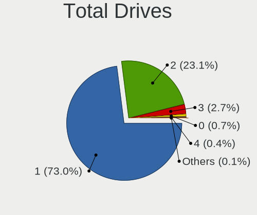
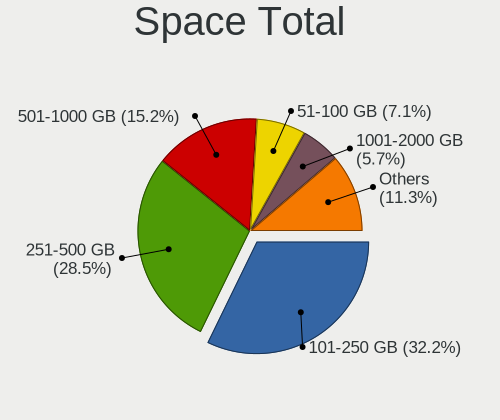
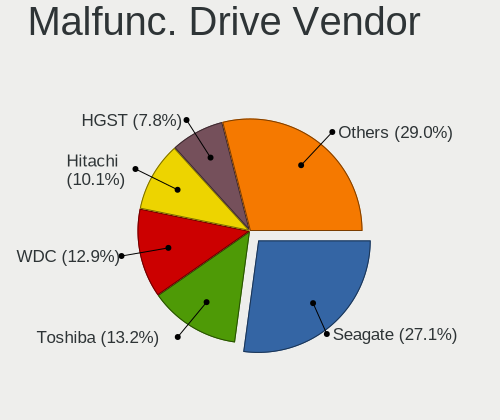
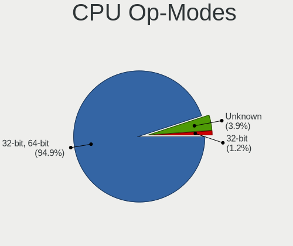
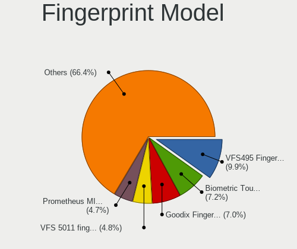

Linux Mint - Tested Hardware & Statistics (Notebooks)
-----------------------------------------------------

A project to collect tested hardware configurations for Linux Mint.

Anyone can contribute to this report by the [hw-probe](https://github.com/linuxhw/hw-probe) tool:

    sudo -E hw-probe -all -upload

Please contribute! Especially if your hardware is rare.

Contents
--------

* [ Test Cases ](#test-cases)

* [ System ](#system)
  - [ OS                       ](#os)
  - [ OS Family                ](#os-family)
  - [ Kernel                   ](#kernel)
  - [ Kernel Family            ](#kernel-family)
  - [ Kernel Major Ver.        ](#kernel-major-ver)
  - [ Arch                     ](#arch)
  - [ DE                       ](#de)
  - [ Display Server           ](#display-server)
  - [ Display Manager          ](#display-manager)
  - [ OS Lang                  ](#os-lang)
  - [ Boot Mode                ](#boot-mode)
  - [ Filesystem               ](#filesystem)
  - [ Part. scheme             ](#part-scheme)
  - [ Dual Boot with Linux/BSD ](#dual-boot-with-linuxbsd)
  - [ Dual Boot (Win)          ](#dual-boot-win)

* [ Board ](#board)
  - [ Vendor                   ](#vendor)
  - [ Model                    ](#model)
  - [ Model Family             ](#model-family)
  - [ MFG Year                 ](#mfg-year)
  - [ Form Factor              ](#form-factor)
  - [ Secure Boot              ](#secure-boot)
  - [ Coreboot                 ](#coreboot)
  - [ RAM Size                 ](#ram-size)
  - [ RAM Used                 ](#ram-used)
  - [ Total Drives             ](#total-drives)
  - [ Has CD-ROM               ](#has-cd-rom)
  - [ Has Ethernet             ](#has-ethernet)
  - [ Has WiFi                 ](#has-wifi)
  - [ Has Bluetooth            ](#has-bluetooth)

* [ Location ](#location)
  - [ Country                  ](#country)
  - [ City                     ](#city)

* [ Drives ](#drives)
  - [ Drive Vendor             ](#drive-vendor)
  - [ Drive Model              ](#drive-model)
  - [ HDD Vendor               ](#hdd-vendor)
  - [ SSD Vendor               ](#ssd-vendor)
  - [ Drive Kind               ](#drive-kind)
  - [ Drive Connector          ](#drive-connector)
  - [ Drive Size               ](#drive-size)
  - [ Space Total              ](#space-total)
  - [ Space Used               ](#space-used)
  - [ Malfunc. Drives          ](#malfunc-drives)
  - [ Malfunc. Drive Vendor    ](#malfunc-drive-vendor)
  - [ Malfunc. HDD Vendor      ](#malfunc-hdd-vendor)
  - [ Malfunc. Drive Kind      ](#malfunc-drive-kind)
  - [ Failed Drives            ](#failed-drives)
  - [ Failed Drive Vendor      ](#failed-drive-vendor)
  - [ Drive Status             ](#drive-status)

* [ Storage controller ](#storage-controller)
  - [ Storage Vendor           ](#storage-vendor)
  - [ Storage Model            ](#storage-model)
  - [ Storage Kind             ](#storage-kind)

* [ Processor ](#processor)
  - [ CPU Vendor               ](#cpu-vendor)
  - [ CPU Model                ](#cpu-model)
  - [ CPU Model Family         ](#cpu-model-family)
  - [ CPU Cores                ](#cpu-cores)
  - [ CPU Sockets              ](#cpu-sockets)
  - [ CPU Threads              ](#cpu-threads)
  - [ CPU Op-Modes             ](#cpu-op-modes)
  - [ CPU Microcode            ](#cpu-microcode)
  - [ CPU Microarch            ](#cpu-microarch)

* [ Graphics ](#graphics)
  - [ GPU Vendor               ](#gpu-vendor)
  - [ GPU Model                ](#gpu-model)
  - [ GPU Combo                ](#gpu-combo)
  - [ GPU Driver               ](#gpu-driver)
  - [ GPU Memory               ](#gpu-memory)

* [ Monitor ](#monitor)
  - [ Monitor Vendor           ](#monitor-vendor)
  - [ Monitor Model            ](#monitor-model)
  - [ Monitor Resolution       ](#monitor-resolution)
  - [ Monitor Diagonal         ](#monitor-diagonal)
  - [ Monitor Width            ](#monitor-width)
  - [ Aspect Ratio             ](#aspect-ratio)
  - [ Monitor Area             ](#monitor-area)
  - [ Pixel Density            ](#pixel-density)
  - [ Multiple Monitors        ](#multiple-monitors)

* [ Network ](#network)
  - [ Net Controller Vendor    ](#net-controller-vendor)
  - [ Net Controller Model     ](#net-controller-model)
  - [ Wireless Vendor          ](#wireless-vendor)
  - [ Wireless Model           ](#wireless-model)
  - [ Ethernet Vendor          ](#ethernet-vendor)
  - [ Ethernet Model           ](#ethernet-model)
  - [ Net Controller Kind      ](#net-controller-kind)
  - [ Used Controller          ](#used-controller)
  - [ NICs                     ](#nics)
  - [ IPv6                     ](#ipv6)

* [ Bluetooth ](#bluetooth)
  - [ Bluetooth Vendor         ](#bluetooth-vendor)
  - [ Bluetooth Model          ](#bluetooth-model)

* [ Sound ](#sound)
  - [ Sound Vendor             ](#sound-vendor)
  - [ Sound Model              ](#sound-model)

* [ Memory ](#memory)
  - [ Memory Vendor            ](#memory-vendor)
  - [ Memory Model             ](#memory-model)
  - [ Memory Kind              ](#memory-kind)
  - [ Memory Form Factor       ](#memory-form-factor)
  - [ Memory Size              ](#memory-size)
  - [ Memory Speed             ](#memory-speed)

* [ Printers & scanners ](#printers--scanners)
  - [ Printer Vendor           ](#printer-vendor)
  - [ Printer Model            ](#printer-model)
  - [ Scanner Vendor           ](#scanner-vendor)
  - [ Scanner Model            ](#scanner-model)

* [ Camera ](#camera)
  - [ Camera Vendor            ](#camera-vendor)
  - [ Camera Model             ](#camera-model)

* [ Security ](#security)
  - [ Fingerprint Vendor       ](#fingerprint-vendor)
  - [ Fingerprint Model        ](#fingerprint-model)
  - [ Chipcard Vendor          ](#chipcard-vendor)
  - [ Chipcard Model           ](#chipcard-model)

* [ Unsupported ](#unsupported)
  - [ Unsupported Devices      ](#unsupported-devices)
  - [ Unsupported Device Types ](#unsupported-device-types)

Test Cases
----------

Total: 15271

| Vendor        | Model                       | Probe                                                      | Date         |
|---------------|-----------------------------|------------------------------------------------------------|--------------|
| ASUSTek       | ASUS TUF Gaming F15 FX50... | [e207539e68](https://linux-hardware.org/?probe=e207539e68) | Sep 07, 2023 |
| Sony          | SVF1521V6EB                 | [1d08716b2c](https://linux-hardware.org/?probe=1d08716b2c) | Sep 07, 2023 |
| Dell          | Latitude E7240              | [79a666783a](https://linux-hardware.org/?probe=79a666783a) | Sep 07, 2023 |
| Samsung       | RF511/RF411/RF711           | [ef99cba7a5](https://linux-hardware.org/?probe=ef99cba7a5) | Sep 06, 2023 |
| Unknown       | Unknown                     | [16cb5e0d5b](https://linux-hardware.org/?probe=16cb5e0d5b) | Sep 06, 2023 |
| HUAWEI        | NBD-WXX9                    | [29e1f84537](https://linux-hardware.org/?probe=29e1f84537) | Sep 06, 2023 |
| Lenovo        | ThinkPad T580 20LAS01H00    | [129e989480](https://linux-hardware.org/?probe=129e989480) | Sep 06, 2023 |
| Timi          | Xiaomi Book Pro 14 2022     | [32c34f0aa2](https://linux-hardware.org/?probe=32c34f0aa2) | Sep 06, 2023 |
| Standard      | MB45II/MB45IN               | [1e46c6aa81](https://linux-hardware.org/?probe=1e46c6aa81) | Sep 06, 2023 |
| Samsung       | 340XAA/350XAA/550XAA        | [ba05ae3ca2](https://linux-hardware.org/?probe=ba05ae3ca2) | Sep 06, 2023 |
| Samsung       | 340XAA/350XAA/550XAA        | [299a459ec5](https://linux-hardware.org/?probe=299a459ec5) | Sep 06, 2023 |
| ASUSTek       | X75VC                       | [ba211ae5ca](https://linux-hardware.org/?probe=ba211ae5ca) | Sep 06, 2023 |
| ASUSTek       | K70IO                       | [bb32d5e30c](https://linux-hardware.org/?probe=bb32d5e30c) | Sep 06, 2023 |
| HP            | EliteBook 840 G1            | [1d1c8e33ff](https://linux-hardware.org/?probe=1d1c8e33ff) | Sep 06, 2023 |
| ASUSTek       | ASUS TUF Gaming A15 FA50... | [4ed976d4ba](https://linux-hardware.org/?probe=4ed976d4ba) | Sep 06, 2023 |
| Notebook      | W230SS                      | [3d9af4f57a](https://linux-hardware.org/?probe=3d9af4f57a) | Sep 06, 2023 |
| ASUSTek       | K70IO                       | [e4f165224f](https://linux-hardware.org/?probe=e4f165224f) | Sep 06, 2023 |
| Lenovo        | ThinkPad E580 20KS001JUK    | [8b44f9cbdc](https://linux-hardware.org/?probe=8b44f9cbdc) | Sep 06, 2023 |
| Dell          | Inspiron 5567               | [56c33713a8](https://linux-hardware.org/?probe=56c33713a8) | Sep 06, 2023 |
| Lenovo        | IdeaPad 1 14AMN7 82VF       | [dccf0aaf61](https://linux-hardware.org/?probe=dccf0aaf61) | Sep 06, 2023 |
| Lenovo        | IdeaPad 1 14AMN7 82VF       | [51e417460a](https://linux-hardware.org/?probe=51e417460a) | Sep 05, 2023 |
| Lenovo        | G570 4334                   | [ce571e2d16](https://linux-hardware.org/?probe=ce571e2d16) | Sep 05, 2023 |
| HP            | Laptop 15-da0xxx            | [326d057e96](https://linux-hardware.org/?probe=326d057e96) | Sep 05, 2023 |
| HP            | Pavilion dv8000 (ET839UA... | [7b717719f5](https://linux-hardware.org/?probe=7b717719f5) | Sep 05, 2023 |
| Notebook      | N9x0TC                      | [ea9c38200b](https://linux-hardware.org/?probe=ea9c38200b) | Sep 05, 2023 |
| MSI           | Prestige 14H B12UCX         | [75d602c66f](https://linux-hardware.org/?probe=75d602c66f) | Sep 05, 2023 |
| Acer          | Aspire 5750Z                | [5bec99a137](https://linux-hardware.org/?probe=5bec99a137) | Sep 05, 2023 |
| Apple         | MacBook8,1                  | [f2d8d7ffbb](https://linux-hardware.org/?probe=f2d8d7ffbb) | Sep 05, 2023 |
| HP            | Pavilion dv7                | [2d6aa7667d](https://linux-hardware.org/?probe=2d6aa7667d) | Sep 05, 2023 |
| Lenovo        | IdeaPad 100-14IBD 80RK      | [1a1c5e43bc](https://linux-hardware.org/?probe=1a1c5e43bc) | Sep 05, 2023 |
| Google        | Treeya                      | [fcc8d7d8a1](https://linux-hardware.org/?probe=fcc8d7d8a1) | Sep 05, 2023 |
| Inter Sale... | NID-11125DE                 | [2c94bcc096](https://linux-hardware.org/?probe=2c94bcc096) | Sep 05, 2023 |
| Dell          | Precision 5570              | [abddf843dd](https://linux-hardware.org/?probe=abddf843dd) | Sep 04, 2023 |
| TUXEDO        | Unknown                     | [c6b62e2a29](https://linux-hardware.org/?probe=c6b62e2a29) | Sep 04, 2023 |
| HP            | Pavilion dv9000 (RP249UA... | [ea5e3bac5f](https://linux-hardware.org/?probe=ea5e3bac5f) | Sep 04, 2023 |
| ASUSTek       | X75VC                       | [0830aad0cc](https://linux-hardware.org/?probe=0830aad0cc) | Sep 04, 2023 |
| Dell          | Inspiron 7580               | [b021fe57a6](https://linux-hardware.org/?probe=b021fe57a6) | Sep 04, 2023 |
| Lenovo        | ThinkPad E520 11433FU       | [ecc10a1197](https://linux-hardware.org/?probe=ecc10a1197) | Sep 04, 2023 |
| Lenovo        | IdeaPad S400 Touch VIUS3    | [d2ac233994](https://linux-hardware.org/?probe=d2ac233994) | Sep 04, 2023 |
| Acer          | Aspire 8930                 | [9901032e2b](https://linux-hardware.org/?probe=9901032e2b) | Sep 04, 2023 |
| Prestigio     | Smartbook PSB116A           | [d70df77a35](https://linux-hardware.org/?probe=d70df77a35) | Sep 04, 2023 |
| HP            | EliteBook 8440p             | [37e16bb39c](https://linux-hardware.org/?probe=37e16bb39c) | Sep 04, 2023 |
| Monster       | Huma H5 V3.2                | [75d95e264e](https://linux-hardware.org/?probe=75d95e264e) | Sep 04, 2023 |
| Acer          | Aspire 7741                 | [0b3868c6bc](https://linux-hardware.org/?probe=0b3868c6bc) | Sep 04, 2023 |
| Apple         | MacBookAir5,1               | [e24382ee44](https://linux-hardware.org/?probe=e24382ee44) | Sep 04, 2023 |
| Dell          | Latitude E5570              | [b4ca89038c](https://linux-hardware.org/?probe=b4ca89038c) | Sep 03, 2023 |
| Lenovo        | ThinkPad X220 42902WG       | [2326c36d78](https://linux-hardware.org/?probe=2326c36d78) | Sep 03, 2023 |
| Star Labs     | StarBook                    | [ac568bfcd4](https://linux-hardware.org/?probe=ac568bfcd4) | Sep 03, 2023 |
| Samsung       | RF511/RF411/RF711           | [522a10f139](https://linux-hardware.org/?probe=522a10f139) | Sep 03, 2023 |
| Acer          | Aspire 5750Z                | [f0b466e572](https://linux-hardware.org/?probe=f0b466e572) | Sep 03, 2023 |
| Medion        | Akoya E4214 MD99570         | [1454b9c6a8](https://linux-hardware.org/?probe=1454b9c6a8) | Sep 03, 2023 |
| Apple         | MacBookAir6,2               | [94da12d8d8](https://linux-hardware.org/?probe=94da12d8d8) | Sep 03, 2023 |
| Lenovo        | IdeaPad 3 15ALC6 82KU       | [a724d32006](https://linux-hardware.org/?probe=a724d32006) | Sep 03, 2023 |
| Dell          | Latitude E6400              | [9903b0fbea](https://linux-hardware.org/?probe=9903b0fbea) | Sep 03, 2023 |
| MSI           | Delta 15 A5EFK              | [8d2e359aec](https://linux-hardware.org/?probe=8d2e359aec) | Sep 03, 2023 |
| Lenovo        | ThinkPad T14 Gen 2a 20XK... | [024e3beca4](https://linux-hardware.org/?probe=024e3beca4) | Sep 03, 2023 |
| Thomson       | N14C4WH64                   | [3a5fd5b62b](https://linux-hardware.org/?probe=3a5fd5b62b) | Sep 03, 2023 |
| HP            | Laptop 15s-eq2xxx           | [88673d4088](https://linux-hardware.org/?probe=88673d4088) | Sep 03, 2023 |
| HP            | Laptop 15s-eq2xxx           | [6ed47558ae](https://linux-hardware.org/?probe=6ed47558ae) | Sep 03, 2023 |
| Lenovo        | ThinkPad L15 Gen 2 20X30... | [439817c540](https://linux-hardware.org/?probe=439817c540) | Sep 03, 2023 |
| Thomson       | N14C4WH64                   | [cdfa5060e6](https://linux-hardware.org/?probe=cdfa5060e6) | Sep 03, 2023 |
| HP            | Pavilion dv5                | [977c253ff5](https://linux-hardware.org/?probe=977c253ff5) | Sep 02, 2023 |
| Fujitsu Si... | AMILO Xa 1526               | [806eed53dc](https://linux-hardware.org/?probe=806eed53dc) | Sep 02, 2023 |
| Fujitsu Si... | AMILO Xa 1526               | [377d5352d8](https://linux-hardware.org/?probe=377d5352d8) | Sep 02, 2023 |
| Dell          | Latitude E6540              | [f9e2147255](https://linux-hardware.org/?probe=f9e2147255) | Sep 02, 2023 |
| Lenovo        | IdeaPad 110-15ISK 80UD      | [fdb735b431](https://linux-hardware.org/?probe=fdb735b431) | Sep 02, 2023 |
| Dell          | Latitude 5285               | [f1f48163f3](https://linux-hardware.org/?probe=f1f48163f3) | Sep 02, 2023 |
| HP            | Pavilion dv6                | [9190ad12c2](https://linux-hardware.org/?probe=9190ad12c2) | Sep 02, 2023 |
| Lenovo        | IdeaPad 3 15ALC6 82KU       | [c612e70205](https://linux-hardware.org/?probe=c612e70205) | Sep 02, 2023 |
| HP            | Pavilion Notebook           | [3143c94134](https://linux-hardware.org/?probe=3143c94134) | Sep 02, 2023 |
| Dell          | Precision 5540              | [3d800b12e0](https://linux-hardware.org/?probe=3d800b12e0) | Sep 02, 2023 |
| HP            | Pavilion dv8000 (ET839UA... | [affa07b412](https://linux-hardware.org/?probe=affa07b412) | Sep 02, 2023 |
| HP            | ProBook 470 G3              | [f6996b2905](https://linux-hardware.org/?probe=f6996b2905) | Sep 02, 2023 |
| Lenovo        | ThinkPad L570 20J9S07N00    | [88d1350771](https://linux-hardware.org/?probe=88d1350771) | Sep 01, 2023 |
| ASUSTek       | X555LJ                      | [571cdd8ecf](https://linux-hardware.org/?probe=571cdd8ecf) | Sep 01, 2023 |
| Lenovo        | ThinkPad T14 Gen 2i 20W1... | [de36e26c21](https://linux-hardware.org/?probe=de36e26c21) | Sep 01, 2023 |
| Lenovo        | ThinkPad L570 20J9S07N00    | [fe660fb390](https://linux-hardware.org/?probe=fe660fb390) | Sep 01, 2023 |
| Dell          | G15 5520                    | [9cfb8ce55a](https://linux-hardware.org/?probe=9cfb8ce55a) | Sep 01, 2023 |
| Lenovo        | IdeaPad 1 14ADA7 82R0       | [d70ba1aaf4](https://linux-hardware.org/?probe=d70ba1aaf4) | Sep 01, 2023 |
| eMachines     | eME442                      | [7b765f910c](https://linux-hardware.org/?probe=7b765f910c) | Sep 01, 2023 |
| Apple         | MacBookPro5,2               | [35df364c39](https://linux-hardware.org/?probe=35df364c39) | Sep 01, 2023 |
| Acer          | Aspire V3-771               | [67082ec830](https://linux-hardware.org/?probe=67082ec830) | Sep 01, 2023 |
| HP            | Pavilion 13                 | [ccf98e410b](https://linux-hardware.org/?probe=ccf98e410b) | Sep 01, 2023 |
| Lenovo        | ThinkBook 14 G3 ACL 21A2    | [0a715ba5aa](https://linux-hardware.org/?probe=0a715ba5aa) | Sep 01, 2023 |
| HP            | Pavilion 13                 | [b3e756ad21](https://linux-hardware.org/?probe=b3e756ad21) | Sep 01, 2023 |
| Google        | Barla                       | [1beaca005d](https://linux-hardware.org/?probe=1beaca005d) | Sep 01, 2023 |
| HP            | Presario CQ43               | [9a02828a68](https://linux-hardware.org/?probe=9a02828a68) | Sep 01, 2023 |
| ASUSTek       | X550CC                      | [0265cb5d01](https://linux-hardware.org/?probe=0265cb5d01) | Aug 31, 2023 |
| Acer          | Aspire V3-772               | [5cb3aa2368](https://linux-hardware.org/?probe=5cb3aa2368) | Aug 31, 2023 |
| HP            | Laptop 14-bw0xx             | [38db2f9e44](https://linux-hardware.org/?probe=38db2f9e44) | Aug 31, 2023 |
| Acer          | Aspire E5-475G              | [55542f9b89](https://linux-hardware.org/?probe=55542f9b89) | Aug 31, 2023 |
| Notebook      | N9x0TC                      | [f37b35c8dc](https://linux-hardware.org/?probe=f37b35c8dc) | Aug 31, 2023 |
| Lenovo        | IdeaPad 1 15ADA7 82R1       | [ed4fafcabd](https://linux-hardware.org/?probe=ed4fafcabd) | Aug 31, 2023 |
| Lenovo        | ThinkPad X200 7458AL7       | [763d0f46f4](https://linux-hardware.org/?probe=763d0f46f4) | Aug 31, 2023 |
| ASUSTek       | K53SD                       | [05b083817c](https://linux-hardware.org/?probe=05b083817c) | Aug 31, 2023 |
| Dell          | G3 3590                     | [810c7d1698](https://linux-hardware.org/?probe=810c7d1698) | Aug 31, 2023 |
| Notebook      | W230SS                      | [97cc6cc17f](https://linux-hardware.org/?probe=97cc6cc17f) | Aug 31, 2023 |
| ASUSTek       | X555LJ                      | [49b0bd793d](https://linux-hardware.org/?probe=49b0bd793d) | Aug 31, 2023 |
| MSI           | GS70 2OD                    | [1bc4bba326](https://linux-hardware.org/?probe=1bc4bba326) | Aug 31, 2023 |
| Acer          | Predator PH517-51           | [294343383a](https://linux-hardware.org/?probe=294343383a) | Aug 30, 2023 |
| Acer          | Predator PH517-51           | [adba295596](https://linux-hardware.org/?probe=adba295596) | Aug 30, 2023 |
| ASUSTek       | K53SD                       | [f6f76a2e9d](https://linux-hardware.org/?probe=f6f76a2e9d) | Aug 30, 2023 |
| Acer          | Aspire V3-112P              | [d0d0600273](https://linux-hardware.org/?probe=d0d0600273) | Aug 30, 2023 |
| Lenovo        | G50-80 80E5                 | [3977e85dce](https://linux-hardware.org/?probe=3977e85dce) | Aug 30, 2023 |
| HUAWEI        | NBLK-WAX9X                  | [4ac0615cbb](https://linux-hardware.org/?probe=4ac0615cbb) | Aug 30, 2023 |
| HP            | Pavilion Laptop 15-eh2xx... | [4bedf20d35](https://linux-hardware.org/?probe=4bedf20d35) | Aug 30, 2023 |
| HP            | Laptop 17-ca1xxx            | [a7b83b57e0](https://linux-hardware.org/?probe=a7b83b57e0) | Aug 30, 2023 |
| HP            | Laptop 17-ca1xxx            | [d7860c1c92](https://linux-hardware.org/?probe=d7860c1c92) | Aug 30, 2023 |
| Lenovo        | ThinkPad T420 4236MBG       | [dc28b42a00](https://linux-hardware.org/?probe=dc28b42a00) | Aug 30, 2023 |
| Google        | Liara                       | [e92684405f](https://linux-hardware.org/?probe=e92684405f) | Aug 30, 2023 |
| Lenovo        | Slim 7 ProX 14ARH7 82V2     | [d37f105f74](https://linux-hardware.org/?probe=d37f105f74) | Aug 30, 2023 |
| Lenovo        | IdeaPad 110-14IBR 80T6      | [de34a44939](https://linux-hardware.org/?probe=de34a44939) | Aug 29, 2023 |
| ASUSTek       | VivoBook_ASUSLaptop X509... | [48450e1a26](https://linux-hardware.org/?probe=48450e1a26) | Aug 29, 2023 |
| Lenovo        | IdeaPad 110-14IBR 80T6      | [776efe803f](https://linux-hardware.org/?probe=776efe803f) | Aug 29, 2023 |
| Lenovo        | IdeaPad 5 14ALC05 82LM      | [78d168c88e](https://linux-hardware.org/?probe=78d168c88e) | Aug 29, 2023 |
| HP            | Pavilion TS Sleekbook 14    | [c7108a7a23](https://linux-hardware.org/?probe=c7108a7a23) | Aug 29, 2023 |
| HP            | Split 13 x2 PC              | [ab71a69e7e](https://linux-hardware.org/?probe=ab71a69e7e) | Aug 28, 2023 |
| Google        | Treeya                      | [396f71a402](https://linux-hardware.org/?probe=396f71a402) | Aug 28, 2023 |
| ASUSTek       | Zenbook UM3402YAR_UM3402... | [4c46f7ae80](https://linux-hardware.org/?probe=4c46f7ae80) | Aug 28, 2023 |
| HP            | Split 13 x2 PC              | [3df006557e](https://linux-hardware.org/?probe=3df006557e) | Aug 28, 2023 |
| Apple         | MacBookPro11,3              | [a102cdc504](https://linux-hardware.org/?probe=a102cdc504) | Aug 28, 2023 |
| ASUSTek       | ASUS EXPERTBOOK B1500CBA... | [8cbbb0c64a](https://linux-hardware.org/?probe=8cbbb0c64a) | Aug 28, 2023 |
| Dell          | Inspiron 1501               | [a021a98920](https://linux-hardware.org/?probe=a021a98920) | Aug 27, 2023 |
| NSX           | SB142G                      | [43b576c576](https://linux-hardware.org/?probe=43b576c576) | Aug 27, 2023 |
| HP            | Laptop 14-cm0xxx            | [a1caab6466](https://linux-hardware.org/?probe=a1caab6466) | Aug 27, 2023 |
| Lenovo        | ThinkPad X250 20CLS0MN0A    | [4cfb3bf1b1](https://linux-hardware.org/?probe=4cfb3bf1b1) | Aug 27, 2023 |
| Samsung       | 300E4M/300E4S/300E4L        | [633ddecba0](https://linux-hardware.org/?probe=633ddecba0) | Aug 27, 2023 |
| Toshiba       | Satellite Pro NB10-A-110    | [ce30f81084](https://linux-hardware.org/?probe=ce30f81084) | Aug 27, 2023 |
| Lenovo        | ThinkPad L590 20Q70019GE    | [7df198a7b4](https://linux-hardware.org/?probe=7df198a7b4) | Aug 27, 2023 |
| ASUSTek       | TP300LA                     | [7588e955e3](https://linux-hardware.org/?probe=7588e955e3) | Aug 27, 2023 |
| HP            | Laptop 15-bs0xx             | [f8a316e74c](https://linux-hardware.org/?probe=f8a316e74c) | Aug 27, 2023 |
| Apple         | MacBookPro9,1               | [20eda7fab5](https://linux-hardware.org/?probe=20eda7fab5) | Aug 26, 2023 |
| Lenovo        | Z51-70 80K6                 | [d8bb515dfb](https://linux-hardware.org/?probe=d8bb515dfb) | Aug 26, 2023 |
| Lenovo        | IdeaPad 3 15IGL05 82BU      | [c0957b3538](https://linux-hardware.org/?probe=c0957b3538) | Aug 26, 2023 |
| Dell          | Precision M4800             | [89b88a1d3a](https://linux-hardware.org/?probe=89b88a1d3a) | Aug 26, 2023 |
| HP            | Notebook                    | [b27d20b450](https://linux-hardware.org/?probe=b27d20b450) | Aug 26, 2023 |
| Lenovo        | Legion 5 15ARH05H 82B1      | [5b1ded5f9e](https://linux-hardware.org/?probe=5b1ded5f9e) | Aug 26, 2023 |
| Wortmann      | TERRA_MOBILE_1749           | [d58f29d427](https://linux-hardware.org/?probe=d58f29d427) | Aug 26, 2023 |
| Samsung       | RV419/RV420                 | [77e9d34f16](https://linux-hardware.org/?probe=77e9d34f16) | Aug 26, 2023 |
| ASUSTek       | VivoBook_ASUSLaptop M160... | [b7cd2c007f](https://linux-hardware.org/?probe=b7cd2c007f) | Aug 26, 2023 |
| HUAWEI        | MACHR-WX9                   | [a8c4ca7aee](https://linux-hardware.org/?probe=a8c4ca7aee) | Aug 25, 2023 |
| HP            | 15                          | [76decc7899](https://linux-hardware.org/?probe=76decc7899) | Aug 25, 2023 |
| Samsung       | RV419/RV420                 | [275cd1500e](https://linux-hardware.org/?probe=275cd1500e) | Aug 25, 2023 |
| Fujitsu       | LIFEBOOK A530               | [01c6935221](https://linux-hardware.org/?probe=01c6935221) | Aug 25, 2023 |
| Lenovo        | Legion 7 16ARHA7 82UH       | [14805d08fd](https://linux-hardware.org/?probe=14805d08fd) | Aug 25, 2023 |
| TUXEDO        | Unknown                     | [13bb5e57f4](https://linux-hardware.org/?probe=13bb5e57f4) | Aug 25, 2023 |
| Dell          | Inspiron 15-3567            | [49769c9b38](https://linux-hardware.org/?probe=49769c9b38) | Aug 25, 2023 |
| Dell          | Inspiron 5547               | [1fde0105bf](https://linux-hardware.org/?probe=1fde0105bf) | Aug 25, 2023 |
| Notebook      | W230SS                      | [a479847abb](https://linux-hardware.org/?probe=a479847abb) | Aug 25, 2023 |
| PC Special... | Ionico 16                   | [78125c34b4](https://linux-hardware.org/?probe=78125c34b4) | Aug 25, 2023 |
| Lenovo        | V15-IIL 82C5                | [fbe986e246](https://linux-hardware.org/?probe=fbe986e246) | Aug 24, 2023 |
| Dell          | Vostro 2520                 | [96018ae096](https://linux-hardware.org/?probe=96018ae096) | Aug 24, 2023 |
| ASUSTek       | ASUS TUF Gaming F15 FX50... | [12ac0bf5ed](https://linux-hardware.org/?probe=12ac0bf5ed) | Aug 24, 2023 |
| Lenovo        | ThinkPad L15 Gen 2 20X30... | [f4af40c36f](https://linux-hardware.org/?probe=f4af40c36f) | Aug 24, 2023 |
| Google        | Rammus                      | [57b3596f63](https://linux-hardware.org/?probe=57b3596f63) | Aug 24, 2023 |
| Acer          | Aspire VN7-571G             | [c35939bf03](https://linux-hardware.org/?probe=c35939bf03) | Aug 24, 2023 |
| Acer          | Aspire VN7-571G             | [de43925ba1](https://linux-hardware.org/?probe=de43925ba1) | Aug 24, 2023 |
| Timi          | A35                         | [50e380e876](https://linux-hardware.org/?probe=50e380e876) | Aug 24, 2023 |
| Lenovo        | Legion 5 15ACH6H 82JU       | [3746b277b6](https://linux-hardware.org/?probe=3746b277b6) | Aug 24, 2023 |
| Lenovo        | Legion 5 15ACH6H 82JU       | [3e241db8f7](https://linux-hardware.org/?probe=3e241db8f7) | Aug 24, 2023 |
| Lenovo        | ThinkPad T460 20FMA00F00    | [370de86ed7](https://linux-hardware.org/?probe=370de86ed7) | Aug 24, 2023 |
| Dell          | Precision M4500             | [98b37ce3a4](https://linux-hardware.org/?probe=98b37ce3a4) | Aug 24, 2023 |
| Gigabyte      | G5 GE                       | [357d34e951](https://linux-hardware.org/?probe=357d34e951) | Aug 23, 2023 |
| HP            | EliteBook 8530w             | [3ee1fe77ce](https://linux-hardware.org/?probe=3ee1fe77ce) | Aug 23, 2023 |
| Apple         | MacBookPro8,3               | [3fa6f3e446](https://linux-hardware.org/?probe=3fa6f3e446) | Aug 23, 2023 |
| Lenovo        | Legion 5 Pro 16ACH6H 82J... | [38573350a3](https://linux-hardware.org/?probe=38573350a3) | Aug 23, 2023 |
| Lenovo        | V15 G2 ALC 82KD             | [5247fcf1af](https://linux-hardware.org/?probe=5247fcf1af) | Aug 23, 2023 |
| HP            | Victus by Gaming Laptop ... | [f79de96905](https://linux-hardware.org/?probe=f79de96905) | Aug 23, 2023 |
| ASUSTek       | G75VW                       | [7ef5fc5f0c](https://linux-hardware.org/?probe=7ef5fc5f0c) | Aug 23, 2023 |
| Lenovo        | IdeaPad S145-15API 81UT     | [ab538d0486](https://linux-hardware.org/?probe=ab538d0486) | Aug 23, 2023 |
| Samsung       | 370E4K                      | [074e0669c7](https://linux-hardware.org/?probe=074e0669c7) | Aug 22, 2023 |
| Dell          | XPS 15 9560                 | [e751db6fd4](https://linux-hardware.org/?probe=e751db6fd4) | Aug 22, 2023 |
| ASUSTek       | VivoBook_ASUSLaptop X150... | [131e36d487](https://linux-hardware.org/?probe=131e36d487) | Aug 22, 2023 |
| Apple         | MacBookPro8,1               | [06b5fb7c7f](https://linux-hardware.org/?probe=06b5fb7c7f) | Aug 22, 2023 |
| Dell          | Vostro 5471                 | [342ccb8530](https://linux-hardware.org/?probe=342ccb8530) | Aug 22, 2023 |
| HP            | Laptop 17-by0xxx            | [5de161ca2f](https://linux-hardware.org/?probe=5de161ca2f) | Aug 22, 2023 |
| HP            | Victus by Laptop 16-d0xx... | [845b1d4d76](https://linux-hardware.org/?probe=845b1d4d76) | Aug 22, 2023 |
| Dell          | Precision M4500             | [71b77267fd](https://linux-hardware.org/?probe=71b77267fd) | Aug 22, 2023 |
| Acer          | Aspire 5250                 | [8812e20762](https://linux-hardware.org/?probe=8812e20762) | Aug 22, 2023 |
| Apple         | MacBookPro13,1              | [73c6fa6546](https://linux-hardware.org/?probe=73c6fa6546) | Aug 22, 2023 |
| Acer          | Aspire V3-771               | [0a5af3a07b](https://linux-hardware.org/?probe=0a5af3a07b) | Aug 22, 2023 |
| Toshiba       | Satellite P500              | [41efb0cb7b](https://linux-hardware.org/?probe=41efb0cb7b) | Aug 22, 2023 |
| Lenovo        | IdeaPad 3 15ABA7 82RN       | [e8ac7d1737](https://linux-hardware.org/?probe=e8ac7d1737) | Aug 22, 2023 |
| HP            | 255 G5                      | [d7087d2b8f](https://linux-hardware.org/?probe=d7087d2b8f) | Aug 22, 2023 |
| HP            | 255 G5                      | [b16f43457c](https://linux-hardware.org/?probe=b16f43457c) | Aug 22, 2023 |
| ASUSTek       | VivoBook_ASUSLaptop M650... | [60c353baa1](https://linux-hardware.org/?probe=60c353baa1) | Aug 22, 2023 |
| Dell          | Inspiron 3537               | [1ad6c0c6d3](https://linux-hardware.org/?probe=1ad6c0c6d3) | Aug 22, 2023 |
| Lenovo        | IdeaPad L340-15IRH Gamin... | [272e3307fe](https://linux-hardware.org/?probe=272e3307fe) | Aug 21, 2023 |
| Acer          | Aspire 5750Z                | [8c15b251a7](https://linux-hardware.org/?probe=8c15b251a7) | Aug 21, 2023 |
| Apple         | MacBookPro12,1              | [fa1f2a4b75](https://linux-hardware.org/?probe=fa1f2a4b75) | Aug 21, 2023 |
| Toshiba       | Satellite C55-A             | [ef61a3ae6a](https://linux-hardware.org/?probe=ef61a3ae6a) | Aug 21, 2023 |
| HP            | Pavilion Sleekbook 14 PC    | [feeca36aa9](https://linux-hardware.org/?probe=feeca36aa9) | Aug 21, 2023 |
| Dell          | Studio 1558                 | [cbc26edae2](https://linux-hardware.org/?probe=cbc26edae2) | Aug 21, 2023 |
| HP            | Victus by Gaming Laptop ... | [c47971e406](https://linux-hardware.org/?probe=c47971e406) | Aug 21, 2023 |
| Dell          | Inspiron 5737               | [665dbda021](https://linux-hardware.org/?probe=665dbda021) | Aug 21, 2023 |
| Lenovo        | ThinkPad X230 2325H50       | [65dd59e7d2](https://linux-hardware.org/?probe=65dd59e7d2) | Aug 20, 2023 |
| Dell          | Inspiron 5447               | [811b2451ba](https://linux-hardware.org/?probe=811b2451ba) | Aug 20, 2023 |
| Acer          | Aspire 5750                 | [5b7f4b5a45](https://linux-hardware.org/?probe=5b7f4b5a45) | Aug 20, 2023 |
| Medion        | DEFENDER E10                | [8434727e07](https://linux-hardware.org/?probe=8434727e07) | Aug 20, 2023 |
| Kogan         | KAL14N360PA                 | [527a0d3cba](https://linux-hardware.org/?probe=527a0d3cba) | Aug 20, 2023 |
| ASUSTek       | K55A                        | [090e4d0a73](https://linux-hardware.org/?probe=090e4d0a73) | Aug 20, 2023 |
| Kogan         | KAL14N360PA                 | [b7cecb1518](https://linux-hardware.org/?probe=b7cecb1518) | Aug 20, 2023 |
| HP            | Laptop 17-by1xxx            | [658e65bba8](https://linux-hardware.org/?probe=658e65bba8) | Aug 20, 2023 |
| Lenovo        | Legion Y540-15IRH 81SX      | [30b645c7f4](https://linux-hardware.org/?probe=30b645c7f4) | Aug 20, 2023 |
| Lenovo        | Legion Y540-15IRH 81SX      | [47ed3b6bc8](https://linux-hardware.org/?probe=47ed3b6bc8) | Aug 20, 2023 |
| ASUSTek       | X540NA                      | [2f3758945b](https://linux-hardware.org/?probe=2f3758945b) | Aug 20, 2023 |
| HP            | Pavilion 15                 | [63e1b9e62c](https://linux-hardware.org/?probe=63e1b9e62c) | Aug 20, 2023 |
| ASUSTek       | ZenBook UX325EA_UX325EA     | [a435538cb2](https://linux-hardware.org/?probe=a435538cb2) | Aug 20, 2023 |
| Apple         | MacBookPro14,1              | [dc96aa9cee](https://linux-hardware.org/?probe=dc96aa9cee) | Aug 19, 2023 |
| Lenovo        | G50-30 80G0                 | [54c2ded452](https://linux-hardware.org/?probe=54c2ded452) | Aug 19, 2023 |
| Chuwi         | LapBook SE                  | [8c338913ab](https://linux-hardware.org/?probe=8c338913ab) | Aug 19, 2023 |
| HP            | ProBook 440 G8 Notebook ... | [66c64c5da8](https://linux-hardware.org/?probe=66c64c5da8) | Aug 19, 2023 |
| Dell          | Inspiron 1501               | [48f17500e2](https://linux-hardware.org/?probe=48f17500e2) | Aug 19, 2023 |
| HP            | Pavilion dv8000 (ET839UA... | [030cbe1086](https://linux-hardware.org/?probe=030cbe1086) | Aug 19, 2023 |
| Dell          | Latitude E7440              | [7a5bd0f1a6](https://linux-hardware.org/?probe=7a5bd0f1a6) | Aug 19, 2023 |
| HP            | 630                         | [ad9f585249](https://linux-hardware.org/?probe=ad9f585249) | Aug 19, 2023 |
| Lenovo        | IdeaPad 3 14ALC6 82KT       | [68df495196](https://linux-hardware.org/?probe=68df495196) | Aug 19, 2023 |
| HP            | Pavilion g7                 | [05c25f464a](https://linux-hardware.org/?probe=05c25f464a) | Aug 19, 2023 |
| ASUSTek       | UX410UQK                    | [cf7a7946dc](https://linux-hardware.org/?probe=cf7a7946dc) | Aug 19, 2023 |
| Dell          | Latitude E6410              | [5ae66b0d4a](https://linux-hardware.org/?probe=5ae66b0d4a) | Aug 18, 2023 |
| Dell          | Latitude 5540               | [d1f00897b3](https://linux-hardware.org/?probe=d1f00897b3) | Aug 18, 2023 |
| Lenovo        | V15-ADA 82C7                | [bb62633b47](https://linux-hardware.org/?probe=bb62633b47) | Aug 18, 2023 |
| Lenovo        | IdeaPad S145-15IGM 81MX     | [0dc75dae26](https://linux-hardware.org/?probe=0dc75dae26) | Aug 18, 2023 |
| HP            | Pavilion dv5                | [edaeac5770](https://linux-hardware.org/?probe=edaeac5770) | Aug 18, 2023 |
| Acer          | Aspire 5534                 | [f007a289ff](https://linux-hardware.org/?probe=f007a289ff) | Aug 18, 2023 |
| Acer          | Aspire 5534                 | [a26436f976](https://linux-hardware.org/?probe=a26436f976) | Aug 18, 2023 |
| Acer          | Aspire M5-583P              | [9af5e802dc](https://linux-hardware.org/?probe=9af5e802dc) | Aug 18, 2023 |
| Acer          | Predator PH317-52           | [c942508cf0](https://linux-hardware.org/?probe=c942508cf0) | Aug 18, 2023 |
| Dell          | Latitude D630               | [e8f61a39e7](https://linux-hardware.org/?probe=e8f61a39e7) | Aug 17, 2023 |
| HUAWEI        | BOM-WXX9                    | [e2078f93dd](https://linux-hardware.org/?probe=e2078f93dd) | Aug 17, 2023 |
| Dell          | Precision 5540              | [a0a36884a0](https://linux-hardware.org/?probe=a0a36884a0) | Aug 17, 2023 |
| Dell          | Inspiron 15-3567            | [1739e9ff2d](https://linux-hardware.org/?probe=1739e9ff2d) | Aug 17, 2023 |
| Google        | Reef                        | [39c0a2d33c](https://linux-hardware.org/?probe=39c0a2d33c) | Aug 17, 2023 |
| Google        | Reef                        | [67909b7748](https://linux-hardware.org/?probe=67909b7748) | Aug 17, 2023 |
| Daten Tecn... | DV3N-4                      | [7a95cb94da](https://linux-hardware.org/?probe=7a95cb94da) | Aug 17, 2023 |
| HUAWEI        | NBLK-WAX9X                  | [0438f450f4](https://linux-hardware.org/?probe=0438f450f4) | Aug 17, 2023 |
| Lenovo        | ThinkPad X200 7459Y8Y       | [3a707993c2](https://linux-hardware.org/?probe=3a707993c2) | Aug 16, 2023 |
| Lenovo        | ThinkPad X200 7459Y8Y       | [2f98dd0ac1](https://linux-hardware.org/?probe=2f98dd0ac1) | Aug 16, 2023 |
| Lenovo        | ThinkPad X240 20AMS0J003    | [c60cb88cbc](https://linux-hardware.org/?probe=c60cb88cbc) | Aug 16, 2023 |
| Lenovo        | ThinkPad P16 Gen 1 21D7S... | [6ada69d4d4](https://linux-hardware.org/?probe=6ada69d4d4) | Aug 16, 2023 |
| Acer          | Predator PT515-51           | [3eede93299](https://linux-hardware.org/?probe=3eede93299) | Aug 16, 2023 |
| HP            | Laptop 15-fc0xxx            | [52c59bb799](https://linux-hardware.org/?probe=52c59bb799) | Aug 16, 2023 |
| PC Special... | Ionico 16                   | [9f04bd8095](https://linux-hardware.org/?probe=9f04bd8095) | Aug 16, 2023 |
| HP            | Compaq Presario CQ60        | [fc9b14b9cb](https://linux-hardware.org/?probe=fc9b14b9cb) | Aug 15, 2023 |
| Dell          | XPS 13 9370                 | [6c07b9bb4b](https://linux-hardware.org/?probe=6c07b9bb4b) | Aug 15, 2023 |
| HP            | Pavilion Laptop 15-ck0xx    | [97ced089bf](https://linux-hardware.org/?probe=97ced089bf) | Aug 15, 2023 |
| Dell          | Inspiron 7590               | [4438df6adb](https://linux-hardware.org/?probe=4438df6adb) | Aug 15, 2023 |
| Lenovo        | IdeaPad Slim 5 14ABR8 82... | [1fcc89106f](https://linux-hardware.org/?probe=1fcc89106f) | Aug 15, 2023 |
| Chuwi         | HeroBook Pro                | [0122fef8fd](https://linux-hardware.org/?probe=0122fef8fd) | Aug 15, 2023 |
| HP            | Elite x2 1012 G1            | [07f71a9888](https://linux-hardware.org/?probe=07f71a9888) | Aug 15, 2023 |
| Lenovo        | IdeaPad 330-15IGM 81D1      | [78e1dba498](https://linux-hardware.org/?probe=78e1dba498) | Aug 15, 2023 |
| Lenovo        | G580                        | [ceeee3c405](https://linux-hardware.org/?probe=ceeee3c405) | Aug 15, 2023 |
| Positivo      | S14CT01                     | [e865565207](https://linux-hardware.org/?probe=e865565207) | Aug 15, 2023 |
| Dynabook      | Satellite Pro C50-E-11H     | [589af795e9](https://linux-hardware.org/?probe=589af795e9) | Aug 14, 2023 |
| Dell          | Latitude E6420              | [176a9c4f6d](https://linux-hardware.org/?probe=176a9c4f6d) | Aug 14, 2023 |
| ASUSTek       | ROG Zephyrus G14 GA401II... | [18d3d9a7c1](https://linux-hardware.org/?probe=18d3d9a7c1) | Aug 14, 2023 |
| Dell          | Inspiron 3537               | [0cd8f644e2](https://linux-hardware.org/?probe=0cd8f644e2) | Aug 14, 2023 |
| HP            | Pavilion Laptop 15-eg3xx... | [cfc638b4b2](https://linux-hardware.org/?probe=cfc638b4b2) | Aug 14, 2023 |
| Positivo      | Mobile                      | [4111fa6520](https://linux-hardware.org/?probe=4111fa6520) | Aug 14, 2023 |
| Toshiba       | Satellite C55-A             | [8db92e82f6](https://linux-hardware.org/?probe=8db92e82f6) | Aug 14, 2023 |
| GPU Compan... | GWTN156-5                   | [a1d052746a](https://linux-hardware.org/?probe=a1d052746a) | Aug 13, 2023 |
| Acer          | Extensa 5635Z               | [e1a35ce655](https://linux-hardware.org/?probe=e1a35ce655) | Aug 13, 2023 |
| BANGHO        | MOV                         | [db4769bd96](https://linux-hardware.org/?probe=db4769bd96) | Aug 13, 2023 |
| Samsung       | 300E4A/300E5A/300E7A        | [3bb3eaed7b](https://linux-hardware.org/?probe=3bb3eaed7b) | Aug 13, 2023 |
| HP            | 450                         | [242d41f5e9](https://linux-hardware.org/?probe=242d41f5e9) | Aug 13, 2023 |
| Dell          | Latitude E6410              | [8ed9952374](https://linux-hardware.org/?probe=8ed9952374) | Aug 13, 2023 |
| Dell          | Inspiron 5584               | [9fb83333a5](https://linux-hardware.org/?probe=9fb83333a5) | Aug 13, 2023 |
| Dell          | Precision M4500             | [a19e0d5977](https://linux-hardware.org/?probe=a19e0d5977) | Aug 13, 2023 |
| Lenovo        | G50-80 80E5                 | [837cbb2cf1](https://linux-hardware.org/?probe=837cbb2cf1) | Aug 13, 2023 |
| Thomson       | X6-4.32GR                   | [454fdb4295](https://linux-hardware.org/?probe=454fdb4295) | Aug 13, 2023 |
| Apple         | MacBookAir6,2               | [4eeea4cc95](https://linux-hardware.org/?probe=4eeea4cc95) | Aug 13, 2023 |
| Sony          | VPCEH14FM                   | [4709dcb41d](https://linux-hardware.org/?probe=4709dcb41d) | Aug 13, 2023 |
| Unknown       | Unknown                     | [920fb19700](https://linux-hardware.org/?probe=920fb19700) | Aug 12, 2023 |
| Lenovo        | G580 20150                  | [b296a33ab3](https://linux-hardware.org/?probe=b296a33ab3) | Aug 12, 2023 |
| Unknown       | Unknown                     | [21abd7288e](https://linux-hardware.org/?probe=21abd7288e) | Aug 12, 2023 |
| Multilaser    | PC024                       | [3311e26ac5](https://linux-hardware.org/?probe=3311e26ac5) | Aug 12, 2023 |
| Dell          | Inspiron 5558               | [5bb31ccda3](https://linux-hardware.org/?probe=5bb31ccda3) | Aug 12, 2023 |
| Lenovo        | ThinkPad X1 Carbon 6th 2... | [53c81d6d36](https://linux-hardware.org/?probe=53c81d6d36) | Aug 12, 2023 |
| HP            | Notebook                    | [de8a0230c4](https://linux-hardware.org/?probe=de8a0230c4) | Aug 11, 2023 |
| Dell          | Inspiron 5559               | [f3e1bb3812](https://linux-hardware.org/?probe=f3e1bb3812) | Aug 11, 2023 |
| Apple         | MacBookPro14,2              | [8b0d028b37](https://linux-hardware.org/?probe=8b0d028b37) | Aug 11, 2023 |
| HP            | 250 G3                      | [6ba303bc6b](https://linux-hardware.org/?probe=6ba303bc6b) | Aug 11, 2023 |
| HP            | Laptop 17-cp1xxx            | [ac523f4e3b](https://linux-hardware.org/?probe=ac523f4e3b) | Aug 11, 2023 |
| Fujitsu Si... | AMILO Xa 1526               | [0a1e2a7f23](https://linux-hardware.org/?probe=0a1e2a7f23) | Aug 11, 2023 |
| Fujitsu Si... | AMILO Xa 1526               | [742b085257](https://linux-hardware.org/?probe=742b085257) | Aug 11, 2023 |
| HP            | Pavilion dv6                | [1689b3fd44](https://linux-hardware.org/?probe=1689b3fd44) | Aug 11, 2023 |
| Leader        | SC404PRO                    | [6f24ee5e0c](https://linux-hardware.org/?probe=6f24ee5e0c) | Aug 11, 2023 |
| Acer          | Aspire E1-731               | [b75a766ee9](https://linux-hardware.org/?probe=b75a766ee9) | Aug 10, 2023 |
| ASUSTek       | VivoBook_ASUSLaptop X515... | [24629e2553](https://linux-hardware.org/?probe=24629e2553) | Aug 10, 2023 |
| Lenovo        | ThinkBook 16p Gen 2 20YM    | [82dde7d058](https://linux-hardware.org/?probe=82dde7d058) | Aug 10, 2023 |
| Fujitsu       | LIFEBOOK A530               | [05e64e3a0a](https://linux-hardware.org/?probe=05e64e3a0a) | Aug 10, 2023 |
| HP            | ZBook Studio 16 inch G9 ... | [e1462f1e3a](https://linux-hardware.org/?probe=e1462f1e3a) | Aug 10, 2023 |
| Toshiba       | Satellite C660              | [26597d8a51](https://linux-hardware.org/?probe=26597d8a51) | Aug 10, 2023 |
| Lenovo        | IdeaPad 320-15AST 80XV      | [0caf17e079](https://linux-hardware.org/?probe=0caf17e079) | Aug 10, 2023 |
| Fujitsu Si... | AMILO Xa 1526               | [a3b9be2f56](https://linux-hardware.org/?probe=a3b9be2f56) | Aug 10, 2023 |
| ASUSTek       | VivoBook_ASUSLaptop X170... | [75b55100a9](https://linux-hardware.org/?probe=75b55100a9) | Aug 10, 2023 |
| Dell          | Precision 5540              | [e68fee1e24](https://linux-hardware.org/?probe=e68fee1e24) | Aug 10, 2023 |
| HP            | EliteBook 8740w             | [69a5fc6981](https://linux-hardware.org/?probe=69a5fc6981) | Aug 10, 2023 |
| Lenovo        | IdeaPad 530S-14ARR 81H1     | [cec1060cd6](https://linux-hardware.org/?probe=cec1060cd6) | Aug 10, 2023 |
| ASUSTek       | ZenBook UX534FTC_UX534FT    | [26b98e8740](https://linux-hardware.org/?probe=26b98e8740) | Aug 09, 2023 |
| HP            | Victus by Gaming Laptop ... | [8b57037d50](https://linux-hardware.org/?probe=8b57037d50) | Aug 09, 2023 |
| Apple         | MacBookPro15,4              | [f63c9ffab9](https://linux-hardware.org/?probe=f63c9ffab9) | Aug 09, 2023 |
| Wortmann      | TERRA_MOBILE_1749           | [3986ff4298](https://linux-hardware.org/?probe=3986ff4298) | Aug 09, 2023 |
| HP            | EliteBook 830 G8 Noteboo... | [2f7f77225a](https://linux-hardware.org/?probe=2f7f77225a) | Aug 09, 2023 |
| HP            | EliteBook 840 G2            | [90291816a0](https://linux-hardware.org/?probe=90291816a0) | Aug 09, 2023 |
| ASUSTek       | ZenBook UX534FTC_UX534FT    | [68eb21c824](https://linux-hardware.org/?probe=68eb21c824) | Aug 09, 2023 |
| HP            | ProBook 4740s               | [1c56daf13e](https://linux-hardware.org/?probe=1c56daf13e) | Aug 09, 2023 |
| HP            | 2000                        | [fa62a90143](https://linux-hardware.org/?probe=fa62a90143) | Aug 09, 2023 |
| HP            | 255 G5                      | [d4adfe0ead](https://linux-hardware.org/?probe=d4adfe0ead) | Aug 09, 2023 |
| ASUSTek       | ROG Zephyrus G15 GA503RM... | [5a4c9f0e5a](https://linux-hardware.org/?probe=5a4c9f0e5a) | Aug 09, 2023 |
| HP            | Laptop 15-bw0xx             | [f23d951287](https://linux-hardware.org/?probe=f23d951287) | Aug 09, 2023 |
| HP            | Laptop 15-bw0xx             | [ff36238822](https://linux-hardware.org/?probe=ff36238822) | Aug 09, 2023 |
| Dell          | Inspiron 15-7568            | [745ebb5475](https://linux-hardware.org/?probe=745ebb5475) | Aug 09, 2023 |
| Lenovo        | IdeaPad 530S-14ARR 81H1     | [33beb40ea6](https://linux-hardware.org/?probe=33beb40ea6) | Aug 09, 2023 |
| Exo           | Smart Serie LT              | [08d7c1d923](https://linux-hardware.org/?probe=08d7c1d923) | Aug 09, 2023 |
| Sony          | VJF151                      | [b2768a0abf](https://linux-hardware.org/?probe=b2768a0abf) | Aug 09, 2023 |
| Lenovo        | ThinkPad T460 20FMA00F00    | [4bd13ae71d](https://linux-hardware.org/?probe=4bd13ae71d) | Aug 09, 2023 |
| Dell          | Inspiron 5584               | [33e964d1d6](https://linux-hardware.org/?probe=33e964d1d6) | Aug 09, 2023 |
| Lenovo        | ThinkPad E595 20NFCTO1WW    | [4f4c3a2b96](https://linux-hardware.org/?probe=4f4c3a2b96) | Aug 08, 2023 |
| ASUSTek       | VivoBook_ASUSLaptop X170... | [f48f680274](https://linux-hardware.org/?probe=f48f680274) | Aug 08, 2023 |
| Acer          | Aspire 8930                 | [1a39769fb2](https://linux-hardware.org/?probe=1a39769fb2) | Aug 08, 2023 |
| HP            | 255 G5                      | [b38a912e23](https://linux-hardware.org/?probe=b38a912e23) | Aug 08, 2023 |
| HP            | ZBook 15 G2                 | [cb340460b6](https://linux-hardware.org/?probe=cb340460b6) | Aug 08, 2023 |
| Lenovo        | IdeaPad 330-15IKB 81DC      | [f6b63d9967](https://linux-hardware.org/?probe=f6b63d9967) | Aug 08, 2023 |
| ASUSTek       | 1001P                       | [b4326c3c45](https://linux-hardware.org/?probe=b4326c3c45) | Aug 08, 2023 |
| Lenovo        | IdeaPad Slim 5 16IRL8 82... | [179beade50](https://linux-hardware.org/?probe=179beade50) | Aug 08, 2023 |
| HP            | Unknown                     | [567a10ceb2](https://linux-hardware.org/?probe=567a10ceb2) | Aug 08, 2023 |
| HP            | Laptop 15-bs0xx             | [2a7e23b825](https://linux-hardware.org/?probe=2a7e23b825) | Aug 08, 2023 |
| Dell          | XPS L501X                   | [60a937133c](https://linux-hardware.org/?probe=60a937133c) | Aug 08, 2023 |
| HP            | Pavilion 17                 | [4833cfdbd8](https://linux-hardware.org/?probe=4833cfdbd8) | Aug 08, 2023 |
| ASUSTek       | ROG Flow X13 GV301QE_GV3... | [c1062b9705](https://linux-hardware.org/?probe=c1062b9705) | Aug 07, 2023 |
| HP            | Elite x2 1012 G1            | [fea0f58ed5](https://linux-hardware.org/?probe=fea0f58ed5) | Aug 07, 2023 |
| Dell          | Latitude 7490               | [e7738263f7](https://linux-hardware.org/?probe=e7738263f7) | Aug 07, 2023 |
| Dell          | Latitude 7490               | [a3b95f2fc2](https://linux-hardware.org/?probe=a3b95f2fc2) | Aug 07, 2023 |
| Dell          | Vostro 1700                 | [009c767dae](https://linux-hardware.org/?probe=009c767dae) | Aug 07, 2023 |
| ASUSTek       | ROG Flow X13 GV301QE_GV3... | [46a7513850](https://linux-hardware.org/?probe=46a7513850) | Aug 07, 2023 |
| Wortmann      | TERRA_MOBILE_1749           | [22624fbda5](https://linux-hardware.org/?probe=22624fbda5) | Aug 07, 2023 |
| Acer          | Aspire V3-771               | [ebdbffb7da](https://linux-hardware.org/?probe=ebdbffb7da) | Aug 07, 2023 |
| Lenovo        | IdeaPad 100-15IBY 80MJ      | [6601d0d136](https://linux-hardware.org/?probe=6601d0d136) | Aug 07, 2023 |
| HP            | EliteBook 8470p             | [62d3a8d08d](https://linux-hardware.org/?probe=62d3a8d08d) | Aug 07, 2023 |
| Acer          | Aspire 5734Z                | [158671d9c9](https://linux-hardware.org/?probe=158671d9c9) | Aug 07, 2023 |
| ASUSTek       | VivoBook_ASUSLaptop M140... | [bd036e1e65](https://linux-hardware.org/?probe=bd036e1e65) | Aug 07, 2023 |
| ASUSTek       | N552VX                      | [1c616233ca](https://linux-hardware.org/?probe=1c616233ca) | Aug 07, 2023 |
| Medion        | M14L-256                    | [7d0a8921dc](https://linux-hardware.org/?probe=7d0a8921dc) | Aug 07, 2023 |
| ASUSTek       | N76VM                       | [083980d0fb](https://linux-hardware.org/?probe=083980d0fb) | Aug 07, 2023 |
| Lenovo        | ThinkPad E15 Gen 3 20YGC... | [804851c490](https://linux-hardware.org/?probe=804851c490) | Aug 07, 2023 |
| Acer          | Predator PT515-51           | [e08b7b4cd8](https://linux-hardware.org/?probe=e08b7b4cd8) | Aug 07, 2023 |
| HP            | EliteBook 8570p             | [99635bf61d](https://linux-hardware.org/?probe=99635bf61d) | Aug 06, 2023 |
| Dell          | Latitude E7270              | [e7209c4bb7](https://linux-hardware.org/?probe=e7209c4bb7) | Aug 06, 2023 |
| Dell          | Latitude E5520              | [132e7834f7](https://linux-hardware.org/?probe=132e7834f7) | Aug 06, 2023 |
| ASUSTek       | N76VM                       | [80d45ff242](https://linux-hardware.org/?probe=80d45ff242) | Aug 06, 2023 |
| Unknown       | Unknown                     | [66dd893ce8](https://linux-hardware.org/?probe=66dd893ce8) | Aug 06, 2023 |
| Fujitsu Si... | AMILO Xa 1526               | [3d49205e68](https://linux-hardware.org/?probe=3d49205e68) | Aug 06, 2023 |
| Acer          | AO756                       | [60475c9d52](https://linux-hardware.org/?probe=60475c9d52) | Aug 06, 2023 |
| Teclast       | F7S                         | [a844443394](https://linux-hardware.org/?probe=a844443394) | Aug 06, 2023 |
| Lenovo        | ThinkPad T430 2349DS5       | [763d98ad86](https://linux-hardware.org/?probe=763d98ad86) | Aug 06, 2023 |
| Dell          | Inspiron 5584               | [7a4e005f77](https://linux-hardware.org/?probe=7a4e005f77) | Aug 06, 2023 |
| Apple         | MacBookPro9,2               | [7eb29a371d](https://linux-hardware.org/?probe=7eb29a371d) | Aug 06, 2023 |
| ASUSTek       | S301LA                      | [cc5477fc6b](https://linux-hardware.org/?probe=cc5477fc6b) | Aug 05, 2023 |
| Acer          | Aspire E5-572G              | [846dce7b1b](https://linux-hardware.org/?probe=846dce7b1b) | Aug 05, 2023 |
| Multilaser    | PC024                       | [85a4bdd497](https://linux-hardware.org/?probe=85a4bdd497) | Aug 05, 2023 |
| Mediacom      | SmartBook 130 FullHD - M... | [3aa51361ae](https://linux-hardware.org/?probe=3aa51361ae) | Aug 05, 2023 |
| Lenovo        | 100w Gen 3 82HY             | [3feb7899d2](https://linux-hardware.org/?probe=3feb7899d2) | Aug 05, 2023 |
| Acer          | Aspire A715-72G             | [c95d1a55cd](https://linux-hardware.org/?probe=c95d1a55cd) | Aug 05, 2023 |
| Teclast       | F7S                         | [71ab18cda5](https://linux-hardware.org/?probe=71ab18cda5) | Aug 05, 2023 |
| HUAWEI        | HVY-WXX9                    | [9f813efccc](https://linux-hardware.org/?probe=9f813efccc) | Aug 05, 2023 |
| Lenovo        | IdeaPad 3 14ALC6 82KT       | [349326315f](https://linux-hardware.org/?probe=349326315f) | Aug 05, 2023 |
| Lenovo        | ThinkBook 14 G4+ ARA 21D... | [a089f6ff62](https://linux-hardware.org/?probe=a089f6ff62) | Aug 05, 2023 |
| Notebook      | NP5x_NP6x_NP7xRNJ_RNH       | [f4f8099774](https://linux-hardware.org/?probe=f4f8099774) | Aug 05, 2023 |
| Acer          | AS E5-523G                  | [b37e833d1e](https://linux-hardware.org/?probe=b37e833d1e) | Aug 05, 2023 |
| Dell          | Latitude E5500              | [95ddcb321c](https://linux-hardware.org/?probe=95ddcb321c) | Aug 05, 2023 |
| Acer          | Swift SF514-54GT            | [12ee4ed8f6](https://linux-hardware.org/?probe=12ee4ed8f6) | Aug 05, 2023 |
| Acer          | Swift SF514-54GT            | [5a2ed78e49](https://linux-hardware.org/?probe=5a2ed78e49) | Aug 05, 2023 |
| Gigabyte      | RC14UD                      | [6ad0758102](https://linux-hardware.org/?probe=6ad0758102) | Aug 04, 2023 |
| Lenovo        | ThinkPad L450 20DSS00M00    | [e9f9c0e216](https://linux-hardware.org/?probe=e9f9c0e216) | Aug 04, 2023 |
| Fujitsu       | FMVS75MWP                   | [506a18b94f](https://linux-hardware.org/?probe=506a18b94f) | Aug 04, 2023 |
| Dell          | Inspiron 15 3511            | [3cd247313d](https://linux-hardware.org/?probe=3cd247313d) | Aug 04, 2023 |
| Acer          | Aspire V5-572P              | [1d27d25f8d](https://linux-hardware.org/?probe=1d27d25f8d) | Aug 03, 2023 |
| PC Special... | Ionico 16                   | [0839bbc721](https://linux-hardware.org/?probe=0839bbc721) | Aug 03, 2023 |
| Sony          | SVF1521G1EW                 | [b46b664a9e](https://linux-hardware.org/?probe=b46b664a9e) | Aug 03, 2023 |
| Dell          | Latitude 5480               | [c52baac4e0](https://linux-hardware.org/?probe=c52baac4e0) | Aug 03, 2023 |
| Lenovo        | ThinkPad T400 6475R1G       | [481e1aa044](https://linux-hardware.org/?probe=481e1aa044) | Aug 03, 2023 |
| ASUSTek       | VivoBook_ASUSLaptop X170... | [7d86876920](https://linux-hardware.org/?probe=7d86876920) | Aug 03, 2023 |
| Lenovo        | ThinkPad P51s 20HCS0660Y    | [6e8234ed89](https://linux-hardware.org/?probe=6e8234ed89) | Aug 03, 2023 |
| Panasonic     | CF-31WBLAXLM                | [580b017d88](https://linux-hardware.org/?probe=580b017d88) | Aug 03, 2023 |
| Acer          | Aspire 5733                 | [f09853c0ed](https://linux-hardware.org/?probe=f09853c0ed) | Aug 03, 2023 |
| Lenovo        | IdeaPad 3 15ADA05 81W1      | [9171e8e6b9](https://linux-hardware.org/?probe=9171e8e6b9) | Aug 03, 2023 |
| HP            | ENVY 17                     | [ef244ad969](https://linux-hardware.org/?probe=ef244ad969) | Aug 02, 2023 |
| HP            | Pavilion Laptop 15-eg0xx... | [101e2e7e7e](https://linux-hardware.org/?probe=101e2e7e7e) | Aug 02, 2023 |
| HP            | Pavilion Laptop 15-eg0xx... | [16cafd9d32](https://linux-hardware.org/?probe=16cafd9d32) | Aug 02, 2023 |
| Lenovo        | ThinkPad X1 Carbon Gen 9... | [cf7cad0e02](https://linux-hardware.org/?probe=cf7cad0e02) | Aug 02, 2023 |
| Medion        | X681X                       | [8209a37737](https://linux-hardware.org/?probe=8209a37737) | Aug 02, 2023 |
| Positivo      | Q232B                       | [006d77a18c](https://linux-hardware.org/?probe=006d77a18c) | Aug 02, 2023 |
| Lenovo        | ThinkPad T480 20L5001BUS    | [b340a9e075](https://linux-hardware.org/?probe=b340a9e075) | Aug 02, 2023 |
| Dell          | Latitude 7280               | [40a53f89cf](https://linux-hardware.org/?probe=40a53f89cf) | Aug 02, 2023 |
| HP            | Pavilion dv5                | [58b4ce4ff9](https://linux-hardware.org/?probe=58b4ce4ff9) | Aug 02, 2023 |
| Toshiba       | Satellite C660              | [5e74aca4e7](https://linux-hardware.org/?probe=5e74aca4e7) | Aug 02, 2023 |
| ASUSTek       | VivoBook_ASUSLaptop X160... | [4a6b173235](https://linux-hardware.org/?probe=4a6b173235) | Aug 01, 2023 |
| Acer          | Aspire ES1-521              | [127d7abd32](https://linux-hardware.org/?probe=127d7abd32) | Aug 01, 2023 |
| Lenovo        | ThinkPad X250 20CM001PGE    | [9c5503cd84](https://linux-hardware.org/?probe=9c5503cd84) | Aug 01, 2023 |
| Acer          | Aspire ES1-311              | [6f59479d87](https://linux-hardware.org/?probe=6f59479d87) | Aug 01, 2023 |
| HP            | Pavilion 15                 | [c66316cd62](https://linux-hardware.org/?probe=c66316cd62) | Aug 01, 2023 |
| Lenovo        | IdeaPad 320-15AST 80XV      | [c74f4bde19](https://linux-hardware.org/?probe=c74f4bde19) | Aug 01, 2023 |
| Dell          | Latitude E6440              | [57ce920c06](https://linux-hardware.org/?probe=57ce920c06) | Aug 01, 2023 |
| Medion        | E5214                       | [98cb0db418](https://linux-hardware.org/?probe=98cb0db418) | Aug 01, 2023 |
| HP            | Pavilion 15                 | [1ad3dc2f1b](https://linux-hardware.org/?probe=1ad3dc2f1b) | Aug 01, 2023 |
| Teclast       | Tbolt 10 DG                 | [cd75496056](https://linux-hardware.org/?probe=cd75496056) | Aug 01, 2023 |
| HP            | Unknown                     | [a4d8377dfa](https://linux-hardware.org/?probe=a4d8377dfa) | Aug 01, 2023 |
| Itautec       | Infoway a7420               | [da7459a0ea](https://linux-hardware.org/?probe=da7459a0ea) | Aug 01, 2023 |
| HUAWEI        | HVY-WXX9                    | [39774f9f5d](https://linux-hardware.org/?probe=39774f9f5d) | Aug 01, 2023 |
| HP            | Compaq 6910p                | [6720872cd9](https://linux-hardware.org/?probe=6720872cd9) | Aug 01, 2023 |
| HUAWEI        | BOHB-WAX9                   | [7486c0a60b](https://linux-hardware.org/?probe=7486c0a60b) | Jul 31, 2023 |
| Dell          | Latitude 7640               | [ddb87f6cdb](https://linux-hardware.org/?probe=ddb87f6cdb) | Jul 31, 2023 |
| Acer          | Aspire R5-471T              | [443869016d](https://linux-hardware.org/?probe=443869016d) | Jul 31, 2023 |
| HP            | Pavilion 14                 | [313aedd888](https://linux-hardware.org/?probe=313aedd888) | Jul 31, 2023 |
| Wortmann      | CR700                       | [2f3379e14e](https://linux-hardware.org/?probe=2f3379e14e) | Jul 31, 2023 |
| Toshiba       | Satellite S855              | [d7d26e7de3](https://linux-hardware.org/?probe=d7d26e7de3) | Jul 31, 2023 |
| HP            | Laptop 17-bs0xx             | [49dac3f2d9](https://linux-hardware.org/?probe=49dac3f2d9) | Jul 31, 2023 |
| HP            | Laptop 17-bs0xx             | [aca7e14a0e](https://linux-hardware.org/?probe=aca7e14a0e) | Jul 31, 2023 |
| HP            | ProBook 4720s               | [f1e4220c67](https://linux-hardware.org/?probe=f1e4220c67) | Jul 31, 2023 |
| Lenovo        | V15-IGL 82C3                | [6c0a6fff0a](https://linux-hardware.org/?probe=6c0a6fff0a) | Jul 31, 2023 |
| HP            | Pavilion g7                 | [51997a6e91](https://linux-hardware.org/?probe=51997a6e91) | Jul 31, 2023 |
| HP            | Laptop 15-bs0xx             | [0b157cd8f7](https://linux-hardware.org/?probe=0b157cd8f7) | Jul 31, 2023 |
| Dell          | Vostro 1510                 | [8e49dde20d](https://linux-hardware.org/?probe=8e49dde20d) | Jul 31, 2023 |
| HP            | Laptop 17-cp0xxx            | [e8b1218a57](https://linux-hardware.org/?probe=e8b1218a57) | Jul 31, 2023 |
| Dell          | Vostro 1510                 | [8d6d8b9243](https://linux-hardware.org/?probe=8d6d8b9243) | Jul 31, 2023 |
| Dell          | Vostro 1510                 | [13e9f3fa3c](https://linux-hardware.org/?probe=13e9f3fa3c) | Jul 31, 2023 |
| Lenovo        | ThinkPad T460 20FMA00F00    | [9268d1c4f9](https://linux-hardware.org/?probe=9268d1c4f9) | Jul 30, 2023 |
| I-Life Dig... | ZED Air CX7                 | [2c897f0413](https://linux-hardware.org/?probe=2c897f0413) | Jul 30, 2023 |
| Lenovo        | IdeaPad 520-15IKB 81BF      | [8de1f944a7](https://linux-hardware.org/?probe=8de1f944a7) | Jul 30, 2023 |
| Acer          | Aspire 5741G                | [3c56ffebcb](https://linux-hardware.org/?probe=3c56ffebcb) | Jul 30, 2023 |
| Lenovo        | V15 G3 IAP 82TT             | [6ec734b217](https://linux-hardware.org/?probe=6ec734b217) | Jul 30, 2023 |
| Acer          | Aspire A315-56              | [522c7e4381](https://linux-hardware.org/?probe=522c7e4381) | Jul 30, 2023 |
| Lenovo        | ThinkPad T470s 20HGS0DT0... | [bd0d0f2888](https://linux-hardware.org/?probe=bd0d0f2888) | Jul 30, 2023 |
| HUAWEI        | BOM-WXX9                    | [583bc42f4e](https://linux-hardware.org/?probe=583bc42f4e) | Jul 30, 2023 |
| Dell          | Latitude 3510               | [8bfe0fe5fb](https://linux-hardware.org/?probe=8bfe0fe5fb) | Jul 30, 2023 |
| Unknown       | Unknown                     | [b5f5ef27a8](https://linux-hardware.org/?probe=b5f5ef27a8) | Jul 30, 2023 |
| Medion        | E5214                       | [d1c634ee07](https://linux-hardware.org/?probe=d1c634ee07) | Jul 30, 2023 |
| Dell          | Latitude E5570              | [1f9be76313](https://linux-hardware.org/?probe=1f9be76313) | Jul 30, 2023 |
| Dell          | Latitude E5430 non-vPro     | [3daec696c7](https://linux-hardware.org/?probe=3daec696c7) | Jul 30, 2023 |
| Dell          | Latitude E5520              | [09aa4e35c4](https://linux-hardware.org/?probe=09aa4e35c4) | Jul 30, 2023 |
| Lenovo        | ThinkPad T430 2344BZU       | [f7f737c592](https://linux-hardware.org/?probe=f7f737c592) | Jul 30, 2023 |
| Lenovo        | ThinkPad T430 2344BZU       | [d9c960b2b7](https://linux-hardware.org/?probe=d9c960b2b7) | Jul 30, 2023 |
| HP            | EliteBook 840 G5            | [c3101b6a76](https://linux-hardware.org/?probe=c3101b6a76) | Jul 30, 2023 |
| HP            | EliteBook 840 G5            | [915938d446](https://linux-hardware.org/?probe=915938d446) | Jul 30, 2023 |
| Acer          | Aspire A315-42              | [3d1aebd069](https://linux-hardware.org/?probe=3d1aebd069) | Jul 30, 2023 |
| Dell          | G5 5590                     | [2745b35776](https://linux-hardware.org/?probe=2745b35776) | Jul 29, 2023 |
| Lenovo        | G500s 20245                 | [eff9350e7f](https://linux-hardware.org/?probe=eff9350e7f) | Jul 29, 2023 |
| HP            | ZBook Fury 16 G9 Mobile ... | [2b50e2b375](https://linux-hardware.org/?probe=2b50e2b375) | Jul 29, 2023 |
| Acer          | Swift SF314-56              | [f4d6e0b148](https://linux-hardware.org/?probe=f4d6e0b148) | Jul 29, 2023 |
| MSI           | GT70 2PE                    | [d0ef2177c3](https://linux-hardware.org/?probe=d0ef2177c3) | Jul 29, 2023 |
| MSI           | GT70 2PE                    | [bc059e2204](https://linux-hardware.org/?probe=bc059e2204) | Jul 29, 2023 |
| Acer          | Swift SF315-52G             | [413fcf8114](https://linux-hardware.org/?probe=413fcf8114) | Jul 29, 2023 |
| VANT          | MOOVE15_2023                | [6943d341c4](https://linux-hardware.org/?probe=6943d341c4) | Jul 29, 2023 |
| Acer          | Swift SF314-56              | [63a49ff6dd](https://linux-hardware.org/?probe=63a49ff6dd) | Jul 29, 2023 |
| HP            | Pavilion dv5                | [d52d0f879a](https://linux-hardware.org/?probe=d52d0f879a) | Jul 29, 2023 |
| Acer          | Aspire A315-42              | [02d2d041f8](https://linux-hardware.org/?probe=02d2d041f8) | Jul 29, 2023 |
| Lenovo        | ThinkPad T520 4243JA1       | [410cebaba3](https://linux-hardware.org/?probe=410cebaba3) | Jul 28, 2023 |
| ASUSTek       | X555LJ                      | [690e49362b](https://linux-hardware.org/?probe=690e49362b) | Jul 28, 2023 |
| HP            | EliteBook 820 G4            | [63a72ed445](https://linux-hardware.org/?probe=63a72ed445) | Jul 28, 2023 |
| Acer          | Aspire 5810T                | [2d141d703d](https://linux-hardware.org/?probe=2d141d703d) | Jul 28, 2023 |
| Acer          | Aspire A515-52G             | [2ba77ece3b](https://linux-hardware.org/?probe=2ba77ece3b) | Jul 28, 2023 |
| Lenovo        | ThinkPad E15 Gen 4 21ED0... | [b9b1a625ee](https://linux-hardware.org/?probe=b9b1a625ee) | Jul 28, 2023 |
| HP            | Laptop 15s-eq2xxx           | [8fee6296fe](https://linux-hardware.org/?probe=8fee6296fe) | Jul 28, 2023 |
| Acer          | Aspire V3-771               | [4abc91d2fb](https://linux-hardware.org/?probe=4abc91d2fb) | Jul 28, 2023 |
| Lenovo        | ThinkPad W541 20EFS00N00    | [c9f80b56fc](https://linux-hardware.org/?probe=c9f80b56fc) | Jul 28, 2023 |
| Lenovo        | IdeaPad 3 17IML05 81WC      | [79acef5aba](https://linux-hardware.org/?probe=79acef5aba) | Jul 28, 2023 |
| Lenovo        | G40-45 80E1                 | [27af99ec54](https://linux-hardware.org/?probe=27af99ec54) | Jul 28, 2023 |
| TUXEDO        | Unknown                     | [9c46ee9f93](https://linux-hardware.org/?probe=9c46ee9f93) | Jul 28, 2023 |
| HP            | EliteBook 845 G8 Noteboo... | [dc2835b589](https://linux-hardware.org/?probe=dc2835b589) | Jul 28, 2023 |
| Lenovo        | ThinkPad T460 20FMS22905    | [f95fe4ced5](https://linux-hardware.org/?probe=f95fe4ced5) | Jul 28, 2023 |
| HP            | Laptop 17-cp1xxx            | [29a0a48515](https://linux-hardware.org/?probe=29a0a48515) | Jul 28, 2023 |
| Samsung       | 340XAA/350XAA/550XAA        | [8ca0357bf1](https://linux-hardware.org/?probe=8ca0357bf1) | Jul 28, 2023 |
| Google        | Reef                        | [96774077fc](https://linux-hardware.org/?probe=96774077fc) | Jul 28, 2023 |
| PC Special... | Ionico 16                   | [86d9ab8b73](https://linux-hardware.org/?probe=86d9ab8b73) | Jul 28, 2023 |
| PC Special... | Ionico 16                   | [6ea424234a](https://linux-hardware.org/?probe=6ea424234a) | Jul 28, 2023 |
| HP            | Pavilion 17                 | [eb4d13c329](https://linux-hardware.org/?probe=eb4d13c329) | Jul 28, 2023 |
| Alienware     | m17 R4                      | [eece2da9ed](https://linux-hardware.org/?probe=eece2da9ed) | Jul 27, 2023 |
| HP            | EliteBook 840 G3            | [b464dbd11c](https://linux-hardware.org/?probe=b464dbd11c) | Jul 27, 2023 |
| Acer          | Aspire 5810T                | [9b7b328324](https://linux-hardware.org/?probe=9b7b328324) | Jul 27, 2023 |
| Lenovo        | ThinkPad T480 20L6S55L00    | [5b3742984b](https://linux-hardware.org/?probe=5b3742984b) | Jul 27, 2023 |
| Lenovo        | ThinkPad L15 Gen 2 20X30... | [9c8b9571d9](https://linux-hardware.org/?probe=9c8b9571d9) | Jul 27, 2023 |
| HP            | EliteBook 845 G8 Noteboo... | [ac68775946](https://linux-hardware.org/?probe=ac68775946) | Jul 27, 2023 |
| HP            | EliteBook 8540w             | [d91f2ff8ba](https://linux-hardware.org/?probe=d91f2ff8ba) | Jul 27, 2023 |
| Lenovo        | ThinkPad E15 Gen 4 21ED0... | [9970afb7db](https://linux-hardware.org/?probe=9970afb7db) | Jul 27, 2023 |
| Acer          | Aspire A515-56              | [7c716b6ab0](https://linux-hardware.org/?probe=7c716b6ab0) | Jul 27, 2023 |
| Multilaser    | PC024                       | [fa5b5a3146](https://linux-hardware.org/?probe=fa5b5a3146) | Jul 27, 2023 |
| HP            | Laptop 17-cp0xxx            | [79ea58e0d1](https://linux-hardware.org/?probe=79ea58e0d1) | Jul 26, 2023 |
| PC Special... | Ionico 16                   | [5c91300246](https://linux-hardware.org/?probe=5c91300246) | Jul 26, 2023 |
| Apple         | MacBookPro5,2               | [e367e06cac](https://linux-hardware.org/?probe=e367e06cac) | Jul 25, 2023 |
| Acer          | Aspire 5560                 | [edd90996c4](https://linux-hardware.org/?probe=edd90996c4) | Jul 25, 2023 |
| MSI           | GL75 Leopard 10SFR          | [8b976f0d08](https://linux-hardware.org/?probe=8b976f0d08) | Jul 25, 2023 |
| Dell          | Inspiron 5570               | [fb125d5fcb](https://linux-hardware.org/?probe=fb125d5fcb) | Jul 25, 2023 |
| ECT           | ONE GAMING Laptop Carry ... | [335aad489c](https://linux-hardware.org/?probe=335aad489c) | Jul 25, 2023 |
| Positivo      | S14SL01                     | [7ee0f7e8d1](https://linux-hardware.org/?probe=7ee0f7e8d1) | Jul 25, 2023 |
| Lenovo        | Yoga S740-14IIL 81RS        | [e46d04faa8](https://linux-hardware.org/?probe=e46d04faa8) | Jul 25, 2023 |
| Lenovo        | Yoga S740-14IIL 81RS        | [0b7f69aaf6](https://linux-hardware.org/?probe=0b7f69aaf6) | Jul 25, 2023 |
| ASUSTek       | X540LJ                      | [798cadd754](https://linux-hardware.org/?probe=798cadd754) | Jul 25, 2023 |
| Lenovo        | ThinkPad T430 2347H91       | [0ed3c4bc6a](https://linux-hardware.org/?probe=0ed3c4bc6a) | Jul 25, 2023 |
| Compaq        | Presario CQ-23              | [b78363eeaf](https://linux-hardware.org/?probe=b78363eeaf) | Jul 25, 2023 |
| HP            | Pavilion dv8000 (ET839UA... | [562e6e1026](https://linux-hardware.org/?probe=562e6e1026) | Jul 25, 2023 |
| HP            | Pavilion Gaming Laptop 1... | [2ca3c71f4a](https://linux-hardware.org/?probe=2ca3c71f4a) | Jul 24, 2023 |
| ASUSTek       | VivoBook_ASUSLaptop E210... | [f4f494d289](https://linux-hardware.org/?probe=f4f494d289) | Jul 24, 2023 |
| Acer          | Aspire E1-571               | [24b5ed47e3](https://linux-hardware.org/?probe=24b5ed47e3) | Jul 24, 2023 |
| Teclast       | F15Plus 2                   | [53d02a90b1](https://linux-hardware.org/?probe=53d02a90b1) | Jul 24, 2023 |
| Lenovo        | V15 G2 ALC 82KD             | [ffb1e25ac0](https://linux-hardware.org/?probe=ffb1e25ac0) | Jul 24, 2023 |
| Dell          | Inspiron 5570               | [3d08e59ce3](https://linux-hardware.org/?probe=3d08e59ce3) | Jul 24, 2023 |
| Dell          | Latitude 2110               | [05a7868709](https://linux-hardware.org/?probe=05a7868709) | Jul 24, 2023 |
| Acer          | Aspire V5-572P              | [2033b22202](https://linux-hardware.org/?probe=2033b22202) | Jul 24, 2023 |
| Acer          | Aspire V5-572P              | [47b219049e](https://linux-hardware.org/?probe=47b219049e) | Jul 24, 2023 |
| Fujitsu       | LIFEBOOK A530               | [8c0fa80a0e](https://linux-hardware.org/?probe=8c0fa80a0e) | Jul 24, 2023 |
| Acer          | Aspire A715-74G             | [b27862dc34](https://linux-hardware.org/?probe=b27862dc34) | Jul 24, 2023 |
| ASUSTek       | VivoBook_ASUSLaptop X403... | [9fa1cd70a3](https://linux-hardware.org/?probe=9fa1cd70a3) | Jul 24, 2023 |
| LG Electro... | R490-G.BR51P1               | [eecedbc045](https://linux-hardware.org/?probe=eecedbc045) | Jul 24, 2023 |
| HP            | ProBook 635 Aero G8 Note... | [ff5392a180](https://linux-hardware.org/?probe=ff5392a180) | Jul 23, 2023 |
| Toshiba       | Satellite S55-A             | [af52c268cd](https://linux-hardware.org/?probe=af52c268cd) | Jul 23, 2023 |
| ASUSTek       | X555LAB                     | [0e40daefd2](https://linux-hardware.org/?probe=0e40daefd2) | Jul 23, 2023 |
| Acer          | Aspire V3-772               | [06eca9873d](https://linux-hardware.org/?probe=06eca9873d) | Jul 23, 2023 |
| Samsung       | 350V5C/351V5C/3540VC/344... | [10e8c0d4ad](https://linux-hardware.org/?probe=10e8c0d4ad) | Jul 23, 2023 |
| HP            | Pavilion Laptop 15-eh1xx... | [a700c95a0f](https://linux-hardware.org/?probe=a700c95a0f) | Jul 23, 2023 |
| ASUSTek       | B400A                       | [fa112861d2](https://linux-hardware.org/?probe=fa112861d2) | Jul 23, 2023 |
| Samsung       | 340XAA/350XAA/550XAA        | [c361b3b1ac](https://linux-hardware.org/?probe=c361b3b1ac) | Jul 22, 2023 |
| Apple         | MacBook5,1                  | [83d48bc8eb](https://linux-hardware.org/?probe=83d48bc8eb) | Jul 22, 2023 |
| Gateway       | NV57H                       | [3209dcf267](https://linux-hardware.org/?probe=3209dcf267) | Jul 22, 2023 |
| Gateway       | NV57H                       | [35dac8980f](https://linux-hardware.org/?probe=35dac8980f) | Jul 22, 2023 |
| Acer          | Aspire VN7-571G             | [9cb2aaa7da](https://linux-hardware.org/?probe=9cb2aaa7da) | Jul 22, 2023 |
| ASUSTek       | Zenbook UM5302TA_UM5302T... | [c06811057a](https://linux-hardware.org/?probe=c06811057a) | Jul 22, 2023 |
| Lenovo        | B590 20208                  | [41f2b0b599](https://linux-hardware.org/?probe=41f2b0b599) | Jul 21, 2023 |
| Lenovo        | IdeaPad 3 14ITL05 81X7      | [04c15ec0eb](https://linux-hardware.org/?probe=04c15ec0eb) | Jul 21, 2023 |
| Acer          | Aspire VN7-571G             | [d517bf7f3b](https://linux-hardware.org/?probe=d517bf7f3b) | Jul 21, 2023 |
| Dell          | Latitude E6540              | [706be0ab49](https://linux-hardware.org/?probe=706be0ab49) | Jul 21, 2023 |
| HP            | ProBook 470 G2              | [b7fc9c0c1a](https://linux-hardware.org/?probe=b7fc9c0c1a) | Jul 21, 2023 |
| ASUSTek       | VivoBook_ASUS Laptop X50... | [3db32d6c63](https://linux-hardware.org/?probe=3db32d6c63) | Jul 21, 2023 |
| Apple         | MacBookPro11,4              | [cce59a7f72](https://linux-hardware.org/?probe=cce59a7f72) | Jul 21, 2023 |
| HP            | Laptop 17-cp0xxx            | [0b18f9835b](https://linux-hardware.org/?probe=0b18f9835b) | Jul 21, 2023 |
| Toshiba       | Satellite A135              | [5bd6d0c2d8](https://linux-hardware.org/?probe=5bd6d0c2d8) | Jul 20, 2023 |
| Apple         | MacBookPro11,3              | [fcfe4df4c1](https://linux-hardware.org/?probe=fcfe4df4c1) | Jul 20, 2023 |
| MSI           | CR700                       | [5cde06d6b9](https://linux-hardware.org/?probe=5cde06d6b9) | Jul 20, 2023 |
| MSI           | CR700                       | [2b2e403f78](https://linux-hardware.org/?probe=2b2e403f78) | Jul 20, 2023 |
| Acer          | Aspire A317-53              | [d8e84157ab](https://linux-hardware.org/?probe=d8e84157ab) | Jul 20, 2023 |
| HP            | Elite x2 1012 G1            | [78f66f7c03](https://linux-hardware.org/?probe=78f66f7c03) | Jul 20, 2023 |
| Lenovo        | IdeaPad 530S-14ARR 81H1     | [a05f11a6b4](https://linux-hardware.org/?probe=a05f11a6b4) | Jul 20, 2023 |
| Lenovo        | IdeaPad 3 14ALC6 82KT       | [39ea43d323](https://linux-hardware.org/?probe=39ea43d323) | Jul 20, 2023 |
| Lenovo        | ThinkPad L15 Gen 2 20X30... | [a8f79a71f7](https://linux-hardware.org/?probe=a8f79a71f7) | Jul 20, 2023 |
| Lenovo        | IdeaPad 530S-14ARR 81H1     | [2e18524ef0](https://linux-hardware.org/?probe=2e18524ef0) | Jul 20, 2023 |
| AVITA         | NS14A6                      | [594afbeb74](https://linux-hardware.org/?probe=594afbeb74) | Jul 19, 2023 |
| Acer          | AN515-44                    | [171bd20f26](https://linux-hardware.org/?probe=171bd20f26) | Jul 19, 2023 |
| Gateway       | NV55C                       | [a87e93c2a7](https://linux-hardware.org/?probe=a87e93c2a7) | Jul 19, 2023 |
| Dell          | Inspiron N4050              | [42ddc0425b](https://linux-hardware.org/?probe=42ddc0425b) | Jul 19, 2023 |
| Chuwi         | CoreBook                    | [816be37c03](https://linux-hardware.org/?probe=816be37c03) | Jul 19, 2023 |
| Acer          | AN515-44                    | [c40876ce5f](https://linux-hardware.org/?probe=c40876ce5f) | Jul 19, 2023 |
| Fujitsu       | LIFEBOOK A512               | [adc2f71c13](https://linux-hardware.org/?probe=adc2f71c13) | Jul 19, 2023 |
| HP            | Compaq 6510b (KE135ET#AB... | [5f123a3842](https://linux-hardware.org/?probe=5f123a3842) | Jul 19, 2023 |
| Lenovo        | ThinkPad X390 20Q1S0HE00    | [9f95f31702](https://linux-hardware.org/?probe=9f95f31702) | Jul 19, 2023 |
| Lenovo        | G50-70 20351                | [a55acd567e](https://linux-hardware.org/?probe=a55acd567e) | Jul 19, 2023 |
| Acer          | Aspire A515-47              | [d2ed305ac1](https://linux-hardware.org/?probe=d2ed305ac1) | Jul 19, 2023 |
| HP            | ProBook 6550b               | [93a086f0e1](https://linux-hardware.org/?probe=93a086f0e1) | Jul 18, 2023 |
| Positivo      | W942SW_SW1                  | [f8f65185cd](https://linux-hardware.org/?probe=f8f65185cd) | Jul 18, 2023 |
| Dell          | Latitude 5480               | [2db18c20d1](https://linux-hardware.org/?probe=2db18c20d1) | Jul 18, 2023 |
| ASUSTek       | VivoBook_ASUSLaptop M650... | [8ce3a9560a](https://linux-hardware.org/?probe=8ce3a9560a) | Jul 18, 2023 |
| Dell          | Inspiron 15-3567            | [4b0ce11ac5](https://linux-hardware.org/?probe=4b0ce11ac5) | Jul 18, 2023 |
| Dell          | Inspiron 15-3567            | [4f7745f5de](https://linux-hardware.org/?probe=4f7745f5de) | Jul 18, 2023 |
| Lenovo        | IdeaPad 320-17ABR 80YN      | [17c6866da9](https://linux-hardware.org/?probe=17c6866da9) | Jul 18, 2023 |
| Dell          | Latitude E5510              | [3b006db4ec](https://linux-hardware.org/?probe=3b006db4ec) | Jul 18, 2023 |
| Dell          | Latitude 5480               | [30aaaf3ba8](https://linux-hardware.org/?probe=30aaaf3ba8) | Jul 18, 2023 |
| HP            | ProBook 6570b               | [0a74371e23](https://linux-hardware.org/?probe=0a74371e23) | Jul 18, 2023 |
| HP            | Laptop 15-dw1xxx            | [1efe34d39a](https://linux-hardware.org/?probe=1efe34d39a) | Jul 18, 2023 |
| Lenovo        | ThinkPad P1 Gen 4i 20Y4S... | [2f730cccf1](https://linux-hardware.org/?probe=2f730cccf1) | Jul 18, 2023 |
| Lenovo        | IdeaPad S145-15IWL 81S9     | [4cdb03ec24](https://linux-hardware.org/?probe=4cdb03ec24) | Jul 18, 2023 |
| Multilaser    | PC024                       | [b1220586b0](https://linux-hardware.org/?probe=b1220586b0) | Jul 18, 2023 |
| HP            | ENVY Notebook               | [6851019f20](https://linux-hardware.org/?probe=6851019f20) | Jul 17, 2023 |
| Lenovo        | V15 G4 AMN 82YU             | [b5e1bfb09d](https://linux-hardware.org/?probe=b5e1bfb09d) | Jul 17, 2023 |
| Lenovo        | V15 G4 AMN 82YU             | [bc8992d98a](https://linux-hardware.org/?probe=bc8992d98a) | Jul 17, 2023 |
| Lenovo        | IdeaPad 510-15ISK 80SR      | [958f57fd27](https://linux-hardware.org/?probe=958f57fd27) | Jul 17, 2023 |
| Multilaser    | PC024                       | [04c0168bce](https://linux-hardware.org/?probe=04c0168bce) | Jul 17, 2023 |
| Thomson       | X15I5-8TU512                | [f2d5a7b0d5](https://linux-hardware.org/?probe=f2d5a7b0d5) | Jul 17, 2023 |
| Multilaser    | PC204                       | [35e4b7c5c9](https://linux-hardware.org/?probe=35e4b7c5c9) | Jul 17, 2023 |
| ASUSTek       | VivoBook_ASUSLaptop X415... | [73cb939cd2](https://linux-hardware.org/?probe=73cb939cd2) | Jul 17, 2023 |
| Lenovo        | ThinkPad X240 20AMS07T00    | [0c460a8007](https://linux-hardware.org/?probe=0c460a8007) | Jul 17, 2023 |
| Toshiba       | Satellite L755              | [5bb24e4fff](https://linux-hardware.org/?probe=5bb24e4fff) | Jul 17, 2023 |
| Acer          | Aspire A315-43              | [f440759b5b](https://linux-hardware.org/?probe=f440759b5b) | Jul 17, 2023 |
| Acer          | Aspire A315-43              | [2e7199aa1a](https://linux-hardware.org/?probe=2e7199aa1a) | Jul 17, 2023 |
| Digibras      | NH4CU53                     | [14efcb6869](https://linux-hardware.org/?probe=14efcb6869) | Jul 17, 2023 |
| ASUSTek       | VivoBook_ASUSLaptop M160... | [12b07f78a0](https://linux-hardware.org/?probe=12b07f78a0) | Jul 17, 2023 |
| Dell          | Latitude E6420              | [7006e50178](https://linux-hardware.org/?probe=7006e50178) | Jul 17, 2023 |
| HP            | Laptop 15-dw1xxx            | [9ba8529960](https://linux-hardware.org/?probe=9ba8529960) | Jul 17, 2023 |
| Dell          | Inspiron 3593               | [0f3b6cf344](https://linux-hardware.org/?probe=0f3b6cf344) | Jul 16, 2023 |
| Acer          | Aspire 5920                 | [f574cf0363](https://linux-hardware.org/?probe=f574cf0363) | Jul 16, 2023 |
| Acer          | Aspire A317-53              | [9dd235116d](https://linux-hardware.org/?probe=9dd235116d) | Jul 16, 2023 |
| Intel         | powered classmate PC        | [fc6b28eb14](https://linux-hardware.org/?probe=fc6b28eb14) | Jul 16, 2023 |
| Lenovo        | ThinkPad X240 20AMA04FIV    | [e16d9ae667](https://linux-hardware.org/?probe=e16d9ae667) | Jul 16, 2023 |
| ASUSTek       | X555LAB                     | [85fcb1e2f0](https://linux-hardware.org/?probe=85fcb1e2f0) | Jul 16, 2023 |
| Toshiba       | Satellite P500              | [c72cbade9e](https://linux-hardware.org/?probe=c72cbade9e) | Jul 16, 2023 |
| Digma         | EVE 15 C413 ES5059EW        | [8898bab875](https://linux-hardware.org/?probe=8898bab875) | Jul 16, 2023 |
| Acer          | Aspire A315-43              | [9a14a53c9c](https://linux-hardware.org/?probe=9a14a53c9c) | Jul 16, 2023 |
| HP            | EliteBook 8440p             | [bf92089000](https://linux-hardware.org/?probe=bf92089000) | Jul 16, 2023 |
| ASUSTek       | N76VM                       | [b00f20954a](https://linux-hardware.org/?probe=b00f20954a) | Jul 16, 2023 |
| Dell          | Vostro 5470                 | [0e3bc07183](https://linux-hardware.org/?probe=0e3bc07183) | Jul 16, 2023 |
| Acer          | Aspire 5750                 | [e46208d592](https://linux-hardware.org/?probe=e46208d592) | Jul 16, 2023 |
| Digma         | EVE 15 C413 ES5059EW        | [c3f684db9d](https://linux-hardware.org/?probe=c3f684db9d) | Jul 16, 2023 |
| ASUSTek       | ZenBook UX425QA_UM425QA     | [35f3837811](https://linux-hardware.org/?probe=35f3837811) | Jul 16, 2023 |
| Acer          | Aspire V3-771               | [75d9ed2095](https://linux-hardware.org/?probe=75d9ed2095) | Jul 15, 2023 |
| Lenovo        | ThinkPad T440p 20AWS1200... | [0c4b8e49f8](https://linux-hardware.org/?probe=0c4b8e49f8) | Jul 15, 2023 |
| Lenovo        | B590 20208                  | [47ef0bfa06](https://linux-hardware.org/?probe=47ef0bfa06) | Jul 15, 2023 |
| Sony          | VPCEA2JFX                   | [f5fd470d10](https://linux-hardware.org/?probe=f5fd470d10) | Jul 15, 2023 |
| HP            | Pavilion 15                 | [95f81cdf21](https://linux-hardware.org/?probe=95f81cdf21) | Jul 15, 2023 |
| HP            | 15                          | [73b0c0312f](https://linux-hardware.org/?probe=73b0c0312f) | Jul 15, 2023 |
| Lenovo        | ThinkPad X240 20AMS07T00    | [8ce6db48b9](https://linux-hardware.org/?probe=8ce6db48b9) | Jul 15, 2023 |
| HP            | Pavilion dv7                | [e983b50085](https://linux-hardware.org/?probe=e983b50085) | Jul 15, 2023 |
| HUAWEI        | BOM-WXX9                    | [31ae047fcf](https://linux-hardware.org/?probe=31ae047fcf) | Jul 14, 2023 |
| Lenovo        | IdeaPad 320-15AST 80XV      | [20e49aa241](https://linux-hardware.org/?probe=20e49aa241) | Jul 14, 2023 |
| Lenovo        | IdeaPad Gaming 3 15IAH7 ... | [bcf8e9f2c3](https://linux-hardware.org/?probe=bcf8e9f2c3) | Jul 14, 2023 |
| HP            | Laptop 15s-fq2xxx           | [25bd8ff761](https://linux-hardware.org/?probe=25bd8ff761) | Jul 14, 2023 |
| Dell          | Latitude E6540              | [736ecfd882](https://linux-hardware.org/?probe=736ecfd882) | Jul 14, 2023 |
| Dell          | Latitude 5480               | [c74dc748f5](https://linux-hardware.org/?probe=c74dc748f5) | Jul 14, 2023 |
| Lenovo        | IdeaPad S145-14AST 81ST     | [dfe9381867](https://linux-hardware.org/?probe=dfe9381867) | Jul 14, 2023 |
| HP            | Pavilion HDX9000            | [34940122a6](https://linux-hardware.org/?probe=34940122a6) | Jul 14, 2023 |
| HP            | Victus by Laptop 16-e0xx... | [2b75a3a2b7](https://linux-hardware.org/?probe=2b75a3a2b7) | Jul 13, 2023 |
| Acer          | Aspire 5749                 | [fc6d20a364](https://linux-hardware.org/?probe=fc6d20a364) | Jul 13, 2023 |
| AIR           | CX30500                     | [ee0b27d980](https://linux-hardware.org/?probe=ee0b27d980) | Jul 13, 2023 |
| Fujitsu       | LIFEBOOK A530               | [da70565d12](https://linux-hardware.org/?probe=da70565d12) | Jul 13, 2023 |
| Apple         | MacBookPro11,2              | [c8c9b5b235](https://linux-hardware.org/?probe=c8c9b5b235) | Jul 13, 2023 |
| Apple         | MacBookPro11,2              | [599008ed1f](https://linux-hardware.org/?probe=599008ed1f) | Jul 13, 2023 |
| HP            | Unknown                     | [e36ee407e4](https://linux-hardware.org/?probe=e36ee407e4) | Jul 12, 2023 |
| Dell          | Vostro 1720                 | [1092a09130](https://linux-hardware.org/?probe=1092a09130) | Jul 12, 2023 |
| Panasonic     | CF-S10CDHEDM                | [55204a29c3](https://linux-hardware.org/?probe=55204a29c3) | Jul 12, 2023 |
| Acer          | Swift SF515-51T             | [9f8a8c63e6](https://linux-hardware.org/?probe=9f8a8c63e6) | Jul 12, 2023 |
| Dell          | Inspiron 7520               | [6e41d5db2d](https://linux-hardware.org/?probe=6e41d5db2d) | Jul 12, 2023 |
| HP            | EliteBook 745 G2            | [8f732d599e](https://linux-hardware.org/?probe=8f732d599e) | Jul 12, 2023 |
| ASUSTek       | VivoBook_ASUSLaptop X509... | [d16093199e](https://linux-hardware.org/?probe=d16093199e) | Jul 12, 2023 |
| Lenovo        | G550 2958                   | [3be8a7bcff](https://linux-hardware.org/?probe=3be8a7bcff) | Jul 12, 2023 |
| HP            | Laptop 17-ak0xx             | [19b530567f](https://linux-hardware.org/?probe=19b530567f) | Jul 12, 2023 |
| Positivo      | Donatello                   | [c9740822e6](https://linux-hardware.org/?probe=c9740822e6) | Jul 12, 2023 |
| HP            | Elite x2 1012 G1            | [09f6949e95](https://linux-hardware.org/?probe=09f6949e95) | Jul 12, 2023 |
| Acer          | Aspire A515-52G             | [639eb4733c](https://linux-hardware.org/?probe=639eb4733c) | Jul 12, 2023 |
| Dell          | XPS 12 9Q23                 | [5fb9db838e](https://linux-hardware.org/?probe=5fb9db838e) | Jul 12, 2023 |
| Lenovo        | ThinkPad T560 20FHA03TGE    | [1dbf924d0e](https://linux-hardware.org/?probe=1dbf924d0e) | Jul 12, 2023 |
| Lenovo        | G550 2958                   | [be3dc3329e](https://linux-hardware.org/?probe=be3dc3329e) | Jul 12, 2023 |
| Dell          | Inspiron 15-7579            | [cc7135762e](https://linux-hardware.org/?probe=cc7135762e) | Jul 12, 2023 |
| Dell          | G3 3590                     | [adf89d2bba](https://linux-hardware.org/?probe=adf89d2bba) | Jul 12, 2023 |
| ASUSTek       | P53E                        | [e8081090a3](https://linux-hardware.org/?probe=e8081090a3) | Jul 12, 2023 |
| Dell          | XPS 15 9530                 | [d78fb6bdd4](https://linux-hardware.org/?probe=d78fb6bdd4) | Jul 12, 2023 |
| ASUSTek       | ZenBook UX433FN_UX433FN     | [a78428eb21](https://linux-hardware.org/?probe=a78428eb21) | Jul 11, 2023 |
| Acer          | Extensa 7630G               | [47c7ddbf85](https://linux-hardware.org/?probe=47c7ddbf85) | Jul 11, 2023 |
| Thomson       | GEN15C8SL256                | [5820f59f33](https://linux-hardware.org/?probe=5820f59f33) | Jul 11, 2023 |
| Acer          | Aspire V3-771               | [057560f5ad](https://linux-hardware.org/?probe=057560f5ad) | Jul 11, 2023 |
| HP            | Pavilion dv7                | [6567f960df](https://linux-hardware.org/?probe=6567f960df) | Jul 11, 2023 |
| Lenovo        | IdeaPad Z570 10249UU        | [4179167c95](https://linux-hardware.org/?probe=4179167c95) | Jul 11, 2023 |
| ASUSTek       | ZenBook UX431FA             | [09edc8f932](https://linux-hardware.org/?probe=09edc8f932) | Jul 11, 2023 |
| Compumax C... | ONIX-CEL-0001               | [bd1c8f9529](https://linux-hardware.org/?probe=bd1c8f9529) | Jul 11, 2023 |
| AZW           | GT-R                        | [889125958a](https://linux-hardware.org/?probe=889125958a) | Jul 10, 2023 |
| Panasonic     | CF-C1BD06EFG                | [3b5ab4416a](https://linux-hardware.org/?probe=3b5ab4416a) | Jul 10, 2023 |
| Dell          | Inspiron 3593               | [4f417282b5](https://linux-hardware.org/?probe=4f417282b5) | Jul 10, 2023 |
| Lenovo        | ThinkPad T470 W10DG 20JN... | [56de408d31](https://linux-hardware.org/?probe=56de408d31) | Jul 10, 2023 |
| Thomson       | GEN15C8SL256                | [e6959db4b4](https://linux-hardware.org/?probe=e6959db4b4) | Jul 10, 2023 |
| HP            | EliteBook 745 G2            | [572e346587](https://linux-hardware.org/?probe=572e346587) | Jul 10, 2023 |
| Acer          | Extensa 5635Z               | [4967fbddb9](https://linux-hardware.org/?probe=4967fbddb9) | Jul 10, 2023 |
| Toshiba       | Satellite C850-1MN          | [dc54b6905e](https://linux-hardware.org/?probe=dc54b6905e) | Jul 10, 2023 |
| HP            | Notebook                    | [9242935b2b](https://linux-hardware.org/?probe=9242935b2b) | Jul 10, 2023 |
| Lenovo        | V15 G2 ALC 82KD             | [919d1fc65b](https://linux-hardware.org/?probe=919d1fc65b) | Jul 09, 2023 |
| Samsung       | 350V5C/351V5C/3540VC/344... | [215d2135b3](https://linux-hardware.org/?probe=215d2135b3) | Jul 09, 2023 |
| Samsung       | 340XAA/350XAA/550XAA        | [ccc541ee78](https://linux-hardware.org/?probe=ccc541ee78) | Jul 09, 2023 |
| Lenovo        | ThinkPad T520 42435JG       | [1e41ad8e38](https://linux-hardware.org/?probe=1e41ad8e38) | Jul 09, 2023 |
| Lenovo        | IdeaPad Pro 5 16ARP8 83A... | [acdb08441f](https://linux-hardware.org/?probe=acdb08441f) | Jul 09, 2023 |
| Packard Be... | EasyNote TE11HC             | [9b40832f50](https://linux-hardware.org/?probe=9b40832f50) | Jul 09, 2023 |
| HP            | EliteBook 840 G5            | [8a798fe917](https://linux-hardware.org/?probe=8a798fe917) | Jul 09, 2023 |
| Samsung       | R780                        | [20ca919523](https://linux-hardware.org/?probe=20ca919523) | Jul 09, 2023 |
| Samsung       | R780                        | [c5fb0ee6aa](https://linux-hardware.org/?probe=c5fb0ee6aa) | Jul 09, 2023 |
| HP            | Compaq Presario C700        | [32659f379c](https://linux-hardware.org/?probe=32659f379c) | Jul 09, 2023 |
| Dell          | XPS 15 9530                 | [513a03f793](https://linux-hardware.org/?probe=513a03f793) | Jul 08, 2023 |
| Dell          | Latitude E6220              | [d853b49fc7](https://linux-hardware.org/?probe=d853b49fc7) | Jul 08, 2023 |
| Acer          | Swift SF515-51T             | [9a9c9af000](https://linux-hardware.org/?probe=9a9c9af000) | Jul 08, 2023 |
| Toshiba       | PORTEGE M700                | [6a67dec7ab](https://linux-hardware.org/?probe=6a67dec7ab) | Jul 08, 2023 |
| HP            | Laptop 15z-ef3xxx           | [13c53198f6](https://linux-hardware.org/?probe=13c53198f6) | Jul 08, 2023 |
| Toshiba       | PORTEGE M700                | [b735ddd9a6](https://linux-hardware.org/?probe=b735ddd9a6) | Jul 08, 2023 |
| HP            | ProBook 650 G1              | [9b8d05afca](https://linux-hardware.org/?probe=9b8d05afca) | Jul 08, 2023 |
| Google        | Reef                        | [b3e829aa01](https://linux-hardware.org/?probe=b3e829aa01) | Jul 08, 2023 |
| Acer          | AS VN7-571G                 | [7e0ceb9818](https://linux-hardware.org/?probe=7e0ceb9818) | Jul 07, 2023 |
| Dell          | Latitude 7490               | [3734a0a9bf](https://linux-hardware.org/?probe=3734a0a9bf) | Jul 07, 2023 |
| Thomson       | N15C4SL128                  | [96909a5157](https://linux-hardware.org/?probe=96909a5157) | Jul 07, 2023 |
| HP            | Stream Laptop 14-cb1XX      | [883185ea85](https://linux-hardware.org/?probe=883185ea85) | Jul 07, 2023 |
| Apple         | MacBookPro11,4              | [4ea2a95674](https://linux-hardware.org/?probe=4ea2a95674) | Jul 07, 2023 |
| Timi          | RedmiBook 16                | [dbb5eb75b8](https://linux-hardware.org/?probe=dbb5eb75b8) | Jul 07, 2023 |
| Toshiba       | PORTEGE R30-C               | [f07f4d423b](https://linux-hardware.org/?probe=f07f4d423b) | Jul 07, 2023 |
| Lenovo        | ThinkPad L15 Gen 2 20X30... | [25bf789962](https://linux-hardware.org/?probe=25bf789962) | Jul 07, 2023 |
| Lenovo        | ThinkPad L15 Gen 2 20X30... | [a9e9fe8243](https://linux-hardware.org/?probe=a9e9fe8243) | Jul 07, 2023 |
| ASUSTek       | G73Jw                       | [79053de50e](https://linux-hardware.org/?probe=79053de50e) | Jul 07, 2023 |
| Acer          | Mammoth                     | [2cac6d75d0](https://linux-hardware.org/?probe=2cac6d75d0) | Jul 07, 2023 |
| Dell          | Inspiron N4030              | [7fca58229c](https://linux-hardware.org/?probe=7fca58229c) | Jul 07, 2023 |
| Dell          | Latitude D430               | [46dfd1e1ba](https://linux-hardware.org/?probe=46dfd1e1ba) | Jul 07, 2023 |
| MSI           | GP70 2QF                    | [5d6c0e9b23](https://linux-hardware.org/?probe=5d6c0e9b23) | Jul 06, 2023 |
| Dell          | Inspiron 15-3552            | [2584019194](https://linux-hardware.org/?probe=2584019194) | Jul 06, 2023 |
| ASUSTek       | X75VC                       | [636145e5c0](https://linux-hardware.org/?probe=636145e5c0) | Jul 06, 2023 |
| ASUSTek       | Strix GL504GM_GL504GM       | [b482f282a5](https://linux-hardware.org/?probe=b482f282a5) | Jul 06, 2023 |
| HP            | 255 G7 Notebook PC          | [12a6839453](https://linux-hardware.org/?probe=12a6839453) | Jul 06, 2023 |
| Lenovo        | ThinkPad T470 W10DG 20JN... | [bbce89859f](https://linux-hardware.org/?probe=bbce89859f) | Jul 06, 2023 |
| HP            | Laptop                      | [30a1d8ec1c](https://linux-hardware.org/?probe=30a1d8ec1c) | Jul 06, 2023 |
| Acer          | Aspire 5749                 | [c4bea06a7d](https://linux-hardware.org/?probe=c4bea06a7d) | Jul 06, 2023 |
| HP            | 240 G7 Notebook PC          | [9a3f397986](https://linux-hardware.org/?probe=9a3f397986) | Jul 06, 2023 |
| Lenovo        | G405                        | [2246272bf6](https://linux-hardware.org/?probe=2246272bf6) | Jul 05, 2023 |
| HP            | 250 G5 Notebook PC          | [99c60820c5](https://linux-hardware.org/?probe=99c60820c5) | Jul 05, 2023 |
| Thomson       | N15C4SL128                  | [8ba4bb3685](https://linux-hardware.org/?probe=8ba4bb3685) | Jul 05, 2023 |
| Sony          | SVF1521B4E                  | [31ca39bf23](https://linux-hardware.org/?probe=31ca39bf23) | Jul 05, 2023 |
| HUAWEI        | BOD-WXX9                    | [8121ccc8a9](https://linux-hardware.org/?probe=8121ccc8a9) | Jul 05, 2023 |
| Lenovo        | G500s 20245                 | [f5f96d51ed](https://linux-hardware.org/?probe=f5f96d51ed) | Jul 05, 2023 |
| ASUSTek       | VivoBook_ASUSLaptop X515... | [d8206bf6c6](https://linux-hardware.org/?probe=d8206bf6c6) | Jul 05, 2023 |
| HUAWEI        | BOD-WXX9                    | [656b411052](https://linux-hardware.org/?probe=656b411052) | Jul 05, 2023 |
| ASUSTek       | TP300LA                     | [7821a5e0e6](https://linux-hardware.org/?probe=7821a5e0e6) | Jul 05, 2023 |
| ASUSTek       | X556UR                      | [79d8c96e3c](https://linux-hardware.org/?probe=79d8c96e3c) | Jul 05, 2023 |
| Lenovo        | Yoga 510-14ISK 80UK         | [7a1c9a74b9](https://linux-hardware.org/?probe=7a1c9a74b9) | Jul 05, 2023 |
| Dell          | Latitude E6540              | [17ec85df62](https://linux-hardware.org/?probe=17ec85df62) | Jul 05, 2023 |
| Dell          | Latitude D430               | [004fc360af](https://linux-hardware.org/?probe=004fc360af) | Jul 05, 2023 |
| Lenovo        | ThinkPad Edge E530 32597... | [42d57cae0c](https://linux-hardware.org/?probe=42d57cae0c) | Jul 04, 2023 |
| Lenovo        | ThinkPad Edge E530 32597... | [5c31a4138d](https://linux-hardware.org/?probe=5c31a4138d) | Jul 04, 2023 |
| Lenovo        | ThinkPad W520 4270CTO       | [16400ce569](https://linux-hardware.org/?probe=16400ce569) | Jul 04, 2023 |
| Dell          | Latitude E6510              | [1f9e94e1cf](https://linux-hardware.org/?probe=1f9e94e1cf) | Jul 04, 2023 |
| Apple         | MacBookPro12,1              | [75dc3bfda0](https://linux-hardware.org/?probe=75dc3bfda0) | Jul 04, 2023 |
| ASUSTek       | ASUS TUF Gaming A15 FA50... | [a889efa719](https://linux-hardware.org/?probe=a889efa719) | Jul 04, 2023 |
| ASUSTek       | N76VM                       | [4ea34c4ac0](https://linux-hardware.org/?probe=4ea34c4ac0) | Jul 04, 2023 |
| ASUSTek       | VivoBook_ASUSLaptop M760... | [9f4c8a84be](https://linux-hardware.org/?probe=9f4c8a84be) | Jul 04, 2023 |
| MSI           | GP70 2QF                    | [a8ffe05f9f](https://linux-hardware.org/?probe=a8ffe05f9f) | Jul 03, 2023 |
| HP            | ProBook 4740s               | [c920d177db](https://linux-hardware.org/?probe=c920d177db) | Jul 03, 2023 |
| Toshiba       | Satellite C660              | [3e88dd8cd6](https://linux-hardware.org/?probe=3e88dd8cd6) | Jul 03, 2023 |
| HP            | Unknown                     | [8a69558bf4](https://linux-hardware.org/?probe=8a69558bf4) | Jul 03, 2023 |
| Sony          | SVF1521B4E                  | [ad4f5c5d91](https://linux-hardware.org/?probe=ad4f5c5d91) | Jul 03, 2023 |
| Dell          | Vostro 1220                 | [293d95dec2](https://linux-hardware.org/?probe=293d95dec2) | Jul 03, 2023 |
| Unknown       | Unknown                     | [849c84499e](https://linux-hardware.org/?probe=849c84499e) | Jul 03, 2023 |
| HUAWEI        | NBLK-WAX9X                  | [9ebec4e811](https://linux-hardware.org/?probe=9ebec4e811) | Jul 03, 2023 |
| HP            | ENVY Laptop 17-bw0xxx       | [ec124a24af](https://linux-hardware.org/?probe=ec124a24af) | Jul 02, 2023 |
| HP            | Pavilion dv7                | [7882337b7c](https://linux-hardware.org/?probe=7882337b7c) | Jul 02, 2023 |
| Google        | Relm                        | [ef72648bb6](https://linux-hardware.org/?probe=ef72648bb6) | Jul 02, 2023 |
| Dell          | Latitude E6320              | [6f9335ddfd](https://linux-hardware.org/?probe=6f9335ddfd) | Jul 02, 2023 |
| Acer          | Aspire ES1-571              | [08bf46431e](https://linux-hardware.org/?probe=08bf46431e) | Jul 02, 2023 |
| HP            | ZBook 15 G2                 | [c85bb607d4](https://linux-hardware.org/?probe=c85bb607d4) | Jul 02, 2023 |
| HP            | Pavilion 15                 | [2febd058ee](https://linux-hardware.org/?probe=2febd058ee) | Jul 02, 2023 |
| ASUSTek       | X556UQK                     | [b4560fc1c1](https://linux-hardware.org/?probe=b4560fc1c1) | Jul 02, 2023 |
| HP            | ProBook 6560b               | [3cce4feac3](https://linux-hardware.org/?probe=3cce4feac3) | Jul 02, 2023 |
| Apple         | MacBookPro6,2               | [57674c0fc8](https://linux-hardware.org/?probe=57674c0fc8) | Jul 02, 2023 |
| MSI           | GP70 2QF                    | [993cc6ebac](https://linux-hardware.org/?probe=993cc6ebac) | Jul 02, 2023 |
| Lenovo        | G550 2958                   | [d895cb5a47](https://linux-hardware.org/?probe=d895cb5a47) | Jul 02, 2023 |
| Lenovo        | G550 2958                   | [e408b71b8c](https://linux-hardware.org/?probe=e408b71b8c) | Jul 01, 2023 |
| Unknown       | Unknown                     | [8b4c8e0e14](https://linux-hardware.org/?probe=8b4c8e0e14) | Jul 01, 2023 |
| HP            | Stream Notebook PC 11       | [c1e18957a4](https://linux-hardware.org/?probe=c1e18957a4) | Jul 01, 2023 |
| Acer          | Swift SF314-42              | [c5820f8068](https://linux-hardware.org/?probe=c5820f8068) | Jul 01, 2023 |
| Samsung       | 350V5C/351V5C/3540VC/344... | [f923d36676](https://linux-hardware.org/?probe=f923d36676) | Jul 01, 2023 |
| HUAWEI        | BOM-WXX9                    | [13c1e56ca9](https://linux-hardware.org/?probe=13c1e56ca9) | Jul 01, 2023 |
| Infinix       | INBOOK X2 PLUS              | [9a74f19725](https://linux-hardware.org/?probe=9a74f19725) | Jul 01, 2023 |
| Lenovo        | IdeaPad 1 15ADA7 82R1       | [585ee2564e](https://linux-hardware.org/?probe=585ee2564e) | Jul 01, 2023 |
| ASUSTek       | X553MA                      | [969994628c](https://linux-hardware.org/?probe=969994628c) | Jun 30, 2023 |
| ASUSTek       | X553MA                      | [53a5b9567e](https://linux-hardware.org/?probe=53a5b9567e) | Jun 30, 2023 |
| HP            | Pavilion dv6                | [9e3a0f3a0b](https://linux-hardware.org/?probe=9e3a0f3a0b) | Jun 30, 2023 |
| Fujitsu       | LIFEBOOK P771               | [9d6575a3aa](https://linux-hardware.org/?probe=9d6575a3aa) | Jun 30, 2023 |
| HP            | Pavilion g6                 | [5d632e53c6](https://linux-hardware.org/?probe=5d632e53c6) | Jun 30, 2023 |
| HP            | EliteBook 820 G2            | [c99236ef84](https://linux-hardware.org/?probe=c99236ef84) | Jun 30, 2023 |
| ASUSTek       | N76VM                       | [df79346cd4](https://linux-hardware.org/?probe=df79346cd4) | Jun 30, 2023 |
| Acer          | Aspire E5-575               | [602d134940](https://linux-hardware.org/?probe=602d134940) | Jun 30, 2023 |
| Acer          | Aspire A315-56              | [3a814856ae](https://linux-hardware.org/?probe=3a814856ae) | Jun 30, 2023 |
| HP            | EliteBook 8760w             | [470630eb65](https://linux-hardware.org/?probe=470630eb65) | Jun 30, 2023 |
| Dell          | Latitude E6540              | [a526c901ee](https://linux-hardware.org/?probe=a526c901ee) | Jun 30, 2023 |
| UMAX          | VisionBook-N12R             | [6144190349](https://linux-hardware.org/?probe=6144190349) | Jun 30, 2023 |
| VALE          | Notebook Slim S132          | [3e381e10f7](https://linux-hardware.org/?probe=3e381e10f7) | Jun 30, 2023 |
| ASUSTek       | N76VM                       | [d770e894db](https://linux-hardware.org/?probe=d770e894db) | Jun 30, 2023 |
| Lenovo        | G50-30 80G0                 | [3c1007547d](https://linux-hardware.org/?probe=3c1007547d) | Jun 30, 2023 |
| Dell          | Latitude E4310              | [725b89a524](https://linux-hardware.org/?probe=725b89a524) | Jun 30, 2023 |
| Positivo      | S14CT01                     | [b70845bd08](https://linux-hardware.org/?probe=b70845bd08) | Jun 29, 2023 |
| MSI           | GT70                        | [7471aab8f7](https://linux-hardware.org/?probe=7471aab8f7) | Jun 29, 2023 |
| Lenovo        | IdeaPad 1 14AMN7 82VF       | [c44fba1fa2](https://linux-hardware.org/?probe=c44fba1fa2) | Jun 29, 2023 |
| Sony          | VGN-FE41M                   | [3bc894dc99](https://linux-hardware.org/?probe=3bc894dc99) | Jun 29, 2023 |
| Dell          | Inspiron 1440               | [ed9bcaecd2](https://linux-hardware.org/?probe=ed9bcaecd2) | Jun 29, 2023 |
| ASUSTek       | X541UAK                     | [83d0d28a2a](https://linux-hardware.org/?probe=83d0d28a2a) | Jun 29, 2023 |
| HP            | ProBook 450 G3              | [8f7b4c61c0](https://linux-hardware.org/?probe=8f7b4c61c0) | Jun 29, 2023 |
| Lenovo        | G50-30 80G0                 | [1e33cadd37](https://linux-hardware.org/?probe=1e33cadd37) | Jun 29, 2023 |
| Acer          | Swift SF313-53              | [17ea716a87](https://linux-hardware.org/?probe=17ea716a87) | Jun 29, 2023 |
| Acer          | Aspire V5-572P              | [1a28142960](https://linux-hardware.org/?probe=1a28142960) | Jun 28, 2023 |
| Dell          | Inspiron 15-3552            | [6197072395](https://linux-hardware.org/?probe=6197072395) | Jun 28, 2023 |
| ASUSTek       | VivoBook_ASUSLaptop X415... | [5819c72f02](https://linux-hardware.org/?probe=5819c72f02) | Jun 28, 2023 |
| Dell          | Inspiron N5010              | [5683980090](https://linux-hardware.org/?probe=5683980090) | Jun 28, 2023 |
| HP            | ProBook 450 G2              | [2b47aff042](https://linux-hardware.org/?probe=2b47aff042) | Jun 28, 2023 |
| HP            | ProBook 450 G2              | [dc758ef355](https://linux-hardware.org/?probe=dc758ef355) | Jun 28, 2023 |
| HP            | 250 G3                      | [90647a4b33](https://linux-hardware.org/?probe=90647a4b33) | Jun 28, 2023 |
| Lenovo        | IdeaPad Gaming 3 15IMH05... | [f64ccf77fb](https://linux-hardware.org/?probe=f64ccf77fb) | Jun 28, 2023 |
| HUAWEI        | MACHC-WAX9                  | [a5dd94faa7](https://linux-hardware.org/?probe=a5dd94faa7) | Jun 28, 2023 |
| Acer          | Aspire 4349                 | [9064db77e4](https://linux-hardware.org/?probe=9064db77e4) | Jun 28, 2023 |
| Acer          | Aspire A515-56              | [78b59f70ff](https://linux-hardware.org/?probe=78b59f70ff) | Jun 28, 2023 |
| HP            | Laptop 17-by2xxx            | [55682b5871](https://linux-hardware.org/?probe=55682b5871) | Jun 27, 2023 |
| Apple         | MacBookAir7,1               | [37b4621542](https://linux-hardware.org/?probe=37b4621542) | Jun 27, 2023 |
| HP            | Laptop 17-bs0xx             | [638a0571c3](https://linux-hardware.org/?probe=638a0571c3) | Jun 27, 2023 |
| Acer          | Aspire 5738                 | [09d8109c56](https://linux-hardware.org/?probe=09d8109c56) | Jun 27, 2023 |
| Dell          | Latitude E5530 non-vPro     | [b415502d04](https://linux-hardware.org/?probe=b415502d04) | Jun 27, 2023 |
| Acer          | Swift SFG14-71              | [f66ac636e6](https://linux-hardware.org/?probe=f66ac636e6) | Jun 27, 2023 |
| Acer          | Aspire E5-573G              | [fc532e9492](https://linux-hardware.org/?probe=fc532e9492) | Jun 27, 2023 |
| Dell          | Inspiron 7520               | [6754aac0be](https://linux-hardware.org/?probe=6754aac0be) | Jun 27, 2023 |
| Dell          | Inspiron 7520               | [4ff818e0cb](https://linux-hardware.org/?probe=4ff818e0cb) | Jun 27, 2023 |
| Lenovo        | IdeaPad Gaming 3 15IMH05... | [5eac5b8b6d](https://linux-hardware.org/?probe=5eac5b8b6d) | Jun 27, 2023 |
| Acer          | Aspire VX5-591G             | [b4bd8360ea](https://linux-hardware.org/?probe=b4bd8360ea) | Jun 27, 2023 |
| Acer          | Aspire VX5-591G             | [1ffeb058e9](https://linux-hardware.org/?probe=1ffeb058e9) | Jun 27, 2023 |
| Acer          | Aspire A317-53              | [88baca047c](https://linux-hardware.org/?probe=88baca047c) | Jun 27, 2023 |
| Lenovo        | V15 G2 ALC 82KD             | [d3e14b3015](https://linux-hardware.org/?probe=d3e14b3015) | Jun 26, 2023 |
| eMachines     | E525                        | [9e477a5fad](https://linux-hardware.org/?probe=9e477a5fad) | Jun 26, 2023 |
| Lenovo        | ThinkPad T460 20FMS50T1J    | [91955c07a6](https://linux-hardware.org/?probe=91955c07a6) | Jun 26, 2023 |
| Lenovo        | ThinkPad T470 W10DG 20JN... | [a2a87af2a4](https://linux-hardware.org/?probe=a2a87af2a4) | Jun 26, 2023 |
| Lenovo        | V310-15ISK 80SY             | [824c084cce](https://linux-hardware.org/?probe=824c084cce) | Jun 26, 2023 |
| Lenovo        | Y50-70 20378                | [bf911964a8](https://linux-hardware.org/?probe=bf911964a8) | Jun 26, 2023 |
| Acer          | Aspire A315-58              | [faff66ca26](https://linux-hardware.org/?probe=faff66ca26) | Jun 25, 2023 |
| Acer          | Aspire V3-772               | [12cc9ac9dc](https://linux-hardware.org/?probe=12cc9ac9dc) | Jun 25, 2023 |
| Apple         | MacBookPro11,1              | [06a581d65d](https://linux-hardware.org/?probe=06a581d65d) | Jun 25, 2023 |
| Apple         | MacBookPro11,1              | [a105b6264f](https://linux-hardware.org/?probe=a105b6264f) | Jun 25, 2023 |
| ASUSTek       | VivoBook_ASUSLaptop X415... | [de0797cd44](https://linux-hardware.org/?probe=de0797cd44) | Jun 25, 2023 |
| Acer          | Swift SFX16-52G             | [28c4b7b2f3](https://linux-hardware.org/?probe=28c4b7b2f3) | Jun 25, 2023 |
| Acer          | Swift SFX16-52G             | [ac98f81b2a](https://linux-hardware.org/?probe=ac98f81b2a) | Jun 25, 2023 |
| Wortmann      | CR700                       | [b198dccb29](https://linux-hardware.org/?probe=b198dccb29) | Jun 25, 2023 |
| Lenovo        | IdeaPad Y700-15ISK 80NV     | [f14b9f6ce5](https://linux-hardware.org/?probe=f14b9f6ce5) | Jun 25, 2023 |
| ASUSTek       | X75VC                       | [9fd44ac61e](https://linux-hardware.org/?probe=9fd44ac61e) | Jun 25, 2023 |
| Lenovo        | V15 G2 ITL 82KB             | [e172f7e955](https://linux-hardware.org/?probe=e172f7e955) | Jun 25, 2023 |
| ASUSTek       | X550LA                      | [225516996c](https://linux-hardware.org/?probe=225516996c) | Jun 25, 2023 |
| Dell          | Latitude D430               | [4e832147f4](https://linux-hardware.org/?probe=4e832147f4) | Jun 25, 2023 |
| Dell          | XPS 15 9500                 | [81937f18f4](https://linux-hardware.org/?probe=81937f18f4) | Jun 25, 2023 |
| Dell          | Latitude E6520              | [bd3986fb04](https://linux-hardware.org/?probe=bd3986fb04) | Jun 25, 2023 |
| Acer          | Aspire F5-573G              | [b7bbc8246f](https://linux-hardware.org/?probe=b7bbc8246f) | Jun 24, 2023 |
| Lenovo        | ThinkPad T440p 20AWS2820... | [0ea92a193f](https://linux-hardware.org/?probe=0ea92a193f) | Jun 24, 2023 |
| ASUSTek       | X750LN                      | [739ab83805](https://linux-hardware.org/?probe=739ab83805) | Jun 24, 2023 |
| Toshiba       | Satellite Pro L300          | [96f79c634a](https://linux-hardware.org/?probe=96f79c634a) | Jun 24, 2023 |
| Dell          | Inspiron 5767               | [9e3bf66b84](https://linux-hardware.org/?probe=9e3bf66b84) | Jun 24, 2023 |
| Timi          | RedmiBook Pro 14S           | [3910260d34](https://linux-hardware.org/?probe=3910260d34) | Jun 24, 2023 |
| Google        | Cave                        | [cc3b1bb1a3](https://linux-hardware.org/?probe=cc3b1bb1a3) | Jun 24, 2023 |
| Google        | Cave                        | [199eb4826d](https://linux-hardware.org/?probe=199eb4826d) | Jun 24, 2023 |
| Lenovo        | IdeaPad 330-15IKB 81DE      | [bc2b97d0a8](https://linux-hardware.org/?probe=bc2b97d0a8) | Jun 24, 2023 |
| Lenovo        | IdeaPad 330-15IKB 81DE      | [e0c5a18b09](https://linux-hardware.org/?probe=e0c5a18b09) | Jun 24, 2023 |
| ASUSTek       | X550LC                      | [30369c12e1](https://linux-hardware.org/?probe=30369c12e1) | Jun 24, 2023 |
| Lenovo        | IdeaPad 3 14ALC6 82KT       | [44b5bb5453](https://linux-hardware.org/?probe=44b5bb5453) | Jun 23, 2023 |
| Gigabyte      | AORUS 15P YD                | [1e2fb31885](https://linux-hardware.org/?probe=1e2fb31885) | Jun 23, 2023 |
| ASUSTek       | X555LAB                     | [7b227bbaed](https://linux-hardware.org/?probe=7b227bbaed) | Jun 23, 2023 |
| ASUSTek       | X751LD                      | [46e9b730a1](https://linux-hardware.org/?probe=46e9b730a1) | Jun 23, 2023 |
| HP            | Pavilion Notebook           | [cc0361248f](https://linux-hardware.org/?probe=cc0361248f) | Jun 23, 2023 |
| TUXEDO        | Unknown                     | [71a75069f7](https://linux-hardware.org/?probe=71a75069f7) | Jun 23, 2023 |
| HP            | Laptop 15-da0xxx            | [71f5fde47b](https://linux-hardware.org/?probe=71f5fde47b) | Jun 23, 2023 |
| Lenovo        | ThinkPad T540p 20BFS1D70... | [c0e41e35f8](https://linux-hardware.org/?probe=c0e41e35f8) | Jun 23, 2023 |
| ASUSTek       | TP550LA                     | [7728203a8a](https://linux-hardware.org/?probe=7728203a8a) | Jun 22, 2023 |
| ASUSTek       | TP550LA                     | [fed72172d2](https://linux-hardware.org/?probe=fed72172d2) | Jun 22, 2023 |
| Lenovo        | ThinkPad E460 20ETCTO1WW    | [762add0eb1](https://linux-hardware.org/?probe=762add0eb1) | Jun 22, 2023 |
| Lenovo        | G50-30 80G0                 | [d607d3c598](https://linux-hardware.org/?probe=d607d3c598) | Jun 22, 2023 |
| ASUSTek       | GL552VX                     | [348e36123f](https://linux-hardware.org/?probe=348e36123f) | Jun 22, 2023 |
| HP            | EliteBook 8540p             | [c72d0ef702](https://linux-hardware.org/?probe=c72d0ef702) | Jun 22, 2023 |
| Lenovo        | ThinkBook 14-IIL 20SL       | [d7ca07df46](https://linux-hardware.org/?probe=d7ca07df46) | Jun 22, 2023 |
| MSI           | GX60 1AC                    | [8e15fea8cd](https://linux-hardware.org/?probe=8e15fea8cd) | Jun 22, 2023 |
| Dell          | Vostro 1400                 | [7b5011ff7c](https://linux-hardware.org/?probe=7b5011ff7c) | Jun 22, 2023 |
| Dell          | Vostro 1400                 | [c41c17d657](https://linux-hardware.org/?probe=c41c17d657) | Jun 22, 2023 |
| Dell          | Latitude E6410              | [522dfb5977](https://linux-hardware.org/?probe=522dfb5977) | Jun 21, 2023 |
| Dell          | Latitude E6410              | [601921c51d](https://linux-hardware.org/?probe=601921c51d) | Jun 21, 2023 |
| Acer          | Aspire 5742Z                | [d1513c944e](https://linux-hardware.org/?probe=d1513c944e) | Jun 21, 2023 |
| Lenovo        | ThinkPad T510 4349WHC       | [9134464b7a](https://linux-hardware.org/?probe=9134464b7a) | Jun 21, 2023 |
| Acer          | Extensa 2519                | [36f37b33d5](https://linux-hardware.org/?probe=36f37b33d5) | Jun 21, 2023 |
| Acer          | Swift SF314-52G             | [4eab971a60](https://linux-hardware.org/?probe=4eab971a60) | Jun 21, 2023 |
| Lenovo        | G50-30 80G0                 | [8518224d34](https://linux-hardware.org/?probe=8518224d34) | Jun 21, 2023 |
| Lenovo        | IdeaPad L340-17IRH Gamin... | [386c32d302](https://linux-hardware.org/?probe=386c32d302) | Jun 21, 2023 |
| HP            | 250 15.6 inch G9 Noteboo... | [186a21a6f7](https://linux-hardware.org/?probe=186a21a6f7) | Jun 21, 2023 |
| Intel Clie... | LAPBC710                    | [6c97bec6f0](https://linux-hardware.org/?probe=6c97bec6f0) | Jun 21, 2023 |
| Dell          | Latitude E5520              | [4c041a09f6](https://linux-hardware.org/?probe=4c041a09f6) | Jun 20, 2023 |
| TUXEDO        | P95xER                      | [f2f6ddaf27](https://linux-hardware.org/?probe=f2f6ddaf27) | Jun 20, 2023 |
| HP            | 255 G7 Notebook PC          | [3db68832fd](https://linux-hardware.org/?probe=3db68832fd) | Jun 20, 2023 |
| ASUSTek       | K56CB                       | [e00f1f735d](https://linux-hardware.org/?probe=e00f1f735d) | Jun 20, 2023 |
| Dell          | Latitude E5570              | [9f935b7571](https://linux-hardware.org/?probe=9f935b7571) | Jun 20, 2023 |
| win elemen... | MoreFine S500+              | [32b221a438](https://linux-hardware.org/?probe=32b221a438) | Jun 20, 2023 |
| Lenovo        | ThinkPad X230 2325CL7       | [7423b661e5](https://linux-hardware.org/?probe=7423b661e5) | Jun 20, 2023 |
| Alienware     | 17 R3                       | [45613f348f](https://linux-hardware.org/?probe=45613f348f) | Jun 20, 2023 |
| Timi          | RedmiBook 15                | [f975205ebd](https://linux-hardware.org/?probe=f975205ebd) | Jun 20, 2023 |
| ASUSTek       | X550LA                      | [9b58f1abd3](https://linux-hardware.org/?probe=9b58f1abd3) | Jun 20, 2023 |
| TaNix         | T3 MRD                      | [fea0fcfd44](https://linux-hardware.org/?probe=fea0fcfd44) | Jun 20, 2023 |
| TaNix         | T3 MRD                      | [5479ceec5f](https://linux-hardware.org/?probe=5479ceec5f) | Jun 20, 2023 |
| Toshiba       | Satellite C850-1DV          | [eb574aab3b](https://linux-hardware.org/?probe=eb574aab3b) | Jun 19, 2023 |
| HP            | 250 15.6 inch G9 Noteboo... | [953a81c579](https://linux-hardware.org/?probe=953a81c579) | Jun 19, 2023 |
| Acer          | Predator PH317-54           | [49b9c71af7](https://linux-hardware.org/?probe=49b9c71af7) | Jun 19, 2023 |
| Apple         | MacBook5,1                  | [4681ff2f7d](https://linux-hardware.org/?probe=4681ff2f7d) | Jun 19, 2023 |
| HUAWEI        | KLVD-WXX9                   | [4b5f759a01](https://linux-hardware.org/?probe=4b5f759a01) | Jun 19, 2023 |
| HP            | HDX18                       | [dec8492b2f](https://linux-hardware.org/?probe=dec8492b2f) | Jun 19, 2023 |
| Apple         | MacBookPro8,1               | [70d76362e2](https://linux-hardware.org/?probe=70d76362e2) | Jun 19, 2023 |
| ASUSTek       | TP501UA                     | [e883c61561](https://linux-hardware.org/?probe=e883c61561) | Jun 19, 2023 |
| Dell          | Inspiron 7737               | [ba4c6aac1c](https://linux-hardware.org/?probe=ba4c6aac1c) | Jun 19, 2023 |
| Dell          | Inspiron 7737               | [b1daf8dda0](https://linux-hardware.org/?probe=b1daf8dda0) | Jun 19, 2023 |
| ASUSTek       | G71GX                       | [b6ae9bfdd4](https://linux-hardware.org/?probe=b6ae9bfdd4) | Jun 19, 2023 |
| HP            | EliteBook 8460p             | [2192185525](https://linux-hardware.org/?probe=2192185525) | Jun 18, 2023 |
| Lenovo        | IdeaPad Flex14 SharkBay     | [e904a7b3ce](https://linux-hardware.org/?probe=e904a7b3ce) | Jun 18, 2023 |
| Lenovo        | IdeaPad Flex14 SharkBay     | [cb84a2778b](https://linux-hardware.org/?probe=cb84a2778b) | Jun 18, 2023 |
| Acer          | Aspire A315-22              | [f977b4851c](https://linux-hardware.org/?probe=f977b4851c) | Jun 18, 2023 |
| Dell          | Latitude 5430               | [cb097e3c83](https://linux-hardware.org/?probe=cb097e3c83) | Jun 18, 2023 |
| Dell          | XPS 17 9710                 | [d5ac5e48ce](https://linux-hardware.org/?probe=d5ac5e48ce) | Jun 18, 2023 |
| ASUSTek       | X556UQK                     | [fb675907ec](https://linux-hardware.org/?probe=fb675907ec) | Jun 18, 2023 |
| HP            | ProBook 650 G2              | [37b1f672d0](https://linux-hardware.org/?probe=37b1f672d0) | Jun 18, 2023 |
| HP            | ProBook 650 G2              | [8dc64586cc](https://linux-hardware.org/?probe=8dc64586cc) | Jun 18, 2023 |
| Dell          | Precision M4800             | [9f86d737f2](https://linux-hardware.org/?probe=9f86d737f2) | Jun 18, 2023 |
| HP            | Pavilion dv7                | [166b70ddad](https://linux-hardware.org/?probe=166b70ddad) | Jun 18, 2023 |
| Dell          | Latitude 5520               | [09da4ee3c4](https://linux-hardware.org/?probe=09da4ee3c4) | Jun 18, 2023 |
| Dell          | Latitude 5520               | [5e70c1929c](https://linux-hardware.org/?probe=5e70c1929c) | Jun 18, 2023 |
| Lenovo        | ThinkPad X230 2325CL7       | [baadfc7e98](https://linux-hardware.org/?probe=baadfc7e98) | Jun 18, 2023 |
| ASUSTek       | X553MA                      | [ef0c9e5597](https://linux-hardware.org/?probe=ef0c9e5597) | Jun 18, 2023 |
| Lenovo        | ThinkPad T61 765803U        | [2c989696aa](https://linux-hardware.org/?probe=2c989696aa) | Jun 18, 2023 |
| HP            | EliteBook 8460p             | [c0de332a8b](https://linux-hardware.org/?probe=c0de332a8b) | Jun 18, 2023 |
| VALE          | Notebook Classic C140       | [afa3a9de5e](https://linux-hardware.org/?probe=afa3a9de5e) | Jun 18, 2023 |
| Sony          | SVF14N13CXB                 | [468f2143a0](https://linux-hardware.org/?probe=468f2143a0) | Jun 18, 2023 |
| HP            | EliteBook 850 G4            | [3b78bd33e1](https://linux-hardware.org/?probe=3b78bd33e1) | Jun 17, 2023 |
| Sony          | SVF1421L1EW                 | [5d377cbe13](https://linux-hardware.org/?probe=5d377cbe13) | Jun 17, 2023 |
| Lenovo        | V15 G4 AMN 82YU             | [2bfd69673e](https://linux-hardware.org/?probe=2bfd69673e) | Jun 17, 2023 |
| Sony          | SVF1421L1EW                 | [e4dc7d363e](https://linux-hardware.org/?probe=e4dc7d363e) | Jun 17, 2023 |
| Lenovo        | IdeaPad 330-15IKB 81DE      | [bbc5301e6b](https://linux-hardware.org/?probe=bbc5301e6b) | Jun 17, 2023 |
| Compumax C... | ONIX-CEL-0001               | [2fb2088533](https://linux-hardware.org/?probe=2fb2088533) | Jun 17, 2023 |
| HP            | 255 15.6 inch G9 Noteboo... | [9206f6c141](https://linux-hardware.org/?probe=9206f6c141) | Jun 17, 2023 |
| Acer          | Aspire ES1-520              | [3d8b5e9564](https://linux-hardware.org/?probe=3d8b5e9564) | Jun 17, 2023 |
| Acer          | Aspire ES1-520              | [fb8da18b42](https://linux-hardware.org/?probe=fb8da18b42) | Jun 17, 2023 |
| Lenovo        | ThinkPad Edge E535 3260F... | [3fd273f672](https://linux-hardware.org/?probe=3fd273f672) | Jun 17, 2023 |
| MSI           | GT70                        | [3ccbd6cfb4](https://linux-hardware.org/?probe=3ccbd6cfb4) | Jun 17, 2023 |
| Acer          | Aspire E5-471               | [48154f868d](https://linux-hardware.org/?probe=48154f868d) | Jun 17, 2023 |
| Toshiba       | Satellite C50D-C            | [ea1fabfdc3](https://linux-hardware.org/?probe=ea1fabfdc3) | Jun 17, 2023 |
| Toshiba       | Satellite C50D-C            | [207d5f5dbd](https://linux-hardware.org/?probe=207d5f5dbd) | Jun 17, 2023 |
| Acer          | Aspire A315-510P            | [d1be914db1](https://linux-hardware.org/?probe=d1be914db1) | Jun 17, 2023 |
| Gigabyte      | MMLP5AP-00                  | [1f59319cc3](https://linux-hardware.org/?probe=1f59319cc3) | Jun 17, 2023 |
| Toshiba       | Satellite L775D-107         | [7959d73eb9](https://linux-hardware.org/?probe=7959d73eb9) | Jun 17, 2023 |
| HP            | 630                         | [493010a411](https://linux-hardware.org/?probe=493010a411) | Jun 16, 2023 |
| ASUSTek       | K73BR                       | [9f4d2564bf](https://linux-hardware.org/?probe=9f4d2564bf) | Jun 16, 2023 |
| HP            | Laptop 14s-fq1xxx           | [1b0dd608b2](https://linux-hardware.org/?probe=1b0dd608b2) | Jun 16, 2023 |
| MSI           | Modern 14 B5M               | [21bd3b8234](https://linux-hardware.org/?probe=21bd3b8234) | Jun 16, 2023 |
| Dell          | Inspiron 15-3567            | [6d154340b0](https://linux-hardware.org/?probe=6d154340b0) | Jun 16, 2023 |
| Lenovo        | Unknown                     | [cd3733c1d5](https://linux-hardware.org/?probe=cd3733c1d5) | Jun 16, 2023 |
| Lenovo        | Unknown                     | [e80d3a47d8](https://linux-hardware.org/?probe=e80d3a47d8) | Jun 16, 2023 |
| Dell          | XPS 13 9360                 | [852d16ee14](https://linux-hardware.org/?probe=852d16ee14) | Jun 16, 2023 |
| Dell          | Latitude E6320              | [f1552f3016](https://linux-hardware.org/?probe=f1552f3016) | Jun 16, 2023 |
| HP            | Stream Notebook PC 13       | [e5f0ea5412](https://linux-hardware.org/?probe=e5f0ea5412) | Jun 16, 2023 |
| HP            | Victus by Laptop 16-e0xx... | [dd2a8a9559](https://linux-hardware.org/?probe=dd2a8a9559) | Jun 15, 2023 |
| Lenovo        | IdeaPad N580 20182          | [93cb5afc77](https://linux-hardware.org/?probe=93cb5afc77) | Jun 15, 2023 |
| Dell          | Latitude 5420               | [d3327c76f1](https://linux-hardware.org/?probe=d3327c76f1) | Jun 15, 2023 |
| Dell          | Inspiron 3576               | [a1b979f02c](https://linux-hardware.org/?probe=a1b979f02c) | Jun 15, 2023 |
| ASUSTek       | VivoBook_ASUSLaptop X509... | [5141d5dd1a](https://linux-hardware.org/?probe=5141d5dd1a) | Jun 15, 2023 |
| HP            | HDX18                       | [9a49d14af9](https://linux-hardware.org/?probe=9a49d14af9) | Jun 15, 2023 |
| HP            | EliteBook 845 14 inch G9... | [1360220387](https://linux-hardware.org/?probe=1360220387) | Jun 15, 2023 |
| HP            | EliteBook 845 14 inch G9... | [5ce34d4e94](https://linux-hardware.org/?probe=5ce34d4e94) | Jun 15, 2023 |
| HP            | EliteBook 845 14 inch G9... | [92482439de](https://linux-hardware.org/?probe=92482439de) | Jun 15, 2023 |
| HP            | EliteBook 840 G5            | [a3990bdddb](https://linux-hardware.org/?probe=a3990bdddb) | Jun 15, 2023 |
| HP            | ENVY Notebook               | [4a4602250b](https://linux-hardware.org/?probe=4a4602250b) | Jun 15, 2023 |
| HP            | Notebook                    | [dc40bd89f8](https://linux-hardware.org/?probe=dc40bd89f8) | Jun 15, 2023 |
| HP            | ENVY Notebook               | [54115f309f](https://linux-hardware.org/?probe=54115f309f) | Jun 15, 2023 |
| Lenovo        | V15 G2 ALC 82KD             | [23a8eeaa23](https://linux-hardware.org/?probe=23a8eeaa23) | Jun 15, 2023 |
| Apple         | MacBookAir4,1               | [e8575f0a34](https://linux-hardware.org/?probe=e8575f0a34) | Jun 15, 2023 |
| Dell          | Latitude D430               | [ecf3763cf7](https://linux-hardware.org/?probe=ecf3763cf7) | Jun 15, 2023 |
| Dell          | Precision M4500             | [5daca408ec](https://linux-hardware.org/?probe=5daca408ec) | Jun 14, 2023 |
| HP            | Laptop 15-db0xxx            | [ca0a511cd7](https://linux-hardware.org/?probe=ca0a511cd7) | Jun 14, 2023 |
| Apple         | MacBookPro11,2              | [1bb2844504](https://linux-hardware.org/?probe=1bb2844504) | Jun 14, 2023 |
| HP            | EliteBook 840 G5            | [ea8e583821](https://linux-hardware.org/?probe=ea8e583821) | Jun 14, 2023 |
| HP            | G61                         | [52e962e82d](https://linux-hardware.org/?probe=52e962e82d) | Jun 14, 2023 |
| Dell          | Inspiron 15-3567            | [69048c54c9](https://linux-hardware.org/?probe=69048c54c9) | Jun 14, 2023 |
| Acer          | Aspire V3-772               | [1f5318c2b4](https://linux-hardware.org/?probe=1f5318c2b4) | Jun 14, 2023 |
| HP            | ENVY Notebook               | [6e714661f6](https://linux-hardware.org/?probe=6e714661f6) | Jun 14, 2023 |
| HP            | Pavilion 17                 | [bf5d126cc8](https://linux-hardware.org/?probe=bf5d126cc8) | Jun 14, 2023 |
| MSI           | GT75 Titan 8RG              | [9e25159fb6](https://linux-hardware.org/?probe=9e25159fb6) | Jun 14, 2023 |
| ASUSTek       | ASUS EXPERTBOOK L1500CDA... | [5659761c9c](https://linux-hardware.org/?probe=5659761c9c) | Jun 14, 2023 |
| Lenovo        | Legion 5 15ITH6H 82JH       | [448deb90fa](https://linux-hardware.org/?probe=448deb90fa) | Jun 14, 2023 |
| ASUSTek       | VivoBook 15_ASUS Laptop ... | [49e4d6ccb3](https://linux-hardware.org/?probe=49e4d6ccb3) | Jun 14, 2023 |
| ASUSTek       | VivoBook 15_ASUS Laptop ... | [0c3df957ce](https://linux-hardware.org/?probe=0c3df957ce) | Jun 14, 2023 |
| Dell          | Inspiron 5548               | [e7f84bdb10](https://linux-hardware.org/?probe=e7f84bdb10) | Jun 14, 2023 |
| ASUSTek       | X750JN                      | [f6f21e895a](https://linux-hardware.org/?probe=f6f21e895a) | Jun 14, 2023 |
| Dell          | Inspiron 5548               | [7b3593a797](https://linux-hardware.org/?probe=7b3593a797) | Jun 13, 2023 |
| Toshiba       | Satellite L45-B             | [85b5d49142](https://linux-hardware.org/?probe=85b5d49142) | Jun 13, 2023 |
| ASUSTek       | ZenBook UX425EA_UX425EA     | [785b0849fd](https://linux-hardware.org/?probe=785b0849fd) | Jun 13, 2023 |
| Lenovo        | E41-25 81FS                 | [fffb0a25f1](https://linux-hardware.org/?probe=fffb0a25f1) | Jun 13, 2023 |
| HP            | Laptop 15z-ef3xxx           | [8ef61f4720](https://linux-hardware.org/?probe=8ef61f4720) | Jun 13, 2023 |
| Dell          | Latitude E6540              | [7e731e731c](https://linux-hardware.org/?probe=7e731e731c) | Jun 13, 2023 |
| Samsung       | R540/R538/SA41/E452         | [678c5510d3](https://linux-hardware.org/?probe=678c5510d3) | Jun 13, 2023 |
| Dell          | Latitude 5490               | [1e6933ec61](https://linux-hardware.org/?probe=1e6933ec61) | Jun 13, 2023 |
| HP            | Laptop 15s-eq2xxx           | [1626648a8b](https://linux-hardware.org/?probe=1626648a8b) | Jun 13, 2023 |
| Samsung       | RV411/RV511/E3511/S3511/... | [1439681971](https://linux-hardware.org/?probe=1439681971) | Jun 13, 2023 |
| Samsung       | RV411/RV511/E3511/S3511/... | [3a8d104147](https://linux-hardware.org/?probe=3a8d104147) | Jun 13, 2023 |
| ASUSTek       | X556UQK                     | [50c975ae08](https://linux-hardware.org/?probe=50c975ae08) | Jun 13, 2023 |
| Samsung       | RV408/RV508                 | [4ec36cfa9e](https://linux-hardware.org/?probe=4ec36cfa9e) | Jun 13, 2023 |
| Lenovo        | ThinkPad P14s Gen 2a 21A... | [b2eb89c4fd](https://linux-hardware.org/?probe=b2eb89c4fd) | Jun 13, 2023 |
| Apple         | MacBookAir7,1               | [d4780e9674](https://linux-hardware.org/?probe=d4780e9674) | Jun 13, 2023 |
| Acer          | Aspire A515-54              | [a15cb3f487](https://linux-hardware.org/?probe=a15cb3f487) | Jun 13, 2023 |
| HP            | Pavilion 17                 | [54eb1dbd1c](https://linux-hardware.org/?probe=54eb1dbd1c) | Jun 13, 2023 |
| Samsung       | 270E5K/270E5Q/271E5K/257... | [c765305160](https://linux-hardware.org/?probe=c765305160) | Jun 13, 2023 |
| Dell          | Inspiron 3576               | [722f7d1224](https://linux-hardware.org/?probe=722f7d1224) | Jun 12, 2023 |
| HP            | Laptop 15s-eq2xxx           | [7a6d7a1885](https://linux-hardware.org/?probe=7a6d7a1885) | Jun 12, 2023 |
| ASUSTek       | VivoBook_ASUSLaptop X415... | [9a4af7d5c3](https://linux-hardware.org/?probe=9a4af7d5c3) | Jun 12, 2023 |
| Lenovo        | IdeaPad 320-15IKB 80XL      | [fba7b6bdc0](https://linux-hardware.org/?probe=fba7b6bdc0) | Jun 12, 2023 |
| Lenovo        | ThinkPad X230 Tablet 343... | [b815ac19d4](https://linux-hardware.org/?probe=b815ac19d4) | Jun 12, 2023 |
| Toshiba       | Satellite R630              | [aac5cdbb4f](https://linux-hardware.org/?probe=aac5cdbb4f) | Jun 12, 2023 |
| HP            | Laptop 17z-ca300            | [e34ff97445](https://linux-hardware.org/?probe=e34ff97445) | Jun 12, 2023 |
| HP            | Laptop 17z-ca300            | [23024c94f1](https://linux-hardware.org/?probe=23024c94f1) | Jun 12, 2023 |
| HUAWEI        | BOD-WXX9                    | [e6079c9659](https://linux-hardware.org/?probe=e6079c9659) | Jun 11, 2023 |
| HUAWEI        | BOD-WXX9                    | [5a7c331645](https://linux-hardware.org/?probe=5a7c331645) | Jun 11, 2023 |
| SDZ           | X133                        | [83b402146d](https://linux-hardware.org/?probe=83b402146d) | Jun 11, 2023 |
| ASUSTek       | VivoBook_ASUSLaptop X415... | [f6e70e460f](https://linux-hardware.org/?probe=f6e70e460f) | Jun 11, 2023 |
| ASUSTek       | X75VC                       | [77cb4dfd02](https://linux-hardware.org/?probe=77cb4dfd02) | Jun 11, 2023 |
| Acer          | Aspire 5734Z                | [dd7a524e59](https://linux-hardware.org/?probe=dd7a524e59) | Jun 10, 2023 |
| Lenovo        | ThinkPad T440p 20AN0069U... | [a2ddfa44e7](https://linux-hardware.org/?probe=a2ddfa44e7) | Jun 10, 2023 |
| Apple         | MacBookPro11,3              | [b7dfbae839](https://linux-hardware.org/?probe=b7dfbae839) | Jun 10, 2023 |
| HP            | Pavilion dv6                | [1388a433de](https://linux-hardware.org/?probe=1388a433de) | Jun 10, 2023 |
| Lenovo        | IdeaPad N580 20182          | [8990fd0b51](https://linux-hardware.org/?probe=8990fd0b51) | Jun 10, 2023 |
| HP            | EliteBook 840 G2            | [770045a9fc](https://linux-hardware.org/?probe=770045a9fc) | Jun 10, 2023 |
| Apple         | MacBookPro9,2               | [3554e00d28](https://linux-hardware.org/?probe=3554e00d28) | Jun 10, 2023 |
| Samsung       | N102SP/N100SP/N101SP        | [c31b0e5f30](https://linux-hardware.org/?probe=c31b0e5f30) | Jun 10, 2023 |
| Lenovo        | IdeaPad Gaming 3 15ARH05... | [bdca36306b](https://linux-hardware.org/?probe=bdca36306b) | Jun 10, 2023 |
| Gigabyte      | P57V6                       | [a2ce7ccc80](https://linux-hardware.org/?probe=a2ce7ccc80) | Jun 09, 2023 |
| Dell          | Vostro 3500                 | [c64ff76dba](https://linux-hardware.org/?probe=c64ff76dba) | Jun 09, 2023 |
| Sony          | VPCEB2AFD                   | [1d9d6ddd74](https://linux-hardware.org/?probe=1d9d6ddd74) | Jun 09, 2023 |

...

See full list of test cases in the file [Test_Cases.md](</Dist/Linux_Mint/Notebook/Test_Cases.md>).

System
------

OS
--

Installed operating systems

| Name              | Notebooks | Percent |
|-------------------|-----------|---------|
| Linux Mint 20.3   | 1718      | 16.21%  |
| Linux Mint 21.1   | 1455      | 13.73%  |
| Linux Mint 20.2   | 1347      | 12.71%  |
| Linux Mint 19.3   | 1239      | 11.69%  |
| Linux Mint 20.1   | 1233      | 11.63%  |
| Linux Mint 20     | 1139      | 10.74%  |
| Linux Mint 21     | 848       | 8%      |
| Linux Mint 19.1   | 476       | 4.49%   |
| Linux Mint 19.2   | 430       | 4.06%   |
| Linux Mint 21.2   | 311       | 2.93%   |
| Linux Mint 19     | 195       | 1.84%   |
| Linux Mint 18.3   | 155       | 1.46%   |
| Linux Mint 18.2   | 22        | 0.21%   |
| Linux Mint 18.1   | 12        | 0.11%   |
| Linux Mint 18     | 10        | 0.09%   |
| Linux Mint 17.3   | 4         | 0.04%   |
| Linux Mint 21.2.0 | 2         | 0.02%   |
| Linux Mint 17     | 2         | 0.02%   |
| Linux Mint 17.2   | 1         | 0.01%   |
| Linux Mint 15     | 1         | 0.01%   |
| Linux Mint 13     | 1         | 0.01%   |

OS Family
---------

OS without a version

| Name       | Notebooks | Percent |
|------------|-----------|---------|
| Linux Mint | 9820      | 100%    |

Kernel
------

Version of the Linux kernel

| Version           | Notebooks | Percent |
|-------------------|-----------|---------|
| 5.4.0-91-generic  | 409       | 3.48%   |
| 5.15.0-56-generic | 391       | 3.32%   |
| 5.4.0-58-generic  | 286       | 2.43%   |
| 5.4.0-74-generic  | 269       | 2.29%   |
| 5.4.0-42-generic  | 218       | 1.85%   |
| 5.0.0-32-generic  | 213       | 1.81%   |
| 5.15.0-58-generic | 210       | 1.79%   |
| 5.15.0-76-generic | 188       | 1.6%    |
| 5.4.0-65-generic  | 175       | 1.49%   |
| 5.4.0-80-generic  | 160       | 1.36%   |
| 5.15.0-67-generic | 160       | 1.36%   |
| 5.4.0-66-generic  | 157       | 1.33%   |
| 5.4.0-77-generic  | 156       | 1.33%   |
| 5.15.0-60-generic | 153       | 1.3%    |
| 5.4.0-81-generic  | 152       | 1.29%   |
| 5.4.0-72-generic  | 144       | 1.22%   |
| 5.4.0-100-generic | 143       | 1.22%   |
| 5.4.0-73-generic  | 140       | 1.19%   |
| 5.4.0-122-generic | 137       | 1.16%   |
| 5.15.0-69-generic | 133       | 1.13%   |
| 5.4.0-70-generic  | 132       | 1.12%   |
| 4.15.0-54-generic | 131       | 1.11%   |
| 4.15.0-20-generic | 130       | 1.11%   |
| 5.15.0-52-generic | 128       | 1.09%   |
| 5.15.0-41-generic | 128       | 1.09%   |
| 5.4.0-90-generic  | 127       | 1.08%   |
| 5.4.0-89-generic  | 123       | 1.05%   |
| 5.4.0-26-generic  | 123       | 1.05%   |
| 5.15.0-71-generic | 122       | 1.04%   |
| 5.4.0-107-generic | 121       | 1.03%   |
| 5.15.0-78-generic | 120       | 1.02%   |
| 5.4.0-88-generic  | 115       | 0.98%   |
| 5.4.0-109-generic | 112       | 0.95%   |
| 5.4.0-48-generic  | 110       | 0.94%   |
| 5.15.0-47-generic | 100       | 0.85%   |
| 5.4.0-96-generic  | 98        | 0.83%   |
| 5.15.0-73-generic | 97        | 0.82%   |
| 5.15.0-46-generic | 95        | 0.81%   |
| 5.3.0-46-generic  | 92        | 0.78%   |
| 5.4.0-84-generic  | 91        | 0.77%   |

Kernel Family
-------------

Linux kernel without a distro release

| Version | Notebooks | Percent |
|---------|-----------|---------|
| 5.4.0   | 4833      | 46.4%   |
| 5.15.0  | 2412      | 23.16%  |
| 4.15.0  | 1090      | 10.46%  |
| 5.3.0   | 516       | 4.95%   |
| 5.0.0   | 322       | 3.09%   |
| 5.13.0  | 191       | 1.83%   |
| 5.8.0   | 177       | 1.7%    |
| 5.11.0  | 162       | 1.56%   |
| 5.19.0  | 117       | 1.12%   |
| 4.10.0  | 51        | 0.49%   |
| 6.2.0   | 42        | 0.4%    |
| 5.14.0  | 40        | 0.38%   |
| 4.18.0  | 36        | 0.35%   |
| 4.4.0   | 33        | 0.32%   |
| 4.13.0  | 32        | 0.31%   |
| 6.1.0   | 22        | 0.21%   |
| 5.10.0  | 22        | 0.21%   |
| 5.6.0   | 13        | 0.12%   |
| 5.17.0  | 12        | 0.12%   |
| 6.0.0   | 11        | 0.11%   |
| 4.8.0   | 11        | 0.11%   |
| 5.7.1   | 8         | 0.08%   |
| 6.4.3   | 5         | 0.05%   |
| 6.0.9   | 4         | 0.04%   |
| 5.9.8   | 4         | 0.04%   |
| 5.9.0   | 4         | 0.04%   |
| 6.4.6   | 3         | 0.03%   |
| 6.3.7   | 3         | 0.03%   |
| 6.3.4   | 3         | 0.03%   |
| 5.9.1   | 3         | 0.03%   |
| 5.7.11  | 3         | 0.03%   |
| 5.7.0   | 3         | 0.03%   |
| 5.5.0   | 3         | 0.03%   |
| 5.4.2   | 3         | 0.03%   |
| 5.18.2  | 3         | 0.03%   |
| 5.18.12 | 3         | 0.03%   |
| 5.17.6  | 3         | 0.03%   |
| 5.17.5  | 3         | 0.03%   |
| Unknown | 3         | 0.03%   |
| 6.4.9   | 2         | 0.02%   |

Kernel Major Ver.
-----------------

Linux kernel major version

| Version | Notebooks | Percent |
|---------|-----------|---------|
| 5.4     | 4841      | 46.52%  |
| 5.15    | 2430      | 23.35%  |
| 4.15    | 1092      | 10.49%  |
| 5.3     | 527       | 5.06%   |
| 5.0     | 325       | 3.12%   |
| 5.13    | 196       | 1.88%   |
| 5.8     | 187       | 1.8%    |
| 5.11    | 165       | 1.59%   |
| 5.19    | 119       | 1.14%   |
| 6.2     | 54        | 0.52%   |
| 4.10    | 51        | 0.49%   |
| 5.14    | 46        | 0.44%   |
| 4.18    | 38        | 0.37%   |
| 6.1     | 34        | 0.33%   |
| 5.10    | 34        | 0.33%   |
| 4.4     | 33        | 0.32%   |
| 4.13    | 33        | 0.32%   |
| 6.0     | 20        | 0.19%   |
| 5.17    | 20        | 0.19%   |
| 5.6     | 19        | 0.18%   |
| 5.9     | 18        | 0.17%   |
| 5.7     | 16        | 0.15%   |
| 6.4     | 14        | 0.13%   |
| 6.3     | 13        | 0.12%   |
| 5.18    | 11        | 0.11%   |
| 4.8     | 11        | 0.11%   |
| 5.16    | 9         | 0.09%   |
| 5.12    | 9         | 0.09%   |
| 5.5     | 6         | 0.06%   |
| 5.1     | 6         | 0.06%   |
| 5.2     | 5         | 0.05%   |
| 4.19    | 5         | 0.05%   |
| 4.20    | 3         | 0.03%   |
| Unknown | 3         | 0.03%   |
| 4.16    | 2         | 0.02%   |
| 3.13    | 2         | 0.02%   |
| 6.5     | 1         | 0.01%   |
| 5       | 1         | 0.01%   |
| 4.7     | 1         | 0.01%   |
| 4.17    | 1         | 0.01%   |

Arch
----

OS architecture (x86_64, i586, etc.)

| Name   | Notebooks | Percent |
|--------|-----------|---------|
| x86_64 | 9413      | 95.82%  |
| i686   | 411       | 4.18%   |

DE
--

Desktop Environment

| Name           | Notebooks | Percent |
|----------------|-----------|---------|
| X-Cinnamon     | 5935      | 58.95%  |
| XFCE           | 1119      | 11.11%  |
| MATE           | 1083      | 10.76%  |
| Cinnamon       | 919       | 9.13%   |
| Unknown        | 709       | 7.04%   |
| GNOME          | 220       | 2.19%   |
| KDE5           | 33        | 0.33%   |
| KDE            | 17        | 0.17%   |
| i3             | 11        | 0.11%   |
| LXDE           | 3         | 0.03%   |
| Deepin         | 3         | 0.03%   |
| Budgie         | 3         | 0.03%   |
| Pantheon       | 2         | 0.02%   |
| Trinity        | 1         | 0.01%   |
| qtile          | 1         | 0.01%   |
| openbox        | 1         | 0.01%   |
| LXQt           | 1         | 0.01%   |
| KDE4           | 1         | 0.01%   |
| Jwm            | 1         | 0.01%   |
| i3-with-shmlog | 1         | 0.01%   |
| GNUstep        | 1         | 0.01%   |
| GNOME Classic  | 1         | 0.01%   |
| fluxbox        | 1         | 0.01%   |
| awesome        | 1         | 0.01%   |

Display Server
--------------

X11 or Wayland

| Name    | Notebooks | Percent |
|---------|-----------|---------|
| X11     | 9791      | 99.57%  |
| Wayland | 20        | 0.2%    |
| Tty     | 16        | 0.16%   |
| Unknown | 6         | 0.06%   |

Display Manager
---------------

SDDM, LightDM, etc.

| Name    | Notebooks | Percent |
|---------|-----------|---------|
| Unknown | 5637      | 56.23%  |
| LightDM | 2952      | 29.45%  |
| TDM     | 1331      | 13.28%  |
| MDM     | 40        | 0.4%    |
| GDM     | 24        | 0.24%   |
| SDDM    | 23        | 0.23%   |
| GDM3    | 16        | 0.16%   |
| LXDM    | 2         | 0.02%   |

OS Lang
-------

Language

| Lang    | Notebooks | Percent |
|---------|-----------|---------|
| en_US   | 2641      | 26.52%  |
| de_DE   | 1368      | 13.74%  |
| Unknown | 941       | 9.45%   |
| pt_BR   | 790       | 7.93%   |
| fr_FR   | 440       | 4.42%   |
| ru_RU   | 439       | 4.41%   |
| en_GB   | 394       | 3.96%   |
| C       | 375       | 3.77%   |
| it_IT   | 257       | 2.58%   |
| pl_PL   | 202       | 2.03%   |
| es_ES   | 201       | 2.02%   |
| en_CA   | 194       | 1.95%   |
| en_IN   | 133       | 1.34%   |
| en_AU   | 124       | 1.25%   |
| nl_NL   | 96        | 0.96%   |
| es_MX   | 80        | 0.8%    |
| cs_CZ   | 78        | 0.78%   |
| en_ZA   | 74        | 0.74%   |
| hu_HU   | 72        | 0.72%   |
| es_AR   | 69        | 0.69%   |
| de_AT   | 63        | 0.63%   |
| pt_PT   | 59        | 0.59%   |
| tr_TR   | 53        | 0.53%   |
| de_CH   | 53        | 0.53%   |
| ru_UA   | 50        | 0.5%    |
| sv_SE   | 40        | 0.4%    |
| fi_FI   | 37        | 0.37%   |
| es_CL   | 37        | 0.37%   |
| fr_CA   | 36        | 0.36%   |
| es_CO   | 35        | 0.35%   |
| en_NZ   | 30        | 0.3%    |
| el_GR   | 29        | 0.29%   |
| en_IE   | 28        | 0.28%   |
| sk_SK   | 27        | 0.27%   |
| fr_BE   | 25        | 0.25%   |
| zh_CN   | 24        | 0.24%   |
| bg_BG   | 23        | 0.23%   |
| nl_BE   | 21        | 0.21%   |
| uk_UA   | 20        | 0.2%    |
| en_PH   | 19        | 0.19%   |

Boot Mode
---------

EFI or BIOS

| Mode | Notebooks | Percent |
|------|-----------|---------|
| EFI  | 5471      | 55.01%  |
| BIOS | 4475      | 44.99%  |

Filesystem
----------

Type of filesystem

| Type     | Notebooks | Percent |
|----------|-----------|---------|
| Ext4     | 8688      | 87.5%   |
| Unknown  | 644       | 6.49%   |
| Overlay  | 341       | 3.43%   |
| Btrfs    | 128       | 1.29%   |
| Zfs      | 45        | 0.45%   |
| Tmpfs    | 24        | 0.24%   |
| Xfs      | 21        | 0.21%   |
| Ext3     | 18        | 0.18%   |
| Ext2     | 14        | 0.14%   |
| Aufs     | 2         | 0.02%   |
| XXXXX    | 1         | 0.01%   |
| Reiserfs | 1         | 0.01%   |
| Jfs      | 1         | 0.01%   |
| ExX4     | 1         | 0.01%   |

Part. scheme
------------

Scheme of partitioning

| Type    | Notebooks | Percent |
|---------|-----------|---------|
| Unknown | 5708      | 57.25%  |
| GPT     | 3152      | 31.61%  |
| MBR     | 1111      | 11.14%  |

Dual Boot with Linux/BSD
------------------------

Hosting more than one Linux/BSD

| Dual boot | Notebooks | Percent |
|-----------|-----------|---------|
| No        | 9290      | 93.98%  |
| Yes       | 595       | 6.02%   |

Dual Boot (Win)
---------------

Hosting Linux and Windows

| Dual boot | Notebooks | Percent |
|-----------|-----------|---------|
| No        | 8049      | 81.33%  |
| Yes       | 1848      | 18.67%  |

Board
-----

Vendor
------

Motherboard manufacturer

| Name                | Notebooks | Percent |
|---------------------|-----------|---------|
| Hewlett-Packard     | 1974      | 20.1%   |
| Lenovo              | 1791      | 18.24%  |
| Dell                | 1431      | 14.57%  |
| Acer                | 1034      | 10.53%  |
| ASUSTek Computer    | 984       | 10.02%  |
| Toshiba             | 337       | 3.43%   |
| Samsung Electronics | 290       | 2.95%   |
| Apple               | 256       | 2.61%   |
| Sony                | 170       | 1.73%   |
| MSI                 | 151       | 1.54%   |
| Medion              | 92        | 0.94%   |
| Google              | 87        | 0.89%   |
| Positivo            | 85        | 0.87%   |
| Fujitsu             | 79        | 0.8%    |
| HUAWEI              | 74        | 0.75%   |
| Unknown             | 70        | 0.71%   |
| Notebook            | 59        | 0.6%    |
| Packard Bell        | 51        | 0.52%   |
| Fujitsu Siemens     | 51        | 0.52%   |
| Alienware           | 29        | 0.3%    |
| LG Electronics      | 27        | 0.27%   |
| GPU Company         | 27        | 0.27%   |
| Timi                | 26        | 0.26%   |
| Gateway             | 23        | 0.23%   |
| eMachines           | 23        | 0.23%   |
| Chuwi               | 23        | 0.23%   |
| Intel               | 22        | 0.22%   |
| Digibras            | 21        | 0.21%   |
| Itautec             | 20        | 0.2%    |
| Gigabyte Technology | 19        | 0.19%   |
| Panasonic           | 18        | 0.18%   |
| TUXEDO              | 17        | 0.17%   |
| Clevo               | 16        | 0.16%   |
| Semp Toshiba        | 15        | 0.15%   |
| Thomson             | 14        | 0.14%   |
| AMI                 | 14        | 0.14%   |
| Teclast             | 12        | 0.12%   |
| Schenker            | 10        | 0.1%    |
| Compaq              | 10        | 0.1%    |
| OEM                 | 9         | 0.09%   |

Model
-----

Motherboard model

| Name                         | Notebooks | Percent |
|------------------------------|-----------|---------|
| Unknown                      | 113       | 1.15%   |
| HP Notebook                  | 73        | 0.74%   |
| HP Pavilion g6               | 49        | 0.5%    |
| HP Pavilion dv6              | 46        | 0.47%   |
| HP Pavilion 15               | 42        | 0.43%   |
| HP Pavilion dv7              | 37        | 0.38%   |
| HP Laptop 15-bw0xx           | 30        | 0.31%   |
| ASUS P50IJ                   | 30        | 0.31%   |
| Dell Inspiron 15-3567        | 27        | 0.27%   |
| Positivo Mobile              | 26        | 0.26%   |
| Dell Latitude E6410          | 26        | 0.26%   |
| HP Laptop 15-bs0xx           | 24        | 0.24%   |
| HP 15                        | 23        | 0.23%   |
| HP Pavilion Notebook         | 22        | 0.22%   |
| Dell Latitude E6430          | 22        | 0.22%   |
| Dell Latitude E6420          | 22        | 0.22%   |
| HP Pavilion g7               | 21        | 0.21%   |
| Dell Latitude E6540          | 21        | 0.21%   |
| Apple MacBookPro9,2          | 21        | 0.21%   |
| HP EliteBook 840 G1          | 20        | 0.2%    |
| Dell Inspiron 1545           | 20        | 0.2%    |
| Apple MacBookPro8,1          | 20        | 0.2%    |
| Dell Latitude E6400          | 18        | 0.18%   |
| HP Pavilion 17               | 17        | 0.17%   |
| HP EliteBook 8460p           | 17        | 0.17%   |
| Dell Inspiron 1525           | 16        | 0.16%   |
| Samsung 300E4C/300E5C/300E7C | 15        | 0.15%   |
| HP ProBook 4530s             | 15        | 0.15%   |
| HP Laptop 15s-eq2xxx         | 15        | 0.15%   |
| HP 2000                      | 15        | 0.15%   |
| Dell Latitude E6510          | 15        | 0.15%   |
| Dell Latitude D630           | 15        | 0.15%   |
| Dell Inspiron 5570           | 15        | 0.15%   |
| Acer Aspire V3-771           | 15        | 0.15%   |
| Samsung 340XAA/350XAA/550XAA | 14        | 0.14%   |
| HP ProBook 4540s             | 14        | 0.14%   |
| HP Laptop 15-db0xxx          | 14        | 0.14%   |
| HP EliteBook 8470p           | 14        | 0.14%   |
| HP EliteBook 8440p           | 14        | 0.14%   |
| HP EliteBook 840 G5          | 14        | 0.14%   |

Model Family
------------

Motherboard model prefix

| Name                  | Notebooks | Percent |
|-----------------------|-----------|---------|
| Lenovo ThinkPad       | 811       | 8.26%   |
| Acer Aspire           | 774       | 7.88%   |
| Dell Latitude         | 528       | 5.38%   |
| Dell Inspiron         | 525       | 5.35%   |
| Lenovo IdeaPad        | 490       | 4.99%   |
| HP Pavilion           | 473       | 4.82%   |
| HP Laptop             | 321       | 3.27%   |
| Toshiba Satellite     | 286       | 2.91%   |
| HP EliteBook          | 277       | 2.82%   |
| HP ProBook            | 248       | 2.53%   |
| ASUS VivoBook         | 144       | 1.47%   |
| Unknown               | 113       | 1.15%   |
| Dell Vostro           | 110       | 1.12%   |
| Dell XPS              | 101       | 1.03%   |
| HP Compaq             | 85        | 0.87%   |
| HP Notebook           | 73        | 0.74%   |
| Dell Precision        | 70        | 0.71%   |
| Fujitsu LIFEBOOK      | 69        | 0.7%    |
| HP 250                | 58        | 0.59%   |
| Acer Swift            | 58        | 0.59%   |
| HP ENVY               | 54        | 0.55%   |
| ASUS ZenBook          | 49        | 0.5%    |
| HP ZBook              | 47        | 0.48%   |
| Acer TravelMate       | 46        | 0.47%   |
| Packard Bell EasyNote | 45        | 0.46%   |
| Lenovo Legion         | 45        | 0.46%   |
| HP 255                | 40        | 0.41%   |
| ASUS ASUS             | 37        | 0.38%   |
| Acer Extensa          | 36        | 0.37%   |
| Lenovo Yoga           | 34        | 0.35%   |
| Lenovo ThinkBook      | 33        | 0.34%   |
| ASUS ROG              | 33        | 0.34%   |
| Apple MacBookPro8     | 33        | 0.34%   |
| HP Presario           | 32        | 0.33%   |
| Acer Nitro            | 32        | 0.33%   |
| ASUS P50IJ            | 30        | 0.31%   |
| HP OMEN               | 29        | 0.3%    |
| HP Stream             | 27        | 0.27%   |
| HP 15                 | 27        | 0.27%   |
| Fujitsu Siemens AMILO | 27        | 0.27%   |

MFG Year
--------

Motherboard manufacture year

| Year    | Notebooks | Percent |
|---------|-----------|---------|
| 2011    | 902       | 9.19%   |
| 2012    | 867       | 8.83%   |
| 2013    | 810       | 8.25%   |
| 2019    | 693       | 7.06%   |
| 2021    | 689       | 7.02%   |
| 2018    | 638       | 6.5%    |
| 2020    | 637       | 6.49%   |
| 2010    | 628       | 6.4%    |
| 2017    | 593       | 6.04%   |
| 2014    | 581       | 5.92%   |
| 2016    | 563       | 5.73%   |
| 2015    | 560       | 5.7%    |
| 2008    | 506       | 5.15%   |
| 2009    | 407       | 4.14%   |
| 2007    | 287       | 2.92%   |
| 2022    | 249       | 2.54%   |
| 2006    | 108       | 1.1%    |
| 2023    | 40        | 0.41%   |
| 2005    | 35        | 0.36%   |
| 2004    | 12        | 0.12%   |
| Unknown | 12        | 0.12%   |
| 2003    | 3         | 0.03%   |

Form Factor
-----------

Physical design of the computer

| Name     | Notebooks | Percent |
|----------|-----------|---------|
| Notebook | 9820      | 100%    |

Secure Boot
-----------

Enabled or disabled

| State    | Notebooks | Percent |
|----------|-----------|---------|
| Disabled | 8766      | 88.5%   |
| Enabled  | 1139      | 11.5%   |

Coreboot
--------

Have coreboot on board

| Used | Notebooks | Percent |
|------|-----------|---------|
| No   | 9722      | 98.99%  |
| Yes  | 99        | 1.01%   |

RAM Size
--------

Total RAM memory

| Size in GB  | Notebooks | Percent |
|-------------|-----------|---------|
| 4.01-8.0    | 2958      | 29.74%  |
| 3.01-4.0    | 2681      | 26.96%  |
| 8.01-16.0   | 1564      | 15.73%  |
| 16.01-24.0  | 1291      | 12.98%  |
| 1.01-2.0    | 667       | 6.71%   |
| 32.01-64.0  | 322       | 3.24%   |
| 2.01-3.0    | 233       | 2.34%   |
| 0.51-1.0    | 93        | 0.94%   |
| 24.01-32.0  | 82        | 0.82%   |
| 64.01-256.0 | 53        | 0.53%   |
| 0.01-0.5    | 1         | 0.01%   |

RAM Used
--------

Used RAM memory

| Used GB    | Notebooks | Percent |
|------------|-----------|---------|
| 1.01-2.0   | 4428      | 40.94%  |
| 2.01-3.0   | 2865      | 26.49%  |
| 3.01-4.0   | 1221      | 11.29%  |
| 4.01-8.0   | 1073      | 9.92%   |
| 0.51-1.0   | 919       | 8.5%    |
| 8.01-16.0  | 210       | 1.94%   |
| 0.01-0.5   | 68        | 0.63%   |
| 16.01-24.0 | 23        | 0.21%   |
| 24.01-32.0 | 4         | 0.04%   |
| Unknown    | 4         | 0.04%   |
| 32.01-64.0 | 2         | 0.02%   |

Total Drives
------------

Number of drives on board

| Drives | Notebooks | Percent |
|--------|-----------|---------|
| 1      | 7256      | 72.28%  |
| 2      | 2384      | 23.75%  |
| 3      | 273       | 2.72%   |
| 0      | 77        | 0.77%   |
| 4      | 34        | 0.34%   |
| 5      | 10        | 0.1%    |
| 7      | 2         | 0.02%   |
| 9      | 1         | 0.01%   |
| 8      | 1         | 0.01%   |
| 6      | 1         | 0.01%   |

Has CD-ROM
----------

Has CD-ROM on board

| Presented | Notebooks | Percent |
|-----------|-----------|---------|
| No        | 5452      | 55.23%  |
| Yes       | 4419      | 44.77%  |

Has Ethernet
------------

Has Ethernet on board

| Presented | Notebooks | Percent |
|-----------|-----------|---------|
| Yes       | 8285      | 84.11%  |
| No        | 1565      | 15.89%  |

Has WiFi
--------

Has WiFi module

| Presented | Notebooks | Percent |
|-----------|-----------|---------|
| Yes       | 9624      | 97.93%  |
| No        | 203       | 2.07%   |

Has Bluetooth
-------------

Has Bluetooth module

| Presented | Notebooks | Percent |
|-----------|-----------|---------|
| Yes       | 7025      | 70.7%   |
| No        | 2911      | 29.3%   |

Location
--------

Country
-------

Geographic location (country)

| Country      | Notebooks | Percent |
|--------------|-----------|---------|
| Germany      | 1573      | 15.9%   |
| USA          | 1443      | 14.59%  |
| Brazil       | 1062      | 10.74%  |
| Russia       | 646       | 6.53%   |
| France       | 473       | 4.78%   |
| UK           | 370       | 3.74%   |
| Italy        | 342       | 3.46%   |
| Poland       | 263       | 2.66%   |
| Spain        | 259       | 2.62%   |
| Canada       | 251       | 2.54%   |
| Netherlands  | 199       | 2.01%   |
| Ukraine      | 167       | 1.69%   |
| India        | 158       | 1.6%    |
| Australia    | 142       | 1.44%   |
| Mexico       | 128       | 1.29%   |
| Czechia      | 116       | 1.17%   |
| Switzerland  | 111       | 1.12%   |
| Austria      | 107       | 1.08%   |
| Turkey       | 101       | 1.02%   |
| Belgium      | 100       | 1.01%   |
| Hungary      | 95        | 0.96%   |
| Portugal     | 94        | 0.95%   |
| Argentina    | 94        | 0.95%   |
| Sweden       | 90        | 0.91%   |
| South Africa | 82        | 0.83%   |
| Greece       | 71        | 0.72%   |
| Finland      | 71        | 0.72%   |
| Romania      | 68        | 0.69%   |
| Bulgaria     | 62        | 0.63%   |
| Colombia     | 54        | 0.55%   |
| Slovakia     | 51        | 0.52%   |
| Indonesia    | 51        | 0.52%   |
| Denmark      | 47        | 0.48%   |
| Chile        | 47        | 0.48%   |
| Norway       | 41        | 0.41%   |
| Ireland      | 40        | 0.4%    |
| Belarus      | 38        | 0.38%   |
| New Zealand  | 37        | 0.37%   |
| Serbia       | 28        | 0.28%   |
| Israel       | 28        | 0.28%   |

City
----

Geographic location (city)

| City              | Notebooks | Percent |
|-------------------|-----------|---------|
| Moscow            | 172       | 1.64%   |
| Berlin            | 140       | 1.33%   |
| Sao Paulo         | 114       | 1.08%   |
| Paris             | 73        | 0.69%   |
| Vienna            | 70        | 0.67%   |
| St Petersburg     | 68        | 0.65%   |
| Warsaw            | 62        | 0.59%   |
| Rio de Janeiro    | 62        | 0.59%   |
| Milan             | 59        | 0.56%   |
| Rockville         | 55        | 0.52%   |
| Munich            | 55        | 0.52%   |
| Kyiv              | 55        | 0.52%   |
| Hamburg           | 52        | 0.49%   |
| Frankfurt am Main | 50        | 0.48%   |
| Sydney            | 45        | 0.43%   |
| Curitiba          | 40        | 0.38%   |
| Madrid            | 39        | 0.37%   |
| Cologne           | 38        | 0.36%   |
| Rome              | 37        | 0.35%   |
| Prague            | 37        | 0.35%   |
| Chicago           | 37        | 0.35%   |
| Istanbul          | 36        | 0.34%   |
| Budapest          | 36        | 0.34%   |
| Helsinki          | 35        | 0.33%   |
| Amsterdam         | 35        | 0.33%   |
| Belo Horizonte    | 34        | 0.32%   |
| Barcelona         | 33        | 0.31%   |
| Sofia             | 32        | 0.3%    |
| Porto Alegre      | 32        | 0.3%    |
| Zurich            | 31        | 0.29%   |
| Montreal          | 31        | 0.29%   |
| Toronto           | 30        | 0.29%   |
| Stuttgart         | 29        | 0.28%   |
| Melbourne         | 29        | 0.28%   |
| London            | 29        | 0.28%   |
| Krasnodar         | 28        | 0.27%   |
| Athens            | 28        | 0.27%   |
| Mexico City       | 26        | 0.25%   |
| Leipzig           | 26        | 0.25%   |
| Bratislava        | 25        | 0.24%   |

Drives
------

Drive Vendor
------------

Hard drive vendors

| Vendor                    | Notebooks | Drives | Percent |
|---------------------------|-----------|--------|---------|
| WDC                       | 1604      | 2030   | 13.25%  |
| Samsung Electronics       | 1572      | 2091   | 12.98%  |
| Seagate                   | 1545      | 1922   | 12.76%  |
| Toshiba                   | 1043      | 1274   | 8.61%   |
| Unknown                   | 762       | 1032   | 6.29%   |
| SanDisk                   | 666       | 892    | 5.5%    |
| Kingston                  | 644       | 783    | 5.32%   |
| Hitachi                   | 460       | 560    | 3.8%    |
| Crucial                   | 403       | 556    | 3.33%   |
| SK hynix                  | 371       | 420    | 3.06%   |
| HGST                      | 328       | 428    | 2.71%   |
| Intel                     | 317       | 406    | 2.62%   |
| Micron Technology         | 195       | 255    | 1.61%   |
| A-DATA Technology         | 170       | 219    | 1.4%    |
| China                     | 149       | 183    | 1.23%   |
| Apple                     | 128       | 158    | 1.06%   |
| Fujitsu                   | 104       | 139    | 0.86%   |
| KIOXIA                    | 96        | 116    | 0.79%   |
| LITEON                    | 77        | 97     | 0.64%   |
| Intenso                   | 72        | 91     | 0.59%   |
| Unknown                   | 61        | 68     | 0.5%    |
| PNY                       | 60        | 72     | 0.5%    |
| SPCC                      | 54        | 68     | 0.45%   |
| Transcend                 | 50        | 63     | 0.41%   |
| LITEONIT                  | 49        | 58     | 0.4%    |
| Patriot                   | 45        | 62     | 0.37%   |
| Phison                    | 44        | 54     | 0.36%   |
| GOODRAM                   | 42        | 57     | 0.35%   |
| JMicron Technology        | 40        | 49     | 0.33%   |
| OCZ                       | 38        | 48     | 0.31%   |
| Netac                     | 35        | 41     | 0.29%   |
| KingSpec                  | 35        | 42     | 0.29%   |
| Silicon Motion            | 30        | 37     | 0.25%   |
| Apacer                    | 28        | 32     | 0.23%   |
| Micron/Crucial Technology | 24        | 30     | 0.2%    |
| UMIS                      | 23        | 24     | 0.19%   |
| SSSTC                     | 23        | 24     | 0.19%   |
| Lexar                     | 23        | 28     | 0.19%   |
| Phison Electronics        | 22        | 30     | 0.18%   |
| Team                      | 20        | 22     | 0.17%   |

Drive Model
-----------

Hard drive models

| Model                               | Notebooks | Percent |
|-------------------------------------|-----------|---------|
| Unknown MMC Card  32GB              | 184       | 1.47%   |
| Seagate ST1000LM024 HN-M101MBB 1TB  | 182       | 1.45%   |
| Seagate ST1000LM035-1RK172 1TB      | 178       | 1.42%   |
| Kingston SA400S37240G 240GB SSD     | 169       | 1.35%   |
| Toshiba MQ01ABD100 1TB              | 164       | 1.31%   |
| Unknown MMC Card  64GB              | 135       | 1.08%   |
| Toshiba MQ01ABF050 500GB            | 131       | 1.05%   |
| Seagate ST9500325AS 500GB           | 108       | 0.86%   |
| Toshiba MQ04ABF100 1TB              | 105       | 0.84%   |
| Seagate ST500LT012-1DG142 500GB     | 104       | 0.83%   |
| Unknown MMC Card  128GB             | 89        | 0.71%   |
| Samsung SSD 860 EVO 500GB           | 89        | 0.71%   |
| Kingston SA400S37480G 480GB SSD     | 88        | 0.7%    |
| Seagate ST500LM012 HN-M500MBB 500GB | 77        | 0.62%   |
| HGST HTS721010A9E630 1TB            | 70        | 0.56%   |
| Samsung SSD 850 EVO 250GB           | 68        | 0.54%   |
| HGST HTS545050A7E680 500GB          | 65        | 0.52%   |
| Unknown MMC Card  16GB              | 64        | 0.51%   |
| Kingston SA400S37120G 120GB SSD     | 64        | 0.51%   |
| Samsung SSD 850 EVO 500GB           | 63        | 0.5%    |
| WDC WD10JPVX-22JC3T0 1TB            | 62        | 0.5%    |
| Unknown                             | 61        | 0.49%   |
| Crucial CT500MX500SSD1 500GB        | 60        | 0.48%   |
| HGST HTS541010A9E680 1TB            | 56        | 0.45%   |
| Samsung SSD 860 EVO 1TB             | 55        | 0.44%   |
| Seagate ST500LT012-9WS142 500GB     | 53        | 0.42%   |
| Crucial CT1000MX500SSD1 1TB         | 50        | 0.4%    |
| SanDisk NVMe SSD Drive 512GB        | 49        | 0.39%   |
| Crucial CT240BX500SSD1 240GB        | 45        | 0.36%   |
| SanDisk SSD PLUS 240GB              | 44        | 0.35%   |
| Seagate Expansion 2TB               | 43        | 0.34%   |
| WDC WD10SPZX-24Z10 1TB              | 42        | 0.34%   |
| Seagate ST1000LM048-2E7172 1TB      | 42        | 0.34%   |
| Samsung NVMe SSD Drive 512GB        | 42        | 0.34%   |
| WDC WDS240G2G0A-00JH30 240GB SSD    | 41        | 0.33%   |
| WDC WD10SPZX-21Z10T0 1TB            | 41        | 0.33%   |
| Seagate ST9500420AS 500GB           | 39        | 0.31%   |
| HGST HTS725050A7E630 500GB          | 39        | 0.31%   |
| Unknown SD/MMC/MS PRO 1GB           | 38        | 0.3%    |
| Toshiba MQ01ABD075 752GB            | 38        | 0.3%    |

HDD Vendor
----------

Hard disk drive vendors

| Vendor              | Notebooks | Drives | Percent |
|---------------------|-----------|--------|---------|
| Seagate             | 1519      | 1880   | 32.56%  |
| WDC                 | 1175      | 1460   | 25.19%  |
| Toshiba             | 837       | 997    | 17.94%  |
| Hitachi             | 460       | 560    | 9.86%   |
| HGST                | 328       | 428    | 7.03%   |
| Samsung Electronics | 116       | 146    | 2.49%   |
| Fujitsu             | 103       | 137    | 2.21%   |
| Unknown             | 39        | 49     | 0.84%   |
| SABRENT             | 17        | 20     | 0.36%   |
| Apple               | 16        | 17     | 0.34%   |
| External            | 7         | 8      | 0.15%   |
| USB3.0              | 5         | 6      | 0.11%   |
| USB                 | 5         | 5      | 0.11%   |
| ASMT                | 5         | 6      | 0.11%   |
| JMicron Technology  | 4         | 5      | 0.09%   |
| HGST HTS            | 4         | 6      | 0.09%   |
| PHD 3.0             | 2         | 2      | 0.04%   |
| Intenso             | 2         | 2      | 0.04%   |
| Initio              | 2         | 2      | 0.04%   |
| IBM/Hitachi         | 2         | 2      | 0.04%   |
| HGST HUS            | 2         | 2      | 0.04%   |
| Apricorn            | 2         | 4      | 0.04%   |
| WD_BLACK            | 1         | 1      | 0.02%   |
| SSK                 | 1         | 1      | 0.02%   |
| SILICONMOTION       | 1         | 2      | 0.02%   |
| SAGE                | 1         | 2      | 0.02%   |
| Pioneer             | 1         | 1      | 0.02%   |
| Maxtor              | 1         | 1      | 0.02%   |
| Maxone              | 1         | 1      | 0.02%   |
| KESU                | 1         | 1      | 0.02%   |
| Inateck             | 1         | 1      | 0.02%   |
| Dell                | 1         | 1      | 0.02%   |
| ASUSTOR             | 1         | 2      | 0.02%   |
| ASMedia             | 1         | 1      | 0.02%   |
| APPLE HD            | 1         | 1      | 0.02%   |

SSD Vendor
----------

Solid state drive vendors

| Vendor              | Notebooks | Drives | Percent |
|---------------------|-----------|--------|---------|
| Samsung Electronics | 882       | 1180   | 20.91%  |
| Kingston            | 545       | 673    | 12.92%  |
| SanDisk             | 460       | 622    | 10.9%   |
| Crucial             | 375       | 525    | 8.89%   |
| WDC                 | 240       | 297    | 5.69%   |
| China               | 148       | 182    | 3.51%   |
| A-DATA Technology   | 145       | 191    | 3.44%   |
| Intel               | 117       | 157    | 2.77%   |
| Toshiba             | 85        | 106    | 2.01%   |
| Micron Technology   | 77        | 104    | 1.83%   |
| Apple               | 74        | 83     | 1.75%   |
| SK hynix            | 71        | 88     | 1.68%   |
| LITEON              | 70        | 90     | 1.66%   |
| Intenso             | 60        | 77     | 1.42%   |
| PNY                 | 57        | 69     | 1.35%   |
| LITEONIT            | 49        | 58     | 1.16%   |
| SPCC                | 48        | 61     | 1.14%   |
| Transcend           | 46        | 59     | 1.09%   |
| Patriot             | 42        | 59     | 1%      |
| GOODRAM             | 41        | 56     | 0.97%   |
| OCZ                 | 38        | 48     | 0.9%    |
| KingSpec            | 35        | 42     | 0.83%   |
| Netac               | 31        | 37     | 0.73%   |
| Apacer              | 27        | 31     | 0.64%   |
| JMicron Technology  | 22        | 27     | 0.52%   |
| Lexar               | 21        | 26     | 0.5%    |
| Team                | 19        | 21     | 0.45%   |
| Plextor             | 18        | 22     | 0.43%   |
| Unknown             | 18        | 20     | 0.43%   |
| Teclast             | 13        | 14     | 0.31%   |
| Hewlett-Packard     | 13        | 14     | 0.31%   |
| KingFast            | 12        | 12     | 0.28%   |
| KingDian            | 12        | 20     | 0.28%   |
| Dogfish             | 12        | 18     | 0.28%   |
| Corsair             | 12        | 13     | 0.28%   |
| Gigabyte Technology | 11        | 15     | 0.26%   |
| FORESEE             | 11        | 15     | 0.26%   |
| BHT                 | 11        | 11     | 0.26%   |
| TO Exter            | 9         | 11     | 0.21%   |
| Verbatim            | 8         | 18     | 0.19%   |

Drive Kind
----------

HDD or SSD

| Kind    | Notebooks | Drives | Percent |
|---------|-----------|--------|---------|
| HDD     | 4518      | 5760   | 38.89%  |
| SSD     | 3936      | 5470   | 33.88%  |
| NVMe    | 2228      | 2912   | 19.18%  |
| MMC     | 772       | 1043   | 6.64%   |
| Unknown | 164       | 209    | 1.41%   |

Drive Connector
---------------

SATA, SAS, NVMe, etc.

| Type | Notebooks | Drives | Percent |
|------|-----------|--------|---------|
| SATA | 7579      | 10891  | 68.93%  |
| NVMe | 2223      | 2904   | 20.22%  |
| MMC  | 772       | 1043   | 7.02%   |
| SAS  | 422       | 556    | 3.84%   |

Drive Size
----------

Size of hard drive

| Size in TB | Notebooks | Drives | Percent |
|------------|-----------|--------|---------|
| 0.01-0.5   | 5747      | 7804   | 69.13%  |
| 0.51-1.0   | 2277      | 2982   | 27.39%  |
| 1.01-2.0   | 247       | 384    | 2.97%   |
| 4.01-10.0  | 21        | 30     | 0.25%   |
| 3.01-4.0   | 20        | 29     | 0.24%   |
| 2.01-3.0   | 1         | 1      | 0.01%   |

Space Total
-----------

Amount of disk space available on the file system

| Size in GB     | Notebooks | Percent |
|----------------|-----------|---------|
| 101-250        | 3315      | 32.43%  |
| 251-500        | 2908      | 28.45%  |
| 501-1000       | 1550      | 15.16%  |
| 51-100         | 759       | 7.43%   |
| 1001-2000      | 559       | 5.47%   |
| 21-50          | 465       | 4.55%   |
| 1-20           | 343       | 3.36%   |
| More than 3000 | 134       | 1.31%   |
| 2001-3000      | 125       | 1.22%   |
| Unknown        | 64        | 0.63%   |

Space Used
----------

Amount of used disk space

| Used GB        | Notebooks | Percent |
|----------------|-----------|---------|
| 1-20           | 3244      | 30.16%  |
| 21-50          | 2615      | 24.31%  |
| 101-250        | 1684      | 15.66%  |
| 51-100         | 1647      | 15.31%  |
| 251-500        | 849       | 7.89%   |
| 501-1000       | 423       | 3.93%   |
| 1001-2000      | 150       | 1.39%   |
| Unknown        | 64        | 0.6%    |
| 2001-3000      | 43        | 0.4%    |
| More than 3000 | 37        | 0.34%   |

Malfunc. Drives
---------------

Drive models with a malfunction

| Model                               | Notebooks | Drives | Percent |
|-------------------------------------|-----------|--------|---------|
| Seagate ST9500325AS 500GB           | 26        | 30     | 3.43%   |
| Seagate ST1000LM024 HN-M101MBB 1TB  | 26        | 26     | 3.43%   |
| Seagate ST500LT012-9WS142 500GB     | 19        | 21     | 2.51%   |
| Seagate ST1000LM035-1RK172 1TB      | 19        | 26     | 2.51%   |
| HGST HTS545050A7E680 500GB          | 19        | 41     | 2.51%   |
| Toshiba MQ01ABD100 1TB              | 16        | 18     | 2.11%   |
| Toshiba MQ01ABF050 500GB            | 14        | 15     | 1.85%   |
| Seagate ST500LT012-1DG142 500GB     | 14        | 15     | 1.85%   |
| Seagate ST500LM012 HN-M500MBB 500GB | 12        | 13     | 1.58%   |
| HGST HTS725050A7E630 500GB          | 11        | 11     | 1.45%   |
| LITEON CV8-8E128-HP 128GB SSD       | 10        | 12     | 1.32%   |
| HGST HTS541010A9E680 1TB            | 10        | 10     | 1.32%   |
| HGST HTS721010A9E630 1TB            | 9         | 9      | 1.19%   |
| Seagate ST9320325AS 320GB           | 8         | 8      | 1.06%   |
| WDC WD5000LPVX-22V0TT0 500GB        | 7         | 7      | 0.92%   |
| Toshiba MK7575GSX 752GB             | 7         | 7      | 0.92%   |
| Hitachi HTS547575A9E384 752GB       | 7         | 7      | 0.92%   |
| Hitachi HTS547550A9E384 500GB       | 7         | 7      | 0.92%   |
| WDC WD10JPVX-22JC3T0 1TB            | 6         | 6      | 0.79%   |
| Toshiba MQ04ABF100 1TB              | 6         | 6      | 0.79%   |
| Seagate ST9500420AS 500GB           | 6         | 6      | 0.79%   |
| Hitachi HTS545050A7E380 500GB       | 6         | 6      | 0.79%   |
| HGST HTS545050A7E380 500GB          | 6         | 7      | 0.79%   |
| Toshiba MK3265GSX 320GB             | 5         | 5      | 0.66%   |
| Seagate ST9250315AS 250GB           | 5         | 5      | 0.66%   |
| Seagate ST2000LM007-1R8174 2TB      | 5         | 5      | 0.66%   |
| SanDisk SD9SN8W-128G-1006 128GB SSD | 5         | 5      | 0.66%   |
| SanDisk SD8SN8U-128G-1006 128GB SSD | 5         | 7      | 0.66%   |
| Hitachi HTS725050A9A364 500GB       | 5         | 6      | 0.66%   |
| Hitachi HTS545025B9A300 250GB       | 5         | 5      | 0.66%   |
| Hitachi HTS543232A7A384 320GB       | 5         | 5      | 0.66%   |
| WDC WD10JPVX-60JC3T0 1TB            | 4         | 7      | 0.53%   |
| Toshiba MK1652GSX 160GB             | 4         | 4      | 0.53%   |
| Seagate ST9250410AS 250GB           | 4         | 4      | 0.53%   |
| Seagate ST500LM021-1KJ152 500GB     | 4         | 4      | 0.53%   |
| Seagate ST500LM000-SSHD-8GB         | 4         | 4      | 0.53%   |
| Seagate ST320LT020-9YG142 320GB     | 4         | 4      | 0.53%   |
| Seagate ST1000LM048-2E7172 1TB      | 4         | 4      | 0.53%   |
| Seagate ST1000LM014-1EJ164 1TB      | 4         | 4      | 0.53%   |
| SanDisk SSD PLUS 240GB              | 4         | 4      | 0.53%   |

Malfunc. Drive Vendor
---------------------

Vendors of faulty drives

| Vendor              | Notebooks | Drives | Percent |
|---------------------|-----------|--------|---------|
| Seagate             | 216       | 240    | 28.57%  |
| Toshiba             | 103       | 111    | 13.62%  |
| WDC                 | 94        | 107    | 12.43%  |
| Hitachi             | 79        | 83     | 10.45%  |
| HGST                | 65        | 90     | 8.6%    |
| SanDisk             | 34        | 40     | 4.5%    |
| Samsung Electronics | 24        | 33     | 3.17%   |
| Kingston            | 22        | 22     | 2.91%   |
| Intel               | 18        | 18     | 2.38%   |
| Crucial             | 15        | 23     | 1.98%   |
| SK hynix            | 14        | 17     | 1.85%   |
| LITEON              | 11        | 13     | 1.46%   |
| Fujitsu             | 9         | 15     | 1.19%   |
| China               | 9         | 10     | 1.19%   |
| Micron Technology   | 5         | 7      | 0.66%   |
| A-DATA Technology   | 5         | 5      | 0.66%   |
| LITEONIT            | 4         | 4      | 0.53%   |
| Apple               | 4         | 4      | 0.53%   |
| KingSpec            | 3         | 3      | 0.4%    |
| Transcend           | 2         | 2      | 0.26%   |
| SSSTC               | 2         | 2      | 0.26%   |
| OCZ                 | 2         | 2      | 0.26%   |
| Lenovo              | 2         | 2      | 0.26%   |
| XPG                 | 1         | 1      | 0.13%   |
| WDC WDS2            | 1         | 1      | 0.13%   |
| Supersonic          | 1         | 1      | 0.13%   |
| Silicon Motion      | 1         | 1      | 0.13%   |
| PNY                 | 1         | 2      | 0.13%   |
| Patriot             | 1         | 1      | 0.13%   |
| KingFast            | 1         | 1      | 0.13%   |
| JMicron Technology  | 1         | 1      | 0.13%   |
| JDa                 | 1         | 1      | 0.13%   |
| JD                  | 1         | 1      | 0.13%   |
| HGST HTS            | 1         | 1      | 0.13%   |
| Hewlett-Packard     | 1         | 1      | 0.13%   |
| ASMT                | 1         | 1      | 0.13%   |
| Unknown             | 1         | 1      | 0.13%   |

Malfunc. HDD Vendor
-------------------

Vendors of faulty HDD drives

| Vendor              | Notebooks | Drives | Percent |
|---------------------|-----------|--------|---------|
| Seagate             | 216       | 240    | 38.16%  |
| Toshiba             | 97        | 104    | 17.14%  |
| WDC                 | 87        | 100    | 15.37%  |
| Hitachi             | 79        | 83     | 13.96%  |
| HGST                | 65        | 90     | 11.48%  |
| Samsung Electronics | 9         | 17     | 1.59%   |
| Fujitsu             | 9         | 15     | 1.59%   |
| JMicron Technology  | 1         | 1      | 0.18%   |
| HGST HTS            | 1         | 1      | 0.18%   |
| ASMT                | 1         | 1      | 0.18%   |
| Apple               | 1         | 1      | 0.18%   |

Malfunc. Drive Kind
-------------------

Kinds of faulty drives

| Kind | Notebooks | Drives | Percent |
|------|-----------|--------|---------|
| HDD  | 561       | 653    | 74.8%   |
| SSD  | 174       | 199    | 23.2%   |
| NVMe | 15        | 16     | 2%      |

Failed Drives
-------------

Failed drive models

| Model                                           | Notebooks | Drives | Percent |
|-------------------------------------------------|-----------|--------|---------|
| WDC WD5000LPVX-80V0TT0 500GB                    | 2         | 2      | 14.29%  |
| Toshiba THNSN5512GPU7 512GB                     | 1         | 1      | 7.14%   |
| Toshiba MQ01ABF032 320GB                        | 1         | 1      | 7.14%   |
| Toshiba MQ01ABD075 752GB                        | 1         | 1      | 7.14%   |
| Seagate ST9160821AS 160GB                       | 1         | 1      | 7.14%   |
| Seagate ST500LM012 HN-M500MBB 500GB             | 1         | 1      | 7.14%   |
| Seagate ST1000LM 024 HN-M101MBB 1TB             | 1         | 1      | 7.14%   |
| Samsung Electronics MZMPC032HBCD-000H1 32GB SSD | 1         | 1      | 7.14%   |
| Samsung Electronics HM160HC 160GB               | 1         | 2      | 7.14%   |
| Micron Technology 1100_MTFDDAV256TBN 256GB SSD  | 1         | 1      | 7.14%   |
| Hitachi HTS547550A9E384 500GB                   | 1         | 1      | 7.14%   |
| HGST HTS545050A7E380 500GB                      | 1         | 1      | 7.14%   |
| HGST HTS541010B7E610 1TB                        | 1         | 1      | 7.14%   |

Failed Drive Vendor
-------------------

Failed drive vendors

| Vendor              | Notebooks | Drives | Percent |
|---------------------|-----------|--------|---------|
| Toshiba             | 3         | 3      | 21.43%  |
| Seagate             | 3         | 3      | 21.43%  |
| WDC                 | 2         | 2      | 14.29%  |
| Samsung Electronics | 2         | 3      | 14.29%  |
| HGST                | 2         | 2      | 14.29%  |
| Micron Technology   | 1         | 1      | 7.14%   |
| Hitachi             | 1         | 1      | 7.14%   |

Drive Status
------------

Number of failed and malfunc. drives

| Status   | Notebooks | Drives | Percent |
|----------|-----------|--------|---------|
| Detected | 6145      | 9814   | 59.11%  |
| Works    | 3499      | 4696   | 33.66%  |
| Malfunc  | 736       | 868    | 7.08%   |
| Failed   | 14        | 15     | 0.13%   |
| Limited  | 1         | 1      | 0.01%   |

Storage controller
------------------

Storage Vendor
--------------

Storage controller vendors

| Vendor                                  | Notebooks | Percent |
|-----------------------------------------|-----------|---------|
| Intel                                   | 7229      | 66.54%  |
| AMD                                     | 1223      | 11.26%  |
| Samsung Electronics                     | 657       | 6.05%   |
| SanDisk                                 | 386       | 3.55%   |
| SK hynix                                | 287       | 2.64%   |
| Toshiba America Info Systems            | 120       | 1.1%    |
| Micron Technology                       | 119       | 1.1%    |
| Kingston Technology Company             | 118       | 1.09%   |
| KIOXIA                                  | 102       | 0.94%   |
| Nvidia                                  | 95        | 0.87%   |
| Phison Electronics                      | 75        | 0.69%   |
| Silicon Integrated Systems [SiS]        | 68        | 0.63%   |
| Union Memory (Shenzhen)                 | 48        | 0.44%   |
| Micron/Crucial Technology               | 48        | 0.44%   |
| Silicon Motion                          | 43        | 0.4%    |
| Solid State Storage Technology          | 36        | 0.33%   |
| Apple                                   | 36        | 0.33%   |
| ADATA Technology                        | 35        | 0.32%   |
| Lite-On Technology                      | 20        | 0.18%   |
| Realtek Semiconductor                   | 19        | 0.17%   |
| VIA Technologies                        | 17        | 0.16%   |
| Marvell Technology Group                | 15        | 0.14%   |
| Lenovo                                  | 11        | 0.1%    |
| JMicron Technology                      | 10        | 0.09%   |
| Shenzhen Longsys Electronics            | 8         | 0.07%   |
| Silicon Image                           | 7         | 0.06%   |
| MAXIO Technology (Hangzhou)             | 7         | 0.06%   |
| ASMedia Technology                      | 7         | 0.06%   |
| Yangtze Memory Technologies             | 5         | 0.05%   |
| Seagate Technology                      | 4         | 0.04%   |
| OCZ Technology Group                    | 3         | 0.03%   |
| ULi Electronics                         | 1         | 0.01%   |
| Transcend                               | 1         | 0.01%   |
| Shenzhen Unionmemory Information System | 1         | 0.01%   |
| Netac Technology                        | 1         | 0.01%   |
| INNOGRIT                                | 1         | 0.01%   |
| Biwin Storage Technology                | 1         | 0.01%   |

Storage Model
-------------

Storage controller models

| Model                                                                            | Notebooks | Percent |
|----------------------------------------------------------------------------------|-----------|---------|
| AMD FCH SATA Controller [AHCI mode]                                              | 959       | 8.09%   |
| Intel 7 Series Chipset Family 6-port SATA Controller [AHCI mode]                 | 896       | 7.56%   |
| Intel Sunrise Point-LP SATA Controller [AHCI mode]                               | 732       | 6.18%   |
| Intel 6 Series/C200 Series Chipset Family 6 port Mobile SATA AHCI Controller     | 639       | 5.39%   |
| Intel 82801 Mobile SATA Controller [RAID mode]                                   | 542       | 4.57%   |
| Intel 82801IBM/IEM (ICH9M/ICH9M-E) 4 port SATA Controller [AHCI mode]            | 454       | 3.83%   |
| Intel 8 Series SATA Controller 1 [AHCI mode]                                     | 444       | 3.75%   |
| Intel 5 Series/3400 Series Chipset 4 port SATA AHCI Controller                   | 339       | 2.86%   |
| Intel Wildcat Point-LP SATA Controller [AHCI Mode]                               | 287       | 2.42%   |
| Intel 8 Series/C220 Series Chipset Family 6-port SATA Controller 1 [AHCI mode]   | 269       | 2.27%   |
| Samsung NVMe SSD Controller SM981/PM981/PM983                                    | 267       | 2.25%   |
| Intel 82801HM/HEM (ICH8M/ICH8M-E) IDE Controller                                 | 250       | 2.11%   |
| Intel Volume Management Device NVMe RAID Controller                              | 220       | 1.86%   |
| Intel 82801HM/HEM (ICH8M/ICH8M-E) SATA Controller [AHCI mode]                    | 214       | 1.81%   |
| Intel Celeron/Pentium Silver Processor SATA Controller                           | 208       | 1.75%   |
| Samsung NVMe SSD Controller 980                                                  | 190       | 1.6%    |
| Intel Cannon Lake Mobile PCH SATA AHCI Controller                                | 178       | 1.5%    |
| Intel 5 Series/3400 Series Chipset 6 port SATA AHCI Controller                   | 173       | 1.46%   |
| AMD SB7x0/SB8x0/SB9x0 SATA Controller [AHCI mode]                                | 169       | 1.43%   |
| Intel Atom Processor E3800 Series SATA AHCI Controller                           | 163       | 1.38%   |
| Intel Tiger Lake-LP SATA Controller                                              | 134       | 1.13%   |
| Intel Atom/Celeron/Pentium Processor x5-E8000/J3xxx/N3xxx Series SATA Controller | 131       | 1.11%   |
| Intel HM170/QM170 Chipset SATA Controller [AHCI Mode]                            | 129       | 1.09%   |
| Intel 82801GBM/GHM (ICH7-M Family) SATA Controller [IDE mode]                    | 110       | 0.93%   |
| Intel Cannon Point-LP SATA Controller [AHCI Mode]                                | 109       | 0.92%   |
| SanDisk WD Blue SN550 NVMe SSD                                                   | 104       | 0.88%   |
| Intel SSD 660P Series                                                            | 100       | 0.84%   |
| Intel NM10/ICH7 Family SATA Controller [AHCI mode]                               | 97        | 0.82%   |
| SK hynix Gold P31/BC711/PC711 NVMe Solid State Drive                             | 95        | 0.8%    |
| KIOXIA NVMe SSD Controller BG4 (DRAM-less)                                       | 94        | 0.79%   |
| Intel Celeron N3350/Pentium N4200/Atom E3900 Series SATA AHCI Controller         | 91        | 0.77%   |
| Intel 82801G (ICH7 Family) IDE Controller                                        | 86        | 0.73%   |
| Intel Comet Lake SATA AHCI Controller                                            | 80        | 0.67%   |
| SanDisk WD Black SN750 / PC SN730 NVMe SSD                                       | 78        | 0.66%   |
| SK hynix BC501 NVMe Solid State Drive                                            | 75        | 0.63%   |
| Samsung NVMe SSD Controller PM9A1/PM9A3/980PRO                                   | 73        | 0.62%   |
| Silicon Integrated Systems [SiS] 5513 IDE Controller                             | 68        | 0.57%   |
| Intel Ice Lake-LP SATA Controller [AHCI mode]                                    | 62        | 0.52%   |
| SK hynix BC511 NVMe SSD                                                          | 61        | 0.51%   |
| Samsung NVMe SSD Controller SM961/PM961/SM963                                    | 59        | 0.5%    |

Storage Kind
------------

Kind of storage controller (IDE, SATA, NVMe, SAS, ...)

| Kind | Notebooks | Percent |
|------|-----------|---------|
| SATA | 7392      | 65.01%  |
| NVMe | 2226      | 19.58%  |
| IDE  | 969       | 8.52%   |
| RAID | 783       | 6.89%   |

Processor
---------

CPU Vendor
----------

Processor vendors

| Vendor       | Notebooks | Percent |
|--------------|-----------|---------|
| Intel        | 8161      | 83.11%  |
| AMD          | 1658      | 16.88%  |
| CentaurHauls | 1         | 0.01%   |

CPU Model
---------

Processor models

| Model                                         | Notebooks | Percent |
|-----------------------------------------------|-----------|---------|
| Intel Core i5-7200U CPU @ 2.50GHz             | 136       | 1.38%   |
| Intel 11th Gen Core i5-1135G7 @ 2.40GHz       | 121       | 1.23%   |
| Intel Core i5-3210M CPU @ 2.50GHz             | 120       | 1.22%   |
| Intel Core i5-8250U CPU @ 1.60GHz             | 119       | 1.21%   |
| Intel Core i5-2520M CPU @ 2.50GHz             | 109       | 1.11%   |
| Intel Core i5-3320M CPU @ 2.60GHz             | 99        | 1.01%   |
| Intel Core i5-6200U CPU @ 2.30GHz             | 97        | 0.99%   |
| Intel Core i5-8265U CPU @ 1.60GHz             | 93        | 0.95%   |
| Intel Core i5-4210U CPU @ 1.70GHz             | 91        | 0.93%   |
| AMD Ryzen 5 3500U with Radeon Vega Mobile Gfx | 91        | 0.93%   |
| Intel 11th Gen Core i7-1165G7 @ 2.80GHz       | 90        | 0.92%   |
| Intel Celeron CPU N3060 @ 1.60GHz             | 86        | 0.87%   |
| Intel Core i7-8550U CPU @ 1.80GHz             | 84        | 0.85%   |
| Intel Celeron N4020 CPU @ 1.10GHz             | 82        | 0.83%   |
| Intel Core i5-4200U CPU @ 1.60GHz             | 80        | 0.81%   |
| Intel Core i7-8565U CPU @ 1.80GHz             | 79        | 0.8%    |
| Intel Core i7-8750H CPU @ 2.20GHz             | 78        | 0.79%   |
| Intel Core i3-6006U CPU @ 2.00GHz             | 78        | 0.79%   |
| Intel Core i5-2450M CPU @ 2.50GHz             | 77        | 0.78%   |
| Intel Core i5-5200U CPU @ 2.20GHz             | 76        | 0.77%   |
| Intel Core i5-3230M CPU @ 2.60GHz             | 75        | 0.76%   |
| AMD Ryzen 5 5500U with Radeon Graphics        | 75        | 0.76%   |
| Intel Core i5 CPU M 520 @ 2.40GHz             | 73        | 0.74%   |
| Intel Core i5-6300U CPU @ 2.40GHz             | 71        | 0.72%   |
| Intel Core i3-5005U CPU @ 2.00GHz             | 71        | 0.72%   |
| Intel Core i7-6700HQ CPU @ 2.60GHz            | 65        | 0.66%   |
| Intel Celeron CPU N2840 @ 2.16GHz             | 65        | 0.66%   |
| Intel Core i7-7700HQ CPU @ 2.80GHz            | 64        | 0.65%   |
| Intel Core i3-3110M CPU @ 2.40GHz             | 64        | 0.65%   |
| Intel Atom x5-Z8350 CPU @ 1.44GHz             | 64        | 0.65%   |
| Intel Core i7-9750H CPU @ 2.60GHz             | 62        | 0.63%   |
| Intel Core i7-7500U CPU @ 2.70GHz             | 58        | 0.59%   |
| Intel Core i5-10210U CPU @ 1.60GHz            | 58        | 0.59%   |
| Intel Core i5-2410M CPU @ 2.30GHz             | 57        | 0.58%   |
| Intel Core i5-1035G1 CPU @ 1.00GHz            | 57        | 0.58%   |
| Intel Core i3-4005U CPU @ 1.70GHz             | 57        | 0.58%   |
| Intel Core i3-2310M CPU @ 2.10GHz             | 56        | 0.57%   |
| Intel Core i3 CPU M 370 @ 2.40GHz             | 56        | 0.57%   |
| Intel Core i7-5500U CPU @ 2.40GHz             | 55        | 0.56%   |
| Intel Core i3-2350M CPU @ 2.30GHz             | 55        | 0.56%   |

CPU Model Family
----------------

Processor model prefix

| Model                   | Notebooks | Percent |
|-------------------------|-----------|---------|
| Intel Core i5           | 2393      | 24.35%  |
| Intel Core i7           | 1698      | 17.28%  |
| Intel Core i3           | 1009      | 10.27%  |
| Intel Celeron           | 741       | 7.54%   |
| Intel Core 2 Duo        | 603       | 6.14%   |
| Other                   | 553       | 5.63%   |
| Intel Pentium           | 355       | 3.61%   |
| AMD Ryzen 5             | 341       | 3.47%   |
| Intel Atom              | 303       | 3.08%   |
| AMD Ryzen 7             | 239       | 2.43%   |
| Intel Pentium Dual-Core | 132       | 1.34%   |
| AMD A6                  | 128       | 1.3%    |
| AMD A4                  | 106       | 1.08%   |
| AMD A8                  | 89        | 0.91%   |
| Intel Pentium Dual      | 88        | 0.9%    |
| AMD Ryzen 3             | 83        | 0.84%   |
| Intel Core 2            | 75        | 0.76%   |
| AMD E                   | 75        | 0.76%   |
| AMD A10                 | 69        | 0.7%    |
| Intel Genuine           | 68        | 0.69%   |
| Intel Pentium Silver    | 54        | 0.55%   |
| AMD E2                  | 51        | 0.52%   |
| AMD E1                  | 51        | 0.52%   |
| AMD Turion 64 X2 Mobile | 46        | 0.47%   |
| AMD Ryzen 7 PRO         | 41        | 0.42%   |
| Intel Celeron M         | 33        | 0.34%   |
| AMD Ryzen 9             | 31        | 0.32%   |
| Intel Core i9           | 23        | 0.23%   |
| AMD Athlon              | 23        | 0.23%   |
| Intel Pentium M         | 22        | 0.22%   |
| Intel Celeron Dual-Core | 22        | 0.22%   |
| AMD Athlon II Dual-Core | 17        | 0.17%   |
| AMD Athlon II           | 16        | 0.16%   |
| AMD A12                 | 16        | 0.16%   |
| AMD Ryzen 5 PRO         | 15        | 0.15%   |
| AMD C-60                | 15        | 0.15%   |
| Intel Core Duo          | 14        | 0.14%   |
| AMD Athlon 64 X2        | 14        | 0.14%   |
| AMD Athlon X2           | 13        | 0.13%   |
| AMD Turion 64 Mobile    | 11        | 0.11%   |

CPU Cores
---------

Number of processor cores

| Number | Notebooks | Percent |
|--------|-----------|---------|
| 2      | 5976      | 60.82%  |
| 4      | 2631      | 26.78%  |
| 6      | 438       | 4.46%   |
| 1      | 340       | 3.46%   |
| 8      | 317       | 3.23%   |
| 14     | 46        | 0.47%   |
| 10     | 38        | 0.39%   |
| 12     | 29        | 0.3%    |
| 3      | 4         | 0.04%   |
| 16     | 3         | 0.03%   |
| 5      | 3         | 0.03%   |
| 24     | 1         | 0.01%   |

CPU Sockets
-----------

Number of sockets

| Number | Notebooks | Percent |
|--------|-----------|---------|
| 1      | 9820      | 100%    |

CPU Threads
-----------

Threads per core (Hyper-Threading)

| Number | Notebooks | Percent |
|--------|-----------|---------|
| 2      | 6557      | 66.74%  |
| 1      | 3266      | 33.24%  |
| 4      | 2         | 0.02%   |

CPU Op-Modes
------------

CPU Operation Modes (32-bit, 64-bit)

| Op mode        | Notebooks | Percent |
|----------------|-----------|---------|
| 32-bit, 64-bit | 9234      | 93.42%  |
| Unknown        | 502       | 5.08%   |
| 32-bit         | 148       | 1.5%    |

CPU Microcode
-------------

Microcode number

| Number     | Notebooks | Percent |
|------------|-----------|---------|
| 0x206a7    | 857       | 8.55%   |
| Unknown    | 843       | 8.41%   |
| 0x306a9    | 792       | 7.9%    |
| 0x40651    | 474       | 4.73%   |
| 0x1067a    | 441       | 4.4%    |
| 0x20655    | 357       | 3.56%   |
| 0x406e3    | 345       | 3.44%   |
| 0x306d4    | 325       | 3.24%   |
| 0x806c1    | 292       | 2.91%   |
| 0x306c3    | 281       | 2.8%    |
| 0x806ea    | 278       | 2.77%   |
| 0x806e9    | 257       | 2.57%   |
| 0x806ec    | 242       | 2.42%   |
| 0x6fd      | 234       | 2.34%   |
| 0x906ea    | 201       | 2.01%   |
| 0x30678    | 194       | 1.94%   |
| 0x406c4    | 182       | 1.82%   |
| 0x20652    | 157       | 1.57%   |
| 0x10676    | 140       | 1.4%    |
| 0x08108109 | 126       | 1.26%   |
| 0x706a8    | 124       | 1.24%   |
| 0x06006705 | 121       | 1.21%   |
| 0x706e5    | 115       | 1.15%   |
| 0x0a50000c | 109       | 1.09%   |
| 0x08608103 | 102       | 1.02%   |
| 0x05000119 | 101       | 1.01%   |
| 0x506e3    | 99        | 0.99%   |
| 0x706a1    | 96        | 0.96%   |
| 0x406c3    | 95        | 0.95%   |
| 0x506c9    | 93        | 0.93%   |
| 0x906e9    | 92        | 0.92%   |
| 0x08600106 | 89        | 0.89%   |
| 0x08108102 | 89        | 0.89%   |
| 0x806eb    | 86        | 0.86%   |
| 0xa0652    | 85        | 0.85%   |
| 0x106ca    | 81        | 0.81%   |
| 0x07030105 | 80        | 0.8%    |
| 0x06001119 | 65        | 0.65%   |
| 0x906a3    | 61        | 0.61%   |
| 0x6f6      | 60        | 0.6%    |

CPU Microarch
-------------

Microarchitecture

| Name             | Notebooks | Percent |
|------------------|-----------|---------|
| KabyLake         | 1295      | 13.18%  |
| SandyBridge      | 896       | 9.12%   |
| IvyBridge        | 845       | 8.6%    |
| Haswell          | 825       | 8.4%    |
| Penryn           | 605       | 6.16%   |
| Westmere         | 538       | 5.48%   |
| Silvermont       | 508       | 5.17%   |
| Skylake          | 490       | 4.99%   |
| Core             | 411       | 4.18%   |
| Broadwell        | 343       | 3.49%   |
| TigerLake        | 320       | 3.26%   |
| Zen+             | 234       | 2.38%   |
| Excavator        | 230       | 2.34%   |
| Goldmont plus    | 229       | 2.33%   |
| Unknown          | 224       | 2.28%   |
| IceLake          | 170       | 1.73%   |
| Zen 2            | 165       | 1.68%   |
| Bonnell          | 156       | 1.59%   |
| Zen 3            | 145       | 1.48%   |
| Bobcat           | 131       | 1.33%   |
| Puma             | 117       | 1.19%   |
| P6               | 108       | 1.1%    |
| CometLake        | 108       | 1.1%    |
| Goldmont         | 103       | 1.05%   |
| Alderlake Hybrid | 98        | 1%      |
| K8 Hammer        | 93        | 0.95%   |
| Piledriver       | 74        | 0.75%   |
| Jaguar           | 69        | 0.7%    |
| K10              | 67        | 0.68%   |
| Zen              | 58        | 0.59%   |
| K10 Llano        | 58        | 0.59%   |
| Nehalem          | 41        | 0.42%   |
| K8 & K10 hybrid  | 28        | 0.28%   |
| Tremont          | 20        | 0.2%    |
| Steamroller      | 15        | 0.15%   |
| NetBurst         | 7         | 0.07%   |
| K6               | 1         | 0.01%   |
| Gracemont        | 1         | 0.01%   |

Graphics
--------

GPU Vendor
----------

Vendors of graphics cards

| Vendor                           | Notebooks | Percent |
|----------------------------------|-----------|---------|
| Intel                            | 7312      | 60.99%  |
| AMD                              | 2376      | 19.82%  |
| Nvidia                           | 2232      | 18.62%  |
| Silicon Integrated Systems [SiS] | 54        | 0.45%   |
| VIA Technologies                 | 13        | 0.11%   |
| S3 Graphics                      | 1         | 0.01%   |
| ASPEED Technology                | 1         | 0.01%   |

GPU Model
---------

Graphics card models

| Model                                                                                    | Notebooks | Percent |
|------------------------------------------------------------------------------------------|-----------|---------|
| Intel 2nd Generation Core Processor Family Integrated Graphics Controller                | 825       | 6.59%   |
| Intel 3rd Gen Core processor Graphics Controller                                         | 804       | 6.42%   |
| Intel Haswell-ULT Integrated Graphics Controller                                         | 492       | 3.93%   |
| Intel Core Processor Integrated Graphics Controller                                      | 384       | 3.07%   |
| Intel Mobile 4 Series Chipset Integrated Graphics Controller                             | 380       | 3.03%   |
| Intel Skylake GT2 [HD Graphics 520]                                                      | 329       | 2.63%   |
| Intel 4th Gen Core Processor Integrated Graphics Controller                              | 289       | 2.31%   |
| Intel HD Graphics 5500                                                                   | 288       | 2.3%    |
| Intel Atom/Celeron/Pentium Processor x5-E8000/J3xxx/N3xxx Integrated Graphics Controller | 286       | 2.28%   |
| Intel HD Graphics 620                                                                    | 280       | 2.24%   |
| Intel UHD Graphics 620                                                                   | 275       | 2.2%    |
| Intel TigerLake-LP GT2 [Iris Xe Graphics]                                                | 256       | 2.04%   |
| AMD Picasso/Raven 2 [Radeon Vega Series / Radeon Vega Mobile Series]                     | 240       | 1.92%   |
| Intel Atom Processor Z36xxx/Z37xxx Series Graphics & Display                             | 222       | 1.77%   |
| Intel WhiskeyLake-U GT2 [UHD Graphics 620]                                               | 212       | 1.69%   |
| Intel CoffeeLake-H GT2 [UHD Graphics 630]                                                | 204       | 1.63%   |
| Intel GeminiLake [UHD Graphics 600]                                                      | 191       | 1.53%   |
| Intel Mobile GM965/GL960 Integrated Graphics Controller (secondary)                      | 178       | 1.42%   |
| Intel Mobile GM965/GL960 Integrated Graphics Controller (primary)                        | 178       | 1.42%   |
| AMD Stoney [Radeon R2/R3/R4/R5 Graphics]                                                 | 170       | 1.36%   |
| AMD Renoir                                                                               | 162       | 1.29%   |
| Intel Mobile 945GM/GMS/GME, 943/940GML Express Integrated Graphics Controller            | 138       | 1.1%    |
| AMD Lucienne                                                                             | 133       | 1.06%   |
| Intel CometLake-U GT2 [UHD Graphics]                                                     | 126       | 1.01%   |
| Nvidia GF117M [GeForce 610M/710M/810M/820M / GT 620M/625M/630M/720M]                     | 124       | 0.99%   |
| AMD Sun XT [Radeon HD 8670A/8670M/8690M / R5 M330 / M430 / Radeon 520 Mobile]            | 116       | 0.93%   |
| AMD Topaz XT [Radeon R7 M260/M265 / M340/M360 / M440/M445 / 530/535 / 620/625 Mobile]    | 111       | 0.89%   |
| AMD Cezanne [Radeon Vega Series / Radeon Vega Mobile Series]                             | 108       | 0.86%   |
| Intel Mobile 945GM/GMS, 943/940GML Express Integrated Graphics Controller                | 96        | 0.77%   |
| Intel HD Graphics 530                                                                    | 93        | 0.74%   |
| Intel HD Graphics 630                                                                    | 90        | 0.72%   |
| Intel Iris Plus Graphics G1 (Ice Lake)                                                   | 89        | 0.71%   |
| AMD Seymour [Radeon HD 6400M/7400M Series]                                               | 86        | 0.69%   |
| Intel CometLake-H GT2 [UHD Graphics]                                                     | 84        | 0.67%   |
| Intel Atom Processor D4xx/D5xx/N4xx/N5xx Integrated Graphics Controller                  | 84        | 0.67%   |
| Nvidia GP107M [GeForce GTX 1050 Mobile]                                                  | 82        | 0.65%   |
| Intel HD Graphics 500                                                                    | 77        | 0.61%   |
| AMD Mullins [Radeon R4/R5 Graphics]                                                      | 74        | 0.59%   |
| Nvidia TU117M [GeForce GTX 1650 Mobile / Max-Q]                                          | 71        | 0.57%   |
| AMD Park [Mobility Radeon HD 5430/5450/5470]                                             | 66        | 0.53%   |

GPU Combo
---------

Combinations of graphics cards

| Name             | Notebooks | Percent |
|------------------|-----------|---------|
| 1 x Intel        | 5268      | 53.57%  |
| 1 x AMD          | 1610      | 16.37%  |
| Intel + Nvidia   | 1588      | 16.15%  |
| 1 x Nvidia       | 506       | 5.15%   |
| Intel + AMD      | 441       | 4.48%   |
| 2 x AMD          | 198       | 2.01%   |
| AMD + Nvidia     | 124       | 1.26%   |
| 1 x SiS          | 54        | 0.55%   |
| 2 x Nvidia       | 14        | 0.14%   |
| Other            | 13        | 0.13%   |
| 1 x VIA          | 13        | 0.13%   |
| 2 x Intel        | 1         | 0.01%   |
| 1 x S3 Graphics  | 1         | 0.01%   |
| 1 x ASPEED       | 1         | 0.01%   |
| AMD + 2 x Nvidia | 1         | 0.01%   |

GPU Driver
----------

Free vs proprietary

| Driver      | Notebooks | Percent |
|-------------|-----------|---------|
| Free        | 8169      | 82.43%  |
| Proprietary | 1299      | 13.11%  |
| Unknown     | 442       | 4.46%   |

GPU Memory
----------

Total video memory

| Size in GB | Notebooks | Percent |
|------------|-----------|---------|
| Unknown    | 5784      | 57.75%  |
| 0.01-0.5   | 1512      | 15.1%   |
| 1.01-2.0   | 1409      | 14.07%  |
| 0.51-1.0   | 629       | 6.28%   |
| 3.01-4.0   | 498       | 4.97%   |
| 5.01-6.0   | 92        | 0.92%   |
| 7.01-8.0   | 60        | 0.6%    |
| 2.01-3.0   | 24        | 0.24%   |
| 8.01-16.0  | 8         | 0.08%   |

Monitor
-------

Monitor Vendor
--------------

Monitor vendors

| Vendor                  | Notebooks | Percent |
|-------------------------|-----------|---------|
| AU Optronics            | 2111      | 20.28%  |
| LG Display              | 1602      | 15.39%  |
| Chimei Innolux          | 1348      | 12.95%  |
| BOE                     | 1281      | 12.31%  |
| Samsung Electronics     | 1163      | 11.17%  |
| Chi Mei Optoelectronics | 314       | 3.02%   |
| Apple                   | 260       | 2.5%    |
| Goldstar                | 209       | 2.01%   |
| Lenovo                  | 196       | 1.88%   |
| Dell                    | 194       | 1.86%   |
| LG Philips              | 138       | 1.33%   |
| Sharp                   | 129       | 1.24%   |
| PANDA                   | 124       | 1.19%   |
| Hewlett-Packard         | 115       | 1.1%    |
| InfoVision              | 108       | 1.04%   |
| Philips                 | 91        | 0.87%   |
| Acer                    | 87        | 0.84%   |
| AOC                     | 75        | 0.72%   |
| Sony                    | 64        | 0.61%   |
| CPT                     | 63        | 0.61%   |
| BenQ                    | 62        | 0.6%    |
| Ancor Communications    | 41        | 0.39%   |
| Seiko/Epson             | 37        | 0.36%   |
| Toshiba                 | 35        | 0.34%   |
| HannStar                | 35        | 0.34%   |
| LGD                     | 34        | 0.33%   |
| Iiyama                  | 32        | 0.31%   |
| InnoLux Display         | 30        | 0.29%   |
| Quanta Display          | 24        | 0.23%   |
| CSO                     | 24        | 0.23%   |
| ViewSonic               | 21        | 0.2%    |
| Panasonic               | 19        | 0.18%   |
| Vestel Elektronik       | 12        | 0.12%   |
| Fujitsu Siemens         | 12        | 0.12%   |
| ASUSTek Computer        | 12        | 0.12%   |
| Unknown                 | 11        | 0.11%   |
| NEC Computers           | 11        | 0.11%   |
| JDI                     | 11        | 0.11%   |
| SLD                     | 10        | 0.1%    |
| Eizo                    | 10        | 0.1%    |

Monitor Model
-------------

Monitor models

| Model                                                                     | Notebooks | Percent |
|---------------------------------------------------------------------------|-----------|---------|
| Samsung Electronics LCD Monitor SEC5441 1280x800 331x207mm 15.4-inch      | 101       | 0.96%   |
| Chimei Innolux LCD Monitor CMN15DB 1366x768 344x193mm 15.5-inch           | 93        | 0.89%   |
| AU Optronics LCD Monitor AUO38ED 1920x1080 344x193mm 15.5-inch            | 83        | 0.79%   |
| LG Display LCD Monitor LGD02DC 1366x768 344x194mm 15.5-inch               | 79        | 0.75%   |
| AU Optronics LCD Monitor AUO23EC 1366x768 344x193mm 15.5-inch             | 61        | 0.58%   |
| AU Optronics LCD Monitor AUO71EC 1366x768 344x193mm 15.5-inch             | 60        | 0.57%   |
| AU Optronics LCD Monitor AUO21ED 1920x1080 344x193mm 15.5-inch            | 59        | 0.56%   |
| AU Optronics LCD Monitor AUO22EC 1366x768 344x193mm 15.5-inch             | 56        | 0.53%   |
| Chimei Innolux LCD Monitor CMN15F5 1920x1080 344x193mm 15.5-inch          | 52        | 0.49%   |
| AU Optronics LCD Monitor AUO26EC 1366x768 344x193mm 15.5-inch             | 49        | 0.47%   |
| Chimei Innolux LCD Monitor CMN14D4 1920x1080 309x173mm 13.9-inch          | 47        | 0.45%   |
| AU Optronics LCD Monitor AUO45EC 1366x768 344x193mm 15.5-inch             | 46        | 0.44%   |
| LG Display LCD Monitor LGD033A 1366x768 344x194mm 15.5-inch               | 44        | 0.42%   |
| Chimei Innolux LCD Monitor CMN15E6 1366x768 344x193mm 15.5-inch           | 44        | 0.42%   |
| BOE LCD Monitor BOE06A5 1366x768 344x194mm 15.5-inch                      | 44        | 0.42%   |
| Chimei Innolux LCD Monitor CMN15E7 1920x1080 344x193mm 15.5-inch          | 41        | 0.39%   |
| Chi Mei Optoelectronics LCD Monitor CMO15A7 1366x768 344x193mm 15.5-inch  | 41        | 0.39%   |
| BOE LCD Monitor BOE0696 1366x768 309x173mm 13.9-inch                      | 39        | 0.37%   |
| AU Optronics LCD Monitor AUO2E3C 1366x768 309x173mm 13.9-inch             | 38        | 0.36%   |
| AU Optronics LCD Monitor AUO21EC 1366x768 344x193mm 15.5-inch             | 38        | 0.36%   |
| InfoVision LCD Monitor IVO03F4 1920x1200 263x164mm 12.2-inch              | 34        | 0.32%   |
| Chimei Innolux LCD Monitor CMN15DC 1366x768 344x193mm 15.5-inch           | 34        | 0.32%   |
| AU Optronics LCD Monitor AUO20EC 1366x768 344x193mm 15.5-inch             | 34        | 0.32%   |
| BOE LCD Monitor BOE0687 1920x1080 344x193mm 15.5-inch                     | 33        | 0.31%   |
| AU Optronics LCD Monitor AUO313C 1366x768 309x173mm 13.9-inch             | 32        | 0.3%    |
| Chimei Innolux LCD Monitor CMN15CA 1366x768 344x193mm 15.5-inch           | 31        | 0.3%    |
| BOE LCD Monitor BOE06A4 1366x768 344x194mm 15.5-inch                      | 30        | 0.29%   |
| AU Optronics LCD Monitor AUO139E 1600x900 382x214mm 17.2-inch             | 30        | 0.29%   |
| AU Optronics LCD Monitor AUO106C 1366x768 276x155mm 12.5-inch             | 30        | 0.29%   |
| Chi Mei Optoelectronics LCD Monitor CMO1720 1920x1080 382x215mm 17.3-inch | 29        | 0.28%   |
| AU Optronics LCD Monitor AUO183C 1366x768 309x173mm 13.9-inch             | 29        | 0.28%   |
| LG Display LCD Monitor LGD039F 1366x768 345x194mm 15.6-inch               | 28        | 0.27%   |
| BOE LCD Monitor BOE0812 1920x1080 344x194mm 15.5-inch                     | 28        | 0.27%   |
| LG Display LCD Monitor LGD046F 1920x1080 345x194mm 15.6-inch              | 27        | 0.26%   |
| AU Optronics LCD Monitor AUO40EC 1366x768 344x193mm 15.5-inch             | 27        | 0.26%   |
| AU Optronics LCD Monitor AUO159E 1600x900 382x214mm 17.2-inch             | 27        | 0.26%   |
| Chimei Innolux LCD Monitor CMN1735 1920x1080 382x215mm 17.3-inch          | 26        | 0.25%   |
| Chimei Innolux LCD Monitor CMN15AB 1366x768 344x194mm 15.5-inch           | 26        | 0.25%   |
| AU Optronics LCD Monitor AUO235C 1366x768 256x144mm 11.6-inch             | 26        | 0.25%   |
| Samsung Electronics LCD Monitor SEC544B 1600x900 382x214mm 17.2-inch      | 25        | 0.24%   |

Monitor Resolution
------------------

Monitor screen resolution

| Resolution         | Notebooks | Percent |
|--------------------|-----------|---------|
| 1366x768 (WXGA)    | 3962      | 39.62%  |
| 1920x1080 (FHD)    | 3282      | 32.82%  |
| 1600x900 (HD+)     | 720       | 7.2%    |
| 1280x800 (WXGA)    | 556       | 5.56%   |
| 1440x900 (WXGA+)   | 250       | 2.5%    |
| 3840x2160 (4K)     | 220       | 2.2%    |
| 1920x1200 (WUXGA)  | 158       | 1.58%   |
| 2560x1440 (QHD)    | 120       | 1.2%    |
| 1024x600           | 90        | 0.9%    |
| 1680x1050 (WSXGA+) | 89        | 0.89%   |
| 2560x1600          | 69        | 0.69%   |
| 1280x1024 (SXGA)   | 66        | 0.66%   |
| 2880x1800          | 52        | 0.52%   |
| 1360x768           | 44        | 0.44%   |
| 2560x1080          | 38        | 0.38%   |
| Unknown            | 29        | 0.29%   |
| 1024x768 (XGA)     | 24        | 0.24%   |
| 2160x1440          | 20        | 0.2%    |
| 1920x540           | 20        | 0.2%    |
| 1680x945           | 20        | 0.2%    |
| 3440x1440          | 19        | 0.19%   |
| 3200x1800 (QHD+)   | 18        | 0.18%   |
| 3000x2000          | 13        | 0.13%   |
| 3840x2400          | 11        | 0.11%   |
| 3072x1920          | 11        | 0.11%   |
| 2256x1504          | 9         | 0.09%   |
| 1280x720 (HD)      | 8         | 0.08%   |
| 3840x1080          | 7         | 0.07%   |
| 1920x1280          | 7         | 0.07%   |
| 3456x2160          | 5         | 0.05%   |
| 3200x2000          | 5         | 0.05%   |
| 2304x1440          | 5         | 0.05%   |
| 1400x1050          | 5         | 0.05%   |
| 1600x1200          | 4         | 0.04%   |
| 1280x768           | 4         | 0.04%   |
| 3840x1200          | 3         | 0.03%   |
| 3286x1080          | 2         | 0.02%   |
| 3200x1200          | 2         | 0.02%   |
| 2520x1680          | 2         | 0.02%   |
| 2288x1287          | 2         | 0.02%   |

Monitor Diagonal
----------------

Diagonal size in inches

| Inches  | Notebooks | Percent |
|---------|-----------|---------|
| 15      | 4566      | 43.86%  |
| 13      | 1274      | 12.24%  |
| 14      | 1244      | 11.95%  |
| 17      | 934       | 8.97%   |
| 11      | 264       | 2.54%   |
| 24      | 249       | 2.39%   |
| 12      | 248       | 2.38%   |
| 23      | 210       | 2.02%   |
| Unknown | 208       | 2%      |
| 21      | 188       | 1.81%   |
| 27      | 175       | 1.68%   |
| 18      | 122       | 1.17%   |
| 10      | 93        | 0.89%   |
| 16      | 81        | 0.78%   |
| 19      | 79        | 0.76%   |
| 31      | 76        | 0.73%   |
| 34      | 56        | 0.54%   |
| 22      | 50        | 0.48%   |
| 72      | 41        | 0.39%   |
| 20      | 35        | 0.34%   |
| 84      | 32        | 0.31%   |
| 40      | 29        | 0.28%   |
| 32      | 24        | 0.23%   |
| 54      | 20        | 0.19%   |
| 25      | 13        | 0.12%   |
| 26      | 11        | 0.11%   |
| 8       | 9         | 0.09%   |
| 28      | 8         | 0.08%   |
| 65      | 6         | 0.06%   |
| 52      | 6         | 0.06%   |
| 36      | 6         | 0.06%   |
| 48      | 5         | 0.05%   |
| 46      | 5         | 0.05%   |
| 29      | 5         | 0.05%   |
| 49      | 4         | 0.04%   |
| 42      | 4         | 0.04%   |
| 33      | 4         | 0.04%   |
| 74      | 3         | 0.03%   |
| 43      | 3         | 0.03%   |
| 39      | 3         | 0.03%   |

Monitor Width
-------------

Physical width

| Width in mm | Notebooks | Percent |
|-------------|-----------|---------|
| 301-350     | 6456      | 62.35%  |
| 201-300     | 1142      | 11.03%  |
| 351-400     | 1121      | 10.83%  |
| 501-600     | 611       | 5.9%    |
| 401-500     | 428       | 4.13%   |
| Unknown     | 208       | 2.01%   |
| 601-700     | 112       | 1.08%   |
| 701-800     | 90        | 0.87%   |
| 1501-2000   | 76        | 0.73%   |
| 1001-1500   | 52        | 0.5%    |
| 801-900     | 38        | 0.37%   |
| 101-200     | 9         | 0.09%   |
| 901-1000    | 9         | 0.09%   |
| 1-100       | 2         | 0.02%   |

Aspect Ratio
------------

Proportional relationship between the width and the height

| Ratio   | Notebooks | Percent |
|---------|-----------|---------|
| 16/9    | 7833      | 83.17%  |
| 16/10   | 1157      | 12.28%  |
| Unknown | 170       | 1.81%   |
| 3/2     | 72        | 0.76%   |
| 5/4     | 67        | 0.71%   |
| 21/9    | 58        | 0.62%   |
| 4/3     | 44        | 0.47%   |
| 32/9    | 8         | 0.08%   |
| 6/5     | 4         | 0.04%   |
| 0.62    | 2         | 0.02%   |
| 3.40    | 1         | 0.01%   |
| 1.96    | 1         | 0.01%   |
| 0.67    | 1         | 0.01%   |

Monitor Area
------------

Area in inch

| Area in inch | Notebooks | Percent |
|----------------|-----------|---------|
| 101-110        | 4559      | 43.86%  |
| 81-90          | 2115      | 20.35%  |
| 121-130        | 756       | 7.27%   |
| 201-250        | 570       | 5.48%   |
| 71-80          | 390       | 3.75%   |
| 51-60          | 265       | 2.55%   |
| 61-70          | 240       | 2.31%   |
| Unknown        | 208       | 2%      |
| 301-350        | 182       | 1.75%   |
| 151-200        | 173       | 1.66%   |
| 351-500        | 170       | 1.64%   |
| 131-140        | 151       | 1.45%   |
| 141-150        | 139       | 1.34%   |
| More than 1000 | 118       | 1.14%   |
| 41-50          | 94        | 0.9%    |
| 251-300        | 85        | 0.82%   |
| 111-120        | 65        | 0.63%   |
| 501-1000       | 63        | 0.61%   |
| 91-100         | 41        | 0.39%   |
| 1-40           | 11        | 0.11%   |

Pixel Density
-------------

Pixels per inch

| Density       | Notebooks | Percent |
|---------------|-----------|---------|
| 101-120       | 4236      | 41.48%  |
| 121-160       | 3333      | 32.64%  |
| 51-100        | 1720      | 16.84%  |
| 161-240       | 407       | 3.99%   |
| Unknown       | 208       | 2.04%   |
| More than 240 | 167       | 1.64%   |
| 1-50          | 141       | 1.38%   |

Multiple Monitors
-----------------

Total monitors connected

| Total | Notebooks | Percent |
|-------|-----------|---------|
| 1     | 8166      | 81.86%  |
| 2     | 1277      | 12.8%   |
| 0     | 418       | 4.19%   |
| 3     | 109       | 1.09%   |
| 4     | 6         | 0.06%   |

Network
-------

Net Controller Vendor
---------------------

Controller vendors

| Vendor                            | Notebooks | Percent |
|-----------------------------------|-----------|---------|
| Realtek Semiconductor             | 5441      | 33.81%  |
| Intel                             | 4251      | 26.41%  |
| Qualcomm Atheros                  | 2801      | 17.4%   |
| Broadcom                          | 1266      | 7.87%   |
| Broadcom Limited                  | 294       | 1.83%   |
| Marvell Technology Group          | 262       | 1.63%   |
| Ralink                            | 225       | 1.4%    |
| MediaTek                          | 168       | 1.04%   |
| Ralink Technology                 | 124       | 0.77%   |
| TP-Link                           | 117       | 0.73%   |
| ASIX Electronics                  | 82        | 0.51%   |
| Samsung Electronics               | 80        | 0.5%    |
| Nvidia                            | 71        | 0.44%   |
| Ericsson Business Mobile Networks | 67        | 0.42%   |
| Dell                              | 67        | 0.42%   |
| JMicron Technology                | 65        | 0.4%    |
| Silicon Integrated Systems [SiS]  | 57        | 0.35%   |
| Xiaomi                            | 54        | 0.34%   |
| Huawei Technologies               | 53        | 0.33%   |
| Sierra Wireless                   | 49        | 0.3%    |
| Hewlett-Packard                   | 48        | 0.3%    |
| Qualcomm                          | 32        | 0.2%    |
| DisplayLink                       | 29        | 0.18%   |
| NetGear                           | 24        | 0.15%   |
| Lenovo                            | 24        | 0.15%   |
| Edimax Technology                 | 24        | 0.15%   |
| Qualcomm Atheros Communications   | 23        | 0.14%   |
| Motorola PCS                      | 22        | 0.14%   |
| ASUSTek Computer                  | 19        | 0.12%   |
| Attansic Technology               | 17        | 0.11%   |
| ICS Advent                        | 16        | 0.1%    |
| D-Link                            | 16        | 0.1%    |
| VIA Technologies                  | 14        | 0.09%   |
| Belkin Components                 | 13        | 0.08%   |
| Google                            | 11        | 0.07%   |
| D-Link System                     | 9         | 0.06%   |
| Apple                             | 8         | 0.05%   |
| AMD                               | 8         | 0.05%   |
| T & A Mobile Phones               | 7         | 0.04%   |
| Microsoft                         | 7         | 0.04%   |

Net Controller Model
--------------------

Controller models

| Model                                                                   | Notebooks | Percent |
|-------------------------------------------------------------------------|-----------|---------|
| Realtek RTL8111/8168/8411 PCI Express Gigabit Ethernet Controller       | 3077      | 15.98%  |
| Realtek RTL810xE PCI Express Fast Ethernet controller                   | 1325      | 6.88%   |
| Qualcomm Atheros AR9285 Wireless Network Adapter (PCI-Express)          | 467       | 2.43%   |
| Qualcomm Atheros QCA9377 802.11ac Wireless Network Adapter              | 455       | 2.36%   |
| Qualcomm Atheros AR9485 Wireless Network Adapter                        | 435       | 2.26%   |
| Qualcomm Atheros QCA9565 / AR9565 Wireless Network Adapter              | 411       | 2.13%   |
| Intel 82579LM Gigabit Network Connection (Lewisville)                   | 401       | 2.08%   |
| Realtek RTL8821CE 802.11ac PCIe Wireless Network Adapter                | 342       | 1.78%   |
| Intel Wireless 7260                                                     | 330       | 1.71%   |
| Intel Centrino Advanced-N 6205 [Taylor Peak]                            | 281       | 1.46%   |
| Intel Wireless 8265 / 8275                                              | 255       | 1.32%   |
| Intel Wireless 7265                                                     | 251       | 1.3%    |
| Broadcom BCM4313 802.11bgn Wireless Network Adapter                     | 250       | 1.3%    |
| Intel Wi-Fi 6 AX200                                                     | 223       | 1.16%   |
| Intel Wi-Fi 6 AX201                                                     | 219       | 1.14%   |
| Realtek RTL8153 Gigabit Ethernet Adapter                                | 208       | 1.08%   |
| Realtek RTL8822CE 802.11ac PCIe Wireless Network Adapter                | 193       | 1%      |
| Broadcom BCM43142 802.11b/g/n                                           | 193       | 1%      |
| Qualcomm Atheros QCA6174 802.11ac Wireless Network Adapter              | 182       | 0.95%   |
| Intel Wireless 8260                                                     | 178       | 0.92%   |
| Realtek RTL8723BE PCIe Wireless Network Adapter                         | 171       | 0.89%   |
| Intel PRO/Wireless 3945ABG [Golan] Network Connection                   | 170       | 0.88%   |
| Intel Wireless 3165                                                     | 161       | 0.84%   |
| Qualcomm Atheros AR242x / AR542x Wireless Network Adapter (PCI-Express) | 155       | 0.8%    |
| Qualcomm Atheros AR8151 v2.0 Gigabit Ethernet                           | 154       | 0.8%    |
| Intel Wireless 3160                                                     | 143       | 0.74%   |
| Realtek RTL8188CE 802.11b/g/n WiFi Adapter                              | 137       | 0.71%   |
| Realtek RTL8723DE Wireless Network Adapter                              | 136       | 0.71%   |
| Intel 82577LM Gigabit Network Connection                                | 136       | 0.71%   |
| Intel Cannon Lake PCH CNVi WiFi                                         | 131       | 0.68%   |
| Ralink RT3290 Wireless 802.11n 1T/1R PCIe                               | 115       | 0.6%    |
| Intel Cannon Point-LP CNVi [Wireless-AC]                                | 115       | 0.6%    |
| Intel WiFi Link 5100                                                    | 112       | 0.58%   |
| MediaTek MT7921 802.11ax PCI Express Wireless Network Adapter           | 111       | 0.58%   |
| Intel Ethernet Connection I218-LM                                       | 110       | 0.57%   |
| Qualcomm Atheros AR9462 Wireless Network Adapter                        | 109       | 0.57%   |
| Intel Centrino Advanced-N 6200                                          | 108       | 0.56%   |
| Intel Comet Lake PCH-LP CNVi WiFi                                       | 107       | 0.56%   |
| Intel Centrino Ultimate-N 6300                                          | 102       | 0.53%   |
| Intel Ethernet Connection I219-LM                                       | 100       | 0.52%   |

Wireless Vendor
---------------

Wireless vendors

| Vendor                                | Notebooks | Percent |
|---------------------------------------|-----------|---------|
| Intel                                 | 4015      | 39.06%  |
| Qualcomm Atheros                      | 2417      | 23.51%  |
| Realtek Semiconductor                 | 1778      | 17.3%   |
| Broadcom                              | 962       | 9.36%   |
| Ralink                                | 225       | 2.19%   |
| Broadcom Limited                      | 189       | 1.84%   |
| MediaTek                              | 154       | 1.5%    |
| Ralink Technology                     | 124       | 1.21%   |
| TP-Link                               | 109       | 1.06%   |
| Sierra Wireless                       | 49        | 0.48%   |
| Dell                                  | 35        | 0.34%   |
| Edimax Technology                     | 24        | 0.23%   |
| Qualcomm Atheros Communications       | 23        | 0.22%   |
| NetGear                               | 23        | 0.22%   |
| ASUSTek Computer                      | 19        | 0.18%   |
| Ericsson Business Mobile Networks     | 16        | 0.16%   |
| D-Link                                | 15        | 0.15%   |
| Qualcomm                              | 14        | 0.14%   |
| Belkin Components                     | 13        | 0.13%   |
| Hewlett-Packard                       | 10        | 0.1%    |
| D-Link System                         | 9         | 0.09%   |
| Microsoft                             | 6         | 0.06%   |
| Fibocom                               | 6         | 0.06%   |
| AVM                                   | 5         | 0.05%   |
| Micro Star International              | 4         | 0.04%   |
| Linksys                               | 4         | 0.04%   |
| 802.11g Adapter [Linksys WUSB54GC v3] | 4         | 0.04%   |
| Fujitsu Siemens Computers             | 3         | 0.03%   |
| ZyDAS                                 | 2         | 0.02%   |
| TRENDnet                              | 2         | 0.02%   |
| Sitecom Europe                        | 2         | 0.02%   |
| Silicon Integrated Systems [SiS]      | 2         | 0.02%   |
| Philips (or NXP)                      | 2         | 0.02%   |
| Marvell Technology Group              | 2         | 0.02%   |
| Accton Technology                     | 2         | 0.02%   |
| ZyXEL Communications                  | 1         | 0.01%   |
| Xiaomi                                | 1         | 0.01%   |
| Winbond Electronics                   | 1         | 0.01%   |
| Texas Instruments                     | 1         | 0.01%   |
| Senao                                 | 1         | 0.01%   |

Wireless Model
--------------

Wireless models

| Model                                                                   | Notebooks | Percent |
|-------------------------------------------------------------------------|-----------|---------|
| Qualcomm Atheros AR9285 Wireless Network Adapter (PCI-Express)          | 467       | 4.5%    |
| Qualcomm Atheros QCA9377 802.11ac Wireless Network Adapter              | 455       | 4.39%   |
| Qualcomm Atheros AR9485 Wireless Network Adapter                        | 435       | 4.2%    |
| Qualcomm Atheros QCA9565 / AR9565 Wireless Network Adapter              | 411       | 3.96%   |
| Realtek RTL8821CE 802.11ac PCIe Wireless Network Adapter                | 342       | 3.3%    |
| Intel Wireless 7260                                                     | 330       | 3.18%   |
| Intel Centrino Advanced-N 6205 [Taylor Peak]                            | 281       | 2.71%   |
| Intel Wireless 8265 / 8275                                              | 255       | 2.46%   |
| Intel Wireless 7265                                                     | 251       | 2.42%   |
| Broadcom BCM4313 802.11bgn Wireless Network Adapter                     | 250       | 2.41%   |
| Intel Wi-Fi 6 AX200                                                     | 223       | 2.15%   |
| Intel Wi-Fi 6 AX201                                                     | 219       | 2.11%   |
| Realtek RTL8822CE 802.11ac PCIe Wireless Network Adapter                | 193       | 1.86%   |
| Broadcom BCM43142 802.11b/g/n                                           | 193       | 1.86%   |
| Qualcomm Atheros QCA6174 802.11ac Wireless Network Adapter              | 182       | 1.76%   |
| Intel Wireless 8260                                                     | 178       | 1.72%   |
| Realtek RTL8723BE PCIe Wireless Network Adapter                         | 171       | 1.65%   |
| Intel PRO/Wireless 3945ABG [Golan] Network Connection                   | 170       | 1.64%   |
| Intel Wireless 3165                                                     | 161       | 1.55%   |
| Qualcomm Atheros AR242x / AR542x Wireless Network Adapter (PCI-Express) | 155       | 1.49%   |
| Intel Wireless 3160                                                     | 143       | 1.38%   |
| Realtek RTL8188CE 802.11b/g/n WiFi Adapter                              | 137       | 1.32%   |
| Realtek RTL8723DE Wireless Network Adapter                              | 136       | 1.31%   |
| Intel Cannon Lake PCH CNVi WiFi                                         | 131       | 1.26%   |
| Ralink RT3290 Wireless 802.11n 1T/1R PCIe                               | 115       | 1.11%   |
| Intel Cannon Point-LP CNVi [Wireless-AC]                                | 115       | 1.11%   |
| Intel WiFi Link 5100                                                    | 112       | 1.08%   |
| MediaTek MT7921 802.11ax PCI Express Wireless Network Adapter           | 111       | 1.07%   |
| Qualcomm Atheros AR9462 Wireless Network Adapter                        | 109       | 1.05%   |
| Intel Centrino Advanced-N 6200                                          | 108       | 1.04%   |
| Intel Comet Lake PCH-LP CNVi WiFi                                       | 107       | 1.03%   |
| Intel Centrino Ultimate-N 6300                                          | 102       | 0.98%   |
| Intel Centrino Advanced-N 6235                                          | 91        | 0.88%   |
| Intel Dual Band Wireless-AC 3165 Plus Bluetooth                         | 90        | 0.87%   |
| Qualcomm Atheros AR9287 Wireless Network Adapter (PCI-Express)          | 88        | 0.85%   |
| Realtek RTL8822BE 802.11a/b/g/n/ac WiFi adapter                         | 87        | 0.84%   |
| Intel Centrino Wireless-N 2230                                          | 87        | 0.84%   |
| Intel Alder Lake-P PCH CNVi WiFi                                        | 86        | 0.83%   |
| Qualcomm Atheros AR928X Wireless Network Adapter (PCI-Express)          | 85        | 0.82%   |
| Realtek RTL8188EE Wireless Network Adapter                              | 79        | 0.76%   |

Ethernet Vendor
---------------

Ethernet vendors

| Vendor                                 | Notebooks | Percent |
|----------------------------------------|-----------|---------|
| Realtek Semiconductor                  | 4740      | 55.11%  |
| Intel                                  | 1603      | 18.64%  |
| Qualcomm Atheros                       | 731       | 8.5%    |
| Broadcom                               | 478       | 5.56%   |
| Marvell Technology Group               | 260       | 3.02%   |
| Broadcom Limited                       | 112       | 1.3%    |
| ASIX Electronics                       | 82        | 0.95%   |
| Samsung Electronics                    | 78        | 0.91%   |
| Nvidia                                 | 70        | 0.81%   |
| JMicron Technology                     | 65        | 0.76%   |
| Silicon Integrated Systems [SiS]       | 54        | 0.63%   |
| Xiaomi                                 | 53        | 0.62%   |
| Huawei Technologies                    | 32        | 0.37%   |
| DisplayLink                            | 29        | 0.34%   |
| Lenovo                                 | 23        | 0.27%   |
| Qualcomm                               | 17        | 0.2%    |
| Attansic Technology                    | 17        | 0.2%    |
| Motorola PCS                           | 16        | 0.19%   |
| ICS Advent                             | 16        | 0.19%   |
| Hewlett-Packard                        | 16        | 0.19%   |
| VIA Technologies                       | 14        | 0.16%   |
| MediaTek                               | 13        | 0.15%   |
| Google                                 | 11        | 0.13%   |
| TP-Link                                | 8         | 0.09%   |
| Apple                                  | 8         | 0.09%   |
| T & A Mobile Phones                    | 6         | 0.07%   |
| OPPO Electronics                       | 6         | 0.07%   |
| HMD Global                             | 5         | 0.06%   |
| ZTE WCDMA Technologies MSM             | 4         | 0.05%   |
| MosChip Semiconductor                  | 3         | 0.03%   |
| Sony Ericsson Mobile Communications AB | 2         | 0.02%   |
| OnePlus Technology (Shenzhen)          | 2         | 0.02%   |
| Microchip Technology                   | 2         | 0.02%   |
| Linksys                                | 2         | 0.02%   |
| LG Electronics                         | 2         | 0.02%   |
| HTC (High Tech Computer)               | 2         | 0.02%   |
| Aquantia                               | 2         | 0.02%   |
| vivo                                   | 1         | 0.01%   |
| Vimtron Electronics                    | 1         | 0.01%   |
| ULi Electronics                        | 1         | 0.01%   |

Ethernet Model
--------------

Ethernet models

| Model                                                             | Notebooks | Percent |
|-------------------------------------------------------------------|-----------|---------|
| Realtek RTL8111/8168/8411 PCI Express Gigabit Ethernet Controller | 3077      | 35.53%  |
| Realtek RTL810xE PCI Express Fast Ethernet controller             | 1325      | 15.3%   |
| Intel 82579LM Gigabit Network Connection (Lewisville)             | 401       | 4.63%   |
| Realtek RTL8153 Gigabit Ethernet Adapter                          | 208       | 2.4%    |
| Qualcomm Atheros AR8151 v2.0 Gigabit Ethernet                     | 154       | 1.78%   |
| Intel 82577LM Gigabit Network Connection                          | 136       | 1.57%   |
| Intel Ethernet Connection I218-LM                                 | 110       | 1.27%   |
| Intel Ethernet Connection I219-LM                                 | 100       | 1.15%   |
| Intel Ethernet Connection I217-LM                                 | 99        | 1.14%   |
| Intel 82567LM Gigabit Network Connection                          | 90        | 1.04%   |
| Intel Ethernet Connection (4) I219-LM                             | 86        | 0.99%   |
| Intel Ethernet Connection (3) I218-LM                             | 82        | 0.95%   |
| Marvell Group 88E8040 PCI-E Fast Ethernet Controller              | 80        | 0.92%   |
| Broadcom NetLink BCM57785 Gigabit Ethernet PCIe                   | 76        | 0.88%   |
| Qualcomm Atheros AR8131 Gigabit Ethernet                          | 75        | 0.87%   |
| Qualcomm Atheros AR8161 Gigabit Ethernet                          | 66        | 0.76%   |
| ASIX AX88179 Gigabit Ethernet                                     | 66        | 0.76%   |
| Realtek RTL-8100/8101L/8139 PCI Fast Ethernet Adapter             | 64        | 0.74%   |
| Qualcomm Atheros AR8121/AR8113/AR8114 Gigabit or Fast Ethernet    | 63        | 0.73%   |
| Broadcom NetLink BCM57780 Gigabit Ethernet PCIe                   | 62        | 0.72%   |
| Qualcomm Atheros AR8152 v2.0 Fast Ethernet                        | 61        | 0.7%    |
| Broadcom NetXtreme BCM57765 Gigabit Ethernet PCIe                 | 59        | 0.68%   |
| Silicon Integrated Systems [SiS] 191 Gigabit Ethernet Adapter     | 50        | 0.58%   |
| JMicron JMC250 PCI Express Gigabit Ethernet Controller            | 49        | 0.57%   |
| Samsung Galaxy series, misc. (tethering mode)                     | 48        | 0.55%   |
| Realtek RTL8152 Fast Ethernet Adapter                             | 48        | 0.55%   |
| Xiaomi Mi/Redmi series (RNDIS)                                    | 46        | 0.53%   |
| Qualcomm Atheros AR8162 Fast Ethernet                             | 46        | 0.53%   |
| Qualcomm Atheros QCA8172 Fast Ethernet                            | 44        | 0.51%   |
| Qualcomm Atheros AR8132 Fast Ethernet                             | 43        | 0.5%    |
| Intel 82579V Gigabit Network Connection                           | 43        | 0.5%    |
| Intel Ethernet Connection (4) I219-V                              | 42        | 0.48%   |
| Marvell Group 88E8055 PCI-E Gigabit Ethernet Controller           | 41        | 0.47%   |
| Intel Ethernet Connection I219-V                                  | 39        | 0.45%   |
| Qualcomm Atheros QCA8171 Gigabit Ethernet                         | 38        | 0.44%   |
| Qualcomm Atheros Killer E220x Gigabit Ethernet Controller         | 37        | 0.43%   |
| Nvidia MCP79 Ethernet                                             | 37        | 0.43%   |
| Broadcom NetLink BCM5787M Gigabit Ethernet PCI Express            | 37        | 0.43%   |
| Broadcom NetXtreme BCM5764M Gigabit Ethernet PCIe                 | 36        | 0.42%   |
| Broadcom NetLink BCM5784M Gigabit Ethernet PCIe                   | 35        | 0.4%    |

Net Controller Kind
-------------------

Ethernet, WiFi or modem

| Kind     | Notebooks | Percent |
|----------|-----------|---------|
| WiFi     | 9626      | 53.1%   |
| Ethernet | 8274      | 45.64%  |
| Modem    | 208       | 1.15%   |
| Unknown  | 19        | 0.1%    |

Used Controller
---------------

Currently used network controller

| Kind     | Notebooks | Percent |
|----------|-----------|---------|
| WiFi     | 8010      | 77.63%  |
| Ethernet | 2305      | 22.34%  |
| Unknown  | 2         | 0.02%   |
| Modem    | 1         | 0.01%   |

NICs
----

Total network controllers on board

| Total | Notebooks | Percent |
|-------|-----------|---------|
| 2     | 7659      | 77.87%  |
| 1     | 1896      | 19.28%  |
| 0     | 228       | 2.32%   |
| 3     | 51        | 0.52%   |
| 7     | 1         | 0.01%   |

IPv6
----

IPv6 vs IPv4

| Used | Notebooks | Percent |
|------|-----------|---------|
| No   | 7806      | 77.8%   |
| Yes  | 2227      | 22.2%   |

Bluetooth
---------

Bluetooth Vendor
----------------

Controller vendors

| Vendor                          | Notebooks | Percent |
|---------------------------------|-----------|---------|
| Intel                           | 2732      | 38.5%   |
| Realtek Semiconductor           | 912       | 12.85%  |
| Qualcomm Atheros Communications | 825       | 11.63%  |
| Broadcom                        | 500       | 7.05%   |
| Lite-On Technology              | 381       | 5.37%   |
| IMC Networks                    | 331       | 4.66%   |
| Foxconn / Hon Hai               | 272       | 3.83%   |
| Apple                           | 219       | 3.09%   |
| Dell                            | 164       | 2.31%   |
| Cambridge Silicon Radio         | 138       | 1.94%   |
| Hewlett-Packard                 | 134       | 1.89%   |
| Ralink                          | 115       | 1.62%   |
| Toshiba                         | 90        | 1.27%   |
| ASUSTek Computer                | 46        | 0.65%   |
| Realtek                         | 41        | 0.58%   |
| Alps Electric                   | 36        | 0.51%   |
| Foxconn International           | 35        | 0.49%   |
| Ralink Technology               | 31        | 0.44%   |
| Taiyo Yuden                     | 13        | 0.18%   |
| Qcom                            | 12        | 0.17%   |
| Chicony Electronics             | 12        | 0.17%   |
| Smart Modular Technologies      | 9         | 0.13%   |
| MediaTek                        | 9         | 0.13%   |
| Askey Computer                  | 9         | 0.13%   |
| Opticis                         | 5         | 0.07%   |
| Fujitsu                         | 4         | 0.06%   |
| Edimax Technology               | 4         | 0.06%   |
| USI                             | 3         | 0.04%   |
| Micro Star International        | 3         | 0.04%   |
| Dynex                           | 3         | 0.04%   |
| TP-Link                         | 2         | 0.03%   |
| Unknown                         | 2         | 0.03%   |
| Primax Electronics              | 1         | 0.01%   |
| Logitech                        | 1         | 0.01%   |
| Belkin Components               | 1         | 0.01%   |
| Actions                         | 1         | 0.01%   |

Bluetooth Model
---------------

Controller models

| Model                                               | Notebooks | Percent |
|-----------------------------------------------------|-----------|---------|
| Intel Bluetooth wireless interface                  | 1274      | 17.95%  |
| Realtek Bluetooth Radio                             | 559       | 7.87%   |
| Intel Bluetooth 9460/9560 Jefferson Peak (JfP)      | 395       | 5.56%   |
| Intel AX201 Bluetooth                               | 395       | 5.56%   |
| Qualcomm Atheros  Bluetooth Device                  | 388       | 5.47%   |
| Realtek  Bluetooth 4.2 Adapter                      | 274       | 3.86%   |
| Intel AX200 Bluetooth                               | 216       | 3.04%   |
| Intel Centrino Bluetooth Wireless Transceiver       | 159       | 2.24%   |
| Cambridge Silicon Radio Bluetooth Dongle (HCI mode) | 138       | 1.94%   |
| Qualcomm Atheros AR3012 Bluetooth 4.0               | 135       | 1.9%    |
| Qualcomm Atheros AR3011 Bluetooth                   | 135       | 1.9%    |
| Intel Bluetooth Device                              | 134       | 1.89%   |
| Lite-On Qualcomm Atheros QCA9377 Bluetooth          | 132       | 1.86%   |
| Ralink RT3290 Bluetooth                             | 115       | 1.62%   |
| Apple Bluetooth Host Controller                     | 113       | 1.59%   |
| IMC Networks Bluetooth Device                       | 105       | 1.48%   |
| IMC Networks Bluetooth Radio                        | 93        | 1.31%   |
| Intel Centrino Advanced-N 6230 Bluetooth adapter    | 83        | 1.17%   |
| Foxconn / Hon Hai Bluetooth Device                  | 83        | 1.17%   |
| Lite-On Bluetooth Device                            | 74        | 1.04%   |
| Lite-On Atheros AR3012 Bluetooth                    | 74        | 1.04%   |
| Qualcomm Atheros QCA61x4 Bluetooth 4.0              | 71        | 1%      |
| HP Broadcom 2070 Bluetooth Combo                    | 70        | 0.99%   |
| Broadcom BCM2045B (BDC-2.1)                         | 67        | 0.94%   |
| Apple Bluetooth USB Host Controller                 | 66        | 0.93%   |
| HP Bluetooth 2.0 Interface [Broadcom BCM2045]       | 59        | 0.83%   |
| Dell DW375 Bluetooth Module                         | 58        | 0.82%   |
| Broadcom BCM20702 Bluetooth 4.0 [ThinkPad]          | 54        | 0.76%   |
| IMC Networks Wireless_Device                        | 49        | 0.69%   |
| Qualcomm Atheros AR9462 Bluetooth                   | 45        | 0.63%   |
| Broadcom BCM2045 Bluetooth                          | 45        | 0.63%   |
| Broadcom BCM43142A0 Bluetooth 4.0                   | 44        | 0.62%   |
| Lite-On Wireless_Device                             | 40        | 0.56%   |
| Intel Wireless-AC 9260 Bluetooth Adapter            | 40        | 0.56%   |
| Intel AX210 Bluetooth                               | 38        | 0.54%   |
| Broadcom BCM2070 Bluetooth 2.1 + EDR                | 38        | 0.54%   |
| Realtek 802.11ac WLAN Adapter                       | 37        | 0.52%   |
| IMC Networks Atheros AR3012 Bluetooth 4.0 Adapter   | 36        | 0.51%   |
| Realtek RTL8821A Bluetooth                          | 35        | 0.49%   |
| Foxconn International BCM43142A0 Bluetooth module   | 35        | 0.49%   |

Sound
-----

Sound Vendor
------------

Sound card vendors

| Vendor                                       | Notebooks | Percent |
|----------------------------------------------|-----------|---------|
| Intel                                        | 7852      | 68.64%  |
| AMD                                          | 1911      | 16.7%   |
| Nvidia                                       | 1063      | 9.29%   |
| C-Media Electronics                          | 87        | 0.76%   |
| Silicon Integrated Systems [SiS]             | 68        | 0.59%   |
| Logitech                                     | 51        | 0.45%   |
| GN Netcom                                    | 31        | 0.27%   |
| Lenovo                                       | 25        | 0.22%   |
| Texas Instruments                            | 23        | 0.2%    |
| Generalplus Technology                       | 23        | 0.2%    |
| Plantronics                                  | 22        | 0.19%   |
| JMTek                                        | 22        | 0.19%   |
| Realtek Semiconductor                        | 19        | 0.17%   |
| Kingston Technology                          | 19        | 0.17%   |
| Apple                                        | 18        | 0.16%   |
| VIA Technologies                             | 16        | 0.14%   |
| Hewlett-Packard                              | 14        | 0.12%   |
| Creative Technology                          | 11        | 0.1%    |
| SteelSeries ApS                              | 10        | 0.09%   |
| Corsair                                      | 8         | 0.07%   |
| Razer USA                                    | 7         | 0.06%   |
| Jieli Technology                             | 7         | 0.06%   |
| Microsoft                                    | 6         | 0.05%   |
| Focusrite-Novation                           | 6         | 0.05%   |
| Sony                                         | 5         | 0.04%   |
| Dell                                         | 5         | 0.04%   |
| ASUSTek Computer                             | 5         | 0.04%   |
| Trust                                        | 4         | 0.03%   |
| Tenx Technology                              | 4         | 0.03%   |
| Samson Technologies                          | 4         | 0.03%   |
| PreSonus Audio Electronics                   | 4         | 0.03%   |
| BEHRINGER International                      | 4         | 0.03%   |
| Zoran Co. Personal Media Division (Nogatech) | 3         | 0.03%   |
| Silicon Motion                               | 3         | 0.03%   |
| RODE Microphones                             | 3         | 0.03%   |
| OPPO Electronics                             | 3         | 0.03%   |
| XMOS                                         | 2         | 0.02%   |
| Sennheiser Communications                    | 2         | 0.02%   |
| ROCCAT                                       | 2         | 0.02%   |
| QinHeng Electronics                          | 2         | 0.02%   |

Sound Model
-----------

Sound card models

| Model                                                                                             | Notebooks | Percent |
|---------------------------------------------------------------------------------------------------|-----------|---------|
| Intel 7 Series/C216 Chipset Family High Definition Audio Controller                               | 1030      | 7.36%   |
| Intel Sunrise Point-LP HD Audio                                                                   | 965       | 6.89%   |
| AMD Family 17h/19h HD Audio Controller                                                            | 744       | 5.31%   |
| Intel 6 Series/C200 Series Chipset Family High Definition Audio Controller                        | 707       | 5.05%   |
| Intel 5 Series/3400 Series Chipset High Definition Audio                                          | 579       | 4.14%   |
| Intel 82801I (ICH9 Family) HD Audio Controller                                                    | 531       | 3.79%   |
| Intel 8 Series HD Audio Controller                                                                | 497       | 3.55%   |
| Intel Haswell-ULT HD Audio Controller                                                             | 495       | 3.54%   |
| AMD Renoir Radeon High Definition Audio Controller                                                | 400       | 2.86%   |
| AMD FCH Azalia Controller                                                                         | 375       | 2.68%   |
| Intel Broadwell-U Audio Controller                                                                | 343       | 2.45%   |
| Intel Wildcat Point-LP High Definition Audio Controller                                           | 337       | 2.41%   |
| Intel 8 Series/C220 Series Chipset High Definition Audio Controller                               | 327       | 2.34%   |
| Intel Tiger Lake-LP Smart Sound Technology Audio Controller                                       | 319       | 2.28%   |
| Intel NM10/ICH7 Family High Definition Audio Controller                                           | 292       | 2.09%   |
| Intel Xeon E3-1200 v3/4th Gen Core Processor HD Audio Controller                                  | 274       | 1.96%   |
| AMD Raven/Raven2/Fenghuang HDMI/DP Audio Controller                                               | 272       | 1.94%   |
| Intel 82801H (ICH8 Family) HD Audio Controller                                                    | 267       | 1.91%   |
| AMD Kabini HDMI/DP Audio                                                                          | 244       | 1.74%   |
| Intel Cannon Lake PCH cAVS                                                                        | 232       | 1.66%   |
| Intel Celeron/Pentium Silver Processor High Definition Audio                                      | 228       | 1.63%   |
| Intel Cannon Point-LP High Definition Audio Controller                                            | 228       | 1.63%   |
| AMD SBx00 Azalia (Intel HDA)                                                                      | 226       | 1.61%   |
| AMD Family 15h (Models 60h-6fh) Audio Controller                                                  | 214       | 1.53%   |
| Intel Atom Processor Z36xxx/Z37xxx Series High Definition Audio Controller                        | 187       | 1.34%   |
| Intel Atom/Celeron/Pentium Processor x5-E8000/J3xxx/N3xxx Series High Definition Audio Controller | 178       | 1.27%   |
| AMD High Definition Audio Controller                                                              | 170       | 1.21%   |
| Intel Comet Lake PCH-LP cAVS                                                                      | 143       | 1.02%   |
| Nvidia GF108 High Definition Audio Controller                                                     | 123       | 0.88%   |
| Intel Ice Lake-LP Smart Sound Technology Audio Controller                                         | 122       | 0.87%   |
| Intel 100 Series/C230 Series Chipset Family HD Audio Controller                                   | 111       | 0.79%   |
| Intel CM238 HD Audio Controller                                                                   | 105       | 0.75%   |
| Intel Celeron N3350/Pentium N4200/Atom E3900 Series Audio Cluster                                 | 103       | 0.74%   |
| Intel Alder Lake PCH-P High Definition Audio Controller                                           | 102       | 0.73%   |
| Intel Comet Lake PCH cAVS                                                                         | 94        | 0.67%   |
| AMD Wrestler HDMI Audio                                                                           | 94        | 0.67%   |
| Nvidia TU107 GeForce GTX 1650 High Definition Audio Controller                                    | 93        | 0.66%   |
| Nvidia High Definition Audio Controller                                                           | 78        | 0.56%   |
| AMD Trinity HDMI Audio Controller                                                                 | 74        | 0.53%   |
| Nvidia GP107GL High Definition Audio Controller                                                   | 73        | 0.52%   |

Memory
------

Memory Vendor
-------------

Memory module vendors

| Vendor              | Notebooks | Percent |
|---------------------|-----------|---------|
| Samsung Electronics | 1492      | 27.12%  |
| SK hynix            | 1251      | 22.74%  |
| Micron Technology   | 645       | 11.72%  |
| Kingston            | 451       | 8.2%    |
| Unknown             | 363       | 6.6%    |
| Crucial             | 246       | 4.47%   |
| Elpida              | 145       | 2.64%   |
| Ramaxel Technology  | 141       | 2.56%   |
| A-DATA Technology   | 107       | 1.94%   |
| Unknown (ABCD)      | 96        | 1.74%   |
| Smart               | 76        | 1.38%   |
| Corsair             | 75        | 1.36%   |
| Nanya Technology    | 73        | 1.33%   |
| G.Skill             | 26        | 0.47%   |
| Unknown             | 23        | 0.42%   |
| Teikon              | 20        | 0.36%   |
| Transcend           | 17        | 0.31%   |
| ASint Technology    | 15        | 0.27%   |
| Apacer              | 15        | 0.27%   |
| Team                | 14        | 0.25%   |
| GOODRAM             | 14        | 0.25%   |
| Patriot             | 12        | 0.22%   |
| Smart Brazil        | 11        | 0.2%    |
| Avant               | 10        | 0.18%   |
| Qimonda             | 9         | 0.16%   |
| PNY                 | 7         | 0.13%   |
| Goldkey             | 7         | 0.13%   |
| Sesame              | 6         | 0.11%   |
| Multilaser          | 6         | 0.11%   |
| Kllisre             | 6         | 0.11%   |
| High Bridge         | 6         | 0.11%   |
| fef5                | 6         | 0.11%   |
| AMD                 | 6         | 0.11%   |
| SHARETRONIC         | 5         | 0.09%   |
| 48spaces            | 5         | 0.09%   |
| Toshiba             | 4         | 0.07%   |
| Timetec             | 4         | 0.07%   |
| Silicon Power       | 4         | 0.07%   |
| PUSKILL             | 4         | 0.07%   |
| Super Talent        | 3         | 0.05%   |

Memory Model
------------

Memory module models

| Model                                                            | Notebooks | Percent |
|------------------------------------------------------------------|-----------|---------|
| Unknown (ABCD) RAM 123456789012345678 4GB SODIMM LPDDR4 2400MT/s | 92        | 1.57%   |
| SK hynix RAM HMT451S6BFR8A-PB 4GB SODIMM DDR3 1600MT/s           | 80        | 1.37%   |
| SK hynix RAM HMA81GS6AFR8N-UH 8GB SODIMM DDR4 2667MT/s           | 70        | 1.2%    |
| Samsung RAM M471A5244CB0-CTD 4GB SODIMM DDR4 3266MT/s            | 69        | 1.18%   |
| Samsung RAM M471B5273DH0-CH9 4GB SODIMM DDR3 1334MT/s            | 65        | 1.11%   |
| Samsung RAM M471B5173DB0-YK0 4GB SODIMM DDR3 1600MT/s            | 62        | 1.06%   |
| Samsung RAM M471B5173QH0-YK0 4GB SODIMM DDR3 1600MT/s            | 61        | 1.04%   |
| Samsung RAM M471B5173EB0-YK0 4GB SODIMM DDR3 1600MT/s            | 58        | 0.99%   |
| SK hynix RAM HMT351S6CFR8C-PB 4GB SODIMM DDR3 1600MT/s           | 55        | 0.94%   |
| Samsung RAM M471A1G44AB0-CWE 8GB SODIMM DDR4 3200MT/s            | 54        | 0.92%   |
| SK hynix RAM HMAA1GS6CJR6N-XN 8GB SODIMM DDR4 3200MT/s           | 50        | 0.85%   |
| Samsung RAM M471B5273CH0-CH9 4GB SODIMM DDR3 1334MT/s            | 49        | 0.84%   |
| Samsung RAM M471A5244CB0-CRC 4GB SODIMM DDR4 2667MT/s            | 48        | 0.82%   |
| Samsung RAM M471B1G73DB0-YK0 8GB SODIMM DDR3 1600MT/s            | 46        | 0.79%   |
| SK hynix RAM HMT451S6AFR8A-PB 4GB SODIMM DDR3 1600MT/s           | 44        | 0.75%   |
| Samsung RAM M471B1G73QH0-YK0 8GB SODIMM DDR3 1867MT/s            | 42        | 0.72%   |
| Micron RAM 4ATF51264HZ-2G6E1 4GB SODIMM DDR4 2667MT/s            | 42        | 0.72%   |
| Samsung RAM M471A5244CB0-CWE 4GB SODIMM DDR4 3200MT/s            | 41        | 0.7%    |
| Samsung RAM M471A1K43EB1-CWE 8GB SODIMM DDR4 3200MT/s            | 38        | 0.65%   |
| Samsung RAM M471A1K43DB1-CWE 8GB SODIMM DDR4 3200MT/s            | 38        | 0.65%   |
| SK hynix RAM HMT41GS6BFR8A-PB 8192MB SODIMM DDR3 1600MT/s        | 37        | 0.63%   |
| Samsung RAM M471A1K43CB1-CRC 8GB SODIMM DDR4 2667MT/s            | 37        | 0.63%   |
| SK hynix RAM HMA81GS6DJR8N-XN 8GB SODIMM DDR4 3200MT/s           | 35        | 0.6%    |
| SK hynix RAM HMA81GS6CJR8N-VK 8GB SODIMM DDR4 2667MT/s           | 34        | 0.58%   |
| SK hynix RAM HMA81GS6JJR8N-VK 8GB SODIMM DDR4 2667MT/s           | 31        | 0.53%   |
| Samsung RAM M471A1K43CB1-CTD 8GB SODIMM DDR4 2667MT/s            | 31        | 0.53%   |
| Samsung RAM M471B5773CHS-CH9 2048MB SODIMM DDR3 4199MT/s         | 30        | 0.51%   |
| Samsung RAM M471B5273DH0-CK0 4GB SODIMM DDR3 1600MT/s            | 30        | 0.51%   |
| Samsung RAM M471B1G73EB0-YK0 8GB SODIMM DDR3 1600MT/s            | 30        | 0.51%   |
| SK hynix RAM HMA851S6CJR6N-VK 4GB SODIMM DDR4 2667MT/s           | 29        | 0.5%    |
| Micron RAM 4ATF51264HZ-3G2J1 4GB SODIMM DDR4 3200MT/s            | 29        | 0.5%    |
| Unknown RAM Module 2048MB SODIMM DDR2 667MT/s                    | 28        | 0.48%   |
| SK hynix RAM HMT41GS6AFR8A-PB 8GB SODIMM DDR3 1600MT/s           | 28        | 0.48%   |
| Samsung RAM M471B5773DH0-CH9 2GB SODIMM DDR3 1600MT/s            | 27        | 0.46%   |
| Samsung RAM M471A1K43DB1-CTD 8GB SODIMM DDR4 2667MT/s            | 26        | 0.44%   |
| Samsung RAM M471A1G44AB0-CWE 8GB Row Of Chips DDR4 3200MT/s      | 26        | 0.44%   |
| Micron RAM 8KTF51264HZ-1G6E1 4GB SODIMM DDR3 1600MT/s            | 26        | 0.44%   |
| Micron RAM 8ATF1G64HZ-2G6E1 8GB SODIMM DDR4 2667MT/s             | 26        | 0.44%   |
| SK hynix RAM HMA851S6AFR6N-UH 4GB SODIMM DDR4 2667MT/s           | 25        | 0.43%   |
| Samsung RAM M471A2K43DB1-CWE 16GB SODIMM DDR4 3200MT/s           | 23        | 0.39%   |

Memory Kind
-----------

Memory module kinds

| Kind    | Notebooks | Percent |
|---------|-----------|---------|
| DDR3    | 1958      | 42.27%  |
| DDR4    | 1863      | 40.22%  |
| LPDDR4  | 246       | 5.31%   |
| DDR2    | 206       | 4.45%   |
| LPDDR3  | 113       | 2.44%   |
| SDRAM   | 111       | 2.4%    |
| DDR5    | 34        | 0.73%   |
| LPDDR5  | 29        | 0.63%   |
| Unknown | 29        | 0.63%   |
| DDR     | 23        | 0.5%    |
| DRAM    | 18        | 0.39%   |
| RAM     | 2         | 0.04%   |

Memory Form Factor
------------------

Physical design of the memory module

| Name         | Notebooks | Percent |
|--------------|-----------|---------|
| SODIMM       | 4199      | 90.73%  |
| Row Of Chips | 343       | 7.41%   |
| DIMM         | 31        | 0.67%   |
| Unknown      | 29        | 0.63%   |
| Chip         | 26        | 0.56%   |

Memory Size
-----------

Memory module size

| Size  | Notebooks | Percent |
|-------|-----------|---------|
| 8192  | 1898      | 37.08%  |
| 4096  | 1740      | 33.99%  |
| 2048  | 712       | 13.91%  |
| 16384 | 513       | 10.02%  |
| 1024  | 158       | 3.09%   |
| 32768 | 79        | 1.54%   |
| 512   | 13        | 0.25%   |
| 1536  | 2         | 0.04%   |
| 256   | 2         | 0.04%   |
| 3072  | 1         | 0.02%   |
| 8     | 1         | 0.02%   |

Memory Speed
------------

Memory module speed

| Speed   | Notebooks | Percent |
|---------|-----------|---------|
| 1600    | 1370      | 27.26%  |
| 2667    | 853       | 16.98%  |
| 3200    | 755       | 15.02%  |
| 2400    | 406       | 8.08%   |
| 1334    | 312       | 6.21%   |
| 1333    | 231       | 4.6%    |
| 2133    | 192       | 3.82%   |
| 667     | 118       | 2.35%   |
| Unknown | 104       | 2.07%   |
| 1067    | 90        | 1.79%   |
| 4267    | 72        | 1.43%   |
| 3266    | 70        | 1.39%   |
| 4199    | 59        | 1.17%   |
| 800     | 58        | 1.15%   |
| 1867    | 57        | 1.13%   |
| 1066    | 46        | 0.92%   |
| 4800    | 38        | 0.76%   |
| 2048    | 36        | 0.72%   |
| 6400    | 29        | 0.58%   |
| 8400    | 25        | 0.5%    |
| 975     | 21        | 0.42%   |
| 533     | 16        | 0.32%   |
| 4266    | 14        | 0.28%   |
| 333     | 9         | 0.18%   |
| 1866    | 6         | 0.12%   |
| 3733    | 5         | 0.1%    |
| 3000    | 5         | 0.1%    |
| 1639    | 5         | 0.1%    |
| 1200    | 5         | 0.1%    |
| 933     | 4         | 0.08%   |
| 400     | 4         | 0.08%   |
| 2933    | 2         | 0.04%   |
| 1776    | 2         | 0.04%   |
| 5600    | 1         | 0.02%   |
| 2800    | 1         | 0.02%   |
| 2267    | 1         | 0.02%   |
| 1777    | 1         | 0.02%   |
| 1400    | 1         | 0.02%   |
| 266     | 1         | 0.02%   |

Printers & scanners
-------------------

Printer Vendor
--------------

Printer device vendors

| Vendor                | Notebooks | Percent |
|-----------------------|-----------|---------|
| Hewlett-Packard       | 43        | 33.33%  |
| Canon                 | 27        | 20.93%  |
| Brother Industries    | 21        | 16.28%  |
| Samsung Electronics   | 17        | 13.18%  |
| Seiko Epson           | 8         | 6.2%    |
| Kyocera               | 5         | 3.88%   |
| Prolific Technology   | 2         | 1.55%   |
| Lexmark International | 2         | 1.55%   |
| STMicroelectronics    | 1         | 0.78%   |
| QinHeng Electronics   | 1         | 0.78%   |
| Dell                  | 1         | 0.78%   |
| BIXOLON               | 1         | 0.78%   |

Printer Model
-------------

Printer device models

| Model                                                     | Notebooks | Percent |
|-----------------------------------------------------------|-----------|---------|
| HP DeskJet 2700 series                                    | 5         | 3.82%   |
| Samsung M267x 287x Series                                 | 4         | 3.05%   |
| Canon PIXMA MG2500 Series                                 | 4         | 3.05%   |
| Samsung M2020 Series                                      | 3         | 2.29%   |
| HP LaserJet 1020                                          | 3         | 2.29%   |
| Seiko Epson L805 Series                                   | 2         | 1.53%   |
| Seiko Epson ET-2710 Series                                | 2         | 1.53%   |
| Samsung M2070 Series                                      | 2         | 1.53%   |
| Prolific PL2305 Parallel Port                             | 2         | 1.53%   |
| Kyocera Mita FS-820                                       | 2         | 1.53%   |
| HP OfficeJet 3830 series                                  | 2         | 1.53%   |
| HP LaserJet P2035                                         | 2         | 1.53%   |
| HP LaserJet 1018                                          | 2         | 1.53%   |
| HP Ink Tank Wireless 410 series                           | 2         | 1.53%   |
| HP ENVY 4520 series                                       | 2         | 1.53%   |
| HP Deskjet 2540 series                                    | 2         | 1.53%   |
| HP DeskJet 2130 series                                    | 2         | 1.53%   |
| HP Deskjet 1000 J110 series                               | 2         | 1.53%   |
| Canon PIXMA MX920 Series                                  | 2         | 1.53%   |
| Canon LBP6030w/6018w                                      | 2         | 1.53%   |
| Canon LBP6020                                             | 2         | 1.53%   |
| STMicroelectronics LED badge -- mini LED display -- 11x44 | 1         | 0.76%   |
| Seiko Epson WF-3520 Series                                | 1         | 0.76%   |
| Seiko Epson WF-2830 Series                                | 1         | 0.76%   |
| Seiko Epson Thermal Receipt Printer [TM-T20]              | 1         | 0.76%   |
| Seiko Epson L396 Series                                   | 1         | 0.76%   |
| Samsung SCX-6545 Series                                   | 1         | 0.76%   |
| Samsung SCX-3400 Series                                   | 1         | 0.76%   |
| Samsung ML-2950 Series                                    | 1         | 0.76%   |
| Samsung ML-2510 Series                                    | 1         | 0.76%   |
| Samsung ML-216x Series Laser Printer                      | 1         | 0.76%   |
| Samsung ML-1660 Series                                    | 1         | 0.76%   |
| Samsung CLP-300 Series                                    | 1         | 0.76%   |
| Samsung C3060 Series                                      | 1         | 0.76%   |
| QinHeng CH340S                                            | 1         | 0.76%   |
| Lexmark International InkJet Color Printer                | 1         | 0.76%   |
| Lexmark International E350d                               | 1         | 0.76%   |
| Kyocera FS-1030D printer                                  | 1         | 0.76%   |
| Kyocera ECOSYS M5526cdw                                   | 1         | 0.76%   |
| Kyocera ECOSYS M3550idn                                   | 1         | 0.76%   |

Scanner Vendor
--------------

Scanner device vendors

| Vendor            | Notebooks | Percent |
|-------------------|-----------|---------|
| Canon             | 18        | 75%     |
| Hewlett-Packard   | 3         | 12.5%   |
| Seiko Epson       | 1         | 4.17%   |
| Canon Electronics | 1         | 4.17%   |
| AGFA-Gevaert NV   | 1         | 4.17%   |

Scanner Model
-------------

Scanner device models

| Model                                       | Notebooks | Percent |
|---------------------------------------------|-----------|---------|
| Canon CanoScan LiDE 120                     | 3         | 12%     |
| Canon CanoScan LiDE 220                     | 2         | 8%      |
| Canon CanoScan LiDE 110                     | 2         | 8%      |
| Canon CanoScan LiDE 100                     | 2         | 8%      |
| Seiko Epson GT-X820 [Perfection V600 Photo] | 1         | 4%      |
| HP ScanJet 5300c/5370c                      | 1         | 4%      |
| HP ScanJet 2400c                            | 1         | 4%      |
| HP ScanJet 2200c                            | 1         | 4%      |
| Canon P-150 Scanner                         | 1         | 4%      |
| Canon CanoScan N670U/N676U/LiDE 20          | 1         | 4%      |
| Canon CanoScan N650U/N656U                  | 1         | 4%      |
| Canon CanoScan LiDE 700F                    | 1         | 4%      |
| Canon CanoScan LiDE 600F                    | 1         | 4%      |
| Canon CanoScan LiDE 500F                    | 1         | 4%      |
| Canon CanoScan LIDE 25                      | 1         | 4%      |
| Canon CanoScan 4400F                        | 1         | 4%      |
| Canon CanoScan 4200F                        | 1         | 4%      |
| Canon CanoScan 3200F                        | 1         | 4%      |
| Canon CanoScan 1220U                        | 1         | 4%      |
| AGFA-Gevaert NV SnapScan 1212U (?)          | 1         | 4%      |

Camera
------

Camera Vendor
-------------

Camera device vendors

| Vendor                                 | Notebooks | Percent |
|----------------------------------------|-----------|---------|
| Chicony Electronics                    | 2161      | 25.4%   |
| IMC Networks                           | 736       | 8.65%   |
| Microdia                               | 666       | 7.83%   |
| Realtek Semiconductor                  | 642       | 7.55%   |
| Bison Electronics                      | 529       | 6.22%   |
| Sunplus Innovation Technology          | 502       | 5.9%    |
| Quanta                                 | 451       | 5.3%    |
| Cheng Uei Precision Industry (Foxlink) | 424       | 4.98%   |
| Suyin                                  | 412       | 4.84%   |
| Syntek                                 | 221       | 2.6%    |
| Silicon Motion                         | 204       | 2.4%    |
| Lite-On Technology                     | 169       | 1.99%   |
| Apple                                  | 157       | 1.85%   |
| Alcor Micro                            | 151       | 1.78%   |
| Acer                                   | 124       | 1.46%   |
| Luxvisions Innotech Limited            | 109       | 1.28%   |
| Ricoh                                  | 102       | 1.2%    |
| Logitech                               | 91        | 1.07%   |
| Samsung Electronics                    | 57        | 0.67%   |
| Z-Star Microelectronics                | 54        | 0.63%   |
| Lenovo                                 | 52        | 0.61%   |
| Importek                               | 48        | 0.56%   |
| ALi                                    | 45        | 0.53%   |
| Primax Electronics                     | 38        | 0.45%   |
| icSpring                               | 35        | 0.41%   |
| Sonix Technology                       | 33        | 0.39%   |
| OmniVision Technologies                | 22        | 0.26%   |
| SunplusIT                              | 21        | 0.25%   |
| Y Media                                | 20        | 0.24%   |
| DigiTech                               | 20        | 0.24%   |
| Microsoft                              | 12        | 0.14%   |
| Generalplus Technology                 | 12        | 0.14%   |
| Sunplus Technology                     | 11        | 0.13%   |
| GEMBIRD                                | 10        | 0.12%   |
| Intel                                  | 9         | 0.11%   |
| Jieli Technology                       | 8         | 0.09%   |
| LG Electronics                         | 5         | 0.06%   |
| Image Processor                        | 5         | 0.06%   |
| Genesys Logic                          | 5         | 0.06%   |
| Xiaomi                                 | 4         | 0.05%   |

Camera Model
------------

Camera device models

| Model                                                   | Notebooks | Percent |
|---------------------------------------------------------|-----------|---------|
| Chicony Integrated Camera                               | 320       | 3.75%   |
| Chicony HD WebCam                                       | 221       | 2.59%   |
| Microdia Integrated_Webcam_HD                           | 201       | 2.36%   |
| IMC Networks USB2.0 HD UVC WebCam                       | 163       | 1.91%   |
| Realtek Integrated_Webcam_HD                            | 150       | 1.76%   |
| Sunplus Integrated_Webcam_HD                            | 142       | 1.66%   |
| IMC Networks Integrated Camera                          | 141       | 1.65%   |
| Bison Integrated Camera                                 | 122       | 1.43%   |
| IMC Networks USB2.0 VGA UVC WebCam                      | 91        | 1.07%   |
| Microdia Integrated Webcam                              | 82        | 0.96%   |
| Chicony HP Truevision HD                                | 82        | 0.96%   |
| Syntek Integrated Camera                                | 81        | 0.95%   |
| Sunplus HD WebCam                                       | 78        | 0.91%   |
| Chicony USB2.0 HD UVC WebCam                            | 78        | 0.91%   |
| Chicony HP TrueVision HD Camera                         | 76        | 0.89%   |
| Chicony HP HD Camera                                    | 76        | 0.89%   |
| Chicony USB 2.0 Camera                                  | 72        | 0.84%   |
| Quanta HD User Facing                                   | 71        | 0.83%   |
| Chicony HP Webcam                                       | 68        | 0.8%    |
| Cheng Uei Precision Industry (Foxlink) HP Webcam        | 67        | 0.79%   |
| Quanta HP TrueVision HD Camera                          | 64        | 0.75%   |
| Chicony USB2.0 VGA UVC WebCam                           | 64        | 0.75%   |
| Chicony HD User Facing                                  | 63        | 0.74%   |
| Chicony EasyCamera                                      | 63        | 0.74%   |
| Lite-On Integrated Camera                               | 62        | 0.73%   |
| Chicony Lenovo EasyCamera                               | 62        | 0.73%   |
| Realtek USB Camera                                      | 61        | 0.71%   |
| Chicony TOSHIBA Web Camera - HD                         | 61        | 0.71%   |
| Chicony VGA Webcam                                      | 59        | 0.69%   |
| Apple FaceTime HD Camera                                | 58        | 0.68%   |
| Syntek Lenovo EasyCamera                                | 57        | 0.67%   |
| Samsung Galaxy series, misc. (MTP mode)                 | 55        | 0.64%   |
| Quanta VGA WebCam                                       | 54        | 0.63%   |
| Quanta HP Webcam                                        | 52        | 0.61%   |
| Cheng Uei Precision Industry (Foxlink) Webcam           | 52        | 0.61%   |
| Suyin HP TrueVision HD                                  | 51        | 0.6%    |
| Bison Lenovo EasyCamera                                 | 50        | 0.59%   |
| Suyin Acer/HP Integrated Webcam [CN0314]                | 49        | 0.57%   |
| Cheng Uei Precision Industry (Foxlink) HP Truevision HD | 49        | 0.57%   |
| Bison BisonCam, NB Pro                                  | 49        | 0.57%   |

Security
--------

Fingerprint Vendor
------------------

Fingerprint sensor vendors

| Vendor                             | Notebooks | Percent |
|------------------------------------|-----------|---------|
| Validity Sensors                   | 582       | 42.3%   |
| Synaptics                          | 218       | 15.84%  |
| AuthenTec                          | 143       | 10.39%  |
| Shenzhen Goodix Technology         | 125       | 9.08%   |
| Upek                               | 115       | 8.36%   |
| Elan Microelectronics              | 80        | 5.81%   |
| LighTuning Technology              | 68        | 4.94%   |
| STMicroelectronics                 | 25        | 1.82%   |
| Focal-systems.Corp                 | 8         | 0.58%   |
| Realtek USB2.0 Finger Print Bridge | 4         | 0.29%   |
| HOLTEK                             | 4         | 0.29%   |
| Next Biometrics                    | 2         | 0.15%   |
| Suprema                            | 1         | 0.07%   |
| GDMicroelectronics                 | 1         | 0.07%   |

Fingerprint Model
-----------------

Fingerprint sensor models

| Model                                                                      | Notebooks | Percent |
|----------------------------------------------------------------------------|-----------|---------|
| Validity Sensors VFS495 Fingerprint Reader                                 | 132       | 9.59%   |
| Upek Biometric Touchchip/Touchstrip Fingerprint Sensor                     | 111       | 8.07%   |
| Shenzhen Goodix  Fingerprint Device                                        | 83        | 6.03%   |
| Validity Sensors VFS 5011 fingerprint sensor                               | 66        | 4.8%    |
| Synaptics Prometheus MIS Touch Fingerprint Reader                          | 62        | 4.51%   |
| Validity Sensors VFS5011 Fingerprint Reader                                | 57        | 4.14%   |
| Validity Sensors VFS471 Fingerprint Reader                                 | 51        | 3.71%   |
| Validity Sensors Fingerprint scanner                                       | 44        | 3.2%    |
| AuthenTec AES2810                                                          | 44        | 3.2%    |
| Validity Sensors VFS491                                                    | 41        | 2.98%   |
| Elan ELAN:ARM-M4                                                           | 41        | 2.98%   |
| Validity Sensors VFS451 Fingerprint Reader                                 | 34        | 2.47%   |
| LighTuning EgisTec Touch Fingerprint Sensor                                | 32        | 2.33%   |
| Validity Sensors Synaptics WBDI                                            | 30        | 2.18%   |
| Synaptics Metallica MIS Touch Fingerprint Reader                           | 30        | 2.18%   |
| Shenzhen Goodix Fingerprint Reader                                         | 28        | 2.03%   |
| Elan ELAN:Fingerprint                                                      | 28        | 2.03%   |
| AuthenTec AES1600                                                          | 28        | 2.03%   |
| Validity Sensors Swipe Fingerprint Sensor                                  | 26        | 1.89%   |
| STMicroelectronics Fingerprint Reader                                      | 25        | 1.82%   |
| AuthenTec AES2501 Fingerprint Sensor                                       | 25        | 1.82%   |
| AuthenTec Fingerprint Sensor                                               | 24        | 1.74%   |
| Validity Sensors VFS301 Fingerprint Reader                                 | 23        | 1.67%   |
| Validity Sensors VFS101 Fingerprint Reader                                 | 23        | 1.67%   |
| Validity Sensors Synaptics VFS7552 Touch Fingerprint Sensor with PurePrint | 19        | 1.38%   |
| LighTuning ES603 Swipe Fingerprint Sensor                                  | 19        | 1.38%   |
| Validity Sensors VFS7500 Touch Fingerprint Sensor                          | 17        | 1.24%   |
| Synaptics  FS7604 Touch Fingerprint Sensor with PurePrint                  | 17        | 1.24%   |
| Synaptics Metallica MOH Touch Fingerprint Reader                           | 17        | 1.24%   |
| Synaptics Fingerprint reader [HP G6]                                       | 17        | 1.24%   |
| LighTuning Fingerprint Reader                                              | 17        | 1.24%   |
| Synaptics  WBDI                                                            | 14        | 1.02%   |
| Shenzhen Goodix FingerPrint                                                | 14        | 1.02%   |
| Synaptics UWP WBDI                                                         | 12        | 0.87%   |
| AuthenTec AES2550 Fingerprint Sensor                                       | 12        | 0.87%   |
| Synaptics WBDI Fingerprint Reader USB 086                                  | 11        | 0.8%    |
| Synaptics FS7604 Touch Fingerprint Sensor with PurePrint                   | 11        | 0.8%    |
| Validity Sensors VFS Fingerprint sensor                                    | 10        | 0.73%   |
| Synaptics UWP WBDI Device                                                  | 9         | 0.65%   |
| AuthenTec AES1660 Fingerprint Sensor                                       | 9         | 0.65%   |

Chipcard Vendor
---------------

Chipcard module vendors

| Vendor                    | Notebooks | Percent |
|---------------------------|-----------|---------|
| Broadcom                  | 326       | 48.51%  |
| Alcor Micro               | 154       | 22.92%  |
| O2 Micro                  | 68        | 10.12%  |
| Upek                      | 50        | 7.44%   |
| Lenovo                    | 42        | 6.25%   |
| Gemalto (was Gemplus)     | 8         | 1.19%   |
| SCM Microsystems          | 7         | 1.04%   |
| Realtek Semiconductor     | 4         | 0.6%    |
| OmniKey                   | 3         | 0.45%   |
| Cherry                    | 2         | 0.3%    |
| Reiner SCT Kartensysteme  | 1         | 0.15%   |
| NXP Semiconductors        | 1         | 0.15%   |
| In Focus Systems          | 1         | 0.15%   |
| Giesecke & Devrient       | 1         | 0.15%   |
| Clay Logic                | 1         | 0.15%   |
| C3PO                      | 1         | 0.15%   |
| BIT4ID                    | 1         | 0.15%   |
| Aladdin Knowledge Systems | 1         | 0.15%   |

Chipcard Model
--------------

Chipcard module models

| Model                                                                        | Notebooks | Percent |
|------------------------------------------------------------------------------|-----------|---------|
| Broadcom BCM5880 Secure Applications Processor                               | 151       | 22.47%  |
| Alcor Micro AU9540 Smartcard Reader                                          | 151       | 22.47%  |
| Broadcom BCM5880 Secure Applications Processor with fingerprint swipe sensor | 70        | 10.42%  |
| Broadcom 5880                                                                | 61        | 9.08%   |
| O2 Micro OZ776 CCID Smartcard Reader                                         | 55        | 8.18%   |
| Upek TouchChip Fingerprint Coprocessor (WBF advanced mode)                   | 50        | 7.44%   |
| Lenovo Integrated Smart Card Reader                                          | 42        | 6.25%   |
| Broadcom 58200                                                               | 40        | 5.95%   |
| O2 Micro Oz776 SmartCard Reader                                              | 13        | 1.93%   |
| Gemalto (was Gemplus) Compact Smart Card Reader Writer                       | 5         | 0.74%   |
| Realtek Semiconductor Smart Card Reader Interface                            | 4         | 0.6%    |
| Broadcom BCM5880 Secure Applications Processor with fingerprint touch sensor | 4         | 0.6%    |
| SCM Microsystems SCR331-LC1 / SCR3310 SmartCard Reader                       | 3         | 0.45%   |
| Gemalto (was Gemplus) GemPC Twin SmartCard Reader                            | 3         | 0.45%   |
| SCM Microsystems SCR35xx Smart Card Reader                                   | 2         | 0.3%    |
| SCM Microsystems SCR3340 - ExpressCard54 Smart Card Reader                   | 2         | 0.3%    |
| Cherry SmartCard Reader Keyboard KC 1000 SC                                  | 2         | 0.3%    |
| Alcor Micro Watchdata W 1981                                                 | 2         | 0.3%    |
| Reiner SCT Kartensysteme cyberJack RFID basis contactless smartcard reader   | 1         | 0.15%   |
| OmniKey CardMan 4321                                                         | 1         | 0.15%   |
| OmniKey CardMan 3021 / 3121                                                  | 1         | 0.15%   |
| OmniKey CardMan 1021                                                         | 1         | 0.15%   |
| NXP Semiconductors PR533                                                     | 1         | 0.15%   |
| In Focus Systems EMV Smartcard Reader                                        | 1         | 0.15%   |
| Giesecke & Devrient StarSign CUT                                             | 1         | 0.15%   |
| Clay Logic Nitrokey Pro                                                      | 1         | 0.15%   |
| C3PO USB SMART CARD READER                                                   | 1         | 0.15%   |
| BIT4ID miniLector EVO                                                        | 1         | 0.15%   |
| Alcor Micro EMV Smartcard Reader                                             | 1         | 0.15%   |
| Aladdin Knowledge Systems Token JC                                           | 1         | 0.15%   |

Unsupported
-----------

Unsupported Devices
-------------------

Total unsupported devices on board

| Total | Notebooks | Percent |
|-------|-----------|---------|
| 0     | 6173      | 61.42%  |
| 1     | 3005      | 29.9%   |
| 2     | 703       | 7%      |
| 3     | 117       | 1.16%   |
| 4     | 32        | 0.32%   |
| 5     | 10        | 0.1%    |
| 6     | 7         | 0.07%   |
| 7     | 2         | 0.02%   |
| 8     | 1         | 0.01%   |

Unsupported Device Types
------------------------

Types of unsupported devices

| Type                     | Notebooks | Percent |
|--------------------------|-----------|---------|
| Fingerprint reader       | 1360      | 28.43%  |
| Graphics card            | 1173      | 24.52%  |
| Chipcard                 | 640       | 13.38%  |
| Net/wireless             | 587       | 12.27%  |
| Multimedia controller    | 276       | 5.77%   |
| Bluetooth                | 177       | 3.7%    |
| Camera                   | 121       | 2.53%   |
| Storage                  | 117       | 2.45%   |
| Communication controller | 88        | 1.84%   |
| Sound                    | 67        | 1.4%    |
| Modem                    | 39        | 0.82%   |
| Card reader              | 36        | 0.75%   |
| Net/ethernet             | 32        | 0.67%   |
| Flash memory             | 27        | 0.56%   |
| Network                  | 17        | 0.36%   |
| Storage/ide              | 7         | 0.15%   |
| Unassigned class         | 5         | 0.1%    |
| Firewire controller      | 3         | 0.06%   |
| Dvb card                 | 3         | 0.06%   |
| Wireless                 | 2         | 0.04%   |
| Unclassified device      | 2         | 0.04%   |
| Tv card                  | 2         | 0.04%   |
| Storage/raid             | 1         | 0.02%   |
| Storage/nvme             | 1         | 0.02%   |

