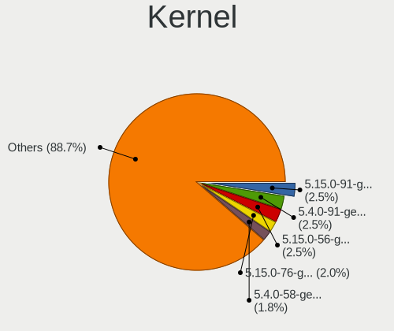
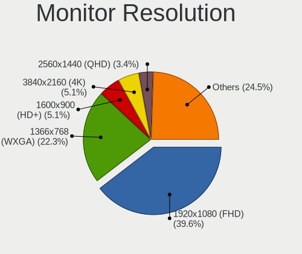
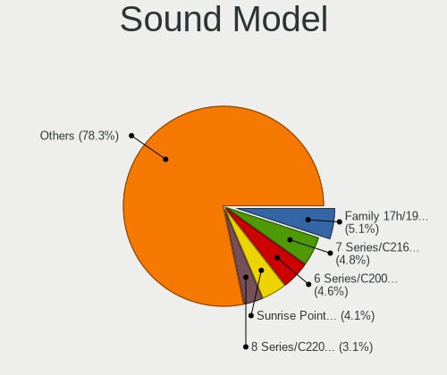

Linux Mint - Tested Hardware & Statistics
-----------------------------------------

A project to collect tested hardware configurations for Linux Mint.

Anyone can contribute to this report by the [hw-probe](https://github.com/linuxhw/hw-probe) tool:

    sudo -E hw-probe -all -upload

Please contribute! Especially if your hardware is rare.

This is a report for all computer types. See also reports for [desktops](/Dist/Linux_Mint/Desktop/README.md) and [notebooks](/Dist/Linux_Mint/Notebook/README.md).

Contents
--------

* [ Test Cases ](#test-cases)

* [ System ](#system)
  - [ OS                       ](#os)
  - [ OS Family                ](#os-family)
  - [ Kernel                   ](#kernel)
  - [ Kernel Family            ](#kernel-family)
  - [ Kernel Major Ver.        ](#kernel-major-ver)
  - [ Arch                     ](#arch)
  - [ DE                       ](#de)
  - [ Display Server           ](#display-server)
  - [ Display Manager          ](#display-manager)
  - [ OS Lang                  ](#os-lang)
  - [ Boot Mode                ](#boot-mode)
  - [ Filesystem               ](#filesystem)
  - [ Part. scheme             ](#part-scheme)
  - [ Dual Boot with Linux/BSD ](#dual-boot-with-linuxbsd)
  - [ Dual Boot (Win)          ](#dual-boot-win)

* [ Board ](#board)
  - [ Vendor                   ](#vendor)
  - [ Model                    ](#model)
  - [ Model Family             ](#model-family)
  - [ MFG Year                 ](#mfg-year)
  - [ Form Factor              ](#form-factor)
  - [ Secure Boot              ](#secure-boot)
  - [ Coreboot                 ](#coreboot)
  - [ RAM Size                 ](#ram-size)
  - [ RAM Used                 ](#ram-used)
  - [ Total Drives             ](#total-drives)
  - [ Has CD-ROM               ](#has-cd-rom)
  - [ Has Ethernet             ](#has-ethernet)
  - [ Has WiFi                 ](#has-wifi)
  - [ Has Bluetooth            ](#has-bluetooth)

* [ Location ](#location)
  - [ Country                  ](#country)
  - [ City                     ](#city)

* [ Drives ](#drives)
  - [ Drive Vendor             ](#drive-vendor)
  - [ Drive Model              ](#drive-model)
  - [ HDD Vendor               ](#hdd-vendor)
  - [ SSD Vendor               ](#ssd-vendor)
  - [ Drive Kind               ](#drive-kind)
  - [ Drive Connector          ](#drive-connector)
  - [ Drive Size               ](#drive-size)
  - [ Space Total              ](#space-total)
  - [ Space Used               ](#space-used)
  - [ Malfunc. Drives          ](#malfunc-drives)
  - [ Malfunc. Drive Vendor    ](#malfunc-drive-vendor)
  - [ Malfunc. HDD Vendor      ](#malfunc-hdd-vendor)
  - [ Malfunc. Drive Kind      ](#malfunc-drive-kind)
  - [ Failed Drives            ](#failed-drives)
  - [ Failed Drive Vendor      ](#failed-drive-vendor)
  - [ Drive Status             ](#drive-status)

* [ Storage controller ](#storage-controller)
  - [ Storage Vendor           ](#storage-vendor)
  - [ Storage Model            ](#storage-model)
  - [ Storage Kind             ](#storage-kind)

* [ Processor ](#processor)
  - [ CPU Vendor               ](#cpu-vendor)
  - [ CPU Model                ](#cpu-model)
  - [ CPU Model Family         ](#cpu-model-family)
  - [ CPU Cores                ](#cpu-cores)
  - [ CPU Sockets              ](#cpu-sockets)
  - [ CPU Threads              ](#cpu-threads)
  - [ CPU Op-Modes             ](#cpu-op-modes)
  - [ CPU Microcode            ](#cpu-microcode)
  - [ CPU Microarch            ](#cpu-microarch)

* [ Graphics ](#graphics)
  - [ GPU Vendor               ](#gpu-vendor)
  - [ GPU Model                ](#gpu-model)
  - [ GPU Combo                ](#gpu-combo)
  - [ GPU Driver               ](#gpu-driver)
  - [ GPU Memory               ](#gpu-memory)

* [ Monitor ](#monitor)
  - [ Monitor Vendor           ](#monitor-vendor)
  - [ Monitor Model            ](#monitor-model)
  - [ Monitor Resolution       ](#monitor-resolution)
  - [ Monitor Diagonal         ](#monitor-diagonal)
  - [ Monitor Width            ](#monitor-width)
  - [ Aspect Ratio             ](#aspect-ratio)
  - [ Monitor Area             ](#monitor-area)
  - [ Pixel Density            ](#pixel-density)
  - [ Multiple Monitors        ](#multiple-monitors)

* [ Network ](#network)
  - [ Net Controller Vendor    ](#net-controller-vendor)
  - [ Net Controller Model     ](#net-controller-model)
  - [ Wireless Vendor          ](#wireless-vendor)
  - [ Wireless Model           ](#wireless-model)
  - [ Ethernet Vendor          ](#ethernet-vendor)
  - [ Ethernet Model           ](#ethernet-model)
  - [ Net Controller Kind      ](#net-controller-kind)
  - [ Used Controller          ](#used-controller)
  - [ NICs                     ](#nics)
  - [ IPv6                     ](#ipv6)

* [ Bluetooth ](#bluetooth)
  - [ Bluetooth Vendor         ](#bluetooth-vendor)
  - [ Bluetooth Model          ](#bluetooth-model)

* [ Sound ](#sound)
  - [ Sound Vendor             ](#sound-vendor)
  - [ Sound Model              ](#sound-model)

* [ Memory ](#memory)
  - [ Memory Vendor            ](#memory-vendor)
  - [ Memory Model             ](#memory-model)
  - [ Memory Kind              ](#memory-kind)
  - [ Memory Form Factor       ](#memory-form-factor)
  - [ Memory Size              ](#memory-size)
  - [ Memory Speed             ](#memory-speed)

* [ Printers & scanners ](#printers--scanners)
  - [ Printer Vendor           ](#printer-vendor)
  - [ Printer Model            ](#printer-model)
  - [ Scanner Vendor           ](#scanner-vendor)
  - [ Scanner Model            ](#scanner-model)

* [ Camera ](#camera)
  - [ Camera Vendor            ](#camera-vendor)
  - [ Camera Model             ](#camera-model)

* [ Security ](#security)
  - [ Fingerprint Vendor       ](#fingerprint-vendor)
  - [ Fingerprint Model        ](#fingerprint-model)
  - [ Chipcard Vendor          ](#chipcard-vendor)
  - [ Chipcard Model           ](#chipcard-model)

* [ Unsupported ](#unsupported)
  - [ Unsupported Devices      ](#unsupported-devices)
  - [ Unsupported Device Types ](#unsupported-device-types)

Test Cases
----------

Total: 28311

| Vendor        | Model                       | Form-Factor | Probe                                                      | Date         |
|---------------|-----------------------------|-------------|------------------------------------------------------------|--------------|
| Lenovo        | V15 G4 IRU 83A1             | Notebook    | [c71241f73d](https://linux-hardware.org/?probe=c71241f73d) | Oct 01, 2023 |
| Lenovo        | V15 G4 IRU 83A1             | Notebook    | [b1af5494c8](https://linux-hardware.org/?probe=b1af5494c8) | Oct 01, 2023 |
| Panasonic     | CFSZ5-3                     | Notebook    | [9d0b849593](https://linux-hardware.org/?probe=9d0b849593) | Oct 01, 2023 |
| HP            | EliteBook 840 G8 Noteboo... | Notebook    | [9121e2ab8d](https://linux-hardware.org/?probe=9121e2ab8d) | Oct 01, 2023 |
| Panasonic     | CFSZ5-3                     | Notebook    | [f2c369cb00](https://linux-hardware.org/?probe=f2c369cb00) | Oct 01, 2023 |
| Lenovo        | Legion 5 Pro 16ITH6H 82J... | Notebook    | [61a08e5e89](https://linux-hardware.org/?probe=61a08e5e89) | Oct 01, 2023 |
| Apple         | Mac-942B59F58194171B iMa... | All in one  | [1204d2da33](https://linux-hardware.org/?probe=1204d2da33) | Sep 30, 2023 |
| HP            | Laptop 17-cn2xxx            | Notebook    | [4a15c84784](https://linux-hardware.org/?probe=4a15c84784) | Sep 30, 2023 |
| Lenovo        | ThinkPad Yoga 370 20JJS0... | Convertible | [e6e1c9bac9](https://linux-hardware.org/?probe=e6e1c9bac9) | Sep 30, 2023 |
| ASUSTek       | Zenbook UX562UG_UM562UG     | Convertible | [12b00e912f](https://linux-hardware.org/?probe=12b00e912f) | Sep 30, 2023 |
| ASUSTek       | Zenbook UX562UG_UM562UG     | Convertible | [2f6c62d407](https://linux-hardware.org/?probe=2f6c62d407) | Sep 30, 2023 |
| Lenovo        | G505s 20255                 | Notebook    | [58a1c6e106](https://linux-hardware.org/?probe=58a1c6e106) | Sep 30, 2023 |
| ASUSTek       | A55BM-K                     | Desktop     | [532e0b0654](https://linux-hardware.org/?probe=532e0b0654) | Sep 30, 2023 |
| ASRock        | B75 Pro3-M                  | Desktop     | [05c68ef556](https://linux-hardware.org/?probe=05c68ef556) | Sep 30, 2023 |
| ASRock        | H61M-DGS R2.0               | Desktop     | [6074f655ad](https://linux-hardware.org/?probe=6074f655ad) | Sep 30, 2023 |
| Lenovo        | IdeaPad Y700-15ISK 80NV     | Notebook    | [d180995f93](https://linux-hardware.org/?probe=d180995f93) | Sep 30, 2023 |
| ASUSTek       | P8H77-M PRO                 | Desktop     | [63c99972d1](https://linux-hardware.org/?probe=63c99972d1) | Sep 30, 2023 |
| HP            | Pavilion Gaming Laptop 1... | Notebook    | [b3959728d3](https://linux-hardware.org/?probe=b3959728d3) | Sep 30, 2023 |
| Acer          | Aspire E5-571G              | Notebook    | [b223d9b4f5](https://linux-hardware.org/?probe=b223d9b4f5) | Sep 30, 2023 |
| Lenovo        | ThinkPad Edge E530 62722... | Notebook    | [681d3e6c86](https://linux-hardware.org/?probe=681d3e6c86) | Sep 30, 2023 |
| HP            | ProBook 645 G1              | Notebook    | [f5f538105c](https://linux-hardware.org/?probe=f5f538105c) | Sep 30, 2023 |
| Toshiba       | QOSMIO X770                 | Notebook    | [c747b27390](https://linux-hardware.org/?probe=c747b27390) | Sep 30, 2023 |
| Dell          | Latitude 7390               | Notebook    | [bd6d90d41e](https://linux-hardware.org/?probe=bd6d90d41e) | Sep 30, 2023 |
| Unknown       | Phitronics N68C-M           | Desktop     | [72b5c903d3](https://linux-hardware.org/?probe=72b5c903d3) | Sep 30, 2023 |
| Acer          | Aspire 7741                 | Notebook    | [80d27e2808](https://linux-hardware.org/?probe=80d27e2808) | Sep 30, 2023 |
| HP            | ZBook Studio G5             | Notebook    | [3f96bd2883](https://linux-hardware.org/?probe=3f96bd2883) | Sep 30, 2023 |
| ASUSTek       | ROG Strix G713PI_G713PI     | Notebook    | [a3af35a207](https://linux-hardware.org/?probe=a3af35a207) | Sep 29, 2023 |
| ASUSTek       | P5B                         | Desktop     | [cb521fc290](https://linux-hardware.org/?probe=cb521fc290) | Sep 29, 2023 |
| Sony          | VPCEB4J0E                   | Notebook    | [05864978df](https://linux-hardware.org/?probe=05864978df) | Sep 29, 2023 |
| Dell          | 0Y2K8N A01                  | Desktop     | [46ac9f9904](https://linux-hardware.org/?probe=46ac9f9904) | Sep 29, 2023 |
| Lenovo        | Legion 5 Pro 16ITH6H 82J... | Notebook    | [6e7e482b2d](https://linux-hardware.org/?probe=6e7e482b2d) | Sep 29, 2023 |
| Tectoy        | Pense Bem Notebook          | Notebook    | [6a6e6af34c](https://linux-hardware.org/?probe=6a6e6af34c) | Sep 29, 2023 |
| ASUSTek       | A5401WRP                    | All in one  | [354c1dc0ba](https://linux-hardware.org/?probe=354c1dc0ba) | Sep 29, 2023 |
| Lenovo        | 1038 NO DPK                 | Server      | [d74284aa9f](https://linux-hardware.org/?probe=d74284aa9f) | Sep 29, 2023 |
| Intel         | D33217CK G76541-302         | Desktop     | [d1aab6a8d0](https://linux-hardware.org/?probe=d1aab6a8d0) | Sep 29, 2023 |
| Dell          | XPS 13 9380                 | Notebook    | [9c2ba935b9](https://linux-hardware.org/?probe=9c2ba935b9) | Sep 29, 2023 |
| ASUSTek       | K55VJ                       | Notebook    | [4befa6db63](https://linux-hardware.org/?probe=4befa6db63) | Sep 29, 2023 |
| MSI           | MAG B650 TOMAHAWK WIFI      | Desktop     | [f79a27e406](https://linux-hardware.org/?probe=f79a27e406) | Sep 29, 2023 |
| HP            | ZBook Studio G5             | Notebook    | [239b5a3fd5](https://linux-hardware.org/?probe=239b5a3fd5) | Sep 29, 2023 |
| MSI           | MAG B550M MORTAR            | Desktop     | [ed0e5eee5a](https://linux-hardware.org/?probe=ed0e5eee5a) | Sep 29, 2023 |
| Acer          | Swift SF114-34              | Notebook    | [9d618e345a](https://linux-hardware.org/?probe=9d618e345a) | Sep 29, 2023 |
| Dell          | Latitude E5450              | Notebook    | [0b77908612](https://linux-hardware.org/?probe=0b77908612) | Sep 29, 2023 |
| ASUSTek       | PRIME B450M-A II            | Desktop     | [0e4e90fac1](https://linux-hardware.org/?probe=0e4e90fac1) | Sep 29, 2023 |
| Lenovo        | 312A SDK0J40697 WIN 3305... | Desktop     | [7c8b825512](https://linux-hardware.org/?probe=7c8b825512) | Sep 29, 2023 |
| Dell          | Inspiron 7548               | Notebook    | [2c407b4ff5](https://linux-hardware.org/?probe=2c407b4ff5) | Sep 29, 2023 |
| Packard Be... | EasyNote TK36               | Notebook    | [1e8f79c726](https://linux-hardware.org/?probe=1e8f79c726) | Sep 29, 2023 |
| Lenovo        | ThinkPad T420s 4174PEG      | Notebook    | [cf650bb4af](https://linux-hardware.org/?probe=cf650bb4af) | Sep 29, 2023 |
| Toshiba       | Satellite P50-B-117         | Notebook    | [cecfba4e8f](https://linux-hardware.org/?probe=cecfba4e8f) | Sep 28, 2023 |
| Lenovo        | IdeaPad Y530                | Notebook    | [83a6d1b19b](https://linux-hardware.org/?probe=83a6d1b19b) | Sep 28, 2023 |
| Dell          | Latitude E6420              | Notebook    | [935d96843b](https://linux-hardware.org/?probe=935d96843b) | Sep 28, 2023 |
| Fujitsu       | D3222-A1 S26361-D3222-A1    | Desktop     | [a40dc4964e](https://linux-hardware.org/?probe=a40dc4964e) | Sep 28, 2023 |
| Biostar       | B450MH                      | Desktop     | [e932e22b99](https://linux-hardware.org/?probe=e932e22b99) | Sep 28, 2023 |
| HP            | OMEN Laptop 15-en1xxx       | Notebook    | [0a51882a60](https://linux-hardware.org/?probe=0a51882a60) | Sep 28, 2023 |
| HP            | OMEN Laptop 15-en1xxx       | Notebook    | [96ee1b2b2a](https://linux-hardware.org/?probe=96ee1b2b2a) | Sep 28, 2023 |
| HP            | Pavilion Laptop 14-ce3xx... | Notebook    | [3ecf3ff165](https://linux-hardware.org/?probe=3ecf3ff165) | Sep 28, 2023 |
| HP            | Pavilion Laptop 14-ce3xx... | Notebook    | [4c8dbd0780](https://linux-hardware.org/?probe=4c8dbd0780) | Sep 28, 2023 |
| Lenovo        | IdeaPad 3 14ALC6 82KT       | Notebook    | [dcf11408af](https://linux-hardware.org/?probe=dcf11408af) | Sep 28, 2023 |
| HP            | 843C                        | Desktop     | [4af4a9e798](https://linux-hardware.org/?probe=4af4a9e798) | Sep 28, 2023 |
| ASUSTek       | UX330CAK                    | Notebook    | [97bb5f9ea1](https://linux-hardware.org/?probe=97bb5f9ea1) | Sep 28, 2023 |
| Packard Be... | DOT S                       | Notebook    | [ccf952e34c](https://linux-hardware.org/?probe=ccf952e34c) | Sep 28, 2023 |
| Lenovo        | IdeaPad Gaming 3 15ACH6 ... | Notebook    | [426e8bd9c0](https://linux-hardware.org/?probe=426e8bd9c0) | Sep 28, 2023 |
| HP            | Victus by Gaming Laptop ... | Notebook    | [3c4c65947a](https://linux-hardware.org/?probe=3c4c65947a) | Sep 28, 2023 |
| Dell          | Inspiron 15-3567            | Notebook    | [d53c8ae481](https://linux-hardware.org/?probe=d53c8ae481) | Sep 28, 2023 |
| Dell          | XPS 17 9700                 | Notebook    | [38196b3712](https://linux-hardware.org/?probe=38196b3712) | Sep 28, 2023 |
| Packard Be... | EasyNote MH36               | Notebook    | [91fcf40898](https://linux-hardware.org/?probe=91fcf40898) | Sep 28, 2023 |
| ASUSTek       | TUF Gaming B450-PLUS II     | Desktop     | [1f3c152dc3](https://linux-hardware.org/?probe=1f3c152dc3) | Sep 28, 2023 |
| Gigabyte      | F2A88X-D3H                  | Desktop     | [13e1dcb2be](https://linux-hardware.org/?probe=13e1dcb2be) | Sep 28, 2023 |
| HP            | 8265                        | Desktop     | [2ae07c2008](https://linux-hardware.org/?probe=2ae07c2008) | Sep 28, 2023 |
| Intel         | X99H                        | Desktop     | [d5390cf599](https://linux-hardware.org/?probe=d5390cf599) | Sep 28, 2023 |
| Lenovo        | IdeaPad 320-15ABR 80XS      | Notebook    | [61980df9bc](https://linux-hardware.org/?probe=61980df9bc) | Sep 28, 2023 |
| Gigabyte      | P35V3                       | Notebook    | [573f9ea2f5](https://linux-hardware.org/?probe=573f9ea2f5) | Sep 28, 2023 |
| Sony          | VPCEB4J0E                   | Notebook    | [354e2be55e](https://linux-hardware.org/?probe=354e2be55e) | Sep 27, 2023 |
| Positivo      | POS-RIH470EM 11179450       | Desktop     | [cf8e3e73bb](https://linux-hardware.org/?probe=cf8e3e73bb) | Sep 27, 2023 |
| Lenovo        | ThinkPad T430 2349S6S       | Notebook    | [e9b81983f2](https://linux-hardware.org/?probe=e9b81983f2) | Sep 27, 2023 |
| HUAWEI        | BOM-WXX9                    | Notebook    | [b5ce99a949](https://linux-hardware.org/?probe=b5ce99a949) | Sep 27, 2023 |
| Lenovo        | ThinkPad T480 20L6S5M000    | Notebook    | [58ddf5337a](https://linux-hardware.org/?probe=58ddf5337a) | Sep 27, 2023 |
| Apple         | Mac-35C5E08120C7EEAF Mac... | Mini pc     | [dd7145f468](https://linux-hardware.org/?probe=dd7145f468) | Sep 27, 2023 |
| Toshiba       | Satellite P50-B-117         | Notebook    | [3931144171](https://linux-hardware.org/?probe=3931144171) | Sep 27, 2023 |
| Lenovo        | S10-3c 20074                | Notebook    | [b8adc3cf3e](https://linux-hardware.org/?probe=b8adc3cf3e) | Sep 27, 2023 |
| Lenovo        | 310B SDK0J40697 WIN 3305... | Mini pc     | [5991ea82e7](https://linux-hardware.org/?probe=5991ea82e7) | Sep 27, 2023 |
| HP            | 2ADE                        | Desktop     | [b701a5c589](https://linux-hardware.org/?probe=b701a5c589) | Sep 27, 2023 |
| Dell          | XPS 17 9700                 | Notebook    | [c341826b7a](https://linux-hardware.org/?probe=c341826b7a) | Sep 27, 2023 |
| HP            | 3398                        | Desktop     | [fed07fc26f](https://linux-hardware.org/?probe=fed07fc26f) | Sep 27, 2023 |
| HP            | 3398                        | Desktop     | [5f4cd7d05b](https://linux-hardware.org/?probe=5f4cd7d05b) | Sep 27, 2023 |
| ASUSTek       | PRIME B450M-A II            | Desktop     | [8e70938939](https://linux-hardware.org/?probe=8e70938939) | Sep 27, 2023 |
| Acer          | Nitro AN515-44              | Notebook    | [0ba9157463](https://linux-hardware.org/?probe=0ba9157463) | Sep 27, 2023 |
| Acer          | Aspire A315-53              | Notebook    | [c20a9f8f96](https://linux-hardware.org/?probe=c20a9f8f96) | Sep 27, 2023 |
| Chuwi         | GemiBook Pro                | Notebook    | [4ea2bab759](https://linux-hardware.org/?probe=4ea2bab759) | Sep 27, 2023 |
| Gigabyte      | B550 GAMING X V2            | Desktop     | [d656cacdd8](https://linux-hardware.org/?probe=d656cacdd8) | Sep 26, 2023 |
| AZW           | Green G2                    | Desktop     | [cb9b97f24b](https://linux-hardware.org/?probe=cb9b97f24b) | Sep 26, 2023 |
| Lenovo        | IdeaPad Duet 3 10IGL5-LT... | Tablet      | [d0b85eac7a](https://linux-hardware.org/?probe=d0b85eac7a) | Sep 26, 2023 |
| Apple         | Mac-F226BEC8 PVT            | All in one  | [2bdd48e441](https://linux-hardware.org/?probe=2bdd48e441) | Sep 26, 2023 |
| ASUSTek       | Rampage IV EXTREME          | Desktop     | [def181c0e4](https://linux-hardware.org/?probe=def181c0e4) | Sep 26, 2023 |
| HP            | Pavilion dv6                | Notebook    | [5eaa895f6e](https://linux-hardware.org/?probe=5eaa895f6e) | Sep 26, 2023 |
| HP            | Pavilion dv6                | Notebook    | [f785da65ca](https://linux-hardware.org/?probe=f785da65ca) | Sep 26, 2023 |
| Apple         | Mac-77F17D7DA9285301 iMa... | All in one  | [81540c48ee](https://linux-hardware.org/?probe=81540c48ee) | Sep 26, 2023 |
| Lenovo        | ThinkPad T480s 20L8S77U1... | Notebook    | [4a3185fd78](https://linux-hardware.org/?probe=4a3185fd78) | Sep 26, 2023 |
| Acer          | Swift SF314-512             | Notebook    | [afdb68ccfe](https://linux-hardware.org/?probe=afdb68ccfe) | Sep 26, 2023 |
| ASUSTek       | PRIME B450M-A II            | Desktop     | [d94b85c889](https://linux-hardware.org/?probe=d94b85c889) | Sep 26, 2023 |
| Acer          | Swift SF314-512             | Notebook    | [d6982725f2](https://linux-hardware.org/?probe=d6982725f2) | Sep 26, 2023 |
| ASRock        | H61M-DGS R2.0               | Desktop     | [5ace4ce0ad](https://linux-hardware.org/?probe=5ace4ce0ad) | Sep 26, 2023 |
| Gigabyte      | GA-MA790XT-UD4P             | Desktop     | [3e59f9341a](https://linux-hardware.org/?probe=3e59f9341a) | Sep 26, 2023 |
| HP            | ZBook Studio x360 G5        | Convertible | [dd0d8dda44](https://linux-hardware.org/?probe=dd0d8dda44) | Sep 26, 2023 |
| HP            | ProBook 430 G3              | Notebook    | [cc34f92566](https://linux-hardware.org/?probe=cc34f92566) | Sep 26, 2023 |
| Lenovo        | IdeaPad S340-15IIL 81WL     | Notebook    | [17bb721483](https://linux-hardware.org/?probe=17bb721483) | Sep 26, 2023 |
| AIR           | CX28000W                    | Notebook    | [b4a65a0403](https://linux-hardware.org/?probe=b4a65a0403) | Sep 26, 2023 |
| Apple         | Mac-FFE5EF870D7BA81A iMa... | All in one  | [bd541ed832](https://linux-hardware.org/?probe=bd541ed832) | Sep 26, 2023 |
| Acer          | Aspire 5750                 | Notebook    | [89dc9a349f](https://linux-hardware.org/?probe=89dc9a349f) | Sep 26, 2023 |
| Lenovo        | ThinkPad T430 2347H6U       | Notebook    | [7fc871cd5e](https://linux-hardware.org/?probe=7fc871cd5e) | Sep 26, 2023 |
| ASRock        | H61M-HVS                    | Desktop     | [44c939ded2](https://linux-hardware.org/?probe=44c939ded2) | Sep 26, 2023 |
| ASRock        | H61M-HVS                    | Desktop     | [79309ad820](https://linux-hardware.org/?probe=79309ad820) | Sep 26, 2023 |
| BESSTAR Te... | UM700                       | Desktop     | [efd53d662d](https://linux-hardware.org/?probe=efd53d662d) | Sep 25, 2023 |
| Acer          | Extensa 5635Z               | Notebook    | [19afe08920](https://linux-hardware.org/?probe=19afe08920) | Sep 25, 2023 |
| Microsoft     | Surface Pro 7+              | Tablet      | [d823ee6c59](https://linux-hardware.org/?probe=d823ee6c59) | Sep 25, 2023 |
| Samsung       | 300E5M/300E5L               | Notebook    | [1df46b6215](https://linux-hardware.org/?probe=1df46b6215) | Sep 25, 2023 |
| ASUSTek       | P7P55D LE                   | Desktop     | [f47493454f](https://linux-hardware.org/?probe=f47493454f) | Sep 25, 2023 |
| Google        | Banon                       | Notebook    | [172d512653](https://linux-hardware.org/?probe=172d512653) | Sep 25, 2023 |
| Google        | Banon                       | Notebook    | [0766aa6565](https://linux-hardware.org/?probe=0766aa6565) | Sep 25, 2023 |
| HP            | Notebook                    | Notebook    | [b59281115b](https://linux-hardware.org/?probe=b59281115b) | Sep 25, 2023 |
| ASUSTek       | H81I-PLUS                   | Desktop     | [e7a6f47b2f](https://linux-hardware.org/?probe=e7a6f47b2f) | Sep 25, 2023 |
| HP            | Notebook                    | Notebook    | [896e2216de](https://linux-hardware.org/?probe=896e2216de) | Sep 25, 2023 |
| ASUSTek       | H81I-PLUS                   | Desktop     | [8b10c3ad64](https://linux-hardware.org/?probe=8b10c3ad64) | Sep 25, 2023 |
| HP            | 2ADE                        | Desktop     | [ec7d683b49](https://linux-hardware.org/?probe=ec7d683b49) | Sep 25, 2023 |
| Acer          | Aspire A315-510P            | Notebook    | [794f8f35c8](https://linux-hardware.org/?probe=794f8f35c8) | Sep 25, 2023 |
| Acer          | Aspire A315-510P            | Notebook    | [89ba5bd7dd](https://linux-hardware.org/?probe=89ba5bd7dd) | Sep 25, 2023 |
| AMI           | Aptio CRB                   | Mini pc     | [3ff47e3efd](https://linux-hardware.org/?probe=3ff47e3efd) | Sep 25, 2023 |
| HP            | Laptop 17-ca0xxx            | Notebook    | [b094bb2ed3](https://linux-hardware.org/?probe=b094bb2ed3) | Sep 25, 2023 |
| Samsung       | 300E5M/300E5L               | Notebook    | [1d90b7b714](https://linux-hardware.org/?probe=1d90b7b714) | Sep 25, 2023 |
| Acer          | Nitro AN515-58              | Notebook    | [0c17f26ed8](https://linux-hardware.org/?probe=0c17f26ed8) | Sep 25, 2023 |
| Samsung       | N102SP/N100SP/N101SP        | Notebook    | [1aee55feca](https://linux-hardware.org/?probe=1aee55feca) | Sep 25, 2023 |
| HP            | Presario CQ43               | Notebook    | [b2663eb2fa](https://linux-hardware.org/?probe=b2663eb2fa) | Sep 25, 2023 |
| Gigabyte      | H310M M.2 x.x               | Desktop     | [69cccf347a](https://linux-hardware.org/?probe=69cccf347a) | Sep 25, 2023 |
| HP            | 0B4Ch D                     | Desktop     | [8aeccd1d55](https://linux-hardware.org/?probe=8aeccd1d55) | Sep 25, 2023 |
| Gigabyte      | 970A-DS3P                   | Desktop     | [6dc2bcb097](https://linux-hardware.org/?probe=6dc2bcb097) | Sep 25, 2023 |
| ASUSTek       | X550DP                      | Notebook    | [a743f84823](https://linux-hardware.org/?probe=a743f84823) | Sep 24, 2023 |
| ASUSTek       | P8H77-M PRO                 | Desktop     | [3afc2a0804](https://linux-hardware.org/?probe=3afc2a0804) | Sep 24, 2023 |
| Lenovo        | IdeaPad 330-17AST 81D7      | Notebook    | [0b8e5fc8d0](https://linux-hardware.org/?probe=0b8e5fc8d0) | Sep 24, 2023 |
| ASUSTek       | K55VM                       | Notebook    | [3dd45a6297](https://linux-hardware.org/?probe=3dd45a6297) | Sep 24, 2023 |
| HP            | Pavilion Laptop 15-eh2xx... | Notebook    | [b42e3e4395](https://linux-hardware.org/?probe=b42e3e4395) | Sep 24, 2023 |
| Lenovo        | ThinkPad T60 2623DAU        | Notebook    | [b5edbc8fbf](https://linux-hardware.org/?probe=b5edbc8fbf) | Sep 24, 2023 |
| Lenovo        | ThinkPad T60 2623DAU        | Notebook    | [144d6b3290](https://linux-hardware.org/?probe=144d6b3290) | Sep 24, 2023 |
| HP            | ProBook 6545b               | Notebook    | [b0abb62083](https://linux-hardware.org/?probe=b0abb62083) | Sep 24, 2023 |
| TrekStor      | Primebook P14               | Notebook    | [6664054d96](https://linux-hardware.org/?probe=6664054d96) | Sep 24, 2023 |
| Acer          | Aspire R3-131T              | Notebook    | [bf8f7a55ae](https://linux-hardware.org/?probe=bf8f7a55ae) | Sep 24, 2023 |
| Acer          | Aspire R3-131T              | Notebook    | [a426f4a94e](https://linux-hardware.org/?probe=a426f4a94e) | Sep 24, 2023 |
| Foxconn       | H67MP-S/-V/H67MP            | Desktop     | [67b0050938](https://linux-hardware.org/?probe=67b0050938) | Sep 24, 2023 |
| Lenovo        | ThinkPad T470s 20HGS0YE0... | Notebook    | [20c9a90aca](https://linux-hardware.org/?probe=20c9a90aca) | Sep 24, 2023 |
| ASUSTek       | PRIME X370-PRO              | Desktop     | [da4274c691](https://linux-hardware.org/?probe=da4274c691) | Sep 24, 2023 |
| HP            | 18E7                        | Desktop     | [6257920a37](https://linux-hardware.org/?probe=6257920a37) | Sep 24, 2023 |
| HUAWEI        | BOD-WXX9                    | Notebook    | [e688665729](https://linux-hardware.org/?probe=e688665729) | Sep 24, 2023 |
| Timi          | TM1701                      | Notebook    | [0e127afa68](https://linux-hardware.org/?probe=0e127afa68) | Sep 24, 2023 |
| Dell          | Latitude E5270              | Notebook    | [d091c4fa0e](https://linux-hardware.org/?probe=d091c4fa0e) | Sep 24, 2023 |
| HP            | 843B                        | Desktop     | [4e11e8ae1a](https://linux-hardware.org/?probe=4e11e8ae1a) | Sep 24, 2023 |
| Dell          | Latitude 7430               | Notebook    | [eb37e129e6](https://linux-hardware.org/?probe=eb37e129e6) | Sep 24, 2023 |
| MSI           | B550-A PRO                  | Desktop     | [3fce945550](https://linux-hardware.org/?probe=3fce945550) | Sep 23, 2023 |
| Lenovo        | 364F SDK0J40700 WIN 3258... | Desktop     | [de5a55aa7b](https://linux-hardware.org/?probe=de5a55aa7b) | Sep 23, 2023 |
| ASRock        | N68C-GS FX                  | Desktop     | [f1d9cc16ad](https://linux-hardware.org/?probe=f1d9cc16ad) | Sep 23, 2023 |
| HP            | 81C9                        | Desktop     | [12bbb1608c](https://linux-hardware.org/?probe=12bbb1608c) | Sep 23, 2023 |
| HP            | Laptop 15-bs0xx             | Notebook    | [21620e61e1](https://linux-hardware.org/?probe=21620e61e1) | Sep 23, 2023 |
| Lenovo        | IdeaPad 330S-15ARR 81FB     | Notebook    | [b61b5cb7e3](https://linux-hardware.org/?probe=b61b5cb7e3) | Sep 23, 2023 |
| HP            | 1494                        | Desktop     | [bb1123c49e](https://linux-hardware.org/?probe=bb1123c49e) | Sep 23, 2023 |
| Dell          | Inspiron 1564               | Notebook    | [f4232cfca8](https://linux-hardware.org/?probe=f4232cfca8) | Sep 23, 2023 |
| BESSTAR Te... | HM80                        | Desktop     | [909cdffc4d](https://linux-hardware.org/?probe=909cdffc4d) | Sep 23, 2023 |
| Dell          | Latitude 3410               | Notebook    | [c5473f5f6c](https://linux-hardware.org/?probe=c5473f5f6c) | Sep 23, 2023 |
| HP            | 255 G8 Notebook PC          | Notebook    | [7fcb0a9529](https://linux-hardware.org/?probe=7fcb0a9529) | Sep 23, 2023 |
| Lenovo        | IdeaPad S145-15IIL 81W8     | Notebook    | [1809080d01](https://linux-hardware.org/?probe=1809080d01) | Sep 23, 2023 |
| Lenovo        | Y50-70 20378                | Notebook    | [d967e2d2a3](https://linux-hardware.org/?probe=d967e2d2a3) | Sep 23, 2023 |
| Lenovo        | Y50-70 20378                | Notebook    | [477998353b](https://linux-hardware.org/?probe=477998353b) | Sep 23, 2023 |
| HP            | Presario CQ43               | Notebook    | [d5ee5e4318](https://linux-hardware.org/?probe=d5ee5e4318) | Sep 23, 2023 |
| Dell          | Inspiron 1564               | Notebook    | [c84457748d](https://linux-hardware.org/?probe=c84457748d) | Sep 23, 2023 |
| Acer          | Aspire E5-574G              | Notebook    | [7ca9ce046e](https://linux-hardware.org/?probe=7ca9ce046e) | Sep 23, 2023 |
| HP            | 2B34                        | Desktop     | [101780dee0](https://linux-hardware.org/?probe=101780dee0) | Sep 23, 2023 |
| MSI           | B460M PRO-VDH               | Desktop     | [c5429120bb](https://linux-hardware.org/?probe=c5429120bb) | Sep 23, 2023 |
| HP            | Laptop 17-bs1xx             | Notebook    | [eb600e003d](https://linux-hardware.org/?probe=eb600e003d) | Sep 23, 2023 |
| Microsoft     | Surface Book 3              | Tablet      | [3445512eea](https://linux-hardware.org/?probe=3445512eea) | Sep 23, 2023 |
| HP            | 1494                        | Desktop     | [0e1ff4e8d5](https://linux-hardware.org/?probe=0e1ff4e8d5) | Sep 23, 2023 |
| HUAWEI        | BOM-WXX9                    | Notebook    | [830bf573b1](https://linux-hardware.org/?probe=830bf573b1) | Sep 23, 2023 |
| Turbo-X       | III_IPS64gb                 | Notebook    | [82a144fc1a](https://linux-hardware.org/?probe=82a144fc1a) | Sep 22, 2023 |
| ASRock        | Z68 Pro3                    | Desktop     | [6f9b69be0e](https://linux-hardware.org/?probe=6f9b69be0e) | Sep 22, 2023 |
| Gigabyte      | B550 AORUS PRO V2           | Desktop     | [c545236a4c](https://linux-hardware.org/?probe=c545236a4c) | Sep 22, 2023 |
| Lenovo        | ThinkPad X1 Yoga 3rd 20L... | Convertible | [fd0da8d5ba](https://linux-hardware.org/?probe=fd0da8d5ba) | Sep 22, 2023 |
| ASUSTek       | PRIME X370-PRO              | Desktop     | [759b15046b](https://linux-hardware.org/?probe=759b15046b) | Sep 22, 2023 |
| ASRock        | B450 Pro4                   | Desktop     | [667afb7552](https://linux-hardware.org/?probe=667afb7552) | Sep 22, 2023 |
| HP            | 1998                        | Desktop     | [f2c4af4cb6](https://linux-hardware.org/?probe=f2c4af4cb6) | Sep 22, 2023 |
| HP            | 1998                        | Desktop     | [ef51f7d583](https://linux-hardware.org/?probe=ef51f7d583) | Sep 22, 2023 |
| Gigabyte      | GA-880GMA-UD2H              | Desktop     | [20d494d943](https://linux-hardware.org/?probe=20d494d943) | Sep 22, 2023 |
| Gigabyte      | GA-880GMA-UD2H              | Desktop     | [6e8c507d61](https://linux-hardware.org/?probe=6e8c507d61) | Sep 22, 2023 |
| ASUSTek       | PRIME B365M-A               | Desktop     | [17bbb23241](https://linux-hardware.org/?probe=17bbb23241) | Sep 22, 2023 |
| HP            | EliteBook x360 1040 G6      | Convertible | [bdd8beafed](https://linux-hardware.org/?probe=bdd8beafed) | Sep 22, 2023 |
| Dell          | 0X2MKR A00                  | All in one  | [d141e26999](https://linux-hardware.org/?probe=d141e26999) | Sep 22, 2023 |
| HP            | ProBook 430 G3              | Notebook    | [67ac6fc0d9](https://linux-hardware.org/?probe=67ac6fc0d9) | Sep 22, 2023 |
| HP            | ProBook 430 G3              | Notebook    | [519a567ecb](https://linux-hardware.org/?probe=519a567ecb) | Sep 22, 2023 |
| Lenovo        | ThinkPad X1 Yoga 4th 20Q... | Convertible | [4c12bddd77](https://linux-hardware.org/?probe=4c12bddd77) | Sep 22, 2023 |
| Lenovo        | ThinkPad X1 Yoga 4th 20Q... | Convertible | [80e28a9df2](https://linux-hardware.org/?probe=80e28a9df2) | Sep 22, 2023 |
| Dell          | 0Y2MRG A00                  | Desktop     | [c5880f7fa9](https://linux-hardware.org/?probe=c5880f7fa9) | Sep 22, 2023 |
| Gigabyte      | F2A88X-D3H                  | Desktop     | [106ba73af5](https://linux-hardware.org/?probe=106ba73af5) | Sep 22, 2023 |
| ASRock        | Z68 Pro3                    | Desktop     | [19c8215a05](https://linux-hardware.org/?probe=19c8215a05) | Sep 22, 2023 |
| ASRock        | H61M-DGS R2.0               | Desktop     | [96847f97e6](https://linux-hardware.org/?probe=96847f97e6) | Sep 21, 2023 |
| Acer          | Aspire 7520                 | Notebook    | [5e16126a55](https://linux-hardware.org/?probe=5e16126a55) | Sep 21, 2023 |
| Packard Be... | EasyNote TE11HC             | Notebook    | [0d897e53cf](https://linux-hardware.org/?probe=0d897e53cf) | Sep 21, 2023 |
| PC Special... | Ionico 16                   | Notebook    | [dd18901106](https://linux-hardware.org/?probe=dd18901106) | Sep 21, 2023 |
| ASRock        | H310M-HDV                   | Desktop     | [0ac59e2ff6](https://linux-hardware.org/?probe=0ac59e2ff6) | Sep 21, 2023 |
| Dell          | Latitude 5420               | Notebook    | [c40b9df526](https://linux-hardware.org/?probe=c40b9df526) | Sep 21, 2023 |
| Dell          | Latitude 5420               | Notebook    | [9caba9ee44](https://linux-hardware.org/?probe=9caba9ee44) | Sep 21, 2023 |
| AMI           | Intel                       | Notebook    | [687044ba01](https://linux-hardware.org/?probe=687044ba01) | Sep 21, 2023 |
| Dell          | Inspiron 3542               | Notebook    | [3e66379f73](https://linux-hardware.org/?probe=3e66379f73) | Sep 21, 2023 |
| ASUSTek       | PRIME X670E-PRO WIFI        | Desktop     | [f87766b547](https://linux-hardware.org/?probe=f87766b547) | Sep 21, 2023 |
| HP            | 0B40h                       | Desktop     | [b9c00a29ab](https://linux-hardware.org/?probe=b9c00a29ab) | Sep 21, 2023 |
| HP            | Pavilion dv7                | Notebook    | [a879a0a88f](https://linux-hardware.org/?probe=a879a0a88f) | Sep 21, 2023 |
| ASUSTek       | PRIME B450M-A II            | Desktop     | [459e666cd3](https://linux-hardware.org/?probe=459e666cd3) | Sep 21, 2023 |
| HP            | 630                         | Notebook    | [1ed6efc4de](https://linux-hardware.org/?probe=1ed6efc4de) | Sep 21, 2023 |
| Samsung       | 550XDA                      | Notebook    | [2d15b3f4ca](https://linux-hardware.org/?probe=2d15b3f4ca) | Sep 21, 2023 |
| HUAWEI        | NBLB-WAX9N                  | Notebook    | [a9cfc8946d](https://linux-hardware.org/?probe=a9cfc8946d) | Sep 21, 2023 |
| Dell          | 08WKV3 A00                  | Desktop     | [55942db040](https://linux-hardware.org/?probe=55942db040) | Sep 21, 2023 |
| Unknown       | Unknown                     | Desktop     | [043be725eb](https://linux-hardware.org/?probe=043be725eb) | Sep 21, 2023 |
| Intel         | H55                         | Desktop     | [03693f8574](https://linux-hardware.org/?probe=03693f8574) | Sep 21, 2023 |
| HP            | Elite x2 1012 G1            | Notebook    | [dbe6ba540f](https://linux-hardware.org/?probe=dbe6ba540f) | Sep 20, 2023 |
| ASUSTek       | PRIME B450M-A II            | Desktop     | [dfb78764ea](https://linux-hardware.org/?probe=dfb78764ea) | Sep 20, 2023 |
| Dell          | Latitude E5550              | Notebook    | [8e67cb247c](https://linux-hardware.org/?probe=8e67cb247c) | Sep 20, 2023 |
| ASRock        | Z270 Extreme4               | Desktop     | [0df72a698a](https://linux-hardware.org/?probe=0df72a698a) | Sep 20, 2023 |
| HP            | Pavilion 17                 | Notebook    | [f95a376481](https://linux-hardware.org/?probe=f95a376481) | Sep 20, 2023 |
| Intel         | DG31PR AAD97573-205         | Desktop     | [a25329cfdb](https://linux-hardware.org/?probe=a25329cfdb) | Sep 20, 2023 |
| ASUSTek       | P7H55-M SI                  | Desktop     | [26648aff1a](https://linux-hardware.org/?probe=26648aff1a) | Sep 20, 2023 |
| Clevo         | E7130                       | Notebook    | [38de5c7699](https://linux-hardware.org/?probe=38de5c7699) | Sep 20, 2023 |
| Acer          | Aspire 7520                 | Notebook    | [bbba1d5ea4](https://linux-hardware.org/?probe=bbba1d5ea4) | Sep 20, 2023 |
| Wortmann      | TERRA_MOBILE_1749           | Notebook    | [869708c900](https://linux-hardware.org/?probe=869708c900) | Sep 20, 2023 |
| Acer          | EG43M                       | Desktop     | [77e78183b9](https://linux-hardware.org/?probe=77e78183b9) | Sep 20, 2023 |
| ASUSTek       | PRIME X570-PRO              | Desktop     | [8b6f78da91](https://linux-hardware.org/?probe=8b6f78da91) | Sep 20, 2023 |
| Dell          | 00V62H A01                  | Desktop     | [71d11373aa](https://linux-hardware.org/?probe=71d11373aa) | Sep 20, 2023 |
| HP            | ProBook 440 14 inch G9 N... | Notebook    | [04cc7d1379](https://linux-hardware.org/?probe=04cc7d1379) | Sep 20, 2023 |
| Apple         | Mac-F2208EC8                | Mini pc     | [8f90540e05](https://linux-hardware.org/?probe=8f90540e05) | Sep 19, 2023 |
| Medion        | Akoya E7416                 | Notebook    | [f820e8515d](https://linux-hardware.org/?probe=f820e8515d) | Sep 19, 2023 |
| MSI           | B350M MORTAR                | Desktop     | [b19e745af2](https://linux-hardware.org/?probe=b19e745af2) | Sep 19, 2023 |
| ASUSTek       | N56VB                       | Notebook    | [e4dae2f7c8](https://linux-hardware.org/?probe=e4dae2f7c8) | Sep 19, 2023 |
| ASUSTek       | N56VB                       | Notebook    | [79e8bd0911](https://linux-hardware.org/?probe=79e8bd0911) | Sep 19, 2023 |
| Acer          | Aspire ES1-571              | Notebook    | [561ce1b44d](https://linux-hardware.org/?probe=561ce1b44d) | Sep 19, 2023 |
| ASUSTek       | K52F                        | Notebook    | [8d4b7a978b](https://linux-hardware.org/?probe=8d4b7a978b) | Sep 19, 2023 |
| HUAWEI        | KLVL-WXXW                   | Notebook    | [efed6450c5](https://linux-hardware.org/?probe=efed6450c5) | Sep 19, 2023 |
| Dell          | Latitude E5540              | Notebook    | [759aeff4ee](https://linux-hardware.org/?probe=759aeff4ee) | Sep 19, 2023 |
| wpc           | zrd616                      | Desktop     | [f218d73abb](https://linux-hardware.org/?probe=f218d73abb) | Sep 19, 2023 |
| Gigabyte      | B550 AORUS ELITE V2         | Desktop     | [c7ab5c00f8](https://linux-hardware.org/?probe=c7ab5c00f8) | Sep 19, 2023 |
| HP            | EliteBook 8570w             | Notebook    | [d90f46756b](https://linux-hardware.org/?probe=d90f46756b) | Sep 19, 2023 |
| Samsung       | 550XDA                      | Notebook    | [763631bfe7](https://linux-hardware.org/?probe=763631bfe7) | Sep 19, 2023 |
| Lenovo        | Aptio CRB SDK0G00599 WIN    | Mini pc     | [d7f55df5b8](https://linux-hardware.org/?probe=d7f55df5b8) | Sep 19, 2023 |
| Lenovo        | IdeaPadFlex 5 14ALC7 82R... | Convertible | [10e40f2aba](https://linux-hardware.org/?probe=10e40f2aba) | Sep 19, 2023 |
| Gigabyte      | A320M-S2H-CF                | Desktop     | [717867b71c](https://linux-hardware.org/?probe=717867b71c) | Sep 19, 2023 |
| ASUSTek       | P5KPL-AM SE                 | Desktop     | [7273c8eb2e](https://linux-hardware.org/?probe=7273c8eb2e) | Sep 19, 2023 |
| Lenovo        | 312A SDK0J40697 WIN 3305... | Desktop     | [49963f0f8a](https://linux-hardware.org/?probe=49963f0f8a) | Sep 19, 2023 |
| HP            | ZBook Studio 16 inch G9 ... | Notebook    | [4bb581fb16](https://linux-hardware.org/?probe=4bb581fb16) | Sep 19, 2023 |
| HP            | 250 G8 Notebook PC          | Notebook    | [f31f049c9c](https://linux-hardware.org/?probe=f31f049c9c) | Sep 19, 2023 |
| ASRock        | 880GMH/U3S3                 | Desktop     | [8b16ba21ae](https://linux-hardware.org/?probe=8b16ba21ae) | Sep 19, 2023 |
| HP            | Pavilion Notebook           | Notebook    | [f93723f676](https://linux-hardware.org/?probe=f93723f676) | Sep 19, 2023 |
| Acer          | Aspire ES1-420              | Notebook    | [db308e1798](https://linux-hardware.org/?probe=db308e1798) | Sep 19, 2023 |
| ASRock        | B450 Steel Legend           | Desktop     | [b294855348](https://linux-hardware.org/?probe=b294855348) | Sep 19, 2023 |
| Dell          | 06CV2N A01                  | Desktop     | [da4e39cb06](https://linux-hardware.org/?probe=da4e39cb06) | Sep 19, 2023 |
| ASUSTek       | P5K-E                       | Desktop     | [233a59e640](https://linux-hardware.org/?probe=233a59e640) | Sep 18, 2023 |
| Lenovo        | IdeaPad 100-15IBD 80QQ      | Notebook    | [c26fb8a8da](https://linux-hardware.org/?probe=c26fb8a8da) | Sep 18, 2023 |
| HP            | Laptop 15-fc0xxx            | Notebook    | [50c2f9349d](https://linux-hardware.org/?probe=50c2f9349d) | Sep 18, 2023 |
| HP            | 82F2                        | Desktop     | [e4fe8b67fc](https://linux-hardware.org/?probe=e4fe8b67fc) | Sep 18, 2023 |
| HP            | ProBook 650 G1              | Notebook    | [06d67bab4a](https://linux-hardware.org/?probe=06d67bab4a) | Sep 18, 2023 |
| ASUSTek       | P5KPL-AM SE                 | Desktop     | [9a7a68b69f](https://linux-hardware.org/?probe=9a7a68b69f) | Sep 18, 2023 |
| Intel         | NUC5i5MYBE H47797-203       | Mini pc     | [c66e0fc949](https://linux-hardware.org/?probe=c66e0fc949) | Sep 18, 2023 |
| Unknown       | Unknown                     | Desktop     | [77f967302f](https://linux-hardware.org/?probe=77f967302f) | Sep 18, 2023 |
| MSI           | PRO B550M-VC WIFI           | Desktop     | [53009e9a02](https://linux-hardware.org/?probe=53009e9a02) | Sep 18, 2023 |
| MSI           | MAG B550 TOMAHAWK           | Desktop     | [f6b5fab580](https://linux-hardware.org/?probe=f6b5fab580) | Sep 18, 2023 |
| Unknown       | Unknown                     | Desktop     | [2d2ec7d22c](https://linux-hardware.org/?probe=2d2ec7d22c) | Sep 18, 2023 |
| Alienware     | 07W25T A00                  | Desktop     | [8a56672ca9](https://linux-hardware.org/?probe=8a56672ca9) | Sep 18, 2023 |
| Unknown       | Unknown                     | Desktop     | [faa59f7ab3](https://linux-hardware.org/?probe=faa59f7ab3) | Sep 18, 2023 |
| Dell          | 0RN4PJ A01                  | Server      | [e0423f2228](https://linux-hardware.org/?probe=e0423f2228) | Sep 18, 2023 |
| HP            | Pavilion Gaming Laptop 1... | Notebook    | [5b5eb2a0a5](https://linux-hardware.org/?probe=5b5eb2a0a5) | Sep 18, 2023 |
| MSI           | MPG Z590 GAMING FORCE       | Desktop     | [0ac4289831](https://linux-hardware.org/?probe=0ac4289831) | Sep 18, 2023 |
| Lenovo        | 30D2 SDK0J40705 WIN 3425... | Desktop     | [4a0a0d006c](https://linux-hardware.org/?probe=4a0a0d006c) | Sep 17, 2023 |
| Lenovo        | Legion 5 17IMH05H 81Y8      | Notebook    | [b9f92fec9c](https://linux-hardware.org/?probe=b9f92fec9c) | Sep 17, 2023 |
| Dell          | Latitude E5430 non-vPro     | Notebook    | [09c45a1e2d](https://linux-hardware.org/?probe=09c45a1e2d) | Sep 17, 2023 |
| Dell          | Inspiron 5559               | Notebook    | [8bf4c79f98](https://linux-hardware.org/?probe=8bf4c79f98) | Sep 17, 2023 |
| Unknown       | M17PRO                      | Notebook    | [ccf362f14d](https://linux-hardware.org/?probe=ccf362f14d) | Sep 17, 2023 |
| Dell          | Latitude E6230              | Notebook    | [b454bff951](https://linux-hardware.org/?probe=b454bff951) | Sep 17, 2023 |
| HP            | OMEN by Gaming Laptop 16... | Notebook    | [f605659353](https://linux-hardware.org/?probe=f605659353) | Sep 17, 2023 |
| Chuwi         | LarkBox X                   | Mini pc     | [9cfb7b262c](https://linux-hardware.org/?probe=9cfb7b262c) | Sep 17, 2023 |
| ASUSTek       | EB1501P                     | Desktop     | [70cb61d1dc](https://linux-hardware.org/?probe=70cb61d1dc) | Sep 17, 2023 |
| HP            | G72                         | Notebook    | [b77f2ba361](https://linux-hardware.org/?probe=b77f2ba361) | Sep 17, 2023 |
| MSI           | GF75 Thin 10SCSR            | Notebook    | [455a5e05f2](https://linux-hardware.org/?probe=455a5e05f2) | Sep 17, 2023 |
| MSI           | MPG Z390 GAMING EDGE AC     | Desktop     | [a0ba042279](https://linux-hardware.org/?probe=a0ba042279) | Sep 17, 2023 |
| Fujitsu       | Unknown                     | Notebook    | [1d942c9607](https://linux-hardware.org/?probe=1d942c9607) | Sep 17, 2023 |
| HP            | Laptop 15-da0xxx            | Notebook    | [43081eb0eb](https://linux-hardware.org/?probe=43081eb0eb) | Sep 17, 2023 |
| Acer          | Aspire 8950G                | Notebook    | [b73ee31092](https://linux-hardware.org/?probe=b73ee31092) | Sep 17, 2023 |
| HP            | Laptop 15-bs0xx             | Notebook    | [90a53d66ff](https://linux-hardware.org/?probe=90a53d66ff) | Sep 17, 2023 |
| ASUSTek       | X540SA                      | Notebook    | [68bc662ac9](https://linux-hardware.org/?probe=68bc662ac9) | Sep 17, 2023 |
| MSI           | GS43VR 7RE                  | Notebook    | [d9893a35c8](https://linux-hardware.org/?probe=d9893a35c8) | Sep 16, 2023 |
| Foxconn       | 2AB1                        | Desktop     | [d259729a06](https://linux-hardware.org/?probe=d259729a06) | Sep 16, 2023 |
| Gigabyte      | EP45T-DS3                   | Desktop     | [0e22b4fe1d](https://linux-hardware.org/?probe=0e22b4fe1d) | Sep 16, 2023 |
| ASUSTek       | ROG STRIX Z390-F GAMING     | Desktop     | [293bc3eab9](https://linux-hardware.org/?probe=293bc3eab9) | Sep 16, 2023 |
| Lenovo        | IdeaPad 320-15IKB 80YH      | Notebook    | [48ea99b656](https://linux-hardware.org/?probe=48ea99b656) | Sep 16, 2023 |
| Acer          | Aspire 5750Z                | Notebook    | [d42482a830](https://linux-hardware.org/?probe=d42482a830) | Sep 16, 2023 |
| Lenovo        | IdeaPad 320-15IKB 80YH      | Notebook    | [f95cfdee8d](https://linux-hardware.org/?probe=f95cfdee8d) | Sep 16, 2023 |
| Jumper        | EZbook                      | Notebook    | [bd0a13e867](https://linux-hardware.org/?probe=bd0a13e867) | Sep 16, 2023 |
| ASUSTek       | X542UQ                      | Notebook    | [6793d8c052](https://linux-hardware.org/?probe=6793d8c052) | Sep 16, 2023 |
| HP            | ProBook 450 15.6 inch G1... | Notebook    | [88caa6c959](https://linux-hardware.org/?probe=88caa6c959) | Sep 16, 2023 |
| HP            | ProBook 450 15.6 inch G1... | Notebook    | [5e0eae9363](https://linux-hardware.org/?probe=5e0eae9363) | Sep 16, 2023 |
| MSI           | PS42 8RB                    | Notebook    | [2fa07ede2a](https://linux-hardware.org/?probe=2fa07ede2a) | Sep 16, 2023 |
| HP            | 0B54h D                     | Desktop     | [f5259ad0b1](https://linux-hardware.org/?probe=f5259ad0b1) | Sep 16, 2023 |
| HP            | 2ADE                        | Desktop     | [5b1bf011de](https://linux-hardware.org/?probe=5b1bf011de) | Sep 16, 2023 |
| HP            | EliteBook Folio 1040 G3     | Notebook    | [38a985d781](https://linux-hardware.org/?probe=38a985d781) | Sep 16, 2023 |
| Dell          | Latitude E6220              | Notebook    | [8a341bd0e2](https://linux-hardware.org/?probe=8a341bd0e2) | Sep 16, 2023 |
| Dell          | 0Y56T3 A01                  | Desktop     | [0ecd730eca](https://linux-hardware.org/?probe=0ecd730eca) | Sep 16, 2023 |
| Dell          | Latitude 9330               | Convertible | [622af30925](https://linux-hardware.org/?probe=622af30925) | Sep 16, 2023 |
| Dell          | Inspiron 7520               | Notebook    | [7e4d172585](https://linux-hardware.org/?probe=7e4d172585) | Sep 16, 2023 |
| Dell          | Inspiron 7520               | Notebook    | [ade8d7589a](https://linux-hardware.org/?probe=ade8d7589a) | Sep 16, 2023 |
| Sony          | VGN-AR71J                   | Notebook    | [adcb1c52d0](https://linux-hardware.org/?probe=adcb1c52d0) | Sep 15, 2023 |
| MSI           | MPG Z590 GAMING PLUS        | Desktop     | [cfa86cec4f](https://linux-hardware.org/?probe=cfa86cec4f) | Sep 15, 2023 |
| ASRock        | B450 Pro4                   | Desktop     | [b3d56132ec](https://linux-hardware.org/?probe=b3d56132ec) | Sep 15, 2023 |
| Dell          | 0F896N A02                  | Desktop     | [f893a6292d](https://linux-hardware.org/?probe=f893a6292d) | Sep 15, 2023 |
| HP            | Laptop 15-fc0xxx            | Notebook    | [c8ac03221f](https://linux-hardware.org/?probe=c8ac03221f) | Sep 15, 2023 |
| Timi          | Redmi Book Pro 15 2022      | Notebook    | [f9117dd665](https://linux-hardware.org/?probe=f9117dd665) | Sep 15, 2023 |
| Timi          | Redmi Book Pro 15 2022      | Notebook    | [c6cc55c6ec](https://linux-hardware.org/?probe=c6cc55c6ec) | Sep 15, 2023 |
| Gigabyte      | B450 AORUS M                | Desktop     | [119acd8c0d](https://linux-hardware.org/?probe=119acd8c0d) | Sep 15, 2023 |
| MSI           | MAG B550M MORTAR            | Desktop     | [2ba464818a](https://linux-hardware.org/?probe=2ba464818a) | Sep 15, 2023 |
| ASUSTek       | UN68U                       | Mini pc     | [e71236e7af](https://linux-hardware.org/?probe=e71236e7af) | Sep 15, 2023 |
| Acer          | Aspire A515-57G             | Notebook    | [b578b94ad4](https://linux-hardware.org/?probe=b578b94ad4) | Sep 15, 2023 |
| Dell          | Vostro 1510                 | Notebook    | [bf4d733039](https://linux-hardware.org/?probe=bf4d733039) | Sep 15, 2023 |
| HP            | Unknown                     | Notebook    | [2ee662b613](https://linux-hardware.org/?probe=2ee662b613) | Sep 15, 2023 |
| Lenovo        | G700 20251                  | Notebook    | [8e5d1fefba](https://linux-hardware.org/?probe=8e5d1fefba) | Sep 15, 2023 |
| Gigabyte      | B550M AORUS ELITE           | Desktop     | [cbe7fd494b](https://linux-hardware.org/?probe=cbe7fd494b) | Sep 14, 2023 |
| ASUSTek       | UX530UX                     | Notebook    | [8651a15c57](https://linux-hardware.org/?probe=8651a15c57) | Sep 14, 2023 |
| Toshiba       | Satellite L875-11M          | Notebook    | [3774a26687](https://linux-hardware.org/?probe=3774a26687) | Sep 14, 2023 |
| Dell          | XPS 15 9560                 | Notebook    | [b0702745f5](https://linux-hardware.org/?probe=b0702745f5) | Sep 14, 2023 |
| ASUSTek       | ROG Strix G531GT_G531GT     | Notebook    | [b30ec0e0a8](https://linux-hardware.org/?probe=b30ec0e0a8) | Sep 14, 2023 |
| ASUSTek       | M2N-E SLI                   | Desktop     | [21e27c3e56](https://linux-hardware.org/?probe=21e27c3e56) | Sep 14, 2023 |
| Acer          | Swift SF113-31              | Notebook    | [f165d66761](https://linux-hardware.org/?probe=f165d66761) | Sep 14, 2023 |
| Foxconn       | H67MP-S/-V/H67MP            | Desktop     | [9df835f343](https://linux-hardware.org/?probe=9df835f343) | Sep 14, 2023 |
| Acer          | Nitro AN517-42              | Notebook    | [d7203a658a](https://linux-hardware.org/?probe=d7203a658a) | Sep 14, 2023 |
| Lenovo        | IdeaPad 3 14ALC6 82KT       | Notebook    | [361c6cb056](https://linux-hardware.org/?probe=361c6cb056) | Sep 14, 2023 |
| Lenovo        | 312A SDK0J40697 WIN 3305... | Desktop     | [877e70bb6f](https://linux-hardware.org/?probe=877e70bb6f) | Sep 14, 2023 |
| Fujitsu       | LIFEBOOK AH530              | Notebook    | [a3b023f0e4](https://linux-hardware.org/?probe=a3b023f0e4) | Sep 13, 2023 |
| ASUSTek       | K53SC                       | Notebook    | [814e80310b](https://linux-hardware.org/?probe=814e80310b) | Sep 13, 2023 |
| Unknown       | Unknown                     | Desktop     | [f3ebb86644](https://linux-hardware.org/?probe=f3ebb86644) | Sep 13, 2023 |
| MSI           | GE63 7RD                    | Notebook    | [b0aac4eb91](https://linux-hardware.org/?probe=b0aac4eb91) | Sep 13, 2023 |
| ASUSTek       | PRIME B550-PLUS             | Desktop     | [775b7ba530](https://linux-hardware.org/?probe=775b7ba530) | Sep 13, 2023 |
| Microsoft     | Surface Pro 7               | Tablet      | [4c45688307](https://linux-hardware.org/?probe=4c45688307) | Sep 13, 2023 |
| Lenovo        | E41-55 82FJ                 | Notebook    | [20b3dd0858](https://linux-hardware.org/?probe=20b3dd0858) | Sep 13, 2023 |
| ASUSTek       | Leonite2                    | Desktop     | [6e387e015f](https://linux-hardware.org/?probe=6e387e015f) | Sep 13, 2023 |
| Dell          | Inspiron 15-3567            | Notebook    | [cb58094846](https://linux-hardware.org/?probe=cb58094846) | Sep 12, 2023 |
| Dell          | 07T4MC A06                  | Desktop     | [393a33da8c](https://linux-hardware.org/?probe=393a33da8c) | Sep 12, 2023 |
| Dell          | Latitude E5420              | Notebook    | [3d9680f20d](https://linux-hardware.org/?probe=3d9680f20d) | Sep 12, 2023 |
| Dell          | Latitude E5550              | Notebook    | [9044f3b345](https://linux-hardware.org/?probe=9044f3b345) | Sep 12, 2023 |
| Fujitsu Si... | AMILO Pa 1510               | Notebook    | [c75c8ce9d3](https://linux-hardware.org/?probe=c75c8ce9d3) | Sep 12, 2023 |
| Acer          | Nitro AN515-58              | Notebook    | [78a9c8ba47](https://linux-hardware.org/?probe=78a9c8ba47) | Sep 12, 2023 |
| Acer          | Nitro AN515-58              | Notebook    | [a8f64806fe](https://linux-hardware.org/?probe=a8f64806fe) | Sep 12, 2023 |
| Gateway       | NV55C                       | Notebook    | [1086491e2c](https://linux-hardware.org/?probe=1086491e2c) | Sep 12, 2023 |
| AZW           | SER                         | Mini pc     | [f811aed169](https://linux-hardware.org/?probe=f811aed169) | Sep 12, 2023 |
| HP            | ProBook 4740s               | Notebook    | [7166a2d286](https://linux-hardware.org/?probe=7166a2d286) | Sep 12, 2023 |
| Gigabyte      | Z77-DS3H                    | Desktop     | [bfe7424686](https://linux-hardware.org/?probe=bfe7424686) | Sep 11, 2023 |
| Dell          | Precision 7520              | Notebook    | [35bbdb93c9](https://linux-hardware.org/?probe=35bbdb93c9) | Sep 11, 2023 |
| HP            | 18E7                        | Desktop     | [a553a173be](https://linux-hardware.org/?probe=a553a173be) | Sep 11, 2023 |
| Dell          | Latitude E5520              | Notebook    | [24f6f59bfa](https://linux-hardware.org/?probe=24f6f59bfa) | Sep 11, 2023 |
| Cincoze       | DX-1000.01.001              | Desktop     | [561f581c95](https://linux-hardware.org/?probe=561f581c95) | Sep 11, 2023 |
| ASUSTek       | VivoBook_ASUSLaptop X509... | Notebook    | [dbad37486d](https://linux-hardware.org/?probe=dbad37486d) | Sep 11, 2023 |
| ASRock        | B450 Pro4                   | Desktop     | [6ced8d357d](https://linux-hardware.org/?probe=6ced8d357d) | Sep 11, 2023 |
| Intel         | DG31PR AAD97573-205         | Desktop     | [486d89ed3a](https://linux-hardware.org/?probe=486d89ed3a) | Sep 11, 2023 |
| Lenovo        | 3000 N200 0769EGG           | Notebook    | [69189d0f7a](https://linux-hardware.org/?probe=69189d0f7a) | Sep 11, 2023 |
| AZW           | SER                         | Mini pc     | [b21cbfa2d7](https://linux-hardware.org/?probe=b21cbfa2d7) | Sep 11, 2023 |
| Lenovo        | 3000 N200 0769EGG           | Notebook    | [029772ad9a](https://linux-hardware.org/?probe=029772ad9a) | Sep 11, 2023 |
| ASUSTek       | X541UV                      | Notebook    | [a66fcc9edb](https://linux-hardware.org/?probe=a66fcc9edb) | Sep 11, 2023 |
| Lenovo        | MAHOBAY NO DPK              | Desktop     | [7f5f0fccd0](https://linux-hardware.org/?probe=7f5f0fccd0) | Sep 11, 2023 |
| ASUSTek       | VivoBook_ASUSLaptop X150... | Notebook    | [83021c4304](https://linux-hardware.org/?probe=83021c4304) | Sep 11, 2023 |
| HP            | Laptop 15s-fq2xxx           | Notebook    | [366932ee55](https://linux-hardware.org/?probe=366932ee55) | Sep 11, 2023 |
| HP            | 1632                        | Desktop     | [5f095c2346](https://linux-hardware.org/?probe=5f095c2346) | Sep 11, 2023 |
| AZW           | SER V01                     | Mini pc     | [849f19f004](https://linux-hardware.org/?probe=849f19f004) | Sep 11, 2023 |
| HP            | 2B0C MVB,A                  | All in one  | [95d9e2cb1f](https://linux-hardware.org/?probe=95d9e2cb1f) | Sep 11, 2023 |
| Unknown       | Unknown                     | Notebook    | [4944b22636](https://linux-hardware.org/?probe=4944b22636) | Sep 11, 2023 |
| MSI           | Katana GF66 11UG            | Notebook    | [817ece541a](https://linux-hardware.org/?probe=817ece541a) | Sep 10, 2023 |
| HP            | Victus by Gaming Laptop ... | Notebook    | [053a34d1f9](https://linux-hardware.org/?probe=053a34d1f9) | Sep 10, 2023 |
| Gigabyte      | B550I AORUS PRO AX          | Desktop     | [9b6033dd39](https://linux-hardware.org/?probe=9b6033dd39) | Sep 10, 2023 |
| Toshiba       | Satellite L875D             | Notebook    | [bec695a7b0](https://linux-hardware.org/?probe=bec695a7b0) | Sep 10, 2023 |
| ASUSTek       | VivoBook_ASUSLaptop X705... | Notebook    | [ff1ee4d114](https://linux-hardware.org/?probe=ff1ee4d114) | Sep 10, 2023 |
| Dell          | Inspiron 11-3168            | Notebook    | [57ef365bf9](https://linux-hardware.org/?probe=57ef365bf9) | Sep 10, 2023 |
| Dell          | Precision 3571              | Notebook    | [0790a2726f](https://linux-hardware.org/?probe=0790a2726f) | Sep 10, 2023 |
| Dell          | Precision 5540              | Notebook    | [061e46a96c](https://linux-hardware.org/?probe=061e46a96c) | Sep 10, 2023 |
| MSI           | MAG B560 TORPEDO            | Desktop     | [5828591d02](https://linux-hardware.org/?probe=5828591d02) | Sep 10, 2023 |
| Dell          | Precision 3571              | Notebook    | [2d92d73c33](https://linux-hardware.org/?probe=2d92d73c33) | Sep 10, 2023 |
| MSI           | 2A9C                        | Desktop     | [2416e50c09](https://linux-hardware.org/?probe=2416e50c09) | Sep 10, 2023 |
| Medion        | E11201                      | Notebook    | [c62ac67427](https://linux-hardware.org/?probe=c62ac67427) | Sep 10, 2023 |
| Dell          | 07T4MC A06                  | Desktop     | [ec26895704](https://linux-hardware.org/?probe=ec26895704) | Sep 10, 2023 |
| Google        | Treeya                      | Notebook    | [a4db63abbe](https://linux-hardware.org/?probe=a4db63abbe) | Sep 10, 2023 |
| HP            | Laptop 15-fd0xxx            | Notebook    | [470e6325a3](https://linux-hardware.org/?probe=470e6325a3) | Sep 10, 2023 |
| Unknown       | Unknown                     | Desktop     | [bc06d42fa2](https://linux-hardware.org/?probe=bc06d42fa2) | Sep 10, 2023 |
| Unknown       | Unknown                     | Desktop     | [2f9aef143e](https://linux-hardware.org/?probe=2f9aef143e) | Sep 10, 2023 |
| HP            | Pavilion g6                 | Notebook    | [f39fbfabcc](https://linux-hardware.org/?probe=f39fbfabcc) | Sep 10, 2023 |
| HP            | Pavilion g6                 | Notebook    | [e82f904ef8](https://linux-hardware.org/?probe=e82f904ef8) | Sep 10, 2023 |
| Lenovo        | ThinkPad X220 42872WS       | Notebook    | [9bd18b41ed](https://linux-hardware.org/?probe=9bd18b41ed) | Sep 09, 2023 |
| Lenovo        | G50-30 80G0                 | Notebook    | [bb0f6ff00d](https://linux-hardware.org/?probe=bb0f6ff00d) | Sep 09, 2023 |
| HP            | Pavilion dv8000 (ET839UA... | Notebook    | [6104b2383d](https://linux-hardware.org/?probe=6104b2383d) | Sep 09, 2023 |
| Packard Be... | EasyNote ENTG71BM           | Notebook    | [35f1ceedcb](https://linux-hardware.org/?probe=35f1ceedcb) | Sep 09, 2023 |
| HP            | 250 G6 Notebook PC          | Notebook    | [ceed789791](https://linux-hardware.org/?probe=ceed789791) | Sep 09, 2023 |
| ASUSTek       | G73Sw                       | Notebook    | [6f02ca6d43](https://linux-hardware.org/?probe=6f02ca6d43) | Sep 09, 2023 |
| ASRock        | H61M-DGS R2.0               | Desktop     | [7512caafc3](https://linux-hardware.org/?probe=7512caafc3) | Sep 09, 2023 |
| Gigabyte      | 990FXA-UD3                  | Desktop     | [8ce4063e5b](https://linux-hardware.org/?probe=8ce4063e5b) | Sep 09, 2023 |
| HP            | 18E7                        | Desktop     | [26c9e200d8](https://linux-hardware.org/?probe=26c9e200d8) | Sep 09, 2023 |
| ASUSTek       | PRIME B760M-K D4            | Desktop     | [4e97e7f757](https://linux-hardware.org/?probe=4e97e7f757) | Sep 09, 2023 |
| Dell          | Studio 1737                 | Notebook    | [243f843004](https://linux-hardware.org/?probe=243f843004) | Sep 09, 2023 |
| Dell          | Studio 1737                 | Notebook    | [f6da29ffbb](https://linux-hardware.org/?probe=f6da29ffbb) | Sep 09, 2023 |
| Microsoft     | Surface Laptop 2            | Tablet      | [e74f5bd967](https://linux-hardware.org/?probe=e74f5bd967) | Sep 09, 2023 |
| LG Electro... | 14Z990-V.AR52D              | Notebook    | [9a0f106aa0](https://linux-hardware.org/?probe=9a0f106aa0) | Sep 08, 2023 |
| Lenovo        | ThinkPad E520 11433FU       | Notebook    | [eb0aa53dc9](https://linux-hardware.org/?probe=eb0aa53dc9) | Sep 08, 2023 |
| HP            | 802F                        | Desktop     | [55c261e6d1](https://linux-hardware.org/?probe=55c261e6d1) | Sep 08, 2023 |
| MSI           | B350M MORTAR                | Desktop     | [8a9ac77214](https://linux-hardware.org/?probe=8a9ac77214) | Sep 08, 2023 |
| MSI           | FM2-A85XMA-E35              | Desktop     | [ea1d2d5910](https://linux-hardware.org/?probe=ea1d2d5910) | Sep 08, 2023 |
| ASUSTek       | M4A78T-E                    | Desktop     | [cd885cee58](https://linux-hardware.org/?probe=cd885cee58) | Sep 08, 2023 |
| Dell          | 04Y8V0 A02                  | Desktop     | [aa2d2a4c29](https://linux-hardware.org/?probe=aa2d2a4c29) | Sep 08, 2023 |
| Lenovo        | IdeaPad 5 14ALC05 82LM      | Notebook    | [6651287f02](https://linux-hardware.org/?probe=6651287f02) | Sep 08, 2023 |
| HP            | ProBook 470 G3              | Notebook    | [f096164a16](https://linux-hardware.org/?probe=f096164a16) | Sep 08, 2023 |
| Packard Be... | EasyNote TE11HC             | Notebook    | [7f55f1b615](https://linux-hardware.org/?probe=7f55f1b615) | Sep 08, 2023 |
| ASUSTek       | H87-PLUS                    | Desktop     | [9cbcec0d39](https://linux-hardware.org/?probe=9cbcec0d39) | Sep 08, 2023 |
| Acer          | Nitro AN515-45              | Notebook    | [e7d0ece5a1](https://linux-hardware.org/?probe=e7d0ece5a1) | Sep 08, 2023 |
| Gigabyte      | B550 AORUS ELITE V2         | Desktop     | [81c167f9f9](https://linux-hardware.org/?probe=81c167f9f9) | Sep 08, 2023 |
| Notebook      | W230SS                      | Notebook    | [7c611163a5](https://linux-hardware.org/?probe=7c611163a5) | Sep 08, 2023 |
| ASUSTek       | Zenbook UM3402YAR_UM3402... | Notebook    | [fac3b5ba62](https://linux-hardware.org/?probe=fac3b5ba62) | Sep 08, 2023 |
| Dell          | 0F896N A02                  | Desktop     | [5d295c0d33](https://linux-hardware.org/?probe=5d295c0d33) | Sep 08, 2023 |
| HP            | EliteBook 8740w             | Notebook    | [e34200af0f](https://linux-hardware.org/?probe=e34200af0f) | Sep 08, 2023 |
| ECS           | BSWI-D2                     | Desktop     | [0bf71b9f12](https://linux-hardware.org/?probe=0bf71b9f12) | Sep 08, 2023 |
| GPU Compan... | GWTC116-2                   | Convertible | [63aeb21c8a](https://linux-hardware.org/?probe=63aeb21c8a) | Sep 07, 2023 |
| HP            | 81C9                        | Desktop     | [177d24b85a](https://linux-hardware.org/?probe=177d24b85a) | Sep 07, 2023 |
| Gigabyte      | 970A-DS3P                   | Desktop     | [e7bb031798](https://linux-hardware.org/?probe=e7bb031798) | Sep 07, 2023 |
| MSI           | B450 TOMAHAWK MAX           | Desktop     | [36a4c33de8](https://linux-hardware.org/?probe=36a4c33de8) | Sep 07, 2023 |
| ASUSTek       | N56VZ                       | Notebook    | [37b42fff22](https://linux-hardware.org/?probe=37b42fff22) | Sep 07, 2023 |
| Unknown       | Unknown                     | Desktop     | [b0fccd6eb5](https://linux-hardware.org/?probe=b0fccd6eb5) | Sep 07, 2023 |
| Gateway       | IPISB-VR                    | Desktop     | [4bed351eee](https://linux-hardware.org/?probe=4bed351eee) | Sep 07, 2023 |
| ASUSTek       | ASUS TUF Gaming F15 FX50... | Notebook    | [e207539e68](https://linux-hardware.org/?probe=e207539e68) | Sep 07, 2023 |
| ASRock        | 775Dual-VSTA                | Desktop     | [05af667eb0](https://linux-hardware.org/?probe=05af667eb0) | Sep 07, 2023 |
| Sony          | SVF1521V6EB                 | Notebook    | [1d08716b2c](https://linux-hardware.org/?probe=1d08716b2c) | Sep 07, 2023 |
| Dell          | Latitude E7240              | Notebook    | [79a666783a](https://linux-hardware.org/?probe=79a666783a) | Sep 07, 2023 |
| Gigabyte      | X470 AORUS ULTRA GAMING-... | Desktop     | [67934ce24a](https://linux-hardware.org/?probe=67934ce24a) | Sep 07, 2023 |
| Lenovo        | NOK                         | Desktop     | [30f2c89249](https://linux-hardware.org/?probe=30f2c89249) | Sep 07, 2023 |
| Dell          | 0Y2MRG A00                  | Desktop     | [34ae665da1](https://linux-hardware.org/?probe=34ae665da1) | Sep 07, 2023 |
| Lenovo        | 3704 SDK0R32862 WIN 3258... | Desktop     | [907edde95a](https://linux-hardware.org/?probe=907edde95a) | Sep 07, 2023 |
| HP            | 18E5                        | Desktop     | [b0210e782a](https://linux-hardware.org/?probe=b0210e782a) | Sep 07, 2023 |
| Samsung       | RF511/RF411/RF711           | Notebook    | [ef99cba7a5](https://linux-hardware.org/?probe=ef99cba7a5) | Sep 06, 2023 |
| ASRock        | Z87 Pro4                    | Desktop     | [89b861e771](https://linux-hardware.org/?probe=89b861e771) | Sep 06, 2023 |
| Unknown       | Unknown                     | Notebook    | [16cb5e0d5b](https://linux-hardware.org/?probe=16cb5e0d5b) | Sep 06, 2023 |
| HUAWEI        | NBD-WXX9                    | Notebook    | [29e1f84537](https://linux-hardware.org/?probe=29e1f84537) | Sep 06, 2023 |
| HP            | 81B3                        | Desktop     | [b04c59ca3e](https://linux-hardware.org/?probe=b04c59ca3e) | Sep 06, 2023 |
| Lenovo        | ThinkPad T580 20LAS01H00    | Notebook    | [129e989480](https://linux-hardware.org/?probe=129e989480) | Sep 06, 2023 |
| Dell          | 0HMX8D A01                  | Desktop     | [48fa151690](https://linux-hardware.org/?probe=48fa151690) | Sep 06, 2023 |
| Timi          | Xiaomi Book Pro 14 2022     | Notebook    | [32c34f0aa2](https://linux-hardware.org/?probe=32c34f0aa2) | Sep 06, 2023 |
| Gigabyte      | B75M-D3H                    | Desktop     | [8d4c48dd2f](https://linux-hardware.org/?probe=8d4c48dd2f) | Sep 06, 2023 |
| Standard      | MB45II/MB45IN               | Notebook    | [1e46c6aa81](https://linux-hardware.org/?probe=1e46c6aa81) | Sep 06, 2023 |
| Samsung       | 340XAA/350XAA/550XAA        | Notebook    | [ba05ae3ca2](https://linux-hardware.org/?probe=ba05ae3ca2) | Sep 06, 2023 |
| HP            | 21F5                        | Desktop     | [af9bc6bde6](https://linux-hardware.org/?probe=af9bc6bde6) | Sep 06, 2023 |
| Biostar       | G31-M7 TE                   | Desktop     | [2ef74da3f9](https://linux-hardware.org/?probe=2ef74da3f9) | Sep 06, 2023 |
| Samsung       | 340XAA/350XAA/550XAA        | Notebook    | [299a459ec5](https://linux-hardware.org/?probe=299a459ec5) | Sep 06, 2023 |
| ASUSTek       | X75VC                       | Notebook    | [ba211ae5ca](https://linux-hardware.org/?probe=ba211ae5ca) | Sep 06, 2023 |
| Dell          | 0F3KHR A00                  | Desktop     | [21a1983dcc](https://linux-hardware.org/?probe=21a1983dcc) | Sep 06, 2023 |
| Apple         | Mac-942B5BF58194151B        | All in one  | [f421de992d](https://linux-hardware.org/?probe=f421de992d) | Sep 06, 2023 |
| ASUSTek       | K70IO                       | Notebook    | [bb32d5e30c](https://linux-hardware.org/?probe=bb32d5e30c) | Sep 06, 2023 |
| Unknown       | Unknown                     | Desktop     | [7fd153d869](https://linux-hardware.org/?probe=7fd153d869) | Sep 06, 2023 |
| Unknown       | Unknown                     | Desktop     | [6508e8eeb8](https://linux-hardware.org/?probe=6508e8eeb8) | Sep 06, 2023 |
| ASRock        | H61M-DGS R2.0               | Desktop     | [69a1288adb](https://linux-hardware.org/?probe=69a1288adb) | Sep 06, 2023 |
| ASRock        | H61M-DGS R2.0               | Desktop     | [f00617a2cf](https://linux-hardware.org/?probe=f00617a2cf) | Sep 06, 2023 |
| Dell          | 0Y2MRG A00                  | Desktop     | [ad6d3dd867](https://linux-hardware.org/?probe=ad6d3dd867) | Sep 06, 2023 |
| Gigabyte      | H410M H V3                  | Desktop     | [c7bdf1cee6](https://linux-hardware.org/?probe=c7bdf1cee6) | Sep 06, 2023 |
| HP            | EliteBook 840 G1            | Notebook    | [1d1c8e33ff](https://linux-hardware.org/?probe=1d1c8e33ff) | Sep 06, 2023 |
| ASUSTek       | ASUS TUF Gaming A15 FA50... | Notebook    | [4ed976d4ba](https://linux-hardware.org/?probe=4ed976d4ba) | Sep 06, 2023 |
| Notebook      | W230SS                      | Notebook    | [3d9af4f57a](https://linux-hardware.org/?probe=3d9af4f57a) | Sep 06, 2023 |
| AZW           | U59                         | Desktop     | [0971b3ceb2](https://linux-hardware.org/?probe=0971b3ceb2) | Sep 06, 2023 |
| ASUSTek       | K70IO                       | Notebook    | [e4f165224f](https://linux-hardware.org/?probe=e4f165224f) | Sep 06, 2023 |
| Foxconn       | 2AB1                        | Desktop     | [bf3a43c945](https://linux-hardware.org/?probe=bf3a43c945) | Sep 06, 2023 |
| Lenovo        | ThinkPad E580 20KS001JUK    | Notebook    | [8b44f9cbdc](https://linux-hardware.org/?probe=8b44f9cbdc) | Sep 06, 2023 |
| Dell          | Inspiron 5567               | Notebook    | [56c33713a8](https://linux-hardware.org/?probe=56c33713a8) | Sep 06, 2023 |
| Lenovo        | IdeaPad 1 14AMN7 82VF       | Notebook    | [dccf0aaf61](https://linux-hardware.org/?probe=dccf0aaf61) | Sep 06, 2023 |
| Fujitsu       | D3501-A1 S26361-D3501-A1    | Desktop     | [7c51242294](https://linux-hardware.org/?probe=7c51242294) | Sep 06, 2023 |
| HP            | 81C9                        | Desktop     | [e80c7bf9d5](https://linux-hardware.org/?probe=e80c7bf9d5) | Sep 05, 2023 |
| Lenovo        | IdeaPad 1 14AMN7 82VF       | Notebook    | [51e417460a](https://linux-hardware.org/?probe=51e417460a) | Sep 05, 2023 |
| Lenovo        | ThinkPad Yoga 370 20JJS1... | Convertible | [814beb2b0c](https://linux-hardware.org/?probe=814beb2b0c) | Sep 05, 2023 |
| ASUSTek       | M3N78-VM                    | Desktop     | [0e8a4a2220](https://linux-hardware.org/?probe=0e8a4a2220) | Sep 05, 2023 |
| Lenovo        | ThinkPad Yoga 370 20JJS1... | Convertible | [ceee64c16c](https://linux-hardware.org/?probe=ceee64c16c) | Sep 05, 2023 |
| Gigabyte      | 970A-DS3P                   | Desktop     | [4322b8da26](https://linux-hardware.org/?probe=4322b8da26) | Sep 05, 2023 |
| Lenovo        | G570 4334                   | Notebook    | [ce571e2d16](https://linux-hardware.org/?probe=ce571e2d16) | Sep 05, 2023 |
| HP            | Laptop 15-da0xxx            | Notebook    | [326d057e96](https://linux-hardware.org/?probe=326d057e96) | Sep 05, 2023 |
| HP            | 1497                        | Desktop     | [66bc78bedb](https://linux-hardware.org/?probe=66bc78bedb) | Sep 05, 2023 |
| HP            | Pavilion dv8000 (ET839UA... | Notebook    | [7b717719f5](https://linux-hardware.org/?probe=7b717719f5) | Sep 05, 2023 |
| Notebook      | N9x0TC                      | Notebook    | [ea9c38200b](https://linux-hardware.org/?probe=ea9c38200b) | Sep 05, 2023 |
| MSI           | Prestige 14H B12UCX         | Notebook    | [75d602c66f](https://linux-hardware.org/?probe=75d602c66f) | Sep 05, 2023 |
| Acer          | Aspire 5750Z                | Notebook    | [5bec99a137](https://linux-hardware.org/?probe=5bec99a137) | Sep 05, 2023 |
| Apple         | MacBook8,1                  | Notebook    | [f2d8d7ffbb](https://linux-hardware.org/?probe=f2d8d7ffbb) | Sep 05, 2023 |
| MSI           | Z270 GAMING PRO CARBON      | Desktop     | [6644f7f91e](https://linux-hardware.org/?probe=6644f7f91e) | Sep 05, 2023 |
| MSI           | P55-GD65                    | Desktop     | [2b514a72b1](https://linux-hardware.org/?probe=2b514a72b1) | Sep 05, 2023 |
| AZW           | SER V1.0                    | Mini pc     | [8c0e6613ee](https://linux-hardware.org/?probe=8c0e6613ee) | Sep 05, 2023 |
| MSI           | PRO B760M-G DDR4            | Desktop     | [a8f42a3c96](https://linux-hardware.org/?probe=a8f42a3c96) | Sep 05, 2023 |
| HP            | Pavilion dv7                | Notebook    | [2d6aa7667d](https://linux-hardware.org/?probe=2d6aa7667d) | Sep 05, 2023 |
| Foxconn       | 2AB1                        | Desktop     | [5c43d49876](https://linux-hardware.org/?probe=5c43d49876) | Sep 05, 2023 |
| Lenovo        | IdeaPad 100-14IBD 80RK      | Notebook    | [1a1c5e43bc](https://linux-hardware.org/?probe=1a1c5e43bc) | Sep 05, 2023 |
| Gigabyte      | H310M H                     | Desktop     | [47b2450a3e](https://linux-hardware.org/?probe=47b2450a3e) | Sep 05, 2023 |
| Google        | Treeya                      | Notebook    | [fcc8d7d8a1](https://linux-hardware.org/?probe=fcc8d7d8a1) | Sep 05, 2023 |
| Inter Sale... | NID-11125DE                 | Notebook    | [2c94bcc096](https://linux-hardware.org/?probe=2c94bcc096) | Sep 05, 2023 |
| Gigabyte      | 970A-DS3P                   | Desktop     | [8a98029595](https://linux-hardware.org/?probe=8a98029595) | Sep 05, 2023 |
| Apple         | Mac-F2218EA9                | All in one  | [db9fa6ee49](https://linux-hardware.org/?probe=db9fa6ee49) | Sep 04, 2023 |
| ASUSTek       | TALAS                       | Desktop     | [094153c6f4](https://linux-hardware.org/?probe=094153c6f4) | Sep 04, 2023 |
| Dell          | Precision 5570              | Notebook    | [abddf843dd](https://linux-hardware.org/?probe=abddf843dd) | Sep 04, 2023 |
| Dell          | 06D7TR A02                  | Desktop     | [a99e7ffcb1](https://linux-hardware.org/?probe=a99e7ffcb1) | Sep 04, 2023 |
| TUXEDO        | Unknown                     | Notebook    | [c6b62e2a29](https://linux-hardware.org/?probe=c6b62e2a29) | Sep 04, 2023 |
| HP            | Pavilion dv9000 (RP249UA... | Notebook    | [ea5e3bac5f](https://linux-hardware.org/?probe=ea5e3bac5f) | Sep 04, 2023 |
| ASUSTek       | X75VC                       | Notebook    | [0830aad0cc](https://linux-hardware.org/?probe=0830aad0cc) | Sep 04, 2023 |
| HP            | 2ADE                        | Desktop     | [f7b01f93c4](https://linux-hardware.org/?probe=f7b01f93c4) | Sep 04, 2023 |
| ASUSTek       | M5A97 R2.0                  | Desktop     | [39c78902f1](https://linux-hardware.org/?probe=39c78902f1) | Sep 04, 2023 |
| HP            | 8158 A01                    | Mini pc     | [de8c371188](https://linux-hardware.org/?probe=de8c371188) | Sep 04, 2023 |
| Dell          | Inspiron 7580               | Notebook    | [b021fe57a6](https://linux-hardware.org/?probe=b021fe57a6) | Sep 04, 2023 |
| Lenovo        | ThinkPad E520 11433FU       | Notebook    | [ecc10a1197](https://linux-hardware.org/?probe=ecc10a1197) | Sep 04, 2023 |
| MACHINIST     | X99-K9 V2.0                 | Desktop     | [3462791aa1](https://linux-hardware.org/?probe=3462791aa1) | Sep 04, 2023 |
| Dell          | 0773VG A00                  | Desktop     | [426a2f4142](https://linux-hardware.org/?probe=426a2f4142) | Sep 04, 2023 |
| Lenovo        | IdeaPad S400 Touch VIUS3    | Notebook    | [d2ac233994](https://linux-hardware.org/?probe=d2ac233994) | Sep 04, 2023 |
| Acer          | Aspire 8930                 | Notebook    | [9901032e2b](https://linux-hardware.org/?probe=9901032e2b) | Sep 04, 2023 |
| Prestigio     | Smartbook PSB116A           | Notebook    | [d70df77a35](https://linux-hardware.org/?probe=d70df77a35) | Sep 04, 2023 |
| HP            | EliteBook 8440p             | Notebook    | [37e16bb39c](https://linux-hardware.org/?probe=37e16bb39c) | Sep 04, 2023 |
| Monster       | Huma H5 V3.2                | Notebook    | [75d95e264e](https://linux-hardware.org/?probe=75d95e264e) | Sep 04, 2023 |
| ASRock        | H61M-DGS R2.0               | Desktop     | [3edb7718df](https://linux-hardware.org/?probe=3edb7718df) | Sep 04, 2023 |
| Dell          | 0M6C7G A00                  | Desktop     | [8645b925c9](https://linux-hardware.org/?probe=8645b925c9) | Sep 04, 2023 |
| Hardkernel    | ODROID-H3                   | Desktop     | [30f66c7581](https://linux-hardware.org/?probe=30f66c7581) | Sep 04, 2023 |
| MSI           | B360M BAZOOKA               | Desktop     | [bdb68056ae](https://linux-hardware.org/?probe=bdb68056ae) | Sep 04, 2023 |
| Acer          | Aspire 7741                 | Notebook    | [0b3868c6bc](https://linux-hardware.org/?probe=0b3868c6bc) | Sep 04, 2023 |
| Lenovo        | ThinkCentre M58p 7484AEF    | Desktop     | [ccffd7e998](https://linux-hardware.org/?probe=ccffd7e998) | Sep 04, 2023 |
| Apple         | MacBookAir5,1               | Notebook    | [e24382ee44](https://linux-hardware.org/?probe=e24382ee44) | Sep 04, 2023 |
| Dell          | Latitude E5570              | Notebook    | [b4ca89038c](https://linux-hardware.org/?probe=b4ca89038c) | Sep 03, 2023 |
| Lenovo        | ThinkPad X220 42902WG       | Notebook    | [2326c36d78](https://linux-hardware.org/?probe=2326c36d78) | Sep 03, 2023 |
| Star Labs     | StarBook                    | Notebook    | [ac568bfcd4](https://linux-hardware.org/?probe=ac568bfcd4) | Sep 03, 2023 |
| Samsung       | RF511/RF411/RF711           | Notebook    | [522a10f139](https://linux-hardware.org/?probe=522a10f139) | Sep 03, 2023 |
| Acer          | Aspire 5750Z                | Notebook    | [f0b466e572](https://linux-hardware.org/?probe=f0b466e572) | Sep 03, 2023 |
| Medion        | Akoya E4214 MD99570         | Notebook    | [1454b9c6a8](https://linux-hardware.org/?probe=1454b9c6a8) | Sep 03, 2023 |
| ASUSTek       | M5A78L-M/USB3               | Desktop     | [d8b388ed5f](https://linux-hardware.org/?probe=d8b388ed5f) | Sep 03, 2023 |
| Apple         | MacBookAir6,2               | Notebook    | [94da12d8d8](https://linux-hardware.org/?probe=94da12d8d8) | Sep 03, 2023 |
| Lenovo        | IdeaPad 3 15ALC6 82KU       | Notebook    | [a724d32006](https://linux-hardware.org/?probe=a724d32006) | Sep 03, 2023 |
| Dell          | Latitude E6400              | Notebook    | [9903b0fbea](https://linux-hardware.org/?probe=9903b0fbea) | Sep 03, 2023 |
| MSI           | Delta 15 A5EFK              | Notebook    | [8d2e359aec](https://linux-hardware.org/?probe=8d2e359aec) | Sep 03, 2023 |
| Lenovo        | ThinkPad T14 Gen 2a 20XK... | Notebook    | [024e3beca4](https://linux-hardware.org/?probe=024e3beca4) | Sep 03, 2023 |
| Thomson       | N14C4WH64                   | Notebook    | [3a5fd5b62b](https://linux-hardware.org/?probe=3a5fd5b62b) | Sep 03, 2023 |
| HP            | Laptop 15s-eq2xxx           | Notebook    | [88673d4088](https://linux-hardware.org/?probe=88673d4088) | Sep 03, 2023 |
| HP            | Laptop 15s-eq2xxx           | Notebook    | [6ed47558ae](https://linux-hardware.org/?probe=6ed47558ae) | Sep 03, 2023 |
| Dell          | 0VHWTR A02                  | Desktop     | [be2e4d0e02](https://linux-hardware.org/?probe=be2e4d0e02) | Sep 03, 2023 |
| Lenovo        | ThinkPad L15 Gen 2 20X30... | Notebook    | [439817c540](https://linux-hardware.org/?probe=439817c540) | Sep 03, 2023 |
| ASUSTek       | ROG STRIX X670E-A GAMING... | Desktop     | [ca5351b378](https://linux-hardware.org/?probe=ca5351b378) | Sep 03, 2023 |
| Gigabyte      | H310M H                     | Desktop     | [ab3739f4e8](https://linux-hardware.org/?probe=ab3739f4e8) | Sep 03, 2023 |
| Dell          | 096JG8 A01                  | Desktop     | [eaac06d18a](https://linux-hardware.org/?probe=eaac06d18a) | Sep 03, 2023 |
| Thomson       | N14C4WH64                   | Notebook    | [cdfa5060e6](https://linux-hardware.org/?probe=cdfa5060e6) | Sep 03, 2023 |
| HP            | Pavilion dv5                | Notebook    | [977c253ff5](https://linux-hardware.org/?probe=977c253ff5) | Sep 02, 2023 |
| Fujitsu Si... | AMILO Xa 1526               | Notebook    | [806eed53dc](https://linux-hardware.org/?probe=806eed53dc) | Sep 02, 2023 |
| Fujitsu Si... | AMILO Xa 1526               | Notebook    | [377d5352d8](https://linux-hardware.org/?probe=377d5352d8) | Sep 02, 2023 |
| Dell          | Latitude E6540              | Notebook    | [f9e2147255](https://linux-hardware.org/?probe=f9e2147255) | Sep 02, 2023 |
| Lenovo        | IdeaPad 110-15ISK 80UD      | Notebook    | [fdb735b431](https://linux-hardware.org/?probe=fdb735b431) | Sep 02, 2023 |
| Dell          | Latitude 5285               | Notebook    | [f1f48163f3](https://linux-hardware.org/?probe=f1f48163f3) | Sep 02, 2023 |
| Microsoft     | Surface Pro 8               | Tablet      | [219bfdb3a5](https://linux-hardware.org/?probe=219bfdb3a5) | Sep 02, 2023 |
| Apple         | Mac-F65AE981FFA204ED Mac... | Mini pc     | [bf3a5838f0](https://linux-hardware.org/?probe=bf3a5838f0) | Sep 02, 2023 |
| MSI           | Z270 GAMING PRO CARBON      | Desktop     | [43a2fbe118](https://linux-hardware.org/?probe=43a2fbe118) | Sep 02, 2023 |
| ASUSTek       | PRIME B550M-A               | Desktop     | [70f99195d8](https://linux-hardware.org/?probe=70f99195d8) | Sep 02, 2023 |
| HP            | Pavilion dv6                | Notebook    | [9190ad12c2](https://linux-hardware.org/?probe=9190ad12c2) | Sep 02, 2023 |
| Lenovo        | IdeaPad 3 15ALC6 82KU       | Notebook    | [c612e70205](https://linux-hardware.org/?probe=c612e70205) | Sep 02, 2023 |
| ASUSTek       | P5P43TD                     | Desktop     | [f21550a5b3](https://linux-hardware.org/?probe=f21550a5b3) | Sep 02, 2023 |
| Gigabyte      | X299 UD4 Pro-CF             | Desktop     | [48c352470d](https://linux-hardware.org/?probe=48c352470d) | Sep 02, 2023 |
| HP            | Pavilion Notebook           | Notebook    | [3143c94134](https://linux-hardware.org/?probe=3143c94134) | Sep 02, 2023 |
| Dell          | Precision 5540              | Notebook    | [3d800b12e0](https://linux-hardware.org/?probe=3d800b12e0) | Sep 02, 2023 |
| ASRock        | B450 Gaming-ITX/ac          | Desktop     | [b9765f73b1](https://linux-hardware.org/?probe=b9765f73b1) | Sep 02, 2023 |
| HP            | Pavilion dv8000 (ET839UA... | Notebook    | [affa07b412](https://linux-hardware.org/?probe=affa07b412) | Sep 02, 2023 |
| Hardkernel    | ODROID-H3                   | Desktop     | [33a04d3a73](https://linux-hardware.org/?probe=33a04d3a73) | Sep 02, 2023 |
| HP            | ProBook 470 G3              | Notebook    | [f6996b2905](https://linux-hardware.org/?probe=f6996b2905) | Sep 02, 2023 |
| Dell          | 0VNGWR A00                  | All in one  | [56445f0197](https://linux-hardware.org/?probe=56445f0197) | Sep 02, 2023 |
| Positivo      | POS-EIH610EX 11189814       | Desktop     | [e6a9006a72](https://linux-hardware.org/?probe=e6a9006a72) | Sep 01, 2023 |
| MSI           | B450 TOMAHAWK               | Desktop     | [0cfb9de0cf](https://linux-hardware.org/?probe=0cfb9de0cf) | Sep 01, 2023 |
| Lenovo        | ThinkPad L570 20J9S07N00    | Notebook    | [88d1350771](https://linux-hardware.org/?probe=88d1350771) | Sep 01, 2023 |
| HP            | 3397                        | Desktop     | [181c80a502](https://linux-hardware.org/?probe=181c80a502) | Sep 01, 2023 |
| ASUSTek       | X555LJ                      | Notebook    | [571cdd8ecf](https://linux-hardware.org/?probe=571cdd8ecf) | Sep 01, 2023 |
| Lenovo        | ThinkPad T14 Gen 2i 20W1... | Notebook    | [de36e26c21](https://linux-hardware.org/?probe=de36e26c21) | Sep 01, 2023 |
| Lenovo        | ThinkPad L570 20J9S07N00    | Notebook    | [fe660fb390](https://linux-hardware.org/?probe=fe660fb390) | Sep 01, 2023 |
| Fujitsu       | D3501-A1 S26361-D3501-A1    | Desktop     | [e7a06bde4e](https://linux-hardware.org/?probe=e7a06bde4e) | Sep 01, 2023 |
| Dell          | G15 5520                    | Notebook    | [9cfb8ce55a](https://linux-hardware.org/?probe=9cfb8ce55a) | Sep 01, 2023 |
| Positivo      | POS-EIH610EX 11189814       | Desktop     | [e222369e70](https://linux-hardware.org/?probe=e222369e70) | Sep 01, 2023 |
| Lenovo        | IdeaPad 1 14ADA7 82R0       | Notebook    | [d70ba1aaf4](https://linux-hardware.org/?probe=d70ba1aaf4) | Sep 01, 2023 |
| eMachines     | eME442                      | Notebook    | [7b765f910c](https://linux-hardware.org/?probe=7b765f910c) | Sep 01, 2023 |
| HP            | 339A                        | Desktop     | [e4423b3eb7](https://linux-hardware.org/?probe=e4423b3eb7) | Sep 01, 2023 |
| Gigabyte      | B560M AORUS PRO AX          | Desktop     | [2180bc1b72](https://linux-hardware.org/?probe=2180bc1b72) | Sep 01, 2023 |
| Apple         | MacBookPro5,2               | Notebook    | [35df364c39](https://linux-hardware.org/?probe=35df364c39) | Sep 01, 2023 |
| Acer          | Aspire V3-771               | Notebook    | [67082ec830](https://linux-hardware.org/?probe=67082ec830) | Sep 01, 2023 |
| HP            | Pavilion 13                 | Notebook    | [ccf98e410b](https://linux-hardware.org/?probe=ccf98e410b) | Sep 01, 2023 |
| Lenovo        | ThinkBook 14 G3 ACL 21A2    | Notebook    | [0a715ba5aa](https://linux-hardware.org/?probe=0a715ba5aa) | Sep 01, 2023 |
| HP            | Pavilion 13                 | Notebook    | [b3e756ad21](https://linux-hardware.org/?probe=b3e756ad21) | Sep 01, 2023 |
| MSI           | Z390-A PRO                  | Desktop     | [183c66be85](https://linux-hardware.org/?probe=183c66be85) | Sep 01, 2023 |
| Lenovo        | 30D2 SDK0J40705 WIN 3425... | Desktop     | [6434195348](https://linux-hardware.org/?probe=6434195348) | Sep 01, 2023 |
| ASUSTek       | A68HM-PLUS                  | Desktop     | [6f84a1d68f](https://linux-hardware.org/?probe=6f84a1d68f) | Sep 01, 2023 |
| Gigabyte      | X570 UD                     | Desktop     | [17e3dd86e8](https://linux-hardware.org/?probe=17e3dd86e8) | Sep 01, 2023 |
| Google        | Barla                       | Notebook    | [1beaca005d](https://linux-hardware.org/?probe=1beaca005d) | Sep 01, 2023 |
| HP            | 1489                        | All in one  | [c53e87bce8](https://linux-hardware.org/?probe=c53e87bce8) | Sep 01, 2023 |
| HP            | Presario CQ43               | Notebook    | [9a02828a68](https://linux-hardware.org/?probe=9a02828a68) | Sep 01, 2023 |
| Foxconn       | 2AB1                        | Desktop     | [c140c2b911](https://linux-hardware.org/?probe=c140c2b911) | Sep 01, 2023 |
| ASUSTek       | X550CC                      | Notebook    | [0265cb5d01](https://linux-hardware.org/?probe=0265cb5d01) | Aug 31, 2023 |
| Acer          | Aspire V3-772               | Notebook    | [5cb3aa2368](https://linux-hardware.org/?probe=5cb3aa2368) | Aug 31, 2023 |
| HP            | Laptop 14-bw0xx             | Notebook    | [38db2f9e44](https://linux-hardware.org/?probe=38db2f9e44) | Aug 31, 2023 |
| Acer          | Aspire E5-475G              | Notebook    | [55542f9b89](https://linux-hardware.org/?probe=55542f9b89) | Aug 31, 2023 |
| Notebook      | N9x0TC                      | Notebook    | [f37b35c8dc](https://linux-hardware.org/?probe=f37b35c8dc) | Aug 31, 2023 |
| Dell          | 0P01GV A03                  | Desktop     | [ef4d28f614](https://linux-hardware.org/?probe=ef4d28f614) | Aug 31, 2023 |
| MSI           | X299 SLI PLUS               | Desktop     | [572982299a](https://linux-hardware.org/?probe=572982299a) | Aug 31, 2023 |
| Lenovo        | IdeaPad 1 15ADA7 82R1       | Notebook    | [ed4fafcabd](https://linux-hardware.org/?probe=ed4fafcabd) | Aug 31, 2023 |
| ASUSTek       | H81M-K                      | Desktop     | [4b7cee7673](https://linux-hardware.org/?probe=4b7cee7673) | Aug 31, 2023 |
| Lenovo        | ThinkPad X200 7458AL7       | Notebook    | [763d0f46f4](https://linux-hardware.org/?probe=763d0f46f4) | Aug 31, 2023 |
| ASUSTek       | K53SD                       | Notebook    | [05b083817c](https://linux-hardware.org/?probe=05b083817c) | Aug 31, 2023 |
| MSI           | B360M BAZOOKA               | Desktop     | [7d7d03eb25](https://linux-hardware.org/?probe=7d7d03eb25) | Aug 31, 2023 |
| Dell          | G3 3590                     | Notebook    | [810c7d1698](https://linux-hardware.org/?probe=810c7d1698) | Aug 31, 2023 |
| Lenovo        | 3716 SDK0R32862 WIN 3258... | Desktop     | [0464aa909a](https://linux-hardware.org/?probe=0464aa909a) | Aug 31, 2023 |
| HP            | 843B                        | Desktop     | [472228092a](https://linux-hardware.org/?probe=472228092a) | Aug 31, 2023 |
| Notebook      | W230SS                      | Notebook    | [97cc6cc17f](https://linux-hardware.org/?probe=97cc6cc17f) | Aug 31, 2023 |
| Dell          | Latitude 7230 Rugged Ext... | Convertible | [eedd1f9605](https://linux-hardware.org/?probe=eedd1f9605) | Aug 31, 2023 |
| MSI           | X470 GAMING PRO             | Desktop     | [408707e9e6](https://linux-hardware.org/?probe=408707e9e6) | Aug 31, 2023 |
| MSI           | X470 GAMING PRO             | Desktop     | [b00577f6ea](https://linux-hardware.org/?probe=b00577f6ea) | Aug 31, 2023 |
| ASUSTek       | X555LJ                      | Notebook    | [49b0bd793d](https://linux-hardware.org/?probe=49b0bd793d) | Aug 31, 2023 |
| MSI           | GS70 2OD                    | Notebook    | [1bc4bba326](https://linux-hardware.org/?probe=1bc4bba326) | Aug 31, 2023 |
| Dell          | 08WKV3 A00                  | Desktop     | [31138e2c0a](https://linux-hardware.org/?probe=31138e2c0a) | Aug 31, 2023 |
| ASUSTek       | P6T6 WS REVOLUTION          | Desktop     | [cff4daa814](https://linux-hardware.org/?probe=cff4daa814) | Aug 30, 2023 |
| Acer          | Predator PH517-51           | Notebook    | [294343383a](https://linux-hardware.org/?probe=294343383a) | Aug 30, 2023 |
| Acer          | Predator PH517-51           | Notebook    | [adba295596](https://linux-hardware.org/?probe=adba295596) | Aug 30, 2023 |
| ASUSTek       | K53SD                       | Notebook    | [f6f76a2e9d](https://linux-hardware.org/?probe=f6f76a2e9d) | Aug 30, 2023 |
| Acer          | Aspire V3-112P              | Notebook    | [d0d0600273](https://linux-hardware.org/?probe=d0d0600273) | Aug 30, 2023 |
| Gigabyte      | X570 AORUS ULTRA            | Desktop     | [c5469a2eaf](https://linux-hardware.org/?probe=c5469a2eaf) | Aug 30, 2023 |
| Lenovo        | G50-80 80E5                 | Notebook    | [3977e85dce](https://linux-hardware.org/?probe=3977e85dce) | Aug 30, 2023 |
| Lenovo        | 3716 SDK0T76463 WIN 3422... | Desktop     | [3aefc3000a](https://linux-hardware.org/?probe=3aefc3000a) | Aug 30, 2023 |
| MSI           | H510M-A PRO                 | Desktop     | [afb724c8da](https://linux-hardware.org/?probe=afb724c8da) | Aug 30, 2023 |
| HUAWEI        | NBLK-WAX9X                  | Notebook    | [4ac0615cbb](https://linux-hardware.org/?probe=4ac0615cbb) | Aug 30, 2023 |
| HP            | Pavilion Laptop 15-eh2xx... | Notebook    | [4bedf20d35](https://linux-hardware.org/?probe=4bedf20d35) | Aug 30, 2023 |
| Acidanther... | Mac-7BA5B2D9E42DDD94 iMa... | All in one  | [abfe7c3f74](https://linux-hardware.org/?probe=abfe7c3f74) | Aug 30, 2023 |
| HP            | Laptop 17-ca1xxx            | Notebook    | [a7b83b57e0](https://linux-hardware.org/?probe=a7b83b57e0) | Aug 30, 2023 |
| HP            | Laptop 17-ca1xxx            | Notebook    | [d7860c1c92](https://linux-hardware.org/?probe=d7860c1c92) | Aug 30, 2023 |
| Lenovo        | ThinkPad T420 4236MBG       | Notebook    | [dc28b42a00](https://linux-hardware.org/?probe=dc28b42a00) | Aug 30, 2023 |
| Gigabyte      | H410M H V2                  | Desktop     | [3240f39404](https://linux-hardware.org/?probe=3240f39404) | Aug 30, 2023 |
| Google        | Liara                       | Notebook    | [e92684405f](https://linux-hardware.org/?probe=e92684405f) | Aug 30, 2023 |
| Gigabyte      | H410M H V2                  | Desktop     | [14fce9ff7f](https://linux-hardware.org/?probe=14fce9ff7f) | Aug 30, 2023 |
| Lenovo        | Slim 7 ProX 14ARH7 82V2     | Notebook    | [d37f105f74](https://linux-hardware.org/?probe=d37f105f74) | Aug 30, 2023 |
| Gigabyte      | Z77-D3H                     | Desktop     | [b61285544c](https://linux-hardware.org/?probe=b61285544c) | Aug 30, 2023 |
| Lenovo        | IdeaPad 110-14IBR 80T6      | Notebook    | [de34a44939](https://linux-hardware.org/?probe=de34a44939) | Aug 29, 2023 |
| Unknown       | Unknown                     | Desktop     | [abdd8929db](https://linux-hardware.org/?probe=abdd8929db) | Aug 29, 2023 |
| Gigabyte      | B650M DS3H                  | Desktop     | [bd11422cd5](https://linux-hardware.org/?probe=bd11422cd5) | Aug 29, 2023 |
| ASUSTek       | VivoBook_ASUSLaptop X509... | Notebook    | [48450e1a26](https://linux-hardware.org/?probe=48450e1a26) | Aug 29, 2023 |
| Lenovo        | IdeaPad 110-14IBR 80T6      | Notebook    | [776efe803f](https://linux-hardware.org/?probe=776efe803f) | Aug 29, 2023 |
| Lenovo        | ThinkCentre M57 6087D44     | Desktop     | [0b30efa677](https://linux-hardware.org/?probe=0b30efa677) | Aug 29, 2023 |
| Lenovo        | IdeaPad 5 14ALC05 82LM      | Notebook    | [78d168c88e](https://linux-hardware.org/?probe=78d168c88e) | Aug 29, 2023 |
| Dell          | Latitude 7440               | Convertible | [3021c76410](https://linux-hardware.org/?probe=3021c76410) | Aug 29, 2023 |
| Gigabyte      | H81M-D2V                    | Desktop     | [079adcbbe9](https://linux-hardware.org/?probe=079adcbbe9) | Aug 29, 2023 |
| HP            | 8953                        | Desktop     | [7f0a271e35](https://linux-hardware.org/?probe=7f0a271e35) | Aug 29, 2023 |
| Dell          | 0JCTF8 A00                  | Desktop     | [c76c74b017](https://linux-hardware.org/?probe=c76c74b017) | Aug 29, 2023 |
| HP            | Pavilion TS Sleekbook 14    | Notebook    | [c7108a7a23](https://linux-hardware.org/?probe=c7108a7a23) | Aug 29, 2023 |
| Gigabyte      | GA-880GA-UD3H               | Desktop     | [183437f6de](https://linux-hardware.org/?probe=183437f6de) | Aug 29, 2023 |
| ASUSTek       | A68HM-PLUS                  | Desktop     | [599a95cff7](https://linux-hardware.org/?probe=599a95cff7) | Aug 29, 2023 |
| Gigabyte      | X570 AORUS ULTRA            | Desktop     | [0af7d6ee0b](https://linux-hardware.org/?probe=0af7d6ee0b) | Aug 28, 2023 |
| HP            | Split 13 x2 PC              | Notebook    | [ab71a69e7e](https://linux-hardware.org/?probe=ab71a69e7e) | Aug 28, 2023 |
| MSI           | H310M PRO-VD                | Desktop     | [ebcf95d8ae](https://linux-hardware.org/?probe=ebcf95d8ae) | Aug 28, 2023 |
| MSI           | H310M PRO-VD                | Desktop     | [ef8ecfcb2e](https://linux-hardware.org/?probe=ef8ecfcb2e) | Aug 28, 2023 |
| Gigabyte      | EX58-UD5                    | Desktop     | [8c1bc17ecf](https://linux-hardware.org/?probe=8c1bc17ecf) | Aug 28, 2023 |
| Google        | Treeya                      | Notebook    | [396f71a402](https://linux-hardware.org/?probe=396f71a402) | Aug 28, 2023 |
| ASUSTek       | P5Q                         | Desktop     | [8b814da79a](https://linux-hardware.org/?probe=8b814da79a) | Aug 28, 2023 |
| Dell          | 0TTDMJ A00                  | Desktop     | [3dc47e2b77](https://linux-hardware.org/?probe=3dc47e2b77) | Aug 28, 2023 |
| ASUSTek       | Zenbook UM3402YAR_UM3402... | Notebook    | [4c46f7ae80](https://linux-hardware.org/?probe=4c46f7ae80) | Aug 28, 2023 |
| HP            | 1791                        | Desktop     | [09c2abafde](https://linux-hardware.org/?probe=09c2abafde) | Aug 28, 2023 |
| HP            | Split 13 x2 PC              | Notebook    | [3df006557e](https://linux-hardware.org/?probe=3df006557e) | Aug 28, 2023 |
| Apple         | MacBookPro11,3              | Notebook    | [a102cdc504](https://linux-hardware.org/?probe=a102cdc504) | Aug 28, 2023 |
| ASUSTek       | ASUS EXPERTBOOK B1500CBA... | Notebook    | [8cbbb0c64a](https://linux-hardware.org/?probe=8cbbb0c64a) | Aug 28, 2023 |
| Dell          | 0J3C2F A02                  | Desktop     | [fcc6b1f4f5](https://linux-hardware.org/?probe=fcc6b1f4f5) | Aug 28, 2023 |
| Dell          | Inspiron 7786               | Convertible | [7c0752795f](https://linux-hardware.org/?probe=7c0752795f) | Aug 28, 2023 |
| ASRock        | B450M-HDV                   | Desktop     | [8ed8031a41](https://linux-hardware.org/?probe=8ed8031a41) | Aug 28, 2023 |
| Gigabyte      | Z170X-Gaming 3              | Desktop     | [60fddabe34](https://linux-hardware.org/?probe=60fddabe34) | Aug 28, 2023 |
| HP            | 0AACh                       | Desktop     | [3522f0be02](https://linux-hardware.org/?probe=3522f0be02) | Aug 28, 2023 |
| Lenovo        | 3132 SDK0J40697 WIN 3305... | Desktop     | [cbf222bbf8](https://linux-hardware.org/?probe=cbf222bbf8) | Aug 28, 2023 |
| Dell          | Inspiron 1501               | Notebook    | [a021a98920](https://linux-hardware.org/?probe=a021a98920) | Aug 27, 2023 |
| Apple         | Mac-F2268DAE                | All in one  | [8db29b3719](https://linux-hardware.org/?probe=8db29b3719) | Aug 27, 2023 |
| Gateway       | RS780                       | Desktop     | [aecf72fc15](https://linux-hardware.org/?probe=aecf72fc15) | Aug 27, 2023 |
| NSX           | SB142G                      | Notebook    | [43b576c576](https://linux-hardware.org/?probe=43b576c576) | Aug 27, 2023 |
| ASRock        | B450M-HDV                   | Desktop     | [3d2effa8c5](https://linux-hardware.org/?probe=3d2effa8c5) | Aug 27, 2023 |
| HP            | 21D0                        | Desktop     | [c6cd8d13bc](https://linux-hardware.org/?probe=c6cd8d13bc) | Aug 27, 2023 |
| HP            | Laptop 14-cm0xxx            | Notebook    | [a1caab6466](https://linux-hardware.org/?probe=a1caab6466) | Aug 27, 2023 |
| Gigabyte      | B75M-D3H                    | Desktop     | [215ff35620](https://linux-hardware.org/?probe=215ff35620) | Aug 27, 2023 |
| Lenovo        | ThinkPad X250 20CLS0MN0A    | Notebook    | [4cfb3bf1b1](https://linux-hardware.org/?probe=4cfb3bf1b1) | Aug 27, 2023 |
| Lenovo        | 30D2 SDK0J40697 WIN 3305... | Desktop     | [a27df9649c](https://linux-hardware.org/?probe=a27df9649c) | Aug 27, 2023 |
| Apple         | Mac-942B59F58194171B iMa... | All in one  | [a83bd371c4](https://linux-hardware.org/?probe=a83bd371c4) | Aug 27, 2023 |
| Samsung       | 300E4M/300E4S/300E4L        | Notebook    | [633ddecba0](https://linux-hardware.org/?probe=633ddecba0) | Aug 27, 2023 |
| Toshiba       | Satellite Pro NB10-A-110    | Notebook    | [ce30f81084](https://linux-hardware.org/?probe=ce30f81084) | Aug 27, 2023 |
| HP            | x2 Detachable 10-p0XX       | Tablet      | [e58ca6a781](https://linux-hardware.org/?probe=e58ca6a781) | Aug 27, 2023 |
| Lenovo        | ThinkPad L590 20Q70019GE    | Notebook    | [7df198a7b4](https://linux-hardware.org/?probe=7df198a7b4) | Aug 27, 2023 |
| Dell          | 03NVJ6 A01                  | Desktop     | [00a28522c2](https://linux-hardware.org/?probe=00a28522c2) | Aug 27, 2023 |
| ASUSTek       | Z97-PRO                     | Desktop     | [033aa63d16](https://linux-hardware.org/?probe=033aa63d16) | Aug 27, 2023 |
| ASUSTek       | Z97-PRO                     | Desktop     | [e5600a4d2f](https://linux-hardware.org/?probe=e5600a4d2f) | Aug 27, 2023 |
| HP            | 1905                        | Desktop     | [f680d1c561](https://linux-hardware.org/?probe=f680d1c561) | Aug 27, 2023 |
| ASUSTek       | TP300LA                     | Notebook    | [7588e955e3](https://linux-hardware.org/?probe=7588e955e3) | Aug 27, 2023 |
| HP            | Laptop 15-bs0xx             | Notebook    | [f8a316e74c](https://linux-hardware.org/?probe=f8a316e74c) | Aug 27, 2023 |
| Apple         | MacBookPro9,1               | Notebook    | [20eda7fab5](https://linux-hardware.org/?probe=20eda7fab5) | Aug 26, 2023 |
| Dell          | 0782GW A00                  | Desktop     | [038c293f3b](https://linux-hardware.org/?probe=038c293f3b) | Aug 26, 2023 |
| Dell          | 0782GW A00                  | Desktop     | [4b8fa7c22e](https://linux-hardware.org/?probe=4b8fa7c22e) | Aug 26, 2023 |
| HP            | 3397                        | Desktop     | [59d80acf6f](https://linux-hardware.org/?probe=59d80acf6f) | Aug 26, 2023 |
| Lenovo        | 30D2 SDK0J40697 WIN 3305... | Desktop     | [6f81752b36](https://linux-hardware.org/?probe=6f81752b36) | Aug 26, 2023 |
| ASUSTek       | M5A97 R2.0                  | Desktop     | [c859974eed](https://linux-hardware.org/?probe=c859974eed) | Aug 26, 2023 |
| Lenovo        | Z51-70 80K6                 | Notebook    | [d8bb515dfb](https://linux-hardware.org/?probe=d8bb515dfb) | Aug 26, 2023 |
| Lenovo        | IdeaPad 3 15IGL05 82BU      | Notebook    | [c0957b3538](https://linux-hardware.org/?probe=c0957b3538) | Aug 26, 2023 |
| Dell          | Precision M4800             | Notebook    | [89b88a1d3a](https://linux-hardware.org/?probe=89b88a1d3a) | Aug 26, 2023 |
| HP            | Notebook                    | Notebook    | [b27d20b450](https://linux-hardware.org/?probe=b27d20b450) | Aug 26, 2023 |
| Lenovo        | ThinkPad Yoga 370 20JJS1... | Convertible | [6fee57bbb1](https://linux-hardware.org/?probe=6fee57bbb1) | Aug 26, 2023 |
| Lenovo        | Legion 5 15ARH05H 82B1      | Notebook    | [5b1ded5f9e](https://linux-hardware.org/?probe=5b1ded5f9e) | Aug 26, 2023 |
| ASUSTek       | M5A78L-M PLUS/USB3          | Desktop     | [a29a9ddeb6](https://linux-hardware.org/?probe=a29a9ddeb6) | Aug 26, 2023 |
| Fujitsu Si... | MS-7275-VB                  | Desktop     | [2b7a6dab27](https://linux-hardware.org/?probe=2b7a6dab27) | Aug 26, 2023 |
| Wortmann      | TERRA_MOBILE_1749           | Notebook    | [d58f29d427](https://linux-hardware.org/?probe=d58f29d427) | Aug 26, 2023 |
| AZW           | SER V1.0                    | Mini pc     | [228c4e2d02](https://linux-hardware.org/?probe=228c4e2d02) | Aug 26, 2023 |
| AZW           | SER V1.0                    | Mini pc     | [d494dfa98f](https://linux-hardware.org/?probe=d494dfa98f) | Aug 26, 2023 |
| MSI           | MAG B550 TORPEDO            | Desktop     | [01062889f6](https://linux-hardware.org/?probe=01062889f6) | Aug 26, 2023 |
| HP            | 1589                        | Desktop     | [3c19bc74f7](https://linux-hardware.org/?probe=3c19bc74f7) | Aug 26, 2023 |
| Samsung       | RV419/RV420                 | Notebook    | [77e9d34f16](https://linux-hardware.org/?probe=77e9d34f16) | Aug 26, 2023 |
| ASUSTek       | VivoBook_ASUSLaptop M160... | Notebook    | [b7cd2c007f](https://linux-hardware.org/?probe=b7cd2c007f) | Aug 26, 2023 |
| Lenovo        | Yoga C940-14IIL 81Q9        | Convertible | [eab204cfc9](https://linux-hardware.org/?probe=eab204cfc9) | Aug 26, 2023 |
| HP            | 84F5                        | Mini pc     | [2ba73e7bda](https://linux-hardware.org/?probe=2ba73e7bda) | Aug 26, 2023 |
| ASUSTek       | M5A97 R2.0                  | Desktop     | [b031f8f693](https://linux-hardware.org/?probe=b031f8f693) | Aug 25, 2023 |
| ZOTAC         | ZBOX-MI531/MI551/MI571 R... | Mini pc     | [aec073fccb](https://linux-hardware.org/?probe=aec073fccb) | Aug 25, 2023 |
| HP            | 84F5                        | Mini pc     | [314beb9d40](https://linux-hardware.org/?probe=314beb9d40) | Aug 25, 2023 |
| ASUSTek       | ROG STRIX B660-F GAMING ... | Desktop     | [fc8e4dd4ff](https://linux-hardware.org/?probe=fc8e4dd4ff) | Aug 25, 2023 |
| Fujitsu Si... | MS-7275-VB                  | Desktop     | [2a67da7ab4](https://linux-hardware.org/?probe=2a67da7ab4) | Aug 25, 2023 |
| HUAWEI        | MACHR-WX9                   | Notebook    | [a8c4ca7aee](https://linux-hardware.org/?probe=a8c4ca7aee) | Aug 25, 2023 |
| HP            | 15                          | Notebook    | [76decc7899](https://linux-hardware.org/?probe=76decc7899) | Aug 25, 2023 |
| Samsung       | RV419/RV420                 | Notebook    | [275cd1500e](https://linux-hardware.org/?probe=275cd1500e) | Aug 25, 2023 |
| Dell          | 0T656F A01                  | Desktop     | [fe9ddfe6d0](https://linux-hardware.org/?probe=fe9ddfe6d0) | Aug 25, 2023 |
| Gigabyte      | Z68MX-UD2H-B3               | Desktop     | [93cce7551b](https://linux-hardware.org/?probe=93cce7551b) | Aug 25, 2023 |
| Fujitsu       | LIFEBOOK A530               | Notebook    | [01c6935221](https://linux-hardware.org/?probe=01c6935221) | Aug 25, 2023 |
| Lenovo        | Legion 7 16ARHA7 82UH       | Notebook    | [14805d08fd](https://linux-hardware.org/?probe=14805d08fd) | Aug 25, 2023 |
| Fujitsu       | D3501-A1 S26361-D3501-A1    | Desktop     | [43686cdaa0](https://linux-hardware.org/?probe=43686cdaa0) | Aug 25, 2023 |
| ASRock        | 775Dual-VSTA                | Desktop     | [8d36dd0fbb](https://linux-hardware.org/?probe=8d36dd0fbb) | Aug 25, 2023 |
| TUXEDO        | Unknown                     | Notebook    | [13bb5e57f4](https://linux-hardware.org/?probe=13bb5e57f4) | Aug 25, 2023 |
| Dell          | Inspiron 15-3567            | Notebook    | [49769c9b38](https://linux-hardware.org/?probe=49769c9b38) | Aug 25, 2023 |
| Unknown       | HX90                        | Desktop     | [305cd9a7ed](https://linux-hardware.org/?probe=305cd9a7ed) | Aug 25, 2023 |
| Dell          | Inspiron 5547               | Notebook    | [1fde0105bf](https://linux-hardware.org/?probe=1fde0105bf) | Aug 25, 2023 |
| AZW           | SER V2.0                    | Mini pc     | [be2b9dc5de](https://linux-hardware.org/?probe=be2b9dc5de) | Aug 25, 2023 |
| Notebook      | W230SS                      | Notebook    | [a479847abb](https://linux-hardware.org/?probe=a479847abb) | Aug 25, 2023 |
| ASUSTek       | M11AD                       | Desktop     | [a107c7eb20](https://linux-hardware.org/?probe=a107c7eb20) | Aug 25, 2023 |
| Gigabyte      | Z690 AORUS ELITE AX         | Desktop     | [a36ead7d8d](https://linux-hardware.org/?probe=a36ead7d8d) | Aug 25, 2023 |
| PC Special... | Ionico 16                   | Notebook    | [78125c34b4](https://linux-hardware.org/?probe=78125c34b4) | Aug 25, 2023 |
| HP            | 3047h                       | Desktop     | [d5b03c1a66](https://linux-hardware.org/?probe=d5b03c1a66) | Aug 24, 2023 |
| Lenovo        | ThinkPad X12 Detachable ... | Tablet      | [0d42a5e51d](https://linux-hardware.org/?probe=0d42a5e51d) | Aug 24, 2023 |
| Dell          | 0M017G A00                  | Desktop     | [f5e52dc9f9](https://linux-hardware.org/?probe=f5e52dc9f9) | Aug 24, 2023 |
| Lenovo        | V15-IIL 82C5                | Notebook    | [fbe986e246](https://linux-hardware.org/?probe=fbe986e246) | Aug 24, 2023 |
| MSI           | B450 TOMAHAWK MAX           | Desktop     | [6788c79a8b](https://linux-hardware.org/?probe=6788c79a8b) | Aug 24, 2023 |
| ASUSTek       | PRIME X470-PRO              | Desktop     | [b490084efc](https://linux-hardware.org/?probe=b490084efc) | Aug 24, 2023 |
| ASUSTek       | PRIME X470-PRO              | Desktop     | [e75a175580](https://linux-hardware.org/?probe=e75a175580) | Aug 24, 2023 |
| MSI           | MAG B550 TOMAHAWK           | Desktop     | [ff1bdfd1e3](https://linux-hardware.org/?probe=ff1bdfd1e3) | Aug 24, 2023 |
| Dell          | Vostro 2520                 | Notebook    | [96018ae096](https://linux-hardware.org/?probe=96018ae096) | Aug 24, 2023 |
| ASUSTek       | ASUS TUF Gaming F15 FX50... | Notebook    | [12ac0bf5ed](https://linux-hardware.org/?probe=12ac0bf5ed) | Aug 24, 2023 |
| Lenovo        | ThinkPad L15 Gen 2 20X30... | Notebook    | [f4af40c36f](https://linux-hardware.org/?probe=f4af40c36f) | Aug 24, 2023 |
| Google        | Rammus                      | Notebook    | [57b3596f63](https://linux-hardware.org/?probe=57b3596f63) | Aug 24, 2023 |
| ASUSTek       | B85M-G                      | Desktop     | [5f108773ec](https://linux-hardware.org/?probe=5f108773ec) | Aug 24, 2023 |
| Acer          | Aspire VN7-571G             | Notebook    | [c35939bf03](https://linux-hardware.org/?probe=c35939bf03) | Aug 24, 2023 |
| Acer          | Aspire VN7-571G             | Notebook    | [de43925ba1](https://linux-hardware.org/?probe=de43925ba1) | Aug 24, 2023 |
| Timi          | A35                         | Notebook    | [50e380e876](https://linux-hardware.org/?probe=50e380e876) | Aug 24, 2023 |
| Gateway       | ZX4800                      | All in one  | [8d9b55b788](https://linux-hardware.org/?probe=8d9b55b788) | Aug 24, 2023 |
| MSI           | PRO B660-A DDR4             | Desktop     | [8cab090504](https://linux-hardware.org/?probe=8cab090504) | Aug 24, 2023 |
| Lenovo        | Legion 5 15ACH6H 82JU       | Notebook    | [3746b277b6](https://linux-hardware.org/?probe=3746b277b6) | Aug 24, 2023 |
| Lenovo        | Legion 5 15ACH6H 82JU       | Notebook    | [3e241db8f7](https://linux-hardware.org/?probe=3e241db8f7) | Aug 24, 2023 |
| Gigabyte      | P67A-UD7-B3                 | Desktop     | [912d956729](https://linux-hardware.org/?probe=912d956729) | Aug 24, 2023 |
| Lenovo        | 30D2 SDK0J40705 WIN 3425... | Desktop     | [c15e2ed529](https://linux-hardware.org/?probe=c15e2ed529) | Aug 24, 2023 |
| Lenovo        | ThinkPad T460 20FMA00F00    | Notebook    | [370de86ed7](https://linux-hardware.org/?probe=370de86ed7) | Aug 24, 2023 |
| MSI           | MAG Z390M MORTAR            | Desktop     | [91de6baf4d](https://linux-hardware.org/?probe=91de6baf4d) | Aug 24, 2023 |
| Dell          | Precision M4500             | Notebook    | [98b37ce3a4](https://linux-hardware.org/?probe=98b37ce3a4) | Aug 24, 2023 |
| Gigabyte      | G5 GE                       | Notebook    | [357d34e951](https://linux-hardware.org/?probe=357d34e951) | Aug 23, 2023 |
| ASUSTek       | PRIME B550M-A               | Desktop     | [fae1a274d9](https://linux-hardware.org/?probe=fae1a274d9) | Aug 23, 2023 |
| HP            | EliteBook 8530w             | Notebook    | [3ee1fe77ce](https://linux-hardware.org/?probe=3ee1fe77ce) | Aug 23, 2023 |
| Apple         | MacBookPro8,3               | Notebook    | [3fa6f3e446](https://linux-hardware.org/?probe=3fa6f3e446) | Aug 23, 2023 |
| Lenovo        | Legion 5 Pro 16ACH6H 82J... | Notebook    | [38573350a3](https://linux-hardware.org/?probe=38573350a3) | Aug 23, 2023 |
| Gigabyte      | M68M-S2P                    | Desktop     | [25729bd4f8](https://linux-hardware.org/?probe=25729bd4f8) | Aug 23, 2023 |
| Lenovo        | V15 G2 ALC 82KD             | Notebook    | [5247fcf1af](https://linux-hardware.org/?probe=5247fcf1af) | Aug 23, 2023 |
| ASUSTek       | ROG STRIX B650E-E GAMING... | Desktop     | [210fe127bf](https://linux-hardware.org/?probe=210fe127bf) | Aug 23, 2023 |
| Dell          | 0F896N A02                  | Desktop     | [3c1e848d33](https://linux-hardware.org/?probe=3c1e848d33) | Aug 23, 2023 |
| HP            | 212B                        | Desktop     | [a186c2ccf3](https://linux-hardware.org/?probe=a186c2ccf3) | Aug 23, 2023 |
| ASUSTek       | SABERTOOTH Z87              | Desktop     | [62ac8a7715](https://linux-hardware.org/?probe=62ac8a7715) | Aug 23, 2023 |
| HP            | Victus by Gaming Laptop ... | Notebook    | [f79de96905](https://linux-hardware.org/?probe=f79de96905) | Aug 23, 2023 |
| Gigabyte      | B450 AORUS M                | Desktop     | [38849e44bb](https://linux-hardware.org/?probe=38849e44bb) | Aug 23, 2023 |
| HP            | x2 210 G2                   | Tablet      | [a1ffe6462e](https://linux-hardware.org/?probe=a1ffe6462e) | Aug 23, 2023 |
| ASUSTek       | G75VW                       | Notebook    | [7ef5fc5f0c](https://linux-hardware.org/?probe=7ef5fc5f0c) | Aug 23, 2023 |
| MSI           | MAG B550 TOMAHAWK MAX WI... | Desktop     | [d094cbc19c](https://linux-hardware.org/?probe=d094cbc19c) | Aug 23, 2023 |
| Lenovo        | IdeaPad S145-15API 81UT     | Notebook    | [ab538d0486](https://linux-hardware.org/?probe=ab538d0486) | Aug 23, 2023 |
| Samsung       | 370E4K                      | Notebook    | [074e0669c7](https://linux-hardware.org/?probe=074e0669c7) | Aug 22, 2023 |
| Dell          | XPS 15 9560                 | Notebook    | [e751db6fd4](https://linux-hardware.org/?probe=e751db6fd4) | Aug 22, 2023 |
| ASUSTek       | VivoBook_ASUSLaptop X150... | Notebook    | [131e36d487](https://linux-hardware.org/?probe=131e36d487) | Aug 22, 2023 |
| Apple         | MacBookPro8,1               | Notebook    | [06b5fb7c7f](https://linux-hardware.org/?probe=06b5fb7c7f) | Aug 22, 2023 |
| Dell          | Vostro 5471                 | Notebook    | [342ccb8530](https://linux-hardware.org/?probe=342ccb8530) | Aug 22, 2023 |
| HP            | Laptop 17-by0xxx            | Notebook    | [5de161ca2f](https://linux-hardware.org/?probe=5de161ca2f) | Aug 22, 2023 |
| ASUSTek       | PRIME B550M-A               | Desktop     | [df5037fab5](https://linux-hardware.org/?probe=df5037fab5) | Aug 22, 2023 |
| HP            | Victus by Laptop 16-d0xx... | Notebook    | [845b1d4d76](https://linux-hardware.org/?probe=845b1d4d76) | Aug 22, 2023 |
| Dell          | Precision M4500             | Notebook    | [71b77267fd](https://linux-hardware.org/?probe=71b77267fd) | Aug 22, 2023 |
| Acer          | Aspire 5250                 | Notebook    | [8812e20762](https://linux-hardware.org/?probe=8812e20762) | Aug 22, 2023 |
| Apple         | MacBookPro13,1              | Notebook    | [73c6fa6546](https://linux-hardware.org/?probe=73c6fa6546) | Aug 22, 2023 |
| HP            | x2 210 G2                   | Tablet      | [c0b004af0e](https://linux-hardware.org/?probe=c0b004af0e) | Aug 22, 2023 |
| Acer          | Aspire V3-771               | Notebook    | [0a5af3a07b](https://linux-hardware.org/?probe=0a5af3a07b) | Aug 22, 2023 |
| Toshiba       | Satellite P500              | Notebook    | [41efb0cb7b](https://linux-hardware.org/?probe=41efb0cb7b) | Aug 22, 2023 |
| Lenovo        | IdeaPad 3 15ABA7 82RN       | Notebook    | [e8ac7d1737](https://linux-hardware.org/?probe=e8ac7d1737) | Aug 22, 2023 |
| HP            | 255 G5                      | Notebook    | [d7087d2b8f](https://linux-hardware.org/?probe=d7087d2b8f) | Aug 22, 2023 |
| HP            | 255 G5                      | Notebook    | [b16f43457c](https://linux-hardware.org/?probe=b16f43457c) | Aug 22, 2023 |
| Lenovo        | 3190 SDK0J40697 WIN 3305... | Mini pc     | [4945bd0d6d](https://linux-hardware.org/?probe=4945bd0d6d) | Aug 22, 2023 |
| ASUSTek       | ROG STRIX B650E-I GAMING... | Desktop     | [443006ec08](https://linux-hardware.org/?probe=443006ec08) | Aug 22, 2023 |
| ASUSTek       | VivoBook_ASUSLaptop M650... | Notebook    | [60c353baa1](https://linux-hardware.org/?probe=60c353baa1) | Aug 22, 2023 |
| Apple         | Mac-F42386C8 PVT            | All in one  | [fcc49817bc](https://linux-hardware.org/?probe=fcc49817bc) | Aug 22, 2023 |
| Dell          | Inspiron 3537               | Notebook    | [1ad6c0c6d3](https://linux-hardware.org/?probe=1ad6c0c6d3) | Aug 22, 2023 |
| ASUSTek       | ROG Maximus Z790 HERO       | Desktop     | [b4aa1b8daa](https://linux-hardware.org/?probe=b4aa1b8daa) | Aug 22, 2023 |
| Lenovo        | IdeaPad L340-15IRH Gamin... | Notebook    | [272e3307fe](https://linux-hardware.org/?probe=272e3307fe) | Aug 21, 2023 |
| Acer          | Aspire 5750Z                | Notebook    | [8c15b251a7](https://linux-hardware.org/?probe=8c15b251a7) | Aug 21, 2023 |
| MSI           | B450-A PRO MAX              | Desktop     | [352d5c780f](https://linux-hardware.org/?probe=352d5c780f) | Aug 21, 2023 |
| Apple         | MacBookPro12,1              | Notebook    | [fa1f2a4b75](https://linux-hardware.org/?probe=fa1f2a4b75) | Aug 21, 2023 |
| Toshiba       | Satellite C55-A             | Notebook    | [ef61a3ae6a](https://linux-hardware.org/?probe=ef61a3ae6a) | Aug 21, 2023 |
| ASUSTek       | PRIME B450M-A II            | Desktop     | [156c7f4eae](https://linux-hardware.org/?probe=156c7f4eae) | Aug 21, 2023 |
| MSI           | B450-A PRO MAX              | Desktop     | [c0e3693248](https://linux-hardware.org/?probe=c0e3693248) | Aug 21, 2023 |
| ASRock        | H61M-HVGS                   | Desktop     | [1d023bc980](https://linux-hardware.org/?probe=1d023bc980) | Aug 21, 2023 |
| HP            | Pavilion Sleekbook 14 PC    | Notebook    | [feeca36aa9](https://linux-hardware.org/?probe=feeca36aa9) | Aug 21, 2023 |
| Dell          | Studio 1558                 | Notebook    | [cbc26edae2](https://linux-hardware.org/?probe=cbc26edae2) | Aug 21, 2023 |
| HP            | Victus by Gaming Laptop ... | Notebook    | [c47971e406](https://linux-hardware.org/?probe=c47971e406) | Aug 21, 2023 |
| HP            | 8054                        | Desktop     | [d5582dbf37](https://linux-hardware.org/?probe=d5582dbf37) | Aug 21, 2023 |
| Dell          | Inspiron 5737               | Notebook    | [665dbda021](https://linux-hardware.org/?probe=665dbda021) | Aug 21, 2023 |
| MSI           | A520M-A PRO                 | Desktop     | [88f3fb7f10](https://linux-hardware.org/?probe=88f3fb7f10) | Aug 20, 2023 |
| Lenovo        | ThinkPad X230 2325H50       | Notebook    | [65dd59e7d2](https://linux-hardware.org/?probe=65dd59e7d2) | Aug 20, 2023 |
| Apple         | Mac-BE088AF8C5EB4FA2 iMa... | All in one  | [19a3daf111](https://linux-hardware.org/?probe=19a3daf111) | Aug 20, 2023 |
| Dell          | Inspiron 5447               | Notebook    | [811b2451ba](https://linux-hardware.org/?probe=811b2451ba) | Aug 20, 2023 |
| Acer          | Aspire 5750                 | Notebook    | [5b7f4b5a45](https://linux-hardware.org/?probe=5b7f4b5a45) | Aug 20, 2023 |
| Medion        | DEFENDER E10                | Notebook    | [8434727e07](https://linux-hardware.org/?probe=8434727e07) | Aug 20, 2023 |
| Gigabyte      | G41M-ES2L                   | Desktop     | [a38d849208](https://linux-hardware.org/?probe=a38d849208) | Aug 20, 2023 |
| Kogan         | KAL14N360PA                 | Notebook    | [527a0d3cba](https://linux-hardware.org/?probe=527a0d3cba) | Aug 20, 2023 |
| ASUSTek       | K55A                        | Notebook    | [090e4d0a73](https://linux-hardware.org/?probe=090e4d0a73) | Aug 20, 2023 |
| Kogan         | KAL14N360PA                 | Notebook    | [b7cecb1518](https://linux-hardware.org/?probe=b7cecb1518) | Aug 20, 2023 |
| ASUSTek       | ROG STRIX B550-I GAMING     | Desktop     | [04efd4ddec](https://linux-hardware.org/?probe=04efd4ddec) | Aug 20, 2023 |
| HP            | Laptop 17-by1xxx            | Notebook    | [658e65bba8](https://linux-hardware.org/?probe=658e65bba8) | Aug 20, 2023 |
| Lenovo        | Legion Y540-15IRH 81SX      | Notebook    | [30b645c7f4](https://linux-hardware.org/?probe=30b645c7f4) | Aug 20, 2023 |
| Lenovo        | Legion Y540-15IRH 81SX      | Notebook    | [47ed3b6bc8](https://linux-hardware.org/?probe=47ed3b6bc8) | Aug 20, 2023 |
| ASUSTek       | X540NA                      | Notebook    | [2f3758945b](https://linux-hardware.org/?probe=2f3758945b) | Aug 20, 2023 |
| ASUSTek       | PRIME A320M-K               | Desktop     | [b2e1bdd7a8](https://linux-hardware.org/?probe=b2e1bdd7a8) | Aug 20, 2023 |
| HP            | Pavilion 15                 | Notebook    | [63e1b9e62c](https://linux-hardware.org/?probe=63e1b9e62c) | Aug 20, 2023 |
| Megaware      | MW-G31T-M7                  | Desktop     | [3bed885307](https://linux-hardware.org/?probe=3bed885307) | Aug 20, 2023 |
| ASUSTek       | ZenBook UX325EA_UX325EA     | Notebook    | [a435538cb2](https://linux-hardware.org/?probe=a435538cb2) | Aug 20, 2023 |
| HP            | 18E4                        | Desktop     | [e7d94d93c6](https://linux-hardware.org/?probe=e7d94d93c6) | Aug 20, 2023 |
| ASUSTek       | ROG STRIX B550-F GAMING     | Desktop     | [3803f61627](https://linux-hardware.org/?probe=3803f61627) | Aug 20, 2023 |
| Unknown       | Unknown                     | Desktop     | [4bd818cb75](https://linux-hardware.org/?probe=4bd818cb75) | Aug 20, 2023 |
| ASUSTek       | PRIME A320M-K               | Desktop     | [86f9b36e03](https://linux-hardware.org/?probe=86f9b36e03) | Aug 20, 2023 |
| Apple         | MacBookPro14,1              | Notebook    | [dc96aa9cee](https://linux-hardware.org/?probe=dc96aa9cee) | Aug 19, 2023 |
| Lenovo        | G50-30 80G0                 | Notebook    | [54c2ded452](https://linux-hardware.org/?probe=54c2ded452) | Aug 19, 2023 |
| Intel         | NUC7i7BNB J31145-310        | Mini pc     | [5d5c525bd4](https://linux-hardware.org/?probe=5d5c525bd4) | Aug 19, 2023 |
| Megaware      | MW-G31T-M7                  | Desktop     | [774ca523db](https://linux-hardware.org/?probe=774ca523db) | Aug 19, 2023 |
| Chuwi         | LapBook SE                  | Notebook    | [8c338913ab](https://linux-hardware.org/?probe=8c338913ab) | Aug 19, 2023 |
| ASUSTek       | ROG STRIX B650E-F GAMING... | Desktop     | [a5af576c52](https://linux-hardware.org/?probe=a5af576c52) | Aug 19, 2023 |
| HP            | ProBook 440 G8 Notebook ... | Notebook    | [66c64c5da8](https://linux-hardware.org/?probe=66c64c5da8) | Aug 19, 2023 |
| Dell          | 0200DY A02                  | Desktop     | [0182dad759](https://linux-hardware.org/?probe=0182dad759) | Aug 19, 2023 |
| Dell          | Inspiron 1501               | Notebook    | [48f17500e2](https://linux-hardware.org/?probe=48f17500e2) | Aug 19, 2023 |
| HP            | Pavilion dv8000 (ET839UA... | Notebook    | [030cbe1086](https://linux-hardware.org/?probe=030cbe1086) | Aug 19, 2023 |
| ASUSTek       | B250 MINING EXPERT          | Desktop     | [676140f030](https://linux-hardware.org/?probe=676140f030) | Aug 19, 2023 |
| Dell          | Latitude E7440              | Notebook    | [7a5bd0f1a6](https://linux-hardware.org/?probe=7a5bd0f1a6) | Aug 19, 2023 |
| ASRock        | B450M-HDV R4.0              | Desktop     | [637bd422c5](https://linux-hardware.org/?probe=637bd422c5) | Aug 19, 2023 |
| ASUSTek       | ROG STRIX B550-I GAMING     | Desktop     | [825225e1c4](https://linux-hardware.org/?probe=825225e1c4) | Aug 19, 2023 |
| HP            | 630                         | Notebook    | [ad9f585249](https://linux-hardware.org/?probe=ad9f585249) | Aug 19, 2023 |
| Lenovo        | IdeaPad 3 14ALC6 82KT       | Notebook    | [68df495196](https://linux-hardware.org/?probe=68df495196) | Aug 19, 2023 |
| HP            | Pavilion g7                 | Notebook    | [05c25f464a](https://linux-hardware.org/?probe=05c25f464a) | Aug 19, 2023 |
| ASUSTek       | UX410UQK                    | Notebook    | [cf7a7946dc](https://linux-hardware.org/?probe=cf7a7946dc) | Aug 19, 2023 |
| Dell          | Latitude E6410              | Notebook    | [5ae66b0d4a](https://linux-hardware.org/?probe=5ae66b0d4a) | Aug 18, 2023 |
| Dell          | Latitude 5540               | Notebook    | [d1f00897b3](https://linux-hardware.org/?probe=d1f00897b3) | Aug 18, 2023 |
| Dell          | 0M017G A00                  | Desktop     | [d480387600](https://linux-hardware.org/?probe=d480387600) | Aug 18, 2023 |
| ASRock        | B660M Steel Legend          | Desktop     | [31c15ac9dd](https://linux-hardware.org/?probe=31c15ac9dd) | Aug 18, 2023 |
| Lenovo        | V15-ADA 82C7                | Notebook    | [bb62633b47](https://linux-hardware.org/?probe=bb62633b47) | Aug 18, 2023 |
| Intel         | NUC11TNBv7 K87766-404       | Mini pc     | [a991f1ebf3](https://linux-hardware.org/?probe=a991f1ebf3) | Aug 18, 2023 |
| Lenovo        | IdeaPad S145-15IGM 81MX     | Notebook    | [0dc75dae26](https://linux-hardware.org/?probe=0dc75dae26) | Aug 18, 2023 |
| ASUSTek       | TUF Gaming Z490-PLUS        | Desktop     | [6947635a16](https://linux-hardware.org/?probe=6947635a16) | Aug 18, 2023 |
| Gigabyte      | B450M H                     | Desktop     | [73867661a3](https://linux-hardware.org/?probe=73867661a3) | Aug 18, 2023 |
| Lenovo        | 3708 SDK0J40700 WIN 3258... | Desktop     | [e9b5fbc6ba](https://linux-hardware.org/?probe=e9b5fbc6ba) | Aug 18, 2023 |
| Biostar       | A68MHE                      | Desktop     | [9295c879b8](https://linux-hardware.org/?probe=9295c879b8) | Aug 18, 2023 |
| Gigabyte      | F2A68HM-H                   | Desktop     | [82923ee337](https://linux-hardware.org/?probe=82923ee337) | Aug 18, 2023 |
| Lenovo        | ThinkCentre M90z 5205CTO    | All in one  | [7f7f077fda](https://linux-hardware.org/?probe=7f7f077fda) | Aug 18, 2023 |
| Lenovo        | ThinkCentre M90z 5205CTO    | All in one  | [2c4ded9440](https://linux-hardware.org/?probe=2c4ded9440) | Aug 18, 2023 |
| HP            | Pavilion dv5                | Notebook    | [edaeac5770](https://linux-hardware.org/?probe=edaeac5770) | Aug 18, 2023 |
| Acer          | Aspire 5534                 | Notebook    | [f007a289ff](https://linux-hardware.org/?probe=f007a289ff) | Aug 18, 2023 |
| Acer          | Aspire 5534                 | Notebook    | [a26436f976](https://linux-hardware.org/?probe=a26436f976) | Aug 18, 2023 |
| Acer          | Aspire M5-583P              | Notebook    | [9af5e802dc](https://linux-hardware.org/?probe=9af5e802dc) | Aug 18, 2023 |
| Acer          | Predator PH317-52           | Notebook    | [c942508cf0](https://linux-hardware.org/?probe=c942508cf0) | Aug 18, 2023 |
| HP            | 0B40h                       | Desktop     | [27ee0e32c4](https://linux-hardware.org/?probe=27ee0e32c4) | Aug 17, 2023 |
| Dell          | Latitude D630               | Notebook    | [e8f61a39e7](https://linux-hardware.org/?probe=e8f61a39e7) | Aug 17, 2023 |
| MSI           | B450 TOMAHAWK MAX           | Desktop     | [4368fbfada](https://linux-hardware.org/?probe=4368fbfada) | Aug 17, 2023 |
| ASRock        | B450 Steel Legend           | Desktop     | [6c31be997f](https://linux-hardware.org/?probe=6c31be997f) | Aug 17, 2023 |
| HUAWEI        | BOM-WXX9                    | Notebook    | [e2078f93dd](https://linux-hardware.org/?probe=e2078f93dd) | Aug 17, 2023 |
| Dell          | Precision 5540              | Notebook    | [a0a36884a0](https://linux-hardware.org/?probe=a0a36884a0) | Aug 17, 2023 |
| Dell          | Inspiron 15-3567            | Notebook    | [1739e9ff2d](https://linux-hardware.org/?probe=1739e9ff2d) | Aug 17, 2023 |
| Gigabyte      | B75M-D3H                    | Desktop     | [93f7041d2f](https://linux-hardware.org/?probe=93f7041d2f) | Aug 17, 2023 |
| Lenovo        | 0B98401 PRO                 | Desktop     | [58afba6baf](https://linux-hardware.org/?probe=58afba6baf) | Aug 17, 2023 |
| HP            | ENVY x360 Convertible 15... | Convertible | [af0ba5f26c](https://linux-hardware.org/?probe=af0ba5f26c) | Aug 17, 2023 |
| ASUSTek       | TUF Gaming X570-PLUS        | Desktop     | [db86583c86](https://linux-hardware.org/?probe=db86583c86) | Aug 17, 2023 |
| Google        | Reef                        | Notebook    | [39c0a2d33c](https://linux-hardware.org/?probe=39c0a2d33c) | Aug 17, 2023 |
| Google        | Reef                        | Notebook    | [67909b7748](https://linux-hardware.org/?probe=67909b7748) | Aug 17, 2023 |
| Daten Tecn... | DV3N-4                      | Notebook    | [7a95cb94da](https://linux-hardware.org/?probe=7a95cb94da) | Aug 17, 2023 |
| HUAWEI        | NBLK-WAX9X                  | Notebook    | [0438f450f4](https://linux-hardware.org/?probe=0438f450f4) | Aug 17, 2023 |
| HP            | 2B43                        | Desktop     | [2c3ffc174e](https://linux-hardware.org/?probe=2c3ffc174e) | Aug 17, 2023 |
| ASUSTek       | P5QL-ASUS-SE                | Desktop     | [3135a88431](https://linux-hardware.org/?probe=3135a88431) | Aug 17, 2023 |
| Lenovo        | ThinkPad X200 7459Y8Y       | Notebook    | [3a707993c2](https://linux-hardware.org/?probe=3a707993c2) | Aug 16, 2023 |
| Lenovo        | ThinkPad X200 7459Y8Y       | Notebook    | [2f98dd0ac1](https://linux-hardware.org/?probe=2f98dd0ac1) | Aug 16, 2023 |
| ASUSTek       | M5A97 R2.0                  | Desktop     | [f2209034c0](https://linux-hardware.org/?probe=f2209034c0) | Aug 16, 2023 |
| ASUSTek       | PRIME B360M-D               | Desktop     | [cf1c4e8c82](https://linux-hardware.org/?probe=cf1c4e8c82) | Aug 16, 2023 |
| ASRock        | H61M-DGS R2.0               | Desktop     | [ccd21d7858](https://linux-hardware.org/?probe=ccd21d7858) | Aug 16, 2023 |
| HP            | 1998                        | Desktop     | [b44d5aaf94](https://linux-hardware.org/?probe=b44d5aaf94) | Aug 16, 2023 |
| Dell          | 0WR7PY A02                  | Desktop     | [bc22beda8a](https://linux-hardware.org/?probe=bc22beda8a) | Aug 16, 2023 |
| Lenovo        | ThinkPad X240 20AMS0J003    | Notebook    | [c60cb88cbc](https://linux-hardware.org/?probe=c60cb88cbc) | Aug 16, 2023 |
| Lenovo        | ThinkPad P16 Gen 1 21D7S... | Notebook    | [6ada69d4d4](https://linux-hardware.org/?probe=6ada69d4d4) | Aug 16, 2023 |
| Gigabyte      | B550M AORUS PRO-P           | Desktop     | [6738589baa](https://linux-hardware.org/?probe=6738589baa) | Aug 16, 2023 |
| Gigabyte      | F2A88X-D3H                  | Desktop     | [0b6b39fa2d](https://linux-hardware.org/?probe=0b6b39fa2d) | Aug 16, 2023 |
| Acer          | Predator PT515-51           | Notebook    | [3eede93299](https://linux-hardware.org/?probe=3eede93299) | Aug 16, 2023 |
| Gigabyte      | GA-990FXA-UD3               | Desktop     | [0daae7dcb4](https://linux-hardware.org/?probe=0daae7dcb4) | Aug 16, 2023 |
| HP            | Laptop 15-fc0xxx            | Notebook    | [52c59bb799](https://linux-hardware.org/?probe=52c59bb799) | Aug 16, 2023 |
| Lenovo        | 3716 SDK0R32862 WIN 3258... | Desktop     | [c3b704f3f0](https://linux-hardware.org/?probe=c3b704f3f0) | Aug 16, 2023 |
| HP            | 8054                        | Desktop     | [7a1fbf5ac4](https://linux-hardware.org/?probe=7a1fbf5ac4) | Aug 16, 2023 |
| Lenovo        | 3716 SDK0R32862 WIN 3258... | Desktop     | [016846c4b8](https://linux-hardware.org/?probe=016846c4b8) | Aug 16, 2023 |
| Gigabyte      | B650 AORUS ELITE AX         | Desktop     | [6aa6913c91](https://linux-hardware.org/?probe=6aa6913c91) | Aug 16, 2023 |
| PC Special... | Ionico 16                   | Notebook    | [9f04bd8095](https://linux-hardware.org/?probe=9f04bd8095) | Aug 16, 2023 |
| HP            | Compaq Presario CQ60        | Notebook    | [fc9b14b9cb](https://linux-hardware.org/?probe=fc9b14b9cb) | Aug 15, 2023 |
| ASUSTek       | Leonite2                    | Desktop     | [439a4ee1fb](https://linux-hardware.org/?probe=439a4ee1fb) | Aug 15, 2023 |
| Dell          | XPS 13 9370                 | Notebook    | [6c07b9bb4b](https://linux-hardware.org/?probe=6c07b9bb4b) | Aug 15, 2023 |
| Gigabyte      | X99-Designare EX-CF         | Desktop     | [41452cd53d](https://linux-hardware.org/?probe=41452cd53d) | Aug 15, 2023 |
| HP            | Pavilion Laptop 15-ck0xx    | Notebook    | [97ced089bf](https://linux-hardware.org/?probe=97ced089bf) | Aug 15, 2023 |
| Dell          | Inspiron 7590               | Notebook    | [4438df6adb](https://linux-hardware.org/?probe=4438df6adb) | Aug 15, 2023 |
| Intel         | S3420GP E51976-405          | Server      | [b14cc4b52a](https://linux-hardware.org/?probe=b14cc4b52a) | Aug 15, 2023 |
| Lenovo        | IdeaPad Slim 5 14ABR8 82... | Notebook    | [1fcc89106f](https://linux-hardware.org/?probe=1fcc89106f) | Aug 15, 2023 |
| Chuwi         | HeroBook Pro                | Notebook    | [0122fef8fd](https://linux-hardware.org/?probe=0122fef8fd) | Aug 15, 2023 |
| MSI           | 970A-G46                    | Desktop     | [d1b6347c9a](https://linux-hardware.org/?probe=d1b6347c9a) | Aug 15, 2023 |
| HP            | Elite x2 1012 G1            | Notebook    | [07f71a9888](https://linux-hardware.org/?probe=07f71a9888) | Aug 15, 2023 |
| Fujitsu       | D3233-A1 S26361-D3233-A1    | Desktop     | [32a347b989](https://linux-hardware.org/?probe=32a347b989) | Aug 15, 2023 |
| Fujitsu       | D3233-A1 S26361-D3233-A1    | Desktop     | [26a0de5b36](https://linux-hardware.org/?probe=26a0de5b36) | Aug 15, 2023 |
| ASUSTek       | PRIME B250M-K               | Desktop     | [e54e05ccb1](https://linux-hardware.org/?probe=e54e05ccb1) | Aug 15, 2023 |
| Lenovo        | 3307 SDK0J40700 WIN 3258... | Mini pc     | [8f8507e0a9](https://linux-hardware.org/?probe=8f8507e0a9) | Aug 15, 2023 |
| Mini PC       | Rev JSL5 DDR4               | Mini pc     | [891e757894](https://linux-hardware.org/?probe=891e757894) | Aug 15, 2023 |
| Gigabyte      | X570 UD                     | Desktop     | [290298fd99](https://linux-hardware.org/?probe=290298fd99) | Aug 15, 2023 |
| Dell          | 0J3C2F A02                  | Desktop     | [3fdd81216b](https://linux-hardware.org/?probe=3fdd81216b) | Aug 15, 2023 |
| Gigabyte      | X570 AORUS ELITE WIFI       | Desktop     | [daed613536](https://linux-hardware.org/?probe=daed613536) | Aug 15, 2023 |
| Lenovo        | IdeaPad 330-15IGM 81D1      | Notebook    | [78e1dba498](https://linux-hardware.org/?probe=78e1dba498) | Aug 15, 2023 |
| Lenovo        | G580                        | Notebook    | [ceeee3c405](https://linux-hardware.org/?probe=ceeee3c405) | Aug 15, 2023 |
| Positivo      | S14CT01                     | Notebook    | [e865565207](https://linux-hardware.org/?probe=e865565207) | Aug 15, 2023 |
| ASUSTek       | CROSSHAIR VI HERO           | Desktop     | [bf753b0310](https://linux-hardware.org/?probe=bf753b0310) | Aug 14, 2023 |
| ASUSTek       | H110T                       | Desktop     | [48d641f85c](https://linux-hardware.org/?probe=48d641f85c) | Aug 14, 2023 |
| MSI           | MS-B1831                    | Desktop     | [25e33380e5](https://linux-hardware.org/?probe=25e33380e5) | Aug 14, 2023 |
| Dynabook      | Satellite Pro C50-E-11H     | Notebook    | [589af795e9](https://linux-hardware.org/?probe=589af795e9) | Aug 14, 2023 |
| Dell          | Latitude E6420              | Notebook    | [176a9c4f6d](https://linux-hardware.org/?probe=176a9c4f6d) | Aug 14, 2023 |
| Gigabyte      | P55A-UD3                    | Desktop     | [b950177908](https://linux-hardware.org/?probe=b950177908) | Aug 14, 2023 |
| Gigabyte      | GA-990FXA-UD3               | Desktop     | [a8f732a826](https://linux-hardware.org/?probe=a8f732a826) | Aug 14, 2023 |
| ASUSTek       | ROG Zephyrus G14 GA401II... | Notebook    | [18d3d9a7c1](https://linux-hardware.org/?probe=18d3d9a7c1) | Aug 14, 2023 |
| Dell          | Inspiron 3537               | Notebook    | [0cd8f644e2](https://linux-hardware.org/?probe=0cd8f644e2) | Aug 14, 2023 |
| ASUSTek       | CROSSHAIR VI HERO           | Desktop     | [0be611b499](https://linux-hardware.org/?probe=0be611b499) | Aug 14, 2023 |
| HP            | 225E                        | Desktop     | [293a079528](https://linux-hardware.org/?probe=293a079528) | Aug 14, 2023 |
| HP            | 225E                        | Desktop     | [0a353f94ec](https://linux-hardware.org/?probe=0a353f94ec) | Aug 14, 2023 |
| HP            | Pavilion Laptop 15-eg3xx... | Notebook    | [cfc638b4b2](https://linux-hardware.org/?probe=cfc638b4b2) | Aug 14, 2023 |
| Positivo      | Mobile                      | Notebook    | [4111fa6520](https://linux-hardware.org/?probe=4111fa6520) | Aug 14, 2023 |
| ASUSTek       | TUF Gaming B550M-PLUS       | Desktop     | [c342e06960](https://linux-hardware.org/?probe=c342e06960) | Aug 14, 2023 |
| Toshiba       | Satellite C55-A             | Notebook    | [8db92e82f6](https://linux-hardware.org/?probe=8db92e82f6) | Aug 14, 2023 |
| Gigabyte      | B760 GAMING X AX            | Desktop     | [fd4109923b](https://linux-hardware.org/?probe=fd4109923b) | Aug 14, 2023 |
| Gigabyte      | B760 GAMING X AX            | Desktop     | [c2d8da14dd](https://linux-hardware.org/?probe=c2d8da14dd) | Aug 14, 2023 |
| MSI           | Z170A XPOWER GAMING TITA... | Desktop     | [b6e0b821b8](https://linux-hardware.org/?probe=b6e0b821b8) | Aug 14, 2023 |
| Gigabyte      | B550M DS3H                  | Desktop     | [aadb9e5aab](https://linux-hardware.org/?probe=aadb9e5aab) | Aug 14, 2023 |
| GPU Compan... | GWTN156-5                   | Notebook    | [a1d052746a](https://linux-hardware.org/?probe=a1d052746a) | Aug 13, 2023 |
| ASRock        | H81M-VG4 R2.0               | Desktop     | [7decc8ad48](https://linux-hardware.org/?probe=7decc8ad48) | Aug 13, 2023 |
| Acer          | Extensa 5635Z               | Notebook    | [e1a35ce655](https://linux-hardware.org/?probe=e1a35ce655) | Aug 13, 2023 |
| BANGHO        | MOV                         | Notebook    | [db4769bd96](https://linux-hardware.org/?probe=db4769bd96) | Aug 13, 2023 |
| Samsung       | 300E4A/300E5A/300E7A        | Notebook    | [3bb3eaed7b](https://linux-hardware.org/?probe=3bb3eaed7b) | Aug 13, 2023 |
| ASRock        | H81M-VG4 R2.0               | Desktop     | [498a7e3ab4](https://linux-hardware.org/?probe=498a7e3ab4) | Aug 13, 2023 |
| Gigabyte      | B450 GAMING X               | Desktop     | [d6cfe894c9](https://linux-hardware.org/?probe=d6cfe894c9) | Aug 13, 2023 |
| Intel         | H61                         | Desktop     | [0f81745861](https://linux-hardware.org/?probe=0f81745861) | Aug 13, 2023 |
| HP            | 450                         | Notebook    | [242d41f5e9](https://linux-hardware.org/?probe=242d41f5e9) | Aug 13, 2023 |
| ASUSTek       | H170I-PRO                   | Desktop     | [c88cafa2a4](https://linux-hardware.org/?probe=c88cafa2a4) | Aug 13, 2023 |
| Intel         | H61                         | Desktop     | [cbf83ef64b](https://linux-hardware.org/?probe=cbf83ef64b) | Aug 13, 2023 |
| Dell          | Latitude E6410              | Notebook    | [8ed9952374](https://linux-hardware.org/?probe=8ed9952374) | Aug 13, 2023 |
| Dell          | Inspiron 5584               | Notebook    | [9fb83333a5](https://linux-hardware.org/?probe=9fb83333a5) | Aug 13, 2023 |
| Dell          | Precision M4500             | Notebook    | [a19e0d5977](https://linux-hardware.org/?probe=a19e0d5977) | Aug 13, 2023 |
| Lenovo        | G50-80 80E5                 | Notebook    | [837cbb2cf1](https://linux-hardware.org/?probe=837cbb2cf1) | Aug 13, 2023 |
| Foxconn       | 2AB1                        | Desktop     | [fdff550fcd](https://linux-hardware.org/?probe=fdff550fcd) | Aug 13, 2023 |
| ASUSTek       | GRYPHON Z87                 | Desktop     | [df9fab1b5b](https://linux-hardware.org/?probe=df9fab1b5b) | Aug 13, 2023 |
| Gigabyte      | GA-990FXA-UD3               | Desktop     | [eedc2f2406](https://linux-hardware.org/?probe=eedc2f2406) | Aug 13, 2023 |
| Thomson       | X6-4.32GR                   | Notebook    | [454fdb4295](https://linux-hardware.org/?probe=454fdb4295) | Aug 13, 2023 |
| Apple         | MacBookAir6,2               | Notebook    | [4eeea4cc95](https://linux-hardware.org/?probe=4eeea4cc95) | Aug 13, 2023 |
| Sony          | VPCEH14FM                   | Notebook    | [4709dcb41d](https://linux-hardware.org/?probe=4709dcb41d) | Aug 13, 2023 |
| ASUSTek       | ROG STRIX X670E-A GAMING... | Desktop     | [5f03e49c03](https://linux-hardware.org/?probe=5f03e49c03) | Aug 13, 2023 |
| Unknown       | Unknown                     | Notebook    | [920fb19700](https://linux-hardware.org/?probe=920fb19700) | Aug 12, 2023 |
| Lenovo        | G580 20150                  | Notebook    | [b296a33ab3](https://linux-hardware.org/?probe=b296a33ab3) | Aug 12, 2023 |
| BESSTAR Te... | TH50                        | Desktop     | [dd2c1243af](https://linux-hardware.org/?probe=dd2c1243af) | Aug 12, 2023 |
| Unknown       | Unknown                     | Notebook    | [21abd7288e](https://linux-hardware.org/?probe=21abd7288e) | Aug 12, 2023 |
| ASRock        | H61M-DGS R2.0               | Desktop     | [6af1365446](https://linux-hardware.org/?probe=6af1365446) | Aug 12, 2023 |
| ASRock        | H61M-DGS R2.0               | Desktop     | [70e9fe8cdb](https://linux-hardware.org/?probe=70e9fe8cdb) | Aug 12, 2023 |
| Apple         | Mac-F2268DAE                | All in one  | [cec4c72ebb](https://linux-hardware.org/?probe=cec4c72ebb) | Aug 12, 2023 |
| Gigabyte      | F2A88XN-WIFI                | Desktop     | [8ba1a47cc3](https://linux-hardware.org/?probe=8ba1a47cc3) | Aug 12, 2023 |
| Gigabyte      | F2A88XN-WIFI                | Desktop     | [adb95a05c5](https://linux-hardware.org/?probe=adb95a05c5) | Aug 12, 2023 |
| Multilaser    | PC024                       | Notebook    | [3311e26ac5](https://linux-hardware.org/?probe=3311e26ac5) | Aug 12, 2023 |
| HP            | ProLiant ML350 G5           | Desktop     | [e9e8c3e5a7](https://linux-hardware.org/?probe=e9e8c3e5a7) | Aug 12, 2023 |
| Mini PC       | Rev JSL5 DDR4               | Mini pc     | [ec7b05c868](https://linux-hardware.org/?probe=ec7b05c868) | Aug 12, 2023 |
| Dell          | Inspiron 5558               | Notebook    | [5bb31ccda3](https://linux-hardware.org/?probe=5bb31ccda3) | Aug 12, 2023 |
| Lenovo        | ThinkPad X1 Carbon 6th 2... | Notebook    | [53c81d6d36](https://linux-hardware.org/?probe=53c81d6d36) | Aug 12, 2023 |
| HP            | Notebook                    | Notebook    | [de8a0230c4](https://linux-hardware.org/?probe=de8a0230c4) | Aug 11, 2023 |
| Dell          | Inspiron 5559               | Notebook    | [f3e1bb3812](https://linux-hardware.org/?probe=f3e1bb3812) | Aug 11, 2023 |
| Apple         | MacBookPro14,2              | Notebook    | [8b0d028b37](https://linux-hardware.org/?probe=8b0d028b37) | Aug 11, 2023 |
| Gigabyte      | B450 AORUS M                | Desktop     | [f4a323eb82](https://linux-hardware.org/?probe=f4a323eb82) | Aug 11, 2023 |
| Dell          | 0KV3RP A00                  | Desktop     | [47c45a45e5](https://linux-hardware.org/?probe=47c45a45e5) | Aug 11, 2023 |
| Gigabyte      | A520M DS3H AC               | Desktop     | [c53eeb4caf](https://linux-hardware.org/?probe=c53eeb4caf) | Aug 11, 2023 |
| HP            | 339A                        | Desktop     | [2ecbd957da](https://linux-hardware.org/?probe=2ecbd957da) | Aug 11, 2023 |
| Gigabyte      | P67A-UD3P-B3                | Desktop     | [a1c6469145](https://linux-hardware.org/?probe=a1c6469145) | Aug 11, 2023 |
| HP            | 250 G3                      | Notebook    | [6ba303bc6b](https://linux-hardware.org/?probe=6ba303bc6b) | Aug 11, 2023 |
| HP            | Laptop 17-cp1xxx            | Notebook    | [ac523f4e3b](https://linux-hardware.org/?probe=ac523f4e3b) | Aug 11, 2023 |
| Fujitsu Si... | AMILO Xa 1526               | Notebook    | [0a1e2a7f23](https://linux-hardware.org/?probe=0a1e2a7f23) | Aug 11, 2023 |
| Fujitsu Si... | AMILO Xa 1526               | Notebook    | [742b085257](https://linux-hardware.org/?probe=742b085257) | Aug 11, 2023 |
| MSI           | MPG X570 GAMING PRO CARB... | Desktop     | [f711709f3f](https://linux-hardware.org/?probe=f711709f3f) | Aug 11, 2023 |
| HP            | Pavilion dv6                | Notebook    | [1689b3fd44](https://linux-hardware.org/?probe=1689b3fd44) | Aug 11, 2023 |
| Leader        | SC404PRO                    | Notebook    | [6f24ee5e0c](https://linux-hardware.org/?probe=6f24ee5e0c) | Aug 11, 2023 |
| HP            | 84DE                        | All in one  | [bdd2e74d54](https://linux-hardware.org/?probe=bdd2e74d54) | Aug 11, 2023 |
| MSI           | H310M PRO-VD                | Desktop     | [f542bb8447](https://linux-hardware.org/?probe=f542bb8447) | Aug 10, 2023 |

...

See full list of test cases in the file [Test_Cases.md](</Dist/Linux_Mint/All/Test_Cases.md>).

System
------

OS
--

Installed operating systems

| Name              | Computers | Percent |
|-------------------|-----------|---------|
| Linux Mint 20.3   | 3139      | 16.19%  |
| Linux Mint 21.1   | 2654      | 13.69%  |
| Linux Mint 20.2   | 2417      | 12.47%  |
| Linux Mint 20.1   | 2257      | 11.64%  |
| Linux Mint 19.3   | 2195      | 11.32%  |
| Linux Mint 20     | 2022      | 10.43%  |
| Linux Mint 21     | 1433      | 7.39%   |
| Linux Mint 19.1   | 912       | 4.7%    |
| Linux Mint 21.2   | 814       | 4.2%    |
| Linux Mint 19.2   | 778       | 4.01%   |
| Linux Mint 19     | 355       | 1.83%   |
| Linux Mint 18.3   | 295       | 1.52%   |
| Linux Mint 18.2   | 55        | 0.28%   |
| Linux Mint 18.1   | 24        | 0.12%   |
| Linux Mint 18     | 21        | 0.11%   |
| Linux Mint 17.3   | 9         | 0.05%   |
| Linux Mint 21.2.0 | 2         | 0.01%   |
| Linux Mint 17.1   | 2         | 0.01%   |
| Linux Mint 17     | 2         | 0.01%   |
| Linux Mint 13     | 2         | 0.01%   |
| Linux Mint 17.2   | 1         | 0.01%   |
| Linux Mint 15     | 1         | 0.01%   |

OS Family
---------

OS without a version

| Name       | Computers | Percent |
|------------|-----------|---------|
| Linux Mint | 17902     | 100%    |

Kernel
------

Version of the Linux kernel

| Version           | Computers | Percent |
|-------------------|-----------|---------|
| 5.4.0-91-generic  | 691       | 3.18%   |
| 5.15.0-56-generic | 674       | 3.11%   |
| 5.4.0-58-generic  | 522       | 2.4%    |
| 5.4.0-74-generic  | 437       | 2.01%   |
| 5.15.0-76-generic | 385       | 1.77%   |
| 5.4.0-42-generic  | 382       | 1.76%   |
| 5.15.0-58-generic | 371       | 1.71%   |
| 5.0.0-32-generic  | 346       | 1.59%   |
| 5.4.0-65-generic  | 332       | 1.53%   |
| 5.15.0-67-generic | 311       | 1.43%   |
| 5.4.0-77-generic  | 299       | 1.38%   |
| 5.15.0-60-generic | 289       | 1.33%   |
| 5.4.0-81-generic  | 284       | 1.31%   |
| 5.4.0-66-generic  | 281       | 1.29%   |
| 5.4.0-80-generic  | 273       | 1.26%   |
| 5.4.0-72-generic  | 266       | 1.23%   |
| 5.4.0-73-generic  | 255       | 1.17%   |
| 5.15.0-69-generic | 253       | 1.17%   |
| 5.4.0-100-generic | 250       | 1.15%   |
| 4.15.0-54-generic | 248       | 1.14%   |
| 5.4.0-122-generic | 247       | 1.14%   |
| 5.4.0-90-generic  | 245       | 1.13%   |
| 5.4.0-70-generic  | 244       | 1.12%   |
| 4.15.0-20-generic | 243       | 1.12%   |
| 5.4.0-88-generic  | 240       | 1.11%   |
| 5.15.0-78-generic | 234       | 1.08%   |
| 5.4.0-107-generic | 233       | 1.07%   |
| 5.15.0-52-generic | 233       | 1.07%   |
| 5.4.0-89-generic  | 230       | 1.06%   |
| 5.4.0-26-generic  | 226       | 1.04%   |
| 5.15.0-71-generic | 222       | 1.02%   |
| 5.15.0-41-generic | 215       | 0.99%   |
| 5.4.0-109-generic | 206       | 0.95%   |
| 5.4.0-48-generic  | 190       | 0.88%   |
| 5.15.0-73-generic | 175       | 0.81%   |
| 5.4.0-121-generic | 172       | 0.79%   |
| 5.4.0-96-generic  | 165       | 0.76%   |
| 5.15.0-48-generic | 164       | 0.76%   |
| 5.15.0-47-generic | 164       | 0.76%   |
| 5.15.0-72-generic | 161       | 0.74%   |

Kernel Family
-------------

Linux kernel without a distro release

| Version | Computers | Percent |
|---------|-----------|---------|
| 5.4.0   | 8810      | 46.31%  |
| 5.15.0  | 4490      | 23.6%   |
| 4.15.0  | 2054      | 10.8%   |
| 5.3.0   | 901       | 4.74%   |
| 5.0.0   | 540       | 2.84%   |
| 5.13.0  | 347       | 1.82%   |
| 5.8.0   | 298       | 1.57%   |
| 5.11.0  | 252       | 1.32%   |
| 5.19.0  | 212       | 1.11%   |
| 6.2.0   | 108       | 0.57%   |
| 4.10.0  | 90        | 0.47%   |
| 4.4.0   | 70        | 0.37%   |
| 4.18.0  | 63        | 0.33%   |
| 5.14.0  | 60        | 0.32%   |
| 4.13.0  | 59        | 0.31%   |
| 6.1.0   | 38        | 0.2%    |
| 5.10.0  | 34        | 0.18%   |
| 6.0.0   | 28        | 0.15%   |
| 4.8.0   | 27        | 0.14%   |
| 5.17.0  | 19        | 0.1%    |
| 5.6.0   | 15        | 0.08%   |
| 5.7.1   | 10        | 0.05%   |
| 5.9.0   | 9         | 0.05%   |
| 6.3.7   | 7         | 0.04%   |
| 6.5.0   | 6         | 0.03%   |
| 6.4.3   | 6         | 0.03%   |
| 6.3.4   | 6         | 0.03%   |
| 5.3.6   | 6         | 0.03%   |
| 6.0.9   | 5         | 0.03%   |
| 5.8.18  | 5         | 0.03%   |
| 5.7.0   | 5         | 0.03%   |
| 5.18.12 | 5         | 0.03%   |
| 5.16.0  | 5         | 0.03%   |
| Unknown | 5         | 0.03%   |
| 6.4.11  | 4         | 0.02%   |
| 6.2.8   | 4         | 0.02%   |
| 6.2.2   | 4         | 0.02%   |
| 6.1.4   | 4         | 0.02%   |
| 5.9.8   | 4         | 0.02%   |
| 5.9.1   | 4         | 0.02%   |

Kernel Major Ver.
-----------------

Linux kernel major version

| Version | Computers | Percent |
|---------|-----------|---------|
| 5.4     | 8827      | 46.44%  |
| 5.15    | 4521      | 23.79%  |
| 4.15    | 2057      | 10.82%  |
| 5.3     | 918       | 4.83%   |
| 5.0     | 555       | 2.92%   |
| 5.13    | 357       | 1.88%   |
| 5.8     | 315       | 1.66%   |
| 5.11    | 262       | 1.38%   |
| 5.19    | 219       | 1.15%   |
| 6.2     | 135       | 0.71%   |
| 4.10    | 90        | 0.47%   |
| 4.4     | 70        | 0.37%   |
| 5.14    | 67        | 0.35%   |
| 4.18    | 66        | 0.35%   |
| 4.13    | 61        | 0.32%   |
| 6.1     | 58        | 0.31%   |
| 5.10    | 58        | 0.31%   |
| 6.0     | 42        | 0.22%   |
| 5.17    | 34        | 0.18%   |
| 6.4     | 27        | 0.14%   |
| 5.9     | 27        | 0.14%   |
| 4.8     | 27        | 0.14%   |
| 5.7     | 26        | 0.14%   |
| 6.3     | 25        | 0.13%   |
| 5.6     | 24        | 0.13%   |
| 5.18    | 17        | 0.09%   |
| 5.12    | 17        | 0.09%   |
| 5.16    | 16        | 0.08%   |
| 6.5     | 11        | 0.06%   |
| 4.20    | 11        | 0.06%   |
| 5.5     | 9         | 0.05%   |
| 5.2     | 8         | 0.04%   |
| 5.1     | 8         | 0.04%   |
| 4.19    | 7         | 0.04%   |
| Unknown | 5         | 0.03%   |
| 4.16    | 4         | 0.02%   |
| 4.11    | 4         | 0.02%   |
| 3.13    | 4         | 0.02%   |
| 4.14    | 3         | 0.02%   |
| 4.12    | 3         | 0.02%   |

Arch
----

OS architecture (x86_64, i586, etc.)

| Name   | Computers | Percent |
|--------|-----------|---------|
| x86_64 | 17299     | 96.58%  |
| i686   | 613       | 3.42%   |

DE
--

Desktop Environment

| Name            | Computers | Percent |
|-----------------|-----------|---------|
| X-Cinnamon      | 11028     | 60.01%  |
| MATE            | 2092      | 11.38%  |
| XFCE            | 1838      | 10%     |
| Cinnamon        | 1588      | 8.64%   |
| Unknown         | 1293      | 7.04%   |
| GNOME           | 367       | 2%      |
| KDE5            | 71        | 0.39%   |
| KDE             | 41        | 0.22%   |
| i3              | 14        | 0.08%   |
| LXDE            | 11        | 0.06%   |
| Budgie          | 6         | 0.03%   |
| Pantheon        | 4         | 0.02%   |
| KDE4            | 3         | 0.02%   |
| Deepin          | 3         | 0.02%   |
| Trinity         | 2         | 0.01%   |
| qtile           | 2         | 0.01%   |
| LXQt            | 2         | 0.01%   |
| GNOME Classic   | 2         | 0.01%   |
| sway            | 1         | 0.01%   |
| openbox         | 1         | 0.01%   |
| Jwm             | 1         | 0.01%   |
| ICEWM           | 1         | 0.01%   |
| i3-with-shmlog  | 1         | 0.01%   |
| GNUstep         | 1         | 0.01%   |
| GNOME Flashback | 1         | 0.01%   |
| fluxbox         | 1         | 0.01%   |
| enlightenment   | 1         | 0.01%   |
| awesome         | 1         | 0.01%   |

Display Server
--------------

X11 or Wayland

| Name    | Computers | Percent |
|---------|-----------|---------|
| X11     | 17815     | 99.36%  |
| Tty     | 62        | 0.35%   |
| Wayland | 43        | 0.24%   |
| Unknown | 9         | 0.05%   |

Display Manager
---------------

SDDM, LightDM, etc.

| Name    | Computers | Percent |
|---------|-----------|---------|
| Unknown | 10671     | 58.49%  |
| LightDM | 5157      | 28.27%  |
| TDM     | 2213      | 12.13%  |
| MDM     | 82        | 0.45%   |
| SDDM    | 54        | 0.3%    |
| GDM     | 40        | 0.22%   |
| GDM3    | 22        | 0.12%   |
| LXDM    | 4         | 0.02%   |
| Ly      | 1         | 0.01%   |

OS Lang
-------

Language

| Lang    | Computers | Percent |
|---------|-----------|---------|
| en_US   | 4890      | 26.93%  |
| de_DE   | 2531      | 13.94%  |
| Unknown | 1684      | 9.28%   |
| pt_BR   | 1353      | 7.45%   |
| fr_FR   | 781       | 4.3%    |
| ru_RU   | 768       | 4.23%   |
| en_GB   | 756       | 4.16%   |
| C       | 621       | 3.42%   |
| it_IT   | 491       | 2.7%    |
| en_CA   | 410       | 2.26%   |
| es_ES   | 386       | 2.13%   |
| pl_PL   | 342       | 1.88%   |
| en_AU   | 292       | 1.61%   |
| nl_NL   | 205       | 1.13%   |
| en_IN   | 180       | 0.99%   |
| es_AR   | 151       | 0.83%   |
| cs_CZ   | 136       | 0.75%   |
| es_MX   | 134       | 0.74%   |
| hu_HU   | 120       | 0.66%   |
| de_AT   | 119       | 0.66%   |
| en_ZA   | 114       | 0.63%   |
| pt_PT   | 110       | 0.61%   |
| de_CH   | 97        | 0.53%   |
| ru_UA   | 89        | 0.49%   |
| tr_TR   | 76        | 0.42%   |
| sv_SE   | 74        | 0.41%   |
| fi_FI   | 74        | 0.41%   |
| fr_CA   | 72        | 0.4%    |
| sk_SK   | 65        | 0.36%   |
| en_NZ   | 61        | 0.34%   |
| es_CL   | 58        | 0.32%   |
| es_CO   | 57        | 0.31%   |
| fr_BE   | 53        | 0.29%   |
| en_IE   | 51        | 0.28%   |
| el_GR   | 50        | 0.28%   |
| zh_CN   | 43        | 0.24%   |
| uk_UA   | 43        | 0.24%   |
| nl_BE   | 39        | 0.21%   |
| en_PH   | 39        | 0.21%   |
| da_DK   | 35        | 0.19%   |

Boot Mode
---------

EFI or BIOS

| Mode | Computers | Percent |
|------|-----------|---------|
| EFI  | 9366      | 51.55%  |
| BIOS | 8803      | 48.45%  |

Filesystem
----------

Type of filesystem

| Type     | Computers | Percent |
|----------|-----------|---------|
| Ext4     | 15822     | 87.27%  |
| Unknown  | 1193      | 6.58%   |
| Overlay  | 544       | 3%      |
| Btrfs    | 291       | 1.61%   |
| Zfs      | 85        | 0.47%   |
| Tmpfs    | 57        | 0.31%   |
| Xfs      | 51        | 0.28%   |
| Ext3     | 39        | 0.22%   |
| Ext2     | 36        | 0.2%    |
| Aufs     | 4         | 0.02%   |
| Jfs      | 3         | 0.02%   |
| XXXXX    | 1         | 0.01%   |
| XXXX     | 1         | 0.01%   |
| Reiserfs | 1         | 0.01%   |
| ExX4     | 1         | 0.01%   |

Part. scheme
------------

Scheme of partitioning

| Type    | Computers | Percent |
|---------|-----------|---------|
| Unknown | 10817     | 59.52%  |
| GPT     | 5360      | 29.49%  |
| MBR     | 1998      | 10.99%  |

Dual Boot with Linux/BSD
------------------------

Hosting more than one Linux/BSD

| Dual boot | Computers | Percent |
|-----------|-----------|---------|
| No        | 16695     | 92.48%  |
| Yes       | 1357      | 7.52%   |

Dual Boot (Win)
---------------

Hosting Linux and Windows

| Dual boot | Computers | Percent |
|-----------|-----------|---------|
| No        | 14550     | 80.51%  |
| Yes       | 3523      | 19.49%  |

Board
-----

Vendor
------

Motherboard manufacturer

| Name                | Computers | Percent |
|---------------------|-----------|---------|
| ASUSTek Computer    | 2750      | 15.36%  |
| Hewlett-Packard     | 2722      | 15.21%  |
| Lenovo              | 2248      | 12.56%  |
| Dell                | 2104      | 11.75%  |
| Acer                | 1208      | 6.75%   |
| Gigabyte Technology | 1207      | 6.74%   |
| MSI                 | 901       | 5.03%   |
| ASRock              | 640       | 3.58%   |
| Apple               | 400       | 2.23%   |
| Toshiba             | 341       | 1.9%    |
| Intel               | 311       | 1.74%   |
| Samsung Electronics | 306       | 1.71%   |
| Sony                | 173       | 0.97%   |
| Unknown             | 170       | 0.95%   |
| Medion              | 159       | 0.89%   |
| Fujitsu             | 153       | 0.85%   |
| Positivo            | 124       | 0.69%   |
| Pegatron            | 110       | 0.61%   |
| Google              | 92        | 0.51%   |
| Foxconn             | 83        | 0.46%   |
| Fujitsu Siemens     | 80        | 0.45%   |
| Biostar             | 79        | 0.44%   |
| HUAWEI              | 78        | 0.44%   |
| Packard Bell        | 67        | 0.37%   |
| ECS                 | 65        | 0.36%   |
| Notebook            | 59        | 0.33%   |
| Microsoft           | 49        | 0.27%   |
| Gateway             | 45        | 0.25%   |
| AMI                 | 43        | 0.24%   |
| Alienware           | 40        | 0.22%   |
| LG Electronics      | 35        | 0.2%    |
| eMachines           | 35        | 0.2%    |
| AZW                 | 32        | 0.18%   |
| Itautec             | 30        | 0.17%   |
| Chuwi               | 29        | 0.16%   |
| Timi                | 28        | 0.16%   |
| GPU Company         | 28        | 0.16%   |
| Semp Toshiba        | 27        | 0.15%   |
| OEM                 | 24        | 0.13%   |
| BESSTAR Tech        | 23        | 0.13%   |

Model
-----

Motherboard model

| Name                      | Computers | Percent |
|---------------------------|-----------|---------|
| Unknown                   | 226       | 1.26%   |
| ASUS All Series           | 148       | 0.83%   |
| HP Notebook               | 74        | 0.41%   |
| HP Pavilion g6            | 50        | 0.28%   |
| HP Pavilion dv6           | 47        | 0.26%   |
| HP Pavilion 15            | 42        | 0.23%   |
| HP Pavilion dv7           | 38        | 0.21%   |
| Dell OptiPlex 790         | 34        | 0.19%   |
| Dell OptiPlex 7010        | 33        | 0.18%   |
| MSI MS-7693               | 32        | 0.18%   |
| Gigabyte B450M DS3H       | 32        | 0.18%   |
| Dell OptiPlex 780         | 32        | 0.18%   |
| ASUS M5A78L-M/USB3        | 31        | 0.17%   |
| HP Laptop 15-bw0xx        | 30        | 0.17%   |
| ASUS TUF Gaming X570-PLUS | 30        | 0.17%   |
| ASUS PRIME A320M-K        | 30        | 0.17%   |
| ASUS P50IJ                | 30        | 0.17%   |
| Dell Inspiron 15-3567     | 28        | 0.16%   |
| MSI MS-7C56               | 27        | 0.15%   |
| Positivo Mobile           | 26        | 0.15%   |
| MSI MS-7C02               | 26        | 0.15%   |
| Dell Latitude E6410       | 26        | 0.15%   |
| MSI MS-7C37               | 25        | 0.14%   |
| Dell OptiPlex 3020        | 25        | 0.14%   |
| MSI MS-7B86               | 24        | 0.13%   |
| MSI MS-7817               | 24        | 0.13%   |
| HP Laptop 15-bs0xx        | 24        | 0.13%   |
| MSI MS-7721               | 23        | 0.13%   |
| HP Compaq Elite 8300 SFF  | 23        | 0.13%   |
| HP 15                     | 23        | 0.13%   |
| HP Pavilion Notebook      | 22        | 0.12%   |
| Gigabyte 970A-DS3P        | 22        | 0.12%   |
| Dell OptiPlex 9020        | 22        | 0.12%   |
| Dell Latitude E6430       | 22        | 0.12%   |
| Dell Latitude E6420       | 22        | 0.12%   |
| HP Pavilion g7            | 21        | 0.12%   |
| Dell OptiPlex 755         | 21        | 0.12%   |
| Dell Latitude E6540       | 21        | 0.12%   |
| Apple MacBookPro9,2       | 21        | 0.12%   |
| MSI MS-7C91               | 20        | 0.11%   |

Model Family
------------

Motherboard model prefix

| Name                  | Computers | Percent |
|-----------------------|-----------|---------|
| Acer Aspire           | 886       | 4.95%   |
| Lenovo ThinkPad       | 847       | 4.73%   |
| Dell Inspiron         | 642       | 3.59%   |
| Dell Latitude         | 549       | 3.07%   |
| HP Pavilion           | 540       | 3.02%   |
| Lenovo IdeaPad        | 508       | 2.84%   |
| Dell OptiPlex         | 362       | 2.02%   |
| HP Laptop             | 328       | 1.83%   |
| HP Compaq             | 324       | 1.81%   |
| HP EliteBook          | 289       | 1.61%   |
| Toshiba Satellite     | 288       | 1.61%   |
| ASUS PRIME            | 261       | 1.46%   |
| HP ProBook            | 259       | 1.45%   |
| Unknown               | 226       | 1.26%   |
| Lenovo ThinkCentre    | 187       | 1.04%   |
| ASUS ROG              | 175       | 0.98%   |
| ASUS VivoBook         | 148       | 0.83%   |
| ASUS All              | 148       | 0.83%   |
| Dell Precision        | 136       | 0.76%   |
| Dell Vostro           | 134       | 0.75%   |
| Dell XPS              | 133       | 0.74%   |
| ASUS TUF              | 133       | 0.74%   |
| HP ENVY               | 98        | 0.55%   |
| ASUS M5A78L-M         | 78        | 0.44%   |
| HP Notebook           | 74        | 0.41%   |
| Lenovo Yoga           | 71        | 0.4%    |
| Fujitsu LIFEBOOK      | 71        | 0.4%    |
| HP EliteDesk          | 69        | 0.39%   |
| ASUS ZenBook          | 62        | 0.35%   |
| Acer Swift            | 61        | 0.34%   |
| HP 250                | 58        | 0.32%   |
| Lenovo Legion         | 55        | 0.31%   |
| HP ProDesk            | 53        | 0.3%    |
| Fujitsu ESPRIMO       | 52        | 0.29%   |
| HP ZBook              | 50        | 0.28%   |
| Microsoft Surface     | 49        | 0.27%   |
| Acer TravelMate       | 49        | 0.27%   |
| Packard Bell EasyNote | 46        | 0.26%   |
| Gigabyte B450M        | 46        | 0.26%   |
| ASUS P8H61-M          | 46        | 0.26%   |

MFG Year
--------

Motherboard manufacture year

| Year    | Computers | Percent |
|---------|-----------|---------|
| 2012    | 1675      | 9.36%   |
| 2011    | 1569      | 8.76%   |
| 2013    | 1437      | 8.03%   |
| 2018    | 1352      | 7.55%   |
| 2020    | 1216      | 6.79%   |
| 2019    | 1214      | 6.78%   |
| 2017    | 1116      | 6.23%   |
| 2010    | 1110      | 6.2%    |
| 2014    | 1104      | 6.17%   |
| 2021    | 1047      | 5.85%   |
| 2016    | 908       | 5.07%   |
| 2015    | 905       | 5.06%   |
| 2009    | 898       | 5.02%   |
| 2008    | 866       | 4.84%   |
| 2007    | 582       | 3.25%   |
| 2022    | 449       | 2.51%   |
| 2006    | 242       | 1.35%   |
| 2023    | 86        | 0.48%   |
| 2005    | 68        | 0.38%   |
| 2004    | 26        | 0.15%   |
| 2003    | 15        | 0.08%   |
| Unknown | 14        | 0.08%   |
| 2002    | 3         | 0.02%   |

Form Factor
-----------

Physical design of the computer

| Name        | Computers | Percent |
|-------------|-----------|---------|
| Notebook    | 9972      | 55.7%   |
| Desktop     | 6957      | 38.86%  |
| Convertible | 306       | 1.71%   |
| Mini pc     | 236       | 1.32%   |
| All in one  | 234       | 1.31%   |
| Tablet      | 136       | 0.76%   |
| Server      | 59        | 0.33%   |
| Stick pc    | 2         | 0.01%   |

Secure Boot
-----------

Enabled or disabled

| State    | Computers | Percent |
|----------|-----------|---------|
| Disabled | 16459     | 91.35%  |
| Enabled  | 1559      | 8.65%   |

Coreboot
--------

Have coreboot on board

| Used | Computers | Percent |
|------|-----------|---------|
| No   | 17797     | 99.41%  |
| Yes  | 106       | 0.59%   |

RAM Size
--------

Total RAM memory

| Size in GB      | Computers | Percent |
|-----------------|-----------|---------|
| 4.01-8.0        | 4406      | 24.22%  |
| 3.01-4.0        | 4166      | 22.91%  |
| 16.01-24.0      | 3207      | 17.63%  |
| 8.01-16.0       | 3198      | 17.58%  |
| 32.01-64.0      | 1223      | 6.72%   |
| 1.01-2.0        | 975       | 5.36%   |
| 2.01-3.0        | 355       | 1.95%   |
| 64.01-256.0     | 287       | 1.58%   |
| 24.01-32.0      | 235       | 1.29%   |
| 0.51-1.0        | 129       | 0.71%   |
| More than 256.0 | 5         | 0.03%   |
| 0.01-0.5        | 2         | 0.01%   |

RAM Used
--------

Used RAM memory

| Used GB         | Computers | Percent |
|-----------------|-----------|---------|
| 1.01-2.0        | 7833      | 39.31%  |
| 2.01-3.0        | 5352      | 26.86%  |
| 3.01-4.0        | 2349      | 11.79%  |
| 4.01-8.0        | 2204      | 11.06%  |
| 0.51-1.0        | 1512      | 7.59%   |
| 8.01-16.0       | 486       | 2.44%   |
| 0.01-0.5        | 92        | 0.46%   |
| 16.01-24.0      | 65        | 0.33%   |
| 24.01-32.0      | 22        | 0.11%   |
| Unknown         | 7         | 0.04%   |
| 32.01-64.0      | 5         | 0.03%   |
| More than 256.0 | 1         | 0.01%   |

Total Drives
------------

Number of drives on board

| Drives  | Computers | Percent |
|---------|-----------|---------|
| 1       | 10920     | 59.1%   |
| 2       | 4795      | 25.95%  |
| 3       | 1470      | 7.96%   |
| 4       | 640       | 3.46%   |
| 5       | 296       | 1.6%    |
| 0       | 128       | 0.69%   |
| 6       | 117       | 0.63%   |
| 7       | 57        | 0.31%   |
| 8       | 27        | 0.15%   |
| 9       | 12        | 0.06%   |
| 10      | 4         | 0.02%   |
| 14      | 3         | 0.02%   |
| Unknown | 3         | 0.02%   |
| 27      | 2         | 0.01%   |
| 28      | 1         | 0.01%   |
| 22      | 1         | 0.01%   |

Has CD-ROM
----------

Has CD-ROM on board

| Presented | Computers | Percent |
|-----------|-----------|---------|
| No        | 9473      | 52.48%  |
| Yes       | 8576      | 47.52%  |

Has Ethernet
------------

Has Ethernet on board

| Presented | Computers | Percent |
|-----------|-----------|---------|
| Yes       | 15921     | 88.74%  |
| No        | 2021      | 11.26%  |

Has WiFi
--------

Has WiFi module

| Presented | Computers | Percent |
|-----------|-----------|---------|
| Yes       | 13704     | 76.02%  |
| No        | 4322      | 23.98%  |

Has Bluetooth
-------------

Has Bluetooth module

| Presented | Computers | Percent |
|-----------|-----------|---------|
| Yes       | 9888      | 54.49%  |
| No        | 8258      | 45.51%  |

Location
--------

Country
-------

Geographic location (country)

| Country      | Computers | Percent |
|--------------|-----------|---------|
| USA          | 2971      | 16.5%   |
| Germany      | 2893      | 16.07%  |
| Brazil       | 1850      | 10.27%  |
| Russia       | 1122      | 6.23%   |
| France       | 840       | 4.66%   |
| UK           | 728       | 4.04%   |
| Italy        | 615       | 3.42%   |
| Canada       | 556       | 3.09%   |
| Spain        | 482       | 2.68%   |
| Poland       | 431       | 2.39%   |
| Netherlands  | 387       | 2.15%   |
| Australia    | 331       | 1.84%   |
| Ukraine      | 284       | 1.58%   |
| India        | 217       | 1.21%   |
| Switzerland  | 204       | 1.13%   |
| Mexico       | 204       | 1.13%   |
| Austria      | 200       | 1.11%   |
| Czechia      | 197       | 1.09%   |
| Argentina    | 188       | 1.04%   |
| Belgium      | 179       | 0.99%   |
| Sweden       | 166       | 0.92%   |
| Hungary      | 158       | 0.88%   |
| Portugal     | 155       | 0.86%   |
| Turkey       | 146       | 0.81%   |
| South Africa | 130       | 0.72%   |
| Finland      | 122       | 0.68%   |
| Greece       | 120       | 0.67%   |
| Romania      | 109       | 0.61%   |
| Slovakia     | 94        | 0.52%   |
| Colombia     | 93        | 0.52%   |
| Bulgaria     | 86        | 0.48%   |
| Denmark      | 85        | 0.47%   |
| Indonesia    | 78        | 0.43%   |
| Chile        | 73        | 0.41%   |
| New Zealand  | 72        | 0.4%    |
| Norway       | 67        | 0.37%   |
| Belarus      | 67        | 0.37%   |
| Ireland      | 64        | 0.36%   |
| Japan        | 58        | 0.32%   |
| Israel       | 53        | 0.29%   |

City
----

Geographic location (city)

| City              | Computers | Percent |
|-------------------|-----------|---------|
| Moscow            | 263       | 1.37%   |
| Berlin            | 231       | 1.21%   |
| Sao Paulo         | 202       | 1.05%   |
| Vienna            | 124       | 0.65%   |
| Rio de Janeiro    | 116       | 0.61%   |
| Hamburg           | 115       | 0.6%    |
| Paris             | 114       | 0.59%   |
| St Petersburg     | 109       | 0.57%   |
| Munich            | 97        | 0.51%   |
| Warsaw            | 94        | 0.49%   |
| Sydney            | 93        | 0.49%   |
| Frankfurt am Main | 88        | 0.46%   |
| Milan             | 84        | 0.44%   |
| Kyiv              | 82        | 0.43%   |
| Amsterdam         | 76        | 0.4%    |
| Madrid            | 75        | 0.39%   |
| Cologne           | 73        | 0.38%   |
| Rome              | 71        | 0.37%   |
| Rockville         | 67        | 0.35%   |
| Montreal          | 67        | 0.35%   |
| London            | 63        | 0.33%   |
| Chicago           | 63        | 0.33%   |
| Melbourne         | 62        | 0.32%   |
| Curitiba          | 60        | 0.31%   |
| Budapest          | 60        | 0.31%   |
| Prague            | 58        | 0.3%    |
| Helsinki          | 56        | 0.29%   |
| Barcelona         | 53        | 0.28%   |
| Leipzig           | 52        | 0.27%   |
| Toronto           | 51        | 0.27%   |
| Athens            | 51        | 0.27%   |
| Porto Alegre      | 50        | 0.26%   |
| Brisbane          | 50        | 0.26%   |
| Braslia         | 50        | 0.26%   |
| Belo Horizonte    | 50        | 0.26%   |
| Zurich            | 48        | 0.25%   |
| Istanbul          | 47        | 0.25%   |
| Stuttgart         | 46        | 0.24%   |
| Sofia             | 44        | 0.23%   |
| Krasnodar         | 43        | 0.22%   |

Drives
------

Drive Vendor
------------

Hard drive vendors

| Vendor                      | Computers | Drives | Percent |
|-----------------------------|-----------|--------|---------|
| WDC                         | 4328      | 6619   | 16.56%  |
| Seagate                     | 4193      | 6305   | 16.04%  |
| Samsung Electronics         | 3583      | 5330   | 13.71%  |
| Toshiba                     | 1697      | 2162   | 6.49%   |
| Kingston                    | 1492      | 1958   | 5.71%   |
| SanDisk                     | 1303      | 1793   | 4.99%   |
| Unknown                     | 1060      | 1480   | 4.06%   |
| Hitachi                     | 990       | 1262   | 3.79%   |
| Crucial                     | 977       | 1379   | 3.74%   |
| Intel                       | 516       | 692    | 1.97%   |
| SK hynix                    | 482       | 552    | 1.84%   |
| HGST                        | 467       | 623    | 1.79%   |
| A-DATA Technology           | 367       | 486    | 1.4%    |
| China                       | 313       | 384    | 1.2%    |
| Micron Technology           | 281       | 358    | 1.08%   |
| Intenso                     | 192       | 256    | 0.73%   |
| Apple                       | 173       | 221    | 0.66%   |
| PNY                         | 146       | 186    | 0.56%   |
| Maxtor                      | 136       | 187    | 0.52%   |
| SPCC                        | 135       | 179    | 0.52%   |
| Fujitsu                     | 134       | 182    | 0.51%   |
| KIOXIA                      | 130       | 154    | 0.5%    |
| Phison                      | 129       | 177    | 0.49%   |
| Patriot                     | 119       | 151    | 0.46%   |
| OCZ                         | 114       | 144    | 0.44%   |
| Transcend                   | 108       | 147    | 0.41%   |
| Unknown                     | 105       | 127    | 0.4%    |
| LITEON                      | 99        | 122    | 0.38%   |
| Silicon Motion              | 97        | 137    | 0.37%   |
| GOODRAM                     | 90        | 120    | 0.34%   |
| JMicron Technology          | 88        | 117    | 0.34%   |
| Micron/Crucial Technology   | 83        | 135    | 0.32%   |
| Corsair                     | 81        | 96     | 0.31%   |
| Apacer                      | 66        | 76     | 0.25%   |
| KingSpec                    | 62        | 86     | 0.24%   |
| LITEONIT                    | 60        | 69     | 0.23%   |
| Team                        | 55        | 74     | 0.21%   |
| Kingston Technology Company | 55        | 66     | 0.21%   |
| Netac                       | 54        | 71     | 0.21%   |
| Lexar                       | 52        | 64     | 0.2%    |

Drive Model
-----------

Hard drive models

| Model                                               | Computers | Percent |
|-----------------------------------------------------|-----------|---------|
| Kingston SA400S37240G 240GB SSD                     | 381       | 1.33%   |
| Unknown MMC Card  32GB                              | 220       | 0.77%   |
| Samsung SSD 850 EVO 250GB                           | 217       | 0.76%   |
| Seagate ST500DM002-1BD142 500GB                     | 216       | 0.75%   |
| Seagate ST1000LM024 HN-M101MBB 1TB                  | 215       | 0.75%   |
| Seagate ST1000LM035-1RK172 1TB                      | 210       | 0.73%   |
| Samsung SSD 860 EVO 500GB                           | 206       | 0.72%   |
| Toshiba MQ01ABD100 1TB                              | 196       | 0.68%   |
| Unknown MMC Card  64GB                              | 187       | 0.65%   |
| Kingston SA400S37480G 480GB SSD                     | 172       | 0.6%    |
| Kingston SA400S37120G 120GB SSD                     | 172       | 0.6%    |
| Samsung SSD 850 EVO 500GB                           | 158       | 0.55%   |
| Toshiba MQ01ABF050 500GB                            | 151       | 0.53%   |
| Seagate ST1000DM010-2EP102 1TB                      | 146       | 0.51%   |
| Samsung SSD 860 EVO 1TB                             | 146       | 0.51%   |
| Toshiba DT01ACA100 1TB                              | 138       | 0.48%   |
| Crucial CT500MX500SSD1 500GB                        | 136       | 0.47%   |
| Kingston SV300S37A120G 120GB SSD                    | 129       | 0.45%   |
| Seagate ST500LT012-1DG142 500GB                     | 127       | 0.44%   |
| Crucial CT1000MX500SSD1 1TB                         | 127       | 0.44%   |
| Crucial CT240BX500SSD1 240GB                        | 126       | 0.44%   |
| Toshiba MQ04ABF100 1TB                              | 119       | 0.42%   |
| Unknown SD/MMC/MS PRO 128GB                         | 117       | 0.41%   |
| Seagate ST9500325AS 500GB                           | 117       | 0.41%   |
| Seagate ST2000DM008-2FR102 2TB                      | 112       | 0.39%   |
| Unknown MMC Card  128GB                             | 109       | 0.38%   |
| Samsung SSD 860 EVO 250GB                           | 109       | 0.38%   |
| WDC WD10EZEX-08WN4A0 1TB                            | 108       | 0.38%   |
| Seagate Expansion 1TB                               | 105       | 0.37%   |
| Unknown                                             | 105       | 0.37%   |
| Seagate ST3500418AS 500GB                           | 102       | 0.36%   |
| Seagate ST1000DM003-1CH162 1TB                      | 100       | 0.35%   |
| Seagate ST500LM012 HN-M500MBB 500GB                 | 98        | 0.34%   |
| WDC WDS240G2G0A-00JH30 240GB SSD                    | 96        | 0.34%   |
| Seagate ST1000DM003-1ER162 1TB                      | 96        | 0.34%   |
| SanDisk SSD PLUS 240GB                              | 95        | 0.33%   |
| HGST HTS721010A9E630 1TB                            | 93        | 0.32%   |
| Samsung NVMe SSD Controller SM981/PM981/PM983 256GB | 92        | 0.32%   |
| Samsung NVMe SSD Drive 500GB                        | 81        | 0.28%   |
| WDC WDS500G2B0A-00SM50 500GB SSD                    | 80        | 0.28%   |

HDD Vendor
----------

Hard disk drive vendors

| Vendor              | Computers | Drives | Percent |
|---------------------|-----------|--------|---------|
| Seagate             | 4117      | 6138   | 34.67%  |
| WDC                 | 3590      | 5505   | 30.23%  |
| Toshiba             | 1412      | 1777   | 11.89%  |
| Hitachi             | 990       | 1262   | 8.34%   |
| Samsung Electronics | 635       | 894    | 5.35%   |
| HGST                | 467       | 623    | 3.93%   |
| Maxtor              | 132       | 183    | 1.11%   |
| Fujitsu             | 132       | 179    | 1.11%   |
| Unknown             | 128       | 163    | 1.08%   |
| Apple               | 50        | 57     | 0.42%   |
| SABRENT             | 38        | 45     | 0.32%   |
| Intenso             | 18        | 22     | 0.15%   |
| External            | 14        | 15     | 0.12%   |
| ASMT                | 13        | 22     | 0.11%   |
| USB3.0              | 11        | 12     | 0.09%   |
| Hewlett-Packard     | 11        | 17     | 0.09%   |
| JMicron Technology  | 10        | 21     | 0.08%   |
| ASMedia             | 9         | 11     | 0.08%   |
| USB                 | 8         | 9      | 0.07%   |
| HGST HTS            | 7         | 10     | 0.06%   |
| ExcelStor           | 7         | 9      | 0.06%   |
| WD MediaMax         | 6         | 15     | 0.05%   |
| Pioneer             | 5         | 6      | 0.04%   |
| SAGE                | 4         | 5      | 0.03%   |
| Maxone              | 4         | 5      | 0.03%   |
| HPE                 | 4         | 5      | 0.03%   |
| Unknown             | 4         | 6      | 0.03%   |
| SSK                 | 3         | 3      | 0.03%   |
| LaCie               | 3         | 3      | 0.03%   |
| KESU                | 3         | 4      | 0.03%   |
| ASMT109x            | 3         | 3      | 0.03%   |
| Apricorn            | 3         | 5      | 0.03%   |
| TDAS                | 2         | 7      | 0.02%   |
| RSH-319             | 2         | 2      | 0.02%   |
| Maxtor 6            | 2         | 3      | 0.02%   |
| Initio              | 2         | 2      | 0.02%   |
| IBM/Hitachi         | 2         | 2      | 0.02%   |
| HGST HUS            | 2         | 2      | 0.02%   |
| China               | 2         | 2      | 0.02%   |
| WD_BLACK            | 1         | 1      | 0.01%   |

SSD Vendor
----------

Solid state drive vendors

| Vendor              | Computers | Drives | Percent |
|---------------------|-----------|--------|---------|
| Samsung Electronics | 1915      | 2757   | 21.31%  |
| Kingston            | 1275      | 1682   | 14.19%  |
| SanDisk             | 905       | 1241   | 10.07%  |
| Crucial             | 902       | 1274   | 10.04%  |
| WDC                 | 552       | 726    | 6.14%   |
| China               | 309       | 380    | 3.44%   |
| A-DATA Technology   | 307       | 412    | 3.42%   |
| Intel               | 209       | 274    | 2.33%   |
| Intenso             | 149       | 195    | 1.66%   |
| PNY                 | 136       | 175    | 1.51%   |
| Toshiba             | 130       | 167    | 1.45%   |
| Micron Technology   | 127       | 167    | 1.41%   |
| SPCC                | 122       | 164    | 1.36%   |
| OCZ                 | 113       | 142    | 1.26%   |
| Patriot             | 110       | 142    | 1.22%   |
| SK hynix            | 105       | 127    | 1.17%   |
| Transcend           | 98        | 129    | 1.09%   |
| LITEON              | 91        | 114    | 1.01%   |
| Goodram             | 88        | 118    | 0.98%   |
| Apple               | 83        | 94     | 0.92%   |
| KingSpec            | 61        | 85     | 0.68%   |
| Apacer              | 61        | 71     | 0.68%   |
| LITEONIT            | 60        | 69     | 0.67%   |
| Team                | 52        | 70     | 0.58%   |
| Corsair             | 51        | 61     | 0.57%   |
| Netac               | 48        | 64     | 0.53%   |
| Lexar               | 47        | 59     | 0.52%   |
| Plextor             | 45        | 56     | 0.5%    |
| JMicron Technology  | 43        | 53     | 0.48%   |
| Unknown             | 40        | 52     | 0.45%   |
| Hewlett-Packard     | 26        | 29     | 0.29%   |
| ASMT                | 26        | 34     | 0.29%   |
| Seagate             | 25        | 43     | 0.28%   |
| TO Exter            | 24        | 32     | 0.27%   |
| KingDian            | 24        | 36     | 0.27%   |
| Gigabyte Technology | 23        | 37     | 0.26%   |
| Verbatim            | 21        | 35     | 0.23%   |
| Dogfish             | 21        | 27     | 0.23%   |
| Leven               | 17        | 21     | 0.19%   |
| KingFast            | 16        | 16     | 0.18%   |

Drive Kind
----------

HDD or SSD

| Kind    | Computers | Drives | Percent |
|---------|-----------|--------|---------|
| HDD     | 10022     | 17081  | 42.93%  |
| SSD     | 7932      | 12077  | 33.98%  |
| NVMe    | 4028      | 5620   | 17.25%  |
| MMC     | 957       | 1302   | 4.1%    |
| Unknown | 407       | 601    | 1.74%   |

Drive Connector
---------------

SATA, SAS, NVMe, etc.

| Type | Computers | Drives | Percent |
|------|-----------|--------|---------|
| SATA | 14725     | 28095  | 70.74%  |
| NVMe | 4023      | 5598   | 19.33%  |
| SAS  | 1110      | 1686   | 5.33%   |
| MMC  | 957       | 1302   | 4.6%    |

Drive Size
----------

Size of hard drive

| Size in TB      | Computers | Drives | Percent |
|-----------------|-----------|--------|---------|
| 0.01-0.5        | 11180     | 17702  | 60.05%  |
| 0.51-1.0        | 5213      | 7691   | 28%     |
| 1.01-2.0        | 1293      | 2175   | 6.94%   |
| 3.01-4.0        | 358       | 647    | 1.92%   |
| 2.01-3.0        | 269       | 430    | 1.44%   |
| 4.01-10.0       | 258       | 407    | 1.39%   |
| 10.01-20.0      | 44        | 103    | 0.24%   |
| 0               | 2         | 2      | 0.01%   |
| More than 100.0 | 1         | 1      | 0.01%   |

Space Total
-----------

Amount of disk space available on the file system

| Size in GB     | Computers | Percent |
|----------------|-----------|---------|
| 101-250        | 5508      | 29.27%  |
| 251-500        | 4605      | 24.47%  |
| 501-1000       | 2952      | 15.69%  |
| 1001-2000      | 1570      | 8.34%   |
| 51-100         | 1261      | 6.7%    |
| More than 3000 | 945       | 5.02%   |
| 21-50          | 700       | 3.72%   |
| 2001-3000      | 594       | 3.16%   |
| 1-20           | 547       | 2.91%   |
| Unknown        | 136       | 0.72%   |

Space Used
----------

Amount of used disk space

| Used GB        | Computers | Percent |
|----------------|-----------|---------|
| 1-20           | 5261      | 26.64%  |
| 21-50          | 4342      | 21.99%  |
| 101-250        | 3006      | 15.22%  |
| 51-100         | 2832      | 14.34%  |
| 251-500        | 1690      | 8.56%   |
| 501-1000       | 1197      | 6.06%   |
| 1001-2000      | 659       | 3.34%   |
| More than 3000 | 362       | 1.83%   |
| 2001-3000      | 262       | 1.33%   |
| Unknown        | 136       | 0.69%   |

Malfunc. Drives
---------------

Drive models with a malfunction

| Model                               | Computers | Drives | Percent |
|-------------------------------------|-----------|--------|---------|
| Seagate ST9500325AS 500GB           | 30        | 34     | 1.76%   |
| Seagate ST500DM002-1BD142 500GB     | 30        | 34     | 1.76%   |
| Seagate ST1000LM024 HN-M101MBB 1TB  | 29        | 30     | 1.7%    |
| Seagate ST1000LM035-1RK172 1TB      | 22        | 30     | 1.29%   |
| Seagate ST500LT012-9WS142 500GB     | 21        | 23     | 1.23%   |
| Seagate ST3500418AS 500GB           | 20        | 22     | 1.17%   |
| HGST HTS545050A7E680 500GB          | 20        | 42     | 1.17%   |
| Seagate ST500LT012-1DG142 500GB     | 19        | 20     | 1.11%   |
| Toshiba MQ01ABD100 1TB              | 17        | 19     | 1%      |
| Toshiba MQ01ABF050 500GB            | 16        | 17     | 0.94%   |
| Seagate ST500LM012 HN-M500MBB 500GB | 16        | 17     | 0.94%   |
| HGST HTS721010A9E630 1TB            | 13        | 13     | 0.76%   |
| Seagate ST9320325AS 320GB           | 11        | 11     | 0.64%   |
| Seagate ST31000528AS 1TB            | 11        | 13     | 0.64%   |
| LITEON CV8-8E128-HP 128GB SSD       | 11        | 13     | 0.64%   |
| HGST HTS725050A7E630 500GB          | 11        | 11     | 0.64%   |
| HGST HTS541010A9E680 1TB            | 10        | 10     | 0.59%   |
| Crucial CT525MX300SSD1 528GB        | 9         | 9      | 0.53%   |
| WDC WD10EARS-00Y5B1 1TB             | 8         | 8      | 0.47%   |
| Seagate ST9500420AS 500GB           | 8         | 8      | 0.47%   |
| Seagate ST9250315AS 250GB           | 8         | 8      | 0.47%   |
| Seagate ST1000DM003-9YN162 1TB      | 8         | 9      | 0.47%   |
| WDC WD5000LPVX-22V0TT0 500GB        | 7         | 7      | 0.41%   |
| WDC WD10JPVX-22JC3T0 1TB            | 7         | 7      | 0.41%   |
| Toshiba MQ04ABF100 1TB              | 7         | 7      | 0.41%   |
| Toshiba MK7575GSX 752GB             | 7         | 7      | 0.41%   |
| Seagate ST3500320AS 500GB           | 7         | 9      | 0.41%   |
| Samsung Electronics HD322HJ 320GB   | 7         | 16     | 0.41%   |
| Kingston SV300S37A120G 120GB SSD    | 7         | 7      | 0.41%   |
| Hitachi HTS547575A9E384 752GB       | 7         | 7      | 0.41%   |
| Hitachi HTS547550A9E384 500GB       | 7         | 7      | 0.41%   |
| HGST HTS545050A7E380 500GB          | 7         | 8      | 0.41%   |
| WDC WD10EZEX-00BN5A0 1TB            | 6         | 7      | 0.35%   |
| Seagate ST3500413AS 500GB           | 6         | 8      | 0.35%   |
| Seagate ST31000524AS 1TB            | 6         | 7      | 0.35%   |
| Seagate ST2000DM001-1CH164 2TB      | 6         | 6      | 0.35%   |
| SanDisk SSD PLUS 240GB              | 6         | 6      | 0.35%   |
| Samsung Electronics HD502HI 500GB   | 6         | 6      | 0.35%   |
| Hitachi HTS725050A9A364 500GB       | 6         | 7      | 0.35%   |
| Hitachi HTS545050B9A300 500GB       | 6         | 7      | 0.35%   |

Malfunc. Drive Vendor
---------------------

Vendors of faulty drives

| Vendor              | Computers | Drives | Percent |
|---------------------|-----------|--------|---------|
| Seagate             | 489       | 571    | 29.58%  |
| WDC                 | 339       | 419    | 20.51%  |
| Hitachi             | 143       | 158    | 8.65%   |
| Toshiba             | 131       | 140    | 7.92%   |
| Samsung Electronics | 121       | 156    | 7.32%   |
| HGST                | 74        | 99     | 4.48%   |
| SanDisk             | 51        | 59     | 3.09%   |
| Kingston            | 44        | 46     | 2.66%   |
| Crucial             | 39        | 49     | 2.36%   |
| Intel               | 31        | 31     | 1.88%   |
| Maxtor              | 21        | 27     | 1.27%   |
| SK hynix            | 19        | 23     | 1.15%   |
| China               | 14        | 16     | 0.85%   |
| LITEON              | 13        | 15     | 0.79%   |
| A-DATA Technology   | 11        | 11     | 0.67%   |
| Fujitsu             | 10        | 17     | 0.6%    |
| Micron Technology   | 8         | 11     | 0.48%   |
| OCZ                 | 7         | 8      | 0.42%   |
| Apple               | 7         | 7      | 0.42%   |
| LITEONIT            | 6         | 6      | 0.36%   |
| Corsair             | 6         | 9      | 0.36%   |
| Transcend           | 5         | 5      | 0.3%    |
| KingSpec            | 4         | 4      | 0.24%   |
| Intenso             | 4         | 4      | 0.24%   |
| XPG                 | 3         | 4      | 0.18%   |
| SPCC                | 3         | 4      | 0.18%   |
| Lenovo              | 3         | 3      | 0.18%   |
| SSSTC               | 2         | 2      | 0.12%   |
| PNY                 | 2         | 3      | 0.12%   |
| Plextor             | 2         | 2      | 0.12%   |
| Patriot             | 2         | 2      | 0.12%   |
| Leven               | 2         | 2      | 0.12%   |
| LDLC                | 2         | 2      | 0.12%   |
| Kingmax             | 2         | 2      | 0.12%   |
| Hewlett-Packard     | 2         | 2      | 0.12%   |
| ASMT                | 2         | 3      | 0.12%   |
| Unknown             | 2         | 3      | 0.12%   |
| WDC WDS2            | 1         | 1      | 0.06%   |
| USB3.0              | 1         | 1      | 0.06%   |
| Unknown             | 1         | 1      | 0.06%   |

Malfunc. HDD Vendor
-------------------

Vendors of faulty HDD drives

| Vendor              | Computers | Drives | Percent |
|---------------------|-----------|--------|---------|
| Seagate             | 489       | 571    | 38.17%  |
| WDC                 | 325       | 402    | 25.37%  |
| Hitachi             | 143       | 158    | 11.16%  |
| Toshiba             | 125       | 133    | 9.76%   |
| Samsung Electronics | 79        | 109    | 6.17%   |
| HGST                | 74        | 99     | 5.78%   |
| Maxtor              | 21        | 27     | 1.64%   |
| Fujitsu             | 10        | 17     | 0.78%   |
| Apple               | 4         | 4      | 0.31%   |
| USB3.0              | 1         | 1      | 0.08%   |
| Unknown             | 1         | 1      | 0.08%   |
| MDT                 | 1         | 1      | 0.08%   |
| JMicron Technology  | 1         | 1      | 0.08%   |
| HGST HTS            | 1         | 1      | 0.08%   |
| Hewlett-Packard     | 1         | 1      | 0.08%   |
| FEASSO              | 1         | 2      | 0.08%   |
| ExcelStor           | 1         | 1      | 0.08%   |
| ASMT                | 1         | 1      | 0.08%   |
| ASMedia             | 1         | 1      | 0.08%   |
| Unknown             | 1         | 2      | 0.08%   |

Malfunc. Drive Kind
-------------------

Kinds of faulty drives

| Kind | Computers | Drives | Percent |
|------|-----------|--------|---------|
| HDD  | 1208      | 1533   | 76.5%   |
| SSD  | 325       | 366    | 20.58%  |
| NVMe | 46        | 54     | 2.91%   |

Failed Drives
-------------

Failed drive models

| Model                                           | Computers | Drives | Percent |
|-------------------------------------------------|-----------|--------|---------|
| WDC WD5000LPVX-80V0TT0 500GB                    | 2         | 2      | 8.7%    |
| Toshiba DT01ACA100 1TB                          | 2         | 2      | 8.7%    |
| Samsung Electronics HD252HJ 250GB               | 2         | 2      | 8.7%    |
| WDC WD2003FYYS-18W0B0 2TB                       | 1         | 1      | 4.35%   |
| Toshiba THNSN5512GPU7 512GB                     | 1         | 1      | 4.35%   |
| Toshiba MQ01ABF032 320GB                        | 1         | 1      | 4.35%   |
| Toshiba MQ01ABD075 752GB                        | 1         | 1      | 4.35%   |
| Seagate ST9160821AS 160GB                       | 1         | 1      | 4.35%   |
| Seagate ST500LM012 HN-M500MBB 500GB             | 1         | 1      | 4.35%   |
| Seagate ST1000LM 024 HN-M101MBB 1TB             | 1         | 1      | 4.35%   |
| Samsung Electronics SSD 980 1TB                 | 1         | 1      | 4.35%   |
| Samsung Electronics MZMPC032HBCD-000H1 32GB SSD | 1         | 1      | 4.35%   |
| Samsung Electronics HM160HC 160GB               | 1         | 2      | 4.35%   |
| Samsung Electronics HD322GJ 320GB               | 1         | 1      | 4.35%   |
| Micron Technology 1100_MTFDDAV256TBN 256GB SSD  | 1         | 1      | 4.35%   |
| Hitachi HTS547550A9E384 500GB                   | 1         | 1      | 4.35%   |
| Hitachi HDS721050DLE630 500GB                   | 1         | 1      | 4.35%   |
| Hitachi HDS721050CLA362 500GB                   | 1         | 1      | 4.35%   |
| HGST HTS545050A7E380 500GB                      | 1         | 1      | 4.35%   |
| HGST HTS541010B7E610 1TB                        | 1         | 1      | 4.35%   |

Failed Drive Vendor
-------------------

Failed drive vendors

| Vendor              | Computers | Drives | Percent |
|---------------------|-----------|--------|---------|
| Samsung Electronics | 6         | 7      | 26.09%  |
| Toshiba             | 5         | 5      | 21.74%  |
| WDC                 | 3         | 3      | 13.04%  |
| Seagate             | 3         | 3      | 13.04%  |
| Hitachi             | 3         | 3      | 13.04%  |
| HGST                | 2         | 2      | 8.7%    |
| Micron Technology   | 1         | 1      | 4.35%   |

Drive Status
------------

Number of failed and malfunc. drives

| Status   | Computers | Drives | Percent |
|----------|-----------|--------|---------|
| Detected | 11539     | 24296  | 59.65%  |
| Works    | 6240      | 10407  | 32.26%  |
| Malfunc  | 1540      | 1953   | 7.96%   |
| Failed   | 23        | 24     | 0.12%   |
| Limited  | 1         | 1      | 0.01%   |

Storage controller
------------------

Storage Vendor
--------------

Storage controller vendors

| Vendor                           | Computers | Percent |
|----------------------------------|-----------|---------|
| Intel                            | 12331     | 57.3%   |
| AMD                              | 3522      | 16.37%  |
| Samsung Electronics              | 1326      | 6.16%   |
| SanDisk                          | 670       | 3.11%   |
| Nvidia                           | 411       | 1.91%   |
| SK hynix                         | 361       | 1.68%   |
| ASMedia Technology               | 326       | 1.51%   |
| Kingston Technology Company      | 281       | 1.31%   |
| Marvell Technology Group         | 262       | 1.22%   |
| JMicron Technology               | 262       | 1.22%   |
| Phison Electronics               | 243       | 1.13%   |
| Toshiba America Info Systems     | 163       | 0.76%   |
| Micron/Crucial Technology        | 161       | 0.75%   |
| Micron Technology                | 156       | 0.72%   |
| KIOXIA                           | 139       | 0.65%   |
| Silicon Motion                   | 137       | 0.64%   |
| VIA Technologies                 | 107       | 0.5%    |
| ADATA Technology                 | 105       | 0.49%   |
| Silicon Integrated Systems [SiS] | 79        | 0.37%   |
| Realtek Semiconductor            | 63        | 0.29%   |
| Union Memory (Shenzhen)          | 62        | 0.29%   |
| Apple                            | 40        | 0.19%   |
| Solid State Storage Technology   | 38        | 0.18%   |
| LSI Logic / Symbios Logic        | 37        | 0.17%   |
| Silicon Image                    | 32        | 0.15%   |
| Lite-On Technology               | 29        | 0.13%   |
| Broadcom / LSI                   | 22        | 0.1%    |
| Adaptec                          | 20        | 0.09%   |
| MAXIO Technology (Hangzhou)      | 19        | 0.09%   |
| Shenzhen Longsys Electronics     | 15        | 0.07%   |
| Seagate Technology               | 15        | 0.07%   |
| Lenovo                           | 13        | 0.06%   |
| Hewlett-Packard                  | 11        | 0.05%   |
| Integrated Technology Express    | 8         | 0.04%   |
| Yangtze Memory Technologies      | 6         | 0.03%   |
| HighPoint Technologies           | 6         | 0.03%   |
| Transcend                        | 5         | 0.02%   |
| OCZ Technology Group             | 5         | 0.02%   |
| ULi Electronics                  | 4         | 0.02%   |
| Solidigm                         | 3         | 0.01%   |

Storage Model
-------------

Storage controller models

| Model                                                                                   | Computers | Percent |
|-----------------------------------------------------------------------------------------|-----------|---------|
| AMD FCH SATA Controller [AHCI mode]                                                     | 2107      | 8.26%   |
| Intel 7 Series Chipset Family 6-port SATA Controller [AHCI mode]                        | 940       | 3.69%   |
| Intel Sunrise Point-LP SATA Controller [AHCI mode]                                      | 835       | 3.27%   |
| Intel 8 Series/C220 Series Chipset Family 6-port SATA Controller 1 [AHCI mode]          | 804       | 3.15%   |
| Intel 6 Series/C200 Series Chipset Family 6 port Mobile SATA AHCI Controller            | 662       | 2.6%    |
| Samsung NVMe SSD Controller SM981/PM981/PM983                                           | 629       | 2.47%   |
| Intel 82801 Mobile SATA Controller [RAID mode]                                          | 572       | 2.24%   |
| AMD SB7x0/SB8x0/SB9x0 SATA Controller [AHCI mode]                                       | 559       | 2.19%   |
| AMD SB7x0/SB8x0/SB9x0 IDE Controller                                                    | 512       | 2.01%   |
| Intel 8 Series SATA Controller 1 [AHCI mode]                                            | 473       | 1.85%   |
| Intel 6 Series/C200 Series Chipset Family 6 port Desktop SATA AHCI Controller           | 471       | 1.85%   |
| Intel 82801IBM/IEM (ICH9M/ICH9M-E) 4 port SATA Controller [AHCI mode]                   | 463       | 1.82%   |
| Intel NM10/ICH7 Family SATA Controller [IDE mode]                                       | 403       | 1.58%   |
| AMD 400 Series Chipset SATA Controller                                                  | 395       | 1.55%   |
| Intel 82801G (ICH7 Family) IDE Controller                                               | 390       | 1.53%   |
| Intel Q170/Q150/B150/H170/H110/Z170/CM236 Chipset SATA Controller [AHCI Mode]           | 387       | 1.52%   |
| Intel 5 Series/3400 Series Chipset 4 port SATA AHCI Controller                          | 349       | 1.37%   |
| AMD SB7x0/SB8x0/SB9x0 SATA Controller [IDE mode]                                        | 332       | 1.3%    |
| Intel 7 Series/C210 Series Chipset Family 6-port SATA Controller [AHCI mode]            | 328       | 1.29%   |
| Intel Wildcat Point-LP SATA Controller [AHCI Mode]                                      | 310       | 1.22%   |
| ASMedia ASM1062 Serial ATA Controller                                                   | 292       | 1.14%   |
| Samsung NVMe SSD Controller 980                                                         | 290       | 1.14%   |
| Intel Celeron/Pentium Silver Processor SATA Controller                                  | 288       | 1.13%   |
| Intel 5 Series/3400 Series Chipset 6 port SATA AHCI Controller                          | 279       | 1.09%   |
| Intel Volume Management Device NVMe RAID Controller                                     | 278       | 1.09%   |
| Intel 82801HM/HEM (ICH8M/ICH8M-E) IDE Controller                                        | 268       | 1.05%   |
| Intel 200 Series PCH SATA controller [AHCI mode]                                        | 267       | 1.05%   |
| Intel SATA Controller [RAID mode]                                                       | 252       | 0.99%   |
| AMD 500 Series Chipset SATA Controller                                                  | 252       | 0.99%   |
| Intel 82801HM/HEM (ICH8M/ICH8M-E) SATA Controller [AHCI mode]                           | 232       | 0.91%   |
| Intel 6 Series/C200 Series Chipset Family Desktop SATA Controller (IDE mode, ports 0-3) | 224       | 0.88%   |
| Intel 6 Series/C200 Series Chipset Family Desktop SATA Controller (IDE mode, ports 4-5) | 223       | 0.87%   |
| Intel Atom Processor E3800 Series SATA AHCI Controller                                  | 213       | 0.84%   |
| Intel Cannon Lake PCH SATA AHCI Controller                                              | 195       | 0.76%   |
| SanDisk WD Blue SN550 NVMe SSD                                                          | 186       | 0.73%   |
| Intel Cannon Lake Mobile PCH SATA AHCI Controller                                       | 181       | 0.71%   |
| Nvidia MCP61 SATA Controller                                                            | 175       | 0.69%   |
| Intel Atom/Celeron/Pentium Processor x5-E8000/J3xxx/N3xxx Series SATA Controller        | 168       | 0.66%   |
| Samsung NVMe SSD Controller PM9A1/PM9A3/980PRO                                          | 165       | 0.65%   |
| Intel Comet Lake SATA AHCI Controller                                                   | 163       | 0.64%   |

Storage Kind
------------

Kind of storage controller (IDE, SATA, NVMe, SAS, ...)

| Kind | Computers | Percent |
|------|-----------|---------|
| SATA | 13368     | 60.42%  |
| NVMe | 4035      | 18.24%  |
| IDE  | 3343      | 15.11%  |
| RAID | 1295      | 5.85%   |
| SAS  | 49        | 0.22%   |
| SCSI | 35        | 0.16%   |

Processor
---------

CPU Vendor
----------

Processor vendors

| Vendor       | Computers | Percent |
|--------------|-----------|---------|
| Intel        | 13618     | 76.07%  |
| AMD          | 4279      | 23.9%   |
| CentaurHauls | 5         | 0.03%   |

CPU Model
---------

Processor models

| Model                                         | Computers | Percent |
|-----------------------------------------------|-----------|---------|
| Intel Core i5-7200U CPU @ 2.50GHz             | 157       | 0.87%   |
| Intel 11th Gen Core i5-1135G7 @ 2.40GHz       | 141       | 0.79%   |
| Intel Core i5-8250U CPU @ 1.60GHz             | 139       | 0.77%   |
| Intel Atom x5-Z8350 CPU @ 1.44GHz             | 127       | 0.71%   |
| Intel Core i5-3210M CPU @ 2.50GHz             | 125       | 0.7%    |
| Intel Core i5-2520M CPU @ 2.50GHz             | 115       | 0.64%   |
| Intel 11th Gen Core i7-1165G7 @ 2.80GHz       | 114       | 0.64%   |
| AMD Ryzen 5 3600 6-Core Processor             | 111       | 0.62%   |
| Intel Core i7-8550U CPU @ 1.80GHz             | 108       | 0.6%    |
| Intel Core i5-3470 CPU @ 3.20GHz              | 108       | 0.6%    |
| Intel Core i5-6200U CPU @ 2.30GHz             | 103       | 0.57%   |
| Intel Core i5-8265U CPU @ 1.60GHz             | 102       | 0.57%   |
| Intel Core i5-3320M CPU @ 2.60GHz             | 100       | 0.56%   |
| Intel Core i7-8565U CPU @ 1.80GHz             | 98        | 0.55%   |
| AMD FX-8350 Eight-Core Processor              | 96        | 0.53%   |
| AMD Ryzen 5 3500U with Radeon Vega Mobile Gfx | 95        | 0.53%   |
| Intel Core i5-2400 CPU @ 3.10GHz              | 94        | 0.52%   |
| Intel Celeron N4020 CPU @ 1.10GHz             | 94        | 0.52%   |
| Intel Core i5-4210U CPU @ 1.70GHz             | 92        | 0.51%   |
| Intel Celeron CPU N3060 @ 1.60GHz             | 89        | 0.5%    |
| Intel Core i7-2600 CPU @ 3.40GHz              | 87        | 0.48%   |
| Intel Core i7-3770 CPU @ 3.40GHz              | 85        | 0.47%   |
| Intel Core i5-4200U CPU @ 1.60GHz             | 81        | 0.45%   |
| Intel Core i3-6006U CPU @ 2.00GHz             | 81        | 0.45%   |
| AMD Ryzen 7 3700X 8-Core Processor            | 81        | 0.45%   |
| AMD Ryzen 5 5500U with Radeon Graphics        | 81        | 0.45%   |
| Intel Core i5-5200U CPU @ 2.20GHz             | 80        | 0.45%   |
| Intel Core i3-2120 CPU @ 3.30GHz              | 79        | 0.44%   |
| Intel Core i7-8750H CPU @ 2.20GHz             | 78        | 0.43%   |
| Intel Core i5-6300U CPU @ 2.40GHz             | 78        | 0.43%   |
| Intel Core i5-2450M CPU @ 2.50GHz             | 78        | 0.43%   |
| AMD FX-6300 Six-Core Processor                | 78        | 0.43%   |
| Intel Core i5-3230M CPU @ 2.60GHz             | 77        | 0.43%   |
| Intel Core 2 Duo CPU E8400 @ 3.00GHz          | 76        | 0.42%   |
| Intel Core i5 CPU M 520 @ 2.40GHz             | 74        | 0.41%   |
| Intel Core i3-5005U CPU @ 2.00GHz             | 74        | 0.41%   |
| Intel Celeron CPU N3350 @ 1.10GHz             | 73        | 0.41%   |
| Intel Core i7-7500U CPU @ 2.70GHz             | 72        | 0.4%    |
| Intel Core i5-10210U CPU @ 1.60GHz            | 68        | 0.38%   |
| Intel Core i3-3110M CPU @ 2.40GHz             | 67        | 0.37%   |

CPU Model Family
----------------

Processor model prefix

| Model                   | Computers | Percent |
|-------------------------|-----------|---------|
| Intel Core i5           | 3898      | 21.73%  |
| Intel Core i7           | 2753      | 15.35%  |
| Intel Core i3           | 1594      | 8.89%   |
| Intel Celeron           | 1070      | 5.97%   |
| Intel Core 2 Duo        | 946       | 5.27%   |
| AMD Ryzen 5             | 904       | 5.04%   |
| Other                   | 815       | 4.54%   |
| AMD Ryzen 7             | 610       | 3.4%    |
| Intel Pentium           | 585       | 3.26%   |
| Intel Atom              | 428       | 2.39%   |
| AMD FX                  | 380       | 2.12%   |
| Intel Xeon              | 340       | 1.9%    |
| Intel Pentium Dual-Core | 291       | 1.62%   |
| AMD Ryzen 3             | 218       | 1.22%   |
| Intel Core 2 Quad       | 213       | 1.19%   |
| AMD A6                  | 186       | 1.04%   |
| AMD A8                  | 171       | 0.95%   |
| AMD A4                  | 163       | 0.91%   |
| Intel Pentium Dual      | 154       | 0.86%   |
| AMD Ryzen 9             | 148       | 0.83%   |
| Intel Core 2            | 135       | 0.75%   |
| AMD A10                 | 133       | 0.74%   |
| AMD Phenom II X4        | 122       | 0.68%   |
| AMD Athlon 64 X2        | 111       | 0.62%   |
| AMD Athlon II X2        | 98        | 0.55%   |
| AMD E                   | 90        | 0.5%    |
| Intel Genuine           | 80        | 0.45%   |
| Intel Pentium Silver    | 78        | 0.43%   |
| Intel Core i9           | 74        | 0.41%   |
| AMD E2                  | 66        | 0.37%   |
| AMD Athlon              | 65        | 0.36%   |
| AMD E1                  | 64        | 0.36%   |
| Intel Pentium 4         | 63        | 0.35%   |
| AMD Athlon II X4        | 63        | 0.35%   |
| AMD Turion 64 X2 Mobile | 49        | 0.27%   |
| AMD Ryzen 7 PRO         | 46        | 0.26%   |
| Intel Pentium D         | 43        | 0.24%   |
| AMD Ryzen 5 PRO         | 42        | 0.23%   |
| AMD Phenom II X6        | 42        | 0.23%   |
| Intel Pentium Gold      | 37        | 0.21%   |

CPU Cores
---------

Number of processor cores

| Number  | Computers | Percent |
|---------|-----------|---------|
| 2       | 8490      | 47.32%  |
| 4       | 5988      | 33.37%  |
| 6       | 1386      | 7.72%   |
| 8       | 894       | 4.98%   |
| 1       | 572       | 3.19%   |
| 12      | 184       | 1.03%   |
| 3       | 164       | 0.91%   |
| 10      | 93        | 0.52%   |
| 16      | 71        | 0.4%    |
| 14      | 59        | 0.33%   |
| 24      | 10        | 0.06%   |
| Unknown | 9         | 0.05%   |
| 20      | 6         | 0.03%   |
| 18      | 5         | 0.03%   |
| 5       | 5         | 0.03%   |
| 36      | 2         | 0.01%   |
| 32      | 2         | 0.01%   |
| 64      | 1         | 0.01%   |
| 40      | 1         | 0.01%   |

CPU Sockets
-----------

Number of sockets

| Number | Computers | Percent |
|--------|-----------|---------|
| 1      | 17804     | 99.45%  |
| 2      | 98        | 0.55%   |

CPU Threads
-----------

Threads per core (Hyper-Threading)

| Number  | Computers | Percent |
|---------|-----------|---------|
| 2       | 10725     | 59.82%  |
| 1       | 7191      | 40.11%  |
| Unknown | 9         | 0.05%   |
| 4       | 2         | 0.01%   |
| 8       | 1         | 0.01%   |

CPU Op-Modes
------------

CPU Operation Modes (32-bit, 64-bit)

| Op mode        | Computers | Percent |
|----------------|-----------|---------|
| 32-bit, 64-bit | 16910     | 93.77%  |
| Unknown        | 939       | 5.21%   |
| 32-bit         | 185       | 1.03%   |

CPU Microcode
-------------

Microcode number

| Number     | Computers | Percent |
|------------|-----------|---------|
| Unknown    | 1710      | 9.32%   |
| 0x206a7    | 1430      | 7.8%    |
| 0x306a9    | 1313      | 7.16%   |
| 0x306c3    | 941       | 5.13%   |
| 0x1067a    | 902       | 4.92%   |
| 0x40651    | 501       | 2.73%   |
| 0x20655    | 435       | 2.37%   |
| 0x906ea    | 394       | 2.15%   |
| 0x406e3    | 381       | 2.08%   |
| 0x506e3    | 370       | 2.02%   |
| 0x306d4    | 349       | 1.9%    |
| 0x806c1    | 346       | 1.89%   |
| 0x806ea    | 344       | 1.88%   |
| 0x6fd      | 344       | 1.88%   |
| 0x806e9    | 339       | 1.85%   |
| 0x906e9    | 304       | 1.66%   |
| 0x806ec    | 290       | 1.58%   |
| 0x06000852 | 267       | 1.46%   |
| 0x406c4    | 258       | 1.41%   |
| 0x010000c8 | 242       | 1.32%   |
| 0x30678    | 236       | 1.29%   |
| 0x10676    | 226       | 1.23%   |
| 0x08108109 | 219       | 1.19%   |
| 0x08701021 | 214       | 1.17%   |
| 0x20652    | 210       | 1.14%   |
| 0x06001119 | 176       | 0.96%   |
| 0x706a8    | 170       | 0.93%   |
| 0x0800820d | 162       | 0.88%   |
| 0x0a50000c | 159       | 0.87%   |
| 0x6fb      | 147       | 0.8%    |
| 0x506c9    | 143       | 0.78%   |
| 0x706e5    | 141       | 0.77%   |
| 0x08600106 | 136       | 0.74%   |
| 0x706a1    | 133       | 0.73%   |
| 0x06006705 | 132       | 0.72%   |
| 0x05000119 | 132       | 0.72%   |
| 0x406c3    | 124       | 0.68%   |
| 0x08608103 | 120       | 0.65%   |
| 0x106e5    | 119       | 0.65%   |
| 0x08108102 | 103       | 0.56%   |

CPU Microarch
-------------

Microarchitecture

| Name             | Computers | Percent |
|------------------|-----------|---------|
| KabyLake         | 2090      | 11.65%  |
| Haswell          | 1611      | 8.98%   |
| SandyBridge      | 1549      | 8.64%   |
| IvyBridge        | 1445      | 8.06%   |
| Penryn           | 1214      | 6.77%   |
| Skylake          | 846       | 4.72%   |
| Core             | 738       | 4.12%   |
| Westmere         | 728       | 4.06%   |
| Silvermont       | 680       | 3.79%   |
| Zen 2            | 569       | 3.17%   |
| Zen+             | 532       | 2.97%   |
| K10              | 513       | 2.86%   |
| Piledriver       | 494       | 2.75%   |
| Zen 3            | 407       | 2.27%   |
| Broadwell        | 389       | 2.17%   |
| TigerLake        | 386       | 2.15%   |
| Unknown          | 373       | 2.08%   |
| Goldmont plus    | 315       | 1.76%   |
| Excavator        | 301       | 1.68%   |
| Zen              | 293       | 1.63%   |
| CometLake        | 280       | 1.56%   |
| K8 Hammer        | 237       | 1.32%   |
| IceLake          | 229       | 1.28%   |
| Bonnell          | 199       | 1.11%   |
| Nehalem          | 188       | 1.05%   |
| Bobcat           | 179       | 1%      |
| Alderlake Hybrid | 179       | 1%      |
| Goldmont         | 162       | 0.9%    |
| Puma             | 135       | 0.75%   |
| NetBurst         | 123       | 0.69%   |
| P6               | 110       | 0.61%   |
| K10 Llano        | 102       | 0.57%   |
| Jaguar           | 92        | 0.51%   |
| Steamroller      | 87        | 0.49%   |
| Bulldozer        | 78        | 0.43%   |
| Tremont          | 43        | 0.24%   |
| K8 & K10 hybrid  | 28        | 0.16%   |
| K6               | 5         | 0.03%   |
| Gracemont        | 5         | 0.03%   |

Graphics
--------

GPU Vendor
----------

Vendors of graphics cards

| Vendor                                       | Computers | Percent |
|----------------------------------------------|-----------|---------|
| Intel                                        | 10392     | 50.34%  |
| Nvidia                                       | 5253      | 25.45%  |
| AMD                                          | 4843      | 23.46%  |
| Silicon Integrated Systems [SiS]             | 62        | 0.3%    |
| Matrox Electronics Systems                   | 38        | 0.18%   |
| VIA Technologies                             | 35        | 0.17%   |
| ASPEED Technology                            | 9         | 0.04%   |
| ATI Technologies                             | 6         | 0.03%   |
| S3 Graphics                                  | 4         | 0.02%   |
| XGI Technology (eXtreme Graphics Innovation) | 2         | 0.01%   |

GPU Model
---------

Graphics card models

| Model                                                                                    | Computers | Percent |
|------------------------------------------------------------------------------------------|-----------|---------|
| Intel 2nd Generation Core Processor Family Integrated Graphics Controller                | 1173      | 5.48%   |
| Intel 3rd Gen Core processor Graphics Controller                                         | 844       | 3.94%   |
| Intel Haswell-ULT Integrated Graphics Controller                                         | 522       | 2.44%   |
| Intel Core Processor Integrated Graphics Controller                                      | 471       | 2.2%    |
| Intel Atom/Celeron/Pentium Processor x5-E8000/J3xxx/N3xxx Integrated Graphics Controller | 398       | 1.86%   |
| Intel Mobile 4 Series Chipset Integrated Graphics Controller                             | 386       | 1.8%    |
| Intel Skylake GT2 [HD Graphics 520]                                                      | 358       | 1.67%   |
| Intel Xeon E3-1200 v3/4th Gen Core Processor Integrated Graphics Controller              | 344       | 1.61%   |
| Intel HD Graphics 620                                                                    | 343       | 1.6%    |
| AMD Picasso/Raven 2 [Radeon Vega Series / Radeon Vega Mobile Series]                     | 338       | 1.58%   |
| Intel UHD Graphics 620                                                                   | 334       | 1.56%   |
| Intel TigerLake-LP GT2 [Iris Xe Graphics]                                                | 310       | 1.45%   |
| Intel HD Graphics 5500                                                                   | 305       | 1.42%   |
| Intel 4th Gen Core Processor Integrated Graphics Controller                              | 294       | 1.37%   |
| Intel Atom Processor Z36xxx/Z37xxx Series Graphics & Display                             | 281       | 1.31%   |
| Intel HD Graphics 530                                                                    | 260       | 1.21%   |
| Intel GeminiLake [UHD Graphics 600]                                                      | 258       | 1.21%   |
| Intel WhiskeyLake-U GT2 [UHD Graphics 620]                                               | 249       | 1.16%   |
| AMD Ellesmere [Radeon RX 470/480/570/570X/580/580X/590]                                  | 247       | 1.15%   |
| AMD Renoir                                                                               | 238       | 1.11%   |
| Intel Xeon E3-1200 v2/3rd Gen Core processor Graphics Controller                         | 230       | 1.07%   |
| Intel CoffeeLake-H GT2 [UHD Graphics 630]                                                | 210       | 0.98%   |
| AMD Cezanne [Radeon Vega Series / Radeon Vega Mobile Series]                             | 196       | 0.92%   |
| Intel HD Graphics 630                                                                    | 194       | 0.91%   |
| Nvidia GK208B [GeForce GT 710]                                                           | 193       | 0.9%    |
| AMD Stoney [Radeon R2/R3/R4/R5 Graphics]                                                 | 185       | 0.86%   |
| Intel Mobile GM965/GL960 Integrated Graphics Controller (secondary)                      | 179       | 0.84%   |
| Intel Mobile GM965/GL960 Integrated Graphics Controller (primary)                        | 179       | 0.84%   |
| Intel 4 Series Chipset Integrated Graphics Controller                                    | 174       | 0.81%   |
| Nvidia GP107 [GeForce GTX 1050 Ti]                                                       | 172       | 0.8%    |
| Intel CometLake-U GT2 [UHD Graphics]                                                     | 156       | 0.73%   |
| AMD Lucienne                                                                             | 154       | 0.72%   |
| Intel Mobile 945GM/GMS/GME, 943/940GML Express Integrated Graphics Controller            | 145       | 0.68%   |
| Intel CoffeeLake-S GT2 [UHD Graphics 630]                                                | 134       | 0.63%   |
| AMD Raven Ridge [Radeon Vega Series / Radeon Vega Mobile Series]                         | 130       | 0.61%   |
| Nvidia GF117M [GeForce 610M/710M/810M/820M / GT 620M/625M/630M/720M]                     | 126       | 0.59%   |
| Nvidia GT218 [GeForce 210]                                                               | 124       | 0.58%   |
| Intel HD Graphics 500                                                                    | 124       | 0.58%   |
| AMD Sun XT [Radeon HD 8670A/8670M/8690M / R5 M330 / M430 / Radeon 520 Mobile]            | 122       | 0.57%   |
| Nvidia GP108 [GeForce GT 1030]                                                           | 119       | 0.56%   |

GPU Combo
---------

Combinations of graphics cards

| Name                | Computers | Percent |
|---------------------|-----------|---------|
| 1 x Intel           | 7945      | 44.14%  |
| 1 x AMD             | 3847      | 21.37%  |
| 1 x Nvidia          | 3258      | 18.1%   |
| Intel + Nvidia      | 1738      | 9.66%   |
| Intel + AMD         | 502       | 2.79%   |
| 2 x AMD             | 298       | 1.66%   |
| AMD + Nvidia        | 190       | 1.06%   |
| 1 x SiS             | 62        | 0.34%   |
| 2 x Nvidia          | 48        | 0.27%   |
| 1 x VIA             | 35        | 0.19%   |
| 1 x Matrox          | 29        | 0.16%   |
| Other               | 13        | 0.07%   |
| Nvidia + Matrox     | 6         | 0.03%   |
| 3 x AMD             | 5         | 0.03%   |
| 1 x ASPEED          | 5         | 0.03%   |
| Nvidia + ASPEED     | 4         | 0.02%   |
| AMD + Matrox        | 4         | 0.02%   |
| 1 x S3 Graphics     | 3         | 0.02%   |
| Nvidia + XGI        | 2         | 0.01%   |
| 2 x Intel           | 1         | 0.01%   |
| Intel + 2 x Nvidia  | 1         | 0.01%   |
| Intel + S3 Graphics | 1         | 0.01%   |
| AMD + 2 x Nvidia    | 1         | 0.01%   |

GPU Driver
----------

Free vs proprietary

| Driver      | Computers | Percent |
|-------------|-----------|---------|
| Free        | 13832     | 76.21%  |
| Proprietary | 3499      | 19.28%  |
| Unknown     | 819       | 4.51%   |

GPU Memory
----------

Total video memory

| Size in GB | Computers | Percent |
|------------|-----------|---------|
| Unknown    | 8816      | 48.03%  |
| 1.01-2.0   | 2780      | 15.15%  |
| 0.01-0.5   | 2631      | 14.33%  |
| 0.51-1.0   | 1678      | 9.14%   |
| 3.01-4.0   | 1217      | 6.63%   |
| 7.01-8.0   | 568       | 3.09%   |
| 5.01-6.0   | 367       | 2%      |
| 8.01-16.0  | 154       | 0.84%   |
| 2.01-3.0   | 122       | 0.66%   |
| 16.01-24.0 | 18        | 0.1%    |
| 4.01-5.0   | 3         | 0.02%   |

Monitor
-------

Monitor Vendor
--------------

Monitor vendors

| Vendor                  | Computers | Percent |
|-------------------------|-----------|---------|
| Samsung Electronics     | 2473      | 13.19%  |
| AU Optronics            | 2244      | 11.97%  |
| LG Display              | 1699      | 9.06%   |
| Chimei Innolux          | 1427      | 7.61%   |
| BOE                     | 1371      | 7.31%   |
| Goldstar                | 1023      | 5.46%   |
| Dell                    | 926       | 4.94%   |
| Hewlett-Packard         | 678       | 3.62%   |
| Acer                    | 675       | 3.6%    |
| AOC                     | 476       | 2.54%   |
| Philips                 | 406       | 2.17%   |
| BenQ                    | 403       | 2.15%   |
| Ancor Communications    | 403       | 2.15%   |
| Apple                   | 358       | 1.91%   |
| Chi Mei Optoelectronics | 325       | 1.73%   |
| Lenovo                  | 314       | 1.67%   |
| LG Electronics          | 185       | 0.99%   |
| ViewSonic               | 181       | 0.97%   |
| Iiyama                  | 174       | 0.93%   |
| Sharp                   | 166       | 0.89%   |
| Unknown                 | 162       | 0.86%   |
| Sony                    | 157       | 0.84%   |
| LG Philips              | 138       | 0.74%   |
| PANDA                   | 130       | 0.69%   |
| InfoVision              | 128       | 0.68%   |
| ASUSTek Computer        | 117       | 0.62%   |
| HannStar                | 88        | 0.47%   |
| Eizo                    | 88        | 0.47%   |
| Fujitsu Siemens         | 78        | 0.42%   |
| NEC Computers           | 75        | 0.4%    |
| Toshiba                 | 73        | 0.39%   |
| CPT                     | 65        | 0.35%   |
| Panasonic               | 62        | 0.33%   |
| Vizio                   | 54        | 0.29%   |
| MSI                     | 46        | 0.25%   |
| Sceptre Tech            | 43        | 0.23%   |
| Medion                  | 42        | 0.22%   |
| Vestel Elektronik       | 41        | 0.22%   |
| Unknown                 | 40        | 0.21%   |
| Seiko/Epson             | 37        | 0.2%    |

Monitor Model
-------------

Monitor models

| Model                                                                     | Computers | Percent |
|---------------------------------------------------------------------------|-----------|---------|
| Samsung Electronics LCD Monitor SEC5441 1366x768 344x194mm 15.5-inch      | 102       | 0.53%   |
| Chimei Innolux LCD Monitor CMN15DB 1366x768 344x193mm 15.5-inch           | 94        | 0.49%   |
| AU Optronics LCD Monitor AUO38ED 1920x1080 344x193mm 15.5-inch            | 83        | 0.43%   |
| LG Display LCD Monitor LGD02DC 1366x768 344x194mm 15.5-inch               | 81        | 0.42%   |
| AU Optronics LCD Monitor AUO71EC 1366x768 344x193mm 15.5-inch             | 63        | 0.33%   |
| AU Optronics LCD Monitor AUO21ED 1920x1080 344x194mm 15.5-inch            | 63        | 0.33%   |
| AU Optronics LCD Monitor AUO23EC 1366x768 344x193mm 15.5-inch             | 61        | 0.31%   |
| Goldstar FULL HD GSM5B55 1920x1080 480x270mm 21.7-inch                    | 59        | 0.3%    |
| AU Optronics LCD Monitor AUO22EC 1366x768 344x193mm 15.5-inch             | 57        | 0.29%   |
| AU Optronics LCD Monitor AUO26EC 1366x768 344x193mm 15.5-inch             | 53        | 0.27%   |
| Chimei Innolux LCD Monitor CMN15F5 1920x1080 344x193mm 15.5-inch          | 52        | 0.27%   |
| Chimei Innolux LCD Monitor CMN14D4 1920x1080 309x173mm 13.9-inch          | 51        | 0.26%   |
| Goldstar ULTRAWIDE GSM59F1 2560x1080 673x284mm 28.8-inch                  | 47        | 0.24%   |
| AU Optronics LCD Monitor AUO45EC 1366x768 344x193mm 15.5-inch             | 47        | 0.24%   |
| Chimei Innolux LCD Monitor CMN15E6 1366x768 344x193mm 15.5-inch           | 45        | 0.23%   |
| LG Display LCD Monitor LGD033A 1366x768 344x194mm 15.5-inch               | 44        | 0.23%   |
| BOE LCD Monitor BOE06A5 1366x768 344x194mm 15.5-inch                      | 44        | 0.23%   |
| Chi Mei Optoelectronics LCD Monitor CMO15A7 1366x768 344x193mm 15.5-inch  | 43        | 0.22%   |
| Vestel Elektronik 32W_LCD_TV VES3700 1920x1080 710x400mm 32.1-inch        | 41        | 0.21%   |
| Chimei Innolux LCD Monitor CMN15E7 1920x1080 344x193mm 15.5-inch          | 41        | 0.21%   |
| AU Optronics LCD Monitor AUO2E3C 1366x768 309x173mm 13.9-inch             | 41        | 0.21%   |
| Samsung Electronics C24F390 SAM0D2C 1920x1080 521x293mm 23.5-inch         | 40        | 0.21%   |
| Unknown                                                                   | 40        | 0.21%   |
| BOE LCD Monitor BOE0696 1366x768 309x173mm 13.9-inch                      | 39        | 0.2%    |
| AU Optronics LCD Monitor AUO21EC 1366x768 344x193mm 15.5-inch             | 38        | 0.2%    |
| Chimei Innolux LCD Monitor CMN15DC 1366x768 344x193mm 15.5-inch           | 35        | 0.18%   |
| InfoVision LCD Monitor IVO03F4 1366x768 344x193mm 15.5-inch               | 34        | 0.18%   |
| BOE LCD Monitor BOE0687 1920x1080 344x193mm 15.5-inch                     | 34        | 0.18%   |
| AU Optronics LCD Monitor AUO20EC 1366x768 344x193mm 15.5-inch             | 34        | 0.18%   |
| AU Optronics LCD Monitor AUO139E 1600x900 382x214mm 17.2-inch             | 33        | 0.17%   |
| Samsung Electronics C27F390 SAM0D32 1920x1080 598x336mm 27.0-inch         | 32        | 0.17%   |
| Chimei Innolux LCD Monitor CMN15CA 1366x768 344x193mm 15.5-inch           | 32        | 0.17%   |
| BOE LCD Monitor BOE06A4 1366x768 344x194mm 15.5-inch                      | 32        | 0.17%   |
| AU Optronics LCD Monitor AUO313C 1366x768 309x173mm 13.9-inch             | 32        | 0.17%   |
| AU Optronics LCD Monitor AUO106C 1366x768 277x156mm 12.5-inch             | 32        | 0.17%   |
| BOE LCD Monitor BOE0812 1920x1080 344x194mm 15.5-inch                     | 31        | 0.16%   |
| Goldstar IPS FULLHD GSM5AB8 1920x1080 480x270mm 21.7-inch                 | 30        | 0.15%   |
| LG Display LCD Monitor LGD039F 1366x768 345x194mm 15.6-inch               | 29        | 0.15%   |
| Chi Mei Optoelectronics LCD Monitor CMO1720 1920x1080 380x210mm 17.1-inch | 29        | 0.15%   |
| AU Optronics LCD Monitor AUO183C 1366x768 309x173mm 13.9-inch             | 29        | 0.15%   |

Monitor Resolution
------------------

Monitor screen resolution

| Resolution         | Computers | Percent |
|--------------------|-----------|---------|
| 1920x1080 (FHD)    | 6904      | 37.88%  |
| 1366x768 (WXGA)    | 4415      | 24.22%  |
| 1600x900 (HD+)     | 989       | 5.43%   |
| 3840x2160 (4K)     | 822       | 4.51%   |
| 1280x1024 (SXGA)   | 655       | 3.59%   |
| 1280x800 (WXGA)    | 573       | 3.14%   |
| 1440x900 (WXGA+)   | 564       | 3.09%   |
| 1680x1050 (WSXGA+) | 557       | 3.06%   |
| 2560x1440 (QHD)    | 520       | 2.85%   |
| 1920x1200 (WUXGA)  | 401       | 2.2%    |
| Unknown            | 294       | 1.61%   |
| 1360x768           | 217       | 1.19%   |
| 2560x1080          | 153       | 0.84%   |
| 3440x1440          | 107       | 0.59%   |
| 3840x1080          | 106       | 0.58%   |
| 2560x1600          | 92        | 0.5%    |
| 1024x600           | 92        | 0.5%    |
| 1024x768 (XGA)     | 91        | 0.5%    |
| 1920x540           | 58        | 0.32%   |
| 2880x1800          | 57        | 0.31%   |
| 1600x1200          | 52        | 0.29%   |
| 1280x720 (HD)      | 34        | 0.19%   |
| 2160x1440          | 29        | 0.16%   |
| 2736x1824          | 27        | 0.15%   |
| 3200x1080          | 20        | 0.11%   |
| 1680x945           | 20        | 0.11%   |
| 3200x1800 (QHD+)   | 19        | 0.1%    |
| 3840x1200          | 17        | 0.09%   |
| 3600x1080          | 16        | 0.09%   |
| 3000x2000          | 15        | 0.08%   |
| 3840x2400          | 14        | 0.08%   |
| 3072x1920          | 12        | 0.07%   |
| 1920x1280          | 12        | 0.07%   |
| 5760x1080          | 11        | 0.06%   |
| 1280x960           | 11        | 0.06%   |
| 4480x1440          | 10        | 0.05%   |
| 2256x1504          | 10        | 0.05%   |
| 1280x768           | 10        | 0.05%   |
| 2288x1287          | 9         | 0.05%   |
| 5120x1440          | 8         | 0.04%   |

Monitor Diagonal
----------------

Diagonal size in inches

| Inches  | Computers | Percent |
|---------|-----------|---------|
| 15      | 4845      | 25.95%  |
| 13      | 1414      | 7.57%   |
| Unknown | 1414      | 7.57%   |
| 14      | 1328      | 7.11%   |
| 17      | 1245      | 6.67%   |
| 24      | 1167      | 6.25%   |
| 23      | 1081      | 5.79%   |
| 27      | 1022      | 5.47%   |
| 21      | 981       | 5.25%   |
| 19      | 607       | 3.25%   |
| 18      | 489       | 2.62%   |
| 20      | 346       | 1.85%   |
| 22      | 343       | 1.84%   |
| 31      | 329       | 1.76%   |
| 12      | 304       | 1.63%   |
| 11      | 293       | 1.57%   |
| 34      | 217       | 1.16%   |
| 84      | 135       | 0.72%   |
| 72      | 113       | 0.61%   |
| 10      | 113       | 0.61%   |
| 16      | 112       | 0.6%    |
| 40      | 100       | 0.54%   |
| 32      | 92        | 0.49%   |
| 54      | 86        | 0.46%   |
| 25      | 58        | 0.31%   |
| 26      | 50        | 0.27%   |
| 46      | 30        | 0.16%   |
| 52      | 28        | 0.15%   |
| 28      | 24        | 0.13%   |
| 48      | 22        | 0.12%   |
| 36      | 22        | 0.12%   |
| 29      | 20        | 0.11%   |
| 65      | 19        | 0.1%    |
| 37      | 19        | 0.1%    |
| 39      | 18        | 0.1%    |
| 42      | 15        | 0.08%   |
| 33      | 15        | 0.08%   |
| 74      | 12        | 0.06%   |
| 35      | 12        | 0.06%   |
| 60      | 11        | 0.06%   |

Monitor Width
-------------

Physical width

| Width in mm    | Computers | Percent |
|----------------|-----------|---------|
| 301-350        | 7117      | 38.64%  |
| 501-600        | 3087      | 16.76%  |
| 401-500        | 2388      | 12.96%  |
| 351-400        | 1507      | 8.18%   |
| Unknown        | 1414      | 7.68%   |
| 201-300        | 1339      | 7.27%   |
| 601-700        | 493       | 2.68%   |
| 701-800        | 346       | 1.88%   |
| 1501-2000      | 269       | 1.46%   |
| 1001-1500      | 256       | 1.39%   |
| 801-900        | 159       | 0.86%   |
| 901-1000       | 28        | 0.15%   |
| 101-200        | 11        | 0.06%   |
| More than 2000 | 4         | 0.02%   |
| 1-100          | 2         | 0.01%   |

Aspect Ratio
------------

Proportional relationship between the width and the height

| Ratio   | Computers | Percent |
|---------|-----------|---------|
| 16/9    | 12527     | 72.96%  |
| 16/10   | 2139      | 12.46%  |
| Unknown | 1258      | 7.33%   |
| 5/4     | 579       | 3.37%   |
| 21/9    | 237       | 1.38%   |
| 4/3     | 189       | 1.1%    |
| 3/2     | 160       | 0.93%   |
| 6/5     | 27        | 0.16%   |
| 32/9    | 27        | 0.16%   |
| 0.56    | 7         | 0.04%   |
| 1.96    | 5         | 0.03%   |
| 1.00    | 5         | 0.03%   |
| 0.62    | 2         | 0.01%   |
| 3.40    | 1         | 0.01%   |
| 3.20    | 1         | 0.01%   |
| 2.00    | 1         | 0.01%   |
| 11/10   | 1         | 0.01%   |
| 0.89    | 1         | 0.01%   |
| 0.80    | 1         | 0.01%   |
| 0.75    | 1         | 0.01%   |
| 0.67    | 1         | 0.01%   |

Monitor Area
------------

Area in inch

| Area in inch | Computers | Percent |
|----------------|-----------|---------|
| 101-110        | 4823      | 26.03%  |
| 201-250        | 2885      | 15.57%  |
| 81-90          | 2256      | 12.18%  |
| Unknown        | 1414      | 7.63%   |
| 151-200        | 1258      | 6.79%   |
| 301-350        | 1052      | 5.68%   |
| 121-130        | 801       | 4.32%   |
| 351-500        | 697       | 3.76%   |
| 141-150        | 669       | 3.61%   |
| 71-80          | 500       | 2.7%    |
| More than 1000 | 461       | 2.49%   |
| 251-300        | 434       | 2.34%   |
| 51-60          | 295       | 1.59%   |
| 61-70          | 261       | 1.41%   |
| 501-1000       | 260       | 1.4%    |
| 131-140        | 192       | 1.04%   |
| 41-50          | 114       | 0.62%   |
| 111-120        | 96        | 0.52%   |
| 91-100         | 47        | 0.25%   |
| 1-40           | 12        | 0.06%   |

Pixel Density
-------------

Pixels per inch

| Density       | Computers | Percent |
|---------------|-----------|---------|
| 51-100        | 6069      | 33.63%  |
| 101-120       | 5463      | 30.27%  |
| 121-160       | 3774      | 20.91%  |
| Unknown       | 1414      | 7.83%   |
| 161-240       | 627       | 3.47%   |
| 1-50          | 476       | 2.64%   |
| More than 240 | 225       | 1.25%   |

Multiple Monitors
-----------------

Total monitors connected

| Total | Computers | Percent |
|-------|-----------|---------|
| 1     | 14804     | 81.26%  |
| 2     | 2369      | 13%     |
| 0     | 804       | 4.41%   |
| 3     | 223       | 1.22%   |
| 4     | 16        | 0.09%   |
| 6     | 1         | 0.01%   |
| 5     | 1         | 0.01%   |

Network
-------

Net Controller Vendor
---------------------

Controller vendors

| Vendor                            | Computers | Percent |
|-----------------------------------|-----------|---------|
| Realtek Semiconductor             | 10308     | 37.3%   |
| Intel                             | 7246      | 26.22%  |
| Qualcomm Atheros                  | 3597      | 13.02%  |
| Broadcom                          | 1709      | 6.18%   |
| Ralink Technology                 | 458       | 1.66%   |
| Marvell Technology Group          | 405       | 1.47%   |
| Broadcom Limited                  | 404       | 1.46%   |
| Ralink                            | 388       | 1.4%    |
| TP-Link                           | 371       | 1.34%   |
| Nvidia                            | 327       | 1.18%   |
| MediaTek                          | 283       | 1.02%   |
| Samsung Electronics               | 153       | 0.55%   |
| ASIX Electronics                  | 130       | 0.47%   |
| Qualcomm Atheros Communications   | 108       | 0.39%   |
| Xiaomi                            | 93        | 0.34%   |
| NetGear                           | 91        | 0.33%   |
| Huawei Technologies               | 84        | 0.3%    |
| D-Link                            | 73        | 0.26%   |
| Ericsson Business Mobile Networks | 71        | 0.26%   |
| D-Link System                     | 71        | 0.26%   |
| ASUSTek Computer                  | 71        | 0.26%   |
| JMicron Technology                | 70        | 0.25%   |
| Dell                              | 69        | 0.25%   |
| Silicon Integrated Systems [SiS]  | 64        | 0.23%   |
| VIA Technologies                  | 62        | 0.22%   |
| Sierra Wireless                   | 55        | 0.2%    |
| Hewlett-Packard                   | 50        | 0.18%   |
| Qualcomm                          | 49        | 0.18%   |
| Edimax Technology                 | 48        | 0.17%   |
| Motorola PCS                      | 43        | 0.16%   |
| Microsoft                         | 43        | 0.16%   |
| Belkin Components                 | 39        | 0.14%   |
| Linksys                           | 36        | 0.13%   |
| DisplayLink                       | 36        | 0.13%   |
| Aquantia                          | 32        | 0.12%   |
| Lenovo                            | 27        | 0.1%    |
| IMC Networks                      | 25        | 0.09%   |
| AVM                               | 22        | 0.08%   |
| ICS Advent                        | 20        | 0.07%   |
| OPPO Electronics                  | 18        | 0.07%   |

Net Controller Model
--------------------

Controller models

| Model                                                                   | Computers | Percent |
|-------------------------------------------------------------------------|-----------|---------|
| Realtek RTL8111/8168/8411 PCI Express Gigabit Ethernet Controller       | 6853      | 21.26%  |
| Realtek RTL810xE PCI Express Fast Ethernet controller                   | 1563      | 4.85%   |
| Intel 82579LM Gigabit Network Connection (Lewisville)                   | 748       | 2.32%   |
| Qualcomm Atheros AR9485 Wireless Network Adapter                        | 513       | 1.59%   |
| Qualcomm Atheros AR9285 Wireless Network Adapter (PCI-Express)          | 507       | 1.57%   |
| Qualcomm Atheros QCA9377 802.11ac Wireless Network Adapter              | 506       | 1.57%   |
| Intel Wi-Fi 6 AX200                                                     | 474       | 1.47%   |
| Qualcomm Atheros QCA9565 / AR9565 Wireless Network Adapter              | 441       | 1.37%   |
| Realtek RTL8821CE 802.11ac PCIe Wireless Network Adapter                | 432       | 1.34%   |
| Intel Wireless 7260                                                     | 375       | 1.16%   |
| Intel Wireless 8265 / 8275                                              | 336       | 1.04%   |
| Intel Wireless 7265                                                     | 331       | 1.03%   |
| Realtek RTL8153 Gigabit Ethernet Adapter                                | 291       | 0.9%    |
| Intel Centrino Advanced-N 6205 [Taylor Peak]                            | 289       | 0.9%    |
| Intel Wi-Fi 6 AX201                                                     | 271       | 0.84%   |
| Realtek RTL8125 2.5GbE Controller                                       | 263       | 0.82%   |
| Intel Wireless 3165                                                     | 256       | 0.79%   |
| Broadcom BCM4313 802.11bgn Wireless Network Adapter                     | 256       | 0.79%   |
| Intel Ethernet Connection I217-LM                                       | 246       | 0.76%   |
| Intel Ethernet Connection (2) I219-V                                    | 245       | 0.76%   |
| Intel Wireless 8260                                                     | 242       | 0.75%   |
| Realtek RTL8822CE 802.11ac PCIe Wireless Network Adapter                | 240       | 0.74%   |
| Intel I211 Gigabit Network Connection                                   | 233       | 0.72%   |
| Qualcomm Atheros QCA6174 802.11ac Wireless Network Adapter              | 224       | 0.69%   |
| Qualcomm Atheros AR8151 v2.0 Gigabit Ethernet                           | 209       | 0.65%   |
| Broadcom BCM43142 802.11b/g/n                                           | 200       | 0.62%   |
| Realtek RTL8723BE PCIe Wireless Network Adapter                         | 196       | 0.61%   |
| Realtek 802.11ac NIC                                                    | 192       | 0.6%    |
| Ralink MT7601U Wireless Adapter                                         | 187       | 0.58%   |
| Intel Cannon Lake PCH CNVi WiFi                                         | 178       | 0.55%   |
| Intel Dual Band Wireless-AC 3168NGW [Stone Peak]                        | 177       | 0.55%   |
| Intel PRO/Wireless 3945ABG [Golan] Network Connection                   | 173       | 0.54%   |
| Intel Wireless 3160                                                     | 169       | 0.52%   |
| Realtek RTL88x2bu [AC1200 Techkey]                                      | 167       | 0.52%   |
| Realtek RTL8188CE 802.11b/g/n WiFi Adapter                              | 167       | 0.52%   |
| Realtek RTL-8100/8101L/8139 PCI Fast Ethernet Adapter                   | 167       | 0.52%   |
| Qualcomm Atheros AR242x / AR542x Wireless Network Adapter (PCI-Express) | 161       | 0.5%    |
| Realtek RTL8188EUS 802.11n Wireless Network Adapter                     | 149       | 0.46%   |
| Intel Cannon Point-LP CNVi [Wireless-AC]                                | 149       | 0.46%   |
| Nvidia MCP61 Ethernet                                                   | 147       | 0.46%   |

Wireless Vendor
---------------

Wireless vendors

| Vendor                                | Computers | Percent |
|---------------------------------------|-----------|---------|
| Intel                                 | 5278      | 35.96%  |
| Qualcomm Atheros                      | 2890      | 19.69%  |
| Realtek Semiconductor                 | 2818      | 19.2%   |
| Broadcom                              | 1143      | 7.79%   |
| Ralink Technology                     | 458       | 3.12%   |
| Ralink                                | 388       | 2.64%   |
| TP-Link                               | 360       | 2.45%   |
| MediaTek                              | 250       | 1.7%    |
| Broadcom Limited                      | 232       | 1.58%   |
| Qualcomm Atheros Communications       | 108       | 0.74%   |
| NetGear                               | 90        | 0.61%   |
| D-Link                                | 71        | 0.48%   |
| ASUSTek Computer                      | 71        | 0.48%   |
| Sierra Wireless                       | 55        | 0.37%   |
| Edimax Technology                     | 48        | 0.33%   |
| D-Link System                         | 48        | 0.33%   |
| Microsoft                             | 37        | 0.25%   |
| Marvell Technology Group              | 37        | 0.25%   |
| Belkin Components                     | 36        | 0.25%   |
| Dell                                  | 35        | 0.24%   |
| Linksys                               | 34        | 0.23%   |
| IMC Networks                          | 25        | 0.17%   |
| AVM                                   | 22        | 0.15%   |
| Qualcomm                              | 14        | 0.1%    |
| Sitecom Europe                        | 12        | 0.08%   |
| Hewlett-Packard                       | 10        | 0.07%   |
| 802.11g Adapter [Linksys WUSB54GC v3] | 9         | 0.06%   |
| ZyDAS                                 | 8         | 0.05%   |
| Tenda                                 | 8         | 0.05%   |
| Fibocom                               | 8         | 0.05%   |
| Accton Technology                     | 7         | 0.05%   |
| TRENDnet                              | 6         | 0.04%   |
| Texas Instruments                     | 6         | 0.04%   |
| Micro Star International              | 6         | 0.04%   |
| Gemtek                                | 6         | 0.04%   |
| ZyXEL Communications                  | 5         | 0.03%   |
| Fujitsu Siemens Computers             | 4         | 0.03%   |
| Philips (or NXP)                      | 3         | 0.02%   |
| Mercucys                              | 3         | 0.02%   |
| Z-Com                                 | 2         | 0.01%   |

Wireless Model
--------------

Wireless models

| Model                                                                   | Computers | Percent |
|-------------------------------------------------------------------------|-----------|---------|
| Qualcomm Atheros AR9485 Wireless Network Adapter                        | 513       | 3.46%   |
| Qualcomm Atheros AR9285 Wireless Network Adapter (PCI-Express)          | 507       | 3.42%   |
| Qualcomm Atheros QCA9377 802.11ac Wireless Network Adapter              | 506       | 3.41%   |
| Intel Wi-Fi 6 AX200                                                     | 474       | 3.2%    |
| Qualcomm Atheros QCA9565 / AR9565 Wireless Network Adapter              | 441       | 2.97%   |
| Realtek RTL8821CE 802.11ac PCIe Wireless Network Adapter                | 432       | 2.91%   |
| Intel Wireless 7260                                                     | 375       | 2.53%   |
| Intel Wireless 8265 / 8275                                              | 336       | 2.27%   |
| Intel Wireless 7265                                                     | 331       | 2.23%   |
| Intel Centrino Advanced-N 6205 [Taylor Peak]                            | 289       | 1.95%   |
| Intel Wi-Fi 6 AX201                                                     | 271       | 1.83%   |
| Intel Wireless 3165                                                     | 256       | 1.73%   |
| Broadcom BCM4313 802.11bgn Wireless Network Adapter                     | 256       | 1.73%   |
| Intel Wireless 8260                                                     | 242       | 1.63%   |
| Realtek RTL8822CE 802.11ac PCIe Wireless Network Adapter                | 240       | 1.62%   |
| Qualcomm Atheros QCA6174 802.11ac Wireless Network Adapter              | 224       | 1.51%   |
| Broadcom BCM43142 802.11b/g/n                                           | 200       | 1.35%   |
| Realtek RTL8723BE PCIe Wireless Network Adapter                         | 196       | 1.32%   |
| Realtek 802.11ac NIC                                                    | 192       | 1.29%   |
| Ralink MT7601U Wireless Adapter                                         | 187       | 1.26%   |
| Intel Cannon Lake PCH CNVi WiFi                                         | 178       | 1.2%    |
| Intel Dual Band Wireless-AC 3168NGW [Stone Peak]                        | 177       | 1.19%   |
| Intel PRO/Wireless 3945ABG [Golan] Network Connection                   | 173       | 1.17%   |
| Intel Wireless 3160                                                     | 169       | 1.14%   |
| Realtek RTL88x2bu [AC1200 Techkey]                                      | 167       | 1.13%   |
| Realtek RTL8188CE 802.11b/g/n WiFi Adapter                              | 167       | 1.13%   |
| Qualcomm Atheros AR242x / AR542x Wireless Network Adapter (PCI-Express) | 161       | 1.09%   |
| Realtek RTL8188EUS 802.11n Wireless Network Adapter                     | 149       | 1%      |
| Intel Cannon Point-LP CNVi [Wireless-AC]                                | 149       | 1%      |
| Intel Comet Lake PCH-LP CNVi WiFi                                       | 141       | 0.95%   |
| Realtek RTL8723DE Wireless Network Adapter                              | 138       | 0.93%   |
| Qualcomm Atheros AR9462 Wireless Network Adapter                        | 136       | 0.92%   |
| MediaTek MT7921 802.11ax PCI Express Wireless Network Adapter           | 126       | 0.85%   |
| Realtek RTL8822BE 802.11a/b/g/n/ac WiFi adapter                         | 124       | 0.84%   |
| Ralink RT3290 Wireless 802.11n 1T/1R PCIe                               | 121       | 0.82%   |
| Qualcomm Atheros AR9287 Wireless Network Adapter (PCI-Express)          | 121       | 0.82%   |
| Intel Wireless-AC 9260                                                  | 115       | 0.78%   |
| Intel WiFi Link 5100                                                    | 115       | 0.78%   |
| Qualcomm Atheros AR928X Wireless Network Adapter (PCI-Express)          | 114       | 0.77%   |
| Intel Centrino Advanced-N 6200                                          | 109       | 0.73%   |

Ethernet Vendor
---------------

Ethernet vendors

| Vendor                                 | Computers | Percent |
|----------------------------------------|-----------|---------|
| Realtek Semiconductor                  | 9187      | 54.78%  |
| Intel                                  | 3793      | 22.62%  |
| Qualcomm Atheros                       | 1081      | 6.45%   |
| Broadcom                               | 785       | 4.68%   |
| Marvell Technology Group               | 368       | 2.19%   |
| Nvidia                                 | 326       | 1.94%   |
| Broadcom Limited                       | 180       | 1.07%   |
| Samsung Electronics                    | 149       | 0.89%   |
| ASIX Electronics                       | 130       | 0.78%   |
| Xiaomi                                 | 91        | 0.54%   |
| JMicron Technology                     | 70        | 0.42%   |
| Silicon Integrated Systems [SiS]       | 61        | 0.36%   |
| VIA Technologies                       | 59        | 0.35%   |
| Huawei Technologies                    | 52        | 0.31%   |
| DisplayLink                            | 36        | 0.21%   |
| Aquantia                               | 32        | 0.19%   |
| Qualcomm                               | 31        | 0.18%   |
| Motorola PCS                           | 31        | 0.18%   |
| MediaTek                               | 31        | 0.18%   |
| Lenovo                                 | 26        | 0.16%   |
| D-Link System                          | 23        | 0.14%   |
| ICS Advent                             | 20        | 0.12%   |
| Hewlett-Packard                        | 18        | 0.11%   |
| OPPO Electronics                       | 17        | 0.1%    |
| Google                                 | 17        | 0.1%    |
| Attansic Technology                    | 17        | 0.1%    |
| Apple                                  | 12        | 0.07%   |
| TP-Link                                | 11        | 0.07%   |
| Sundance Technology Inc / IC Plus      | 11        | 0.07%   |
| ZTE WCDMA Technologies MSM             | 8         | 0.05%   |
| T & A Mobile Phones                    | 7         | 0.04%   |
| Sony Ericsson Mobile Communications AB | 6         | 0.04%   |
| Microsoft                              | 6         | 0.04%   |
| LG Electronics                         | 6         | 0.04%   |
| HMD Global                             | 6         | 0.04%   |
| OnePlus Technology (Shenzhen)          | 5         | 0.03%   |
| Microchip Technology                   | 4         | 0.02%   |
| HTC (High Tech Computer)               | 4         | 0.02%   |
| 3Com                                   | 4         | 0.02%   |
| Spreadtrum Communications              | 3         | 0.02%   |

Ethernet Model
--------------

Ethernet models

| Model                                                             | Computers | Percent |
|-------------------------------------------------------------------|-----------|---------|
| Realtek RTL8111/8168/8411 PCI Express Gigabit Ethernet Controller | 6853      | 40.19%  |
| Realtek RTL810xE PCI Express Fast Ethernet controller             | 1563      | 9.17%   |
| Intel 82579LM Gigabit Network Connection (Lewisville)             | 748       | 4.39%   |
| Realtek RTL8153 Gigabit Ethernet Adapter                          | 291       | 1.71%   |
| Realtek RTL8125 2.5GbE Controller                                 | 263       | 1.54%   |
| Intel Ethernet Connection I217-LM                                 | 246       | 1.44%   |
| Intel Ethernet Connection (2) I219-V                              | 245       | 1.44%   |
| Intel I211 Gigabit Network Connection                             | 233       | 1.37%   |
| Qualcomm Atheros AR8151 v2.0 Gigabit Ethernet                     | 209       | 1.23%   |
| Realtek RTL-8100/8101L/8139 PCI Fast Ethernet Adapter             | 167       | 0.98%   |
| Nvidia MCP61 Ethernet                                             | 147       | 0.86%   |
| Intel Ethernet Controller I225-V                                  | 145       | 0.85%   |
| Intel 82579V Gigabit Network Connection                           | 144       | 0.84%   |
| Intel 82577LM Gigabit Network Connection                          | 138       | 0.81%   |
| Intel Ethernet Connection (7) I219-V                              | 115       | 0.67%   |
| Intel Ethernet Connection I217-V                                  | 114       | 0.67%   |
| Intel Ethernet Connection I218-LM                                 | 112       | 0.66%   |
| Intel 82567LM-3 Gigabit Network Connection                        | 112       | 0.66%   |
| Intel Ethernet Connection I219-LM                                 | 111       | 0.65%   |
| Qualcomm Atheros AR8161 Gigabit Ethernet                          | 110       | 0.65%   |
| Samsung Galaxy series, misc. (tethering mode)                     | 104       | 0.61%   |
| Qualcomm Atheros AR8121/AR8113/AR8114 Gigabit or Fast Ethernet    | 101       | 0.59%   |
| Qualcomm Atheros AR8131 Gigabit Ethernet                          | 100       | 0.59%   |
| ASIX AX88179 Gigabit Ethernet                                     | 100       | 0.59%   |
| Intel Ethernet Connection (4) I219-LM                             | 96        | 0.56%   |
| Intel Ethernet Connection (2) I219-LM                             | 91        | 0.53%   |
| Qualcomm Atheros Killer E220x Gigabit Ethernet Controller         | 90        | 0.53%   |
| Intel 82567LM Gigabit Network Connection                          | 90        | 0.53%   |
| Broadcom NetXtreme BCM57765 Gigabit Ethernet PCIe                 | 88        | 0.52%   |
| Intel Ethernet Connection (3) I218-LM                             | 87        | 0.51%   |
| Qualcomm Atheros AR8152 v2.0 Fast Ethernet                        | 83        | 0.49%   |
| Marvell Group 88E8040 PCI-E Fast Ethernet Controller              | 80        | 0.47%   |
| Broadcom NetLink BCM57780 Gigabit Ethernet PCIe                   | 79        | 0.46%   |
| Broadcom NetLink BCM57785 Gigabit Ethernet PCIe                   | 77        | 0.45%   |
| Xiaomi Mi/Redmi series (RNDIS)                                    | 74        | 0.43%   |
| Intel Ethernet Connection (2) I218-V                              | 70        | 0.41%   |
| Broadcom NetXtreme BCM5764M Gigabit Ethernet PCIe                 | 65        | 0.38%   |
| Broadcom NetXtreme BCM5761 Gigabit Ethernet PCIe                  | 65        | 0.38%   |
| Nvidia MCP79 Ethernet                                             | 63        | 0.37%   |
| Intel 82574L Gigabit Network Connection                           | 63        | 0.37%   |

Net Controller Kind
-------------------

Ethernet, WiFi or modem

| Kind     | Computers | Percent |
|----------|-----------|---------|
| Ethernet | 15904     | 53.09%  |
| WiFi     | 13700     | 45.73%  |
| Modem    | 302       | 1.01%   |
| Unknown  | 51        | 0.17%   |

Used Controller
---------------

Currently used network controller

| Kind     | Computers | Percent |
|----------|-----------|---------|
| WiFi     | 10674     | 56.94%  |
| Ethernet | 8061      | 43%     |
| Unknown  | 8         | 0.04%   |
| Modem    | 2         | 0.01%   |

NICs
----

Total network controllers on board

| Total | Computers | Percent |
|-------|-----------|---------|
| 2     | 10112     | 56.29%  |
| 1     | 7217      | 40.18%  |
| 0     | 338       | 1.88%   |
| 3     | 250       | 1.39%   |
| 4     | 30        | 0.17%   |
| 5     | 8         | 0.04%   |
| 6     | 4         | 0.02%   |
| 7     | 3         | 0.02%   |
| 10    | 1         | 0.01%   |

IPv6
----

IPv6 vs IPv4

| Used    | Computers | Percent |
|---------|-----------|---------|
| No      | 14157     | 77.55%  |
| Yes     | 4098      | 22.45%  |
| Unknown | 1         | 0.01%   |

Bluetooth
---------

Bluetooth Vendor
----------------

Controller vendors

| Vendor                          | Computers | Percent |
|---------------------------------|-----------|---------|
| Intel                           | 3895      | 38.88%  |
| Realtek Semiconductor           | 1213      | 12.11%  |
| Qualcomm Atheros Communications | 941       | 9.39%   |
| Cambridge Silicon Radio         | 759       | 7.58%   |
| Broadcom                        | 645       | 6.44%   |
| Lite-On Technology              | 412       | 4.11%   |
| IMC Networks                    | 395       | 3.94%   |
| Apple                           | 357       | 3.56%   |
| Foxconn / Hon Hai               | 306       | 3.05%   |
| Dell                            | 172       | 1.72%   |
| ASUSTek Computer                | 162       | 1.62%   |
| Hewlett-Packard                 | 137       | 1.37%   |
| Ralink                          | 121       | 1.21%   |
| Toshiba                         | 91        | 0.91%   |
| MediaTek                        | 49        | 0.49%   |
| Realtek                         | 45        | 0.45%   |
| Foxconn International           | 36        | 0.36%   |
| Alps Electric                   | 36        | 0.36%   |
| Marvell Semiconductor           | 32        | 0.32%   |
| Ralink Technology               | 31        | 0.31%   |
| TP-Link                         | 23        | 0.23%   |
| Integrated System Solution      | 18        | 0.18%   |
| Taiyo Yuden                     | 13        | 0.13%   |
| Qcom                            | 13        | 0.13%   |
| Chicony Electronics             | 12        | 0.12%   |
| Edimax Technology               | 11        | 0.11%   |
| Belkin Components               | 11        | 0.11%   |
| Askey Computer                  | 10        | 0.1%    |
| Smart Modular Technologies      | 9         | 0.09%   |
| Micro Star International        | 7         | 0.07%   |
| Dynex                           | 7         | 0.07%   |
| Opticis                         | 6         | 0.06%   |
| Unknown                         | 6         | 0.06%   |
| Conwise Technology              | 5         | 0.05%   |
| Logitech                        | 4         | 0.04%   |
| Fujitsu                         | 4         | 0.04%   |
| USI                             | 3         | 0.03%   |
| Actions                         | 3         | 0.03%   |
| Roper                           | 2         | 0.02%   |
| Primax Electronics              | 2         | 0.02%   |

Bluetooth Model
---------------

Controller models

| Model                                               | Computers | Percent |
|-----------------------------------------------------|-----------|---------|
| Intel Bluetooth wireless interface                  | 1647      | 16.42%  |
| Cambridge Silicon Radio Bluetooth Dongle (HCI mode) | 758       | 7.56%   |
| Realtek Bluetooth Radio                             | 745       | 7.43%   |
| Intel AX201 Bluetooth                               | 549       | 5.47%   |
| Intel Bluetooth 9460/9560 Jefferson Peak (JfP)      | 514       | 5.13%   |
| Intel AX200 Bluetooth                               | 443       | 4.42%   |
| Qualcomm Atheros  Bluetooth Device                  | 427       | 4.26%   |
| Realtek  Bluetooth 4.2 Adapter                      | 336       | 3.35%   |
| Intel Centrino Bluetooth Wireless Transceiver       | 181       | 1.8%    |
| Intel Wireless-AC 3168 Bluetooth                    | 171       | 1.71%   |
| Qualcomm Atheros AR3011 Bluetooth                   | 160       | 1.6%    |
| Apple Bluetooth Host Controller                     | 146       | 1.46%   |
| Qualcomm Atheros AR3012 Bluetooth 4.0               | 144       | 1.44%   |
| Lite-On Qualcomm Atheros QCA9377 Bluetooth          | 142       | 1.42%   |
| IMC Networks Bluetooth Device                       | 127       | 1.27%   |
| Ralink RT3290 Bluetooth                             | 121       | 1.21%   |
| IMC Networks Bluetooth Radio                        | 117       | 1.17%   |
| Intel Wireless-AC 9260 Bluetooth Adapter            | 112       | 1.12%   |
| Intel AX210 Bluetooth                               | 99        | 0.99%   |
| Intel Bluetooth Device                              | 98        | 0.98%   |
| Apple Bluetooth USB Host Controller                 | 96        | 0.96%   |
| Broadcom BCM20702A0 Bluetooth 4.0                   | 93        | 0.93%   |
| Qualcomm Atheros QCA61x4 Bluetooth 4.0              | 91        | 0.91%   |
| Lite-On Bluetooth Device                            | 91        | 0.91%   |
| Foxconn / Hon Hai Bluetooth Device                  | 88        | 0.88%   |
| Intel Centrino Advanced-N 6230 Bluetooth adapter    | 87        | 0.87%   |
| Lite-On Atheros AR3012 Bluetooth                    | 76        | 0.76%   |
| HP Broadcom 2070 Bluetooth Combo                    | 71        | 0.71%   |
| Broadcom BCM2045B (BDC-2.1)                         | 68        | 0.68%   |
| Apple Built-in Bluetooth 2.0+EDR HCI                | 63        | 0.63%   |
| IMC Networks Wireless_Device                        | 60        | 0.6%    |
| HP Bluetooth 2.0 Interface [Broadcom BCM2045]       | 60        | 0.6%    |
| Dell DW375 Bluetooth Module                         | 59        | 0.59%   |
| Qualcomm Atheros AR9462 Bluetooth                   | 57        | 0.57%   |
| Broadcom BCM2045 Bluetooth                          | 57        | 0.57%   |
| Broadcom BCM20702 Bluetooth 4.0 [ThinkPad]          | 54        | 0.54%   |
| Apple Bluetooth HCI                                 | 52        | 0.52%   |
| ASUS Broadcom BCM20702A0 Bluetooth                  | 50        | 0.5%    |
| Realtek RTL8821A Bluetooth                          | 46        | 0.46%   |
| Realtek Bluetooth Radio                             | 45        | 0.45%   |

Sound
-----

Sound Vendor
------------

Sound card vendors

| Vendor                           | Computers | Percent |
|----------------------------------|-----------|---------|
| Intel                            | 12942     | 53.79%  |
| AMD                              | 5065      | 21.05%  |
| Nvidia                           | 3793      | 15.76%  |
| C-Media Electronics              | 413       | 1.72%   |
| Creative Labs                    | 178       | 0.74%   |
| Logitech                         | 172       | 0.71%   |
| Texas Instruments                | 92        | 0.38%   |
| Generalplus Technology           | 88        | 0.37%   |
| VIA Technologies                 | 81        | 0.34%   |
| Silicon Integrated Systems [SiS] | 79        | 0.33%   |
| JMTek                            | 75        | 0.31%   |
| GN Netcom                        | 69        | 0.29%   |
| Kingston Technology              | 64        | 0.27%   |
| Creative Technology              | 49        | 0.2%    |
| Plantronics                      | 45        | 0.19%   |
| Realtek Semiconductor            | 40        | 0.17%   |
| ASUSTek Computer                 | 40        | 0.17%   |
| Razer USA                        | 37        | 0.15%   |
| Corsair                          | 33        | 0.14%   |
| SteelSeries ApS                  | 32        | 0.13%   |
| Lenovo                           | 32        | 0.13%   |
| Focusrite-Novation               | 32        | 0.13%   |
| Apple                            | 25        | 0.1%    |
| Tenx Technology                  | 22        | 0.09%   |
| Hewlett-Packard                  | 22        | 0.09%   |
| Samson Technologies              | 19        | 0.08%   |
| Micro Star International         | 18        | 0.07%   |
| Microsoft                        | 17        | 0.07%   |
| Dell                             | 17        | 0.07%   |
| Sennheiser Communications        | 15        | 0.06%   |
| BEHRINGER International          | 15        | 0.06%   |
| BR23                             | 14        | 0.06%   |
| Blue Microphones                 | 13        | 0.05%   |
| Sony                             | 12        | 0.05%   |
| M-Audio                          | 12        | 0.05%   |
| XMOS                             | 11        | 0.05%   |
| KTMicro                          | 10        | 0.04%   |
| Yamaha                           | 9         | 0.04%   |
| Trust                            | 9         | 0.04%   |
| SAVITECH                         | 9         | 0.04%   |

Sound Model
-----------

Sound card models

| Model                                                                                             | Computers | Percent |
|---------------------------------------------------------------------------------------------------|-----------|---------|
| Intel 7 Series/C216 Chipset Family High Definition Audio Controller                               | 1460      | 5.1%    |
| Intel 6 Series/C200 Series Chipset Family High Definition Audio Controller                        | 1430      | 5%      |
| AMD Family 17h/19h HD Audio Controller                                                            | 1190      | 4.16%   |
| Intel Sunrise Point-LP HD Audio                                                                   | 1147      | 4.01%   |
| AMD SBx00 Azalia (Intel HDA)                                                                      | 928       | 3.24%   |
| Intel 8 Series/C220 Series Chipset High Definition Audio Controller                               | 903       | 3.15%   |
| Intel 5 Series/3400 Series Chipset High Definition Audio                                          | 794       | 2.77%   |
| Intel 82801I (ICH9 Family) HD Audio Controller                                                    | 703       | 2.46%   |
| Intel NM10/ICH7 Family High Definition Audio Controller                                           | 697       | 2.43%   |
| AMD FCH Azalia Controller                                                                         | 667       | 2.33%   |
| Intel Xeon E3-1200 v3/4th Gen Core Processor HD Audio Controller                                  | 651       | 2.27%   |
| AMD Renoir Radeon High Definition Audio Controller                                                | 609       | 2.13%   |
| Intel 8 Series HD Audio Controller                                                                | 528       | 1.84%   |
| Intel Haswell-ULT HD Audio Controller                                                             | 525       | 1.83%   |
| AMD Starship/Matisse HD Audio Controller                                                          | 457       | 1.6%    |
| Intel 100 Series/C230 Series Chipset Family HD Audio Controller                                   | 455       | 1.59%   |
| AMD Raven/Raven2/Fenghuang HDMI/DP Audio Controller                                               | 451       | 1.58%   |
| Intel Cannon Lake PCH cAVS                                                                        | 442       | 1.54%   |
| Intel Tiger Lake-LP Smart Sound Technology Audio Controller                                       | 385       | 1.34%   |
| Intel Broadwell-U Audio Controller                                                                | 372       | 1.3%    |
| Intel Wildcat Point-LP High Definition Audio Controller                                           | 360       | 1.26%   |
| Intel 82801H (ICH8 Family) HD Audio Controller                                                    | 336       | 1.17%   |
| AMD Family 17h (Models 00h-0fh) HD Audio Controller                                               | 322       | 1.12%   |
| Nvidia GK208 HDMI/DP Audio Controller                                                             | 319       | 1.11%   |
| AMD Kabini HDMI/DP Audio                                                                          | 316       | 1.1%    |
| Intel Celeron/Pentium Silver Processor High Definition Audio                                      | 312       | 1.09%   |
| Nvidia GP107GL High Definition Audio Controller                                                   | 299       | 1.04%   |
| Intel 200 Series PCH HD Audio                                                                     | 286       | 1%      |
| Intel Cannon Point-LP High Definition Audio Controller                                            | 283       | 0.99%   |
| AMD Family 15h (Models 60h-6fh) Audio Controller                                                  | 272       | 0.95%   |
| AMD Ellesmere HDMI Audio [Radeon RX 470/480 / 570/580/590]                                        | 258       | 0.9%    |
| Nvidia High Definition Audio Controller                                                           | 254       | 0.89%   |
| Nvidia GF108 High Definition Audio Controller                                                     | 253       | 0.88%   |
| Intel Atom Processor Z36xxx/Z37xxx Series High Definition Audio Controller                        | 239       | 0.83%   |
| AMD Oland/Hainan/Cape Verde/Pitcairn HDMI Audio [Radeon HD 7000 Series]                           | 238       | 0.83%   |
| Intel Atom/Celeron/Pentium Processor x5-E8000/J3xxx/N3xxx Series High Definition Audio Controller | 217       | 0.76%   |
| AMD Cedar HDMI Audio [Radeon HD 5400/6300/7300 Series]                                            | 198       | 0.69%   |
| Intel 82801JI (ICH10 Family) HD Audio Controller                                                  | 191       | 0.67%   |
| Nvidia GP106 High Definition Audio Controller                                                     | 185       | 0.65%   |
| AMD High Definition Audio Controller                                                              | 184       | 0.64%   |

Memory
------

Memory Vendor
-------------

Memory module vendors

| Vendor              | Computers | Percent |
|---------------------|-----------|---------|
| Samsung Electronics | 1961      | 20.89%  |
| SK hynix            | 1662      | 17.7%   |
| Kingston            | 1039      | 11.07%  |
| Unknown             | 944       | 10.06%  |
| Micron Technology   | 857       | 9.13%   |
| Crucial             | 567       | 6.04%   |
| Corsair             | 469       | 5%      |
| G.Skill             | 299       | 3.18%   |
| Elpida              | 185       | 1.97%   |
| A-DATA Technology   | 182       | 1.94%   |
| Ramaxel Technology  | 174       | 1.85%   |
| Unknown (ABCD)      | 136       | 1.45%   |
| Nanya Technology    | 122       | 1.3%    |
| Smart               | 89        | 0.95%   |
| Team                | 71        | 0.76%   |
| Patriot             | 57        | 0.61%   |
| Unknown             | 53        | 0.56%   |
| GOODRAM             | 36        | 0.38%   |
| Transcend           | 34        | 0.36%   |
| Apacer              | 26        | 0.28%   |
| AMD                 | 26        | 0.28%   |
| Teikon              | 25        | 0.27%   |
| PNY                 | 16        | 0.17%   |
| ASint Technology    | 16        | 0.17%   |
| Avant               | 15        | 0.16%   |
| Unifosa             | 13        | 0.14%   |
| Sesame              | 13        | 0.14%   |
| Qimonda             | 13        | 0.14%   |
| Silicon Power       | 12        | 0.13%   |
| Kingmax             | 12        | 0.13%   |
| Smart Brazil        | 11        | 0.12%   |
| Multilaser          | 11        | 0.12%   |
| Kllisre             | 10        | 0.11%   |
| GeIL                | 10        | 0.11%   |
| Goldkey             | 8         | 0.09%   |
| Timetec             | 7         | 0.07%   |
| CSX                 | 7         | 0.07%   |
| Qumo                | 6         | 0.06%   |
| PUSKILL             | 6         | 0.06%   |
| High Bridge         | 6         | 0.06%   |

Memory Model
------------

Memory module models

| Model                                                            | Computers | Percent |
|------------------------------------------------------------------|-----------|---------|
| Unknown (ABCD) RAM 123456789012345678 1GB SODIMM LPDDR4 2400MT/s | 109       | 1.08%   |
| SK hynix RAM HMA81GS6AFR8N-UH 8GB SODIMM DDR4 2667MT/s           | 81        | 0.8%    |
| SK hynix RAM HMT451S6BFR8A-PB 4GB SODIMM DDR3 1600MT/s           | 78        | 0.77%   |
| Samsung RAM M471A5244CB0-CTD 4GB SODIMM DDR4 3266MT/s            | 76        | 0.75%   |
| Samsung RAM M471B5273DH0-CH9 4GB SODIMM DDR3 1334MT/s            | 68        | 0.67%   |
| Samsung RAM M471B5173DB0-YK0 4GB SODIMM DDR3 1600MT/s            | 65        | 0.64%   |
| Samsung RAM M471B5173QH0-YK0 4GB SODIMM DDR3 1600MT/s            | 64        | 0.63%   |
| SK hynix RAM HMT41GS6BFR8A-PB 8GB SODIMM DDR3 1600MT/s           | 62        | 0.61%   |
| SK hynix RAM HMT351S6CFR8C-PB 4GB SODIMM DDR3 1600MT/s           | 62        | 0.61%   |
| Samsung RAM M471B5173EB0-YK0 4GB SODIMM DDR3 1600MT/s            | 61        | 0.6%    |
| Samsung RAM M471A5244CB0-CRC 4GB SODIMM DDR4 2667MT/s            | 56        | 0.56%   |
| SK hynix RAM HMAA1GS6CJR6N-XN 8GB SODIMM DDR4 3200MT/s           | 54        | 0.54%   |
| Samsung RAM M471A1G44AB0-CWE 8GB SODIMM DDR4 3200MT/s            | 54        | 0.54%   |
| Samsung RAM M471A5244CB0-CWE 4GB SODIMM DDR4 3200MT/s            | 53        | 0.53%   |
| Unknown                                                          | 53        | 0.53%   |
| Samsung RAM M471B5273CH0-CH9 4GB SODIMM DDR3 1334MT/s            | 51        | 0.51%   |
| SK hynix RAM HMT451S6AFR8A-PB 4GB SODIMM DDR3 1600MT/s           | 47        | 0.47%   |
| Samsung RAM M471B1G73QH0-YK0 8GB SODIMM DDR3 1867MT/s            | 47        | 0.47%   |
| Micron RAM 4ATF51264HZ-2G6E1 4GB SODIMM DDR4 2667MT/s            | 47        | 0.47%   |
| Samsung RAM M471B1G73DB0-YK0 8GB SODIMM DDR3 1600MT/s            | 46        | 0.46%   |
| Samsung RAM M471A1K43CB1-CRC 8GB SODIMM DDR4 2667MT/s            | 46        | 0.46%   |
| Samsung RAM M471A1K43EB1-CWE 8GB SODIMM DDR4 3200MT/s            | 44        | 0.44%   |
| Samsung RAM M471A1K43DB1-CWE 8GB SODIMM DDR4 3200MT/s            | 43        | 0.43%   |
| Samsung RAM M471A1K43CB1-CTD 8GB SODIMM DDR4 2667MT/s            | 40        | 0.4%    |
| SK hynix RAM HMA81GS6CJR8N-VK 8GB SODIMM DDR4 2667MT/s           | 37        | 0.37%   |
| Corsair RAM CMK16GX4M2B3200C16 8GB DIMM DDR4 3600MT/s            | 37        | 0.37%   |
| Unknown RAM Module 4096MB DIMM 1333MT/s                          | 33        | 0.33%   |
| Samsung RAM M471B1G73EB0-YK0 8GB SODIMM DDR3 1600MT/s            | 33        | 0.33%   |
| Samsung RAM M471A1G44AB0-CWE 8GB Row Of Chips DDR4 3200MT/s      | 33        | 0.33%   |
| Micron RAM 4ATF51264HZ-3G2J1 4GB SODIMM DDR4 3200MT/s            | 33        | 0.33%   |
| SK hynix RAM HMA81GS6JJR8N-VK 8GB SODIMM DDR4 2667MT/s           | 31        | 0.31%   |
| Samsung RAM M471B5773CHS-CH9 2GB SODIMM DDR3 4199MT/s            | 31        | 0.31%   |
| Samsung RAM M471B5273DH0-CK0 4GB SODIMM DDR3 1600MT/s            | 31        | 0.31%   |
| Unknown RAM Module 2048MB DIMM DDR2 800MT/s                      | 30        | 0.3%    |
| SK hynix RAM HMA851S6AFR6N-UH 4GB SODIMM DDR4 2667MT/s           | 30        | 0.3%    |
| Unknown RAM Module 2048MB SODIMM DDR2 667MT/s                    | 29        | 0.29%   |
| Samsung RAM M471A1K43DB1-CTD 8GB SODIMM DDR4 2667MT/s            | 29        | 0.29%   |
| Micron RAM 8ATF1G64HZ-2G6E1 8GB SODIMM DDR4 2667MT/s             | 28        | 0.28%   |
| Unknown (ABCD) RAM 123456789012345678 4GB DIMM LPDDR4 2400MT/s   | 27        | 0.27%   |
| Samsung RAM M471B5773DH0-CH9 2048MB SODIMM DDR3 1600MT/s         | 27        | 0.27%   |

Memory Kind
-----------

Memory module kinds

| Kind         | Computers | Percent |
|--------------|-----------|---------|
| DDR4         | 3300      | 40.87%  |
| DDR3         | 3181      | 39.4%   |
| DDR2         | 404       | 5%      |
| LPDDR4       | 337       | 4.17%   |
| SDRAM        | 256       | 3.17%   |
| Unknown      | 238       | 2.95%   |
| LPDDR3       | 156       | 1.93%   |
| DDR5         | 75        | 0.93%   |
| DDR          | 62        | 0.77%   |
| LPDDR5       | 40        | 0.5%    |
| DRAM         | 21        | 0.26%   |
| RAM          | 2         | 0.02%   |
| EEPROM       | 1         | 0.01%   |
| DDR2 FB-DIMM | 1         | 0.01%   |

Memory Form Factor
------------------

Physical design of the memory module

| Name         | Computers | Percent |
|--------------|-----------|---------|
| SODIMM       | 4799      | 59.89%  |
| DIMM         | 2689      | 33.56%  |
| Row Of Chips | 450       | 5.62%   |
| Unknown      | 32        | 0.4%    |
| Chip         | 31        | 0.39%   |
| FB-DIMM      | 9         | 0.11%   |
| RIMM         | 3         | 0.04%   |

Memory Size
-----------

Memory module size

| Size  | Computers | Percent |
|-------|-----------|---------|
| 8192  | 3287      | 37.2%   |
| 4096  | 2700      | 30.56%  |
| 2048  | 1310      | 14.83%  |
| 16384 | 992       | 11.23%  |
| 1024  | 297       | 3.36%   |
| 32768 | 202       | 2.29%   |
| 512   | 33        | 0.37%   |
| 1536  | 5         | 0.06%   |
| 256   | 4         | 0.05%   |
| 3072  | 2         | 0.02%   |
| 16    | 1         | 0.01%   |
| 8     | 1         | 0.01%   |
| 1     | 1         | 0.01%   |

Memory Speed
------------

Memory module speed

| Speed   | Computers | Percent |
|---------|-----------|---------|
| 1600    | 2046      | 23.26%  |
| 3200    | 1103      | 12.54%  |
| 2667    | 1087      | 12.36%  |
| 1333    | 740       | 8.41%   |
| 2400    | 671       | 7.63%   |
| 2133    | 365       | 4.15%   |
| 1334    | 336       | 3.82%   |
| 667     | 222       | 2.52%   |
| 800     | 213       | 2.42%   |
| 3600    | 193       | 2.19%   |
| Unknown | 181       | 2.06%   |
| 1867    | 160       | 1.82%   |
| 1067    | 122       | 1.39%   |
| 3266    | 103       | 1.17%   |
| 4267    | 100       | 1.14%   |
| 1066    | 89        | 1.01%   |
| 3000    | 66        | 0.75%   |
| 1800    | 66        | 0.75%   |
| 4199    | 65        | 0.74%   |
| 1866    | 61        | 0.69%   |
| 4800    | 58        | 0.66%   |
| 2933    | 56        | 0.64%   |
| 2048    | 47        | 0.53%   |
| 6400    | 43        | 0.49%   |
| 3400    | 43        | 0.49%   |
| 3733    | 42        | 0.48%   |
| 2666    | 32        | 0.36%   |
| 3800    | 28        | 0.32%   |
| 8400    | 26        | 0.3%    |
| 2800    | 26        | 0.3%    |
| 533     | 26        | 0.3%    |
| 3866    | 25        | 0.28%   |
| 400     | 24        | 0.27%   |
| 3533    | 23        | 0.26%   |
| 975     | 22        | 0.25%   |
| 3466    | 21        | 0.24%   |
| 333     | 20        | 0.23%   |
| 4266    | 18        | 0.2%    |
| 3666    | 14        | 0.16%   |
| 1639    | 14        | 0.16%   |

Printers & scanners
-------------------

Printer Vendor
--------------

Printer device vendors

| Vendor                   | Computers | Percent |
|--------------------------|-----------|---------|
| Hewlett-Packard          | 236       | 35.01%  |
| Brother Industries       | 142       | 21.07%  |
| Canon                    | 110       | 16.32%  |
| Samsung Electronics      | 61        | 9.05%   |
| Seiko Epson              | 55        | 8.16%   |
| QinHeng Electronics      | 9         | 1.34%   |
| Prolific Technology      | 8         | 1.19%   |
| Kyocera                  | 8         | 1.19%   |
| Pantum                   | 6         | 0.89%   |
| Dymo-CoStar              | 6         | 0.89%   |
| Xerox                    | 4         | 0.59%   |
| Ricoh                    | 4         | 0.59%   |
| Oki Data                 | 4         | 0.59%   |
| Lexmark International    | 4         | 0.59%   |
| Panasonic (Matsushita)   | 3         | 0.45%   |
| Dell                     | 3         | 0.45%   |
| Seiko Instruments        | 2         | 0.3%    |
| Zebra                    | 1         | 0.15%   |
| STMicroelectronics       | 1         | 0.15%   |
| Sato                     | 1         | 0.15%   |
| NXP Semiconductors       | 1         | 0.15%   |
| Magic Control Technology | 1         | 0.15%   |
| Fuji Xerox               | 1         | 0.15%   |
| BIXOLON                  | 1         | 0.15%   |
| Agere Systems (Lucent)   | 1         | 0.15%   |
| Unknown                  | 1         | 0.15%   |

Printer Model
-------------

Printer device models

| Model                            | Computers | Percent |
|----------------------------------|-----------|---------|
| Samsung M2020 Series             | 11        | 1.62%   |
| HP LaserJet 1020                 | 11        | 1.62%   |
| Samsung M2070 Series             | 9         | 1.32%   |
| QinHeng CH340S                   | 9         | 1.32%   |
| Seiko Epson ET-2710 Series       | 8         | 1.18%   |
| Prolific PL2305 Parallel Port    | 8         | 1.18%   |
| HP LaserJet 1018                 | 8         | 1.18%   |
| HP DeskJet 2700 series           | 8         | 1.18%   |
| Canon LiDE 400                   | 8         | 1.18%   |
| HP DeskJet 2600 series           | 7         | 1.03%   |
| Brother Printer                  | 7         | 1.03%   |
| HP LaserJet Professional P1102w  | 6         | 0.88%   |
| HP DeskJet 3630 series           | 6         | 0.88%   |
| HP Deskjet 2050 J510             | 6         | 0.88%   |
| Canon PIXMA MG2500 Series        | 6         | 0.88%   |
| Brother HL-L2360D series         | 6         | 0.88%   |
| Samsung SCX-3400 Series          | 5         | 0.74%   |
| HP OfficeJet 5200 series         | 5         | 0.74%   |
| HP Officejet 4620 series         | 5         | 0.74%   |
| HP Officejet 4500 G510n-z        | 5         | 0.74%   |
| HP LaserJet Professional P 1102w | 5         | 0.74%   |
| HP LaserJet P1005                | 5         | 0.74%   |
| HP ENVY 5000 series              | 5         | 0.74%   |
| HP ENVY 4520 series              | 5         | 0.74%   |
| HP Deskjet 2540 series           | 5         | 0.74%   |
| HP DeskJet 2130 series           | 5         | 0.74%   |
| Brother HL-1210W series          | 5         | 0.74%   |
| Seiko Epson L210 Series          | 4         | 0.59%   |
| Samsung M267x 287x Series        | 4         | 0.59%   |
| Samsung C48x Series              | 4         | 0.59%   |
| Oki Data USB Device              | 4         | 0.59%   |
| HP OfficeJet 3830 series         | 4         | 0.59%   |
| HP LaserJet P1102                | 4         | 0.59%   |
| HP Ink Tank Wireless 410 series  | 4         | 0.59%   |
| HP DeskJet F4200 series          | 4         | 0.59%   |
| HP Deskjet 1000 J110 series      | 4         | 0.59%   |
| Canon PIXMA MX920 Series         | 4         | 0.59%   |
| Canon LiDE 300                   | 4         | 0.59%   |
| Brother MFC-J497DW               | 4         | 0.59%   |
| Brother HL-L2340D series         | 4         | 0.59%   |

Scanner Vendor
--------------

Scanner device vendors

| Vendor                      | Computers | Percent |
|-----------------------------|-----------|---------|
| Canon                       | 102       | 61.08%  |
| Seiko Epson                 | 30        | 17.96%  |
| Hewlett-Packard             | 18        | 10.78%  |
| Mustek Systems              | 6         | 3.59%   |
| AGFA-Gevaert NV             | 3         | 1.8%    |
| Ultima Electronics          | 2         | 1.2%    |
| Acer Peripherals (now BenQ) | 2         | 1.2%    |
| UMAX                        | 1         | 0.6%    |
| Salix Technology            | 1         | 0.6%    |
| Microtek International      | 1         | 0.6%    |
| Canon Electronics           | 1         | 0.6%    |

Scanner Model
-------------

Scanner device models

| Model                                                                                 | Computers | Percent |
|---------------------------------------------------------------------------------------|-----------|---------|
| Canon CanoScan LiDE 110                                                               | 15        | 8.93%   |
| Canon CanoScan LIDE 25                                                                | 11        | 6.55%   |
| Canon CanoScan LiDE 120                                                               | 11        | 6.55%   |
| Canon CanoScan N670U/N676U/LiDE 20                                                    | 9         | 5.36%   |
| Canon CanoScan LiDE 220                                                               | 9         | 5.36%   |
| Canon CanoScan LiDE 210                                                               | 7         | 4.17%   |
| Canon CanoScan LiDE 700F                                                              | 6         | 3.57%   |
| Canon CanoScan LiDE 60                                                                | 5         | 2.98%   |
| Canon CanoScan LiDE 100                                                               | 5         | 2.98%   |
| Seiko Epson GT-X820 [Perfection V600 Photo]                                           | 4         | 2.38%   |
| Seiko Epson GT-F520/GT-F570 [Perfection 3590 PHOTO]                                   | 4         | 2.38%   |
| Mustek Systems ScanExpress 1200 UB                                                    | 4         | 2.38%   |
| Canon CanoScan LiDE 200                                                               | 4         | 2.38%   |
| Seiko Epson GT-F500/GT-F550 [Perfection 2480/2580 PHOTO]                              | 3         | 1.79%   |
| HP ScanJet 2400c                                                                      | 3         | 1.79%   |
| HP ScanJet 2200c                                                                      | 3         | 1.79%   |
| Canon CanoScan N650U/N656U                                                            | 3         | 1.79%   |
| Canon CanoScan LiDE 90                                                                | 3         | 1.79%   |
| Ultima Artec Ultima 2000 (GT6801 based)/Lifetec LT9385/ScanMagic 1200 UB Plus Scanner | 2         | 1.19%   |
| Seiko Epson GT-F730 [GT-S630/Perfection V33/V330 Photo]                               | 2         | 1.19%   |
| Seiko Epson GT-6600U [Perfection 610]                                                 | 2         | 1.19%   |
| Seiko Epson ES-D200 [GT-S50]                                                          | 2         | 1.19%   |
| Mustek Systems SNAPSCAN e22                                                           | 2         | 1.19%   |
| HP ScanJet 3800c                                                                      | 2         | 1.19%   |
| HP Scanjet 300                                                                        | 2         | 1.19%   |
| Canon CanoScan N1240U/LiDE 30                                                         | 2         | 1.19%   |
| Canon CanoScan LiDE 50/LiDE 35/LiDE 40                                                | 2         | 1.19%   |
| Canon CanoScan 9000F Mark II                                                          | 2         | 1.19%   |
| AGFA-Gevaert NV SnapScan 1212U (?)                                                    | 2         | 1.19%   |
| Acer Peripherals (now BenQ) S2W 3300U/4300U                                           | 2         | 1.19%   |
| UMAX Astra 4400/4450                                                                  | 1         | 0.6%    |
| Seiko Epson Stylus Photo RX500/510                                                    | 1         | 0.6%    |
| Seiko Epson GT-X900 [Perfection V700/V750 Photo]                                      | 1         | 0.6%    |
| Seiko Epson GT-X800 [Perfection 4990 PHOTO]                                           | 1         | 0.6%    |
| Seiko Epson GT-X770 [Perfection V500]                                                 | 1         | 0.6%    |
| Seiko Epson GT-F650 [GT-S600/Perfection V10/V100]                                     | 1         | 0.6%    |
| Seiko Epson GT-F600 [Perfection 4180]                                                 | 1         | 0.6%    |
| Seiko Epson GT-9300UF [Perfection 2400 PHOTO]                                         | 1         | 0.6%    |
| Seiko Epson GT-8700/GT-8700F [Perfection 1640SU/1640SU PHOTO]                         | 1         | 0.6%    |
| Seiko Epson GT-8400UF [Perfection 1670/1670 PHOTO]                                    | 1         | 0.6%    |

Camera
------

Camera Vendor
-------------

Camera device vendors

| Vendor                                 | Computers | Percent |
|----------------------------------------|-----------|---------|
| Chicony Electronics                    | 2335      | 21.95%  |
| Microdia                               | 839       | 7.89%   |
| IMC Networks                           | 806       | 7.58%   |
| Realtek Semiconductor                  | 723       | 6.8%    |
| Logitech                               | 597       | 5.61%   |
| Sunplus Innovation Technology          | 581       | 5.46%   |
| Bison Electronics                      | 507       | 4.77%   |
| Quanta                                 | 500       | 4.7%    |
| Cheng Uei Precision Industry (Foxlink) | 462       | 4.34%   |
| Suyin                                  | 421       | 3.96%   |
| Apple                                  | 288       | 2.71%   |
| Syntek                                 | 255       | 2.4%    |
| Silicon Motion                         | 223       | 2.1%    |
| Acer                                   | 203       | 1.91%   |
| Lite-On Technology                     | 181       | 1.7%    |
| Alcor Micro                            | 176       | 1.65%   |
| Samsung Electronics                    | 131       | 1.23%   |
| Luxvisions Innotech Limited            | 124       | 1.17%   |
| Microsoft                              | 117       | 1.1%    |
| Z-Star Microelectronics                | 107       | 1.01%   |
| Ricoh                                  | 104       | 0.98%   |
| Generalplus Technology                 | 56        | 0.53%   |
| Lenovo                                 | 55        | 0.52%   |
| Importek                               | 49        | 0.46%   |
| ALi                                    | 47        | 0.44%   |
| Sonix Technology                       | 44        | 0.41%   |
| icSpring                               | 36        | 0.34%   |
| GEMBIRD                                | 35        | 0.33%   |
| Primax Electronics                     | 32        | 0.3%    |
| Creative Technology                    | 32        | 0.3%    |
| KYE Systems (Mouse Systems)            | 30        | 0.28%   |
| SunplusIT                              | 29        | 0.27%   |
| ARC International                      | 27        | 0.25%   |
| OmniVision Technologies                | 24        | 0.23%   |
| Y Media                                | 21        | 0.2%    |
| DigiTech                               | 20        | 0.19%   |
| Aveo Technology                        | 20        | 0.19%   |
| Jieli Technology                       | 19        | 0.18%   |
| Sunplus Technology                     | 18        | 0.17%   |
| MacroSilicon                           | 18        | 0.17%   |

Camera Model
------------

Camera device models

| Model                                            | Computers | Percent |
|--------------------------------------------------|-----------|---------|
| Chicony Integrated Camera                        | 342       | 3.2%    |
| Microdia Integrated_Webcam_HD                    | 215       | 2.01%   |
| Chicony HD WebCam                                | 215       | 2.01%   |
| IMC Networks USB2.0 HD UVC WebCam                | 180       | 1.68%   |
| Sunplus Integrated_Webcam_HD                     | 176       | 1.65%   |
| Realtek Integrated_Webcam_HD                     | 170       | 1.59%   |
| IMC Networks Integrated Camera                   | 152       | 1.42%   |
| Logitech Webcam C270                             | 139       | 1.3%    |
| Samsung Galaxy series, misc. (MTP mode)          | 128       | 1.2%    |
| Bison Integrated Camera                          | 116       | 1.09%   |
| Syntek Integrated Camera                         | 98        | 0.92%   |
| IMC Networks USB2.0 VGA UVC WebCam               | 97        | 0.91%   |
| Apple Built-in iSight                            | 91        | 0.85%   |
| Logitech HD Pro Webcam C920                      | 87        | 0.81%   |
| Chicony HP Truevision HD                         | 87        | 0.81%   |
| Chicony USB 2.0 Camera                           | 86        | 0.8%    |
| Microdia Integrated Webcam                       | 84        | 0.79%   |
| Chicony USB2.0 HD UVC WebCam                     | 84        | 0.79%   |
| Sunplus HD WebCam                                | 82        | 0.77%   |
| Chicony HP HD Camera                             | 81        | 0.76%   |
| Chicony EasyCamera                               | 78        | 0.73%   |
| Chicony HP TrueVision HD Camera                  | 77        | 0.72%   |
| Quanta HD User Facing                            | 73        | 0.68%   |
| Chicony HP Webcam                                | 71        | 0.66%   |
| Apple iPhone 5/5C/5S/6/SE/7/8/X/XR               | 70        | 0.65%   |
| Cheng Uei Precision Industry (Foxlink) HP Webcam | 68        | 0.64%   |
| Quanta HP TrueVision HD Camera                   | 67        | 0.63%   |
| Microdia USB 2.0 Camera                          | 67        | 0.63%   |
| Chicony HD User Facing                           | 66        | 0.62%   |
| Realtek USB Camera                               | 64        | 0.6%    |
| Lite-On Integrated Camera                        | 64        | 0.6%    |
| Chicony USB2.0 VGA UVC WebCam                    | 64        | 0.6%    |
| Microdia Webcam Vitade AF                        | 63        | 0.59%   |
| Chicony Lenovo EasyCamera                        | 63        | 0.59%   |
| Chicony VGA Webcam                               | 60        | 0.56%   |
| Acer Integrated Camera                           | 60        | 0.56%   |
| Syntek Lenovo EasyCamera                         | 59        | 0.55%   |
| Apple FaceTime HD Camera                         | 58        | 0.54%   |
| Bison Lenovo EasyCamera                          | 57        | 0.53%   |
| Apple FaceTime HD Camera (Built-in)              | 57        | 0.53%   |

Security
--------

Fingerprint Vendor
------------------

Fingerprint sensor vendors

| Vendor                             | Computers | Percent |
|------------------------------------|-----------|---------|
| Validity Sensors                   | 614       | 39.33%  |
| Synaptics                          | 296       | 18.96%  |
| Shenzhen Goodix Technology         | 156       | 9.99%   |
| AuthenTec                          | 146       | 9.35%   |
| Upek                               | 118       | 7.56%   |
| Elan Microelectronics              | 100       | 6.41%   |
| LighTuning Technology              | 72        | 4.61%   |
| STMicroelectronics                 | 29        | 1.86%   |
| Focal-systems.Corp                 | 9         | 0.58%   |
| Samsung Electronics                | 5         | 0.32%   |
| HOLTEK                             | 5         | 0.32%   |
| Realtek USB2.0 Finger Print Bridge | 4         | 0.26%   |
| Next Biometrics                    | 2         | 0.13%   |
| Suprema                            | 1         | 0.06%   |
| Microsoft                          | 1         | 0.06%   |
| GDMicroelectronics                 | 1         | 0.06%   |
| Futronic Technology                | 1         | 0.06%   |
| Dell                               | 1         | 0.06%   |

Fingerprint Model
-----------------

Fingerprint sensor models

| Model                                                                      | Computers | Percent |
|----------------------------------------------------------------------------|-----------|---------|
| Validity Sensors VFS495 Fingerprint Reader                                 | 136       | 8.71%   |
| Upek Biometric Touchchip/Touchstrip Fingerprint Sensor                     | 114       | 7.3%    |
| Shenzhen Goodix  Fingerprint Device                                        | 88        | 5.64%   |
| Validity Sensors VFS 5011 fingerprint sensor                               | 68        | 4.36%   |
| Synaptics Prometheus MIS Touch Fingerprint Reader                          | 68        | 4.36%   |
| Validity Sensors VFS5011 Fingerprint Reader                                | 57        | 3.65%   |
| Shenzhen Goodix Fingerprint Reader                                         | 53        | 3.4%    |
| Validity Sensors VFS471 Fingerprint Reader                                 | 51        | 3.27%   |
| Validity Sensors Fingerprint scanner                                       | 45        | 2.88%   |
| Elan ELAN:ARM-M4                                                           | 45        | 2.88%   |
| Validity Sensors Synaptics WBDI                                            | 44        | 2.82%   |
| AuthenTec AES2810                                                          | 44        | 2.82%   |
| Validity Sensors VFS491                                                    | 42        | 2.69%   |
| Elan ELAN:Fingerprint                                                      | 37        | 2.37%   |
| Synaptics Metallica MIS Touch Fingerprint Reader                           | 35        | 2.24%   |
| Validity Sensors VFS451 Fingerprint Reader                                 | 34        | 2.18%   |
| LighTuning EgisTec Touch Fingerprint Sensor                                | 33        | 2.11%   |
| Synaptics  WBDI                                                            | 29        | 1.86%   |
| STMicroelectronics Fingerprint Reader                                      | 29        | 1.86%   |
| AuthenTec AES1600                                                          | 29        | 1.86%   |
| Synaptics WBDI                                                             | 28        | 1.79%   |
| Validity Sensors Swipe Fingerprint Sensor                                  | 26        | 1.67%   |
| Synaptics UWP WBDI                                                         | 26        | 1.67%   |
| AuthenTec AES2501 Fingerprint Sensor                                       | 26        | 1.67%   |
| AuthenTec Fingerprint Sensor                                               | 24        | 1.54%   |
| Validity Sensors VFS301 Fingerprint Reader                                 | 23        | 1.47%   |
| Validity Sensors VFS101 Fingerprint Reader                                 | 23        | 1.47%   |
| Validity Sensors Synaptics VFS7552 Touch Fingerprint Sensor with PurePrint | 22        | 1.41%   |
| Synaptics Fingerprint reader [HP G6]                                       | 22        | 1.41%   |
| Validity Sensors VFS7500 Touch Fingerprint Sensor                          | 21        | 1.35%   |
| Synaptics  FS7604 Touch Fingerprint Sensor with PurePrint                  | 20        | 1.28%   |
| LighTuning ES603 Swipe Fingerprint Sensor                                  | 19        | 1.22%   |
| Synaptics Metallica MOH Touch Fingerprint Reader                           | 17        | 1.09%   |
| LighTuning Fingerprint Reader                                              | 17        | 1.09%   |
| Shenzhen Goodix FingerPrint                                                | 15        | 0.96%   |
| Synaptics FS7604 Touch Fingerprint Sensor with PurePrint                   | 14        | 0.9%    |
| AuthenTec AES2550 Fingerprint Sensor                                       | 13        | 0.83%   |
| Synaptics WBDI Fingerprint Reader USB 086                                  | 12        | 0.77%   |
| Validity Sensors VFS Fingerprint sensor                                    | 10        | 0.64%   |
| Synaptics UWP WBDI Device                                                  | 9         | 0.58%   |

Chipcard Vendor
---------------

Chipcard module vendors

| Vendor                            | Computers | Percent |
|-----------------------------------|-----------|---------|
| Broadcom                          | 335       | 45.7%   |
| Alcor Micro                       | 169       | 23.06%  |
| O2 Micro                          | 69        | 9.41%   |
| Upek                              | 51        | 6.96%   |
| Lenovo                            | 43        | 5.87%   |
| Gemalto (was Gemplus)             | 12        | 1.64%   |
| SCM Microsystems                  | 11        | 1.5%    |
| OmniKey                           | 10        | 1.36%   |
| Realtek Semiconductor             | 6         | 0.82%   |
| Reiner SCT Kartensysteme          | 3         | 0.41%   |
| Cherry                            | 3         | 0.41%   |
| In Focus Systems                  | 2         | 0.27%   |
| Giesecke & Devrient               | 2         | 0.27%   |
| Chicony Electronics               | 2         | 0.27%   |
| Bit4id                            | 2         | 0.27%   |
| Aladdin Knowledge Systems         | 2         | 0.27%   |
| Advanced Card Systems             | 2         | 0.27%   |
| VASCO Data Security International | 1         | 0.14%   |
| Precise Biometrics                | 1         | 0.14%   |
| NXP Semiconductors                | 1         | 0.14%   |
| Hewlett-Packard                   | 1         | 0.14%   |
| Fujitsu Siemens Computers         | 1         | 0.14%   |
| Clay Logic                        | 1         | 0.14%   |
| C3PO                              | 1         | 0.14%   |
| Aladdin R.D.                      | 1         | 0.14%   |
| Aktiv                             | 1         | 0.14%   |

Chipcard Model
--------------

Chipcard module models

| Model                                                                        | Computers | Percent |
|------------------------------------------------------------------------------|-----------|---------|
| Alcor Micro AU9540 Smartcard Reader                                          | 158       | 21.56%  |
| Broadcom BCM5880 Secure Applications Processor                               | 152       | 20.74%  |
| Broadcom BCM5880 Secure Applications Processor with fingerprint swipe sensor | 71        | 9.69%   |
| Broadcom 5880                                                                | 64        | 8.73%   |
| O2 Micro OZ776 CCID Smartcard Reader                                         | 56        | 7.64%   |
| Upek TouchChip Fingerprint Coprocessor (WBF advanced mode)                   | 51        | 6.96%   |
| Broadcom 58200                                                               | 44        | 6%      |
| Lenovo Integrated Smart Card Reader                                          | 43        | 5.87%   |
| O2 Micro Oz776 SmartCard Reader                                              | 13        | 1.77%   |
| Alcor Micro Watchdata W 1981                                                 | 10        | 1.36%   |
| Gemalto (was Gemplus) GemPC Twin SmartCard Reader                            | 7         | 0.95%   |
| SCM Microsystems SCR331-LC1 / SCR3310 SmartCard Reader                       | 6         | 0.82%   |
| Realtek Semiconductor Smart Card Reader Interface                            | 6         | 0.82%   |
| OmniKey CardMan 3021 / 3121                                                  | 5         | 0.68%   |
| Gemalto (was Gemplus) Compact Smart Card Reader Writer                       | 5         | 0.68%   |
| Broadcom BCM5880 Secure Applications Processor with fingerprint touch sensor | 4         | 0.55%   |
| SCM Microsystems SCR35xx Smart Card Reader                                   | 2         | 0.27%   |
| SCM Microsystems SCR3340 - ExpressCard54 Smart Card Reader                   | 2         | 0.27%   |
| Reiner SCT Kartensysteme cyberJack RFID basis contactless smartcard reader   | 2         | 0.27%   |
| OmniKey CardMan 1021                                                         | 2         | 0.27%   |
| In Focus Systems EMV Smartcard Reader                                        | 2         | 0.27%   |
| Giesecke & Devrient StarSign CUT                                             | 2         | 0.27%   |
| Chicony Electronics HP Skylab USB Smartcard Keyboard                         | 2         | 0.27%   |
| Cherry SmartCard Reader Keyboard KC 1000 SC                                  | 2         | 0.27%   |
| Aladdin Knowledge Systems Token JC                                           | 2         | 0.27%   |
| Advanced Card Systems ACR122U                                                | 2         | 0.27%   |
| VASCO Data Security International Digipass 905 SmartCard Reader              | 1         | 0.14%   |
| SCM Microsystems SCR331 SmartCard Reader                                     | 1         | 0.14%   |
| Reiner SCT Kartensysteme tanJack USB                                         | 1         | 0.14%   |
| Precise Biometrics 200 MC FingerPrint and SmartCard Reader                   | 1         | 0.14%   |
| OmniKey CardMan 4321                                                         | 1         | 0.14%   |
| OmniKey CardMan 3121 (HID Technologies)                                      | 1         | 0.14%   |
| OmniKey 5422 Smartcard Reader                                                | 1         | 0.14%   |
| NXP Semiconductors PR533                                                     | 1         | 0.14%   |
| Hewlett-Packard SC Keyboard - Apollo (Liteon)                                | 1         | 0.14%   |
| Fujitsu Siemens Computers SmartCard Reader 2A                                | 1         | 0.14%   |
| Clay Logic Nitrokey Pro                                                      | 1         | 0.14%   |
| Cherry SmartTerminal XX44                                                    | 1         | 0.14%   |
| C3PO USB SMART CARD READER                                                   | 1         | 0.14%   |
| Bit4id miniLector-s                                                          | 1         | 0.14%   |

Unsupported
-----------

Unsupported Devices
-------------------

Total unsupported devices on board

| Total | Computers | Percent |
|-------|-----------|---------|
| 0     | 12783     | 69.68%  |
| 1     | 4345      | 23.69%  |
| 2     | 966       | 5.27%   |
| 3     | 173       | 0.94%   |
| 4     | 48        | 0.26%   |
| 5     | 16        | 0.09%   |
| 6     | 9         | 0.05%   |
| 7     | 3         | 0.02%   |
| 8     | 1         | 0.01%   |

Unsupported Device Types
------------------------

Types of unsupported devices

| Type                     | Computers | Percent |
|--------------------------|-----------|---------|
| Graphics card            | 1739      | 25.66%  |
| Fingerprint reader       | 1538      | 22.69%  |
| Net/wireless             | 1080      | 15.94%  |
| Chipcard                 | 684       | 10.09%  |
| Multimedia controller    | 409       | 6.04%   |
| Communication controller | 278       | 4.1%    |
| Bluetooth                | 218       | 3.22%   |
| Camera                   | 160       | 2.36%   |
| Sound                    | 128       | 1.89%   |
| Storage                  | 120       | 1.77%   |
| Unassigned class         | 81        | 1.2%    |
| Net/ethernet             | 59        | 0.87%   |
| Card reader              | 59        | 0.87%   |
| Network                  | 55        | 0.81%   |
| Modem                    | 53        | 0.78%   |
| Storage/ide              | 29        | 0.43%   |
| Flash memory             | 27        | 0.4%    |
| Storage/raid             | 24        | 0.35%   |
| Dvb card                 | 12        | 0.18%   |
| Firewire controller      | 8         | 0.12%   |
| Unclassified device      | 4         | 0.06%   |
| Tv card                  | 4         | 0.06%   |
| Wireless                 | 3         | 0.04%   |
| Storage/nvme             | 3         | 0.04%   |
| Storage/ata              | 2         | 0.03%   |

