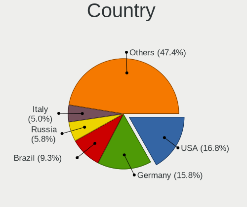
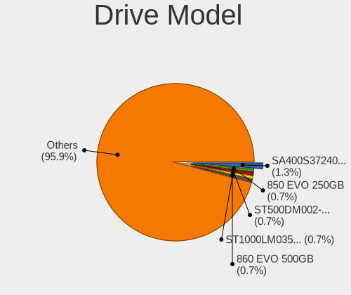
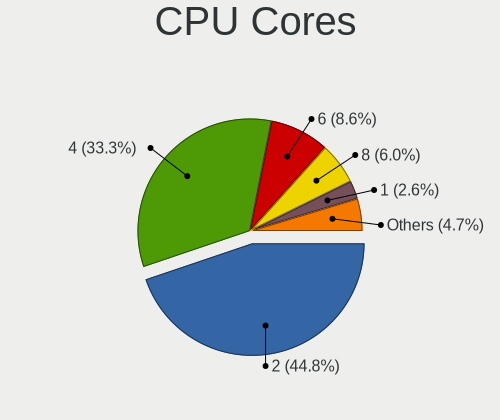
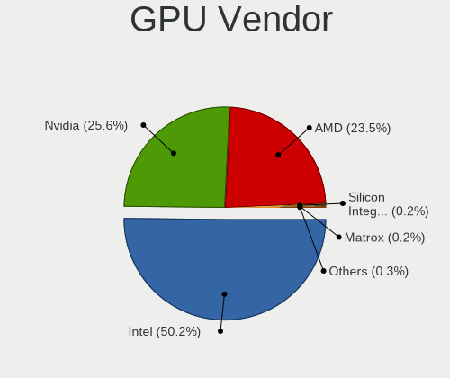
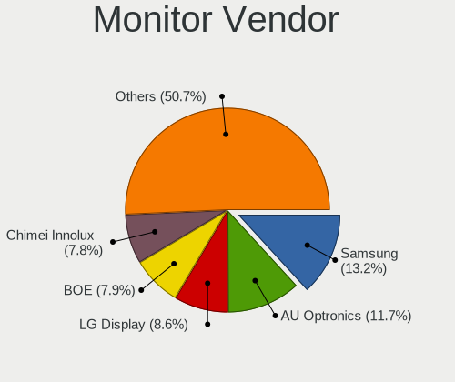
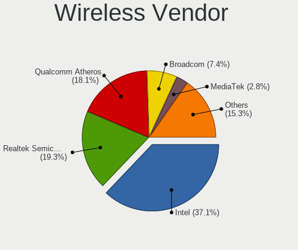
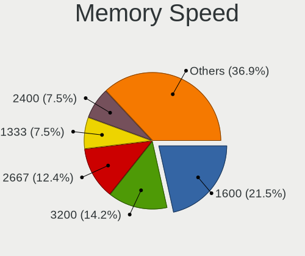

Linux Mint - Tested Hardware & Statistics
-----------------------------------------

A project to collect tested hardware configurations for Linux Mint.

Anyone can contribute to this report by the [hw-probe](https://github.com/linuxhw/hw-probe) tool:

    sudo -E hw-probe -all -upload

Please contribute! Especially if your hardware is rare.

This is a report for all computer types. See also reports for [desktops](/Dist/Linux_Mint/Desktop/README.md) and [notebooks](/Dist/Linux_Mint/Notebook/README.md).

Contents
--------

* [ Test Cases ](#test-cases)

* [ System ](#system)
  - [ OS                       ](#os)
  - [ OS Family                ](#os-family)
  - [ Kernel                   ](#kernel)
  - [ Kernel Family            ](#kernel-family)
  - [ Kernel Major Ver.        ](#kernel-major-ver)
  - [ Arch                     ](#arch)
  - [ DE                       ](#de)
  - [ Display Server           ](#display-server)
  - [ Display Manager          ](#display-manager)
  - [ OS Lang                  ](#os-lang)
  - [ Boot Mode                ](#boot-mode)
  - [ Filesystem               ](#filesystem)
  - [ Part. scheme             ](#part-scheme)
  - [ Dual Boot with Linux/BSD ](#dual-boot-with-linuxbsd)
  - [ Dual Boot (Win)          ](#dual-boot-win)

* [ Board ](#board)
  - [ Vendor                   ](#vendor)
  - [ Model                    ](#model)
  - [ Model Family             ](#model-family)
  - [ MFG Year                 ](#mfg-year)
  - [ Form Factor              ](#form-factor)
  - [ Secure Boot              ](#secure-boot)
  - [ Coreboot                 ](#coreboot)
  - [ RAM Size                 ](#ram-size)
  - [ RAM Used                 ](#ram-used)
  - [ Total Drives             ](#total-drives)
  - [ Has CD-ROM               ](#has-cd-rom)
  - [ Has Ethernet             ](#has-ethernet)
  - [ Has WiFi                 ](#has-wifi)
  - [ Has Bluetooth            ](#has-bluetooth)

* [ Location ](#location)
  - [ Country                  ](#country)
  - [ City                     ](#city)

* [ Drives ](#drives)
  - [ Drive Vendor             ](#drive-vendor)
  - [ Drive Model              ](#drive-model)
  - [ HDD Vendor               ](#hdd-vendor)
  - [ SSD Vendor               ](#ssd-vendor)
  - [ Drive Kind               ](#drive-kind)
  - [ Drive Connector          ](#drive-connector)
  - [ Drive Size               ](#drive-size)
  - [ Space Total              ](#space-total)
  - [ Space Used               ](#space-used)
  - [ Malfunc. Drives          ](#malfunc-drives)
  - [ Malfunc. Drive Vendor    ](#malfunc-drive-vendor)
  - [ Malfunc. HDD Vendor      ](#malfunc-hdd-vendor)
  - [ Malfunc. Drive Kind      ](#malfunc-drive-kind)
  - [ Failed Drives            ](#failed-drives)
  - [ Failed Drive Vendor      ](#failed-drive-vendor)
  - [ Drive Status             ](#drive-status)

* [ Storage controller ](#storage-controller)
  - [ Storage Vendor           ](#storage-vendor)
  - [ Storage Model            ](#storage-model)
  - [ Storage Kind             ](#storage-kind)

* [ Processor ](#processor)
  - [ CPU Vendor               ](#cpu-vendor)
  - [ CPU Model                ](#cpu-model)
  - [ CPU Model Family         ](#cpu-model-family)
  - [ CPU Cores                ](#cpu-cores)
  - [ CPU Sockets              ](#cpu-sockets)
  - [ CPU Threads              ](#cpu-threads)
  - [ CPU Op-Modes             ](#cpu-op-modes)
  - [ CPU Microcode            ](#cpu-microcode)
  - [ CPU Microarch            ](#cpu-microarch)

* [ Graphics ](#graphics)
  - [ GPU Vendor               ](#gpu-vendor)
  - [ GPU Model                ](#gpu-model)
  - [ GPU Combo                ](#gpu-combo)
  - [ GPU Driver               ](#gpu-driver)
  - [ GPU Memory               ](#gpu-memory)

* [ Monitor ](#monitor)
  - [ Monitor Vendor           ](#monitor-vendor)
  - [ Monitor Model            ](#monitor-model)
  - [ Monitor Resolution       ](#monitor-resolution)
  - [ Monitor Diagonal         ](#monitor-diagonal)
  - [ Monitor Width            ](#monitor-width)
  - [ Aspect Ratio             ](#aspect-ratio)
  - [ Monitor Area             ](#monitor-area)
  - [ Pixel Density            ](#pixel-density)
  - [ Multiple Monitors        ](#multiple-monitors)

* [ Network ](#network)
  - [ Net Controller Vendor    ](#net-controller-vendor)
  - [ Net Controller Model     ](#net-controller-model)
  - [ Wireless Vendor          ](#wireless-vendor)
  - [ Wireless Model           ](#wireless-model)
  - [ Ethernet Vendor          ](#ethernet-vendor)
  - [ Ethernet Model           ](#ethernet-model)
  - [ Net Controller Kind      ](#net-controller-kind)
  - [ Used Controller          ](#used-controller)
  - [ NICs                     ](#nics)
  - [ IPv6                     ](#ipv6)

* [ Bluetooth ](#bluetooth)
  - [ Bluetooth Vendor         ](#bluetooth-vendor)
  - [ Bluetooth Model          ](#bluetooth-model)

* [ Sound ](#sound)
  - [ Sound Vendor             ](#sound-vendor)
  - [ Sound Model              ](#sound-model)

* [ Memory ](#memory)
  - [ Memory Vendor            ](#memory-vendor)
  - [ Memory Model             ](#memory-model)
  - [ Memory Kind              ](#memory-kind)
  - [ Memory Form Factor       ](#memory-form-factor)
  - [ Memory Size              ](#memory-size)
  - [ Memory Speed             ](#memory-speed)

* [ Printers & scanners ](#printers--scanners)
  - [ Printer Vendor           ](#printer-vendor)
  - [ Printer Model            ](#printer-model)
  - [ Scanner Vendor           ](#scanner-vendor)
  - [ Scanner Model            ](#scanner-model)

* [ Camera ](#camera)
  - [ Camera Vendor            ](#camera-vendor)
  - [ Camera Model             ](#camera-model)

* [ Security ](#security)
  - [ Fingerprint Vendor       ](#fingerprint-vendor)
  - [ Fingerprint Model        ](#fingerprint-model)
  - [ Chipcard Vendor          ](#chipcard-vendor)
  - [ Chipcard Model           ](#chipcard-model)

* [ Unsupported ](#unsupported)
  - [ Unsupported Devices      ](#unsupported-devices)
  - [ Unsupported Device Types ](#unsupported-device-types)

Test Cases
----------

Total: 25113

| Vendor        | Model                       | Form-Factor | Probe                                                      | Date         |
|---------------|-----------------------------|-------------|------------------------------------------------------------|--------------|
| MSI           | Z77A-G43                    | Desktop     | [02c2bfee54](https://linux-hardware.org/?probe=02c2bfee54) | May 01, 2023 |
| ASUSTek       | ASUS TUF Gaming F15 FX50... | Notebook    | [d1b974c33a](https://linux-hardware.org/?probe=d1b974c33a) | May 01, 2023 |
| Lenovo        | B490 20205                  | Notebook    | [c786307607](https://linux-hardware.org/?probe=c786307607) | May 01, 2023 |
| ASUSTek       | A55M-E                      | Desktop     | [ee1054dc5c](https://linux-hardware.org/?probe=ee1054dc5c) | May 01, 2023 |
| ASUSTek       | PRIME J4005I-C              | Desktop     | [611ed4a200](https://linux-hardware.org/?probe=611ed4a200) | May 01, 2023 |
| Lenovo        | B490 20205                  | Notebook    | [bc1fdb2575](https://linux-hardware.org/?probe=bc1fdb2575) | May 01, 2023 |
| ASRock        | Z170 Gaming K4              | Desktop     | [a38bf561f7](https://linux-hardware.org/?probe=a38bf561f7) | May 01, 2023 |
| ASRock        | Z170 Gaming K4              | Desktop     | [b5ce5ff271](https://linux-hardware.org/?probe=b5ce5ff271) | May 01, 2023 |
| Dell          | Inspiron 5567               | Notebook    | [910f08075b](https://linux-hardware.org/?probe=910f08075b) | Apr 30, 2023 |
| ASUSTek       | VivoBook_ASUSLaptop E510... | Notebook    | [2dd85470a0](https://linux-hardware.org/?probe=2dd85470a0) | Apr 30, 2023 |
| Intel         | NUC12WSBi7 M46422-303       | Mini pc     | [1e10eaa9ae](https://linux-hardware.org/?probe=1e10eaa9ae) | Apr 30, 2023 |
| Lenovo        | ThinkPad T470s W10DG 20J... | Notebook    | [3695c070f9](https://linux-hardware.org/?probe=3695c070f9) | Apr 30, 2023 |
| Medion        | P6630                       | Notebook    | [93abad41dd](https://linux-hardware.org/?probe=93abad41dd) | Apr 30, 2023 |
| Lenovo        | ThinkPad X230 2325V1K       | Notebook    | [d630569df9](https://linux-hardware.org/?probe=d630569df9) | Apr 30, 2023 |
| MSI           | X570-A PRO                  | Desktop     | [4d31b88bbf](https://linux-hardware.org/?probe=4d31b88bbf) | Apr 30, 2023 |
| MSI           | X570-A PRO                  | Desktop     | [47a253784a](https://linux-hardware.org/?probe=47a253784a) | Apr 30, 2023 |
| Dell          | 0YF8P5 A00                  | Desktop     | [4f5262d2c9](https://linux-hardware.org/?probe=4f5262d2c9) | Apr 30, 2023 |
| Thomson       | NEO14A-4WH128               | Notebook    | [be47cb81e5](https://linux-hardware.org/?probe=be47cb81e5) | Apr 30, 2023 |
| MSI           | 760GM-P23                   | Desktop     | [4ac55a6bbe](https://linux-hardware.org/?probe=4ac55a6bbe) | Apr 30, 2023 |
| Gigabyte      | P75-D3                      | Desktop     | [4f6987c722](https://linux-hardware.org/?probe=4f6987c722) | Apr 30, 2023 |
| Fujitsu       | LIFEBOOK E734               | Notebook    | [f99ecceaeb](https://linux-hardware.org/?probe=f99ecceaeb) | Apr 30, 2023 |
| Fujitsu       | LIFEBOOK E734               | Notebook    | [31fa8aa587](https://linux-hardware.org/?probe=31fa8aa587) | Apr 30, 2023 |
| Dell          | Latitude E5520              | Notebook    | [43e2d970b5](https://linux-hardware.org/?probe=43e2d970b5) | Apr 30, 2023 |
| ASUSTek       | ROG Zephyrus Duo 16 GX65... | Notebook    | [cc20d89b69](https://linux-hardware.org/?probe=cc20d89b69) | Apr 30, 2023 |
| ASUSTek       | TUF Gaming B550M-PLUS       | Desktop     | [c83cb7e3ec](https://linux-hardware.org/?probe=c83cb7e3ec) | Apr 30, 2023 |
| Toshiba       | Satellite Pro R50-C         | Notebook    | [56f112d60c](https://linux-hardware.org/?probe=56f112d60c) | Apr 30, 2023 |
| HP            | 255 G6 Notebook PC          | Notebook    | [d99135522b](https://linux-hardware.org/?probe=d99135522b) | Apr 30, 2023 |
| Lenovo        | IdeaPad 330-15IKB 81DE      | Notebook    | [1ba3883d83](https://linux-hardware.org/?probe=1ba3883d83) | Apr 30, 2023 |
| Lenovo        | ThinkPad T14 Gen 1 20S0S... | Notebook    | [2bc3c5303f](https://linux-hardware.org/?probe=2bc3c5303f) | Apr 30, 2023 |
| MSI           | H310M PRO-VD                | Desktop     | [c2e2e1d130](https://linux-hardware.org/?probe=c2e2e1d130) | Apr 30, 2023 |
| AMI           | INTEL                       | Convertible | [9b8a3c6371](https://linux-hardware.org/?probe=9b8a3c6371) | Apr 29, 2023 |
| HP            | EliteBook 840 G1            | Notebook    | [6f4c134615](https://linux-hardware.org/?probe=6f4c134615) | Apr 29, 2023 |
| ASUSTek       | PRIME H410M-E               | Desktop     | [44a08af32f](https://linux-hardware.org/?probe=44a08af32f) | Apr 29, 2023 |
| Gigabyte      | B450 AORUS M                | Desktop     | [ccc2fbf8a9](https://linux-hardware.org/?probe=ccc2fbf8a9) | Apr 29, 2023 |
| MSI           | P65 Creator 9SF             | Notebook    | [4e682b2c20](https://linux-hardware.org/?probe=4e682b2c20) | Apr 29, 2023 |
| Dell          | 0WR7PY A01                  | Desktop     | [e585f66f17](https://linux-hardware.org/?probe=e585f66f17) | Apr 29, 2023 |
| Acer          | Aspire E5-722               | Notebook    | [d02052aeab](https://linux-hardware.org/?probe=d02052aeab) | Apr 29, 2023 |
| Gigabyte      | GA-MA790FXT-UD5P            | Desktop     | [910d4a6ad8](https://linux-hardware.org/?probe=910d4a6ad8) | Apr 29, 2023 |
| ASRock        | Z370 Gaming K6              | Desktop     | [a5ff738639](https://linux-hardware.org/?probe=a5ff738639) | Apr 29, 2023 |
| Lenovo        | Legion 5 17ACH6H 82JY       | Notebook    | [32f6248b20](https://linux-hardware.org/?probe=32f6248b20) | Apr 29, 2023 |
| Lenovo        | Legion 5 17ACH6H 82JY       | Notebook    | [9f604fc816](https://linux-hardware.org/?probe=9f604fc816) | Apr 29, 2023 |
| Medion        | X681X                       | Notebook    | [f65ca1e461](https://linux-hardware.org/?probe=f65ca1e461) | Apr 29, 2023 |
| MSI           | B85M-E45                    | Desktop     | [db824980e5](https://linux-hardware.org/?probe=db824980e5) | Apr 29, 2023 |
| Acer          | Aspire 8950G                | Notebook    | [348a7d728c](https://linux-hardware.org/?probe=348a7d728c) | Apr 29, 2023 |
| MSI           | B85M-E45                    | Desktop     | [42703e0a76](https://linux-hardware.org/?probe=42703e0a76) | Apr 29, 2023 |
| Intel         | S5500BC E25124-453          | Server      | [94527a8584](https://linux-hardware.org/?probe=94527a8584) | Apr 29, 2023 |
| KEIAN         | KBM101K                     | Tablet      | [20982ffeb1](https://linux-hardware.org/?probe=20982ffeb1) | Apr 29, 2023 |
| Acer          | Aspire V5-552G              | Notebook    | [07c58a5169](https://linux-hardware.org/?probe=07c58a5169) | Apr 29, 2023 |
| ASUSTek       | TUF B450M-PRO GAMING        | Desktop     | [081551c776](https://linux-hardware.org/?probe=081551c776) | Apr 29, 2023 |
| Apple         | Mac-BE088AF8C5EB4FA2 iMa... | All in one  | [ee288626f4](https://linux-hardware.org/?probe=ee288626f4) | Apr 29, 2023 |
| ASRock        | Z370 Extreme4               | Desktop     | [0f126ade53](https://linux-hardware.org/?probe=0f126ade53) | Apr 29, 2023 |
| ASUSTek       | P8H61-M LE/BR               | Desktop     | [425f1a3e08](https://linux-hardware.org/?probe=425f1a3e08) | Apr 29, 2023 |
| HP            | Pavilion dv8000 (ET839UA... | Notebook    | [59b9a9ceb3](https://linux-hardware.org/?probe=59b9a9ceb3) | Apr 29, 2023 |
| ASUSTek       | H170I-PRO                   | Desktop     | [b166ca425b](https://linux-hardware.org/?probe=b166ca425b) | Apr 29, 2023 |
| Apple         | Mac-F2218EA9                | All in one  | [87d4b56fee](https://linux-hardware.org/?probe=87d4b56fee) | Apr 29, 2023 |
| Lenovo        | ThinkPad T16 Gen 1 21BWS... | Notebook    | [09d6d7e570](https://linux-hardware.org/?probe=09d6d7e570) | Apr 28, 2023 |
| Toshiba       | Satellite C55t-C            | Notebook    | [8e2bc6ab21](https://linux-hardware.org/?probe=8e2bc6ab21) | Apr 28, 2023 |
| Gigabyte      | H410M H V2                  | Desktop     | [8a23a0fef0](https://linux-hardware.org/?probe=8a23a0fef0) | Apr 28, 2023 |
| HP            | Pavilion dv7                | Notebook    | [e3f05fe37f](https://linux-hardware.org/?probe=e3f05fe37f) | Apr 28, 2023 |
| HP            | Pavilion dv7                | Notebook    | [da542ba626](https://linux-hardware.org/?probe=da542ba626) | Apr 28, 2023 |
| ASRock        | Z790 Steel Legend WiFi      | Desktop     | [36175223a5](https://linux-hardware.org/?probe=36175223a5) | Apr 28, 2023 |
| HP            | 339A                        | Desktop     | [4f9a0b2661](https://linux-hardware.org/?probe=4f9a0b2661) | Apr 28, 2023 |
| Notebook      | W35xSTQ_370ST               | Notebook    | [a68f02482d](https://linux-hardware.org/?probe=a68f02482d) | Apr 28, 2023 |
| Samsung       | 300E4A/300E5A/300E7A        | Notebook    | [1e7a947d41](https://linux-hardware.org/?probe=1e7a947d41) | Apr 28, 2023 |
| Intel         | S5500BC E25124-453          | Server      | [567a76c24f](https://linux-hardware.org/?probe=567a76c24f) | Apr 28, 2023 |
| Lenovo        | IdeaPad 330-15IKB 81DE      | Notebook    | [8c4ba894b4](https://linux-hardware.org/?probe=8c4ba894b4) | Apr 28, 2023 |
| ASUSTek       | TUF Gaming X570-PLUS        | Desktop     | [278ed4fdd2](https://linux-hardware.org/?probe=278ed4fdd2) | Apr 28, 2023 |
| MSI           | MPG X570S CARBON MAX WIF... | Desktop     | [d472fb0a32](https://linux-hardware.org/?probe=d472fb0a32) | Apr 28, 2023 |
| Foxconn       | H67MP-S/-V/H67MP            | Desktop     | [c8fe6ab042](https://linux-hardware.org/?probe=c8fe6ab042) | Apr 28, 2023 |
| MSI           | B450-A PRO                  | Desktop     | [9f88a0a110](https://linux-hardware.org/?probe=9f88a0a110) | Apr 28, 2023 |
| Dell          | Latitude 5430               | Notebook    | [644e44f95a](https://linux-hardware.org/?probe=644e44f95a) | Apr 28, 2023 |
| Dell          | Latitude D630               | Notebook    | [0fecf73eea](https://linux-hardware.org/?probe=0fecf73eea) | Apr 28, 2023 |
| HP            | ProLiant ML350e Gen8 v2     | Desktop     | [968f941e2d](https://linux-hardware.org/?probe=968f941e2d) | Apr 28, 2023 |
| Dell          | 040DDP A01                  | Desktop     | [9d7528d062](https://linux-hardware.org/?probe=9d7528d062) | Apr 28, 2023 |
| Lenovo        | IdeaPad 330-14AST 81D5      | Notebook    | [c1616fcd6c](https://linux-hardware.org/?probe=c1616fcd6c) | Apr 28, 2023 |
| Lenovo        | ThinkPad X1 Carbon Gen 9... | Notebook    | [ed7c1abb38](https://linux-hardware.org/?probe=ed7c1abb38) | Apr 28, 2023 |
| Acer          | Aspire V5-572P              | Notebook    | [4fa79fb180](https://linux-hardware.org/?probe=4fa79fb180) | Apr 28, 2023 |
| HP            | Presario CQ43               | Notebook    | [c14c79b3cf](https://linux-hardware.org/?probe=c14c79b3cf) | Apr 28, 2023 |
| Dell          | 051FJ8 A00                  | Desktop     | [f2b702b631](https://linux-hardware.org/?probe=f2b702b631) | Apr 28, 2023 |
| Acer          | Aspire V5-572P              | Notebook    | [fdc85a159b](https://linux-hardware.org/?probe=fdc85a159b) | Apr 28, 2023 |
| Dell          | 0XCR8D A01                  | Desktop     | [2e228e1b38](https://linux-hardware.org/?probe=2e228e1b38) | Apr 28, 2023 |
| ASUSTek       | ROG Zephyrus G15 GA503QE... | Notebook    | [9a7a15dae3](https://linux-hardware.org/?probe=9a7a15dae3) | Apr 27, 2023 |
| GPU Compan... | GWTN141-4                   | Notebook    | [633f19ff2d](https://linux-hardware.org/?probe=633f19ff2d) | Apr 27, 2023 |
| HUAWEI        | BOHB-WAX9                   | Notebook    | [858404838d](https://linux-hardware.org/?probe=858404838d) | Apr 27, 2023 |
| HUAWEI        | BOHB-WAX9                   | Notebook    | [0bf066e179](https://linux-hardware.org/?probe=0bf066e179) | Apr 27, 2023 |
| ASUSTek       | ASUS BR1100CKA BR1100CKA... | Notebook    | [c5db27dd0c](https://linux-hardware.org/?probe=c5db27dd0c) | Apr 27, 2023 |
| Lenovo        | ThinkPad T470 W10DG 20JN... | Notebook    | [57261fe5ec](https://linux-hardware.org/?probe=57261fe5ec) | Apr 27, 2023 |
| Dell          | 0XCR8D A01                  | Desktop     | [395e698d44](https://linux-hardware.org/?probe=395e698d44) | Apr 27, 2023 |
| Dell          | Latitude E7270              | Notebook    | [5bacf4eea3](https://linux-hardware.org/?probe=5bacf4eea3) | Apr 27, 2023 |
| Lenovo        | IdeaPad 5 14ALC05 82LM      | Notebook    | [e1b7846c92](https://linux-hardware.org/?probe=e1b7846c92) | Apr 27, 2023 |
| ASUSTek       | ASUS TUF Gaming A15 FA50... | Notebook    | [b6bd42eb71](https://linux-hardware.org/?probe=b6bd42eb71) | Apr 27, 2023 |
| ASUSTek       | ROG Zephyrus G15 GA503QE... | Notebook    | [754fc44526](https://linux-hardware.org/?probe=754fc44526) | Apr 27, 2023 |
| Apple         | Mac-F2218EA9                | All in one  | [00fe705be0](https://linux-hardware.org/?probe=00fe705be0) | Apr 27, 2023 |
| HP            | 2000                        | Notebook    | [d0fa0a6256](https://linux-hardware.org/?probe=d0fa0a6256) | Apr 26, 2023 |
| ASUSTek       | P8H67-M                     | Desktop     | [7bed835979](https://linux-hardware.org/?probe=7bed835979) | Apr 26, 2023 |
| Acer          | TravelMate 6593             | Notebook    | [58dce8147e](https://linux-hardware.org/?probe=58dce8147e) | Apr 26, 2023 |
| Timi          | RedmiBook Pro 15S           | Notebook    | [7153e7fbe0](https://linux-hardware.org/?probe=7153e7fbe0) | Apr 26, 2023 |
| ASUSTek       | VivoBook_ASUSLaptop X509... | Notebook    | [e0f4a4d0f4](https://linux-hardware.org/?probe=e0f4a4d0f4) | Apr 26, 2023 |
| Acer          | Aspire 7250                 | Notebook    | [8e8e082e3d](https://linux-hardware.org/?probe=8e8e082e3d) | Apr 26, 2023 |
| ASUSTek       | P8H61-M LX3 PLUS R2.0       | Desktop     | [a89604dccd](https://linux-hardware.org/?probe=a89604dccd) | Apr 26, 2023 |
| ASUSTek       | M5A97 LE R2.0               | Desktop     | [64b15b4b1d](https://linux-hardware.org/?probe=64b15b4b1d) | Apr 26, 2023 |
| HP            | EliteBook 840 G2            | Notebook    | [a3065a1b59](https://linux-hardware.org/?probe=a3065a1b59) | Apr 26, 2023 |
| Wortmann      | TERRA_MOBILE_1749           | Notebook    | [2d40a711f9](https://linux-hardware.org/?probe=2d40a711f9) | Apr 26, 2023 |
| Lenovo        | ThinkPad P15s Gen 1 20T4... | Notebook    | [67a77ff775](https://linux-hardware.org/?probe=67a77ff775) | Apr 26, 2023 |
| Dell          | G15 5510                    | Notebook    | [1a6db1dc2b](https://linux-hardware.org/?probe=1a6db1dc2b) | Apr 26, 2023 |
| ASUSTek       | X550LB                      | Notebook    | [053e93702b](https://linux-hardware.org/?probe=053e93702b) | Apr 26, 2023 |
| Lenovo        | V14 G2 ALC 82KC             | Notebook    | [f9671dc0a4](https://linux-hardware.org/?probe=f9671dc0a4) | Apr 26, 2023 |
| HP            | Pavilion 15                 | Notebook    | [a8bd7a401e](https://linux-hardware.org/?probe=a8bd7a401e) | Apr 26, 2023 |
| ASRock        | Z690M-ITX/ax                | Desktop     | [76674fb178](https://linux-hardware.org/?probe=76674fb178) | Apr 26, 2023 |
| Apple         | MacBookAir7,2               | Notebook    | [7cbf188375](https://linux-hardware.org/?probe=7cbf188375) | Apr 26, 2023 |
| Apple         | MacBookAir7,2               | Notebook    | [b94d783285](https://linux-hardware.org/?probe=b94d783285) | Apr 26, 2023 |
| ASUSTek       | K73BR                       | Notebook    | [547b19cd2c](https://linux-hardware.org/?probe=547b19cd2c) | Apr 26, 2023 |
| Dell          | Latitude 5430               | Notebook    | [75ac9d10bf](https://linux-hardware.org/?probe=75ac9d10bf) | Apr 26, 2023 |
| ASUSTek       | ROG Zephyrus G15 GA503QE... | Notebook    | [379a1710e5](https://linux-hardware.org/?probe=379a1710e5) | Apr 25, 2023 |
| Inventec      | Z CLASS A02                 | Desktop     | [44b6a5142e](https://linux-hardware.org/?probe=44b6a5142e) | Apr 25, 2023 |
| HP            | 2000                        | Notebook    | [14e1ed7540](https://linux-hardware.org/?probe=14e1ed7540) | Apr 25, 2023 |
| HP            | 2000                        | Notebook    | [9e1ae856e4](https://linux-hardware.org/?probe=9e1ae856e4) | Apr 25, 2023 |
| ASUSTek       | PRIME X570-P                | Desktop     | [7967ed6e8f](https://linux-hardware.org/?probe=7967ed6e8f) | Apr 25, 2023 |
| Dell          | 03NVJ6 A02                  | Desktop     | [74a0632f6e](https://linux-hardware.org/?probe=74a0632f6e) | Apr 25, 2023 |
| Lenovo        | ThinkPad T520 4243W4L       | Notebook    | [bcdd9e5f74](https://linux-hardware.org/?probe=bcdd9e5f74) | Apr 25, 2023 |
| Dell          | Inspiron 5570               | Notebook    | [dd27aa0575](https://linux-hardware.org/?probe=dd27aa0575) | Apr 25, 2023 |
| Dell          | Latitude E5470              | Notebook    | [3eb401d939](https://linux-hardware.org/?probe=3eb401d939) | Apr 25, 2023 |
| Dell          | Inspiron 5570               | Notebook    | [e0eef23b19](https://linux-hardware.org/?probe=e0eef23b19) | Apr 25, 2023 |
| Samsung       | RV411/RV511/E3511/S3511/... | Notebook    | [afcce1c52c](https://linux-hardware.org/?probe=afcce1c52c) | Apr 25, 2023 |
| ASUSTek       | K52JK                       | Notebook    | [dd0ced2f54](https://linux-hardware.org/?probe=dd0ced2f54) | Apr 25, 2023 |
| Dell          | 073MMW A02                  | Desktop     | [890ea0fd78](https://linux-hardware.org/?probe=890ea0fd78) | Apr 25, 2023 |
| HUAWEI        | BOHB-WAX9                   | Notebook    | [40df32580a](https://linux-hardware.org/?probe=40df32580a) | Apr 25, 2023 |
| Dell          | Latitude 5420               | Notebook    | [8c1a7992c0](https://linux-hardware.org/?probe=8c1a7992c0) | Apr 25, 2023 |
| MSI           | B560M PRO-VDH               | Desktop     | [61cdcbbe0c](https://linux-hardware.org/?probe=61cdcbbe0c) | Apr 25, 2023 |
| Acer          | Aspire A514-54              | Notebook    | [19ca73662f](https://linux-hardware.org/?probe=19ca73662f) | Apr 25, 2023 |
| Google        | Sasuke                      | Notebook    | [7615a1b1e5](https://linux-hardware.org/?probe=7615a1b1e5) | Apr 25, 2023 |
| Gigabyte      | H61M-S2-B3                  | Desktop     | [cd95f8ec71](https://linux-hardware.org/?probe=cd95f8ec71) | Apr 25, 2023 |
| HP            | Pavilion dv8000 (ET839UA... | Notebook    | [cc14ce03b0](https://linux-hardware.org/?probe=cc14ce03b0) | Apr 25, 2023 |
| ASUSTek       | B85M-E                      | Desktop     | [135216cc27](https://linux-hardware.org/?probe=135216cc27) | Apr 25, 2023 |
| ASUSTek       | VivoBook_ASUSLaptop X513... | Notebook    | [ebc99a93ab](https://linux-hardware.org/?probe=ebc99a93ab) | Apr 25, 2023 |
| GPU Compan... | GWTN156-5                   | Notebook    | [afe12152a5](https://linux-hardware.org/?probe=afe12152a5) | Apr 25, 2023 |
| Lenovo        | ThinkPad W520 4270CTO       | Notebook    | [029abbccfc](https://linux-hardware.org/?probe=029abbccfc) | Apr 25, 2023 |
| Dell          | Latitude E5470              | Notebook    | [37fabb89aa](https://linux-hardware.org/?probe=37fabb89aa) | Apr 25, 2023 |
| ASUSTek       | PRIME B550M-A               | Desktop     | [e4c737a64d](https://linux-hardware.org/?probe=e4c737a64d) | Apr 25, 2023 |
| HP            | 81BB                        | All in one  | [65fb6f51d1](https://linux-hardware.org/?probe=65fb6f51d1) | Apr 24, 2023 |
| AMD           | Inagua CRB                  | Desktop     | [085d0aa051](https://linux-hardware.org/?probe=085d0aa051) | Apr 24, 2023 |
| GPU Compan... | GWTN156-2BK                 | Notebook    | [9dd0969eaf](https://linux-hardware.org/?probe=9dd0969eaf) | Apr 24, 2023 |
| ASUSTek       | K53SM                       | Notebook    | [92ac292547](https://linux-hardware.org/?probe=92ac292547) | Apr 24, 2023 |
| Foxconn       | ALOE                        | Desktop     | [f92a9cc141](https://linux-hardware.org/?probe=f92a9cc141) | Apr 24, 2023 |
| Lenovo        | ThinkPad W520 4270CTO       | Notebook    | [fb80fac677](https://linux-hardware.org/?probe=fb80fac677) | Apr 24, 2023 |
| Dell          | Latitude E6540              | Notebook    | [ba8579b1a5](https://linux-hardware.org/?probe=ba8579b1a5) | Apr 24, 2023 |
| ASUSTek       | B85M-G                      | Desktop     | [4819635121](https://linux-hardware.org/?probe=4819635121) | Apr 24, 2023 |
| Dell          | 0VHRW1 A03                  | Desktop     | [6316886f98](https://linux-hardware.org/?probe=6316886f98) | Apr 24, 2023 |
| Toshiba       | Satellite L15W-B            | Notebook    | [5d1177f899](https://linux-hardware.org/?probe=5d1177f899) | Apr 24, 2023 |
| Dell          | 0D6H9T A00                  | Desktop     | [fa6f088b8d](https://linux-hardware.org/?probe=fa6f088b8d) | Apr 24, 2023 |
| Dell          | Inspiron 11-3168            | Notebook    | [5ac6392b05](https://linux-hardware.org/?probe=5ac6392b05) | Apr 24, 2023 |
| Acer          | Aspire A515-46              | Notebook    | [16acb0ba22](https://linux-hardware.org/?probe=16acb0ba22) | Apr 24, 2023 |
| Huanan        | X99-8M-F V1.1               | Desktop     | [0621d00b73](https://linux-hardware.org/?probe=0621d00b73) | Apr 24, 2023 |
| HP            | ProBook 4530s               | Notebook    | [316cfd6876](https://linux-hardware.org/?probe=316cfd6876) | Apr 24, 2023 |
| HP            | Laptop 15-db0xxx            | Notebook    | [e4fd112564](https://linux-hardware.org/?probe=e4fd112564) | Apr 24, 2023 |
| MSI           | MPG X570 GAMING PLUS        | Desktop     | [075afa12ed](https://linux-hardware.org/?probe=075afa12ed) | Apr 23, 2023 |
| Acer          | Aspire V5-122P              | Notebook    | [baf567c71f](https://linux-hardware.org/?probe=baf567c71f) | Apr 23, 2023 |
| AZW           | SER V1.0                    | Mini pc     | [037e8c7254](https://linux-hardware.org/?probe=037e8c7254) | Apr 23, 2023 |
| HP            | ZBook 17 G2                 | Notebook    | [5eec26bec0](https://linux-hardware.org/?probe=5eec26bec0) | Apr 23, 2023 |
| Sony          | VPCEH3U1E                   | Notebook    | [6fa28ef21c](https://linux-hardware.org/?probe=6fa28ef21c) | Apr 23, 2023 |
| HP            | ProBook 6570b               | Notebook    | [4e2ba781e2](https://linux-hardware.org/?probe=4e2ba781e2) | Apr 23, 2023 |
| HUAWEI        | BOHB-WAX9                   | Notebook    | [b906572f4b](https://linux-hardware.org/?probe=b906572f4b) | Apr 23, 2023 |
| DERE          | X16                         | Notebook    | [8c51699ade](https://linux-hardware.org/?probe=8c51699ade) | Apr 23, 2023 |
| MSI           | MEG X570S ACE MAX           | Desktop     | [b7ab5c207b](https://linux-hardware.org/?probe=b7ab5c207b) | Apr 23, 2023 |
| Dell          | Inspiron 5559               | Notebook    | [e959cc70fa](https://linux-hardware.org/?probe=e959cc70fa) | Apr 23, 2023 |
| HP            | 339A                        | Desktop     | [aa81655af9](https://linux-hardware.org/?probe=aa81655af9) | Apr 23, 2023 |
| HP            | 255 15.6 inch G9 Noteboo... | Notebook    | [af2d38aec0](https://linux-hardware.org/?probe=af2d38aec0) | Apr 23, 2023 |
| Dell          | 09KPNV A00                  | Desktop     | [0ba7a36003](https://linux-hardware.org/?probe=0ba7a36003) | Apr 23, 2023 |
| Dell          | 09KPNV A00                  | Desktop     | [a99600dad6](https://linux-hardware.org/?probe=a99600dad6) | Apr 23, 2023 |
| Lenovo        | ThinkPad T410 2537AT1       | Notebook    | [8e7059747e](https://linux-hardware.org/?probe=8e7059747e) | Apr 23, 2023 |
| Lenovo        | IdeaPad 3 15ALC6 82KU       | Notebook    | [db614f561e](https://linux-hardware.org/?probe=db614f561e) | Apr 23, 2023 |
| Dell          | Latitude E6410              | Notebook    | [33a88dea30](https://linux-hardware.org/?probe=33a88dea30) | Apr 23, 2023 |
| Dell          | Latitude E6410              | Notebook    | [86d20cdb51](https://linux-hardware.org/?probe=86d20cdb51) | Apr 23, 2023 |
| Pegatron      | IPMH61P1                    | Desktop     | [b71d5b1a48](https://linux-hardware.org/?probe=b71d5b1a48) | Apr 23, 2023 |
| HP            | 0AA8h                       | Desktop     | [071191ddf3](https://linux-hardware.org/?probe=071191ddf3) | Apr 23, 2023 |
| Lenovo        | ThinkBook Plus G3 IAP 21... | Notebook    | [208510e39a](https://linux-hardware.org/?probe=208510e39a) | Apr 23, 2023 |
| Gigabyte      | VM900M Rev2.0               | Desktop     | [284ada7211](https://linux-hardware.org/?probe=284ada7211) | Apr 23, 2023 |
| PCWare        | IPX1800G2                   | Desktop     | [f63cf0fe51](https://linux-hardware.org/?probe=f63cf0fe51) | Apr 23, 2023 |
| ASUSTek       | B85M-E                      | Desktop     | [9a0f95336c](https://linux-hardware.org/?probe=9a0f95336c) | Apr 23, 2023 |
| ASUSTek       | K52JU                       | Notebook    | [74fdb1fa53](https://linux-hardware.org/?probe=74fdb1fa53) | Apr 23, 2023 |
| ASUSTek       | ROG STRIX X570-F GAMING     | Desktop     | [fb4c86b0c4](https://linux-hardware.org/?probe=fb4c86b0c4) | Apr 23, 2023 |
| Dell          | Latitude E5570              | Notebook    | [1a6b35e077](https://linux-hardware.org/?probe=1a6b35e077) | Apr 22, 2023 |
| HP            | 0A60h                       | Desktop     | [e705150840](https://linux-hardware.org/?probe=e705150840) | Apr 22, 2023 |
| Alcor Digi... | Snugbook N1431              | Notebook    | [eeb69d730b](https://linux-hardware.org/?probe=eeb69d730b) | Apr 22, 2023 |
| ASUSTek       | ROG STRIX X670E-E GAMING... | Desktop     | [ea9dd842c0](https://linux-hardware.org/?probe=ea9dd842c0) | Apr 22, 2023 |
| Apple         | Mac-BE088AF8C5EB4FA2 iMa... | All in one  | [5da3166132](https://linux-hardware.org/?probe=5da3166132) | Apr 22, 2023 |
| Intel         | NUC11ATBC4 M53051-400       | Mini pc     | [1b7f3c90ca](https://linux-hardware.org/?probe=1b7f3c90ca) | Apr 22, 2023 |
| Gigabyte      | B560M AORUS ELITE           | Desktop     | [ea8fb664a3](https://linux-hardware.org/?probe=ea8fb664a3) | Apr 22, 2023 |
| ASUSTek       | H81M-K                      | Desktop     | [5aa26aea52](https://linux-hardware.org/?probe=5aa26aea52) | Apr 22, 2023 |
| MSI           | P55-GD65                    | Desktop     | [90cc53b6dd](https://linux-hardware.org/?probe=90cc53b6dd) | Apr 22, 2023 |
| Lenovo        | ThinkPad 13 2nd Gen 20J1... | Notebook    | [936e6fc768](https://linux-hardware.org/?probe=936e6fc768) | Apr 22, 2023 |
| Lenovo        | ThinkPad 13 2nd Gen 20J1... | Notebook    | [e0763f0f69](https://linux-hardware.org/?probe=e0763f0f69) | Apr 22, 2023 |
| ASUSTek       | ZenBook UX425UG_Q408UG      | Notebook    | [38661d17e0](https://linux-hardware.org/?probe=38661d17e0) | Apr 22, 2023 |
| Gigabyte      | EX58-UD5                    | Desktop     | [1ffb09ff2a](https://linux-hardware.org/?probe=1ffb09ff2a) | Apr 22, 2023 |
| HP            | Pavilion x360 Convertibl... | Convertible | [c5b0278699](https://linux-hardware.org/?probe=c5b0278699) | Apr 22, 2023 |
| HP            | ProBook 440 G7              | Notebook    | [50408f04cb](https://linux-hardware.org/?probe=50408f04cb) | Apr 22, 2023 |
| Lenovo        | ThinkPad X230T 343824G      | Notebook    | [2df9760e40](https://linux-hardware.org/?probe=2df9760e40) | Apr 22, 2023 |
| Lenovo        | Yoga 910-13IKB 80VF         | Convertible | [fc367d0743](https://linux-hardware.org/?probe=fc367d0743) | Apr 21, 2023 |
| Apple         | MacBook6,1                  | Notebook    | [47ea666f74](https://linux-hardware.org/?probe=47ea666f74) | Apr 21, 2023 |
| ASUSTek       | TUF Gaming B550M-PLUS       | Desktop     | [bb520ff82e](https://linux-hardware.org/?probe=bb520ff82e) | Apr 21, 2023 |
| Medion        | MS-7621                     | Desktop     | [efb8293786](https://linux-hardware.org/?probe=efb8293786) | Apr 21, 2023 |
| Toshiba       | Satellite L50-C             | Notebook    | [11f0485b1a](https://linux-hardware.org/?probe=11f0485b1a) | Apr 21, 2023 |
| Toshiba       | Satellite L50-C             | Notebook    | [969bbe5df0](https://linux-hardware.org/?probe=969bbe5df0) | Apr 21, 2023 |
| HP            | EliteBook 850 G5            | Notebook    | [ba9bbe1e70](https://linux-hardware.org/?probe=ba9bbe1e70) | Apr 21, 2023 |
| ASUSTek       | P5B-MX                      | Desktop     | [3770e032b4](https://linux-hardware.org/?probe=3770e032b4) | Apr 21, 2023 |
| Intel         | D54250WYK H13922-305        | Desktop     | [a7ef0d6dad](https://linux-hardware.org/?probe=a7ef0d6dad) | Apr 21, 2023 |
| ASUSTek       | M5A97 R2.0                  | Desktop     | [1c0e6f85fe](https://linux-hardware.org/?probe=1c0e6f85fe) | Apr 21, 2023 |
| MSI           | Z97 PC Mate                 | Desktop     | [f1345bd185](https://linux-hardware.org/?probe=f1345bd185) | Apr 21, 2023 |
| HP            | Laptop 17-cp0xxx            | Notebook    | [17c955a974](https://linux-hardware.org/?probe=17c955a974) | Apr 21, 2023 |
| Lenovo        | Yoga C930-13IKB 81C4        | Convertible | [cb9c80dbba](https://linux-hardware.org/?probe=cb9c80dbba) | Apr 21, 2023 |
| HP            | Pavilion dv6000 (RV010UA... | Notebook    | [cf7d33c62e](https://linux-hardware.org/?probe=cf7d33c62e) | Apr 20, 2023 |
| Gigabyte      | P55A-UD7                    | Desktop     | [59f8c4d262](https://linux-hardware.org/?probe=59f8c4d262) | Apr 20, 2023 |
| HP            | 2215                        | Desktop     | [27b339efe1](https://linux-hardware.org/?probe=27b339efe1) | Apr 20, 2023 |
| ASUSTek       | K61IC                       | Notebook    | [985a269b26](https://linux-hardware.org/?probe=985a269b26) | Apr 20, 2023 |
| HP            | EliteBook 8460p             | Notebook    | [ea7f9b7eef](https://linux-hardware.org/?probe=ea7f9b7eef) | Apr 20, 2023 |
| HP            | EliteBook 8460p             | Notebook    | [d3526466e8](https://linux-hardware.org/?probe=d3526466e8) | Apr 20, 2023 |
| Chuwi         | HeroBook Pro                | Notebook    | [e8332849a1](https://linux-hardware.org/?probe=e8332849a1) | Apr 20, 2023 |
| MSI           | CR61 3M                     | Notebook    | [0ee98cd841](https://linux-hardware.org/?probe=0ee98cd841) | Apr 20, 2023 |
| Gigabyte      | AB350-Gaming 3-CF           | Desktop     | [374f586992](https://linux-hardware.org/?probe=374f586992) | Apr 20, 2023 |
| Lenovo        | ThinkCentre M90p 3282B5G    | Desktop     | [9741f7bd1e](https://linux-hardware.org/?probe=9741f7bd1e) | Apr 20, 2023 |
| Lenovo        | IdeaPad Y700-15ISK 80NV     | Notebook    | [50c44b15eb](https://linux-hardware.org/?probe=50c44b15eb) | Apr 20, 2023 |
| Acer          | TravelMate 5320             | Notebook    | [fa41e30258](https://linux-hardware.org/?probe=fa41e30258) | Apr 20, 2023 |
| Lenovo        | IdeaPad Y700-15ISK 80NV     | Notebook    | [9cb44b75f5](https://linux-hardware.org/?probe=9cb44b75f5) | Apr 20, 2023 |
| ASUSTek       | G771JW                      | Notebook    | [fd6d8a7cd7](https://linux-hardware.org/?probe=fd6d8a7cd7) | Apr 20, 2023 |
| MSI           | MPG B550 GAMING PLUS        | Desktop     | [69e2175961](https://linux-hardware.org/?probe=69e2175961) | Apr 20, 2023 |
| ASUSTek       | PRIME Z370-A                | Desktop     | [4e45f9c51f](https://linux-hardware.org/?probe=4e45f9c51f) | Apr 20, 2023 |
| HP            | ZBook Firefly 15 G7 Mobi... | Notebook    | [80eb73afe8](https://linux-hardware.org/?probe=80eb73afe8) | Apr 20, 2023 |
| MSI           | Modern 14 A10RAS            | Notebook    | [fbd4693aef](https://linux-hardware.org/?probe=fbd4693aef) | Apr 20, 2023 |
| GPU Compan... | GWTC116-2                   | Notebook    | [9e85f47757](https://linux-hardware.org/?probe=9e85f47757) | Apr 20, 2023 |
| HP            | Pavilion x360 Convertibl... | Convertible | [905e23cca7](https://linux-hardware.org/?probe=905e23cca7) | Apr 20, 2023 |
| HP            | 250 G8 Notebook PC          | Notebook    | [e57b4bd7fa](https://linux-hardware.org/?probe=e57b4bd7fa) | Apr 20, 2023 |
| ASUSTek       | ROG STRIX Z790-F GAMING ... | Desktop     | [adb291235a](https://linux-hardware.org/?probe=adb291235a) | Apr 20, 2023 |
| Lenovo        | IdeaPad S145-14IGM 81MW     | Notebook    | [5cb6709055](https://linux-hardware.org/?probe=5cb6709055) | Apr 20, 2023 |
| Unknown       | Unknown                     | Notebook    | [83c6b6137d](https://linux-hardware.org/?probe=83c6b6137d) | Apr 20, 2023 |
| ASUSTek       | T100TAF                     | Notebook    | [9e59d428d2](https://linux-hardware.org/?probe=9e59d428d2) | Apr 19, 2023 |
| Acer          | Extensa 2540                | Notebook    | [c47272dcf1](https://linux-hardware.org/?probe=c47272dcf1) | Apr 19, 2023 |
| Dell          | Latitude 7490               | Notebook    | [90177fdac8](https://linux-hardware.org/?probe=90177fdac8) | Apr 19, 2023 |
| Dell          | Latitude 7490               | Notebook    | [182c7ea2b4](https://linux-hardware.org/?probe=182c7ea2b4) | Apr 19, 2023 |
| ASRock        | Z97X Killer                 | Desktop     | [d258d06b23](https://linux-hardware.org/?probe=d258d06b23) | Apr 19, 2023 |
| Acer          | Aspire 5738                 | Notebook    | [fc12fc0a9d](https://linux-hardware.org/?probe=fc12fc0a9d) | Apr 19, 2023 |
| ASUSTek       | TUF Gaming B450-PLUS II     | Desktop     | [8858427eed](https://linux-hardware.org/?probe=8858427eed) | Apr 19, 2023 |
| Lenovo        | V15 G2 ALC 82KD             | Notebook    | [017d095061](https://linux-hardware.org/?probe=017d095061) | Apr 19, 2023 |
| Dell          | XPS 15 7590                 | Notebook    | [abcb6ed7e8](https://linux-hardware.org/?probe=abcb6ed7e8) | Apr 19, 2023 |
| Dell          | Inspiron 7577               | Notebook    | [84ae892fb4](https://linux-hardware.org/?probe=84ae892fb4) | Apr 19, 2023 |
| ASUSTek       | PRIME B350M-A               | Desktop     | [c6cd36eaed](https://linux-hardware.org/?probe=c6cd36eaed) | Apr 19, 2023 |
| Acer          | AS5755                      | Notebook    | [1c163eb17f](https://linux-hardware.org/?probe=1c163eb17f) | Apr 19, 2023 |
| ASUSTek       | M5A78L-M PLUS/USB3          | Desktop     | [8afed7ed9c](https://linux-hardware.org/?probe=8afed7ed9c) | Apr 19, 2023 |
| ASUSTek       | X75VC                       | Notebook    | [68e8f66056](https://linux-hardware.org/?probe=68e8f66056) | Apr 19, 2023 |
| Gigabyte      | H81M-S2H                    | Desktop     | [ff7225c921](https://linux-hardware.org/?probe=ff7225c921) | Apr 19, 2023 |
| Gigabyte      | H81M-S2H                    | Desktop     | [a70cdf4848](https://linux-hardware.org/?probe=a70cdf4848) | Apr 19, 2023 |
| Lenovo        | ThinkPad P70 20ESS0TW00     | Notebook    | [42b45f646d](https://linux-hardware.org/?probe=42b45f646d) | Apr 19, 2023 |
| Dell          | Inspiron 3593               | Notebook    | [5ac8ce1eb9](https://linux-hardware.org/?probe=5ac8ce1eb9) | Apr 19, 2023 |
| Samsung       | NC210/NC110                 | Notebook    | [f87a34e474](https://linux-hardware.org/?probe=f87a34e474) | Apr 19, 2023 |
| Samsung       | NC210/NC110                 | Notebook    | [9cacd6f238](https://linux-hardware.org/?probe=9cacd6f238) | Apr 19, 2023 |
| ASUSTek       | VivoBook_ASUSLaptop X515... | Notebook    | [5c100e01f6](https://linux-hardware.org/?probe=5c100e01f6) | Apr 19, 2023 |
| ASUSTek       | VivoBook_ASUSLaptop X515... | Notebook    | [67030bc167](https://linux-hardware.org/?probe=67030bc167) | Apr 19, 2023 |
| ASUSTek       | B85M-E                      | Desktop     | [748e08d7c7](https://linux-hardware.org/?probe=748e08d7c7) | Apr 19, 2023 |
| HP            | Pavilion g6                 | Notebook    | [7a96ad05f1](https://linux-hardware.org/?probe=7a96ad05f1) | Apr 19, 2023 |
| MSI           | A320M-A PRO MAX             | Desktop     | [630a9718a0](https://linux-hardware.org/?probe=630a9718a0) | Apr 18, 2023 |
| HP            | Pavilion 15                 | Notebook    | [3a855386b4](https://linux-hardware.org/?probe=3a855386b4) | Apr 18, 2023 |
| Dell          | 0XCR8D A01                  | Desktop     | [c242edb3d0](https://linux-hardware.org/?probe=c242edb3d0) | Apr 18, 2023 |
| Lenovo        | ThinkPad X13 Gen 2i 20WL... | Notebook    | [315be40dae](https://linux-hardware.org/?probe=315be40dae) | Apr 18, 2023 |
| Acer          | TravelMate 7750             | Notebook    | [16afdc422d](https://linux-hardware.org/?probe=16afdc422d) | Apr 18, 2023 |
| Dell          | Inspiron 3583               | Notebook    | [6a837bdf4d](https://linux-hardware.org/?probe=6a837bdf4d) | Apr 18, 2023 |
| Dell          | Latitude E5550              | Notebook    | [ce824f113c](https://linux-hardware.org/?probe=ce824f113c) | Apr 18, 2023 |
| Dell          | Latitude E5550              | Notebook    | [7611d6e018](https://linux-hardware.org/?probe=7611d6e018) | Apr 18, 2023 |
| AMD           | Inagua CRB                  | Desktop     | [8d2ce37fca](https://linux-hardware.org/?probe=8d2ce37fca) | Apr 18, 2023 |
| HP            | 250 15.6 inch G9 Noteboo... | Notebook    | [3166a23ce1](https://linux-hardware.org/?probe=3166a23ce1) | Apr 18, 2023 |
| Lenovo        | 3106 SDK0J40709 WIN 3259... | Desktop     | [878d249691](https://linux-hardware.org/?probe=878d249691) | Apr 18, 2023 |
| Gigabyte      | X570 GAMING X               | Desktop     | [f9f95d964c](https://linux-hardware.org/?probe=f9f95d964c) | Apr 18, 2023 |
| Toshiba       | Satellite L45-B             | Notebook    | [6869e08d2d](https://linux-hardware.org/?probe=6869e08d2d) | Apr 18, 2023 |
| Samsung       | 750XDA                      | Notebook    | [89f13174bc](https://linux-hardware.org/?probe=89f13174bc) | Apr 18, 2023 |
| HP            | Pavilion Laptop 15-ck0xx    | Notebook    | [e9278fb49b](https://linux-hardware.org/?probe=e9278fb49b) | Apr 18, 2023 |
| Lenovo        | 364F SDK0J40700 WIN 3258... | Desktop     | [b45a30f071](https://linux-hardware.org/?probe=b45a30f071) | Apr 18, 2023 |
| HP            | Laptop 15-da1xxx            | Notebook    | [c7a5aadd85](https://linux-hardware.org/?probe=c7a5aadd85) | Apr 18, 2023 |
| HP            | 0A98h                       | Desktop     | [db84ca1038](https://linux-hardware.org/?probe=db84ca1038) | Apr 18, 2023 |
| ASUSTek       | Z170-A                      | Desktop     | [622b7348d0](https://linux-hardware.org/?probe=622b7348d0) | Apr 18, 2023 |
| ASUSTek       | TUF Gaming X570-PLUS        | Desktop     | [a3f477ce4a](https://linux-hardware.org/?probe=a3f477ce4a) | Apr 18, 2023 |
| Acer          | Aspire 5336                 | Notebook    | [ddf5053ffa](https://linux-hardware.org/?probe=ddf5053ffa) | Apr 18, 2023 |
| ASUSTek       | B85M-G                      | Desktop     | [8f5803697f](https://linux-hardware.org/?probe=8f5803697f) | Apr 17, 2023 |
| Dell          | 03NVJ6 A02                  | Desktop     | [2b0ef62ec7](https://linux-hardware.org/?probe=2b0ef62ec7) | Apr 17, 2023 |
| ASUSTek       | PRIME B450-PLUS             | Desktop     | [c5ceac2597](https://linux-hardware.org/?probe=c5ceac2597) | Apr 17, 2023 |
| ASUSTek       | TUF B450M-PLUS GAMING       | Desktop     | [9df377aaf2](https://linux-hardware.org/?probe=9df377aaf2) | Apr 17, 2023 |
| HP            | Pavilion g6                 | Notebook    | [3b0ab63643](https://linux-hardware.org/?probe=3b0ab63643) | Apr 17, 2023 |
| ASUSTek       | P6T DELUXE                  | Desktop     | [dc155ce308](https://linux-hardware.org/?probe=dc155ce308) | Apr 17, 2023 |
| Lenovo        | ThinkPad E15 Gen 3 20YGC... | Notebook    | [d12e0064fc](https://linux-hardware.org/?probe=d12e0064fc) | Apr 17, 2023 |
| ASUSTek       | P6T DELUXE                  | Desktop     | [aaff05d28f](https://linux-hardware.org/?probe=aaff05d28f) | Apr 17, 2023 |
| HP            | Pavilion 17                 | Notebook    | [b06b49ac95](https://linux-hardware.org/?probe=b06b49ac95) | Apr 17, 2023 |
| MSI           | X570-A PRO                  | Desktop     | [65d3714b3b](https://linux-hardware.org/?probe=65d3714b3b) | Apr 17, 2023 |
| Samsung       | 700Z3A/700Z4A/700Z5A/700... | Notebook    | [acd0161868](https://linux-hardware.org/?probe=acd0161868) | Apr 17, 2023 |
| Biostar       | TA880GU3+                   | Desktop     | [ee629553e7](https://linux-hardware.org/?probe=ee629553e7) | Apr 17, 2023 |
| Biostar       | TA880GU3+                   | Desktop     | [3553ce4185](https://linux-hardware.org/?probe=3553ce4185) | Apr 17, 2023 |
| ASUSTek       | P5Q DELUXE                  | Desktop     | [ebd62c0513](https://linux-hardware.org/?probe=ebd62c0513) | Apr 16, 2023 |
| ASUSTek       | CROSSHAIR VI HERO           | Desktop     | [67ce5b3ab1](https://linux-hardware.org/?probe=67ce5b3ab1) | Apr 16, 2023 |
| Gigabyte      | Z170-Gaming K3              | Desktop     | [c31465c0a1](https://linux-hardware.org/?probe=c31465c0a1) | Apr 16, 2023 |
| Dell          | 0GM819                      | Desktop     | [b462ba5afe](https://linux-hardware.org/?probe=b462ba5afe) | Apr 16, 2023 |
| Acer          | Aspire 7736                 | Notebook    | [0f53f9450f](https://linux-hardware.org/?probe=0f53f9450f) | Apr 16, 2023 |
| ASUSTek       | K52F                        | Notebook    | [a6b8e3a78c](https://linux-hardware.org/?probe=a6b8e3a78c) | Apr 16, 2023 |
| Gigabyte      | B550 AORUS ELITE V2         | Desktop     | [fec4fc20a6](https://linux-hardware.org/?probe=fec4fc20a6) | Apr 16, 2023 |
| AZW           | Speed S                     | Desktop     | [7cf5e54f5b](https://linux-hardware.org/?probe=7cf5e54f5b) | Apr 16, 2023 |
| MSI           | PRO H610M-B DDR4            | Desktop     | [65b2e4afa9](https://linux-hardware.org/?probe=65b2e4afa9) | Apr 16, 2023 |
| Intel         | DH61WW AAG23116-204         | Desktop     | [6c62f23970](https://linux-hardware.org/?probe=6c62f23970) | Apr 16, 2023 |
| ASRock        | Z270 Extreme4               | Desktop     | [c388675553](https://linux-hardware.org/?probe=c388675553) | Apr 16, 2023 |
| HP            | Laptop 15s-eq2xxx           | Notebook    | [325fbee473](https://linux-hardware.org/?probe=325fbee473) | Apr 16, 2023 |
| HP            | 240 G2                      | Notebook    | [ca6ae60a2b](https://linux-hardware.org/?probe=ca6ae60a2b) | Apr 16, 2023 |
| Gigabyte      | AB350-Gaming 3-CF           | Desktop     | [41cef8b51c](https://linux-hardware.org/?probe=41cef8b51c) | Apr 16, 2023 |
| HP            | EliteBook 840 G1            | Notebook    | [5994a04ee0](https://linux-hardware.org/?probe=5994a04ee0) | Apr 16, 2023 |
| Dell          | Latitude 7530               | Notebook    | [133059c3d6](https://linux-hardware.org/?probe=133059c3d6) | Apr 16, 2023 |
| HUAWEI        | BOHK-WAX9X                  | Notebook    | [8b6a2af9ce](https://linux-hardware.org/?probe=8b6a2af9ce) | Apr 16, 2023 |
| ASUSTek       | VivoBook_ASUSLaptop S540... | Notebook    | [a7b2caaba8](https://linux-hardware.org/?probe=a7b2caaba8) | Apr 16, 2023 |
| HP            | 212B                        | Desktop     | [343f1f5eba](https://linux-hardware.org/?probe=343f1f5eba) | Apr 16, 2023 |
| ASUSTek       | ROG STRIX B550-A GAMING     | Desktop     | [3fb8069a1b](https://linux-hardware.org/?probe=3fb8069a1b) | Apr 16, 2023 |
| Lenovo        | IdeaPad 330-15ARR 81D2      | Notebook    | [872416fe62](https://linux-hardware.org/?probe=872416fe62) | Apr 16, 2023 |
| Acer          | AO722                       | Notebook    | [af4e100c16](https://linux-hardware.org/?probe=af4e100c16) | Apr 15, 2023 |
| Dell          | Precision M4500             | Notebook    | [52f0958abf](https://linux-hardware.org/?probe=52f0958abf) | Apr 15, 2023 |
| Dell          | Precision M4500             | Notebook    | [0d948fdd8a](https://linux-hardware.org/?probe=0d948fdd8a) | Apr 15, 2023 |
| HP            | OMEN by Laptop 15-ce0xx     | Notebook    | [da62023f35](https://linux-hardware.org/?probe=da62023f35) | Apr 15, 2023 |
| ASUSTek       | Zenbook UM3402YA_UM3402Y... | Notebook    | [5ef76fe165](https://linux-hardware.org/?probe=5ef76fe165) | Apr 15, 2023 |
| ASUSTek       | X756UJ                      | Notebook    | [a374f8dd26](https://linux-hardware.org/?probe=a374f8dd26) | Apr 15, 2023 |
| HP            | 8055                        | Desktop     | [7e5328ded9](https://linux-hardware.org/?probe=7e5328ded9) | Apr 15, 2023 |
| Acer          | Aspire A515-57              | Notebook    | [ecc22845f7](https://linux-hardware.org/?probe=ecc22845f7) | Apr 15, 2023 |
| ASUSTek       | TUF Gaming B550M-PLUS       | Desktop     | [76db4c685b](https://linux-hardware.org/?probe=76db4c685b) | Apr 15, 2023 |
| Gigabyte      | H97-Gaming 3                | Desktop     | [d7d0bcde76](https://linux-hardware.org/?probe=d7d0bcde76) | Apr 15, 2023 |
| Medion        | E7220                       | Notebook    | [ab189f426b](https://linux-hardware.org/?probe=ab189f426b) | Apr 15, 2023 |
| HP            | ENVY x360 Convertible 13... | Convertible | [bfaea1065e](https://linux-hardware.org/?probe=bfaea1065e) | Apr 15, 2023 |
| HP            | 3048h                       | Desktop     | [c771c0b0a7](https://linux-hardware.org/?probe=c771c0b0a7) | Apr 15, 2023 |
| HP            | Stream Laptop 11-aj0xxx     | Notebook    | [47521a22ef](https://linux-hardware.org/?probe=47521a22ef) | Apr 15, 2023 |
| Sony          | VPCSB1V9E                   | Notebook    | [2764fa4b5d](https://linux-hardware.org/?probe=2764fa4b5d) | Apr 15, 2023 |
| Dell          | Latitude E5520              | Notebook    | [5e04eeccae](https://linux-hardware.org/?probe=5e04eeccae) | Apr 15, 2023 |
| ASUSTek       | G771JW                      | Notebook    | [f534984150](https://linux-hardware.org/?probe=f534984150) | Apr 15, 2023 |
| AMD           | A88F2EKS                    | Desktop     | [48cef621bd](https://linux-hardware.org/?probe=48cef621bd) | Apr 15, 2023 |
| ASUSTek       | PRIME Z490-A                | Desktop     | [17c0e1e6e4](https://linux-hardware.org/?probe=17c0e1e6e4) | Apr 15, 2023 |
| ASUSTek       | M4A785TD-M EVO              | Desktop     | [dd2d3443a9](https://linux-hardware.org/?probe=dd2d3443a9) | Apr 15, 2023 |
| Acer          | Aspire 5336                 | Notebook    | [7613566248](https://linux-hardware.org/?probe=7613566248) | Apr 15, 2023 |
| MSI           | MPG B550 GAMING EDGE WIF... | Desktop     | [00ee6cd73f](https://linux-hardware.org/?probe=00ee6cd73f) | Apr 15, 2023 |
| HP            | EliteBook 8460p             | Notebook    | [4ff38d2aec](https://linux-hardware.org/?probe=4ff38d2aec) | Apr 15, 2023 |
| HP            | Pavilion 15                 | Notebook    | [a51b096e12](https://linux-hardware.org/?probe=a51b096e12) | Apr 15, 2023 |
| HP            | Pavilion 15                 | Notebook    | [1f524a54fc](https://linux-hardware.org/?probe=1f524a54fc) | Apr 15, 2023 |
| Acer          | Aspire C24-1650             | All in one  | [9f1a2edf3b](https://linux-hardware.org/?probe=9f1a2edf3b) | Apr 15, 2023 |
| Apple         | MacBookPro7,1               | Notebook    | [3470b35550](https://linux-hardware.org/?probe=3470b35550) | Apr 15, 2023 |
| Dell          | 0KWVT8 A01                  | Desktop     | [38d4552d7e](https://linux-hardware.org/?probe=38d4552d7e) | Apr 15, 2023 |
| Toshiba       | QOSMIO F750                 | Notebook    | [590801670a](https://linux-hardware.org/?probe=590801670a) | Apr 15, 2023 |
| Gigabyte      | B365 HD3                    | Desktop     | [9d18bebcd7](https://linux-hardware.org/?probe=9d18bebcd7) | Apr 15, 2023 |
| HP            | EliteBook 8570p             | Notebook    | [b259f47200](https://linux-hardware.org/?probe=b259f47200) | Apr 15, 2023 |
| MSI           | B450 GAMING PLUS MAX        | Desktop     | [21091d13e4](https://linux-hardware.org/?probe=21091d13e4) | Apr 15, 2023 |
| HP            | ZBook 14u G5                | Notebook    | [fcf729207a](https://linux-hardware.org/?probe=fcf729207a) | Apr 15, 2023 |
| Gigabyte      | B365 HD3                    | Desktop     | [921a57413c](https://linux-hardware.org/?probe=921a57413c) | Apr 15, 2023 |
| ASUSTek       | X302LJ                      | Notebook    | [e045b269b1](https://linux-hardware.org/?probe=e045b269b1) | Apr 14, 2023 |
| HP            | Pavilion Notebook           | Notebook    | [758a109ab4](https://linux-hardware.org/?probe=758a109ab4) | Apr 14, 2023 |
| ASRock        | A320M-HDV R4.0              | Desktop     | [d78a3541af](https://linux-hardware.org/?probe=d78a3541af) | Apr 14, 2023 |
| Gateway       | NV79                        | Notebook    | [c473a48634](https://linux-hardware.org/?probe=c473a48634) | Apr 14, 2023 |
| Gateway       | NV79                        | Notebook    | [065f2d8215](https://linux-hardware.org/?probe=065f2d8215) | Apr 14, 2023 |
| Lenovo        | ThinkPad X250 20CLS0YR00    | Notebook    | [59dd927928](https://linux-hardware.org/?probe=59dd927928) | Apr 14, 2023 |
| HP            | Laptop 17-cp0xxx            | Notebook    | [6b11fc87a5](https://linux-hardware.org/?probe=6b11fc87a5) | Apr 14, 2023 |
| Gigabyte      | B550 AORUS ELITE V2         | Desktop     | [e5b11f4136](https://linux-hardware.org/?probe=e5b11f4136) | Apr 14, 2023 |
| HP            | Elite x2 1012 G1            | Notebook    | [3d58a731c0](https://linux-hardware.org/?probe=3d58a731c0) | Apr 14, 2023 |
| Lenovo        | ThinkPad T480s 20L8S1QX0... | Notebook    | [67ef588216](https://linux-hardware.org/?probe=67ef588216) | Apr 14, 2023 |
| Acer          | Aspire V5-571PG             | Notebook    | [779ba5da31](https://linux-hardware.org/?probe=779ba5da31) | Apr 14, 2023 |
| Dell          | 00V62H A01                  | Desktop     | [a06e8fe70f](https://linux-hardware.org/?probe=a06e8fe70f) | Apr 14, 2023 |
| Gateway       | FX6860                      | Desktop     | [b3de61f1b3](https://linux-hardware.org/?probe=b3de61f1b3) | Apr 14, 2023 |
| Medion        | MS-7857                     | Desktop     | [5d04997966](https://linux-hardware.org/?probe=5d04997966) | Apr 14, 2023 |
| HP            | ProBook 6570b               | Notebook    | [af45cce5b8](https://linux-hardware.org/?probe=af45cce5b8) | Apr 14, 2023 |
| Gigabyte      | Z97X-Gaming 3               | Desktop     | [3c77a2b081](https://linux-hardware.org/?probe=3c77a2b081) | Apr 14, 2023 |
| PCWare        | IPMH61R3                    | Desktop     | [776a2824c5](https://linux-hardware.org/?probe=776a2824c5) | Apr 14, 2023 |
| Lenovo        | ThinkPad E15 Gen 3 20YG0... | Notebook    | [7ec2b3ff95](https://linux-hardware.org/?probe=7ec2b3ff95) | Apr 14, 2023 |
| HUAWEI        | NBLK-WAX9X                  | Notebook    | [5ef7e46837](https://linux-hardware.org/?probe=5ef7e46837) | Apr 14, 2023 |
| HP            | EliteBook 8460p             | Notebook    | [17065aab4b](https://linux-hardware.org/?probe=17065aab4b) | Apr 14, 2023 |
| Microsoft     | Surface Pro 7               | Tablet      | [a2b5435974](https://linux-hardware.org/?probe=a2b5435974) | Apr 14, 2023 |
| Microsoft     | Surface Pro 7               | Tablet      | [50a9e6f749](https://linux-hardware.org/?probe=50a9e6f749) | Apr 14, 2023 |
| ASUSTek       | P9X79                       | Desktop     | [7f4d0d2d91](https://linux-hardware.org/?probe=7f4d0d2d91) | Apr 14, 2023 |
| ASUSTek       | P9X79                       | Desktop     | [f3114cd0d7](https://linux-hardware.org/?probe=f3114cd0d7) | Apr 14, 2023 |
| Lenovo        | Yoga 710-14IKB 80V4         | Convertible | [6e07b5d9d1](https://linux-hardware.org/?probe=6e07b5d9d1) | Apr 14, 2023 |
| ASUSTek       | X75VCP                      | Notebook    | [a02f8565dd](https://linux-hardware.org/?probe=a02f8565dd) | Apr 14, 2023 |
| HP            | Laptop 15-bs2xx             | Notebook    | [98fe5fdf22](https://linux-hardware.org/?probe=98fe5fdf22) | Apr 14, 2023 |
| OEM           | H110                        | Desktop     | [60e8c50cdd](https://linux-hardware.org/?probe=60e8c50cdd) | Apr 14, 2023 |
| ASUSTek       | Zenbook UX3402ZA_UX3402Z... | Notebook    | [bd9c1c1e6d](https://linux-hardware.org/?probe=bd9c1c1e6d) | Apr 14, 2023 |
| Lenovo        | Yoga 710-14IKB 80V4         | Convertible | [a23067158f](https://linux-hardware.org/?probe=a23067158f) | Apr 14, 2023 |
| ASUSTek       | PRIME B450M-K II            | Desktop     | [9055d69d2f](https://linux-hardware.org/?probe=9055d69d2f) | Apr 14, 2023 |
| HP            | Laptop 15-bs2xx             | Notebook    | [635bf4080d](https://linux-hardware.org/?probe=635bf4080d) | Apr 14, 2023 |
| Lenovo        | IdeaPad 110-15ACL 80TJ      | Notebook    | [eb800f7d1b](https://linux-hardware.org/?probe=eb800f7d1b) | Apr 14, 2023 |
| ASUSTek       | X75VCP                      | Notebook    | [5ecb1bb650](https://linux-hardware.org/?probe=5ecb1bb650) | Apr 13, 2023 |
| MSI           | A320M-A PRO MAX             | Desktop     | [3a30c05322](https://linux-hardware.org/?probe=3a30c05322) | Apr 13, 2023 |
| Lenovo        | ThinkPad T410 2537NY6       | Notebook    | [977014ae11](https://linux-hardware.org/?probe=977014ae11) | Apr 13, 2023 |
| Cincoze       | DX-1000.01.001              | Desktop     | [fa2c48478a](https://linux-hardware.org/?probe=fa2c48478a) | Apr 13, 2023 |
| Dell          | XPS 9315                    | Notebook    | [1f7a1dcd81](https://linux-hardware.org/?probe=1f7a1dcd81) | Apr 13, 2023 |
| ASUSTek       | SABERTOOTH 990FX R2.0       | Desktop     | [3aaeeb54ca](https://linux-hardware.org/?probe=3aaeeb54ca) | Apr 13, 2023 |
| ASUSTek       | A68HM-K                     | Desktop     | [5586a15d29](https://linux-hardware.org/?probe=5586a15d29) | Apr 13, 2023 |
| Dell          | Inspiron 5567               | Notebook    | [220e98667f](https://linux-hardware.org/?probe=220e98667f) | Apr 13, 2023 |
| Compal        | JHL90 REFERENCE             | Notebook    | [6d4660e720](https://linux-hardware.org/?probe=6d4660e720) | Apr 13, 2023 |
| Wortmann      | TERRA_MOBILE_1160           | Notebook    | [d40eed27fd](https://linux-hardware.org/?probe=d40eed27fd) | Apr 13, 2023 |
| HP            | EliteBook 845 G8 Noteboo... | Notebook    | [b3c9b78fec](https://linux-hardware.org/?probe=b3c9b78fec) | Apr 13, 2023 |
| HP            | EliteBook 8570p             | Notebook    | [ec6dc0883b](https://linux-hardware.org/?probe=ec6dc0883b) | Apr 13, 2023 |
| Shuttle       | FH67                        | Desktop     | [daa2f39981](https://linux-hardware.org/?probe=daa2f39981) | Apr 13, 2023 |
| Dell          | Inspiron 1525               | Notebook    | [c518902ba7](https://linux-hardware.org/?probe=c518902ba7) | Apr 13, 2023 |
| OEM           | Intel H81                   | Desktop     | [1a73452d73](https://linux-hardware.org/?probe=1a73452d73) | Apr 13, 2023 |
| Fanless Mi... | Rev JSL62                   | Mini pc     | [79d6ab39f6](https://linux-hardware.org/?probe=79d6ab39f6) | Apr 13, 2023 |
| Lenovo        | SHARKBAY 0B98401 WIN        | Desktop     | [eecb8d6e08](https://linux-hardware.org/?probe=eecb8d6e08) | Apr 13, 2023 |
| Positivo      | H14SU08                     | Notebook    | [8e8d14728f](https://linux-hardware.org/?probe=8e8d14728f) | Apr 13, 2023 |
| Dell          | Latitude 7300               | Notebook    | [1064b58edb](https://linux-hardware.org/?probe=1064b58edb) | Apr 13, 2023 |
| Acer          | Aspire 5720Z                | Notebook    | [1ac7eb0d0c](https://linux-hardware.org/?probe=1ac7eb0d0c) | Apr 13, 2023 |
| Lenovo        | ThinkPad X1 Carbon 5th 2... | Notebook    | [5f9d78ce70](https://linux-hardware.org/?probe=5f9d78ce70) | Apr 13, 2023 |
| ASUSTek       | M2N68-AM SE2                | Desktop     | [e9b6076df4](https://linux-hardware.org/?probe=e9b6076df4) | Apr 13, 2023 |
| HP            | Pavilion dv6000 (RV010UA... | Notebook    | [a6431b23f6](https://linux-hardware.org/?probe=a6431b23f6) | Apr 12, 2023 |
| HP            | 81BB                        | All in one  | [ef22a07523](https://linux-hardware.org/?probe=ef22a07523) | Apr 12, 2023 |
| Acer          | Aspire 5734Z                | Notebook    | [3d22417a7b](https://linux-hardware.org/?probe=3d22417a7b) | Apr 12, 2023 |
| MSI           | B550M PRO-VDH               | Desktop     | [0d0a704eae](https://linux-hardware.org/?probe=0d0a704eae) | Apr 12, 2023 |
| Dell          | Latitude 7390               | Notebook    | [9859e63f40](https://linux-hardware.org/?probe=9859e63f40) | Apr 12, 2023 |
| HP            | ProBook 450 G7              | Notebook    | [cccf1dadac](https://linux-hardware.org/?probe=cccf1dadac) | Apr 12, 2023 |
| HP            | 255 15.6 inch G9 Noteboo... | Notebook    | [b98cc92cd1](https://linux-hardware.org/?probe=b98cc92cd1) | Apr 12, 2023 |
| ASUSTek       | M4A87TD EVO                 | Desktop     | [695de52123](https://linux-hardware.org/?probe=695de52123) | Apr 12, 2023 |
| ASUSTek       | VivoBook_ASUSLaptop X340... | Notebook    | [468d9ef4bf](https://linux-hardware.org/?probe=468d9ef4bf) | Apr 12, 2023 |
| Dell          | Latitude 5420               | Notebook    | [248e22982d](https://linux-hardware.org/?probe=248e22982d) | Apr 12, 2023 |
| HP            | 843B                        | Desktop     | [90de5c4ff1](https://linux-hardware.org/?probe=90de5c4ff1) | Apr 12, 2023 |
| Lenovo        | ThinkPad X1 Carbon Gen 1... | Notebook    | [a2c9f95f36](https://linux-hardware.org/?probe=a2c9f95f36) | Apr 12, 2023 |
| Lenovo        | ThinkPad X1 Carbon Gen 1... | Notebook    | [26358515bc](https://linux-hardware.org/?probe=26358515bc) | Apr 12, 2023 |
| Lenovo        | Yoga 9 14IAP7 82LU          | Convertible | [c8473ad9e5](https://linux-hardware.org/?probe=c8473ad9e5) | Apr 12, 2023 |
| Lenovo        | ThinkPad X1 Carbon Gen 1... | Notebook    | [509dbf780c](https://linux-hardware.org/?probe=509dbf780c) | Apr 12, 2023 |
| HP            | 635                         | Notebook    | [416f1683f6](https://linux-hardware.org/?probe=416f1683f6) | Apr 12, 2023 |
| MSI           | B550-A PRO                  | Desktop     | [87d43c1f1d](https://linux-hardware.org/?probe=87d43c1f1d) | Apr 12, 2023 |
| MSI           | B550-A PRO                  | Desktop     | [a291f82fe3](https://linux-hardware.org/?probe=a291f82fe3) | Apr 12, 2023 |
| Dell          | Latitude 7390               | Notebook    | [5c446957c5](https://linux-hardware.org/?probe=5c446957c5) | Apr 12, 2023 |
| HP            | EliteBook x360 1030 G2      | Convertible | [e893f3528d](https://linux-hardware.org/?probe=e893f3528d) | Apr 11, 2023 |
| ASUSTek       | X555LJ                      | Notebook    | [a2ac7579a9](https://linux-hardware.org/?probe=a2ac7579a9) | Apr 11, 2023 |
| HP            | Pavilion dv7                | Notebook    | [7cec7666c8](https://linux-hardware.org/?probe=7cec7666c8) | Apr 11, 2023 |
| ASRock        | A320M-HDV R4.0              | Desktop     | [8eaf410d51](https://linux-hardware.org/?probe=8eaf410d51) | Apr 11, 2023 |
| HP            | Pavilion dv7                | Notebook    | [e3583c2121](https://linux-hardware.org/?probe=e3583c2121) | Apr 11, 2023 |
| Sony          | VPCEB3J1E                   | Notebook    | [1405405cbb](https://linux-hardware.org/?probe=1405405cbb) | Apr 11, 2023 |
| Gigabyte      | GA-870A-UD3                 | Desktop     | [38d6c9f7ab](https://linux-hardware.org/?probe=38d6c9f7ab) | Apr 11, 2023 |
| Gigabyte      | X570S AORUS ELITE AX        | Desktop     | [fcb884a8aa](https://linux-hardware.org/?probe=fcb884a8aa) | Apr 11, 2023 |
| Gigabyte      | B75-D3V                     | Desktop     | [fe025c9491](https://linux-hardware.org/?probe=fe025c9491) | Apr 11, 2023 |
| Acer          | Aspire E5-471               | Notebook    | [6e44530b23](https://linux-hardware.org/?probe=6e44530b23) | Apr 11, 2023 |
| ASRock        | B550M-HDV                   | Desktop     | [b10bf3690e](https://linux-hardware.org/?probe=b10bf3690e) | Apr 11, 2023 |
| HP            | 2AF7                        | Desktop     | [e9621d5a9c](https://linux-hardware.org/?probe=e9621d5a9c) | Apr 11, 2023 |
| Apple         | Mac-F65AE981FFA204ED Mac... | Mini pc     | [3d0ccace69](https://linux-hardware.org/?probe=3d0ccace69) | Apr 11, 2023 |
| HP            | 2AF7                        | Desktop     | [b187733415](https://linux-hardware.org/?probe=b187733415) | Apr 11, 2023 |
| MSI           | MEG X570S ACE MAX           | Desktop     | [22e5416847](https://linux-hardware.org/?probe=22e5416847) | Apr 11, 2023 |
| HP            | Pavilion g6                 | Notebook    | [f4190d2c4e](https://linux-hardware.org/?probe=f4190d2c4e) | Apr 11, 2023 |
| Acer          | Aspire A515-47              | Notebook    | [8a78c5b08f](https://linux-hardware.org/?probe=8a78c5b08f) | Apr 11, 2023 |
| MACHENIKE     | S16                         | Notebook    | [29c566f7b3](https://linux-hardware.org/?probe=29c566f7b3) | Apr 11, 2023 |
| HP            | ENVY x360 Convertible 13... | Convertible | [51b13ad2b6](https://linux-hardware.org/?probe=51b13ad2b6) | Apr 11, 2023 |
| Lenovo        | 364F SDK0J40700 WIN 3258... | Desktop     | [7ddf3af042](https://linux-hardware.org/?probe=7ddf3af042) | Apr 11, 2023 |
| HP            | Pavilion Sleekbook 15       | Notebook    | [dae979ddc0](https://linux-hardware.org/?probe=dae979ddc0) | Apr 11, 2023 |
| Gigabyte      | X7X7                        | Notebook    | [8f58573ff3](https://linux-hardware.org/?probe=8f58573ff3) | Apr 11, 2023 |
| Lenovo        | 3136 SDK0J40700 WIN 3258... | Mini pc     | [bdc231eae9](https://linux-hardware.org/?probe=bdc231eae9) | Apr 11, 2023 |
| HP            | Pavilion Sleekbook 15       | Notebook    | [e6e26b16f3](https://linux-hardware.org/?probe=e6e26b16f3) | Apr 11, 2023 |
| Gigabyte      | B450 AORUS M                | Desktop     | [e6f7aa90ab](https://linux-hardware.org/?probe=e6f7aa90ab) | Apr 11, 2023 |
| Dell          | Inspiron N5110              | Notebook    | [4506c94bfd](https://linux-hardware.org/?probe=4506c94bfd) | Apr 11, 2023 |
| HP            | 18E4                        | Desktop     | [73b6760737](https://linux-hardware.org/?probe=73b6760737) | Apr 11, 2023 |
| Lenovo        | ThinkPad T450s 20BX001AU... | Notebook    | [e556e1c09b](https://linux-hardware.org/?probe=e556e1c09b) | Apr 10, 2023 |
| Gigabyte      | X570 GAMING X               | Desktop     | [761450c579](https://linux-hardware.org/?probe=761450c579) | Apr 10, 2023 |
| ASUSTek       | PRIME B450M-A II            | Desktop     | [1a470a3b5a](https://linux-hardware.org/?probe=1a470a3b5a) | Apr 10, 2023 |
| Apple         | MacBookPro8,1               | Notebook    | [5a903505c7](https://linux-hardware.org/?probe=5a903505c7) | Apr 10, 2023 |
| MSI           | X470 GAMING PLUS MAX        | Desktop     | [cd7d44fb7f](https://linux-hardware.org/?probe=cd7d44fb7f) | Apr 10, 2023 |
| HP            | Pavilion 15                 | Notebook    | [cd77493427](https://linux-hardware.org/?probe=cd77493427) | Apr 09, 2023 |
| Gigabyte      | A520I AC                    | Desktop     | [32867fa30e](https://linux-hardware.org/?probe=32867fa30e) | Apr 09, 2023 |
| Lenovo        | Legion 5 15ACH6H 82JU       | Notebook    | [a2dcc97485](https://linux-hardware.org/?probe=a2dcc97485) | Apr 09, 2023 |
| Gigabyte      | F2A68HM-H                   | Desktop     | [249b3e78ed](https://linux-hardware.org/?probe=249b3e78ed) | Apr 09, 2023 |
| Acer          | Extensa 2519                | Notebook    | [cd402c5753](https://linux-hardware.org/?probe=cd402c5753) | Apr 09, 2023 |
| HUAWEI        | NBLK-WAX9X                  | Notebook    | [85dce7d0b2](https://linux-hardware.org/?probe=85dce7d0b2) | Apr 09, 2023 |
| Gigabyte      | F2A68HM-H                   | Desktop     | [8d36d0bfeb](https://linux-hardware.org/?probe=8d36d0bfeb) | Apr 09, 2023 |
| ASUSTek       | P7P55D-E                    | Desktop     | [1f8dc6aa3d](https://linux-hardware.org/?probe=1f8dc6aa3d) | Apr 09, 2023 |
| Dell          | Vostro 2521                 | Notebook    | [fdb9903ab4](https://linux-hardware.org/?probe=fdb9903ab4) | Apr 09, 2023 |
| HP            | EliteBook 2560p             | Notebook    | [bc5cbcd2cb](https://linux-hardware.org/?probe=bc5cbcd2cb) | Apr 09, 2023 |
| HP            | Pavilion Sleekbook 15 PC    | Notebook    | [0bbe9702ca](https://linux-hardware.org/?probe=0bbe9702ca) | Apr 09, 2023 |
| ASUSTek       | P7P55D-E                    | Desktop     | [ff595db737](https://linux-hardware.org/?probe=ff595db737) | Apr 09, 2023 |
| ASUSTek       | K52Jc                       | Notebook    | [0e6d01e44d](https://linux-hardware.org/?probe=0e6d01e44d) | Apr 09, 2023 |
| Lenovo        | Legion 5 15ACH6H 82JU       | Notebook    | [7033d674d8](https://linux-hardware.org/?probe=7033d674d8) | Apr 09, 2023 |
| DEXP          | Aquilon C15                 | Notebook    | [3f921dc410](https://linux-hardware.org/?probe=3f921dc410) | Apr 09, 2023 |
| Lenovo        | V14-ADA 82C6                | Notebook    | [23a244aaf4](https://linux-hardware.org/?probe=23a244aaf4) | Apr 09, 2023 |
| Dell          | Inspiron N5110              | Notebook    | [6514811aaf](https://linux-hardware.org/?probe=6514811aaf) | Apr 09, 2023 |
| Dell          | Latitude E6440              | Notebook    | [8153a28710](https://linux-hardware.org/?probe=8153a28710) | Apr 09, 2023 |
| AMI           | Intel                       | Notebook    | [f35d255c12](https://linux-hardware.org/?probe=f35d255c12) | Apr 09, 2023 |
| Apple         | MacBook3,1                  | Notebook    | [ee2678d76f](https://linux-hardware.org/?probe=ee2678d76f) | Apr 09, 2023 |
| ASUSTek       | K52Jc                       | Notebook    | [594a8d9a89](https://linux-hardware.org/?probe=594a8d9a89) | Apr 08, 2023 |
| AMI           | Cherry Trail CR             | Desktop     | [58dea5f209](https://linux-hardware.org/?probe=58dea5f209) | Apr 08, 2023 |
| ASUSTek       | P8H77-M PRO                 | Desktop     | [c8b30dba27](https://linux-hardware.org/?probe=c8b30dba27) | Apr 08, 2023 |
| Acer          | Aspire 5336                 | Notebook    | [6e419f3401](https://linux-hardware.org/?probe=6e419f3401) | Apr 08, 2023 |
| ASUSTek       | G751JT                      | Notebook    | [91ad3a3599](https://linux-hardware.org/?probe=91ad3a3599) | Apr 08, 2023 |
| Acer          | Aspire E5-573               | Notebook    | [368e4f8489](https://linux-hardware.org/?probe=368e4f8489) | Apr 08, 2023 |
| OEM           | X99-Turbo                   | Desktop     | [52723223af](https://linux-hardware.org/?probe=52723223af) | Apr 08, 2023 |
| HUAWEI        | KLVL-WXX9                   | Notebook    | [441d7f391e](https://linux-hardware.org/?probe=441d7f391e) | Apr 08, 2023 |
| ASUSTek       | M5A78L-M LX3                | Desktop     | [5125228dd1](https://linux-hardware.org/?probe=5125228dd1) | Apr 08, 2023 |
| ASRock        | X79 Extreme6                | Desktop     | [2b3f00ac79](https://linux-hardware.org/?probe=2b3f00ac79) | Apr 08, 2023 |
| Gigabyte      | B660 DS3H DDR4              | Desktop     | [269e742eb7](https://linux-hardware.org/?probe=269e742eb7) | Apr 08, 2023 |
| Google        | Chell                       | Notebook    | [6773d4dfa4](https://linux-hardware.org/?probe=6773d4dfa4) | Apr 08, 2023 |
| Google        | Chell                       | Notebook    | [e3b39c88bb](https://linux-hardware.org/?probe=e3b39c88bb) | Apr 08, 2023 |
| Samsung       | 300E4A/300E5A/300E7A        | Notebook    | [370d1404f2](https://linux-hardware.org/?probe=370d1404f2) | Apr 08, 2023 |
| Google        | Chell                       | Notebook    | [9880223a74](https://linux-hardware.org/?probe=9880223a74) | Apr 08, 2023 |
| Acer          | Aspire XC-895 V:1.0         | Desktop     | [ef0fbbe0aa](https://linux-hardware.org/?probe=ef0fbbe0aa) | Apr 08, 2023 |
| Samsung       | 400B4C/400B5C/200B4C/200... | Notebook    | [8026ca606e](https://linux-hardware.org/?probe=8026ca606e) | Apr 07, 2023 |
| HP            | Pavilion Laptop 15-cs3xx... | Notebook    | [1e9120783f](https://linux-hardware.org/?probe=1e9120783f) | Apr 07, 2023 |
| Apple         | Mac-031B6874CF7F642A iMa... | All in one  | [0a7dbd4cc4](https://linux-hardware.org/?probe=0a7dbd4cc4) | Apr 07, 2023 |
| Samsung       | 730U3E/740U3E               | Notebook    | [7d4b6838e2](https://linux-hardware.org/?probe=7d4b6838e2) | Apr 07, 2023 |
| Dell          | Latitude E5570              | Notebook    | [7d6ff0e0d8](https://linux-hardware.org/?probe=7d6ff0e0d8) | Apr 07, 2023 |
| HP            | EliteBook 840 G7 Noteboo... | Notebook    | [413528fa5a](https://linux-hardware.org/?probe=413528fa5a) | Apr 07, 2023 |
| HP            | G61                         | Notebook    | [8eec217a3a](https://linux-hardware.org/?probe=8eec217a3a) | Apr 07, 2023 |
| Lenovo        | Aptio CRB NOK               | Mini pc     | [e4d5290d7b](https://linux-hardware.org/?probe=e4d5290d7b) | Apr 07, 2023 |
| Dell          | 096JG8 A01                  | Desktop     | [9f5a3611b8](https://linux-hardware.org/?probe=9f5a3611b8) | Apr 07, 2023 |
| Lenovo        | ThinkPad T14 Gen 1 20UD0... | Notebook    | [ce99d19d7c](https://linux-hardware.org/?probe=ce99d19d7c) | Apr 07, 2023 |
| Toshiba       | Satellite C855-12N          | Notebook    | [69e30b2fd8](https://linux-hardware.org/?probe=69e30b2fd8) | Apr 07, 2023 |
| Dell          | 0P01GV A03                  | Desktop     | [5dc44169d0](https://linux-hardware.org/?probe=5dc44169d0) | Apr 07, 2023 |
| Apple         | MacBookPro13,3              | Notebook    | [77c6d48d6b](https://linux-hardware.org/?probe=77c6d48d6b) | Apr 06, 2023 |
| Lenovo        | ThinkPad 10 20C10025SC      | Tablet      | [780500d158](https://linux-hardware.org/?probe=780500d158) | Apr 06, 2023 |
| Lenovo        | ThinkPad X121e 3045A63      | Notebook    | [e9fa009df9](https://linux-hardware.org/?probe=e9fa009df9) | Apr 06, 2023 |
| Gigabyte      | GA-MA785GM-US2H             | Desktop     | [11edc2be88](https://linux-hardware.org/?probe=11edc2be88) | Apr 06, 2023 |
| Acer          | Aspire 5250                 | Notebook    | [bf0fc7e5d1](https://linux-hardware.org/?probe=bf0fc7e5d1) | Apr 06, 2023 |
| Dell          | Latitude E6530              | Notebook    | [05d2e25f08](https://linux-hardware.org/?probe=05d2e25f08) | Apr 06, 2023 |
| Acer          | Aspire M1930                | Desktop     | [2bc158bf57](https://linux-hardware.org/?probe=2bc158bf57) | Apr 06, 2023 |
| Dell          | Precision 7560              | Notebook    | [b474fb4429](https://linux-hardware.org/?probe=b474fb4429) | Apr 06, 2023 |
| MSI           | B350M MORTAR                | Desktop     | [d066d75bd5](https://linux-hardware.org/?probe=d066d75bd5) | Apr 06, 2023 |
| Apple         | MacBookPro14,1              | Notebook    | [e2b1578d42](https://linux-hardware.org/?probe=e2b1578d42) | Apr 06, 2023 |
| MSI           | B350M MORTAR                | Desktop     | [6248298b60](https://linux-hardware.org/?probe=6248298b60) | Apr 06, 2023 |
| Apple         | MacBookPro14,1              | Notebook    | [2cd7831b58](https://linux-hardware.org/?probe=2cd7831b58) | Apr 06, 2023 |
| Apple         | MacBookPro9,2               | Notebook    | [f29d8154a2](https://linux-hardware.org/?probe=f29d8154a2) | Apr 06, 2023 |
| MSI           | MEG X570S ACE MAX           | Desktop     | [57505ad220](https://linux-hardware.org/?probe=57505ad220) | Apr 06, 2023 |
| MSI           | MEG X570S ACE MAX           | Desktop     | [f3703c6b73](https://linux-hardware.org/?probe=f3703c6b73) | Apr 06, 2023 |
| Lenovo        | 3111 NOK                    | Desktop     | [4553102bca](https://linux-hardware.org/?probe=4553102bca) | Apr 06, 2023 |
| Lenovo        | 364F SDK0J40700 WIN 3258... | Desktop     | [a0c75732ae](https://linux-hardware.org/?probe=a0c75732ae) | Apr 06, 2023 |
| HP            | Stream Laptop 14-cb1XX      | Notebook    | [09e999c97c](https://linux-hardware.org/?probe=09e999c97c) | Apr 05, 2023 |
| Samsung       | 730U3E/740U3E               | Notebook    | [2be8e6430c](https://linux-hardware.org/?probe=2be8e6430c) | Apr 05, 2023 |
| Dell          | Latitude E5440              | Notebook    | [771f3d8665](https://linux-hardware.org/?probe=771f3d8665) | Apr 05, 2023 |
| HP            | EliteBook Revolve 810 G3    | Notebook    | [51ed70d60b](https://linux-hardware.org/?probe=51ed70d60b) | Apr 05, 2023 |
| AZW           | Green G3                    | Desktop     | [8e35f00a16](https://linux-hardware.org/?probe=8e35f00a16) | Apr 05, 2023 |
| HP            | EliteBook Revolve 810 G3    | Notebook    | [67b183cf26](https://linux-hardware.org/?probe=67b183cf26) | Apr 05, 2023 |
| Google        | Bard                        | Notebook    | [cc1d159d0c](https://linux-hardware.org/?probe=cc1d159d0c) | Apr 05, 2023 |
| Dynabook      | Satellite Pro C50-E-11H     | Notebook    | [705d5f2396](https://linux-hardware.org/?probe=705d5f2396) | Apr 05, 2023 |
| Gigabyte      | X570 AORUS ULTRA            | Desktop     | [d8d9dd75ba](https://linux-hardware.org/?probe=d8d9dd75ba) | Apr 05, 2023 |
| ASUSTek       | PRIME B560M-A               | Desktop     | [171e39cdb6](https://linux-hardware.org/?probe=171e39cdb6) | Apr 05, 2023 |
| Medion        | P17615                      | Notebook    | [61ab0b70f3](https://linux-hardware.org/?probe=61ab0b70f3) | Apr 05, 2023 |
| Acer          | Aspire A315-42              | Notebook    | [5d0731fb7a](https://linux-hardware.org/?probe=5d0731fb7a) | Apr 05, 2023 |
| BESSTAR Te... | UM350                       | Desktop     | [ccff8e1838](https://linux-hardware.org/?probe=ccff8e1838) | Apr 05, 2023 |
| ASUSTek       | B150 PRO GAMING D3          | Desktop     | [dd17fef419](https://linux-hardware.org/?probe=dd17fef419) | Apr 05, 2023 |
| Shenzhen M... | F7BFC                       | Desktop     | [41f564b960](https://linux-hardware.org/?probe=41f564b960) | Apr 05, 2023 |
| Gigabyte      | B550 AORUS ELITE V2         | Desktop     | [01f2e4a69f](https://linux-hardware.org/?probe=01f2e4a69f) | Apr 05, 2023 |
| Gigabyte      | AB350-Gaming-CF             | Desktop     | [45bcedba86](https://linux-hardware.org/?probe=45bcedba86) | Apr 05, 2023 |
| Gigabyte      | AB350-Gaming-CF             | Desktop     | [f08ea6ee04](https://linux-hardware.org/?probe=f08ea6ee04) | Apr 04, 2023 |
| Dell          | Latitude 5480               | Notebook    | [40ec4e3ec9](https://linux-hardware.org/?probe=40ec4e3ec9) | Apr 04, 2023 |
| HP            | ProBook 450 G1              | Notebook    | [f49ec499ed](https://linux-hardware.org/?probe=f49ec499ed) | Apr 04, 2023 |
| MSI           | PS42 Modern 8MO             | Notebook    | [60633671a2](https://linux-hardware.org/?probe=60633671a2) | Apr 04, 2023 |
| HP            | 8455                        | Desktop     | [a52e3d086a](https://linux-hardware.org/?probe=a52e3d086a) | Apr 04, 2023 |
| MSI           | B450 TOMAHAWK MAX II        | Desktop     | [3588278a4b](https://linux-hardware.org/?probe=3588278a4b) | Apr 04, 2023 |
| ASUSTek       | ASUS TUF Gaming F15 FX50... | Notebook    | [d006e94e8f](https://linux-hardware.org/?probe=d006e94e8f) | Apr 04, 2023 |
| GPU Compan... | GWTN156-2BK                 | Notebook    | [16efe41291](https://linux-hardware.org/?probe=16efe41291) | Apr 04, 2023 |
| MSI           | B450 TOMAHAWK MAX II        | Desktop     | [b48fc24a31](https://linux-hardware.org/?probe=b48fc24a31) | Apr 04, 2023 |
| Dell          | 0VHWTR A02                  | Desktop     | [64ca43bef0](https://linux-hardware.org/?probe=64ca43bef0) | Apr 04, 2023 |
| Dell          | 0VHWTR A02                  | Desktop     | [ac36b6f948](https://linux-hardware.org/?probe=ac36b6f948) | Apr 04, 2023 |
| Dell          | 0GX297                      | Desktop     | [5d1513fb01](https://linux-hardware.org/?probe=5d1513fb01) | Apr 04, 2023 |
| Lenovo        | G700                        | Notebook    | [898ca706bb](https://linux-hardware.org/?probe=898ca706bb) | Apr 04, 2023 |
| Medion        | E2221T MD61083              | Convertible | [daa63988bd](https://linux-hardware.org/?probe=daa63988bd) | Apr 04, 2023 |
| Dell          | 0D6H9T A00                  | Desktop     | [2bedb15c21](https://linux-hardware.org/?probe=2bedb15c21) | Apr 04, 2023 |
| Gateway       | SX2803                      | Desktop     | [63c99108ee](https://linux-hardware.org/?probe=63c99108ee) | Apr 04, 2023 |
| Dell          | 0GX297                      | Desktop     | [80c6b0b4f3](https://linux-hardware.org/?probe=80c6b0b4f3) | Apr 04, 2023 |
| HP            | 843B                        | Desktop     | [aa679005d3](https://linux-hardware.org/?probe=aa679005d3) | Apr 04, 2023 |
| HP            | 843B                        | Desktop     | [ba686ac542](https://linux-hardware.org/?probe=ba686ac542) | Apr 04, 2023 |
| Samsung       | 90X3A                       | Notebook    | [e377691a42](https://linux-hardware.org/?probe=e377691a42) | Apr 04, 2023 |
| ASUSTek       | TUF B450-PLUS GAMING        | Desktop     | [60f7987af4](https://linux-hardware.org/?probe=60f7987af4) | Apr 04, 2023 |
| ASUSTek       | H110M-C                     | Desktop     | [5995f1c96e](https://linux-hardware.org/?probe=5995f1c96e) | Apr 03, 2023 |
| ASUSTek       | H110M-C                     | Desktop     | [b9f944ed6e](https://linux-hardware.org/?probe=b9f944ed6e) | Apr 03, 2023 |
| HUAWEI        | HVY-WXX9                    | Notebook    | [858597558c](https://linux-hardware.org/?probe=858597558c) | Apr 03, 2023 |
| HUAWEI        | HVY-WXX9                    | Notebook    | [7b761dc41f](https://linux-hardware.org/?probe=7b761dc41f) | Apr 03, 2023 |
| ASUSTek       | TUF Gaming B550M-PLUS       | Desktop     | [7c95c976a9](https://linux-hardware.org/?probe=7c95c976a9) | Apr 03, 2023 |
| HP            | 81B4                        | Desktop     | [fc738fe6b9](https://linux-hardware.org/?probe=fc738fe6b9) | Apr 03, 2023 |
| MSI           | A68HM-E33 V2                | Desktop     | [49b2ac9ff5](https://linux-hardware.org/?probe=49b2ac9ff5) | Apr 03, 2023 |
| ASUSTek       | TUF Gaming B550M-PLUS       | Desktop     | [e33abdae24](https://linux-hardware.org/?probe=e33abdae24) | Apr 03, 2023 |
| ASUSTek       | TUF Gaming B550M-PLUS       | Desktop     | [9f9f72230c](https://linux-hardware.org/?probe=9f9f72230c) | Apr 03, 2023 |
| Apple         | MacBookPro12,1              | Notebook    | [b1168b92c0](https://linux-hardware.org/?probe=b1168b92c0) | Apr 03, 2023 |
| HP            | Pavilion x360 Convertibl... | Convertible | [e10a200053](https://linux-hardware.org/?probe=e10a200053) | Apr 03, 2023 |
| MSI           | MPG Z690 EDGE WIFI DDR4     | Desktop     | [73c4ac4e04](https://linux-hardware.org/?probe=73c4ac4e04) | Apr 03, 2023 |
| Intel         | DG41TY AAE47335-302         | Desktop     | [ecd1f451f0](https://linux-hardware.org/?probe=ecd1f451f0) | Apr 03, 2023 |
| HP            | 255 15.6 inch G9 Noteboo... | Notebook    | [b55be43d4c](https://linux-hardware.org/?probe=b55be43d4c) | Apr 03, 2023 |
| Gigabyte      | B450M DS3H-CF               | Desktop     | [fb4f4da720](https://linux-hardware.org/?probe=fb4f4da720) | Apr 03, 2023 |
| HP            | 255 15.6 inch G9 Noteboo... | Notebook    | [78bda6a16c](https://linux-hardware.org/?probe=78bda6a16c) | Apr 03, 2023 |
| HP            | Pavilion 17                 | Notebook    | [487bc77c07](https://linux-hardware.org/?probe=487bc77c07) | Apr 03, 2023 |
| Dell          | 055H3G A01                  | Desktop     | [d2f5e578ee](https://linux-hardware.org/?probe=d2f5e578ee) | Apr 03, 2023 |
| Lenovo        | IdeaPad Gaming 3 15ARH7 ... | Notebook    | [a6c0f30f2f](https://linux-hardware.org/?probe=a6c0f30f2f) | Apr 03, 2023 |
| Dell          | Latitude E6430              | Notebook    | [dbba791c56](https://linux-hardware.org/?probe=dbba791c56) | Apr 03, 2023 |
| Intel         | NUC11ATBC4 M53051-400       | Mini pc     | [7a826d2f5b](https://linux-hardware.org/?probe=7a826d2f5b) | Apr 03, 2023 |
| Lenovo        | ThinkBook 14s-IWL 20RM      | Notebook    | [7cecfd6e7f](https://linux-hardware.org/?probe=7cecfd6e7f) | Apr 03, 2023 |
| ASUSTek       | M5A78L-M PLUS/USB3          | Desktop     | [a225e27910](https://linux-hardware.org/?probe=a225e27910) | Apr 03, 2023 |
| ASUSTek       | ZenBook UX463FA_UX463FA     | Convertible | [0aefaba90e](https://linux-hardware.org/?probe=0aefaba90e) | Apr 03, 2023 |
| Acer          | TravelMate P653-M           | Notebook    | [baf1d359e3](https://linux-hardware.org/?probe=baf1d359e3) | Apr 02, 2023 |
| ASUSTek       | SABERTOOTH 990FX R2.0       | Desktop     | [4f7c23a4ef](https://linux-hardware.org/?probe=4f7c23a4ef) | Apr 02, 2023 |
| MSI           | PRO Z690-A DDR4             | Desktop     | [1e43e50ed5](https://linux-hardware.org/?probe=1e43e50ed5) | Apr 02, 2023 |
| ASUSTek       | ZenBook UX463FL_UX463FL     | Convertible | [595b975199](https://linux-hardware.org/?probe=595b975199) | Apr 02, 2023 |
| Dell          | Latitude E5430 non-vPro     | Notebook    | [2381932095](https://linux-hardware.org/?probe=2381932095) | Apr 02, 2023 |
| Intel         | NUC11ATBC4 M53051-400       | Mini pc     | [513ef6fdc0](https://linux-hardware.org/?probe=513ef6fdc0) | Apr 02, 2023 |
| Lenovo        | Flex 2-14 20404             | Notebook    | [cc341f3faf](https://linux-hardware.org/?probe=cc341f3faf) | Apr 02, 2023 |
| Lenovo        | 30D0 SDK0J40705 WIN 3425... | Desktop     | [6bac6aa095](https://linux-hardware.org/?probe=6bac6aa095) | Apr 02, 2023 |
| Unknown       | V00                         | Mini pc     | [b03cdb02c4](https://linux-hardware.org/?probe=b03cdb02c4) | Apr 02, 2023 |
| Sony          | SVF1521A6EW                 | Notebook    | [e382f0f4f1](https://linux-hardware.org/?probe=e382f0f4f1) | Apr 02, 2023 |
| Gigabyte      | GA-78LMT-USB3               | Desktop     | [77b1f3bc3e](https://linux-hardware.org/?probe=77b1f3bc3e) | Apr 02, 2023 |
| Lenovo        | Legion Y530-15ICH-1060 8... | Notebook    | [36c7cf7a43](https://linux-hardware.org/?probe=36c7cf7a43) | Apr 02, 2023 |
| HUAWEI        | BOHB-WAX9                   | Notebook    | [68dade8d0a](https://linux-hardware.org/?probe=68dade8d0a) | Apr 02, 2023 |
| Lenovo        | ThinkPad T530 24291Z5       | Notebook    | [d585ff50e6](https://linux-hardware.org/?probe=d585ff50e6) | Apr 02, 2023 |
| Intel         | NUC5i3RYB H41000-507        | Mini pc     | [d89f9a2346](https://linux-hardware.org/?probe=d89f9a2346) | Apr 02, 2023 |
| AMI           | Intel                       | Notebook    | [fd8a39b865](https://linux-hardware.org/?probe=fd8a39b865) | Apr 02, 2023 |
| AMI           | Intel                       | Notebook    | [fc770f5eea](https://linux-hardware.org/?probe=fc770f5eea) | Apr 02, 2023 |
| MSI           | A320M PRO-VD/S V2           | Desktop     | [5380352186](https://linux-hardware.org/?probe=5380352186) | Apr 02, 2023 |
| Acer          | TravelMate 5744             | Notebook    | [d0712ae83c](https://linux-hardware.org/?probe=d0712ae83c) | Apr 02, 2023 |
| HP            | 843F                        | Desktop     | [1b656afe5b](https://linux-hardware.org/?probe=1b656afe5b) | Apr 02, 2023 |
| ASRock        | FM2A55M-DGS                 | Desktop     | [250384a794](https://linux-hardware.org/?probe=250384a794) | Apr 02, 2023 |
| Gigabyte      | EP45T-DS3                   | Desktop     | [9639c79ad5](https://linux-hardware.org/?probe=9639c79ad5) | Apr 02, 2023 |
| Acer          | Aspire 4738Z                | Notebook    | [20e13078ef](https://linux-hardware.org/?probe=20e13078ef) | Apr 02, 2023 |
| ASUSTek       | H110M-R                     | Desktop     | [589fd53791](https://linux-hardware.org/?probe=589fd53791) | Apr 02, 2023 |
| ASUSTek       | X451CA                      | Notebook    | [81002767d0](https://linux-hardware.org/?probe=81002767d0) | Apr 02, 2023 |
| HP            | 8431                        | All in one  | [9f9d598111](https://linux-hardware.org/?probe=9f9d598111) | Apr 01, 2023 |
| Eii           | WSA116                      | Notebook    | [00bf1c190b](https://linux-hardware.org/?probe=00bf1c190b) | Apr 01, 2023 |
| HUAWEI        | BOM-WXX9                    | Notebook    | [1113516797](https://linux-hardware.org/?probe=1113516797) | Apr 01, 2023 |
| Apple         | MacBookAir5,2               | Notebook    | [5a1cd8556c](https://linux-hardware.org/?probe=5a1cd8556c) | Apr 01, 2023 |
| Gigabyte      | Z97-HD3                     | Desktop     | [eaa3b673a1](https://linux-hardware.org/?probe=eaa3b673a1) | Apr 01, 2023 |
| Unknown       | Unknown                     | Desktop     | [fdd5cd8cd8](https://linux-hardware.org/?probe=fdd5cd8cd8) | Apr 01, 2023 |
| Gigabyte      | X570 AORUS ULTRA            | Desktop     | [c56a58c833](https://linux-hardware.org/?probe=c56a58c833) | Apr 01, 2023 |
| MSI           | 970A-G46                    | Desktop     | [92ee520881](https://linux-hardware.org/?probe=92ee520881) | Apr 01, 2023 |
| ASUSTek       | P8Z77-V LX                  | Desktop     | [ecd633a350](https://linux-hardware.org/?probe=ecd633a350) | Apr 01, 2023 |
| Biostar       | A740G M2+                   | Desktop     | [182d84f68a](https://linux-hardware.org/?probe=182d84f68a) | Apr 01, 2023 |
| Acer          | H11H4-AI V:1.0              | Desktop     | [d5337ce0e3](https://linux-hardware.org/?probe=d5337ce0e3) | Apr 01, 2023 |
| HP            | 8431                        | All in one  | [577af5a471](https://linux-hardware.org/?probe=577af5a471) | Apr 01, 2023 |
| AZW           | Green G3                    | Desktop     | [a987d9a5c1](https://linux-hardware.org/?probe=a987d9a5c1) | Apr 01, 2023 |
| ASRock        | H470M-STX                   | Desktop     | [c1f349f579](https://linux-hardware.org/?probe=c1f349f579) | Apr 01, 2023 |
| Acer          | Nitro AN517-54              | Notebook    | [82d28ac7c0](https://linux-hardware.org/?probe=82d28ac7c0) | Apr 01, 2023 |
| Lenovo        | G50-45 80E3                 | Notebook    | [059e2e5858](https://linux-hardware.org/?probe=059e2e5858) | Apr 01, 2023 |
| Acer          | Aspire A515-56              | Notebook    | [a959d79d84](https://linux-hardware.org/?probe=a959d79d84) | Apr 01, 2023 |
| Gigabyte      | GA-MA785GM-US2H             | Desktop     | [e9fe5cb307](https://linux-hardware.org/?probe=e9fe5cb307) | Apr 01, 2023 |
| ASUSTek       | SABERTOOTH 990FX R2.0       | Desktop     | [d80d075b91](https://linux-hardware.org/?probe=d80d075b91) | Apr 01, 2023 |
| Acer          | Aspire A515-56              | Notebook    | [db53e1a333](https://linux-hardware.org/?probe=db53e1a333) | Apr 01, 2023 |
| HP            | 18E7                        | Desktop     | [98319f4504](https://linux-hardware.org/?probe=98319f4504) | Apr 01, 2023 |
| Lenovo        | IdeaPad L340-15IRH Gamin... | Notebook    | [27fbf62ba0](https://linux-hardware.org/?probe=27fbf62ba0) | Apr 01, 2023 |
| Dell          | 0GY6Y8 A03                  | Desktop     | [7754565ec1](https://linux-hardware.org/?probe=7754565ec1) | Apr 01, 2023 |
| Dell          | Latitude E7470              | Notebook    | [ee66bc49a5](https://linux-hardware.org/?probe=ee66bc49a5) | Apr 01, 2023 |
| Valve         | Jupiter                     | Notebook    | [816e9cb6f6](https://linux-hardware.org/?probe=816e9cb6f6) | Apr 01, 2023 |
| Lenovo        | IdeaPad Gaming 3 15ACH6 ... | Notebook    | [0a028a43f8](https://linux-hardware.org/?probe=0a028a43f8) | Apr 01, 2023 |
| HP            | Pavilion x2 Detachable      | Notebook    | [363d925d25](https://linux-hardware.org/?probe=363d925d25) | Apr 01, 2023 |
| ASUSTek       | X556UAK                     | Notebook    | [24f79c68f6](https://linux-hardware.org/?probe=24f79c68f6) | Mar 31, 2023 |
| Apple         | Mac-942B5BF58194151B        | All in one  | [d9a7a6ccf6](https://linux-hardware.org/?probe=d9a7a6ccf6) | Mar 31, 2023 |
| Positivo      | S14CT01                     | Notebook    | [a47919fcc4](https://linux-hardware.org/?probe=a47919fcc4) | Mar 31, 2023 |
| MSI           | Z170A KRAIT GAMING 3X       | Desktop     | [672242513c](https://linux-hardware.org/?probe=672242513c) | Mar 31, 2023 |
| ASUSTek       | A58M-A/BR                   | Desktop     | [90724dc86e](https://linux-hardware.org/?probe=90724dc86e) | Mar 31, 2023 |
| Acer          | Aspire E5-571               | Notebook    | [45887eb5f3](https://linux-hardware.org/?probe=45887eb5f3) | Mar 31, 2023 |
| MSI           | B450 TOMAHAWK MAX II        | Desktop     | [a89c429c84](https://linux-hardware.org/?probe=a89c429c84) | Mar 31, 2023 |
| Acer          | TravelMate 8172Z            | Notebook    | [10cc090653](https://linux-hardware.org/?probe=10cc090653) | Mar 31, 2023 |
| Apple         | Mac-F4238CC8 PVT            | All in one  | [c767575f27](https://linux-hardware.org/?probe=c767575f27) | Mar 31, 2023 |
| Gigabyte      | X570 I AORUS PRO WIFI       | Desktop     | [871b458080](https://linux-hardware.org/?probe=871b458080) | Mar 31, 2023 |
| Fujitsu Si... | AMILO A Series              | Notebook    | [e551dfea34](https://linux-hardware.org/?probe=e551dfea34) | Mar 31, 2023 |
| HP            | EliteBook 2530p (KR059AV... | Notebook    | [e7f9bce466](https://linux-hardware.org/?probe=e7f9bce466) | Mar 31, 2023 |
| Gigabyte      | B450 GAMING X               | Desktop     | [495c58a5c6](https://linux-hardware.org/?probe=495c58a5c6) | Mar 31, 2023 |
| Gigabyte      | A320M-S2H-CF                | Desktop     | [1c982255fa](https://linux-hardware.org/?probe=1c982255fa) | Mar 31, 2023 |
| ASRock        | FM2A55M-DGS                 | Desktop     | [3ab2e2c720](https://linux-hardware.org/?probe=3ab2e2c720) | Mar 31, 2023 |
| Gigabyte      | B460M AORUS ELITE           | Desktop     | [87145cd4b2](https://linux-hardware.org/?probe=87145cd4b2) | Mar 31, 2023 |
| Apple         | Mac-BE088AF8C5EB4FA2 iMa... | All in one  | [19b2ae81ff](https://linux-hardware.org/?probe=19b2ae81ff) | Mar 31, 2023 |
| HP            | EliteBook 1040 14 inch G... | Notebook    | [488dc3a686](https://linux-hardware.org/?probe=488dc3a686) | Mar 31, 2023 |
| Dell          | Inspiron 5567               | Notebook    | [fe5578a96e](https://linux-hardware.org/?probe=fe5578a96e) | Mar 31, 2023 |
| HP            | EliteBook 1040 14 inch G... | Notebook    | [bf1af4af46](https://linux-hardware.org/?probe=bf1af4af46) | Mar 31, 2023 |
| Dell          | Latitude 7490               | Notebook    | [06928c624b](https://linux-hardware.org/?probe=06928c624b) | Mar 31, 2023 |
| ASUSTek       | N552VX                      | Notebook    | [cacf95c277](https://linux-hardware.org/?probe=cacf95c277) | Mar 30, 2023 |
| ASRock        | A320M-HDV R4.0              | Desktop     | [f5e2675cdd](https://linux-hardware.org/?probe=f5e2675cdd) | Mar 30, 2023 |
| HP            | Pavilion Laptop 15-cw1xx... | Notebook    | [f5db7a6030](https://linux-hardware.org/?probe=f5db7a6030) | Mar 30, 2023 |
| Dell          | 072T6D A01                  | Server      | [be75097d0f](https://linux-hardware.org/?probe=be75097d0f) | Mar 30, 2023 |
| Apple         | Mac-F65AE981FFA204ED Mac... | Mini pc     | [7edc7c9f47](https://linux-hardware.org/?probe=7edc7c9f47) | Mar 30, 2023 |
| Lenovo        | Flex 2-14 20404             | Notebook    | [f24b481b5b](https://linux-hardware.org/?probe=f24b481b5b) | Mar 30, 2023 |
| HP            | 339A                        | Desktop     | [8f484ab259](https://linux-hardware.org/?probe=8f484ab259) | Mar 30, 2023 |
| Sony          | SVF1521C2EW                 | Notebook    | [978ae8afac](https://linux-hardware.org/?probe=978ae8afac) | Mar 30, 2023 |
| Acer          | Aspire A515-52G             | Notebook    | [8f357ff3e8](https://linux-hardware.org/?probe=8f357ff3e8) | Mar 30, 2023 |
| Fujitsu       | LIFEBOOK E781               | Notebook    | [581f3f6547](https://linux-hardware.org/?probe=581f3f6547) | Mar 30, 2023 |
| Foxconn       | ETON                        | Desktop     | [52e92b5803](https://linux-hardware.org/?probe=52e92b5803) | Mar 30, 2023 |
| HP            | Laptop 15s-fq2xxx           | Notebook    | [f78b6ab8c5](https://linux-hardware.org/?probe=f78b6ab8c5) | Mar 30, 2023 |
| HP            | Pavilion Laptop 15-cs1xx... | Notebook    | [c68415cbb6](https://linux-hardware.org/?probe=c68415cbb6) | Mar 30, 2023 |
| ECS           | H81H3-WM                    | Desktop     | [cbf3d55d63](https://linux-hardware.org/?probe=cbf3d55d63) | Mar 30, 2023 |
| Google        | Dragonair                   | Notebook    | [3f9f70991f](https://linux-hardware.org/?probe=3f9f70991f) | Mar 30, 2023 |
| MSI           | Z97 PC Mate                 | Desktop     | [1e3ec03234](https://linux-hardware.org/?probe=1e3ec03234) | Mar 30, 2023 |
| MSI           | Z97 PC Mate                 | Desktop     | [fe068bd78d](https://linux-hardware.org/?probe=fe068bd78d) | Mar 30, 2023 |
| Lenovo        | Unknown                     | Notebook    | [04d5f7141a](https://linux-hardware.org/?probe=04d5f7141a) | Mar 30, 2023 |
| HP            | Laptop 15-dy2xxx            | Notebook    | [50f1a552d8](https://linux-hardware.org/?probe=50f1a552d8) | Mar 30, 2023 |
| HUAWEI        | BOHB-WAX9                   | Notebook    | [6ade0ea04f](https://linux-hardware.org/?probe=6ade0ea04f) | Mar 30, 2023 |
| Lenovo        | SKYBAY SDK0J40705 WIN 34... | Desktop     | [936e8b10c5](https://linux-hardware.org/?probe=936e8b10c5) | Mar 30, 2023 |
| MSI           | B550-A PRO                  | Desktop     | [b4a4247459](https://linux-hardware.org/?probe=b4a4247459) | Mar 29, 2023 |
| ASUSTek       | ZenBook UX431FAC_UX431FA    | Notebook    | [60e9294662](https://linux-hardware.org/?probe=60e9294662) | Mar 29, 2023 |
| Notebook      | N8xxEP6                     | Notebook    | [bb4ab60dc1](https://linux-hardware.org/?probe=bb4ab60dc1) | Mar 29, 2023 |
| ASUSTek       | M4A79 Deluxe                | Desktop     | [59c5a88b80](https://linux-hardware.org/?probe=59c5a88b80) | Mar 29, 2023 |
| Dell          | 0V52N7 A00                  | Server      | [0d03906a97](https://linux-hardware.org/?probe=0d03906a97) | Mar 29, 2023 |
| ASUSTek       | M5A97 R2.0                  | Desktop     | [7483952d78](https://linux-hardware.org/?probe=7483952d78) | Mar 29, 2023 |
| Lenovo        | 3111 NOK                    | Desktop     | [f6004f6817](https://linux-hardware.org/?probe=f6004f6817) | Mar 29, 2023 |
| ASUSTek       | P7P55D-E                    | Desktop     | [3db646f782](https://linux-hardware.org/?probe=3db646f782) | Mar 29, 2023 |
| ASRock        | B550M Pro4                  | Desktop     | [a78f53a6b4](https://linux-hardware.org/?probe=a78f53a6b4) | Mar 29, 2023 |
| ASUSTek       | F7L                         | Notebook    | [8d6f90f843](https://linux-hardware.org/?probe=8d6f90f843) | Mar 29, 2023 |
| HP            | Laptop 17-by0xxx            | Notebook    | [89a0332dfd](https://linux-hardware.org/?probe=89a0332dfd) | Mar 29, 2023 |
| ASRock        | B550M Pro4                  | Desktop     | [a4c3b109dc](https://linux-hardware.org/?probe=a4c3b109dc) | Mar 29, 2023 |
| ASUSTek       | F7L                         | Notebook    | [cdc5ab3b8a](https://linux-hardware.org/?probe=cdc5ab3b8a) | Mar 29, 2023 |
| HP            | 806A                        | Desktop     | [477b1e2d83](https://linux-hardware.org/?probe=477b1e2d83) | Mar 29, 2023 |
| Lenovo        | ThinkPad T460p 20HYSJKDO... | Notebook    | [1d24c2743f](https://linux-hardware.org/?probe=1d24c2743f) | Mar 29, 2023 |
| Samsung       | 370E4K                      | Notebook    | [68e9294ac9](https://linux-hardware.org/?probe=68e9294ac9) | Mar 29, 2023 |
| Daten Tecn... | DQ77PRO                     | Desktop     | [86885bfc03](https://linux-hardware.org/?probe=86885bfc03) | Mar 29, 2023 |
| HUAWEI        | BOHK-WAX9X                  | Notebook    | [3836173aad](https://linux-hardware.org/?probe=3836173aad) | Mar 29, 2023 |
| ASUSTek       | ZenBook UX463FL_UX463FL     | Convertible | [2798c67b5c](https://linux-hardware.org/?probe=2798c67b5c) | Mar 29, 2023 |
| Clevo         | W150HNM/W170HN              | Notebook    | [8a86bbf31c](https://linux-hardware.org/?probe=8a86bbf31c) | Mar 29, 2023 |
| Lenovo        | 3111 NOK                    | Desktop     | [6ef94ade27](https://linux-hardware.org/?probe=6ef94ade27) | Mar 29, 2023 |
| HOUTER        | IPMH61R1                    | Desktop     | [bcabc2573c](https://linux-hardware.org/?probe=bcabc2573c) | Mar 29, 2023 |
| HUAWEI        | BOHK-WAX9X                  | Notebook    | [46a8636dfd](https://linux-hardware.org/?probe=46a8636dfd) | Mar 29, 2023 |
| HP            | 2B3E                        | All in one  | [c87eebfd5f](https://linux-hardware.org/?probe=c87eebfd5f) | Mar 29, 2023 |
| HP            | Mini 1103                   | Notebook    | [f28121cfc6](https://linux-hardware.org/?probe=f28121cfc6) | Mar 29, 2023 |
| Gigabyte      | GA-MA790FXT-UD5P            | Desktop     | [452a3fa4a8](https://linux-hardware.org/?probe=452a3fa4a8) | Mar 29, 2023 |
| Acer          | H11H4-AI V:1.0              | Desktop     | [4266c0287d](https://linux-hardware.org/?probe=4266c0287d) | Mar 29, 2023 |
| Apple         | MacBookPro8,3               | Notebook    | [90fadbf903](https://linux-hardware.org/?probe=90fadbf903) | Mar 28, 2023 |
| HP            | 3398                        | Desktop     | [ed9f84a231](https://linux-hardware.org/?probe=ed9f84a231) | Mar 28, 2023 |
| Dell          | Latitude 3520               | Notebook    | [a175e08fce](https://linux-hardware.org/?probe=a175e08fce) | Mar 28, 2023 |
| Dell          | Latitude 3520               | Notebook    | [9c7a9b9282](https://linux-hardware.org/?probe=9c7a9b9282) | Mar 28, 2023 |
| HP            | ProBook 640 G1              | Notebook    | [c9ac2eb353](https://linux-hardware.org/?probe=c9ac2eb353) | Mar 28, 2023 |
| Lenovo        | ThinkPad X1 Carbon 7th 2... | Notebook    | [78e2b83e31](https://linux-hardware.org/?probe=78e2b83e31) | Mar 28, 2023 |
| HP            | 0AACh                       | Desktop     | [43dbfddd1b](https://linux-hardware.org/?probe=43dbfddd1b) | Mar 28, 2023 |
| Dell          | G3 3579                     | Notebook    | [55b5db4326](https://linux-hardware.org/?probe=55b5db4326) | Mar 28, 2023 |
| Unknown       | Unknown                     | Notebook    | [d89991a0f3](https://linux-hardware.org/?probe=d89991a0f3) | Mar 28, 2023 |
| ASUSTek       | N61Jq                       | Notebook    | [0ca1f04770](https://linux-hardware.org/?probe=0ca1f04770) | Mar 28, 2023 |
| Apple         | MacBookPro5,1               | Notebook    | [b06257fd9c](https://linux-hardware.org/?probe=b06257fd9c) | Mar 28, 2023 |
| Sony          | SVF1521C2EW                 | Notebook    | [2bafb0a0e4](https://linux-hardware.org/?probe=2bafb0a0e4) | Mar 28, 2023 |
| Gigabyte      | X58A-UD3R                   | Desktop     | [74d9c5e704](https://linux-hardware.org/?probe=74d9c5e704) | Mar 28, 2023 |
| Apple         | MacBookPro5,1               | Notebook    | [3a0d77d195](https://linux-hardware.org/?probe=3a0d77d195) | Mar 28, 2023 |
| ASUSTek       | A88XM-A                     | Desktop     | [405e95a907](https://linux-hardware.org/?probe=405e95a907) | Mar 28, 2023 |
| Gigabyte      | X470 AORUS GAMING 7 WIFI... | Desktop     | [9c9e155f84](https://linux-hardware.org/?probe=9c9e155f84) | Mar 28, 2023 |
| Lenovo        | IdeaPad S145-14IWL          | Notebook    | [91f36f67a4](https://linux-hardware.org/?probe=91f36f67a4) | Mar 28, 2023 |
| ASUSTek       | ROG STRIX Z390-F GAMING     | Desktop     | [611b42e6fd](https://linux-hardware.org/?probe=611b42e6fd) | Mar 28, 2023 |
| Dell          | Inspiron N5110              | Notebook    | [2b09d1f769](https://linux-hardware.org/?probe=2b09d1f769) | Mar 28, 2023 |
| Unknown       | Unknown                     | Notebook    | [be297867f3](https://linux-hardware.org/?probe=be297867f3) | Mar 28, 2023 |
| Intel         | NUC7i5BNB J31144-314        | Mini pc     | [a43e1a0769](https://linux-hardware.org/?probe=a43e1a0769) | Mar 27, 2023 |
| Lenovo        | Legion 5 15ACH6H 82JU       | Notebook    | [08e7388619](https://linux-hardware.org/?probe=08e7388619) | Mar 27, 2023 |
| HP            | Elite x2 1012 G2 Tablet     | Tablet      | [6df6d52151](https://linux-hardware.org/?probe=6df6d52151) | Mar 27, 2023 |
| HP            | Elite x2 1012 G2 Tablet     | Tablet      | [0963882502](https://linux-hardware.org/?probe=0963882502) | Mar 27, 2023 |
| Dell          | Inspiron 5735               | Notebook    | [823a6ece98](https://linux-hardware.org/?probe=823a6ece98) | Mar 27, 2023 |
| ASUSTek       | X45A                        | Notebook    | [a0401520d5](https://linux-hardware.org/?probe=a0401520d5) | Mar 27, 2023 |
| ASUSTek       | X45A                        | Notebook    | [dbe8e77436](https://linux-hardware.org/?probe=dbe8e77436) | Mar 27, 2023 |
| ASUSTek       | X45A                        | Notebook    | [675de376da](https://linux-hardware.org/?probe=675de376da) | Mar 27, 2023 |
| Acer          | Aspire 7745G                | Notebook    | [9303cda87a](https://linux-hardware.org/?probe=9303cda87a) | Mar 27, 2023 |
| MSI           | MPG B550 GAMING PLUS        | Desktop     | [011d1b8bf7](https://linux-hardware.org/?probe=011d1b8bf7) | Mar 27, 2023 |
| Dell          | XPS 15 9530                 | Notebook    | [c5a3b374a7](https://linux-hardware.org/?probe=c5a3b374a7) | Mar 27, 2023 |
| ASUSTek       | H110-PLUS                   | Desktop     | [b108ebc14f](https://linux-hardware.org/?probe=b108ebc14f) | Mar 27, 2023 |
| Dell          | XPS 13 7390                 | Notebook    | [aaeb6059a2](https://linux-hardware.org/?probe=aaeb6059a2) | Mar 27, 2023 |
| Dell          | 0200DY A02                  | Desktop     | [4f8515b9ed](https://linux-hardware.org/?probe=4f8515b9ed) | Mar 27, 2023 |
| ASUSTek       | M5A97 EVO R2.0              | Desktop     | [9f3138d8d5](https://linux-hardware.org/?probe=9f3138d8d5) | Mar 27, 2023 |
| Haier         | S15                         | Notebook    | [a75654fe8a](https://linux-hardware.org/?probe=a75654fe8a) | Mar 27, 2023 |
| ASRock        | AM1B-ITX                    | Desktop     | [e5dc5f70ac](https://linux-hardware.org/?probe=e5dc5f70ac) | Mar 27, 2023 |
| ASUSTek       | N3150I-C                    | Desktop     | [6c977806a1](https://linux-hardware.org/?probe=6c977806a1) | Mar 27, 2023 |
| MSI           | PRO B660-A DDR4             | Desktop     | [6a882b7826](https://linux-hardware.org/?probe=6a882b7826) | Mar 27, 2023 |
| HP            | ProBook 6550b               | Notebook    | [4629264a10](https://linux-hardware.org/?probe=4629264a10) | Mar 27, 2023 |
| Gigabyte      | GA-970A-UD3                 | Desktop     | [8a713b663d](https://linux-hardware.org/?probe=8a713b663d) | Mar 27, 2023 |
| Samsung       | N150P/N210P/N220P           | Notebook    | [70d943698c](https://linux-hardware.org/?probe=70d943698c) | Mar 27, 2023 |
| HP            | EliteBook 840 G5            | Notebook    | [405ce5a9c8](https://linux-hardware.org/?probe=405ce5a9c8) | Mar 27, 2023 |
| Acer          | TravelMate P653-M           | Notebook    | [625243d39f](https://linux-hardware.org/?probe=625243d39f) | Mar 26, 2023 |
| Toshiba       | Satellite C55t-C            | Notebook    | [758abe1fb4](https://linux-hardware.org/?probe=758abe1fb4) | Mar 26, 2023 |
| Dell          | Latitude E7450              | Notebook    | [523d3dc9fa](https://linux-hardware.org/?probe=523d3dc9fa) | Mar 26, 2023 |
| Huanan        | X99-F8 GAMING V5.0          | Desktop     | [922d8a7941](https://linux-hardware.org/?probe=922d8a7941) | Mar 26, 2023 |
| Gigabyte      | MRHM3AP                     | Desktop     | [27ac802035](https://linux-hardware.org/?probe=27ac802035) | Mar 26, 2023 |
| Gigabyte      | H67MA-USB3-B3               | Desktop     | [ae3d30a042](https://linux-hardware.org/?probe=ae3d30a042) | Mar 26, 2023 |
| Gigabyte      | H67MA-USB3-B3               | Desktop     | [b31a6f01f6](https://linux-hardware.org/?probe=b31a6f01f6) | Mar 26, 2023 |
| MSI           | A68HM-E33 V2                | Desktop     | [1531761af6](https://linux-hardware.org/?probe=1531761af6) | Mar 26, 2023 |
| HP            | Pavilion dv7                | Notebook    | [6ae381093b](https://linux-hardware.org/?probe=6ae381093b) | Mar 26, 2023 |
| Fujitsu Si... | AMILO A Series              | Notebook    | [58391da932](https://linux-hardware.org/?probe=58391da932) | Mar 26, 2023 |
| Lenovo        | ThinkPad T520 4243RP3       | Notebook    | [38fa314d2f](https://linux-hardware.org/?probe=38fa314d2f) | Mar 26, 2023 |
| Dell          | 0VHRW1 A03                  | Desktop     | [9aa3215de8](https://linux-hardware.org/?probe=9aa3215de8) | Mar 26, 2023 |
| Acer          | Aspire 7741                 | Notebook    | [176930d8ed](https://linux-hardware.org/?probe=176930d8ed) | Mar 26, 2023 |
| Apple         | MacBookPro5,1               | Notebook    | [10eec43a14](https://linux-hardware.org/?probe=10eec43a14) | Mar 26, 2023 |
| HP            | 620                         | Notebook    | [550c23f9a3](https://linux-hardware.org/?probe=550c23f9a3) | Mar 26, 2023 |
| ASUSTek       | M2N68-AM Plus               | Desktop     | [e274c03773](https://linux-hardware.org/?probe=e274c03773) | Mar 26, 2023 |
| Acer          | Aspire 7741                 | Notebook    | [d41b865ed2](https://linux-hardware.org/?probe=d41b865ed2) | Mar 26, 2023 |
| ASUSTek       | T100HAN                     | Notebook    | [c1f3b9658c](https://linux-hardware.org/?probe=c1f3b9658c) | Mar 26, 2023 |
| Gigabyte      | G5 KF                       | Notebook    | [5275b7d43a](https://linux-hardware.org/?probe=5275b7d43a) | Mar 26, 2023 |
| Lenovo        | SHARKBAY NOK                | Desktop     | [74cf067852](https://linux-hardware.org/?probe=74cf067852) | Mar 26, 2023 |
| Gigabyte      | G5 KF                       | Notebook    | [9dd2faffb3](https://linux-hardware.org/?probe=9dd2faffb3) | Mar 26, 2023 |
| ASUSTek       | T100HAN                     | Notebook    | [3f74c992e7](https://linux-hardware.org/?probe=3f74c992e7) | Mar 26, 2023 |
| HUAWEI        | BOD-WXX9                    | Notebook    | [bee83a6b50](https://linux-hardware.org/?probe=bee83a6b50) | Mar 26, 2023 |
| Dell          | 0VHRW1 A03                  | Desktop     | [129c2be9aa](https://linux-hardware.org/?probe=129c2be9aa) | Mar 26, 2023 |
| Dell          | Inspiron N5110              | Notebook    | [8fde777c54](https://linux-hardware.org/?probe=8fde777c54) | Mar 26, 2023 |
| ASUSTek       | PRIME B365M-A               | Desktop     | [83fb0eaf6e](https://linux-hardware.org/?probe=83fb0eaf6e) | Mar 26, 2023 |
| Dell          | Latitude 3590               | Notebook    | [5d1ac262f4](https://linux-hardware.org/?probe=5d1ac262f4) | Mar 26, 2023 |
| HP            | 0B54h D                     | Desktop     | [3edc678017](https://linux-hardware.org/?probe=3edc678017) | Mar 26, 2023 |
| Shenzhen M... | HX90G                       | Desktop     | [b6bd6cab94](https://linux-hardware.org/?probe=b6bd6cab94) | Mar 26, 2023 |
| Acer          | Aspire A515-43              | Notebook    | [1812fe9a19](https://linux-hardware.org/?probe=1812fe9a19) | Mar 26, 2023 |
| Acer          | Aspire A515-43              | Notebook    | [a302d93972](https://linux-hardware.org/?probe=a302d93972) | Mar 26, 2023 |
| ASUSTek       | E200HA                      | Notebook    | [5dfef9c764](https://linux-hardware.org/?probe=5dfef9c764) | Mar 26, 2023 |
| Lenovo        | Y520-15IKBN 80WK            | Notebook    | [8a6705ba5a](https://linux-hardware.org/?probe=8a6705ba5a) | Mar 26, 2023 |
| Lenovo        | Y520-15IKBN 80WK            | Notebook    | [d1427e69b3](https://linux-hardware.org/?probe=d1427e69b3) | Mar 26, 2023 |
| ASUSTek       | X55U                        | Notebook    | [764682127e](https://linux-hardware.org/?probe=764682127e) | Mar 26, 2023 |
| HP            | ProBook 430 G6              | Notebook    | [cd14b86548](https://linux-hardware.org/?probe=cd14b86548) | Mar 25, 2023 |
| ASUSTek       | Maximus VIII GENE           | Desktop     | [71ba42d727](https://linux-hardware.org/?probe=71ba42d727) | Mar 25, 2023 |
| ASUSTek       | Maximus VIII GENE           | Desktop     | [33ba03aebe](https://linux-hardware.org/?probe=33ba03aebe) | Mar 25, 2023 |
| ASUSTek       | P5G41T-M LX2/GB             | Desktop     | [8f04388ab5](https://linux-hardware.org/?probe=8f04388ab5) | Mar 25, 2023 |
| Lenovo        | ThinkPad E15 Gen 4 21EES... | Notebook    | [79c876bced](https://linux-hardware.org/?probe=79c876bced) | Mar 25, 2023 |
| Fujitsu       | D3220-A1 S26361-D3220-A1    | Desktop     | [cb325c06e8](https://linux-hardware.org/?probe=cb325c06e8) | Mar 25, 2023 |
| Dell          | Latitude 5520               | Notebook    | [47372d09fe](https://linux-hardware.org/?probe=47372d09fe) | Mar 25, 2023 |
| Dell          | Latitude 5520               | Notebook    | [0c69ef5724](https://linux-hardware.org/?probe=0c69ef5724) | Mar 25, 2023 |
| HP            | Laptop 15-dw3xxx            | Notebook    | [3b8cd70b69](https://linux-hardware.org/?probe=3b8cd70b69) | Mar 25, 2023 |
| HP            | Pavilion Laptop 14-ce3xx... | Notebook    | [1ea635d2a0](https://linux-hardware.org/?probe=1ea635d2a0) | Mar 25, 2023 |
| MSI           | H81M-P33                    | Desktop     | [0944bc82b9](https://linux-hardware.org/?probe=0944bc82b9) | Mar 25, 2023 |
| MSI           | PRO B660-A DDR4             | Desktop     | [ef9408ce57](https://linux-hardware.org/?probe=ef9408ce57) | Mar 25, 2023 |
| Medion        | E6214                       | Notebook    | [0dd02b9353](https://linux-hardware.org/?probe=0dd02b9353) | Mar 25, 2023 |
| Intel         | D2700DC AAG32420-602        | Desktop     | [0d20e81321](https://linux-hardware.org/?probe=0d20e81321) | Mar 25, 2023 |
| Lenovo        | ThinkPad E15 Gen 4 21EES... | Notebook    | [257fa4c383](https://linux-hardware.org/?probe=257fa4c383) | Mar 25, 2023 |
| Toshiba       | KIRA                        | Notebook    | [e96de49ce8](https://linux-hardware.org/?probe=e96de49ce8) | Mar 25, 2023 |
| Toshiba       | Satellite L50D-B            | Notebook    | [d2ce6bb555](https://linux-hardware.org/?probe=d2ce6bb555) | Mar 25, 2023 |
| Lenovo        | SHARKBAY NOK                | Desktop     | [df8f872445](https://linux-hardware.org/?probe=df8f872445) | Mar 25, 2023 |
| Acer          | Aspire E1-572G              | Notebook    | [cef20904d7](https://linux-hardware.org/?probe=cef20904d7) | Mar 25, 2023 |
| MSI           | MEG X570S ACE MAX           | Desktop     | [3a32e79b17](https://linux-hardware.org/?probe=3a32e79b17) | Mar 25, 2023 |
| Acer          | Aspire 7736                 | Notebook    | [af392f60cc](https://linux-hardware.org/?probe=af392f60cc) | Mar 25, 2023 |
| Acer          | Aspire 7736                 | Notebook    | [bbe13d4e0b](https://linux-hardware.org/?probe=bbe13d4e0b) | Mar 25, 2023 |
| ASUSTek       | SABERTOOTH Z77              | Desktop     | [d5d190db2f](https://linux-hardware.org/?probe=d5d190db2f) | Mar 25, 2023 |
| AZW           | Green G3                    | Desktop     | [a0789502ab](https://linux-hardware.org/?probe=a0789502ab) | Mar 25, 2023 |
| HP            | Pavilion dv6                | Notebook    | [29a94d3d9e](https://linux-hardware.org/?probe=29a94d3d9e) | Mar 25, 2023 |
| HP            | Pavilion dv6                | Notebook    | [c3a6c3f669](https://linux-hardware.org/?probe=c3a6c3f669) | Mar 25, 2023 |
| ASRock        | X99 Professional Gaming ... | Desktop     | [1cafadad17](https://linux-hardware.org/?probe=1cafadad17) | Mar 25, 2023 |
| ASRock        | X99 Professional Gaming ... | Desktop     | [38cead30d5](https://linux-hardware.org/?probe=38cead30d5) | Mar 25, 2023 |
| Lenovo        | ThinkPad X1 Yoga 2nd 20J... | Convertible | [5b3d7995b2](https://linux-hardware.org/?probe=5b3d7995b2) | Mar 25, 2023 |
| AZW           | Green G3                    | Desktop     | [7dcacb9c15](https://linux-hardware.org/?probe=7dcacb9c15) | Mar 24, 2023 |
| AXDIA Inte... | myBook PRO14 SE V2          | Notebook    | [0e604dc9d0](https://linux-hardware.org/?probe=0e604dc9d0) | Mar 24, 2023 |
| Samsung       | 950QDB                      | Convertible | [cf8d7b5959](https://linux-hardware.org/?probe=cf8d7b5959) | Mar 24, 2023 |
| HP            | 0AACh                       | Desktop     | [2a1f96ca8d](https://linux-hardware.org/?probe=2a1f96ca8d) | Mar 24, 2023 |
| HP            | EliteBook 840 G5            | Notebook    | [4e8606a29d](https://linux-hardware.org/?probe=4e8606a29d) | Mar 24, 2023 |
| Dell          | XPS 15 9550                 | Notebook    | [b6bb271247](https://linux-hardware.org/?probe=b6bb271247) | Mar 24, 2023 |
| ASUSTek       | K52Jr                       | Notebook    | [a88997ecfd](https://linux-hardware.org/?probe=a88997ecfd) | Mar 24, 2023 |
| Acer          | Aspire R5-471T              | Notebook    | [a08f9a9f41](https://linux-hardware.org/?probe=a08f9a9f41) | Mar 24, 2023 |
| ASUSTek       | M4A78T-E                    | Desktop     | [a820ffe411](https://linux-hardware.org/?probe=a820ffe411) | Mar 24, 2023 |
| Dell          | 040DDP A01                  | Desktop     | [0d62bf0ea8](https://linux-hardware.org/?probe=0d62bf0ea8) | Mar 24, 2023 |
| Gigabyte      | GA-890FXA-UD5               | Desktop     | [5fccdb098d](https://linux-hardware.org/?probe=5fccdb098d) | Mar 24, 2023 |
| Gigabyte      | H170-D3H-CF                 | Desktop     | [0bcd7ee5e8](https://linux-hardware.org/?probe=0bcd7ee5e8) | Mar 24, 2023 |
| Toshiba       | Satellite C855-12N          | Notebook    | [cb9692876c](https://linux-hardware.org/?probe=cb9692876c) | Mar 24, 2023 |
| HP            | 304Ah                       | Desktop     | [43990fede2](https://linux-hardware.org/?probe=43990fede2) | Mar 24, 2023 |
| Samsung       | 300E4A/300E5A/300E7A        | Notebook    | [d77c81e9e3](https://linux-hardware.org/?probe=d77c81e9e3) | Mar 24, 2023 |
| ASUSTek       | H110M-E/M.2                 | Desktop     | [177089e2e0](https://linux-hardware.org/?probe=177089e2e0) | Mar 24, 2023 |
| Gigabyte      | B450M DS3H-CF               | Desktop     | [81273bd2b0](https://linux-hardware.org/?probe=81273bd2b0) | Mar 24, 2023 |
| Gigabyte      | B450M DS3H-CF               | Desktop     | [2db2fb4a5a](https://linux-hardware.org/?probe=2db2fb4a5a) | Mar 24, 2023 |
| Gigabyte      | B450M DS3H-CF               | Desktop     | [79cbdbc9c1](https://linux-hardware.org/?probe=79cbdbc9c1) | Mar 24, 2023 |
| Lenovo        | ThinkBook 15 G3 ACL 21A4    | Notebook    | [2f1e23e614](https://linux-hardware.org/?probe=2f1e23e614) | Mar 24, 2023 |
| ASUSTek       | ROG STRIX Z390-F GAMING     | Desktop     | [ec6fdc917b](https://linux-hardware.org/?probe=ec6fdc917b) | Mar 24, 2023 |
| Microsoft     | Surface Book 2              | Tablet      | [4eceaeb7c1](https://linux-hardware.org/?probe=4eceaeb7c1) | Mar 24, 2023 |
| ASUSTek       | ROG STRIX B650E-I GAMING... | Desktop     | [1e549ae67e](https://linux-hardware.org/?probe=1e549ae67e) | Mar 24, 2023 |
| ReachingTe... | DreamQuest Pro 2022         | Mini pc     | [696a898cd2](https://linux-hardware.org/?probe=696a898cd2) | Mar 24, 2023 |
| Gigabyte      | Z97X-UD5H-BK                | Desktop     | [9d4137f8ea](https://linux-hardware.org/?probe=9d4137f8ea) | Mar 23, 2023 |
| Lenovo        | ThinkPad Edge E530 62722... | Notebook    | [479f7f7a25](https://linux-hardware.org/?probe=479f7f7a25) | Mar 23, 2023 |
| Dell          | 0P01GV A03                  | Desktop     | [e4d1155524](https://linux-hardware.org/?probe=e4d1155524) | Mar 23, 2023 |
| HP            | Pavilion 15                 | Notebook    | [6c184935d3](https://linux-hardware.org/?probe=6c184935d3) | Mar 23, 2023 |
| HP            | Pavilion dv7                | Notebook    | [c0cec2e941](https://linux-hardware.org/?probe=c0cec2e941) | Mar 23, 2023 |
| MSI           | A68HM-E33 V2                | Desktop     | [973daceeaa](https://linux-hardware.org/?probe=973daceeaa) | Mar 23, 2023 |
| MSI           | GP72 7RE                    | Notebook    | [729f2297cb](https://linux-hardware.org/?probe=729f2297cb) | Mar 23, 2023 |
| Intel         | DH87RL AAG74240-401         | Desktop     | [3465e562e8](https://linux-hardware.org/?probe=3465e562e8) | Mar 23, 2023 |
| ASUSTek       | P5KC                        | Desktop     | [3c4c536325](https://linux-hardware.org/?probe=3c4c536325) | Mar 23, 2023 |
| ASUSTek       | PRIME H510M-E               | Desktop     | [fc5894dcb4](https://linux-hardware.org/?probe=fc5894dcb4) | Mar 23, 2023 |
| Lenovo        | ThinkPad P1 Gen 5 21DC00... | Notebook    | [b286fb0216](https://linux-hardware.org/?probe=b286fb0216) | Mar 23, 2023 |
| Gigabyte      | G1.Sniper A88X-CF           | Desktop     | [ea6d900647](https://linux-hardware.org/?probe=ea6d900647) | Mar 23, 2023 |
| Gigabyte      | G1.Sniper A88X-CF           | Desktop     | [86d12b640c](https://linux-hardware.org/?probe=86d12b640c) | Mar 23, 2023 |
| Lenovo        | G580                        | Notebook    | [367ed9241a](https://linux-hardware.org/?probe=367ed9241a) | Mar 23, 2023 |
| Lenovo        | Y520-15IKBA 80WY            | Notebook    | [e32f728881](https://linux-hardware.org/?probe=e32f728881) | Mar 23, 2023 |
| MSI           | MEG X570S ACE MAX           | Desktop     | [528ed2d3af](https://linux-hardware.org/?probe=528ed2d3af) | Mar 23, 2023 |
| ASUSTek       | VivoBook_ASUSLaptop E203... | Notebook    | [036c2c771c](https://linux-hardware.org/?probe=036c2c771c) | Mar 23, 2023 |
| ASUSTek       | VivoBook_ASUSLaptop X415... | Notebook    | [fe3c64d71e](https://linux-hardware.org/?probe=fe3c64d71e) | Mar 23, 2023 |
| Samsung       | 530U3C/530U4C/532U3C        | Notebook    | [64c4a47e0e](https://linux-hardware.org/?probe=64c4a47e0e) | Mar 23, 2023 |
| MSI           | A68HM-E33 V2                | Desktop     | [2b00f56890](https://linux-hardware.org/?probe=2b00f56890) | Mar 23, 2023 |
| Lenovo        | ThinkPad L15 Gen 2 20X30... | Notebook    | [74be0519cc](https://linux-hardware.org/?probe=74be0519cc) | Mar 22, 2023 |
| Lenovo        | G580                        | Notebook    | [6ee526d77a](https://linux-hardware.org/?probe=6ee526d77a) | Mar 22, 2023 |
| ASUSTek       | H110M-E/M.2                 | Desktop     | [78b4f9cbbd](https://linux-hardware.org/?probe=78b4f9cbbd) | Mar 22, 2023 |
| Dell          | Latitude 5480               | Notebook    | [5886784510](https://linux-hardware.org/?probe=5886784510) | Mar 22, 2023 |
| Dell          | Inspiron 1750               | Notebook    | [007a0b3bb7](https://linux-hardware.org/?probe=007a0b3bb7) | Mar 22, 2023 |
| ASUSTek       | ROG STRIX B550-A GAMING     | Desktop     | [0c587f1f7f](https://linux-hardware.org/?probe=0c587f1f7f) | Mar 22, 2023 |
| Getac         | B300-X                      | Notebook    | [82ea6e2287](https://linux-hardware.org/?probe=82ea6e2287) | Mar 22, 2023 |
| Acer          | Aspire M1930                | Desktop     | [228747d646](https://linux-hardware.org/?probe=228747d646) | Mar 22, 2023 |
| Lenovo        | ThinkStation S20 4157E92    | Desktop     | [db2bde56b1](https://linux-hardware.org/?probe=db2bde56b1) | Mar 22, 2023 |
| ASUSTek       | ZenBook UX463FL_UX463FL     | Convertible | [662189c6fc](https://linux-hardware.org/?probe=662189c6fc) | Mar 22, 2023 |
| Unknown       | Unknown                     | Desktop     | [de1dd4e459](https://linux-hardware.org/?probe=de1dd4e459) | Mar 22, 2023 |
| Unknown       | Unknown                     | Desktop     | [33ebf18165](https://linux-hardware.org/?probe=33ebf18165) | Mar 22, 2023 |
| Acer          | Aspire R5-471T              | Notebook    | [1970e6ac31](https://linux-hardware.org/?probe=1970e6ac31) | Mar 22, 2023 |
| MSI           | MEG X570 ACE                | Desktop     | [c2bab115eb](https://linux-hardware.org/?probe=c2bab115eb) | Mar 22, 2023 |
| Lenovo        | ThinkPad E15 Gen 3 20YG0... | Notebook    | [e664e55602](https://linux-hardware.org/?probe=e664e55602) | Mar 22, 2023 |
| Lenovo        | ThinkPad E15 Gen 3 20YG0... | Notebook    | [e7a984f733](https://linux-hardware.org/?probe=e7a984f733) | Mar 22, 2023 |
| Lenovo        | G50-80 80E5                 | Notebook    | [f6ad6626ff](https://linux-hardware.org/?probe=f6ad6626ff) | Mar 22, 2023 |
| Gigabyte      | B150M-D3H-CF                | Desktop     | [866008d461](https://linux-hardware.org/?probe=866008d461) | Mar 22, 2023 |
| HP            | Pavilion dv4                | Notebook    | [20adc36857](https://linux-hardware.org/?probe=20adc36857) | Mar 22, 2023 |
| Gigabyte      | A320M-S2H-CF                | Desktop     | [2e6307252f](https://linux-hardware.org/?probe=2e6307252f) | Mar 22, 2023 |
| Lenovo        | ThinkPad X121e 3045A63      | Notebook    | [f4830d41d6](https://linux-hardware.org/?probe=f4830d41d6) | Mar 21, 2023 |
| Acer          | Aspire ES1-512              | Notebook    | [901b9b1b6b](https://linux-hardware.org/?probe=901b9b1b6b) | Mar 21, 2023 |
| ASUSTek       | M5A99FX PRO R2.0            | Desktop     | [8c50d5ae87](https://linux-hardware.org/?probe=8c50d5ae87) | Mar 21, 2023 |
| Toshiba       | Satellite C50-A             | Notebook    | [2a448ff4d4](https://linux-hardware.org/?probe=2a448ff4d4) | Mar 21, 2023 |
| Unknown       | Unknown                     | Notebook    | [31ee1d66d8](https://linux-hardware.org/?probe=31ee1d66d8) | Mar 21, 2023 |
| HP            | Pavilion g6                 | Notebook    | [abd4bb0963](https://linux-hardware.org/?probe=abd4bb0963) | Mar 21, 2023 |
| HP            | Pavilion g6                 | Notebook    | [4dcebf6a41](https://linux-hardware.org/?probe=4dcebf6a41) | Mar 21, 2023 |
| Dell          | 0XCR8D A00                  | Desktop     | [e86eb83730](https://linux-hardware.org/?probe=e86eb83730) | Mar 21, 2023 |
| Gigabyte      | Z77X-D3H                    | Desktop     | [aab84f14ed](https://linux-hardware.org/?probe=aab84f14ed) | Mar 21, 2023 |
| Acer          | Aspire 5253                 | Notebook    | [56b1138062](https://linux-hardware.org/?probe=56b1138062) | Mar 21, 2023 |
| Acer          | Aspire 5253                 | Notebook    | [1fe782c379](https://linux-hardware.org/?probe=1fe782c379) | Mar 21, 2023 |
| ASUSTek       | A68HM-K                     | Desktop     | [7c5033ad07](https://linux-hardware.org/?probe=7c5033ad07) | Mar 20, 2023 |
| MSI           | Katana GF76 11UE            | Notebook    | [bacac82182](https://linux-hardware.org/?probe=bacac82182) | Mar 20, 2023 |
| HP            | EliteBook 8440p             | Notebook    | [0ec744551c](https://linux-hardware.org/?probe=0ec744551c) | Mar 20, 2023 |
| Dell          | Latitude E6520              | Notebook    | [82f97b14f4](https://linux-hardware.org/?probe=82f97b14f4) | Mar 20, 2023 |
| HUAWEI        | HVY-WXX9                    | Notebook    | [fba4a165e3](https://linux-hardware.org/?probe=fba4a165e3) | Mar 20, 2023 |
| Dell          | Latitude E6520              | Notebook    | [7f92514d4e](https://linux-hardware.org/?probe=7f92514d4e) | Mar 20, 2023 |
| Dell          | 03NVJ6 A01                  | Desktop     | [2060b57720](https://linux-hardware.org/?probe=2060b57720) | Mar 20, 2023 |
| HP            | ProBook 470 G5              | Notebook    | [8335a6ae9b](https://linux-hardware.org/?probe=8335a6ae9b) | Mar 20, 2023 |
| Medion        | MS-7797                     | Desktop     | [180b0242e8](https://linux-hardware.org/?probe=180b0242e8) | Mar 20, 2023 |
| Lenovo        | ThinkBook 15 G4 ABA 21DL    | Notebook    | [ade941e14d](https://linux-hardware.org/?probe=ade941e14d) | Mar 20, 2023 |
| Google        | Sand                        | Notebook    | [cac2f4493e](https://linux-hardware.org/?probe=cac2f4493e) | Mar 20, 2023 |
| Gigabyte      | B360 AORUS GAMING 3 WIFI... | Desktop     | [e897657a4e](https://linux-hardware.org/?probe=e897657a4e) | Mar 20, 2023 |
| HP            | Elite x2 G4                 | Tablet      | [d49cba4016](https://linux-hardware.org/?probe=d49cba4016) | Mar 20, 2023 |
| Lenovo        | Yoga Duet 7 13ITL6 82MA     | Tablet      | [0fb09c29cb](https://linux-hardware.org/?probe=0fb09c29cb) | Mar 20, 2023 |
| Gigabyte      | B450M DS3H-CF               | Desktop     | [1bad88b80e](https://linux-hardware.org/?probe=1bad88b80e) | Mar 20, 2023 |
| Dell          | 0KWVT8 A00                  | Desktop     | [b15061e252](https://linux-hardware.org/?probe=b15061e252) | Mar 20, 2023 |
| HP            | 18E9                        | Desktop     | [2cc6071591](https://linux-hardware.org/?probe=2cc6071591) | Mar 20, 2023 |
| ASRock        | A320M-HDV R4.0              | Desktop     | [db7d70cd41](https://linux-hardware.org/?probe=db7d70cd41) | Mar 20, 2023 |
| HP            | Laptop 17-cp0xxx            | Notebook    | [2611e4ac10](https://linux-hardware.org/?probe=2611e4ac10) | Mar 20, 2023 |
| ASUSTek       | Maximus Extreme             | Desktop     | [c6215ec2f3](https://linux-hardware.org/?probe=c6215ec2f3) | Mar 20, 2023 |
| HP            | EliteBook 8560p             | Notebook    | [c990bd18a4](https://linux-hardware.org/?probe=c990bd18a4) | Mar 20, 2023 |
| Dell          | XPS MXC062                  | Notebook    | [a1913f3e4a](https://linux-hardware.org/?probe=a1913f3e4a) | Mar 20, 2023 |
| Dell          | Inspiron 7537               | Notebook    | [2f49af2368](https://linux-hardware.org/?probe=2f49af2368) | Mar 20, 2023 |
| ASUSTek       | CROSSHAIR VI HERO           | Desktop     | [42290142fb](https://linux-hardware.org/?probe=42290142fb) | Mar 19, 2023 |
| HP            | 806A                        | Desktop     | [573fdc1908](https://linux-hardware.org/?probe=573fdc1908) | Mar 19, 2023 |
| HP            | ENVY x360 2-in-1 Laptop ... | Convertible | [29a6043fa7](https://linux-hardware.org/?probe=29a6043fa7) | Mar 19, 2023 |
| Fujitsu Si... | LIFEBOOK S7110              | Notebook    | [ba879b76da](https://linux-hardware.org/?probe=ba879b76da) | Mar 19, 2023 |
| Dell          | Vostro 3501                 | Notebook    | [d6eab8fd1d](https://linux-hardware.org/?probe=d6eab8fd1d) | Mar 19, 2023 |
| Fujitsu Si... | LIFEBOOK S7110              | Notebook    | [547559d982](https://linux-hardware.org/?probe=547559d982) | Mar 19, 2023 |
| HP            | ProBook 430 G4              | Notebook    | [6c83c2a089](https://linux-hardware.org/?probe=6c83c2a089) | Mar 19, 2023 |
| Lenovo        | G50-30 80G0                 | Notebook    | [255de14ecc](https://linux-hardware.org/?probe=255de14ecc) | Mar 19, 2023 |
| ASUSTek       | ROG STRIX Z590-F GAMING ... | Desktop     | [3500d84a8e](https://linux-hardware.org/?probe=3500d84a8e) | Mar 19, 2023 |
| Apple         | Mac-942B5BF58194151B        | All in one  | [87e3ca6a56](https://linux-hardware.org/?probe=87e3ca6a56) | Mar 19, 2023 |
| HP            | Notebook                    | Notebook    | [85e86b10d3](https://linux-hardware.org/?probe=85e86b10d3) | Mar 19, 2023 |
| ASRock        | B450M Pro4                  | Desktop     | [81e36f47be](https://linux-hardware.org/?probe=81e36f47be) | Mar 19, 2023 |
| HP            | Laptop 14-dq0xxx            | Notebook    | [0486774825](https://linux-hardware.org/?probe=0486774825) | Mar 19, 2023 |
| MSI           | PRO B660M-A DDR4            | Desktop     | [149e050820](https://linux-hardware.org/?probe=149e050820) | Mar 19, 2023 |
| Lenovo        | ThinkPad T410 2518A3G       | Notebook    | [eb61c430a6](https://linux-hardware.org/?probe=eb61c430a6) | Mar 19, 2023 |
| Lenovo        | ThinkPad T410 2518A3G       | Notebook    | [b09af2bf7d](https://linux-hardware.org/?probe=b09af2bf7d) | Mar 19, 2023 |
| MSI           | Katana GF76 11UE            | Notebook    | [b357741a4b](https://linux-hardware.org/?probe=b357741a4b) | Mar 19, 2023 |
| Juana Mans... | SF20GM7                     | Notebook    | [708f22e8d7](https://linux-hardware.org/?probe=708f22e8d7) | Mar 19, 2023 |
| ASUSTek       | M5A78L-M LX3                | Desktop     | [fdedfdf220](https://linux-hardware.org/?probe=fdedfdf220) | Mar 19, 2023 |
| HP            | Pavilion dv7                | Notebook    | [d42628a0e9](https://linux-hardware.org/?probe=d42628a0e9) | Mar 19, 2023 |
| HP            | Pavilion Sleekbook 15 PC    | Notebook    | [28092bd4a4](https://linux-hardware.org/?probe=28092bd4a4) | Mar 19, 2023 |
| Schenker      | VISION 15 (SVS15E21)        | Notebook    | [c88d5f831a](https://linux-hardware.org/?probe=c88d5f831a) | Mar 19, 2023 |
| HP            | Pavilion Sleekbook 14 PC    | Notebook    | [964d71f3f2](https://linux-hardware.org/?probe=964d71f3f2) | Mar 19, 2023 |
| Dell          | 0HY9JP A00                  | Desktop     | [3d56af3ce1](https://linux-hardware.org/?probe=3d56af3ce1) | Mar 19, 2023 |
| HP            | 0AA8h                       | Desktop     | [fecbec6708](https://linux-hardware.org/?probe=fecbec6708) | Mar 19, 2023 |
| Dell          | 0KWVT8 A03                  | Desktop     | [06cc7499e0](https://linux-hardware.org/?probe=06cc7499e0) | Mar 19, 2023 |
| Gigabyte      | Z270M-D3H-CF                | Desktop     | [6e6c326058](https://linux-hardware.org/?probe=6e6c326058) | Mar 18, 2023 |
| HP            | 250 G5 Notebook PC          | Notebook    | [4a4c44f0dd](https://linux-hardware.org/?probe=4a4c44f0dd) | Mar 18, 2023 |
| Lenovo        | 3111 SDK0J40697 WIN 3305... | Mini pc     | [baa64255ca](https://linux-hardware.org/?probe=baa64255ca) | Mar 18, 2023 |
| Gigabyte      | Z270M-D3H-CF                | Desktop     | [1a93d601d7](https://linux-hardware.org/?probe=1a93d601d7) | Mar 18, 2023 |
| Gigabyte      | 990FXA-UD7                  | Desktop     | [faab19eb56](https://linux-hardware.org/?probe=faab19eb56) | Mar 18, 2023 |
| Intel         | DP55WB AAE64798-205         | Desktop     | [a76d46bf92](https://linux-hardware.org/?probe=a76d46bf92) | Mar 18, 2023 |
| Dell          | Inspiron 1120               | Notebook    | [d864592854](https://linux-hardware.org/?probe=d864592854) | Mar 18, 2023 |
| ASUSTek       | PRIME A320M-K               | Desktop     | [fda0ab85e6](https://linux-hardware.org/?probe=fda0ab85e6) | Mar 18, 2023 |
| Foxconn       | ALOE                        | Desktop     | [5b3b117c06](https://linux-hardware.org/?probe=5b3b117c06) | Mar 18, 2023 |
| Gigabyte      | GB-BRR7H-4800               | Desktop     | [5a70cf923e](https://linux-hardware.org/?probe=5a70cf923e) | Mar 18, 2023 |
| Acer          | Aspire 8930                 | Notebook    | [46b84b6b7d](https://linux-hardware.org/?probe=46b84b6b7d) | Mar 18, 2023 |
| ASUSTek       | ROG STRIX B650-A GAMING ... | Desktop     | [d7d5c10d9b](https://linux-hardware.org/?probe=d7d5c10d9b) | Mar 18, 2023 |
| Apple         | Mac-4BC72D62AD45599E Mac... | Mini pc     | [3d01b5328f](https://linux-hardware.org/?probe=3d01b5328f) | Mar 18, 2023 |
| Samsung       | 940XFG                      | Notebook    | [566a4046f6](https://linux-hardware.org/?probe=566a4046f6) | Mar 18, 2023 |
| Lenovo        | MAHOBAY NOK                 | Desktop     | [04ba5a6790](https://linux-hardware.org/?probe=04ba5a6790) | Mar 18, 2023 |
| Lenovo        | MAHOBAY NOK                 | Desktop     | [fcbb054633](https://linux-hardware.org/?probe=fcbb054633) | Mar 18, 2023 |
| AZW           | U59                         | Desktop     | [76be282df9](https://linux-hardware.org/?probe=76be282df9) | Mar 18, 2023 |
| HP            | 250 G8 Notebook PC          | Notebook    | [aade64a567](https://linux-hardware.org/?probe=aade64a567) | Mar 18, 2023 |
| HP            | 250 G8 Notebook PC          | Notebook    | [db16a820b3](https://linux-hardware.org/?probe=db16a820b3) | Mar 18, 2023 |
| ASUSTek       | M5A97 R2.0                  | Desktop     | [cd8dd26e2d](https://linux-hardware.org/?probe=cd8dd26e2d) | Mar 17, 2023 |
| Samsung       | 550XDA                      | Notebook    | [210e5d9e14](https://linux-hardware.org/?probe=210e5d9e14) | Mar 17, 2023 |
| HP            | 250 G8 Notebook PC          | Notebook    | [aa1530ca30](https://linux-hardware.org/?probe=aa1530ca30) | Mar 17, 2023 |
| Gigabyte      | B450 AORUS M                | Desktop     | [79a285d86b](https://linux-hardware.org/?probe=79a285d86b) | Mar 17, 2023 |
| MSI           | MPG Z490 GAMING EDGE WIF... | Desktop     | [4f8bd2d95e](https://linux-hardware.org/?probe=4f8bd2d95e) | Mar 17, 2023 |
| ASUSTek       | P5G41T-M LX2/GB             | Desktop     | [d9ac37a2da](https://linux-hardware.org/?probe=d9ac37a2da) | Mar 17, 2023 |
| Positivo      | POS-EIH61CE SIM             | Desktop     | [19a69ab150](https://linux-hardware.org/?probe=19a69ab150) | Mar 17, 2023 |
| AMI           | Intel                       | Desktop     | [491d2cca9d](https://linux-hardware.org/?probe=491d2cca9d) | Mar 17, 2023 |
| Gigabyte      | Z68A-D3H-B3                 | Desktop     | [dfd6e0e620](https://linux-hardware.org/?probe=dfd6e0e620) | Mar 17, 2023 |
| HP            | ProBook 6570b               | Notebook    | [f5c9cd8419](https://linux-hardware.org/?probe=f5c9cd8419) | Mar 17, 2023 |
| Dell          | 0T10XW A00                  | Desktop     | [ba56245418](https://linux-hardware.org/?probe=ba56245418) | Mar 17, 2023 |
| Lenovo        | Yoga S740-14IIL 81RS        | Notebook    | [e4eb6f31af](https://linux-hardware.org/?probe=e4eb6f31af) | Mar 17, 2023 |
| Apple         | MacBookPro11,1              | Notebook    | [b56e51e40b](https://linux-hardware.org/?probe=b56e51e40b) | Mar 17, 2023 |
| ASUSTek       | ROG Strix G533QM_G533QM     | Notebook    | [14f30effbe](https://linux-hardware.org/?probe=14f30effbe) | Mar 17, 2023 |
| Lenovo        | G40-80 80E4                 | Notebook    | [70b2fab92b](https://linux-hardware.org/?probe=70b2fab92b) | Mar 17, 2023 |
| AZW           | Green G3                    | Desktop     | [cabe11ead0](https://linux-hardware.org/?probe=cabe11ead0) | Mar 17, 2023 |
| Lenovo        | IdeaPad 3 15IGL05 81WQ      | Notebook    | [49bb337156](https://linux-hardware.org/?probe=49bb337156) | Mar 17, 2023 |
| Lenovo        | IdeaPad 520-15IKB 81BF      | Notebook    | [d762fe2bf3](https://linux-hardware.org/?probe=d762fe2bf3) | Mar 17, 2023 |
| HP            | Laptop 15-dw0xxx            | Notebook    | [f52bd099e3](https://linux-hardware.org/?probe=f52bd099e3) | Mar 17, 2023 |
| Lenovo        | IdeaPad 3 15ALC6 82KU       | Notebook    | [7df2952615](https://linux-hardware.org/?probe=7df2952615) | Mar 17, 2023 |
| Dell          | Latitude 5400               | Notebook    | [ad4f5d5a60](https://linux-hardware.org/?probe=ad4f5d5a60) | Mar 17, 2023 |
| Dell          | G5 5590                     | Notebook    | [9686d438e6](https://linux-hardware.org/?probe=9686d438e6) | Mar 17, 2023 |
| ASRock        | FM2A88X+ BTC                | Desktop     | [a9b10b44a8](https://linux-hardware.org/?probe=a9b10b44a8) | Mar 17, 2023 |
| ASRock        | FM2A88X+ BTC                | Desktop     | [45c8edfa30](https://linux-hardware.org/?probe=45c8edfa30) | Mar 17, 2023 |
| Samsung       | R519/R719                   | Notebook    | [9e1cdf3582](https://linux-hardware.org/?probe=9e1cdf3582) | Mar 17, 2023 |
| ASUSTek       | K61IC                       | Notebook    | [045474725b](https://linux-hardware.org/?probe=045474725b) | Mar 17, 2023 |
| ASRock        | B450M Pro4                  | Desktop     | [a0fd9e4138](https://linux-hardware.org/?probe=a0fd9e4138) | Mar 16, 2023 |
| Apple         | MacBook8,1                  | Notebook    | [a3ef4e5a56](https://linux-hardware.org/?probe=a3ef4e5a56) | Mar 16, 2023 |
| HP            | Laptop 15-dy1xxx            | Notebook    | [63893daa0f](https://linux-hardware.org/?probe=63893daa0f) | Mar 16, 2023 |
| HP            | ProLiant DL360 G5           | Server      | [9861151d08](https://linux-hardware.org/?probe=9861151d08) | Mar 16, 2023 |
| Inventec      | D CLASS A02                 | Desktop     | [6b0555ac0f](https://linux-hardware.org/?probe=6b0555ac0f) | Mar 16, 2023 |
| Dell          | 0K9T56 A00                  | All in one  | [39994acde2](https://linux-hardware.org/?probe=39994acde2) | Mar 16, 2023 |
| HP            | 805A                        | Desktop     | [fd97efb317](https://linux-hardware.org/?probe=fd97efb317) | Mar 16, 2023 |
| Intel         | X99 V1.0                    | Desktop     | [1e1b3b6542](https://linux-hardware.org/?probe=1e1b3b6542) | Mar 16, 2023 |
| HP            | Pavilion Sleekbook 15 PC    | Notebook    | [e5ec1e2903](https://linux-hardware.org/?probe=e5ec1e2903) | Mar 16, 2023 |
| Pegatron      | 2AB5                        | Desktop     | [09fdb4daa2](https://linux-hardware.org/?probe=09fdb4daa2) | Mar 16, 2023 |
| Lenovo        | Unknown                     | Notebook    | [8bdf0bf41b](https://linux-hardware.org/?probe=8bdf0bf41b) | Mar 16, 2023 |
| Lenovo        | ThinkPad Edge E530 62722... | Notebook    | [fac1a255b7](https://linux-hardware.org/?probe=fac1a255b7) | Mar 16, 2023 |
| Acer          | FX58M                       | Desktop     | [ffc55de046](https://linux-hardware.org/?probe=ffc55de046) | Mar 16, 2023 |
| Acer          | Predator PO3-630            | Desktop     | [07ac5c2647](https://linux-hardware.org/?probe=07ac5c2647) | Mar 16, 2023 |
| Apple         | MacBookPro12,1              | Notebook    | [c6f835ae33](https://linux-hardware.org/?probe=c6f835ae33) | Mar 16, 2023 |
| HP            | Pavilion dv8000 (ET839UA... | Notebook    | [ae37b87da6](https://linux-hardware.org/?probe=ae37b87da6) | Mar 16, 2023 |
| ASUSTek       | VivoBook_ASUSLaptop X712... | Notebook    | [684375b9a0](https://linux-hardware.org/?probe=684375b9a0) | Mar 16, 2023 |
| Foxconn       | 2AB1                        | Desktop     | [ca561adb8b](https://linux-hardware.org/?probe=ca561adb8b) | Mar 16, 2023 |
| Dell          | XPS 15 9520                 | Notebook    | [b4d62a4f2a](https://linux-hardware.org/?probe=b4d62a4f2a) | Mar 15, 2023 |
| Lenovo        | ThinkPad T470 W10DG 20JN... | Notebook    | [90b20cc9a1](https://linux-hardware.org/?probe=90b20cc9a1) | Mar 15, 2023 |
| Lenovo        | IdeaPad 320-15IKB 80XL      | Notebook    | [46d1e1d803](https://linux-hardware.org/?probe=46d1e1d803) | Mar 15, 2023 |
| Lenovo        | IdeaPad 320-15IKB 80XL      | Notebook    | [b110af35d5](https://linux-hardware.org/?probe=b110af35d5) | Mar 15, 2023 |
| HP            | Laptop 15-da0xxx            | Notebook    | [ccd15bcfae](https://linux-hardware.org/?probe=ccd15bcfae) | Mar 15, 2023 |
| ASRock        | N68C-S UCC                  | Desktop     | [9fcdcbd033](https://linux-hardware.org/?probe=9fcdcbd033) | Mar 15, 2023 |

...

See full list of test cases in the file [Test_Cases.md](</Dist/Linux_Mint/All/Test_Cases.md>).

System
------

OS
--

Installed operating systems

| Name            | Computers | Percent |
|-----------------|-----------|---------|
| Linux Mint 20.3 | 2980      | 17.32%  |
| Linux Mint 20.2 | 2391      | 13.9%   |
| Linux Mint 20.1 | 2246      | 13.06%  |
| Linux Mint 19.3 | 2176      | 12.65%  |
| Linux Mint 20   | 1997      | 11.61%  |
| Linux Mint 21.1 | 1642      | 9.54%   |
| Linux Mint 21   | 1330      | 7.73%   |
| Linux Mint 19.1 | 909       | 5.28%   |
| Linux Mint 19.2 | 773       | 4.49%   |
| Linux Mint 19   | 355       | 2.06%   |
| Linux Mint 18.3 | 289       | 1.68%   |
| Linux Mint 18.2 | 54        | 0.31%   |
| Linux Mint 18.1 | 24        | 0.14%   |
| Linux Mint 18   | 21        | 0.12%   |
| Linux Mint 17.3 | 9         | 0.05%   |
| Linux Mint 17.1 | 2         | 0.01%   |
| Linux Mint 17   | 2         | 0.01%   |
| Linux Mint 13   | 2         | 0.01%   |
| Linux Mint 17.2 | 1         | 0.01%   |
| Linux Mint 15   | 1         | 0.01%   |

OS Family
---------

OS without a version

| Name       | Computers | Percent |
|------------|-----------|---------|
| Linux Mint | 15959     | 100%    |

Kernel
------

Version of the Linux kernel

| Version           | Computers | Percent |
|-------------------|-----------|---------|
| 5.4.0-91-generic  | 681       | 3.54%   |
| 5.15.0-56-generic | 567       | 2.95%   |
| 5.4.0-58-generic  | 516       | 2.68%   |
| 5.4.0-74-generic  | 432       | 2.25%   |
| 5.4.0-42-generic  | 382       | 1.99%   |
| 5.15.0-58-generic | 366       | 1.9%    |
| 5.0.0-32-generic  | 346       | 1.8%    |
| 5.4.0-65-generic  | 332       | 1.73%   |
| 5.15.0-67-generic | 306       | 1.59%   |
| 5.4.0-77-generic  | 299       | 1.56%   |
| 5.15.0-60-generic | 285       | 1.48%   |
| 5.4.0-81-generic  | 284       | 1.48%   |
| 5.4.0-66-generic  | 280       | 1.46%   |
| 5.4.0-80-generic  | 273       | 1.42%   |
| 5.4.0-72-generic  | 266       | 1.38%   |
| 5.4.0-73-generic  | 254       | 1.32%   |
| 5.4.0-100-generic | 250       | 1.3%    |
| 5.4.0-122-generic | 247       | 1.29%   |
| 5.4.0-90-generic  | 245       | 1.27%   |
| 5.4.0-70-generic  | 244       | 1.27%   |
| 4.15.0-54-generic | 244       | 1.27%   |
| 4.15.0-20-generic | 243       | 1.26%   |
| 5.15.0-69-generic | 242       | 1.26%   |
| 5.4.0-88-generic  | 238       | 1.24%   |
| 5.4.0-107-generic | 233       | 1.21%   |
| 5.15.0-52-generic | 231       | 1.2%    |
| 5.4.0-89-generic  | 230       | 1.2%    |
| 5.4.0-26-generic  | 221       | 1.15%   |
| 5.4.0-109-generic | 206       | 1.07%   |
| 5.15.0-41-generic | 199       | 1.04%   |
| 5.4.0-48-generic  | 190       | 0.99%   |
| 5.4.0-121-generic | 172       | 0.89%   |
| 5.4.0-96-generic  | 165       | 0.86%   |
| 5.15.0-48-generic | 163       | 0.85%   |
| 5.15.0-47-generic | 163       | 0.85%   |
| 5.15.0-46-generic | 157       | 0.82%   |
| 5.4.0-84-generic  | 155       | 0.81%   |
| 5.3.0-46-generic  | 153       | 0.8%    |
| 5.4.0-104-generic | 143       | 0.74%   |
| 5.4.0-52-generic  | 142       | 0.74%   |

Kernel Family
-------------

Linux kernel without a distro release

| Version | Computers | Percent |
|---------|-----------|---------|
| 5.4.0   | 8618      | 50.88%  |
| 5.15.0  | 2903      | 17.14%  |
| 4.15.0  | 2040      | 12.04%  |
| 5.3.0   | 901       | 5.32%   |
| 5.0.0   | 539       | 3.18%   |
| 5.13.0  | 346       | 2.04%   |
| 5.8.0   | 298       | 1.76%   |
| 5.11.0  | 251       | 1.48%   |
| 5.19.0  | 132       | 0.78%   |
| 4.10.0  | 89        | 0.53%   |
| 4.4.0   | 70        | 0.41%   |
| 4.18.0  | 63        | 0.37%   |
| 4.13.0  | 59        | 0.35%   |
| 5.14.0  | 58        | 0.34%   |
| 5.10.0  | 34        | 0.2%    |
| 4.8.0   | 26        | 0.15%   |
| 6.0.0   | 25        | 0.15%   |
| 5.17.0  | 17        | 0.1%    |
| 6.1.0   | 15        | 0.09%   |
| 5.6.0   | 15        | 0.09%   |
| 5.7.1   | 10        | 0.06%   |
| 5.9.0   | 9         | 0.05%   |
| 5.3.6   | 6         | 0.04%   |
| 6.2.0   | 5         | 0.03%   |
| 6.0.9   | 5         | 0.03%   |
| 5.8.18  | 5         | 0.03%   |
| 5.7.0   | 5         | 0.03%   |
| 5.18.12 | 5         | 0.03%   |
| 5.16.0  | 5         | 0.03%   |
| Unknown | 5         | 0.03%   |
| 6.2.8   | 4         | 0.02%   |
| 6.2.2   | 4         | 0.02%   |
| 5.9.8   | 4         | 0.02%   |
| 5.9.1   | 4         | 0.02%   |
| 5.5.0   | 4         | 0.02%   |
| 5.4.1   | 4         | 0.02%   |
| 5.17.5  | 4         | 0.02%   |
| 5.12.0  | 4         | 0.02%   |
| 5.10.4  | 4         | 0.02%   |
| 5.0.9   | 4         | 0.02%   |

Kernel Major Ver.
-----------------

Linux kernel major version

| Version | Computers | Percent |
|---------|-----------|---------|
| 5.4     | 8634      | 51.01%  |
| 5.15    | 2934      | 17.33%  |
| 4.15    | 2043      | 12.07%  |
| 5.3     | 918       | 5.42%   |
| 5.0     | 554       | 3.27%   |
| 5.13    | 356       | 2.1%    |
| 5.8     | 315       | 1.86%   |
| 5.11    | 261       | 1.54%   |
| 5.19    | 139       | 0.82%   |
| 4.10    | 89        | 0.53%   |
| 4.4     | 70        | 0.41%   |
| 4.18    | 66        | 0.39%   |
| 5.14    | 65        | 0.38%   |
| 4.13    | 61        | 0.36%   |
| 5.10    | 58        | 0.34%   |
| 6.0     | 39        | 0.23%   |
| 6.1     | 34        | 0.2%    |
| 5.17    | 31        | 0.18%   |
| 6.2     | 30        | 0.18%   |
| 5.9     | 27        | 0.16%   |
| 5.7     | 26        | 0.15%   |
| 4.8     | 26        | 0.15%   |
| 5.6     | 23        | 0.14%   |
| 5.18    | 17        | 0.1%    |
| 5.12    | 17        | 0.1%    |
| 5.16    | 16        | 0.09%   |
| 4.20    | 11        | 0.06%   |
| 5.5     | 9         | 0.05%   |
| 5.2     | 8         | 0.05%   |
| 5.1     | 8         | 0.05%   |
| 4.19    | 7         | 0.04%   |
| Unknown | 5         | 0.03%   |
| 4.16    | 4         | 0.02%   |
| 4.11    | 4         | 0.02%   |
| 3.13    | 4         | 0.02%   |
| 4.14    | 3         | 0.02%   |
| 4.12    | 3         | 0.02%   |
| 3.19    | 3         | 0.02%   |
| 4.17    | 2         | 0.01%   |
| 3.2     | 2         | 0.01%   |

Arch
----

OS architecture (x86_64, i586, etc.)

| Name   | Computers | Percent |
|--------|-----------|---------|
| x86_64 | 15357     | 96.17%  |
| i686   | 612       | 3.83%   |

DE
--

Desktop Environment

| Name            | Computers | Percent |
|-----------------|-----------|---------|
| X-Cinnamon      | 9585      | 58.43%  |
| MATE            | 1888      | 11.51%  |
| XFCE            | 1600      | 9.75%   |
| Cinnamon        | 1556      | 9.49%   |
| Unknown         | 1281      | 7.81%   |
| GNOME           | 344       | 2.1%    |
| KDE5            | 58        | 0.35%   |
| KDE             | 40        | 0.24%   |
| i3              | 12        | 0.07%   |
| LXDE            | 10        | 0.06%   |
| Pantheon        | 4         | 0.02%   |
| Budgie          | 4         | 0.02%   |
| KDE4            | 3         | 0.02%   |
| Deepin          | 3         | 0.02%   |
| Trinity         | 2         | 0.01%   |
| qtile           | 2         | 0.01%   |
| LXQt            | 2         | 0.01%   |
| GNOME Classic   | 2         | 0.01%   |
| openbox         | 1         | 0.01%   |
| Jwm             | 1         | 0.01%   |
| ICEWM           | 1         | 0.01%   |
| i3-with-shmlog  | 1         | 0.01%   |
| GNUstep         | 1         | 0.01%   |
| GNOME Flashback | 1         | 0.01%   |
| enlightenment   | 1         | 0.01%   |

Display Server
--------------

X11 or Wayland

| Name    | Computers | Percent |
|---------|-----------|---------|
| X11     | 15885     | 99.41%  |
| Tty     | 54        | 0.34%   |
| Wayland | 32        | 0.2%    |
| Unknown | 9         | 0.06%   |

Display Manager
---------------

SDDM, LightDM, etc.

| Name    | Computers | Percent |
|---------|-----------|---------|
| Unknown | 9695      | 59.58%  |
| LightDM | 4176      | 25.67%  |
| TDM     | 2213      | 13.6%   |
| MDM     | 82        | 0.5%    |
| SDDM    | 46        | 0.28%   |
| GDM     | 39        | 0.24%   |
| GDM3    | 15        | 0.09%   |
| LXDM    | 4         | 0.02%   |
| Ly      | 1         | 0.01%   |

OS Lang
-------

Language

| Lang    | Computers | Percent |
|---------|-----------|---------|
| en_US   | 4266      | 26.35%  |
| de_DE   | 2254      | 13.92%  |
| Unknown | 1673      | 10.33%  |
| pt_BR   | 1214      | 7.5%    |
| ru_RU   | 705       | 4.35%   |
| fr_FR   | 685       | 4.23%   |
| en_GB   | 664       | 4.1%    |
| C       | 527       | 3.25%   |
| it_IT   | 442       | 2.73%   |
| en_CA   | 362       | 2.24%   |
| es_ES   | 343       | 2.12%   |
| pl_PL   | 308       | 1.9%    |
| en_AU   | 257       | 1.59%   |
| nl_NL   | 179       | 1.11%   |
| en_IN   | 155       | 0.96%   |
| es_AR   | 129       | 0.8%    |
| cs_CZ   | 119       | 0.73%   |
| es_MX   | 112       | 0.69%   |
| hu_HU   | 104       | 0.64%   |
| en_ZA   | 104       | 0.64%   |
| pt_PT   | 101       | 0.62%   |
| de_AT   | 98        | 0.61%   |
| ru_UA   | 85        | 0.52%   |
| de_CH   | 81        | 0.5%    |
| sv_SE   | 68        | 0.42%   |
| fi_FI   | 62        | 0.38%   |
| fr_CA   | 61        | 0.38%   |
| sk_SK   | 58        | 0.36%   |
| tr_TR   | 57        | 0.35%   |
| en_NZ   | 56        | 0.35%   |
| es_CL   | 50        | 0.31%   |
| fr_BE   | 48        | 0.3%    |
| en_IE   | 47        | 0.29%   |
| es_CO   | 45        | 0.28%   |
| el_GR   | 45        | 0.28%   |
| zh_CN   | 40        | 0.25%   |
| uk_UA   | 39        | 0.24%   |
| nl_BE   | 36        | 0.22%   |
| bg_BG   | 34        | 0.21%   |
| en_PH   | 32        | 0.2%    |

Boot Mode
---------

EFI or BIOS

| Mode | Computers | Percent |
|------|-----------|---------|
| BIOS | 8171      | 50.49%  |
| EFI  | 8011      | 49.51%  |

Filesystem
----------

Type of filesystem

| Type     | Computers | Percent |
|----------|-----------|---------|
| Ext4     | 14077     | 87.11%  |
| Unknown  | 1193      | 7.38%   |
| Overlay  | 467       | 2.89%   |
| Btrfs    | 248       | 1.53%   |
| Zfs      | 48        | 0.3%    |
| Xfs      | 44        | 0.27%   |
| Ext3     | 34        | 0.21%   |
| Ext2     | 33        | 0.2%    |
| Tmpfs    | 6         | 0.04%   |
| Aufs     | 4         | 0.02%   |
| Jfs      | 3         | 0.02%   |
| XXXXX    | 1         | 0.01%   |
| Reiserfs | 1         | 0.01%   |
| ExX4     | 1         | 0.01%   |

Part. scheme
------------

Scheme of partitioning

| Type    | Computers | Percent |
|---------|-----------|---------|
| Unknown | 9857      | 60.86%  |
| GPT     | 4469      | 27.59%  |
| MBR     | 1870      | 11.55%  |

Dual Boot with Linux/BSD
------------------------

Hosting more than one Linux/BSD

| Dual boot | Computers | Percent |
|-----------|-----------|---------|
| No        | 14906     | 92.68%  |
| Yes       | 1178      | 7.32%   |

Dual Boot (Win)
---------------

Hosting Linux and Windows

| Dual boot | Computers | Percent |
|-----------|-----------|---------|
| No        | 13027     | 80.86%  |
| Yes       | 3084      | 19.14%  |

Board
-----

Vendor
------

Motherboard manufacturer

| Name                | Computers | Percent |
|---------------------|-----------|---------|
| ASUSTek Computer    | 2450      | 15.35%  |
| Hewlett-Packard     | 2435      | 15.26%  |
| Lenovo              | 1973      | 12.36%  |
| Dell                | 1893      | 11.86%  |
| Acer                | 1081      | 6.77%   |
| Gigabyte Technology | 1080      | 6.77%   |
| MSI                 | 787       | 4.93%   |
| ASRock              | 582       | 3.65%   |
| Apple               | 343       | 2.15%   |
| Toshiba             | 315       | 1.97%   |
| Samsung Electronics | 284       | 1.78%   |
| Intel               | 282       | 1.77%   |
| Sony                | 156       | 0.98%   |
| Medion              | 144       | 0.9%    |
| Unknown             | 142       | 0.89%   |
| Fujitsu             | 131       | 0.82%   |
| Positivo            | 111       | 0.7%    |
| Pegatron            | 106       | 0.66%   |
| Google              | 82        | 0.51%   |
| Fujitsu Siemens     | 76        | 0.48%   |
| Foxconn             | 76        | 0.48%   |
| Biostar             | 70        | 0.44%   |
| ECS                 | 62        | 0.39%   |
| Packard Bell        | 61        | 0.38%   |
| HUAWEI              | 61        | 0.38%   |
| Notebook            | 56        | 0.35%   |
| Microsoft           | 43        | 0.27%   |
| Gateway             | 38        | 0.24%   |
| AMI                 | 37        | 0.23%   |
| Alienware           | 35        | 0.22%   |
| LG Electronics      | 32        | 0.2%    |
| eMachines           | 31        | 0.19%   |
| Semp Toshiba        | 27        | 0.17%   |
| Itautec             | 27        | 0.17%   |
| GPU Company         | 26        | 0.16%   |
| AZW                 | 25        | 0.16%   |
| Chuwi               | 24        | 0.15%   |
| Timi                | 22        | 0.14%   |
| OEM                 | 22        | 0.14%   |
| PCWare              | 21        | 0.13%   |

Model
-----

Motherboard model

| Name                      | Computers | Percent |
|---------------------------|-----------|---------|
| Unknown                   | 191       | 1.2%    |
| ASUS All Series           | 134       | 0.84%   |
| HP Notebook               | 65        | 0.41%   |
| HP Pavilion g6            | 47        | 0.29%   |
| HP Pavilion dv6           | 41        | 0.26%   |
| HP Pavilion 15            | 39        | 0.24%   |
| HP Pavilion dv7           | 37        | 0.23%   |
| Dell OptiPlex 790         | 31        | 0.19%   |
| Dell OptiPlex 780         | 31        | 0.19%   |
| HP Laptop 15-bw0xx        | 30        | 0.19%   |
| Dell OptiPlex 7010        | 30        | 0.19%   |
| ASUS P50IJ                | 30        | 0.19%   |
| MSI MS-7693               | 29        | 0.18%   |
| Gigabyte B450M DS3H       | 28        | 0.18%   |
| ASUS M5A78L-M/USB3        | 28        | 0.18%   |
| ASUS TUF Gaming X570-PLUS | 26        | 0.16%   |
| ASUS PRIME A320M-K        | 26        | 0.16%   |
| Positivo Mobile           | 25        | 0.16%   |
| MSI MS-7C37               | 24        | 0.15%   |
| Dell Inspiron 15-3567     | 24        | 0.15%   |
| MSI MS-7C56               | 23        | 0.14%   |
| MSI MS-7C02               | 23        | 0.14%   |
| MSI MS-7817               | 22        | 0.14%   |
| HP Laptop 15-bs0xx        | 22        | 0.14%   |
| Dell OptiPlex 3020        | 22        | 0.14%   |
| MSI MS-7B86               | 21        | 0.13%   |
| MSI MS-7721               | 21        | 0.13%   |
| Dell OptiPlex 755         | 21        | 0.13%   |
| Dell Latitude E6430       | 21        | 0.13%   |
| Dell Latitude E6420       | 21        | 0.13%   |
| Dell Latitude E6410       | 21        | 0.13%   |
| HP 15                     | 20        | 0.13%   |
| Dell OptiPlex 9020        | 20        | 0.13%   |
| Dell Inspiron 1545        | 20        | 0.13%   |
| Apple MacBookPro9,2       | 20        | 0.13%   |
| HP Pavilion Notebook      | 19        | 0.12%   |
| HP Pavilion g7            | 19        | 0.12%   |
| HP Compaq Elite 8300 SFF  | 19        | 0.12%   |
| Dell OptiPlex 3010        | 19        | 0.12%   |
| Dell Latitude E6540       | 19        | 0.12%   |

Model Family
------------

Motherboard model prefix

| Name                  | Computers | Percent |
|-----------------------|-----------|---------|
| Acer Aspire           | 795       | 4.98%   |
| Lenovo ThinkPad       | 761       | 4.77%   |
| Dell Inspiron         | 598       | 3.75%   |
| HP Pavilion           | 493       | 3.09%   |
| Dell Latitude         | 479       | 3%      |
| Lenovo IdeaPad        | 440       | 2.76%   |
| Dell OptiPlex         | 327       | 2.05%   |
| HP Compaq             | 292       | 1.83%   |
| HP Laptop             | 289       | 1.81%   |
| Toshiba Satellite     | 266       | 1.67%   |
| HP EliteBook          | 256       | 1.6%    |
| HP ProBook            | 238       | 1.49%   |
| ASUS PRIME            | 230       | 1.44%   |
| Unknown               | 191       | 1.2%    |
| Lenovo ThinkCentre    | 156       | 0.98%   |
| ASUS All              | 134       | 0.84%   |
| ASUS ROG              | 132       | 0.83%   |
| ASUS VivoBook         | 122       | 0.76%   |
| ASUS TUF              | 121       | 0.76%   |
| Dell Precision        | 120       | 0.75%   |
| Dell Vostro           | 119       | 0.75%   |
| Dell XPS              | 114       | 0.71%   |
| HP ENVY               | 91        | 0.57%   |
| ASUS M5A78L-M         | 71        | 0.44%   |
| HP Notebook           | 65        | 0.41%   |
| Lenovo Yoga           | 64        | 0.4%    |
| Fujitsu LIFEBOOK      | 63        | 0.39%   |
| HP EliteDesk          | 60        | 0.38%   |
| HP 250                | 54        | 0.34%   |
| ASUS ZenBook          | 49        | 0.31%   |
| Acer Swift            | 49        | 0.31%   |
| Acer TravelMate       | 46        | 0.29%   |
| HP ZBook              | 44        | 0.28%   |
| HP ProDesk            | 44        | 0.28%   |
| Microsoft Surface     | 43        | 0.27%   |
| Fujitsu ESPRIMO       | 42        | 0.26%   |
| ASUS P8H61-M          | 42        | 0.26%   |
| Packard Bell EasyNote | 41        | 0.26%   |
| Lenovo Legion         | 41        | 0.26%   |
| ASUS M5A97            | 40        | 0.25%   |

MFG Year
--------

Motherboard manufacture year

| Year    | Computers | Percent |
|---------|-----------|---------|
| 2012    | 1507      | 9.44%   |
| 2011    | 1437      | 9%      |
| 2013    | 1294      | 8.11%   |
| 2018    | 1197      | 7.5%    |
| 2019    | 1095      | 6.86%   |
| 2020    | 1083      | 6.79%   |
| 2010    | 1015      | 6.36%   |
| 2017    | 1005      | 6.3%    |
| 2014    | 955       | 5.98%   |
| 2021    | 878       | 5.5%    |
| 2015    | 839       | 5.26%   |
| 2009    | 822       | 5.15%   |
| 2016    | 820       | 5.14%   |
| 2008    | 812       | 5.09%   |
| 2007    | 540       | 3.38%   |
| 2022    | 288       | 1.8%    |
| 2006    | 232       | 1.45%   |
| 2005    | 68        | 0.43%   |
| 2004    | 26        | 0.16%   |
| 2023    | 16        | 0.1%    |
| 2003    | 14        | 0.09%   |
| Unknown | 13        | 0.08%   |
| 2002    | 3         | 0.02%   |

Form Factor
-----------

Physical design of the computer

| Name        | Computers | Percent |
|-------------|-----------|---------|
| Notebook    | 8910      | 55.83%  |
| Desktop     | 6225      | 39.01%  |
| Convertible | 260       | 1.63%   |
| Mini pc     | 198       | 1.24%   |
| All in one  | 197       | 1.23%   |
| Tablet      | 116       | 0.73%   |
| Server      | 51        | 0.32%   |
| Stick pc    | 2         | 0.01%   |

Secure Boot
-----------

Enabled or disabled

| State    | Computers | Percent |
|----------|-----------|---------|
| Disabled | 14646     | 91.24%  |
| Enabled  | 1407      | 8.76%   |

Coreboot
--------

Have coreboot on board

| Used | Computers | Percent |
|------|-----------|---------|
| No   | 15867     | 99.42%  |
| Yes  | 93        | 0.58%   |

RAM Size
--------

Total RAM memory

| Size in GB      | Computers | Percent |
|-----------------|-----------|---------|
| 4.01-8.0        | 3885      | 23.99%  |
| 3.01-4.0        | 3790      | 23.4%   |
| 8.01-16.0       | 2875      | 17.75%  |
| 16.01-24.0      | 2830      | 17.47%  |
| 32.01-64.0      | 1020      | 6.3%    |
| 1.01-2.0        | 923       | 5.7%    |
| 2.01-3.0        | 330       | 2.04%   |
| 64.01-256.0     | 222       | 1.37%   |
| 24.01-32.0      | 190       | 1.17%   |
| 0.51-1.0        | 124       | 0.77%   |
| More than 256.0 | 4         | 0.02%   |
| 0.01-0.5        | 2         | 0.01%   |

RAM Used
--------

Used RAM memory

| Used GB         | Computers | Percent |
|-----------------|-----------|---------|
| 1.01-2.0        | 7111      | 40.14%  |
| 2.01-3.0        | 4642      | 26.2%   |
| 3.01-4.0        | 2056      | 11.61%  |
| 4.01-8.0        | 1898      | 10.71%  |
| 0.51-1.0        | 1447      | 8.17%   |
| 8.01-16.0       | 398       | 2.25%   |
| 0.01-0.5        | 91        | 0.51%   |
| 16.01-24.0      | 45        | 0.25%   |
| 24.01-32.0      | 16        | 0.09%   |
| Unknown         | 7         | 0.04%   |
| 32.01-64.0      | 3         | 0.02%   |
| More than 256.0 | 1         | 0.01%   |

Total Drives
------------

Number of drives on board

| Drives  | Computers | Percent |
|---------|-----------|---------|
| 1       | 9749      | 59.31%  |
| 2       | 4271      | 25.98%  |
| 3       | 1285      | 7.82%   |
| 4       | 562       | 3.42%   |
| 5       | 250       | 1.52%   |
| 0       | 117       | 0.71%   |
| 6       | 103       | 0.63%   |
| 7       | 52        | 0.32%   |
| 8       | 23        | 0.14%   |
| 9       | 11        | 0.07%   |
| 10      | 4         | 0.02%   |
| 14      | 3         | 0.02%   |
| Unknown | 3         | 0.02%   |
| 27      | 2         | 0.01%   |
| 28      | 1         | 0.01%   |
| 22      | 1         | 0.01%   |

Has CD-ROM
----------

Has CD-ROM on board

| Presented | Computers | Percent |
|-----------|-----------|---------|
| No        | 8273      | 51.45%  |
| Yes       | 7808      | 48.55%  |

Has Ethernet
------------

Has Ethernet on board

| Presented | Computers | Percent |
|-----------|-----------|---------|
| Yes       | 14255     | 89.12%  |
| No        | 1741      | 10.88%  |

Has WiFi
--------

Has WiFi module

| Presented | Computers | Percent |
|-----------|-----------|---------|
| Yes       | 12155     | 75.68%  |
| No        | 3905      | 24.32%  |

Has Bluetooth
-------------

Has Bluetooth module

| Presented | Computers | Percent |
|-----------|-----------|---------|
| Yes       | 8696      | 53.78%  |
| No        | 7473      | 46.22%  |

Location
--------

Country
-------

Geographic location (country)

| Country      | Computers | Percent |
|--------------|-----------|---------|
| USA          | 2634      | 16.41%  |
| Germany      | 2570      | 16.01%  |
| Brazil       | 1692      | 10.54%  |
| Russia       | 1049      | 6.54%   |
| France       | 742       | 4.62%   |
| UK           | 639       | 3.98%   |
| Italy        | 547       | 3.41%   |
| Canada       | 491       | 3.06%   |
| Spain        | 429       | 2.67%   |
| Poland       | 391       | 2.44%   |
| Netherlands  | 338       | 2.11%   |
| Australia    | 295       | 1.84%   |
| Ukraine      | 276       | 1.72%   |
| India        | 188       | 1.17%   |
| Switzerland  | 177       | 1.1%    |
| Austria      | 172       | 1.07%   |
| Mexico       | 171       | 1.07%   |
| Czechia      | 168       | 1.05%   |
| Belgium      | 165       | 1.03%   |
| Argentina    | 159       | 0.99%   |
| Sweden       | 147       | 0.92%   |
| Portugal     | 137       | 0.85%   |
| Hungary      | 133       | 0.83%   |
| Turkey       | 121       | 0.75%   |
| South Africa | 119       | 0.74%   |
| Greece       | 107       | 0.67%   |
| Finland      | 104       | 0.65%   |
| Romania      | 91        | 0.57%   |
| Slovakia     | 83        | 0.52%   |
| Bulgaria     | 81        | 0.5%    |
| Denmark      | 75        | 0.47%   |
| Colombia     | 75        | 0.47%   |
| New Zealand  | 66        | 0.41%   |
| Indonesia    | 66        | 0.41%   |
| Chile        | 64        | 0.4%    |
| Belarus      | 64        | 0.4%    |
| Ireland      | 59        | 0.37%   |
| Norway       | 57        | 0.36%   |
| Israel       | 49        | 0.31%   |
| Japan        | 47        | 0.29%   |

City
----

Geographic location (city)

| City              | Computers | Percent |
|-------------------|-----------|---------|
| Moscow            | 244       | 1.43%   |
| Berlin            | 205       | 1.2%    |
| Sao Paulo         | 190       | 1.12%   |
| Vienna            | 107       | 0.63%   |
| St Petersburg     | 107       | 0.63%   |
| Rio de Janeiro    | 101       | 0.59%   |
| Hamburg           | 99        | 0.58%   |
| Paris             | 97        | 0.57%   |
| Warsaw            | 84        | 0.49%   |
| Munich            | 84        | 0.49%   |
| Frankfurt am Main | 82        | 0.48%   |
| Sydney            | 79        | 0.46%   |
| Milan             | 79        | 0.46%   |
| Kyiv              | 79        | 0.46%   |
| Madrid            | 70        | 0.41%   |
| Rockville         | 66        | 0.39%   |
| Amsterdam         | 64        | 0.38%   |
| London            | 63        | 0.37%   |
| Cologne           | 63        | 0.37%   |
| Rome              | 61        | 0.36%   |
| Chicago           | 59        | 0.35%   |
| Montreal          | 56        | 0.33%   |
| Melbourne         | 56        | 0.33%   |
| Budapest          | 52        | 0.31%   |
| Prague            | 49        | 0.29%   |
| Athens            | 49        | 0.29%   |
| Curitiba          | 48        | 0.28%   |
| Barcelona         | 48        | 0.28%   |
| Porto Alegre      | 47        | 0.28%   |
| Leipzig           | 47        | 0.28%   |
| Helsinki          | 46        | 0.27%   |
| Braslia         | 46        | 0.27%   |
| Zurich            | 45        | 0.26%   |
| Toronto           | 45        | 0.26%   |
| Stuttgart         | 45        | 0.26%   |
| Belo Horizonte    | 44        | 0.26%   |
| Brisbane          | 41        | 0.24%   |
| Sofia             | 40        | 0.24%   |
| Istanbul          | 40        | 0.24%   |
| Mexico City       | 37        | 0.22%   |

Drives
------

Drive Vendor
------------

Hard drive vendors

| Vendor                    | Computers | Drives | Percent |
|---------------------------|-----------|--------|---------|
| WDC                       | 3921      | 5976   | 16.92%  |
| Seagate                   | 3808      | 5671   | 16.43%  |
| Samsung Electronics       | 3173      | 4668   | 13.69%  |
| Toshiba                   | 1540      | 1941   | 6.64%   |
| Kingston                  | 1322      | 1723   | 5.7%    |
| SanDisk                   | 1116      | 1525   | 4.81%   |
| Unknown                   | 953       | 1314   | 4.11%   |
| Hitachi                   | 912       | 1159   | 3.93%   |
| Crucial                   | 848       | 1177   | 3.66%   |
| Intel                     | 444       | 593    | 1.92%   |
| HGST                      | 434       | 583    | 1.87%   |
| SK hynix                  | 405       | 463    | 1.75%   |
| A-DATA Technology         | 323       | 427    | 1.39%   |
| China                     | 258       | 317    | 1.11%   |
| Micron Technology         | 223       | 283    | 0.96%   |
| Intenso                   | 165       | 218    | 0.71%   |
| Apple                     | 141       | 183    | 0.61%   |
| Maxtor                    | 133       | 182    | 0.57%   |
| Phison                    | 128       | 174    | 0.55%   |
| Fujitsu                   | 126       | 165    | 0.54%   |
| PNY                       | 121       | 151    | 0.52%   |
| SPCC                      | 114       | 152    | 0.49%   |
| OCZ                       | 107       | 136    | 0.46%   |
| Patriot                   | 105       | 134    | 0.45%   |
| KIOXIA                    | 105       | 125    | 0.45%   |
| Transcend                 | 100       | 135    | 0.43%   |
| LITEON                    | 86        | 106    | 0.37%   |
| GOODRAM                   | 82        | 108    | 0.35%   |
| Silicon Motion            | 81        | 114    | 0.35%   |
| Unknown                   | 81        | 99     | 0.35%   |
| Corsair                   | 78        | 90     | 0.34%   |
| JMicron Technology        | 76        | 101    | 0.33%   |
| Micron/Crucial Technology | 57        | 80     | 0.25%   |
| LITEONIT                  | 57        | 66     | 0.25%   |
| Apacer                    | 56        | 64     | 0.24%   |
| KingSpec                  | 54        | 74     | 0.23%   |
| Netac                     | 48        | 61     | 0.21%   |
| Plextor                   | 47        | 60     | 0.2%    |
| Lexar                     | 47        | 58     | 0.2%    |
| Team                      | 46        | 59     | 0.2%    |

Drive Model
-----------

Hard drive models

| Model                               | Computers | Percent |
|-------------------------------------|-----------|---------|
| Kingston SA400S37240G 240GB SSD     | 336       | 1.32%   |
| Unknown MMC Card  32GB              | 205       | 0.81%   |
| Seagate ST500DM002-1BD142 500GB     | 200       | 0.79%   |
| Seagate ST1000LM024 HN-M101MBB 1TB  | 193       | 0.76%   |
| Samsung SSD 850 EVO 250GB           | 193       | 0.76%   |
| Seagate ST1000LM035-1RK172 970GB    | 192       | 0.76%   |
| Samsung SSD 860 EVO 500GB           | 190       | 0.75%   |
| Toshiba MQ01ABD100 1TB              | 173       | 0.68%   |
| Unknown MMC Card  64GB              | 167       | 0.66%   |
| Kingston SA400S37120G 120GB SSD     | 157       | 0.62%   |
| Kingston SA400S37480G 480GB SSD     | 150       | 0.59%   |
| Samsung SSD 850 EVO 500GB           | 142       | 0.56%   |
| Toshiba MQ01ABF050 500GB            | 136       | 0.54%   |
| Seagate ST1000DM010-2EP102 1TB      | 131       | 0.52%   |
| Samsung SSD 860 EVO 1TB             | 130       | 0.51%   |
| Toshiba DT01ACA100 1TB              | 129       | 0.51%   |
| Crucial CT500MX500SSD1 500GB        | 118       | 0.46%   |
| Seagate ST500LT012-1DG142 500GB     | 117       | 0.46%   |
| Kingston SV300S37A120G 120GB SSD    | 116       | 0.46%   |
| Seagate ST9500325AS 500GB           | 112       | 0.44%   |
| Crucial CT240BX500SSD1 240GB        | 112       | 0.44%   |
| Crucial CT1000MX500SSD1 1TB         | 112       | 0.44%   |
| Unknown SD/MMC/MS PRO 249GB         | 103       | 0.41%   |
| Unknown MMC Card  128GB             | 101       | 0.4%    |
| Toshiba MQ04ABF100 1TB              | 101       | 0.4%    |
| Samsung SSD 860 EVO 250GB           | 99        | 0.39%   |
| WDC WD10EZEX-08WN4A0 1TB            | 98        | 0.39%   |
| Seagate Expansion 4TB               | 94        | 0.37%   |
| Seagate ST3500418AS 500GB           | 92        | 0.36%   |
| Seagate ST2000DM008-2FR102 2TB      | 92        | 0.36%   |
| Seagate ST1000DM003-1CH162 1TB      | 92        | 0.36%   |
| WDC WDS240G2G0A-00JH30 240GB SSD    | 88        | 0.35%   |
| Seagate ST500LM012 HN-M500MBB 500GB | 88        | 0.35%   |
| SanDisk SSD PLUS 240GB              | 88        | 0.35%   |
| HGST HTS721010A9E630 1TB            | 86        | 0.34%   |
| Samsung NVMe SSD Drive 500GB        | 81        | 0.32%   |
| Unknown                             | 81        | 0.32%   |
| Seagate ST1000DM003-1ER162 1TB      | 80        | 0.31%   |
| WDC WDS500G2B0A-00SM50 500GB SSD    | 75        | 0.3%    |
| HGST HTS545050A7E680 500GB          | 74        | 0.29%   |

HDD Vendor
----------

Hard disk drive vendors

| Vendor              | Computers | Drives | Percent |
|---------------------|-----------|--------|---------|
| Seagate             | 3746      | 5531   | 34.59%  |
| WDC                 | 3254      | 4991   | 30.05%  |
| Toshiba             | 1286      | 1605   | 11.88%  |
| Hitachi             | 912       | 1159   | 8.42%   |
| Samsung Electronics | 595       | 833    | 5.49%   |
| HGST                | 434       | 583    | 4.01%   |
| Maxtor              | 129       | 178    | 1.19%   |
| Fujitsu             | 124       | 162    | 1.15%   |
| Unknown             | 112       | 142    | 1.03%   |
| JMicron Technology  | 47        | 65     | 0.43%   |
| Apple               | 43        | 50     | 0.4%    |
| ASMT                | 16        | 26     | 0.15%   |
| Intenso             | 15        | 18     | 0.14%   |
| ASMedia             | 15        | 17     | 0.14%   |
| USB3.0              | 10        | 11     | 0.09%   |
| HGST HTS            | 7         | 10     | 0.06%   |
| Hewlett-Packard     | 7         | 11     | 0.06%   |
| ExcelStor           | 7         | 9      | 0.06%   |
| WD MediaMax         | 6         | 14     | 0.06%   |
| Pioneer             | 5         | 6      | 0.05%   |
| PHD 3.0             | 4         | 5      | 0.04%   |
| SAGE                | 3         | 4      | 0.03%   |
| SABRENT             | 3         | 3      | 0.03%   |
| KESU                | 3         | 4      | 0.03%   |
| HPE                 | 3         | 4      | 0.03%   |
| ASMT109x            | 3         | 3      | 0.03%   |
| Apricorn            | 3         | 5      | 0.03%   |
| USB                 | 2         | 2      | 0.02%   |
| RSH-319             | 2         | 2      | 0.02%   |
| Maxtor 6            | 2         | 3      | 0.02%   |
| Maxone              | 2         | 2      | 0.02%   |
| LaCie               | 2         | 2      | 0.02%   |
| Inateck             | 2         | 2      | 0.02%   |
| IBM/Hitachi         | 2         | 2      | 0.02%   |
| HGST HUS            | 2         | 2      | 0.02%   |
| Unknown             | 2         | 4      | 0.02%   |
| USB 3.0             | 1         | 4      | 0.01%   |
| TrueNAS             | 1         | 3      | 0.01%   |
| TANDBERG            | 1         | 1      | 0.01%   |
| Synology            | 1         | 1      | 0.01%   |

SSD Vendor
----------

Solid state drive vendors

| Vendor              | Computers | Drives | Percent |
|---------------------|-----------|--------|---------|
| Samsung Electronics | 1704      | 2426   | 21.62%  |
| Kingston            | 1129      | 1479   | 14.33%  |
| SanDisk             | 815       | 1117   | 10.34%  |
| Crucial             | 789       | 1102   | 10.01%  |
| WDC                 | 496       | 643    | 6.29%   |
| A-DATA Technology   | 270       | 361    | 3.43%   |
| China               | 256       | 315    | 3.25%   |
| Intel               | 184       | 245    | 2.33%   |
| Intenso             | 128       | 169    | 1.62%   |
| Toshiba             | 114       | 144    | 1.45%   |
| PNY                 | 112       | 141    | 1.42%   |
| OCZ                 | 106       | 134    | 1.35%   |
| Micron Technology   | 106       | 138    | 1.35%   |
| SPCC                | 104       | 141    | 1.32%   |
| Patriot             | 99        | 128    | 1.26%   |
| SK hynix            | 94        | 115    | 1.19%   |
| Transcend           | 91        | 118    | 1.15%   |
| LITEON              | 80        | 100    | 1.02%   |
| GOODRAM             | 80        | 106    | 1.02%   |
| Apple               | 66        | 76     | 0.84%   |
| LITEONIT            | 57        | 66     | 0.72%   |
| KingSpec            | 53        | 73     | 0.67%   |
| Apacer              | 52        | 60     | 0.66%   |
| Corsair             | 50        | 58     | 0.63%   |
| Lexar               | 44        | 55     | 0.56%   |
| Team                | 43        | 56     | 0.55%   |
| Netac               | 43        | 55     | 0.55%   |
| Plextor             | 42        | 52     | 0.53%   |
| Unknown             | 33        | 44     | 0.42%   |
| TO Exter            | 24        | 32     | 0.3%    |
| Seagate             | 23        | 38     | 0.29%   |
| KingDian            | 22        | 32     | 0.28%   |
| Hewlett-Packard     | 22        | 25     | 0.28%   |
| Dogfish             | 20        | 26     | 0.25%   |
| Gigabyte Technology | 19        | 32     | 0.24%   |
| ASMT                | 18        | 24     | 0.23%   |
| Leven               | 15        | 19     | 0.19%   |
| AMD                 | 15        | 16     | 0.19%   |
| Verbatim            | 14        | 24     | 0.18%   |
| Mushkin             | 14        | 26     | 0.18%   |

Drive Kind
----------

HDD or SSD

| Kind    | Computers | Drives | Percent |
|---------|-----------|--------|---------|
| HDD     | 9127      | 15498  | 44.07%  |
| SSD     | 6986      | 10524  | 33.73%  |
| NVMe    | 3377      | 4623   | 16.31%  |
| MMC     | 863       | 1161   | 4.17%   |
| Unknown | 357       | 511    | 1.72%   |

Drive Connector
---------------

SATA, SAS, NVMe, etc.

| Type | Computers | Drives | Percent |
|------|-----------|--------|---------|
| SATA | 13273     | 25153  | 71.97%  |
| NVMe | 3352      | 4569   | 18.17%  |
| SAS  | 955       | 1434   | 5.18%   |
| MMC  | 863       | 1161   | 4.68%   |

Drive Size
----------

Size of hard drive

| Size in TB | Computers | Drives | Percent |
|------------|-----------|--------|---------|
| 0.01-0.5   | 10135     | 15942  | 60.51%  |
| 0.51-1.0   | 4588      | 6687   | 27.39%  |
| 1.01-2.0   | 1151      | 1938   | 6.87%   |
| 3.01-4.0   | 382       | 647    | 2.28%   |
| 2.01-3.0   | 236       | 375    | 1.41%   |
| 4.01-10.0  | 207       | 333    | 1.24%   |
| 10.01-20.0 | 49        | 98     | 0.29%   |
| 0          | 2         | 2      | 0.01%   |

Space Total
-----------

Amount of disk space available on the file system

| Size in GB     | Computers | Percent |
|----------------|-----------|---------|
| 101-250        | 4945      | 29.53%  |
| 251-500        | 4134      | 24.69%  |
| 501-1000       | 2587      | 15.45%  |
| 1001-2000      | 1379      | 8.23%   |
| 51-100         | 1156      | 6.9%    |
| More than 3000 | 809       | 4.83%   |
| 21-50          | 640       | 3.82%   |
| 2001-3000      | 532       | 3.18%   |
| 1-20           | 460       | 2.75%   |
| Unknown        | 104       | 0.62%   |

Space Used
----------

Amount of used disk space

| Used GB        | Computers | Percent |
|----------------|-----------|---------|
| 1-20           | 4781      | 27.21%  |
| 21-50          | 3846      | 21.89%  |
| 101-250        | 2661      | 15.14%  |
| 51-100         | 2537      | 14.44%  |
| 251-500        | 1467      | 8.35%   |
| 501-1000       | 1055      | 6%      |
| 1001-2000      | 584       | 3.32%   |
| More than 3000 | 306       | 1.74%   |
| 2001-3000      | 231       | 1.31%   |
| Unknown        | 104       | 0.59%   |

Malfunc. Drives
---------------

Drive models with a malfunction

| Model                               | Computers | Drives | Percent |
|-------------------------------------|-----------|--------|---------|
| Seagate ST9500325AS 500GB           | 28        | 32     | 1.89%   |
| Seagate ST1000LM024 HN-M101MBB 1TB  | 27        | 28     | 1.82%   |
| Seagate ST500DM002-1BD142 500GB     | 26        | 26     | 1.75%   |
| Seagate ST1000LM035-1RK172 970GB    | 20        | 27     | 1.35%   |
| Seagate ST3500418AS 500GB           | 19        | 21     | 1.28%   |
| HGST HTS545050A7E680 500GB          | 19        | 40     | 1.28%   |
| Seagate ST500LT012-9WS142 500GB     | 18        | 20     | 1.21%   |
| Seagate ST500LT012-1DG142 500GB     | 16        | 17     | 1.08%   |
| Seagate ST500LM012 HN-M500MBB 500GB | 15        | 16     | 1.01%   |
| Toshiba MQ01ABD100 1TB              | 13        | 15     | 0.88%   |
| HGST HTS721010A9E630 1TB            | 13        | 13     | 0.88%   |
| Toshiba MQ01ABF050 500GB            | 12        | 13     | 0.81%   |
| HGST HTS725050A7E630 500GB          | 10        | 10     | 0.67%   |
| Seagate ST9320325AS 320GB           | 9         | 9      | 0.61%   |
| Seagate ST31000528AS 1TB            | 9         | 11     | 0.61%   |
| LITEON CV8-8E128-HP 128GB SSD       | 9         | 11     | 0.61%   |
| HGST HTS541010A9E680 1TB            | 9         | 9      | 0.61%   |
| Crucial CT525MX300SSD1 528GB        | 9         | 9      | 0.61%   |
| Seagate ST9500420AS 500GB           | 8         | 8      | 0.54%   |
| Seagate ST9250315AS 250GB           | 8         | 8      | 0.54%   |
| Seagate ST1000DM003-9YN162 1TB      | 8         | 9      | 0.54%   |
| Toshiba MQ04ABF100 1TB              | 7         | 7      | 0.47%   |
| Toshiba MK7575GSX 752GB             | 7         | 7      | 0.47%   |
| Kingston SV300S37A120G 120GB SSD    | 7         | 7      | 0.47%   |
| Hitachi HTS547575A9E384 752GB       | 7         | 7      | 0.47%   |
| HGST HTS545050A7E380 500GB          | 7         | 8      | 0.47%   |
| WDC WD10JPVX-22JC3T0 1TB            | 6         | 6      | 0.4%    |
| WDC WD10EARS-00Y5B1 1TB             | 6         | 6      | 0.4%    |
| Seagate ST3500320AS 500GB           | 6         | 8      | 0.4%    |
| Seagate ST31000524AS 1TB            | 6         | 7      | 0.4%    |
| SanDisk SSD PLUS 240GB              | 6         | 6      | 0.4%    |
| Hitachi HTS725050A9A364 500GB       | 6         | 7      | 0.4%    |
| WDC WDS240G2G0A-00JH30 240GB SSD    | 5         | 5      | 0.34%   |
| WDC WD5000LPVX-22V0TT0 500GB        | 5         | 5      | 0.34%   |
| WDC WD10EZEX-00BN5A0 1TB            | 5         | 6      | 0.34%   |
| Toshiba MK3265GSX 320GB             | 5         | 5      | 0.34%   |
| Toshiba DT01ACA100 1TB              | 5         | 6      | 0.34%   |
| Seagate ST9250410AS 250GB           | 5         | 5      | 0.34%   |
| Seagate ST500LM021-1KJ152 500GB     | 5         | 5      | 0.34%   |
| Seagate ST3500413AS 500GB           | 5         | 7      | 0.34%   |

Malfunc. Drive Vendor
---------------------

Vendors of faulty drives

| Vendor              | Computers | Drives | Percent |
|---------------------|-----------|--------|---------|
| Seagate             | 440       | 510    | 30.62%  |
| WDC                 | 282       | 347    | 19.62%  |
| Hitachi             | 126       | 138    | 8.77%   |
| Toshiba             | 119       | 128    | 8.28%   |
| Samsung Electronics | 99        | 125    | 6.89%   |
| HGST                | 69        | 93     | 4.8%    |
| SanDisk             | 48        | 55     | 3.34%   |
| Kingston            | 37        | 39     | 2.57%   |
| Crucial             | 34        | 43     | 2.37%   |
| Intel               | 26        | 26     | 1.81%   |
| Maxtor              | 21        | 27     | 1.46%   |
| SK hynix            | 17        | 20     | 1.18%   |
| China               | 10        | 11     | 0.7%    |
| A-DATA Technology   | 10        | 10     | 0.7%    |
| LITEON              | 9         | 11     | 0.63%   |
| Fujitsu             | 9         | 13     | 0.63%   |
| OCZ                 | 7         | 8      | 0.49%   |
| Micron Technology   | 7         | 10     | 0.49%   |
| LITEONIT            | 6         | 6      | 0.42%   |
| Corsair             | 6         | 9      | 0.42%   |
| Transcend           | 5         | 5      | 0.35%   |
| Apple               | 5         | 5      | 0.35%   |
| SPCC                | 3         | 4      | 0.21%   |
| Lenovo              | 3         | 3      | 0.21%   |
| KingSpec            | 3         | 3      | 0.21%   |
| Intenso             | 3         | 3      | 0.21%   |
| XPG                 | 2         | 3      | 0.14%   |
| Plextor             | 2         | 2      | 0.14%   |
| Leven               | 2         | 2      | 0.14%   |
| LDLC                | 2         | 2      | 0.14%   |
| Kingmax             | 2         | 2      | 0.14%   |
| Hewlett-Packard     | 2         | 2      | 0.14%   |
| WDC WDS2            | 1         | 1      | 0.07%   |
| USB3.0              | 1         | 1      | 0.07%   |
| Unknown             | 1         | 1      | 0.07%   |
| TrekStor            | 1         | 1      | 0.07%   |
| Team                | 1         | 1      | 0.07%   |
| SSSTC               | 1         | 1      | 0.07%   |
| s60                 | 1         | 1      | 0.07%   |
| PNY                 | 1         | 2      | 0.07%   |

Malfunc. HDD Vendor
-------------------

Vendors of faulty HDD drives

| Vendor              | Computers | Drives | Percent |
|---------------------|-----------|--------|---------|
| Seagate             | 440       | 510    | 38.9%   |
| WDC                 | 271       | 335    | 23.96%  |
| Hitachi             | 126       | 138    | 11.14%  |
| Toshiba             | 113       | 121    | 9.99%   |
| Samsung Electronics | 70        | 94     | 6.19%   |
| HGST                | 69        | 93     | 6.1%    |
| Maxtor              | 21        | 27     | 1.86%   |
| Fujitsu             | 9         | 13     | 0.8%    |
| Apple               | 3         | 3      | 0.27%   |
| USB3.0              | 1         | 1      | 0.09%   |
| Unknown             | 1         | 1      | 0.09%   |
| JMicron Technology  | 1         | 1      | 0.09%   |
| HGST HTS            | 1         | 1      | 0.09%   |
| Hewlett-Packard     | 1         | 1      | 0.09%   |
| FEASSO              | 1         | 2      | 0.09%   |
| ExcelStor           | 1         | 1      | 0.09%   |
| ASMedia             | 1         | 1      | 0.09%   |
| Unknown             | 1         | 2      | 0.09%   |

Malfunc. Drive Kind
-------------------

Kinds of faulty drives

| Kind | Computers | Drives | Percent |
|------|-----------|--------|---------|
| HDD  | 1067      | 1345   | 77.77%  |
| SSD  | 273       | 307    | 19.9%   |
| NVMe | 32        | 37     | 2.33%   |

Failed Drives
-------------

Failed drive models

| Model                                          | Computers | Drives | Percent |
|------------------------------------------------|-----------|--------|---------|
| WDC WD5000LPVX-80V0TT0 500GB                   | 2         | 2      | 9.52%   |
| Toshiba DT01ACA100 1TB                         | 2         | 2      | 9.52%   |
| Samsung Electronics HD252HJ 250GB              | 2         | 2      | 9.52%   |
| WDC WD2003FYYS-18W0B0 2TB                      | 1         | 1      | 4.76%   |
| Toshiba THNSN5512GPU7 512GB                    | 1         | 1      | 4.76%   |
| Toshiba MQ01ABF032 320GB                       | 1         | 1      | 4.76%   |
| Toshiba MQ01ABD075 752GB                       | 1         | 1      | 4.76%   |
| Seagate ST9160821AS 160GB                      | 1         | 1      | 4.76%   |
| Seagate ST500LM012 HN-M500MBB 500GB            | 1         | 1      | 4.76%   |
| Seagate ST1000LM 024 HN-M101MBB 1TB            | 1         | 1      | 4.76%   |
| Samsung Electronics SSD 980 1TB                | 1         | 1      | 4.76%   |
| Samsung Electronics HD322GJ 320GB              | 1         | 1      | 4.76%   |
| Micron Technology 1100_MTFDDAV256TBN 256GB SSD | 1         | 1      | 4.76%   |
| Hitachi HTS547550A9E384 500GB                  | 1         | 1      | 4.76%   |
| Hitachi HDS721050DLE630 500GB                  | 1         | 1      | 4.76%   |
| Hitachi HDS721050CLA362 500GB                  | 1         | 1      | 4.76%   |
| HGST HTS545050A7E380 500GB                     | 1         | 1      | 4.76%   |
| HGST HTS541010B7E610 1TB                       | 1         | 1      | 4.76%   |

Failed Drive Vendor
-------------------

Failed drive vendors

| Vendor              | Computers | Drives | Percent |
|---------------------|-----------|--------|---------|
| Toshiba             | 5         | 5      | 23.81%  |
| Samsung Electronics | 4         | 4      | 19.05%  |
| WDC                 | 3         | 3      | 14.29%  |
| Seagate             | 3         | 3      | 14.29%  |
| Hitachi             | 3         | 3      | 14.29%  |
| HGST                | 2         | 2      | 9.52%   |
| Micron Technology   | 1         | 1      | 4.76%   |

Drive Status
------------

Number of failed and malfunc. drives

| Status   | Computers | Drives | Percent |
|----------|-----------|--------|---------|
| Detected | 10420     | 21606  | 60.55%  |
| Works    | 5424      | 9000   | 31.52%  |
| Malfunc  | 1342      | 1689   | 7.8%    |
| Failed   | 21        | 21     | 0.12%   |
| Limited  | 1         | 1      | 0.01%   |

Storage controller
------------------

Storage Vendor
--------------

Storage controller vendors

| Vendor                           | Computers | Percent |
|----------------------------------|-----------|---------|
| Intel                            | 11052     | 58.2%   |
| AMD                              | 3142      | 16.55%  |
| Samsung Electronics              | 1122      | 5.91%   |
| SanDisk                          | 542       | 2.85%   |
| Nvidia                           | 384       | 2.02%   |
| SK hynix                         | 295       | 1.55%   |
| ASMedia Technology               | 275       | 1.45%   |
| Marvell Technology Group         | 238       | 1.25%   |
| JMicron Technology               | 235       | 1.24%   |
| Kingston Technology Company      | 226       | 1.19%   |
| Phison Electronics               | 216       | 1.14%   |
| Toshiba America Info Systems     | 148       | 0.78%   |
| Micron Technology                | 119       | 0.63%   |
| Micron/Crucial Technology        | 117       | 0.62%   |
| Silicon Motion                   | 114       | 0.6%    |
| KIOXIA                           | 113       | 0.6%    |
| VIA Technologies                 | 98        | 0.52%   |
| ADATA Technology                 | 87        | 0.46%   |
| Silicon Integrated Systems [SiS] | 77        | 0.41%   |
| Union Memory (Shenzhen)          | 55        | 0.29%   |
| Realtek Semiconductor            | 54        | 0.28%   |
| Solid State Storage Technology   | 34        | 0.18%   |
| LSI Logic / Symbios Logic        | 31        | 0.16%   |
| Apple                            | 31        | 0.16%   |
| Silicon Image                    | 27        | 0.14%   |
| Lite-On Technology               | 26        | 0.14%   |
| Broadcom / LSI                   | 21        | 0.11%   |
| Adaptec                          | 14        | 0.07%   |
| Lenovo                           | 12        | 0.06%   |
| Seagate Technology               | 11        | 0.06%   |
| Shenzhen Longsys Electronics     | 10        | 0.05%   |
| Hewlett-Packard                  | 10        | 0.05%   |
| MAXIO Technology (Hangzhou)      | 9         | 0.05%   |
| Integrated Technology Express    | 7         | 0.04%   |
| Transcend                        | 5         | 0.03%   |
| OCZ Technology Group             | 5         | 0.03%   |
| ULi Electronics                  | 4         | 0.02%   |
| Yangtze Memory Technologies      | 3         | 0.02%   |
| Lite-On IT Corp. / Plextor       | 3         | 0.02%   |
| HighPoint Technologies           | 3         | 0.02%   |

Storage Model
-------------

Storage controller models

| Model                                                                                   | Computers | Percent |
|-----------------------------------------------------------------------------------------|-----------|---------|
| AMD FCH SATA Controller [AHCI mode]                                                     | 1883      | 8.32%   |
| Intel 7 Series Chipset Family 6-port SATA Controller [AHCI mode]                        | 846       | 3.74%   |
| Intel Sunrise Point-LP SATA Controller [AHCI mode]                                      | 739       | 3.26%   |
| Intel 8 Series/C220 Series Chipset Family 6-port SATA Controller 1 [AHCI mode]          | 712       | 3.15%   |
| Intel 6 Series/C200 Series Chipset Family 6 port Mobile SATA AHCI Controller            | 608       | 2.69%   |
| Samsung NVMe SSD Controller SM981/PM981/PM983                                           | 551       | 2.43%   |
| AMD SB7x0/SB8x0/SB9x0 SATA Controller [AHCI mode]                                       | 513       | 2.27%   |
| Intel 82801 Mobile SATA Controller [RAID mode]                                          | 512       | 2.26%   |
| AMD SB7x0/SB8x0/SB9x0 IDE Controller                                                    | 463       | 2.05%   |
| Intel 82801IBM/IEM (ICH9M/ICH9M-E) 4 port SATA Controller [AHCI mode]                   | 429       | 1.9%    |
| Intel 8 Series SATA Controller 1 [AHCI mode]                                            | 423       | 1.87%   |
| Intel 6 Series/C200 Series Chipset Family 6 port Desktop SATA AHCI Controller           | 415       | 1.83%   |
| Intel NM10/ICH7 Family SATA Controller [IDE mode]                                       | 380       | 1.68%   |
| Intel 82801G (ICH7 Family) IDE Controller                                               | 365       | 1.61%   |
| Intel Q170/Q150/B150/H170/H110/Z170/CM236 Chipset SATA Controller [AHCI Mode]           | 346       | 1.53%   |
| AMD 400 Series Chipset SATA Controller                                                  | 346       | 1.53%   |
| Intel 5 Series/3400 Series Chipset 4 port SATA AHCI Controller                          | 320       | 1.41%   |
| AMD SB7x0/SB8x0/SB9x0 SATA Controller [IDE mode]                                        | 302       | 1.33%   |
| Intel 7 Series/C210 Series Chipset Family 6-port SATA Controller [AHCI mode]            | 295       | 1.3%    |
| Intel Wildcat Point-LP SATA Controller [AHCI Mode]                                      | 270       | 1.19%   |
| Samsung NVMe SSD Controller 980                                                         | 252       | 1.11%   |
| Intel 5 Series/3400 Series Chipset 6 port SATA AHCI Controller                          | 252       | 1.11%   |
| ASMedia ASM1062 Serial ATA Controller                                                   | 250       | 1.1%    |
| Intel Celeron/Pentium Silver Processor SATA Controller                                  | 249       | 1.1%    |
| Intel 82801HM/HEM (ICH8M/ICH8M-E) IDE Controller                                        | 244       | 1.08%   |
| Intel 200 Series PCH SATA controller [AHCI mode]                                        | 239       | 1.06%   |
| Intel Volume Management Device NVMe RAID Controller                                     | 230       | 1.02%   |
| Intel SATA Controller [RAID mode]                                                       | 221       | 0.98%   |
| Intel 6 Series/C200 Series Chipset Family Desktop SATA Controller (IDE mode, ports 0-3) | 212       | 0.94%   |
| Intel 82801HM/HEM (ICH8M/ICH8M-E) SATA Controller [AHCI mode]                           | 211       | 0.93%   |
| Intel 6 Series/C200 Series Chipset Family Desktop SATA Controller (IDE mode, ports 4-5) | 211       | 0.93%   |
| AMD 500 Series Chipset SATA Controller                                                  | 202       | 0.89%   |
| Intel Atom Processor E3800 Series SATA AHCI Controller                                  | 195       | 0.86%   |
| Nvidia MCP61 SATA Controller                                                            | 165       | 0.73%   |
| Intel Cannon Lake PCH SATA AHCI Controller                                              | 165       | 0.73%   |
| SanDisk WD Blue SN550 NVMe SSD                                                          | 162       | 0.72%   |
| Intel Cannon Lake Mobile PCH SATA AHCI Controller                                       | 159       | 0.7%    |
| Intel Atom/Celeron/Pentium Processor x5-E8000/J3xxx/N3xxx Series SATA Controller        | 156       | 0.69%   |
| Intel Comet Lake SATA AHCI Controller                                                   | 142       | 0.63%   |
| Intel SSD 660P Series                                                                   | 135       | 0.6%    |

Storage Kind
------------

Kind of storage controller (IDE, SATA, NVMe, SAS, ...)

| Kind | Computers | Percent |
|------|-----------|---------|
| SATA | 11919     | 60.77%  |
| NVMe | 3370      | 17.18%  |
| IDE  | 3118      | 15.9%   |
| RAID | 1136      | 5.79%   |
| SAS  | 40        | 0.2%    |
| SCSI | 31        | 0.16%   |

Processor
---------

CPU Vendor
----------

Processor vendors

| Vendor       | Computers | Percent |
|--------------|-----------|---------|
| Intel        | 12175     | 76.29%  |
| AMD          | 3780      | 23.69%  |
| CentaurHauls | 4         | 0.03%   |

CPU Model
---------

Processor models

| Model                                         | Computers | Percent |
|-----------------------------------------------|-----------|---------|
| Intel Core i5-7200U CPU @ 2.50GHz             | 139       | 0.87%   |
| Intel 11th Gen Core i5-1135G7 @ 2.40GHz       | 126       | 0.79%   |
| Intel Core i5-8250U CPU @ 1.60GHz             | 123       | 0.77%   |
| Intel Core i5-3210M CPU @ 2.50GHz             | 120       | 0.75%   |
| Intel Atom x5-Z8350 CPU @ 1.44GHz             | 110       | 0.69%   |
| Intel Core i5-2520M CPU @ 2.50GHz             | 106       | 0.66%   |
| Intel 11th Gen Core i7-1165G7 @ 2.80GHz       | 104       | 0.65%   |
| Intel Core i5-3470 CPU @ 3.20GHz              | 98        | 0.61%   |
| Intel Core i7-8550U CPU @ 1.80GHz             | 97        | 0.61%   |
| AMD Ryzen 5 3600 6-Core Processor             | 92        | 0.58%   |
| Intel Core i5-3320M CPU @ 2.60GHz             | 91        | 0.57%   |
| AMD Ryzen 5 3500U with Radeon Vega Mobile Gfx | 91        | 0.57%   |
| Intel Core i5-8265U CPU @ 1.60GHz             | 89        | 0.56%   |
| AMD FX-8350 Eight-Core Processor              | 89        | 0.56%   |
| Intel Core i7-8565U CPU @ 1.80GHz             | 88        | 0.55%   |
| Intel Core i5-6200U CPU @ 2.30GHz             | 86        | 0.54%   |
| Intel Core i5-2400 CPU @ 3.10GHz              | 84        | 0.53%   |
| Intel Celeron CPU N3060 @ 1.60GHz             | 84        | 0.53%   |
| Intel Core i5-4210U CPU @ 1.70GHz             | 82        | 0.51%   |
| Intel Core i7-3770 CPU @ 3.40GHz              | 77        | 0.48%   |
| Intel Celeron N4020 CPU @ 1.10GHz             | 76        | 0.48%   |
| Intel Core i7-8750H CPU @ 2.20GHz             | 73        | 0.46%   |
| Intel Core i7-2600 CPU @ 3.40GHz              | 73        | 0.46%   |
| AMD Ryzen 7 3700X 8-Core Processor            | 72        | 0.45%   |
| Intel Core i5-2450M CPU @ 2.50GHz             | 71        | 0.44%   |
| Intel Core i3-6006U CPU @ 2.00GHz             | 71        | 0.44%   |
| Intel Core i5-4200U CPU @ 1.60GHz             | 70        | 0.44%   |
| AMD FX-6300 Six-Core Processor                | 70        | 0.44%   |
| Intel Core i5-6300U CPU @ 2.40GHz             | 69        | 0.43%   |
| Intel Core 2 Duo CPU E8400 @ 3.00GHz          | 69        | 0.43%   |
| Intel Core i5-5200U CPU @ 2.20GHz             | 68        | 0.43%   |
| Intel Core i5-3230M CPU @ 2.60GHz             | 68        | 0.43%   |
| Intel Core i3-2120 CPU @ 3.30GHz              | 68        | 0.43%   |
| Intel Core i5 CPU M 520 @ 2.40GHz             | 65        | 0.41%   |
| Intel Core i3-5005U CPU @ 2.00GHz             | 64        | 0.4%    |
| Intel Core i5-10210U CPU @ 1.60GHz            | 63        | 0.39%   |
| AMD Ryzen 5 5500U with Radeon Graphics        | 63        | 0.39%   |
| Intel Core i7-7500U CPU @ 2.70GHz             | 62        | 0.39%   |
| Intel Celeron CPU N3350 @ 1.10GHz             | 61        | 0.38%   |
| Intel Core i7-6700HQ CPU @ 2.60GHz            | 60        | 0.38%   |

CPU Model Family
----------------

Processor model prefix

| Model                   | Computers | Percent |
|-------------------------|-----------|---------|
| Intel Core i5           | 3469      | 21.7%   |
| Intel Core i7           | 2442      | 15.27%  |
| Intel Core i3           | 1425      | 8.91%   |
| Intel Celeron           | 959       | 6%      |
| Intel Core 2 Duo        | 879       | 5.5%    |
| AMD Ryzen 5             | 773       | 4.84%   |
| Other                   | 637       | 3.98%   |
| Intel Pentium           | 538       | 3.37%   |
| AMD Ryzen 7             | 508       | 3.18%   |
| Intel Atom              | 394       | 2.46%   |
| AMD FX                  | 352       | 2.2%    |
| Intel Xeon              | 314       | 1.96%   |
| Intel Pentium Dual-Core | 273       | 1.71%   |
| Intel Core 2 Quad       | 196       | 1.23%   |
| AMD Ryzen 3             | 190       | 1.19%   |
| AMD A6                  | 165       | 1.03%   |
| AMD A8                  | 159       | 0.99%   |
| AMD A4                  | 151       | 0.94%   |
| Intel Pentium Dual      | 146       | 0.91%   |
| Intel Core 2            | 129       | 0.81%   |
| AMD A10                 | 121       | 0.76%   |
| AMD Ryzen 9             | 111       | 0.69%   |
| AMD Athlon 64 X2        | 105       | 0.66%   |
| AMD Phenom II X4        | 103       | 0.64%   |
| AMD Athlon II X2        | 92        | 0.58%   |
| AMD E                   | 81        | 0.51%   |
| Intel Genuine           | 78        | 0.49%   |
| Intel Pentium Silver    | 73        | 0.46%   |
| Intel Core i9           | 65        | 0.41%   |
| AMD E2                  | 63        | 0.39%   |
| AMD Athlon II X4        | 62        | 0.39%   |
| AMD E1                  | 61        | 0.38%   |
| Intel Pentium 4         | 60        | 0.38%   |
| AMD Athlon              | 53        | 0.33%   |
| AMD Turion 64 X2 Mobile | 46        | 0.29%   |
| Intel Pentium D         | 43        | 0.27%   |
| AMD Phenom II X6        | 39        | 0.24%   |
| AMD Ryzen 5 PRO         | 38        | 0.24%   |
| AMD Ryzen 7 PRO         | 36        | 0.23%   |
| Intel Celeron M         | 32        | 0.2%    |

CPU Cores
---------

Number of processor cores

| Number  | Computers | Percent |
|---------|-----------|---------|
| 2       | 7711      | 48.21%  |
| 4       | 5334      | 33.35%  |
| 6       | 1196      | 7.48%   |
| 8       | 733       | 4.58%   |
| 1       | 547       | 3.42%   |
| 3       | 148       | 0.93%   |
| 12      | 141       | 0.88%   |
| 10      | 61        | 0.38%   |
| 16      | 52        | 0.33%   |
| 14      | 41        | 0.26%   |
| Unknown | 9         | 0.06%   |
| 24      | 6         | 0.04%   |
| 20      | 5         | 0.03%   |
| 18      | 3         | 0.02%   |
| 5       | 3         | 0.02%   |
| 64      | 1         | 0.01%   |
| 40      | 1         | 0.01%   |
| 36      | 1         | 0.01%   |
| 32      | 1         | 0.01%   |

CPU Sockets
-----------

Number of sockets

| Number | Computers | Percent |
|--------|-----------|---------|
| 1      | 15868     | 99.43%  |
| 2      | 91        | 0.57%   |

CPU Threads
-----------

Threads per core (Hyper-Threading)

| Number  | Computers | Percent |
|---------|-----------|---------|
| 2       | 9419      | 58.94%  |
| 1       | 6551      | 40.99%  |
| Unknown | 9         | 0.06%   |
| 4       | 2         | 0.01%   |
| 8       | 1         | 0.01%   |

CPU Op-Modes
------------

CPU Operation Modes (32-bit, 64-bit)

| Op mode        | Computers | Percent |
|----------------|-----------|---------|
| 32-bit, 64-bit | 14966     | 93.02%  |
| Unknown        | 938       | 5.83%   |
| 32-bit         | 185       | 1.15%   |

CPU Microcode
-------------

Microcode number

| Number     | Computers | Percent |
|------------|-----------|---------|
| Unknown    | 1460      | 8.94%   |
| 0x206a7    | 1298      | 7.95%   |
| 0x306a9    | 1182      | 7.24%   |
| 0x1067a    | 843       | 5.16%   |
| 0x306c3    | 840       | 5.15%   |
| 0x40651    | 449       | 2.75%   |
| 0x20655    | 398       | 2.44%   |
| 0x906ea    | 355       | 2.17%   |
| 0x406e3    | 333       | 2.04%   |
| 0x506e3    | 325       | 1.99%   |
| 0x6fd      | 319       | 1.95%   |
| 0x806ea    | 312       | 1.91%   |
| 0x806c1    | 305       | 1.87%   |
| 0x306d4    | 305       | 1.87%   |
| 0x806e9    | 299       | 1.83%   |
| 0x906e9    | 275       | 1.68%   |
| 0x806ec    | 263       | 1.61%   |
| 0x06000852 | 248       | 1.52%   |
| 0x406c4    | 233       | 1.43%   |
| 0x010000c8 | 223       | 1.37%   |
| 0x30678    | 214       | 1.31%   |
| 0x10676    | 212       | 1.3%    |
| 0x08108109 | 198       | 1.21%   |
| 0x08701021 | 187       | 1.15%   |
| 0x20652    | 186       | 1.14%   |
| 0x06001119 | 165       | 1.01%   |
| 0x0800820d | 146       | 0.89%   |
| 0x706a8    | 143       | 0.88%   |
| 0x6fb      | 139       | 0.85%   |
| 0x0a50000c | 138       | 0.85%   |
| 0x506c9    | 130       | 0.8%    |
| 0x08600106 | 127       | 0.78%   |
| 0x05000119 | 124       | 0.76%   |
| 0x706e5    | 121       | 0.74%   |
| 0x706a1    | 121       | 0.74%   |
| 0x406c3    | 114       | 0.7%    |
| 0x06006705 | 112       | 0.69%   |
| 0x106e5    | 109       | 0.67%   |
| 0x08108102 | 96        | 0.59%   |
| 0x6f6      | 94        | 0.58%   |

CPU Microarch
-------------

Microarchitecture

| Name             | Computers | Percent |
|------------------|-----------|---------|
| KabyLake         | 1861      | 11.64%  |
| Haswell          | 1436      | 8.99%   |
| SandyBridge      | 1405      | 8.79%   |
| IvyBridge        | 1305      | 8.17%   |
| Penryn           | 1131      | 7.08%   |
| Skylake          | 738       | 4.62%   |
| Core             | 690       | 4.32%   |
| Westmere         | 662       | 4.14%   |
| Silvermont       | 619       | 3.87%   |
| Zen 2            | 502       | 3.14%   |
| Zen+             | 482       | 3.02%   |
| K10              | 470       | 2.94%   |
| Piledriver       | 460       | 2.88%   |
| Broadwell        | 335       | 2.1%    |
| TigerLake        | 331       | 2.07%   |
| Zen 3            | 311       | 1.95%   |
| Goldmont plus    | 272       | 1.7%    |
| Excavator        | 270       | 1.69%   |
| Zen              | 265       | 1.66%   |
| Unknown          | 253       | 1.58%   |
| CometLake        | 238       | 1.49%   |
| K8 Hammer        | 223       | 1.4%    |
| IceLake          | 191       | 1.2%    |
| Bonnell          | 190       | 1.19%   |
| Nehalem          | 168       | 1.05%   |
| Bobcat           | 168       | 1.05%   |
| Goldmont         | 144       | 0.9%    |
| Puma             | 120       | 0.75%   |
| NetBurst         | 120       | 0.75%   |
| Alderlake Hybrid | 113       | 0.71%   |
| P6               | 110       | 0.69%   |
| K10 Llano        | 94        | 0.59%   |
| Jaguar           | 86        | 0.54%   |
| Steamroller      | 80        | 0.5%    |
| Bulldozer        | 72        | 0.45%   |
| Tremont          | 35        | 0.22%   |
| K8 & K10 hybrid  | 27        | 0.17%   |
| K6               | 5         | 0.03%   |

Graphics
--------

GPU Vendor
----------

Vendors of graphics cards

| Vendor                                       | Computers | Percent |
|----------------------------------------------|-----------|---------|
| Intel                                        | 9250      | 50.35%  |
| Nvidia                                       | 4673      | 25.44%  |
| AMD                                          | 4302      | 23.42%  |
| Silicon Integrated Systems [SiS]             | 61        | 0.33%   |
| Matrox Electronics Systems                   | 34        | 0.19%   |
| VIA Technologies                             | 33        | 0.18%   |
| ASPEED Technology                            | 8         | 0.04%   |
| ATI Technologies                             | 5         | 0.03%   |
| S3 Graphics                                  | 4         | 0.02%   |
| XGI Technology (eXtreme Graphics Innovation) | 2         | 0.01%   |

GPU Model
---------

Graphics card models

| Model                                                                                    | Computers | Percent |
|------------------------------------------------------------------------------------------|-----------|---------|
| Intel 2nd Generation Core Processor Family Integrated Graphics Controller                | 1069      | 5.61%   |
| Intel 3rd Gen Core processor Graphics Controller                                         | 761       | 3.99%   |
| Intel Haswell-ULT Integrated Graphics Controller                                         | 468       | 2.45%   |
| Intel Core Processor Integrated Graphics Controller                                      | 428       | 2.24%   |
| Intel Mobile 4 Series Chipset Integrated Graphics Controller                             | 363       | 1.9%    |
| Intel Atom/Celeron/Pentium Processor x5-E8000/J3xxx/N3xxx Integrated Graphics Controller | 361       | 1.89%   |
| Intel Skylake GT2 [HD Graphics 520]                                                      | 312       | 1.64%   |
| AMD Picasso/Raven 2 [Radeon Vega Series / Radeon Vega Mobile Series]                     | 306       | 1.6%    |
| Intel Xeon E3-1200 v3/4th Gen Core Processor Integrated Graphics Controller              | 301       | 1.58%   |
| Intel HD Graphics 620                                                                    | 301       | 1.58%   |
| Intel UHD Graphics 620                                                                   | 294       | 1.54%   |
| Intel TigerLake-LP GT2 [Iris Xe Graphics]                                                | 270       | 1.42%   |
| Intel HD Graphics 5500                                                                   | 268       | 1.41%   |
| Intel 4th Gen Core Processor Integrated Graphics Controller                              | 263       | 1.38%   |
| Intel Atom Processor Z36xxx/Z37xxx Series Graphics & Display                             | 257       | 1.35%   |
| Intel HD Graphics 530                                                                    | 229       | 1.2%    |
| AMD Ellesmere [Radeon RX 470/480/570/570X/580/580X/590]                                  | 223       | 1.17%   |
| AMD Renoir                                                                               | 221       | 1.16%   |
| Intel GeminiLake [UHD Graphics 600]                                                      | 219       | 1.15%   |
| Intel WhiskeyLake-U GT2 [UHD Graphics 620]                                               | 217       | 1.14%   |
| Intel Xeon E3-1200 v2/3rd Gen Core processor Graphics Controller                         | 207       | 1.09%   |
| Intel CoffeeLake-H GT2 [UHD Graphics 630]                                                | 193       | 1.01%   |
| Nvidia GK208B [GeForce GT 710]                                                           | 175       | 0.92%   |
| Intel HD Graphics 630                                                                    | 172       | 0.9%    |
| Intel Mobile GM965/GL960 Integrated Graphics Controller (secondary)                      | 163       | 0.85%   |
| Intel Mobile GM965/GL960 Integrated Graphics Controller (primary)                        | 163       | 0.85%   |
| AMD Stoney [Radeon R2/R3/R4/R5 Graphics]                                                 | 163       | 0.85%   |
| Intel 4 Series Chipset Integrated Graphics Controller                                    | 162       | 0.85%   |
| Nvidia GP107 [GeForce GTX 1050 Ti]                                                       | 159       | 0.83%   |
| AMD Cezanne [Radeon Vega Series / Radeon Vega Mobile Series]                             | 151       | 0.79%   |
| Intel CometLake-U GT2 [UHD Graphics]                                                     | 146       | 0.77%   |
| Intel Mobile 945GM/GMS/GME, 943/940GML Express Integrated Graphics Controller            | 142       | 0.74%   |
| AMD Lucienne                                                                             | 119       | 0.62%   |
| AMD Raven Ridge [Radeon Vega Series / Radeon Vega Mobile Series]                         | 118       | 0.62%   |
| Intel CoffeeLake-S GT2 [UHD Graphics 630]                                                | 117       | 0.61%   |
| Nvidia GT218 [GeForce 210]                                                               | 116       | 0.61%   |
| Nvidia GF117M [GeForce 610M/710M/810M/820M / GT 620M/625M/630M/720M]                     | 110       | 0.58%   |
| Intel HD Graphics 500                                                                    | 110       | 0.58%   |
| AMD Sun XT [Radeon HD 8670A/8670M/8690M / R5 M330 / M430 / Radeon 520 Mobile]            | 109       | 0.57%   |
| Nvidia GP108 [GeForce GT 1030]                                                           | 103       | 0.54%   |

GPU Combo
---------

Combinations of graphics cards

| Name                | Computers | Percent |
|---------------------|-----------|---------|
| 1 x Intel           | 7074      | 44.09%  |
| 1 x AMD             | 3435      | 21.41%  |
| 1 x Nvidia          | 2927      | 18.24%  |
| Intel + Nvidia      | 1545      | 9.63%   |
| Intel + AMD         | 450       | 2.8%    |
| 2 x AMD             | 267       | 1.66%   |
| AMD + Nvidia        | 143       | 0.89%   |
| 1 x SiS             | 61        | 0.38%   |
| 2 x Nvidia          | 41        | 0.26%   |
| 1 x VIA             | 33        | 0.21%   |
| 1 x Matrox          | 26        | 0.16%   |
| Other               | 13        | 0.08%   |
| 3 x AMD             | 5         | 0.03%   |
| Nvidia + Matrox     | 5         | 0.03%   |
| 1 x ASPEED          | 5         | 0.03%   |
| AMD + Matrox        | 4         | 0.02%   |
| 1 x S3 Graphics     | 3         | 0.02%   |
| Nvidia + ASPEED     | 3         | 0.02%   |
| Nvidia + XGI        | 2         | 0.01%   |
| Intel + 2 x Nvidia  | 1         | 0.01%   |
| Intel + S3 Graphics | 1         | 0.01%   |
| AMD + 2 x Nvidia    | 1         | 0.01%   |

GPU Driver
----------

Free vs proprietary

| Driver      | Computers | Percent |
|-------------|-----------|---------|
| Free        | 12299     | 76.03%  |
| Proprietary | 3120      | 19.29%  |
| Unknown     | 757       | 4.68%   |

GPU Memory
----------

Total video memory

| Size in GB | Computers | Percent |
|------------|-----------|---------|
| Unknown    | 7757      | 47.4%   |
| 1.01-2.0   | 2556      | 15.62%  |
| 0.01-0.5   | 2383      | 14.56%  |
| 0.51-1.0   | 1530      | 9.35%   |
| 3.01-4.0   | 1103      | 6.74%   |
| 7.01-8.0   | 477       | 2.91%   |
| 5.01-6.0   | 322       | 1.97%   |
| 2.01-3.0   | 113       | 0.69%   |
| 8.01-16.0  | 110       | 0.67%   |
| 16.01-24.0 | 11        | 0.07%   |
| 4.01-5.0   | 2         | 0.01%   |

Monitor
-------

Monitor Vendor
--------------

Monitor vendors

| Vendor                  | Computers | Percent |
|-------------------------|-----------|---------|
| Samsung Electronics     | 2214      | 13.32%  |
| AU Optronics            | 2008      | 12.08%  |
| LG Display              | 1517      | 9.13%   |
| Chimei Innolux          | 1236      | 7.44%   |
| BOE                     | 1174      | 7.06%   |
| Goldstar                | 890       | 5.35%   |
| Dell                    | 811       | 4.88%   |
| Acer                    | 599       | 3.6%    |
| Hewlett-Packard         | 589       | 3.54%   |
| AOC                     | 425       | 2.56%   |
| Philips                 | 368       | 2.21%   |
| Ancor Communications    | 364       | 2.19%   |
| BenQ                    | 358       | 2.15%   |
| Apple                   | 308       | 1.85%   |
| Chi Mei Optoelectronics | 292       | 1.76%   |
| Lenovo                  | 275       | 1.65%   |
| LG Electronics          | 178       | 1.07%   |
| ViewSonic               | 156       | 0.94%   |
| Unknown                 | 156       | 0.94%   |
| Iiyama                  | 156       | 0.94%   |
| Sony                    | 142       | 0.85%   |
| Sharp                   | 142       | 0.85%   |
| LG Philips              | 132       | 0.79%   |
| PANDA                   | 117       | 0.7%    |
| InfoVision              | 115       | 0.69%   |
| ASUSTek Computer        | 100       | 0.6%    |
| HannStar                | 81        | 0.49%   |
| Eizo                    | 77        | 0.46%   |
| NEC Computers           | 72        | 0.43%   |
| Fujitsu Siemens         | 70        | 0.42%   |
| Toshiba                 | 67        | 0.4%    |
| CPT                     | 64        | 0.39%   |
| Panasonic               | 57        | 0.34%   |
| Vizio                   | 47        | 0.28%   |
| Medion                  | 41        | 0.25%   |
| Sceptre Tech            | 37        | 0.22%   |
| Unknown                 | 37        | 0.22%   |
| Seiko/Epson             | 36        | 0.22%   |
| MSI                     | 34        | 0.2%    |
| LGD                     | 32        | 0.19%   |

Monitor Model
-------------

Monitor models

| Model                                                                    | Computers | Percent |
|--------------------------------------------------------------------------|-----------|---------|
| Samsung Electronics LCD Monitor SEC5441 1366x768 344x194mm 15.5-inch     | 92        | 0.54%   |
| Chimei Innolux LCD Monitor CMN15DB 1366x768 344x193mm 15.5-inch          | 85        | 0.49%   |
| AU Optronics LCD Monitor AUO38ED 1920x1080 344x193mm 15.5-inch           | 74        | 0.43%   |
| LG Display LCD Monitor LGD02DC 1366x768 344x194mm 15.5-inch              | 71        | 0.41%   |
| AU Optronics LCD Monitor AUO23EC 1366x768 344x193mm 15.5-inch            | 58        | 0.34%   |
| AU Optronics LCD Monitor AUO71EC 1366x768 344x193mm 15.5-inch            | 56        | 0.33%   |
| AU Optronics LCD Monitor AUO21ED 1920x1080 344x193mm 15.5-inch           | 56        | 0.33%   |
| AU Optronics LCD Monitor AUO22EC 1366x768 344x193mm 15.5-inch            | 50        | 0.29%   |
| Goldstar FULL HD GSM5B55 1920x1080 480x270mm 21.7-inch                   | 49        | 0.29%   |
| AU Optronics LCD Monitor AUO26EC 1366x768 344x193mm 15.5-inch            | 47        | 0.27%   |
| Chimei Innolux LCD Monitor CMN14D4 1920x1080 309x173mm 13.9-inch         | 46        | 0.27%   |
| Chimei Innolux LCD Monitor CMN15F5 1920x1080 344x193mm 15.5-inch         | 45        | 0.26%   |
| BOE LCD Monitor BOE06A5 1366x768 344x194mm 15.5-inch                     | 44        | 0.26%   |
| AU Optronics LCD Monitor AUO45EC 1366x768 344x193mm 15.5-inch            | 43        | 0.25%   |
| Goldstar ULTRAWIDE GSM59F1 2560x1080 673x284mm 28.8-inch                 | 40        | 0.23%   |
| Chi Mei Optoelectronics LCD Monitor CMO15A7 1366x768 344x193mm 15.5-inch | 40        | 0.23%   |
| LG Display LCD Monitor LGD033A 1366x768 344x194mm 15.5-inch              | 39        | 0.23%   |
| AU Optronics LCD Monitor AUO2E3C 1366x768 309x173mm 13.9-inch            | 39        | 0.23%   |
| Chimei Innolux LCD Monitor CMN15E6 1366x768 344x193mm 15.5-inch          | 37        | 0.22%   |
| AU Optronics LCD Monitor AUO21EC 1366x768 344x193mm 15.5-inch            | 37        | 0.22%   |
| Unknown                                                                  | 37        | 0.22%   |
| Samsung Electronics C24F390 SAM0D2C 1920x1080 521x293mm 23.5-inch        | 36        | 0.21%   |
| Chimei Innolux LCD Monitor CMN15E7 1920x1080 344x193mm 15.5-inch         | 36        | 0.21%   |
| BOE LCD Monitor BOE0696 1366x768 309x173mm 13.9-inch                     | 35        | 0.2%    |
| InfoVision LCD Monitor IVO03F4 1024x600 223x125mm 10.1-inch              | 34        | 0.2%    |
| Chimei Innolux LCD Monitor CMN15DC 1366x768 344x193mm 15.5-inch          | 34        | 0.2%    |
| AU Optronics LCD Monitor AUO20EC 1366x768 344x193mm 15.5-inch            | 33        | 0.19%   |
| Vestel Elektronik 55UHD_LCD_TV VES3700 3840x2160 1872x1053mm 84.6-inch   | 31        | 0.18%   |
| BOE LCD Monitor BOE0687 1920x1080 344x193mm 15.5-inch                    | 31        | 0.18%   |
| AU Optronics LCD Monitor AUO313C 1366x768 309x173mm 13.9-inch            | 30        | 0.17%   |
| Samsung Electronics C27F390 SAM0D32 1920x1080 598x336mm 27.0-inch        | 29        | 0.17%   |
| AU Optronics LCD Monitor AUO183C 1366x768 309x173mm 13.9-inch            | 28        | 0.16%   |
| Goldstar IPS FULLHD GSM5AB8 1920x1080 480x270mm 21.7-inch                | 27        | 0.16%   |
| AU Optronics LCD Monitor AUO40EC 1366x768 344x193mm 15.5-inch            | 27        | 0.16%   |
| AU Optronics LCD Monitor AUO139E 1600x900 382x214mm 17.2-inch            | 27        | 0.16%   |
| AU Optronics LCD Monitor AUO106C 1366x768 277x156mm 12.5-inch            | 27        | 0.16%   |
| Chimei Innolux LCD Monitor CMN1735 1920x1080 381x214mm 17.2-inch         | 25        | 0.15%   |
| BOE LCD Monitor BOE0812 1920x1080 344x194mm 15.5-inch                    | 25        | 0.15%   |
| AU Optronics LCD Monitor AUO235C 1366x768 256x144mm 11.6-inch            | 25        | 0.15%   |
| LG Display LCD Monitor LGD046F 1920x1080 345x194mm 15.6-inch             | 24        | 0.14%   |

Monitor Resolution
------------------

Monitor screen resolution

| Resolution         | Computers | Percent |
|--------------------|-----------|---------|
| 1920x1080 (FHD)    | 6028      | 37.24%  |
| 1366x768 (WXGA)    | 3977      | 24.57%  |
| 1600x900 (HD+)     | 894       | 5.52%   |
| 3840x2160 (4K)     | 693       | 4.28%   |
| 1280x1024 (SXGA)   | 617       | 3.81%   |
| 1280x800 (WXGA)    | 540       | 3.34%   |
| 1680x1050 (WSXGA+) | 521       | 3.22%   |
| 1440x900 (WXGA+)   | 514       | 3.18%   |
| 2560x1440 (QHD)    | 434       | 2.68%   |
| 1920x1200 (WUXGA)  | 338       | 2.09%   |
| Unknown            | 285       | 1.76%   |
| 1360x768           | 201       | 1.24%   |
| 2560x1080          | 135       | 0.83%   |
| 3840x1080          | 96        | 0.59%   |
| 1024x600           | 88        | 0.54%   |
| 1024x768 (XGA)     | 83        | 0.51%   |
| 3440x1440          | 76        | 0.47%   |
| 2560x1600          | 65        | 0.4%    |
| 1600x1200          | 50        | 0.31%   |
| 1920x540           | 49        | 0.3%    |
| 2880x1800          | 41        | 0.25%   |
| 1280x720 (HD)      | 30        | 0.19%   |
| 2160x1440          | 27        | 0.17%   |
| 2736x1824          | 23        | 0.14%   |
| 3200x1080          | 20        | 0.12%   |
| 3200x1800 (QHD+)   | 18        | 0.11%   |
| 1680x945           | 17        | 0.11%   |
| 3840x1200          | 16        | 0.1%    |
| 3600x1080          | 16        | 0.1%    |
| 3000x2000          | 13        | 0.08%   |
| 5760x1080          | 11        | 0.07%   |
| 4480x1440          | 10        | 0.06%   |
| 3840x2400          | 10        | 0.06%   |
| 1280x960           | 10        | 0.06%   |
| 1280x768           | 10        | 0.06%   |
| 3072x1920          | 9         | 0.06%   |
| 2256x1504          | 9         | 0.06%   |
| 1920x1280          | 9         | 0.06%   |
| 5120x1440          | 8         | 0.05%   |
| 3520x1080          | 8         | 0.05%   |

Monitor Diagonal
----------------

Diagonal size in inches

| Inches  | Computers | Percent |
|---------|-----------|---------|
| 15      | 4326      | 26.15%  |
| Unknown | 1354      | 8.18%   |
| 13      | 1247      | 7.54%   |
| 14      | 1170      | 7.07%   |
| 17      | 1111      | 6.72%   |
| 24      | 997       | 6.03%   |
| 23      | 952       | 5.75%   |
| 27      | 853       | 5.16%   |
| 21      | 853       | 5.16%   |
| 19      | 546       | 3.3%    |
| 18      | 438       | 2.65%   |
| 22      | 323       | 1.95%   |
| 20      | 314       | 1.9%    |
| 31      | 287       | 1.73%   |
| 12      | 271       | 1.64%   |
| 11      | 264       | 1.6%    |
| 34      | 172       | 1.04%   |
| 84      | 110       | 0.66%   |
| 10      | 106       | 0.64%   |
| 72      | 100       | 0.6%    |
| 40      | 93        | 0.56%   |
| 32      | 89        | 0.54%   |
| 16      | 78        | 0.47%   |
| 54      | 66        | 0.4%    |
| 25      | 52        | 0.31%   |
| 26      | 46        | 0.28%   |
| 46      | 26        | 0.16%   |
| 52      | 23        | 0.14%   |
| 28      | 21        | 0.13%   |
| 65      | 19        | 0.11%   |
| 48      | 18        | 0.11%   |
| 36      | 18        | 0.11%   |
| 47      | 16        | 0.1%    |
| 37      | 16        | 0.1%    |
| 39      | 15        | 0.09%   |
| 33      | 15        | 0.09%   |
| 29      | 14        | 0.08%   |
| 42      | 12        | 0.07%   |
| 74      | 10        | 0.06%   |
| 55      | 10        | 0.06%   |

Monitor Width
-------------

Physical width

| Width in mm    | Computers | Percent |
|----------------|-----------|---------|
| 301-350        | 6323      | 38.7%   |
| 501-600        | 2671      | 16.35%  |
| 401-500        | 2122      | 12.99%  |
| Unknown        | 1354      | 8.29%   |
| 351-400        | 1332      | 8.15%   |
| 201-300        | 1202      | 7.36%   |
| 601-700        | 422       | 2.58%   |
| 701-800        | 294       | 1.8%    |
| 1501-2000      | 228       | 1.4%    |
| 1001-1500      | 214       | 1.31%   |
| 801-900        | 139       | 0.85%   |
| 901-1000       | 22        | 0.13%   |
| 101-200        | 10        | 0.06%   |
| More than 2000 | 3         | 0.02%   |
| 1-100          | 2         | 0.01%   |

Aspect Ratio
------------

Proportional relationship between the width and the height

| Ratio   | Computers | Percent |
|---------|-----------|---------|
| 16/9    | 11035     | 72.36%  |
| 16/10   | 1893      | 12.41%  |
| Unknown | 1214      | 7.96%   |
| 5/4     | 541       | 3.55%   |
| 21/9    | 187       | 1.23%   |
| 4/3     | 181       | 1.19%   |
| 3/2     | 138       | 0.9%    |
| 6/5     | 24        | 0.16%   |
| 32/9    | 19        | 0.12%   |
| 1.96    | 5         | 0.03%   |
| 1.00    | 4         | 0.03%   |
| 3.40    | 1         | 0.01%   |
| 3.20    | 1         | 0.01%   |
| 2.00    | 1         | 0.01%   |
| 11/10   | 1         | 0.01%   |
| 0.80    | 1         | 0.01%   |
| 0.75    | 1         | 0.01%   |
| 0.67    | 1         | 0.01%   |
| 0.62    | 1         | 0.01%   |
| 0.56    | 1         | 0.01%   |

Monitor Area
------------

Area in inch

| Area in inch | Computers | Percent |
|----------------|-----------|---------|
| 101-110        | 4306      | 26.23%  |
| 201-250        | 2521      | 15.36%  |
| 81-90          | 1978      | 12.05%  |
| Unknown        | 1354      | 8.25%   |
| 151-200        | 1141      | 6.95%   |
| 301-350        | 882       | 5.37%   |
| 121-130        | 701       | 4.27%   |
| 141-150        | 613       | 3.73%   |
| 351-500        | 596       | 3.63%   |
| 71-80          | 452       | 2.75%   |
| More than 1000 | 382       | 2.33%   |
| 251-300        | 372       | 2.27%   |
| 51-60          | 266       | 1.62%   |
| 61-70          | 233       | 1.42%   |
| 501-1000       | 230       | 1.4%    |
| 131-140        | 166       | 1.01%   |
| 41-50          | 107       | 0.65%   |
| 111-120        | 63        | 0.38%   |
| 91-100         | 44        | 0.27%   |
| 1-40           | 11        | 0.07%   |

Pixel Density
-------------

Pixels per inch

| Density       | Computers | Percent |
|---------------|-----------|---------|
| 51-100        | 5405      | 33.75%  |
| 101-120       | 4858      | 30.33%  |
| 121-160       | 3266      | 20.39%  |
| Unknown       | 1354      | 8.45%   |
| 161-240       | 530       | 3.31%   |
| 1-50          | 417       | 2.6%    |
| More than 240 | 186       | 1.16%   |

Multiple Monitors
-----------------

Total monitors connected

| Total | Computers | Percent |
|-------|-----------|---------|
| 1     | 13201     | 81.32%  |
| 2     | 2094      | 12.9%   |
| 0     | 744       | 4.58%   |
| 3     | 182       | 1.12%   |
| 4     | 12        | 0.07%   |

Network
-------

Net Controller Vendor
---------------------

Controller vendors

| Vendor                            | Computers | Percent |
|-----------------------------------|-----------|---------|
| Realtek Semiconductor             | 9184      | 37.27%  |
| Intel                             | 6387      | 25.92%  |
| Qualcomm Atheros                  | 3294      | 13.37%  |
| Broadcom                          | 1538      | 6.24%   |
| Ralink Technology                 | 422       | 1.71%   |
| Marvell Technology Group          | 381       | 1.55%   |
| Broadcom Limited                  | 360       | 1.46%   |
| Ralink                            | 358       | 1.45%   |
| TP-Link                           | 314       | 1.27%   |
| Nvidia                            | 304       | 1.23%   |
| MediaTek                          | 202       | 0.82%   |
| Samsung Electronics               | 126       | 0.51%   |
| ASIX Electronics                  | 107       | 0.43%   |
| Qualcomm Atheros Communications   | 97        | 0.39%   |
| Xiaomi                            | 87        | 0.35%   |
| NetGear                           | 82        | 0.33%   |
| Huawei Technologies               | 76        | 0.31%   |
| D-Link                            | 68        | 0.28%   |
| ASUSTek Computer                  | 67        | 0.27%   |
| D-Link System                     | 66        | 0.27%   |
| JMicron Technology                | 63        | 0.26%   |
| Dell                              | 63        | 0.26%   |
| Silicon Integrated Systems [SiS]  | 61        | 0.25%   |
| VIA Technologies                  | 58        | 0.24%   |
| Ericsson Business Mobile Networks | 58        | 0.24%   |
| Sierra Wireless                   | 51        | 0.21%   |
| Hewlett-Packard                   | 46        | 0.19%   |
| Edimax Technology                 | 42        | 0.17%   |
| Microsoft                         | 41        | 0.17%   |
| Qualcomm                          | 39        | 0.16%   |
| Motorola PCS                      | 37        | 0.15%   |
| Belkin Components                 | 37        | 0.15%   |
| DisplayLink                       | 35        | 0.14%   |
| Linksys                           | 29        | 0.12%   |
| IMC Networks                      | 24        | 0.1%    |
| Lenovo                            | 23        | 0.09%   |
| Aquantia                          | 23        | 0.09%   |
| AVM                               | 19        | 0.08%   |
| ICS Advent                        | 17        | 0.07%   |
| Attansic Technology               | 17        | 0.07%   |

Net Controller Model
--------------------

Controller models

| Model                                                                   | Computers | Percent |
|-------------------------------------------------------------------------|-----------|---------|
| Realtek RTL8111/8168/8411 PCI Express Gigabit Ethernet Controller       | 6136      | 21.37%  |
| Realtek RTL810xE PCI Express Fast Ethernet controller                   | 1428      | 4.97%   |
| Intel 82579LM Gigabit Network Connection (Lewisville)                   | 680       | 2.37%   |
| Qualcomm Atheros AR9285 Wireless Network Adapter (PCI-Express)          | 482       | 1.68%   |
| Qualcomm Atheros AR9485 Wireless Network Adapter                        | 474       | 1.65%   |
| Qualcomm Atheros QCA9377 802.11ac Wireless Network Adapter              | 450       | 1.57%   |
| Intel Wi-Fi 6 AX200                                                     | 423       | 1.47%   |
| Qualcomm Atheros QCA9565 / AR9565 Wireless Network Adapter              | 406       | 1.41%   |
| Realtek RTL8821CE 802.11ac PCIe Wireless Network Adapter                | 371       | 1.29%   |
| Intel Wireless 7260                                                     | 335       | 1.17%   |
| Intel Wireless 8265 / 8275                                              | 297       | 1.03%   |
| Intel Wireless 7265                                                     | 296       | 1.03%   |
| Intel Centrino Advanced-N 6205 [Taylor Peak]                            | 259       | 0.9%    |
| Realtek RTL8153 Gigabit Ethernet Adapter                                | 253       | 0.88%   |
| Broadcom BCM4313 802.11bgn Wireless Network Adapter                     | 235       | 0.82%   |
| Intel Wi-Fi 6 AX201                                                     | 234       | 0.81%   |
| Intel Wireless 3165                                                     | 228       | 0.79%   |
| Intel Ethernet Connection (2) I219-V                                    | 215       | 0.75%   |
| Intel Wireless 8260                                                     | 214       | 0.75%   |
| Realtek RTL8125 2.5GbE Controller                                       | 211       | 0.73%   |
| Intel Ethernet Connection I217-LM                                       | 211       | 0.73%   |
| Realtek RTL8822CE 802.11ac PCIe Wireless Network Adapter                | 206       | 0.72%   |
| Intel I211 Gigabit Network Connection                                   | 205       | 0.71%   |
| Qualcomm Atheros QCA6174 802.11ac Wireless Network Adapter              | 196       | 0.68%   |
| Qualcomm Atheros AR8151 v2.0 Gigabit Ethernet                           | 189       | 0.66%   |
| Broadcom BCM43142 802.11b/g/n                                           | 176       | 0.61%   |
| Realtek RTL8723BE PCIe Wireless Network Adapter                         | 175       | 0.61%   |
| Ralink MT7601U Wireless Adapter                                         | 171       | 0.6%    |
| Realtek RTL-8100/8101L/8139 PCI Fast Ethernet Adapter                   | 162       | 0.56%   |
| Intel Cannon Lake PCH CNVi WiFi                                         | 162       | 0.56%   |
| Intel PRO/Wireless 3945ABG [Golan] Network Connection                   | 161       | 0.56%   |
| Intel Dual Band Wireless-AC 3168NGW [Stone Peak]                        | 157       | 0.55%   |
| Qualcomm Atheros AR242x / AR542x Wireless Network Adapter (PCI-Express) | 154       | 0.54%   |
| Realtek 802.11ac NIC                                                    | 153       | 0.53%   |
| Realtek RTL8188CE 802.11b/g/n WiFi Adapter                              | 152       | 0.53%   |
| Realtek RTL88x2bu [AC1200 Techkey]                                      | 147       | 0.51%   |
| Intel Wireless 3160                                                     | 146       | 0.51%   |
| Nvidia MCP61 Ethernet                                                   | 138       | 0.48%   |
| Intel Comet Lake PCH-LP CNVi WiFi                                       | 133       | 0.46%   |
| Realtek RTL8188EUS 802.11n Wireless Network Adapter                     | 132       | 0.46%   |

Wireless Vendor
---------------

Wireless vendors

| Vendor                                | Computers | Percent |
|---------------------------------------|-----------|---------|
| Intel                                 | 4650      | 35.76%  |
| Qualcomm Atheros                      | 2640      | 20.3%   |
| Realtek Semiconductor                 | 2463      | 18.94%  |
| Broadcom                              | 1026      | 7.89%   |
| Ralink Technology                     | 422       | 3.24%   |
| Ralink                                | 358       | 2.75%   |
| TP-Link                               | 305       | 2.35%   |
| Broadcom Limited                      | 207       | 1.59%   |
| MediaTek                              | 171       | 1.31%   |
| Qualcomm Atheros Communications       | 97        | 0.75%   |
| NetGear                               | 81        | 0.62%   |
| ASUSTek Computer                      | 67        | 0.52%   |
| D-Link                                | 66        | 0.51%   |
| D-Link System                         | 45        | 0.35%   |
| Edimax Technology                     | 42        | 0.32%   |
| Sierra Wireless                       | 37        | 0.28%   |
| Microsoft                             | 35        | 0.27%   |
| Marvell Technology Group              | 35        | 0.27%   |
| Belkin Components                     | 35        | 0.27%   |
| Dell                                  | 32        | 0.25%   |
| Linksys                               | 27        | 0.21%   |
| IMC Networks                          | 24        | 0.18%   |
| AVM                                   | 19        | 0.15%   |
| Sitecom Europe                        | 12        | 0.09%   |
| Hewlett-Packard                       | 9         | 0.07%   |
| 802.11g Adapter [Linksys WUSB54GC v3] | 9         | 0.07%   |
| Qualcomm                              | 8         | 0.06%   |
| ZyDAS                                 | 7         | 0.05%   |
| FIBOCOM                               | 7         | 0.05%   |
| TRENDnet                              | 6         | 0.05%   |
| Texas Instruments                     | 6         | 0.05%   |
| Gemtek                                | 6         | 0.05%   |
| Tenda                                 | 5         | 0.04%   |
| Micro Star International              | 5         | 0.04%   |
| Accton Technology                     | 5         | 0.04%   |
| ZyXEL Communications                  | 3         | 0.02%   |
| Philips (or NXP)                      | 3         | 0.02%   |
| Mercucys                              | 3         | 0.02%   |
| Fujitsu Siemens Computers             | 3         | 0.02%   |
| Xiaomi                                | 2         | 0.02%   |

Wireless Model
--------------

Wireless models

| Model                                                                   | Computers | Percent |
|-------------------------------------------------------------------------|-----------|---------|
| Qualcomm Atheros AR9285 Wireless Network Adapter (PCI-Express)          | 482       | 3.67%   |
| Qualcomm Atheros AR9485 Wireless Network Adapter                        | 474       | 3.61%   |
| Qualcomm Atheros QCA9377 802.11ac Wireless Network Adapter              | 450       | 3.42%   |
| Intel Wi-Fi 6 AX200                                                     | 423       | 3.22%   |
| Qualcomm Atheros QCA9565 / AR9565 Wireless Network Adapter              | 406       | 3.09%   |
| Realtek RTL8821CE 802.11ac PCIe Wireless Network Adapter                | 371       | 2.82%   |
| Intel Wireless 7260                                                     | 335       | 2.55%   |
| Intel Wireless 8265 / 8275                                              | 297       | 2.26%   |
| Intel Wireless 7265                                                     | 296       | 2.25%   |
| Intel Centrino Advanced-N 6205 [Taylor Peak]                            | 259       | 1.97%   |
| Broadcom BCM4313 802.11bgn Wireless Network Adapter                     | 235       | 1.79%   |
| Intel Wi-Fi 6 AX201                                                     | 234       | 1.78%   |
| Intel Wireless 3165                                                     | 228       | 1.73%   |
| Intel Wireless 8260                                                     | 214       | 1.63%   |
| Realtek RTL8822CE 802.11ac PCIe Wireless Network Adapter                | 206       | 1.57%   |
| Qualcomm Atheros QCA6174 802.11ac Wireless Network Adapter              | 196       | 1.49%   |
| Broadcom BCM43142 802.11b/g/n                                           | 176       | 1.34%   |
| Realtek RTL8723BE PCIe Wireless Network Adapter                         | 175       | 1.33%   |
| Ralink MT7601U Wireless Adapter                                         | 171       | 1.3%    |
| Intel Cannon Lake PCH CNVi WiFi                                         | 162       | 1.23%   |
| Intel PRO/Wireless 3945ABG [Golan] Network Connection                   | 161       | 1.23%   |
| Intel Dual Band Wireless-AC 3168NGW [Stone Peak]                        | 157       | 1.19%   |
| Qualcomm Atheros AR242x / AR542x Wireless Network Adapter (PCI-Express) | 154       | 1.17%   |
| Realtek 802.11ac NIC                                                    | 153       | 1.16%   |
| Realtek RTL8188CE 802.11b/g/n WiFi Adapter                              | 152       | 1.16%   |
| Realtek RTL88x2bu [AC1200 Techkey]                                      | 147       | 1.12%   |
| Intel Wireless 3160                                                     | 146       | 1.11%   |
| Intel Comet Lake PCH-LP CNVi WiFi                                       | 133       | 1.01%   |
| Realtek RTL8188EUS 802.11n Wireless Network Adapter                     | 132       | 1%      |
| Intel Cannon Point-LP CNVi [Wireless-AC]                                | 130       | 0.99%   |
| Realtek RTL8723DE Wireless Network Adapter                              | 125       | 0.95%   |
| Qualcomm Atheros AR9462 Wireless Network Adapter                        | 118       | 0.9%    |
| Realtek RTL8822BE 802.11a/b/g/n/ac WiFi adapter                         | 116       | 0.88%   |
| Qualcomm Atheros AR9287 Wireless Network Adapter (PCI-Express)          | 110       | 0.84%   |
| Ralink RT3290 Wireless 802.11n 1T/1R PCIe                               | 107       | 0.81%   |
| Qualcomm Atheros AR928X Wireless Network Adapter (PCI-Express)          | 107       | 0.81%   |
| Intel WiFi Link 5100                                                    | 106       | 0.81%   |
| Intel Centrino Ultimate-N 6300                                          | 97        | 0.74%   |
| MediaTek MT7921 802.11ax PCI Express Wireless Network Adapter           | 96        | 0.73%   |
| Intel Wireless-AC 9260                                                  | 96        | 0.73%   |

Ethernet Vendor
---------------

Ethernet vendors

| Vendor                                 | Computers | Percent |
|----------------------------------------|-----------|---------|
| Realtek Semiconductor                  | 8232      | 54.9%   |
| Intel                                  | 3343      | 22.29%  |
| Qualcomm Atheros                       | 997       | 6.65%   |
| Broadcom                               | 706       | 4.71%   |
| Marvell Technology Group               | 346       | 2.31%   |
| Nvidia                                 | 303       | 2.02%   |
| Broadcom Limited                       | 160       | 1.07%   |
| ASIX Electronics                       | 107       | 0.71%   |
| Samsung Electronics                    | 93        | 0.62%   |
| Xiaomi                                 | 85        | 0.57%   |
| JMicron Technology                     | 63        | 0.42%   |
| Silicon Integrated Systems [SiS]       | 59        | 0.39%   |
| VIA Technologies                       | 55        | 0.37%   |
| Huawei Technologies                    | 47        | 0.31%   |
| DisplayLink                            | 35        | 0.23%   |
| MediaTek                               | 30        | 0.2%    |
| Qualcomm                               | 27        | 0.18%   |
| Motorola PCS                           | 25        | 0.17%   |
| Lenovo                                 | 23        | 0.15%   |
| Aquantia                               | 23        | 0.15%   |
| D-Link System                          | 21        | 0.14%   |
| ICS Advent                             | 17        | 0.11%   |
| Attansic Technology                    | 17        | 0.11%   |
| Hewlett-Packard                        | 16        | 0.11%   |
| Sierra Wireless                        | 14        | 0.09%   |
| OPPO Electronics                       | 12        | 0.08%   |
| Google                                 | 12        | 0.08%   |
| Sundance Technology Inc / IC Plus      | 10        | 0.07%   |
| TP-Link                                | 9         | 0.06%   |
| Apple                                  | 9         | 0.06%   |
| ZTE WCDMA Technologies MSM             | 6         | 0.04%   |
| Sony Ericsson Mobile Communications AB | 6         | 0.04%   |
| Microsoft                              | 6         | 0.04%   |
| LG Electronics                         | 6         | 0.04%   |
| HMD Global                             | 6         | 0.04%   |
| T & A Mobile Phones                    | 5         | 0.03%   |
| OnePlus Technology (Shenzhen)          | 4         | 0.03%   |
| Microchip Technology                   | 4         | 0.03%   |
| HTC (High Tech Computer)               | 4         | 0.03%   |
| 3Com                                   | 4         | 0.03%   |

Ethernet Model
--------------

Ethernet models

| Model                                                             | Computers | Percent |
|-------------------------------------------------------------------|-----------|---------|
| Realtek RTL8111/8168/8411 PCI Express Gigabit Ethernet Controller | 6136      | 40.29%  |
| Realtek RTL810xE PCI Express Fast Ethernet controller             | 1428      | 9.38%   |
| Intel 82579LM Gigabit Network Connection (Lewisville)             | 680       | 4.46%   |
| Realtek RTL8153 Gigabit Ethernet Adapter                          | 253       | 1.66%   |
| Intel Ethernet Connection (2) I219-V                              | 215       | 1.41%   |
| Realtek RTL8125 2.5GbE Controller                                 | 211       | 1.39%   |
| Intel Ethernet Connection I217-LM                                 | 211       | 1.39%   |
| Intel I211 Gigabit Network Connection                             | 205       | 1.35%   |
| Qualcomm Atheros AR8151 v2.0 Gigabit Ethernet                     | 189       | 1.24%   |
| Realtek RTL-8100/8101L/8139 PCI Fast Ethernet Adapter             | 162       | 1.06%   |
| Nvidia MCP61 Ethernet                                             | 138       | 0.91%   |
| Intel 82579V Gigabit Network Connection                           | 129       | 0.85%   |
| Intel 82577LM Gigabit Network Connection                          | 121       | 0.79%   |
| Intel Ethernet Controller I225-V                                  | 105       | 0.69%   |
| Intel 82567LM-3 Gigabit Network Connection                        | 105       | 0.69%   |
| Intel Ethernet Connection I218-LM                                 | 103       | 0.68%   |
| Intel Ethernet Connection I217-V                                  | 101       | 0.66%   |
| Intel Ethernet Connection (7) I219-V                              | 101       | 0.66%   |
| Qualcomm Atheros AR8161 Gigabit Ethernet                          | 98        | 0.64%   |
| Intel Ethernet Connection I219-LM                                 | 98        | 0.64%   |
| Qualcomm Atheros AR8121/AR8113/AR8114 Gigabit or Fast Ethernet    | 96        | 0.63%   |
| Qualcomm Atheros AR8131 Gigabit Ethernet                          | 91        | 0.6%    |
| Samsung Galaxy series, misc. (tethering mode)                     | 88        | 0.58%   |
| Intel 82567LM Gigabit Network Connection                          | 86        | 0.56%   |
| Qualcomm Atheros Killer E220x Gigabit Ethernet Controller         | 82        | 0.54%   |
| Intel Ethernet Connection (2) I219-LM                             | 80        | 0.53%   |
| Marvell Group 88E8040 PCI-E Fast Ethernet Controller              | 78        | 0.51%   |
| Intel Ethernet Connection (4) I219-LM                             | 78        | 0.51%   |
| Intel Ethernet Connection (3) I218-LM                             | 78        | 0.51%   |
| ASIX AX88179 Gigabit Ethernet                                     | 78        | 0.51%   |
| Qualcomm Atheros AR8152 v2.0 Fast Ethernet                        | 77        | 0.51%   |
| Broadcom NetXtreme BCM57765 Gigabit Ethernet PCIe                 | 76        | 0.5%    |
| Xiaomi Mi/Redmi series (RNDIS)                                    | 71        | 0.47%   |
| Broadcom NetLink BCM57780 Gigabit Ethernet PCIe                   | 71        | 0.47%   |
| Broadcom NetLink BCM57785 Gigabit Ethernet PCIe                   | 68        | 0.45%   |
| Intel Ethernet Connection (2) I218-V                              | 65        | 0.43%   |
| Broadcom NetXtreme BCM5764M Gigabit Ethernet PCIe                 | 59        | 0.39%   |
| Qualcomm Atheros QCA8171 Gigabit Ethernet                         | 57        | 0.37%   |
| Nvidia MCP79 Ethernet                                             | 57        | 0.37%   |
| Intel 82574L Gigabit Network Connection                           | 57        | 0.37%   |

Net Controller Kind
-------------------

Ethernet, WiFi or modem

| Kind     | Computers | Percent |
|----------|-----------|---------|
| Ethernet | 14239     | 53.26%  |
| WiFi     | 12154     | 45.46%  |
| Modem    | 295       | 1.1%    |
| Unknown  | 49        | 0.18%   |

Used Controller
---------------

Currently used network controller

| Kind     | Computers | Percent |
|----------|-----------|---------|
| WiFi     | 9472      | 56.76%  |
| Ethernet | 7203      | 43.16%  |
| Unknown  | 8         | 0.05%   |
| Modem    | 6         | 0.04%   |

NICs
----

Total network controllers on board

| Total | Computers | Percent |
|-------|-----------|---------|
| 2     | 9040      | 56.48%  |
| 1     | 6411      | 40.05%  |
| 0     | 298       | 1.86%   |
| 3     | 220       | 1.37%   |
| 4     | 25        | 0.16%   |
| 5     | 6         | 0.04%   |
| 6     | 4         | 0.02%   |
| 7     | 3         | 0.02%   |

IPv6
----

IPv6 vs IPv4

| Used    | Computers | Percent |
|---------|-----------|---------|
| No      | 12899     | 79.32%  |
| Yes     | 3363      | 20.68%  |
| Unknown | 1         | 0.01%   |

Bluetooth
---------

Bluetooth Vendor
----------------

Controller vendors

| Vendor                          | Computers | Percent |
|---------------------------------|-----------|---------|
| Intel                           | 3400      | 38.62%  |
| Realtek Semiconductor           | 1037      | 11.78%  |
| Qualcomm Atheros Communications | 855       | 9.71%   |
| Cambridge Silicon Radio         | 684       | 7.77%   |
| Broadcom                        | 594       | 6.75%   |
| Lite-On Technology              | 373       | 4.24%   |
| IMC Networks                    | 341       | 3.87%   |
| Apple                           | 310       | 3.52%   |
| Foxconn / Hon Hai               | 239       | 2.71%   |
| Dell                            | 155       | 1.76%   |
| ASUSTek Computer                | 148       | 1.68%   |
| Hewlett-Packard                 | 130       | 1.48%   |
| Ralink                          | 107       | 1.22%   |
| Toshiba                         | 86        | 0.98%   |
| Realtek                         | 36        | 0.41%   |
| Foxconn International           | 33        | 0.37%   |
| Alps Electric                   | 33        | 0.37%   |
| MediaTek                        | 32        | 0.36%   |
| Marvell Semiconductor           | 31        | 0.35%   |
| Ralink Technology               | 30        | 0.34%   |
| Integrated System Solution      | 17        | 0.19%   |
| TP-Link                         | 15        | 0.17%   |
| Taiyo Yuden                     | 12        | 0.14%   |
| Qcom                            | 12        | 0.14%   |
| Edimax Technology               | 11        | 0.12%   |
| Chicony Electronics             | 11        | 0.12%   |
| Belkin Components               | 10        | 0.11%   |
| Smart Modular Technologies      | 8         | 0.09%   |
| Dynex                           | 7         | 0.08%   |
| Askey Computer                  | 7         | 0.08%   |
| Micro Star International        | 5         | 0.06%   |
| Conwise Technology              | 5         | 0.06%   |
| Logitech                        | 4         | 0.05%   |
| Opticis                         | 3         | 0.03%   |
| Fujitsu                         | 3         | 0.03%   |
| Unknown                         | 3         | 0.03%   |
| Primax Electronics              | 2         | 0.02%   |
| Motorola PCS                    | 2         | 0.02%   |
| USI                             | 1         | 0.01%   |
| Sitecom Europe                  | 1         | 0.01%   |

Bluetooth Model
---------------

Controller models

| Model                                               | Computers | Percent |
|-----------------------------------------------------|-----------|---------|
| Intel Bluetooth wireless interface                  | 1464      | 16.61%  |
| Cambridge Silicon Radio Bluetooth Dongle (HCI mode) | 683       | 7.75%   |
| Realtek Bluetooth Radio                             | 604       | 6.85%   |
| Intel AX201 Bluetooth                               | 471       | 5.34%   |
| Qualcomm Atheros  Bluetooth Device                  | 457       | 5.19%   |
| Intel Bluetooth 9460/9560 Jefferson Peak (JfP)      | 457       | 5.19%   |
| Intel AX200 Bluetooth                               | 394       | 4.47%   |
| Realtek  Bluetooth 4.2 Adapter                      | 309       | 3.51%   |
| Intel Centrino Bluetooth Wireless Transceiver       | 163       | 1.85%   |
| Qualcomm Atheros AR3011 Bluetooth                   | 153       | 1.74%   |
| Intel Wireless-AC 3168 Bluetooth                    | 151       | 1.71%   |
| Qualcomm Atheros AR3012 Bluetooth 4.0               | 134       | 1.52%   |
| Lite-On Qualcomm Atheros QCA9377 Bluetooth          | 132       | 1.5%    |
| Apple Bluetooth Host Controller                     | 128       | 1.45%   |
| IMC Networks Bluetooth Device                       | 113       | 1.28%   |
| Ralink RT3290 Bluetooth                             | 107       | 1.21%   |
| IMC Networks Bluetooth Radio                        | 102       | 1.16%   |
| Intel Wireless-AC 9260 Bluetooth Adapter            | 93        | 1.06%   |
| Lite-On Bluetooth Device                            | 82        | 0.93%   |
| Intel Centrino Advanced-N 6230 Bluetooth adapter    | 82        | 0.93%   |
| Broadcom BCM20702A0 Bluetooth 4.0                   | 82        | 0.93%   |
| Apple Bluetooth USB Host Controller                 | 82        | 0.93%   |
| Intel AX210 Bluetooth                               | 74        | 0.84%   |
| Foxconn / Hon Hai Bluetooth Device                  | 72        | 0.82%   |
| Lite-On Atheros AR3012 Bluetooth                    | 69        | 0.78%   |
| HP Broadcom 2070 Bluetooth Combo                    | 67        | 0.76%   |
| Broadcom BCM2045B (BDC-2.1)                         | 62        | 0.7%    |
| HP Bluetooth 2.0 Interface [Broadcom BCM2045]       | 57        | 0.65%   |
| Intel Bluetooth Device                              | 56        | 0.64%   |
| Qualcomm Atheros AR9462 Bluetooth                   | 53        | 0.6%    |
| Apple Built-in Bluetooth 2.0+EDR HCI                | 53        | 0.6%    |
| Broadcom BCM20702 Bluetooth 4.0 [ThinkPad]          | 52        | 0.59%   |
| Broadcom BCM2045 Bluetooth                          | 52        | 0.59%   |
| Dell DW375 Bluetooth Module                         | 51        | 0.58%   |
| Apple Bluetooth HCI                                 | 47        | 0.53%   |
| ASUS Broadcom BCM20702A0 Bluetooth                  | 45        | 0.51%   |
| IMC Networks Wireless_Device                        | 42        | 0.48%   |
| Realtek RTL8821A Bluetooth                          | 41        | 0.47%   |
| Broadcom BCM43142A0 Bluetooth 4.0                   | 41        | 0.47%   |
| Broadcom BCM2070 Bluetooth 2.1 + EDR                | 38        | 0.43%   |

Sound
-----

Sound Vendor
------------

Sound card vendors

| Vendor                           | Computers | Percent |
|----------------------------------|-----------|---------|
| Intel                            | 11559     | 54.15%  |
| AMD                              | 4484      | 21.01%  |
| Nvidia                           | 3354      | 15.71%  |
| C-Media Electronics              | 367       | 1.72%   |
| Creative Labs                    | 166       | 0.78%   |
| Logitech                         | 150       | 0.7%    |
| Texas Instruments                | 85        | 0.4%    |
| Silicon Integrated Systems [SiS] | 77        | 0.36%   |
| VIA Technologies                 | 75        | 0.35%   |
| JMTek                            | 71        | 0.33%   |
| Generalplus Technology           | 71        | 0.33%   |
| GN Netcom                        | 58        | 0.27%   |
| Kingston Technology              | 52        | 0.24%   |
| Creative Technology              | 43        | 0.2%    |
| Plantronics                      | 40        | 0.19%   |
| Realtek Semiconductor            | 37        | 0.17%   |
| Razer USA                        | 31        | 0.15%   |
| SteelSeries ApS                  | 27        | 0.13%   |
| Focusrite-Novation               | 27        | 0.13%   |
| Lenovo                           | 26        | 0.12%   |
| Corsair                          | 26        | 0.12%   |
| ASUSTek Computer                 | 24        | 0.11%   |
| Tenx Technology                  | 19        | 0.09%   |
| Apple                            | 19        | 0.09%   |
| Samson Technologies              | 18        | 0.08%   |
| Microsoft                        | 17        | 0.08%   |
| Hewlett-Packard                  | 16        | 0.07%   |
| Sennheiser Communications        | 15        | 0.07%   |
| Dell                             | 13        | 0.06%   |
| M-Audio                          | 12        | 0.06%   |
| BR25                             | 12        | 0.06%   |
| BEHRINGER International          | 12        | 0.06%   |
| XMOS                             | 11        | 0.05%   |
| Sony                             | 11        | 0.05%   |
| Micro Star International         | 10        | 0.05%   |
| Yamaha                           | 9         | 0.04%   |
| Ensoniq                          | 9         | 0.04%   |
| Blue Microphones                 | 9         | 0.04%   |
| Trust                            | 8         | 0.04%   |
| KTMicro                          | 8         | 0.04%   |

Sound Model
-----------

Sound card models

| Model                                                                                             | Computers | Percent |
|---------------------------------------------------------------------------------------------------|-----------|---------|
| Intel 7 Series/C216 Chipset Family High Definition Audio Controller                               | 1313      | 5.18%   |
| Intel 6 Series/C200 Series Chipset Family High Definition Audio Controller                        | 1302      | 5.14%   |
| Intel Sunrise Point-LP HD Audio                                                                   | 1008      | 3.98%   |
| AMD Family 17h/19h HD Audio Controller                                                            | 989       | 3.9%    |
| AMD SBx00 Azalia (Intel HDA)                                                                      | 854       | 3.37%   |
| Intel 8 Series/C220 Series Chipset High Definition Audio Controller                               | 796       | 3.14%   |
| Intel 5 Series/3400 Series Chipset High Definition Audio                                          | 720       | 2.84%   |
| Intel NM10/ICH7 Family High Definition Audio Controller                                           | 662       | 2.61%   |
| Intel 82801I (ICH9 Family) HD Audio Controller                                                    | 656       | 2.59%   |
| AMD FCH Azalia Controller                                                                         | 616       | 2.43%   |
| Intel Xeon E3-1200 v3/4th Gen Core Processor HD Audio Controller                                  | 574       | 2.26%   |
| AMD Renoir Radeon High Definition Audio Controller                                                | 501       | 1.98%   |
| Intel 8 Series HD Audio Controller                                                                | 471       | 1.86%   |
| Intel Haswell-ULT HD Audio Controller                                                             | 468       | 1.85%   |
| Intel 100 Series/C230 Series Chipset Family HD Audio Controller                                   | 409       | 1.61%   |
| AMD Raven/Raven2/Fenghuang HDMI/DP Audio Controller                                               | 408       | 1.61%   |
| Intel Cannon Lake PCH cAVS                                                                        | 388       | 1.53%   |
| AMD Starship/Matisse HD Audio Controller                                                          | 382       | 1.51%   |
| Intel Tiger Lake-LP Smart Sound Technology Audio Controller                                       | 330       | 1.3%    |
| Intel Broadwell-U Audio Controller                                                                | 322       | 1.27%   |
| Intel Wildcat Point-LP High Definition Audio Controller                                           | 314       | 1.24%   |
| Intel 82801H (ICH8 Family) HD Audio Controller                                                    | 308       | 1.22%   |
| AMD Family 17h (Models 00h-0fh) HD Audio Controller                                               | 293       | 1.16%   |
| AMD Kabini HDMI/DP Audio                                                                          | 286       | 1.13%   |
| Nvidia GK208 HDMI/DP Audio Controller                                                             | 285       | 1.12%   |
| Nvidia GP107GL High Definition Audio Controller                                                   | 274       | 1.08%   |
| Intel Celeron/Pentium Silver Processor High Definition Audio                                      | 270       | 1.07%   |
| Intel 200 Series PCH HD Audio                                                                     | 253       | 1%      |
| Intel Cannon Point-LP High Definition Audio Controller                                            | 249       | 0.98%   |
| AMD Family 15h (Models 60h-6fh) Audio Controller                                                  | 248       | 0.98%   |
| Nvidia GF108 High Definition Audio Controller                                                     | 235       | 0.93%   |
| Nvidia High Definition Audio Controller                                                           | 232       | 0.92%   |
| AMD Ellesmere HDMI Audio [Radeon RX 470/480 / 570/580/590]                                        | 230       | 0.91%   |
| AMD Oland/Hainan/Cape Verde/Pitcairn HDMI Audio [Radeon HD 7000 Series]                           | 218       | 0.86%   |
| Intel Atom Processor Z36xxx/Z37xxx Series High Definition Audio Controller                        | 217       | 0.86%   |
| Intel Atom/Celeron/Pentium Processor x5-E8000/J3xxx/N3xxx Series High Definition Audio Controller | 203       | 0.8%    |
| AMD Cedar HDMI Audio [Radeon HD 5400/6300/7300 Series]                                            | 182       | 0.72%   |
| Intel 82801JI (ICH10 Family) HD Audio Controller                                                  | 173       | 0.68%   |
| Intel Comet Lake PCH-LP cAVS                                                                      | 170       | 0.67%   |
| Nvidia GP106 High Definition Audio Controller                                                     | 166       | 0.65%   |

Memory
------

Memory Vendor
-------------

Memory module vendors

| Vendor              | Computers | Percent |
|---------------------|-----------|---------|
| Samsung Electronics | 1731      | 21.07%  |
| SK hynix            | 1423      | 17.32%  |
| Kingston            | 918       | 11.18%  |
| Unknown             | 853       | 10.38%  |
| Micron Technology   | 744       | 9.06%   |
| Crucial             | 488       | 5.94%   |
| Corsair             | 409       | 4.98%   |
| G.Skill             | 251       | 3.06%   |
| Elpida              | 163       | 1.98%   |
| Ramaxel Technology  | 159       | 1.94%   |
| A-DATA Technology   | 157       | 1.91%   |
| Nanya Technology    | 114       | 1.39%   |
| Unknown (ABCD)      | 111       | 1.35%   |
| Smart               | 80        | 0.97%   |
| Team                | 60        | 0.73%   |
| Patriot             | 52        | 0.63%   |
| Unknown             | 41        | 0.5%    |
| GOODRAM             | 32        | 0.39%   |
| Transcend           | 31        | 0.38%   |
| Teikon              | 24        | 0.29%   |
| Apacer              | 23        | 0.28%   |
| AMD                 | 23        | 0.28%   |
| ASint Technology    | 16        | 0.19%   |
| PNY                 | 14        | 0.17%   |
| Sesame              | 13        | 0.16%   |
| Qimonda             | 13        | 0.16%   |
| Avant               | 13        | 0.16%   |
| Unifosa             | 12        | 0.15%   |
| Kingmax             | 11        | 0.13%   |
| Smart Brazil        | 10        | 0.12%   |
| Silicon Power       | 10        | 0.12%   |
| Kllisre             | 10        | 0.12%   |
| Multilaser          | 8         | 0.1%    |
| Goldkey             | 8         | 0.1%    |
| GeIL                | 8         | 0.1%    |
| Timetec             | 7         | 0.09%   |
| PUSKILL             | 6         | 0.07%   |
| fef5                | 6         | 0.07%   |
| CSX                 | 6         | 0.07%   |
| 48spaces            | 6         | 0.07%   |

Memory Model
------------

Memory module models

| Model                                                            | Computers | Percent |
|------------------------------------------------------------------|-----------|---------|
| Unknown (ABCD) RAM 123456789012345678 3GB SODIMM LPDDR4 2400MT/s | 87        | 0.98%   |
| SK hynix RAM HMT451S6BFR8A-PB 4GB SODIMM DDR3 1600MT/s           | 76        | 0.86%   |
| Samsung RAM M471A5244CB0-CTD 4GB SODIMM DDR4 3266MT/s            | 73        | 0.83%   |
| SK hynix RAM HMA81GS6AFR8N-UH 8GB SODIMM DDR4 2667MT/s           | 70        | 0.79%   |
| Samsung RAM M471B5273DH0-CH9 4GB SODIMM DDR3 1334MT/s            | 63        | 0.71%   |
| Samsung RAM M471B5173QH0-YK0 4GB SODIMM DDR3 1600MT/s            | 58        | 0.66%   |
| Samsung RAM M471B5173DB0-YK0 4GB SODIMM DDR3 1600MT/s            | 58        | 0.66%   |
| Samsung RAM M471B5173EB0-YK0 4GB SODIMM DDR3 1600MT/s            | 56        | 0.63%   |
| SK hynix RAM HMT41GS6BFR8A-PB 8GB SODIMM DDR3 1600MT/s           | 55        | 0.62%   |
| SK hynix RAM HMT351S6CFR8C-PB 4GB SODIMM DDR3 1600MT/s           | 52        | 0.59%   |
| Samsung RAM M471B5273CH0-CH9 4GB SODIMM DDR3 1334MT/s            | 48        | 0.54%   |
| Samsung RAM M471A5244CB0-CRC 4GB SODIMM DDR4 2667MT/s            | 47        | 0.53%   |
| Samsung RAM M471A1G44AB0-CWE 8GB SODIMM DDR4 3200MT/s            | 47        | 0.53%   |
| SK hynix RAM HMT451S6AFR8A-PB 4GB SODIMM DDR3 1600MT/s           | 45        | 0.51%   |
| SK hynix RAM HMAA1GS6CJR6N-XN 8GB SODIMM DDR4 3200MT/s           | 45        | 0.51%   |
| Samsung RAM M471A1K43CB1-CRC 8GB SODIMM DDR4 2667MT/s            | 45        | 0.51%   |
| Samsung RAM M471B1G73QH0-YK0 8GB SODIMM DDR3 1867MT/s            | 43        | 0.49%   |
| Samsung RAM M471A5244CB0-CWE 4GB SODIMM DDR4 3200MT/s            | 43        | 0.49%   |
| Micron RAM 4ATF51264HZ-2G6E1 4GB SODIMM DDR4 2667MT/s            | 42        | 0.48%   |
| Samsung RAM M471A1K43DB1-CWE 8GB SODIMM DDR4 3200MT/s            | 41        | 0.46%   |
| Unknown                                                          | 41        | 0.46%   |
| Samsung RAM M471B1G73DB0-YK0 8GB SODIMM DDR3 1600MT/s            | 39        | 0.44%   |
| SK hynix RAM HMA81GS6CJR8N-VK 8GB SODIMM DDR4 2667MT/s           | 36        | 0.41%   |
| Samsung RAM M471A1K43EB1-CWE 8GB SODIMM DDR4 3200MT/s            | 36        | 0.41%   |
| SK hynix RAM HMA81GS6DJR8N-XN 8GB SODIMM DDR4 3200MT/s           | 35        | 0.4%    |
| Samsung RAM M471A1K43CB1-CTD 8GB SODIMM DDR4 2667MT/s            | 34        | 0.38%   |
| Unknown RAM Module 4096MB DIMM 1333MT/s                          | 32        | 0.36%   |
| Micron RAM 4ATF51264HZ-3G2J1 4GB SODIMM DDR4 3200MT/s            | 32        | 0.36%   |
| Unknown RAM Module 2048MB DIMM DDR2 800MT/s                      | 30        | 0.34%   |
| Samsung RAM M471A1G44AB0-CWE 8GB Row Of Chips DDR4 3200MT/s      | 30        | 0.34%   |
| Unknown RAM Module 2048MB SODIMM DDR2 667MT/s                    | 29        | 0.33%   |
| SK hynix RAM HMA851S6AFR6N-UH 4GB SODIMM DDR4 2667MT/s           | 29        | 0.33%   |
| Corsair RAM CMK16GX4M2B3200C16 8GB DIMM DDR4 3600MT/s            | 29        | 0.33%   |
| Samsung RAM M471B1G73EB0-YK0 8GB SODIMM DDR3 1600MT/s            | 28        | 0.32%   |
| Samsung RAM M471B5273DH0-CK0 4GB SODIMM DDR3 1600MT/s            | 27        | 0.31%   |
| SK hynix RAM HMT351S6EFR8A-PB 4GB SODIMM DDR3 1600MT/s           | 26        | 0.29%   |
| SK hynix RAM HMA851S6CJR6N-VK 4GB SODIMM DDR4 2667MT/s           | 26        | 0.29%   |
| Samsung RAM M471A1K43DB1-CTD 8GB SODIMM DDR4 2667MT/s            | 26        | 0.29%   |
| Micron RAM 8KTF51264HZ-1G6E1 4GB SODIMM DDR3 1600MT/s            | 26        | 0.29%   |
| Micron RAM 8ATF1G64HZ-2G6E1 8GB SODIMM DDR4 2667MT/s             | 26        | 0.29%   |

Memory Kind
-----------

Memory module kinds

| Kind         | Computers | Percent |
|--------------|-----------|---------|
| DDR4         | 2858      | 40.5%   |
| DDR3         | 2834      | 40.16%  |
| DDR2         | 365       | 5.17%   |
| LPDDR4       | 279       | 3.95%   |
| SDRAM        | 228       | 3.23%   |
| Unknown      | 220       | 3.12%   |
| LPDDR3       | 135       | 1.91%   |
| DDR          | 60        | 0.85%   |
| DDR5         | 36        | 0.51%   |
| LPDDR5       | 20        | 0.28%   |
| DRAM         | 19        | 0.27%   |
| RAM          | 2         | 0.03%   |
| DDR2 FB-DIMM | 1         | 0.01%   |

Memory Form Factor
------------------

Physical design of the memory module

| Name         | Computers | Percent |
|--------------|-----------|---------|
| SODIMM       | 4187      | 59.87%  |
| DIMM         | 2378      | 34%     |
| Row Of Chips | 360       | 5.15%   |
| Chip         | 29        | 0.41%   |
| Unknown      | 29        | 0.41%   |
| FB-DIMM      | 8         | 0.11%   |
| RIMM         | 3         | 0.04%   |

Memory Size
-----------

Memory module size

| Size  | Computers | Percent |
|-------|-----------|---------|
| 8192  | 2764      | 36.05%  |
| 4096  | 2463      | 32.12%  |
| 2048  | 1184      | 15.44%  |
| 16384 | 794       | 10.36%  |
| 1024  | 275       | 3.59%   |
| 32768 | 145       | 1.89%   |
| 512   | 31        | 0.4%    |
| 1536  | 4         | 0.05%   |
| 256   | 4         | 0.05%   |
| 3072  | 1         | 0.01%   |
| 16    | 1         | 0.01%   |
| 8     | 1         | 0.01%   |

Memory Speed
------------

Memory module speed

| Speed   | Computers | Percent |
|---------|-----------|---------|
| 1600    | 1836      | 23.9%   |
| 2667    | 959       | 12.48%  |
| 3200    | 899       | 11.7%   |
| 1333    | 658       | 8.57%   |
| 2400    | 595       | 7.75%   |
| 2133    | 330       | 4.3%    |
| 1334    | 311       | 4.05%   |
| 800     | 197       | 2.56%   |
| 667     | 195       | 2.54%   |
| Unknown | 167       | 2.17%   |
| 3600    | 162       | 2.11%   |
| 1867    | 141       | 1.84%   |
| 1067    | 110       | 1.43%   |
| 3266    | 97        | 1.26%   |
| 4267    | 79        | 1.03%   |
| 1066    | 77        | 1%      |
| 3000    | 61        | 0.79%   |
| 4199    | 57        | 0.74%   |
| 1866    | 54        | 0.7%    |
| 2933    | 47        | 0.61%   |
| 2048    | 40        | 0.52%   |
| 3466    | 39        | 0.51%   |
| 3400    | 37        | 0.48%   |
| 3733    | 36        | 0.47%   |
| 4800    | 35        | 0.46%   |
| 1800    | 33        | 0.43%   |
| 2666    | 28        | 0.36%   |
| 3800    | 25        | 0.33%   |
| 8400    | 23        | 0.3%    |
| 533     | 23        | 0.3%    |
| 400     | 23        | 0.3%    |
| 2800    | 22        | 0.29%   |
| 6400    | 20        | 0.26%   |
| 975     | 20        | 0.26%   |
| 3866    | 19        | 0.25%   |
| 333     | 19        | 0.25%   |
| 4266    | 14        | 0.18%   |
| 1639    | 13        | 0.17%   |
| 3666    | 11        | 0.14%   |
| 3534    | 10        | 0.13%   |

Printers & scanners
-------------------

Printer Vendor
--------------

Printer device vendors

| Vendor                   | Computers | Percent |
|--------------------------|-----------|---------|
| Hewlett-Packard          | 214       | 35.79%  |
| Brother Industries       | 126       | 21.07%  |
| Canon                    | 100       | 16.72%  |
| Samsung Electronics      | 52        | 8.7%    |
| Seiko Epson              | 48        | 8.03%   |
| QinHeng Electronics      | 8         | 1.34%   |
| Prolific Technology      | 7         | 1.17%   |
| Kyocera                  | 7         | 1.17%   |
| Xerox                    | 4         | 0.67%   |
| Dymo-CoStar              | 4         | 0.67%   |
| Ricoh                    | 3         | 0.5%    |
| Pantum                   | 3         | 0.5%    |
| Panasonic (Matsushita)   | 3         | 0.5%    |
| Oki Data                 | 3         | 0.5%    |
| Lexmark International    | 3         | 0.5%    |
| Dell                     | 3         | 0.5%    |
| Seiko Instruments        | 2         | 0.33%   |
| STMicroelectronics       | 1         | 0.17%   |
| Sato                     | 1         | 0.17%   |
| NXP Semiconductors       | 1         | 0.17%   |
| Magic Control Technology | 1         | 0.17%   |
| Fuji Xerox               | 1         | 0.17%   |
| BIXOLON                  | 1         | 0.17%   |
| Agere Systems (Lucent)   | 1         | 0.17%   |
| Unknown                  | 1         | 0.17%   |

Printer Model
-------------

Printer device models

| Model                              | Computers | Percent |
|------------------------------------|-----------|---------|
| Samsung M2020 Series               | 9         | 1.49%   |
| QinHeng CH340S                     | 8         | 1.32%   |
| HP LaserJet 1020                   | 8         | 1.32%   |
| Seiko Epson L3150 Series           | 7         | 1.16%   |
| Samsung M2070 Series               | 7         | 1.16%   |
| Prolific PL2305 Parallel Port      | 7         | 1.16%   |
| HP DeskJet 2620 All-in-One Printer | 7         | 1.16%   |
| Brother Printer                    | 7         | 1.16%   |
| HP LaserJet Professional P1102w    | 6         | 0.99%   |
| HP LaserJet 1018                   | 6         | 0.99%   |
| HP Deskjet 2050 J510               | 6         | 0.99%   |
| Canon PIXMA MG2500 Series          | 6         | 0.99%   |
| Samsung SCX-3400 Series            | 5         | 0.83%   |
| HP OfficeJet 5200 series           | 5         | 0.83%   |
| HP Officejet 4620 series           | 5         | 0.83%   |
| HP Officejet 4500 G510n-z          | 5         | 0.83%   |
| HP LaserJet Professional P 1102w   | 5         | 0.83%   |
| HP LaserJet P1005                  | 5         | 0.83%   |
| HP ENVY 5000 series                | 5         | 0.83%   |
| HP ENVY 4520 series                | 5         | 0.83%   |
| HP DeskJet 3630 series             | 5         | 0.83%   |
| HP DeskJet 2700 series             | 5         | 0.83%   |
| HP Deskjet 2540 series             | 5         | 0.83%   |
| Canon LiDE 400                     | 5         | 0.83%   |
| Brother HL-L2360D series           | 5         | 0.83%   |
| Brother HL-1210W series            | 5         | 0.83%   |
| Samsung C48x Series                | 4         | 0.66%   |
| HP OfficeJet 3830 series           | 4         | 0.66%   |
| HP Ink Tank Wireless 410 series    | 4         | 0.66%   |
| HP DeskJet F4200 series            | 4         | 0.66%   |
| HP DeskJet 2130 series             | 4         | 0.66%   |
| HP Deskjet 1000 J110 series        | 4         | 0.66%   |
| Canon PIXMA MX920 Series           | 4         | 0.66%   |
| Brother HL-1110 series             | 4         | 0.66%   |
| Brother DCP-7055 scanner/printer   | 4         | 0.66%   |
| Seiko Epson WF-3520 Series         | 3         | 0.5%    |
| Seiko Epson L210 Series            | 3         | 0.5%    |
| Samsung M267x 287x Series          | 3         | 0.5%    |
| Panasonic (Matsushita) KX-MB1500RU | 3         | 0.5%    |
| Oki Data USB Device                | 3         | 0.5%    |

Scanner Vendor
--------------

Scanner device vendors

| Vendor                      | Computers | Percent |
|-----------------------------|-----------|---------|
| Canon                       | 91        | 59.87%  |
| Seiko Epson                 | 29        | 19.08%  |
| Hewlett-Packard             | 17        | 11.18%  |
| Mustek Systems              | 4         | 2.63%   |
| AGFA-Gevaert NV             | 3         | 1.97%   |
| Ultima Electronics          | 2         | 1.32%   |
| Acer Peripherals (now BenQ) | 2         | 1.32%   |
| UMAX                        | 1         | 0.66%   |
| Salix Technology            | 1         | 0.66%   |
| Microtek International      | 1         | 0.66%   |
| Canon Electronics           | 1         | 0.66%   |

Scanner Model
-------------

Scanner device models

| Model                                                                                 | Computers | Percent |
|---------------------------------------------------------------------------------------|-----------|---------|
| Canon CanoScan LiDE 110                                                               | 14        | 9.15%   |
| Canon CanoScan LIDE 25                                                                | 10        | 6.54%   |
| Canon CanoScan N670U/N676U/LiDE 20                                                    | 9         | 5.88%   |
| Canon CanoScan LiDE 120                                                               | 9         | 5.88%   |
| Canon CanoScan LiDE 220                                                               | 8         | 5.23%   |
| Canon CanoScan LiDE 700F                                                              | 6         | 3.92%   |
| Canon CanoScan LiDE 210                                                               | 6         | 3.92%   |
| Seiko Epson GT-X820 [Perfection V600 Photo]                                           | 4         | 2.61%   |
| Seiko Epson GT-F520/GT-F570 [Perfection 3590 PHOTO]                                   | 4         | 2.61%   |
| Canon CanoScan LiDE 60                                                                | 4         | 2.61%   |
| Canon CanoScan LiDE 100                                                               | 4         | 2.61%   |
| Seiko Epson GT-F500/GT-F550 [Perfection 2480/2580 PHOTO]                              | 3         | 1.96%   |
| HP ScanJet 2400c                                                                      | 3         | 1.96%   |
| Canon CanoScan N650U/N656U                                                            | 3         | 1.96%   |
| Canon CanoScan LiDE 90                                                                | 3         | 1.96%   |
| Ultima Artec Ultima 2000 (GT6801 based)/Lifetec LT9385/ScanMagic 1200 UB Plus Scanner | 2         | 1.31%   |
| Seiko Epson GT-F730 [GT-S630/Perfection V33/V330 Photo]                               | 2         | 1.31%   |
| Seiko Epson GT-6600U [Perfection 610]                                                 | 2         | 1.31%   |
| Seiko Epson ES-D200 [GT-S50]                                                          | 2         | 1.31%   |
| Mustek Systems SNAPSCAN e22                                                           | 2         | 1.31%   |
| Mustek Systems ScanExpress 1200 UB                                                    | 2         | 1.31%   |
| HP ScanJet 3800c                                                                      | 2         | 1.31%   |
| HP Scanjet 300                                                                        | 2         | 1.31%   |
| HP ScanJet 2200c                                                                      | 2         | 1.31%   |
| Canon CanoScan N1240U/LiDE 30                                                         | 2         | 1.31%   |
| Canon CanoScan LiDE 50/LiDE 35/LiDE 40                                                | 2         | 1.31%   |
| Canon CanoScan 9000F Mark II                                                          | 2         | 1.31%   |
| AGFA-Gevaert NV SnapScan 1212U (?)                                                    | 2         | 1.31%   |
| Acer Peripherals (now BenQ) S2W 3300U/4300U                                           | 2         | 1.31%   |
| UMAX Astra 4400/4450                                                                  | 1         | 0.65%   |
| Seiko Epson Stylus Photo RX500/510                                                    | 1         | 0.65%   |
| Seiko Epson GT-X900 [Perfection V700/V750 Photo]                                      | 1         | 0.65%   |
| Seiko Epson GT-X800 [Perfection 4990 PHOTO]                                           | 1         | 0.65%   |
| Seiko Epson GT-X770 [Perfection V500]                                                 | 1         | 0.65%   |
| Seiko Epson GT-F650 [GT-S600/Perfection V10/V100]                                     | 1         | 0.65%   |
| Seiko Epson GT-F600 [Perfection 4180]                                                 | 1         | 0.65%   |
| Seiko Epson GT-9300UF [Perfection 2400 PHOTO]                                         | 1         | 0.65%   |
| Seiko Epson GT-8400UF [Perfection 1670/1670 PHOTO]                                    | 1         | 0.65%   |
| Seiko Epson GT-8300UF [Perfection 1660 PHOTO]                                         | 1         | 0.65%   |
| Seiko Epson GT-8200U/GT-8200UF [Perfection 1650/1650 PHOTO]                           | 1         | 0.65%   |

Camera
------

Camera Vendor
-------------

Camera device vendors

| Vendor                                 | Computers | Percent |
|----------------------------------------|-----------|---------|
| Chicony Electronics                    | 2087      | 22.08%  |
| Microdia                               | 735       | 7.78%   |
| IMC Networks                           | 709       | 7.5%    |
| Realtek Semiconductor                  | 662       | 7%      |
| Logitech                               | 527       | 5.58%   |
| Sunplus Innovation Technology          | 519       | 5.49%   |
| Quanta                                 | 426       | 4.51%   |
| Cheng Uei Precision Industry (Foxlink) | 417       | 4.41%   |
| Suyin                                  | 385       | 4.07%   |
| Acer                                   | 359       | 3.8%    |
| Bison Electronics                      | 276       | 2.92%   |
| Apple                                  | 251       | 2.66%   |
| Syntek                                 | 228       | 2.41%   |
| Silicon Motion                         | 208       | 2.2%    |
| Lite-On Technology                     | 169       | 1.79%   |
| Alcor Micro                            | 160       | 1.69%   |
| Samsung Electronics                    | 125       | 1.32%   |
| Microsoft                              | 104       | 1.1%    |
| Z-Star Microelectronics                | 99        | 1.05%   |
| Luxvisions Innotech Limited            | 95        | 1.01%   |
| Ricoh                                  | 94        | 0.99%   |
| Lenovo                                 | 51        | 0.54%   |
| Generalplus Technology                 | 51        | 0.54%   |
| Importek                               | 45        | 0.48%   |
| ALi                                    | 41        | 0.43%   |
| Primax Electronics                     | 33        | 0.35%   |
| GEMBIRD                                | 33        | 0.35%   |
| Sonix Technology                       | 31        | 0.33%   |
| KYE Systems (Mouse Systems)            | 29        | 0.31%   |
| Creative Technology                    | 29        | 0.31%   |
| icSpring                               | 26        | 0.28%   |
| ARC International                      | 24        | 0.25%   |
| OmniVision Technologies                | 22        | 0.23%   |
| DigiTech                               | 19        | 0.2%    |
| Aveo Technology                        | 19        | 0.2%    |
| SunplusIT                              | 18        | 0.19%   |
| Jieli Technology                       | 17        | 0.18%   |
| Sunplus Technology                     | 15        | 0.16%   |
| LG Electronics                         | 15        | 0.16%   |
| Arkmicro Technologies                  | 15        | 0.16%   |

Camera Model
------------

Camera device models

| Model                                            | Computers | Percent |
|--------------------------------------------------|-----------|---------|
| Chicony Integrated Camera                        | 301       | 3.17%   |
| Chicony HD WebCam                                | 219       | 2.31%   |
| Microdia Integrated_Webcam_HD                    | 194       | 2.04%   |
| IMC Networks USB2.0 HD UVC WebCam                | 154       | 1.62%   |
| Realtek Integrated_Webcam_HD                     | 153       | 1.61%   |
| Sunplus Integrated_Webcam_HD                     | 138       | 1.45%   |
| IMC Networks Integrated Camera                   | 133       | 1.4%    |
| Logitech Webcam C270                             | 124       | 1.31%   |
| Samsung Galaxy series, misc. (MTP mode)          | 122       | 1.29%   |
| Syntek Integrated Camera                         | 87        | 0.92%   |
| IMC Networks USB2.0 VGA UVC WebCam               | 84        | 0.88%   |
| Acer Integrated Camera                           | 81        | 0.85%   |
| Apple Built-in iSight                            | 80        | 0.84%   |
| Chicony HP Truevision HD                         | 76        | 0.8%    |
| Chicony USB2.0 HD UVC WebCam                     | 75        | 0.79%   |
| Microdia Integrated Webcam                       | 74        | 0.78%   |
| Chicony HP HD Camera                             | 72        | 0.76%   |
| Chicony EasyCamera                               | 72        | 0.76%   |
| Chicony USB 2.0 Camera                           | 70        | 0.74%   |
| Cheng Uei Precision Industry (Foxlink) HP Webcam | 66        | 0.7%    |
| Sunplus HD WebCam                                | 65        | 0.68%   |
| Bison Integrated Camera                          | 65        | 0.68%   |
| Chicony HP Webcam                                | 64        | 0.67%   |
| Apple iPhone 5/5C/5S/6/SE/7/8/X                  | 64        | 0.67%   |
| Chicony HP Truevision HD camera                  | 63        | 0.66%   |
| Logitech HD Pro Webcam C920                      | 62        | 0.65%   |
| Quanta HP TrueVision HD Camera                   | 60        | 0.63%   |
| Realtek USB Camera                               | 59        | 0.62%   |
| Quanta HD User Facing                            | 59        | 0.62%   |
| Chicony Lenovo EasyCamera                        | 59        | 0.62%   |
| Microdia Webcam Vitade AF                        | 58        | 0.61%   |
| Chicony HD User Facing                           | 58        | 0.61%   |
| Lite-On Integrated Camera                        | 57        | 0.6%    |
| Acer Lenovo EasyCamera                           | 57        | 0.6%    |
| Chicony TOSHIBA Web Camera - HD                  | 55        | 0.58%   |
| Chicony USB2.0 VGA UVC WebCam                    | 54        | 0.57%   |
| Quanta VGA WebCam                                | 53        | 0.56%   |
| Chicony VGA Webcam                               | 53        | 0.56%   |
| Apple FaceTime HD Camera                         | 53        | 0.56%   |
| Syntek Lenovo EasyCamera                         | 52        | 0.55%   |

Security
--------

Fingerprint Vendor
------------------

Fingerprint sensor vendors

| Vendor                             | Computers | Percent |
|------------------------------------|-----------|---------|
| Validity Sensors                   | 556       | 40.06%  |
| Synaptics                          | 259       | 18.66%  |
| AuthenTec                          | 133       | 9.58%   |
| Shenzhen Goodix Technology         | 131       | 9.44%   |
| Upek                               | 109       | 7.85%   |
| Elan Microelectronics              | 86        | 6.2%    |
| LighTuning Technology              | 65        | 4.68%   |
| STMicroelectronics                 | 24        | 1.73%   |
| Focal-systems.Corp                 | 8         | 0.58%   |
| Samsung Electronics                | 5         | 0.36%   |
| HOLTEK                             | 5         | 0.36%   |
| Next Biometrics                    | 2         | 0.14%   |
| Suprema                            | 1         | 0.07%   |
| Realtek USB2.0 Finger Print Bridge | 1         | 0.07%   |
| Microsoft                          | 1         | 0.07%   |
| GDMicroelectronics                 | 1         | 0.07%   |
| Futronic Technology                | 1         | 0.07%   |

Fingerprint Model
-----------------

Fingerprint sensor models

| Model                                                                      | Computers | Percent |
|----------------------------------------------------------------------------|-----------|---------|
| Validity Sensors VFS495 Fingerprint Reader                                 | 120       | 8.65%   |
| Upek Biometric Touchchip/Touchstrip Fingerprint Sensor                     | 105       | 7.56%   |
| Shenzhen Goodix  FingerPrint Device                                        | 75        | 5.4%    |
| Validity Sensors VFS 5011 fingerprint sensor                               | 61        | 4.39%   |
| Synaptics Prometheus MIS Touch Fingerprint Reader                          | 60        | 4.32%   |
| Validity Sensors VFS5011 Fingerprint Reader                                | 55        | 3.96%   |
| Validity Sensors VFS471 Fingerprint Reader                                 | 49        | 3.53%   |
| Shenzhen Goodix Fingerprint Reader                                         | 43        | 3.1%    |
| AuthenTec AES2810                                                          | 42        | 3.03%   |
| Elan ELAN:Fingerprint                                                      | 41        | 2.95%   |
| Validity Sensors Fingerprint scanner                                       | 40        | 2.88%   |
| Validity Sensors VFS491                                                    | 38        | 2.74%   |
| Validity Sensors Synaptics WBDI                                            | 38        | 2.74%   |
| Elan ELAN:ARM-M4                                                           | 36        | 2.59%   |
| Validity Sensors VFS451 Fingerprint Reader                                 | 30        | 2.16%   |
| Synaptics  WBDI                                                            | 27        | 1.95%   |
| Synaptics Metallica MIS Touch Fingerprint Reader                           | 27        | 1.95%   |
| LighTuning EgisTec Touch Fingerprint Sensor                                | 27        | 1.95%   |
| AuthenTec AES1600                                                          | 27        | 1.95%   |
| Synaptics UWP WBDI                                                         | 26        | 1.87%   |
| Validity Sensors Swipe Fingerprint Sensor                                  | 24        | 1.73%   |
| Synaptics WBDI                                                             | 24        | 1.73%   |
| STMicroelectronics Fingerprint Reader                                      | 24        | 1.73%   |
| Validity Sensors VFS301 Fingerprint Reader                                 | 22        | 1.59%   |
| Synaptics  VFS7552 Touch Fingerprint Sensor with PurePrint                 | 21        | 1.51%   |
| AuthenTec Fingerprint Sensor                                               | 21        | 1.51%   |
| AuthenTec AES2501 Fingerprint Sensor                                       | 21        | 1.51%   |
| Validity Sensors VFS7500 Touch Fingerprint Sensor                          | 20        | 1.44%   |
| Validity Sensors VFS101 Fingerprint Reader                                 | 19        | 1.37%   |
| Validity Sensors Synaptics VFS7552 Touch Fingerprint Sensor with PurePrint | 19        | 1.37%   |
| Synaptics  FS7604 Touch Fingerprint Sensor with PurePrint                  | 19        | 1.37%   |
| LighTuning ES603 Swipe Fingerprint Sensor                                  | 18        | 1.3%    |
| LighTuning Fingerprint Reader                                              | 17        | 1.22%   |
| Synaptics Metallica MOH Touch Fingerprint Reader                           | 16        | 1.15%   |
| Shenzhen Goodix FingerPrint                                                | 13        | 0.94%   |
| AuthenTec AES2550 Fingerprint Sensor                                       | 12        | 0.86%   |
| Synaptics WBDI Fingerprint Reader USB 086                                  | 11        | 0.79%   |
| Validity Sensors VFS Fingerprint sensor                                    | 9         | 0.65%   |
| Elan fingerprint sensor [FeinTech FPS00200]                                | 9         | 0.65%   |
| AuthenTec AES1660 Fingerprint Sensor                                       | 9         | 0.65%   |

Chipcard Vendor
---------------

Chipcard module vendors

| Vendor                            | Computers | Percent |
|-----------------------------------|-----------|---------|
| Broadcom                          | 295       | 45.04%  |
| Alcor Micro                       | 152       | 23.21%  |
| O2 Micro                          | 62        | 9.47%   |
| Upek                              | 43        | 6.56%   |
| Lenovo                            | 42        | 6.41%   |
| Gemalto (was Gemplus)             | 12        | 1.83%   |
| SCM Microsystems                  | 10        | 1.53%   |
| OmniKey                           | 9         | 1.37%   |
| Realtek Semiconductor             | 6         | 0.92%   |
| Reiner SCT Kartensysteme          | 3         | 0.46%   |
| In Focus Systems                  | 2         | 0.31%   |
| Giesecke & Devrient               | 2         | 0.31%   |
| Chicony Electronics               | 2         | 0.31%   |
| Cherry                            | 2         | 0.31%   |
| Aladdin Knowledge Systems         | 2         | 0.31%   |
| VASCO Data Security International | 1         | 0.15%   |
| Precise Biometrics                | 1         | 0.15%   |
| NXP Semiconductors                | 1         | 0.15%   |
| Hewlett-Packard                   | 1         | 0.15%   |
| Fujitsu Siemens Computers         | 1         | 0.15%   |
| Clay Logic                        | 1         | 0.15%   |
| C3PO                              | 1         | 0.15%   |
| Bit4id                            | 1         | 0.15%   |
| Aladdin R.D.                      | 1         | 0.15%   |
| Aktiv                             | 1         | 0.15%   |
| Advanced Card Systems             | 1         | 0.15%   |

Chipcard Model
--------------

Chipcard module models

| Model                                                                        | Computers | Percent |
|------------------------------------------------------------------------------|-----------|---------|
| Alcor Micro AU9540 Smartcard Reader                                          | 142       | 21.68%  |
| Broadcom BCM5880 Secure Applications Processor                               | 137       | 20.92%  |
| Broadcom BCM5880 Secure Applications Processor with fingerprint swipe sensor | 64        | 9.77%   |
| Broadcom 5880                                                                | 56        | 8.55%   |
| O2 Micro OZ776 CCID Smartcard Reader                                         | 50        | 7.63%   |
| Upek TouchChip Fingerprint Coprocessor (WBF advanced mode)                   | 43        | 6.56%   |
| Lenovo Integrated Smart Card Reader                                          | 42        | 6.41%   |
| Broadcom 58200                                                               | 34        | 5.19%   |
| O2 Micro Oz776 SmartCard Reader                                              | 12        | 1.83%   |
| Alcor Micro Watchdata W 1981                                                 | 9         | 1.37%   |
| Gemalto (was Gemplus) GemPC Twin SmartCard Reader                            | 7         | 1.07%   |
| Realtek Semiconductor Smart Card Reader Interface                            | 6         | 0.92%   |
| SCM Microsystems SCR331-LC1 / SCR3310 SmartCard Reader                       | 5         | 0.76%   |
| Gemalto (was Gemplus) Compact Smart Card Reader Writer                       | 5         | 0.76%   |
| OmniKey CardMan 3021 / 3121                                                  | 4         | 0.61%   |
| Broadcom BCM5880 Secure Applications Processor with fingerprint touch sensor | 4         | 0.61%   |
| SCM Microsystems SCR35xx Smart Card Reader                                   | 2         | 0.31%   |
| SCM Microsystems SCR3340 - ExpressCard54 Smart Card Reader                   | 2         | 0.31%   |
| Reiner SCT Kartensysteme cyberJack RFID basis contactless smartcard reader   | 2         | 0.31%   |
| OmniKey CardMan 1021                                                         | 2         | 0.31%   |
| In Focus Systems EMV Smartcard Reader                                        | 2         | 0.31%   |
| Giesecke & Devrient StarSign CUT                                             | 2         | 0.31%   |
| Chicony Electronics HP Skylab USB Smartcard Keyboard                         | 2         | 0.31%   |
| Aladdin Knowledge Systems Token JC                                           | 2         | 0.31%   |
| VASCO Data Security International Digipass 905 SmartCard Reader              | 1         | 0.15%   |
| SCM Microsystems SCR331 SmartCard Reader                                     | 1         | 0.15%   |
| Reiner SCT Kartensysteme tanJack USB                                         | 1         | 0.15%   |
| Precise Biometrics 200 MC FingerPrint and SmartCard Reader                   | 1         | 0.15%   |
| OmniKey CardMan 4321                                                         | 1         | 0.15%   |
| OmniKey CardMan 3121 (HID Technologies)                                      | 1         | 0.15%   |
| OmniKey 5422 Smartcard Reader                                                | 1         | 0.15%   |
| NXP Semiconductors PR533                                                     | 1         | 0.15%   |
| Hewlett-Packard SC Keyboard - Apollo (Liteon)                                | 1         | 0.15%   |
| Fujitsu Siemens Computers SmartCard Reader 2A                                | 1         | 0.15%   |
| Clay Logic Nitrokey Pro                                                      | 1         | 0.15%   |
| Cherry SmartTerminal XX44                                                    | 1         | 0.15%   |
| Cherry SmartCard Reader Keyboard KC 1000 SC                                  | 1         | 0.15%   |
| C3PO USB SMART CARD READER                                                   | 1         | 0.15%   |
| Bit4id miniLector-s                                                          | 1         | 0.15%   |
| Alcor Micro EMV Smartcard Reader                                             | 1         | 0.15%   |

Unsupported
-----------

Unsupported Devices
-------------------

Total unsupported devices on board

| Total | Computers | Percent |
|-------|-----------|---------|
| 0     | 11397     | 69.76%  |
| 1     | 3869      | 23.68%  |
| 2     | 857       | 5.25%   |
| 3     | 144       | 0.88%   |
| 4     | 45        | 0.28%   |
| 5     | 15        | 0.09%   |
| 6     | 9         | 0.06%   |
| 7     | 2         | 0.01%   |

Unsupported Device Types
------------------------

Types of unsupported devices

| Type                     | Computers | Percent |
|--------------------------|-----------|---------|
| Graphics card            | 1579      | 26.22%  |
| Fingerprint reader       | 1369      | 22.73%  |
| Net/wireless             | 956       | 15.87%  |
| Chipcard                 | 611       | 10.14%  |
| Multimedia controller    | 336       | 5.58%   |
| Communication controller | 260       | 4.32%   |
| Bluetooth                | 190       | 3.15%   |
| Camera                   | 125       | 2.08%   |
| Sound                    | 110       | 1.83%   |
| Storage                  | 107       | 1.78%   |
| Unassigned class         | 74        | 1.23%   |
| Card reader              | 55        | 0.91%   |
| Net/ethernet             | 50        | 0.83%   |
| Modem                    | 50        | 0.83%   |
| Network                  | 49        | 0.81%   |
| Flash memory             | 25        | 0.42%   |
| Storage/ide              | 24        | 0.4%    |
| Storage/raid             | 22        | 0.37%   |
| Dvb card                 | 11        | 0.18%   |
| Firewire controller      | 6         | 0.1%    |
| Unclassified device      | 4         | 0.07%   |
| Tv card                  | 4         | 0.07%   |
| Storage/nvme             | 3         | 0.05%   |
| Storage/ata              | 2         | 0.03%   |
| Wireless                 | 1         | 0.02%   |

