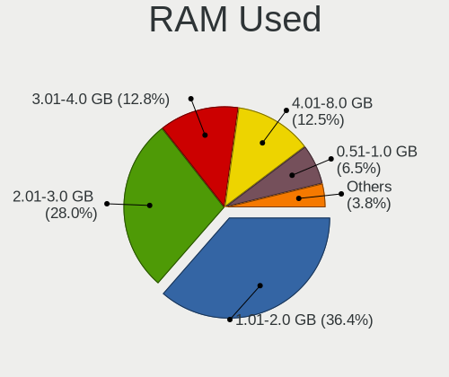
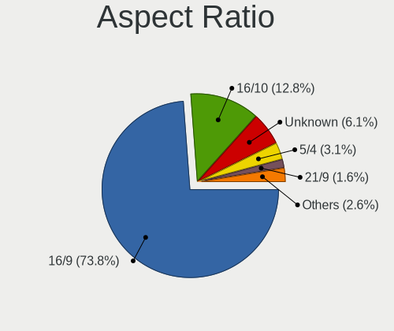
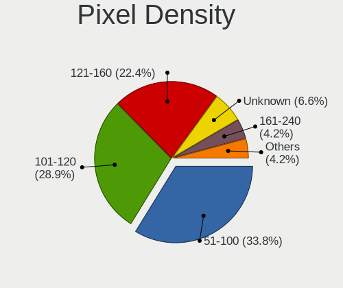
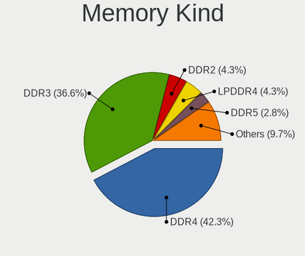

Linux Mint - Tested Hardware & Statistics
-----------------------------------------

A project to collect tested hardware configurations for Linux Mint.

Anyone can contribute to this report by the [hw-probe](https://github.com/linuxhw/hw-probe) tool:

    sudo -E hw-probe -all -upload

Please contribute! Especially if your hardware is rare.

This is a report for all computer types. See also reports for [desktops](/Dist/Linux_Mint/Desktop/README.md) and [notebooks](/Dist/Linux_Mint/Notebook/README.md).

Contents
--------

* [ Test Cases ](#test-cases)

* [ System ](#system)
  - [ OS                       ](#os)
  - [ OS Family                ](#os-family)
  - [ Kernel                   ](#kernel)
  - [ Kernel Family            ](#kernel-family)
  - [ Kernel Major Ver.        ](#kernel-major-ver)
  - [ Arch                     ](#arch)
  - [ DE                       ](#de)
  - [ Display Server           ](#display-server)
  - [ Display Manager          ](#display-manager)
  - [ OS Lang                  ](#os-lang)
  - [ Boot Mode                ](#boot-mode)
  - [ Filesystem               ](#filesystem)
  - [ Part. scheme             ](#part-scheme)
  - [ Dual Boot with Linux/BSD ](#dual-boot-with-linuxbsd)
  - [ Dual Boot (Win)          ](#dual-boot-win)

* [ Board ](#board)
  - [ Vendor                   ](#vendor)
  - [ Model                    ](#model)
  - [ Model Family             ](#model-family)
  - [ MFG Year                 ](#mfg-year)
  - [ Form Factor              ](#form-factor)
  - [ Secure Boot              ](#secure-boot)
  - [ Coreboot                 ](#coreboot)
  - [ RAM Size                 ](#ram-size)
  - [ RAM Used                 ](#ram-used)
  - [ Total Drives             ](#total-drives)
  - [ Has CD-ROM               ](#has-cd-rom)
  - [ Has Ethernet             ](#has-ethernet)
  - [ Has WiFi                 ](#has-wifi)
  - [ Has Bluetooth            ](#has-bluetooth)

* [ Location ](#location)
  - [ Country                  ](#country)
  - [ City                     ](#city)

* [ Drives ](#drives)
  - [ Drive Vendor             ](#drive-vendor)
  - [ Drive Model              ](#drive-model)
  - [ HDD Vendor               ](#hdd-vendor)
  - [ SSD Vendor               ](#ssd-vendor)
  - [ Drive Kind               ](#drive-kind)
  - [ Drive Connector          ](#drive-connector)
  - [ Drive Size               ](#drive-size)
  - [ Space Total              ](#space-total)
  - [ Space Used               ](#space-used)
  - [ Malfunc. Drives          ](#malfunc-drives)
  - [ Malfunc. Drive Vendor    ](#malfunc-drive-vendor)
  - [ Malfunc. HDD Vendor      ](#malfunc-hdd-vendor)
  - [ Malfunc. Drive Kind      ](#malfunc-drive-kind)
  - [ Failed Drives            ](#failed-drives)
  - [ Failed Drive Vendor      ](#failed-drive-vendor)
  - [ Drive Status             ](#drive-status)

* [ Storage controller ](#storage-controller)
  - [ Storage Vendor           ](#storage-vendor)
  - [ Storage Model            ](#storage-model)
  - [ Storage Kind             ](#storage-kind)

* [ Processor ](#processor)
  - [ CPU Vendor               ](#cpu-vendor)
  - [ CPU Model                ](#cpu-model)
  - [ CPU Model Family         ](#cpu-model-family)
  - [ CPU Cores                ](#cpu-cores)
  - [ CPU Sockets              ](#cpu-sockets)
  - [ CPU Threads              ](#cpu-threads)
  - [ CPU Op-Modes             ](#cpu-op-modes)
  - [ CPU Microcode            ](#cpu-microcode)
  - [ CPU Microarch            ](#cpu-microarch)

* [ Graphics ](#graphics)
  - [ GPU Vendor               ](#gpu-vendor)
  - [ GPU Model                ](#gpu-model)
  - [ GPU Combo                ](#gpu-combo)
  - [ GPU Driver               ](#gpu-driver)
  - [ GPU Memory               ](#gpu-memory)

* [ Monitor ](#monitor)
  - [ Monitor Vendor           ](#monitor-vendor)
  - [ Monitor Model            ](#monitor-model)
  - [ Monitor Resolution       ](#monitor-resolution)
  - [ Monitor Diagonal         ](#monitor-diagonal)
  - [ Monitor Width            ](#monitor-width)
  - [ Aspect Ratio             ](#aspect-ratio)
  - [ Monitor Area             ](#monitor-area)
  - [ Pixel Density            ](#pixel-density)
  - [ Multiple Monitors        ](#multiple-monitors)

* [ Network ](#network)
  - [ Net Controller Vendor    ](#net-controller-vendor)
  - [ Net Controller Model     ](#net-controller-model)
  - [ Wireless Vendor          ](#wireless-vendor)
  - [ Wireless Model           ](#wireless-model)
  - [ Ethernet Vendor          ](#ethernet-vendor)
  - [ Ethernet Model           ](#ethernet-model)
  - [ Net Controller Kind      ](#net-controller-kind)
  - [ Used Controller          ](#used-controller)
  - [ NICs                     ](#nics)
  - [ IPv6                     ](#ipv6)

* [ Bluetooth ](#bluetooth)
  - [ Bluetooth Vendor         ](#bluetooth-vendor)
  - [ Bluetooth Model          ](#bluetooth-model)

* [ Sound ](#sound)
  - [ Sound Vendor             ](#sound-vendor)
  - [ Sound Model              ](#sound-model)

* [ Memory ](#memory)
  - [ Memory Vendor            ](#memory-vendor)
  - [ Memory Model             ](#memory-model)
  - [ Memory Kind              ](#memory-kind)
  - [ Memory Form Factor       ](#memory-form-factor)
  - [ Memory Size              ](#memory-size)
  - [ Memory Speed             ](#memory-speed)

* [ Printers & scanners ](#printers--scanners)
  - [ Printer Vendor           ](#printer-vendor)
  - [ Printer Model            ](#printer-model)
  - [ Scanner Vendor           ](#scanner-vendor)
  - [ Scanner Model            ](#scanner-model)

* [ Camera ](#camera)
  - [ Camera Vendor            ](#camera-vendor)
  - [ Camera Model             ](#camera-model)

* [ Security ](#security)
  - [ Fingerprint Vendor       ](#fingerprint-vendor)
  - [ Fingerprint Model        ](#fingerprint-model)
  - [ Chipcard Vendor          ](#chipcard-vendor)
  - [ Chipcard Model           ](#chipcard-model)

* [ Unsupported ](#unsupported)
  - [ Unsupported Devices      ](#unsupported-devices)
  - [ Unsupported Device Types ](#unsupported-device-types)

Test Cases
----------

Total: 20328

| Vendor        | Model                       | Form-Factor | Probe                                                      | Date         |
|---------------|-----------------------------|-------------|------------------------------------------------------------|--------------|
| Positivo      | Mobile                      | Notebook    | [640bc1a962](https://linux-hardware.org/?probe=640bc1a962) | Oct 01, 2022 |
| Unknown       | X79-P3                      | Desktop     | [9269fd5ff4](https://linux-hardware.org/?probe=9269fd5ff4) | Oct 01, 2022 |
| ASUSTek       | K54LY                       | Notebook    | [98197c818f](https://linux-hardware.org/?probe=98197c818f) | Oct 01, 2022 |
| ASUSTek       | ROG STRIX X570-F GAMING     | Desktop     | [ff1c77c45a](https://linux-hardware.org/?probe=ff1c77c45a) | Oct 01, 2022 |
| Positivo      | POS-PIH81DL                 | Desktop     | [c17fe23ea7](https://linux-hardware.org/?probe=c17fe23ea7) | Oct 01, 2022 |
| ASUSTek       | VivoBook_ASUSLaptop E410... | Notebook    | [462f9bbdbe](https://linux-hardware.org/?probe=462f9bbdbe) | Oct 01, 2022 |
| Lenovo        | ThinkCentre M58 9728AHG     | Desktop     | [a2bc7fc88f](https://linux-hardware.org/?probe=a2bc7fc88f) | Oct 01, 2022 |
| Dell          | 0RW203                      | Desktop     | [c8a408311d](https://linux-hardware.org/?probe=c8a408311d) | Oct 01, 2022 |
| Toshiba       | Satellite L55-B             | Notebook    | [f3680300d7](https://linux-hardware.org/?probe=f3680300d7) | Oct 01, 2022 |
| HP            | ENVY x360 Convertible 15... | Convertible | [36aa510782](https://linux-hardware.org/?probe=36aa510782) | Oct 01, 2022 |
| Fujitsu       | LIFEBOOK A6210              | Notebook    | [73c4e6626f](https://linux-hardware.org/?probe=73c4e6626f) | Oct 01, 2022 |
| Lenovo        | ThinkPad T440 20B6005JUS    | Notebook    | [f12950ed92](https://linux-hardware.org/?probe=f12950ed92) | Oct 01, 2022 |
| Lenovo        | ThinkPad T440 20B6005JUS    | Notebook    | [b395d9ce9b](https://linux-hardware.org/?probe=b395d9ce9b) | Oct 01, 2022 |
| ASUSTek       | B75M-A                      | Desktop     | [cbeab03cbd](https://linux-hardware.org/?probe=cbeab03cbd) | Oct 01, 2022 |
| HP            | ENVY x360 Convertible 15... | Convertible | [3d7bdf258d](https://linux-hardware.org/?probe=3d7bdf258d) | Oct 01, 2022 |
| Foxconn       | 2AB1                        | Desktop     | [18971aaf86](https://linux-hardware.org/?probe=18971aaf86) | Oct 01, 2022 |
| Dell          | G3 3500                     | Notebook    | [245ebaabe5](https://linux-hardware.org/?probe=245ebaabe5) | Oct 01, 2022 |
| Samsung       | 950XDB/951XDB/950XDY        | Notebook    | [5c5353c8b6](https://linux-hardware.org/?probe=5c5353c8b6) | Oct 01, 2022 |
| ASUSTek       | UX360UAK                    | Convertible | [5077b42a8b](https://linux-hardware.org/?probe=5077b42a8b) | Oct 01, 2022 |
| Lenovo        | IdeaPad 330-15IKB 81FE      | Notebook    | [b62ddbdab0](https://linux-hardware.org/?probe=b62ddbdab0) | Oct 01, 2022 |
| Fujitsu       | LIFEBOOK A6210              | Notebook    | [dffb22efdc](https://linux-hardware.org/?probe=dffb22efdc) | Oct 01, 2022 |
| Timi          | TM1709                      | Notebook    | [33022811a8](https://linux-hardware.org/?probe=33022811a8) | Oct 01, 2022 |
| HP            | ZBook 17 G4                 | Notebook    | [1476da42c3](https://linux-hardware.org/?probe=1476da42c3) | Sep 30, 2022 |
| Lenovo        | IdeaPad 3 15ITL6 82H8       | Notebook    | [92f9efe077](https://linux-hardware.org/?probe=92f9efe077) | Sep 30, 2022 |
| Apple         | Mac-F221BEC8                | Desktop     | [ab0a3e1a94](https://linux-hardware.org/?probe=ab0a3e1a94) | Sep 30, 2022 |
| Dell          | 0NK70N A03                  | Desktop     | [9cfa433855](https://linux-hardware.org/?probe=9cfa433855) | Sep 30, 2022 |
| Lenovo        | G460 20041                  | Notebook    | [130c0489f9](https://linux-hardware.org/?probe=130c0489f9) | Sep 30, 2022 |
| Dell          | Inspiron 16 Plus 7620       | Notebook    | [73e2559339](https://linux-hardware.org/?probe=73e2559339) | Sep 30, 2022 |
| Lenovo        | ThinkBook 13s G2 ITL 20V... | Notebook    | [e829c9c0c6](https://linux-hardware.org/?probe=e829c9c0c6) | Sep 30, 2022 |
| ASUSTek       | P8H67-M                     | Desktop     | [583fe6d90d](https://linux-hardware.org/?probe=583fe6d90d) | Sep 30, 2022 |
| Acer          | Aspire A715-74G             | Notebook    | [17abc08754](https://linux-hardware.org/?probe=17abc08754) | Sep 30, 2022 |
| Acer          | Aspire A315-56              | Notebook    | [1ee3922873](https://linux-hardware.org/?probe=1ee3922873) | Sep 30, 2022 |
| Lenovo        | ThinkCentre M58 9728AHG     | Desktop     | [773ae7f01e](https://linux-hardware.org/?probe=773ae7f01e) | Sep 30, 2022 |
| Positivo      | Mobile                      | Notebook    | [dcf8b09bec](https://linux-hardware.org/?probe=dcf8b09bec) | Sep 30, 2022 |
| Positivo      | Mobile                      | Notebook    | [6d2584bcb8](https://linux-hardware.org/?probe=6d2584bcb8) | Sep 30, 2022 |
| HP            | Pavilion dv8000 (ET839UA... | Notebook    | [46ef409fa9](https://linux-hardware.org/?probe=46ef409fa9) | Sep 30, 2022 |
| Dell          | Inspiron 3505               | Notebook    | [097825430f](https://linux-hardware.org/?probe=097825430f) | Sep 30, 2022 |
| Dell          | Inspiron 15-3567            | Notebook    | [5f1d0e6142](https://linux-hardware.org/?probe=5f1d0e6142) | Sep 30, 2022 |
| Dell          | Inspiron 15-3567            | Notebook    | [70a80b4201](https://linux-hardware.org/?probe=70a80b4201) | Sep 30, 2022 |
| Dell          | 0C8JG6 A00                  | All in one  | [5111677e9e](https://linux-hardware.org/?probe=5111677e9e) | Sep 30, 2022 |
| Toshiba       | Satellite S70-A             | Notebook    | [7c6b3e14ce](https://linux-hardware.org/?probe=7c6b3e14ce) | Sep 30, 2022 |
| ASRock        | N68C-S UCC                  | Desktop     | [90d8579454](https://linux-hardware.org/?probe=90d8579454) | Sep 30, 2022 |
| Dell          | 0KJCC5 A00                  | Desktop     | [f9582eb0a8](https://linux-hardware.org/?probe=f9582eb0a8) | Sep 29, 2022 |
| Toshiba       | Satellite L670              | Notebook    | [3b3e7965a5](https://linux-hardware.org/?probe=3b3e7965a5) | Sep 29, 2022 |
| GHIA          | LFI3H                       | Notebook    | [4233e4e6c5](https://linux-hardware.org/?probe=4233e4e6c5) | Sep 29, 2022 |
| Apple         | Mac-F226BEC8 PVT            | All in one  | [18f49633e2](https://linux-hardware.org/?probe=18f49633e2) | Sep 29, 2022 |
| GHIA          | LFI3H                       | Notebook    | [482e78460a](https://linux-hardware.org/?probe=482e78460a) | Sep 29, 2022 |
| AMI           | Cherry Trail CR             | Notebook    | [58caf99a77](https://linux-hardware.org/?probe=58caf99a77) | Sep 29, 2022 |
| HP            | EliteBook 6930p             | Notebook    | [56e5d25094](https://linux-hardware.org/?probe=56e5d25094) | Sep 29, 2022 |
| HP            | 158A                        | Desktop     | [151ee8b7d6](https://linux-hardware.org/?probe=151ee8b7d6) | Sep 29, 2022 |
| HP            | Laptop 15-db0xxx            | Notebook    | [8f42666f03](https://linux-hardware.org/?probe=8f42666f03) | Sep 29, 2022 |
| HP            | 81C9                        | Desktop     | [c92ebd45a9](https://linux-hardware.org/?probe=c92ebd45a9) | Sep 29, 2022 |
| Dell          | Latitude E6330              | Notebook    | [b075fbcb56](https://linux-hardware.org/?probe=b075fbcb56) | Sep 29, 2022 |
| Dell          | Inspiron 1564               | Notebook    | [d9dd05aa12](https://linux-hardware.org/?probe=d9dd05aa12) | Sep 29, 2022 |
| Dell          | Inspiron 7347               | Notebook    | [ac3079df8c](https://linux-hardware.org/?probe=ac3079df8c) | Sep 29, 2022 |
| Dell          | Inspiron 7347               | Notebook    | [144cad649c](https://linux-hardware.org/?probe=144cad649c) | Sep 29, 2022 |
| Acer          | Veriton X6610G              | Desktop     | [66733e59e2](https://linux-hardware.org/?probe=66733e59e2) | Sep 29, 2022 |
| Dell          | Latitude E6430              | Notebook    | [f3e5e0005d](https://linux-hardware.org/?probe=f3e5e0005d) | Sep 29, 2022 |
| Gigabyte      | A320M-H-CF                  | Desktop     | [25e3064dd2](https://linux-hardware.org/?probe=25e3064dd2) | Sep 29, 2022 |
| Lenovo        | IdeaPad S145-15AST 81N3     | Notebook    | [96c4c8ba02](https://linux-hardware.org/?probe=96c4c8ba02) | Sep 28, 2022 |
| Dell          | 0NK70N A03                  | Desktop     | [7e2d1b00fd](https://linux-hardware.org/?probe=7e2d1b00fd) | Sep 28, 2022 |
| Microsoft     | Surface Pro 3               | Tablet      | [b6bbdd2fc0](https://linux-hardware.org/?probe=b6bbdd2fc0) | Sep 28, 2022 |
| Dell          | 06D7TR A02                  | Desktop     | [a0d832ff6a](https://linux-hardware.org/?probe=a0d832ff6a) | Sep 28, 2022 |
| MSI           | X299 SLI PLUS               | Desktop     | [1695ba8137](https://linux-hardware.org/?probe=1695ba8137) | Sep 28, 2022 |
| ASUSTek       | PRIME B450M-K               | Desktop     | [262a244d81](https://linux-hardware.org/?probe=262a244d81) | Sep 28, 2022 |
| ASUSTek       | M5A97 R2.0                  | Desktop     | [9b3c73c104](https://linux-hardware.org/?probe=9b3c73c104) | Sep 28, 2022 |
| ASUSTek       | M5A97 R2.0                  | Desktop     | [4cdcef3ebd](https://linux-hardware.org/?probe=4cdcef3ebd) | Sep 28, 2022 |
| Lenovo        | ThinkBook 14s Yoga ITL 2... | Convertible | [74faec9cb4](https://linux-hardware.org/?probe=74faec9cb4) | Sep 28, 2022 |
| Chuwi         | GemiBook Pro                | Notebook    | [fb12905329](https://linux-hardware.org/?probe=fb12905329) | Sep 28, 2022 |
| LG Electro... | C400-G.BC22P1               | Notebook    | [a325f5eb86](https://linux-hardware.org/?probe=a325f5eb86) | Sep 28, 2022 |
| Samsung       | 750XED                      | Notebook    | [dcb54d69f8](https://linux-hardware.org/?probe=dcb54d69f8) | Sep 27, 2022 |
| Toshiba       | QOSMIO X70-B                | Notebook    | [04589a6a6c](https://linux-hardware.org/?probe=04589a6a6c) | Sep 27, 2022 |
| MSI           | B550-A PRO                  | Desktop     | [2a5a7aeb95](https://linux-hardware.org/?probe=2a5a7aeb95) | Sep 27, 2022 |
| Dell          | Latitude E6540              | Notebook    | [27c854b1a0](https://linux-hardware.org/?probe=27c854b1a0) | Sep 27, 2022 |
| MSI           | A68HM-E33 V2                | Desktop     | [c5e17e9617](https://linux-hardware.org/?probe=c5e17e9617) | Sep 27, 2022 |
| Gigabyte      | GA-78LMT-USB3 R2 sex        | Desktop     | [63cd838fcc](https://linux-hardware.org/?probe=63cd838fcc) | Sep 27, 2022 |
| Lenovo        | G780                        | Notebook    | [057a86bcdc](https://linux-hardware.org/?probe=057a86bcdc) | Sep 27, 2022 |
| Toshiba       | Satellite C50-B             | Notebook    | [3cea1ede58](https://linux-hardware.org/?probe=3cea1ede58) | Sep 27, 2022 |
| Dell          | 0NV103 A00                  | All in one  | [62a89ede99](https://linux-hardware.org/?probe=62a89ede99) | Sep 27, 2022 |
| Dell          | XPS 17 9700                 | Notebook    | [cd6dcf0de8](https://linux-hardware.org/?probe=cd6dcf0de8) | Sep 27, 2022 |
| Lenovo        | MAHOBAY NO DPK              | Desktop     | [1979013fa2](https://linux-hardware.org/?probe=1979013fa2) | Sep 27, 2022 |
| HP            | 8433 11                     | Desktop     | [a1d424bced](https://linux-hardware.org/?probe=a1d424bced) | Sep 27, 2022 |
| Standard      | AHV                         | Notebook    | [a80b2d344d](https://linux-hardware.org/?probe=a80b2d344d) | Sep 27, 2022 |
| HP            | 802F                        | Desktop     | [12645dcde4](https://linux-hardware.org/?probe=12645dcde4) | Sep 27, 2022 |
| Fujitsu Si... | ESPRIMO Mobile V5535        | Notebook    | [6f4452adc5](https://linux-hardware.org/?probe=6f4452adc5) | Sep 27, 2022 |
| ASUSTek       | K53SV                       | Notebook    | [d2801f9560](https://linux-hardware.org/?probe=d2801f9560) | Sep 26, 2022 |
| Dell          | 018D1Y A00                  | Desktop     | [744202f733](https://linux-hardware.org/?probe=744202f733) | Sep 26, 2022 |
| Biostar       | TH67XE                      | Desktop     | [24df0079b5](https://linux-hardware.org/?probe=24df0079b5) | Sep 26, 2022 |
| Lenovo        | V15 G2 ALC 82KD             | Notebook    | [3c0a494baa](https://linux-hardware.org/?probe=3c0a494baa) | Sep 26, 2022 |
| Fujitsu       | LIFEBOOK A544               | Notebook    | [6e4694775c](https://linux-hardware.org/?probe=6e4694775c) | Sep 26, 2022 |
| HP            | 1494                        | Desktop     | [aa2bd7da6c](https://linux-hardware.org/?probe=aa2bd7da6c) | Sep 26, 2022 |
| ASUSTek       | P5N7A-VM                    | Desktop     | [e8ac8a9926](https://linux-hardware.org/?probe=e8ac8a9926) | Sep 26, 2022 |
| ASUSTek       | P5N7A-VM                    | Desktop     | [86580fe9f2](https://linux-hardware.org/?probe=86580fe9f2) | Sep 26, 2022 |
| HP            | Laptop 17-cp0xxx            | Notebook    | [fa6a915235](https://linux-hardware.org/?probe=fa6a915235) | Sep 26, 2022 |
| Gigabyte      | 970A-DS3P                   | Desktop     | [202e51c5d3](https://linux-hardware.org/?probe=202e51c5d3) | Sep 26, 2022 |
| AZW           | Green G2                    | Desktop     | [af79cd4332](https://linux-hardware.org/?probe=af79cd4332) | Sep 26, 2022 |
| HP            | G42                         | Notebook    | [39a4836398](https://linux-hardware.org/?probe=39a4836398) | Sep 26, 2022 |
| MSI           | GE75 Raider 8SF             | Notebook    | [094a9b115b](https://linux-hardware.org/?probe=094a9b115b) | Sep 26, 2022 |
| HP            | Pavilion g7                 | Notebook    | [19b206ba2f](https://linux-hardware.org/?probe=19b206ba2f) | Sep 25, 2022 |
| ASUSTek       | VivoBook_ASUSLaptop X340... | Notebook    | [7be473c3c6](https://linux-hardware.org/?probe=7be473c3c6) | Sep 25, 2022 |
| Timi          | RedmiBook 16                | Notebook    | [0a65bab615](https://linux-hardware.org/?probe=0a65bab615) | Sep 25, 2022 |
| MSI           | A68HM-E33 V2                | Desktop     | [939c0c0a19](https://linux-hardware.org/?probe=939c0c0a19) | Sep 25, 2022 |
| Lenovo        | ThinkPad X250 20CL001DMS    | Notebook    | [7662278b86](https://linux-hardware.org/?probe=7662278b86) | Sep 25, 2022 |
| ASUSTek       | B150-PLUS                   | Desktop     | [c64181dd6a](https://linux-hardware.org/?probe=c64181dd6a) | Sep 25, 2022 |
| HUAWEI        | KLVL-WXXW                   | Notebook    | [6828f26ab2](https://linux-hardware.org/?probe=6828f26ab2) | Sep 25, 2022 |
| Lenovo        | ThinkPad T14 Gen 3 21AHC... | Notebook    | [0e69d41fef](https://linux-hardware.org/?probe=0e69d41fef) | Sep 25, 2022 |
| ASUSTek       | ZenBook UX325EA_UX325EA     | Notebook    | [2854d30785](https://linux-hardware.org/?probe=2854d30785) | Sep 25, 2022 |
| Samsung       | RV411/RV511/E3511/S3511/... | Notebook    | [939bba43d1](https://linux-hardware.org/?probe=939bba43d1) | Sep 25, 2022 |
| Gigabyte      | Z97X-UD3H-BK-CF             | Desktop     | [dfdb7b73ae](https://linux-hardware.org/?probe=dfdb7b73ae) | Sep 25, 2022 |
| ASUSTek       | ROG STRIX B550-F GAMING     | Desktop     | [208c7988f7](https://linux-hardware.org/?probe=208c7988f7) | Sep 25, 2022 |
| Dell          | Inspiron 3442               | Notebook    | [7fb024bb5d](https://linux-hardware.org/?probe=7fb024bb5d) | Sep 25, 2022 |
| HP            | 8433 11                     | Desktop     | [dffc61c155](https://linux-hardware.org/?probe=dffc61c155) | Sep 24, 2022 |
| HP            | 255 G5                      | Notebook    | [2a8f595510](https://linux-hardware.org/?probe=2a8f595510) | Sep 24, 2022 |
| Dell          | Inspiron 3442               | Notebook    | [1190ad2886](https://linux-hardware.org/?probe=1190ad2886) | Sep 24, 2022 |
| HP            | ENVY x360 Convertible 15... | Convertible | [d3e3bfec3e](https://linux-hardware.org/?probe=d3e3bfec3e) | Sep 24, 2022 |
| HP            | 802F                        | Desktop     | [2390f9c154](https://linux-hardware.org/?probe=2390f9c154) | Sep 24, 2022 |
| Dell          | Inspiron 1440               | Notebook    | [c928a944c0](https://linux-hardware.org/?probe=c928a944c0) | Sep 24, 2022 |
| ECS           | H61H2-WM                    | Desktop     | [6b0f45b0c0](https://linux-hardware.org/?probe=6b0f45b0c0) | Sep 24, 2022 |
| ASUSTek       | Leonite2                    | Desktop     | [f7e1dc7c9d](https://linux-hardware.org/?probe=f7e1dc7c9d) | Sep 24, 2022 |
| ASUSTek       | Leonite2                    | Desktop     | [63d494787f](https://linux-hardware.org/?probe=63d494787f) | Sep 24, 2022 |
| ASRock        | 4CoreDual-SATA2             | Desktop     | [eb0e992df7](https://linux-hardware.org/?probe=eb0e992df7) | Sep 24, 2022 |
| ASUSTek       | X55U                        | Notebook    | [e8b140c0cc](https://linux-hardware.org/?probe=e8b140c0cc) | Sep 24, 2022 |
| ASUSTek       | X55U                        | Notebook    | [863a5df6ad](https://linux-hardware.org/?probe=863a5df6ad) | Sep 24, 2022 |
| HP            | ENVY x360 Convertible 15... | Convertible | [22c72262c4](https://linux-hardware.org/?probe=22c72262c4) | Sep 24, 2022 |
| Dell          | 0C7195                      | Desktop     | [9711ab00d7](https://linux-hardware.org/?probe=9711ab00d7) | Sep 24, 2022 |
| Lenovo        | ThinkPad T430 23476Y7       | Notebook    | [8488ad9e53](https://linux-hardware.org/?probe=8488ad9e53) | Sep 24, 2022 |
| Gigabyte      | G31M-S2C                    | Desktop     | [d0aa96a903](https://linux-hardware.org/?probe=d0aa96a903) | Sep 24, 2022 |
| MSI           | H510M PRO                   | Desktop     | [bb7475d072](https://linux-hardware.org/?probe=bb7475d072) | Sep 24, 2022 |
| Lenovo        | ThinkPad E15 Gen 4 21ED0... | Notebook    | [b7a5cfcf9c](https://linux-hardware.org/?probe=b7a5cfcf9c) | Sep 24, 2022 |
| Lenovo        | NO DPK                      | Desktop     | [7bdaedd0f7](https://linux-hardware.org/?probe=7bdaedd0f7) | Sep 24, 2022 |
| Gateway       | IPISB-VR                    | Desktop     | [21ee50eb69](https://linux-hardware.org/?probe=21ee50eb69) | Sep 24, 2022 |
| HP            | ENVY x360 Convertible 15... | Convertible | [14bf8d86de](https://linux-hardware.org/?probe=14bf8d86de) | Sep 24, 2022 |
| ASUSTek       | P8B75-M LE                  | Desktop     | [8975676700](https://linux-hardware.org/?probe=8975676700) | Sep 24, 2022 |
| Lenovo        | ThinkPad L14 Gen 1 20U50... | Notebook    | [dc165f65b5](https://linux-hardware.org/?probe=dc165f65b5) | Sep 24, 2022 |
| Dell          | Inspiron 16 Plus 7620       | Notebook    | [977d73b98a](https://linux-hardware.org/?probe=977d73b98a) | Sep 24, 2022 |
| Dell          | Latitude E5510              | Notebook    | [04f4e9a803](https://linux-hardware.org/?probe=04f4e9a803) | Sep 24, 2022 |
| HP            | Pavilion dv8000 (ET839UA... | Notebook    | [70404f465f](https://linux-hardware.org/?probe=70404f465f) | Sep 24, 2022 |
| ASRock        | X399 Taichi                 | Desktop     | [e6de41eac0](https://linux-hardware.org/?probe=e6de41eac0) | Sep 24, 2022 |
| HP            | 8643 SMVB                   | Desktop     | [c2e100d58d](https://linux-hardware.org/?probe=c2e100d58d) | Sep 24, 2022 |
| Dell          | Latitude E5570              | Notebook    | [df18be69a3](https://linux-hardware.org/?probe=df18be69a3) | Sep 24, 2022 |
| HP            | 802F                        | Desktop     | [1b25932752](https://linux-hardware.org/?probe=1b25932752) | Sep 23, 2022 |
| HP            | Laptop 17-bs0xx             | Notebook    | [33398b1a21](https://linux-hardware.org/?probe=33398b1a21) | Sep 23, 2022 |
| Lenovo        | Y50-70 Touch 20349          | Notebook    | [f038a5908f](https://linux-hardware.org/?probe=f038a5908f) | Sep 23, 2022 |
| HP            | 8055                        | Desktop     | [a45563167c](https://linux-hardware.org/?probe=a45563167c) | Sep 23, 2022 |
| Medion        | B460H6-EM                   | Desktop     | [9ab2a06631](https://linux-hardware.org/?probe=9ab2a06631) | Sep 23, 2022 |
| Toshiba       | ENCORE 2 WT8-B              | Notebook    | [b9cd7b49d3](https://linux-hardware.org/?probe=b9cd7b49d3) | Sep 23, 2022 |
| Lenovo        | ThinkPad E15 Gen 4 21ED0... | Notebook    | [e8e1108a58](https://linux-hardware.org/?probe=e8e1108a58) | Sep 23, 2022 |
| ASUSTek       | M2N68-AM SE2                | Desktop     | [412f70b76b](https://linux-hardware.org/?probe=412f70b76b) | Sep 23, 2022 |
| Medion        | H110H4-EM                   | Desktop     | [2fa25ddedf](https://linux-hardware.org/?probe=2fa25ddedf) | Sep 23, 2022 |
| Dell          | 0WR7PY A02                  | Desktop     | [0c47cbc25d](https://linux-hardware.org/?probe=0c47cbc25d) | Sep 23, 2022 |
| Medion        | H110H4-EM                   | Desktop     | [8e7d4a7aeb](https://linux-hardware.org/?probe=8e7d4a7aeb) | Sep 23, 2022 |
| Dell          | 0WR7PY A02                  | Desktop     | [53fc678043](https://linux-hardware.org/?probe=53fc678043) | Sep 23, 2022 |
| ZOTAC         | ZBOX-CI320NANO series Re... | Mini pc     | [e2a827d41b](https://linux-hardware.org/?probe=e2a827d41b) | Sep 23, 2022 |
| HP            | 8924 0101                   | All in one  | [3130463385](https://linux-hardware.org/?probe=3130463385) | Sep 23, 2022 |
| HP            | 0AA0h                       | Desktop     | [5757039d29](https://linux-hardware.org/?probe=5757039d29) | Sep 23, 2022 |
| Lenovo        | 10051                       | All in one  | [195ec7cb8c](https://linux-hardware.org/?probe=195ec7cb8c) | Sep 23, 2022 |
| MSI           | B350 PC MATE                | Desktop     | [0c4332eead](https://linux-hardware.org/?probe=0c4332eead) | Sep 23, 2022 |
| Dell          | Precision 7710              | Notebook    | [c48bccbee4](https://linux-hardware.org/?probe=c48bccbee4) | Sep 23, 2022 |
| Acer          | TravelMate P256-MG          | Notebook    | [0a7c58d00a](https://linux-hardware.org/?probe=0a7c58d00a) | Sep 23, 2022 |
| Acer          | Aspire 5532                 | Notebook    | [b427a13b9b](https://linux-hardware.org/?probe=b427a13b9b) | Sep 22, 2022 |
| Apple         | Mac-942B5BF58194151B        | All in one  | [939f154314](https://linux-hardware.org/?probe=939f154314) | Sep 22, 2022 |
| Dell          | Inspiron 1721               | Notebook    | [ab0eb7f4ce](https://linux-hardware.org/?probe=ab0eb7f4ce) | Sep 22, 2022 |
| Fujitsu       | LIFEBOOK A544               | Notebook    | [648fb5c63e](https://linux-hardware.org/?probe=648fb5c63e) | Sep 22, 2022 |
| HP            | 1494                        | Desktop     | [cd3778e7eb](https://linux-hardware.org/?probe=cd3778e7eb) | Sep 22, 2022 |
| MSI           | 760GM-P34                   | Desktop     | [af750add66](https://linux-hardware.org/?probe=af750add66) | Sep 22, 2022 |
| HP            | 1494                        | Desktop     | [4a3ad3e89d](https://linux-hardware.org/?probe=4a3ad3e89d) | Sep 22, 2022 |
| ASUSTek       | Zenbook UX5401ZAS_UX5401... | Notebook    | [fc2ea7b0a0](https://linux-hardware.org/?probe=fc2ea7b0a0) | Sep 22, 2022 |
| ASUSTek       | G750JM                      | Notebook    | [2e53c11312](https://linux-hardware.org/?probe=2e53c11312) | Sep 22, 2022 |
| Lenovo        | ThinkPad E560 20EV002FUS    | Notebook    | [2d8eefaf6a](https://linux-hardware.org/?probe=2d8eefaf6a) | Sep 22, 2022 |
| Apple         | Mac-F4228EC8 DVT            | All in one  | [17d1bfe3d9](https://linux-hardware.org/?probe=17d1bfe3d9) | Sep 22, 2022 |
| Dell          | Latitude E6320              | Notebook    | [452304d040](https://linux-hardware.org/?probe=452304d040) | Sep 22, 2022 |
| HP            | Pavilion dv4000 (PX306UA... | Notebook    | [372160583e](https://linux-hardware.org/?probe=372160583e) | Sep 22, 2022 |
| Sony          | VPCEB1Z1E                   | Notebook    | [37fea84df6](https://linux-hardware.org/?probe=37fea84df6) | Sep 22, 2022 |
| ASUSTek       | M5A78L-M LX3                | Desktop     | [75a6fc3a08](https://linux-hardware.org/?probe=75a6fc3a08) | Sep 22, 2022 |
| Gigabyte      | 945GM-S2                    | Desktop     | [9fcea940e6](https://linux-hardware.org/?probe=9fcea940e6) | Sep 22, 2022 |
| Lenovo        | IdeaPad 5 14ALC05 82LM      | Notebook    | [641ad27b06](https://linux-hardware.org/?probe=641ad27b06) | Sep 22, 2022 |
| Dell          | Latitude E6510              | Notebook    | [fa644f90c4](https://linux-hardware.org/?probe=fa644f90c4) | Sep 22, 2022 |
| Gigabyte      | 990FXA-UD5                  | Desktop     | [7c8d5609e0](https://linux-hardware.org/?probe=7c8d5609e0) | Sep 22, 2022 |
| Chuwi         | HeroBook Pro                | Notebook    | [76be3ff1db](https://linux-hardware.org/?probe=76be3ff1db) | Sep 22, 2022 |
| ASUSTek       | P5B                         | Desktop     | [f265d37bf5](https://linux-hardware.org/?probe=f265d37bf5) | Sep 22, 2022 |
| Lenovo        | ThinkPad W520 4270CTO       | Notebook    | [cae7b3dc49](https://linux-hardware.org/?probe=cae7b3dc49) | Sep 22, 2022 |
| ASUSTek       | TUF B450M-PRO GAMING        | Desktop     | [e1af6b9e74](https://linux-hardware.org/?probe=e1af6b9e74) | Sep 22, 2022 |
| Sony          | SVE15125CBW                 | Notebook    | [50b65906b1](https://linux-hardware.org/?probe=50b65906b1) | Sep 22, 2022 |
| OEM           | B75 Ver:1.41                | Desktop     | [e22d2bac17](https://linux-hardware.org/?probe=e22d2bac17) | Sep 22, 2022 |
| HP            | 802F                        | Desktop     | [1f4d3353d2](https://linux-hardware.org/?probe=1f4d3353d2) | Sep 22, 2022 |
| MSI           | GT70 2OC/2OD                | Notebook    | [c6a0b0d987](https://linux-hardware.org/?probe=c6a0b0d987) | Sep 22, 2022 |
| HP            | Pavilion dv8000 (ET839UA... | Notebook    | [dd994c3f70](https://linux-hardware.org/?probe=dd994c3f70) | Sep 22, 2022 |
| Lenovo        | ThinkPad Edge E320 1298A... | Notebook    | [869b076838](https://linux-hardware.org/?probe=869b076838) | Sep 21, 2022 |
| ASUSTek       | PRIME Z390-A                | Desktop     | [5e4d865987](https://linux-hardware.org/?probe=5e4d865987) | Sep 21, 2022 |
| ASUSTek       | VivoBook_ASUSLaptop X509... | Notebook    | [afd66066bc](https://linux-hardware.org/?probe=afd66066bc) | Sep 21, 2022 |
| HP            | 1494                        | Desktop     | [5018a8dade](https://linux-hardware.org/?probe=5018a8dade) | Sep 21, 2022 |
| Lenovo        | ThinkPad X230 23255Z6       | Notebook    | [25cc23e2ad](https://linux-hardware.org/?probe=25cc23e2ad) | Sep 21, 2022 |
| Lenovo        | ThinkPad T61 6468AE1        | Notebook    | [8719597c22](https://linux-hardware.org/?probe=8719597c22) | Sep 21, 2022 |
| Acer          | Aspire ES1-111M             | Notebook    | [04f08de672](https://linux-hardware.org/?probe=04f08de672) | Sep 21, 2022 |
| Lenovo        | ThinkCentre M81 5049W16     | Desktop     | [67067bfc09](https://linux-hardware.org/?probe=67067bfc09) | Sep 21, 2022 |
| Apple         | MacBookPro8,1               | Notebook    | [d97b8fc0ed](https://linux-hardware.org/?probe=d97b8fc0ed) | Sep 21, 2022 |
| HUAWEI        | KLVL-WXXW                   | Notebook    | [8e46e07b3a](https://linux-hardware.org/?probe=8e46e07b3a) | Sep 21, 2022 |
| Lenovo        | G40-80 80E4                 | Notebook    | [575b85b038](https://linux-hardware.org/?probe=575b85b038) | Sep 21, 2022 |
| HP            | Pavilion dv8000 (ET839UA... | Notebook    | [79f0e7d5a2](https://linux-hardware.org/?probe=79f0e7d5a2) | Sep 21, 2022 |
| Lenovo        | G40-80 80E4                 | Notebook    | [18a0a2158c](https://linux-hardware.org/?probe=18a0a2158c) | Sep 21, 2022 |
| Dell          | Latitude 3540               | Notebook    | [7e56d744b7](https://linux-hardware.org/?probe=7e56d744b7) | Sep 21, 2022 |
| Dell          | Latitude 3540               | Notebook    | [0216f52b36](https://linux-hardware.org/?probe=0216f52b36) | Sep 21, 2022 |
| Gigabyte      | Z590 UD AC                  | Desktop     | [3add13cf6d](https://linux-hardware.org/?probe=3add13cf6d) | Sep 21, 2022 |
| AZW           | Green G2                    | Desktop     | [eecf2ffec4](https://linux-hardware.org/?probe=eecf2ffec4) | Sep 21, 2022 |
| Lenovo        | ThinkPad E15 Gen 4 21EDC... | Notebook    | [910b604abc](https://linux-hardware.org/?probe=910b604abc) | Sep 21, 2022 |
| Dell          | 0773VG A02                  | Desktop     | [84f143d4ea](https://linux-hardware.org/?probe=84f143d4ea) | Sep 21, 2022 |
| Dell          | 0D6H9T A00                  | Desktop     | [63b718ac3a](https://linux-hardware.org/?probe=63b718ac3a) | Sep 21, 2022 |
| ASUSTek       | PRIME B450M-A               | Desktop     | [2ac923fd8c](https://linux-hardware.org/?probe=2ac923fd8c) | Sep 21, 2022 |
| Dell          | Latitude E6540              | Notebook    | [08bd609dbe](https://linux-hardware.org/?probe=08bd609dbe) | Sep 20, 2022 |
| LG Electro... | C400-G.BC22P1               | Notebook    | [b5aad7f903](https://linux-hardware.org/?probe=b5aad7f903) | Sep 20, 2022 |
| Dell          | 0D6H9T A00                  | Desktop     | [90437079a3](https://linux-hardware.org/?probe=90437079a3) | Sep 20, 2022 |
| HP            | ENVY x360 Convertible 15... | Convertible | [8f28254d53](https://linux-hardware.org/?probe=8f28254d53) | Sep 20, 2022 |
| Digiboard     | NM70-TI                     | Desktop     | [ace83d527c](https://linux-hardware.org/?probe=ace83d527c) | Sep 20, 2022 |
| Dell          | Latitude E7240              | Notebook    | [6db3839532](https://linux-hardware.org/?probe=6db3839532) | Sep 20, 2022 |
| Dell          | Latitude E7240              | Notebook    | [21dc4700da](https://linux-hardware.org/?probe=21dc4700da) | Sep 20, 2022 |
| Framework     | Laptop                      | Notebook    | [dd163cfa96](https://linux-hardware.org/?probe=dd163cfa96) | Sep 20, 2022 |
| Toshiba       | Satellite L875-11M          | Notebook    | [42f3498e9e](https://linux-hardware.org/?probe=42f3498e9e) | Sep 20, 2022 |
| ASUSTek       | Z97-A                       | Desktop     | [cc9467d0fe](https://linux-hardware.org/?probe=cc9467d0fe) | Sep 20, 2022 |
| Lenovo        | ThinkPad T61 6468AE1        | Notebook    | [028ead1680](https://linux-hardware.org/?probe=028ead1680) | Sep 20, 2022 |
| Dell          | Latitude E6420              | Notebook    | [e46ce42e90](https://linux-hardware.org/?probe=e46ce42e90) | Sep 20, 2022 |
| Dell          | Latitude E4310              | Notebook    | [06dc3db422](https://linux-hardware.org/?probe=06dc3db422) | Sep 20, 2022 |
| Acer          | Aspire E5-532               | Notebook    | [1d0f80e0f1](https://linux-hardware.org/?probe=1d0f80e0f1) | Sep 20, 2022 |
| Acer          | Aspire E5-532               | Notebook    | [f349ec9700](https://linux-hardware.org/?probe=f349ec9700) | Sep 20, 2022 |
| Lenovo        | B570e 476025G               | Notebook    | [ab67a90ba7](https://linux-hardware.org/?probe=ab67a90ba7) | Sep 20, 2022 |
| HUAWEI        | BOM-WXX9                    | Notebook    | [d30c6c5b9b](https://linux-hardware.org/?probe=d30c6c5b9b) | Sep 20, 2022 |
| HUAWEI        | BOM-WXX9                    | Notebook    | [f2906f8b8d](https://linux-hardware.org/?probe=f2906f8b8d) | Sep 19, 2022 |
| LG Electro... | C400-G.BC31P1               | Notebook    | [66c8977810](https://linux-hardware.org/?probe=66c8977810) | Sep 19, 2022 |
| Samsung       | 350V5C/351V5C/3540VC/344... | Notebook    | [85952e171d](https://linux-hardware.org/?probe=85952e171d) | Sep 19, 2022 |
| HP            | Pavilion dv8000 (ET839UA... | Notebook    | [66596e407c](https://linux-hardware.org/?probe=66596e407c) | Sep 19, 2022 |
| ASRock        | X399 Phantom Gaming 6       | Desktop     | [94d45ff789](https://linux-hardware.org/?probe=94d45ff789) | Sep 19, 2022 |
| HP            | 81C9                        | Desktop     | [3795beb1c4](https://linux-hardware.org/?probe=3795beb1c4) | Sep 19, 2022 |
| Intel         | DH61BF AAG81311-101         | Desktop     | [43c2f57807](https://linux-hardware.org/?probe=43c2f57807) | Sep 19, 2022 |
| Chuwi         | HeroBook Pro                | Notebook    | [3759658825](https://linux-hardware.org/?probe=3759658825) | Sep 19, 2022 |
| BESSTAR Te... | UM250 V1.0                  | Desktop     | [aba8915769](https://linux-hardware.org/?probe=aba8915769) | Sep 19, 2022 |
| HP            | Pavilion dv6                | Notebook    | [9c52e7d0f0](https://linux-hardware.org/?probe=9c52e7d0f0) | Sep 19, 2022 |
| Samsung       | R530/R730/R540              | Notebook    | [3062da6263](https://linux-hardware.org/?probe=3062da6263) | Sep 19, 2022 |
| Intel         | DG33BU AAD79951-407         | Desktop     | [d35104af13](https://linux-hardware.org/?probe=d35104af13) | Sep 19, 2022 |
| Gigabyte      | H97M-D3H                    | Desktop     | [57db36ecc9](https://linux-hardware.org/?probe=57db36ecc9) | Sep 19, 2022 |
| HP            | 0AA8h                       | Desktop     | [3c274fc7f3](https://linux-hardware.org/?probe=3c274fc7f3) | Sep 19, 2022 |
| Acer          | Aspire A515-51G             | Notebook    | [3f987553d9](https://linux-hardware.org/?probe=3f987553d9) | Sep 18, 2022 |
| Wistron       | ProLiant ML110 G6           | Desktop     | [c986542d56](https://linux-hardware.org/?probe=c986542d56) | Sep 18, 2022 |
| ASUSTek       | VivoBook_ASUSLaptop E410... | Notebook    | [b707354c65](https://linux-hardware.org/?probe=b707354c65) | Sep 18, 2022 |
| Wistron       | ProLiant ML110 G6           | Desktop     | [a17cc62b40](https://linux-hardware.org/?probe=a17cc62b40) | Sep 18, 2022 |
| Gigabyte      | H61M-DS2                    | Desktop     | [3a2c9cfad3](https://linux-hardware.org/?probe=3a2c9cfad3) | Sep 18, 2022 |
| Samsung       | Lumpy                       | Notebook    | [9c1fd4f253](https://linux-hardware.org/?probe=9c1fd4f253) | Sep 18, 2022 |
| HP            | Pavilion dv8000 (ET839UA... | Notebook    | [2e1e251503](https://linux-hardware.org/?probe=2e1e251503) | Sep 18, 2022 |
| Gigabyte      | F2A88X-D3H                  | Desktop     | [55ab1865a0](https://linux-hardware.org/?probe=55ab1865a0) | Sep 18, 2022 |
| BESSTAR Te... | TH50                        | Desktop     | [916e9d7e5e](https://linux-hardware.org/?probe=916e9d7e5e) | Sep 18, 2022 |
| HP            | Pavilion dv8000 (ET839UA... | Notebook    | [5f56e8b10f](https://linux-hardware.org/?probe=5f56e8b10f) | Sep 18, 2022 |
| ASUSTek       | ET2013I                     | All in one  | [fddeb02707](https://linux-hardware.org/?probe=fddeb02707) | Sep 18, 2022 |
| Lenovo        | G780                        | Notebook    | [eb3df9a17e](https://linux-hardware.org/?probe=eb3df9a17e) | Sep 18, 2022 |
| Lenovo        | ThinkPad X200 7458VL3       | Notebook    | [700ff6630e](https://linux-hardware.org/?probe=700ff6630e) | Sep 18, 2022 |
| Samsung       | R430/P430                   | Notebook    | [50cf13ed55](https://linux-hardware.org/?probe=50cf13ed55) | Sep 18, 2022 |
| HP            | 2000                        | Notebook    | [0020624077](https://linux-hardware.org/?probe=0020624077) | Sep 18, 2022 |
| Lenovo        | ThinkPad T580 20L9001YRT    | Notebook    | [7ac55602e6](https://linux-hardware.org/?probe=7ac55602e6) | Sep 18, 2022 |
| Lenovo        | ThinkPad E480 20KQS00000    | Notebook    | [c3c44800e7](https://linux-hardware.org/?probe=c3c44800e7) | Sep 18, 2022 |
| AZW           | Green G2                    | Desktop     | [f4644ab00d](https://linux-hardware.org/?probe=f4644ab00d) | Sep 18, 2022 |
| HP            | 18E7                        | Desktop     | [710a40851e](https://linux-hardware.org/?probe=710a40851e) | Sep 18, 2022 |
| Dell          | Latitude E5420              | Notebook    | [7416dc3fb1](https://linux-hardware.org/?probe=7416dc3fb1) | Sep 18, 2022 |
| ASUSTek       | P5G41T-M LX                 | Desktop     | [50647a7656](https://linux-hardware.org/?probe=50647a7656) | Sep 17, 2022 |
| Acer          | Swift SF314-57              | Notebook    | [8c905d820d](https://linux-hardware.org/?probe=8c905d820d) | Sep 17, 2022 |
| HP            | ENVY x360 Convertible 15... | Convertible | [b81f368588](https://linux-hardware.org/?probe=b81f368588) | Sep 17, 2022 |
| Foxconn       | G31MXP FAB:1.1              | Desktop     | [d401319e57](https://linux-hardware.org/?probe=d401319e57) | Sep 17, 2022 |
| Gigabyte      | B450 I AORUS PRO WIFI-CF    | Desktop     | [b3350b3f69](https://linux-hardware.org/?probe=b3350b3f69) | Sep 17, 2022 |
| Lenovo        | G780                        | Notebook    | [04f924450d](https://linux-hardware.org/?probe=04f924450d) | Sep 17, 2022 |
| Medion        | Akoya S6213T                | Notebook    | [6fb8ca6c1b](https://linux-hardware.org/?probe=6fb8ca6c1b) | Sep 17, 2022 |
| Dell          | XPS 13 9360                 | Notebook    | [af2f12093c](https://linux-hardware.org/?probe=af2f12093c) | Sep 17, 2022 |
| Intel         | X79M-S                      | Desktop     | [91e75d3183](https://linux-hardware.org/?probe=91e75d3183) | Sep 17, 2022 |
| Apple         | Mac-F4228EC8 DVT            | All in one  | [9decbc216e](https://linux-hardware.org/?probe=9decbc216e) | Sep 17, 2022 |
| ASUSTek       | PRIME H310-PLUS             | Desktop     | [b9693eaf7c](https://linux-hardware.org/?probe=b9693eaf7c) | Sep 17, 2022 |
| Apple         | Mac-F4228EC8 DVT            | All in one  | [f042a1fd24](https://linux-hardware.org/?probe=f042a1fd24) | Sep 17, 2022 |
| HP            | ENVY x360 Convertible 15... | Convertible | [58e31993e4](https://linux-hardware.org/?probe=58e31993e4) | Sep 17, 2022 |
| Intel         | X79M-S                      | Desktop     | [48c5f5ed77](https://linux-hardware.org/?probe=48c5f5ed77) | Sep 17, 2022 |
| ASUSTek       | P5K                         | Desktop     | [4cf17a7b6f](https://linux-hardware.org/?probe=4cf17a7b6f) | Sep 17, 2022 |
| Dell          | Inspiron 15-3567            | Notebook    | [7ef8a544c4](https://linux-hardware.org/?probe=7ef8a544c4) | Sep 17, 2022 |
| MSI           | Katana GF66 12UD            | Notebook    | [fde2d03f98](https://linux-hardware.org/?probe=fde2d03f98) | Sep 17, 2022 |
| Dell          | Latitude E5400              | Notebook    | [9859a54bc4](https://linux-hardware.org/?probe=9859a54bc4) | Sep 17, 2022 |
| Lenovo        | ThinkPad X230 2325CZ1       | Notebook    | [b484febc13](https://linux-hardware.org/?probe=b484febc13) | Sep 17, 2022 |
| ASUSTek       | P5K                         | Desktop     | [4a3727841e](https://linux-hardware.org/?probe=4a3727841e) | Sep 17, 2022 |
| Lenovo        | 312D SDK0J40697 WIN 3305... | Mini pc     | [88fdbf1a94](https://linux-hardware.org/?probe=88fdbf1a94) | Sep 16, 2022 |
| HP            | Laptop 15-da0xxx            | Notebook    | [6341f27d68](https://linux-hardware.org/?probe=6341f27d68) | Sep 16, 2022 |
| Dell          | Inspiron 1545               | Notebook    | [cc3af3e194](https://linux-hardware.org/?probe=cc3af3e194) | Sep 16, 2022 |
| Dell          | Inspiron 1545               | Notebook    | [598341495c](https://linux-hardware.org/?probe=598341495c) | Sep 16, 2022 |
| Alienware     | M17xR4                      | Notebook    | [210bd15049](https://linux-hardware.org/?probe=210bd15049) | Sep 16, 2022 |
| Dell          | 0F5C5X A00                  | Desktop     | [db1c09a2cc](https://linux-hardware.org/?probe=db1c09a2cc) | Sep 16, 2022 |
| System76      | Thelio Mira thelio-mira-... | Desktop     | [e5e20422fd](https://linux-hardware.org/?probe=e5e20422fd) | Sep 16, 2022 |
| Lenovo        | Legion 5 15ACH6H 82JU       | Notebook    | [7a390e81b1](https://linux-hardware.org/?probe=7a390e81b1) | Sep 16, 2022 |
| HP            | Compaq 6720s                | Notebook    | [75bc6df1df](https://linux-hardware.org/?probe=75bc6df1df) | Sep 16, 2022 |
| Lenovo        | 3708 SDK0J40700 WIN 3258... | Desktop     | [e6fe8aa148](https://linux-hardware.org/?probe=e6fe8aa148) | Sep 16, 2022 |
| ASUSTek       | P5B                         | Desktop     | [37bf9261b4](https://linux-hardware.org/?probe=37bf9261b4) | Sep 16, 2022 |
| Dell          | Precision 7520              | Notebook    | [5deca1e73b](https://linux-hardware.org/?probe=5deca1e73b) | Sep 16, 2022 |
| Lenovo        | Z50-70 20354                | Notebook    | [fafabb8c1f](https://linux-hardware.org/?probe=fafabb8c1f) | Sep 16, 2022 |
| Dell          | Inspiron 15-3552            | Notebook    | [583d7c550e](https://linux-hardware.org/?probe=583d7c550e) | Sep 16, 2022 |
| Dell          | Inspiron 15-3567            | Notebook    | [3ea454c43f](https://linux-hardware.org/?probe=3ea454c43f) | Sep 16, 2022 |
| Lenovo        | IdeaPad 5 15ABA7 82SG       | Notebook    | [4bc5802227](https://linux-hardware.org/?probe=4bc5802227) | Sep 16, 2022 |
| Daten Tecn... | DT02-M4                     | Notebook    | [0096dc6b88](https://linux-hardware.org/?probe=0096dc6b88) | Sep 16, 2022 |
| Daten Tecn... | DT02-M4                     | Notebook    | [09e9990a2f](https://linux-hardware.org/?probe=09e9990a2f) | Sep 16, 2022 |
| Dell          | Latitude 5410               | Notebook    | [f476f4e380](https://linux-hardware.org/?probe=f476f4e380) | Sep 16, 2022 |
| HP            | ProBook 4530s               | Notebook    | [821a6eda47](https://linux-hardware.org/?probe=821a6eda47) | Sep 16, 2022 |
| Fujitsu       | D3028-A1 S26361-D3028-A1    | Desktop     | [26699f7431](https://linux-hardware.org/?probe=26699f7431) | Sep 16, 2022 |
| Fujitsu       | D3028-A1 S26361-D3028-A1    | Desktop     | [b8262094b0](https://linux-hardware.org/?probe=b8262094b0) | Sep 16, 2022 |
| Lenovo        | IdeaPad 110S-11IBR          | Notebook    | [32e42e0b52](https://linux-hardware.org/?probe=32e42e0b52) | Sep 15, 2022 |
| Samsung       | Lumpy                       | Notebook    | [1ea9c40a42](https://linux-hardware.org/?probe=1ea9c40a42) | Sep 15, 2022 |
| Gigabyte      | B450M DS3H-CF               | Desktop     | [c99c4f9785](https://linux-hardware.org/?probe=c99c4f9785) | Sep 15, 2022 |
| ASUSTek       | X555LD                      | Notebook    | [12d6e02796](https://linux-hardware.org/?probe=12d6e02796) | Sep 15, 2022 |
| AZW           | GK mini                     | Desktop     | [19b8b4dc85](https://linux-hardware.org/?probe=19b8b4dc85) | Sep 15, 2022 |
| HP            | 2000                        | Notebook    | [17e86a7d4b](https://linux-hardware.org/?probe=17e86a7d4b) | Sep 15, 2022 |
| Lenovo        | IdeaPad Gaming 3 15IMH05... | Notebook    | [e965de4ced](https://linux-hardware.org/?probe=e965de4ced) | Sep 15, 2022 |
| Panasonic     | CF-53JWX1CFG                | Notebook    | [f4e1cd21d9](https://linux-hardware.org/?probe=f4e1cd21d9) | Sep 15, 2022 |
| ASUSTek       | VivoBook_ASUSLaptop X421... | Notebook    | [38fa0eaf03](https://linux-hardware.org/?probe=38fa0eaf03) | Sep 15, 2022 |
| ASUSTek       | VivoBook_ASUSLaptop X421... | Notebook    | [72c53fd3c8](https://linux-hardware.org/?probe=72c53fd3c8) | Sep 15, 2022 |
| ASUSTek       | H81M-K                      | Desktop     | [fe48912653](https://linux-hardware.org/?probe=fe48912653) | Sep 15, 2022 |
| HP            | ProBook 455 15.6 inch G9... | Notebook    | [027a02cfc2](https://linux-hardware.org/?probe=027a02cfc2) | Sep 15, 2022 |
| ASUSTek       | H81M-K                      | Desktop     | [a6bc49b4f3](https://linux-hardware.org/?probe=a6bc49b4f3) | Sep 15, 2022 |
| Acer          | Aspire E5-571G              | Notebook    | [0a02b8ef94](https://linux-hardware.org/?probe=0a02b8ef94) | Sep 15, 2022 |
| HP            | 18E6                        | Desktop     | [d95bebd7fe](https://linux-hardware.org/?probe=d95bebd7fe) | Sep 15, 2022 |
| Lenovo        | Slim 7 14IAP7 82SX          | Notebook    | [9dc2707813](https://linux-hardware.org/?probe=9dc2707813) | Sep 15, 2022 |
| HP            | 240 G7 Notebook PC          | Notebook    | [09f7be676c](https://linux-hardware.org/?probe=09f7be676c) | Sep 15, 2022 |
| HP            | 240 G7 Notebook PC          | Notebook    | [2225605b31](https://linux-hardware.org/?probe=2225605b31) | Sep 15, 2022 |
| HP            | 339A                        | Desktop     | [78e4f67b19](https://linux-hardware.org/?probe=78e4f67b19) | Sep 14, 2022 |
| Acer          | Aspire 6530                 | Notebook    | [9b356c761d](https://linux-hardware.org/?probe=9b356c761d) | Sep 14, 2022 |
| Lenovo        | ThinkPad T510 4349BR8       | Notebook    | [d60b0c8539](https://linux-hardware.org/?probe=d60b0c8539) | Sep 14, 2022 |
| Gigabyte      | F2A88X-D3H                  | Desktop     | [b05bacb493](https://linux-hardware.org/?probe=b05bacb493) | Sep 14, 2022 |
| Lenovo        | V15 G2 ALC 82KD             | Notebook    | [4053fdc410](https://linux-hardware.org/?probe=4053fdc410) | Sep 14, 2022 |
| HP            | Laptop 15-da0xxx            | Notebook    | [82140783de](https://linux-hardware.org/?probe=82140783de) | Sep 14, 2022 |
| Gigabyte      | GA-78LMT-S2                 | Desktop     | [87f0f15c82](https://linux-hardware.org/?probe=87f0f15c82) | Sep 14, 2022 |
| ASUSTek       | VivoBook_ASUSLaptop X515... | Notebook    | [54ea6ab133](https://linux-hardware.org/?probe=54ea6ab133) | Sep 14, 2022 |
| HP            | Unknown                     | Notebook    | [692825c1eb](https://linux-hardware.org/?probe=692825c1eb) | Sep 14, 2022 |
| Intel         | DH67BL AAG10189-209         | Desktop     | [3507c0cdb7](https://linux-hardware.org/?probe=3507c0cdb7) | Sep 14, 2022 |
| HP            | 18E6                        | Desktop     | [261f9e8c10](https://linux-hardware.org/?probe=261f9e8c10) | Sep 14, 2022 |
| HP            | Laptop 17-cp0xxx            | Notebook    | [8d189da7a7](https://linux-hardware.org/?probe=8d189da7a7) | Sep 14, 2022 |
| HP            | Laptop 17-cp0xxx            | Notebook    | [614b601d46](https://linux-hardware.org/?probe=614b601d46) | Sep 14, 2022 |
| AZW           | Green G2                    | Desktop     | [b52a17d2b2](https://linux-hardware.org/?probe=b52a17d2b2) | Sep 14, 2022 |
| ASUSTek       | P5B                         | Desktop     | [ae8f6e2ed7](https://linux-hardware.org/?probe=ae8f6e2ed7) | Sep 14, 2022 |
| AZW           | SER V01                     | Mini pc     | [169da4cd8a](https://linux-hardware.org/?probe=169da4cd8a) | Sep 14, 2022 |
| Lenovo        | IdeaPad 110-15ISK 80UD      | Notebook    | [277daa8d6d](https://linux-hardware.org/?probe=277daa8d6d) | Sep 14, 2022 |
| Dell          | Inspiron 15-3567            | Notebook    | [5006dca507](https://linux-hardware.org/?probe=5006dca507) | Sep 14, 2022 |
| Gigabyte      | B365M H                     | Desktop     | [20125b1c13](https://linux-hardware.org/?probe=20125b1c13) | Sep 13, 2022 |
| Dell          | Inspiron 3558               | Notebook    | [51e0624bf7](https://linux-hardware.org/?probe=51e0624bf7) | Sep 13, 2022 |
| Acer          | Aspire 5742G                | Notebook    | [051893f147](https://linux-hardware.org/?probe=051893f147) | Sep 13, 2022 |
| ASUSTek       | VivoBook_ASUSLaptop X515... | Notebook    | [fa652e45e1](https://linux-hardware.org/?probe=fa652e45e1) | Sep 13, 2022 |
| Lenovo        | Yoga 510-14ISK 80S7         | Convertible | [c5ebccdc5d](https://linux-hardware.org/?probe=c5ebccdc5d) | Sep 13, 2022 |
| ASUSTek       | PRIME B350M-A               | Desktop     | [47b0975057](https://linux-hardware.org/?probe=47b0975057) | Sep 13, 2022 |
| ASUSTek       | ASUS EXPERTBOOK P5440FA_... | Notebook    | [d441c68f40](https://linux-hardware.org/?probe=d441c68f40) | Sep 13, 2022 |
| Dell          | Latitude 5480               | Notebook    | [59bcf57d5b](https://linux-hardware.org/?probe=59bcf57d5b) | Sep 13, 2022 |
| Gigabyte      | Z690 UD AX DDR4             | Desktop     | [70aa78efc6](https://linux-hardware.org/?probe=70aa78efc6) | Sep 13, 2022 |
| Apple         | MacBookPro5,3               | Notebook    | [3e00c86066](https://linux-hardware.org/?probe=3e00c86066) | Sep 13, 2022 |
| Lenovo        | ThinkPad E15 Gen 2 20TD0... | Notebook    | [aa9d57c27e](https://linux-hardware.org/?probe=aa9d57c27e) | Sep 13, 2022 |
| Apple         | MacBookPro5,3               | Notebook    | [9211f5de76](https://linux-hardware.org/?probe=9211f5de76) | Sep 13, 2022 |
| Lenovo        | G50-70 20351                | Notebook    | [4105fc929e](https://linux-hardware.org/?probe=4105fc929e) | Sep 13, 2022 |
| Acer          | Aspire A315-42              | Notebook    | [6121dfd67d](https://linux-hardware.org/?probe=6121dfd67d) | Sep 13, 2022 |
| HP            | ENVY 15                     | Notebook    | [fdb07294df](https://linux-hardware.org/?probe=fdb07294df) | Sep 13, 2022 |
| ASUSTek       | H81M-K                      | Desktop     | [19ddc4ed5d](https://linux-hardware.org/?probe=19ddc4ed5d) | Sep 13, 2022 |
| HUAWEI        | HBB-WX9                     | Notebook    | [30b6cc18c5](https://linux-hardware.org/?probe=30b6cc18c5) | Sep 13, 2022 |
| ASRock        | Z77 Pro4-M                  | Desktop     | [38928465ac](https://linux-hardware.org/?probe=38928465ac) | Sep 13, 2022 |
| ASUSTek       | X550CC                      | Notebook    | [cb36241a3b](https://linux-hardware.org/?probe=cb36241a3b) | Sep 13, 2022 |
| Acer          | Aspire 5349                 | Notebook    | [39f83f7692](https://linux-hardware.org/?probe=39f83f7692) | Sep 13, 2022 |
| Dell          | Inspiron 13-7378            | Notebook    | [689047aef1](https://linux-hardware.org/?probe=689047aef1) | Sep 13, 2022 |
| Dell          | XPS 17 9700                 | Notebook    | [24eaecfdd8](https://linux-hardware.org/?probe=24eaecfdd8) | Sep 13, 2022 |
| Dell          | 0P01GV A03                  | Desktop     | [f23afc903c](https://linux-hardware.org/?probe=f23afc903c) | Sep 13, 2022 |
| Lenovo        | ThinkPad T540p 20BF002CM... | Notebook    | [3343da6005](https://linux-hardware.org/?probe=3343da6005) | Sep 12, 2022 |
| ASUSTek       | PRIME B550M-A               | Desktop     | [fd2497acae](https://linux-hardware.org/?probe=fd2497acae) | Sep 12, 2022 |
| Toshiba       | Satellite L50D-B            | Notebook    | [2d09796251](https://linux-hardware.org/?probe=2d09796251) | Sep 12, 2022 |
| Gigabyte      | AX370-Gaming K3             | Desktop     | [e3720a691a](https://linux-hardware.org/?probe=e3720a691a) | Sep 12, 2022 |
| HP            | Laptop 17-cp0xxx            | Notebook    | [78068a1338](https://linux-hardware.org/?probe=78068a1338) | Sep 12, 2022 |
| MSI           | MAG B550 TOMAHAWK           | Desktop     | [b251a95678](https://linux-hardware.org/?probe=b251a95678) | Sep 12, 2022 |
| Fujitsu       | D3162-A1 S26361-D3162-A1    | Desktop     | [00bca0eeff](https://linux-hardware.org/?probe=00bca0eeff) | Sep 12, 2022 |
| MSI           | MAG B550 TOMAHAWK           | Desktop     | [b3c2018879](https://linux-hardware.org/?probe=b3c2018879) | Sep 12, 2022 |
| Acer          | Aspire 6930G                | Notebook    | [cb054f2964](https://linux-hardware.org/?probe=cb054f2964) | Sep 12, 2022 |
| Samsung       | RV415/RV515                 | Notebook    | [bc83707f72](https://linux-hardware.org/?probe=bc83707f72) | Sep 12, 2022 |
| Dell          | Latitude E6540              | Notebook    | [e23aacd364](https://linux-hardware.org/?probe=e23aacd364) | Sep 12, 2022 |
| PCWare        | IPMH61R3                    | Desktop     | [2312ab0f92](https://linux-hardware.org/?probe=2312ab0f92) | Sep 12, 2022 |
| Samsung       | R530/R730/R540              | Notebook    | [9149fde5c5](https://linux-hardware.org/?probe=9149fde5c5) | Sep 12, 2022 |
| HP            | Laptop 17-cp0xxx            | Notebook    | [4005fc56a4](https://linux-hardware.org/?probe=4005fc56a4) | Sep 12, 2022 |
| ASRock        | B450 Gaming K4              | Desktop     | [2391f4673a](https://linux-hardware.org/?probe=2391f4673a) | Sep 12, 2022 |
| ASRock        | B450 Gaming K4              | Desktop     | [89963f6bf1](https://linux-hardware.org/?probe=89963f6bf1) | Sep 12, 2022 |
| Gigabyte      | H61MS                       | Desktop     | [9b10176111](https://linux-hardware.org/?probe=9b10176111) | Sep 12, 2022 |
| Gigabyte      | H81M-D2V                    | Desktop     | [6da1838df1](https://linux-hardware.org/?probe=6da1838df1) | Sep 12, 2022 |
| Dell          | Inspiron 13-7378            | Notebook    | [4e7d1fc8a7](https://linux-hardware.org/?probe=4e7d1fc8a7) | Sep 12, 2022 |
| Unknown       | Unknown                     | Desktop     | [637418c4f3](https://linux-hardware.org/?probe=637418c4f3) | Sep 12, 2022 |
| ASUSTek       | PRIME X370-PRO              | Desktop     | [2228f0dc13](https://linux-hardware.org/?probe=2228f0dc13) | Sep 12, 2022 |
| ASUSTek       | VivoBook_ASUS Laptop E40... | Notebook    | [2fdf233a71](https://linux-hardware.org/?probe=2fdf233a71) | Sep 12, 2022 |
| HP            | OMEN by Gaming Laptop 16... | Notebook    | [60d15f4f46](https://linux-hardware.org/?probe=60d15f4f46) | Sep 12, 2022 |
| HP            | 8464                        | Desktop     | [50cb2002e6](https://linux-hardware.org/?probe=50cb2002e6) | Sep 12, 2022 |
| Dell          | XPS 13 9350                 | Notebook    | [e137564f6b](https://linux-hardware.org/?probe=e137564f6b) | Sep 12, 2022 |
| Lenovo        | ThinkPad W540 20BG0016US    | Notebook    | [9f0543edc4](https://linux-hardware.org/?probe=9f0543edc4) | Sep 11, 2022 |
| ECS           | G31T-M9                     | Desktop     | [547762d8bf](https://linux-hardware.org/?probe=547762d8bf) | Sep 11, 2022 |
| HP            | 81BB                        | All in one  | [177a565b86](https://linux-hardware.org/?probe=177a565b86) | Sep 11, 2022 |
| Dell          | 09KPNV A00                  | Desktop     | [7063a1b842](https://linux-hardware.org/?probe=7063a1b842) | Sep 11, 2022 |
| Dell          | 09KPNV A00                  | Desktop     | [8d243eeb2a](https://linux-hardware.org/?probe=8d243eeb2a) | Sep 11, 2022 |
| Dell          | Latitude 3190               | Notebook    | [14d836c020](https://linux-hardware.org/?probe=14d836c020) | Sep 11, 2022 |
| HP            | Pavilion Laptop 15-ck0xx    | Notebook    | [390223e073](https://linux-hardware.org/?probe=390223e073) | Sep 11, 2022 |
| Gigabyte      | H61M-DS2                    | Desktop     | [105dae5731](https://linux-hardware.org/?probe=105dae5731) | Sep 11, 2022 |
| Gigabyte      | AORUS 17 KE4                | Notebook    | [d22756fbc1](https://linux-hardware.org/?probe=d22756fbc1) | Sep 11, 2022 |
| Lenovo        | IdeaPad 110-15ISK 80UD      | Notebook    | [6f309073f2](https://linux-hardware.org/?probe=6f309073f2) | Sep 11, 2022 |
| Lenovo        | IdeaPadFlex 5 14ITL05 82... | Convertible | [3f9a1f3db0](https://linux-hardware.org/?probe=3f9a1f3db0) | Sep 11, 2022 |
| Hampoo        | Cherry Trail CR Hampoo_r... | Notebook    | [8d76919c1a](https://linux-hardware.org/?probe=8d76919c1a) | Sep 11, 2022 |
| Acer          | Aspire 6530                 | Notebook    | [89af5e8adb](https://linux-hardware.org/?probe=89af5e8adb) | Sep 11, 2022 |
| Acer          | Aspire 6530                 | Notebook    | [1798b7751a](https://linux-hardware.org/?probe=1798b7751a) | Sep 11, 2022 |
| Pegatron      | Benicia                     | Desktop     | [1f8dceb256](https://linux-hardware.org/?probe=1f8dceb256) | Sep 11, 2022 |
| Lenovo        | ZHAOYANG E47                | Notebook    | [7f1fab5ff0](https://linux-hardware.org/?probe=7f1fab5ff0) | Sep 11, 2022 |
| Lenovo        | IdeaPad 3 15ITL05 81X8      | Notebook    | [4ff88a6670](https://linux-hardware.org/?probe=4ff88a6670) | Sep 11, 2022 |
| Gigabyte      | GB-BRR7H-4800               | Desktop     | [c7eb1fd4ca](https://linux-hardware.org/?probe=c7eb1fd4ca) | Sep 11, 2022 |
| Gigabyte      | A320M-S2H V2-CF             | Desktop     | [4df5d0194d](https://linux-hardware.org/?probe=4df5d0194d) | Sep 11, 2022 |
| Apple         | MacBookPro13,1              | Notebook    | [4b7f579852](https://linux-hardware.org/?probe=4b7f579852) | Sep 11, 2022 |
| Dell          | XPS 15 9500                 | Notebook    | [a400135c2f](https://linux-hardware.org/?probe=a400135c2f) | Sep 11, 2022 |
| Acer          | Aspire ES1-411              | Notebook    | [064b2bd5f2](https://linux-hardware.org/?probe=064b2bd5f2) | Sep 11, 2022 |
| Foxconn       | 2AA9                        | Desktop     | [b671b09c1a](https://linux-hardware.org/?probe=b671b09c1a) | Sep 11, 2022 |
| Lenovo        | ThinkPad X1 Carbon Gen 8... | Notebook    | [a7a06f548f](https://linux-hardware.org/?probe=a7a06f548f) | Sep 11, 2022 |
| HP            | EliteBook 840 G5            | Notebook    | [0f40490437](https://linux-hardware.org/?probe=0f40490437) | Sep 11, 2022 |
| UMAX          | VisionBook N15G Plus        | Notebook    | [d17fb4f8f9](https://linux-hardware.org/?probe=d17fb4f8f9) | Sep 11, 2022 |
| Packard Be... | EasyNote LE69KB             | Notebook    | [a008db4da9](https://linux-hardware.org/?probe=a008db4da9) | Sep 11, 2022 |
| HP            | ProLiant MicroServer        | Desktop     | [a36990dcf7](https://linux-hardware.org/?probe=a36990dcf7) | Sep 10, 2022 |
| ASUSTek       | P5N7A-VM                    | Desktop     | [ac23f75aa7](https://linux-hardware.org/?probe=ac23f75aa7) | Sep 10, 2022 |
| Unknown       | ARM5                        | Mini pc     | [dc7ec5fb1c](https://linux-hardware.org/?probe=dc7ec5fb1c) | Sep 10, 2022 |
| GPU Compan... | GWTN141-10                  | Notebook    | [8380b841fd](https://linux-hardware.org/?probe=8380b841fd) | Sep 10, 2022 |
| HP            | ENVY x360 Convertible 15... | Convertible | [8f0e669975](https://linux-hardware.org/?probe=8f0e669975) | Sep 10, 2022 |
| MSI           | GF75 Thin 10SC              | Notebook    | [be99178497](https://linux-hardware.org/?probe=be99178497) | Sep 10, 2022 |
| ASUSTek       | K53E                        | Notebook    | [d39f35f5d9](https://linux-hardware.org/?probe=d39f35f5d9) | Sep 10, 2022 |
| ECS           | H61H2-M6                    | Desktop     | [99f3146843](https://linux-hardware.org/?probe=99f3146843) | Sep 10, 2022 |
| PCWare        | IPMH61R1                    | Desktop     | [d79e449b58](https://linux-hardware.org/?probe=d79e449b58) | Sep 10, 2022 |
| Toshiba       | Satellite C55-A-1JL         | Notebook    | [906f27f221](https://linux-hardware.org/?probe=906f27f221) | Sep 10, 2022 |
| ASUSTek       | M5A78L/USB3                 | Desktop     | [49158d0782](https://linux-hardware.org/?probe=49158d0782) | Sep 10, 2022 |
| ASUSTek       | N61Vn                       | Notebook    | [788cf883c5](https://linux-hardware.org/?probe=788cf883c5) | Sep 10, 2022 |
| MSI           | B550-A PRO                  | Desktop     | [f1bdda02e5](https://linux-hardware.org/?probe=f1bdda02e5) | Sep 10, 2022 |
| ASUSTek       | H81M-E                      | Desktop     | [1a9835fb13](https://linux-hardware.org/?probe=1a9835fb13) | Sep 10, 2022 |
| ASUSTek       | ROG STRIX B450-F GAMING     | Desktop     | [5aa9031e93](https://linux-hardware.org/?probe=5aa9031e93) | Sep 10, 2022 |
| ASUSTek       | ROG STRIX B450-F GAMING     | Desktop     | [81fcfbb095](https://linux-hardware.org/?probe=81fcfbb095) | Sep 10, 2022 |
| PCWare        | IPMH61R1                    | Desktop     | [1d6ec4fb3b](https://linux-hardware.org/?probe=1d6ec4fb3b) | Sep 10, 2022 |
| Dell          | Precision 3550              | Notebook    | [e29e0944e6](https://linux-hardware.org/?probe=e29e0944e6) | Sep 10, 2022 |
| HP            | ZBook 15 G5                 | Notebook    | [fe1d0da2fc](https://linux-hardware.org/?probe=fe1d0da2fc) | Sep 10, 2022 |
| AZW           | GK mini                     | Mini pc     | [b2d573f8e2](https://linux-hardware.org/?probe=b2d573f8e2) | Sep 10, 2022 |
| AZW           | GK mini                     | Mini pc     | [58c74cb934](https://linux-hardware.org/?probe=58c74cb934) | Sep 09, 2022 |
| HP            | ProLiant MicroServer        | Desktop     | [6d58a3f327](https://linux-hardware.org/?probe=6d58a3f327) | Sep 09, 2022 |
| HP            | ProLiant MicroServer        | Desktop     | [08e7851933](https://linux-hardware.org/?probe=08e7851933) | Sep 09, 2022 |
| Gigabyte      | X570 AORUS PRO              | Desktop     | [8d1d861b1c](https://linux-hardware.org/?probe=8d1d861b1c) | Sep 09, 2022 |
| Dell          | 0P01GV A03                  | Desktop     | [d71609c89e](https://linux-hardware.org/?probe=d71609c89e) | Sep 09, 2022 |
| Lenovo        | G50-70 20351                | Notebook    | [633c0eae94](https://linux-hardware.org/?probe=633c0eae94) | Sep 09, 2022 |
| Apple         | MacBookPro9,2               | Notebook    | [228136508c](https://linux-hardware.org/?probe=228136508c) | Sep 09, 2022 |
| HP            | ENVY x360 Convertible 15... | Convertible | [aa1cd85ea9](https://linux-hardware.org/?probe=aa1cd85ea9) | Sep 09, 2022 |
| ASUSTek       | M5A78L-M/USB3               | Desktop     | [951a99cc8f](https://linux-hardware.org/?probe=951a99cc8f) | Sep 09, 2022 |
| Dell          | 0C7195                      | Desktop     | [728b74ef0c](https://linux-hardware.org/?probe=728b74ef0c) | Sep 09, 2022 |
| Dell          | 08NPPY A00                  | Desktop     | [55cf772a79](https://linux-hardware.org/?probe=55cf772a79) | Sep 09, 2022 |
| Lenovo        | ThinkPad P14s Gen 2a 21A... | Notebook    | [603514ef84](https://linux-hardware.org/?probe=603514ef84) | Sep 09, 2022 |
| MSI           | MS-7817                     | Desktop     | [99a24afc9e](https://linux-hardware.org/?probe=99a24afc9e) | Sep 09, 2022 |
| Lenovo        | ThinkPad X1 Carbon Gen 8... | Notebook    | [7492f8d01a](https://linux-hardware.org/?probe=7492f8d01a) | Sep 09, 2022 |
| Lenovo        | IdeaPad 110S-11IBR          | Notebook    | [b1c1a2e4e0](https://linux-hardware.org/?probe=b1c1a2e4e0) | Sep 09, 2022 |
| Fujitsu Si... | D2811-A1 S26361-D2811-A1    | Desktop     | [2c39df8b9f](https://linux-hardware.org/?probe=2c39df8b9f) | Sep 08, 2022 |
| Acer          | Aspire TC-895 V:1.0         | Desktop     | [246c6ed8a6](https://linux-hardware.org/?probe=246c6ed8a6) | Sep 08, 2022 |
| Dell          | Vostro 3550                 | Notebook    | [f04353bb0e](https://linux-hardware.org/?probe=f04353bb0e) | Sep 08, 2022 |
| Acer          | Aspire ES1-411              | Notebook    | [d3df9a2592](https://linux-hardware.org/?probe=d3df9a2592) | Sep 08, 2022 |
| Packard Be... | IMEDIA S2883                | Desktop     | [c4fe9ee6f0](https://linux-hardware.org/?probe=c4fe9ee6f0) | Sep 08, 2022 |
| Digibras      | US41II1                     | Notebook    | [890a4894cf](https://linux-hardware.org/?probe=890a4894cf) | Sep 08, 2022 |
| Acer          | Aspire TC-895 V:1.0         | Desktop     | [04b2bf9115](https://linux-hardware.org/?probe=04b2bf9115) | Sep 08, 2022 |
| Toshiba       | Satellite C55-A-1JL         | Notebook    | [d229fa96f3](https://linux-hardware.org/?probe=d229fa96f3) | Sep 08, 2022 |
| Gigabyte      | H310M S2P                   | Desktop     | [aaab0c5335](https://linux-hardware.org/?probe=aaab0c5335) | Sep 08, 2022 |
| ASUSTek       | PRIME B450M-K II            | Desktop     | [c7a272ed96](https://linux-hardware.org/?probe=c7a272ed96) | Sep 08, 2022 |
| HP            | Pavilion dv4000 (PX306UA... | Notebook    | [7f7d86b36e](https://linux-hardware.org/?probe=7f7d86b36e) | Sep 08, 2022 |
| Pegatron      | Benicia                     | Desktop     | [95339a1bdd](https://linux-hardware.org/?probe=95339a1bdd) | Sep 08, 2022 |
| Dell          | Latitude E6540              | Notebook    | [5700f37281](https://linux-hardware.org/?probe=5700f37281) | Sep 08, 2022 |
| Dell          | Latitude E7470              | Notebook    | [4a2f647549](https://linux-hardware.org/?probe=4a2f647549) | Sep 08, 2022 |
| Gigabyte      | M68MT-S2                    | Desktop     | [86af6e4676](https://linux-hardware.org/?probe=86af6e4676) | Sep 08, 2022 |
| Google        | Akemi                       | Notebook    | [459c9226ed](https://linux-hardware.org/?probe=459c9226ed) | Sep 07, 2022 |
| ASUSTek       | M4A89GTD-PRO/USB3           | Desktop     | [a355222b61](https://linux-hardware.org/?probe=a355222b61) | Sep 07, 2022 |
| MSI           | MPG B550 GAMING PLUS        | Desktop     | [a45b18c4bb](https://linux-hardware.org/?probe=a45b18c4bb) | Sep 07, 2022 |
| HP            | EliteBook 8440p             | Notebook    | [5cf26fac4d](https://linux-hardware.org/?probe=5cf26fac4d) | Sep 07, 2022 |
| Dell          | 0JCTF8 A00                  | Desktop     | [7a0145000a](https://linux-hardware.org/?probe=7a0145000a) | Sep 07, 2022 |
| Dell          | Inspiron 3593               | Notebook    | [fd6ab0c9e5](https://linux-hardware.org/?probe=fd6ab0c9e5) | Sep 07, 2022 |
| Dell          | Inspiron 5584               | Notebook    | [3691775658](https://linux-hardware.org/?probe=3691775658) | Sep 07, 2022 |
| Dell          | Studio 1747                 | Notebook    | [42ae5d9dbe](https://linux-hardware.org/?probe=42ae5d9dbe) | Sep 07, 2022 |
| Toshiba       | Satellite C660              | Notebook    | [e7ad5166eb](https://linux-hardware.org/?probe=e7ad5166eb) | Sep 07, 2022 |
| HP            | Pavilion Notebook           | Notebook    | [062f15a645](https://linux-hardware.org/?probe=062f15a645) | Sep 07, 2022 |
| Microsoft     | Surface Book 2              | Tablet      | [aca221c7cf](https://linux-hardware.org/?probe=aca221c7cf) | Sep 07, 2022 |
| Samsung       | 300E4A/300E5A/300E7A        | Notebook    | [35ead5350d](https://linux-hardware.org/?probe=35ead5350d) | Sep 07, 2022 |
| Lenovo        | ThinkPad T400 2767E53       | Notebook    | [104331cf4c](https://linux-hardware.org/?probe=104331cf4c) | Sep 07, 2022 |
| Dell          | 0DR845                      | Desktop     | [f945fc3f5e](https://linux-hardware.org/?probe=f945fc3f5e) | Sep 07, 2022 |
| Dell          | 0M863N A01                  | Desktop     | [a353883ee2](https://linux-hardware.org/?probe=a353883ee2) | Sep 07, 2022 |
| MSI           | Z170A GAMING PRO            | Desktop     | [e690f6c747](https://linux-hardware.org/?probe=e690f6c747) | Sep 06, 2022 |
| HP            | ProBook 430 G3              | Notebook    | [f1b171fc10](https://linux-hardware.org/?probe=f1b171fc10) | Sep 06, 2022 |
| MSI           | Z97 PC Mate                 | Desktop     | [512c793b51](https://linux-hardware.org/?probe=512c793b51) | Sep 06, 2022 |
| MSI           | 760GM-P21                   | Desktop     | [c3eb52f6ab](https://linux-hardware.org/?probe=c3eb52f6ab) | Sep 06, 2022 |
| Lenovo        | ThinkPad 11e 3rd Gen 20G... | Notebook    | [a3cd19321c](https://linux-hardware.org/?probe=a3cd19321c) | Sep 06, 2022 |
| HP            | 8265                        | Desktop     | [2b74e032bd](https://linux-hardware.org/?probe=2b74e032bd) | Sep 06, 2022 |
| ASUSTek       | VivoBook_ASUSLaptop M340... | Notebook    | [aa4d4912e2](https://linux-hardware.org/?probe=aa4d4912e2) | Sep 06, 2022 |
| Samsung       | 755XDA                      | Notebook    | [58091d8a85](https://linux-hardware.org/?probe=58091d8a85) | Sep 06, 2022 |
| Dell          | Latitude E6520              | Notebook    | [8d45b1f987](https://linux-hardware.org/?probe=8d45b1f987) | Sep 06, 2022 |
| ASUSTek       | X550CC                      | Notebook    | [ef103b9abb](https://linux-hardware.org/?probe=ef103b9abb) | Sep 06, 2022 |
| ASUSTek       | P751JF                      | Notebook    | [6f3898fe12](https://linux-hardware.org/?probe=6f3898fe12) | Sep 06, 2022 |
| Acer          | Extensa 5230                | Notebook    | [a5546cc97c](https://linux-hardware.org/?probe=a5546cc97c) | Sep 06, 2022 |
| Samsung       | 755XDA                      | Notebook    | [a2013be10e](https://linux-hardware.org/?probe=a2013be10e) | Sep 06, 2022 |
| ASUSTek       | X550CC                      | Notebook    | [264006f609](https://linux-hardware.org/?probe=264006f609) | Sep 06, 2022 |
| Gigabyte      | A320M-S2H-CF                | Desktop     | [bcdb385277](https://linux-hardware.org/?probe=bcdb385277) | Sep 06, 2022 |
| Apple         | Mac-031AEE4D24BFF0B1 Mac... | Mini pc     | [b506daf143](https://linux-hardware.org/?probe=b506daf143) | Sep 06, 2022 |
| Apple         | MacBookPro10,1              | Notebook    | [e9e7867de9](https://linux-hardware.org/?probe=e9e7867de9) | Sep 06, 2022 |
| Apple         | MacBookPro10,1              | Notebook    | [bbd84689a3](https://linux-hardware.org/?probe=bbd84689a3) | Sep 06, 2022 |
| Dell          | Inspiron 16 5620            | Notebook    | [5a1fe06c62](https://linux-hardware.org/?probe=5a1fe06c62) | Sep 06, 2022 |
| ASUSTek       | ROG STRIX X470-F GAMING     | Desktop     | [ab4f06e457](https://linux-hardware.org/?probe=ab4f06e457) | Sep 05, 2022 |
| Acer          | Aspire 5920G                | Notebook    | [af0e5553e9](https://linux-hardware.org/?probe=af0e5553e9) | Sep 05, 2022 |
| Lenovo        | ThinkPad X230 23252UU       | Notebook    | [0853f0ca45](https://linux-hardware.org/?probe=0853f0ca45) | Sep 05, 2022 |
| Dell          | Latitude E6530              | Notebook    | [9e0c4566c5](https://linux-hardware.org/?probe=9e0c4566c5) | Sep 05, 2022 |
| ASUSTek       | H81M-PLUS                   | Desktop     | [826b486f77](https://linux-hardware.org/?probe=826b486f77) | Sep 05, 2022 |
| Gateway       | NS30                        | Notebook    | [2ade42aacf](https://linux-hardware.org/?probe=2ade42aacf) | Sep 05, 2022 |
| HP            | 8265                        | Desktop     | [f7f460fb43](https://linux-hardware.org/?probe=f7f460fb43) | Sep 05, 2022 |
| ASUSTek       | VivoBook_ASUSLaptop X421... | Notebook    | [b1edd48233](https://linux-hardware.org/?probe=b1edd48233) | Sep 05, 2022 |
| Lenovo        | IdeaPad 110S-11IBR          | Notebook    | [4b6000493a](https://linux-hardware.org/?probe=4b6000493a) | Sep 05, 2022 |
| ASUSTek       | P9X79 DELUXE                | Desktop     | [2aa7ada396](https://linux-hardware.org/?probe=2aa7ada396) | Sep 05, 2022 |
| Lenovo        | IdeaPad 3 15ARE05 81W4      | Notebook    | [999dde8580](https://linux-hardware.org/?probe=999dde8580) | Sep 05, 2022 |
| Acer          | Spin SP313-51N              | Convertible | [dcd1c3d869](https://linux-hardware.org/?probe=dcd1c3d869) | Sep 05, 2022 |
| ASUSTek       | VivoBook_ASUSLaptop X515... | Notebook    | [3aa5926982](https://linux-hardware.org/?probe=3aa5926982) | Sep 05, 2022 |
| Gigabyte      | Z690 AERO G DDR4            | Desktop     | [ccd383a106](https://linux-hardware.org/?probe=ccd383a106) | Sep 05, 2022 |
| Apple         | Mac-031AEE4D24BFF0B1 Mac... | Mini pc     | [565c10e82f](https://linux-hardware.org/?probe=565c10e82f) | Sep 05, 2022 |
| ASUSTek       | TUF Gaming X570-PLUS        | Desktop     | [2176e4d70f](https://linux-hardware.org/?probe=2176e4d70f) | Sep 05, 2022 |
| Lenovo        | ThinkPad X1 Carbon 34601... | Notebook    | [00e7f83f25](https://linux-hardware.org/?probe=00e7f83f25) | Sep 05, 2022 |
| Apple         | Mac-F2268CC8                | All in one  | [e34797b0c2](https://linux-hardware.org/?probe=e34797b0c2) | Sep 05, 2022 |
| Apple         | MacBookAir7,2               | Notebook    | [2efecd6c36](https://linux-hardware.org/?probe=2efecd6c36) | Sep 05, 2022 |
| ASUSTek       | P5KPL-AM-CKD-VISUM-SI       | Desktop     | [1f5b368c96](https://linux-hardware.org/?probe=1f5b368c96) | Sep 05, 2022 |
| Gigabyte      | GA-M56S-S3                  | Desktop     | [8b8ba6c7f9](https://linux-hardware.org/?probe=8b8ba6c7f9) | Sep 05, 2022 |
| ASUSTek       | ROG Strix G713QM_G713QM     | Notebook    | [27d4905678](https://linux-hardware.org/?probe=27d4905678) | Sep 04, 2022 |
| Acer          | Aspire A515-45              | Notebook    | [89baeb107f](https://linux-hardware.org/?probe=89baeb107f) | Sep 04, 2022 |
| Google        | Akemi                       | Notebook    | [5f47a081e3](https://linux-hardware.org/?probe=5f47a081e3) | Sep 04, 2022 |
| Toshiba       | Satellite L50-B             | Notebook    | [1aedf1fdc1](https://linux-hardware.org/?probe=1aedf1fdc1) | Sep 04, 2022 |
| Lenovo        | G40-80 80JE                 | Notebook    | [c876beae17](https://linux-hardware.org/?probe=c876beae17) | Sep 04, 2022 |
| MSI           | B450 GAMING PLUS MAX        | Desktop     | [9cd2bcff37](https://linux-hardware.org/?probe=9cd2bcff37) | Sep 04, 2022 |
| Unknown       | ARM5                        | Mini pc     | [bad04c5d0d](https://linux-hardware.org/?probe=bad04c5d0d) | Sep 04, 2022 |
| Apple         | MacBookPro5,1               | Notebook    | [beec88b95c](https://linux-hardware.org/?probe=beec88b95c) | Sep 04, 2022 |
| AMI           | Cherry Trail CR             | Desktop     | [63136bf463](https://linux-hardware.org/?probe=63136bf463) | Sep 04, 2022 |
| Lenovo        | E31-80 80MX                 | Notebook    | [0eecb590e6](https://linux-hardware.org/?probe=0eecb590e6) | Sep 04, 2022 |
| Lenovo        | SKYBAY SDK0J40709 WIN 32... | Desktop     | [ed16086671](https://linux-hardware.org/?probe=ed16086671) | Sep 04, 2022 |
| ASUSTek       | VivoBook_ASUSLaptop X415... | Notebook    | [35e98b0a2a](https://linux-hardware.org/?probe=35e98b0a2a) | Sep 04, 2022 |
| ASUSTek       | VivoBook_ASUSLaptop X415... | Notebook    | [985872733c](https://linux-hardware.org/?probe=985872733c) | Sep 04, 2022 |
| Lenovo        | ThinkPad E15 Gen 3 20YGC... | Notebook    | [e61768b292](https://linux-hardware.org/?probe=e61768b292) | Sep 04, 2022 |
| ASUSTek       | ROG Strix G713QM_G713QM     | Notebook    | [874553b1fd](https://linux-hardware.org/?probe=874553b1fd) | Sep 04, 2022 |
| Lenovo        | ThinkPad T470s W10DG 20J... | Notebook    | [0a309ba168](https://linux-hardware.org/?probe=0a309ba168) | Sep 04, 2022 |
| Gigabyte      | AB350M-HD3-CF se1           | Desktop     | [0859dbdb1c](https://linux-hardware.org/?probe=0859dbdb1c) | Sep 04, 2022 |
| Gigabyte      | B550 AORUS PRO V2           | Desktop     | [106bdf4d1b](https://linux-hardware.org/?probe=106bdf4d1b) | Sep 04, 2022 |
| Lenovo        | ThinkPad T470s W10DG 20J... | Notebook    | [0a4fea005a](https://linux-hardware.org/?probe=0a4fea005a) | Sep 04, 2022 |
| Lenovo        | ThinkPad T440p 20AWS17N0... | Notebook    | [0a729ebdd9](https://linux-hardware.org/?probe=0a729ebdd9) | Sep 04, 2022 |
| HP            | Presario CQ61               | Notebook    | [5ef0184c8e](https://linux-hardware.org/?probe=5ef0184c8e) | Sep 04, 2022 |
| Lenovo        | G40-80 80JE                 | Notebook    | [e6fa43e12e](https://linux-hardware.org/?probe=e6fa43e12e) | Sep 04, 2022 |
| Dell          | Latitude 7200 2-in-1        | Notebook    | [67de9b81be](https://linux-hardware.org/?probe=67de9b81be) | Sep 04, 2022 |
| Intel         | DQ67SW AAG12527-306         | Desktop     | [9ab6c11be2](https://linux-hardware.org/?probe=9ab6c11be2) | Sep 04, 2022 |
| Gigabyte      | X470 AORUS ULTRA GAMING-... | Desktop     | [312013ef36](https://linux-hardware.org/?probe=312013ef36) | Sep 03, 2022 |
| Toshiba       | Satellite Pro C660          | Notebook    | [4e2e6fe4ea](https://linux-hardware.org/?probe=4e2e6fe4ea) | Sep 03, 2022 |
| Gigabyte      | B560 HD3                    | Desktop     | [35c081a440](https://linux-hardware.org/?probe=35c081a440) | Sep 03, 2022 |
| ASUSTek       | K61IC                       | Notebook    | [d85b0c9b4f](https://linux-hardware.org/?probe=d85b0c9b4f) | Sep 03, 2022 |
| Gigabyte      | GA-880GA-UD3H               | Desktop     | [14af0852b9](https://linux-hardware.org/?probe=14af0852b9) | Sep 03, 2022 |
| Gigabyte      | GA-880GA-UD3H               | Desktop     | [6c80288d39](https://linux-hardware.org/?probe=6c80288d39) | Sep 03, 2022 |
| ASUSTek       | X551MA                      | Notebook    | [84339ff991](https://linux-hardware.org/?probe=84339ff991) | Sep 03, 2022 |
| Dell          | Latitude 3510               | Notebook    | [9477575b26](https://linux-hardware.org/?probe=9477575b26) | Sep 03, 2022 |
| Acer          | TravelMate P653-M           | Notebook    | [c0fcc47188](https://linux-hardware.org/?probe=c0fcc47188) | Sep 03, 2022 |
| Gigabyte      | X470 AORUS ULTRA GAMING-... | Desktop     | [709825bde3](https://linux-hardware.org/?probe=709825bde3) | Sep 03, 2022 |
| Timi          | RedmiBook Pro 15S           | Notebook    | [74c07405db](https://linux-hardware.org/?probe=74c07405db) | Sep 03, 2022 |
| MSI           | H170 GAMING M3              | Desktop     | [b0d669cf4b](https://linux-hardware.org/?probe=b0d669cf4b) | Sep 03, 2022 |
| Lenovo        | 30D2 SDK0J40705 WIN 3425... | Desktop     | [c13f075f83](https://linux-hardware.org/?probe=c13f075f83) | Sep 03, 2022 |
| ASRock        | 4CoreDual-SATA2             | Desktop     | [c64d84d331](https://linux-hardware.org/?probe=c64d84d331) | Sep 03, 2022 |
| Intel         | X79M-S                      | Desktop     | [a435283f55](https://linux-hardware.org/?probe=a435283f55) | Sep 03, 2022 |
| HP            | 2AF3                        | Desktop     | [58eae39fe2](https://linux-hardware.org/?probe=58eae39fe2) | Sep 03, 2022 |
| ASUSTek       | PRIME Z270-A                | Desktop     | [e742b2e06c](https://linux-hardware.org/?probe=e742b2e06c) | Sep 03, 2022 |
| Daten Tecn... | DT02-M4                     | Notebook    | [b697980a15](https://linux-hardware.org/?probe=b697980a15) | Sep 03, 2022 |
| Lenovo        | ThinkPad X1 Carbon 4th 2... | Notebook    | [ae224152de](https://linux-hardware.org/?probe=ae224152de) | Sep 03, 2022 |
| Lenovo        | V15 G2 ALC 82KD             | Notebook    | [6109fc3fa8](https://linux-hardware.org/?probe=6109fc3fa8) | Sep 02, 2022 |
| Lenovo        | V15 G2 ALC 82KD             | Notebook    | [9f98c80601](https://linux-hardware.org/?probe=9f98c80601) | Sep 02, 2022 |
| ASUSTek       | X756UAM                     | Notebook    | [23f0391963](https://linux-hardware.org/?probe=23f0391963) | Sep 02, 2022 |
| ASRock        | Q1900-ITX                   | Desktop     | [3f3708d874](https://linux-hardware.org/?probe=3f3708d874) | Sep 02, 2022 |
| ASRock        | A520M-HVS                   | Desktop     | [69253a16ad](https://linux-hardware.org/?probe=69253a16ad) | Sep 02, 2022 |
| ASUSTek       | ASUS TUF Gaming A17 FA70... | Notebook    | [be1fece9bd](https://linux-hardware.org/?probe=be1fece9bd) | Sep 02, 2022 |
| ASUSTek       | ASUS TUF Gaming A17 FA70... | Notebook    | [8e1f677318](https://linux-hardware.org/?probe=8e1f677318) | Sep 02, 2022 |
| ASUSTek       | ROG Maximus XI FORMULA      | Desktop     | [b765d1e662](https://linux-hardware.org/?probe=b765d1e662) | Sep 02, 2022 |
| Apple         | MacBookPro5,1               | Notebook    | [e9c17c2743](https://linux-hardware.org/?probe=e9c17c2743) | Sep 02, 2022 |
| Acer          | Aspire 5942                 | Notebook    | [c2c893f2c2](https://linux-hardware.org/?probe=c2c893f2c2) | Sep 02, 2022 |
| Acer          | Aspire 5942                 | Notebook    | [4dbb8891ef](https://linux-hardware.org/?probe=4dbb8891ef) | Sep 02, 2022 |
| ASUSTek       | X75VC                       | Notebook    | [3cd89c5ac3](https://linux-hardware.org/?probe=3cd89c5ac3) | Sep 02, 2022 |
| Dell          | 0CYTN6 A00                  | All in one  | [a1c34fc0d7](https://linux-hardware.org/?probe=a1c34fc0d7) | Sep 02, 2022 |
| Dell          | Latitude E6520              | Notebook    | [8f097a1a3f](https://linux-hardware.org/?probe=8f097a1a3f) | Sep 02, 2022 |
| Dell          | Inspiron 5559               | Notebook    | [c7b43caa52](https://linux-hardware.org/?probe=c7b43caa52) | Sep 01, 2022 |
| HP            | Laptop 15-db1xxx            | Notebook    | [51b19bb74b](https://linux-hardware.org/?probe=51b19bb74b) | Sep 01, 2022 |
| Acer          | Aspire 5742G                | Notebook    | [1ed15181cb](https://linux-hardware.org/?probe=1ed15181cb) | Sep 01, 2022 |
| ASUSTek       | ROG STRIX X470-F GAMING     | Desktop     | [a2878122de](https://linux-hardware.org/?probe=a2878122de) | Sep 01, 2022 |
| Gigabyte      | Z370 HD3-OP-CF              | Desktop     | [55f8dbfb24](https://linux-hardware.org/?probe=55f8dbfb24) | Sep 01, 2022 |
| ASUSTek       | ROG STRIX X470-F GAMING     | Desktop     | [836d60c547](https://linux-hardware.org/?probe=836d60c547) | Sep 01, 2022 |
| Gigabyte      | Z370 HD3-OP-CF              | Desktop     | [ead5d021a7](https://linux-hardware.org/?probe=ead5d021a7) | Sep 01, 2022 |
| Gigabyte      | Z97-HD3                     | Desktop     | [32e71c2905](https://linux-hardware.org/?probe=32e71c2905) | Sep 01, 2022 |
| Dell          | Inspiron 15-3567            | Notebook    | [5b1f25ca62](https://linux-hardware.org/?probe=5b1f25ca62) | Sep 01, 2022 |
| Acer          | Aspire V5-431               | Notebook    | [5ac694007d](https://linux-hardware.org/?probe=5ac694007d) | Sep 01, 2022 |
| HP            | EliteBook 830 G8 Noteboo... | Notebook    | [814c094769](https://linux-hardware.org/?probe=814c094769) | Sep 01, 2022 |
| ASUSTek       | VivoBook_ASUS Laptop X50... | Notebook    | [9da6412308](https://linux-hardware.org/?probe=9da6412308) | Sep 01, 2022 |
| HP            | 1589                        | Desktop     | [fce9004571](https://linux-hardware.org/?probe=fce9004571) | Sep 01, 2022 |
| Medion        | E6227                       | Notebook    | [e6ca2257e7](https://linux-hardware.org/?probe=e6ca2257e7) | Sep 01, 2022 |
| MSI           | H110M GAMING                | Desktop     | [2699df47df](https://linux-hardware.org/?probe=2699df47df) | Sep 01, 2022 |
| Daten Tecn... | DT02-M4                     | Notebook    | [6e337cb132](https://linux-hardware.org/?probe=6e337cb132) | Sep 01, 2022 |
| Alienware     | m15 R4                      | Notebook    | [267e4bb2dd](https://linux-hardware.org/?probe=267e4bb2dd) | Sep 01, 2022 |
| HP            | 3398                        | Desktop     | [8b5bad68cb](https://linux-hardware.org/?probe=8b5bad68cb) | Sep 01, 2022 |
| Daten Tecn... | DT02-M4                     | Notebook    | [cdac9cafaf](https://linux-hardware.org/?probe=cdac9cafaf) | Sep 01, 2022 |
| Gigabyte      | 990FXA-UD5                  | Desktop     | [e5364d8761](https://linux-hardware.org/?probe=e5364d8761) | Sep 01, 2022 |
| ECS           | H61H2-M2                    | Desktop     | [9735a8ef90](https://linux-hardware.org/?probe=9735a8ef90) | Sep 01, 2022 |
| Apple         | MacBookPro5,1               | Notebook    | [4c90105342](https://linux-hardware.org/?probe=4c90105342) | Sep 01, 2022 |
| Unknown       | HX90                        | Desktop     | [71295a28ed](https://linux-hardware.org/?probe=71295a28ed) | Sep 01, 2022 |
| ASRock        | N68-GS4 FX R2.0             | Desktop     | [ea730c9b2d](https://linux-hardware.org/?probe=ea730c9b2d) | Sep 01, 2022 |
| Lenovo        | Legion Y530-15ICH 81FV      | Notebook    | [c9fcbe9935](https://linux-hardware.org/?probe=c9fcbe9935) | Sep 01, 2022 |
| Lenovo        | Legion Y530-15ICH 81FV      | Notebook    | [52efef286f](https://linux-hardware.org/?probe=52efef286f) | Sep 01, 2022 |
| Acer          | Aspire 5810T                | Notebook    | [6f807b1a84](https://linux-hardware.org/?probe=6f807b1a84) | Sep 01, 2022 |
| Toshiba       | PORTEGE M800                | Notebook    | [547ef88897](https://linux-hardware.org/?probe=547ef88897) | Aug 31, 2022 |
| MSI           | MAG X570S TORPEDO MAX       | Desktop     | [d98546fd95](https://linux-hardware.org/?probe=d98546fd95) | Aug 31, 2022 |
| Toshiba       | PORTEGE M800                | Notebook    | [355cc5a1ec](https://linux-hardware.org/?probe=355cc5a1ec) | Aug 31, 2022 |
| Samsung       | 340XAA/350XAA/550XAA        | Notebook    | [c1d60c7b0b](https://linux-hardware.org/?probe=c1d60c7b0b) | Aug 31, 2022 |
| Samsung       | 340XAA/350XAA/550XAA        | Notebook    | [dafd789095](https://linux-hardware.org/?probe=dafd789095) | Aug 31, 2022 |
| Dell          | 0R092H                      | Desktop     | [1a3a337c23](https://linux-hardware.org/?probe=1a3a337c23) | Aug 31, 2022 |
| Dell          | Inspiron 7720               | Notebook    | [97883c54a3](https://linux-hardware.org/?probe=97883c54a3) | Aug 31, 2022 |
| Unknown       | 1.0                         | Desktop     | [8f5cffd54f](https://linux-hardware.org/?probe=8f5cffd54f) | Aug 31, 2022 |
| JGINYUE       | B85I PLUS V2.1              | Desktop     | [d171691ef3](https://linux-hardware.org/?probe=d171691ef3) | Aug 31, 2022 |
| MSI           | B550-A PRO                  | Desktop     | [75a1c786f0](https://linux-hardware.org/?probe=75a1c786f0) | Aug 31, 2022 |
| Dell          | XPS 13 9310 2-in-1          | Convertible | [39faa4acc5](https://linux-hardware.org/?probe=39faa4acc5) | Aug 31, 2022 |
| ASUSTek       | ROG STRIX X570-E GAMING     | Desktop     | [1f8274de5a](https://linux-hardware.org/?probe=1f8274de5a) | Aug 31, 2022 |
| ASUSTek       | ROG STRIX X570-E GAMING     | Desktop     | [567bf4b44a](https://linux-hardware.org/?probe=567bf4b44a) | Aug 31, 2022 |
| ASUSTek       | GL10DH                      | Desktop     | [c197df704f](https://linux-hardware.org/?probe=c197df704f) | Aug 31, 2022 |
| The Wareho... | E2037                       | Notebook    | [e9599d1061](https://linux-hardware.org/?probe=e9599d1061) | Aug 31, 2022 |
| HP            | EliteBook x360 1030 G2      | Convertible | [05e4fbf471](https://linux-hardware.org/?probe=05e4fbf471) | Aug 31, 2022 |
| Lenovo        | ThinkPad T400 2767E53       | Notebook    | [454c7382bd](https://linux-hardware.org/?probe=454c7382bd) | Aug 31, 2022 |
| HP            | EliteBook 840 G5            | Notebook    | [e4b0cb981a](https://linux-hardware.org/?probe=e4b0cb981a) | Aug 31, 2022 |
| Lenovo        | ThinkPad L540 20AUA06000    | Notebook    | [e2fd79b86e](https://linux-hardware.org/?probe=e2fd79b86e) | Aug 30, 2022 |
| HP            | 805A                        | Desktop     | [477936d851](https://linux-hardware.org/?probe=477936d851) | Aug 30, 2022 |
| Dell          | Inspiron N5110              | Notebook    | [9fe8c04ec6](https://linux-hardware.org/?probe=9fe8c04ec6) | Aug 30, 2022 |
| Lenovo        | IdeaPad S340-14API 81NB     | Notebook    | [aa35aacc70](https://linux-hardware.org/?probe=aa35aacc70) | Aug 30, 2022 |
| ASRock        | N68-S UCC                   | Desktop     | [1d38f1f08e](https://linux-hardware.org/?probe=1d38f1f08e) | Aug 30, 2022 |
| HP            | ENVY x360 Convertible 15... | Convertible | [8286ea1021](https://linux-hardware.org/?probe=8286ea1021) | Aug 30, 2022 |
| Lenovo        | ThinkPad Edge E535 3260E... | Notebook    | [05141be4a5](https://linux-hardware.org/?probe=05141be4a5) | Aug 30, 2022 |
| ASUSTek       | F3F                         | Notebook    | [57c5732aaa](https://linux-hardware.org/?probe=57c5732aaa) | Aug 30, 2022 |
| HP            | Laptop 17-cp0xxx            | Notebook    | [62c06b8d9c](https://linux-hardware.org/?probe=62c06b8d9c) | Aug 30, 2022 |
| Acer          | Aspire 5680                 | Notebook    | [e58163df64](https://linux-hardware.org/?probe=e58163df64) | Aug 30, 2022 |
| Dell          | Latitude E5270              | Notebook    | [d61a2cd74a](https://linux-hardware.org/?probe=d61a2cd74a) | Aug 30, 2022 |
| Lenovo        | IdeaPad S340-14API 81NB     | Notebook    | [4d2ce353d4](https://linux-hardware.org/?probe=4d2ce353d4) | Aug 30, 2022 |
| Apple         | MacBookPro5,1               | Notebook    | [468eeca88b](https://linux-hardware.org/?probe=468eeca88b) | Aug 30, 2022 |
| HP            | ProBook 4540s               | Notebook    | [0509af43f4](https://linux-hardware.org/?probe=0509af43f4) | Aug 30, 2022 |
| HP            | 2000                        | Notebook    | [106a330325](https://linux-hardware.org/?probe=106a330325) | Aug 30, 2022 |
| ASUSTek       | M2N-TE                      | Desktop     | [82e7cc26e7](https://linux-hardware.org/?probe=82e7cc26e7) | Aug 30, 2022 |
| Lenovo        | ThinkPad X1 Carbon Gen 8... | Notebook    | [adcfb8a267](https://linux-hardware.org/?probe=adcfb8a267) | Aug 30, 2022 |
| Gigabyte      | GA-78LMT-S2                 | Desktop     | [70ee26740a](https://linux-hardware.org/?probe=70ee26740a) | Aug 30, 2022 |
| HP            | 2B36                        | Desktop     | [c6de6225af](https://linux-hardware.org/?probe=c6de6225af) | Aug 29, 2022 |
| HP            | EliteBook 8440p             | Notebook    | [1f0f196305](https://linux-hardware.org/?probe=1f0f196305) | Aug 29, 2022 |
| Acer          | Aspire E1-571G              | Notebook    | [414795a69b](https://linux-hardware.org/?probe=414795a69b) | Aug 29, 2022 |
| OEM           | G41 775 ICH7 8712           | Desktop     | [4225df6517](https://linux-hardware.org/?probe=4225df6517) | Aug 29, 2022 |
| HP            | 2000                        | Notebook    | [9705fe4434](https://linux-hardware.org/?probe=9705fe4434) | Aug 29, 2022 |
| ASUSTek       | VivoBook_ASUSLaptop X512... | Notebook    | [fc5f863965](https://linux-hardware.org/?probe=fc5f863965) | Aug 29, 2022 |
| HP            | ProBook 6550b               | Notebook    | [662065bfe2](https://linux-hardware.org/?probe=662065bfe2) | Aug 29, 2022 |
| Gigabyte      | B365M D3H-CF                | Desktop     | [4a96f9e792](https://linux-hardware.org/?probe=4a96f9e792) | Aug 29, 2022 |
| Dell          | Latitude 3440               | Notebook    | [3e3f5ac9ab](https://linux-hardware.org/?probe=3e3f5ac9ab) | Aug 29, 2022 |
| Medion        | Cattle24 1M                 | Desktop     | [eb19c533e0](https://linux-hardware.org/?probe=eb19c533e0) | Aug 29, 2022 |
| ASUSTek       | P5KPL-AM SE                 | Desktop     | [7a2c713719](https://linux-hardware.org/?probe=7a2c713719) | Aug 29, 2022 |
| Dell          | Vostro 14 5410              | Notebook    | [2d4b907d84](https://linux-hardware.org/?probe=2d4b907d84) | Aug 29, 2022 |
| ASRock        | N68-S                       | Desktop     | [9d18792f64](https://linux-hardware.org/?probe=9d18792f64) | Aug 29, 2022 |
| Lenovo        | ThinkPad P14s Gen 2a 21A... | Notebook    | [b3c97eb801](https://linux-hardware.org/?probe=b3c97eb801) | Aug 29, 2022 |
| Plaisio       | Turbo X                     | Notebook    | [ae92ead1ca](https://linux-hardware.org/?probe=ae92ead1ca) | Aug 29, 2022 |
| Lenovo        | ThinkPad P14s Gen 2a 21A... | Notebook    | [748d6f1523](https://linux-hardware.org/?probe=748d6f1523) | Aug 29, 2022 |
| Lenovo        | V145-15AST 81MT             | Notebook    | [40b9d37c2a](https://linux-hardware.org/?probe=40b9d37c2a) | Aug 29, 2022 |
| HP            | EliteBook 8560w             | Notebook    | [0ea43b9010](https://linux-hardware.org/?probe=0ea43b9010) | Aug 29, 2022 |
| MSI           | MAG B550M MORTAR            | Desktop     | [82ff6d598a](https://linux-hardware.org/?probe=82ff6d598a) | Aug 29, 2022 |
| OEM           | Intel H81                   | Desktop     | [8732ebea02](https://linux-hardware.org/?probe=8732ebea02) | Aug 29, 2022 |
| Lenovo        | ThinkPad T400 2767E53       | Notebook    | [ee3156dfc5](https://linux-hardware.org/?probe=ee3156dfc5) | Aug 29, 2022 |
| Lenovo        | G70-80 80FF                 | Notebook    | [8ac571d297](https://linux-hardware.org/?probe=8ac571d297) | Aug 28, 2022 |
| Lenovo        | G70-80 80FF                 | Notebook    | [3f2eb2720b](https://linux-hardware.org/?probe=3f2eb2720b) | Aug 28, 2022 |
| Gigabyte      | X470 AORUS GAMING 7 WIFI... | Desktop     | [c7ace10271](https://linux-hardware.org/?probe=c7ace10271) | Aug 28, 2022 |
| Gigabyte      | GA-870A-UD3                 | Desktop     | [809a84e36c](https://linux-hardware.org/?probe=809a84e36c) | Aug 28, 2022 |
| Lenovo        | ThinkPad X1 Carbon 6th 2... | Notebook    | [a8acbb8d0b](https://linux-hardware.org/?probe=a8acbb8d0b) | Aug 28, 2022 |
| ReachingTe... | Dream Quest Office 2021     | Mini pc     | [b9803fd1ba](https://linux-hardware.org/?probe=b9803fd1ba) | Aug 28, 2022 |
| Gigabyte      | GA-870A-UD3                 | Desktop     | [d037b5e961](https://linux-hardware.org/?probe=d037b5e961) | Aug 28, 2022 |
| ASUSTek       | P5KPL-AM SE                 | Desktop     | [17e8c1560b](https://linux-hardware.org/?probe=17e8c1560b) | Aug 28, 2022 |
| ReachingTe... | Dream Quest Office 2021     | Mini pc     | [f0e2de2452](https://linux-hardware.org/?probe=f0e2de2452) | Aug 28, 2022 |
| Acer          | Aspire TC-780               | Desktop     | [eba35d616c](https://linux-hardware.org/?probe=eba35d616c) | Aug 28, 2022 |
| Dell          | Inspiron MM061              | Notebook    | [7d69c012fb](https://linux-hardware.org/?probe=7d69c012fb) | Aug 28, 2022 |
| ASUSTek       | VivoBook_ASUSLaptop X509... | Notebook    | [dd415db306](https://linux-hardware.org/?probe=dd415db306) | Aug 28, 2022 |
| MSI           | B550-A PRO                  | Desktop     | [cb5e9cd1a8](https://linux-hardware.org/?probe=cb5e9cd1a8) | Aug 28, 2022 |
| ASUSTek       | N71Jv                       | Notebook    | [b30a3030ae](https://linux-hardware.org/?probe=b30a3030ae) | Aug 28, 2022 |
| Unknown       | 1.0                         | Desktop     | [38ebf9fce3](https://linux-hardware.org/?probe=38ebf9fce3) | Aug 28, 2022 |
| Shuttle       | XH310V2                     | Desktop     | [375b995195](https://linux-hardware.org/?probe=375b995195) | Aug 28, 2022 |
| Gigabyte      | A320M-S2H-CF                | Desktop     | [b7ebc75f83](https://linux-hardware.org/?probe=b7ebc75f83) | Aug 28, 2022 |
| MSI           | MPG X570 GAMING PLUS        | Desktop     | [942675a80c](https://linux-hardware.org/?probe=942675a80c) | Aug 28, 2022 |
| Dell          | Latitude E6400              | Notebook    | [666ba32534](https://linux-hardware.org/?probe=666ba32534) | Aug 28, 2022 |
| HP            | EliteBook x360 1030 G2      | Convertible | [995ab78b23](https://linux-hardware.org/?probe=995ab78b23) | Aug 28, 2022 |
| Lenovo        | IdeaPad 3 15ITL05 81X8      | Notebook    | [8b4125a88a](https://linux-hardware.org/?probe=8b4125a88a) | Aug 28, 2022 |
| ASUSTek       | ZenBook UX333FA_UX333FA     | Notebook    | [a66f7c7a3a](https://linux-hardware.org/?probe=a66f7c7a3a) | Aug 28, 2022 |
| Acer          | V3-771                      | Notebook    | [3efe8f2f41](https://linux-hardware.org/?probe=3efe8f2f41) | Aug 28, 2022 |
| Lenovo        | G700 20251                  | Notebook    | [25e0f764b5](https://linux-hardware.org/?probe=25e0f764b5) | Aug 28, 2022 |
| Dell          | Inspiron 3505               | Notebook    | [32f22bef7f](https://linux-hardware.org/?probe=32f22bef7f) | Aug 28, 2022 |
| Dell          | Latitude E5510              | Notebook    | [50831b94bf](https://linux-hardware.org/?probe=50831b94bf) | Aug 28, 2022 |
| Gigabyte      | X570 AORUS PRO WIFI         | Desktop     | [273e1c9459](https://linux-hardware.org/?probe=273e1c9459) | Aug 27, 2022 |
| ReachingTe... | Dream Quest Office 2021     | Mini pc     | [8faac70cfa](https://linux-hardware.org/?probe=8faac70cfa) | Aug 27, 2022 |
| Dell          | Inspiron 3537               | Notebook    | [d7bec5678a](https://linux-hardware.org/?probe=d7bec5678a) | Aug 27, 2022 |
| Dell          | Inspiron 1501               | Notebook    | [8ec322c539](https://linux-hardware.org/?probe=8ec322c539) | Aug 27, 2022 |
| Lenovo        | ThinkPad T14s Gen 1 20UJ... | Notebook    | [e86eacb6b4](https://linux-hardware.org/?probe=e86eacb6b4) | Aug 27, 2022 |
| Samsung       | 950QCG                      | Convertible | [a2be990b7b](https://linux-hardware.org/?probe=a2be990b7b) | Aug 27, 2022 |
| HP            | ENVY Notebook               | Notebook    | [c43c52b493](https://linux-hardware.org/?probe=c43c52b493) | Aug 27, 2022 |
| Apple         | MacBookPro11,3              | Notebook    | [0008869bb6](https://linux-hardware.org/?probe=0008869bb6) | Aug 27, 2022 |
| Apple         | MacBookPro11,3              | Notebook    | [c0e9a2e062](https://linux-hardware.org/?probe=c0e9a2e062) | Aug 27, 2022 |
| ReachingTe... | Dream Quest Office 2021     | Mini pc     | [72cf4f38cf](https://linux-hardware.org/?probe=72cf4f38cf) | Aug 27, 2022 |
| Lenovo        | 3130 SDK0J40697 WIN 3305... | Mini pc     | [41459260b8](https://linux-hardware.org/?probe=41459260b8) | Aug 27, 2022 |
| HP            | 2820h                       | Desktop     | [66e45394e9](https://linux-hardware.org/?probe=66e45394e9) | Aug 27, 2022 |
| Lenovo        | 3130 SDK0J40697 WIN 3305... | Mini pc     | [e05d9e51d5](https://linux-hardware.org/?probe=e05d9e51d5) | Aug 27, 2022 |
| TrekStor      | Primebook P14               | Notebook    | [d3237a664d](https://linux-hardware.org/?probe=d3237a664d) | Aug 27, 2022 |
| MSI           | GL72 6QF                    | Notebook    | [1ffe55389e](https://linux-hardware.org/?probe=1ffe55389e) | Aug 27, 2022 |
| Acer          | Aspire 8920                 | Notebook    | [b93b80fdbd](https://linux-hardware.org/?probe=b93b80fdbd) | Aug 27, 2022 |
| Gigabyte      | M61PME-S2                   | Desktop     | [8f8107b683](https://linux-hardware.org/?probe=8f8107b683) | Aug 27, 2022 |
| ASUSTek       | Z170-K                      | Desktop     | [137641269c](https://linux-hardware.org/?probe=137641269c) | Aug 27, 2022 |
| Gigabyte      | M61PME-S2                   | Desktop     | [e3b89ab2db](https://linux-hardware.org/?probe=e3b89ab2db) | Aug 27, 2022 |
| MSI           | GL72 6QF                    | Notebook    | [46b40c3c67](https://linux-hardware.org/?probe=46b40c3c67) | Aug 27, 2022 |
| HP            | OMEN by Laptop 15z-en100    | Notebook    | [41f0deff42](https://linux-hardware.org/?probe=41f0deff42) | Aug 27, 2022 |
| Alienware     | m15 R6                      | Notebook    | [d39642f1ce](https://linux-hardware.org/?probe=d39642f1ce) | Aug 26, 2022 |
| HP            | OMEN by Laptop 15z-en100    | Notebook    | [04c6e61e44](https://linux-hardware.org/?probe=04c6e61e44) | Aug 26, 2022 |
| ASUSTek       | X550CC                      | Notebook    | [8b85141416](https://linux-hardware.org/?probe=8b85141416) | Aug 26, 2022 |
| Apple         | Mac-F2218FA9                | All in one  | [296fc14c83](https://linux-hardware.org/?probe=296fc14c83) | Aug 26, 2022 |
| ASUSTek       | VivoBook_ASUSLaptop M340... | Notebook    | [3f94d521d4](https://linux-hardware.org/?probe=3f94d521d4) | Aug 26, 2022 |
| Fujitsu       | LIFEBOOK E752               | Notebook    | [adf76251c5](https://linux-hardware.org/?probe=adf76251c5) | Aug 26, 2022 |
| Fujitsu       | LIFEBOOK E752               | Notebook    | [7c7a83f951](https://linux-hardware.org/?probe=7c7a83f951) | Aug 26, 2022 |
| Gigabyte      | Z490 UD                     | Desktop     | [a872472b1c](https://linux-hardware.org/?probe=a872472b1c) | Aug 26, 2022 |
| ASUSTek       | X542URR                     | Notebook    | [11867009b0](https://linux-hardware.org/?probe=11867009b0) | Aug 26, 2022 |
| Acer          | Aspire 5942                 | Notebook    | [528e0a954b](https://linux-hardware.org/?probe=528e0a954b) | Aug 26, 2022 |
| ASUSTek       | X542URR                     | Notebook    | [909b7dcd37](https://linux-hardware.org/?probe=909b7dcd37) | Aug 26, 2022 |
| Daten Tecn... | DT02-M4                     | Notebook    | [c8d0dcb323](https://linux-hardware.org/?probe=c8d0dcb323) | Aug 26, 2022 |
| ASUSTek       | K72Jk                       | Notebook    | [d456f7083c](https://linux-hardware.org/?probe=d456f7083c) | Aug 26, 2022 |
| Schenker      | VISION 15 (SVS15E21)        | Notebook    | [010f9d02e1](https://linux-hardware.org/?probe=010f9d02e1) | Aug 26, 2022 |
| Razer         | Blade                       | Notebook    | [7d825be87d](https://linux-hardware.org/?probe=7d825be87d) | Aug 26, 2022 |
| Apple         | MacBookAir7,2               | Notebook    | [faf049bedc](https://linux-hardware.org/?probe=faf049bedc) | Aug 26, 2022 |
| Apple         | MacBookAir7,2               | Notebook    | [eed296b506](https://linux-hardware.org/?probe=eed296b506) | Aug 26, 2022 |
| Dell          | Latitude 5300               | Notebook    | [f336b3aeaf](https://linux-hardware.org/?probe=f336b3aeaf) | Aug 26, 2022 |
| Daten Tecn... | DT02-M4                     | Notebook    | [f2de49c59b](https://linux-hardware.org/?probe=f2de49c59b) | Aug 26, 2022 |
| ECS           | H61H2-M2                    | Desktop     | [72ebc08e0c](https://linux-hardware.org/?probe=72ebc08e0c) | Aug 26, 2022 |
| Daten Tecn... | DT02-M4                     | Notebook    | [21e69486fd](https://linux-hardware.org/?probe=21e69486fd) | Aug 26, 2022 |
| Apple         | MacBookPro8,1               | Notebook    | [c94e06f68f](https://linux-hardware.org/?probe=c94e06f68f) | Aug 26, 2022 |
| Acer          | Aspire 5680                 | Notebook    | [8ee728569a](https://linux-hardware.org/?probe=8ee728569a) | Aug 25, 2022 |
| ASUSTek       | K52Jc                       | Notebook    | [5c10927d11](https://linux-hardware.org/?probe=5c10927d11) | Aug 25, 2022 |
| Apple         | MacBookPro8,1               | Notebook    | [7be66c9d4c](https://linux-hardware.org/?probe=7be66c9d4c) | Aug 25, 2022 |
| ASUSTek       | M5A78L-M LX                 | Desktop     | [5efc5cdd53](https://linux-hardware.org/?probe=5efc5cdd53) | Aug 25, 2022 |
| ASUSTek       | Benicia                     | Desktop     | [08f930384d](https://linux-hardware.org/?probe=08f930384d) | Aug 25, 2022 |
| ASRock        | FM2A68M-DG3+                | Desktop     | [9076ba4635](https://linux-hardware.org/?probe=9076ba4635) | Aug 25, 2022 |
| ASRock        | FM2A68M-DG3+                | Desktop     | [6190b5c039](https://linux-hardware.org/?probe=6190b5c039) | Aug 25, 2022 |
| Lenovo        | SHARKBAY 0B98405 STD        | Desktop     | [f8f9cd2bfc](https://linux-hardware.org/?probe=f8f9cd2bfc) | Aug 25, 2022 |
| HP            | 8245 001                    | All in one  | [d8ed4c408d](https://linux-hardware.org/?probe=d8ed4c408d) | Aug 25, 2022 |
| Lenovo        | IdeaPad S340-15IWL 81N8     | Notebook    | [adf697ae96](https://linux-hardware.org/?probe=adf697ae96) | Aug 25, 2022 |
| ASUSTek       | N61Vg                       | Notebook    | [30be913709](https://linux-hardware.org/?probe=30be913709) | Aug 25, 2022 |
| Apple         | MacBookPro5,1               | Notebook    | [6efab17b42](https://linux-hardware.org/?probe=6efab17b42) | Aug 25, 2022 |
| HP            | OMEN by Laptop 16-c0xxx     | Notebook    | [2a441a673b](https://linux-hardware.org/?probe=2a441a673b) | Aug 25, 2022 |
| OEM           | Intel H81                   | Desktop     | [cbedace60c](https://linux-hardware.org/?probe=cbedace60c) | Aug 25, 2022 |
| HP            | ProBook 640 G2              | Notebook    | [fc50d4e200](https://linux-hardware.org/?probe=fc50d4e200) | Aug 25, 2022 |
| MSI           | MS-7369                     | Desktop     | [3f701de216](https://linux-hardware.org/?probe=3f701de216) | Aug 25, 2022 |
| Panasonic     | CF-53AAGZXDX                | Notebook    | [e4bc97855b](https://linux-hardware.org/?probe=e4bc97855b) | Aug 25, 2022 |
| HP            | 15                          | Notebook    | [832c6247b2](https://linux-hardware.org/?probe=832c6247b2) | Aug 25, 2022 |
| MSI           | H110M GAMING                | Desktop     | [67b7ccfcb9](https://linux-hardware.org/?probe=67b7ccfcb9) | Aug 25, 2022 |
| Fujitsu       | D2759 S26361-D2759-A13 W... | Server      | [76fff38597](https://linux-hardware.org/?probe=76fff38597) | Aug 25, 2022 |
| HP            | 18E4                        | Desktop     | [13d5c6848a](https://linux-hardware.org/?probe=13d5c6848a) | Aug 24, 2022 |
| Dell          | Precision M4800             | Notebook    | [b00f73e4a3](https://linux-hardware.org/?probe=b00f73e4a3) | Aug 24, 2022 |
| ASUSTek       | TUF Gaming B550M-PLUS       | Desktop     | [94446a9884](https://linux-hardware.org/?probe=94446a9884) | Aug 24, 2022 |
| HP            | Compaq CQ58                 | Notebook    | [c4f7e439a9](https://linux-hardware.org/?probe=c4f7e439a9) | Aug 24, 2022 |
| Lenovo        | IdeaPad S205 10382EG        | Notebook    | [f87311cbd3](https://linux-hardware.org/?probe=f87311cbd3) | Aug 24, 2022 |
| ASUSTek       | X705UAP                     | Notebook    | [eacfc15b6c](https://linux-hardware.org/?probe=eacfc15b6c) | Aug 24, 2022 |
| ASRock        | Z87 Extreme4                | Desktop     | [c1c23ef82f](https://linux-hardware.org/?probe=c1c23ef82f) | Aug 24, 2022 |
| Acer          | TravelMate 5742G            | Notebook    | [37418dc2c7](https://linux-hardware.org/?probe=37418dc2c7) | Aug 24, 2022 |
| ASUSTek       | X751LD                      | Notebook    | [4306baa541](https://linux-hardware.org/?probe=4306baa541) | Aug 24, 2022 |
| ASUSTek       | P5B                         | Desktop     | [27c91a4b60](https://linux-hardware.org/?probe=27c91a4b60) | Aug 24, 2022 |
| HP            | 1906                        | Desktop     | [b26f30eca5](https://linux-hardware.org/?probe=b26f30eca5) | Aug 24, 2022 |
| IBASE Tech... | MI970VFA                    | Desktop     | [27fc0d8773](https://linux-hardware.org/?probe=27fc0d8773) | Aug 24, 2022 |
| HP            | 2000                        | Notebook    | [a17502ee0a](https://linux-hardware.org/?probe=a17502ee0a) | Aug 24, 2022 |
| Biostar       | P4M90-M7A Ver:1.0           | Desktop     | [b5e5debf66](https://linux-hardware.org/?probe=b5e5debf66) | Aug 24, 2022 |
| Razer         | Blade                       | Notebook    | [b552b446f0](https://linux-hardware.org/?probe=b552b446f0) | Aug 24, 2022 |
| Razer         | Blade                       | Notebook    | [d13a0c3cda](https://linux-hardware.org/?probe=d13a0c3cda) | Aug 24, 2022 |
| HP            | Compaq 6735s                | Notebook    | [4e52bb6ecb](https://linux-hardware.org/?probe=4e52bb6ecb) | Aug 23, 2022 |
| Samsung       | RV411/RV511/E3511/S3511/... | Notebook    | [3507cf3eab](https://linux-hardware.org/?probe=3507cf3eab) | Aug 23, 2022 |
| Gigabyte      | Z390 GAMING X-CF            | Desktop     | [d396a491c2](https://linux-hardware.org/?probe=d396a491c2) | Aug 23, 2022 |
| Google        | Snappy                      | Notebook    | [89c9384dc4](https://linux-hardware.org/?probe=89c9384dc4) | Aug 23, 2022 |
| ASUSTek       | TUF Gaming B550M-PLUS       | Desktop     | [a8eb4233e8](https://linux-hardware.org/?probe=a8eb4233e8) | Aug 23, 2022 |
| Acer          | Nitro AN517-51              | Notebook    | [e53f196e21](https://linux-hardware.org/?probe=e53f196e21) | Aug 23, 2022 |
| Lenovo        | 1046 SDK0T08861 WIN 3305... | Desktop     | [bb84a4e155](https://linux-hardware.org/?probe=bb84a4e155) | Aug 23, 2022 |
| ASUSTek       | H61M-C                      | Desktop     | [93ac400083](https://linux-hardware.org/?probe=93ac400083) | Aug 23, 2022 |
| Lenovo        | B570e HuronRiver Platfor... | Notebook    | [0c5ed030a3](https://linux-hardware.org/?probe=0c5ed030a3) | Aug 23, 2022 |
| Toshiba       | Satellite L855              | Notebook    | [07b2f24172](https://linux-hardware.org/?probe=07b2f24172) | Aug 23, 2022 |
| HP            | Spectre x360 Convertible... | Convertible | [707b4b79a1](https://linux-hardware.org/?probe=707b4b79a1) | Aug 23, 2022 |
| Sony          | VGN-NR210FH                 | Notebook    | [8c007bfa55](https://linux-hardware.org/?probe=8c007bfa55) | Aug 23, 2022 |
| ASUSTek       | VC66-C2                     | Desktop     | [f2f42bd538](https://linux-hardware.org/?probe=f2f42bd538) | Aug 23, 2022 |
| HP            | EliteBook 820 G3            | Notebook    | [5cb6011138](https://linux-hardware.org/?probe=5cb6011138) | Aug 23, 2022 |
| ASUSTek       | VC66-C2                     | Desktop     | [232526f2c2](https://linux-hardware.org/?probe=232526f2c2) | Aug 23, 2022 |
| HUAWEI        | BOHK-WAX9X                  | Notebook    | [c2f58df994](https://linux-hardware.org/?probe=c2f58df994) | Aug 22, 2022 |
| AMI           | Unknown                     | Notebook    | [b6004987ab](https://linux-hardware.org/?probe=b6004987ab) | Aug 22, 2022 |
| Apple         | MacBookPro8,1               | Notebook    | [88bb92c310](https://linux-hardware.org/?probe=88bb92c310) | Aug 22, 2022 |
| ASUSTek       | Z97-P                       | Desktop     | [bcd3bcb389](https://linux-hardware.org/?probe=bcd3bcb389) | Aug 22, 2022 |
| ASUSTek       | K53E                        | Notebook    | [65ddd1bb6f](https://linux-hardware.org/?probe=65ddd1bb6f) | Aug 22, 2022 |
| Dell          | Latitude 7420               | Notebook    | [ebbef2bf39](https://linux-hardware.org/?probe=ebbef2bf39) | Aug 22, 2022 |
| MSI           | P41T-C31                    | Desktop     | [f8487b4fdb](https://linux-hardware.org/?probe=f8487b4fdb) | Aug 22, 2022 |
| Dell          | Latitude 5521               | Notebook    | [b14afc8c75](https://linux-hardware.org/?probe=b14afc8c75) | Aug 22, 2022 |
| Apple         | MacBookPro12,1              | Notebook    | [222fd7ac34](https://linux-hardware.org/?probe=222fd7ac34) | Aug 22, 2022 |
| ASUSTek       | H110M-A/M.2                 | Desktop     | [dab0f526b0](https://linux-hardware.org/?probe=dab0f526b0) | Aug 22, 2022 |
| ASUSTek       | H61M-C                      | Desktop     | [8d187f0a28](https://linux-hardware.org/?probe=8d187f0a28) | Aug 22, 2022 |
| Apple         | Mac-35C5E08120C7EEAF Mac... | Mini pc     | [d37dfc0613](https://linux-hardware.org/?probe=d37dfc0613) | Aug 22, 2022 |
| Dell          | Latitude E6540              | Notebook    | [546fed0c24](https://linux-hardware.org/?probe=546fed0c24) | Aug 22, 2022 |
| Dell          | Inspiron 13-5368            | Notebook    | [9d0f972a5f](https://linux-hardware.org/?probe=9d0f972a5f) | Aug 22, 2022 |
| Lenovo        | ThinkPad X230 2324BB5       | Notebook    | [0c6c383c92](https://linux-hardware.org/?probe=0c6c383c92) | Aug 22, 2022 |
| Apple         | MacBookPro12,1              | Notebook    | [e4dec4681f](https://linux-hardware.org/?probe=e4dec4681f) | Aug 22, 2022 |
| HP            | Mini 110-3100               | Notebook    | [1e27123078](https://linux-hardware.org/?probe=1e27123078) | Aug 22, 2022 |
| Acer          | Aspire 5742G                | Notebook    | [546164ada0](https://linux-hardware.org/?probe=546164ada0) | Aug 22, 2022 |
| HP            | 2000                        | Notebook    | [8462eb5175](https://linux-hardware.org/?probe=8462eb5175) | Aug 22, 2022 |
| ASRock        | G41M-VS3                    | Desktop     | [659ccaca6e](https://linux-hardware.org/?probe=659ccaca6e) | Aug 22, 2022 |
| Dell          | 0T10XW A01                  | Desktop     | [30ebde5edc](https://linux-hardware.org/?probe=30ebde5edc) | Aug 21, 2022 |
| HP            | 2B36                        | Desktop     | [9890b96e0e](https://linux-hardware.org/?probe=9890b96e0e) | Aug 21, 2022 |
| MSI           | B550-A PRO                  | Desktop     | [421874f76a](https://linux-hardware.org/?probe=421874f76a) | Aug 21, 2022 |
| HP            | Pavilion dv7                | Notebook    | [81b7ddb4e9](https://linux-hardware.org/?probe=81b7ddb4e9) | Aug 21, 2022 |
| ECS           | H61H2-M2                    | Desktop     | [97ec1c67e8](https://linux-hardware.org/?probe=97ec1c67e8) | Aug 21, 2022 |
| Samsung       | 550XCJ/550XCR               | Notebook    | [cae0d518ee](https://linux-hardware.org/?probe=cae0d518ee) | Aug 21, 2022 |
| HP            | Pavilion 15                 | Notebook    | [c8d31e4708](https://linux-hardware.org/?probe=c8d31e4708) | Aug 21, 2022 |
| MSI           | MAG X570 TOMAHAWK WIFI      | Desktop     | [066815dcef](https://linux-hardware.org/?probe=066815dcef) | Aug 21, 2022 |
| Medion        | P7816                       | Notebook    | [086f9ac20c](https://linux-hardware.org/?probe=086f9ac20c) | Aug 20, 2022 |
| Dell          | Latitude E5530 non-vPro     | Notebook    | [d0737ad7f1](https://linux-hardware.org/?probe=d0737ad7f1) | Aug 20, 2022 |
| HP            | Compaq 6735s                | Notebook    | [5cfcfab468](https://linux-hardware.org/?probe=5cfcfab468) | Aug 20, 2022 |
| ASUSTek       | VivoBook_ASUSLaptop X712... | Notebook    | [2fda694b9c](https://linux-hardware.org/?probe=2fda694b9c) | Aug 20, 2022 |
| Apple         | MacBookPro11,3              | Notebook    | [51a98d93a6](https://linux-hardware.org/?probe=51a98d93a6) | Aug 20, 2022 |
| ASUSTek       | ROG STRIX B450-E GAMING     | Desktop     | [aaf726faa0](https://linux-hardware.org/?probe=aaf726faa0) | Aug 20, 2022 |
| GPU Compan... | GWTN141-10                  | Notebook    | [3bb80937c1](https://linux-hardware.org/?probe=3bb80937c1) | Aug 20, 2022 |
| ASUSTek       | ASUS TUF Gaming A15 FA50... | Notebook    | [ac28d2918e](https://linux-hardware.org/?probe=ac28d2918e) | Aug 20, 2022 |
| HP            | Compaq CQ58                 | Notebook    | [59fadaa084](https://linux-hardware.org/?probe=59fadaa084) | Aug 20, 2022 |
| MSI           | MAG B550 TOMAHAWK           | Desktop     | [ed2076bba5](https://linux-hardware.org/?probe=ed2076bba5) | Aug 20, 2022 |
| ASUSTek       | X756UAK                     | Notebook    | [6db3b2a7bc](https://linux-hardware.org/?probe=6db3b2a7bc) | Aug 20, 2022 |
| Dell          | Precision 7750              | Notebook    | [53e5baea4e](https://linux-hardware.org/?probe=53e5baea4e) | Aug 20, 2022 |
| ASRock        | FM2A88X-ITX+                | Desktop     | [44940c79b7](https://linux-hardware.org/?probe=44940c79b7) | Aug 20, 2022 |
| Acer          | Aspire one 1-431            | Notebook    | [cd1755e81d](https://linux-hardware.org/?probe=cd1755e81d) | Aug 20, 2022 |
| MSI           | MAG X570S TORPEDO MAX       | Desktop     | [d5e91a17b8](https://linux-hardware.org/?probe=d5e91a17b8) | Aug 20, 2022 |
| Lenovo        | ThinkPad L540 20AUA06000    | Notebook    | [7783d3ca34](https://linux-hardware.org/?probe=7783d3ca34) | Aug 20, 2022 |
| GPU Compan... | GWTN141-10                  | Notebook    | [ba4a181e92](https://linux-hardware.org/?probe=ba4a181e92) | Aug 20, 2022 |
| ASUSTek       | PRIME B450M-K II            | Desktop     | [6b101e9381](https://linux-hardware.org/?probe=6b101e9381) | Aug 19, 2022 |
| HP            | 097Ch                       | Desktop     | [ac391817bc](https://linux-hardware.org/?probe=ac391817bc) | Aug 19, 2022 |
| HP            | Stream Laptop 14-cb1XX      | Notebook    | [7ab9912d76](https://linux-hardware.org/?probe=7ab9912d76) | Aug 19, 2022 |
| Acer          | Aspire E5-575G              | Notebook    | [771804393e](https://linux-hardware.org/?probe=771804393e) | Aug 19, 2022 |
| HP            | HDX16                       | Notebook    | [46e0559af0](https://linux-hardware.org/?probe=46e0559af0) | Aug 19, 2022 |
| ASUSTek       | ASUS TUF Gaming A15 FA50... | Notebook    | [b97f13141f](https://linux-hardware.org/?probe=b97f13141f) | Aug 19, 2022 |
| HP            | HDX16                       | Notebook    | [fb119a9cb4](https://linux-hardware.org/?probe=fb119a9cb4) | Aug 19, 2022 |
| HP            | EliteBook 8460p             | Notebook    | [1eca9d2f2d](https://linux-hardware.org/?probe=1eca9d2f2d) | Aug 19, 2022 |
| ASUSTek       | M4A88T-M/USB3               | Desktop     | [2494475fe0](https://linux-hardware.org/?probe=2494475fe0) | Aug 19, 2022 |
| Samsung       | 700Z3A/700Z4A/700Z5A/700... | Notebook    | [71b36edb04](https://linux-hardware.org/?probe=71b36edb04) | Aug 19, 2022 |
| HP            | 15                          | Notebook    | [166efee25e](https://linux-hardware.org/?probe=166efee25e) | Aug 19, 2022 |
| Intel         | DH87RL AAG74240-401         | Desktop     | [ebc0328fe0](https://linux-hardware.org/?probe=ebc0328fe0) | Aug 19, 2022 |
| Acer          | Aspire XC-830               | Desktop     | [b3e0135d65](https://linux-hardware.org/?probe=b3e0135d65) | Aug 19, 2022 |
| Lenovo        | ThinkPad P50 20EN0005PG     | Notebook    | [69c8e5eedc](https://linux-hardware.org/?probe=69c8e5eedc) | Aug 19, 2022 |
| MSI           | MS-7528                     | Desktop     | [723f567e19](https://linux-hardware.org/?probe=723f567e19) | Aug 19, 2022 |
| Apple         | MacBookPro9,2               | Notebook    | [23fb1e2721](https://linux-hardware.org/?probe=23fb1e2721) | Aug 19, 2022 |
| MSI           | MS-7528                     | Desktop     | [4d549f68ce](https://linux-hardware.org/?probe=4d549f68ce) | Aug 19, 2022 |
| Apple         | MacBookPro9,2               | Notebook    | [eb35a0b474](https://linux-hardware.org/?probe=eb35a0b474) | Aug 18, 2022 |
| ASUSTek       | H81M-E                      | Desktop     | [2b0b66767d](https://linux-hardware.org/?probe=2b0b66767d) | Aug 18, 2022 |
| Dell          | Latitude E6420              | Notebook    | [588755599f](https://linux-hardware.org/?probe=588755599f) | Aug 18, 2022 |
| Gigabyte      | B550 AORUS ELITE AX         | Desktop     | [49943f84c8](https://linux-hardware.org/?probe=49943f84c8) | Aug 18, 2022 |
| Apple         | MacBook2,1                  | Notebook    | [46208653fa](https://linux-hardware.org/?probe=46208653fa) | Aug 18, 2022 |
| Intel         | NUC10i7FNB M38062-307       | Mini pc     | [ea6140bf28](https://linux-hardware.org/?probe=ea6140bf28) | Aug 18, 2022 |
| ASUSTek       | X542UQR                     | Notebook    | [4c8af9dc73](https://linux-hardware.org/?probe=4c8af9dc73) | Aug 18, 2022 |
| ASUSTek       | ASUS TUF Gaming F15 FX50... | Notebook    | [9619850e97](https://linux-hardware.org/?probe=9619850e97) | Aug 18, 2022 |
| Toshiba       | QOSMIO X70-B                | Notebook    | [9d599f3d84](https://linux-hardware.org/?probe=9d599f3d84) | Aug 18, 2022 |
| MSI           | B350M MORTAR                | Desktop     | [d1c6be49c4](https://linux-hardware.org/?probe=d1c6be49c4) | Aug 18, 2022 |
| HP            | Pavilion g6                 | Notebook    | [edcd723a3f](https://linux-hardware.org/?probe=edcd723a3f) | Aug 18, 2022 |
| Dell          | 05XGC8 A00                  | Desktop     | [43741daa2d](https://linux-hardware.org/?probe=43741daa2d) | Aug 18, 2022 |
| Lenovo        | 30BE SDK0J40705 WIN 3425... | Desktop     | [02f9463f2b](https://linux-hardware.org/?probe=02f9463f2b) | Aug 17, 2022 |
| ASUSTek       | ASUS EXPERTBOOK P5440FA_... | Notebook    | [eb159f06ab](https://linux-hardware.org/?probe=eb159f06ab) | Aug 17, 2022 |
| ASUSTek       | ASUS EXPERTBOOK P5440FA_... | Notebook    | [36fb0e2471](https://linux-hardware.org/?probe=36fb0e2471) | Aug 17, 2022 |
| ASRock        | 775Dual-VSTA                | Desktop     | [89ac2bb6fe](https://linux-hardware.org/?probe=89ac2bb6fe) | Aug 17, 2022 |
| Intel         | NUC10i7FNB M38062-307       | Mini pc     | [d38b463d7d](https://linux-hardware.org/?probe=d38b463d7d) | Aug 17, 2022 |
| Acer          | Aspire V3-771               | Notebook    | [dc65bd0f38](https://linux-hardware.org/?probe=dc65bd0f38) | Aug 17, 2022 |
| Apple         | Mac-4B682C642B45593E iMa... | All in one  | [ac42df990f](https://linux-hardware.org/?probe=ac42df990f) | Aug 17, 2022 |
| ASUSTek       | X542UQR                     | Notebook    | [8236615818](https://linux-hardware.org/?probe=8236615818) | Aug 17, 2022 |
| HP            | 872B                        | Desktop     | [466f4962fe](https://linux-hardware.org/?probe=466f4962fe) | Aug 17, 2022 |
| ASUSTek       | P8B75-M LX                  | Desktop     | [1efeb7be2c](https://linux-hardware.org/?probe=1efeb7be2c) | Aug 17, 2022 |
| Unknown       | Unknown                     | Notebook    | [66053f0e50](https://linux-hardware.org/?probe=66053f0e50) | Aug 17, 2022 |
| Intel         | DH87RL AAG74240-401         | Desktop     | [a8c5b732f4](https://linux-hardware.org/?probe=a8c5b732f4) | Aug 17, 2022 |
| HP            | Notebook                    | Notebook    | [784ad31f68](https://linux-hardware.org/?probe=784ad31f68) | Aug 17, 2022 |
| Chuwi         | LarkBook X                  | Notebook    | [b3c5eba91b](https://linux-hardware.org/?probe=b3c5eba91b) | Aug 17, 2022 |
| Apple         | Mac-031AEE4D24BFF0B1 Mac... | Mini pc     | [2a3764a87e](https://linux-hardware.org/?probe=2a3764a87e) | Aug 16, 2022 |
| Dell          | 0GY6Y8 A02                  | Desktop     | [caf9167ca7](https://linux-hardware.org/?probe=caf9167ca7) | Aug 16, 2022 |
| Dell          | 0GY6Y8 A02                  | Desktop     | [6d1b561c11](https://linux-hardware.org/?probe=6d1b561c11) | Aug 16, 2022 |
| HP            | 0B54h D                     | Desktop     | [2d1764e553](https://linux-hardware.org/?probe=2d1764e553) | Aug 16, 2022 |
| Gigabyte      | H81M-D2V                    | Desktop     | [aa03343ca1](https://linux-hardware.org/?probe=aa03343ca1) | Aug 16, 2022 |
| Huanan        | X79 INTEL (INTEL Xeon E5... | Desktop     | [9e3fd854a1](https://linux-hardware.org/?probe=9e3fd854a1) | Aug 16, 2022 |
| Huanan        | X79 INTEL (INTEL Xeon E5... | Desktop     | [8f472765f9](https://linux-hardware.org/?probe=8f472765f9) | Aug 16, 2022 |
| Gigabyte      | B450M GAMING                | Desktop     | [a3d9fca7aa](https://linux-hardware.org/?probe=a3d9fca7aa) | Aug 16, 2022 |
| AZW           | Green G2                    | Desktop     | [56c93e6508](https://linux-hardware.org/?probe=56c93e6508) | Aug 16, 2022 |
| Lenovo        | Unknown                     | Notebook    | [d6a318092b](https://linux-hardware.org/?probe=d6a318092b) | Aug 16, 2022 |
| Lenovo        | Unknown                     | Notebook    | [a8af2e8de4](https://linux-hardware.org/?probe=a8af2e8de4) | Aug 16, 2022 |
| ECS           | H61H2-WM                    | Desktop     | [64b79fd126](https://linux-hardware.org/?probe=64b79fd126) | Aug 15, 2022 |
| HP            | 2000                        | Notebook    | [9ac959eca8](https://linux-hardware.org/?probe=9ac959eca8) | Aug 15, 2022 |
| HP            | 2000                        | Notebook    | [caf3781c13](https://linux-hardware.org/?probe=caf3781c13) | Aug 15, 2022 |
| AMI           | Unknown                     | Notebook    | [a1a8c0b2c5](https://linux-hardware.org/?probe=a1a8c0b2c5) | Aug 15, 2022 |
| ASUSTek       | PN50                        | Mini pc     | [909eccbbd9](https://linux-hardware.org/?probe=909eccbbd9) | Aug 15, 2022 |
| Lenovo        | IdeaPad 3 17ADA05 81W2      | Notebook    | [da0503d5dd](https://linux-hardware.org/?probe=da0503d5dd) | Aug 15, 2022 |
| ASUSTek       | B43E                        | Notebook    | [dccc24ad88](https://linux-hardware.org/?probe=dccc24ad88) | Aug 15, 2022 |
| ASUSTek       | P5G41T-M LX3                | Desktop     | [0aefa0613d](https://linux-hardware.org/?probe=0aefa0613d) | Aug 15, 2022 |
| ASUSTek       | P5G41T-M LX3                | Desktop     | [d000ce4d8c](https://linux-hardware.org/?probe=d000ce4d8c) | Aug 15, 2022 |
| PCWare        | IPMH61R3                    | Desktop     | [4470bf9f2c](https://linux-hardware.org/?probe=4470bf9f2c) | Aug 15, 2022 |
| Toshiba       | dynabook T75/RW             | Notebook    | [ff35aa835d](https://linux-hardware.org/?probe=ff35aa835d) | Aug 15, 2022 |
| MSI           | H61M-P20                    | Desktop     | [9adc2fa427](https://linux-hardware.org/?probe=9adc2fa427) | Aug 15, 2022 |
| ASUSTek       | P7P55D                      | Desktop     | [cd43fbf16a](https://linux-hardware.org/?probe=cd43fbf16a) | Aug 15, 2022 |
| Samsung       | 700Z3A/700Z4A/700Z5A/700... | Notebook    | [82c1a32493](https://linux-hardware.org/?probe=82c1a32493) | Aug 15, 2022 |
| Acer          | AO725                       | Notebook    | [3ee4520923](https://linux-hardware.org/?probe=3ee4520923) | Aug 15, 2022 |
| ASUSTek       | N551VW                      | Notebook    | [b84ee36534](https://linux-hardware.org/?probe=b84ee36534) | Aug 15, 2022 |
| ASUSTek       | N551VW                      | Notebook    | [b4daacb47f](https://linux-hardware.org/?probe=b4daacb47f) | Aug 15, 2022 |
| ASUSTek       | SABERTOOTH Z77              | Desktop     | [7ff7caebc5](https://linux-hardware.org/?probe=7ff7caebc5) | Aug 15, 2022 |
| HP            | 240 G7 Notebook PC          | Notebook    | [24849a5c23](https://linux-hardware.org/?probe=24849a5c23) | Aug 15, 2022 |
| Lenovo        | G470 20078                  | Notebook    | [cafdc06a51](https://linux-hardware.org/?probe=cafdc06a51) | Aug 14, 2022 |
| ASUSTek       | P5K SE                      | Desktop     | [59168fc3cb](https://linux-hardware.org/?probe=59168fc3cb) | Aug 14, 2022 |
| ASRock        | FM2A55M-HD+                 | Desktop     | [dc086ed32c](https://linux-hardware.org/?probe=dc086ed32c) | Aug 14, 2022 |
| HP            | EliteBook 8560w             | Notebook    | [86b3f33331](https://linux-hardware.org/?probe=86b3f33331) | Aug 14, 2022 |
| HP            | EliteBook 8560w             | Notebook    | [4ea7538e24](https://linux-hardware.org/?probe=4ea7538e24) | Aug 14, 2022 |
| Gigabyte      | H81M-D2V                    | Desktop     | [76ab505e7c](https://linux-hardware.org/?probe=76ab505e7c) | Aug 14, 2022 |
| ASRock        | J4125B-ITX                  | Desktop     | [81a8491905](https://linux-hardware.org/?probe=81a8491905) | Aug 14, 2022 |
| HP            | 84DE                        | All in one  | [c4484ce98b](https://linux-hardware.org/?probe=c4484ce98b) | Aug 14, 2022 |
| ASRock        | FM2A55M-HD+                 | Desktop     | [6c7f56d3cd](https://linux-hardware.org/?probe=6c7f56d3cd) | Aug 14, 2022 |
| ASUSTek       | X756UXM                     | Notebook    | [68be00c00d](https://linux-hardware.org/?probe=68be00c00d) | Aug 14, 2022 |
| MSI           | Boston                      | Desktop     | [aa89e501bd](https://linux-hardware.org/?probe=aa89e501bd) | Aug 14, 2022 |
| MSI           | H510M PRO                   | Desktop     | [30a01dd713](https://linux-hardware.org/?probe=30a01dd713) | Aug 14, 2022 |
| Acer          | Swift SF114-34              | Notebook    | [b70232aabe](https://linux-hardware.org/?probe=b70232aabe) | Aug 14, 2022 |
| Lenovo        | ThinkPad W540 20BHS0F206    | Notebook    | [7f24672b73](https://linux-hardware.org/?probe=7f24672b73) | Aug 14, 2022 |
| ASUSTek       | PRIME B550M-A               | Desktop     | [bd04485397](https://linux-hardware.org/?probe=bd04485397) | Aug 14, 2022 |
| Lenovo        | IdeaPad S130-11IGM 81J1     | Notebook    | [cacd0ad0a8](https://linux-hardware.org/?probe=cacd0ad0a8) | Aug 14, 2022 |
| Unknown       | Unknown                     | Notebook    | [5cdd2332d5](https://linux-hardware.org/?probe=5cdd2332d5) | Aug 14, 2022 |
| Dell          | Inspiron 5420               | Notebook    | [83b14f40e6](https://linux-hardware.org/?probe=83b14f40e6) | Aug 14, 2022 |
| Acer          | Aspire 6930G                | Notebook    | [c0ba049caf](https://linux-hardware.org/?probe=c0ba049caf) | Aug 14, 2022 |
| HP            | 8062                        | Desktop     | [0f24b44d56](https://linux-hardware.org/?probe=0f24b44d56) | Aug 14, 2022 |
| Acer          | Aspire 3100                 | Notebook    | [8ea61dbd3c](https://linux-hardware.org/?probe=8ea61dbd3c) | Aug 14, 2022 |
| Dell          | Inspiron 15-3567            | Notebook    | [42223a802a](https://linux-hardware.org/?probe=42223a802a) | Aug 14, 2022 |
| HUAWEI        | NBLK-WAX9X                  | Notebook    | [4dec80cf41](https://linux-hardware.org/?probe=4dec80cf41) | Aug 13, 2022 |
| ASUSTek       | M2VTVM-VM890                | Desktop     | [8a822a57e8](https://linux-hardware.org/?probe=8a822a57e8) | Aug 13, 2022 |
| Toshiba       | Satellite C660              | Notebook    | [50d9a2d6fe](https://linux-hardware.org/?probe=50d9a2d6fe) | Aug 13, 2022 |
| ASUSTek       | PRIME B550M-A               | Desktop     | [bd608fb7bc](https://linux-hardware.org/?probe=bd608fb7bc) | Aug 13, 2022 |
| ASUSTek       | ROG Maximus XI HERO         | Desktop     | [5c8d31c692](https://linux-hardware.org/?probe=5c8d31c692) | Aug 13, 2022 |
| HP            | 8906 SMVB                   | Desktop     | [9aeadd926d](https://linux-hardware.org/?probe=9aeadd926d) | Aug 13, 2022 |
| HP            | 8906 SMVB                   | Desktop     | [4f7bbd7462](https://linux-hardware.org/?probe=4f7bbd7462) | Aug 13, 2022 |
| Alienware     | x15 R2                      | Notebook    | [1d415b648a](https://linux-hardware.org/?probe=1d415b648a) | Aug 13, 2022 |
| HP            | 805B                        | Desktop     | [188fdd3a56](https://linux-hardware.org/?probe=188fdd3a56) | Aug 13, 2022 |
| Lenovo        | ThinkPad T430s 2356A89      | Notebook    | [4a52da1c38](https://linux-hardware.org/?probe=4a52da1c38) | Aug 13, 2022 |
| Lenovo        | ThinkPad T430s 2356A89      | Notebook    | [f71b1992c9](https://linux-hardware.org/?probe=f71b1992c9) | Aug 13, 2022 |
| Acer          | Aspire A515-56              | Notebook    | [e93f8de88b](https://linux-hardware.org/?probe=e93f8de88b) | Aug 13, 2022 |
| Acer          | Aspire A515-56              | Notebook    | [e429237c05](https://linux-hardware.org/?probe=e429237c05) | Aug 13, 2022 |
| Notebook      | N9x0TC                      | Notebook    | [a809b1cf7b](https://linux-hardware.org/?probe=a809b1cf7b) | Aug 13, 2022 |
| Foxconn       | Kangaroo Mobile Desktop     | Notebook    | [1b9f19b21e](https://linux-hardware.org/?probe=1b9f19b21e) | Aug 13, 2022 |
| MSI           | H61M-P20                    | Desktop     | [acc2520058](https://linux-hardware.org/?probe=acc2520058) | Aug 13, 2022 |
| Google        | Celes                       | Notebook    | [f6716098f9](https://linux-hardware.org/?probe=f6716098f9) | Aug 13, 2022 |
| MSI           | B450-A PRO                  | Desktop     | [e635669620](https://linux-hardware.org/?probe=e635669620) | Aug 13, 2022 |
| Samsung       | 550XDA                      | Notebook    | [4964cf32aa](https://linux-hardware.org/?probe=4964cf32aa) | Aug 12, 2022 |
| ASUSTek       | UX303LAB                    | Notebook    | [169419cea0](https://linux-hardware.org/?probe=169419cea0) | Aug 12, 2022 |
| Dell          | Latitude 5521               | Notebook    | [39f7c1e9ce](https://linux-hardware.org/?probe=39f7c1e9ce) | Aug 12, 2022 |
| MSI           | Boston                      | Desktop     | [890c944be0](https://linux-hardware.org/?probe=890c944be0) | Aug 12, 2022 |
| MSI           | MAG B550M MORTAR            | Desktop     | [baf348cae9](https://linux-hardware.org/?probe=baf348cae9) | Aug 12, 2022 |
| Lenovo        | ThinkPad T480 20L6SBD000    | Notebook    | [b0bbce7c9d](https://linux-hardware.org/?probe=b0bbce7c9d) | Aug 12, 2022 |
| ASUSTek       | G53SW                       | Notebook    | [4aa126ad5b](https://linux-hardware.org/?probe=4aa126ad5b) | Aug 12, 2022 |
| HUAWEI        | BOM-WXX9                    | Notebook    | [902894a02b](https://linux-hardware.org/?probe=902894a02b) | Aug 12, 2022 |
| HP            | 18E7                        | Desktop     | [f1c1f9c891](https://linux-hardware.org/?probe=f1c1f9c891) | Aug 12, 2022 |
| Samsung       | R430/R480/R440              | Notebook    | [39323c99dc](https://linux-hardware.org/?probe=39323c99dc) | Aug 12, 2022 |
| Positivo      | Q4128C-S                    | Notebook    | [4f8b07c958](https://linux-hardware.org/?probe=4f8b07c958) | Aug 12, 2022 |
| HP            | EliteBook 2760p             | Notebook    | [0ce6a49a7f](https://linux-hardware.org/?probe=0ce6a49a7f) | Aug 12, 2022 |
| ASUSTek       | VivoBook 15_ASUS Laptop ... | Notebook    | [f41308ccdc](https://linux-hardware.org/?probe=f41308ccdc) | Aug 12, 2022 |
| Lenovo        | ThinkPad T540p 20BFA0MN0... | Notebook    | [396a40a489](https://linux-hardware.org/?probe=396a40a489) | Aug 12, 2022 |
| ASUSTek       | ROG STRIX X570-E GAMING     | Desktop     | [eef89698a4](https://linux-hardware.org/?probe=eef89698a4) | Aug 12, 2022 |
| ASUSTek       | ROG STRIX X570-E GAMING     | Desktop     | [ba9961565a](https://linux-hardware.org/?probe=ba9961565a) | Aug 12, 2022 |
| HP            | Laptop 15-da0xxx            | Notebook    | [70ea8b51c8](https://linux-hardware.org/?probe=70ea8b51c8) | Aug 12, 2022 |
| Lenovo        | IdeaPad Slim 1-14AST-05 ... | Notebook    | [279c16c1e3](https://linux-hardware.org/?probe=279c16c1e3) | Aug 12, 2022 |
| Lenovo        | ThinkPad X200 7458VL3       | Notebook    | [82762528a7](https://linux-hardware.org/?probe=82762528a7) | Aug 12, 2022 |
| Apple         | MacBookPro9,2               | Notebook    | [f48110428f](https://linux-hardware.org/?probe=f48110428f) | Aug 11, 2022 |
| Packard Be... | EasyNote LE69KB             | Notebook    | [8e79ac1a3e](https://linux-hardware.org/?probe=8e79ac1a3e) | Aug 11, 2022 |
| Lenovo        | Legion 5 15IMH05H 81Y6      | Notebook    | [24534c03df](https://linux-hardware.org/?probe=24534c03df) | Aug 11, 2022 |
| Foxconn       | 2ADA                        | Desktop     | [9aae49b54c](https://linux-hardware.org/?probe=9aae49b54c) | Aug 11, 2022 |
| HP            | 805A                        | Desktop     | [c7671a704a](https://linux-hardware.org/?probe=c7671a704a) | Aug 11, 2022 |
| ASRock        | H410M-HVS                   | Desktop     | [4d1acc8488](https://linux-hardware.org/?probe=4d1acc8488) | Aug 11, 2022 |
| Intel         | (R) Education Tablet        | Notebook    | [a9b5863c1a](https://linux-hardware.org/?probe=a9b5863c1a) | Aug 11, 2022 |
| ASRock        | B550M-ITX/ac                | Desktop     | [8898e9247d](https://linux-hardware.org/?probe=8898e9247d) | Aug 11, 2022 |
| Lenovo        | ThinkPad E590 20NB0029MC    | Notebook    | [233b3cdd54](https://linux-hardware.org/?probe=233b3cdd54) | Aug 11, 2022 |
| Apple         | MacBookPro5,1               | Notebook    | [ab09f2f44b](https://linux-hardware.org/?probe=ab09f2f44b) | Aug 11, 2022 |
| HP            | 18E7                        | Desktop     | [531c621cdb](https://linux-hardware.org/?probe=531c621cdb) | Aug 11, 2022 |
| ASUSTek       | TUF Gaming X570-PLUS        | Desktop     | [f9efd8697b](https://linux-hardware.org/?probe=f9efd8697b) | Aug 11, 2022 |
| Gigabyte      | Z87M-D3HP                   | Desktop     | [b6612680e2](https://linux-hardware.org/?probe=b6612680e2) | Aug 11, 2022 |
| Dell          | Latitude E6420              | Notebook    | [c5ce4b0bff](https://linux-hardware.org/?probe=c5ce4b0bff) | Aug 10, 2022 |
| ASUSTek       | PRIME Z690-P WIFI           | Desktop     | [7792f4471e](https://linux-hardware.org/?probe=7792f4471e) | Aug 10, 2022 |
| Lenovo        | ThinkCentre M81 5049W16     | Desktop     | [5035953069](https://linux-hardware.org/?probe=5035953069) | Aug 10, 2022 |
| Vorke         | V1 Plus                     | Desktop     | [a31728f53e](https://linux-hardware.org/?probe=a31728f53e) | Aug 10, 2022 |
| ASRock        | 990FX Killer                | Desktop     | [cba7d360f1](https://linux-hardware.org/?probe=cba7d360f1) | Aug 10, 2022 |
| Dell          | Latitude 5521               | Notebook    | [25f117c439](https://linux-hardware.org/?probe=25f117c439) | Aug 10, 2022 |
| Toshiba       | Satellite L300              | Notebook    | [b5eb0f557d](https://linux-hardware.org/?probe=b5eb0f557d) | Aug 10, 2022 |
| HP            | EliteBook 840r G4           | Notebook    | [d8dded5468](https://linux-hardware.org/?probe=d8dded5468) | Aug 10, 2022 |
| Lenovo        | MIIX 520-12IKB 81CG         | Tablet      | [51fb1608bd](https://linux-hardware.org/?probe=51fb1608bd) | Aug 10, 2022 |
| Lenovo        | MIIX 520-12IKB 81CG         | Tablet      | [e9f32b4789](https://linux-hardware.org/?probe=e9f32b4789) | Aug 10, 2022 |
| HP            | EliteBook 840r G4           | Notebook    | [cbe6c79fc8](https://linux-hardware.org/?probe=cbe6c79fc8) | Aug 10, 2022 |
| Lenovo        | IdeaPad 5 Pro 14ITL6 82L... | Notebook    | [f8c3a3a610](https://linux-hardware.org/?probe=f8c3a3a610) | Aug 10, 2022 |
| ASUSTek       | P8H61-M LE/USB3             | Desktop     | [f3dcea80d5](https://linux-hardware.org/?probe=f3dcea80d5) | Aug 10, 2022 |
| HP            | ProBook 4540s               | Notebook    | [426365299d](https://linux-hardware.org/?probe=426365299d) | Aug 10, 2022 |
| AZW           | Green G2                    | Desktop     | [ef3034c1a3](https://linux-hardware.org/?probe=ef3034c1a3) | Aug 10, 2022 |
| Microsoft     | Surface Pro 7               | Tablet      | [551b1da629](https://linux-hardware.org/?probe=551b1da629) | Aug 10, 2022 |
| ASUSTek       | VC66-C2                     | Desktop     | [2bf56f453d](https://linux-hardware.org/?probe=2bf56f453d) | Aug 10, 2022 |
| Lenovo        | ThinkPad W530 2447D87       | Notebook    | [f987585f09](https://linux-hardware.org/?probe=f987585f09) | Aug 10, 2022 |
| HP            | OMEN by Laptop 15-dh1xxx    | Notebook    | [1bc504293c](https://linux-hardware.org/?probe=1bc504293c) | Aug 10, 2022 |
| Acer          | Aspire XC-830               | Desktop     | [e01fedb057](https://linux-hardware.org/?probe=e01fedb057) | Aug 10, 2022 |
| Dell          | Latitude E5450              | Notebook    | [19b094ca76](https://linux-hardware.org/?probe=19b094ca76) | Aug 09, 2022 |
| HP            | 84DE                        | All in one  | [23d13f146f](https://linux-hardware.org/?probe=23d13f146f) | Aug 09, 2022 |
| MSI           | B550-A PRO                  | Desktop     | [b9fb53384c](https://linux-hardware.org/?probe=b9fb53384c) | Aug 09, 2022 |
| ASUSTek       | P5VD2-VM                    | Desktop     | [1d8a97ade8](https://linux-hardware.org/?probe=1d8a97ade8) | Aug 09, 2022 |
| Foxconn       | 2ABF                        | Desktop     | [89d9f69018](https://linux-hardware.org/?probe=89d9f69018) | Aug 09, 2022 |
| Lenovo        | V3000 80KV                  | Notebook    | [32c1aa64cf](https://linux-hardware.org/?probe=32c1aa64cf) | Aug 09, 2022 |
| Lenovo        | G500 20236                  | Notebook    | [08df57d0e3](https://linux-hardware.org/?probe=08df57d0e3) | Aug 09, 2022 |
| Lenovo        | ThinkPad T520 423946U       | Notebook    | [c65d210466](https://linux-hardware.org/?probe=c65d210466) | Aug 09, 2022 |
| Lenovo        | G570 4334                   | Notebook    | [8da94d8c9a](https://linux-hardware.org/?probe=8da94d8c9a) | Aug 09, 2022 |
| AMI           | Intel                       | Notebook    | [8d8db9dc8b](https://linux-hardware.org/?probe=8d8db9dc8b) | Aug 09, 2022 |
| Sony          | SVF1521L1RW                 | Notebook    | [c5f143f93d](https://linux-hardware.org/?probe=c5f143f93d) | Aug 09, 2022 |
| AMI           | Intel                       | Notebook    | [0958b0a578](https://linux-hardware.org/?probe=0958b0a578) | Aug 09, 2022 |
| ASUSTek       | X751LD                      | Notebook    | [e9d631e886](https://linux-hardware.org/?probe=e9d631e886) | Aug 08, 2022 |

...

See full list of test cases in the file [Test_Cases.md](</Dist/Linux_Mint/All/Test_Cases.md>).

System
------

OS
--

Installed operating systems

| Name            | Computers | Percent |
|-----------------|-----------|---------|
| Linux Mint 20.3 | 2476      | 17.73%  |
| Linux Mint 20.2 | 2321      | 16.62%  |
| Linux Mint 20.1 | 2215      | 15.86%  |
| Linux Mint 19.3 | 2137      | 15.3%   |
| Linux Mint 20   | 1954      | 13.99%  |
| Linux Mint 19.1 | 903       | 6.47%   |
| Linux Mint 19.2 | 763       | 5.46%   |
| Linux Mint 21   | 453       | 3.24%   |
| Linux Mint 19   | 346       | 2.48%   |
| Linux Mint 18.3 | 283       | 2.03%   |
| Linux Mint 18.2 | 53        | 0.38%   |
| Linux Mint 18.1 | 24        | 0.17%   |
| Linux Mint 18   | 20        | 0.14%   |
| Linux Mint 17.3 | 9         | 0.06%   |
| Linux Mint 17.1 | 2         | 0.01%   |
| Linux Mint 17   | 2         | 0.01%   |
| Linux Mint 13   | 2         | 0.01%   |
| Linux Mint 17.2 | 1         | 0.01%   |
| Linux Mint 15   | 1         | 0.01%   |

OS Family
---------

OS without a version

| Name       | Computers | Percent |
|------------|-----------|---------|
| Linux Mint | 13001     | 100%    |

Kernel
------

Version of the Linux kernel

| Version           | Computers | Percent |
|-------------------|-----------|---------|
| 5.4.0-91-generic  | 656       | 4.22%   |
| 5.4.0-58-generic  | 513       | 3.3%    |
| 5.4.0-74-generic  | 424       | 2.72%   |
| 5.4.0-42-generic  | 382       | 2.45%   |
| 5.0.0-32-generic  | 342       | 2.2%    |
| 5.4.0-65-generic  | 330       | 2.12%   |
| 5.4.0-77-generic  | 297       | 1.91%   |
| 5.4.0-81-generic  | 284       | 1.83%   |
| 5.4.0-66-generic  | 280       | 1.8%    |
| 5.4.0-80-generic  | 272       | 1.75%   |
| 5.4.0-72-generic  | 266       | 1.71%   |
| 5.4.0-73-generic  | 254       | 1.63%   |
| 5.4.0-100-generic | 246       | 1.58%   |
| 5.4.0-90-generic  | 245       | 1.57%   |
| 5.4.0-70-generic  | 244       | 1.57%   |
| 5.4.0-122-generic | 240       | 1.54%   |
| 5.4.0-88-generic  | 239       | 1.54%   |
| 4.15.0-54-generic | 239       | 1.54%   |
| 4.15.0-20-generic | 236       | 1.52%   |
| 5.4.0-89-generic  | 229       | 1.47%   |
| 5.4.0-107-generic | 227       | 1.46%   |
| 5.4.0-26-generic  | 215       | 1.38%   |
| 5.4.0-109-generic | 202       | 1.3%    |
| 5.4.0-48-generic  | 190       | 1.22%   |
| 5.4.0-121-generic | 171       | 1.1%    |
| 5.4.0-96-generic  | 165       | 1.06%   |
| 5.15.0-47-generic | 158       | 1.02%   |
| 5.4.0-84-generic  | 155       | 1%      |
| 5.3.0-46-generic  | 153       | 0.98%   |
| 5.15.0-46-generic | 153       | 0.98%   |
| 5.4.0-52-generic  | 142       | 0.91%   |
| 5.4.0-104-generic | 141       | 0.91%   |
| 4.15.0-46-generic | 141       | 0.91%   |
| 5.4.0-113-generic | 131       | 0.84%   |
| 5.3.0-51-generic  | 129       | 0.83%   |
| 5.3.0-53-generic  | 125       | 0.8%    |
| 5.4.0-99-generic  | 124       | 0.8%    |
| 5.0.0-37-generic  | 124       | 0.8%    |
| 5.3.0-40-generic  | 121       | 0.78%   |
| 5.4.0-110-generic | 119       | 0.76%   |

Kernel Family
-------------

Linux kernel without a distro release

| Version | Computers | Percent |
|---------|-----------|---------|
| 5.4.0   | 8082      | 58.74%  |
| 4.15.0  | 2009      | 14.6%   |
| 5.3.0   | 901       | 6.55%   |
| 5.15.0  | 577       | 4.19%   |
| 5.0.0   | 532       | 3.87%   |
| 5.13.0  | 341       | 2.48%   |
| 5.8.0   | 297       | 2.16%   |
| 5.11.0  | 249       | 1.81%   |
| 4.10.0  | 88        | 0.64%   |
| 4.4.0   | 69        | 0.5%    |
| 4.18.0  | 62        | 0.45%   |
| 4.13.0  | 59        | 0.43%   |
| 5.14.0  | 48        | 0.35%   |
| 5.10.0  | 34        | 0.25%   |
| 4.8.0   | 25        | 0.18%   |
| 5.6.0   | 15        | 0.11%   |
| 5.9.0   | 9         | 0.07%   |
| 5.7.1   | 9         | 0.07%   |
| 5.3.6   | 6         | 0.04%   |
| 5.17.0  | 6         | 0.04%   |
| 5.8.18  | 5         | 0.04%   |
| 5.7.0   | 5         | 0.04%   |
| 5.18.12 | 5         | 0.04%   |
| 5.16.0  | 5         | 0.04%   |
| 5.9.8   | 4         | 0.03%   |
| 5.9.1   | 4         | 0.03%   |
| 5.5.0   | 4         | 0.03%   |
| 5.4.1   | 4         | 0.03%   |
| 5.17.5  | 4         | 0.03%   |
| 5.12.0  | 4         | 0.03%   |
| 5.10.4  | 4         | 0.03%   |
| 5.0.9   | 4         | 0.03%   |
| 4.11.0  | 4         | 0.03%   |
| 3.13.0  | 4         | 0.03%   |
| Unknown | 4         | 0.03%   |
| 5.9.16  | 3         | 0.02%   |
| 5.7.11  | 3         | 0.02%   |
| 5.4.2   | 3         | 0.02%   |
| 5.2.0   | 3         | 0.02%   |
| 5.19.0  | 3         | 0.02%   |

Kernel Major Ver.
-----------------

Linux kernel major version

| Version | Computers | Percent |
|---------|-----------|---------|
| 5.4     | 8098      | 58.91%  |
| 4.15    | 2012      | 14.64%  |
| 5.3     | 918       | 6.68%   |
| 5.15    | 603       | 4.39%   |
| 5.0     | 547       | 3.98%   |
| 5.13    | 351       | 2.55%   |
| 5.8     | 314       | 2.28%   |
| 5.11    | 259       | 1.88%   |
| 4.10    | 88        | 0.64%   |
| 4.4     | 69        | 0.5%    |
| 4.18    | 65        | 0.47%   |
| 4.13    | 61        | 0.44%   |
| 5.10    | 57        | 0.41%   |
| 5.14    | 55        | 0.4%    |
| 5.9     | 27        | 0.2%    |
| 5.7     | 25        | 0.18%   |
| 4.8     | 25        | 0.18%   |
| 5.6     | 23        | 0.17%   |
| 5.17    | 19        | 0.14%   |
| 5.12    | 17        | 0.12%   |
| 5.18    | 16        | 0.12%   |
| 5.16    | 15        | 0.11%   |
| 4.20    | 11        | 0.08%   |
| 5.5     | 9         | 0.07%   |
| 5.2     | 8         | 0.06%   |
| 5.1     | 8         | 0.06%   |
| 5.19    | 7         | 0.05%   |
| 4.19    | 7         | 0.05%   |
| 4.16    | 4         | 0.03%   |
| 4.11    | 4         | 0.03%   |
| 3.13    | 4         | 0.03%   |
| Unknown | 4         | 0.03%   |
| 4.14    | 3         | 0.02%   |
| 4.12    | 3         | 0.02%   |
| 3.19    | 3         | 0.02%   |
| 4.17    | 2         | 0.01%   |
| 3.2     | 2         | 0.01%   |
| 5       | 1         | 0.01%   |
| 4.7     | 1         | 0.01%   |
| 3.8     | 1         | 0.01%   |

Arch
----

OS architecture (x86_64, i586, etc.)

| Name   | Computers | Percent |
|--------|-----------|---------|
| x86_64 | 12405     | 95.34%  |
| i686   | 606       | 4.66%   |

DE
--

Desktop Environment

| Name            | Computers | Percent |
|-----------------|-----------|---------|
| X-Cinnamon      | 7419      | 55.44%  |
| MATE            | 1547      | 11.56%  |
| Cinnamon        | 1468      | 10.97%  |
| Unknown         | 1271      | 9.5%    |
| XFCE            | 1256      | 9.39%   |
| GNOME           | 303       | 2.26%   |
| KDE5            | 40        | 0.3%    |
| KDE             | 39        | 0.29%   |
| i3              | 10        | 0.07%   |
| LXDE            | 8         | 0.06%   |
| Budgie          | 4         | 0.03%   |
| Pantheon        | 3         | 0.02%   |
| KDE4            | 3         | 0.02%   |
| Deepin          | 3         | 0.02%   |
| LXQt            | 2         | 0.01%   |
| GNOME Classic   | 2         | 0.01%   |
| Trinity         | 1         | 0.01%   |
| qtile           | 1         | 0.01%   |
| GNOME Flashback | 1         | 0.01%   |
| enlightenment   | 1         | 0.01%   |

Display Server
--------------

X11 or Wayland

| Name    | Computers | Percent |
|---------|-----------|---------|
| X11     | 12946     | 99.45%  |
| Tty     | 41        | 0.31%   |
| Wayland | 22        | 0.17%   |
| Unknown | 8         | 0.06%   |

Display Manager
---------------

SDDM, LightDM, etc.

| Name    | Computers | Percent |
|---------|-----------|---------|
| Unknown | 8217      | 62.06%  |
| LightDM | 2651      | 20.02%  |
| TDM     | 2213      | 16.71%  |
| MDM     | 80        | 0.6%    |
| SDDM    | 38        | 0.29%   |
| GDM     | 37        | 0.28%   |
| GDM3    | 3         | 0.02%   |
| Ly      | 1         | 0.01%   |

OS Lang
-------

Language

| Lang    | Computers | Percent |
|---------|-----------|---------|
| en_US   | 3345      | 25.33%  |
| de_DE   | 1823      | 13.8%   |
| Unknown | 1664      | 12.6%   |
| pt_BR   | 1059      | 8.02%   |
| ru_RU   | 562       | 4.26%   |
| en_GB   | 531       | 4.02%   |
| fr_FR   | 505       | 3.82%   |
| C       | 406       | 3.07%   |
| en_CA   | 295       | 2.23%   |
| it_IT   | 278       | 2.1%    |
| es_ES   | 265       | 2.01%   |
| pl_PL   | 246       | 1.86%   |
| en_AU   | 200       | 1.51%   |
| nl_NL   | 142       | 1.08%   |
| en_IN   | 127       | 0.96%   |
| es_AR   | 114       | 0.86%   |
| cs_CZ   | 98        | 0.74%   |
| es_MX   | 88        | 0.67%   |
| en_ZA   | 87        | 0.66%   |
| pt_PT   | 86        | 0.65%   |
| hu_HU   | 82        | 0.62%   |
| ru_UA   | 79        | 0.6%    |
| de_AT   | 78        | 0.59%   |
| de_CH   | 68        | 0.51%   |
| fi_FI   | 53        | 0.4%    |
| sv_SE   | 51        | 0.39%   |
| fr_CA   | 51        | 0.39%   |
| tr_TR   | 47        | 0.36%   |
| sk_SK   | 44        | 0.33%   |
| en_NZ   | 41        | 0.31%   |
| fr_BE   | 40        | 0.3%    |
| es_CO   | 39        | 0.3%    |
| es_CL   | 37        | 0.28%   |
| el_GR   | 36        | 0.27%   |
| zh_CN   | 35        | 0.27%   |
| en_IE   | 34        | 0.26%   |
| uk_UA   | 33        | 0.25%   |
| nl_BE   | 29        | 0.22%   |
| bg_BG   | 28        | 0.21%   |
| da_DK   | 26        | 0.2%    |

Boot Mode
---------

EFI or BIOS

| Mode | Computers | Percent |
|------|-----------|---------|
| BIOS | 7123      | 54.13%  |
| EFI  | 6036      | 45.87%  |

Filesystem
----------

Type of filesystem

| Type     | Computers | Percent |
|----------|-----------|---------|
| Ext4     | 11317     | 85.83%  |
| Unknown  | 1193      | 9.05%   |
| Overlay  | 358       | 2.72%   |
| Btrfs    | 200       | 1.52%   |
| Xfs      | 34        | 0.26%   |
| Ext3     | 32        | 0.24%   |
| Ext2     | 29        | 0.22%   |
| Zfs      | 12        | 0.09%   |
| Aufs     | 4         | 0.03%   |
| Jfs      | 3         | 0.02%   |
| XXXXX    | 1         | 0.01%   |
| Tmpfs    | 1         | 0.01%   |
| Reiserfs | 1         | 0.01%   |
| ExX4     | 1         | 0.01%   |

Part. scheme
------------

Scheme of partitioning

| Type    | Computers | Percent |
|---------|-----------|---------|
| Unknown | 8390      | 63.73%  |
| GPT     | 3162      | 24.02%  |
| MBR     | 1612      | 12.25%  |

Dual Boot with Linux/BSD
------------------------

Hosting more than one Linux/BSD

| Dual boot | Computers | Percent |
|-----------|-----------|---------|
| No        | 12180     | 93.03%  |
| Yes       | 912       | 6.97%   |

Dual Boot (Win)
---------------

Hosting Linux and Windows

| Dual boot | Computers | Percent |
|-----------|-----------|---------|
| No        | 10673     | 81.39%  |
| Yes       | 2441      | 18.61%  |

Board
-----

Vendor
------

Motherboard manufacturer

| Name                | Computers | Percent |
|---------------------|-----------|---------|
| ASUSTek Computer    | 2012      | 15.48%  |
| Hewlett-Packard     | 1984      | 15.26%  |
| Dell                | 1565      | 12.04%  |
| Lenovo              | 1560      | 12%     |
| Acer                | 877       | 6.75%   |
| Gigabyte Technology | 874       | 6.72%   |
| MSI                 | 633       | 4.87%   |
| ASRock              | 496       | 3.82%   |
| Toshiba             | 278       | 2.14%   |
| Apple               | 252       | 1.94%   |
| Samsung Electronics | 246       | 1.89%   |
| Intel               | 233       | 1.79%   |
| Sony                | 136       | 1.05%   |
| Medion              | 121       | 0.93%   |
| Unknown             | 113       | 0.87%   |
| Fujitsu             | 105       | 0.81%   |
| Positivo            | 100       | 0.77%   |
| Pegatron            | 92        | 0.71%   |
| Fujitsu Siemens     | 68        | 0.52%   |
| Biostar             | 65        | 0.5%    |
| Foxconn             | 63        | 0.48%   |
| Packard Bell        | 56        | 0.43%   |
| ECS                 | 56        | 0.43%   |
| Google              | 53        | 0.41%   |
| Notebook            | 51        | 0.39%   |
| HUAWEI              | 35        | 0.27%   |
| Microsoft           | 34        | 0.26%   |
| Gateway             | 34        | 0.26%   |
| Alienware           | 31        | 0.24%   |
| eMachines           | 30        | 0.23%   |
| LG Electronics      | 28        | 0.22%   |
| AMI                 | 28        | 0.22%   |
| Itautec             | 27        | 0.21%   |
| Semp Toshiba        | 25        | 0.19%   |
| Chuwi               | 20        | 0.15%   |
| Timi                | 19        | 0.15%   |
| OEM                 | 19        | 0.15%   |
| Digibras            | 18        | 0.14%   |
| PCWare              | 17        | 0.13%   |
| Supermicro          | 16        | 0.12%   |

Model
-----

Motherboard model

| Name                      | Computers | Percent |
|---------------------------|-----------|---------|
| Unknown                   | 155       | 1.19%   |
| ASUS All Series           | 119       | 0.92%   |
| HP Notebook               | 58        | 0.45%   |
| HP Pavilion g6            | 37        | 0.28%   |
| HP Pavilion dv6           | 35        | 0.27%   |
| ASUS P50IJ                | 30        | 0.23%   |
| HP Laptop 15-bw0xx        | 29        | 0.22%   |
| HP Pavilion dv7           | 28        | 0.22%   |
| HP Pavilion 15            | 28        | 0.22%   |
| Dell OptiPlex 7010        | 28        | 0.22%   |
| MSI MS-7693               | 26        | 0.2%    |
| Dell OptiPlex 790         | 26        | 0.2%    |
| Positivo Mobile           | 25        | 0.19%   |
| ASUS M5A78L-M/USB3        | 25        | 0.19%   |
| Dell OptiPlex 780         | 24        | 0.18%   |
| Dell Inspiron 15-3567     | 23        | 0.18%   |
| ASUS PRIME A320M-K        | 21        | 0.16%   |
| ASUS TUF Gaming X570-PLUS | 20        | 0.15%   |
| HP Laptop 15-bs0xx        | 19        | 0.15%   |
| Gigabyte B450M DS3H       | 19        | 0.15%   |
| Dell OptiPlex 755         | 19        | 0.15%   |
| Dell Latitude E6420       | 19        | 0.15%   |
| Dell Inspiron 1545        | 19        | 0.15%   |
| MSI MS-7C37               | 18        | 0.14%   |
| MSI MS-7817               | 18        | 0.14%   |
| Dell Latitude E6410       | 18        | 0.14%   |
| MSI MS-7C02               | 17        | 0.13%   |
| MSI MS-7721               | 17        | 0.13%   |
| HP Pavilion g7            | 17        | 0.13%   |
| HP 15                     | 17        | 0.13%   |
| Dell Latitude E6430       | 17        | 0.13%   |
| HP EliteDesk 800 G1 SFF   | 16        | 0.12%   |
| Gigabyte 970A-DS3P        | 16        | 0.12%   |
| Dell OptiPlex 9020        | 16        | 0.12%   |
| Dell Latitude E6400       | 16        | 0.12%   |
| Apple MacBookPro8,1       | 16        | 0.12%   |
| MSI MS-7C56               | 15        | 0.12%   |
| MSI MS-7B86               | 15        | 0.12%   |
| HP Pavilion Notebook      | 15        | 0.12%   |
| Dell OptiPlex 390         | 15        | 0.12%   |

Model Family
------------

Motherboard model prefix

| Name                  | Computers | Percent |
|-----------------------|-----------|---------|
| Acer Aspire           | 638       | 4.91%   |
| Lenovo ThinkPad       | 595       | 4.58%   |
| Dell Inspiron         | 514       | 3.95%   |
| HP Pavilion           | 398       | 3.06%   |
| Dell Latitude         | 382       | 2.94%   |
| Lenovo IdeaPad        | 354       | 2.72%   |
| Dell OptiPlex         | 268       | 2.06%   |
| HP Compaq             | 247       | 1.9%    |
| HP Laptop             | 242       | 1.86%   |
| Toshiba Satellite     | 233       | 1.79%   |
| HP ProBook            | 200       | 1.54%   |
| HP EliteBook          | 196       | 1.51%   |
| ASUS PRIME            | 195       | 1.5%    |
| Unknown               | 155       | 1.19%   |
| ASUS All              | 119       | 0.92%   |
| Lenovo ThinkCentre    | 118       | 0.91%   |
| Dell Vostro           | 110       | 0.85%   |
| ASUS ROG              | 99        | 0.76%   |
| ASUS VivoBook         | 96        | 0.74%   |
| Dell Precision        | 94        | 0.72%   |
| ASUS TUF              | 92        | 0.71%   |
| Dell XPS              | 89        | 0.68%   |
| HP ENVY               | 72        | 0.55%   |
| ASUS M5A78L-M         | 62        | 0.48%   |
| HP Notebook           | 58        | 0.45%   |
| Fujitsu LIFEBOOK      | 54        | 0.42%   |
| HP EliteDesk          | 49        | 0.38%   |
| Lenovo Yoga           | 46        | 0.35%   |
| HP 250                | 43        | 0.33%   |
| Acer Swift            | 40        | 0.31%   |
| Packard Bell EasyNote | 38        | 0.29%   |
| ASUS P8H61-M          | 37        | 0.28%   |
| ASUS M5A97            | 36        | 0.28%   |
| Microsoft Surface     | 34        | 0.26%   |
| ASUS ZenBook          | 33        | 0.25%   |
| Acer TravelMate       | 33        | 0.25%   |
| HP ZBook              | 32        | 0.25%   |
| Acer Extensa          | 31        | 0.24%   |
| HP ProDesk            | 30        | 0.23%   |
| ASUS P50IJ            | 30        | 0.23%   |

MFG Year
--------

Motherboard manufacture year

| Year    | Computers | Percent |
|---------|-----------|---------|
| 2012    | 1255      | 9.65%   |
| 2011    | 1219      | 9.38%   |
| 2013    | 1083      | 8.33%   |
| 2018    | 1003      | 7.71%   |
| 2019    | 888       | 6.83%   |
| 2010    | 872       | 6.71%   |
| 2020    | 865       | 6.65%   |
| 2017    | 829       | 6.38%   |
| 2014    | 787       | 6.05%   |
| 2009    | 700       | 5.38%   |
| 2008    | 695       | 5.35%   |
| 2016    | 670       | 5.15%   |
| 2015    | 668       | 5.14%   |
| 2021    | 572       | 4.4%    |
| 2007    | 481       | 3.7%    |
| 2006    | 211       | 1.62%   |
| 2022    | 83        | 0.64%   |
| 2005    | 65        | 0.5%    |
| 2004    | 26        | 0.2%    |
| 2003    | 14        | 0.11%   |
| Unknown | 12        | 0.09%   |
| 2002    | 3         | 0.02%   |

Form Factor
-----------

Physical design of the computer

| Name        | Computers | Percent |
|-------------|-----------|---------|
| Notebook    | 7240      | 55.69%  |
| Desktop     | 5128      | 39.44%  |
| Convertible | 198       | 1.52%   |
| All in one  | 153       | 1.18%   |
| Mini pc     | 145       | 1.12%   |
| Tablet      | 92        | 0.71%   |
| Server      | 43        | 0.33%   |
| Stick pc    | 2         | 0.02%   |

Secure Boot
-----------

Enabled or disabled

| State    | Computers | Percent |
|----------|-----------|---------|
| Disabled | 12001     | 91.84%  |
| Enabled  | 1067      | 8.16%   |

Coreboot
--------

Have coreboot on board

| Used | Computers | Percent |
|------|-----------|---------|
| No   | 12939     | 99.52%  |
| Yes  | 62        | 0.48%   |

RAM Size
--------

Total RAM memory

| Size in GB      | Computers | Percent |
|-----------------|-----------|---------|
| 3.01-4.0        | 3208      | 24.33%  |
| 4.01-8.0        | 3102      | 23.52%  |
| 8.01-16.0       | 2359      | 17.89%  |
| 16.01-24.0      | 2221      | 16.84%  |
| 1.01-2.0        | 817       | 6.2%    |
| 32.01-64.0      | 781       | 5.92%   |
| 2.01-3.0        | 293       | 2.22%   |
| 64.01-256.0     | 150       | 1.14%   |
| 24.01-32.0      | 132       | 1%      |
| 0.51-1.0        | 119       | 0.9%    |
| More than 256.0 | 2         | 0.02%   |
| 0.01-0.5        | 2         | 0.02%   |

RAM Used
--------

Used RAM memory

| Used GB    | Computers | Percent |
|------------|-----------|---------|
| 1.01-2.0   | 5981      | 41.57%  |
| 2.01-3.0   | 3633      | 25.25%  |
| 3.01-4.0   | 1555      | 10.81%  |
| 4.01-8.0   | 1457      | 10.13%  |
| 0.51-1.0   | 1314      | 9.13%   |
| 8.01-16.0  | 304       | 2.11%   |
| 0.01-0.5   | 87        | 0.6%    |
| 16.01-24.0 | 34        | 0.24%   |
| 24.01-32.0 | 13        | 0.09%   |
| Unknown    | 7         | 0.05%   |
| 32.01-64.0 | 2         | 0.01%   |

Total Drives
------------

Number of drives on board

| Drives  | Computers | Percent |
|---------|-----------|---------|
| 1       | 7926      | 59.26%  |
| 2       | 3513      | 26.27%  |
| 3       | 1040      | 7.78%   |
| 4       | 450       | 3.36%   |
| 5       | 188       | 1.41%   |
| 0       | 102       | 0.76%   |
| 6       | 78        | 0.58%   |
| 7       | 41        | 0.31%   |
| 8       | 17        | 0.13%   |
| 9       | 9         | 0.07%   |
| 10      | 4         | 0.03%   |
| Unknown | 3         | 0.02%   |
| 14      | 2         | 0.01%   |
| 22      | 1         | 0.01%   |

Has CD-ROM
----------

Has CD-ROM on board

| Presented | Computers | Percent |
|-----------|-----------|---------|
| Yes       | 6571      | 50.17%  |
| No        | 6526      | 49.83%  |

Has Ethernet
------------

Has Ethernet on board

| Presented | Computers | Percent |
|-----------|-----------|---------|
| Yes       | 11729     | 90.03%  |
| No        | 1299      | 9.97%   |

Has WiFi
--------

Has WiFi module

| Presented | Computers | Percent |
|-----------|-----------|---------|
| Yes       | 9815      | 75%     |
| No        | 3271      | 25%     |

Has Bluetooth
-------------

Has Bluetooth module

| Presented | Computers | Percent |
|-----------|-----------|---------|
| Yes       | 6841      | 51.94%  |
| No        | 6330      | 48.06%  |

Location
--------

Country
-------

Geographic location (country)

| Country      | Computers | Percent |
|--------------|-----------|---------|
| USA          | 2143      | 16.4%   |
| Germany      | 2092      | 16.01%  |
| Brazil       | 1502      | 11.49%  |
| Russia       | 914       | 6.99%   |
| France       | 560       | 4.28%   |
| UK           | 519       | 3.97%   |
| Canada       | 403       | 3.08%   |
| Italy        | 337       | 2.58%   |
| Spain        | 334       | 2.56%   |
| Poland       | 301       | 2.3%    |
| Netherlands  | 268       | 2.05%   |
| Ukraine      | 259       | 1.98%   |
| Australia    | 232       | 1.78%   |
| India        | 157       | 1.2%    |
| Switzerland  | 142       | 1.09%   |
| Mexico       | 142       | 1.09%   |
| Austria      | 140       | 1.07%   |
| Belgium      | 139       | 1.06%   |
| Argentina    | 137       | 1.05%   |
| Czechia      | 135       | 1.03%   |
| Portugal     | 115       | 0.88%   |
| Sweden       | 108       | 0.83%   |
| Hungary      | 107       | 0.82%   |
| South Africa | 100       | 0.77%   |
| Turkey       | 92        | 0.7%    |
| Finland      | 87        | 0.67%   |
| Greece       | 78        | 0.6%    |
| Romania      | 73        | 0.56%   |
| Bulgaria     | 68        | 0.52%   |
| Colombia     | 65        | 0.5%    |
| Slovakia     | 63        | 0.48%   |
| Denmark      | 61        | 0.47%   |
| Belarus      | 54        | 0.41%   |
| Indonesia    | 52        | 0.4%    |
| New Zealand  | 51        | 0.39%   |
| Norway       | 50        | 0.38%   |
| Chile        | 49        | 0.37%   |
| Ireland      | 42        | 0.32%   |
| Serbia       | 41        | 0.31%   |
| China        | 41        | 0.31%   |

City
----

Geographic location (city)

| City              | Computers | Percent |
|-------------------|-----------|---------|
| Moscow            | 209       | 1.52%   |
| Berlin            | 172       | 1.25%   |
| Sao Paulo         | 170       | 1.23%   |
| Rio de Janeiro    | 92        | 0.67%   |
| Vienna            | 91        | 0.66%   |
| St Petersburg     | 90        | 0.65%   |
| Paris             | 78        | 0.57%   |
| Hamburg           | 77        | 0.56%   |
| Kyiv              | 75        | 0.54%   |
| Munich            | 71        | 0.52%   |
| Warsaw            | 67        | 0.49%   |
| Rockville         | 66        | 0.48%   |
| Sydney            | 62        | 0.45%   |
| Frankfurt am Main | 60        | 0.44%   |
| Milan             | 53        | 0.38%   |
| Madrid            | 49        | 0.36%   |
| Cologne           | 48        | 0.35%   |
| Chicago           | 48        | 0.35%   |
| Montreal          | 47        | 0.34%   |
| Amsterdam         | 47        | 0.34%   |
| Braslia         | 46        | 0.33%   |
| London            | 43        | 0.31%   |
| Porto Alegre      | 42        | 0.3%    |
| Leipzig           | 42        | 0.3%    |
| Prague            | 41        | 0.3%    |
| Melbourne         | 41        | 0.3%    |
| Curitiba          | 41        | 0.3%    |
| Toronto           | 39        | 0.28%   |
| Stuttgart         | 39        | 0.28%   |
| Budapest          | 39        | 0.28%   |
| Belo Horizonte    | 37        | 0.27%   |
| Rome              | 36        | 0.26%   |
| Helsinki          | 36        | 0.26%   |
| Sofia             | 34        | 0.25%   |
| Brisbane          | 34        | 0.25%   |
| Barcelona         | 34        | 0.25%   |
| Athens            | 34        | 0.25%   |
| Zurich            | 32        | 0.23%   |
| Mexico City       | 32        | 0.23%   |
| Istanbul          | 32        | 0.23%   |

Drives
------

Drive Vendor
------------

Hard drive vendors

| Vendor                    | Computers | Drives | Percent |
|---------------------------|-----------|--------|---------|
| WDC                       | 3301      | 4966   | 17.62%  |
| Seagate                   | 3233      | 4759   | 17.25%  |
| Samsung Electronics       | 2534      | 3686   | 13.52%  |
| Toshiba                   | 1302      | 1607   | 6.95%   |
| Kingston                  | 1069      | 1373   | 5.7%    |
| SanDisk                   | 869       | 1191   | 4.64%   |
| Hitachi                   | 777       | 999    | 4.15%   |
| Unknown                   | 737       | 1006   | 3.93%   |
| Crucial                   | 655       | 901    | 3.5%    |
| HGST                      | 366       | 484    | 1.95%   |
| Intel                     | 340       | 461    | 1.81%   |
| SK hynix                  | 310       | 360    | 1.65%   |
| A-DATA Technology         | 264       | 350    | 1.41%   |
| China                     | 177       | 219    | 0.94%   |
| Micron Technology         | 155       | 193    | 0.83%   |
| Intenso                   | 123       | 157    | 0.66%   |
| Maxtor                    | 114       | 156    | 0.61%   |
| Phison                    | 112       | 155    | 0.6%    |
| Apple                     | 110       | 142    | 0.59%   |
| Fujitsu                   | 107       | 135    | 0.57%   |
| SPCC                      | 95        | 127    | 0.51%   |
| PNY                       | 93        | 116    | 0.5%    |
| OCZ                       | 90        | 113    | 0.48%   |
| Patriot                   | 86        | 108    | 0.46%   |
| Transcend                 | 79        | 109    | 0.42%   |
| KIOXIA                    | 79        | 95     | 0.42%   |
| LITEON                    | 72        | 91     | 0.38%   |
| Corsair                   | 66        | 76     | 0.35%   |
| GOODRAM                   | 64        | 82     | 0.34%   |
| Silicon Motion            | 52        | 80     | 0.28%   |
| JMicron Technology        | 52        | 68     | 0.28%   |
| LITEONIT                  | 50        | 58     | 0.27%   |
| Apacer                    | 48        | 55     | 0.26%   |
| KingSpec                  | 45        | 63     | 0.24%   |
| Unknown                   | 45        | 58     | 0.24%   |
| Plextor                   | 40        | 52     | 0.21%   |
| Micron/Crucial Technology | 37        | 51     | 0.2%    |
| XPG                       | 36        | 47     | 0.19%   |
| Team                      | 35        | 42     | 0.19%   |
| ASMT                      | 33        | 48     | 0.18%   |

Drive Model
-----------

Hard drive models

| Model                               | Computers | Percent |
|-------------------------------------|-----------|---------|
| Kingston SA400S37240G 240GB SSD     | 260       | 1.27%   |
| Seagate ST500DM002-1BD142 500GB     | 167       | 0.81%   |
| Seagate ST1000LM024 HN-M101MBB 1TB  | 167       | 0.81%   |
| Unknown MMC Card  32GB              | 163       | 0.8%    |
| Toshiba MQ01ABD100 1TB              | 157       | 0.77%   |
| Seagate ST1000LM035-1RK172 1TB      | 155       | 0.76%   |
| Samsung SSD 860 EVO 500GB           | 149       | 0.73%   |
| Samsung SSD 850 EVO 250GB           | 146       | 0.71%   |
| Kingston SA400S37120G 120GB SSD     | 140       | 0.68%   |
| Unknown MMC Card  64GB              | 116       | 0.57%   |
| Toshiba MQ01ABF050 500GB            | 113       | 0.55%   |
| Samsung SSD 850 EVO 500GB           | 113       | 0.55%   |
| Kingston SA400S37480G 480GB SSD     | 113       | 0.55%   |
| Toshiba DT01ACA100 1TB              | 109       | 0.53%   |
| Seagate ST1000DM010-2EP102 1TB      | 109       | 0.53%   |
| Seagate ST500LT012-1DG142 500GB     | 105       | 0.51%   |
| Kingston SV300S37A120G 120GB SSD    | 104       | 0.51%   |
| Samsung SSD 860 EVO 1TB             | 103       | 0.5%    |
| Seagate ST9500325AS 500GB           | 96        | 0.47%   |
| Crucial CT500MX500SSD1 500GB        | 92        | 0.45%   |
| Crucial CT240BX500SSD1 240GB        | 92        | 0.45%   |
| Samsung SSD 860 EVO 250GB           | 91        | 0.44%   |
| Toshiba MQ04ABF100 1TB              | 89        | 0.43%   |
| Crucial CT1000MX500SSD1 1TB         | 85        | 0.41%   |
| Seagate Expansion 1TB               | 83        | 0.4%    |
| SanDisk SSD PLUS 240GB              | 82        | 0.4%    |
| Samsung NVMe SSD Drive 500GB        | 81        | 0.4%    |
| Seagate ST500LM012 HN-M500MBB 500GB | 80        | 0.39%   |
| WDC WD10EZEX-08WN4A0 1TB            | 78        | 0.38%   |
| Unknown SD/MMC/MS PRO 2GB           | 78        | 0.38%   |
| Seagate ST1000DM003-1CH162 1TB      | 78        | 0.38%   |
| Unknown MMC Card  128GB             | 77        | 0.38%   |
| HGST HTS721010A9E630 1TB            | 77        | 0.38%   |
| Seagate ST3500418AS 500GB           | 74        | 0.36%   |
| Seagate ST2000DM008-2FR102 2TB      | 73        | 0.36%   |
| Seagate ST1000DM003-1ER162 1TB      | 69        | 0.34%   |
| WDC WDS240G2G0A-00JH30 240GB SSD    | 68        | 0.33%   |
| Samsung NVMe SSD Drive 512GB        | 67        | 0.33%   |
| HGST HTS545050A7E680 500GB          | 65        | 0.32%   |
| Samsung NVMe SSD Drive 256GB        | 63        | 0.31%   |

HDD Vendor
----------

Hard disk drive vendors

| Vendor              | Computers | Drives | Percent |
|---------------------|-----------|--------|---------|
| Seagate             | 3179      | 4638   | 34.54%  |
| WDC                 | 2782      | 4192   | 30.22%  |
| Toshiba             | 1106      | 1350   | 12.02%  |
| Hitachi             | 777       | 999    | 8.44%   |
| Samsung Electronics | 538       | 736    | 5.84%   |
| HGST                | 366       | 484    | 3.98%   |
| Maxtor              | 111       | 153    | 1.21%   |
| Fujitsu             | 106       | 133    | 1.15%   |
| Unknown             | 86        | 111    | 0.93%   |
| Apple               | 35        | 40     | 0.38%   |
| ASMT                | 13        | 21     | 0.14%   |
| Intenso             | 11        | 12     | 0.12%   |
| JMicron Technology  | 9         | 12     | 0.1%    |
| USB3.0              | 6         | 7      | 0.07%   |
| ExcelStor           | 6         | 8      | 0.07%   |
| WD MediaMax         | 5         | 12     | 0.05%   |
| HGST HTS            | 5         | 7      | 0.05%   |
| Hewlett-Packard     | 5         | 6      | 0.05%   |
| ASMedia             | 5         | 5      | 0.05%   |
| PHD 3.0             | 4         | 5      | 0.04%   |
| USB                 | 3         | 3      | 0.03%   |
| SABRENT             | 3         | 3      | 0.03%   |
| ASMT109x            | 3         | 3      | 0.03%   |
| Apricorn            | 3         | 5      | 0.03%   |
| SAGE                | 2         | 3      | 0.02%   |
| Maxtor 6            | 2         | 3      | 0.02%   |
| Maxone              | 2         | 2      | 0.02%   |
| KESU                | 2         | 3      | 0.02%   |
| IBM/Hitachi         | 2         | 2      | 0.02%   |
| HPE                 | 2         | 3      | 0.02%   |
| HGST HUS            | 2         | 2      | 0.02%   |
| Unknown             | 2         | 4      | 0.02%   |
| USB 3.0             | 1         | 3      | 0.01%   |
| TrueNAS             | 1         | 3      | 0.01%   |
| TANDBERG            | 1         | 1      | 0.01%   |
| Synology            | 1         | 1      | 0.01%   |
| Storeva             | 1         | 1      | 0.01%   |
| SILICONMOTION       | 1         | 2      | 0.01%   |
| SATAFIRM            | 1         | 1      | 0.01%   |
| RSH-319             | 1         | 1      | 0.01%   |

SSD Vendor
----------

Solid state drive vendors

| Vendor              | Computers | Drives | Percent |
|---------------------|-----------|--------|---------|
| Samsung Electronics | 1362      | 1927   | 21.73%  |
| Kingston            | 924       | 1189   | 14.74%  |
| SanDisk             | 660       | 905    | 10.53%  |
| Crucial             | 619       | 857    | 9.87%   |
| WDC                 | 407       | 529    | 6.49%   |
| A-DATA Technology   | 221       | 298    | 3.53%   |
| China               | 175       | 217    | 2.79%   |
| Intel               | 148       | 203    | 2.36%   |
| Toshiba             | 94        | 117    | 1.5%    |
| Intenso             | 94        | 121    | 1.5%    |
| OCZ                 | 89        | 111    | 1.42%   |
| SPCC                | 88        | 120    | 1.4%    |
| Micron Technology   | 87        | 113    | 1.39%   |
| PNY                 | 86        | 108    | 1.37%   |
| Patriot             | 81        | 103    | 1.29%   |
| SK hynix            | 77        | 96     | 1.23%   |
| Transcend           | 72        | 95     | 1.15%   |
| LITEON              | 68        | 87     | 1.08%   |
| GOODRAM             | 63        | 81     | 1%      |
| Apple               | 51        | 59     | 0.81%   |
| LITEONIT            | 50        | 58     | 0.8%    |
| Corsair             | 46        | 52     | 0.73%   |
| KingSpec            | 45        | 63     | 0.72%   |
| Apacer              | 44        | 51     | 0.7%    |
| Plextor             | 35        | 44     | 0.56%   |
| Team                | 33        | 40     | 0.53%   |
| Netac               | 27        | 33     | 0.43%   |
| Lexar               | 27        | 34     | 0.43%   |
| Seagate             | 21        | 35     | 0.33%   |
| Unknown             | 21        | 31     | 0.33%   |
| TO Exter            | 20        | 26     | 0.32%   |
| KingDian            | 19        | 26     | 0.3%    |
| Hewlett-Packard     | 19        | 22     | 0.3%    |
| Gigabyte Technology | 19        | 31     | 0.3%    |
| Dogfish             | 16        | 21     | 0.26%   |
| ASMT                | 16        | 21     | 0.26%   |
| Unknown             | 13        | 13     | 0.21%   |
| Mushkin             | 13        | 22     | 0.21%   |
| Verbatim            | 10        | 19     | 0.16%   |
| Teclast             | 10        | 11     | 0.16%   |

Drive Kind
----------

HDD or SSD

| Kind    | Computers | Drives | Percent |
|---------|-----------|--------|---------|
| HDD     | 7812      | 12997  | 46.51%  |
| SSD     | 5584      | 8346   | 33.25%  |
| NVMe    | 2466      | 3349   | 14.68%  |
| MMC     | 650       | 877    | 3.87%   |
| Unknown | 283       | 382    | 1.69%   |

Drive Connector
---------------

SATA, SAS, NVMe, etc.

| Type | Computers | Drives | Percent |
|------|-----------|--------|---------|
| SATA | 11055     | 20678  | 74.22%  |
| NVMe | 2428      | 3272   | 16.3%   |
| SAS  | 761       | 1124   | 5.11%   |
| MMC  | 650       | 877    | 4.36%   |

Drive Size
----------

Size of hard drive

| Size in TB | Computers | Drives | Percent |
|------------|-----------|--------|---------|
| 0.01-0.5   | 8458      | 13245  | 61.14%  |
| 0.51-1.0   | 3841      | 5533   | 27.76%  |
| 1.01-2.0   | 967       | 1598   | 6.99%   |
| 3.01-4.0   | 238       | 431    | 1.72%   |
| 2.01-3.0   | 183       | 295    | 1.32%   |
| 4.01-10.0  | 126       | 199    | 0.91%   |
| 10.01-20.0 | 19        | 40     | 0.14%   |
| 0          | 2         | 2      | 0.01%   |

Space Total
-----------

Amount of disk space available on the file system

| Size in GB     | Computers | Percent |
|----------------|-----------|---------|
| 101-250        | 4007      | 29.44%  |
| 251-500        | 3355      | 24.65%  |
| 501-1000       | 2121      | 15.58%  |
| 1001-2000      | 1122      | 8.24%   |
| 51-100         | 956       | 7.02%   |
| More than 3000 | 638       | 4.69%   |
| 21-50          | 537       | 3.95%   |
| 2001-3000      | 431       | 3.17%   |
| 1-20           | 362       | 2.66%   |
| Unknown        | 81        | 0.6%    |

Space Used
----------

Amount of used disk space

| Used GB        | Computers | Percent |
|----------------|-----------|---------|
| 1-20           | 4016      | 28.14%  |
| 21-50          | 3064      | 21.47%  |
| 101-250        | 2157      | 15.11%  |
| 51-100         | 2035      | 14.26%  |
| 251-500        | 1178      | 8.25%   |
| 501-1000       | 856       | 6%      |
| 1001-2000      | 481       | 3.37%   |
| More than 3000 | 230       | 1.61%   |
| 2001-3000      | 176       | 1.23%   |
| Unknown        | 81        | 0.57%   |

Malfunc. Drives
---------------

Drive models with a malfunction

| Model                               | Computers | Drives | Percent |
|-------------------------------------|-----------|--------|---------|
| Seagate ST500DM002-1BD142 500GB     | 23        | 23     | 1.94%   |
| Seagate ST9500325AS 500GB           | 20        | 22     | 1.69%   |
| Seagate ST1000LM024 HN-M101MBB 1TB  | 20        | 21     | 1.69%   |
| Seagate ST1000LM035-1RK172 1TB      | 17        | 24     | 1.43%   |
| HGST HTS545050A7E680 500GB          | 17        | 38     | 1.43%   |
| Seagate ST3500418AS 500GB           | 16        | 18     | 1.35%   |
| Seagate ST500LT012-1DG142 500GB     | 15        | 16     | 1.26%   |
| Seagate ST500LT012-9WS142 500GB     | 13        | 14     | 1.1%    |
| Seagate ST500LM012 HN-M500MBB 500GB | 13        | 14     | 1.1%    |
| Toshiba MQ01ABD100 1TB              | 12        | 13     | 1.01%   |
| HGST HTS721010A9E630 1TB            | 11        | 11     | 0.93%   |
| Toshiba MQ01ABF050 500GB            | 9         | 10     | 0.76%   |
| Seagate ST9320325AS 320GB           | 9         | 9      | 0.76%   |
| HGST HTS725050A7E630 500GB          | 9         | 9      | 0.76%   |
| Seagate ST9500420AS 500GB           | 8         | 8      | 0.67%   |
| LITEON CV8-8E128-HP 128GB SSD       | 8         | 10     | 0.67%   |
| HGST HTS541010A9E680 1TB            | 8         | 8      | 0.67%   |
| Crucial CT525MX300SSD1 528GB        | 8         | 8      | 0.67%   |
| Toshiba MK7575GSX 752GB             | 7         | 7      | 0.59%   |
| Seagate ST9250315AS 250GB           | 7         | 7      | 0.59%   |
| Hitachi HTS547575A9E384 752GB       | 7         | 7      | 0.59%   |
| WDC WD10EARS-00Y5B1 1TB             | 6         | 6      | 0.51%   |
| Seagate ST31000524AS 1TB            | 6         | 7      | 0.51%   |
| Seagate ST1000DM003-9YN162 1TB      | 6         | 6      | 0.51%   |
| WDC WD10JPVX-22JC3T0 1TB            | 5         | 5      | 0.42%   |
| WDC WD10EZEX-00BN5A0 1TB            | 5         | 6      | 0.42%   |
| Toshiba MQ04ABF100 1TB              | 5         | 5      | 0.42%   |
| Toshiba MK3265GSX 320GB             | 5         | 5      | 0.42%   |
| Seagate ST3500320AS 500GB           | 5         | 7      | 0.42%   |
| Seagate ST31000528AS 1TB            | 5         | 6      | 0.42%   |
| Seagate ST1000DM003-1CH162 1TB      | 5         | 6      | 0.42%   |
| SanDisk SD9SN8W-128G-1006 128GB SSD | 5         | 5      | 0.42%   |
| SanDisk SD8SN8U-128G-1006 128GB SSD | 5         | 7      | 0.42%   |
| Samsung Electronics HD502HI 500GB   | 5         | 5      | 0.42%   |
| Samsung Electronics HD322HJ 320GB   | 5         | 8      | 0.42%   |
| Kingston SV300S37A120G 120GB SSD    | 5         | 5      | 0.42%   |
| Hitachi HTS547550A9E384 500GB       | 5         | 5      | 0.42%   |
| Hitachi HTS545025B9A300 250GB       | 5         | 5      | 0.42%   |
| WDC WDS240G2G0B-00EPW0 240GB SSD    | 4         | 4      | 0.34%   |
| WDC WD5000LPVX-22V0TT0 500GB        | 4         | 4      | 0.34%   |

Malfunc. Drive Vendor
---------------------

Vendors of faulty drives

| Vendor              | Computers | Drives | Percent |
|---------------------|-----------|--------|---------|
| Seagate             | 350       | 400    | 30.36%  |
| WDC                 | 233       | 285    | 20.21%  |
| Hitachi             | 104       | 114    | 9.02%   |
| Toshiba             | 95        | 102    | 8.24%   |
| Samsung Electronics | 83        | 98     | 7.2%    |
| HGST                | 58        | 80     | 5.03%   |
| SanDisk             | 40        | 46     | 3.47%   |
| Kingston            | 29        | 30     | 2.52%   |
| Crucial             | 28        | 34     | 2.43%   |
| Intel               | 18        | 18     | 1.56%   |
| Maxtor              | 14        | 18     | 1.21%   |
| SK hynix            | 12        | 15     | 1.04%   |
| LITEON              | 8         | 10     | 0.69%   |
| OCZ                 | 7         | 7      | 0.61%   |
| A-DATA Technology   | 7         | 7      | 0.61%   |
| Fujitsu             | 6         | 7      | 0.52%   |
| Corsair             | 6         | 9      | 0.52%   |
| China               | 6         | 9      | 0.52%   |
| Micron Technology   | 5         | 8      | 0.43%   |
| LITEONIT            | 5         | 5      | 0.43%   |
| Transcend           | 3         | 3      | 0.26%   |
| Apple               | 3         | 3      | 0.26%   |
| SPCC                | 2         | 3      | 0.17%   |
| Plextor             | 2         | 2      | 0.17%   |
| Lenovo              | 2         | 2      | 0.17%   |
| LDLC                | 2         | 2      | 0.17%   |
| KingSpec            | 2         | 2      | 0.17%   |
| Kingmax             | 2         | 2      | 0.17%   |
| Intenso             | 2         | 2      | 0.17%   |
| XPG                 | 1         | 1      | 0.09%   |
| WDC WDS2            | 1         | 1      | 0.09%   |
| Unknown             | 1         | 1      | 0.09%   |
| TrekStor            | 1         | 1      | 0.09%   |
| SSSTC               | 1         | 1      | 0.09%   |
| PNY                 | 1         | 1      | 0.09%   |
| Patriot             | 1         | 1      | 0.09%   |
| Mushkin             | 1         | 1      | 0.09%   |
| Leven               | 1         | 1      | 0.09%   |
| JMicron Technology  | 1         | 1      | 0.09%   |
| JDa                 | 1         | 1      | 0.09%   |

Malfunc. HDD Vendor
-------------------

Vendors of faulty HDD drives

| Vendor              | Computers | Drives | Percent |
|---------------------|-----------|--------|---------|
| Seagate             | 350       | 400    | 37.88%  |
| WDC                 | 226       | 278    | 24.46%  |
| Hitachi             | 104       | 114    | 11.26%  |
| Toshiba             | 90        | 96     | 9.74%   |
| Samsung Electronics | 67        | 80     | 7.25%   |
| HGST                | 58        | 80     | 6.28%   |
| Maxtor              | 14        | 18     | 1.52%   |
| Fujitsu             | 6         | 7      | 0.65%   |
| Unknown             | 1         | 1      | 0.11%   |
| JMicron Technology  | 1         | 1      | 0.11%   |
| HGST HTS            | 1         | 1      | 0.11%   |
| Hewlett-Packard     | 1         | 1      | 0.11%   |
| FEASSO              | 1         | 2      | 0.11%   |
| ExcelStor           | 1         | 1      | 0.11%   |
| ASMedia             | 1         | 1      | 0.11%   |
| Apple               | 1         | 1      | 0.11%   |
| Unknown             | 1         | 2      | 0.11%   |

Malfunc. Drive Kind
-------------------

Kinds of faulty drives

| Kind | Computers | Drives | Percent |
|------|-----------|--------|---------|
| HDD  | 869       | 1084   | 79.29%  |
| SSD  | 206       | 235    | 18.8%   |
| NVMe | 21        | 25     | 1.92%   |

Failed Drives
-------------

Failed drive models

| Model                                          | Computers | Drives | Percent |
|------------------------------------------------|-----------|--------|---------|
| WDC WD5000LPVX-80V0TT0 500GB                   | 2         | 2      | 11.11%  |
| Samsung Electronics HD252HJ 250GB              | 2         | 2      | 11.11%  |
| WDC WD2003FYYS-18W0B0 2TB                      | 1         | 1      | 5.56%   |
| Toshiba THNSN5512GPU7 512GB                    | 1         | 1      | 5.56%   |
| Toshiba MQ01ABF032 320GB                       | 1         | 1      | 5.56%   |
| Toshiba MQ01ABD075 752GB                       | 1         | 1      | 5.56%   |
| Toshiba DT01ACA100 1TB                         | 1         | 1      | 5.56%   |
| Seagate ST9160821AS 160GB                      | 1         | 1      | 5.56%   |
| Seagate ST500LM012 HN-M500MBB 500GB            | 1         | 1      | 5.56%   |
| Seagate ST1000LM 024 HN-M101MBB 1TB            | 1         | 1      | 5.56%   |
| Samsung Electronics SSD 980 1TB                | 1         | 1      | 5.56%   |
| Samsung Electronics HD322GJ 320GB              | 1         | 1      | 5.56%   |
| Micron Technology 1100_MTFDDAV256TBN 256GB SSD | 1         | 1      | 5.56%   |
| Hitachi HTS547550A9E384 500GB                  | 1         | 1      | 5.56%   |
| Hitachi HDS721050DLE630 500GB                  | 1         | 1      | 5.56%   |
| HGST HTS545050A7E380 500GB                     | 1         | 1      | 5.56%   |

Failed Drive Vendor
-------------------

Failed drive vendors

| Vendor              | Computers | Drives | Percent |
|---------------------|-----------|--------|---------|
| Toshiba             | 4         | 4      | 22.22%  |
| Samsung Electronics | 4         | 4      | 22.22%  |
| WDC                 | 3         | 3      | 16.67%  |
| Seagate             | 3         | 3      | 16.67%  |
| Hitachi             | 2         | 2      | 11.11%  |
| Micron Technology   | 1         | 1      | 5.56%   |
| HGST                | 1         | 1      | 5.56%   |

Drive Status
------------

Number of failed and malfunc. drives

| Status   | Computers | Drives | Percent |
|----------|-----------|--------|---------|
| Detected | 8726      | 17764  | 62.53%  |
| Works    | 4138      | 6824   | 29.65%  |
| Malfunc  | 1073      | 1344   | 7.69%   |
| Failed   | 18        | 18     | 0.13%   |
| Limited  | 1         | 1      | 0.01%   |

Storage controller
------------------

Storage Vendor
--------------

Storage controller vendors

| Vendor                           | Computers | Percent |
|----------------------------------|-----------|---------|
| Intel                            | 9092      | 59.51%  |
| AMD                              | 2568      | 16.81%  |
| Samsung Electronics              | 833       | 5.45%   |
| SanDisk                          | 377       | 2.47%   |
| Nvidia                           | 331       | 2.17%   |
| SK hynix                         | 224       | 1.47%   |
| ASMedia Technology               | 211       | 1.38%   |
| JMicron Technology               | 201       | 1.32%   |
| Marvell Technology Group         | 192       | 1.26%   |
| Phison Electronics               | 159       | 1.04%   |
| Kingston Technology Company      | 152       | 0.99%   |
| Toshiba America Info Systems     | 114       | 0.75%   |
| VIA Technologies                 | 89        | 0.58%   |
| KIOXIA                           | 84        | 0.55%   |
| Silicon Motion                   | 82        | 0.54%   |
| Micron/Crucial Technology        | 72        | 0.47%   |
| ADATA Technology                 | 71        | 0.46%   |
| Micron Technology                | 69        | 0.45%   |
| Silicon Integrated Systems [SiS] | 68        | 0.45%   |
| Realtek Semiconductor            | 39        | 0.26%   |
| Union Memory (Shenzhen)          | 36        | 0.24%   |
| Solid State Storage Technology   | 25        | 0.16%   |
| LSI Logic / Symbios Logic        | 25        | 0.16%   |
| Apple                            | 24        | 0.16%   |
| Silicon Image                    | 23        | 0.15%   |
| Lite-On Technology               | 21        | 0.14%   |
| Broadcom / LSI                   | 18        | 0.12%   |
| Adaptec                          | 12        | 0.08%   |
| Seagate Technology               | 10        | 0.07%   |
| Lenovo                           | 10        | 0.07%   |
| Integrated Technology Express    | 6         | 0.04%   |
| Hewlett-Packard                  | 6         | 0.04%   |
| Shenzhen Longsys Electronics     | 5         | 0.03%   |
| ULi Electronics                  | 4         | 0.03%   |
| OCZ Technology Group             | 4         | 0.03%   |
| MAXIO Technology (Hangzhou)      | 3         | 0.02%   |
| Lite-On IT Corp. / Plextor       | 3         | 0.02%   |
| HighPoint Technologies           | 3         | 0.02%   |
| Yangtze Memory Technologies      | 2         | 0.01%   |
| Dell                             | 2         | 0.01%   |

Storage Model
-------------

Storage controller models

| Model                                                                                   | Computers | Percent |
|-----------------------------------------------------------------------------------------|-----------|---------|
| AMD FCH SATA Controller [AHCI mode]                                                     | 1535      | 8.36%   |
| Intel 7 Series Chipset Family 6-port SATA Controller [AHCI mode]                        | 724       | 3.94%   |
| Intel Sunrise Point-LP SATA Controller [AHCI mode]                                      | 607       | 3.31%   |
| Intel 8 Series/C220 Series Chipset Family 6-port SATA Controller 1 [AHCI mode]          | 579       | 3.15%   |
| Intel 6 Series/C200 Series Chipset Family 6 port Mobile SATA AHCI Controller            | 513       | 2.79%   |
| Samsung NVMe SSD Controller SM981/PM981/PM983                                           | 437       | 2.38%   |
| AMD SB7x0/SB8x0/SB9x0 SATA Controller [AHCI mode]                                       | 428       | 2.33%   |
| Intel 82801 Mobile SATA Controller [RAID mode]                                          | 416       | 2.27%   |
| AMD SB7x0/SB8x0/SB9x0 IDE Controller                                                    | 393       | 2.14%   |
| Intel 82801IBM/IEM (ICH9M/ICH9M-E) 4 port SATA Controller [AHCI mode]                   | 374       | 2.04%   |
| Intel 6 Series/C200 Series Chipset Family 6 port Desktop SATA AHCI Controller           | 350       | 1.91%   |
| Intel 8 Series SATA Controller 1 [AHCI mode]                                            | 348       | 1.9%    |
| Intel NM10/ICH7 Family SATA Controller [IDE mode]                                       | 342       | 1.86%   |
| Intel 82801G (ICH7 Family) IDE Controller                                               | 331       | 1.8%    |
| Intel Q170/Q150/B150/H170/H110/Z170/CM236 Chipset SATA Controller [AHCI Mode]           | 276       | 1.5%    |
| AMD 400 Series Chipset SATA Controller                                                  | 275       | 1.5%    |
| Intel 5 Series/3400 Series Chipset 4 port SATA AHCI Controller                          | 266       | 1.45%   |
| AMD SB7x0/SB8x0/SB9x0 SATA Controller [IDE mode]                                        | 256       | 1.39%   |
| Intel 7 Series/C210 Series Chipset Family 6-port SATA Controller [AHCI mode]            | 241       | 1.31%   |
| Intel Wildcat Point-LP SATA Controller [AHCI Mode]                                      | 213       | 1.16%   |
| Intel 82801HM/HEM (ICH8M/ICH8M-E) IDE Controller                                        | 213       | 1.16%   |
| Intel 5 Series/3400 Series Chipset 6 port SATA AHCI Controller                          | 206       | 1.12%   |
| ASMedia ASM1062 Serial ATA Controller                                                   | 196       | 1.07%   |
| Intel 200 Series PCH SATA controller [AHCI mode]                                        | 194       | 1.06%   |
| Intel SATA Controller [RAID mode]                                                       | 183       | 1%      |
| Intel 82801HM/HEM (ICH8M/ICH8M-E) SATA Controller [AHCI mode]                           | 181       | 0.99%   |
| Intel 6 Series/C200 Series Chipset Family Desktop SATA Controller (IDE mode, ports 0-3) | 180       | 0.98%   |
| Intel 6 Series/C200 Series Chipset Family Desktop SATA Controller (IDE mode, ports 4-5) | 179       | 0.98%   |
| Samsung NVMe SSD Controller 980                                                         | 167       | 0.91%   |
| Intel Celeron/Pentium Silver Processor SATA Controller                                  | 167       | 0.91%   |
| Intel Atom Processor E3800 Series SATA AHCI Controller                                  | 165       | 0.9%    |
| Nvidia MCP61 SATA Controller                                                            | 154       | 0.84%   |
| Intel Volume Management Device NVMe RAID Controller                                     | 150       | 0.82%   |
| AMD 500 Series Chipset SATA Controller                                                  | 150       | 0.82%   |
| Intel Cannon Lake PCH SATA AHCI Controller                                              | 139       | 0.76%   |
| Intel Cannon Lake Mobile PCH SATA AHCI Controller                                       | 131       | 0.71%   |
| Intel Atom/Celeron/Pentium Processor x5-E8000/J3xxx/N3xxx Series SATA Controller        | 127       | 0.69%   |
| Nvidia MCP61 IDE                                                                        | 123       | 0.67%   |
| Intel 82801GBM/GHM (ICH7-M Family) SATA Controller [IDE mode]                           | 115       | 0.63%   |
| Intel 5 Series/3400 Series Chipset 4 port SATA IDE Controller                           | 115       | 0.63%   |

Storage Kind
------------

Kind of storage controller (IDE, SATA, NVMe, SAS, ...)

| Kind | Computers | Percent |
|------|-----------|---------|
| SATA | 9719      | 61.38%  |
| IDE  | 2729      | 17.23%  |
| NVMe | 2444      | 15.43%  |
| RAID | 885       | 5.59%   |
| SAS  | 31        | 0.2%    |
| SCSI | 27        | 0.17%   |

Processor
---------

CPU Vendor
----------

Processor vendors

| Vendor       | Computers | Percent |
|--------------|-----------|---------|
| Intel        | 9930      | 76.38%  |
| AMD          | 3068      | 23.6%   |
| CentaurHauls | 3         | 0.02%   |

CPU Model
---------

Processor models

| Model                                         | Computers | Percent |
|-----------------------------------------------|-----------|---------|
| Intel Core i5-7200U CPU @ 2.50GHz             | 113       | 0.87%   |
| Intel Core i5-8250U CPU @ 1.60GHz             | 110       | 0.84%   |
| Intel Core i5-3210M CPU @ 2.50GHz             | 103       | 0.79%   |
| Intel 11th Gen Core i5-1135G7 @ 2.40GHz       | 92        | 0.71%   |
| Intel Core i5-2520M CPU @ 2.50GHz             | 87        | 0.67%   |
| Intel Atom x5-Z8350 CPU @ 1.44GHz             | 86        | 0.66%   |
| Intel Core i5-3470 CPU @ 3.20GHz              | 80        | 0.61%   |
| Intel Core i7-8565U CPU @ 1.80GHz             | 79        | 0.61%   |
| Intel Core i7-8550U CPU @ 1.80GHz             | 79        | 0.61%   |
| AMD Ryzen 5 3500U with Radeon Vega Mobile Gfx | 79        | 0.61%   |
| Intel Core i5-3320M CPU @ 2.60GHz             | 78        | 0.6%    |
| Intel 11th Gen Core i7-1165G7 @ 2.80GHz       | 77        | 0.59%   |
| AMD Ryzen 5 3600 6-Core Processor             | 77        | 0.59%   |
| Intel Core i5-8265U CPU @ 1.60GHz             | 75        | 0.58%   |
| AMD FX-8350 Eight-Core Processor              | 75        | 0.58%   |
| Intel Celeron CPU N3060 @ 1.60GHz             | 71        | 0.55%   |
| Intel Core i5-4210U CPU @ 1.70GHz             | 70        | 0.54%   |
| Intel Core i5-6200U CPU @ 2.30GHz             | 66        | 0.51%   |
| Intel Core i5-2400 CPU @ 3.10GHz              | 66        | 0.51%   |
| Intel Core i3-6006U CPU @ 2.00GHz             | 64        | 0.49%   |
| Intel Core i7-2600 CPU @ 3.40GHz              | 62        | 0.48%   |
| AMD FX-6300 Six-Core Processor                | 62        | 0.48%   |
| Intel Core i7-8750H CPU @ 2.20GHz             | 61        | 0.47%   |
| Intel Core i7-3770 CPU @ 3.40GHz              | 60        | 0.46%   |
| Intel Core i5-2450M CPU @ 2.50GHz             | 60        | 0.46%   |
| Intel Core 2 Duo CPU E8400 @ 3.00GHz          | 60        | 0.46%   |
| Intel Core i5-3230M CPU @ 2.60GHz             | 59        | 0.45%   |
| Intel Core i3-2120 CPU @ 3.30GHz              | 57        | 0.44%   |
| Intel Core i5-4200U CPU @ 1.60GHz             | 56        | 0.43%   |
| Intel Core i5-5200U CPU @ 2.20GHz             | 55        | 0.42%   |
| Intel Core i5 CPU M 520 @ 2.40GHz             | 54        | 0.41%   |
| AMD Ryzen 7 3700X 8-Core Processor            | 54        | 0.41%   |
| Intel Core i7-7500U CPU @ 2.70GHz             | 53        | 0.41%   |
| AMD Ryzen 5 4500U with Radeon Graphics        | 53        | 0.41%   |
| Intel Core i7-6700HQ CPU @ 2.60GHz            | 52        | 0.4%    |
| Intel Core i3-5005U CPU @ 2.00GHz             | 52        | 0.4%    |
| Intel Core i3-3220 CPU @ 3.30GHz              | 51        | 0.39%   |
| Intel Core i7-9750H CPU @ 2.60GHz             | 50        | 0.38%   |
| Intel Core i5-10210U CPU @ 1.60GHz            | 50        | 0.38%   |
| Intel Core i3-2350M CPU @ 2.30GHz             | 50        | 0.38%   |

CPU Model Family
----------------

Processor model prefix

| Model                   | Computers | Percent |
|-------------------------|-----------|---------|
| Intel Core i5           | 2788      | 21.41%  |
| Intel Core i7           | 1992      | 15.3%   |
| Intel Core i3           | 1193      | 9.16%   |
| Intel Core 2 Duo        | 748       | 5.75%   |
| Intel Celeron           | 740       | 5.68%   |
| AMD Ryzen 5             | 586       | 4.5%    |
| Intel Pentium           | 460       | 3.53%   |
| Other                   | 402       | 3.09%   |
| AMD Ryzen 7             | 374       | 2.87%   |
| Intel Atom              | 341       | 2.62%   |
| AMD FX                  | 304       | 2.33%   |
| Intel Xeon              | 256       | 1.97%   |
| Intel Pentium Dual-Core | 237       | 1.82%   |
| Intel Core 2 Quad       | 170       | 1.31%   |
| AMD Ryzen 3             | 150       | 1.15%   |
| AMD A6                  | 140       | 1.08%   |
| AMD A4                  | 137       | 1.05%   |
| Intel Pentium Dual      | 136       | 1.04%   |
| AMD A8                  | 134       | 1.03%   |
| Intel Core 2            | 119       | 0.91%   |
| AMD A10                 | 103       | 0.79%   |
| AMD Athlon 64 X2        | 90        | 0.69%   |
| AMD Phenom II X4        | 88        | 0.68%   |
| AMD Athlon II X2        | 79        | 0.61%   |
| AMD Ryzen 9             | 77        | 0.59%   |
| Intel Genuine           | 74        | 0.57%   |
| AMD E                   | 61        | 0.47%   |
| Intel Pentium Silver    | 59        | 0.45%   |
| Intel Pentium 4         | 58        | 0.45%   |
| Intel Core i9           | 58        | 0.45%   |
| AMD Athlon II X4        | 55        | 0.42%   |
| AMD E2                  | 54        | 0.41%   |
| AMD E1                  | 49        | 0.38%   |
| AMD Athlon              | 49        | 0.38%   |
| AMD Turion 64 X2 Mobile | 40        | 0.31%   |
| Intel Pentium D         | 36        | 0.28%   |
| Intel Celeron M         | 32        | 0.25%   |
| AMD Sempron             | 32        | 0.25%   |
| AMD Ryzen 7 PRO         | 32        | 0.25%   |
| AMD Phenom II X6        | 32        | 0.25%   |

CPU Cores
---------

Number of processor cores

| Number  | Computers | Percent |
|---------|-----------|---------|
| 2       | 6432      | 49.37%  |
| 4       | 4299      | 33%     |
| 6       | 920       | 7.06%   |
| 8       | 551       | 4.23%   |
| 1       | 505       | 3.88%   |
| 3       | 128       | 0.98%   |
| 12      | 87        | 0.67%   |
| 10      | 36        | 0.28%   |
| 16      | 34        | 0.26%   |
| 14      | 13        | 0.1%    |
| Unknown | 9         | 0.07%   |
| 24      | 5         | 0.04%   |
| 20      | 4         | 0.03%   |
| 18      | 2         | 0.02%   |
| 5       | 2         | 0.02%   |
| 64      | 1         | 0.01%   |
| 32      | 1         | 0.01%   |

CPU Sockets
-----------

Number of sockets

| Number | Computers | Percent |
|--------|-----------|---------|
| 1      | 12925     | 99.42%  |
| 2      | 76        | 0.58%   |

CPU Threads
-----------

Threads per core (Hyper-Threading)

| Number  | Computers | Percent |
|---------|-----------|---------|
| 2       | 7516      | 57.71%  |
| 1       | 5497      | 42.21%  |
| Unknown | 9         | 0.07%   |
| 8       | 1         | 0.01%   |
| 4       | 1         | 0.01%   |

CPU Op-Modes
------------

CPU Operation Modes (32-bit, 64-bit)

| Op mode        | Computers | Percent |
|----------------|-----------|---------|
| 32-bit, 64-bit | 12006     | 91.46%  |
| Unknown        | 938       | 7.15%   |
| 32-bit         | 183       | 1.39%   |

CPU Microcode
-------------

Microcode number

| Number     | Computers | Percent |
|------------|-----------|---------|
| Unknown    | 1188      | 8.95%   |
| 0x206a7    | 1095      | 8.25%   |
| 0x306a9    | 983       | 7.41%   |
| 0x1067a    | 721       | 5.43%   |
| 0x306c3    | 690       | 5.2%    |
| 0x40651    | 369       | 2.78%   |
| 0x20655    | 338       | 2.55%   |
| 0x906ea    | 295       | 2.22%   |
| 0x6fd      | 284       | 2.14%   |
| 0x406e3    | 261       | 1.97%   |
| 0x506e3    | 258       | 1.94%   |
| 0x806ea    | 252       | 1.9%    |
| 0x806e9    | 240       | 1.81%   |
| 0x306d4    | 236       | 1.78%   |
| 0x806c1    | 230       | 1.73%   |
| 0x906e9    | 221       | 1.67%   |
| 0x06000852 | 215       | 1.62%   |
| 0x806ec    | 203       | 1.53%   |
| 0x010000c8 | 200       | 1.51%   |
| 0x406c4    | 190       | 1.43%   |
| 0x10676    | 186       | 1.4%    |
| 0x30678    | 184       | 1.39%   |
| 0x08108109 | 153       | 1.15%   |
| 0x20652    | 152       | 1.15%   |
| 0x08701021 | 145       | 1.09%   |
| 0x06001119 | 139       | 1.05%   |
| 0x0800820d | 119       | 0.9%    |
| 0x6fb      | 118       | 0.89%   |
| 0x08600106 | 100       | 0.75%   |
| 0x05000119 | 99        | 0.75%   |
| 0x506c9    | 97        | 0.73%   |
| 0x06006705 | 94        | 0.71%   |
| 0x706a1    | 93        | 0.7%    |
| 0x106e5    | 93        | 0.7%    |
| 0x406c3    | 92        | 0.69%   |
| 0x706e5    | 89        | 0.67%   |
| 0x0a50000c | 87        | 0.66%   |
| 0x6f6      | 86        | 0.65%   |
| 0x08108102 | 85        | 0.64%   |
| 0x706a8    | 82        | 0.62%   |

CPU Microarch
-------------

Microarchitecture

| Name             | Computers | Percent |
|------------------|-----------|---------|
| KabyLake         | 1514      | 11.64%  |
| SandyBridge      | 1183      | 9.09%   |
| Haswell          | 1171      | 9%      |
| IvyBridge        | 1088      | 8.36%   |
| Penryn           | 973       | 7.48%   |
| Core             | 614       | 4.72%   |
| Skylake          | 582       | 4.47%   |
| Westmere         | 555       | 4.27%   |
| Silvermont       | 513       | 3.94%   |
| K10              | 415       | 3.19%   |
| Zen 2            | 406       | 3.12%   |
| Piledriver       | 399       | 3.07%   |
| Zen+             | 395       | 3.04%   |
| Broadwell        | 257       | 1.98%   |
| TigerLake        | 241       | 1.85%   |
| Excavator        | 231       | 1.78%   |
| Zen              | 226       | 1.74%   |
| K8 Hammer        | 197       | 1.51%   |
| CometLake        | 186       | 1.43%   |
| Zen 3            | 185       | 1.42%   |
| Goldmont plus    | 181       | 1.39%   |
| Bonnell          | 177       | 1.36%   |
| Unknown          | 160       | 1.23%   |
| Nehalem          | 140       | 1.08%   |
| IceLake          | 128       | 0.98%   |
| Bobcat           | 128       | 0.98%   |
| NetBurst         | 111       | 0.85%   |
| P6               | 108       | 0.83%   |
| Goldmont         | 105       | 0.81%   |
| Puma             | 101       | 0.78%   |
| K10 Llano        | 81        | 0.62%   |
| Jaguar           | 70        | 0.54%   |
| Steamroller      | 66        | 0.51%   |
| Bulldozer        | 61        | 0.47%   |
| Alderlake Hybrid | 24        | 0.18%   |
| K8 & K10 hybrid  | 21        | 0.16%   |
| Tremont          | 12        | 0.09%   |
| K6               | 5         | 0.04%   |

Graphics
--------

GPU Vendor
----------

Vendors of graphics cards

| Vendor                                       | Computers | Percent |
|----------------------------------------------|-----------|---------|
| Intel                                        | 7494      | 50.2%   |
| Nvidia                                       | 3776      | 25.29%  |
| AMD                                          | 3525      | 23.61%  |
| Silicon Integrated Systems [SiS]             | 58        | 0.39%   |
| VIA Technologies                             | 30        | 0.2%    |
| Matrox Electronics Systems                   | 29        | 0.19%   |
| ASPEED Technology                            | 6         | 0.04%   |
| ATI Technologies                             | 5         | 0.03%   |
| S3 Graphics                                  | 4         | 0.03%   |
| XGI Technology (eXtreme Graphics Innovation) | 2         | 0.01%   |

GPU Model
---------

Graphics card models

| Model                                                                                    | Computers | Percent |
|------------------------------------------------------------------------------------------|-----------|---------|
| Intel 2nd Generation Core Processor Family Integrated Graphics Controller                | 900       | 5.79%   |
| Intel 3rd Gen Core processor Graphics Controller                                         | 645       | 4.15%   |
| Intel Haswell-ULT Integrated Graphics Controller                                         | 379       | 2.44%   |
| Intel Core Processor Integrated Graphics Controller                                      | 355       | 2.29%   |
| Intel Mobile 4 Series Chipset Integrated Graphics Controller                             | 322       | 2.07%   |
| Intel Atom/Celeron/Pentium Processor x5-E8000/J3xxx/N3xxx Integrated Graphics Controller | 294       | 1.89%   |
| Intel Xeon E3-1200 v3/4th Gen Core Processor Integrated Graphics Controller              | 251       | 1.62%   |
| Intel Skylake GT2 [HD Graphics 520]                                                      | 248       | 1.6%    |
| AMD Picasso/Raven 2 [Radeon Vega Series / Radeon Vega Mobile Series]                     | 244       | 1.57%   |
| Intel UHD Graphics 620                                                                   | 239       | 1.54%   |
| Intel HD Graphics 620                                                                    | 235       | 1.51%   |
| Intel Atom Processor Z36xxx/Z37xxx Series Graphics & Display                             | 218       | 1.4%    |
| Intel 4th Gen Core Processor Integrated Graphics Controller                              | 213       | 1.37%   |
| Intel HD Graphics 5500                                                                   | 207       | 1.33%   |
| Intel TigerLake-LP GT2 [Iris Xe Graphics]                                                | 196       | 1.26%   |
| AMD Ellesmere [Radeon RX 470/480/570/570X/580/580X/590]                                  | 190       | 1.22%   |
| Intel WhiskeyLake-U GT2 [UHD Graphics 620]                                               | 183       | 1.18%   |
| AMD Renoir                                                                               | 180       | 1.16%   |
| Intel HD Graphics 530                                                                    | 179       | 1.15%   |
| Intel Xeon E3-1200 v2/3rd Gen Core processor Graphics Controller                         | 171       | 1.1%    |
| Intel CoffeeLake-H GT2 [UHD Graphics 630]                                                | 157       | 1.01%   |
| Intel Mobile GM965/GL960 Integrated Graphics Controller (secondary)                      | 147       | 0.95%   |
| Intel Mobile GM965/GL960 Integrated Graphics Controller (primary)                        | 147       | 0.95%   |
| Intel 4 Series Chipset Integrated Graphics Controller                                    | 143       | 0.92%   |
| AMD Stoney [Radeon R2/R3/R4/R5 Graphics]                                                 | 140       | 0.9%    |
| Nvidia GK208B [GeForce GT 710]                                                           | 139       | 0.89%   |
| Intel GeminiLake [UHD Graphics 600]                                                      | 139       | 0.89%   |
| Intel Mobile 945GM/GMS/GME, 943/940GML Express Integrated Graphics Controller            | 136       | 0.88%   |
| Intel HD Graphics 630                                                                    | 133       | 0.86%   |
| Nvidia GP107 [GeForce GTX 1050 Ti]                                                       | 128       | 0.82%   |
| Intel CometLake-U GT2 [UHD Graphics]                                                     | 108       | 0.7%    |
| AMD Raven Ridge [Radeon Vega Series / Radeon Vega Mobile Series]                         | 100       | 0.64%   |
| Intel CoffeeLake-S GT2 [UHD Graphics 630]                                                | 99        | 0.64%   |
| Nvidia GT218 [GeForce 210]                                                               | 97        | 0.62%   |
| AMD Cezanne                                                                              | 96        | 0.62%   |
| Intel Mobile 945GM/GMS, 943/940GML Express Integrated Graphics Controller                | 92        | 0.59%   |
| Intel 82G33/G31 Express Integrated Graphics Controller                                   | 90        | 0.58%   |
| AMD Sun XT [Radeon HD 8670A/8670M/8690M / R5 M330 / M430 / Radeon 520 Mobile]            | 89        | 0.57%   |
| AMD Cedar [Radeon HD 5000/6000/7350/8350 Series]                                         | 89        | 0.57%   |
| Nvidia GF117M [GeForce 610M/710M/810M/820M / GT 620M/625M/630M/720M]                     | 85        | 0.55%   |

GPU Combo
---------

Combinations of graphics cards

| Name                | Computers | Percent |
|---------------------|-----------|---------|
| 1 x Intel           | 5741      | 43.95%  |
| 1 x AMD             | 2820      | 21.59%  |
| 1 x Nvidia          | 2401      | 18.38%  |
| Intel + Nvidia      | 1233      | 9.44%   |
| Intel + AMD         | 382       | 2.92%   |
| 2 x AMD             | 220       | 1.68%   |
| AMD + Nvidia        | 95        | 0.73%   |
| 1 x SiS             | 58        | 0.44%   |
| 2 x Nvidia          | 33        | 0.25%   |
| 1 x VIA             | 30        | 0.23%   |
| 1 x Matrox          | 23        | 0.18%   |
| Other               | 4         | 0.03%   |
| 1 x ASPEED          | 4         | 0.03%   |
| AMD + Matrox        | 4         | 0.03%   |
| 3 x AMD             | 3         | 0.02%   |
| 1 x S3 Graphics     | 3         | 0.02%   |
| Nvidia + Matrox     | 3         | 0.02%   |
| Nvidia + XGI        | 2         | 0.02%   |
| Nvidia + ASPEED     | 2         | 0.02%   |
| Intel + 2 x Nvidia  | 1         | 0.01%   |
| Intel + S3 Graphics | 1         | 0.01%   |

GPU Driver
----------

Free vs proprietary

| Driver      | Computers | Percent |
|-------------|-----------|---------|
| Free        | 9947      | 75.52%  |
| Proprietary | 2540      | 19.28%  |
| Unknown     | 684       | 5.19%   |

GPU Memory
----------

Total video memory

| Size in GB | Computers | Percent |
|------------|-----------|---------|
| Unknown    | 6132      | 46.05%  |
| 1.01-2.0   | 2185      | 16.41%  |
| 0.01-0.5   | 2001      | 15.03%  |
| 0.51-1.0   | 1268      | 9.52%   |
| 3.01-4.0   | 949       | 7.13%   |
| 7.01-8.0   | 375       | 2.82%   |
| 5.01-6.0   | 253       | 1.9%    |
| 2.01-3.0   | 88        | 0.66%   |
| 8.01-16.0  | 55        | 0.41%   |
| 16.01-24.0 | 7         | 0.05%   |
| 4.01-5.0   | 2         | 0.02%   |

Monitor
-------

Monitor Vendor
--------------

Monitor vendors

| Vendor                  | Computers | Percent |
|-------------------------|-----------|---------|
| Samsung Electronics     | 1845      | 13.69%  |
| AU Optronics            | 1661      | 12.33%  |
| LG Display              | 1259      | 9.34%   |
| Chimei Innolux          | 934       | 6.93%   |
| BOE                     | 895       | 6.64%   |
| Goldstar                | 734       | 5.45%   |
| Dell                    | 673       | 4.99%   |
| Acer                    | 482       | 3.58%   |
| Hewlett-Packard         | 465       | 3.45%   |
| AOC                     | 351       | 2.6%    |
| Philips                 | 307       | 2.28%   |
| Ancor Communications    | 296       | 2.2%    |
| BenQ                    | 295       | 2.19%   |
| Chi Mei Optoelectronics | 256       | 1.9%    |
| Apple                   | 226       | 1.68%   |
| Lenovo                  | 217       | 1.61%   |
| LG Electronics          | 162       | 1.2%    |
| Unknown                 | 143       | 1.06%   |
| Sony                    | 124       | 0.92%   |
| Iiyama                  | 121       | 0.9%    |
| ViewSonic               | 116       | 0.86%   |
| LG Philips              | 116       | 0.86%   |
| Sharp                   | 114       | 0.85%   |
| PANDA                   | 89        | 0.66%   |
| InfoVision              | 88        | 0.65%   |
| HannStar                | 70        | 0.52%   |
| ASUSTek Computer        | 70        | 0.52%   |
| NEC Computers           | 61        | 0.45%   |
| Eizo                    | 60        | 0.45%   |
| Toshiba                 | 55        | 0.41%   |
| Fujitsu Siemens         | 55        | 0.41%   |
| CPT                     | 55        | 0.41%   |
| Panasonic               | 50        | 0.37%   |
| Vizio                   | 38        | 0.28%   |
| Medion                  | 37        | 0.27%   |
| Seiko/Epson             | 33        | 0.24%   |
| Sceptre Tech            | 31        | 0.23%   |
| InnoLux Display         | 29        | 0.22%   |
| LGD                     | 27        | 0.2%    |
| Vestel Elektronik       | 23        | 0.17%   |

Monitor Model
-------------

Monitor models

| Model                                                                     | Computers | Percent |
|---------------------------------------------------------------------------|-----------|---------|
| Samsung Electronics LCD Monitor SEC5441 1366x768 353x198mm 15.9-inch      | 78        | 0.56%   |
| Chimei Innolux LCD Monitor CMN15DB 1366x768 344x193mm 15.5-inch           | 76        | 0.54%   |
| AU Optronics LCD Monitor AUO38ED 1920x1080 344x193mm 15.5-inch            | 66        | 0.47%   |
| LG Display LCD Monitor LGD02DC 1366x768 344x194mm 15.5-inch               | 55        | 0.39%   |
| AU Optronics LCD Monitor AUO23EC 1366x768 344x193mm 15.5-inch             | 53        | 0.38%   |
| AU Optronics LCD Monitor AUO71EC 1366x768 344x193mm 15.5-inch             | 52        | 0.37%   |
| AU Optronics LCD Monitor AUO21ED 1920x1080 344x193mm 15.5-inch            | 51        | 0.37%   |
| AU Optronics LCD Monitor AUO22EC 1366x768 344x193mm 15.5-inch             | 46        | 0.33%   |
| Goldstar FULL HD GSM5B55 1920x1080 480x270mm 21.7-inch                    | 42        | 0.3%    |
| BOE LCD Monitor BOE06A5 1366x768 344x194mm 15.5-inch                      | 40        | 0.29%   |
| AU Optronics LCD Monitor AUO61ED 1920x1080 344x194mm 15.5-inch            | 40        | 0.29%   |
| AU Optronics LCD Monitor AUO26EC 1366x768 344x193mm 15.5-inch             | 39        | 0.28%   |
| Chi Mei Optoelectronics LCD Monitor CMO15A7 1366x768 344x193mm 15.5-inch  | 37        | 0.27%   |
| Chimei Innolux LCD Monitor CMN14D4 1920x1080 309x173mm 13.9-inch          | 36        | 0.26%   |
| LG Display LCD Monitor LGD033A 1366x768 344x194mm 15.5-inch               | 35        | 0.25%   |
| AU Optronics LCD Monitor AUO45EC 1366x768 344x193mm 15.5-inch             | 35        | 0.25%   |
| Goldstar ULTRAWIDE GSM59F1 2560x1080 673x284mm 28.8-inch                  | 33        | 0.24%   |
| AU Optronics LCD Monitor AUO2E3C 1366x768 309x173mm 13.9-inch             | 32        | 0.23%   |
| InfoVision LCD Monitor IVO03F4 1024x600 223x125mm 10.1-inch               | 31        | 0.22%   |
| Chimei Innolux LCD Monitor CMN15F5 1920x1080 344x193mm 15.5-inch          | 31        | 0.22%   |
| BOE LCD Monitor BOE0696 1366x768 309x173mm 13.9-inch                      | 31        | 0.22%   |
| Chimei Innolux LCD Monitor CMN15E6 1366x768 344x193mm 15.5-inch           | 30        | 0.21%   |
| AU Optronics LCD Monitor AUO21EC 1366x768 344x193mm 15.5-inch             | 30        | 0.21%   |
| Samsung Electronics C24F390 SAM0D2C 1920x1080 521x293mm 23.5-inch         | 27        | 0.19%   |
| BOE LCD Monitor BOE0687 1920x1080 344x193mm 15.5-inch                     | 27        | 0.19%   |
| Samsung Electronics C27F390 SAM0D32 1920x1080 600x340mm 27.2-inch         | 25        | 0.18%   |
| AU Optronics LCD Monitor AUO40EC 1366x768 344x193mm 15.5-inch             | 24        | 0.17%   |
| AU Optronics LCD Monitor AUO313C 1366x768 309x173mm 13.9-inch             | 24        | 0.17%   |
| Vestel Elektronik 24W_LCD_TV VES3700 1920x1080 706x398mm 31.9-inch        | 23        | 0.16%   |
| Chimei Innolux LCD Monitor CMN15DC 1366x768 344x193mm 15.5-inch           | 23        | 0.16%   |
| BOE LCD Monitor BOE06A4 1366x768 344x194mm 15.5-inch                      | 23        | 0.16%   |
| AU Optronics LCD Monitor AUO20EC 1366x768 344x193mm 15.5-inch             | 23        | 0.16%   |
| Unknown                                                                   | 23        | 0.16%   |
| LG Display LCD Monitor LGD039F 1366x768 345x194mm 15.6-inch               | 22        | 0.16%   |
| Lenovo LCD Monitor LEN40B0 1366x768 344x194mm 15.5-inch                   | 22        | 0.16%   |
| Goldstar IPS FULLHD GSM5AB8 1920x1080 480x270mm 21.7-inch                 | 22        | 0.16%   |
| Chi Mei Optoelectronics LCD Monitor CMO1720 1920x1080 382x215mm 17.3-inch | 22        | 0.16%   |
| AU Optronics LCD Monitor AUO183C 1366x768 309x173mm 13.9-inch             | 22        | 0.16%   |
| AU Optronics LCD Monitor AUO159E 1600x900 382x214mm 17.2-inch             | 22        | 0.16%   |
| AU Optronics LCD Monitor AUO139E 1600x900 382x214mm 17.2-inch             | 22        | 0.16%   |

Monitor Resolution
------------------

Monitor screen resolution

| Resolution         | Computers | Percent |
|--------------------|-----------|---------|
| 1920x1080 (FHD)    | 4736      | 36.03%  |
| 1366x768 (WXGA)    | 3343      | 25.43%  |
| 1600x900 (HD+)     | 727       | 5.53%   |
| 1280x1024 (SXGA)   | 540       | 4.11%   |
| 3840x2160 (4K)     | 539       | 4.1%    |
| 1280x800 (WXGA)    | 465       | 3.54%   |
| 1440x900 (WXGA+)   | 445       | 3.39%   |
| 1680x1050 (WSXGA+) | 432       | 3.29%   |
| 2560x1440 (QHD)    | 311       | 2.37%   |
| 1920x1200 (WUXGA)  | 274       | 2.08%   |
| Unknown            | 242       | 1.84%   |
| 1360x768           | 174       | 1.32%   |
| 2560x1080          | 101       | 0.77%   |
| 1024x600           | 81        | 0.62%   |
| 3840x1080          | 78        | 0.59%   |
| 1024x768 (XGA)     | 77        | 0.59%   |
| 3440x1440          | 50        | 0.38%   |
| 1600x1200          | 43        | 0.33%   |
| 1920x540           | 41        | 0.31%   |
| 2560x1600          | 40        | 0.3%    |
| 2880x1800          | 27        | 0.21%   |
| 1280x720 (HD)      | 27        | 0.21%   |
| 2160x1440          | 20        | 0.15%   |
| 3200x1080          | 18        | 0.14%   |
| 3200x1800 (QHD+)   | 16        | 0.12%   |
| 2736x1824          | 16        | 0.12%   |
| 1680x945           | 16        | 0.12%   |
| 3600x1080          | 15        | 0.11%   |
| 4480x1440          | 10        | 0.08%   |
| 3840x1200          | 10        | 0.08%   |
| 5760x1080          | 9         | 0.07%   |
| 3000x2000          | 9         | 0.07%   |
| 1280x960           | 9         | 0.07%   |
| 1280x768           | 9         | 0.07%   |
| 3840x2400          | 8         | 0.06%   |
| 3520x1080          | 8         | 0.06%   |
| 3286x1080          | 8         | 0.06%   |
| 3072x1920          | 7         | 0.05%   |
| 1152x864           | 7         | 0.05%   |
| 5120x1440          | 6         | 0.05%   |

Monitor Diagonal
----------------

Diagonal size in inches

| Inches  | Computers | Percent |
|---------|-----------|---------|
| 15      | 3603      | 26.88%  |
| Unknown | 1179      | 8.8%    |
| 13      | 967       | 7.21%   |
| 14      | 912       | 6.8%    |
| 17      | 901       | 6.72%   |
| 24      | 774       | 5.77%   |
| 23      | 752       | 5.61%   |
| 21      | 690       | 5.15%   |
| 27      | 673       | 5.02%   |
| 19      | 476       | 3.55%   |
| 18      | 372       | 2.78%   |
| 22      | 270       | 2.01%   |
| 20      | 257       | 1.92%   |
| 12      | 218       | 1.63%   |
| 31      | 214       | 1.6%    |
| 11      | 205       | 1.53%   |
| 34      | 122       | 0.91%   |
| 10      | 96        | 0.72%   |
| 84      | 85        | 0.63%   |
| 72      | 82        | 0.61%   |
| 32      | 68        | 0.51%   |
| 40      | 59        | 0.44%   |
| 54      | 56        | 0.42%   |
| 16      | 49        | 0.37%   |
| 25      | 47        | 0.35%   |
| 26      | 36        | 0.27%   |
| 46      | 20        | 0.15%   |
| 52      | 16        | 0.12%   |
| 28      | 16        | 0.12%   |
| 65      | 15        | 0.11%   |
| 39      | 14        | 0.1%    |
| 37      | 14        | 0.1%    |
| 48      | 13        | 0.1%    |
| 33      | 12        | 0.09%   |
| 47      | 11        | 0.08%   |
| 29      | 11        | 0.08%   |
| 36      | 10        | 0.07%   |
| 74      | 8         | 0.06%   |
| 55      | 8         | 0.06%   |
| 60      | 7         | 0.05%   |

Monitor Width
-------------

Physical width

| Width in mm    | Computers | Percent |
|----------------|-----------|---------|
| 301-350        | 5166      | 39%     |
| 501-600        | 2114      | 15.96%  |
| 401-500        | 1759      | 13.28%  |
| Unknown        | 1179      | 8.9%    |
| 351-400        | 1082      | 8.17%   |
| 201-300        | 946       | 7.14%   |
| 601-700        | 323       | 2.44%   |
| 701-800        | 212       | 1.6%    |
| 1501-2000      | 182       | 1.37%   |
| 1001-1500      | 160       | 1.21%   |
| 801-900        | 94        | 0.71%   |
| 901-1000       | 19        | 0.14%   |
| 101-200        | 8         | 0.06%   |
| More than 2000 | 1         | 0.01%   |
| 1-100          | 1         | 0.01%   |

Aspect Ratio
------------

Proportional relationship between the width and the height

| Ratio   | Computers | Percent |
|---------|-----------|---------|
| 16/9    | 8852      | 71.44%  |
| 16/10   | 1563      | 12.61%  |
| Unknown | 1071      | 8.64%   |
| 5/4     | 468       | 3.78%   |
| 4/3     | 160       | 1.29%   |
| 21/9    | 130       | 1.05%   |
| 3/2     | 100       | 0.81%   |
| 6/5     | 22        | 0.18%   |
| 32/9    | 14        | 0.11%   |
| 1.96    | 5         | 0.04%   |
| 1.00    | 2         | 0.02%   |
| 2.00    | 1         | 0.01%   |
| 11/10   | 1         | 0.01%   |
| 0.80    | 1         | 0.01%   |
| 0.75    | 1         | 0.01%   |

Monitor Area
------------

Area in inch

| Area in inch | Computers | Percent |
|----------------|-----------|---------|
| 101-110        | 3580      | 26.9%   |
| 201-250        | 2017      | 15.15%  |
| 81-90          | 1542      | 11.59%  |
| Unknown        | 1179      | 8.86%   |
| 151-200        | 960       | 7.21%   |
| 301-350        | 692       | 5.2%    |
| 121-130        | 559       | 4.2%    |
| 141-150        | 520       | 3.91%   |
| 351-500        | 440       | 3.31%   |
| 71-80          | 347       | 2.61%   |
| 251-300        | 304       | 2.28%   |
| More than 1000 | 295       | 2.22%   |
| 51-60          | 206       | 1.55%   |
| 61-70          | 189       | 1.42%   |
| 501-1000       | 164       | 1.23%   |
| 131-140        | 135       | 1.01%   |
| 41-50          | 97        | 0.73%   |
| 111-120        | 39        | 0.29%   |
| 91-100         | 37        | 0.28%   |
| 1-40           | 8         | 0.06%   |

Pixel Density
-------------

Pixels per inch

| Density       | Computers | Percent |
|---------------|-----------|---------|
| 51-100        | 4418      | 34.02%  |
| 101-120       | 4007      | 30.85%  |
| 121-160       | 2517      | 19.38%  |
| Unknown       | 1179      | 9.08%   |
| 161-240       | 380       | 2.93%   |
| 1-50          | 343       | 2.64%   |
| More than 240 | 143       | 1.1%    |

Multiple Monitors
-----------------

Total monitors connected

| Total | Computers | Percent |
|-------|-----------|---------|
| 1     | 10718     | 81.16%  |
| 2     | 1682      | 12.74%  |
| 0     | 657       | 4.98%   |
| 3     | 140       | 1.06%   |
| 4     | 9         | 0.07%   |

Network
-------

Net Controller Vendor
---------------------

Controller vendors

| Vendor                            | Computers | Percent |
|-----------------------------------|-----------|---------|
| Realtek Semiconductor             | 7524      | 37.31%  |
| Intel                             | 5085      | 25.21%  |
| Qualcomm Atheros                  | 2802      | 13.89%  |
| Broadcom                          | 1272      | 6.31%   |
| Ralink Technology                 | 357       | 1.77%   |
| Marvell Technology Group          | 331       | 1.64%   |
| Ralink                            | 313       | 1.55%   |
| Broadcom Limited                  | 296       | 1.47%   |
| Nvidia                            | 264       | 1.31%   |
| TP-Link                           | 230       | 1.14%   |
| MediaTek                          | 119       | 0.59%   |
| Samsung Electronics               | 106       | 0.53%   |
| Qualcomm Atheros Communications   | 84        | 0.42%   |
| ASIX Electronics                  | 82        | 0.41%   |
| Xiaomi                            | 69        | 0.34%   |
| NetGear                           | 67        | 0.33%   |
| Huawei Technologies               | 63        | 0.31%   |
| D-Link System                     | 57        | 0.28%   |
| Silicon Integrated Systems [SiS]  | 56        | 0.28%   |
| JMicron Technology                | 56        | 0.28%   |
| D-Link                            | 56        | 0.28%   |
| VIA Technologies                  | 54        | 0.27%   |
| Dell                              | 54        | 0.27%   |
| Ericsson Business Mobile Networks | 49        | 0.24%   |
| ASUSTek Computer                  | 46        | 0.23%   |
| Sierra Wireless                   | 38        | 0.19%   |
| Hewlett-Packard                   | 38        | 0.19%   |
| Edimax Technology                 | 38        | 0.19%   |
| Belkin Components                 | 34        | 0.17%   |
| Microsoft                         | 30        | 0.15%   |
| Motorola PCS                      | 29        | 0.14%   |
| Linksys                           | 29        | 0.14%   |
| DisplayLink                       | 26        | 0.13%   |
| Qualcomm                          | 24        | 0.12%   |
| IMC Networks                      | 21        | 0.1%    |
| Aquantia                          | 20        | 0.1%    |
| Lenovo                            | 17        | 0.08%   |
| AVM                               | 16        | 0.08%   |
| Attansic Technology               | 16        | 0.08%   |
| Sitecom Europe                    | 12        | 0.06%   |

Net Controller Model
--------------------

Controller models

| Model                                                                   | Computers | Percent |
|-------------------------------------------------------------------------|-----------|---------|
| Realtek RTL8111/8168/8411 PCI Express Gigabit Ethernet Controller       | 5026      | 21.48%  |
| Realtek RTL810xE PCI Express Fast Ethernet controller                   | 1235      | 5.28%   |
| Intel 82579LM Gigabit Network Connection (Lewisville)                   | 568       | 2.43%   |
| Qualcomm Atheros AR9285 Wireless Network Adapter (PCI-Express)          | 414       | 1.77%   |
| Qualcomm Atheros AR9485 Wireless Network Adapter                        | 410       | 1.75%   |
| Qualcomm Atheros QCA9377 802.11ac Wireless Network Adapter              | 376       | 1.61%   |
| Qualcomm Atheros QCA9565 / AR9565 Wireless Network Adapter              | 338       | 1.44%   |
| Intel Wi-Fi 6 AX200                                                     | 333       | 1.42%   |
| Realtek RTL8821CE 802.11ac PCIe Wireless Network Adapter                | 277       | 1.18%   |
| Intel Wireless 7260                                                     | 275       | 1.18%   |
| Intel Wireless 8265 / 8275                                              | 225       | 0.96%   |
| Intel Centrino Advanced-N 6205 [Taylor Peak]                            | 224       | 0.96%   |
| Realtek 802.11ac NIC                                                    | 219       | 0.94%   |
| Intel Wireless 7265                                                     | 217       | 0.93%   |
| Broadcom BCM4313 802.11bgn Wireless Network Adapter                     | 208       | 0.89%   |
| Realtek RTL8153 Gigabit Ethernet Adapter                                | 195       | 0.83%   |
| Intel Wireless 3165                                                     | 185       | 0.79%   |
| Intel I211 Gigabit Network Connection                                   | 172       | 0.73%   |
| Intel Ethernet Connection (2) I219-V                                    | 172       | 0.73%   |
| Intel Ethernet Connection I217-LM                                       | 171       | 0.73%   |
| Intel Wi-Fi 6 AX201                                                     | 169       | 0.72%   |
| Qualcomm Atheros AR8151 v2.0 Gigabit Ethernet                           | 159       | 0.68%   |
| Intel Wireless 8260                                                     | 158       | 0.68%   |
| Qualcomm Atheros QCA6174 802.11ac Wireless Network Adapter              | 156       | 0.67%   |
| Ralink MT7601U Wireless Adapter                                         | 151       | 0.65%   |
| Realtek RTL8822CE 802.11ac PCIe Wireless Network Adapter                | 149       | 0.64%   |
| Realtek RTL-8100/8101L/8139 PCI Fast Ethernet Adapter                   | 149       | 0.64%   |
| Broadcom BCM43142 802.11b/g/n                                           | 146       | 0.62%   |
| Intel PRO/Wireless 3945ABG [Golan] Network Connection                   | 145       | 0.62%   |
| Realtek RTL8125 2.5GbE Controller                                       | 143       | 0.61%   |
| Qualcomm Atheros AR242x / AR542x Wireless Network Adapter (PCI-Express) | 140       | 0.6%    |
| Realtek RTL8723BE PCIe Wireless Network Adapter                         | 138       | 0.59%   |
| Intel Dual Band Wireless-AC 3168NGW [Stone Peak]                        | 134       | 0.57%   |
| Intel Cannon Lake PCH CNVi WiFi                                         | 134       | 0.57%   |
| Realtek RTL8188CE 802.11b/g/n WiFi Adapter                              | 129       | 0.55%   |
| Nvidia MCP61 Ethernet                                                   | 128       | 0.55%   |
| Intel Wireless 3160                                                     | 126       | 0.54%   |
| Realtek RTL8723DE Wireless Network Adapter                              | 114       | 0.49%   |
| Realtek RTL8188EUS 802.11n Wireless Network Adapter                     | 111       | 0.47%   |
| Intel 82579V Gigabit Network Connection                                 | 110       | 0.47%   |

Wireless Vendor
---------------

Wireless vendors

| Vendor                                | Computers | Percent |
|---------------------------------------|-----------|---------|
| Intel                                 | 3665      | 34.86%  |
| Qualcomm Atheros                      | 2234      | 21.25%  |
| Realtek Semiconductor                 | 1950      | 18.55%  |
| Broadcom                              | 852       | 8.1%    |
| Ralink Technology                     | 357       | 3.4%    |
| Ralink                                | 313       | 2.98%   |
| TP-Link                               | 224       | 2.13%   |
| Broadcom Limited                      | 165       | 1.57%   |
| MediaTek                              | 96        | 0.91%   |
| Qualcomm Atheros Communications       | 84        | 0.8%    |
| NetGear                               | 66        | 0.63%   |
| D-Link                                | 55        | 0.52%   |
| ASUSTek Computer                      | 46        | 0.44%   |
| Sierra Wireless                       | 38        | 0.36%   |
| Edimax Technology                     | 38        | 0.36%   |
| D-Link System                         | 37        | 0.35%   |
| Belkin Components                     | 32        | 0.3%    |
| Marvell Technology Group              | 31        | 0.29%   |
| Linksys                               | 27        | 0.26%   |
| Dell                                  | 26        | 0.25%   |
| Microsoft                             | 25        | 0.24%   |
| IMC Networks                          | 21        | 0.2%    |
| AVM                                   | 16        | 0.15%   |
| Sitecom Europe                        | 12        | 0.11%   |
| Ericsson Business Mobile Networks     | 11        | 0.1%    |
| ZyDAS                                 | 7         | 0.07%   |
| Hewlett-Packard                       | 7         | 0.07%   |
| 802.11g Adapter [Linksys WUSB54GC v3] | 7         | 0.07%   |
| TRENDnet                              | 6         | 0.06%   |
| Qualcomm                              | 6         | 0.06%   |
| Micro Star International              | 5         | 0.05%   |
| Gemtek                                | 5         | 0.05%   |
| FIBOCOM                               | 5         | 0.05%   |
| Accton Technology                     | 5         | 0.05%   |
| Texas Instruments                     | 4         | 0.04%   |
| Tenda                                 | 4         | 0.04%   |
| ZyXEL Communications                  | 3         | 0.03%   |
| Mercucys                              | 3         | 0.03%   |
| Fujitsu Siemens Computers             | 3         | 0.03%   |
| Xiaomi                                | 2         | 0.02%   |

Wireless Model
--------------

Wireless models

| Model                                                                   | Computers | Percent |
|-------------------------------------------------------------------------|-----------|---------|
| Qualcomm Atheros AR9285 Wireless Network Adapter (PCI-Express)          | 414       | 3.9%    |
| Qualcomm Atheros AR9485 Wireless Network Adapter                        | 410       | 3.86%   |
| Qualcomm Atheros QCA9377 802.11ac Wireless Network Adapter              | 376       | 3.54%   |
| Qualcomm Atheros QCA9565 / AR9565 Wireless Network Adapter              | 338       | 3.18%   |
| Intel Wi-Fi 6 AX200                                                     | 333       | 3.14%   |
| Realtek RTL8821CE 802.11ac PCIe Wireless Network Adapter                | 277       | 2.61%   |
| Intel Wireless 7260                                                     | 275       | 2.59%   |
| Intel Wireless 8265 / 8275                                              | 225       | 2.12%   |
| Intel Centrino Advanced-N 6205 [Taylor Peak]                            | 224       | 2.11%   |
| Realtek 802.11ac NIC                                                    | 219       | 2.06%   |
| Intel Wireless 7265                                                     | 217       | 2.04%   |
| Broadcom BCM4313 802.11bgn Wireless Network Adapter                     | 208       | 1.96%   |
| Intel Wireless 3165                                                     | 185       | 1.74%   |
| Intel Wi-Fi 6 AX201                                                     | 169       | 1.59%   |
| Intel Wireless 8260                                                     | 158       | 1.49%   |
| Qualcomm Atheros QCA6174 802.11ac Wireless Network Adapter              | 156       | 1.47%   |
| Ralink MT7601U Wireless Adapter                                         | 151       | 1.42%   |
| Realtek RTL8822CE 802.11ac PCIe Wireless Network Adapter                | 149       | 1.4%    |
| Broadcom BCM43142 802.11b/g/n                                           | 146       | 1.38%   |
| Intel PRO/Wireless 3945ABG [Golan] Network Connection                   | 145       | 1.37%   |
| Qualcomm Atheros AR242x / AR542x Wireless Network Adapter (PCI-Express) | 140       | 1.32%   |
| Realtek RTL8723BE PCIe Wireless Network Adapter                         | 138       | 1.3%    |
| Intel Dual Band Wireless-AC 3168NGW [Stone Peak]                        | 134       | 1.26%   |
| Intel Cannon Lake PCH CNVi WiFi                                         | 134       | 1.26%   |
| Realtek RTL8188CE 802.11b/g/n WiFi Adapter                              | 129       | 1.22%   |
| Intel Wireless 3160                                                     | 126       | 1.19%   |
| Realtek RTL8723DE Wireless Network Adapter                              | 114       | 1.07%   |
| Realtek RTL8188EUS 802.11n Wireless Network Adapter                     | 111       | 1.05%   |
| Intel Cannon Point-LP CNVi [Wireless-AC]                                | 109       | 1.03%   |
| Realtek RTL8822BE 802.11a/b/g/n/ac WiFi adapter                         | 101       | 0.95%   |
| Qualcomm Atheros AR9462 Wireless Network Adapter                        | 98        | 0.92%   |
| Intel Comet Lake PCH-LP CNVi WiFi                                       | 98        | 0.92%   |
| Qualcomm Atheros AR9287 Wireless Network Adapter (PCI-Express)          | 93        | 0.88%   |
| Intel WiFi Link 5100                                                    | 92        | 0.87%   |
| Qualcomm Atheros AR928X Wireless Network Adapter (PCI-Express)          | 90        | 0.85%   |
| Ralink RT3290 Wireless 802.11n 1T/1R PCIe                               | 85        | 0.8%    |
| Intel Centrino Wireless-N 2230                                          | 83        | 0.78%   |
| Intel Centrino Ultimate-N 6300                                          | 82        | 0.77%   |
| Intel Centrino Advanced-N 6200                                          | 82        | 0.77%   |
| Intel Wireless-AC 9260                                                  | 76        | 0.72%   |

Ethernet Vendor
---------------

Ethernet vendors

| Vendor                                 | Computers | Percent |
|----------------------------------------|-----------|---------|
| Realtek Semiconductor                  | 6791      | 54.98%  |
| Intel                                  | 2665      | 21.58%  |
| Qualcomm Atheros                       | 853       | 6.91%   |
| Broadcom                               | 579       | 4.69%   |
| Marvell Technology Group               | 300       | 2.43%   |
| Nvidia                                 | 263       | 2.13%   |
| Broadcom Limited                       | 138       | 1.12%   |
| Samsung Electronics                    | 102       | 0.83%   |
| ASIX Electronics                       | 82        | 0.66%   |
| Xiaomi                                 | 67        | 0.54%   |
| JMicron Technology                     | 56        | 0.45%   |
| Silicon Integrated Systems [SiS]       | 54        | 0.44%   |
| VIA Technologies                       | 52        | 0.42%   |
| Huawei Technologies                    | 39        | 0.32%   |
| DisplayLink                            | 26        | 0.21%   |
| MediaTek                               | 22        | 0.18%   |
| Motorola PCS                           | 21        | 0.17%   |
| D-Link System                          | 20        | 0.16%   |
| Aquantia                               | 20        | 0.16%   |
| Lenovo                                 | 17        | 0.14%   |
| Attansic Technology                    | 16        | 0.13%   |
| Qualcomm                               | 15        | 0.12%   |
| ICS Advent                             | 12        | 0.1%    |
| Hewlett-Packard                        | 11        | 0.09%   |
| Sundance Technology Inc / IC Plus      | 10        | 0.08%   |
| Google                                 | 10        | 0.08%   |
| Apple                                  | 8         | 0.06%   |
| OPPO Electronics                       | 7         | 0.06%   |
| ZTE WCDMA Technologies MSM             | 6         | 0.05%   |
| TP-Link                                | 6         | 0.05%   |
| HMD Global                             | 6         | 0.05%   |
| T & A Mobile Phones                    | 5         | 0.04%   |
| Sony Ericsson Mobile Communications AB | 5         | 0.04%   |
| Microsoft                              | 5         | 0.04%   |
| LG Electronics                         | 5         | 0.04%   |
| OnePlus Technology (Shenzhen)          | 4         | 0.03%   |
| Microchip Technology                   | 4         | 0.03%   |
| Spreadtrum Communications              | 3         | 0.02%   |
| HTC (High Tech Computer)               | 3         | 0.02%   |
| Davicom Semiconductor                  | 3         | 0.02%   |

Ethernet Model
--------------

Ethernet models

| Model                                                             | Computers | Percent |
|-------------------------------------------------------------------|-----------|---------|
| Realtek RTL8111/8168/8411 PCI Express Gigabit Ethernet Controller | 5026      | 40.13%  |
| Realtek RTL810xE PCI Express Fast Ethernet controller             | 1235      | 9.86%   |
| Intel 82579LM Gigabit Network Connection (Lewisville)             | 568       | 4.53%   |
| Realtek RTL8153 Gigabit Ethernet Adapter                          | 195       | 1.56%   |
| Intel I211 Gigabit Network Connection                             | 172       | 1.37%   |
| Intel Ethernet Connection (2) I219-V                              | 172       | 1.37%   |
| Intel Ethernet Connection I217-LM                                 | 171       | 1.37%   |
| Qualcomm Atheros AR8151 v2.0 Gigabit Ethernet                     | 159       | 1.27%   |
| Realtek RTL-8100/8101L/8139 PCI Fast Ethernet Adapter             | 149       | 1.19%   |
| Realtek RTL8125 2.5GbE Controller                                 | 143       | 1.14%   |
| Nvidia MCP61 Ethernet                                             | 128       | 1.02%   |
| Intel 82579V Gigabit Network Connection                           | 110       | 0.88%   |
| Intel 82577LM Gigabit Network Connection                          | 104       | 0.83%   |
| Intel 82567LM-3 Gigabit Network Connection                        | 93        | 0.74%   |
| Intel Ethernet Connection (7) I219-V                              | 89        | 0.71%   |
| Qualcomm Atheros AR8121/AR8113/AR8114 Gigabit or Fast Ethernet    | 85        | 0.68%   |
| Qualcomm Atheros AR8161 Gigabit Ethernet                          | 84        | 0.67%   |
| Intel Ethernet Connection I217-V                                  | 83        | 0.66%   |
| Qualcomm Atheros AR8131 Gigabit Ethernet                          | 80        | 0.64%   |
| Intel Ethernet Connection I218-LM                                 | 78        | 0.62%   |
| Intel 82567LM Gigabit Network Connection                          | 73        | 0.58%   |
| Samsung Galaxy series, misc. (tethering mode)                     | 71        | 0.57%   |
| Marvell Group 88E8040 PCI-E Fast Ethernet Controller              | 70        | 0.56%   |
| Qualcomm Atheros Killer E220x Gigabit Ethernet Controller         | 69        | 0.55%   |
| Intel Ethernet Connection I219-LM                                 | 67        | 0.53%   |
| Qualcomm Atheros AR8152 v2.0 Fast Ethernet                        | 65        | 0.52%   |
| Intel Ethernet Controller I225-V                                  | 60        | 0.48%   |
| Broadcom NetLink BCM57780 Gigabit Ethernet PCIe                   | 59        | 0.47%   |
| Intel Ethernet Connection (2) I219-LM                             | 58        | 0.46%   |
| Broadcom NetLink BCM57785 Gigabit Ethernet PCIe                   | 58        | 0.46%   |
| ASIX AX88179 Gigabit Ethernet                                     | 58        | 0.46%   |
| Intel Ethernet Connection (2) I218-V                              | 57        | 0.46%   |
| Xiaomi Mi/Redmi series (RNDIS)                                    | 55        | 0.44%   |
| Broadcom NetXtreme BCM57765 Gigabit Ethernet PCIe                 | 54        | 0.43%   |
| Intel Ethernet Connection (3) I218-LM                             | 53        | 0.42%   |
| Silicon Integrated Systems [SiS] 191 Gigabit Ethernet Adapter     | 49        | 0.39%   |
| Broadcom NetXtreme BCM5764M Gigabit Ethernet PCIe                 | 49        | 0.39%   |
| Intel Ethernet Connection (4) I219-LM                             | 47        | 0.38%   |
| Qualcomm Atheros QCA8171 Gigabit Ethernet                         | 44        | 0.35%   |
| Intel 82574L Gigabit Network Connection                           | 44        | 0.35%   |

Net Controller Kind
-------------------

Ethernet, WiFi or modem

| Kind     | Computers | Percent |
|----------|-----------|---------|
| Ethernet | 11718     | 53.76%  |
| WiFi     | 9818      | 45.05%  |
| Modem    | 221       | 1.01%   |
| Unknown  | 38        | 0.17%   |

Used Controller
---------------

Currently used network controller

| Kind     | Computers | Percent |
|----------|-----------|---------|
| WiFi     | 7609      | 56.03%  |
| Ethernet | 5965      | 43.92%  |
| Unknown  | 6         | 0.04%   |
| Modem    | 1         | 0.01%   |

NICs
----

Total network controllers on board

| Total | Computers | Percent |
|-------|-----------|---------|
| 2     | 7398      | 56.74%  |
| 1     | 5220      | 40.04%  |
| 0     | 217       | 1.66%   |
| 3     | 173       | 1.33%   |
| 4     | 20        | 0.15%   |
| 5     | 5         | 0.04%   |
| 6     | 4         | 0.03%   |
| 7     | 1         | 0.01%   |

IPv6
----

IPv6 vs IPv4

| Used    | Computers | Percent |
|---------|-----------|---------|
| No      | 10876     | 82.15%  |
| Yes     | 2363      | 17.85%  |
| Unknown | 1         | 0.01%   |

Bluetooth
---------

Bluetooth Vendor
----------------

Controller vendors

| Vendor                          | Computers | Percent |
|---------------------------------|-----------|---------|
| Intel                           | 2596      | 37.52%  |
| Realtek Semiconductor           | 793       | 11.46%  |
| Qualcomm Atheros Communications | 732       | 10.58%  |
| Cambridge Silicon Radio         | 559       | 8.08%   |
| Broadcom                        | 494       | 7.14%   |
| Lite-On Technology              | 285       | 4.12%   |
| IMC Networks                    | 272       | 3.93%   |
| Apple                           | 227       | 3.28%   |
| Foxconn / Hon Hai               | 184       | 2.66%   |
| Dell                            | 131       | 1.89%   |
| ASUSTek Computer                | 114       | 1.65%   |
| Hewlett-Packard                 | 108       | 1.56%   |
| Ralink                          | 85        | 1.23%   |
| Toshiba                         | 66        | 0.95%   |
| Foxconn International           | 30        | 0.43%   |
| Alps Electric                   | 30        | 0.43%   |
| Ralink Technology               | 28        | 0.4%    |
| Marvell Semiconductor           | 27        | 0.39%   |
| Realtek                         | 23        | 0.33%   |
| MediaTek                        | 19        | 0.27%   |
| Integrated System Solution      | 14        | 0.2%    |
| Qcom                            | 11        | 0.16%   |
| Chicony Electronics             | 11        | 0.16%   |
| Edimax Technology               | 9         | 0.13%   |
| Belkin Components               | 9         | 0.13%   |
| Unknown                         | 8         | 0.12%   |
| Taiyo Yuden                     | 8         | 0.12%   |
| Dynex                           | 7         | 0.1%    |
| Askey Computer                  | 7         | 0.1%    |
| Micro Star International        | 5         | 0.07%   |
| Conwise Technology              | 5         | 0.07%   |
| TP-Link                         | 4         | 0.06%   |
| Logitech                        | 3         | 0.04%   |
| Fujitsu                         | 3         | 0.04%   |
| Primax Electronics              | 2         | 0.03%   |
| Motorola PCS                    | 2         | 0.03%   |
| Roper                           | 1         | 0.01%   |
| Opticis                         | 1         | 0.01%   |
| Microsoft                       | 1         | 0.01%   |
| Kensington                      | 1         | 0.01%   |

Bluetooth Model
---------------

Controller models

| Model                                               | Computers | Percent |
|-----------------------------------------------------|-----------|---------|
| Intel Bluetooth wireless interface                  | 1140      | 16.46%  |
| Cambridge Silicon Radio Bluetooth Dongle (HCI mode) | 558       | 8.06%   |
| Realtek Bluetooth Radio                             | 458       | 6.61%   |
| Intel Bluetooth 9460/9560 Jefferson Peak (JfP)      | 363       | 5.24%   |
| Qualcomm Atheros  Bluetooth Device                  | 326       | 4.71%   |
| Intel AX201 Bluetooth                               | 324       | 4.68%   |
| Intel AX200 Bluetooth                               | 311       | 4.49%   |
| Realtek  Bluetooth 4.2 Adapter                      | 266       | 3.84%   |
| Intel Centrino Bluetooth Wireless Transceiver       | 133       | 1.92%   |
| Qualcomm Atheros AR3011 Bluetooth                   | 130       | 1.88%   |
| Intel Wireless-AC 3168 Bluetooth                    | 129       | 1.86%   |
| Qualcomm Atheros AR3012 Bluetooth 4.0               | 115       | 1.66%   |
| Lite-On Qualcomm Atheros QCA9377 Bluetooth          | 107       | 1.55%   |
| Ralink RT3290 Bluetooth                             | 85        | 1.23%   |
| IMC Networks Bluetooth Device                       | 85        | 1.23%   |
| IMC Networks Bluetooth Radio                        | 83        | 1.2%    |
| Apple Bluetooth Host Controller                     | 82        | 1.18%   |
| Intel Wireless-AC 9260 Bluetooth Adapter            | 72        | 1.04%   |
| Broadcom BCM20702A0 Bluetooth 4.0                   | 70        | 1.01%   |
| Intel Centrino Advanced-N 6230 Bluetooth adapter    | 67        | 0.97%   |
| Apple Bluetooth USB Host Controller                 | 67        | 0.97%   |
| Qualcomm Atheros QCA61x4 Bluetooth 4.0              | 64        | 0.92%   |
| Lite-On Bluetooth Device                            | 62        | 0.9%    |
| Foxconn / Hon Hai Bluetooth Device                  | 62        | 0.9%    |
| HP Broadcom 2070 Bluetooth Combo                    | 56        | 0.81%   |
| Lite-On Atheros AR3012 Bluetooth                    | 54        | 0.78%   |
| Broadcom BCM2045B (BDC-2.1)                         | 48        | 0.69%   |
| Qualcomm Atheros AR9462 Bluetooth                   | 46        | 0.66%   |
| HP Bluetooth 2.0 Interface [Broadcom BCM2045]       | 46        | 0.66%   |
| Intel AX210 Bluetooth                               | 43        | 0.62%   |
| Broadcom BCM20702 Bluetooth 4.0 [ThinkPad]          | 43        | 0.62%   |
| Dell DW375 Bluetooth Module                         | 42        | 0.61%   |
| Broadcom BCM2045 Bluetooth                          | 41        | 0.59%   |
| Apple Built-in Bluetooth 2.0+EDR HCI                | 40        | 0.58%   |
| Apple Bluetooth HCI                                 | 38        | 0.55%   |
| ASUS Broadcom BCM20702A0 Bluetooth                  | 37        | 0.53%   |
| Qualcomm Atheros Bluetooth USB Host Controller      | 34        | 0.49%   |
| Broadcom BCM43142A0 Bluetooth 4.0                   | 34        | 0.49%   |
| Broadcom BCM2070 Bluetooth 2.1 + EDR                | 32        | 0.46%   |
| IMC Networks Atheros AR3012 Bluetooth 4.0 Adapter   | 30        | 0.43%   |

Sound
-----

Sound Vendor
------------

Sound card vendors

| Vendor                                          | Computers | Percent |
|-------------------------------------------------|-----------|---------|
| Intel                                           | 9416      | 54.42%  |
| AMD                                             | 3665      | 21.18%  |
| Nvidia                                          | 2680      | 15.49%  |
| C-Media Electronics                             | 301       | 1.74%   |
| Creative Labs                                   | 137       | 0.79%   |
| Logitech                                        | 125       | 0.72%   |
| VIA Technologies                                | 69        | 0.4%    |
| Silicon Integrated Systems [SiS]                | 68        | 0.39%   |
| Texas Instruments                               | 66        | 0.38%   |
| JMTek                                           | 57        | 0.33%   |
| Generalplus Technology                          | 56        | 0.32%   |
| Kingston Technology                             | 39        | 0.23%   |
| Creative Technology                             | 35        | 0.2%    |
| GN Netcom                                       | 34        | 0.2%    |
| Plantronics                                     | 32        | 0.18%   |
| Realtek Semiconductor                           | 28        | 0.16%   |
| SteelSeries ApS                                 | 24        | 0.14%   |
| Razer USA                                       | 24        | 0.14%   |
| Corsair                                         | 20        | 0.12%   |
| Lenovo                                          | 18        | 0.1%    |
| Focusrite-Novation                              | 18        | 0.1%    |
| Tenx Technology                                 | 17        | 0.1%    |
| Microsoft                                       | 17        | 0.1%    |
| Apple                                           | 15        | 0.09%   |
| M-Audio                                         | 12        | 0.07%   |
| Samson Technologies                             | 10        | 0.06%   |
| Hewlett-Packard                                 | 10        | 0.06%   |
| DSEA A/S                                        | 10        | 0.06%   |
| BEHRINGER International                         | 10        | 0.06%   |
| ASUSTek Computer                                | 10        | 0.06%   |
| Sony                                            | 9         | 0.05%   |
| Dell                                            | 9         | 0.05%   |
| Ensoniq                                         | 8         | 0.05%   |
| Yamaha                                          | 7         | 0.04%   |
| XMOS                                            | 7         | 0.04%   |
| BR25                                            | 7         | 0.04%   |
| Blue Microphones                                | 7         | 0.04%   |
| RODE Microphones                                | 6         | 0.03%   |
| Licensed by Sony Computer Entertainment America | 6         | 0.03%   |
| GHW Micro                                       | 6         | 0.03%   |

Sound Model
-----------

Sound card models

| Model                                                                                             | Computers | Percent |
|---------------------------------------------------------------------------------------------------|-----------|---------|
| Intel 7 Series/C216 Chipset Family High Definition Audio Controller                               | 1100      | 5.36%   |
| Intel 6 Series/C200 Series Chipset Family High Definition Audio Controller                        | 1096      | 5.34%   |
| Intel Sunrise Point-LP HD Audio                                                                   | 805       | 3.92%   |
| AMD Family 17h/19h HD Audio Controller                                                            | 737       | 3.59%   |
| AMD SBx00 Azalia (Intel HDA)                                                                      | 722       | 3.52%   |
| Intel 8 Series/C220 Series Chipset High Definition Audio Controller                               | 648       | 3.16%   |
| Intel NM10/ICH7 Family High Definition Audio Controller                                           | 605       | 2.95%   |
| Intel 5 Series/3400 Series Chipset High Definition Audio                                          | 605       | 2.95%   |
| Intel 82801I (ICH9 Family) HD Audio Controller                                                    | 570       | 2.78%   |
| AMD FCH Azalia Controller                                                                         | 525       | 2.56%   |
| Intel Xeon E3-1200 v3/4th Gen Core Processor HD Audio Controller                                  | 469       | 2.29%   |
| Intel 8 Series HD Audio Controller                                                                | 383       | 1.87%   |
| Intel Haswell-ULT HD Audio Controller                                                             | 379       | 1.85%   |
| AMD Renoir Radeon High Definition Audio Controller                                                | 355       | 1.73%   |
| AMD Raven/Raven2/Fenghuang HDMI/DP Audio Controller                                               | 332       | 1.62%   |
| Intel 100 Series/C230 Series Chipset Family HD Audio Controller                                   | 328       | 1.6%    |
| Intel Cannon Lake PCH cAVS                                                                        | 323       | 1.57%   |
| AMD Starship/Matisse HD Audio Controller                                                          | 288       | 1.4%    |
| Intel 82801H (ICH8 Family) HD Audio Controller                                                    | 269       | 1.31%   |
| AMD Family 17h (Models 00h-0fh) HD Audio Controller                                               | 250       | 1.22%   |
| Intel Broadwell-U Audio Controller                                                                | 249       | 1.21%   |
| Intel Wildcat Point-LP High Definition Audio Controller                                           | 243       | 1.18%   |
| Intel Tiger Lake-LP Smart Sound Technology Audio Controller                                       | 240       | 1.17%   |
| AMD Kabini HDMI/DP Audio                                                                          | 237       | 1.16%   |
| Nvidia GK208 HDMI/DP Audio Controller                                                             | 228       | 1.11%   |
| Nvidia GP107GL High Definition Audio Controller                                                   | 218       | 1.06%   |
| Intel Cannon Point-LP High Definition Audio Controller                                            | 213       | 1.04%   |
| AMD Family 15h (Models 60h-6fh) Audio Controller                                                  | 213       | 1.04%   |
| Intel 200 Series PCH HD Audio                                                                     | 205       | 1%      |
| Nvidia High Definition Audio Controller                                                           | 198       | 0.96%   |
| AMD Oland/Hainan/Cape Verde/Pitcairn HDMI Audio [Radeon HD 7000 Series]                           | 197       | 0.96%   |
| AMD Ellesmere HDMI Audio [Radeon RX 470/480 / 570/580/590]                                        | 190       | 0.93%   |
| Nvidia GF108 High Definition Audio Controller                                                     | 189       | 0.92%   |
| Intel Atom Processor Z36xxx/Z37xxx Series High Definition Audio Controller                        | 186       | 0.91%   |
| Intel Celeron/Pentium Silver Processor High Definition Audio                                      | 179       | 0.87%   |
| Intel Atom/Celeron/Pentium Processor x5-E8000/J3xxx/N3xxx Series High Definition Audio Controller | 168       | 0.82%   |
| AMD Cedar HDMI Audio [Radeon HD 5400/6300/7300 Series]                                            | 164       | 0.8%    |
| Nvidia MCP61 High Definition Audio                                                                | 149       | 0.73%   |
| Intel 82801JI (ICH10 Family) HD Audio Controller                                                  | 140       | 0.68%   |
| AMD High Definition Audio Controller                                                              | 139       | 0.68%   |

Memory
------

Memory Vendor
-------------

Memory module vendors

| Vendor              | Computers | Percent |
|---------------------|-----------|---------|
| Samsung Electronics | 1314      | 20.65%  |
| SK hynix            | 1098      | 17.25%  |
| Kingston            | 746       | 11.72%  |
| Unknown             | 703       | 11.05%  |
| Micron Technology   | 560       | 8.8%    |
| Crucial             | 362       | 5.69%   |
| Corsair             | 316       | 4.97%   |
| G.Skill             | 203       | 3.19%   |
| A-DATA Technology   | 126       | 1.98%   |
| Ramaxel Technology  | 125       | 1.96%   |
| Elpida              | 125       | 1.96%   |
| Nanya Technology    | 91        | 1.43%   |
| Smart               | 72        | 1.13%   |
| Unknown (ABCD)      | 69        | 1.08%   |
| Patriot             | 44        | 0.69%   |
| Team                | 42        | 0.66%   |
| GOODRAM             | 26        | 0.41%   |
| Transcend           | 22        | 0.35%   |
| Teikon              | 22        | 0.35%   |
| Unknown             | 21        | 0.33%   |
| AMD                 | 18        | 0.28%   |
| Apacer              | 17        | 0.27%   |
| ASint Technology    | 13        | 0.2%    |
| Avant               | 10        | 0.16%   |
| Silicon Power       | 9         | 0.14%   |
| Sesame              | 9         | 0.14%   |
| PNY                 | 9         | 0.14%   |
| Kllisre             | 9         | 0.14%   |
| Kingmax             | 9         | 0.14%   |
| Unifosa             | 8         | 0.13%   |
| Smart Brazil        | 8         | 0.13%   |
| Qimonda             | 8         | 0.13%   |
| Multilaser          | 8         | 0.13%   |
| GeIL                | 8         | 0.13%   |
| Goldkey             | 7         | 0.11%   |
| CSX                 | 6         | 0.09%   |
| Qumo                | 5         | 0.08%   |
| Wilk Elektronik     | 4         | 0.06%   |
| Timetec             | 4         | 0.06%   |
| SHARETRONIC         | 4         | 0.06%   |

Memory Model
------------

Memory module models

| Model                                                            | Computers | Percent |
|------------------------------------------------------------------|-----------|---------|
| Samsung RAM M471A5244CB0-CTD 4GB SODIMM DDR4 3266MT/s            | 64        | 0.93%   |
| SK hynix RAM HMA81GS6AFR8N-UH 8192MB SODIMM DDR4 2667MT/s        | 56        | 0.82%   |
| Unknown (ABCD) RAM 123456789012345678 1GB SODIMM LPDDR4 2400MT/s | 54        | 0.79%   |
| Samsung RAM M471B5273DH0-CH9 4GB SODIMM DDR3 1334MT/s            | 53        | 0.77%   |
| Samsung RAM M471B5173DB0-YK0 4GB SODIMM DDR3 1600MT/s            | 45        | 0.66%   |
| SK hynix RAM HMT451S6BFR8A-PB 4096MB SODIMM DDR3 1600MT/s        | 44        | 0.64%   |
| Samsung RAM M471B5173QH0-YK0 4GB SODIMM DDR3 1600MT/s            | 43        | 0.63%   |
| Samsung RAM M471B5173EB0-YK0 4GB SODIMM DDR3 1600MT/s            | 42        | 0.61%   |
| Samsung RAM M471A5244CB0-CRC 4GB SODIMM DDR4 2667MT/s            | 40        | 0.58%   |
| SK hynix RAM HMT351S6CFR8C-PB 4GB SODIMM DDR3 1600MT/s           | 39        | 0.57%   |
| Samsung RAM M471A1G44AB0-CWE 8GB SODIMM DDR4 3200MT/s            | 39        | 0.57%   |
| Samsung RAM M471A1K43CB1-CRC 8GB SODIMM DDR4 2667MT/s            | 37        | 0.54%   |
| Samsung RAM M471B5273CH0-CH9 4GB SODIMM DDR3 1334MT/s            | 36        | 0.52%   |
| Samsung RAM M471A1K43DB1-CWE 8192MB SODIMM DDR4 3200MT/s         | 35        | 0.51%   |
| SK hynix RAM HMT41GS6BFR8A-PB 8GB SODIMM DDR3 1600MT/s           | 32        | 0.47%   |
| Samsung RAM M471A5244CB0-CWE 4GB SODIMM DDR4 3200MT/s            | 32        | 0.47%   |
| Micron RAM 4ATF51264HZ-2G6E1 4GB SODIMM DDR4 2667MT/s            | 32        | 0.47%   |
| Samsung RAM M471B1G73QH0-YK0 8192MB SODIMM DDR3 1600MT/s         | 30        | 0.44%   |
| Unknown RAM Module 4096MB DIMM 1333MT/s                          | 28        | 0.41%   |
| Micron RAM 4ATF51264HZ-3G2J1 4GB SODIMM DDR4 3200MT/s            | 28        | 0.41%   |
| SK hynix RAM HMT451S6AFR8A-PB 4GB SODIMM DDR3 1600MT/s           | 27        | 0.39%   |
| Samsung RAM M471A1K43CB1-CTD 8GB SODIMM DDR4 2667MT/s            | 27        | 0.39%   |
| Unknown RAM Module 2048MB SODIMM DDR2 667MT/s                    | 26        | 0.38%   |
| Samsung RAM M471B1G73DB0-YK0 8GB SODIMM DDR3 1600MT/s            | 26        | 0.38%   |
| Unknown RAM Module 2048MB DIMM DDR2 800MT/s                      | 25        | 0.36%   |
| SK hynix RAM HMA851S6AFR6N-UH 4GB SODIMM DDR4 2667MT/s           | 25        | 0.36%   |
| SK hynix RAM HMA81GS6CJR8N-VK 8192MB SODIMM DDR4 2667MT/s        | 25        | 0.36%   |
| Micron RAM 8ATF1G64HZ-2G6E1 8GB SODIMM DDR4 2667MT/s             | 25        | 0.36%   |
| Samsung RAM M471B5773CHS-CH9 2GB SODIMM DDR3 4199MT/s            | 23        | 0.34%   |
| Samsung RAM M471B5273DH0-CK0 4096MB SODIMM DDR3 1600MT/s         | 23        | 0.34%   |
| Unknown RAM Module 4096MB DIMM DDR3 1333MT/s                     | 22        | 0.32%   |
| SK hynix RAM HMA851S6CJR6N-VK 4GB SODIMM DDR4 2667MT/s           | 22        | 0.32%   |
| Samsung RAM M471B1G73EB0-YK0 8GB SODIMM DDR3 1600MT/s            | 22        | 0.32%   |
| Samsung RAM M471A1K43EB1-CWE 8GB SODIMM DDR4 3200MT/s            | 22        | 0.32%   |
| Samsung RAM M471A1K43DB1-CTD 8GB SODIMM DDR4 2667MT/s            | 22        | 0.32%   |
| Unknown RAM Module 2048MB DIMM 1333MT/s                          | 21        | 0.31%   |
| SK hynix RAM HMA81GS6DJR8N-XN 8GB SODIMM DDR4 3200MT/s           | 21        | 0.31%   |
| Unknown                                                          | 21        | 0.31%   |
| Samsung RAM M471B5773DH0-CH9 2GB SODIMM DDR3 1600MT/s            | 20        | 0.29%   |
| Unknown RAM Module 2048MB DIMM SDRAM                             | 19        | 0.28%   |

Memory Kind
-----------

Memory module kinds

| Kind         | Computers | Percent |
|--------------|-----------|---------|
| DDR3         | 2264      | 41.4%   |
| DDR4         | 2171      | 39.7%   |
| DDR2         | 295       | 5.39%   |
| LPDDR4       | 191       | 3.49%   |
| Unknown      | 186       | 3.4%    |
| SDRAM        | 184       | 3.36%   |
| LPDDR3       | 98        | 1.79%   |
| DDR          | 51        | 0.93%   |
| DRAM         | 18        | 0.33%   |
| LPDDR5       | 4         | 0.07%   |
| DDR5         | 4         | 0.07%   |
| RAM          | 2         | 0.04%   |
| DDR2 FB-DIMM | 1         | 0.02%   |

Memory Form Factor
------------------

Physical design of the memory module

| Name         | Computers | Percent |
|--------------|-----------|---------|
| SODIMM       | 3222      | 59.51%  |
| DIMM         | 1902      | 35.13%  |
| Row Of Chips | 249       | 4.6%    |
| Chip         | 18        | 0.33%   |
| Unknown      | 14        | 0.26%   |
| FB-DIMM      | 6         | 0.11%   |
| RIMM         | 3         | 0.06%   |

Memory Size
-----------

Memory module size

| Size  | Computers | Percent |
|-------|-----------|---------|
| 4096  | 2037      | 34.22%  |
| 8192  | 2016      | 33.87%  |
| 2048  | 962       | 16.16%  |
| 16384 | 580       | 9.74%   |
| 1024  | 224       | 3.76%   |
| 32768 | 95        | 1.6%    |
| 512   | 30        | 0.5%    |
| 1536  | 4         | 0.07%   |
| 256   | 4         | 0.07%   |
| 16    | 1         | 0.02%   |

Memory Speed
------------

Memory module speed

| Speed   | Computers | Percent |
|---------|-----------|---------|
| 1600    | 1458      | 24.45%  |
| 2667    | 774       | 12.98%  |
| 3200    | 646       | 10.83%  |
| 1333    | 553       | 9.27%   |
| 2400    | 448       | 7.51%   |
| 2133    | 258       | 4.33%   |
| 1334    | 249       | 4.18%   |
| 667     | 158       | 2.65%   |
| 800     | 156       | 2.62%   |
| Unknown | 148       | 2.48%   |
| 3600    | 124       | 2.08%   |
| 1867    | 101       | 1.69%   |
| 1067    | 84        | 1.41%   |
| 3266    | 69        | 1.16%   |
| 1066    | 65        | 1.09%   |
| 4267    | 59        | 0.99%   |
| 3000    | 51        | 0.86%   |
| 4199    | 48        | 0.8%    |
| 1866    | 43        | 0.72%   |
| 2933    | 42        | 0.7%    |
| 3466    | 38        | 0.64%   |
| 2048    | 32        | 0.54%   |
| 1800    | 27        | 0.45%   |
| 2666    | 23        | 0.39%   |
| 3733    | 21        | 0.35%   |
| 3400    | 21        | 0.35%   |
| 533     | 20        | 0.34%   |
| 975     | 17        | 0.29%   |
| 400     | 17        | 0.29%   |
| 8400    | 14        | 0.23%   |
| 2800    | 14        | 0.23%   |
| 333     | 14        | 0.23%   |
| 4800    | 12        | 0.2%    |
| 3800    | 11        | 0.18%   |
| 4266    | 9         | 0.15%   |
| 1639    | 9         | 0.15%   |
| 2733    | 8         | 0.13%   |
| 3151    | 7         | 0.12%   |
| 2000    | 7         | 0.12%   |
| 1400    | 7         | 0.12%   |

Printers & scanners
-------------------

Printer Vendor
--------------

Printer device vendors

| Vendor                   | Computers | Percent |
|--------------------------|-----------|---------|
| Hewlett-Packard          | 182       | 36.84%  |
| Brother Industries       | 102       | 20.65%  |
| Canon                    | 83        | 16.8%   |
| Samsung Electronics      | 42        | 8.5%    |
| Seiko Epson              | 38        | 7.69%   |
| QinHeng Electronics      | 8         | 1.62%   |
| Prolific Technology      | 6         | 1.21%   |
| Kyocera                  | 6         | 1.21%   |
| Panasonic (Matsushita)   | 3         | 0.61%   |
| Oki Data                 | 3         | 0.61%   |
| Dymo-CoStar              | 3         | 0.61%   |
| Dell                     | 3         | 0.61%   |
| Xerox                    | 2         | 0.4%    |
| Seiko Instruments        | 2         | 0.4%    |
| Pantum                   | 2         | 0.4%    |
| STMicroelectronics       | 1         | 0.2%    |
| Sato                     | 1         | 0.2%    |
| Ricoh                    | 1         | 0.2%    |
| NXP Semiconductors       | 1         | 0.2%    |
| Magic Control Technology | 1         | 0.2%    |
| Lexmark International    | 1         | 0.2%    |
| Fuji Xerox               | 1         | 0.2%    |
| Agere Systems (Lucent)   | 1         | 0.2%    |
| Unknown                  | 1         | 0.2%    |

Printer Model
-------------

Printer device models

| Model                                                 | Computers | Percent |
|-------------------------------------------------------|-----------|---------|
| QinHeng CH340S                                        | 8         | 1.61%   |
| HP LaserJet 1020                                      | 8         | 1.61%   |
| Samsung M2020 Series                                  | 7         | 1.41%   |
| Samsung M2070 Series                                  | 6         | 1.2%    |
| Prolific PL2305 Parallel Port                         | 6         | 1.2%    |
| Brother Printer                                       | 6         | 1.2%    |
| Seiko Epson ET-2710 Series                            | 5         | 1%      |
| HP Officejet 4500 G510n-z                             | 5         | 1%      |
| HP LaserJet Professional P1102w                       | 5         | 1%      |
| HP LaserJet 1018                                      | 5         | 1%      |
| HP ENVY 4520 series                                   | 5         | 1%      |
| HP DeskJet 3630 series                                | 5         | 1%      |
| HP DeskJet 2700 series                                | 5         | 1%      |
| HP DeskJet 2620 All-in-One Printer                    | 5         | 1%      |
| HP Deskjet 2540 series                                | 5         | 1%      |
| Canon PIXMA MG2500 Series                             | 5         | 1%      |
| Brother HL-L2360D series                              | 5         | 1%      |
| Samsung SCX-3400 Series                               | 4         | 0.8%    |
| HP OfficeJet 5200 series                              | 4         | 0.8%    |
| HP OfficeJet 3830 series                              | 4         | 0.8%    |
| HP LaserJet Professional P 1102w                      | 4         | 0.8%    |
| HP LaserJet P1005                                     | 4         | 0.8%    |
| HP DeskJet F4200 series                               | 4         | 0.8%    |
| HP DeskJet 2130 series                                | 4         | 0.8%    |
| HP Deskjet 1000 J110 series                           | 4         | 0.8%    |
| Canon LiDE 400                                        | 4         | 0.8%    |
| Brother DCP-7055 scanner/printer                      | 4         | 0.8%    |
| Seiko Epson L210 Series                               | 3         | 0.6%    |
| Samsung C48x Series Color Laser Multifunction Printer | 3         | 0.6%    |
| Panasonic (Matsushita) KX-MB1500RU                    | 3         | 0.6%    |
| Oki Data USB Device                                   | 3         | 0.6%    |
| HP OfficeJet Pro 8020 series                          | 3         | 0.6%    |
| HP OfficeJet Pro 69                                   | 3         | 0.6%    |
| HP Ink Tank Wireless 410 series                       | 3         | 0.6%    |
| HP ENVY 5540 series                                   | 3         | 0.6%    |
| HP ENVY 5000 series                                   | 3         | 0.6%    |
| HP Deskjet 3050 J610 series                           | 3         | 0.6%    |
| HP Deskjet 2050 J510                                  | 3         | 0.6%    |
| Canon TR4500 series                                   | 3         | 0.6%    |
| Canon PIXMA MX920 Series                              | 3         | 0.6%    |

Scanner Vendor
--------------

Scanner device vendors

| Vendor                      | Computers | Percent |
|-----------------------------|-----------|---------|
| Canon                       | 76        | 60.8%   |
| Seiko Epson                 | 21        | 16.8%   |
| Hewlett-Packard             | 14        | 11.2%   |
| Mustek Systems              | 4         | 3.2%    |
| AGFA-Gevaert NV             | 3         | 2.4%    |
| Ultima Electronics          | 2         | 1.6%    |
| Acer Peripherals (now BenQ) | 2         | 1.6%    |
| UMAX                        | 1         | 0.8%    |
| Microtek International      | 1         | 0.8%    |
| Canon Electronics           | 1         | 0.8%    |

Scanner Model
-------------

Scanner device models

| Model                                                                                 | Computers | Percent |
|---------------------------------------------------------------------------------------|-----------|---------|
| Canon CanoScan LiDE 110                                                               | 12        | 9.52%   |
| Canon CanoScan LIDE 25                                                                | 10        | 7.94%   |
| Canon CanoScan N670U/N676U/LiDE 20                                                    | 8         | 6.35%   |
| Canon CanoScan LiDE 700F                                                              | 6         | 4.76%   |
| Canon CanoScan LiDE 120                                                               | 6         | 4.76%   |
| Canon CanoScan LiDE 220                                                               | 5         | 3.97%   |
| Seiko Epson GT-X820 [Perfection V600 Photo]                                           | 4         | 3.17%   |
| Seiko Epson GT-F520/GT-F570 [Perfection 3590 PHOTO]                                   | 4         | 3.17%   |
| HP ScanJet 2400c                                                                      | 3         | 2.38%   |
| Canon CanoScan LiDE 90                                                                | 3         | 2.38%   |
| Canon CanoScan LiDE 60                                                                | 3         | 2.38%   |
| Canon CanoScan LiDE 210                                                               | 3         | 2.38%   |
| Canon CanoScan LiDE 100                                                               | 3         | 2.38%   |
| Ultima Artec Ultima 2000 (GT6801 based)/Lifetec LT9385/ScanMagic 1200 UB Plus Scanner | 2         | 1.59%   |
| Seiko Epson GT-F730 [GT-S630/Perfection V33/V330 Photo]                               | 2         | 1.59%   |
| Seiko Epson GT-F500/GT-F550 [Perfection 2480/2580 PHOTO]                              | 2         | 1.59%   |
| Mustek Systems SNAPSCAN e22                                                           | 2         | 1.59%   |
| Mustek Systems ScanExpress 1200 UB                                                    | 2         | 1.59%   |
| HP ScanJet 2200c                                                                      | 2         | 1.59%   |
| Canon CanoScan N650U/N656U                                                            | 2         | 1.59%   |
| Canon CanoScan N1240U/LiDE 30                                                         | 2         | 1.59%   |
| Canon CanoScan LiDE 50/LiDE 35/LiDE 40                                                | 2         | 1.59%   |
| Canon CanoScan 9000F Mark II                                                          | 2         | 1.59%   |
| AGFA-Gevaert NV SnapScan 1212U (?)                                                    | 2         | 1.59%   |
| Acer Peripherals (now BenQ) S2W 3300U/4300U                                           | 2         | 1.59%   |
| UMAX Astra 4400/4450                                                                  | 1         | 0.79%   |
| Seiko Epson Stylus Photo RX500/510                                                    | 1         | 0.79%   |
| Seiko Epson GT-X800 [Perfection 4990 PHOTO]                                           | 1         | 0.79%   |
| Seiko Epson GT-X770 [Perfection V500]                                                 | 1         | 0.79%   |
| Seiko Epson GT-F650 [GT-S600/Perfection V10/V100]                                     | 1         | 0.79%   |
| Seiko Epson GT-F600 [Perfection 4180]                                                 | 1         | 0.79%   |
| Seiko Epson GT-9300UF [Perfection 2400 PHOTO]                                         | 1         | 0.79%   |
| Seiko Epson GT-8400UF [Perfection 1670/1670 PHOTO]                                    | 1         | 0.79%   |
| Seiko Epson GT-8300UF [Perfection 1660 PHOTO]                                         | 1         | 0.79%   |
| Seiko Epson GT-7400U [Perfection 1270]                                                | 1         | 0.79%   |
| Microtek International USB1200 Scanner                                                | 1         | 0.79%   |
| HP ScanJet G3010                                                                      | 1         | 0.79%   |
| HP ScanJet 5300c/5370c                                                                | 1         | 0.79%   |
| HP ScanJet 5200c                                                                      | 1         | 0.79%   |
| HP ScanJet 4070 PhotoSmart                                                            | 1         | 0.79%   |

Camera
------

Camera Vendor
-------------

Camera device vendors

| Vendor                                 | Computers | Percent |
|----------------------------------------|-----------|---------|
| Chicony Electronics                    | 1671      | 22%     |
| Microdia                               | 586       | 7.72%   |
| IMC Networks                           | 569       | 7.49%   |
| Realtek Semiconductor                  | 547       | 7.2%    |
| Acer                                   | 501       | 6.6%    |
| Sunplus Innovation Technology          | 426       | 5.61%   |
| Logitech                               | 422       | 5.56%   |
| Quanta                                 | 340       | 4.48%   |
| Cheng Uei Precision Industry (Foxlink) | 332       | 4.37%   |
| Suyin                                  | 328       | 4.32%   |
| Syntek                                 | 188       | 2.48%   |
| Apple                                  | 184       | 2.42%   |
| Silicon Motion                         | 182       | 2.4%    |
| Lite-On Technology                     | 131       | 1.72%   |
| Alcor Micro                            | 129       | 1.7%    |
| Samsung Electronics                    | 101       | 1.33%   |
| Microsoft                              | 86        | 1.13%   |
| Ricoh                                  | 83        | 1.09%   |
| Z-Star Microelectronics                | 81        | 1.07%   |
| Luxvisions Innotech Limited            | 62        | 0.82%   |
| Importek                               | 45        | 0.59%   |
| Generalplus Technology                 | 41        | 0.54%   |
| Lenovo                                 | 36        | 0.47%   |
| ALi                                    | 31        | 0.41%   |
| GEMBIRD                                | 30        | 0.39%   |
| Primax Electronics                     | 29        | 0.38%   |
| KYE Systems (Mouse Systems)            | 25        | 0.33%   |
| Creative Technology                    | 25        | 0.33%   |
| Sonix Technology                       | 21        | 0.28%   |
| OmniVision Technologies                | 19        | 0.25%   |
| DigiTech                               | 17        | 0.22%   |
| Aveo Technology                        | 17        | 0.22%   |
| ARC International                      | 17        | 0.22%   |
| Jieli Technology                       | 14        | 0.18%   |
| Unknown                                | 13        | 0.17%   |
| Sunplus Technology                     | 13        | 0.17%   |
| LG Electronics                         | 13        | 0.17%   |
| Arkmicro Technologies                  | 13        | 0.17%   |
| Cubeternet                             | 12        | 0.16%   |
| SunplusIT                              | 11        | 0.14%   |

Camera Model
------------

Camera device models

| Model                                            | Computers | Percent |
|--------------------------------------------------|-----------|---------|
| Chicony Integrated Camera                        | 224       | 2.94%   |
| Microdia Integrated_Webcam_HD                    | 162       | 2.12%   |
| Chicony HD WebCam                                | 157       | 2.06%   |
| Realtek Integrated_Webcam_HD                     | 128       | 1.68%   |
| Sunplus Integrated_Webcam_HD                     | 116       | 1.52%   |
| IMC Networks USB2.0 HD UVC WebCam                | 114       | 1.49%   |
| Logitech Webcam C270                             | 106       | 1.39%   |
| Acer Integrated Camera                           | 105       | 1.38%   |
| IMC Networks Integrated Camera                   | 104       | 1.36%   |
| Samsung Galaxy A5 (MTP)                          | 99        | 1.3%    |
| Chicony USB 2.0 Camera                           | 74        | 0.97%   |
| IMC Networks USB2.0 VGA UVC WebCam               | 71        | 0.93%   |
| Acer Lenovo EasyCamera                           | 65        | 0.85%   |
| Syntek Integrated Camera                         | 64        | 0.84%   |
| Realtek USB Camera                               | 64        | 0.84%   |
| Chicony USB2.0 HD UVC WebCam                     | 62        | 0.81%   |
| Chicony HP Truevision HD                         | 61        | 0.8%    |
| Chicony EasyCamera                               | 61        | 0.8%    |
| Microdia Integrated Webcam                       | 58        | 0.76%   |
| Cheng Uei Precision Industry (Foxlink) HP Webcam | 58        | 0.76%   |
| Chicony HP Webcam                                | 56        | 0.73%   |
| Chicony HP HD Camera                             | 56        | 0.73%   |
| Apple Built-in iSight                            | 55        | 0.72%   |
| Chicony Lenovo EasyCamera                        | 53        | 0.69%   |
| Sunplus HD WebCam                                | 52        | 0.68%   |
| Logitech HD Pro Webcam C920                      | 51        | 0.67%   |
| Chicony HP TrueVision HD Camera                  | 51        | 0.67%   |
| Acer BisonCam, NB Pro                            | 51        | 0.67%   |
| Apple iPhone5/5C/5S/6                            | 50        | 0.66%   |
| Quanta HP TrueVision HD Camera                   | 48        | 0.63%   |
| Quanta HD User Facing                            | 48        | 0.63%   |
| Syntek Lenovo EasyCamera                         | 47        | 0.62%   |
| Quanta VGA WebCam                                | 47        | 0.62%   |
| Lite-On Integrated Camera                        | 46        | 0.6%    |
| Chicony HD User Facing                           | 46        | 0.6%    |
| Acer EasyCamera                                  | 45        | 0.59%   |
| Quanta HP Webcam                                 | 43        | 0.56%   |
| Chicony TOSHIBA Web Camera - HD                  | 43        | 0.56%   |
| Microdia Webcam Vitade AF                        | 42        | 0.55%   |
| Chicony VGA WebCam                               | 42        | 0.55%   |

Security
--------

Fingerprint Vendor
------------------

Fingerprint sensor vendors

| Vendor                     | Computers | Percent |
|----------------------------|-----------|---------|
| Validity Sensors           | 438       | 40.15%  |
| Synaptics                  | 199       | 18.24%  |
| AuthenTec                  | 106       | 9.72%   |
| Upek                       | 96        | 8.8%    |
| Shenzhen Goodix Technology | 94        | 8.62%   |
| Elan Microelectronics      | 70        | 6.42%   |
| LighTuning Technology      | 51        | 4.67%   |
| STMicroelectronics         | 23        | 2.11%   |
| Samsung Electronics        | 5         | 0.46%   |
| HOLTEK                     | 4         | 0.37%   |
| Focal-systems.Corp         | 4         | 0.37%   |
| Suprema                    | 1         | 0.09%   |

Fingerprint Model
-----------------

Fingerprint sensor models

| Model                                                                      | Computers | Percent |
|----------------------------------------------------------------------------|-----------|---------|
| Upek Biometric Touchchip/Touchstrip Fingerprint Sensor                     | 92        | 8.43%   |
| Validity Sensors VFS495 Fingerprint Reader                                 | 90        | 8.25%   |
| Unknown                                                                    | 59        | 5.41%   |
| Validity Sensors VFS5011 Fingerprint Reader                                | 49        | 4.49%   |
| Validity Sensors VFS 5011 fingerprint sensor                               | 46        | 4.22%   |
| Synaptics Prometheus MIS Touch Fingerprint Reader                          | 46        | 4.22%   |
| Shenzhen Goodix  FingerPrint Device                                        | 46        | 4.22%   |
| Validity Sensors VFS471 Fingerprint Reader                                 | 40        | 3.67%   |
| Elan ELAN:Fingerprint                                                      | 37        | 3.39%   |
| Shenzhen Goodix Fingerprint Reader                                         | 36        | 3.3%    |
| Validity Sensors Fingerprint scanner                                       | 35        | 3.21%   |
| Validity Sensors VFS491                                                    | 32        | 2.93%   |
| AuthenTec AES2810                                                          | 29        | 2.66%   |
| Elan ELAN:ARM-M4                                                           | 25        | 2.29%   |
| Validity Sensors VFS451 Fingerprint Reader                                 | 24        | 2.2%    |
| Validity Sensors Synaptics WBDI                                            | 23        | 2.11%   |
| STMicroelectronics Fingerprint Reader                                      | 23        | 2.11%   |
| AuthenTec AES1600                                                          | 23        | 2.11%   |
| Synaptics  WBDI                                                            | 22        | 2.02%   |
| LighTuning EgisTec Touch Fingerprint Sensor                                | 21        | 1.92%   |
| Synaptics Metallica MIS Touch Fingerprint Reader                           | 20        | 1.83%   |
| Validity Sensors VFS301 Fingerprint Reader                                 | 19        | 1.74%   |
| Validity Sensors Swipe Fingerprint Sensor                                  | 19        | 1.74%   |
| AuthenTec AES2501 Fingerprint Sensor                                       | 18        | 1.65%   |
| AuthenTec Fingerprint Sensor                                               | 17        | 1.56%   |
| Synaptics  VFS7552 Touch Fingerprint Sensor with PurePrint                 | 16        | 1.47%   |
| Synaptics Metallica MOH Touch Fingerprint Reader                           | 16        | 1.47%   |
| LighTuning ES603 Swipe Fingerprint Sensor                                  | 16        | 1.47%   |
| Validity Sensors VFS101 Fingerprint Reader                                 | 15        | 1.37%   |
| Synaptics  FS7604 Touch Fingerprint Sensor with PurePrint                  | 15        | 1.37%   |
| Validity Sensors VFS7500 Touch Fingerprint Sensor                          | 14        | 1.28%   |
| Validity Sensors Synaptics VFS7552 Touch Fingerprint Sensor with PurePrint | 14        | 1.28%   |
| LighTuning Fingerprint Reader                                              | 13        | 1.19%   |
| Shenzhen Goodix FingerPrint                                                | 12        | 1.1%    |
| AuthenTec AES2550 Fingerprint Sensor                                       | 10        | 0.92%   |
| Elan fingerprint sensor [FeinTech FPS00200]                                | 8         | 0.73%   |
| AuthenTec AES1660 Fingerprint Sensor                                       | 8         | 0.73%   |
| Validity Sensors VFS Fingerprint sensor                                    | 7         | 0.64%   |
| Validity Sensors VFS300 Fingerprint Reader                                 | 6         | 0.55%   |
| Samsung Fingerprint Sensor Device - 730B                                   | 5         | 0.46%   |

Chipcard Vendor
---------------

Chipcard module vendors

| Vendor                            | Computers | Percent |
|-----------------------------------|-----------|---------|
| Broadcom                          | 241       | 45.56%  |
| Alcor Micro                       | 114       | 21.55%  |
| O2 Micro                          | 55        | 10.4%   |
| Upek                              | 37        | 6.99%   |
| Lenovo                            | 35        | 6.62%   |
| SCM Microsystems                  | 8         | 1.51%   |
| Gemalto (was Gemplus)             | 8         | 1.51%   |
| Realtek Semiconductor             | 5         | 0.95%   |
| OmniKey                           | 5         | 0.95%   |
| In Focus Systems                  | 2         | 0.38%   |
| Giesecke & Devrient               | 2         | 0.38%   |
| Chicony Electronics               | 2         | 0.38%   |
| Cherry                            | 2         | 0.38%   |
| Aladdin Knowledge Systems         | 2         | 0.38%   |
| VASCO Data Security International | 1         | 0.19%   |
| Reiner SCT Kartensysteme          | 1         | 0.19%   |
| Precise Biometrics                | 1         | 0.19%   |
| NXP Semiconductors                | 1         | 0.19%   |
| Hewlett-Packard                   | 1         | 0.19%   |
| Fujitsu Siemens Computers         | 1         | 0.19%   |
| C3PO                              | 1         | 0.19%   |
| BIT4ID                            | 1         | 0.19%   |
| Aladdin R.D.                      | 1         | 0.19%   |
| Aktiv                             | 1         | 0.19%   |
| Advanced Card Systems             | 1         | 0.19%   |

Chipcard Model
--------------

Chipcard module models

| Model                                                                        | Computers | Percent |
|------------------------------------------------------------------------------|-----------|---------|
| Broadcom BCM5880 Secure Applications Processor                               | 115       | 21.74%  |
| Alcor Micro AU9540 Smartcard Reader                                          | 106       | 20.04%  |
| Broadcom BCM5880 Secure Applications Processor with fingerprint swipe sensor | 53        | 10.02%  |
| O2 Micro OZ776 CCID Smartcard Reader                                         | 44        | 8.32%   |
| Broadcom 5880                                                                | 44        | 8.32%   |
| Upek TouchChip Fingerprint Coprocessor (WBF advanced mode)                   | 37        | 6.99%   |
| Lenovo Integrated Smart Card Reader                                          | 35        | 6.62%   |
| Broadcom 58200                                                               | 25        | 4.73%   |
| O2 Micro Oz776 SmartCard Reader                                              | 11        | 2.08%   |
| Alcor Micro Watchdata W 1981                                                 | 8         | 1.51%   |
| Realtek Semiconductor Smart Card Reader Interface                            | 5         | 0.95%   |
| Gemalto (was Gemplus) Compact Smart Card Reader Writer                       | 5         | 0.95%   |
| Broadcom BCM5880 Secure Applications Processor with fingerprint touch sensor | 4         | 0.76%   |
| SCM Microsystems SCR331-LC1 / SCR3310 SmartCard Reader                       | 3         | 0.57%   |
| OmniKey CardMan 3021 / 3121                                                  | 3         | 0.57%   |
| Gemalto (was Gemplus) GemPC Twin SmartCard Reader                            | 3         | 0.57%   |
| SCM Microsystems SCR35xx Smart Card Reader                                   | 2         | 0.38%   |
| SCM Microsystems SCR3340 - ExpressCard54 Smart Card Reader                   | 2         | 0.38%   |
| In Focus Systems EMV Smartcard Reader                                        | 2         | 0.38%   |
| Giesecke & Devrient StarSign CUT                                             | 2         | 0.38%   |
| Chicony Electronics HP Skylab USB Smartcard Keyboard                         | 2         | 0.38%   |
| Aladdin Knowledge Systems Token JC                                           | 2         | 0.38%   |
| VASCO Data Security International Digipass 905 SmartCard Reader              | 1         | 0.19%   |
| SCM Microsystems SCR331 SmartCard Reader                                     | 1         | 0.19%   |
| Reiner SCT Kartensysteme tanJack USB                                         | 1         | 0.19%   |
| Precise Biometrics 200 MC FingerPrint and SmartCard Reader                   | 1         | 0.19%   |
| OmniKey CardMan 4321                                                         | 1         | 0.19%   |
| OmniKey CardMan 1021                                                         | 1         | 0.19%   |
| NXP Semiconductors PR533                                                     | 1         | 0.19%   |
| Hewlett-Packard SC Keyboard - Apollo (Liteon)                                | 1         | 0.19%   |
| Fujitsu Siemens Computers SmartCard Reader 2A                                | 1         | 0.19%   |
| Cherry SmartTerminal XX44                                                    | 1         | 0.19%   |
| Cherry SmartCard Reader Keyboard KC 1000 SC                                  | 1         | 0.19%   |
| C3PO USB SMART CARD READER                                                   | 1         | 0.19%   |
| BIT4ID miniLector-S                                                          | 1         | 0.19%   |
| Aladdin R.D. JaCarta                                                         | 1         | 0.19%   |
| Aktiv Rutoken lite                                                           | 1         | 0.19%   |
| Advanced Card Systems ACR122U                                                | 1         | 0.19%   |

Unsupported
-----------

Unsupported Devices
-------------------

Total unsupported devices on board

| Total | Computers | Percent |
|-------|-----------|---------|
| 0     | 9386      | 70.64%  |
| 1     | 3054      | 22.98%  |
| 2     | 660       | 4.97%   |
| 3     | 124       | 0.93%   |
| 4     | 40        | 0.3%    |
| 5     | 13        | 0.1%    |
| 6     | 8         | 0.06%   |
| 7     | 2         | 0.02%   |

Unsupported Device Types
------------------------

Types of unsupported devices

| Type                     | Computers | Percent |
|--------------------------|-----------|---------|
| Graphics card            | 1204      | 25.2%   |
| Fingerprint reader       | 1078      | 22.57%  |
| Net/wireless             | 784       | 16.41%  |
| Chipcard                 | 492       | 10.3%   |
| Multimedia controller    | 269       | 5.63%   |
| Communication controller | 231       | 4.84%   |
| Bluetooth                | 148       | 3.1%    |
| Sound                    | 94        | 1.97%   |
| Storage                  | 91        | 1.9%    |
| Camera                   | 80        | 1.67%   |
| Unassigned class         | 61        | 1.28%   |
| Modem                    | 47        | 0.98%   |
| Card reader              | 45        | 0.94%   |
| Net/ethernet             | 41        | 0.86%   |
| Network                  | 35        | 0.73%   |
| Flash memory             | 23        | 0.48%   |
| Storage/ide              | 17        | 0.36%   |
| Storage/raid             | 14        | 0.29%   |
| Dvb card                 | 9         | 0.19%   |
| Firewire controller      | 5         | 0.1%    |
| Tv card                  | 4         | 0.08%   |
| Unclassified device      | 2         | 0.04%   |
| Storage/nvme             | 2         | 0.04%   |
| Storage/ata              | 1         | 0.02%   |

