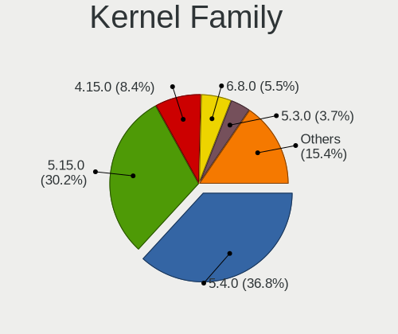
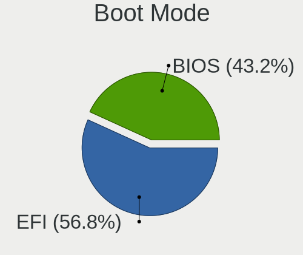
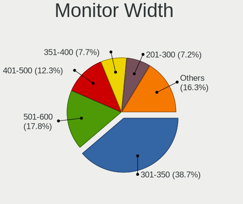
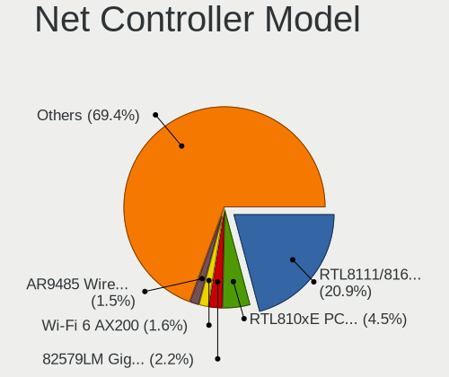

Linux Mint - Tested Hardware & Statistics
-----------------------------------------

A project to collect tested hardware configurations for Linux Mint.

Anyone can contribute to this report by the [hw-probe](https://github.com/linuxhw/hw-probe) tool:

    sudo -E hw-probe -all -upload

Please contribute! Especially if your hardware is rare.

This is a report for all computer types. See also reports for [desktops](/Dist/Linux_Mint/Desktop/README.md) and [notebooks](/Dist/Linux_Mint/Notebook/README.md).

Contents
--------

* [ Test Cases ](#test-cases)

* [ System ](#system)
  - [ OS                       ](#os)
  - [ OS Family                ](#os-family)
  - [ Kernel                   ](#kernel)
  - [ Kernel Family            ](#kernel-family)
  - [ Kernel Major Ver.        ](#kernel-major-ver)
  - [ Arch                     ](#arch)
  - [ DE                       ](#de)
  - [ Display Server           ](#display-server)
  - [ Display Manager          ](#display-manager)
  - [ OS Lang                  ](#os-lang)
  - [ Boot Mode                ](#boot-mode)
  - [ Filesystem               ](#filesystem)
  - [ Part. scheme             ](#part-scheme)
  - [ Dual Boot with Linux/BSD ](#dual-boot-with-linuxbsd)
  - [ Dual Boot (Win)          ](#dual-boot-win)

* [ Board ](#board)
  - [ Vendor                   ](#vendor)
  - [ Model                    ](#model)
  - [ Model Family             ](#model-family)
  - [ MFG Year                 ](#mfg-year)
  - [ Form Factor              ](#form-factor)
  - [ Secure Boot              ](#secure-boot)
  - [ Coreboot                 ](#coreboot)
  - [ RAM Size                 ](#ram-size)
  - [ RAM Used                 ](#ram-used)
  - [ Total Drives             ](#total-drives)
  - [ Has CD-ROM               ](#has-cd-rom)
  - [ Has Ethernet             ](#has-ethernet)
  - [ Has WiFi                 ](#has-wifi)
  - [ Has Bluetooth            ](#has-bluetooth)

* [ Location ](#location)
  - [ Country                  ](#country)
  - [ City                     ](#city)

* [ Drives ](#drives)
  - [ Drive Vendor             ](#drive-vendor)
  - [ Drive Model              ](#drive-model)
  - [ HDD Vendor               ](#hdd-vendor)
  - [ SSD Vendor               ](#ssd-vendor)
  - [ Drive Kind               ](#drive-kind)
  - [ Drive Connector          ](#drive-connector)
  - [ Drive Size               ](#drive-size)
  - [ Space Total              ](#space-total)
  - [ Space Used               ](#space-used)
  - [ Malfunc. Drives          ](#malfunc-drives)
  - [ Malfunc. Drive Vendor    ](#malfunc-drive-vendor)
  - [ Malfunc. HDD Vendor      ](#malfunc-hdd-vendor)
  - [ Malfunc. Drive Kind      ](#malfunc-drive-kind)
  - [ Failed Drives            ](#failed-drives)
  - [ Failed Drive Vendor      ](#failed-drive-vendor)
  - [ Drive Status             ](#drive-status)

* [ Storage controller ](#storage-controller)
  - [ Storage Vendor           ](#storage-vendor)
  - [ Storage Model            ](#storage-model)
  - [ Storage Kind             ](#storage-kind)

* [ Processor ](#processor)
  - [ CPU Vendor               ](#cpu-vendor)
  - [ CPU Model                ](#cpu-model)
  - [ CPU Model Family         ](#cpu-model-family)
  - [ CPU Cores                ](#cpu-cores)
  - [ CPU Sockets              ](#cpu-sockets)
  - [ CPU Threads              ](#cpu-threads)
  - [ CPU Op-Modes             ](#cpu-op-modes)
  - [ CPU Microcode            ](#cpu-microcode)
  - [ CPU Microarch            ](#cpu-microarch)

* [ Graphics ](#graphics)
  - [ GPU Vendor               ](#gpu-vendor)
  - [ GPU Model                ](#gpu-model)
  - [ GPU Combo                ](#gpu-combo)
  - [ GPU Driver               ](#gpu-driver)
  - [ GPU Memory               ](#gpu-memory)

* [ Monitor ](#monitor)
  - [ Monitor Vendor           ](#monitor-vendor)
  - [ Monitor Model            ](#monitor-model)
  - [ Monitor Resolution       ](#monitor-resolution)
  - [ Monitor Diagonal         ](#monitor-diagonal)
  - [ Monitor Width            ](#monitor-width)
  - [ Aspect Ratio             ](#aspect-ratio)
  - [ Monitor Area             ](#monitor-area)
  - [ Pixel Density            ](#pixel-density)
  - [ Multiple Monitors        ](#multiple-monitors)

* [ Network ](#network)
  - [ Net Controller Vendor    ](#net-controller-vendor)
  - [ Net Controller Model     ](#net-controller-model)
  - [ Wireless Vendor          ](#wireless-vendor)
  - [ Wireless Model           ](#wireless-model)
  - [ Ethernet Vendor          ](#ethernet-vendor)
  - [ Ethernet Model           ](#ethernet-model)
  - [ Net Controller Kind      ](#net-controller-kind)
  - [ Used Controller          ](#used-controller)
  - [ NICs                     ](#nics)
  - [ IPv6                     ](#ipv6)

* [ Bluetooth ](#bluetooth)
  - [ Bluetooth Vendor         ](#bluetooth-vendor)
  - [ Bluetooth Model          ](#bluetooth-model)

* [ Sound ](#sound)
  - [ Sound Vendor             ](#sound-vendor)
  - [ Sound Model              ](#sound-model)

* [ Memory ](#memory)
  - [ Memory Vendor            ](#memory-vendor)
  - [ Memory Model             ](#memory-model)
  - [ Memory Kind              ](#memory-kind)
  - [ Memory Form Factor       ](#memory-form-factor)
  - [ Memory Size              ](#memory-size)
  - [ Memory Speed             ](#memory-speed)

* [ Printers & scanners ](#printers--scanners)
  - [ Printer Vendor           ](#printer-vendor)
  - [ Printer Model            ](#printer-model)
  - [ Scanner Vendor           ](#scanner-vendor)
  - [ Scanner Model            ](#scanner-model)

* [ Camera ](#camera)
  - [ Camera Vendor            ](#camera-vendor)
  - [ Camera Model             ](#camera-model)

* [ Security ](#security)
  - [ Fingerprint Vendor       ](#fingerprint-vendor)
  - [ Fingerprint Model        ](#fingerprint-model)
  - [ Chipcard Vendor          ](#chipcard-vendor)
  - [ Chipcard Model           ](#chipcard-model)

* [ Unsupported ](#unsupported)
  - [ Unsupported Devices      ](#unsupported-devices)
  - [ Unsupported Device Types ](#unsupported-device-types)

Test Cases
----------

Total: 20812

| Vendor        | Model                       | Form-Factor | Probe                                                      | Date         |
|---------------|-----------------------------|-------------|------------------------------------------------------------|--------------|
| Dell          | G15 5515                    | Notebook    | [92f1423303](https://linux-hardware.org/?probe=92f1423303) | Nov 02, 2022 |
| HP            | 3397                        | Desktop     | [24eb596bce](https://linux-hardware.org/?probe=24eb596bce) | Nov 02, 2022 |
| ASUSTek       | X540SAA                     | Notebook    | [ccaedd7155](https://linux-hardware.org/?probe=ccaedd7155) | Nov 02, 2022 |
| Lenovo        | ThinkPad E15 Gen 3 20YHS... | Notebook    | [a3b1926b7e](https://linux-hardware.org/?probe=a3b1926b7e) | Nov 02, 2022 |
| HP            | 1589                        | Desktop     | [81a347a6a7](https://linux-hardware.org/?probe=81a347a6a7) | Nov 02, 2022 |
| Lenovo        | G560 0679                   | Notebook    | [c97e8f3436](https://linux-hardware.org/?probe=c97e8f3436) | Nov 02, 2022 |
| HP            | EliteBook 2730p             | Notebook    | [79830976d8](https://linux-hardware.org/?probe=79830976d8) | Nov 02, 2022 |
| Dell          | G15 5515                    | Notebook    | [dae7c630d5](https://linux-hardware.org/?probe=dae7c630d5) | Nov 02, 2022 |
| Dell          | Inspiron 15-3567            | Notebook    | [a9b57edf35](https://linux-hardware.org/?probe=a9b57edf35) | Nov 02, 2022 |
| Dell          | Inspiron 15 3511            | Notebook    | [5786a01590](https://linux-hardware.org/?probe=5786a01590) | Nov 02, 2022 |
| Dell          | 02YRK5 A02                  | Desktop     | [2c63ff26e5](https://linux-hardware.org/?probe=2c63ff26e5) | Nov 01, 2022 |
| HP            | ProBook 4530s               | Notebook    | [6490664312](https://linux-hardware.org/?probe=6490664312) | Nov 01, 2022 |
| Lenovo        | IdeaPad 320-17AST 80XW      | Notebook    | [9fa0489d64](https://linux-hardware.org/?probe=9fa0489d64) | Nov 01, 2022 |
| HP            | ProBook 4530s               | Notebook    | [34682f3bfe](https://linux-hardware.org/?probe=34682f3bfe) | Nov 01, 2022 |
| Lenovo        | IdeaPad 320-17AST 80XW      | Notebook    | [411a5da53c](https://linux-hardware.org/?probe=411a5da53c) | Nov 01, 2022 |
| ASUSTek       | TUF Gaming B550M-PLUS WI... | Desktop     | [d28b33e126](https://linux-hardware.org/?probe=d28b33e126) | Nov 01, 2022 |
| Dell          | 0XR1GT A00                  | Desktop     | [8f551aaa52](https://linux-hardware.org/?probe=8f551aaa52) | Nov 01, 2022 |
| Dell          | 088DT1 A01                  | Desktop     | [efcbf8a2eb](https://linux-hardware.org/?probe=efcbf8a2eb) | Nov 01, 2022 |
| Apple         | Mac-AA95B1DDAB278B95 iMa... | All in one  | [64cb818993](https://linux-hardware.org/?probe=64cb818993) | Nov 01, 2022 |
| Apple         | MacBookPro9,2               | Notebook    | [4cdb36db63](https://linux-hardware.org/?probe=4cdb36db63) | Nov 01, 2022 |
| Acer          | Aspire XC-1660G V:1.1       | Desktop     | [a3a55bf3e4](https://linux-hardware.org/?probe=a3a55bf3e4) | Nov 01, 2022 |
| Acer          | Aspire XC-1660G V:1.1       | Desktop     | [8d99f1fb3b](https://linux-hardware.org/?probe=8d99f1fb3b) | Nov 01, 2022 |
| HUAWEI        | MACHC-WAX9                  | Notebook    | [e4f3828910](https://linux-hardware.org/?probe=e4f3828910) | Nov 01, 2022 |
| ASUSTek       | N61Vg                       | Notebook    | [27f288e5f1](https://linux-hardware.org/?probe=27f288e5f1) | Nov 01, 2022 |
| ASUSTek       | B150M-V PLUS                | Desktop     | [a451844625](https://linux-hardware.org/?probe=a451844625) | Nov 01, 2022 |
| HP            | 8054                        | Desktop     | [9e1b99d9bb](https://linux-hardware.org/?probe=9e1b99d9bb) | Nov 01, 2022 |
| HP            | ZBook 15 G2                 | Notebook    | [05eeb9e341](https://linux-hardware.org/?probe=05eeb9e341) | Nov 01, 2022 |
| Packard Be... | EasyNote TE11BZ             | Notebook    | [0301f1ddf1](https://linux-hardware.org/?probe=0301f1ddf1) | Oct 31, 2022 |
| Dell          | 040DDP A00                  | Desktop     | [22b1e93203](https://linux-hardware.org/?probe=22b1e93203) | Oct 31, 2022 |
| ASUSTek       | Z87-K                       | Desktop     | [7edc0875ed](https://linux-hardware.org/?probe=7edc0875ed) | Oct 31, 2022 |
| Pegatron      | 2AABh                       | Desktop     | [94dd13992c](https://linux-hardware.org/?probe=94dd13992c) | Oct 31, 2022 |
| MSI           | H110M PRO-VD PLUS           | Desktop     | [ced3229025](https://linux-hardware.org/?probe=ced3229025) | Oct 31, 2022 |
| ASUSTek       | K54L                        | Notebook    | [200f6044c2](https://linux-hardware.org/?probe=200f6044c2) | Oct 31, 2022 |
| Gigabyte      | Z270-HD3P-CF                | Desktop     | [e309413fea](https://linux-hardware.org/?probe=e309413fea) | Oct 31, 2022 |
| ASUSTek       | P8H77-M                     | Desktop     | [2ae72e7e22](https://linux-hardware.org/?probe=2ae72e7e22) | Oct 31, 2022 |
| Gigabyte      | GA-MA770-UD3                | Desktop     | [e49d4af683](https://linux-hardware.org/?probe=e49d4af683) | Oct 31, 2022 |
| Lenovo        | G700                        | Notebook    | [9bf9b4e263](https://linux-hardware.org/?probe=9bf9b4e263) | Oct 31, 2022 |
| HP            | 18E4                        | Desktop     | [89b197e8a9](https://linux-hardware.org/?probe=89b197e8a9) | Oct 31, 2022 |
| MSI           | MAG B660M MORTAR DDR4       | Desktop     | [14e8385f99](https://linux-hardware.org/?probe=14e8385f99) | Oct 31, 2022 |
| Gigabyte      | A520M H                     | Desktop     | [0a8043d206](https://linux-hardware.org/?probe=0a8043d206) | Oct 31, 2022 |
| Gigabyte      | B450 AORUS M                | Desktop     | [13741c554f](https://linux-hardware.org/?probe=13741c554f) | Oct 31, 2022 |
| Gigabyte      | B450 AORUS M                | Desktop     | [e6e466cd8f](https://linux-hardware.org/?probe=e6e466cd8f) | Oct 31, 2022 |
| ASUSTek       | V241DA                      | All in one  | [8a9451cb9c](https://linux-hardware.org/?probe=8a9451cb9c) | Oct 31, 2022 |
| HP            | Pavilion Laptop 14-ec1xx... | Notebook    | [1563c60737](https://linux-hardware.org/?probe=1563c60737) | Oct 31, 2022 |
| ASRock        | Z97 Extreme3                | Desktop     | [c741e4ffe8](https://linux-hardware.org/?probe=c741e4ffe8) | Oct 31, 2022 |
| MSI           | Z97 GAMING 3                | Desktop     | [cc2d45c3ff](https://linux-hardware.org/?probe=cc2d45c3ff) | Oct 30, 2022 |
| Gigabyte      | X570 GAMING X               | Desktop     | [d6c135685f](https://linux-hardware.org/?probe=d6c135685f) | Oct 30, 2022 |
| MSI           | Z97 GAMING 3                | Desktop     | [c0926e68a0](https://linux-hardware.org/?probe=c0926e68a0) | Oct 30, 2022 |
| Pegatron      | IPMIP-GS                    | Desktop     | [4e46d903ae](https://linux-hardware.org/?probe=4e46d903ae) | Oct 30, 2022 |
| MSI           | A320M PRO-M2 V2             | Desktop     | [d7c699118b](https://linux-hardware.org/?probe=d7c699118b) | Oct 30, 2022 |
| Lenovo        | ThinkPad L15 Gen 2 20X30... | Notebook    | [a75bc2ff26](https://linux-hardware.org/?probe=a75bc2ff26) | Oct 30, 2022 |
| ASUSTek       | A88XM-PLUS                  | Desktop     | [10aa435a0b](https://linux-hardware.org/?probe=10aa435a0b) | Oct 30, 2022 |
| HP            | Laptop 15-bs1xx             | Notebook    | [fabbcc9035](https://linux-hardware.org/?probe=fabbcc9035) | Oct 30, 2022 |
| ASUSTek       | G74Sx                       | Notebook    | [c24c24ab27](https://linux-hardware.org/?probe=c24c24ab27) | Oct 30, 2022 |
| HP            | 15                          | Notebook    | [34e1ac4cbe](https://linux-hardware.org/?probe=34e1ac4cbe) | Oct 30, 2022 |
| MSI           | Z77A-GD65                   | Desktop     | [a7bc380726](https://linux-hardware.org/?probe=a7bc380726) | Oct 30, 2022 |
| Lenovo        | V110-15IAP 80TG             | Notebook    | [01d8b89e0d](https://linux-hardware.org/?probe=01d8b89e0d) | Oct 30, 2022 |
| Dell          | Studio 1735                 | Notebook    | [8f070a2831](https://linux-hardware.org/?probe=8f070a2831) | Oct 30, 2022 |
| Lenovo        | V110-15IAP 80TG             | Notebook    | [183feb626d](https://linux-hardware.org/?probe=183feb626d) | Oct 30, 2022 |
| HP            | ProBook 6540b               | Notebook    | [be9c128b00](https://linux-hardware.org/?probe=be9c128b00) | Oct 30, 2022 |
| Dell          | 0M5DCD A00                  | Desktop     | [c3049c59a8](https://linux-hardware.org/?probe=c3049c59a8) | Oct 30, 2022 |
| Dell          | 0M5DCD A00                  | Desktop     | [daae18ab91](https://linux-hardware.org/?probe=daae18ab91) | Oct 30, 2022 |
| HP            | ProBook 6560b               | Notebook    | [89feda4b09](https://linux-hardware.org/?probe=89feda4b09) | Oct 30, 2022 |
| HP            | Unknown                     | Notebook    | [6e024c825e](https://linux-hardware.org/?probe=6e024c825e) | Oct 30, 2022 |
| HP            | Laptop 17-by1xxx            | Notebook    | [b3e8975edf](https://linux-hardware.org/?probe=b3e8975edf) | Oct 29, 2022 |
| ASUSTek       | G11CD                       | Desktop     | [2a9d64387c](https://linux-hardware.org/?probe=2a9d64387c) | Oct 29, 2022 |
| ASUSTek       | TUF Gaming X570-PLUS_BR     | Desktop     | [eb71b41aa8](https://linux-hardware.org/?probe=eb71b41aa8) | Oct 29, 2022 |
| HP            | 0AECh D                     | Desktop     | [ee09a01e9e](https://linux-hardware.org/?probe=ee09a01e9e) | Oct 29, 2022 |
| ASUSTek       | E200HA                      | Notebook    | [18ca81370b](https://linux-hardware.org/?probe=18ca81370b) | Oct 29, 2022 |
| HP            | Laptop 17-bs0xx             | Notebook    | [68238274ff](https://linux-hardware.org/?probe=68238274ff) | Oct 29, 2022 |
| ASUSTek       | E200HA                      | Notebook    | [0a95698cb6](https://linux-hardware.org/?probe=0a95698cb6) | Oct 29, 2022 |
| Dell          | XPS 13 9370                 | Notebook    | [7bf374b38a](https://linux-hardware.org/?probe=7bf374b38a) | Oct 29, 2022 |
| ASUSTek       | M3N-HT DELUXE               | Desktop     | [290f3b115f](https://linux-hardware.org/?probe=290f3b115f) | Oct 29, 2022 |
| ASUSTek       | M3N-HT DELUXE               | Desktop     | [bf841b86f5](https://linux-hardware.org/?probe=bf841b86f5) | Oct 29, 2022 |
| HP            | Pavilion dv8000 (ET839UA... | Notebook    | [ce9df2cf8f](https://linux-hardware.org/?probe=ce9df2cf8f) | Oct 29, 2022 |
| SANTECH       | PCx0Dx                      | Notebook    | [24462321e8](https://linux-hardware.org/?probe=24462321e8) | Oct 29, 2022 |
| ASUSTek       | M4A785-M                    | Desktop     | [73eae83658](https://linux-hardware.org/?probe=73eae83658) | Oct 29, 2022 |
| MACHINIST     | X99-RS9 V2.0                | Desktop     | [650f1fd648](https://linux-hardware.org/?probe=650f1fd648) | Oct 29, 2022 |
| Acer          | Nitro AN515-52              | Notebook    | [38570237ac](https://linux-hardware.org/?probe=38570237ac) | Oct 29, 2022 |
| Acer          | Nitro AN515-52              | Notebook    | [5551d222b2](https://linux-hardware.org/?probe=5551d222b2) | Oct 29, 2022 |
| ASUSTek       | X751NV                      | Notebook    | [9ef2717db0](https://linux-hardware.org/?probe=9ef2717db0) | Oct 29, 2022 |
| Lenovo        | ThinkPad T14 Gen 1 20UDC... | Notebook    | [1d4a6dc6dc](https://linux-hardware.org/?probe=1d4a6dc6dc) | Oct 29, 2022 |
| Lenovo        | ThinkPad T14 Gen 1 20UDC... | Notebook    | [a1694d3adc](https://linux-hardware.org/?probe=a1694d3adc) | Oct 29, 2022 |
| Gigabyte      | GA-MA770-UD3                | Desktop     | [52a6d45e82](https://linux-hardware.org/?probe=52a6d45e82) | Oct 29, 2022 |
| ASUSTek       | K55VJ                       | Notebook    | [6dc11e517b](https://linux-hardware.org/?probe=6dc11e517b) | Oct 29, 2022 |
| Wortmann      | CR700                       | Notebook    | [7030308edf](https://linux-hardware.org/?probe=7030308edf) | Oct 29, 2022 |
| Dell          | Inspiron 7737               | Notebook    | [f352df76ef](https://linux-hardware.org/?probe=f352df76ef) | Oct 29, 2022 |
| Lenovo        | ThinkPad T450s 20BWS0DD0... | Notebook    | [973a3662b9](https://linux-hardware.org/?probe=973a3662b9) | Oct 29, 2022 |
| Kruger&Mat... | KM1406                      | Notebook    | [70b8441ccf](https://linux-hardware.org/?probe=70b8441ccf) | Oct 29, 2022 |
| Dell          | Inspiron 3583               | Notebook    | [4f6c1e374f](https://linux-hardware.org/?probe=4f6c1e374f) | Oct 29, 2022 |
| ASUSTek       | K50C                        | Notebook    | [af80714f09](https://linux-hardware.org/?probe=af80714f09) | Oct 29, 2022 |
| ASUSTek       | PRIME A320I-K               | Desktop     | [91f4cd151f](https://linux-hardware.org/?probe=91f4cd151f) | Oct 29, 2022 |
| ASRock        | FM2A88X-ITX+                | Desktop     | [00b65eaa83](https://linux-hardware.org/?probe=00b65eaa83) | Oct 29, 2022 |
| Acer          | Aspire SW5-012              | Notebook    | [90dd31edc8](https://linux-hardware.org/?probe=90dd31edc8) | Oct 29, 2022 |
| ASUSTek       | K50C                        | Notebook    | [ca606469d8](https://linux-hardware.org/?probe=ca606469d8) | Oct 29, 2022 |
| Techvision    | TVI7309X B0                 | Desktop     | [65b5280dd1](https://linux-hardware.org/?probe=65b5280dd1) | Oct 29, 2022 |
| ASUSTek       | PRIME H410M-K               | Desktop     | [5a371accfe](https://linux-hardware.org/?probe=5a371accfe) | Oct 29, 2022 |
| ASRock        | B85 Pro4                    | Desktop     | [856d32288b](https://linux-hardware.org/?probe=856d32288b) | Oct 29, 2022 |
| Intel         | NUC11PABi5 K90634-305       | Mini pc     | [af4751bfcf](https://linux-hardware.org/?probe=af4751bfcf) | Oct 28, 2022 |
| MSI           | MPG B550 GAMING PLUS        | Desktop     | [7d5d2ec0ba](https://linux-hardware.org/?probe=7d5d2ec0ba) | Oct 28, 2022 |
| Prestigio     | PSB141S01                   | Notebook    | [646d3fd287](https://linux-hardware.org/?probe=646d3fd287) | Oct 28, 2022 |
| ASRock        | Z370 Pro4                   | Desktop     | [04e898b2f6](https://linux-hardware.org/?probe=04e898b2f6) | Oct 28, 2022 |
| Lenovo        | 317E SDK0J40700 WIN 3258... | Desktop     | [8c85b7ec2e](https://linux-hardware.org/?probe=8c85b7ec2e) | Oct 28, 2022 |
| Lenovo        | ThinkPad Edge E320 1298R... | Notebook    | [c79d1e6209](https://linux-hardware.org/?probe=c79d1e6209) | Oct 28, 2022 |
| ASUSTek       | ASUS TUF Gaming F15 FX50... | Notebook    | [8429395d7d](https://linux-hardware.org/?probe=8429395d7d) | Oct 28, 2022 |
| Dell          | Latitude 5531               | Notebook    | [a7ff9a34d2](https://linux-hardware.org/?probe=a7ff9a34d2) | Oct 28, 2022 |
| Lenovo        | MAHOBAY NOK                 | Desktop     | [267b0a3f94](https://linux-hardware.org/?probe=267b0a3f94) | Oct 28, 2022 |
| Dell          | Latitude 5531               | Notebook    | [73ddced77b](https://linux-hardware.org/?probe=73ddced77b) | Oct 28, 2022 |
| Gigabyte      | GA-MA790FX-DQ6              | Desktop     | [8ba31a020c](https://linux-hardware.org/?probe=8ba31a020c) | Oct 28, 2022 |
| Fujitsu       | LIFEBOOK U728               | Notebook    | [c5867e7dd3](https://linux-hardware.org/?probe=c5867e7dd3) | Oct 28, 2022 |
| ASUSTek       | ASUS TUF Gaming F15 FX50... | Notebook    | [366e5edec9](https://linux-hardware.org/?probe=366e5edec9) | Oct 28, 2022 |
| Lenovo        | ThinkPad X1 Yoga Gen 7 2... | Convertible | [4eff9900f2](https://linux-hardware.org/?probe=4eff9900f2) | Oct 28, 2022 |
| Dell          | XPS 15 9510                 | Notebook    | [d3879c6bb0](https://linux-hardware.org/?probe=d3879c6bb0) | Oct 28, 2022 |
| HP            | EliteBook 820 G2            | Notebook    | [7056cf1574](https://linux-hardware.org/?probe=7056cf1574) | Oct 28, 2022 |
| HP            | ProBook x360 11 G3 EE       | Convertible | [61e43ba85d](https://linux-hardware.org/?probe=61e43ba85d) | Oct 28, 2022 |
| HP            | 339A                        | Desktop     | [0fdbd7b1d7](https://linux-hardware.org/?probe=0fdbd7b1d7) | Oct 28, 2022 |
| HP            | Pavilion dv8000 (ET839UA... | Notebook    | [2829b0b18f](https://linux-hardware.org/?probe=2829b0b18f) | Oct 28, 2022 |
| Unknown       | Unknown                     | Notebook    | [c867c45a75](https://linux-hardware.org/?probe=c867c45a75) | Oct 28, 2022 |
| Samsung       | 275E4E/275E5E               | Notebook    | [d3aebcbac6](https://linux-hardware.org/?probe=d3aebcbac6) | Oct 27, 2022 |
| Unknown       | Unknown                     | Notebook    | [967c2c956d](https://linux-hardware.org/?probe=967c2c956d) | Oct 27, 2022 |
| AZW           | Green G2                    | Desktop     | [628aba3de0](https://linux-hardware.org/?probe=628aba3de0) | Oct 27, 2022 |
| Lenovo        | 0B98401 PRO                 | Desktop     | [99f9bbd5ad](https://linux-hardware.org/?probe=99f9bbd5ad) | Oct 27, 2022 |
| ASUSTek       | PN50                        | Mini pc     | [cd6e5e2095](https://linux-hardware.org/?probe=cd6e5e2095) | Oct 27, 2022 |
| MSI           | H110M PRO-VD PLUS           | Desktop     | [d3c4092754](https://linux-hardware.org/?probe=d3c4092754) | Oct 27, 2022 |
| Dell          | Inspiron 15-7568            | Notebook    | [ae536fa220](https://linux-hardware.org/?probe=ae536fa220) | Oct 27, 2022 |
| ASUSTek       | PN50                        | Mini pc     | [3c67c8efb7](https://linux-hardware.org/?probe=3c67c8efb7) | Oct 27, 2022 |
| Gigabyte      | B450 AORUS ELITE            | Desktop     | [81e31b481f](https://linux-hardware.org/?probe=81e31b481f) | Oct 27, 2022 |
| Lenovo        | ThinkPad E15 Gen 4 21E6C... | Notebook    | [7ffc8c3537](https://linux-hardware.org/?probe=7ffc8c3537) | Oct 27, 2022 |
| Intel         | NUC5i5MYBE H47797-206       | Mini pc     | [9cc560907d](https://linux-hardware.org/?probe=9cc560907d) | Oct 27, 2022 |
| Acer          | Aspire A315-54              | Notebook    | [6de38f7802](https://linux-hardware.org/?probe=6de38f7802) | Oct 27, 2022 |
| ASUSTek       | Q304UAK                     | Notebook    | [2c51d603ee](https://linux-hardware.org/?probe=2c51d603ee) | Oct 27, 2022 |
| HP            | ProBook 6560b               | Notebook    | [222a5c2dbe](https://linux-hardware.org/?probe=222a5c2dbe) | Oct 27, 2022 |
| ASUSTek       | Q304UAK                     | Notebook    | [4b624e6f98](https://linux-hardware.org/?probe=4b624e6f98) | Oct 27, 2022 |
| ASRock        | H61M-VG4                    | Desktop     | [25b8826346](https://linux-hardware.org/?probe=25b8826346) | Oct 27, 2022 |
| HUAWEI        | NBLB-WAX9N                  | Notebook    | [3541e2e011](https://linux-hardware.org/?probe=3541e2e011) | Oct 27, 2022 |
| HP            | ProBook 640 G1              | Notebook    | [b096155d39](https://linux-hardware.org/?probe=b096155d39) | Oct 27, 2022 |
| Acer          | Swift SF314-512             | Notebook    | [951c734c1b](https://linux-hardware.org/?probe=951c734c1b) | Oct 27, 2022 |
| HP            | 1589                        | Desktop     | [4a15b6de0f](https://linux-hardware.org/?probe=4a15b6de0f) | Oct 27, 2022 |
| QIYIDA        | X99-H9 V2.0                 | Desktop     | [9285fb0d9d](https://linux-hardware.org/?probe=9285fb0d9d) | Oct 27, 2022 |
| MSI           | Katana GF66 12UC            | Notebook    | [9b8f917e6b](https://linux-hardware.org/?probe=9b8f917e6b) | Oct 27, 2022 |
| Gigabyte      | B450M DS3H-CF               | Desktop     | [4659be383c](https://linux-hardware.org/?probe=4659be383c) | Oct 27, 2022 |
| HP            | ProBook 450 G3              | Notebook    | [4aa258716b](https://linux-hardware.org/?probe=4aa258716b) | Oct 26, 2022 |
| HP            | ProBook 450 G3              | Notebook    | [26d1b8b2b2](https://linux-hardware.org/?probe=26d1b8b2b2) | Oct 26, 2022 |
| Acer          | Aspire A315-21              | Notebook    | [14f5f5ceeb](https://linux-hardware.org/?probe=14f5f5ceeb) | Oct 26, 2022 |
| Apple         | Mac-942B5BF58194151B        | All in one  | [03fc94fc36](https://linux-hardware.org/?probe=03fc94fc36) | Oct 26, 2022 |
| ASUSTek       | TUF B450M-PLUS GAMING       | Desktop     | [469345600b](https://linux-hardware.org/?probe=469345600b) | Oct 26, 2022 |
| ASUSTek       | TUF Gaming B660M-PLUS D4    | Desktop     | [26c34998ae](https://linux-hardware.org/?probe=26c34998ae) | Oct 26, 2022 |
| Fujitsu       | D3313-A1 S26361-D3313-A1    | Desktop     | [8c97ee418a](https://linux-hardware.org/?probe=8c97ee418a) | Oct 26, 2022 |
| HP            | ProBook 640 G1              | Notebook    | [e30a33bfd8](https://linux-hardware.org/?probe=e30a33bfd8) | Oct 26, 2022 |
| HP            | 1494                        | Desktop     | [fa63090109](https://linux-hardware.org/?probe=fa63090109) | Oct 26, 2022 |
| Google        | Akemi                       | Notebook    | [45fd84f413](https://linux-hardware.org/?probe=45fd84f413) | Oct 26, 2022 |
| HP            | EliteBook 840 G5            | Notebook    | [4b28c73302](https://linux-hardware.org/?probe=4b28c73302) | Oct 26, 2022 |
| ASUSTek       | Z87-A                       | Desktop     | [0b4711df41](https://linux-hardware.org/?probe=0b4711df41) | Oct 26, 2022 |
| Gigabyte      | GA-MA770-UD3                | Desktop     | [dbb72f4c00](https://linux-hardware.org/?probe=dbb72f4c00) | Oct 26, 2022 |
| Dell          | Latitude E4300              | Notebook    | [8ee3fadd0b](https://linux-hardware.org/?probe=8ee3fadd0b) | Oct 26, 2022 |
| HP            | Pavilion dv8000 (ET839UA... | Notebook    | [c19eaa0502](https://linux-hardware.org/?probe=c19eaa0502) | Oct 26, 2022 |
| PCWare        | IPMH61R3                    | Desktop     | [9f9410b99d](https://linux-hardware.org/?probe=9f9410b99d) | Oct 25, 2022 |
| ASUSTek       | ROG STRIX B550-F GAMING     | Desktop     | [705e51d33e](https://linux-hardware.org/?probe=705e51d33e) | Oct 25, 2022 |
| ASUSTek       | Z87-PRO                     | Desktop     | [a48316f550](https://linux-hardware.org/?probe=a48316f550) | Oct 25, 2022 |
| ASUSTek       | ROG STRIX B550-F GAMING     | Desktop     | [824eb583d8](https://linux-hardware.org/?probe=824eb583d8) | Oct 25, 2022 |
| Alienware     | 046MHW A00                  | Desktop     | [592883e78e](https://linux-hardware.org/?probe=592883e78e) | Oct 25, 2022 |
| Alienware     | 046MHW A00                  | Desktop     | [734fb9ac8c](https://linux-hardware.org/?probe=734fb9ac8c) | Oct 25, 2022 |
| HP            | Pavilion dv6                | Notebook    | [03e2594419](https://linux-hardware.org/?probe=03e2594419) | Oct 25, 2022 |
| Gigabyte      | H97M-D3H                    | Desktop     | [72532e08fe](https://linux-hardware.org/?probe=72532e08fe) | Oct 25, 2022 |
| ASRock        | G41C-GS                     | Desktop     | [a38f9baa55](https://linux-hardware.org/?probe=a38f9baa55) | Oct 25, 2022 |
| ASRock        | 4Core1600-GLAN/M            | Desktop     | [33bf20761f](https://linux-hardware.org/?probe=33bf20761f) | Oct 25, 2022 |
| Gigabyte      | 970A-DS3P                   | Desktop     | [995f7abb0c](https://linux-hardware.org/?probe=995f7abb0c) | Oct 25, 2022 |
| Dell          | Precision 5560              | Notebook    | [c6cfa3f96d](https://linux-hardware.org/?probe=c6cfa3f96d) | Oct 25, 2022 |
| HP            | 805F                        | Desktop     | [eaa3994f86](https://linux-hardware.org/?probe=eaa3994f86) | Oct 25, 2022 |
| Dell          | Precision 5560              | Notebook    | [e0dce17c1f](https://linux-hardware.org/?probe=e0dce17c1f) | Oct 25, 2022 |
| ASUSTek       | PRIME H370-PLUS             | Desktop     | [ef9fdf5dcd](https://linux-hardware.org/?probe=ef9fdf5dcd) | Oct 25, 2022 |
| Apple         | Mac-942B5BF58194151B        | All in one  | [b04c5fcb3f](https://linux-hardware.org/?probe=b04c5fcb3f) | Oct 25, 2022 |
| Gigabyte      | F2A78M-HD2                  | Desktop     | [6cffc39cfc](https://linux-hardware.org/?probe=6cffc39cfc) | Oct 25, 2022 |
| Lenovo        | FLEX5 81X2                  | Convertible | [fcaaf240af](https://linux-hardware.org/?probe=fcaaf240af) | Oct 25, 2022 |
| Lenovo        | FLEX5 81X2                  | Convertible | [6416af743e](https://linux-hardware.org/?probe=6416af743e) | Oct 25, 2022 |
| Gigabyte      | P41T-D3                     | Desktop     | [fa69e3fada](https://linux-hardware.org/?probe=fa69e3fada) | Oct 25, 2022 |
| Gigabyte      | P41T-D3                     | Desktop     | [c96d8030a6](https://linux-hardware.org/?probe=c96d8030a6) | Oct 25, 2022 |
| Lenovo        | ThinkPad P16s Gen 1 21CK... | Notebook    | [814da05eec](https://linux-hardware.org/?probe=814da05eec) | Oct 25, 2022 |
| Gigabyte      | 965P-DS3                    | Desktop     | [18dad8d151](https://linux-hardware.org/?probe=18dad8d151) | Oct 25, 2022 |
| Lenovo        | IdeaPad 320-15AST 80XV      | Notebook    | [80177955c3](https://linux-hardware.org/?probe=80177955c3) | Oct 25, 2022 |
| Lenovo        | G40-80 80JE                 | Notebook    | [97dfa18602](https://linux-hardware.org/?probe=97dfa18602) | Oct 25, 2022 |
| Toshiba       | Satellite U920t             | Notebook    | [268814e9ab](https://linux-hardware.org/?probe=268814e9ab) | Oct 25, 2022 |
| HP            | EliteBook 8570p             | Notebook    | [c3ec764ff3](https://linux-hardware.org/?probe=c3ec764ff3) | Oct 25, 2022 |
| HP            | 8433 11                     | Notebook    | [81740a5a8e](https://linux-hardware.org/?probe=81740a5a8e) | Oct 25, 2022 |
| Lenovo        | IdeaPad 5 15IIL05 81YK      | Notebook    | [18931ec5f6](https://linux-hardware.org/?probe=18931ec5f6) | Oct 25, 2022 |
| Gigabyte      | Z87-HD3                     | Desktop     | [da7fe35832](https://linux-hardware.org/?probe=da7fe35832) | Oct 25, 2022 |
| Lenovo        | V15-IIL 82C5                | Notebook    | [a56ad41b2f](https://linux-hardware.org/?probe=a56ad41b2f) | Oct 25, 2022 |
| HP            | 250 G6 Notebook PC          | Notebook    | [e2baff543b](https://linux-hardware.org/?probe=e2baff543b) | Oct 24, 2022 |
| Sony          | SVE1712Z1EB                 | Notebook    | [23b6ac5cde](https://linux-hardware.org/?probe=23b6ac5cde) | Oct 24, 2022 |
| Unknown       | SKYBAY                      | Desktop     | [63f22191e8](https://linux-hardware.org/?probe=63f22191e8) | Oct 24, 2022 |
| Olivetti      | Olibook P75B                | Notebook    | [a1b4023949](https://linux-hardware.org/?probe=a1b4023949) | Oct 24, 2022 |
| Dell          | Studio 1735                 | Notebook    | [21959a7db7](https://linux-hardware.org/?probe=21959a7db7) | Oct 24, 2022 |
| HP            | 805A                        | Desktop     | [dbe3ff75e8](https://linux-hardware.org/?probe=dbe3ff75e8) | Oct 24, 2022 |
| HP            | 1589                        | Desktop     | [0be048ec45](https://linux-hardware.org/?probe=0be048ec45) | Oct 24, 2022 |
| ASRock        | H61M-VG4                    | Desktop     | [b393d57b17](https://linux-hardware.org/?probe=b393d57b17) | Oct 24, 2022 |
| ASUSTek       | VivoBook_ASUSLaptop X571... | Notebook    | [e198c305e4](https://linux-hardware.org/?probe=e198c305e4) | Oct 24, 2022 |
| MSI           | B350M PRO-VD PLUS           | Desktop     | [93068b4cf8](https://linux-hardware.org/?probe=93068b4cf8) | Oct 24, 2022 |
| ASUSTek       | ZenBook UX363EA_UX363EA     | Convertible | [8ae3d6c328](https://linux-hardware.org/?probe=8ae3d6c328) | Oct 24, 2022 |
| HP            | Laptop 17-cp0xxx            | Notebook    | [4a818d766f](https://linux-hardware.org/?probe=4a818d766f) | Oct 24, 2022 |
| Dell          | Latitude E7240              | Notebook    | [33c37015df](https://linux-hardware.org/?probe=33c37015df) | Oct 24, 2022 |
| ASRock        | H61M-VG4                    | Desktop     | [1e80f1de23](https://linux-hardware.org/?probe=1e80f1de23) | Oct 24, 2022 |
| HP            | Pavilion x360 Convertibl... | Convertible | [fbec0d9d0e](https://linux-hardware.org/?probe=fbec0d9d0e) | Oct 24, 2022 |
| ASUSTek       | X550LC                      | Notebook    | [75c0c3e97b](https://linux-hardware.org/?probe=75c0c3e97b) | Oct 24, 2022 |
| Dell          | 0J3C2F A00                  | Desktop     | [d165241883](https://linux-hardware.org/?probe=d165241883) | Oct 24, 2022 |
| Lenovo        | 3190 SDK0J40697 WIN 3305... | Mini pc     | [7c960c6ce8](https://linux-hardware.org/?probe=7c960c6ce8) | Oct 24, 2022 |
| Dell          | XPS L412Z                   | Notebook    | [92d8a4b47a](https://linux-hardware.org/?probe=92d8a4b47a) | Oct 24, 2022 |
| Apple         | MacBookAir7,2               | Notebook    | [7b901320c7](https://linux-hardware.org/?probe=7b901320c7) | Oct 24, 2022 |
| Apple         | MacBookAir7,2               | Notebook    | [daac29aff2](https://linux-hardware.org/?probe=daac29aff2) | Oct 24, 2022 |
| Acer          | Aspire C24-1650             | All in one  | [82e35bc925](https://linux-hardware.org/?probe=82e35bc925) | Oct 24, 2022 |
| Acer          | Aspire C24-1650             | All in one  | [b110eca1a8](https://linux-hardware.org/?probe=b110eca1a8) | Oct 23, 2022 |
| Dell          | Studio 1735                 | Notebook    | [4385640990](https://linux-hardware.org/?probe=4385640990) | Oct 23, 2022 |
| ASUSTek       | X550EA                      | Notebook    | [6a7b7a70a5](https://linux-hardware.org/?probe=6a7b7a70a5) | Oct 23, 2022 |
| ASUSTek       | VivoBook_ASUSLaptop X512... | Notebook    | [4c0e49ae2b](https://linux-hardware.org/?probe=4c0e49ae2b) | Oct 23, 2022 |
| ASUSTek       | P8Z68-V LX                  | Desktop     | [86cff422a6](https://linux-hardware.org/?probe=86cff422a6) | Oct 23, 2022 |
| Biostar       | TH67XE                      | Desktop     | [b523b997f6](https://linux-hardware.org/?probe=b523b997f6) | Oct 23, 2022 |
| ASUSTek       | X550EA                      | Notebook    | [e2c2ac571f](https://linux-hardware.org/?probe=e2c2ac571f) | Oct 23, 2022 |
| Dell          | Inspiron 5406 2n1           | Convertible | [2bd246f1a6](https://linux-hardware.org/?probe=2bd246f1a6) | Oct 23, 2022 |
| Chuwi         | HeroBook Air                | Notebook    | [753874362e](https://linux-hardware.org/?probe=753874362e) | Oct 23, 2022 |
| ASUSTek       | M3N-HT DELUXE               | Desktop     | [eafcc0b1b0](https://linux-hardware.org/?probe=eafcc0b1b0) | Oct 23, 2022 |
| ASUSTek       | M3N-HT DELUXE               | Desktop     | [b7b190000b](https://linux-hardware.org/?probe=b7b190000b) | Oct 23, 2022 |
| MSI           | A320M PRO-M2 V2             | Desktop     | [1691497b7a](https://linux-hardware.org/?probe=1691497b7a) | Oct 23, 2022 |
| Unknown       | 1.0                         | Desktop     | [2a12c33601](https://linux-hardware.org/?probe=2a12c33601) | Oct 23, 2022 |
| MSI           | Modern 14 C12M              | Notebook    | [2991b1a2cf](https://linux-hardware.org/?probe=2991b1a2cf) | Oct 23, 2022 |
| MSI           | Modern 14 C12M              | Notebook    | [2015c6f7fc](https://linux-hardware.org/?probe=2015c6f7fc) | Oct 23, 2022 |
| Schenker      | VISION 15 (SVS15E21)        | Notebook    | [8138e910ce](https://linux-hardware.org/?probe=8138e910ce) | Oct 23, 2022 |
| AZW           | Green G2                    | Desktop     | [56ee35acfc](https://linux-hardware.org/?probe=56ee35acfc) | Oct 23, 2022 |
| HP            | 15                          | Notebook    | [5baa47ecd1](https://linux-hardware.org/?probe=5baa47ecd1) | Oct 23, 2022 |
| Apple         | MacBookPro8,1               | Notebook    | [33bef6bb6f](https://linux-hardware.org/?probe=33bef6bb6f) | Oct 23, 2022 |
| Acer          | Aspire A315-53              | Notebook    | [5388646329](https://linux-hardware.org/?probe=5388646329) | Oct 23, 2022 |
| Gigabyte      | H87-HD3                     | Desktop     | [bdd6e6d3a5](https://linux-hardware.org/?probe=bdd6e6d3a5) | Oct 23, 2022 |
| Apple         | MacBookPro8,1               | Notebook    | [da114c9e74](https://linux-hardware.org/?probe=da114c9e74) | Oct 23, 2022 |
| ASUSTek       | VivoBook 12_ASUS Laptop ... | Notebook    | [62bdd854b4](https://linux-hardware.org/?probe=62bdd854b4) | Oct 23, 2022 |
| Dell          | Vostro 1520                 | Notebook    | [a5106ca47d](https://linux-hardware.org/?probe=a5106ca47d) | Oct 22, 2022 |
| Dell          | XPS 13 9305                 | Notebook    | [8fec9e2536](https://linux-hardware.org/?probe=8fec9e2536) | Oct 22, 2022 |
| Lenovo        | Legion Y730-17ICH 81HG      | Notebook    | [c9a85159dd](https://linux-hardware.org/?probe=c9a85159dd) | Oct 22, 2022 |
| Lenovo        | ThinkServer TS140           | Desktop     | [6f0f7b249a](https://linux-hardware.org/?probe=6f0f7b249a) | Oct 22, 2022 |
| Intel         | powered classmate PC        | Tablet      | [d047cd6e73](https://linux-hardware.org/?probe=d047cd6e73) | Oct 22, 2022 |
| Acer          | TravelMate P256-M           | Notebook    | [7ca952de68](https://linux-hardware.org/?probe=7ca952de68) | Oct 22, 2022 |
| MSI           | B550-A PRO                  | Desktop     | [52d3513a9c](https://linux-hardware.org/?probe=52d3513a9c) | Oct 22, 2022 |
| ASUSTek       | ROG Zephyrus G14 GA402RJ... | Notebook    | [1f26696990](https://linux-hardware.org/?probe=1f26696990) | Oct 22, 2022 |
| Lenovo        | Legion Y730-17ICH 81HG      | Notebook    | [15a66ac64c](https://linux-hardware.org/?probe=15a66ac64c) | Oct 22, 2022 |
| Dell          | Latitude E4300              | Notebook    | [fb144bfcb2](https://linux-hardware.org/?probe=fb144bfcb2) | Oct 22, 2022 |
| Gigabyte      | A520M DS3H                  | Desktop     | [3faf4b3ca9](https://linux-hardware.org/?probe=3faf4b3ca9) | Oct 22, 2022 |
| ASUSTek       | X550LN                      | Notebook    | [7a6daf6023](https://linux-hardware.org/?probe=7a6daf6023) | Oct 22, 2022 |
| HP            | 213D A01                    | Desktop     | [c7ffdb8626](https://linux-hardware.org/?probe=c7ffdb8626) | Oct 22, 2022 |
| ASRock        | B450M-HDV R4.0              | Desktop     | [0ec4fb54a6](https://linux-hardware.org/?probe=0ec4fb54a6) | Oct 21, 2022 |
| MSI           | B550-A PRO                  | Desktop     | [d17faed180](https://linux-hardware.org/?probe=d17faed180) | Oct 21, 2022 |
| Acer          | Aspire A315-53              | Notebook    | [72f0c231fb](https://linux-hardware.org/?probe=72f0c231fb) | Oct 21, 2022 |
| Positivo      | S14CT01                     | Notebook    | [1a5f77c8f9](https://linux-hardware.org/?probe=1a5f77c8f9) | Oct 21, 2022 |
| MAXDATA       | obook2-1                    | Notebook    | [c7e03dae2f](https://linux-hardware.org/?probe=c7e03dae2f) | Oct 21, 2022 |
| HP            | EliteBook 820 G1            | Notebook    | [7abef2546e](https://linux-hardware.org/?probe=7abef2546e) | Oct 21, 2022 |
| ASRock        | B450M-HDV R4.0              | Desktop     | [1f659498a2](https://linux-hardware.org/?probe=1f659498a2) | Oct 21, 2022 |
| MSI           | H81M-E34                    | Desktop     | [b036f0d602](https://linux-hardware.org/?probe=b036f0d602) | Oct 21, 2022 |
| Google        | Treeya                      | Notebook    | [1a93d190b0](https://linux-hardware.org/?probe=1a93d190b0) | Oct 21, 2022 |
| Dell          | Latitude E5530 non-vPro     | Notebook    | [de5adb6775](https://linux-hardware.org/?probe=de5adb6775) | Oct 21, 2022 |
| MSI           | H81M-P33                    | Desktop     | [4bc1726059](https://linux-hardware.org/?probe=4bc1726059) | Oct 21, 2022 |
| Intel         | NUC7i7DNB J83500-204        | Mini pc     | [fed54308e3](https://linux-hardware.org/?probe=fed54308e3) | Oct 21, 2022 |
| Apple         | Mac-4BC72D62AD45599E Mac... | Mini pc     | [8c0acbea68](https://linux-hardware.org/?probe=8c0acbea68) | Oct 21, 2022 |
| MAXDATA       | obook2-1                    | Notebook    | [0f73d884ff](https://linux-hardware.org/?probe=0f73d884ff) | Oct 21, 2022 |
| MSI           | Z97 GAMING 3                | Desktop     | [2b5803628a](https://linux-hardware.org/?probe=2b5803628a) | Oct 20, 2022 |
| MSI           | Z97 GAMING 3                | Desktop     | [94c634f9b8](https://linux-hardware.org/?probe=94c634f9b8) | Oct 20, 2022 |
| MSI           | H110M GAMING                | Desktop     | [20689f6175](https://linux-hardware.org/?probe=20689f6175) | Oct 20, 2022 |
| Acer          | Aspire S3                   | Notebook    | [a24603a142](https://linux-hardware.org/?probe=a24603a142) | Oct 20, 2022 |
| Gigabyte      | X7X7                        | Notebook    | [f2c35e3917](https://linux-hardware.org/?probe=f2c35e3917) | Oct 20, 2022 |
| Acer          | Extensa M2610 V:1.0         | Desktop     | [1791236969](https://linux-hardware.org/?probe=1791236969) | Oct 20, 2022 |
| Lenovo        | G780                        | Notebook    | [986b0fdbd0](https://linux-hardware.org/?probe=986b0fdbd0) | Oct 20, 2022 |
| Acer          | Extensa M2610 V:1.0         | Desktop     | [e482e312c8](https://linux-hardware.org/?probe=e482e312c8) | Oct 20, 2022 |
| Dell          | 0J3C2F A00                  | Desktop     | [c97e42e738](https://linux-hardware.org/?probe=c97e42e738) | Oct 20, 2022 |
| Toshiba       | Satellite C660              | Notebook    | [3632c8a48d](https://linux-hardware.org/?probe=3632c8a48d) | Oct 20, 2022 |
| HP            | EliteBook 840 G5            | Notebook    | [ef1acaa7da](https://linux-hardware.org/?probe=ef1acaa7da) | Oct 20, 2022 |
| HP            | EliteBook 840 G5            | Notebook    | [3ec2887574](https://linux-hardware.org/?probe=3ec2887574) | Oct 20, 2022 |
| ASRock        | X399 Taichi                 | Desktop     | [0c5809902b](https://linux-hardware.org/?probe=0c5809902b) | Oct 20, 2022 |
| Lenovo        | ThinkPad L15 Gen 2 20X30... | Notebook    | [f5073cd7a2](https://linux-hardware.org/?probe=f5073cd7a2) | Oct 20, 2022 |
| HP            | 3047h                       | Desktop     | [1a0f4c46f9](https://linux-hardware.org/?probe=1a0f4c46f9) | Oct 20, 2022 |
| ASRock        | N68C-GS FX                  | Desktop     | [9e0b1677e4](https://linux-hardware.org/?probe=9e0b1677e4) | Oct 20, 2022 |
| ASUSTek       | H170M-PLUS                  | Desktop     | [e34cb7ea31](https://linux-hardware.org/?probe=e34cb7ea31) | Oct 20, 2022 |
| ASUSTek       | ROG Maximus XI FORMULA      | Desktop     | [13830a8b2b](https://linux-hardware.org/?probe=13830a8b2b) | Oct 20, 2022 |
| ASUSTek       | X540SAA                     | Notebook    | [e3fef524ee](https://linux-hardware.org/?probe=e3fef524ee) | Oct 20, 2022 |
| Lenovo        | G505s 20255                 | Notebook    | [a105e25fa5](https://linux-hardware.org/?probe=a105e25fa5) | Oct 20, 2022 |
| GPU Compan... | GWNR71517                   | Notebook    | [27ae96160e](https://linux-hardware.org/?probe=27ae96160e) | Oct 20, 2022 |
| Dell          | 0PC5F7 A02                  | Desktop     | [1e54b1512b](https://linux-hardware.org/?probe=1e54b1512b) | Oct 20, 2022 |
| ECS           | H61H2-WM                    | Desktop     | [934781c2fb](https://linux-hardware.org/?probe=934781c2fb) | Oct 19, 2022 |
| GPU Compan... | GWNR71517                   | Notebook    | [d55bceb8fb](https://linux-hardware.org/?probe=d55bceb8fb) | Oct 19, 2022 |
| HP            | 802F                        | Desktop     | [9e51fdba18](https://linux-hardware.org/?probe=9e51fdba18) | Oct 19, 2022 |
| Toshiba       | Satellite A300              | Notebook    | [ce897bc567](https://linux-hardware.org/?probe=ce897bc567) | Oct 19, 2022 |
| Gigabyte      | X570 AORUS ELITE            | Desktop     | [7f736b0a22](https://linux-hardware.org/?probe=7f736b0a22) | Oct 19, 2022 |
| Lenovo        | ThinkPad T460s 20FAS1Q10... | Notebook    | [a96060006f](https://linux-hardware.org/?probe=a96060006f) | Oct 19, 2022 |
| Alcor Digi... | Snugbook N1431              | Notebook    | [eb7940e5a4](https://linux-hardware.org/?probe=eb7940e5a4) | Oct 19, 2022 |
| HP            | EliteBook 840 G6            | Notebook    | [e5f7b07e9c](https://linux-hardware.org/?probe=e5f7b07e9c) | Oct 19, 2022 |
| Acer          | Aspire V5-571PG             | Notebook    | [e00a049460](https://linux-hardware.org/?probe=e00a049460) | Oct 19, 2022 |
| HP            | EliteBook 840 G6            | Notebook    | [25bb674789](https://linux-hardware.org/?probe=25bb674789) | Oct 19, 2022 |
| Dell          | XPS L412Z                   | Notebook    | [eb1b1f7950](https://linux-hardware.org/?probe=eb1b1f7950) | Oct 19, 2022 |
| ASUSTek       | N82JV                       | Notebook    | [7157bb5872](https://linux-hardware.org/?probe=7157bb5872) | Oct 19, 2022 |
| ASUSTek       | PRIME B660M-A WIFI D4       | Desktop     | [116fff483b](https://linux-hardware.org/?probe=116fff483b) | Oct 19, 2022 |
| Lenovo        | IdeaPad 330-15IKB 81DE      | Notebook    | [6271fbb0fb](https://linux-hardware.org/?probe=6271fbb0fb) | Oct 19, 2022 |
| HUAWEI        | MACHD-WXX9                  | Notebook    | [5086e64fed](https://linux-hardware.org/?probe=5086e64fed) | Oct 19, 2022 |
| HP            | Pavilion Notebook           | Notebook    | [0d145a7293](https://linux-hardware.org/?probe=0d145a7293) | Oct 19, 2022 |
| Dell          | Latitude E7440              | Notebook    | [5c81fc2db0](https://linux-hardware.org/?probe=5c81fc2db0) | Oct 19, 2022 |
| Alcor Digi... | Snugbook N1431              | Notebook    | [098e362854](https://linux-hardware.org/?probe=098e362854) | Oct 19, 2022 |
| HP            | ENVY Laptop 17-bw0xxx       | Notebook    | [6b7263006f](https://linux-hardware.org/?probe=6b7263006f) | Oct 18, 2022 |
| Dell          | G15 5510                    | Notebook    | [1286ecf9dd](https://linux-hardware.org/?probe=1286ecf9dd) | Oct 18, 2022 |
| HP            | 15                          | Notebook    | [072d4ee592](https://linux-hardware.org/?probe=072d4ee592) | Oct 18, 2022 |
| Lenovo        | ThinkPad T15g Gen 1 20US... | Notebook    | [ec42bc932e](https://linux-hardware.org/?probe=ec42bc932e) | Oct 18, 2022 |
| ASUSTek       | M3N78-VM                    | Desktop     | [825d6ebf7f](https://linux-hardware.org/?probe=825d6ebf7f) | Oct 18, 2022 |
| Gigabyte      | B450 AORUS ELITE            | Desktop     | [e0b5c85988](https://linux-hardware.org/?probe=e0b5c85988) | Oct 18, 2022 |
| Dell          | 09WH54 A00                  | Desktop     | [b16396bd74](https://linux-hardware.org/?probe=b16396bd74) | Oct 18, 2022 |
| Gigabyte      | B450M GAMING                | Desktop     | [e1eacaa737](https://linux-hardware.org/?probe=e1eacaa737) | Oct 18, 2022 |
| Acer          | Aspire M1930                | Desktop     | [5b9cbd4f58](https://linux-hardware.org/?probe=5b9cbd4f58) | Oct 18, 2022 |
| HP            | Laptop 17-bs0xx             | Notebook    | [369934a06c](https://linux-hardware.org/?probe=369934a06c) | Oct 18, 2022 |
| Dell          | 0XHGV1 A01                  | Desktop     | [fcac80ff4a](https://linux-hardware.org/?probe=fcac80ff4a) | Oct 18, 2022 |
| Acer          | Aspire 5830T                | Notebook    | [2423f8bf08](https://linux-hardware.org/?probe=2423f8bf08) | Oct 18, 2022 |
| HP            | 8924 0101                   | All in one  | [0b06e0389e](https://linux-hardware.org/?probe=0b06e0389e) | Oct 18, 2022 |
| Acer          | Swift SF314-54              | Notebook    | [04fed978ae](https://linux-hardware.org/?probe=04fed978ae) | Oct 18, 2022 |
| HP            | ZBook 14u G5                | Notebook    | [151433ee2e](https://linux-hardware.org/?probe=151433ee2e) | Oct 18, 2022 |
| MOTILE        | M141                        | Notebook    | [c9ca7c65f0](https://linux-hardware.org/?probe=c9ca7c65f0) | Oct 18, 2022 |
| HP            | ENVY x360 2-in-1 Laptop ... | Convertible | [b4a0739761](https://linux-hardware.org/?probe=b4a0739761) | Oct 18, 2022 |
| HP            | EliteBook Folio 9470m       | Notebook    | [c1e67135ac](https://linux-hardware.org/?probe=c1e67135ac) | Oct 18, 2022 |
| Acer          | Aspire E5-573               | Notebook    | [baf225a894](https://linux-hardware.org/?probe=baf225a894) | Oct 17, 2022 |
| Monster       | TULPAR T5 V21.6             | Notebook    | [eaeb6f6610](https://linux-hardware.org/?probe=eaeb6f6610) | Oct 17, 2022 |
| Gigabyte      | MZBSWAP-K4                  | Desktop     | [ef6d1400a3](https://linux-hardware.org/?probe=ef6d1400a3) | Oct 17, 2022 |
| ASRock        | X300-ITX                    | Desktop     | [a391ce99bf](https://linux-hardware.org/?probe=a391ce99bf) | Oct 17, 2022 |
| ASUSTek       | Maximus IV Extreme          | Desktop     | [d84677af13](https://linux-hardware.org/?probe=d84677af13) | Oct 17, 2022 |
| HUAWEI        | BOM-WXX9                    | Notebook    | [594b141136](https://linux-hardware.org/?probe=594b141136) | Oct 17, 2022 |
| Dell          | 0J3C2F A02                  | Desktop     | [284e02a5b2](https://linux-hardware.org/?probe=284e02a5b2) | Oct 17, 2022 |
| ASUSTek       | PRIME A520M-A II            | Desktop     | [cbf3a839e2](https://linux-hardware.org/?probe=cbf3a839e2) | Oct 17, 2022 |
| Lenovo        | IdeaPad Gaming 3 15ACH6 ... | Notebook    | [a4ebad3748](https://linux-hardware.org/?probe=a4ebad3748) | Oct 17, 2022 |
| Acer          | Aspire 6930                 | Notebook    | [7ef117fa52](https://linux-hardware.org/?probe=7ef117fa52) | Oct 17, 2022 |
| Apple         | MacBook5,1                  | Notebook    | [84200c663d](https://linux-hardware.org/?probe=84200c663d) | Oct 17, 2022 |
| Toshiba       | Satellite U920t             | Notebook    | [75918848c4](https://linux-hardware.org/?probe=75918848c4) | Oct 17, 2022 |
| Toshiba       | Satellite U920t             | Notebook    | [9eb5519133](https://linux-hardware.org/?probe=9eb5519133) | Oct 17, 2022 |
| Multilaser    | PC024                       | Notebook    | [892f53a067](https://linux-hardware.org/?probe=892f53a067) | Oct 17, 2022 |
| HP            | ENVY x360 Convertible 15... | Convertible | [068a780cce](https://linux-hardware.org/?probe=068a780cce) | Oct 17, 2022 |
| ASUSTek       | X553MA                      | Notebook    | [71cfc713af](https://linux-hardware.org/?probe=71cfc713af) | Oct 17, 2022 |
| Lenovo        | MAHOBAY Win8 STD MM DPK ... | Desktop     | [2d7d5c19c0](https://linux-hardware.org/?probe=2d7d5c19c0) | Oct 17, 2022 |
| Shuttle       | FS81                        | Desktop     | [61c0ca02f3](https://linux-hardware.org/?probe=61c0ca02f3) | Oct 16, 2022 |
| MSI           | A68HM-E33 V2                | Desktop     | [ff59edf4e0](https://linux-hardware.org/?probe=ff59edf4e0) | Oct 16, 2022 |
| Lenovo        | 3307 NOK                    | Mini pc     | [df054eec71](https://linux-hardware.org/?probe=df054eec71) | Oct 16, 2022 |
| ASUSTek       | M70Vn                       | Notebook    | [e9301bdee2](https://linux-hardware.org/?probe=e9301bdee2) | Oct 16, 2022 |
| ASUSTek       | ROG Zephyrus G14 GA401QM... | Notebook    | [62fd5f4526](https://linux-hardware.org/?probe=62fd5f4526) | Oct 16, 2022 |
| ASUSTek       | PRO B460M-C                 | Desktop     | [eb850e075d](https://linux-hardware.org/?probe=eb850e075d) | Oct 16, 2022 |
| Dell          | Latitude 3500               | Notebook    | [d578b45420](https://linux-hardware.org/?probe=d578b45420) | Oct 16, 2022 |
| Apple         | Mac-F227BEC8 PVT            | All in one  | [f30aab43b6](https://linux-hardware.org/?probe=f30aab43b6) | Oct 16, 2022 |
| HP            | 245 G7 Notebook PC          | Notebook    | [c164c2ab59](https://linux-hardware.org/?probe=c164c2ab59) | Oct 16, 2022 |
| HP            | Notebook                    | Notebook    | [f88b853298](https://linux-hardware.org/?probe=f88b853298) | Oct 16, 2022 |
| Acer          | Aspire M1930                | Desktop     | [9fa87ae442](https://linux-hardware.org/?probe=9fa87ae442) | Oct 16, 2022 |
| Acer          | Aspire 5742G                | Notebook    | [79a5162024](https://linux-hardware.org/?probe=79a5162024) | Oct 16, 2022 |
| Thomson       | NEO14A-4WH128               | Notebook    | [daa7836c39](https://linux-hardware.org/?probe=daa7836c39) | Oct 16, 2022 |
| ASUSTek       | PRIME B450M-K II            | Desktop     | [d1d815635a](https://linux-hardware.org/?probe=d1d815635a) | Oct 16, 2022 |
| Dell          | 0D6H9T A00                  | Desktop     | [52dec54de2](https://linux-hardware.org/?probe=52dec54de2) | Oct 16, 2022 |
| Dell          | Latitude E7450              | Notebook    | [500311a1b8](https://linux-hardware.org/?probe=500311a1b8) | Oct 16, 2022 |
| Acer          | Aspire V3-571               | Notebook    | [8457aa21e7](https://linux-hardware.org/?probe=8457aa21e7) | Oct 16, 2022 |
| HP            | EliteBook x360 1030 G2      | Convertible | [63f9315478](https://linux-hardware.org/?probe=63f9315478) | Oct 16, 2022 |
| ASUSTek       | ET2411_W8                   | All in one  | [1775d6a140](https://linux-hardware.org/?probe=1775d6a140) | Oct 16, 2022 |
| ASUSTek       | ET2411_W8                   | All in one  | [1121f10a96](https://linux-hardware.org/?probe=1121f10a96) | Oct 16, 2022 |
| HP            | Laptop 17-bs0xx             | Notebook    | [090cc3b6c5](https://linux-hardware.org/?probe=090cc3b6c5) | Oct 16, 2022 |
| AZW           | Green G2                    | Desktop     | [f7a9322b66](https://linux-hardware.org/?probe=f7a9322b66) | Oct 16, 2022 |
| Dell          | Inspiron 3505               | Notebook    | [ea75db9cc9](https://linux-hardware.org/?probe=ea75db9cc9) | Oct 16, 2022 |
| Pegatron      | 2A84h                       | Desktop     | [5b46511238](https://linux-hardware.org/?probe=5b46511238) | Oct 15, 2022 |
| HP            | 8027                        | Desktop     | [9f3d6e24b5](https://linux-hardware.org/?probe=9f3d6e24b5) | Oct 15, 2022 |
| Acer          | Aspire TC-865 V:1.1         | Desktop     | [dd4d81390a](https://linux-hardware.org/?probe=dd4d81390a) | Oct 15, 2022 |
| HP            | ZBook 14u G5                | Notebook    | [c35a9f90e8](https://linux-hardware.org/?probe=c35a9f90e8) | Oct 15, 2022 |
| MSI           | A68HM-E33 V2                | Desktop     | [b2a7c6be3a](https://linux-hardware.org/?probe=b2a7c6be3a) | Oct 15, 2022 |
| Acer          | Aspire TC-865 V:1.1         | Desktop     | [dfe2b3b3bf](https://linux-hardware.org/?probe=dfe2b3b3bf) | Oct 15, 2022 |
| ASUSTek       | X751NV                      | Notebook    | [174ee8f3e7](https://linux-hardware.org/?probe=174ee8f3e7) | Oct 15, 2022 |
| Google        | Coral                       | Notebook    | [a1811601a0](https://linux-hardware.org/?probe=a1811601a0) | Oct 15, 2022 |
| Google        | Coral                       | Notebook    | [93a674ea2b](https://linux-hardware.org/?probe=93a674ea2b) | Oct 15, 2022 |
| HP            | Pavilion ZV6100 (EC356UA... | Notebook    | [a001b5a9f9](https://linux-hardware.org/?probe=a001b5a9f9) | Oct 15, 2022 |
| ASUSTek       | ZenBook UX431DA_UM431DA     | Notebook    | [7d6c345f35](https://linux-hardware.org/?probe=7d6c345f35) | Oct 15, 2022 |
| Samsung       | 300E5EV/300E4EV/270E5EV/... | Notebook    | [6a0a056c36](https://linux-hardware.org/?probe=6a0a056c36) | Oct 15, 2022 |
| Acer          | AOD270                      | Notebook    | [7fbd540e61](https://linux-hardware.org/?probe=7fbd540e61) | Oct 15, 2022 |
| Acer          | Aspire 7730ZG               | Notebook    | [4796b36078](https://linux-hardware.org/?probe=4796b36078) | Oct 15, 2022 |
| HP            | ENVY Notebook               | Notebook    | [ae760be223](https://linux-hardware.org/?probe=ae760be223) | Oct 15, 2022 |
| Compaq        | 420                         | Notebook    | [cc3fae2a79](https://linux-hardware.org/?probe=cc3fae2a79) | Oct 15, 2022 |
| HP            | ZBook Firefly 14 inch G8... | Notebook    | [b7a5ca0670](https://linux-hardware.org/?probe=b7a5ca0670) | Oct 15, 2022 |
| Dell          | 09KPNV A01                  | Desktop     | [5261790ba7](https://linux-hardware.org/?probe=5261790ba7) | Oct 15, 2022 |
| Lenovo        | SHARKBAY 0B98401 WIN        | Desktop     | [3f4c203116](https://linux-hardware.org/?probe=3f4c203116) | Oct 15, 2022 |
| Dell          | 051FJ8 A00                  | Desktop     | [4df6746d88](https://linux-hardware.org/?probe=4df6746d88) | Oct 15, 2022 |
| Dell          | 051FJ8 A00                  | Desktop     | [9008c96170](https://linux-hardware.org/?probe=9008c96170) | Oct 15, 2022 |
| Lenovo        | ThinkPad X1 Yoga 1st 20F... | Convertible | [c8298bc33e](https://linux-hardware.org/?probe=c8298bc33e) | Oct 14, 2022 |
| Gigabyte      | P55M-UD2                    | Desktop     | [0e3ba8fdb3](https://linux-hardware.org/?probe=0e3ba8fdb3) | Oct 14, 2022 |
| ASUSTek       | X541UV                      | Notebook    | [ba7c1c3d83](https://linux-hardware.org/?probe=ba7c1c3d83) | Oct 14, 2022 |
| Lenovo        | V15 G2 IJL 82QY             | Notebook    | [240811f34a](https://linux-hardware.org/?probe=240811f34a) | Oct 14, 2022 |
| Samsung       | 300E5EV/300E4EV/270E5EV/... | Notebook    | [fefb833511](https://linux-hardware.org/?probe=fefb833511) | Oct 14, 2022 |
| Getac         | V110G3                      | Notebook    | [09cd83f0ec](https://linux-hardware.org/?probe=09cd83f0ec) | Oct 14, 2022 |
| Google        | Dragonair                   | Notebook    | [4cfbc6aeac](https://linux-hardware.org/?probe=4cfbc6aeac) | Oct 14, 2022 |
| Lenovo        | 3307 NOK                    | Mini pc     | [5bb64d91e9](https://linux-hardware.org/?probe=5bb64d91e9) | Oct 14, 2022 |
| HP            | ENVY x360 Convertible 15... | Convertible | [dfceec4527](https://linux-hardware.org/?probe=dfceec4527) | Oct 14, 2022 |
| Apple         | Mac-35C5E08120C7EEAF Mac... | Mini pc     | [34fcf52c18](https://linux-hardware.org/?probe=34fcf52c18) | Oct 14, 2022 |
| ASRock        | 970M Pro3                   | Desktop     | [ca8ac557b3](https://linux-hardware.org/?probe=ca8ac557b3) | Oct 14, 2022 |
| Lenovo        | V15 G2 ALC 82KD             | Notebook    | [bc23ce28e0](https://linux-hardware.org/?probe=bc23ce28e0) | Oct 14, 2022 |
| ZOTAC         | ZBOX-ECM73070C/53060C       | Mini pc     | [b93a697af0](https://linux-hardware.org/?probe=b93a697af0) | Oct 14, 2022 |
| Apple         | Mac-7BA5B2DFE22DDD8C Mac... | Mini pc     | [78b6f676b0](https://linux-hardware.org/?probe=78b6f676b0) | Oct 14, 2022 |
| Lenovo        | ThinkPad E595 20NF001HMX    | Notebook    | [1ae4e8967a](https://linux-hardware.org/?probe=1ae4e8967a) | Oct 14, 2022 |
| Qilive        | QW20141BSP                  | Notebook    | [a497e419fe](https://linux-hardware.org/?probe=a497e419fe) | Oct 13, 2022 |
| ASUSTek       | X502CA                      | Notebook    | [1243c07d09](https://linux-hardware.org/?probe=1243c07d09) | Oct 13, 2022 |
| ASUSTek       | X502CA                      | Notebook    | [064718ff22](https://linux-hardware.org/?probe=064718ff22) | Oct 13, 2022 |
| HP            | EliteBook 840 G1            | Notebook    | [fe9dde997d](https://linux-hardware.org/?probe=fe9dde997d) | Oct 13, 2022 |
| ASUSTek       | X553MA                      | Notebook    | [256cb98ed8](https://linux-hardware.org/?probe=256cb98ed8) | Oct 13, 2022 |
| Unknown       | Unknown                     | Desktop     | [8a680cbcbe](https://linux-hardware.org/?probe=8a680cbcbe) | Oct 13, 2022 |
| Acer          | Swift SF314-57              | Notebook    | [5eafc7c12c](https://linux-hardware.org/?probe=5eafc7c12c) | Oct 13, 2022 |
| ASUSTek       | P8H67-V                     | Desktop     | [0a4b34dba9](https://linux-hardware.org/?probe=0a4b34dba9) | Oct 13, 2022 |
| Gigabyte      | H81M-S2H                    | Desktop     | [3e38f64c1c](https://linux-hardware.org/?probe=3e38f64c1c) | Oct 13, 2022 |
| ASUSTek       | PRIME A520M-A II            | Desktop     | [736d5cdccc](https://linux-hardware.org/?probe=736d5cdccc) | Oct 13, 2022 |
| MSI           | A320M PRO-M2 V2             | Desktop     | [6c895cb5df](https://linux-hardware.org/?probe=6c895cb5df) | Oct 13, 2022 |
| ASUSTek       | PRIME A520M-K               | Desktop     | [e1bdf49dbf](https://linux-hardware.org/?probe=e1bdf49dbf) | Oct 13, 2022 |
| HUAWEI        | MACHD-WXX9                  | Notebook    | [5f0c4b3acb](https://linux-hardware.org/?probe=5f0c4b3acb) | Oct 13, 2022 |
| Dell          | Latitude E5550              | Notebook    | [fc1fa79f81](https://linux-hardware.org/?probe=fc1fa79f81) | Oct 13, 2022 |
| Dell          | Inspiron 5759               | Notebook    | [2656af4553](https://linux-hardware.org/?probe=2656af4553) | Oct 13, 2022 |
| ASUSTek       | TUF Gaming B560-PLUS WIF... | Desktop     | [3ffa813244](https://linux-hardware.org/?probe=3ffa813244) | Oct 13, 2022 |
| Toshiba       | STI 005492G                 | Desktop     | [e803b9bcf3](https://linux-hardware.org/?probe=e803b9bcf3) | Oct 13, 2022 |
| Acer          | Aspire XC100A               | Desktop     | [6fade2c77f](https://linux-hardware.org/?probe=6fade2c77f) | Oct 13, 2022 |
| Dell          | Precision 3550              | Notebook    | [e4d97d0229](https://linux-hardware.org/?probe=e4d97d0229) | Oct 13, 2022 |
| Gigabyte      | B450 AORUS PRO-CF           | Desktop     | [e172a9d71b](https://linux-hardware.org/?probe=e172a9d71b) | Oct 13, 2022 |
| Acer          | Aspire 5732Z                | Notebook    | [b75d98cfc2](https://linux-hardware.org/?probe=b75d98cfc2) | Oct 13, 2022 |
| Gigabyte      | P55A-UD3                    | Desktop     | [100f7e1b46](https://linux-hardware.org/?probe=100f7e1b46) | Oct 12, 2022 |
| Lenovo        | 3100 SDK0J40700 WIN 3258... | Desktop     | [f7e78e8188](https://linux-hardware.org/?probe=f7e78e8188) | Oct 12, 2022 |
| Daten Tecn... | DT02-M4                     | Notebook    | [d800a06da5](https://linux-hardware.org/?probe=d800a06da5) | Oct 12, 2022 |
| Daten Tecn... | DT02-M4                     | Notebook    | [9d4c4f0c96](https://linux-hardware.org/?probe=9d4c4f0c96) | Oct 12, 2022 |
| HUAWEI        | HVY-WXX9                    | Notebook    | [a2ec61226c](https://linux-hardware.org/?probe=a2ec61226c) | Oct 12, 2022 |
| ASRock        | B550M Phantom Gaming 4      | Desktop     | [9744660229](https://linux-hardware.org/?probe=9744660229) | Oct 12, 2022 |
| Gigabyte      | 946GMX-S2                   | Desktop     | [491d0c69ca](https://linux-hardware.org/?probe=491d0c69ca) | Oct 12, 2022 |
| AMI           | Aptio CRB                   | Mini pc     | [240d883d49](https://linux-hardware.org/?probe=240d883d49) | Oct 12, 2022 |
| Gigabyte      | X570S GAMING X              | Desktop     | [e966aea162](https://linux-hardware.org/?probe=e966aea162) | Oct 12, 2022 |
| Gigabyte      | 946GMX-S2                   | Desktop     | [09ee887f3a](https://linux-hardware.org/?probe=09ee887f3a) | Oct 12, 2022 |
| HP            | EliteBook 8570p             | Notebook    | [51954462c5](https://linux-hardware.org/?probe=51954462c5) | Oct 12, 2022 |
| ASUSTek       | B150I PRO GAMING/WIFI/AU... | Desktop     | [f3b5809fc9](https://linux-hardware.org/?probe=f3b5809fc9) | Oct 12, 2022 |
| Lenovo        | 3129 SDK0J40700 WIN 3258... | Desktop     | [1798dba7f1](https://linux-hardware.org/?probe=1798dba7f1) | Oct 12, 2022 |
| Dell          | G3 3500                     | Notebook    | [831b4e147e](https://linux-hardware.org/?probe=831b4e147e) | Oct 12, 2022 |
| ASUSTek       | P8H77-M PRO                 | Desktop     | [16bee4f203](https://linux-hardware.org/?probe=16bee4f203) | Oct 12, 2022 |
| Gigabyte      | X570 AORUS ELITE WIFI       | Desktop     | [f293609698](https://linux-hardware.org/?probe=f293609698) | Oct 12, 2022 |
| Gigabyte      | X570 AORUS ELITE WIFI       | Desktop     | [ca3428ecf2](https://linux-hardware.org/?probe=ca3428ecf2) | Oct 12, 2022 |
| ASUSTek       | M70Vn                       | Notebook    | [62cb9744e6](https://linux-hardware.org/?probe=62cb9744e6) | Oct 12, 2022 |
| ASUSTek       | X751LD                      | Notebook    | [230969c119](https://linux-hardware.org/?probe=230969c119) | Oct 12, 2022 |
| ASUSTek       | VivoBook_ASUSLaptop X512... | Notebook    | [f7f3439df7](https://linux-hardware.org/?probe=f7f3439df7) | Oct 11, 2022 |
| Lenovo        | IdeaPad 320-15IKB Touch ... | Notebook    | [89ee3db150](https://linux-hardware.org/?probe=89ee3db150) | Oct 11, 2022 |
| Lenovo        | IdeaPadFlex 5 14ITL05 82... | Convertible | [485430b46f](https://linux-hardware.org/?probe=485430b46f) | Oct 11, 2022 |
| ASUSTek       | P8H67-M LE                  | Desktop     | [4f4f9e3cef](https://linux-hardware.org/?probe=4f4f9e3cef) | Oct 11, 2022 |
| ASUSTek       | P8Z77-V                     | Desktop     | [27b7798784](https://linux-hardware.org/?probe=27b7798784) | Oct 11, 2022 |
| ASUSTek       | PRIME B660M-A WIFI D4       | Desktop     | [0e8d79a9a9](https://linux-hardware.org/?probe=0e8d79a9a9) | Oct 11, 2022 |
| Acer          | Aspire ES1-571              | Notebook    | [3e2cf72b67](https://linux-hardware.org/?probe=3e2cf72b67) | Oct 11, 2022 |
| Acer          | Aspire ES1-571              | Notebook    | [6c313eca4e](https://linux-hardware.org/?probe=6c313eca4e) | Oct 11, 2022 |
| HP            | Laptop 17-by4xxx            | Notebook    | [392c089837](https://linux-hardware.org/?probe=392c089837) | Oct 10, 2022 |
| Gigabyte      | X299X DESIGNARE 10G         | Desktop     | [fd590a067e](https://linux-hardware.org/?probe=fd590a067e) | Oct 10, 2022 |
| BESSTAR Te... | T3 MRD                      | Desktop     | [d223d492fe](https://linux-hardware.org/?probe=d223d492fe) | Oct 10, 2022 |
| Acer          | Aspire E1-572               | Notebook    | [4097531dec](https://linux-hardware.org/?probe=4097531dec) | Oct 10, 2022 |
| Dell          | 0RW203                      | Desktop     | [306036aa6f](https://linux-hardware.org/?probe=306036aa6f) | Oct 10, 2022 |
| Dell          | Latitude E7240              | Notebook    | [3f9f9c38d1](https://linux-hardware.org/?probe=3f9f9c38d1) | Oct 10, 2022 |
| Gigabyte      | X570S AORUS MASTER          | Desktop     | [9e82633709](https://linux-hardware.org/?probe=9e82633709) | Oct 10, 2022 |
| MSI           | B550M PRO-VDH WIFI          | Desktop     | [dd3d3724d6](https://linux-hardware.org/?probe=dd3d3724d6) | Oct 10, 2022 |
| ASUSTek       | ROG CROSSHAIR VIII HERO     | Desktop     | [2b7e826ffe](https://linux-hardware.org/?probe=2b7e826ffe) | Oct 10, 2022 |
| HP            | Pavilion dv8000 (ET839UA... | Notebook    | [b8e434e4db](https://linux-hardware.org/?probe=b8e434e4db) | Oct 10, 2022 |
| ASUSTek       | VivoBook 12_ASUS Laptop ... | Notebook    | [989fe39fa7](https://linux-hardware.org/?probe=989fe39fa7) | Oct 10, 2022 |
| Apple         | Mac-27ADBB7B4CEE8E61 iMa... | All in one  | [b26ceb2206](https://linux-hardware.org/?probe=b26ceb2206) | Oct 10, 2022 |
| Sony          | VGN-N21E_W                  | Notebook    | [464905b4f8](https://linux-hardware.org/?probe=464905b4f8) | Oct 10, 2022 |
| Letni         | Z156                        | Notebook    | [994c588906](https://linux-hardware.org/?probe=994c588906) | Oct 10, 2022 |
| ASUSTek       | VivoBook_ASUSLaptop X571... | Notebook    | [98a14153ba](https://linux-hardware.org/?probe=98a14153ba) | Oct 10, 2022 |
| ASUSTek       | VivoBook_ASUSLaptop X571... | Notebook    | [58eb34d574](https://linux-hardware.org/?probe=58eb34d574) | Oct 10, 2022 |
| HP            | Compaq 6710b (GB887EA#AC... | Notebook    | [9f2e301993](https://linux-hardware.org/?probe=9f2e301993) | Oct 10, 2022 |
| HP            | Compaq 6710b (GB887EA#AC... | Notebook    | [af662698b9](https://linux-hardware.org/?probe=af662698b9) | Oct 10, 2022 |
| ASUSTek       | PRIME H310M-E R2.0          | Desktop     | [32d74cab14](https://linux-hardware.org/?probe=32d74cab14) | Oct 10, 2022 |
| ASUSTek       | PRIME H310M-E R2.0          | Desktop     | [abbdbe7e68](https://linux-hardware.org/?probe=abbdbe7e68) | Oct 10, 2022 |
| Apple         | Mac-942B5BF58194151B        | All in one  | [11b9941d1c](https://linux-hardware.org/?probe=11b9941d1c) | Oct 10, 2022 |
| Lenovo        | V15 G2 ALC 82KD             | Notebook    | [e860301211](https://linux-hardware.org/?probe=e860301211) | Oct 09, 2022 |
| ASUSTek       | M5A99X EVO R2.0             | Desktop     | [c2193db5fb](https://linux-hardware.org/?probe=c2193db5fb) | Oct 09, 2022 |
| ASUSTek       | P5Q Premium                 | Desktop     | [8c0a201199](https://linux-hardware.org/?probe=8c0a201199) | Oct 09, 2022 |
| HP            | Pavilion g6                 | Notebook    | [582de9d5d6](https://linux-hardware.org/?probe=582de9d5d6) | Oct 09, 2022 |
| HP            | Pavilion g6                 | Notebook    | [f1b7cbae01](https://linux-hardware.org/?probe=f1b7cbae01) | Oct 09, 2022 |
| ECS           | A890GXM-A2                  | Desktop     | [d6f77b12c2](https://linux-hardware.org/?probe=d6f77b12c2) | Oct 09, 2022 |
| Apple         | Mac-27ADBB7B4CEE8E61 iMa... | All in one  | [bc86477fff](https://linux-hardware.org/?probe=bc86477fff) | Oct 09, 2022 |
| Lenovo        | ThinkPad E15 Gen 4 21EES... | Notebook    | [cd06846004](https://linux-hardware.org/?probe=cd06846004) | Oct 09, 2022 |
| Lenovo        | ThinkPad E15 Gen 4 21EES... | Notebook    | [2f4281aaaf](https://linux-hardware.org/?probe=2f4281aaaf) | Oct 09, 2022 |
| Intel         | DG965LV AAD36275-502        | Desktop     | [e46b9af4cb](https://linux-hardware.org/?probe=e46b9af4cb) | Oct 09, 2022 |
| ASRock        | 970M Pro3                   | Desktop     | [9eaf0bffca](https://linux-hardware.org/?probe=9eaf0bffca) | Oct 09, 2022 |
| Lenovo        | ThinkBook 14-IIL 20SL       | Notebook    | [71ef13e7f5](https://linux-hardware.org/?probe=71ef13e7f5) | Oct 09, 2022 |
| ASUSTek       | P8H77-M PRO                 | Desktop     | [ec2b212e33](https://linux-hardware.org/?probe=ec2b212e33) | Oct 09, 2022 |
| Fujitsu       | D3224-A1 S26361-D3224-A1    | Desktop     | [37068529a1](https://linux-hardware.org/?probe=37068529a1) | Oct 09, 2022 |
| Dell          | Vostro 1520                 | Notebook    | [2de097618b](https://linux-hardware.org/?probe=2de097618b) | Oct 09, 2022 |
| Fanless Mi... | Rev JSL1                    | Mini pc     | [2fcef4ba1a](https://linux-hardware.org/?probe=2fcef4ba1a) | Oct 09, 2022 |
| Gigabyte      | F2A68HM-S1                  | Desktop     | [379f85dfb3](https://linux-hardware.org/?probe=379f85dfb3) | Oct 09, 2022 |
| Gigabyte      | F2A68HM-S1                  | Desktop     | [f02be8db4c](https://linux-hardware.org/?probe=f02be8db4c) | Oct 09, 2022 |
| MSI           | MS-7A34                     | Notebook    | [9f2f5898d2](https://linux-hardware.org/?probe=9f2f5898d2) | Oct 09, 2022 |
| MSI           | MS-7A34                     | Notebook    | [2b1c4c2738](https://linux-hardware.org/?probe=2b1c4c2738) | Oct 09, 2022 |
| Fujitsu       | D3224-A1 S26361-D3224-A1    | Desktop     | [f80d633c86](https://linux-hardware.org/?probe=f80d633c86) | Oct 09, 2022 |
| Acer          | Aspire V5-471               | Notebook    | [46e5edbd41](https://linux-hardware.org/?probe=46e5edbd41) | Oct 08, 2022 |
| Gigabyte      | GA-970A-D3                  | Desktop     | [b43b76907b](https://linux-hardware.org/?probe=b43b76907b) | Oct 08, 2022 |
| Fujitsu Si... | AMILO Pa 1538               | Notebook    | [11d843f241](https://linux-hardware.org/?probe=11d843f241) | Oct 08, 2022 |
| Intel         | NUC6i7KYB H90766-406        | Mini pc     | [890cc2db9a](https://linux-hardware.org/?probe=890cc2db9a) | Oct 08, 2022 |
| Sony          | VGN-AR71J                   | Notebook    | [57348f6a71](https://linux-hardware.org/?probe=57348f6a71) | Oct 08, 2022 |
| ASRock        | A320M-HDV R4.0              | Desktop     | [5793d73ce0](https://linux-hardware.org/?probe=5793d73ce0) | Oct 08, 2022 |
| Lenovo        | ThinkPad T495 20NKS01Y00    | Notebook    | [ff4f9614fd](https://linux-hardware.org/?probe=ff4f9614fd) | Oct 08, 2022 |
| HP            | Pavilion Sleekbook 14 PC    | Notebook    | [acd8e18972](https://linux-hardware.org/?probe=acd8e18972) | Oct 08, 2022 |
| Dell          | Inspiron 3583               | Notebook    | [35b77097e9](https://linux-hardware.org/?probe=35b77097e9) | Oct 08, 2022 |
| Dell          | 0NV103 A00                  | All in one  | [092f9c7f2b](https://linux-hardware.org/?probe=092f9c7f2b) | Oct 08, 2022 |
| Lenovo        | ThinkPad X200 7458EB2       | Notebook    | [70673f67bd](https://linux-hardware.org/?probe=70673f67bd) | Oct 08, 2022 |
| Lenovo        | IdeaPad 3 17IML05 81WC      | Notebook    | [1b720b4302](https://linux-hardware.org/?probe=1b720b4302) | Oct 08, 2022 |
| Toshiba       | Satellite P200              | Notebook    | [55e4a786bd](https://linux-hardware.org/?probe=55e4a786bd) | Oct 08, 2022 |
| Apple         | Mac-7BA5B2DFE22DDD8C Mac... | Mini pc     | [9cdc747659](https://linux-hardware.org/?probe=9cdc747659) | Oct 08, 2022 |
| Apple         | MacBookAir6,2               | Notebook    | [9f434d86be](https://linux-hardware.org/?probe=9f434d86be) | Oct 08, 2022 |
| Dell          | Venue 11 Pro 5130           | Notebook    | [776d52e413](https://linux-hardware.org/?probe=776d52e413) | Oct 08, 2022 |
| Dell          | Inspiron 3520               | Notebook    | [5cf6d495ff](https://linux-hardware.org/?probe=5cf6d495ff) | Oct 08, 2022 |
| Gigabyte      | B365M D3H-CF                | Desktop     | [2ad7a0c296](https://linux-hardware.org/?probe=2ad7a0c296) | Oct 08, 2022 |
| Lenovo        | IdeaPad Z500 5931           | Notebook    | [76791672ad](https://linux-hardware.org/?probe=76791672ad) | Oct 08, 2022 |
| Dell          | Inspiron 3537               | Notebook    | [39b5d635aa](https://linux-hardware.org/?probe=39b5d635aa) | Oct 08, 2022 |
| Lenovo        | IdeaPad 120S-14IAP 81A5     | Notebook    | [b3b9f964b7](https://linux-hardware.org/?probe=b3b9f964b7) | Oct 08, 2022 |
| Standard      | MB40II                      | Notebook    | [97b446abda](https://linux-hardware.org/?probe=97b446abda) | Oct 08, 2022 |
| Unknown       | Unknown                     | Notebook    | [b941499384](https://linux-hardware.org/?probe=b941499384) | Oct 08, 2022 |
| Quanta        | TWS                         | Notebook    | [f7ba149979](https://linux-hardware.org/?probe=f7ba149979) | Oct 08, 2022 |
| Medion        | E2221T MD61083              | Convertible | [9f7f0f4ea8](https://linux-hardware.org/?probe=9f7f0f4ea8) | Oct 07, 2022 |
| Medion        | E2221T MD61083              | Convertible | [2eaf3df98c](https://linux-hardware.org/?probe=2eaf3df98c) | Oct 07, 2022 |
| Samsung       | RC530/RC730                 | Notebook    | [ee62bfc634](https://linux-hardware.org/?probe=ee62bfc634) | Oct 07, 2022 |
| ASUSTek       | P8H67-M LE                  | Desktop     | [9cd069f242](https://linux-hardware.org/?probe=9cd069f242) | Oct 07, 2022 |
| Fujitsu       | D2990-A3 S26361-D2990-A3    | Desktop     | [8ac874aef9](https://linux-hardware.org/?probe=8ac874aef9) | Oct 07, 2022 |
| Lenovo        | IdeaPad Slim 1-14AST-05 ... | Notebook    | [dc99eb14fb](https://linux-hardware.org/?probe=dc99eb14fb) | Oct 07, 2022 |
| ASRock        | B450M Pro4                  | Desktop     | [f1eaa7e9cc](https://linux-hardware.org/?probe=f1eaa7e9cc) | Oct 07, 2022 |
| ASRock        | 970M Pro3                   | Desktop     | [76d2eeb1d0](https://linux-hardware.org/?probe=76d2eeb1d0) | Oct 07, 2022 |
| Lenovo        | MAHOBAY NO DPK              | Desktop     | [b457bc3cd2](https://linux-hardware.org/?probe=b457bc3cd2) | Oct 07, 2022 |
| Inventec      | DQ Class A02                | Desktop     | [08c66f26fe](https://linux-hardware.org/?probe=08c66f26fe) | Oct 07, 2022 |
| HP            | ProLiant ML110 Gen9         | Desktop     | [de23da6c1d](https://linux-hardware.org/?probe=de23da6c1d) | Oct 07, 2022 |
| Timi          | RedmiBook Pro 15S           | Notebook    | [108ff1fbdd](https://linux-hardware.org/?probe=108ff1fbdd) | Oct 07, 2022 |
| MSI           | B550-A PRO                  | Desktop     | [364bf92a01](https://linux-hardware.org/?probe=364bf92a01) | Oct 07, 2022 |
| ASRock        | 970M Pro3                   | Desktop     | [9d6e9e9a08](https://linux-hardware.org/?probe=9d6e9e9a08) | Oct 07, 2022 |
| Intel         | NUC10i7FNB M38062-307       | Mini pc     | [7f03ff4490](https://linux-hardware.org/?probe=7f03ff4490) | Oct 07, 2022 |
| ASUSTek       | M3N78-VM                    | Desktop     | [828ba358e2](https://linux-hardware.org/?probe=828ba358e2) | Oct 06, 2022 |
| Apple         | MacBookPro9,2               | Notebook    | [acc90115ba](https://linux-hardware.org/?probe=acc90115ba) | Oct 06, 2022 |
| Lenovo        | IdeaPad Slim 1-14AST-05 ... | Notebook    | [2bcb266a0a](https://linux-hardware.org/?probe=2bcb266a0a) | Oct 06, 2022 |
| Fujitsu       | LIFEBOOK E752               | Notebook    | [b7c6acd46c](https://linux-hardware.org/?probe=b7c6acd46c) | Oct 06, 2022 |
| ASUSTek       | VivoBook_ASUSLaptop X509... | Notebook    | [19c7d98b00](https://linux-hardware.org/?probe=19c7d98b00) | Oct 06, 2022 |
| ASUSTek       | X580VD                      | Notebook    | [16d2a296c8](https://linux-hardware.org/?probe=16d2a296c8) | Oct 06, 2022 |
| ASUSTek       | M3N78-VM                    | Desktop     | [6743600262](https://linux-hardware.org/?probe=6743600262) | Oct 06, 2022 |
| Lenovo        | 3853RN9                     | Desktop     | [4274c2b526](https://linux-hardware.org/?probe=4274c2b526) | Oct 06, 2022 |
| Lenovo        | 3853RN9                     | Desktop     | [41bfe2f107](https://linux-hardware.org/?probe=41bfe2f107) | Oct 06, 2022 |
| Positivo      | W940SU2                     | Notebook    | [d403edabc4](https://linux-hardware.org/?probe=d403edabc4) | Oct 06, 2022 |
| HP            | ProBook 650 G2              | Notebook    | [9a79250780](https://linux-hardware.org/?probe=9a79250780) | Oct 06, 2022 |
| Gigabyte      | H87M-D3H                    | Desktop     | [8b9d7f32d1](https://linux-hardware.org/?probe=8b9d7f32d1) | Oct 06, 2022 |
| Sony          | SVF15A13SAB                 | Notebook    | [7c39add556](https://linux-hardware.org/?probe=7c39add556) | Oct 06, 2022 |
| HONOR         | BOD-WXX9                    | Notebook    | [26c4b5f06a](https://linux-hardware.org/?probe=26c4b5f06a) | Oct 06, 2022 |
| Dell          | 09KPNV A01                  | Desktop     | [6ad101df29](https://linux-hardware.org/?probe=6ad101df29) | Oct 06, 2022 |
| ASUSTek       | 1001PXD                     | Notebook    | [524e4ab046](https://linux-hardware.org/?probe=524e4ab046) | Oct 06, 2022 |
| ASUSTek       | X55U                        | Notebook    | [88b9f9be12](https://linux-hardware.org/?probe=88b9f9be12) | Oct 05, 2022 |
| Toshiba       | Satellite L10W-B-101        | Notebook    | [403446f5ce](https://linux-hardware.org/?probe=403446f5ce) | Oct 05, 2022 |
| HP            | EliteBook 8470p             | Notebook    | [4ba28bc3a8](https://linux-hardware.org/?probe=4ba28bc3a8) | Oct 05, 2022 |
| Microsoft     | Surface Pro 7               | Tablet      | [92704e062f](https://linux-hardware.org/?probe=92704e062f) | Oct 05, 2022 |
| HP            | ProBook 450 G3              | Notebook    | [16b58b369a](https://linux-hardware.org/?probe=16b58b369a) | Oct 05, 2022 |
| MSI           | B450M PRO-VDH MAX           | Desktop     | [2423d31aeb](https://linux-hardware.org/?probe=2423d31aeb) | Oct 05, 2022 |
| MSI           | B450-A PRO                  | Desktop     | [5ff1f9c5c3](https://linux-hardware.org/?probe=5ff1f9c5c3) | Oct 05, 2022 |
| ASRock        | H61M-VG4                    | Desktop     | [7fe9bf7f20](https://linux-hardware.org/?probe=7fe9bf7f20) | Oct 05, 2022 |
| Apple         | MacBookPro9,2               | Notebook    | [62e168299d](https://linux-hardware.org/?probe=62e168299d) | Oct 05, 2022 |
| Gigabyte      | GA-MA69VM-S2                | Desktop     | [c6dd3eef5d](https://linux-hardware.org/?probe=c6dd3eef5d) | Oct 05, 2022 |
| MSI           | A320M-A PRO                 | Desktop     | [40dd630e96](https://linux-hardware.org/?probe=40dd630e96) | Oct 05, 2022 |
| Microtech     | EBL14                       | Notebook    | [8420051a94](https://linux-hardware.org/?probe=8420051a94) | Oct 05, 2022 |
| Dell          | Inspiron 3558               | Notebook    | [6f34c34ca6](https://linux-hardware.org/?probe=6f34c34ca6) | Oct 05, 2022 |
| Dell          | Inspiron 3558               | Notebook    | [0c5818ef54](https://linux-hardware.org/?probe=0c5818ef54) | Oct 05, 2022 |
| Acer          | Aspire S3                   | Notebook    | [ab3226a7fe](https://linux-hardware.org/?probe=ab3226a7fe) | Oct 05, 2022 |
| MSI           | A520M-A PRO                 | Desktop     | [ce78c6c4ee](https://linux-hardware.org/?probe=ce78c6c4ee) | Oct 05, 2022 |
| HP            | ZBook 17 G4                 | Notebook    | [d97c3b286d](https://linux-hardware.org/?probe=d97c3b286d) | Oct 04, 2022 |
| Lenovo        | IdeaPad 5 15ALC05 82LN      | Notebook    | [d059117188](https://linux-hardware.org/?probe=d059117188) | Oct 04, 2022 |
| HP            | Notebook                    | Notebook    | [58dd536d7d](https://linux-hardware.org/?probe=58dd536d7d) | Oct 04, 2022 |
| Dell          | 088DT1 A00                  | Desktop     | [164b0caca9](https://linux-hardware.org/?probe=164b0caca9) | Oct 04, 2022 |
| Lenovo        | ThinkPad T520 424329U       | Notebook    | [3e16bd83b6](https://linux-hardware.org/?probe=3e16bd83b6) | Oct 04, 2022 |
| HP            | ProBook 4530s               | Notebook    | [8be2220d0f](https://linux-hardware.org/?probe=8be2220d0f) | Oct 04, 2022 |
| HP            | Laptop 17-by4xxx            | Notebook    | [e0a8530172](https://linux-hardware.org/?probe=e0a8530172) | Oct 04, 2022 |
| Dell          | Inspiron 1525               | Notebook    | [77f9a2e79a](https://linux-hardware.org/?probe=77f9a2e79a) | Oct 04, 2022 |
| Dell          | 088DT1 A01                  | Desktop     | [d2f8a7069b](https://linux-hardware.org/?probe=d2f8a7069b) | Oct 04, 2022 |
| MSI           | H81M-E34                    | Desktop     | [ddae6a50ce](https://linux-hardware.org/?probe=ddae6a50ce) | Oct 04, 2022 |
| HP            | 1497                        | Desktop     | [17a2f79f3f](https://linux-hardware.org/?probe=17a2f79f3f) | Oct 04, 2022 |
| Medion        | E7214                       | Notebook    | [c4ee9367cf](https://linux-hardware.org/?probe=c4ee9367cf) | Oct 04, 2022 |
| Medion        | E7214                       | Notebook    | [e8e78221ca](https://linux-hardware.org/?probe=e8e78221ca) | Oct 04, 2022 |
| HP            | 1497                        | Desktop     | [fab365512a](https://linux-hardware.org/?probe=fab365512a) | Oct 04, 2022 |
| ASUSTek       | G15DK                       | Desktop     | [3c8be02775](https://linux-hardware.org/?probe=3c8be02775) | Oct 04, 2022 |
| Gigabyte      | B450M DS3H-CF               | Desktop     | [9954860560](https://linux-hardware.org/?probe=9954860560) | Oct 04, 2022 |
| ASUSTek       | VivoBook_ASUSLaptop X512... | Notebook    | [de59de7b14](https://linux-hardware.org/?probe=de59de7b14) | Oct 04, 2022 |
| Dell          | Latitude E6540              | Notebook    | [2deb597bbe](https://linux-hardware.org/?probe=2deb597bbe) | Oct 04, 2022 |
| Samsung       | R530/R730/R540              | Notebook    | [82629aeacd](https://linux-hardware.org/?probe=82629aeacd) | Oct 04, 2022 |
| Acer          | Aspire ES1-523              | Notebook    | [a80da55e0c](https://linux-hardware.org/?probe=a80da55e0c) | Oct 04, 2022 |
| HP            | ProBook 640 G2              | Notebook    | [e4cc03e802](https://linux-hardware.org/?probe=e4cc03e802) | Oct 03, 2022 |
| Biostar       | A960D+V2                    | Desktop     | [9199dbc3dc](https://linux-hardware.org/?probe=9199dbc3dc) | Oct 03, 2022 |
| Dell          | Inspiron N5040              | Notebook    | [8ccfb39433](https://linux-hardware.org/?probe=8ccfb39433) | Oct 03, 2022 |
| ASUSTek       | G15DK                       | Desktop     | [76a03b7071](https://linux-hardware.org/?probe=76a03b7071) | Oct 03, 2022 |
| Lenovo        | IdeaPad 3 15ADA05 81W1      | Notebook    | [ee4c1a5f66](https://linux-hardware.org/?probe=ee4c1a5f66) | Oct 03, 2022 |
| Toshiba       | Satellite M50D-A            | Notebook    | [6eaada1ab0](https://linux-hardware.org/?probe=6eaada1ab0) | Oct 03, 2022 |
| Dell          | Latitude E5540              | Notebook    | [9804fbe4c4](https://linux-hardware.org/?probe=9804fbe4c4) | Oct 03, 2022 |
| Teclast       | TbooK 16 Power              | Tablet      | [4391ab4a6f](https://linux-hardware.org/?probe=4391ab4a6f) | Oct 03, 2022 |
| ASUSTek       | M3N-HT DELUXE               | Desktop     | [b278d1ade6](https://linux-hardware.org/?probe=b278d1ade6) | Oct 03, 2022 |
| HP            | EliteBook 840 G1            | Notebook    | [5bcba21765](https://linux-hardware.org/?probe=5bcba21765) | Oct 03, 2022 |
| ASUSTek       | P8Z68-V LX                  | Desktop     | [42b887e821](https://linux-hardware.org/?probe=42b887e821) | Oct 03, 2022 |
| ASUSTek       | ASUS TUF Gaming F15 FX50... | Notebook    | [f8224dfb59](https://linux-hardware.org/?probe=f8224dfb59) | Oct 03, 2022 |
| Samsung       | 300E4C/300E5C/300E7C        | Notebook    | [bd8ce563ff](https://linux-hardware.org/?probe=bd8ce563ff) | Oct 03, 2022 |
| Lenovo        | 3100 SDK0J40700 WIN 3258... | Desktop     | [44c003007e](https://linux-hardware.org/?probe=44c003007e) | Oct 03, 2022 |
| Lenovo        | ThinkCentre M58p 6209CM1    | Desktop     | [15fb3b5261](https://linux-hardware.org/?probe=15fb3b5261) | Oct 02, 2022 |
| HP            | ENVY 15                     | Notebook    | [950623d8b2](https://linux-hardware.org/?probe=950623d8b2) | Oct 02, 2022 |
| HP            | OMEN by Laptop              | Notebook    | [971859f63e](https://linux-hardware.org/?probe=971859f63e) | Oct 02, 2022 |
| MSI           | X570-A PRO                  | Desktop     | [ba513cf2ee](https://linux-hardware.org/?probe=ba513cf2ee) | Oct 02, 2022 |
| Dell          | Inspiron 16 Plus 7620       | Notebook    | [23475045f2](https://linux-hardware.org/?probe=23475045f2) | Oct 02, 2022 |
| Apple         | Mac-F221BEC8                | Desktop     | [15ed095440](https://linux-hardware.org/?probe=15ed095440) | Oct 02, 2022 |
| MSI           | 970A-G43                    | Desktop     | [c8f6fa5b53](https://linux-hardware.org/?probe=c8f6fa5b53) | Oct 02, 2022 |
| ASUSTek       | G752VS                      | Notebook    | [49ca9b71c8](https://linux-hardware.org/?probe=49ca9b71c8) | Oct 02, 2022 |
| ASUSTek       | K55VJ                       | Notebook    | [e405dee0bd](https://linux-hardware.org/?probe=e405dee0bd) | Oct 02, 2022 |
| HP            | ENVY x360 Convertible 15... | Convertible | [a7e31149f2](https://linux-hardware.org/?probe=a7e31149f2) | Oct 02, 2022 |
| Dell          | Inspiron 15 7510            | Notebook    | [521636075a](https://linux-hardware.org/?probe=521636075a) | Oct 02, 2022 |
| ASUSTek       | C8HM70-I/HDMI               | Desktop     | [7309d377f6](https://linux-hardware.org/?probe=7309d377f6) | Oct 02, 2022 |
| Samsung       | 275E4E/275E5E               | Notebook    | [ba82d9366c](https://linux-hardware.org/?probe=ba82d9366c) | Oct 02, 2022 |
| ASUSTek       | C8HM70-I/HDMI               | Desktop     | [aedfaab130](https://linux-hardware.org/?probe=aedfaab130) | Oct 02, 2022 |
| ASUSTek       | K54LY                       | Notebook    | [7c19c1f557](https://linux-hardware.org/?probe=7c19c1f557) | Oct 02, 2022 |
| HP            | EliteBook 840 G1            | Notebook    | [3f70868547](https://linux-hardware.org/?probe=3f70868547) | Oct 02, 2022 |
| Apple         | Mac-F65AE981FFA204ED Mac... | Mini pc     | [a9d3a75926](https://linux-hardware.org/?probe=a9d3a75926) | Oct 01, 2022 |
| Positivo      | Mobile                      | Notebook    | [640bc1a962](https://linux-hardware.org/?probe=640bc1a962) | Oct 01, 2022 |
| Unknown       | X79-P3                      | Desktop     | [9269fd5ff4](https://linux-hardware.org/?probe=9269fd5ff4) | Oct 01, 2022 |
| ASUSTek       | K54LY                       | Notebook    | [98197c818f](https://linux-hardware.org/?probe=98197c818f) | Oct 01, 2022 |
| ASUSTek       | ROG STRIX X570-F GAMING     | Desktop     | [ff1c77c45a](https://linux-hardware.org/?probe=ff1c77c45a) | Oct 01, 2022 |
| Positivo      | POS-PIH81DL                 | Desktop     | [c17fe23ea7](https://linux-hardware.org/?probe=c17fe23ea7) | Oct 01, 2022 |
| ASUSTek       | VivoBook_ASUSLaptop E410... | Notebook    | [462f9bbdbe](https://linux-hardware.org/?probe=462f9bbdbe) | Oct 01, 2022 |
| Lenovo        | ThinkCentre M58 9728AHG     | Desktop     | [a2bc7fc88f](https://linux-hardware.org/?probe=a2bc7fc88f) | Oct 01, 2022 |
| Dell          | 0RW203                      | Desktop     | [c8a408311d](https://linux-hardware.org/?probe=c8a408311d) | Oct 01, 2022 |
| Toshiba       | Satellite L55-B             | Notebook    | [f3680300d7](https://linux-hardware.org/?probe=f3680300d7) | Oct 01, 2022 |
| HP            | ENVY x360 Convertible 15... | Convertible | [36aa510782](https://linux-hardware.org/?probe=36aa510782) | Oct 01, 2022 |
| Fujitsu       | LIFEBOOK A6210              | Notebook    | [73c4e6626f](https://linux-hardware.org/?probe=73c4e6626f) | Oct 01, 2022 |
| Lenovo        | ThinkPad T440 20B6005JUS    | Notebook    | [f12950ed92](https://linux-hardware.org/?probe=f12950ed92) | Oct 01, 2022 |
| Lenovo        | ThinkPad T440 20B6005JUS    | Notebook    | [b395d9ce9b](https://linux-hardware.org/?probe=b395d9ce9b) | Oct 01, 2022 |
| ASUSTek       | B75M-A                      | Desktop     | [cbeab03cbd](https://linux-hardware.org/?probe=cbeab03cbd) | Oct 01, 2022 |
| Foxconn       | 2AB1                        | Desktop     | [18971aaf86](https://linux-hardware.org/?probe=18971aaf86) | Oct 01, 2022 |
| Dell          | G3 3500                     | Notebook    | [245ebaabe5](https://linux-hardware.org/?probe=245ebaabe5) | Oct 01, 2022 |
| Samsung       | 950XDB/951XDB/950XDY        | Notebook    | [5c5353c8b6](https://linux-hardware.org/?probe=5c5353c8b6) | Oct 01, 2022 |
| ASUSTek       | UX360UAK                    | Convertible | [5077b42a8b](https://linux-hardware.org/?probe=5077b42a8b) | Oct 01, 2022 |
| Lenovo        | IdeaPad 330-15IKB 81FE      | Notebook    | [b62ddbdab0](https://linux-hardware.org/?probe=b62ddbdab0) | Oct 01, 2022 |
| Fujitsu       | LIFEBOOK A6210              | Notebook    | [dffb22efdc](https://linux-hardware.org/?probe=dffb22efdc) | Oct 01, 2022 |
| Timi          | TM1709                      | Notebook    | [33022811a8](https://linux-hardware.org/?probe=33022811a8) | Oct 01, 2022 |
| HP            | ZBook 17 G4                 | Notebook    | [1476da42c3](https://linux-hardware.org/?probe=1476da42c3) | Sep 30, 2022 |
| Lenovo        | IdeaPad 3 15ITL6 82H8       | Notebook    | [92f9efe077](https://linux-hardware.org/?probe=92f9efe077) | Sep 30, 2022 |
| Apple         | Mac-F221BEC8                | Desktop     | [ab0a3e1a94](https://linux-hardware.org/?probe=ab0a3e1a94) | Sep 30, 2022 |
| Dell          | 0NK70N A03                  | Desktop     | [9cfa433855](https://linux-hardware.org/?probe=9cfa433855) | Sep 30, 2022 |
| Lenovo        | G460 20041                  | Notebook    | [130c0489f9](https://linux-hardware.org/?probe=130c0489f9) | Sep 30, 2022 |
| Dell          | Inspiron 16 Plus 7620       | Notebook    | [73e2559339](https://linux-hardware.org/?probe=73e2559339) | Sep 30, 2022 |
| Lenovo        | ThinkBook 13s G2 ITL 20V... | Notebook    | [e829c9c0c6](https://linux-hardware.org/?probe=e829c9c0c6) | Sep 30, 2022 |
| ASUSTek       | P8H67-M                     | Desktop     | [583fe6d90d](https://linux-hardware.org/?probe=583fe6d90d) | Sep 30, 2022 |
| Acer          | Aspire A715-74G             | Notebook    | [17abc08754](https://linux-hardware.org/?probe=17abc08754) | Sep 30, 2022 |
| Acer          | Aspire A315-56              | Notebook    | [1ee3922873](https://linux-hardware.org/?probe=1ee3922873) | Sep 30, 2022 |
| Lenovo        | ThinkCentre M58 9728AHG     | Desktop     | [773ae7f01e](https://linux-hardware.org/?probe=773ae7f01e) | Sep 30, 2022 |
| Positivo      | Mobile                      | Notebook    | [dcf8b09bec](https://linux-hardware.org/?probe=dcf8b09bec) | Sep 30, 2022 |
| Positivo      | Mobile                      | Notebook    | [6d2584bcb8](https://linux-hardware.org/?probe=6d2584bcb8) | Sep 30, 2022 |
| Dell          | Inspiron 3505               | Notebook    | [097825430f](https://linux-hardware.org/?probe=097825430f) | Sep 30, 2022 |
| Dell          | Inspiron 15-3567            | Notebook    | [5f1d0e6142](https://linux-hardware.org/?probe=5f1d0e6142) | Sep 30, 2022 |
| Dell          | Inspiron 15-3567            | Notebook    | [70a80b4201](https://linux-hardware.org/?probe=70a80b4201) | Sep 30, 2022 |
| Dell          | 0C8JG6 A00                  | All in one  | [5111677e9e](https://linux-hardware.org/?probe=5111677e9e) | Sep 30, 2022 |
| Toshiba       | Satellite S70-A             | Notebook    | [7c6b3e14ce](https://linux-hardware.org/?probe=7c6b3e14ce) | Sep 30, 2022 |
| ASRock        | N68C-S UCC                  | Desktop     | [90d8579454](https://linux-hardware.org/?probe=90d8579454) | Sep 30, 2022 |
| Dell          | 0KJCC5 A00                  | Desktop     | [f9582eb0a8](https://linux-hardware.org/?probe=f9582eb0a8) | Sep 29, 2022 |
| Toshiba       | Satellite L670              | Notebook    | [3b3e7965a5](https://linux-hardware.org/?probe=3b3e7965a5) | Sep 29, 2022 |
| GHIA          | LFI3H                       | Notebook    | [4233e4e6c5](https://linux-hardware.org/?probe=4233e4e6c5) | Sep 29, 2022 |
| Apple         | Mac-F226BEC8 PVT            | All in one  | [18f49633e2](https://linux-hardware.org/?probe=18f49633e2) | Sep 29, 2022 |
| GHIA          | LFI3H                       | Notebook    | [482e78460a](https://linux-hardware.org/?probe=482e78460a) | Sep 29, 2022 |
| AMI           | Cherry Trail CR             | Notebook    | [58caf99a77](https://linux-hardware.org/?probe=58caf99a77) | Sep 29, 2022 |
| HP            | EliteBook 6930p             | Notebook    | [56e5d25094](https://linux-hardware.org/?probe=56e5d25094) | Sep 29, 2022 |
| HP            | 158A                        | Desktop     | [151ee8b7d6](https://linux-hardware.org/?probe=151ee8b7d6) | Sep 29, 2022 |
| HP            | Laptop 15-db0xxx            | Notebook    | [8f42666f03](https://linux-hardware.org/?probe=8f42666f03) | Sep 29, 2022 |
| HP            | 81C9                        | Desktop     | [c92ebd45a9](https://linux-hardware.org/?probe=c92ebd45a9) | Sep 29, 2022 |
| Dell          | Latitude E6330              | Notebook    | [b075fbcb56](https://linux-hardware.org/?probe=b075fbcb56) | Sep 29, 2022 |
| Dell          | Inspiron 1564               | Notebook    | [d9dd05aa12](https://linux-hardware.org/?probe=d9dd05aa12) | Sep 29, 2022 |
| Dell          | Inspiron 7347               | Notebook    | [ac3079df8c](https://linux-hardware.org/?probe=ac3079df8c) | Sep 29, 2022 |
| Dell          | Inspiron 7347               | Notebook    | [144cad649c](https://linux-hardware.org/?probe=144cad649c) | Sep 29, 2022 |
| Acer          | Veriton X6610G              | Desktop     | [66733e59e2](https://linux-hardware.org/?probe=66733e59e2) | Sep 29, 2022 |
| Dell          | Latitude E6430              | Notebook    | [f3e5e0005d](https://linux-hardware.org/?probe=f3e5e0005d) | Sep 29, 2022 |
| Gigabyte      | A320M-H-CF                  | Desktop     | [25e3064dd2](https://linux-hardware.org/?probe=25e3064dd2) | Sep 29, 2022 |
| Lenovo        | IdeaPad S145-15AST 81N3     | Notebook    | [96c4c8ba02](https://linux-hardware.org/?probe=96c4c8ba02) | Sep 28, 2022 |
| Dell          | 0NK70N A03                  | Desktop     | [7e2d1b00fd](https://linux-hardware.org/?probe=7e2d1b00fd) | Sep 28, 2022 |
| Microsoft     | Surface Pro 3               | Tablet      | [b6bbdd2fc0](https://linux-hardware.org/?probe=b6bbdd2fc0) | Sep 28, 2022 |
| Dell          | 06D7TR A02                  | Desktop     | [a0d832ff6a](https://linux-hardware.org/?probe=a0d832ff6a) | Sep 28, 2022 |
| MSI           | X299 SLI PLUS               | Desktop     | [1695ba8137](https://linux-hardware.org/?probe=1695ba8137) | Sep 28, 2022 |
| ASUSTek       | PRIME B450M-K               | Desktop     | [262a244d81](https://linux-hardware.org/?probe=262a244d81) | Sep 28, 2022 |
| ASUSTek       | M5A97 R2.0                  | Desktop     | [9b3c73c104](https://linux-hardware.org/?probe=9b3c73c104) | Sep 28, 2022 |
| ASUSTek       | M5A97 R2.0                  | Desktop     | [4cdcef3ebd](https://linux-hardware.org/?probe=4cdcef3ebd) | Sep 28, 2022 |
| Lenovo        | ThinkBook 14s Yoga ITL 2... | Convertible | [74faec9cb4](https://linux-hardware.org/?probe=74faec9cb4) | Sep 28, 2022 |
| Chuwi         | GemiBook Pro                | Notebook    | [fb12905329](https://linux-hardware.org/?probe=fb12905329) | Sep 28, 2022 |
| LG Electro... | C400-G.BC22P1               | Notebook    | [a325f5eb86](https://linux-hardware.org/?probe=a325f5eb86) | Sep 28, 2022 |
| Samsung       | 750XED                      | Notebook    | [dcb54d69f8](https://linux-hardware.org/?probe=dcb54d69f8) | Sep 27, 2022 |
| Toshiba       | QOSMIO X70-B                | Notebook    | [04589a6a6c](https://linux-hardware.org/?probe=04589a6a6c) | Sep 27, 2022 |
| MSI           | B550-A PRO                  | Desktop     | [2a5a7aeb95](https://linux-hardware.org/?probe=2a5a7aeb95) | Sep 27, 2022 |
| Dell          | Latitude E6540              | Notebook    | [27c854b1a0](https://linux-hardware.org/?probe=27c854b1a0) | Sep 27, 2022 |
| Gigabyte      | GA-78LMT-USB3 R2 sex        | Desktop     | [63cd838fcc](https://linux-hardware.org/?probe=63cd838fcc) | Sep 27, 2022 |
| Lenovo        | G780                        | Notebook    | [057a86bcdc](https://linux-hardware.org/?probe=057a86bcdc) | Sep 27, 2022 |
| Toshiba       | Satellite C50-B             | Notebook    | [3cea1ede58](https://linux-hardware.org/?probe=3cea1ede58) | Sep 27, 2022 |
| Dell          | 0NV103 A00                  | All in one  | [62a89ede99](https://linux-hardware.org/?probe=62a89ede99) | Sep 27, 2022 |
| Dell          | XPS 17 9700                 | Notebook    | [cd6dcf0de8](https://linux-hardware.org/?probe=cd6dcf0de8) | Sep 27, 2022 |
| Lenovo        | MAHOBAY NO DPK              | Desktop     | [1979013fa2](https://linux-hardware.org/?probe=1979013fa2) | Sep 27, 2022 |
| HP            | 8433 11                     | Desktop     | [a1d424bced](https://linux-hardware.org/?probe=a1d424bced) | Sep 27, 2022 |
| Standard      | AHV                         | Notebook    | [a80b2d344d](https://linux-hardware.org/?probe=a80b2d344d) | Sep 27, 2022 |
| HP            | 802F                        | Desktop     | [12645dcde4](https://linux-hardware.org/?probe=12645dcde4) | Sep 27, 2022 |
| Fujitsu Si... | ESPRIMO Mobile V5535        | Notebook    | [6f4452adc5](https://linux-hardware.org/?probe=6f4452adc5) | Sep 27, 2022 |
| ASUSTek       | K53SV                       | Notebook    | [d2801f9560](https://linux-hardware.org/?probe=d2801f9560) | Sep 26, 2022 |
| Dell          | 018D1Y A00                  | Desktop     | [744202f733](https://linux-hardware.org/?probe=744202f733) | Sep 26, 2022 |
| Biostar       | TH67XE                      | Desktop     | [24df0079b5](https://linux-hardware.org/?probe=24df0079b5) | Sep 26, 2022 |
| Lenovo        | V15 G2 ALC 82KD             | Notebook    | [3c0a494baa](https://linux-hardware.org/?probe=3c0a494baa) | Sep 26, 2022 |
| Fujitsu       | LIFEBOOK A544               | Notebook    | [6e4694775c](https://linux-hardware.org/?probe=6e4694775c) | Sep 26, 2022 |
| HP            | 1494                        | Desktop     | [aa2bd7da6c](https://linux-hardware.org/?probe=aa2bd7da6c) | Sep 26, 2022 |
| ASUSTek       | P5N7A-VM                    | Desktop     | [e8ac8a9926](https://linux-hardware.org/?probe=e8ac8a9926) | Sep 26, 2022 |
| HP            | Laptop 17-cp0xxx            | Notebook    | [fa6a915235](https://linux-hardware.org/?probe=fa6a915235) | Sep 26, 2022 |
| Gigabyte      | 970A-DS3P                   | Desktop     | [202e51c5d3](https://linux-hardware.org/?probe=202e51c5d3) | Sep 26, 2022 |
| HP            | G42                         | Notebook    | [39a4836398](https://linux-hardware.org/?probe=39a4836398) | Sep 26, 2022 |
| MSI           | GE75 Raider 8SF             | Notebook    | [094a9b115b](https://linux-hardware.org/?probe=094a9b115b) | Sep 26, 2022 |
| HP            | Pavilion g7                 | Notebook    | [19b206ba2f](https://linux-hardware.org/?probe=19b206ba2f) | Sep 25, 2022 |
| ASUSTek       | VivoBook_ASUSLaptop X340... | Notebook    | [7be473c3c6](https://linux-hardware.org/?probe=7be473c3c6) | Sep 25, 2022 |
| Timi          | RedmiBook 16                | Notebook    | [0a65bab615](https://linux-hardware.org/?probe=0a65bab615) | Sep 25, 2022 |
| MSI           | A68HM-E33 V2                | Desktop     | [939c0c0a19](https://linux-hardware.org/?probe=939c0c0a19) | Sep 25, 2022 |
| Lenovo        | ThinkPad X250 20CL001DMS    | Notebook    | [7662278b86](https://linux-hardware.org/?probe=7662278b86) | Sep 25, 2022 |
| ASUSTek       | B150-PLUS                   | Desktop     | [c64181dd6a](https://linux-hardware.org/?probe=c64181dd6a) | Sep 25, 2022 |
| HUAWEI        | KLVL-WXXW                   | Notebook    | [6828f26ab2](https://linux-hardware.org/?probe=6828f26ab2) | Sep 25, 2022 |
| Lenovo        | ThinkPad T14 Gen 3 21AHC... | Notebook    | [0e69d41fef](https://linux-hardware.org/?probe=0e69d41fef) | Sep 25, 2022 |
| ASUSTek       | ZenBook UX325EA_UX325EA     | Notebook    | [2854d30785](https://linux-hardware.org/?probe=2854d30785) | Sep 25, 2022 |
| Samsung       | RV411/RV511/E3511/S3511/... | Notebook    | [939bba43d1](https://linux-hardware.org/?probe=939bba43d1) | Sep 25, 2022 |
| Gigabyte      | Z97X-UD3H-BK-CF             | Desktop     | [dfdb7b73ae](https://linux-hardware.org/?probe=dfdb7b73ae) | Sep 25, 2022 |
| ASUSTek       | ROG STRIX B550-F GAMING     | Desktop     | [208c7988f7](https://linux-hardware.org/?probe=208c7988f7) | Sep 25, 2022 |
| Dell          | Inspiron 3442               | Notebook    | [7fb024bb5d](https://linux-hardware.org/?probe=7fb024bb5d) | Sep 25, 2022 |
| HP            | 8433 11                     | Desktop     | [dffc61c155](https://linux-hardware.org/?probe=dffc61c155) | Sep 24, 2022 |
| HP            | 255 G5                      | Notebook    | [2a8f595510](https://linux-hardware.org/?probe=2a8f595510) | Sep 24, 2022 |
| Dell          | Inspiron 3442               | Notebook    | [1190ad2886](https://linux-hardware.org/?probe=1190ad2886) | Sep 24, 2022 |
| HP            | ENVY x360 Convertible 15... | Convertible | [d3e3bfec3e](https://linux-hardware.org/?probe=d3e3bfec3e) | Sep 24, 2022 |
| HP            | 802F                        | Desktop     | [2390f9c154](https://linux-hardware.org/?probe=2390f9c154) | Sep 24, 2022 |
| Dell          | Inspiron 1440               | Notebook    | [c928a944c0](https://linux-hardware.org/?probe=c928a944c0) | Sep 24, 2022 |
| ASUSTek       | Leonite2                    | Desktop     | [f7e1dc7c9d](https://linux-hardware.org/?probe=f7e1dc7c9d) | Sep 24, 2022 |
| ASUSTek       | Leonite2                    | Desktop     | [63d494787f](https://linux-hardware.org/?probe=63d494787f) | Sep 24, 2022 |
| ASRock        | 4CoreDual-SATA2             | Desktop     | [eb0e992df7](https://linux-hardware.org/?probe=eb0e992df7) | Sep 24, 2022 |
| ASUSTek       | X55U                        | Notebook    | [863a5df6ad](https://linux-hardware.org/?probe=863a5df6ad) | Sep 24, 2022 |
| Dell          | 0C7195                      | Desktop     | [9711ab00d7](https://linux-hardware.org/?probe=9711ab00d7) | Sep 24, 2022 |
| Lenovo        | ThinkPad T430 23476Y7       | Notebook    | [8488ad9e53](https://linux-hardware.org/?probe=8488ad9e53) | Sep 24, 2022 |
| Gigabyte      | G31M-S2C                    | Desktop     | [d0aa96a903](https://linux-hardware.org/?probe=d0aa96a903) | Sep 24, 2022 |
| MSI           | H510M PRO                   | Desktop     | [bb7475d072](https://linux-hardware.org/?probe=bb7475d072) | Sep 24, 2022 |
| Lenovo        | ThinkPad E15 Gen 4 21ED0... | Notebook    | [b7a5cfcf9c](https://linux-hardware.org/?probe=b7a5cfcf9c) | Sep 24, 2022 |
| Lenovo        | NO DPK                      | Desktop     | [7bdaedd0f7](https://linux-hardware.org/?probe=7bdaedd0f7) | Sep 24, 2022 |
| Gateway       | IPISB-VR                    | Desktop     | [21ee50eb69](https://linux-hardware.org/?probe=21ee50eb69) | Sep 24, 2022 |
| HP            | ENVY x360 Convertible 15... | Convertible | [14bf8d86de](https://linux-hardware.org/?probe=14bf8d86de) | Sep 24, 2022 |
| ASUSTek       | P8B75-M LE                  | Desktop     | [8975676700](https://linux-hardware.org/?probe=8975676700) | Sep 24, 2022 |
| Lenovo        | ThinkPad L14 Gen 1 20U50... | Notebook    | [dc165f65b5](https://linux-hardware.org/?probe=dc165f65b5) | Sep 24, 2022 |
| Dell          | Inspiron 16 Plus 7620       | Notebook    | [977d73b98a](https://linux-hardware.org/?probe=977d73b98a) | Sep 24, 2022 |
| Dell          | Latitude E5510              | Notebook    | [04f4e9a803](https://linux-hardware.org/?probe=04f4e9a803) | Sep 24, 2022 |
| ASRock        | X399 Taichi                 | Desktop     | [e6de41eac0](https://linux-hardware.org/?probe=e6de41eac0) | Sep 24, 2022 |
| HP            | 8643 SMVB                   | Desktop     | [c2e100d58d](https://linux-hardware.org/?probe=c2e100d58d) | Sep 24, 2022 |
| Dell          | Latitude E5570              | Notebook    | [df18be69a3](https://linux-hardware.org/?probe=df18be69a3) | Sep 24, 2022 |
| HP            | 802F                        | Desktop     | [1b25932752](https://linux-hardware.org/?probe=1b25932752) | Sep 23, 2022 |
| HP            | Laptop 17-bs0xx             | Notebook    | [33398b1a21](https://linux-hardware.org/?probe=33398b1a21) | Sep 23, 2022 |
| Lenovo        | Y50-70 Touch 20349          | Notebook    | [f038a5908f](https://linux-hardware.org/?probe=f038a5908f) | Sep 23, 2022 |
| HP            | 8055                        | Desktop     | [a45563167c](https://linux-hardware.org/?probe=a45563167c) | Sep 23, 2022 |
| Medion        | B460H6-EM                   | Desktop     | [9ab2a06631](https://linux-hardware.org/?probe=9ab2a06631) | Sep 23, 2022 |
| Toshiba       | ENCORE 2 WT8-B              | Notebook    | [b9cd7b49d3](https://linux-hardware.org/?probe=b9cd7b49d3) | Sep 23, 2022 |
| Lenovo        | ThinkPad E15 Gen 4 21ED0... | Notebook    | [e8e1108a58](https://linux-hardware.org/?probe=e8e1108a58) | Sep 23, 2022 |
| ASUSTek       | M2N68-AM SE2                | Desktop     | [412f70b76b](https://linux-hardware.org/?probe=412f70b76b) | Sep 23, 2022 |
| Medion        | H110H4-EM                   | Desktop     | [2fa25ddedf](https://linux-hardware.org/?probe=2fa25ddedf) | Sep 23, 2022 |
| Dell          | 0WR7PY A02                  | Desktop     | [0c47cbc25d](https://linux-hardware.org/?probe=0c47cbc25d) | Sep 23, 2022 |
| Medion        | H110H4-EM                   | Desktop     | [8e7d4a7aeb](https://linux-hardware.org/?probe=8e7d4a7aeb) | Sep 23, 2022 |
| Dell          | 0WR7PY A02                  | Desktop     | [53fc678043](https://linux-hardware.org/?probe=53fc678043) | Sep 23, 2022 |
| ZOTAC         | ZBOX-CI320NANO series Re... | Mini pc     | [e2a827d41b](https://linux-hardware.org/?probe=e2a827d41b) | Sep 23, 2022 |
| HP            | 8924 0101                   | All in one  | [3130463385](https://linux-hardware.org/?probe=3130463385) | Sep 23, 2022 |
| HP            | 0AA0h                       | Desktop     | [5757039d29](https://linux-hardware.org/?probe=5757039d29) | Sep 23, 2022 |
| Lenovo        | 10051                       | All in one  | [195ec7cb8c](https://linux-hardware.org/?probe=195ec7cb8c) | Sep 23, 2022 |
| MSI           | B350 PC MATE                | Desktop     | [0c4332eead](https://linux-hardware.org/?probe=0c4332eead) | Sep 23, 2022 |
| Dell          | Precision 7710              | Notebook    | [c48bccbee4](https://linux-hardware.org/?probe=c48bccbee4) | Sep 23, 2022 |
| Acer          | TravelMate P256-MG          | Notebook    | [0a7c58d00a](https://linux-hardware.org/?probe=0a7c58d00a) | Sep 23, 2022 |
| Acer          | Aspire 5532                 | Notebook    | [b427a13b9b](https://linux-hardware.org/?probe=b427a13b9b) | Sep 22, 2022 |
| Apple         | Mac-942B5BF58194151B        | All in one  | [939f154314](https://linux-hardware.org/?probe=939f154314) | Sep 22, 2022 |
| Dell          | Inspiron 1721               | Notebook    | [ab0eb7f4ce](https://linux-hardware.org/?probe=ab0eb7f4ce) | Sep 22, 2022 |
| Fujitsu       | LIFEBOOK A544               | Notebook    | [648fb5c63e](https://linux-hardware.org/?probe=648fb5c63e) | Sep 22, 2022 |
| HP            | 1494                        | Desktop     | [cd3778e7eb](https://linux-hardware.org/?probe=cd3778e7eb) | Sep 22, 2022 |
| MSI           | 760GM-P34                   | Desktop     | [af750add66](https://linux-hardware.org/?probe=af750add66) | Sep 22, 2022 |
| HP            | 1494                        | Desktop     | [4a3ad3e89d](https://linux-hardware.org/?probe=4a3ad3e89d) | Sep 22, 2022 |
| ASUSTek       | Zenbook UX5401ZAS_UX5401... | Notebook    | [fc2ea7b0a0](https://linux-hardware.org/?probe=fc2ea7b0a0) | Sep 22, 2022 |
| ASUSTek       | G750JM                      | Notebook    | [2e53c11312](https://linux-hardware.org/?probe=2e53c11312) | Sep 22, 2022 |
| Lenovo        | ThinkPad E560 20EV002FUS    | Notebook    | [2d8eefaf6a](https://linux-hardware.org/?probe=2d8eefaf6a) | Sep 22, 2022 |
| Apple         | Mac-F4228EC8 DVT            | All in one  | [17d1bfe3d9](https://linux-hardware.org/?probe=17d1bfe3d9) | Sep 22, 2022 |
| Dell          | Latitude E6320              | Notebook    | [452304d040](https://linux-hardware.org/?probe=452304d040) | Sep 22, 2022 |
| HP            | Pavilion dv4000 (PX306UA... | Notebook    | [372160583e](https://linux-hardware.org/?probe=372160583e) | Sep 22, 2022 |
| Sony          | VPCEB1Z1E                   | Notebook    | [37fea84df6](https://linux-hardware.org/?probe=37fea84df6) | Sep 22, 2022 |
| ASUSTek       | M5A78L-M LX3                | Desktop     | [75a6fc3a08](https://linux-hardware.org/?probe=75a6fc3a08) | Sep 22, 2022 |
| Gigabyte      | 945GM-S2                    | Desktop     | [9fcea940e6](https://linux-hardware.org/?probe=9fcea940e6) | Sep 22, 2022 |
| Lenovo        | IdeaPad 5 14ALC05 82LM      | Notebook    | [641ad27b06](https://linux-hardware.org/?probe=641ad27b06) | Sep 22, 2022 |
| Dell          | Latitude E6510              | Notebook    | [fa644f90c4](https://linux-hardware.org/?probe=fa644f90c4) | Sep 22, 2022 |
| Gigabyte      | 990FXA-UD5                  | Desktop     | [7c8d5609e0](https://linux-hardware.org/?probe=7c8d5609e0) | Sep 22, 2022 |
| Chuwi         | HeroBook Pro                | Notebook    | [76be3ff1db](https://linux-hardware.org/?probe=76be3ff1db) | Sep 22, 2022 |
| ASUSTek       | P5B                         | Desktop     | [f265d37bf5](https://linux-hardware.org/?probe=f265d37bf5) | Sep 22, 2022 |
| Lenovo        | ThinkPad W520 4270CTO       | Notebook    | [cae7b3dc49](https://linux-hardware.org/?probe=cae7b3dc49) | Sep 22, 2022 |
| ASUSTek       | TUF B450M-PRO GAMING        | Desktop     | [e1af6b9e74](https://linux-hardware.org/?probe=e1af6b9e74) | Sep 22, 2022 |
| Sony          | SVE15125CBW                 | Notebook    | [50b65906b1](https://linux-hardware.org/?probe=50b65906b1) | Sep 22, 2022 |
| OEM           | B75 Ver:1.41                | Desktop     | [e22d2bac17](https://linux-hardware.org/?probe=e22d2bac17) | Sep 22, 2022 |
| HP            | 802F                        | Desktop     | [1f4d3353d2](https://linux-hardware.org/?probe=1f4d3353d2) | Sep 22, 2022 |
| MSI           | GT70 2OC/2OD                | Notebook    | [c6a0b0d987](https://linux-hardware.org/?probe=c6a0b0d987) | Sep 22, 2022 |
| Lenovo        | ThinkPad Edge E320 1298A... | Notebook    | [869b076838](https://linux-hardware.org/?probe=869b076838) | Sep 21, 2022 |
| ASUSTek       | PRIME Z390-A                | Desktop     | [5e4d865987](https://linux-hardware.org/?probe=5e4d865987) | Sep 21, 2022 |
| ASUSTek       | VivoBook_ASUSLaptop X509... | Notebook    | [afd66066bc](https://linux-hardware.org/?probe=afd66066bc) | Sep 21, 2022 |
| HP            | 1494                        | Desktop     | [5018a8dade](https://linux-hardware.org/?probe=5018a8dade) | Sep 21, 2022 |
| Lenovo        | ThinkPad X230 23255Z6       | Notebook    | [25cc23e2ad](https://linux-hardware.org/?probe=25cc23e2ad) | Sep 21, 2022 |
| Lenovo        | ThinkPad T61 6468AE1        | Notebook    | [8719597c22](https://linux-hardware.org/?probe=8719597c22) | Sep 21, 2022 |
| Acer          | Aspire ES1-111M             | Notebook    | [04f08de672](https://linux-hardware.org/?probe=04f08de672) | Sep 21, 2022 |
| Lenovo        | ThinkCentre M81 5049W16     | Desktop     | [67067bfc09](https://linux-hardware.org/?probe=67067bfc09) | Sep 21, 2022 |
| Apple         | MacBookPro8,1               | Notebook    | [d97b8fc0ed](https://linux-hardware.org/?probe=d97b8fc0ed) | Sep 21, 2022 |
| HUAWEI        | KLVL-WXXW                   | Notebook    | [8e46e07b3a](https://linux-hardware.org/?probe=8e46e07b3a) | Sep 21, 2022 |
| Lenovo        | G40-80 80E4                 | Notebook    | [575b85b038](https://linux-hardware.org/?probe=575b85b038) | Sep 21, 2022 |
| Lenovo        | G40-80 80E4                 | Notebook    | [18a0a2158c](https://linux-hardware.org/?probe=18a0a2158c) | Sep 21, 2022 |
| Dell          | Latitude 3540               | Notebook    | [7e56d744b7](https://linux-hardware.org/?probe=7e56d744b7) | Sep 21, 2022 |
| Dell          | Latitude 3540               | Notebook    | [0216f52b36](https://linux-hardware.org/?probe=0216f52b36) | Sep 21, 2022 |
| Gigabyte      | Z590 UD AC                  | Desktop     | [3add13cf6d](https://linux-hardware.org/?probe=3add13cf6d) | Sep 21, 2022 |
| Lenovo        | ThinkPad E15 Gen 4 21EDC... | Notebook    | [910b604abc](https://linux-hardware.org/?probe=910b604abc) | Sep 21, 2022 |
| Dell          | 0773VG A02                  | Desktop     | [84f143d4ea](https://linux-hardware.org/?probe=84f143d4ea) | Sep 21, 2022 |
| Dell          | 0D6H9T A00                  | Desktop     | [63b718ac3a](https://linux-hardware.org/?probe=63b718ac3a) | Sep 21, 2022 |
| ASUSTek       | PRIME B450M-A               | Desktop     | [2ac923fd8c](https://linux-hardware.org/?probe=2ac923fd8c) | Sep 21, 2022 |
| Dell          | Latitude E6540              | Notebook    | [08bd609dbe](https://linux-hardware.org/?probe=08bd609dbe) | Sep 20, 2022 |
| LG Electro... | C400-G.BC22P1               | Notebook    | [b5aad7f903](https://linux-hardware.org/?probe=b5aad7f903) | Sep 20, 2022 |
| Dell          | 0D6H9T A00                  | Desktop     | [90437079a3](https://linux-hardware.org/?probe=90437079a3) | Sep 20, 2022 |
| HP            | ENVY x360 Convertible 15... | Convertible | [8f28254d53](https://linux-hardware.org/?probe=8f28254d53) | Sep 20, 2022 |
| Digiboard     | NM70-TI                     | Desktop     | [ace83d527c](https://linux-hardware.org/?probe=ace83d527c) | Sep 20, 2022 |
| Dell          | Latitude E7240              | Notebook    | [6db3839532](https://linux-hardware.org/?probe=6db3839532) | Sep 20, 2022 |
| Dell          | Latitude E7240              | Notebook    | [21dc4700da](https://linux-hardware.org/?probe=21dc4700da) | Sep 20, 2022 |
| Framework     | Laptop                      | Notebook    | [dd163cfa96](https://linux-hardware.org/?probe=dd163cfa96) | Sep 20, 2022 |
| Toshiba       | Satellite L875-11M          | Notebook    | [42f3498e9e](https://linux-hardware.org/?probe=42f3498e9e) | Sep 20, 2022 |
| ASUSTek       | Z97-A                       | Desktop     | [cc9467d0fe](https://linux-hardware.org/?probe=cc9467d0fe) | Sep 20, 2022 |
| Lenovo        | ThinkPad T61 6468AE1        | Notebook    | [028ead1680](https://linux-hardware.org/?probe=028ead1680) | Sep 20, 2022 |
| Dell          | Latitude E6420              | Notebook    | [e46ce42e90](https://linux-hardware.org/?probe=e46ce42e90) | Sep 20, 2022 |
| Dell          | Latitude E4310              | Notebook    | [06dc3db422](https://linux-hardware.org/?probe=06dc3db422) | Sep 20, 2022 |
| Acer          | Aspire E5-532               | Notebook    | [1d0f80e0f1](https://linux-hardware.org/?probe=1d0f80e0f1) | Sep 20, 2022 |
| Acer          | Aspire E5-532               | Notebook    | [f349ec9700](https://linux-hardware.org/?probe=f349ec9700) | Sep 20, 2022 |
| Lenovo        | B570e 476025G               | Notebook    | [ab67a90ba7](https://linux-hardware.org/?probe=ab67a90ba7) | Sep 20, 2022 |
| HUAWEI        | BOM-WXX9                    | Notebook    | [f2906f8b8d](https://linux-hardware.org/?probe=f2906f8b8d) | Sep 19, 2022 |
| LG Electro... | C400-G.BC31P1               | Notebook    | [66c8977810](https://linux-hardware.org/?probe=66c8977810) | Sep 19, 2022 |
| Samsung       | 350V5C/351V5C/3540VC/344... | Notebook    | [85952e171d](https://linux-hardware.org/?probe=85952e171d) | Sep 19, 2022 |
| HP            | Pavilion dv8000 (ET839UA... | Notebook    | [66596e407c](https://linux-hardware.org/?probe=66596e407c) | Sep 19, 2022 |
| ASRock        | X399 Phantom Gaming 6       | Desktop     | [94d45ff789](https://linux-hardware.org/?probe=94d45ff789) | Sep 19, 2022 |
| HP            | 81C9                        | Desktop     | [3795beb1c4](https://linux-hardware.org/?probe=3795beb1c4) | Sep 19, 2022 |
| Intel         | DH61BF AAG81311-101         | Desktop     | [43c2f57807](https://linux-hardware.org/?probe=43c2f57807) | Sep 19, 2022 |
| Chuwi         | HeroBook Pro                | Notebook    | [3759658825](https://linux-hardware.org/?probe=3759658825) | Sep 19, 2022 |
| BESSTAR Te... | UM250 V1.0                  | Desktop     | [aba8915769](https://linux-hardware.org/?probe=aba8915769) | Sep 19, 2022 |
| HP            | Pavilion dv6                | Notebook    | [9c52e7d0f0](https://linux-hardware.org/?probe=9c52e7d0f0) | Sep 19, 2022 |
| Samsung       | R530/R730/R540              | Notebook    | [3062da6263](https://linux-hardware.org/?probe=3062da6263) | Sep 19, 2022 |
| Intel         | DG33BU AAD79951-407         | Desktop     | [d35104af13](https://linux-hardware.org/?probe=d35104af13) | Sep 19, 2022 |
| Gigabyte      | H97M-D3H                    | Desktop     | [57db36ecc9](https://linux-hardware.org/?probe=57db36ecc9) | Sep 19, 2022 |
| HP            | 0AA8h                       | Desktop     | [3c274fc7f3](https://linux-hardware.org/?probe=3c274fc7f3) | Sep 19, 2022 |
| Acer          | Aspire A515-51G             | Notebook    | [3f987553d9](https://linux-hardware.org/?probe=3f987553d9) | Sep 18, 2022 |
| Wistron       | ProLiant ML110 G6           | Desktop     | [c986542d56](https://linux-hardware.org/?probe=c986542d56) | Sep 18, 2022 |
| ASUSTek       | VivoBook_ASUSLaptop E410... | Notebook    | [b707354c65](https://linux-hardware.org/?probe=b707354c65) | Sep 18, 2022 |
| Wistron       | ProLiant ML110 G6           | Desktop     | [a17cc62b40](https://linux-hardware.org/?probe=a17cc62b40) | Sep 18, 2022 |
| Gigabyte      | H61M-DS2                    | Desktop     | [3a2c9cfad3](https://linux-hardware.org/?probe=3a2c9cfad3) | Sep 18, 2022 |
| Samsung       | Lumpy                       | Notebook    | [9c1fd4f253](https://linux-hardware.org/?probe=9c1fd4f253) | Sep 18, 2022 |
| HP            | Pavilion dv8000 (ET839UA... | Notebook    | [2e1e251503](https://linux-hardware.org/?probe=2e1e251503) | Sep 18, 2022 |
| Gigabyte      | F2A88X-D3H                  | Desktop     | [55ab1865a0](https://linux-hardware.org/?probe=55ab1865a0) | Sep 18, 2022 |
| BESSTAR Te... | TH50                        | Desktop     | [916e9d7e5e](https://linux-hardware.org/?probe=916e9d7e5e) | Sep 18, 2022 |
| HP            | Pavilion dv8000 (ET839UA... | Notebook    | [5f56e8b10f](https://linux-hardware.org/?probe=5f56e8b10f) | Sep 18, 2022 |
| ASUSTek       | ET2013I                     | All in one  | [fddeb02707](https://linux-hardware.org/?probe=fddeb02707) | Sep 18, 2022 |
| Lenovo        | G780                        | Notebook    | [eb3df9a17e](https://linux-hardware.org/?probe=eb3df9a17e) | Sep 18, 2022 |
| Lenovo        | ThinkPad X200 7458VL3       | Notebook    | [700ff6630e](https://linux-hardware.org/?probe=700ff6630e) | Sep 18, 2022 |
| Samsung       | R430/P430                   | Notebook    | [50cf13ed55](https://linux-hardware.org/?probe=50cf13ed55) | Sep 18, 2022 |
| HP            | 2000                        | Notebook    | [0020624077](https://linux-hardware.org/?probe=0020624077) | Sep 18, 2022 |
| Lenovo        | ThinkPad T580 20L9001YRT    | Notebook    | [7ac55602e6](https://linux-hardware.org/?probe=7ac55602e6) | Sep 18, 2022 |
| Lenovo        | ThinkPad E480 20KQS00000    | Notebook    | [c3c44800e7](https://linux-hardware.org/?probe=c3c44800e7) | Sep 18, 2022 |
| HP            | 18E7                        | Desktop     | [710a40851e](https://linux-hardware.org/?probe=710a40851e) | Sep 18, 2022 |
| Dell          | Latitude E5420              | Notebook    | [7416dc3fb1](https://linux-hardware.org/?probe=7416dc3fb1) | Sep 18, 2022 |
| ASUSTek       | P5G41T-M LX                 | Desktop     | [50647a7656](https://linux-hardware.org/?probe=50647a7656) | Sep 17, 2022 |
| Acer          | Swift SF314-57              | Notebook    | [8c905d820d](https://linux-hardware.org/?probe=8c905d820d) | Sep 17, 2022 |
| Foxconn       | G31MXP FAB:1.1              | Desktop     | [d401319e57](https://linux-hardware.org/?probe=d401319e57) | Sep 17, 2022 |
| Gigabyte      | B450 I AORUS PRO WIFI-CF    | Desktop     | [b3350b3f69](https://linux-hardware.org/?probe=b3350b3f69) | Sep 17, 2022 |
| Lenovo        | G780                        | Notebook    | [04f924450d](https://linux-hardware.org/?probe=04f924450d) | Sep 17, 2022 |
| Medion        | Akoya S6213T                | Notebook    | [6fb8ca6c1b](https://linux-hardware.org/?probe=6fb8ca6c1b) | Sep 17, 2022 |
| Dell          | XPS 13 9360                 | Notebook    | [af2f12093c](https://linux-hardware.org/?probe=af2f12093c) | Sep 17, 2022 |
| Intel         | X79M-S                      | Desktop     | [91e75d3183](https://linux-hardware.org/?probe=91e75d3183) | Sep 17, 2022 |
| Apple         | Mac-F4228EC8 DVT            | All in one  | [9decbc216e](https://linux-hardware.org/?probe=9decbc216e) | Sep 17, 2022 |
| ASUSTek       | PRIME H310-PLUS             | Desktop     | [b9693eaf7c](https://linux-hardware.org/?probe=b9693eaf7c) | Sep 17, 2022 |
| Apple         | Mac-F4228EC8 DVT            | All in one  | [f042a1fd24](https://linux-hardware.org/?probe=f042a1fd24) | Sep 17, 2022 |
| Intel         | X79M-S                      | Desktop     | [48c5f5ed77](https://linux-hardware.org/?probe=48c5f5ed77) | Sep 17, 2022 |
| ASUSTek       | P5K                         | Desktop     | [4cf17a7b6f](https://linux-hardware.org/?probe=4cf17a7b6f) | Sep 17, 2022 |
| Dell          | Inspiron 15-3567            | Notebook    | [7ef8a544c4](https://linux-hardware.org/?probe=7ef8a544c4) | Sep 17, 2022 |
| MSI           | Katana GF66 12UD            | Notebook    | [fde2d03f98](https://linux-hardware.org/?probe=fde2d03f98) | Sep 17, 2022 |
| Dell          | Latitude E5400              | Notebook    | [9859a54bc4](https://linux-hardware.org/?probe=9859a54bc4) | Sep 17, 2022 |
| Lenovo        | ThinkPad X230 2325CZ1       | Notebook    | [b484febc13](https://linux-hardware.org/?probe=b484febc13) | Sep 17, 2022 |
| ASUSTek       | P5K                         | Desktop     | [4a3727841e](https://linux-hardware.org/?probe=4a3727841e) | Sep 17, 2022 |
| Lenovo        | 312D SDK0J40697 WIN 3305... | Mini pc     | [88fdbf1a94](https://linux-hardware.org/?probe=88fdbf1a94) | Sep 16, 2022 |
| HP            | Laptop 15-da0xxx            | Notebook    | [6341f27d68](https://linux-hardware.org/?probe=6341f27d68) | Sep 16, 2022 |
| Dell          | Inspiron 1545               | Notebook    | [cc3af3e194](https://linux-hardware.org/?probe=cc3af3e194) | Sep 16, 2022 |
| Dell          | Inspiron 1545               | Notebook    | [598341495c](https://linux-hardware.org/?probe=598341495c) | Sep 16, 2022 |
| Alienware     | M17xR4                      | Notebook    | [210bd15049](https://linux-hardware.org/?probe=210bd15049) | Sep 16, 2022 |
| Dell          | 0F5C5X A00                  | Desktop     | [db1c09a2cc](https://linux-hardware.org/?probe=db1c09a2cc) | Sep 16, 2022 |
| System76      | Thelio Mira thelio-mira-... | Desktop     | [e5e20422fd](https://linux-hardware.org/?probe=e5e20422fd) | Sep 16, 2022 |
| Lenovo        | Legion 5 15ACH6H 82JU       | Notebook    | [7a390e81b1](https://linux-hardware.org/?probe=7a390e81b1) | Sep 16, 2022 |
| HP            | Compaq 6720s                | Notebook    | [75bc6df1df](https://linux-hardware.org/?probe=75bc6df1df) | Sep 16, 2022 |
| Lenovo        | 3708 SDK0J40700 WIN 3258... | Desktop     | [e6fe8aa148](https://linux-hardware.org/?probe=e6fe8aa148) | Sep 16, 2022 |
| ASUSTek       | P5B                         | Desktop     | [37bf9261b4](https://linux-hardware.org/?probe=37bf9261b4) | Sep 16, 2022 |
| Dell          | Precision 7520              | Notebook    | [5deca1e73b](https://linux-hardware.org/?probe=5deca1e73b) | Sep 16, 2022 |
| Lenovo        | Z50-70 20354                | Notebook    | [fafabb8c1f](https://linux-hardware.org/?probe=fafabb8c1f) | Sep 16, 2022 |
| Dell          | Inspiron 15-3552            | Notebook    | [583d7c550e](https://linux-hardware.org/?probe=583d7c550e) | Sep 16, 2022 |
| Dell          | Inspiron 15-3567            | Notebook    | [3ea454c43f](https://linux-hardware.org/?probe=3ea454c43f) | Sep 16, 2022 |
| Lenovo        | IdeaPad 5 15ABA7 82SG       | Notebook    | [4bc5802227](https://linux-hardware.org/?probe=4bc5802227) | Sep 16, 2022 |
| Dell          | Latitude 5410               | Notebook    | [f476f4e380](https://linux-hardware.org/?probe=f476f4e380) | Sep 16, 2022 |
| HP            | ProBook 4530s               | Notebook    | [821a6eda47](https://linux-hardware.org/?probe=821a6eda47) | Sep 16, 2022 |
| Fujitsu       | D3028-A1 S26361-D3028-A1    | Desktop     | [26699f7431](https://linux-hardware.org/?probe=26699f7431) | Sep 16, 2022 |
| Fujitsu       | D3028-A1 S26361-D3028-A1    | Desktop     | [b8262094b0](https://linux-hardware.org/?probe=b8262094b0) | Sep 16, 2022 |
| Lenovo        | IdeaPad 110S-11IBR          | Notebook    | [32e42e0b52](https://linux-hardware.org/?probe=32e42e0b52) | Sep 15, 2022 |
| Samsung       | Lumpy                       | Notebook    | [1ea9c40a42](https://linux-hardware.org/?probe=1ea9c40a42) | Sep 15, 2022 |
| Gigabyte      | B450M DS3H-CF               | Desktop     | [c99c4f9785](https://linux-hardware.org/?probe=c99c4f9785) | Sep 15, 2022 |
| ASUSTek       | X555LD                      | Notebook    | [12d6e02796](https://linux-hardware.org/?probe=12d6e02796) | Sep 15, 2022 |
| AZW           | GK mini                     | Desktop     | [19b8b4dc85](https://linux-hardware.org/?probe=19b8b4dc85) | Sep 15, 2022 |
| HP            | 2000                        | Notebook    | [17e86a7d4b](https://linux-hardware.org/?probe=17e86a7d4b) | Sep 15, 2022 |
| Lenovo        | IdeaPad Gaming 3 15IMH05... | Notebook    | [e965de4ced](https://linux-hardware.org/?probe=e965de4ced) | Sep 15, 2022 |
| Panasonic     | CF-53JWX1CFG                | Notebook    | [f4e1cd21d9](https://linux-hardware.org/?probe=f4e1cd21d9) | Sep 15, 2022 |
| ASUSTek       | VivoBook_ASUSLaptop X421... | Notebook    | [38fa0eaf03](https://linux-hardware.org/?probe=38fa0eaf03) | Sep 15, 2022 |
| ASUSTek       | VivoBook_ASUSLaptop X421... | Notebook    | [72c53fd3c8](https://linux-hardware.org/?probe=72c53fd3c8) | Sep 15, 2022 |
| ASUSTek       | H81M-K                      | Desktop     | [fe48912653](https://linux-hardware.org/?probe=fe48912653) | Sep 15, 2022 |
| HP            | ProBook 455 15.6 inch G9... | Notebook    | [027a02cfc2](https://linux-hardware.org/?probe=027a02cfc2) | Sep 15, 2022 |
| ASUSTek       | H81M-K                      | Desktop     | [a6bc49b4f3](https://linux-hardware.org/?probe=a6bc49b4f3) | Sep 15, 2022 |
| Acer          | Aspire E5-571G              | Notebook    | [0a02b8ef94](https://linux-hardware.org/?probe=0a02b8ef94) | Sep 15, 2022 |
| HP            | 18E6                        | Desktop     | [d95bebd7fe](https://linux-hardware.org/?probe=d95bebd7fe) | Sep 15, 2022 |
| Lenovo        | Slim 7 14IAP7 82SX          | Notebook    | [9dc2707813](https://linux-hardware.org/?probe=9dc2707813) | Sep 15, 2022 |
| HP            | 240 G7 Notebook PC          | Notebook    | [09f7be676c](https://linux-hardware.org/?probe=09f7be676c) | Sep 15, 2022 |
| HP            | 339A                        | Desktop     | [78e4f67b19](https://linux-hardware.org/?probe=78e4f67b19) | Sep 14, 2022 |
| Acer          | Aspire 6530                 | Notebook    | [9b356c761d](https://linux-hardware.org/?probe=9b356c761d) | Sep 14, 2022 |
| Lenovo        | ThinkPad T510 4349BR8       | Notebook    | [d60b0c8539](https://linux-hardware.org/?probe=d60b0c8539) | Sep 14, 2022 |
| Gigabyte      | F2A88X-D3H                  | Desktop     | [b05bacb493](https://linux-hardware.org/?probe=b05bacb493) | Sep 14, 2022 |
| HP            | Laptop 15-da0xxx            | Notebook    | [82140783de](https://linux-hardware.org/?probe=82140783de) | Sep 14, 2022 |
| Gigabyte      | GA-78LMT-S2                 | Desktop     | [87f0f15c82](https://linux-hardware.org/?probe=87f0f15c82) | Sep 14, 2022 |
| ASUSTek       | VivoBook_ASUSLaptop X515... | Notebook    | [54ea6ab133](https://linux-hardware.org/?probe=54ea6ab133) | Sep 14, 2022 |
| HP            | Unknown                     | Notebook    | [692825c1eb](https://linux-hardware.org/?probe=692825c1eb) | Sep 14, 2022 |
| Intel         | DH67BL AAG10189-209         | Desktop     | [3507c0cdb7](https://linux-hardware.org/?probe=3507c0cdb7) | Sep 14, 2022 |
| HP            | 18E6                        | Desktop     | [261f9e8c10](https://linux-hardware.org/?probe=261f9e8c10) | Sep 14, 2022 |
| HP            | Laptop 17-cp0xxx            | Notebook    | [8d189da7a7](https://linux-hardware.org/?probe=8d189da7a7) | Sep 14, 2022 |
| AZW           | Green G2                    | Desktop     | [b52a17d2b2](https://linux-hardware.org/?probe=b52a17d2b2) | Sep 14, 2022 |
| ASUSTek       | P5B                         | Desktop     | [ae8f6e2ed7](https://linux-hardware.org/?probe=ae8f6e2ed7) | Sep 14, 2022 |
| AZW           | SER V01                     | Mini pc     | [169da4cd8a](https://linux-hardware.org/?probe=169da4cd8a) | Sep 14, 2022 |
| Lenovo        | IdeaPad 110-15ISK 80UD      | Notebook    | [277daa8d6d](https://linux-hardware.org/?probe=277daa8d6d) | Sep 14, 2022 |
| Dell          | Inspiron 15-3567            | Notebook    | [5006dca507](https://linux-hardware.org/?probe=5006dca507) | Sep 14, 2022 |
| Gigabyte      | B365M H                     | Desktop     | [20125b1c13](https://linux-hardware.org/?probe=20125b1c13) | Sep 13, 2022 |
| Dell          | Inspiron 3558               | Notebook    | [51e0624bf7](https://linux-hardware.org/?probe=51e0624bf7) | Sep 13, 2022 |
| Acer          | Aspire 5742G                | Notebook    | [051893f147](https://linux-hardware.org/?probe=051893f147) | Sep 13, 2022 |
| ASUSTek       | VivoBook_ASUSLaptop X515... | Notebook    | [fa652e45e1](https://linux-hardware.org/?probe=fa652e45e1) | Sep 13, 2022 |
| Lenovo        | Yoga 510-14ISK 80S7         | Convertible | [c5ebccdc5d](https://linux-hardware.org/?probe=c5ebccdc5d) | Sep 13, 2022 |
| ASUSTek       | PRIME B350M-A               | Desktop     | [47b0975057](https://linux-hardware.org/?probe=47b0975057) | Sep 13, 2022 |
| ASUSTek       | ASUS EXPERTBOOK P5440FA_... | Notebook    | [d441c68f40](https://linux-hardware.org/?probe=d441c68f40) | Sep 13, 2022 |
| Dell          | Latitude 5480               | Notebook    | [59bcf57d5b](https://linux-hardware.org/?probe=59bcf57d5b) | Sep 13, 2022 |
| Gigabyte      | Z690 UD AX DDR4             | Desktop     | [70aa78efc6](https://linux-hardware.org/?probe=70aa78efc6) | Sep 13, 2022 |
| Apple         | MacBookPro5,3               | Notebook    | [3e00c86066](https://linux-hardware.org/?probe=3e00c86066) | Sep 13, 2022 |
| Lenovo        | ThinkPad E15 Gen 2 20TD0... | Notebook    | [aa9d57c27e](https://linux-hardware.org/?probe=aa9d57c27e) | Sep 13, 2022 |
| Apple         | MacBookPro5,3               | Notebook    | [9211f5de76](https://linux-hardware.org/?probe=9211f5de76) | Sep 13, 2022 |
| Lenovo        | G50-70 20351                | Notebook    | [4105fc929e](https://linux-hardware.org/?probe=4105fc929e) | Sep 13, 2022 |
| Acer          | Aspire A315-42              | Notebook    | [6121dfd67d](https://linux-hardware.org/?probe=6121dfd67d) | Sep 13, 2022 |
| HP            | ENVY 15                     | Notebook    | [fdb07294df](https://linux-hardware.org/?probe=fdb07294df) | Sep 13, 2022 |
| ASUSTek       | H81M-K                      | Desktop     | [19ddc4ed5d](https://linux-hardware.org/?probe=19ddc4ed5d) | Sep 13, 2022 |
| HUAWEI        | HBB-WX9                     | Notebook    | [30b6cc18c5](https://linux-hardware.org/?probe=30b6cc18c5) | Sep 13, 2022 |
| ASRock        | Z77 Pro4-M                  | Desktop     | [38928465ac](https://linux-hardware.org/?probe=38928465ac) | Sep 13, 2022 |
| ASUSTek       | X550CC                      | Notebook    | [cb36241a3b](https://linux-hardware.org/?probe=cb36241a3b) | Sep 13, 2022 |
| Acer          | Aspire 5349                 | Notebook    | [39f83f7692](https://linux-hardware.org/?probe=39f83f7692) | Sep 13, 2022 |
| Dell          | Inspiron 13-7378            | Notebook    | [689047aef1](https://linux-hardware.org/?probe=689047aef1) | Sep 13, 2022 |
| Dell          | XPS 17 9700                 | Notebook    | [24eaecfdd8](https://linux-hardware.org/?probe=24eaecfdd8) | Sep 13, 2022 |
| Dell          | 0P01GV A03                  | Desktop     | [f23afc903c](https://linux-hardware.org/?probe=f23afc903c) | Sep 13, 2022 |
| Lenovo        | ThinkPad T540p 20BF002CM... | Notebook    | [3343da6005](https://linux-hardware.org/?probe=3343da6005) | Sep 12, 2022 |
| ASUSTek       | PRIME B550M-A               | Desktop     | [fd2497acae](https://linux-hardware.org/?probe=fd2497acae) | Sep 12, 2022 |
| Toshiba       | Satellite L50D-B            | Notebook    | [2d09796251](https://linux-hardware.org/?probe=2d09796251) | Sep 12, 2022 |
| Gigabyte      | AX370-Gaming K3             | Desktop     | [e3720a691a](https://linux-hardware.org/?probe=e3720a691a) | Sep 12, 2022 |
| HP            | Laptop 17-cp0xxx            | Notebook    | [78068a1338](https://linux-hardware.org/?probe=78068a1338) | Sep 12, 2022 |
| MSI           | MAG B550 TOMAHAWK           | Desktop     | [b251a95678](https://linux-hardware.org/?probe=b251a95678) | Sep 12, 2022 |
| Fujitsu       | D3162-A1 S26361-D3162-A1    | Desktop     | [00bca0eeff](https://linux-hardware.org/?probe=00bca0eeff) | Sep 12, 2022 |
| MSI           | MAG B550 TOMAHAWK           | Desktop     | [b3c2018879](https://linux-hardware.org/?probe=b3c2018879) | Sep 12, 2022 |
| Acer          | Aspire 6930G                | Notebook    | [cb054f2964](https://linux-hardware.org/?probe=cb054f2964) | Sep 12, 2022 |
| Samsung       | RV415/RV515                 | Notebook    | [bc83707f72](https://linux-hardware.org/?probe=bc83707f72) | Sep 12, 2022 |
| Dell          | Latitude E6540              | Notebook    | [e23aacd364](https://linux-hardware.org/?probe=e23aacd364) | Sep 12, 2022 |
| PCWare        | IPMH61R3                    | Desktop     | [2312ab0f92](https://linux-hardware.org/?probe=2312ab0f92) | Sep 12, 2022 |
| Samsung       | R530/R730/R540              | Notebook    | [9149fde5c5](https://linux-hardware.org/?probe=9149fde5c5) | Sep 12, 2022 |
| HP            | Laptop 17-cp0xxx            | Notebook    | [4005fc56a4](https://linux-hardware.org/?probe=4005fc56a4) | Sep 12, 2022 |
| ASRock        | B450 Gaming K4              | Desktop     | [2391f4673a](https://linux-hardware.org/?probe=2391f4673a) | Sep 12, 2022 |
| ASRock        | B450 Gaming K4              | Desktop     | [89963f6bf1](https://linux-hardware.org/?probe=89963f6bf1) | Sep 12, 2022 |
| Gigabyte      | H61MS                       | Desktop     | [9b10176111](https://linux-hardware.org/?probe=9b10176111) | Sep 12, 2022 |
| Gigabyte      | H81M-D2V                    | Desktop     | [6da1838df1](https://linux-hardware.org/?probe=6da1838df1) | Sep 12, 2022 |
| Dell          | Inspiron 13-7378            | Notebook    | [4e7d1fc8a7](https://linux-hardware.org/?probe=4e7d1fc8a7) | Sep 12, 2022 |
| Unknown       | Unknown                     | Desktop     | [637418c4f3](https://linux-hardware.org/?probe=637418c4f3) | Sep 12, 2022 |
| ASUSTek       | PRIME X370-PRO              | Desktop     | [2228f0dc13](https://linux-hardware.org/?probe=2228f0dc13) | Sep 12, 2022 |
| ASUSTek       | VivoBook_ASUS Laptop E40... | Notebook    | [2fdf233a71](https://linux-hardware.org/?probe=2fdf233a71) | Sep 12, 2022 |
| HP            | OMEN by Gaming Laptop 16... | Notebook    | [60d15f4f46](https://linux-hardware.org/?probe=60d15f4f46) | Sep 12, 2022 |
| HP            | 8464                        | Desktop     | [50cb2002e6](https://linux-hardware.org/?probe=50cb2002e6) | Sep 12, 2022 |
| Dell          | XPS 13 9350                 | Notebook    | [e137564f6b](https://linux-hardware.org/?probe=e137564f6b) | Sep 12, 2022 |
| Lenovo        | ThinkPad W540 20BG0016US    | Notebook    | [9f0543edc4](https://linux-hardware.org/?probe=9f0543edc4) | Sep 11, 2022 |
| ECS           | G31T-M9                     | Desktop     | [547762d8bf](https://linux-hardware.org/?probe=547762d8bf) | Sep 11, 2022 |
| HP            | 81BB                        | All in one  | [177a565b86](https://linux-hardware.org/?probe=177a565b86) | Sep 11, 2022 |
| Dell          | 09KPNV A00                  | Desktop     | [7063a1b842](https://linux-hardware.org/?probe=7063a1b842) | Sep 11, 2022 |
| Dell          | 09KPNV A00                  | Desktop     | [8d243eeb2a](https://linux-hardware.org/?probe=8d243eeb2a) | Sep 11, 2022 |
| Dell          | Latitude 3190               | Notebook    | [14d836c020](https://linux-hardware.org/?probe=14d836c020) | Sep 11, 2022 |
| HP            | Pavilion Laptop 15-ck0xx    | Notebook    | [390223e073](https://linux-hardware.org/?probe=390223e073) | Sep 11, 2022 |
| Gigabyte      | H61M-DS2                    | Desktop     | [105dae5731](https://linux-hardware.org/?probe=105dae5731) | Sep 11, 2022 |
| Gigabyte      | AORUS 17 KE4                | Notebook    | [d22756fbc1](https://linux-hardware.org/?probe=d22756fbc1) | Sep 11, 2022 |
| Lenovo        | IdeaPad 110-15ISK 80UD      | Notebook    | [6f309073f2](https://linux-hardware.org/?probe=6f309073f2) | Sep 11, 2022 |
| Lenovo        | IdeaPadFlex 5 14ITL05 82... | Convertible | [3f9a1f3db0](https://linux-hardware.org/?probe=3f9a1f3db0) | Sep 11, 2022 |
| Hampoo        | Cherry Trail CR Hampoo_r... | Notebook    | [8d76919c1a](https://linux-hardware.org/?probe=8d76919c1a) | Sep 11, 2022 |
| Acer          | Aspire 6530                 | Notebook    | [89af5e8adb](https://linux-hardware.org/?probe=89af5e8adb) | Sep 11, 2022 |
| Acer          | Aspire 6530                 | Notebook    | [1798b7751a](https://linux-hardware.org/?probe=1798b7751a) | Sep 11, 2022 |
| Pegatron      | Benicia                     | Desktop     | [1f8dceb256](https://linux-hardware.org/?probe=1f8dceb256) | Sep 11, 2022 |
| Lenovo        | ZHAOYANG E47                | Notebook    | [7f1fab5ff0](https://linux-hardware.org/?probe=7f1fab5ff0) | Sep 11, 2022 |
| Lenovo        | IdeaPad 3 15ITL05 81X8      | Notebook    | [4ff88a6670](https://linux-hardware.org/?probe=4ff88a6670) | Sep 11, 2022 |
| Gigabyte      | GB-BRR7H-4800               | Desktop     | [c7eb1fd4ca](https://linux-hardware.org/?probe=c7eb1fd4ca) | Sep 11, 2022 |
| Gigabyte      | A320M-S2H V2-CF             | Desktop     | [4df5d0194d](https://linux-hardware.org/?probe=4df5d0194d) | Sep 11, 2022 |
| Apple         | MacBookPro13,1              | Notebook    | [4b7f579852](https://linux-hardware.org/?probe=4b7f579852) | Sep 11, 2022 |
| Dell          | XPS 15 9500                 | Notebook    | [a400135c2f](https://linux-hardware.org/?probe=a400135c2f) | Sep 11, 2022 |
| Acer          | Aspire ES1-411              | Notebook    | [064b2bd5f2](https://linux-hardware.org/?probe=064b2bd5f2) | Sep 11, 2022 |
| Foxconn       | 2AA9                        | Desktop     | [b671b09c1a](https://linux-hardware.org/?probe=b671b09c1a) | Sep 11, 2022 |
| Lenovo        | ThinkPad X1 Carbon Gen 8... | Notebook    | [a7a06f548f](https://linux-hardware.org/?probe=a7a06f548f) | Sep 11, 2022 |
| HP            | EliteBook 840 G5            | Notebook    | [0f40490437](https://linux-hardware.org/?probe=0f40490437) | Sep 11, 2022 |
| UMAX          | VisionBook N15G Plus        | Notebook    | [d17fb4f8f9](https://linux-hardware.org/?probe=d17fb4f8f9) | Sep 11, 2022 |
| Packard Be... | EasyNote LE69KB             | Notebook    | [a008db4da9](https://linux-hardware.org/?probe=a008db4da9) | Sep 11, 2022 |
| HP            | ProLiant MicroServer        | Desktop     | [a36990dcf7](https://linux-hardware.org/?probe=a36990dcf7) | Sep 10, 2022 |
| ASUSTek       | P5N7A-VM                    | Desktop     | [ac23f75aa7](https://linux-hardware.org/?probe=ac23f75aa7) | Sep 10, 2022 |
| Unknown       | ARM5                        | Mini pc     | [dc7ec5fb1c](https://linux-hardware.org/?probe=dc7ec5fb1c) | Sep 10, 2022 |
| GPU Compan... | GWTN141-10                  | Notebook    | [8380b841fd](https://linux-hardware.org/?probe=8380b841fd) | Sep 10, 2022 |
| MSI           | GF75 Thin 10SC              | Notebook    | [be99178497](https://linux-hardware.org/?probe=be99178497) | Sep 10, 2022 |

...

See full list of test cases in the file [Test_Cases.md](</Dist/Linux_Mint/All/Test_Cases.md>).

System
------

OS
--

Installed operating systems

| Name            | Computers | Percent |
|-----------------|-----------|---------|
| Linux Mint 20.3 | 2584      | 17.96%  |
| Linux Mint 20.2 | 2338      | 16.25%  |
| Linux Mint 20.1 | 2219      | 15.43%  |
| Linux Mint 19.3 | 2145      | 14.91%  |
| Linux Mint 20   | 1963      | 13.65%  |
| Linux Mint 19.1 | 905       | 6.29%   |
| Linux Mint 19.2 | 766       | 5.33%   |
| Linux Mint 21   | 718       | 4.99%   |
| Linux Mint 19   | 348       | 2.42%   |
| Linux Mint 18.3 | 284       | 1.97%   |
| Linux Mint 18.2 | 53        | 0.37%   |
| Linux Mint 18.1 | 24        | 0.17%   |
| Linux Mint 18   | 20        | 0.14%   |
| Linux Mint 17.3 | 9         | 0.06%   |
| Linux Mint 17.1 | 2         | 0.01%   |
| Linux Mint 17   | 2         | 0.01%   |
| Linux Mint 13   | 2         | 0.01%   |
| Linux Mint 17.2 | 1         | 0.01%   |
| Linux Mint 15   | 1         | 0.01%   |

OS Family
---------

OS without a version

| Name       | Computers | Percent |
|------------|-----------|---------|
| Linux Mint | 13389     | 100%    |

Kernel
------

Version of the Linux kernel

| Version           | Computers | Percent |
|-------------------|-----------|---------|
| 5.4.0-91-generic  | 663       | 4.14%   |
| 5.4.0-58-generic  | 513       | 3.2%    |
| 5.4.0-74-generic  | 425       | 2.65%   |
| 5.4.0-42-generic  | 382       | 2.38%   |
| 5.0.0-32-generic  | 344       | 2.15%   |
| 5.4.0-65-generic  | 331       | 2.07%   |
| 5.4.0-77-generic  | 298       | 1.86%   |
| 5.4.0-81-generic  | 284       | 1.77%   |
| 5.4.0-66-generic  | 280       | 1.75%   |
| 5.4.0-80-generic  | 273       | 1.7%    |
| 5.4.0-72-generic  | 266       | 1.66%   |
| 5.4.0-73-generic  | 254       | 1.59%   |
| 5.4.0-100-generic | 248       | 1.55%   |
| 5.4.0-90-generic  | 245       | 1.53%   |
| 5.4.0-70-generic  | 244       | 1.52%   |
| 5.4.0-122-generic | 244       | 1.52%   |
| 4.15.0-54-generic | 240       | 1.5%    |
| 4.15.0-20-generic | 240       | 1.5%    |
| 5.4.0-88-generic  | 238       | 1.49%   |
| 5.4.0-107-generic | 230       | 1.44%   |
| 5.4.0-89-generic  | 229       | 1.43%   |
| 5.4.0-26-generic  | 217       | 1.35%   |
| 5.4.0-109-generic | 203       | 1.27%   |
| 5.4.0-48-generic  | 190       | 1.19%   |
| 5.4.0-121-generic | 170       | 1.06%   |
| 5.4.0-96-generic  | 165       | 1.03%   |
| 5.15.0-47-generic | 162       | 1.01%   |
| 5.15.0-48-generic | 158       | 0.99%   |
| 5.4.0-84-generic  | 155       | 0.97%   |
| 5.15.0-46-generic | 154       | 0.96%   |
| 5.3.0-46-generic  | 153       | 0.95%   |
| 5.4.0-104-generic | 143       | 0.89%   |
| 5.4.0-52-generic  | 142       | 0.89%   |
| 4.15.0-46-generic | 141       | 0.88%   |
| 5.4.0-113-generic | 130       | 0.81%   |
| 5.3.0-51-generic  | 129       | 0.81%   |
| 5.3.0-53-generic  | 125       | 0.78%   |
| 5.4.0-99-generic  | 124       | 0.77%   |
| 5.0.0-37-generic  | 124       | 0.77%   |
| 5.3.0-40-generic  | 121       | 0.76%   |

Kernel Family
-------------

Linux kernel without a distro release

| Version | Computers | Percent |
|---------|-----------|---------|
| 5.4.0   | 8190      | 57.79%  |
| 4.15.0  | 2017      | 14.23%  |
| 5.3.0   | 901       | 6.36%   |
| 5.15.0  | 853       | 6.02%   |
| 5.0.0   | 534       | 3.77%   |
| 5.13.0  | 342       | 2.41%   |
| 5.8.0   | 297       | 2.1%    |
| 5.11.0  | 250       | 1.76%   |
| 4.10.0  | 88        | 0.62%   |
| 4.4.0   | 69        | 0.49%   |
| 4.18.0  | 63        | 0.44%   |
| 4.13.0  | 59        | 0.42%   |
| 5.14.0  | 52        | 0.37%   |
| 5.10.0  | 34        | 0.24%   |
| 4.8.0   | 25        | 0.18%   |
| 5.6.0   | 15        | 0.11%   |
| 5.9.0   | 9         | 0.06%   |
| 5.7.1   | 9         | 0.06%   |
| 5.17.0  | 8         | 0.06%   |
| 5.3.6   | 6         | 0.04%   |
| 5.8.18  | 5         | 0.04%   |
| 5.7.0   | 5         | 0.04%   |
| 5.18.12 | 5         | 0.04%   |
| 5.16.0  | 5         | 0.04%   |
| Unknown | 5         | 0.04%   |
| 5.9.8   | 4         | 0.03%   |
| 5.9.1   | 4         | 0.03%   |
| 5.5.0   | 4         | 0.03%   |
| 5.4.1   | 4         | 0.03%   |
| 5.19.0  | 4         | 0.03%   |
| 5.17.5  | 4         | 0.03%   |
| 5.12.0  | 4         | 0.03%   |
| 5.10.4  | 4         | 0.03%   |
| 5.0.9   | 4         | 0.03%   |
| 4.11.0  | 4         | 0.03%   |
| 3.13.0  | 4         | 0.03%   |
| 6.0.0   | 3         | 0.02%   |
| 5.9.16  | 3         | 0.02%   |
| 5.7.11  | 3         | 0.02%   |
| 5.4.2   | 3         | 0.02%   |

Kernel Major Ver.
-----------------

Linux kernel major version

| Version | Computers | Percent |
|---------|-----------|---------|
| 5.4     | 8206      | 57.95%  |
| 4.15    | 2020      | 14.26%  |
| 5.3     | 918       | 6.48%   |
| 5.15    | 880       | 6.21%   |
| 5.0     | 549       | 3.88%   |
| 5.13    | 352       | 2.49%   |
| 5.8     | 314       | 2.22%   |
| 5.11    | 260       | 1.84%   |
| 4.10    | 88        | 0.62%   |
| 4.4     | 69        | 0.49%   |
| 4.18    | 66        | 0.47%   |
| 4.13    | 61        | 0.43%   |
| 5.14    | 59        | 0.42%   |
| 5.10    | 57        | 0.4%    |
| 5.9     | 27        | 0.19%   |
| 5.7     | 25        | 0.18%   |
| 4.8     | 25        | 0.18%   |
| 5.6     | 23        | 0.16%   |
| 5.17    | 22        | 0.16%   |
| 5.18    | 17        | 0.12%   |
| 5.12    | 17        | 0.12%   |
| 5.16    | 15        | 0.11%   |
| 4.20    | 11        | 0.08%   |
| 5.5     | 9         | 0.06%   |
| 5.2     | 8         | 0.06%   |
| 5.19    | 8         | 0.06%   |
| 5.1     | 8         | 0.06%   |
| 4.19    | 7         | 0.05%   |
| 6.0     | 6         | 0.04%   |
| Unknown | 5         | 0.04%   |
| 4.16    | 4         | 0.03%   |
| 4.11    | 4         | 0.03%   |
| 3.13    | 4         | 0.03%   |
| 4.14    | 3         | 0.02%   |
| 4.12    | 3         | 0.02%   |
| 3.19    | 3         | 0.02%   |
| 4.17    | 2         | 0.01%   |
| 3.2     | 2         | 0.01%   |
| 5       | 1         | 0.01%   |
| 4.7     | 1         | 0.01%   |

Arch
----

OS architecture (x86_64, i586, etc.)

| Name   | Computers | Percent |
|--------|-----------|---------|
| x86_64 | 12791     | 95.46%  |
| i686   | 608       | 4.54%   |

DE
--

Desktop Environment

| Name            | Computers | Percent |
|-----------------|-----------|---------|
| X-Cinnamon      | 7699      | 55.89%  |
| MATE            | 1600      | 11.61%  |
| Cinnamon        | 1485      | 10.78%  |
| XFCE            | 1292      | 9.38%   |
| Unknown         | 1272      | 9.23%   |
| GNOME           | 306       | 2.22%   |
| KDE5            | 43        | 0.31%   |
| KDE             | 39        | 0.28%   |
| i3              | 10        | 0.07%   |
| LXDE            | 8         | 0.06%   |
| Budgie          | 4         | 0.03%   |
| Pantheon        | 3         | 0.02%   |
| KDE4            | 3         | 0.02%   |
| Deepin          | 3         | 0.02%   |
| qtile           | 2         | 0.01%   |
| LXQt            | 2         | 0.01%   |
| GNOME Classic   | 2         | 0.01%   |
| Trinity         | 1         | 0.01%   |
| GNOME Flashback | 1         | 0.01%   |
| enlightenment   | 1         | 0.01%   |

Display Server
--------------

X11 or Wayland

| Name    | Computers | Percent |
|---------|-----------|---------|
| X11     | 13331     | 99.45%  |
| Tty     | 42        | 0.31%   |
| Wayland | 24        | 0.18%   |
| Unknown | 8         | 0.06%   |

Display Manager
---------------

SDDM, LightDM, etc.

| Name    | Computers | Percent |
|---------|-----------|---------|
| Unknown | 8413      | 61.67%  |
| LightDM | 2854      | 20.92%  |
| TDM     | 2213      | 16.22%  |
| MDM     | 81        | 0.59%   |
| SDDM    | 40        | 0.29%   |
| GDM     | 37        | 0.27%   |
| GDM3    | 3         | 0.02%   |
| Ly      | 1         | 0.01%   |

OS Lang
-------

Language

| Lang    | Computers | Percent |
|---------|-----------|---------|
| en_US   | 3474      | 25.55%  |
| de_DE   | 1862      | 13.69%  |
| Unknown | 1666      | 12.25%  |
| pt_BR   | 1078      | 7.93%   |
| ru_RU   | 581       | 4.27%   |
| en_GB   | 548       | 4.03%   |
| fr_FR   | 530       | 3.9%    |
| C       | 424       | 3.12%   |
| it_IT   | 313       | 2.3%    |
| en_CA   | 302       | 2.22%   |
| es_ES   | 275       | 2.02%   |
| pl_PL   | 257       | 1.89%   |
| en_AU   | 209       | 1.54%   |
| nl_NL   | 148       | 1.09%   |
| en_IN   | 128       | 0.94%   |
| es_AR   | 115       | 0.85%   |
| cs_CZ   | 99        | 0.73%   |
| es_MX   | 91        | 0.67%   |
| pt_PT   | 89        | 0.65%   |
| en_ZA   | 88        | 0.65%   |
| hu_HU   | 84        | 0.62%   |
| de_AT   | 80        | 0.59%   |
| ru_UA   | 79        | 0.58%   |
| de_CH   | 69        | 0.51%   |
| sv_SE   | 53        | 0.39%   |
| fi_FI   | 53        | 0.39%   |
| fr_CA   | 52        | 0.38%   |
| tr_TR   | 48        | 0.35%   |
| sk_SK   | 46        | 0.34%   |
| en_NZ   | 42        | 0.31%   |
| fr_BE   | 41        | 0.3%    |
| es_CO   | 39        | 0.29%   |
| es_CL   | 38        | 0.28%   |
| el_GR   | 38        | 0.28%   |
| zh_CN   | 37        | 0.27%   |
| en_IE   | 34        | 0.25%   |
| uk_UA   | 33        | 0.24%   |
| nl_BE   | 30        | 0.22%   |
| bg_BG   | 29        | 0.21%   |
| en_PH   | 27        | 0.2%    |

Boot Mode
---------

EFI or BIOS

| Mode | Computers | Percent |
|------|-----------|---------|
| BIOS | 7271      | 53.62%  |
| EFI  | 6289      | 46.38%  |

Filesystem
----------

Type of filesystem

| Type     | Computers | Percent |
|----------|-----------|---------|
| Ext4     | 11676     | 86.01%  |
| Unknown  | 1193      | 8.79%   |
| Overlay  | 375       | 2.76%   |
| Btrfs    | 205       | 1.51%   |
| Xfs      | 35        | 0.26%   |
| Ext3     | 33        | 0.24%   |
| Ext2     | 30        | 0.22%   |
| Zfs      | 17        | 0.13%   |
| Aufs     | 4         | 0.03%   |
| Jfs      | 3         | 0.02%   |
| XXXXX    | 1         | 0.01%   |
| Tmpfs    | 1         | 0.01%   |
| Reiserfs | 1         | 0.01%   |
| ExX4     | 1         | 0.01%   |

Part. scheme
------------

Scheme of partitioning

| Type    | Computers | Percent |
|---------|-----------|---------|
| Unknown | 8587      | 63.27%  |
| GPT     | 3334      | 24.57%  |
| MBR     | 1651      | 12.16%  |

Dual Boot with Linux/BSD
------------------------

Hosting more than one Linux/BSD

| Dual boot | Computers | Percent |
|-----------|-----------|---------|
| No        | 12532     | 92.92%  |
| Yes       | 955       | 7.08%   |

Dual Boot (Win)
---------------

Hosting Linux and Windows

| Dual boot | Computers | Percent |
|-----------|-----------|---------|
| No        | 10977     | 81.27%  |
| Yes       | 2530      | 18.73%  |

Board
-----

Vendor
------

Motherboard manufacturer

| Name                | Computers | Percent |
|---------------------|-----------|---------|
| ASUSTek Computer    | 2076      | 15.51%  |
| Hewlett-Packard     | 2045      | 15.27%  |
| Dell                | 1608      | 12.01%  |
| Lenovo              | 1605      | 11.99%  |
| Acer                | 905       | 6.76%   |
| Gigabyte Technology | 903       | 6.74%   |
| MSI                 | 652       | 4.87%   |
| ASRock              | 512       | 3.82%   |
| Toshiba             | 283       | 2.11%   |
| Apple               | 265       | 1.98%   |
| Samsung Electronics | 250       | 1.87%   |
| Intel               | 239       | 1.79%   |
| Sony                | 139       | 1.04%   |
| Medion              | 123       | 0.92%   |
| Unknown             | 116       | 0.87%   |
| Fujitsu             | 109       | 0.81%   |
| Positivo            | 102       | 0.76%   |
| Pegatron            | 94        | 0.7%    |
| Fujitsu Siemens     | 68        | 0.51%   |
| Biostar             | 65        | 0.49%   |
| Foxconn             | 63        | 0.47%   |
| Packard Bell        | 57        | 0.43%   |
| ECS                 | 57        | 0.43%   |
| Google              | 56        | 0.42%   |
| Notebook            | 51        | 0.38%   |
| HUAWEI              | 39        | 0.29%   |
| Microsoft           | 35        | 0.26%   |
| Gateway             | 34        | 0.25%   |
| Alienware           | 31        | 0.23%   |
| eMachines           | 30        | 0.22%   |
| AMI                 | 29        | 0.22%   |
| LG Electronics      | 28        | 0.21%   |
| Itautec             | 27        | 0.2%    |
| Semp Toshiba        | 26        | 0.19%   |
| Timi                | 20        | 0.15%   |
| Chuwi               | 20        | 0.15%   |
| OEM                 | 19        | 0.14%   |
| Digibras            | 18        | 0.13%   |
| PCWare              | 17        | 0.13%   |
| Supermicro          | 16        | 0.12%   |

Model
-----

Motherboard model

| Name                      | Computers | Percent |
|---------------------------|-----------|---------|
| Unknown                   | 159       | 1.19%   |
| ASUS All Series           | 120       | 0.9%    |
| HP Notebook               | 60        | 0.45%   |
| HP Pavilion g6            | 38        | 0.28%   |
| HP Pavilion dv6           | 36        | 0.27%   |
| ASUS P50IJ                | 30        | 0.22%   |
| HP Laptop 15-bw0xx        | 29        | 0.22%   |
| HP Pavilion dv7           | 28        | 0.21%   |
| HP Pavilion 15            | 28        | 0.21%   |
| Dell OptiPlex 790         | 28        | 0.21%   |
| Dell OptiPlex 7010        | 28        | 0.21%   |
| MSI MS-7693               | 26        | 0.19%   |
| Positivo Mobile           | 25        | 0.19%   |
| ASUS M5A78L-M/USB3        | 25        | 0.19%   |
| Dell OptiPlex 780         | 24        | 0.18%   |
| Dell Inspiron 15-3567     | 24        | 0.18%   |
| Gigabyte B450M DS3H       | 21        | 0.16%   |
| ASUS PRIME A320M-K        | 21        | 0.16%   |
| ASUS TUF Gaming X570-PLUS | 20        | 0.15%   |
| MSI MS-7C37               | 19        | 0.14%   |
| MSI MS-7817               | 19        | 0.14%   |
| MSI MS-7721               | 19        | 0.14%   |
| HP Laptop 15-bs0xx        | 19        | 0.14%   |
| HP 15                     | 19        | 0.14%   |
| Dell OptiPlex 755         | 19        | 0.14%   |
| Dell Latitude E6420       | 19        | 0.14%   |
| Dell Inspiron 1545        | 19        | 0.14%   |
| Dell Latitude E6410       | 18        | 0.13%   |
| MSI MS-7C56               | 17        | 0.13%   |
| MSI MS-7C02               | 17        | 0.13%   |
| HP Pavilion g7            | 17        | 0.13%   |
| Dell OptiPlex 9020        | 17        | 0.13%   |
| Dell Latitude E6430       | 17        | 0.13%   |
| Apple MacBookPro8,1       | 17        | 0.13%   |
| HP Pavilion Notebook      | 16        | 0.12%   |
| HP EliteDesk 800 G1 SFF   | 16        | 0.12%   |
| Gigabyte 970A-DS3P        | 16        | 0.12%   |
| Dell OptiPlex 390         | 16        | 0.12%   |
| Dell OptiPlex 3020        | 16        | 0.12%   |
| Dell Latitude E6400       | 16        | 0.12%   |

Model Family
------------

Motherboard model prefix

| Name                  | Computers | Percent |
|-----------------------|-----------|---------|
| Acer Aspire           | 660       | 4.93%   |
| Lenovo ThinkPad       | 609       | 4.55%   |
| Dell Inspiron         | 527       | 3.94%   |
| HP Pavilion           | 406       | 3.03%   |
| Dell Latitude         | 391       | 2.92%   |
| Lenovo IdeaPad        | 365       | 2.73%   |
| Dell OptiPlex         | 276       | 2.06%   |
| HP Compaq             | 252       | 1.88%   |
| HP Laptop             | 247       | 1.84%   |
| Toshiba Satellite     | 238       | 1.78%   |
| HP ProBook            | 212       | 1.58%   |
| HP EliteBook          | 204       | 1.52%   |
| ASUS PRIME            | 199       | 1.49%   |
| Unknown               | 159       | 1.19%   |
| Lenovo ThinkCentre    | 122       | 0.91%   |
| ASUS All              | 120       | 0.9%    |
| Dell Vostro           | 111       | 0.83%   |
| ASUS ROG              | 104       | 0.78%   |
| ASUS VivoBook         | 101       | 0.75%   |
| Dell Precision        | 98        | 0.73%   |
| ASUS TUF              | 96        | 0.72%   |
| Dell XPS              | 93        | 0.69%   |
| HP ENVY               | 76        | 0.57%   |
| ASUS M5A78L-M         | 62        | 0.46%   |
| HP Notebook           | 60        | 0.45%   |
| Fujitsu LIFEBOOK      | 56        | 0.42%   |
| HP EliteDesk          | 52        | 0.39%   |
| Lenovo Yoga           | 46        | 0.34%   |
| HP 250                | 44        | 0.33%   |
| Acer Swift            | 42        | 0.31%   |
| Packard Bell EasyNote | 39        | 0.29%   |
| ASUS P8H61-M          | 37        | 0.28%   |
| ASUS M5A97            | 36        | 0.27%   |
| Microsoft Surface     | 35        | 0.26%   |
| HP ZBook              | 35        | 0.26%   |
| ASUS ZenBook          | 35        | 0.26%   |
| Acer TravelMate       | 34        | 0.25%   |
| Gigabyte B450         | 33        | 0.25%   |
| Acer Extensa          | 32        | 0.24%   |
| HP ProDesk            | 31        | 0.23%   |

MFG Year
--------

Motherboard manufacture year

| Year    | Computers | Percent |
|---------|-----------|---------|
| 2012    | 1285      | 9.6%    |
| 2011    | 1249      | 9.33%   |
| 2013    | 1118      | 8.35%   |
| 2018    | 1037      | 7.75%   |
| 2019    | 917       | 6.85%   |
| 2020    | 893       | 6.67%   |
| 2010    | 883       | 6.59%   |
| 2017    | 847       | 6.33%   |
| 2014    | 810       | 6.05%   |
| 2008    | 713       | 5.33%   |
| 2009    | 710       | 5.3%    |
| 2016    | 691       | 5.16%   |
| 2015    | 691       | 5.16%   |
| 2021    | 617       | 4.61%   |
| 2007    | 487       | 3.64%   |
| 2006    | 213       | 1.59%   |
| 2022    | 107       | 0.8%    |
| 2005    | 66        | 0.49%   |
| 2004    | 26        | 0.19%   |
| 2003    | 14        | 0.1%    |
| Unknown | 12        | 0.09%   |
| 2002    | 3         | 0.02%   |

Form Factor
-----------

Physical design of the computer

| Name        | Computers | Percent |
|-------------|-----------|---------|
| Notebook    | 7446      | 55.61%  |
| Desktop     | 5277      | 39.41%  |
| Convertible | 208       | 1.55%   |
| Mini pc     | 160       | 1.2%    |
| All in one  | 159       | 1.19%   |
| Tablet      | 94        | 0.7%    |
| Server      | 43        | 0.32%   |
| Stick pc    | 2         | 0.01%   |

Secure Boot
-----------

Enabled or disabled

| State    | Computers | Percent |
|----------|-----------|---------|
| Disabled | 12343     | 91.71%  |
| Enabled  | 1115      | 8.29%   |

Coreboot
--------

Have coreboot on board

| Used | Computers | Percent |
|------|-----------|---------|
| No   | 13324     | 99.51%  |
| Yes  | 65        | 0.49%   |

RAM Size
--------

Total RAM memory

| Size in GB      | Computers | Percent |
|-----------------|-----------|---------|
| 3.01-4.0        | 3280      | 24.16%  |
| 4.01-8.0        | 3202      | 23.58%  |
| 8.01-16.0       | 2430      | 17.9%   |
| 16.01-24.0      | 2307      | 16.99%  |
| 1.01-2.0        | 831       | 6.12%   |
| 32.01-64.0      | 812       | 5.98%   |
| 2.01-3.0        | 297       | 2.19%   |
| 64.01-256.0     | 159       | 1.17%   |
| 24.01-32.0      | 135       | 0.99%   |
| 0.51-1.0        | 121       | 0.89%   |
| More than 256.0 | 2         | 0.01%   |
| 0.01-0.5        | 2         | 0.01%   |

RAM Used
--------

Used RAM memory

| Used GB    | Computers | Percent |
|------------|-----------|---------|
| 1.01-2.0   | 6135      | 41.39%  |
| 2.01-3.0   | 3764      | 25.39%  |
| 3.01-4.0   | 1622      | 10.94%  |
| 4.01-8.0   | 1515      | 10.22%  |
| 0.51-1.0   | 1328      | 8.96%   |
| 8.01-16.0  | 315       | 2.12%   |
| 0.01-0.5   | 88        | 0.59%   |
| 16.01-24.0 | 35        | 0.24%   |
| 24.01-32.0 | 13        | 0.09%   |
| Unknown    | 7         | 0.05%   |
| 32.01-64.0 | 2         | 0.01%   |

Total Drives
------------

Number of drives on board

| Drives  | Computers | Percent |
|---------|-----------|---------|
| 1       | 8159      | 59.22%  |
| 2       | 3614      | 26.23%  |
| 3       | 1080      | 7.84%   |
| 4       | 462       | 3.35%   |
| 5       | 195       | 1.42%   |
| 0       | 105       | 0.76%   |
| 6       | 81        | 0.59%   |
| 7       | 44        | 0.32%   |
| 8       | 18        | 0.13%   |
| 9       | 9         | 0.07%   |
| 10      | 4         | 0.03%   |
| Unknown | 3         | 0.02%   |
| 14      | 2         | 0.01%   |
| 22      | 1         | 0.01%   |

Has CD-ROM
----------

Has CD-ROM on board

| Presented | Computers | Percent |
|-----------|-----------|---------|
| Yes       | 6767      | 50.14%  |
| No        | 6730      | 49.86%  |

Has Ethernet
------------

Has Ethernet on board

| Presented | Computers | Percent |
|-----------|-----------|---------|
| Yes       | 12065     | 89.9%   |
| No        | 1355      | 10.1%   |

Has WiFi
--------

Has WiFi module

| Presented | Computers | Percent |
|-----------|-----------|---------|
| Yes       | 10109     | 75.01%  |
| No        | 3367      | 24.99%  |

Has Bluetooth
-------------

Has Bluetooth module

| Presented | Computers | Percent |
|-----------|-----------|---------|
| Yes       | 7071      | 52.14%  |
| No        | 6491      | 47.86%  |

Location
--------

Country
-------

Geographic location (country)

| Country      | Computers | Percent |
|--------------|-----------|---------|
| USA          | 2209      | 16.41%  |
| Germany      | 2139      | 15.89%  |
| Brazil       | 1524      | 11.32%  |
| Russia       | 935       | 6.95%   |
| France       | 589       | 4.38%   |
| UK           | 532       | 3.95%   |
| Canada       | 413       | 3.07%   |
| Italy        | 383       | 2.85%   |
| Spain        | 350       | 2.6%    |
| Poland       | 317       | 2.35%   |
| Netherlands  | 278       | 2.07%   |
| Ukraine      | 260       | 1.93%   |
| Australia    | 243       | 1.81%   |
| India        | 158       | 1.17%   |
| Switzerland  | 146       | 1.08%   |
| Mexico       | 146       | 1.08%   |
| Austria      | 144       | 1.07%   |
| Belgium      | 143       | 1.06%   |
| Argentina    | 138       | 1.03%   |
| Czechia      | 137       | 1.02%   |
| Portugal     | 120       | 0.89%   |
| Sweden       | 113       | 0.84%   |
| Hungary      | 109       | 0.81%   |
| South Africa | 101       | 0.75%   |
| Turkey       | 96        | 0.71%   |
| Finland      | 87        | 0.65%   |
| Greece       | 82        | 0.61%   |
| Romania      | 74        | 0.55%   |
| Bulgaria     | 70        | 0.52%   |
| Slovakia     | 65        | 0.48%   |
| Colombia     | 65        | 0.48%   |
| Denmark      | 61        | 0.45%   |
| Belarus      | 55        | 0.41%   |
| New Zealand  | 52        | 0.39%   |
| Indonesia    | 52        | 0.39%   |
| Norway       | 51        | 0.38%   |
| Chile        | 50        | 0.37%   |
| Ireland      | 44        | 0.33%   |
| China        | 42        | 0.31%   |
| Serbia       | 41        | 0.3%    |

City
----

Geographic location (city)

| City              | Computers | Percent |
|-------------------|-----------|---------|
| Moscow            | 218       | 1.54%   |
| Berlin            | 175       | 1.23%   |
| Sao Paulo         | 173       | 1.22%   |
| Vienna            | 95        | 0.67%   |
| Rio de Janeiro    | 92        | 0.65%   |
| St Petersburg     | 91        | 0.64%   |
| Paris             | 81        | 0.57%   |
| Hamburg           | 78        | 0.55%   |
| Kyiv              | 75        | 0.53%   |
| Munich            | 71        | 0.5%    |
| Warsaw            | 68        | 0.48%   |
| Sydney            | 66        | 0.47%   |
| Rockville         | 66        | 0.47%   |
| Frankfurt am Main | 62        | 0.44%   |
| Milan             | 61        | 0.43%   |
| Madrid            | 54        | 0.38%   |
| Cologne           | 51        | 0.36%   |
| Amsterdam         | 51        | 0.36%   |
| Chicago           | 50        | 0.35%   |
| Montreal          | 48        | 0.34%   |
| Braslia         | 46        | 0.32%   |
| Porto Alegre      | 44        | 0.31%   |
| London            | 44        | 0.31%   |
| Rome              | 43        | 0.3%    |
| Leipzig           | 43        | 0.3%    |
| Prague            | 42        | 0.3%    |
| Curitiba          | 42        | 0.3%    |
| Melbourne         | 41        | 0.29%   |
| Toronto           | 40        | 0.28%   |
| Budapest          | 40        | 0.28%   |
| Belo Horizonte    | 40        | 0.28%   |
| Stuttgart         | 39        | 0.27%   |
| Athens            | 38        | 0.27%   |
| Sofia             | 36        | 0.25%   |
| Helsinki          | 36        | 0.25%   |
| Barcelona         | 36        | 0.25%   |
| Brisbane          | 35        | 0.25%   |
| Zurich            | 34        | 0.24%   |
| Nuremberg         | 33        | 0.23%   |
| Mexico City       | 33        | 0.23%   |

Drives
------

Drive Vendor
------------

Hard drive vendors

| Vendor                    | Computers | Drives | Percent |
|---------------------------|-----------|--------|---------|
| WDC                       | 3381      | 5083   | 17.5%   |
| Seagate                   | 3317      | 4884   | 17.17%  |
| Samsung Electronics       | 2629      | 3823   | 13.61%  |
| Toshiba                   | 1342      | 1656   | 6.95%   |
| Kingston                  | 1101      | 1417   | 5.7%    |
| SanDisk                   | 897       | 1231   | 4.64%   |
| Hitachi                   | 799       | 1023   | 4.14%   |
| Unknown                   | 766       | 1042   | 3.97%   |
| Crucial                   | 681       | 938    | 3.53%   |
| HGST                      | 371       | 491    | 1.92%   |
| Intel                     | 347       | 469    | 1.8%    |
| SK hynix                  | 320       | 370    | 1.66%   |
| A-DATA Technology         | 275       | 363    | 1.42%   |
| China                     | 181       | 225    | 0.94%   |
| Micron Technology         | 167       | 206    | 0.86%   |
| Intenso                   | 128       | 162    | 0.66%   |
| Maxtor                    | 116       | 161    | 0.6%    |
| Apple                     | 116       | 148    | 0.6%    |
| Phison                    | 113       | 155    | 0.58%   |
| Fujitsu                   | 111       | 143    | 0.57%   |
| PNY                       | 97        | 121    | 0.5%    |
| SPCC                      | 96        | 127    | 0.5%    |
| OCZ                       | 91        | 115    | 0.47%   |
| Patriot                   | 88        | 113    | 0.46%   |
| KIOXIA                    | 81        | 97     | 0.42%   |
| Transcend                 | 80        | 111    | 0.41%   |
| LITEON                    | 77        | 96     | 0.4%    |
| Corsair                   | 69        | 79     | 0.36%   |
| GOODRAM                   | 66        | 85     | 0.34%   |
| Silicon Motion            | 57        | 86     | 0.3%    |
| JMicron Technology        | 55        | 71     | 0.28%   |
| Unknown                   | 51        | 64     | 0.26%   |
| LITEONIT                  | 50        | 58     | 0.26%   |
| Apacer                    | 48        | 55     | 0.25%   |
| KingSpec                  | 45        | 63     | 0.23%   |
| Plextor                   | 41        | 53     | 0.21%   |
| Micron/Crucial Technology | 39        | 53     | 0.2%    |
| XPG                       | 37        | 48     | 0.19%   |
| Team                      | 37        | 44     | 0.19%   |
| ASMT                      | 33        | 48     | 0.17%   |

Drive Model
-----------

Hard drive models

| Model                                  | Computers | Percent |
|----------------------------------------|-----------|---------|
| Kingston SA400S37240G 240GB SSD        | 269       | 1.27%   |
| Unknown MMC Card  32GB                 | 170       | 0.8%    |
| Seagate ST1000LM024 HN-M101MBB 1TB     | 170       | 0.8%    |
| Seagate ST500DM002-1BD142 500GB        | 169       | 0.8%    |
| Seagate ST1000LM035-1RK172 1TB         | 161       | 0.76%   |
| Toshiba MQ01ABD100 1TB                 | 159       | 0.75%   |
| Samsung SSD 860 EVO 500GB              | 155       | 0.73%   |
| Samsung SSD 850 EVO 250GB              | 152       | 0.72%   |
| Kingston SA400S37120G 120GB SSD        | 142       | 0.67%   |
| Unknown MMC Card  64GB                 | 124       | 0.59%   |
| Toshiba MQ01ABF050 500GB               | 120       | 0.57%   |
| Samsung SSD 850 EVO 500GB              | 119       | 0.56%   |
| Kingston SA400S37480G 480GB SSD        | 116       | 0.55%   |
| Toshiba DT01ACA100 1TB                 | 113       | 0.53%   |
| Seagate ST1000DM010-2EP102 1TB         | 113       | 0.53%   |
| Samsung SSD 860 EVO 1TB                | 110       | 0.52%   |
| Seagate ST500LT012-1DG142 500GB        | 108       | 0.51%   |
| Kingston SV300S37A120G 120GB SSD       | 108       | 0.51%   |
| Crucial CT240BX500SSD1 240GB           | 98        | 0.46%   |
| Seagate ST9500325AS 500GB              | 97        | 0.46%   |
| Crucial CT500MX500SSD1 500GB           | 96        | 0.45%   |
| Toshiba MQ04ABF100 1TB                 | 92        | 0.44%   |
| Samsung SSD 860 EVO 250GB              | 92        | 0.44%   |
| Crucial CT1000MX500SSD1 1TB            | 88        | 0.42%   |
| Seagate Expansion 2TB                  | 84        | 0.4%    |
| Unknown SD/MMC/MS PRO 1TB              | 82        | 0.39%   |
| SanDisk SSD PLUS 240GB                 | 82        | 0.39%   |
| Seagate ST500LM012 HN-M500MBB 500GB    | 81        | 0.38%   |
| Samsung NVMe SSD Drive 500GB           | 81        | 0.38%   |
| WDC WD10EZEX-08WN4A0 1TB               | 80        | 0.38%   |
| Seagate ST1000DM003-1CH162 1TB         | 80        | 0.38%   |
| Unknown MMC Card  128GB                | 79        | 0.37%   |
| HGST HTS721010A9E630 1TB               | 78        | 0.37%   |
| Seagate ST3500418AS 500GB              | 77        | 0.36%   |
| Seagate ST2000DM008-2FR102 2TB         | 76        | 0.36%   |
| WDC WDS240G2G0A-00JH30 240GB SSD       | 70        | 0.33%   |
| Seagate ST1000DM003-1ER162 1TB         | 70        | 0.33%   |
| Samsung NVMe SSD Drive 512GB           | 67        | 0.32%   |
| HGST HTS545050A7E680 500GB             | 65        | 0.31%   |
| Samsung SM963 2.5" NVMe PCIe SSD 256GB | 63        | 0.3%    |

HDD Vendor
----------

Hard disk drive vendors

| Vendor              | Computers | Drives | Percent |
|---------------------|-----------|--------|---------|
| Seagate             | 3262      | 4759   | 34.53%  |
| WDC                 | 2844      | 4286   | 30.1%   |
| Toshiba             | 1138      | 1390   | 12.04%  |
| Hitachi             | 799       | 1023   | 8.46%   |
| Samsung Electronics | 542       | 745    | 5.74%   |
| HGST                | 371       | 491    | 3.93%   |
| Maxtor              | 113       | 158    | 1.2%    |
| Fujitsu             | 109       | 140    | 1.15%   |
| Unknown             | 90        | 116    | 0.95%   |
| Apple               | 36        | 41     | 0.38%   |
| SABRENT             | 27        | 32     | 0.29%   |
| Intenso             | 11        | 12     | 0.12%   |
| JMicron Technology  | 9         | 12     | 0.1%    |
| ASMT                | 9         | 16     | 0.1%    |
| USB3.0              | 6         | 7      | 0.06%   |
| ExcelStor           | 6         | 8      | 0.06%   |
| WD MediaMax         | 5         | 12     | 0.05%   |
| HGST HTS            | 5         | 7      | 0.05%   |
| Hewlett-Packard     | 5         | 6      | 0.05%   |
| ASMedia             | 5         | 5      | 0.05%   |
| PHD 3.0             | 4         | 5      | 0.04%   |
| USB                 | 3         | 3      | 0.03%   |
| SAGE                | 3         | 4      | 0.03%   |
| ASMT109x            | 3         | 3      | 0.03%   |
| Apricorn            | 3         | 5      | 0.03%   |
| RSH-319             | 2         | 2      | 0.02%   |
| Maxtor 6            | 2         | 3      | 0.02%   |
| Maxone              | 2         | 2      | 0.02%   |
| KESU                | 2         | 3      | 0.02%   |
| Initio              | 2         | 2      | 0.02%   |
| IBM/Hitachi         | 2         | 2      | 0.02%   |
| HPE                 | 2         | 3      | 0.02%   |
| HGST HUS            | 2         | 2      | 0.02%   |
| Unknown             | 2         | 4      | 0.02%   |
| USB 3.0             | 1         | 3      | 0.01%   |
| TrueNAS             | 1         | 3      | 0.01%   |
| TANDBERG            | 1         | 1      | 0.01%   |
| Synology            | 1         | 1      | 0.01%   |
| Storeva             | 1         | 1      | 0.01%   |
| SILICONMOTION       | 1         | 2      | 0.01%   |

SSD Vendor
----------

Solid state drive vendors

| Vendor              | Computers | Drives | Percent |
|---------------------|-----------|--------|---------|
| Samsung Electronics | 1414      | 1997   | 21.86%  |
| Kingston            | 949       | 1224   | 14.67%  |
| SanDisk             | 679       | 933    | 10.5%   |
| Crucial             | 643       | 891    | 9.94%   |
| WDC                 | 417       | 541    | 6.45%   |
| A-DATA Technology   | 231       | 310    | 3.57%   |
| China               | 179       | 223    | 2.77%   |
| Intel               | 148       | 203    | 2.29%   |
| Intenso             | 99        | 126    | 1.53%   |
| Toshiba             | 95        | 118    | 1.47%   |
| Micron Technology   | 91        | 118    | 1.41%   |
| PNY                 | 90        | 113    | 1.39%   |
| OCZ                 | 90        | 113    | 1.39%   |
| SPCC                | 89        | 120    | 1.38%   |
| Patriot             | 83        | 108    | 1.28%   |
| SK hynix            | 78        | 98     | 1.21%   |
| Transcend           | 73        | 97     | 1.13%   |
| LITEON              | 73        | 92     | 1.13%   |
| GOODRAM             | 64        | 83     | 0.99%   |
| Apple               | 54        | 62     | 0.83%   |
| LITEONIT            | 50        | 58     | 0.77%   |
| Corsair             | 47        | 53     | 0.73%   |
| KingSpec            | 45        | 63     | 0.7%    |
| Apacer              | 44        | 51     | 0.68%   |
| Plextor             | 36        | 45     | 0.56%   |
| Team                | 35        | 42     | 0.54%   |
| Netac               | 28        | 34     | 0.43%   |
| Lexar               | 28        | 35     | 0.43%   |
| Unknown             | 23        | 33     | 0.36%   |
| Seagate             | 21        | 35     | 0.32%   |
| TO Exter            | 20        | 26     | 0.31%   |
| ASMT                | 20        | 26     | 0.31%   |
| KingDian            | 19        | 26     | 0.29%   |
| Hewlett-Packard     | 19        | 22     | 0.29%   |
| Gigabyte Technology | 19        | 30     | 0.29%   |
| Dogfish             | 16        | 21     | 0.25%   |
| Unknown             | 13        | 13     | 0.2%    |
| Mushkin             | 13        | 22     | 0.2%    |
| Teclast             | 11        | 12     | 0.17%   |
| Verbatim            | 10        | 19     | 0.15%   |

Drive Kind
----------

HDD or SSD

| Kind    | Computers | Drives | Percent |
|---------|-----------|--------|---------|
| HDD     | 8006      | 13339  | 46.26%  |
| SSD     | 5761      | 8609   | 33.29%  |
| NVMe    | 2570      | 3477   | 14.85%  |
| MMC     | 676       | 908    | 3.91%   |
| Unknown | 295       | 399    | 1.7%    |

Drive Connector
---------------

SATA, SAS, NVMe, etc.

| Type | Computers | Drives | Percent |
|------|-----------|--------|---------|
| SATA | 11341     | 21235  | 73.89%  |
| NVMe | 2546      | 3426   | 16.59%  |
| SAS  | 786       | 1163   | 5.12%   |
| MMC  | 676       | 908    | 4.4%    |

Drive Size
----------

Size of hard drive

| Size in TB | Computers | Drives | Percent |
|------------|-----------|--------|---------|
| 0.01-0.5   | 8612      | 13461  | 60.46%  |
| 0.51-1.0   | 3955      | 5727   | 27.77%  |
| 1.01-2.0   | 1047      | 1698   | 7.35%   |
| 3.01-4.0   | 273       | 476    | 1.92%   |
| 2.01-3.0   | 190       | 303    | 1.33%   |
| 4.01-10.0  | 144       | 240    | 1.01%   |
| 10.01-20.0 | 20        | 41     | 0.14%   |
| 0          | 2         | 2      | 0.01%   |

Space Total
-----------

Amount of disk space available on the file system

| Size in GB     | Computers | Percent |
|----------------|-----------|---------|
| 101-250        | 4120      | 29.38%  |
| 251-500        | 3450      | 24.6%   |
| 501-1000       | 2186      | 15.59%  |
| 1001-2000      | 1154      | 8.23%   |
| 51-100         | 984       | 7.02%   |
| More than 3000 | 661       | 4.71%   |
| 21-50          | 554       | 3.95%   |
| 2001-3000      | 452       | 3.22%   |
| 1-20           | 378       | 2.7%    |
| Unknown        | 84        | 0.6%    |

Space Used
----------

Amount of used disk space

| Used GB        | Computers | Percent |
|----------------|-----------|---------|
| 1-20           | 4115      | 27.99%  |
| 21-50          | 3169      | 21.56%  |
| 101-250        | 2225      | 15.14%  |
| 51-100         | 2088      | 14.2%   |
| 251-500        | 1215      | 8.26%   |
| 501-1000       | 880       | 5.99%   |
| 1001-2000      | 498       | 3.39%   |
| More than 3000 | 243       | 1.65%   |
| 2001-3000      | 184       | 1.25%   |
| Unknown        | 84        | 0.57%   |

Malfunc. Drives
---------------

Drive models with a malfunction

| Model                               | Computers | Drives | Percent |
|-------------------------------------|-----------|--------|---------|
| Seagate ST500DM002-1BD142 500GB     | 23        | 23     | 1.87%   |
| Seagate ST9500325AS 500GB           | 20        | 22     | 1.63%   |
| Seagate ST1000LM024 HN-M101MBB 1TB  | 20        | 21     | 1.63%   |
| Seagate ST1000LM035-1RK172 1TB      | 18        | 25     | 1.47%   |
| HGST HTS545050A7E680 500GB          | 17        | 38     | 1.39%   |
| Seagate ST500LT012-1DG142 500GB     | 16        | 17     | 1.3%    |
| Seagate ST3500418AS 500GB           | 16        | 18     | 1.3%    |
| Seagate ST500LT012-9WS142 500GB     | 14        | 15     | 1.14%   |
| Seagate ST500LM012 HN-M500MBB 500GB | 13        | 14     | 1.06%   |
| Toshiba MQ01ABD100 1TB              | 12        | 13     | 0.98%   |
| HGST HTS721010A9E630 1TB            | 11        | 11     | 0.9%    |
| Toshiba MQ01ABF050 500GB            | 9         | 10     | 0.73%   |
| Seagate ST9320325AS 320GB           | 9         | 9      | 0.73%   |
| LITEON CV8-8E128-HP 128GB SSD       | 9         | 11     | 0.73%   |
| HGST HTS725050A7E630 500GB          | 9         | 9      | 0.73%   |
| Seagate ST9500420AS 500GB           | 8         | 8      | 0.65%   |
| HGST HTS541010A9E680 1TB            | 8         | 8      | 0.65%   |
| Crucial CT525MX300SSD1 528GB        | 8         | 8      | 0.65%   |
| Toshiba MK7575GSX 752GB             | 7         | 7      | 0.57%   |
| Seagate ST9250315AS 250GB           | 7         | 7      | 0.57%   |
| Seagate ST31000528AS 1TB            | 7         | 9      | 0.57%   |
| Seagate ST1000DM003-9YN162 1TB      | 7         | 7      | 0.57%   |
| Hitachi HTS547575A9E384 752GB       | 7         | 7      | 0.57%   |
| WDC WD10EARS-00Y5B1 1TB             | 6         | 6      | 0.49%   |
| Seagate ST3500320AS 500GB           | 6         | 8      | 0.49%   |
| Seagate ST31000524AS 1TB            | 6         | 7      | 0.49%   |
| WDC WD10JPVX-22JC3T0 1TB            | 5         | 5      | 0.41%   |
| WDC WD10EZEX-00BN5A0 1TB            | 5         | 6      | 0.41%   |
| Toshiba MQ04ABF100 1TB              | 5         | 5      | 0.41%   |
| Toshiba MK3265GSX 320GB             | 5         | 5      | 0.41%   |
| Seagate ST9250410AS 250GB           | 5         | 5      | 0.41%   |
| Seagate ST3250318AS 250GB           | 5         | 6      | 0.41%   |
| Seagate ST2000DM001-1CH164 2TB      | 5         | 5      | 0.41%   |
| Seagate ST1000DM003-1CH162 1TB      | 5         | 6      | 0.41%   |
| SanDisk SD9SN8W-128G-1006 128GB SSD | 5         | 5      | 0.41%   |
| SanDisk SD8SN8U-128G-1006 128GB SSD | 5         | 7      | 0.41%   |
| Samsung Electronics HD502HI 500GB   | 5         | 5      | 0.41%   |
| Samsung Electronics HD322HJ 320GB   | 5         | 7      | 0.41%   |
| Kingston SV300S37A120G 120GB SSD    | 5         | 5      | 0.41%   |
| Hitachi HTS547550A9E384 500GB       | 5         | 5      | 0.41%   |

Malfunc. Drive Vendor
---------------------

Vendors of faulty drives

| Vendor              | Computers | Drives | Percent |
|---------------------|-----------|--------|---------|
| Seagate             | 367       | 419    | 30.79%  |
| WDC                 | 240       | 293    | 20.13%  |
| Hitachi             | 108       | 118    | 9.06%   |
| Toshiba             | 96        | 103    | 8.05%   |
| Samsung Electronics | 87        | 102    | 7.3%    |
| HGST                | 58        | 80     | 4.87%   |
| SanDisk             | 41        | 47     | 3.44%   |
| Kingston            | 29        | 30     | 2.43%   |
| Crucial             | 29        | 35     | 2.43%   |
| Intel               | 18        | 18     | 1.51%   |
| Maxtor              | 16        | 21     | 1.34%   |
| SK hynix            | 12        | 15     | 1.01%   |
| LITEON              | 9         | 11     | 0.76%   |
| OCZ                 | 7         | 7      | 0.59%   |
| A-DATA Technology   | 7         | 7      | 0.59%   |
| Micron Technology   | 6         | 9      | 0.5%    |
| Fujitsu             | 6         | 7      | 0.5%    |
| Corsair             | 6         | 9      | 0.5%    |
| China               | 6         | 7      | 0.5%    |
| LITEONIT            | 5         | 5      | 0.42%   |
| Transcend           | 3         | 3      | 0.25%   |
| Apple               | 3         | 3      | 0.25%   |
| SPCC                | 2         | 3      | 0.17%   |
| Plextor             | 2         | 2      | 0.17%   |
| Lenovo              | 2         | 2      | 0.17%   |
| LDLC                | 2         | 2      | 0.17%   |
| KingSpec            | 2         | 2      | 0.17%   |
| Kingmax             | 2         | 2      | 0.17%   |
| Intenso             | 2         | 2      | 0.17%   |
| XPG                 | 1         | 1      | 0.08%   |
| WDC WDS2            | 1         | 1      | 0.08%   |
| Unknown             | 1         | 1      | 0.08%   |
| TrekStor            | 1         | 1      | 0.08%   |
| SSSTC               | 1         | 1      | 0.08%   |
| PNY                 | 1         | 2      | 0.08%   |
| Patriot             | 1         | 1      | 0.08%   |
| Mushkin             | 1         | 1      | 0.08%   |
| Leven               | 1         | 1      | 0.08%   |
| JMicron Technology  | 1         | 1      | 0.08%   |
| JDa                 | 1         | 1      | 0.08%   |

Malfunc. HDD Vendor
-------------------

Vendors of faulty HDD drives

| Vendor              | Computers | Drives | Percent |
|---------------------|-----------|--------|---------|
| Seagate             | 367       | 419    | 38.43%  |
| WDC                 | 232       | 285    | 24.29%  |
| Hitachi             | 108       | 118    | 11.31%  |
| Toshiba             | 91        | 97     | 9.53%   |
| Samsung Electronics | 68        | 81     | 7.12%   |
| HGST                | 58        | 80     | 6.07%   |
| Maxtor              | 16        | 21     | 1.68%   |
| Fujitsu             | 6         | 7      | 0.63%   |
| Unknown             | 1         | 1      | 0.1%    |
| JMicron Technology  | 1         | 1      | 0.1%    |
| HGST HTS            | 1         | 1      | 0.1%    |
| Hewlett-Packard     | 1         | 1      | 0.1%    |
| FEASSO              | 1         | 2      | 0.1%    |
| ExcelStor           | 1         | 1      | 0.1%    |
| ASMedia             | 1         | 1      | 0.1%    |
| Apple               | 1         | 1      | 0.1%    |
| Unknown             | 1         | 2      | 0.1%    |

Malfunc. Drive Kind
-------------------

Kinds of faulty drives

| Kind | Computers | Drives | Percent |
|------|-----------|--------|---------|
| HDD  | 897       | 1119   | 79.24%  |
| SSD  | 213       | 241    | 18.82%  |
| NVMe | 22        | 26     | 1.94%   |

Failed Drives
-------------

Failed drive models

| Model                                          | Computers | Drives | Percent |
|------------------------------------------------|-----------|--------|---------|
| WDC WD5000LPVX-80V0TT0 500GB                   | 2         | 2      | 10.53%  |
| Samsung Electronics HD252HJ 250GB              | 2         | 2      | 10.53%  |
| WDC WD2003FYYS-18W0B0 2TB                      | 1         | 1      | 5.26%   |
| Toshiba THNSN5512GPU7 512GB                    | 1         | 1      | 5.26%   |
| Toshiba MQ01ABF032 320GB                       | 1         | 1      | 5.26%   |
| Toshiba MQ01ABD075 752GB                       | 1         | 1      | 5.26%   |
| Toshiba DT01ACA100 1TB                         | 1         | 1      | 5.26%   |
| Seagate ST9160821AS 160GB                      | 1         | 1      | 5.26%   |
| Seagate ST500LM012 HN-M500MBB 500GB            | 1         | 1      | 5.26%   |
| Seagate ST1000LM 024 HN-M101MBB 1TB            | 1         | 1      | 5.26%   |
| Samsung Electronics SSD 980 1TB                | 1         | 1      | 5.26%   |
| Samsung Electronics HD322GJ 320GB              | 1         | 1      | 5.26%   |
| Micron Technology 1100_MTFDDAV256TBN 256GB SSD | 1         | 1      | 5.26%   |
| Hitachi HTS547550A9E384 500GB                  | 1         | 1      | 5.26%   |
| Hitachi HDS721050DLE630 500GB                  | 1         | 1      | 5.26%   |
| Hitachi HDS721050CLA362 500GB                  | 1         | 1      | 5.26%   |
| HGST HTS545050A7E380 500GB                     | 1         | 1      | 5.26%   |

Failed Drive Vendor
-------------------

Failed drive vendors

| Vendor              | Computers | Drives | Percent |
|---------------------|-----------|--------|---------|
| Toshiba             | 4         | 4      | 21.05%  |
| Samsung Electronics | 4         | 4      | 21.05%  |
| WDC                 | 3         | 3      | 15.79%  |
| Seagate             | 3         | 3      | 15.79%  |
| Hitachi             | 3         | 3      | 15.79%  |
| Micron Technology   | 1         | 1      | 5.26%   |
| HGST                | 1         | 1      | 5.26%   |

Drive Status
------------

Number of failed and malfunc. drives

| Status   | Computers | Drives | Percent |
|----------|-----------|--------|---------|
| Detected | 8952      | 18210  | 62.21%  |
| Works    | 4308      | 7116   | 29.94%  |
| Malfunc  | 1109      | 1386   | 7.71%   |
| Failed   | 19        | 19     | 0.13%   |
| Limited  | 1         | 1      | 0.01%   |

Storage controller
------------------

Storage Vendor
--------------

Storage controller vendors

| Vendor                           | Computers | Percent |
|----------------------------------|-----------|---------|
| Intel                            | 9344      | 59.25%  |
| AMD                              | 2652      | 16.82%  |
| Samsung Electronics              | 880       | 5.58%   |
| SanDisk                          | 395       | 2.5%    |
| Nvidia                           | 336       | 2.13%   |
| SK hynix                         | 232       | 1.47%   |
| ASMedia Technology               | 221       | 1.4%    |
| JMicron Technology               | 204       | 1.29%   |
| Marvell Technology Group         | 199       | 1.26%   |
| Phison Electronics               | 163       | 1.03%   |
| Kingston Technology Company      | 161       | 1.02%   |
| Toshiba America Info Systems     | 121       | 0.77%   |
| VIA Technologies                 | 91        | 0.58%   |
| Silicon Motion                   | 87        | 0.55%   |
| KIOXIA                           | 86        | 0.55%   |
| Micron/Crucial Technology        | 77        | 0.49%   |
| Micron Technology                | 77        | 0.49%   |
| ADATA Technology                 | 73        | 0.46%   |
| Silicon Integrated Systems [SiS] | 69        | 0.44%   |
| Union Memory (Shenzhen)          | 39        | 0.25%   |
| Realtek Semiconductor            | 39        | 0.25%   |
| Solid State Storage Technology   | 27        | 0.17%   |
| LSI Logic / Symbios Logic        | 27        | 0.17%   |
| Apple                            | 25        | 0.16%   |
| Silicon Image                    | 24        | 0.15%   |
| Lite-On Technology               | 21        | 0.13%   |
| Broadcom / LSI                   | 18        | 0.11%   |
| Adaptec                          | 13        | 0.08%   |
| Seagate Technology               | 10        | 0.06%   |
| Lenovo                           | 10        | 0.06%   |
| Shenzhen Longsys Electronics     | 6         | 0.04%   |
| Integrated Technology Express    | 6         | 0.04%   |
| Hewlett-Packard                  | 6         | 0.04%   |
| ULi Electronics                  | 4         | 0.03%   |
| OCZ Technology Group             | 4         | 0.03%   |
| MAXIO Technology (Hangzhou)      | 3         | 0.02%   |
| Lite-On IT Corp. / Plextor       | 3         | 0.02%   |
| HighPoint Technologies           | 3         | 0.02%   |
| Yangtze Memory Technologies      | 2         | 0.01%   |
| Unknown                          | 2         | 0.01%   |

Storage Model
-------------

Storage controller models

| Model                                                                                   | Computers | Percent |
|-----------------------------------------------------------------------------------------|-----------|---------|
| AMD FCH SATA Controller [AHCI mode]                                                     | 1585      | 8.38%   |
| Intel 7 Series Chipset Family 6-port SATA Controller [AHCI mode]                        | 741       | 3.92%   |
| Intel Sunrise Point-LP SATA Controller [AHCI mode]                                      | 626       | 3.31%   |
| Intel 8 Series/C220 Series Chipset Family 6-port SATA Controller 1 [AHCI mode]          | 602       | 3.18%   |
| Intel 6 Series/C200 Series Chipset Family 6 port Mobile SATA AHCI Controller            | 527       | 2.79%   |
| Samsung NVMe SSD Controller SM981/PM981/PM983                                           | 458       | 2.42%   |
| AMD SB7x0/SB8x0/SB9x0 SATA Controller [AHCI mode]                                       | 433       | 2.29%   |
| Intel 82801 Mobile SATA Controller [RAID mode]                                          | 427       | 2.26%   |
| AMD SB7x0/SB8x0/SB9x0 IDE Controller                                                    | 399       | 2.11%   |
| Intel 82801IBM/IEM (ICH9M/ICH9M-E) 4 port SATA Controller [AHCI mode]                   | 381       | 2.01%   |
| Intel 6 Series/C200 Series Chipset Family 6 port Desktop SATA AHCI Controller           | 362       | 1.91%   |
| Intel 8 Series SATA Controller 1 [AHCI mode]                                            | 359       | 1.9%    |
| Intel NM10/ICH7 Family SATA Controller [IDE mode]                                       | 348       | 1.84%   |
| Intel 82801G (ICH7 Family) IDE Controller                                               | 336       | 1.78%   |
| Intel Q170/Q150/B150/H170/H110/Z170/CM236 Chipset SATA Controller [AHCI Mode]           | 285       | 1.51%   |
| AMD 400 Series Chipset SATA Controller                                                  | 285       | 1.51%   |
| Intel 5 Series/3400 Series Chipset 4 port SATA AHCI Controller                          | 271       | 1.43%   |
| AMD SB7x0/SB8x0/SB9x0 SATA Controller [IDE mode]                                        | 259       | 1.37%   |
| Intel 7 Series/C210 Series Chipset Family 6-port SATA Controller [AHCI mode]            | 248       | 1.31%   |
| Intel Wildcat Point-LP SATA Controller [AHCI Mode]                                      | 220       | 1.16%   |
| Intel 82801HM/HEM (ICH8M/ICH8M-E) IDE Controller                                        | 217       | 1.15%   |
| Intel 5 Series/3400 Series Chipset 6 port SATA AHCI Controller                          | 209       | 1.1%    |
| ASMedia ASM1062 Serial ATA Controller                                                   | 204       | 1.08%   |
| Intel 200 Series PCH SATA controller [AHCI mode]                                        | 199       | 1.05%   |
| Intel SATA Controller [RAID mode]                                                       | 186       | 0.98%   |
| Intel 82801HM/HEM (ICH8M/ICH8M-E) SATA Controller [AHCI mode]                           | 186       | 0.98%   |
| Intel 6 Series/C200 Series Chipset Family Desktop SATA Controller (IDE mode, ports 0-3) | 184       | 0.97%   |
| Intel 6 Series/C200 Series Chipset Family Desktop SATA Controller (IDE mode, ports 4-5) | 183       | 0.97%   |
| Samsung NVMe SSD Controller 980                                                         | 181       | 0.96%   |
| Intel Celeron/Pentium Silver Processor SATA Controller                                  | 175       | 0.92%   |
| Intel Atom Processor E3800 Series SATA AHCI Controller                                  | 168       | 0.89%   |
| Intel Volume Management Device NVMe RAID Controller                                     | 163       | 0.86%   |
| AMD 500 Series Chipset SATA Controller                                                  | 161       | 0.85%   |
| Nvidia MCP61 SATA Controller                                                            | 155       | 0.82%   |
| Intel Cannon Lake PCH SATA AHCI Controller                                              | 142       | 0.75%   |
| Intel Cannon Lake Mobile PCH SATA AHCI Controller                                       | 132       | 0.7%    |
| Intel Atom/Celeron/Pentium Processor x5-E8000/J3xxx/N3xxx Series SATA Controller        | 132       | 0.7%    |
| Nvidia MCP61 IDE                                                                        | 124       | 0.66%   |
| Intel Comet Lake SATA AHCI Controller                                                   | 121       | 0.64%   |
| SanDisk WD Blue SN550 NVMe SSD                                                          | 119       | 0.63%   |

Storage Kind
------------

Kind of storage controller (IDE, SATA, NVMe, SAS, ...)

| Kind | Computers | Percent |
|------|-----------|---------|
| SATA | 10012     | 61.3%   |
| IDE  | 2775      | 16.99%  |
| NVMe | 2562      | 15.69%  |
| RAID | 924       | 5.66%   |
| SAS  | 33        | 0.2%    |
| SCSI | 28        | 0.17%   |

Processor
---------

CPU Vendor
----------

Processor vendors

| Vendor       | Computers | Percent |
|--------------|-----------|---------|
| Intel        | 10215     | 76.29%  |
| AMD          | 3171      | 23.68%  |
| CentaurHauls | 3         | 0.02%   |

CPU Model
---------

Processor models

| Model                                         | Computers | Percent |
|-----------------------------------------------|-----------|---------|
| Intel Core i5-7200U CPU @ 2.50GHz             | 117       | 0.87%   |
| Intel Core i5-8250U CPU @ 1.60GHz             | 110       | 0.82%   |
| Intel Core i5-3210M CPU @ 2.50GHz             | 106       | 0.79%   |
| Intel 11th Gen Core i5-1135G7 @ 2.40GHz       | 98        | 0.73%   |
| Intel Atom x5-Z8350 CPU @ 1.44GHz             | 91        | 0.68%   |
| Intel Core i5-2520M CPU @ 2.50GHz             | 90        | 0.67%   |
| Intel Core i7-8550U CPU @ 1.80GHz             | 84        | 0.63%   |
| AMD Ryzen 5 3500U with Radeon Vega Mobile Gfx | 83        | 0.62%   |
| Intel Core i5-3470 CPU @ 3.20GHz              | 82        | 0.61%   |
| AMD Ryzen 5 3600 6-Core Processor             | 81        | 0.6%    |
| Intel 11th Gen Core i7-1165G7 @ 2.80GHz       | 80        | 0.6%    |
| Intel Core i7-8565U CPU @ 1.80GHz             | 79        | 0.59%   |
| Intel Core i5-3320M CPU @ 2.60GHz             | 78        | 0.58%   |
| Intel Core i5-8265U CPU @ 1.60GHz             | 75        | 0.56%   |
| Intel Celeron CPU N3060 @ 1.60GHz             | 75        | 0.56%   |
| AMD FX-8350 Eight-Core Processor              | 75        | 0.56%   |
| Intel Core i5-6200U CPU @ 2.30GHz             | 71        | 0.53%   |
| Intel Core i5-2400 CPU @ 3.10GHz              | 71        | 0.53%   |
| Intel Core i5-4210U CPU @ 1.70GHz             | 70        | 0.52%   |
| Intel Core i3-6006U CPU @ 2.00GHz             | 65        | 0.48%   |
| Intel Core i7-8750H CPU @ 2.20GHz             | 62        | 0.46%   |
| Intel Core i7-2600 CPU @ 3.40GHz              | 62        | 0.46%   |
| AMD FX-6300 Six-Core Processor                | 62        | 0.46%   |
| Intel Core i7-3770 CPU @ 3.40GHz              | 61        | 0.45%   |
| Intel Core i5-2450M CPU @ 2.50GHz             | 61        | 0.45%   |
| Intel Core 2 Duo CPU E8400 @ 3.00GHz          | 61        | 0.45%   |
| Intel Core i5-3230M CPU @ 2.60GHz             | 59        | 0.44%   |
| Intel Core i5-4200U CPU @ 1.60GHz             | 58        | 0.43%   |
| Intel Core i3-2120 CPU @ 3.30GHz              | 58        | 0.43%   |
| Intel Core i5-5200U CPU @ 2.20GHz             | 57        | 0.42%   |
| AMD Ryzen 7 3700X 8-Core Processor            | 56        | 0.42%   |
| Intel Core i5 CPU M 520 @ 2.40GHz             | 55        | 0.41%   |
| AMD Ryzen 5 4500U with Radeon Graphics        | 55        | 0.41%   |
| Intel Core i7-7500U CPU @ 2.70GHz             | 53        | 0.4%    |
| Intel Core i7-6700HQ CPU @ 2.60GHz            | 53        | 0.4%    |
| Intel Core i3-5005U CPU @ 2.00GHz             | 53        | 0.4%    |
| Intel Core i5-10210U CPU @ 1.60GHz            | 52        | 0.39%   |
| Intel Core i7-9750H CPU @ 2.60GHz             | 51        | 0.38%   |
| Intel Core i3-3220 CPU @ 3.30GHz              | 51        | 0.38%   |
| Intel Core i3-3110M CPU @ 2.40GHz             | 51        | 0.38%   |

CPU Model Family
----------------

Processor model prefix

| Model                   | Computers | Percent |
|-------------------------|-----------|---------|
| Intel Core i5           | 2888      | 21.54%  |
| Intel Core i7           | 2039      | 15.21%  |
| Intel Core i3           | 1221      | 9.11%   |
| Intel Celeron           | 767       | 5.72%   |
| Intel Core 2 Duo        | 761       | 5.68%   |
| AMD Ryzen 5             | 616       | 4.59%   |
| Intel Pentium           | 470       | 3.51%   |
| Other                   | 431       | 3.21%   |
| AMD Ryzen 7             | 392       | 2.92%   |
| Intel Atom              | 352       | 2.63%   |
| AMD FX                  | 309       | 2.3%    |
| Intel Xeon              | 265       | 1.98%   |
| Intel Pentium Dual-Core | 239       | 1.78%   |
| Intel Core 2 Quad       | 174       | 1.3%    |
| AMD Ryzen 3             | 155       | 1.16%   |
| AMD A6                  | 145       | 1.08%   |
| Intel Pentium Dual      | 140       | 1.04%   |
| AMD A8                  | 139       | 1.04%   |
| AMD A4                  | 138       | 1.03%   |
| Intel Core 2            | 120       | 0.89%   |
| AMD A10                 | 107       | 0.8%    |
| AMD Athlon 64 X2        | 95        | 0.71%   |
| AMD Phenom II X4        | 90        | 0.67%   |
| AMD Ryzen 9             | 81        | 0.6%    |
| AMD Athlon II X2        | 79        | 0.59%   |
| Intel Genuine           | 74        | 0.55%   |
| Intel Pentium Silver    | 61        | 0.45%   |
| AMD E                   | 61        | 0.45%   |
| Intel Core i9           | 60        | 0.45%   |
| Intel Pentium 4         | 58        | 0.43%   |
| AMD Athlon II X4        | 56        | 0.42%   |
| AMD E2                  | 55        | 0.41%   |
| AMD E1                  | 52        | 0.39%   |
| AMD Athlon              | 49        | 0.37%   |
| AMD Turion 64 X2 Mobile | 41        | 0.31%   |
| Intel Pentium D         | 36        | 0.27%   |
| AMD Ryzen 7 PRO         | 33        | 0.25%   |
| Intel Celeron M         | 32        | 0.24%   |
| AMD Sempron             | 32        | 0.24%   |
| AMD Phenom II X6        | 32        | 0.24%   |

CPU Cores
---------

Number of processor cores

| Number  | Computers | Percent |
|---------|-----------|---------|
| 2       | 6590      | 49.12%  |
| 4       | 4440      | 33.09%  |
| 6       | 962       | 7.17%   |
| 8       | 577       | 4.3%    |
| 1       | 512       | 3.82%   |
| 3       | 129       | 0.96%   |
| 12      | 93        | 0.69%   |
| 10      | 39        | 0.29%   |
| 16      | 35        | 0.26%   |
| 14      | 15        | 0.11%   |
| Unknown | 9         | 0.07%   |
| 24      | 5         | 0.04%   |
| 20      | 4         | 0.03%   |
| 18      | 3         | 0.02%   |
| 5       | 2         | 0.01%   |
| 64      | 1         | 0.01%   |
| 32      | 1         | 0.01%   |

CPU Sockets
-----------

Number of sockets

| Number | Computers | Percent |
|--------|-----------|---------|
| 1      | 13313     | 99.43%  |
| 2      | 76        | 0.57%   |

CPU Threads
-----------

Threads per core (Hyper-Threading)

| Number  | Computers | Percent |
|---------|-----------|---------|
| 2       | 7757      | 57.84%  |
| 1       | 5644      | 42.08%  |
| Unknown | 9         | 0.07%   |
| 8       | 1         | 0.01%   |
| 4       | 1         | 0.01%   |

CPU Op-Modes
------------

CPU Operation Modes (32-bit, 64-bit)

| Op mode        | Computers | Percent |
|----------------|-----------|---------|
| 32-bit, 64-bit | 12394     | 91.71%  |
| Unknown        | 938       | 6.94%   |
| 32-bit         | 183       | 1.35%   |

CPU Microcode
-------------

Microcode number

| Number     | Computers | Percent |
|------------|-----------|---------|
| Unknown    | 1231      | 9%      |
| 0x206a7    | 1125      | 8.23%   |
| 0x306a9    | 1010      | 7.39%   |
| 0x1067a    | 733       | 5.36%   |
| 0x306c3    | 712       | 5.21%   |
| 0x40651    | 382       | 2.79%   |
| 0x20655    | 343       | 2.51%   |
| 0x906ea    | 303       | 2.22%   |
| 0x6fd      | 290       | 2.12%   |
| 0x406e3    | 268       | 1.96%   |
| 0x506e3    | 267       | 1.95%   |
| 0x806ea    | 261       | 1.91%   |
| 0x806e9    | 245       | 1.79%   |
| 0x306d4    | 245       | 1.79%   |
| 0x806c1    | 241       | 1.76%   |
| 0x906e9    | 226       | 1.65%   |
| 0x06000852 | 219       | 1.6%    |
| 0x806ec    | 209       | 1.53%   |
| 0x010000c8 | 201       | 1.47%   |
| 0x406c4    | 199       | 1.46%   |
| 0x10676    | 191       | 1.4%    |
| 0x30678    | 188       | 1.37%   |
| 0x08108109 | 161       | 1.18%   |
| 0x20652    | 155       | 1.13%   |
| 0x08701021 | 154       | 1.13%   |
| 0x06001119 | 142       | 1.04%   |
| 0x0800820d | 122       | 0.89%   |
| 0x6fb      | 119       | 0.87%   |
| 0x08600106 | 106       | 0.78%   |
| 0x506c9    | 103       | 0.75%   |
| 0x05000119 | 101       | 0.74%   |
| 0x706a1    | 99        | 0.72%   |
| 0x06006705 | 98        | 0.72%   |
| 0x0a50000c | 97        | 0.71%   |
| 0x406c3    | 94        | 0.69%   |
| 0x106e5    | 94        | 0.69%   |
| 0x706e5    | 92        | 0.67%   |
| 0x6f6      | 87        | 0.64%   |
| 0x08108102 | 87        | 0.64%   |
| 0x706a8    | 84        | 0.61%   |

CPU Microarch
-------------

Microarchitecture

| Name             | Computers | Percent |
|------------------|-----------|---------|
| KabyLake         | 1551      | 11.57%  |
| SandyBridge      | 1216      | 9.07%   |
| Haswell          | 1211      | 9.04%   |
| IvyBridge        | 1118      | 8.34%   |
| Penryn           | 991       | 7.39%   |
| Core             | 624       | 4.66%   |
| Skylake          | 603       | 4.5%    |
| Westmere         | 563       | 4.2%    |
| Silvermont       | 530       | 3.95%   |
| Zen 2            | 424       | 3.16%   |
| K10              | 418       | 3.12%   |
| Zen+             | 408       | 3.04%   |
| Piledriver       | 406       | 3.03%   |
| Broadwell        | 267       | 1.99%   |
| TigerLake        | 252       | 1.88%   |
| Excavator        | 240       | 1.79%   |
| Zen              | 235       | 1.75%   |
| K8 Hammer        | 204       | 1.52%   |
| Zen 3            | 203       | 1.51%   |
| CometLake        | 197       | 1.47%   |
| Goldmont plus    | 189       | 1.41%   |
| Bonnell          | 179       | 1.34%   |
| Unknown          | 167       | 1.25%   |
| Nehalem          | 142       | 1.06%   |
| IceLake          | 136       | 1.01%   |
| Bobcat           | 131       | 0.98%   |
| NetBurst         | 111       | 0.83%   |
| Goldmont         | 111       | 0.83%   |
| P6               | 108       | 0.81%   |
| Puma             | 104       | 0.78%   |
| K10 Llano        | 81        | 0.6%    |
| Jaguar           | 75        | 0.56%   |
| Steamroller      | 69        | 0.51%   |
| Bulldozer        | 62        | 0.46%   |
| Alderlake Hybrid | 33        | 0.25%   |
| K8 & K10 hybrid  | 21        | 0.16%   |
| Tremont          | 16        | 0.12%   |
| K6               | 5         | 0.04%   |

Graphics
--------

GPU Vendor
----------

Vendors of graphics cards

| Vendor                                       | Computers | Percent |
|----------------------------------------------|-----------|---------|
| Intel                                        | 7721      | 50.22%  |
| Nvidia                                       | 3882      | 25.25%  |
| AMD                                          | 3635      | 23.64%  |
| Silicon Integrated Systems [SiS]             | 59        | 0.38%   |
| VIA Technologies                             | 30        | 0.2%    |
| Matrox Electronics Systems                   | 30        | 0.2%    |
| ASPEED Technology                            | 6         | 0.04%   |
| ATI Technologies                             | 5         | 0.03%   |
| S3 Graphics                                  | 4         | 0.03%   |
| XGI Technology (eXtreme Graphics Innovation) | 2         | 0.01%   |

GPU Model
---------

Graphics card models

| Model                                                                                    | Computers | Percent |
|------------------------------------------------------------------------------------------|-----------|---------|
| Intel 2nd Generation Core Processor Family Integrated Graphics Controller                | 924       | 5.78%   |
| Intel 3rd Gen Core processor Graphics Controller                                         | 661       | 4.13%   |
| Intel Haswell-ULT Integrated Graphics Controller                                         | 393       | 2.46%   |
| Intel Core Processor Integrated Graphics Controller                                      | 363       | 2.27%   |
| Intel Mobile 4 Series Chipset Integrated Graphics Controller                             | 326       | 2.04%   |
| Intel Atom/Celeron/Pentium Processor x5-E8000/J3xxx/N3xxx Integrated Graphics Controller | 306       | 1.91%   |
| Intel Xeon E3-1200 v3/4th Gen Core Processor Integrated Graphics Controller              | 260       | 1.63%   |
| Intel Skylake GT2 [HD Graphics 520]                                                      | 258       | 1.61%   |
| AMD Picasso/Raven 2 [Radeon Vega Series / Radeon Vega Mobile Series]                     | 254       | 1.59%   |
| Intel UHD Graphics 620                                                                   | 248       | 1.55%   |
| Intel HD Graphics 620                                                                    | 240       | 1.5%    |
| Intel Atom Processor Z36xxx/Z37xxx Series Graphics & Display                             | 223       | 1.39%   |
| Intel 4th Gen Core Processor Integrated Graphics Controller                              | 217       | 1.36%   |
| Intel HD Graphics 5500                                                                   | 215       | 1.34%   |
| Intel TigerLake-LP GT2 [Iris Xe Graphics]                                                | 205       | 1.28%   |
| AMD Ellesmere [Radeon RX 470/480/570/570X/580/580X/590]                                  | 196       | 1.23%   |
| AMD Renoir                                                                               | 186       | 1.16%   |
| Intel WhiskeyLake-U GT2 [UHD Graphics 620]                                               | 185       | 1.16%   |
| Intel HD Graphics 530                                                                    | 182       | 1.14%   |
| Intel Xeon E3-1200 v2/3rd Gen Core processor Graphics Controller                         | 178       | 1.11%   |
| Intel CoffeeLake-H GT2 [UHD Graphics 630]                                                | 162       | 1.01%   |
| Intel Mobile GM965/GL960 Integrated Graphics Controller (secondary)                      | 149       | 0.93%   |
| Intel Mobile GM965/GL960 Integrated Graphics Controller (primary)                        | 149       | 0.93%   |
| Intel GeminiLake [UHD Graphics 600]                                                      | 146       | 0.91%   |
| Intel 4 Series Chipset Integrated Graphics Controller                                    | 144       | 0.9%    |
| AMD Stoney [Radeon R2/R3/R4/R5 Graphics]                                                 | 144       | 0.9%    |
| Nvidia GK208B [GeForce GT 710]                                                           | 143       | 0.89%   |
| Intel Mobile 945GM/GMS/GME, 943/940GML Express Integrated Graphics Controller            | 137       | 0.86%   |
| Intel HD Graphics 630                                                                    | 137       | 0.86%   |
| Nvidia GP107 [GeForce GTX 1050 Ti]                                                       | 133       | 0.83%   |
| Intel CometLake-U GT2 [UHD Graphics]                                                     | 113       | 0.71%   |
| AMD Cezanne                                                                              | 104       | 0.65%   |
| AMD Raven Ridge [Radeon Vega Series / Radeon Vega Mobile Series]                         | 103       | 0.64%   |
| Nvidia GT218 [GeForce 210]                                                               | 101       | 0.63%   |
| Intel CoffeeLake-S GT2 [UHD Graphics 630]                                                | 101       | 0.63%   |
| AMD Cedar [Radeon HD 5000/6000/7350/8350 Series]                                         | 94        | 0.59%   |
| Intel Mobile 945GM/GMS, 943/940GML Express Integrated Graphics Controller                | 93        | 0.58%   |
| Intel 82G33/G31 Express Integrated Graphics Controller                                   | 91        | 0.57%   |
| AMD Sun XT [Radeon HD 8670A/8670M/8690M / R5 M330 / M430 / Radeon 520 Mobile]            | 90        | 0.56%   |
| Nvidia GF117M [GeForce 610M/710M/810M/820M / GT 620M/625M/630M/720M]                     | 87        | 0.54%   |

GPU Combo
---------

Combinations of graphics cards

| Name                | Computers | Percent |
|---------------------|-----------|---------|
| 1 x Intel           | 5919      | 44%     |
| 1 x AMD             | 2915      | 21.67%  |
| 1 x Nvidia          | 2463      | 18.31%  |
| Intel + Nvidia      | 1272      | 9.46%   |
| Intel + AMD         | 388       | 2.88%   |
| 2 x AMD             | 224       | 1.67%   |
| AMD + Nvidia        | 99        | 0.74%   |
| 1 x SiS             | 59        | 0.44%   |
| 2 x Nvidia          | 33        | 0.25%   |
| 1 x VIA             | 30        | 0.22%   |
| 1 x Matrox          | 24        | 0.18%   |
| Other               | 4         | 0.03%   |
| 1 x ASPEED          | 4         | 0.03%   |
| AMD + Matrox        | 4         | 0.03%   |
| 3 x AMD             | 3         | 0.02%   |
| 1 x S3 Graphics     | 3         | 0.02%   |
| Nvidia + Matrox     | 3         | 0.02%   |
| Nvidia + XGI        | 2         | 0.01%   |
| Nvidia + ASPEED     | 2         | 0.01%   |
| Intel + 2 x Nvidia  | 1         | 0.01%   |
| Intel + S3 Graphics | 1         | 0.01%   |

GPU Driver
----------

Free vs proprietary

| Driver      | Computers | Percent |
|-------------|-----------|---------|
| Free        | 10271     | 75.69%  |
| Proprietary | 2604      | 19.19%  |
| Unknown     | 694       | 5.11%   |

GPU Memory
----------

Total video memory

| Size in GB | Computers | Percent |
|------------|-----------|---------|
| Unknown    | 6351      | 46.31%  |
| 1.01-2.0   | 2232      | 16.28%  |
| 0.01-0.5   | 2052      | 14.96%  |
| 0.51-1.0   | 1299      | 9.47%   |
| 3.01-4.0   | 967       | 7.05%   |
| 7.01-8.0   | 390       | 2.84%   |
| 5.01-6.0   | 261       | 1.9%    |
| 2.01-3.0   | 91        | 0.66%   |
| 8.01-16.0  | 61        | 0.44%   |
| 16.01-24.0 | 7         | 0.05%   |
| 4.01-5.0   | 2         | 0.01%   |

Monitor
-------

Monitor Vendor
--------------

Monitor vendors

| Vendor                  | Computers | Percent |
|-------------------------|-----------|---------|
| Samsung Electronics     | 1907      | 13.7%   |
| AU Optronics            | 1705      | 12.25%  |
| LG Display              | 1285      | 9.23%   |
| Chimei Innolux          | 977       | 7.02%   |
| BOE                     | 930       | 6.68%   |
| Goldstar                | 760       | 5.46%   |
| Dell                    | 696       | 5%      |
| Acer                    | 502       | 3.61%   |
| Hewlett-Packard         | 477       | 3.43%   |
| AOC                     | 359       | 2.58%   |
| Philips                 | 316       | 2.27%   |
| Ancor Communications    | 306       | 2.2%    |
| BenQ                    | 299       | 2.15%   |
| Chi Mei Optoelectronics | 258       | 1.85%   |
| Apple                   | 236       | 1.7%    |
| Lenovo                  | 222       | 1.6%    |
| LG Electronics          | 163       | 1.17%   |
| Unknown                 | 147       | 1.06%   |
| Sony                    | 128       | 0.92%   |
| Iiyama                  | 124       | 0.89%   |
| ViewSonic               | 122       | 0.88%   |
| Sharp                   | 120       | 0.86%   |
| LG Philips              | 120       | 0.86%   |
| PANDA                   | 93        | 0.67%   |
| InfoVision              | 93        | 0.67%   |
| ASUSTek Computer        | 74        | 0.53%   |
| HannStar                | 72        | 0.52%   |
| NEC Computers           | 64        | 0.46%   |
| Eizo                    | 63        | 0.45%   |
| Toshiba                 | 57        | 0.41%   |
| Fujitsu Siemens         | 56        | 0.4%    |
| CPT                     | 56        | 0.4%    |
| Panasonic               | 52        | 0.37%   |
| Vizio                   | 40        | 0.29%   |
| Medion                  | 37        | 0.27%   |
| Seiko/Epson             | 33        | 0.24%   |
| Sceptre Tech            | 31        | 0.22%   |
| InnoLux Display         | 30        | 0.22%   |
| LGD                     | 27        | 0.19%   |
| Vestel Elektronik       | 25        | 0.18%   |

Monitor Model
-------------

Monitor models

| Model                                                                     | Computers | Percent |
|---------------------------------------------------------------------------|-----------|---------|
| Samsung Electronics LCD Monitor SEC5441 1366x768 344x194mm 15.5-inch      | 81        | 0.56%   |
| Chimei Innolux LCD Monitor CMN15DB 1366x768 344x193mm 15.5-inch           | 77        | 0.53%   |
| AU Optronics LCD Monitor AUO38ED 1920x1080 344x193mm 15.5-inch            | 66        | 0.46%   |
| LG Display LCD Monitor LGD02DC 1366x768 344x194mm 15.5-inch               | 55        | 0.38%   |
| AU Optronics LCD Monitor AUO23EC 1366x768 344x193mm 15.5-inch             | 55        | 0.38%   |
| AU Optronics LCD Monitor AUO71EC 1366x768 344x193mm 15.5-inch             | 53        | 0.37%   |
| AU Optronics LCD Monitor AUO21ED 1920x1080 344x193mm 15.5-inch            | 52        | 0.36%   |
| AU Optronics LCD Monitor AUO22EC 1366x768 344x193mm 15.5-inch             | 48        | 0.33%   |
| Goldstar FULL HD GSM5B55 1920x1080 480x270mm 21.7-inch                    | 43        | 0.3%    |
| BOE LCD Monitor BOE06A5 1366x768 344x194mm 15.5-inch                      | 41        | 0.28%   |
| AU Optronics LCD Monitor AUO26EC 1366x768 344x193mm 15.5-inch             | 41        | 0.28%   |
| AU Optronics LCD Monitor AUO61ED 1920x1080 344x194mm 15.5-inch            | 40        | 0.28%   |
| Chimei Innolux LCD Monitor CMN14D4 1920x1080 309x173mm 13.9-inch          | 38        | 0.26%   |
| Chi Mei Optoelectronics LCD Monitor CMO15A7 1366x768 344x193mm 15.5-inch  | 38        | 0.26%   |
| AU Optronics LCD Monitor AUO45EC 1366x768 344x193mm 15.5-inch             | 36        | 0.25%   |
| LG Display LCD Monitor LGD033A 1366x768 344x194mm 15.5-inch               | 35        | 0.24%   |
| Goldstar ULTRAWIDE GSM59F1 2560x1080 798x334mm 34.1-inch                  | 34        | 0.24%   |
| Chimei Innolux LCD Monitor CMN15F5 1920x1080 344x193mm 15.5-inch          | 34        | 0.24%   |
| InfoVision LCD Monitor IVO03F4 1920x1080 309x173mm 13.9-inch              | 33        | 0.23%   |
| AU Optronics LCD Monitor AUO2E3C 1366x768 309x173mm 13.9-inch             | 33        | 0.23%   |
| Chimei Innolux LCD Monitor CMN15E6 1366x768 344x193mm 15.5-inch           | 31        | 0.22%   |
| BOE LCD Monitor BOE0696 1366x768 309x173mm 13.9-inch                      | 31        | 0.22%   |
| AU Optronics LCD Monitor AUO21EC 1366x768 344x193mm 15.5-inch             | 31        | 0.22%   |
| Samsung Electronics C24F390 SAM0D2C 1920x1080 520x290mm 23.4-inch         | 28        | 0.19%   |
| BOE LCD Monitor BOE0687 1920x1080 344x193mm 15.5-inch                     | 27        | 0.19%   |
| Samsung Electronics C27F390 SAM0D32 1920x1080 598x336mm 27.0-inch         | 26        | 0.18%   |
| Vestel Elektronik 50UHD_LCD_TV VES3700 3840x2160 1872x1053mm 84.6-inch    | 25        | 0.17%   |
| Chimei Innolux LCD Monitor CMN15DC 1366x768 344x193mm 15.5-inch           | 25        | 0.17%   |
| BOE LCD Monitor BOE06A4 1366x768 344x194mm 15.5-inch                      | 24        | 0.17%   |
| AU Optronics LCD Monitor AUO40EC 1366x768 344x193mm 15.5-inch             | 24        | 0.17%   |
| AU Optronics LCD Monitor AUO313C 1366x768 309x173mm 13.9-inch             | 24        | 0.17%   |
| Unknown                                                                   | 24        | 0.17%   |
| Lenovo LCD Monitor LEN40B0 1366x768 344x194mm 15.5-inch                   | 23        | 0.16%   |
| Chimei Innolux LCD Monitor CMN15AB 1366x768 344x194mm 15.5-inch           | 23        | 0.16%   |
| AU Optronics LCD Monitor AUO20EC 1366x768 344x193mm 15.5-inch             | 23        | 0.16%   |
| AU Optronics LCD Monitor AUO183C 1366x768 309x173mm 13.9-inch             | 23        | 0.16%   |
| AU Optronics LCD Monitor AUO139E 1600x900 382x214mm 17.2-inch             | 23        | 0.16%   |
| LG Display LCD Monitor LGD039F 1366x768 345x194mm 15.6-inch               | 22        | 0.15%   |
| Goldstar IPS FULLHD GSM5AB8 1920x1080 480x270mm 21.7-inch                 | 22        | 0.15%   |
| Chi Mei Optoelectronics LCD Monitor CMO1720 1920x1080 382x215mm 17.3-inch | 22        | 0.15%   |

Monitor Resolution
------------------

Monitor screen resolution

| Resolution         | Computers | Percent |
|--------------------|-----------|---------|
| 1920x1080 (FHD)    | 4912      | 36.18%  |
| 1366x768 (WXGA)    | 3435      | 25.3%   |
| 1600x900 (HD+)     | 743       | 5.47%   |
| 3840x2160 (4K)     | 572       | 4.21%   |
| 1280x1024 (SXGA)   | 556       | 4.1%    |
| 1280x800 (WXGA)    | 473       | 3.48%   |
| 1440x900 (WXGA+)   | 457       | 3.37%   |
| 1680x1050 (WSXGA+) | 444       | 3.27%   |
| 2560x1440 (QHD)    | 330       | 2.43%   |
| 1920x1200 (WUXGA)  | 288       | 2.12%   |
| Unknown            | 245       | 1.8%    |
| 1360x768           | 180       | 1.33%   |
| 2560x1080          | 105       | 0.77%   |
| 1024x600           | 82        | 0.6%    |
| 3840x1080          | 80        | 0.59%   |
| 1024x768 (XGA)     | 77        | 0.57%   |
| 3440x1440          | 52        | 0.38%   |
| 1600x1200          | 43        | 0.32%   |
| 2560x1600          | 42        | 0.31%   |
| 1920x540           | 42        | 0.31%   |
| 1280x720 (HD)      | 29        | 0.21%   |
| 2880x1800          | 27        | 0.2%    |
| 2160x1440          | 20        | 0.15%   |
| 3200x1080          | 18        | 0.13%   |
| 2736x1824          | 17        | 0.13%   |
| 3200x1800 (QHD+)   | 16        | 0.12%   |
| 1680x945           | 16        | 0.12%   |
| 3600x1080          | 15        | 0.11%   |
| 3000x2000          | 12        | 0.09%   |
| 4480x1440          | 10        | 0.07%   |
| 3840x1200          | 10        | 0.07%   |
| 1280x960           | 10        | 0.07%   |
| 5760x1080          | 9         | 0.07%   |
| 3840x2400          | 9         | 0.07%   |
| 1280x768           | 9         | 0.07%   |
| 5120x1440          | 8         | 0.06%   |
| 3520x1080          | 8         | 0.06%   |
| 3286x1080          | 8         | 0.06%   |
| 3072x1920          | 7         | 0.05%   |
| 1152x864           | 7         | 0.05%   |

Monitor Diagonal
----------------

Diagonal size in inches

| Inches  | Computers | Percent |
|---------|-----------|---------|
| 15      | 3713      | 26.83%  |
| Unknown | 1194      | 8.63%   |
| 13      | 1001      | 7.23%   |
| 14      | 936       | 6.76%   |
| 17      | 930       | 6.72%   |
| 24      | 810       | 5.85%   |
| 23      | 779       | 5.63%   |
| 21      | 712       | 5.14%   |
| 27      | 700       | 5.06%   |
| 19      | 489       | 3.53%   |
| 18      | 385       | 2.78%   |
| 22      | 281       | 2.03%   |
| 20      | 263       | 1.9%    |
| 31      | 228       | 1.65%   |
| 12      | 223       | 1.61%   |
| 11      | 212       | 1.53%   |
| 34      | 128       | 0.92%   |
| 10      | 97        | 0.7%    |
| 84      | 89        | 0.64%   |
| 72      | 88        | 0.64%   |
| 32      | 72        | 0.52%   |
| 40      | 61        | 0.44%   |
| 54      | 58        | 0.42%   |
| 16      | 51        | 0.37%   |
| 25      | 47        | 0.34%   |
| 26      | 37        | 0.27%   |
| 46      | 20        | 0.14%   |
| 52      | 16        | 0.12%   |
| 28      | 16        | 0.12%   |
| 65      | 15        | 0.11%   |
| 39      | 15        | 0.11%   |
| 37      | 14        | 0.1%    |
| 48      | 13        | 0.09%   |
| 33      | 13        | 0.09%   |
| 47      | 12        | 0.09%   |
| 29      | 12        | 0.09%   |
| 36      | 11        | 0.08%   |
| 74      | 10        | 0.07%   |
| 42      | 9         | 0.07%   |
| 60      | 8         | 0.06%   |

Monitor Width
-------------

Physical width

| Width in mm    | Computers | Percent |
|----------------|-----------|---------|
| 301-350        | 5320      | 38.91%  |
| 501-600        | 2196      | 16.06%  |
| 401-500        | 1810      | 13.24%  |
| Unknown        | 1194      | 8.73%   |
| 351-400        | 1118      | 8.18%   |
| 201-300        | 977       | 7.15%   |
| 601-700        | 342       | 2.5%    |
| 701-800        | 224       | 1.64%   |
| 1501-2000      | 195       | 1.43%   |
| 1001-1500      | 167       | 1.22%   |
| 801-900        | 98        | 0.72%   |
| 901-1000       | 21        | 0.15%   |
| 101-200        | 8         | 0.06%   |
| More than 2000 | 2         | 0.01%   |
| 1-100          | 1         | 0.01%   |

Aspect Ratio
------------

Proportional relationship between the width and the height

| Ratio   | Computers | Percent |
|---------|-----------|---------|
| 16/9    | 9162      | 71.66%  |
| 16/10   | 1608      | 12.58%  |
| Unknown | 1081      | 8.45%   |
| 5/4     | 486       | 3.8%    |
| 4/3     | 159       | 1.24%   |
| 21/9    | 137       | 1.07%   |
| 3/2     | 105       | 0.82%   |
| 6/5     | 22        | 0.17%   |
| 32/9    | 14        | 0.11%   |
| 1.96    | 5         | 0.04%   |
| 1.00    | 3         | 0.02%   |
| 2.00    | 1         | 0.01%   |
| 11/10   | 1         | 0.01%   |
| 0.80    | 1         | 0.01%   |
| 0.75    | 1         | 0.01%   |

Monitor Area
------------

Area in inch

| Area in inch | Computers | Percent |
|----------------|-----------|---------|
| 101-110        | 3689      | 26.84%  |
| 201-250        | 2094      | 15.24%  |
| 81-90          | 1586      | 11.54%  |
| Unknown        | 1194      | 8.69%   |
| 151-200        | 983       | 7.15%   |
| 301-350        | 720       | 5.24%   |
| 121-130        | 573       | 4.17%   |
| 141-150        | 540       | 3.93%   |
| 351-500        | 465       | 3.38%   |
| 71-80          | 362       | 2.63%   |
| More than 1000 | 316       | 2.3%    |
| 251-300        | 316       | 2.3%    |
| 51-60          | 213       | 1.55%   |
| 61-70          | 193       | 1.4%    |
| 501-1000       | 172       | 1.25%   |
| 131-140        | 141       | 1.03%   |
| 41-50          | 98        | 0.71%   |
| 111-120        | 42        | 0.31%   |
| 91-100         | 37        | 0.27%   |
| 1-40           | 8         | 0.06%   |

Pixel Density
-------------

Pixels per inch

| Density       | Computers | Percent |
|---------------|-----------|---------|
| 51-100        | 4576      | 34.14%  |
| 101-120       | 4117      | 30.71%  |
| 121-160       | 2613      | 19.49%  |
| Unknown       | 1194      | 8.91%   |
| 161-240       | 396       | 2.95%   |
| 1-50          | 357       | 2.66%   |
| More than 240 | 151       | 1.13%   |

Multiple Monitors
-----------------

Total monitors connected

| Total | Computers | Percent |
|-------|-----------|---------|
| 1     | 11037     | 81.12%  |
| 2     | 1745      | 12.83%  |
| 0     | 667       | 4.9%    |
| 3     | 147       | 1.08%   |
| 4     | 9         | 0.07%   |

Network
-------

Net Controller Vendor
---------------------

Controller vendors

| Vendor                            | Computers | Percent |
|-----------------------------------|-----------|---------|
| Realtek Semiconductor             | 7754      | 37.36%  |
| Intel                             | 5249      | 25.29%  |
| Qualcomm Atheros                  | 2869      | 13.82%  |
| Broadcom                          | 1300      | 6.26%   |
| Ralink Technology                 | 366       | 1.76%   |
| Marvell Technology Group          | 336       | 1.62%   |
| Ralink                            | 321       | 1.55%   |
| Broadcom Limited                  | 307       | 1.48%   |
| Nvidia                            | 268       | 1.29%   |
| TP-Link                           | 239       | 1.15%   |
| MediaTek                          | 131       | 0.63%   |
| Samsung Electronics               | 112       | 0.54%   |
| ASIX Electronics                  | 86        | 0.41%   |
| Qualcomm Atheros Communications   | 84        | 0.4%    |
| Xiaomi                            | 69        | 0.33%   |
| NetGear                           | 69        | 0.33%   |
| Huawei Technologies               | 64        | 0.31%   |
| D-Link System                     | 61        | 0.29%   |
| Silicon Integrated Systems [SiS]  | 56        | 0.27%   |
| JMicron Technology                | 56        | 0.27%   |
| D-Link                            | 56        | 0.27%   |
| VIA Technologies                  | 54        | 0.26%   |
| Dell                              | 54        | 0.26%   |
| Ericsson Business Mobile Networks | 49        | 0.24%   |
| ASUSTek Computer                  | 47        | 0.23%   |
| Sierra Wireless                   | 41        | 0.2%    |
| Edimax Technology                 | 39        | 0.19%   |
| Hewlett-Packard                   | 38        | 0.18%   |
| Microsoft                         | 34        | 0.16%   |
| Belkin Components                 | 34        | 0.16%   |
| Motorola PCS                      | 29        | 0.14%   |
| Linksys                           | 29        | 0.14%   |
| DisplayLink                       | 28        | 0.13%   |
| Qualcomm                          | 27        | 0.13%   |
| IMC Networks                      | 21        | 0.1%    |
| Aquantia                          | 21        | 0.1%    |
| Lenovo                            | 17        | 0.08%   |
| Attansic Technology               | 17        | 0.08%   |
| AVM                               | 16        | 0.08%   |
| ICS Advent                        | 14        | 0.07%   |

Net Controller Model
--------------------

Controller models

| Model                                                                   | Computers | Percent |
|-------------------------------------------------------------------------|-----------|---------|
| Realtek RTL8111/8168/8411 PCI Express Gigabit Ethernet Controller       | 5180      | 21.5%   |
| Realtek RTL810xE PCI Express Fast Ethernet controller                   | 1264      | 5.25%   |
| Intel 82579LM Gigabit Network Connection (Lewisville)                   | 581       | 2.41%   |
| Qualcomm Atheros AR9285 Wireless Network Adapter (PCI-Express)          | 422       | 1.75%   |
| Qualcomm Atheros AR9485 Wireless Network Adapter                        | 420       | 1.74%   |
| Qualcomm Atheros QCA9377 802.11ac Wireless Network Adapter              | 386       | 1.6%    |
| Qualcomm Atheros QCA9565 / AR9565 Wireless Network Adapter              | 348       | 1.44%   |
| Intel Wi-Fi 6 AX200                                                     | 346       | 1.44%   |
| Realtek RTL8821CE 802.11ac PCIe Wireless Network Adapter                | 284       | 1.18%   |
| Intel Wireless 7260                                                     | 283       | 1.17%   |
| Intel Wireless 8265 / 8275                                              | 232       | 0.96%   |
| Intel Centrino Advanced-N 6205 [Taylor Peak]                            | 227       | 0.94%   |
| Intel Wireless 7265                                                     | 226       | 0.94%   |
| Broadcom BCM4313 802.11bgn Wireless Network Adapter                     | 210       | 0.87%   |
| Realtek RTL8153 Gigabit Ethernet Adapter                                | 202       | 0.84%   |
| Intel Wireless 3165                                                     | 191       | 0.79%   |
| Intel I211 Gigabit Network Connection                                   | 177       | 0.73%   |
| Intel Ethernet Connection (2) I219-V                                    | 177       | 0.73%   |
| Intel Wi-Fi 6 AX201                                                     | 176       | 0.73%   |
| Intel Ethernet Connection I217-LM                                       | 176       | 0.73%   |
| Qualcomm Atheros AR8151 v2.0 Gigabit Ethernet                           | 165       | 0.68%   |
| Intel Wireless 8260                                                     | 165       | 0.68%   |
| Qualcomm Atheros QCA6174 802.11ac Wireless Network Adapter              | 160       | 0.66%   |
| Realtek RTL8822CE 802.11ac PCIe Wireless Network Adapter                | 154       | 0.64%   |
| Realtek RTL-8100/8101L/8139 PCI Fast Ethernet Adapter                   | 154       | 0.64%   |
| Ralink MT7601U Wireless Adapter                                         | 152       | 0.63%   |
| Realtek RTL8125 2.5GbE Controller                                       | 150       | 0.62%   |
| Broadcom BCM43142 802.11b/g/n                                           | 148       | 0.61%   |
| Realtek RTL8723BE PCIe Wireless Network Adapter                         | 146       | 0.61%   |
| Intel PRO/Wireless 3945ABG [Golan] Network Connection                   | 146       | 0.61%   |
| Qualcomm Atheros AR242x / AR542x Wireless Network Adapter (PCI-Express) | 142       | 0.59%   |
| Intel Dual Band Wireless-AC 3168NGW [Stone Peak]                        | 138       | 0.57%   |
| Intel Cannon Lake PCH CNVi WiFi                                         | 136       | 0.56%   |
| Realtek RTL8188CE 802.11b/g/n WiFi Adapter                              | 132       | 0.55%   |
| Nvidia MCP61 Ethernet                                                   | 129       | 0.54%   |
| Intel Wireless 3160                                                     | 129       | 0.54%   |
| Realtek RTL88x2bu [AC1200 Techkey]                                      | 116       | 0.48%   |
| Realtek 802.11ac NIC                                                    | 116       | 0.48%   |
| Intel 82579V Gigabit Network Connection                                 | 116       | 0.48%   |
| Realtek RTL8723DE Wireless Network Adapter                              | 115       | 0.48%   |

Wireless Vendor
---------------

Wireless vendors

| Vendor                                | Computers | Percent |
|---------------------------------------|-----------|---------|
| Intel                                 | 3785      | 34.98%  |
| Qualcomm Atheros                      | 2294      | 21.2%   |
| Realtek Semiconductor                 | 2012      | 18.6%   |
| Broadcom                              | 868       | 8.02%   |
| Ralink Technology                     | 366       | 3.38%   |
| Ralink                                | 321       | 2.97%   |
| TP-Link                               | 233       | 2.15%   |
| Broadcom Limited                      | 175       | 1.62%   |
| MediaTek                              | 105       | 0.97%   |
| Qualcomm Atheros Communications       | 84        | 0.78%   |
| NetGear                               | 68        | 0.63%   |
| D-Link                                | 55        | 0.51%   |
| ASUSTek Computer                      | 47        | 0.43%   |
| Sierra Wireless                       | 41        | 0.38%   |
| D-Link System                         | 40        | 0.37%   |
| Edimax Technology                     | 39        | 0.36%   |
| Belkin Components                     | 32        | 0.3%    |
| Marvell Technology Group              | 31        | 0.29%   |
| Microsoft                             | 28        | 0.26%   |
| Linksys                               | 27        | 0.25%   |
| Dell                                  | 26        | 0.24%   |
| IMC Networks                          | 21        | 0.19%   |
| AVM                                   | 16        | 0.15%   |
| Sitecom Europe                        | 12        | 0.11%   |
| ZyDAS                                 | 7         | 0.06%   |
| Qualcomm                              | 7         | 0.06%   |
| Hewlett-Packard                       | 7         | 0.06%   |
| 802.11g Adapter [Linksys WUSB54GC v3] | 7         | 0.06%   |
| TRENDnet                              | 6         | 0.06%   |
| Micro Star International              | 5         | 0.05%   |
| Gemtek                                | 5         | 0.05%   |
| FIBOCOM                               | 5         | 0.05%   |
| Accton Technology                     | 5         | 0.05%   |
| Texas Instruments                     | 4         | 0.04%   |
| Tenda                                 | 4         | 0.04%   |
| ZyXEL Communications                  | 3         | 0.03%   |
| Mercucys                              | 3         | 0.03%   |
| Fujitsu Siemens Computers             | 3         | 0.03%   |
| Xiaomi                                | 2         | 0.02%   |
| Wacom                                 | 2         | 0.02%   |

Wireless Model
--------------

Wireless models

| Model                                                                   | Computers | Percent |
|-------------------------------------------------------------------------|-----------|---------|
| Qualcomm Atheros AR9285 Wireless Network Adapter (PCI-Express)          | 422       | 3.86%   |
| Qualcomm Atheros AR9485 Wireless Network Adapter                        | 420       | 3.84%   |
| Qualcomm Atheros QCA9377 802.11ac Wireless Network Adapter              | 386       | 3.53%   |
| Qualcomm Atheros QCA9565 / AR9565 Wireless Network Adapter              | 348       | 3.18%   |
| Intel Wi-Fi 6 AX200                                                     | 346       | 3.17%   |
| Realtek RTL8821CE 802.11ac PCIe Wireless Network Adapter                | 284       | 2.6%    |
| Intel Wireless 7260                                                     | 283       | 2.59%   |
| Intel Wireless 8265 / 8275                                              | 232       | 2.12%   |
| Intel Centrino Advanced-N 6205 [Taylor Peak]                            | 227       | 2.08%   |
| Intel Wireless 7265                                                     | 226       | 2.07%   |
| Broadcom BCM4313 802.11bgn Wireless Network Adapter                     | 210       | 1.92%   |
| Intel Wireless 3165                                                     | 191       | 1.75%   |
| Intel Wi-Fi 6 AX201                                                     | 176       | 1.61%   |
| Intel Wireless 8260                                                     | 165       | 1.51%   |
| Qualcomm Atheros QCA6174 802.11ac Wireless Network Adapter              | 160       | 1.46%   |
| Realtek RTL8822CE 802.11ac PCIe Wireless Network Adapter                | 154       | 1.41%   |
| Ralink MT7601U Wireless Adapter                                         | 152       | 1.39%   |
| Broadcom BCM43142 802.11b/g/n                                           | 148       | 1.35%   |
| Realtek RTL8723BE PCIe Wireless Network Adapter                         | 146       | 1.34%   |
| Intel PRO/Wireless 3945ABG [Golan] Network Connection                   | 146       | 1.34%   |
| Qualcomm Atheros AR242x / AR542x Wireless Network Adapter (PCI-Express) | 142       | 1.3%    |
| Intel Dual Band Wireless-AC 3168NGW [Stone Peak]                        | 138       | 1.26%   |
| Intel Cannon Lake PCH CNVi WiFi                                         | 136       | 1.24%   |
| Realtek RTL8188CE 802.11b/g/n WiFi Adapter                              | 132       | 1.21%   |
| Intel Wireless 3160                                                     | 129       | 1.18%   |
| Realtek RTL88x2bu [AC1200 Techkey]                                      | 116       | 1.06%   |
| Realtek 802.11ac NIC                                                    | 116       | 1.06%   |
| Realtek RTL8723DE Wireless Network Adapter                              | 115       | 1.05%   |
| Realtek RTL8188EUS 802.11n Wireless Network Adapter                     | 115       | 1.05%   |
| Intel Cannon Point-LP CNVi [Wireless-AC]                                | 110       | 1.01%   |
| Realtek RTL8822BE 802.11a/b/g/n/ac WiFi adapter                         | 104       | 0.95%   |
| Qualcomm Atheros AR9462 Wireless Network Adapter                        | 104       | 0.95%   |
| Intel Comet Lake PCH-LP CNVi WiFi                                       | 104       | 0.95%   |
| Qualcomm Atheros AR9287 Wireless Network Adapter (PCI-Express)          | 94        | 0.86%   |
| Intel WiFi Link 5100                                                    | 94        | 0.86%   |
| Qualcomm Atheros AR928X Wireless Network Adapter (PCI-Express)          | 92        | 0.84%   |
| Ralink RT3290 Wireless 802.11n 1T/1R PCIe                               | 90        | 0.82%   |
| Intel Centrino Wireless-N 2230                                          | 84        | 0.77%   |
| Intel Centrino Ultimate-N 6300                                          | 84        | 0.77%   |
| Intel Centrino Advanced-N 6200                                          | 82        | 0.75%   |

Ethernet Vendor
---------------

Ethernet vendors

| Vendor                                 | Computers | Percent |
|----------------------------------------|-----------|---------|
| Realtek Semiconductor                  | 6996      | 55.06%  |
| Intel                                  | 2748      | 21.63%  |
| Qualcomm Atheros                       | 867       | 6.82%   |
| Broadcom                               | 598       | 4.71%   |
| Marvell Technology Group               | 305       | 2.4%    |
| Nvidia                                 | 267       | 2.1%    |
| Broadcom Limited                       | 139       | 1.09%   |
| Samsung Electronics                    | 108       | 0.85%   |
| ASIX Electronics                       | 86        | 0.68%   |
| Xiaomi                                 | 67        | 0.53%   |
| JMicron Technology                     | 56        | 0.44%   |
| Silicon Integrated Systems [SiS]       | 54        | 0.42%   |
| VIA Technologies                       | 52        | 0.41%   |
| Huawei Technologies                    | 40        | 0.31%   |
| DisplayLink                            | 28        | 0.22%   |
| MediaTek                               | 25        | 0.2%    |
| Motorola PCS                           | 21        | 0.17%   |
| D-Link System                          | 21        | 0.17%   |
| Aquantia                               | 21        | 0.17%   |
| Qualcomm                               | 17        | 0.13%   |
| Lenovo                                 | 17        | 0.13%   |
| Attansic Technology                    | 17        | 0.13%   |
| ICS Advent                             | 14        | 0.11%   |
| Hewlett-Packard                        | 11        | 0.09%   |
| Sundance Technology Inc / IC Plus      | 10        | 0.08%   |
| Google                                 | 10        | 0.08%   |
| Apple                                  | 8         | 0.06%   |
| OPPO Electronics                       | 7         | 0.06%   |
| ZTE WCDMA Technologies MSM             | 6         | 0.05%   |
| TP-Link                                | 6         | 0.05%   |
| Microsoft                              | 6         | 0.05%   |
| HMD Global                             | 6         | 0.05%   |
| T & A Mobile Phones                    | 5         | 0.04%   |
| Sony Ericsson Mobile Communications AB | 5         | 0.04%   |
| LG Electronics                         | 5         | 0.04%   |
| OnePlus                                | 4         | 0.03%   |
| Microchip Technology                   | 4         | 0.03%   |
| Spreadtrum Communications              | 3         | 0.02%   |
| HTC (High Tech Computer)               | 3         | 0.02%   |
| Davicom Semiconductor                  | 3         | 0.02%   |

Ethernet Model
--------------

Ethernet models

| Model                                                             | Computers | Percent |
|-------------------------------------------------------------------|-----------|---------|
| Realtek RTL8111/8168/8411 PCI Express Gigabit Ethernet Controller | 5180      | 40.2%   |
| Realtek RTL810xE PCI Express Fast Ethernet controller             | 1264      | 9.81%   |
| Intel 82579LM Gigabit Network Connection (Lewisville)             | 581       | 4.51%   |
| Realtek RTL8153 Gigabit Ethernet Adapter                          | 202       | 1.57%   |
| Intel I211 Gigabit Network Connection                             | 177       | 1.37%   |
| Intel Ethernet Connection (2) I219-V                              | 177       | 1.37%   |
| Intel Ethernet Connection I217-LM                                 | 176       | 1.37%   |
| Qualcomm Atheros AR8151 v2.0 Gigabit Ethernet                     | 165       | 1.28%   |
| Realtek RTL-8100/8101L/8139 PCI Fast Ethernet Adapter             | 154       | 1.2%    |
| Realtek RTL8125 2.5GbE Controller                                 | 150       | 1.16%   |
| Nvidia MCP61 Ethernet                                             | 129       | 1%      |
| Intel 82579V Gigabit Network Connection                           | 116       | 0.9%    |
| Intel 82577LM Gigabit Network Connection                          | 104       | 0.81%   |
| Intel 82567LM-3 Gigabit Network Connection                        | 94        | 0.73%   |
| Intel Ethernet Connection (7) I219-V                              | 89        | 0.69%   |
| Intel Ethernet Connection I217-V                                  | 88        | 0.68%   |
| Qualcomm Atheros AR8121/AR8113/AR8114 Gigabit or Fast Ethernet    | 86        | 0.67%   |
| Qualcomm Atheros AR8161 Gigabit Ethernet                          | 85        | 0.66%   |
| Intel Ethernet Connection I218-LM                                 | 83        | 0.64%   |
| Qualcomm Atheros AR8131 Gigabit Ethernet                          | 82        | 0.64%   |
| Samsung Galaxy series, misc. (tethering mode)                     | 77        | 0.6%    |
| Intel 82567LM Gigabit Network Connection                          | 75        | 0.58%   |
| Marvell Group 88E8040 PCI-E Fast Ethernet Controller              | 71        | 0.55%   |
| Intel Ethernet Connection I219-LM                                 | 71        | 0.55%   |
| Qualcomm Atheros Killer E220x Gigabit Ethernet Controller         | 69        | 0.54%   |
| Qualcomm Atheros AR8152 v2.0 Fast Ethernet                        | 65        | 0.5%    |
| Intel Ethernet Controller I225-V                                  | 64        | 0.5%    |
| ASIX AX88179 Gigabit Ethernet                                     | 61        | 0.47%   |
| Intel Ethernet Connection (2) I219-LM                             | 60        | 0.47%   |
| Broadcom NetLink BCM57780 Gigabit Ethernet PCIe                   | 60        | 0.47%   |
| Broadcom NetLink BCM57785 Gigabit Ethernet PCIe                   | 59        | 0.46%   |
| Intel Ethernet Connection (3) I218-LM                             | 58        | 0.45%   |
| Intel Ethernet Connection (2) I218-V                              | 58        | 0.45%   |
| Broadcom NetXtreme BCM57765 Gigabit Ethernet PCIe                 | 58        | 0.45%   |
| Xiaomi Mi/Redmi series (RNDIS)                                    | 55        | 0.43%   |
| Intel Ethernet Connection (4) I219-LM                             | 50        | 0.39%   |
| Broadcom NetXtreme BCM5764M Gigabit Ethernet PCIe                 | 50        | 0.39%   |
| Silicon Integrated Systems [SiS] 191 Gigabit Ethernet Adapter     | 49        | 0.38%   |
| Broadcom NetXtreme BCM5761 Gigabit Ethernet PCIe                  | 46        | 0.36%   |
| Qualcomm Atheros QCA8171 Gigabit Ethernet                         | 45        | 0.35%   |

Net Controller Kind
-------------------

Ethernet, WiFi or modem

| Kind     | Computers | Percent |
|----------|-----------|---------|
| Ethernet | 12054     | 53.71%  |
| WiFi     | 10111     | 45.06%  |
| Modem    | 237       | 1.06%   |
| Unknown  | 39        | 0.17%   |

Used Controller
---------------

Currently used network controller

| Kind     | Computers | Percent |
|----------|-----------|---------|
| WiFi     | 7838      | 56.06%  |
| Ethernet | 6136      | 43.89%  |
| Unknown  | 6         | 0.04%   |
| Modem    | 1         | 0.01%   |

NICs
----

Total network controllers on board

| Total | Computers | Percent |
|-------|-----------|---------|
| 2     | 7609      | 56.67%  |
| 1     | 5375      | 40.03%  |
| 0     | 230       | 1.71%   |
| 3     | 180       | 1.34%   |
| 4     | 21        | 0.16%   |
| 5     | 6         | 0.04%   |
| 6     | 4         | 0.03%   |
| 7     | 2         | 0.01%   |

IPv6
----

IPv6 vs IPv4

| Used    | Computers | Percent |
|---------|-----------|---------|
| No      | 11149     | 81.78%  |
| Yes     | 2483      | 18.21%  |
| Unknown | 1         | 0.01%   |

Bluetooth
---------

Bluetooth Vendor
----------------

Controller vendors

| Vendor                          | Computers | Percent |
|---------------------------------|-----------|---------|
| Intel                           | 2694      | 37.68%  |
| Realtek Semiconductor           | 824       | 11.53%  |
| Qualcomm Atheros Communications | 745       | 10.42%  |
| Cambridge Silicon Radio         | 576       | 8.06%   |
| Broadcom                        | 501       | 7.01%   |
| Lite-On Technology              | 292       | 4.08%   |
| IMC Networks                    | 286       | 4%      |
| Apple                           | 238       | 3.33%   |
| Foxconn / Hon Hai               | 193       | 2.7%    |
| Dell                            | 133       | 1.86%   |
| ASUSTek Computer                | 118       | 1.65%   |
| Hewlett-Packard                 | 113       | 1.58%   |
| Ralink                          | 90        | 1.26%   |
| Toshiba                         | 68        | 0.95%   |
| Foxconn International           | 30        | 0.42%   |
| Alps Electric                   | 30        | 0.42%   |
| Ralink Technology               | 29        | 0.41%   |
| Marvell Semiconductor           | 27        | 0.38%   |
| Realtek                         | 23        | 0.32%   |
| MediaTek                        | 19        | 0.27%   |
| Integrated System Solution      | 14        | 0.2%    |
| Qcom                            | 11        | 0.15%   |
| Chicony Electronics             | 11        | 0.15%   |
| Edimax Technology               | 10        | 0.14%   |
| Belkin Components               | 10        | 0.14%   |
| Unknown                         | 8         | 0.11%   |
| Taiyo Yuden                     | 8         | 0.11%   |
| Dynex                           | 7         | 0.1%    |
| Askey Computer                  | 7         | 0.1%    |
| TP-Link                         | 5         | 0.07%   |
| Micro Star International        | 5         | 0.07%   |
| Conwise Technology              | 5         | 0.07%   |
| Logitech                        | 3         | 0.04%   |
| Fujitsu                         | 3         | 0.04%   |
| Primax Electronics              | 2         | 0.03%   |
| Opticis                         | 2         | 0.03%   |
| Motorola PCS                    | 2         | 0.03%   |
| Roper                           | 1         | 0.01%   |
| Microsoft                       | 1         | 0.01%   |
| Kensington                      | 1         | 0.01%   |

Bluetooth Model
---------------

Controller models

| Model                                               | Computers | Percent |
|-----------------------------------------------------|-----------|---------|
| Intel Bluetooth wireless interface                  | 1176      | 16.44%  |
| Cambridge Silicon Radio Bluetooth Dongle (HCI mode) | 575       | 8.04%   |
| Realtek Bluetooth Radio                             | 454       | 6.35%   |
| Intel Bluetooth 9460/9560 Jefferson Peak (JfP)      | 373       | 5.21%   |
| Intel AX201 Bluetooth                               | 345       | 4.82%   |
| Qualcomm Atheros  Bluetooth Device                  | 330       | 4.61%   |
| Intel AX200 Bluetooth                               | 324       | 4.53%   |
| Realtek  Bluetooth 4.2 Adapter                      | 270       | 3.77%   |
| Intel Centrino Bluetooth Wireless Transceiver       | 135       | 1.89%   |
| Intel Wireless-AC 3168 Bluetooth                    | 133       | 1.86%   |
| Qualcomm Atheros AR3011 Bluetooth                   | 132       | 1.85%   |
| Qualcomm Atheros AR3012 Bluetooth 4.0               | 118       | 1.65%   |
| Lite-On Qualcomm Atheros QCA9377 Bluetooth          | 111       | 1.55%   |
| IMC Networks Bluetooth Device                       | 91        | 1.27%   |
| Ralink RT3290 Bluetooth                             | 90        | 1.26%   |
| IMC Networks Bluetooth Radio                        | 88        | 1.23%   |
| Apple Bluetooth Host Controller                     | 87        | 1.22%   |
| Intel Wireless-AC 9260 Bluetooth Adapter            | 77        | 1.08%   |
| Broadcom BCM20702A0 Bluetooth 4.0                   | 71        | 0.99%   |
| Apple Bluetooth USB Host Controller                 | 71        | 0.99%   |
| Intel Centrino Advanced-N 6230 Bluetooth adapter    | 68        | 0.95%   |
| Qualcomm Atheros QCA61x4 Bluetooth 4.0              | 65        | 0.91%   |
| Foxconn / Hon Hai Bluetooth Device                  | 65        | 0.91%   |
| Lite-On Bluetooth Device                            | 62        | 0.87%   |
| HP Broadcom 2070 Bluetooth Combo                    | 59        | 0.82%   |
| Lite-On Atheros AR3012 Bluetooth                    | 55        | 0.77%   |
| Broadcom BCM2045B (BDC-2.1)                         | 50        | 0.7%    |
| Qualcomm Atheros AR9462 Bluetooth                   | 49        | 0.68%   |
| HP Bluetooth 2.0 Interface [Broadcom BCM2045]       | 48        | 0.67%   |
| Intel AX210 Bluetooth                               | 45        | 0.63%   |
| Broadcom BCM20702 Bluetooth 4.0 [ThinkPad]          | 43        | 0.6%    |
| Dell DW375 Bluetooth Module                         | 42        | 0.59%   |
| Broadcom BCM2045 Bluetooth                          | 41        | 0.57%   |
| Apple Built-in Bluetooth 2.0+EDR HCI                | 41        | 0.57%   |
| Apple Bluetooth HCI                                 | 39        | 0.55%   |
| ASUS Broadcom BCM20702A0 Bluetooth                  | 38        | 0.53%   |
| Qualcomm Atheros Bluetooth USB Host Controller      | 34        | 0.48%   |
| Broadcom BCM43142A0 Bluetooth 4.0                   | 34        | 0.48%   |
| Broadcom BCM2070 Bluetooth 2.1 + EDR                | 33        | 0.46%   |
| IMC Networks Wireless_Device                        | 32        | 0.45%   |

Sound
-----

Sound Vendor
------------

Sound card vendors

| Vendor                                          | Computers | Percent |
|-------------------------------------------------|-----------|---------|
| Intel                                           | 9686      | 54.31%  |
| AMD                                             | 3786      | 21.23%  |
| Nvidia                                          | 2760      | 15.48%  |
| C-Media Electronics                             | 308       | 1.73%   |
| Creative Labs                                   | 140       | 0.78%   |
| Logitech                                        | 128       | 0.72%   |
| VIA Technologies                                | 69        | 0.39%   |
| Silicon Integrated Systems [SiS]                | 69        | 0.39%   |
| Texas Instruments                               | 68        | 0.38%   |
| JMTek                                           | 61        | 0.34%   |
| Generalplus Technology                          | 57        | 0.32%   |
| Kingston Technology                             | 43        | 0.24%   |
| Creative Technology                             | 39        | 0.22%   |
| GN Netcom                                       | 37        | 0.21%   |
| Plantronics                                     | 33        | 0.19%   |
| Realtek Semiconductor                           | 30        | 0.17%   |
| Razer USA                                       | 26        | 0.15%   |
| SteelSeries ApS                                 | 24        | 0.13%   |
| Corsair                                         | 21        | 0.12%   |
| Lenovo                                          | 19        | 0.11%   |
| Focusrite-Novation                              | 18        | 0.1%    |
| Tenx Technology                                 | 17        | 0.1%    |
| Microsoft                                       | 17        | 0.1%    |
| Apple                                           | 17        | 0.1%    |
| Sennheiser Communications                       | 12        | 0.07%   |
| M-Audio                                         | 12        | 0.07%   |
| Dell                                            | 11        | 0.06%   |
| Sony                                            | 10        | 0.06%   |
| Samson Technologies                             | 10        | 0.06%   |
| Hewlett-Packard                                 | 10        | 0.06%   |
| BEHRINGER International                         | 10        | 0.06%   |
| ASUSTek Computer                                | 10        | 0.06%   |
| Yamaha                                          | 8         | 0.04%   |
| Ensoniq                                         | 8         | 0.04%   |
| XMOS                                            | 7         | 0.04%   |
| Jieli Technology                                | 7         | 0.04%   |
| Blue Microphones                                | 7         | 0.04%   |
| RODE Microphones                                | 6         | 0.03%   |
| Licensed by Sony Computer Entertainment America | 6         | 0.03%   |
| KTMicro                                         | 6         | 0.03%   |

Sound Model
-----------

Sound card models

| Model                                                                                             | Computers | Percent |
|---------------------------------------------------------------------------------------------------|-----------|---------|
| Intel 7 Series/C216 Chipset Family High Definition Audio Controller                               | 1129      | 5.33%   |
| Intel 6 Series/C200 Series Chipset Family High Definition Audio Controller                        | 1126      | 5.32%   |
| Intel Sunrise Point-LP HD Audio                                                                   | 829       | 3.92%   |
| AMD Family 17h/19h HD Audio Controller                                                            | 770       | 3.64%   |
| AMD SBx00 Azalia (Intel HDA)                                                                      | 731       | 3.45%   |
| Intel 8 Series/C220 Series Chipset High Definition Audio Controller                               | 671       | 3.17%   |
| Intel NM10/ICH7 Family High Definition Audio Controller                                           | 614       | 2.9%    |
| Intel 5 Series/3400 Series Chipset High Definition Audio                                          | 614       | 2.9%    |
| Intel 82801I (ICH9 Family) HD Audio Controller                                                    | 578       | 2.73%   |
| AMD FCH Azalia Controller                                                                         | 542       | 2.56%   |
| Intel Xeon E3-1200 v3/4th Gen Core Processor HD Audio Controller                                  | 486       | 2.3%    |
| Intel 8 Series HD Audio Controller                                                                | 397       | 1.88%   |
| Intel Haswell-ULT HD Audio Controller                                                             | 393       | 1.86%   |
| AMD Renoir Radeon High Definition Audio Controller                                                | 374       | 1.77%   |
| AMD Raven/Raven2/Fenghuang HDMI/DP Audio Controller                                               | 345       | 1.63%   |
| Intel 100 Series/C230 Series Chipset Family HD Audio Controller                                   | 338       | 1.6%    |
| Intel Cannon Lake PCH cAVS                                                                        | 330       | 1.56%   |
| AMD Starship/Matisse HD Audio Controller                                                          | 305       | 1.44%   |
| Intel 82801H (ICH8 Family) HD Audio Controller                                                    | 275       | 1.3%    |
| AMD Family 17h (Models 00h-0fh) HD Audio Controller                                               | 259       | 1.22%   |
| Intel Broadwell-U Audio Controller                                                                | 258       | 1.22%   |
| Intel Wildcat Point-LP High Definition Audio Controller                                           | 252       | 1.19%   |
| Intel Tiger Lake-LP Smart Sound Technology Audio Controller                                       | 251       | 1.19%   |
| AMD Kabini HDMI/DP Audio                                                                          | 249       | 1.18%   |
| Nvidia GK208 HDMI/DP Audio Controller                                                             | 233       | 1.1%    |
| Nvidia GP107GL High Definition Audio Controller                                                   | 227       | 1.07%   |
| AMD Family 15h (Models 60h-6fh) Audio Controller                                                  | 220       | 1.04%   |
| Intel Cannon Point-LP High Definition Audio Controller                                            | 215       | 1.02%   |
| Intel 200 Series PCH HD Audio                                                                     | 211       | 1%      |
| Nvidia High Definition Audio Controller                                                           | 205       | 0.97%   |
| AMD Oland/Hainan/Cape Verde/Pitcairn HDMI Audio [Radeon HD 7000 Series]                           | 200       | 0.95%   |
| Nvidia GF108 High Definition Audio Controller                                                     | 196       | 0.93%   |
| AMD Ellesmere HDMI Audio [Radeon RX 470/480 / 570/580/590]                                        | 196       | 0.93%   |
| Intel Atom Processor Z36xxx/Z37xxx Series High Definition Audio Controller                        | 189       | 0.89%   |
| Intel Celeron/Pentium Silver Processor High Definition Audio                                      | 187       | 0.88%   |
| Intel Atom/Celeron/Pentium Processor x5-E8000/J3xxx/N3xxx Series High Definition Audio Controller | 173       | 0.82%   |
| AMD Cedar HDMI Audio [Radeon HD 5400/6300/7300 Series]                                            | 168       | 0.79%   |
| Nvidia MCP61 High Definition Audio                                                                | 150       | 0.71%   |
| Intel 82801JI (ICH10 Family) HD Audio Controller                                                  | 143       | 0.68%   |
| AMD High Definition Audio Controller                                                              | 143       | 0.68%   |

Memory
------

Memory Vendor
-------------

Memory module vendors

| Vendor              | Computers | Percent |
|---------------------|-----------|---------|
| Samsung Electronics | 1362      | 20.62%  |
| SK hynix            | 1138      | 17.23%  |
| Kingston            | 770       | 11.66%  |
| Unknown             | 727       | 11.01%  |
| Micron Technology   | 586       | 8.87%   |
| Crucial             | 380       | 5.75%   |
| Corsair             | 331       | 5.01%   |
| G.Skill             | 215       | 3.26%   |
| Ramaxel Technology  | 131       | 1.98%   |
| A-DATA Technology   | 131       | 1.98%   |
| Elpida              | 128       | 1.94%   |
| Nanya Technology    | 97        | 1.47%   |
| Unknown (ABCD)      | 73        | 1.11%   |
| Smart               | 72        | 1.09%   |
| Patriot             | 45        | 0.68%   |
| Team                | 43        | 0.65%   |
| GOODRAM             | 26        | 0.39%   |
| Transcend           | 23        | 0.35%   |
| Teikon              | 22        | 0.33%   |
| Unknown             | 22        | 0.33%   |
| AMD                 | 20        | 0.3%    |
| Apacer              | 17        | 0.26%   |
| ASint Technology    | 13        | 0.2%    |
| Avant               | 11        | 0.17%   |
| Silicon Power       | 9         | 0.14%   |
| Sesame              | 9         | 0.14%   |
| PNY                 | 9         | 0.14%   |
| Kllisre             | 9         | 0.14%   |
| Kingmax             | 9         | 0.14%   |
| Unifosa             | 8         | 0.12%   |
| Smart Brazil        | 8         | 0.12%   |
| Qimonda             | 8         | 0.12%   |
| Multilaser          | 8         | 0.12%   |
| GeIL                | 8         | 0.12%   |
| Goldkey             | 7         | 0.11%   |
| CSX                 | 6         | 0.09%   |
| Timetec             | 5         | 0.08%   |
| Qumo                | 5         | 0.08%   |
| Wilk Elektronik     | 4         | 0.06%   |
| SHARETRONIC         | 4         | 0.06%   |

Memory Model
------------

Memory module models

| Model                                                            | Computers | Percent |
|------------------------------------------------------------------|-----------|---------|
| Samsung RAM M471A5244CB0-CTD 4GB SODIMM DDR4 3266MT/s            | 65        | 0.91%   |
| Unknown (ABCD) RAM 123456789012345678 2GB SODIMM LPDDR4 2400MT/s | 57        | 0.8%    |
| SK hynix RAM HMA81GS6AFR8N-UH 8GB SODIMM DDR4 2667MT/s           | 57        | 0.8%    |
| SK hynix RAM HMT451S6BFR8A-PB 4GB SODIMM DDR3 1600MT/s           | 55        | 0.77%   |
| Samsung RAM M471B5273DH0-CH9 4GB SODIMM DDR3 1334MT/s            | 54        | 0.76%   |
| Samsung RAM M471B5173DB0-YK0 4GB SODIMM DDR3 1600MT/s            | 49        | 0.69%   |
| Samsung RAM M471B5173QH0-YK0 4GB SODIMM DDR3 1600MT/s            | 43        | 0.6%    |
| SK hynix RAM HMT351S6CFR8C-PB 4GB SODIMM DDR3 1600MT/s           | 42        | 0.59%   |
| Samsung RAM M471B5173EB0-YK0 4GB SODIMM DDR3 1600MT/s            | 42        | 0.59%   |
| SK hynix RAM HMT41GS6BFR8A-PB 8GB SODIMM DDR3 1600MT/s           | 41        | 0.58%   |
| Samsung RAM M471A5244CB0-CRC 4GB SODIMM DDR4 2667MT/s            | 41        | 0.58%   |
| Samsung RAM M471A1G44AB0-CWE 8GB SODIMM DDR4 3200MT/s            | 40        | 0.56%   |
| Samsung RAM M471A1K43CB1-CRC 8GB SODIMM DDR4 2667MT/s            | 38        | 0.53%   |
| Samsung RAM M471B5273CH0-CH9 4GB SODIMM DDR3 1334MT/s            | 36        | 0.51%   |
| Samsung RAM M471A5244CB0-CWE 4GB SODIMM DDR4 3200MT/s            | 35        | 0.49%   |
| Samsung RAM M471A1K43DB1-CWE 8GB SODIMM DDR4 3200MT/s            | 35        | 0.49%   |
| Micron RAM 4ATF51264HZ-2G6E1 4GB SODIMM DDR4 2667MT/s            | 34        | 0.48%   |
| SK hynix RAM HMA81GS6CJR8N-VK 8GB SODIMM DDR4 2667MT/s           | 31        | 0.44%   |
| Samsung RAM M471B1G73QH0-YK0 8GB SODIMM DDR3 1600MT/s            | 31        | 0.44%   |
| Unknown RAM Module 4096MB DIMM 1333MT/s                          | 28        | 0.39%   |
| Samsung RAM M471A1K43CB1-CTD 8GB SODIMM DDR4 2667MT/s            | 28        | 0.39%   |
| Micron RAM 4ATF51264HZ-3G2J1 4GB SODIMM DDR4 3200MT/s            | 28        | 0.39%   |
| SK hynix RAM HMT451S6AFR8A-PB 4GB SODIMM DDR3 1600MT/s           | 27        | 0.38%   |
| Samsung RAM M471B1G73DB0-YK0 8GB SODIMM DDR3 1600MT/s            | 27        | 0.38%   |
| Unknown RAM Module 2048MB SODIMM DDR2 667MT/s                    | 26        | 0.37%   |
| Unknown RAM Module 2048MB DIMM DDR2 800MT/s                      | 25        | 0.35%   |
| SK hynix RAM HMA851S6AFR6N-UH 4GB SODIMM DDR4 2667MT/s           | 25        | 0.35%   |
| Micron RAM 8ATF1G64HZ-2G6E1 8GB SODIMM DDR4 2667MT/s             | 25        | 0.35%   |
| SK hynix RAM HMA81GS6DJR8N-XN 8GB SODIMM DDR4 3200MT/s           | 24        | 0.34%   |
| SK hynix RAM HMT41GS6AFR8A-PB 8GB SODIMM DDR3 1600MT/s           | 23        | 0.32%   |
| Samsung RAM M471B5773CHS-CH9 2GB SODIMM DDR3 4199MT/s            | 23        | 0.32%   |
| Samsung RAM M471B5273DH0-CK0 4GB SODIMM DDR3 1600MT/s            | 23        | 0.32%   |
| Samsung RAM M471A1K43EB1-CWE 8GB SODIMM DDR4 3200MT/s            | 23        | 0.32%   |
| Samsung RAM M471A1K43DB1-CTD 8GB SODIMM DDR4 2667MT/s            | 23        | 0.32%   |
| Unknown RAM Module 4096MB DIMM DDR3 1333MT/s                     | 22        | 0.31%   |
| SK hynix RAM HMA851S6CJR6N-VK 4GB SODIMM DDR4 2667MT/s           | 22        | 0.31%   |
| Samsung RAM M471B1G73EB0-YK0 8GB SODIMM DDR3 1600MT/s            | 22        | 0.31%   |
| Unknown                                                          | 22        | 0.31%   |
| Unknown RAM Module 2048MB DIMM SDRAM                             | 21        | 0.3%    |
| Unknown RAM Module 2048MB DIMM 1333MT/s                          | 21        | 0.3%    |

Memory Kind
-----------

Memory module kinds

| Kind         | Computers | Percent |
|--------------|-----------|---------|
| DDR3         | 2340      | 41.23%  |
| DDR4         | 2267      | 39.94%  |
| DDR2         | 300       | 5.29%   |
| LPDDR4       | 204       | 3.59%   |
| Unknown      | 191       | 3.37%   |
| SDRAM        | 190       | 3.35%   |
| LPDDR3       | 100       | 1.76%   |
| DDR          | 51        | 0.9%    |
| DRAM         | 18        | 0.32%   |
| LPDDR5       | 6         | 0.11%   |
| DDR5         | 6         | 0.11%   |
| RAM          | 2         | 0.04%   |
| DDR2 FB-DIMM | 1         | 0.02%   |

Memory Form Factor
------------------

Physical design of the memory module

| Name         | Computers | Percent |
|--------------|-----------|---------|
| SODIMM       | 3340      | 59.44%  |
| DIMM         | 1972      | 35.1%   |
| Row Of Chips | 263       | 4.68%   |
| Chip         | 20        | 0.36%   |
| Unknown      | 15        | 0.27%   |
| FB-DIMM      | 6         | 0.11%   |
| RIMM         | 3         | 0.05%   |

Memory Size
-----------

Memory module size

| Size  | Computers | Percent |
|-------|-----------|---------|
| 4096  | 2107      | 34.17%  |
| 8192  | 2098      | 34.02%  |
| 2048  | 982       | 15.92%  |
| 16384 | 605       | 9.81%   |
| 1024  | 235       | 3.81%   |
| 32768 | 101       | 1.64%   |
| 512   | 30        | 0.49%   |
| 1536  | 4         | 0.06%   |
| 256   | 4         | 0.06%   |
| 16    | 1         | 0.02%   |

Memory Speed
------------

Memory module speed

| Speed   | Computers | Percent |
|---------|-----------|---------|
| 1600    | 1509      | 24.39%  |
| 2667    | 798       | 12.9%   |
| 3200    | 677       | 10.94%  |
| 1333    | 563       | 9.1%    |
| 2400    | 469       | 7.58%   |
| 2133    | 270       | 4.36%   |
| 1334    | 255       | 4.12%   |
| 667     | 163       | 2.63%   |
| 800     | 159       | 2.57%   |
| Unknown | 152       | 2.46%   |
| 3600    | 129       | 2.08%   |
| 1867    | 105       | 1.7%    |
| 1067    | 88        | 1.42%   |
| 3266    | 70        | 1.13%   |
| 1066    | 69        | 1.12%   |
| 4267    | 64        | 1.03%   |
| 3000    | 52        | 0.84%   |
| 4199    | 50        | 0.81%   |
| 1866    | 44        | 0.71%   |
| 2933    | 38        | 0.61%   |
| 2048    | 33        | 0.53%   |
| 3400    | 32        | 0.52%   |
| 1800    | 30        | 0.48%   |
| 3466    | 28        | 0.45%   |
| 2666    | 25        | 0.4%    |
| 3733    | 22        | 0.36%   |
| 533     | 20        | 0.32%   |
| 3800    | 18        | 0.29%   |
| 400     | 18        | 0.29%   |
| 3866    | 17        | 0.27%   |
| 975     | 17        | 0.27%   |
| 8400    | 15        | 0.24%   |
| 2800    | 15        | 0.24%   |
| 4800    | 14        | 0.23%   |
| 333     | 14        | 0.23%   |
| 1639    | 9         | 0.15%   |
| 4266    | 8         | 0.13%   |
| 2733    | 8         | 0.13%   |
| 3151    | 7         | 0.11%   |
| 2000    | 7         | 0.11%   |

Printers & scanners
-------------------

Printer Vendor
--------------

Printer device vendors

| Vendor                   | Computers | Percent |
|--------------------------|-----------|---------|
| Hewlett-Packard          | 184       | 36.44%  |
| Brother Industries       | 106       | 20.99%  |
| Canon                    | 86        | 17.03%  |
| Samsung Electronics      | 43        | 8.51%   |
| Seiko Epson              | 38        | 7.52%   |
| QinHeng Electronics      | 8         | 1.58%   |
| Prolific Technology      | 6         | 1.19%   |
| Kyocera                  | 6         | 1.19%   |
| Dymo-CoStar              | 4         | 0.79%   |
| Panasonic (Matsushita)   | 3         | 0.59%   |
| Oki Data                 | 3         | 0.59%   |
| Dell                     | 3         | 0.59%   |
| Xerox                    | 2         | 0.4%    |
| Seiko Instruments        | 2         | 0.4%    |
| Pantum                   | 2         | 0.4%    |
| STMicroelectronics       | 1         | 0.2%    |
| Sato                     | 1         | 0.2%    |
| Ricoh                    | 1         | 0.2%    |
| NXP Semiconductors       | 1         | 0.2%    |
| Magic Control Technology | 1         | 0.2%    |
| Lexmark International    | 1         | 0.2%    |
| Fuji Xerox               | 1         | 0.2%    |
| Agere Systems (Lucent)   | 1         | 0.2%    |
| Unknown                  | 1         | 0.2%    |

Printer Model
-------------

Printer device models

| Model                                                 | Computers | Percent |
|-------------------------------------------------------|-----------|---------|
| QinHeng CH340S                                        | 8         | 1.57%   |
| HP LaserJet 1020                                      | 8         | 1.57%   |
| Samsung M2020 Series                                  | 7         | 1.38%   |
| Samsung M2070 Series                                  | 6         | 1.18%   |
| Prolific PL2305 Parallel Port                         | 6         | 1.18%   |
| Brother Printer                                       | 6         | 1.18%   |
| Seiko Epson ET-2710 Series                            | 5         | 0.98%   |
| HP Officejet 4500 G510n-z                             | 5         | 0.98%   |
| HP LaserJet Professional P1102w                       | 5         | 0.98%   |
| HP LaserJet 1018                                      | 5         | 0.98%   |
| HP ENVY 4520 series                                   | 5         | 0.98%   |
| HP DeskJet 3630 series                                | 5         | 0.98%   |
| HP DeskJet 2700 series                                | 5         | 0.98%   |
| HP DeskJet 2620 All-in-One Printer                    | 5         | 0.98%   |
| HP Deskjet 2540 series                                | 5         | 0.98%   |
| Canon PIXMA MG2500 Series                             | 5         | 0.98%   |
| Brother HL-L2360D series                              | 5         | 0.98%   |
| Samsung SCX-3400 Series                               | 4         | 0.79%   |
| HP OfficeJet 5200 series                              | 4         | 0.79%   |
| HP OfficeJet 3830 series                              | 4         | 0.79%   |
| HP LaserJet Professional P 1102w                      | 4         | 0.79%   |
| HP LaserJet P1005                                     | 4         | 0.79%   |
| HP DeskJet F4200 series                               | 4         | 0.79%   |
| HP DeskJet 2130 series                                | 4         | 0.79%   |
| HP Deskjet 2050 J510                                  | 4         | 0.79%   |
| HP Deskjet 1000 J110 series                           | 4         | 0.79%   |
| Canon LiDE 400                                        | 4         | 0.79%   |
| Brother DCP-7055 scanner/printer                      | 4         | 0.79%   |
| Seiko Epson L210 Series                               | 3         | 0.59%   |
| Samsung C48x Series Color Laser Multifunction Printer | 3         | 0.59%   |
| Panasonic (Matsushita) KX-MB1520G                     | 3         | 0.59%   |
| Oki Data USB Device                                   | 3         | 0.59%   |
| HP OfficeJet Pro 8020 series                          | 3         | 0.59%   |
| HP OfficeJet Pro 69                                   | 3         | 0.59%   |
| HP Ink Tank Wireless 410 series                       | 3         | 0.59%   |
| HP ENVY 5540 series                                   | 3         | 0.59%   |
| HP ENVY 5000 series                                   | 3         | 0.59%   |
| HP Deskjet 3050 J610 series                           | 3         | 0.59%   |
| Canon TR4500 series                                   | 3         | 0.59%   |
| Canon PIXMA MX920 Series                              | 3         | 0.59%   |

Scanner Vendor
--------------

Scanner device vendors

| Vendor                      | Computers | Percent |
|-----------------------------|-----------|---------|
| Canon                       | 77        | 60.63%  |
| Seiko Epson                 | 22        | 17.32%  |
| Hewlett-Packard             | 14        | 11.02%  |
| Mustek Systems              | 4         | 3.15%   |
| AGFA-Gevaert NV             | 3         | 2.36%   |
| Ultima Electronics          | 2         | 1.57%   |
| Acer Peripherals (now BenQ) | 2         | 1.57%   |
| UMAX                        | 1         | 0.79%   |
| Microtek International      | 1         | 0.79%   |
| Canon Electronics           | 1         | 0.79%   |

Scanner Model
-------------

Scanner device models

| Model                                                                                 | Computers | Percent |
|---------------------------------------------------------------------------------------|-----------|---------|
| Canon CanoScan LiDE 110                                                               | 12        | 9.38%   |
| Canon CanoScan LIDE 25                                                                | 10        | 7.81%   |
| Canon CanoScan N670U/N676U/LiDE 20                                                    | 8         | 6.25%   |
| Canon CanoScan LiDE 120                                                               | 7         | 5.47%   |
| Canon CanoScan LiDE 700F                                                              | 6         | 4.69%   |
| Canon CanoScan LiDE 220                                                               | 5         | 3.91%   |
| Seiko Epson GT-X820 [Perfection V600 Photo]                                           | 4         | 3.13%   |
| Seiko Epson GT-F520/GT-F570 [Perfection 3590 PHOTO]                                   | 4         | 3.13%   |
| HP ScanJet 2400c                                                                      | 3         | 2.34%   |
| Canon CanoScan LiDE 90                                                                | 3         | 2.34%   |
| Canon CanoScan LiDE 60                                                                | 3         | 2.34%   |
| Canon CanoScan LiDE 210                                                               | 3         | 2.34%   |
| Canon CanoScan LiDE 100                                                               | 3         | 2.34%   |
| Ultima Artec Ultima 2000 (GT6801 based)/Lifetec LT9385/ScanMagic 1200 UB Plus Scanner | 2         | 1.56%   |
| Seiko Epson GT-F730 [GT-S630/Perfection V33/V330 Photo]                               | 2         | 1.56%   |
| Seiko Epson GT-F500/GT-F550 [Perfection 2480/2580 PHOTO]                              | 2         | 1.56%   |
| Mustek Systems SNAPSCAN e22                                                           | 2         | 1.56%   |
| Mustek Systems ScanExpress 1200 UB                                                    | 2         | 1.56%   |
| HP ScanJet 2200c                                                                      | 2         | 1.56%   |
| Canon CanoScan N650U/N656U                                                            | 2         | 1.56%   |
| Canon CanoScan N1240U/LiDE 30                                                         | 2         | 1.56%   |
| Canon CanoScan LiDE 50/LiDE 35/LiDE 40                                                | 2         | 1.56%   |
| Canon CanoScan 9000F Mark II                                                          | 2         | 1.56%   |
| AGFA-Gevaert NV SnapScan 1212U (?)                                                    | 2         | 1.56%   |
| Acer Peripherals (now BenQ) S2W 3300U/4300U                                           | 2         | 1.56%   |
| UMAX Astra 4400/4450                                                                  | 1         | 0.78%   |
| Seiko Epson Stylus Photo RX500/510                                                    | 1         | 0.78%   |
| Seiko Epson GT-X800 [Perfection 4990 PHOTO]                                           | 1         | 0.78%   |
| Seiko Epson GT-X770 [Perfection V500]                                                 | 1         | 0.78%   |
| Seiko Epson GT-F650 [GT-S600/Perfection V10/V100]                                     | 1         | 0.78%   |
| Seiko Epson GT-F600 [Perfection 4180]                                                 | 1         | 0.78%   |
| Seiko Epson GT-9300UF [Perfection 2400 PHOTO]                                         | 1         | 0.78%   |
| Seiko Epson GT-8400UF [Perfection 1670/1670 PHOTO]                                    | 1         | 0.78%   |
| Seiko Epson GT-8300UF [Perfection 1660 PHOTO]                                         | 1         | 0.78%   |
| Seiko Epson GT-7400U [Perfection 1270]                                                | 1         | 0.78%   |
| Seiko Epson ES-H300 [GT-2500]                                                         | 1         | 0.78%   |
| Microtek International USB1200 Scanner                                                | 1         | 0.78%   |
| HP ScanJet G3010                                                                      | 1         | 0.78%   |
| HP ScanJet 5300c/5370c                                                                | 1         | 0.78%   |
| HP ScanJet 5200c                                                                      | 1         | 0.78%   |

Camera
------

Camera Vendor
-------------

Camera device vendors

| Vendor                                 | Computers | Percent |
|----------------------------------------|-----------|---------|
| Chicony Electronics                    | 1727      | 22.05%  |
| Microdia                               | 604       | 7.71%   |
| IMC Networks                           | 591       | 7.55%   |
| Realtek Semiconductor                  | 559       | 7.14%   |
| Acer                                   | 513       | 6.55%   |
| Sunplus Innovation Technology          | 439       | 5.61%   |
| Logitech                               | 438       | 5.59%   |
| Quanta                                 | 349       | 4.46%   |
| Cheng Uei Precision Industry (Foxlink) | 346       | 4.42%   |
| Suyin                                  | 338       | 4.32%   |
| Syntek                                 | 194       | 2.48%   |
| Apple                                  | 193       | 2.46%   |
| Silicon Motion                         | 186       | 2.37%   |
| Lite-On Technology                     | 137       | 1.75%   |
| Alcor Micro                            | 131       | 1.67%   |
| Samsung Electronics                    | 101       | 1.29%   |
| Microsoft                              | 89        | 1.14%   |
| Z-Star Microelectronics                | 85        | 1.09%   |
| Ricoh                                  | 84        | 1.07%   |
| Luxvisions Innotech Limited            | 63        | 0.8%    |
| Importek                               | 45        | 0.57%   |
| Generalplus Technology                 | 42        | 0.54%   |
| Lenovo                                 | 37        | 0.47%   |
| GEMBIRD                                | 31        | 0.4%    |
| ALi                                    | 31        | 0.4%    |
| Primax Electronics                     | 30        | 0.38%   |
| KYE Systems (Mouse Systems)            | 26        | 0.33%   |
| Creative Technology                    | 25        | 0.32%   |
| Sonix Technology                       | 23        | 0.29%   |
| OmniVision Technologies                | 19        | 0.24%   |
| Aveo Technology                        | 18        | 0.23%   |
| DigiTech                               | 17        | 0.22%   |
| ARC International                      | 17        | 0.22%   |
| Sunplus Technology                     | 14        | 0.18%   |
| Jieli Technology                       | 14        | 0.18%   |
| icSpring                               | 14        | 0.18%   |
| Arkmicro Technologies                  | 14        | 0.18%   |
| Unknown                                | 13        | 0.17%   |
| LG Electronics                         | 13        | 0.17%   |
| Genesys Logic                          | 12        | 0.15%   |

Camera Model
------------

Camera device models

| Model                                            | Computers | Percent |
|--------------------------------------------------|-----------|---------|
| Chicony Integrated Camera                        | 230       | 2.92%   |
| Chicony HD WebCam                                | 163       | 2.07%   |
| Microdia Integrated_Webcam_HD                    | 156       | 1.98%   |
| Realtek Integrated_Webcam_HD                     | 131       | 1.67%   |
| IMC Networks USB2.0 HD UVC WebCam                | 121       | 1.54%   |
| Sunplus Integrated_Webcam_HD                     | 120       | 1.53%   |
| Logitech Webcam C270                             | 109       | 1.39%   |
| IMC Networks Integrated Camera                   | 109       | 1.39%   |
| Acer Integrated Camera                           | 107       | 1.36%   |
| Samsung Galaxy series, misc. (MTP mode)          | 99        | 1.26%   |
| Chicony USB 2.0 Camera                           | 75        | 0.95%   |
| IMC Networks USB2.0 VGA UVC WebCam               | 73        | 0.93%   |
| Syntek Integrated Camera                         | 67        | 0.85%   |
| Chicony USB2.0 HD UVC WebCam                     | 66        | 0.84%   |
| Acer Lenovo EasyCamera                           | 65        | 0.83%   |
| Chicony EasyCamera                               | 64        | 0.81%   |
| Chicony HP Truevision HD                         | 61        | 0.78%   |
| Microdia Integrated Webcam                       | 60        | 0.76%   |
| Cheng Uei Precision Industry (Foxlink) HP Webcam | 59        | 0.75%   |
| Chicony HP HD Camera                             | 57        | 0.72%   |
| Apple Built-in iSight                            | 57        | 0.72%   |
| Chicony HP Webcam                                | 56        | 0.71%   |
| Sunplus HD WebCam                                | 54        | 0.69%   |
| Chicony Lenovo EasyCamera                        | 54        | 0.69%   |
| Logitech HD Pro Webcam C920                      | 53        | 0.67%   |
| Chicony HP Truevision HD camera                  | 53        | 0.67%   |
| Realtek USB Camera                               | 52        | 0.66%   |
| Apple iPhone 5/5C/5S/6/SE                        | 51        | 0.65%   |
| Acer BisonCam, NB Pro                            | 51        | 0.65%   |
| Quanta HP TrueVision HD Camera                   | 50        | 0.64%   |
| Quanta VGA WebCam                                | 49        | 0.62%   |
| Syntek Lenovo EasyCamera                         | 48        | 0.61%   |
| Quanta HD User Facing                            | 48        | 0.61%   |
| Chicony HD User Facing                           | 47        | 0.6%    |
| Acer EasyCamera                                  | 47        | 0.6%    |
| Lite-On Integrated Camera                        | 46        | 0.58%   |
| Microdia Webcam Vitade AF                        | 45        | 0.57%   |
| Chicony VGA WebCam                               | 45        | 0.57%   |
| Quanta HP Webcam                                 | 44        | 0.56%   |
| Apple FaceTime HD Camera                         | 44        | 0.56%   |

Security
--------

Fingerprint Vendor
------------------

Fingerprint sensor vendors

| Vendor                     | Computers | Percent |
|----------------------------|-----------|---------|
| Validity Sensors           | 455       | 40.41%  |
| Synaptics                  | 206       | 18.29%  |
| AuthenTec                  | 110       | 9.77%   |
| Shenzhen Goodix Technology | 97        | 8.61%   |
| Upek                       | 96        | 8.53%   |
| Elan Microelectronics      | 72        | 6.39%   |
| LighTuning Technology      | 52        | 4.62%   |
| STMicroelectronics         | 23        | 2.04%   |
| Samsung Electronics        | 5         | 0.44%   |
| Focal-systems.Corp         | 5         | 0.44%   |
| HOLTEK                     | 4         | 0.36%   |
| Suprema                    | 1         | 0.09%   |

Fingerprint Model
-----------------

Fingerprint sensor models

| Model                                                                      | Computers | Percent |
|----------------------------------------------------------------------------|-----------|---------|
| Validity Sensors VFS495 Fingerprint Reader                                 | 97        | 8.61%   |
| Upek Biometric Touchchip/Touchstrip Fingerprint Sensor                     | 92        | 8.17%   |
| Unknown                                                                    | 62        | 5.51%   |
| Validity Sensors VFS5011 Fingerprint Reader                                | 49        | 4.35%   |
| Shenzhen Goodix  Fingerprint Device                                        | 49        | 4.35%   |
| Synaptics Prometheus MIS Touch Fingerprint Reader                          | 48        | 4.26%   |
| Validity Sensors VFS 5011 fingerprint sensor                               | 47        | 4.17%   |
| Validity Sensors VFS471 Fingerprint Reader                                 | 43        | 3.82%   |
| Elan ELAN:Fingerprint                                                      | 39        | 3.46%   |
| Shenzhen Goodix Fingerprint Reader                                         | 36        | 3.2%    |
| Validity Sensors Fingerprint scanner                                       | 35        | 3.11%   |
| Validity Sensors VFS491                                                    | 33        | 2.93%   |
| AuthenTec AES2810                                                          | 31        | 2.75%   |
| Validity Sensors VFS451 Fingerprint Reader                                 | 25        | 2.22%   |
| Elan ELAN:ARM-M4                                                           | 25        | 2.22%   |
| AuthenTec AES1600                                                          | 24        | 2.13%   |
| Validity Sensors Synaptics WBDI                                            | 23        | 2.04%   |
| Synaptics  WBDI                                                            | 23        | 2.04%   |
| STMicroelectronics Fingerprint Reader                                      | 23        | 2.04%   |
| LighTuning EgisTec Touch Fingerprint Sensor                                | 22        | 1.95%   |
| Validity Sensors Swipe Fingerprint Sensor                                  | 21        | 1.87%   |
| Synaptics Metallica MIS Touch Fingerprint Reader                           | 20        | 1.78%   |
| Validity Sensors VFS301 Fingerprint Reader                                 | 19        | 1.69%   |
| AuthenTec AES2501 Fingerprint Sensor                                       | 19        | 1.69%   |
| Synaptics  VFS7552 Touch Fingerprint Sensor with PurePrint                 | 17        | 1.51%   |
| AuthenTec Fingerprint Sensor                                               | 17        | 1.51%   |
| Synaptics Metallica MOH Touch Fingerprint Reader                           | 16        | 1.42%   |
| LighTuning EgisTec_ES603                                                   | 16        | 1.42%   |
| Validity Sensors VFS7500 Touch Fingerprint Sensor                          | 15        | 1.33%   |
| Validity Sensors VFS101 Fingerprint Reader                                 | 15        | 1.33%   |
| Validity Sensors Synaptics VFS7552 Touch Fingerprint Sensor with PurePrint | 15        | 1.33%   |
| Synaptics  FS7604 Touch Fingerprint Sensor with PurePrint                  | 15        | 1.33%   |
| LighTuning Fingerprint Reader                                              | 13        | 1.15%   |
| Shenzhen Goodix FingerPrint                                                | 12        | 1.07%   |
| AuthenTec AES2550 Fingerprint Sensor                                       | 10        | 0.89%   |
| Elan fingerprint sensor [FeinTech FPS00200]                                | 8         | 0.71%   |
| AuthenTec AES1660 Fingerprint Sensor                                       | 8         | 0.71%   |
| Validity Sensors VFS Fingerprint sensor                                    | 7         | 0.62%   |
| Validity Sensors VFS300 Fingerprint Reader                                 | 6         | 0.53%   |
| Samsung Fingerprint Sensor Device - 730B                                   | 5         | 0.44%   |

Chipcard Vendor
---------------

Chipcard module vendors

| Vendor                            | Computers | Percent |
|-----------------------------------|-----------|---------|
| Broadcom                          | 244       | 45.1%   |
| Alcor Micro                       | 118       | 21.81%  |
| O2 Micro                          | 56        | 10.35%  |
| Upek                              | 37        | 6.84%   |
| Lenovo                            | 35        | 6.47%   |
| Gemalto (was Gemplus)             | 9         | 1.66%   |
| SCM Microsystems                  | 8         | 1.48%   |
| OmniKey                           | 7         | 1.29%   |
| Realtek Semiconductor             | 5         | 0.92%   |
| In Focus Systems                  | 2         | 0.37%   |
| Giesecke & Devrient               | 2         | 0.37%   |
| Chicony Electronics               | 2         | 0.37%   |
| Cherry                            | 2         | 0.37%   |
| Aladdin Knowledge Systems         | 2         | 0.37%   |
| VASCO Data Security International | 1         | 0.18%   |
| Reiner SCT Kartensysteme          | 1         | 0.18%   |
| Precise Biometrics                | 1         | 0.18%   |
| NXP Semiconductors                | 1         | 0.18%   |
| Hewlett-Packard                   | 1         | 0.18%   |
| Fujitsu Siemens Computers         | 1         | 0.18%   |
| Clay Logic                        | 1         | 0.18%   |
| C3PO                              | 1         | 0.18%   |
| BIT4ID                            | 1         | 0.18%   |
| Aladdin R.D.                      | 1         | 0.18%   |
| Aktiv                             | 1         | 0.18%   |
| Advanced Card Systems             | 1         | 0.18%   |

Chipcard Model
--------------

Chipcard module models

| Model                                                                        | Computers | Percent |
|------------------------------------------------------------------------------|-----------|---------|
| Broadcom BCM5880 Secure Applications Processor                               | 116       | 21.44%  |
| Alcor Micro AU9540 Smartcard Reader                                          | 110       | 20.33%  |
| Broadcom BCM5880 Secure Applications Processor with fingerprint swipe sensor | 54        | 9.98%   |
| O2 Micro OZ776 CCID Smartcard Reader                                         | 45        | 8.32%   |
| Broadcom 5880                                                                | 44        | 8.13%   |
| Upek TouchChip Fingerprint Coprocessor (WBF advanced mode)                   | 37        | 6.84%   |
| Lenovo Integrated Smart Card Reader                                          | 35        | 6.47%   |
| Broadcom 58200                                                               | 26        | 4.81%   |
| O2 Micro Oz776 SmartCard Reader                                              | 11        | 2.03%   |
| Alcor Micro Watchdata W 1981                                                 | 8         | 1.48%   |
| Realtek Semiconductor Smart Card Reader Interface                            | 5         | 0.92%   |
| Gemalto (was Gemplus) Compact Smart Card Reader Writer                       | 5         | 0.92%   |
| Gemalto (was Gemplus) GemPC Twin SmartCard Reader                            | 4         | 0.74%   |
| Broadcom BCM5880 Secure Applications Processor with fingerprint touch sensor | 4         | 0.74%   |
| SCM Microsystems SCR331-LC1 / SCR3310 SmartCard Reader                       | 3         | 0.55%   |
| OmniKey CardMan 3021 / 3121                                                  | 3         | 0.55%   |
| SCM Microsystems SCR35xx Smart Card Reader                                   | 2         | 0.37%   |
| SCM Microsystems SCR3340 - ExpressCard54 Smart Card Reader                   | 2         | 0.37%   |
| OmniKey CardMan 1021                                                         | 2         | 0.37%   |
| In Focus Systems EMV Smartcard Reader                                        | 2         | 0.37%   |
| Giesecke & Devrient StarSign CUT                                             | 2         | 0.37%   |
| Chicony Electronics HP Skylab USB Smartcard Keyboard                         | 2         | 0.37%   |
| Aladdin Knowledge Systems Token JC                                           | 2         | 0.37%   |
| VASCO Data Security International Digipass 905 SmartCard Reader              | 1         | 0.18%   |
| SCM Microsystems SCR331 SmartCard Reader                                     | 1         | 0.18%   |
| Reiner SCT Kartensysteme tanJack USB                                         | 1         | 0.18%   |
| Precise Biometrics 200 MC FingerPrint and SmartCard Reader                   | 1         | 0.18%   |
| OmniKey CardMan 4321                                                         | 1         | 0.18%   |
| OmniKey 5422 Smartcard Reader                                                | 1         | 0.18%   |
| NXP Semiconductors PR533                                                     | 1         | 0.18%   |
| Hewlett-Packard SC Keyboard - Apollo (Liteon)                                | 1         | 0.18%   |
| Fujitsu Siemens Computers SmartCard Reader 2A                                | 1         | 0.18%   |
| Clay Logic Nitrokey Pro                                                      | 1         | 0.18%   |
| Cherry SmartTerminal XX44                                                    | 1         | 0.18%   |
| Cherry SmartCard Reader Keyboard KC 1000 SC                                  | 1         | 0.18%   |
| C3PO USB SMART CARD READER                                                   | 1         | 0.18%   |
| BIT4ID miniLector-S                                                          | 1         | 0.18%   |
| Aladdin R.D. JaCarta                                                         | 1         | 0.18%   |
| Aktiv Rutoken lite                                                           | 1         | 0.18%   |
| Advanced Card Systems ACR122U                                                | 1         | 0.18%   |

Unsupported
-----------

Unsupported Devices
-------------------

Total unsupported devices on board

| Total | Computers | Percent |
|-------|-----------|---------|
| 0     | 9680      | 70.72%  |
| 1     | 3145      | 22.98%  |
| 2     | 673       | 4.92%   |
| 3     | 125       | 0.91%   |
| 4     | 41        | 0.3%    |
| 5     | 14        | 0.1%    |
| 6     | 8         | 0.06%   |
| 7     | 2         | 0.01%   |

Unsupported Device Types
------------------------

Types of unsupported devices

| Type                     | Computers | Percent |
|--------------------------|-----------|---------|
| Graphics card            | 1236      | 25.2%   |
| Fingerprint reader       | 1113      | 22.7%   |
| Net/wireless             | 796       | 16.23%  |
| Chipcard                 | 502       | 10.24%  |
| Multimedia controller    | 280       | 5.71%   |
| Communication controller | 235       | 4.79%   |
| Bluetooth                | 154       | 3.14%   |
| Sound                    | 98        | 2%      |
| Storage                  | 92        | 1.88%   |
| Camera                   | 83        | 1.69%   |
| Unassigned class         | 63        | 1.28%   |
| Modem                    | 47        | 0.96%   |
| Card reader              | 45        | 0.92%   |
| Net/ethernet             | 42        | 0.86%   |
| Network                  | 37        | 0.75%   |
| Flash memory             | 23        | 0.47%   |
| Storage/ide              | 18        | 0.37%   |
| Storage/raid             | 17        | 0.35%   |
| Dvb card                 | 9         | 0.18%   |
| Firewire controller      | 5         | 0.1%    |
| Tv card                  | 4         | 0.08%   |
| Unclassified device      | 2         | 0.04%   |
| Storage/nvme             | 2         | 0.04%   |
| Storage/ata              | 1         | 0.02%   |

