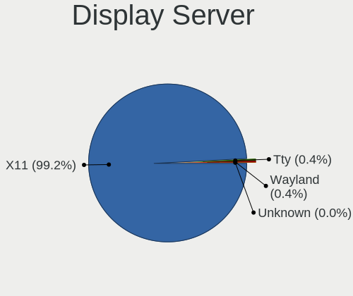
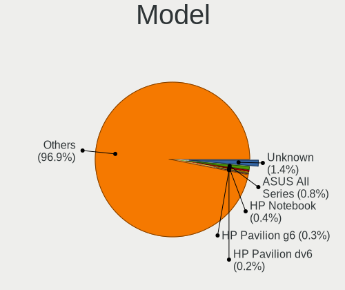
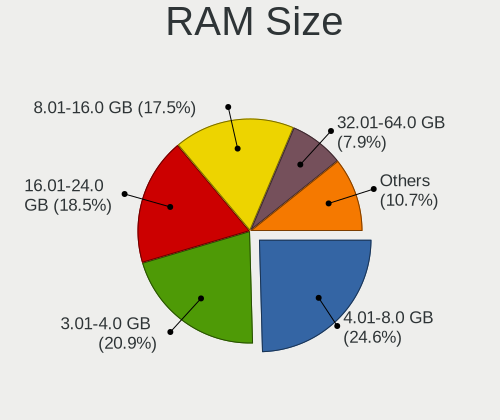
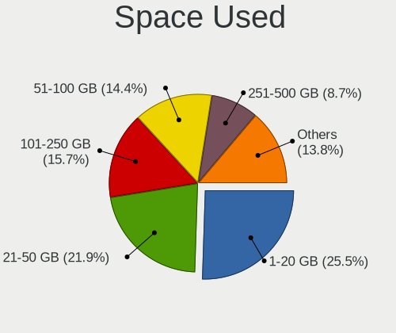

Linux Mint - Tested Hardware & Statistics
-----------------------------------------

A project to collect tested hardware configurations for Linux Mint.

Anyone can contribute to this report by the [hw-probe](https://github.com/linuxhw/hw-probe) tool:

    sudo -E hw-probe -all -upload

Please contribute! Especially if your hardware is rare.

This is a report for all computer types. See also reports for [desktops](/Dist/Linux_Mint/Desktop/README.md) and [notebooks](/Dist/Linux_Mint/Notebook/README.md).

Contents
--------

* [ Test Cases ](#test-cases)

* [ System ](#system)
  - [ OS                       ](#os)
  - [ OS Family                ](#os-family)
  - [ Kernel                   ](#kernel)
  - [ Kernel Family            ](#kernel-family)
  - [ Kernel Major Ver.        ](#kernel-major-ver)
  - [ Arch                     ](#arch)
  - [ DE                       ](#de)
  - [ Display Server           ](#display-server)
  - [ Display Manager          ](#display-manager)
  - [ OS Lang                  ](#os-lang)
  - [ Boot Mode                ](#boot-mode)
  - [ Filesystem               ](#filesystem)
  - [ Part. scheme             ](#part-scheme)
  - [ Dual Boot with Linux/BSD ](#dual-boot-with-linuxbsd)
  - [ Dual Boot (Win)          ](#dual-boot-win)

* [ Board ](#board)
  - [ Vendor                   ](#vendor)
  - [ Model                    ](#model)
  - [ Model Family             ](#model-family)
  - [ MFG Year                 ](#mfg-year)
  - [ Form Factor              ](#form-factor)
  - [ Secure Boot              ](#secure-boot)
  - [ Coreboot                 ](#coreboot)
  - [ RAM Size                 ](#ram-size)
  - [ RAM Used                 ](#ram-used)
  - [ Total Drives             ](#total-drives)
  - [ Has CD-ROM               ](#has-cd-rom)
  - [ Has Ethernet             ](#has-ethernet)
  - [ Has WiFi                 ](#has-wifi)
  - [ Has Bluetooth            ](#has-bluetooth)

* [ Location ](#location)
  - [ Country                  ](#country)
  - [ City                     ](#city)

* [ Drives ](#drives)
  - [ Drive Vendor             ](#drive-vendor)
  - [ Drive Model              ](#drive-model)
  - [ HDD Vendor               ](#hdd-vendor)
  - [ SSD Vendor               ](#ssd-vendor)
  - [ Drive Kind               ](#drive-kind)
  - [ Drive Connector          ](#drive-connector)
  - [ Drive Size               ](#drive-size)
  - [ Space Total              ](#space-total)
  - [ Space Used               ](#space-used)
  - [ Malfunc. Drives          ](#malfunc-drives)
  - [ Malfunc. Drive Vendor    ](#malfunc-drive-vendor)
  - [ Malfunc. HDD Vendor      ](#malfunc-hdd-vendor)
  - [ Malfunc. Drive Kind      ](#malfunc-drive-kind)
  - [ Failed Drives            ](#failed-drives)
  - [ Failed Drive Vendor      ](#failed-drive-vendor)
  - [ Drive Status             ](#drive-status)

* [ Storage controller ](#storage-controller)
  - [ Storage Vendor           ](#storage-vendor)
  - [ Storage Model            ](#storage-model)
  - [ Storage Kind             ](#storage-kind)

* [ Processor ](#processor)
  - [ CPU Vendor               ](#cpu-vendor)
  - [ CPU Model                ](#cpu-model)
  - [ CPU Model Family         ](#cpu-model-family)
  - [ CPU Cores                ](#cpu-cores)
  - [ CPU Sockets              ](#cpu-sockets)
  - [ CPU Threads              ](#cpu-threads)
  - [ CPU Op-Modes             ](#cpu-op-modes)
  - [ CPU Microcode            ](#cpu-microcode)
  - [ CPU Microarch            ](#cpu-microarch)

* [ Graphics ](#graphics)
  - [ GPU Vendor               ](#gpu-vendor)
  - [ GPU Model                ](#gpu-model)
  - [ GPU Combo                ](#gpu-combo)
  - [ GPU Driver               ](#gpu-driver)
  - [ GPU Memory               ](#gpu-memory)

* [ Monitor ](#monitor)
  - [ Monitor Vendor           ](#monitor-vendor)
  - [ Monitor Model            ](#monitor-model)
  - [ Monitor Resolution       ](#monitor-resolution)
  - [ Monitor Diagonal         ](#monitor-diagonal)
  - [ Monitor Width            ](#monitor-width)
  - [ Aspect Ratio             ](#aspect-ratio)
  - [ Monitor Area             ](#monitor-area)
  - [ Pixel Density            ](#pixel-density)
  - [ Multiple Monitors        ](#multiple-monitors)

* [ Network ](#network)
  - [ Net Controller Vendor    ](#net-controller-vendor)
  - [ Net Controller Model     ](#net-controller-model)
  - [ Wireless Vendor          ](#wireless-vendor)
  - [ Wireless Model           ](#wireless-model)
  - [ Ethernet Vendor          ](#ethernet-vendor)
  - [ Ethernet Model           ](#ethernet-model)
  - [ Net Controller Kind      ](#net-controller-kind)
  - [ Used Controller          ](#used-controller)
  - [ NICs                     ](#nics)
  - [ IPv6                     ](#ipv6)

* [ Bluetooth ](#bluetooth)
  - [ Bluetooth Vendor         ](#bluetooth-vendor)
  - [ Bluetooth Model          ](#bluetooth-model)

* [ Sound ](#sound)
  - [ Sound Vendor             ](#sound-vendor)
  - [ Sound Model              ](#sound-model)

* [ Memory ](#memory)
  - [ Memory Vendor            ](#memory-vendor)
  - [ Memory Model             ](#memory-model)
  - [ Memory Kind              ](#memory-kind)
  - [ Memory Form Factor       ](#memory-form-factor)
  - [ Memory Size              ](#memory-size)
  - [ Memory Speed             ](#memory-speed)

* [ Printers & scanners ](#printers--scanners)
  - [ Printer Vendor           ](#printer-vendor)
  - [ Printer Model            ](#printer-model)
  - [ Scanner Vendor           ](#scanner-vendor)
  - [ Scanner Model            ](#scanner-model)

* [ Camera ](#camera)
  - [ Camera Vendor            ](#camera-vendor)
  - [ Camera Model             ](#camera-model)

* [ Security ](#security)
  - [ Fingerprint Vendor       ](#fingerprint-vendor)
  - [ Fingerprint Model        ](#fingerprint-model)
  - [ Chipcard Vendor          ](#chipcard-vendor)
  - [ Chipcard Model           ](#chipcard-model)

* [ Unsupported ](#unsupported)
  - [ Unsupported Devices      ](#unsupported-devices)
  - [ Unsupported Device Types ](#unsupported-device-types)

Test Cases
----------

Total: 32661

| Vendor        | Model                       | Form-Factor | Probe                                                      | Date         |
|---------------|-----------------------------|-------------|------------------------------------------------------------|--------------|
| ASRock        | H61M-DGS R2.0               | Desktop     | [47be7b76e5](https://linux-hardware.org/?probe=47be7b76e5) | May 09, 2024 |
| Lenovo        | ThinkPad E14 Gen 2 20TBS... | Notebook    | [4720614db4](https://linux-hardware.org/?probe=4720614db4) | May 09, 2024 |
| AZW           | MINI S                      | Desktop     | [12557a4240](https://linux-hardware.org/?probe=12557a4240) | May 09, 2024 |
| Foxconn       | 2AB1                        | Desktop     | [11beb142c3](https://linux-hardware.org/?probe=11beb142c3) | May 09, 2024 |
| AZW           | MINI S                      | Desktop     | [7c8e83b2ed](https://linux-hardware.org/?probe=7c8e83b2ed) | May 09, 2024 |
| Panasonic     | FZ55-1                      | Notebook    | [5709bdb252](https://linux-hardware.org/?probe=5709bdb252) | May 09, 2024 |
| ASUSTek       | LEONITE                     | Desktop     | [a50f5f9e3a](https://linux-hardware.org/?probe=a50f5f9e3a) | May 08, 2024 |
| ASUSTek       | X550LD                      | Notebook    | [1c55e1acf7](https://linux-hardware.org/?probe=1c55e1acf7) | May 08, 2024 |
| Apple         | Mac-942B5BF58194151B        | All in one  | [c5c2b3b9c0](https://linux-hardware.org/?probe=c5c2b3b9c0) | May 08, 2024 |
| Panasonic     | CF-53SAWZYMN                | Notebook    | [15a322275f](https://linux-hardware.org/?probe=15a322275f) | May 08, 2024 |
| MSI           | MS-7255                     | Desktop     | [5e4c3d17d6](https://linux-hardware.org/?probe=5e4c3d17d6) | May 08, 2024 |
| HP            | 83E5                        | All in one  | [38a2509046](https://linux-hardware.org/?probe=38a2509046) | May 08, 2024 |
| ASUSTek       | E5402WHA                    | All in one  | [9db61e60e0](https://linux-hardware.org/?probe=9db61e60e0) | May 08, 2024 |
| ECS           | H61H2-CM                    | Desktop     | [65f99c7e8d](https://linux-hardware.org/?probe=65f99c7e8d) | May 08, 2024 |
| Acer          | Swift SFX16-61G             | Notebook    | [9cbd40bfc7](https://linux-hardware.org/?probe=9cbd40bfc7) | May 08, 2024 |
| Sony          | SVE1412BCXB                 | Notebook    | [593942e0e3](https://linux-hardware.org/?probe=593942e0e3) | May 08, 2024 |
| Dell          | 0WR7PY A01                  | Desktop     | [f154c6f22e](https://linux-hardware.org/?probe=f154c6f22e) | May 07, 2024 |
| HP            | Laptop 15-bs1xx             | Notebook    | [f3c9212dca](https://linux-hardware.org/?probe=f3c9212dca) | May 07, 2024 |
| ASUSTek       | ROG STRIX Z590-A GAMING ... | Desktop     | [ebd9696c7b](https://linux-hardware.org/?probe=ebd9696c7b) | May 07, 2024 |
| ASUSTek       | PRIME Z790-P WIFI           | Desktop     | [54b9c594a0](https://linux-hardware.org/?probe=54b9c594a0) | May 07, 2024 |
| ASRock        | Z68 Extreme4 Gen3           | Desktop     | [df427b5f9f](https://linux-hardware.org/?probe=df427b5f9f) | May 07, 2024 |
| HP            | 84DE                        | All in one  | [b9c011f515](https://linux-hardware.org/?probe=b9c011f515) | May 07, 2024 |
| ASUSTek       | PRIME X570-P                | Desktop     | [2ff26254ae](https://linux-hardware.org/?probe=2ff26254ae) | May 07, 2024 |
| Samsung       | RC530/RC730                 | Notebook    | [9e8af32b68](https://linux-hardware.org/?probe=9e8af32b68) | May 07, 2024 |
| ASUSTek       | ROG STRIX B650E-I GAMING... | Desktop     | [961d8a2758](https://linux-hardware.org/?probe=961d8a2758) | May 07, 2024 |
| Packard Be... | WMCP78M                     | Desktop     | [4d711194fa](https://linux-hardware.org/?probe=4d711194fa) | May 07, 2024 |
| MSI           | X670E GAMING PLUS WIFI      | Desktop     | [72a4d27732](https://linux-hardware.org/?probe=72a4d27732) | May 07, 2024 |
| ASRock        | FM2A88X Extreme6+           | Desktop     | [d12f9a31f3](https://linux-hardware.org/?probe=d12f9a31f3) | May 07, 2024 |
| Gigabyte      | Z77-D3H                     | Desktop     | [01099601fe](https://linux-hardware.org/?probe=01099601fe) | May 07, 2024 |
| Lenovo        | V145-15AST 81MT             | Notebook    | [f683d111b9](https://linux-hardware.org/?probe=f683d111b9) | May 07, 2024 |
| Lenovo        | V145-15AST 81MT             | Notebook    | [1f8035ccf5](https://linux-hardware.org/?probe=1f8035ccf5) | May 07, 2024 |
| Dell          | 03KWTV A00                  | Desktop     | [68f465c06a](https://linux-hardware.org/?probe=68f465c06a) | May 06, 2024 |
| Dell          | 03KWTV A00                  | Desktop     | [1b3f32baf6](https://linux-hardware.org/?probe=1b3f32baf6) | May 06, 2024 |
| Samsung       | 350V5C/351V5C/3540VC/344... | Notebook    | [5bc2e6635d](https://linux-hardware.org/?probe=5bc2e6635d) | May 06, 2024 |
| Apple         | MacBookAir7,2               | Notebook    | [c8f7c82599](https://linux-hardware.org/?probe=c8f7c82599) | May 06, 2024 |
| Lenovo        | IdeaPadFlex 5 14ABR8 82X... | Convertible | [b87692bb4f](https://linux-hardware.org/?probe=b87692bb4f) | May 06, 2024 |
| Acer          | Aspire 5310                 | Notebook    | [8e28475b52](https://linux-hardware.org/?probe=8e28475b52) | May 06, 2024 |
| HP            | 843B                        | Desktop     | [ed0c184996](https://linux-hardware.org/?probe=ed0c184996) | May 06, 2024 |
| Lenovo        | IdeaPad Pro 5 14AHP9 83D... | Notebook    | [f8f3623eac](https://linux-hardware.org/?probe=f8f3623eac) | May 06, 2024 |
| HP            | 843B                        | Desktop     | [bf812339be](https://linux-hardware.org/?probe=bf812339be) | May 06, 2024 |
| Toshiba       | Satellite C660D             | Notebook    | [8c4353e699](https://linux-hardware.org/?probe=8c4353e699) | May 06, 2024 |
| ASUSTek       | CM1831                      | Desktop     | [c228565f48](https://linux-hardware.org/?probe=c228565f48) | May 06, 2024 |
| ASUSTek       | CM1831                      | Desktop     | [cc97798ac4](https://linux-hardware.org/?probe=cc97798ac4) | May 06, 2024 |
| Alienware     | 17 R4                       | Notebook    | [99e296d142](https://linux-hardware.org/?probe=99e296d142) | May 06, 2024 |
| Lenovo        | IdeaPad 500-15ISK 80NT      | Notebook    | [63486fcdd6](https://linux-hardware.org/?probe=63486fcdd6) | May 05, 2024 |
| Lenovo        | IdeaPad 500-15ISK 80NT      | Notebook    | [61af632661](https://linux-hardware.org/?probe=61af632661) | May 05, 2024 |
| HUAWEI        | BOHK-WAX9X                  | Notebook    | [81e4b0e4f8](https://linux-hardware.org/?probe=81e4b0e4f8) | May 05, 2024 |
| MSI           | PRO B650-VC WIFI            | Desktop     | [5ba462d421](https://linux-hardware.org/?probe=5ba462d421) | May 05, 2024 |
| HP            | 1495                        | Desktop     | [f0e80863a7](https://linux-hardware.org/?probe=f0e80863a7) | May 05, 2024 |
| Acer          | Aspire ES1-521              | Notebook    | [65ad890734](https://linux-hardware.org/?probe=65ad890734) | May 05, 2024 |
| ASUSTek       | F9E                         | Notebook    | [faf50e0119](https://linux-hardware.org/?probe=faf50e0119) | May 05, 2024 |
| Intel         | powered classmate PC        | Tablet      | [42a4f299a3](https://linux-hardware.org/?probe=42a4f299a3) | May 05, 2024 |
| ASUSTek       | ROG Strix G513IH_G513IH     | Notebook    | [5a6ae63a80](https://linux-hardware.org/?probe=5a6ae63a80) | May 05, 2024 |
| Dell          | Inspiron 16 Plus 7620       | Notebook    | [cd8ef2428b](https://linux-hardware.org/?probe=cd8ef2428b) | May 05, 2024 |
| Lenovo        | ThinkPad T480 20L50011US    | Notebook    | [06d6c1d0e2](https://linux-hardware.org/?probe=06d6c1d0e2) | May 05, 2024 |
| Lenovo        | ThinkPad X220 4291U1A       | Notebook    | [56fe72121d](https://linux-hardware.org/?probe=56fe72121d) | May 05, 2024 |
| Intel         | NUC7i5BNB J31144-311        | Mini pc     | [64953efef1](https://linux-hardware.org/?probe=64953efef1) | May 05, 2024 |
| Alienware     | 17 R4                       | Notebook    | [4ad46d150c](https://linux-hardware.org/?probe=4ad46d150c) | May 05, 2024 |
| HP            | Presario CQ42               | Notebook    | [809ae686e3](https://linux-hardware.org/?probe=809ae686e3) | May 05, 2024 |
| Gigabyte      | F2A88XM-D3HP                | Desktop     | [e362e7892b](https://linux-hardware.org/?probe=e362e7892b) | May 05, 2024 |
| ASUSTek       | VivoBook_ASUSLaptop M650... | Notebook    | [5f2d3291b5](https://linux-hardware.org/?probe=5f2d3291b5) | May 05, 2024 |
| AZW           | SER V1.0                    | Mini pc     | [83a9a92054](https://linux-hardware.org/?probe=83a9a92054) | May 04, 2024 |
| ASUSTek       | ROG STRIX B550-I GAMING     | Desktop     | [169c97e582](https://linux-hardware.org/?probe=169c97e582) | May 04, 2024 |
| HP            | 83E9                        | Desktop     | [d14ba283d6](https://linux-hardware.org/?probe=d14ba283d6) | May 04, 2024 |
| Gigabyte      | B550M AORUS ELITE           | Desktop     | [4e09bfec36](https://linux-hardware.org/?probe=4e09bfec36) | May 04, 2024 |
| ASUSTek       | PRIME A320M-K               | Desktop     | [79a0169068](https://linux-hardware.org/?probe=79a0169068) | May 04, 2024 |
| AMI           | Intel                       | Desktop     | [84952c85f7](https://linux-hardware.org/?probe=84952c85f7) | May 04, 2024 |
| ASUSTek       | PRIME X570-P                | Desktop     | [b76f2f11bd](https://linux-hardware.org/?probe=b76f2f11bd) | May 04, 2024 |
| Shenzhen M... | F7BRC                       | Desktop     | [de61b5eba6](https://linux-hardware.org/?probe=de61b5eba6) | May 04, 2024 |
| Lenovo        | ThinkPad T530 23942C2       | Notebook    | [f906a50af0](https://linux-hardware.org/?probe=f906a50af0) | May 03, 2024 |
| ASUSTek       | X553MA                      | Notebook    | [dc9e8b63f5](https://linux-hardware.org/?probe=dc9e8b63f5) | May 03, 2024 |
| Positivo      | POS-EIH610EX 11189814       | Desktop     | [0657842cc3](https://linux-hardware.org/?probe=0657842cc3) | May 03, 2024 |
| HP            | 18E7                        | Desktop     | [22c3e77e54](https://linux-hardware.org/?probe=22c3e77e54) | May 03, 2024 |
| MSI           | B450 GAMING PRO CARBON A... | Desktop     | [9101a05646](https://linux-hardware.org/?probe=9101a05646) | May 03, 2024 |
| ECS           | A780LM-M2                   | Desktop     | [081a49bf0c](https://linux-hardware.org/?probe=081a49bf0c) | May 03, 2024 |
| Gigabyte      | B450 AORUS M                | Desktop     | [931e4419fa](https://linux-hardware.org/?probe=931e4419fa) | May 03, 2024 |
| MSI           | MAG B760M MORTAR WIFI DD... | Desktop     | [a077206bc5](https://linux-hardware.org/?probe=a077206bc5) | May 03, 2024 |
| ASUSTek       | PRIME B550-PLUS             | Desktop     | [01e99b1acd](https://linux-hardware.org/?probe=01e99b1acd) | May 03, 2024 |
| ASUSTek       | P8Z68-V                     | Desktop     | [04f2de6ec1](https://linux-hardware.org/?probe=04f2de6ec1) | May 03, 2024 |
| Lenovo        | Yoga 7 16IRL8 82YN          | Notebook    | [a70e2b13ca](https://linux-hardware.org/?probe=a70e2b13ca) | May 03, 2024 |
| ASUSTek       | TUF Gaming X570-PLUS        | Desktop     | [fb0da29f4d](https://linux-hardware.org/?probe=fb0da29f4d) | May 03, 2024 |
| Dell          | Latitude E6540              | Notebook    | [186de5be73](https://linux-hardware.org/?probe=186de5be73) | May 03, 2024 |
| Gigabyte      | 970A-DS3P                   | Desktop     | [2512d113c2](https://linux-hardware.org/?probe=2512d113c2) | May 03, 2024 |
| Apple         | MacBookAir7,2               | Notebook    | [4e2a6ab271](https://linux-hardware.org/?probe=4e2a6ab271) | May 03, 2024 |
| Lenovo        | ThinkPad T460 20FMS0VG25    | Notebook    | [754611f403](https://linux-hardware.org/?probe=754611f403) | May 03, 2024 |
| ASRock        | X570 Phantom Gaming 4 Wi... | Desktop     | [181b08bd87](https://linux-hardware.org/?probe=181b08bd87) | May 02, 2024 |
| HP            | Pavilion Laptop 15-eh1xx... | Notebook    | [c94fe08160](https://linux-hardware.org/?probe=c94fe08160) | May 02, 2024 |
| HP            | Notebook                    | Notebook    | [3719fa55d8](https://linux-hardware.org/?probe=3719fa55d8) | May 02, 2024 |
| AZW           | SER V1.0                    | Mini pc     | [29f1e433d5](https://linux-hardware.org/?probe=29f1e433d5) | May 02, 2024 |
| Acer          | Aspire A315-53G             | Notebook    | [d782707b53](https://linux-hardware.org/?probe=d782707b53) | May 02, 2024 |
| ASUSTek       | F9E                         | Notebook    | [29fd3412dc](https://linux-hardware.org/?probe=29fd3412dc) | May 02, 2024 |
| HP            | 1494                        | Desktop     | [7fb0be6459](https://linux-hardware.org/?probe=7fb0be6459) | May 02, 2024 |
| ASRock        | H170M-ITX/ac                | Desktop     | [856a303262](https://linux-hardware.org/?probe=856a303262) | May 02, 2024 |
| MSI           | G41M-P28                    | Desktop     | [c946f92e74](https://linux-hardware.org/?probe=c946f92e74) | May 02, 2024 |
| Gigabyte      | 945GM-S2                    | Desktop     | [a0e44d4417](https://linux-hardware.org/?probe=a0e44d4417) | May 02, 2024 |
| ASUSTek       | H97-PLUS                    | Desktop     | [1080e65164](https://linux-hardware.org/?probe=1080e65164) | May 02, 2024 |
| Lenovo        | IdeaPad 1 15AMN7 82VG       | Notebook    | [0740dd4f54](https://linux-hardware.org/?probe=0740dd4f54) | May 02, 2024 |
| MSI           | MAG B650 TOMAHAWK WIFI      | Desktop     | [63daec1367](https://linux-hardware.org/?probe=63daec1367) | May 02, 2024 |
| Intel         | HURONRIVER                  | Desktop     | [da8de15263](https://linux-hardware.org/?probe=da8de15263) | May 02, 2024 |
| Samsung       | RV411/RV511/E3511/S3511/... | Notebook    | [452d7c03be](https://linux-hardware.org/?probe=452d7c03be) | May 01, 2024 |
| Dell          | 0RW203 A00                  | Desktop     | [3fb1f4e9f9](https://linux-hardware.org/?probe=3fb1f4e9f9) | May 01, 2024 |
| HP            | Pavilion g6                 | Notebook    | [6568deae58](https://linux-hardware.org/?probe=6568deae58) | May 01, 2024 |
| HP            | Pavilion g6                 | Notebook    | [57a50655da](https://linux-hardware.org/?probe=57a50655da) | May 01, 2024 |
| Notebook      | V15x_V17xRNx                | Notebook    | [ec53c078f5](https://linux-hardware.org/?probe=ec53c078f5) | May 01, 2024 |
| Samsung       | 355V4C/356V4C/3445VC/354... | Notebook    | [b861055064](https://linux-hardware.org/?probe=b861055064) | May 01, 2024 |
| Apple         | Mac-FC02E91DDD3FA6A4 iMa... | All in one  | [f7ef1cc124](https://linux-hardware.org/?probe=f7ef1cc124) | May 01, 2024 |
| AMI           | Intel                       | Desktop     | [0be237c95a](https://linux-hardware.org/?probe=0be237c95a) | May 01, 2024 |
| ASUSTek       | X99-E WS/USB                | Desktop     | [a4df75c4bc](https://linux-hardware.org/?probe=a4df75c4bc) | May 01, 2024 |
| HP            | 1494                        | Desktop     | [1e2a110b7c](https://linux-hardware.org/?probe=1e2a110b7c) | May 01, 2024 |
| ASUSTek       | ROG STRIX B450-F GAMING     | Desktop     | [bb7791835b](https://linux-hardware.org/?probe=bb7791835b) | May 01, 2024 |
| ASUSTek       | M4A87TD/USB3                | Desktop     | [91136f3f95](https://linux-hardware.org/?probe=91136f3f95) | May 01, 2024 |
| ASRock        | H61M-S                      | Desktop     | [2c79ee4cae](https://linux-hardware.org/?probe=2c79ee4cae) | May 01, 2024 |
| HP            | ProBook 450 15.6 inch G9... | Notebook    | [8a4bab899a](https://linux-hardware.org/?probe=8a4bab899a) | May 01, 2024 |
| HP            | 18E7                        | Desktop     | [f98543789e](https://linux-hardware.org/?probe=f98543789e) | May 01, 2024 |
| Supermicro    | X9SPU-F                     | Desktop     | [ec236a99ac](https://linux-hardware.org/?probe=ec236a99ac) | Apr 30, 2024 |
| Shenzhen M... | F7BFC                       | Desktop     | [43fd55c47a](https://linux-hardware.org/?probe=43fd55c47a) | Apr 30, 2024 |
| MSI           | Z170A GAMING M7             | Desktop     | [3ce4a9b0c5](https://linux-hardware.org/?probe=3ce4a9b0c5) | Apr 30, 2024 |
| ASUSTek       | ROG STRIX Z390-E GAMING     | Desktop     | [e04f6d1c77](https://linux-hardware.org/?probe=e04f6d1c77) | Apr 30, 2024 |
| Lenovo        | IdeaPad S145-15IWL 81S9     | Notebook    | [e7b0c31433](https://linux-hardware.org/?probe=e7b0c31433) | Apr 30, 2024 |
| Apple         | MacBookPro12,1              | Notebook    | [89a84d0398](https://linux-hardware.org/?probe=89a84d0398) | Apr 30, 2024 |
| Shenzhen M... | F7BFC                       | Desktop     | [d480d08c5e](https://linux-hardware.org/?probe=d480d08c5e) | Apr 30, 2024 |
| Dell          | 06NWYK A00                  | Desktop     | [ec673a2386](https://linux-hardware.org/?probe=ec673a2386) | Apr 30, 2024 |
| Lenovo        | IdeaPad S145-15IWL 81S9     | Notebook    | [83497aeda8](https://linux-hardware.org/?probe=83497aeda8) | Apr 30, 2024 |
| MSI           | Z170A GAMING M5             | Desktop     | [1d4b2dd7e3](https://linux-hardware.org/?probe=1d4b2dd7e3) | Apr 30, 2024 |
| MSI           | MAG Z690 TOMAHAWK WIFI D... | Desktop     | [5cc26d31fa](https://linux-hardware.org/?probe=5cc26d31fa) | Apr 30, 2024 |
| HP            | 1496                        | Desktop     | [64f726b9c5](https://linux-hardware.org/?probe=64f726b9c5) | Apr 30, 2024 |
| Dell          | 0T7D40 A01                  | Desktop     | [8de750aabf](https://linux-hardware.org/?probe=8de750aabf) | Apr 30, 2024 |
| Packard Be... | DOT SE                      | Notebook    | [25e87d67cc](https://linux-hardware.org/?probe=25e87d67cc) | Apr 30, 2024 |
| Packard Be... | DOT SE                      | Notebook    | [e8d7adfcce](https://linux-hardware.org/?probe=e8d7adfcce) | Apr 30, 2024 |
| Acer          | Aspire A514-55              | Notebook    | [3f25790115](https://linux-hardware.org/?probe=3f25790115) | Apr 30, 2024 |
| Acer          | Acadia V1.45                | Notebook    | [7dc83a3832](https://linux-hardware.org/?probe=7dc83a3832) | Apr 30, 2024 |
| ASUSTek       | PRIME B550M-A AC            | Desktop     | [199c1abd04](https://linux-hardware.org/?probe=199c1abd04) | Apr 30, 2024 |
| Lenovo        | Legion 7 16ARHA7 82UH       | Notebook    | [5514986c5d](https://linux-hardware.org/?probe=5514986c5d) | Apr 30, 2024 |
| HUAWEI        | BoDE-WXX9                   | Notebook    | [3777b80728](https://linux-hardware.org/?probe=3777b80728) | Apr 30, 2024 |
| ASUSTek       | K53SD                       | Notebook    | [058d33ec3c](https://linux-hardware.org/?probe=058d33ec3c) | Apr 29, 2024 |
| Positivo      | POS-AG31AP                  | Desktop     | [998129cad7](https://linux-hardware.org/?probe=998129cad7) | Apr 29, 2024 |
| iQual         | NQ1                         | Notebook    | [8c657ecc80](https://linux-hardware.org/?probe=8c657ecc80) | Apr 29, 2024 |
| HP            | 255 15.6 inch G9 Noteboo... | Notebook    | [184f4e1a7c](https://linux-hardware.org/?probe=184f4e1a7c) | Apr 29, 2024 |
| MSI           | B350M PRO-VD PLUS           | Desktop     | [25f45497bf](https://linux-hardware.org/?probe=25f45497bf) | Apr 29, 2024 |
| Gigabyte      | GA-880GM-USB3               | Desktop     | [3645662c80](https://linux-hardware.org/?probe=3645662c80) | Apr 29, 2024 |
| ASUSTek       | VivoBook_ASUSLaptop X415... | Notebook    | [20ce0be473](https://linux-hardware.org/?probe=20ce0be473) | Apr 29, 2024 |
| MSI           | GF75 Thin 10UE              | Notebook    | [07b5ec9d5d](https://linux-hardware.org/?probe=07b5ec9d5d) | Apr 29, 2024 |
| Lenovo        | IdeaPad 5 15ABA7 82SG       | Notebook    | [26e856b70a](https://linux-hardware.org/?probe=26e856b70a) | Apr 29, 2024 |
| HP            | 83E9                        | Desktop     | [f5850d107f](https://linux-hardware.org/?probe=f5850d107f) | Apr 29, 2024 |
| ASUSTek       | UX32VD                      | Notebook    | [1377417777](https://linux-hardware.org/?probe=1377417777) | Apr 29, 2024 |
| Dell          | Precision M6800             | Notebook    | [394b2b0f31](https://linux-hardware.org/?probe=394b2b0f31) | Apr 28, 2024 |
| Sony          | SVF1521C5E                  | Notebook    | [9a899f2e80](https://linux-hardware.org/?probe=9a899f2e80) | Apr 28, 2024 |
| Lenovo        | ThinkPad E14 Gen 5 21JL0... | Notebook    | [5f82ffafd9](https://linux-hardware.org/?probe=5f82ffafd9) | Apr 28, 2024 |
| HP            | 2B52                        | Desktop     | [41588d4e13](https://linux-hardware.org/?probe=41588d4e13) | Apr 28, 2024 |
| Gigabyte      | B450M DS3H-CF               | Desktop     | [c85c3d59df](https://linux-hardware.org/?probe=c85c3d59df) | Apr 28, 2024 |
| MSI           | FM2-A75MA-E35               | Desktop     | [9ab41ba299](https://linux-hardware.org/?probe=9ab41ba299) | Apr 28, 2024 |
| Samsung       | RC530/RC730                 | Notebook    | [ef8bb7edf5](https://linux-hardware.org/?probe=ef8bb7edf5) | Apr 28, 2024 |
| Gigabyte      | A620I AX                    | Desktop     | [eeea04465b](https://linux-hardware.org/?probe=eeea04465b) | Apr 28, 2024 |
| MSI           | GL75 Leopard 10SFK          | Notebook    | [2cde0c8054](https://linux-hardware.org/?probe=2cde0c8054) | Apr 28, 2024 |
| Gigabyte      | GA-880GM-USB3               | Desktop     | [ae905aacaf](https://linux-hardware.org/?probe=ae905aacaf) | Apr 28, 2024 |
| Intel         | NUC7i3BNB J22859-303        | Mini pc     | [f4bda8cf30](https://linux-hardware.org/?probe=f4bda8cf30) | Apr 28, 2024 |
| AMD           | A88K                        | Desktop     | [5a4ca72c81](https://linux-hardware.org/?probe=5a4ca72c81) | Apr 28, 2024 |
| HP            | Pavilion dv6                | Notebook    | [3663f38683](https://linux-hardware.org/?probe=3663f38683) | Apr 28, 2024 |
| Dell          | Inspiron 3583               | Notebook    | [27c5b7b8d8](https://linux-hardware.org/?probe=27c5b7b8d8) | Apr 27, 2024 |
| MSI           | Z97 PC Mate                 | Desktop     | [44a2eb8cdb](https://linux-hardware.org/?probe=44a2eb8cdb) | Apr 27, 2024 |
| Acer          | Aspire 5735                 | Notebook    | [bb36d187d1](https://linux-hardware.org/?probe=bb36d187d1) | Apr 27, 2024 |
| Novatech      | C141SC-N4                   | Notebook    | [bedb8538c8](https://linux-hardware.org/?probe=bedb8538c8) | Apr 27, 2024 |
| Novatech      | C141SC-N4                   | Notebook    | [f1534e7ed2](https://linux-hardware.org/?probe=f1534e7ed2) | Apr 27, 2024 |
| Lenovo        | ThinkPad Yoga 370 20JJS0... | Convertible | [b16979f0ec](https://linux-hardware.org/?probe=b16979f0ec) | Apr 27, 2024 |
| Lenovo        | ThinkPad T480 20L6SA5Q1L    | Notebook    | [1498235a91](https://linux-hardware.org/?probe=1498235a91) | Apr 27, 2024 |
| Lenovo        | ThinkPad T495 20NKS1YE00    | Notebook    | [8436983b86](https://linux-hardware.org/?probe=8436983b86) | Apr 27, 2024 |
| Lenovo        | ThinkPad W520 4270CTO       | Notebook    | [ab9e430693](https://linux-hardware.org/?probe=ab9e430693) | Apr 27, 2024 |
| Lenovo        | ThinkPad W520 4270CTO       | Notebook    | [e192aa886d](https://linux-hardware.org/?probe=e192aa886d) | Apr 27, 2024 |
| ASUSTek       | PRIME B360M-A               | Desktop     | [dfe51458b2](https://linux-hardware.org/?probe=dfe51458b2) | Apr 27, 2024 |
| Samsung       | 355V4C/356V4C/3445VC/354... | Notebook    | [4b825a61db](https://linux-hardware.org/?probe=4b825a61db) | Apr 27, 2024 |
| Dell          | 0KJCC5 A00                  | Desktop     | [04c8546395](https://linux-hardware.org/?probe=04c8546395) | Apr 27, 2024 |
| Apple         | Mac-942B5BF58194151B        | All in one  | [8b127ce5fb](https://linux-hardware.org/?probe=8b127ce5fb) | Apr 27, 2024 |
| Gigabyte      | B450M GAMING                | Desktop     | [5d2ca0a62d](https://linux-hardware.org/?probe=5d2ca0a62d) | Apr 27, 2024 |
| ASUSTek       | S551LN                      | Notebook    | [e1fa85e2ad](https://linux-hardware.org/?probe=e1fa85e2ad) | Apr 27, 2024 |
| Acer          | Extensa 5230                | Notebook    | [3a0381ce01](https://linux-hardware.org/?probe=3a0381ce01) | Apr 27, 2024 |
| Dell          | Inspiron 15-7568            | Notebook    | [bc2dfb0b2f](https://linux-hardware.org/?probe=bc2dfb0b2f) | Apr 26, 2024 |
| ASRock        | X300M-STX                   | Desktop     | [12c4ea5db5](https://linux-hardware.org/?probe=12c4ea5db5) | Apr 26, 2024 |
| ASUSTek       | X555LAB                     | Notebook    | [3b175a9a09](https://linux-hardware.org/?probe=3b175a9a09) | Apr 26, 2024 |
| HP            | 84F5                        | Mini pc     | [6ae1eb8502](https://linux-hardware.org/?probe=6ae1eb8502) | Apr 26, 2024 |
| HP            | ProBook 450 G1              | Notebook    | [02e056b32e](https://linux-hardware.org/?probe=02e056b32e) | Apr 26, 2024 |
| Apple         | MacBookAir7,2               | Notebook    | [cf8aa1d23a](https://linux-hardware.org/?probe=cf8aa1d23a) | Apr 26, 2024 |
| Acer          | Aspire one                  | Notebook    | [aa3dbeb28b](https://linux-hardware.org/?probe=aa3dbeb28b) | Apr 26, 2024 |
| HP            | EliteBook 820 G3            | Notebook    | [9f260f753a](https://linux-hardware.org/?probe=9f260f753a) | Apr 26, 2024 |
| Lenovo        | ThinkPad T470s 20HGS45C0... | Notebook    | [f39ba0b079](https://linux-hardware.org/?probe=f39ba0b079) | Apr 26, 2024 |
| Lenovo        | G510 20238                  | Notebook    | [f7d0515f40](https://linux-hardware.org/?probe=f7d0515f40) | Apr 26, 2024 |
| HP            | 84EE 1100                   | All in one  | [4754cb2a54](https://linux-hardware.org/?probe=4754cb2a54) | Apr 26, 2024 |
| ASUSTek       | X99-A/USB                   | Desktop     | [d8616c5a03](https://linux-hardware.org/?probe=d8616c5a03) | Apr 26, 2024 |
| Apple         | MacBookAir5,1               | Notebook    | [dec330ffa3](https://linux-hardware.org/?probe=dec330ffa3) | Apr 25, 2024 |
| Gigabyte      | B450 AORUS M                | Desktop     | [ff40fe2120](https://linux-hardware.org/?probe=ff40fe2120) | Apr 25, 2024 |
| Gigabyte      | X570 AORUS ELITE            | Desktop     | [921fc0d219](https://linux-hardware.org/?probe=921fc0d219) | Apr 25, 2024 |
| ASUSTek       | P5Q SE                      | Desktop     | [1df93195b0](https://linux-hardware.org/?probe=1df93195b0) | Apr 25, 2024 |
| ASUSTek       | X553MA                      | Notebook    | [cb731fbd8f](https://linux-hardware.org/?probe=cb731fbd8f) | Apr 25, 2024 |
| Itronix       | GD8200                      | Notebook    | [8ef185190e](https://linux-hardware.org/?probe=8ef185190e) | Apr 25, 2024 |
| ASUSTek       | ROG STRIX Z370-E GAMING     | Desktop     | [3ed49ed1c3](https://linux-hardware.org/?probe=3ed49ed1c3) | Apr 24, 2024 |
| ASUSTek       | PRIME B450M-A               | Desktop     | [41856dea7c](https://linux-hardware.org/?probe=41856dea7c) | Apr 24, 2024 |
| ASUSTek       | H81-PLUS                    | Desktop     | [34b4840a60](https://linux-hardware.org/?probe=34b4840a60) | Apr 24, 2024 |
| Apple         | MacBookPro5,2               | Notebook    | [ebae8ff385](https://linux-hardware.org/?probe=ebae8ff385) | Apr 24, 2024 |
| ASRock        | Z68 Pro3 Gen3               | Desktop     | [2e1897982e](https://linux-hardware.org/?probe=2e1897982e) | Apr 24, 2024 |
| ASRock        | Z68 Pro3 Gen3               | Desktop     | [2383a2962f](https://linux-hardware.org/?probe=2383a2962f) | Apr 24, 2024 |
| Lenovo        | ThinkPad T460 20FMS0VG25    | Notebook    | [3367162736](https://linux-hardware.org/?probe=3367162736) | Apr 24, 2024 |
| PC Special... | Ionico 16                   | Notebook    | [d75ee89a24](https://linux-hardware.org/?probe=d75ee89a24) | Apr 24, 2024 |
| HP            | Pavilion Gaming Notebook    | Notebook    | [9c5d8bd5fe](https://linux-hardware.org/?probe=9c5d8bd5fe) | Apr 23, 2024 |
| Gigabyte      | Z77-DS3H                    | Desktop     | [b80658bbc0](https://linux-hardware.org/?probe=b80658bbc0) | Apr 23, 2024 |
| ASRock        | X570 Phantom Gaming 4 Wi... | Desktop     | [a0877e2a20](https://linux-hardware.org/?probe=a0877e2a20) | Apr 23, 2024 |
| HP            | ProBook x360 435 G7         | Convertible | [0996327fea](https://linux-hardware.org/?probe=0996327fea) | Apr 23, 2024 |
| MSI           | PRO B550-VC                 | Desktop     | [d4d863e59c](https://linux-hardware.org/?probe=d4d863e59c) | Apr 23, 2024 |
| MECHREVO      | WUJIE14XA                   | Notebook    | [c43bb34bc6](https://linux-hardware.org/?probe=c43bb34bc6) | Apr 23, 2024 |
| Acer          | Aspire 4820TG               | Notebook    | [7f3e1cb872](https://linux-hardware.org/?probe=7f3e1cb872) | Apr 23, 2024 |
| Gigabyte      | B460M DS3H V2               | Desktop     | [5b43a749ef](https://linux-hardware.org/?probe=5b43a749ef) | Apr 23, 2024 |
| Gigabyte      | Z790 AERO G                 | Desktop     | [8ef54b37b2](https://linux-hardware.org/?probe=8ef54b37b2) | Apr 23, 2024 |
| Lenovo        | ThinkPad T420 4236RN1       | Notebook    | [4ad39fcdb5](https://linux-hardware.org/?probe=4ad39fcdb5) | Apr 23, 2024 |
| MSI           | GT72 2QD                    | Notebook    | [7899b804eb](https://linux-hardware.org/?probe=7899b804eb) | Apr 23, 2024 |
| ASUSTek       | M4A78LT-M                   | Desktop     | [b0d7f30c2c](https://linux-hardware.org/?probe=b0d7f30c2c) | Apr 23, 2024 |
| ASUSTek       | M4A78LT-M                   | Desktop     | [a04aab72d2](https://linux-hardware.org/?probe=a04aab72d2) | Apr 23, 2024 |
| Gigabyte      | B760M AORUS ELITE           | Desktop     | [3d15cef077](https://linux-hardware.org/?probe=3d15cef077) | Apr 23, 2024 |
| ASUSTek       | PRIME B550-PLUS             | Desktop     | [5d5d8db808](https://linux-hardware.org/?probe=5d5d8db808) | Apr 23, 2024 |
| HP            | Pavilion x2 Detachable      | Notebook    | [62dfe52148](https://linux-hardware.org/?probe=62dfe52148) | Apr 22, 2024 |
| HP            | Pavilion x2 Detachable      | Notebook    | [fadfc9adae](https://linux-hardware.org/?probe=fadfc9adae) | Apr 22, 2024 |
| MSI           | MPG B550 GAMING PLUS        | Desktop     | [02cbf8c1ed](https://linux-hardware.org/?probe=02cbf8c1ed) | Apr 22, 2024 |
| Acer          | Aspire A315-56              | Notebook    | [994d2b8b2d](https://linux-hardware.org/?probe=994d2b8b2d) | Apr 22, 2024 |
| Notebook      | P15SM-A/SM1-A               | Notebook    | [76d49d1637](https://linux-hardware.org/?probe=76d49d1637) | Apr 22, 2024 |
| ASUSTek       | K56CB                       | Notebook    | [5ab318e135](https://linux-hardware.org/?probe=5ab318e135) | Apr 22, 2024 |
| ASUSTek       | ROG STRIX Z390-E GAMING     | Desktop     | [00dea34dc8](https://linux-hardware.org/?probe=00dea34dc8) | Apr 22, 2024 |
| Positivo      | POS-AG31AP                  | Desktop     | [63fb44d22f](https://linux-hardware.org/?probe=63fb44d22f) | Apr 22, 2024 |
| Gigabyte      | B550 GAMING X V2            | Desktop     | [0a1f16fa6a](https://linux-hardware.org/?probe=0a1f16fa6a) | Apr 22, 2024 |
| Dell          | XPS 15 9530                 | Notebook    | [500ffeec7b](https://linux-hardware.org/?probe=500ffeec7b) | Apr 22, 2024 |
| ASUSTek       | ROG STRIX B450-F GAMING     | Desktop     | [f126ef0f39](https://linux-hardware.org/?probe=f126ef0f39) | Apr 22, 2024 |
| Gigabyte      | B760M H DDR4                | Desktop     | [f833bd4bad](https://linux-hardware.org/?probe=f833bd4bad) | Apr 22, 2024 |
| ASUSTek       | P5Q SE                      | Desktop     | [686ba44668](https://linux-hardware.org/?probe=686ba44668) | Apr 22, 2024 |
| Positivo      | Z100                        | Notebook    | [f445e8595a](https://linux-hardware.org/?probe=f445e8595a) | Apr 22, 2024 |
| Positivo      | Z100                        | Notebook    | [b2af17f7a0](https://linux-hardware.org/?probe=b2af17f7a0) | Apr 22, 2024 |
| HP            | Notebook                    | Notebook    | [65703ccbac](https://linux-hardware.org/?probe=65703ccbac) | Apr 21, 2024 |
| Unknown       | Unknown                     | Desktop     | [746f56684d](https://linux-hardware.org/?probe=746f56684d) | Apr 21, 2024 |
| ASRock        | H61M-S                      | Desktop     | [2e941c8160](https://linux-hardware.org/?probe=2e941c8160) | Apr 21, 2024 |
| Lenovo        | ThinkPad T430u 86147LG      | Notebook    | [0ce4123de5](https://linux-hardware.org/?probe=0ce4123de5) | Apr 21, 2024 |
| ASUSTek       | K55DR                       | Notebook    | [3ae44053ef](https://linux-hardware.org/?probe=3ae44053ef) | Apr 21, 2024 |
| Medion        | M14L-256                    | Notebook    | [21ced95f8d](https://linux-hardware.org/?probe=21ced95f8d) | Apr 21, 2024 |
| Lenovo        | Legion 5 15IAH7H 82RB       | Notebook    | [fa1738d688](https://linux-hardware.org/?probe=fa1738d688) | Apr 21, 2024 |
| ASUSTek       | M3N78 PRO                   | Desktop     | [01371d4a2c](https://linux-hardware.org/?probe=01371d4a2c) | Apr 21, 2024 |
| Lenovo        | ThinkPad E14 Gen 5 21JR0... | Notebook    | [7cecfee468](https://linux-hardware.org/?probe=7cecfee468) | Apr 21, 2024 |
| ASUSTek       | VivoBook_ASUSLaptop M160... | Notebook    | [09f4ed7915](https://linux-hardware.org/?probe=09f4ed7915) | Apr 21, 2024 |
| Lenovo        | B5400 80B6QB0               | Notebook    | [e7a82d8d18](https://linux-hardware.org/?probe=e7a82d8d18) | Apr 21, 2024 |
| MSI           | Modern 15 B12M              | Notebook    | [dbf027e01f](https://linux-hardware.org/?probe=dbf027e01f) | Apr 21, 2024 |
| Intel         | NUC7i3BNB J22859-303        | Mini pc     | [78394e4a1e](https://linux-hardware.org/?probe=78394e4a1e) | Apr 21, 2024 |
| Dell          | 088DT1 A01                  | Desktop     | [0e5806e0fb](https://linux-hardware.org/?probe=0e5806e0fb) | Apr 21, 2024 |
| Intel         | X99-P4 V5.1                 | Desktop     | [15e8dd212b](https://linux-hardware.org/?probe=15e8dd212b) | Apr 21, 2024 |
| Medion        | Akoya E6227                 | Notebook    | [180d5db57d](https://linux-hardware.org/?probe=180d5db57d) | Apr 20, 2024 |
| MACHINIST     | H81M-PRO S1 V2.0            | Desktop     | [15bd0a756c](https://linux-hardware.org/?probe=15bd0a756c) | Apr 20, 2024 |
| ASUSTek       | UN42                        | Desktop     | [34fbe9e5b6](https://linux-hardware.org/?probe=34fbe9e5b6) | Apr 20, 2024 |
| Acer          | Swift SF514-52T             | Notebook    | [d89f8a89a9](https://linux-hardware.org/?probe=d89f8a89a9) | Apr 20, 2024 |
| Gigabyte      | B660M DS3H DDR4             | Desktop     | [ea7d988606](https://linux-hardware.org/?probe=ea7d988606) | Apr 20, 2024 |
| Notebook      | NJ50_70CU                   | Notebook    | [d0959d96c0](https://linux-hardware.org/?probe=d0959d96c0) | Apr 20, 2024 |
| Toshiba       | Satellite L50-C             | Notebook    | [ca2755b614](https://linux-hardware.org/?probe=ca2755b614) | Apr 20, 2024 |
| Toshiba       | Satellite L50-C             | Notebook    | [8eec3bacc7](https://linux-hardware.org/?probe=8eec3bacc7) | Apr 20, 2024 |
| HP            | ProBook 450 G8 Notebook ... | Notebook    | [6bb7ef988e](https://linux-hardware.org/?probe=6bb7ef988e) | Apr 20, 2024 |
| HP            | Pavilion Notebook           | Notebook    | [10939e0163](https://linux-hardware.org/?probe=10939e0163) | Apr 20, 2024 |
| Shenzhen M... | AHBNB OEM                   | Desktop     | [0ff344b5d6](https://linux-hardware.org/?probe=0ff344b5d6) | Apr 20, 2024 |
| Lenovo        | ThinkPad T430 2347AY1       | Notebook    | [b3392ca7e4](https://linux-hardware.org/?probe=b3392ca7e4) | Apr 20, 2024 |
| HP            | Pavilion Notebook           | Notebook    | [e4e64863d9](https://linux-hardware.org/?probe=e4e64863d9) | Apr 20, 2024 |
| HP            | ENVY 17                     | Notebook    | [2ff3b1ea53](https://linux-hardware.org/?probe=2ff3b1ea53) | Apr 20, 2024 |
| Lenovo        | Yoga Slim 7 14ITL05 82A3    | Notebook    | [1726cd6edd](https://linux-hardware.org/?probe=1726cd6edd) | Apr 20, 2024 |
| Sony          | SVF15213CDW                 | Notebook    | [b80f0ab84c](https://linux-hardware.org/?probe=b80f0ab84c) | Apr 20, 2024 |
| Acer          | Nitro AN515-54              | Notebook    | [17aeeed6cf](https://linux-hardware.org/?probe=17aeeed6cf) | Apr 20, 2024 |
| ASUSTek       | X751LX                      | Notebook    | [7be3e5016c](https://linux-hardware.org/?probe=7be3e5016c) | Apr 19, 2024 |
| Acer          | Aspire A315-31              | Notebook    | [d9c7cb3ef3](https://linux-hardware.org/?probe=d9c7cb3ef3) | Apr 19, 2024 |
| Carbon Sys... | Iridium 16                  | Notebook    | [dc8742a30f](https://linux-hardware.org/?probe=dc8742a30f) | Apr 19, 2024 |
| Dell          | 08NPPY A00                  | Desktop     | [36e7d8d2b8](https://linux-hardware.org/?probe=36e7d8d2b8) | Apr 19, 2024 |
| ASUSTek       | PRIME B450M-A               | Desktop     | [704ca87ebc](https://linux-hardware.org/?probe=704ca87ebc) | Apr 19, 2024 |
| Lenovo        | SHARKBAY NO DPK             | Desktop     | [5da21e8599](https://linux-hardware.org/?probe=5da21e8599) | Apr 19, 2024 |
| ASUSTek       | X751LX                      | Notebook    | [52041d2fb2](https://linux-hardware.org/?probe=52041d2fb2) | Apr 19, 2024 |
| ASUSTek       | P5GC-VM PRO                 | Desktop     | [841ad48ae6](https://linux-hardware.org/?probe=841ad48ae6) | Apr 19, 2024 |
| Acer          | Aspire 7738                 | Notebook    | [dc56784ca7](https://linux-hardware.org/?probe=dc56784ca7) | Apr 19, 2024 |
| Gigabyte      | B760M AORUS ELITE           | Desktop     | [d2b9b5429d](https://linux-hardware.org/?probe=d2b9b5429d) | Apr 19, 2024 |
| Acer          | Aspire A315-53G             | Notebook    | [3929f4890f](https://linux-hardware.org/?probe=3929f4890f) | Apr 19, 2024 |
| Unknown       | Unknown                     | Notebook    | [7d4668e73c](https://linux-hardware.org/?probe=7d4668e73c) | Apr 19, 2024 |
| Lenovo        | ThinkPad E16 Gen 1 21JT0... | Notebook    | [1a8e5b4d4c](https://linux-hardware.org/?probe=1a8e5b4d4c) | Apr 19, 2024 |
| Dell          | 0HJ054                      | Desktop     | [d00812b3e5](https://linux-hardware.org/?probe=d00812b3e5) | Apr 19, 2024 |
| Acer          | Aspire ES1-512              | Notebook    | [7e666ce610](https://linux-hardware.org/?probe=7e666ce610) | Apr 19, 2024 |
| Acer          | Predator PH315-52           | Notebook    | [62dede0f49](https://linux-hardware.org/?probe=62dede0f49) | Apr 19, 2024 |
| Gigabyte      | B650E AORUS MASTER          | Desktop     | [4301ea7b67](https://linux-hardware.org/?probe=4301ea7b67) | Apr 18, 2024 |
| Lenovo        | ThinkPad T410 2539W2Q       | Notebook    | [9cb003f852](https://linux-hardware.org/?probe=9cb003f852) | Apr 18, 2024 |
| HP            | ZBook Power 15.6 inch G1... | Notebook    | [f82450896d](https://linux-hardware.org/?probe=f82450896d) | Apr 18, 2024 |
| Dell          | 0VD5HY A07                  | Desktop     | [2ebf9fa814](https://linux-hardware.org/?probe=2ebf9fa814) | Apr 18, 2024 |
| Acer          | TravelMate P253             | Notebook    | [d3081b2d18](https://linux-hardware.org/?probe=d3081b2d18) | Apr 18, 2024 |
| Lenovo        | ThinkPad T440p 20AWS17N0... | Notebook    | [9f31e2ff86](https://linux-hardware.org/?probe=9f31e2ff86) | Apr 18, 2024 |
| ASRock        | A520M-HVS                   | Desktop     | [d1a1528321](https://linux-hardware.org/?probe=d1a1528321) | Apr 18, 2024 |
| ASRock        | A520M-HVS                   | Desktop     | [0a2d73cc82](https://linux-hardware.org/?probe=0a2d73cc82) | Apr 18, 2024 |
| Dell          | 0478VN A00                  | Desktop     | [ffdcce4d7e](https://linux-hardware.org/?probe=ffdcce4d7e) | Apr 18, 2024 |
| ASUSTek       | M5A97 R2.0                  | Desktop     | [ba42f42f14](https://linux-hardware.org/?probe=ba42f42f14) | Apr 17, 2024 |
| Packard Be... | EasyNote LJ65               | Notebook    | [083f367ee6](https://linux-hardware.org/?probe=083f367ee6) | Apr 17, 2024 |
| Seco          | UDOO x86                    | Notebook    | [858d9abe37](https://linux-hardware.org/?probe=858d9abe37) | Apr 17, 2024 |
| MSI           | H81M-E33                    | Desktop     | [51ed26e0d4](https://linux-hardware.org/?probe=51ed26e0d4) | Apr 17, 2024 |
| Gigabyte      | GA-78LMT-USB3               | Desktop     | [87fcdea752](https://linux-hardware.org/?probe=87fcdea752) | Apr 17, 2024 |
| Lenovo        | G505 20240                  | Notebook    | [e51eddb945](https://linux-hardware.org/?probe=e51eddb945) | Apr 17, 2024 |
| Dell          | Inspiron 7737               | Notebook    | [a19a0ef17f](https://linux-hardware.org/?probe=a19a0ef17f) | Apr 17, 2024 |
| Gigabyte      | A320M-S2H-CF                | Desktop     | [d4479ea9be](https://linux-hardware.org/?probe=d4479ea9be) | Apr 17, 2024 |
| Lenovo        | ThinkBook 13s G4 IAP 21A... | Notebook    | [600ef92371](https://linux-hardware.org/?probe=600ef92371) | Apr 17, 2024 |
| ASUSTek       | PRIME X370-PRO              | Desktop     | [bfa1eb7573](https://linux-hardware.org/?probe=bfa1eb7573) | Apr 17, 2024 |
| Gigabyte      | GA-78LMT-S2P                | Desktop     | [45b35e097e](https://linux-hardware.org/?probe=45b35e097e) | Apr 17, 2024 |
| ASUSTek       | P8H67-M                     | Desktop     | [e3d45ddada](https://linux-hardware.org/?probe=e3d45ddada) | Apr 17, 2024 |
| ASUSTek       | PRIME X370-PRO              | Desktop     | [2e7cde0526](https://linux-hardware.org/?probe=2e7cde0526) | Apr 17, 2024 |
| Apple         | Mac-F2268DC8                | All in one  | [bc8371928d](https://linux-hardware.org/?probe=bc8371928d) | Apr 17, 2024 |
| Apple         | Mac-F2268DC8                | All in one  | [04950039db](https://linux-hardware.org/?probe=04950039db) | Apr 17, 2024 |
| MSI           | GP75 Leopard 10SFK          | Notebook    | [31ffa81a38](https://linux-hardware.org/?probe=31ffa81a38) | Apr 17, 2024 |
| Acer          | Nitro AN515-54              | Notebook    | [e578380a3e](https://linux-hardware.org/?probe=e578380a3e) | Apr 17, 2024 |
| Acer          | Nitro AN515-58              | Notebook    | [983c22ff1b](https://linux-hardware.org/?probe=983c22ff1b) | Apr 17, 2024 |
| ASRock        | IMB-181-D                   | Desktop     | [ef7d4868ef](https://linux-hardware.org/?probe=ef7d4868ef) | Apr 16, 2024 |
| ASRock        | IMB-181-D                   | Desktop     | [11f5297b12](https://linux-hardware.org/?probe=11f5297b12) | Apr 16, 2024 |
| ASUSTek       | ROG Flow X13 GV301RE_GV3... | Convertible | [b962f57bfa](https://linux-hardware.org/?probe=b962f57bfa) | Apr 16, 2024 |
| Lenovo        | ThinkPad L430 2466EN8       | Notebook    | [9a42213649](https://linux-hardware.org/?probe=9a42213649) | Apr 16, 2024 |
| ASUSTek       | ROG STRIX Z490-A GAMING     | Desktop     | [1a16ee804f](https://linux-hardware.org/?probe=1a16ee804f) | Apr 16, 2024 |
| ASUSTek       | ROG STRIX Z490-A GAMING     | Desktop     | [2397ebd700](https://linux-hardware.org/?probe=2397ebd700) | Apr 16, 2024 |
| Acer          | Aspire 5810T                | Notebook    | [3940c56991](https://linux-hardware.org/?probe=3940c56991) | Apr 16, 2024 |
| Lenovo        | ThinkPad T480s 20L8S02E0... | Notebook    | [4f6dc2dd34](https://linux-hardware.org/?probe=4f6dc2dd34) | Apr 16, 2024 |
| Acer          | Nitro AN515-58              | Notebook    | [88862b5c78](https://linux-hardware.org/?probe=88862b5c78) | Apr 16, 2024 |
| HP            | ProBook 450 G6              | Notebook    | [c41b024ad4](https://linux-hardware.org/?probe=c41b024ad4) | Apr 15, 2024 |
| Acer          | Aspire E1-531               | Notebook    | [7d6a4b8c41](https://linux-hardware.org/?probe=7d6a4b8c41) | Apr 15, 2024 |
| HP            | ProBook 450 G6              | Notebook    | [d1f51a03b0](https://linux-hardware.org/?probe=d1f51a03b0) | Apr 15, 2024 |
| Apple         | MacBookAir2,1               | Notebook    | [9145361a08](https://linux-hardware.org/?probe=9145361a08) | Apr 15, 2024 |
| Acer          | Aspire E1-531               | Notebook    | [d38bfe837e](https://linux-hardware.org/?probe=d38bfe837e) | Apr 15, 2024 |
| Gigabyte      | 945GM-S2                    | Desktop     | [b7a1a47f74](https://linux-hardware.org/?probe=b7a1a47f74) | Apr 15, 2024 |
| Lenovo        | Legion 5 15IAH7H 82RB       | Notebook    | [85f088ac78](https://linux-hardware.org/?probe=85f088ac78) | Apr 15, 2024 |
| Lenovo        | ThinkPad T410 2539W2Q       | Notebook    | [54c60f5622](https://linux-hardware.org/?probe=54c60f5622) | Apr 15, 2024 |
| NCR           | IPMQ57.0.0                  | Desktop     | [71888644f5](https://linux-hardware.org/?probe=71888644f5) | Apr 15, 2024 |
| Toshiba       | Satellite C70D-B            | Notebook    | [aec8c6b18e](https://linux-hardware.org/?probe=aec8c6b18e) | Apr 15, 2024 |
| Acer          | Nitro AN515-57              | Notebook    | [09b7f317ca](https://linux-hardware.org/?probe=09b7f317ca) | Apr 14, 2024 |
| MSI           | EX600                       | Notebook    | [df674cd3c0](https://linux-hardware.org/?probe=df674cd3c0) | Apr 14, 2024 |
| ASUSTek       | P8P67 PRO                   | Desktop     | [3992b48eff](https://linux-hardware.org/?probe=3992b48eff) | Apr 14, 2024 |
| Gigabyte      | B550 AORUS ELITE V2         | Desktop     | [026488f4e9](https://linux-hardware.org/?probe=026488f4e9) | Apr 14, 2024 |
| HP            | G56                         | Notebook    | [260bef5db7](https://linux-hardware.org/?probe=260bef5db7) | Apr 14, 2024 |
| HP            | G42                         | Notebook    | [3fc8c107a9](https://linux-hardware.org/?probe=3fc8c107a9) | Apr 14, 2024 |
| Apple         | MacBookAir2,1               | Notebook    | [94a43b871f](https://linux-hardware.org/?probe=94a43b871f) | Apr 14, 2024 |
| HP            | EliteBook 8570w             | Notebook    | [56b69c4112](https://linux-hardware.org/?probe=56b69c4112) | Apr 14, 2024 |
| ASUSTek       | M4A77TD PRO                 | Desktop     | [1a2f03a742](https://linux-hardware.org/?probe=1a2f03a742) | Apr 14, 2024 |
| Gigabyte      | B450M GAMING                | Desktop     | [b4ac82dde9](https://linux-hardware.org/?probe=b4ac82dde9) | Apr 14, 2024 |
| ANGXUN        | X99-DM3 V3.0                | Desktop     | [7beaf3fb93](https://linux-hardware.org/?probe=7beaf3fb93) | Apr 14, 2024 |
| Sony          | SVE1713L1EW                 | Notebook    | [11b61d3ce0](https://linux-hardware.org/?probe=11b61d3ce0) | Apr 14, 2024 |
| Samsung       | 300E4A/300E5A/300E7A/343... | Notebook    | [a1161960b8](https://linux-hardware.org/?probe=a1161960b8) | Apr 14, 2024 |
| Medion        | E6226                       | Notebook    | [be5a69a09e](https://linux-hardware.org/?probe=be5a69a09e) | Apr 14, 2024 |
| ASUSTek       | TUF Gaming H670-PRO WIFI... | Desktop     | [5308fb42b9](https://linux-hardware.org/?probe=5308fb42b9) | Apr 14, 2024 |
| Lenovo        | ThinkPad X1 Nano Gen 1 2... | Notebook    | [617d302540](https://linux-hardware.org/?probe=617d302540) | Apr 14, 2024 |
| Foxconn       | 2AB1 DVT                    | Desktop     | [3b22939d9e](https://linux-hardware.org/?probe=3b22939d9e) | Apr 14, 2024 |
| HP            | EliteBook 8760w             | Notebook    | [d405776640](https://linux-hardware.org/?probe=d405776640) | Apr 13, 2024 |
| HP            | 2B52                        | Desktop     | [e775ba35a1](https://linux-hardware.org/?probe=e775ba35a1) | Apr 13, 2024 |
| Gigabyte      | B450 AORUS PRO-CF           | Desktop     | [84e0f3d8a3](https://linux-hardware.org/?probe=84e0f3d8a3) | Apr 13, 2024 |
| HP            | Pavilion Notebook           | Notebook    | [cee4508310](https://linux-hardware.org/?probe=cee4508310) | Apr 13, 2024 |
| HUAWEI        | BOD-WXX9                    | Notebook    | [c8f3706c61](https://linux-hardware.org/?probe=c8f3706c61) | Apr 13, 2024 |
| Gigabyte      | B365 M AORUS ELITE-CF       | Desktop     | [b00ebd6fcc](https://linux-hardware.org/?probe=b00ebd6fcc) | Apr 13, 2024 |
| Packard Be... | EasyNote TK36               | Notebook    | [0c3a4cf1cc](https://linux-hardware.org/?probe=0c3a4cf1cc) | Apr 13, 2024 |
| Acer          | Aspire A115-32              | Notebook    | [0aa771edc1](https://linux-hardware.org/?probe=0aa771edc1) | Apr 13, 2024 |
| ASUSTek       | X451MA                      | Notebook    | [8e0f92ef8c](https://linux-hardware.org/?probe=8e0f92ef8c) | Apr 13, 2024 |
| Medion        | E6226                       | Notebook    | [7337c330bf](https://linux-hardware.org/?probe=7337c330bf) | Apr 13, 2024 |
| Dell          | Inspiron 5567               | Notebook    | [d3a4e47ddb](https://linux-hardware.org/?probe=d3a4e47ddb) | Apr 13, 2024 |
| HP            | 8459                        | Desktop     | [2db1190eca](https://linux-hardware.org/?probe=2db1190eca) | Apr 13, 2024 |
| ASRock        | 970 Performance             | Desktop     | [f631fc640a](https://linux-hardware.org/?probe=f631fc640a) | Apr 13, 2024 |
| Dell          | Latitude E5570              | Notebook    | [91db6ada79](https://linux-hardware.org/?probe=91db6ada79) | Apr 13, 2024 |
| Dell          | 0YC9KY A00                  | Desktop     | [d97e9bda3d](https://linux-hardware.org/?probe=d97e9bda3d) | Apr 12, 2024 |
| Dell          | 0YC9KY A00                  | Desktop     | [250b239ec8](https://linux-hardware.org/?probe=250b239ec8) | Apr 12, 2024 |
| MSI           | B450M MORTAR TITANIUM       | Desktop     | [951b22300e](https://linux-hardware.org/?probe=951b22300e) | Apr 12, 2024 |
| HP            | 2B2B                        | Desktop     | [e5c1d16bde](https://linux-hardware.org/?probe=e5c1d16bde) | Apr 12, 2024 |
| Dell          | Latitude E5270              | Notebook    | [31c5454d09](https://linux-hardware.org/?probe=31c5454d09) | Apr 12, 2024 |
| MSI           | MAG B550 TOMAHAWK           | Desktop     | [da4ef61179](https://linux-hardware.org/?probe=da4ef61179) | Apr 12, 2024 |
| MSI           | B450 TOMAHAWK MAX           | Desktop     | [00f8d60e91](https://linux-hardware.org/?probe=00f8d60e91) | Apr 12, 2024 |
| Lenovo        | ThinkPad X270 20HMS5QA00    | Notebook    | [1f5a7a6e2f](https://linux-hardware.org/?probe=1f5a7a6e2f) | Apr 12, 2024 |
| MSI           | Bravo 17 A4DDR              | Notebook    | [5296079f86](https://linux-hardware.org/?probe=5296079f86) | Apr 12, 2024 |
| Toshiba       | Satellite Pro C50-A-1C8     | Notebook    | [64265aeb0e](https://linux-hardware.org/?probe=64265aeb0e) | Apr 12, 2024 |
| Gigabyte      | F2A55M-DS2                  | Desktop     | [2791ddf5ed](https://linux-hardware.org/?probe=2791ddf5ed) | Apr 12, 2024 |
| Dell          | Inspiron 3180               | Notebook    | [1e6985a883](https://linux-hardware.org/?probe=1e6985a883) | Apr 12, 2024 |
| Samsung       | R530/R730                   | Notebook    | [8c14b05ec6](https://linux-hardware.org/?probe=8c14b05ec6) | Apr 12, 2024 |
| HP            | 240 G2                      | Notebook    | [330b73b67e](https://linux-hardware.org/?probe=330b73b67e) | Apr 12, 2024 |
| MSI           | PRO B650-S WIFI             | Desktop     | [f5372b6597](https://linux-hardware.org/?probe=f5372b6597) | Apr 12, 2024 |
| Lenovo        | IdeaPad S340-14API 81NB     | Notebook    | [a252dc6dd3](https://linux-hardware.org/?probe=a252dc6dd3) | Apr 12, 2024 |
| Lenovo        | ThinkPad E580 20KTS0TF00    | Notebook    | [30d9e28258](https://linux-hardware.org/?probe=30d9e28258) | Apr 12, 2024 |
| ASUSTek       | P8Z68-V                     | Desktop     | [e6cd50c20c](https://linux-hardware.org/?probe=e6cd50c20c) | Apr 12, 2024 |
| Samsung       | RV411/RV511/E3511/S3511/... | Notebook    | [4d6a9bb700](https://linux-hardware.org/?probe=4d6a9bb700) | Apr 12, 2024 |
| Samsung       | RV411/RV511/E3511/S3511/... | Notebook    | [e108ca29d2](https://linux-hardware.org/?probe=e108ca29d2) | Apr 12, 2024 |
| Fujitsu       | D3600-A1 S26361-D3600-A1    | Desktop     | [4f86a9d176](https://linux-hardware.org/?probe=4f86a9d176) | Apr 12, 2024 |
| Dell          | Inspiron 3458               | Notebook    | [550b5dcdc0](https://linux-hardware.org/?probe=550b5dcdc0) | Apr 12, 2024 |
| HP            | Pavilion dv6700             | Notebook    | [fb46ed47a1](https://linux-hardware.org/?probe=fb46ed47a1) | Apr 12, 2024 |
| Dell          | Inspiron 3458               | Notebook    | [d263334708](https://linux-hardware.org/?probe=d263334708) | Apr 12, 2024 |
| ASUSTek       | H97M-E                      | Desktop     | [480b3f6149](https://linux-hardware.org/?probe=480b3f6149) | Apr 11, 2024 |
| MSI           | MPG X570 GAMING PLUS        | Desktop     | [0b6d67b3c6](https://linux-hardware.org/?probe=0b6d67b3c6) | Apr 11, 2024 |
| Dell          | Inspiron 5555               | Notebook    | [dc25cca6b2](https://linux-hardware.org/?probe=dc25cca6b2) | Apr 11, 2024 |
| HP            | Pavilion Notebook           | Notebook    | [07ccfe7f99](https://linux-hardware.org/?probe=07ccfe7f99) | Apr 11, 2024 |
| ASUSTek       | VivoBook_ASUSLaptop X140... | Notebook    | [bb35cff518](https://linux-hardware.org/?probe=bb35cff518) | Apr 11, 2024 |
| Acer          | Nitro AN515-57              | Notebook    | [c7d6945bb3](https://linux-hardware.org/?probe=c7d6945bb3) | Apr 11, 2024 |
| ASRock        | B650E Taichi Lite           | Desktop     | [3fef4977e0](https://linux-hardware.org/?probe=3fef4977e0) | Apr 11, 2024 |
| AZW           | MINI S 10                   | Desktop     | [c35d67dc45](https://linux-hardware.org/?probe=c35d67dc45) | Apr 11, 2024 |
| ASRock        | H61M-DGS R2.0               | Desktop     | [6cc6864692](https://linux-hardware.org/?probe=6cc6864692) | Apr 11, 2024 |
| Lenovo        | B50-70 20384                | Notebook    | [431d6db80a](https://linux-hardware.org/?probe=431d6db80a) | Apr 11, 2024 |
| HP            | 15                          | Notebook    | [1d363becea](https://linux-hardware.org/?probe=1d363becea) | Apr 11, 2024 |
| Hardkernel    | ODROID-H3                   | Desktop     | [aaff3fce7c](https://linux-hardware.org/?probe=aaff3fce7c) | Apr 11, 2024 |
| ASUSTek       | VivoBook_ASUSLaptop X150... | Notebook    | [fe388e2f15](https://linux-hardware.org/?probe=fe388e2f15) | Apr 11, 2024 |
| Unknown       | M17S                        | Notebook    | [40ecd83857](https://linux-hardware.org/?probe=40ecd83857) | Apr 11, 2024 |
| Gigabyte      | B550 AORUS ELITE V2         | Desktop     | [cfca756ef5](https://linux-hardware.org/?probe=cfca756ef5) | Apr 11, 2024 |
| HP            | G56                         | Notebook    | [bd50fcdb8b](https://linux-hardware.org/?probe=bd50fcdb8b) | Apr 11, 2024 |
| ASUSTek       | Vivobook Go E1504FA_E150... | Notebook    | [4152c2b9a9](https://linux-hardware.org/?probe=4152c2b9a9) | Apr 11, 2024 |
| Gigabyte      | B450 AORUS ELITE V2         | Desktop     | [330f3172fe](https://linux-hardware.org/?probe=330f3172fe) | Apr 11, 2024 |
| Gigabyte      | B450 AORUS ELITE V2         | Desktop     | [11b54dd819](https://linux-hardware.org/?probe=11b54dd819) | Apr 10, 2024 |
| Acer          | Aspire A514-52              | Notebook    | [7019dcf4ea](https://linux-hardware.org/?probe=7019dcf4ea) | Apr 10, 2024 |
| HP            | Pavilion Laptop 15-ck0xx    | Notebook    | [94f56fe502](https://linux-hardware.org/?probe=94f56fe502) | Apr 10, 2024 |
| ASUSTek       | PRIME A320M-K               | Desktop     | [79ea757db1](https://linux-hardware.org/?probe=79ea757db1) | Apr 10, 2024 |
| HP            | Pavilion Laptop 15-eh2xx... | Notebook    | [b7131cef2d](https://linux-hardware.org/?probe=b7131cef2d) | Apr 10, 2024 |
| Gigabyte      | F2A55M-DS2                  | Desktop     | [93ad76a0f3](https://linux-hardware.org/?probe=93ad76a0f3) | Apr 10, 2024 |
| MSI           | A320M-A PRO                 | Desktop     | [5aadef654b](https://linux-hardware.org/?probe=5aadef654b) | Apr 10, 2024 |
| HP            | Pavilion Laptop 15-eh2xx... | Notebook    | [7fa5b7e16f](https://linux-hardware.org/?probe=7fa5b7e16f) | Apr 10, 2024 |
| HUAWEI        | HVY-WXX9                    | Notebook    | [b215419382](https://linux-hardware.org/?probe=b215419382) | Apr 10, 2024 |
| Gigabyte      | B550 AORUS ELITE AX V2      | Desktop     | [9fe60ba9aa](https://linux-hardware.org/?probe=9fe60ba9aa) | Apr 10, 2024 |
| HP            | ENVY Pro 4-b000 Ultraboo... | Notebook    | [64bbd1ee8c](https://linux-hardware.org/?probe=64bbd1ee8c) | Apr 10, 2024 |
| HP            | ENVY Pro 4-b000 Ultraboo... | Notebook    | [55a4b4a105](https://linux-hardware.org/?probe=55a4b4a105) | Apr 10, 2024 |
| ASUSTek       | PD500TC                     | Desktop     | [2d86ec4d4e](https://linux-hardware.org/?probe=2d86ec4d4e) | Apr 10, 2024 |
| HP            | OMEN X by Laptop 15-dg0x... | Notebook    | [9d5d84bae2](https://linux-hardware.org/?probe=9d5d84bae2) | Apr 10, 2024 |
| Lenovo        | ThinkPad L15 Gen 2 20X30... | Notebook    | [6988114e9a](https://linux-hardware.org/?probe=6988114e9a) | Apr 10, 2024 |
| Lenovo        | IdeaPad 5 15ITL05 82FG      | Notebook    | [c595905fcb](https://linux-hardware.org/?probe=c595905fcb) | Apr 10, 2024 |
| Dell          | 0HD5W2 A00                  | Desktop     | [12d872ff99](https://linux-hardware.org/?probe=12d872ff99) | Apr 10, 2024 |
| Dell          | Latitude 7290               | Notebook    | [8c904a8ecf](https://linux-hardware.org/?probe=8c904a8ecf) | Apr 10, 2024 |
| Lenovo        | ThinkPad L15 Gen 2 20X30... | Notebook    | [217f8e21a7](https://linux-hardware.org/?probe=217f8e21a7) | Apr 10, 2024 |
| MSI           | P55-CD53                    | Desktop     | [8a5279dfd8](https://linux-hardware.org/?probe=8a5279dfd8) | Apr 10, 2024 |
| HUAWEI        | BOM-WXX9                    | Notebook    | [67679cf1d8](https://linux-hardware.org/?probe=67679cf1d8) | Apr 10, 2024 |
| Dell          | Inspiron 15-3567            | Notebook    | [0b670a40da](https://linux-hardware.org/?probe=0b670a40da) | Apr 10, 2024 |
| Dell          | Inspiron 15-3567            | Notebook    | [657780c9cf](https://linux-hardware.org/?probe=657780c9cf) | Apr 09, 2024 |
| ASUSTek       | ROG Flow X13 GV301RE_GV3... | Convertible | [56fbfc73ad](https://linux-hardware.org/?probe=56fbfc73ad) | Apr 09, 2024 |
| HP            | 81C5 MVB                    | Desktop     | [54bbd2b7d2](https://linux-hardware.org/?probe=54bbd2b7d2) | Apr 09, 2024 |
| Dell          | Inspiron 5555               | Notebook    | [db69694381](https://linux-hardware.org/?probe=db69694381) | Apr 09, 2024 |
| HP            | 2ADE                        | Desktop     | [3de5b32cc5](https://linux-hardware.org/?probe=3de5b32cc5) | Apr 09, 2024 |
| Acer          | Aspire A315-24PT            | Notebook    | [65647bc9b4](https://linux-hardware.org/?probe=65647bc9b4) | Apr 09, 2024 |
| Intel         | H61                         | Desktop     | [02ce84869d](https://linux-hardware.org/?probe=02ce84869d) | Apr 09, 2024 |
| Lenovo        | IdeaPad S145-14IWL 81MU     | Notebook    | [b899a5846f](https://linux-hardware.org/?probe=b899a5846f) | Apr 09, 2024 |
| Dell          | Latitude E5510              | Notebook    | [923127ad28](https://linux-hardware.org/?probe=923127ad28) | Apr 09, 2024 |
| LG Electro... | 16T90R-K.ADB9U1             | Convertible | [bb45c1c87e](https://linux-hardware.org/?probe=bb45c1c87e) | Apr 09, 2024 |
| Gigabyte      | H370 HD3-CF                 | Desktop     | [adc440db7b](https://linux-hardware.org/?probe=adc440db7b) | Apr 09, 2024 |
| Acer          | Aspire A315-24P             | Notebook    | [7624144c62](https://linux-hardware.org/?probe=7624144c62) | Apr 08, 2024 |
| Biostar       | H610MH                      | Desktop     | [588cd60ee9](https://linux-hardware.org/?probe=588cd60ee9) | Apr 08, 2024 |
| Google        | Magolor                     | Notebook    | [df74bd8187](https://linux-hardware.org/?probe=df74bd8187) | Apr 08, 2024 |
| Google        | Magolor                     | Notebook    | [dc67b995b5](https://linux-hardware.org/?probe=dc67b995b5) | Apr 08, 2024 |
| ASUSTek       | VivoBook_ASUSLaptop M160... | Notebook    | [26939f8d07](https://linux-hardware.org/?probe=26939f8d07) | Apr 08, 2024 |
| ASUSTek       | K30BF_M32BF                 | Desktop     | [4538260fe0](https://linux-hardware.org/?probe=4538260fe0) | Apr 08, 2024 |
| Toshiba       | Satellite Pro L670          | Notebook    | [6466d3ca99](https://linux-hardware.org/?probe=6466d3ca99) | Apr 08, 2024 |
| HUAWEI        | BoDE-WXX9                   | Notebook    | [535c311c9f](https://linux-hardware.org/?probe=535c311c9f) | Apr 08, 2024 |
| ASUSTek       | K55VM                       | Notebook    | [081e45fb7f](https://linux-hardware.org/?probe=081e45fb7f) | Apr 08, 2024 |
| Lenovo        | IdeaPad Y700-15ISK 80NV     | Notebook    | [9c0f217fbb](https://linux-hardware.org/?probe=9c0f217fbb) | Apr 07, 2024 |
| MSI           | NF725M-P43                  | Desktop     | [9fc3ac2e10](https://linux-hardware.org/?probe=9fc3ac2e10) | Apr 07, 2024 |
| Lenovo        | IdeaPad 3 14ADA05 81W0      | Notebook    | [da48420d2a](https://linux-hardware.org/?probe=da48420d2a) | Apr 07, 2024 |
| ASUSTek       | H81M-R 2016-11-08           | Desktop     | [7ecfc5dbec](https://linux-hardware.org/?probe=7ecfc5dbec) | Apr 07, 2024 |
| Lenovo        | ThinkPad X250 20CLS21F00    | Notebook    | [9868b5573c](https://linux-hardware.org/?probe=9868b5573c) | Apr 07, 2024 |
| ASUSTek       | X502CA                      | Notebook    | [7be070b9f2](https://linux-hardware.org/?probe=7be070b9f2) | Apr 07, 2024 |
| Apple         | MacBookAir7,2               | Notebook    | [98695d52ec](https://linux-hardware.org/?probe=98695d52ec) | Apr 07, 2024 |
| Packard Be... | WMCP78M                     | Desktop     | [89a292ea11](https://linux-hardware.org/?probe=89a292ea11) | Apr 07, 2024 |
| HP            | ProBook 650 G2              | Notebook    | [693d207c41](https://linux-hardware.org/?probe=693d207c41) | Apr 07, 2024 |
| Samsung       | 350V5C/351V5C/3540VC/344... | Notebook    | [4802cbf930](https://linux-hardware.org/?probe=4802cbf930) | Apr 07, 2024 |
| Lenovo        | Unknown                     | Notebook    | [18961ee7a8](https://linux-hardware.org/?probe=18961ee7a8) | Apr 07, 2024 |
| Lenovo        | Unknown                     | Notebook    | [d74a81067e](https://linux-hardware.org/?probe=d74a81067e) | Apr 07, 2024 |
| ASUSTek       | PRIME B450-PLUS             | Desktop     | [5e5d778bb2](https://linux-hardware.org/?probe=5e5d778bb2) | Apr 07, 2024 |
| Dell          | Latitude 7290               | Notebook    | [d6acda310b](https://linux-hardware.org/?probe=d6acda310b) | Apr 07, 2024 |
| MSI           | H81M-P33                    | Desktop     | [0dcd1237c1](https://linux-hardware.org/?probe=0dcd1237c1) | Apr 07, 2024 |
| HUAWEI        | HKD-WXX                     | Notebook    | [a1e39d45ea](https://linux-hardware.org/?probe=a1e39d45ea) | Apr 07, 2024 |
| MSI           | H81M-P33                    | Desktop     | [e6f1fa8676](https://linux-hardware.org/?probe=e6f1fa8676) | Apr 07, 2024 |
| Lenovo        | ThinkPad T510 4349BW3       | Notebook    | [c5a4aad672](https://linux-hardware.org/?probe=c5a4aad672) | Apr 07, 2024 |
| HP            | ProBook 650 G2              | Notebook    | [5e5491e5cd](https://linux-hardware.org/?probe=5e5491e5cd) | Apr 07, 2024 |
| GPU Compan... | GWTC116-2                   | Notebook    | [6c8bca1a6e](https://linux-hardware.org/?probe=6c8bca1a6e) | Apr 07, 2024 |
| Sony          | VPCEA3UFX                   | Notebook    | [78c3a51c50](https://linux-hardware.org/?probe=78c3a51c50) | Apr 07, 2024 |
| Sony          | VPCEA3UFX                   | Notebook    | [e3907afc62](https://linux-hardware.org/?probe=e3907afc62) | Apr 07, 2024 |
| Apple         | MacBookAir6,2               | Notebook    | [a63811031c](https://linux-hardware.org/?probe=a63811031c) | Apr 07, 2024 |
| Medion        | Akoya P7818                 | Notebook    | [5b8f93851b](https://linux-hardware.org/?probe=5b8f93851b) | Apr 07, 2024 |
| ASRock        | X670E Steel Legend          | Desktop     | [1afab08a3c](https://linux-hardware.org/?probe=1afab08a3c) | Apr 07, 2024 |
| Lenovo        | G505 20240                  | Notebook    | [c4a98d7c4b](https://linux-hardware.org/?probe=c4a98d7c4b) | Apr 06, 2024 |
| Dell          | Latitude 7290               | Notebook    | [e8f80ff545](https://linux-hardware.org/?probe=e8f80ff545) | Apr 06, 2024 |
| Irbis         | NB264                       | Notebook    | [c64561eaa6](https://linux-hardware.org/?probe=c64561eaa6) | Apr 06, 2024 |
| HP            | 2AF7                        | Desktop     | [e666f2cf49](https://linux-hardware.org/?probe=e666f2cf49) | Apr 06, 2024 |
| Gigabyte      | B360 AORUS GAMING 3 WIFI... | Desktop     | [2146bb4952](https://linux-hardware.org/?probe=2146bb4952) | Apr 06, 2024 |
| ASUSTek       | PRIME B450-PLUS             | Desktop     | [f6d44a7557](https://linux-hardware.org/?probe=f6d44a7557) | Apr 06, 2024 |
| Dell          | 0XCR8D A03                  | Desktop     | [bad21847e5](https://linux-hardware.org/?probe=bad21847e5) | Apr 06, 2024 |
| Dell          | 0XCR8D A03                  | Desktop     | [a80358f28f](https://linux-hardware.org/?probe=a80358f28f) | Apr 06, 2024 |
| Intel         | HuronRiver Platform         | Notebook    | [aa62416169](https://linux-hardware.org/?probe=aa62416169) | Apr 06, 2024 |
| Acer          | Aspire 5734Z                | Notebook    | [52fbe16cb9](https://linux-hardware.org/?probe=52fbe16cb9) | Apr 06, 2024 |
| Packard Be... | WMCP78M                     | Desktop     | [e91b099d94](https://linux-hardware.org/?probe=e91b099d94) | Apr 06, 2024 |
| Gigabyte      | B250M-DS3H-CF               | Desktop     | [f7f9591a0c](https://linux-hardware.org/?probe=f7f9591a0c) | Apr 06, 2024 |
| Dell          | Latitude D630               | Notebook    | [10f9ff035c](https://linux-hardware.org/?probe=10f9ff035c) | Apr 06, 2024 |
| GEEKOM        | Mini IT13                   | Desktop     | [b867775b62](https://linux-hardware.org/?probe=b867775b62) | Apr 06, 2024 |
| Dell          | Latitude E6440              | Notebook    | [0e13e0a879](https://linux-hardware.org/?probe=0e13e0a879) | Apr 06, 2024 |
| Samsung       | RV411/RV511/E3511/S3511/... | Notebook    | [872085ccb5](https://linux-hardware.org/?probe=872085ccb5) | Apr 06, 2024 |
| HP            | 8455                        | Desktop     | [487bf9d08f](https://linux-hardware.org/?probe=487bf9d08f) | Apr 06, 2024 |
| ZOTAC         | ZBOX                        | Mini pc     | [554acf8897](https://linux-hardware.org/?probe=554acf8897) | Apr 06, 2024 |
| HP            | 8455                        | Desktop     | [21d1aa3abc](https://linux-hardware.org/?probe=21d1aa3abc) | Apr 06, 2024 |
| Acer          | Aspire A314-23P             | Notebook    | [ccf2ae716a](https://linux-hardware.org/?probe=ccf2ae716a) | Apr 06, 2024 |
| ASUSTek       | TUF Z370-PLUS GAMING        | Desktop     | [ec2b31f421](https://linux-hardware.org/?probe=ec2b31f421) | Apr 06, 2024 |
| Apple         | MacBookAir7,2               | Notebook    | [a9d0144188](https://linux-hardware.org/?probe=a9d0144188) | Apr 05, 2024 |
| Alienware     | 15 R2                       | Notebook    | [87eb25aa1a](https://linux-hardware.org/?probe=87eb25aa1a) | Apr 05, 2024 |
| Medion        | MS-7616                     | Desktop     | [56af7df034](https://linux-hardware.org/?probe=56af7df034) | Apr 05, 2024 |
| Alienware     | 15 R2                       | Notebook    | [145032bba4](https://linux-hardware.org/?probe=145032bba4) | Apr 05, 2024 |
| Gigabyte      | B550 AORUS ELITE AX V2      | Desktop     | [f37f18a2f2](https://linux-hardware.org/?probe=f37f18a2f2) | Apr 05, 2024 |
| Apple         | Mac-65CE76090165799A iMa... | All in one  | [02a445f5ee](https://linux-hardware.org/?probe=02a445f5ee) | Apr 05, 2024 |
| BESSTAR Te... | T3 MRD                      | Desktop     | [d83dfe9a6b](https://linux-hardware.org/?probe=d83dfe9a6b) | Apr 05, 2024 |
| ASRock        | H61M-DGS R2.0               | Desktop     | [79f551af8b](https://linux-hardware.org/?probe=79f551af8b) | Apr 05, 2024 |
| Medion        | MS-7616                     | Desktop     | [0e2230b44e](https://linux-hardware.org/?probe=0e2230b44e) | Apr 05, 2024 |
| HP            | Pavilion Laptop 15-eg0xx... | Notebook    | [bd18b70366](https://linux-hardware.org/?probe=bd18b70366) | Apr 05, 2024 |
| Lenovo        | ThinkPad T410 2539W2Q       | Notebook    | [22001152a2](https://linux-hardware.org/?probe=22001152a2) | Apr 05, 2024 |
| Acer          | Extensa 2540                | Notebook    | [5bf929579c](https://linux-hardware.org/?probe=5bf929579c) | Apr 05, 2024 |
| Lenovo        | MIIX 510-12ISK 80U1         | Tablet      | [3f4822d0a4](https://linux-hardware.org/?probe=3f4822d0a4) | Apr 05, 2024 |
| Timi          | RedmiBook 16                | Notebook    | [cc9c19df85](https://linux-hardware.org/?probe=cc9c19df85) | Apr 05, 2024 |
| Apple         | Mac-AA95B1DDAB278B95 iMa... | All in one  | [78d7f649a6](https://linux-hardware.org/?probe=78d7f649a6) | Apr 05, 2024 |
| ASUSTek       | P5GC-MX/CKD/SI              | Desktop     | [bcdaf014cf](https://linux-hardware.org/?probe=bcdaf014cf) | Apr 05, 2024 |
| HP            | Pavilion Notebook           | Notebook    | [fa3180578d](https://linux-hardware.org/?probe=fa3180578d) | Apr 04, 2024 |
| Lenovo        | ThinkPad E14 Gen 5 21JR0... | Notebook    | [f7f399c411](https://linux-hardware.org/?probe=f7f399c411) | Apr 04, 2024 |
| Gigabyte      | 970A-DS3P                   | Desktop     | [e49537ac20](https://linux-hardware.org/?probe=e49537ac20) | Apr 04, 2024 |
| Dell          | Latitude 7290               | Notebook    | [943479c493](https://linux-hardware.org/?probe=943479c493) | Apr 04, 2024 |
| MSI           | Z590 PRO WIFI [CEC]         | Desktop     | [58be9748dc](https://linux-hardware.org/?probe=58be9748dc) | Apr 04, 2024 |
| ASUSTek       | TUF Gaming Z690-PLUS WIF... | Desktop     | [c0539b33c5](https://linux-hardware.org/?probe=c0539b33c5) | Apr 04, 2024 |
| Acer          | Aspire A115-32              | Notebook    | [ebca525b5d](https://linux-hardware.org/?probe=ebca525b5d) | Apr 04, 2024 |
| Microsoft     | Surface Laptop Go 2         | Tablet      | [64cf4d3ff2](https://linux-hardware.org/?probe=64cf4d3ff2) | Apr 04, 2024 |
| Lenovo        | ThinkPad X240 20AMS0RR00    | Notebook    | [667aa572cf](https://linux-hardware.org/?probe=667aa572cf) | Apr 04, 2024 |
| Intel         | H55                         | Desktop     | [27ff13d7fe](https://linux-hardware.org/?probe=27ff13d7fe) | Apr 04, 2024 |
| Lenovo        | 1030 SDK0E50510 WIN 2625... | Desktop     | [b0cc62ba97](https://linux-hardware.org/?probe=b0cc62ba97) | Apr 04, 2024 |
| ASRock        | B360M Performance           | Desktop     | [bcaed0bbb8](https://linux-hardware.org/?probe=bcaed0bbb8) | Apr 04, 2024 |
| HUAWEI        | BoDE-WXX9                   | Notebook    | [1715f410ff](https://linux-hardware.org/?probe=1715f410ff) | Apr 04, 2024 |
| HUAWEI        | BoDE-WXX9                   | Notebook    | [331447abcd](https://linux-hardware.org/?probe=331447abcd) | Apr 04, 2024 |
| Lenovo        | ThinkPad X270 W10DG 20K5... | Notebook    | [16c1d7aa41](https://linux-hardware.org/?probe=16c1d7aa41) | Apr 04, 2024 |
| MSI           | GF65 Thin 10UE              | Notebook    | [8d0c1e98f2](https://linux-hardware.org/?probe=8d0c1e98f2) | Apr 04, 2024 |
| Fusion5       | A90B_Pro                    | Notebook    | [cb1fa593ef](https://linux-hardware.org/?probe=cb1fa593ef) | Apr 04, 2024 |
| Intel         | H61                         | Desktop     | [aeaab1ea22](https://linux-hardware.org/?probe=aeaab1ea22) | Apr 04, 2024 |
| Dell          | Precision 5540              | Notebook    | [bcdbeba906](https://linux-hardware.org/?probe=bcdbeba906) | Apr 04, 2024 |
| HP            | Pro x2 612 G2               | Tablet      | [78020fe4fb](https://linux-hardware.org/?probe=78020fe4fb) | Apr 04, 2024 |
| Acer          | Predator PH18-71            | Notebook    | [1c854f7ef4](https://linux-hardware.org/?probe=1c854f7ef4) | Apr 04, 2024 |
| BESSTAR Te... | T3 MRD                      | Desktop     | [7ca682c1fd](https://linux-hardware.org/?probe=7ca682c1fd) | Apr 04, 2024 |
| ASRock        | H81M-DG4                    | Desktop     | [422726b1b4](https://linux-hardware.org/?probe=422726b1b4) | Apr 03, 2024 |
| Toshiba       | Satellite Pro L850-1L2      | Notebook    | [b8049607c2](https://linux-hardware.org/?probe=b8049607c2) | Apr 03, 2024 |
| Toshiba       | Satellite Pro L850-1L2      | Notebook    | [492fa43c95](https://linux-hardware.org/?probe=492fa43c95) | Apr 03, 2024 |
| Lenovo        | IdeaPad 510S-13ISK 80SJ     | Notebook    | [6124084b98](https://linux-hardware.org/?probe=6124084b98) | Apr 03, 2024 |
| ASUSTek       | TUF Gaming X570-PLUS_BR     | Desktop     | [0fe9387508](https://linux-hardware.org/?probe=0fe9387508) | Apr 03, 2024 |
| ASUSTek       | PRIME A320M-K               | Desktop     | [542543f41c](https://linux-hardware.org/?probe=542543f41c) | Apr 03, 2024 |
| ASUSTek       | PRIME A320M-R               | Desktop     | [e04d3554e4](https://linux-hardware.org/?probe=e04d3554e4) | Apr 03, 2024 |
| Dell          | Vostro 3520                 | Notebook    | [2dbcd4c125](https://linux-hardware.org/?probe=2dbcd4c125) | Apr 03, 2024 |
| Unknown       | 1.0                         | Desktop     | [dd02702b8b](https://linux-hardware.org/?probe=dd02702b8b) | Apr 03, 2024 |
| HP            | EliteBook 8470p             | Notebook    | [9f0fc743f7](https://linux-hardware.org/?probe=9f0fc743f7) | Apr 03, 2024 |
| HP            | 255 15.6 inch G10           | Notebook    | [79c4373ce0](https://linux-hardware.org/?probe=79c4373ce0) | Apr 03, 2024 |
| HP            | Laptop 17-by3xxx            | Notebook    | [d023b9d46a](https://linux-hardware.org/?probe=d023b9d46a) | Apr 03, 2024 |
| Dell          | Latitude E6520              | Notebook    | [57d6854a41](https://linux-hardware.org/?probe=57d6854a41) | Apr 03, 2024 |
| MSI           | GP62M 7REX                  | Notebook    | [133e02a808](https://linux-hardware.org/?probe=133e02a808) | Apr 03, 2024 |
| GEEKOM        | Mini IT13                   | Desktop     | [a1a4fb6a47](https://linux-hardware.org/?probe=a1a4fb6a47) | Apr 03, 2024 |
| Dell          | Inspiron 7586               | Convertible | [3033a2165f](https://linux-hardware.org/?probe=3033a2165f) | Apr 03, 2024 |
| ASUSTek       | ASUS TUF Gaming F17 FX70... | Notebook    | [ba01b5b2ea](https://linux-hardware.org/?probe=ba01b5b2ea) | Apr 03, 2024 |
| Dell          | 0M5DCD A00                  | Desktop     | [893dee5720](https://linux-hardware.org/?probe=893dee5720) | Apr 03, 2024 |
| ASRock        | B450M Steel Legend          | Desktop     | [10cdfb9bf3](https://linux-hardware.org/?probe=10cdfb9bf3) | Apr 03, 2024 |
| Shenzhen M... | F7BFC                       | Desktop     | [14314af91a](https://linux-hardware.org/?probe=14314af91a) | Apr 03, 2024 |
| Biostar       | IH61MF-Q5                   | Desktop     | [4683e60b66](https://linux-hardware.org/?probe=4683e60b66) | Apr 02, 2024 |
| Biostar       | IH61MF-Q5                   | Desktop     | [a5194cd386](https://linux-hardware.org/?probe=a5194cd386) | Apr 02, 2024 |
| Gigabyte      | 970A-UD3P                   | Desktop     | [8b2f785ed8](https://linux-hardware.org/?probe=8b2f785ed8) | Apr 02, 2024 |
| ASUSTek       | ASUS EXPERTBOOK B5402CVA... | Notebook    | [6d0d8895f9](https://linux-hardware.org/?probe=6d0d8895f9) | Apr 02, 2024 |
| Acer          | Swift SF314-54              | Notebook    | [0d4fb9ea31](https://linux-hardware.org/?probe=0d4fb9ea31) | Apr 02, 2024 |
| HP            | Laptop 17-by4xxx            | Notebook    | [c189c89a4c](https://linux-hardware.org/?probe=c189c89a4c) | Apr 02, 2024 |
| Intel         | JSL MRD                     | Desktop     | [781573233b](https://linux-hardware.org/?probe=781573233b) | Apr 02, 2024 |
| Intel         | JSL MRD                     | Desktop     | [c49773732a](https://linux-hardware.org/?probe=c49773732a) | Apr 02, 2024 |
| Dell          | Latitude 5540               | Notebook    | [3feb2e9beb](https://linux-hardware.org/?probe=3feb2e9beb) | Apr 02, 2024 |
| Kraftway      | KWH77                       | Desktop     | [cbd3a382de](https://linux-hardware.org/?probe=cbd3a382de) | Apr 02, 2024 |
| ASUSTek       | VivoBook_ASUSLaptop X570... | Notebook    | [693ff3cfb1](https://linux-hardware.org/?probe=693ff3cfb1) | Apr 02, 2024 |
| ASUSTek       | M5A78L-M PLUS/USB3          | Desktop     | [f16c1fe48e](https://linux-hardware.org/?probe=f16c1fe48e) | Apr 02, 2024 |
| Apple         | MacBookPro16,1              | Notebook    | [115add2bc9](https://linux-hardware.org/?probe=115add2bc9) | Apr 02, 2024 |
| Lenovo        | ThinkPad P14s Gen 1 20Y1... | Notebook    | [c017a6bbcd](https://linux-hardware.org/?probe=c017a6bbcd) | Apr 02, 2024 |
| Dell          | 0GXM1W A00                  | Desktop     | [0af28f3719](https://linux-hardware.org/?probe=0af28f3719) | Apr 02, 2024 |
| Acer          | Nitro AN515-58              | Notebook    | [56d6828ee1](https://linux-hardware.org/?probe=56d6828ee1) | Apr 02, 2024 |
| MSI           | A520M-A PRO                 | Desktop     | [67f2e7a5f4](https://linux-hardware.org/?probe=67f2e7a5f4) | Apr 01, 2024 |
| Acer          | Aspire E5-575               | Notebook    | [1b68289c29](https://linux-hardware.org/?probe=1b68289c29) | Apr 01, 2024 |
| ASUSTek       | H81M-K                      | Desktop     | [e7044658cf](https://linux-hardware.org/?probe=e7044658cf) | Apr 01, 2024 |
| Dell          | Latitude E6500              | Notebook    | [f4c661e581](https://linux-hardware.org/?probe=f4c661e581) | Apr 01, 2024 |
| ASUSTek       | P5GC-MX/1333                | Desktop     | [308b9667e8](https://linux-hardware.org/?probe=308b9667e8) | Apr 01, 2024 |
| Mediacom      | M-SBE130                    | Notebook    | [09f5cada23](https://linux-hardware.org/?probe=09f5cada23) | Apr 01, 2024 |
| HP            | EliteBook 8440p             | Notebook    | [7fbd9cf2db](https://linux-hardware.org/?probe=7fbd9cf2db) | Apr 01, 2024 |
| Lenovo        | G470 20078                  | Notebook    | [191de11ee9](https://linux-hardware.org/?probe=191de11ee9) | Apr 01, 2024 |
| HP            | Laptop 17-cp2xxx            | Notebook    | [e31c81fe69](https://linux-hardware.org/?probe=e31c81fe69) | Apr 01, 2024 |
| ASUSTek       | PRIME Q270M-C               | Desktop     | [608007e987](https://linux-hardware.org/?probe=608007e987) | Apr 01, 2024 |
| Acer          | Nitro AN515-58              | Notebook    | [88b5d2f855](https://linux-hardware.org/?probe=88b5d2f855) | Apr 01, 2024 |
| Lenovo        | Legion 5 15ARH05H 82B1      | Notebook    | [7244a526b1](https://linux-hardware.org/?probe=7244a526b1) | Apr 01, 2024 |
| Samsung       | RV411/RV511/E3511/S3511/... | Notebook    | [647f73c4ba](https://linux-hardware.org/?probe=647f73c4ba) | Apr 01, 2024 |
| TrekStor      | Surfbook A13B               | Notebook    | [ca0eef1b3c](https://linux-hardware.org/?probe=ca0eef1b3c) | Apr 01, 2024 |
| Lenovo        | IdeaPad 300-17ISK 80QH      | Notebook    | [ab62e84f70](https://linux-hardware.org/?probe=ab62e84f70) | Mar 31, 2024 |
| Dell          | 0RW203 A00                  | Desktop     | [ee49ed88ae](https://linux-hardware.org/?probe=ee49ed88ae) | Mar 31, 2024 |
| Dell          | Precision M6700             | Notebook    | [9895312396](https://linux-hardware.org/?probe=9895312396) | Mar 31, 2024 |
| Acer          | Extensa 5630                | Notebook    | [8fee1914ea](https://linux-hardware.org/?probe=8fee1914ea) | Mar 31, 2024 |
| HP            | Presario CQ43               | Notebook    | [194f843d4b](https://linux-hardware.org/?probe=194f843d4b) | Mar 31, 2024 |
| Medion        | M14L-256                    | Notebook    | [28c0f833c0](https://linux-hardware.org/?probe=28c0f833c0) | Mar 31, 2024 |
| ASUSTek       | G11CD                       | Desktop     | [40ab66cb00](https://linux-hardware.org/?probe=40ab66cb00) | Mar 31, 2024 |
| Lenovo        | ThinkPad X250 20CM003WMS    | Notebook    | [f9389cc6c5](https://linux-hardware.org/?probe=f9389cc6c5) | Mar 31, 2024 |
| Lenovo        | MIIX 320-10ICR 80XF         | Tablet      | [b58fc76879](https://linux-hardware.org/?probe=b58fc76879) | Mar 31, 2024 |
| Dell          | Inspiron 5415               | Notebook    | [1d11041809](https://linux-hardware.org/?probe=1d11041809) | Mar 31, 2024 |
| ASUSTek       | M5A78L-M PLUS/USB3          | Desktop     | [553bf2a728](https://linux-hardware.org/?probe=553bf2a728) | Mar 31, 2024 |
| Apple         | MacBookPro16,1              | Notebook    | [73286f82e3](https://linux-hardware.org/?probe=73286f82e3) | Mar 31, 2024 |
| Apple         | MacBookPro5,2               | Notebook    | [36457ec4de](https://linux-hardware.org/?probe=36457ec4de) | Mar 31, 2024 |
| ASUSTek       | ROG STRIX X570-E GAMING     | Desktop     | [c6097989d9](https://linux-hardware.org/?probe=c6097989d9) | Mar 30, 2024 |
| Samsung       | RV415                       | Notebook    | [24a62a71a5](https://linux-hardware.org/?probe=24a62a71a5) | Mar 30, 2024 |
| HP            | 1998                        | Desktop     | [210c696e70](https://linux-hardware.org/?probe=210c696e70) | Mar 30, 2024 |
| HP            | 1825                        | Desktop     | [0e7671d502](https://linux-hardware.org/?probe=0e7671d502) | Mar 30, 2024 |
| HP            | Laptop 17-ca1xxx            | Notebook    | [e88f2fde95](https://linux-hardware.org/?probe=e88f2fde95) | Mar 30, 2024 |
| Gigabyte      | H610M H V2 DDR4             | Desktop     | [f2d3e09bab](https://linux-hardware.org/?probe=f2d3e09bab) | Mar 30, 2024 |
| Dell          | Inspiron N5040              | Notebook    | [79c89f3881](https://linux-hardware.org/?probe=79c89f3881) | Mar 30, 2024 |
| Gigabyte      | B450M DS3H V2               | Desktop     | [f59b841fe1](https://linux-hardware.org/?probe=f59b841fe1) | Mar 30, 2024 |
| Unknown       | MZ-B75-S                    | Desktop     | [2db5e87f4d](https://linux-hardware.org/?probe=2db5e87f4d) | Mar 30, 2024 |
| ASUSTek       | VivoBook_ASUSLaptop M160... | Notebook    | [f231d9a041](https://linux-hardware.org/?probe=f231d9a041) | Mar 30, 2024 |
| Lenovo        | ThinkPad W520 4270CTO       | Notebook    | [ce82dee244](https://linux-hardware.org/?probe=ce82dee244) | Mar 30, 2024 |
| ASUSTek       | PRIME X370-PRO              | Desktop     | [924fb04b1c](https://linux-hardware.org/?probe=924fb04b1c) | Mar 30, 2024 |
| HP            | Compaq 610                  | Notebook    | [f2abcd633e](https://linux-hardware.org/?probe=f2abcd633e) | Mar 30, 2024 |
| ASUSTek       | TUF Gaming Z690-PLUS WIF... | Desktop     | [9d546e2e72](https://linux-hardware.org/?probe=9d546e2e72) | Mar 30, 2024 |
| Dell          | G15 5525                    | Notebook    | [d32521f971](https://linux-hardware.org/?probe=d32521f971) | Mar 30, 2024 |
| Lenovo        | IdeaPad Gaming 3 15IHU6 ... | Notebook    | [7749361e37](https://linux-hardware.org/?probe=7749361e37) | Mar 30, 2024 |
| HP            | 1495                        | Desktop     | [dd31afc968](https://linux-hardware.org/?probe=dd31afc968) | Mar 29, 2024 |
| System76      | Oryx Pro                    | Notebook    | [577e73e857](https://linux-hardware.org/?probe=577e73e857) | Mar 29, 2024 |
| Lenovo        | ThinkPad X270 20HMS5QA00    | Notebook    | [c8e1d6d36a](https://linux-hardware.org/?probe=c8e1d6d36a) | Mar 29, 2024 |
| Notebook      | NJx0AU                      | Notebook    | [93425cb488](https://linux-hardware.org/?probe=93425cb488) | Mar 29, 2024 |
| ASUSTek       | PRIME B450-PLUS             | Desktop     | [25ba3feb6f](https://linux-hardware.org/?probe=25ba3feb6f) | Mar 28, 2024 |
| Medion        | E6226                       | Notebook    | [6b8e087aa7](https://linux-hardware.org/?probe=6b8e087aa7) | Mar 28, 2024 |
| Acer          | Predator PH18-71            | Notebook    | [09854145ed](https://linux-hardware.org/?probe=09854145ed) | Mar 28, 2024 |
| ASUSTek       | P6X58D-E                    | Desktop     | [e5ee0e61a8](https://linux-hardware.org/?probe=e5ee0e61a8) | Mar 28, 2024 |
| Itautec       | NT 2030                     | Desktop     | [540ca1e0d9](https://linux-hardware.org/?probe=540ca1e0d9) | Mar 28, 2024 |
| HP            | Pavilion Notebook           | Notebook    | [e987865868](https://linux-hardware.org/?probe=e987865868) | Mar 28, 2024 |
| Timi          | TM1701                      | Notebook    | [7445efccfb](https://linux-hardware.org/?probe=7445efccfb) | Mar 28, 2024 |
| Dell          | Latitude E7440              | Notebook    | [506236e3d3](https://linux-hardware.org/?probe=506236e3d3) | Mar 28, 2024 |
| HP            | 3398                        | Desktop     | [97bcb402ed](https://linux-hardware.org/?probe=97bcb402ed) | Mar 28, 2024 |
| Medion        | E6226                       | Notebook    | [68db525087](https://linux-hardware.org/?probe=68db525087) | Mar 28, 2024 |
| Gigabyte      | A620I AX                    | Desktop     | [23531206bf](https://linux-hardware.org/?probe=23531206bf) | Mar 28, 2024 |
| ASUSTek       | ROG STRIX B650E-F GAMING... | Desktop     | [3f2559b2fe](https://linux-hardware.org/?probe=3f2559b2fe) | Mar 28, 2024 |
| MSI           | B450 TOMAHAWK               | Desktop     | [fcfc59a38b](https://linux-hardware.org/?probe=fcfc59a38b) | Mar 28, 2024 |
| Gigabyte      | P67A-D3-B3                  | Desktop     | [e5f263a343](https://linux-hardware.org/?probe=e5f263a343) | Mar 28, 2024 |
| HP            | EliteBook 840 G4            | Notebook    | [79814f384f](https://linux-hardware.org/?probe=79814f384f) | Mar 28, 2024 |
| HP            | EliteBook 840 G4            | Notebook    | [eea8a3164d](https://linux-hardware.org/?probe=eea8a3164d) | Mar 27, 2024 |
| Lenovo        | ThinkPad X1 Yoga 2nd 20J... | Convertible | [e3e959a108](https://linux-hardware.org/?probe=e3e959a108) | Mar 27, 2024 |
| HP            | Pavilion Notebook           | Notebook    | [3e40c71136](https://linux-hardware.org/?probe=3e40c71136) | Mar 27, 2024 |
| Acer          | Extensa 215-55              | Notebook    | [c8547aeab7](https://linux-hardware.org/?probe=c8547aeab7) | Mar 27, 2024 |
| Wortmann      | CR700                       | Notebook    | [e8bf0a5a61](https://linux-hardware.org/?probe=e8bf0a5a61) | Mar 27, 2024 |
| Lenovo        | IdeaPad Slim 5 16IRL8 82... | Notebook    | [24242425fc](https://linux-hardware.org/?probe=24242425fc) | Mar 27, 2024 |
| Acer          | Aspire 5750G                | Notebook    | [f15d6007f3](https://linux-hardware.org/?probe=f15d6007f3) | Mar 27, 2024 |
| Pegatron      | 2ADC                        | Desktop     | [9f9c35e7b5](https://linux-hardware.org/?probe=9f9c35e7b5) | Mar 27, 2024 |
| Lenovo        | 364F SDK0J40700 WIN 3258... | Desktop     | [b5091fa59f](https://linux-hardware.org/?probe=b5091fa59f) | Mar 27, 2024 |
| Fujitsu       | LIFEBOOK E752               | Notebook    | [cb9025799c](https://linux-hardware.org/?probe=cb9025799c) | Mar 27, 2024 |
| ASUSTek       | UX430UAR                    | Notebook    | [c8e5df9c12](https://linux-hardware.org/?probe=c8e5df9c12) | Mar 26, 2024 |
| ASUSTek       | X550LD                      | Notebook    | [91112364b8](https://linux-hardware.org/?probe=91112364b8) | Mar 26, 2024 |
| HP            | Laptop 17-cn2xxx            | Notebook    | [395f66afc0](https://linux-hardware.org/?probe=395f66afc0) | Mar 26, 2024 |
| ASUSTek       | PRIME B460M-A               | Desktop     | [63a643c790](https://linux-hardware.org/?probe=63a643c790) | Mar 26, 2024 |
| ASUSTek       | X550LD                      | Notebook    | [1c72f8459c](https://linux-hardware.org/?probe=1c72f8459c) | Mar 26, 2024 |
| HP            | Laptop 17-cn0xxx            | Notebook    | [0520ea7cea](https://linux-hardware.org/?probe=0520ea7cea) | Mar 26, 2024 |
| Lenovo        | Z50-70 20354                | Notebook    | [68838b01fa](https://linux-hardware.org/?probe=68838b01fa) | Mar 26, 2024 |
| HP            | 8105                        | Desktop     | [8fc02b7748](https://linux-hardware.org/?probe=8fc02b7748) | Mar 26, 2024 |
| Lenovo        | ThinkPad T430s 2356LPG      | Notebook    | [62264fdc8f](https://linux-hardware.org/?probe=62264fdc8f) | Mar 26, 2024 |
| HP            | Pavilion g6                 | Notebook    | [79088d1376](https://linux-hardware.org/?probe=79088d1376) | Mar 26, 2024 |
| HP            | Pavilion 15                 | Notebook    | [9b219cffd5](https://linux-hardware.org/?probe=9b219cffd5) | Mar 26, 2024 |
| ASUSTek       | ASUS EXPERTBOOK B2402CBA... | Notebook    | [de297d782e](https://linux-hardware.org/?probe=de297d782e) | Mar 26, 2024 |
| ASUSTek       | VivoBook_ASUSLaptop M160... | Notebook    | [d55fe0350b](https://linux-hardware.org/?probe=d55fe0350b) | Mar 26, 2024 |
| ASUSTek       | Zenbook UN5401RA UN5401R... | Convertible | [ebec10109f](https://linux-hardware.org/?probe=ebec10109f) | Mar 26, 2024 |
| HP            | Pavilion Power Laptop 15... | Notebook    | [e38040b11f](https://linux-hardware.org/?probe=e38040b11f) | Mar 26, 2024 |
| Dell          | Inspiron N5110              | Notebook    | [797b6572e3](https://linux-hardware.org/?probe=797b6572e3) | Mar 26, 2024 |
| HP            | 8441                        | Desktop     | [a4abd82089](https://linux-hardware.org/?probe=a4abd82089) | Mar 26, 2024 |
| AZW           | MINI S                      | Desktop     | [0bfd5c7e49](https://linux-hardware.org/?probe=0bfd5c7e49) | Mar 26, 2024 |
| Dell          | 07C0H8 A00                  | Desktop     | [77c19e917c](https://linux-hardware.org/?probe=77c19e917c) | Mar 25, 2024 |
| ASUSTek       | UX31E                       | Notebook    | [24d903a1a4](https://linux-hardware.org/?probe=24d903a1a4) | Mar 25, 2024 |
| ASUSTek       | UX31E                       | Notebook    | [d6f21c86f5](https://linux-hardware.org/?probe=d6f21c86f5) | Mar 25, 2024 |
| Acer          | Extensa 5620                | Notebook    | [194f62cafe](https://linux-hardware.org/?probe=194f62cafe) | Mar 25, 2024 |
| Lenovo        | Yoga Pro 9 16IRP8 83BY      | Notebook    | [d3533da3cc](https://linux-hardware.org/?probe=d3533da3cc) | Mar 25, 2024 |
| Fujitsu       | LIFEBOOK E752               | Notebook    | [2677c98a6d](https://linux-hardware.org/?probe=2677c98a6d) | Mar 25, 2024 |
| MSI           | MPG B550 GAMING PLUS        | Desktop     | [724ab910bd](https://linux-hardware.org/?probe=724ab910bd) | Mar 25, 2024 |
| ASRock        | H510M/ac                    | Desktop     | [37ecfed47c](https://linux-hardware.org/?probe=37ecfed47c) | Mar 25, 2024 |
| ASUSTek       | PRIME A320M-K               | Desktop     | [bd7efcd022](https://linux-hardware.org/?probe=bd7efcd022) | Mar 25, 2024 |
| ASRock        | B460M-HDV                   | Desktop     | [221cd35077](https://linux-hardware.org/?probe=221cd35077) | Mar 25, 2024 |
| HP            | 805D                        | Desktop     | [848062b5d1](https://linux-hardware.org/?probe=848062b5d1) | Mar 25, 2024 |
| HP            | 2B52                        | Desktop     | [5f6112f456](https://linux-hardware.org/?probe=5f6112f456) | Mar 25, 2024 |
| HP            | 2B52                        | Desktop     | [d6d9cdd38e](https://linux-hardware.org/?probe=d6d9cdd38e) | Mar 25, 2024 |
| ASUSTek       | ROG STRIX B550-F GAMING     | Desktop     | [6988244928](https://linux-hardware.org/?probe=6988244928) | Mar 25, 2024 |
| ASUSTek       | ROG STRIX B550-F GAMING     | Desktop     | [063c89473d](https://linux-hardware.org/?probe=063c89473d) | Mar 25, 2024 |
| ASRock        | TRX40 Taichi                | Desktop     | [999de32449](https://linux-hardware.org/?probe=999de32449) | Mar 25, 2024 |
| MSI           | MAG B550M MORTAR MAX WIF... | Desktop     | [f52b6614e0](https://linux-hardware.org/?probe=f52b6614e0) | Mar 25, 2024 |
| Dell          | Inspiron 15-3552            | Notebook    | [8e8be97701](https://linux-hardware.org/?probe=8e8be97701) | Mar 25, 2024 |
| Dell          | Inspiron 15-3552            | Notebook    | [b2d10c6b89](https://linux-hardware.org/?probe=b2d10c6b89) | Mar 25, 2024 |
| ASUSTek       | ROG STRIX B550-I GAMING     | Desktop     | [e8278f3412](https://linux-hardware.org/?probe=e8278f3412) | Mar 24, 2024 |
| MSI           | Modern 15 B7M               | Notebook    | [29f1cd54e1](https://linux-hardware.org/?probe=29f1cd54e1) | Mar 24, 2024 |
| Ordissimo     | Lucie3                      | Notebook    | [76b68ca5f4](https://linux-hardware.org/?probe=76b68ca5f4) | Mar 24, 2024 |
| ASUSTek       | B150M-A/M.2                 | Desktop     | [7d11879130](https://linux-hardware.org/?probe=7d11879130) | Mar 24, 2024 |
| ASUSTek       | P8B75-M LX                  | Desktop     | [ed517cdf25](https://linux-hardware.org/?probe=ed517cdf25) | Mar 24, 2024 |
| MSI           | 785GTM-E45                  | Desktop     | [e00698a65b](https://linux-hardware.org/?probe=e00698a65b) | Mar 24, 2024 |
| MSI           | X570-A PRO                  | Desktop     | [1545d7db10](https://linux-hardware.org/?probe=1545d7db10) | Mar 24, 2024 |
| Apple         | Mac-4B682C642B45593E iMa... | All in one  | [fcdbeda82c](https://linux-hardware.org/?probe=fcdbeda82c) | Mar 24, 2024 |
| HP            | Pavilion g6                 | Notebook    | [49d0c7348f](https://linux-hardware.org/?probe=49d0c7348f) | Mar 24, 2024 |
| HP            | 1495                        | Desktop     | [36d31b0971](https://linux-hardware.org/?probe=36d31b0971) | Mar 24, 2024 |
| ASUSTek       | CROSSHAIR VI HERO           | Desktop     | [52902a9cbc](https://linux-hardware.org/?probe=52902a9cbc) | Mar 24, 2024 |
| Acer          | Swift SF315-52G             | Notebook    | [03ba032080](https://linux-hardware.org/?probe=03ba032080) | Mar 24, 2024 |
| Mediacom      | SmartBook 14 FullHD - SB... | Notebook    | [75b22c5497](https://linux-hardware.org/?probe=75b22c5497) | Mar 24, 2024 |
| Unknown       | Unknown                     | Desktop     | [0e68a4f6db](https://linux-hardware.org/?probe=0e68a4f6db) | Mar 24, 2024 |
| HP            | ProBook 6560b               | Notebook    | [752392c2eb](https://linux-hardware.org/?probe=752392c2eb) | Mar 24, 2024 |
| Dell          | Latitude E6540              | Notebook    | [d934512cbf](https://linux-hardware.org/?probe=d934512cbf) | Mar 24, 2024 |
| Dell          | Latitude E6540              | Notebook    | [d0f97030d5](https://linux-hardware.org/?probe=d0f97030d5) | Mar 24, 2024 |
| Dell          | Precision 7760              | Notebook    | [e432f01569](https://linux-hardware.org/?probe=e432f01569) | Mar 24, 2024 |
| Gigabyte      | H110M-A-CF                  | Desktop     | [febd8c1270](https://linux-hardware.org/?probe=febd8c1270) | Mar 24, 2024 |
| Dell          | Latitude E6520              | Notebook    | [620a751c4e](https://linux-hardware.org/?probe=620a751c4e) | Mar 24, 2024 |
| Dell          | 0PC5F7 A03                  | Desktop     | [75d7f9b547](https://linux-hardware.org/?probe=75d7f9b547) | Mar 24, 2024 |
| HP            | ENVY x360 Convertible 15... | Convertible | [b88bb8f602](https://linux-hardware.org/?probe=b88bb8f602) | Mar 24, 2024 |
| HP            | EliteBook 820 G3            | Notebook    | [49d688fd51](https://linux-hardware.org/?probe=49d688fd51) | Mar 24, 2024 |
| Gigabyte      | B550M DS3H                  | Desktop     | [920a3d2b6b](https://linux-hardware.org/?probe=920a3d2b6b) | Mar 23, 2024 |
| Apple         | Mac-F4238CC8 PVT            | All in one  | [72559782be](https://linux-hardware.org/?probe=72559782be) | Mar 23, 2024 |
| Unknown       | Unknown                     | Notebook    | [fdd96eddca](https://linux-hardware.org/?probe=fdd96eddca) | Mar 23, 2024 |
| HP            | ZBook 17 G3                 | Notebook    | [8bbc4eaca3](https://linux-hardware.org/?probe=8bbc4eaca3) | Mar 23, 2024 |
| HP            | G62                         | Notebook    | [f87ae01466](https://linux-hardware.org/?probe=f87ae01466) | Mar 23, 2024 |
| HP            | G62                         | Notebook    | [aa25d3d398](https://linux-hardware.org/?probe=aa25d3d398) | Mar 23, 2024 |
| HP            | ProLiant MicroServer Gen... | Desktop     | [e309e43757](https://linux-hardware.org/?probe=e309e43757) | Mar 23, 2024 |
| ASRock        | H110M-HDV                   | Desktop     | [fa6c0a124f](https://linux-hardware.org/?probe=fa6c0a124f) | Mar 23, 2024 |
| Purism        | Librem Mini v2              | Desktop     | [4aee0f0e32](https://linux-hardware.org/?probe=4aee0f0e32) | Mar 23, 2024 |
| Dell          | Latitude 3510               | Notebook    | [2324bf3720](https://linux-hardware.org/?probe=2324bf3720) | Mar 23, 2024 |
| Intel         | D34010WYK H14771-303        | Desktop     | [4c578b4a13](https://linux-hardware.org/?probe=4c578b4a13) | Mar 23, 2024 |
| ASRock        | X670E PG Lightning          | Desktop     | [31cf5b8e53](https://linux-hardware.org/?probe=31cf5b8e53) | Mar 23, 2024 |
| Lenovo        | V15 G4 AMN 82YU             | Notebook    | [bb3d04acc5](https://linux-hardware.org/?probe=bb3d04acc5) | Mar 23, 2024 |
| Lenovo        | V15 G4 AMN 82YU             | Notebook    | [3cab34a6cb](https://linux-hardware.org/?probe=3cab34a6cb) | Mar 23, 2024 |
| Lenovo        | ThinkPad L380 20M6A000AU    | Notebook    | [c2a8312e42](https://linux-hardware.org/?probe=c2a8312e42) | Mar 23, 2024 |
| ASUSTek       | PRIME H610M-E D4            | Desktop     | [44cf5392ad](https://linux-hardware.org/?probe=44cf5392ad) | Mar 23, 2024 |
| ASUSTek       | TUF Gaming A520M-PLUS II    | Desktop     | [ae73fe90d9](https://linux-hardware.org/?probe=ae73fe90d9) | Mar 23, 2024 |
| ASUSTek       | B150 PRO GAMING D3          | Desktop     | [3739c8bb05](https://linux-hardware.org/?probe=3739c8bb05) | Mar 23, 2024 |
| ASRock        | X300M-STX                   | Desktop     | [6a74f1f889](https://linux-hardware.org/?probe=6a74f1f889) | Mar 23, 2024 |
| Gigabyte      | Z390 AORUS PRO-CF           | Desktop     | [7d8078d060](https://linux-hardware.org/?probe=7d8078d060) | Mar 23, 2024 |
| Dell          | 0M5DCD A00                  | Desktop     | [3254f035d9](https://linux-hardware.org/?probe=3254f035d9) | Mar 22, 2024 |
| HP            | Stream Laptop 14-ds0xxx     | Notebook    | [fa83aa2216](https://linux-hardware.org/?probe=fa83aa2216) | Mar 22, 2024 |
| HPE           | ProLiant MicroServer Gen... | Desktop     | [237cf90962](https://linux-hardware.org/?probe=237cf90962) | Mar 22, 2024 |
| Samsung       | 270E5G/270E5U               | Notebook    | [a6ca61fb86](https://linux-hardware.org/?probe=a6ca61fb86) | Mar 22, 2024 |
| HP            | 1905                        | Desktop     | [6e80318f95](https://linux-hardware.org/?probe=6e80318f95) | Mar 22, 2024 |
| Medion        | M14L-256                    | Notebook    | [d2fb66e78e](https://linux-hardware.org/?probe=d2fb66e78e) | Mar 22, 2024 |
| ASUSTek       | M2NPV-VM                    | Desktop     | [9ecfe7f476](https://linux-hardware.org/?probe=9ecfe7f476) | Mar 22, 2024 |
| ASUSTek       | M2NPV-VM                    | Desktop     | [a6c25bf118](https://linux-hardware.org/?probe=a6c25bf118) | Mar 22, 2024 |
| HP            | Laptop 17-by4xxx            | Notebook    | [85fba40285](https://linux-hardware.org/?probe=85fba40285) | Mar 22, 2024 |
| HP            | Pavilion Laptop 15-eh1xx... | Notebook    | [7f8e1827ff](https://linux-hardware.org/?probe=7f8e1827ff) | Mar 22, 2024 |
| Lenovo        | ThinkPad E14 20RA002LCD     | Notebook    | [0ee7bfce17](https://linux-hardware.org/?probe=0ee7bfce17) | Mar 22, 2024 |
| HP            | EliteBook 2560p             | Notebook    | [3508c82d1d](https://linux-hardware.org/?probe=3508c82d1d) | Mar 22, 2024 |
| HP            | 18E5                        | Desktop     | [f930adc0a1](https://linux-hardware.org/?probe=f930adc0a1) | Mar 22, 2024 |
| HP            | Laptop 15-dw1xxx            | Notebook    | [cb5da69062](https://linux-hardware.org/?probe=cb5da69062) | Mar 22, 2024 |
| Lenovo        | Legion R9000P ARX8 82WM     | Notebook    | [458c974b3b](https://linux-hardware.org/?probe=458c974b3b) | Mar 22, 2024 |
| ASUSTek       | P5QL-ASUS-SE                | Desktop     | [f2e727e087](https://linux-hardware.org/?probe=f2e727e087) | Mar 22, 2024 |
| ASUSTek       | ASUS BR1100FKA BR1100FKA    | Convertible | [2280bc28e2](https://linux-hardware.org/?probe=2280bc28e2) | Mar 22, 2024 |
| Positivo      | POS-MIH61CF                 | Desktop     | [05e160dda6](https://linux-hardware.org/?probe=05e160dda6) | Mar 22, 2024 |
| Lenovo        | ThinkPad E16 Gen 1 21JUS... | Notebook    | [83394e00aa](https://linux-hardware.org/?probe=83394e00aa) | Mar 22, 2024 |
| Lenovo        | ThinkPad T480s 20L8SF6G0... | Notebook    | [3692614ad5](https://linux-hardware.org/?probe=3692614ad5) | Mar 21, 2024 |
| Lenovo        | Yoga 910-13IKB 80VF         | Convertible | [d13f0a354c](https://linux-hardware.org/?probe=d13f0a354c) | Mar 21, 2024 |
| Lenovo        | B590 20208                  | Notebook    | [89259828b2](https://linux-hardware.org/?probe=89259828b2) | Mar 21, 2024 |
| Lenovo        | IdeaPad 330-15AST 81D6      | Notebook    | [ea88da000b](https://linux-hardware.org/?probe=ea88da000b) | Mar 21, 2024 |
| Dell          | Latitude 5590               | Notebook    | [bae9210ad3](https://linux-hardware.org/?probe=bae9210ad3) | Mar 21, 2024 |
| MSI           | Z97 GAMING 3                | Desktop     | [0022a19da8](https://linux-hardware.org/?probe=0022a19da8) | Mar 21, 2024 |
| Dell          | Inspiron 14-3452            | Notebook    | [1d762c03e9](https://linux-hardware.org/?probe=1d762c03e9) | Mar 21, 2024 |
| Dell          | Inspiron 14-3452            | Notebook    | [2951df6391](https://linux-hardware.org/?probe=2951df6391) | Mar 21, 2024 |
| HP            | ZBook 15 G2                 | Notebook    | [2ba706d8c9](https://linux-hardware.org/?probe=2ba706d8c9) | Mar 21, 2024 |
| Dell          | Latitude E6540              | Notebook    | [9b1a9a909f](https://linux-hardware.org/?probe=9b1a9a909f) | Mar 21, 2024 |
| ASRock        | B550M-C                     | Desktop     | [e252b80e8b](https://linux-hardware.org/?probe=e252b80e8b) | Mar 21, 2024 |
| HP            | 840A                        | Desktop     | [6e5184d145](https://linux-hardware.org/?probe=6e5184d145) | Mar 21, 2024 |
| Apple         | MacBookAir6,2               | Notebook    | [7ad0e474b2](https://linux-hardware.org/?probe=7ad0e474b2) | Mar 21, 2024 |
| Lenovo        | Bantry CRB SDK0E50510 WI... | Desktop     | [3a158f6014](https://linux-hardware.org/?probe=3a158f6014) | Mar 21, 2024 |
| TUXEDO        | Book BA1510                 | Notebook    | [4ca12df976](https://linux-hardware.org/?probe=4ca12df976) | Mar 21, 2024 |
| HP            | Laptop 15-dy2xxx            | Notebook    | [a72ba0acf1](https://linux-hardware.org/?probe=a72ba0acf1) | Mar 20, 2024 |
| Dell          | Precision M4600             | Notebook    | [ae97b86b04](https://linux-hardware.org/?probe=ae97b86b04) | Mar 20, 2024 |
| HP            | ZBook 15 G4                 | Notebook    | [1752ff36c3](https://linux-hardware.org/?probe=1752ff36c3) | Mar 20, 2024 |
| Dell          | Precision M4800             | Notebook    | [a6e69c7950](https://linux-hardware.org/?probe=a6e69c7950) | Mar 20, 2024 |
| Lenovo        | IdeaPad L340-15IRH Gamin... | Notebook    | [34d75fb399](https://linux-hardware.org/?probe=34d75fb399) | Mar 20, 2024 |
| Notebook      | N24_25BU                    | Notebook    | [6ae3f85d1b](https://linux-hardware.org/?probe=6ae3f85d1b) | Mar 20, 2024 |
| ASUSTek       | PRIME B450-PLUS             | Desktop     | [d19c8f905a](https://linux-hardware.org/?probe=d19c8f905a) | Mar 20, 2024 |
| ASUSTek       | Zenbook UX3402ZA_UX3402Z... | Notebook    | [9ca2b22999](https://linux-hardware.org/?probe=9ca2b22999) | Mar 20, 2024 |
| ASRock        | FM2A88X Extreme6+           | Desktop     | [9469cf24b2](https://linux-hardware.org/?probe=9469cf24b2) | Mar 20, 2024 |
| ASRock        | H81M-VG4                    | Desktop     | [627ddc4a77](https://linux-hardware.org/?probe=627ddc4a77) | Mar 20, 2024 |
| HP            | Laptop 15-dw3xxx            | Notebook    | [a3fbb21c48](https://linux-hardware.org/?probe=a3fbb21c48) | Mar 20, 2024 |
| Apple         | MacBookPro9,1               | Notebook    | [f89d66368a](https://linux-hardware.org/?probe=f89d66368a) | Mar 20, 2024 |
| HP            | Laptop 15-dw3xxx            | Notebook    | [f49c4a1d34](https://linux-hardware.org/?probe=f49c4a1d34) | Mar 20, 2024 |
| Lenovo        | IdeaPad 100-15IBD 80QQ      | Notebook    | [fe203f4b3c](https://linux-hardware.org/?probe=fe203f4b3c) | Mar 20, 2024 |
| Acer          | Extensa 5630                | Notebook    | [8e43318d08](https://linux-hardware.org/?probe=8e43318d08) | Mar 20, 2024 |
| ASUSTek       | VivoBook_ASUSLaptop X170... | Notebook    | [f9379c9a06](https://linux-hardware.org/?probe=f9379c9a06) | Mar 20, 2024 |
| ASUSTek       | VivoBook_ASUSLaptop X160... | Notebook    | [27f28f94bf](https://linux-hardware.org/?probe=27f28f94bf) | Mar 20, 2024 |
| Fanless Mi... | Rev GMLR1                   | Mini pc     | [4d53c0064d](https://linux-hardware.org/?probe=4d53c0064d) | Mar 20, 2024 |
| Acer          | Aspire A515-55              | Notebook    | [59baee47bb](https://linux-hardware.org/?probe=59baee47bb) | Mar 20, 2024 |
| Dell          | G3 3590                     | Notebook    | [9b4bd4862a](https://linux-hardware.org/?probe=9b4bd4862a) | Mar 20, 2024 |
| Toshiba       | Satellite S50D-A            | Notebook    | [9c1fad3c73](https://linux-hardware.org/?probe=9c1fad3c73) | Mar 20, 2024 |
| ASUSTek       | H97M-E                      | Desktop     | [842c8ac6e4](https://linux-hardware.org/?probe=842c8ac6e4) | Mar 19, 2024 |
| ASUSTek       | Z170 PRO GAMING             | Desktop     | [a9647ad337](https://linux-hardware.org/?probe=a9647ad337) | Mar 19, 2024 |
| BBEN          | Cherry Trail CR             | Mini pc     | [ee5a042182](https://linux-hardware.org/?probe=ee5a042182) | Mar 19, 2024 |
| ASUSTek       | Zenbook 15 UM3504DA_UM35... | Notebook    | [30b121552a](https://linux-hardware.org/?probe=30b121552a) | Mar 19, 2024 |
| Apple         | Mac-77EB7D7DAF985301 iMa... | All in one  | [d4e194c8e5](https://linux-hardware.org/?probe=d4e194c8e5) | Mar 19, 2024 |
| Acer          | Aspire A315-53              | Notebook    | [2ed442747f](https://linux-hardware.org/?probe=2ed442747f) | Mar 19, 2024 |
| Apple         | Mac-F221BEC8                | Desktop     | [e928c2021f](https://linux-hardware.org/?probe=e928c2021f) | Mar 19, 2024 |
| Itautec       | NT 2030                     | Desktop     | [9a2e39e058](https://linux-hardware.org/?probe=9a2e39e058) | Mar 19, 2024 |
| Dell          | Inspiron 3593               | Notebook    | [15c60fc22c](https://linux-hardware.org/?probe=15c60fc22c) | Mar 19, 2024 |
| ASUSTek       | X55A                        | Notebook    | [9631a046b9](https://linux-hardware.org/?probe=9631a046b9) | Mar 19, 2024 |
| Dell          | Inspiron 5458               | Notebook    | [0a7979787f](https://linux-hardware.org/?probe=0a7979787f) | Mar 19, 2024 |
| Dell          | Inspiron 5458               | Notebook    | [21e80f0295](https://linux-hardware.org/?probe=21e80f0295) | Mar 19, 2024 |
| ASUSTek       | X580VD                      | Notebook    | [4171f75e00](https://linux-hardware.org/?probe=4171f75e00) | Mar 19, 2024 |
| HP            | Presario CQ57               | Notebook    | [d3278988e9](https://linux-hardware.org/?probe=d3278988e9) | Mar 19, 2024 |
| ASUSTek       | VivoBook_ASUSLaptop X409... | Notebook    | [4c0f4ab6ca](https://linux-hardware.org/?probe=4c0f4ab6ca) | Mar 19, 2024 |
| MSI           | 760GM-P23                   | Desktop     | [ceac187901](https://linux-hardware.org/?probe=ceac187901) | Mar 18, 2024 |
| Apple         | Mac-77EB7D7DAF985301 iMa... | All in one  | [01db2f981c](https://linux-hardware.org/?probe=01db2f981c) | Mar 18, 2024 |
| MSI           | GP66 Leopard 11UH           | Notebook    | [823fc7e3dc](https://linux-hardware.org/?probe=823fc7e3dc) | Mar 18, 2024 |
| Dell          | 040DDP A01                  | Desktop     | [849df2b79d](https://linux-hardware.org/?probe=849df2b79d) | Mar 18, 2024 |
| ASUSTek       | VivoBook_ASUSLaptop X515... | Notebook    | [8fd2ffdd66](https://linux-hardware.org/?probe=8fd2ffdd66) | Mar 18, 2024 |
| ASUSTek       | A55M-A                      | Desktop     | [15b0e5c885](https://linux-hardware.org/?probe=15b0e5c885) | Mar 18, 2024 |
| ASUSTek       | VivoBook_ASUSLaptop X515... | Notebook    | [f1df9c555f](https://linux-hardware.org/?probe=f1df9c555f) | Mar 18, 2024 |
| Intel         | Unknown                     | Desktop     | [4ec95381a2](https://linux-hardware.org/?probe=4ec95381a2) | Mar 18, 2024 |
| THUNDEROBO... | 911AirXSD                   | Notebook    | [63b0cf2adf](https://linux-hardware.org/?probe=63b0cf2adf) | Mar 18, 2024 |
| THUNDEROBO... | 911AirXSD                   | Notebook    | [3f961a467e](https://linux-hardware.org/?probe=3f961a467e) | Mar 18, 2024 |
| MSI           | 760GM-P23                   | Desktop     | [ad63b7bde8](https://linux-hardware.org/?probe=ad63b7bde8) | Mar 18, 2024 |
| Samsung       | R530/R730                   | Notebook    | [a6d84da06a](https://linux-hardware.org/?probe=a6d84da06a) | Mar 18, 2024 |
| Lenovo        | ThinkPad R400 278225C       | Notebook    | [dd04ea3d6b](https://linux-hardware.org/?probe=dd04ea3d6b) | Mar 18, 2024 |
| Fujitsu       | LIFEBOOK E751               | Notebook    | [3bbfd71663](https://linux-hardware.org/?probe=3bbfd71663) | Mar 18, 2024 |
| MSI           | MPG Z790I EDGE WIFI         | Desktop     | [8c4e5d61b2](https://linux-hardware.org/?probe=8c4e5d61b2) | Mar 18, 2024 |
| Dell          | Inspiron 13-5378            | Notebook    | [f39a93fbb5](https://linux-hardware.org/?probe=f39a93fbb5) | Mar 18, 2024 |
| Lenovo        | ThinkPad X201 3626A18       | Notebook    | [cc0161233f](https://linux-hardware.org/?probe=cc0161233f) | Mar 17, 2024 |
| HP            | EliteBook Folio 1040 G1     | Notebook    | [d971ff6b2d](https://linux-hardware.org/?probe=d971ff6b2d) | Mar 17, 2024 |
| ASUSTek       | TUF B450-PLUS GAMING        | Desktop     | [755c0a8e92](https://linux-hardware.org/?probe=755c0a8e92) | Mar 17, 2024 |
| Lenovo        | ThinkPad X230 2325CL7       | Notebook    | [9bde6bc531](https://linux-hardware.org/?probe=9bde6bc531) | Mar 17, 2024 |
| ASUSTek       | PRIME X670-P WIFI           | Desktop     | [05db7d37dc](https://linux-hardware.org/?probe=05db7d37dc) | Mar 17, 2024 |
| ANGXUN        | X79 (INTEL Xeon E5/Corei... | Desktop     | [3ec8fc69b2](https://linux-hardware.org/?probe=3ec8fc69b2) | Mar 17, 2024 |
| Dell          | 0JP3NX A02                  | Desktop     | [5f4cb3cc05](https://linux-hardware.org/?probe=5f4cb3cc05) | Mar 17, 2024 |
| Medion        | MS-7797                     | Desktop     | [7e9607a4b6](https://linux-hardware.org/?probe=7e9607a4b6) | Mar 17, 2024 |
| Packard Be... | AAXSKB-VA                   | All in one  | [fd7a1be57f](https://linux-hardware.org/?probe=fd7a1be57f) | Mar 17, 2024 |
| Samsung       | 350V5C/351V5C/3540VC/344... | Notebook    | [19f34423aa](https://linux-hardware.org/?probe=19f34423aa) | Mar 17, 2024 |
| HP            | ProBook 6560b               | Notebook    | [d14850d291](https://linux-hardware.org/?probe=d14850d291) | Mar 17, 2024 |
| Medion        | E15301                      | Notebook    | [a3f6fc8c36](https://linux-hardware.org/?probe=a3f6fc8c36) | Mar 17, 2024 |
| Fujitsu Si... | D2750-A2 S26361-D2750-A2    | Desktop     | [35962081a4](https://linux-hardware.org/?probe=35962081a4) | Mar 17, 2024 |
| ASUSTek       | Z170 PRO GAMING             | Desktop     | [ddd79fecda](https://linux-hardware.org/?probe=ddd79fecda) | Mar 17, 2024 |
| ASUSTek       | Zenbook UX3402ZA_UX3402Z... | Notebook    | [67c8bbbbec](https://linux-hardware.org/?probe=67c8bbbbec) | Mar 17, 2024 |
| Apple         | MacBookPro5,5               | Notebook    | [5a614ff487](https://linux-hardware.org/?probe=5a614ff487) | Mar 17, 2024 |
| HP            | EliteBook 8560p             | Notebook    | [0739a85ef8](https://linux-hardware.org/?probe=0739a85ef8) | Mar 17, 2024 |
| Gigabyte      | B450 AORUS M                | Desktop     | [aad1a74ca6](https://linux-hardware.org/?probe=aad1a74ca6) | Mar 17, 2024 |
| Lenovo        | ThinkPad T520 42404CG       | Notebook    | [f3311a7692](https://linux-hardware.org/?probe=f3311a7692) | Mar 17, 2024 |
| Dell          | Latitude E6540              | Notebook    | [864f594d20](https://linux-hardware.org/?probe=864f594d20) | Mar 16, 2024 |
| Supermicro    | H8DA8-2                     | Desktop     | [542f4ad8d9](https://linux-hardware.org/?probe=542f4ad8d9) | Mar 16, 2024 |
| HP            | Pavilion Laptop 15-eh1xx... | Notebook    | [6ae797b598](https://linux-hardware.org/?probe=6ae797b598) | Mar 16, 2024 |
| Dell          | Inspiron 5521               | Notebook    | [215576ab98](https://linux-hardware.org/?probe=215576ab98) | Mar 16, 2024 |
| ASUSTek       | ASUS TUF Gaming A16 FA61... | Notebook    | [b844e6211b](https://linux-hardware.org/?probe=b844e6211b) | Mar 16, 2024 |
| Unknown       | Unknown                     | Notebook    | [d00c774230](https://linux-hardware.org/?probe=d00c774230) | Mar 16, 2024 |
| Gigabyte      | B450M S2H                   | Desktop     | [2ee79ff5bc](https://linux-hardware.org/?probe=2ee79ff5bc) | Mar 15, 2024 |
| Unknown       | Unknown                     | Desktop     | [765be7c26e](https://linux-hardware.org/?probe=765be7c26e) | Mar 15, 2024 |
| Lenovo        | ThinkPad T460p 20FWCTO1W... | Notebook    | [c72f5a3593](https://linux-hardware.org/?probe=c72f5a3593) | Mar 15, 2024 |
| Lenovo        | ThinkPad T460p 20FWCTO1W... | Notebook    | [858461bcf1](https://linux-hardware.org/?probe=858461bcf1) | Mar 15, 2024 |
| ASUSTek       | ASUS TUF Gaming F15 FX50... | Notebook    | [49ccd4595e](https://linux-hardware.org/?probe=49ccd4595e) | Mar 15, 2024 |
| Acer          | Aspire A715-41G             | Notebook    | [ff077f31e5](https://linux-hardware.org/?probe=ff077f31e5) | Mar 15, 2024 |
| HP            | 255 G8 Notebook PC          | Notebook    | [3ca5a10824](https://linux-hardware.org/?probe=3ca5a10824) | Mar 15, 2024 |
| Dell          | Latitude 5410               | Notebook    | [96bf31d4fd](https://linux-hardware.org/?probe=96bf31d4fd) | Mar 15, 2024 |
| Lenovo        | B50-10 80QR                 | Notebook    | [f120e923bd](https://linux-hardware.org/?probe=f120e923bd) | Mar 15, 2024 |
| Acer          | Aspire 5750G                | Notebook    | [05c00c1baf](https://linux-hardware.org/?probe=05c00c1baf) | Mar 15, 2024 |
| HP            | ProBook 450 15.6 inch G1... | Notebook    | [a8aed111bd](https://linux-hardware.org/?probe=a8aed111bd) | Mar 15, 2024 |
| HP            | ProBook 450 15.6 inch G1... | Notebook    | [e037e932e6](https://linux-hardware.org/?probe=e037e932e6) | Mar 15, 2024 |
| Casper        | NIRVANA NOTEBOOK            | Notebook    | [c5debcd029](https://linux-hardware.org/?probe=c5debcd029) | Mar 15, 2024 |
| PCWare        | IPX1800E2                   | Desktop     | [ee70917de1](https://linux-hardware.org/?probe=ee70917de1) | Mar 15, 2024 |
| Dell          | Inspiron 16 5635            | Notebook    | [057b0755e3](https://linux-hardware.org/?probe=057b0755e3) | Mar 15, 2024 |
| ASUSTek       | TUF B450-PRO GAMING         | Desktop     | [e35b463804](https://linux-hardware.org/?probe=e35b463804) | Mar 15, 2024 |
| Google        | Jinlon                      | Notebook    | [fa586352f2](https://linux-hardware.org/?probe=fa586352f2) | Mar 14, 2024 |
| Intel         | NUC11TNBv7 K87766-403       | Mini pc     | [21f8ceab77](https://linux-hardware.org/?probe=21f8ceab77) | Mar 14, 2024 |
| Gigabyte      | B760 AORUS ELITE            | Desktop     | [ee0981094e](https://linux-hardware.org/?probe=ee0981094e) | Mar 14, 2024 |
| HP            | ProLiant DL360 G5           | Server      | [225fb05b12](https://linux-hardware.org/?probe=225fb05b12) | Mar 14, 2024 |
| ASUSTek       | TUF Gaming B550M-PLUS       | Desktop     | [30a3327d61](https://linux-hardware.org/?probe=30a3327d61) | Mar 14, 2024 |
| ASUSTek       | UX310UQK                    | Notebook    | [0d077de427](https://linux-hardware.org/?probe=0d077de427) | Mar 14, 2024 |
| Apple         | MacBookPro6,2               | Notebook    | [934138c03b](https://linux-hardware.org/?probe=934138c03b) | Mar 14, 2024 |
| Dell          | Inspiron 5521               | Notebook    | [5b5a5bc0dd](https://linux-hardware.org/?probe=5b5a5bc0dd) | Mar 14, 2024 |
| HP            | ENVY Notebook               | Notebook    | [ca5a74db11](https://linux-hardware.org/?probe=ca5a74db11) | Mar 14, 2024 |
| Lenovo        | ThinkPad T14 Gen 2i 20W0... | Notebook    | [a3c64dbf76](https://linux-hardware.org/?probe=a3c64dbf76) | Mar 14, 2024 |
| Gigabyte      | B550I AORUS PRO AX          | Desktop     | [45e29d86a8](https://linux-hardware.org/?probe=45e29d86a8) | Mar 14, 2024 |
| Apple         | MacBookAir6,2               | Notebook    | [7cddb85911](https://linux-hardware.org/?probe=7cddb85911) | Mar 14, 2024 |
| HP            | Laptop 15-bw0xx             | Notebook    | [2d543fb861](https://linux-hardware.org/?probe=2d543fb861) | Mar 14, 2024 |
| Dell          | Latitude 5521               | Notebook    | [0e9ce42ba8](https://linux-hardware.org/?probe=0e9ce42ba8) | Mar 14, 2024 |
| HP            | Laptop 15-dy2xxx            | Notebook    | [57bcbad84b](https://linux-hardware.org/?probe=57bcbad84b) | Mar 14, 2024 |
| HP            | ENVY Notebook               | Notebook    | [c54317e84a](https://linux-hardware.org/?probe=c54317e84a) | Mar 14, 2024 |
| MSI           | MPG B550 GAMING CARBON W... | Desktop     | [1c1825d346](https://linux-hardware.org/?probe=1c1825d346) | Mar 13, 2024 |
| ASUSTek       | VivoBook_ASUSLaptop X150... | Notebook    | [850ae02029](https://linux-hardware.org/?probe=850ae02029) | Mar 13, 2024 |
| Toshiba       | TECRA R940                  | Notebook    | [196adc3bd7](https://linux-hardware.org/?probe=196adc3bd7) | Mar 13, 2024 |
| Lenovo        | ThinkPad T450 20BUS1110E    | Notebook    | [e7931f2899](https://linux-hardware.org/?probe=e7931f2899) | Mar 13, 2024 |
| Dell          | 0NNNCT A01                  | Desktop     | [376ec1b8b2](https://linux-hardware.org/?probe=376ec1b8b2) | Mar 13, 2024 |
| Lenovo        | ThinkPad T410 2537RA4       | Notebook    | [57b5973629](https://linux-hardware.org/?probe=57b5973629) | Mar 13, 2024 |
| Sony          | VPCEB3L1E                   | Notebook    | [9a422c9ac3](https://linux-hardware.org/?probe=9a422c9ac3) | Mar 13, 2024 |
| Toshiba       | Satellite Pro A50-C         | Notebook    | [165e0df252](https://linux-hardware.org/?probe=165e0df252) | Mar 13, 2024 |
| MSI           | MAG Z690 TOMAHAWK WIFI D... | Desktop     | [891a48cda5](https://linux-hardware.org/?probe=891a48cda5) | Mar 13, 2024 |
| ASUSTek       | VivoBook_ASUSLaptop M150... | Notebook    | [32c04343f9](https://linux-hardware.org/?probe=32c04343f9) | Mar 13, 2024 |
| Lenovo        | 102F SDK0E50510 WIN 2625... | Desktop     | [25ae3017eb](https://linux-hardware.org/?probe=25ae3017eb) | Mar 13, 2024 |
| Gigabyte      | X670E AORUS MASTER          | Desktop     | [862dd3ff41](https://linux-hardware.org/?probe=862dd3ff41) | Mar 13, 2024 |
| Dell          | 04GJJT A00                  | Desktop     | [eb3450b8dc](https://linux-hardware.org/?probe=eb3450b8dc) | Mar 13, 2024 |
| Apple         | Mac-35C5E08120C7EEAF Mac... | Mini pc     | [e5da0bec4b](https://linux-hardware.org/?probe=e5da0bec4b) | Mar 13, 2024 |
| Acer          | Aspire ES1-571              | Notebook    | [e8fe3e1197](https://linux-hardware.org/?probe=e8fe3e1197) | Mar 13, 2024 |
| HP            | EliteBook 8560p             | Notebook    | [4a0fadfb7f](https://linux-hardware.org/?probe=4a0fadfb7f) | Mar 13, 2024 |
| Dell          | Vostro 1510                 | Notebook    | [2ff5f9302f](https://linux-hardware.org/?probe=2ff5f9302f) | Mar 12, 2024 |
| Dell          | Latitude 5290 2-in-1        | Notebook    | [201c221469](https://linux-hardware.org/?probe=201c221469) | Mar 12, 2024 |
| Unknown       | Unknown                     | Desktop     | [044a673e81](https://linux-hardware.org/?probe=044a673e81) | Mar 12, 2024 |
| MSI           | MAG X570 TOMAHAWK WIFI      | Desktop     | [e919992baf](https://linux-hardware.org/?probe=e919992baf) | Mar 12, 2024 |
| Gigabyte      | 970A-UD3P                   | Desktop     | [8baf55b3f3](https://linux-hardware.org/?probe=8baf55b3f3) | Mar 12, 2024 |
| Toshiba       | TECRA Z40-A                 | Notebook    | [35673f4d11](https://linux-hardware.org/?probe=35673f4d11) | Mar 12, 2024 |
| Lenovo        | IdeaPad Gaming 3 15ARH05... | Notebook    | [5f739cf4a3](https://linux-hardware.org/?probe=5f739cf4a3) | Mar 12, 2024 |
| Gigabyte      | GA-880GM-USB3               | Desktop     | [253f367111](https://linux-hardware.org/?probe=253f367111) | Mar 12, 2024 |
| HP            | Laptop 17-ak0xx             | Notebook    | [a5d4f19046](https://linux-hardware.org/?probe=a5d4f19046) | Mar 12, 2024 |
| Intel         | IC4I                        | Notebook    | [a0eb949231](https://linux-hardware.org/?probe=a0eb949231) | Mar 12, 2024 |
| Lenovo        | IdeaPad 520-15IKB 81BF      | Notebook    | [dc0d7ec098](https://linux-hardware.org/?probe=dc0d7ec098) | Mar 12, 2024 |
| Apple         | MacBookAir4,2               | Notebook    | [0edcc6c6d9](https://linux-hardware.org/?probe=0edcc6c6d9) | Mar 12, 2024 |
| Lenovo        | ThinkPad T450 20BUS1110E    | Notebook    | [44f88ea045](https://linux-hardware.org/?probe=44f88ea045) | Mar 12, 2024 |
| Toshiba       | Satellite L305              | Notebook    | [559859c96a](https://linux-hardware.org/?probe=559859c96a) | Mar 12, 2024 |
| Toshiba       | Satellite L305              | Notebook    | [d0216c3ce4](https://linux-hardware.org/?probe=d0216c3ce4) | Mar 12, 2024 |
| ASUSTek       | K52JU                       | Notebook    | [f6f18b0e61](https://linux-hardware.org/?probe=f6f18b0e61) | Mar 12, 2024 |
| Dell          | Inspiron 3780               | Notebook    | [14981bc842](https://linux-hardware.org/?probe=14981bc842) | Mar 12, 2024 |
| ASUSTek       | ROG STRIX B550-F GAMING ... | Desktop     | [a66c5f74dd](https://linux-hardware.org/?probe=a66c5f74dd) | Mar 12, 2024 |
| Gigabyte      | B450M DS3H V2               | Desktop     | [d74df494d7](https://linux-hardware.org/?probe=d74df494d7) | Mar 12, 2024 |
| Sony          | SVF1521B4E                  | Notebook    | [4d21f5cc6b](https://linux-hardware.org/?probe=4d21f5cc6b) | Mar 12, 2024 |
| Lenovo        | Legion Pro 7 16IRX8H 82W... | Notebook    | [0b3fb80ea7](https://linux-hardware.org/?probe=0b3fb80ea7) | Mar 12, 2024 |
| HUAWEI        | NBLK-WAX9X                  | Notebook    | [a64c6e1955](https://linux-hardware.org/?probe=a64c6e1955) | Mar 11, 2024 |
| DEXP          | C15-ICW300                  | Notebook    | [9965e88dba](https://linux-hardware.org/?probe=9965e88dba) | Mar 11, 2024 |
| Lenovo        | ThinkPad E14 Gen 2 20T60... | Notebook    | [879e485252](https://linux-hardware.org/?probe=879e485252) | Mar 11, 2024 |
| Intel         | JSL MRD                     | Desktop     | [50a971a518](https://linux-hardware.org/?probe=50a971a518) | Mar 11, 2024 |
| Lenovo        | ThinkPad T14 Gen 2i 20W0... | Notebook    | [7662b464fc](https://linux-hardware.org/?probe=7662b464fc) | Mar 11, 2024 |
| ASUSTek       | P5KC                        | Desktop     | [31ffdb4543](https://linux-hardware.org/?probe=31ffdb4543) | Mar 11, 2024 |
| LG Electro... | 17Z90Q-G.AA79G              | Notebook    | [a7fb28d6ac](https://linux-hardware.org/?probe=a7fb28d6ac) | Mar 11, 2024 |
| HP            | 8055                        | Desktop     | [608a6513a0](https://linux-hardware.org/?probe=608a6513a0) | Mar 11, 2024 |
| DEXP          | C15-ICW300                  | Notebook    | [8d8494680f](https://linux-hardware.org/?probe=8d8494680f) | Mar 11, 2024 |
| Gigabyte      | B550I AORUS PRO AX          | Desktop     | [db466790ad](https://linux-hardware.org/?probe=db466790ad) | Mar 11, 2024 |
| Dell          | 0D6H9T A00                  | Desktop     | [ccfb90e0ff](https://linux-hardware.org/?probe=ccfb90e0ff) | Mar 11, 2024 |
| Lenovo        | Yoga 7 16IRL8 82YN          | Notebook    | [5d521873b9](https://linux-hardware.org/?probe=5d521873b9) | Mar 10, 2024 |
| HP            | Compaq 6715s (RU656EA#AK... | Notebook    | [7bd9b5b150](https://linux-hardware.org/?probe=7bd9b5b150) | Mar 10, 2024 |
| ASUSTek       | P6T DELUXE V2               | Desktop     | [6b1dcf50e8](https://linux-hardware.org/?probe=6b1dcf50e8) | Mar 10, 2024 |
| ASUSTek       | M5A99X EVO R2.0             | Desktop     | [10fb0f7876](https://linux-hardware.org/?probe=10fb0f7876) | Mar 10, 2024 |
| ASUSTek       | VivoBook_ASUSLaptop X509... | Notebook    | [00ab8a1013](https://linux-hardware.org/?probe=00ab8a1013) | Mar 10, 2024 |
| HP            | EliteBook 840 G1            | Notebook    | [0d3d1372df](https://linux-hardware.org/?probe=0d3d1372df) | Mar 10, 2024 |
| Dell          | Latitude E6410              | Notebook    | [635faac1cf](https://linux-hardware.org/?probe=635faac1cf) | Mar 10, 2024 |
| Sony          | VPCEE4M1E                   | Notebook    | [ac90f6919d](https://linux-hardware.org/?probe=ac90f6919d) | Mar 10, 2024 |
| Google        | Falco                       | Notebook    | [80570cda95](https://linux-hardware.org/?probe=80570cda95) | Mar 10, 2024 |
| MSI           | B550 GAMING GEN3            | Desktop     | [f2c2df18c1](https://linux-hardware.org/?probe=f2c2df18c1) | Mar 10, 2024 |
| Gigabyte      | Z77-D3H                     | Desktop     | [6be0c27695](https://linux-hardware.org/?probe=6be0c27695) | Mar 10, 2024 |
| ASRock        | Z170 Extreme4               | Desktop     | [8d517d208f](https://linux-hardware.org/?probe=8d517d208f) | Mar 10, 2024 |
| Dell          | 0XCR8D A00                  | Desktop     | [aaffbbe746](https://linux-hardware.org/?probe=aaffbbe746) | Mar 10, 2024 |
| HP            | 3396                        | Desktop     | [63db379db7](https://linux-hardware.org/?probe=63db379db7) | Mar 10, 2024 |
| Dell          | Precision M4600             | Notebook    | [0dbbfe6b02](https://linux-hardware.org/?probe=0dbbfe6b02) | Mar 10, 2024 |
| Gigabyte      | Z77-D3H                     | Desktop     | [84b8690965](https://linux-hardware.org/?probe=84b8690965) | Mar 10, 2024 |
| Lenovo        | ThinkPad T440p 20AN0069U... | Notebook    | [772b0e88ed](https://linux-hardware.org/?probe=772b0e88ed) | Mar 09, 2024 |
| HP            | ProBook 450 G7              | Notebook    | [2226e08e91](https://linux-hardware.org/?probe=2226e08e91) | Mar 09, 2024 |
| Apple         | Mac-35C5E08120C7EEAF Mac... | Mini pc     | [4041f41e98](https://linux-hardware.org/?probe=4041f41e98) | Mar 09, 2024 |
| ASUSTek       | PRIME X670-P WIFI           | Desktop     | [f4b929eaac](https://linux-hardware.org/?probe=f4b929eaac) | Mar 09, 2024 |
| Apple         | Mac-942B59F58194171B iMa... | All in one  | [87008d993e](https://linux-hardware.org/?probe=87008d993e) | Mar 09, 2024 |
| HP            | ENVY x360 Convertible 15... | Convertible | [2e77878e59](https://linux-hardware.org/?probe=2e77878e59) | Mar 09, 2024 |
| Apple         | MacBookAir5,1               | Notebook    | [2a0406cf9b](https://linux-hardware.org/?probe=2a0406cf9b) | Mar 09, 2024 |
| HP            | ENVY 14                     | Notebook    | [ee7297877a](https://linux-hardware.org/?probe=ee7297877a) | Mar 09, 2024 |
| ASUSTek       | PRIME B450M-A II            | Desktop     | [903192b99a](https://linux-hardware.org/?probe=903192b99a) | Mar 09, 2024 |
| HP            | EliteBook 745 G6            | Notebook    | [3e4ccde716](https://linux-hardware.org/?probe=3e4ccde716) | Mar 09, 2024 |
| Dell          | Precision 5540              | Notebook    | [d6bf9d8d32](https://linux-hardware.org/?probe=d6bf9d8d32) | Mar 09, 2024 |
| Unknown       | Unknown                     | Desktop     | [4a657eebb6](https://linux-hardware.org/?probe=4a657eebb6) | Mar 09, 2024 |
| ASRock        | H310CM-HDV                  | Desktop     | [f289e031a3](https://linux-hardware.org/?probe=f289e031a3) | Mar 09, 2024 |
| ASUSTek       | BM1AF_BP1AF_BM6AF           | Desktop     | [624c743c2d](https://linux-hardware.org/?probe=624c743c2d) | Mar 09, 2024 |
| HP            | 0B40h                       | Desktop     | [fef383c08d](https://linux-hardware.org/?probe=fef383c08d) | Mar 09, 2024 |
| ASUSTek       | PRIME Z690-P D4             | Desktop     | [d7aceba710](https://linux-hardware.org/?probe=d7aceba710) | Mar 08, 2024 |
| AZW           | GK mini                     | Mini pc     | [25bfa2f671](https://linux-hardware.org/?probe=25bfa2f671) | Mar 08, 2024 |
| Dell          | 04Y8V0 A02                  | Desktop     | [c15b0cc3e2](https://linux-hardware.org/?probe=c15b0cc3e2) | Mar 08, 2024 |
| Timi          | RedmiBook 14 II             | Notebook    | [7e5543467c](https://linux-hardware.org/?probe=7e5543467c) | Mar 08, 2024 |
| Timi          | RedmiBook 14 II             | Notebook    | [12e94f58fa](https://linux-hardware.org/?probe=12e94f58fa) | Mar 08, 2024 |
| Acer          | Aspire 7745G                | Notebook    | [d517a343f4](https://linux-hardware.org/?probe=d517a343f4) | Mar 08, 2024 |
| Gigabyte      | B450M DS3H WIFI-CF          | Desktop     | [5bfdfa869b](https://linux-hardware.org/?probe=5bfdfa869b) | Mar 08, 2024 |
| Lenovo        | IdeaPad 310-15ABR 80ST      | Notebook    | [2dbdac3057](https://linux-hardware.org/?probe=2dbdac3057) | Mar 08, 2024 |
| Lenovo        | ThinkPad X270 W10DG 20K5... | Notebook    | [3e50ab7eff](https://linux-hardware.org/?probe=3e50ab7eff) | Mar 08, 2024 |
| ASUSTek       | X55C                        | Notebook    | [5e08a0f9b3](https://linux-hardware.org/?probe=5e08a0f9b3) | Mar 08, 2024 |
| Gigabyte      | B550 AORUS ELITE V2         | Desktop     | [b1e17a6ec4](https://linux-hardware.org/?probe=b1e17a6ec4) | Mar 08, 2024 |
| Acer          | Aspire 5730                 | Notebook    | [cba983dfb3](https://linux-hardware.org/?probe=cba983dfb3) | Mar 08, 2024 |
| ASUSTek       | VivoBook_ASUSLaptop X150... | Notebook    | [829d14a64a](https://linux-hardware.org/?probe=829d14a64a) | Mar 08, 2024 |
| Lenovo        | SKYBAY SDK0J40705 WIN 34... | Desktop     | [ac4155119a](https://linux-hardware.org/?probe=ac4155119a) | Mar 08, 2024 |
| Gigabyte      | A320M-S2H-CF                | Desktop     | [e86d403b4d](https://linux-hardware.org/?probe=e86d403b4d) | Mar 08, 2024 |
| Gigabyte      | B450M DS3H V2               | Desktop     | [e31b3a8c12](https://linux-hardware.org/?probe=e31b3a8c12) | Mar 08, 2024 |
| HP            | 8055                        | Desktop     | [bb6a69b679](https://linux-hardware.org/?probe=bb6a69b679) | Mar 08, 2024 |
| ASUSTek       | P8B75-M                     | Desktop     | [773a032bc4](https://linux-hardware.org/?probe=773a032bc4) | Mar 08, 2024 |
| Sony          | SVF14A1C5E                  | Notebook    | [4f4ef6647e](https://linux-hardware.org/?probe=4f4ef6647e) | Mar 08, 2024 |
| Sony          | SVF14A1C5E                  | Notebook    | [8043406012](https://linux-hardware.org/?probe=8043406012) | Mar 08, 2024 |
| Acer          | Aspire E5-573G              | Notebook    | [552f32dd1b](https://linux-hardware.org/?probe=552f32dd1b) | Mar 07, 2024 |
| MSI           | B85-G43                     | Desktop     | [5d249d7bee](https://linux-hardware.org/?probe=5d249d7bee) | Mar 07, 2024 |
| Samsung       | 300E4C/300E5C/300E7C        | Notebook    | [5dda6dbf6f](https://linux-hardware.org/?probe=5dda6dbf6f) | Mar 07, 2024 |
| Samsung       | 305E4A/305E5A/305E7A        | Notebook    | [4b98a0bb80](https://linux-hardware.org/?probe=4b98a0bb80) | Mar 07, 2024 |
| Samsung       | 355V4C/356V4C/3445VC/354... | Notebook    | [eb169c5969](https://linux-hardware.org/?probe=eb169c5969) | Mar 07, 2024 |
| Lenovo        | ThinkPad T470 20HDS01L00    | Notebook    | [d3de9797e5](https://linux-hardware.org/?probe=d3de9797e5) | Mar 07, 2024 |
| ASRock        | Z77 Extreme6                | Desktop     | [04a3c5dc80](https://linux-hardware.org/?probe=04a3c5dc80) | Mar 07, 2024 |
| Dell          | Latitude E6540              | Notebook    | [c6d8e8bdcb](https://linux-hardware.org/?probe=c6d8e8bdcb) | Mar 07, 2024 |
| Lenovo        | ThinkPad T460s 20FAS5LC0... | Notebook    | [2b04d5c43f](https://linux-hardware.org/?probe=2b04d5c43f) | Mar 07, 2024 |
| Dell          | Latitude E6230              | Notebook    | [6346054f15](https://linux-hardware.org/?probe=6346054f15) | Mar 07, 2024 |
| Intel         | NUC7i5BNB J31144-310        | Mini pc     | [5239dd2ffd](https://linux-hardware.org/?probe=5239dd2ffd) | Mar 06, 2024 |
| Wortmann      | CR700                       | Notebook    | [faed1b3618](https://linux-hardware.org/?probe=faed1b3618) | Mar 06, 2024 |
| HP            | Notebook                    | Notebook    | [653574ff70](https://linux-hardware.org/?probe=653574ff70) | Mar 06, 2024 |
| MSI           | MAG B550 TOMAHAWK           | Desktop     | [b626fbc265](https://linux-hardware.org/?probe=b626fbc265) | Mar 06, 2024 |
| ASUSTek       | TUF Z370-PLUS GAMING        | Desktop     | [f797540f10](https://linux-hardware.org/?probe=f797540f10) | Mar 06, 2024 |
| Toshiba       | Satellite C55-A             | Notebook    | [d807e6d948](https://linux-hardware.org/?probe=d807e6d948) | Mar 06, 2024 |
| Dell          | 033FF6 A00                  | Desktop     | [79cd058f9d](https://linux-hardware.org/?probe=79cd058f9d) | Mar 06, 2024 |
| Dell          | 033FF6 A00                  | Desktop     | [99a7eb1d78](https://linux-hardware.org/?probe=99a7eb1d78) | Mar 06, 2024 |
| Positivo      | C4500D                      | Notebook    | [48ef880987](https://linux-hardware.org/?probe=48ef880987) | Mar 06, 2024 |
| HP            | Pavilion Gaming Laptop 1... | Notebook    | [0189a53925](https://linux-hardware.org/?probe=0189a53925) | Mar 05, 2024 |
| Dell          | Precision M4600             | Notebook    | [4c78283748](https://linux-hardware.org/?probe=4c78283748) | Mar 05, 2024 |
| ASUSTek       | Z97-A-USB31                 | Desktop     | [84e5e9cd19](https://linux-hardware.org/?probe=84e5e9cd19) | Mar 05, 2024 |
| Intel         | H61                         | Desktop     | [2577e168b3](https://linux-hardware.org/?probe=2577e168b3) | Mar 05, 2024 |
| HP            | Pavilion Sleekbook 14 PC    | Notebook    | [225e16d7af](https://linux-hardware.org/?probe=225e16d7af) | Mar 05, 2024 |
| Dell          | 0PGKWF A00                  | Desktop     | [02a56701f5](https://linux-hardware.org/?probe=02a56701f5) | Mar 05, 2024 |
| ASUSTek       | PRIME B450M-A               | Desktop     | [649b7ab633](https://linux-hardware.org/?probe=649b7ab633) | Mar 05, 2024 |
| ASUSTek       | PRIME B450M-A               | Desktop     | [bc4fcd2eda](https://linux-hardware.org/?probe=bc4fcd2eda) | Mar 05, 2024 |
| ASUSTek       | PRIME A520M-A II            | Desktop     | [6e87e2444b](https://linux-hardware.org/?probe=6e87e2444b) | Mar 05, 2024 |
| Gigabyte      | GA-MA785GM-US2H             | Desktop     | [46b7abd0e9](https://linux-hardware.org/?probe=46b7abd0e9) | Mar 05, 2024 |
| Acer          | Aspire A515-43              | Notebook    | [6575d01165](https://linux-hardware.org/?probe=6575d01165) | Mar 05, 2024 |
| Gigabyte      | GA-MA785GM-US2H             | Desktop     | [75af14828b](https://linux-hardware.org/?probe=75af14828b) | Mar 05, 2024 |
| MSI           | PRO B660-A DDR4             | Desktop     | [f8b79b4051](https://linux-hardware.org/?probe=f8b79b4051) | Mar 05, 2024 |
| ASUSTek       | X555LJ                      | Notebook    | [9e67d96b3f](https://linux-hardware.org/?probe=9e67d96b3f) | Mar 04, 2024 |
| ASUSTek       | EP121                       | Notebook    | [6f48afbbb5](https://linux-hardware.org/?probe=6f48afbbb5) | Mar 04, 2024 |
| Apple         | MacBookAir5,1               | Notebook    | [1f2de93d39](https://linux-hardware.org/?probe=1f2de93d39) | Mar 04, 2024 |
| Dell          | 0XCR8D A01                  | Desktop     | [100fbdf257](https://linux-hardware.org/?probe=100fbdf257) | Mar 04, 2024 |
| HP            | 2B38                        | Desktop     | [cd87f59096](https://linux-hardware.org/?probe=cd87f59096) | Mar 04, 2024 |
| ASUSTek       | K75VJ                       | Notebook    | [a6792c474c](https://linux-hardware.org/?probe=a6792c474c) | Mar 04, 2024 |
| MSI           | MAG B460M MORTAR            | Desktop     | [af1796876f](https://linux-hardware.org/?probe=af1796876f) | Mar 04, 2024 |
| Dell          | Precision 7510              | Notebook    | [a6eca5c0c7](https://linux-hardware.org/?probe=a6eca5c0c7) | Mar 03, 2024 |
| Sony          | VPCEH14FM                   | Notebook    | [1c972c39eb](https://linux-hardware.org/?probe=1c972c39eb) | Mar 03, 2024 |
| MSI           | H81M-E33                    | Desktop     | [dddb1e09f3](https://linux-hardware.org/?probe=dddb1e09f3) | Mar 03, 2024 |
| Apple         | Mac-F4238CC8 PVT            | All in one  | [ec7680f86d](https://linux-hardware.org/?probe=ec7680f86d) | Mar 03, 2024 |
| HP            | 2AE5 A01                    | Desktop     | [60660db51f](https://linux-hardware.org/?probe=60660db51f) | Mar 03, 2024 |
| ASUSTek       | X550CC                      | Notebook    | [3e39b6abb1](https://linux-hardware.org/?probe=3e39b6abb1) | Mar 03, 2024 |
| HP            | Laptop 15s-eq2xxx           | Notebook    | [3f006bdf4d](https://linux-hardware.org/?probe=3f006bdf4d) | Mar 03, 2024 |
| MSI           | MPG Z690 EDGE WIFI DDR4     | Desktop     | [a87905c0d1](https://linux-hardware.org/?probe=a87905c0d1) | Mar 03, 2024 |

...

See full list of test cases in the file [Test_Cases.md](</Dist/Linux_Mint/All/Test_Cases.md>).

System
------

OS
--

Installed operating systems

| Name              | Computers | Percent |
|-------------------|-----------|---------|
| Linux Mint 20.3   | 3281      | 14.61%  |
| Linux Mint 21.1   | 2817      | 12.55%  |
| Linux Mint 20.2   | 2450      | 10.91%  |
| Linux Mint 21.2   | 2390      | 10.64%  |
| Linux Mint 20.1   | 2280      | 10.15%  |
| Linux Mint 19.3   | 2216      | 9.87%   |
| Linux Mint 20     | 2047      | 9.12%   |
| Linux Mint 21     | 1513      | 6.74%   |
| Linux Mint 21.3   | 984       | 4.38%   |
| Linux Mint 19.1   | 914       | 4.07%   |
| Linux Mint 19.2   | 780       | 3.47%   |
| Linux Mint 19     | 360       | 1.6%    |
| Linux Mint 18.3   | 298       | 1.33%   |
| Linux Mint 18.2   | 57        | 0.25%   |
| Linux Mint 18.1   | 24        | 0.11%   |
| Linux Mint 18     | 22        | 0.1%    |
| Linux Mint 17.3   | 9         | 0.04%   |
| Linux Mint 21.2.0 | 3         | 0.01%   |
| Linux Mint 17.1   | 2         | 0.01%   |
| Linux Mint 17     | 2         | 0.01%   |
| Linux Mint 13     | 2         | 0.01%   |
| Linux Mint 21.2.1 | 1         | 0.004%  |
| Linux Mint 17.2   | 1         | 0.004%  |
| Linux Mint 15     | 1         | 0.004%  |

OS Family
---------

OS without a version

| Name       | Computers | Percent |
|------------|-----------|---------|
| Linux Mint | 20630     | 100%    |

Kernel
------

Version of the Linux kernel

| Version           | Computers | Percent |
|-------------------|-----------|---------|
| 5.4.0-91-generic  | 695       | 2.76%   |
| 5.15.0-56-generic | 692       | 2.75%   |
| 5.15.0-91-generic | 628       | 2.5%    |
| 5.15.0-76-generic | 555       | 2.21%   |
| 5.4.0-58-generic  | 518       | 2.06%   |
| 5.4.0-74-generic  | 442       | 1.76%   |
| 5.4.0-42-generic  | 382       | 1.52%   |
| 5.15.0-58-generic | 369       | 1.47%   |
| 5.0.0-32-generic  | 348       | 1.38%   |
| 5.4.0-65-generic  | 333       | 1.32%   |
| 5.15.0-67-generic | 314       | 1.25%   |
| 5.4.0-77-generic  | 298       | 1.18%   |
| 5.15.0-60-generic | 291       | 1.16%   |
| 5.4.0-81-generic  | 284       | 1.13%   |
| 5.4.0-66-generic  | 281       | 1.12%   |
| 5.4.0-80-generic  | 274       | 1.09%   |
| 5.4.0-72-generic  | 266       | 1.06%   |
| 5.4.0-73-generic  | 255       | 1.01%   |
| 5.15.0-69-generic | 252       | 1%      |
| 4.15.0-54-generic | 249       | 0.99%   |
| 5.4.0-122-generic | 248       | 0.99%   |
| 5.4.0-100-generic | 248       | 0.99%   |
| 5.4.0-90-generic  | 245       | 0.97%   |
| 5.4.0-70-generic  | 245       | 0.97%   |
| 5.15.0-88-generic | 243       | 0.97%   |
| 5.15.0-78-generic | 242       | 0.96%   |
| 4.15.0-20-generic | 242       | 0.96%   |
| 5.4.0-88-generic  | 239       | 0.95%   |
| 5.15.0-52-generic | 234       | 0.93%   |
| 5.4.0-26-generic  | 230       | 0.91%   |
| 5.4.0-89-generic  | 229       | 0.91%   |
| 5.4.0-107-generic | 229       | 0.91%   |
| 5.15.0-71-generic | 223       | 0.89%   |
| 5.15.0-41-generic | 223       | 0.89%   |
| 5.4.0-109-generic | 205       | 0.81%   |
| 5.15.0-89-generic | 203       | 0.81%   |
| 5.4.0-48-generic  | 190       | 0.75%   |
| 5.15.0-73-generic | 175       | 0.7%    |
| 5.4.0-121-generic | 172       | 0.68%   |
| 5.15.0-47-generic | 165       | 0.66%   |

Kernel Family
-------------

Linux kernel without a distro release

| Version | Computers | Percent |
|---------|-----------|---------|
| 5.4.0   | 8985      | 40.92%  |
| 5.15.0  | 6517      | 29.68%  |
| 4.15.0  | 2067      | 9.41%   |
| 5.3.0   | 901       | 4.1%    |
| 5.0.0   | 545       | 2.48%   |
| 5.13.0  | 362       | 1.65%   |
| 6.2.0   | 355       | 1.62%   |
| 6.5.0   | 343       | 1.56%   |
| 5.8.0   | 299       | 1.36%   |
| 5.11.0  | 255       | 1.16%   |
| 5.19.0  | 216       | 0.98%   |
| 4.10.0  | 90        | 0.41%   |
| 4.4.0   | 72        | 0.33%   |
| 6.1.0   | 64        | 0.29%   |
| 4.18.0  | 62        | 0.28%   |
| 5.14.0  | 61        | 0.28%   |
| 4.13.0  | 60        | 0.27%   |
| 5.10.0  | 37        | 0.17%   |
| 4.8.0   | 29        | 0.13%   |
| 6.0.0   | 27        | 0.12%   |
| 5.17.0  | 19        | 0.09%   |
| 5.6.0   | 15        | 0.07%   |
| 5.7.1   | 10        | 0.05%   |
| 5.9.0   | 9         | 0.04%   |
| 6.3.7   | 8         | 0.04%   |
| 6.5.7   | 7         | 0.03%   |
| 6.4.3   | 7         | 0.03%   |
| 6.3.4   | 6         | 0.03%   |
| 5.3.6   | 6         | 0.03%   |
| 6.7.3   | 5         | 0.02%   |
| 6.6.0   | 5         | 0.02%   |
| 6.3.0   | 5         | 0.02%   |
| 6.0.9   | 5         | 0.02%   |
| 5.8.18  | 5         | 0.02%   |
| 5.7.0   | 5         | 0.02%   |
| 5.18.12 | 5         | 0.02%   |
| 5.16.0  | 5         | 0.02%   |
| Unknown | 5         | 0.02%   |
| 6.7.0   | 4         | 0.02%   |
| 6.5.5   | 4         | 0.02%   |

Kernel Major Ver.
-----------------

Linux kernel major version

| Version | Computers | Percent |
|---------|-----------|---------|
| 5.4     | 9002      | 41.03%  |
| 5.15    | 6548      | 29.85%  |
| 4.15    | 2070      | 9.43%   |
| 5.3     | 918       | 4.18%   |
| 5.0     | 560       | 2.55%   |
| 6.2     | 385       | 1.75%   |
| 5.13    | 372       | 1.7%    |
| 6.5     | 363       | 1.65%   |
| 5.8     | 316       | 1.44%   |
| 5.11    | 266       | 1.21%   |
| 5.19    | 224       | 1.02%   |
| 4.10    | 90        | 0.41%   |
| 6.1     | 88        | 0.4%    |
| 4.4     | 72        | 0.33%   |
| 5.14    | 68        | 0.31%   |
| 4.18    | 65        | 0.3%    |
| 4.13    | 62        | 0.28%   |
| 5.10    | 61        | 0.28%   |
| 6.0     | 42        | 0.19%   |
| 5.17    | 35        | 0.16%   |
| 6.3     | 32        | 0.15%   |
| 4.8     | 29        | 0.13%   |
| 6.4     | 28        | 0.13%   |
| 5.9     | 26        | 0.12%   |
| 5.7     | 26        | 0.12%   |
| 5.6     | 24        | 0.11%   |
| 6.7     | 18        | 0.08%   |
| 6.6     | 18        | 0.08%   |
| 5.18    | 17        | 0.08%   |
| 5.12    | 16        | 0.07%   |
| 5.16    | 15        | 0.07%   |
| 4.20    | 11        | 0.05%   |
| 5.5     | 9         | 0.04%   |
| 5.2     | 8         | 0.04%   |
| 5.1     | 8         | 0.04%   |
| 4.19    | 7         | 0.03%   |
| 6.8     | 6         | 0.03%   |
| Unknown | 5         | 0.02%   |
| 4.16    | 4         | 0.02%   |
| 4.14    | 4         | 0.02%   |

Arch
----

OS architecture (x86_64, i586, etc.)

| Name   | Computers | Percent |
|--------|-----------|---------|
| x86_64 | 20019     | 96.99%  |
| i686   | 621       | 3.01%   |

DE
--

Desktop Environment

| Name            | Computers | Percent |
|-----------------|-----------|---------|
| X-Cinnamon      | 13092     | 61.91%  |
| MATE            | 2384      | 11.27%  |
| XFCE            | 2125      | 10.05%  |
| Cinnamon        | 1636      | 7.74%   |
| Unknown         | 1321      | 6.25%   |
| GNOME           | 395       | 1.87%   |
| KDE5            | 82        | 0.39%   |
| KDE             | 44        | 0.21%   |
| i3              | 17        | 0.08%   |
| LXDE            | 12        | 0.06%   |
| Budgie          | 6         | 0.03%   |
| Pantheon        | 5         | 0.02%   |
| LXQt            | 4         | 0.02%   |
| KDE4            | 3         | 0.01%   |
| Deepin          | 3         | 0.01%   |
| Trinity         | 2         | 0.01%   |
| qtile           | 2         | 0.01%   |
| Jwm             | 2         | 0.01%   |
| GNOME Classic   | 2         | 0.01%   |
| Enlightenment   | 2         | 0.01%   |
| sway            | 1         | 0.005%  |
| openbox         | 1         | 0.005%  |
| ICEWM           | 1         | 0.005%  |
| i3-with-shmlog  | 1         | 0.005%  |
| GNUstep         | 1         | 0.005%  |
| GNOME Flashback | 1         | 0.005%  |
| fluxbox         | 1         | 0.005%  |
| bspwm           | 1         | 0.005%  |
| awesome         | 1         | 0.005%  |

Display Server
--------------

X11 or Wayland

| Name    | Computers | Percent |
|---------|-----------|---------|
| X11     | 20512     | 99.25%  |
| Tty     | 86        | 0.42%   |
| Wayland | 61        | 0.3%    |
| Unknown | 9         | 0.04%   |

Display Manager
---------------

SDDM, LightDM, etc.

| Name    | Computers | Percent |
|---------|-----------|---------|
| Unknown | 11715     | 55.66%  |
| LightDM | 6882      | 32.7%   |
| TDM     | 2224      | 10.57%  |
| MDM     | 83        | 0.39%   |
| SDDM    | 61        | 0.29%   |
| GDM     | 41        | 0.19%   |
| GDM3    | 37        | 0.18%   |
| LXDM    | 4         | 0.02%   |
| Ly      | 1         | 0.005%  |

OS Lang
-------

Language

| Lang    | Computers | Percent |
|---------|-----------|---------|
| en_US   | 5774      | 27.63%  |
| de_DE   | 2897      | 13.86%  |
| Unknown | 1708      | 8.17%   |
| pt_BR   | 1483      | 7.1%    |
| fr_FR   | 913       | 4.37%   |
| en_GB   | 890       | 4.26%   |
| ru_RU   | 867       | 4.15%   |
| C       | 751       | 3.59%   |
| it_IT   | 713       | 3.41%   |
| en_CA   | 478       | 2.29%   |
| es_ES   | 442       | 2.12%   |
| pl_PL   | 383       | 1.83%   |
| en_AU   | 355       | 1.7%    |
| nl_NL   | 231       | 1.11%   |
| en_IN   | 201       | 0.96%   |
| es_AR   | 168       | 0.8%    |
| es_MX   | 155       | 0.74%   |
| cs_CZ   | 142       | 0.68%   |
| hu_HU   | 141       | 0.67%   |
| de_AT   | 137       | 0.66%   |
| en_ZA   | 126       | 0.6%    |
| pt_PT   | 120       | 0.57%   |
| de_CH   | 118       | 0.56%   |
| tr_TR   | 93        | 0.45%   |
| ru_UA   | 92        | 0.44%   |
| fi_FI   | 87        | 0.42%   |
| fr_CA   | 83        | 0.4%    |
| sv_SE   | 81        | 0.39%   |
| es_CO   | 72        | 0.34%   |
| sk_SK   | 71        | 0.34%   |
| en_NZ   | 69        | 0.33%   |
| es_CL   | 67        | 0.32%   |
| fr_BE   | 65        | 0.31%   |
| en_IE   | 64        | 0.31%   |
| el_GR   | 54        | 0.26%   |
| zh_CN   | 50        | 0.24%   |
| en_PH   | 47        | 0.22%   |
| nl_BE   | 45        | 0.22%   |
| da_DK   | 44        | 0.21%   |
| uk_UA   | 43        | 0.21%   |

Boot Mode
---------

EFI or BIOS

| Mode | Computers | Percent |
|------|-----------|---------|
| EFI  | 11370     | 54.27%  |
| BIOS | 9580      | 45.73%  |

Filesystem
----------

Type of filesystem

| Type     | Computers | Percent |
|----------|-----------|---------|
| Ext4     | 18283     | 87.55%  |
| Unknown  | 1190      | 5.7%    |
| Overlay  | 649       | 3.11%   |
| Btrfs    | 332       | 1.59%   |
| Tmpfs    | 144       | 0.69%   |
| Zfs      | 124       | 0.59%   |
| Xfs      | 64        | 0.31%   |
| Ext3     | 49        | 0.23%   |
| Ext2     | 38        | 0.18%   |
| Aufs     | 4         | 0.02%   |
| Jfs      | 3         | 0.01%   |
| XXXXX    | 1         | 0.005%  |
| XXXX     | 1         | 0.005%  |
| Reiserfs | 1         | 0.005%  |
| ExX4     | 1         | 0.005%  |

Part. scheme
------------

Scheme of partitioning

| Type    | Computers | Percent |
|---------|-----------|---------|
| Unknown | 11827     | 56.39%  |
| GPT     | 6949      | 33.13%  |
| MBR     | 2197      | 10.48%  |

Dual Boot with Linux/BSD
------------------------

Hosting more than one Linux/BSD

| Dual boot | Computers | Percent |
|-----------|-----------|---------|
| No        | 19153     | 92.02%  |
| Yes       | 1661      | 7.98%   |

Dual Boot (Win)
---------------

Hosting Linux and Windows

| Dual boot | Computers | Percent |
|-----------|-----------|---------|
| No        | 16542     | 79.37%  |
| Yes       | 4300      | 20.63%  |

Board
-----

Vendor
------

Motherboard manufacturer

| Name                | Computers | Percent |
|---------------------|-----------|---------|
| ASUSTek Computer    | 3182      | 15.42%  |
| Hewlett-Packard     | 3117      | 15.11%  |
| Lenovo              | 2611      | 12.66%  |
| Dell                | 2402      | 11.64%  |
| Gigabyte Technology | 1371      | 6.65%   |
| Acer                | 1358      | 6.58%   |
| MSI                 | 1080      | 5.24%   |
| ASRock              | 724       | 3.51%   |
| Apple               | 495       | 2.4%    |
| Toshiba             | 388       | 1.88%   |
| Intel               | 351       | 1.7%    |
| Samsung Electronics | 337       | 1.63%   |
| Unknown             | 202       | 0.98%   |
| Sony                | 199       | 0.96%   |
| Fujitsu             | 183       | 0.89%   |
| Medion              | 176       | 0.85%   |
| Positivo            | 137       | 0.66%   |
| Pegatron            | 121       | 0.59%   |
| Google              | 105       | 0.51%   |
| HUAWEI              | 91        | 0.44%   |
| Biostar             | 90        | 0.44%   |
| Foxconn             | 89        | 0.43%   |
| Fujitsu Siemens     | 85        | 0.41%   |
| Packard Bell        | 80        | 0.39%   |
| ECS                 | 76        | 0.37%   |
| Notebook            | 68        | 0.33%   |
| Microsoft           | 60        | 0.29%   |
| AZW                 | 52        | 0.25%   |
| Alienware           | 51        | 0.25%   |
| AMI                 | 49        | 0.24%   |
| Gateway             | 46        | 0.22%   |
| LG Electronics      | 41        | 0.2%    |
| eMachines           | 38        | 0.18%   |
| Chuwi               | 36        | 0.17%   |
| GPU Company         | 33        | 0.16%   |
| Timi                | 32        | 0.16%   |
| Itautec             | 31        | 0.15%   |
| Supermicro          | 28        | 0.14%   |
| BESSTAR Tech        | 28        | 0.14%   |
| Semp Toshiba        | 27        | 0.13%   |

Model
-----

Motherboard model

| Name                        | Computers | Percent |
|-----------------------------|-----------|---------|
| Unknown                     | 266       | 1.29%   |
| ASUS All Series             | 168       | 0.81%   |
| HP Notebook                 | 84        | 0.41%   |
| HP Pavilion g6              | 55        | 0.27%   |
| HP Pavilion dv6             | 50        | 0.24%   |
| HP Pavilion 15              | 46        | 0.22%   |
| HP Pavilion dv7             | 39        | 0.19%   |
| Dell OptiPlex 7010          | 39        | 0.19%   |
| Dell OptiPlex 790           | 36        | 0.17%   |
| ASUS PRIME A320M-K          | 36        | 0.17%   |
| Dell OptiPlex 780           | 35        | 0.17%   |
| MSI MS-7C02                 | 34        | 0.16%   |
| MSI MS-7693                 | 34        | 0.16%   |
| Gigabyte B450M DS3H         | 34        | 0.16%   |
| Dell OptiPlex 9020          | 34        | 0.16%   |
| ASUS TUF Gaming X570-PLUS   | 34        | 0.16%   |
| ASUS M5A78L-M/USB3          | 34        | 0.16%   |
| Dell Latitude E6410         | 33        | 0.16%   |
| HP Laptop 15-bw0xx          | 32        | 0.16%   |
| MSI MS-7C56                 | 30        | 0.15%   |
| HP Pavilion Notebook        | 30        | 0.15%   |
| ASUS P50IJ                  | 30        | 0.15%   |
| MSI MS-7C37                 | 29        | 0.14%   |
| Dell Latitude E6540         | 29        | 0.14%   |
| Dell Inspiron 15-3567       | 29        | 0.14%   |
| MSI MS-7B86                 | 28        | 0.14%   |
| Dell OptiPlex 3020          | 28        | 0.14%   |
| Positivo Mobile             | 27        | 0.13%   |
| Dell Latitude E6430         | 27        | 0.13%   |
| MSI MS-7817                 | 26        | 0.13%   |
| HP Pavilion g7              | 26        | 0.13%   |
| HP Laptop 15-bs0xx          | 26        | 0.13%   |
| HP Compaq Elite 8300 SFF    | 26        | 0.13%   |
| HP 15                       | 25        | 0.12%   |
| Dell Latitude E6420         | 24        | 0.12%   |
| Apple MacBookPro9,2         | 24        | 0.12%   |
| Apple MacBookPro8,1         | 24        | 0.12%   |
| MSI MS-7C91                 | 23        | 0.11%   |
| MSI MS-7721                 | 23        | 0.11%   |
| HP Compaq 8200 Elite SFF PC | 23        | 0.11%   |

Model Family
------------

Motherboard model prefix

| Name                  | Computers | Percent |
|-----------------------|-----------|---------|
| Lenovo ThinkPad       | 996       | 4.83%   |
| Acer Aspire           | 987       | 4.78%   |
| Dell Inspiron         | 700       | 3.39%   |
| Dell Latitude         | 651       | 3.16%   |
| HP Pavilion           | 597       | 2.89%   |
| Lenovo IdeaPad        | 584       | 2.83%   |
| Dell OptiPlex         | 421       | 2.04%   |
| HP Laptop             | 372       | 1.8%    |
| HP Compaq             | 363       | 1.76%   |
| HP EliteBook          | 338       | 1.64%   |
| Toshiba Satellite     | 323       | 1.57%   |
| ASUS PRIME            | 319       | 1.55%   |
| HP ProBook            | 294       | 1.43%   |
| Unknown               | 266       | 1.29%   |
| ASUS ROG              | 227       | 1.1%    |
| Lenovo ThinkCentre    | 206       | 1%      |
| ASUS VivoBook         | 202       | 0.98%   |
| Dell Precision        | 170       | 0.82%   |
| ASUS All              | 168       | 0.81%   |
| ASUS TUF              | 163       | 0.79%   |
| Dell XPS              | 154       | 0.75%   |
| Dell Vostro           | 145       | 0.7%    |
| HP ENVY               | 112       | 0.54%   |
| Fujitsu LIFEBOOK      | 91        | 0.44%   |
| Lenovo Yoga           | 87        | 0.42%   |
| HP Notebook           | 84        | 0.41%   |
| HP EliteDesk          | 84        | 0.41%   |
| ASUS M5A78L-M         | 83        | 0.4%    |
| Acer Swift            | 75        | 0.36%   |
| ASUS ZenBook          | 74        | 0.36%   |
| Lenovo Legion         | 70        | 0.34%   |
| HP ProDesk            | 66        | 0.32%   |
| HP 250                | 64        | 0.31%   |
| HP ZBook              | 61        | 0.3%    |
| Microsoft Surface     | 60        | 0.29%   |
| Fujitsu ESPRIMO       | 59        | 0.29%   |
| Gigabyte B450M        | 58        | 0.28%   |
| Packard Bell EasyNote | 55        | 0.27%   |
| ASUS ASUS             | 55        | 0.27%   |
| Acer TravelMate       | 54        | 0.26%   |

MFG Year
--------

Motherboard manufacture year

| Year    | Computers | Percent |
|---------|-----------|---------|
| 2012    | 1873      | 9.08%   |
| 2011    | 1742      | 8.44%   |
| 2013    | 1646      | 7.98%   |
| 2018    | 1548      | 7.5%    |
| 2020    | 1408      | 6.83%   |
| 2019    | 1379      | 6.68%   |
| 2017    | 1290      | 6.25%   |
| 2021    | 1271      | 6.16%   |
| 2014    | 1246      | 6.04%   |
| 2010    | 1235      | 5.99%   |
| 2015    | 1041      | 5.05%   |
| 2016    | 1027      | 4.98%   |
| 2009    | 989       | 4.79%   |
| 2008    | 955       | 4.63%   |
| 2022    | 654       | 3.17%   |
| 2007    | 643       | 3.12%   |
| 2023    | 295       | 1.43%   |
| 2006    | 253       | 1.23%   |
| 2005    | 69        | 0.33%   |
| 2004    | 26        | 0.13%   |
| 2003    | 15        | 0.07%   |
| Unknown | 15        | 0.07%   |
| 2024    | 7         | 0.03%   |
| 2002    | 3         | 0.01%   |

Form Factor
-----------

Physical design of the computer

| Name        | Computers | Percent |
|-------------|-----------|---------|
| Notebook    | 11470     | 55.6%   |
| Desktop     | 8007      | 38.81%  |
| Convertible | 369       | 1.79%   |
| All in one  | 282       | 1.37%   |
| Mini pc     | 280       | 1.36%   |
| Tablet      | 157       | 0.76%   |
| Server      | 63        | 0.31%   |
| Stick pc    | 2         | 0.01%   |

Secure Boot
-----------

Enabled or disabled

| State    | Computers | Percent |
|----------|-----------|---------|
| Disabled | 18954     | 91.26%  |
| Enabled  | 1816      | 8.74%   |

Coreboot
--------

Have coreboot on board

| Used | Computers | Percent |
|------|-----------|---------|
| No   | 20510     | 99.41%  |
| Yes  | 121       | 0.59%   |

RAM Size
--------

Total RAM memory

| Size in GB      | Computers | Percent |
|-----------------|-----------|---------|
| 4.01-8.0        | 5154      | 24.55%  |
| 3.01-4.0        | 4585      | 21.84%  |
| 16.01-24.0      | 3786      | 18.04%  |
| 8.01-16.0       | 3655      | 17.41%  |
| 32.01-64.0      | 1546      | 7.37%   |
| 1.01-2.0        | 1037      | 4.94%   |
| 2.01-3.0        | 384       | 1.83%   |
| 64.01-256.0     | 381       | 1.82%   |
| 24.01-32.0      | 324       | 1.54%   |
| 0.51-1.0        | 130       | 0.62%   |
| More than 256.0 | 6         | 0.03%   |
| 0.01-0.5        | 2         | 0.01%   |

RAM Used
--------

Used RAM memory

| Used GB         | Computers | Percent |
|-----------------|-----------|---------|
| 1.01-2.0        | 8750      | 38%     |
| 2.01-3.0        | 6331      | 27.5%   |
| 3.01-4.0        | 2789      | 12.11%  |
| 4.01-8.0        | 2710      | 11.77%  |
| 0.51-1.0        | 1620      | 7.04%   |
| 8.01-16.0       | 611       | 2.65%   |
| 0.01-0.5        | 94        | 0.41%   |
| 16.01-24.0      | 79        | 0.34%   |
| 24.01-32.0      | 24        | 0.1%    |
| 32.01-64.0      | 8         | 0.03%   |
| Unknown         | 7         | 0.03%   |
| More than 256.0 | 1         | 0.004%  |
| 64.01-256.0     | 1         | 0.004%  |

Total Drives
------------

Number of drives on board

| Drives  | Computers | Percent |
|---------|-----------|---------|
| 1       | 12581     | 59.05%  |
| 2       | 5508      | 25.85%  |
| 3       | 1716      | 8.05%   |
| 4       | 737       | 3.46%   |
| 5       | 339       | 1.59%   |
| 6       | 146       | 0.69%   |
| 0       | 145       | 0.68%   |
| 7       | 69        | 0.32%   |
| 8       | 30        | 0.14%   |
| 9       | 15        | 0.07%   |
| 10      | 5         | 0.02%   |
| 14      | 3         | 0.01%   |
| Unknown | 3         | 0.01%   |
| 27      | 2         | 0.01%   |
| 13      | 2         | 0.01%   |
| 28      | 1         | 0.005%  |
| 22      | 1         | 0.005%  |
| 11      | 1         | 0.005%  |

Has CD-ROM
----------

Has CD-ROM on board

| Presented | Computers | Percent |
|-----------|-----------|---------|
| No        | 11216     | 53.9%   |
| Yes       | 9591      | 46.1%   |

Has Ethernet
------------

Has Ethernet on board

| Presented | Computers | Percent |
|-----------|-----------|---------|
| Yes       | 18258     | 88.31%  |
| No        | 2417      | 11.69%  |

Has WiFi
--------

Has WiFi module

| Presented | Computers | Percent |
|-----------|-----------|---------|
| Yes       | 15920     | 76.61%  |
| No        | 4860      | 23.39%  |

Has Bluetooth
-------------

Has Bluetooth module

| Presented | Computers | Percent |
|-----------|-----------|---------|
| Yes       | 11662     | 55.76%  |
| No        | 9254      | 44.24%  |

Location
--------

Country
-------

Geographic location (country)

| Country      | Computers | Percent |
|--------------|-----------|---------|
| USA          | 3478      | 16.76%  |
| Germany      | 3312      | 15.96%  |
| Brazil       | 2012      | 9.69%   |
| Russia       | 1228      | 5.92%   |
| France       | 987       | 4.76%   |
| Italy        | 865       | 4.17%   |
| UK           | 863       | 4.16%   |
| Canada       | 642       | 3.09%   |
| Spain        | 549       | 2.65%   |
| Poland       | 479       | 2.31%   |
| Netherlands  | 446       | 2.15%   |
| Australia    | 399       | 1.92%   |
| Ukraine      | 291       | 1.4%    |
| Switzerland  | 254       | 1.22%   |
| India        | 240       | 1.16%   |
| Mexico       | 234       | 1.13%   |
| Austria      | 234       | 1.13%   |
| Czechia      | 214       | 1.03%   |
| Argentina    | 212       | 1.02%   |
| Belgium      | 207       | 1%      |
| Sweden       | 195       | 0.94%   |
| Hungary      | 187       | 0.9%    |
| Turkey       | 173       | 0.83%   |
| Portugal     | 171       | 0.82%   |
| South Africa | 143       | 0.69%   |
| Finland      | 143       | 0.69%   |
| Greece       | 133       | 0.64%   |
| Romania      | 131       | 0.63%   |
| Colombia     | 110       | 0.53%   |
| Slovakia     | 105       | 0.51%   |
| Denmark      | 102       | 0.49%   |
| Bulgaria     | 98        | 0.47%   |
| Indonesia    | 91        | 0.44%   |
| Chile        | 86        | 0.41%   |
| New Zealand  | 81        | 0.39%   |
| Ireland      | 76        | 0.37%   |
| Norway       | 75        | 0.36%   |
| Belarus      | 74        | 0.36%   |
| Japan        | 66        | 0.32%   |
| Israel       | 61        | 0.29%   |

City
----

Geographic location (city)

| City              | Computers | Percent |
|-------------------|-----------|---------|
| Moscow            | 283       | 1.28%   |
| Berlin            | 256       | 1.16%   |
| Sao Paulo         | 224       | 1.01%   |
| Vienna            | 147       | 0.66%   |
| Paris             | 129       | 0.58%   |
| Hamburg           | 128       | 0.58%   |
| Milan             | 123       | 0.56%   |
| St Petersburg     | 120       | 0.54%   |
| Rio de Janeiro    | 119       | 0.54%   |
| Sydney            | 114       | 0.52%   |
| Warsaw            | 106       | 0.48%   |
| Munich            | 105       | 0.47%   |
| Amsterdam         | 95        | 0.43%   |
| Frankfurt am Main | 94        | 0.42%   |
| Cologne           | 91        | 0.41%   |
| Rome              | 89        | 0.4%    |
| Madrid            | 86        | 0.39%   |
| Kyiv              | 83        | 0.38%   |
| Melbourne         | 79        | 0.36%   |
| Budapest          | 78        | 0.35%   |
| Montreal          | 77        | 0.35%   |
| London            | 73        | 0.33%   |
| Chicago           | 72        | 0.33%   |
| Rockville         | 67        | 0.3%    |
| Helsinki          | 67        | 0.3%    |
| Prague            | 66        | 0.3%    |
| Leipzig           | 63        | 0.28%   |
| Brisbane          | 62        | 0.28%   |
| Toronto           | 61        | 0.28%   |
| Curitiba          | 61        | 0.28%   |
| New York          | 58        | 0.26%   |
| Braslia         | 58        | 0.26%   |
| Barcelona         | 58        | 0.26%   |
| Zurich            | 57        | 0.26%   |
| Istanbul          | 57        | 0.26%   |
| Athens            | 57        | 0.26%   |
| Porto Alegre      | 53        | 0.24%   |
| Belo Horizonte    | 53        | 0.24%   |
| Sofia             | 50        | 0.23%   |
| Los Angeles       | 50        | 0.23%   |

Drives
------

Drive Vendor
------------

Hard drive vendors

| Vendor                      | Computers | Drives | Percent |
|-----------------------------|-----------|--------|---------|
| WDC                         | 4868      | 7468   | 16.09%  |
| Seagate                     | 4700      | 7140   | 15.53%  |
| Samsung Electronics         | 4227      | 6407   | 13.97%  |
| Toshiba                     | 1886      | 2436   | 6.23%   |
| Kingston                    | 1744      | 2290   | 5.76%   |
| SanDisk                     | 1533      | 2137   | 5.07%   |
| Unknown                     | 1215      | 1752   | 4.02%   |
| Crucial                     | 1204      | 1731   | 3.98%   |
| Hitachi                     | 1072      | 1373   | 3.54%   |
| Intel                       | 602       | 806    | 1.99%   |
| SK hynix                    | 563       | 648    | 1.86%   |
| HGST                        | 508       | 679    | 1.68%   |
| A-DATA Technology           | 416       | 553    | 1.37%   |
| Micron Technology           | 377       | 474    | 1.25%   |
| China                       | 373       | 462    | 1.23%   |
| Intenso                     | 239       | 320    | 0.79%   |
| Apple                       | 219       | 279    | 0.72%   |
| PNY                         | 170       | 232    | 0.56%   |
| SPCC                        | 167       | 215    | 0.55%   |
| KIOXIA                      | 164       | 197    | 0.54%   |
| Phison                      | 150       | 200    | 0.5%    |
| Patriot                     | 150       | 184    | 0.5%    |
| Fujitsu                     | 146       | 200    | 0.48%   |
| Maxtor                      | 144       | 198    | 0.48%   |
| Unknown                     | 139       | 175    | 0.46%   |
| Transcend                   | 125       | 171    | 0.41%   |
| OCZ                         | 124       | 155    | 0.41%   |
| Micron/Crucial Technology   | 124       | 212    | 0.41%   |
| Silicon Motion              | 119       | 167    | 0.39%   |
| LITEON                      | 108       | 133    | 0.36%   |
| JMicron Technology          | 102       | 135    | 0.34%   |
| GOODRAM                     | 97        | 130    | 0.32%   |
| Corsair                     | 90        | 107    | 0.3%    |
| Kingston Technology Company | 85        | 103    | 0.28%   |
| Phison Electronics          | 75        | 104    | 0.25%   |
| Lexar                       | 72        | 88     | 0.24%   |
| Apacer                      | 72        | 85     | 0.24%   |
| Team                        | 71        | 98     | 0.23%   |
| KingSpec                    | 70        | 99     | 0.23%   |
| Netac                       | 68        | 91     | 0.22%   |

Drive Model
-----------

Hard drive models

| Model                                             | Computers | Percent |
|---------------------------------------------------|-----------|---------|
| Kingston SA400S37240G 240GB SSD                   | 437       | 1.31%   |
| Samsung SSD 850 EVO 250GB                         | 249       | 0.75%   |
| Seagate ST500DM002-1BD142 500GB                   | 242       | 0.73%   |
| Unknown MMC Card  32GB                            | 239       | 0.72%   |
| Seagate ST1000LM035-1RK172 1TB                    | 239       | 0.72%   |
| Samsung SSD 860 EVO 500GB                         | 231       | 0.69%   |
| Seagate ST1000LM024 HN-M101MBB 1TB                | 227       | 0.68%   |
| Toshiba MQ01ABD100 1TB                            | 211       | 0.63%   |
| Unknown MMC Card  64GB                            | 205       | 0.62%   |
| Kingston SA400S37480G 480GB SSD                   | 205       | 0.62%   |
| Kingston SA400S37120G 120GB SSD                   | 194       | 0.58%   |
| Samsung SSD 850 EVO 500GB                         | 180       | 0.54%   |
| Samsung SSD 860 EVO 1TB                           | 171       | 0.51%   |
| Seagate ST1000DM010-2EP102 1TB                    | 165       | 0.5%    |
| Toshiba MQ01ABF050 500GB                          | 164       | 0.49%   |
| Crucial CT1000MX500SSD1 1TB                       | 162       | 0.49%   |
| Crucial CT500MX500SSD1 500GB                      | 161       | 0.48%   |
| Toshiba DT01ACA100 1TB                            | 154       | 0.46%   |
| Seagate ST500LT012-1DG142 500GB                   | 147       | 0.44%   |
| Samsung NVMe SSD Controller SM981/PM981/PM983 1TB | 146       | 0.44%   |
| Unknown SD/MMC/MS PRO 128GB                       | 143       | 0.43%   |
| Kingston SV300S37A120G 120GB SSD                  | 141       | 0.42%   |
| Crucial CT240BX500SSD1 240GB                      | 141       | 0.42%   |
| Unknown                                           | 139       | 0.42%   |
| Seagate ST2000DM008-2FR102 2TB                    | 138       | 0.42%   |
| Toshiba MQ04ABF100 1TB                            | 132       | 0.4%    |
| Seagate ST9500325AS 500GB                         | 131       | 0.39%   |
| WDC WD10EZEX-08WN4A0 1TB                          | 127       | 0.38%   |
| Unknown MMC Card  128GB                           | 119       | 0.36%   |
| Samsung SSD 860 EVO 250GB                         | 119       | 0.36%   |
| Seagate Expansion 2TB                             | 116       | 0.35%   |
| Seagate ST3500418AS 500GB                         | 115       | 0.35%   |
| Seagate ST1000DM003-1ER162 1TB                    | 108       | 0.32%   |
| Seagate ST1000DM003-1CH162 1TB                    | 108       | 0.32%   |
| HGST HTS721010A9E630 1TB                          | 107       | 0.32%   |
| WDC WDS240G2G0A-00JH30 240GB SSD                  | 106       | 0.32%   |
| Seagate ST500LM012 HN-M500MBB 500GB               | 106       | 0.32%   |
| SanDisk SSD PLUS 240GB                            | 103       | 0.31%   |
| Crucial CT480BX500SSD1 480GB                      | 102       | 0.31%   |
| WDC WDS500G2B0A-00SM50 500GB SSD                  | 86        | 0.26%   |

HDD Vendor
----------

Hard disk drive vendors

| Vendor              | Computers | Drives | Percent |
|---------------------|-----------|--------|---------|
| Seagate             | 4605      | 6944   | 34.77%  |
| WDC                 | 4020      | 6189   | 30.35%  |
| Toshiba             | 1549      | 1975   | 11.69%  |
| Hitachi             | 1072      | 1373   | 8.09%   |
| Samsung Electronics | 681       | 963    | 5.14%   |
| HGST                | 508       | 679    | 3.84%   |
| Unknown             | 154       | 195    | 1.16%   |
| Fujitsu             | 144       | 197    | 1.09%   |
| Maxtor              | 140       | 194    | 1.06%   |
| Apple               | 62        | 74     | 0.47%   |
| JMicron Technology  | 60        | 83     | 0.45%   |
| SABRENT             | 49        | 59     | 0.37%   |
| TO Exter            | 25        | 34     | 0.19%   |
| Intenso             | 20        | 25     | 0.15%   |
| Hewlett-Packard     | 19        | 47     | 0.14%   |
| ASMT                | 19        | 32     | 0.14%   |
| ASMedia             | 11        | 13     | 0.08%   |
| HGST HTS            | 10        | 13     | 0.08%   |
| ExcelStor           | 8         | 10     | 0.06%   |
| WD MediaMax         | 6         | 15     | 0.05%   |
| HPE                 | 5         | 6      | 0.04%   |
| USB                 | 4         | 5      | 0.03%   |
| SAGE                | 4         | 5      | 0.03%   |
| Maxone              | 4         | 5      | 0.03%   |
| LaCie               | 4         | 4      | 0.03%   |
| Inateck             | 4         | 5      | 0.03%   |
| Apricorn            | 4         | 6      | 0.03%   |
| Unknown             | 4         | 6      | 0.03%   |
| USB3.0              | 3         | 3      | 0.02%   |
| KESU                | 3         | 4      | 0.02%   |
| ASMT109x            | 3         | 3      | 0.02%   |
| XrayDisk            | 2         | 4      | 0.02%   |
| TDAS                | 2         | 7      | 0.02%   |
| RSH-319             | 2         | 2      | 0.02%   |
| Maxtor 6            | 2         | 3      | 0.02%   |
| Initio              | 2         | 2      | 0.02%   |
| IBM/Hitachi         | 2         | 2      | 0.02%   |
| HGST HUS            | 2         | 2      | 0.02%   |
| External            | 2         | 2      | 0.02%   |
| China               | 2         | 2      | 0.02%   |

SSD Vendor
----------

Solid state drive vendors

| Vendor              | Computers | Drives | Percent |
|---------------------|-----------|--------|---------|
| Samsung Electronics | 2224      | 3262   | 21.32%  |
| Kingston            | 1470      | 1937   | 14.09%  |
| Crucial             | 1093      | 1556   | 10.48%  |
| SanDisk             | 1019      | 1421   | 9.77%   |
| WDC                 | 621       | 820    | 5.95%   |
| China               | 369       | 458    | 3.54%   |
| A-DATA Technology   | 339       | 461    | 3.25%   |
| Intel               | 229       | 295    | 2.19%   |
| Intenso             | 187       | 248    | 1.79%   |
| PNY                 | 159       | 220    | 1.52%   |
| Toshiba             | 156       | 200    | 1.5%    |
| SPCC                | 148       | 193    | 1.42%   |
| Micron Technology   | 148       | 196    | 1.42%   |
| Patriot             | 135       | 169    | 1.29%   |
| OCZ                 | 123       | 153    | 1.18%   |
| SK hynix            | 121       | 145    | 1.16%   |
| Transcend           | 112       | 150    | 1.07%   |
| Apple               | 111       | 125    | 1.06%   |
| LITEON              | 98        | 123    | 0.94%   |
| GOODRAM             | 94        | 127    | 0.9%    |
| KingSpec            | 69        | 98     | 0.66%   |
| Team                | 65        | 91     | 0.62%   |
| Apacer              | 65        | 78     | 0.62%   |
| LITEONIT            | 63        | 72     | 0.6%    |
| Lexar               | 63        | 78     | 0.6%    |
| Netac               | 59        | 80     | 0.57%   |
| Corsair             | 54        | 66     | 0.52%   |
| Unknown             | 49        | 69     | 0.47%   |
| Plextor             | 48        | 59     | 0.46%   |
| Seagate             | 30        | 50     | 0.29%   |
| Hewlett-Packard     | 30        | 34     | 0.29%   |
| Gigabyte Technology | 29        | 44     | 0.28%   |
| Verbatim            | 27        | 44     | 0.26%   |
| Dogfish             | 27        | 36     | 0.26%   |
| KingDian            | 26        | 42     | 0.25%   |
| ASMT                | 24        | 32     | 0.23%   |
| Fanxiang            | 22        | 28     | 0.21%   |
| Leven               | 20        | 24     | 0.19%   |
| Teclast             | 17        | 18     | 0.16%   |
| Mushkin             | 17        | 30     | 0.16%   |

Drive Kind
----------

HDD or SSD

| Kind    | Computers | Drives | Percent |
|---------|-----------|--------|---------|
| HDD     | 11171     | 19223  | 41.34%  |
| SSD     | 9195      | 14133  | 34.03%  |
| NVMe    | 5105      | 7269   | 18.89%  |
| MMC     | 1071      | 1469   | 3.96%   |
| Unknown | 479       | 744    | 1.77%   |

Drive Connector
---------------

SATA, SAS, NVMe, etc.

| Type | Computers | Drives | Percent |
|------|-----------|--------|---------|
| SATA | 16679     | 32051  | 68.99%  |
| NVMe | 5092      | 7219   | 21.06%  |
| SAS  | 1333      | 2099   | 5.51%   |
| MMC  | 1071      | 1469   | 4.43%   |

Drive Size
----------

Size of hard drive

| Size in TB      | Computers | Drives | Percent |
|-----------------|-----------|--------|---------|
| 0.01-0.5        | 12571     | 19983  | 59.38%  |
| 0.51-1.0        | 5884      | 8762   | 27.79%  |
| 1.01-2.0        | 1619      | 2708   | 7.65%   |
| 3.01-4.0        | 478       | 857    | 2.26%   |
| 2.01-3.0        | 303       | 488    | 1.43%   |
| 4.01-10.0       | 247       | 421    | 1.17%   |
| 10.01-20.0      | 65        | 134    | 0.31%   |
| 0               | 2         | 2      | 0.01%   |
| More than 100.0 | 1         | 1      | 0.005%  |

Space Total
-----------

Amount of disk space available on the file system

| Size in GB     | Computers | Percent |
|----------------|-----------|---------|
| 101-250        | 6300      | 29.01%  |
| 251-500        | 5321      | 24.5%   |
| 501-1000       | 3435      | 15.82%  |
| 1001-2000      | 1829      | 8.42%   |
| 51-100         | 1413      | 6.51%   |
| More than 3000 | 1124      | 5.18%   |
| 21-50          | 761       | 3.5%    |
| 2001-3000      | 705       | 3.25%   |
| 1-20           | 655       | 3.02%   |
| Unknown        | 174       | 0.8%    |

Space Used
----------

Amount of used disk space

| Used GB        | Computers | Percent |
|----------------|-----------|---------|
| 1-20           | 5873      | 25.76%  |
| 21-50          | 5035      | 22.09%  |
| 101-250        | 3549      | 15.57%  |
| 51-100         | 3292      | 14.44%  |
| 251-500        | 1955      | 8.58%   |
| 501-1000       | 1386      | 6.08%   |
| 1001-2000      | 791       | 3.47%   |
| More than 3000 | 439       | 1.93%   |
| 2001-3000      | 303       | 1.33%   |
| Unknown        | 174       | 0.76%   |

Malfunc. Drives
---------------

Drive models with a malfunction

| Model                               | Computers | Drives | Percent |
|-------------------------------------|-----------|--------|---------|
| Seagate ST9500325AS 500GB           | 35        | 39     | 1.74%   |
| Seagate ST500DM002-1BD142 500GB     | 35        | 46     | 1.74%   |
| Seagate ST1000LM024 HN-M101MBB 1TB  | 34        | 35     | 1.69%   |
| Seagate ST3500418AS 500GB           | 26        | 30     | 1.29%   |
| Seagate ST1000LM035-1RK172 1TB      | 26        | 34     | 1.29%   |
| Seagate ST500LT012-9WS142 500GB     | 23        | 26     | 1.15%   |
| Seagate ST500LT012-1DG142 500GB     | 22        | 23     | 1.1%    |
| HGST HTS545050A7E680 500GB          | 22        | 45     | 1.1%    |
| Toshiba MQ01ABD100 1TB              | 20        | 22     | 1%      |
| Toshiba MQ01ABF050 500GB            | 18        | 19     | 0.9%    |
| Seagate ST500LM012 HN-M500MBB 500GB | 17        | 18     | 0.85%   |
| HGST HTS721010A9E630 1TB            | 17        | 17     | 0.85%   |
| Seagate ST31000528AS 1TB            | 15        | 17     | 0.75%   |
| Crucial CT525MX300SSD1 528GB        | 12        | 12     | 0.6%    |
| Seagate ST9320325AS 320GB           | 11        | 11     | 0.55%   |
| LITEON CV8-8E128-HP 128GB SSD       | 11        | 13     | 0.55%   |
| HGST HTS725050A7E630 500GB          | 11        | 11     | 0.55%   |
| Hitachi HTS547550A9E384 500GB       | 10        | 10     | 0.5%    |
| HGST HTS541010A9E680 1TB            | 10        | 10     | 0.5%    |
| WDC WD10EARS-00Y5B1 1TB             | 9         | 9      | 0.45%   |
| Seagate ST9500420AS 500GB           | 9         | 9      | 0.45%   |
| Seagate ST500LM021-1KJ152 500GB     | 9         | 9      | 0.45%   |
| Seagate ST1000DM003-9YN162 1TB      | 9         | 10     | 0.45%   |
| Kingston SA400S37240G 240GB SSD     | 9         | 9      | 0.45%   |
| HGST HTS545050A7E380 500GB          | 9         | 10     | 0.45%   |
| WDC WD5000LPVX-22V0TT0 500GB        | 8         | 8      | 0.4%    |
| Toshiba MQ04ABF100 1TB              | 8         | 8      | 0.4%    |
| Seagate ST9250315AS 250GB           | 8         | 8      | 0.4%    |
| Seagate ST2000DM001-1CH164 2TB      | 8         | 8      | 0.4%    |
| Hitachi HTS545032B9A300 320GB       | 8         | 8      | 0.4%    |
| WDC WDS240G2G0A-00JH30 240GB SSD    | 7         | 7      | 0.35%   |
| WDC WD10JPVX-22JC3T0 1TB            | 7         | 8      | 0.35%   |
| Toshiba MK7575GSX 752GB             | 7         | 7      | 0.35%   |
| Toshiba DT01ACA100 1TB              | 7         | 8      | 0.35%   |
| Seagate ST3500413AS 500GB           | 7         | 9      | 0.35%   |
| Seagate ST3500320AS 500GB           | 7         | 9      | 0.35%   |
| Seagate ST31000524AS 1TB            | 7         | 10     | 0.35%   |
| Seagate ST1000DM003-1CH162 1TB      | 7         | 8      | 0.35%   |
| Samsung Electronics HD502HI 500GB   | 7         | 7      | 0.35%   |
| Samsung Electronics HD322HJ 320GB   | 7         | 18     | 0.35%   |

Malfunc. Drive Vendor
---------------------

Vendors of faulty drives

| Vendor              | Computers | Drives | Percent |
|---------------------|-----------|--------|---------|
| Seagate             | 570       | 673    | 29.19%  |
| WDC                 | 396       | 481    | 20.28%  |
| Hitachi             | 166       | 184    | 8.5%    |
| Toshiba             | 154       | 165    | 7.89%   |
| Samsung Electronics | 150       | 190    | 7.68%   |
| HGST                | 82        | 108    | 4.2%    |
| SanDisk             | 57        | 67     | 2.92%   |
| Kingston            | 55        | 57     | 2.82%   |
| Crucial             | 50        | 60     | 2.56%   |
| Intel               | 37        | 37     | 1.89%   |
| SK hynix            | 29        | 34     | 1.48%   |
| Maxtor              | 23        | 29     | 1.18%   |
| China               | 20        | 24     | 1.02%   |
| LITEON              | 14        | 16     | 0.72%   |
| A-DATA Technology   | 14        | 14     | 0.72%   |
| Apple               | 12        | 13     | 0.61%   |
| Fujitsu             | 10        | 20     | 0.51%   |
| Micron Technology   | 9         | 12     | 0.46%   |
| OCZ                 | 8         | 9      | 0.41%   |
| LITEONIT            | 7         | 7      | 0.36%   |
| Corsair             | 6         | 9      | 0.31%   |
| Transcend           | 5         | 5      | 0.26%   |
| KingSpec            | 5         | 6      | 0.26%   |
| Intenso             | 5         | 5      | 0.26%   |
| SSSTC               | 4         | 4      | 0.2%    |
| SPCC                | 4         | 5      | 0.2%    |
| XPG                 | 3         | 4      | 0.15%   |
| Patriot             | 3         | 3      | 0.15%   |
| Lenovo              | 3         | 3      | 0.15%   |
| Hewlett-Packard     | 3         | 3      | 0.15%   |
| ASMT                | 3         | 4      | 0.15%   |
| Unknown             | 3         | 5      | 0.15%   |
| PNY                 | 2         | 5      | 0.1%    |
| Plextor             | 2         | 2      | 0.1%    |
| Leven               | 2         | 2      | 0.1%    |
| LDLC                | 2         | 2      | 0.1%    |
| Kingmax             | 2         | 2      | 0.1%    |
| XrayDisk            | 1         | 1      | 0.05%   |
| WDC WDS2            | 1         | 1      | 0.05%   |
| USB3.0              | 1         | 1      | 0.05%   |

Malfunc. HDD Vendor
-------------------

Vendors of faulty HDD drives

| Vendor              | Computers | Drives | Percent |
|---------------------|-----------|--------|---------|
| Seagate             | 570       | 673    | 38.28%  |
| WDC                 | 376       | 458    | 25.25%  |
| Hitachi             | 166       | 184    | 11.15%  |
| Toshiba             | 147       | 157    | 9.87%   |
| Samsung Electronics | 91        | 125    | 6.11%   |
| HGST                | 82        | 108    | 5.51%   |
| Maxtor              | 23        | 29     | 1.54%   |
| Fujitsu             | 10        | 20     | 0.67%   |
| Apple               | 9         | 10     | 0.6%    |
| ASMT                | 3         | 4      | 0.2%    |
| Hewlett-Packard     | 2         | 2      | 0.13%   |
| Unknown             | 1         | 1      | 0.07%   |
| StoreJet            | 1         | 1      | 0.07%   |
| MDT                 | 1         | 1      | 0.07%   |
| JMicron Technology  | 1         | 1      | 0.07%   |
| Inateck             | 1         | 1      | 0.07%   |
| HGST HTS            | 1         | 1      | 0.07%   |
| FEASSO              | 1         | 2      | 0.07%   |
| ExcelStor           | 1         | 1      | 0.07%   |
| ASMedia             | 1         | 1      | 0.07%   |
| Unknown             | 1         | 2      | 0.07%   |

Malfunc. Drive Kind
-------------------

Kinds of faulty drives

| Kind | Computers | Drives | Percent |
|------|-----------|--------|---------|
| HDD  | 1406      | 1782   | 75.23%  |
| SSD  | 401       | 452    | 21.46%  |
| NVMe | 62        | 70     | 3.32%   |

Failed Drives
-------------

Failed drive models

| Model                                           | Computers | Drives | Percent |
|-------------------------------------------------|-----------|--------|---------|
| WDC WD5000LPVX-80V0TT0 500GB                    | 2         | 2      | 7.14%   |
| Toshiba DT01ACA100 1TB                          | 2         | 2      | 7.14%   |
| Samsung Electronics HD252HJ 250GB               | 2         | 2      | 7.14%   |
| WDC WD2003FYYS-18W0B0 2TB                       | 1         | 1      | 3.57%   |
| Transcend TS120GSSD220S 120GB                   | 1         | 1      | 3.57%   |
| Toshiba THNSN5512GPU7 512GB                     | 1         | 1      | 3.57%   |
| Toshiba MQ01ABF032 320GB                        | 1         | 1      | 3.57%   |
| Toshiba MQ01ABD075 752GB                        | 1         | 1      | 3.57%   |
| SK hynix BC501 NVMe Solid State Drive 512GB     | 1         | 1      | 3.57%   |
| Seagate ST9160821AS 160GB                       | 1         | 1      | 3.57%   |
| Seagate ST500LM012 HN-M500MBB 500GB             | 1         | 1      | 3.57%   |
| Seagate ST1000LM 024 HN-M101MBB 1TB             | 1         | 1      | 3.57%   |
| Samsung Electronics SSD 980 1TB                 | 1         | 1      | 3.57%   |
| Samsung Electronics MZMPC032HBCD-000H1 32GB SSD | 1         | 1      | 3.57%   |
| Samsung Electronics HM160HC 160GB               | 1         | 5      | 3.57%   |
| Samsung Electronics HD322GJ 320GB               | 1         | 1      | 3.57%   |
| Mushkin MKNSSDEC120GB                           | 1         | 1      | 3.57%   |
| Micron Technology 1100_MTFDDAV256TBN 256GB SSD  | 1         | 1      | 3.57%   |
| Maxtor STM3320820AS 320GB                       | 1         | 1      | 3.57%   |
| JMicron Technology Tech 250GB                   | 1         | 1      | 3.57%   |
| Hitachi HTS547550A9E384 500GB                   | 1         | 1      | 3.57%   |
| Hitachi HDS721050DLE630 500GB                   | 1         | 1      | 3.57%   |
| Hitachi HDS721050CLA362 500GB                   | 1         | 1      | 3.57%   |
| HGST HTS545050A7E380 500GB                      | 1         | 1      | 3.57%   |
| HGST HTS541010B7E610 1TB                        | 1         | 1      | 3.57%   |

Failed Drive Vendor
-------------------

Failed drive vendors

| Vendor              | Computers | Drives | Percent |
|---------------------|-----------|--------|---------|
| Samsung Electronics | 6         | 10     | 21.43%  |
| Toshiba             | 5         | 5      | 17.86%  |
| WDC                 | 3         | 3      | 10.71%  |
| Seagate             | 3         | 3      | 10.71%  |
| Hitachi             | 3         | 3      | 10.71%  |
| HGST                | 2         | 2      | 7.14%   |
| Transcend           | 1         | 1      | 3.57%   |
| SK hynix            | 1         | 1      | 3.57%   |
| Mushkin             | 1         | 1      | 3.57%   |
| Micron Technology   | 1         | 1      | 3.57%   |
| Maxtor              | 1         | 1      | 3.57%   |
| JMicron Technology  | 1         | 1      | 3.57%   |

Drive Status
------------

Number of failed and malfunc. drives

| Status   | Computers | Drives | Percent |
|----------|-----------|--------|---------|
| Detected | 12860     | 27537  | 57.4%   |
| Works    | 7693      | 12964  | 34.34%  |
| Malfunc  | 1821      | 2304   | 8.13%   |
| Failed   | 28        | 32     | 0.12%   |
| Limited  | 1         | 1      | 0.004%  |

Storage controller
------------------

Storage Vendor
--------------

Storage controller vendors

| Vendor                           | Computers | Percent |
|----------------------------------|-----------|---------|
| Intel                            | 14086     | 56.08%  |
| AMD                              | 4072      | 16.21%  |
| Samsung Electronics              | 1666      | 6.63%   |
| SanDisk                          | 839       | 3.34%   |
| Nvidia                           | 451       | 1.8%    |
| SK hynix                         | 425       | 1.69%   |
| ASMedia Technology               | 382       | 1.52%   |
| Kingston Technology Company      | 366       | 1.46%   |
| Phison Electronics               | 307       | 1.22%   |
| Marvell Technology Group         | 296       | 1.18%   |
| JMicron Technology               | 280       | 1.11%   |
| Micron/Crucial Technology        | 239       | 0.95%   |
| Micron Technology                | 234       | 0.93%   |
| Toshiba America Info Systems     | 193       | 0.77%   |
| KIOXIA                           | 176       | 0.7%    |
| Silicon Motion                   | 173       | 0.69%   |
| ADATA Technology                 | 129       | 0.51%   |
| VIA Technologies                 | 116       | 0.46%   |
| Silicon Integrated Systems [SiS] | 80        | 0.32%   |
| Realtek Semiconductor            | 74        | 0.29%   |
| Union Memory (Shenzhen)          | 66        | 0.26%   |
| MAXIO Technology (Hangzhou)      | 57        | 0.23%   |
| Solid State Storage Technology   | 46        | 0.18%   |
| Apple                            | 46        | 0.18%   |
| LSI Logic / Symbios Logic        | 41        | 0.16%   |
| Silicon Image                    | 36        | 0.14%   |
| Lite-On Technology               | 32        | 0.13%   |
| Broadcom / LSI                   | 26        | 0.1%    |
| Shenzhen Longsys Electronics     | 25        | 0.1%    |
| Seagate Technology               | 24        | 0.1%    |
| Adaptec                          | 21        | 0.08%   |
| Lenovo                           | 15        | 0.06%   |
| Hewlett-Packard                  | 11        | 0.04%   |
| Yangtze Memory Technologies      | 10        | 0.04%   |
| Solidigm                         | 10        | 0.04%   |
| Integrated Technology Express    | 8         | 0.03%   |
| Transcend                        | 7         | 0.03%   |
| Netac Technology                 | 7         | 0.03%   |
| OCZ Technology Group             | 6         | 0.02%   |
| INNOGRIT                         | 6         | 0.02%   |

Storage Model
-------------

Storage controller models

| Model                                                                                   | Computers | Percent |
|-----------------------------------------------------------------------------------------|-----------|---------|
| AMD FCH SATA Controller [AHCI mode]                                                     | 2381      | 8.05%   |
| Intel 7 Series Chipset Family 6-port SATA Controller [AHCI mode]                        | 1053      | 3.56%   |
| Intel Sunrise Point-LP SATA Controller [AHCI mode]                                      | 955       | 3.23%   |
| Intel 8 Series/C220 Series Chipset Family 6-port SATA Controller 1 [AHCI mode]          | 943       | 3.19%   |
| Samsung NVMe SSD Controller SM981/PM981/PM983                                           | 763       | 2.58%   |
| Intel 6 Series/C200 Series Chipset Family 6 port Mobile SATA AHCI Controller            | 744       | 2.52%   |
| Intel 82801 Mobile SATA Controller [RAID mode]                                          | 655       | 2.22%   |
| AMD SB7x0/SB8x0/SB9x0 SATA Controller [AHCI mode]                                       | 609       | 2.06%   |
| AMD SB7x0/SB8x0/SB9x0 IDE Controller                                                    | 562       | 1.9%    |
| Intel 8 Series SATA Controller 1 [AHCI mode]                                            | 533       | 1.8%    |
| Intel 6 Series/C200 Series Chipset Family 6 port Desktop SATA AHCI Controller           | 523       | 1.77%   |
| Intel 82801IBM/IEM (ICH9M/ICH9M-E) 4 port SATA Controller [AHCI mode]                   | 500       | 1.69%   |
| AMD 400 Series Chipset SATA Controller                                                  | 472       | 1.6%    |
| Intel Q170/Q150/B150/H170/H110/Z170/CM236 Chipset SATA Controller [AHCI Mode]           | 467       | 1.58%   |
| Intel NM10/ICH7 Family SATA Controller [IDE mode]                                       | 429       | 1.45%   |
| Intel 82801G (ICH7 Family) IDE Controller                                               | 414       | 1.4%    |
| Intel 5 Series/3400 Series Chipset 4 port SATA AHCI Controller                          | 393       | 1.33%   |
| Intel 7 Series/C210 Series Chipset Family 6-port SATA Controller [AHCI mode]            | 370       | 1.25%   |
| Intel Volume Management Device NVMe RAID Controller                                     | 368       | 1.24%   |
| AMD SB7x0/SB8x0/SB9x0 SATA Controller [IDE mode]                                        | 363       | 1.23%   |
| Samsung NVMe SSD Controller 980 (DRAM-less)                                             | 357       | 1.21%   |
| Intel Wildcat Point-LP SATA Controller [AHCI Mode]                                      | 352       | 1.19%   |
| Intel Celeron/Pentium Silver Processor SATA Controller                                  | 341       | 1.15%   |
| ASMedia ASM1061/ASM1062 Serial ATA Controller                                           | 340       | 1.15%   |
| AMD 500 Series Chipset SATA Controller                                                  | 330       | 1.12%   |
| Intel SATA Controller [RAID mode]                                                       | 327       | 1.11%   |
| Intel 5 Series/3400 Series Chipset 6 port SATA AHCI Controller                          | 314       | 1.06%   |
| Intel 200 Series PCH SATA controller [AHCI mode]                                        | 307       | 1.04%   |
| Intel 82801HM/HEM (ICH8M/ICH8M-E) IDE Controller                                        | 286       | 0.97%   |
| Intel 82801HM/HEM (ICH8M/ICH8M-E) SATA Controller [AHCI mode]                           | 246       | 0.83%   |
| Intel 6 Series/C200 Series Chipset Family Desktop SATA Controller (IDE mode, ports 0-3) | 245       | 0.83%   |
| Intel 6 Series/C200 Series Chipset Family Desktop SATA Controller (IDE mode, ports 4-5) | 244       | 0.83%   |
| Intel Atom Processor E3800 Series SATA AHCI Controller                                  | 237       | 0.8%    |
| Intel Cannon Lake PCH SATA AHCI Controller                                              | 231       | 0.78%   |
| Samsung NVMe SSD Controller PM9A1/PM9A3/980PRO                                          | 227       | 0.77%   |
| SanDisk Ultra 3D / WD Blue SN550 NVMe SSD                                               | 216       | 0.73%   |
| Intel Cannon Lake Mobile PCH SATA AHCI Controller                                       | 201       | 0.68%   |
| Intel Comet Lake SATA AHCI Controller                                                   | 198       | 0.67%   |
| Intel Tiger Lake-LP SATA Controller                                                     | 190       | 0.64%   |
| Intel Atom/Celeron/Pentium Processor x5-E8000/J3xxx/N3xxx Series SATA Controller        | 184       | 0.62%   |

Storage Kind
------------

Kind of storage controller (IDE, SATA, NVMe, SAS, ...)

| Kind | Computers | Percent |
|------|-----------|---------|
| SATA | 15378     | 59.74%  |
| NVMe | 5103      | 19.83%  |
| IDE  | 3602      | 13.99%  |
| RAID | 1562      | 6.07%   |
| SAS  | 57        | 0.22%   |
| SCSI | 38        | 0.15%   |

Processor
---------

CPU Vendor
----------

Processor vendors

| Vendor       | Computers | Percent |
|--------------|-----------|---------|
| Intel        | 15635     | 75.79%  |
| AMD          | 4990      | 24.19%  |
| CentaurHauls | 5         | 0.02%   |

CPU Model
---------

Processor models

| Model                                         | Computers | Percent |
|-----------------------------------------------|-----------|---------|
| Intel Core i5-7200U CPU @ 2.50GHz             | 177       | 0.86%   |
| Intel 11th Gen Core i5-1135G7 @ 2.40GHz       | 168       | 0.81%   |
| Intel Core i5-8250U CPU @ 1.60GHz             | 167       | 0.81%   |
| Intel Core i5-3210M CPU @ 2.50GHz             | 143       | 0.69%   |
| Intel Atom x5-Z8350 CPU @ 1.44GHz             | 135       | 0.65%   |
| Intel 11th Gen Core i7-1165G7 @ 2.80GHz       | 131       | 0.63%   |
| Intel Core i5-2520M CPU @ 2.50GHz             | 129       | 0.62%   |
| Intel Core i7-8550U CPU @ 1.80GHz             | 128       | 0.62%   |
| AMD Ryzen 5 3600 6-Core Processor             | 127       | 0.61%   |
| Intel Core i5-6200U CPU @ 2.30GHz             | 120       | 0.58%   |
| Intel Core i5-3470 CPU @ 3.20GHz              | 120       | 0.58%   |
| Intel Core i5-8265U CPU @ 1.60GHz             | 117       | 0.57%   |
| Intel Celeron N4020 CPU @ 1.10GHz             | 113       | 0.55%   |
| AMD Ryzen 5 3500U with Radeon Vega Mobile Gfx | 111       | 0.54%   |
| Intel Core i7-8565U CPU @ 1.80GHz             | 107       | 0.52%   |
| Intel Core i5-4210U CPU @ 1.70GHz             | 107       | 0.52%   |
| Intel Core i5-3320M CPU @ 2.60GHz             | 106       | 0.51%   |
| Intel Core i5-2400 CPU @ 3.10GHz              | 103       | 0.5%    |
| AMD FX-8350 Eight-Core Processor              | 103       | 0.5%    |
| Intel Core i7-3770 CPU @ 3.40GHz              | 102       | 0.49%   |
| Intel Core i7-2600 CPU @ 3.40GHz              | 97        | 0.47%   |
| AMD Ryzen 5 5500U with Radeon Graphics        | 97        | 0.47%   |
| Intel Celeron CPU N3060 @ 1.60GHz             | 96        | 0.46%   |
| Intel Core i5-6300U CPU @ 2.40GHz             | 92        | 0.44%   |
| Intel Core i5-4200U CPU @ 1.60GHz             | 91        | 0.44%   |
| Intel Celeron CPU N3350 @ 1.10GHz             | 91        | 0.44%   |
| AMD Ryzen 7 3700X 8-Core Processor            | 91        | 0.44%   |
| Intel Core i5-5200U CPU @ 2.20GHz             | 90        | 0.44%   |
| Intel Core i5 CPU M 520 @ 2.40GHz             | 88        | 0.43%   |
| AMD FX-6300 Six-Core Processor                | 88        | 0.43%   |
| Intel Core i5-3230M CPU @ 2.60GHz             | 87        | 0.42%   |
| Intel Core i3-6006U CPU @ 2.00GHz             | 87        | 0.42%   |
| Intel Core i5-2450M CPU @ 2.50GHz             | 84        | 0.41%   |
| Intel Core i7-8750H CPU @ 2.20GHz             | 83        | 0.4%    |
| Intel Core 2 Duo CPU E8400 @ 3.00GHz          | 83        | 0.4%    |
| Intel Core i7-7700HQ CPU @ 2.80GHz            | 82        | 0.4%    |
| Intel Core i5-10210U CPU @ 1.60GHz            | 81        | 0.39%   |
| Intel Core i3-5005U CPU @ 2.00GHz             | 81        | 0.39%   |
| Intel Core i3-2120 CPU @ 3.30GHz              | 81        | 0.39%   |
| Intel Core i7-7500U CPU @ 2.70GHz             | 79        | 0.38%   |

CPU Model Family
----------------

Processor model prefix

| Model                   | Computers | Percent |
|-------------------------|-----------|---------|
| Intel Core i5           | 4516      | 21.85%  |
| Intel Core i7           | 3189      | 15.43%  |
| Intel Core i3           | 1791      | 8.66%   |
| Intel Celeron           | 1214      | 5.87%   |
| Other                   | 1124      | 5.44%   |
| AMD Ryzen 5             | 1103      | 5.34%   |
| Intel Core 2 Duo        | 1032      | 4.99%   |
| AMD Ryzen 7             | 775       | 3.75%   |
| Intel Pentium           | 644       | 3.12%   |
| Intel Atom              | 454       | 2.2%    |
| AMD FX                  | 414       | 2%      |
| Intel Xeon              | 395       | 1.91%   |
| Intel Pentium Dual-Core | 305       | 1.48%   |
| AMD Ryzen 3             | 254       | 1.23%   |
| Intel Core 2 Quad       | 230       | 1.11%   |
| AMD A6                  | 214       | 1.04%   |
| AMD Ryzen 9             | 204       | 0.99%   |
| AMD A8                  | 195       | 0.94%   |
| AMD A4                  | 177       | 0.86%   |
| Intel Pentium Dual      | 162       | 0.78%   |
| AMD A10                 | 151       | 0.73%   |
| Intel Core 2            | 142       | 0.69%   |
| AMD Phenom II X4        | 135       | 0.65%   |
| AMD Athlon 64 X2        | 119       | 0.58%   |
| AMD Athlon II X2        | 113       | 0.55%   |
| AMD E                   | 98        | 0.47%   |
| Intel Pentium Silver    | 94        | 0.45%   |
| Intel Core i9           | 94        | 0.45%   |
| Intel Genuine           | 84        | 0.41%   |
| AMD E2                  | 77        | 0.37%   |
| AMD Athlon              | 72        | 0.35%   |
| AMD E1                  | 70        | 0.34%   |
| Intel Pentium 4         | 67        | 0.32%   |
| AMD Athlon II X4        | 67        | 0.32%   |
| AMD Ryzen 5 PRO         | 59        | 0.29%   |
| AMD Turion 64 X2 Mobile | 52        | 0.25%   |
| AMD Ryzen 7 PRO         | 49        | 0.24%   |
| Intel Pentium D         | 46        | 0.22%   |
| AMD Phenom II X6        | 46        | 0.22%   |
| Intel Pentium Gold      | 37        | 0.18%   |

CPU Cores
---------

Number of processor cores

| Number  | Computers | Percent |
|---------|-----------|---------|
| 2       | 9523      | 46.05%  |
| 4       | 6908      | 33.4%   |
| 6       | 1683      | 8.14%   |
| 8       | 1128      | 5.45%   |
| 1       | 600       | 2.9%    |
| 12      | 251       | 1.21%   |
| 3       | 179       | 0.87%   |
| 10      | 162       | 0.78%   |
| 14      | 94        | 0.45%   |
| 16      | 90        | 0.44%   |
| 24      | 23        | 0.11%   |
| Unknown | 9         | 0.04%   |
| 20      | 8         | 0.04%   |
| 18      | 6         | 0.03%   |
| 5       | 5         | 0.02%   |
| 36      | 3         | 0.01%   |
| 64      | 2         | 0.01%   |
| 32      | 2         | 0.01%   |
| 28      | 2         | 0.01%   |
| 40      | 1         | 0.005%  |
| 22      | 1         | 0.005%  |

CPU Sockets
-----------

Number of sockets

| Number | Computers | Percent |
|--------|-----------|---------|
| 1      | 20520     | 99.47%  |
| 2      | 110       | 0.53%   |

CPU Threads
-----------

Threads per core (Hyper-Threading)

| Number  | Computers | Percent |
|---------|-----------|---------|
| 2       | 12650     | 61.23%  |
| 1       | 7997      | 38.71%  |
| Unknown | 9         | 0.04%   |
| 4       | 2         | 0.01%   |
| 8       | 1         | 0.005%  |

CPU Op-Modes
------------

CPU Operation Modes (32-bit, 64-bit)

| Op mode        | Computers | Percent |
|----------------|-----------|---------|
| 32-bit, 64-bit | 19635     | 94.57%  |
| Unknown        | 940       | 4.53%   |
| 32-bit         | 188       | 0.91%   |

CPU Microcode
-------------

Microcode number

| Number     | Computers | Percent |
|------------|-----------|---------|
| Unknown    | 2276      | 10.74%  |
| 0x206a7    | 1569      | 7.4%    |
| 0x306a9    | 1475      | 6.96%   |
| 0x306c3    | 1087      | 5.13%   |
| 0x1067a    | 974       | 4.6%    |
| 0x40651    | 571       | 2.69%   |
| 0x20655    | 497       | 2.35%   |
| 0x906ea    | 447       | 2.11%   |
| 0x506e3    | 434       | 2.05%   |
| 0x406e3    | 424       | 2%      |
| 0x806ea    | 409       | 1.93%   |
| 0x306d4    | 392       | 1.85%   |
| 0x806c1    | 384       | 1.81%   |
| 0x806e9    | 382       | 1.8%    |
| 0x6fd      | 366       | 1.73%   |
| 0x906e9    | 358       | 1.69%   |
| 0x806ec    | 338       | 1.6%    |
| 0x06000852 | 291       | 1.37%   |
| 0x406c4    | 275       | 1.3%    |
| 0x010000c8 | 270       | 1.27%   |
| 0x08108109 | 257       | 1.21%   |
| 0x30678    | 253       | 1.19%   |
| 0x10676    | 245       | 1.16%   |
| 0x08701021 | 240       | 1.13%   |
| 0x20652    | 235       | 1.11%   |
| 0x706a8    | 202       | 0.95%   |
| 0x06001119 | 198       | 0.93%   |
| 0x0800820d | 189       | 0.89%   |
| 0x0a50000c | 180       | 0.85%   |
| 0x6fb      | 162       | 0.76%   |
| 0x506c9    | 159       | 0.75%   |
| 0x08600106 | 158       | 0.75%   |
| 0x706e5    | 157       | 0.74%   |
| 0x06006705 | 149       | 0.7%    |
| 0x706a1    | 148       | 0.7%    |
| 0x406c3    | 141       | 0.67%   |
| 0x05000119 | 141       | 0.67%   |
| 0x08608103 | 133       | 0.63%   |
| 0x106e5    | 127       | 0.6%    |
| 0x0a50000d | 121       | 0.57%   |

CPU Microarch
-------------

Microarchitecture

| Name              | Computers | Percent |
|-------------------|-----------|---------|
| KabyLake          | 2455      | 11.88%  |
| Haswell           | 1884      | 9.11%   |
| SandyBridge       | 1724      | 8.34%   |
| IvyBridge         | 1635      | 7.91%   |
| Penryn            | 1314      | 6.36%   |
| Skylake           | 987       | 4.77%   |
| Westmere          | 827       | 4%      |
| Core              | 785       | 3.8%    |
| Silvermont        | 745       | 3.6%    |
| Zen 2             | 663       | 3.21%   |
| Zen+              | 608       | 2.94%   |
| Unknown           | 582       | 2.82%   |
| K10               | 568       | 2.75%   |
| Zen 3             | 543       | 2.63%   |
| Piledriver        | 543       | 2.63%   |
| TigerLake         | 464       | 2.24%   |
| Broadwell         | 451       | 2.18%   |
| Goldmont plus     | 371       | 1.79%   |
| Excavator         | 345       | 1.67%   |
| CometLake         | 331       | 1.6%    |
| Zen               | 330       | 1.6%    |
| Alderlake Hybrid  | 309       | 1.49%   |
| IceLake           | 270       | 1.31%   |
| K8 Hammer         | 250       | 1.21%   |
| Bonnell           | 205       | 0.99%   |
| Nehalem           | 202       | 0.98%   |
| Goldmont          | 191       | 0.92%   |
| Bobcat            | 189       | 0.91%   |
| Puma              | 155       | 0.75%   |
| NetBurst          | 130       | 0.63%   |
| K10 Llano         | 113       | 0.55%   |
| P6                | 111       | 0.54%   |
| Jaguar            | 103       | 0.5%    |
| Steamroller       | 96        | 0.46%   |
| Bulldozer         | 85        | 0.41%   |
| Tremont           | 59        | 0.29%   |
| K8 & K10 hybrid   | 28        | 0.14%   |
| Gracemont         | 15        | 0.07%   |
| K6                | 5         | 0.02%   |
| Meteorlake Hybrid | 1         | 0.005%  |

Graphics
--------

GPU Vendor
----------

Vendors of graphics cards

| Vendor                                       | Computers | Percent |
|----------------------------------------------|-----------|---------|
| Intel                                        | 11998     | 50.29%  |
| Nvidia                                       | 6092      | 25.54%  |
| AMD                                          | 5597      | 23.46%  |
| Silicon Integrated Systems [SiS]             | 63        | 0.26%   |
| Matrox Electronics Systems                   | 42        | 0.18%   |
| VIA Technologies                             | 38        | 0.16%   |
| ASPEED Technology                            | 13        | 0.05%   |
| ATI Technologies                             | 8         | 0.03%   |
| S3 Graphics                                  | 4         | 0.02%   |
| XGI Technology (eXtreme Graphics Innovation) | 2         | 0.01%   |

GPU Model
---------

Graphics card models

| Model                                                                                    | Computers | Percent |
|------------------------------------------------------------------------------------------|-----------|---------|
| Intel 2nd Generation Core Processor Family Integrated Graphics Controller                | 1305      | 5.28%   |
| Intel 3rd Gen Core processor Graphics Controller                                         | 955       | 3.87%   |
| Intel Haswell-ULT Integrated Graphics Controller                                         | 600       | 2.43%   |
| Intel Core Processor Integrated Graphics Controller                                      | 541       | 2.19%   |
| Intel Atom/Celeron/Pentium Processor x5-E8000/J3xxx/N3xxx Integrated Graphics Controller | 436       | 1.76%   |
| Intel Mobile 4 Series Chipset Integrated Graphics Controller                             | 422       | 1.71%   |
| Intel UHD Graphics 620                                                                   | 414       | 1.68%   |
| Intel Xeon E3-1200 v3/4th Gen Core Processor Integrated Graphics Controller              | 413       | 1.67%   |
| Intel Skylake GT2 [HD Graphics 520]                                                      | 412       | 1.67%   |
| Intel HD Graphics 620                                                                    | 391       | 1.58%   |
| AMD Picasso/Raven 2 [Radeon Vega Series / Radeon Vega Mobile Series]                     | 388       | 1.57%   |
| Intel TigerLake-LP GT2 [Iris Xe Graphics]                                                | 369       | 1.49%   |
| Intel HD Graphics 5500                                                                   | 344       | 1.39%   |
| Intel 4th Gen Core Processor Integrated Graphics Controller                              | 331       | 1.34%   |
| Intel HD Graphics 530                                                                    | 316       | 1.28%   |
| Intel Atom Processor Z36xxx/Z37xxx Series Graphics & Display                             | 308       | 1.25%   |
| Intel GeminiLake [UHD Graphics 600]                                                      | 304       | 1.23%   |
| Intel WhiskeyLake-U GT2 [UHD Graphics 620]                                               | 282       | 1.14%   |
| AMD Ellesmere [Radeon RX 470/480/570/570X/580/580X/590]                                  | 281       | 1.14%   |
| AMD Renoir [Radeon RX Vega 6 (Ryzen 4000/5000 Mobile Series)]                            | 273       | 1.1%    |
| Intel Xeon E3-1200 v2/3rd Gen Core processor Graphics Controller                         | 258       | 1.04%   |
| AMD Cezanne [Radeon Vega Series / Radeon Vega Mobile Series]                             | 243       | 0.98%   |
| Intel HD Graphics 630                                                                    | 239       | 0.97%   |
| Intel CoffeeLake-H GT2 [UHD Graphics 630]                                                | 231       | 0.93%   |
| Nvidia GK208B [GeForce GT 710]                                                           | 219       | 0.89%   |
| AMD Stoney [Radeon R2/R3/R4/R5 Graphics]                                                 | 212       | 0.86%   |
| Nvidia GP107 [GeForce GTX 1050 Ti]                                                       | 191       | 0.77%   |
| Intel Mobile GM965/GL960 Integrated Graphics Controller (secondary)                      | 190       | 0.77%   |
| Intel Mobile GM965/GL960 Integrated Graphics Controller (primary)                        | 190       | 0.77%   |
| Intel CometLake-U GT2 [UHD Graphics]                                                     | 185       | 0.75%   |
| Intel 4 Series Chipset Integrated Graphics Controller                                    | 185       | 0.75%   |
| AMD Lucienne                                                                             | 184       | 0.74%   |
| Intel CoffeeLake-S GT2 [UHD Graphics 630]                                                | 161       | 0.65%   |
| Intel Mobile 945GM/GMS/GME, 943/940GML Express Integrated Graphics Controller            | 151       | 0.61%   |
| Intel HD Graphics 500                                                                    | 150       | 0.61%   |
| AMD Raven Ridge [Radeon Vega Series / Radeon Vega Mobile Series]                         | 148       | 0.6%    |
| Nvidia GF117M [GeForce 610M/710M/810M/820M / GT 620M/625M/630M/720M]                     | 144       | 0.58%   |
| Nvidia GP108 [GeForce GT 1030]                                                           | 138       | 0.56%   |
| AMD Sun XT [Radeon HD 8670A/8670M/8690M / R5 M330 / M430 / Radeon 520 Mobile]            | 135       | 0.55%   |
| Nvidia GT218 [GeForce 210]                                                               | 131       | 0.53%   |

GPU Combo
---------

Combinations of graphics cards

| Name                 | Computers | Percent |
|----------------------|-----------|---------|
| 1 x Intel            | 9158      | 44.13%  |
| 1 x AMD              | 4422      | 21.31%  |
| 1 x Nvidia           | 3733      | 17.99%  |
| Intel + Nvidia       | 2024      | 9.75%   |
| Intel + AMD          | 567       | 2.73%   |
| 2 x AMD              | 346       | 1.67%   |
| AMD + Nvidia         | 260       | 1.25%   |
| 1 x SiS              | 63        | 0.3%    |
| 2 x Nvidia           | 55        | 0.27%   |
| 1 x VIA              | 38        | 0.18%   |
| 1 x Matrox           | 32        | 0.15%   |
| Other                | 14        | 0.07%   |
| Nvidia + Matrox      | 7         | 0.03%   |
| Nvidia + ASPEED      | 7         | 0.03%   |
| 1 x ASPEED           | 6         | 0.03%   |
| 3 x AMD              | 5         | 0.02%   |
| AMD + Matrox         | 4         | 0.02%   |
| 1 x S3 Graphics      | 3         | 0.01%   |
| Nvidia + XGI         | 2         | 0.01%   |
| Intel + 2 x Nvidia   | 2         | 0.01%   |
| 2 x Intel            | 1         | 0.005%  |
| 2 x AMD + 1 x Nvidia | 1         | 0.005%  |
| Intel + S3 Graphics  | 1         | 0.005%  |
| AMD + 2 x Nvidia     | 1         | 0.005%  |

GPU Driver
----------

Free vs proprietary

| Driver      | Computers | Percent |
|-------------|-----------|---------|
| Free        | 15926     | 76.12%  |
| Proprietary | 4059      | 19.4%   |
| Unknown     | 937       | 4.48%   |

GPU Memory
----------

Total video memory

| Size in GB | Computers | Percent |
|------------|-----------|---------|
| Unknown    | 10303     | 48.72%  |
| 1.01-2.0   | 3076      | 14.55%  |
| 0.01-0.5   | 2972      | 14.05%  |
| 0.51-1.0   | 1888      | 8.93%   |
| 3.01-4.0   | 1358      | 6.42%   |
| 7.01-8.0   | 711       | 3.36%   |
| 5.01-6.0   | 440       | 2.08%   |
| 8.01-16.0  | 228       | 1.08%   |
| 2.01-3.0   | 139       | 0.66%   |
| 16.01-24.0 | 29        | 0.14%   |
| 4.01-5.0   | 4         | 0.02%   |

Monitor
-------

Monitor Vendor
--------------

Monitor vendors

| Vendor                  | Computers | Percent |
|-------------------------|-----------|---------|
| Samsung Electronics     | 2882      | 13.28%  |
| AU Optronics            | 2541      | 11.71%  |
| LG Display              | 1914      | 8.82%   |
| Chimei Innolux          | 1677      | 7.73%   |
| BOE                     | 1659      | 7.64%   |
| Goldstar                | 1175      | 5.41%   |
| Dell                    | 1069      | 4.93%   |
| Hewlett-Packard         | 785       | 3.62%   |
| Acer                    | 779       | 3.59%   |
| AOC                     | 542       | 2.5%    |
| Philips                 | 483       | 2.23%   |
| BenQ                    | 475       | 2.19%   |
| Ancor Communications    | 467       | 2.15%   |
| Apple                   | 448       | 2.06%   |
| Lenovo                  | 375       | 1.73%   |
| Chi Mei Optoelectronics | 358       | 1.65%   |
| ViewSonic               | 207       | 0.95%   |
| Iiyama                  | 198       | 0.91%   |
| Sharp                   | 194       | 0.89%   |
| LG Electronics          | 191       | 0.88%   |
| Sony                    | 181       | 0.83%   |
| Unknown                 | 169       | 0.78%   |
| PANDA                   | 159       | 0.73%   |
| InfoVision              | 153       | 0.71%   |
| ASUSTek Computer        | 147       | 0.68%   |
| LG Philips              | 146       | 0.67%   |
| Eizo                    | 102       | 0.47%   |
| HannStar                | 97        | 0.45%   |
| Fujitsu Siemens         | 94        | 0.43%   |
| NEC Computers           | 83        | 0.38%   |
| Toshiba                 | 79        | 0.36%   |
| Panasonic               | 75        | 0.35%   |
| CPT                     | 67        | 0.31%   |
| Vizio                   | 61        | 0.28%   |
| MSI                     | 61        | 0.28%   |
| Unknown                 | 53        | 0.24%   |
| Sceptre Tech            | 50        | 0.23%   |
| Medion                  | 48        | 0.22%   |
| Vestel Elektronik       | 44        | 0.2%    |
| Seiko/Epson             | 41        | 0.19%   |

Monitor Model
-------------

Monitor models

| Model                                                                     | Computers | Percent |
|---------------------------------------------------------------------------|-----------|---------|
| Samsung Electronics LCD Monitor SEC5441 1366x768 344x194mm 15.5-inch      | 113       | 0.5%    |
| Chimei Innolux LCD Monitor CMN15DB 1366x768 344x193mm 15.5-inch           | 100       | 0.45%   |
| AU Optronics LCD Monitor AUO38ED 1920x1080 344x193mm 15.5-inch            | 94        | 0.42%   |
| LG Display LCD Monitor LGD02DC 1366x768 344x194mm 15.5-inch               | 91        | 0.41%   |
| AU Optronics LCD Monitor AUO21ED 1920x1080 344x193mm 15.5-inch            | 76        | 0.34%   |
| AU Optronics LCD Monitor AUO71EC 1366x768 344x193mm 15.5-inch             | 66        | 0.29%   |
| Goldstar FULL HD GSM5B55 1920x1080 480x270mm 21.7-inch                    | 65        | 0.29%   |
| AU Optronics LCD Monitor AUO23EC 1366x768 344x193mm 15.5-inch             | 65        | 0.29%   |
| AU Optronics LCD Monitor AUO22EC 1366x768 344x193mm 15.5-inch             | 64        | 0.29%   |
| Chimei Innolux LCD Monitor CMN14D4 1920x1080 309x173mm 13.9-inch          | 63        | 0.28%   |
| Chimei Innolux LCD Monitor CMN15F5 1920x1080 344x193mm 15.5-inch          | 62        | 0.28%   |
| AU Optronics LCD Monitor AUO26EC 1366x768 344x193mm 15.5-inch             | 60        | 0.27%   |
| Chimei Innolux LCD Monitor CMN15E7 1920x1080 344x193mm 15.5-inch          | 57        | 0.25%   |
| AU Optronics LCD Monitor AUO45EC 1366x768 344x193mm 15.5-inch             | 53        | 0.24%   |
| Unknown                                                                   | 53        | 0.24%   |
| Goldstar ULTRAWIDE GSM59F1 2560x1080 673x284mm 28.8-inch                  | 52        | 0.23%   |
| Chimei Innolux LCD Monitor CMN15E6 1366x768 344x193mm 15.5-inch           | 50        | 0.22%   |
| Samsung Electronics C24F390 SAM0D2C 1920x1080 521x293mm 23.5-inch         | 47        | 0.21%   |
| AU Optronics LCD Monitor AUO2E3C 1366x768 309x173mm 13.9-inch             | 47        | 0.21%   |
| Chi Mei Optoelectronics LCD Monitor CMO15A7 1366x768 344x193mm 15.5-inch  | 46        | 0.21%   |
| LG Display LCD Monitor LGD033A 1366x768 344x194mm 15.5-inch               | 45        | 0.2%    |
| BOE LCD Monitor BOE06A5 1366x768 344x194mm 15.5-inch                      | 45        | 0.2%    |
| Vestel Elektronik 22W_LCD_TV VES3700 1920x540                             | 44        | 0.2%    |
| Chimei Innolux LCD Monitor CMN15DC 1366x768 344x193mm 15.5-inch           | 43        | 0.19%   |
| Samsung Electronics C27F390 SAM0D32 1920x1080 598x336mm 27.0-inch         | 42        | 0.19%   |
| BOE LCD Monitor BOE0696 1366x768 309x173mm 13.9-inch                      | 42        | 0.19%   |
| AU Optronics LCD Monitor AUO21EC 1366x768 344x193mm 15.5-inch             | 40        | 0.18%   |
| AU Optronics LCD Monitor AUO20EC 1366x768 344x193mm 15.5-inch             | 38        | 0.17%   |
| BOE LCD Monitor BOE0687 1920x1080 344x193mm 15.5-inch                     | 37        | 0.16%   |
| InfoVision LCD Monitor IVO03F4 1920x1080 309x173mm 13.9-inch              | 35        | 0.16%   |
| BOE LCD Monitor BOE0812 1920x1080 344x194mm 15.5-inch                     | 35        | 0.16%   |
| BOE LCD Monitor BOE06A4 1366x768 344x194mm 15.5-inch                      | 35        | 0.16%   |
| AU Optronics LCD Monitor AUO139E 1600x900 382x214mm 17.2-inch             | 35        | 0.16%   |
| Chimei Innolux LCD Monitor CMN15CA 1366x768 344x193mm 15.5-inch           | 34        | 0.15%   |
| AU Optronics LCD Monitor AUO10EC 1366x768 344x193mm 15.5-inch             | 33        | 0.15%   |
| AU Optronics LCD Monitor AUO106C 1366x768 277x156mm 12.5-inch             | 33        | 0.15%   |
| Samsung Electronics LCD Monitor SEC544B 1600x900 310x174mm 14.0-inch      | 32        | 0.14%   |
| LG Display LCD Monitor LGD039F 1366x768 345x194mm 15.6-inch               | 32        | 0.14%   |
| Chimei Innolux LCD Monitor CMN15D5 1920x1080 344x193mm 15.5-inch          | 32        | 0.14%   |
| Chi Mei Optoelectronics LCD Monitor CMO1720 1920x1080 382x215mm 17.3-inch | 32        | 0.14%   |

Monitor Resolution
------------------

Monitor screen resolution

| Resolution         | Computers | Percent |
|--------------------|-----------|---------|
| 1920x1080 (FHD)    | 8168      | 38.79%  |
| 1366x768 (WXGA)    | 4909      | 23.32%  |
| 1600x900 (HD+)     | 1124      | 5.34%   |
| 3840x2160 (4K)     | 1002      | 4.76%   |
| 1280x1024 (SXGA)   | 728       | 3.46%   |
| 2560x1440 (QHD)    | 663       | 3.15%   |
| 1440x900 (WXGA+)   | 643       | 3.05%   |
| 1280x800 (WXGA)    | 633       | 3.01%   |
| 1680x1050 (WSXGA+) | 627       | 2.98%   |
| 1920x1200 (WUXGA)  | 489       | 2.32%   |
| Unknown            | 305       | 1.45%   |
| 1360x768           | 237       | 1.13%   |
| 2560x1080          | 175       | 0.83%   |
| 3440x1440          | 147       | 0.7%    |
| 2560x1600          | 117       | 0.56%   |
| 3840x1080          | 116       | 0.55%   |
| 1024x768 (XGA)     | 99        | 0.47%   |
| 1024x600           | 95        | 0.45%   |
| 2880x1800          | 78        | 0.37%   |
| 1920x540           | 62        | 0.29%   |
| 1600x1200          | 55        | 0.26%   |
| 1280x720 (HD)      | 40        | 0.19%   |
| 2160x1440          | 34        | 0.16%   |
| 2736x1824          | 33        | 0.16%   |
| 3200x1800 (QHD+)   | 22        | 0.1%    |
| 3200x1080          | 21        | 0.1%    |
| 1680x945           | 20        | 0.09%   |
| 1920x1280          | 18        | 0.09%   |
| 3840x2400          | 17        | 0.08%   |
| 3840x1200          | 17        | 0.08%   |
| 3600x1080          | 16        | 0.08%   |
| 3000x2000          | 16        | 0.08%   |
| 3072x1920          | 15        | 0.07%   |
| 2288x1287          | 15        | 0.07%   |
| 3200x2000          | 14        | 0.07%   |
| 1280x960           | 12        | 0.06%   |
| 5760x1080          | 11        | 0.05%   |
| 1280x768           | 11        | 0.05%   |
| 4480x1440          | 10        | 0.05%   |
| 2256x1504          | 10        | 0.05%   |

Monitor Diagonal
----------------

Diagonal size in inches

| Inches  | Computers | Percent |
|---------|-----------|---------|
| 15      | 5579      | 25.79%  |
| 13      | 1668      | 7.71%   |
| 14      | 1527      | 7.06%   |
| Unknown | 1501      | 6.94%   |
| 17      | 1428      | 6.6%    |
| 24      | 1408      | 6.51%   |
| 27      | 1266      | 5.85%   |
| 23      | 1224      | 5.66%   |
| 21      | 1135      | 5.25%   |
| 19      | 680       | 3.14%   |
| 18      | 553       | 2.56%   |
| 31      | 423       | 1.96%   |
| 22      | 394       | 1.82%   |
| 20      | 385       | 1.78%   |
| 12      | 359       | 1.66%   |
| 11      | 326       | 1.51%   |
| 34      | 268       | 1.24%   |
| 16      | 166       | 0.77%   |
| 84      | 156       | 0.72%   |
| 72      | 133       | 0.61%   |
| 40      | 120       | 0.55%   |
| 10      | 118       | 0.55%   |
| 32      | 110       | 0.51%   |
| 54      | 100       | 0.46%   |
| 25      | 65        | 0.3%    |
| 26      | 60        | 0.28%   |
| 46      | 35        | 0.16%   |
| 52      | 31        | 0.14%   |
| 28      | 31        | 0.14%   |
| 65      | 28        | 0.13%   |
| 48      | 27        | 0.12%   |
| 29      | 26        | 0.12%   |
| 36      | 24        | 0.11%   |
| 37      | 23        | 0.11%   |
| 42      | 21        | 0.1%    |
| 39      | 21        | 0.1%    |
| 33      | 20        | 0.09%   |
| 49      | 18        | 0.08%   |
| 35      | 15        | 0.07%   |
| 60      | 14        | 0.06%   |

Monitor Width
-------------

Physical width

| Width in mm    | Computers | Percent |
|----------------|-----------|---------|
| 301-350        | 8254      | 38.69%  |
| 501-600        | 3679      | 17.25%  |
| 401-500        | 2722      | 12.76%  |
| 351-400        | 1717      | 8.05%   |
| 201-300        | 1546      | 7.25%   |
| Unknown        | 1501      | 7.04%   |
| 601-700        | 617       | 2.89%   |
| 701-800        | 421       | 1.97%   |
| 1501-2000      | 316       | 1.48%   |
| 1001-1500      | 308       | 1.44%   |
| 801-900        | 191       | 0.9%    |
| 901-1000       | 37        | 0.17%   |
| 101-200        | 12        | 0.06%   |
| More than 2000 | 9         | 0.04%   |
| 1-100          | 2         | 0.01%   |

Aspect Ratio
------------

Proportional relationship between the width and the height

| Ratio   | Computers | Percent |
|---------|-----------|---------|
| 16/9    | 14595     | 73.49%  |
| 16/10   | 2505      | 12.61%  |
| Unknown | 1318      | 6.64%   |
| 5/4     | 652       | 3.28%   |
| 21/9    | 295       | 1.49%   |
| 4/3     | 206       | 1.04%   |
| 3/2     | 185       | 0.93%   |
| 32/9    | 39        | 0.2%    |
| 6/5     | 28        | 0.14%   |
| 1.00    | 10        | 0.05%   |
| 0.56    | 8         | 0.04%   |
| 1.96    | 5         | 0.03%   |
| 2.00    | 2         | 0.01%   |
| 0.62    | 2         | 0.01%   |
| 3.40    | 1         | 0.01%   |
| 3.20    | 1         | 0.01%   |
| 2.50    | 1         | 0.01%   |
| 11/10   | 1         | 0.01%   |
| 0.89    | 1         | 0.01%   |
| 0.80    | 1         | 0.01%   |
| 0.75    | 1         | 0.01%   |
| 0.67    | 1         | 0.01%   |
| 0.65    | 1         | 0.01%   |

Monitor Area
------------

Area in inch

| Area in inch | Computers | Percent |
|----------------|-----------|---------|
| 101-110        | 5560      | 25.91%  |
| 201-250        | 3319      | 15.47%  |
| 81-90          | 2622      | 12.22%  |
| Unknown        | 1501      | 7%      |
| 151-200        | 1414      | 6.59%   |
| 301-350        | 1302      | 6.07%   |
| 121-130        | 935       | 4.36%   |
| 351-500        | 875       | 4.08%   |
| 141-150        | 761       | 3.55%   |
| 71-80          | 595       | 2.77%   |
| More than 1000 | 547       | 2.55%   |
| 251-300        | 543       | 2.53%   |
| 51-60          | 328       | 1.53%   |
| 501-1000       | 318       | 1.48%   |
| 61-70          | 305       | 1.42%   |
| 131-140        | 211       | 0.98%   |
| 111-120        | 137       | 0.64%   |
| 41-50          | 119       | 0.55%   |
| 91-100         | 51        | 0.24%   |
| 1-40           | 13        | 0.06%   |

Pixel Density
-------------

Pixels per inch

| Density       | Computers | Percent |
|---------------|-----------|---------|
| 51-100        | 7014      | 33.55%  |
| 101-120       | 6201      | 29.66%  |
| 121-160       | 4557      | 21.8%   |
| Unknown       | 1501      | 7.18%   |
| 161-240       | 793       | 3.79%   |
| 1-50          | 564       | 2.7%    |
| More than 240 | 275       | 1.32%   |

Multiple Monitors
-----------------

Total monitors connected

| Total | Computers | Percent |
|-------|-----------|---------|
| 1     | 17060     | 81.16%  |
| 2     | 2760      | 13.13%  |
| 0     | 914       | 4.35%   |
| 3     | 267       | 1.27%   |
| 4     | 17        | 0.08%   |
| 6     | 1         | 0.005%  |
| 5     | 1         | 0.005%  |

Network
-------

Net Controller Vendor
---------------------

Controller vendors

| Vendor                            | Computers | Percent |
|-----------------------------------|-----------|---------|
| Realtek Semiconductor             | 11833     | 37.2%   |
| Intel                             | 8502      | 26.72%  |
| Qualcomm Atheros                  | 4004      | 12.59%  |
| Broadcom                          | 1923      | 6.04%   |
| Ralink Technology                 | 500       | 1.57%   |
| MediaTek                          | 450       | 1.41%   |
| Broadcom Limited                  | 450       | 1.41%   |
| Marvell Technology Group          | 436       | 1.37%   |
| TP-Link                           | 430       | 1.35%   |
| Ralink                            | 430       | 1.35%   |
| Nvidia                            | 355       | 1.12%   |
| Samsung Electronics               | 185       | 0.58%   |
| ASIX Electronics                  | 153       | 0.48%   |
| Qualcomm Atheros Communications   | 121       | 0.38%   |
| Xiaomi                            | 115       | 0.36%   |
| NetGear                           | 102       | 0.32%   |
| Huawei Technologies               | 92        | 0.29%   |
| Dell                              | 90        | 0.28%   |
| D-Link                            | 88        | 0.28%   |
| D-Link System                     | 81        | 0.25%   |
| ASUSTek Computer                  | 80        | 0.25%   |
| Sierra Wireless                   | 78        | 0.25%   |
| JMicron Technology                | 78        | 0.25%   |
| Ericsson Business Mobile Networks | 78        | 0.25%   |
| VIA Technologies                  | 65        | 0.2%    |
| Silicon Integrated Systems [SiS]  | 65        | 0.2%    |
| Hewlett-Packard                   | 62        | 0.19%   |
| Qualcomm                          | 57        | 0.18%   |
| DisplayLink                       | 56        | 0.18%   |
| Motorola PCS                      | 55        | 0.17%   |
| Microsoft                         | 53        | 0.17%   |
| Edimax Technology                 | 52        | 0.16%   |
| Linksys                           | 46        | 0.14%   |
| Belkin Components                 | 41        | 0.13%   |
| Aquantia                          | 35        | 0.11%   |
| Lenovo                            | 33        | 0.1%    |
| AVM                               | 30        | 0.09%   |
| IMC Networks                      | 27        | 0.08%   |
| OPPO Electronics                  | 24        | 0.08%   |
| Google                            | 23        | 0.07%   |

Net Controller Model
--------------------

Controller models

| Model                                                                   | Computers | Percent |
|-------------------------------------------------------------------------|-----------|---------|
| Realtek RTL8111/8168/8211/8411 PCI Express Gigabit Ethernet Controller  | 7841      | 21.07%  |
| Realtek RTL810xE PCI Express Fast Ethernet controller                   | 1718      | 4.62%   |
| Intel 82579LM Gigabit Network Connection (Lewisville)                   | 848       | 2.28%   |
| Qualcomm Atheros AR9485 Wireless Network Adapter                        | 573       | 1.54%   |
| Qualcomm Atheros QCA9377 802.11ac Wireless Network Adapter              | 562       | 1.51%   |
| Intel Wi-Fi 6 AX200                                                     | 553       | 1.49%   |
| Qualcomm Atheros AR9285 Wireless Network Adapter (PCI-Express)          | 549       | 1.48%   |
| Realtek RTL8821CE 802.11ac PCIe Wireless Network Adapter                | 516       | 1.39%   |
| Qualcomm Atheros QCA9565 / AR9565 Wireless Network Adapter              | 486       | 1.31%   |
| Intel Wireless 8265 / 8275                                              | 424       | 1.14%   |
| Intel Wireless 7260                                                     | 422       | 1.13%   |
| Intel Wireless 7265                                                     | 383       | 1.03%   |
| Realtek RTL8125 2.5GbE Controller                                       | 369       | 0.99%   |
| Realtek RTL8153 Gigabit Ethernet Adapter                                | 346       | 0.93%   |
| Intel Centrino Advanced-N 6205 [Taylor Peak]                            | 326       | 0.88%   |
| Intel Wi-Fi 6 AX201                                                     | 325       | 0.87%   |
| Intel Ethernet Connection I217-LM                                       | 311       | 0.84%   |
| Intel Wireless 8260                                                     | 291       | 0.78%   |
| Intel Wireless 3165                                                     | 288       | 0.77%   |
| Broadcom BCM4313 802.11bgn Wireless Network Adapter                     | 288       | 0.77%   |
| Intel Ethernet Connection (2) I219-V                                    | 275       | 0.74%   |
| Realtek RTL8822CE 802.11ac PCIe Wireless Network Adapter                | 266       | 0.71%   |
| Intel I211 Gigabit Network Connection                                   | 265       | 0.71%   |
| Qualcomm Atheros QCA6174 802.11ac Wireless Network Adapter              | 259       | 0.7%    |
| Qualcomm Atheros AR8151 v2.0 Gigabit Ethernet                           | 236       | 0.63%   |
| Broadcom BCM43142 802.11b/g/n                                           | 231       | 0.62%   |
| Realtek RTL8723BE PCIe Wireless Network Adapter                         | 226       | 0.61%   |
| Realtek 802.11ac NIC                                                    | 223       | 0.6%    |
| Realtek RTL88x2bu [AC1200 Techkey]                                      | 209       | 0.56%   |
| Intel Ethernet Controller I225-V                                        | 198       | 0.53%   |
| Intel Cannon Lake PCH CNVi WiFi                                         | 198       | 0.53%   |
| Ralink MT7601U Wireless Adapter                                         | 197       | 0.53%   |
| Intel Dual Band Wireless-AC 3168NGW [Stone Peak]                        | 197       | 0.53%   |
| Intel Wireless 3160                                                     | 188       | 0.51%   |
| Realtek RTL8188CE 802.11b/g/n WiFi Adapter                              | 185       | 0.5%    |
| Intel PRO/Wireless 3945ABG [Golan] Network Connection                   | 181       | 0.49%   |
| Realtek RTL8188EUS 802.11n Wireless Network Adapter                     | 178       | 0.48%   |
| MediaTek MT7921 802.11ax PCI Express Wireless Network Adapter           | 174       | 0.47%   |
| Realtek RTL-8100/8101L/8139 PCI Fast Ethernet Adapter                   | 171       | 0.46%   |
| Qualcomm Atheros AR242x / AR542x Wireless Network Adapter (PCI-Express) | 170       | 0.46%   |

Wireless Vendor
---------------

Wireless vendors

| Vendor                                | Computers | Percent |
|---------------------------------------|-----------|---------|
| Intel                                 | 6230      | 36.49%  |
| Realtek Semiconductor                 | 3297      | 19.31%  |
| Qualcomm Atheros                      | 3202      | 18.76%  |
| Broadcom                              | 1296      | 7.59%   |
| Ralink Technology                     | 500       | 2.93%   |
| Ralink                                | 430       | 2.52%   |
| TP-Link                               | 417       | 2.44%   |
| MediaTek                              | 413       | 2.42%   |
| Broadcom Limited                      | 272       | 1.59%   |
| Qualcomm Atheros Communications       | 121       | 0.71%   |
| NetGear                               | 101       | 0.59%   |
| D-Link                                | 86        | 0.5%    |
| ASUSTek Computer                      | 79        | 0.46%   |
| Sierra Wireless                       | 78        | 0.46%   |
| D-Link System                         | 55        | 0.32%   |
| Edimax Technology                     | 52        | 0.3%    |
| Microsoft                             | 46        | 0.27%   |
| Dell                                  | 46        | 0.27%   |
| Marvell Technology Group              | 44        | 0.26%   |
| Linksys                               | 44        | 0.26%   |
| Belkin Components                     | 37        | 0.22%   |
| AVM                                   | 30        | 0.18%   |
| IMC Networks                          | 27        | 0.16%   |
| Qualcomm                              | 20        | 0.12%   |
| Sitecom Europe                        | 14        | 0.08%   |
| Hewlett-Packard                       | 13        | 0.08%   |
| FIBOCOM                               | 11        | 0.06%   |
| 802.11g Adapter [Linksys WUSB54GC v3] | 9         | 0.05%   |
| ZyDAS                                 | 8         | 0.05%   |
| Tenda                                 | 8         | 0.05%   |
| Accton Technology                     | 7         | 0.04%   |
| ZyXEL Communications                  | 6         | 0.04%   |
| TRENDnet                              | 6         | 0.04%   |
| Texas Instruments                     | 6         | 0.04%   |
| Micro Star International              | 6         | 0.04%   |
| Gemtek                                | 6         | 0.04%   |
| Mercucys                              | 5         | 0.03%   |
| Fujitsu Siemens Computers             | 4         | 0.02%   |
| Wacom                                 | 3         | 0.02%   |
| Philips (or NXP)                      | 3         | 0.02%   |

Wireless Model
--------------

Wireless models

| Model                                                                   | Computers | Percent |
|-------------------------------------------------------------------------|-----------|---------|
| Qualcomm Atheros AR9485 Wireless Network Adapter                        | 573       | 3.32%   |
| Qualcomm Atheros QCA9377 802.11ac Wireless Network Adapter              | 562       | 3.26%   |
| Intel Wi-Fi 6 AX200                                                     | 553       | 3.21%   |
| Qualcomm Atheros AR9285 Wireless Network Adapter (PCI-Express)          | 549       | 3.18%   |
| Realtek RTL8821CE 802.11ac PCIe Wireless Network Adapter                | 516       | 2.99%   |
| Qualcomm Atheros QCA9565 / AR9565 Wireless Network Adapter              | 486       | 2.82%   |
| Intel Wireless 8265 / 8275                                              | 424       | 2.46%   |
| Intel Wireless 7260                                                     | 422       | 2.45%   |
| Intel Wireless 7265                                                     | 383       | 2.22%   |
| Intel Centrino Advanced-N 6205 [Taylor Peak]                            | 326       | 1.89%   |
| Intel Wi-Fi 6 AX201                                                     | 325       | 1.88%   |
| Intel Wireless 8260                                                     | 291       | 1.69%   |
| Intel Wireless 3165                                                     | 288       | 1.67%   |
| Broadcom BCM4313 802.11bgn Wireless Network Adapter                     | 288       | 1.67%   |
| Realtek RTL8822CE 802.11ac PCIe Wireless Network Adapter                | 266       | 1.54%   |
| Qualcomm Atheros QCA6174 802.11ac Wireless Network Adapter              | 259       | 1.5%    |
| Broadcom BCM43142 802.11b/g/n                                           | 231       | 1.34%   |
| Realtek RTL8723BE PCIe Wireless Network Adapter                         | 226       | 1.31%   |
| Realtek 802.11ac NIC                                                    | 223       | 1.29%   |
| Realtek RTL88x2bu [AC1200 Techkey]                                      | 209       | 1.21%   |
| Intel Cannon Lake PCH CNVi WiFi                                         | 198       | 1.15%   |
| Ralink MT7601U Wireless Adapter                                         | 197       | 1.14%   |
| Intel Dual Band Wireless-AC 3168NGW [Stone Peak]                        | 197       | 1.14%   |
| Intel Wireless 3160                                                     | 188       | 1.09%   |
| Realtek RTL8188CE 802.11b/g/n WiFi Adapter                              | 185       | 1.07%   |
| Intel PRO/Wireless 3945ABG [Golan] Network Connection                   | 181       | 1.05%   |
| Realtek RTL8188EUS 802.11n Wireless Network Adapter                     | 178       | 1.03%   |
| MediaTek MT7921 802.11ax PCI Express Wireless Network Adapter           | 174       | 1.01%   |
| Qualcomm Atheros AR242x / AR542x Wireless Network Adapter (PCI-Express) | 170       | 0.99%   |
| Intel Cannon Point-LP CNVi [Wireless-AC]                                | 170       | 0.99%   |
| Intel Comet Lake PCH-LP CNVi WiFi                                       | 164       | 0.95%   |
| Intel Wi-Fi 6E(802.11ax) AX210/AX1675* 2x2 [Typhoon Peak]               | 152       | 0.88%   |
| Realtek RTL8723DE Wireless Network Adapter                              | 151       | 0.88%   |
| Qualcomm Atheros AR9462 Wireless Network Adapter                        | 147       | 0.85%   |
| Qualcomm Atheros AR9287 Wireless Network Adapter (PCI-Express)          | 145       | 0.84%   |
| Intel Alder Lake-P PCH CNVi WiFi                                        | 145       | 0.84%   |
| Realtek RTL8822BE 802.11a/b/g/n/ac WiFi adapter                         | 144       | 0.83%   |
| Ralink RT3290 Wireless 802.11n 1T/1R PCIe                               | 130       | 0.75%   |
| Intel Wi-Fi 5(802.11ac) Wireless-AC 9x6x [Thunder Peak]                 | 129       | 0.75%   |
| Intel Comet Lake PCH CNVi WiFi                                          | 129       | 0.75%   |

Ethernet Vendor
---------------

Ethernet vendors

| Vendor                                 | Computers | Percent |
|----------------------------------------|-----------|---------|
| Realtek Semiconductor                  | 10514     | 54.67%  |
| Intel                                  | 4469      | 23.24%  |
| Qualcomm Atheros                       | 1211      | 6.3%    |
| Broadcom                               | 881       | 4.58%   |
| Marvell Technology Group               | 392       | 2.04%   |
| Nvidia                                 | 354       | 1.84%   |
| Broadcom Limited                       | 186       | 0.97%   |
| Samsung Electronics                    | 181       | 0.94%   |
| ASIX Electronics                       | 153       | 0.8%    |
| Xiaomi                                 | 113       | 0.59%   |
| JMicron Technology                     | 78        | 0.41%   |
| VIA Technologies                       | 62        | 0.32%   |
| Silicon Integrated Systems [SiS]       | 62        | 0.32%   |
| Huawei Technologies                    | 57        | 0.3%    |
| DisplayLink                            | 56        | 0.29%   |
| Motorola PCS                           | 43        | 0.22%   |
| MediaTek                               | 35        | 0.18%   |
| Aquantia                               | 35        | 0.18%   |
| Qualcomm                               | 33        | 0.17%   |
| Lenovo                                 | 31        | 0.16%   |
| D-Link System                          | 26        | 0.14%   |
| OPPO Electronics                       | 23        | 0.12%   |
| Hewlett-Packard                        | 23        | 0.12%   |
| Google                                 | 23        | 0.12%   |
| ICS Advent                             | 20        | 0.1%    |
| Attansic Technology                    | 18        | 0.09%   |
| TP-Link                                | 13        | 0.07%   |
| Apple                                  | 13        | 0.07%   |
| Sundance Technology Inc / IC Plus      | 11        | 0.06%   |
| ZTE WCDMA Technologies MSM             | 8         | 0.04%   |
| T & A Mobile Phones                    | 8         | 0.04%   |
| Sony Ericsson Mobile Communications AB | 7         | 0.04%   |
| Microsoft                              | 6         | 0.03%   |
| LG Electronics                         | 6         | 0.03%   |
| HMD Global                             | 6         | 0.03%   |
| OnePlus Technology (Shenzhen)          | 5         | 0.03%   |
| Novatel Wireless                       | 4         | 0.02%   |
| Microchip Technology                   | 4         | 0.02%   |
| HTC (High Tech Computer)               | 4         | 0.02%   |
| Davicom Semiconductor                  | 4         | 0.02%   |

Ethernet Model
--------------

Ethernet models

| Model                                                                  | Computers | Percent |
|------------------------------------------------------------------------|-----------|---------|
| Realtek RTL8111/8168/8211/8411 PCI Express Gigabit Ethernet Controller | 7841      | 40.08%  |
| Realtek RTL810xE PCI Express Fast Ethernet controller                  | 1718      | 8.78%   |
| Intel 82579LM Gigabit Network Connection (Lewisville)                  | 848       | 4.33%   |
| Realtek RTL8125 2.5GbE Controller                                      | 369       | 1.89%   |
| Realtek RTL8153 Gigabit Ethernet Adapter                               | 346       | 1.77%   |
| Intel Ethernet Connection I217-LM                                      | 311       | 1.59%   |
| Intel Ethernet Connection (2) I219-V                                   | 275       | 1.41%   |
| Intel I211 Gigabit Network Connection                                  | 265       | 1.35%   |
| Qualcomm Atheros AR8151 v2.0 Gigabit Ethernet                          | 236       | 1.21%   |
| Intel Ethernet Controller I225-V                                       | 198       | 1.01%   |
| Realtek RTL-8100/8101L/8139 PCI Fast Ethernet Adapter                  | 171       | 0.87%   |
| Intel 82577LM Gigabit Network Connection                               | 164       | 0.84%   |
| Intel 82579V Gigabit Network Connection                                | 160       | 0.82%   |
| Nvidia MCP61 Ethernet                                                  | 152       | 0.78%   |
| Intel Ethernet Connection (4) I219-LM                                  | 135       | 0.69%   |
| Intel Ethernet Connection I217-V                                       | 131       | 0.67%   |
| Intel Ethernet Connection I219-LM                                      | 130       | 0.66%   |
| Intel Ethernet Connection (7) I219-V                                   | 129       | 0.66%   |
| Intel Ethernet Connection I218-LM                                      | 126       | 0.64%   |
| Samsung Galaxy series, misc. (tethering mode)                          | 125       | 0.64%   |
| Qualcomm Atheros AR8161 Gigabit Ethernet                               | 124       | 0.63%   |
| Intel 82567LM-3 Gigabit Network Connection                             | 121       | 0.62%   |
| Intel Ethernet Connection (2) I219-LM                                  | 120       | 0.61%   |
| ASIX AX88179 Gigabit Ethernet                                          | 117       | 0.6%    |
| Qualcomm Atheros AR8131 Gigabit Ethernet                               | 112       | 0.57%   |
| Qualcomm Atheros AR8121/AR8113/AR8114 Gigabit or Fast Ethernet         | 108       | 0.55%   |
| Qualcomm Atheros Killer E220x Gigabit Ethernet Controller              | 105       | 0.54%   |
| Intel Ethernet Connection (3) I218-LM                                  | 102       | 0.52%   |
| Broadcom NetXtreme BCM57765 Gigabit Ethernet PCIe                      | 102       | 0.52%   |
| Intel 82567LM Gigabit Network Connection                               | 101       | 0.52%   |
| Xiaomi Mi/Redmi series (RNDIS)                                         | 91        | 0.47%   |
| Qualcomm Atheros AR8152 v2.0 Fast Ethernet                             | 88        | 0.45%   |
| Broadcom NetLink BCM57785 Gigabit Ethernet PCIe                        | 87        | 0.44%   |
| Marvell Group 88E8040 PCI-E Fast Ethernet Controller                   | 84        | 0.43%   |
| Broadcom NetLink BCM57780 Gigabit Ethernet PCIe                        | 84        | 0.43%   |
| Broadcom NetXtreme BCM5764M Gigabit Ethernet PCIe                      | 80        | 0.41%   |
| Intel Ethernet Connection (2) I218-V                                   | 77        | 0.39%   |
| Broadcom NetXtreme BCM5761 Gigabit Ethernet PCIe                       | 77        | 0.39%   |
| Realtek RTL8152 Fast Ethernet Adapter                                  | 76        | 0.39%   |
| Intel Ethernet Connection (4) I219-V                                   | 76        | 0.39%   |

Net Controller Kind
-------------------

Ethernet, WiFi or modem

| Kind     | Computers | Percent |
|----------|-----------|---------|
| Ethernet | 18235     | 52.78%  |
| WiFi     | 15912     | 46.05%  |
| Modem    | 347       | 1%      |
| Unknown  | 56        | 0.16%   |

Used Controller
---------------

Currently used network controller

| Kind     | Computers | Percent |
|----------|-----------|---------|
| WiFi     | 12358     | 57.26%  |
| Ethernet | 9214      | 42.69%  |
| Unknown  | 9         | 0.04%   |
| Modem    | 2         | 0.01%   |

NICs
----

Total network controllers on board

| Total | Computers | Percent |
|-------|-----------|---------|
| 2     | 11633     | 56.19%  |
| 1     | 8334      | 40.25%  |
| 0     | 393       | 1.9%    |
| 3     | 294       | 1.42%   |
| 4     | 33        | 0.16%   |
| 5     | 9         | 0.04%   |
| 6     | 4         | 0.02%   |
| 7     | 3         | 0.01%   |
| 10    | 1         | 0.005%  |

IPv6
----

IPv6 vs IPv4

| Used    | Computers | Percent |
|---------|-----------|---------|
| No      | 16038     | 76.14%  |
| Yes     | 5026      | 23.86%  |
| Unknown | 1         | 0.005%  |

Bluetooth
---------

Bluetooth Vendor
----------------

Controller vendors

| Vendor                          | Computers | Percent |
|---------------------------------|-----------|---------|
| Intel                           | 4676      | 39.5%   |
| Realtek Semiconductor           | 1428      | 12.06%  |
| Qualcomm Atheros Communications | 1044      | 8.82%   |
| Cambridge Silicon Radio         | 860       | 7.26%   |
| Broadcom                        | 724       | 6.12%   |
| IMC Networks                    | 507       | 4.28%   |
| Lite-On Technology              | 464       | 3.92%   |
| Apple                           | 445       | 3.76%   |
| Foxconn / Hon Hai               | 381       | 3.22%   |
| Dell                            | 192       | 1.62%   |
| ASUSTek Computer                | 189       | 1.6%    |
| Hewlett-Packard                 | 158       | 1.33%   |
| Ralink                          | 130       | 1.1%    |
| Toshiba                         | 105       | 0.89%   |
| MediaTek                        | 93        | 0.79%   |
| Realtek                         | 52        | 0.44%   |
| Marvell Semiconductor           | 40        | 0.34%   |
| Alps Electric                   | 40        | 0.34%   |
| Foxconn International           | 39        | 0.33%   |
| TP-Link                         | 35        | 0.3%    |
| Ralink Technology               | 33        | 0.28%   |
| Integrated System Solution      | 20        | 0.17%   |
| Edimax Technology               | 16        | 0.14%   |
| Askey Computer                  | 15        | 0.13%   |
| Taiyo Yuden                     | 14        | 0.12%   |
| Qcom                            | 14        | 0.12%   |
| Belkin Components               | 14        | 0.12%   |
| Chicony Electronics             | 13        | 0.11%   |
| Smart Modular Technologies      | 10        | 0.08%   |
| Unknown                         | 10        | 0.08%   |
| Micro Star International        | 8         | 0.07%   |
| Dynex                           | 8         | 0.07%   |
| Actions                         | 8         | 0.07%   |
| Opticis                         | 7         | 0.06%   |
| Fujitsu                         | 7         | 0.06%   |
| USI                             | 6         | 0.05%   |
| Conwise Technology              | 6         | 0.05%   |
| Logitech                        | 5         | 0.04%   |
| SINO WEALTH                     | 2         | 0.02%   |
| Roper                           | 2         | 0.02%   |

Bluetooth Model
---------------

Controller models

| Model                                               | Computers | Percent |
|-----------------------------------------------------|-----------|---------|
| Intel Bluetooth wireless interface                  | 1295      | 10.92%  |
| Realtek Bluetooth Radio                             | 893       | 7.53%   |
| Cambridge Silicon Radio Bluetooth Dongle (HCI mode) | 859       | 7.25%   |
| Intel AX201 Bluetooth                               | 679       | 5.73%   |
| Intel Bluetooth Device                              | 639       | 5.39%   |
| Intel Bluetooth 9460/9560 Jefferson Peak (JfP)      | 605       | 5.1%    |
| Intel AX200 Bluetooth                               | 520       | 4.39%   |
| Qualcomm Atheros  Bluetooth Device                  | 477       | 4.02%   |
| Realtek  Bluetooth 4.2 Adapter                      | 306       | 2.58%   |
| Intel Centrino Bluetooth Wireless Transceiver       | 215       | 1.81%   |
| Intel Wireless-AC 3168 Bluetooth                    | 191       | 1.61%   |
| Intel AX211 Bluetooth                               | 181       | 1.53%   |
| Apple Bluetooth Host Controller                     | 181       | 1.53%   |
| Qualcomm Atheros AR3011 Bluetooth                   | 176       | 1.48%   |
| Lite-On Qualcomm Atheros QCA9377 Bluetooth          | 162       | 1.37%   |
| Qualcomm Atheros AR3012 Bluetooth 4.0               | 159       | 1.34%   |
| IMC Networks Bluetooth Radio                        | 146       | 1.23%   |
| Intel AX210 Bluetooth                               | 144       | 1.21%   |
| IMC Networks Bluetooth Device                       | 141       | 1.19%   |
| Ralink RT3290 Bluetooth                             | 130       | 1.1%    |
| Apple Bluetooth USB Host Controller                 | 128       | 1.08%   |
| Intel Wireless-AC 9260 Bluetooth Adapter            | 125       | 1.05%   |
| IMC Networks Wireless_Device                        | 116       | 0.98%   |
| Broadcom BCM20702A0 Bluetooth 4.0                   | 103       | 0.87%   |
| Qualcomm Atheros QCA61x4 Bluetooth 4.0              | 102       | 0.86%   |
| Lite-On Bluetooth Device                            | 102       | 0.86%   |
| Foxconn / Hon Hai Bluetooth Device                  | 97        | 0.82%   |
| Intel Centrino Advanced-N 6230 Bluetooth adapter    | 92        | 0.78%   |
| HP Broadcom 2070 Bluetooth Combo                    | 88        | 0.74%   |
| Realtek 802.11ac WLAN Adapter                       | 86        | 0.73%   |
| MediaTek Wireless_Device                            | 85        | 0.72%   |
| Broadcom BCM2045B (BDC-2.1)                         | 85        | 0.72%   |
| Apple Built-in Bluetooth 2.0+EDR HCI                | 80        | 0.67%   |
| Lite-On Atheros AR3012 Bluetooth                    | 79        | 0.67%   |
| Dell DW375 Bluetooth Module                         | 65        | 0.55%   |
| Qualcomm Atheros AR9462 Bluetooth                   | 64        | 0.54%   |
| HP Bluetooth 2.0 Interface [Broadcom BCM2045]       | 64        | 0.54%   |
| Broadcom BCM2045 Bluetooth                          | 64        | 0.54%   |
| Broadcom BCM20702 Bluetooth 4.0 [ThinkPad]          | 63        | 0.53%   |
| ASUS Broadcom BCM20702A0 Bluetooth                  | 57        | 0.48%   |

Sound
-----

Sound Vendor
------------

Sound card vendors

| Vendor                                       | Computers | Percent |
|----------------------------------------------|-----------|---------|
| Intel                                        | 14898     | 53.33%  |
| AMD                                          | 5883      | 21.06%  |
| Nvidia                                       | 4467      | 15.99%  |
| C-Media Electronics                          | 478       | 1.71%   |
| Creative Labs                                | 204       | 0.73%   |
| Logitech                                     | 201       | 0.72%   |
| Texas Instruments                            | 114       | 0.41%   |
| Generalplus Technology                       | 108       | 0.39%   |
| GN Netcom                                    | 91        | 0.33%   |
| JMTek                                        | 90        | 0.32%   |
| VIA Technologies                             | 86        | 0.31%   |
| Silicon Integrated Systems [SiS]             | 80        | 0.29%   |
| Kingston Technology                          | 72        | 0.26%   |
| ASUSTek Computer                             | 56        | 0.2%    |
| Creative Technology                          | 55        | 0.2%    |
| Plantronics                                  | 49        | 0.18%   |
| Razer USA                                    | 48        | 0.17%   |
| Realtek Semiconductor                        | 46        | 0.16%   |
| SteelSeries ApS                              | 43        | 0.15%   |
| Focusrite-Novation                           | 43        | 0.15%   |
| Lenovo                                       | 39        | 0.14%   |
| Corsair                                      | 38        | 0.14%   |
| Micro Star International                     | 33        | 0.12%   |
| Apple                                        | 29        | 0.1%    |
| Hewlett-Packard                              | 27        | 0.1%    |
| Tenx Technology                              | 24        | 0.09%   |
| Blue Microphones                             | 21        | 0.08%   |
| Sony                                         | 20        | 0.07%   |
| Microsoft                                    | 20        | 0.07%   |
| DSEA A/S                                     | 20        | 0.07%   |
| Samson Technologies                          | 19        | 0.07%   |
| Dell                                         | 19        | 0.07%   |
| BR25                                         | 17        | 0.06%   |
| BEHRINGER International                      | 16        | 0.06%   |
| Zoran Co. Personal Media Division (Nogatech) | 15        | 0.05%   |
| M-Audio                                      | 14        | 0.05%   |
| Yamaha                                       | 12        | 0.04%   |
| XMOS                                         | 12        | 0.04%   |
| Ensoniq                                      | 12        | 0.04%   |
| Trust                                        | 11        | 0.04%   |

Sound Model
-----------

Sound card models

| Model                                                                                             | Computers | Percent |
|---------------------------------------------------------------------------------------------------|-----------|---------|
| Intel 7 Series/C216 Chipset Family High Definition Audio Controller                               | 1648      | 4.94%   |
| Intel 6 Series/C200 Series Chipset Family High Definition Audio Controller                        | 1598      | 4.79%   |
| AMD Family 17h/19h HD Audio Controller                                                            | 1526      | 4.58%   |
| Intel Sunrise Point-LP HD Audio                                                                   | 1346      | 4.04%   |
| Intel 8 Series/C220 Series Chipset High Definition Audio Controller                               | 1063      | 3.19%   |
| AMD SBx00 Azalia (Intel HDA)                                                                      | 1010      | 3.03%   |
| Intel 5 Series/3400 Series Chipset High Definition Audio                                          | 896       | 2.69%   |
| Intel Xeon E3-1200 v3/4th Gen Core Processor HD Audio Controller                                  | 766       | 2.3%    |
| AMD Renoir Radeon High Definition Audio Controller                                                | 758       | 2.27%   |
| Intel 82801I (ICH9 Family) HD Audio Controller                                                    | 757       | 2.27%   |
| AMD FCH Azalia Controller                                                                         | 747       | 2.24%   |
| Intel NM10/ICH7 Family High Definition Audio Controller                                           | 734       | 2.2%    |
| Intel 8 Series HD Audio Controller                                                                | 607       | 1.82%   |
| Intel Haswell-ULT HD Audio Controller                                                             | 603       | 1.81%   |
| AMD Starship/Matisse HD Audio Controller                                                          | 554       | 1.66%   |
| Intel 100 Series/C230 Series Chipset Family HD Audio Controller                                   | 547       | 1.64%   |
| AMD Raven/Raven2/Fenghuang HDMI/DP Audio Controller                                               | 519       | 1.56%   |
| Intel Cannon Lake PCH cAVS                                                                        | 508       | 1.52%   |
| Intel Tiger Lake-LP Smart Sound Technology Audio Controller                                       | 463       | 1.39%   |
| Intel Broadwell-U Audio Controller                                                                | 424       | 1.27%   |
| Intel Wildcat Point-LP High Definition Audio Controller                                           | 412       | 1.24%   |
| Intel Celeron/Pentium Silver Processor High Definition Audio                                      | 368       | 1.1%    |
| Nvidia GK208 HDMI/DP Audio Controller                                                             | 366       | 1.1%    |
| AMD Family 17h (Models 00h-0fh) HD Audio Controller                                               | 360       | 1.08%   |
| Intel 82801H (ICH8 Family) HD Audio Controller                                                    | 359       | 1.08%   |
| AMD Kabini HDMI/DP Audio                                                                          | 359       | 1.08%   |
| Nvidia GP107GL High Definition Audio Controller                                                   | 334       | 1%      |
| Intel 200 Series PCH HD Audio                                                                     | 332       | 1%      |
| Intel Cannon Point-LP High Definition Audio Controller                                            | 323       | 0.97%   |
| AMD Family 15h (Models 60h-6fh) Audio Controller                                                  | 314       | 0.94%   |
| AMD Ellesmere HDMI Audio [Radeon RX 470/480 / 570/580/590]                                        | 299       | 0.9%    |
| Nvidia GF108 High Definition Audio Controller                                                     | 296       | 0.89%   |
| Nvidia High Definition Audio Controller                                                           | 287       | 0.86%   |
| Intel Atom Processor Z36xxx/Z37xxx Series High Definition Audio Controller                        | 265       | 0.8%    |
| AMD Oland/Hainan/Cape Verde/Pitcairn HDMI Audio [Radeon HD 7000 Series]                           | 260       | 0.78%   |
| Intel Atom/Celeron/Pentium Processor x5-E8000/J3xxx/N3xxx Series High Definition Audio Controller | 238       | 0.71%   |
| AMD Cedar HDMI Audio [Radeon HD 5400/6300/7300 Series]                                            | 217       | 0.65%   |
| Intel Comet Lake PCH-LP cAVS                                                                      | 214       | 0.64%   |
| AMD High Definition Audio Controller                                                              | 211       | 0.63%   |
| Nvidia GP106 High Definition Audio Controller                                                     | 210       | 0.63%   |

Memory
------

Memory Vendor
-------------

Memory module vendors

| Vendor              | Computers | Percent |
|---------------------|-----------|---------|
| Samsung Electronics | 2394      | 20.99%  |
| SK hynix            | 2017      | 17.69%  |
| Kingston            | 1231      | 10.79%  |
| Micron Technology   | 1092      | 9.57%   |
| Unknown             | 1077      | 9.44%   |
| Crucial             | 684       | 6%      |
| Corsair             | 597       | 5.23%   |
| G.Skill             | 373       | 3.27%   |
| Elpida              | 225       | 1.97%   |
| A-DATA Technology   | 217       | 1.9%    |
| Ramaxel Technology  | 203       | 1.78%   |
| Unknown (ABCD)      | 177       | 1.55%   |
| Nanya Technology    | 138       | 1.21%   |
| Unknown             | 96        | 0.84%   |
| Smart               | 93        | 0.82%   |
| Team                | 89        | 0.78%   |
| Patriot             | 71        | 0.62%   |
| Transcend           | 42        | 0.37%   |
| GOODRAM             | 40        | 0.35%   |
| Apacer              | 31        | 0.27%   |
| AMD                 | 30        | 0.26%   |
| Teikon              | 26        | 0.23%   |
| PNY                 | 19        | 0.17%   |
| Avant               | 18        | 0.16%   |
| ASint Technology    | 18        | 0.16%   |
| Silicon Power       | 16        | 0.14%   |
| Unifosa             | 15        | 0.13%   |
| Sesame              | 14        | 0.12%   |
| Qimonda             | 14        | 0.12%   |
| Kingmax             | 14        | 0.12%   |
| Multilaser          | 13        | 0.11%   |
| Smart Brazil        | 12        | 0.11%   |
| Kllisre             | 12        | 0.11%   |
| GeIL                | 12        | 0.11%   |
| Timetec             | 11        | 0.1%    |
| Goldkey             | 10        | 0.09%   |
| PUSKILL             | 9         | 0.08%   |
| CSX                 | 9         | 0.08%   |
| Lexar               | 8         | 0.07%   |
| Qumo                | 7         | 0.06%   |

Memory Model
------------

Memory module models

| Model                                                            | Computers | Percent |
|------------------------------------------------------------------|-----------|---------|
| Unknown (ABCD) RAM 123456789012345678 2GB SODIMM LPDDR4 2400MT/s | 141       | 1.15%   |
| SK hynix RAM HMT451S6BFR8A-PB 4GB SODIMM DDR3 1600MT/s           | 100       | 0.82%   |
| SK hynix RAM HMA81GS6AFR8N-UH 8GB SODIMM DDR4 2667MT/s           | 96        | 0.79%   |
| Unknown                                                          | 96        | 0.79%   |
| Samsung RAM M471A5244CB0-CTD 4GB SODIMM DDR4 3266MT/s            | 91        | 0.74%   |
| Samsung RAM M471B5273DH0-CH9 4GB SODIMM DDR3 1334MT/s            | 81        | 0.66%   |
| Samsung RAM M471B5173QH0-YK0 4GB SODIMM DDR3 1600MT/s            | 76        | 0.62%   |
| Samsung RAM M471B5173DB0-YK0 4GB SODIMM DDR3 1600MT/s            | 75        | 0.61%   |
| SK hynix RAM HMT351S6CFR8C-PB 4GB SODIMM DDR3 1600MT/s           | 73        | 0.6%    |
| SK hynix RAM HMT41GS6BFR8A-PB 8GB SODIMM DDR3 1600MT/s           | 69        | 0.56%   |
| Samsung RAM M471B5173EB0-YK0 4GB SODIMM DDR3 1600MT/s            | 69        | 0.56%   |
| Samsung RAM M471A5244CB0-CWE 4GB SODIMM DDR4 3200MT/s            | 69        | 0.56%   |
| Samsung RAM M471A1G44AB0-CWE 8192MB SODIMM DDR4 3200MT/s         | 64        | 0.52%   |
| Samsung RAM M471A5244CB0-CRC 4GB SODIMM DDR4 2667MT/s            | 63        | 0.52%   |
| Samsung RAM M471A1K43EB1-CWE 8GB SODIMM DDR4 3200MT/s            | 63        | 0.52%   |
| SK hynix RAM HMAA1GS6CJR6N-XN 8GB SODIMM DDR4 3200MT/s           | 61        | 0.5%    |
| Samsung RAM M471B1G73QH0-YK0 8GB SODIMM DDR3 1600MT/s            | 61        | 0.5%    |
| Samsung RAM M471A1K43CB1-CRC 8GB SODIMM DDR4 2667MT/s            | 59        | 0.48%   |
| Samsung RAM M471B5273CH0-CH9 4GB SODIMM DDR3 1334MT/s            | 58        | 0.47%   |
| Samsung RAM M471B1G73DB0-YK0 8GB SODIMM DDR3 1600MT/s            | 55        | 0.45%   |
| Micron RAM 4ATF51264HZ-2G6E1 4GB SODIMM DDR4 2667MT/s            | 54        | 0.44%   |
| Samsung RAM M471A1K43DB1-CWE 8GB SODIMM DDR4 3200MT/s            | 49        | 0.4%    |
| Samsung RAM M471A1K43CB1-CTD 8GB SODIMM DDR4 2667MT/s            | 49        | 0.4%    |
| Corsair RAM CMK16GX4M2B3200C16 8GB DIMM DDR4 3600MT/s            | 44        | 0.36%   |
| SK hynix RAM HMA81GS6CJR8N-VK 8GB SODIMM DDR4 2667MT/s           | 41        | 0.34%   |
| Micron RAM 4ATF51264HZ-3G2J1 4GB SODIMM DDR4 3200MT/s            | 40        | 0.33%   |
| Samsung RAM M471A1G44AB0-CWE 8GB Row Of Chips DDR4 3200MT/s      | 39        | 0.32%   |
| Samsung RAM M471B1G73EB0-YK0 8GB SODIMM DDR3 1600MT/s            | 38        | 0.31%   |
| Samsung RAM M471A1G44BB0-CWE 8GB SODIMM DDR4 3200MT/s            | 38        | 0.31%   |
| SK hynix RAM HMA81GS6JJR8N-VK 8GB SODIMM DDR4 2667MT/s           | 37        | 0.3%    |
| Unknown (ABCD) RAM 123456789012345678 4GB DIMM DDR4 2400MT/s     | 36        | 0.29%   |
| SK hynix RAM HMT451S6AFR8A-PB 4096MB SODIMM DDR3 1600MT/s        | 36        | 0.29%   |
| Samsung RAM M471A1K43DB1-CTD 8GB SODIMM DDR4 2667MT/s            | 36        | 0.29%   |
| SK hynix RAM HMT41GS6AFR8A-PB 8GB SODIMM DDR3 1600MT/s           | 35        | 0.29%   |
| SK hynix RAM HMA851S6AFR6N-UH 4GB SODIMM DDR4 2667MT/s           | 35        | 0.29%   |
| Samsung RAM M471B5273DH0-CK0 4096MB SODIMM DDR3 1600MT/s         | 34        | 0.28%   |
| Unknown RAM Module 4096MB DIMM 1333MT/s                          | 33        | 0.27%   |
| Samsung RAM M471B5773CHS-CH9 2048MB SODIMM DDR3 4199MT/s         | 33        | 0.27%   |
| Micron RAM 8KTF51264HZ-1G6E1 4GB SODIMM DDR3 1600MT/s            | 32        | 0.26%   |
| Micron RAM 8ATF1G64HZ-2G6E1 8GB SODIMM DDR4 2667MT/s             | 32        | 0.26%   |

Memory Kind
-----------

Memory module kinds

| Kind         | Computers | Percent |
|--------------|-----------|---------|
| DDR4         | 4073      | 41.6%   |
| DDR3         | 3744      | 38.24%  |
| DDR2         | 448       | 4.58%   |
| LPDDR4       | 421       | 4.3%    |
| SDRAM        | 283       | 2.89%   |
| Unknown      | 271       | 2.77%   |
| LPDDR3       | 188       | 1.92%   |
| DDR5         | 169       | 1.73%   |
| LPDDR5       | 100       | 1.02%   |
| DDR          | 67        | 0.68%   |
| DRAM         | 24        | 0.25%   |
| RAM          | 2         | 0.02%   |
| EEPROM       | 1         | 0.01%   |
| DDR2 FB-DIMM | 1         | 0.01%   |

Memory Form Factor
------------------

Physical design of the memory module

| Name         | Computers | Percent |
|--------------|-----------|---------|
| SODIMM       | 5833      | 59.92%  |
| DIMM         | 3241      | 33.29%  |
| Row Of Chips | 566       | 5.81%   |
| Unknown      | 41        | 0.42%   |
| Chip         | 39        | 0.4%    |
| FB-DIMM      | 10        | 0.1%    |
| RIMM         | 5         | 0.05%   |

Memory Size
-----------

Memory module size

| Size  | Computers | Percent |
|-------|-----------|---------|
| 8192  | 4021      | 37.43%  |
| 4096  | 3178      | 29.58%  |
| 2048  | 1514      | 14.09%  |
| 16384 | 1353      | 12.59%  |
| 1024  | 334       | 3.11%   |
| 32768 | 290       | 2.7%    |
| 512   | 35        | 0.33%   |
| 1536  | 6         | 0.06%   |
| 256   | 4         | 0.04%   |
| 3072  | 3         | 0.03%   |
| 49152 | 2         | 0.02%   |
| 12288 | 1         | 0.01%   |
| 16    | 1         | 0.01%   |
| 8     | 1         | 0.01%   |
| 1     | 1         | 0.01%   |

Memory Speed
------------

Memory module speed

| Speed   | Computers | Percent |
|---------|-----------|---------|
| 1600    | 2414      | 22.61%  |
| 3200    | 1432      | 13.41%  |
| 2667    | 1310      | 12.27%  |
| 1333    | 842       | 7.88%   |
| 2400    | 797       | 7.46%   |
| 2133    | 443       | 4.15%   |
| 1334    | 392       | 3.67%   |
| 3600    | 248       | 2.32%   |
| 667     | 248       | 2.32%   |
| 800     | 236       | 2.21%   |
| Unknown | 205       | 1.92%   |
| 1867    | 193       | 1.81%   |
| 1067    | 146       | 1.37%   |
| 4267    | 120       | 1.12%   |
| 3266    | 109       | 1.02%   |
| 4800    | 104       | 0.97%   |
| 1066    | 103       | 0.96%   |
| 6400    | 96        | 0.9%    |
| 3733    | 85        | 0.8%    |
| 1800    | 83        | 0.78%   |
| 4199    | 72        | 0.67%   |
| 1866    | 71        | 0.66%   |
| 3800    | 69        | 0.65%   |
| 2933    | 64        | 0.6%    |
| 3000    | 63        | 0.59%   |
| 2048    | 53        | 0.5%    |
| 3400    | 51        | 0.48%   |
| 2666    | 47        | 0.44%   |
| 3866    | 36        | 0.34%   |
| 8400    | 31        | 0.29%   |
| 5600    | 30        | 0.28%   |
| 533     | 28        | 0.26%   |
| 3466    | 25        | 0.23%   |
| 333     | 25        | 0.23%   |
| 4266    | 24        | 0.22%   |
| 400     | 24        | 0.22%   |
| 2800    | 23        | 0.22%   |
| 975     | 23        | 0.22%   |
| 3666    | 22        | 0.21%   |
| 6000    | 18        | 0.17%   |

Printers & scanners
-------------------

Printer Vendor
--------------

Printer device vendors

| Vendor                   | Computers | Percent |
|--------------------------|-----------|---------|
| Hewlett-Packard          | 257       | 33.68%  |
| Brother Industries       | 162       | 21.23%  |
| Canon                    | 122       | 15.99%  |
| Samsung Electronics      | 74        | 9.7%    |
| Seiko Epson              | 73        | 9.57%   |
| QinHeng Electronics      | 9         | 1.18%   |
| Prolific Technology      | 9         | 1.18%   |
| Kyocera                  | 9         | 1.18%   |
| Pantum                   | 7         | 0.92%   |
| Dymo-CoStar              | 6         | 0.79%   |
| Ricoh                    | 5         | 0.66%   |
| Xerox                    | 4         | 0.52%   |
| Oki Data                 | 4         | 0.52%   |
| Lexmark International    | 4         | 0.52%   |
| Panasonic (Matsushita)   | 3         | 0.39%   |
| Dell                     | 3         | 0.39%   |
| STMicroelectronics       | 2         | 0.26%   |
| Seiko Instruments        | 2         | 0.26%   |
| Zebra                    | 1         | 0.13%   |
| Sato                     | 1         | 0.13%   |
| NXP Semiconductors       | 1         | 0.13%   |
| Magic Control Technology | 1         | 0.13%   |
| Fuji Xerox               | 1         | 0.13%   |
| BIXOLON                  | 1         | 0.13%   |
| Agere Systems (Lucent)   | 1         | 0.13%   |
| Unknown                  | 1         | 0.13%   |

Printer Model
-------------

Printer device models

| Model                                                 | Computers | Percent |
|-------------------------------------------------------|-----------|---------|
| Samsung M2020 Series                                  | 14        | 1.82%   |
| HP LaserJet 1020                                      | 13        | 1.69%   |
| Samsung M2070 Series                                  | 12        | 1.56%   |
| Seiko Epson ET-2710 Series                            | 10        | 1.3%    |
| QinHeng CH340S                                        | 9         | 1.17%   |
| Prolific PL2305 Parallel Port                         | 9         | 1.17%   |
| HP DeskJet 2700 series                                | 9         | 1.17%   |
| Canon LiDE 400                                        | 9         | 1.17%   |
| Brother Printer                                       | 9         | 1.17%   |
| HP LaserJet P1005                                     | 8         | 1.04%   |
| HP LaserJet 1018                                      | 8         | 1.04%   |
| HP DeskJet 2600 series                                | 8         | 1.04%   |
| HP Deskjet 2540 series                                | 7         | 0.91%   |
| Brother HL-1210W series                               | 7         | 0.91%   |
| Samsung SCX-3400 Series                               | 6         | 0.78%   |
| Samsung M267x 287x Series                             | 6         | 0.78%   |
| HP LaserJet Professional P1102w                       | 6         | 0.78%   |
| HP DeskJet 3630 series                                | 6         | 0.78%   |
| HP DeskJet 2130 series                                | 6         | 0.78%   |
| HP Deskjet 2050 J510                                  | 6         | 0.78%   |
| Canon PIXMA MG2500 Series                             | 6         | 0.78%   |
| Brother HL-L2360D series                              | 6         | 0.78%   |
| Brother HL-2270DW Laser Printer                       | 6         | 0.78%   |
| HP OfficeJet 5200 series                              | 5         | 0.65%   |
| HP Officejet 4620 series                              | 5         | 0.65%   |
| HP Officejet 4500 G510n-z                             | 5         | 0.65%   |
| HP LaserJet Professional P 1102w                      | 5         | 0.65%   |
| HP ENVY 5540 series                                   | 5         | 0.65%   |
| HP ENVY 5000 series                                   | 5         | 0.65%   |
| HP ENVY 4520 series                                   | 5         | 0.65%   |
| Canon LiDE 300                                        | 5         | 0.65%   |
| Seiko Epson L210 Series                               | 4         | 0.52%   |
| Samsung C48x Series Color Laser Multifunction Printer | 4         | 0.52%   |
| Oki Data USB Device                                   | 4         | 0.52%   |
| HP OfficeJet 4650 series                              | 4         | 0.52%   |
| HP OfficeJet 3830 series                              | 4         | 0.52%   |
| HP LaserJet P1102                                     | 4         | 0.52%   |
| HP Ink Tank Wireless 410 series                       | 4         | 0.52%   |
| HP DeskJet F4200 series                               | 4         | 0.52%   |
| HP DeskJet 3700 series                                | 4         | 0.52%   |

Scanner Vendor
--------------

Scanner device vendors

| Vendor                      | Computers | Percent |
|-----------------------------|-----------|---------|
| Canon                       | 112       | 60.54%  |
| Seiko Epson                 | 33        | 17.84%  |
| Hewlett-Packard             | 21        | 11.35%  |
| Mustek Systems              | 6         | 3.24%   |
| AGFA-Gevaert NV             | 4         | 2.16%   |
| Ultima Electronics          | 2         | 1.08%   |
| Acer Peripherals (now BenQ) | 2         | 1.08%   |
| UMAX                        | 1         | 0.54%   |
| Salix Technology            | 1         | 0.54%   |
| Plustek                     | 1         | 0.54%   |
| Microtek International      | 1         | 0.54%   |
| Canon Electronics           | 1         | 0.54%   |

Scanner Model
-------------

Scanner device models

| Model                                                                                 | Computers | Percent |
|---------------------------------------------------------------------------------------|-----------|---------|
| Canon CanoScan LiDE 110                                                               | 16        | 8.6%    |
| Canon CanoScan LIDE 25                                                                | 12        | 6.45%   |
| Canon CanoScan LiDE 120                                                               | 12        | 6.45%   |
| Canon CanoScan N670U/N676U/LiDE 20                                                    | 10        | 5.38%   |
| Canon CanoScan LiDE 220                                                               | 10        | 5.38%   |
| Canon CanoScan LiDE 210                                                               | 8         | 4.3%    |
| Seiko Epson GT-X820 [Perfection V600 Photo]                                           | 6         | 3.23%   |
| Canon CanoScan LiDE 700F                                                              | 6         | 3.23%   |
| Canon CanoScan LiDE 60                                                                | 6         | 3.23%   |
| Canon CanoScan LiDE 100                                                               | 5         | 2.69%   |
| Seiko Epson GT-F520/GT-F570 [Perfection 3590 PHOTO]                                   | 4         | 2.15%   |
| Mustek Systems ScanExpress 1200 UB                                                    | 4         | 2.15%   |
| HP Scanjet 300                                                                        | 4         | 2.15%   |
| Canon CanoScan LiDE 200                                                               | 4         | 2.15%   |
| Seiko Epson GT-F500/GT-F550 [Perfection 2480/2580 PHOTO]                              | 3         | 1.61%   |
| HP ScanJet 2400c                                                                      | 3         | 1.61%   |
| HP ScanJet 2200c                                                                      | 3         | 1.61%   |
| Canon CanoScan N650U/N656U                                                            | 3         | 1.61%   |
| Canon CanoScan LiDE 90                                                                | 3         | 1.61%   |
| Canon CanoScan LiDE 50/LiDE 35/LiDE 40                                                | 3         | 1.61%   |
| Ultima Artec Ultima 2000 (GT6801 based)/Lifetec LT9385/ScanMagic 1200 UB Plus Scanner | 2         | 1.08%   |
| Seiko Epson GT-F730 [GT-S630/Perfection V33/V330 Photo]                               | 2         | 1.08%   |
| Seiko Epson GT-9300UF [Perfection 2400 PHOTO]                                         | 2         | 1.08%   |
| Seiko Epson GT-6600U [Perfection 610]                                                 | 2         | 1.08%   |
| Seiko Epson ES-D200 [GT-S50]                                                          | 2         | 1.08%   |
| Mustek Systems SNAPSCAN e22                                                           | 2         | 1.08%   |
| HP ScanJet 3800c                                                                      | 2         | 1.08%   |
| Canon CanoScan N1240U/LiDE 30                                                         | 2         | 1.08%   |
| Canon CanoScan LiDE 500F                                                              | 2         | 1.08%   |
| Canon CanoScan 9000F Mark II                                                          | 2         | 1.08%   |
| Canon CanoScan 4400F                                                                  | 2         | 1.08%   |
| AGFA-Gevaert NV SnapScan 1212U (?)                                                    | 2         | 1.08%   |
| Acer Peripherals (now BenQ) S2W 3300U/4300U                                           | 2         | 1.08%   |
| UMAX Astra 4400/4450                                                                  | 1         | 0.54%   |
| Seiko Epson Stylus Photo RX500/510                                                    | 1         | 0.54%   |
| Seiko Epson GT-X900 [Perfection V700/V750 Photo]                                      | 1         | 0.54%   |
| Seiko Epson GT-X800 [Perfection 4990 PHOTO]                                           | 1         | 0.54%   |
| Seiko Epson GT-X770 [Perfection V500]                                                 | 1         | 0.54%   |
| Seiko Epson GT-F650 [GT-S600/Perfection V10/V100]                                     | 1         | 0.54%   |
| Seiko Epson GT-F600 [Perfection 4180]                                                 | 1         | 0.54%   |

Camera
------

Camera Vendor
-------------

Camera device vendors

| Vendor                                 | Computers | Percent |
|----------------------------------------|-----------|---------|
| Chicony Electronics                    | 2697      | 21.85%  |
| Microdia                               | 967       | 7.83%   |
| IMC Networks                           | 934       | 7.57%   |
| Realtek Semiconductor                  | 837       | 6.78%   |
| Logitech                               | 705       | 5.71%   |
| Sunplus Innovation Technology          | 674       | 5.46%   |
| Quanta                                 | 592       | 4.8%    |
| Bison Electronics                      | 539       | 4.37%   |
| Cheng Uei Precision Industry (Foxlink) | 517       | 4.19%   |
| Suyin                                  | 469       | 3.8%    |
| Apple                                  | 354       | 2.87%   |
| Syntek                                 | 291       | 2.36%   |
| Acer                                   | 272       | 2.2%    |
| Silicon Motion                         | 254       | 2.06%   |
| Lite-On Technology                     | 206       | 1.67%   |
| Alcor Micro                            | 200       | 1.62%   |
| Luxvisions Innotech Limited            | 165       | 1.34%   |
| Samsung Electronics                    | 148       | 1.2%    |
| Microsoft                              | 132       | 1.07%   |
| Ricoh                                  | 123       | 1%      |
| Z-Star Microelectronics                | 118       | 0.96%   |
| Sonix Technology                       | 65        | 0.53%   |
| Lenovo                                 | 65        | 0.53%   |
| Generalplus Technology                 | 65        | 0.53%   |
| Importek                               | 57        | 0.46%   |
| ALi                                    | 51        | 0.41%   |
| Primax Electronics                     | 42        | 0.34%   |
| icSpring                               | 42        | 0.34%   |
| GEMBIRD                                | 39        | 0.32%   |
| SunplusIT                              | 36        | 0.29%   |
| Creative Technology                    | 36        | 0.29%   |
| ARC International                      | 34        | 0.28%   |
| KYE Systems (Mouse Systems)            | 33        | 0.27%   |
| OmniVision Technologies                | 28        | 0.23%   |
| Y Media                                | 26        | 0.21%   |
| MacroSilicon                           | 22        | 0.18%   |
| Jieli Technology                       | 22        | 0.18%   |
| DigiTech                               | 22        | 0.18%   |
| Sunplus Technology                     | 20        | 0.16%   |
| Aveo Technology                        | 20        | 0.16%   |

Camera Model
------------

Camera device models

| Model                                            | Computers | Percent |
|--------------------------------------------------|-----------|---------|
| Chicony Integrated Camera                        | 415       | 3.34%   |
| Chicony HD WebCam                                | 257       | 2.07%   |
| Microdia Integrated_Webcam_HD                    | 248       | 2%      |
| IMC Networks USB2.0 HD UVC WebCam                | 215       | 1.73%   |
| Realtek Integrated_Webcam_HD                     | 194       | 1.56%   |
| IMC Networks Integrated Camera                   | 181       | 1.46%   |
| Sunplus Integrated_Webcam_HD                     | 167       | 1.35%   |
| Logitech Webcam C270                             | 164       | 1.32%   |
| Bison Integrated Camera                          | 155       | 1.25%   |
| Samsung Galaxy series, misc. (MTP mode)          | 145       | 1.17%   |
| Realtek USB Camera                               | 125       | 1.01%   |
| Syntek Integrated Camera                         | 121       | 0.98%   |
| Apple Built-in iSight                            | 116       | 0.93%   |
| IMC Networks USB2.0 VGA UVC WebCam               | 107       | 0.86%   |
| Microdia Integrated Webcam                       | 103       | 0.83%   |
| Chicony HP Truevision HD                         | 98        | 0.79%   |
| Quanta HD User Facing                            | 96        | 0.77%   |
| Chicony USB2.0 HD UVC WebCam                     | 95        | 0.77%   |
| Microdia USB 2.0 Camera                          | 94        | 0.76%   |
| Chicony HP TrueVision HD Camera                  | 93        | 0.75%   |
| Chicony EasyCamera                               | 88        | 0.71%   |
| Chicony HP HD Camera                             | 87        | 0.7%    |
| Logitech HD Pro Webcam C920                      | 85        | 0.69%   |
| Apple iPhone 5/5C/5S/6/SE/7/8/X                  | 84        | 0.68%   |
| Sunplus HD WebCam                                | 82        | 0.66%   |
| Chicony HD User Facing                           | 80        | 0.64%   |
| Chicony TOSHIBA Web Camera - HD                  | 77        | 0.62%   |
| Chicony HP Webcam                                | 77        | 0.62%   |
| Quanta VGA WebCam                                | 75        | 0.6%    |
| Microdia Webcam Vitade AF                        | 75        | 0.6%    |
| Quanta HP TrueVision HD Camera                   | 73        | 0.59%   |
| Chicony USB2.0 VGA UVC WebCam                    | 73        | 0.59%   |
| Cheng Uei Precision Industry (Foxlink) HP Webcam | 73        | 0.59%   |
| Apple FaceTime HD Camera (Built-in)              | 72        | 0.58%   |
| Chicony Lenovo EasyCamera                        | 71        | 0.57%   |
| Lite-On Integrated Camera                        | 70        | 0.56%   |
| Chicony USB 2.0 Camera                           | 70        | 0.56%   |
| Apple FaceTime HD Camera                         | 68        | 0.55%   |
| Syntek Lenovo EasyCamera                         | 67        | 0.54%   |
| Chicony VGA WebCam                               | 67        | 0.54%   |

Security
--------

Fingerprint Vendor
------------------

Fingerprint sensor vendors

| Vendor                             | Computers | Percent |
|------------------------------------|-----------|---------|
| Validity Sensors                   | 716       | 39.25%  |
| Synaptics                          | 358       | 19.63%  |
| Shenzhen Goodix Technology         | 184       | 10.09%  |
| AuthenTec                          | 160       | 8.77%   |
| Upek                               | 134       | 7.35%   |
| Elan Microelectronics              | 122       | 6.69%   |
| LighTuning Technology              | 84        | 4.61%   |
| STMicroelectronics                 | 30        | 1.64%   |
| Focal-systems.Corp                 | 10        | 0.55%   |
| Realtek USB2.0 Finger Print Bridge | 6         | 0.33%   |
| HOLTEK                             | 6         | 0.33%   |
| Samsung Electronics                | 5         | 0.27%   |
| Next Biometrics                    | 3         | 0.16%   |
| Suprema                            | 1         | 0.05%   |
| Microsoft                          | 1         | 0.05%   |
| GDMicroelectronics                 | 1         | 0.05%   |
| Futronic Technology                | 1         | 0.05%   |
| FocalTech                          | 1         | 0.05%   |
| Dell                               | 1         | 0.05%   |

Fingerprint Model
-----------------

Fingerprint sensor models

| Model                                                                      | Computers | Percent |
|----------------------------------------------------------------------------|-----------|---------|
| Validity Sensors VFS495 Fingerprint Reader                                 | 162       | 8.88%   |
| Upek Biometric Touchchip/Touchstrip Fingerprint Sensor                     | 128       | 7.02%   |
| Shenzhen Goodix  FingerPrint Device                                        | 105       | 5.76%   |
| Synaptics Prometheus MIS Touch Fingerprint Reader                          | 81        | 4.44%   |
| Validity Sensors VFS 5011 fingerprint sensor                               | 77        | 4.22%   |
| Validity Sensors VFS5011 Fingerprint Reader                                | 68        | 3.73%   |
| Shenzhen Goodix Fingerprint Reader                                         | 64        | 3.51%   |
| Validity Sensors VFS471 Fingerprint Reader                                 | 61        | 3.34%   |
| Elan ELAN:Fingerprint                                                      | 61        | 3.34%   |
| Validity Sensors Synaptics WBDI                                            | 54        | 2.96%   |
| Synaptics Metallica MIS Touch Fingerprint Reader                           | 52        | 2.85%   |
| Elan ELAN:ARM-M4                                                           | 52        | 2.85%   |
| Validity Sensors Fingerprint scanner                                       | 50        | 2.74%   |
| AuthenTec AES2810                                                          | 48        | 2.63%   |
| Validity Sensors VFS491                                                    | 45        | 2.47%   |
| Validity Sensors VFS451 Fingerprint Reader                                 | 38        | 2.08%   |
| LighTuning EgisTec Touch Fingerprint Sensor                                | 38        | 2.08%   |
| Synaptics WBDI                                                             | 34        | 1.86%   |
| Synaptics  WBDI                                                            | 34        | 1.86%   |
| Validity Sensors Swipe Fingerprint Sensor                                  | 31        | 1.7%    |
| AuthenTec AES1600                                                          | 31        | 1.7%    |
| STMicroelectronics Fingerprint Reader                                      | 30        | 1.64%   |
| AuthenTec Fingerprint Sensor                                               | 28        | 1.54%   |
| Validity Sensors Synaptics VFS7552 Touch Fingerprint Sensor with PurePrint | 27        | 1.48%   |
| AuthenTec AES2501 Fingerprint Sensor                                       | 27        | 1.48%   |
| Validity Sensors VFS7500 Touch Fingerprint Sensor                          | 26        | 1.43%   |
| Validity Sensors VFS101 Fingerprint Reader                                 | 26        | 1.43%   |
| Synaptics Fingerprint reader [HP G6]                                       | 25        | 1.37%   |
| Validity Sensors VFS301 Fingerprint Reader                                 | 24        | 1.32%   |
| Synaptics UWP WBDI                                                         | 23        | 1.26%   |
| LighTuning ES603 Swipe Fingerprint Sensor                                  | 23        | 1.26%   |
| Synaptics  FS7604 Touch Fingerprint Sensor with PurePrint                  | 21        | 1.15%   |
| LighTuning Fingerprint Reader                                              | 20        | 1.1%    |
| Synaptics Metallica MOH Touch Fingerprint Reader                           | 19        | 1.04%   |
| Synaptics FS7604 Touch Fingerprint Sensor with PurePrint                   | 19        | 1.04%   |
| Synaptics WBDI Fingerprint Reader USB 086                                  | 15        | 0.82%   |
| Shenzhen Goodix FingerPrint                                                | 15        | 0.82%   |
| AuthenTec AES2550 Fingerprint Sensor                                       | 14        | 0.77%   |
| Validity Sensors VFS Fingerprint sensor                                    | 11        | 0.6%    |
| Synaptics UWP WBDI Device                                                  | 11        | 0.6%    |

Chipcard Vendor
---------------

Chipcard module vendors

| Vendor                            | Computers | Percent |
|-----------------------------------|-----------|---------|
| Broadcom                          | 407       | 46.04%  |
| Alcor Micro                       | 213       | 24.1%   |
| O2 Micro                          | 82        | 9.28%   |
| Upek                              | 58        | 6.56%   |
| Lenovo                            | 45        | 5.09%   |
| SCM Microsystems                  | 14        | 1.58%   |
| Gemalto (was Gemplus)             | 13        | 1.47%   |
| OmniKey                           | 11        | 1.24%   |
| Realtek Semiconductor             | 8         | 0.9%    |
| Reiner SCT Kartensysteme          | 6         | 0.68%   |
| Advanced Card Systems             | 4         | 0.45%   |
| Cherry                            | 3         | 0.34%   |
| Aladdin Knowledge Systems         | 3         | 0.34%   |
| In Focus Systems                  | 2         | 0.23%   |
| Giesecke & Devrient               | 2         | 0.23%   |
| Chicony Electronics               | 2         | 0.23%   |
| Bit4id                            | 2         | 0.23%   |
| VASCO Data Security International | 1         | 0.11%   |
| Precise Biometrics                | 1         | 0.11%   |
| NXP Semiconductors                | 1         | 0.11%   |
| Hewlett-Packard                   | 1         | 0.11%   |
| Fujitsu Siemens Computers         | 1         | 0.11%   |
| Clay Logic                        | 1         | 0.11%   |
| C3PO                              | 1         | 0.11%   |
| Aladdin R.D.                      | 1         | 0.11%   |
| Aktiv                             | 1         | 0.11%   |

Chipcard Model
--------------

Chipcard module models

| Model                                                                        | Computers | Percent |
|------------------------------------------------------------------------------|-----------|---------|
| Alcor Micro AU9540 Smartcard Reader                                          | 201       | 22.74%  |
| Broadcom BCM5880 Secure Applications Processor                               | 174       | 19.68%  |
| Broadcom BCM5880 Secure Applications Processor with fingerprint swipe sensor | 84        | 9.5%    |
| Broadcom 5880                                                                | 81        | 9.16%   |
| O2 Micro OZ776 CCID Smartcard Reader                                         | 68        | 7.69%   |
| Broadcom 58200                                                               | 62        | 7.01%   |
| Upek TouchChip Fingerprint Coprocessor (WBF advanced mode)                   | 58        | 6.56%   |
| Lenovo Integrated Smart Card Reader                                          | 45        | 5.09%   |
| O2 Micro Oz776 SmartCard Reader                                              | 14        | 1.58%   |
| Alcor Micro Watchdata W 1981                                                 | 11        | 1.24%   |
| Realtek Semiconductor Smart Card Reader Interface                            | 8         | 0.9%    |
| Gemalto (was Gemplus) GemPC Twin SmartCard Reader                            | 8         | 0.9%    |
| SCM Microsystems SCR331-LC1 / SCR3310 SmartCard Reader                       | 7         | 0.79%   |
| Broadcom BCM5880 Secure Applications Processor with fingerprint touch sensor | 6         | 0.68%   |
| Reiner SCT Kartensysteme cyberJack RFID basis contactless smartcard reader   | 5         | 0.57%   |
| OmniKey CardMan 3021 / 3121                                                  | 5         | 0.57%   |
| Gemalto (was Gemplus) Compact Smart Card Reader Writer                       | 5         | 0.57%   |
| SCM Microsystems SCR3340 - ExpressCard54 Smart Card Reader                   | 3         | 0.34%   |
| Aladdin Knowledge Systems Token JC                                           | 3         | 0.34%   |
| SCM Microsystems SCR35xx Smart Card Reader                                   | 2         | 0.23%   |
| OmniKey CardMan 3121 (HID Technologies)                                      | 2         | 0.23%   |
| OmniKey CardMan 1021                                                         | 2         | 0.23%   |
| In Focus Systems EMV Smartcard Reader                                        | 2         | 0.23%   |
| Giesecke & Devrient StarSign CUT                                             | 2         | 0.23%   |
| Chicony Electronics HP Skylab USB Smartcard Keyboard                         | 2         | 0.23%   |
| CHERRY SmartCard Reader Keyboard KC 1000 SC                                  | 2         | 0.23%   |
| Advanced Card Systems ACR38 SmartCard Reader                                 | 2         | 0.23%   |
| Advanced Card Systems ACR122U                                                | 2         | 0.23%   |
| VASCO Data Security International Digipass 905 SmartCard Reader              | 1         | 0.11%   |
| SCM Microsystems uTrust 3700 F CL Reader                                     | 1         | 0.11%   |
| SCM Microsystems SCR331 SmartCard Reader                                     | 1         | 0.11%   |
| Reiner SCT Kartensysteme tanJack USB                                         | 1         | 0.11%   |
| Precise Biometrics 200 MC FingerPrint and SmartCard Reader                   | 1         | 0.11%   |
| OmniKey CardMan 4321                                                         | 1         | 0.11%   |
| OmniKey 5422 Smartcard Reader                                                | 1         | 0.11%   |
| NXP Semiconductors PR533                                                     | 1         | 0.11%   |
| Hewlett-Packard SC Keyboard - Apollo (Liteon)                                | 1         | 0.11%   |
| Fujitsu Siemens Computers SmartCard Reader 2A                                | 1         | 0.11%   |
| Clay Logic Nitrokey Pro                                                      | 1         | 0.11%   |
| Cherry SmartTerminal XX44                                                    | 1         | 0.11%   |

Unsupported
-----------

Unsupported Devices
-------------------

Total unsupported devices on board

| Total | Computers | Percent |
|-------|-----------|---------|
| 0     | 14637     | 69.17%  |
| 1     | 5135      | 24.27%  |
| 2     | 1099      | 5.19%   |
| 3     | 202       | 0.95%   |
| 4     | 51        | 0.24%   |
| 5     | 17        | 0.08%   |
| 6     | 15        | 0.07%   |
| 7     | 3         | 0.01%   |
| 8     | 2         | 0.01%   |
| 9     | 1         | 0.005%  |

Unsupported Device Types
------------------------

Types of unsupported devices

| Type                     | Computers | Percent |
|--------------------------|-----------|---------|
| Graphics card            | 1993      | 25.1%   |
| Fingerprint reader       | 1799      | 22.65%  |
| Net/wireless             | 1271      | 16.01%  |
| Chipcard                 | 828       | 10.43%  |
| Multimedia controller    | 478       | 6.02%   |
| Communication controller | 307       | 3.87%   |
| Bluetooth                | 256       | 3.22%   |
| Camera                   | 220       | 2.77%   |
| Sound                    | 155       | 1.95%   |
| Storage                  | 139       | 1.75%   |
| Unassigned class         | 102       | 1.28%   |
| Network                  | 68        | 0.86%   |
| Card reader              | 68        | 0.86%   |
| Net/ethernet             | 66        | 0.83%   |
| Modem                    | 56        | 0.71%   |
| Storage/raid             | 31        | 0.39%   |
| Storage/ide              | 31        | 0.39%   |
| Flash memory             | 30        | 0.38%   |
| Dvb card                 | 13        | 0.16%   |
| Firewire controller      | 11        | 0.14%   |
| Unclassified device      | 5         | 0.06%   |
| Tv card                  | 4         | 0.05%   |
| Wireless                 | 3         | 0.04%   |
| Storage/nvme             | 3         | 0.04%   |
| Video                    | 2         | 0.03%   |
| Storage/ata              | 2         | 0.03%   |

