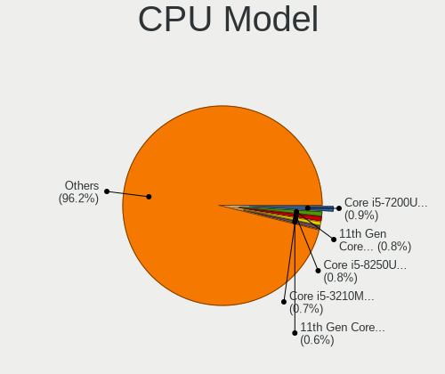
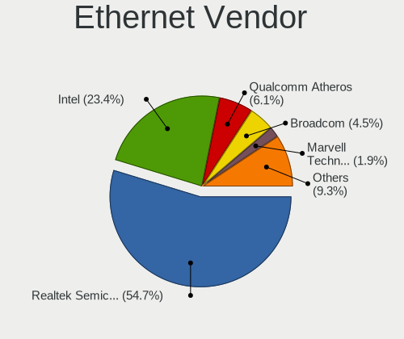

Linux Mint - Tested Hardware & Statistics
-----------------------------------------

A project to collect tested hardware configurations for Linux Mint.

Anyone can contribute to this report by the [hw-probe](https://github.com/linuxhw/hw-probe) tool:

    sudo -E hw-probe -all -upload

Please contribute! Especially if your hardware is rare.

This is a report for all computer types. See also reports for [desktops](/Dist/Linux_Mint/Desktop/README.md) and [notebooks](/Dist/Linux_Mint/Notebook/README.md).

Contents
--------

* [ Test Cases ](#test-cases)

* [ System ](#system)
  - [ OS                       ](#os)
  - [ OS Family                ](#os-family)
  - [ Kernel                   ](#kernel)
  - [ Kernel Family            ](#kernel-family)
  - [ Kernel Major Ver.        ](#kernel-major-ver)
  - [ Arch                     ](#arch)
  - [ DE                       ](#de)
  - [ Display Server           ](#display-server)
  - [ Display Manager          ](#display-manager)
  - [ OS Lang                  ](#os-lang)
  - [ Boot Mode                ](#boot-mode)
  - [ Filesystem               ](#filesystem)
  - [ Part. scheme             ](#part-scheme)
  - [ Dual Boot with Linux/BSD ](#dual-boot-with-linuxbsd)
  - [ Dual Boot (Win)          ](#dual-boot-win)

* [ Board ](#board)
  - [ Vendor                   ](#vendor)
  - [ Model                    ](#model)
  - [ Model Family             ](#model-family)
  - [ MFG Year                 ](#mfg-year)
  - [ Form Factor              ](#form-factor)
  - [ Secure Boot              ](#secure-boot)
  - [ Coreboot                 ](#coreboot)
  - [ RAM Size                 ](#ram-size)
  - [ RAM Used                 ](#ram-used)
  - [ Total Drives             ](#total-drives)
  - [ Has CD-ROM               ](#has-cd-rom)
  - [ Has Ethernet             ](#has-ethernet)
  - [ Has WiFi                 ](#has-wifi)
  - [ Has Bluetooth            ](#has-bluetooth)

* [ Location ](#location)
  - [ Country                  ](#country)
  - [ City                     ](#city)

* [ Drives ](#drives)
  - [ Drive Vendor             ](#drive-vendor)
  - [ Drive Model              ](#drive-model)
  - [ HDD Vendor               ](#hdd-vendor)
  - [ SSD Vendor               ](#ssd-vendor)
  - [ Drive Kind               ](#drive-kind)
  - [ Drive Connector          ](#drive-connector)
  - [ Drive Size               ](#drive-size)
  - [ Space Total              ](#space-total)
  - [ Space Used               ](#space-used)
  - [ Malfunc. Drives          ](#malfunc-drives)
  - [ Malfunc. Drive Vendor    ](#malfunc-drive-vendor)
  - [ Malfunc. HDD Vendor      ](#malfunc-hdd-vendor)
  - [ Malfunc. Drive Kind      ](#malfunc-drive-kind)
  - [ Failed Drives            ](#failed-drives)
  - [ Failed Drive Vendor      ](#failed-drive-vendor)
  - [ Drive Status             ](#drive-status)

* [ Storage controller ](#storage-controller)
  - [ Storage Vendor           ](#storage-vendor)
  - [ Storage Model            ](#storage-model)
  - [ Storage Kind             ](#storage-kind)

* [ Processor ](#processor)
  - [ CPU Vendor               ](#cpu-vendor)
  - [ CPU Model                ](#cpu-model)
  - [ CPU Model Family         ](#cpu-model-family)
  - [ CPU Cores                ](#cpu-cores)
  - [ CPU Sockets              ](#cpu-sockets)
  - [ CPU Threads              ](#cpu-threads)
  - [ CPU Op-Modes             ](#cpu-op-modes)
  - [ CPU Microcode            ](#cpu-microcode)
  - [ CPU Microarch            ](#cpu-microarch)

* [ Graphics ](#graphics)
  - [ GPU Vendor               ](#gpu-vendor)
  - [ GPU Model                ](#gpu-model)
  - [ GPU Combo                ](#gpu-combo)
  - [ GPU Driver               ](#gpu-driver)
  - [ GPU Memory               ](#gpu-memory)

* [ Monitor ](#monitor)
  - [ Monitor Vendor           ](#monitor-vendor)
  - [ Monitor Model            ](#monitor-model)
  - [ Monitor Resolution       ](#monitor-resolution)
  - [ Monitor Diagonal         ](#monitor-diagonal)
  - [ Monitor Width            ](#monitor-width)
  - [ Aspect Ratio             ](#aspect-ratio)
  - [ Monitor Area             ](#monitor-area)
  - [ Pixel Density            ](#pixel-density)
  - [ Multiple Monitors        ](#multiple-monitors)

* [ Network ](#network)
  - [ Net Controller Vendor    ](#net-controller-vendor)
  - [ Net Controller Model     ](#net-controller-model)
  - [ Wireless Vendor          ](#wireless-vendor)
  - [ Wireless Model           ](#wireless-model)
  - [ Ethernet Vendor          ](#ethernet-vendor)
  - [ Ethernet Model           ](#ethernet-model)
  - [ Net Controller Kind      ](#net-controller-kind)
  - [ Used Controller          ](#used-controller)
  - [ NICs                     ](#nics)
  - [ IPv6                     ](#ipv6)

* [ Bluetooth ](#bluetooth)
  - [ Bluetooth Vendor         ](#bluetooth-vendor)
  - [ Bluetooth Model          ](#bluetooth-model)

* [ Sound ](#sound)
  - [ Sound Vendor             ](#sound-vendor)
  - [ Sound Model              ](#sound-model)

* [ Memory ](#memory)
  - [ Memory Vendor            ](#memory-vendor)
  - [ Memory Model             ](#memory-model)
  - [ Memory Kind              ](#memory-kind)
  - [ Memory Form Factor       ](#memory-form-factor)
  - [ Memory Size              ](#memory-size)
  - [ Memory Speed             ](#memory-speed)

* [ Printers & scanners ](#printers--scanners)
  - [ Printer Vendor           ](#printer-vendor)
  - [ Printer Model            ](#printer-model)
  - [ Scanner Vendor           ](#scanner-vendor)
  - [ Scanner Model            ](#scanner-model)

* [ Camera ](#camera)
  - [ Camera Vendor            ](#camera-vendor)
  - [ Camera Model             ](#camera-model)

* [ Security ](#security)
  - [ Fingerprint Vendor       ](#fingerprint-vendor)
  - [ Fingerprint Model        ](#fingerprint-model)
  - [ Chipcard Vendor          ](#chipcard-vendor)
  - [ Chipcard Model           ](#chipcard-model)

* [ Unsupported ](#unsupported)
  - [ Unsupported Devices      ](#unsupported-devices)
  - [ Unsupported Device Types ](#unsupported-device-types)

Test Cases
----------

Total: 22936

| Vendor        | Model                       | Form-Factor | Probe                                                      | Date         |
|---------------|-----------------------------|-------------|------------------------------------------------------------|--------------|
| Apple         | MacBookPro12,1              | Notebook    | [6e089e22b1](https://linux-hardware.org/?probe=6e089e22b1) | Feb 01, 2023 |
| ASUSTek       | TUF B450-PLUS GAMING        | Desktop     | [d44fb4f702](https://linux-hardware.org/?probe=d44fb4f702) | Feb 01, 2023 |
| Gigabyte      | GA-78LMT-USB3 SEx           | Desktop     | [6aa10285fe](https://linux-hardware.org/?probe=6aa10285fe) | Feb 01, 2023 |
| Lenovo        | ThinkPad T400 6473PMG       | Notebook    | [07cba1c44b](https://linux-hardware.org/?probe=07cba1c44b) | Feb 01, 2023 |
| Lenovo        | 3111 NOK                    | Desktop     | [4f7d6b345c](https://linux-hardware.org/?probe=4f7d6b345c) | Feb 01, 2023 |
| Lenovo        | 3111 NOK                    | Desktop     | [03df681b38](https://linux-hardware.org/?probe=03df681b38) | Feb 01, 2023 |
| Acer          | Aspire 5750G                | Notebook    | [a8a3f37ad8](https://linux-hardware.org/?probe=a8a3f37ad8) | Feb 01, 2023 |
| Lenovo        | IdeaPad 3 17ITL6 82H9       | Notebook    | [eaaf15f3f6](https://linux-hardware.org/?probe=eaaf15f3f6) | Feb 01, 2023 |
| ECS           | G31T-M7                     | Desktop     | [9b0f53b46c](https://linux-hardware.org/?probe=9b0f53b46c) | Feb 01, 2023 |
| Dell          | Latitude E6440              | Notebook    | [8712bed802](https://linux-hardware.org/?probe=8712bed802) | Feb 01, 2023 |
| Dell          | Latitude E6440              | Notebook    | [09b61adc0b](https://linux-hardware.org/?probe=09b61adc0b) | Feb 01, 2023 |
| Fujitsu       | LIFEBOOK E744               | Notebook    | [b048f7d3e1](https://linux-hardware.org/?probe=b048f7d3e1) | Feb 01, 2023 |
| Gigabyte      | Z170X-Gaming 3              | Desktop     | [b0697611f6](https://linux-hardware.org/?probe=b0697611f6) | Feb 01, 2023 |
| Dell          | 06D7TR A02                  | Desktop     | [b3bb51473f](https://linux-hardware.org/?probe=b3bb51473f) | Feb 01, 2023 |
| Gigabyte      | B550M AORUS ELITE           | Desktop     | [a8f54f681a](https://linux-hardware.org/?probe=a8f54f681a) | Feb 01, 2023 |
| Gigabyte      | H55M-UD2H                   | Desktop     | [9337f49fff](https://linux-hardware.org/?probe=9337f49fff) | Feb 01, 2023 |
| Lenovo        | ThinkPad T560 20FJS44L0B    | Notebook    | [06bf3870a5](https://linux-hardware.org/?probe=06bf3870a5) | Jan 31, 2023 |
| Lenovo        | ThinkPad T530 2394A11       | Notebook    | [e7946fa600](https://linux-hardware.org/?probe=e7946fa600) | Jan 31, 2023 |
| ASUSTek       | VivoBook_ASUS Laptop E21... | Notebook    | [478c456288](https://linux-hardware.org/?probe=478c456288) | Jan 31, 2023 |
| ASUSTek       | PRIME B660-PLUS D4          | Desktop     | [f1a9c37047](https://linux-hardware.org/?probe=f1a9c37047) | Jan 31, 2023 |
| HP            | ENVY 15                     | Notebook    | [c688eb85bb](https://linux-hardware.org/?probe=c688eb85bb) | Jan 31, 2023 |
| ASUSTek       | PRIME B660-PLUS D4          | Desktop     | [fe2a413caa](https://linux-hardware.org/?probe=fe2a413caa) | Jan 31, 2023 |
| Dell          | 042P49 A01                  | Desktop     | [2791787281](https://linux-hardware.org/?probe=2791787281) | Jan 31, 2023 |
| MSI           | H510M-A PRO                 | Desktop     | [609fc1e9bb](https://linux-hardware.org/?probe=609fc1e9bb) | Jan 31, 2023 |
| ASUSTek       | P5QL PRO                    | Desktop     | [77cc2bd640](https://linux-hardware.org/?probe=77cc2bd640) | Jan 31, 2023 |
| Notebook      | W35xSTQ_370ST               | Notebook    | [b52cc29e08](https://linux-hardware.org/?probe=b52cc29e08) | Jan 31, 2023 |
| HP            | 255 15.6 inch G9 Noteboo... | Notebook    | [7758d7c535](https://linux-hardware.org/?probe=7758d7c535) | Jan 31, 2023 |
| HP            | 18E4                        | Desktop     | [50c68be419](https://linux-hardware.org/?probe=50c68be419) | Jan 31, 2023 |
| ASUSTek       | VivoBook_ASUSLaptop X421... | Notebook    | [1cfa73407d](https://linux-hardware.org/?probe=1cfa73407d) | Jan 31, 2023 |
| HP            | 18E4                        | Desktop     | [d038da9e08](https://linux-hardware.org/?probe=d038da9e08) | Jan 31, 2023 |
| Acer          | Aspire E5-575G              | Notebook    | [463b7f859f](https://linux-hardware.org/?probe=463b7f859f) | Jan 31, 2023 |
| AMD           | Inagua CRB                  | Desktop     | [3f497311dd](https://linux-hardware.org/?probe=3f497311dd) | Jan 31, 2023 |
| Gigabyte      | B560M H                     | Desktop     | [65f58e4e39](https://linux-hardware.org/?probe=65f58e4e39) | Jan 31, 2023 |
| MSI           | B550-A PRO                  | Desktop     | [78ab25ef78](https://linux-hardware.org/?probe=78ab25ef78) | Jan 31, 2023 |
| HP            | EliteBook 840 G1            | Notebook    | [9b91cecab9](https://linux-hardware.org/?probe=9b91cecab9) | Jan 31, 2023 |
| Notebook      | W35xSTQ_370ST               | Notebook    | [b33ec828fc](https://linux-hardware.org/?probe=b33ec828fc) | Jan 31, 2023 |
| MSI           | B550-A PRO                  | Desktop     | [2458455037](https://linux-hardware.org/?probe=2458455037) | Jan 31, 2023 |
| Toshiba       | Satellite R630              | Notebook    | [52ffe609b8](https://linux-hardware.org/?probe=52ffe609b8) | Jan 31, 2023 |
| Dell          | Latitude E6530              | Notebook    | [140543c98c](https://linux-hardware.org/?probe=140543c98c) | Jan 31, 2023 |
| ASUSTek       | Z97-PRO GAMER               | Desktop     | [9ce51b923e](https://linux-hardware.org/?probe=9ce51b923e) | Jan 31, 2023 |
| ASUSTek       | P5V800-MX                   | Desktop     | [a8696956aa](https://linux-hardware.org/?probe=a8696956aa) | Jan 31, 2023 |
| HP            | EliteBook 2560p             | Notebook    | [798466ab86](https://linux-hardware.org/?probe=798466ab86) | Jan 31, 2023 |
| Lenovo        | ThinkPad T440 20B7S2GS0W    | Notebook    | [46008b3d38](https://linux-hardware.org/?probe=46008b3d38) | Jan 31, 2023 |
| Fujitsu       | D3041-A1 S26361-D3041-A1    | Desktop     | [00fcd39954](https://linux-hardware.org/?probe=00fcd39954) | Jan 31, 2023 |
| HP            | Pavilion Gaming Laptop 1... | Notebook    | [9fd1916420](https://linux-hardware.org/?probe=9fd1916420) | Jan 31, 2023 |
| HP            | Sona                        | Notebook    | [36a3d72172](https://linux-hardware.org/?probe=36a3d72172) | Jan 31, 2023 |
| HP            | Pavilion Gaming Laptop 1... | Notebook    | [318f007db6](https://linux-hardware.org/?probe=318f007db6) | Jan 31, 2023 |
| Cube          | SurfTab twin 11.6           | Convertible | [ab9b9ee0b8](https://linux-hardware.org/?probe=ab9b9ee0b8) | Jan 31, 2023 |
| ASUSTek       | B85M-G                      | Desktop     | [44c2ca8150](https://linux-hardware.org/?probe=44c2ca8150) | Jan 31, 2023 |
| Lenovo        | G40-80 80JE                 | Notebook    | [bb5d758714](https://linux-hardware.org/?probe=bb5d758714) | Jan 31, 2023 |
| Lenovo        | ThinkPad E560 20EV002FUS    | Notebook    | [0110b731e7](https://linux-hardware.org/?probe=0110b731e7) | Jan 31, 2023 |
| HP            | Pavilion dv6                | Notebook    | [c84439bfbf](https://linux-hardware.org/?probe=c84439bfbf) | Jan 31, 2023 |
| Acer          | MCP73VE NVIDIA MCP73        | Desktop     | [840102fa91](https://linux-hardware.org/?probe=840102fa91) | Jan 31, 2023 |
| Lenovo        | ThinkPad E560 20EV002FUS    | Notebook    | [faa0a5a1ff](https://linux-hardware.org/?probe=faa0a5a1ff) | Jan 31, 2023 |
| Lenovo        | G40-80 80JE                 | Notebook    | [e5dc585024](https://linux-hardware.org/?probe=e5dc585024) | Jan 31, 2023 |
| MSI           | PRO B650M-A WIFI            | Desktop     | [30a093116e](https://linux-hardware.org/?probe=30a093116e) | Jan 30, 2023 |
| Lenovo        | ThinkPad T500 2055AZ1       | Notebook    | [1086813401](https://linux-hardware.org/?probe=1086813401) | Jan 30, 2023 |
| Lenovo        | ThinkPad T500 2055AZ1       | Notebook    | [0b43f40c2a](https://linux-hardware.org/?probe=0b43f40c2a) | Jan 30, 2023 |
| Dell          | 0P01GV A03                  | Desktop     | [b029e941fb](https://linux-hardware.org/?probe=b029e941fb) | Jan 30, 2023 |
| HP            | 255 15.6 inch G9 Noteboo... | Notebook    | [5201a076f6](https://linux-hardware.org/?probe=5201a076f6) | Jan 30, 2023 |
| HP            | Pavilion 15                 | Notebook    | [e3adac798e](https://linux-hardware.org/?probe=e3adac798e) | Jan 30, 2023 |
| Acer          | Aspire ES1-512              | Notebook    | [0d254e85dd](https://linux-hardware.org/?probe=0d254e85dd) | Jan 30, 2023 |
| Acer          | Aspire E5-575G              | Notebook    | [532f5a8dbe](https://linux-hardware.org/?probe=532f5a8dbe) | Jan 30, 2023 |
| Dell          | 0TP412                      | Desktop     | [5db177340d](https://linux-hardware.org/?probe=5db177340d) | Jan 30, 2023 |
| Lenovo        | ThinkPad E15 Gen 2 20TD0... | Notebook    | [f6be582448](https://linux-hardware.org/?probe=f6be582448) | Jan 30, 2023 |
| Lenovo        | 1046 SDK0T08861 WIN 3305... | Desktop     | [fa81cc9dea](https://linux-hardware.org/?probe=fa81cc9dea) | Jan 30, 2023 |
| Apple         | MacBookPro5,2               | Notebook    | [4cb11c2a78](https://linux-hardware.org/?probe=4cb11c2a78) | Jan 30, 2023 |
| MSI           | Raider GE76 12UE            | Notebook    | [c69bbc917b](https://linux-hardware.org/?probe=c69bbc917b) | Jan 30, 2023 |
| Acer          | Aspire E5-771               | Notebook    | [389651889c](https://linux-hardware.org/?probe=389651889c) | Jan 30, 2023 |
| HP            | Laptop 17-ak0xx             | Notebook    | [6e6f32430a](https://linux-hardware.org/?probe=6e6f32430a) | Jan 30, 2023 |
| Fujitsu Si... | LIFEBOOK E8310              | Notebook    | [bc685693a6](https://linux-hardware.org/?probe=bc685693a6) | Jan 30, 2023 |
| Dell          | Latitude E6420              | Notebook    | [68908b991a](https://linux-hardware.org/?probe=68908b991a) | Jan 30, 2023 |
| Gigabyte      | GA-990FXA-UD3               | Desktop     | [78cd3f7f65](https://linux-hardware.org/?probe=78cd3f7f65) | Jan 30, 2023 |
| HP            | EliteBook 8560p             | Notebook    | [f03a63f76a](https://linux-hardware.org/?probe=f03a63f76a) | Jan 30, 2023 |
| Gigabyte      | B450M DS3H V2               | Desktop     | [b5f1f3cb42](https://linux-hardware.org/?probe=b5f1f3cb42) | Jan 30, 2023 |
| PCWare        | IPMH110G                    | Desktop     | [95fe94d9f4](https://linux-hardware.org/?probe=95fe94d9f4) | Jan 30, 2023 |
| ASUSTek       | X550LC                      | Notebook    | [4c50999862](https://linux-hardware.org/?probe=4c50999862) | Jan 30, 2023 |
| ASUSTek       | X550LC                      | Notebook    | [41d606bbe8](https://linux-hardware.org/?probe=41d606bbe8) | Jan 30, 2023 |
| MSI           | GE75 Raider 10SF            | Notebook    | [85d2ae302d](https://linux-hardware.org/?probe=85d2ae302d) | Jan 30, 2023 |
| HP            | ProLiant DL360p Gen8        | Server      | [452a50e49c](https://linux-hardware.org/?probe=452a50e49c) | Jan 30, 2023 |
| ASUSTek       | F5VL                        | Notebook    | [07e0539a43](https://linux-hardware.org/?probe=07e0539a43) | Jan 30, 2023 |
| Avell High... | B.ON                        | Notebook    | [721fbbdeb2](https://linux-hardware.org/?probe=721fbbdeb2) | Jan 30, 2023 |
| ASUSTek       | PRIME B450-PLUS             | Desktop     | [4cb7a5f214](https://linux-hardware.org/?probe=4cb7a5f214) | Jan 30, 2023 |
| Dell          | 0D28YY A00                  | Desktop     | [63b753b56e](https://linux-hardware.org/?probe=63b753b56e) | Jan 30, 2023 |
| AZW           | S5 V1.0                     | Mini pc     | [380088c986](https://linux-hardware.org/?probe=380088c986) | Jan 30, 2023 |
| ASUSTek       | X507UA                      | Notebook    | [49cc52b5b2](https://linux-hardware.org/?probe=49cc52b5b2) | Jan 29, 2023 |
| Lenovo        | ThinkPad L15 Gen 2 20X30... | Notebook    | [fddcdb0f47](https://linux-hardware.org/?probe=fddcdb0f47) | Jan 29, 2023 |
| Lenovo        | V15 G2 ALC 82KD             | Notebook    | [9f76193ccc](https://linux-hardware.org/?probe=9f76193ccc) | Jan 29, 2023 |
| ASUSTek       | P8Q77-M                     | Desktop     | [be0ebca5cc](https://linux-hardware.org/?probe=be0ebca5cc) | Jan 29, 2023 |
| Acer          | Aspire E5-553               | Notebook    | [8200b57a5b](https://linux-hardware.org/?probe=8200b57a5b) | Jan 29, 2023 |
| MSI           | PRO H610M-G DDR4            | Desktop     | [358b908129](https://linux-hardware.org/?probe=358b908129) | Jan 29, 2023 |
| HP            | Pavilion 15                 | Notebook    | [c5ac9f6d89](https://linux-hardware.org/?probe=c5ac9f6d89) | Jan 29, 2023 |
| MSI           | X399 SLI PLUS               | Desktop     | [f7008e788b](https://linux-hardware.org/?probe=f7008e788b) | Jan 29, 2023 |
| HP            | 339A                        | Desktop     | [5bd8bab56c](https://linux-hardware.org/?probe=5bd8bab56c) | Jan 29, 2023 |
| Acer          | Aspire E5-553               | Notebook    | [3ac195a476](https://linux-hardware.org/?probe=3ac195a476) | Jan 29, 2023 |
| MSI           | CR700                       | Notebook    | [35d1ff1eac](https://linux-hardware.org/?probe=35d1ff1eac) | Jan 29, 2023 |
| HP            | 8643 SMVB                   | Desktop     | [d9047d3c7b](https://linux-hardware.org/?probe=d9047d3c7b) | Jan 29, 2023 |
| Alienware     | x17 R2                      | Notebook    | [d004749696](https://linux-hardware.org/?probe=d004749696) | Jan 29, 2023 |
| Alienware     | x17 R2                      | Notebook    | [350244db5d](https://linux-hardware.org/?probe=350244db5d) | Jan 29, 2023 |
| Lenovo        | ThinkPad E14 Gen 3 20Y7C... | Notebook    | [66ab929a6c](https://linux-hardware.org/?probe=66ab929a6c) | Jan 29, 2023 |
| HP            | ProBook 640 G2              | Notebook    | [7b08eeb50c](https://linux-hardware.org/?probe=7b08eeb50c) | Jan 29, 2023 |
| HP            | Pavilion dv7                | Notebook    | [f27e7c24c1](https://linux-hardware.org/?probe=f27e7c24c1) | Jan 29, 2023 |
| Acer          | Aspire C24-1650             | All in one  | [221c45eb1b](https://linux-hardware.org/?probe=221c45eb1b) | Jan 29, 2023 |
| Lenovo        | Yoga Slim 7 Carbon 13ITL... | Notebook    | [d3936466af](https://linux-hardware.org/?probe=d3936466af) | Jan 29, 2023 |
| MSI           | A68HM GRENADE               | Desktop     | [696581b7b6](https://linux-hardware.org/?probe=696581b7b6) | Jan 28, 2023 |
| HP            | Laptop 17-cp2xxx            | Notebook    | [e04f33db90](https://linux-hardware.org/?probe=e04f33db90) | Jan 28, 2023 |
| Dell          | 0PXWHK A00                  | Desktop     | [1866c91eb9](https://linux-hardware.org/?probe=1866c91eb9) | Jan 28, 2023 |
| INSYS         | GW1-W149                    | Notebook    | [5a4337006d](https://linux-hardware.org/?probe=5a4337006d) | Jan 28, 2023 |
| ASUSTek       | ROG STRIX B650E-F GAMING... | Desktop     | [2d2e42ae23](https://linux-hardware.org/?probe=2d2e42ae23) | Jan 28, 2023 |
| HP            | Pavilion dv8000 (ET839UA... | Notebook    | [3e7c902731](https://linux-hardware.org/?probe=3e7c902731) | Jan 28, 2023 |
| Lenovo        | ThinkPad L15 Gen 1 20U4S... | Notebook    | [a8e2d5b5f0](https://linux-hardware.org/?probe=a8e2d5b5f0) | Jan 28, 2023 |
| MSI           | B85M-E45                    | Desktop     | [335cebea8b](https://linux-hardware.org/?probe=335cebea8b) | Jan 28, 2023 |
| MSI           | H410M PRO                   | Desktop     | [d8c1dc4e25](https://linux-hardware.org/?probe=d8c1dc4e25) | Jan 28, 2023 |
| Gigabyte      | AX370-Gaming K7             | Desktop     | [e369c6e5b8](https://linux-hardware.org/?probe=e369c6e5b8) | Jan 28, 2023 |
| ASUSTek       | X200MA                      | Notebook    | [1c1f2d4d5b](https://linux-hardware.org/?probe=1c1f2d4d5b) | Jan 28, 2023 |
| Lenovo        | 3111 SDK0J40697 WIN 3305... | Mini pc     | [cbd1d84f00](https://linux-hardware.org/?probe=cbd1d84f00) | Jan 28, 2023 |
| AZW           | Gemini M                    | Desktop     | [5534667621](https://linux-hardware.org/?probe=5534667621) | Jan 28, 2023 |
| Microsoft     | Surface Pro                 | Tablet      | [292892acd3](https://linux-hardware.org/?probe=292892acd3) | Jan 28, 2023 |
| Lenovo        | IdeaPad 330S-15ARR 81FB     | Notebook    | [95053898dc](https://linux-hardware.org/?probe=95053898dc) | Jan 28, 2023 |
| Acer          | Aspire ES1-711              | Notebook    | [3aa8f67a82](https://linux-hardware.org/?probe=3aa8f67a82) | Jan 28, 2023 |
| MSI           | H410M PRO                   | Desktop     | [72f5a735fb](https://linux-hardware.org/?probe=72f5a735fb) | Jan 28, 2023 |
| Lenovo        | Yoga 510-14IKB 80VB         | Convertible | [473f9c9cb3](https://linux-hardware.org/?probe=473f9c9cb3) | Jan 28, 2023 |
| Apple         | MacBookPro16,1              | Notebook    | [06f297243d](https://linux-hardware.org/?probe=06f297243d) | Jan 28, 2023 |
| ASUSTek       | SABERTOOTH Z77              | Desktop     | [b588302693](https://linux-hardware.org/?probe=b588302693) | Jan 28, 2023 |
| Notebook      | P9XXEN_EF_ED                | Notebook    | [991bb71df8](https://linux-hardware.org/?probe=991bb71df8) | Jan 28, 2023 |
| Notebook      | P9XXEN_EF_ED                | Notebook    | [d86e915f12](https://linux-hardware.org/?probe=d86e915f12) | Jan 28, 2023 |
| MSI           | MS-7513                     | Desktop     | [3953f1b447](https://linux-hardware.org/?probe=3953f1b447) | Jan 28, 2023 |
| ASUSTek       | SABERTOOTH Z77              | Desktop     | [493be38a2b](https://linux-hardware.org/?probe=493be38a2b) | Jan 28, 2023 |
| ASUSTek       | TUF Gaming X570-PLUS        | Desktop     | [c67c5a3cfe](https://linux-hardware.org/?probe=c67c5a3cfe) | Jan 28, 2023 |
| ASUSTek       | TUF Gaming X570-PLUS        | Desktop     | [6cdea948c5](https://linux-hardware.org/?probe=6cdea948c5) | Jan 28, 2023 |
| Lenovo        | ThinkPad X270 W10DG 20K6... | Notebook    | [ee4a3f359b](https://linux-hardware.org/?probe=ee4a3f359b) | Jan 27, 2023 |
| Samsung       | RV415/RV515                 | Notebook    | [fd9d67e4b8](https://linux-hardware.org/?probe=fd9d67e4b8) | Jan 27, 2023 |
| ASRock        | B550M-HDV                   | Desktop     | [29bdcc85ad](https://linux-hardware.org/?probe=29bdcc85ad) | Jan 27, 2023 |
| Acer          | Aspire E5-774               | Notebook    | [86e3285b31](https://linux-hardware.org/?probe=86e3285b31) | Jan 27, 2023 |
| HP            | Laptop 15-bs0xx             | Notebook    | [9b10308469](https://linux-hardware.org/?probe=9b10308469) | Jan 27, 2023 |
| ASUSTek       | PRIME H310M-K R2.0          | Desktop     | [b7377ee894](https://linux-hardware.org/?probe=b7377ee894) | Jan 27, 2023 |
| HP            | 805A                        | Desktop     | [b33510966e](https://linux-hardware.org/?probe=b33510966e) | Jan 27, 2023 |
| HP            | Laptop 17-cp2xxx            | Notebook    | [e0a29b46da](https://linux-hardware.org/?probe=e0a29b46da) | Jan 27, 2023 |
| HP            | ZBook 15 G2                 | Notebook    | [b9793eca79](https://linux-hardware.org/?probe=b9793eca79) | Jan 27, 2023 |
| Gigabyte      | Z170X-UD5 TH-CF             | Desktop     | [0d9491187e](https://linux-hardware.org/?probe=0d9491187e) | Jan 27, 2023 |
| HP            | 255 G8 Notebook PC          | Notebook    | [23a84c76b8](https://linux-hardware.org/?probe=23a84c76b8) | Jan 27, 2023 |
| Gigabyte      | G41MT-S2                    | Desktop     | [774f8eb27f](https://linux-hardware.org/?probe=774f8eb27f) | Jan 27, 2023 |
| HUAWEI        | HVY-WXX9                    | Notebook    | [dddf41f4e3](https://linux-hardware.org/?probe=dddf41f4e3) | Jan 27, 2023 |
| Lenovo        | IdeaPad 330-17IKB 81DM      | Notebook    | [117d80ff4d](https://linux-hardware.org/?probe=117d80ff4d) | Jan 27, 2023 |
| HP            | ENVY 4                      | Notebook    | [55ee9d4ca9](https://linux-hardware.org/?probe=55ee9d4ca9) | Jan 27, 2023 |
| Lenovo        | IdeaPad 3 15ALC6 82MF       | Notebook    | [93be3d62c4](https://linux-hardware.org/?probe=93be3d62c4) | Jan 27, 2023 |
| Lenovo        | IdeaPad S145-15AST 81N3     | Notebook    | [c354539ab4](https://linux-hardware.org/?probe=c354539ab4) | Jan 27, 2023 |
| Samsung       | 340XAA/350XAA/550XAA        | Notebook    | [b4d0bbaf56](https://linux-hardware.org/?probe=b4d0bbaf56) | Jan 27, 2023 |
| Dell          | Latitude E6540              | Notebook    | [2e014cf1ba](https://linux-hardware.org/?probe=2e014cf1ba) | Jan 27, 2023 |
| MSI           | B550M PRO-VDH WIFI          | Desktop     | [eec3afb06e](https://linux-hardware.org/?probe=eec3afb06e) | Jan 27, 2023 |
| Dell          | Inspiron 5468               | Notebook    | [d155136857](https://linux-hardware.org/?probe=d155136857) | Jan 27, 2023 |
| AZW           | S5 V1.0                     | Mini pc     | [a0b14899a8](https://linux-hardware.org/?probe=a0b14899a8) | Jan 27, 2023 |
| AZW           | S5 V1.0                     | Mini pc     | [3963660171](https://linux-hardware.org/?probe=3963660171) | Jan 27, 2023 |
| AXDIA Inte... | WINPAD V10                  | Notebook    | [ba8bdae82f](https://linux-hardware.org/?probe=ba8bdae82f) | Jan 27, 2023 |
| Samsung       | 340XAA/350XAA/550XAA        | Notebook    | [05dac90dec](https://linux-hardware.org/?probe=05dac90dec) | Jan 27, 2023 |
| HP            | x2 210 G2                   | Tablet      | [863136882e](https://linux-hardware.org/?probe=863136882e) | Jan 26, 2023 |
| HP            | 3397                        | Desktop     | [ab38ecfb97](https://linux-hardware.org/?probe=ab38ecfb97) | Jan 26, 2023 |
| Dell          | 0Y2MRG A00                  | Desktop     | [54ba66711b](https://linux-hardware.org/?probe=54ba66711b) | Jan 26, 2023 |
| Gigabyte      | G41MT-S2                    | Desktop     | [06cd0f5943](https://linux-hardware.org/?probe=06cd0f5943) | Jan 26, 2023 |
| MSI           | X99A SLI PLUS               | Desktop     | [931a186515](https://linux-hardware.org/?probe=931a186515) | Jan 26, 2023 |
| Gigabyte      | GA-78LMT-USB3 SEx           | Desktop     | [90de00d686](https://linux-hardware.org/?probe=90de00d686) | Jan 26, 2023 |
| Timi          | Mi NoteBook Pro             | Notebook    | [33905a4ee9](https://linux-hardware.org/?probe=33905a4ee9) | Jan 26, 2023 |
| UMAX          | VisionBook 10Wr Tab         | Convertible | [6d747e3841](https://linux-hardware.org/?probe=6d747e3841) | Jan 26, 2023 |
| HP            | EliteBook Folio 1040 G1     | Notebook    | [4811286faf](https://linux-hardware.org/?probe=4811286faf) | Jan 26, 2023 |
| Lenovo        | SHARKBAY 0B98401 PRO        | Desktop     | [01e47b07a8](https://linux-hardware.org/?probe=01e47b07a8) | Jan 26, 2023 |
| Lenovo        | SHARKBAY 0B98401 PRO        | Desktop     | [4ae098906f](https://linux-hardware.org/?probe=4ae098906f) | Jan 26, 2023 |
| Toshiba       | Satellite Pro C50-A-1FD     | Notebook    | [7f7198cdcb](https://linux-hardware.org/?probe=7f7198cdcb) | Jan 26, 2023 |
| Lenovo        | Yoga 2 11 20332             | Notebook    | [6faa58b4a1](https://linux-hardware.org/?probe=6faa58b4a1) | Jan 26, 2023 |
| Lenovo        | Yoga 2 11 20332             | Notebook    | [f437e45107](https://linux-hardware.org/?probe=f437e45107) | Jan 26, 2023 |
| Dell          | Vostro 3458                 | Notebook    | [3beffe6710](https://linux-hardware.org/?probe=3beffe6710) | Jan 26, 2023 |
| Google        | Robo360                     | Notebook    | [ea88345040](https://linux-hardware.org/?probe=ea88345040) | Jan 26, 2023 |
| Google        | Robo360                     | Notebook    | [8bd94d81f4](https://linux-hardware.org/?probe=8bd94d81f4) | Jan 26, 2023 |
| Dell          | Latitude 5490               | Notebook    | [b392e71ce5](https://linux-hardware.org/?probe=b392e71ce5) | Jan 26, 2023 |
| HP            | 355 G2                      | Notebook    | [66f901e77a](https://linux-hardware.org/?probe=66f901e77a) | Jan 26, 2023 |
| HP            | Pavilion 15                 | Notebook    | [e3ac708616](https://linux-hardware.org/?probe=e3ac708616) | Jan 26, 2023 |
| Dell          | XPS 17 9700                 | Notebook    | [759ae65214](https://linux-hardware.org/?probe=759ae65214) | Jan 26, 2023 |
| Apple         | MacBookAir4,1               | Notebook    | [45ea832a59](https://linux-hardware.org/?probe=45ea832a59) | Jan 26, 2023 |
| MSI           | B550M PRO-VDH WIFI          | Desktop     | [3ccebf50c2](https://linux-hardware.org/?probe=3ccebf50c2) | Jan 25, 2023 |
| Lenovo        | V14-ADA 82C6                | Notebook    | [4d5aa34028](https://linux-hardware.org/?probe=4d5aa34028) | Jan 25, 2023 |
| HP            | 255 G8 Notebook PC          | Notebook    | [d8e161e2b0](https://linux-hardware.org/?probe=d8e161e2b0) | Jan 25, 2023 |
| Acer          | Aspire E1-571G              | Notebook    | [ed297cfa3b](https://linux-hardware.org/?probe=ed297cfa3b) | Jan 25, 2023 |
| Lenovo        | Yoga 2 11 20332             | Notebook    | [9dfb8ac7b0](https://linux-hardware.org/?probe=9dfb8ac7b0) | Jan 25, 2023 |
| ASUSTek       | P8H67-M LX                  | Desktop     | [b8045702e2](https://linux-hardware.org/?probe=b8045702e2) | Jan 25, 2023 |
| Medion        | MS-7728                     | Desktop     | [76298f7282](https://linux-hardware.org/?probe=76298f7282) | Jan 25, 2023 |
| Intel         | DG31PR AAE58249-306         | Desktop     | [a123c38d76](https://linux-hardware.org/?probe=a123c38d76) | Jan 25, 2023 |
| ASUSTek       | B150M-A/M.2                 | Desktop     | [5c1d469037](https://linux-hardware.org/?probe=5c1d469037) | Jan 25, 2023 |
| Acer          | Aspire A315-55G             | Notebook    | [70559c048c](https://linux-hardware.org/?probe=70559c048c) | Jan 25, 2023 |
| ASUSTek       | VivoBook_ASUSLaptop X712... | Notebook    | [26abf66da5](https://linux-hardware.org/?probe=26abf66da5) | Jan 25, 2023 |
| HP            | Laptop 15-bw0xx             | Notebook    | [821bd6d2aa](https://linux-hardware.org/?probe=821bd6d2aa) | Jan 25, 2023 |
| Dell          | 06D7TR A02                  | Desktop     | [cd487a22cd](https://linux-hardware.org/?probe=cd487a22cd) | Jan 25, 2023 |
| Medion        | MS-7728                     | Desktop     | [5759a31d8f](https://linux-hardware.org/?probe=5759a31d8f) | Jan 25, 2023 |
| HP            | EliteBook 820 G2            | Notebook    | [7b93d7477b](https://linux-hardware.org/?probe=7b93d7477b) | Jan 25, 2023 |
| ASUSTek       | TUF Gaming X570-PLUS        | Desktop     | [93a260a42e](https://linux-hardware.org/?probe=93a260a42e) | Jan 25, 2023 |
| Acer          | Aspire A517-53G             | Notebook    | [2a1ad07cce](https://linux-hardware.org/?probe=2a1ad07cce) | Jan 25, 2023 |
| MSI           | B550-A PRO                  | Desktop     | [0bbf395806](https://linux-hardware.org/?probe=0bbf395806) | Jan 25, 2023 |
| Dell          | 08HPGT A01                  | Desktop     | [d2482dec3a](https://linux-hardware.org/?probe=d2482dec3a) | Jan 25, 2023 |
| ASUSTek       | K72Jr                       | Notebook    | [9b7c80b059](https://linux-hardware.org/?probe=9b7c80b059) | Jan 25, 2023 |
| HP            | ProBook 6440b               | Notebook    | [25c4dbbe9c](https://linux-hardware.org/?probe=25c4dbbe9c) | Jan 24, 2023 |
| Dell          | 08HPGT A01                  | Desktop     | [69fdb4710d](https://linux-hardware.org/?probe=69fdb4710d) | Jan 24, 2023 |
| Lenovo        | IdeaPad 310-15IKB 80TV      | Notebook    | [cfd65f9e9e](https://linux-hardware.org/?probe=cfd65f9e9e) | Jan 24, 2023 |
| ASUSTek       | SABERTOOTH 990FX R2.0       | Desktop     | [68c58308b8](https://linux-hardware.org/?probe=68c58308b8) | Jan 24, 2023 |
| Sony          | VGN-NW21MF_W                | Notebook    | [dd4ac0a026](https://linux-hardware.org/?probe=dd4ac0a026) | Jan 24, 2023 |
| Digibras      | NH4CU03                     | Notebook    | [7de7df58a3](https://linux-hardware.org/?probe=7de7df58a3) | Jan 24, 2023 |
| Digibras      | NH4CU03                     | Notebook    | [fce5f618d8](https://linux-hardware.org/?probe=fce5f618d8) | Jan 24, 2023 |
| LG Electro... | 16T90Q-K.AAG6U1             | Convertible | [e9c7b8529d](https://linux-hardware.org/?probe=e9c7b8529d) | Jan 24, 2023 |
| ASUSTek       | X540LJ                      | Notebook    | [41c91fdc7b](https://linux-hardware.org/?probe=41c91fdc7b) | Jan 24, 2023 |
| ASUSTek       | X540LJ                      | Notebook    | [199569e288](https://linux-hardware.org/?probe=199569e288) | Jan 24, 2023 |
| LG Electro... | 17Z90Q-G.AA79G              | Notebook    | [275f0a83ab](https://linux-hardware.org/?probe=275f0a83ab) | Jan 24, 2023 |
| HP            | EliteBook 2560p             | Notebook    | [f57750e125](https://linux-hardware.org/?probe=f57750e125) | Jan 24, 2023 |
| UMAX          | VisionBook 14Wr Plus        | Notebook    | [16e64883d7](https://linux-hardware.org/?probe=16e64883d7) | Jan 24, 2023 |
| Gigabyte      | B450M DS3H-CF               | Desktop     | [610ffedb4c](https://linux-hardware.org/?probe=610ffedb4c) | Jan 24, 2023 |
| HP            | EliteBook 745 G2            | Notebook    | [0d073c35f4](https://linux-hardware.org/?probe=0d073c35f4) | Jan 24, 2023 |
| HP            | Pavilion g6                 | Notebook    | [c34bc63cb0](https://linux-hardware.org/?probe=c34bc63cb0) | Jan 24, 2023 |
| HP            | Pavilion g6                 | Notebook    | [a9a199e6f7](https://linux-hardware.org/?probe=a9a199e6f7) | Jan 24, 2023 |
| ASUSTek       | PRIME Z690-A                | Desktop     | [ea5c2d01c2](https://linux-hardware.org/?probe=ea5c2d01c2) | Jan 24, 2023 |
| HP            | 339A                        | Desktop     | [a2784a6575](https://linux-hardware.org/?probe=a2784a6575) | Jan 24, 2023 |
| Intel         | NUC7i5BNB J31144-309        | Mini pc     | [6c40659202](https://linux-hardware.org/?probe=6c40659202) | Jan 24, 2023 |
| HP            | Pavilion Laptop 15-eh1xx... | Notebook    | [11cca63b74](https://linux-hardware.org/?probe=11cca63b74) | Jan 24, 2023 |
| ASUSTek       | H81M-K                      | Desktop     | [cb932accdb](https://linux-hardware.org/?probe=cb932accdb) | Jan 24, 2023 |
| Intel         | NUC8i7HVB J68196-502        | Mini pc     | [9d0f65f90f](https://linux-hardware.org/?probe=9d0f65f90f) | Jan 24, 2023 |
| Intel         | NUC8i7HVB J68196-502        | Mini pc     | [3e7a2dabb5](https://linux-hardware.org/?probe=3e7a2dabb5) | Jan 24, 2023 |
| Lenovo        | ThinkPad T470p 20J60018G... | Notebook    | [b45a52bc35](https://linux-hardware.org/?probe=b45a52bc35) | Jan 24, 2023 |
| Lenovo        | G700 20251                  | Notebook    | [0745c6189f](https://linux-hardware.org/?probe=0745c6189f) | Jan 23, 2023 |
| ASUSTek       | M51Tr                       | Notebook    | [03ed788f55](https://linux-hardware.org/?probe=03ed788f55) | Jan 23, 2023 |
| ASUSTek       | M51Tr                       | Notebook    | [d1f821e376](https://linux-hardware.org/?probe=d1f821e376) | Jan 23, 2023 |
| Acer          | Aspire 5734Z                | Notebook    | [aaa9f9e142](https://linux-hardware.org/?probe=aaa9f9e142) | Jan 23, 2023 |
| Notebook      | W65_67SH                    | Notebook    | [f80b7fddba](https://linux-hardware.org/?probe=f80b7fddba) | Jan 23, 2023 |
| Dell          | Inspiron N5040              | Notebook    | [d3d4b5a577](https://linux-hardware.org/?probe=d3d4b5a577) | Jan 23, 2023 |
| Dell          | 0KV62T A00                  | Desktop     | [6c671720a9](https://linux-hardware.org/?probe=6c671720a9) | Jan 23, 2023 |
| Lenovo        | ThinkPad X1 Yoga 1st 20F... | Convertible | [94b9e6c3f5](https://linux-hardware.org/?probe=94b9e6c3f5) | Jan 23, 2023 |
| Lenovo        | ThinkPad Edge E540 20C60... | Notebook    | [cbd812094c](https://linux-hardware.org/?probe=cbd812094c) | Jan 23, 2023 |
| Acer          | Aspire E1-421               | Notebook    | [16277f992b](https://linux-hardware.org/?probe=16277f992b) | Jan 23, 2023 |
| Lenovo        | ThinkPad X121e 3055A18      | Notebook    | [97ef868fa0](https://linux-hardware.org/?probe=97ef868fa0) | Jan 23, 2023 |
| Dell          | 0PXWHK A00                  | Desktop     | [d2e447ffe9](https://linux-hardware.org/?probe=d2e447ffe9) | Jan 23, 2023 |
| Lenovo        | ThinkPad X121e 3055A18      | Notebook    | [780e3b2071](https://linux-hardware.org/?probe=780e3b2071) | Jan 23, 2023 |
| Dell          | 0PXWHK A00                  | Desktop     | [e5ea087a6b](https://linux-hardware.org/?probe=e5ea087a6b) | Jan 23, 2023 |
| MicroByte     | ezbook                      | Notebook    | [ee3c30939d](https://linux-hardware.org/?probe=ee3c30939d) | Jan 23, 2023 |
| ASUSTek       | G75VW                       | Notebook    | [917f63e659](https://linux-hardware.org/?probe=917f63e659) | Jan 23, 2023 |
| Packard Be... | EG43M                       | Desktop     | [92810508a2](https://linux-hardware.org/?probe=92810508a2) | Jan 23, 2023 |
| Fujitsu       | LIFEBOOK A544               | Notebook    | [972194ff6e](https://linux-hardware.org/?probe=972194ff6e) | Jan 23, 2023 |
| HP            | ZBook 15 G2                 | Notebook    | [5e4253b22d](https://linux-hardware.org/?probe=5e4253b22d) | Jan 23, 2023 |
| ASRock        | N68-S                       | Desktop     | [aeadf689c9](https://linux-hardware.org/?probe=aeadf689c9) | Jan 23, 2023 |
| Lenovo        | IdeaPad 100-15IBD 80QQ      | Notebook    | [e9124adb70](https://linux-hardware.org/?probe=e9124adb70) | Jan 23, 2023 |
| MSI           | B550-A PRO                  | Desktop     | [88c03a1f6f](https://linux-hardware.org/?probe=88c03a1f6f) | Jan 23, 2023 |
| Acer          | Aspire 5680                 | Notebook    | [b4b7ebe3f9](https://linux-hardware.org/?probe=b4b7ebe3f9) | Jan 23, 2023 |
| HP            | ZBook 15 G4                 | Notebook    | [81ec9ba8b3](https://linux-hardware.org/?probe=81ec9ba8b3) | Jan 23, 2023 |
| Gigabyte      | A520M S2H                   | Desktop     | [08f11b861b](https://linux-hardware.org/?probe=08f11b861b) | Jan 23, 2023 |
| ASUSTek       | P8H61-I R2.0                | Desktop     | [37c4aa5f03](https://linux-hardware.org/?probe=37c4aa5f03) | Jan 23, 2023 |
| Fujitsu       | D3233-A1 S26361-D3233-A1    | Desktop     | [8b280b4152](https://linux-hardware.org/?probe=8b280b4152) | Jan 23, 2023 |
| ASUSTek       | K72Jr                       | Notebook    | [54313c1c76](https://linux-hardware.org/?probe=54313c1c76) | Jan 23, 2023 |
| Apple         | MacBook5,1                  | Notebook    | [094f86e39f](https://linux-hardware.org/?probe=094f86e39f) | Jan 23, 2023 |
| HUAWEI        | KLVL-WXX9                   | Notebook    | [5cd697d63d](https://linux-hardware.org/?probe=5cd697d63d) | Jan 23, 2023 |
| Dell          | 0TP406                      | Desktop     | [e169f52d32](https://linux-hardware.org/?probe=e169f52d32) | Jan 23, 2023 |
| ASUSTek       | GL552VX                     | Notebook    | [d196ac82e2](https://linux-hardware.org/?probe=d196ac82e2) | Jan 23, 2023 |
| Lenovo        | Z51-70 80K6                 | Notebook    | [f0cce92dd4](https://linux-hardware.org/?probe=f0cce92dd4) | Jan 23, 2023 |
| HP            | 8860 A                      | Desktop     | [ffb17b2c42](https://linux-hardware.org/?probe=ffb17b2c42) | Jan 23, 2023 |
| MSI           | B550-A PRO                  | Desktop     | [683938d28b](https://linux-hardware.org/?probe=683938d28b) | Jan 23, 2023 |
| Lenovo        | G50-70 20351                | Notebook    | [e0da886a95](https://linux-hardware.org/?probe=e0da886a95) | Jan 23, 2023 |
| ASUSTek       | P5Q SE2                     | Desktop     | [8618810acb](https://linux-hardware.org/?probe=8618810acb) | Jan 23, 2023 |
| Lenovo        | Flex 2-15D 20377            | Notebook    | [e4a2f02d89](https://linux-hardware.org/?probe=e4a2f02d89) | Jan 23, 2023 |
| GPU Compan... | GWNR71517                   | Notebook    | [77d4494f3b](https://linux-hardware.org/?probe=77d4494f3b) | Jan 23, 2023 |
| HP            | 8103 A01                    | Mini pc     | [19c575a4d8](https://linux-hardware.org/?probe=19c575a4d8) | Jan 23, 2023 |
| GPU Compan... | GWNR71517                   | Notebook    | [f3d76bcb70](https://linux-hardware.org/?probe=f3d76bcb70) | Jan 23, 2023 |
| ASRock        | X99 Professional Gaming ... | Desktop     | [04f06d8d99](https://linux-hardware.org/?probe=04f06d8d99) | Jan 23, 2023 |
| ASRock        | 970A-G                      | Desktop     | [ca1bdf1d74](https://linux-hardware.org/?probe=ca1bdf1d74) | Jan 23, 2023 |
| ECS           | A55F-M4                     | Desktop     | [db65e68855](https://linux-hardware.org/?probe=db65e68855) | Jan 23, 2023 |
| Fujitsu       | LIFEBOOK U554               | Notebook    | [22bf4111de](https://linux-hardware.org/?probe=22bf4111de) | Jan 23, 2023 |
| Sony          | SVE1513C5E                  | Notebook    | [bff960bae2](https://linux-hardware.org/?probe=bff960bae2) | Jan 23, 2023 |
| Unknown       | Unknown                     | Notebook    | [8d3d4aa328](https://linux-hardware.org/?probe=8d3d4aa328) | Jan 23, 2023 |
| Lenovo        | ThinkPad X200 7458VL3       | Notebook    | [3a91fa2c72](https://linux-hardware.org/?probe=3a91fa2c72) | Jan 23, 2023 |
| HP            | 540                         | Notebook    | [a4a7b26f42](https://linux-hardware.org/?probe=a4a7b26f42) | Jan 23, 2023 |
| Intel         | DG31PR AAE58249-306         | Desktop     | [885f180987](https://linux-hardware.org/?probe=885f180987) | Jan 23, 2023 |
| Wortmann      | CR700                       | Notebook    | [0d40cf0690](https://linux-hardware.org/?probe=0d40cf0690) | Jan 22, 2023 |
| HUAWEI        | NBLK-WAX9X                  | Notebook    | [8941c8857e](https://linux-hardware.org/?probe=8941c8857e) | Jan 22, 2023 |
| Acer          | Aspire C24-1650             | All in one  | [3731b0f907](https://linux-hardware.org/?probe=3731b0f907) | Jan 22, 2023 |
| Dell          | Inspiron 3521               | Notebook    | [ff122405db](https://linux-hardware.org/?probe=ff122405db) | Jan 22, 2023 |
| Dell          | Inspiron 3521               | Notebook    | [bb77ccdda7](https://linux-hardware.org/?probe=bb77ccdda7) | Jan 22, 2023 |
| Lenovo        | ThinkCentre M90z 5205W5Q    | All in one  | [ed812a8a26](https://linux-hardware.org/?probe=ed812a8a26) | Jan 22, 2023 |
| Toshiba       | QOSMIO X70-B                | Notebook    | [a7219ed5ef](https://linux-hardware.org/?probe=a7219ed5ef) | Jan 22, 2023 |
| Acer          | Aspire 5755G                | Notebook    | [1bf0fe4342](https://linux-hardware.org/?probe=1bf0fe4342) | Jan 22, 2023 |
| Acer          | Extensa 215-21              | Notebook    | [9bc19f3d42](https://linux-hardware.org/?probe=9bc19f3d42) | Jan 22, 2023 |
| HP            | 8433 11                     | Desktop     | [a5c598c4c5](https://linux-hardware.org/?probe=a5c598c4c5) | Jan 22, 2023 |
| MSI           | X470 GAMING PLUS MAX        | Desktop     | [b919144e1c](https://linux-hardware.org/?probe=b919144e1c) | Jan 22, 2023 |
| Apple         | MacBookPro5,3               | Notebook    | [2375f407c7](https://linux-hardware.org/?probe=2375f407c7) | Jan 22, 2023 |
| Gigabyte      | A320M-S2H-CF                | Desktop     | [eb59dcb924](https://linux-hardware.org/?probe=eb59dcb924) | Jan 22, 2023 |
| Acidanther... | Mac-BE088AF8C5EB4FA2 iMa... | All in one  | [70bd257f2c](https://linux-hardware.org/?probe=70bd257f2c) | Jan 22, 2023 |
| HP            | ProBook 450 G3              | Notebook    | [a3ce3d4a23](https://linux-hardware.org/?probe=a3ce3d4a23) | Jan 22, 2023 |
| Acer          | Aspire 5680                 | Notebook    | [b2792832c2](https://linux-hardware.org/?probe=b2792832c2) | Jan 22, 2023 |
| Lenovo        | 14w 81MQ000JUS              | Notebook    | [83704151ae](https://linux-hardware.org/?probe=83704151ae) | Jan 22, 2023 |
| Pegatron      | 2AD5                        | Desktop     | [88d7926aef](https://linux-hardware.org/?probe=88d7926aef) | Jan 22, 2023 |
| HP            | ProBook 4330s               | Notebook    | [f96c2452d3](https://linux-hardware.org/?probe=f96c2452d3) | Jan 22, 2023 |
| Gigabyte      | B450M DS3H-CF               | Desktop     | [733770beaf](https://linux-hardware.org/?probe=733770beaf) | Jan 22, 2023 |
| MSI           | MS-AF82                     | All in one  | [7340fe42ba](https://linux-hardware.org/?probe=7340fe42ba) | Jan 22, 2023 |
| HP            | Pavilion 17                 | Notebook    | [0ba46e91d2](https://linux-hardware.org/?probe=0ba46e91d2) | Jan 22, 2023 |
| Lenovo        | IdeaPad 320-15AST 80XV      | Notebook    | [dcc2324c10](https://linux-hardware.org/?probe=dcc2324c10) | Jan 22, 2023 |
| Lenovo        | ThinkPad T530 2394A11       | Notebook    | [7cc89d144b](https://linux-hardware.org/?probe=7cc89d144b) | Jan 22, 2023 |
| Lenovo        | IdeaPad 3 15IGL05 81WQ      | Notebook    | [57ed6980d4](https://linux-hardware.org/?probe=57ed6980d4) | Jan 22, 2023 |
| Dell          | Latitude E5510              | Notebook    | [03f0dbc05c](https://linux-hardware.org/?probe=03f0dbc05c) | Jan 22, 2023 |
| ASUSTek       | UX360CA                     | Notebook    | [98fa78d117](https://linux-hardware.org/?probe=98fa78d117) | Jan 22, 2023 |
| MSI           | PS42 Modern 8MO             | Notebook    | [dfb621ce10](https://linux-hardware.org/?probe=dfb621ce10) | Jan 22, 2023 |
| MSI           | PS42 Modern 8MO             | Notebook    | [e1d7b236d3](https://linux-hardware.org/?probe=e1d7b236d3) | Jan 22, 2023 |
| ASUSTek       | PRIME H310M-K               | Desktop     | [b066912bf8](https://linux-hardware.org/?probe=b066912bf8) | Jan 21, 2023 |
| Intel         | DG31PR AAE58249-306         | Desktop     | [e5fff0ebe0](https://linux-hardware.org/?probe=e5fff0ebe0) | Jan 21, 2023 |
| Lenovo        | ThinkPad T530 2394A11       | Notebook    | [1e88d6e7ca](https://linux-hardware.org/?probe=1e88d6e7ca) | Jan 21, 2023 |
| Lenovo        | IdeaPad 720S-13ARR 81BR     | Notebook    | [992ecbe8dc](https://linux-hardware.org/?probe=992ecbe8dc) | Jan 21, 2023 |
| Intel         | DG31PR AAE58249-306         | Desktop     | [8a3035382a](https://linux-hardware.org/?probe=8a3035382a) | Jan 21, 2023 |
| Dell          | Inspiron 5379               | Notebook    | [070a24694c](https://linux-hardware.org/?probe=070a24694c) | Jan 21, 2023 |
| Lenovo        | ThinkPad E15 Gen 4 21EDC... | Notebook    | [7fb655b498](https://linux-hardware.org/?probe=7fb655b498) | Jan 21, 2023 |
| Lenovo        | ThinkPad E15 Gen 4 21EDC... | Notebook    | [397b4da9ab](https://linux-hardware.org/?probe=397b4da9ab) | Jan 21, 2023 |
| HP            | ProBook 4520s               | Notebook    | [ab9f74eb2c](https://linux-hardware.org/?probe=ab9f74eb2c) | Jan 21, 2023 |
| HP            | 339A                        | Desktop     | [ceba4dbf16](https://linux-hardware.org/?probe=ceba4dbf16) | Jan 21, 2023 |
| Gigabyte      | 990FXA-UD5 R5               | Desktop     | [869df28b6b](https://linux-hardware.org/?probe=869df28b6b) | Jan 21, 2023 |
| ASRock        | X570 Phantom Gaming-ITX/... | Desktop     | [a7ed4482ca](https://linux-hardware.org/?probe=a7ed4482ca) | Jan 21, 2023 |
| MSI           | B550-A PRO                  | Desktop     | [54b061790b](https://linux-hardware.org/?probe=54b061790b) | Jan 21, 2023 |
| MSI           | GP75 Leopard 9SD            | Notebook    | [5b41a33a67](https://linux-hardware.org/?probe=5b41a33a67) | Jan 21, 2023 |
| Gigabyte      | F2A88X-D3H                  | Desktop     | [d88f1656dd](https://linux-hardware.org/?probe=d88f1656dd) | Jan 21, 2023 |
| Fujitsu       | D3400-A1 S26361-D3400-A1    | Desktop     | [eb57bb7cd7](https://linux-hardware.org/?probe=eb57bb7cd7) | Jan 21, 2023 |
| MSI           | B550-A PRO                  | Desktop     | [633a1df7d5](https://linux-hardware.org/?probe=633a1df7d5) | Jan 21, 2023 |
| Lenovo        | B570e HuronRiver Platfor... | Notebook    | [fcce46f618](https://linux-hardware.org/?probe=fcce46f618) | Jan 21, 2023 |
| Lenovo        | ThinkPad T420 4180AQ3       | Notebook    | [567ae7f5ba](https://linux-hardware.org/?probe=567ae7f5ba) | Jan 21, 2023 |
| Lenovo        | B570e HuronRiver Platfor... | Notebook    | [f79928ed4d](https://linux-hardware.org/?probe=f79928ed4d) | Jan 21, 2023 |
| Toshiba       | Satellite S70-A             | Notebook    | [45648850c8](https://linux-hardware.org/?probe=45648850c8) | Jan 21, 2023 |
| Lenovo        | IdeaPad 5 14ALC05 82LM      | Notebook    | [bccb4a4afe](https://linux-hardware.org/?probe=bccb4a4afe) | Jan 21, 2023 |
| MSI           | MPG B550 GAMING EDGE WIF... | Desktop     | [db131543b4](https://linux-hardware.org/?probe=db131543b4) | Jan 21, 2023 |
| Lenovo        | IdeaPad 320-15IKB 80YH      | Notebook    | [fa251ca13c](https://linux-hardware.org/?probe=fa251ca13c) | Jan 21, 2023 |
| Pegatron      | NARRA5                      | Desktop     | [f31c67dddb](https://linux-hardware.org/?probe=f31c67dddb) | Jan 21, 2023 |
| Lenovo        | 31900058 STD                | All in one  | [a079d28341](https://linux-hardware.org/?probe=a079d28341) | Jan 21, 2023 |
| Lenovo        | IdeaPad 320-15IKB 80YH      | Notebook    | [965d1fa09f](https://linux-hardware.org/?probe=965d1fa09f) | Jan 20, 2023 |
| Acer          | Aspire A315-55G             | Notebook    | [b8660798ec](https://linux-hardware.org/?probe=b8660798ec) | Jan 20, 2023 |
| Acer          | V5WE2                       | Notebook    | [021281441e](https://linux-hardware.org/?probe=021281441e) | Jan 20, 2023 |
| Acer          | Aspire E5-571               | Notebook    | [a37e873516](https://linux-hardware.org/?probe=a37e873516) | Jan 20, 2023 |
| Lenovo        | IdeaPad 5 Pro 14ARH7 82S... | Notebook    | [fb9f62bcc7](https://linux-hardware.org/?probe=fb9f62bcc7) | Jan 20, 2023 |
| HP            | Laptop 15-dy3xxx            | Notebook    | [1053d34e69](https://linux-hardware.org/?probe=1053d34e69) | Jan 20, 2023 |
| Gigabyte      | F2A88X-D3H                  | Desktop     | [068fa1b678](https://linux-hardware.org/?probe=068fa1b678) | Jan 20, 2023 |
| Acer          | Aspire E5-573G              | Notebook    | [c87740267f](https://linux-hardware.org/?probe=c87740267f) | Jan 20, 2023 |
| Acer          | Extensa 215-21              | Notebook    | [e39e842e0d](https://linux-hardware.org/?probe=e39e842e0d) | Jan 20, 2023 |
| Apple         | MacBookAir7,2               | Notebook    | [cdaf37c421](https://linux-hardware.org/?probe=cdaf37c421) | Jan 20, 2023 |
| ASUSTek       | TUF B450-PLUS GAMING        | Desktop     | [b1dd15e0d8](https://linux-hardware.org/?probe=b1dd15e0d8) | Jan 20, 2023 |
| ASUSTek       | X99-WS/IPMI                 | Desktop     | [21ee6fc910](https://linux-hardware.org/?probe=21ee6fc910) | Jan 20, 2023 |
| Acer          | Aspire A515-57              | Notebook    | [3041b852df](https://linux-hardware.org/?probe=3041b852df) | Jan 20, 2023 |
| Lenovo        | 3730 SDK0T76465 WIN 3422... | Desktop     | [80e51b3319](https://linux-hardware.org/?probe=80e51b3319) | Jan 20, 2023 |
| Gigabyte      | H61M-S1                     | Desktop     | [97987f88e7](https://linux-hardware.org/?probe=97987f88e7) | Jan 20, 2023 |
| Toshiba       | NB520                       | Notebook    | [0252e3bec1](https://linux-hardware.org/?probe=0252e3bec1) | Jan 20, 2023 |
| Lenovo        | IdeaPad 5 14ALC05 82LM      | Notebook    | [32962bb00f](https://linux-hardware.org/?probe=32962bb00f) | Jan 20, 2023 |
| MSI           | PH61-SP35                   | Desktop     | [3bdfad797c](https://linux-hardware.org/?probe=3bdfad797c) | Jan 20, 2023 |
| Unknown       | X133                        | Notebook    | [ad31153d58](https://linux-hardware.org/?probe=ad31153d58) | Jan 20, 2023 |
| Gigabyte      | H81M-DS2                    | Desktop     | [458bb94702](https://linux-hardware.org/?probe=458bb94702) | Jan 20, 2023 |
| Gigabyte      | H310M S2H                   | Desktop     | [57a7b7d914](https://linux-hardware.org/?probe=57a7b7d914) | Jan 20, 2023 |
| Lenovo        | ThinkPad X1 Yoga 3rd 20L... | Convertible | [2b5b2da951](https://linux-hardware.org/?probe=2b5b2da951) | Jan 20, 2023 |
| Pegatron      | 2AC2                        | Desktop     | [ae022e5be7](https://linux-hardware.org/?probe=ae022e5be7) | Jan 20, 2023 |
| ASRock        | B450M Pro4                  | Desktop     | [ad81812b67](https://linux-hardware.org/?probe=ad81812b67) | Jan 20, 2023 |
| MSI           | X470 GAMING PLUS MAX        | Desktop     | [2e73bc84e7](https://linux-hardware.org/?probe=2e73bc84e7) | Jan 20, 2023 |
| Dell          | XPS 13 9305                 | Notebook    | [5175eeeff4](https://linux-hardware.org/?probe=5175eeeff4) | Jan 20, 2023 |
| Lenovo        | IdeaPad 5 15ALC05 82LN      | Notebook    | [f7fcfb7b18](https://linux-hardware.org/?probe=f7fcfb7b18) | Jan 19, 2023 |
| Dell          | Precision M6600             | Notebook    | [4d697ebfd5](https://linux-hardware.org/?probe=4d697ebfd5) | Jan 19, 2023 |
| Dell          | Inspiron 16 Plus 7620       | Notebook    | [9326386ab1](https://linux-hardware.org/?probe=9326386ab1) | Jan 19, 2023 |
| HP            | Pavilion g6                 | Notebook    | [d828f8f4a8](https://linux-hardware.org/?probe=d828f8f4a8) | Jan 19, 2023 |
| Dell          | Inspiron 16 Plus 7620       | Notebook    | [0a3c8bbba5](https://linux-hardware.org/?probe=0a3c8bbba5) | Jan 19, 2023 |
| Lenovo        | ThinkPad X230 2325AS7       | Notebook    | [71a521018d](https://linux-hardware.org/?probe=71a521018d) | Jan 19, 2023 |
| HP            | Pavilion g6                 | Notebook    | [282b1007ac](https://linux-hardware.org/?probe=282b1007ac) | Jan 19, 2023 |
| Gigabyte      | B560M DS3H V2               | Desktop     | [d53ffd975c](https://linux-hardware.org/?probe=d53ffd975c) | Jan 19, 2023 |
| Positivo      | POS-PIQ77CL POSITIVO        | Desktop     | [c2f25e54e6](https://linux-hardware.org/?probe=c2f25e54e6) | Jan 19, 2023 |
| MSI           | B550-A PRO                  | Desktop     | [502749ed41](https://linux-hardware.org/?probe=502749ed41) | Jan 19, 2023 |
| Gigabyte      | B85M-HD3G                   | Desktop     | [f57d881e5f](https://linux-hardware.org/?probe=f57d881e5f) | Jan 19, 2023 |
| HP            | Unknown                     | Notebook    | [b82faadc9d](https://linux-hardware.org/?probe=b82faadc9d) | Jan 19, 2023 |
| Gigabyte      | B85M-HD3G                   | Desktop     | [3d569fc92f](https://linux-hardware.org/?probe=3d569fc92f) | Jan 19, 2023 |
| Lenovo        | Remore CRB Win8 STD MM D... | All in one  | [75cbd49c72](https://linux-hardware.org/?probe=75cbd49c72) | Jan 19, 2023 |
| Biostar       | A68N-5100                   | Desktop     | [22ac73677b](https://linux-hardware.org/?probe=22ac73677b) | Jan 19, 2023 |
| Gigabyte      | F2A88X-D3H                  | Desktop     | [12e184b755](https://linux-hardware.org/?probe=12e184b755) | Jan 19, 2023 |
| Lenovo        | IdeaPad 320-17AST 80XW      | Notebook    | [ae0457cc50](https://linux-hardware.org/?probe=ae0457cc50) | Jan 19, 2023 |
| Unknown       | Unknown                     | Notebook    | [591e4fb21f](https://linux-hardware.org/?probe=591e4fb21f) | Jan 19, 2023 |
| Unknown       | Unknown                     | Desktop     | [d4480b6267](https://linux-hardware.org/?probe=d4480b6267) | Jan 19, 2023 |
| Apple         | MacBookPro11,1              | Notebook    | [67e4dd8f10](https://linux-hardware.org/?probe=67e4dd8f10) | Jan 19, 2023 |
| ASUSTek       | X501A                       | Notebook    | [2f573ed7f1](https://linux-hardware.org/?probe=2f573ed7f1) | Jan 19, 2023 |
| ASUSTek       | X501A                       | Notebook    | [a1c3cee60f](https://linux-hardware.org/?probe=a1c3cee60f) | Jan 19, 2023 |
| MSI           | VR630                       | Notebook    | [943c1d68fa](https://linux-hardware.org/?probe=943c1d68fa) | Jan 19, 2023 |
| Apple         | MacBookPro14,3              | Notebook    | [82a49878eb](https://linux-hardware.org/?probe=82a49878eb) | Jan 19, 2023 |
| Lenovo        | ThinkPad X1 Yoga 3rd 20L... | Convertible | [a5cbba39d7](https://linux-hardware.org/?probe=a5cbba39d7) | Jan 19, 2023 |
| ASUSTek       | ROG CROSSHAIR VIII HERO     | Desktop     | [cdbf0a5913](https://linux-hardware.org/?probe=cdbf0a5913) | Jan 19, 2023 |
| HP            | 15 Notebook PC              | Notebook    | [5405ae6181](https://linux-hardware.org/?probe=5405ae6181) | Jan 19, 2023 |
| ASUSTek       | ROG CROSSHAIR VIII HERO     | Desktop     | [97455e7d0e](https://linux-hardware.org/?probe=97455e7d0e) | Jan 19, 2023 |
| HP            | ProBook 430 G1              | Notebook    | [3591fb1d6c](https://linux-hardware.org/?probe=3591fb1d6c) | Jan 19, 2023 |
| MSI           | B550-A PRO                  | Desktop     | [d061beb5c1](https://linux-hardware.org/?probe=d061beb5c1) | Jan 19, 2023 |
| Compal        | Unknown                     | Notebook    | [81abfdb7d5](https://linux-hardware.org/?probe=81abfdb7d5) | Jan 19, 2023 |
| ASUSTek       | VivoBook E14 E402WAS        | Notebook    | [39f2ca64d4](https://linux-hardware.org/?probe=39f2ca64d4) | Jan 19, 2023 |
| ASUSTek       | PRIME H610M-R D4            | Desktop     | [2e54ccac4d](https://linux-hardware.org/?probe=2e54ccac4d) | Jan 19, 2023 |
| Dell          | Inspiron 5737               | Notebook    | [8111e45229](https://linux-hardware.org/?probe=8111e45229) | Jan 19, 2023 |
| PC Special... | Elimina Iv 17               | Notebook    | [72e46e7bad](https://linux-hardware.org/?probe=72e46e7bad) | Jan 18, 2023 |
| ASUSTek       | PRIME H610M-R D4            | Desktop     | [763f4cb45f](https://linux-hardware.org/?probe=763f4cb45f) | Jan 18, 2023 |
| Dell          | Inspiron 15 3511            | Notebook    | [cb9b356a27](https://linux-hardware.org/?probe=cb9b356a27) | Jan 18, 2023 |
| ASRock        | H97M Pro4                   | Desktop     | [bb86adb1ed](https://linux-hardware.org/?probe=bb86adb1ed) | Jan 18, 2023 |
| Compal        | Unknown                     | Notebook    | [14cc4178d9](https://linux-hardware.org/?probe=14cc4178d9) | Jan 18, 2023 |
| ASUSTek       | PRIME A320M-K               | Desktop     | [dcf9186db1](https://linux-hardware.org/?probe=dcf9186db1) | Jan 18, 2023 |
| Lenovo        | V570 1066AJU                | Notebook    | [0dca70d8ea](https://linux-hardware.org/?probe=0dca70d8ea) | Jan 18, 2023 |
| Lenovo        | IdeaPad 3 15ALC6 82KU       | Notebook    | [79ad95dada](https://linux-hardware.org/?probe=79ad95dada) | Jan 18, 2023 |
| Apple         | MacBookPro5,5               | Notebook    | [3dba9611d3](https://linux-hardware.org/?probe=3dba9611d3) | Jan 18, 2023 |
| Dell          | Inspiron 15 3511            | Notebook    | [8f9cf93045](https://linux-hardware.org/?probe=8f9cf93045) | Jan 18, 2023 |
| Gigabyte      | H61M-S1                     | Desktop     | [80022afba6](https://linux-hardware.org/?probe=80022afba6) | Jan 18, 2023 |
| Acer          | Aspire E1-421               | Notebook    | [855c9b8e45](https://linux-hardware.org/?probe=855c9b8e45) | Jan 18, 2023 |
| Apple         | Mac-F2238BAE iMac11,3       | All in one  | [11ce0ed5ad](https://linux-hardware.org/?probe=11ce0ed5ad) | Jan 18, 2023 |
| Apple         | MacBookPro6,2               | Notebook    | [95074766b9](https://linux-hardware.org/?probe=95074766b9) | Jan 18, 2023 |
| ASUSTek       | ROG STRIX B660-A GAMING ... | Desktop     | [cb98bcf0b6](https://linux-hardware.org/?probe=cb98bcf0b6) | Jan 18, 2023 |
| ASUSTek       | PRIME X570-P                | Desktop     | [8af55733d7](https://linux-hardware.org/?probe=8af55733d7) | Jan 18, 2023 |
| Lenovo        | IdeaPad 110S-11IBR 80WG     | Notebook    | [6d93895cac](https://linux-hardware.org/?probe=6d93895cac) | Jan 18, 2023 |
| ASUSTek       | PRIME Z690-A                | Desktop     | [ed9e94399a](https://linux-hardware.org/?probe=ed9e94399a) | Jan 18, 2023 |
| DFI           | LP UT X58                   | Desktop     | [e4545a522c](https://linux-hardware.org/?probe=e4545a522c) | Jan 18, 2023 |
| MSI           | B150M PRO-VDH               | Desktop     | [4e8759fda2](https://linux-hardware.org/?probe=4e8759fda2) | Jan 18, 2023 |
| HP            | OMEN by Laptop 15-ce0xx     | Notebook    | [8c4a206094](https://linux-hardware.org/?probe=8c4a206094) | Jan 18, 2023 |
| Dell          | G5 5590                     | Notebook    | [c2a3296ba7](https://linux-hardware.org/?probe=c2a3296ba7) | Jan 18, 2023 |
| HP            | Laptop 15-dy2xxx            | Notebook    | [7e61f98275](https://linux-hardware.org/?probe=7e61f98275) | Jan 18, 2023 |
| ASUSTek       | PRIME Z690-P D4             | Desktop     | [d41f3b159f](https://linux-hardware.org/?probe=d41f3b159f) | Jan 18, 2023 |
| Gigabyte      | B650M GAMING X AX           | Desktop     | [fb01eafa41](https://linux-hardware.org/?probe=fb01eafa41) | Jan 18, 2023 |
| ASUSTek       | E200HA                      | Notebook    | [f17b69afa1](https://linux-hardware.org/?probe=f17b69afa1) | Jan 18, 2023 |
| HP            | 339A                        | Desktop     | [5166ade723](https://linux-hardware.org/?probe=5166ade723) | Jan 18, 2023 |
| MSI           | B150M PRO-VDH               | Desktop     | [d1310959ea](https://linux-hardware.org/?probe=d1310959ea) | Jan 17, 2023 |
| ASUSTek       | X505BP                      | Notebook    | [ec4d653e2f](https://linux-hardware.org/?probe=ec4d653e2f) | Jan 17, 2023 |
| ASUSTek       | P5G41T-M LX3                | Desktop     | [67dc4c315a](https://linux-hardware.org/?probe=67dc4c315a) | Jan 17, 2023 |
| Lenovo        | ThinkPad T420 4236V6S       | Notebook    | [3ab44ae2f5](https://linux-hardware.org/?probe=3ab44ae2f5) | Jan 17, 2023 |
| ASUSTek       | Benicia                     | Desktop     | [c0441ff1e5](https://linux-hardware.org/?probe=c0441ff1e5) | Jan 17, 2023 |
| Gigabyte      | B450M DS3H-CF               | Desktop     | [b9f958e5c4](https://linux-hardware.org/?probe=b9f958e5c4) | Jan 17, 2023 |
| ASUSTek       | PRIME A320M-K/BR            | Desktop     | [0b7d83316f](https://linux-hardware.org/?probe=0b7d83316f) | Jan 17, 2023 |
| Gigabyte      | B450M DS3H-CF               | Desktop     | [d173b719da](https://linux-hardware.org/?probe=d173b719da) | Jan 17, 2023 |
| MSI           | MS-AF82                     | All in one  | [82cc6bd7b4](https://linux-hardware.org/?probe=82cc6bd7b4) | Jan 17, 2023 |
| MSI           | MS-AF82                     | All in one  | [57e12122db](https://linux-hardware.org/?probe=57e12122db) | Jan 17, 2023 |
| ASUSTek       | ZenBook UX363EA_UX371EA     | Convertible | [c371212092](https://linux-hardware.org/?probe=c371212092) | Jan 17, 2023 |
| Dell          | Studio 1735                 | Notebook    | [96d3df9639](https://linux-hardware.org/?probe=96d3df9639) | Jan 17, 2023 |
| MSI           | MS-AF82                     | All in one  | [6fb499c15a](https://linux-hardware.org/?probe=6fb499c15a) | Jan 17, 2023 |
| Toshiba       | Satellite C55-B             | Notebook    | [fb0d5dad17](https://linux-hardware.org/?probe=fb0d5dad17) | Jan 17, 2023 |
| HP            | 15 Notebook PC              | Notebook    | [8b4d292adf](https://linux-hardware.org/?probe=8b4d292adf) | Jan 17, 2023 |
| Toshiba       | Satellite C55-B             | Notebook    | [c8566c8460](https://linux-hardware.org/?probe=c8566c8460) | Jan 17, 2023 |
| Gigabyte      | B650 AORUS PRO AX           | Desktop     | [e6685449cf](https://linux-hardware.org/?probe=e6685449cf) | Jan 17, 2023 |
| NEWSMAY       | Unknown                     | Desktop     | [995344cc1f](https://linux-hardware.org/?probe=995344cc1f) | Jan 17, 2023 |
| Unknown       | T3 MRD                      | Desktop     | [df73fafeb7](https://linux-hardware.org/?probe=df73fafeb7) | Jan 17, 2023 |
| HP            | Laptop 15-dw3xxx            | Notebook    | [ccce363b13](https://linux-hardware.org/?probe=ccce363b13) | Jan 17, 2023 |
| Acer          | Aspire ES1-524              | Notebook    | [b442110a7d](https://linux-hardware.org/?probe=b442110a7d) | Jan 17, 2023 |
| Dell          | Inspiron 3583               | Notebook    | [79b74ef79b](https://linux-hardware.org/?probe=79b74ef79b) | Jan 16, 2023 |
| Gigabyte      | H61M-S1                     | Desktop     | [a7970f0c50](https://linux-hardware.org/?probe=a7970f0c50) | Jan 16, 2023 |
| Gigabyte      | H61M-S1                     | Desktop     | [bf5d9763f7](https://linux-hardware.org/?probe=bf5d9763f7) | Jan 16, 2023 |
| ASUSTek       | Rampage IV EXTREME          | Desktop     | [4d4b18a5b3](https://linux-hardware.org/?probe=4d4b18a5b3) | Jan 16, 2023 |
| Dell          | Latitude E6230              | Notebook    | [92a496c87d](https://linux-hardware.org/?probe=92a496c87d) | Jan 16, 2023 |
| Dell          | Latitude E6230              | Notebook    | [0750c24bd9](https://linux-hardware.org/?probe=0750c24bd9) | Jan 16, 2023 |
| Gigabyte      | A320M-S2H-CF                | Desktop     | [8c8cf26214](https://linux-hardware.org/?probe=8c8cf26214) | Jan 16, 2023 |
| HP            | Pro x2 612 G2               | Tablet      | [be72db11da](https://linux-hardware.org/?probe=be72db11da) | Jan 16, 2023 |
| HP            | 255 G2                      | Notebook    | [e3f8ff1bdc](https://linux-hardware.org/?probe=e3f8ff1bdc) | Jan 16, 2023 |
| Dell          | Latitude E7240              | Notebook    | [38d3c2b0e7](https://linux-hardware.org/?probe=38d3c2b0e7) | Jan 16, 2023 |
| Dell          | Latitude E7240              | Notebook    | [768ef76206](https://linux-hardware.org/?probe=768ef76206) | Jan 16, 2023 |
| Dell          | 0KRC95 A01                  | Desktop     | [4d39406938](https://linux-hardware.org/?probe=4d39406938) | Jan 16, 2023 |
| Biostar       | A68N-5100                   | Desktop     | [61efb13e43](https://linux-hardware.org/?probe=61efb13e43) | Jan 16, 2023 |
| HUAWEI        | HVY-WXX9                    | Notebook    | [0663975741](https://linux-hardware.org/?probe=0663975741) | Jan 16, 2023 |
| Lenovo        | Yoga 730-13IKB 81CT         | Convertible | [8d584cec30](https://linux-hardware.org/?probe=8d584cec30) | Jan 16, 2023 |
| Acer          | Aspire ES1-524              | Notebook    | [5b084da850](https://linux-hardware.org/?probe=5b084da850) | Jan 16, 2023 |
| Acer          | Aspire 5680                 | Notebook    | [dc5f6d7ac6](https://linux-hardware.org/?probe=dc5f6d7ac6) | Jan 16, 2023 |
| Lenovo        | IdeaPad 110S-11IBR 80WG     | Notebook    | [b1581dd523](https://linux-hardware.org/?probe=b1581dd523) | Jan 16, 2023 |
| Medion        | E6214                       | Notebook    | [b30ab20f02](https://linux-hardware.org/?probe=b30ab20f02) | Jan 16, 2023 |
| Acer          | Aspire V3-571G              | Notebook    | [c43319f7fe](https://linux-hardware.org/?probe=c43319f7fe) | Jan 16, 2023 |
| Lenovo        | IdeaPad 5 15ALC05 82LN      | Notebook    | [6841633faf](https://linux-hardware.org/?probe=6841633faf) | Jan 16, 2023 |
| ASUSTek       | P8H77-V                     | Desktop     | [d136e01384](https://linux-hardware.org/?probe=d136e01384) | Jan 16, 2023 |
| ECS           | Iris8                       | Desktop     | [ed85f79aaa](https://linux-hardware.org/?probe=ed85f79aaa) | Jan 16, 2023 |
| Lenovo        | ThinkPad X13 Gen 2i 20WL... | Notebook    | [92815c2da0](https://linux-hardware.org/?probe=92815c2da0) | Jan 16, 2023 |
| Lenovo        | 3106 SDK0J40697 WIN 3305... | Desktop     | [aaa436e70f](https://linux-hardware.org/?probe=aaa436e70f) | Jan 16, 2023 |
| Gigabyte      | H87M-D3H                    | Desktop     | [e1a275b2ba](https://linux-hardware.org/?probe=e1a275b2ba) | Jan 16, 2023 |
| HP            | 1495                        | Desktop     | [28c3cf967d](https://linux-hardware.org/?probe=28c3cf967d) | Jan 16, 2023 |
| HP            | Pavilion 17                 | Notebook    | [895f75daf7](https://linux-hardware.org/?probe=895f75daf7) | Jan 16, 2023 |
| Dell          | Latitude 7480               | Notebook    | [83af73ce9c](https://linux-hardware.org/?probe=83af73ce9c) | Jan 16, 2023 |
| Dell          | Inspiron 5570               | Notebook    | [5905971b70](https://linux-hardware.org/?probe=5905971b70) | Jan 16, 2023 |
| ASRock        | Z77 Pro4-M                  | Desktop     | [4c8f01cfd7](https://linux-hardware.org/?probe=4c8f01cfd7) | Jan 15, 2023 |
| HP            | Laptop 17-ca1xxx            | Notebook    | [ec0dcfaac5](https://linux-hardware.org/?probe=ec0dcfaac5) | Jan 15, 2023 |
| Lenovo        | ThinkPad E560 20EV002FUS    | Notebook    | [422c191fe5](https://linux-hardware.org/?probe=422c191fe5) | Jan 15, 2023 |
| Gigabyte      | Z370P D3-CF                 | Desktop     | [084cfebfdb](https://linux-hardware.org/?probe=084cfebfdb) | Jan 15, 2023 |
| Gigabyte      | Z370P D3-CF                 | Desktop     | [f8c56a73c0](https://linux-hardware.org/?probe=f8c56a73c0) | Jan 15, 2023 |
| Lenovo        | ThinkPad P15s Gen 1 20T4... | Notebook    | [138f888e23](https://linux-hardware.org/?probe=138f888e23) | Jan 15, 2023 |
| HP            | OMEN Laptop 15-en0xxx       | Notebook    | [7100a33e7e](https://linux-hardware.org/?probe=7100a33e7e) | Jan 15, 2023 |
| Lenovo        | IdeaPad 5 14ALC05 82LM      | Notebook    | [b30f0e2202](https://linux-hardware.org/?probe=b30f0e2202) | Jan 15, 2023 |
| HP            | 15 Notebook PC              | Notebook    | [91e7453ded](https://linux-hardware.org/?probe=91e7453ded) | Jan 15, 2023 |
| Gigabyte      | H87M-D3H                    | Desktop     | [77aea6199c](https://linux-hardware.org/?probe=77aea6199c) | Jan 15, 2023 |
| ASRock        | A320M-HDV R4.0              | Desktop     | [f7422d49df](https://linux-hardware.org/?probe=f7422d49df) | Jan 15, 2023 |
| Gigabyte      | B450 AORUS M                | Desktop     | [ac596694bd](https://linux-hardware.org/?probe=ac596694bd) | Jan 15, 2023 |
| HP            | 0A64h                       | Desktop     | [0bd8226db3](https://linux-hardware.org/?probe=0bd8226db3) | Jan 15, 2023 |
| Acer          | Aspire V3-571G              | Notebook    | [08124c16a2](https://linux-hardware.org/?probe=08124c16a2) | Jan 15, 2023 |
| Acer          | Aspire E1-572G              | Notebook    | [55fe8f2e99](https://linux-hardware.org/?probe=55fe8f2e99) | Jan 15, 2023 |
| Lenovo        | ThinkPad X1 Carbon 5th 2... | Notebook    | [dca583bf2e](https://linux-hardware.org/?probe=dca583bf2e) | Jan 15, 2023 |
| ASUSTek       | TUF B450-PLUS GAMING        | Desktop     | [7b0f824533](https://linux-hardware.org/?probe=7b0f824533) | Jan 15, 2023 |
| ASRock        | 775Dual-VSTA                | Desktop     | [7b8818c038](https://linux-hardware.org/?probe=7b8818c038) | Jan 15, 2023 |
| Biostar       | A68N-5100                   | Desktop     | [01857de1c8](https://linux-hardware.org/?probe=01857de1c8) | Jan 15, 2023 |
| Acer          | Aspire E1-572G              | Notebook    | [8e8dfb80cb](https://linux-hardware.org/?probe=8e8dfb80cb) | Jan 15, 2023 |
| ASRock        | 775Dual-VSTA                | Desktop     | [74dfb9a261](https://linux-hardware.org/?probe=74dfb9a261) | Jan 15, 2023 |
| Apple         | MacBook5,1                  | Notebook    | [51581940b0](https://linux-hardware.org/?probe=51581940b0) | Jan 15, 2023 |
| Toshiba       | Satellite Pro C50-A-1E6     | Notebook    | [9ec7c970da](https://linux-hardware.org/?probe=9ec7c970da) | Jan 15, 2023 |
| Acer          | TravelMate P253             | Notebook    | [15c26878b5](https://linux-hardware.org/?probe=15c26878b5) | Jan 15, 2023 |
| ASRock        | B75 Pro3-M                  | Desktop     | [4f28b4be44](https://linux-hardware.org/?probe=4f28b4be44) | Jan 15, 2023 |
| ASUSTek       | Crosshair IV Formula        | Desktop     | [227b58bf8f](https://linux-hardware.org/?probe=227b58bf8f) | Jan 15, 2023 |
| ASUSTek       | Crosshair IV Formula        | Desktop     | [23748f30aa](https://linux-hardware.org/?probe=23748f30aa) | Jan 15, 2023 |
| Gigabyte      | H55M-UD2H                   | Desktop     | [0a323f0cb8](https://linux-hardware.org/?probe=0a323f0cb8) | Jan 15, 2023 |
| Acer          | Aspire R3-131T              | Notebook    | [268413b274](https://linux-hardware.org/?probe=268413b274) | Jan 15, 2023 |
| Multilaser    | UB23X LINUX                 | Notebook    | [34a7d43639](https://linux-hardware.org/?probe=34a7d43639) | Jan 15, 2023 |
| Dell          | 0UW457 A04                  | Desktop     | [0c637493cc](https://linux-hardware.org/?probe=0c637493cc) | Jan 15, 2023 |
| Multilaser    | UB23X LINUX                 | Notebook    | [029812488b](https://linux-hardware.org/?probe=029812488b) | Jan 15, 2023 |
| Dell          | Inspiron 5370               | Notebook    | [78b4039791](https://linux-hardware.org/?probe=78b4039791) | Jan 15, 2023 |
| ASUSTek       | X45C                        | Notebook    | [677c0ac809](https://linux-hardware.org/?probe=677c0ac809) | Jan 15, 2023 |
| Apple         | MacBookPro9,2               | Notebook    | [6194c3a2fe](https://linux-hardware.org/?probe=6194c3a2fe) | Jan 15, 2023 |
| Lenovo        | ThinkPad T420 4236V6S       | Notebook    | [a24b95f891](https://linux-hardware.org/?probe=a24b95f891) | Jan 15, 2023 |
| Gigabyte      | B450 AORUS M                | Desktop     | [89a3800060](https://linux-hardware.org/?probe=89a3800060) | Jan 15, 2023 |
| Apple         | MacBookPro9,2               | Notebook    | [4776fc6062](https://linux-hardware.org/?probe=4776fc6062) | Jan 15, 2023 |
| Lenovo        | ThinkPad T420 4236V6S       | Notebook    | [f9fe88837c](https://linux-hardware.org/?probe=f9fe88837c) | Jan 15, 2023 |
| Unknown       | Unknown                     | Desktop     | [0579b343cb](https://linux-hardware.org/?probe=0579b343cb) | Jan 15, 2023 |
| Lenovo        | ThinkPad T420 4236V6S       | Notebook    | [59607f5e75](https://linux-hardware.org/?probe=59607f5e75) | Jan 15, 2023 |
| Apple         | Mac-8ED6AF5B48C039E1 Mac... | Mini pc     | [1f68991b51](https://linux-hardware.org/?probe=1f68991b51) | Jan 14, 2023 |
| MSI           | Stealth GS77 12UHS          | Notebook    | [0dba4d0126](https://linux-hardware.org/?probe=0dba4d0126) | Jan 14, 2023 |
| ASUSTek       | P5KPL-AM                    | Desktop     | [9d4f877d3d](https://linux-hardware.org/?probe=9d4f877d3d) | Jan 14, 2023 |
| ASUSTek       | N501VW                      | Notebook    | [5f9c2eebd4](https://linux-hardware.org/?probe=5f9c2eebd4) | Jan 14, 2023 |
| ASRock        | B450M Pro4                  | Desktop     | [39c541e374](https://linux-hardware.org/?probe=39c541e374) | Jan 14, 2023 |
| Lenovo        | G50-80 80L0                 | Notebook    | [08a00eef73](https://linux-hardware.org/?probe=08a00eef73) | Jan 14, 2023 |
| Lenovo        | IdeaPad 5 15ALC05 82LN      | Notebook    | [32f2651aa1](https://linux-hardware.org/?probe=32f2651aa1) | Jan 14, 2023 |
| ASUSTek       | P8H77-M PRO                 | Desktop     | [6b0992e510](https://linux-hardware.org/?probe=6b0992e510) | Jan 14, 2023 |
| Samsung       | RV411/RV511/E3511/S3511/... | Notebook    | [e5c76bef74](https://linux-hardware.org/?probe=e5c76bef74) | Jan 14, 2023 |
| Samsung       | RV411/RV511/E3511/S3511/... | Notebook    | [2a08ec8e9e](https://linux-hardware.org/?probe=2a08ec8e9e) | Jan 14, 2023 |
| Fujitsu       | FMVNF70YX                   | Notebook    | [2817102c87](https://linux-hardware.org/?probe=2817102c87) | Jan 14, 2023 |
| Google        | Shyvana                     | Notebook    | [619c8620bb](https://linux-hardware.org/?probe=619c8620bb) | Jan 14, 2023 |
| Lenovo        | Yoga 7 15ITL5 82BJ          | Convertible | [3cc4da20f0](https://linux-hardware.org/?probe=3cc4da20f0) | Jan 14, 2023 |
| Toshiba       | Satellite Pro C850-1HD      | Notebook    | [d9ecac6816](https://linux-hardware.org/?probe=d9ecac6816) | Jan 14, 2023 |
| Medion        | E6214                       | Notebook    | [4ee7aa5359](https://linux-hardware.org/?probe=4ee7aa5359) | Jan 14, 2023 |
| HP            | 255 15.6 inch G9 Noteboo... | Notebook    | [0b51dca7c2](https://linux-hardware.org/?probe=0b51dca7c2) | Jan 14, 2023 |
| ASUSTek       | EB1501G                     | Desktop     | [b53c22c83b](https://linux-hardware.org/?probe=b53c22c83b) | Jan 14, 2023 |
| Gigabyte      | P55A-UD3                    | Desktop     | [af87fe7cb0](https://linux-hardware.org/?probe=af87fe7cb0) | Jan 14, 2023 |
| HP            | Laptop 14-dk1xxx            | Notebook    | [e6ef702c76](https://linux-hardware.org/?probe=e6ef702c76) | Jan 14, 2023 |
| HUAWEI        | HVY-WXX9                    | Notebook    | [267e6c9b77](https://linux-hardware.org/?probe=267e6c9b77) | Jan 14, 2023 |
| HP            | 829A                        | Mini pc     | [baf4ce2d03](https://linux-hardware.org/?probe=baf4ce2d03) | Jan 14, 2023 |
| Gigabyte      | 970A-DS3P                   | Desktop     | [888225e5c7](https://linux-hardware.org/?probe=888225e5c7) | Jan 14, 2023 |
| HP            | 829A                        | Mini pc     | [7d703d306d](https://linux-hardware.org/?probe=7d703d306d) | Jan 14, 2023 |
| System76      | Oryx Pro                    | Notebook    | [e6223d6ff6](https://linux-hardware.org/?probe=e6223d6ff6) | Jan 14, 2023 |
| MSI           | Stealth GS77 12UHS          | Notebook    | [6a6636d3ba](https://linux-hardware.org/?probe=6a6636d3ba) | Jan 14, 2023 |
| HP            | 250 G4 Notebook PC          | Notebook    | [dda4a9ae38](https://linux-hardware.org/?probe=dda4a9ae38) | Jan 14, 2023 |
| ASUSTek       | X550LD                      | Notebook    | [60b21ee22f](https://linux-hardware.org/?probe=60b21ee22f) | Jan 14, 2023 |
| Lenovo        | Z50-70 20354                | Notebook    | [426bac7c70](https://linux-hardware.org/?probe=426bac7c70) | Jan 14, 2023 |
| ASUSTek       | X751SA                      | Notebook    | [658c4a4cbd](https://linux-hardware.org/?probe=658c4a4cbd) | Jan 14, 2023 |
| Acer          | Aspire E5-575G              | Notebook    | [4332a351bf](https://linux-hardware.org/?probe=4332a351bf) | Jan 13, 2023 |
| Lenovo        | ThinkPad T14 Gen 1 20S1S... | Notebook    | [828d390087](https://linux-hardware.org/?probe=828d390087) | Jan 13, 2023 |
| Lenovo        | 30D2 SDK0J40697 WIN 3305... | Desktop     | [286de51ef8](https://linux-hardware.org/?probe=286de51ef8) | Jan 13, 2023 |
| Lenovo        | IdeaPad 100S-14IBR 80R9     | Notebook    | [b0308f4270](https://linux-hardware.org/?probe=b0308f4270) | Jan 13, 2023 |
| HP            | 339A                        | Desktop     | [2815b575f3](https://linux-hardware.org/?probe=2815b575f3) | Jan 13, 2023 |
| HP            | 212A                        | Desktop     | [92f32467ec](https://linux-hardware.org/?probe=92f32467ec) | Jan 13, 2023 |
| Acer          | Aspire A315-59              | Notebook    | [ca332b4905](https://linux-hardware.org/?probe=ca332b4905) | Jan 13, 2023 |
| HP            | Pro x360 435 13.3 inch G... | Convertible | [bebb4e8c66](https://linux-hardware.org/?probe=bebb4e8c66) | Jan 13, 2023 |
| ASUSTek       | N71Jv                       | Notebook    | [084f05b7dc](https://linux-hardware.org/?probe=084f05b7dc) | Jan 13, 2023 |
| Teclast       | F6 Plus                     | Notebook    | [27cd155156](https://linux-hardware.org/?probe=27cd155156) | Jan 13, 2023 |
| Gigabyte      | B650E AORUS MASTER          | Desktop     | [7a9514375b](https://linux-hardware.org/?probe=7a9514375b) | Jan 13, 2023 |
| ASRock        | H370M Pro4                  | Desktop     | [af4733abb4](https://linux-hardware.org/?probe=af4733abb4) | Jan 13, 2023 |
| Acer          | Aspire M5-481T              | Notebook    | [e2030307c8](https://linux-hardware.org/?probe=e2030307c8) | Jan 13, 2023 |
| Unknown       | Unknown                     | Desktop     | [0402d5609b](https://linux-hardware.org/?probe=0402d5609b) | Jan 13, 2023 |
| Dell          | Inspiron 1012               | Notebook    | [ae34ca229c](https://linux-hardware.org/?probe=ae34ca229c) | Jan 13, 2023 |
| Unknown       | Unknown                     | Desktop     | [287fab2142](https://linux-hardware.org/?probe=287fab2142) | Jan 13, 2023 |
| Lenovo        | ThinkPad X13 Gen 2i 20WL... | Notebook    | [b2965791cb](https://linux-hardware.org/?probe=b2965791cb) | Jan 13, 2023 |
| Lenovo        | ThinkPad X13 Gen 2i 20WL... | Notebook    | [093e5ffc06](https://linux-hardware.org/?probe=093e5ffc06) | Jan 13, 2023 |
| Lenovo        | IdeaPadFlex 5 14ITL05 82... | Convertible | [bbecf2579c](https://linux-hardware.org/?probe=bbecf2579c) | Jan 13, 2023 |
| Samsung       | SR700                       | Notebook    | [329a7864c0](https://linux-hardware.org/?probe=329a7864c0) | Jan 13, 2023 |
| Intel         | H61                         | Desktop     | [fde46524d3](https://linux-hardware.org/?probe=fde46524d3) | Jan 13, 2023 |
| Acer          | Swift SF514-52T             | Notebook    | [feb261f5f5](https://linux-hardware.org/?probe=feb261f5f5) | Jan 13, 2023 |
| Dell          | Inspiron 14 5425            | Notebook    | [da209b9388](https://linux-hardware.org/?probe=da209b9388) | Jan 13, 2023 |
| Dell          | 0UW457 A04                  | Desktop     | [4c5689de9c](https://linux-hardware.org/?probe=4c5689de9c) | Jan 13, 2023 |
| ASUSTek       | A88XM-A                     | Desktop     | [06851118fe](https://linux-hardware.org/?probe=06851118fe) | Jan 13, 2023 |
| HP            | Pavilion dv8000 (ET839UA... | Notebook    | [eeec2db688](https://linux-hardware.org/?probe=eeec2db688) | Jan 13, 2023 |
| Dell          | Latitude E6420              | Notebook    | [ea94fc4f3b](https://linux-hardware.org/?probe=ea94fc4f3b) | Jan 13, 2023 |
| ASUSTek       | X45C                        | Notebook    | [0cf650bc7b](https://linux-hardware.org/?probe=0cf650bc7b) | Jan 13, 2023 |
| Lenovo        | G700                        | Notebook    | [85eb225e8f](https://linux-hardware.org/?probe=85eb225e8f) | Jan 13, 2023 |
| ASRock        | H370M Pro4                  | Desktop     | [0a3cc3d3f4](https://linux-hardware.org/?probe=0a3cc3d3f4) | Jan 13, 2023 |
| ASUSTek       | N501VW                      | Notebook    | [176a3488df](https://linux-hardware.org/?probe=176a3488df) | Jan 12, 2023 |
| UMAX          | VisionBook 14Wr Plus        | Notebook    | [10f4ae9765](https://linux-hardware.org/?probe=10f4ae9765) | Jan 12, 2023 |
| Dell          | System Vostro 3750          | Notebook    | [91b0444e5e](https://linux-hardware.org/?probe=91b0444e5e) | Jan 12, 2023 |
| UMAX          | VisionBook 14Wr Plus        | Notebook    | [48531d8e05](https://linux-hardware.org/?probe=48531d8e05) | Jan 12, 2023 |
| Lenovo        | ThinkPad P15v Gen 3 21D9... | Notebook    | [c5c3a43aee](https://linux-hardware.org/?probe=c5c3a43aee) | Jan 12, 2023 |
| Samsung       | RF510/RF410/RF710           | Notebook    | [9d63c96c7a](https://linux-hardware.org/?probe=9d63c96c7a) | Jan 12, 2023 |
| ASRock        | X670E Steel Legend          | Desktop     | [508efb9c99](https://linux-hardware.org/?probe=508efb9c99) | Jan 12, 2023 |
| ASUSTek       | M4A89GTD-PRO/USB3           | Desktop     | [61a73fa103](https://linux-hardware.org/?probe=61a73fa103) | Jan 12, 2023 |
| Acer          | Aspire A515-47              | Notebook    | [724b34c969](https://linux-hardware.org/?probe=724b34c969) | Jan 12, 2023 |
| HP            | Pavilion Sleekbook 14 PC    | Notebook    | [86a6601ce5](https://linux-hardware.org/?probe=86a6601ce5) | Jan 12, 2023 |
| HP            | 250 G8 Notebook PC          | Notebook    | [b1c15f0198](https://linux-hardware.org/?probe=b1c15f0198) | Jan 12, 2023 |
| Pegatron      | 2ACF                        | Desktop     | [611b2fb2a3](https://linux-hardware.org/?probe=611b2fb2a3) | Jan 12, 2023 |
| ASRock        | H110M-HG4                   | Desktop     | [e14d589500](https://linux-hardware.org/?probe=e14d589500) | Jan 12, 2023 |
| Lenovo        | G500 20236                  | Notebook    | [6a873e3df8](https://linux-hardware.org/?probe=6a873e3df8) | Jan 12, 2023 |
| LTD Delovo... | IRU 316                     | Other       | [f05767492a](https://linux-hardware.org/?probe=f05767492a) | Jan 12, 2023 |
| ASUSTek       | TUF Gaming FX505DT_FX505... | Notebook    | [182eb9ffa1](https://linux-hardware.org/?probe=182eb9ffa1) | Jan 12, 2023 |
| Lenovo        | IdeaPad 5 Pro 14ITL6 82L... | Notebook    | [f4d63c1053](https://linux-hardware.org/?probe=f4d63c1053) | Jan 12, 2023 |
| HP            | OMEN by Laptop 15-ce0xx     | Notebook    | [8844f4d921](https://linux-hardware.org/?probe=8844f4d921) | Jan 12, 2023 |
| GPU Compan... | GWTN156-11                  | Notebook    | [21ff64f06c](https://linux-hardware.org/?probe=21ff64f06c) | Jan 12, 2023 |
| LG Electro... | 16T90Q-K.AAG6U1             | Convertible | [a550635067](https://linux-hardware.org/?probe=a550635067) | Jan 12, 2023 |
| Lenovo        | IdeaPadFlex 15D 20334       | Notebook    | [c5379f6dc1](https://linux-hardware.org/?probe=c5379f6dc1) | Jan 12, 2023 |
| Lenovo        | IdeaPadFlex 5 14ARE05 81... | Convertible | [336a6b0811](https://linux-hardware.org/?probe=336a6b0811) | Jan 12, 2023 |
| HP            | Pavilion dv6                | Notebook    | [43e7923f04](https://linux-hardware.org/?probe=43e7923f04) | Jan 11, 2023 |
| Acer          | Aspire E1-572G              | Notebook    | [a75a92fb92](https://linux-hardware.org/?probe=a75a92fb92) | Jan 11, 2023 |
| MSI           | B450 TOMAHAWK MAX II        | Desktop     | [5f719b2ac4](https://linux-hardware.org/?probe=5f719b2ac4) | Jan 11, 2023 |
| Dell          | Latitude E6530              | Notebook    | [b73c66e6a3](https://linux-hardware.org/?probe=b73c66e6a3) | Jan 11, 2023 |
| Lenovo        | IdeaPad 5 14ALC05 82LM      | Notebook    | [3168aeca84](https://linux-hardware.org/?probe=3168aeca84) | Jan 11, 2023 |
| Dell          | Studio 1749                 | Notebook    | [28a19b2c03](https://linux-hardware.org/?probe=28a19b2c03) | Jan 11, 2023 |
| ASUSTek       | E200HA                      | Notebook    | [828a42310a](https://linux-hardware.org/?probe=828a42310a) | Jan 11, 2023 |
| ASUSTek       | T200TAC                     | Notebook    | [5f39b8c967](https://linux-hardware.org/?probe=5f39b8c967) | Jan 11, 2023 |
| Gigabyte      | A320M-S2H V2-CF             | Desktop     | [4074262fd3](https://linux-hardware.org/?probe=4074262fd3) | Jan 11, 2023 |
| TrekStor      | Primebook_P15               | Notebook    | [bed85f0f24](https://linux-hardware.org/?probe=bed85f0f24) | Jan 11, 2023 |
| TrekStor      | Primebook_P15               | Notebook    | [969e8f8e1a](https://linux-hardware.org/?probe=969e8f8e1a) | Jan 11, 2023 |
| Acer          | Aspire E1-572G              | Notebook    | [2e6257a227](https://linux-hardware.org/?probe=2e6257a227) | Jan 11, 2023 |
| Gigabyte      | GA-A75M-D2H                 | Desktop     | [72bf3e7a8b](https://linux-hardware.org/?probe=72bf3e7a8b) | Jan 11, 2023 |
| Lenovo        | ThinkPad Edge E330 33544... | Notebook    | [d6464d2317](https://linux-hardware.org/?probe=d6464d2317) | Jan 11, 2023 |
| HP            | Pavilion dv6000 (RY604EA... | Notebook    | [a8ec5eb86a](https://linux-hardware.org/?probe=a8ec5eb86a) | Jan 11, 2023 |
| HP            | EliteBook 840 G8 Noteboo... | Notebook    | [47dc9e02ff](https://linux-hardware.org/?probe=47dc9e02ff) | Jan 11, 2023 |
| HP            | ProBook 4740s               | Notebook    | [c3bb35dec6](https://linux-hardware.org/?probe=c3bb35dec6) | Jan 11, 2023 |
| Dell          | 09KPNV A00                  | Desktop     | [1859af08ff](https://linux-hardware.org/?probe=1859af08ff) | Jan 11, 2023 |
| Dell          | Latitude 5490               | Notebook    | [fbcd805f1d](https://linux-hardware.org/?probe=fbcd805f1d) | Jan 11, 2023 |
| ASUSTek       | M5A97 EVO R2.0              | Desktop     | [b2d69bd762](https://linux-hardware.org/?probe=b2d69bd762) | Jan 11, 2023 |
| MSI           | MAG B550 TOMAHAWK           | Desktop     | [e3254bba28](https://linux-hardware.org/?probe=e3254bba28) | Jan 11, 2023 |
| HP            | Pavilion Notebook           | Notebook    | [2132701432](https://linux-hardware.org/?probe=2132701432) | Jan 11, 2023 |
| HP            | Laptop 15-rb0xx             | Notebook    | [fd8d969adb](https://linux-hardware.org/?probe=fd8d969adb) | Jan 11, 2023 |
| Acer          | Aspire 5734Z                | Notebook    | [33220e4114](https://linux-hardware.org/?probe=33220e4114) | Jan 11, 2023 |
| Lenovo        | ThinkPad T450s 20BX001PU... | Notebook    | [c6e3650e2b](https://linux-hardware.org/?probe=c6e3650e2b) | Jan 10, 2023 |
| Lenovo        | IdeaPad 5 14ALC05 82LM      | Notebook    | [da042ea505](https://linux-hardware.org/?probe=da042ea505) | Jan 10, 2023 |
| ASRock        | B75 Pro3-M                  | Desktop     | [4884803279](https://linux-hardware.org/?probe=4884803279) | Jan 10, 2023 |
| ASRock        | B75 Pro3-M                  | Desktop     | [49b7bb70f3](https://linux-hardware.org/?probe=49b7bb70f3) | Jan 10, 2023 |
| ASUSTek       | PRIME A320M-K               | Desktop     | [09b4dd388a](https://linux-hardware.org/?probe=09b4dd388a) | Jan 10, 2023 |
| Apple         | Mac-F65AE981FFA204ED Mac... | Mini pc     | [7588fecfe8](https://linux-hardware.org/?probe=7588fecfe8) | Jan 10, 2023 |
| Gigabyte      | Z97X-UD3H-BK-CF             | Desktop     | [9c91bfe111](https://linux-hardware.org/?probe=9c91bfe111) | Jan 10, 2023 |
| Lenovo        | ThinkPad X240 20AL0097US    | Notebook    | [0d8aa36ed1](https://linux-hardware.org/?probe=0d8aa36ed1) | Jan 10, 2023 |
| ASUSTek       | H81M-E                      | Desktop     | [a439deec55](https://linux-hardware.org/?probe=a439deec55) | Jan 10, 2023 |
| ASUSTek       | H81M-CS/BR                  | Desktop     | [26747becd2](https://linux-hardware.org/?probe=26747becd2) | Jan 10, 2023 |
| Dell          | 0FDY5C A00                  | Desktop     | [276ca98385](https://linux-hardware.org/?probe=276ca98385) | Jan 10, 2023 |
| HP            | Pavilion Notebook           | Notebook    | [f70bd958b7](https://linux-hardware.org/?probe=f70bd958b7) | Jan 10, 2023 |
| Fujitsu       | LIFEBOOK U7511              | Notebook    | [a170a45756](https://linux-hardware.org/?probe=a170a45756) | Jan 10, 2023 |
| ASUSTek       | N501VW                      | Notebook    | [07d13b3b0b](https://linux-hardware.org/?probe=07d13b3b0b) | Jan 10, 2023 |
| HP            | Pavilion Notebook           | Notebook    | [937414941b](https://linux-hardware.org/?probe=937414941b) | Jan 10, 2023 |
| Acer          | Swift SF314-52              | Notebook    | [2dc4c5a4d8](https://linux-hardware.org/?probe=2dc4c5a4d8) | Jan 10, 2023 |
| ASUSTek       | PRIME B560M-A               | Desktop     | [2b04043ef0](https://linux-hardware.org/?probe=2b04043ef0) | Jan 10, 2023 |
| ASUSTek       | IP4BL-ME_S                  | Desktop     | [5a700a5c81](https://linux-hardware.org/?probe=5a700a5c81) | Jan 10, 2023 |
| HUAWEI        | HVY-WXX9                    | Notebook    | [8c86504bdd](https://linux-hardware.org/?probe=8c86504bdd) | Jan 10, 2023 |
| HUAWEI        | HVY-WXX9                    | Notebook    | [ea97a4c5bd](https://linux-hardware.org/?probe=ea97a4c5bd) | Jan 10, 2023 |
| MSI           | Modern 15 A11M              | Notebook    | [5b55647c95](https://linux-hardware.org/?probe=5b55647c95) | Jan 10, 2023 |
| ASUSTek       | K55VD                       | Notebook    | [401e0c3743](https://linux-hardware.org/?probe=401e0c3743) | Jan 10, 2023 |
| ASUSTek       | M5A97 EVO R2.0              | Desktop     | [fbde9a1dba](https://linux-hardware.org/?probe=fbde9a1dba) | Jan 10, 2023 |
| Lenovo        | IdeaPad Gaming 3 15ARH05... | Notebook    | [322e6e6dbe](https://linux-hardware.org/?probe=322e6e6dbe) | Jan 10, 2023 |
| Fujitsu       | D3233-A1 S26361-D3233-A1    | Desktop     | [fe38670c16](https://linux-hardware.org/?probe=fe38670c16) | Jan 10, 2023 |
| Lenovo        | ThinkPad X240 20AL0097US    | Notebook    | [61d3423bb0](https://linux-hardware.org/?probe=61d3423bb0) | Jan 10, 2023 |
| ASUSTek       | X750JN                      | Notebook    | [8dbf1ec828](https://linux-hardware.org/?probe=8dbf1ec828) | Jan 10, 2023 |
| ASUSTek       | PRIME Z690-P WIFI           | Desktop     | [0d0a198245](https://linux-hardware.org/?probe=0d0a198245) | Jan 10, 2023 |
| ASUSTek       | Q304UAK                     | Notebook    | [0d9b77f4e3](https://linux-hardware.org/?probe=0d9b77f4e3) | Jan 10, 2023 |
| Lenovo        | ThinkPad T420 4236A38       | Notebook    | [302f3a5ebe](https://linux-hardware.org/?probe=302f3a5ebe) | Jan 10, 2023 |
| ASUSTek       | M5A97 R2.0                  | Desktop     | [ed29a1c670](https://linux-hardware.org/?probe=ed29a1c670) | Jan 09, 2023 |
| MSI           | GS63VR 7RF                  | Notebook    | [95aadb3cc4](https://linux-hardware.org/?probe=95aadb3cc4) | Jan 09, 2023 |
| HP            | EliteBook Folio 9470m       | Notebook    | [56d01875b1](https://linux-hardware.org/?probe=56d01875b1) | Jan 09, 2023 |
| ASUSTek       | Leonite2                    | Desktop     | [cf4fe3c8d7](https://linux-hardware.org/?probe=cf4fe3c8d7) | Jan 09, 2023 |
| HP            | EliteBook Folio 9470m       | Notebook    | [f2c506955a](https://linux-hardware.org/?probe=f2c506955a) | Jan 09, 2023 |
| Dell          | Inspiron N4050              | Notebook    | [fbb23cdb65](https://linux-hardware.org/?probe=fbb23cdb65) | Jan 09, 2023 |
| Dell          | 0D883F A06                  | Desktop     | [cae316a9ad](https://linux-hardware.org/?probe=cae316a9ad) | Jan 09, 2023 |
| Toshiba       | Satellite P300              | Notebook    | [d35d765c2f](https://linux-hardware.org/?probe=d35d765c2f) | Jan 09, 2023 |
| Acer          | Aspire 5734Z                | Notebook    | [407971d87c](https://linux-hardware.org/?probe=407971d87c) | Jan 09, 2023 |
| Chuwi         | GemiBook Pro                | Notebook    | [8718fd7c70](https://linux-hardware.org/?probe=8718fd7c70) | Jan 09, 2023 |
| ASUSTek       | K50IJ                       | Notebook    | [2f4bf7dfec](https://linux-hardware.org/?probe=2f4bf7dfec) | Jan 09, 2023 |
| MSI           | B450 GAMING PLUS MAX        | Desktop     | [1375baed6d](https://linux-hardware.org/?probe=1375baed6d) | Jan 09, 2023 |
| Samsung       | 305E4A/305E5A/305E7A        | Notebook    | [930ac46758](https://linux-hardware.org/?probe=930ac46758) | Jan 09, 2023 |
| VALE          | Notebook Classic C140       | Notebook    | [afe262fc54](https://linux-hardware.org/?probe=afe262fc54) | Jan 09, 2023 |
| BESSTAR Te... | GB1B                        | Mini pc     | [a2fd1e5a62](https://linux-hardware.org/?probe=a2fd1e5a62) | Jan 09, 2023 |
| Gigabyte      | 990XA-UD3                   | Desktop     | [43e346516e](https://linux-hardware.org/?probe=43e346516e) | Jan 09, 2023 |
| ASRock        | A320M-HDV R3.0              | Desktop     | [cb970f09e6](https://linux-hardware.org/?probe=cb970f09e6) | Jan 09, 2023 |
| HP            | 0AA4h                       | Desktop     | [8d177b0b8d](https://linux-hardware.org/?probe=8d177b0b8d) | Jan 09, 2023 |
| Pyramid       | CPYSKI0002 A                | Desktop     | [0b20d79be6](https://linux-hardware.org/?probe=0b20d79be6) | Jan 09, 2023 |
| BESSTAR Te... | GB1B                        | Mini pc     | [b2bd154a5c](https://linux-hardware.org/?probe=b2bd154a5c) | Jan 09, 2023 |
| Lenovo        | ThinkCentre M58p 9728W47    | Desktop     | [cdf4eb72bb](https://linux-hardware.org/?probe=cdf4eb72bb) | Jan 09, 2023 |
| Tactus        | GeoBook 140                 | Notebook    | [19395bff11](https://linux-hardware.org/?probe=19395bff11) | Jan 09, 2023 |
| Chuwi         | GemiBook Pro                | Notebook    | [0987968523](https://linux-hardware.org/?probe=0987968523) | Jan 09, 2023 |
| Intel         | NUC11PABi7 K90104-305       | Mini pc     | [3564cae6b2](https://linux-hardware.org/?probe=3564cae6b2) | Jan 09, 2023 |
| GPU Compan... | GWNR71517                   | Notebook    | [5626a7c211](https://linux-hardware.org/?probe=5626a7c211) | Jan 09, 2023 |
| ASUSTek       | VivoBook_ASUSLaptop X530... | Notebook    | [f884203e84](https://linux-hardware.org/?probe=f884203e84) | Jan 09, 2023 |
| ASUSTek       | VivoBook_ASUSLaptop X530... | Notebook    | [b518c0a817](https://linux-hardware.org/?probe=b518c0a817) | Jan 09, 2023 |
| ASUSTek       | ROG Zephyrus G14 GA402RK... | Notebook    | [c40da5fa45](https://linux-hardware.org/?probe=c40da5fa45) | Jan 09, 2023 |
| ASUSTek       | ROG Zephyrus G14 GA402RK... | Notebook    | [cba89c99ed](https://linux-hardware.org/?probe=cba89c99ed) | Jan 09, 2023 |
| MSI           | MS-7513                     | Desktop     | [6e63c2139f](https://linux-hardware.org/?probe=6e63c2139f) | Jan 08, 2023 |
| Lenovo        | ThinkPad E580 20KTS0TF00    | Notebook    | [179af39858](https://linux-hardware.org/?probe=179af39858) | Jan 08, 2023 |
| ASUSTek       | K50C                        | Notebook    | [266dd917fe](https://linux-hardware.org/?probe=266dd917fe) | Jan 08, 2023 |
| HP            | 8767 A                      | Desktop     | [843c3bff88](https://linux-hardware.org/?probe=843c3bff88) | Jan 08, 2023 |
| AMD           | 990FXA-UD3                  | Desktop     | [182c7db886](https://linux-hardware.org/?probe=182c7db886) | Jan 08, 2023 |
| GPU Compan... | GWNR71517                   | Notebook    | [11cb3f9636](https://linux-hardware.org/?probe=11cb3f9636) | Jan 08, 2023 |
| HP            | Pavilion dv8000 (ET839UA... | Notebook    | [c8e96fe453](https://linux-hardware.org/?probe=c8e96fe453) | Jan 08, 2023 |
| Apple         | MacBookPro8,2               | Notebook    | [0a7899316d](https://linux-hardware.org/?probe=0a7899316d) | Jan 08, 2023 |
| Lenovo        | ThinkPad T420 4236A38       | Notebook    | [b95882e5cf](https://linux-hardware.org/?probe=b95882e5cf) | Jan 08, 2023 |
| Notebook      | W65_67SH                    | Notebook    | [09761dd51c](https://linux-hardware.org/?probe=09761dd51c) | Jan 08, 2023 |
| Dell          | Inspiron N4050              | Notebook    | [9464593531](https://linux-hardware.org/?probe=9464593531) | Jan 08, 2023 |
| Medion        | WIM 2070                    | Notebook    | [892fd03e9f](https://linux-hardware.org/?probe=892fd03e9f) | Jan 08, 2023 |
| Dell          | Inspiron 5515               | Notebook    | [4ac3eb8314](https://linux-hardware.org/?probe=4ac3eb8314) | Jan 08, 2023 |
| AZW           | Green G2                    | Desktop     | [c2dcf06c6e](https://linux-hardware.org/?probe=c2dcf06c6e) | Jan 08, 2023 |
| Lenovo        | ThinkPad T460 20FMS0BX0T    | Notebook    | [e05bd2254f](https://linux-hardware.org/?probe=e05bd2254f) | Jan 08, 2023 |
| Lenovo        | MIIX 320-10ICR 80XF         | Tablet      | [88714f1928](https://linux-hardware.org/?probe=88714f1928) | Jan 08, 2023 |
| MSI           | B560M-A PRO                 | Desktop     | [af898286d5](https://linux-hardware.org/?probe=af898286d5) | Jan 08, 2023 |
| HP            | 3646h                       | Desktop     | [9baf70c121](https://linux-hardware.org/?probe=9baf70c121) | Jan 08, 2023 |
| ASUSTek       | ROG Zephyrus G14 GA402RJ... | Notebook    | [de3c61df29](https://linux-hardware.org/?probe=de3c61df29) | Jan 08, 2023 |
| ASUSTek       | E200HA                      | Notebook    | [f84fb1bab3](https://linux-hardware.org/?probe=f84fb1bab3) | Jan 08, 2023 |
| Acer          | Swift SF314-56              | Notebook    | [e6b40c7d28](https://linux-hardware.org/?probe=e6b40c7d28) | Jan 08, 2023 |
| ASUSTek       | P6X58D-E                    | Desktop     | [0fdf612101](https://linux-hardware.org/?probe=0fdf612101) | Jan 08, 2023 |
| ASUSTek       | ZenBook UX425QA_UM425QA     | Notebook    | [c721dc5ba1](https://linux-hardware.org/?probe=c721dc5ba1) | Jan 08, 2023 |
| ASUSTek       | P7H55-M LE                  | Desktop     | [28ca031bfd](https://linux-hardware.org/?probe=28ca031bfd) | Jan 08, 2023 |
| Lenovo        | ThinkPad P52 20M9000GUS     | Notebook    | [03368bf3ea](https://linux-hardware.org/?probe=03368bf3ea) | Jan 08, 2023 |
| Lenovo        | ThinkPad P52 20M9000GUS     | Notebook    | [627b6beebe](https://linux-hardware.org/?probe=627b6beebe) | Jan 08, 2023 |
| Lenovo        | MAHOBAY Win8 STD MM DPK ... | Desktop     | [9b2082f8fd](https://linux-hardware.org/?probe=9b2082f8fd) | Jan 08, 2023 |
| Jumper        | EZbook                      | Notebook    | [f7850bbafc](https://linux-hardware.org/?probe=f7850bbafc) | Jan 08, 2023 |
| HP            | Pavilion g7                 | Notebook    | [7bf5576635](https://linux-hardware.org/?probe=7bf5576635) | Jan 08, 2023 |
| ASUSTek       | M2N68-AM SE                 | Desktop     | [52a0fe59db](https://linux-hardware.org/?probe=52a0fe59db) | Jan 08, 2023 |
| Gigabyte      | H81M-S2PV                   | Desktop     | [2dfeda8d20](https://linux-hardware.org/?probe=2dfeda8d20) | Jan 08, 2023 |
| Lenovo        | ThinkPad W520 4284A24       | Notebook    | [263e00840a](https://linux-hardware.org/?probe=263e00840a) | Jan 08, 2023 |
| Toshiba       | Satellite C660              | Notebook    | [c7fc660dd7](https://linux-hardware.org/?probe=c7fc660dd7) | Jan 08, 2023 |
| HP            | 158A                        | Desktop     | [846cd66f26](https://linux-hardware.org/?probe=846cd66f26) | Jan 08, 2023 |
| Lenovo        | 36C5 SDK0J40700 WIN 3258... | Desktop     | [8e828a69ab](https://linux-hardware.org/?probe=8e828a69ab) | Jan 08, 2023 |
| MSI           | GF63 8RC                    | Notebook    | [9222c5a0a6](https://linux-hardware.org/?probe=9222c5a0a6) | Jan 08, 2023 |
| HP            | 8906 SMVB                   | Desktop     | [890fc3680c](https://linux-hardware.org/?probe=890fc3680c) | Jan 08, 2023 |
| GPU Compan... | GWTC71427                   | Notebook    | [dedf6e1e51](https://linux-hardware.org/?probe=dedf6e1e51) | Jan 08, 2023 |
| ASUSTek       | F5VL                        | Notebook    | [14d0f34cf0](https://linux-hardware.org/?probe=14d0f34cf0) | Jan 07, 2023 |
| ASUSTek       | VivoBook_ASUSLaptop X530... | Notebook    | [83ec1382a3](https://linux-hardware.org/?probe=83ec1382a3) | Jan 07, 2023 |
| ASUSTek       | VivoBook_ASUSLaptop X530... | Notebook    | [354b2538a4](https://linux-hardware.org/?probe=354b2538a4) | Jan 07, 2023 |
| Acer          | TravelMate P256-MG          | Notebook    | [e090a2b61c](https://linux-hardware.org/?probe=e090a2b61c) | Jan 07, 2023 |
| Lenovo        | ThinkCentre M90z 5205W5Q    | All in one  | [3267811ed5](https://linux-hardware.org/?probe=3267811ed5) | Jan 07, 2023 |
| Standard      | MB40II                      | Notebook    | [4abb5712cc](https://linux-hardware.org/?probe=4abb5712cc) | Jan 07, 2023 |
| Lenovo        | ThinkPad X220 4291T4Y       | Notebook    | [b1c7c505b2](https://linux-hardware.org/?probe=b1c7c505b2) | Jan 07, 2023 |
| HP            | Laptop 15s-eq2xxx           | Notebook    | [d1eaa576e7](https://linux-hardware.org/?probe=d1eaa576e7) | Jan 07, 2023 |
| ASUSTek       | P7P55D                      | Desktop     | [d6f1a60435](https://linux-hardware.org/?probe=d6f1a60435) | Jan 07, 2023 |
| Panasonic     | CF-53AAGZXDX                | Notebook    | [c15c808abc](https://linux-hardware.org/?probe=c15c808abc) | Jan 07, 2023 |
| Panasonic     | CF-53AAGZXDX                | Notebook    | [84fcdc69ce](https://linux-hardware.org/?probe=84fcdc69ce) | Jan 07, 2023 |
| Medion        | WIM 2070                    | Notebook    | [6535d6abc1](https://linux-hardware.org/?probe=6535d6abc1) | Jan 07, 2023 |
| ASUSTek       | F5VL                        | Notebook    | [d160920830](https://linux-hardware.org/?probe=d160920830) | Jan 07, 2023 |
| ASUSTek       | F5VL                        | Notebook    | [b1d2d42252](https://linux-hardware.org/?probe=b1d2d42252) | Jan 07, 2023 |
| Gigabyte      | 990XA-UD3                   | Desktop     | [d23fb14f2e](https://linux-hardware.org/?probe=d23fb14f2e) | Jan 07, 2023 |
| Dell          | 042P49 A00                  | Desktop     | [91c410b89a](https://linux-hardware.org/?probe=91c410b89a) | Jan 07, 2023 |
| Acer          | Aspire XC-885 V:1.1         | Desktop     | [3a51845b72](https://linux-hardware.org/?probe=3a51845b72) | Jan 07, 2023 |
| Google        | Kled                        | Notebook    | [6380ae012e](https://linux-hardware.org/?probe=6380ae012e) | Jan 07, 2023 |
| ASRock        | X570 Pro4                   | Desktop     | [db00fde012](https://linux-hardware.org/?probe=db00fde012) | Jan 07, 2023 |
| HP            | ProLiant DL360 G7           | Server      | [d073970564](https://linux-hardware.org/?probe=d073970564) | Jan 07, 2023 |
| HP            | Pavilion dv8000 (ET839UA... | Notebook    | [15eaac1fac](https://linux-hardware.org/?probe=15eaac1fac) | Jan 07, 2023 |
| Acer          | Predator PT515-51           | Notebook    | [a5b722d720](https://linux-hardware.org/?probe=a5b722d720) | Jan 07, 2023 |
| Dell          | 0C27VV A00                  | Desktop     | [317f136007](https://linux-hardware.org/?probe=317f136007) | Jan 07, 2023 |
| HP            | 15 TS                       | Notebook    | [b7d7cd9daf](https://linux-hardware.org/?probe=b7d7cd9daf) | Jan 07, 2023 |
| Google        | Kled                        | Notebook    | [3cb98a4497](https://linux-hardware.org/?probe=3cb98a4497) | Jan 07, 2023 |
| Acer          | Aspire A517-52G             | Notebook    | [26c56a55c9](https://linux-hardware.org/?probe=26c56a55c9) | Jan 06, 2023 |
| Acer          | Aspire A517-52G             | Notebook    | [a79502b9b6](https://linux-hardware.org/?probe=a79502b9b6) | Jan 06, 2023 |
| Biostar       | G31-M7 TE                   | Desktop     | [16dd478d1e](https://linux-hardware.org/?probe=16dd478d1e) | Jan 06, 2023 |
| UMAX          | VisionBook N14G Plus        | Notebook    | [412180b4de](https://linux-hardware.org/?probe=412180b4de) | Jan 06, 2023 |
| LG Electro... | 24V570 FAB1                 | All in one  | [994158f4ce](https://linux-hardware.org/?probe=994158f4ce) | Jan 06, 2023 |
| ASRock        | B450M Pro4-F                | Desktop     | [f489c93a99](https://linux-hardware.org/?probe=f489c93a99) | Jan 06, 2023 |
| Gigabyte      | B450 AORUS ELITE V2         | Desktop     | [7fd8978322](https://linux-hardware.org/?probe=7fd8978322) | Jan 06, 2023 |
| ASRock        | H370M Pro4                  | Desktop     | [69d73f2269](https://linux-hardware.org/?probe=69d73f2269) | Jan 06, 2023 |
| GPU Compan... | GWTN156-2BK                 | Notebook    | [263354b92e](https://linux-hardware.org/?probe=263354b92e) | Jan 06, 2023 |
| GPU Compan... | GWTC71427                   | Notebook    | [578591d8b5](https://linux-hardware.org/?probe=578591d8b5) | Jan 06, 2023 |
| ASUSTek       | X301A1                      | Notebook    | [e575482522](https://linux-hardware.org/?probe=e575482522) | Jan 06, 2023 |
| GPU Compan... | GWTC71427                   | Notebook    | [bc09a520a4](https://linux-hardware.org/?probe=bc09a520a4) | Jan 06, 2023 |
| Lenovo        | ThinkPad T450s 20BX001PU... | Notebook    | [4d2721777a](https://linux-hardware.org/?probe=4d2721777a) | Jan 06, 2023 |
| ASUSTek       | TUF Gaming B550-PLUS WIF... | Desktop     | [a1f3b4867f](https://linux-hardware.org/?probe=a1f3b4867f) | Jan 06, 2023 |
| MSI           | MPG B550 GAMING EDGE WIF... | Desktop     | [f9f6df3b14](https://linux-hardware.org/?probe=f9f6df3b14) | Jan 06, 2023 |
| GPU Compan... | GWTN156-2BK                 | Notebook    | [99bf8fff2f](https://linux-hardware.org/?probe=99bf8fff2f) | Jan 06, 2023 |
| Intel         | powered classmate PC        | Tablet      | [c35a8d75ce](https://linux-hardware.org/?probe=c35a8d75ce) | Jan 05, 2023 |
| ASUSTek       | P5SD2-VM                    | Desktop     | [46c8437a45](https://linux-hardware.org/?probe=46c8437a45) | Jan 05, 2023 |
| Dell          | Inspiron N5040              | Notebook    | [f5444a2d93](https://linux-hardware.org/?probe=f5444a2d93) | Jan 05, 2023 |
| Apple         | MacBookPro4,1               | Notebook    | [9fd9040304](https://linux-hardware.org/?probe=9fd9040304) | Jan 05, 2023 |
| Lenovo        | ThinkPad T450s 20BX001PU... | Notebook    | [907ceedda1](https://linux-hardware.org/?probe=907ceedda1) | Jan 05, 2023 |
| Lenovo        | G580 20157                  | Notebook    | [c0199fa7bf](https://linux-hardware.org/?probe=c0199fa7bf) | Jan 05, 2023 |
| HP            | 350 G1                      | Notebook    | [09f234d211](https://linux-hardware.org/?probe=09f234d211) | Jan 05, 2023 |
| GPU Compan... | GWTN156-2BK                 | Notebook    | [d9fa2355b0](https://linux-hardware.org/?probe=d9fa2355b0) | Jan 05, 2023 |
| Acer          | Aspire A715-74G             | Notebook    | [e0cf0ea368](https://linux-hardware.org/?probe=e0cf0ea368) | Jan 05, 2023 |
| ASUSTek       | X405UA                      | Notebook    | [c56206ea8a](https://linux-hardware.org/?probe=c56206ea8a) | Jan 05, 2023 |
| Gigabyte      | X570 GAMING X               | Desktop     | [e3c76a5b82](https://linux-hardware.org/?probe=e3c76a5b82) | Jan 05, 2023 |
| Gigabyte      | 990FXA-UD3                  | Desktop     | [581be1016a](https://linux-hardware.org/?probe=581be1016a) | Jan 05, 2023 |
| Lenovo        | ThinkPad P52 20M9000GUS     | Notebook    | [4a73380324](https://linux-hardware.org/?probe=4a73380324) | Jan 05, 2023 |
| MSI           | GE70 2PE                    | Notebook    | [4e912eef24](https://linux-hardware.org/?probe=4e912eef24) | Jan 05, 2023 |
| Gigabyte      | X570 AORUS PRO WIFI         | Desktop     | [95db7fffba](https://linux-hardware.org/?probe=95db7fffba) | Jan 05, 2023 |
| Lenovo        | ThinkPad E560 20EV002FUS    | Notebook    | [9d5bb6ecb9](https://linux-hardware.org/?probe=9d5bb6ecb9) | Jan 05, 2023 |
| Avell High... | B.ON                        | Notebook    | [99a8cc2270](https://linux-hardware.org/?probe=99a8cc2270) | Jan 05, 2023 |
| ASUSTek       | P5WD2-E Premium             | Desktop     | [c97e28eb76](https://linux-hardware.org/?probe=c97e28eb76) | Jan 05, 2023 |
| Timi          | RedmiBook 16                | Notebook    | [dca6d06bf4](https://linux-hardware.org/?probe=dca6d06bf4) | Jan 05, 2023 |
| Intel         | X79 V2.73A                  | Desktop     | [46574d5475](https://linux-hardware.org/?probe=46574d5475) | Jan 05, 2023 |
| ASUSTek       | K54HR                       | Notebook    | [a0ec3679d5](https://linux-hardware.org/?probe=a0ec3679d5) | Jan 05, 2023 |
| Intel         | powered classmate PC        | Tablet      | [dbca24d9e5](https://linux-hardware.org/?probe=dbca24d9e5) | Jan 05, 2023 |
| HUAWEI        | KPL-W0X                     | Notebook    | [591d1b0ea9](https://linux-hardware.org/?probe=591d1b0ea9) | Jan 04, 2023 |
| HP            | Pavilion 17                 | Notebook    | [fe325358d6](https://linux-hardware.org/?probe=fe325358d6) | Jan 04, 2023 |
| HP            | ENVY x360 Convertible 15... | Convertible | [4335d83dfc](https://linux-hardware.org/?probe=4335d83dfc) | Jan 04, 2023 |
| Sony          | VPCEH2D0E                   | Notebook    | [78367f11f5](https://linux-hardware.org/?probe=78367f11f5) | Jan 04, 2023 |
| Acer          | Aspire A515-51G             | Notebook    | [628e5fab6a](https://linux-hardware.org/?probe=628e5fab6a) | Jan 04, 2023 |
| Toshiba       | Satellite C870-19R          | Notebook    | [53cb3dfc80](https://linux-hardware.org/?probe=53cb3dfc80) | Jan 04, 2023 |
| ASUSTek       | H81M-E                      | Desktop     | [c854243b33](https://linux-hardware.org/?probe=c854243b33) | Jan 04, 2023 |
| HP            | Pavilion dv6                | Notebook    | [9f0fb0adf5](https://linux-hardware.org/?probe=9f0fb0adf5) | Jan 04, 2023 |
| Lenovo        | MIIX 320-10ICR 80XF         | Tablet      | [066ab1d6a3](https://linux-hardware.org/?probe=066ab1d6a3) | Jan 04, 2023 |
| Notebook      | W35xSTQ_370ST               | Notebook    | [81d0c15927](https://linux-hardware.org/?probe=81d0c15927) | Jan 04, 2023 |
| ASUSTek       | PN62                        | Mini pc     | [cbc4213c79](https://linux-hardware.org/?probe=cbc4213c79) | Jan 04, 2023 |
| Acer          | Aspire A315-59              | Notebook    | [c166af4a6a](https://linux-hardware.org/?probe=c166af4a6a) | Jan 04, 2023 |
| MSI           | B450 TOMAHAWK MAX           | Desktop     | [a24229bc3b](https://linux-hardware.org/?probe=a24229bc3b) | Jan 04, 2023 |
| ASRock        | FM2A85X Extreme4            | Desktop     | [67f24d7bfa](https://linux-hardware.org/?probe=67f24d7bfa) | Jan 04, 2023 |
| Acer          | Aspire A315-59              | Notebook    | [427a19e69c](https://linux-hardware.org/?probe=427a19e69c) | Jan 04, 2023 |
| Notebook      | W35xSTQ_370ST               | Notebook    | [79baa63c26](https://linux-hardware.org/?probe=79baa63c26) | Jan 04, 2023 |
| Fujitsu       | D3076-S1 S26361-D3076-S1    | Desktop     | [10b0d01482](https://linux-hardware.org/?probe=10b0d01482) | Jan 04, 2023 |
| Lenovo        | Z51-70 80K6                 | Notebook    | [19a3a4f1c3](https://linux-hardware.org/?probe=19a3a4f1c3) | Jan 04, 2023 |
| Lenovo        | Z51-70 80K6                 | Notebook    | [c1a3bf015a](https://linux-hardware.org/?probe=c1a3bf015a) | Jan 04, 2023 |
| HP            | Pavilion 15                 | Notebook    | [9cf74b665b](https://linux-hardware.org/?probe=9cf74b665b) | Jan 04, 2023 |
| Dell          | Precision 7720              | Notebook    | [81ca42c5dc](https://linux-hardware.org/?probe=81ca42c5dc) | Jan 04, 2023 |
| HP            | Pavilion 15                 | Notebook    | [c33e367298](https://linux-hardware.org/?probe=c33e367298) | Jan 04, 2023 |
| HP            | Pavilion dv8000 (ET839UA... | Notebook    | [3d589a827c](https://linux-hardware.org/?probe=3d589a827c) | Jan 04, 2023 |
| Dell          | 0RRXFP A00                  | All in one  | [38be4b535f](https://linux-hardware.org/?probe=38be4b535f) | Jan 04, 2023 |
| Monster       | Huma H5 V3.2                | Notebook    | [cab22e2b7b](https://linux-hardware.org/?probe=cab22e2b7b) | Jan 04, 2023 |
| Dell          | Latitude E6530              | Notebook    | [d672d063d8](https://linux-hardware.org/?probe=d672d063d8) | Jan 04, 2023 |
| Acer          | Aspire E1-531G              | Notebook    | [9b5a0200df](https://linux-hardware.org/?probe=9b5a0200df) | Jan 04, 2023 |
| Gigabyte      | GA-MA790FXT-UD5P            | Desktop     | [b341980e6c](https://linux-hardware.org/?probe=b341980e6c) | Jan 04, 2023 |
| Pegatron      | 2ACF                        | Desktop     | [50da80ab44](https://linux-hardware.org/?probe=50da80ab44) | Jan 04, 2023 |
| HP            | Laptop 17-ca1xxx            | Notebook    | [8832b1bbf2](https://linux-hardware.org/?probe=8832b1bbf2) | Jan 04, 2023 |
| Lenovo        | ThinkPad T14 Gen 1 20S1S... | Notebook    | [8e885883c6](https://linux-hardware.org/?probe=8e885883c6) | Jan 03, 2023 |
| HP            | Laptop 17-ca1xxx            | Notebook    | [fa12a88d9d](https://linux-hardware.org/?probe=fa12a88d9d) | Jan 03, 2023 |
| HP            | Laptop 15s-fq1xxx           | Notebook    | [488e1f656c](https://linux-hardware.org/?probe=488e1f656c) | Jan 03, 2023 |
| Dell          | Inspiron N5040              | Notebook    | [12ac0f9187](https://linux-hardware.org/?probe=12ac0f9187) | Jan 03, 2023 |
| Medion        | P7621                       | Notebook    | [6ce2ef1abc](https://linux-hardware.org/?probe=6ce2ef1abc) | Jan 03, 2023 |
| ASUSTek       | ASUS TUF Gaming F15 FX50... | Notebook    | [307c51149d](https://linux-hardware.org/?probe=307c51149d) | Jan 03, 2023 |
| Gigabyte      | X570S AORUS MASTER          | Desktop     | [96150fc8a5](https://linux-hardware.org/?probe=96150fc8a5) | Jan 03, 2023 |
| MECER         | MW10Q16+S                   | Tablet      | [e9e77e2e77](https://linux-hardware.org/?probe=e9e77e2e77) | Jan 03, 2023 |
| Dell          | 042P49 A00                  | Desktop     | [192e7fac1d](https://linux-hardware.org/?probe=192e7fac1d) | Jan 03, 2023 |
| ASUSTek       | F1A55-V                     | Desktop     | [fec2a24044](https://linux-hardware.org/?probe=fec2a24044) | Jan 03, 2023 |
| HP            | 250 G2                      | Notebook    | [430425dd1c](https://linux-hardware.org/?probe=430425dd1c) | Jan 03, 2023 |
| ECS           | 945GCT-M3                   | Desktop     | [729abeff1e](https://linux-hardware.org/?probe=729abeff1e) | Jan 03, 2023 |
| Unknown       | Unknown                     | Notebook    | [dba4431951](https://linux-hardware.org/?probe=dba4431951) | Jan 03, 2023 |
| HP            | ProBook 450 15.6 inch G9... | Notebook    | [1a3964dd30](https://linux-hardware.org/?probe=1a3964dd30) | Jan 03, 2023 |
| Lenovo        | ThinkPad E550 20DF0030US    | Notebook    | [31d3e37e7f](https://linux-hardware.org/?probe=31d3e37e7f) | Jan 03, 2023 |
| Gigabyte      | X58A-UD7                    | Desktop     | [5b07c849cc](https://linux-hardware.org/?probe=5b07c849cc) | Jan 03, 2023 |
| Notebook      | NK50S5_SZ                   | Notebook    | [16bb085a83](https://linux-hardware.org/?probe=16bb085a83) | Jan 03, 2023 |
| HP            | Laptop 15s-fq1xxx           | Notebook    | [d0ac402ed9](https://linux-hardware.org/?probe=d0ac402ed9) | Jan 03, 2023 |
| Notebook      | NK50S5_SZ                   | Notebook    | [046de21bc2](https://linux-hardware.org/?probe=046de21bc2) | Jan 03, 2023 |
| HP            | ProBook 450 G0              | Notebook    | [eb2116c5e2](https://linux-hardware.org/?probe=eb2116c5e2) | Jan 03, 2023 |
| Dell          | XPS 13 7390                 | Notebook    | [b45f76c172](https://linux-hardware.org/?probe=b45f76c172) | Jan 03, 2023 |
| Lenovo        | MAHOBAY No DPK              | Desktop     | [b829ec9d52](https://linux-hardware.org/?probe=b829ec9d52) | Jan 03, 2023 |
| Toshiba       | Satellite C55-B             | Notebook    | [ca0fb0b78b](https://linux-hardware.org/?probe=ca0fb0b78b) | Jan 03, 2023 |
| ASUSTek       | B150 PRO GAMING D3          | Desktop     | [e6dbbe9202](https://linux-hardware.org/?probe=e6dbbe9202) | Jan 03, 2023 |
| Toshiba       | Satellite C55-B             | Notebook    | [84831717dd](https://linux-hardware.org/?probe=84831717dd) | Jan 03, 2023 |
| ASUSTek       | M5A78L-M/USB3               | Desktop     | [636d76f55d](https://linux-hardware.org/?probe=636d76f55d) | Jan 03, 2023 |
| ASUSTek       | M5A78L-M/USB3               | Desktop     | [b2e9e7e99f](https://linux-hardware.org/?probe=b2e9e7e99f) | Jan 03, 2023 |
| Acer          | Aspire E1-531G              | Notebook    | [47813fa627](https://linux-hardware.org/?probe=47813fa627) | Jan 03, 2023 |
| Acer          | Aspire VN7-571G             | Notebook    | [88e5718807](https://linux-hardware.org/?probe=88e5718807) | Jan 03, 2023 |
| HP            | ProBook 470 G5              | Notebook    | [aa8715fc5c](https://linux-hardware.org/?probe=aa8715fc5c) | Jan 03, 2023 |
| Toshiba       | Satellite Pro S500          | Notebook    | [1b8d741ea3](https://linux-hardware.org/?probe=1b8d741ea3) | Jan 03, 2023 |
| HP            | 83F3                        | Desktop     | [d53e207581](https://linux-hardware.org/?probe=d53e207581) | Jan 03, 2023 |
| HP            | 350 G1                      | Notebook    | [0929eec44b](https://linux-hardware.org/?probe=0929eec44b) | Jan 03, 2023 |
| Pegatron      | Benicia                     | Desktop     | [008e5d125e](https://linux-hardware.org/?probe=008e5d125e) | Jan 03, 2023 |
| Pegatron      | Benicia                     | Desktop     | [0d47a13713](https://linux-hardware.org/?probe=0d47a13713) | Jan 03, 2023 |
| GPU Compan... | GWTC116-2                   | Notebook    | [bd4a14b13a](https://linux-hardware.org/?probe=bd4a14b13a) | Jan 02, 2023 |
| GPU Compan... | GWTC116-2                   | Notebook    | [cf528a57d4](https://linux-hardware.org/?probe=cf528a57d4) | Jan 02, 2023 |
| HP            | Stream Notebook             | Notebook    | [0cacfea12c](https://linux-hardware.org/?probe=0cacfea12c) | Jan 02, 2023 |
| Lenovo        | ThinkPad X1 Carbon 3rd 2... | Notebook    | [7d9173e643](https://linux-hardware.org/?probe=7d9173e643) | Jan 02, 2023 |
| Google        | Chell                       | Notebook    | [02a0ae3bea](https://linux-hardware.org/?probe=02a0ae3bea) | Jan 02, 2023 |
| ASUSTek       | P7P55D-E                    | Desktop     | [8f4f98da64](https://linux-hardware.org/?probe=8f4f98da64) | Jan 02, 2023 |
| JGINYUE       | B85I PLUS V2.0              | Desktop     | [28a07cbbe1](https://linux-hardware.org/?probe=28a07cbbe1) | Jan 02, 2023 |
| JGINYUE       | B85I PLUS V2.0              | Desktop     | [3cde9738e7](https://linux-hardware.org/?probe=3cde9738e7) | Jan 02, 2023 |
| HP            | 81BB                        | All in one  | [151d8bcaf3](https://linux-hardware.org/?probe=151d8bcaf3) | Jan 02, 2023 |
| Acer          | Predator PT515-51           | Notebook    | [e494612bca](https://linux-hardware.org/?probe=e494612bca) | Jan 02, 2023 |
| ASRock        | 970A-G                      | Desktop     | [67bef4c0c2](https://linux-hardware.org/?probe=67bef4c0c2) | Jan 02, 2023 |
| ASUSTek       | B150 PRO GAMING D3          | Desktop     | [0fe81c5f38](https://linux-hardware.org/?probe=0fe81c5f38) | Jan 02, 2023 |
| Dell          | Latitude E6430              | Notebook    | [8a439e6953](https://linux-hardware.org/?probe=8a439e6953) | Jan 02, 2023 |
| Positivo      | H14CU01                     | Notebook    | [f668eee758](https://linux-hardware.org/?probe=f668eee758) | Jan 02, 2023 |
| HP            | Pavilion dv6500             | Notebook    | [4b131ceaf5](https://linux-hardware.org/?probe=4b131ceaf5) | Jan 02, 2023 |
| MSI           | PE60 6QE                    | Notebook    | [c331237e28](https://linux-hardware.org/?probe=c331237e28) | Jan 02, 2023 |
| Unknown       | Unknown                     | Notebook    | [e4608bbed6](https://linux-hardware.org/?probe=e4608bbed6) | Jan 02, 2023 |
| MSI           | PE60 6QE                    | Notebook    | [1ce680cb4d](https://linux-hardware.org/?probe=1ce680cb4d) | Jan 01, 2023 |
| Lenovo        | 312F NOK                    | Mini pc     | [0d87f23fb1](https://linux-hardware.org/?probe=0d87f23fb1) | Jan 01, 2023 |
| Sony          | VPCEL3S1E                   | Notebook    | [b57b0db39c](https://linux-hardware.org/?probe=b57b0db39c) | Jan 01, 2023 |
| HP            | Laptop 15-dy2xxx            | Notebook    | [8c76b9ad8e](https://linux-hardware.org/?probe=8c76b9ad8e) | Jan 01, 2023 |
| HP            | 255 15.6 inch G9 Noteboo... | Notebook    | [20d1d26e61](https://linux-hardware.org/?probe=20d1d26e61) | Jan 01, 2023 |
| Acer          | TravelMate P253             | Notebook    | [a90b917fbe](https://linux-hardware.org/?probe=a90b917fbe) | Jan 01, 2023 |
| ASRock        | B450 Steel Legend           | Desktop     | [b953257b12](https://linux-hardware.org/?probe=b953257b12) | Jan 01, 2023 |
| HP            | Compaq 6535b                | Notebook    | [920eb3fe11](https://linux-hardware.org/?probe=920eb3fe11) | Jan 01, 2023 |
| HP            | 82B4                        | Desktop     | [4e2d86906f](https://linux-hardware.org/?probe=4e2d86906f) | Jan 01, 2023 |
| Gigabyte      | F2A88X-D3H                  | Desktop     | [2a55a0f8c5](https://linux-hardware.org/?probe=2a55a0f8c5) | Jan 01, 2023 |
| HUAWEI        | BOHB-WAX9                   | Notebook    | [8c9e803e01](https://linux-hardware.org/?probe=8c9e803e01) | Jan 01, 2023 |
| Unknown       | V00                         | Mini pc     | [63981fc733](https://linux-hardware.org/?probe=63981fc733) | Jan 01, 2023 |
| Gigabyte      | EP45-DS3L                   | Desktop     | [e818c3c6ed](https://linux-hardware.org/?probe=e818c3c6ed) | Jan 01, 2023 |
| Gigabyte      | RC14UD                      | Notebook    | [24d32a2b05](https://linux-hardware.org/?probe=24d32a2b05) | Jan 01, 2023 |
| HP            | Compaq 6535b                | Notebook    | [5a18f95620](https://linux-hardware.org/?probe=5a18f95620) | Jan 01, 2023 |
| Foxconn       | 2ACA                        | Desktop     | [505262a4b1](https://linux-hardware.org/?probe=505262a4b1) | Jan 01, 2023 |
| Lenovo        | ThinkPad Yoga 370 20JJ00... | Convertible | [1e4997593d](https://linux-hardware.org/?probe=1e4997593d) | Jan 01, 2023 |
| Lenovo        | ThinkPad Yoga 370 20JJ00... | Convertible | [99d2f193c4](https://linux-hardware.org/?probe=99d2f193c4) | Jan 01, 2023 |
| Google        | Blooglet                    | Notebook    | [711ca24e79](https://linux-hardware.org/?probe=711ca24e79) | Jan 01, 2023 |
| HUAWEI        | NBLK-WAX9X                  | Notebook    | [2391058f73](https://linux-hardware.org/?probe=2391058f73) | Jan 01, 2023 |
| Dell          | Inspiron 14 7420 2-in-1     | Convertible | [fa5ce31d04](https://linux-hardware.org/?probe=fa5ce31d04) | Jan 01, 2023 |
| HP            | 806A                        | Desktop     | [72e5b78d96](https://linux-hardware.org/?probe=72e5b78d96) | Dec 31, 2022 |
| Lenovo        | ThinkCentre M90 3692X01     | Desktop     | [702838caff](https://linux-hardware.org/?probe=702838caff) | Dec 31, 2022 |
| Dell          | 0JP3NX A01                  | Desktop     | [0749146323](https://linux-hardware.org/?probe=0749146323) | Dec 31, 2022 |
| Apple         | Mac-942B5BF58194151B        | All in one  | [d82f6dded4](https://linux-hardware.org/?probe=d82f6dded4) | Dec 31, 2022 |
| Dell          | Latitude 7370               | Notebook    | [cf1f751fbf](https://linux-hardware.org/?probe=cf1f751fbf) | Dec 31, 2022 |
| Gigabyte      | B75M-D3V                    | Desktop     | [ce23d2f7cd](https://linux-hardware.org/?probe=ce23d2f7cd) | Dec 31, 2022 |
| ASUSTek       | UX31E                       | Notebook    | [58391b15a5](https://linux-hardware.org/?probe=58391b15a5) | Dec 31, 2022 |
| ASUSTek       | X540YA                      | Notebook    | [37ef421251](https://linux-hardware.org/?probe=37ef421251) | Dec 31, 2022 |
| Dell          | Inspiron 1420               | Notebook    | [fe6a8714da](https://linux-hardware.org/?probe=fe6a8714da) | Dec 31, 2022 |
| ASRock        | B360M Performance           | Desktop     | [679d25f9be](https://linux-hardware.org/?probe=679d25f9be) | Dec 31, 2022 |
| Lenovo        | ThinkCentre M58p 9728W47    | Desktop     | [68bc291efd](https://linux-hardware.org/?probe=68bc291efd) | Dec 31, 2022 |
| AZW           | Green G2                    | Desktop     | [257948e699](https://linux-hardware.org/?probe=257948e699) | Dec 31, 2022 |
| Dell          | Latitude 7370               | Notebook    | [c9423665bb](https://linux-hardware.org/?probe=c9423665bb) | Dec 31, 2022 |
| Lenovo        | HASWELLREFRESHDT 3190005... | All in one  | [3fdb423e72](https://linux-hardware.org/?probe=3fdb423e72) | Dec 31, 2022 |
| Dell          | Latitude D620               | Notebook    | [5337d0b0f9](https://linux-hardware.org/?probe=5337d0b0f9) | Dec 31, 2022 |
| Dell          | Latitude D620               | Notebook    | [ea81d9f6a5](https://linux-hardware.org/?probe=ea81d9f6a5) | Dec 31, 2022 |
| HP            | Pavilion 17                 | Notebook    | [c87d61d0cd](https://linux-hardware.org/?probe=c87d61d0cd) | Dec 31, 2022 |
| HP            | Pavilion 17                 | Notebook    | [bbf52af119](https://linux-hardware.org/?probe=bbf52af119) | Dec 31, 2022 |
| ASUSTek       | Benicia                     | Desktop     | [9d307c5f2f](https://linux-hardware.org/?probe=9d307c5f2f) | Dec 31, 2022 |
| Lenovo        | IdeaPad 320-15ISK 80XH      | Notebook    | [fc108fb0d8](https://linux-hardware.org/?probe=fc108fb0d8) | Dec 31, 2022 |
| ASUSTek       | Benicia                     | Desktop     | [bc835cbca9](https://linux-hardware.org/?probe=bc835cbca9) | Dec 31, 2022 |
| Foxconn       | 2ADA                        | Desktop     | [92ce347d5f](https://linux-hardware.org/?probe=92ce347d5f) | Dec 31, 2022 |
| MSI           | Boston                      | Desktop     | [a5fd252dc2](https://linux-hardware.org/?probe=a5fd252dc2) | Dec 30, 2022 |
| Dell          | G15 5520                    | Notebook    | [2e82f45fb6](https://linux-hardware.org/?probe=2e82f45fb6) | Dec 30, 2022 |
| Gigabyte      | H55M-USB3                   | Desktop     | [8fdced7ae8](https://linux-hardware.org/?probe=8fdced7ae8) | Dec 30, 2022 |
| Acer          | Aspire E5-576G              | Notebook    | [883bd1cd8d](https://linux-hardware.org/?probe=883bd1cd8d) | Dec 30, 2022 |
| Chuwi         | HeroBook Pro                | Notebook    | [cdc31b8338](https://linux-hardware.org/?probe=cdc31b8338) | Dec 30, 2022 |
| Acer          | Predator G3-572             | Notebook    | [ab03199a79](https://linux-hardware.org/?probe=ab03199a79) | Dec 30, 2022 |
| Compaq        | CQ-27                       | Notebook    | [fc5b98e1db](https://linux-hardware.org/?probe=fc5b98e1db) | Dec 30, 2022 |
| Gigabyte      | GA-78LMT-USB3               | Desktop     | [6de26a316e](https://linux-hardware.org/?probe=6de26a316e) | Dec 30, 2022 |
| AZW           | Green G2                    | Desktop     | [33f1a5c1a9](https://linux-hardware.org/?probe=33f1a5c1a9) | Dec 30, 2022 |
| ASRock        | X670E Steel Legend          | Desktop     | [6aa950201f](https://linux-hardware.org/?probe=6aa950201f) | Dec 30, 2022 |
| Lenovo        | ThinkPad T14 Gen 1 20S00... | Notebook    | [347dc56d43](https://linux-hardware.org/?probe=347dc56d43) | Dec 30, 2022 |
| HP            | Pavilion Gaming Laptop 1... | Notebook    | [c28fb2edb2](https://linux-hardware.org/?probe=c28fb2edb2) | Dec 30, 2022 |
| MSI           | 760GM-P23                   | Desktop     | [06c8e21a6f](https://linux-hardware.org/?probe=06c8e21a6f) | Dec 30, 2022 |
| Lenovo        | G575 4383                   | Notebook    | [7c203c43cc](https://linux-hardware.org/?probe=7c203c43cc) | Dec 30, 2022 |
| ASUSTek       | P7P55D-E                    | Desktop     | [f725a0095a](https://linux-hardware.org/?probe=f725a0095a) | Dec 30, 2022 |
| ASRock        | H270 Pro4                   | Desktop     | [669d1fd05e](https://linux-hardware.org/?probe=669d1fd05e) | Dec 30, 2022 |
| Lenovo        | G575 4383                   | Notebook    | [c9656285fc](https://linux-hardware.org/?probe=c9656285fc) | Dec 30, 2022 |
| HP            | Pavilion dv7                | Notebook    | [6ba364face](https://linux-hardware.org/?probe=6ba364face) | Dec 30, 2022 |
| HP            | 2B36                        | Desktop     | [4b363628a9](https://linux-hardware.org/?probe=4b363628a9) | Dec 30, 2022 |
| HP            | 2B36                        | Desktop     | [be6670b1ad](https://linux-hardware.org/?probe=be6670b1ad) | Dec 30, 2022 |
| Gigabyte      | H55M-USB3                   | Desktop     | [6621ba66ac](https://linux-hardware.org/?probe=6621ba66ac) | Dec 30, 2022 |
| HP            | Laptop 17-ca2xxx            | Notebook    | [add21e3026](https://linux-hardware.org/?probe=add21e3026) | Dec 30, 2022 |
| HP            | 250 G8 Notebook PC          | Notebook    | [6b8db26ab8](https://linux-hardware.org/?probe=6b8db26ab8) | Dec 30, 2022 |
| Acer          | Aspire A115-32              | Notebook    | [7c8ec90c8a](https://linux-hardware.org/?probe=7c8ec90c8a) | Dec 30, 2022 |
| Dell          | Inspiron 5593               | Notebook    | [bf0f36d69a](https://linux-hardware.org/?probe=bf0f36d69a) | Dec 30, 2022 |
| Lenovo        | ThinkPad T430 23426FU       | Notebook    | [eec74990ca](https://linux-hardware.org/?probe=eec74990ca) | Dec 30, 2022 |
| Dell          | Inspiron N5110              | Notebook    | [08682d735c](https://linux-hardware.org/?probe=08682d735c) | Dec 30, 2022 |
| Acer          | Predator G3-572             | Notebook    | [f99480426f](https://linux-hardware.org/?probe=f99480426f) | Dec 29, 2022 |
| Dell          | Latitude E6430              | Notebook    | [8ecaae98d3](https://linux-hardware.org/?probe=8ecaae98d3) | Dec 29, 2022 |
| Lenovo        | G40-30 80FY                 | Notebook    | [49bb82ca4b](https://linux-hardware.org/?probe=49bb82ca4b) | Dec 29, 2022 |
| MSI           | X570-A PRO                  | Desktop     | [7af9125172](https://linux-hardware.org/?probe=7af9125172) | Dec 29, 2022 |
| Lenovo        | IdeaPad 320-14IAP 80XQ      | Notebook    | [e133481ab3](https://linux-hardware.org/?probe=e133481ab3) | Dec 29, 2022 |
| Lenovo        | IdeaPad 5 Pro 14ITL6 82L... | Notebook    | [6c836dde26](https://linux-hardware.org/?probe=6c836dde26) | Dec 29, 2022 |
| Dell          | 0UW457 A04                  | Desktop     | [047e7036d4](https://linux-hardware.org/?probe=047e7036d4) | Dec 29, 2022 |
| HP            | Pavilion x360 Convertibl... | Convertible | [9d5d98e818](https://linux-hardware.org/?probe=9d5d98e818) | Dec 29, 2022 |
| Dell          | Latitude E6410              | Notebook    | [0ee655e2cc](https://linux-hardware.org/?probe=0ee655e2cc) | Dec 29, 2022 |
| Acer          | Aspire 4820TG               | Notebook    | [77721c13c4](https://linux-hardware.org/?probe=77721c13c4) | Dec 29, 2022 |
| Acer          | Aspire A515-55              | Notebook    | [296961ae2d](https://linux-hardware.org/?probe=296961ae2d) | Dec 29, 2022 |
| ASUSTek       | GL553VD                     | Notebook    | [9c4eab8774](https://linux-hardware.org/?probe=9c4eab8774) | Dec 29, 2022 |
| Acer          | Aspire AV14-51              | Notebook    | [4f92ccde69](https://linux-hardware.org/?probe=4f92ccde69) | Dec 29, 2022 |
| Acer          | Aspire 5680                 | Notebook    | [c14cfe5386](https://linux-hardware.org/?probe=c14cfe5386) | Dec 29, 2022 |
| Shenzhen W... | TANK56                      | Notebook    | [4cd3e6c8e4](https://linux-hardware.org/?probe=4cd3e6c8e4) | Dec 29, 2022 |
| ASUSTek       | N551JM                      | Notebook    | [932615a484](https://linux-hardware.org/?probe=932615a484) | Dec 29, 2022 |
| TrekStor      | Primebook P14               | Notebook    | [c22676280e](https://linux-hardware.org/?probe=c22676280e) | Dec 29, 2022 |
| Acer          | Aspire V3-772               | Notebook    | [9f431b484a](https://linux-hardware.org/?probe=9f431b484a) | Dec 29, 2022 |
| Lenovo        | IdeaPad 330-15IKB 81DE      | Notebook    | [2ea31ca86e](https://linux-hardware.org/?probe=2ea31ca86e) | Dec 29, 2022 |
| Lenovo        | ThinkPad X240 20AL007AMZ    | Notebook    | [bcb9b7a061](https://linux-hardware.org/?probe=bcb9b7a061) | Dec 29, 2022 |
| Gigabyte      | M61SME-S2L                  | Desktop     | [660194090d](https://linux-hardware.org/?probe=660194090d) | Dec 29, 2022 |
| Gigabyte      | M61SME-S2L                  | Desktop     | [7ba365cac3](https://linux-hardware.org/?probe=7ba365cac3) | Dec 29, 2022 |
| HP            | ZBook 17 G4                 | Notebook    | [86eec5f93c](https://linux-hardware.org/?probe=86eec5f93c) | Dec 29, 2022 |
| ASUSTek       | Z87M-PLUS                   | Desktop     | [6dac0c0943](https://linux-hardware.org/?probe=6dac0c0943) | Dec 29, 2022 |
| Lenovo        | ThinkPad T430 23426FU       | Notebook    | [9e4e7d1738](https://linux-hardware.org/?probe=9e4e7d1738) | Dec 29, 2022 |
| Lenovo        | ThinkPad T490s 20NYS9MJ0... | Notebook    | [8489abdbe7](https://linux-hardware.org/?probe=8489abdbe7) | Dec 29, 2022 |
| Unknown       | Unknown                     | Notebook    | [0c7bea2d0f](https://linux-hardware.org/?probe=0c7bea2d0f) | Dec 29, 2022 |
| ASUSTek       | ROG STRIX B450-F GAMING     | Desktop     | [2d47973101](https://linux-hardware.org/?probe=2d47973101) | Dec 29, 2022 |
| Lenovo        | IdeaPad Gaming 3 15ACH6 ... | Notebook    | [0760eec7e2](https://linux-hardware.org/?probe=0760eec7e2) | Dec 28, 2022 |
| HP            | Compaq 6730s                | Notebook    | [9294bf57da](https://linux-hardware.org/?probe=9294bf57da) | Dec 28, 2022 |
| HP            | EliteBook 2540p             | Notebook    | [ec9251ac5d](https://linux-hardware.org/?probe=ec9251ac5d) | Dec 28, 2022 |
| Gigabyte      | Z77M-D3H                    | Desktop     | [f20c6365d3](https://linux-hardware.org/?probe=f20c6365d3) | Dec 28, 2022 |
| HP            | Mini 100e                   | Notebook    | [dd184e04ad](https://linux-hardware.org/?probe=dd184e04ad) | Dec 28, 2022 |
| Gigabyte      | A320M-H-CF                  | Desktop     | [83608f4248](https://linux-hardware.org/?probe=83608f4248) | Dec 28, 2022 |
| ASUSTek       | PRIME B450-PLUS             | Desktop     | [e9a313bb81](https://linux-hardware.org/?probe=e9a313bb81) | Dec 28, 2022 |
| Gigabyte      | Z370XP SLI-CF               | Desktop     | [be56999d2a](https://linux-hardware.org/?probe=be56999d2a) | Dec 28, 2022 |
| HP            | 339A                        | Desktop     | [eb2bb9bcec](https://linux-hardware.org/?probe=eb2bb9bcec) | Dec 28, 2022 |
| Fujitsu       | LIFEBOOK A544               | Notebook    | [efdc6bb5cb](https://linux-hardware.org/?probe=efdc6bb5cb) | Dec 28, 2022 |
| ASUSTek       | M5A78L-M LE/USB3            | Desktop     | [d0969c6a4c](https://linux-hardware.org/?probe=d0969c6a4c) | Dec 28, 2022 |
| ASUSTek       | M5A78L-M LE/USB3            | Desktop     | [8a4dce4662](https://linux-hardware.org/?probe=8a4dce4662) | Dec 28, 2022 |
| Dell          | 0D883F A06                  | Desktop     | [23c5689182](https://linux-hardware.org/?probe=23c5689182) | Dec 28, 2022 |
| Dell          | 0D883F A06                  | Desktop     | [8e9e780028](https://linux-hardware.org/?probe=8e9e780028) | Dec 28, 2022 |
| Dell          | 0JP3NX A01                  | Desktop     | [acbe3ce1ef](https://linux-hardware.org/?probe=acbe3ce1ef) | Dec 28, 2022 |
| Dell          | 0YXT71 A01                  | Desktop     | [ed5e31a6bc](https://linux-hardware.org/?probe=ed5e31a6bc) | Dec 28, 2022 |
| MSI           | MAG B550M MORTAR            | Desktop     | [bf50da5153](https://linux-hardware.org/?probe=bf50da5153) | Dec 28, 2022 |
| ASUSTek       | ROG STRIX B350-F GAMING     | Desktop     | [71bccea2dc](https://linux-hardware.org/?probe=71bccea2dc) | Dec 28, 2022 |
| HP            | EliteBook 850 G6            | Notebook    | [b30d6f1b58](https://linux-hardware.org/?probe=b30d6f1b58) | Dec 28, 2022 |
| ASRock        | H270 Pro4                   | Desktop     | [18c67453d3](https://linux-hardware.org/?probe=18c67453d3) | Dec 28, 2022 |
| ASRock        | H270 Pro4                   | Desktop     | [411b246a3f](https://linux-hardware.org/?probe=411b246a3f) | Dec 28, 2022 |
| AZW           | GTR V01                     | Mini pc     | [408691cd85](https://linux-hardware.org/?probe=408691cd85) | Dec 28, 2022 |
| HP            | Laptop 15-dw0xxx            | Notebook    | [7c2b9af9c3](https://linux-hardware.org/?probe=7c2b9af9c3) | Dec 28, 2022 |
| HP            | EliteBook 820 G3            | Notebook    | [3c494dd1eb](https://linux-hardware.org/?probe=3c494dd1eb) | Dec 28, 2022 |
| Apple         | Mac-F221BEC8                | Desktop     | [85730ed1a1](https://linux-hardware.org/?probe=85730ed1a1) | Dec 28, 2022 |
| ASRock        | 4CoreDual-SATA2             | Desktop     | [05ae1afd3f](https://linux-hardware.org/?probe=05ae1afd3f) | Dec 28, 2022 |
| Apple         | Mac-F221BEC8                | Desktop     | [94ae481e51](https://linux-hardware.org/?probe=94ae481e51) | Dec 27, 2022 |
| HP            | EliteBook 8440p             | Notebook    | [6674099744](https://linux-hardware.org/?probe=6674099744) | Dec 27, 2022 |
| HP            | 304Bh                       | Desktop     | [d85d0d4017](https://linux-hardware.org/?probe=d85d0d4017) | Dec 27, 2022 |
| MSI           | Z97 PC Mate                 | Desktop     | [defccc0ef1](https://linux-hardware.org/?probe=defccc0ef1) | Dec 27, 2022 |
| Packard Be... | EasyNote TJ65               | Notebook    | [57bfe7c99d](https://linux-hardware.org/?probe=57bfe7c99d) | Dec 27, 2022 |
| Unknown       | Unknown                     | Desktop     | [ccce0caf7e](https://linux-hardware.org/?probe=ccce0caf7e) | Dec 27, 2022 |
| ASUSTek       | VivoBook_ASUSLaptop X712... | Notebook    | [2c2b5135eb](https://linux-hardware.org/?probe=2c2b5135eb) | Dec 27, 2022 |
| Dell          | Latitude 5420               | Notebook    | [06dc453cbc](https://linux-hardware.org/?probe=06dc453cbc) | Dec 27, 2022 |
| ASUSTek       | PRIME X570-P                | Desktop     | [fba6e6e090](https://linux-hardware.org/?probe=fba6e6e090) | Dec 27, 2022 |
| Megaware      | MW-H61M-2H v1.3 - 17/07/... | Desktop     | [868a87a1f8](https://linux-hardware.org/?probe=868a87a1f8) | Dec 27, 2022 |
| HP            | EliteBook 820 G3            | Notebook    | [95555948a2](https://linux-hardware.org/?probe=95555948a2) | Dec 27, 2022 |
| MSI           | MPG Z390 GAMING EDGE AC     | Desktop     | [31f25029c1](https://linux-hardware.org/?probe=31f25029c1) | Dec 27, 2022 |
| HP            | 255 15.6 inch G9 Noteboo... | Notebook    | [dc9d334f95](https://linux-hardware.org/?probe=dc9d334f95) | Dec 27, 2022 |
| HP            | Pavilion x360 Convertibl... | Convertible | [6258876628](https://linux-hardware.org/?probe=6258876628) | Dec 27, 2022 |
| Dell          | Venue 11 Pro 5130           | Notebook    | [c68cba64e9](https://linux-hardware.org/?probe=c68cba64e9) | Dec 27, 2022 |
| Dell          | Latitude 3510               | Notebook    | [ac931934de](https://linux-hardware.org/?probe=ac931934de) | Dec 27, 2022 |
| Dell          | Latitude 3510               | Notebook    | [5db1cf6cb6](https://linux-hardware.org/?probe=5db1cf6cb6) | Dec 27, 2022 |
| HP            | Notebook                    | Notebook    | [8ba42c8ebc](https://linux-hardware.org/?probe=8ba42c8ebc) | Dec 27, 2022 |
| Lenovo        | ThinkPad X1 Carbon 6th 2... | Notebook    | [a7b2bad562](https://linux-hardware.org/?probe=a7b2bad562) | Dec 27, 2022 |
| Dell          | Inspiron 5579               | Notebook    | [6fbb0cbd09](https://linux-hardware.org/?probe=6fbb0cbd09) | Dec 27, 2022 |
| Dell          | Inspiron 5579               | Notebook    | [838cda532a](https://linux-hardware.org/?probe=838cda532a) | Dec 27, 2022 |
| Dell          | 040DDP A01                  | Desktop     | [92825b79ee](https://linux-hardware.org/?probe=92825b79ee) | Dec 27, 2022 |
| HP            | Spectre x360 Convertible... | Convertible | [56d60b7366](https://linux-hardware.org/?probe=56d60b7366) | Dec 27, 2022 |
| Gigabyte      | GA-890XA-UD3                | Desktop     | [492719506f](https://linux-hardware.org/?probe=492719506f) | Dec 27, 2022 |

...

See full list of test cases in the file [Test_Cases.md](</Dist/Linux_Mint/All/Test_Cases.md>).

System
------

OS
--

Installed operating systems

| Name            | Computers | Percent |
|-----------------|-----------|---------|
| Linux Mint 20.3 | 2817      | 17.88%  |
| Linux Mint 20.2 | 2373      | 15.06%  |
| Linux Mint 20.1 | 2231      | 14.16%  |
| Linux Mint 19.3 | 2163      | 13.73%  |
| Linux Mint 20   | 1984      | 12.6%   |
| Linux Mint 21   | 1232      | 7.82%   |
| Linux Mint 19.1 | 907       | 5.76%   |
| Linux Mint 19.2 | 770       | 4.89%   |
| Linux Mint 21.1 | 524       | 3.33%   |
| Linux Mint 19   | 351       | 2.23%   |
| Linux Mint 18.3 | 286       | 1.82%   |
| Linux Mint 18.2 | 53        | 0.34%   |
| Linux Mint 18.1 | 24        | 0.15%   |
| Linux Mint 18   | 20        | 0.13%   |
| Linux Mint 17.3 | 9         | 0.06%   |
| Linux Mint 17.1 | 2         | 0.01%   |
| Linux Mint 17   | 2         | 0.01%   |
| Linux Mint 13   | 2         | 0.01%   |
| Linux Mint 17.2 | 1         | 0.01%   |
| Linux Mint 15   | 1         | 0.01%   |

OS Family
---------

OS without a version

| Name       | Computers | Percent |
|------------|-----------|---------|
| Linux Mint | 14614     | 100%    |

Kernel
------

Version of the Linux kernel

| Version           | Computers | Percent |
|-------------------|-----------|---------|
| 5.4.0-91-generic  | 676       | 3.85%   |
| 5.4.0-58-generic  | 513       | 2.92%   |
| 5.15.0-56-generic | 451       | 2.57%   |
| 5.4.0-74-generic  | 430       | 2.45%   |
| 5.4.0-42-generic  | 382       | 2.18%   |
| 5.0.0-32-generic  | 345       | 1.97%   |
| 5.4.0-65-generic  | 332       | 1.89%   |
| 5.4.0-77-generic  | 298       | 1.7%    |
| 5.4.0-81-generic  | 284       | 1.62%   |
| 5.4.0-66-generic  | 280       | 1.59%   |
| 5.4.0-80-generic  | 273       | 1.55%   |
| 5.4.0-72-generic  | 266       | 1.52%   |
| 5.4.0-73-generic  | 254       | 1.45%   |
| 5.4.0-100-generic | 249       | 1.42%   |
| 5.4.0-122-generic | 246       | 1.4%    |
| 5.4.0-90-generic  | 245       | 1.4%    |
| 5.4.0-70-generic  | 244       | 1.39%   |
| 4.15.0-20-generic | 243       | 1.38%   |
| 4.15.0-54-generic | 242       | 1.38%   |
| 5.4.0-88-generic  | 238       | 1.36%   |
| 5.4.0-107-generic | 232       | 1.32%   |
| 5.4.0-89-generic  | 230       | 1.31%   |
| 5.15.0-58-generic | 229       | 1.3%    |
| 5.15.0-52-generic | 228       | 1.3%    |
| 5.4.0-26-generic  | 220       | 1.25%   |
| 5.4.0-109-generic | 204       | 1.16%   |
| 5.4.0-48-generic  | 190       | 1.08%   |
| 5.15.0-41-generic | 186       | 1.06%   |
| 5.4.0-121-generic | 171       | 0.97%   |
| 5.4.0-96-generic  | 165       | 0.94%   |
| 5.15.0-47-generic | 163       | 0.93%   |
| 5.15.0-48-generic | 162       | 0.92%   |
| 5.15.0-46-generic | 157       | 0.89%   |
| 5.4.0-84-generic  | 155       | 0.88%   |
| 5.3.0-46-generic  | 153       | 0.87%   |
| 5.4.0-104-generic | 143       | 0.81%   |
| 5.4.0-52-generic  | 142       | 0.81%   |
| 4.15.0-46-generic | 141       | 0.8%    |
| 5.4.0-113-generic | 132       | 0.75%   |
| 5.3.0-51-generic  | 129       | 0.73%   |

Kernel Family
-------------

Linux kernel without a distro release

| Version | Computers | Percent |
|---------|-----------|---------|
| 5.4.0   | 8444      | 54.49%  |
| 4.15.0  | 2028      | 13.09%  |
| 5.15.0  | 1837      | 11.85%  |
| 5.3.0   | 901       | 5.81%   |
| 5.0.0   | 537       | 3.47%   |
| 5.13.0  | 345       | 2.23%   |
| 5.8.0   | 298       | 1.92%   |
| 5.11.0  | 251       | 1.62%   |
| 4.10.0  | 88        | 0.57%   |
| 4.4.0   | 69        | 0.45%   |
| 4.18.0  | 63        | 0.41%   |
| 4.13.0  | 59        | 0.38%   |
| 5.14.0  | 56        | 0.36%   |
| 5.10.0  | 34        | 0.22%   |
| 4.8.0   | 25        | 0.16%   |
| 5.19.0  | 21        | 0.14%   |
| 6.0.0   | 18        | 0.12%   |
| 5.6.0   | 15        | 0.1%    |
| 5.17.0  | 13        | 0.08%   |
| 5.7.1   | 10        | 0.06%   |
| 5.9.0   | 9         | 0.06%   |
| 5.3.6   | 6         | 0.04%   |
| 5.8.18  | 5         | 0.03%   |
| 5.7.0   | 5         | 0.03%   |
| 5.18.12 | 5         | 0.03%   |
| 5.16.0  | 5         | 0.03%   |
| Unknown | 5         | 0.03%   |
| 6.1.0   | 4         | 0.03%   |
| 5.9.8   | 4         | 0.03%   |
| 5.9.1   | 4         | 0.03%   |
| 5.5.0   | 4         | 0.03%   |
| 5.4.1   | 4         | 0.03%   |
| 5.17.5  | 4         | 0.03%   |
| 5.12.0  | 4         | 0.03%   |
| 5.10.4  | 4         | 0.03%   |
| 5.0.9   | 4         | 0.03%   |
| 4.11.0  | 4         | 0.03%   |
| 3.13.0  | 4         | 0.03%   |
| 6.1.8   | 3         | 0.02%   |
| 6.1.4   | 3         | 0.02%   |

Kernel Major Ver.
-----------------

Linux kernel major version

| Version | Computers | Percent |
|---------|-----------|---------|
| 5.4     | 8460      | 54.63%  |
| 4.15    | 2031      | 13.12%  |
| 5.15    | 1868      | 12.06%  |
| 5.3     | 918       | 5.93%   |
| 5.0     | 552       | 3.56%   |
| 5.13    | 355       | 2.29%   |
| 5.8     | 315       | 2.03%   |
| 5.11    | 261       | 1.69%   |
| 4.10    | 88        | 0.57%   |
| 4.4     | 69        | 0.45%   |
| 4.18    | 66        | 0.43%   |
| 5.14    | 63        | 0.41%   |
| 4.13    | 61        | 0.39%   |
| 5.10    | 58        | 0.37%   |
| 6.0     | 29        | 0.19%   |
| 5.9     | 27        | 0.17%   |
| 5.17    | 27        | 0.17%   |
| 5.7     | 26        | 0.17%   |
| 5.19    | 25        | 0.16%   |
| 4.8     | 25        | 0.16%   |
| 5.6     | 23        | 0.15%   |
| 5.18    | 17        | 0.11%   |
| 5.12    | 17        | 0.11%   |
| 5.16    | 16        | 0.1%    |
| 6.1     | 11        | 0.07%   |
| 4.20    | 11        | 0.07%   |
| 5.5     | 9         | 0.06%   |
| 5.2     | 8         | 0.05%   |
| 5.1     | 8         | 0.05%   |
| 4.19    | 7         | 0.05%   |
| Unknown | 5         | 0.03%   |
| 4.16    | 4         | 0.03%   |
| 4.11    | 4         | 0.03%   |
| 3.13    | 4         | 0.03%   |
| 4.14    | 3         | 0.02%   |
| 4.12    | 3         | 0.02%   |
| 3.19    | 3         | 0.02%   |
| 4.17    | 2         | 0.01%   |
| 3.2     | 2         | 0.01%   |
| 5       | 1         | 0.01%   |

Arch
----

OS architecture (x86_64, i586, etc.)

| Name   | Computers | Percent |
|--------|-----------|---------|
| x86_64 | 14014     | 95.83%  |
| i686   | 610       | 4.17%   |

DE
--

Desktop Environment

| Name            | Computers | Percent |
|-----------------|-----------|---------|
| X-Cinnamon      | 8617      | 57.35%  |
| MATE            | 1725      | 11.48%  |
| Cinnamon        | 1516      | 10.09%  |
| XFCE            | 1427      | 9.5%    |
| Unknown         | 1279      | 8.51%   |
| GNOME           | 330       | 2.2%    |
| KDE5            | 49        | 0.33%   |
| KDE             | 39        | 0.26%   |
| i3              | 11        | 0.07%   |
| LXDE            | 8         | 0.05%   |
| Pantheon        | 4         | 0.03%   |
| Budgie          | 4         | 0.03%   |
| KDE4            | 3         | 0.02%   |
| Deepin          | 3         | 0.02%   |
| Trinity         | 2         | 0.01%   |
| qtile           | 2         | 0.01%   |
| LXQt            | 2         | 0.01%   |
| GNOME Classic   | 2         | 0.01%   |
| openbox         | 1         | 0.01%   |
| GNOME Flashback | 1         | 0.01%   |
| enlightenment   | 1         | 0.01%   |

Display Server
--------------

X11 or Wayland

| Name    | Computers | Percent |
|---------|-----------|---------|
| X11     | 14550     | 99.43%  |
| Tty     | 46        | 0.31%   |
| Wayland | 28        | 0.19%   |
| Unknown | 9         | 0.06%   |

Display Manager
---------------

SDDM, LightDM, etc.

| Name    | Computers | Percent |
|---------|-----------|---------|
| Unknown | 9018      | 60.52%  |
| LightDM | 3496      | 23.46%  |
| TDM     | 2213      | 14.85%  |
| MDM     | 81        | 0.54%   |
| SDDM    | 41        | 0.28%   |
| GDM     | 39        | 0.26%   |
| GDM3    | 10        | 0.07%   |
| LXDM    | 2         | 0.01%   |
| Ly      | 1         | 0.01%   |

OS Lang
-------

Language

| Lang    | Computers | Percent |
|---------|-----------|---------|
| en_US   | 3861      | 26.02%  |
| de_DE   | 2018      | 13.6%   |
| Unknown | 1671      | 11.26%  |
| pt_BR   | 1154      | 7.78%   |
| ru_RU   | 644       | 4.34%   |
| en_GB   | 604       | 4.07%   |
| fr_FR   | 597       | 4.02%   |
| C       | 473       | 3.19%   |
| it_IT   | 386       | 2.6%    |
| en_CA   | 335       | 2.26%   |
| es_ES   | 308       | 2.08%   |
| pl_PL   | 278       | 1.87%   |
| en_AU   | 232       | 1.56%   |
| nl_NL   | 164       | 1.11%   |
| en_IN   | 139       | 0.94%   |
| es_AR   | 122       | 0.82%   |
| cs_CZ   | 111       | 0.75%   |
| es_MX   | 102       | 0.69%   |
| pt_PT   | 97        | 0.65%   |
| hu_HU   | 95        | 0.64%   |
| en_ZA   | 93        | 0.63%   |
| de_AT   | 86        | 0.58%   |
| ru_UA   | 83        | 0.56%   |
| de_CH   | 72        | 0.49%   |
| sv_SE   | 59        | 0.4%    |
| fr_CA   | 58        | 0.39%   |
| tr_TR   | 56        | 0.38%   |
| fi_FI   | 54        | 0.36%   |
| sk_SK   | 49        | 0.33%   |
| en_NZ   | 48        | 0.32%   |
| fr_BE   | 44        | 0.3%    |
| es_CL   | 44        | 0.3%    |
| el_GR   | 43        | 0.29%   |
| es_CO   | 40        | 0.27%   |
| zh_CN   | 38        | 0.26%   |
| en_IE   | 38        | 0.26%   |
| uk_UA   | 35        | 0.24%   |
| nl_BE   | 34        | 0.23%   |
| bg_BG   | 33        | 0.22%   |
| en_PH   | 31        | 0.21%   |

Boot Mode
---------

EFI or BIOS

| Mode | Computers | Percent |
|------|-----------|---------|
| BIOS | 7709      | 52.05%  |
| EFI  | 7101      | 47.95%  |

Filesystem
----------

Type of filesystem

| Type     | Computers | Percent |
|----------|-----------|---------|
| Ext4     | 12828     | 86.64%  |
| Unknown  | 1193      | 8.06%   |
| Overlay  | 419       | 2.83%   |
| Btrfs    | 220       | 1.49%   |
| Xfs      | 39        | 0.26%   |
| Ext3     | 34        | 0.23%   |
| Ext2     | 32        | 0.22%   |
| Zfs      | 30        | 0.2%    |
| Aufs     | 4         | 0.03%   |
| Jfs      | 3         | 0.02%   |
| XXXXX    | 1         | 0.01%   |
| Tmpfs    | 1         | 0.01%   |
| Reiserfs | 1         | 0.01%   |
| ExX4     | 1         | 0.01%   |

Part. scheme
------------

Scheme of partitioning

| Type    | Computers | Percent |
|---------|-----------|---------|
| Unknown | 9181      | 61.93%  |
| GPT     | 3880      | 26.17%  |
| MBR     | 1764      | 11.9%   |

Dual Boot with Linux/BSD
------------------------

Hosting more than one Linux/BSD

| Dual boot | Computers | Percent |
|-----------|-----------|---------|
| No        | 13677     | 92.9%   |
| Yes       | 1045      | 7.1%    |

Dual Boot (Win)
---------------

Hosting Linux and Windows

| Dual boot | Computers | Percent |
|-----------|-----------|---------|
| No        | 11952     | 81.06%  |
| Yes       | 2793      | 18.94%  |

Board
-----

Vendor
------

Motherboard manufacturer

| Name                | Computers | Percent |
|---------------------|-----------|---------|
| ASUSTek Computer    | 2249      | 15.39%  |
| Hewlett-Packard     | 2233      | 15.28%  |
| Lenovo              | 1790      | 12.25%  |
| Dell                | 1737      | 11.89%  |
| Gigabyte Technology | 990       | 6.77%   |
| Acer                | 987       | 6.75%   |
| MSI                 | 720       | 4.93%   |
| ASRock              | 544       | 3.72%   |
| Apple               | 300       | 2.05%   |
| Toshiba             | 297       | 2.03%   |
| Samsung Electronics | 265       | 1.81%   |
| Intel               | 258       | 1.77%   |
| Sony                | 148       | 1.01%   |
| Unknown             | 132       | 0.9%    |
| Medion              | 127       | 0.87%   |
| Fujitsu             | 120       | 0.82%   |
| Positivo            | 105       | 0.72%   |
| Pegatron            | 101       | 0.69%   |
| Google              | 71        | 0.49%   |
| Fujitsu Siemens     | 71        | 0.49%   |
| Foxconn             | 68        | 0.47%   |
| Biostar             | 68        | 0.47%   |
| ECS                 | 62        | 0.42%   |
| Packard Bell        | 60        | 0.41%   |
| Notebook            | 54        | 0.37%   |
| HUAWEI              | 50        | 0.34%   |
| Microsoft           | 38        | 0.26%   |
| Gateway             | 35        | 0.24%   |
| Alienware           | 33        | 0.23%   |
| LG Electronics      | 32        | 0.22%   |
| AMI                 | 32        | 0.22%   |
| eMachines           | 31        | 0.21%   |
| Semp Toshiba        | 27        | 0.18%   |
| Itautec             | 27        | 0.18%   |
| Chuwi               | 23        | 0.16%   |
| Timi                | 21        | 0.14%   |
| GPU Company         | 21        | 0.14%   |
| PCWare              | 19        | 0.13%   |
| OEM                 | 19        | 0.13%   |
| Digibras            | 19        | 0.13%   |

Model
-----

Motherboard model

| Name                      | Computers | Percent |
|---------------------------|-----------|---------|
| Unknown                   | 178       | 1.22%   |
| ASUS All Series           | 128       | 0.88%   |
| HP Notebook               | 60        | 0.41%   |
| HP Pavilion g6            | 44        | 0.3%    |
| HP Pavilion dv6           | 39        | 0.27%   |
| HP Pavilion 15            | 33        | 0.23%   |
| HP Pavilion dv7           | 30        | 0.21%   |
| HP Laptop 15-bw0xx        | 30        | 0.21%   |
| ASUS P50IJ                | 30        | 0.21%   |
| Dell OptiPlex 790         | 29        | 0.2%    |
| Dell OptiPlex 7010        | 29        | 0.2%    |
| ASUS M5A78L-M/USB3        | 28        | 0.19%   |
| MSI MS-7693               | 27        | 0.18%   |
| Dell OptiPlex 780         | 27        | 0.18%   |
| Positivo Mobile           | 25        | 0.17%   |
| Dell Inspiron 15-3567     | 24        | 0.16%   |
| Gigabyte B450M DS3H       | 23        | 0.16%   |
| ASUS TUF Gaming X570-PLUS | 23        | 0.16%   |
| ASUS PRIME A320M-K        | 23        | 0.16%   |
| MSI MS-7C02               | 22        | 0.15%   |
| MSI MS-7817               | 21        | 0.14%   |
| HP Laptop 15-bs0xx        | 21        | 0.14%   |
| Dell Latitude E6420       | 21        | 0.14%   |
| MSI MS-7C37               | 20        | 0.14%   |
| MSI MS-7721               | 20        | 0.14%   |
| HP 15                     | 20        | 0.14%   |
| Dell OptiPlex 755         | 20        | 0.14%   |
| Dell Latitude E6410       | 20        | 0.14%   |
| Dell Inspiron 1545        | 20        | 0.14%   |
| MSI MS-7C56               | 19        | 0.13%   |
| HP Pavilion Notebook      | 19        | 0.13%   |
| HP Pavilion g7            | 19        | 0.13%   |
| MSI MS-7B86               | 18        | 0.12%   |
| Dell OptiPlex 9020        | 18        | 0.12%   |
| Dell OptiPlex 3020        | 18        | 0.12%   |
| Dell Latitude E6540       | 18        | 0.12%   |
| Dell Latitude E6430       | 18        | 0.12%   |
| Apple MacBookPro9,2       | 18        | 0.12%   |
| HP Compaq Elite 8300 SFF  | 17        | 0.12%   |
| Gigabyte 970A-DS3P        | 17        | 0.12%   |

Model Family
------------

Motherboard model prefix

| Name                  | Computers | Percent |
|-----------------------|-----------|---------|
| Acer Aspire           | 725       | 4.96%   |
| Lenovo ThinkPad       | 683       | 4.67%   |
| Dell Inspiron         | 566       | 3.87%   |
| HP Pavilion           | 450       | 3.08%   |
| Dell Latitude         | 432       | 2.96%   |
| Lenovo IdeaPad        | 410       | 2.81%   |
| Dell OptiPlex         | 297       | 2.03%   |
| HP Laptop             | 270       | 1.85%   |
| HP Compaq             | 268       | 1.83%   |
| Toshiba Satellite     | 251       | 1.72%   |
| HP EliteBook          | 231       | 1.58%   |
| HP ProBook            | 224       | 1.53%   |
| ASUS PRIME            | 213       | 1.46%   |
| Unknown               | 178       | 1.22%   |
| Lenovo ThinkCentre    | 135       | 0.92%   |
| ASUS All              | 128       | 0.88%   |
| ASUS ROG              | 115       | 0.79%   |
| Dell Vostro           | 114       | 0.78%   |
| ASUS VivoBook         | 109       | 0.75%   |
| Dell Precision        | 105       | 0.72%   |
| ASUS TUF              | 104       | 0.71%   |
| Dell XPS              | 98        | 0.67%   |
| HP ENVY               | 81        | 0.55%   |
| ASUS M5A78L-M         | 68        | 0.47%   |
| HP Notebook           | 60        | 0.41%   |
| Fujitsu LIFEBOOK      | 60        | 0.41%   |
| HP EliteDesk          | 56        | 0.38%   |
| Lenovo Yoga           | 52        | 0.36%   |
| HP 250                | 48        | 0.33%   |
| Acer Swift            | 47        | 0.32%   |
| Packard Bell EasyNote | 41        | 0.28%   |
| HP ZBook              | 41        | 0.28%   |
| ASUS ZenBook          | 41        | 0.28%   |
| ASUS P8H61-M          | 39        | 0.27%   |
| Microsoft Surface     | 38        | 0.26%   |
| HP ProDesk            | 38        | 0.26%   |
| ASUS M5A97            | 38        | 0.26%   |
| Acer TravelMate       | 38        | 0.26%   |
| Lenovo Legion         | 35        | 0.24%   |
| Gigabyte B450         | 35        | 0.24%   |

MFG Year
--------

Motherboard manufacture year

| Year    | Computers | Percent |
|---------|-----------|---------|
| 2012    | 1402      | 9.59%   |
| 2011    | 1343      | 9.19%   |
| 2013    | 1196      | 8.18%   |
| 2018    | 1111      | 7.6%    |
| 2019    | 1003      | 6.86%   |
| 2020    | 977       | 6.69%   |
| 2017    | 933       | 6.38%   |
| 2010    | 932       | 6.38%   |
| 2014    | 879       | 6.01%   |
| 2009    | 764       | 5.23%   |
| 2008    | 764       | 5.23%   |
| 2015    | 760       | 5.2%    |
| 2016    | 755       | 5.17%   |
| 2021    | 744       | 5.09%   |
| 2007    | 513       | 3.51%   |
| 2006    | 222       | 1.52%   |
| 2022    | 193       | 1.32%   |
| 2005    | 67        | 0.46%   |
| 2004    | 26        | 0.18%   |
| 2003    | 14        | 0.1%    |
| Unknown | 12        | 0.08%   |
| 2002    | 3         | 0.02%   |
| 2023    | 1         | 0.01%   |

Form Factor
-----------

Physical design of the computer

| Name        | Computers | Percent |
|-------------|-----------|---------|
| Notebook    | 8175      | 55.94%  |
| Desktop     | 5700      | 39%     |
| Convertible | 234       | 1.6%    |
| Mini pc     | 176       | 1.2%    |
| All in one  | 175       | 1.2%    |
| Tablet      | 106       | 0.73%   |
| Server      | 45        | 0.31%   |
| Stick pc    | 2         | 0.01%   |
| Other       | 1         | 0.01%   |

Secure Boot
-----------

Enabled or disabled

| State    | Computers | Percent |
|----------|-----------|---------|
| Disabled | 13420     | 91.31%  |
| Enabled  | 1277      | 8.69%   |

Coreboot
--------

Have coreboot on board

| Used | Computers | Percent |
|------|-----------|---------|
| No   | 14533     | 99.44%  |
| Yes  | 82        | 0.56%   |

RAM Size
--------

Total RAM memory

| Size in GB      | Computers | Percent |
|-----------------|-----------|---------|
| 4.01-8.0        | 3556      | 23.99%  |
| 3.01-4.0        | 3537      | 23.86%  |
| 8.01-16.0       | 2627      | 17.72%  |
| 16.01-24.0      | 2543      | 17.15%  |
| 32.01-64.0      | 902       | 6.08%   |
| 1.01-2.0        | 875       | 5.9%    |
| 2.01-3.0        | 311       | 2.1%    |
| 64.01-256.0     | 186       | 1.25%   |
| 24.01-32.0      | 162       | 1.09%   |
| 0.51-1.0        | 122       | 0.82%   |
| More than 256.0 | 2         | 0.01%   |
| 0.01-0.5        | 2         | 0.01%   |

RAM Used
--------

Used RAM memory

| Used GB    | Computers | Percent |
|------------|-----------|---------|
| 1.01-2.0   | 6621      | 40.83%  |
| 2.01-3.0   | 4192      | 25.85%  |
| 3.01-4.0   | 1841      | 11.35%  |
| 4.01-8.0   | 1676      | 10.34%  |
| 0.51-1.0   | 1387      | 8.55%   |
| 8.01-16.0  | 348       | 2.15%   |
| 0.01-0.5   | 88        | 0.54%   |
| 16.01-24.0 | 39        | 0.24%   |
| 24.01-32.0 | 14        | 0.09%   |
| Unknown    | 7         | 0.04%   |
| 32.01-64.0 | 2         | 0.01%   |

Total Drives
------------

Number of drives on board

| Drives  | Computers | Percent |
|---------|-----------|---------|
| 1       | 8936      | 59.41%  |
| 2       | 3921      | 26.07%  |
| 3       | 1173      | 7.8%    |
| 4       | 505       | 3.36%   |
| 5       | 216       | 1.44%   |
| 0       | 114       | 0.76%   |
| 6       | 88        | 0.59%   |
| 7       | 48        | 0.32%   |
| 8       | 19        | 0.13%   |
| 9       | 9         | 0.06%   |
| 10      | 4         | 0.03%   |
| Unknown | 3         | 0.02%   |
| 14      | 2         | 0.01%   |
| 27      | 1         | 0.01%   |
| 22      | 1         | 0.01%   |

Has CD-ROM
----------

Has CD-ROM on board

| Presented | Computers | Percent |
|-----------|-----------|---------|
| No        | 7467      | 50.7%   |
| Yes       | 7261      | 49.3%   |

Has Ethernet
------------

Has Ethernet on board

| Presented | Computers | Percent |
|-----------|-----------|---------|
| Yes       | 13103     | 89.45%  |
| No        | 1545      | 10.55%  |

Has WiFi
--------

Has WiFi module

| Presented | Computers | Percent |
|-----------|-----------|---------|
| Yes       | 11116     | 75.58%  |
| No        | 3592      | 24.42%  |

Has Bluetooth
-------------

Has Bluetooth module

| Presented | Computers | Percent |
|-----------|-----------|---------|
| Yes       | 7855      | 53.06%  |
| No        | 6948      | 46.94%  |

Location
--------

Country
-------

Geographic location (country)

| Country      | Computers | Percent |
|--------------|-----------|---------|
| USA          | 2419      | 16.46%  |
| Germany      | 2314      | 15.74%  |
| Brazil       | 1619      | 11.02%  |
| Russia       | 998       | 6.79%   |
| France       | 655       | 4.46%   |
| UK           | 581       | 3.95%   |
| Italy        | 477       | 3.25%   |
| Canada       | 455       | 3.1%    |
| Spain        | 388       | 2.64%   |
| Poland       | 343       | 2.33%   |
| Netherlands  | 306       | 2.08%   |
| Australia    | 268       | 1.82%   |
| Ukraine      | 267       | 1.82%   |
| India        | 170       | 1.16%   |
| Mexico       | 159       | 1.08%   |
| Belgium      | 159       | 1.08%   |
| Switzerland  | 158       | 1.08%   |
| Czechia      | 158       | 1.08%   |
| Austria      | 157       | 1.07%   |
| Argentina    | 149       | 1.01%   |
| Portugal     | 131       | 0.89%   |
| Sweden       | 127       | 0.86%   |
| Hungary      | 123       | 0.84%   |
| Turkey       | 113       | 0.77%   |
| South Africa | 107       | 0.73%   |
| Greece       | 98        | 0.67%   |
| Finland      | 92        | 0.63%   |
| Romania      | 82        | 0.56%   |
| Bulgaria     | 76        | 0.52%   |
| Slovakia     | 71        | 0.48%   |
| Denmark      | 70        | 0.48%   |
| Colombia     | 66        | 0.45%   |
| New Zealand  | 58        | 0.39%   |
| Chile        | 56        | 0.38%   |
| Belarus      | 56        | 0.38%   |
| Indonesia    | 55        | 0.37%   |
| Norway       | 52        | 0.35%   |
| Ireland      | 48        | 0.33%   |
| Serbia       | 44        | 0.3%    |
| Japan        | 43        | 0.29%   |

City
----

Geographic location (city)

| City              | Computers | Percent |
|-------------------|-----------|---------|
| Moscow            | 231       | 1.49%   |
| Berlin            | 191       | 1.23%   |
| Sao Paulo         | 184       | 1.18%   |
| St Petersburg     | 102       | 0.66%   |
| Vienna            | 101       | 0.65%   |
| Rio de Janeiro    | 96        | 0.62%   |
| Hamburg           | 92        | 0.59%   |
| Paris             | 90        | 0.58%   |
| Kyiv              | 78        | 0.5%    |
| Munich            | 75        | 0.48%   |
| Warsaw            | 74        | 0.48%   |
| Frankfurt am Main | 72        | 0.46%   |
| Sydney            | 71        | 0.46%   |
| Milan             | 71        | 0.46%   |
| Rockville         | 66        | 0.42%   |
| Madrid            | 61        | 0.39%   |
| Amsterdam         | 58        | 0.37%   |
| Cologne           | 56        | 0.36%   |
| Chicago           | 55        | 0.35%   |
| Rome              | 54        | 0.35%   |
| London            | 53        | 0.34%   |
| Montreal          | 51        | 0.33%   |
| Melbourne         | 49        | 0.32%   |
| Budapest          | 47        | 0.3%    |
| Prague            | 46        | 0.3%    |
| Curitiba          | 46        | 0.3%    |
| Braslia         | 46        | 0.3%    |
| Porto Alegre      | 45        | 0.29%   |
| Toronto           | 44        | 0.28%   |
| Leipzig           | 44        | 0.28%   |
| Athens            | 44        | 0.28%   |
| Belo Horizonte    | 42        | 0.27%   |
| Stuttgart         | 41        | 0.26%   |
| Helsinki          | 40        | 0.26%   |
| Barcelona         | 40        | 0.26%   |
| Zurich            | 38        | 0.24%   |
| Sofia             | 37        | 0.24%   |
| Istanbul          | 37        | 0.24%   |
| Brisbane          | 37        | 0.24%   |
| Mexico City       | 36        | 0.23%   |

Drives
------

Drive Vendor
------------

Hard drive vendors

| Vendor                    | Computers | Drives | Percent |
|---------------------------|-----------|--------|---------|
| WDC                       | 3627      | 5499   | 17.17%  |
| Seagate                   | 3553      | 5256   | 16.82%  |
| Samsung Electronics       | 2886      | 4217   | 13.66%  |
| Toshiba                   | 1430      | 1789   | 6.77%   |
| Kingston                  | 1208      | 1554   | 5.72%   |
| SanDisk                   | 989       | 1354   | 4.68%   |
| Unknown                   | 869       | 1189   | 4.11%   |
| Hitachi                   | 846       | 1078   | 4%      |
| Crucial                   | 752       | 1048   | 3.56%   |
| HGST                      | 401       | 534    | 1.9%    |
| Intel                     | 395       | 532    | 1.87%   |
| SK hynix                  | 361       | 416    | 1.71%   |
| A-DATA Technology         | 299       | 394    | 1.42%   |
| China                     | 222       | 274    | 1.05%   |
| Micron Technology         | 202       | 252    | 0.96%   |
| Intenso                   | 142       | 186    | 0.67%   |
| Maxtor                    | 125       | 173    | 0.59%   |
| Apple                     | 125       | 159    | 0.59%   |
| Phison                    | 119       | 165    | 0.56%   |
| Fujitsu                   | 119       | 155    | 0.56%   |
| PNY                       | 111       | 138    | 0.53%   |
| SPCC                      | 104       | 136    | 0.49%   |
| OCZ                       | 104       | 131    | 0.49%   |
| Patriot                   | 94        | 121    | 0.44%   |
| KIOXIA                    | 94        | 113    | 0.44%   |
| Transcend                 | 88        | 120    | 0.42%   |
| LITEON                    | 81        | 101    | 0.38%   |
| Corsair                   | 73        | 84     | 0.35%   |
| GOODRAM                   | 72        | 92     | 0.34%   |
| Silicon Motion            | 69        | 99     | 0.33%   |
| JMicron Technology        | 63        | 83     | 0.3%    |
| Unknown                   | 63        | 78     | 0.3%    |
| LITEONIT                  | 54        | 63     | 0.26%   |
| Apacer                    | 53        | 60     | 0.25%   |
| KingSpec                  | 49        | 68     | 0.23%   |
| Micron/Crucial Technology | 44        | 63     | 0.21%   |
| Plextor                   | 42        | 54     | 0.2%    |
| Team                      | 40        | 49     | 0.19%   |
| Netac                     | 39        | 49     | 0.18%   |
| Lexar                     | 39        | 48     | 0.18%   |

Drive Model
-----------

Hard drive models

| Model                               | Computers | Percent |
|-------------------------------------|-----------|---------|
| Kingston SA400S37240G 240GB SSD     | 306       | 1.32%   |
| Unknown MMC Card  32GB              | 189       | 0.82%   |
| Seagate ST500DM002-1BD142 500GB     | 186       | 0.8%    |
| Seagate ST1000LM024 HN-M101MBB 1TB  | 180       | 0.78%   |
| Seagate ST1000LM035-1RK172 1TB      | 173       | 0.75%   |
| Samsung SSD 860 EVO 500GB           | 173       | 0.75%   |
| Samsung SSD 850 EVO 250GB           | 171       | 0.74%   |
| Toshiba MQ01ABD100 1TB              | 168       | 0.73%   |
| Kingston SA400S37120G 120GB SSD     | 151       | 0.65%   |
| Unknown MMC Card  64GB              | 150       | 0.65%   |
| Kingston SA400S37480G 480GB SSD     | 132       | 0.57%   |
| Samsung SSD 850 EVO 500GB           | 130       | 0.56%   |
| Toshiba MQ01ABF050 500GB            | 129       | 0.56%   |
| Seagate ST1000DM010-2EP102 1TB      | 121       | 0.52%   |
| Samsung SSD 860 EVO 1TB             | 120       | 0.52%   |
| Toshiba DT01ACA100 1TB              | 119       | 0.51%   |
| Kingston SV300S37A120G 120GB SSD    | 114       | 0.49%   |
| Seagate ST500LT012-1DG142 500GB     | 111       | 0.48%   |
| Crucial CT500MX500SSD1 500GB        | 105       | 0.45%   |
| Seagate ST9500325AS 500GB           | 104       | 0.45%   |
| Crucial CT240BX500SSD1 240GB        | 103       | 0.45%   |
| Crucial CT1000MX500SSD1 1TB         | 100       | 0.43%   |
| Toshiba MQ04ABF100 1TB              | 98        | 0.42%   |
| Samsung SSD 860 EVO 250GB           | 95        | 0.41%   |
| Unknown MMC Card  128GB             | 94        | 0.41%   |
| WDC WD10EZEX-08WN4A0 1TB            | 89        | 0.38%   |
| Unknown SD/MMC/MS PRO 2GB           | 89        | 0.38%   |
| Seagate Expansion 240GB             | 89        | 0.38%   |
| Seagate ST3500418AS 500GB           | 86        | 0.37%   |
| Seagate ST1000DM003-1CH162 1TB      | 85        | 0.37%   |
| Seagate ST500LM012 HN-M500MBB 500GB | 84        | 0.36%   |
| Seagate ST2000DM008-2FR102 2TB      | 84        | 0.36%   |
| SanDisk SSD PLUS 240GB              | 84        | 0.36%   |
| Samsung NVMe SSD Drive 500GB        | 81        | 0.35%   |
| HGST HTS721010A9E630 1TB            | 80        | 0.35%   |
| WDC WDS240G2G0A-00JH30 240GB SSD    | 78        | 0.34%   |
| Seagate ST1000DM003-1ER162 1TB      | 74        | 0.32%   |
| HGST HTS545050A7E680 500GB          | 69        | 0.3%    |
| Samsung NVMe SSD Drive 512GB        | 67        | 0.29%   |
| WDC WD10JPVX-22JC3T0 1TB            | 65        | 0.28%   |

HDD Vendor
----------

Hard disk drive vendors

| Vendor              | Computers | Drives | Percent |
|---------------------|-----------|--------|---------|
| Seagate             | 3496      | 5127   | 34.62%  |
| WDC                 | 3028      | 4604   | 29.98%  |
| Toshiba             | 1201      | 1489   | 11.89%  |
| Hitachi             | 846       | 1078   | 8.38%   |
| Samsung Electronics | 570       | 790    | 5.64%   |
| HGST                | 401       | 534    | 3.97%   |
| Maxtor              | 121       | 169    | 1.2%    |
| Fujitsu             | 117       | 152    | 1.16%   |
| Unknown             | 98        | 128    | 0.97%   |
| Apple               | 39        | 44     | 0.39%   |
| ASMT                | 29        | 45     | 0.29%   |
| SABRENT             | 28        | 35     | 0.28%   |
| Intenso             | 14        | 15     | 0.14%   |
| USB3.0              | 9         | 10     | 0.09%   |
| JMicron Technology  | 9         | 14     | 0.09%   |
| ASMedia             | 9         | 11     | 0.09%   |
| HGST HTS            | 7         | 10     | 0.07%   |
| Hewlett-Packard     | 7         | 11     | 0.07%   |
| ExcelStor           | 7         | 9      | 0.07%   |
| WD MediaMax         | 5         | 12     | 0.05%   |
| Pioneer             | 5         | 6      | 0.05%   |
| USB                 | 4         | 4      | 0.04%   |
| PHD 3.0             | 4         | 5      | 0.04%   |
| SAGE                | 3         | 4      | 0.03%   |
| ASMT109x            | 3         | 3      | 0.03%   |
| Apricorn            | 3         | 5      | 0.03%   |
| RSH-319             | 2         | 2      | 0.02%   |
| Maxtor 6            | 2         | 3      | 0.02%   |
| Maxone              | 2         | 2      | 0.02%   |
| KESU                | 2         | 3      | 0.02%   |
| IBM/Hitachi         | 2         | 2      | 0.02%   |
| HPE                 | 2         | 3      | 0.02%   |
| HGST HUS            | 2         | 2      | 0.02%   |
| Unknown             | 2         | 4      | 0.02%   |
| USB 3.0             | 1         | 4      | 0.01%   |
| TrueNAS             | 1         | 3      | 0.01%   |
| TANDBERG            | 1         | 1      | 0.01%   |
| Synology            | 1         | 1      | 0.01%   |
| Storeva             | 1         | 1      | 0.01%   |
| SILICONMOTION       | 1         | 2      | 0.01%   |

SSD Vendor
----------

Solid state drive vendors

| Vendor              | Computers | Drives | Percent |
|---------------------|-----------|--------|---------|
| Samsung Electronics | 1548      | 2200   | 21.67%  |
| Kingston            | 1039      | 1341   | 14.55%  |
| SanDisk             | 738       | 1013   | 10.33%  |
| Crucial             | 706       | 990    | 9.88%   |
| WDC                 | 457       | 597    | 6.4%    |
| A-DATA Technology   | 250       | 336    | 3.5%    |
| China               | 219       | 271    | 3.07%   |
| Intel               | 169       | 228    | 2.37%   |
| Intenso             | 108       | 144    | 1.51%   |
| Toshiba             | 103       | 128    | 1.44%   |
| PNY                 | 103       | 129    | 1.44%   |
| OCZ                 | 103       | 129    | 1.44%   |
| Micron Technology   | 101       | 133    | 1.41%   |
| SPCC                | 96        | 128    | 1.34%   |
| Patriot             | 89        | 116    | 1.25%   |
| SK hynix            | 87        | 107    | 1.22%   |
| Transcend           | 79        | 104    | 1.11%   |
| LITEON              | 77        | 97     | 1.08%   |
| GOODRAM             | 70        | 90     | 0.98%   |
| Apple               | 59        | 68     | 0.83%   |
| LITEONIT            | 54        | 63     | 0.76%   |
| KingSpec            | 49        | 68     | 0.69%   |
| Apacer              | 49        | 56     | 0.69%   |
| Corsair             | 47        | 54     | 0.66%   |
| Team                | 38        | 47     | 0.53%   |
| Plextor             | 37        | 46     | 0.52%   |
| Lexar               | 36        | 45     | 0.5%    |
| Netac               | 35        | 44     | 0.49%   |
| JMicron Technology  | 28        | 35     | 0.39%   |
| Unknown             | 27        | 38     | 0.38%   |
| TO Exter            | 22        | 30     | 0.31%   |
| Seagate             | 22        | 36     | 0.31%   |
| Hewlett-Packard     | 21        | 24     | 0.29%   |
| KingDian            | 20        | 30     | 0.28%   |
| Gigabyte Technology | 19        | 30     | 0.27%   |
| Dogfish             | 19        | 25     | 0.27%   |
| Mushkin             | 14        | 25     | 0.2%    |
| AMD                 | 14        | 14     | 0.2%    |
| Leven               | 13        | 17     | 0.18%   |
| Unknown             | 12        | 12     | 0.17%   |

Drive Kind
----------

HDD or SSD

| Kind    | Computers | Drives | Percent |
|---------|-----------|--------|---------|
| HDD     | 8527      | 14364  | 45.12%  |
| SSD     | 6356      | 9532   | 33.63%  |
| NVMe    | 2908      | 3960   | 15.39%  |
| MMC     | 781       | 1046   | 4.13%   |
| Unknown | 326       | 451    | 1.73%   |

Drive Connector
---------------

SATA, SAS, NVMe, etc.

| Type | Computers | Drives | Percent |
|------|-----------|--------|---------|
| SATA | 12251     | 23093  | 72.98%  |
| NVMe | 2898      | 3935   | 17.26%  |
| SAS  | 856       | 1279   | 5.1%    |
| MMC  | 781       | 1046   | 4.65%   |

Drive Size
----------

Size of hard drive

| Size in TB | Computers | Drives | Percent |
|------------|-----------|--------|---------|
| 0.01-0.5   | 9381      | 14802  | 60.91%  |
| 0.51-1.0   | 4235      | 6133   | 27.5%   |
| 1.01-2.0   | 1041      | 1724   | 6.76%   |
| 3.01-4.0   | 296       | 507    | 1.92%   |
| 4.01-10.0  | 213       | 342    | 1.38%   |
| 2.01-3.0   | 209       | 334    | 1.36%   |
| 10.01-20.0 | 24        | 52     | 0.16%   |
| 0          | 2         | 2      | 0.01%   |

Space Total
-----------

Amount of disk space available on the file system

| Size in GB     | Computers | Percent |
|----------------|-----------|---------|
| 101-250        | 4535      | 29.59%  |
| 251-500        | 3774      | 24.63%  |
| 501-1000       | 2371      | 15.47%  |
| 1001-2000      | 1260      | 8.22%   |
| 51-100         | 1072      | 7%      |
| More than 3000 | 722       | 4.71%   |
| 21-50          | 595       | 3.88%   |
| 2001-3000      | 482       | 3.15%   |
| 1-20           | 418       | 2.73%   |
| Unknown        | 96        | 0.63%   |

Space Used
----------

Amount of used disk space

| Used GB        | Computers | Percent |
|----------------|-----------|---------|
| 1-20           | 4469      | 27.81%  |
| 21-50          | 3476      | 21.63%  |
| 101-250        | 2441      | 15.19%  |
| 51-100         | 2296      | 14.29%  |
| 251-500        | 1329      | 8.27%   |
| 501-1000       | 952       | 5.92%   |
| 1001-2000      | 538       | 3.35%   |
| More than 3000 | 267       | 1.66%   |
| 2001-3000      | 205       | 1.28%   |
| Unknown        | 96        | 0.6%    |

Malfunc. Drives
---------------

Drive models with a malfunction

| Model                               | Computers | Drives | Percent |
|-------------------------------------|-----------|--------|---------|
| Seagate ST9500325AS 500GB           | 24        | 27     | 1.78%   |
| Seagate ST500DM002-1BD142 500GB     | 24        | 24     | 1.78%   |
| Seagate ST1000LM024 HN-M101MBB 1TB  | 22        | 23     | 1.63%   |
| Seagate ST1000LM035-1RK172 1TB      | 20        | 27     | 1.48%   |
| HGST HTS545050A7E680 500GB          | 19        | 40     | 1.41%   |
| Seagate ST500LT012-9WS142 500GB     | 17        | 18     | 1.26%   |
| Seagate ST3500418AS 500GB           | 17        | 19     | 1.26%   |
| Seagate ST500LT012-1DG142 500GB     | 16        | 17     | 1.19%   |
| Seagate ST500LM012 HN-M500MBB 500GB | 13        | 14     | 0.96%   |
| Toshiba MQ01ABD100 1TB              | 12        | 14     | 0.89%   |
| HGST HTS721010A9E630 1TB            | 12        | 12     | 0.89%   |
| Toshiba MQ01ABF050 500GB            | 11        | 12     | 0.82%   |
| Seagate ST9320325AS 320GB           | 9         | 9      | 0.67%   |
| LITEON CV8-8E128-HP 128GB SSD       | 9         | 11     | 0.67%   |
| HGST HTS725050A7E630 500GB          | 9         | 9      | 0.67%   |
| HGST HTS541010A9E680 1TB            | 9         | 9      | 0.67%   |
| Seagate ST9500420AS 500GB           | 8         | 8      | 0.59%   |
| Seagate ST9250315AS 250GB           | 8         | 8      | 0.59%   |
| Seagate ST31000528AS 1TB            | 8         | 10     | 0.59%   |
| Crucial CT525MX300SSD1 528GB        | 8         | 8      | 0.59%   |
| Toshiba MK7575GSX 752GB             | 7         | 7      | 0.52%   |
| Seagate ST1000DM003-9YN162 1TB      | 7         | 7      | 0.52%   |
| Hitachi HTS547575A9E384 752GB       | 7         | 7      | 0.52%   |
| HGST HTS545050A7E380 500GB          | 7         | 8      | 0.52%   |
| WDC WD10JPVX-22JC3T0 1TB            | 6         | 6      | 0.45%   |
| WDC WD10EARS-00Y5B1 1TB             | 6         | 6      | 0.45%   |
| Toshiba MQ04ABF100 1TB              | 6         | 6      | 0.45%   |
| Seagate ST3500320AS 500GB           | 6         | 8      | 0.45%   |
| Seagate ST31000524AS 1TB            | 6         | 7      | 0.45%   |
| Kingston SV300S37A120G 120GB SSD    | 6         | 6      | 0.45%   |
| WDC WDS240G2G0A-00JH30 240GB SSD    | 5         | 5      | 0.37%   |
| WDC WD10EZEX-00BN5A0 1TB            | 5         | 6      | 0.37%   |
| Toshiba MK3265GSX 320GB             | 5         | 5      | 0.37%   |
| Seagate ST9250410AS 250GB           | 5         | 5      | 0.37%   |
| Seagate ST3500413AS 500GB           | 5         | 7      | 0.37%   |
| Seagate ST3250318AS 249GB           | 5         | 6      | 0.37%   |
| Seagate ST2000DM001-9YN164 2TB      | 5         | 5      | 0.37%   |
| Seagate ST2000DM001-1CH164 2TB      | 5         | 5      | 0.37%   |
| Seagate ST1500DL003-9VT16L 1TB      | 5         | 5      | 0.37%   |
| Seagate ST1000DM003-1CH162 1TB      | 5         | 6      | 0.37%   |

Malfunc. Drive Vendor
---------------------

Vendors of faulty drives

| Vendor              | Computers | Drives | Percent |
|---------------------|-----------|--------|---------|
| Seagate             | 406       | 469    | 31.04%  |
| WDC                 | 259       | 318    | 19.8%   |
| Hitachi             | 114       | 124    | 8.72%   |
| Toshiba             | 104       | 112    | 7.95%   |
| Samsung Electronics | 92        | 113    | 7.03%   |
| HGST                | 66        | 88     | 5.05%   |
| SanDisk             | 43        | 49     | 3.29%   |
| Kingston            | 34        | 35     | 2.6%    |
| Crucial             | 30        | 38     | 2.29%   |
| Intel               | 24        | 24     | 1.83%   |
| Maxtor              | 19        | 25     | 1.45%   |
| SK hynix            | 13        | 16     | 0.99%   |
| LITEON              | 9         | 11     | 0.69%   |
| Fujitsu             | 8         | 9      | 0.61%   |
| China               | 8         | 9      | 0.61%   |
| OCZ                 | 7         | 8      | 0.54%   |
| Micron Technology   | 7         | 10     | 0.54%   |
| A-DATA Technology   | 7         | 7      | 0.54%   |
| LITEONIT            | 6         | 6      | 0.46%   |
| Corsair             | 6         | 9      | 0.46%   |
| Transcend           | 3         | 3      | 0.23%   |
| SPCC                | 3         | 4      | 0.23%   |
| KingSpec            | 3         | 3      | 0.23%   |
| Apple               | 3         | 3      | 0.23%   |
| XPG                 | 2         | 2      | 0.15%   |
| Plextor             | 2         | 2      | 0.15%   |
| Leven               | 2         | 2      | 0.15%   |
| Lenovo              | 2         | 2      | 0.15%   |
| LDLC                | 2         | 2      | 0.15%   |
| Kingmax             | 2         | 2      | 0.15%   |
| Intenso             | 2         | 2      | 0.15%   |
| Hewlett-Packard     | 2         | 2      | 0.15%   |
| WDC WDS2            | 1         | 1      | 0.08%   |
| USB3.0              | 1         | 1      | 0.08%   |
| Unknown             | 1         | 1      | 0.08%   |
| TrekStor            | 1         | 1      | 0.08%   |
| SSSTC               | 1         | 1      | 0.08%   |
| s60                 | 1         | 1      | 0.08%   |
| PNY                 | 1         | 2      | 0.08%   |
| Patriot             | 1         | 1      | 0.08%   |

Malfunc. HDD Vendor
-------------------

Vendors of faulty HDD drives

| Vendor              | Computers | Drives | Percent |
|---------------------|-----------|--------|---------|
| Seagate             | 406       | 469    | 39.04%  |
| WDC                 | 249       | 307    | 23.94%  |
| Hitachi             | 114       | 124    | 10.96%  |
| Toshiba             | 99        | 106    | 9.52%   |
| Samsung Electronics | 69        | 88     | 6.63%   |
| HGST                | 66        | 88     | 6.35%   |
| Maxtor              | 19        | 25     | 1.83%   |
| Fujitsu             | 8         | 9      | 0.77%   |
| USB3.0              | 1         | 1      | 0.1%    |
| Unknown             | 1         | 1      | 0.1%    |
| JMicron Technology  | 1         | 1      | 0.1%    |
| HGST HTS            | 1         | 1      | 0.1%    |
| Hewlett-Packard     | 1         | 1      | 0.1%    |
| FEASSO              | 1         | 2      | 0.1%    |
| ExcelStor           | 1         | 1      | 0.1%    |
| ASMedia             | 1         | 1      | 0.1%    |
| Apple               | 1         | 1      | 0.1%    |
| Unknown             | 1         | 2      | 0.1%    |

Malfunc. Drive Kind
-------------------

Kinds of faulty drives

| Kind | Computers | Drives | Percent |
|------|-----------|--------|---------|
| HDD  | 977       | 1228   | 78.54%  |
| SSD  | 243       | 274    | 19.53%  |
| NVMe | 24        | 28     | 1.93%   |

Failed Drives
-------------

Failed drive models

| Model                                          | Computers | Drives | Percent |
|------------------------------------------------|-----------|--------|---------|
| WDC WD5000LPVX-80V0TT0 500GB                   | 2         | 2      | 10.53%  |
| Samsung Electronics HD252HJ 250GB              | 2         | 2      | 10.53%  |
| WDC WD2003FYYS-18W0B0 2TB                      | 1         | 1      | 5.26%   |
| Toshiba THNSN5512GPU7 512GB                    | 1         | 1      | 5.26%   |
| Toshiba MQ01ABF032 320GB                       | 1         | 1      | 5.26%   |
| Toshiba MQ01ABD075 752GB                       | 1         | 1      | 5.26%   |
| Toshiba DT01ACA100 1TB                         | 1         | 1      | 5.26%   |
| Seagate ST9160821AS 160GB                      | 1         | 1      | 5.26%   |
| Seagate ST500LM012 HN-M500MBB 500GB            | 1         | 1      | 5.26%   |
| Seagate ST1000LM 024 HN-M101MBB 1TB            | 1         | 1      | 5.26%   |
| Samsung Electronics SSD 980 1TB                | 1         | 1      | 5.26%   |
| Samsung Electronics HD322GJ 320GB              | 1         | 1      | 5.26%   |
| Micron Technology 1100_MTFDDAV256TBN 256GB SSD | 1         | 1      | 5.26%   |
| Hitachi HTS547550A9E384 500GB                  | 1         | 1      | 5.26%   |
| Hitachi HDS721050DLE630 500GB                  | 1         | 1      | 5.26%   |
| Hitachi HDS721050CLA362 500GB                  | 1         | 1      | 5.26%   |
| HGST HTS545050A7E380 500GB                     | 1         | 1      | 5.26%   |

Failed Drive Vendor
-------------------

Failed drive vendors

| Vendor              | Computers | Drives | Percent |
|---------------------|-----------|--------|---------|
| Toshiba             | 4         | 4      | 21.05%  |
| Samsung Electronics | 4         | 4      | 21.05%  |
| WDC                 | 3         | 3      | 15.79%  |
| Seagate             | 3         | 3      | 15.79%  |
| Hitachi             | 3         | 3      | 15.79%  |
| Micron Technology   | 1         | 1      | 5.26%   |
| HGST                | 1         | 1      | 5.26%   |

Drive Status
------------

Number of failed and malfunc. drives

| Status   | Computers | Drives | Percent |
|----------|-----------|--------|---------|
| Detected | 9646      | 19791  | 61.38%  |
| Works    | 4832      | 8012   | 30.75%  |
| Malfunc  | 1218      | 1530   | 7.75%   |
| Failed   | 19        | 19     | 0.12%   |
| Limited  | 1         | 1      | 0.01%   |

Storage controller
------------------

Storage Vendor
--------------

Storage controller vendors

| Vendor                           | Computers | Percent |
|----------------------------------|-----------|---------|
| Intel                            | 10169     | 58.87%  |
| AMD                              | 2877      | 16.65%  |
| Samsung Electronics              | 988       | 5.72%   |
| SanDisk                          | 455       | 2.63%   |
| Nvidia                           | 361       | 2.09%   |
| SK hynix                         | 261       | 1.51%   |
| ASMedia Technology               | 239       | 1.38%   |
| JMicron Technology               | 219       | 1.27%   |
| Marvell Technology Group         | 218       | 1.26%   |
| Phison Electronics               | 192       | 1.11%   |
| Kingston Technology Company      | 185       | 1.07%   |
| Toshiba America Info Systems     | 137       | 0.79%   |
| Micron Technology                | 103       | 0.6%    |
| Silicon Motion                   | 99        | 0.57%   |
| KIOXIA                           | 99        | 0.57%   |
| VIA Technologies                 | 94        | 0.54%   |
| Micron/Crucial Technology        | 89        | 0.52%   |
| ADATA Technology                 | 79        | 0.46%   |
| Silicon Integrated Systems [SiS] | 75        | 0.43%   |
| Union Memory (Shenzhen)          | 45        | 0.26%   |
| Realtek Semiconductor            | 44        | 0.25%   |
| Solid State Storage Technology   | 29        | 0.17%   |
| Apple                            | 28        | 0.16%   |
| LSI Logic / Symbios Logic        | 27        | 0.16%   |
| Silicon Image                    | 25        | 0.14%   |
| Lite-On Technology               | 21        | 0.12%   |
| Broadcom / LSI                   | 19        | 0.11%   |
| Adaptec                          | 14        | 0.08%   |
| Seagate Technology               | 10        | 0.06%   |
| Lenovo                           | 10        | 0.06%   |
| Hewlett-Packard                  | 9         | 0.05%   |
| Shenzhen Longsys Electronics     | 8         | 0.05%   |
| Integrated Technology Express    | 7         | 0.04%   |
| OCZ Technology Group             | 5         | 0.03%   |
| ULi Electronics                  | 4         | 0.02%   |
| Transcend                        | 4         | 0.02%   |
| MAXIO Technology (Hangzhou)      | 4         | 0.02%   |
| Yangtze Memory Technologies      | 3         | 0.02%   |
| Lite-On IT Corp. / Plextor       | 3         | 0.02%   |
| HighPoint Technologies           | 3         | 0.02%   |

Storage Model
-------------

Storage controller models

| Model                                                                                   | Computers | Percent |
|-----------------------------------------------------------------------------------------|-----------|---------|
| AMD FCH SATA Controller [AHCI mode]                                                     | 1717      | 8.31%   |
| Intel 7 Series Chipset Family 6-port SATA Controller [AHCI mode]                        | 795       | 3.85%   |
| Intel Sunrise Point-LP SATA Controller [AHCI mode]                                      | 683       | 3.31%   |
| Intel 8 Series/C220 Series Chipset Family 6-port SATA Controller 1 [AHCI mode]          | 653       | 3.16%   |
| Intel 6 Series/C200 Series Chipset Family 6 port Mobile SATA AHCI Controller            | 564       | 2.73%   |
| Samsung NVMe SSD Controller SM981/PM981/PM983                                           | 503       | 2.43%   |
| Intel 82801 Mobile SATA Controller [RAID mode]                                          | 473       | 2.29%   |
| AMD SB7x0/SB8x0/SB9x0 SATA Controller [AHCI mode]                                       | 468       | 2.27%   |
| AMD SB7x0/SB8x0/SB9x0 IDE Controller                                                    | 432       | 2.09%   |
| Intel 82801IBM/IEM (ICH9M/ICH9M-E) 4 port SATA Controller [AHCI mode]                   | 406       | 1.96%   |
| Intel 8 Series SATA Controller 1 [AHCI mode]                                            | 397       | 1.92%   |
| Intel 6 Series/C200 Series Chipset Family 6 port Desktop SATA AHCI Controller           | 387       | 1.87%   |
| Intel NM10/ICH7 Family SATA Controller [IDE mode]                                       | 366       | 1.77%   |
| Intel 82801G (ICH7 Family) IDE Controller                                               | 352       | 1.7%    |
| AMD 400 Series Chipset SATA Controller                                                  | 310       | 1.5%    |
| Intel Q170/Q150/B150/H170/H110/Z170/CM236 Chipset SATA Controller [AHCI Mode]           | 305       | 1.48%   |
| Intel 5 Series/3400 Series Chipset 4 port SATA AHCI Controller                          | 291       | 1.41%   |
| AMD SB7x0/SB8x0/SB9x0 SATA Controller [IDE mode]                                        | 278       | 1.35%   |
| Intel 7 Series/C210 Series Chipset Family 6-port SATA Controller [AHCI mode]            | 268       | 1.3%    |
| Intel Wildcat Point-LP SATA Controller [AHCI Mode]                                      | 244       | 1.18%   |
| Intel 82801HM/HEM (ICH8M/ICH8M-E) IDE Controller                                        | 228       | 1.1%    |
| Intel 5 Series/3400 Series Chipset 6 port SATA AHCI Controller                          | 227       | 1.1%    |
| Intel 200 Series PCH SATA controller [AHCI mode]                                        | 221       | 1.07%   |
| ASMedia ASM1062 Serial ATA Controller                                                   | 220       | 1.06%   |
| Intel Celeron/Pentium Silver Processor SATA Controller                                  | 217       | 1.05%   |
| Samsung NVMe SSD Controller 980                                                         | 211       | 1.02%   |
| Intel SATA Controller [RAID mode]                                                       | 203       | 0.98%   |
| Intel 82801HM/HEM (ICH8M/ICH8M-E) SATA Controller [AHCI mode]                           | 197       | 0.95%   |
| Intel 6 Series/C200 Series Chipset Family Desktop SATA Controller (IDE mode, ports 0-3) | 197       | 0.95%   |
| Intel Volume Management Device NVMe RAID Controller                                     | 196       | 0.95%   |
| Intel 6 Series/C200 Series Chipset Family Desktop SATA Controller (IDE mode, ports 4-5) | 196       | 0.95%   |
| Intel Atom Processor E3800 Series SATA AHCI Controller                                  | 180       | 0.87%   |
| AMD 500 Series Chipset SATA Controller                                                  | 179       | 0.87%   |
| Nvidia MCP61 SATA Controller                                                            | 160       | 0.77%   |
| Intel Cannon Lake PCH SATA AHCI Controller                                              | 153       | 0.74%   |
| Intel Atom/Celeron/Pentium Processor x5-E8000/J3xxx/N3xxx Series SATA Controller        | 148       | 0.72%   |
| Intel Cannon Lake Mobile PCH SATA AHCI Controller                                       | 146       | 0.71%   |
| SanDisk WD Blue SN550 NVMe SSD                                                          | 136       | 0.66%   |
| Nvidia MCP61 IDE                                                                        | 128       | 0.62%   |
| Intel Comet Lake SATA AHCI Controller                                                   | 127       | 0.61%   |

Storage Kind
------------

Kind of storage controller (IDE, SATA, NVMe, SAS, ...)

| Kind | Computers | Percent |
|------|-----------|---------|
| SATA | 10938     | 61.14%  |
| IDE  | 2943      | 16.45%  |
| NVMe | 2914      | 16.29%  |
| RAID | 1028      | 5.75%   |
| SAS  | 37        | 0.21%   |
| SCSI | 29        | 0.16%   |

Processor
---------

CPU Vendor
----------

Processor vendors

| Vendor       | Computers | Percent |
|--------------|-----------|---------|
| Intel        | 11163     | 76.39%  |
| AMD          | 3447      | 23.59%  |
| CentaurHauls | 4         | 0.03%   |

CPU Model
---------

Processor models

| Model                                         | Computers | Percent |
|-----------------------------------------------|-----------|---------|
| Intel Core i5-7200U CPU @ 2.50GHz             | 126       | 0.86%   |
| Intel Core i5-8250U CPU @ 1.60GHz             | 117       | 0.8%    |
| Intel Core i5-3210M CPU @ 2.50GHz             | 114       | 0.78%   |
| Intel 11th Gen Core i5-1135G7 @ 2.40GHz       | 114       | 0.78%   |
| Intel Atom x5-Z8350 CPU @ 1.44GHz             | 100       | 0.68%   |
| Intel Core i5-2520M CPU @ 2.50GHz             | 97        | 0.66%   |
| Intel Core i7-8550U CPU @ 1.80GHz             | 93        | 0.63%   |
| Intel Core i5-3470 CPU @ 3.20GHz              | 91        | 0.62%   |
| Intel 11th Gen Core i7-1165G7 @ 2.80GHz       | 91        | 0.62%   |
| AMD Ryzen 5 3500U with Radeon Vega Mobile Gfx | 87        | 0.59%   |
| AMD Ryzen 5 3600 6-Core Processor             | 86        | 0.59%   |
| Intel Core i7-8565U CPU @ 1.80GHz             | 85        | 0.58%   |
| Intel Core i5-3320M CPU @ 2.60GHz             | 85        | 0.58%   |
| AMD FX-8350 Eight-Core Processor              | 85        | 0.58%   |
| Intel Core i5-8265U CPU @ 1.60GHz             | 80        | 0.55%   |
| Intel Core i5-6200U CPU @ 2.30GHz             | 78        | 0.53%   |
| Intel Core i5-4210U CPU @ 1.70GHz             | 78        | 0.53%   |
| Intel Celeron CPU N3060 @ 1.60GHz             | 78        | 0.53%   |
| Intel Core i5-2400 CPU @ 3.10GHz              | 76        | 0.52%   |
| Intel Core i7-3770 CPU @ 3.40GHz              | 70        | 0.48%   |
| Intel Core i3-6006U CPU @ 2.00GHz             | 70        | 0.48%   |
| Intel Core i7-8750H CPU @ 2.20GHz             | 68        | 0.46%   |
| AMD FX-6300 Six-Core Processor                | 68        | 0.46%   |
| Intel Core i7-2600 CPU @ 3.40GHz              | 66        | 0.45%   |
| Intel Core i5-2450M CPU @ 2.50GHz             | 66        | 0.45%   |
| Intel Core i3-2120 CPU @ 3.30GHz              | 65        | 0.44%   |
| Intel Core 2 Duo CPU E8400 @ 3.00GHz          | 65        | 0.44%   |
| Intel Core i5-5200U CPU @ 2.20GHz             | 64        | 0.44%   |
| Intel Core i5-3230M CPU @ 2.60GHz             | 64        | 0.44%   |
| Intel Celeron N4020 CPU @ 1.10GHz             | 64        | 0.44%   |
| Intel Core i5-4200U CPU @ 1.60GHz             | 63        | 0.43%   |
| AMD Ryzen 7 3700X 8-Core Processor            | 62        | 0.42%   |
| Intel Core i7-6700HQ CPU @ 2.60GHz            | 58        | 0.4%    |
| Intel Core i7-7500U CPU @ 2.70GHz             | 57        | 0.39%   |
| Intel Core i5-6300U CPU @ 2.40GHz             | 57        | 0.39%   |
| Intel Core i5-10210U CPU @ 1.60GHz            | 57        | 0.39%   |
| Intel Core i5 CPU M 520 @ 2.40GHz             | 57        | 0.39%   |
| Intel Celeron CPU N2840 @ 2.16GHz             | 57        | 0.39%   |
| Intel Core i3-3110M CPU @ 2.40GHz             | 56        | 0.38%   |
| AMD Ryzen 5 4500U with Radeon Graphics        | 56        | 0.38%   |

CPU Model Family
----------------

Processor model prefix

| Model                   | Computers | Percent |
|-------------------------|-----------|---------|
| Intel Core i5           | 3166      | 21.63%  |
| Intel Core i7           | 2234      | 15.26%  |
| Intel Core i3           | 1316      | 8.99%   |
| Intel Celeron           | 862       | 5.89%   |
| Intel Core 2 Duo        | 823       | 5.62%   |
| AMD Ryzen 5             | 686       | 4.69%   |
| Other                   | 529       | 3.61%   |
| Intel Pentium           | 502       | 3.43%   |
| AMD Ryzen 7             | 433       | 2.96%   |
| Intel Atom              | 374       | 2.56%   |
| AMD FX                  | 337       | 2.3%    |
| Intel Xeon              | 285       | 1.95%   |
| Intel Pentium Dual-Core | 256       | 1.75%   |
| Intel Core 2 Quad       | 184       | 1.26%   |
| AMD Ryzen 3             | 175       | 1.2%    |
| AMD A6                  | 158       | 1.08%   |
| AMD A8                  | 149       | 1.02%   |
| AMD A4                  | 146       | 1%      |
| Intel Pentium Dual      | 145       | 0.99%   |
| Intel Core 2            | 126       | 0.86%   |
| AMD A10                 | 112       | 0.77%   |
| AMD Athlon 64 X2        | 99        | 0.68%   |
| AMD Ryzen 9             | 94        | 0.64%   |
| AMD Phenom II X4        | 92        | 0.63%   |
| AMD Athlon II X2        | 84        | 0.57%   |
| Intel Genuine           | 76        | 0.52%   |
| AMD E                   | 68        | 0.46%   |
| Intel Pentium Silver    | 67        | 0.46%   |
| Intel Core i9           | 61        | 0.42%   |
| AMD E2                  | 61        | 0.42%   |
| Intel Pentium 4         | 59        | 0.4%    |
| AMD Athlon II X4        | 59        | 0.4%    |
| AMD E1                  | 58        | 0.4%    |
| AMD Athlon              | 52        | 0.36%   |
| AMD Turion 64 X2 Mobile | 43        | 0.29%   |
| Intel Pentium D         | 39        | 0.27%   |
| AMD Ryzen 7 PRO         | 35        | 0.24%   |
| AMD Phenom II X6        | 35        | 0.24%   |
| Intel Celeron M         | 32        | 0.22%   |
| AMD Sempron             | 32        | 0.22%   |

CPU Cores
---------

Number of processor cores

| Number  | Computers | Percent |
|---------|-----------|---------|
| 2       | 7151      | 48.83%  |
| 4       | 4865      | 33.22%  |
| 6       | 1068      | 7.29%   |
| 8       | 632       | 4.32%   |
| 1       | 530       | 3.62%   |
| 3       | 140       | 0.96%   |
| 12      | 115       | 0.79%   |
| 10      | 46        | 0.31%   |
| 16      | 42        | 0.29%   |
| 14      | 27        | 0.18%   |
| Unknown | 9         | 0.06%   |
| 24      | 6         | 0.04%   |
| 20      | 5         | 0.03%   |
| 18      | 3         | 0.02%   |
| 5       | 3         | 0.02%   |
| 64      | 1         | 0.01%   |
| 32      | 1         | 0.01%   |

CPU Sockets
-----------

Number of sockets

| Number | Computers | Percent |
|--------|-----------|---------|
| 1      | 14531     | 99.43%  |
| 2      | 83        | 0.57%   |

CPU Threads
-----------

Threads per core (Hyper-Threading)

| Number  | Computers | Percent |
|---------|-----------|---------|
| 2       | 8543      | 58.37%  |
| 1       | 6082      | 41.55%  |
| Unknown | 9         | 0.06%   |
| 4       | 2         | 0.01%   |
| 8       | 1         | 0.01%   |

CPU Op-Modes
------------

CPU Operation Modes (32-bit, 64-bit)

| Op mode        | Computers | Percent |
|----------------|-----------|---------|
| 32-bit, 64-bit | 13620     | 92.39%  |
| Unknown        | 938       | 6.36%   |
| 32-bit         | 184       | 1.25%   |

CPU Microcode
-------------

Microcode number

| Number     | Computers | Percent |
|------------|-----------|---------|
| Unknown    | 1332      | 8.92%   |
| 0x206a7    | 1209      | 8.09%   |
| 0x306a9    | 1092      | 7.31%   |
| 0x1067a    | 788       | 5.27%   |
| 0x306c3    | 774       | 5.18%   |
| 0x40651    | 419       | 2.8%    |
| 0x20655    | 369       | 2.47%   |
| 0x906ea    | 330       | 2.21%   |
| 0x6fd      | 308       | 2.06%   |
| 0x406e3    | 304       | 2.03%   |
| 0x506e3    | 292       | 1.95%   |
| 0x806ea    | 284       | 1.9%    |
| 0x806c1    | 275       | 1.84%   |
| 0x306d4    | 274       | 1.83%   |
| 0x806e9    | 271       | 1.81%   |
| 0x906e9    | 249       | 1.67%   |
| 0x06000852 | 239       | 1.6%    |
| 0x806ec    | 236       | 1.58%   |
| 0x406c4    | 216       | 1.45%   |
| 0x010000c8 | 208       | 1.39%   |
| 0x10676    | 205       | 1.37%   |
| 0x30678    | 202       | 1.35%   |
| 0x08108109 | 175       | 1.17%   |
| 0x20652    | 170       | 1.14%   |
| 0x08701021 | 170       | 1.14%   |
| 0x06001119 | 152       | 1.02%   |
| 0x0800820d | 128       | 0.86%   |
| 0x6fb      | 124       | 0.83%   |
| 0x706a8    | 121       | 0.81%   |
| 0x506c9    | 117       | 0.78%   |
| 0x0a50000c | 116       | 0.78%   |
| 0x08600106 | 115       | 0.77%   |
| 0x706a1    | 110       | 0.74%   |
| 0x05000119 | 109       | 0.73%   |
| 0x06006705 | 108       | 0.72%   |
| 0x406c3    | 106       | 0.71%   |
| 0x706e5    | 104       | 0.7%    |
| 0x106e5    | 96        | 0.64%   |
| 0x08108102 | 94        | 0.63%   |
| 0x6f6      | 92        | 0.62%   |

CPU Microarch
-------------

Microarchitecture

| Name             | Computers | Percent |
|------------------|-----------|---------|
| KabyLake         | 1700      | 11.62%  |
| Haswell          | 1322      | 9.04%   |
| SandyBridge      | 1307      | 8.93%   |
| IvyBridge        | 1207      | 8.25%   |
| Penryn           | 1064      | 7.27%   |
| Skylake          | 667       | 4.56%   |
| Core             | 658       | 4.5%    |
| Westmere         | 610       | 4.17%   |
| Silvermont       | 578       | 3.95%   |
| Zen 2            | 459       | 3.14%   |
| Zen+             | 439       | 3%      |
| K10              | 436       | 2.98%   |
| Piledriver       | 435       | 2.97%   |
| Broadwell        | 300       | 2.05%   |
| TigerLake        | 291       | 1.99%   |
| Excavator        | 261       | 1.78%   |
| Zen              | 250       | 1.71%   |
| Zen 3            | 246       | 1.68%   |
| Goldmont plus    | 237       | 1.62%   |
| CometLake        | 214       | 1.46%   |
| K8 Hammer        | 212       | 1.45%   |
| Unknown          | 200       | 1.37%   |
| Bonnell          | 183       | 1.25%   |
| IceLake          | 161       | 1.1%    |
| Nehalem          | 149       | 1.02%   |
| Bobcat           | 143       | 0.98%   |
| Goldmont         | 128       | 0.87%   |
| NetBurst         | 115       | 0.79%   |
| Puma             | 113       | 0.77%   |
| P6               | 109       | 0.75%   |
| K10 Llano        | 93        | 0.64%   |
| Jaguar           | 81        | 0.55%   |
| Steamroller      | 71        | 0.49%   |
| Alderlake Hybrid | 71        | 0.49%   |
| Bulldozer        | 69        | 0.47%   |
| K8 & K10 hybrid  | 25        | 0.17%   |
| Tremont          | 21        | 0.14%   |
| K6               | 5         | 0.03%   |

Graphics
--------

GPU Vendor
----------

Vendors of graphics cards

| Vendor                                       | Computers | Percent |
|----------------------------------------------|-----------|---------|
| Intel                                        | 8471      | 50.38%  |
| Nvidia                                       | 4265      | 25.37%  |
| AMD                                          | 3937      | 23.42%  |
| Silicon Integrated Systems [SiS]             | 61        | 0.36%   |
| VIA Technologies                             | 32        | 0.19%   |
| Matrox Electronics Systems                   | 30        | 0.18%   |
| ASPEED Technology                            | 7         | 0.04%   |
| ATI Technologies                             | 5         | 0.03%   |
| S3 Graphics                                  | 4         | 0.02%   |
| XGI Technology (eXtreme Graphics Innovation) | 2         | 0.01%   |

GPU Model
---------

Graphics card models

| Model                                                                                    | Computers | Percent |
|------------------------------------------------------------------------------------------|-----------|---------|
| Intel 2nd Generation Core Processor Family Integrated Graphics Controller                | 991       | 5.67%   |
| Intel 3rd Gen Core processor Graphics Controller                                         | 709       | 4.06%   |
| Intel Haswell-ULT Integrated Graphics Controller                                         | 435       | 2.49%   |
| Intel Core Processor Integrated Graphics Controller                                      | 395       | 2.26%   |
| Intel Mobile 4 Series Chipset Integrated Graphics Controller                             | 348       | 1.99%   |
| Intel Atom/Celeron/Pentium Processor x5-E8000/J3xxx/N3xxx Integrated Graphics Controller | 336       | 1.92%   |
| Intel Skylake GT2 [HD Graphics 520]                                                      | 284       | 1.63%   |
| AMD Picasso/Raven 2 [Radeon Vega Series / Radeon Vega Mobile Series]                     | 280       | 1.6%    |
| Intel Xeon E3-1200 v3/4th Gen Core Processor Integrated Graphics Controller              | 277       | 1.59%   |
| Intel HD Graphics 620                                                                    | 271       | 1.55%   |
| Intel UHD Graphics 620                                                                   | 270       | 1.55%   |
| Intel 4th Gen Core Processor Integrated Graphics Controller                              | 245       | 1.4%    |
| Intel Atom Processor Z36xxx/Z37xxx Series Graphics & Display                             | 241       | 1.38%   |
| Intel HD Graphics 5500                                                                   | 240       | 1.37%   |
| Intel TigerLake-LP GT2 [Iris Xe Graphics]                                                | 236       | 1.35%   |
| AMD Ellesmere [Radeon RX 470/480/570/570X/580/580X/590]                                  | 205       | 1.17%   |
| Intel HD Graphics 530                                                                    | 202       | 1.16%   |
| AMD Renoir                                                                               | 201       | 1.15%   |
| Intel WhiskeyLake-U GT2 [UHD Graphics 620]                                               | 200       | 1.14%   |
| Intel Xeon E3-1200 v2/3rd Gen Core processor Graphics Controller                         | 191       | 1.09%   |
| Intel GeminiLake [UHD Graphics 600]                                                      | 189       | 1.08%   |
| Intel CoffeeLake-H GT2 [UHD Graphics 630]                                                | 178       | 1.02%   |
| AMD Stoney [Radeon R2/R3/R4/R5 Graphics]                                                 | 158       | 0.9%    |
| Intel Mobile GM965/GL960 Integrated Graphics Controller (secondary)                      | 155       | 0.89%   |
| Intel Mobile GM965/GL960 Integrated Graphics Controller (primary)                        | 155       | 0.89%   |
| Nvidia GK208B [GeForce GT 710]                                                           | 154       | 0.88%   |
| Intel HD Graphics 630                                                                    | 153       | 0.88%   |
| Intel 4 Series Chipset Integrated Graphics Controller                                    | 153       | 0.88%   |
| Nvidia GP107 [GeForce GTX 1050 Ti]                                                       | 145       | 0.83%   |
| Intel Mobile 945GM/GMS/GME, 943/940GML Express Integrated Graphics Controller            | 139       | 0.8%    |
| Intel CometLake-U GT2 [UHD Graphics]                                                     | 129       | 0.74%   |
| AMD Cezanne [Radeon Vega Series / Radeon Vega Mobile Series]                             | 119       | 0.68%   |
| AMD Raven Ridge [Radeon Vega Series / Radeon Vega Mobile Series]                         | 114       | 0.65%   |
| Intel CoffeeLake-S GT2 [UHD Graphics 630]                                                | 109       | 0.62%   |
| Nvidia GT218 [GeForce 210]                                                               | 107       | 0.61%   |
| Nvidia GF117M [GeForce 610M/710M/810M/820M / GT 620M/625M/630M/720M]                     | 100       | 0.57%   |
| AMD Cedar [Radeon HD 5000/6000/7350/8350 Series]                                         | 98        | 0.56%   |
| Intel HD Graphics 500                                                                    | 97        | 0.56%   |
| AMD Sun XT [Radeon HD 8670A/8670M/8690M / R5 M330 / M430 / Radeon 520 Mobile]            | 97        | 0.56%   |
| AMD Lucienne                                                                             | 96        | 0.55%   |

GPU Combo
---------

Combinations of graphics cards

| Name                | Computers | Percent |
|---------------------|-----------|---------|
| 1 x Intel           | 6483      | 44.13%  |
| 1 x AMD             | 3142      | 21.39%  |
| 1 x Nvidia          | 2678      | 18.23%  |
| Intel + Nvidia      | 1412      | 9.61%   |
| Intel + AMD         | 415       | 2.83%   |
| 2 x AMD             | 252       | 1.72%   |
| AMD + Nvidia        | 120       | 0.82%   |
| 1 x SiS             | 61        | 0.42%   |
| 2 x Nvidia          | 37        | 0.25%   |
| 1 x VIA             | 32        | 0.22%   |
| 1 x Matrox          | 24        | 0.16%   |
| Other               | 9         | 0.06%   |
| 3 x AMD             | 4         | 0.03%   |
| 1 x ASPEED          | 4         | 0.03%   |
| AMD + Matrox        | 4         | 0.03%   |
| 1 x S3 Graphics     | 3         | 0.02%   |
| Nvidia + Matrox     | 3         | 0.02%   |
| Nvidia + ASPEED     | 3         | 0.02%   |
| Nvidia + XGI        | 2         | 0.01%   |
| Intel + 2 x Nvidia  | 1         | 0.01%   |
| Intel + S3 Graphics | 1         | 0.01%   |

GPU Driver
----------

Free vs proprietary

| Driver      | Computers | Percent |
|-------------|-----------|---------|
| Free        | 11233     | 75.85%  |
| Proprietary | 2846      | 19.22%  |
| Unknown     | 731       | 4.94%   |

GPU Memory
----------

Total video memory

| Size in GB | Computers | Percent |
|------------|-----------|---------|
| Unknown    | 7046      | 47.05%  |
| 1.01-2.0   | 2387      | 15.94%  |
| 0.01-0.5   | 2210      | 14.76%  |
| 0.51-1.0   | 1405      | 9.38%   |
| 3.01-4.0   | 1023      | 6.83%   |
| 7.01-8.0   | 429       | 2.86%   |
| 5.01-6.0   | 287       | 1.92%   |
| 2.01-3.0   | 99        | 0.66%   |
| 8.01-16.0  | 80        | 0.53%   |
| 16.01-24.0 | 8         | 0.05%   |
| 4.01-5.0   | 2         | 0.01%   |

Monitor
-------

Monitor Vendor
--------------

Monitor vendors

| Vendor                  | Computers | Percent |
|-------------------------|-----------|---------|
| Samsung Electronics     | 2052      | 13.46%  |
| AU Optronics            | 1874      | 12.29%  |
| LG Display              | 1405      | 9.22%   |
| Chimei Innolux          | 1111      | 7.29%   |
| BOE                     | 1065      | 6.99%   |
| Goldstar                | 835       | 5.48%   |
| Dell                    | 749       | 4.91%   |
| Acer                    | 551       | 3.61%   |
| Hewlett-Packard         | 524       | 3.44%   |
| AOC                     | 386       | 2.53%   |
| Philips                 | 347       | 2.28%   |
| Ancor Communications    | 334       | 2.19%   |
| BenQ                    | 322       | 2.11%   |
| Chi Mei Optoelectronics | 275       | 1.8%    |
| Apple                   | 266       | 1.75%   |
| Lenovo                  | 248       | 1.63%   |
| LG Electronics          | 166       | 1.09%   |
| Unknown                 | 151       | 0.99%   |
| ViewSonic               | 137       | 0.9%    |
| Sony                    | 136       | 0.89%   |
| Iiyama                  | 134       | 0.88%   |
| Sharp                   | 127       | 0.83%   |
| LG Philips              | 126       | 0.83%   |
| PANDA                   | 104       | 0.68%   |
| InfoVision              | 102       | 0.67%   |
| ASUSTek Computer        | 85        | 0.56%   |
| HannStar                | 74        | 0.49%   |
| Eizo                    | 73        | 0.48%   |
| NEC Computers           | 70        | 0.46%   |
| Toshiba                 | 62        | 0.41%   |
| CPT                     | 61        | 0.4%    |
| Fujitsu Siemens         | 56        | 0.37%   |
| Panasonic               | 55        | 0.36%   |
| Vizio                   | 42        | 0.28%   |
| Medion                  | 41        | 0.27%   |
| Sceptre Tech            | 36        | 0.24%   |
| Seiko/Epson             | 35        | 0.23%   |
| Unknown                 | 32        | 0.21%   |
| InnoLux Display         | 30        | 0.2%    |
| Vestel Elektronik       | 28        | 0.18%   |

Monitor Model
-------------

Monitor models

| Model                                                                    | Computers | Percent |
|--------------------------------------------------------------------------|-----------|---------|
| Samsung Electronics LCD Monitor SEC5441 1366x768 344x194mm 15.5-inch     | 89        | 0.56%   |
| Chimei Innolux LCD Monitor CMN15DB 1366x768 344x193mm 15.5-inch          | 79        | 0.5%    |
| AU Optronics LCD Monitor AUO38ED 1920x1080 344x193mm 15.5-inch           | 72        | 0.46%   |
| LG Display LCD Monitor LGD02DC 1366x768 344x194mm 15.5-inch              | 65        | 0.41%   |
| AU Optronics LCD Monitor AUO23EC 1366x768 344x193mm 15.5-inch            | 56        | 0.36%   |
| AU Optronics LCD Monitor AUO71EC 1366x768 344x193mm 15.5-inch            | 55        | 0.35%   |
| AU Optronics LCD Monitor AUO21ED 1920x1080 344x194mm 15.5-inch           | 53        | 0.34%   |
| AU Optronics LCD Monitor AUO22EC 1366x768 344x193mm 15.5-inch            | 49        | 0.31%   |
| Goldstar FULL HD GSM5B55 1920x1080 480x270mm 21.7-inch                   | 47        | 0.3%    |
| AU Optronics LCD Monitor AUO61ED 1920x1080 344x194mm 15.5-inch           | 44        | 0.28%   |
| AU Optronics LCD Monitor AUO26EC 1366x768 344x193mm 15.5-inch            | 44        | 0.28%   |
| BOE LCD Monitor BOE06A5 1366x768 344x194mm 15.5-inch                     | 42        | 0.27%   |
| Chimei Innolux LCD Monitor CMN14D4 1920x1080 309x173mm 13.9-inch         | 41        | 0.26%   |
| Chi Mei Optoelectronics LCD Monitor CMO15A7 1366x768 344x193mm 15.5-inch | 40        | 0.25%   |
| AU Optronics LCD Monitor AUO45EC 1366x768 344x193mm 15.5-inch            | 40        | 0.25%   |
| Chimei Innolux LCD Monitor CMN15F5 1920x1080 344x193mm 15.5-inch         | 38        | 0.24%   |
| LG Display LCD Monitor LGD033A 1366x768 344x194mm 15.5-inch              | 36        | 0.23%   |
| AU Optronics LCD Monitor AUO2E3C 1366x768 309x173mm 13.9-inch            | 36        | 0.23%   |
| Goldstar LG ULTRAWIDE GSM59F1 2560x1080 670x280mm 28.6-inch              | 35        | 0.22%   |
| AU Optronics LCD Monitor AUO21EC 1366x768 344x193mm 15.5-inch            | 35        | 0.22%   |
| InfoVision LCD Monitor IVO03F4 1024x600 223x125mm 10.1-inch              | 34        | 0.22%   |
| Chimei Innolux LCD Monitor CMN15E6 1366x768 344x193mm 15.5-inch          | 33        | 0.21%   |
| Chimei Innolux LCD Monitor CMN15DC 1366x768 344x193mm 15.5-inch          | 33        | 0.21%   |
| BOE LCD Monitor BOE0696 1366x768 309x173mm 13.9-inch                     | 32        | 0.2%    |
| Unknown                                                                  | 32        | 0.2%    |
| Samsung Electronics C24F390 SAM0D2C 1920x1080 521x293mm 23.5-inch        | 31        | 0.2%    |
| Chimei Innolux LCD Monitor CMN15E7 1920x1080 344x193mm 15.5-inch         | 30        | 0.19%   |
| Vestel Elektronik 50FHD_LCD_TV VES3700 1920x1080 1280x720mm 57.8-inch    | 28        | 0.18%   |
| BOE LCD Monitor BOE0687 1920x1080 344x193mm 15.5-inch                    | 28        | 0.18%   |
| Samsung Electronics C27F390 SAM0D32 1920x1080 598x336mm 27.0-inch        | 27        | 0.17%   |
| AU Optronics LCD Monitor AUO313C 1366x768 309x173mm 13.9-inch            | 27        | 0.17%   |
| AU Optronics LCD Monitor AUO40EC 1366x768 344x193mm 15.5-inch            | 26        | 0.16%   |
| AU Optronics LCD Monitor AUO20EC 1366x768 344x193mm 15.5-inch            | 26        | 0.16%   |
| BOE LCD Monitor BOE0812 1920x1080 344x194mm 15.5-inch                    | 25        | 0.16%   |
| AU Optronics LCD Monitor AUO235C 1366x768 256x144mm 11.6-inch            | 25        | 0.16%   |
| BOE LCD Monitor BOE06A4 1366x768 344x194mm 15.5-inch                     | 24        | 0.15%   |
| BOE LCD Monitor BOE0672 1366x768 344x194mm 15.5-inch                     | 24        | 0.15%   |
| AU Optronics LCD Monitor AUO183C 1366x768 309x173mm 13.9-inch            | 24        | 0.15%   |
| AU Optronics LCD Monitor AUO159E 1600x900 382x214mm 17.2-inch            | 24        | 0.15%   |
| AU Optronics LCD Monitor AUO139E 1600x900 380x210mm 17.1-inch            | 24        | 0.15%   |

Monitor Resolution
------------------

Monitor screen resolution

| Resolution         | Computers | Percent |
|--------------------|-----------|---------|
| 1920x1080 (FHD)    | 5477      | 36.87%  |
| 1366x768 (WXGA)    | 3716      | 25.02%  |
| 1600x900 (HD+)     | 820       | 5.52%   |
| 3840x2160 (4K)     | 635       | 4.27%   |
| 1280x1024 (SXGA)   | 582       | 3.92%   |
| 1280x800 (WXGA)    | 507       | 3.41%   |
| 1440x900 (WXGA+)   | 483       | 3.25%   |
| 1680x1050 (WSXGA+) | 469       | 3.16%   |
| 2560x1440 (QHD)    | 377       | 2.54%   |
| 1920x1200 (WUXGA)  | 311       | 2.09%   |
| Unknown            | 255       | 1.72%   |
| 1360x768           | 191       | 1.29%   |
| 2560x1080          | 123       | 0.83%   |
| 1024x600           | 84        | 0.57%   |
| 3840x1080          | 83        | 0.56%   |
| 1024x768 (XGA)     | 78        | 0.53%   |
| 3440x1440          | 60        | 0.4%    |
| 2560x1600          | 56        | 0.38%   |
| 1600x1200          | 47        | 0.32%   |
| 1920x540           | 45        | 0.3%    |
| 2880x1800          | 30        | 0.2%    |
| 1280x720 (HD)      | 28        | 0.19%   |
| 2160x1440          | 25        | 0.17%   |
| 2736x1824          | 20        | 0.13%   |
| 3200x1080          | 19        | 0.13%   |
| 3200x1800 (QHD+)   | 18        | 0.12%   |
| 1680x945           | 17        | 0.11%   |
| 3600x1080          | 15        | 0.1%    |
| 3840x1200          | 14        | 0.09%   |
| 3000x2000          | 12        | 0.08%   |
| 5760x1080          | 10        | 0.07%   |
| 4480x1440          | 10        | 0.07%   |
| 3840x2400          | 10        | 0.07%   |
| 1280x960           | 10        | 0.07%   |
| 1280x768           | 10        | 0.07%   |
| 3072x1920          | 9         | 0.06%   |
| 2256x1504          | 9         | 0.06%   |
| 5120x1440          | 8         | 0.05%   |
| 3520x1080          | 8         | 0.05%   |
| 3286x1080          | 8         | 0.05%   |

Monitor Diagonal
----------------

Diagonal size in inches

| Inches  | Computers | Percent |
|---------|-----------|---------|
| 15      | 4048      | 26.69%  |
| Unknown | 1253      | 8.26%   |
| 13      | 1121      | 7.39%   |
| 14      | 1052      | 6.94%   |
| 17      | 1015      | 6.69%   |
| 24      | 898       | 5.92%   |
| 23      | 859       | 5.66%   |
| 21      | 783       | 5.16%   |
| 27      | 756       | 4.99%   |
| 19      | 517       | 3.41%   |
| 18      | 414       | 2.73%   |
| 22      | 295       | 1.95%   |
| 20      | 287       | 1.89%   |
| 31      | 262       | 1.73%   |
| 12      | 249       | 1.64%   |
| 11      | 237       | 1.56%   |
| 34      | 148       | 0.98%   |
| 10      | 102       | 0.67%   |
| 84      | 101       | 0.67%   |
| 72      | 93        | 0.61%   |
| 40      | 86        | 0.57%   |
| 32      | 79        | 0.52%   |
| 16      | 65        | 0.43%   |
| 54      | 63        | 0.42%   |
| 25      | 51        | 0.34%   |
| 26      | 42        | 0.28%   |
| 46      | 23        | 0.15%   |
| 28      | 19        | 0.13%   |
| 52      | 18        | 0.12%   |
| 65      | 17        | 0.11%   |
| 48      | 16        | 0.11%   |
| 39      | 15        | 0.1%    |
| 37      | 15        | 0.1%    |
| 33      | 14        | 0.09%   |
| 47      | 13        | 0.09%   |
| 36      | 12        | 0.08%   |
| 29      | 12        | 0.08%   |
| 42      | 11        | 0.07%   |
| 74      | 10        | 0.07%   |
| 60      | 8         | 0.05%   |

Monitor Width
-------------

Physical width

| Width in mm    | Computers | Percent |
|----------------|-----------|---------|
| 301-350        | 5837      | 38.97%  |
| 501-600        | 2402      | 16.04%  |
| 401-500        | 1957      | 13.07%  |
| Unknown        | 1253      | 8.37%   |
| 351-400        | 1228      | 8.2%    |
| 201-300        | 1094      | 7.3%    |
| 601-700        | 388       | 2.59%   |
| 701-800        | 254       | 1.7%    |
| 1501-2000      | 212       | 1.42%   |
| 1001-1500      | 192       | 1.28%   |
| 801-900        | 126       | 0.84%   |
| 901-1000       | 22        | 0.15%   |
| 101-200        | 9         | 0.06%   |
| More than 2000 | 3         | 0.02%   |
| 1-100          | 1         | 0.01%   |

Aspect Ratio
------------

Proportional relationship between the width and the height

| Ratio   | Computers | Percent |
|---------|-----------|---------|
| 16/9    | 10109     | 72.26%  |
| 16/10   | 1738      | 12.42%  |
| Unknown | 1128      | 8.06%   |
| 5/4     | 511       | 3.65%   |
| 4/3     | 169       | 1.21%   |
| 21/9    | 159       | 1.14%   |
| 3/2     | 120       | 0.86%   |
| 6/5     | 24        | 0.17%   |
| 32/9    | 16        | 0.11%   |
| 1.96    | 5         | 0.04%   |
| 1.00    | 4         | 0.03%   |
| 3.20    | 1         | 0.01%   |
| 2.00    | 1         | 0.01%   |
| 11/10   | 1         | 0.01%   |
| 0.80    | 1         | 0.01%   |
| 0.75    | 1         | 0.01%   |
| 0.62    | 1         | 0.01%   |
| 0.56    | 1         | 0.01%   |

Monitor Area
------------

Area in inch

| Area in inch | Computers | Percent |
|----------------|-----------|---------|
| 101-110        | 4026      | 26.74%  |
| 201-250        | 2288      | 15.2%   |
| 81-90          | 1776      | 11.8%   |
| Unknown        | 1253      | 8.32%   |
| 151-200        | 1059      | 7.03%   |
| 301-350        | 782       | 5.19%   |
| 121-130        | 636       | 4.22%   |
| 141-150        | 578       | 3.84%   |
| 351-500        | 531       | 3.53%   |
| 71-80          | 410       | 2.72%   |
| More than 1000 | 351       | 2.33%   |
| 251-300        | 347       | 2.3%    |
| 51-60          | 238       | 1.58%   |
| 61-70          | 214       | 1.42%   |
| 501-1000       | 208       | 1.38%   |
| 131-140        | 152       | 1.01%   |
| 41-50          | 103       | 0.68%   |
| 111-120        | 52        | 0.35%   |
| 91-100         | 42        | 0.28%   |
| 1-40           | 9         | 0.06%   |

Pixel Density
-------------

Pixels per inch

| Density       | Computers | Percent |
|---------------|-----------|---------|
| 51-100        | 4969      | 33.83%  |
| 101-120       | 4479      | 30.5%   |
| 121-160       | 2963      | 20.18%  |
| Unknown       | 1253      | 8.53%   |
| 161-240       | 468       | 3.19%   |
| 1-50          | 388       | 2.64%   |
| More than 240 | 166       | 1.13%   |

Multiple Monitors
-----------------

Total monitors connected

| Total | Computers | Percent |
|-------|-----------|---------|
| 1     | 12077     | 81.27%  |
| 2     | 1905      | 12.82%  |
| 0     | 709       | 4.77%   |
| 3     | 159       | 1.07%   |
| 4     | 11        | 0.07%   |

Network
-------

Net Controller Vendor
---------------------

Controller vendors

| Vendor                            | Computers | Percent |
|-----------------------------------|-----------|---------|
| Realtek Semiconductor             | 8449      | 37.35%  |
| Intel                             | 5766      | 25.49%  |
| Qualcomm Atheros                  | 3101      | 13.71%  |
| Broadcom                          | 1401      | 6.19%   |
| Ralink Technology                 | 400       | 1.77%   |
| Marvell Technology Group          | 357       | 1.58%   |
| Ralink                            | 341       | 1.51%   |
| Broadcom Limited                  | 332       | 1.47%   |
| Nvidia                            | 287       | 1.27%   |
| TP-Link                           | 274       | 1.21%   |
| MediaTek                          | 161       | 0.71%   |
| Samsung Electronics               | 118       | 0.52%   |
| ASIX Electronics                  | 97        | 0.43%   |
| Qualcomm Atheros Communications   | 92        | 0.41%   |
| Xiaomi                            | 78        | 0.34%   |
| NetGear                           | 75        | 0.33%   |
| Huawei Technologies               | 71        | 0.31%   |
| D-Link System                     | 62        | 0.27%   |
| D-Link                            | 60        | 0.27%   |
| Silicon Integrated Systems [SiS]  | 59        | 0.26%   |
| JMicron Technology                | 58        | 0.26%   |
| Dell                              | 58        | 0.26%   |
| ASUSTek Computer                  | 57        | 0.25%   |
| VIA Technologies                  | 56        | 0.25%   |
| Ericsson Business Mobile Networks | 53        | 0.23%   |
| Sierra Wireless                   | 47        | 0.21%   |
| Edimax Technology                 | 42        | 0.19%   |
| Hewlett-Packard                   | 41        | 0.18%   |
| Microsoft                         | 36        | 0.16%   |
| Belkin Components                 | 35        | 0.15%   |
| Motorola PCS                      | 34        | 0.15%   |
| Qualcomm                          | 32        | 0.14%   |
| DisplayLink                       | 32        | 0.14%   |
| Linksys                           | 30        | 0.13%   |
| IMC Networks                      | 23        | 0.1%    |
| Aquantia                          | 22        | 0.1%    |
| Lenovo                            | 19        | 0.08%   |
| Attansic Technology               | 17        | 0.08%   |
| ICS Advent                        | 16        | 0.07%   |
| AVM                               | 16        | 0.07%   |

Net Controller Model
--------------------

Controller models

| Model                                                                   | Computers | Percent |
|-------------------------------------------------------------------------|-----------|---------|
| Realtek RTL8111/8168/8411 PCI Express Gigabit Ethernet Controller       | 5649      | 21.46%  |
| Realtek RTL810xE PCI Express Fast Ethernet controller                   | 1343      | 5.1%    |
| Intel 82579LM Gigabit Network Connection (Lewisville)                   | 626       | 2.38%   |
| Qualcomm Atheros AR9485 Wireless Network Adapter                        | 451       | 1.71%   |
| Qualcomm Atheros AR9285 Wireless Network Adapter (PCI-Express)          | 451       | 1.71%   |
| Qualcomm Atheros QCA9377 802.11ac Wireless Network Adapter              | 431       | 1.64%   |
| Qualcomm Atheros QCA9565 / AR9565 Wireless Network Adapter              | 383       | 1.46%   |
| Intel Wi-Fi 6 AX200                                                     | 380       | 1.44%   |
| Realtek RTL8821CE 802.11ac PCIe Wireless Network Adapter                | 332       | 1.26%   |
| Intel Wireless 7260                                                     | 311       | 1.18%   |
| Intel Wireless 7265                                                     | 264       | 1%      |
| Intel Wireless 8265 / 8275                                              | 261       | 0.99%   |
| Intel Centrino Advanced-N 6205 [Taylor Peak]                            | 238       | 0.9%    |
| Broadcom BCM4313 802.11bgn Wireless Network Adapter                     | 225       | 0.85%   |
| Realtek RTL8153 Gigabit Ethernet Adapter                                | 221       | 0.84%   |
| Intel Wireless 3165                                                     | 211       | 0.8%    |
| Intel Wi-Fi 6 AX201                                                     | 203       | 0.77%   |
| Intel Ethernet Connection (2) I219-V                                    | 194       | 0.74%   |
| Intel Ethernet Connection I217-LM                                       | 192       | 0.73%   |
| Intel Wireless 8260                                                     | 188       | 0.71%   |
| Intel I211 Gigabit Network Connection                                   | 186       | 0.71%   |
| Qualcomm Atheros AR8151 v2.0 Gigabit Ethernet                           | 180       | 0.68%   |
| Realtek RTL8822CE 802.11ac PCIe Wireless Network Adapter                | 177       | 0.67%   |
| Qualcomm Atheros QCA6174 802.11ac Wireless Network Adapter              | 177       | 0.67%   |
| Realtek RTL8125 2.5GbE Controller                                       | 175       | 0.66%   |
| Realtek RTL8723BE PCIe Wireless Network Adapter                         | 162       | 0.62%   |
| Ralink MT7601U Wireless Adapter                                         | 162       | 0.62%   |
| Realtek RTL-8100/8101L/8139 PCI Fast Ethernet Adapter                   | 159       | 0.6%    |
| Broadcom BCM43142 802.11b/g/n                                           | 159       | 0.6%    |
| Intel PRO/Wireless 3945ABG [Golan] Network Connection                   | 156       | 0.59%   |
| Intel Cannon Lake PCH CNVi WiFi                                         | 152       | 0.58%   |
| Qualcomm Atheros AR242x / AR542x Wireless Network Adapter (PCI-Express) | 151       | 0.57%   |
| Intel Dual Band Wireless-AC 3168NGW [Stone Peak]                        | 144       | 0.55%   |
| Realtek RTL8188CE 802.11b/g/n WiFi Adapter                              | 143       | 0.54%   |
| Realtek 802.11ac NIC                                                    | 142       | 0.54%   |
| Intel Wireless 3160                                                     | 136       | 0.52%   |
| Nvidia MCP61 Ethernet                                                   | 134       | 0.51%   |
| Realtek RTL88x2bu [AC1200 Techkey]                                      | 133       | 0.51%   |
| Realtek RTL8188EUS 802.11n Wireless Network Adapter                     | 122       | 0.46%   |
| Realtek RTL8723DE Wireless Network Adapter                              | 121       | 0.46%   |

Wireless Vendor
---------------

Wireless vendors

| Vendor                                | Computers | Percent |
|---------------------------------------|-----------|---------|
| Intel                                 | 4185      | 35.13%  |
| Qualcomm Atheros                      | 2488      | 20.88%  |
| Realtek Semiconductor                 | 2247      | 18.86%  |
| Broadcom                              | 933       | 7.83%   |
| Ralink Technology                     | 400       | 3.36%   |
| Ralink                                | 341       | 2.86%   |
| TP-Link                               | 268       | 2.25%   |
| Broadcom Limited                      | 192       | 1.61%   |
| MediaTek                              | 131       | 1.1%    |
| Qualcomm Atheros Communications       | 92        | 0.77%   |
| NetGear                               | 74        | 0.62%   |
| D-Link                                | 59        | 0.5%    |
| ASUSTek Computer                      | 57        | 0.48%   |
| Sierra Wireless                       | 47        | 0.39%   |
| Edimax Technology                     | 42        | 0.35%   |
| D-Link System                         | 41        | 0.34%   |
| Belkin Components                     | 33        | 0.28%   |
| Marvell Technology Group              | 32        | 0.27%   |
| Microsoft                             | 30        | 0.25%   |
| Dell                                  | 29        | 0.24%   |
| Linksys                               | 28        | 0.24%   |
| IMC Networks                          | 23        | 0.19%   |
| AVM                                   | 16        | 0.13%   |
| Sitecom Europe                        | 12        | 0.1%    |
| Ericsson Business Mobile Networks     | 12        | 0.1%    |
| Hewlett-Packard                       | 8         | 0.07%   |
| ZyDAS                                 | 7         | 0.06%   |
| Qualcomm                              | 7         | 0.06%   |
| 802.11g Adapter [Linksys WUSB54GC v3] | 7         | 0.06%   |
| TRENDnet                              | 6         | 0.05%   |
| Gemtek                                | 6         | 0.05%   |
| Fibocom                               | 6         | 0.05%   |
| Texas Instruments                     | 5         | 0.04%   |
| Micro Star International              | 5         | 0.04%   |
| Accton Technology                     | 5         | 0.04%   |
| Tenda                                 | 4         | 0.03%   |
| ZyXEL Communications                  | 3         | 0.03%   |
| Mercucys                              | 3         | 0.03%   |
| Fujitsu Siemens Computers             | 3         | 0.03%   |
| Xiaomi                                | 2         | 0.02%   |

Wireless Model
--------------

Wireless models

| Model                                                                   | Computers | Percent |
|-------------------------------------------------------------------------|-----------|---------|
| Qualcomm Atheros AR9485 Wireless Network Adapter                        | 451       | 3.75%   |
| Qualcomm Atheros AR9285 Wireless Network Adapter (PCI-Express)          | 451       | 3.75%   |
| Qualcomm Atheros QCA9377 802.11ac Wireless Network Adapter              | 431       | 3.58%   |
| Qualcomm Atheros QCA9565 / AR9565 Wireless Network Adapter              | 383       | 3.18%   |
| Intel Wi-Fi 6 AX200                                                     | 380       | 3.16%   |
| Realtek RTL8821CE 802.11ac PCIe Wireless Network Adapter                | 332       | 2.76%   |
| Intel Wireless 7260                                                     | 311       | 2.58%   |
| Intel Wireless 7265                                                     | 264       | 2.19%   |
| Intel Wireless 8265 / 8275                                              | 261       | 2.17%   |
| Intel Centrino Advanced-N 6205 [Taylor Peak]                            | 238       | 1.98%   |
| Broadcom BCM4313 802.11bgn Wireless Network Adapter                     | 225       | 1.87%   |
| Intel Wireless 3165                                                     | 211       | 1.75%   |
| Intel Wi-Fi 6 AX201                                                     | 203       | 1.69%   |
| Intel Wireless 8260                                                     | 188       | 1.56%   |
| Realtek RTL8822CE 802.11ac PCIe Wireless Network Adapter                | 177       | 1.47%   |
| Qualcomm Atheros QCA6174 802.11ac Wireless Network Adapter              | 177       | 1.47%   |
| Realtek RTL8723BE PCIe Wireless Network Adapter                         | 162       | 1.35%   |
| Ralink MT7601U Wireless Adapter                                         | 162       | 1.35%   |
| Broadcom BCM43142 802.11b/g/n                                           | 159       | 1.32%   |
| Intel PRO/Wireless 3945ABG [Golan] Network Connection                   | 156       | 1.3%    |
| Intel Cannon Lake PCH CNVi WiFi                                         | 152       | 1.26%   |
| Qualcomm Atheros AR242x / AR542x Wireless Network Adapter (PCI-Express) | 151       | 1.25%   |
| Intel Dual Band Wireless-AC 3168NGW [Stone Peak]                        | 144       | 1.2%    |
| Realtek RTL8188CE 802.11b/g/n WiFi Adapter                              | 143       | 1.19%   |
| Realtek 802.11ac NIC                                                    | 142       | 1.18%   |
| Intel Wireless 3160                                                     | 136       | 1.13%   |
| Realtek RTL88x2bu [AC1200 Techkey]                                      | 133       | 1.1%    |
| Realtek RTL8188EUS 802.11n Wireless Network Adapter                     | 122       | 1.01%   |
| Realtek RTL8723DE Wireless Network Adapter                              | 121       | 1%      |
| Intel Cannon Point-LP CNVi [Wireless-AC]                                | 121       | 1%      |
| Intel Comet Lake PCH-LP CNVi WiFi                                       | 117       | 0.97%   |
| Qualcomm Atheros AR9462 Wireless Network Adapter                        | 112       | 0.93%   |
| Realtek RTL8822BE 802.11a/b/g/n/ac WiFi adapter                         | 111       | 0.92%   |
| Qualcomm Atheros AR9287 Wireless Network Adapter (PCI-Express)          | 102       | 0.85%   |
| Ralink RT3290 Wireless 802.11n 1T/1R PCIe                               | 98        | 0.81%   |
| Intel WiFi Link 5100                                                    | 98        | 0.81%   |
| Qualcomm Atheros AR928X Wireless Network Adapter (PCI-Express)          | 97        | 0.81%   |
| Intel Centrino Ultimate-N 6300                                          | 90        | 0.75%   |
| Intel Centrino Wireless-N 2230                                          | 89        | 0.74%   |
| Intel Centrino Advanced-N 6200                                          | 87        | 0.72%   |

Ethernet Vendor
---------------

Ethernet vendors

| Vendor                                 | Computers | Percent |
|----------------------------------------|-----------|---------|
| Realtek Semiconductor                  | 7592      | 55.03%  |
| Intel                                  | 3011      | 21.83%  |
| Qualcomm Atheros                       | 931       | 6.75%   |
| Broadcom                               | 646       | 4.68%   |
| Marvell Technology Group               | 325       | 2.36%   |
| Nvidia                                 | 286       | 2.07%   |
| Broadcom Limited                       | 147       | 1.07%   |
| Samsung Electronics                    | 114       | 0.83%   |
| ASIX Electronics                       | 97        | 0.7%    |
| Xiaomi                                 | 76        | 0.55%   |
| JMicron Technology                     | 58        | 0.42%   |
| Silicon Integrated Systems [SiS]       | 57        | 0.41%   |
| VIA Technologies                       | 53        | 0.38%   |
| Huawei Technologies                    | 45        | 0.33%   |
| DisplayLink                            | 32        | 0.23%   |
| MediaTek                               | 29        | 0.21%   |
| Motorola PCS                           | 23        | 0.17%   |
| Qualcomm                               | 22        | 0.16%   |
| Aquantia                               | 22        | 0.16%   |
| D-Link System                          | 21        | 0.15%   |
| Lenovo                                 | 19        | 0.14%   |
| Attansic Technology                    | 17        | 0.12%   |
| ICS Advent                             | 16        | 0.12%   |
| Hewlett-Packard                        | 12        | 0.09%   |
| Google                                 | 12        | 0.09%   |
| OPPO Electronics                       | 11        | 0.08%   |
| Sundance Technology Inc / IC Plus      | 10        | 0.07%   |
| Apple                                  | 9         | 0.07%   |
| ZTE WCDMA Technologies MSM             | 6         | 0.04%   |
| TP-Link                                | 6         | 0.04%   |
| Sony Ericsson Mobile Communications AB | 6         | 0.04%   |
| Microsoft                              | 6         | 0.04%   |
| HMD Global                             | 6         | 0.04%   |
| T & A Mobile Phones                    | 5         | 0.04%   |
| LG Electronics                         | 5         | 0.04%   |
| OnePlus Technology (Shenzhen)          | 4         | 0.03%   |
| Microchip Technology                   | 4         | 0.03%   |
| HTC (High Tech Computer)               | 4         | 0.03%   |
| 3Com                                   | 4         | 0.03%   |
| Spreadtrum Communications              | 3         | 0.02%   |

Ethernet Model
--------------

Ethernet models

| Model                                                             | Computers | Percent |
|-------------------------------------------------------------------|-----------|---------|
| Realtek RTL8111/8168/8411 PCI Express Gigabit Ethernet Controller | 5649      | 40.36%  |
| Realtek RTL810xE PCI Express Fast Ethernet controller             | 1343      | 9.59%   |
| Intel 82579LM Gigabit Network Connection (Lewisville)             | 626       | 4.47%   |
| Realtek RTL8153 Gigabit Ethernet Adapter                          | 221       | 1.58%   |
| Intel Ethernet Connection (2) I219-V                              | 194       | 1.39%   |
| Intel Ethernet Connection I217-LM                                 | 192       | 1.37%   |
| Intel I211 Gigabit Network Connection                             | 186       | 1.33%   |
| Qualcomm Atheros AR8151 v2.0 Gigabit Ethernet                     | 180       | 1.29%   |
| Realtek RTL8125 2.5GbE Controller                                 | 175       | 1.25%   |
| Realtek RTL-8100/8101L/8139 PCI Fast Ethernet Adapter             | 159       | 1.14%   |
| Nvidia MCP61 Ethernet                                             | 134       | 0.96%   |
| Intel 82579V Gigabit Network Connection                           | 118       | 0.84%   |
| Intel 82577LM Gigabit Network Connection                          | 110       | 0.79%   |
| Intel 82567LM-3 Gigabit Network Connection                        | 99        | 0.71%   |
| Intel Ethernet Connection I218-LM                                 | 96        | 0.69%   |
| Intel Ethernet Connection (7) I219-V                              | 96        | 0.69%   |
| Intel Ethernet Connection I217-V                                  | 94        | 0.67%   |
| Qualcomm Atheros AR8161 Gigabit Ethernet                          | 91        | 0.65%   |
| Qualcomm Atheros AR8121/AR8113/AR8114 Gigabit or Fast Ethernet    | 90        | 0.64%   |
| Qualcomm Atheros AR8131 Gigabit Ethernet                          | 85        | 0.61%   |
| Intel Ethernet Controller I225-V                                  | 84        | 0.6%    |
| Intel Ethernet Connection I219-LM                                 | 83        | 0.59%   |
| Samsung Galaxy series, misc. (tethering mode)                     | 82        | 0.59%   |
| Intel 82567LM Gigabit Network Connection                          | 81        | 0.58%   |
| Qualcomm Atheros Killer E220x Gigabit Ethernet Controller         | 74        | 0.53%   |
| Marvell Group 88E8040 PCI-E Fast Ethernet Controller              | 74        | 0.53%   |
| ASIX AX88179 Gigabit Ethernet                                     | 71        | 0.51%   |
| Qualcomm Atheros AR8152 v2.0 Fast Ethernet                        | 69        | 0.49%   |
| Intel Ethernet Connection (3) I218-LM                             | 69        | 0.49%   |
| Intel Ethernet Connection (2) I219-LM                             | 68        | 0.49%   |
| Broadcom NetXtreme BCM57765 Gigabit Ethernet PCIe                 | 67        | 0.48%   |
| Broadcom NetLink BCM57785 Gigabit Ethernet PCIe                   | 66        | 0.47%   |
| Xiaomi Mi/Redmi series (RNDIS)                                    | 63        | 0.45%   |
| Intel Ethernet Connection (4) I219-LM                             | 62        | 0.44%   |
| Intel Ethernet Connection (2) I218-V                              | 62        | 0.44%   |
| Broadcom NetLink BCM57780 Gigabit Ethernet PCIe                   | 62        | 0.44%   |
| Broadcom NetXtreme BCM5764M Gigabit Ethernet PCIe                 | 54        | 0.39%   |
| Silicon Integrated Systems [SiS] 191 Gigabit Ethernet Adapter     | 52        | 0.37%   |
| Qualcomm Atheros QCA8171 Gigabit Ethernet                         | 50        | 0.36%   |
| Nvidia MCP79 Ethernet                                             | 50        | 0.36%   |

Net Controller Kind
-------------------

Ethernet, WiFi or modem

| Kind     | Computers | Percent |
|----------|-----------|---------|
| Ethernet | 13091     | 53.46%  |
| WiFi     | 11116     | 45.4%   |
| Modem    | 236       | 0.96%   |
| Unknown  | 44        | 0.18%   |

Used Controller
---------------

Currently used network controller

| Kind     | Computers | Percent |
|----------|-----------|---------|
| WiFi     | 8649      | 56.64%  |
| Ethernet | 6614      | 43.31%  |
| Unknown  | 7         | 0.05%   |
| Modem    | 1         | 0.01%   |

NICs
----

Total network controllers on board

| Total | Computers | Percent |
|-------|-----------|---------|
| 2     | 8303      | 56.64%  |
| 1     | 5854      | 39.94%  |
| 0     | 269       | 1.84%   |
| 3     | 197       | 1.34%   |
| 4     | 23        | 0.16%   |
| 5     | 6         | 0.04%   |
| 6     | 4         | 0.03%   |
| 7     | 2         | 0.01%   |

IPv6
----

IPv6 vs IPv4

| Used    | Computers | Percent |
|---------|-----------|---------|
| No      | 11997     | 80.55%  |
| Yes     | 2896      | 19.44%  |
| Unknown | 1         | 0.01%   |

Bluetooth
---------

Bluetooth Vendor
----------------

Controller vendors

| Vendor                          | Computers | Percent |
|---------------------------------|-----------|---------|
| Intel                           | 3023      | 38.05%  |
| Realtek Semiconductor           | 929       | 11.69%  |
| Qualcomm Atheros Communications | 808       | 10.17%  |
| Cambridge Silicon Radio         | 625       | 7.87%   |
| Broadcom                        | 545       | 6.86%   |
| Lite-On Technology              | 335       | 4.22%   |
| IMC Networks                    | 317       | 3.99%   |
| Apple                           | 271       | 3.41%   |
| Foxconn / Hon Hai               | 213       | 2.68%   |
| Dell                            | 144       | 1.81%   |
| ASUSTek Computer                | 131       | 1.65%   |
| Hewlett-Packard                 | 124       | 1.56%   |
| Ralink                          | 98        | 1.23%   |
| Toshiba                         | 78        | 0.98%   |
| Foxconn International           | 32        | 0.4%    |
| Alps Electric                   | 31        | 0.39%   |
| Realtek                         | 29        | 0.37%   |
| Ralink Technology               | 29        | 0.37%   |
| Marvell Semiconductor           | 28        | 0.35%   |
| MediaTek                        | 25        | 0.31%   |
| Integrated System Solution      | 16        | 0.2%    |
| Qcom                            | 11        | 0.14%   |
| Chicony Electronics             | 11        | 0.14%   |
| Edimax Technology               | 10        | 0.13%   |
| Belkin Components               | 10        | 0.13%   |
| TP-Link                         | 9         | 0.11%   |
| Taiyo Yuden                     | 9         | 0.11%   |
| Unknown                         | 8         | 0.1%    |
| Dynex                           | 7         | 0.09%   |
| Askey Computer                  | 7         | 0.09%   |
| Micro Star International        | 5         | 0.06%   |
| Conwise Technology              | 5         | 0.06%   |
| Logitech                        | 3         | 0.04%   |
| Fujitsu                         | 3         | 0.04%   |
| Primax Electronics              | 2         | 0.03%   |
| Opticis                         | 2         | 0.03%   |
| Motorola PCS                    | 2         | 0.03%   |
| Unknown                         | 2         | 0.03%   |
| Sitecom Europe                  | 1         | 0.01%   |
| Roper                           | 1         | 0.01%   |

Bluetooth Model
---------------

Controller models

| Model                                               | Computers | Percent |
|-----------------------------------------------------|-----------|---------|
| Intel Bluetooth wireless interface                  | 1320      | 16.6%   |
| Cambridge Silicon Radio Bluetooth Dongle (HCI mode) | 624       | 7.85%   |
| Realtek Bluetooth Radio                             | 528       | 6.64%   |
| Intel Bluetooth Device                              | 437       | 5.5%    |
| Intel Bluetooth 9460/9560 Jefferson Peak (JfP)      | 418       | 5.26%   |
| Qualcomm Atheros  Bluetooth Device                  | 363       | 4.56%   |
| Intel AX200 Bluetooth                               | 353       | 4.44%   |
| Realtek  Bluetooth 4.2 Adapter                      | 290       | 3.65%   |
| Lite-On Bluetooth Device                            | 198       | 2.49%   |
| Intel Centrino Bluetooth Wireless Transceiver       | 147       | 1.85%   |
| Qualcomm Atheros AR3011 Bluetooth                   | 139       | 1.75%   |
| Intel Wireless-AC 3168 Bluetooth                    | 139       | 1.75%   |
| Qualcomm Atheros AR3012 Bluetooth 4.0               | 129       | 1.62%   |
| IMC Networks Bluetooth Device                       | 105       | 1.32%   |
| Apple Bluetooth Host Controller                     | 102       | 1.28%   |
| Ralink RT3290 Bluetooth                             | 98        | 1.23%   |
| IMC Networks Bluetooth Radio                        | 95        | 1.19%   |
| Intel Wireless-AC 9260 Bluetooth Adapter            | 82        | 1.03%   |
| Apple Bluetooth USB Host Controller                 | 80        | 1.01%   |
| Broadcom BCM20702A0 Bluetooth 4.0                   | 77        | 0.97%   |
| Intel Centrino Advanced-N 6230 Bluetooth adapter    | 73        | 0.92%   |
| Qualcomm Atheros QCA61x4 Bluetooth 4.0              | 72        | 0.91%   |
| Foxconn / Hon Hai Bluetooth Device                  | 68        | 0.86%   |
| HP Broadcom 2070 Bluetooth Combo                    | 65        | 0.82%   |
| Lite-On Atheros AR3012 Bluetooth                    | 64        | 0.8%    |
| Intel AX210 Bluetooth                               | 59        | 0.74%   |
| Broadcom BCM2045B (BDC-2.1)                         | 54        | 0.68%   |
| HP Bluetooth 2.0 Interface [Broadcom BCM2045]       | 53        | 0.67%   |
| Qualcomm Atheros AR9462 Bluetooth                   | 51        | 0.64%   |
| Dell DW375 Bluetooth Module                         | 46        | 0.58%   |
| Broadcom BCM20702 Bluetooth 4.0 [ThinkPad]          | 46        | 0.58%   |
| Apple Built-in Bluetooth 2.0+EDR HCI                | 46        | 0.58%   |
| Broadcom BCM2045 Bluetooth                          | 45        | 0.57%   |
| Apple Bluetooth HCI                                 | 43        | 0.54%   |
| ASUS Broadcom BCM20702A0 Bluetooth                  | 40        | 0.5%    |
| Broadcom BCM43142A0 Bluetooth 4.0                   | 38        | 0.48%   |
| IMC Networks Wireless_Device                        | 36        | 0.45%   |
| Broadcom BCM2070 Bluetooth 2.1 + EDR                | 36        | 0.45%   |
| IMC Networks Atheros AR3012 Bluetooth 4.0 Adapter   | 35        | 0.44%   |
| Realtek RTL8821A Bluetooth                          | 34        | 0.43%   |

Sound
-----

Sound Vendor
------------

Sound card vendors

| Vendor                           | Computers | Percent |
|----------------------------------|-----------|---------|
| Intel                            | 10587     | 54.32%  |
| AMD                              | 4100      | 21.04%  |
| Nvidia                           | 3041      | 15.6%   |
| C-Media Electronics              | 334       | 1.71%   |
| Creative Labs                    | 151       | 0.77%   |
| Logitech                         | 135       | 0.69%   |
| Texas Instruments                | 76        | 0.39%   |
| Silicon Integrated Systems [SiS] | 75        | 0.38%   |
| VIA Technologies                 | 73        | 0.37%   |
| JMTek                            | 66        | 0.34%   |
| Generalplus Technology           | 63        | 0.32%   |
| Kingston Technology              | 46        | 0.24%   |
| GN Netcom                        | 46        | 0.24%   |
| Creative Technology              | 42        | 0.22%   |
| Plantronics                      | 37        | 0.19%   |
| Realtek Semiconductor            | 32        | 0.16%   |
| Razer USA                        | 31        | 0.16%   |
| SteelSeries ApS                  | 26        | 0.13%   |
| Lenovo                           | 23        | 0.12%   |
| Focusrite-Novation               | 20        | 0.1%    |
| Corsair                          | 20        | 0.1%    |
| Tenx Technology                  | 19        | 0.1%    |
| Apple                            | 19        | 0.1%    |
| Microsoft                        | 17        | 0.09%   |
| ASUSTek Computer                 | 17        | 0.09%   |
| Sennheiser Communications        | 14        | 0.07%   |
| Samson Technologies              | 14        | 0.07%   |
| Hewlett-Packard                  | 14        | 0.07%   |
| M-Audio                          | 12        | 0.06%   |
| Sony                             | 11        | 0.06%   |
| Dell                             | 11        | 0.06%   |
| KTMicro                          | 10        | 0.05%   |
| BEHRINGER International          | 10        | 0.05%   |
| Blue Microphones                 | 9         | 0.05%   |
| Yamaha                           | 8         | 0.04%   |
| XMOS                             | 8         | 0.04%   |
| Jieli Technology                 | 8         | 0.04%   |
| Ensoniq                          | 8         | 0.04%   |
| Trust                            | 7         | 0.04%   |
| Asahi Kasei Microsystems         | 7         | 0.04%   |

Sound Model
-----------

Sound card models

| Model                                                                                             | Computers | Percent |
|---------------------------------------------------------------------------------------------------|-----------|---------|
| Intel 7 Series/C216 Chipset Family High Definition Audio Controller                               | 1220      | 5.27%   |
| Intel 6 Series/C200 Series Chipset Family High Definition Audio Controller                        | 1208      | 5.22%   |
| Intel Sunrise Point-LP HD Audio                                                                   | 918       | 3.97%   |
| AMD Family 17h/19h HD Audio Controller                                                            | 865       | 3.74%   |
| AMD SBx00 Azalia (Intel HDA)                                                                      | 786       | 3.4%    |
| Intel 8 Series/C220 Series Chipset High Definition Audio Controller                               | 732       | 3.16%   |
| Intel 5 Series/3400 Series Chipset High Definition Audio                                          | 658       | 2.84%   |
| Intel NM10/ICH7 Family High Definition Audio Controller                                           | 639       | 2.76%   |
| Intel 82801I (ICH9 Family) HD Audio Controller                                                    | 617       | 2.67%   |
| AMD FCH Azalia Controller                                                                         | 581       | 2.51%   |
| Intel Xeon E3-1200 v3/4th Gen Core Processor HD Audio Controller                                  | 530       | 2.29%   |
| Intel 8 Series HD Audio Controller                                                                | 439       | 1.9%    |
| Intel Haswell-ULT HD Audio Controller                                                             | 435       | 1.88%   |
| AMD Renoir Radeon High Definition Audio Controller                                                | 423       | 1.83%   |
| AMD Raven/Raven2/Fenghuang HDMI/DP Audio Controller                                               | 379       | 1.64%   |
| Intel 100 Series/C230 Series Chipset Family HD Audio Controller                                   | 363       | 1.57%   |
| Intel Cannon Lake PCH cAVS                                                                        | 361       | 1.56%   |
| AMD Starship/Matisse HD Audio Controller                                                          | 341       | 1.47%   |
| Intel Tiger Lake-LP Smart Sound Technology Audio Controller                                       | 290       | 1.25%   |
| Intel 82801H (ICH8 Family) HD Audio Controller                                                    | 290       | 1.25%   |
| Intel Broadwell-U Audio Controller                                                                | 289       | 1.25%   |
| Intel Wildcat Point-LP High Definition Audio Controller                                           | 281       | 1.21%   |
| AMD Kabini HDMI/DP Audio                                                                          | 271       | 1.17%   |
| AMD Family 17h (Models 00h-0fh) HD Audio Controller                                               | 268       | 1.16%   |
| Nvidia GK208 HDMI/DP Audio Controller                                                             | 252       | 1.09%   |
| Nvidia GP107GL High Definition Audio Controller                                                   | 250       | 1.08%   |
| AMD Family 15h (Models 60h-6fh) Audio Controller                                                  | 239       | 1.03%   |
| Intel Celeron/Pentium Silver Processor High Definition Audio                                      | 235       | 1.02%   |
| Intel 200 Series PCH HD Audio                                                                     | 233       | 1.01%   |
| Intel Cannon Point-LP High Definition Audio Controller                                            | 230       | 0.99%   |
| Nvidia GF108 High Definition Audio Controller                                                     | 216       | 0.93%   |
| Nvidia High Definition Audio Controller                                                           | 214       | 0.92%   |
| AMD Oland/Hainan/Cape Verde/Pitcairn HDMI Audio [Radeon HD 7000 Series]                           | 208       | 0.9%    |
| AMD Ellesmere HDMI Audio [Radeon RX 470/480 / 570/580/590]                                        | 207       | 0.89%   |
| Intel Atom Processor Z36xxx/Z37xxx Series High Definition Audio Controller                        | 202       | 0.87%   |
| Intel Atom/Celeron/Pentium Processor x5-E8000/J3xxx/N3xxx Series High Definition Audio Controller | 190       | 0.82%   |
| AMD Cedar HDMI Audio [Radeon HD 5400/6300/7300 Series]                                            | 175       | 0.76%   |
| Intel 82801JI (ICH10 Family) HD Audio Controller                                                  | 159       | 0.69%   |
| AMD High Definition Audio Controller                                                              | 157       | 0.68%   |
| Nvidia MCP61 High Definition Audio                                                                | 155       | 0.67%   |

Memory
------

Memory Vendor
-------------

Memory module vendors

| Vendor              | Computers | Percent |
|---------------------|-----------|---------|
| Samsung Electronics | 1534      | 20.77%  |
| SK hynix            | 1269      | 17.18%  |
| Kingston            | 843       | 11.41%  |
| Unknown             | 796       | 10.78%  |
| Micron Technology   | 663       | 8.98%   |
| Crucial             | 434       | 5.88%   |
| Corsair             | 374       | 5.06%   |
| G.Skill             | 229       | 3.1%    |
| A-DATA Technology   | 146       | 1.98%   |
| Elpida              | 143       | 1.94%   |
| Ramaxel Technology  | 141       | 1.91%   |
| Nanya Technology    | 104       | 1.41%   |
| Unknown (ABCD)      | 99        | 1.34%   |
| Smart               | 76        | 1.03%   |
| Team                | 49        | 0.66%   |
| Patriot             | 48        | 0.65%   |
| Unknown             | 32        | 0.43%   |
| GOODRAM             | 29        | 0.39%   |
| Transcend           | 26        | 0.35%   |
| Teikon              | 23        | 0.31%   |
| Apacer              | 21        | 0.28%   |
| AMD                 | 21        | 0.28%   |
| ASint Technology    | 14        | 0.19%   |
| PNY                 | 13        | 0.18%   |
| Avant               | 12        | 0.16%   |
| Sesame              | 11        | 0.15%   |
| Kingmax             | 11        | 0.15%   |
| Unifosa             | 10        | 0.14%   |
| Kllisre             | 10        | 0.14%   |
| Smart Brazil        | 9         | 0.12%   |
| Silicon Power       | 9         | 0.12%   |
| Qimonda             | 8         | 0.11%   |
| Multilaser          | 8         | 0.11%   |
| Goldkey             | 8         | 0.11%   |
| GeIL                | 8         | 0.11%   |
| CSX                 | 6         | 0.08%   |
| Timetec             | 5         | 0.07%   |
| SHARETRONIC         | 5         | 0.07%   |
| Qumo                | 5         | 0.07%   |
| PUSKILL             | 5         | 0.07%   |

Memory Model
------------

Memory module models

| Model                                                            | Computers | Percent |
|------------------------------------------------------------------|-----------|---------|
| Unknown (ABCD) RAM 123456789012345678 2GB SODIMM LPDDR4 2400MT/s | 77        | 0.97%   |
| Samsung RAM M471A5244CB0-CTD 4GB SODIMM DDR4 3266MT/s            | 71        | 0.89%   |
| SK hynix RAM HMA81GS6AFR8N-UH 8192MB SODIMM DDR4 2667MT/s        | 63        | 0.79%   |
| Samsung RAM M471B5273DH0-CH9 4GB SODIMM DDR3 1334MT/s            | 58        | 0.73%   |
| Samsung RAM M471B5173DB0-YK0 4GB SODIMM DDR3 1600MT/s            | 54        | 0.68%   |
| Samsung RAM M471B5173QH0-YK0 4GB SODIMM DDR3 1600MT/s            | 50        | 0.63%   |
| SK hynix RAM HMT451S6BFR8A-PB 4096MB SODIMM DDR3 1600MT/s        | 49        | 0.62%   |
| SK hynix RAM HMT41GS6BFR8A-PB 8GB SODIMM DDR3 1600MT/s           | 48        | 0.6%    |
| Samsung RAM M471B5173EB0-YK0 4GB SODIMM DDR3 1600MT/s            | 48        | 0.6%    |
| Samsung RAM M471A5244CB0-CRC 4GB SODIMM DDR4 2667MT/s            | 44        | 0.55%   |
| SK hynix RAM HMT351S6CFR8C-PB 4GB SODIMM DDR3 1600MT/s           | 43        | 0.54%   |
| Samsung RAM M471A1G44AB0-CWE 8GB SODIMM DDR4 3200MT/s            | 43        | 0.54%   |
| Samsung RAM M471A5244CB0-CWE 4GB SODIMM DDR4 3200MT/s            | 41        | 0.52%   |
| Samsung RAM M471A1K43CB1-CRC 8GB SODIMM DDR4 2667MT/s            | 41        | 0.52%   |
| Samsung RAM M471B5273CH0-CH9 4GB SODIMM DDR3 1334MT/s            | 40        | 0.5%    |
| Micron RAM 4ATF51264HZ-2G6E1 4GB SODIMM DDR4 2667MT/s            | 39        | 0.49%   |
| Samsung RAM M471B1G73QH0-YK0 8GB SODIMM DDR3 1867MT/s            | 38        | 0.48%   |
| Samsung RAM M471A1K43DB1-CWE 8GB SODIMM DDR4 3200MT/s            | 38        | 0.48%   |
| SK hynix RAM HMT451S6AFR8A-PB 4GB SODIMM DDR3 1600MT/s           | 35        | 0.44%   |
| Samsung RAM M471A1K43CB1-CTD 8GB SODIMM DDR4 2667MT/s            | 33        | 0.42%   |
| Unknown RAM Module 4096MB DIMM 1333MT/s                          | 32        | 0.4%    |
| SK hynix RAM HMA81GS6CJR8N-VK 8GB SODIMM DDR4 2667MT/s           | 32        | 0.4%    |
| Samsung RAM M471B1G73DB0-YK0 8GB SODIMM DDR3 1600MT/s            | 32        | 0.4%    |
| Unknown                                                          | 32        | 0.4%    |
| Unknown RAM Module 2048MB SODIMM DDR2 667MT/s                    | 29        | 0.37%   |
| SK hynix RAM HMAA1GS6CJR6N-XN 8GB SODIMM DDR4 3200MT/s           | 29        | 0.37%   |
| SK hynix RAM HMA81GS6DJR8N-XN 8GB SODIMM DDR4 3200MT/s           | 29        | 0.37%   |
| Micron RAM 4ATF51264HZ-3G2J1 4GB SODIMM DDR4 3200MT/s            | 29        | 0.37%   |
| Unknown RAM Module 2048MB DIMM DDR2 800MT/s                      | 28        | 0.35%   |
| SK hynix RAM HMA851S6AFR6N-UH 4GB SODIMM DDR4 2667MT/s           | 28        | 0.35%   |
| Samsung RAM M471A1K43EB1-CWE 8GB SODIMM DDR4 3200MT/s            | 27        | 0.34%   |
| Corsair RAM CMK16GX4M2B3200C16 8GB DIMM DDR4 3600MT/s            | 27        | 0.34%   |
| Samsung RAM M471B1G73EB0-YK0 8GB SODIMM DDR3 1600MT/s            | 26        | 0.33%   |
| Micron RAM 8ATF1G64HZ-2G6E1 8GB SODIMM DDR4 2667MT/s             | 26        | 0.33%   |
| Samsung RAM M471B5273DH0-CK0 4GB SODIMM DDR3 1600MT/s            | 25        | 0.31%   |
| Samsung RAM M471B5773CHS-CH9 2GB SODIMM DDR3 4199MT/s            | 24        | 0.3%    |
| Samsung RAM M471A1K43DB1-CTD 8GB SODIMM DDR4 2667MT/s            | 24        | 0.3%    |
| SK hynix RAM HMT41GS6AFR8A-PB 8GB SODIMM DDR3 1600MT/s           | 23        | 0.29%   |
| SK hynix RAM HMT351S6EFR8A-PB 4GB SODIMM DDR3 1600MT/s           | 23        | 0.29%   |
| Samsung RAM M471A1G44AB0-CWE 8GB Row Of Chips DDR4 3200MT/s      | 23        | 0.29%   |

Memory Kind
-----------

Memory module kinds

| Kind         | Computers | Percent |
|--------------|-----------|---------|
| DDR3         | 2579      | 40.68%  |
| DDR4         | 2543      | 40.11%  |
| DDR2         | 331       | 5.22%   |
| LPDDR4       | 245       | 3.86%   |
| SDRAM        | 210       | 3.31%   |
| Unknown      | 203       | 3.2%    |
| LPDDR3       | 120       | 1.89%   |
| DDR          | 56        | 0.88%   |
| DDR5         | 22        | 0.35%   |
| DRAM         | 19        | 0.3%    |
| LPDDR5       | 9         | 0.14%   |
| RAM          | 2         | 0.03%   |
| DDR2 FB-DIMM | 1         | 0.02%   |

Memory Form Factor
------------------

Physical design of the memory module

| Name         | Computers | Percent |
|--------------|-----------|---------|
| SODIMM       | 3750      | 59.69%  |
| DIMM         | 2168      | 34.51%  |
| Row Of Chips | 308       | 4.9%    |
| Chip         | 25        | 0.4%    |
| Unknown      | 21        | 0.33%   |
| FB-DIMM      | 7         | 0.11%   |
| RIMM         | 3         | 0.05%   |

Memory Size
-----------

Memory module size

| Size  | Computers | Percent |
|-------|-----------|---------|
| 8192  | 2460      | 35.67%  |
| 4096  | 2247      | 32.58%  |
| 2048  | 1080      | 15.66%  |
| 16384 | 700       | 10.15%  |
| 1024  | 251       | 3.64%   |
| 32768 | 117       | 1.7%    |
| 512   | 30        | 0.44%   |
| 1536  | 4         | 0.06%   |
| 256   | 4         | 0.06%   |
| 3072  | 1         | 0.01%   |
| 16    | 1         | 0.01%   |
| 8     | 1         | 0.01%   |

Memory Speed
------------

Memory module speed

| Speed   | Computers | Percent |
|---------|-----------|---------|
| 1600    | 1675      | 24.22%  |
| 2667    | 869       | 12.56%  |
| 3200    | 785       | 11.35%  |
| 1333    | 605       | 8.75%   |
| 2400    | 543       | 7.85%   |
| 2133    | 300       | 4.34%   |
| 1334    | 272       | 3.93%   |
| 800     | 178       | 2.57%   |
| 667     | 177       | 2.56%   |
| Unknown | 161       | 2.33%   |
| 3600    | 144       | 2.08%   |
| 1867    | 129       | 1.86%   |
| 1067    | 99        | 1.43%   |
| 3266    | 85        | 1.23%   |
| 1066    | 75        | 1.08%   |
| 4267    | 70        | 1.01%   |
| 3000    | 57        | 0.82%   |
| 4199    | 54        | 0.78%   |
| 1866    | 48        | 0.69%   |
| 2933    | 46        | 0.67%   |
| 3400    | 38        | 0.55%   |
| 3466    | 35        | 0.51%   |
| 2048    | 35        | 0.51%   |
| 1800    | 31        | 0.45%   |
| 3733    | 28        | 0.4%    |
| 4800    | 25        | 0.36%   |
| 2666    | 25        | 0.36%   |
| 400     | 22        | 0.32%   |
| 2800    | 21        | 0.3%    |
| 533     | 21        | 0.3%    |
| 8400    | 20        | 0.29%   |
| 3800    | 19        | 0.27%   |
| 975     | 19        | 0.27%   |
| 3866    | 17        | 0.25%   |
| 333     | 17        | 0.25%   |
| 1639    | 12        | 0.17%   |
| 4266    | 11        | 0.16%   |
| 6400    | 9         | 0.13%   |
| 1648    | 9         | 0.13%   |
| 2733    | 8         | 0.12%   |

Printers & scanners
-------------------

Printer Vendor
--------------

Printer device vendors

| Vendor                   | Computers | Percent |
|--------------------------|-----------|---------|
| Hewlett-Packard          | 195       | 36.11%  |
| Brother Industries       | 114       | 21.11%  |
| Canon                    | 88        | 16.3%   |
| Samsung Electronics      | 49        | 9.07%   |
| Seiko Epson              | 41        | 7.59%   |
| QinHeng Electronics      | 8         | 1.48%   |
| Prolific Technology      | 7         | 1.3%    |
| Kyocera                  | 6         | 1.11%   |
| Dymo-CoStar              | 4         | 0.74%   |
| Ricoh                    | 3         | 0.56%   |
| Pantum                   | 3         | 0.56%   |
| Panasonic (Matsushita)   | 3         | 0.56%   |
| Oki Data                 | 3         | 0.56%   |
| Dell                     | 3         | 0.56%   |
| Xerox                    | 2         | 0.37%   |
| Seiko Instruments        | 2         | 0.37%   |
| Lexmark International    | 2         | 0.37%   |
| STMicroelectronics       | 1         | 0.19%   |
| Sato                     | 1         | 0.19%   |
| NXP Semiconductors       | 1         | 0.19%   |
| Magic Control Technology | 1         | 0.19%   |
| Fuji Xerox               | 1         | 0.19%   |
| Agere Systems (Lucent)   | 1         | 0.19%   |
| Unknown                  | 1         | 0.19%   |

Printer Model
-------------

Printer device models

| Model                              | Computers | Percent |
|------------------------------------|-----------|---------|
| Samsung M2020 Series               | 8         | 1.47%   |
| QinHeng CH340S                     | 8         | 1.47%   |
| HP LaserJet 1020                   | 8         | 1.47%   |
| Seiko Epson ET-2710 Series         | 7         | 1.28%   |
| Prolific PL2305 Parallel Port      | 7         | 1.28%   |
| Samsung M2070 Series               | 6         | 1.1%    |
| HP LaserJet Professional P1102w    | 6         | 1.1%    |
| HP DeskJet 2600 series             | 6         | 1.1%    |
| Brother Printer                    | 6         | 1.1%    |
| Samsung SCX-3400 Series            | 5         | 0.92%   |
| HP OfficeJet 5200 series           | 5         | 0.92%   |
| HP Officejet 4500 G510n-z          | 5         | 0.92%   |
| HP LaserJet P1005                  | 5         | 0.92%   |
| HP LaserJet 1018                   | 5         | 0.92%   |
| HP ENVY 4520 series                | 5         | 0.92%   |
| HP DeskJet 3630 series             | 5         | 0.92%   |
| HP DeskJet 2700 series             | 5         | 0.92%   |
| HP Deskjet 2540 series             | 5         | 0.92%   |
| HP Deskjet 2050 J510               | 5         | 0.92%   |
| Canon PIXMA MG2500 Series          | 5         | 0.92%   |
| Brother HL-L2360D series           | 5         | 0.92%   |
| Samsung C48x Series                | 4         | 0.73%   |
| HP OfficeJet 3830 series           | 4         | 0.73%   |
| HP LaserJet Professional P 1102w   | 4         | 0.73%   |
| HP ENVY 5000 series                | 4         | 0.73%   |
| HP DeskJet F4200 series            | 4         | 0.73%   |
| HP DeskJet 2130 series             | 4         | 0.73%   |
| HP Deskjet 1000 J110 series        | 4         | 0.73%   |
| Canon LiDE 400                     | 4         | 0.73%   |
| Brother DCP-7055 scanner/printer   | 4         | 0.73%   |
| Seiko Epson L210 Series            | 3         | 0.55%   |
| Samsung M267x 287x Series          | 3         | 0.55%   |
| Panasonic (Matsushita) KX-MB1500RU | 3         | 0.55%   |
| Oki Data USB Device                | 3         | 0.55%   |
| HP OfficeJet Pro 8020 series       | 3         | 0.55%   |
| HP OfficeJet Pro 69                | 3         | 0.55%   |
| HP Officejet 4620 series           | 3         | 0.55%   |
| HP LaserJet P1102                  | 3         | 0.55%   |
| HP Ink Tank Wireless 410 series    | 3         | 0.55%   |
| HP ENVY 5540 series                | 3         | 0.55%   |

Scanner Vendor
--------------

Scanner device vendors

| Vendor                      | Computers | Percent |
|-----------------------------|-----------|---------|
| Canon                       | 84        | 61.31%  |
| Seiko Epson                 | 24        | 17.52%  |
| Hewlett-Packard             | 15        | 10.95%  |
| Mustek Systems              | 4         | 2.92%   |
| AGFA-Gevaert NV             | 3         | 2.19%   |
| Ultima Electronics          | 2         | 1.46%   |
| Acer Peripherals (now BenQ) | 2         | 1.46%   |
| UMAX                        | 1         | 0.73%   |
| Microtek International      | 1         | 0.73%   |
| Canon Electronics           | 1         | 0.73%   |

Scanner Model
-------------

Scanner device models

| Model                                                                                 | Computers | Percent |
|---------------------------------------------------------------------------------------|-----------|---------|
| Canon CanoScan LiDE 110                                                               | 13        | 9.42%   |
| Canon CanoScan LIDE 25                                                                | 10        | 7.25%   |
| Canon CanoScan LiDE 120                                                               | 9         | 6.52%   |
| Canon CanoScan N670U/N676U/LiDE 20                                                    | 8         | 5.8%    |
| Canon CanoScan LiDE 700F                                                              | 6         | 4.35%   |
| Canon CanoScan LiDE 220                                                               | 6         | 4.35%   |
| Canon CanoScan LiDE 210                                                               | 5         | 3.62%   |
| Seiko Epson GT-X820 [Perfection V600 Photo]                                           | 4         | 2.9%    |
| Seiko Epson GT-F520/GT-F570 [Perfection 3590 PHOTO]                                   | 4         | 2.9%    |
| Seiko Epson GT-F500/GT-F550 [Perfection 2480/2580 PHOTO]                              | 3         | 2.17%   |
| HP ScanJet 2400c                                                                      | 3         | 2.17%   |
| Canon CanoScan N650U/N656U                                                            | 3         | 2.17%   |
| Canon CanoScan LiDE 90                                                                | 3         | 2.17%   |
| Canon CanoScan LiDE 60                                                                | 3         | 2.17%   |
| Canon CanoScan LiDE 100                                                               | 3         | 2.17%   |
| Ultima Artec Ultima 2000 (GT6801 based)/Lifetec LT9385/ScanMagic 1200 UB Plus Scanner | 2         | 1.45%   |
| Seiko Epson GT-F730 [GT-S630/Perfection V33/V330 Photo]                               | 2         | 1.45%   |
| Mustek Systems SNAPSCAN e22                                                           | 2         | 1.45%   |
| Mustek Systems ScanExpress 1200 UB                                                    | 2         | 1.45%   |
| HP ScanJet 2200c                                                                      | 2         | 1.45%   |
| Canon CanoScan N1240U/LiDE 30                                                         | 2         | 1.45%   |
| Canon CanoScan LiDE 50/LiDE 35/LiDE 40                                                | 2         | 1.45%   |
| Canon CanoScan 9000F Mark II                                                          | 2         | 1.45%   |
| AGFA-Gevaert NV SnapScan 1212U (?)                                                    | 2         | 1.45%   |
| Acer Peripherals (now BenQ) S2W 3300U/4300U                                           | 2         | 1.45%   |
| UMAX Astra 4400/4450                                                                  | 1         | 0.72%   |
| Seiko Epson Stylus Photo RX500/510                                                    | 1         | 0.72%   |
| Seiko Epson GT-X800 [Perfection 4990 PHOTO]                                           | 1         | 0.72%   |
| Seiko Epson GT-X770 [Perfection V500]                                                 | 1         | 0.72%   |
| Seiko Epson GT-F650 [GT-S600/Perfection V10/V100]                                     | 1         | 0.72%   |
| Seiko Epson GT-F600 [Perfection 4180]                                                 | 1         | 0.72%   |
| Seiko Epson GT-9300UF [Perfection 2400 PHOTO]                                         | 1         | 0.72%   |
| Seiko Epson GT-8400UF [Perfection 1670/1670 PHOTO]                                    | 1         | 0.72%   |
| Seiko Epson GT-8300UF [Perfection 1660 PHOTO]                                         | 1         | 0.72%   |
| Seiko Epson GT-7400U [Perfection 1270]                                                | 1         | 0.72%   |
| Seiko Epson GT-7300U [Perfection 1260/1260 PHOTO]                                     | 1         | 0.72%   |
| Seiko Epson GT-6600U [Perfection 610]                                                 | 1         | 0.72%   |
| Microtek International USB1200 Scanner                                                | 1         | 0.72%   |
| HP ScanJet G3010                                                                      | 1         | 0.72%   |
| HP ScanJet 5300c/5370c                                                                | 1         | 0.72%   |

Camera
------

Camera Vendor
-------------

Camera device vendors

| Vendor                                 | Computers | Percent |
|----------------------------------------|-----------|---------|
| Chicony Electronics                    | 1901      | 22%     |
| Microdia                               | 676       | 7.82%   |
| IMC Networks                           | 647       | 7.49%   |
| Realtek Semiconductor                  | 613       | 7.1%    |
| Acer                                   | 582       | 6.74%   |
| Logitech                               | 482       | 5.58%   |
| Sunplus Innovation Technology          | 480       | 5.56%   |
| Quanta                                 | 382       | 4.42%   |
| Cheng Uei Precision Industry (Foxlink) | 381       | 4.41%   |
| Suyin                                  | 358       | 4.14%   |
| Apple                                  | 219       | 2.54%   |
| Syntek                                 | 212       | 2.45%   |
| Silicon Motion                         | 194       | 2.25%   |
| Lite-On Technology                     | 153       | 1.77%   |
| Alcor Micro                            | 143       | 1.66%   |
| Samsung Electronics                    | 116       | 1.34%   |
| Microsoft                              | 94        | 1.09%   |
| Z-Star Microelectronics                | 93        | 1.08%   |
| Ricoh                                  | 89        | 1.03%   |
| Luxvisions Innotech Limited            | 84        | 0.97%   |
| Generalplus Technology                 | 48        | 0.56%   |
| Importek                               | 45        | 0.52%   |
| Lenovo                                 | 43        | 0.5%    |
| Primax Electronics                     | 33        | 0.38%   |
| GEMBIRD                                | 33        | 0.38%   |
| ALi                                    | 33        | 0.38%   |
| KYE Systems (Mouse Systems)            | 27        | 0.31%   |
| Creative Technology                    | 27        | 0.31%   |
| Sonix Technology                       | 24        | 0.28%   |
| SunplusIT                              | 21        | 0.24%   |
| OmniVision Technologies                | 21        | 0.24%   |
| ARC International                      | 21        | 0.24%   |
| icSpring                               | 19        | 0.22%   |
| DigiTech                               | 18        | 0.21%   |
| Aveo Technology                        | 18        | 0.21%   |
| Jieli Technology                       | 16        | 0.19%   |
| Sunplus Technology                     | 14        | 0.16%   |
| Arkmicro Technologies                  | 14        | 0.16%   |
| Unknown                                | 13        | 0.15%   |
| MacroSilicon                           | 13        | 0.15%   |

Camera Model
------------

Camera device models

| Model                                            | Computers | Percent |
|--------------------------------------------------|-----------|---------|
| Chicony Integrated Camera                        | 262       | 3.02%   |
| Chicony HD WebCam                                | 205       | 2.36%   |
| Microdia Integrated_Webcam_HD                    | 171       | 1.97%   |
| Realtek Integrated_Webcam_HD                     | 140       | 1.61%   |
| IMC Networks USB2.0 HD UVC WebCam                | 134       | 1.54%   |
| Acer Integrated Camera                           | 131       | 1.51%   |
| Sunplus Integrated_Webcam_HD                     | 128       | 1.48%   |
| IMC Networks Integrated Camera                   | 121       | 1.39%   |
| Logitech Webcam C270                             | 116       | 1.34%   |
| Samsung Galaxy A5 (MTP)                          | 114       | 1.31%   |
| Acer Lenovo EasyCamera                           | 94        | 1.08%   |
| IMC Networks USB2.0 VGA UVC WebCam               | 80        | 0.92%   |
| Syntek Integrated Camera                         | 78        | 0.9%    |
| Chicony HP Truevision HD                         | 73        | 0.84%   |
| Realtek USB Camera                               | 71        | 0.82%   |
| Microdia Integrated Webcam                       | 71        | 0.82%   |
| Chicony USB2.0 HD UVC WebCam                     | 70        | 0.81%   |
| Chicony EasyCamera                               | 70        | 0.81%   |
| Chicony USB 2.0 Camera                           | 68        | 0.78%   |
| Apple Built-in iSight                            | 68        | 0.78%   |
| Chicony HP HD Camera                             | 65        | 0.75%   |
| Cheng Uei Precision Industry (Foxlink) HP Webcam | 62        | 0.71%   |
| Sunplus HD WebCam                                | 60        | 0.69%   |
| Chicony HP Webcam                                | 60        | 0.69%   |
| Logitech HD Pro Webcam C920                      | 58        | 0.67%   |
| Chicony HP Truevision HD camera                  | 58        | 0.67%   |
| Apple iPhone 5/5C/5S/6/SE                        | 58        | 0.67%   |
| Chicony Lenovo EasyCamera                        | 57        | 0.66%   |
| Microdia USB 2.0 Camera                          | 56        | 0.65%   |
| Lite-On Integrated Camera                        | 54        | 0.62%   |
| Quanta HP TrueVision HD Camera                   | 53        | 0.61%   |
| Acer BisonCam, NB Pro                            | 53        | 0.61%   |
| Quanta VGA WebCam                                | 52        | 0.6%    |
| Microdia Webcam Vitade AF                        | 52        | 0.6%    |
| Quanta HD User Facing                            | 51        | 0.59%   |
| Syntek Lenovo EasyCamera                         | 50        | 0.58%   |
| Chicony HD User Facing                           | 50        | 0.58%   |
| Acer EasyCamera                                  | 50        | 0.58%   |
| Chicony VGA Webcam                               | 49        | 0.56%   |
| Apple FaceTime HD Camera                         | 49        | 0.56%   |

Security
--------

Fingerprint Vendor
------------------

Fingerprint sensor vendors

| Vendor                     | Computers | Percent |
|----------------------------|-----------|---------|
| Validity Sensors           | 506       | 40.42%  |
| Synaptics                  | 231       | 18.45%  |
| AuthenTec                  | 121       | 9.66%   |
| Shenzhen Goodix Technology | 111       | 8.87%   |
| Upek                       | 99        | 7.91%   |
| Elan Microelectronics      | 81        | 6.47%   |
| LighTuning Technology      | 59        | 4.71%   |
| STMicroelectronics         | 23        | 1.84%   |
| Focal-systems.Corp         | 7         | 0.56%   |
| Samsung Electronics        | 5         | 0.4%    |
| HOLTEK                     | 4         | 0.32%   |
| Next Biometrics            | 2         | 0.16%   |
| Suprema                    | 1         | 0.08%   |
| GDMicroelectronics         | 1         | 0.08%   |
| Futronic Technology        | 1         | 0.08%   |

Fingerprint Model
-----------------

Fingerprint sensor models

| Model                                                                      | Computers | Percent |
|----------------------------------------------------------------------------|-----------|---------|
| Validity Sensors VFS495 Fingerprint Reader                                 | 108       | 8.63%   |
| Upek Biometric Touchchip/Touchstrip Fingerprint Sensor                     | 95        | 7.59%   |
| Unknown                                                                    | 74        | 5.91%   |
| Shenzhen Goodix  FingerPrint Device                                        | 59        | 4.71%   |
| Validity Sensors VFS 5011 fingerprint sensor                               | 55        | 4.39%   |
| Synaptics Prometheus MIS Touch Fingerprint Reader                          | 54        | 4.31%   |
| Validity Sensors VFS5011 Fingerprint Reader                                | 52        | 4.15%   |
| Validity Sensors VFS471 Fingerprint Reader                                 | 48        | 3.83%   |
| Shenzhen Goodix Fingerprint Reader                                         | 40        | 3.19%   |
| Elan ELAN:Fingerprint                                                      | 40        | 3.19%   |
| AuthenTec AES2810                                                          | 39        | 3.12%   |
| Validity Sensors Fingerprint scanner                                       | 38        | 3.04%   |
| Validity Sensors VFS491                                                    | 36        | 2.88%   |
| Elan ELAN:ARM-M4                                                           | 33        | 2.64%   |
| Validity Sensors Synaptics WBDI                                            | 31        | 2.48%   |
| Validity Sensors VFS451 Fingerprint Reader                                 | 27        | 2.16%   |
| LighTuning EgisTec Touch Fingerprint Sensor                                | 27        | 2.16%   |
| Synaptics  WBDI                                                            | 25        | 2%      |
| AuthenTec AES1600                                                          | 25        | 2%      |
| Validity Sensors Swipe Fingerprint Sensor                                  | 23        | 1.84%   |
| Synaptics Metallica MIS Touch Fingerprint Reader                           | 23        | 1.84%   |
| STMicroelectronics Fingerprint Reader                                      | 23        | 1.84%   |
| Validity Sensors VFS301 Fingerprint Reader                                 | 20        | 1.6%    |
| AuthenTec AES2501 Fingerprint Sensor                                       | 20        | 1.6%    |
| Synaptics  VFS7552 Touch Fingerprint Sensor with PurePrint                 | 18        | 1.44%   |
| LighTuning ES603 Swipe Fingerprint Sensor                                  | 18        | 1.44%   |
| AuthenTec Fingerprint Sensor                                               | 18        | 1.44%   |
| Validity Sensors VFS7500 Touch Fingerprint Sensor                          | 17        | 1.36%   |
| Validity Sensors VFS101 Fingerprint Reader                                 | 16        | 1.28%   |
| Validity Sensors Synaptics VFS7552 Touch Fingerprint Sensor with PurePrint | 16        | 1.28%   |
| Synaptics  FS7604 Touch Fingerprint Sensor with PurePrint                  | 16        | 1.28%   |
| Synaptics Metallica MOH Touch Fingerprint Reader                           | 16        | 1.28%   |
| LighTuning Fingerprint Reader                                              | 13        | 1.04%   |
| Shenzhen Goodix FingerPrint                                                | 12        | 0.96%   |
| AuthenTec AES2550 Fingerprint Sensor                                       | 10        | 0.8%    |
| Validity Sensors VFS Fingerprint sensor                                    | 8         | 0.64%   |
| Elan fingerprint sensor [FeinTech FPS00200]                                | 8         | 0.64%   |
| AuthenTec AES1660 Fingerprint Sensor                                       | 8         | 0.64%   |
| Focal-systems.Corp FT9201Fingerprint.                                      | 7         | 0.56%   |
| Validity Sensors VFS300 Fingerprint Reader                                 | 6         | 0.48%   |

Chipcard Vendor
---------------

Chipcard module vendors

| Vendor                            | Computers | Percent |
|-----------------------------------|-----------|---------|
| Broadcom                          | 269       | 45.06%  |
| Alcor Micro                       | 139       | 23.28%  |
| O2 Micro                          | 59        | 9.88%   |
| Upek                              | 38        | 6.37%   |
| Lenovo                            | 38        | 6.37%   |
| Gemalto (was Gemplus)             | 10        | 1.68%   |
| SCM Microsystems                  | 9         | 1.51%   |
| OmniKey                           | 7         | 1.17%   |
| Realtek Semiconductor             | 6         | 1.01%   |
| In Focus Systems                  | 2         | 0.34%   |
| Giesecke & Devrient               | 2         | 0.34%   |
| Chicony Electronics               | 2         | 0.34%   |
| Cherry                            | 2         | 0.34%   |
| Aladdin Knowledge Systems         | 2         | 0.34%   |
| VASCO Data Security International | 1         | 0.17%   |
| Reiner SCT Kartensysteme          | 1         | 0.17%   |
| Precise Biometrics                | 1         | 0.17%   |
| NXP Semiconductors                | 1         | 0.17%   |
| Hewlett-Packard                   | 1         | 0.17%   |
| Fujitsu Siemens Computers         | 1         | 0.17%   |
| Clay Logic                        | 1         | 0.17%   |
| C3PO                              | 1         | 0.17%   |
| BIT4ID                            | 1         | 0.17%   |
| Aladdin R.D.                      | 1         | 0.17%   |
| Aktiv                             | 1         | 0.17%   |
| Advanced Card Systems             | 1         | 0.17%   |

Chipcard Model
--------------

Chipcard module models

| Model                                                                        | Computers | Percent |
|------------------------------------------------------------------------------|-----------|---------|
| Alcor Micro AU9540 Smartcard Reader                                          | 130       | 21.78%  |
| Broadcom BCM5880 Secure Applications Processor                               | 125       | 20.94%  |
| Broadcom BCM5880 Secure Applications Processor with fingerprint swipe sensor | 62        | 10.39%  |
| Broadcom 5880                                                                | 51        | 8.54%   |
| O2 Micro OZ776 CCID Smartcard Reader                                         | 47        | 7.87%   |
| Upek TouchChip Fingerprint Coprocessor (WBF advanced mode)                   | 38        | 6.37%   |
| Lenovo Integrated Smart Card Reader                                          | 38        | 6.37%   |
| Broadcom 58200                                                               | 27        | 4.52%   |
| O2 Micro Oz776 SmartCard Reader                                              | 12        | 2.01%   |
| Alcor Micro Watchdata W 1981                                                 | 9         | 1.51%   |
| Realtek Semiconductor Smart Card Reader Interface                            | 6         | 1.01%   |
| Gemalto (was Gemplus) GemPC Twin SmartCard Reader                            | 5         | 0.84%   |
| Gemalto (was Gemplus) Compact Smart Card Reader Writer                       | 5         | 0.84%   |
| SCM Microsystems SCR331-LC1 / SCR3310 SmartCard Reader                       | 4         | 0.67%   |
| Broadcom BCM5880 Secure Applications Processor with fingerprint touch sensor | 4         | 0.67%   |
| OmniKey CardMan 3021 / 3121                                                  | 3         | 0.5%    |
| SCM Microsystems SCR35xx Smart Card Reader                                   | 2         | 0.34%   |
| SCM Microsystems SCR3340 - ExpressCard54 Smart Card Reader                   | 2         | 0.34%   |
| OmniKey CardMan 1021                                                         | 2         | 0.34%   |
| In Focus Systems EMV Smartcard Reader                                        | 2         | 0.34%   |
| Giesecke & Devrient StarSign CUT                                             | 2         | 0.34%   |
| Chicony Electronics HP Skylab USB Smartcard Keyboard                         | 2         | 0.34%   |
| Aladdin Knowledge Systems Token JC                                           | 2         | 0.34%   |
| VASCO Data Security International Digipass 905 SmartCard Reader              | 1         | 0.17%   |
| SCM Microsystems SCR331 SmartCard Reader                                     | 1         | 0.17%   |
| Reiner SCT Kartensysteme tanJack USB                                         | 1         | 0.17%   |
| Precise Biometrics 200 MC FingerPrint and SmartCard Reader                   | 1         | 0.17%   |
| OmniKey CardMan 4321                                                         | 1         | 0.17%   |
| OmniKey 5422 Smartcard Reader                                                | 1         | 0.17%   |
| NXP Semiconductors PR533                                                     | 1         | 0.17%   |
| Hewlett-Packard SC Keyboard - Apollo (Liteon)                                | 1         | 0.17%   |
| Fujitsu Siemens Computers SmartCard Reader 2A                                | 1         | 0.17%   |
| Clay Logic Nitrokey Pro                                                      | 1         | 0.17%   |
| Cherry SmartTerminal XX44                                                    | 1         | 0.17%   |
| Cherry SmartCard Reader Keyboard KC 1000 SC                                  | 1         | 0.17%   |
| C3PO USB SMART CARD READER                                                   | 1         | 0.17%   |
| BIT4ID miniLector-S                                                          | 1         | 0.17%   |
| Aladdin R.D. JaCarta                                                         | 1         | 0.17%   |
| Aktiv Rutoken lite                                                           | 1         | 0.17%   |
| Advanced Card Systems ACR122U                                                | 1         | 0.17%   |

Unsupported
-----------

Unsupported Devices
-------------------

Total unsupported devices on board

| Total | Computers | Percent |
|-------|-----------|---------|
| 0     | 10478     | 70.11%  |
| 1     | 3472      | 23.23%  |
| 2     | 786       | 5.26%   |
| 3     | 141       | 0.94%   |
| 4     | 43        | 0.29%   |
| 5     | 15        | 0.1%    |
| 6     | 9         | 0.06%   |
| 7     | 2         | 0.01%   |

Unsupported Device Types
------------------------

Types of unsupported devices

| Type                     | Computers | Percent |
|--------------------------|-----------|---------|
| Graphics card            | 1447      | 26.37%  |
| Fingerprint reader       | 1233      | 22.47%  |
| Net/wireless             | 875       | 15.94%  |
| Chipcard                 | 556       | 10.13%  |
| Multimedia controller    | 298       | 5.43%   |
| Communication controller | 250       | 4.56%   |
| Bluetooth                | 171       | 3.12%   |
| Sound                    | 107       | 1.95%   |
| Camera                   | 101       | 1.84%   |
| Storage                  | 99        | 1.8%    |
| Unassigned class         | 68        | 1.24%   |
| Card reader              | 51        | 0.93%   |
| Modem                    | 48        | 0.87%   |
| Net/ethernet             | 47        | 0.86%   |
| Network                  | 44        | 0.8%    |
| Flash memory             | 24        | 0.44%   |
| Storage/raid             | 21        | 0.38%   |
| Storage/ide              | 21        | 0.38%   |
| Dvb card                 | 11        | 0.2%    |
| Firewire controller      | 5         | 0.09%   |
| Tv card                  | 4         | 0.07%   |
| Unclassified device      | 2         | 0.04%   |
| Storage/nvme             | 2         | 0.04%   |
| Storage/ata              | 2         | 0.04%   |
| Wireless                 | 1         | 0.02%   |

