Lubuntu - Tested Hardware & Statistics
--------------------------------------

A project to collect tested hardware configurations for Lubuntu.

Anyone can contribute to this report by the [hw-probe](https://github.com/linuxhw/hw-probe) tool:

    sudo -E hw-probe -all -upload

Please contribute! Especially if your hardware is rare.

This is a report for all computer types. See also reports for [desktops](/Dist/Lubuntu/Desktop/README.md) and [notebooks](/Dist/Lubuntu/Notebook/README.md).

Contents
--------

* [ Test Cases ](#test-cases)

* [ System ](#system)
  - [ OS                       ](#os)
  - [ OS Family                ](#os-family)
  - [ Kernel                   ](#kernel)
  - [ Kernel Family            ](#kernel-family)
  - [ Kernel Major Ver.        ](#kernel-major-ver)
  - [ Arch                     ](#arch)
  - [ DE                       ](#de)
  - [ Display Server           ](#display-server)
  - [ Display Manager          ](#display-manager)
  - [ OS Lang                  ](#os-lang)
  - [ Boot Mode                ](#boot-mode)
  - [ Filesystem               ](#filesystem)
  - [ Part. scheme             ](#part-scheme)
  - [ Dual Boot with Linux/BSD ](#dual-boot-with-linuxbsd)
  - [ Dual Boot (Win)          ](#dual-boot-win)

* [ Board ](#board)
  - [ Vendor                   ](#vendor)
  - [ Model                    ](#model)
  - [ Model Family             ](#model-family)
  - [ MFG Year                 ](#mfg-year)
  - [ Form Factor              ](#form-factor)
  - [ Secure Boot              ](#secure-boot)
  - [ Coreboot                 ](#coreboot)
  - [ RAM Size                 ](#ram-size)
  - [ RAM Used                 ](#ram-used)
  - [ Total Drives             ](#total-drives)
  - [ Has CD-ROM               ](#has-cd-rom)
  - [ Has Ethernet             ](#has-ethernet)
  - [ Has WiFi                 ](#has-wifi)
  - [ Has Bluetooth            ](#has-bluetooth)

* [ Location ](#location)
  - [ Country                  ](#country)
  - [ City                     ](#city)

* [ Drives ](#drives)
  - [ Drive Vendor             ](#drive-vendor)
  - [ Drive Model              ](#drive-model)
  - [ HDD Vendor               ](#hdd-vendor)
  - [ SSD Vendor               ](#ssd-vendor)
  - [ Drive Kind               ](#drive-kind)
  - [ Drive Connector          ](#drive-connector)
  - [ Drive Size               ](#drive-size)
  - [ Space Total              ](#space-total)
  - [ Space Used               ](#space-used)
  - [ Malfunc. Drives          ](#malfunc-drives)
  - [ Malfunc. Drive Vendor    ](#malfunc-drive-vendor)
  - [ Malfunc. HDD Vendor      ](#malfunc-hdd-vendor)
  - [ Malfunc. Drive Kind      ](#malfunc-drive-kind)
  - [ Failed Drives            ](#failed-drives)
  - [ Failed Drive Vendor      ](#failed-drive-vendor)
  - [ Drive Status             ](#drive-status)

* [ Storage controller ](#storage-controller)
  - [ Storage Vendor           ](#storage-vendor)
  - [ Storage Model            ](#storage-model)
  - [ Storage Kind             ](#storage-kind)

* [ Processor ](#processor)
  - [ CPU Vendor               ](#cpu-vendor)
  - [ CPU Model                ](#cpu-model)
  - [ CPU Model Family         ](#cpu-model-family)
  - [ CPU Cores                ](#cpu-cores)
  - [ CPU Sockets              ](#cpu-sockets)
  - [ CPU Threads              ](#cpu-threads)
  - [ CPU Op-Modes             ](#cpu-op-modes)
  - [ CPU Microcode            ](#cpu-microcode)
  - [ CPU Microarch            ](#cpu-microarch)

* [ Graphics ](#graphics)
  - [ GPU Vendor               ](#gpu-vendor)
  - [ GPU Model                ](#gpu-model)
  - [ GPU Combo                ](#gpu-combo)
  - [ GPU Driver               ](#gpu-driver)
  - [ GPU Memory               ](#gpu-memory)

* [ Monitor ](#monitor)
  - [ Monitor Vendor           ](#monitor-vendor)
  - [ Monitor Model            ](#monitor-model)
  - [ Monitor Resolution       ](#monitor-resolution)
  - [ Monitor Diagonal         ](#monitor-diagonal)
  - [ Monitor Width            ](#monitor-width)
  - [ Aspect Ratio             ](#aspect-ratio)
  - [ Monitor Area             ](#monitor-area)
  - [ Pixel Density            ](#pixel-density)
  - [ Multiple Monitors        ](#multiple-monitors)

* [ Network ](#network)
  - [ Net Controller Vendor    ](#net-controller-vendor)
  - [ Net Controller Model     ](#net-controller-model)
  - [ Wireless Vendor          ](#wireless-vendor)
  - [ Wireless Model           ](#wireless-model)
  - [ Ethernet Vendor          ](#ethernet-vendor)
  - [ Ethernet Model           ](#ethernet-model)
  - [ Net Controller Kind      ](#net-controller-kind)
  - [ Used Controller          ](#used-controller)
  - [ NICs                     ](#nics)
  - [ IPv6                     ](#ipv6)

* [ Bluetooth ](#bluetooth)
  - [ Bluetooth Vendor         ](#bluetooth-vendor)
  - [ Bluetooth Model          ](#bluetooth-model)

* [ Sound ](#sound)
  - [ Sound Vendor             ](#sound-vendor)
  - [ Sound Model              ](#sound-model)

* [ Memory ](#memory)
  - [ Memory Vendor            ](#memory-vendor)
  - [ Memory Model             ](#memory-model)
  - [ Memory Kind              ](#memory-kind)
  - [ Memory Form Factor       ](#memory-form-factor)
  - [ Memory Size              ](#memory-size)
  - [ Memory Speed             ](#memory-speed)

* [ Printers & scanners ](#printers--scanners)
  - [ Printer Vendor           ](#printer-vendor)
  - [ Printer Model            ](#printer-model)
  - [ Scanner Vendor           ](#scanner-vendor)
  - [ Scanner Model            ](#scanner-model)

* [ Camera ](#camera)
  - [ Camera Vendor            ](#camera-vendor)
  - [ Camera Model             ](#camera-model)

* [ Security ](#security)
  - [ Fingerprint Vendor       ](#fingerprint-vendor)
  - [ Fingerprint Model        ](#fingerprint-model)
  - [ Chipcard Vendor          ](#chipcard-vendor)
  - [ Chipcard Model           ](#chipcard-model)

* [ Unsupported ](#unsupported)
  - [ Unsupported Devices      ](#unsupported-devices)
  - [ Unsupported Device Types ](#unsupported-device-types)

Test Cases
----------

Total: 2894

| Vendor        | Model                       | Form-Factor | Probe                                                      | Date         |
|---------------|-----------------------------|-------------|------------------------------------------------------------|--------------|
| ASUSTek       | PRIME H610I-PLUS D4         | Desktop     | [5cd8b26a87](https://linux-hardware.org/?probe=5cd8b26a87) | Dec 30, 2025 |
| ASUSTek       | PRIME H610I-PLUS D4         | Desktop     | [0a5103bce4](https://linux-hardware.org/?probe=0a5103bce4) | Dec 30, 2025 |
| Apple         | MacBookAir7,1               | Notebook    | [b881312456](https://linux-hardware.org/?probe=b881312456) | Dec 28, 2025 |
| ASUSTek       | PRIME H610I-PLUS D4         | Desktop     | [ba3ec7b85f](https://linux-hardware.org/?probe=ba3ec7b85f) | Dec 27, 2025 |
| ASUSTek       | PRIME H610I-PLUS D4         | Desktop     | [766e9e171f](https://linux-hardware.org/?probe=766e9e171f) | Dec 27, 2025 |
| HP            | ZBook 15 G5                 | Notebook    | [187734784b](https://linux-hardware.org/?probe=187734784b) | Dec 27, 2025 |
| HP            | 3047h                       | Desktop     | [3e9b77ce9c](https://linux-hardware.org/?probe=3e9b77ce9c) | Dec 27, 2025 |
| Positivo      | POS-PIB150DR                | Desktop     | [a0e653cf7a](https://linux-hardware.org/?probe=a0e653cf7a) | Dec 26, 2025 |
| Lenovo        | ThinkPad E595 20NFCTO1WW    | Notebook    | [5446798fde](https://linux-hardware.org/?probe=5446798fde) | Dec 26, 2025 |
| Acer          | Aspire E5-575G              | Notebook    | [52e6e48a01](https://linux-hardware.org/?probe=52e6e48a01) | Dec 25, 2025 |
| Acer          | Aspire E5-575G              | Notebook    | [2039c9fd23](https://linux-hardware.org/?probe=2039c9fd23) | Dec 25, 2025 |
| Lenovo        | Larne CRB SDK0J40709 WIN... | All in one  | [5450aae985](https://linux-hardware.org/?probe=5450aae985) | Dec 25, 2025 |
| ASRock        | H81M-DGS R2.0               | Desktop     | [2cdf1272ed](https://linux-hardware.org/?probe=2cdf1272ed) | Dec 23, 2025 |
| HP            | Pavilion dv7                | Notebook    | [5ae45d1a7f](https://linux-hardware.org/?probe=5ae45d1a7f) | Dec 23, 2025 |
| HP            | Pavilion x2 Detachable      | Tablet      | [6ed91baba7](https://linux-hardware.org/?probe=6ed91baba7) | Dec 23, 2025 |
| Dell          | 07WP95 A01                  | Desktop     | [52514104c4](https://linux-hardware.org/?probe=52514104c4) | Dec 17, 2025 |
| Lenovo        | Z40-70 20366                | Notebook    | [8667d54ceb](https://linux-hardware.org/?probe=8667d54ceb) | Dec 15, 2025 |
| Lenovo        | Z40-70 20366                | Notebook    | [7ef2e8140b](https://linux-hardware.org/?probe=7ef2e8140b) | Dec 15, 2025 |
| Lenovo        | G770 20089                  | Notebook    | [d917b60756](https://linux-hardware.org/?probe=d917b60756) | Dec 13, 2025 |
| Lenovo        | IdeaPad 1 14IAU7 82QC       | Notebook    | [2986f7a77d](https://linux-hardware.org/?probe=2986f7a77d) | Dec 13, 2025 |
| TianBei       | N1 PRO                      | Desktop     | [44537b7424](https://linux-hardware.org/?probe=44537b7424) | Dec 13, 2025 |
| Lenovo        | G770 20089                  | Notebook    | [b98314d6c1](https://linux-hardware.org/?probe=b98314d6c1) | Dec 12, 2025 |
| ASUSTek       | UX21E                       | Notebook    | [fd4b7a4f7f](https://linux-hardware.org/?probe=fd4b7a4f7f) | Dec 11, 2025 |
| Microsoft     | Surface 3                   | Tablet      | [0b39203166](https://linux-hardware.org/?probe=0b39203166) | Dec 10, 2025 |
| Unknown       | Unknown                     | Desktop     | [5a520c1aaa](https://linux-hardware.org/?probe=5a520c1aaa) | Dec 09, 2025 |
| Acer          | Aspire V7-582PG             | Notebook    | [8c469925a8](https://linux-hardware.org/?probe=8c469925a8) | Dec 08, 2025 |
| HP            | Laptop 17z-ca200            | Notebook    | [c44a3d9c6e](https://linux-hardware.org/?probe=c44a3d9c6e) | Dec 07, 2025 |
| Dell          | 040DDP A01                  | Desktop     | [ba8d81891b](https://linux-hardware.org/?probe=ba8d81891b) | Dec 06, 2025 |
| HP            | Laptop 17-cp2xxx            | Notebook    | [1313a11f35](https://linux-hardware.org/?probe=1313a11f35) | Dec 05, 2025 |
| ASUSTek       | TUF B450M-PLUS GAMING       | Desktop     | [00779ee7ec](https://linux-hardware.org/?probe=00779ee7ec) | Dec 04, 2025 |
| Acer          | Aspire XC-215               | Desktop     | [56982a074d](https://linux-hardware.org/?probe=56982a074d) | Dec 04, 2025 |
| Dell          | 0T2HR0 A02                  | Desktop     | [cf7b2799ec](https://linux-hardware.org/?probe=cf7b2799ec) | Dec 04, 2025 |
| HP            | ENVY TS 15                  | Notebook    | [43d0571ea8](https://linux-hardware.org/?probe=43d0571ea8) | Dec 03, 2025 |
| Lenovo        | ThinkPad W520 42763JU       | Notebook    | [c286ee9983](https://linux-hardware.org/?probe=c286ee9983) | Dec 02, 2025 |
| Lenovo        | B50-10 80QR                 | Notebook    | [4408a00ac3](https://linux-hardware.org/?probe=4408a00ac3) | Dec 01, 2025 |
| Packard Be... | EasyNote ENLG71BM           | Notebook    | [86fc426e2d](https://linux-hardware.org/?probe=86fc426e2d) | Nov 28, 2025 |
| HP            | ENVY 17                     | Notebook    | [0bbe718927](https://linux-hardware.org/?probe=0bbe718927) | Nov 27, 2025 |
| HP            | ENVY 17                     | Notebook    | [d38e7cb95f](https://linux-hardware.org/?probe=d38e7cb95f) | Nov 27, 2025 |
| HP            | 86F3 00100                  | All in one  | [2918808334](https://linux-hardware.org/?probe=2918808334) | Nov 27, 2025 |
| HP            | Compaq 6710b                | Notebook    | [12b8f96bf2](https://linux-hardware.org/?probe=12b8f96bf2) | Nov 26, 2025 |
| Apple         | Mac-F2238BAE iMac11,3       | All in one  | [0e2e2f8126](https://linux-hardware.org/?probe=0e2e2f8126) | Nov 26, 2025 |
| Acer          | Aspire ES1-571              | Notebook    | [a07407b6f4](https://linux-hardware.org/?probe=a07407b6f4) | Nov 24, 2025 |
| Sony          | VGN-NR11M_S                 | Notebook    | [e0d88cd5d7](https://linux-hardware.org/?probe=e0d88cd5d7) | Nov 23, 2025 |
| Lenovo        | 310B SBB0J27841 WIN 3305... | Mini pc     | [430e45c59a](https://linux-hardware.org/?probe=430e45c59a) | Nov 23, 2025 |
| HP            | Compaq 6710b                | Notebook    | [61884c946b](https://linux-hardware.org/?probe=61884c946b) | Nov 23, 2025 |
| ASUSTek       | Rampage V EDITION 10        | Desktop     | [d353b691d6](https://linux-hardware.org/?probe=d353b691d6) | Nov 22, 2025 |
| ASUSTek       | Rampage V EDITION 10        | Desktop     | [d249be039c](https://linux-hardware.org/?probe=d249be039c) | Nov 22, 2025 |
| Fujitsu       | LIFEBOOK A3510              | Notebook    | [01eb79614a](https://linux-hardware.org/?probe=01eb79614a) | Nov 21, 2025 |
| Lenovo        | ThinkPad E16 Gen 2 21MA0... | Notebook    | [9b12af1d5b](https://linux-hardware.org/?probe=9b12af1d5b) | Nov 21, 2025 |
| HP            | Stream x360 Convertible ... | Convertible | [443b8a0171](https://linux-hardware.org/?probe=443b8a0171) | Nov 20, 2025 |
| Lenovo        | ThinkPad 11e 20EDS00100     | Notebook    | [94498724d0](https://linux-hardware.org/?probe=94498724d0) | Nov 18, 2025 |
| Dell          | 0GY6Y8 A03                  | Desktop     | [614d3bd893](https://linux-hardware.org/?probe=614d3bd893) | Nov 17, 2025 |
| Lenovo        | IdeaPadFlex 10 20324        | Notebook    | [611809cf58](https://linux-hardware.org/?probe=611809cf58) | Nov 17, 2025 |
| ASUSTek       | TUF B450M-PLUS GAMING       | Desktop     | [a296a8649b](https://linux-hardware.org/?probe=a296a8649b) | Nov 17, 2025 |
| ASUSTek       | X541NA                      | Notebook    | [ba3d843404](https://linux-hardware.org/?probe=ba3d843404) | Nov 17, 2025 |
| ASUSTek       | X541NA                      | Notebook    | [523a4f088b](https://linux-hardware.org/?probe=523a4f088b) | Nov 17, 2025 |
| Mediacom      | WinPad 11,6 FullHD- WPU1... | Notebook    | [9a9fd2a326](https://linux-hardware.org/?probe=9a9fd2a326) | Nov 14, 2025 |
| HP            | Stream x360 Convertible ... | Convertible | [082a4d8996](https://linux-hardware.org/?probe=082a4d8996) | Nov 13, 2025 |
| TianBei       | N1 PRO                      | Desktop     | [6d2cd6d361](https://linux-hardware.org/?probe=6d2cd6d361) | Nov 13, 2025 |
| Lenovo        | 3135 SDK0J40697 WIN 3305... | Mini pc     | [bf14c36c9a](https://linux-hardware.org/?probe=bf14c36c9a) | Nov 11, 2025 |
| Microsoft     | Surface 3                   | Tablet      | [4568ac37c5](https://linux-hardware.org/?probe=4568ac37c5) | Nov 11, 2025 |
| Sony          | VPCEL22FX                   | Notebook    | [9a0352c14d](https://linux-hardware.org/?probe=9a0352c14d) | Nov 10, 2025 |
| ASUSTek       | PRIME X470-PRO              | Desktop     | [e9d15a5418](https://linux-hardware.org/?probe=e9d15a5418) | Nov 10, 2025 |
| Fujitsu       | D3224-A1 S26361-D3224-A1    | Desktop     | [b38fae90fd](https://linux-hardware.org/?probe=b38fae90fd) | Nov 09, 2025 |
| ASUSTek       | PRIME X470-PRO              | Desktop     | [1838e31517](https://linux-hardware.org/?probe=1838e31517) | Nov 09, 2025 |
| HP            | 3646h                       | Desktop     | [b50d13bcf3](https://linux-hardware.org/?probe=b50d13bcf3) | Nov 07, 2025 |
| HP            | 3646h                       | Desktop     | [4e4f2ff457](https://linux-hardware.org/?probe=4e4f2ff457) | Nov 07, 2025 |
| Dell          | Inspiron N4030              | Notebook    | [1d78d381a1](https://linux-hardware.org/?probe=1d78d381a1) | Nov 06, 2025 |
| Dell          | 0Y0MYH A00                  | Desktop     | [46ef0dfc25](https://linux-hardware.org/?probe=46ef0dfc25) | Nov 06, 2025 |
| MSI           | IONA                        | Desktop     | [5f65e5dd4a](https://linux-hardware.org/?probe=5f65e5dd4a) | Nov 04, 2025 |
| MSI           | IONA                        | Desktop     | [b3ada97487](https://linux-hardware.org/?probe=b3ada97487) | Nov 04, 2025 |
| Lenovo        | 3111 SDK0J40697 WIN 3305... | Desktop     | [c08c323907](https://linux-hardware.org/?probe=c08c323907) | Nov 03, 2025 |
| Lenovo        | ThinkPad T470p 20J7S0LY0... | Notebook    | [0a836fb3b4](https://linux-hardware.org/?probe=0a836fb3b4) | Nov 03, 2025 |
| Lenovo        | 3111 SDK0J40697 WIN 3305... | Desktop     | [8d66987856](https://linux-hardware.org/?probe=8d66987856) | Nov 02, 2025 |
| eMachines     | D725                        | Notebook    | [ba8479b330](https://linux-hardware.org/?probe=ba8479b330) | Oct 30, 2025 |
| Acer          | Aspire TC-605               | Desktop     | [f31b0dd762](https://linux-hardware.org/?probe=f31b0dd762) | Oct 28, 2025 |
| Acer          | Aspire A114-31              | Notebook    | [844e569f33](https://linux-hardware.org/?probe=844e569f33) | Oct 27, 2025 |
| HP            | 83F3                        | Desktop     | [f11d142308](https://linux-hardware.org/?probe=f11d142308) | Oct 27, 2025 |
| Dell          | Inspiron 5391               | Notebook    | [850af6caf7](https://linux-hardware.org/?probe=850af6caf7) | Oct 26, 2025 |
| Apple         | MacBookPro5,1               | Notebook    | [4bc19563eb](https://linux-hardware.org/?probe=4bc19563eb) | Oct 24, 2025 |
| HP            | EliteBook 650 15.6 inch ... | Notebook    | [5416470867](https://linux-hardware.org/?probe=5416470867) | Oct 22, 2025 |
| Dell          | Inspiron 15-3567            | Notebook    | [3bc87565bb](https://linux-hardware.org/?probe=3bc87565bb) | Oct 21, 2025 |
| Acer          | Aspire ES1-520              | Notebook    | [ec550c4995](https://linux-hardware.org/?probe=ec550c4995) | Oct 20, 2025 |
| Acer          | Aspire ES1-520              | Notebook    | [cf4de4bd8d](https://linux-hardware.org/?probe=cf4de4bd8d) | Oct 20, 2025 |
| Microsoft     | Surface 3                   | Tablet      | [dc5ac59b2f](https://linux-hardware.org/?probe=dc5ac59b2f) | Oct 19, 2025 |
| HP            | Pavilion Gaming Laptop 1... | Notebook    | [96c9e8193e](https://linux-hardware.org/?probe=96c9e8193e) | Oct 19, 2025 |
| Dell          | Latitude E7270              | Notebook    | [d297fcac05](https://linux-hardware.org/?probe=d297fcac05) | Oct 16, 2025 |
| Dell          | Latitude E7270              | Notebook    | [84182994aa](https://linux-hardware.org/?probe=84182994aa) | Oct 16, 2025 |
| Fujitsu Si... | AMILO A7645                 | Notebook    | [bfb4443389](https://linux-hardware.org/?probe=bfb4443389) | Oct 14, 2025 |
| Apple         | MacBookPro9,2               | Notebook    | [f81897d780](https://linux-hardware.org/?probe=f81897d780) | Oct 12, 2025 |
| HP            | ProBook 4730s               | Notebook    | [e4fa6f7446](https://linux-hardware.org/?probe=e4fa6f7446) | Oct 12, 2025 |
| Acer          | Aspire V5-573               | Notebook    | [0200752dbc](https://linux-hardware.org/?probe=0200752dbc) | Oct 10, 2025 |
| Sony          | VGN-FE41ZR                  | Notebook    | [3c07816a20](https://linux-hardware.org/?probe=3c07816a20) | Oct 08, 2025 |
| Sony          | VGN-FE41ZR                  | Notebook    | [47f9dfeb71](https://linux-hardware.org/?probe=47f9dfeb71) | Oct 08, 2025 |
| PCBOX         | Kant                        | Notebook    | [ae71a58f79](https://linux-hardware.org/?probe=ae71a58f79) | Oct 05, 2025 |
| Lenovo        | IdeaPad 330-17IKB 81DM      | Notebook    | [442b3ae465](https://linux-hardware.org/?probe=442b3ae465) | Oct 04, 2025 |
| Intel         | NUC8BEB J72693-307          | Mini pc     | [f628e203a1](https://linux-hardware.org/?probe=f628e203a1) | Oct 01, 2025 |
| Acer          | Aspire E1-572               | Notebook    | [e2ab445e9f](https://linux-hardware.org/?probe=e2ab445e9f) | Sep 29, 2025 |
| Apple         | MacBookPro7,1               | Notebook    | [f780867d90](https://linux-hardware.org/?probe=f780867d90) | Sep 27, 2025 |
| HP            | ENVY 15                     | Notebook    | [93595a3107](https://linux-hardware.org/?probe=93595a3107) | Sep 27, 2025 |
| Apple         | MacBookPro7,1               | Notebook    | [cb55cdef5a](https://linux-hardware.org/?probe=cb55cdef5a) | Sep 26, 2025 |
| Lenovo        | 310B SBB0J27841 WIN 3305... | Mini pc     | [5222899518](https://linux-hardware.org/?probe=5222899518) | Sep 25, 2025 |
| MSI           | B450 TOMAHAWK               | Desktop     | [aabe4ab513](https://linux-hardware.org/?probe=aabe4ab513) | Sep 25, 2025 |
| Apple         | Mac-F226BEC8 PVT            | All in one  | [4f7315b9ab](https://linux-hardware.org/?probe=4f7315b9ab) | Sep 25, 2025 |
| Lenovo        | V110-15ISK 80TL             | Notebook    | [2046c31731](https://linux-hardware.org/?probe=2046c31731) | Sep 21, 2025 |
| MSI           | MS-7204                     | Desktop     | [e3eff198f8](https://linux-hardware.org/?probe=e3eff198f8) | Sep 21, 2025 |
| ECS           | SF20PA2                     | Notebook    | [acf2b0e1ee](https://linux-hardware.org/?probe=acf2b0e1ee) | Sep 21, 2025 |
| MSI           | MS-7204                     | Desktop     | [360769240c](https://linux-hardware.org/?probe=360769240c) | Sep 20, 2025 |
| HP            | EliteBook 840 G2            | Notebook    | [21ef567111](https://linux-hardware.org/?probe=21ef567111) | Sep 19, 2025 |
| Unknown       | Xilinx Zynq                 | Desktop     | [d85ee6a244](https://linux-hardware.org/?probe=d85ee6a244) | Sep 17, 2025 |
| Dell          | Latitude E5440              | Notebook    | [bd12814a9e](https://linux-hardware.org/?probe=bd12814a9e) | Sep 16, 2025 |
| Dell          | Precision M2800             | Notebook    | [3535af16c8](https://linux-hardware.org/?probe=3535af16c8) | Sep 16, 2025 |
| ASUSTek       | ET2010AG                    | All in one  | [b408d4f831](https://linux-hardware.org/?probe=b408d4f831) | Sep 15, 2025 |
| ASUSTek       | ET2010AG                    | All in one  | [1db38fd167](https://linux-hardware.org/?probe=1db38fd167) | Sep 15, 2025 |
| HP            | Stream Laptop 14-cb0XX      | Notebook    | [441808f496](https://linux-hardware.org/?probe=441808f496) | Sep 15, 2025 |
| HP            | ProBook 6570b               | Notebook    | [0466cf5fff](https://linux-hardware.org/?probe=0466cf5fff) | Sep 12, 2025 |
| ASUSTek       | X541UAK                     | Notebook    | [b2215a01fb](https://linux-hardware.org/?probe=b2215a01fb) | Sep 12, 2025 |
| Google        | Eve                         | Convertible | [d42f5daaf7](https://linux-hardware.org/?probe=d42f5daaf7) | Sep 11, 2025 |
| Dell          | Latitude E7470              | Notebook    | [d2ff88be31](https://linux-hardware.org/?probe=d2ff88be31) | Sep 10, 2025 |
| Microsoft     | Surface 3                   | Tablet      | [5e5e949609](https://linux-hardware.org/?probe=5e5e949609) | Sep 09, 2025 |
| Lunnen        | LL4FA                       | Notebook    | [17126e82d7](https://linux-hardware.org/?probe=17126e82d7) | Sep 09, 2025 |
| Acer          | Aspire X3400                | Desktop     | [60fb792051](https://linux-hardware.org/?probe=60fb792051) | Sep 03, 2025 |
| HP            | EliteBook 2560p             | Notebook    | [23ad372c3e](https://linux-hardware.org/?probe=23ad372c3e) | Sep 03, 2025 |
| Sony          | VPCEB1S1E                   | Notebook    | [907b611abf](https://linux-hardware.org/?probe=907b611abf) | Sep 02, 2025 |
| Apple         | MacBook5,1                  | Notebook    | [5c8d94137f](https://linux-hardware.org/?probe=5c8d94137f) | Aug 31, 2025 |
| HP            | Stream Laptop 14-ax0XX      | Notebook    | [ca404e9c3b](https://linux-hardware.org/?probe=ca404e9c3b) | Aug 31, 2025 |
| Fujitsu       | LIFEBOOK A544               | Notebook    | [cf9feb946f](https://linux-hardware.org/?probe=cf9feb946f) | Aug 30, 2025 |
| Fujitsu       | LIFEBOOK A544               | Notebook    | [0d2cbac126](https://linux-hardware.org/?probe=0d2cbac126) | Aug 30, 2025 |
| Acer          | Aspire V5-471P              | Notebook    | [24f90c7de8](https://linux-hardware.org/?probe=24f90c7de8) | Aug 30, 2025 |
| ASUSTek       | X202E                       | Notebook    | [65cc207f2f](https://linux-hardware.org/?probe=65cc207f2f) | Aug 30, 2025 |
| Apple         | Mac-F2268CC8                | All in one  | [673f523e35](https://linux-hardware.org/?probe=673f523e35) | Aug 28, 2025 |
| Lenovo        | Flex 2-14 20404             | Notebook    | [db7fc41efc](https://linux-hardware.org/?probe=db7fc41efc) | Aug 25, 2025 |
| HP            | Stream 7 Tablet             | Tablet      | [7813e7c67a](https://linux-hardware.org/?probe=7813e7c67a) | Aug 23, 2025 |
| Acer          | Aspire ES1-520              | Notebook    | [1f6b6666b7](https://linux-hardware.org/?probe=1f6b6666b7) | Aug 21, 2025 |
| HP            | Pavilion g6                 | Notebook    | [0bfc6ebf3c](https://linux-hardware.org/?probe=0bfc6ebf3c) | Aug 21, 2025 |
| Dell          | Latitude E6410              | Notebook    | [9c1a57b4d8](https://linux-hardware.org/?probe=9c1a57b4d8) | Aug 19, 2025 |
| Dell          | Latitude E6410              | Notebook    | [54e6c56c74](https://linux-hardware.org/?probe=54e6c56c74) | Aug 19, 2025 |
| Acer          | WMCP78M                     | Desktop     | [8c9d149bba](https://linux-hardware.org/?probe=8c9d149bba) | Aug 19, 2025 |
| IceWhale T... | ZimaBoard 432 ZMB           | Desktop     | [d857122479](https://linux-hardware.org/?probe=d857122479) | Aug 19, 2025 |
| HP            | Stream 7 Tablet             | Tablet      | [daf57cebc2](https://linux-hardware.org/?probe=daf57cebc2) | Aug 18, 2025 |
| Acer          | Aspire 5560                 | Notebook    | [263fc3991c](https://linux-hardware.org/?probe=263fc3991c) | Aug 17, 2025 |
| Unknown       | Unknown                     | Desktop     | [b05c33ee5b](https://linux-hardware.org/?probe=b05c33ee5b) | Aug 16, 2025 |
| Lenovo        | ThinkPad X230 23244P9       | Notebook    | [be2fdaf6cf](https://linux-hardware.org/?probe=be2fdaf6cf) | Aug 16, 2025 |
| Lenovo        | V17 G4 IRU 83A2             | Notebook    | [686231c062](https://linux-hardware.org/?probe=686231c062) | Aug 13, 2025 |
| ASUSTek       | PRIME B350-PLUS             | Desktop     | [c23c11935b](https://linux-hardware.org/?probe=c23c11935b) | Aug 11, 2025 |
| Acer          | Aspire S3                   | Notebook    | [fe375f9016](https://linux-hardware.org/?probe=fe375f9016) | Aug 10, 2025 |
| ASUSTek       | X542UQ                      | Notebook    | [06cf45dcc3](https://linux-hardware.org/?probe=06cf45dcc3) | Aug 09, 2025 |
| Lenovo        | IdeaPad 1 14IGL05 81VU      | Notebook    | [42160d6019](https://linux-hardware.org/?probe=42160d6019) | Aug 09, 2025 |
| HP            | 8436                        | Desktop     | [0533aa0469](https://linux-hardware.org/?probe=0533aa0469) | Aug 08, 2025 |
| Fujitsu       | LIFEBOOK LH531              | Notebook    | [198ae80d52](https://linux-hardware.org/?probe=198ae80d52) | Aug 07, 2025 |
| Lenovo        | IdeaPad 110-14IBR 80T6      | Notebook    | [981f697207](https://linux-hardware.org/?probe=981f697207) | Aug 05, 2025 |
| HP            | 8436                        | Desktop     | [4b9f9a7b9f](https://linux-hardware.org/?probe=4b9f9a7b9f) | Aug 04, 2025 |
| ASUSTek       | M5A99X EVO                  | Desktop     | [358264f571](https://linux-hardware.org/?probe=358264f571) | Aug 04, 2025 |
| ASUSTek       | K53BY                       | Notebook    | [3573bf734e](https://linux-hardware.org/?probe=3573bf734e) | Aug 01, 2025 |
| Inter Sale... | NBD-11105ES                 | Notebook    | [9958d67e98](https://linux-hardware.org/?probe=9958d67e98) | Jul 30, 2025 |
| Toshiba       | Satellite C55D-A            | Notebook    | [118b3aab4b](https://linux-hardware.org/?probe=118b3aab4b) | Jul 30, 2025 |
| HP            | Laptop 15-fd0xxx            | Notebook    | [1cbe82910e](https://linux-hardware.org/?probe=1cbe82910e) | Jul 30, 2025 |
| Dell          | 073MMW A00                  | Desktop     | [2fdb6fa60f](https://linux-hardware.org/?probe=2fdb6fa60f) | Jul 28, 2025 |
| Dell          | Precision M4600             | Notebook    | [4e26e2f00b](https://linux-hardware.org/?probe=4e26e2f00b) | Jul 28, 2025 |
| Gigabyte      | GA-970A-UD3                 | Desktop     | [481ce8789b](https://linux-hardware.org/?probe=481ce8789b) | Jul 24, 2025 |
| Gigabyte      | GA-970A-UD3                 | Desktop     | [830826641e](https://linux-hardware.org/?probe=830826641e) | Jul 24, 2025 |
| Fujitsu       | LIFEBOOK LH531              | Notebook    | [52b147e2c8](https://linux-hardware.org/?probe=52b147e2c8) | Jul 22, 2025 |
| Lenovo        | ThinkPad X201 Tablet 309... | Notebook    | [4c53479b0d](https://linux-hardware.org/?probe=4c53479b0d) | Jul 20, 2025 |
| ASUSTek       | ASUS TUF Gaming A16 FA61... | Notebook    | [b3a4ba8426](https://linux-hardware.org/?probe=b3a4ba8426) | Jul 19, 2025 |
| HP            | ProBook 445 G7              | Notebook    | [0a9cd22479](https://linux-hardware.org/?probe=0a9cd22479) | Jul 17, 2025 |
| Lenovo        | ThinkPad L480 20LTS15Q00    | Notebook    | [9a5c80fd2d](https://linux-hardware.org/?probe=9a5c80fd2d) | Jul 15, 2025 |
| Lenovo        | ThinkPad L480 20LTS15Q00    | Notebook    | [ffb9f9b610](https://linux-hardware.org/?probe=ffb9f9b610) | Jul 15, 2025 |
| Gigabyte      | X570 AORUS MASTER           | Desktop     | [f66bcf38fa](https://linux-hardware.org/?probe=f66bcf38fa) | Jul 14, 2025 |
| VS Company    | G31T-M                      | Desktop     | [3618308657](https://linux-hardware.org/?probe=3618308657) | Jul 14, 2025 |
| HP            | Compaq 6730s                | Notebook    | [37aa85d0a0](https://linux-hardware.org/?probe=37aa85d0a0) | Jul 12, 2025 |
| HP            | Compaq 6730s                | Notebook    | [a01ccbfb32](https://linux-hardware.org/?probe=a01ccbfb32) | Jul 12, 2025 |
| AVERATEC      | TS-508 Series               | Notebook    | [3d6760b2a7](https://linux-hardware.org/?probe=3d6760b2a7) | Jul 09, 2025 |
| Lenovo        | G480 20156                  | Notebook    | [fee7e1ecbd](https://linux-hardware.org/?probe=fee7e1ecbd) | Jul 08, 2025 |
| IBM           | 2629HWG                     | Notebook    | [2ae56292a3](https://linux-hardware.org/?probe=2ae56292a3) | Jul 07, 2025 |
| IBM           | 2629HWG                     | Notebook    | [4505d175de](https://linux-hardware.org/?probe=4505d175de) | Jul 07, 2025 |
| HP            | ZBook 17                    | Notebook    | [ab76a79f42](https://linux-hardware.org/?probe=ab76a79f42) | Jul 04, 2025 |
| Apple         | MacBookAir1,1               | Notebook    | [3c69c5fc21](https://linux-hardware.org/?probe=3c69c5fc21) | Jul 04, 2025 |
| Apple         | MacBookAir1,1               | Notebook    | [b7769fdc36](https://linux-hardware.org/?probe=b7769fdc36) | Jun 29, 2025 |
| Acer          | TravelMate P214-53          | Notebook    | [3a8b3fb7e0](https://linux-hardware.org/?probe=3a8b3fb7e0) | Jun 29, 2025 |
| Lenovo        | IdeaPad 310S-14AST 80UL     | Notebook    | [4c85cd4870](https://linux-hardware.org/?probe=4c85cd4870) | Jun 28, 2025 |
| AXDIA Inte... | WINPAD V10                  | Notebook    | [f54e485f83](https://linux-hardware.org/?probe=f54e485f83) | Jun 28, 2025 |
| Lenovo        | IdeaPad 310S-14AST 80UL     | Notebook    | [0d565fa947](https://linux-hardware.org/?probe=0d565fa947) | Jun 28, 2025 |
| HP            | Pavilion x360 Convertibl... | Convertible | [7d3e137061](https://linux-hardware.org/?probe=7d3e137061) | Jun 27, 2025 |
| Acer          | TravelMate Spin B311RN-3... | Convertible | [0b1cba8c77](https://linux-hardware.org/?probe=0b1cba8c77) | Jun 26, 2025 |
| ASUSTek       | 1005PXD                     | Notebook    | [4af254cbd7](https://linux-hardware.org/?probe=4af254cbd7) | Jun 23, 2025 |
| ASUSTek       | 1005PXD                     | Notebook    | [d27eb90099](https://linux-hardware.org/?probe=d27eb90099) | Jun 23, 2025 |
| Fujitsu       | FARQ1801AZ                  | Tablet      | [77ca1b09b8](https://linux-hardware.org/?probe=77ca1b09b8) | Jun 23, 2025 |
| ASUSTek       | 1015PX                      | Notebook    | [fcbda09322](https://linux-hardware.org/?probe=fcbda09322) | Jun 20, 2025 |
| Google        | Kench                       | Desktop     | [979ebaa618](https://linux-hardware.org/?probe=979ebaa618) | Jun 17, 2025 |
| Google        | Kench                       | Desktop     | [75281a9a53](https://linux-hardware.org/?probe=75281a9a53) | Jun 17, 2025 |
| Dell          | Inspiron 15-3567            | Notebook    | [67e88e5327](https://linux-hardware.org/?probe=67e88e5327) | Jun 15, 2025 |
| Samsung       | N150P/N210P/N220P           | Notebook    | [d41ed8aced](https://linux-hardware.org/?probe=d41ed8aced) | Jun 14, 2025 |
| Dell          | 0NKW6Y A01                  | Desktop     | [f49dbf9f55](https://linux-hardware.org/?probe=f49dbf9f55) | Jun 13, 2025 |
| HP            | Stream Notebook PC 13       | Notebook    | [1939591af7](https://linux-hardware.org/?probe=1939591af7) | Jun 11, 2025 |
| HP            | EliteBook 840 G5            | Notebook    | [a8f1d36fc4](https://linux-hardware.org/?probe=a8f1d36fc4) | Jun 10, 2025 |
| Apple         | Mac-4B682C642B45593E iMa... | All in one  | [1e11b0b443](https://linux-hardware.org/?probe=1e11b0b443) | Jun 09, 2025 |
| Lenovo        | Yoga 3 Pro-1370 80HE        | Notebook    | [03785ea821](https://linux-hardware.org/?probe=03785ea821) | Jun 07, 2025 |
| Sony          | VGN-CR260F                  | Notebook    | [ee56468a4c](https://linux-hardware.org/?probe=ee56468a4c) | Jun 07, 2025 |
| Acer          | Extensa 5220                | Notebook    | [459ae76023](https://linux-hardware.org/?probe=459ae76023) | Jun 05, 2025 |
| Dell          | 0DK9CR A02                  | Server      | [670dc7d6b0](https://linux-hardware.org/?probe=670dc7d6b0) | May 28, 2025 |
| Gigabyte      | H610M H V3 DDR4             | Desktop     | [cb9ffd0faf](https://linux-hardware.org/?probe=cb9ffd0faf) | May 27, 2025 |
| Itautec       | ST 4273 ST-4273 Custom 0... | Desktop     | [5e72ab6865](https://linux-hardware.org/?probe=5e72ab6865) | May 26, 2025 |
| HP            | Laptop 15-da0xxx            | Notebook    | [7c449be419](https://linux-hardware.org/?probe=7c449be419) | May 25, 2025 |
| ASRock        | H81M-DG4                    | Desktop     | [cef66f9ccf](https://linux-hardware.org/?probe=cef66f9ccf) | May 25, 2025 |
| Acer          | Aspire ES1-520              | Notebook    | [a033f52b7f](https://linux-hardware.org/?probe=a033f52b7f) | May 24, 2025 |
| ASUSTek       | K73BR                       | Notebook    | [138a809fa8](https://linux-hardware.org/?probe=138a809fa8) | May 24, 2025 |
| Lenovo        | Yoga 300-11IBY 80M0         | Notebook    | [34cd0e4946](https://linux-hardware.org/?probe=34cd0e4946) | May 20, 2025 |
| Acer          | Aspire 5336                 | Notebook    | [a7cf3550b7](https://linux-hardware.org/?probe=a7cf3550b7) | May 20, 2025 |
| HP            | EliteBook 8460p             | Notebook    | [f5d165b107](https://linux-hardware.org/?probe=f5d165b107) | May 19, 2025 |
| Lenovo        | Flex 2-14 20404             | Notebook    | [385da9446f](https://linux-hardware.org/?probe=385da9446f) | May 15, 2025 |
| ASUSTek       | T200TA                      | Notebook    | [5634b07075](https://linux-hardware.org/?probe=5634b07075) | May 14, 2025 |
| Lenovo        | IdeaPad 320-15IKB 80XL      | Notebook    | [49a443f528](https://linux-hardware.org/?probe=49a443f528) | May 13, 2025 |
| Apple         | Mac-B809C3757DA9BB8D iMa... | All in one  | [a685b6ca68](https://linux-hardware.org/?probe=a685b6ca68) | May 12, 2025 |
| Samsung       | R530/R730/P590              | Notebook    | [1caece1e67](https://linux-hardware.org/?probe=1caece1e67) | May 11, 2025 |
| Apple         | Mac-B809C3757DA9BB8D iMa... | All in one  | [ac6dd33e67](https://linux-hardware.org/?probe=ac6dd33e67) | May 11, 2025 |
| HP            | Pavilion Gaming Laptop 1... | Notebook    | [8bb6cff00d](https://linux-hardware.org/?probe=8bb6cff00d) | May 11, 2025 |
| Dell          | Vostro 3360                 | Notebook    | [62cb962cba](https://linux-hardware.org/?probe=62cb962cba) | May 10, 2025 |
| ASUSTek       | M4N78 PRO                   | Desktop     | [c0c1a4a77a](https://linux-hardware.org/?probe=c0c1a4a77a) | May 10, 2025 |
| Lenovo        | Yoga 300-11IBY 80M0         | Notebook    | [489f5af827](https://linux-hardware.org/?probe=489f5af827) | May 09, 2025 |
| Lenovo        | IdeaPad 320-15IKB 80XL      | Notebook    | [092fe815c8](https://linux-hardware.org/?probe=092fe815c8) | May 08, 2025 |
| Dell          | Inspiron N7010              | Notebook    | [dcd3dde686](https://linux-hardware.org/?probe=dcd3dde686) | May 08, 2025 |
| Dell          | Inspiron N7010              | Notebook    | [158472e8ff](https://linux-hardware.org/?probe=158472e8ff) | May 08, 2025 |
| Gigabyte      | H61M-DS2                    | Desktop     | [6d76e9b384](https://linux-hardware.org/?probe=6d76e9b384) | May 08, 2025 |
| ASUSTek       | T200TA                      | Notebook    | [c6f4914489](https://linux-hardware.org/?probe=c6f4914489) | May 07, 2025 |
| Toshiba       | K201                        | Notebook    | [1a2734d9d7](https://linux-hardware.org/?probe=1a2734d9d7) | May 07, 2025 |
| Apple         | MacBookPro7,1               | Notebook    | [989dd25d8f](https://linux-hardware.org/?probe=989dd25d8f) | May 06, 2025 |
| Phitronics    | P33G                        | Desktop     | [fa6211ec23](https://linux-hardware.org/?probe=fa6211ec23) | May 03, 2025 |
| Dell          | 00V62H A01                  | Desktop     | [3adf92f1f5](https://linux-hardware.org/?probe=3adf92f1f5) | May 03, 2025 |
| Chuwi         | HeroBook Pro                | Notebook    | [d98a0232b2](https://linux-hardware.org/?probe=d98a0232b2) | May 03, 2025 |
| ASUSTek       | K54C                        | Notebook    | [9ac9aadb24](https://linux-hardware.org/?probe=9ac9aadb24) | May 02, 2025 |
| Acer          | Aspire ES1-531              | Notebook    | [ddddeb6319](https://linux-hardware.org/?probe=ddddeb6319) | Apr 30, 2025 |
| Dell          | Latitude 7490               | Notebook    | [067a83a8a8](https://linux-hardware.org/?probe=067a83a8a8) | Apr 30, 2025 |
| Dell          | Latitude 7490               | Notebook    | [feed6c8978](https://linux-hardware.org/?probe=feed6c8978) | Apr 30, 2025 |
| Dell          | Latitude 7400               | Notebook    | [e22e34e51b](https://linux-hardware.org/?probe=e22e34e51b) | Apr 30, 2025 |
| Dell          | Latitude 7480               | Notebook    | [d1396b5509](https://linux-hardware.org/?probe=d1396b5509) | Apr 30, 2025 |
| Dell          | 0MN1TX A01                  | Desktop     | [74ae783308](https://linux-hardware.org/?probe=74ae783308) | Apr 30, 2025 |
| HP            | EliteBook 840 G3            | Notebook    | [712a773eeb](https://linux-hardware.org/?probe=712a773eeb) | Apr 29, 2025 |
| SK hynix      | HT14CCIC42E                 | Notebook    | [9eae655a49](https://linux-hardware.org/?probe=9eae655a49) | Apr 29, 2025 |
| HP            | EliteBook 840 G3            | Notebook    | [e8909e91b9](https://linux-hardware.org/?probe=e8909e91b9) | Apr 29, 2025 |
| HP            | EliteBook 840 G3            | Notebook    | [178fac9008](https://linux-hardware.org/?probe=178fac9008) | Apr 29, 2025 |
| HP            | EliteBook 840 G3            | Notebook    | [194599afe2](https://linux-hardware.org/?probe=194599afe2) | Apr 29, 2025 |
| Gigabyte      | X670 AORUS ELITE AX         | Desktop     | [f74d4231f7](https://linux-hardware.org/?probe=f74d4231f7) | Apr 29, 2025 |
| Lenovo        | G450 2949                   | Notebook    | [3ad9e4247c](https://linux-hardware.org/?probe=3ad9e4247c) | Apr 28, 2025 |
| Intel         | H61 V1.1                    | Desktop     | [1f775af98c](https://linux-hardware.org/?probe=1f775af98c) | Apr 28, 2025 |
| Acer          | Aspire A715-72G             | Notebook    | [80425a0c3d](https://linux-hardware.org/?probe=80425a0c3d) | Apr 28, 2025 |
| Lenovo        | B430 62702BP                | Notebook    | [6ce52a0e9a](https://linux-hardware.org/?probe=6ce52a0e9a) | Apr 26, 2025 |
| Lenovo        | B430 62702BP                | Notebook    | [9456f2eadd](https://linux-hardware.org/?probe=9456f2eadd) | Apr 26, 2025 |
| ASUSTek       | SABERTOOTH 990FX R2.0       | Desktop     | [1cff305c89](https://linux-hardware.org/?probe=1cff305c89) | Apr 26, 2025 |
| Raspberry ... | Raspberry Pi 5 Model B R... | Soc         | [a4fa628bdd](https://linux-hardware.org/?probe=a4fa628bdd) | Apr 26, 2025 |
| Lenovo        | 30D2 SDK0J40697 WIN 3305... | Desktop     | [aae4ada8ae](https://linux-hardware.org/?probe=aae4ada8ae) | Apr 24, 2025 |
| HP            | 212B                        | Desktop     | [a9cd65d5a5](https://linux-hardware.org/?probe=a9cd65d5a5) | Apr 23, 2025 |
| Dell          | 0N0K9J A00                  | Desktop     | [195bb11857](https://linux-hardware.org/?probe=195bb11857) | Apr 23, 2025 |
| Dell          | 0N0K9J A00                  | Desktop     | [0c6446c0f1](https://linux-hardware.org/?probe=0c6446c0f1) | Apr 23, 2025 |
| ASUSTek       | P8H77-M                     | Desktop     | [c1cd6d65a5](https://linux-hardware.org/?probe=c1cd6d65a5) | Apr 22, 2025 |
| Apple         | Mac-4B682C642B45593E iMa... | All in one  | [4bc84027de](https://linux-hardware.org/?probe=4bc84027de) | Apr 21, 2025 |
| AMI           | Aptio CRB                   | Mini pc     | [2d270bd42f](https://linux-hardware.org/?probe=2d270bd42f) | Apr 21, 2025 |
| HP            | Stream Laptop 14-cb0XX      | Notebook    | [8b01d0c8bb](https://linux-hardware.org/?probe=8b01d0c8bb) | Apr 21, 2025 |
| HP            | 1495                        | Desktop     | [2735d0e89e](https://linux-hardware.org/?probe=2735d0e89e) | Apr 21, 2025 |
| Lenovo        | G50-45 80E3                 | Notebook    | [9ccfe014a1](https://linux-hardware.org/?probe=9ccfe014a1) | Apr 20, 2025 |
| Lenovo        | ThinkPad P51 20HJS0BR0E     | Notebook    | [cb7152ef4a](https://linux-hardware.org/?probe=cb7152ef4a) | Apr 19, 2025 |
| Digma         | CITI 10 C402T CS1044EW      | Tablet      | [9ae3794e25](https://linux-hardware.org/?probe=9ae3794e25) | Apr 19, 2025 |
| Lenovo        | V15 G4 IRU 83A1             | Notebook    | [0c6e121418](https://linux-hardware.org/?probe=0c6e121418) | Apr 17, 2025 |
| Google        | Cyan                        | Notebook    | [631b41039d](https://linux-hardware.org/?probe=631b41039d) | Apr 16, 2025 |
| Lenovo        | 30D2 SDK0J40697 WIN 3305... | Desktop     | [dcbb0c9ada](https://linux-hardware.org/?probe=dcbb0c9ada) | Apr 15, 2025 |
| ASRock        | H310CM-HDV/M.2              | Desktop     | [e11610b63e](https://linux-hardware.org/?probe=e11610b63e) | Apr 15, 2025 |
| Fujitsu       | LIFEBOOK U745               | Notebook    | [bfdf53f32b](https://linux-hardware.org/?probe=bfdf53f32b) | Apr 14, 2025 |
| Medion        | S6421 MD60703               | Notebook    | [ed6f7170e1](https://linux-hardware.org/?probe=ed6f7170e1) | Apr 11, 2025 |
| DELTA         | B75M2K V1.0                 | Desktop     | [c34d20fa15](https://linux-hardware.org/?probe=c34d20fa15) | Apr 11, 2025 |
| HP            | Stream x360 Convertible ... | Convertible | [626019e308](https://linux-hardware.org/?probe=626019e308) | Apr 10, 2025 |
| MSI           | H81M-E33                    | Desktop     | [0ab7142e8b](https://linux-hardware.org/?probe=0ab7142e8b) | Apr 10, 2025 |
| Samsung       | R519/R719                   | Notebook    | [5ffb25cebb](https://linux-hardware.org/?probe=5ffb25cebb) | Apr 10, 2025 |
| ASRock        | B85M-HDS                    | Desktop     | [05473d39b2](https://linux-hardware.org/?probe=05473d39b2) | Apr 10, 2025 |
| Lenovo        | V15 G4 IRU 83A1             | Notebook    | [30be4dfa4c](https://linux-hardware.org/?probe=30be4dfa4c) | Apr 07, 2025 |
| Apple         | Mac-F4208EAA PVT            | Mini pc     | [0eabe66dff](https://linux-hardware.org/?probe=0eabe66dff) | Apr 04, 2025 |
| Medion        | E2227T MD60798              | Convertible | [5335b56cc3](https://linux-hardware.org/?probe=5335b56cc3) | Apr 01, 2025 |
| Lenovo        | IdeaPad 130-15AST 81H5      | Notebook    | [11874f224f](https://linux-hardware.org/?probe=11874f224f) | Apr 01, 2025 |
| HP            | 250 G5 Notebook PC          | Notebook    | [4d3f359ef4](https://linux-hardware.org/?probe=4d3f359ef4) | Mar 28, 2025 |
| Gigabyte      | F2A88X-D3H                  | Desktop     | [3cc897e71c](https://linux-hardware.org/?probe=3cc897e71c) | Mar 28, 2025 |
| Gigabyte      | B650 AORUS ELITE AX V2      | Desktop     | [e82159af75](https://linux-hardware.org/?probe=e82159af75) | Mar 28, 2025 |
| Lenovo        | IdeaPad 1 15AMN7 82VG       | Notebook    | [8c45cf9d65](https://linux-hardware.org/?probe=8c45cf9d65) | Mar 28, 2025 |
| Gigabyte      | G1.Sniper A88X-CF           | Desktop     | [99d7e666bd](https://linux-hardware.org/?probe=99d7e666bd) | Mar 27, 2025 |
| HP            | Pavilion 11 x360 PC         | Notebook    | [eab98e14e1](https://linux-hardware.org/?probe=eab98e14e1) | Mar 26, 2025 |
| ASUSTek       | P5KPL-AM SE                 | Desktop     | [a844ae43f0](https://linux-hardware.org/?probe=a844ae43f0) | Mar 24, 2025 |
| HP            | ProBook 6460b               | Notebook    | [a3a6d64fe2](https://linux-hardware.org/?probe=a3a6d64fe2) | Mar 24, 2025 |
| HP            | ProBook 6460b               | Notebook    | [a060640b1e](https://linux-hardware.org/?probe=a060640b1e) | Mar 24, 2025 |
| HP            | ProBook 6460b               | Notebook    | [852b5001e7](https://linux-hardware.org/?probe=852b5001e7) | Mar 24, 2025 |
| Microsoft     | Surface Laptop Go           | Tablet      | [678605d4fa](https://linux-hardware.org/?probe=678605d4fa) | Mar 23, 2025 |
| HP            | ProBook 6460b               | Notebook    | [64d1d555fe](https://linux-hardware.org/?probe=64d1d555fe) | Mar 23, 2025 |
| LG Electro... | R510-L.BP42P1               | Notebook    | [74d30a32bf](https://linux-hardware.org/?probe=74d30a32bf) | Mar 21, 2025 |
| LG Electro... | R510-L.BP42P1               | Notebook    | [8009c46e83](https://linux-hardware.org/?probe=8009c46e83) | Mar 21, 2025 |
| Lenovo        | IdeaPad 330-15ARR 81D2      | Notebook    | [1bf7e3d0e2](https://linux-hardware.org/?probe=1bf7e3d0e2) | Mar 20, 2025 |
| MSI           | H81M-E33                    | Desktop     | [4f6d89ad42](https://linux-hardware.org/?probe=4f6d89ad42) | Mar 20, 2025 |
| Toshiba       | Satellite A215              | Notebook    | [3b623d2fba](https://linux-hardware.org/?probe=3b623d2fba) | Mar 18, 2025 |
| HP            | Pavilion 15                 | Notebook    | [d310efa1b2](https://linux-hardware.org/?probe=d310efa1b2) | Mar 18, 2025 |
| ASUSTek       | K73TA                       | Notebook    | [60e799694d](https://linux-hardware.org/?probe=60e799694d) | Mar 17, 2025 |
| Dell          | Inspiron 15 3515            | Notebook    | [200f54b6ad](https://linux-hardware.org/?probe=200f54b6ad) | Mar 16, 2025 |
| Unknown       | cms7018                     | Desktop     | [bef5b4ac35](https://linux-hardware.org/?probe=bef5b4ac35) | Mar 15, 2025 |
| Dell          | Latitude 7310               | Notebook    | [df905e635d](https://linux-hardware.org/?probe=df905e635d) | Mar 14, 2025 |
| Lenovo        | ThinkBook 14 G7 IML 21MR    | Notebook    | [8907fb5752](https://linux-hardware.org/?probe=8907fb5752) | Mar 14, 2025 |
| Dell          | Latitude E6440              | Notebook    | [bb9b7661d4](https://linux-hardware.org/?probe=bb9b7661d4) | Mar 13, 2025 |
| Dell          | Latitude E6440              | Notebook    | [0051bb6671](https://linux-hardware.org/?probe=0051bb6671) | Mar 13, 2025 |
| HP            | Notebook                    | Notebook    | [968d4ecd8a](https://linux-hardware.org/?probe=968d4ecd8a) | Mar 12, 2025 |
| HP            | Notebook                    | Notebook    | [cb7c5e62f5](https://linux-hardware.org/?probe=cb7c5e62f5) | Mar 12, 2025 |
| Dell          | Latitude E6540              | Notebook    | [c412ebe459](https://linux-hardware.org/?probe=c412ebe459) | Mar 12, 2025 |
| Lenovo        | IdeaPad 1 15IJL7 82LX       | Notebook    | [73b39a0ede](https://linux-hardware.org/?probe=73b39a0ede) | Mar 10, 2025 |
| Raspberry ... | Raspberry Pi 3 Model B P... | Soc         | [ad7641c1d9](https://linux-hardware.org/?probe=ad7641c1d9) | Mar 10, 2025 |
| Apple         | MacBookPro9,2               | Notebook    | [8e77314cdf](https://linux-hardware.org/?probe=8e77314cdf) | Mar 09, 2025 |
| ASUSTek       | UX21E                       | Notebook    | [35cbd54797](https://linux-hardware.org/?probe=35cbd54797) | Mar 08, 2025 |
| Lenovo        | ThinkPad T400 6474B84       | Notebook    | [a1639640b3](https://linux-hardware.org/?probe=a1639640b3) | Mar 08, 2025 |
| Lenovo        | ThinkPad T400 6474B84       | Notebook    | [efcf8daf47](https://linux-hardware.org/?probe=efcf8daf47) | Mar 08, 2025 |
| Dell          | Precision M4600             | Notebook    | [cca2a0bede](https://linux-hardware.org/?probe=cca2a0bede) | Mar 08, 2025 |
| Dell          | Precision M4600             | Notebook    | [da5e065e14](https://linux-hardware.org/?probe=da5e065e14) | Mar 08, 2025 |
| ASUSTek       | VivoBook_ASUSLaptop K360... | Notebook    | [c34e227278](https://linux-hardware.org/?probe=c34e227278) | Mar 06, 2025 |
| Acer          | TravelMate B117-M           | Notebook    | [e9e8f04857](https://linux-hardware.org/?probe=e9e8f04857) | Mar 05, 2025 |
| Acer          | Aspire E1-572G              | Notebook    | [41152bfded](https://linux-hardware.org/?probe=41152bfded) | Mar 03, 2025 |
| Lenovo        | ThinkPad S3-S440 20AY00B... | Notebook    | [fc29bd79f0](https://linux-hardware.org/?probe=fc29bd79f0) | Mar 03, 2025 |
| Dell          | Inspiron 1525               | Notebook    | [1c4bf1fcef](https://linux-hardware.org/?probe=1c4bf1fcef) | Mar 01, 2025 |
| Dell          | Inspiron 1525               | Notebook    | [5d1bacca4c](https://linux-hardware.org/?probe=5d1bacca4c) | Mar 01, 2025 |
| Lenovo        | IdeaPad 330-15IKB 81DC      | Notebook    | [9205563abd](https://linux-hardware.org/?probe=9205563abd) | Mar 01, 2025 |
| HP            | Laptop 15-bs0xx             | Notebook    | [f493249515](https://linux-hardware.org/?probe=f493249515) | Mar 01, 2025 |
| Lenovo        | 36FF SDK0J40709 WIN 3259... | All in one  | [bfea0de8f1](https://linux-hardware.org/?probe=bfea0de8f1) | Feb 28, 2025 |
| ASUSTek       | X556UJ                      | Notebook    | [6aa5a962d3](https://linux-hardware.org/?probe=6aa5a962d3) | Feb 27, 2025 |
| Toshiba       | Satellite Pro S500          | Notebook    | [d87b4c540a](https://linux-hardware.org/?probe=d87b4c540a) | Feb 26, 2025 |
| HP            | 198E                        | Desktop     | [8883aae796](https://linux-hardware.org/?probe=8883aae796) | Feb 24, 2025 |
| HP            | Laptop 15-da0xxx            | Notebook    | [99a9f8d81e](https://linux-hardware.org/?probe=99a9f8d81e) | Feb 21, 2025 |
| HP            | Laptop 15-bs0xx             | Notebook    | [692770517b](https://linux-hardware.org/?probe=692770517b) | Feb 20, 2025 |
| ASRock        | A88M-G                      | Desktop     | [014651629e](https://linux-hardware.org/?probe=014651629e) | Feb 19, 2025 |
| AZW           | SER                         | Mini pc     | [16ea216628](https://linux-hardware.org/?probe=16ea216628) | Feb 18, 2025 |
| AZW           | SER                         | Mini pc     | [b9f9acccff](https://linux-hardware.org/?probe=b9f9acccff) | Feb 18, 2025 |
| ASUSTek       | K84L                        | Notebook    | [6cac2213fa](https://linux-hardware.org/?probe=6cac2213fa) | Feb 17, 2025 |
| HP            | 2179                        | Desktop     | [9ab0f5e335](https://linux-hardware.org/?probe=9ab0f5e335) | Feb 17, 2025 |
| ASUSTek       | VivoBook_ASUSLaptop M160... | Notebook    | [00d4813dc6](https://linux-hardware.org/?probe=00d4813dc6) | Feb 17, 2025 |
| MSI           | Prestige 14Evo A11MO        | Notebook    | [becbf1aef8](https://linux-hardware.org/?probe=becbf1aef8) | Feb 11, 2025 |
| eMachines     | G725                        | Notebook    | [b7ee836429](https://linux-hardware.org/?probe=b7ee836429) | Feb 11, 2025 |
| eMachines     | G725                        | Notebook    | [e54b69b49c](https://linux-hardware.org/?probe=e54b69b49c) | Feb 10, 2025 |
| Toshiba       | Satellite P55W-C            | Notebook    | [4cdab63f23](https://linux-hardware.org/?probe=4cdab63f23) | Feb 09, 2025 |
| HP            | Laptop 17-ak0xx             | Notebook    | [53a1ff62bb](https://linux-hardware.org/?probe=53a1ff62bb) | Feb 09, 2025 |
| ASUSTek       | X451CA                      | Notebook    | [fd5776db86](https://linux-hardware.org/?probe=fd5776db86) | Feb 08, 2025 |
| ASUSTek       | X451CA                      | Notebook    | [308b4050db](https://linux-hardware.org/?probe=308b4050db) | Feb 08, 2025 |
| HP            | 2B47                        | Desktop     | [a677c2aef6](https://linux-hardware.org/?probe=a677c2aef6) | Feb 08, 2025 |
| HP            | Unknown                     | Notebook    | [ef51904b41](https://linux-hardware.org/?probe=ef51904b41) | Feb 06, 2025 |
| VS Company    | G31T-M                      | Desktop     | [1618319c37](https://linux-hardware.org/?probe=1618319c37) | Feb 06, 2025 |
| Dell          | 00V62H A01                  | Desktop     | [589f598b58](https://linux-hardware.org/?probe=589f598b58) | Feb 06, 2025 |
| HP            | Pavilion g6                 | Notebook    | [748cd34f19](https://linux-hardware.org/?probe=748cd34f19) | Feb 05, 2025 |
| HP            | Pavilion g6                 | Notebook    | [94f3d27d98](https://linux-hardware.org/?probe=94f3d27d98) | Feb 05, 2025 |
| Samsung       | NC210/NC110                 | Notebook    | [8d211624d4](https://linux-hardware.org/?probe=8d211624d4) | Feb 05, 2025 |
| Apple         | Mac-942B5BF58194151B        | All in one  | [2b2a2c2be5](https://linux-hardware.org/?probe=2b2a2c2be5) | Feb 03, 2025 |
| Philco        | 14M2                        | Notebook    | [b3ad4b8037](https://linux-hardware.org/?probe=b3ad4b8037) | Feb 02, 2025 |
| Acer          | Aspire V5-531               | Notebook    | [fdf72272f8](https://linux-hardware.org/?probe=fdf72272f8) | Feb 02, 2025 |
| eMachines     | G430                        | Notebook    | [ca8d6c779a](https://linux-hardware.org/?probe=ca8d6c779a) | Feb 02, 2025 |
| Lenovo        | IdeaPad 1 11IGL05 81VT      | Notebook    | [429beba248](https://linux-hardware.org/?probe=429beba248) | Feb 01, 2025 |
| HP            | 15                          | Notebook    | [40da2a3290](https://linux-hardware.org/?probe=40da2a3290) | Feb 01, 2025 |
| HP            | 15                          | Notebook    | [ea09f7e536](https://linux-hardware.org/?probe=ea09f7e536) | Feb 01, 2025 |
| Medion        | E5211                       | Notebook    | [8ececdcdc5](https://linux-hardware.org/?probe=8ececdcdc5) | Jan 31, 2025 |
| VS Company    | G31T-M                      | Desktop     | [ce3a28f962](https://linux-hardware.org/?probe=ce3a28f962) | Jan 31, 2025 |
| Fujitsu       | LIFEBOOK AH531              | Notebook    | [6986e60f2e](https://linux-hardware.org/?probe=6986e60f2e) | Jan 30, 2025 |
| AZW           | SER V01                     | Mini pc     | [47df262e79](https://linux-hardware.org/?probe=47df262e79) | Jan 27, 2025 |
| Pegatron      | 2A94                        | Desktop     | [ff4ef3f0e1](https://linux-hardware.org/?probe=ff4ef3f0e1) | Jan 27, 2025 |
| HP            | Pavilion g7                 | Notebook    | [f4c5a61524](https://linux-hardware.org/?probe=f4c5a61524) | Jan 27, 2025 |
| HP            | EliteBook 8460p             | Notebook    | [4925a7f8a8](https://linux-hardware.org/?probe=4925a7f8a8) | Jan 26, 2025 |
| Medion        | WIM2180                     | Notebook    | [d2fdd0c96c](https://linux-hardware.org/?probe=d2fdd0c96c) | Jan 24, 2025 |
| ASUSTek       | A78M-A                      | Desktop     | [b4363cc355](https://linux-hardware.org/?probe=b4363cc355) | Jan 24, 2025 |
| Google        | Babymega                    | Notebook    | [ab92ac101a](https://linux-hardware.org/?probe=ab92ac101a) | Jan 21, 2025 |
| PIPO          | X9S                         | Notebook    | [fd01051c66](https://linux-hardware.org/?probe=fd01051c66) | Jan 20, 2025 |
| HP            | Unknown                     | Notebook    | [d160dd68df](https://linux-hardware.org/?probe=d160dd68df) | Jan 19, 2025 |
| MSI           | CSM-H87M-G43                | Desktop     | [2741016123](https://linux-hardware.org/?probe=2741016123) | Jan 19, 2025 |
| Medion        | WIM2180                     | Notebook    | [85c3f47766](https://linux-hardware.org/?probe=85c3f47766) | Jan 19, 2025 |
| HP            | Pavilion dv4                | Notebook    | [bbbfe6c24f](https://linux-hardware.org/?probe=bbbfe6c24f) | Jan 19, 2025 |
| ASUSTek       | X99-E                       | Desktop     | [92c05ac5fb](https://linux-hardware.org/?probe=92c05ac5fb) | Jan 18, 2025 |
| Gigabyte      | G1.Sniper A88X-CF           | Desktop     | [3a87d368b5](https://linux-hardware.org/?probe=3a87d368b5) | Jan 16, 2025 |
| MSI           | CSM-H87M-G43                | Desktop     | [4d0552cd90](https://linux-hardware.org/?probe=4d0552cd90) | Jan 15, 2025 |
| HP            | Compaq nc4400 (RL880AW#A... | Notebook    | [2f8c299d99](https://linux-hardware.org/?probe=2f8c299d99) | Jan 14, 2025 |
| Packard Be... | Cuba MS-7301                | Desktop     | [7223425e02](https://linux-hardware.org/?probe=7223425e02) | Jan 12, 2025 |
| Dell          | Latitude 5590               | Notebook    | [8cd5217873](https://linux-hardware.org/?probe=8cd5217873) | Jan 12, 2025 |
| Positivo      | S14BW01                     | Notebook    | [39679334e6](https://linux-hardware.org/?probe=39679334e6) | Jan 12, 2025 |
| Positivo      | S14BW01                     | Notebook    | [1f63e89a10](https://linux-hardware.org/?probe=1f63e89a10) | Jan 12, 2025 |
| ASUSTek       | ASUS Vivobook S 14 M5406... | Notebook    | [e8939502f7](https://linux-hardware.org/?probe=e8939502f7) | Jan 11, 2025 |
| ASUSTek       | X550MJ                      | Notebook    | [4a038e9d8b](https://linux-hardware.org/?probe=4a038e9d8b) | Jan 10, 2025 |
| Gigabyte      | P67-DS3-B3                  | Desktop     | [5cac4bc9d4](https://linux-hardware.org/?probe=5cac4bc9d4) | Jan 10, 2025 |
| HP            | Notebook                    | Notebook    | [2173dcc27a](https://linux-hardware.org/?probe=2173dcc27a) | Jan 09, 2025 |
| ABIT          | AT8 32X                     | Desktop     | [2622174419](https://linux-hardware.org/?probe=2622174419) | Jan 08, 2025 |
| Lenovo        | 312A SDK0J40697 WIN 3305... | Desktop     | [8a0c11684a](https://linux-hardware.org/?probe=8a0c11684a) | Jan 07, 2025 |
| NVN-ED01      | Unknown                     | Notebook    | [f3e890317d](https://linux-hardware.org/?probe=f3e890317d) | Jan 07, 2025 |
| MSI           | MS-77311                    | Desktop     | [f7f9b1ae97](https://linux-hardware.org/?probe=f7f9b1ae97) | Jan 04, 2025 |
| ABIT          | AT8 32X                     | Desktop     | [e613a45614](https://linux-hardware.org/?probe=e613a45614) | Jan 03, 2025 |
| Dell          | 0N4YC8 A00                  | Desktop     | [f722edf7a9](https://linux-hardware.org/?probe=f722edf7a9) | Jan 01, 2025 |
| HP            | Pavilion g7                 | Notebook    | [5692787b6f](https://linux-hardware.org/?probe=5692787b6f) | Dec 31, 2024 |
| Acer          | Aspire A114-32              | Notebook    | [d4aff4e66c](https://linux-hardware.org/?probe=d4aff4e66c) | Dec 30, 2024 |
| Fujitsu       | LIFEBOOK AH531              | Notebook    | [37872e53dc](https://linux-hardware.org/?probe=37872e53dc) | Dec 30, 2024 |
| Fujitsu       | LIFEBOOK AH531              | Notebook    | [0dc9a2432a](https://linux-hardware.org/?probe=0dc9a2432a) | Dec 30, 2024 |
| ASUSTek       | A78M-A                      | Desktop     | [1c59a39f39](https://linux-hardware.org/?probe=1c59a39f39) | Dec 30, 2024 |
| HP            | Notebook                    | Notebook    | [fb6c3eebe1](https://linux-hardware.org/?probe=fb6c3eebe1) | Dec 29, 2024 |
| Unchartevi... | 6540                        | Notebook    | [1d27092258](https://linux-hardware.org/?probe=1d27092258) | Dec 29, 2024 |
| Fujitsu Si... | ESPRIMO Mobile V6535        | Notebook    | [5099a4c834](https://linux-hardware.org/?probe=5099a4c834) | Dec 28, 2024 |
| Lenovo        | SHARKBAY 0B98417 WIN        | Desktop     | [8c5e303e5b](https://linux-hardware.org/?probe=8c5e303e5b) | Dec 27, 2024 |
| Unknown       | Unknown                     | Notebook    | [dae997fee3](https://linux-hardware.org/?probe=dae997fee3) | Dec 26, 2024 |
| Dell          | 0200DY A01                  | Desktop     | [fa349ac11f](https://linux-hardware.org/?probe=fa349ac11f) | Dec 23, 2024 |
| Dell          | Inspiron 1545               | Notebook    | [9cc6330a09](https://linux-hardware.org/?probe=9cc6330a09) | Dec 21, 2024 |
| ASUSTek       | TUF Gaming X570-PLUS        | Desktop     | [19e00fa4e5](https://linux-hardware.org/?probe=19e00fa4e5) | Dec 21, 2024 |
| ASUSTek       | A78M-A                      | Desktop     | [efa5a4e952](https://linux-hardware.org/?probe=efa5a4e952) | Dec 21, 2024 |
| Dell          | System XPS 15Z              | Notebook    | [9e7fc2d36e](https://linux-hardware.org/?probe=9e7fc2d36e) | Dec 20, 2024 |
| ASUSTek       | X550CL                      | Notebook    | [ca719e1a32](https://linux-hardware.org/?probe=ca719e1a32) | Dec 20, 2024 |
| Lenovo        | SHARKBAY 0B98417 WIN        | Desktop     | [78c7a48933](https://linux-hardware.org/?probe=78c7a48933) | Dec 20, 2024 |
| Medion        | S6421 MD60703               | Notebook    | [609c73a176](https://linux-hardware.org/?probe=609c73a176) | Dec 19, 2024 |
| Lenovo        | IdeaPad 330-15IKB 81FD      | Notebook    | [bc07631f18](https://linux-hardware.org/?probe=bc07631f18) | Dec 18, 2024 |
| ASUSTek       | M5A99X EVO                  | Desktop     | [0f9a0492e2](https://linux-hardware.org/?probe=0f9a0492e2) | Dec 18, 2024 |
| Gigabyte      | B550M S2H                   | Desktop     | [e32011dedf](https://linux-hardware.org/?probe=e32011dedf) | Dec 18, 2024 |
| Lenovo        | IdeaPad S405 9802           | Notebook    | [10b9693723](https://linux-hardware.org/?probe=10b9693723) | Dec 17, 2024 |
| Lenovo        | IdeaPad S405 9802           | Notebook    | [3a61babe21](https://linux-hardware.org/?probe=3a61babe21) | Dec 17, 2024 |
| Foxconn       | G31MX Series                | Desktop     | [bdb6d7f31e](https://linux-hardware.org/?probe=bdb6d7f31e) | Dec 15, 2024 |
| Packard Be... | DOT S                       | Notebook    | [60865a1411](https://linux-hardware.org/?probe=60865a1411) | Dec 14, 2024 |
| HP            | EliteBook 835 13 inch G1... | Notebook    | [501650199f](https://linux-hardware.org/?probe=501650199f) | Dec 12, 2024 |
| HP            | 2000                        | Notebook    | [3c20e6e18c](https://linux-hardware.org/?probe=3c20e6e18c) | Dec 11, 2024 |
| Unknown       | ROUTER                      | Desktop     | [c6bf9058fa](https://linux-hardware.org/?probe=c6bf9058fa) | Dec 10, 2024 |
| Fujitsu Si... | ESPRIMO Mobile V6555        | Notebook    | [291861d530](https://linux-hardware.org/?probe=291861d530) | Dec 08, 2024 |
| Dell          | Inspiron 15-3567            | Notebook    | [cbf6bf1b48](https://linux-hardware.org/?probe=cbf6bf1b48) | Dec 06, 2024 |
| ASUSTek       | M5A88-M                     | Desktop     | [520539e9f6](https://linux-hardware.org/?probe=520539e9f6) | Dec 01, 2024 |
| HP            | Laptop 15-db0xxx            | Notebook    | [469069638e](https://linux-hardware.org/?probe=469069638e) | Dec 01, 2024 |
| Google        | Candy                       | Notebook    | [035e637f3d](https://linux-hardware.org/?probe=035e637f3d) | Dec 01, 2024 |
| Lenovo        | 3722 No DPK                 | All in one  | [ed6a0b64aa](https://linux-hardware.org/?probe=ed6a0b64aa) | Nov 26, 2024 |
| Foxconn       | G31MV/G31MV-K FAB           | Desktop     | [95b6ff9464](https://linux-hardware.org/?probe=95b6ff9464) | Nov 25, 2024 |
| Acer          | AO722                       | Notebook    | [15b4d05c90](https://linux-hardware.org/?probe=15b4d05c90) | Nov 25, 2024 |
| Acer          | AO722                       | Notebook    | [f5300839f0](https://linux-hardware.org/?probe=f5300839f0) | Nov 25, 2024 |
| Apple         | MacBook5,1                  | Notebook    | [c9bc1374b3](https://linux-hardware.org/?probe=c9bc1374b3) | Nov 25, 2024 |
| Google        | Candy                       | Notebook    | [cac90e3ac0](https://linux-hardware.org/?probe=cac90e3ac0) | Nov 25, 2024 |
| Dell          | 096JG8 A01                  | Desktop     | [a61d2e5e14](https://linux-hardware.org/?probe=a61d2e5e14) | Nov 25, 2024 |
| ASUSTek       | TUF Gaming X570-PLUS        | Desktop     | [1299c66f0d](https://linux-hardware.org/?probe=1299c66f0d) | Nov 24, 2024 |
| Google        | Candy                       | Notebook    | [0cb5a31970](https://linux-hardware.org/?probe=0cb5a31970) | Nov 23, 2024 |
| Sony          | M730                        | Notebook    | [55d7e62f9d](https://linux-hardware.org/?probe=55d7e62f9d) | Nov 23, 2024 |
| HP            | 097Ch                       | Desktop     | [a95a57c236](https://linux-hardware.org/?probe=a95a57c236) | Nov 22, 2024 |
| Lenovo        | 3132 SDK0J40697 WIN 3305... | Desktop     | [6c171fbbd4](https://linux-hardware.org/?probe=6c171fbbd4) | Nov 22, 2024 |
| HP            | Notebook                    | Notebook    | [bb9e0faf8f](https://linux-hardware.org/?probe=bb9e0faf8f) | Nov 22, 2024 |
| MSI           | H410M BOMBER                | Desktop     | [0fdf3b3e0b](https://linux-hardware.org/?probe=0fdf3b3e0b) | Nov 21, 2024 |
| MSI           | H410M BOMBER                | Desktop     | [97ed06f147](https://linux-hardware.org/?probe=97ed06f147) | Nov 21, 2024 |
| ASUSTek       | PRIME H510M-E R2.0          | Desktop     | [98d4a70c46](https://linux-hardware.org/?probe=98d4a70c46) | Nov 20, 2024 |
| Medion        | E122X                       | Notebook    | [e7c29c8ff7](https://linux-hardware.org/?probe=e7c29c8ff7) | Nov 19, 2024 |
| Apple         | MacBookPro8,1               | Notebook    | [ba64567726](https://linux-hardware.org/?probe=ba64567726) | Nov 18, 2024 |
| Dell          | Inspiron 15-3567            | Notebook    | [815225e627](https://linux-hardware.org/?probe=815225e627) | Nov 18, 2024 |
| ECS           | RS480-M                     | Desktop     | [5c9a33d3ef](https://linux-hardware.org/?probe=5c9a33d3ef) | Nov 18, 2024 |
| Medion        | E3215 MD60929               | Convertible | [4445d09a20](https://linux-hardware.org/?probe=4445d09a20) | Nov 17, 2024 |
| HP            | 1905                        | Desktop     | [603e331581](https://linux-hardware.org/?probe=603e331581) | Nov 17, 2024 |
| Apple         | MacBook5,1                  | Notebook    | [fc4768f63d](https://linux-hardware.org/?probe=fc4768f63d) | Nov 17, 2024 |
| AMI           | Aptio CRB                   | Mini pc     | [61b4034745](https://linux-hardware.org/?probe=61b4034745) | Nov 17, 2024 |
| HP            | 1589                        | Desktop     | [b620b573ed](https://linux-hardware.org/?probe=b620b573ed) | Nov 16, 2024 |
| AOpen         | i67QMx-HA R1.03 55DE6100... | Desktop     | [09be9e2bee](https://linux-hardware.org/?probe=09be9e2bee) | Nov 16, 2024 |
| AOpen         | i67QMx-HA R1.03 55DE6100... | Desktop     | [727094dd28](https://linux-hardware.org/?probe=727094dd28) | Nov 16, 2024 |
| Dell          | XPS MXC062                  | Notebook    | [bb0597c639](https://linux-hardware.org/?probe=bb0597c639) | Nov 15, 2024 |
| Dell          | XPS MXC062                  | Notebook    | [fbc63bd772](https://linux-hardware.org/?probe=fbc63bd772) | Nov 15, 2024 |
| Samsung       | 530U3BI/530U4BI/530U4BH     | Notebook    | [342d578a5c](https://linux-hardware.org/?probe=342d578a5c) | Nov 13, 2024 |
| Apple         | Mac-F2218FC8                | All in one  | [c9ef441418](https://linux-hardware.org/?probe=c9ef441418) | Nov 11, 2024 |
| Acer          | Aspire ES1-531              | Notebook    | [a7c11e81f1](https://linux-hardware.org/?probe=a7c11e81f1) | Nov 09, 2024 |
| HP            | ProBook 430 G2              | Notebook    | [ea645a6ae1](https://linux-hardware.org/?probe=ea645a6ae1) | Nov 08, 2024 |
| Fujitsu Si... | AMILO A7645                 | Notebook    | [82b3b117c2](https://linux-hardware.org/?probe=82b3b117c2) | Nov 08, 2024 |
| Supermicro    | X8DTT-H                     | Server      | [05f8ebdf95](https://linux-hardware.org/?probe=05f8ebdf95) | Nov 06, 2024 |
| ADI           | MinnowBoard Turbot          | Desktop     | [bc4cd39271](https://linux-hardware.org/?probe=bc4cd39271) | Nov 05, 2024 |
| Lenovo        | IdeaPad S145-15IWL 81MV     | Notebook    | [67b92639b5](https://linux-hardware.org/?probe=67b92639b5) | Nov 05, 2024 |
| ASUSTek       | B85M-G                      | Desktop     | [ccd12bcd3a](https://linux-hardware.org/?probe=ccd12bcd3a) | Nov 03, 2024 |
| Sony          | VPCF132FX                   | Notebook    | [b584189661](https://linux-hardware.org/?probe=b584189661) | Nov 03, 2024 |
| Dell          | Latitude E7240              | Notebook    | [82e1ee846b](https://linux-hardware.org/?probe=82e1ee846b) | Nov 02, 2024 |
| Dell          | 0WJ772                      | Desktop     | [d6dc667160](https://linux-hardware.org/?probe=d6dc667160) | Nov 01, 2024 |
| Intel         | H61                         | Desktop     | [0e1936ef18](https://linux-hardware.org/?probe=0e1936ef18) | Oct 31, 2024 |
| Lenovo        | G770 20089                  | Notebook    | [3547cb6c29](https://linux-hardware.org/?probe=3547cb6c29) | Oct 30, 2024 |
| LG Electro... | X110-L.B7BLP1               | Notebook    | [a71f31873d](https://linux-hardware.org/?probe=a71f31873d) | Oct 29, 2024 |
| ASUSTek       | M4N68T-M LE                 | Desktop     | [6403f7199d](https://linux-hardware.org/?probe=6403f7199d) | Oct 29, 2024 |
| Lenovo        | Yoga 300-11IBR 80M1         | Notebook    | [d47c826466](https://linux-hardware.org/?probe=d47c826466) | Oct 28, 2024 |
| Lenovo        | ThinkPad X1 Yoga 3rd 20L... | Convertible | [125ef7ec35](https://linux-hardware.org/?probe=125ef7ec35) | Oct 27, 2024 |
| HP            | 245 G8 Notebook PC          | Notebook    | [8a3413b200](https://linux-hardware.org/?probe=8a3413b200) | Oct 26, 2024 |
| Lenovo        | IdeaPad 1 15IJL7 82LX       | Notebook    | [6028ccb88f](https://linux-hardware.org/?probe=6028ccb88f) | Oct 25, 2024 |
| Lenovo        | ThinkPad E15 20RD005VRT     | Notebook    | [0faadd1106](https://linux-hardware.org/?probe=0faadd1106) | Oct 24, 2024 |
| Toshiba       | Satellite C660              | Notebook    | [11806f6477](https://linux-hardware.org/?probe=11806f6477) | Oct 24, 2024 |
| Dell          | Latitude E5450              | Notebook    | [0465141d52](https://linux-hardware.org/?probe=0465141d52) | Oct 23, 2024 |
| Toshiba       | Satellite P55W-C            | Notebook    | [84c58de68f](https://linux-hardware.org/?probe=84c58de68f) | Oct 23, 2024 |
| Toshiba       | Satellite P55W-C            | Notebook    | [2fbe7927f9](https://linux-hardware.org/?probe=2fbe7927f9) | Oct 23, 2024 |
| Apple         | MacBookPro16,2              | Notebook    | [6e69e5e4a4](https://linux-hardware.org/?probe=6e69e5e4a4) | Oct 23, 2024 |
| HP            | EliteBook 2540p             | Notebook    | [53c668190f](https://linux-hardware.org/?probe=53c668190f) | Oct 23, 2024 |
| Fujitsu       | LIFEBOOK AH531              | Notebook    | [7205fb0b92](https://linux-hardware.org/?probe=7205fb0b92) | Oct 23, 2024 |
| Dell          | Inspiron 1501               | Notebook    | [5ac3420a2b](https://linux-hardware.org/?probe=5ac3420a2b) | Oct 22, 2024 |
| HP            | Pavilion Laptop 15-cs315... | Notebook    | [c61e1c6184](https://linux-hardware.org/?probe=c61e1c6184) | Oct 22, 2024 |
| Lenovo        | Z70-80 80FG                 | Notebook    | [df61da6a87](https://linux-hardware.org/?probe=df61da6a87) | Oct 22, 2024 |
| HP            | EliteBook 830 G6            | Notebook    | [f7d13716ee](https://linux-hardware.org/?probe=f7d13716ee) | Oct 22, 2024 |
| Medion        | S6421 MD60703               | Notebook    | [c92c3514b3](https://linux-hardware.org/?probe=c92c3514b3) | Oct 22, 2024 |
| Pegatron      | EVANS                       | Desktop     | [17c53eb7a7](https://linux-hardware.org/?probe=17c53eb7a7) | Oct 21, 2024 |
| Dell          | Latitude E5450              | Notebook    | [2ec7e21290](https://linux-hardware.org/?probe=2ec7e21290) | Oct 19, 2024 |
| Chuwi         | GemiBook Pro                | Notebook    | [be2a9177cc](https://linux-hardware.org/?probe=be2a9177cc) | Oct 19, 2024 |
| AZW           | LZX TBD                     | Desktop     | [f6d5bd13f2](https://linux-hardware.org/?probe=f6d5bd13f2) | Oct 17, 2024 |
| Haier         | ZEB19 V1.1                  | Desktop     | [beb67a0dab](https://linux-hardware.org/?probe=beb67a0dab) | Oct 17, 2024 |
| ASUSTek       | Pro WS X570-ACE             | Desktop     | [dd98dbec76](https://linux-hardware.org/?probe=dd98dbec76) | Oct 17, 2024 |
| HP            | InsydeH2O EFI BIOS          | Notebook    | [3d33564930](https://linux-hardware.org/?probe=3d33564930) | Oct 16, 2024 |
| HP            | Compaq CQ58                 | Notebook    | [129913dcc6](https://linux-hardware.org/?probe=129913dcc6) | Oct 14, 2024 |
| ASUSTek       | A78M-A                      | Desktop     | [1eb695071c](https://linux-hardware.org/?probe=1eb695071c) | Oct 14, 2024 |
| ASUSTek       | A78M-A                      | Desktop     | [5629586c09](https://linux-hardware.org/?probe=5629586c09) | Oct 13, 2024 |
| Positivo      | C14CU51                     | Notebook    | [a50a121b61](https://linux-hardware.org/?probe=a50a121b61) | Oct 12, 2024 |
| HP            | 255 G5                      | Notebook    | [062ce32d62](https://linux-hardware.org/?probe=062ce32d62) | Oct 11, 2024 |
| HONOR         | NMH-WCX9                    | Notebook    | [03f4ff2833](https://linux-hardware.org/?probe=03f4ff2833) | Oct 09, 2024 |
| HONOR         | NMH-WCX9                    | Notebook    | [e167d1430c](https://linux-hardware.org/?probe=e167d1430c) | Oct 09, 2024 |
| Samsung       | 370E4K                      | Notebook    | [f87816505c](https://linux-hardware.org/?probe=f87816505c) | Oct 07, 2024 |
| Acer          | Aspire 5735                 | Notebook    | [4c1559410d](https://linux-hardware.org/?probe=4c1559410d) | Oct 06, 2024 |
| ASUSTek       | M4A87TD/USB3                | Desktop     | [fb9c9f4215](https://linux-hardware.org/?probe=fb9c9f4215) | Oct 06, 2024 |
| Acer          | Aspire 5735                 | Notebook    | [50e1561f7d](https://linux-hardware.org/?probe=50e1561f7d) | Oct 06, 2024 |
| Dell          | Vostro 1500                 | Notebook    | [6680201494](https://linux-hardware.org/?probe=6680201494) | Oct 06, 2024 |
| ASUSTek       | M4A78 PRO                   | Desktop     | [3fefc80707](https://linux-hardware.org/?probe=3fefc80707) | Oct 05, 2024 |
| Google        | Rabbid                      | Notebook    | [022398a237](https://linux-hardware.org/?probe=022398a237) | Oct 05, 2024 |
| Lenovo        | IdeaPad 320-15IKB 80XL      | Notebook    | [e15bff83db](https://linux-hardware.org/?probe=e15bff83db) | Oct 05, 2024 |
| HP            | EliteBook 2540p             | Notebook    | [582f0a4f04](https://linux-hardware.org/?probe=582f0a4f04) | Oct 04, 2024 |
| MSI           | MS-B0621 100                | All in one  | [3d6c67056e](https://linux-hardware.org/?probe=3d6c67056e) | Oct 04, 2024 |
| AZW           | MINI S                      | Desktop     | [2476470ecb](https://linux-hardware.org/?probe=2476470ecb) | Oct 04, 2024 |
| AMI           | Intel                       | Convertible | [375367c891](https://linux-hardware.org/?probe=375367c891) | Oct 03, 2024 |
| AZW           | MINI S                      | Desktop     | [b08901d4d7](https://linux-hardware.org/?probe=b08901d4d7) | Oct 03, 2024 |
| Dell          | Inspiron 1100               | Notebook    | [1012ad2903](https://linux-hardware.org/?probe=1012ad2903) | Oct 02, 2024 |
| Apple         | Mac-FC02E91DDD3FA6A4 iMa... | All in one  | [1faf24f4b7](https://linux-hardware.org/?probe=1faf24f4b7) | Oct 01, 2024 |
| Toshiba       | Satellite C660              | Notebook    | [1ce63743fd](https://linux-hardware.org/?probe=1ce63743fd) | Oct 01, 2024 |
| Apple         | MacBook4,1                  | Notebook    | [1b71a4b0c9](https://linux-hardware.org/?probe=1b71a4b0c9) | Oct 01, 2024 |
| Acer          | Spin SP513-53N              | Convertible | [e0a0689e0e](https://linux-hardware.org/?probe=e0a0689e0e) | Sep 28, 2024 |
| Lenovo        | ThinkPad T480s 20L8S3SW0... | Notebook    | [d3f2558562](https://linux-hardware.org/?probe=d3f2558562) | Sep 28, 2024 |
| ASUSTek       | X553MA                      | Notebook    | [a96b018191](https://linux-hardware.org/?probe=a96b018191) | Sep 25, 2024 |
| Lenovo        | MAHOBAY                     | Desktop     | [133a8522bd](https://linux-hardware.org/?probe=133a8522bd) | Sep 25, 2024 |
| MicroByte     | ezbook                      | Notebook    | [5b878e7b72](https://linux-hardware.org/?probe=5b878e7b72) | Sep 24, 2024 |
| Gateway       | IPISB-VR                    | Desktop     | [bc45b7939c](https://linux-hardware.org/?probe=bc45b7939c) | Sep 23, 2024 |
| AZW           | LZX TBD                     | Desktop     | [242bb69a07](https://linux-hardware.org/?probe=242bb69a07) | Sep 22, 2024 |
| HP            | Pavilion 15                 | Notebook    | [617c9c6fd3](https://linux-hardware.org/?probe=617c9c6fd3) | Sep 22, 2024 |
| HP            | Pavilion 15                 | Notebook    | [47d81a32ab](https://linux-hardware.org/?probe=47d81a32ab) | Sep 22, 2024 |
| ZOTAC         | ZBOX-RI323NANO              | Mini pc     | [28bf51645a](https://linux-hardware.org/?probe=28bf51645a) | Sep 21, 2024 |
| Positivo      | DC8BT11TV                   | All in one  | [02e77e625f](https://linux-hardware.org/?probe=02e77e625f) | Sep 19, 2024 |
| Lenovo        | IdeaPad Slim 1-14AST-05 ... | Notebook    | [273c5852ff](https://linux-hardware.org/?probe=273c5852ff) | Sep 18, 2024 |
| HP            | InsydeH2O EFI BIOS          | Notebook    | [7102de50a6](https://linux-hardware.org/?probe=7102de50a6) | Sep 17, 2024 |
| Dell          | Latitude E6410              | Notebook    | [92cd0e0eee](https://linux-hardware.org/?probe=92cd0e0eee) | Sep 17, 2024 |
| Dell          | Latitude E6410              | Notebook    | [d9385745e8](https://linux-hardware.org/?probe=d9385745e8) | Sep 17, 2024 |
| Dell          | Inspiron 1564               | Notebook    | [e2028cccf6](https://linux-hardware.org/?probe=e2028cccf6) | Sep 14, 2024 |
| AZW           | LZX TBD                     | Desktop     | [555138dd5b](https://linux-hardware.org/?probe=555138dd5b) | Sep 13, 2024 |
| Haier         | ZEB19 V1.1                  | Desktop     | [fc948e0f5d](https://linux-hardware.org/?probe=fc948e0f5d) | Sep 13, 2024 |
| Apple         | MacBookPro8,1               | Notebook    | [606582cd82](https://linux-hardware.org/?probe=606582cd82) | Sep 10, 2024 |
| Acer          | Aspire ES1-571              | Notebook    | [a5aeb5f264](https://linux-hardware.org/?probe=a5aeb5f264) | Sep 10, 2024 |
| Complet       | MY8305                      | Notebook    | [fdab3231de](https://linux-hardware.org/?probe=fdab3231de) | Sep 07, 2024 |
| Samsung       | RV415                       | Notebook    | [e3d0816997](https://linux-hardware.org/?probe=e3d0816997) | Sep 07, 2024 |
| Fujitsu Si... | D2151-A2 S26361-D2151-A2    | Desktop     | [d15a8e878e](https://linux-hardware.org/?probe=d15a8e878e) | Sep 06, 2024 |
| Chuwi         | HeroBook Air                | Notebook    | [09a139dbbe](https://linux-hardware.org/?probe=09a139dbbe) | Sep 04, 2024 |
| Chuwi         | HeroBook Air                | Notebook    | [163bdd4e80](https://linux-hardware.org/?probe=163bdd4e80) | Sep 04, 2024 |
| HP            | 895D                        | Desktop     | [2ffb71ca8d](https://linux-hardware.org/?probe=2ffb71ca8d) | Sep 03, 2024 |
| HP            | 18E9                        | Desktop     | [3cfa598b85](https://linux-hardware.org/?probe=3cfa598b85) | Sep 03, 2024 |
| HP            | EliteBook 8440p             | Notebook    | [70ad6eb824](https://linux-hardware.org/?probe=70ad6eb824) | Sep 03, 2024 |
| Acer          | AOD255                      | Notebook    | [3dace1f171](https://linux-hardware.org/?probe=3dace1f171) | Sep 03, 2024 |
| Acer          | AOD255                      | Notebook    | [7d7265c514](https://linux-hardware.org/?probe=7d7265c514) | Sep 03, 2024 |
| HP            | Compaq 6735s                | Notebook    | [ef4b082281](https://linux-hardware.org/?probe=ef4b082281) | Sep 02, 2024 |
| Haier         | ZEB19 V1.1                  | Desktop     | [dd01bca542](https://linux-hardware.org/?probe=dd01bca542) | Sep 01, 2024 |
| HP            | Compaq 6530b (GW688AV)      | Notebook    | [acf0e79f7a](https://linux-hardware.org/?probe=acf0e79f7a) | Aug 31, 2024 |
| ASUSTek       | P8B75-M LX PLUS             | Desktop     | [b0e323ae58](https://linux-hardware.org/?probe=b0e323ae58) | Aug 31, 2024 |
| Fujitsu       | D3061-A1 S26361-D3061-A1    | Desktop     | [ac81eefe24](https://linux-hardware.org/?probe=ac81eefe24) | Aug 31, 2024 |
| ASUSTek       | M5A78L-M/USB3               | Desktop     | [b1b7d3ccd5](https://linux-hardware.org/?probe=b1b7d3ccd5) | Aug 30, 2024 |
| ASUSTek       | TUF Gaming X570-PLUS        | Desktop     | [c37c1fe47f](https://linux-hardware.org/?probe=c37c1fe47f) | Aug 29, 2024 |
| ASUSTek       | TUF Gaming X570-PLUS        | Desktop     | [609fb0b8b9](https://linux-hardware.org/?probe=609fb0b8b9) | Aug 28, 2024 |
| Acer          | Aspire Z5610                | All in one  | [9d826bce47](https://linux-hardware.org/?probe=9d826bce47) | Aug 28, 2024 |
| Dell          | Latitude 5285               | Notebook    | [ece411e4e4](https://linux-hardware.org/?probe=ece411e4e4) | Aug 27, 2024 |
| Haier         | ZEB19 V1.1                  | Desktop     | [f600ce1cc4](https://linux-hardware.org/?probe=f600ce1cc4) | Aug 27, 2024 |
| Lenovo        | ThinkPad L480 20LTS15Q00    | Notebook    | [c7bd2c3d2e](https://linux-hardware.org/?probe=c7bd2c3d2e) | Aug 26, 2024 |
| Apple         | Mac-7BA5B2D9E42DDD94        | Desktop     | [773d5ea3fe](https://linux-hardware.org/?probe=773d5ea3fe) | Aug 26, 2024 |
| Dell          | 0HY9JP A00                  | Desktop     | [dae885b643](https://linux-hardware.org/?probe=dae885b643) | Aug 25, 2024 |
| AZW           | MINI S                      | Desktop     | [eaafeaecad](https://linux-hardware.org/?probe=eaafeaecad) | Aug 24, 2024 |
| Fujitsu Si... | AMILO Pi 1505               | Notebook    | [b62ccb34eb](https://linux-hardware.org/?probe=b62ccb34eb) | Aug 23, 2024 |
| HP            | Pavilion dv6                | Notebook    | [8745b6a8a6](https://linux-hardware.org/?probe=8745b6a8a6) | Aug 22, 2024 |
| Acer          | Aspire E5-571G              | Notebook    | [5d217cd410](https://linux-hardware.org/?probe=5d217cd410) | Aug 22, 2024 |
| eMachines     | E725                        | Notebook    | [22fba92ec4](https://linux-hardware.org/?probe=22fba92ec4) | Aug 20, 2024 |
| Lenovo        | ThinkPad T61 7658CTO        | Notebook    | [c395b3e28c](https://linux-hardware.org/?probe=c395b3e28c) | Aug 19, 2024 |
| Lenovo        | IdeaPad S130-14IGM 81J2     | Notebook    | [d4e9ec66bb](https://linux-hardware.org/?probe=d4e9ec66bb) | Aug 17, 2024 |
| Dell          | 0FDY5C A00                  | Desktop     | [85ce806b0f](https://linux-hardware.org/?probe=85ce806b0f) | Aug 17, 2024 |
| Dell          | XPS MXC062                  | Notebook    | [46f9c80883](https://linux-hardware.org/?probe=46f9c80883) | Aug 16, 2024 |
| Lenovo        | IdeaPad S205 Brazos         | Notebook    | [e40f1ca18f](https://linux-hardware.org/?probe=e40f1ca18f) | Aug 15, 2024 |
| Google        | Zako                        | Desktop     | [cbd6dd35bc](https://linux-hardware.org/?probe=cbd6dd35bc) | Aug 14, 2024 |
| Google        | Zako                        | Desktop     | [c5d4e9a38b](https://linux-hardware.org/?probe=c5d4e9a38b) | Aug 14, 2024 |
| HP            | EliteBook 8440p             | Notebook    | [46e4c79baf](https://linux-hardware.org/?probe=46e4c79baf) | Aug 13, 2024 |
| HP            | EliteBook 8440p             | Notebook    | [4a401d3cf7](https://linux-hardware.org/?probe=4a401d3cf7) | Aug 13, 2024 |
| HP            | Compaq Presario CQ60        | Notebook    | [d0e97b8772](https://linux-hardware.org/?probe=d0e97b8772) | Aug 13, 2024 |
| Gigabyte      | GA-MA69GM-S2H               | Desktop     | [27116cd0ce](https://linux-hardware.org/?probe=27116cd0ce) | Aug 12, 2024 |
| HP            | Notebook                    | Notebook    | [0d521e10c8](https://linux-hardware.org/?probe=0d521e10c8) | Aug 11, 2024 |
| ASUSTek       | X540SA                      | Notebook    | [683c8f3f4b](https://linux-hardware.org/?probe=683c8f3f4b) | Aug 11, 2024 |
| SK hynix      | HT14CCIC42E                 | Notebook    | [eb41114fc3](https://linux-hardware.org/?probe=eb41114fc3) | Aug 10, 2024 |
| Gigabyte      | P55-USB3                    | Desktop     | [d13ef904ba](https://linux-hardware.org/?probe=d13ef904ba) | Aug 08, 2024 |
| Acer          | Aspire 5715Z                | Notebook    | [32b3360c63](https://linux-hardware.org/?probe=32b3360c63) | Aug 07, 2024 |
| Acer          | Aspire 5715Z                | Notebook    | [387c8e5fe4](https://linux-hardware.org/?probe=387c8e5fe4) | Aug 07, 2024 |
| Lenovo        | IdeaPad 3 15ALC6 82MF       | Notebook    | [ef1df870ea](https://linux-hardware.org/?probe=ef1df870ea) | Aug 07, 2024 |
| Dell          | 0V8DVD A00                  | All in one  | [6ac88acf00](https://linux-hardware.org/?probe=6ac88acf00) | Aug 06, 2024 |
| Fujitsu       | D2778-C1 S26361-D2778-C1    | Desktop     | [13bf9126f5](https://linux-hardware.org/?probe=13bf9126f5) | Aug 04, 2024 |
| Dell          | 0H0P0M A00                  | Desktop     | [18107160ad](https://linux-hardware.org/?probe=18107160ad) | Aug 04, 2024 |
| HP            | Notebook                    | Notebook    | [1a796d1daf](https://linux-hardware.org/?probe=1a796d1daf) | Aug 04, 2024 |
| Dell          | Inspiron N5110              | Notebook    | [c390f98098](https://linux-hardware.org/?probe=c390f98098) | Aug 03, 2024 |
| Acer          | Aspire A515-51              | Notebook    | [edc0e332b2](https://linux-hardware.org/?probe=edc0e332b2) | Aug 01, 2024 |
| Acer          | Aspire A515-51              | Notebook    | [bd658968cf](https://linux-hardware.org/?probe=bd658968cf) | Aug 01, 2024 |
| HP            | Laptop 15-da0xxx            | Notebook    | [ed33f895c9](https://linux-hardware.org/?probe=ed33f895c9) | Jul 28, 2024 |
| Acer          | Eagle2B                     | Desktop     | [8172d0782d](https://linux-hardware.org/?probe=8172d0782d) | Jul 28, 2024 |
| Intel         | STCK1A32WFC H67490-303      | Notebook    | [b12d74f728](https://linux-hardware.org/?probe=b12d74f728) | Jul 27, 2024 |
| HP            | Pavilion x2 Detachable      | Notebook    | [f5fb19db6b](https://linux-hardware.org/?probe=f5fb19db6b) | Jul 27, 2024 |
| Acer          | Swift SF113-31              | Notebook    | [6c63a7574e](https://linux-hardware.org/?probe=6c63a7574e) | Jul 26, 2024 |
| HP            | Pavilion x2 Detachable      | Notebook    | [8f6ba78b79](https://linux-hardware.org/?probe=8f6ba78b79) | Jul 25, 2024 |
| HP            | 2AF7                        | Desktop     | [d00c713358](https://linux-hardware.org/?probe=d00c713358) | Jul 23, 2024 |
| Acer          | Aspire A515-57G             | Notebook    | [e7fba30a89](https://linux-hardware.org/?probe=e7fba30a89) | Jul 23, 2024 |
| Dell          | 0MN1TX A01                  | Desktop     | [99e899cbb0](https://linux-hardware.org/?probe=99e899cbb0) | Jul 22, 2024 |
| Dell          | Inspiron 3135               | Notebook    | [36c80b438d](https://linux-hardware.org/?probe=36c80b438d) | Jul 22, 2024 |
| Lenovo        | ThinkPad Yoga 260 20FES1... | Convertible | [7599f8d0d5](https://linux-hardware.org/?probe=7599f8d0d5) | Jul 20, 2024 |
| Lenovo        | ThinkPad Yoga 260 20FES1... | Convertible | [722e7132bd](https://linux-hardware.org/?probe=722e7132bd) | Jul 20, 2024 |
| HP            | 240 G4                      | Notebook    | [74ad43cd86](https://linux-hardware.org/?probe=74ad43cd86) | Jul 19, 2024 |
| PROBOOK       | U SERIES                    | Notebook    | [e9b030a9df](https://linux-hardware.org/?probe=e9b030a9df) | Jul 17, 2024 |
| Dell          | 0PC5F7 A01                  | Desktop     | [57944fa9c9](https://linux-hardware.org/?probe=57944fa9c9) | Jul 16, 2024 |
| PROBOOK       | U SERIES                    | Notebook    | [bdc92be04b](https://linux-hardware.org/?probe=bdc92be04b) | Jul 15, 2024 |
| Apple         | MacBookPro9,2               | Notebook    | [e0376fa4fe](https://linux-hardware.org/?probe=e0376fa4fe) | Jul 13, 2024 |
| ASUSTek       | VivoBook 15_ASUS Laptop ... | Notebook    | [64b642a303](https://linux-hardware.org/?probe=64b642a303) | Jul 12, 2024 |
| Microsoft     | Surface Laptop Go           | Tablet      | [414019b989](https://linux-hardware.org/?probe=414019b989) | Jul 11, 2024 |
| Intel         | NUC7JYB J67967-404          | Mini pc     | [aab047cc91](https://linux-hardware.org/?probe=aab047cc91) | Jul 10, 2024 |
| ASUSTek       | K52JB                       | Notebook    | [d50ec4eed9](https://linux-hardware.org/?probe=d50ec4eed9) | Jul 09, 2024 |
| Lenovo        | ThinkPad L13 Gen 1 20R4S... | Notebook    | [4cc52bfb25](https://linux-hardware.org/?probe=4cc52bfb25) | Jul 07, 2024 |
| Gigabyte      | H61M-S2P                    | Desktop     | [045d7ad610](https://linux-hardware.org/?probe=045d7ad610) | Jul 06, 2024 |
| Notebook      | PB50_70EF,ED,EC             | Notebook    | [9d7e31a9f6](https://linux-hardware.org/?probe=9d7e31a9f6) | Jul 06, 2024 |
| Dell          | XPS M1330                   | Notebook    | [a01b178b3a](https://linux-hardware.org/?probe=a01b178b3a) | Jul 06, 2024 |
| Acer          | Aspire V5-471P              | Notebook    | [f8a09477f0](https://linux-hardware.org/?probe=f8a09477f0) | Jul 05, 2024 |
| Packard Be... | EasyNote TE69BM             | Notebook    | [e4f954f464](https://linux-hardware.org/?probe=e4f954f464) | Jul 05, 2024 |
| ASUSTek       | K50AD                       | Notebook    | [0fd561ca3c](https://linux-hardware.org/?probe=0fd561ca3c) | Jul 05, 2024 |
| Unknown       | N10(M1N1)                   | Notebook    | [fc2ca6d762](https://linux-hardware.org/?probe=fc2ca6d762) | Jul 04, 2024 |
| Morshow       | v1.0                        | Mini pc     | [1134367fdd](https://linux-hardware.org/?probe=1134367fdd) | Jul 03, 2024 |
| HP            | 14                          | Notebook    | [f28a807a2e](https://linux-hardware.org/?probe=f28a807a2e) | Jul 01, 2024 |
| HUAWEI        | BOHK-WAX9X                  | Notebook    | [3f56bdc232](https://linux-hardware.org/?probe=3f56bdc232) | Jul 01, 2024 |
| Fujitsu       | D3402-A1 S26361-D3402-A1    | Desktop     | [b76253dea1](https://linux-hardware.org/?probe=b76253dea1) | Jul 01, 2024 |
| Dell          | Latitude E6410              | Notebook    | [6f8ffa83ce](https://linux-hardware.org/?probe=6f8ffa83ce) | Jul 01, 2024 |
| HP            | Pavilion 10 TS              | Notebook    | [c2bd71447d](https://linux-hardware.org/?probe=c2bd71447d) | Jun 30, 2024 |
| Dell          | Inspiron 15-3567            | Notebook    | [3eed7f4afe](https://linux-hardware.org/?probe=3eed7f4afe) | Jun 30, 2024 |
| ASUSTek       | K52JB                       | Notebook    | [cda7f38058](https://linux-hardware.org/?probe=cda7f38058) | Jun 29, 2024 |
| HP            | Laptop 15-bw0xx             | Notebook    | [3a1445300b](https://linux-hardware.org/?probe=3a1445300b) | Jun 28, 2024 |
| Dell          | Latitude 3190               | Notebook    | [41e83ac5c5](https://linux-hardware.org/?probe=41e83ac5c5) | Jun 27, 2024 |
| HP            | Pavilion dv6                | Notebook    | [e6342ad374](https://linux-hardware.org/?probe=e6342ad374) | Jun 27, 2024 |
| RWC           | DA-T118-SR                  | Notebook    | [05f141e671](https://linux-hardware.org/?probe=05f141e671) | Jun 26, 2024 |
| Apple         | Mac-942B5BF58194151B        | All in one  | [16c26f1386](https://linux-hardware.org/?probe=16c26f1386) | Jun 26, 2024 |
| Teclast       | tPAD                        | Notebook    | [7fcbabfefd](https://linux-hardware.org/?probe=7fcbabfefd) | Jun 25, 2024 |
| Lenovo        | IdeaPad L340-15IRH Gamin... | Notebook    | [1da0ed40d4](https://linux-hardware.org/?probe=1da0ed40d4) | Jun 24, 2024 |
| Dell          | 088DT1 A01                  | Desktop     | [35d8e69b80](https://linux-hardware.org/?probe=35d8e69b80) | Jun 20, 2024 |
| Insyde        | Braswell                    | Notebook    | [fb1a3d94f3](https://linux-hardware.org/?probe=fb1a3d94f3) | Jun 19, 2024 |
| Apple         | MacBookPro8,1               | Notebook    | [2639f09193](https://linux-hardware.org/?probe=2639f09193) | Jun 19, 2024 |
| Dell          | 07WP95 A01                  | Desktop     | [220e02a4f2](https://linux-hardware.org/?probe=220e02a4f2) | Jun 19, 2024 |
| Dell          | 0H0P0M A00                  | Desktop     | [9472163fb6](https://linux-hardware.org/?probe=9472163fb6) | Jun 18, 2024 |
| Dell          | 0H0P0M A00                  | Desktop     | [3819010bcc](https://linux-hardware.org/?probe=3819010bcc) | Jun 18, 2024 |
| Dell          | 0H0P0M A00                  | Desktop     | [ecc4765c8f](https://linux-hardware.org/?probe=ecc4765c8f) | Jun 18, 2024 |
| NU591         | 1.0                         | Desktop     | [c1efde8d4f](https://linux-hardware.org/?probe=c1efde8d4f) | Jun 15, 2024 |
| Samsung       | QX311/QX411/QX412/QX511     | Notebook    | [e37830ceb9](https://linux-hardware.org/?probe=e37830ceb9) | Jun 10, 2024 |
| Lenovo        | IdeaPad 330-15IKB 81DC      | Notebook    | [f495fbd229](https://linux-hardware.org/?probe=f495fbd229) | Jun 04, 2024 |
| HP            | ZBook 15 G2                 | Notebook    | [a788fb84c1](https://linux-hardware.org/?probe=a788fb84c1) | Jun 02, 2024 |
| HP            | ZBook 15 G2                 | Notebook    | [60515e0fa6](https://linux-hardware.org/?probe=60515e0fa6) | Jun 02, 2024 |
| HP            | Laptop 15-bs0xx             | Notebook    | [3e4d7f9fbc](https://linux-hardware.org/?probe=3e4d7f9fbc) | Jun 01, 2024 |
| ASRock        | Wolfdale1333-D667           | Desktop     | [aded923eb2](https://linux-hardware.org/?probe=aded923eb2) | May 31, 2024 |
| ASUSTek       | X550WAK                     | Notebook    | [1a64c5c27f](https://linux-hardware.org/?probe=1a64c5c27f) | May 31, 2024 |
| HP            | Laptop 15-bw0xx             | Notebook    | [3bae231b99](https://linux-hardware.org/?probe=3bae231b99) | May 31, 2024 |
| HP            | Laptop 15-bw0xx             | Notebook    | [0c0fc0bbe4](https://linux-hardware.org/?probe=0c0fc0bbe4) | May 31, 2024 |
| ASUSTek       | M5A99X EVO                  | Desktop     | [01934266f4](https://linux-hardware.org/?probe=01934266f4) | May 31, 2024 |
| ASUSTek       | M5A99X EVO                  | Desktop     | [3414247f17](https://linux-hardware.org/?probe=3414247f17) | May 31, 2024 |
| Lenovo        | ThinkPad X200 2024B67       | Notebook    | [6d2d7fbbb5](https://linux-hardware.org/?probe=6d2d7fbbb5) | May 28, 2024 |
| MSI           | MPG X570S EDGE MAX WIFI     | Desktop     | [5201ae534c](https://linux-hardware.org/?probe=5201ae534c) | May 28, 2024 |
| Intel         | NUC11ATBC4 M53051-400       | Mini pc     | [424447b0e3](https://linux-hardware.org/?probe=424447b0e3) | May 27, 2024 |
| Dell          | 042P49 A01                  | Desktop     | [153d7e94c8](https://linux-hardware.org/?probe=153d7e94c8) | May 27, 2024 |
| Dell          | 042P49 A01                  | Desktop     | [3351870e5d](https://linux-hardware.org/?probe=3351870e5d) | May 27, 2024 |
| ODM           | Unknown                     | Notebook    | [d6a98e94b6](https://linux-hardware.org/?probe=d6a98e94b6) | May 27, 2024 |
| ASUSTek       | GL552VX                     | Notebook    | [9f2697991a](https://linux-hardware.org/?probe=9f2697991a) | May 26, 2024 |
| Itautec       | NT 2030                     | Desktop     | [956753c602](https://linux-hardware.org/?probe=956753c602) | May 25, 2024 |
| Pegatron      | 2AEE                        | Desktop     | [c1b8b9150f](https://linux-hardware.org/?probe=c1b8b9150f) | May 25, 2024 |
| Unknown       | Unknown                     | Tablet      | [5ac8baaef6](https://linux-hardware.org/?probe=5ac8baaef6) | May 24, 2024 |
| HP            | Pavilion Notebook           | Notebook    | [133e970ae7](https://linux-hardware.org/?probe=133e970ae7) | May 23, 2024 |
| Lenovo        | ThinkPad T560 20FJS0XX00    | Notebook    | [11d6470b8b](https://linux-hardware.org/?probe=11d6470b8b) | May 23, 2024 |
| Packard Be... | PT890-8237A                 | Desktop     | [150aa2b8e8](https://linux-hardware.org/?probe=150aa2b8e8) | May 22, 2024 |
| Apple         | MacBookAir1,1               | Notebook    | [8c29382ba8](https://linux-hardware.org/?probe=8c29382ba8) | May 21, 2024 |
| MSI           | MS-B0A81                    | Desktop     | [3b16ea46f0](https://linux-hardware.org/?probe=3b16ea46f0) | May 20, 2024 |
| Lenovo        | Bantry CRB NOK              | Desktop     | [a501c1214c](https://linux-hardware.org/?probe=a501c1214c) | May 19, 2024 |
| ODM           | Unknown                     | Notebook    | [9fcefdfbe9](https://linux-hardware.org/?probe=9fcefdfbe9) | May 19, 2024 |
| Lenovo        | Bantry CRB NOK              | Desktop     | [5c2dca5ac4](https://linux-hardware.org/?probe=5c2dca5ac4) | May 19, 2024 |
| Dell          | 0DF42J A00                  | Desktop     | [dc9f14663c](https://linux-hardware.org/?probe=dc9f14663c) | May 18, 2024 |
| HP            | 17E2                        | Mini pc     | [fef2c192b3](https://linux-hardware.org/?probe=fef2c192b3) | May 16, 2024 |
| HP            | 17E2                        | Mini pc     | [0d8c39e4da](https://linux-hardware.org/?probe=0d8c39e4da) | May 16, 2024 |
| Lenovo        | ThinkPad L490 20Q5002GGE    | Notebook    | [c92390a81b](https://linux-hardware.org/?probe=c92390a81b) | May 15, 2024 |
| Dell          | Inspiron 13-5378            | Notebook    | [fcb1c00cb1](https://linux-hardware.org/?probe=fcb1c00cb1) | May 15, 2024 |
| Sony          | VPCW216AG                   | Notebook    | [0e3674f67f](https://linux-hardware.org/?probe=0e3674f67f) | May 14, 2024 |
| Lenovo        | IdeaPad 330S-14IKB 81F4     | Notebook    | [abf8f16050](https://linux-hardware.org/?probe=abf8f16050) | May 13, 2024 |
| Dell          | Vostro 3400                 | Notebook    | [345ddaf7ed](https://linux-hardware.org/?probe=345ddaf7ed) | May 13, 2024 |
| Lenovo        | G575 20081                  | Notebook    | [581885ea87](https://linux-hardware.org/?probe=581885ea87) | May 11, 2024 |
| Intel         | H61                         | Desktop     | [274a448032](https://linux-hardware.org/?probe=274a448032) | May 09, 2024 |
| Acer          | One S1003                   | Tablet      | [4b36e20081](https://linux-hardware.org/?probe=4b36e20081) | May 09, 2024 |
| Shenzhen B... | XN116B                      | Notebook    | [47dbcecbd7](https://linux-hardware.org/?probe=47dbcecbd7) | May 04, 2024 |
| Dell          | Vostro 3400                 | Notebook    | [93da978d38](https://linux-hardware.org/?probe=93da978d38) | May 04, 2024 |
| HP            | EliteBook 840 G4            | Notebook    | [f9fed717ee](https://linux-hardware.org/?probe=f9fed717ee) | May 03, 2024 |
| ASRock        | Wolfdale1333-D667           | Desktop     | [9cfa5ae2c5](https://linux-hardware.org/?probe=9cfa5ae2c5) | May 03, 2024 |
| ASUSTek       | X540YA                      | Notebook    | [e163aa8e32](https://linux-hardware.org/?probe=e163aa8e32) | May 03, 2024 |
| HP            | Pavilion dm1                | Notebook    | [ba07809953](https://linux-hardware.org/?probe=ba07809953) | May 02, 2024 |
| Gigabyte      | Q87M-D2H                    | Desktop     | [f163dcd97e](https://linux-hardware.org/?probe=f163dcd97e) | May 02, 2024 |
| Notebook      | W54_W94_W955TU,-T,-C        | Notebook    | [c327d5c1a6](https://linux-hardware.org/?probe=c327d5c1a6) | May 01, 2024 |
| Apple         | MacBookPro5,5               | Notebook    | [2ddfed1c8a](https://linux-hardware.org/?probe=2ddfed1c8a) | May 01, 2024 |
| HP            | 18E9                        | Desktop     | [5b1f8d9d02](https://linux-hardware.org/?probe=5b1f8d9d02) | Apr 29, 2024 |
| Lenovo        | G50-45 80E3                 | Notebook    | [a12bc9b719](https://linux-hardware.org/?probe=a12bc9b719) | Apr 28, 2024 |
| ASUSTek       | K45A                        | Notebook    | [7bed7e12ab](https://linux-hardware.org/?probe=7bed7e12ab) | Apr 27, 2024 |
| ASUSTek       | K53BY                       | Notebook    | [6f6c4b9d68](https://linux-hardware.org/?probe=6f6c4b9d68) | Apr 26, 2024 |
| HP            | Compaq 8710w (GT649PA#AB... | Notebook    | [00f1c96012](https://linux-hardware.org/?probe=00f1c96012) | Apr 26, 2024 |
| Dell          | Inspiron 15-3567            | Notebook    | [e93fe83f01](https://linux-hardware.org/?probe=e93fe83f01) | Apr 24, 2024 |
| Acer          | Aspire E5-573G              | Notebook    | [216cd2fc72](https://linux-hardware.org/?probe=216cd2fc72) | Apr 24, 2024 |
| ASUSTek       | X555QG                      | Notebook    | [c905efd379](https://linux-hardware.org/?probe=c905efd379) | Apr 23, 2024 |
| ASUSTek       | X555QG                      | Notebook    | [26b8da2305](https://linux-hardware.org/?probe=26b8da2305) | Apr 23, 2024 |
| ASUSTek       | K42F                        | Notebook    | [f29299723c](https://linux-hardware.org/?probe=f29299723c) | Apr 23, 2024 |
| Lenovo        | B575e 36852BG               | Notebook    | [c2c9ec964e](https://linux-hardware.org/?probe=c2c9ec964e) | Apr 23, 2024 |
| ASUSTek       | K42F                        | Notebook    | [63b454fa02](https://linux-hardware.org/?probe=63b454fa02) | Apr 23, 2024 |
| Lenovo        | B575e 36852BG               | Notebook    | [d168fb33c4](https://linux-hardware.org/?probe=d168fb33c4) | Apr 23, 2024 |
| ASRock        | FM2A68M-DG3+                | Desktop     | [8049fc6b37](https://linux-hardware.org/?probe=8049fc6b37) | Apr 23, 2024 |
| Toshiba       | Satellite C850D-11C         | Notebook    | [beccadec71](https://linux-hardware.org/?probe=beccadec71) | Apr 22, 2024 |
| HP            | 8265                        | Desktop     | [17dd357578](https://linux-hardware.org/?probe=17dd357578) | Apr 21, 2024 |
| Fujitsu       | FMVA40B1RJ                  | Notebook    | [b0d3f0b365](https://linux-hardware.org/?probe=b0d3f0b365) | Apr 20, 2024 |
| Dell          | Inspiron 15-3567            | Notebook    | [bf1e4f8d6a](https://linux-hardware.org/?probe=bf1e4f8d6a) | Apr 20, 2024 |
| HP            | 8184 X4                     | Desktop     | [e110e13968](https://linux-hardware.org/?probe=e110e13968) | Apr 19, 2024 |
| HP            | 3031h                       | Desktop     | [1d9c5e06d3](https://linux-hardware.org/?probe=1d9c5e06d3) | Apr 18, 2024 |
| HP            | EliteBook 6930p             | Notebook    | [263d72f3c6](https://linux-hardware.org/?probe=263d72f3c6) | Apr 17, 2024 |
| Unknown       | Unknown                     | Notebook    | [10d92e98c0](https://linux-hardware.org/?probe=10d92e98c0) | Apr 16, 2024 |
| Dell          | 0D28YY A00                  | Desktop     | [c1bd4e2de3](https://linux-hardware.org/?probe=c1bd4e2de3) | Apr 14, 2024 |
| ASRock        | H61M-VG3                    | Desktop     | [caf43c2754](https://linux-hardware.org/?probe=caf43c2754) | Apr 14, 2024 |
| HP            | 250 G4 Notebook PC          | Notebook    | [2fcb542c43](https://linux-hardware.org/?probe=2fcb542c43) | Apr 14, 2024 |
| Prestigio     | Smartbook PSB116A           | Desktop     | [cc592e784e](https://linux-hardware.org/?probe=cc592e784e) | Apr 13, 2024 |
| Unknown       | Unknown                     | Desktop     | [94f12b2951](https://linux-hardware.org/?probe=94f12b2951) | Apr 11, 2024 |
| Unknown       | M-140BI3                    | Notebook    | [491b1013ab](https://linux-hardware.org/?probe=491b1013ab) | Apr 11, 2024 |
| ASUSTek       | CROSSHAIR VI HERO           | Desktop     | [8f232e4e6c](https://linux-hardware.org/?probe=8f232e4e6c) | Apr 11, 2024 |
| Biostar       | TA75M+                      | Desktop     | [24de8dbd0b](https://linux-hardware.org/?probe=24de8dbd0b) | Apr 10, 2024 |
| HP            | Pavilion g7                 | Notebook    | [6d84e70e34](https://linux-hardware.org/?probe=6d84e70e34) | Apr 10, 2024 |
| Lenovo        | ThinkPad X201 3680A44       | Notebook    | [db6aadf372](https://linux-hardware.org/?probe=db6aadf372) | Apr 10, 2024 |
| Acer          | Aspire ES1-512              | Notebook    | [47ad6cd23e](https://linux-hardware.org/?probe=47ad6cd23e) | Apr 05, 2024 |
| Acer          | Aspire ES1-512              | Notebook    | [9b5914816a](https://linux-hardware.org/?probe=9b5914816a) | Apr 05, 2024 |
| Dell          | Latitude E6410              | Notebook    | [7c4144e1df](https://linux-hardware.org/?probe=7c4144e1df) | Apr 05, 2024 |
| ASRock        | H61M-VG3                    | Desktop     | [82fa2b1397](https://linux-hardware.org/?probe=82fa2b1397) | Apr 04, 2024 |
| Acer          | Extensa 5630                | Notebook    | [224d74c060](https://linux-hardware.org/?probe=224d74c060) | Apr 04, 2024 |
| Acer          | Aspire E1-572G              | Notebook    | [7a19eed833](https://linux-hardware.org/?probe=7a19eed833) | Apr 03, 2024 |
| Acer          | Aspire XC-780               | Desktop     | [28ef93502a](https://linux-hardware.org/?probe=28ef93502a) | Apr 03, 2024 |
| Acer          | Aspire 3000                 | Notebook    | [1d2fad06c8](https://linux-hardware.org/?probe=1d2fad06c8) | Apr 02, 2024 |
| ASUSTek       | VivoBook_ASUS Laptop E20... | Notebook    | [83edc14408](https://linux-hardware.org/?probe=83edc14408) | Mar 30, 2024 |
| AZW           | MINI S                      | Desktop     | [b915778838](https://linux-hardware.org/?probe=b915778838) | Mar 30, 2024 |
| HP            | 250 G4 Notebook PC          | Notebook    | [82ae07c449](https://linux-hardware.org/?probe=82ae07c449) | Mar 29, 2024 |
| Lenovo        | Yoga 300-11IBR 80M1         | Notebook    | [6c9bf73f0c](https://linux-hardware.org/?probe=6c9bf73f0c) | Mar 28, 2024 |
| Lenovo        | IdeaPad 330-14IGM 81D0      | Notebook    | [8d88a75722](https://linux-hardware.org/?probe=8d88a75722) | Mar 27, 2024 |
| Gigabyte      | B450 AORUS PRO-CF           | Desktop     | [a47bfb1a29](https://linux-hardware.org/?probe=a47bfb1a29) | Mar 27, 2024 |
| HP            | Laptop 15-db0xxx            | Notebook    | [04ef2627e2](https://linux-hardware.org/?probe=04ef2627e2) | Mar 27, 2024 |
| Supermicro    | X8DTT-IBX                   | Server      | [0ece65fa78](https://linux-hardware.org/?probe=0ece65fa78) | Mar 27, 2024 |
| Supermicro    | X8DTT-IBX                   | Server      | [b909136c03](https://linux-hardware.org/?probe=b909136c03) | Mar 27, 2024 |
| Supermicro    | X8DTT-IBX                   | Server      | [d93ff94b95](https://linux-hardware.org/?probe=d93ff94b95) | Mar 27, 2024 |
| HP            | Laptop 15s-eq2xxx           | Notebook    | [b4e434bb17](https://linux-hardware.org/?probe=b4e434bb17) | Mar 27, 2024 |
| Supermicro    | X8DTT-IBX                   | Server      | [47de08fbc7](https://linux-hardware.org/?probe=47de08fbc7) | Mar 26, 2024 |
| Supermicro    | X8DTT-IBX                   | Server      | [4e7f4f9166](https://linux-hardware.org/?probe=4e7f4f9166) | Mar 26, 2024 |
| Supermicro    | X8DTT-IBX                   | Server      | [4533e58601](https://linux-hardware.org/?probe=4533e58601) | Mar 26, 2024 |
| Acer          | Extensa 2540                | Notebook    | [3e49d36612](https://linux-hardware.org/?probe=3e49d36612) | Mar 26, 2024 |
| Supermicro    | X8DTT-IBX                   | Server      | [d380208ff7](https://linux-hardware.org/?probe=d380208ff7) | Mar 26, 2024 |
| HP            | 15 Notebook PC              | Notebook    | [46b79e7d26](https://linux-hardware.org/?probe=46b79e7d26) | Mar 26, 2024 |
| Chuwi         | LarkBox X                   | Mini pc     | [b3bbd8f0a3](https://linux-hardware.org/?probe=b3bbd8f0a3) | Mar 23, 2024 |
| HP            | Laptop 14-em0xxx            | Notebook    | [3f937a527b](https://linux-hardware.org/?probe=3f937a527b) | Mar 23, 2024 |
| Lenovo        | ThinkPad T460 20FMS08H00    | Notebook    | [8dfcfff063](https://linux-hardware.org/?probe=8dfcfff063) | Mar 23, 2024 |
| Samsung       | N100                        | Notebook    | [d7a66b3835](https://linux-hardware.org/?probe=d7a66b3835) | Mar 22, 2024 |
| Sony          | VGN-TZ21MN_N                | Notebook    | [1e1a62727b](https://linux-hardware.org/?probe=1e1a62727b) | Mar 19, 2024 |
| ASUSTek       | P5KC                        | Desktop     | [4b54f8d3f2](https://linux-hardware.org/?probe=4b54f8d3f2) | Mar 18, 2024 |
| Unknown       | Unknown                     | Notebook    | [27317f4bcf](https://linux-hardware.org/?probe=27317f4bcf) | Mar 18, 2024 |
| Lenovo        | IdeaPad 1 15IGL7 82V7       | Notebook    | [5603a5896d](https://linux-hardware.org/?probe=5603a5896d) | Mar 17, 2024 |
| ODM           | Unknown                     | Notebook    | [5a87f7eaeb](https://linux-hardware.org/?probe=5a87f7eaeb) | Mar 17, 2024 |
| Sony          | VPCW216AG                   | Notebook    | [c607fc8a6b](https://linux-hardware.org/?probe=c607fc8a6b) | Mar 16, 2024 |
| ASRock        | FM2A68M-HD+                 | Desktop     | [0dd66d219d](https://linux-hardware.org/?probe=0dd66d219d) | Mar 16, 2024 |
| HP            | Split 13 x2 PC              | Notebook    | [447e4a6951](https://linux-hardware.org/?probe=447e4a6951) | Mar 14, 2024 |
| Lenovo        | ThinkPad L520 5015AH2       | Notebook    | [c63473fd10](https://linux-hardware.org/?probe=c63473fd10) | Mar 12, 2024 |
| HP            | Notebook                    | Notebook    | [51a929c53a](https://linux-hardware.org/?probe=51a929c53a) | Mar 08, 2024 |
| Gigabyte      | G31M-ES2L                   | Desktop     | [61e1fc891a](https://linux-hardware.org/?probe=61e1fc891a) | Mar 07, 2024 |
| Sony          | SVF1521NSTB                 | Notebook    | [b9f4d235c9](https://linux-hardware.org/?probe=b9f4d235c9) | Mar 06, 2024 |
| ASUSTek       | ROG STRIX Z690-I GAMING ... | Desktop     | [00c46d511e](https://linux-hardware.org/?probe=00c46d511e) | Mar 06, 2024 |
| ASUSTek       | PRIME B250-PLUS             | Desktop     | [b4a202211e](https://linux-hardware.org/?probe=b4a202211e) | Mar 06, 2024 |
| HP            | Notebook                    | Notebook    | [025b54a984](https://linux-hardware.org/?probe=025b54a984) | Mar 06, 2024 |
| HP            | Notebook                    | Notebook    | [5f90d8f25b](https://linux-hardware.org/?probe=5f90d8f25b) | Mar 06, 2024 |
| Microsoft     | Surface Pro 2               | Tablet      | [326d4bbffb](https://linux-hardware.org/?probe=326d4bbffb) | Mar 05, 2024 |
| Fujitsu       | FMVC05005                   | Notebook    | [af1cd1c78b](https://linux-hardware.org/?probe=af1cd1c78b) | Mar 04, 2024 |
| Sony          | VPCEB3C4R                   | Notebook    | [f63a65b29f](https://linux-hardware.org/?probe=f63a65b29f) | Mar 04, 2024 |
| MSI           | MS-168A                     | Notebook    | [1625072479](https://linux-hardware.org/?probe=1625072479) | Mar 02, 2024 |
| MSI           | MS-168A                     | Notebook    | [cae162bcad](https://linux-hardware.org/?probe=cae162bcad) | Mar 02, 2024 |
| HP            | 250 G1                      | Notebook    | [805489bf43](https://linux-hardware.org/?probe=805489bf43) | Feb 26, 2024 |
| Acer          | Aspire X1700                | Desktop     | [20842b7abc](https://linux-hardware.org/?probe=20842b7abc) | Feb 26, 2024 |
| Google        | Lindar                      | Notebook    | [0f6ee4fa1f](https://linux-hardware.org/?probe=0f6ee4fa1f) | Feb 25, 2024 |
| ASRock        | HM55-HT                     | Desktop     | [f6669716da](https://linux-hardware.org/?probe=f6669716da) | Feb 24, 2024 |
| Dell          | Latitude D620               | Notebook    | [2ca5ca0cad](https://linux-hardware.org/?probe=2ca5ca0cad) | Feb 24, 2024 |
| EPoX Compu... | MCP61 Series                | Desktop     | [8028d0a8d1](https://linux-hardware.org/?probe=8028d0a8d1) | Feb 24, 2024 |
| Dell          | Latitude D620               | Notebook    | [78a800debc](https://linux-hardware.org/?probe=78a800debc) | Feb 22, 2024 |
| Dell          | 042P49 A01                  | Desktop     | [3e64e4a44e](https://linux-hardware.org/?probe=3e64e4a44e) | Feb 22, 2024 |
| FOUNDER Co... | M672+968                    | Notebook    | [0dd60ea26f](https://linux-hardware.org/?probe=0dd60ea26f) | Feb 22, 2024 |
| ASUSTek       | VivoBook_ASUS Laptop E41... | Notebook    | [7c9a199867](https://linux-hardware.org/?probe=7c9a199867) | Feb 21, 2024 |
| Sony          | VPCEB3C4R                   | Notebook    | [93a9016bf3](https://linux-hardware.org/?probe=93a9016bf3) | Feb 20, 2024 |
| Dell          | Inspiron 531s               | Desktop     | [0d9877a337](https://linux-hardware.org/?probe=0d9877a337) | Feb 19, 2024 |
| HP            | Presario M2000 (EE629LA#... | Notebook    | [302398d57c](https://linux-hardware.org/?probe=302398d57c) | Feb 18, 2024 |
| HP            | Presario M2000 (EE629LA#... | Notebook    | [c44f12d85d](https://linux-hardware.org/?probe=c44f12d85d) | Feb 18, 2024 |
| HP            | 83DD                        | Mini pc     | [71dc39d477](https://linux-hardware.org/?probe=71dc39d477) | Feb 17, 2024 |
| HP            | 83DD                        | Mini pc     | [8a763f4ef6](https://linux-hardware.org/?probe=8a763f4ef6) | Feb 17, 2024 |
| Fujitsu       | D3227-A1 S26361-D3227-A1    | Desktop     | [edc56f85b9](https://linux-hardware.org/?probe=edc56f85b9) | Feb 17, 2024 |
| Lenovo        | IdeaPad 500-15ISK 80NT      | Notebook    | [d18785d54f](https://linux-hardware.org/?probe=d18785d54f) | Feb 16, 2024 |
| Samsung       | 530XBB                      | Notebook    | [f98c88531f](https://linux-hardware.org/?probe=f98c88531f) | Feb 15, 2024 |
| Apple         | Mac-F4238CC8 PVT            | All in one  | [d21dee5d98](https://linux-hardware.org/?probe=d21dee5d98) | Feb 13, 2024 |
| Digibras      | NH4CU53                     | Notebook    | [1e3d9f1795](https://linux-hardware.org/?probe=1e3d9f1795) | Feb 10, 2024 |
| Dell          | Latitude 3340               | Notebook    | [f1233f10b5](https://linux-hardware.org/?probe=f1233f10b5) | Feb 10, 2024 |
| Google        | Lindar                      | Notebook    | [e3a071ae43](https://linux-hardware.org/?probe=e3a071ae43) | Feb 10, 2024 |
| Dell          | Latitude E5430 vPro         | Notebook    | [9e120d90b8](https://linux-hardware.org/?probe=9e120d90b8) | Feb 09, 2024 |
| ASRock        | H110M Combo-G               | Desktop     | [319e01fd31](https://linux-hardware.org/?probe=319e01fd31) | Feb 09, 2024 |
| Fujitsu Si... | ESPRIMO Mobile V5515        | Notebook    | [52d94c62ce](https://linux-hardware.org/?probe=52d94c62ce) | Feb 08, 2024 |
| MSI           | MS-7309                     | Desktop     | [dd1dea1c0e](https://linux-hardware.org/?probe=dd1dea1c0e) | Feb 07, 2024 |
| Fujitsu       | LIFEBOOK U7313              | Notebook    | [f1f1ab12ba](https://linux-hardware.org/?probe=f1f1ab12ba) | Feb 07, 2024 |
| Foxconn       | G41MXP/G41MXP-V             | Desktop     | [f63c9d5f5a](https://linux-hardware.org/?probe=f63c9d5f5a) | Feb 06, 2024 |
| ASUSTek       | VivoBook_ASUSLaptop X712... | Notebook    | [5fa467241b](https://linux-hardware.org/?probe=5fa467241b) | Feb 05, 2024 |
| Itautec       | Infoway w7430               | Notebook    | [4928095170](https://linux-hardware.org/?probe=4928095170) | Feb 05, 2024 |
| Acer          | Aspire 5951G                | Notebook    | [e583f21b3a](https://linux-hardware.org/?probe=e583f21b3a) | Feb 05, 2024 |
| Packard Be... | EasyNote ENTG71BM           | Notebook    | [eb979afe2e](https://linux-hardware.org/?probe=eb979afe2e) | Feb 04, 2024 |
| HP            | Pavilion dv6                | Notebook    | [52c0814c31](https://linux-hardware.org/?probe=52c0814c31) | Feb 03, 2024 |
| HP            | Pavilion dv6                | Notebook    | [d477732dfa](https://linux-hardware.org/?probe=d477732dfa) | Feb 03, 2024 |
| ODM           | Unknown                     | Notebook    | [0ad5efc9ef](https://linux-hardware.org/?probe=0ad5efc9ef) | Feb 03, 2024 |
| Gigabyte      | H61M-S1                     | Desktop     | [e7f247621c](https://linux-hardware.org/?probe=e7f247621c) | Feb 02, 2024 |
| Lenovo        | G405 20239                  | Notebook    | [7afc820794](https://linux-hardware.org/?probe=7afc820794) | Feb 01, 2024 |
| Acer          | Swift SF314-43              | Notebook    | [793c3d3b4c](https://linux-hardware.org/?probe=793c3d3b4c) | Jan 31, 2024 |
| Lenovo        | G575 20081                  | Notebook    | [162e1f81cf](https://linux-hardware.org/?probe=162e1f81cf) | Jan 31, 2024 |
| Lenovo        | V310-15ISK 80SY             | Notebook    | [a72292c97b](https://linux-hardware.org/?probe=a72292c97b) | Jan 31, 2024 |
| Dell          | Inspiron N5010              | Notebook    | [dcd752673f](https://linux-hardware.org/?probe=dcd752673f) | Jan 29, 2024 |
| Acer          | Aspire ES1-520              | Notebook    | [633516e35a](https://linux-hardware.org/?probe=633516e35a) | Jan 25, 2024 |
| Lenovo        | ThinkPad T60p 20078JU       | Notebook    | [6c83cf1141](https://linux-hardware.org/?probe=6c83cf1141) | Jan 25, 2024 |
| Acer          | Aspire E1-572G              | Notebook    | [d94fb0b47b](https://linux-hardware.org/?probe=d94fb0b47b) | Jan 24, 2024 |
| ODM           | Unknown                     | Notebook    | [2d8310fe96](https://linux-hardware.org/?probe=2d8310fe96) | Jan 24, 2024 |
| Dell          | 0DF42J A00                  | Desktop     | [f181c086e3](https://linux-hardware.org/?probe=f181c086e3) | Jan 23, 2024 |
| Dell          | 0DF42J A00                  | Desktop     | [5a172ff7ec](https://linux-hardware.org/?probe=5a172ff7ec) | Jan 22, 2024 |
| Lenovo        | MIIX 320-10ICR 80XF         | Tablet      | [c0eb7c0861](https://linux-hardware.org/?probe=c0eb7c0861) | Jan 21, 2024 |
| ASUSTek       | M2N32-SLI DELUXE            | Desktop     | [9b6eb3d320](https://linux-hardware.org/?probe=9b6eb3d320) | Jan 19, 2024 |
| Dell          | 018D1Y A00                  | Desktop     | [5d46b8d1b3](https://linux-hardware.org/?probe=5d46b8d1b3) | Jan 19, 2024 |
| Dell          | 018D1Y A00                  | Desktop     | [cf089739df](https://linux-hardware.org/?probe=cf089739df) | Jan 19, 2024 |
| ZOTAC         | NM10                        | Desktop     | [e185a9b292](https://linux-hardware.org/?probe=e185a9b292) | Jan 18, 2024 |
| Intel         | H61                         | Desktop     | [1d639194e4](https://linux-hardware.org/?probe=1d639194e4) | Jan 17, 2024 |
| HP            | 3397                        | Desktop     | [a46224b9bc](https://linux-hardware.org/?probe=a46224b9bc) | Jan 17, 2024 |
| BESSTAR Te... | GB1B                        | Mini pc     | [817daf41f7](https://linux-hardware.org/?probe=817daf41f7) | Jan 16, 2024 |
| BESSTAR Te... | GB1B                        | Mini pc     | [87ad2c7889](https://linux-hardware.org/?probe=87ad2c7889) | Jan 16, 2024 |
| Lenovo        | ThinkPad SL 2746F2G         | Notebook    | [47b2e38ff4](https://linux-hardware.org/?probe=47b2e38ff4) | Jan 16, 2024 |
| Foxconn       | G41MXP/G41MXP-V             | Desktop     | [907bccb062](https://linux-hardware.org/?probe=907bccb062) | Jan 16, 2024 |
| Lenovo        | ThinkPad Edge E530c 3366... | Notebook    | [45399ef111](https://linux-hardware.org/?probe=45399ef111) | Jan 15, 2024 |
| Dell          | Inspiron N5010              | Notebook    | [d6239c4393](https://linux-hardware.org/?probe=d6239c4393) | Jan 15, 2024 |
| ASUSTek       | SABERTOOTH 990FX            | Desktop     | [dce09bb097](https://linux-hardware.org/?probe=dce09bb097) | Jan 14, 2024 |
| ASUSTek       | PRIME B250-PLUS             | Desktop     | [c0f0afd78c](https://linux-hardware.org/?probe=c0f0afd78c) | Jan 14, 2024 |
| ASUSTek       | ZenBook UX325SA_UM325SA     | Notebook    | [82175efff8](https://linux-hardware.org/?probe=82175efff8) | Jan 14, 2024 |
| Foxconn       | 2AA9h                       | Desktop     | [40459d91a4](https://linux-hardware.org/?probe=40459d91a4) | Jan 11, 2024 |
| Fujitsu Si... | ESPRIMO Mobile V5535        | Notebook    | [681ea2eb1a](https://linux-hardware.org/?probe=681ea2eb1a) | Jan 10, 2024 |
| Fujitsu Si... | ESPRIMO Mobile V5535        | Notebook    | [2894cc00dc](https://linux-hardware.org/?probe=2894cc00dc) | Jan 10, 2024 |
| iRU           | 15TLI                       | Notebook    | [4d83aee906](https://linux-hardware.org/?probe=4d83aee906) | Jan 10, 2024 |
| ASUSTek       | PRIME B250-PLUS             | Desktop     | [5654e285db](https://linux-hardware.org/?probe=5654e285db) | Jan 10, 2024 |
| iRU           | 15TLI                       | Notebook    | [d318923a72](https://linux-hardware.org/?probe=d318923a72) | Jan 09, 2024 |
| Supermicro    | X12DPi-N6                   | Server      | [fe3ca134e4](https://linux-hardware.org/?probe=fe3ca134e4) | Jan 09, 2024 |
| Supermicro    | X12DPi-N6                   | Server      | [ba90dbeba2](https://linux-hardware.org/?probe=ba90dbeba2) | Jan 09, 2024 |
| ASUSTek       | K53U                        | Notebook    | [df631caaa2](https://linux-hardware.org/?probe=df631caaa2) | Jan 09, 2024 |
| Lenovo        | ThinkPad T430 23477C7       | Notebook    | [db1c43a6a6](https://linux-hardware.org/?probe=db1c43a6a6) | Jan 09, 2024 |
| HP            | 240 G6 Notebook PC          | Notebook    | [52fa49b647](https://linux-hardware.org/?probe=52fa49b647) | Jan 08, 2024 |
| HP            | Notebook                    | Notebook    | [79932769a2](https://linux-hardware.org/?probe=79932769a2) | Jan 08, 2024 |
| Lenovo        | IdeaPad S145-14API 81UV     | Notebook    | [3a14a938f8](https://linux-hardware.org/?probe=3a14a938f8) | Jan 08, 2024 |
| Gigabyte      | H110M-H-CF                  | Desktop     | [186230d9c6](https://linux-hardware.org/?probe=186230d9c6) | Jan 08, 2024 |
| Microsoft     | Surface Pro                 | Tablet      | [9aa6d7d7c0](https://linux-hardware.org/?probe=9aa6d7d7c0) | Jan 07, 2024 |
| Digibras      | NH4CU03                     | Notebook    | [be0eab4038](https://linux-hardware.org/?probe=be0eab4038) | Jan 05, 2024 |
| ASUSTek       | M5A97 LE R2.0               | Desktop     | [f8471bbcf4](https://linux-hardware.org/?probe=f8471bbcf4) | Jan 04, 2024 |
| ASUSTek       | M5A97 LE R2.0               | Desktop     | [3290e9841e](https://linux-hardware.org/?probe=3290e9841e) | Jan 04, 2024 |
| Dell          | 0CRH6C A00                  | Desktop     | [6c4bafe7b1](https://linux-hardware.org/?probe=6c4bafe7b1) | Jan 04, 2024 |
| Lenovo        | 3102 SDK0J40700 WIN 3258... | Desktop     | [afda94711c](https://linux-hardware.org/?probe=afda94711c) | Jan 04, 2024 |
| Google        | Electro                     | Notebook    | [74ed1caffe](https://linux-hardware.org/?probe=74ed1caffe) | Jan 04, 2024 |
| Packard Be... | EasyNote LM85               | Notebook    | [e756bb57ba](https://linux-hardware.org/?probe=e756bb57ba) | Jan 03, 2024 |
| Acer          | Aspire ES1-520              | Notebook    | [922ef3d7e1](https://linux-hardware.org/?probe=922ef3d7e1) | Jan 03, 2024 |
| Koloe         | X58                         | Desktop     | [2a3e4788ed](https://linux-hardware.org/?probe=2a3e4788ed) | Jan 03, 2024 |
| Microsoft     | Surface Pro 3               | Tablet      | [481cbbf231](https://linux-hardware.org/?probe=481cbbf231) | Jan 03, 2024 |
| HP            | Notebook                    | Notebook    | [3db48f7d59](https://linux-hardware.org/?probe=3db48f7d59) | Jan 02, 2024 |
| Apple         | MacBookAir4,2               | Notebook    | [7ebd4a00e7](https://linux-hardware.org/?probe=7ebd4a00e7) | Dec 31, 2023 |
| Apple         | MacBook6,1                  | Notebook    | [ba4ad2bc18](https://linux-hardware.org/?probe=ba4ad2bc18) | Dec 31, 2023 |
| HP            | ProBook 470 G3              | Notebook    | [22bd0ee412](https://linux-hardware.org/?probe=22bd0ee412) | Dec 30, 2023 |
| Dell          | 0PU052                      | Desktop     | [7da56e0b33](https://linux-hardware.org/?probe=7da56e0b33) | Dec 29, 2023 |
| Lenovo        | ThinkPad W540 20BG001KFR    | Notebook    | [af69ec2d33](https://linux-hardware.org/?probe=af69ec2d33) | Dec 29, 2023 |
| Lenovo        | ThinkPad W540 20BG001KFR    | Notebook    | [143c6b4161](https://linux-hardware.org/?probe=143c6b4161) | Dec 29, 2023 |
| Chuwi         | GemiBook Plus               | Notebook    | [acb06bb39a](https://linux-hardware.org/?probe=acb06bb39a) | Dec 29, 2023 |
| EPoX Compu... | MCP61 Series                | Desktop     | [730493cca3](https://linux-hardware.org/?probe=730493cca3) | Dec 29, 2023 |
| Qilive        | QW20141BSP                  | Notebook    | [3f2d1e03c3](https://linux-hardware.org/?probe=3f2d1e03c3) | Dec 28, 2023 |
| ASUSTek       | PRIME B250-PLUS             | Desktop     | [8f6b669800](https://linux-hardware.org/?probe=8f6b669800) | Dec 27, 2023 |
| Google        | Swanky                      | Notebook    | [12fd273db1](https://linux-hardware.org/?probe=12fd273db1) | Dec 27, 2023 |
| Acer          | Extensa 215-55              | Notebook    | [54ca5c9e74](https://linux-hardware.org/?probe=54ca5c9e74) | Dec 25, 2023 |
| Google        | Madoo                       | Notebook    | [14e757fdb4](https://linux-hardware.org/?probe=14e757fdb4) | Dec 24, 2023 |
| Acer          | Aspire 1810TZ               | Notebook    | [0b4e0e5e2b](https://linux-hardware.org/?probe=0b4e0e5e2b) | Dec 24, 2023 |
| Acer          | Aspire 1810TZ               | Notebook    | [3ba98d8db9](https://linux-hardware.org/?probe=3ba98d8db9) | Dec 24, 2023 |
| Dell          | 0XPDFK A01                  | Desktop     | [538aa9126b](https://linux-hardware.org/?probe=538aa9126b) | Dec 23, 2023 |
| ATARI         | VCS 800 Black Walnut        | Notebook    | [34456982d3](https://linux-hardware.org/?probe=34456982d3) | Dec 23, 2023 |
| Google        | Treeya                      | Notebook    | [b6541ef594](https://linux-hardware.org/?probe=b6541ef594) | Dec 19, 2023 |
| AAEON         | MF-001 V1.0                 | Desktop     | [9e7c59246d](https://linux-hardware.org/?probe=9e7c59246d) | Dec 19, 2023 |
| Toshiba       | Satellite L300              | Notebook    | [6528f813b7](https://linux-hardware.org/?probe=6528f813b7) | Dec 17, 2023 |
| Google        | Candy                       | Notebook    | [be56752bfd](https://linux-hardware.org/?probe=be56752bfd) | Dec 17, 2023 |
| Raspberry ... | Raspberry Pi 4 Model B R... | Soc         | [65d7452931](https://linux-hardware.org/?probe=65d7452931) | Dec 17, 2023 |
| PELADN        | HA-3                        | Desktop     | [cd40102512](https://linux-hardware.org/?probe=cd40102512) | Dec 17, 2023 |
| Raspberry ... | Raspberry Pi 4 Model B R... | Soc         | [acdb6ef8aa](https://linux-hardware.org/?probe=acdb6ef8aa) | Dec 17, 2023 |
| XFX           | MI-9300-7AS9                | Desktop     | [a3015ca40c](https://linux-hardware.org/?probe=a3015ca40c) | Dec 14, 2023 |
| HP            | ZBook 17                    | Notebook    | [d1269ca08c](https://linux-hardware.org/?probe=d1269ca08c) | Dec 13, 2023 |
| Acer          | Aspire A515-51G             | Notebook    | [295f9127b0](https://linux-hardware.org/?probe=295f9127b0) | Dec 12, 2023 |
| Lenovo        | 3111 SDK0J40700 WIN 3258... | Mini pc     | [52be4d3e15](https://linux-hardware.org/?probe=52be4d3e15) | Dec 12, 2023 |
| ASUSTek       | M4N68T-M-LE-V2              | Desktop     | [e126cdbf4b](https://linux-hardware.org/?probe=e126cdbf4b) | Dec 10, 2023 |
| Dell          | Inspiron 3421               | Notebook    | [2ceba60d03](https://linux-hardware.org/?probe=2ceba60d03) | Dec 09, 2023 |
| Dell          | Inspiron 3421               | Notebook    | [912e908ba0](https://linux-hardware.org/?probe=912e908ba0) | Dec 09, 2023 |
| Dell          | Inspiron MM061              | Notebook    | [213b775f8b](https://linux-hardware.org/?probe=213b775f8b) | Dec 08, 2023 |
| Dell          | Inspiron MM061              | Notebook    | [d4c43fe4f4](https://linux-hardware.org/?probe=d4c43fe4f4) | Dec 08, 2023 |
| Dell          | 0XPDFK A01                  | Desktop     | [5ebbbca196](https://linux-hardware.org/?probe=5ebbbca196) | Dec 04, 2023 |
| Dell          | 0PU052                      | Desktop     | [4a653cc26a](https://linux-hardware.org/?probe=4a653cc26a) | Dec 02, 2023 |
| ASUSTek       | VivoBook_ASUSLaptop X512... | Notebook    | [d25f6b4dd3](https://linux-hardware.org/?probe=d25f6b4dd3) | Dec 02, 2023 |
| HP            | EliteBook 655 15.6 inch ... | Notebook    | [5a628a7b0f](https://linux-hardware.org/?probe=5a628a7b0f) | Nov 30, 2023 |
| Lenovo        | IdeaPad Slim 1-14AST-05 ... | Notebook    | [3b82362902](https://linux-hardware.org/?probe=3b82362902) | Nov 29, 2023 |
| SGIN          | M15                         | Notebook    | [c7fb994367](https://linux-hardware.org/?probe=c7fb994367) | Nov 28, 2023 |
| Dell          | Latitude E6520              | Notebook    | [a03b74a3d3](https://linux-hardware.org/?probe=a03b74a3d3) | Nov 28, 2023 |
| ASUSTek       | X550ZE                      | Notebook    | [dedc54db8f](https://linux-hardware.org/?probe=dedc54db8f) | Nov 27, 2023 |
| Toshiba       | Satellite L300              | Notebook    | [370ddc00c4](https://linux-hardware.org/?probe=370ddc00c4) | Nov 24, 2023 |
| Chuwi         | X312B                       | Notebook    | [7f13217449](https://linux-hardware.org/?probe=7f13217449) | Nov 23, 2023 |
| eMachines     | EL1358                      | Desktop     | [f22b0b98c3](https://linux-hardware.org/?probe=f22b0b98c3) | Nov 23, 2023 |
| Mediacom      | SmartBook 14 FullHD - SB... | Notebook    | [1e58f5a4f9](https://linux-hardware.org/?probe=1e58f5a4f9) | Nov 21, 2023 |
| MSI           | Raider GE76 12UE            | Notebook    | [bad07cc00d](https://linux-hardware.org/?probe=bad07cc00d) | Nov 20, 2023 |
| Packard Be... | ENLE11BZ                    | Notebook    | [905ad855b3](https://linux-hardware.org/?probe=905ad855b3) | Nov 19, 2023 |
| ASUSTek       | X201E                       | Notebook    | [3532136698](https://linux-hardware.org/?probe=3532136698) | Nov 18, 2023 |
| Lenovo        | IdeaPad 300-15ISK 80Q7      | Notebook    | [d297e1365c](https://linux-hardware.org/?probe=d297e1365c) | Nov 16, 2023 |
| HP            | 250 G5 Notebook PC          | Notebook    | [dde4f98b29](https://linux-hardware.org/?probe=dde4f98b29) | Nov 16, 2023 |
| HUAWEI        | MRGFG-XX                    | Notebook    | [b7dda3ece0](https://linux-hardware.org/?probe=b7dda3ece0) | Nov 14, 2023 |
| Acer          | Extensa 5620                | Notebook    | [3c206e8578](https://linux-hardware.org/?probe=3c206e8578) | Nov 13, 2023 |
| MSI           | MS-7309                     | Desktop     | [c6ca259cae](https://linux-hardware.org/?probe=c6ca259cae) | Nov 13, 2023 |
| Intel         | STK2MV64CC H89290-502       | Desktop     | [041670b7d8](https://linux-hardware.org/?probe=041670b7d8) | Nov 13, 2023 |
| ASUSTek       | T100TAS                     | Notebook    | [ff4068e60a](https://linux-hardware.org/?probe=ff4068e60a) | Nov 12, 2023 |
| HP            | 255 G1                      | Notebook    | [988c1c2454](https://linux-hardware.org/?probe=988c1c2454) | Nov 12, 2023 |
| HP            | 255 G1                      | Notebook    | [9aa30be183](https://linux-hardware.org/?probe=9aa30be183) | Nov 12, 2023 |
| ASUSTek       | VivoBook_ASUSLaptop X515... | Notebook    | [fa680be8d9](https://linux-hardware.org/?probe=fa680be8d9) | Nov 10, 2023 |
| ASUSTek       | X550ZE                      | Notebook    | [31d4fc8694](https://linux-hardware.org/?probe=31d4fc8694) | Nov 09, 2023 |
| ASUSTek       | G75VW                       | Notebook    | [94bc809d57](https://linux-hardware.org/?probe=94bc809d57) | Nov 05, 2023 |
| Hampoo        | I2W6_AP135 Reserved         | Notebook    | [cf0c02a17a](https://linux-hardware.org/?probe=cf0c02a17a) | Nov 03, 2023 |
| Hampoo        | I2W6_AP135 Reserved         | Notebook    | [fdb464fed7](https://linux-hardware.org/?probe=fdb464fed7) | Nov 02, 2023 |
| PCChips       | P49G                        | Desktop     | [6b1de00356](https://linux-hardware.org/?probe=6b1de00356) | Nov 02, 2023 |
| ZOTAC         | NM10                        | Desktop     | [5a951d80a6](https://linux-hardware.org/?probe=5a951d80a6) | Oct 31, 2023 |
| Dell          | 0WR7PY A02                  | Desktop     | [d63ccd5259](https://linux-hardware.org/?probe=d63ccd5259) | Oct 30, 2023 |
| AMI           | Aptio CRB                   | Mini pc     | [4f0b8be2f6](https://linux-hardware.org/?probe=4f0b8be2f6) | Oct 30, 2023 |
| ASUSTek       | K50IJ                       | Notebook    | [115cf0d371](https://linux-hardware.org/?probe=115cf0d371) | Oct 30, 2023 |
| ASUSTek       | K50IJ                       | Notebook    | [6fbbd2a061](https://linux-hardware.org/?probe=6fbbd2a061) | Oct 30, 2023 |
| Acer          | Aspire A315-21              | Notebook    | [48785f697c](https://linux-hardware.org/?probe=48785f697c) | Oct 29, 2023 |
| ASUSTek       | P7P55-M                     | Desktop     | [3fa8a23f12](https://linux-hardware.org/?probe=3fa8a23f12) | Oct 29, 2023 |
| HP            | EliteBook 820 G3            | Notebook    | [c86a40c419](https://linux-hardware.org/?probe=c86a40c419) | Oct 28, 2023 |
| Intel         | H61                         | Desktop     | [fccff5fcb2](https://linux-hardware.org/?probe=fccff5fcb2) | Oct 27, 2023 |
| Acer          | Veriton N4660G              | Desktop     | [712511f568](https://linux-hardware.org/?probe=712511f568) | Oct 27, 2023 |
| Acer          | Aspire 9300                 | Notebook    | [3094b549c5](https://linux-hardware.org/?probe=3094b549c5) | Oct 25, 2023 |
| Dell          | Latitude E5430 non-vPro     | Notebook    | [358936d398](https://linux-hardware.org/?probe=358936d398) | Oct 25, 2023 |
| Gigabyte      | B75M-D3H                    | Desktop     | [5a23f97862](https://linux-hardware.org/?probe=5a23f97862) | Oct 23, 2023 |
| Dixonsxp      | Unknown                     | Notebook    | [da9f723fd0](https://linux-hardware.org/?probe=da9f723fd0) | Oct 23, 2023 |
| Dell          | XPS 9315                    | Notebook    | [8c9d16e737](https://linux-hardware.org/?probe=8c9d16e737) | Oct 22, 2023 |
| ZOTAC         | NM10                        | Desktop     | [2e0ab67bec](https://linux-hardware.org/?probe=2e0ab67bec) | Oct 21, 2023 |
| HP            | Compaq Presario CQ40        | Notebook    | [5ddf61741f](https://linux-hardware.org/?probe=5ddf61741f) | Oct 20, 2023 |
| HP            | 8265                        | Desktop     | [f1bdedb075](https://linux-hardware.org/?probe=f1bdedb075) | Oct 20, 2023 |
| ASUSTek       | M5A97 LE R2.0               | Desktop     | [8ff07b1c79](https://linux-hardware.org/?probe=8ff07b1c79) | Oct 19, 2023 |
| Positivo      | AT300b                      | Notebook    | [a39989b55b](https://linux-hardware.org/?probe=a39989b55b) | Oct 18, 2023 |
| MSI           | B550-A PRO                  | Desktop     | [c60b3dbfa2](https://linux-hardware.org/?probe=c60b3dbfa2) | Oct 17, 2023 |
| Lenovo        | ThinkPad Yoga 11e 20D900... | Notebook    | [9d142e587e](https://linux-hardware.org/?probe=9d142e587e) | Oct 17, 2023 |
| Acer          | Aspire A314-23P             | Notebook    | [99490448ae](https://linux-hardware.org/?probe=99490448ae) | Oct 16, 2023 |
| Acer          | Aspire A314-23P             | Notebook    | [431b672bf5](https://linux-hardware.org/?probe=431b672bf5) | Oct 16, 2023 |
| HP            | Laptop 14-dq0xxx            | Notebook    | [1f161ae269](https://linux-hardware.org/?probe=1f161ae269) | Oct 16, 2023 |
| Google        | Careena                     | Notebook    | [8359c8c3e8](https://linux-hardware.org/?probe=8359c8c3e8) | Oct 15, 2023 |
| Google        | Careena                     | Notebook    | [4292c49150](https://linux-hardware.org/?probe=4292c49150) | Oct 15, 2023 |
| HP            | Notebook                    | Notebook    | [fb39ee7d9d](https://linux-hardware.org/?probe=fb39ee7d9d) | Oct 13, 2023 |
| Thomson       | NEO14-4W64                  | Notebook    | [f68e52a8a1](https://linux-hardware.org/?probe=f68e52a8a1) | Oct 12, 2023 |
| BLANK         | Intel powered classmate ... | Notebook    | [78cc4b7937](https://linux-hardware.org/?probe=78cc4b7937) | Oct 11, 2023 |
| BLANK         | Intel powered classmate ... | Notebook    | [bc4093e3c7](https://linux-hardware.org/?probe=bc4093e3c7) | Oct 11, 2023 |
| Mediacom      | WinPad 11,6 FullHD- WPU1... | Notebook    | [ee4617fa73](https://linux-hardware.org/?probe=ee4617fa73) | Oct 10, 2023 |
| Lenovo        | IdeaPad 110-15IBR 80T7      | Notebook    | [2bb1495e06](https://linux-hardware.org/?probe=2bb1495e06) | Oct 08, 2023 |
| Google        | Sasuke                      | Notebook    | [ea2d350776](https://linux-hardware.org/?probe=ea2d350776) | Oct 08, 2023 |
| ASRock        | Q1900B-ITX                  | Desktop     | [f8ad7736e2](https://linux-hardware.org/?probe=f8ad7736e2) | Oct 07, 2023 |
| Insyde        | Braswell                    | Notebook    | [c4261097f5](https://linux-hardware.org/?probe=c4261097f5) | Oct 07, 2023 |
| ASUSTek       | PRIME B450M-A               | Desktop     | [bf8761b854](https://linux-hardware.org/?probe=bf8761b854) | Oct 06, 2023 |
| Apple         | MacBookPro8,1               | Notebook    | [ae4ee327c0](https://linux-hardware.org/?probe=ae4ee327c0) | Oct 06, 2023 |
| Apple         | Mac-F42386C8 PVT            | All in one  | [f88a18cfef](https://linux-hardware.org/?probe=f88a18cfef) | Oct 06, 2023 |
| HP            | Laptop 15-da0xxx            | Notebook    | [92e214fb3e](https://linux-hardware.org/?probe=92e214fb3e) | Oct 04, 2023 |
| Getac         | X500G3                      | Notebook    | [919772eed0](https://linux-hardware.org/?probe=919772eed0) | Oct 02, 2023 |
| Panasonic     | CF-F9KWPZFFE                | Notebook    | [33cf16d622](https://linux-hardware.org/?probe=33cf16d622) | Oct 01, 2023 |
| Dell          | 0JP3NX A01                  | Desktop     | [d14bc5c139](https://linux-hardware.org/?probe=d14bc5c139) | Sep 27, 2023 |
| HP            | Laptop 14-ck0xxx            | Notebook    | [f4326ad956](https://linux-hardware.org/?probe=f4326ad956) | Sep 26, 2023 |
| ASUSTek       | E1600WKA                    | All in one  | [43c8a9b758](https://linux-hardware.org/?probe=43c8a9b758) | Sep 26, 2023 |
| HP            | Laptop 14-ck0xxx            | Notebook    | [3ff273b73c](https://linux-hardware.org/?probe=3ff273b73c) | Sep 26, 2023 |
| Intel         | H61                         | Desktop     | [ee0266b53c](https://linux-hardware.org/?probe=ee0266b53c) | Sep 25, 2023 |
| ASUSTek       | X451MA                      | Notebook    | [ed779c5de4](https://linux-hardware.org/?probe=ed779c5de4) | Sep 20, 2023 |
| IceWhale T... | ZimaBoard 216 ZMB           | Desktop     | [7b1aae3e2b](https://linux-hardware.org/?probe=7b1aae3e2b) | Sep 20, 2023 |
| Mini PC       | Cherry Trail CR             | Notebook    | [f16d8d4254](https://linux-hardware.org/?probe=f16d8d4254) | Sep 19, 2023 |
| Apple         | Mac-7BA5B2D9E42DDD94 iMa... | Desktop     | [47d423039b](https://linux-hardware.org/?probe=47d423039b) | Sep 19, 2023 |
| Dell          | Precision 3570              | Notebook    | [fd3441ff1d](https://linux-hardware.org/?probe=fd3441ff1d) | Sep 18, 2023 |
| Google        | Blooglet                    | Notebook    | [79ce749655](https://linux-hardware.org/?probe=79ce749655) | Sep 17, 2023 |
| Intel         | D945GCZ AAD32112-503        | Desktop     | [806f698174](https://linux-hardware.org/?probe=806f698174) | Sep 14, 2023 |
| HP            | 15                          | Notebook    | [03e1207549](https://linux-hardware.org/?probe=03e1207549) | Sep 12, 2023 |
| ASRock        | X570 Steel Legend           | Desktop     | [04666fa9b7](https://linux-hardware.org/?probe=04666fa9b7) | Sep 11, 2023 |
| HP            | 2000                        | Notebook    | [48790bd831](https://linux-hardware.org/?probe=48790bd831) | Sep 09, 2023 |
| HP            | 2000                        | Notebook    | [ce9ba2b7c4](https://linux-hardware.org/?probe=ce9ba2b7c4) | Sep 09, 2023 |
| ASUSTek       | M4A87TD/USB3                | Desktop     | [6aea4eb6c4](https://linux-hardware.org/?probe=6aea4eb6c4) | Sep 09, 2023 |
| eMachines     | eM350                       | Notebook    | [fae8f9e3f1](https://linux-hardware.org/?probe=fae8f9e3f1) | Sep 06, 2023 |
| Dell          | Latitude 3190               | Notebook    | [60f82737fa](https://linux-hardware.org/?probe=60f82737fa) | Sep 06, 2023 |
| Dell          | 0T10XW A00                  | Desktop     | [89f4028960](https://linux-hardware.org/?probe=89f4028960) | Sep 05, 2023 |
| ASUSTek       | ROG STRIX B550-I GAMING     | Desktop     | [23f0f9321c](https://linux-hardware.org/?probe=23f0f9321c) | Sep 05, 2023 |
| Lenovo        | ThinkBook 15 G2 ITL 20VE    | Notebook    | [7d6ff14b38](https://linux-hardware.org/?probe=7d6ff14b38) | Sep 05, 2023 |
| Seeed Stud... | ODYSSEY-X86J41X5 SD-BS-C... | Desktop     | [69fec63660](https://linux-hardware.org/?probe=69fec63660) | Sep 04, 2023 |
| Seeed Stud... | ODYSSEY-X86J41X5 SD-BS-C... | Desktop     | [ea00f871b9](https://linux-hardware.org/?probe=ea00f871b9) | Sep 04, 2023 |
| HP            | 255 G2                      | Notebook    | [27b48aa011](https://linux-hardware.org/?probe=27b48aa011) | Sep 02, 2023 |
| Dell          | Inspiron 1545               | Notebook    | [8ba55e98ec](https://linux-hardware.org/?probe=8ba55e98ec) | Sep 02, 2023 |
| ASUSTek       | VivoBook_ASUSLaptop X512... | Notebook    | [d169572a6b](https://linux-hardware.org/?probe=d169572a6b) | Aug 31, 2023 |
| ASUSTek       | K52JB                       | Notebook    | [ddcb97361b](https://linux-hardware.org/?probe=ddcb97361b) | Aug 30, 2023 |
| ASUSTek       | X75VD                       | Notebook    | [cab1480dc6](https://linux-hardware.org/?probe=cab1480dc6) | Aug 30, 2023 |
| ASUSTek       | VivoBook_ASUSLaptop X512... | Notebook    | [2bd35d44f1](https://linux-hardware.org/?probe=2bd35d44f1) | Aug 29, 2023 |
| Packard Be... | EasyNote TJ65               | Notebook    | [f37ab96772](https://linux-hardware.org/?probe=f37ab96772) | Aug 28, 2023 |
| HP            | EliteBook 830 G8 Noteboo... | Notebook    | [7abf0d31d8](https://linux-hardware.org/?probe=7abf0d31d8) | Aug 28, 2023 |
| Toshiba       | Satellite P770              | Notebook    | [8618c83c93](https://linux-hardware.org/?probe=8618c83c93) | Aug 26, 2023 |
| Google        | Robo                        | Notebook    | [dfa74d0961](https://linux-hardware.org/?probe=dfa74d0961) | Aug 26, 2023 |
| Acer          | Predator G3610              | Desktop     | [04153b05c7](https://linux-hardware.org/?probe=04153b05c7) | Aug 22, 2023 |
| Compal        | PBL20                       | Notebook    | [ae09076b4e](https://linux-hardware.org/?probe=ae09076b4e) | Aug 22, 2023 |
| HP            | Notebook                    | Notebook    | [11d2993965](https://linux-hardware.org/?probe=11d2993965) | Aug 20, 2023 |

...

See full list of test cases in the file [Test_Cases.md](</Dist/Lubuntu/All/Test_Cases.md>).

System
------

OS
--

Installed operating systems

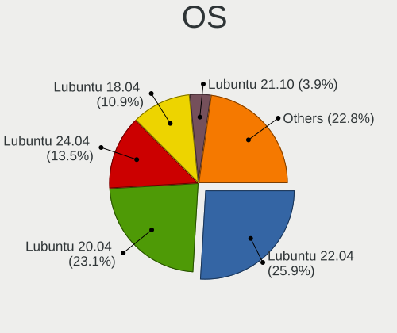

| Name             | Computers | Percent |
|------------------|-----------|---------|
| Lubuntu 22.04    | 545       | 25.94%  |
| Lubuntu 20.04    | 486       | 23.13%  |
| Lubuntu 24.04    | 283       | 13.47%  |
| Lubuntu 18.04    | 228       | 10.85%  |
| Lubuntu 21.10    | 81        | 3.86%   |
| Lubuntu 19.10    | 62        | 2.95%   |
| Lubuntu 23.10    | 54        | 2.57%   |
| Lubuntu 21.04    | 53        | 2.52%   |
| Lubuntu 20.10    | 48        | 2.28%   |
| Lubuntu 25.04    | 47        | 2.24%   |
| Lubuntu 22.10    | 46        | 2.19%   |
| Lubuntu 24.10    | 39        | 1.86%   |
| Lubuntu 23.04    | 38        | 1.81%   |
| Lubuntu 16.04    | 38        | 1.81%   |
| Lubuntu 25.10    | 14        | 0.67%   |
| Lubuntu 19.04    | 14        | 0.67%   |
| Lubuntu 18.10    | 13        | 0.62%   |
| Lubuntu          | 3         | 0.14%   |
| Lubuntu 16.10    | 2         | 0.1%    |
| Lubuntu 12.04    | 2         | 0.1%    |
| Lubuntu 20.04.1  | 1         | 0.05%   |
| Lubuntu 18.04.05 | 1         | 0.05%   |
| Lubuntu 17.10    | 1         | 0.05%   |
| Lubuntu 17.04    | 1         | 0.05%   |
| Lubuntu 13.04    | 1         | 0.05%   |

OS Family
---------

OS without a version

| Name    | Computers | Percent |
|---------|-----------|---------|
| Lubuntu | 2025      | 100%    |

Kernel
------

Version of the Linux kernel

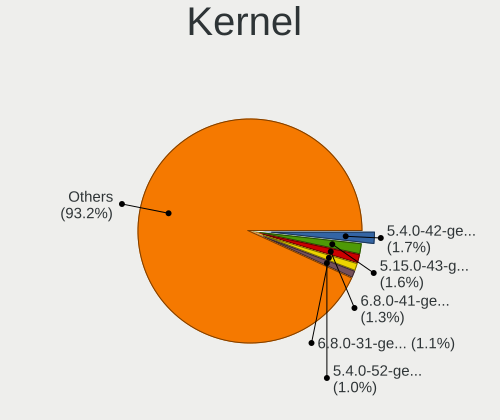

| Version           | Computers | Percent |
|-------------------|-----------|---------|
| 5.4.0-42-generic  | 40        | 1.75%   |
| 5.15.0-43-generic | 36        | 1.57%   |
| 6.8.0-41-generic  | 30        | 1.31%   |
| 6.8.0-31-generic  | 26        | 1.14%   |
| 5.4.0-52-generic  | 24        | 1.05%   |
| 6.8.0-51-generic  | 22        | 0.96%   |
| 6.14.0-15-generic | 22        | 0.96%   |
| 5.15.0-56-generic | 21        | 0.92%   |
| 6.5.0-14-generic  | 19        | 0.83%   |
| 5.13.0-19-generic | 19        | 0.83%   |
| 6.14.0-27-generic | 18        | 0.79%   |
| 5.19.0-32-generic | 17        | 0.74%   |
| 5.15.0-46-generic | 17        | 0.74%   |
| 5.15.0-25-generic | 17        | 0.74%   |
| 6.8.0-45-generic  | 16        | 0.7%    |
| 6.8.0-40-generic  | 16        | 0.7%    |
| 5.15.0-60-generic | 16        | 0.7%    |
| 5.13.0-40-generic | 16        | 0.7%    |
| 5.13.0-28-generic | 16        | 0.7%    |
| 6.5.0-18-generic  | 14        | 0.61%   |
| 6.2.0-39-generic  | 14        | 0.61%   |
| 6.2.0-26-generic  | 14        | 0.61%   |
| 5.4.0-48-generic  | 14        | 0.61%   |
| 5.4.0-47-generic  | 14        | 0.61%   |
| 5.3.0-46-generic  | 14        | 0.61%   |
| 5.15.0-41-generic | 14        | 0.61%   |
| 5.11.0-27-generic | 14        | 0.61%   |
| 6.5.0-9-generic   | 13        | 0.57%   |
| 6.5.0-28-generic  | 13        | 0.57%   |
| 6.11.0-8-generic  | 13        | 0.57%   |
| 5.15.0-47-generic | 13        | 0.57%   |
| 5.13.0-30-generic | 13        | 0.57%   |
| 5.11.0-16-generic | 13        | 0.57%   |
| 6.8.0-48-generic  | 12        | 0.52%   |
| 6.11.0-17-generic | 12        | 0.52%   |
| 5.4.0-54-generic  | 12        | 0.52%   |
| 5.4.0-26-generic  | 12        | 0.52%   |
| 5.19.0-41-generic | 12        | 0.52%   |
| 5.19.0-35-generic | 12        | 0.52%   |
| 5.15.0-58-generic | 12        | 0.52%   |

Kernel Family
-------------

Linux kernel without a distro release

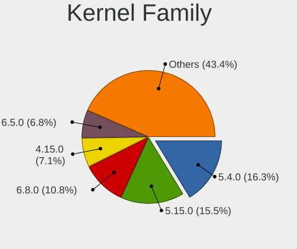

| Version | Computers | Percent |
|---------|-----------|---------|
| 5.4.0   | 349       | 16.32%  |
| 5.15.0  | 331       | 15.47%  |
| 6.8.0   | 232       | 10.85%  |
| 4.15.0  | 152       | 7.11%   |
| 6.5.0   | 146       | 6.83%   |
| 5.13.0  | 120       | 5.61%   |
| 5.19.0  | 118       | 5.52%   |
| 5.11.0  | 103       | 4.82%   |
| 5.8.0   | 99        | 4.63%   |
| 6.2.0   | 98        | 4.58%   |
| 6.14.0  | 91        | 4.25%   |
| 5.3.0   | 86        | 4.02%   |
| 6.11.0  | 75        | 3.51%   |
| 5.0.0   | 22        | 1.03%   |
| 4.4.0   | 13        | 0.61%   |
| 4.18.0  | 13        | 0.61%   |
| 6.17.0  | 12        | 0.56%   |
| 6.1.0   | 3         | 0.14%   |
| 6.6.0   | 2         | 0.09%   |
| 5.6.0   | 2         | 0.09%   |
| 5.4.30  | 2         | 0.09%   |
| 5.14.0  | 2         | 0.09%   |
| 4.9.253 | 2         | 0.09%   |
| 4.8.0   | 2         | 0.09%   |
| 4.13.0  | 2         | 0.09%   |
| 4.10.0  | 2         | 0.09%   |
| 6.9.5   | 1         | 0.05%   |
| 6.7.8   | 1         | 0.05%   |
| 6.7.6   | 1         | 0.05%   |
| 6.7.0   | 1         | 0.05%   |
| 6.6.6   | 1         | 0.05%   |
| 6.5.1   | 1         | 0.05%   |
| 6.4.12  | 1         | 0.05%   |
| 6.3.3   | 1         | 0.05%   |
| 6.2.8   | 1         | 0.05%   |
| 6.2.6   | 1         | 0.05%   |
| 6.18.0  | 1         | 0.05%   |
| 6.17.8  | 1         | 0.05%   |
| 6.17.5  | 1         | 0.05%   |
| 6.17.1  | 1         | 0.05%   |

Kernel Major Ver.
-----------------

Linux kernel major version

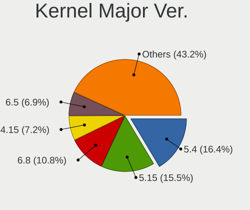

| Version | Computers | Percent |
|---------|-----------|---------|
| 5.4     | 351       | 16.41%  |
| 5.15    | 332       | 15.52%  |
| 6.8     | 232       | 10.85%  |
| 4.15    | 153       | 7.15%   |
| 6.5     | 147       | 6.87%   |
| 5.19    | 120       | 5.61%   |
| 5.13    | 120       | 5.61%   |
| 5.11    | 103       | 4.82%   |
| 6.2     | 100       | 4.68%   |
| 5.8     | 99        | 4.63%   |
| 6.14    | 92        | 4.3%    |
| 5.3     | 87        | 4.07%   |
| 6.11    | 76        | 3.55%   |
| 5.0     | 22        | 1.03%   |
| 6.17    | 15        | 0.7%    |
| 4.4     | 15        | 0.7%    |
| 4.18    | 13        | 0.61%   |
| 6.1     | 8         | 0.37%   |
| 6.0     | 6         | 0.28%   |
| 6.7     | 3         | 0.14%   |
| 6.6     | 3         | 0.14%   |
| 6.12    | 3         | 0.14%   |
| 5.6     | 3         | 0.14%   |
| 4.9     | 3         | 0.14%   |
| 4.13    | 3         | 0.14%   |
| 6.13    | 2         | 0.09%   |
| 6.10    | 2         | 0.09%   |
| 5.7     | 2         | 0.09%   |
| 5.16    | 2         | 0.09%   |
| 5.14    | 2         | 0.09%   |
| 5.10    | 2         | 0.09%   |
| 4.8     | 2         | 0.09%   |
| 4.10    | 2         | 0.09%   |
| 6.9     | 1         | 0.05%   |
| 6.4     | 1         | 0.05%   |
| 6.3     | 1         | 0.05%   |
| 6.18    | 1         | 0.05%   |
| 6.16    | 1         | 0.05%   |
| 5.9     | 1         | 0.05%   |
| 5.5     | 1         | 0.05%   |

Arch
----

OS architecture (x86_64, i586, etc.)

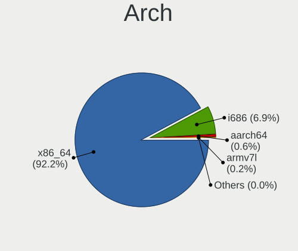

| Name    | Computers | Percent |
|---------|-----------|---------|
| x86_64  | 1867      | 92.2%   |
| i686    | 139       | 6.86%   |
| aarch64 | 13        | 0.64%   |
| armv7l  | 4         | 0.2%    |
| ppc64   | 1         | 0.05%   |
| ppc     | 1         | 0.05%   |

DE
--

Desktop Environment

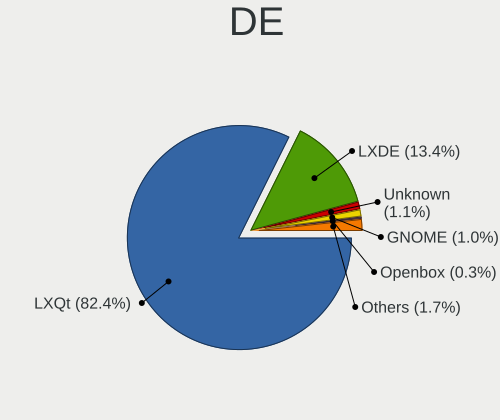

| Name            | Computers | Percent |
|-----------------|-----------|---------|
| LXQt            | 1675      | 82.35%  |
| LXDE            | 273       | 13.42%  |
| Unknown         | 23        | 1.13%   |
| GNOME           | 21        | 1.03%   |
| Openbox         | 7         | 0.34%   |
| XFCE            | 6         | 0.29%   |
| X-Cinnamon      | 5         | 0.25%   |
| Lubuntu         | 4         | 0.2%    |
| KDE5            | 4         | 0.2%    |
| i3              | 3         | 0.15%   |
| Cinnamon        | 3         | 0.15%   |
| MATE            | 2         | 0.1%    |
| GNOME Flashback | 2         | 0.1%    |
| Budgie          | 2         | 0.1%    |
| ratflow         | 1         | 0.05%   |
| KDE6            | 1         | 0.05%   |
| KDE             | 1         | 0.05%   |
| i3-with-shmlog  | 1         | 0.05%   |

Display Server
--------------

X11 or Wayland

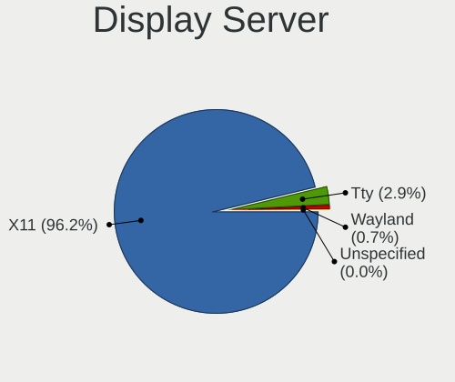

| Name        | Computers | Percent |
|-------------|-----------|---------|
| X11         | 1959      | 96.22%  |
| Tty         | 60        | 2.95%   |
| Wayland     | 14        | 0.69%   |
| Unknown     | 2         | 0.1%    |
| Unspecified | 1         | 0.05%   |

Display Manager
---------------

SDDM, LightDM, etc.

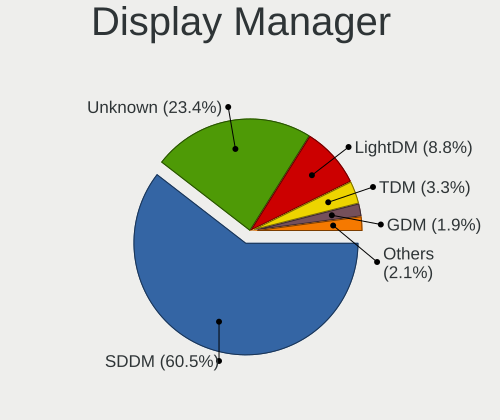

| Name    | Computers | Percent |
|---------|-----------|---------|
| SDDM    | 1241      | 60.48%  |
| Unknown | 481       | 23.44%  |
| LightDM | 181       | 8.82%   |
| TDM     | 68        | 3.31%   |
| GDM     | 38        | 1.85%   |
| GDM3    | 32        | 1.56%   |
| XDM     | 5         | 0.24%   |
| LXDM    | 3         | 0.15%   |
| SLiM    | 2         | 0.1%    |
| NODM    | 1         | 0.05%   |

OS Lang
-------

Language

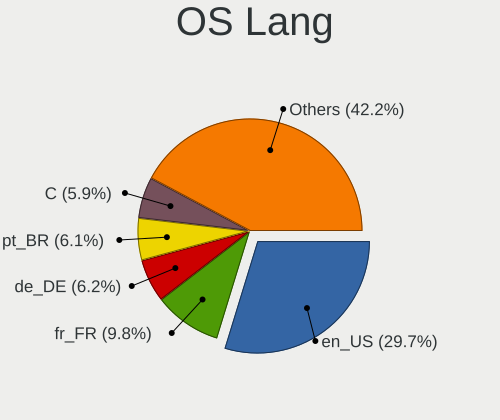

| Lang    | Computers | Percent |
|---------|-----------|---------|
| en_US   | 606       | 29.74%  |
| fr_FR   | 200       | 9.81%   |
| de_DE   | 127       | 6.23%   |
| pt_BR   | 124       | 6.08%   |
| C       | 121       | 5.94%   |
| en_GB   | 116       | 5.69%   |
| it_IT   | 114       | 5.59%   |
| ru_RU   | 64        | 3.14%   |
| es_ES   | 47        | 2.31%   |
| pl_PL   | 46        | 2.26%   |
| en_CA   | 44        | 2.16%   |
| Unknown | 32        | 1.57%   |
| es_MX   | 31        | 1.52%   |
| es_AR   | 30        | 1.47%   |
| en_AU   | 30        | 1.47%   |
| tr_TR   | 18        | 0.88%   |
| cs_CZ   | 17        | 0.83%   |
| fi_FI   | 16        | 0.79%   |
| nl_NL   | 15        | 0.74%   |
| hu_HU   | 15        | 0.74%   |
| en_IN   | 15        | 0.74%   |
| ja_JP   | 12        | 0.59%   |
| en_AG   | 11        | 0.54%   |
| es_CR   | 10        | 0.49%   |
| es_CL   | 10        | 0.49%   |
| en_ZA   | 9         | 0.44%   |
| es_CO   | 8         | 0.39%   |
| el_GR   | 8         | 0.39%   |
| zh_TW   | 6         | 0.29%   |
| nl_BE   | 6         | 0.29%   |
| fr_CA   | 6         | 0.29%   |
| es_PE   | 6         | 0.29%   |
| en_SG   | 6         | 0.29%   |
| pt_PT   | 5         | 0.25%   |
| fr_CH   | 5         | 0.25%   |
| fr_BE   | 5         | 0.25%   |
| es_UY   | 5         | 0.25%   |
| en_PH   | 5         | 0.25%   |
| en_IE   | 5         | 0.25%   |
| de_CH   | 5         | 0.25%   |

Boot Mode
---------

EFI or BIOS

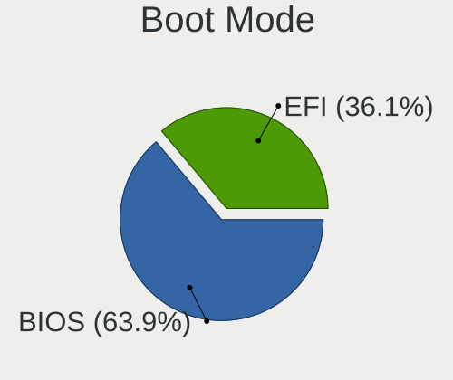

| Mode | Computers | Percent |
|------|-----------|---------|
| BIOS | 1308      | 63.9%   |
| EFI  | 739       | 36.1%   |

Filesystem
----------

Type of filesystem

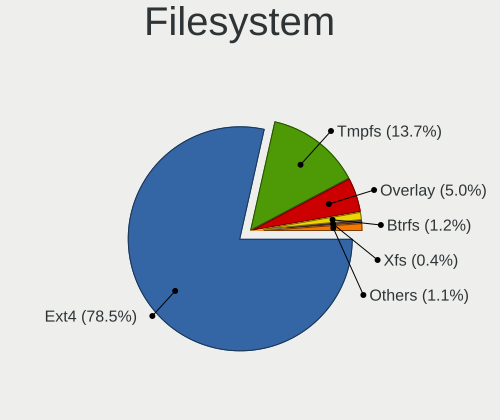

| Type      | Computers | Percent |
|-----------|-----------|---------|
| Ext4      | 1610      | 78.5%   |
| Tmpfs     | 282       | 13.75%  |
| Overlay   | 103       | 5.02%   |
| Btrfs     | 24        | 1.17%   |
| Xfs       | 9         | 0.44%   |
| Aufs      | 5         | 0.24%   |
| Unknown   | 5         | 0.24%   |
| Ext2      | 4         | 0.2%    |
| Ext3      | 3         | 0.15%   |
| Zfs       | 2         | 0.1%    |
| XXX4      | 1         | 0.05%   |
| Overlayfs | 1         | 0.05%   |
| Nfs       | 1         | 0.05%   |
| F2fs      | 1         | 0.05%   |

Part. scheme
------------

Scheme of partitioning

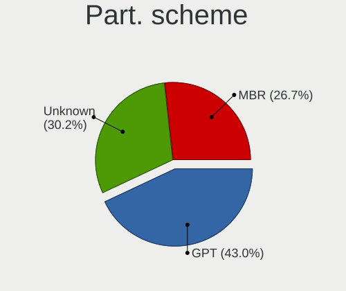

| Type    | Computers | Percent |
|---------|-----------|---------|
| GPT     | 882       | 43.02%  |
| Unknown | 620       | 30.24%  |
| MBR     | 548       | 26.73%  |

Dual Boot with Linux/BSD
------------------------

Hosting more than one Linux/BSD

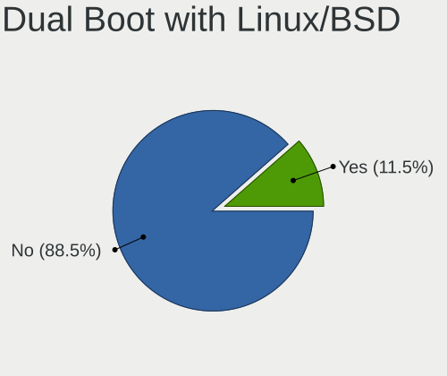

| Dual boot | Computers | Percent |
|-----------|-----------|---------|
| No        | 1815      | 88.54%  |
| Yes       | 235       | 11.46%  |

Dual Boot (Win)
---------------

Hosting Linux and Windows

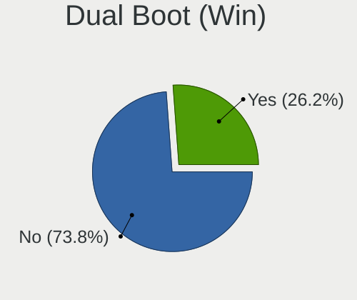

| Dual boot | Computers | Percent |
|-----------|-----------|---------|
| No        | 1507      | 73.84%  |
| Yes       | 534       | 26.16%  |

Board
-----

Vendor
------

Motherboard manufacturer

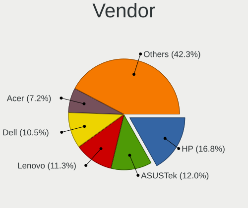

| Name                    | Computers | Percent |
|-------------------------|-----------|---------|
| Hewlett-Packard         | 341       | 16.84%  |
| ASUSTek Computer        | 242       | 11.95%  |
| Lenovo                  | 228       | 11.26%  |
| Dell                    | 213       | 10.52%  |
| Acer                    | 145       | 7.16%   |
| MSI                     | 70        | 3.46%   |
| Gigabyte Technology     | 68        | 3.36%   |
| Toshiba                 | 55        | 2.72%   |
| Apple                   | 54        | 2.67%   |
| ASRock                  | 52        | 2.57%   |
| Samsung Electronics     | 39        | 1.93%   |
| Unknown                 | 39        | 1.93%   |
| Google                  | 38        | 1.88%   |
| Intel                   | 37        | 1.83%   |
| Sony                    | 31        | 1.53%   |
| Fujitsu                 | 27        | 1.33%   |
| Positivo                | 23        | 1.14%   |
| Packard Bell            | 17        | 0.84%   |
| Fujitsu Siemens         | 16        | 0.79%   |
| AMI                     | 15        | 0.74%   |
| Pegatron                | 14        | 0.69%   |
| Foxconn                 | 11        | 0.54%   |
| Medion                  | 10        | 0.49%   |
| Mediacom                | 10        | 0.49%   |
| Raspberry Pi Foundation | 9         | 0.44%   |
| eMachines               | 9         | 0.44%   |
| Chuwi                   | 8         | 0.4%    |
| Supermicro              | 7         | 0.35%   |
| Notebook                | 7         | 0.35%   |
| Microsoft               | 7         | 0.35%   |
| IBM                     | 6         | 0.3%    |
| Gateway                 | 6         | 0.3%    |
| Biostar                 | 6         | 0.3%    |
| AZW                     | 6         | 0.3%    |
| AAEON                   | 6         | 0.3%    |
| LG Electronics          | 5         | 0.25%   |
| Itautec                 | 5         | 0.25%   |
| HUAWEI                  | 5         | 0.25%   |
| ECS                     | 4         | 0.2%    |
| Alienware               | 4         | 0.2%    |

Model
-----

Motherboard model

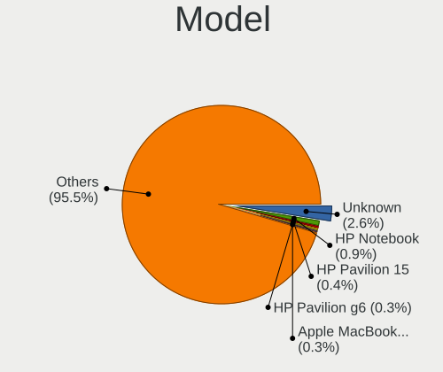

| Name                                  | Computers | Percent |
|---------------------------------------|-----------|---------|
| Unknown                               | 52        | 2.57%   |
| HP Notebook                           | 18        | 0.89%   |
| HP Pavilion 15                        | 8         | 0.4%    |
| HP Pavilion g6                        | 7         | 0.35%   |
| Apple MacBookPro8,1                   | 7         | 0.35%   |
| HP Pavilion dv6                       | 6         | 0.3%    |
| Dell OptiPlex 790                     | 6         | 0.3%    |
| Dell OptiPlex 7010                    | 6         | 0.3%    |
| Dell Latitude E6410                   | 6         | 0.3%    |
| AAEON MF-001                          | 6         | 0.3%    |
| Lenovo IdeaPad Slim 1-14AST-05 81VS   | 5         | 0.25%   |
| HP Pavilion g7                        | 5         | 0.25%   |
| HP EliteBook 840 G3                   | 5         | 0.25%   |
| ASUS All Series                       | 5         | 0.25%   |
| Apple MacBookPro9,2                   | 5         | 0.25%   |
| Apple iMac7,1                         | 5         | 0.25%   |
| Supermicro X8DTT-IBX                  | 4         | 0.2%    |
| MSI MS-7C37                           | 4         | 0.2%    |
| Mediacom WinPad 11,6 FullHD- WPU11    | 4         | 0.2%    |
| Mediacom SmartBook 14 FullHD - SB14UC | 4         | 0.2%    |
| HP t620 Quad Core TC                  | 4         | 0.2%    |
| HP Laptop 15-bw0xx                    | 4         | 0.2%    |
| HP 2000                               | 4         | 0.2%    |
| Google Candy                          | 4         | 0.2%    |
| Dell OptiPlex 9020                    | 4         | 0.2%    |
| Dell Latitude D630                    | 4         | 0.2%    |
| Dell Inspiron N5010                   | 4         | 0.2%    |
| Dell Inspiron 15-3567                 | 4         | 0.2%    |
| AMI Aptio CRB                         | 4         | 0.2%    |
| Acer Aspire 5735                      | 4         | 0.2%    |
| Toshiba Satellite C660                | 3         | 0.15%   |
| Nvidia Tegra                          | 3         | 0.15%   |
| MSI MS-7309                           | 3         | 0.15%   |
| Lenovo IdeaPad L340-15IRH Gaming 81LK | 3         | 0.15%   |
| Lenovo IdeaPad 320-15IKB 80XL         | 3         | 0.15%   |
| Lenovo IdeaPad 320-15AST 80XV         | 3         | 0.15%   |
| Lenovo IdeaPad 100-15IBD 80QQ         | 3         | 0.15%   |
| Lenovo G50-45 80E3                    | 3         | 0.15%   |
| Lenovo G50-30 80G0                    | 3         | 0.15%   |
| Intel H61                             | 3         | 0.15%   |

Model Family
------------

Motherboard model prefix

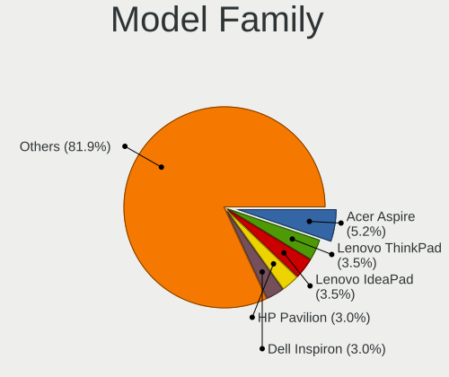

| Name                    | Computers | Percent |
|-------------------------|-----------|---------|
| Acer Aspire             | 106       | 5.23%   |
| Lenovo ThinkPad         | 70        | 3.46%   |
| Lenovo IdeaPad          | 70        | 3.46%   |
| HP Pavilion             | 60        | 2.96%   |
| Dell Inspiron           | 60        | 2.96%   |
| Dell Latitude           | 54        | 2.67%   |
| Unknown                 | 52        | 2.57%   |
| HP Compaq               | 51        | 2.52%   |
| Toshiba Satellite       | 50        | 2.47%   |
| Dell OptiPlex           | 41        | 2.02%   |
| HP EliteBook            | 38        | 1.88%   |
| HP ProBook              | 35        | 1.73%   |
| HP Laptop               | 27        | 1.33%   |
| Lenovo ThinkCentre      | 24        | 1.19%   |
| HP Notebook             | 18        | 0.89%   |
| ASUS VivoBook           | 16        | 0.79%   |
| Dell XPS                | 15        | 0.74%   |
| Fujitsu LIFEBOOK        | 13        | 0.64%   |
| ASUS PRIME              | 13        | 0.64%   |
| HP Stream               | 12        | 0.59%   |
| Dell Precision          | 12        | 0.59%   |
| Packard Bell EasyNote   | 11        | 0.54%   |
| Dell Vostro             | 11        | 0.54%   |
| Fujitsu Siemens AMILO   | 10        | 0.49%   |
| RPi Raspberry           | 9         | 0.44%   |
| Acer Extensa            | 9         | 0.44%   |
| Microsoft Surface       | 7         | 0.35%   |
| Lenovo Yoga             | 7         | 0.35%   |
| Apple MacBookPro8       | 7         | 0.35%   |
| HP ZBook                | 6         | 0.3%    |
| HP t620                 | 6         | 0.3%    |
| HP Presario             | 6         | 0.3%    |
| HP 250                  | 6         | 0.3%    |
| ASUS ROG                | 6         | 0.3%    |
| Acer TravelMate         | 6         | 0.3%    |
| Acer Swift              | 6         | 0.3%    |
| AAEON MF-001            | 6         | 0.3%    |
| HP Spectre              | 5         | 0.25%   |
| HP 255                  | 5         | 0.25%   |
| Fujitsu Siemens ESPRIMO | 5         | 0.25%   |

MFG Year
--------

Motherboard manufacture year

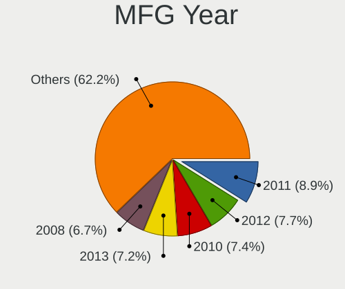

| Year    | Computers | Percent |
|---------|-----------|---------|
| 2011    | 181       | 8.94%   |
| 2012    | 155       | 7.65%   |
| 2010    | 149       | 7.36%   |
| 2013    | 145       | 7.16%   |
| 2008    | 136       | 6.72%   |
| 2009    | 121       | 5.98%   |
| 2014    | 118       | 5.83%   |
| 2007    | 117       | 5.78%   |
| 2019    | 111       | 5.48%   |
| 2017    | 106       | 5.23%   |
| 2016    | 104       | 5.14%   |
| 2015    | 94        | 4.64%   |
| 2018    | 89        | 4.4%    |
| 2021    | 85        | 4.2%    |
| 2020    | 83        | 4.1%    |
| 2006    | 58        | 2.86%   |
| 2022    | 57        | 2.81%   |
| 2023    | 39        | 1.93%   |
| 2005    | 23        | 1.14%   |
| Unknown | 19        | 0.94%   |
| 2024    | 17        | 0.84%   |
| 2004    | 7         | 0.35%   |
| 2003    | 3         | 0.15%   |
| 2002    | 3         | 0.15%   |
| 2025    | 2         | 0.1%    |
| 2001    | 2         | 0.1%    |
| 2000    | 1         | 0.05%   |

Form Factor
-----------

Physical design of the computer

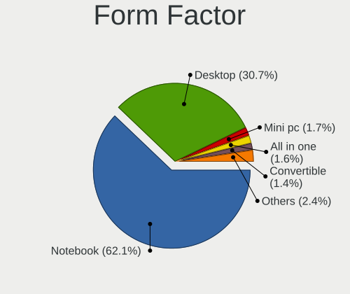

| Name           | Computers | Percent |
|----------------|-----------|---------|
| Notebook       | 1258      | 62.12%  |
| Desktop        | 622       | 30.72%  |
| Mini pc        | 35        | 1.73%   |
| All in one     | 33        | 1.63%   |
| Convertible    | 28        | 1.38%   |
| Tablet         | 19        | 0.94%   |
| Server         | 15        | 0.74%   |
| System on chip | 14        | 0.69%   |
| Other          | 1         | 0.05%   |

Secure Boot
-----------

Enabled or disabled

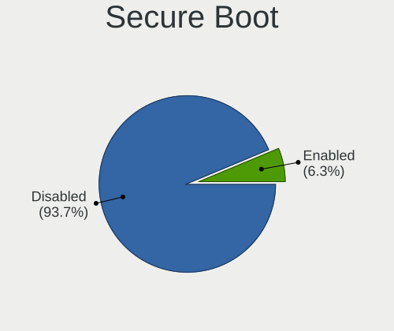

| State    | Computers | Percent |
|----------|-----------|---------|
| Disabled | 1905      | 93.7%   |
| Enabled  | 128       | 6.3%    |

Coreboot
--------

Have coreboot on board

| Used | Computers | Percent |
|------|-----------|---------|
| No   | 1984      | 97.93%  |
| Yes  | 42        | 2.07%   |

RAM Size
--------

Total RAM memory

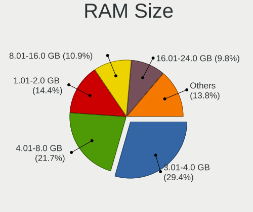

| Size in GB      | Computers | Percent |
|-----------------|-----------|---------|
| 3.01-4.0        | 607       | 29.44%  |
| 4.01-8.0        | 447       | 21.68%  |
| 1.01-2.0        | 297       | 14.4%   |
| 8.01-16.0       | 224       | 10.86%  |
| 16.01-24.0      | 202       | 9.8%    |
| 2.01-3.0        | 90        | 4.36%   |
| 32.01-64.0      | 77        | 3.73%   |
| 0.51-1.0        | 58        | 2.81%   |
| 24.01-32.0      | 25        | 1.21%   |
| 64.01-256.0     | 22        | 1.07%   |
| 0.01-0.5        | 10        | 0.48%   |
| More than 256.0 | 3         | 0.15%   |

RAM Used
--------

Used RAM memory

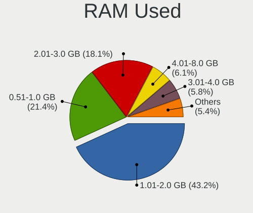

| Used GB    | Computers | Percent |
|------------|-----------|---------|
| 1.01-2.0   | 936       | 43.21%  |
| 0.51-1.0   | 463       | 21.38%  |
| 2.01-3.0   | 392       | 18.1%   |
| 4.01-8.0   | 132       | 6.09%   |
| 3.01-4.0   | 126       | 5.82%   |
| 0.01-0.5   | 81        | 3.74%   |
| 8.01-16.0  | 24        | 1.11%   |
| 16.01-24.0 | 6         | 0.28%   |
| 32.01-64.0 | 3         | 0.14%   |
| Unknown    | 3         | 0.14%   |

Total Drives
------------

Number of drives on board

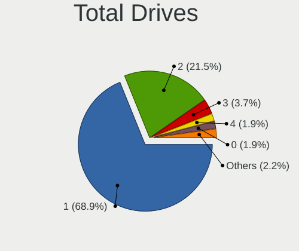

| Drives | Computers | Percent |
|--------|-----------|---------|
| 1      | 1410      | 68.88%  |
| 2      | 440       | 21.49%  |
| 3      | 75        | 3.66%   |
| 4      | 38        | 1.86%   |
| 0      | 38        | 1.86%   |
| 5      | 22        | 1.07%   |
| 6      | 10        | 0.49%   |
| 7      | 4         | 0.2%    |
| 10     | 2         | 0.1%    |
| 8      | 2         | 0.1%    |
| 17     | 1         | 0.05%   |
| 14     | 1         | 0.05%   |
| 13     | 1         | 0.05%   |
| 12     | 1         | 0.05%   |
| 11     | 1         | 0.05%   |
| 9      | 1         | 0.05%   |

Has CD-ROM
----------

Has CD-ROM on board

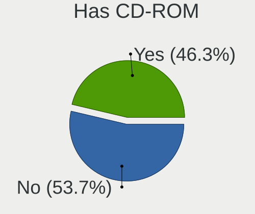

| Presented | Computers | Percent |
|-----------|-----------|---------|
| No        | 1093      | 53.68%  |
| Yes       | 943       | 46.32%  |

Has Ethernet
------------

Has Ethernet on board

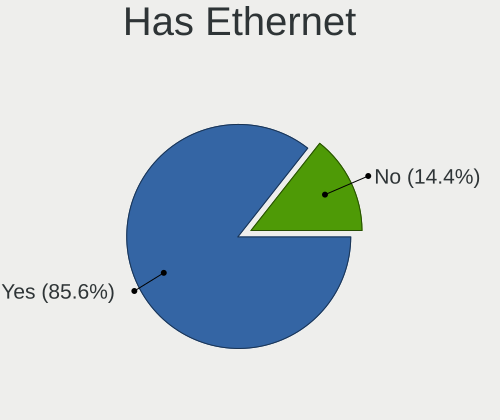

| Presented | Computers | Percent |
|-----------|-----------|---------|
| Yes       | 1739      | 85.62%  |
| No        | 292       | 14.38%  |

Has WiFi
--------

Has WiFi module

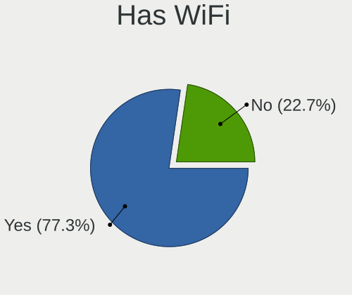

| Presented | Computers | Percent |
|-----------|-----------|---------|
| Yes       | 1570      | 77.3%   |
| No        | 461       | 22.7%   |

Has Bluetooth
-------------

Has Bluetooth module

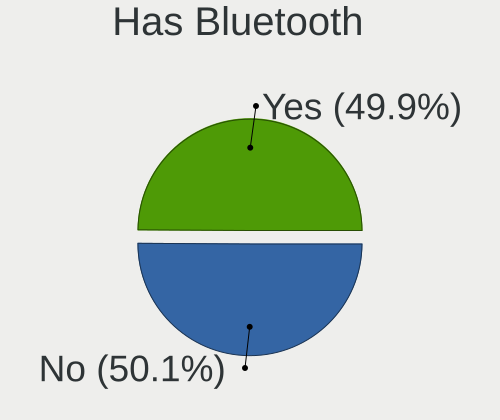

| Presented | Computers | Percent |
|-----------|-----------|---------|
| No        | 1025      | 50.1%   |
| Yes       | 1021      | 49.9%   |

Location
--------

Country
-------

Geographic location (country)

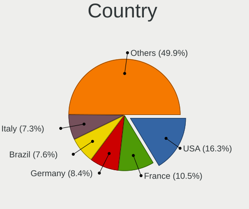

| Country      | Computers | Percent |
|--------------|-----------|---------|
| USA          | 332       | 16.35%  |
| France       | 213       | 10.49%  |
| Germany      | 170       | 8.37%   |
| Brazil       | 154       | 7.58%   |
| Italy        | 149       | 7.34%   |
| Russia       | 94        | 4.63%   |
| UK           | 80        | 3.94%   |
| Canada       | 62        | 3.05%   |
| Spain        | 53        | 2.61%   |
| Poland       | 53        | 2.61%   |
| Netherlands  | 36        | 1.77%   |
| Argentina    | 35        | 1.72%   |
| Finland      | 32        | 1.58%   |
| Australia    | 30        | 1.48%   |
| Turkey       | 26        | 1.28%   |
| Czechia      | 26        | 1.28%   |
| Indonesia    | 25        | 1.23%   |
| Mexico       | 24        | 1.18%   |
| Hungary      | 23        | 1.13%   |
| Switzerland  | 22        | 1.08%   |
| India        | 21        | 1.03%   |
| Belgium      | 21        | 1.03%   |
| Costa Rica   | 16        | 0.79%   |
| Romania      | 15        | 0.74%   |
| Colombia     | 14        | 0.69%   |
| South Africa | 13        | 0.64%   |
| Japan        | 13        | 0.64%   |
| Chile        | 13        | 0.64%   |
| Ukraine      | 12        | 0.59%   |
| Sweden       | 12        | 0.59%   |
| Greece       | 12        | 0.59%   |
| Malaysia     | 11        | 0.54%   |
| Portugal     | 10        | 0.49%   |
| Slovakia     | 9         | 0.44%   |
| Peru         | 9         | 0.44%   |
| Ireland      | 9         | 0.44%   |
| Bulgaria     | 9         | 0.44%   |
| Norway       | 8         | 0.39%   |
| China        | 8         | 0.39%   |
| Taiwan       | 7         | 0.34%   |

City
----

Geographic location (city)

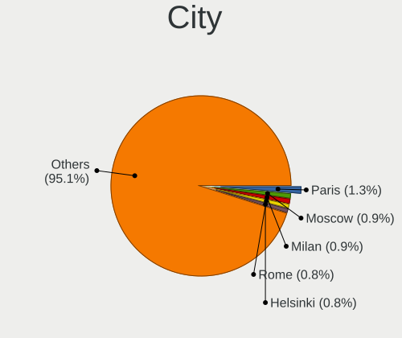

| City              | Computers | Percent |
|-------------------|-----------|---------|
| Paris             | 28        | 1.32%   |
| Moscow            | 20        | 0.94%   |
| Milan             | 20        | 0.94%   |
| Rome              | 18        | 0.85%   |
| Helsinki          | 17        | 0.8%    |
| Melbourne         | 14        | 0.66%   |
| Sao Paulo         | 13        | 0.61%   |
| New York          | 12        | 0.57%   |
| Warsaw            | 10        | 0.47%   |
| Prague            | 10        | 0.47%   |
| Grecia            | 10        | 0.47%   |
| St Petersburg     | 9         | 0.42%   |
| Istanbul          | 9         | 0.42%   |
| Rio de Janeiro    | 8         | 0.38%   |
| Frankfurt am Main | 8         | 0.38%   |
| Billings          | 8         | 0.38%   |
| Berlin            | 8         | 0.38%   |
| Zurich            | 7         | 0.33%   |
| Oshawa            | 7         | 0.33%   |
| Munich            | 7         | 0.33%   |
| Mexico City       | 7         | 0.33%   |
| Lyon              | 7         | 0.33%   |
| Heredia           | 7         | 0.33%   |
| Curitiba          | 7         | 0.33%   |
| Cape Town         | 7         | 0.33%   |
| Budapest          | 7         | 0.33%   |
| Brasília         | 7         | 0.33%   |
| Bengaluru         | 7         | 0.33%   |
| Wellington        | 6         | 0.28%   |
| Stuttgart         | 6         | 0.28%   |
| Madrid            | 6         | 0.28%   |
| Kyiv              | 6         | 0.28%   |
| Kuala Lumpur      | 6         | 0.28%   |
| Houston           | 6         | 0.28%   |
| Hamburg           | 6         | 0.28%   |
| Buenos Aires      | 6         | 0.28%   |
| Bogotá           | 6         | 0.28%   |
| Athens            | 6         | 0.28%   |
| Winnipeg          | 5         | 0.24%   |
| Toronto           | 5         | 0.24%   |

Drives
------

Drive Vendor
------------

Hard drive vendors

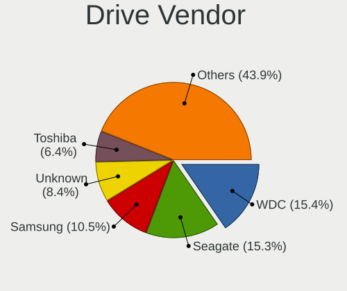

| Vendor                    | Computers | Drives | Percent |
|---------------------------|-----------|--------|---------|
| WDC                       | 395       | 537    | 15.41%  |
| Seagate                   | 393       | 525    | 15.33%  |
| Samsung Electronics       | 269       | 385    | 10.5%   |
| Unknown                   | 215       | 286    | 8.39%   |
| Toshiba                   | 165       | 191    | 6.44%   |
| Hitachi                   | 137       | 167    | 5.35%   |
| Kingston                  | 123       | 147    | 4.8%    |
| SanDisk                   | 92        | 112    | 3.59%   |
| Crucial                   | 83        | 107    | 3.24%   |
| HGST                      | 48        | 56     | 1.87%   |
| Intel                     | 41        | 54     | 1.6%    |
| SK hynix                  | 35        | 36     | 1.37%   |
| China                     | 34        | 41     | 1.33%   |
| Micron Technology         | 33        | 37     | 1.29%   |
| A-DATA Technology         | 33        | 35     | 1.29%   |
| Fujitsu                   | 29        | 31     | 1.13%   |
| Unknown                   | 26        | 28     | 1.01%   |
| Maxtor                    | 21        | 25     | 0.82%   |
| Apacer                    | 18        | 18     | 0.7%    |
| Patriot                   | 15        | 15     | 0.59%   |
| Intenso                   | 13        | 15     | 0.51%   |
| PNY                       | 12        | 15     | 0.47%   |
| KIOXIA                    | 12        | 13     | 0.47%   |
| SPCC                      | 11        | 15     | 0.43%   |
| Silicon Motion            | 11        | 13     | 0.43%   |
| Apple                     | 11        | 19     | 0.43%   |
| Transcend                 | 9         | 11     | 0.35%   |
| OCZ                       | 9         | 10     | 0.35%   |
| Lexar                     | 9         | 12     | 0.35%   |
| LITEONIT                  | 8         | 8      | 0.31%   |
| KingSpec                  | 8         | 11     | 0.31%   |
| JMicron Technology        | 8         | 8      | 0.31%   |
| Team                      | 7         | 7      | 0.27%   |
| LITEON                    | 7         | 8      | 0.27%   |
| UMIS                      | 6         | 6      | 0.23%   |
| Micron/Crucial Technology | 6         | 8      | 0.23%   |
| Hewlett-Packard           | 6         | 15     | 0.23%   |
| GOODRAM                   | 6         | 6      | 0.23%   |
| Corsair                   | 6         | 6      | 0.23%   |
| USB                       | 5         | 8      | 0.2%    |

Drive Model
-----------

Hard drive models

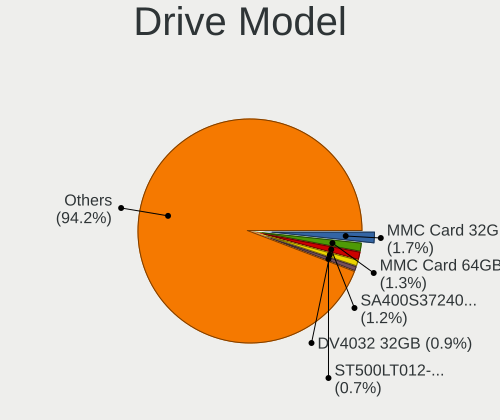

| Model                                             | Computers | Percent |
|---------------------------------------------------|-----------|---------|
| Unknown MMC Card  32GB                            | 46        | 1.66%   |
| Unknown MMC Card  64GB                            | 36        | 1.3%    |
| Kingston SA400S37240G 240GB SSD                   | 33        | 1.19%   |
| Unknown                                           | 26        | 0.94%   |
| Seagate ST500LT012-1DG142 500GB                   | 20        | 0.72%   |
| Seagate ST1000LM035-1RK172 1TB                    | 19        | 0.69%   |
| Seagate ST9500325AS 500GB                         | 18        | 0.65%   |
| Seagate ST1000LM024 HN-M101MBB 1TB                | 17        | 0.61%   |
| Kingston SA400S37120G 120GB SSD                   | 17        | 0.61%   |
| Toshiba MQ01ABD100 1TB                            | 16        | 0.58%   |
| Seagate ST500DM002-1BD142 500GB                   | 16        | 0.58%   |
| Kingston SA400S37480G 480GB SSD                   | 16        | 0.58%   |
| Samsung SSD 850 EVO 250GB                         | 15        | 0.54%   |
| Unknown SD/MMC/MS PRO 2GB                         | 13        | 0.47%   |
| Unknown MMC Card  16GB                            | 13        | 0.47%   |
| Toshiba MQ01ABF050 500GB                          | 13        | 0.47%   |
| Seagate ST500LM012 HN-M500MBB 500GB               | 13        | 0.47%   |
| HGST HTS545050A7E680 500GB                        | 12        | 0.43%   |
| Crucial CT240BX500SSD1 240GB                      | 12        | 0.43%   |
| Unknown NCard  32GB                               | 10        | 0.36%   |
| Unknown DA4064  64GB                              | 10        | 0.36%   |
| Seagate ST3500418AS 500GB                         | 10        | 0.36%   |
| Kingston SV300S37A120G 120GB SSD                  | 10        | 0.36%   |
| HGST HTS545050A7E380 500GB                        | 10        | 0.36%   |
| Toshiba MQ01ABD050 500GB                          | 9         | 0.33%   |
| Seagate ST1000DM010-2EP102 1TB                    | 9         | 0.33%   |
| Seagate Expansion 2TB                             | 9         | 0.33%   |
| SanDisk DF4032  32GB                              | 9         | 0.33%   |
| Crucial CT500MX500SSD1 500GB                      | 9         | 0.33%   |
| WDC WD5000LPVX-22V0TT0 500GB                      | 8         | 0.29%   |
| WDC WD3200BPVT-22JJ5T0 320GB                      | 8         | 0.29%   |
| Unknown MMC Card  128GB                           | 8         | 0.29%   |
| Seagate ST9320325AS 320GB                         | 8         | 0.29%   |
| Seagate ST2000DM008-2FR102 2TB                    | 8         | 0.29%   |
| Samsung SSD 860 EVO 500GB                         | 8         | 0.29%   |
| Samsung SSD 850 EVO 500GB                         | 8         | 0.29%   |
| Samsung NVMe SSD Controller SM981/PM981/PM983 1TB | 8         | 0.29%   |
| Crucial CT480BX500SSD1 480GB                      | 8         | 0.29%   |
| Crucial CT1000MX500SSD1 1TB                       | 8         | 0.29%   |
| China SSD 128GB                                   | 8         | 0.29%   |

HDD Vendor
----------

Hard disk drive vendors

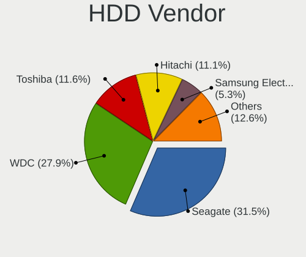

| Vendor              | Computers | Drives | Percent |
|---------------------|-----------|--------|---------|
| Seagate             | 389       | 520    | 31.47%  |
| WDC                 | 345       | 467    | 27.91%  |
| Toshiba             | 143       | 163    | 11.57%  |
| Hitachi             | 137       | 167    | 11.08%  |
| Samsung Electronics | 66        | 97     | 5.34%   |
| HGST                | 48        | 56     | 3.88%   |
| Fujitsu             | 29        | 31     | 2.35%   |
| Maxtor              | 20        | 24     | 1.62%   |
| Unknown             | 13        | 15     | 1.05%   |
| JMicron Technology  | 4         | 4      | 0.32%   |
| IBM/Hitachi         | 4         | 5      | 0.32%   |
| Hewlett-Packard     | 4         | 8      | 0.32%   |
| Apple               | 4         | 4      | 0.32%   |
| TO Exter            | 3         | 3      | 0.24%   |
| SSK                 | 3         | 3      | 0.24%   |
| ExcelStor           | 3         | 4      | 0.24%   |
| WD MediaMax         | 2         | 3      | 0.16%   |
| USB                 | 2         | 2      | 0.16%   |
| STEC                | 2         | 3      | 0.16%   |
| Intenso             | 2         | 2      | 0.16%   |
| External            | 2         | 2      | 0.16%   |
| ASMT                | 2         | 3      | 0.16%   |
| XrayDisk            | 1         | 1      | 0.08%   |
| USB3.0              | 1         | 1      | 0.08%   |
| T-FORCE             | 1         | 1      | 0.08%   |
| Synology            | 1         | 1      | 0.08%   |
| RSH-319             | 1         | 1      | 0.08%   |
| LaCie               | 1         | 1      | 0.08%   |
| IB-377U3            | 1         | 1      | 0.08%   |
| ASM                 | 1         | 1      | 0.08%   |
| Apricorn            | 1         | 1      | 0.08%   |

SSD Vendor
----------

Solid state drive vendors

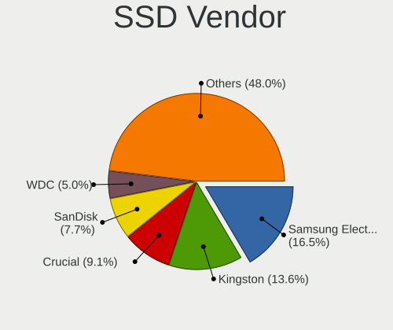

| Vendor              | Computers | Drives | Percent |
|---------------------|-----------|--------|---------|
| Samsung Electronics | 131       | 175    | 16.52%  |
| Kingston            | 108       | 130    | 13.62%  |
| Crucial             | 72        | 95     | 9.08%   |
| SanDisk             | 61        | 77     | 7.69%   |
| WDC                 | 40        | 49     | 5.04%   |
| China               | 32        | 38     | 4.04%   |
| Intel               | 29        | 41     | 3.66%   |
| A-DATA Technology   | 29        | 31     | 3.66%   |
| Apacer              | 18        | 18     | 2.27%   |
| Patriot             | 14        | 14     | 1.77%   |
| Toshiba             | 13        | 16     | 1.64%   |
| Micron Technology   | 13        | 16     | 1.64%   |
| PNY                 | 11        | 14     | 1.39%   |
| Intenso             | 10        | 12     | 1.26%   |
| Transcend           | 9         | 11     | 1.13%   |
| SPCC                | 9         | 11     | 1.13%   |
| OCZ                 | 9         | 10     | 1.13%   |
| Lexar               | 9         | 12     | 1.13%   |
| SK hynix            | 8         | 9      | 1.01%   |
| LITEONIT            | 8         | 8      | 1.01%   |
| Team                | 7         | 7      | 0.88%   |
| LITEON              | 7         | 8      | 0.88%   |
| Apple               | 7         | 13     | 0.88%   |
| KingSpec            | 6         | 8      | 0.76%   |
| GOODRAM             | 6         | 6      | 0.76%   |
| Corsair             | 6         | 6      | 0.76%   |
| XrayDisk            | 4         | 4      | 0.5%    |
| Plextor             | 4         | 6      | 0.5%    |
| NGFF                | 4         | 4      | 0.5%    |
| Netac               | 4         | 4      | 0.5%    |
| Unknown             | 3         | 3      | 0.38%   |
| LDLC                | 3         | 3      | 0.38%   |
| Gigabyte Technology | 3         | 3      | 0.38%   |
| Dogfish             | 3         | 3      | 0.38%   |
| Verbatim            | 2         | 2      | 0.25%   |
| Teclast             | 2         | 2      | 0.25%   |
| PNY USB             | 2         | 2      | 0.25%   |
| ORTIAL              | 2         | 2      | 0.25%   |
| Mushkin             | 2         | 2      | 0.25%   |
| MicroFrom           | 2         | 2      | 0.25%   |

Drive Kind
----------

HDD or SSD

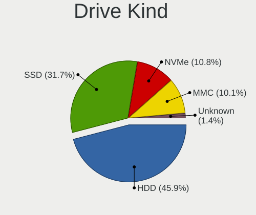

| Kind    | Computers | Drives | Percent |
|---------|-----------|--------|---------|
| HDD     | 1085      | 1595   | 45.94%  |
| SSD     | 749       | 977    | 31.71%  |
| NVMe    | 256       | 344    | 10.84%  |
| MMC     | 238       | 313    | 10.08%  |
| Unknown | 34        | 45     | 1.44%   |

Drive Connector
---------------

SATA, SAS, NVMe, etc.

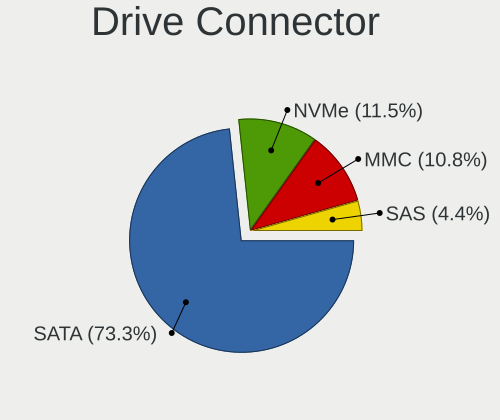

| Type | Computers | Drives | Percent |
|------|-----------|--------|---------|
| SATA | 1622      | 2482   | 73.33%  |
| NVMe | 255       | 341    | 11.53%  |
| MMC  | 238       | 313    | 10.76%  |
| SAS  | 97        | 138    | 4.39%   |

Drive Size
----------

Size of hard drive

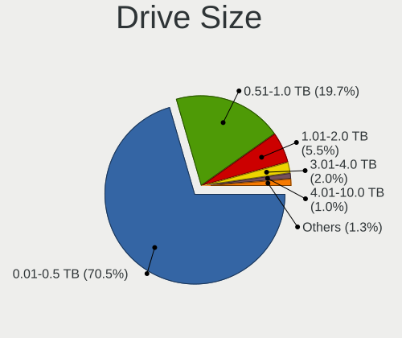

| Size in TB | Computers | Drives | Percent |
|------------|-----------|--------|---------|
| 0.01-0.5   | 1325      | 1771   | 70.52%  |
| 0.51-1.0   | 370       | 513    | 19.69%  |
| 1.01-2.0   | 104       | 144    | 5.53%   |
| 3.01-4.0   | 37        | 79     | 1.97%   |
| 4.01-10.0  | 19        | 28     | 1.01%   |
| 2.01-3.0   | 18        | 29     | 0.96%   |
| 10.01-20.0 | 5         | 7      | 0.27%   |
| 20.01-50.0 | 1         | 1      | 0.05%   |

Space Total
-----------

Amount of disk space available on the file system

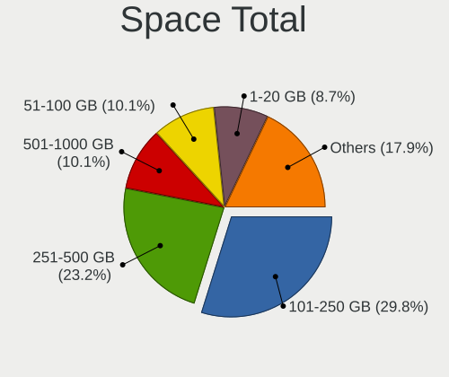

| Size in GB     | Computers | Percent |
|----------------|-----------|---------|
| 101-250        | 617       | 29.82%  |
| 251-500        | 481       | 23.25%  |
| 501-1000       | 210       | 10.15%  |
| 51-100         | 209       | 10.1%   |
| 1-20           | 181       | 8.75%   |
| 21-50          | 164       | 7.93%   |
| 1001-2000      | 93        | 4.49%   |
| More than 3000 | 64        | 3.09%   |
| 2001-3000      | 38        | 1.84%   |
| Unknown        | 12        | 0.58%   |

Space Used
----------

Amount of used disk space

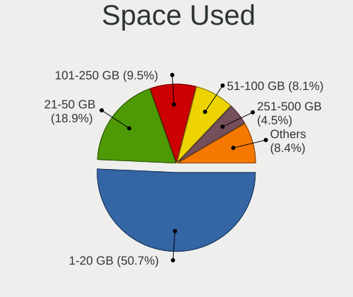

| Used GB        | Computers | Percent |
|----------------|-----------|---------|
| 1-20           | 1081      | 50.7%   |
| 21-50          | 402       | 18.86%  |
| 101-250        | 202       | 9.47%   |
| 51-100         | 172       | 8.07%   |
| 251-500        | 95        | 4.46%   |
| 501-1000       | 75        | 3.52%   |
| 1001-2000      | 44        | 2.06%   |
| More than 3000 | 35        | 1.64%   |
| 2001-3000      | 14        | 0.66%   |
| Unknown        | 12        | 0.56%   |

Malfunc. Drives
---------------

Drive models with a malfunction

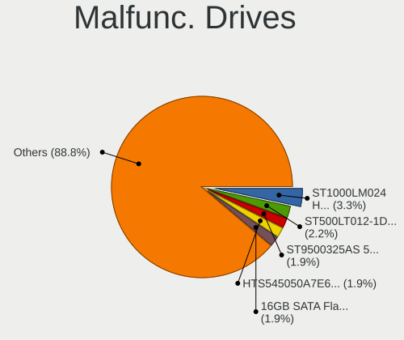

| Model                              | Computers | Drives | Percent |
|------------------------------------|-----------|--------|---------|
| Seagate ST1000LM024 HN-M101MBB 1TB | 9         | 10     | 3.35%   |
| Seagate ST500LT012-1DG142 500GB    | 6         | 6      | 2.23%   |
| Seagate ST9500325AS 500GB          | 5         | 5      | 1.86%   |
| HGST HTS545050A7E680 500GB         | 5         | 5      | 1.86%   |
| Apacer 16GB SATA Flash Drive SSD   | 5         | 5      | 1.86%   |
| Hitachi HTS545032B9A300 320GB      | 4         | 4      | 1.49%   |
| HGST HTS545050A7E380 500GB         | 4         | 4      | 1.49%   |
| Seagate ST9320325AS 320GB          | 3         | 3      | 1.12%   |
| Seagate ST500DM002-1BD142 500GB    | 3         | 4      | 1.12%   |
| Seagate ST1000DM003-9YN162 1TB     | 3         | 3      | 1.12%   |
| WDC WDS240G2G0A-00JH30 240GB SSD   | 2         | 2      | 0.74%   |
| WDC WD5000AAKX-00ERMA0 500GB       | 2         | 2      | 0.74%   |
| WDC WD40EFRX-68WT0N0 4TB           | 2         | 3      | 0.74%   |
| WDC WD2500AAJS-75M0A0 249GB        | 2         | 2      | 0.74%   |
| WDC WD20EFRX-68EUZN0 2TB           | 2         | 2      | 0.74%   |
| WDC WD10SPZX-24Z10T0 1TB           | 2         | 2      | 0.74%   |
| Toshiba MQ01ABD050 500GB           | 2         | 2      | 0.74%   |
| Toshiba DT01ACA050 500GB           | 2         | 2      | 0.74%   |
| Seagate ST9500420AS 500GB          | 2         | 2      | 0.74%   |
| Seagate ST9250315AS 250GB          | 2         | 2      | 0.74%   |
| Seagate ST500LM021-1KJ152 500GB    | 2         | 2      | 0.74%   |
| Seagate ST1000LM035-1RK172 1TB     | 2         | 2      | 0.74%   |
| SanDisk SSD PLUS 240GB             | 2         | 2      | 0.74%   |
| Samsung Electronics HD502IJ 500GB  | 2         | 2      | 0.74%   |
| Kingston SA400S37120G 120GB SSD    | 2         | 2      | 0.74%   |
| Hitachi HTS545050A7E380 500GB      | 2         | 2      | 0.74%   |
| Hitachi HTS545016B9A300 160GB      | 2         | 2      | 0.74%   |
| Hitachi HTS542512K9SA00 120GB      | 2         | 2      | 0.74%   |
| China G521N256GB                   | 2         | 2      | 0.74%   |
| XrayDisk SSD 512GB                 | 1         | 1      | 0.37%   |
| WDC WDS480G2G0A-00JH30 480GB SSD   | 1         | 1      | 0.37%   |
| WDC WD800BEVS-60RST0 80GB          | 1         | 1      | 0.37%   |
| WDC WD60EFRX-68L0BN1 6TB           | 1         | 2      | 0.37%   |
| WDC WD5000LUCT-62C26Y0 500GB       | 1         | 1      | 0.37%   |
| WDC WD5000LPCX-60VHAT1 500GB       | 1         | 1      | 0.37%   |
| WDC WD5000BPVT-75HXZT1 500GB       | 1         | 1      | 0.37%   |
| WDC WD5000AAKX-60U6AA0 500GB       | 1         | 1      | 0.37%   |
| WDC WD5000AAKX-003CA0 500GB        | 1         | 1      | 0.37%   |
| WDC WD5000AAKX-001CA0 500GB        | 1         | 1      | 0.37%   |
| WDC WD400EB-00CPF0 40GB            | 1         | 1      | 0.37%   |

Malfunc. Drive Vendor
---------------------

Vendors of faulty drives

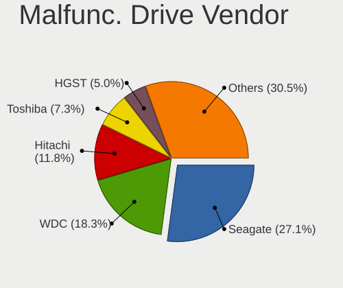

| Vendor              | Computers | Drives | Percent |
|---------------------|-----------|--------|---------|
| Seagate             | 71        | 84     | 27.1%   |
| WDC                 | 48        | 55     | 18.32%  |
| Hitachi             | 31        | 33     | 11.83%  |
| Toshiba             | 19        | 20     | 7.25%   |
| HGST                | 13        | 13     | 4.96%   |
| Samsung Electronics | 8         | 16     | 3.05%   |
| SanDisk             | 7         | 7      | 2.67%   |
| Maxtor              | 6         | 6      | 2.29%   |
| Kingston            | 6         | 6      | 2.29%   |
| Intel               | 6         | 7      | 2.29%   |
| Crucial             | 6         | 7      | 2.29%   |
| Apacer              | 5         | 5      | 1.91%   |
| SK hynix            | 4         | 4      | 1.53%   |
| Fujitsu             | 4         | 4      | 1.53%   |
| China               | 4         | 4      | 1.53%   |
| OCZ                 | 3         | 4      | 1.15%   |
| LITEON              | 2         | 2      | 0.76%   |
| KingSpec            | 2         | 4      | 0.76%   |
| ExcelStor           | 2         | 2      | 0.76%   |
| Apple               | 2         | 2      | 0.76%   |
| A-DATA Technology   | 2         | 2      | 0.76%   |
| XrayDisk            | 1         | 1      | 0.38%   |
| Transcend           | 1         | 1      | 0.38%   |
| TCSUNBOW            | 1         | 1      | 0.38%   |
| Silicon Motion      | 1         | 1      | 0.38%   |
| Plextor             | 1         | 1      | 0.38%   |
| ORTIAL              | 1         | 1      | 0.38%   |
| NGFF                | 1         | 1      | 0.38%   |
| Mushkin             | 1         | 1      | 0.38%   |
| Micron Technology   | 1         | 1      | 0.38%   |
| LDLC                | 1         | 1      | 0.38%   |
| Kingmax             | 1         | 1      | 0.38%   |

Malfunc. HDD Vendor
-------------------

Vendors of faulty HDD drives

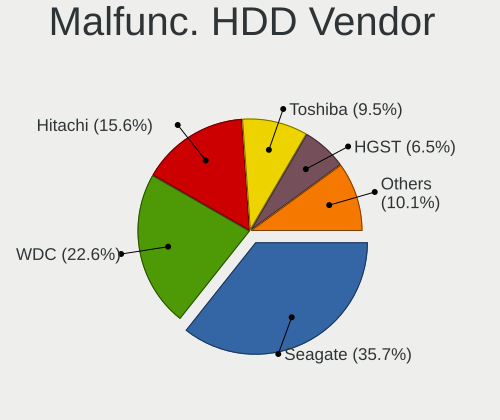

| Vendor              | Computers | Drives | Percent |
|---------------------|-----------|--------|---------|
| Seagate             | 71        | 84     | 35.68%  |
| WDC                 | 45        | 52     | 22.61%  |
| Hitachi             | 31        | 33     | 15.58%  |
| Toshiba             | 19        | 20     | 9.55%   |
| HGST                | 13        | 13     | 6.53%   |
| Samsung Electronics | 7         | 15     | 3.52%   |
| Maxtor              | 6         | 6      | 3.02%   |
| Fujitsu             | 4         | 4      | 2.01%   |
| ExcelStor           | 2         | 2      | 1.01%   |
| Apple               | 1         | 1      | 0.5%    |

Malfunc. Drive Kind
-------------------

Kinds of faulty drives

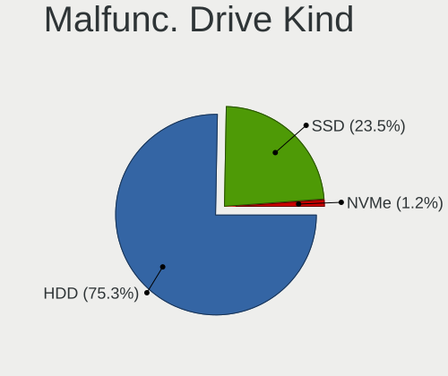

| Kind | Computers | Drives | Percent |
|------|-----------|--------|---------|
| HDD  | 192       | 230    | 75.29%  |
| SSD  | 60        | 65     | 23.53%  |
| NVMe | 3         | 3      | 1.18%   |

Failed Drives
-------------

Failed drive models

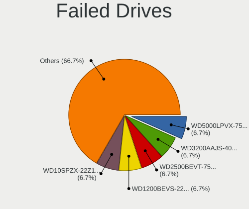

| Model                             | Computers | Drives | Percent |
|-----------------------------------|-----------|--------|---------|
| WDC WD5000LPVX-75V0TT0 500GB      | 1         | 1      | 6.67%   |
| WDC WD3200AAJS-40RYA0 320GB       | 1         | 1      | 6.67%   |
| WDC WD2500BEVT-75A23T0 250GB      | 1         | 2      | 6.67%   |
| WDC WD1200BEVS-22UST0 120GB       | 1         | 1      | 6.67%   |
| WDC WD10SPZX-22Z10T0 1TB          | 1         | 1      | 6.67%   |
| Toshiba HDWD110 1TB               | 1         | 1      | 6.67%   |
| Seagate ST9500325AS 500GB         | 1         | 1      | 6.67%   |
| Seagate ST9320325AS 320GB         | 1         | 1      | 6.67%   |
| Seagate ST3500418AS 500GB         | 1         | 1      | 6.67%   |
| Samsung Electronics SSD 980 1TB   | 1         | 1      | 6.67%   |
| Samsung Electronics SSD 850 250GB | 1         | 1      | 6.67%   |
| Samsung Electronics HM320JI 320GB | 1         | 1      | 6.67%   |
| Samsung Electronics HD080HJ/ 80GB | 1         | 1      | 6.67%   |
| Intel SSDSA1M160G2HP 160GB        | 1         | 1      | 6.67%   |
| HGST HTS725025A7 250GB            | 1         | 1      | 6.67%   |

Failed Drive Vendor
-------------------

Failed drive vendors

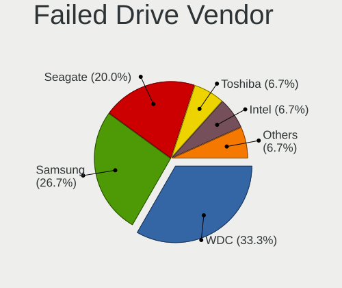

| Vendor              | Computers | Drives | Percent |
|---------------------|-----------|--------|---------|
| WDC                 | 5         | 6      | 33.33%  |
| Samsung Electronics | 4         | 4      | 26.67%  |
| Seagate             | 3         | 3      | 20%     |
| Toshiba             | 1         | 1      | 6.67%   |
| Intel               | 1         | 1      | 6.67%   |
| HGST                | 1         | 1      | 6.67%   |

Drive Status
------------

Number of failed and malfunc. drives

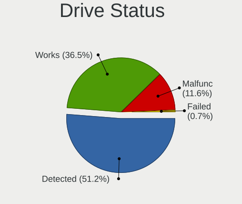

| Status   | Computers | Drives | Percent |
|----------|-----------|--------|---------|
| Detected | 1110      | 1787   | 51.25%  |
| Works    | 790       | 1173   | 36.47%  |
| Malfunc  | 251       | 298    | 11.59%  |
| Failed   | 15        | 16     | 0.69%   |

Storage controller
------------------

Storage Vendor
--------------

Storage controller vendors

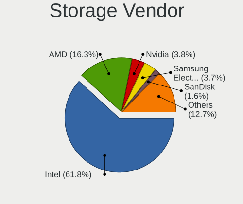

| Vendor                                  | Computers | Percent |
|-----------------------------------------|-----------|---------|
| Intel                                   | 1325      | 61.8%   |
| AMD                                     | 350       | 16.32%  |
| Nvidia                                  | 82        | 3.82%   |
| Samsung Electronics                     | 80        | 3.73%   |
| SanDisk                                 | 34        | 1.59%   |
| JMicron Technology                      | 25        | 1.17%   |
| Micron Technology                       | 22        | 1.03%   |
| ASMedia Technology                      | 21        | 0.98%   |
| Kingston Technology Company             | 20        | 0.93%   |
| VIA Technologies                        | 18        | 0.84%   |
| SK hynix                                | 18        | 0.84%   |
| Silicon Integrated Systems [SiS]        | 16        | 0.75%   |
| Silicon Motion                          | 15        | 0.7%    |
| Micron/Crucial Technology               | 15        | 0.7%    |
| Marvell Technology Group                | 13        | 0.61%   |
| Phison Electronics                      | 12        | 0.56%   |
| KIOXIA                                  | 12        | 0.56%   |
| Toshiba America Info Systems            | 9         | 0.42%   |
| LSI Logic / Symbios Logic               | 9         | 0.42%   |
| Silicon Image                           | 8         | 0.37%   |
| Broadcom / LSI                          | 6         | 0.28%   |
| Zhaoxin                                 | 4         | 0.19%   |
| Union Memory (Shenzhen)                 | 4         | 0.19%   |
| ADATA Technology                        | 4         | 0.19%   |
| Solid State Storage Technology          | 3         | 0.14%   |
| Shenzhen Longsys Electronics            | 3         | 0.14%   |
| Yangtze Memory Technologies             | 2         | 0.09%   |
| ULi Electronics                         | 2         | 0.09%   |
| Shenzhen Unionmemory Information System | 2         | 0.09%   |
| Realtek Semiconductor                   | 2         | 0.09%   |
| Seagate Technology                      | 1         | 0.05%   |
| MAXIO Technology (Hangzhou)             | 1         | 0.05%   |
| INNOGRIT                                | 1         | 0.05%   |
| Hosin Global Electronics                | 1         | 0.05%   |
| Hewlett-Packard                         | 1         | 0.05%   |
| Broadcom                                | 1         | 0.05%   |
| Apple                                   | 1         | 0.05%   |
| Adaptec                                 | 1         | 0.05%   |

Storage Model
-------------

Storage controller models

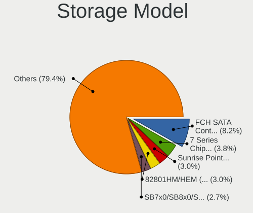

| Model                                                                                   | Computers | Percent |
|-----------------------------------------------------------------------------------------|-----------|---------|
| AMD FCH SATA Controller [AHCI mode]                                                     | 213       | 8.2%    |
| Intel 7 Series Chipset Family 6-port SATA Controller [AHCI mode]                        | 98        | 3.77%   |
| Intel Sunrise Point-LP SATA Controller [AHCI mode]                                      | 79        | 3.04%   |
| Intel 82801HM/HEM (ICH8M/ICH8M-E) IDE Controller                                        | 77        | 2.96%   |
| AMD SB7x0/SB8x0/SB9x0 SATA Controller [AHCI mode]                                       | 69        | 2.66%   |
| Intel 6 Series/C200 Series Chipset Family 6 port Mobile SATA AHCI Controller            | 68        | 2.62%   |
| Intel 82801HM/HEM (ICH8M/ICH8M-E) SATA Controller [AHCI mode]                           | 66        | 2.54%   |
| Intel 82801IBM/IEM (ICH9M/ICH9M-E) 4 port SATA Controller [AHCI mode]                   | 63        | 2.42%   |
| Intel 8 Series/C220 Series Chipset Family 6-port SATA Controller 1 [AHCI mode]          | 62        | 2.39%   |
| Intel 82801G (ICH7 Family) IDE Controller                                               | 61        | 2.35%   |
| Intel NM10/ICH7 Family SATA Controller [IDE mode]                                       | 59        | 2.27%   |
| Intel Celeron/Pentium Silver Processor SATA Controller                                  | 54        | 2.08%   |
| Intel 8 Series SATA Controller 1 [AHCI mode]                                            | 51        | 1.96%   |
| Intel Atom Processor E3800 Series SATA AHCI Controller                                  | 46        | 1.77%   |
| Intel NM10/ICH7 Family SATA Controller [AHCI mode]                                      | 43        | 1.66%   |
| Intel 82801 Mobile SATA Controller [RAID mode]                                          | 42        | 1.62%   |
| Intel 5 Series/3400 Series Chipset 4 port SATA AHCI Controller                          | 40        | 1.54%   |
| Samsung NVMe SSD Controller SM981/PM981/PM983                                           | 37        | 1.42%   |
| Intel 5 Series/3400 Series Chipset 6 port SATA AHCI Controller                          | 34        | 1.31%   |
| Intel 6 Series/C200 Series Chipset Family 6 port Desktop SATA AHCI Controller           | 33        | 1.27%   |
| Intel Celeron N3350/Pentium N4200/Atom E3900 Series SATA AHCI Controller                | 31        | 1.19%   |
| AMD SB7x0/SB8x0/SB9x0 IDE Controller                                                    | 29        | 1.12%   |
| Nvidia MCP61 SATA Controller                                                            | 26        | 1%      |
| Intel Atom/Celeron/Pentium Processor x5-E8000/J3xxx/N3xxx Series SATA Controller        | 26        | 1%      |
| Intel 82801GBM/GHM (ICH7-M Family) SATA Controller [IDE mode]                           | 26        | 1%      |
| Intel Wildcat Point-LP SATA Controller [AHCI Mode]                                      | 24        | 0.92%   |
| Intel 7 Series/C210 Series Chipset Family 6-port SATA Controller [AHCI mode]            | 24        | 0.92%   |
| Nvidia MCP61 IDE                                                                        | 21        | 0.81%   |
| Intel SATA Controller [RAID mode]                                                       | 20        | 0.77%   |
| AMD SB7x0/SB8x0/SB9x0 SATA Controller [IDE mode]                                        | 20        | 0.77%   |
| Samsung NVMe SSD Controller 980 (DRAM-less)                                             | 19        | 0.73%   |
| Intel Volume Management Device NVMe RAID Controller                                     | 19        | 0.73%   |
| ASMedia ASM1061/ASM1062 Serial ATA Controller                                           | 19        | 0.73%   |
| Intel Q170/Q150/B150/H170/H110/Z170/CM236 Chipset SATA Controller [AHCI Mode]           | 18        | 0.69%   |
| AMD 400 Series Chipset SATA Controller                                                  | 17        | 0.65%   |
| VIA VT82C586A/B/VT82C686/A/B/VT823x/A/C PIPC Bus Master IDE                             | 16        | 0.62%   |
| Intel 82801HM/HEM (ICH8M/ICH8M-E) SATA Controller [IDE mode]                            | 16        | 0.62%   |
| Intel 6 Series/C200 Series Chipset Family Desktop SATA Controller (IDE mode, ports 4-5) | 16        | 0.62%   |
| Intel 6 Series/C200 Series Chipset Family Desktop SATA Controller (IDE mode, ports 0-3) | 16        | 0.62%   |
| Silicon Integrated Systems [SiS] 5513 IDE Controller                                    | 15        | 0.58%   |

Storage Kind
------------

Kind of storage controller (IDE, SATA, NVMe, SAS, ...)

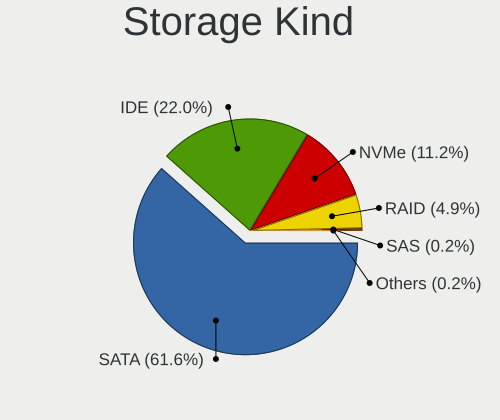

| Kind | Computers | Percent |
|------|-----------|---------|
| SATA | 1391      | 61.58%  |
| IDE  | 497       | 22%     |
| NVMe | 252       | 11.16%  |
| RAID | 110       | 4.87%   |
| SAS  | 5         | 0.22%   |
| SCSI | 4         | 0.18%   |

Processor
---------

CPU Vendor
----------

Processor vendors

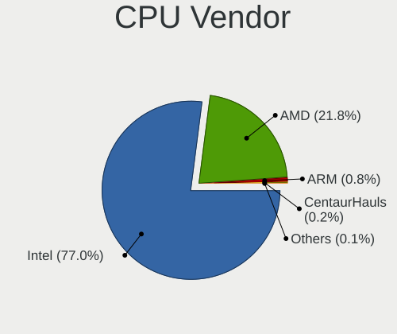

| Vendor       | Computers | Percent |
|--------------|-----------|---------|
| Intel        | 1560      | 77.04%  |
| AMD          | 442       | 21.83%  |
| ARM          | 16        | 0.79%   |
| CentaurHauls | 4         | 0.2%    |
| PowerMac7,2  | 1         | 0.05%   |
| PowerBook4,1 | 1         | 0.05%   |
| Unknown      | 1         | 0.05%   |

CPU Model
---------

Processor models

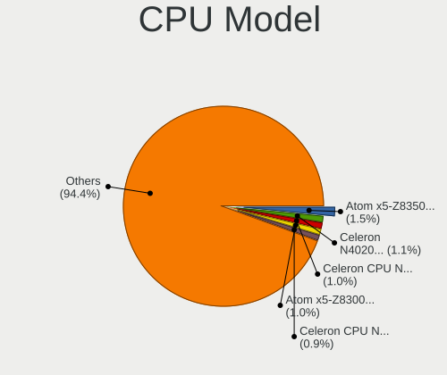

| Model                                       | Computers | Percent |
|---------------------------------------------|-----------|---------|
| Intel Atom x5-Z8350 CPU @ 1.44GHz           | 31        | 1.53%   |
| Intel Celeron N4020 CPU @ 1.10GHz           | 22        | 1.08%   |
| Intel Celeron CPU N3350 @ 1.10GHz           | 21        | 1.04%   |
| Intel Atom x5-Z8300 CPU @ 1.44GHz           | 20        | 0.99%   |
| Intel Celeron CPU N2840 @ 2.16GHz           | 19        | 0.94%   |
| Intel Core i3-6006U CPU @ 2.00GHz           | 15        | 0.74%   |
| Intel Celeron N4000 CPU @ 1.10GHz           | 15        | 0.74%   |
| Intel Celeron CPU N3060 @ 1.60GHz           | 15        | 0.74%   |
| Intel Atom CPU N270 @ 1.60GHz               | 15        | 0.74%   |
| Intel Core i5-8265U CPU @ 1.60GHz           | 13        | 0.64%   |
| Intel Atom CPU Z3735F @ 1.33GHz             | 13        | 0.64%   |
| ARM Processor                               | 13        | 0.64%   |
| AMD E-450 APU with Radeon HD Graphics       | 13        | 0.64%   |
| Intel Core i5-3210M CPU @ 2.50GHz           | 12        | 0.59%   |
| Intel Core i3 CPU M 370 @ 2.40GHz           | 12        | 0.59%   |
| Intel Core 2 Duo CPU T7250 @ 2.00GHz        | 12        | 0.59%   |
| Intel Atom CPU N450 @ 1.66GHz               | 12        | 0.59%   |
| Intel Core i5-8250U CPU @ 1.60GHz           | 11        | 0.54%   |
| Intel Core i5-2520M CPU @ 2.50GHz           | 11        | 0.54%   |
| Intel Core i5-2410M CPU @ 2.30GHz           | 11        | 0.54%   |
| Intel Core 2 Duo CPU P8600 @ 2.40GHz        | 11        | 0.54%   |
| Intel Core 2 Duo CPU E8400 @ 3.00GHz        | 11        | 0.54%   |
| Intel Atom CPU N455 @ 1.66GHz               | 11        | 0.54%   |
| Intel 11th Gen Core i5-1135G7 @ 2.40GHz     | 11        | 0.54%   |
| Intel Core i5-7200U CPU @ 2.50GHz           | 10        | 0.49%   |
| Intel Core i5-6300U CPU @ 2.40GHz           | 10        | 0.49%   |
| Intel Core i5-4200U CPU @ 1.60GHz           | 10        | 0.49%   |
| Intel Core i5-3470 CPU @ 3.20GHz            | 10        | 0.49%   |
| Intel Celeron CPU N3050 @ 1.60GHz           | 10        | 0.49%   |
| Intel Pentium Dual-Core CPU T4200 @ 2.00GHz | 9         | 0.44%   |
| AMD E-300 APU with Radeon HD Graphics       | 9         | 0.44%   |
| Intel Pentium CPU N3710 @ 1.60GHz           | 8         | 0.39%   |
| Intel Core i7-3770 CPU @ 3.40GHz            | 8         | 0.39%   |
| Intel Core i7-1065G7 CPU @ 1.30GHz          | 8         | 0.39%   |
| Intel Core i5-6200U CPU @ 2.30GHz           | 8         | 0.39%   |
| Intel Core i5-4210U CPU @ 1.70GHz           | 8         | 0.39%   |
| Intel Core i5-3320M CPU @ 2.60GHz           | 8         | 0.39%   |
| Intel Core i5 CPU M 520 @ 2.40GHz           | 8         | 0.39%   |
| Intel Core i3-3217U CPU @ 1.80GHz           | 8         | 0.39%   |
| Intel Core 2 Duo CPU T7300 @ 2.00GHz        | 8         | 0.39%   |

CPU Model Family
----------------

Processor model prefix

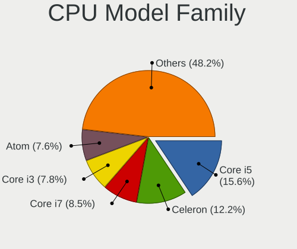

| Model                   | Computers | Percent |
|-------------------------|-----------|---------|
| Intel Core i5           | 317       | 15.65%  |
| Intel Celeron           | 248       | 12.24%  |
| Intel Core i7           | 172       | 8.49%   |
| Intel Core i3           | 159       | 7.85%   |
| Intel Atom              | 154       | 7.6%    |
| Intel Core 2 Duo        | 138       | 6.81%   |
| Other                   | 86        | 4.24%   |
| Intel Pentium           | 61        | 3.01%   |
| Intel Pentium Dual-Core | 44        | 2.17%   |
| AMD Ryzen 5             | 44        | 2.17%   |
| Intel Pentium Dual      | 43        | 2.12%   |
| AMD Ryzen 7             | 40        | 1.97%   |
| Intel Xeon              | 36        | 1.78%   |
| AMD E                   | 30        | 1.48%   |
| Intel Core 2            | 28        | 1.38%   |
| AMD Athlon 64 X2        | 28        | 1.38%   |
| AMD A6                  | 28        | 1.38%   |
| AMD E1                  | 25        | 1.23%   |
| AMD A4                  | 24        | 1.18%   |
| Intel Pentium 4         | 19        | 0.94%   |
| AMD A8                  | 19        | 0.94%   |
| AMD A10                 | 19        | 0.94%   |
| Intel Genuine           | 17        | 0.84%   |
| AMD Athlon II X2        | 16        | 0.79%   |
| AMD FX                  | 15        | 0.74%   |
| Intel Core 2 Quad       | 14        | 0.69%   |
| AMD E2                  | 13        | 0.64%   |
| AMD Athlon              | 11        | 0.54%   |
| Intel Pentium Silver    | 9         | 0.44%   |
| AMD Ryzen 3             | 9         | 0.44%   |
| AMD Athlon 64           | 9         | 0.44%   |
| Intel Pentium D         | 8         | 0.39%   |
| Intel Celeron Dual-Core | 8         | 0.39%   |
| AMD Ryzen 9             | 7         | 0.35%   |
| AMD Phenom II X4        | 7         | 0.35%   |
| AMD GX                  | 7         | 0.35%   |
| Intel Pentium M         | 6         | 0.3%    |
| Intel Celeron M         | 6         | 0.3%    |
| AMD Turion 64 X2 Mobile | 6         | 0.3%    |
| AMD Sempron             | 6         | 0.3%    |

CPU Cores
---------

Number of processor cores

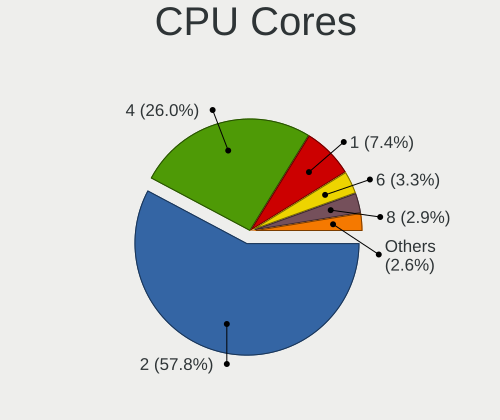

| Number  | Computers | Percent |
|---------|-----------|---------|
| 2       | 1170      | 57.78%  |
| 4       | 527       | 26.02%  |
| 1       | 150       | 7.41%   |
| 6       | 67        | 3.31%   |
| 8       | 59        | 2.91%   |
| 10      | 12        | 0.59%   |
| 12      | 9         | 0.44%   |
| 3       | 9         | 0.44%   |
| 16      | 7         | 0.35%   |
| Unknown | 6         | 0.3%    |
| 14      | 4         | 0.2%    |
| 64      | 1         | 0.05%   |
| 40      | 1         | 0.05%   |
| 32      | 1         | 0.05%   |
| 20      | 1         | 0.05%   |
| 5       | 1         | 0.05%   |

CPU Sockets
-----------

Number of sockets

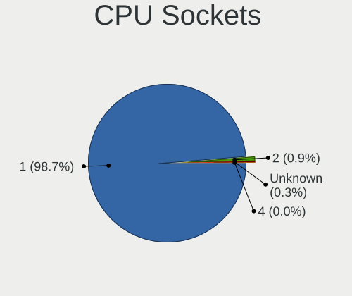

| Number  | Computers | Percent |
|---------|-----------|---------|
| 1       | 1999      | 98.72%  |
| 2       | 19        | 0.94%   |
| Unknown | 6         | 0.3%    |
| 4       | 1         | 0.05%   |

CPU Threads
-----------

Threads per core (Hyper-Threading)

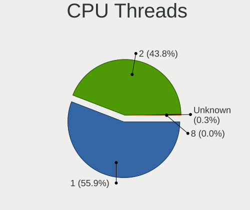

| Number  | Computers | Percent |
|---------|-----------|---------|
| 1       | 1131      | 55.85%  |
| 2       | 887       | 43.8%   |
| Unknown | 6         | 0.3%    |
| 8       | 1         | 0.05%   |

CPU Op-Modes
------------

CPU Operation Modes (32-bit, 64-bit)

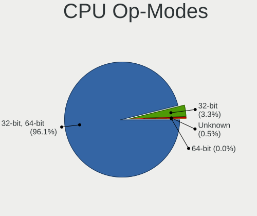

| Op mode        | Computers | Percent |
|----------------|-----------|---------|
| 32-bit, 64-bit | 1946      | 96.1%   |
| 32-bit         | 67        | 3.31%   |
| Unknown        | 11        | 0.54%   |
| 64-bit         | 1         | 0.05%   |

CPU Microcode
-------------

Microcode number

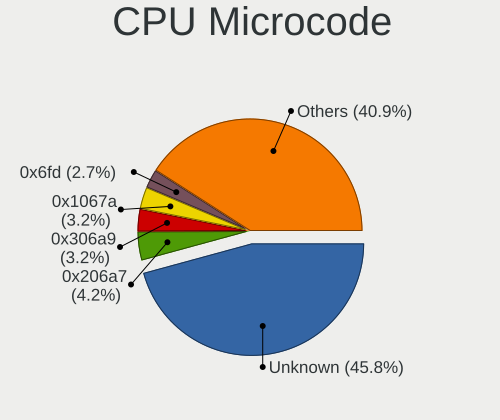

| Number     | Computers | Percent |
|------------|-----------|---------|
| Unknown    | 945       | 45.76%  |
| 0x206a7    | 86        | 4.16%   |
| 0x306a9    | 67        | 3.24%   |
| 0x1067a    | 66        | 3.2%    |
| 0x6fd      | 56        | 2.71%   |
| 0x406c4    | 36        | 1.74%   |
| 0x30678    | 33        | 1.6%    |
| 0x20655    | 33        | 1.6%    |
| 0x306c3    | 32        | 1.55%   |
| 0x05000119 | 32        | 1.55%   |
| 0x40651    | 29        | 1.4%    |
| 0x106ca    | 29        | 1.4%    |
| 0x406c3    | 24        | 1.16%   |
| 0x406e3    | 22        | 1.07%   |
| 0x10676    | 19        | 0.92%   |
| 0x0700010f | 19        | 0.92%   |
| 0x706a8    | 18        | 0.87%   |
| 0x706a1    | 18        | 0.87%   |
| 0x6fb      | 18        | 0.87%   |
| 0x106c2    | 18        | 0.87%   |
| 0x806ec    | 17        | 0.82%   |
| 0x6f6      | 14        | 0.68%   |
| 0x806ea    | 13        | 0.63%   |
| 0x806e9    | 13        | 0.63%   |
| 0x20652    | 13        | 0.63%   |
| 0x06006705 | 13        | 0.63%   |
| 0x06001119 | 13        | 0.63%   |
| 0x506c9    | 12        | 0.58%   |
| 0x010000c8 | 12        | 0.58%   |
| 0x906ea    | 11        | 0.53%   |
| 0x6e8      | 11        | 0.53%   |
| 0x6d8      | 10        | 0.48%   |
| 0x306d4    | 10        | 0.48%   |
| 0x05000029 | 10        | 0.48%   |
| 0x806c1    | 9         | 0.44%   |
| 0x10661    | 9         | 0.44%   |
| 0x06000852 | 9         | 0.44%   |
| 0x706e5    | 8         | 0.39%   |
| 0x0a50000c | 8         | 0.39%   |
| 0x06006704 | 8         | 0.39%   |

CPU Microarch
-------------

Microarchitecture

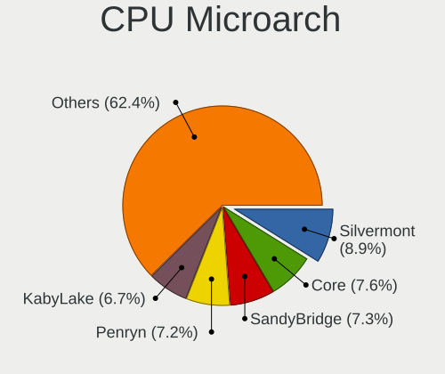

| Name              | Computers | Percent |
|-------------------|-----------|---------|
| Silvermont        | 180       | 8.88%   |
| Core              | 154       | 7.6%    |
| SandyBridge       | 148       | 7.31%   |
| Penryn            | 145       | 7.16%   |
| KabyLake          | 135       | 6.66%   |
| Haswell           | 129       | 6.37%   |
| IvyBridge         | 127       | 6.27%   |
| Westmere          | 92        | 4.54%   |
| Skylake           | 72        | 3.55%   |
| Bonnell           | 71        | 3.5%    |
| Goldmont plus     | 65        | 3.21%   |
| K8 Hammer         | 58        | 2.86%   |
| Bobcat            | 57        | 2.81%   |
| Unknown           | 51        | 2.52%   |
| K10               | 49        | 2.42%   |
| Excavator         | 45        | 2.22%   |
| Goldmont          | 37        | 1.83%   |
| Piledriver        | 34        | 1.68%   |
| NetBurst          | 34        | 1.68%   |
| Zen+              | 29        | 1.43%   |
| P6                | 29        | 1.43%   |
| Jaguar            | 29        | 1.43%   |
| Zen 2             | 28        | 1.38%   |
| Zen 3             | 27        | 1.33%   |
| Broadwell         | 27        | 1.33%   |
| Puma              | 22        | 1.09%   |
| Alderlake Hybrid  | 20        | 0.99%   |
| TigerLake         | 19        | 0.94%   |
| Nehalem           | 18        | 0.89%   |
| IceLake           | 17        | 0.84%   |
| Zen               | 15        | 0.74%   |
| CometLake         | 13        | 0.64%   |
| Tremont           | 12        | 0.59%   |
| Steamroller       | 9         | 0.44%   |
| K8 & K10 hybrid   | 8         | 0.39%   |
| K10 Llano         | 8         | 0.39%   |
| Gracemont         | 8         | 0.39%   |
| Bulldozer         | 3         | 0.15%   |
| Meteorlake Hybrid | 1         | 0.05%   |
| K6                | 1         | 0.05%   |

Graphics
--------

GPU Vendor
----------

Vendors of graphics cards

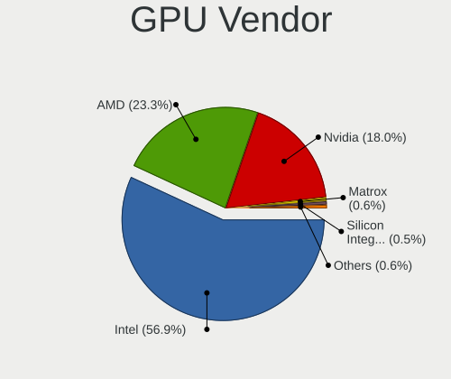

| Vendor                           | Computers | Percent |
|----------------------------------|-----------|---------|
| Intel                            | 1249      | 56.9%   |
| AMD                              | 512       | 23.33%  |
| Nvidia                           | 395       | 18%     |
| Matrox Electronics Systems       | 14        | 0.64%   |
| Silicon Integrated Systems [SiS] | 12        | 0.55%   |
| VIA Technologies                 | 7         | 0.32%   |
| Zhaoxin                          | 4         | 0.18%   |
| S3 Graphics                      | 1         | 0.05%   |
| ASPEED Technology                | 1         | 0.05%   |

GPU Model
---------

Graphics card models

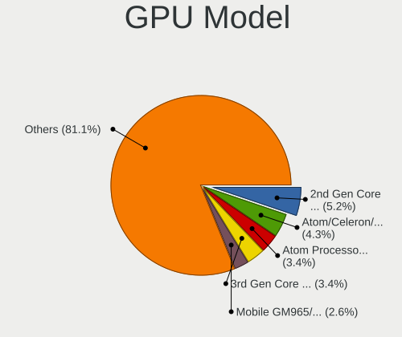

| Model                                                                                    | Computers | Percent |
|------------------------------------------------------------------------------------------|-----------|---------|
| Intel 2nd Generation Core Processor Family Integrated Graphics Controller                | 122       | 5.2%    |
| Intel Atom/Celeron/Pentium Processor x5-E8000/J3xxx/N3xxx Integrated Graphics Controller | 101       | 4.31%   |
| Intel Atom Processor Z36xxx/Z37xxx Series Graphics & Display                             | 79        | 3.37%   |
| Intel 3rd Gen Core processor Graphics Controller                                         | 79        | 3.37%   |
| Intel Mobile GM965/GL960 Integrated Graphics Controller (secondary)                      | 61        | 2.6%    |
| Intel Mobile GM965/GL960 Integrated Graphics Controller (primary)                        | 61        | 2.6%    |
| Intel Mobile 4 Series Chipset Integrated Graphics Controller                             | 59        | 2.52%   |
| Intel GeminiLake [UHD Graphics 600]                                                      | 58        | 2.47%   |
| Intel Core Processor Integrated Graphics Controller                                      | 58        | 2.47%   |
| Intel Haswell-ULT Integrated Graphics Controller                                         | 50        | 2.13%   |
| Intel Skylake-U GT2 [HD Graphics 520]                                                    | 38        | 1.62%   |
| Intel Atom Processor D4xx/D5xx/N4xx/N5xx Integrated Graphics Controller                  | 36        | 1.54%   |
| Intel Mobile 945GM/GMS/GME, 943/940GML Express Integrated Graphics Controller            | 35        | 1.49%   |
| Intel Apollo Lake GT1 [HD Graphics 500]                                                  | 34        | 1.45%   |
| AMD Stoney [Radeon R2/R3/R4/R5 Graphics]                                                 | 33        | 1.41%   |
| Intel Kaby Lake-U GT2 [HD Graphics 620]                                                  | 28        | 1.19%   |
| Intel Xeon E3-1200 v3/4th Gen Core Processor Integrated Graphics Controller              | 24        | 1.02%   |
| Intel 4 Series Chipset Integrated Graphics Controller                                    | 23        | 0.98%   |
| Intel Mobile 945GM/GMS, 943/940GML Express Integrated Graphics Controller                | 21        | 0.9%    |
| AMD Picasso/Raven 2 [Radeon Vega Series / Radeon Vega Mobile Series]                     | 21        | 0.9%    |
| Intel WhiskeyLake-U GT2 [UHD Graphics 620]                                               | 20        | 0.85%   |
| Intel Kaby Lake-R GT2 [UHD Graphics 620]                                                 | 20        | 0.85%   |
| Intel 4th Gen Core Processor Integrated Graphics Controller                              | 20        | 0.85%   |
| AMD Seymour [Radeon HD 6400M/7400M Series]                                               | 20        | 0.85%   |
| Intel Broadwell-U GT2 [HD Graphics 5500]                                                 | 19        | 0.81%   |
| Intel Xeon E3-1200 v2/3rd Gen Core processor Graphics Controller                         | 18        | 0.77%   |
| AMD Wrestler [Radeon HD 6310]                                                            | 17        | 0.73%   |
| Nvidia GT218 [GeForce 210]                                                               | 16        | 0.68%   |
| Intel CometLake-U GT2 [UHD Graphics]                                                     | 16        | 0.68%   |
| AMD Sun XT [Radeon HD 8670A/8670M/8690M / R5 M330 / M430 / Radeon 520 Mobile]            | 16        | 0.68%   |
| Intel Mobile 945GSE Express Integrated Graphics Controller                               | 15        | 0.64%   |
| Intel TigerLake-LP GT2 [Iris Xe Graphics]                                                | 14        | 0.6%    |
| AMD Wrestler [Radeon HD 6320]                                                            | 14        | 0.6%    |
| AMD Cezanne [Radeon Vega Series / Radeon Vega Mobile Series]                             | 14        | 0.6%    |
| Nvidia GK208B [GeForce GT 710]                                                           | 13        | 0.55%   |
| Intel JasperLake [UHD Graphics]                                                          | 13        | 0.55%   |
| Intel 82G33/G31 Express Integrated Graphics Controller                                   | 13        | 0.55%   |
| Intel Skylake-S GT2 [HD Graphics 530]                                                    | 12        | 0.51%   |
| AMD Wani [Radeon R5/R6/R7 Graphics]                                                      | 12        | 0.51%   |
| AMD Renoir [Radeon Vega Series / Radeon Vega Mobile Series]                              | 12        | 0.51%   |

GPU Combo
---------

Combinations of graphics cards

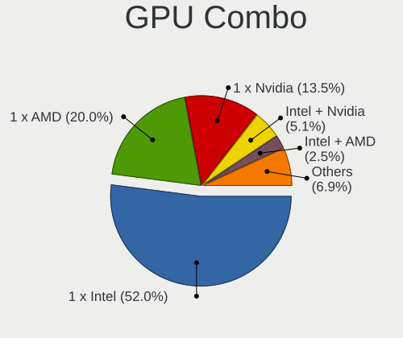

| Name               | Computers | Percent |
|--------------------|-----------|---------|
| 1 x Intel          | 1057      | 52.04%  |
| 1 x AMD            | 406       | 19.99%  |
| 1 x Nvidia         | 274       | 13.49%  |
| Intel + Nvidia     | 104       | 5.12%   |
| Intel + AMD        | 50        | 2.46%   |
| 2 x AMD            | 44        | 2.17%   |
| Other              | 26        | 1.28%   |
| 2 x Intel          | 16        | 0.79%   |
| 1 x Matrox         | 13        | 0.64%   |
| 1 x SiS            | 12        | 0.59%   |
| AMD + Nvidia       | 11        | 0.54%   |
| 1 x VIA            | 7         | 0.34%   |
| 1 x Zhaoxin        | 4         | 0.2%    |
| 2 x Nvidia         | 2         | 0.1%    |
| 1 x S3 Graphics    | 1         | 0.05%   |
| Nvidia + Matrox    | 1         | 0.05%   |
| Intel + 2 x Nvidia | 1         | 0.05%   |
| Intel + 2 x AMD    | 1         | 0.05%   |
| 1 x ASPEED         | 1         | 0.05%   |

GPU Driver
----------

Free vs proprietary

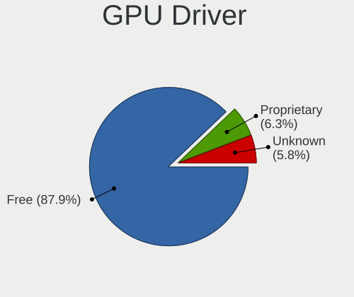

| Driver      | Computers | Percent |
|-------------|-----------|---------|
| Free        | 1787      | 87.9%   |
| Proprietary | 128       | 6.3%    |
| Unknown     | 118       | 5.8%    |

GPU Memory
----------

Total video memory

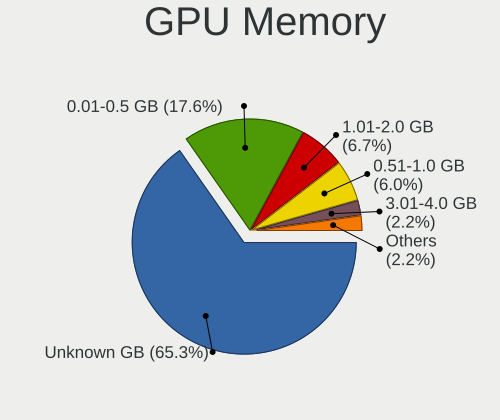

| Size in GB | Computers | Percent |
|------------|-----------|---------|
| Unknown    | 1339      | 65.29%  |
| 0.01-0.5   | 361       | 17.6%   |
| 1.01-2.0   | 137       | 6.68%   |
| 0.51-1.0   | 123       | 6%      |
| 3.01-4.0   | 45        | 2.19%   |
| 7.01-8.0   | 17        | 0.83%   |
| 5.01-6.0   | 11        | 0.54%   |
| 2.01-3.0   | 9         | 0.44%   |
| 8.01-16.0  | 8         | 0.39%   |
| 16.01-24.0 | 1         | 0.05%   |

Monitor
-------

Monitor Vendor
--------------

Monitor vendors

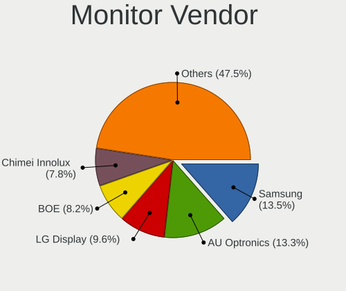

| Vendor                  | Computers | Percent |
|-------------------------|-----------|---------|
| Samsung Electronics     | 267       | 13.51%  |
| AU Optronics            | 263       | 13.3%   |
| LG Display              | 190       | 9.61%   |
| BOE                     | 162       | 8.19%   |
| Chimei Innolux          | 155       | 7.84%   |
| Dell                    | 97        | 4.91%   |
| Goldstar                | 62        | 3.14%   |
| Acer                    | 60        | 3.03%   |
| Hewlett-Packard         | 57        | 2.88%   |
| Apple                   | 49        | 2.48%   |
| Lenovo                  | 48        | 2.43%   |
| Chi Mei Optoelectronics | 48        | 2.43%   |
| Philips                 | 43        | 2.18%   |
| LG Philips              | 33        | 1.67%   |
| BenQ                    | 29        | 1.47%   |
| AOC                     | 29        | 1.47%   |
| Ancor Communications    | 28        | 1.42%   |
| HannStar                | 26        | 1.32%   |
| InfoVision              | 21        | 1.06%   |
| CPT                     | 19        | 0.96%   |
| Iiyama                  | 18        | 0.91%   |
| Sharp                   | 16        | 0.81%   |
| Unknown                 | 14        | 0.71%   |
| Sony                    | 12        | 0.61%   |
| PANDA                   | 12        | 0.61%   |
| NEC Computers           | 11        | 0.56%   |
| Vizio                   | 10        | 0.51%   |
| ASUSTek Computer        | 10        | 0.51%   |
| Toshiba                 | 9         | 0.46%   |
| ViewSonic               | 8         | 0.4%    |
| Sceptre Tech            | 7         | 0.35%   |
| LG Electronics          | 7         | 0.35%   |
| RTK                     | 6         | 0.3%    |
| Fujitsu Siemens         | 6         | 0.3%    |
| Eizo                    | 6         | 0.3%    |
| MSI                     | 5         | 0.25%   |
| InnoLux Display         | 5         | 0.25%   |
| HKC                     | 5         | 0.25%   |
| Belinea                 | 4         | 0.2%    |
| Unknown (ADA)           | 3         | 0.15%   |

Monitor Model
-------------

Monitor models

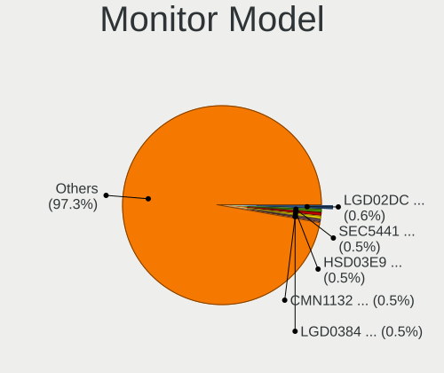

| Model                                                                    | Computers | Percent |
|--------------------------------------------------------------------------|-----------|---------|
| LG Display LCD Monitor LGD02DC 1366x768 344x194mm 15.5-inch              | 12        | 0.6%    |
| Samsung Electronics LCD Monitor SEC5441 1280x800 331x207mm 15.4-inch     | 11        | 0.55%   |
| HannStar LCD Monitor HSD03E9 1024x600 220x129mm 10.0-inch                | 11        | 0.55%   |
| Chimei Innolux LCD Monitor CMN1132 1366x768 256x144mm 11.6-inch          | 11        | 0.55%   |
| LG Display LCD Monitor LGD0384 1366x768 344x194mm 15.5-inch              | 10        | 0.5%    |
| Chimei Innolux LCD Monitor CMN15DB 1366x768 344x193mm 15.5-inch          | 10        | 0.5%    |
| AU Optronics LCD Monitor AUO38ED 1920x1080 344x193mm 15.5-inch           | 10        | 0.5%    |
| InfoVision LCD Monitor IVO03F4 1920x1080 309x173mm 13.9-inch             | 9         | 0.45%   |
| AU Optronics LCD Monitor AUO10EC 1366x768 344x193mm 15.5-inch            | 9         | 0.45%   |
| Unknown LCD Monitor FFFF 2288x1287 2550x2550mm 142.0-inch                | 7         | 0.35%   |
| Chimei Innolux LCD Monitor CMN15CA 1366x768 344x193mm 15.5-inch          | 7         | 0.35%   |
| Chi Mei Optoelectronics LCD Monitor CMO15A7 1366x768 344x193mm 15.5-inch | 7         | 0.35%   |
| BOE LCD Monitor BOE075A 1366x768 309x173mm 13.9-inch                     | 7         | 0.35%   |
| BOE LCD Monitor BOE06A5 1366x768 344x194mm 15.5-inch                     | 7         | 0.35%   |
| AU Optronics LCD Monitor AUO2E3C 1366x768 309x173mm 13.9-inch            | 7         | 0.35%   |
| AU Optronics LCD Monitor AUO235C 1366x768 256x144mm 11.6-inch            | 7         | 0.35%   |
| Lenovo LCD Monitor LEN4031 1280x800 304x190mm 14.1-inch                  | 6         | 0.3%    |
| BOE LCD Monitor BOE0696 1366x768 309x173mm 13.9-inch                     | 6         | 0.3%    |
| AU Optronics LCD Monitor AUO8174 1280x800 331x207mm 15.4-inch            | 6         | 0.3%    |
| AU Optronics LCD Monitor AUO26EC 1366x768 344x193mm 15.5-inch            | 6         | 0.3%    |
| AU Optronics LCD Monitor AUO22EC 1366x768 344x193mm 15.5-inch            | 6         | 0.3%    |
| AU Optronics LCD Monitor AUO139E 1600x900 382x214mm 17.2-inch            | 6         | 0.3%    |
| Samsung Electronics LCD Monitor SDC4852 1366x768 344x194mm 15.5-inch     | 5         | 0.25%   |
| LG Display LCD Monitor LGD0456 1366x768 344x194mm 15.5-inch              | 5         | 0.25%   |
| Dell AW2518HF DELA102 1920x1080 544x303mm 24.5-inch                      | 5         | 0.25%   |
| Chimei Innolux LCD Monitor CMN15E7 1920x1080 344x193mm 15.5-inch         | 5         | 0.25%   |
| Chimei Innolux LCD Monitor CMN15C6 1366x768 344x193mm 15.5-inch          | 5         | 0.25%   |
| Chimei Innolux LCD Monitor CMN14D6 1366x768 309x173mm 13.9-inch          | 5         | 0.25%   |
| BOE LCD Monitor BOE06A4 1366x768 344x194mm 15.5-inch                     | 5         | 0.25%   |
| AU Optronics LCD Monitor AUO70EC 1366x768 344x193mm 15.5-inch            | 5         | 0.25%   |
| AU Optronics LCD Monitor AUO305C 1366x768 256x144mm 11.6-inch            | 5         | 0.25%   |
| AU Optronics LCD Monitor AUO106C 1366x768 276x155mm 12.5-inch            | 5         | 0.25%   |
| AU Optronics LCD Monitor AUO105C 1366x768 256x144mm 11.6-inch            | 5         | 0.25%   |
| Apple LCD Monitor APP9CC5 1280x800 286x179mm 13.3-inch                   | 5         | 0.25%   |
| Samsung Electronics LCD Monitor SEC544B 1600x900 382x214mm 17.2-inch     | 4         | 0.2%    |
| LG Display LCD Monitor LGD0430 1366x768 345x194mm 15.6-inch              | 4         | 0.2%    |
| LG Display LCD Monitor LGD039F 1366x768 345x194mm 15.6-inch              | 4         | 0.2%    |
| LG Display LCD Monitor LGD033F 1366x768 310x174mm 14.0-inch              | 4         | 0.2%    |
| LG Display LCD Monitor LGD033A 1366x768 344x194mm 15.5-inch              | 4         | 0.2%    |
| Lenovo LCD Monitor LEN4011 1280x800 261x163mm 12.1-inch                  | 4         | 0.2%    |

Monitor Resolution
------------------

Monitor screen resolution

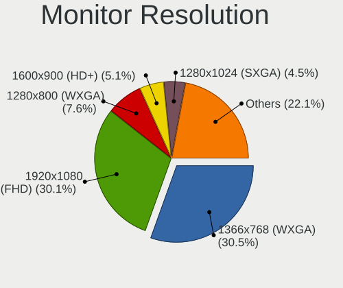

| Resolution         | Computers | Percent |
|--------------------|-----------|---------|
| 1366x768 (WXGA)    | 592       | 30.48%  |
| 1920x1080 (FHD)    | 585       | 30.12%  |
| 1280x800 (WXGA)    | 148       | 7.62%   |
| 1600x900 (HD+)     | 100       | 5.15%   |
| 1280x1024 (SXGA)   | 88        | 4.53%   |
| 3840x2160 (4K)     | 62        | 3.19%   |
| 1680x1050 (WSXGA+) | 62        | 3.19%   |
| 1440x900 (WXGA+)   | 56        | 2.88%   |
| 1920x1200 (WUXGA)  | 51        | 2.63%   |
| 2560x1440 (QHD)    | 39        | 2.01%   |
| 1024x600           | 37        | 1.91%   |
| 1024x768 (XGA)     | 20        | 1.03%   |
| 1360x768           | 17        | 0.88%   |
| 2288x1287          | 10        | 0.51%   |
| Unknown            | 10        | 0.51%   |
| 3440x1440          | 6         | 0.31%   |
| 2160x1440          | 5         | 0.26%   |
| 3840x2400          | 4         | 0.21%   |
| 3200x1800 (QHD+)   | 4         | 0.21%   |
| 2560x1600          | 4         | 0.21%   |
| 1280x720 (HD)      | 4         | 0.21%   |
| 2880x1920          | 3         | 0.15%   |
| 2880x1800          | 3         | 0.15%   |
| 2560x1080          | 3         | 0.15%   |
| 1920x540           | 3         | 0.15%   |
| 1280x768           | 3         | 0.15%   |
| 3600x1200          | 2         | 0.1%    |
| 3200x1080          | 2         | 0.1%    |
| 2048x1536          | 2         | 0.1%    |
| 1600x1200          | 2         | 0.1%    |
| 800x600            | 1         | 0.05%   |
| 5760x2160          | 1         | 0.05%   |
| 3840x1600          | 1         | 0.05%   |
| 3840x1080          | 1         | 0.05%   |
| 3200x1200          | 1         | 0.05%   |
| 3120x2080          | 1         | 0.05%   |
| 3000x2000          | 1         | 0.05%   |
| 2400x1600          | 1         | 0.05%   |
| 2160x1200          | 1         | 0.05%   |
| 2048x1152          | 1         | 0.05%   |

Monitor Diagonal
----------------

Diagonal size in inches

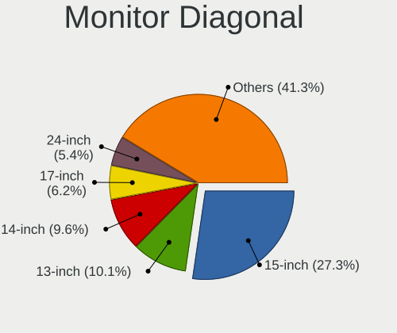

| Inches  | Computers | Percent |
|---------|-----------|---------|
| 15      | 538       | 27.3%   |
| 13      | 199       | 10.1%   |
| 14      | 190       | 9.64%   |
| 17      | 122       | 6.19%   |
| 24      | 107       | 5.43%   |
| 11      | 88        | 4.46%   |
| 21      | 85        | 4.31%   |
| 23      | 82        | 4.16%   |
| 19      | 80        | 4.06%   |
| 27      | 79        | 4.01%   |
| Unknown | 56        | 2.84%   |
| 12      | 44        | 2.23%   |
| 18      | 43        | 2.18%   |
| 10      | 43        | 2.18%   |
| 20      | 39        | 1.98%   |
| 22      | 38        | 1.93%   |
| 31      | 17        | 0.86%   |
| 84      | 13        | 0.66%   |
| 72      | 9         | 0.46%   |
| 34      | 9         | 0.46%   |
| 142     | 7         | 0.36%   |
| 32      | 7         | 0.36%   |
| 26      | 7         | 0.36%   |
| 16      | 6         | 0.3%    |
| 40      | 5         | 0.25%   |
| 52      | 4         | 0.2%    |
| 47      | 4         | 0.2%    |
| 8       | 4         | 0.2%    |
| 65      | 3         | 0.15%   |
| 54      | 3         | 0.15%   |
| 49      | 3         | 0.15%   |
| 48      | 3         | 0.15%   |
| 42      | 3         | 0.15%   |
| 9       | 3         | 0.15%   |
| 7       | 3         | 0.15%   |
| 60      | 2         | 0.1%    |
| 43      | 2         | 0.1%    |
| 39      | 2         | 0.1%    |
| 38      | 2         | 0.1%    |
| 29      | 2         | 0.1%    |

Monitor Width
-------------

Physical width

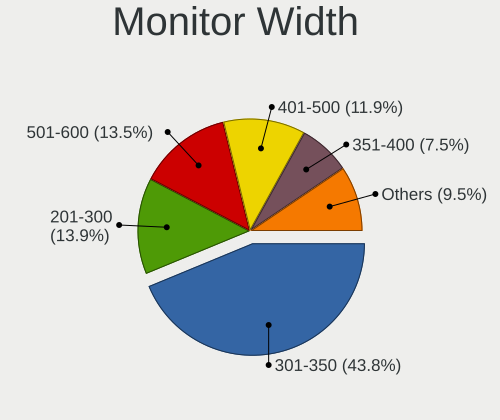

| Width in mm    | Computers | Percent |
|----------------|-----------|---------|
| 301-350        | 856       | 43.76%  |
| 201-300        | 272       | 13.91%  |
| 501-600        | 264       | 13.5%   |
| 401-500        | 232       | 11.86%  |
| 351-400        | 147       | 7.52%   |
| Unknown        | 56        | 2.86%   |
| 601-700        | 29        | 1.48%   |
| 1001-1500      | 25        | 1.28%   |
| 1501-2000      | 24        | 1.23%   |
| 701-800        | 18        | 0.92%   |
| 801-900        | 10        | 0.51%   |
| 101-200        | 9         | 0.46%   |
| More than 2000 | 7         | 0.36%   |
| 901-1000       | 7         | 0.36%   |

Aspect Ratio
------------

Proportional relationship between the width and the height

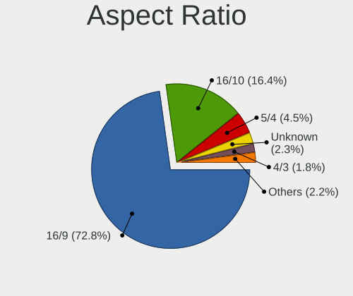

| Ratio   | Computers | Percent |
|---------|-----------|---------|
| 16/9    | 1352      | 72.81%  |
| 16/10   | 305       | 16.42%  |
| 5/4     | 84        | 4.52%   |
| Unknown | 43        | 2.32%   |
| 4/3     | 33        | 1.78%   |
| 3/2     | 18        | 0.97%   |
| 21/9    | 9         | 0.48%   |
| 1.00    | 7         | 0.38%   |
| 6/5     | 3         | 0.16%   |
| 32/9    | 2         | 0.11%   |
| 0.56    | 1         | 0.05%   |

Monitor Area
------------

Area in inch²

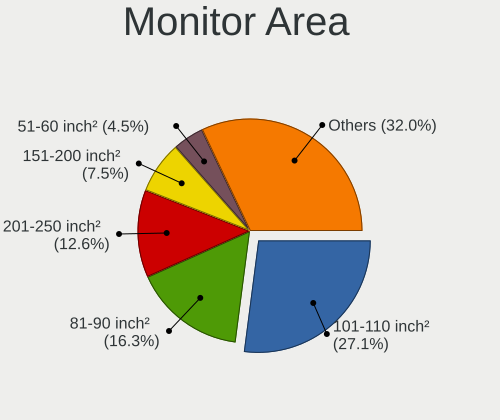

| Area in inch² | Computers | Percent |
|----------------|-----------|---------|
| 101-110        | 531       | 27.05%  |
| 81-90          | 319       | 16.25%  |
| 201-250        | 248       | 12.63%  |
| 151-200        | 148       | 7.54%   |
| 51-60          | 88        | 4.48%   |
| 301-350        | 83        | 4.23%   |
| 141-150        | 70        | 3.57%   |
| 71-80          | 67        | 3.41%   |
| 121-130        | 64        | 3.26%   |
| Unknown        | 56        | 2.85%   |
| More than 1000 | 50        | 2.55%   |
| 251-300        | 47        | 2.39%   |
| 41-50          | 46        | 2.34%   |
| 61-70          | 42        | 2.14%   |
| 351-500        | 33        | 1.68%   |
| 501-1000       | 26        | 1.32%   |
| 131-140        | 19        | 0.97%   |
| 111-120        | 9         | 0.46%   |
| 91-100         | 9         | 0.46%   |
| 1-40           | 8         | 0.41%   |

Pixel Density
-------------

Pixels per inch

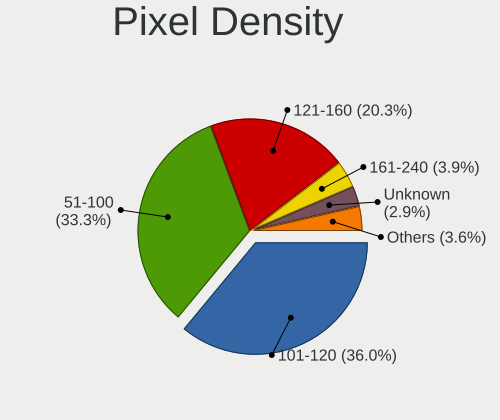

| Density       | Computers | Percent |
|---------------|-----------|---------|
| 101-120       | 695       | 36.01%  |
| 51-100        | 643       | 33.32%  |
| 121-160       | 391       | 20.26%  |
| 161-240       | 76        | 3.94%   |
| Unknown       | 56        | 2.9%    |
| 1-50          | 51        | 2.64%   |
| More than 240 | 18        | 0.93%   |

Multiple Monitors
-----------------

Total monitors connected

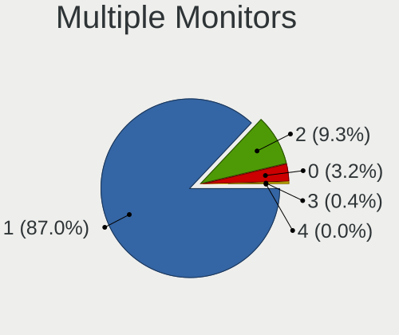

| Total | Computers | Percent |
|-------|-----------|---------|
| 1     | 1783      | 87.02%  |
| 2     | 190       | 9.27%   |
| 0     | 66        | 3.22%   |
| 3     | 9         | 0.44%   |
| 4     | 1         | 0.05%   |

Network
-------

Net Controller Vendor
---------------------

Controller vendors

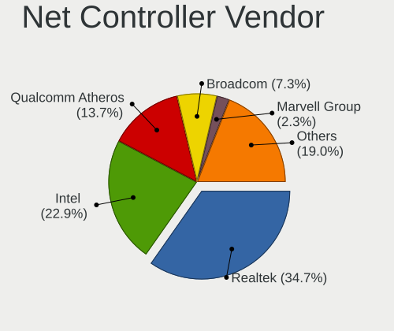

| Vendor                           | Computers | Percent |
|----------------------------------|-----------|---------|
| Realtek Semiconductor            | 1087      | 34.74%  |
| Intel                            | 718       | 22.95%  |
| Qualcomm Atheros                 | 428       | 13.68%  |
| Broadcom                         | 228       | 7.29%   |
| Marvell Technology Group         | 72        | 2.3%    |
| Nvidia                           | 69        | 2.21%   |
| Ralink Technology                | 65        | 2.08%   |
| Broadcom Limited                 | 55        | 1.76%   |
| Ralink                           | 50        | 1.6%    |
| TP-Link                          | 41        | 1.31%   |
| Samsung Electronics              | 26        | 0.83%   |
| MediaTek                         | 23        | 0.74%   |
| ASIX Electronics                 | 22        | 0.7%    |
| Xiaomi                           | 15        | 0.48%   |
| VIA Technologies                 | 13        | 0.42%   |
| Attansic Technology              | 13        | 0.42%   |
| Silicon Integrated Systems [SiS] | 12        | 0.38%   |
| Huawei Technologies              | 12        | 0.38%   |
| Qualcomm Atheros Communications  | 11        | 0.35%   |
| NetGear                          | 10        | 0.32%   |
| JMicron Technology               | 10        | 0.32%   |
| D-Link                           | 9         | 0.29%   |
| Belkin Components                | 9         | 0.29%   |
| Dell                             | 6         | 0.19%   |
| Mellanox Technologies            | 5         | 0.16%   |
| Edimax Technology                | 5         | 0.16%   |
| ASUSTek Computer                 | 5         | 0.16%   |
| AMD                              | 5         | 0.16%   |
| OPPO Electronics                 | 4         | 0.13%   |
| ICS Advent                       | 4         | 0.13%   |
| DisplayLink                      | 4         | 0.13%   |
| D-Link System                    | 4         | 0.13%   |
| 3Com                             | 4         | 0.13%   |
| ZTE WCDMA Technologies MSM       | 3         | 0.1%    |
| U-Blox                           | 3         | 0.1%    |
| Sierra Wireless                  | 3         | 0.1%    |
| Qualcomm                         | 3         | 0.1%    |
| Motorola PCS                     | 3         | 0.1%    |
| Micro Star International         | 3         | 0.1%    |
| Linksys                          | 3         | 0.1%    |

Net Controller Model
--------------------

Controller models

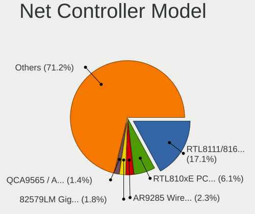

| Model                                                                   | Computers | Percent |
|-------------------------------------------------------------------------|-----------|---------|
| Realtek RTL8111/8168/8211/8411 PCI Express Gigabit Ethernet Controller  | 620       | 17.09%  |
| Realtek RTL810xE PCI Express Fast Ethernet controller                   | 221       | 6.09%   |
| Qualcomm Atheros AR9285 Wireless Network Adapter (PCI-Express)          | 85        | 2.34%   |
| Intel 82579LM Gigabit Network Connection (Lewisville)                   | 65        | 1.79%   |
| Qualcomm Atheros QCA9565 / AR9565 Wireless Network Adapter              | 52        | 1.43%   |
| Intel Wireless 7260                                                     | 50        | 1.38%   |
| Qualcomm Atheros QCA9377 802.11ac Wireless Network Adapter              | 49        | 1.35%   |
| Qualcomm Atheros AR9485 Wireless Network Adapter                        | 49        | 1.35%   |
| Realtek RTL-8100/8101L/8139 PCI Fast Ethernet Adapter                   | 46        | 1.27%   |
| Broadcom BCM4313 802.11bgn Wireless Network Adapter                     | 45        | 1.24%   |
| Qualcomm Atheros AR242x / AR542x Wireless Network Adapter (PCI-Express) | 44        | 1.21%   |
| Intel Wireless 7265                                                     | 43        | 1.19%   |
| Intel PRO/Wireless 3945ABG [Golan] Network Connection                   | 40        | 1.1%    |
| Realtek RTL8821CE 802.11ac PCIe Wireless Network Adapter                | 39        | 1.08%   |
| Realtek RTL8723BE PCIe Wireless Network Adapter                         | 34        | 0.94%   |
| Realtek RTL8153 Gigabit Ethernet Adapter                                | 34        | 0.94%   |
| Intel Wireless 3165                                                     | 34        | 0.94%   |
| Intel Wireless 8265 / 8275                                              | 29        | 0.8%    |
| Ralink MT7601U Wireless Adapter                                         | 28        | 0.77%   |
| Intel Ethernet Connection I217-LM                                       | 27        | 0.74%   |
| Realtek RTL8822CE 802.11ac PCIe Wireless Network Adapter                | 25        | 0.69%   |
| Intel 82577LM Gigabit Network Connection                                | 25        | 0.69%   |
| Realtek RTL8188CE 802.11b/g/n WiFi Adapter                              | 23        | 0.63%   |
| Nvidia MCP61 Ethernet                                                   | 23        | 0.63%   |
| Realtek RTL8188EE Wireless Network Adapter                              | 22        | 0.61%   |
| Intel Wireless 8260                                                     | 22        | 0.61%   |
| Intel Wi-Fi 6 AX200                                                     | 22        | 0.61%   |
| Intel Centrino Advanced-N 6205 [Taylor Peak]                            | 22        | 0.61%   |
| Qualcomm Atheros AR928X Wireless Network Adapter (PCI-Express)          | 20        | 0.55%   |
| Realtek RTL8188EUS 802.11n Wireless Network Adapter                     | 19        | 0.52%   |
| Ralink RT3290 Wireless 802.11n 1T/1R PCIe                               | 19        | 0.52%   |
| Samsung Galaxy series, misc. (tethering mode)                           | 18        | 0.5%    |
| Realtek RTL8152 Fast Ethernet Adapter                                   | 18        | 0.5%    |
| Qualcomm Atheros AR8132 Fast Ethernet                                   | 18        | 0.5%    |
| Intel Wireless 3160                                                     | 18        | 0.5%    |
| Realtek 802.11ac NIC                                                    | 17        | 0.47%   |
| Qualcomm Atheros AR8151 v2.0 Gigabit Ethernet                           | 17        | 0.47%   |
| Intel PRO/Wireless 4965 AG or AGN [Kedron] Network Connection           | 17        | 0.47%   |
| Intel Gemini Lake PCH CNVi WiFi                                         | 17        | 0.47%   |
| Realtek 802.11n WLAN Adapter                                            | 15        | 0.41%   |

Wireless Vendor
---------------

Wireless vendors

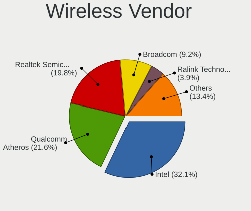

| Vendor                                | Computers | Percent |
|---------------------------------------|-----------|---------|
| Intel                                 | 535       | 32.07%  |
| Qualcomm Atheros                      | 361       | 21.64%  |
| Realtek Semiconductor                 | 330       | 19.78%  |
| Broadcom                              | 153       | 9.17%   |
| Ralink Technology                     | 65        | 3.9%    |
| Ralink                                | 50        | 3%      |
| TP-Link                               | 39        | 2.34%   |
| Broadcom Limited                      | 28        | 1.68%   |
| MediaTek                              | 20        | 1.2%    |
| Qualcomm Atheros Communications       | 11        | 0.66%   |
| NetGear                               | 9         | 0.54%   |
| Belkin Components                     | 9         | 0.54%   |
| D-Link                                | 8         | 0.48%   |
| Marvell Technology Group              | 6         | 0.36%   |
| Edimax Technology                     | 5         | 0.3%    |
| ASUSTek Computer                      | 5         | 0.3%    |
| Dell                                  | 4         | 0.24%   |
| Sierra Wireless                       | 3         | 0.18%   |
| Micro Star International              | 3         | 0.18%   |
| Linksys                               | 3         | 0.18%   |
| Fibocom                               | 3         | 0.18%   |
| Sitecom Europe                        | 2         | 0.12%   |
| D-Link System                         | 2         | 0.12%   |
| BUFFALO                               | 2         | 0.12%   |
| ZyXEL Communications                  | 1         | 0.06%   |
| ZTopInc                               | 1         | 0.06%   |
| TRENDnet                              | 1         | 0.06%   |
| Texas Instruments                     | 1         | 0.06%   |
| Tenda                                 | 1         | 0.06%   |
| Samsung Electronics                   | 1         | 0.06%   |
| Realtek                               | 1         | 0.06%   |
| Qualcomm                              | 1         | 0.06%   |
| Microsoft                             | 1         | 0.06%   |
| Logitec                               | 1         | 0.06%   |
| IMC Networks                          | 1         | 0.06%   |
| 802.11g Adapter [Linksys WUSB54GC v3] | 1         | 0.06%   |

Wireless Model
--------------

Wireless models

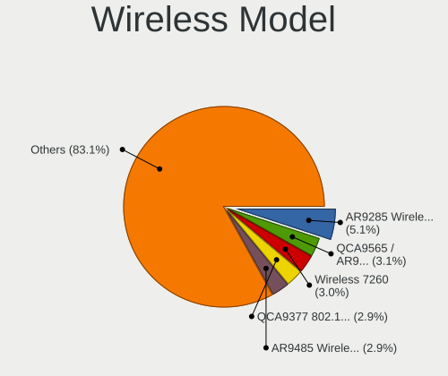

| Model                                                                   | Computers | Percent |
|-------------------------------------------------------------------------|-----------|---------|
| Qualcomm Atheros AR9285 Wireless Network Adapter (PCI-Express)          | 85        | 5.05%   |
| Qualcomm Atheros QCA9565 / AR9565 Wireless Network Adapter              | 52        | 3.09%   |
| Intel Wireless 7260                                                     | 50        | 2.97%   |
| Qualcomm Atheros QCA9377 802.11ac Wireless Network Adapter              | 49        | 2.91%   |
| Qualcomm Atheros AR9485 Wireless Network Adapter                        | 49        | 2.91%   |
| Broadcom BCM4313 802.11bgn Wireless Network Adapter                     | 45        | 2.67%   |
| Qualcomm Atheros AR242x / AR542x Wireless Network Adapter (PCI-Express) | 44        | 2.61%   |
| Intel Wireless 7265                                                     | 43        | 2.55%   |
| Intel PRO/Wireless 3945ABG [Golan] Network Connection                   | 40        | 2.38%   |
| Realtek RTL8821CE 802.11ac PCIe Wireless Network Adapter                | 39        | 2.32%   |
| Realtek RTL8723BE PCIe Wireless Network Adapter                         | 34        | 2.02%   |
| Intel Wireless 3165                                                     | 34        | 2.02%   |
| Intel Wireless 8265 / 8275                                              | 29        | 1.72%   |
| Ralink MT7601U Wireless Adapter                                         | 28        | 1.66%   |
| Realtek RTL8822CE 802.11ac PCIe Wireless Network Adapter                | 25        | 1.49%   |
| Realtek RTL8188CE 802.11b/g/n WiFi Adapter                              | 23        | 1.37%   |
| Realtek RTL8188EE Wireless Network Adapter                              | 22        | 1.31%   |
| Intel Wireless 8260                                                     | 22        | 1.31%   |
| Intel Wi-Fi 6 AX200                                                     | 22        | 1.31%   |
| Intel Centrino Advanced-N 6205 [Taylor Peak]                            | 22        | 1.31%   |
| Qualcomm Atheros AR928X Wireless Network Adapter (PCI-Express)          | 20        | 1.19%   |
| Realtek RTL8188EUS 802.11n Wireless Network Adapter                     | 19        | 1.13%   |
| Ralink RT3290 Wireless 802.11n 1T/1R PCIe                               | 19        | 1.13%   |
| Intel Wireless 3160                                                     | 18        | 1.07%   |
| Realtek 802.11ac NIC                                                    | 17        | 1.01%   |
| Intel PRO/Wireless 4965 AG or AGN [Kedron] Network Connection           | 17        | 1.01%   |
| Intel Gemini Lake PCH CNVi WiFi                                         | 17        | 1.01%   |
| Realtek 802.11n WLAN Adapter                                            | 15        | 0.89%   |
| Broadcom BCM43142 802.11b/g/n                                           | 15        | 0.89%   |
| Broadcom BCM4312 802.11b/g LP-PHY                                       | 15        | 0.89%   |
| Realtek RTL88x2bu [AC1200 Techkey]                                      | 14        | 0.83%   |
| Qualcomm Atheros AR9462 Wireless Network Adapter                        | 14        | 0.83%   |
| Ralink RT5370 Wireless Adapter                                          | 13        | 0.77%   |
| Intel Centrino Ultimate-N 6300                                          | 13        | 0.77%   |
| Intel Cannon Point-LP CNVi [Wireless-AC]                                | 13        | 0.77%   |
| Broadcom BCM4331 802.11a/b/g/n                                          | 13        | 0.77%   |
| Broadcom BCM4321 802.11a/b/g/n                                          | 13        | 0.77%   |
| Realtek RTL8187B Wireless 802.11g 54Mbps Network Adapter                | 12        | 0.71%   |
| Qualcomm Atheros AR9287 Wireless Network Adapter (PCI-Express)          | 12        | 0.71%   |
| Intel Wi-Fi 6E(802.11ax) AX210/AX1675* 2x2 [Typhoon Peak]               | 12        | 0.71%   |

Ethernet Vendor
---------------

Ethernet vendors

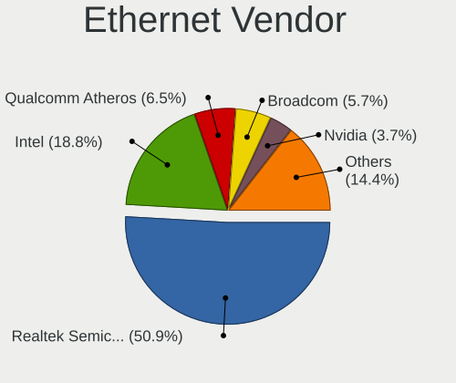

| Vendor                           | Computers | Percent |
|----------------------------------|-----------|---------|
| Realtek Semiconductor            | 952       | 50.91%  |
| Intel                            | 351       | 18.77%  |
| Qualcomm Atheros                 | 122       | 6.52%   |
| Broadcom                         | 106       | 5.67%   |
| Nvidia                           | 69        | 3.69%   |
| Marvell Technology Group         | 66        | 3.53%   |
| Broadcom Limited                 | 27        | 1.44%   |
| Samsung Electronics              | 24        | 1.28%   |
| ASIX Electronics                 | 22        | 1.18%   |
| Xiaomi                           | 15        | 0.8%    |
| VIA Technologies                 | 13        | 0.7%    |
| Attansic Technology              | 13        | 0.7%    |
| Silicon Integrated Systems [SiS] | 12        | 0.64%   |
| JMicron Technology               | 10        | 0.53%   |
| Huawei Technologies              | 8         | 0.43%   |
| OPPO Electronics                 | 4         | 0.21%   |
| ICS Advent                       | 4         | 0.21%   |
| DisplayLink                      | 4         | 0.21%   |
| 3Com                             | 4         | 0.21%   |
| ZTE WCDMA Technologies MSM       | 3         | 0.16%   |
| Motorola PCS                     | 3         | 0.16%   |
| MediaTek                         | 3         | 0.16%   |
| ULi Electronics                  | 2         | 0.11%   |
| TP-Link                          | 2         | 0.11%   |
| Qualcomm                         | 2         | 0.11%   |
| Microchip Technology             | 2         | 0.11%   |
| D-Link System                    | 2         | 0.11%   |
| Aquantia                         | 2         | 0.11%   |
| Apple                            | 2         | 0.11%   |
| ADMtek                           | 2         | 0.11%   |
| Accton Technology                | 2         | 0.11%   |
| Yulong                           | 1         | 0.05%   |
| Trident Microsystems             | 1         | 0.05%   |
| T & A Mobile Phones              | 1         | 0.05%   |
| Spreadtrum Communications        | 1         | 0.05%   |
| Research In Motion               | 1         | 0.05%   |
| Raspberry Pi                     | 1         | 0.05%   |
| OnePlus Technology (Shenzhen)    | 1         | 0.05%   |
| NetGear                          | 1         | 0.05%   |
| Mellanox Technologies            | 1         | 0.05%   |

Ethernet Model
--------------

Ethernet models

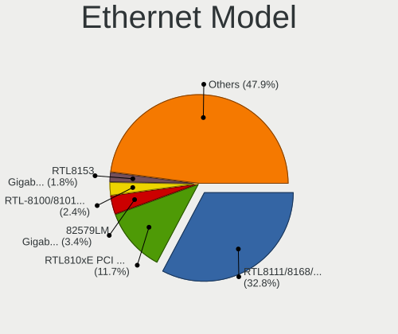

| Model                                                                  | Computers | Percent |
|------------------------------------------------------------------------|-----------|---------|
| Realtek RTL8111/8168/8211/8411 PCI Express Gigabit Ethernet Controller | 620       | 32.75%  |
| Realtek RTL810xE PCI Express Fast Ethernet controller                  | 221       | 11.67%  |
| Intel 82579LM Gigabit Network Connection (Lewisville)                  | 65        | 3.43%   |
| Realtek RTL-8100/8101L/8139 PCI Fast Ethernet Adapter                  | 46        | 2.43%   |
| Realtek RTL8153 Gigabit Ethernet Adapter                               | 34        | 1.8%    |
| Intel Ethernet Connection I217-LM                                      | 27        | 1.43%   |
| Intel 82577LM Gigabit Network Connection                               | 25        | 1.32%   |
| Nvidia MCP61 Ethernet                                                  | 23        | 1.22%   |
| Samsung Galaxy series, misc. (tethering mode)                          | 18        | 0.95%   |
| Realtek RTL8152 Fast Ethernet Adapter                                  | 18        | 0.95%   |
| Qualcomm Atheros AR8132 Fast Ethernet                                  | 18        | 0.95%   |
| Qualcomm Atheros AR8151 v2.0 Gigabit Ethernet                          | 17        | 0.9%    |
| Qualcomm Atheros AR8152 v2.0 Fast Ethernet                             | 15        | 0.79%   |
| Broadcom NetXtreme BCM57765 Gigabit Ethernet PCIe                      | 15        | 0.79%   |
| Qualcomm Atheros AR8161 Gigabit Ethernet                               | 14        | 0.74%   |
| Intel I211 Gigabit Network Connection                                  | 14        | 0.74%   |
| ASIX AX88179 Gigabit Ethernet                                          | 14        | 0.74%   |
| Realtek RTL8125 2.5GbE Controller                                      | 13        | 0.69%   |
| Marvell Group 88E8040 PCI-E Fast Ethernet Controller                   | 13        | 0.69%   |
| Attansic AR8152 v2.0 Fast Ethernet                                     | 13        | 0.69%   |
| Intel Ethernet Connection I219-LM                                      | 12        | 0.63%   |
| Intel Ethernet Connection I218-LM                                      | 12        | 0.63%   |
| Intel 82579V Gigabit Network Connection                                | 12        | 0.63%   |
| Intel 82567LM-3 Gigabit Network Connection                             | 12        | 0.63%   |
| VIA VT6102/VT6103 [Rhine-II]                                           | 11        | 0.58%   |
| Qualcomm Atheros AR8131 Gigabit Ethernet                               | 10        | 0.53%   |
| Marvell Group 88E8058 PCI-E Gigabit Ethernet Controller                | 10        | 0.53%   |
| Intel Ethernet Connection (4) I219-LM                                  | 10        | 0.53%   |
| Intel Ethernet Connection (2) I219-V                                   | 10        | 0.53%   |
| Intel 82567LM Gigabit Network Connection                               | 10        | 0.53%   |
| Broadcom NetLink BCM57785 Gigabit Ethernet PCIe                        | 10        | 0.53%   |
| Xiaomi Mi/Redmi series (RNDIS)                                         | 9         | 0.48%   |
| Silicon Integrated Systems [SiS] 191 Gigabit Ethernet Adapter          | 9         | 0.48%   |
| Qualcomm Atheros AR8162 Fast Ethernet                                  | 9         | 0.48%   |
| Qualcomm Atheros AR8121/AR8113/AR8114 Gigabit or Fast Ethernet         | 9         | 0.48%   |
| Nvidia MCP77 Ethernet                                                  | 9         | 0.48%   |
| JMicron JMC250 PCI Express Gigabit Ethernet Controller                 | 9         | 0.48%   |
| Intel Ethernet Controller I225-V                                       | 9         | 0.48%   |
| Broadcom NetXtreme BCM57786 Gigabit Ethernet PCIe                      | 9         | 0.48%   |
| Qualcomm Atheros AR8152 v1.1 Fast Ethernet                             | 8         | 0.42%   |

Net Controller Kind
-------------------

Ethernet, WiFi or modem

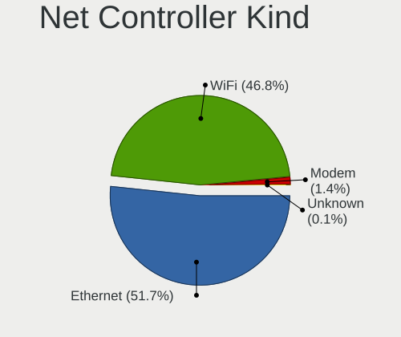

| Kind     | Computers | Percent |
|----------|-----------|---------|
| Ethernet | 1735      | 51.67%  |
| WiFi     | 1572      | 46.81%  |
| Modem    | 46        | 1.37%   |
| Unknown  | 5         | 0.15%   |

Used Controller
---------------

Currently used network controller

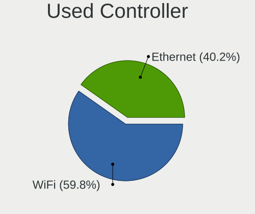

| Kind     | Computers | Percent |
|----------|-----------|---------|
| WiFi     | 1220      | 59.77%  |
| Ethernet | 821       | 40.23%  |

NICs
----

Total network controllers on board

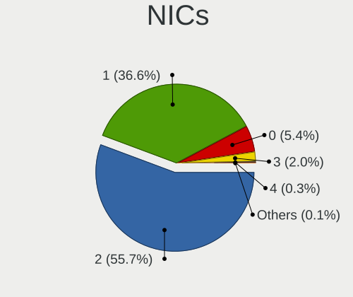

| Total | Computers | Percent |
|-------|-----------|---------|
| 2     | 1128      | 55.68%  |
| 1     | 741       | 36.57%  |
| 0     | 109       | 5.38%   |
| 3     | 40        | 1.97%   |
| 4     | 6         | 0.3%    |
| 6     | 2         | 0.1%    |

IPv6
----

IPv6 vs IPv4

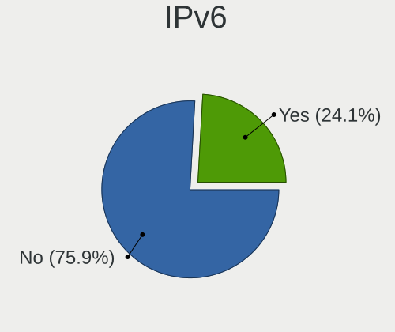

| Used | Computers | Percent |
|------|-----------|---------|
| No   | 1555      | 75.89%  |
| Yes  | 494       | 24.11%  |

Bluetooth
---------

Bluetooth Vendor
----------------

Controller vendors

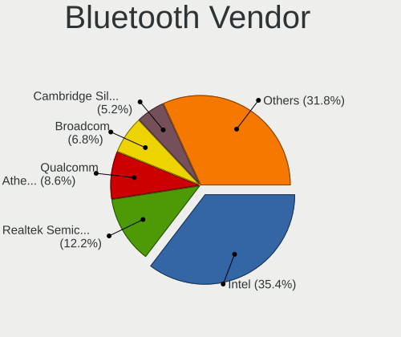

| Vendor                          | Computers | Percent |
|---------------------------------|-----------|---------|
| Intel                           | 367       | 35.39%  |
| Realtek Semiconductor           | 126       | 12.15%  |
| Qualcomm Atheros Communications | 89        | 8.58%   |
| Broadcom                        | 71        | 6.85%   |
| Cambridge Silicon Radio         | 54        | 5.21%   |
| Apple                           | 52        | 5.01%   |
| Lite-On Technology              | 46        | 4.44%   |
| Foxconn / Hon Hai               | 43        | 4.15%   |
| IMC Networks                    | 35        | 3.38%   |
| Hewlett-Packard                 | 29        | 2.8%    |
| Dell                            | 27        | 2.6%    |
| Ralink                          | 19        | 1.83%   |
| Toshiba                         | 12        | 1.16%   |
| ASUSTek Computer                | 12        | 1.16%   |
| Alps Electric                   | 11        | 1.06%   |
| MediaTek                        | 7         | 0.68%   |
| Marvell Semiconductor           | 6         | 0.58%   |
| TP-Link                         | 5         | 0.48%   |
| Qcom                            | 4         | 0.39%   |
| Micro Star International        | 3         | 0.29%   |
| Ralink Technology               | 2         | 0.19%   |
| Logitech                        | 2         | 0.19%   |
| Integrated System Solution      | 2         | 0.19%   |
| Chicony Electronics             | 2         | 0.19%   |
| Askey Computer                  | 2         | 0.19%   |
| USI                             | 1         | 0.1%    |
| Syntek                          | 1         | 0.1%    |
| Smart Modular Technologies      | 1         | 0.1%    |
| Realtek                         | 1         | 0.1%    |
| HTC (High Tech Computer)        | 1         | 0.1%    |
| Fujitsu                         | 1         | 0.1%    |
| Dynex                           | 1         | 0.1%    |
| Actions                         | 1         | 0.1%    |
| Unknown                         | 1         | 0.1%    |

Bluetooth Model
---------------

Controller models

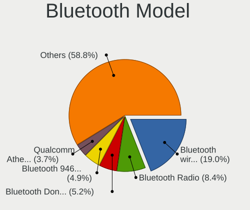

| Model                                                                               | Computers | Percent |
|-------------------------------------------------------------------------------------|-----------|---------|
| Intel Bluetooth wireless interface                                                  | 198       | 19.02%  |
| Realtek Bluetooth Radio                                                             | 87        | 8.36%   |
| Cambridge Silicon Radio Bluetooth Dongle (HCI mode)                                 | 54        | 5.19%   |
| Intel Bluetooth 9460/9560 Jefferson Peak (JfP)                                      | 51        | 4.9%    |
| Qualcomm Atheros  Bluetooth Device                                                  | 39        | 3.75%   |
| Intel AX201 Bluetooth                                                               | 35        | 3.36%   |
| Intel AX200 Bluetooth                                                               | 21        | 2.02%   |
| Realtek  Bluetooth 4.2 Adapter                                                      | 20        | 1.92%   |
| Ralink RT3290 Bluetooth                                                             | 19        | 1.83%   |
| Qualcomm Atheros AR3011 Bluetooth                                                   | 19        | 1.83%   |
| Apple Bluetooth Host Controller                                                     | 19        | 1.83%   |
| HP Broadcom 2070 Bluetooth Combo                                                    | 17        | 1.63%   |
| Foxconn / Hon Hai Bluetooth Device                                                  | 17        | 1.63%   |
| Intel Centrino Bluetooth Wireless Transceiver                                       | 16        | 1.54%   |
| Qualcomm Atheros AR3012 Bluetooth 4.0                                               | 15        | 1.44%   |
| Broadcom BCM2045B (BDC-2.1)                                                         | 14        | 1.34%   |
| Apple Bluetooth HCI                                                                 | 14        | 1.34%   |
| Lite-On Qualcomm Atheros QCA9377 Bluetooth                                          | 13        | 1.25%   |
| Lite-On Atheros AR3012 Bluetooth                                                    | 12        | 1.15%   |
| Apple Bluetooth USB Host Controller                                                 | 12        | 1.15%   |
| Intel Centrino Advanced-N 6230 Bluetooth adapter                                    | 11        | 1.06%   |
| Intel AX210 Bluetooth                                                               | 11        | 1.06%   |
| IMC Networks Bluetooth Device                                                       | 11        | 1.06%   |
| HP Bluetooth 2.0 Interface [Broadcom BCM2045]                                       | 11        | 1.06%   |
| Realtek RTL8723B Bluetooth                                                          | 10        | 0.96%   |
| Intel Wireless-AC 9260 Bluetooth Adapter                                            | 9         | 0.86%   |
| Intel Wireless-AC 3168 Bluetooth                                                    | 9         | 0.86%   |
| Intel Bluetooth Device                                                              | 9         | 0.86%   |
| Foxconn / Hon Hai Foxconn T77H114 BCM2070 [Single-Chip Bluetooth 2.1 + EDR Adapter] | 9         | 0.86%   |
| Lite-On Bluetooth Device                                                            | 8         | 0.77%   |
| IMC Networks Bluetooth Radio                                                        | 8         | 0.77%   |
| Realtek RTL8821A Bluetooth                                                          | 7         | 0.67%   |
| Qualcomm Atheros QCA61x4 Bluetooth 4.0                                              | 7         | 0.67%   |
| Dell Wireless 365 Bluetooth                                                         | 7         | 0.67%   |
| Broadcom BCM43142A0 Bluetooth 4.0                                                   | 7         | 0.67%   |
| Apple Built-in Bluetooth 2.0+EDR HCI                                                | 7         | 0.67%   |
| MediaTek Wireless_Device                                                            | 6         | 0.58%   |
| Broadcom BCM20702A0 Bluetooth 4.0                                                   | 6         | 0.58%   |
| Broadcom BCM2045B (BDC-2) [Bluetooth Controller]                                    | 6         | 0.58%   |
| TP-Link TP-T@- UB500 Adapter                                                        | 5         | 0.48%   |

Sound
-----

Sound Vendor
------------

Sound card vendors

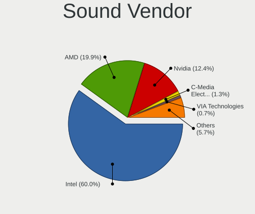

| Vendor                                       | Computers | Percent |
|----------------------------------------------|-----------|---------|
| Intel                                        | 1394      | 59.96%  |
| AMD                                          | 462       | 19.87%  |
| Nvidia                                       | 289       | 12.43%  |
| C-Media Electronics                          | 30        | 1.29%   |
| VIA Technologies                             | 17        | 0.73%   |
| Silicon Integrated Systems [SiS]             | 15        | 0.65%   |
| Creative Labs                                | 11        | 0.47%   |
| Logitech                                     | 10        | 0.43%   |
| GN Netcom                                    | 8         | 0.34%   |
| Texas Instruments                            | 7         | 0.3%    |
| Razer USA                                    | 6         | 0.26%   |
| Generalplus Technology                       | 6         | 0.26%   |
| ASUSTek Computer                             | 6         | 0.26%   |
| Zoran Co. Personal Media Division (Nogatech) | 5         | 0.22%   |
| Zhaoxin                                      | 4         | 0.17%   |
| XMOS                                         | 4         | 0.17%   |
| Plantronics                                  | 4         | 0.17%   |
| JMTek                                        | 3         | 0.13%   |
| Hewlett-Packard                              | 3         | 0.13%   |
| Creative Technology                          | 3         | 0.13%   |
| ULi Electronics                              | 2         | 0.09%   |
| Realtek Semiconductor                        | 2         | 0.09%   |
| Nordic Semiconductor ASA                     | 2         | 0.09%   |
| Micro Star International                     | 2         | 0.09%   |
| Jieli Technology                             | 2         | 0.09%   |
| Focusrite-Novation                           | 2         | 0.09%   |
| Cirrus Logic                                 | 2         | 0.09%   |
| BEHRINGER International                      | 2         | 0.09%   |
| Sony                                         | 1         | 0.04%   |
| Setek Elektronik                             | 1         | 0.04%   |
| Samson Technologies                          | 1         | 0.04%   |
| QinHeng Electronics                          | 1         | 0.04%   |
| MosArt Semiconductor                         | 1         | 0.04%   |
| Microsoft                                    | 1         | 0.04%   |
| KTMicro                                      | 1         | 0.04%   |
| KORG                                         | 1         | 0.04%   |
| Kingston Technology                          | 1         | 0.04%   |
| Guillemot                                    | 1         | 0.04%   |
| Fujitsu Connected Technologies Limited       | 1         | 0.04%   |
| ESI                                          | 1         | 0.04%   |

Sound Model
-----------

Sound card models

| Model                                                                                             | Computers | Percent |
|---------------------------------------------------------------------------------------------------|-----------|---------|
| Intel NM10/ICH7 Family High Definition Audio Controller                                           | 142       | 5.14%   |
| Intel 7 Series/C216 Chipset Family High Definition Audio Controller                               | 136       | 4.92%   |
| Intel 6 Series/C200 Series Chipset Family High Definition Audio Controller                        | 127       | 4.59%   |
| AMD FCH Azalia Controller                                                                         | 104       | 3.76%   |
| Intel Sunrise Point-LP HD Audio                                                                   | 102       | 3.69%   |
| AMD SBx00 Azalia (Intel HDA)                                                                      | 101       | 3.65%   |
| Intel 82801H (ICH8 Family) HD Audio Controller                                                    | 91        | 3.29%   |
| Intel 5 Series/3400 Series Chipset High Definition Audio                                          | 89        | 3.22%   |
| Intel 82801I (ICH9 Family) HD Audio Controller                                                    | 87        | 3.15%   |
| AMD Ryzen HD Audio Controller                                                                     | 79        | 2.86%   |
| Intel 8 Series/C220 Series Chipset High Definition Audio Controller                               | 67        | 2.42%   |
| Intel Celeron/Pentium Silver Processor High Definition Audio                                      | 65        | 2.35%   |
| AMD Kabini HDMI/DP Audio                                                                          | 63        | 2.28%   |
| Intel Atom Processor Z36xxx/Z37xxx Series High Definition Audio Controller                        | 57        | 2.06%   |
| Intel 8 Series HD Audio Controller                                                                | 53        | 1.92%   |
| Intel Haswell-ULT HD Audio Controller                                                             | 52        | 1.88%   |
| Intel Xeon E3-1200 v3/4th Gen Core Processor HD Audio Controller                                  | 47        | 1.7%    |
| Nvidia High Definition Audio Controller                                                           | 46        | 1.66%   |
| Intel Atom/Celeron/Pentium Processor x5-E8000/J3xxx/N3xxx Series High Definition Audio Controller | 45        | 1.63%   |
| AMD Wrestler HDMI Audio                                                                           | 44        | 1.59%   |
| AMD Family 15h (Models 60h-6fh) Audio Controller                                                  | 41        | 1.48%   |
| Intel Celeron N3350/Pentium N4200/Atom E3900 Series Audio Cluster                                 | 37        | 1.34%   |
| AMD Renoir/Cezanne HDMI/DP Audio Controller                                                       | 37        | 1.34%   |
| AMD High Definition Audio Controller                                                              | 32        | 1.16%   |
| AMD Raven/Raven2/Fenghuang HDMI/DP Audio Controller                                               | 27        | 0.98%   |
| Nvidia MCP61 High Definition Audio                                                                | 26        | 0.94%   |
| Intel Broadwell-U Audio Controller                                                                | 25        | 0.9%    |
| Nvidia GP107GL High Definition Audio Controller                                                   | 24        | 0.87%   |
| Intel Wildcat Point-LP High Definition Audio Controller                                           | 24        | 0.87%   |
| Intel Cannon Lake PCH cAVS                                                                        | 23        | 0.83%   |
| Intel Cannon Point-LP High Definition Audio Controller                                            | 22        | 0.8%    |
| AMD Starship/Matisse HD Audio Controller                                                          | 22        | 0.8%    |
| Nvidia GK208 HDMI/DP Audio Controller                                                             | 21        | 0.76%   |
| Nvidia GF108 High Definition Audio Controller                                                     | 21        | 0.76%   |
| Intel 82801JI (ICH10 Family) HD Audio Controller                                                  | 21        | 0.76%   |
| Intel 100 Series/C230 Series Chipset Family HD Audio Controller                                   | 20        | 0.72%   |
| Intel Tiger Lake-LP Smart Sound Technology Audio Controller                                       | 19        | 0.69%   |
| AMD Trinity HDMI Audio Controller                                                                 | 19        | 0.69%   |
| AMD Cedar HDMI Audio [Radeon HD 5400/6300/7300 Series]                                            | 18        | 0.65%   |
| Intel Comet Lake PCH-LP cAVS                                                                      | 16        | 0.58%   |

Memory
------

Memory Vendor
-------------

Memory module vendors

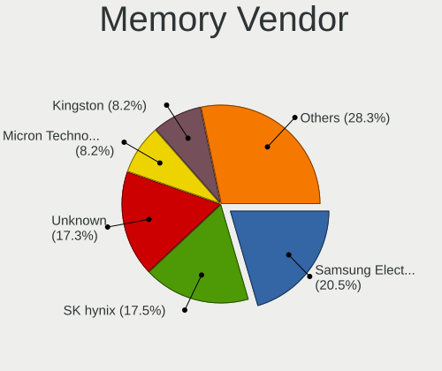

| Vendor                     | Computers | Percent |
|----------------------------|-----------|---------|
| Samsung Electronics        | 295       | 20.5%   |
| SK hynix                   | 252       | 17.51%  |
| Unknown                    | 249       | 17.3%   |
| Micron Technology          | 118       | 8.2%    |
| Kingston                   | 118       | 8.2%    |
| Crucial                    | 51        | 3.54%   |
| Unknown (ABCD)             | 45        | 3.13%   |
| Corsair                    | 36        | 2.5%    |
| Nanya Technology           | 32        | 2.22%   |
| A-DATA Technology          | 31        | 2.15%   |
| Elpida                     | 28        | 1.95%   |
| G.Skill                    | 26        | 1.81%   |
| Unknown                    | 21        | 1.46%   |
| Ramaxel Technology         | 20        | 1.39%   |
| Smart                      | 15        | 1.04%   |
| Transcend                  | 6         | 0.42%   |
| Teikon                     | 6         | 0.42%   |
| Team                       | 6         | 0.42%   |
| PNY                        | 6         | 0.42%   |
| Patriot                    | 6         | 0.42%   |
| Timetec                    | 4         | 0.28%   |
| Qimonda                    | 4         | 0.28%   |
| Unifosa                    | 3         | 0.21%   |
| KINGBANK                   | 3         | 0.21%   |
| High Bridge                | 3         | 0.21%   |
| GOODRAM                    | 3         | 0.21%   |
| fef5                       | 3         | 0.21%   |
| ASint Technology           | 3         | 0.21%   |
| Apacer                     | 3         | 0.21%   |
| 48spaces                   | 3         | 0.21%   |
| Unknown (AB)               | 2         | 0.14%   |
| Toshiba                    | 2         | 0.14%   |
| Smart Brazil               | 2         | 0.14%   |
| PUSKILL                    | 2         | 0.14%   |
| Novatech                   | 2         | 0.14%   |
| Kllisre                    | 2         | 0.14%   |
| Avant                      | 2         | 0.14%   |
| Xi'an UniIC Semiconductors | 1         | 0.07%   |
| Wilk                       | 1         | 0.07%   |
| Unknown (0xD306)           | 1         | 0.07%   |

Memory Model
------------

Memory module models

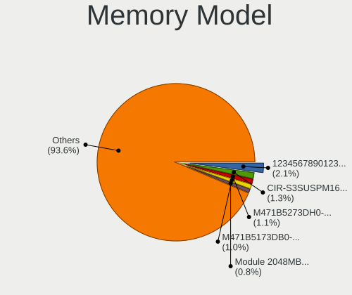

| Model                                                            | Computers | Percent |
|------------------------------------------------------------------|-----------|---------|
| Unknown (ABCD) RAM 123456789012345678 2GB SODIMM LPDDR4 2400MT/s | 32        | 2.05%   |
| Unknown                                                          | 21        | 1.35%   |
| Samsung RAM M471B5273DH0-CH9 4GB SODIMM DDR3 1600MT/s            | 17        | 1.09%   |
| Samsung RAM M471B5173DB0-YK0 4GB SODIMM DDR3 1600MT/s            | 16        | 1.03%   |
| Unknown RAM Module 2048MB SODIMM DDR2 667MT/s                    | 13        | 0.83%   |
| Unknown (ABCD) RAM 123456789012345678 2GB DIMM LPDDR4 2133MT/s   | 13        | 0.83%   |
| SK hynix RAM HMT451S6BFR8A-PB 4GB SODIMM DDR3 1600MT/s           | 12        | 0.77%   |
| Samsung RAM M471B5773DH0-CH9 2GB SODIMM DDR3 1600MT/s            | 12        | 0.77%   |
| Samsung RAM M471A5244CB0-CTD 4GB SODIMM DDR4 3266MT/s            | 12        | 0.77%   |
| Samsung RAM M471B5173EB0-YK0 4GB SODIMM DDR3 1600MT/s            | 11        | 0.71%   |
| Unknown RAM Module 1024MB SODIMM DDR2 667MT/s                    | 10        | 0.64%   |
| Samsung RAM M471B5173QH0-YK0 4GB SODIMM DDR3 1600MT/s            | 10        | 0.64%   |
| SK hynix RAM HMT351S6CFR8C-PB 4GB SODIMM DDR3 1600MT/s           | 9         | 0.58%   |
| Nanya RAM NT2GC64B88B0NS-CG 2048MB SODIMM DDR3 1334MT/s          | 9         | 0.58%   |
| Unknown RAM Module 2GB SODIMM DDR2 667MT/s                       | 8         | 0.51%   |
| Unknown RAM Module 1024MB SODIMM DDR2                            | 8         | 0.51%   |
| SK hynix RAM HMT451S6AFR8A-PB 4GB SODIMM DDR3 1600MT/s           | 8         | 0.51%   |
| Samsung RAM M471A5244CB0-CRC 4GB SODIMM DDR4 2667MT/s            | 8         | 0.51%   |
| Unknown RAM Module 2GB SODIMM DDR3 1066MT/s                      | 7         | 0.45%   |
| SK hynix RAM HMT41GS6BFR8A-PB 8GB SODIMM DDR3 2667MT/s           | 7         | 0.45%   |
| Samsung RAM M471B1G73QH0-YK0 8GB SODIMM DDR3 1600MT/s            | 7         | 0.45%   |
| Micron RAM 8KTF51264HZ-1G6E1 4GB SODIMM DDR3 1600MT/s            | 7         | 0.45%   |
| Unknown RAM Module 2GB SODIMM DDR3 1600MT/s                      | 6         | 0.39%   |
| Unknown RAM Module 1GB SODIMM DDR2 667MT/s                       | 6         | 0.39%   |
| Unknown RAM Module 1024MB SODIMM DRAM                            | 6         | 0.39%   |
| SK hynix RAM HMT351S6BFR8C-H9 4GB SODIMM DDR3 1333MT/s           | 6         | 0.39%   |
| Samsung RAM M471B5273CH0-CH9 4GB SODIMM DDR3 1334MT/s            | 6         | 0.39%   |
| Unknown RAM Module 4GB SODIMM DDR3                               | 5         | 0.32%   |
| SK hynix RAM Module 2048MB DIMM DDR3 1600MT/s                    | 5         | 0.32%   |
| SK hynix RAM HMT425S6AFR6A-PB 2GB SODIMM DDR3 1600MT/s           | 5         | 0.32%   |
| SK hynix RAM HMT351S6EFR8A-PB 4GB SODIMM DDR3 1600MT/s           | 5         | 0.32%   |
| SK hynix RAM HMT325S6CFR8C-PB 2GB SODIMM DDR3 1600MT/s           | 5         | 0.32%   |
| SK hynix RAM HMAA1GS6CJR6N-XN 8GB SODIMM DDR4 3200MT/s           | 5         | 0.32%   |
| SK hynix RAM HMA851S6AFR6N-UH 4GB SODIMM DDR4 2667MT/s           | 5         | 0.32%   |
| Samsung RAM M471B5673FH0-CH9 2048MB SODIMM DDR3 1600MT/s         | 5         | 0.32%   |
| Samsung RAM M471B5673FH0-CF8 2048MB SODIMM DDR3 1067MT/s         | 5         | 0.32%   |
| Unknown RAM Module 512MB SODIMM DDR2                             | 4         | 0.26%   |
| Unknown RAM Module 4GB SODIMM DDR3 1600MT/s                      | 4         | 0.26%   |
| Unknown RAM Module 2GB SODIMM DDR3 1333MT/s                      | 4         | 0.26%   |
| Unknown RAM Module 2GB SODIMM DDR3                               | 4         | 0.26%   |

Memory Kind
-----------

Memory module kinds

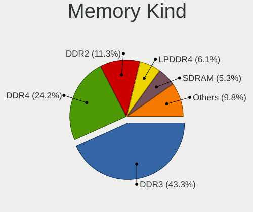

| Kind    | Computers | Percent |
|---------|-----------|---------|
| DDR3    | 549       | 43.26%  |
| DDR4    | 307       | 24.19%  |
| DDR2    | 144       | 11.35%  |
| LPDDR4  | 78        | 6.15%   |
| SDRAM   | 67        | 5.28%   |
| Unknown | 42        | 3.31%   |
| DDR     | 21        | 1.65%   |
| LPDDR3  | 20        | 1.58%   |
| LPDDR5  | 15        | 1.18%   |
| DRAM    | 14        | 1.1%    |
| DDR5    | 12        | 0.95%   |

Memory Form Factor
------------------

Physical design of the memory module

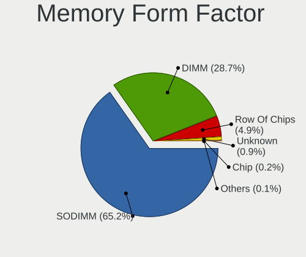

| Name         | Computers | Percent |
|--------------|-----------|---------|
| SODIMM       | 813       | 65.25%  |
| DIMM         | 358       | 28.73%  |
| Row Of Chips | 61        | 4.9%    |
| Unknown      | 11        | 0.88%   |
| Chip         | 2         | 0.16%   |
| RIMM         | 1         | 0.08%   |

Memory Size
-----------

Memory module size

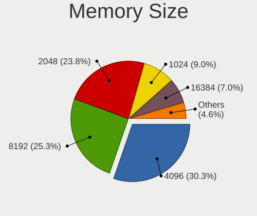

| Size    | Computers | Percent |
|---------|-----------|---------|
| 4096    | 427       | 30.28%  |
| 8192    | 357       | 25.32%  |
| 2048    | 336       | 23.83%  |
| 1024    | 127       | 9.01%   |
| 16384   | 98        | 6.95%   |
| 512     | 25        | 1.77%   |
| 32768   | 23        | 1.63%   |
| 256     | 7         | 0.5%    |
| 3072    | 4         | 0.28%   |
| 128     | 2         | 0.14%   |
| 65536   | 1         | 0.07%   |
| 12288   | 1         | 0.07%   |
| 6144    | 1         | 0.07%   |
| Unknown | 1         | 0.07%   |

Memory Speed
------------

Memory module speed

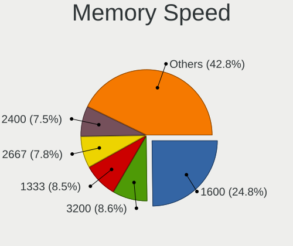

| Speed   | Computers | Percent |
|---------|-----------|---------|
| 1600    | 339       | 24.8%   |
| 3200    | 118       | 8.63%   |
| 1333    | 116       | 8.49%   |
| 2667    | 107       | 7.83%   |
| 2400    | 102       | 7.46%   |
| Unknown | 78        | 5.71%   |
| 667     | 75        | 5.49%   |
| 800     | 51        | 3.73%   |
| 2133    | 43        | 3.15%   |
| 1334    | 43        | 3.15%   |
| 1066    | 37        | 2.71%   |
| 1067    | 29        | 2.12%   |
| 533     | 26        | 1.9%    |
| 2048    | 21        | 1.54%   |
| 1867    | 20        | 1.46%   |
| 1866    | 16        | 1.17%   |
| 3266    | 13        | 0.95%   |
| 6400    | 11        | 0.8%    |
| 4267    | 11        | 0.8%    |
| 400     | 10        | 0.73%   |
| 3600    | 8         | 0.59%   |
| 4800    | 7         | 0.51%   |
| 975     | 7         | 0.51%   |
| 4199    | 6         | 0.44%   |
| 5600    | 5         | 0.37%   |
| 3400    | 5         | 0.37%   |
| 333     | 5         | 0.37%   |
| 8400    | 4         | 0.29%   |
| 3933    | 4         | 0.29%   |
| 3066    | 4         | 0.29%   |
| 2666    | 4         | 0.29%   |
| 266     | 4         | 0.29%   |
| 49926   | 3         | 0.22%   |
| 4000    | 3         | 0.22%   |
| 3000    | 3         | 0.22%   |
| 4266    | 2         | 0.15%   |
| 3733    | 2         | 0.15%   |
| 3666    | 2         | 0.15%   |
| 2933    | 2         | 0.15%   |
| 2733    | 2         | 0.15%   |

Printers & scanners
-------------------

Printer Vendor
--------------

Printer device vendors

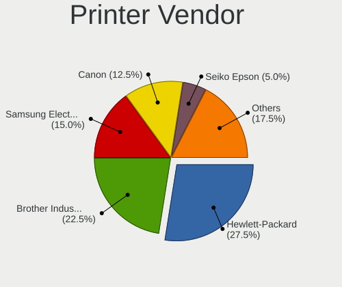

| Vendor                   | Computers | Percent |
|--------------------------|-----------|---------|
| Hewlett-Packard          | 11        | 27.5%   |
| Brother Industries       | 9         | 22.5%   |
| Samsung Electronics      | 6         | 15%     |
| Canon                    | 5         | 12.5%   |
| STMicroelectronics       | 2         | 5%      |
| Seiko Epson              | 2         | 5%      |
| Lexmark International    | 2         | 5%      |
| Zhuhai Poskey Technology | 1         | 2.5%    |
| Magic Control Technology | 1         | 2.5%    |
| Dymo-CoStar              | 1         | 2.5%    |

Printer Model
-------------

Printer device models

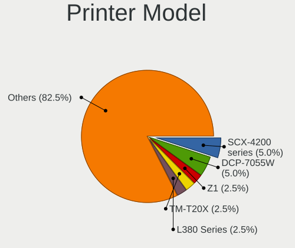

| Model                                                     | Computers | Percent |
|-----------------------------------------------------------|-----------|---------|
| Samsung SCX-4200 series                                   | 2         | 5%      |
| Brother DCP-7055W                                         | 2         | 5%      |
| Zhuhai Poskey Z1                                          | 1         | 2.5%    |
| STMicroelectronics USB Printing Support                   | 1         | 2.5%    |
| STMicroelectronics LED badge -- mini LED display -- 11x44 | 1         | 2.5%    |
| Seiko Epson TM-T20X                                       | 1         | 2.5%    |
| Seiko Epson L380 Series                                   | 1         | 2.5%    |
| Samsung Xerox Phaser 3117 Laser Printer                   | 1         | 2.5%    |
| Samsung SCX-3400 Series                                   | 1         | 2.5%    |
| Samsung ML-1640 Series Laser Printer                      | 1         | 2.5%    |
| Samsung M2020 Series                                      | 1         | 2.5%    |
| Magic Control BAY-3U1S1P Parallel Port                    | 1         | 2.5%    |
| Lexmark International Z33 Printer                         | 1         | 2.5%    |
| Lexmark International MS617dn                             | 1         | 2.5%    |
| HP PSC 1500 series                                        | 1         | 2.5%    |
| HP OfficeJet 4650 series                                  | 1         | 2.5%    |
| HP LaserJet P2015 series                                  | 1         | 2.5%    |
| HP LaserJet P1102                                         | 1         | 2.5%    |
| HP LaserJet P1005                                         | 1         | 2.5%    |
| HP LaserJet 1200                                          | 1         | 2.5%    |
| HP DeskJet D2460                                          | 1         | 2.5%    |
| HP DeskJet 6980 series                                    | 1         | 2.5%    |
| HP DeskJet 3630 series                                    | 1         | 2.5%    |
| HP Deskjet 3520 series                                    | 1         | 2.5%    |
| HP Deskjet 1050 J410                                      | 1         | 2.5%    |
| Dymo-CoStar DYMO LabelWriter 450 Turbo                    | 1         | 2.5%    |
| Canon TS5100 series                                       | 1         | 2.5%    |
| Canon PIXMA MP250                                         | 1         | 2.5%    |
| Canon MF3110                                              | 1         | 2.5%    |
| Canon LiDE 300                                            | 1         | 2.5%    |
| Canon G7000 series                                        | 1         | 2.5%    |
| Brother PTUSB Printing                                    | 1         | 2.5%    |
| Brother PT-2450DX                                         | 1         | 2.5%    |
| Brother Printer                                           | 1         | 2.5%    |
| Brother MFC-7340                                          | 1         | 2.5%    |
| Brother HL-L2380DW                                        | 1         | 2.5%    |
| Brother HL-2230 series                                    | 1         | 2.5%    |
| Brother HL-2130 series                                    | 1         | 2.5%    |

Scanner Vendor
--------------

Scanner device vendors

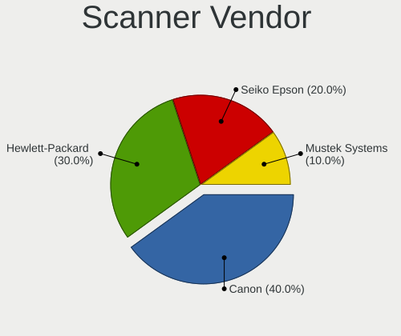

| Vendor          | Computers | Percent |
|-----------------|-----------|---------|
| Canon           | 4         | 40%     |
| Hewlett-Packard | 3         | 30%     |
| Seiko Epson     | 2         | 20%     |
| Mustek Systems  | 1         | 10%     |

Scanner Model
-------------

Scanner device models

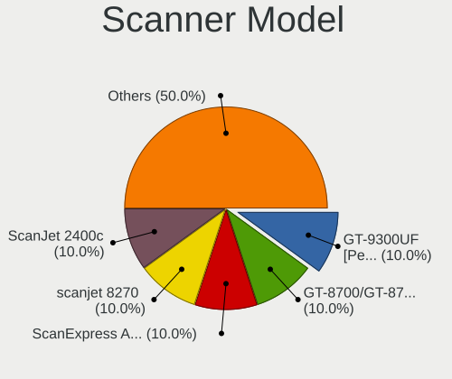

| Model                                                         | Computers | Percent |
|---------------------------------------------------------------|-----------|---------|
| Seiko Epson GT-9300UF [Perfection 2400 PHOTO]                 | 1         | 10%     |
| Seiko Epson GT-8700/GT-8700F [Perfection 1640SU/1640SU PHOTO] | 1         | 10%     |
| Mustek Systems ScanExpress A3 USB                             | 1         | 10%     |
| HP scanjet 8270                                               | 1         | 10%     |
| HP ScanJet 2400c                                              | 1         | 10%     |
| HP HP4470C                                                    | 1         | 10%     |
| Canon CanoScan LiDE 500F                                      | 1         | 10%     |
| Canon CanoScan LiDE 220                                       | 1         | 10%     |
| Canon CanoScan LiDE 210                                       | 1         | 10%     |
| Canon CanoScan LiDE 200                                       | 1         | 10%     |

Camera
------

Camera Vendor
-------------

Camera device vendors

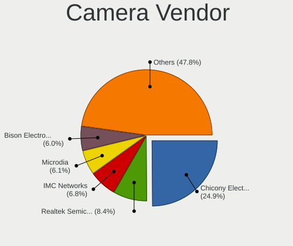

| Vendor                                 | Computers | Percent |
|----------------------------------------|-----------|---------|
| Chicony Electronics                    | 289       | 24.87%  |
| Realtek Semiconductor                  | 98        | 8.43%   |
| IMC Networks                           | 79        | 6.8%    |
| Microdia                               | 71        | 6.11%   |
| Bison Electronics                      | 70        | 6.02%   |
| Suyin                                  | 53        | 4.56%   |
| Cheng Uei Precision Industry (Foxlink) | 52        | 4.48%   |
| Sunplus Innovation Technology          | 50        | 4.3%    |
| Apple                                  | 50        | 4.3%    |
| Quanta                                 | 47        | 4.04%   |
| Alcor Micro                            | 35        | 3.01%   |
| Silicon Motion                         | 32        | 2.75%   |
| Logitech                               | 25        | 2.15%   |
| Syntek                                 | 23        | 1.98%   |
| Lite-On Technology                     | 21        | 1.81%   |
| Ricoh                                  | 15        | 1.29%   |
| Luxvisions Innotech Limited            | 14        | 1.2%    |
| Lenovo                                 | 13        | 1.12%   |
| ALi                                    | 10        | 0.86%   |
| Z-Star Microelectronics                | 8         | 0.69%   |
| Microsoft                              | 8         | 0.69%   |
| icSpring                               | 8         | 0.69%   |
| GEMBIRD                                | 8         | 0.69%   |
| Samsung Electronics                    | 7         | 0.6%    |
| Importek                               | 6         | 0.52%   |
| OmniVision Technologies                | 5         | 0.43%   |
| Genesys Logic                          | 5         | 0.43%   |
| Generalplus Technology                 | 5         | 0.43%   |
| Acer                                   | 5         | 0.43%   |
| SunplusIT                              | 4         | 0.34%   |
| Y Media                                | 3         | 0.26%   |
| USB Camera CS                          | 2         | 0.17%   |
| Sunplus Technology                     | 2         | 0.17%   |
| Sonix Technology                       | 2         | 0.17%   |
| Shinetech                              | 2         | 0.17%   |
| Shenzhen Kingcome Optoelectronic       | 2         | 0.17%   |
| LG Electronics                         | 2         | 0.17%   |
| KYE Systems (Mouse Systems)            | 2         | 0.17%   |
| DigiTech                               | 2         | 0.17%   |
| ARC International                      | 2         | 0.17%   |

Camera Model
------------

Camera device models

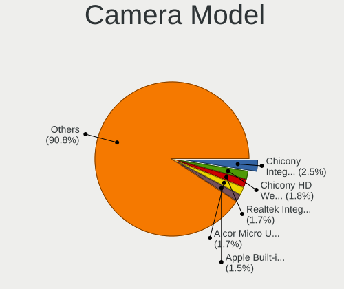

| Model                                                   | Computers | Percent |
|---------------------------------------------------------|-----------|---------|
| Chicony Integrated Camera                               | 29        | 2.48%   |
| Chicony HD WebCam                                       | 21        | 1.8%    |
| Realtek Integrated_Webcam_HD                            | 20        | 1.71%   |
| Alcor Micro USB 2.0 Camera                              | 20        | 1.71%   |
| Apple Built-in iSight                                   | 18        | 1.54%   |
| Bison Lenovo EasyCamera                                 | 16        | 1.37%   |
| Chicony HP Truevision HD                                | 15        | 1.28%   |
| Chicony HP Webcam                                       | 13        | 1.11%   |
| Bison Integrated Camera                                 | 13        | 1.11%   |
| Chicony EasyCamera                                      | 12        | 1.03%   |
| Sunplus HD WebCam                                       | 11        | 0.94%   |
| IMC Networks USB2.0 HD UVC WebCam                       | 11        | 0.94%   |
| Chicony VGA Webcam                                      | 11        | 0.94%   |
| Apple FaceTime HD Camera                                | 11        | 0.94%   |
| IMC Networks USB2.0 VGA UVC WebCam                      | 10        | 0.86%   |
| Chicony USB 2.0 Camera                                  | 10        | 0.86%   |
| Chicony TOSHIBA Web Camera - HD                         | 10        | 0.86%   |
| Chicony HP Truevision HD camera                         | 10        | 0.86%   |
| Cheng Uei Precision Industry (Foxlink) HP Truevision HD | 10        | 0.86%   |
| Bison EasyCamera                                        | 10        | 0.86%   |
| IMC Networks USB 2.0 UVC VGA WebCam                     | 9         | 0.77%   |
| IMC Networks Integrated Camera                          | 9         | 0.77%   |
| Chicony HP HD Webcam                                    | 9         | 0.77%   |
| Apple iPhone 5/5C/5S/6/SE/7/8/X                         | 9         | 0.77%   |
| Realtek USB Camera                                      | 8         | 0.68%   |
| Microdia Integrated_Webcam_HD                           | 8         | 0.68%   |
| Lite-On HP HD Camera                                    | 8         | 0.68%   |
| icSpring camera                                         | 8         | 0.68%   |
| Chicony 2.0M UVC Webcam / CNF7129                       | 8         | 0.68%   |
| Apple FaceTime HD Camera (Built-in)                     | 8         | 0.68%   |
| Sunplus Integrated_Webcam_HD                            | 7         | 0.6%    |
| Samsung Galaxy series, misc. (MTP mode)                 | 7         | 0.6%    |
| Realtek Integrated Webcam HD                            | 7         | 0.6%    |
| Realtek EasyCamera                                      | 7         | 0.6%    |
| Quanta HD User Facing                                   | 7         | 0.6%    |
| Microdia Integrated Webcam                              | 7         | 0.6%    |
| Microdia 1.3 MPixel Integrated Webcam                   | 7         | 0.6%    |
| IMC Networks UVC VGA Webcam                             | 7         | 0.6%    |
| GEMBIRD Generic UVC 1.00 camera [AppoTech AX2311]       | 7         | 0.6%    |
| Cheng Uei Precision Industry (Foxlink) HP Webcam        | 7         | 0.6%    |

Security
--------

Fingerprint Vendor
------------------

Fingerprint sensor vendors

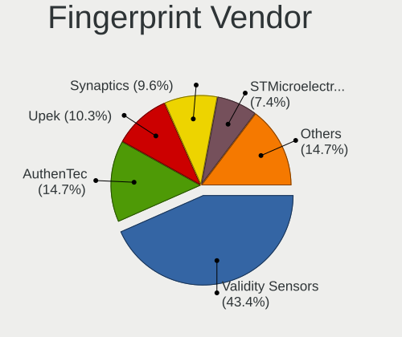

| Vendor                     | Computers | Percent |
|----------------------------|-----------|---------|
| Validity Sensors           | 59        | 43.38%  |
| AuthenTec                  | 20        | 14.71%  |
| Upek                       | 14        | 10.29%  |
| Synaptics                  | 13        | 9.56%   |
| STMicroelectronics         | 10        | 7.35%   |
| Shenzhen Goodix Technology | 9         | 6.62%   |
| LighTuning Technology      | 4         | 2.94%   |
| Elan Microelectronics      | 4         | 2.94%   |
| Samsung Electronics        | 3         | 2.21%   |

Fingerprint Model
-----------------

Fingerprint sensor models

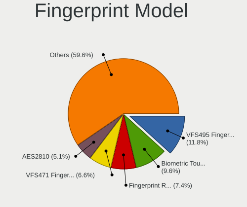

| Model                                                                      | Computers | Percent |
|----------------------------------------------------------------------------|-----------|---------|
| Validity Sensors VFS495 Fingerprint Reader                                 | 16        | 11.76%  |
| Upek Biometric Touchchip/Touchstrip Fingerprint Sensor                     | 13        | 9.56%   |
| STMicroelectronics Fingerprint Reader                                      | 10        | 7.35%   |
| Validity Sensors VFS471 Fingerprint Reader                                 | 9         | 6.62%   |
| AuthenTec AES2810                                                          | 7         | 5.15%   |
| Shenzhen Goodix  Fingerprint Device                                        | 6         | 4.41%   |
| AuthenTec AES2501 Fingerprint Sensor                                       | 6         | 4.41%   |
| Validity Sensors VFS451 Fingerprint Reader                                 | 5         | 3.68%   |
| Validity Sensors VFS5011 Fingerprint Reader                                | 4         | 2.94%   |
| Validity Sensors VFS 5011 fingerprint sensor                               | 4         | 2.94%   |
| Validity Sensors Swipe Fingerprint Sensor                                  | 4         | 2.94%   |
| Elan ELAN:Fingerprint                                                      | 4         | 2.94%   |
| AuthenTec AES1600                                                          | 4         | 2.94%   |
| Validity Sensors VFS7500 Touch Fingerprint Sensor                          | 3         | 2.21%   |
| Validity Sensors VFS491                                                    | 3         | 2.21%   |
| Synaptics Fingerprint reader [HP G6]                                       | 3         | 2.21%   |
| LighTuning EgisTec Touch Fingerprint Sensor                                | 3         | 2.21%   |
| Validity Sensors VFS300 Fingerprint Reader                                 | 2         | 1.47%   |
| Validity Sensors Synaptics WBDI                                            | 2         | 1.47%   |
| Validity Sensors Fingerprint scanner                                       | 2         | 1.47%   |
| Synaptics WBDI                                                             | 2         | 1.47%   |
| Synaptics Metallica MIS Touch Fingerprint Reader                           | 2         | 1.47%   |
| Shenzhen Goodix FingerPrint                                                | 2         | 1.47%   |
| Samsung Fingerprint Device                                                 | 2         | 1.47%   |
| AuthenTec AES1660 Fingerprint Sensor                                       | 2         | 1.47%   |
| Validity Sensors VFS7552 Touch Fingerprint Sensor                          | 1         | 0.74%   |
| Validity Sensors VFS301 Fingerprint Reader                                 | 1         | 0.74%   |
| Validity Sensors VFS101 Fingerprint Reader                                 | 1         | 0.74%   |
| Validity Sensors VFS Fingerprint sensor                                    | 1         | 0.74%   |
| Validity Sensors Synaptics VFS7552 Touch Fingerprint Sensor with PurePrint | 1         | 0.74%   |
| Upek TCS5B Fingerprint sensor                                              | 1         | 0.74%   |
| Synaptics WBDI Fingerprint Reader USB 086                                  | 1         | 0.74%   |
| Synaptics UWP WBDI                                                         | 1         | 0.74%   |
| Synaptics TouchPad                                                         | 1         | 0.74%   |
| Synaptics  FS7604 Touch Fingerprint Sensor with PurePrint                  | 1         | 0.74%   |
| Synaptics Prometheus MIS Touch Fingerprint Reader                          | 1         | 0.74%   |
| Synaptics FS7604 Touch Fingerprint Sensor with PurePrint                   | 1         | 0.74%   |
| Shenzhen Goodix Fingerprint Reader                                         | 1         | 0.74%   |
| Samsung Fingerprint Sensor Device - 730B                                   | 1         | 0.74%   |
| LighTuning Fingerprint Reader                                              | 1         | 0.74%   |

Chipcard Vendor
---------------

Chipcard module vendors

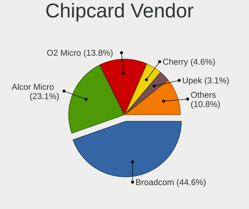

| Vendor                | Computers | Percent |
|-----------------------|-----------|---------|
| Broadcom              | 29        | 44.62%  |
| Alcor Micro           | 15        | 23.08%  |
| O2 Micro              | 9         | 13.85%  |
| Cherry                | 3         | 4.62%   |
| Upek                  | 2         | 3.08%   |
| OmniKey               | 2         | 3.08%   |
| Lenovo                | 2         | 3.08%   |
| Gemalto (was Gemplus) | 2         | 3.08%   |
| Realtek Semiconductor | 1         | 1.54%   |

Chipcard Model
--------------

Chipcard module models

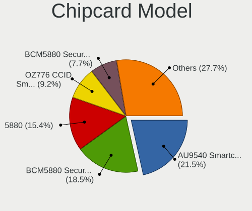

| Model                                                                        | Computers | Percent |
|------------------------------------------------------------------------------|-----------|---------|
| Alcor Micro AU9540 Smartcard Reader                                          | 14        | 21.54%  |
| Broadcom BCM5880 Secure Applications Processor                               | 12        | 18.46%  |
| Broadcom 5880                                                                | 10        | 15.38%  |
| O2 Micro OZ776 CCID Smartcard Reader                                         | 6         | 9.23%   |
| Broadcom BCM5880 Secure Applications Processor with fingerprint swipe sensor | 5         | 7.69%   |
| O2 Micro Oz776 SmartCard Reader                                              | 3         | 4.62%   |
| Upek TouchChip Fingerprint Coprocessor (WBF advanced mode)                   | 2         | 3.08%   |
| OmniKey CardMan 3021 / 3121                                                  | 2         | 3.08%   |
| Lenovo Integrated Smart Card Reader                                          | 2         | 3.08%   |
| Cherry SmartCard Reader Keyboard KC 1000 SC                                  | 2         | 3.08%   |
| Broadcom 58200                                                               | 2         | 3.08%   |
| Realtek Semiconductor Smart Card Reader Interface                            | 1         | 1.54%   |
| Gemalto (was Gemplus) GemPC Key SmartCard Reader                             | 1         | 1.54%   |
| Gemalto (was Gemplus) Compact Smart Card Reader Writer                       | 1         | 1.54%   |
| Cherry SmartTerminal ST-2xxx                                                 | 1         | 1.54%   |
| Alcor Micro Watchdata W 1981                                                 | 1         | 1.54%   |

Unsupported
-----------

Unsupported Devices
-------------------

Total unsupported devices on board

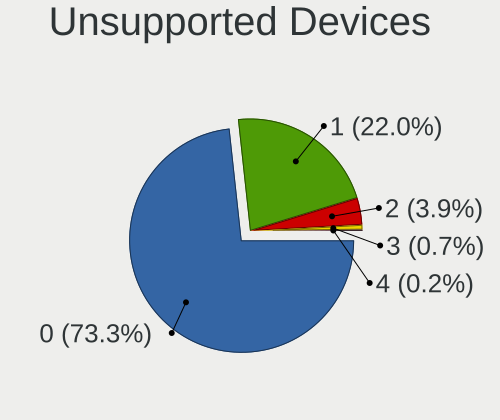

| Total | Computers | Percent |
|-------|-----------|---------|
| 0     | 1495      | 73.28%  |
| 1     | 448       | 21.96%  |
| 2     | 79        | 3.87%   |
| 3     | 14        | 0.69%   |
| 4     | 4         | 0.2%    |

Unsupported Device Types
------------------------

Types of unsupported devices

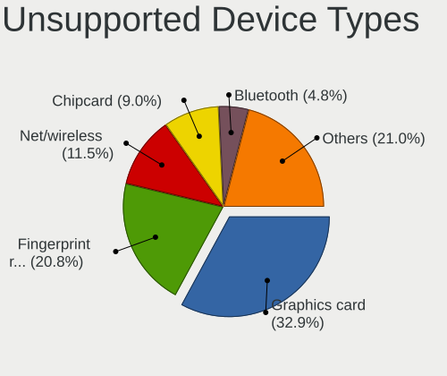

| Type                     | Computers | Percent |
|--------------------------|-----------|---------|
| Graphics card            | 212       | 32.92%  |
| Fingerprint reader       | 134       | 20.81%  |
| Net/wireless             | 74        | 11.49%  |
| Chipcard                 | 58        | 9.01%   |
| Bluetooth                | 31        | 4.81%   |
| Communication controller | 20        | 3.11%   |
| Camera                   | 19        | 2.95%   |
| Multimedia controller    | 17        | 2.64%   |
| Sound                    | 15        | 2.33%   |
| Modem                    | 14        | 2.17%   |
| Storage                  | 12        | 1.86%   |
| Net/ethernet             | 11        | 1.71%   |
| Unassigned class         | 10        | 1.55%   |
| Flash memory             | 5         | 0.78%   |
| Dvb card                 | 5         | 0.78%   |
| Network                  | 3         | 0.47%   |
| Card reader              | 3         | 0.47%   |
| Storage/raid             | 1         | 0.16%   |

